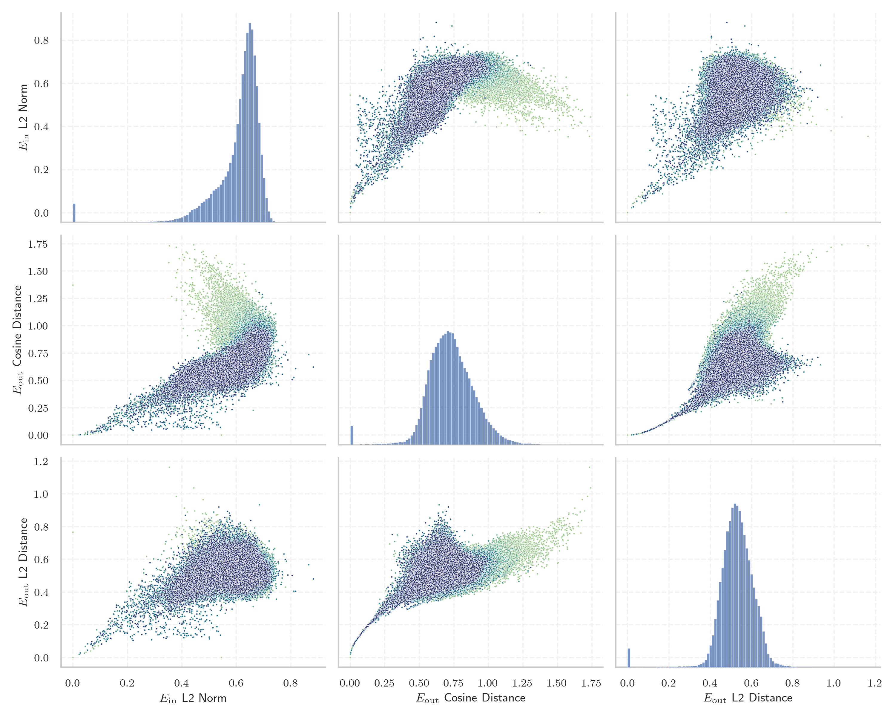
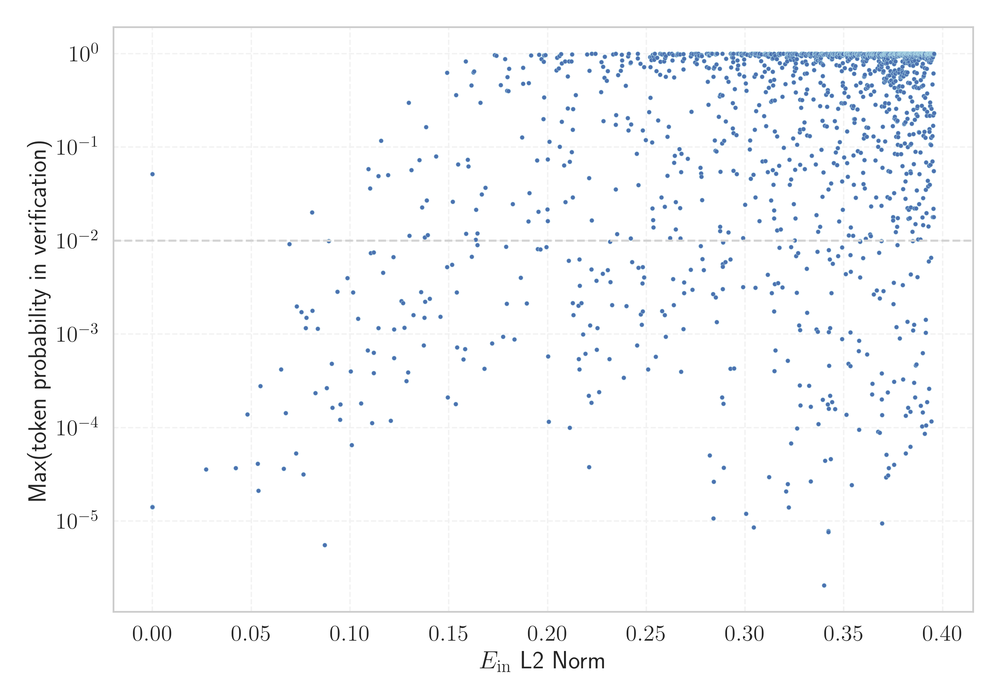

# Report for `mistralai/Mistral-Nemo-Base-2407`

## Model info

* Model Info: 
  * Tied embeddings: False
  * LM head uses bias: False
  * Embeddings shape: [131072, 5120]
* Tokenizer Info: 
  * Vocab Size: 131072
  * Tokenizer Class: PreTrainedTokenizerFast
  * Tokenizer Type: BPE
  * Bytes handling: Byte Input
  * Token for verification prompt building: Vriendschappelijk
  * Token id for verification prompt building: 115461
* Indicator summary: 
  * Indicator for under-trained tokens: E_{in} L2 Norm
  * Overall distribution: 0.608 +/- 0.089
* Detected Token Counts: 
  * Number of tested under-trained tokens: 2595, 1585 non-special, 277 below p = 0.01 threshold, 47 below soft indicator threshold
  * Number of single byte tokens: 256, of which 19 below indicator threshold
  * Number of special tokens: 0, of which 0 below indicator threshold
  * Number of non-single-byte UTF-fragment tokens:  1307, of which 4 below soft indicator threshold

## Under-trained token indicators plot


## Verification plot


## Under-trained token verification results
47 entries below threshold of 0.127

|   token_id | token                   |   indicator | max_prob                                                         | in_other_tokens                                                                                                                                                                                                                                                                                                                                                                              |
|------------|-------------------------|-------------|------------------------------------------------------------------|----------------------------------------------------------------------------------------------------------------------------------------------------------------------------------------------------------------------------------------------------------------------------------------------------------------------------------------------------------------------------------------------|
|      84006 | ````` ోగ్యాస్ `````         |   0.0270905 | <span style='border: 1px solid rgb(169, 68, 66);'>3.6e-05</span> | <span style='border: 1px solid rgb(169, 68, 66);'>````` ▁బయోగ్యాస్ `````</span>                                                                                                                                                                                                                                                                                                                  |
|      20896 | ````` 页面存档 `````    |   0.0420431 | <span style='border: 1px solid rgb(169, 68, 66);'>3.7e-05</span> | ````` 页面存档备份 `````                                                                                                                                                                                                                                                                                                                                                                     |
|      42819 | ````` ురుగున `````         |   0.0533006 | <span style='border: 1px solid rgb(169, 68, 66);'>4.1e-05</span> | <span style='border: 1px solid rgb(169, 68, 66);'>````` మురుగున `````</span>, <span style='border: 1px solid rgb(169, 68, 66);'>````` ▁మురుగున `````</span>, <span style='border: 1px solid rgb(169, 68, 66);'>````` మురుగునీరు `````</span>, <span style='border: 1px solid rgb(169, 68, 66);'>````` ▁మురుగునీరు `````</span>, <span style='border: 1px solid rgb(169, 68, 66);'>````` ▁మురుగునీటిని `````</span> |
|      84747 | ````` ▁పారబో `````        |   0.053569  | <span style='border: 1px solid rgb(169, 68, 66);'>2.1e-05</span> | <span style='border: 1px solid rgb(169, 68, 66);'>````` ▁పారబోస్తారు `````</span>                                                                                                                                                                                                                                                                                                                 |
|      82267 | ````` రుగుదొడ `````        |   0.0545493 | <span style='border: 1px solid rgb(169, 68, 66);'>0.00028</span> | <span style='border: 1px solid rgb(169, 68, 66);'>````` ▁మరుగుదొడ్డి `````</span>, <span style='border: 1px solid rgb(255, 145, 0);'>````` ▁మరుగుదొడ `````</span>                                                                                                                                                                                                                                    |
|      91515 | ````` ▁erresident ````` |   0.0663915 | <span style='border: 1px solid rgb(169, 68, 66);'>3.6e-05</span> | <span style='border: 1px solid rgb(169, 68, 66);'>````` ▁erresidentzia `````</span>                                                                                                                                                                                                                                                                                                          |
|     114442 | ````` మురుగున `````        |   0.067523  | <span style='border: 1px solid rgb(169, 68, 66);'>0.00014</span> | <span style='border: 1px solid rgb(169, 68, 66);'>````` మురుగునీరు `````</span>, <span style='border: 1px solid rgb(169, 68, 66);'>````` ▁మురుగునీరు `````</span>                                                                                                                                                                                                                                      |
|     122838 | ````` \xa0μg `````      |   0.0692844 | <span style='border: 1px solid rgb(255, 145, 0);'>0.0092</span>  |                                                                                                                                                                                                                                                                                                                                                                                              |
|     112147 | ````` ▁ట్రాక్టర్ల `````     |   0.0726854 | <span style='border: 1px solid rgb(169, 68, 66);'>5.3e-05</span> | <span style='border: 1px solid rgb(169, 68, 66);'>````` ▁ట్రాక్టర్లున్నాయి `````</span>                                                                                                                                                                                                                                                                                                              |
|      82858 | ````` abezian `````     |   0.0753896 | <span style='border: 1px solid rgb(255, 145, 0);'>0.0017</span>  | ````` ▁langabezian `````                                                                                                                                                                                                                                                                                                                                                                     |
|      19309 | ````` ▁వ్యవస `````       |   0.0764535 | <span style='border: 1px solid rgb(169, 68, 66);'>3.2e-05</span> | ````` ▁వ్యవసాయ `````, ````` ▁వ్యవస్థ `````, ````` ▁వ్యవసాయానికి `````, ````` ▁వ్యవసాయం `````                                                                                                                                                                                                                                                                                                             |
|      84025 | ````` ▁టెలిగ `````        |   0.0776287 | <span style='border: 1px solid rgb(255, 145, 0);'>0.0012</span>  | <span style='border: 1px solid rgb(255, 145, 0);'>````` ▁టెలిగ్రాఫ్ `````</span>                                                                                                                                                                                                                                                                                                                  |
|     101632 | ````` ▁ব্যক `````        |   0.0778423 | <span style='border: 1px solid rgb(255, 145, 0);'>0.0015</span>  | ````` ▁ব্যক্ত `````                                                                                                                                                                                                                                                                                                                                                                            |
|     124061 | ````` sięb `````        |   0.0808961 | <span style='border: 1px solid rgb(255, 145, 0);'>0.0018</span>  | ````` siębior `````                                                                                                                                                                                                                                                                                                                                                                          |
|      86330 | ````` ▁చేతిప `````        |   0.0824284 | <span style='border: 1px solid rgb(169, 68, 66);'>0.00023</span> | <span style='border: 1px solid rgb(169, 68, 66);'>````` ▁చేతిపంప `````</span>, <span style='border: 1px solid rgb(169, 68, 66);'>````` ▁చేతిపంపుల `````</span>                                                                                                                                                                                                                                      |
|      79865 | ````` ▁సొసై `````         |   0.0835646 | <span style='border: 1px solid rgb(255, 145, 0);'>0.0011</span>  | <span style='border: 1px solid rgb(40, 167, 69);'>````` ▁సొసైటీ `````</span>                                                                                                                                                                                                                                                                                                                    |
|      86332 | ````` ▁అమలవ `````       |   0.0871405 | <span style='border: 1px solid rgb(169, 68, 66);'>5.6e-06</span> | <span style='border: 1px solid rgb(169, 68, 66);'>````` ▁అమలవుతోంది `````</span>                                                                                                                                                                                                                                                                                                                 |
|      81930 | ````` ాపత్రిక `````        |   0.0881733 | <span style='border: 1px solid rgb(169, 68, 66);'>0.00026</span> | <span style='border: 1px solid rgb(40, 167, 69);'>````` ▁వార్తాపత్రిక `````</span>                                                                                                                                                                                                                                                                                                                |
|      28333 | ````` ▁البريط `````     |   0.0891499 | <span style='border: 1px solid rgb(255, 145, 0);'>0.0099</span>  | ````` ▁البريطانية `````, ````` ▁البريطاني `````                                                                                                                                                                                                                                                                                                                                              |
|      57668 | ````` ▁komert `````     |   0.0908036 | <span style='border: 1px solid rgb(169, 68, 66);'>0.00048</span> | ````` ▁komertzioetatik `````, <span style='border: 1px solid rgb(169, 68, 66);'>````` ▁komertzio `````</span>, <span style='border: 1px solid rgb(255, 145, 0);'>````` ▁komertzial `````</span>                                                                                                                                                                                              |
<details><summary>27 additional entries below threshold</summary>

|   token_id | token                  |   indicator | max_prob                                                         | in_other_tokens                                                                                                                                                 |
|------------|------------------------|-------------|------------------------------------------------------------------|-----------------------------------------------------------------------------------------------------------------------------------------------------------------|
|     105127 | ````` ุมภาพ `````       |   0.0910179 | <span style='border: 1px solid rgb(169, 68, 66);'>0.00016</span> | <span style='border: 1px solid rgb(40, 167, 69);'>````` ุมภาพันธ์ `````</span>, <span style='border: 1px solid rgb(40, 167, 69);'>````` ▁กุมภาพันธ์ `````</span>      |
|      69924 | ````` ▁segü `````      |   0.0949484 | <span style='border: 1px solid rgb(169, 68, 66);'>0.00012</span> | ````` ▁següents `````, ````` ▁següent `````                                                                                                                     |
|      89013 | ````` ▁higiez `````    |   0.0950541 | <span style='border: 1px solid rgb(169, 68, 66);'>0.00018</span> | <span style='border: 1px solid rgb(169, 68, 66);'>````` ▁higiezinen `````</span>                                                                                |
|     124924 | ````` ిగ్రీ `````         |   0.0986185 | <span style='border: 1px solid rgb(255, 145, 0);'>0.004</span>   | ````` ▁డిగ్రీ `````                                                                                                                                                |
|      91246 | ````` ువారీ `````         |   0.100405  | <span style='border: 1px solid rgb(169, 68, 66);'>0.0004</span>  | <span style='border: 1px solid rgb(251, 189, 8);'>````` ▁రోజువారీ `````</span>                                                                                      |
|      59471 | ````` ▁pemerint `````  |   0.10078   | <span style='border: 1px solid rgb(169, 68, 66);'>6.5e-05</span> | ````` ▁pemerintah `````, ````` ▁pemerintahan `````                                                                                                              |
|     119980 | ````` ▁międzyn `````   |   0.101525  | <span style='border: 1px solid rgb(255, 145, 0);'>0.0028</span>  | ````` ▁międzynarod `````                                                                                                                                        |
|      98997 | ````` ฤศจ `````        |   0.104059  | <span style='border: 1px solid rgb(255, 145, 0);'>0.0015</span>  | <span style='border: 1px solid rgb(255, 145, 0);'>````` ฤศจิกายน `````</span>, <span style='border: 1px solid rgb(40, 167, 69);'>````` ▁พฤศจิกายน `````</span>    |
|     115977 | ````` ▁తరువ `````       |   0.105532  | <span style='border: 1px solid rgb(169, 68, 66);'>0.00018</span> | ````` ▁తరువాత `````                                                                                                                                               |
|     129714 | ````` ుబాటులో `````        |   0.108918  | <span style='border: 1px solid rgb(169, 68, 66);'>0.00067</span> | <span style='border: 1px solid rgb(169, 68, 66);'>````` ▁అందుబాటులో `````</span>                                                                                     |
|      29234 | ````` င့ `````          |   0.109364  | <span style='border: 1px solid rgb(251, 189, 8);'>0.058</span>   | ````` <0x94>ှင့် `````, ````` င့်<0xE1><0x80> `````, ````` <0x96>ြင့် `````, ````` င့် `````                                                                              |
|      83479 | ````` banako `````     |   0.110077  | <span style='border: 1px solid rgb(251, 189, 8);'>0.036</span>   | ````` ▁norbanakoentzako `````, <span style='border: 1px solid rgb(169, 68, 66);'>````` ▁norbanako `````</span>                                                  |
|      41911 | ````` زراء `````       |   0.110521  | <span style='border: 1px solid rgb(255, 145, 0);'>0.0074</span>  | ````` ▁الوزراء `````, <span style='border: 1px solid rgb(40, 167, 69);'>````` ▁وزراء `````</span>                                                               |
|      83390 | ````` ▁komertzio ````` |   0.111086  | <span style='border: 1px solid rgb(169, 68, 66);'>0.00011</span> | ````` ▁komertzioetatik `````                                                                                                                                    |
|     111169 | ````` మీప `````         |   0.111942  | <span style='border: 1px solid rgb(255, 145, 0);'>0.0075</span>  | <span style='border: 1px solid rgb(251, 189, 8);'>````` సమీప `````</span>                                                                                        |
|      52679 | ````` tanleria `````   |   0.111958  | <span style='border: 1px solid rgb(169, 68, 66);'>0.00038</span> | ````` ▁Biztanleria `````, <span style='border: 1px solid rgb(40, 167, 69);'>````` ▁biztanleria `````</span>                                                     |
|      50293 | ````` ుధ్య `````         |   0.112045  | <span style='border: 1px solid rgb(169, 68, 66);'>0.00063</span> | <span style='border: 1px solid rgb(169, 68, 66);'>````` ▁పారిశుధ్య `````</span>, <span style='border: 1px solid rgb(169, 68, 66);'>````` ▁పారిశుధ్యం `````</span>        |
|      90252 | ````` مييز `````       |   0.114283  | <span style='border: 1px solid rgb(255, 145, 0);'>0.0012</span>  | <span style='border: 1px solid rgb(40, 167, 69);'>````` ▁تمييز `````</span>, <span style='border: 1px solid rgb(40, 167, 69);'>````` ▁التمييز `````</span>      |
|      67483 | ````` ▁ژوئ `````       |   0.114361  | <span style='border: 1px solid rgb(251, 189, 8);'>0.049</span>   | <span style='border: 1px solid rgb(40, 167, 69);'>````` ▁ژوئیه `````</span>, ````` ▁ژوئن `````                                                                  |
|      26421 | ````` ▁lớ `````        |   0.115706  | <span style='border: 1px solid rgb(40, 167, 69);'>0.12</span>    | ````` ▁lớn `````, ````` ▁lớp `````                                                                                                                              |
|      81653 | ````` ▁రీడ `````        |   0.116641  | <span style='border: 1px solid rgb(255, 145, 0);'>0.0046</span>  | <span style='border: 1px solid rgb(251, 189, 8);'>````` ▁రీడింగ్ `````</span>                                                                                       |
|      64291 | ````` ▁الإيط `````     |   0.119328  | <span style='border: 1px solid rgb(251, 189, 8);'>0.05</span>    | <span style='border: 1px solid rgb(40, 167, 69);'>````` ▁الإيطالية `````</span>, <span style='border: 1px solid rgb(40, 167, 69);'>````` ▁الإيطالي `````</span> |
|     109854 | ````` ▁మంచిన `````       |   0.120563  | <span style='border: 1px solid rgb(169, 68, 66);'>0.00012</span> | <span style='border: 1px solid rgb(169, 68, 66);'>````` ▁మంచినీటి `````</span>                                                                                      |
|      81988 | ````` ▁నిమిత్త `````      |   0.121975  | <span style='border: 1px solid rgb(255, 145, 0);'>0.0067</span>  | <span style='border: 1px solid rgb(169, 68, 66);'>````` ▁నిమిత్తం `````</span>                                                                                      |
|      86580 | ````` 衆国 `````       |   0.122285  | <span style='border: 1px solid rgb(255, 145, 0);'>0.0011</span>  | ````` 合衆国 `````                                                                                                                                              |
|      50882 | ````` ిజ్య `````         |   0.122297  | <span style='border: 1px solid rgb(169, 68, 66);'>0.00055</span> | <span style='border: 1px solid rgb(40, 167, 69);'>````` ▁వాణిజ్య `````</span>                                                                                      |
|      83506 | ````` ▁వ్యర్థ `````      |   0.12599   | <span style='border: 1px solid rgb(255, 145, 0);'>0.0023</span>  | <span style='border: 1px solid rgb(169, 68, 66);'>````` ▁వ్యర్థాలను `````</span>                                                                                    |
</details>
<details><summary>1538 additional entries above threshold</summary>

|   token_id | token                         |   indicator | max_prob                                                         | in_other_tokens                                                                                                                                                                                                                                                                                                                                                                                                     |
|------------|-------------------------------|-------------|------------------------------------------------------------------|---------------------------------------------------------------------------------------------------------------------------------------------------------------------------------------------------------------------------------------------------------------------------------------------------------------------------------------------------------------------------------------------------------------------|
|      95994 | ````` ెంబ్లీ `````                |    0.126882 | <span style='border: 1px solid rgb(255, 145, 0);'>0.0021</span>  | <span style='border: 1px solid rgb(40, 167, 69);'>````` ▁అసెంబ్లీ `````</span>                                                                                                                                                                                                                                                                                                                                          |
|      77122 | ````` ుపత్ర `````               |    0.127496 | <span style='border: 1px solid rgb(255, 145, 0);'>0.0012</span>  | <span style='border: 1px solid rgb(40, 167, 69);'>````` ▁ఆసుపత్రి `````</span>, <span style='border: 1px solid rgb(255, 145, 0);'>````` ▁ఆసుపత్ర `````</span>                                                                                                                                                                                                                                                            |
|      82437 | ````` ావసరాల `````              |    0.128592 | <span style='border: 1px solid rgb(169, 68, 66);'>0.00031</span> | ````` ▁గృహావసరాల `````                                                                                                                                                                                                                                                                                                                                                                                                 |
|      82770 | ````` ▁టెలిఫ `````              |    0.129429 | <span style='border: 1px solid rgb(169, 68, 66);'>0.00039</span> | ````` ▁టెలిఫోన్ `````                                                                                                                                                                                                                                                                                                                                                                                                   |
|     116654 | ````` ▁igelts `````           |    0.129713 | <span style='border: 1px solid rgb(40, 167, 69);'>0.3</span>     | <span style='border: 1px solid rgb(169, 68, 66);'>````` ▁igeltsero `````</span>                                                                                                                                                                                                                                                                                                                                     |
|      52934 | ````` ▁انھ `````              |    0.130081 | <span style='border: 1px solid rgb(251, 189, 8);'>0.011</span>   | <span style='border: 1px solid rgb(40, 167, 69);'>````` ▁انھیں `````</span>, ````` ▁انھوں `````                                                                                                                                                                                                                                                                                                                     |
|      27199 | ````` ▁miejs `````            |    0.131142 | <span style='border: 1px solid rgb(251, 189, 8);'>0.057</span>   | ````` ▁miejscu `````, ````` ▁miejsc `````, ````` ▁miejsce `````, ````` ▁miejsca `````                                                                                                                                                                                                                                                                                                                               |
|      98974 | ````` ิกายน `````              |    0.132141 | <span style='border: 1px solid rgb(255, 145, 0);'>0.0016</span>  | <span style='border: 1px solid rgb(255, 145, 0);'>````` ฤศจิกายน `````</span>, <span style='border: 1px solid rgb(40, 167, 69);'>````` ▁พฤศจิกายน `````</span>                                                                                                                                                                                                                                                        |
|      43723 | ````` ▁الصهي `````            |    0.135159 | <span style='border: 1px solid rgb(251, 189, 8);'>0.073</span>   | <span style='border: 1px solid rgb(40, 167, 69);'>````` ▁الصهيونية `````</span>, <span style='border: 1px solid rgb(40, 167, 69);'>````` ▁الصهيوني `````</span>                                                                                                                                                                                                                                                     |
|     107277 | ````` ▁జలవ `````              |    0.135951 | <span style='border: 1px solid rgb(255, 145, 0);'>0.0028</span>  | <span style='border: 1px solid rgb(169, 68, 66);'>````` ▁జలవనరుల్లోకి `````</span>                                                                                                                                                                                                                                                                                                                                      |
|     116979 | ````` оциа `````              |    0.136454 | <span style='border: 1px solid rgb(251, 189, 8);'>0.023</span>   | ````` ссоциа `````                                                                                                                                                                                                                                                                                                                                                                                                  |
|      37342 | ````` ▁విద్యుత `````             |    0.137245 | <span style='border: 1px solid rgb(169, 68, 66);'>0.00076</span> | <span style='border: 1px solid rgb(169, 68, 66);'>````` ▁విద్యుత్తు `````</span>, <span style='border: 1px solid rgb(255, 145, 0);'>````` ▁విద్యుత్ `````</span>                                                                                                                                                                                                                                                             |
|     126193 | ````` షధ `````                |    0.137637 | <span style='border: 1px solid rgb(255, 145, 0);'>0.0015</span>  | <span style='border: 1px solid rgb(251, 189, 8);'>````` ▁ఔషధ `````</span>                                                                                                                                                                                                                                                                                                                                           |
|      83727 | ````` ్రాఫ్ `````                |    0.137796 | <span style='border: 1px solid rgb(251, 189, 8);'>0.011</span>   | <span style='border: 1px solid rgb(255, 145, 0);'>````` ▁టెలిగ్రాఫ్ `````</span>                                                                                                                                                                                                                                                                                                                                         |
|     127939 | ````` ామ్నాయ `````               |    0.138036 | <span style='border: 1px solid rgb(255, 145, 0);'>0.0022</span>  | <span style='border: 1px solid rgb(169, 68, 66);'>````` ▁ప్రత్యామ్నాయ `````</span>                                                                                                                                                                                                                                                                                                                                       |
|      87386 | ````` -usti `````             |    0.138488 | <span style='border: 1px solid rgb(40, 167, 69);'>0.16</span>    | ````` -ustiategi `````                                                                                                                                                                                                                                                                                                                                                                                              |
|      50833 | ````` デューサー `````        |    0.138863 | <span style='border: 1px solid rgb(251, 189, 8);'>0.027</span>   | ````` プロデューサー `````, ````` ▁プロデューサー `````                                                                                                                                                                                                                                                                                                                                                             |
|      16428 | ````` కర్య `````               |    0.139306 | <span style='border: 1px solid rgb(251, 189, 8);'>0.011</span>   | ````` ▁సౌకర్యం `````, <span style='border: 1px solid rgb(169, 68, 66);'>````` ▁సౌకర్య `````</span>, ````` ▁సౌకర్యాలు `````                                                                                                                                                                                                                                                                                                   |
|      82340 | ````` బైల్ `````                |    0.140415 | <span style='border: 1px solid rgb(255, 145, 0);'>0.0024</span>  | <span style='border: 1px solid rgb(40, 167, 69);'>````` ▁మొబైల్ `````</span>                                                                                                                                                                                                                                                                                                                                           |
|     104869 | ````` \xa0µ `````             |    0.143606 | <span style='border: 1px solid rgb(251, 189, 8);'>0.079</span>   |                                                                                                                                                                                                                                                                                                                                                                                                                     |
|      66813 | ````` ▁పొడుగ `````              |    0.145809 | <span style='border: 1px solid rgb(255, 145, 0);'>0.0015</span>  | <span style='border: 1px solid rgb(169, 68, 66);'>````` ▁పొడుగునా `````</span>                                                                                                                                                                                                                                                                                                                                          |
|     127421 | ````` ్నాయ `````                |    0.149073 | <span style='border: 1px solid rgb(255, 145, 0);'>0.0052</span>  | <span style='border: 1px solid rgb(255, 145, 0);'>````` ామ్నాయ `````</span>, <span style='border: 1px solid rgb(169, 68, 66);'>````` ▁ప్రత్యామ్నాయ `````</span>                                                                                                                                                                                                                                                             |
|      69759 | ````` ▁órgan `````            |    0.149074 | <span style='border: 1px solid rgb(40, 167, 69);'>0.62</span>    | ````` ▁órgano `````, ````` ▁órganos `````                                                                                                                                                                                                                                                                                                                                                                           |
|     115884 | ````` zimendu `````           |    0.149456 | <span style='border: 1px solid rgb(169, 68, 66);'>0.00021</span> | <span style='border: 1px solid rgb(169, 68, 66);'>````` ▁establezimendu `````</span>                                                                                                                                                                                                                                                                                                                                |
|      28877 | ````` ▁económ `````           |    0.151651 | <span style='border: 1px solid rgb(255, 145, 0);'>0.0055</span>  | ````` ▁económicas `````, ````` ▁económicos `````, ````` ▁económico `````, ````` ▁económica `````                                                                                                                                                                                                                                                                                                                    |
|      36298 | ````` ▁బ్యాం `````               |    0.151905 | <span style='border: 1px solid rgb(251, 189, 8);'>0.026</span>   | <span style='border: 1px solid rgb(251, 189, 8);'>````` ▁బ్యాంక `````</span>, <span style='border: 1px solid rgb(251, 189, 8);'>````` ▁బ్యాంకు `````</span>, <span style='border: 1px solid rgb(169, 68, 66);'>````` ▁బ్యాంకింగు `````</span>                                                                                                                                                                                    |
|      57207 | ````` Játékvezet `````        |    0.153539 | <span style='border: 1px solid rgb(169, 68, 66);'>0.00018</span> | <span style='border: 1px solid rgb(40, 167, 69);'>````` Játékvezető `````</span>, <span style='border: 1px solid rgb(40, 167, 69);'>````` Játékvezetők `````</span>                                                                                                                                                                                                                                                 |
|      60103 | ````` \xa0mg `````            |    0.153722 | <span style='border: 1px solid rgb(40, 167, 69);'>0.36</span>    |                                                                                                                                                                                                                                                                                                                                                                                                                     |
|     100612 | ````` alaritza `````          |    0.154004 | <span style='border: 1px solid rgb(255, 145, 0);'>0.0028</span>  | <span style='border: 1px solid rgb(169, 68, 66);'>````` ▁ostalaritza `````</span>                                                                                                                                                                                                                                                                                                                                   |
|     105837 | ````` ▁వదుల `````              |    0.154151 | <span style='border: 1px solid rgb(169, 68, 66);'>0.00072</span> | <span style='border: 1px solid rgb(169, 68, 66);'>````` ▁వదులుతున్నారు `````</span>                                                                                                                                                                                                                                                                                                                                       |
|      53811 | ````` ▁indígen `````          |    0.154604 | <span style='border: 1px solid rgb(251, 189, 8);'>0.065</span>   | ````` ▁indígena `````, ````` ▁indígenas `````                                                                                                                                                                                                                                                                                                                                                                       |
|      83574 | ````` ింటికీ `````                |    0.157442 | <span style='border: 1px solid rgb(169, 68, 66);'>0.00053</span> | <span style='border: 1px solid rgb(169, 68, 66);'>````` ▁ఇంటింటికీ `````</span>                                                                                                                                                                                                                                                                                                                                          |
|      76350 | ````` سرائيلية `````          |    0.158239 | <span style='border: 1px solid rgb(169, 68, 66);'>0.00069</span> | <span style='border: 1px solid rgb(40, 167, 69);'>````` ▁الإسرائيلية `````</span>                                                                                                                                                                                                                                                                                                                                   |
|     101819 | ````` ⁄_{ `````               |    0.158542 | <span style='border: 1px solid rgb(40, 167, 69);'>0.82</span>    | ````` }⁄_{ `````                                                                                                                                                                                                                                                                                                                                                                                                    |
|      99621 | ````` alsevol `````           |    0.158787 | <span style='border: 1px solid rgb(251, 189, 8);'>0.012</span>   | ````` ▁qualsevol `````                                                                                                                                                                                                                                                                                                                                                                                              |
|     117948 | ````` \xa0weeks `````         |    0.159563 | <span style='border: 1px solid rgb(251, 189, 8);'>0.073</span>   |                                                                                                                                                                                                                                                                                                                                                                                                                     |
|     108173 | ````` \xa0nm `````            |    0.159904 | <span style='border: 1px solid rgb(251, 189, 8);'>0.062</span>   |                                                                                                                                                                                                                                                                                                                                                                                                                     |
|      47862 | ````` ▁الساد `````            |    0.161446 | <span style='border: 1px solid rgb(40, 167, 69);'>0.46</span>    | <span style='border: 1px solid rgb(40, 167, 69);'>````` ▁السادسة `````</span>, ````` ▁السادس `````                                                                                                                                                                                                                                                                                                                  |
|      40112 | ````` لسلة `````              |    0.161664 | <span style='border: 1px solid rgb(255, 145, 0);'>0.0067</span>  | <span style='border: 1px solid rgb(40, 167, 69);'>````` ▁السلسلة `````</span>, ````` ▁سلسلة `````                                                                                                                                                                                                                                                                                                                   |
|      16167 | ````` ▁đị `````               |    0.162396 | <span style='border: 1px solid rgb(40, 167, 69);'>0.63</span>    | ````` ▁địa `````, ````` ▁định `````, ````` ▁địch `````                                                                                                                                                                                                                                                                                                                                                              |
|     106577 | ````` మీట `````                |    0.162777 | <span style='border: 1px solid rgb(40, 167, 69);'>0.64</span>    | <span style='border: 1px solid rgb(40, 167, 69);'>````` ▁కిలోమీట `````</span>, <span style='border: 1px solid rgb(251, 189, 8);'>````` ▁కిలోమీటర్ల `````</span>                                                                                                                                                                                                                                                            |
|      28306 | ````` ▁estadounid `````       |    0.163625 | <span style='border: 1px solid rgb(251, 189, 8);'>0.01</span>    | ````` ▁estadounidense `````, ````` ▁estadounidenses `````                                                                                                                                                                                                                                                                                                                                                           |
|      38260 | ````` ▁మార్కెట `````             |    0.163843 | <span style='border: 1px solid rgb(251, 189, 8);'>0.021</span>   | <span style='border: 1px solid rgb(169, 68, 66);'>````` ▁మార్కెటింగ్ `````</span>, ````` ▁మార్కెటింగు `````, <span style='border: 1px solid rgb(169, 68, 66);'>````` ▁మార్కెట్ `````</span>                                                                                                                                                                                                                                         |
|      30080 | ````` ▁సరఫర `````             |    0.164402 | <span style='border: 1px solid rgb(255, 145, 0);'>0.009</span>   | <span style='border: 1px solid rgb(169, 68, 66);'>````` ▁సరఫరాల `````</span>, <span style='border: 1px solid rgb(255, 145, 0);'>````` ▁సరఫరా `````</span>                                                                                                                                                                                                                                                             |
|      96877 | ````` ฤษภ `````               |    0.164511 | <span style='border: 1px solid rgb(251, 189, 8);'>0.012</span>   | <span style='border: 1px solid rgb(255, 145, 0);'>````` ฤษภาคม `````</span>, <span style='border: 1px solid rgb(40, 167, 69);'>````` ▁พฤษภาคม `````</span>                                                                                                                                                                                                                                                          |
|     100282 | ````` ▁กรก `````              |    0.166032 | <span style='border: 1px solid rgb(40, 167, 69);'>0.3</span>     | <span style='border: 1px solid rgb(40, 167, 69);'>````` ▁กรกฎาคม `````</span>                                                                                                                                                                                                                                                                                                                                       |
|      80859 | ````` ోదు `````                 |    0.166672 | <span style='border: 1px solid rgb(251, 189, 8);'>0.031</span>   | <span style='border: 1px solid rgb(255, 145, 0);'>````` ▁నమోదు `````</span>                                                                                                                                                                                                                                                                                                                                           |
|      77892 | ````` zőszám `````            |    0.168079 | <span style='border: 1px solid rgb(169, 68, 66);'>0.00043</span> | <span style='border: 1px solid rgb(40, 167, 69);'>````` Nézőszám `````</span>                                                                                                                                                                                                                                                                                                                                       |
|     118827 | ````` سامبر `````             |    0.168517 | <span style='border: 1px solid rgb(251, 189, 8);'>0.037</span>   | <span style='border: 1px solid rgb(40, 167, 69);'>````` ▁دسامبر `````</span>                                                                                                                                                                                                                                                                                                                                        |
|      64487 | ````` ▁konpont `````          |    0.17183  | <span style='border: 1px solid rgb(169, 68, 66);'>0.00079</span> | <span style='border: 1px solid rgb(169, 68, 66);'>````` ▁konpontzeko `````</span>, <span style='border: 1px solid rgb(169, 68, 66);'>````` ▁konpontze `````</span>                                                                                                                                                                                                                                                  |
|     104534 | ````` anuarie `````           |    0.173227 | <span style='border: 1px solid rgb(40, 167, 69);'>0.97</span>    | <span style='border: 1px solid rgb(40, 167, 69);'>````` ▁ianuarie `````</span>                                                                                                                                                                                                                                                                                                                                      |
|      35414 | ````` Scheids `````           |    0.17405  | <span style='border: 1px solid rgb(40, 167, 69);'>0.95</span>    | <span style='border: 1px solid rgb(40, 167, 69);'>````` Scheidsrechter `````</span>                                                                                                                                                                                                                                                                                                                                 |
|     109930 | ````` یید `````               |    0.176278 | <span style='border: 1px solid rgb(40, 167, 69);'>0.46</span>    | <span style='border: 1px solid rgb(40, 167, 69);'>````` ▁تأیید `````</span>                                                                                                                                                                                                                                                                                                                                         |
|     116923 | ````` zkuntzako `````         |    0.177505 | <span style='border: 1px solid rgb(169, 68, 66);'>0.00094</span> | <span style='border: 1px solid rgb(169, 68, 66);'>````` -hezkuntzako `````</span>                                                                                                                                                                                                                                                                                                                                   |
|      58349 | ````` ▁Stady `````            |    0.178456 | <span style='border: 1px solid rgb(40, 167, 69);'>0.88</span>    | <span style='border: 1px solid rgb(40, 167, 69);'>````` ▁Stadyumu `````</span>, <span style='border: 1px solid rgb(40, 167, 69);'>````` ▁Stadyum `````</span>                                                                                                                                                                                                                                                       |
|      43588 | ````` ▁ibilgail `````         |    0.179036 | <span style='border: 1px solid rgb(255, 145, 0);'>0.0086</span>  | ````` ▁ibilgailu `````, <span style='border: 1px solid rgb(255, 145, 0);'>````` ▁ibilgailuen `````</span>                                                                                                                                                                                                                                                                                                           |
|      78060 | ````` ▁未晋级 `````           |    0.179264 | <span style='border: 1px solid rgb(255, 145, 0);'>0.0021</span>  |                                                                                                                                                                                                                                                                                                                                                                                                                     |
|     108427 | ````` ▁కిలోమీట `````             |    0.179545 | <span style='border: 1px solid rgb(40, 167, 69);'>0.4</span>     | <span style='border: 1px solid rgb(251, 189, 8);'>````` ▁కిలోమీటర్ల `````</span>                                                                                                                                                                                                                                                                                                                                        |
|      32546 | ````` ▁términ `````           |    0.179621 | <span style='border: 1px solid rgb(40, 167, 69);'>0.56</span>    | ````` ▁términos `````, ````` ▁término `````                                                                                                                                                                                                                                                                                                                                                                         |
|     125528 | ````` aču `````               |    0.180145 | <span style='border: 1px solid rgb(40, 167, 69);'>0.4</span>     | <span style='border: 1px solid rgb(169, 68, 66);'>````` ▁pregledaču `````</span>                                                                                                                                                                                                                                                                                                                                    |
|     123278 | ````` ▁Φεβ `````              |    0.180517 | <span style='border: 1px solid rgb(40, 167, 69);'>0.69</span>    | <span style='border: 1px solid rgb(40, 167, 69);'>````` ▁Φεβρου `````</span>                                                                                                                                                                                                                                                                                                                                        |
|     123346 | ````` ▁సంర `````               |    0.182385 | <span style='border: 1px solid rgb(251, 189, 8);'>0.025</span>   | <span style='border: 1px solid rgb(169, 68, 66);'>````` ▁సంరక్షణ `````</span>                                                                                                                                                                                                                                                                                                                                         |
|      86833 | ````` ▁alokair `````          |    0.183193 | <span style='border: 1px solid rgb(169, 68, 66);'>0.00088</span> | <span style='border: 1px solid rgb(169, 68, 66);'>````` ▁alokairuan `````</span>                                                                                                                                                                                                                                                                                                                                    |
|      82431 | ````` ్రాక్ట `````               |    0.186421 | <span style='border: 1px solid rgb(255, 145, 0);'>0.004</span>   | <span style='border: 1px solid rgb(169, 68, 66);'>````` ▁ట్రాక్టర్ల `````</span>, <span style='border: 1px solid rgb(169, 68, 66);'>````` ▁ట్రాక్ట `````</span>, <span style='border: 1px solid rgb(169, 68, 66);'>````` ▁ట్రాక్టర్లున్నాయి `````</span>                                                                                                                                                                           |
|      43665 | ````` ▁الفلسط `````           |    0.187033 | <span style='border: 1px solid rgb(40, 167, 69);'>0.13</span>    | <span style='border: 1px solid rgb(40, 167, 69);'>````` ▁الفلسطيني `````</span>, <span style='border: 1px solid rgb(40, 167, 69);'>````` ▁الفلسطينية `````</span>, <span style='border: 1px solid rgb(40, 167, 69);'>````` ▁الفلسطينيين `````</span>                                                                                                                                                                |
|      82113 | ````` \xa0days `````          |    0.187566 | <span style='border: 1px solid rgb(40, 167, 69);'>0.47</span>    |                                                                                                                                                                                                                                                                                                                                                                                                                     |
|     106821 | ````` \xa0cm `````            |    0.187672 | <span style='border: 1px solid rgb(40, 167, 69);'>0.71</span>    |                                                                                                                                                                                                                                                                                                                                                                                                                     |
|     101541 | ````` تامبر `````             |    0.189499 | <span style='border: 1px solid rgb(255, 145, 0);'>0.0021</span>  | <span style='border: 1px solid rgb(40, 167, 69);'>````` ▁سپتامبر `````</span>                                                                                                                                                                                                                                                                                                                                       |
|      74680 | ````` teří `````              |    0.190248 | <span style='border: 1px solid rgb(251, 189, 8);'>0.016</span>   | ````` ▁kteří `````                                                                                                                                                                                                                                                                                                                                                                                                  |
|      71369 | ````` ▁ಪ್ರಮ `````              |    0.190494 | <span style='border: 1px solid rgb(40, 167, 69);'>0.49</span>    | <span style='border: 1px solid rgb(40, 167, 69);'>````` ▁ಪ್ರಮಾಣ `````</span>, <span style='border: 1px solid rgb(40, 167, 69);'>````` ▁ಪ್ರಮುಖ `````</span>                                                                                                                                                                                                                                                              |
|     100341 | ````` ▁Erreferentzia `````    |    0.190813 | <span style='border: 1px solid rgb(251, 189, 8);'>0.032</span>   | ````` ▁Erreferentziak `````                                                                                                                                                                                                                                                                                                                                                                                         |
|     105783 | ````` ▁కిలో `````               |    0.191715 | <span style='border: 1px solid rgb(40, 167, 69);'>0.95</span>    | <span style='border: 1px solid rgb(40, 167, 69);'>````` ▁కిలోమీట `````</span>, <span style='border: 1px solid rgb(251, 189, 8);'>````` ▁కిలోమీటర్ల `````</span>                                                                                                                                                                                                                                                            |
|      81470 | ````` ావస `````                |    0.194762 | <span style='border: 1px solid rgb(251, 189, 8);'>0.072</span>   | <span style='border: 1px solid rgb(169, 68, 66);'>````` ావసరాల `````</span>, ````` ▁గృహావసరాల `````                                                                                                                                                                                                                                                                                                                      |
|      82311 | ````` ▁మరుగుదొడ `````            |    0.194968 | <span style='border: 1px solid rgb(255, 145, 0);'>0.0082</span>  | <span style='border: 1px solid rgb(169, 68, 66);'>````` ▁మరుగుదొడ్డి `````</span>                                                                                                                                                                                                                                                                                                                                        |
|      56757 | ````` egyzőkönyv `````        |    0.195419 | <span style='border: 1px solid rgb(251, 189, 8);'>0.02</span>    | <span style='border: 1px solid rgb(40, 167, 69);'>````` Jegyzőkönyv `````</span>, <span style='border: 1px solid rgb(40, 167, 69);'>````` ▁Jegyzőkönyv `````</span>                                                                                                                                                                                                                                                 |
|     126494 | ````` ▁శిశ `````               |    0.195682 | <span style='border: 1px solid rgb(40, 167, 69);'>0.97</span>    | <span style='border: 1px solid rgb(169, 68, 66);'>````` ▁శిశు `````</span>                                                                                                                                                                                                                                                                                                                                            |
|      61818 | ````` قيقية `````             |    0.196297 | <span style='border: 1px solid rgb(255, 145, 0);'>0.008</span>   | <span style='border: 1px solid rgb(40, 167, 69);'>````` ▁حقيقية `````</span>, <span style='border: 1px solid rgb(40, 167, 69);'>````` ▁الحقيقية `````</span>                                                                                                                                                                                                                                                        |
|      40537 | ````` ▁పోస్ట `````              |    0.196795 | <span style='border: 1px solid rgb(40, 167, 69);'>0.87</span>    | <span style='border: 1px solid rgb(40, 167, 69);'>````` ▁పోస్ట్ `````</span>, <span style='border: 1px solid rgb(255, 145, 0);'>````` ▁పోస్టాఫీసు `````</span>                                                                                                                                                                                                                                                              |
|      67114 | ````` \xa0mm `````            |    0.197899 | <span style='border: 1px solid rgb(40, 167, 69);'>0.2</span>     |                                                                                                                                                                                                                                                                                                                                                                                                                     |
|     123075 | ````` ييز `````               |    0.198121 | <span style='border: 1px solid rgb(40, 167, 69);'>0.82</span>    | <span style='border: 1px solid rgb(40, 167, 69);'>````` ▁تمييز `````</span>                                                                                                                                                                                                                                                                                                                                         |
|      82193 | ````` ▁البرن `````            |    0.198166 | <span style='border: 1px solid rgb(40, 167, 69);'>0.96</span>    | <span style='border: 1px solid rgb(40, 167, 69);'>````` ▁البرنامج `````</span>                                                                                                                                                                                                                                                                                                                                      |
|      47828 | ````` ▁enfermed `````         |    0.198262 | <span style='border: 1px solid rgb(40, 167, 69);'>0.34</span>    | ````` ▁enfermedad `````, ````` ▁enfermedades `````                                                                                                                                                                                                                                                                                                                                                                  |
|      96919 | ````` نهاد `````              |    0.19885  | <span style='border: 1px solid rgb(40, 167, 69);'>0.97</span>    | <span style='border: 1px solid rgb(40, 167, 69);'>````` ▁نهاد `````</span>, ````` ▁پیشنهاد `````                                                                                                                                                                                                                                                                                                                    |
|      44480 | ````` ▁نتی `````              |    0.198871 | <span style='border: 1px solid rgb(40, 167, 69);'>0.97</span>    | ````` ▁نتیجه `````, <span style='border: 1px solid rgb(40, 167, 69);'>````` ▁نتیج `````</span>                                                                                                                                                                                                                                                                                                                      |
|     112998 | ````` ัจจุ `````                |    0.19944  | <span style='border: 1px solid rgb(255, 145, 0);'>0.0085</span>  | ````` ัจจุบัน `````                                                                                                                                                                                                                                                                                                                                                                                                    |
|      66904 | ````` ల్వే `````                |    0.199946 | <span style='border: 1px solid rgb(251, 189, 8);'>0.022</span>   | <span style='border: 1px solid rgb(40, 167, 69);'>````` ▁రైల్వే `````</span>                                                                                                                                                                                                                                                                                                                                           |
|      80076 | ````` ciół `````              |    0.200026 | <span style='border: 1px solid rgb(251, 189, 8);'>0.074</span>   | ````` ściół `````                                                                                                                                                                                                                                                                                                                                                                                                   |
|      82307 | ````` ిణీ `````                 |    0.200068 | <span style='border: 1px solid rgb(251, 189, 8);'>0.016</span>   | <span style='border: 1px solid rgb(251, 189, 8);'>````` ▁పంపిణీ `````</span>                                                                                                                                                                                                                                                                                                                                           |
|     109888 | ````` omerspelen `````        |    0.200172 | <span style='border: 1px solid rgb(169, 68, 66);'>0.00058</span> | ````` ▁Zomerspelen `````                                                                                                                                                                                                                                                                                                                                                                                            |
|      88203 | ````` ▁bizile `````           |    0.200599 | <span style='border: 1px solid rgb(169, 68, 66);'>0.00012</span> | ````` ▁bizilekua `````                                                                                                                                                                                                                                                                                                                                                                                              |
|      98717 | ````` ▁配音員 `````           |    0.200874 | <span style='border: 1px solid rgb(40, 167, 69);'>0.11</span>    |                                                                                                                                                                                                                                                                                                                                                                                                                     |
|      60469 | ````` َلَّمَ `````                |    0.204397 | <span style='border: 1px solid rgb(40, 167, 69);'>0.66</span>    | <span style='border: 1px solid rgb(251, 189, 8);'>````` ▁وَسَلَّمَ `````</span>                                                                                                                                                                                                                                                                                                                                          |
|      34844 | ````` توبر `````              |    0.204782 | <span style='border: 1px solid rgb(40, 167, 69);'>0.9</span>     | ````` ▁أكتوبر `````                                                                                                                                                                                                                                                                                                                                                                                                 |
|      50964 | ````` ▁వాణ `````               |    0.205736 | <span style='border: 1px solid rgb(40, 167, 69);'>0.7</span>     | <span style='border: 1px solid rgb(40, 167, 69);'>````` ▁వాణిజ్య `````</span>                                                                                                                                                                                                                                                                                                                                          |
|      43735 | ````` ▁proprié `````          |    0.205958 | <span style='border: 1px solid rgb(40, 167, 69);'>0.94</span>    | ````` ▁propriétés `````, ````` ▁propriétaire `````, ````` ▁propriétaires `````, ````` ▁propriété `````                                                                                                                                                                                                                                                                                                              |
|      87006 | ````` ▁بمث `````              |    0.206232 | <span style='border: 1px solid rgb(40, 167, 69);'>0.1</span>     | ````` ▁بمثابة `````                                                                                                                                                                                                                                                                                                                                                                                                 |
|      54859 | ````` -piram `````            |    0.206917 | <span style='border: 1px solid rgb(40, 167, 69);'>0.99</span>    | <span style='border: 1px solid rgb(169, 68, 66);'>````` -piramidea `````</span>                                                                                                                                                                                                                                                                                                                                     |
|     110090 | ````` ▁თუმ `````              |    0.207146 | <span style='border: 1px solid rgb(40, 167, 69);'>0.78</span>    | ````` ▁თუმცა `````                                                                                                                                                                                                                                                                                                                                                                                                  |
|      83237 | ````` ఎమ్ `````                |    0.207217 | <span style='border: 1px solid rgb(40, 167, 69);'>0.19</span>    | ````` ▁ఏటీఎమ్ `````, <span style='border: 1px solid rgb(169, 68, 66);'>````` టీఎమ్ `````</span>                                                                                                                                                                                                                                                                                                                         |
|      65515 | ````` ▁landsnaam `````        |    0.208348 | <span style='border: 1px solid rgb(251, 189, 8);'>0.064</span>   |                                                                                                                                                                                                                                                                                                                                                                                                                     |
|      33472 | ````` メリカ `````            |    0.2089   | <span style='border: 1px solid rgb(40, 167, 69);'>0.83</span>    | ````` ▁アメリカ `````, ````` アメリカン `````, ````` アメリカ `````                                                                                                                                                                                                                                                                                                                                                 |
|      83369 | ````` ुँच `````                 |    0.208978 | <span style='border: 1px solid rgb(251, 189, 8);'>0.026</span>   | ````` ▁पहुँच `````                                                                                                                                                                                                                                                                                                                                                                                                    |
|      99275 | ````` ถุน `````                |    0.210143 | <span style='border: 1px solid rgb(40, 167, 69);'>0.57</span>    | <span style='border: 1px solid rgb(255, 145, 0);'>````` ถุนายน `````</span>, <span style='border: 1px solid rgb(40, 167, 69);'>````` ▁มิถุนายน `````</span>                                                                                                                                                                                                                                                            |
|      68302 | ````` ివృద `````                |    0.210277 | <span style='border: 1px solid rgb(40, 167, 69);'>0.26</span>    | <span style='border: 1px solid rgb(255, 145, 0);'>````` ▁అభివృద `````</span>, <span style='border: 1px solid rgb(40, 167, 69);'>````` ▁అభివృద్ధి `````</span>                                                                                                                                                                                                                                                             |
|     106164 | ````` руари `````             |    0.210788 | <span style='border: 1px solid rgb(255, 145, 0);'>0.0061</span>  | <span style='border: 1px solid rgb(40, 167, 69);'>````` ▁февруари `````</span>                                                                                                                                                                                                                                                                                                                                      |
|      35931 | ````` ▁lesqu `````            |    0.210914 | <span style='border: 1px solid rgb(40, 167, 69);'>0.83</span>    | ````` ▁lesquels `````, ````` ▁lesquelles `````                                                                                                                                                                                                                                                                                                                                                                      |
|      86409 | ````` ▁చేతిపంప `````             |    0.211195 | <span style='border: 1px solid rgb(169, 68, 66);'>9.9e-05</span> | <span style='border: 1px solid rgb(169, 68, 66);'>````` ▁చేతిపంపుల `````</span>                                                                                                                                                                                                                                                                                                                                         |
|     110563 | ````` ▁ಸಂಬ `````               |    0.211213 | <span style='border: 1px solid rgb(251, 189, 8);'>0.07</span>    | <span style='border: 1px solid rgb(40, 167, 69);'>````` ▁ಸಂಬಂಧ `````</span>                                                                                                                                                                                                                                                                                                                                           |
|      55979 | ````` ▁mempun `````           |    0.212103 | <span style='border: 1px solid rgb(40, 167, 69);'>0.82</span>    | ````` ▁mempunyai `````                                                                                                                                                                                                                                                                                                                                                                                              |
|      84153 | ````` \xa0months `````        |    0.212305 | <span style='border: 1px solid rgb(251, 189, 8);'>0.089</span>   |                                                                                                                                                                                                                                                                                                                                                                                                                     |
|      44552 | ````` ▁tová `````             |    0.212365 | <span style='border: 1px solid rgb(40, 167, 69);'>0.98</span>    | ````` ▁tovább `````, ````` ▁további `````                                                                                                                                                                                                                                                                                                                                                                           |
|      96393 | ````` ▁聲優 `````             |    0.212661 | <span style='border: 1px solid rgb(40, 167, 69);'>0.15</span>    |                                                                                                                                                                                                                                                                                                                                                                                                                     |
|      69673 | ````` ▁ప్రవహ `````             |    0.212748 | <span style='border: 1px solid rgb(255, 145, 0);'>0.0021</span>  | <span style='border: 1px solid rgb(169, 68, 66);'>````` ▁ప్రవహిస్తుంది `````</span>                                                                                                                                                                                                                                                                                                                                       |
|     123897 | ````` ుబాట `````                |    0.21282  | <span style='border: 1px solid rgb(251, 189, 8);'>0.029</span>   | <span style='border: 1px solid rgb(169, 68, 66);'>````` ుబాటులో `````</span>, <span style='border: 1px solid rgb(169, 68, 66);'>````` ▁అందుబాటులో `````</span>                                                                                                                                                                                                                                                               |
|     126613 | ````` ▁pasning `````          |    0.212882 | <span style='border: 1px solid rgb(40, 167, 69);'>0.26</span>    |                                                                                                                                                                                                                                                                                                                                                                                                                     |
|     116756 | ````` ▁સાથ `````               |    0.213036 | <span style='border: 1px solid rgb(255, 145, 0);'>0.0016</span>  | <span style='border: 1px solid rgb(40, 167, 69);'>````` ▁સાથે `````</span>                                                                                                                                                                                                                                                                                                                                            |
|      23479 | ````` ▁técn `````             |    0.21427  | <span style='border: 1px solid rgb(40, 167, 69);'>0.36</span>    | ````` ▁técnicos `````, ````` ▁técnicas `````, ````` ▁técnico `````, ````` ▁técnica `````                                                                                                                                                                                                                                                                                                                            |
|      77578 | ````` ▁ఆసుపత్ర `````            |    0.215586 | <span style='border: 1px solid rgb(255, 145, 0);'>0.002</span>   | <span style='border: 1px solid rgb(40, 167, 69);'>````` ▁ఆసుపత్రి `````</span>                                                                                                                                                                                                                                                                                                                                         |
|      68348 | ````` تبطة `````              |    0.215838 | <span style='border: 1px solid rgb(169, 68, 66);'>0.00054</span> | <span style='border: 1px solid rgb(40, 167, 69);'>````` ▁مرتبطة `````</span>, <span style='border: 1px solid rgb(40, 167, 69);'>````` ▁المرتبطة `````</span>                                                                                                                                                                                                                                                        |
|     123804 | ````` ▁సంక్ష `````              |    0.21604  | <span style='border: 1px solid rgb(255, 145, 0);'>0.0063</span>  | <span style='border: 1px solid rgb(169, 68, 66);'>````` ▁సంక్షేమ `````</span>                                                                                                                                                                                                                                                                                                                                          |
|      92445 | ````` омври `````             |    0.216096 | <span style='border: 1px solid rgb(169, 68, 66);'>0.00042</span> | <span style='border: 1px solid rgb(40, 167, 69);'>````` ▁октомври `````</span>                                                                                                                                                                                                                                                                                                                                      |
|      83735 | ````` ▁కుళ `````               |    0.216353 | <span style='border: 1px solid rgb(255, 145, 0);'>0.0033</span>  | <span style='border: 1px solid rgb(169, 68, 66);'>````` ▁కుళాయిల `````</span>                                                                                                                                                                                                                                                                                                                                          |
|      76548 | ````` కాహార `````               |    0.217163 | <span style='border: 1px solid rgb(255, 145, 0);'>0.0021</span>  | <span style='border: 1px solid rgb(169, 68, 66);'>````` ▁పోషకాహార `````</span>                                                                                                                                                                                                                                                                                                                                         |
|      49102 | ````` వాణా `````                |    0.218046 | <span style='border: 1px solid rgb(169, 68, 66);'>0.001</span>   | ````` ▁రవాణా `````                                                                                                                                                                                                                                                                                                                                                                                                    |
|     128514 | ````` هاينة `````             |    0.21909  | <span style='border: 1px solid rgb(169, 68, 66);'>0.00062</span> |                                                                                                                                                                                                                                                                                                                                                                                                                     |
|     110616 | ````` ▁Räikk `````            |    0.220075 | <span style='border: 1px solid rgb(40, 167, 69);'>0.98</span>    | ````` ▁Räikkönen `````                                                                                                                                                                                                                                                                                                                                                                                              |
|     102352 | ````` ుతున్నారు `````              |    0.220842 | <span style='border: 1px solid rgb(169, 68, 66);'>0.00022</span> | <span style='border: 1px solid rgb(169, 68, 66);'>````` ▁వదులుతున్నారు `````</span>                                                                                                                                                                                                                                                                                                                                       |
|     104097 | ````` నరుల్లోకి `````             |    0.220937 | <span style='border: 1px solid rgb(169, 68, 66);'>3.8e-05</span> | <span style='border: 1px solid rgb(169, 68, 66);'>````` ▁జలవనరుల్లోకి `````</span>                                                                                                                                                                                                                                                                                                                                      |
|      49154 | ````` ▁పథ `````               |    0.221023 | <span style='border: 1px solid rgb(251, 189, 8);'>0.047</span>   | <span style='border: 1px solid rgb(255, 145, 0);'>````` ▁పథకం `````</span>                                                                                                                                                                                                                                                                                                                                           |
|      33509 | ````` ▁աշխ `````              |    0.221162 | <span style='border: 1px solid rgb(40, 167, 69);'>0.66</span>    | ````` ▁աշխատանք `````, ````` ▁աշխարհ `````, ````` ▁աշխատ `````                                                                                                                                                                                                                                                                                                                                                      |
|      90169 | ````` িন্তু `````                |    0.221544 | <span style='border: 1px solid rgb(255, 145, 0);'>0.0012</span>  | ````` ▁কিন্তু `````                                                                                                                                                                                                                                                                                                                                                                                                    |
|      70647 | ````` ిరంగ `````                |    0.22223  | <span style='border: 1px solid rgb(255, 145, 0);'>0.0049</span>  | <span style='border: 1px solid rgb(169, 68, 66);'>````` ▁బహిరంగ `````</span>                                                                                                                                                                                                                                                                                                                                          |
|      38555 | ````` ైద్య `````                |    0.22226  | <span style='border: 1px solid rgb(169, 68, 66);'>0.00018</span> | ````` ▁వైద్య `````, <span style='border: 1px solid rgb(255, 145, 0);'>````` ▁వైద్యశాల `````</span>                                                                                                                                                                                                                                                                                                                       |
|     128608 | ````` sędzia `````            |    0.222358 | <span style='border: 1px solid rgb(40, 167, 69);'>1</span>       |                                                                                                                                                                                                                                                                                                                                                                                                                     |
|      48320 | ````` బ్లిక్ `````               |    0.222402 | <span style='border: 1px solid rgb(251, 189, 8);'>0.016</span>   | <span style='border: 1px solid rgb(251, 189, 8);'>````` ▁పబ్లిక్ `````</span>                                                                                                                                                                                                                                                                                                                                          |
|      82457 | ````` หวัด `````               |    0.224276 | <span style='border: 1px solid rgb(40, 167, 69);'>1</span>       | ````` ังหวัด `````, ````` ▁จังหวัด `````                                                                                                                                                                                                                                                                                                                                                                                |
|      41665 | ````` ాజిక `````                |    0.224717 | <span style='border: 1px solid rgb(255, 145, 0);'>0.0037</span>  | ````` ▁సామాజిక `````                                                                                                                                                                                                                                                                                                                                                                                                   |
|      84601 | ````` త్తను `````               |    0.224933 | <span style='border: 1px solid rgb(169, 68, 66);'>0.00068</span> | <span style='border: 1px solid rgb(169, 68, 66);'>````` ▁చెత్తను `````</span>                                                                                                                                                                                                                                                                                                                                          |
|      78989 | ````` ▁jarduer `````          |    0.225256 | <span style='border: 1px solid rgb(255, 145, 0);'>0.0012</span>  | <span style='border: 1px solid rgb(40, 167, 69);'>````` ▁jarduera `````</span>, ````` ▁jarduerak `````                                                                                                                                                                                                                                                                                                              |
|      58204 | ````` ಥವಾ `````                |    0.226031 | <span style='border: 1px solid rgb(169, 68, 66);'>0.00024</span> | <span style='border: 1px solid rgb(40, 167, 69);'>````` ▁ಅಥವಾ `````</span>                                                                                                                                                                                                                                                                                                                                           |
|     124700 | ````` ουνίου `````            |    0.227075 | <span style='border: 1px solid rgb(40, 167, 69);'>0.39</span>    | <span style='border: 1px solid rgb(40, 167, 69);'>````` ▁Ιουνίου `````</span>                                                                                                                                                                                                                                                                                                                                       |
|      98060 | ````` יברס `````              |    0.227331 | <span style='border: 1px solid rgb(40, 167, 69);'>0.81</span>    | ````` וניברס `````                                                                                                                                                                                                                                                                                                                                                                                                  |
|      84052 | ````` 動戦士 `````            |    0.227864 | <span style='border: 1px solid rgb(255, 145, 0);'>0.0044</span>  | <span style='border: 1px solid rgb(169, 68, 66);'>````` 動戦士ガンダム `````</span>, <span style='border: 1px solid rgb(40, 167, 69);'>````` 機動戦士ガンダム `````</span>                                                                                                                                                                                                                                          |
|      34387 | ````` ▁ينا `````              |    0.228018 | <span style='border: 1px solid rgb(40, 167, 69);'>0.72</span>    | ````` ▁يناير `````                                                                                                                                                                                                                                                                                                                                                                                                  |
|      79292 | ````` ▁మైద `````               |    0.228252 | <span style='border: 1px solid rgb(40, 167, 69);'>0.19</span>    | <span style='border: 1px solid rgb(169, 68, 66);'>````` ▁మైదానం `````</span>                                                                                                                                                                                                                                                                                                                                           |
|     129432 | ````` Gledal `````            |    0.228795 | <span style='border: 1px solid rgb(40, 167, 69);'>0.55</span>    |                                                                                                                                                                                                                                                                                                                                                                                                                     |
|      94726 | ````` ▁گستر `````             |    0.228942 | <span style='border: 1px solid rgb(40, 167, 69);'>0.93</span>    | <span style='border: 1px solid rgb(40, 167, 69);'>````` ▁گسترش `````</span>, ````` ▁گسترده `````                                                                                                                                                                                                                                                                                                                    |
|      63319 | ````` ▁الفيد `````            |    0.229945 | <span style='border: 1px solid rgb(40, 167, 69);'>0.51</span>    | <span style='border: 1px solid rgb(40, 167, 69);'>````` ▁الفيديو `````</span>, <span style='border: 1px solid rgb(40, 167, 69);'>````` ▁الفيدر `````</span>                                                                                                                                                                                                                                                         |
|     121966 | ````` მწიფ `````              |    0.230416 | <span style='border: 1px solid rgb(255, 145, 0);'>0.0048</span>  | ````` ▁სახელმწიფ `````                                                                                                                                                                                                                                                                                                                                                                                              |
|      15349 | ````` iể `````                |    0.23051  | <span style='border: 1px solid rgb(40, 167, 69);'>0.65</span>    | ````` iểm `````, ````` ▁triển `````, ````` ▁biểu `````, ````` iển `````, ````` ▁kiểu `````, ...                                                                                                                                                                                                                                                                                                                     |
|      80091 | ````` రుగుద `````               |    0.231368 | <span style='border: 1px solid rgb(169, 68, 66);'>0.00054</span> | <span style='border: 1px solid rgb(169, 68, 66);'>````` ▁మరుగుదొడ్డి `````</span>, <span style='border: 1px solid rgb(255, 145, 0);'>````` ▁మరుగుదొడ `````</span>, <span style='border: 1px solid rgb(169, 68, 66);'>````` రుగుదొడ `````</span>                                                                                                                                                                                |
|      98180 | ````` otriva `````            |    0.231658 | <span style='border: 1px solid rgb(255, 145, 0);'>0.0097</span>  | <span style='border: 1px solid rgb(40, 167, 69);'>````` ▁împotriva `````</span>                                                                                                                                                                                                                                                                                                                                     |
|      69431 | ````` ▁అభివృద `````             |    0.231858 | <span style='border: 1px solid rgb(255, 145, 0);'>0.0036</span>  | <span style='border: 1px solid rgb(40, 167, 69);'>````` ▁అభివృద్ధి `````</span>                                                                                                                                                                                                                                                                                                                                         |
|     122072 | ````` 禁止します `````        |    0.232688 | <span style='border: 1px solid rgb(255, 145, 0);'>0.0021</span>  |                                                                                                                                                                                                                                                                                                                                                                                                                     |
|     127984 | ````` ▁Jegyzőkönyv `````      |    0.233166 | <span style='border: 1px solid rgb(40, 167, 69);'>0.98</span>    |                                                                                                                                                                                                                                                                                                                                                                                                                     |
|      76576 | ````` ایط `````               |    0.234468 | <span style='border: 1px solid rgb(40, 167, 69);'>0.17</span>    | ````` ▁شرایط `````                                                                                                                                                                                                                                                                                                                                                                                                  |
|     124349 | ````` ▁माध्य `````              |    0.234505 | <span style='border: 1px solid rgb(40, 167, 69);'>1</span>       | ````` ▁माध्यम `````                                                                                                                                                                                                                                                                                                                                                                                                   |
|      80918 | ````` ▁sarrer `````           |    0.234521 | <span style='border: 1px solid rgb(251, 189, 8);'>0.035</span>   | ````` ▁sarrerak `````                                                                                                                                                                                                                                                                                                                                                                                               |
|      75379 | ````` ాహార `````                |    0.23475  | <span style='border: 1px solid rgb(40, 167, 69);'>0.22</span>    | <span style='border: 1px solid rgb(169, 68, 66);'>````` ▁పోషకాహార `````</span>, <span style='border: 1px solid rgb(255, 145, 0);'>````` కాహార `````</span>                                                                                                                                                                                                                                                               |
|     106504 | ````` حادی `````              |    0.235113 | <span style='border: 1px solid rgb(251, 189, 8);'>0.012</span>   | <span style='border: 1px solid rgb(40, 167, 69);'>````` ▁اتحادی `````</span>                                                                                                                                                                                                                                                                                                                                        |
|      39003 | ````` പ്പെ `````                |    0.23567  | <span style='border: 1px solid rgb(40, 167, 69);'>0.59</span>    | ````` പ്പെട്ട `````, ````` പ്പെട `````                                                                                                                                                                                                                                                                                                                                                                                   |
|      27154 | ````` ▁الاقتص `````           |    0.237119 | <span style='border: 1px solid rgb(40, 167, 69);'>0.65</span>    | <span style='border: 1px solid rgb(40, 167, 69);'>````` ▁الاقتصادي `````</span>, ````` ▁الاقتصاد `````, ````` ▁الاقتصادية `````                                                                                                                                                                                                                                                                                     |
|     128116 | ````` Sudac `````             |    0.237618 | <span style='border: 1px solid rgb(40, 167, 69);'>0.97</span>    |                                                                                                                                                                                                                                                                                                                                                                                                                     |
|     128149 | ````` Pengadil `````          |    0.237677 | <span style='border: 1px solid rgb(40, 167, 69);'>0.84</span>    |                                                                                                                                                                                                                                                                                                                                                                                                                     |
|      32255 | ````` ▁సమీ `````               |    0.237697 | <span style='border: 1px solid rgb(40, 167, 69);'>0.74</span>    | <span style='border: 1px solid rgb(169, 68, 66);'>````` ▁సమీకృత `````</span>, ````` ▁సమీప `````                                                                                                                                                                                                                                                                                                                        |
|     117665 | ````` াথমিক `````               |    0.238574 | <span style='border: 1px solid rgb(169, 68, 66);'>0.00034</span> | ````` ▁প্রাথমিক `````                                                                                                                                                                                                                                                                                                                                                                                                  |
|     100450 | ````` Játékvezetők `````      |    0.239604 | <span style='border: 1px solid rgb(40, 167, 69);'>0.45</span>    |                                                                                                                                                                                                                                                                                                                                                                                                                     |
|     105800 | ````` θλημα `````             |    0.239903 | <span style='border: 1px solid rgb(255, 145, 0);'>0.002</span>   | ````` τάθλημα `````                                                                                                                                                                                                                                                                                                                                                                                                 |
|      96678 | ````` doorlog `````           |    0.240527 | <span style='border: 1px solid rgb(40, 167, 69);'>0.2</span>     | ````` ▁Wereldoorlog `````                                                                                                                                                                                                                                                                                                                                                                                           |
|      52049 | ````` ▁araber `````           |    0.24077  | <span style='border: 1px solid rgb(40, 167, 69);'>0.94</span>    | ````` ▁arabera `````, <span style='border: 1px solid rgb(255, 145, 0);'>````` ▁araberako `````</span>                                                                                                                                                                                                                                                                                                               |
|      60185 | ````` َلَّى `````                |    0.240966 | <span style='border: 1px solid rgb(40, 167, 69);'>0.15</span>    | <span style='border: 1px solid rgb(40, 167, 69);'>````` ▁صَلَّى `````</span>                                                                                                                                                                                                                                                                                                                                           |
|     126388 | ````` ▁Izvještaj `````        |    0.241173 | <span style='border: 1px solid rgb(40, 167, 69);'>1</span>       |                                                                                                                                                                                                                                                                                                                                                                                                                     |
|      22610 | ````` ▁الحدي `````            |    0.241882 | <span style='border: 1px solid rgb(40, 167, 69);'>0.8</span>     | <span style='border: 1px solid rgb(40, 167, 69);'>````` ▁الحديقة `````</span>, <span style='border: 1px solid rgb(40, 167, 69);'>````` ▁الحديدية `````</span>, ````` ▁الحديثة `````, ````` ▁الحديد `````, ````` ▁الحديث `````                                                                                                                                                                                       |
|      84652 | ````` ثوذ `````               |    0.242041 | <span style='border: 1px solid rgb(251, 189, 8);'>0.011</span>   | <span style='border: 1px solid rgb(40, 167, 69);'>````` ▁الأرثوذكس `````</span>, <span style='border: 1px solid rgb(255, 145, 0);'>````` ثوذكس `````</span>                                                                                                                                                                                                                                                         |
|      48989 | ````` ింగు `````                 |    0.242152 | <span style='border: 1px solid rgb(40, 167, 69);'>0.8</span>     | ````` ▁మార్కెటింగు `````, <span style='border: 1px solid rgb(169, 68, 66);'>````` ▁బ్యాంకింగు `````</span>                                                                                                                                                                                                                                                                                                                      |
|     127263 | ````` ▁이끄 `````             |    0.242261 | <span style='border: 1px solid rgb(40, 167, 69);'>0.17</span>    | ````` ▁이끄는 `````                                                                                                                                                                                                                                                                                                                                                                                                 |
|      65937 | ````` ునా `````                 |    0.242857 | <span style='border: 1px solid rgb(255, 145, 0);'>0.0059</span>  | <span style='border: 1px solid rgb(169, 68, 66);'>````` ▁పొడుగునా `````</span>                                                                                                                                                                                                                                                                                                                                          |
|     103244 | ````` ▁پہن `````              |    0.245067 | <span style='border: 1px solid rgb(251, 189, 8);'>0.085</span>   | <span style='border: 1px solid rgb(40, 167, 69);'>````` ▁پہنچ `````</span>                                                                                                                                                                                                                                                                                                                                          |
|      79956 | ````` ▁erretir `````          |    0.245371 | <span style='border: 1px solid rgb(169, 68, 66);'>0.00076</span> | ````` ▁erretiraturik `````                                                                                                                                                                                                                                                                                                                                                                                          |
|      34585 | ````` ニメ `````              |    0.245619 | <span style='border: 1px solid rgb(40, 167, 69);'>0.89</span>    | ````` アニメ `````, ````` ▁アニメ `````, ````` ▁テレビアニメ `````                                                                                                                                                                                                                                                                                                                                                  |
|      53476 | ````` ▁ць `````               |    0.245695 | <span style='border: 1px solid rgb(40, 167, 69);'>1</span>       | ````` ▁цього `````, ````` ▁цьому `````                                                                                                                                                                                                                                                                                                                                                                              |
|     102621 | ````` ędziowie `````          |    0.246019 | <span style='border: 1px solid rgb(255, 145, 0);'>0.0051</span>  | <span style='border: 1px solid rgb(40, 167, 69);'>````` Sędziowie `````</span>                                                                                                                                                                                                                                                                                                                                      |
|     108345 | ````` خیص `````               |    0.246025 | <span style='border: 1px solid rgb(251, 189, 8);'>0.039</span>   | <span style='border: 1px solid rgb(40, 167, 69);'>````` ▁تشخیص `````</span>                                                                                                                                                                                                                                                                                                                                         |
|      79082 | ````` رژی `````               |    0.247038 | <span style='border: 1px solid rgb(40, 167, 69);'>0.78</span>    | <span style='border: 1px solid rgb(40, 167, 69);'>````` ▁انرژی `````</span>                                                                                                                                                                                                                                                                                                                                         |
|      91030 | ````` ্যান্য `````               |    0.247212 | <span style='border: 1px solid rgb(255, 145, 0);'>0.0016</span>  | ````` ▁অন্যান্য `````                                                                                                                                                                                                                                                                                                                                                                                                  |
|     110852 | ````` amenduak `````          |    0.247658 | <span style='border: 1px solid rgb(255, 145, 0);'>0.0013</span>  | ````` ▁ekipamenduak `````                                                                                                                                                                                                                                                                                                                                                                                           |
|      81074 | ````` స్తారు `````               |    0.247938 | <span style='border: 1px solid rgb(255, 145, 0);'>0.0035</span>  | <span style='border: 1px solid rgb(169, 68, 66);'>````` ▁పారబోస్తారు `````</span>                                                                                                                                                                                                                                                                                                                                        |
|     101480 | ````` ี่ป `````                 |    0.248117 | <span style='border: 1px solid rgb(255, 145, 0);'>0.0052</span>  | <span style='border: 1px solid rgb(251, 189, 8);'>````` ี่ปุ่น `````</span>, ````` ญี่ปุ่น `````                                                                                                                                                                                                                                                                                                                            |
|      65583 | ````` ▁διάρκε `````           |    0.248136 | <span style='border: 1px solid rgb(40, 167, 69);'>0.15</span>    | ````` ▁διάρκεια `````                                                                                                                                                                                                                                                                                                                                                                                               |
|     111543 | ````` ոփոխ `````              |    0.248252 | <span style='border: 1px solid rgb(255, 145, 0);'>0.0018</span>  | <span style='border: 1px solid rgb(40, 167, 69);'>````` ▁փոփոխ `````</span>                                                                                                                                                                                                                                                                                                                                         |
|     112526 | ````` িতীয় `````                |    0.248777 | <span style='border: 1px solid rgb(255, 145, 0);'>0.004</span>   | <span style='border: 1px solid rgb(40, 167, 69);'>````` ▁দ্বিতীয় `````</span>                                                                                                                                                                                                                                                                                                                                          |
|     102877 | ````` ぞれ `````              |    0.248909 | <span style='border: 1px solid rgb(40, 167, 69);'>0.72</span>    | ````` それぞれ `````                                                                                                                                                                                                                                                                                                                                                                                                |
|      40794 | ````` ਿੱਚ `````                 |    0.249667 | <span style='border: 1px solid rgb(40, 167, 69);'>0.12</span>    | ````` ▁ਵਿੱਚ `````                                                                                                                                                                                                                                                                                                                                                                                                     |
|      30307 | ````` ▁రహద `````              |    0.250867 | <span style='border: 1px solid rgb(169, 68, 66);'>0.00042</span> | ````` ▁రహదారి `````                                                                                                                                                                                                                                                                                                                                                                                                   |
|      82493 | ````` ▁వీధ `````               |    0.25141  | <span style='border: 1px solid rgb(40, 167, 69);'>0.24</span>    | <span style='border: 1px solid rgb(169, 68, 66);'>````` ▁వీధుల `````</span>                                                                                                                                                                                                                                                                                                                                           |
|      80521 | ````` ▁సేకర `````              |    0.251957 | <span style='border: 1px solid rgb(40, 167, 69);'>0.92</span>    | <span style='border: 1px solid rgb(169, 68, 66);'>````` ▁సేకరించే `````</span>                                                                                                                                                                                                                                                                                                                                          |
|      63813 | ````` ذاری `````              |    0.252031 | <span style='border: 1px solid rgb(40, 167, 69);'>0.34</span>    | <span style='border: 1px solid rgb(40, 167, 69);'>````` گذاری `````</span>, <span style='border: 1px solid rgb(40, 167, 69);'>````` \u200cگذاری `````</span>                                                                                                                                                                                                                                                        |
|     113475 | ````` ▁శుద `````               |    0.252091 | <span style='border: 1px solid rgb(40, 167, 69);'>0.72</span>    | <span style='border: 1px solid rgb(169, 68, 66);'>````` ▁శుద్ధి `````</span>                                                                                                                                                                                                                                                                                                                                           |
|      39504 | ````` ▁maî `````              |    0.252517 | <span style='border: 1px solid rgb(40, 167, 69);'>0.92</span>    | ````` ▁maîtr `````, ````` ▁maîtrise `````, ````` ▁maîtresse `````, ````` ▁maîtres `````                                                                                                                                                                                                                                                                                                                             |
|      96323 | ````` jména `````             |    0.252545 | <span style='border: 1px solid rgb(40, 167, 69);'>0.86</span>    | ````` ▁zejména `````                                                                                                                                                                                                                                                                                                                                                                                                |
|     121640 | ````` ーデザイン `````        |    0.25286  | <span style='border: 1px solid rgb(40, 167, 69);'>0.11</span>    | <span style='border: 1px solid rgb(251, 189, 8);'>````` ラクターデザイン `````</span>                                                                                                                                                                                                                                                                                                                               |
|     123431 | ````` تیبانی `````            |    0.252992 | <span style='border: 1px solid rgb(251, 189, 8);'>0.022</span>   | ````` ▁پشتیبانی `````                                                                                                                                                                                                                                                                                                                                                                                               |
|      80045 | ````` ▁వార్త `````              |    0.253306 | <span style='border: 1px solid rgb(40, 167, 69);'>0.97</span>    | <span style='border: 1px solid rgb(40, 167, 69);'>````` ▁వార్తాపత్రిక `````</span>                                                                                                                                                                                                                                                                                                                                       |
|      81366 | ````` ్రాఫ `````                |    0.253355 | <span style='border: 1px solid rgb(251, 189, 8);'>0.017</span>   | <span style='border: 1px solid rgb(251, 189, 8);'>````` ్రాఫ్ `````</span>, <span style='border: 1px solid rgb(255, 145, 0);'>````` ▁టెలిగ్రాఫ్ `````</span>                                                                                                                                                                                                                                                                |
|      73276 | ````` érrez `````             |    0.2535   | <span style='border: 1px solid rgb(40, 167, 69);'>0.93</span>    | <span style='border: 1px solid rgb(40, 167, 69);'>````` utiérrez `````</span>, ````` ▁Gutiérrez `````                                                                                                                                                                                                                                                                                                               |
|      76912 | ````` իվանդ `````             |    0.253596 | <span style='border: 1px solid rgb(251, 189, 8);'>0.014</span>   | <span style='border: 1px solid rgb(40, 167, 69);'>````` ▁հիվանդ `````</span>                                                                                                                                                                                                                                                                                                                                        |
|      78430 | ````` ▁బృ `````                |    0.253953 | <span style='border: 1px solid rgb(40, 167, 69);'>0.86</span>    | ````` ▁బృందం `````                                                                                                                                                                                                                                                                                                                                                                                                     |
|      80217 | ````` ఫె `````                 |    0.254167 | <span style='border: 1px solid rgb(40, 167, 69);'>0.99</span>    | <span style='border: 1px solid rgb(169, 68, 66);'>````` ▁కెఫె `````</span>                                                                                                                                                                                                                                                                                                                                            |
|      55182 | ````` わち `````              |    0.25432  | <span style='border: 1px solid rgb(40, 167, 69);'>1</span>       | ````` すなわち `````                                                                                                                                                                                                                                                                                                                                                                                                |
|      48920 | ````` ▁బస్స `````              |    0.254771 | <span style='border: 1px solid rgb(169, 68, 66);'>0.00057</span> | <span style='border: 1px solid rgb(40, 167, 69);'>````` ▁బస్సు `````</span>, <span style='border: 1px solid rgb(169, 68, 66);'>````` ▁బస్సులు `````</span>                                                                                                                                                                                                                                                               |
|      46174 | ````` ঞ `````                 |    0.255168 | <span style='border: 1px solid rgb(40, 167, 69);'>0.65</span>    | ````` ্ঞান `````, ````` ্ঞ `````, ````` ঞ্চ `````, ````` ঞ্জ `````, ````` ▁অঞ্চ `````                                                                                                                                                                                                                                                                                                                                     |
|     117505 | ````` ▁işt `````              |    0.255513 | <span style='border: 1px solid rgb(40, 167, 69);'>0.9</span>     | <span style='border: 1px solid rgb(40, 167, 69);'>````` ▁iştirak `````</span>                                                                                                                                                                                                                                                                                                                                       |
|      76187 | ````` 화국 `````              |    0.25589  | <span style='border: 1px solid rgb(40, 167, 69);'>0.19</span>    | ````` 공화국 `````, ````` ▁공화국 `````                                                                                                                                                                                                                                                                                                                                                                             |
|     112906 | ````` omitem `````            |    0.256956 | <span style='border: 1px solid rgb(40, 167, 69);'>1</span>       | ````` ,omitempty `````, <span style='border: 1px solid rgb(40, 167, 69);'>````` omitempty `````</span>                                                                                                                                                                                                                                                                                                              |
|      91534 | ````` اكرة `````              |    0.257022 | <span style='border: 1px solid rgb(40, 167, 69);'>0.6</span>     | <span style='border: 1px solid rgb(40, 167, 69);'>````` ▁الذاكرة `````</span>                                                                                                                                                                                                                                                                                                                                       |
|      57323 | ````` ವಾ `````                 |    0.257162 | <span style='border: 1px solid rgb(40, 167, 69);'>0.82</span>    | <span style='border: 1px solid rgb(40, 167, 69);'>````` ▁ಅಥವಾ `````</span>, <span style='border: 1px solid rgb(40, 167, 69);'>````` ವಾಗಿದೆ `````</span>, <span style='border: 1px solid rgb(169, 68, 66);'>````` ಥವಾ `````</span>                                                                                                                                                                                        |
|      27307 | ````` バム `````              |    0.257532 | <span style='border: 1px solid rgb(40, 167, 69);'>0.99</span>    | ````` ▁アルバム `````, ````` アルバム `````                                                                                                                                                                                                                                                                                                                                                                         |
|     101067 | ````` ρίως `````              |    0.25755  | <span style='border: 1px solid rgb(251, 189, 8);'>0.029</span>   | ````` ▁κυρίως `````                                                                                                                                                                                                                                                                                                                                                                                                 |
|      92960 | ````` ثوذكس `````             |    0.257896 | <span style='border: 1px solid rgb(255, 145, 0);'>0.0018</span>  | <span style='border: 1px solid rgb(40, 167, 69);'>````` ▁الأرثوذكس `````</span>                                                                                                                                                                                                                                                                                                                                     |
|     126569 | ````` oorspronkelijke `````   |    0.257942 | <span style='border: 1px solid rgb(40, 167, 69);'>0.98</span>    |                                                                                                                                                                                                                                                                                                                                                                                                                     |
|      29941 | ````` ఫర `````                |    0.25892  | <span style='border: 1px solid rgb(40, 167, 69);'>0.83</span>    | <span style='border: 1px solid rgb(169, 68, 66);'>````` ▁సరఫరాల `````</span>, <span style='border: 1px solid rgb(255, 145, 0);'>````` ▁సరఫర `````</span>, <span style='border: 1px solid rgb(255, 145, 0);'>````` ▁సరఫరా `````</span>                                                                                                                                                                                 |
|     106871 | ````` ▁فنا `````              |    0.259015 | <span style='border: 1px solid rgb(40, 167, 69);'>0.99</span>    | <span style='border: 1px solid rgb(40, 167, 69);'>````` ▁فناوری `````</span>                                                                                                                                                                                                                                                                                                                                        |
|     106796 | ````` يفورنيا `````           |    0.259246 | <span style='border: 1px solid rgb(251, 189, 8);'>0.023</span>   | ````` ▁كاليفورنيا `````                                                                                                                                                                                                                                                                                                                                                                                             |
|      60143 | ````` ▁nekazar `````          |    0.259346 | <span style='border: 1px solid rgb(255, 145, 0);'>0.0016</span>  | ````` ▁nekazaritza `````                                                                                                                                                                                                                                                                                                                                                                                            |
|     108653 | ````` ویزی `````              |    0.259567 | <span style='border: 1px solid rgb(40, 167, 69);'>0.9</span>     | ````` ▁تلویزی `````                                                                                                                                                                                                                                                                                                                                                                                                 |
|      33570 | ````` ▁янва `````             |    0.259824 | <span style='border: 1px solid rgb(40, 167, 69);'>0.56</span>    | ````` ▁январе `````, ````` ▁января `````                                                                                                                                                                                                                                                                                                                                                                            |
|      32954 | ````` ▁próp `````             |    0.259834 | <span style='border: 1px solid rgb(40, 167, 69);'>0.94</span>    | ````` ▁próprio `````, ````` ▁própri `````, ````` ▁próprios `````, ````` ▁própria `````                                                                                                                                                                                                                                                                                                                              |
|      37545 | ````` ైవేట `````                |    0.259902 | <span style='border: 1px solid rgb(169, 68, 66);'>0.00094</span> | <span style='border: 1px solid rgb(169, 68, 66);'>````` ైవేటు `````</span>, ````` ▁ప్రైవేటు `````                                                                                                                                                                                                                                                                                                                          |
|     102096 | ````` ウンサー `````          |    0.260621 | <span style='border: 1px solid rgb(251, 189, 8);'>0.05</span>    | ````` アナウンサー `````                                                                                                                                                                                                                                                                                                                                                                                            |
|      32728 | ````` سكرية `````             |    0.26074  | <span style='border: 1px solid rgb(40, 167, 69);'>0.13</span>    | <span style='border: 1px solid rgb(40, 167, 69);'>````` ▁عسكرية `````</span>, ````` ▁العسكرية `````                                                                                                                                                                                                                                                                                                                 |
|     104623 | ````` ؟».\n `````             |    0.261305 | <span style='border: 1px solid rgb(40, 167, 69);'>0.17</span>    |                                                                                                                                                                                                                                                                                                                                                                                                                     |
|     113993 | ````` asmio `````             |    0.26156  | <span style='border: 1px solid rgb(40, 167, 69);'>0.66</span>    | <span style='border: 1px solid rgb(251, 189, 8);'>````` ▁Marasmio `````</span>                                                                                                                                                                                                                                                                                                                                      |
|     130416 | ````` داور `````              |    0.261575 | <span style='border: 1px solid rgb(40, 167, 69);'>1</span>       |                                                                                                                                                                                                                                                                                                                                                                                                                     |
|     123591 | ````` arschijn `````          |    0.262093 | <span style='border: 1px solid rgb(251, 189, 8);'>0.011</span>   | ````` arschijnlijk `````                                                                                                                                                                                                                                                                                                                                                                                            |
|     120910 | ````` ▁أوربا `````            |    0.262819 | <span style='border: 1px solid rgb(40, 167, 69);'>1</span>       |                                                                                                                                                                                                                                                                                                                                                                                                                     |
|     109701 | ````` ▁estek `````            |    0.263216 | <span style='border: 1px solid rgb(40, 167, 69);'>0.85</span>    | ````` ▁estekak `````                                                                                                                                                                                                                                                                                                                                                                                                |
|     115688 | ````` ▁zume `````             |    0.263518 | <span style='border: 1px solid rgb(40, 167, 69);'>0.96</span>    | ````` ▁zumeist `````                                                                                                                                                                                                                                                                                                                                                                                                |
|     100509 | ````` চ্চিত্র `````              |    0.263586 | <span style='border: 1px solid rgb(255, 145, 0);'>0.0039</span>  | ````` ▁চলচ্চিত্র `````                                                                                                                                                                                                                                                                                                                                                                                                 |
|     129444 | ````` 印书馆 `````            |    0.263829 | <span style='border: 1px solid rgb(255, 145, 0);'>0.002</span>   | ````` 商务印书馆 `````                                                                                                                                                                                                                                                                                                                                                                                              |
|      79468 | ````` ▁břez `````             |    0.264003 | <span style='border: 1px solid rgb(40, 167, 69);'>0.56</span>    | <span style='border: 1px solid rgb(40, 167, 69);'>````` ▁března `````</span>                                                                                                                                                                                                                                                                                                                                        |
|      37066 | ````` edstrij `````           |    0.264126 | <span style='border: 1px solid rgb(251, 189, 8);'>0.068</span>   | ````` ▁wedstrijden `````, ````` edstrijden `````, ````` edstrijd `````, ````` ▁wedstrijd `````                                                                                                                                                                                                                                                                                                                      |
|      94104 | ````` سماعيل `````            |    0.264465 | <span style='border: 1px solid rgb(251, 189, 8);'>0.081</span>   | <span style='border: 1px solid rgb(40, 167, 69);'>````` ▁إسماعيل `````</span>                                                                                                                                                                                                                                                                                                                                       |
|      49429 | ````` 塁打 `````              |    0.264935 | <span style='border: 1px solid rgb(251, 189, 8);'>0.026</span>   | <span style='border: 1px solid rgb(40, 167, 69);'>````` 本塁打 `````</span>                                                                                                                                                                                                                                                                                                                                         |
|     122183 | ````` ▁Marasmio `````         |    0.264951 | <span style='border: 1px solid rgb(251, 189, 8);'>0.013</span>   |                                                                                                                                                                                                                                                                                                                                                                                                                     |
|      18836 | ````` ▁الإنس `````            |    0.26519  | <span style='border: 1px solid rgb(40, 167, 69);'>0.97</span>    | <span style='border: 1px solid rgb(40, 167, 69);'>````` ▁الإنساني `````</span>, <span style='border: 1px solid rgb(40, 167, 69);'>````` ▁الإنسانية `````</span>, ````` ▁الإنسان `````                                                                                                                                                                                                                               |
|      69161 | ````` ▁χαρα `````             |    0.265497 | <span style='border: 1px solid rgb(40, 167, 69);'>0.98</span>    | ````` ▁χαρακτή `````, ````` ▁χαρακτη `````                                                                                                                                                                                                                                                                                                                                                                          |
|      90042 | ````` سهولة `````             |    0.265968 | <span style='border: 1px solid rgb(40, 167, 69);'>1</span>       | ````` ▁بسهولة `````                                                                                                                                                                                                                                                                                                                                                                                                 |
|      37147 | ````` ▁تقريب `````            |    0.26604  | <span style='border: 1px solid rgb(40, 167, 69);'>0.98</span>    | <span style='border: 1px solid rgb(40, 167, 69);'>````` ▁تقريباً `````</span>, ````` ▁تقريبًا `````, <span style='border: 1px solid rgb(40, 167, 69);'>````` ▁تقريبا `````</span>                                                                                                                                                                                                                                     |
|      79371 | ````` ▁ఇంటర్న `````             |    0.266807 | <span style='border: 1px solid rgb(251, 189, 8);'>0.095</span>   | <span style='border: 1px solid rgb(251, 189, 8);'>````` ▁ఇంటర్నెట్ `````</span>                                                                                                                                                                                                                                                                                                                                         |
|     107344 | ````` ▁اوورز `````            |    0.267143 | <span style='border: 1px solid rgb(40, 167, 69);'>0.98</span>    |                                                                                                                                                                                                                                                                                                                                                                                                                     |
|     101707 | ````` itozibe `````           |    0.267146 | <span style='border: 1px solid rgb(251, 189, 8);'>0.022</span>   |                                                                                                                                                                                                                                                                                                                                                                                                                     |
|      81057 | ````` ాదక `````                |    0.267294 | <span style='border: 1px solid rgb(251, 189, 8);'>0.011</span>   | <span style='border: 1px solid rgb(169, 68, 66);'>````` ▁ఉత్పాదక `````</span>                                                                                                                                                                                                                                                                                                                                         |
|      81534 | ````` ాక్ట `````                |    0.267512 | <span style='border: 1px solid rgb(251, 189, 8);'>0.054</span>   | <span style='border: 1px solid rgb(169, 68, 66);'>````` ▁ట్రాక్టర్ల `````</span>, <span style='border: 1px solid rgb(40, 167, 69);'>````` ▁డాక్ట `````</span>, <span style='border: 1px solid rgb(255, 145, 0);'>````` ్రాక్ట `````</span>, <span style='border: 1px solid rgb(169, 68, 66);'>````` ▁ట్రాక్ట `````</span>, ````` ▁డాక్టర్లు `````, ...                                                                              |
|     110770 | ````` ▁industrialen `````     |    0.267518 | <span style='border: 1px solid rgb(169, 68, 66);'>0.0004</span>  |                                                                                                                                                                                                                                                                                                                                                                                                                     |
|      54944 | ````` ▁někol `````            |    0.267709 | <span style='border: 1px solid rgb(251, 189, 8);'>0.085</span>   | ````` ▁několika `````, ````` ▁několik `````                                                                                                                                                                                                                                                                                                                                                                         |
|      48392 | ````` వాణ `````                |    0.268383 | <span style='border: 1px solid rgb(40, 167, 69);'>0.83</span>    | ````` ▁రవాణా `````, <span style='border: 1px solid rgb(169, 68, 66);'>````` వాణా `````</span>, <span style='border: 1px solid rgb(40, 167, 69);'>````` ▁వాణ `````</span>, <span style='border: 1px solid rgb(40, 167, 69);'>````` ▁వాణిజ్య `````</span>                                                                                                                                                                     |
|      96374 | ````` -onddo `````            |    0.268762 | <span style='border: 1px solid rgb(255, 145, 0);'>0.0011</span>  |                                                                                                                                                                                                                                                                                                                                                                                                                     |
|      53901 | ````` ుత్వ `````                |    0.268781 | <span style='border: 1px solid rgb(40, 167, 69);'>0.68</span>    | ````` ▁ప్రభుత్వ `````                                                                                                                                                                                                                                                                                                                                                                                                  |
|     123557 | ````` ▁Κων `````              |    0.268811 | <span style='border: 1px solid rgb(40, 167, 69);'>0.99</span>    | ````` ▁Κωνσταντ `````                                                                                                                                                                                                                                                                                                                                                                                               |
|      87796 | ````` ▁مدیری `````            |    0.269075 | <span style='border: 1px solid rgb(40, 167, 69);'>0.88</span>    | ````` ▁مدیریت `````                                                                                                                                                                                                                                                                                                                                                                                                 |
|      71888 | ````` okság `````             |    0.269092 | <span style='border: 1px solid rgb(255, 145, 0);'>0.0036</span>  | ````` ajnokság `````                                                                                                                                                                                                                                                                                                                                                                                                |
|     116060 | ````` áború `````             |    0.269139 | <span style='border: 1px solid rgb(255, 145, 0);'>0.0027</span>  | ````` ▁világháború `````                                                                                                                                                                                                                                                                                                                                                                                            |
|     101513 | ````` ్లోకి `````                |    0.270934 | <span style='border: 1px solid rgb(251, 189, 8);'>0.075</span>   | <span style='border: 1px solid rgb(169, 68, 66);'>````` నరుల్లోకి `````</span>, <span style='border: 1px solid rgb(169, 68, 66);'>````` ▁జలవనరుల్లోకి `````</span>                                                                                                                                                                                                                                                          |
|      97039 | ````` ฎาคม `````              |    0.27243  | <span style='border: 1px solid rgb(255, 145, 0);'>0.0049</span>  | <span style='border: 1px solid rgb(40, 167, 69);'>````` ▁กรกฎาคม `````</span>                                                                                                                                                                                                                                                                                                                                       |
|      97805 | ````` ▁الصهيوني `````         |    0.272542 | <span style='border: 1px solid rgb(40, 167, 69);'>0.93</span>    |                                                                                                                                                                                                                                                                                                                                                                                                                     |
|      95562 | ````` ▁ستالين `````           |    0.272838 | <span style='border: 1px solid rgb(40, 167, 69);'>0.99</span>    |                                                                                                                                                                                                                                                                                                                                                                                                                     |
|      75035 | ````` ुंच `````                 |    0.272885 | <span style='border: 1px solid rgb(40, 167, 69);'>0.24</span>    | ````` ▁पहुंच `````                                                                                                                                                                                                                                                                                                                                                                                                    |
|      99004 | ````` ฤศจิกายน `````           |    0.27328  | <span style='border: 1px solid rgb(255, 145, 0);'>0.003</span>   | <span style='border: 1px solid rgb(40, 167, 69);'>````` ▁พฤศจิกายน `````</span>                                                                                                                                                                                                                                                                                                                                      |
|      66956 | ````` ▁کنتر `````             |    0.273584 | <span style='border: 1px solid rgb(40, 167, 69);'>0.99</span>    | ````` ▁کنترل `````                                                                                                                                                                                                                                                                                                                                                                                                  |
|     127181 | ````` 粵語配音 `````          |    0.274678 | <span style='border: 1px solid rgb(40, 167, 69);'>0.81</span>    |                                                                                                                                                                                                                                                                                                                                                                                                                     |
|     108134 | ````` ▁استاند `````           |    0.274898 | <span style='border: 1px solid rgb(40, 167, 69);'>1</span>       | <span style='border: 1px solid rgb(40, 167, 69);'>````` ▁استاندارد `````</span>                                                                                                                                                                                                                                                                                                                                     |
|     120294 | ````` ▁কয় `````               |    0.275563 | <span style='border: 1px solid rgb(40, 167, 69);'>0.99</span>    | ````` ▁কয়েক `````                                                                                                                                                                                                                                                                                                                                                                                                    |
|      62845 | ````` েবে `````                 |    0.275588 | <span style='border: 1px solid rgb(40, 167, 69);'>0.78</span>    | ````` ▁হিসেবে `````                                                                                                                                                                                                                                                                                                                                                                                                    |
|      37772 | ````` ▁మార్క `````              |    0.275589 | <span style='border: 1px solid rgb(40, 167, 69);'>0.94</span>    | <span style='border: 1px solid rgb(251, 189, 8);'>````` ▁మార్కెట `````</span>, <span style='border: 1px solid rgb(169, 68, 66);'>````` ▁మార్కెటింగ్ `````</span>, ````` ▁మార్కెటింగు `````, <span style='border: 1px solid rgb(169, 68, 66);'>````` ▁మార్కెట్ `````</span>                                                                                                                                                             |
|     109656 | ````` ▁కుట `````               |    0.2756   | <span style='border: 1px solid rgb(40, 167, 69);'>0.87</span>    | <span style='border: 1px solid rgb(40, 167, 69);'>````` ▁కుటుంబ `````</span>                                                                                                                                                                                                                                                                                                                                           |
|     120854 | ````` ▁நினைவு `````              |    0.276381 | <span style='border: 1px solid rgb(40, 167, 69);'>1</span>       |                                                                                                                                                                                                                                                                                                                                                                                                                     |
|     105575 | ````` ▁اصفه `````             |    0.276527 | <span style='border: 1px solid rgb(40, 167, 69);'>0.94</span>    | <span style='border: 1px solid rgb(40, 167, 69);'>````` ▁اصفهان `````</span>                                                                                                                                                                                                                                                                                                                                        |
|      93107 | ````` ▁آذرب `````             |    0.276687 | <span style='border: 1px solid rgb(40, 167, 69);'>0.95</span>    | ````` ▁آذربایجان `````, <span style='border: 1px solid rgb(40, 167, 69);'>````` ▁آذربای `````</span>                                                                                                                                                                                                                                                                                                                |
|      71964 | ````` ంథ `````                 |    0.277348 | <span style='border: 1px solid rgb(251, 189, 8);'>0.06</span>    | <span style='border: 1px solid rgb(40, 167, 69);'>````` ▁గ్రంథ `````</span>, ````` ▁గ్రంథాలయం `````                                                                                                                                                                                                                                                                                                                       |
|      80028 | ````` ైల్ `````                 |    0.277532 | <span style='border: 1px solid rgb(255, 145, 0);'>0.0088</span>  | <span style='border: 1px solid rgb(255, 145, 0);'>````` బైల్ `````</span>, <span style='border: 1px solid rgb(40, 167, 69);'>````` ▁మొబైల్ `````</span>                                                                                                                                                                                                                                                                  |
|     124941 | ````` ^{[}^{]} `````          |    0.277651 | <span style='border: 1px solid rgb(251, 189, 8);'>0.052</span>   |                                                                                                                                                                                                                                                                                                                                                                                                                     |
|      75507 | ````` ▁బ్యాంక `````              |    0.27792  | <span style='border: 1px solid rgb(251, 189, 8);'>0.048</span>   | <span style='border: 1px solid rgb(169, 68, 66);'>````` ▁బ్యాంకింగు `````</span>                                                                                                                                                                                                                                                                                                                                          |
|      57202 | ````` ▁الإسرائي `````         |    0.277967 | <span style='border: 1px solid rgb(40, 167, 69);'>0.97</span>    | <span style='border: 1px solid rgb(40, 167, 69);'>````` ▁الإسرائيلية `````</span>, <span style='border: 1px solid rgb(40, 167, 69);'>````` ▁الإسرائيلي `````</span>                                                                                                                                                                                                                                                 |
|     107246 | ````` Sędziowie `````         |    0.277985 | <span style='border: 1px solid rgb(40, 167, 69);'>0.94</span>    |                                                                                                                                                                                                                                                                                                                                                                                                                     |
|      88588 | ````` ՄՆ `````                |    0.278142 | <span style='border: 1px solid rgb(251, 189, 8);'>0.027</span>   | ````` ▁ԱՄՆ `````                                                                                                                                                                                                                                                                                                                                                                                                    |
|      91762 | ````` ▁Galanperna `````       |    0.278471 | <span style='border: 1px solid rgb(255, 145, 0);'>0.0063</span>  |                                                                                                                                                                                                                                                                                                                                                                                                                     |
|      61418 | ````` ▁tərəfind `````         |    0.279061 | <span style='border: 1px solid rgb(255, 145, 0);'>0.0048</span>  | ````` ▁tərəfindən `````                                                                                                                                                                                                                                                                                                                                                                                             |
|     113100 | ````` ▁ಜೊ `````                |    0.279161 | <span style='border: 1px solid rgb(40, 167, 69);'>0.83</span>    | <span style='border: 1px solid rgb(40, 167, 69);'>````` ▁ಜೊತೆ `````</span>                                                                                                                                                                                                                                                                                                                                            |
|      78832 | ````` కర్త `````               |    0.280628 | <span style='border: 1px solid rgb(40, 167, 69);'>0.72</span>    | <span style='border: 1px solid rgb(169, 68, 66);'>````` ▁కార్యకర్త `````</span>                                                                                                                                                                                                                                                                                                                                        |
|      85187 | ````` ▁پژ `````               |    0.280642 | <span style='border: 1px solid rgb(40, 167, 69);'>1</span>       | <span style='border: 1px solid rgb(40, 167, 69);'>````` ▁پژوه `````</span>, ````` ▁پژوهش `````                                                                                                                                                                                                                                                                                                                      |
|      83920 | ````` ▁Ezko `````             |    0.281019 | <span style='border: 1px solid rgb(40, 167, 69);'>0.5</span>     |                                                                                                                                                                                                                                                                                                                                                                                                                     |
|      78444 | ````` సై `````                 |    0.281392 | <span style='border: 1px solid rgb(40, 167, 69);'>1</span>       | <span style='border: 1px solid rgb(255, 145, 0);'>````` ▁సొసై `````</span>, <span style='border: 1px solid rgb(40, 167, 69);'>````` ▁సొసైటీ `````</span>                                                                                                                                                                                                                                                                 |
|     107024 | ````` فيذي `````              |    0.281467 | <span style='border: 1px solid rgb(40, 167, 69);'>0.28</span>    | <span style='border: 1px solid rgb(40, 167, 69);'>````` ▁التنفيذي `````</span>                                                                                                                                                                                                                                                                                                                                      |
|      72840 | ````` ▁υπάρχ `````            |    0.281571 | <span style='border: 1px solid rgb(40, 167, 69);'>0.96</span>    | <span style='border: 1px solid rgb(40, 167, 69);'>````` ▁υπάρχει `````</span>, <span style='border: 1px solid rgb(40, 167, 69);'>````` ▁υπάρχουν `````</span>                                                                                                                                                                                                                                                       |
|      81475 | ````` ▁పక్క `````              |    0.281631 | <span style='border: 1px solid rgb(40, 167, 69);'>0.7</span>     | <span style='border: 1px solid rgb(169, 68, 66);'>````` ▁పక్కనే `````</span>                                                                                                                                                                                                                                                                                                                                          |
|      66005 | ````` ▁экспе `````            |    0.281826 | <span style='border: 1px solid rgb(40, 167, 69);'>0.97</span>    | ````` ▁экспеди `````, ````` ▁экспери `````                                                                                                                                                                                                                                                                                                                                                                          |
|       6936 | ````` iệ `````                |    0.281941 | <span style='border: 1px solid rgb(40, 167, 69);'>0.96</span>    | ````` ▁thiện `````, ````` ▁hiện `````, ````` ▁liệu `````, ````` iệm `````, ````` ▁nghiệm `````, ...                                                                                                                                                                                                                                                                                                                 |
|      89098 | ````` 動戦士ガンダム `````    |    0.282066 | <span style='border: 1px solid rgb(169, 68, 66);'>5e-05</span>   | <span style='border: 1px solid rgb(40, 167, 69);'>````` 機動戦士ガンダム `````</span>                                                                                                                                                                                                                                                                                                                               |
|      95361 | ````` •** `````               |    0.282572 | <span style='border: 1px solid rgb(40, 167, 69);'>1</span>       | ````` ▁**•** `````                                                                                                                                                                                                                                                                                                                                                                                                  |
|     118464 | ````` მწ `````                |    0.283061 | <span style='border: 1px solid rgb(40, 167, 69);'>1</span>       | <span style='border: 1px solid rgb(255, 145, 0);'>````` მწიფ `````</span>, ````` ▁სახელმწიფ `````                                                                                                                                                                                                                                                                                                                   |
|      98338 | ````` ▁ղ `````                |    0.283337 | <span style='border: 1px solid rgb(40, 167, 69);'>1</span>       | ````` ▁ղեկավար `````, <span style='border: 1px solid rgb(40, 167, 69);'>````` ▁ղեկ `````</span>                                                                                                                                                                                                                                                                                                                     |
|      97101 | ````` ฤษภาคม `````            |    0.283743 | <span style='border: 1px solid rgb(255, 145, 0);'>0.0027</span>  | <span style='border: 1px solid rgb(40, 167, 69);'>````` ▁พฤษภาคม `````</span>                                                                                                                                                                                                                                                                                                                                       |
|     108262 | ````` ▁జలవనరుల్లోకి `````         |    0.283984 | <span style='border: 1px solid rgb(169, 68, 66);'>1.1e-05</span> |                                                                                                                                                                                                                                                                                                                                                                                                                     |
|      30357 | ````` ీసు `````                 |    0.283989 | <span style='border: 1px solid rgb(40, 167, 69);'>0.56</span>    | <span style='border: 1px solid rgb(169, 68, 66);'>````` ాఫీసు `````</span>, <span style='border: 1px solid rgb(255, 145, 0);'>````` ▁పోస్టాఫీసు `````</span>, <span style='border: 1px solid rgb(169, 68, 66);'>````` ▁ఆఫీసు `````</span>                                                                                                                                                                                     |
|      98158 | ````` نطن `````               |    0.284062 | <span style='border: 1px solid rgb(40, 167, 69);'>0.7</span>     | <span style='border: 1px solid rgb(40, 167, 69);'>````` ▁واشنطن `````</span>                                                                                                                                                                                                                                                                                                                                        |
|     120409 | ````` xtəlif `````            |    0.284173 | <span style='border: 1px solid rgb(169, 68, 66);'>2.6e-05</span> | ````` ▁müxtəlif `````                                                                                                                                                                                                                                                                                                                                                                                               |
|     110841 | ````` তুন `````                |    0.284515 | <span style='border: 1px solid rgb(40, 167, 69);'>0.72</span>    | ````` ▁নতুন `````                                                                                                                                                                                                                                                                                                                                                                                                    |
|      10086 | ````` ▁أيض `````              |    0.284567 | <span style='border: 1px solid rgb(40, 167, 69);'>0.12</span>    | ````` ▁أيضاً `````, ````` ▁أيضا `````, ````` ▁أيضًا `````                                                                                                                                                                                                                                                                                                                                                             |
|     105236 | ````` ुओ `````                 |    0.285041 | <span style='border: 1px solid rgb(251, 189, 8);'>0.091</span>   | ````` ुओं `````                                                                                                                                                                                                                                                                                                                                                                                                       |
|      96385 | ````` ▁Astaputz `````         |    0.285106 | <span style='border: 1px solid rgb(255, 145, 0);'>0.0025</span>  |                                                                                                                                                                                                                                                                                                                                                                                                                     |
|      68295 | ````` ▁rozgr `````            |    0.285157 | <span style='border: 1px solid rgb(40, 167, 69);'>0.99</span>    | ````` ▁rozgry `````, ````` ▁rozgryw `````                                                                                                                                                                                                                                                                                                                                                                           |
|     105242 | ````` ุมภาพันธ์ `````            |    0.28528  | <span style='border: 1px solid rgb(40, 167, 69);'>1</span>       | <span style='border: 1px solid rgb(40, 167, 69);'>````` ▁กุมภาพันธ์ `````</span>                                                                                                                                                                                                                                                                                                                                       |
|      97898 | ````` ศจ `````                |    0.285454 | <span style='border: 1px solid rgb(40, 167, 69);'>0.77</span>    | <span style='border: 1px solid rgb(255, 145, 0);'>````` ฤศจิกายน `````</span>, <span style='border: 1px solid rgb(40, 167, 69);'>````` ▁พฤศจิกายน `````</span>, <span style='border: 1px solid rgb(255, 145, 0);'>````` ฤศจ `````</span>                                                                                                                                                                              |
|      32137 | ````` ోగ్య `````                |    0.285461 | <span style='border: 1px solid rgb(251, 189, 8);'>0.09</span>    | <span style='border: 1px solid rgb(169, 68, 66);'>````` ▁ఆరోగ్యం `````</span>, ````` ▁ఆరోగ్య `````, <span style='border: 1px solid rgb(169, 68, 66);'>````` ోగ్యాస్ `````</span>, <span style='border: 1px solid rgb(169, 68, 66);'>````` ▁బయోగ్యాస్ `````</span>                                                                                                                                                                |
|      94389 | ````` ิงหาคม `````             |    0.285659 | <span style='border: 1px solid rgb(255, 145, 0);'>0.0013</span>  | <span style='border: 1px solid rgb(40, 167, 69);'>````` ▁สิงหาคม `````</span>                                                                                                                                                                                                                                                                                                                                        |
|     104318 | ````` ▁పాఠ `````               |    0.285683 | <span style='border: 1px solid rgb(40, 167, 69);'>1</span>       | ````` ▁పాఠశాల `````                                                                                                                                                                                                                                                                                                                                                                                                   |
|     103218 | ````` يفور `````              |    0.285735 | <span style='border: 1px solid rgb(40, 167, 69);'>1</span>       | <span style='border: 1px solid rgb(251, 189, 8);'>````` يفورنيا `````</span>, ````` ▁كاليفورنيا `````                                                                                                                                                                                                                                                                                                               |
|      77579 | ````` *^{?})\n `````          |    0.286632 | <span style='border: 1px solid rgb(40, 167, 69);'>0.21</span>    |                                                                                                                                                                                                                                                                                                                                                                                                                     |
|     102255 | ````` َلك `````                |    0.287106 | <span style='border: 1px solid rgb(40, 167, 69);'>0.35</span>    |                                                                                                                                                                                                                                                                                                                                                                                                                     |
|      86704 | ````` zmán `````              |    0.287187 | <span style='border: 1px solid rgb(40, 167, 69);'>0.69</span>    | ````` ▁Guzmán `````                                                                                                                                                                                                                                                                                                                                                                                                 |
|      58188 | ````` ември `````             |    0.287307 | <span style='border: 1px solid rgb(251, 189, 8);'>0.013</span>   | <span style='border: 1px solid rgb(40, 167, 69);'>````` ▁ноември `````</span>, <span style='border: 1px solid rgb(40, 167, 69);'>````` ▁септември `````</span>, <span style='border: 1px solid rgb(40, 167, 69);'>````` ▁декември `````</span>                                                                                                                                                                      |
|     110523 | ````` kişaf `````             |    0.287376 | <span style='border: 1px solid rgb(251, 189, 8);'>0.014</span>   | <span style='border: 1px solid rgb(251, 189, 8);'>````` ▁inkişaf `````</span>                                                                                                                                                                                                                                                                                                                                       |
|      50036 | ````` ▁టెల `````               |    0.287419 | <span style='border: 1px solid rgb(40, 167, 69);'>0.36</span>    | ````` ▁టెలిఫోన్ `````, <span style='border: 1px solid rgb(169, 68, 66);'>````` ▁టెలిఫ `````</span>, <span style='border: 1px solid rgb(255, 145, 0);'>````` ▁టెలిగ్రాఫ్ `````</span>, <span style='border: 1px solid rgb(255, 145, 0);'>````` ▁టెలిగ `````</span>                                                                                                                                                                |
|      87495 | ````` ジアム `````            |    0.287526 | <span style='border: 1px solid rgb(251, 189, 8);'>0.055</span>   | ````` スタジアム `````                                                                                                                                                                                                                                                                                                                                                                                              |
|      85883 | ````` しかしたら `````        |    0.288267 | <span style='border: 1px solid rgb(169, 68, 66);'>0.00021</span> | ````` もしかしたら `````                                                                                                                                                                                                                                                                                                                                                                                            |
|      97935 | ````` ضوح `````               |    0.288368 | <span style='border: 1px solid rgb(40, 167, 69);'>0.11</span>    | ````` ▁بوضوح `````                                                                                                                                                                                                                                                                                                                                                                                                  |
|      17295 | ````` ▁meille `````           |    0.288508 | <span style='border: 1px solid rgb(40, 167, 69);'>0.36</span>    | ````` ▁meilleurs `````, ````` ▁meilleure `````, ````` ▁meilleures `````, ````` ▁meilleur `````                                                                                                                                                                                                                                                                                                                      |
|     104837 | ````` رے `````                |    0.288533 | <span style='border: 1px solid rgb(40, 167, 69);'>1</span>       | <span style='border: 1px solid rgb(40, 167, 69);'>````` ▁دوسرے `````</span>                                                                                                                                                                                                                                                                                                                                         |
|      97464 | ````` ษายน `````              |    0.288613 | <span style='border: 1px solid rgb(255, 145, 0);'>0.003</span>   | <span style='border: 1px solid rgb(40, 167, 69);'>````` ▁เมษายน `````</span>                                                                                                                                                                                                                                                                                                                                        |
|      49971 | ````` ంటల `````                |    0.288699 | <span style='border: 1px solid rgb(255, 145, 0);'>0.0056</span>  | ````` ▁గంటల `````                                                                                                                                                                                                                                                                                                                                                                                                    |
|      92112 | ````` ุลาคม `````              |    0.288713 | <span style='border: 1px solid rgb(255, 145, 0);'>0.0053</span>  | <span style='border: 1px solid rgb(40, 167, 69);'>````` ▁ตุลาคม `````</span>                                                                                                                                                                                                                                                                                                                                         |
|      95676 | ````` రుగా `````                |    0.288801 | <span style='border: 1px solid rgb(255, 145, 0);'>0.0096</span>  | <span style='border: 1px solid rgb(251, 189, 8);'>````` ▁నేరుగా `````</span>                                                                                                                                                                                                                                                                                                                                           |
|      38211 | ````` ైవేటు `````                |    0.289087 | <span style='border: 1px solid rgb(169, 68, 66);'>0.00018</span> | ````` ▁ప్రైవేటు `````                                                                                                                                                                                                                                                                                                                                                                                                   |
|      84121 | ````` టీఎమ్ `````               |    0.289256 | <span style='border: 1px solid rgb(169, 68, 66);'>3.7e-05</span> | ````` ▁ఏటీఎమ్ `````                                                                                                                                                                                                                                                                                                                                                                                                   |
|      82697 | ````` azioko `````            |    0.289433 | <span style='border: 1px solid rgb(40, 167, 69);'>0.12</span>    | <span style='border: 1px solid rgb(169, 68, 66);'>````` ▁fabrikazioko `````</span>                                                                                                                                                                                                                                                                                                                                  |
|      90760 | ````` ључу `````              |    0.290073 | <span style='border: 1px solid rgb(255, 145, 0);'>0.0059</span>  | <span style='border: 1px solid rgb(40, 167, 69);'>````` ▁укључу `````</span>                                                                                                                                                                                                                                                                                                                                        |
|      57346 | ````` ▁víct `````             |    0.290238 | <span style='border: 1px solid rgb(40, 167, 69);'>0.19</span>    | ````` ▁víctimas `````, ````` ▁víctima `````                                                                                                                                                                                                                                                                                                                                                                         |
|      95219 | ````` ▁الأهل `````            |    0.29033  | <span style='border: 1px solid rgb(40, 167, 69);'>0.88</span>    | <span style='border: 1px solid rgb(40, 167, 69);'>````` ▁الأهلية `````</span>                                                                                                                                                                                                                                                                                                                                       |
|      49448 | ````` ▁పోష `````               |    0.290476 | <span style='border: 1px solid rgb(40, 167, 69);'>0.55</span>    | <span style='border: 1px solid rgb(169, 68, 66);'>````` ▁పోషణ `````</span>, <span style='border: 1px solid rgb(169, 68, 66);'>````` ▁పోషకాహార `````</span>                                                                                                                                                                                                                                                              |
|      83120 | ````` ▁الواض `````            |    0.291535 | <span style='border: 1px solid rgb(40, 167, 69);'>0.5</span>     | <span style='border: 1px solid rgb(40, 167, 69);'>````` ▁الواضح `````</span>                                                                                                                                                                                                                                                                                                                                        |
|      55752 | ````` egyző `````             |    0.291585 | <span style='border: 1px solid rgb(251, 189, 8);'>0.012</span>   | <span style='border: 1px solid rgb(40, 167, 69);'>````` Jegyzőkönyv `````</span>, <span style='border: 1px solid rgb(251, 189, 8);'>````` egyzőkönyv `````</span>, <span style='border: 1px solid rgb(40, 167, 69);'>````` ▁Jegyzőkönyv `````</span>                                                                                                                                                                |
|      85572 | ````` edevším `````           |    0.292516 | <span style='border: 1px solid rgb(169, 68, 66);'>0.00043</span> | ````` ▁především `````                                                                                                                                                                                                                                                                                                                                                                                              |
|      48806 | ````` ▁aktibo `````           |    0.292543 | <span style='border: 1px solid rgb(255, 145, 0);'>0.0063</span>  | <span style='border: 1px solid rgb(169, 68, 66);'>````` ▁aktiboetatik `````</span>, <span style='border: 1px solid rgb(255, 145, 0);'>````` ▁aktiboak `````</span>                                                                                                                                                                                                                                                  |
|     116562 | ````` Гледа `````             |    0.292743 | <span style='border: 1px solid rgb(40, 167, 69);'>1</span>       |                                                                                                                                                                                                                                                                                                                                                                                                                     |
|     103994 | ````` ▁Satteld `````          |    0.292758 | <span style='border: 1px solid rgb(40, 167, 69);'>1</span>       | ````` ▁Satteldach `````                                                                                                                                                                                                                                                                                                                                                                                             |
|      77637 | ````` ผู้ตัดสิน `````             |    0.292958 | <span style='border: 1px solid rgb(40, 167, 69);'>0.71</span>    |                                                                                                                                                                                                                                                                                                                                                                                                                     |
|     110730 | ````` ▁zają `````             |    0.293301 | <span style='border: 1px solid rgb(40, 167, 69);'>0.99</span>    | ````` ▁zajął `````                                                                                                                                                                                                                                                                                                                                                                                                  |
|      27280 | ````` ▁شيئ `````              |    0.293363 | <span style='border: 1px solid rgb(40, 167, 69);'>0.91</span>    | ````` ▁شيئًا `````, ````` ▁شيئاً `````, <span style='border: 1px solid rgb(40, 167, 69);'>````` ▁شيئا `````</span>                                                                                                                                                                                                                                                                                                    |
|      47743 | ````` ▁sebel `````            |    0.293563 | <span style='border: 1px solid rgb(40, 167, 69);'>0.99</span>    | ````` ▁sebelumnya `````, ````` ▁sebelum `````                                                                                                                                                                                                                                                                                                                                                                       |
|      44867 | ````` قيقي `````              |    0.293765 | <span style='border: 1px solid rgb(40, 167, 69);'>0.16</span>    | <span style='border: 1px solid rgb(40, 167, 69);'>````` ▁حقيقي `````</span>, <span style='border: 1px solid rgb(255, 145, 0);'>````` قيقية `````</span>, <span style='border: 1px solid rgb(40, 167, 69);'>````` ▁حقيقية `````</span>, ````` ▁الحقيقي `````, <span style='border: 1px solid rgb(40, 167, 69);'>````` ▁الحقيقية `````</span>                                                                         |
|      77654 | ````` ందం `````                 |    0.293771 | <span style='border: 1px solid rgb(40, 167, 69);'>0.3</span>     | ````` ▁బృందం `````                                                                                                                                                                                                                                                                                                                                                                                                     |
|      97807 | ````` ▁المكسي `````           |    0.293847 | <span style='border: 1px solid rgb(40, 167, 69);'>0.9</span>     | <span style='border: 1px solid rgb(40, 167, 69);'>````` ▁المكسيك `````</span>                                                                                                                                                                                                                                                                                                                                       |
|     110551 | ````` ▁ಉತ `````               |    0.293905 | <span style='border: 1px solid rgb(40, 167, 69);'>0.81</span>    | <span style='border: 1px solid rgb(251, 189, 8);'>````` ▁ಉತ್ಪ `````</span>                                                                                                                                                                                                                                                                                                                                           |
|      54686 | ````` idzów `````             |    0.29402  | <span style='border: 1px solid rgb(40, 167, 69);'>0.14</span>    | <span style='border: 1px solid rgb(40, 167, 69);'>````` Widzów `````</span>                                                                                                                                                                                                                                                                                                                                         |
|      94093 | ````` ยายน `````              |    0.294098 | <span style='border: 1px solid rgb(251, 189, 8);'>0.056</span>   | <span style='border: 1px solid rgb(40, 167, 69);'>````` ▁กันยายน `````</span>                                                                                                                                                                                                                                                                                                                                        |
|      79257 | ````` الحضور `````            |    0.294163 | <span style='border: 1px solid rgb(40, 167, 69);'>1</span>       |                                                                                                                                                                                                                                                                                                                                                                                                                     |
|      89742 | ````` ক্ষিণ `````               |    0.294443 | <span style='border: 1px solid rgb(169, 68, 66);'>0.00043</span> | ````` ▁দক্ষিণ `````                                                                                                                                                                                                                                                                                                                                                                                                   |
|      93884 | ````` *）\n `````             |    0.294685 | <span style='border: 1px solid rgb(40, 167, 69);'>0.42</span>    | <span style='border: 1px solid rgb(169, 68, 66);'>````` **）\n\n `````</span>                                                                                                                                                                                                                                                                                                                                       |
|     116516 | ````` ▁播放日期 `````         |    0.295132 | <span style='border: 1px solid rgb(40, 167, 69);'>0.26</span>    |                                                                                                                                                                                                                                                                                                                                                                                                                     |
|     113483 | ````` 」）\n `````            |    0.295551 | <span style='border: 1px solid rgb(40, 167, 69);'>0.13</span>    |                                                                                                                                                                                                                                                                                                                                                                                                                     |
|     108885 | ````` такми `````             |    0.295716 | <span style='border: 1px solid rgb(251, 189, 8);'>0.052</span>   | <span style='border: 1px solid rgb(40, 167, 69);'>````` ▁утакми `````</span>                                                                                                                                                                                                                                                                                                                                        |
|      93105 | ````` ğmen `````              |    0.296108 | <span style='border: 1px solid rgb(40, 167, 69);'>0.85</span>    | ````` ▁rağmen `````                                                                                                                                                                                                                                                                                                                                                                                                 |
|      48658 | ````` ▁کرت `````              |    0.29613  | <span style='border: 1px solid rgb(40, 167, 69);'>1</span>       | <span style='border: 1px solid rgb(40, 167, 69);'>````` ▁کرتے `````</span>, <span style='border: 1px solid rgb(40, 167, 69);'>````` ▁کرتا `````</span>                                                                                                                                                                                                                                                              |
|     116232 | ````` ൽക `````                |    0.296163 | <span style='border: 1px solid rgb(40, 167, 69);'>0.69</span>    | ````` ▁നൽക `````                                                                                                                                                                                                                                                                                                                                                                                                    |
|      43317 | ````` ▁intermédia `````       |    0.296448 | <span style='border: 1px solid rgb(40, 167, 69);'>0.75</span>    | ````` ▁intermédiaires `````, ````` ▁intermédiaire `````                                                                                                                                                                                                                                                                                                                                                             |
|      86822 | ````` ▁ওভার `````              |    0.296627 | <span style='border: 1px solid rgb(40, 167, 69);'>1</span>       |                                                                                                                                                                                                                                                                                                                                                                                                                     |
|      63201 | ````` ▁Onddo `````            |    0.296657 | <span style='border: 1px solid rgb(40, 167, 69);'>1</span>       |                                                                                                                                                                                                                                                                                                                                                                                                                     |
|     107568 | ````` ▁ವ್ಯವ `````              |    0.297152 | <span style='border: 1px solid rgb(40, 167, 69);'>0.6</span>     | <span style='border: 1px solid rgb(40, 167, 69);'>````` ▁ವ್ಯವಸ್ಥ `````</span>                                                                                                                                                                                                                                                                                                                                         |
|      83064 | ````` الجزء `````             |    0.297574 | <span style='border: 1px solid rgb(40, 167, 69);'>1</span>       |                                                                                                                                                                                                                                                                                                                                                                                                                     |
|     101517 | ````` ▁câșt `````             |    0.297735 | <span style='border: 1px solid rgb(40, 167, 69);'>0.98</span>    | <span style='border: 1px solid rgb(40, 167, 69);'>````` ▁câștig `````</span>                                                                                                                                                                                                                                                                                                                                        |
|      36483 | ````` ▁որոն `````             |    0.29776  | <span style='border: 1px solid rgb(40, 167, 69);'>0.97</span>    | ````` ▁որոնք `````, ````` ▁որոնց `````                                                                                                                                                                                                                                                                                                                                                                              |
|     108417 | ````` ▁کشاور `````            |    0.29779  | <span style='border: 1px solid rgb(40, 167, 69);'>0.98</span>    | <span style='border: 1px solid rgb(40, 167, 69);'>````` ▁کشاورزی `````</span>                                                                                                                                                                                                                                                                                                                                       |
|      79542 | ````` ▁تقریب `````            |    0.297899 | <span style='border: 1px solid rgb(40, 167, 69);'>0.99</span>    | ````` ▁تقریباً `````                                                                                                                                                                                                                                                                                                                                                                                                 |
|      62685 | ````` ▁قهر `````              |    0.298154 | <span style='border: 1px solid rgb(40, 167, 69);'>1</span>       | <span style='border: 1px solid rgb(40, 167, 69);'>````` ▁قهرمانی `````</span>, ````` ▁قهرمان `````                                                                                                                                                                                                                                                                                                                  |
|      98691 | ````` ▁قوان `````             |    0.298367 | <span style='border: 1px solid rgb(40, 167, 69);'>0.96</span>    | <span style='border: 1px solid rgb(40, 167, 69);'>````` ▁قوانین `````</span>                                                                                                                                                                                                                                                                                                                                        |
|      76523 | ````` াধ্যম `````               |    0.298912 | <span style='border: 1px solid rgb(251, 189, 8);'>0.011</span>   | ````` ▁মাধ্যমে `````, <span style='border: 1px solid rgb(40, 167, 69);'>````` ▁মাধ্যম `````</span>                                                                                                                                                                                                                                                                                                                       |
|      24704 | ````` ▁الثال `````            |    0.298973 | <span style='border: 1px solid rgb(40, 167, 69);'>0.99</span>    | ````` ▁الثالثة `````, ````` ▁الثالث `````                                                                                                                                                                                                                                                                                                                                                                           |
|      78149 | ````` ీటిని `````                |    0.298986 | <span style='border: 1px solid rgb(255, 145, 0);'>0.0032</span>  | <span style='border: 1px solid rgb(169, 68, 66);'>````` ▁మురుగునీటిని `````</span>                                                                                                                                                                                                                                                                                                                                        |
|     104592 | ````` ▁决赛 `````             |    0.299421 | <span style='border: 1px solid rgb(40, 167, 69);'>0.86</span>    |                                                                                                                                                                                                                                                                                                                                                                                                                     |
|      93762 | ````` yicha `````             |    0.299493 | <span style='border: 1px solid rgb(40, 167, 69);'>0.78</span>    | ````` ▁boʻyicha `````                                                                                                                                                                                                                                                                                                                                                                                               |
|      81814 | ````` ాయిల `````                |    0.299508 | <span style='border: 1px solid rgb(40, 167, 69);'>0.57</span>    | <span style='border: 1px solid rgb(169, 68, 66);'>````` ▁కుళాయిల `````</span>                                                                                                                                                                                                                                                                                                                                          |
|     101365 | ````` ▁المهاجر `````          |    0.299539 | <span style='border: 1px solid rgb(40, 167, 69);'>1</span>       | <span style='border: 1px solid rgb(40, 167, 69);'>````` ▁المهاجرين `````</span>                                                                                                                                                                                                                                                                                                                                     |
|     119845 | ````` aktivni `````           |    0.299953 | <span style='border: 1px solid rgb(40, 167, 69);'>1</span>       | <span style='border: 1px solid rgb(255, 145, 0);'>````` ▁Interaktivni `````</span>                                                                                                                                                                                                                                                                                                                                  |
|     117923 | ````` เด็จ `````               |    0.299967 | <span style='border: 1px solid rgb(251, 189, 8);'>0.024</span>   | ````` เด็จพระ `````                                                                                                                                                                                                                                                                                                                                                                                                  |
|      58419 | ````` ▁مسابق `````            |    0.30039  | <span style='border: 1px solid rgb(40, 167, 69);'>0.48</span>    | <span style='border: 1px solid rgb(40, 167, 69);'>````` ▁مسابقه `````</span>, ````` ▁مسابقات `````                                                                                                                                                                                                                                                                                                                  |
|      52805 | ````` ▁మురుగున `````             |    0.300546 | <span style='border: 1px solid rgb(169, 68, 66);'>1.2e-05</span> | <span style='border: 1px solid rgb(169, 68, 66);'>````` ▁మురుగునీరు `````</span>, <span style='border: 1px solid rgb(169, 68, 66);'>````` ▁మురుగునీటిని `````</span>                                                                                                                                                                                                                                                           |
|      51001 | ````` ểu `````                |    0.300738 | <span style='border: 1px solid rgb(40, 167, 69);'>0.4</span>     | ````` ▁biểu `````, ````` ▁kiểu `````, ````` ▁tiểu `````                                                                                                                                                                                                                                                                                                                                                             |
|      97187 | ````` ▁ريتش `````             |    0.300984 | <span style='border: 1px solid rgb(40, 167, 69);'>0.98</span>    | <span style='border: 1px solid rgb(40, 167, 69);'>````` ▁ريتشارد `````</span>                                                                                                                                                                                                                                                                                                                                       |
|      87225 | ````` ▁المثليين `````         |    0.300993 | <span style='border: 1px solid rgb(40, 167, 69);'>0.98</span>    |                                                                                                                                                                                                                                                                                                                                                                                                                     |
|      99086 | ````` ազոտ `````              |    0.302407 | <span style='border: 1px solid rgb(251, 189, 8);'>0.094</span>   | <span style='border: 1px solid rgb(40, 167, 69);'>````` ▁հետազոտ `````</span>                                                                                                                                                                                                                                                                                                                                       |
|     107540 | ````` ույլ `````              |    0.302468 | <span style='border: 1px solid rgb(40, 167, 69);'>0.12</span>    | ````` ▁թույլ `````                                                                                                                                                                                                                                                                                                                                                                                                  |
|     115710 | ````` ▁\u06dd `````           |    0.302584 | <span style='border: 1px solid rgb(40, 167, 69);'>0.95</span>    |                                                                                                                                                                                                                                                                                                                                                                                                                     |
|     116012 | ````` ▁الجينات `````          |    0.302764 | <span style='border: 1px solid rgb(40, 167, 69);'>0.99</span>    |                                                                                                                                                                                                                                                                                                                                                                                                                     |
|     114566 | ````` িকেট `````                |    0.30282  | <span style='border: 1px solid rgb(251, 189, 8);'>0.046</span>   | ````` ▁ক্রিকেট `````                                                                                                                                                                                                                                                                                                                                                                                                   |
|      95327 | ````` ▁Бълга `````            |    0.303342 | <span style='border: 1px solid rgb(40, 167, 69);'>1</span>       | ````` ▁България `````                                                                                                                                                                                                                                                                                                                                                                                               |
|      58668 | ````` ▁الصهيونية `````        |    0.303363 | <span style='border: 1px solid rgb(40, 167, 69);'>1</span>       |                                                                                                                                                                                                                                                                                                                                                                                                                     |
|     105071 | ````` ▁สนามกีฬา `````          |    0.303582 | <span style='border: 1px solid rgb(40, 167, 69);'>1</span>       |                                                                                                                                                                                                                                                                                                                                                                                                                     |
|      54610 | ````` -ziza `````             |    0.304225 | <span style='border: 1px solid rgb(251, 189, 8);'>0.051</span>   |                                                                                                                                                                                                                                                                                                                                                                                                                     |
|     108192 | ````` ▁multzoan `````         |    0.304298 | <span style='border: 1px solid rgb(169, 68, 66);'>8.6e-06</span> |                                                                                                                                                                                                                                                                                                                                                                                                                     |
|     103191 | ````` الحديث `````            |    0.304488 | <span style='border: 1px solid rgb(40, 167, 69);'>1</span>       |                                                                                                                                                                                                                                                                                                                                                                                                                     |
|      85186 | ````` یین `````               |    0.304522 | <span style='border: 1px solid rgb(40, 167, 69);'>0.99</span>    | ````` ▁پایین `````, ````` ▁تعیین `````                                                                                                                                                                                                                                                                                                                                                                              |
|      84354 | ````` ▁षटके `````              |    0.304683 | <span style='border: 1px solid rgb(40, 167, 69);'>0.56</span>    |                                                                                                                                                                                                                                                                                                                                                                                                                     |
|     112128 | ````` véken `````             |    0.30482  | <span style='border: 1px solid rgb(40, 167, 69);'>0.15</span>    | ````` ▁tevéken `````                                                                                                                                                                                                                                                                                                                                                                                                |
|      78951 | ````` ▁البروت `````           |    0.30505  | <span style='border: 1px solid rgb(40, 167, 69);'>1</span>       | <span style='border: 1px solid rgb(40, 167, 69);'>````` ▁البروتين `````</span>, <span style='border: 1px solid rgb(40, 167, 69);'>````` ▁البروتستان `````</span>                                                                                                                                                                                                                                                    |
|      99643 | ````` ถุนายน `````             |    0.305139 | <span style='border: 1px solid rgb(255, 145, 0);'>0.0031</span>  | <span style='border: 1px solid rgb(40, 167, 69);'>````` ▁มิถุนายน `````</span>                                                                                                                                                                                                                                                                                                                                        |
|     123123 | ````` 吹替 `````              |    0.305161 | <span style='border: 1px solid rgb(40, 167, 69);'>0.96</span>    | <span style='border: 1px solid rgb(251, 189, 8);'>````` 語吹替 `````</span>                                                                                                                                                                                                                                                                                                                                         |
|      76572 | ````` ృహ `````                 |    0.305226 | <span style='border: 1px solid rgb(251, 189, 8);'>0.029</span>   | <span style='border: 1px solid rgb(40, 167, 69);'>````` ▁గృహ `````</span>, ````` ▁గృహావసరాల `````                                                                                                                                                                                                                                                                                                                       |
|      91387 | ````` 観客数 `````            |    0.305336 | <span style='border: 1px solid rgb(40, 167, 69);'>1</span>       |                                                                                                                                                                                                                                                                                                                                                                                                                     |
|      67172 | ````` ▁بعن `````              |    0.305416 | <span style='border: 1px solid rgb(40, 167, 69);'>0.6</span>     | ````` ▁بعنوان `````                                                                                                                                                                                                                                                                                                                                                                                                 |
|     130504 | ````` ▁కచ్చ `````              |    0.3055   | <span style='border: 1px solid rgb(40, 167, 69);'>0.24</span>    |                                                                                                                                                                                                                                                                                                                                                                                                                     |
|      88810 | ````` Spielbericht `````      |    0.306138 | <span style='border: 1px solid rgb(40, 167, 69);'>1</span>       |                                                                                                                                                                                                                                                                                                                                                                                                                     |
|      93958 | ````` ▁συμμ `````             |    0.306837 | <span style='border: 1px solid rgb(40, 167, 69);'>0.94</span>    | ````` ▁συμμετ `````                                                                                                                                                                                                                                                                                                                                                                                                 |
|     116862 | ````` διαί `````              |    0.306953 | <span style='border: 1px solid rgb(40, 167, 69);'>0.97</span>    | <span style='border: 1px solid rgb(40, 167, 69);'>````` ▁ιδιαί `````</span>                                                                                                                                                                                                                                                                                                                                         |
|      97707 | ````` ันว `````                |    0.307018 | <span style='border: 1px solid rgb(40, 167, 69);'>0.28</span>    | <span style='border: 1px solid rgb(40, 167, 69);'>````` ▁ธันวาคม `````</span>, <span style='border: 1px solid rgb(255, 145, 0);'>````` ันวาคม `````</span>                                                                                                                                                                                                                                                            |
|      47258 | ````` బ్ల `````                |    0.307115 | <span style='border: 1px solid rgb(40, 167, 69);'>1</span>       | <span style='border: 1px solid rgb(40, 167, 69);'>````` ▁అసెంబ్లీ `````</span>, <span style='border: 1px solid rgb(255, 145, 0);'>````` ెంబ్లీ `````</span>, <span style='border: 1px solid rgb(251, 189, 8);'>````` ▁పబ్లిక్ `````</span>, <span style='border: 1px solid rgb(251, 189, 8);'>````` బ్లిక్ `````</span>                                                                                                           |
|      73419 | ````` ▁النت `````             |    0.307276 | <span style='border: 1px solid rgb(40, 167, 69);'>1</span>       | <span style='border: 1px solid rgb(40, 167, 69);'>````` ▁النتيجة `````</span>, ````` ▁النتائج `````                                                                                                                                                                                                                                                                                                                 |
|     126233 | ````` ▁Astronomska `````      |    0.307302 | <span style='border: 1px solid rgb(251, 189, 8);'>0.016</span>   |                                                                                                                                                                                                                                                                                                                                                                                                                     |
|     104776 | ````` ▁муници `````           |    0.308125 | <span style='border: 1px solid rgb(40, 167, 69);'>0.84</span>    | ````` ▁муниципа `````                                                                                                                                                                                                                                                                                                                                                                                               |
|      50174 | ````` \xa0min `````           |    0.308195 | <span style='border: 1px solid rgb(40, 167, 69);'>0.98</span>    |                                                                                                                                                                                                                                                                                                                                                                                                                     |
|      49988 | ````` ▁ചെയ `````               |    0.30853  | <span style='border: 1px solid rgb(40, 167, 69);'>0.57</span>    | ````` ▁ചെയ്യ `````, ````` ▁ചെയ്ത `````, <span style='border: 1px solid rgb(251, 189, 8);'>````` ▁ചെയ്തു `````</span>                                                                                                                                                                                                                                                                                                       |
|     116514 | ````` yüş `````               |    0.308684 | <span style='border: 1px solid rgb(251, 189, 8);'>0.07</span>    | <span style='border: 1px solid rgb(40, 167, 69);'>````` ▁döyüş `````</span>                                                                                                                                                                                                                                                                                                                                         |
|      27000 | ````` achuset `````           |    0.309663 | <span style='border: 1px solid rgb(40, 167, 69);'>0.21</span>    | ````` achusetts `````, ````` ▁Massachusetts `````                                                                                                                                                                                                                                                                                                                                                                   |
|      63862 | ````` ճառ `````               |    0.309714 | <span style='border: 1px solid rgb(40, 167, 69);'>0.75</span>    | ````` ▁պատճառով `````, <span style='border: 1px solid rgb(40, 167, 69);'>````` ▁պատճառ `````</span>                                                                                                                                                                                                                                                                                                                 |
|     110121 | ````` Seyirci `````           |    0.309963 | <span style='border: 1px solid rgb(40, 167, 69);'>1</span>       |                                                                                                                                                                                                                                                                                                                                                                                                                     |
|      59623 | ````` ▁الإسب `````            |    0.309983 | <span style='border: 1px solid rgb(40, 167, 69);'>0.98</span>    | <span style='border: 1px solid rgb(40, 167, 69);'>````` ▁الإسباني `````</span>, <span style='border: 1px solid rgb(40, 167, 69);'>````` ▁الإسبانية `````</span>                                                                                                                                                                                                                                                     |
|       6527 | ````` ્ `````                  |    0.310026 | <span style='border: 1px solid rgb(40, 167, 69);'>0.64</span>    | ````` ર્<0xE0><0xAA> `````, <span style='border: 1px solid rgb(40, 167, 69);'>````` ્ષ `````</span>, <span style='border: 1px solid rgb(40, 167, 69);'>````` ક્ષ `````</span>, ````` ્ર `````, ````` ▁પ્ર `````, ...                                                                                                                                                                                                     |
|      83288 | ````` afhank `````            |    0.310233 | <span style='border: 1px solid rgb(40, 167, 69);'>1</span>       | ````` ▁onafhank `````                                                                                                                                                                                                                                                                                                                                                                                               |
|     128209 | ````` hodčí `````             |    0.310252 | <span style='border: 1px solid rgb(251, 189, 8);'>0.071</span>   |                                                                                                                                                                                                                                                                                                                                                                                                                     |
|      80135 | ````` 因數 `````              |    0.310481 | <span style='border: 1px solid rgb(40, 167, 69);'>0.99</span>    |                                                                                                                                                                                                                                                                                                                                                                                                                     |
|      69449 | ````` prilis `````            |    0.310496 | <span style='border: 1px solid rgb(40, 167, 69);'>0.99</span>    | ````` ▁április `````                                                                                                                                                                                                                                                                                                                                                                                                |
|      38438 | ````` ▁الإمبراط `````         |    0.310524 | <span style='border: 1px solid rgb(40, 167, 69);'>0.98</span>    | <span style='border: 1px solid rgb(40, 167, 69);'>````` ▁الإمبراطورية `````</span>, <span style='border: 1px solid rgb(40, 167, 69);'>````` ▁الإمبراطور `````</span>                                                                                                                                                                                                                                                |
|     102066 | ````` ؟»\n\n `````            |    0.31053  | <span style='border: 1px solid rgb(40, 167, 69);'>0.39</span>    |                                                                                                                                                                                                                                                                                                                                                                                                                     |
|     115144 | ````` ▁الّ `````               |    0.310628 | <span style='border: 1px solid rgb(40, 167, 69);'>0.17</span>    |                                                                                                                                                                                                                                                                                                                                                                                                                     |
|      81936 | ````` egraphics `````         |    0.311144 | <span style='border: 1px solid rgb(40, 167, 69);'>0.98</span>    | ````` cludegraphics `````, ````` includegraphics `````                                                                                                                                                                                                                                                                                                                                                              |
|     109269 | ````` ▁البروتستان `````       |    0.31117  | <span style='border: 1px solid rgb(40, 167, 69);'>0.99</span>    |                                                                                                                                                                                                                                                                                                                                                                                                                     |
|      71585 | ````` اخلي `````              |    0.311231 | <span style='border: 1px solid rgb(40, 167, 69);'>0.95</span>    | <span style='border: 1px solid rgb(40, 167, 69);'>````` ▁داخلي `````</span>, ````` ▁الداخلي `````                                                                                                                                                                                                                                                                                                                   |
|      38654 | ````` 此之外 `````            |    0.311433 | <span style='border: 1px solid rgb(255, 145, 0);'>0.0043</span>  | ````` 除此之外 `````                                                                                                                                                                                                                                                                                                                                                                                                |
|      78698 | ````` ్రాక `````                |    0.311535 | <span style='border: 1px solid rgb(251, 189, 8);'>0.054</span>   | <span style='border: 1px solid rgb(169, 68, 66);'>````` ▁ట్రాక్టర్ల `````</span>, <span style='border: 1px solid rgb(255, 145, 0);'>````` ్రాక్ట `````</span>, <span style='border: 1px solid rgb(169, 68, 66);'>````` ▁ట్రాక్ట `````</span>, <span style='border: 1px solid rgb(169, 68, 66);'>````` ▁ట్రాక్టర్లున్నాయి `````</span>                                                                                                 |
|      89250 | ````` ▁հաստ `````             |    0.31174  | <span style='border: 1px solid rgb(40, 167, 69);'>0.92</span>    | ````` ▁հաստատ `````                                                                                                                                                                                                                                                                                                                                                                                                 |
|      42283 | ````` ▁évén `````             |    0.311866 | <span style='border: 1px solid rgb(40, 167, 69);'>0.69</span>    | ````` ▁événements `````, ````` ▁événement `````                                                                                                                                                                                                                                                                                                                                                                     |
|     121280 | ````` '، `````                |    0.311976 | <span style='border: 1px solid rgb(40, 167, 69);'>0.43</span>    |                                                                                                                                                                                                                                                                                                                                                                                                                     |
|     105803 | ````` ▁الكونت `````           |    0.312084 | <span style='border: 1px solid rgb(40, 167, 69);'>0.99</span>    |                                                                                                                                                                                                                                                                                                                                                                                                                     |
|      84020 | ````` ▁బయోగ్యాస్ `````            |    0.312211 | <span style='border: 1px solid rgb(169, 68, 66);'>3e-05</span>   |                                                                                                                                                                                                                                                                                                                                                                                                                     |
|      49151 | ````` ▁nuest `````            |    0.312401 | <span style='border: 1px solid rgb(40, 167, 69);'>1</span>       | ````` ▁nuestros `````, ````` ▁nuestras `````                                                                                                                                                                                                                                                                                                                                                                        |
|     117271 | ````` ▁târ `````              |    0.312677 | <span style='border: 1px solid rgb(40, 167, 69);'>0.98</span>    | <span style='border: 1px solid rgb(40, 167, 69);'>````` ▁târziu `````</span>                                                                                                                                                                                                                                                                                                                                        |
|      76254 | ````` ▁بنابر `````            |    0.312854 | <span style='border: 1px solid rgb(40, 167, 69);'>0.51</span>    | <span style='border: 1px solid rgb(169, 68, 66);'>````` ▁بنابراین `````</span>                                                                                                                                                                                                                                                                                                                                      |
|     121251 | ````` ▁فـي `````              |    0.313016 | <span style='border: 1px solid rgb(40, 167, 69);'>0.99</span>    |                                                                                                                                                                                                                                                                                                                                                                                                                     |
|     128862 | ````` ▁الأرمن `````           |    0.313124 | <span style='border: 1px solid rgb(40, 167, 69);'>0.99</span>    |                                                                                                                                                                                                                                                                                                                                                                                                                     |
|      97029 | ````` ▁উল্ল `````              |    0.313126 | <span style='border: 1px solid rgb(40, 167, 69);'>0.99</span>    | ````` ▁উল্লেখ `````                                                                                                                                                                                                                                                                                                                                                                                                   |
|      99793 | ````` ▁bulego `````           |    0.313197 | <span style='border: 1px solid rgb(251, 189, 8);'>0.027</span>   | <span style='border: 1px solid rgb(169, 68, 66);'>````` ▁bulegoa `````</span>                                                                                                                                                                                                                                                                                                                                       |
|     111193 | ````` শ্চ `````                |    0.313229 | <span style='border: 1px solid rgb(40, 167, 69);'>0.31</span>    | ````` শ্চিম `````                                                                                                                                                                                                                                                                                                                                                                                                     |
|     120467 | ````` を無断で `````          |    0.313467 | <span style='border: 1px solid rgb(255, 145, 0);'>0.0027</span>  |                                                                                                                                                                                                                                                                                                                                                                                                                     |
|     115461 | ````` Vriendschappelijk ````` |    0.313612 | <span style='border: 1px solid rgb(40, 167, 69);'>0.31</span>    |                                                                                                                                                                                                                                                                                                                                                                                                                     |
|      32647 | ````` ويلة `````              |    0.313901 | <span style='border: 1px solid rgb(40, 167, 69);'>0.89</span>    | ````` ▁طويلة `````, <span style='border: 1px solid rgb(40, 167, 69);'>````` ▁الطويلة `````</span>                                                                                                                                                                                                                                                                                                                   |
|      45309 | ````` ిల్లా `````                |    0.313934 | <span style='border: 1px solid rgb(40, 167, 69);'>0.64</span>    | ````` ▁జిల్లా `````                                                                                                                                                                                                                                                                                                                                                                                                    |
|     100461 | ````` กราคม `````             |    0.31402  | <span style='border: 1px solid rgb(251, 189, 8);'>0.057</span>   | <span style='border: 1px solid rgb(40, 167, 69);'>````` ▁มกราคม `````</span>                                                                                                                                                                                                                                                                                                                                        |
|      64546 | ````` ▁ఉత `````               |    0.314164 | <span style='border: 1px solid rgb(40, 167, 69);'>0.9</span>     | <span style='border: 1px solid rgb(169, 68, 66);'>````` ▁ఉత్పాదక `````</span>, ````` ▁ఉత్ప `````                                                                                                                                                                                                                                                                                                                       |
|      56582 | ````` غانستان `````           |    0.314234 | <span style='border: 1px solid rgb(40, 167, 69);'>0.46</span>    | <span style='border: 1px solid rgb(40, 167, 69);'>````` ▁أفغانستان `````</span>, ````` ▁افغانستان `````                                                                                                                                                                                                                                                                                                             |
|      53128 | ````` ▁జరుగ `````              |    0.314343 | <span style='border: 1px solid rgb(251, 189, 8);'>0.04</span>    | ````` ▁జరుగుతోంది `````, ````` ▁జరుగుతుంది `````                                                                                                                                                                                                                                                                                                                                                                              |
|      58117 | ````` usztus `````            |    0.314622 | <span style='border: 1px solid rgb(40, 167, 69);'>0.53</span>    | ````` ▁augusztus `````                                                                                                                                                                                                                                                                                                                                                                                              |
|      96712 | ````` ▁멤 `````               |    0.314672 | <span style='border: 1px solid rgb(40, 167, 69);'>1</span>       | ````` ▁멤버 `````                                                                                                                                                                                                                                                                                                                                                                                                   |
|     111105 | ````` ▁కిలోమీటర్ల `````           |    0.314684 | <span style='border: 1px solid rgb(251, 189, 8);'>0.017</span>   |                                                                                                                                                                                                                                                                                                                                                                                                                     |
|      60484 | ````` ▁وَسَلَّمَ `````             |    0.314736 | <span style='border: 1px solid rgb(251, 189, 8);'>0.021</span>   |                                                                                                                                                                                                                                                                                                                                                                                                                     |
|     122463 | ````` िर्फ `````                |    0.314752 | <span style='border: 1px solid rgb(255, 145, 0);'>0.0018</span>  | ````` ▁सिर्फ `````                                                                                                                                                                                                                                                                                                                                                                                                    |
|     122775 | ````` ▁మురుగునీరు `````            |    0.314802 | <span style='border: 1px solid rgb(169, 68, 66);'>0.0004</span>  |                                                                                                                                                                                                                                                                                                                                                                                                                     |
|     126412 | ````` ▁Jakiel `````           |    0.314951 | <span style='border: 1px solid rgb(40, 167, 69);'>0.32</span>    |                                                                                                                                                                                                                                                                                                                                                                                                                     |
|      83857 | ````` ▁araberako `````        |    0.315025 | <span style='border: 1px solid rgb(255, 145, 0);'>0.0034</span>  |                                                                                                                                                                                                                                                                                                                                                                                                                     |
|     130320 | ````` ▁હતું `````               |    0.315071 | <span style='border: 1px solid rgb(40, 167, 69);'>0.15</span>    |                                                                                                                                                                                                                                                                                                                                                                                                                     |
|     121797 | ````` ▁يهودية `````           |    0.31524  | <span style='border: 1px solid rgb(40, 167, 69);'>0.95</span>    |                                                                                                                                                                                                                                                                                                                                                                                                                     |
|     108821 | ````` ▁sahipt `````           |    0.315277 | <span style='border: 1px solid rgb(169, 68, 66);'>0.00067</span> | ````` ▁sahiptir `````                                                                                                                                                                                                                                                                                                                                                                                               |
|     115745 | ````` 日初版発行 `````        |    0.315717 | <span style='border: 1px solid rgb(251, 189, 8);'>0.052</span>   |                                                                                                                                                                                                                                                                                                                                                                                                                     |
|      94797 | ````` ▁తిరుగ `````              |    0.316066 | <span style='border: 1px solid rgb(40, 167, 69);'>0.87</span>    | <span style='border: 1px solid rgb(169, 68, 66);'>````` ▁తిరుగుతున్నాయి `````</span>                                                                                                                                                                                                                                                                                                                                       |
|      44350 | ````` لكتر `````              |    0.316131 | <span style='border: 1px solid rgb(40, 167, 69);'>0.13</span>    | <span style='border: 1px solid rgb(40, 167, 69);'>````` ▁الإلكترونية `````</span>, <span style='border: 1px solid rgb(40, 167, 69);'>````` ▁إلكتر `````</span>, <span style='border: 1px solid rgb(40, 167, 69);'>````` ▁الإلكتروني `````</span>, <span style='border: 1px solid rgb(40, 167, 69);'>````` ▁الإلكتر `````</span>                                                                                     |
|     116461 | ````` ധാന `````                |    0.316251 | <span style='border: 1px solid rgb(251, 189, 8);'>0.013</span>   | ````` ▁പ്രധാന `````                                                                                                                                                                                                                                                                                                                                                                                                   |
|      42869 | ````` াথে `````                 |    0.316614 | <span style='border: 1px solid rgb(255, 145, 0);'>0.0035</span>  | ````` ▁সাথে `````                                                                                                                                                                                                                                                                                                                                                                                                     |
|     115590 | ````` emeen `````             |    0.316942 | <span style='border: 1px solid rgb(40, 167, 69);'>1</span>       | ````` ▁algemeen `````                                                                                                                                                                                                                                                                                                                                                                                               |
|      96562 | ````` هاري `````              |    0.316984 | <span style='border: 1px solid rgb(40, 167, 69);'>1</span>       | <span style='border: 1px solid rgb(40, 167, 69);'>````` ▁هاري `````</span>                                                                                                                                                                                                                                                                                                                                          |
|      83493 | ````` ▁ازد `````              |    0.317151 | <span style='border: 1px solid rgb(40, 167, 69);'>0.96</span>    | <span style='border: 1px solid rgb(40, 167, 69);'>````` ▁ازداد `````</span>, <span style='border: 1px solid rgb(40, 167, 69);'>````` ▁ازدواج `````</span>                                                                                                                                                                                                                                                           |
|      76963 | ````` ▁sailk `````            |    0.317201 | <span style='border: 1px solid rgb(251, 189, 8);'>0.063</span>   | <span style='border: 1px solid rgb(169, 68, 66);'>````` ▁sailkaturik `````</span>, ````` ▁sailkat `````, <span style='border: 1px solid rgb(169, 68, 66);'>````` ▁sailkatutako `````</span>                                                                                                                                                                                                                         |
|      88607 | ````` ównie `````             |    0.317383 | <span style='border: 1px solid rgb(255, 145, 0);'>0.0084</span>  | ````` ▁głównie `````                                                                                                                                                                                                                                                                                                                                                                                                |
|      83575 | ````` ▁తాగ `````               |    0.317476 | <span style='border: 1px solid rgb(40, 167, 69);'>0.79</span>    | <span style='border: 1px solid rgb(169, 68, 66);'>````` ▁తాగు `````</span>                                                                                                                                                                                                                                                                                                                                            |
|      31343 | ````` ▁Bevölker `````         |    0.317905 | <span style='border: 1px solid rgb(40, 167, 69);'>0.99</span>    | ````` ▁Bevölkerungs `````, ````` ▁Bevölkerung `````                                                                                                                                                                                                                                                                                                                                                                 |
|      84921 | ````` هده `````               |    0.317939 | <span style='border: 1px solid rgb(40, 167, 69);'>0.99</span>    | ````` ▁مشاهده `````, ````` ▁عهده `````, <span style='border: 1px solid rgb(40, 167, 69);'>````` اهده `````</span>                                                                                                                                                                                                                                                                                                   |
|       5491 | ````` ությ `````              |    0.318101 | <span style='border: 1px solid rgb(251, 189, 8);'>0.013</span>   | ````` ություններ `````, ````` ությունը `````, ````` ությունն `````, ````` ությամբ `````, ````` ության `````, ...                                                                                                                                                                                                                                                                                                    |
|      78845 | ````` Nézőszám `````          |    0.318696 | <span style='border: 1px solid rgb(40, 167, 69);'>0.71</span>    |                                                                                                                                                                                                                                                                                                                                                                                                                     |
|      86390 | ````` ▁అవసరాల `````            |    0.31888  | <span style='border: 1px solid rgb(255, 145, 0);'>0.0032</span>  |                                                                                                                                                                                                                                                                                                                                                                                                                     |
|     103652 | ````` 피언 `````              |    0.318904 | <span style='border: 1px solid rgb(40, 167, 69);'>0.35</span>    | ````` <0x94>피언 `````, ````` ▁챔피언 `````                                                                                                                                                                                                                                                                                                                                                                         |
|      45906 | ````` مراه `````              |    0.319337 | <span style='border: 1px solid rgb(40, 167, 69);'>1</span>       | ````` ▁همراه `````                                                                                                                                                                                                                                                                                                                                                                                                  |
|      91424 | ````` dülü `````              |    0.319622 | <span style='border: 1px solid rgb(251, 189, 8);'>0.099</span>   | ````` ▁Ödülü `````                                                                                                                                                                                                                                                                                                                                                                                                  |
|     128656 | ````` ▁હતો `````               |    0.320316 | <span style='border: 1px solid rgb(40, 167, 69);'>0.77</span>    |                                                                                                                                                                                                                                                                                                                                                                                                                     |
|     122889 | ````` decyd `````             |    0.320396 | <span style='border: 1px solid rgb(40, 167, 69);'>0.47</span>    | ````` ▁zdecyd `````                                                                                                                                                                                                                                                                                                                                                                                                 |
|      89788 | ````` ▁adinaren `````         |    0.320787 | <span style='border: 1px solid rgb(169, 68, 66);'>2.1e-05</span> |                                                                                                                                                                                                                                                                                                                                                                                                                     |
|     105243 | ````` änien `````             |    0.321006 | <span style='border: 1px solid rgb(40, 167, 69);'>0.91</span>    | ````` ▁Rumänien `````                                                                                                                                                                                                                                                                                                                                                                                               |
|     101595 | ````` ▁ويلي `````             |    0.321093 | <span style='border: 1px solid rgb(40, 167, 69);'>0.99</span>    | ````` ▁ويليام `````                                                                                                                                                                                                                                                                                                                                                                                                 |
|      55555 | ````` تیب `````               |    0.321214 | <span style='border: 1px solid rgb(40, 167, 69);'>0.99</span>    | <span style='border: 1px solid rgb(251, 189, 8);'>````` تیبانی `````</span>, ````` ▁ترتیب `````, ````` ▁پشتیبانی `````                                                                                                                                                                                                                                                                                              |
|      63237 | ````` ▁упот `````             |    0.321223 | <span style='border: 1px solid rgb(40, 167, 69);'>0.83</span>    | ````` ▁употре `````, ````` ▁употреб `````                                                                                                                                                                                                                                                                                                                                                                           |
|     114755 | ````` మురుగునీరు `````             |    0.32152  | <span style='border: 1px solid rgb(169, 68, 66);'>2.5e-05</span> | <span style='border: 1px solid rgb(169, 68, 66);'>````` ▁మురుగునీరు `````</span>                                                                                                                                                                                                                                                                                                                                         |
|      71662 | ````` hdysval `````           |    0.321522 | <span style='border: 1px solid rgb(169, 68, 66);'>0.00052</span> | ````` hdysvaltal `````, ````` ▁Yhdysval `````                                                                                                                                                                                                                                                                                                                                                                       |
|     104286 | ````` tkaz `````              |    0.321554 | <span style='border: 1px solid rgb(40, 167, 69);'>0.94</span>    | ````` ▁oʻtkaz `````                                                                                                                                                                                                                                                                                                                                                                                                 |
|      77982 | ````` కృత `````                |    0.321601 | <span style='border: 1px solid rgb(40, 167, 69);'>0.98</span>    | <span style='border: 1px solid rgb(169, 68, 66);'>````` ▁సమీకృత `````</span>                                                                                                                                                                                                                                                                                                                                          |
|      47979 | ````` ▁Algun `````            |    0.321717 | <span style='border: 1px solid rgb(40, 167, 69);'>1</span>       | ````` ▁Algunos `````, ````` ▁Algunas `````, ````` ▁Alguns `````                                                                                                                                                                                                                                                                                                                                                     |
|      57888 | ````` ▁الإلكتر `````          |    0.321962 | <span style='border: 1px solid rgb(40, 167, 69);'>0.96</span>    | <span style='border: 1px solid rgb(40, 167, 69);'>````` ▁الإلكترونية `````</span>, <span style='border: 1px solid rgb(40, 167, 69);'>````` ▁الإلكتروني `````</span>                                                                                                                                                                                                                                                 |
|      83894 | ````` ▁వ్యర్థాలను `````           |    0.322146 | <span style='border: 1px solid rgb(169, 68, 66);'>1.4e-05</span> |                                                                                                                                                                                                                                                                                                                                                                                                                     |
|     101260 | ````` χεια `````              |    0.322258 | <span style='border: 1px solid rgb(40, 167, 69);'>0.97</span>    | ````` ▁συνέχεια `````                                                                                                                                                                                                                                                                                                                                                                                               |
|      79656 | ````` ూర్ణ `````                |    0.322413 | <span style='border: 1px solid rgb(251, 189, 8);'>0.073</span>   | <span style='border: 1px solid rgb(40, 167, 69);'>````` ▁సంపూర్ణ `````</span>                                                                                                                                                                                                                                                                                                                                          |
|      57250 | ````` ▁یع `````               |    0.322439 | <span style='border: 1px solid rgb(40, 167, 69);'>1</span>       | ````` ▁یعنی `````                                                                                                                                                                                                                                                                                                                                                                                                   |
|      86423 | ````` ▁tồ `````               |    0.322491 | <span style='border: 1px solid rgb(40, 167, 69);'>0.95</span>    | ````` ▁tồn `````                                                                                                                                                                                                                                                                                                                                                                                                    |
|     106136 | ````` ▁έκαν `````             |    0.322621 | <span style='border: 1px solid rgb(40, 167, 69);'>0.99</span>    | ````` ▁έκανε `````                                                                                                                                                                                                                                                                                                                                                                                                  |
|      69629 | ````` εύτερ `````             |    0.32266  | <span style='border: 1px solid rgb(251, 189, 8);'>0.04</span>    | ````` ▁δεύτερ `````                                                                                                                                                                                                                                                                                                                                                                                                 |
|      75059 | ````` \u2060( `````           |    0.323169 | <span style='border: 1px solid rgb(40, 167, 69);'>0.86</span>    | ````` ^{\u2060( `````                                                                                                                                                                                                                                                                                                                                                                                               |
|     114122 | ````` աժշտ `````              |    0.323218 | <span style='border: 1px solid rgb(255, 145, 0);'>0.0085</span>  | <span style='border: 1px solid rgb(40, 167, 69);'>````` ▁երաժշտ `````</span>                                                                                                                                                                                                                                                                                                                                        |
|      60174 | ````` \xa0years `````         |    0.323264 | <span style='border: 1px solid rgb(251, 189, 8);'>0.045</span>   |                                                                                                                                                                                                                                                                                                                                                                                                                     |
|      83747 | ````` ▁norbanako `````        |    0.323291 | <span style='border: 1px solid rgb(169, 68, 66);'>6.8e-05</span> | ````` ▁norbanakoentzako `````                                                                                                                                                                                                                                                                                                                                                                                       |
|     127538 | ````` ▁الفلسطينيين `````      |    0.323485 | <span style='border: 1px solid rgb(40, 167, 69);'>0.97</span>    |                                                                                                                                                                                                                                                                                                                                                                                                                     |
|     105792 | ````` موال `````              |    0.323637 | <span style='border: 1px solid rgb(40, 167, 69);'>0.99</span>    | <span style='border: 1px solid rgb(40, 167, 69);'>````` ▁أموال `````</span>, ````` مواليد `````                                                                                                                                                                                                                                                                                                                     |
|      63596 | ````` ▁الكاثول `````          |    0.324006 | <span style='border: 1px solid rgb(40, 167, 69);'>0.91</span>    | <span style='border: 1px solid rgb(40, 167, 69);'>````` ▁الكاثوليكية `````</span>                                                                                                                                                                                                                                                                                                                                   |
|      98563 | ````` ▁రక్ష `````              |    0.32416  | <span style='border: 1px solid rgb(40, 167, 69);'>0.98</span>    | <span style='border: 1px solid rgb(251, 189, 8);'>````` ▁రక్షిత `````</span>                                                                                                                                                                                                                                                                                                                                          |
|     119609 | ````` ávis `````              |    0.324246 | <span style='border: 1px solid rgb(40, 167, 69);'>0.58</span>    | ````` ▁nezávis `````                                                                                                                                                                                                                                                                                                                                                                                                |
|     130645 | ````` $의 `````               |    0.324341 | <span style='border: 1px solid rgb(40, 167, 69);'>0.12</span>    |                                                                                                                                                                                                                                                                                                                                                                                                                     |
|     113895 | ````` ▁onderaf `````          |    0.324393 | <span style='border: 1px solid rgb(40, 167, 69);'>0.89</span>    |                                                                                                                                                                                                                                                                                                                                                                                                                     |
|     126408 | ````` Steinicke `````         |    0.324546 | <span style='border: 1px solid rgb(40, 167, 69);'>0.49</span>    |                                                                                                                                                                                                                                                                                                                                                                                                                     |
|      95578 | ````` ▁zuria `````            |    0.324564 | <span style='border: 1px solid rgb(251, 189, 8);'>0.025</span>   |                                                                                                                                                                                                                                                                                                                                                                                                                     |
|      55924 | ````` ▁کاه `````              |    0.324682 | <span style='border: 1px solid rgb(40, 167, 69);'>1</span>       | ````` ▁کاهش `````                                                                                                                                                                                                                                                                                                                                                                                                   |
|      51082 | ````` سبانيا `````            |    0.324947 | <span style='border: 1px solid rgb(40, 167, 69);'>0.84</span>    | ````` ▁إسبانيا `````                                                                                                                                                                                                                                                                                                                                                                                                |
|      84454 | ````` nagyobb `````           |    0.325051 | <span style='border: 1px solid rgb(40, 167, 69);'>1</span>       | ````` ▁legnagyobb `````                                                                                                                                                                                                                                                                                                                                                                                             |
|     113535 | ````` と回答 `````            |    0.325096 | <span style='border: 1px solid rgb(40, 167, 69);'>0.65</span>    |                                                                                                                                                                                                                                                                                                                                                                                                                     |
|      96694 | ````` اهده `````              |    0.32516  | <span style='border: 1px solid rgb(40, 167, 69);'>0.72</span>    | ````` ▁مشاهده `````                                                                                                                                                                                                                                                                                                                                                                                                 |
|      81832 | ````` ▁రీడింగ్ `````              |    0.325213 | <span style='border: 1px solid rgb(251, 189, 8);'>0.01</span>    |                                                                                                                                                                                                                                                                                                                                                                                                                     |
|     105026 | ````` সলাম `````               |    0.325304 | <span style='border: 1px solid rgb(251, 189, 8);'>0.057</span>   | ````` ▁ইসলাম `````                                                                                                                                                                                                                                                                                                                                                                                                   |
|     101007 | ````` -къ `````               |    0.325537 | <span style='border: 1px solid rgb(251, 189, 8);'>0.017</span>   | ````` -късно `````                                                                                                                                                                                                                                                                                                                                                                                                  |
|     100011 | ````` ▁իշ `````               |    0.325559 | <span style='border: 1px solid rgb(40, 167, 69);'>0.78</span>    | <span style='border: 1px solid rgb(40, 167, 69);'>````` ▁իշխան `````</span>                                                                                                                                                                                                                                                                                                                                         |
|      67236 | ````` ್ತು `````                 |    0.325697 | <span style='border: 1px solid rgb(40, 167, 69);'>0.39</span>    | <span style='border: 1px solid rgb(251, 189, 8);'>````` ಿತ್ತು `````</span>                                                                                                                                                                                                                                                                                                                                             |
|      48411 | ````` ▁ఆట `````               |    0.325736 | <span style='border: 1px solid rgb(40, 167, 69);'>1</span>       | <span style='border: 1px solid rgb(40, 167, 69);'>````` ▁ఆటో `````</span>, <span style='border: 1px solid rgb(251, 189, 8);'>````` ▁ఆటల `````</span>                                                                                                                                                                                                                                                                 |
|     102412 | ````` لفاء `````              |    0.325804 | <span style='border: 1px solid rgb(255, 145, 0);'>0.0068</span>  | <span style='border: 1px solid rgb(40, 167, 69);'>````` ▁الحلفاء `````</span>                                                                                                                                                                                                                                                                                                                                       |
|     121344 | ````` \u200e* `````           |    0.325872 | <span style='border: 1px solid rgb(40, 167, 69);'>0.7</span>     |                                                                                                                                                                                                                                                                                                                                                                                                                     |
|      83641 | ````` ▁ಪ್ರದ `````              |    0.326078 | <span style='border: 1px solid rgb(40, 167, 69);'>0.98</span>    | <span style='border: 1px solid rgb(40, 167, 69);'>````` ▁ಪ್ರದೇಶ `````</span>                                                                                                                                                                                                                                                                                                                                          |
|      81142 | ````` ▁నమోదు `````              |    0.326141 | <span style='border: 1px solid rgb(255, 145, 0);'>0.0028</span>  |                                                                                                                                                                                                                                                                                                                                                                                                                     |
|      81761 | ````` ▁اختی `````             |    0.326146 | <span style='border: 1px solid rgb(40, 167, 69);'>0.88</span>    | ````` ▁اختیار `````                                                                                                                                                                                                                                                                                                                                                                                                 |
|     118167 | ````` ▁శుద్ధి `````              |    0.326241 | <span style='border: 1px solid rgb(169, 68, 66);'>9.9e-05</span> |                                                                                                                                                                                                                                                                                                                                                                                                                     |
|      84184 | ````` ಾರತ `````                |    0.326397 | <span style='border: 1px solid rgb(40, 167, 69);'>0.11</span>    | ````` ▁ಭಾರತ `````                                                                                                                                                                                                                                                                                                                                                                                                    |
|     111718 | ````` ouluku `````            |    0.326825 | <span style='border: 1px solid rgb(255, 145, 0);'>0.0074</span>  | ````` ▁jouluku `````                                                                                                                                                                                                                                                                                                                                                                                                |
|     126276 | ````` ▁Interaktivni `````     |    0.327344 | <span style='border: 1px solid rgb(255, 145, 0);'>0.0012</span>  |                                                                                                                                                                                                                                                                                                                                                                                                                     |
|     129171 | ````` 一人称は `````          |    0.327616 | <span style='border: 1px solid rgb(40, 167, 69);'>0.14</span>    |                                                                                                                                                                                                                                                                                                                                                                                                                     |
|      93601 | ````` ▁గుండా `````               |    0.327675 | <span style='border: 1px solid rgb(169, 68, 66);'>0.00028</span> |                                                                                                                                                                                                                                                                                                                                                                                                                     |
|      82761 | ````` ▁بازگ `````             |    0.32772  | <span style='border: 1px solid rgb(40, 167, 69);'>0.97</span>    | <span style='border: 1px solid rgb(40, 167, 69);'>````` ▁بازگشت `````</span>                                                                                                                                                                                                                                                                                                                                        |
|     117346 | ````` ांकि `````                 |    0.327792 | <span style='border: 1px solid rgb(255, 145, 0);'>0.0011</span>  | ````` ▁हालांकि `````                                                                                                                                                                                                                                                                                                                                                                                                    |
|      85197 | ````` јзи `````               |    0.327819 | <span style='border: 1px solid rgb(40, 167, 69);'>0.15</span>    | ````` ▁нејзи `````                                                                                                                                                                                                                                                                                                                                                                                                  |
|     104944 | ````` նայ `````               |    0.32784  | <span style='border: 1px solid rgb(251, 189, 8);'>0.065</span>   | ````` նայած `````                                                                                                                                                                                                                                                                                                                                                                                                   |
|      29908 | ````` హద `````                |    0.327853 | <span style='border: 1px solid rgb(40, 167, 69);'>0.32</span>    | ````` ▁రహదారి `````, <span style='border: 1px solid rgb(169, 68, 66);'>````` ▁రహద `````</span>                                                                                                                                                                                                                                                                                                                        |
|      77535 | ````` λευτα `````             |    0.328034 | <span style='border: 1px solid rgb(40, 167, 69);'>0.54</span>    | ````` ▁τελευτα `````                                                                                                                                                                                                                                                                                                                                                                                                |
|     117146 | ````` նորհ `````              |    0.328065 | <span style='border: 1px solid rgb(169, 68, 66);'>0.00017</span> | <span style='border: 1px solid rgb(40, 167, 69);'>````` ▁շնորհ `````</span>                                                                                                                                                                                                                                                                                                                                         |
|     101059 | ````` ▁ղեկ `````              |    0.328394 | <span style='border: 1px solid rgb(40, 167, 69);'>0.98</span>    | ````` ▁ղեկավար `````                                                                                                                                                                                                                                                                                                                                                                                                |
|     114065 | ````` 本作品の `````          |    0.328395 | <span style='border: 1px solid rgb(40, 167, 69);'>0.26</span>    |                                                                                                                                                                                                                                                                                                                                                                                                                     |
|      90437 | ````` ▁运动员 `````           |    0.328561 | <span style='border: 1px solid rgb(40, 167, 69);'>0.94</span>    |                                                                                                                                                                                                                                                                                                                                                                                                                     |
|      13805 | ````` لاث `````               |    0.328592 | <span style='border: 1px solid rgb(40, 167, 69);'>1</span>       | ````` ثلاث `````, ````` ▁الثلاثة `````, ````` ▁وثلاث `````, ````` ▁الاث `````, ````` ▁ثلاثة `````, ...                                                                                                                                                                                                                                                                                                              |
|     104237 | ````` ▁Stadyum `````          |    0.328667 | <span style='border: 1px solid rgb(40, 167, 69);'>1</span>       |                                                                                                                                                                                                                                                                                                                                                                                                                     |
|      64351 | ````` \u200cالمل `````        |    0.328845 | <span style='border: 1px solid rgb(40, 167, 69);'>0.32</span>    | ````` \u200cالمللی `````                                                                                                                                                                                                                                                                                                                                                                                            |
|      38098 | ````` ▁الياب `````            |    0.329032 | <span style='border: 1px solid rgb(40, 167, 69);'>0.81</span>    | ````` ▁اليابان `````, <span style='border: 1px solid rgb(40, 167, 69);'>````` ▁اليابانية `````</span>, <span style='border: 1px solid rgb(40, 167, 69);'>````` ▁الياباني `````</span>                                                                                                                                                                                                                               |
|      43085 | ````` ▁earthqu `````          |    0.329138 | <span style='border: 1px solid rgb(40, 167, 69);'>0.99</span>    | ````` ▁earthquake `````, ````` ▁earthquakes `````                                                                                                                                                                                                                                                                                                                                                                   |
|     101232 | ````` ▁الطبق `````            |    0.329183 | <span style='border: 1px solid rgb(40, 167, 69);'>1</span>       | <span style='border: 1px solid rgb(40, 167, 69);'>````` ▁الطبقات `````</span>                                                                                                                                                                                                                                                                                                                                       |
|      53074 | ````` onderlinge `````        |    0.329269 | <span style='border: 1px solid rgb(40, 167, 69);'>0.99</span>    |                                                                                                                                                                                                                                                                                                                                                                                                                     |
|     102479 | ````` 』）\n `````            |    0.329518 | <span style='border: 1px solid rgb(40, 167, 69);'>0.16</span>    |                                                                                                                                                                                                                                                                                                                                                                                                                     |
|      22380 | ````` \xa0al `````            |    0.329672 | <span style='border: 1px solid rgb(40, 167, 69);'>1</span>       |                                                                                                                                                                                                                                                                                                                                                                                                                     |
|      66061 | ````` ాష్ట్ర `````               |    0.330101 | <span style='border: 1px solid rgb(40, 167, 69);'>0.18</span>    | ````` ▁రాష్ట్ర `````                                                                                                                                                                                                                                                                                                                                                                                                   |
|      84469 | ````` ائیل `````              |    0.330263 | <span style='border: 1px solid rgb(251, 189, 8);'>0.058</span>   | <span style='border: 1px solid rgb(40, 167, 69);'>````` ▁اسرائیل `````</span>                                                                                                                                                                                                                                                                                                                                       |
|      55413 | ````` ▁októ `````             |    0.330274 | <span style='border: 1px solid rgb(40, 167, 69);'>0.61</span>    | ````` ▁október `````                                                                                                                                                                                                                                                                                                                                                                                                |
|      41654 | ````` سبوع `````              |    0.330476 | <span style='border: 1px solid rgb(40, 167, 69);'>0.82</span>    | ````` ▁الأسبوع `````, ````` ▁أسبوع `````                                                                                                                                                                                                                                                                                                                                                                            |
|      34247 | ````` ੍ `````                  |    0.330737 | <span style='border: 1px solid rgb(40, 167, 69);'>0.99</span>    | ````` ▁ਪ੍ਰ `````, ````` ੍ਹ `````, ````` ੍ਰ `````                                                                                                                                                                                                                                                                                                                                                                       |
|      99365 | ````` اندان `````             |    0.330758 | <span style='border: 1px solid rgb(40, 167, 69);'>0.95</span>    | ````` ▁خاندان `````                                                                                                                                                                                                                                                                                                                                                                                                 |
|     106123 | ````` ▁હતી `````               |    0.330813 | <span style='border: 1px solid rgb(40, 167, 69);'>0.37</span>    |                                                                                                                                                                                                                                                                                                                                                                                                                     |
|     117663 | ````` ન્ડ `````                |    0.331128 | <span style='border: 1px solid rgb(255, 145, 0);'>0.005</span>   |                                                                                                                                                                                                                                                                                                                                                                                                                     |
|      13013 | ````` ▁últ `````              |    0.331135 | <span style='border: 1px solid rgb(40, 167, 69);'>0.62</span>    | ````` ▁último `````, ````` ▁última `````, ````` ▁últimos `````, ````` ▁últimas `````, ````` ▁últim `````                                                                                                                                                                                                                                                                                                            |
|      27635 | ````` حيان `````              |    0.331198 | <span style='border: 1px solid rgb(40, 167, 69);'>0.77</span>    | <span style='border: 1px solid rgb(40, 167, 69);'>````` ▁وأحيان `````</span>, <span style='border: 1px solid rgb(40, 167, 69);'>````` ▁أحياناً `````</span>, <span style='border: 1px solid rgb(255, 145, 0);'>````` ▁أحيان `````</span>, ````` ▁الأحيان `````, ````` ▁أحيانًا `````                                                                                                                                  |
|     124046 | ````` ▁arrunta `````          |    0.331308 | <span style='border: 1px solid rgb(255, 145, 0);'>0.0017</span>  |                                                                                                                                                                                                                                                                                                                                                                                                                     |
|      63797 | ````` िंह `````                 |    0.331339 | <span style='border: 1px solid rgb(40, 167, 69);'>0.41</span>    | ````` ▁सिंह `````, ````` सिंह `````                                                                                                                                                                                                                                                                                                                                                                                     |
|     111356 | ````` ிகழ `````                |    0.331437 | <span style='border: 1px solid rgb(40, 167, 69);'>0.13</span>    | ````` ▁நிகழ `````                                                                                                                                                                                                                                                                                                                                                                                                    |
|      59206 | ````` ويورك `````             |    0.331616 | <span style='border: 1px solid rgb(40, 167, 69);'>0.98</span>    | ````` ▁نيويورك `````                                                                                                                                                                                                                                                                                                                                                                                                |
|     127299 | ````` ▁誕生日 `````           |    0.332147 | <span style='border: 1px solid rgb(40, 167, 69);'>1</span>       |                                                                                                                                                                                                                                                                                                                                                                                                                     |
|      82836 | ````` ▁రూం `````                |    0.332355 | <span style='border: 1px solid rgb(169, 68, 66);'>0.00028</span> |                                                                                                                                                                                                                                                                                                                                                                                                                     |
|     108012 | ````` ▁الرأسم `````           |    0.332377 | <span style='border: 1px solid rgb(40, 167, 69);'>1</span>       |                                                                                                                                                                                                                                                                                                                                                                                                                     |
|      83564 | ````` ▁పోస్ట్ `````              |    0.3327   | <span style='border: 1px solid rgb(40, 167, 69);'>0.13</span>    |                                                                                                                                                                                                                                                                                                                                                                                                                     |
|      94704 | ````` 配音員 `````            |    0.333021 | <span style='border: 1px solid rgb(40, 167, 69);'>0.99</span>    | <span style='border: 1px solid rgb(40, 167, 69);'>````` ▁配音員 `````</span>                                                                                                                                                                                                                                                                                                                                        |
|      82624 | ````` Jegyzőkönyv `````       |    0.333029 | <span style='border: 1px solid rgb(40, 167, 69);'>0.93</span>    | <span style='border: 1px solid rgb(40, 167, 69);'>````` ▁Jegyzőkönyv `````</span>                                                                                                                                                                                                                                                                                                                                   |
|      74648 | ````` یط `````                |    0.333069 | <span style='border: 1px solid rgb(40, 167, 69);'>0.99</span>    | ````` ▁محیط `````, ````` ▁شرایط `````, <span style='border: 1px solid rgb(40, 167, 69);'>````` ایط `````</span>                                                                                                                                                                                                                                                                                                     |
|      67820 | ````` Widzów `````            |    0.333114 | <span style='border: 1px solid rgb(40, 167, 69);'>0.98</span>    |                                                                                                                                                                                                                                                                                                                                                                                                                     |
|     112277 | ````` ▁వాడేందుకు `````             |    0.333179 | <span style='border: 1px solid rgb(169, 68, 66);'>2.7e-05</span> |                                                                                                                                                                                                                                                                                                                                                                                                                     |
|      82731 | ````` ▁మరణాల `````             |    0.333216 | <span style='border: 1px solid rgb(169, 68, 66);'>0.00017</span> |                                                                                                                                                                                                                                                                                                                                                                                                                     |
|     100243 | ````` 品番 `````              |    0.333311 | <span style='border: 1px solid rgb(40, 167, 69);'>1</span>       | <span style='border: 1px solid rgb(40, 167, 69);'>````` ▁規格品番 `````</span>                                                                                                                                                                                                                                                                                                                                      |
|     110011 | ````` 볍 `````                |    0.333657 | <span style='border: 1px solid rgb(40, 167, 69);'>0.96</span>    | <span style='border: 1px solid rgb(251, 189, 8);'>````` ▁가볍 `````</span>, ````` ▁가볍게 `````                                                                                                                                                                                                                                                                                                                     |
|      63508 | ````` طراف `````              |    0.333742 | <span style='border: 1px solid rgb(251, 189, 8);'>0.081</span>   | ````` ▁اطراف `````, <span style='border: 1px solid rgb(40, 167, 69);'>````` ▁أطراف `````</span>, <span style='border: 1px solid rgb(40, 167, 69);'>````` ▁الأطراف `````</span>                                                                                                                                                                                                                                      |
|      26477 | ````` ▁بسی `````              |    0.333794 | <span style='border: 1px solid rgb(40, 167, 69);'>1</span>       | ````` ▁بسیار `````, ````` ▁بسیاری `````                                                                                                                                                                                                                                                                                                                                                                             |
|      49829 | ````` ▁específ `````          |    0.334582 | <span style='border: 1px solid rgb(40, 167, 69);'>0.32</span>    | ````` ▁específico `````, ````` ▁específicos `````, ````` ▁específica `````, ````` ▁específicas `````                                                                                                                                                                                                                                                                                                                |
|     110227 | ````` ▁horia `````            |    0.334611 | <span style='border: 1px solid rgb(40, 167, 69);'>0.78</span>    |                                                                                                                                                                                                                                                                                                                                                                                                                     |
|      88368 | ````` Játékvezető `````       |    0.335004 | <span style='border: 1px solid rgb(40, 167, 69);'>0.67</span>    | <span style='border: 1px solid rgb(40, 167, 69);'>````` Játékvezetők `````</span>                                                                                                                                                                                                                                                                                                                                   |
|     113424 | ````` ▁البيز `````            |    0.335014 | <span style='border: 1px solid rgb(40, 167, 69);'>0.94</span>    |                                                                                                                                                                                                                                                                                                                                                                                                                     |
|      60346 | ````` ▁صَلَّى `````              |    0.335055 | <span style='border: 1px solid rgb(40, 167, 69);'>0.99</span>    |                                                                                                                                                                                                                                                                                                                                                                                                                     |
|      40301 | ````` سكري `````              |    0.335196 | <span style='border: 1px solid rgb(40, 167, 69);'>1</span>       | <span style='border: 1px solid rgb(40, 167, 69);'>````` ▁عسكرية `````</span>, ````` ▁العسكرية `````, ````` ▁العسكري `````, ````` ▁عسكري `````                                                                                                                                                                                                                                                                       |
|      53741 | ````` ▁对手 `````             |    0.335508 | <span style='border: 1px solid rgb(40, 167, 69);'>1</span>       |                                                                                                                                                                                                                                                                                                                                                                                                                     |
|     117036 | ````` zpan `````              |    0.335702 | <span style='border: 1px solid rgb(40, 167, 69);'>1</span>       | ````` ▁Hiszpan `````                                                                                                                                                                                                                                                                                                                                                                                                |
|      94745 | ````` ظفين `````              |    0.335796 | <span style='border: 1px solid rgb(251, 189, 8);'>0.066</span>   | <span style='border: 1px solid rgb(40, 167, 69);'>````` ▁الموظفين `````</span>                                                                                                                                                                                                                                                                                                                                      |
|      98961 | ````` ▁امتی `````             |    0.335842 | <span style='border: 1px solid rgb(40, 167, 69);'>0.81</span>    | <span style='border: 1px solid rgb(40, 167, 69);'>````` ▁امتیاز `````</span>                                                                                                                                                                                                                                                                                                                                        |
|     116229 | ````` ▁dosz `````             |    0.335894 | <span style='border: 1px solid rgb(40, 167, 69);'>0.95</span>    | ````` ▁doszło `````                                                                                                                                                                                                                                                                                                                                                                                                 |
|      78364 | ````` واده `````              |    0.335895 | <span style='border: 1px solid rgb(40, 167, 69);'>0.87</span>    | ````` ▁خانواده `````                                                                                                                                                                                                                                                                                                                                                                                                |
|      86181 | ````` աճախ `````              |    0.336044 | <span style='border: 1px solid rgb(251, 189, 8);'>0.019</span>   | ````` ▁հաճախ `````                                                                                                                                                                                                                                                                                                                                                                                                  |
|      99176 | ````` ันวาคม `````             |    0.336178 | <span style='border: 1px solid rgb(255, 145, 0);'>0.0011</span>  | <span style='border: 1px solid rgb(40, 167, 69);'>````` ▁ธันวาคม `````</span>                                                                                                                                                                                                                                                                                                                                        |
|     128132 | ````` ▁الكبد `````            |    0.336405 | <span style='border: 1px solid rgb(40, 167, 69);'>1</span>       |                                                                                                                                                                                                                                                                                                                                                                                                                     |
|      51004 | ````` ▁χρησιμο `````          |    0.336406 | <span style='border: 1px solid rgb(40, 167, 69);'>0.85</span>    | ````` ▁χρησιμοποι `````                                                                                                                                                                                                                                                                                                                                                                                             |
|     129697 | ````` atsua `````             |    0.336561 | <span style='border: 1px solid rgb(40, 167, 69);'>0.95</span>    |                                                                                                                                                                                                                                                                                                                                                                                                                     |
|      42048 | ````` ురుగ `````                |    0.336636 | <span style='border: 1px solid rgb(255, 145, 0);'>0.0076</span>  | <span style='border: 1px solid rgb(169, 68, 66);'>````` మురుగున `````</span>, <span style='border: 1px solid rgb(169, 68, 66);'>````` ▁మురుగున `````</span>, <span style='border: 1px solid rgb(169, 68, 66);'>````` మురుగునీరు `````</span>, <span style='border: 1px solid rgb(169, 68, 66);'>````` ▁మురుగునీరు `````</span>, <span style='border: 1px solid rgb(169, 68, 66);'>````` ురుగున `````</span>, ...                       |
|      45652 | ````` ▁المحي `````            |    0.336637 | <span style='border: 1px solid rgb(40, 167, 69);'>0.98</span>    | <span style='border: 1px solid rgb(40, 167, 69);'>````` ▁المحيطة `````</span>, ````` ▁المحيط `````                                                                                                                                                                                                                                                                                                                  |
|      91647 | ````` ▁پژوه `````             |    0.3367   | <span style='border: 1px solid rgb(40, 167, 69);'>0.85</span>    | ````` ▁پژوهش `````                                                                                                                                                                                                                                                                                                                                                                                                  |
|      50622 | ````` سرائي `````             |    0.336722 | <span style='border: 1px solid rgb(255, 145, 0);'>0.0011</span>  | <span style='border: 1px solid rgb(169, 68, 66);'>````` سرائيلية `````</span>, <span style='border: 1px solid rgb(40, 167, 69);'>````` ▁الإسرائي `````</span>, <span style='border: 1px solid rgb(40, 167, 69);'>````` ▁الإسرائيلية `````</span>, <span style='border: 1px solid rgb(40, 167, 69);'>````` ▁الإسرائيلي `````</span>                                                                                  |
|      85071 | ````` ətic `````              |    0.337031 | <span style='border: 1px solid rgb(251, 189, 8);'>0.012</span>   | ````` ▁nətic `````                                                                                                                                                                                                                                                                                                                                                                                                  |
|      83565 | ````` ▁ఉత్పాదక `````            |    0.337125 | <span style='border: 1px solid rgb(169, 68, 66);'>0.00011</span> |                                                                                                                                                                                                                                                                                                                                                                                                                     |
|     123840 | ````` ▁يهودي `````            |    0.337127 | <span style='border: 1px solid rgb(40, 167, 69);'>0.99</span>    |                                                                                                                                                                                                                                                                                                                                                                                                                     |
|      63379 | ````` েন্দ `````                |    0.337738 | <span style='border: 1px solid rgb(40, 167, 69);'>0.84</span>    | ````` ▁কেন্দ্র `````, <span style='border: 1px solid rgb(40, 167, 69);'>````` েন্দ্র `````</span>                                                                                                                                                                                                                                                                                                                         |
|     100794 | ````` ▁నేరుగా `````              |    0.337897 | <span style='border: 1px solid rgb(251, 189, 8);'>0.014</span>   |                                                                                                                                                                                                                                                                                                                                                                                                                     |
|      69981 | ````` поред `````             |    0.337928 | <span style='border: 1px solid rgb(40, 167, 69);'>0.96</span>    | ````` Според `````, ````` ▁според `````, ````` ▁Според `````                                                                                                                                                                                                                                                                                                                                                        |
|     100150 | ````` ▁కొరకు `````              |    0.337951 | <span style='border: 1px solid rgb(40, 167, 69);'>0.28</span>    |                                                                                                                                                                                                                                                                                                                                                                                                                     |
|      93253 | ````` ಫ್ `````                 |    0.337991 | <span style='border: 1px solid rgb(40, 167, 69);'>0.83</span>    | <span style='border: 1px solid rgb(255, 145, 0);'>````` ▁ಆಫ್ `````</span>                                                                                                                                                                                                                                                                                                                                            |
|      75954 | ````` колико `````            |    0.337999 | <span style='border: 1px solid rgb(40, 167, 69);'>0.88</span>    | ````` ▁неколико `````                                                                                                                                                                                                                                                                                                                                                                                               |
|     123571 | ````` ）」「 `````            |    0.338048 | <span style='border: 1px solid rgb(40, 167, 69);'>0.49</span>    |                                                                                                                                                                                                                                                                                                                                                                                                                     |
|      53338 | ````` ائرات `````             |    0.338246 | <span style='border: 1px solid rgb(40, 167, 69);'>0.79</span>    | <span style='border: 1px solid rgb(40, 167, 69);'>````` ▁الطائرات `````</span>, <span style='border: 1px solid rgb(40, 167, 69);'>````` ▁طائرات `````</span>                                                                                                                                                                                                                                                        |
|      50806 | ````` երպ `````               |    0.338364 | <span style='border: 1px solid rgb(40, 167, 69);'>0.9</span>     | <span style='border: 1px solid rgb(40, 167, 69);'>````` ակերպ `````</span>, ````` ▁կերպ `````, ````` ▁կազմակերպ `````                                                                                                                                                                                                                                                                                               |
|      97411 | ````` overleden `````         |    0.338388 | <span style='border: 1px solid rgb(40, 167, 69);'>1</span>       |                                                                                                                                                                                                                                                                                                                                                                                                                     |
|      94319 | ````` ▁զբ `````               |    0.33841  | <span style='border: 1px solid rgb(40, 167, 69);'>0.98</span>    | ````` ▁զբաղ `````                                                                                                                                                                                                                                                                                                                                                                                                   |
|      77688 | ````` ▁అవస `````              |    0.338617 | <span style='border: 1px solid rgb(40, 167, 69);'>0.96</span>    | <span style='border: 1px solid rgb(255, 145, 0);'>````` ▁అవసరాల `````</span>                                                                                                                                                                                                                                                                                                                                         |
|      59158 | ````` ؟».\n\n `````           |    0.338684 | <span style='border: 1px solid rgb(251, 189, 8);'>0.094</span>   |                                                                                                                                                                                                                                                                                                                                                                                                                     |
|      99231 | ````` ▁الفيروس `````          |    0.338942 | <span style='border: 1px solid rgb(40, 167, 69);'>0.99</span>    |                                                                                                                                                                                                                                                                                                                                                                                                                     |
|      25499 | ````` ريكية `````             |    0.339099 | <span style='border: 1px solid rgb(251, 189, 8);'>0.029</span>   | ````` ▁الأمريكية `````, ````` ▁أمريكية `````                                                                                                                                                                                                                                                                                                                                                                        |
|     124927 | ````` **」。 `````            |    0.33912  | <span style='border: 1px solid rgb(40, 167, 69);'>0.19</span>    |                                                                                                                                                                                                                                                                                                                                                                                                                     |
|      40368 | ````` ▁بواس `````             |    0.33922  | <span style='border: 1px solid rgb(40, 167, 69);'>0.77</span>    | ````` ▁بواسطة `````                                                                                                                                                                                                                                                                                                                                                                                                 |
|      86011 | ````` ▁المقا `````            |    0.339291 | <span style='border: 1px solid rgb(40, 167, 69);'>0.99</span>    | <span style='border: 1px solid rgb(40, 167, 69);'>````` ▁المقابل `````</span>, <span style='border: 1px solid rgb(40, 167, 69);'>````` ▁المقام `````</span>, <span style='border: 1px solid rgb(40, 167, 69);'>````` ▁المقاومة `````</span>                                                                                                                                                                         |
|      66273 | ````` دمات `````              |    0.339346 | <span style='border: 1px solid rgb(40, 167, 69);'>0.58</span>    | ````` خدمات `````, <span style='border: 1px solid rgb(40, 167, 69);'>````` ▁الخدمات `````</span>                                                                                                                                                                                                                                                                                                                    |
|      50344 | ````` ▁పారిశుధ్య `````            |    0.33938  | <span style='border: 1px solid rgb(169, 68, 66);'>0.0002</span>  | <span style='border: 1px solid rgb(169, 68, 66);'>````` ▁పారిశుధ్యం `````</span>                                                                                                                                                                                                                                                                                                                                         |
|      79138 | ````` ▁నిమ `````               |    0.339409 | <span style='border: 1px solid rgb(40, 167, 69);'>0.99</span>    | <span style='border: 1px solid rgb(255, 145, 0);'>````` ▁నిమిత్త `````</span>, <span style='border: 1px solid rgb(169, 68, 66);'>````` ▁నిమిత్తం `````</span>                                                                                                                                                                                                                                                              |
|     115608 | ````` ▁ఔ `````                |    0.339432 | <span style='border: 1px solid rgb(40, 167, 69);'>0.99</span>    | <span style='border: 1px solid rgb(251, 189, 8);'>````` ▁ఔషధ `````</span>                                                                                                                                                                                                                                                                                                                                           |
|     103943 | ````` 機動戦士ガンダム `````  |    0.339448 | <span style='border: 1px solid rgb(40, 167, 69);'>0.97</span>    |                                                                                                                                                                                                                                                                                                                                                                                                                     |
|      90983 | ````` ماهير `````             |    0.339476 | <span style='border: 1px solid rgb(40, 167, 69);'>0.75</span>    | <span style='border: 1px solid rgb(40, 167, 69);'>````` ▁الجماهير `````</span>                                                                                                                                                                                                                                                                                                                                      |
|      90797 | ````` ▁λει `````              |    0.339588 | <span style='border: 1px solid rgb(40, 167, 69);'>0.97</span>    | ````` ▁λειτουργ `````                                                                                                                                                                                                                                                                                                                                                                                               |
|     109616 | ````` *』 `````               |    0.339609 | <span style='border: 1px solid rgb(251, 189, 8);'>0.054</span>   | ````` **』（ `````                                                                                                                                                                                                                                                                                                                                                                                                  |
|     114721 | ````` useeland `````          |    0.339834 | <span style='border: 1px solid rgb(40, 167, 69);'>0.46</span>    | ````` ▁Neuseeland `````                                                                                                                                                                                                                                                                                                                                                                                             |
|      83828 | ````` ▁పరపతి `````             |    0.339989 | <span style='border: 1px solid rgb(169, 68, 66);'>2.1e-06</span> |                                                                                                                                                                                                                                                                                                                                                                                                                     |
|     130057 | ````` ▁الحلفاء `````          |    0.340114 | <span style='border: 1px solid rgb(40, 167, 69);'>0.98</span>    |                                                                                                                                                                                                                                                                                                                                                                                                                     |
|     102091 | ````` ▁الأرثوذكس `````        |    0.340386 | <span style='border: 1px solid rgb(40, 167, 69);'>0.17</span>    |                                                                                                                                                                                                                                                                                                                                                                                                                     |
|     126260 | ````` ▁الفرنسيين `````        |    0.340459 | <span style='border: 1px solid rgb(40, 167, 69);'>0.99</span>    |                                                                                                                                                                                                                                                                                                                                                                                                                     |
|     116505 | ````` 年発売 `````            |    0.34055  | <span style='border: 1px solid rgb(169, 68, 66);'>4.4e-05</span> |                                                                                                                                                                                                                                                                                                                                                                                                                     |
|      44312 | ````` ▁ομά `````              |    0.341047 | <span style='border: 1px solid rgb(40, 167, 69);'>0.36</span>    | ````` ▁ομάδα `````, <span style='border: 1px solid rgb(40, 167, 69);'>````` ▁ομάδες `````</span>                                                                                                                                                                                                                                                                                                                    |
|     115126 | ````` delivr `````            |    0.341277 | <span style='border: 1px solid rgb(40, 167, 69);'>0.99</span>    | ````` .jsdelivr `````                                                                                                                                                                                                                                                                                                                                                                                               |
|     119961 | ````` lanci `````             |    0.34129  | <span style='border: 1px solid rgb(40, 167, 69);'>1</span>       | <span style='border: 1px solid rgb(251, 189, 8);'>````` ▁Članci `````</span>                                                                                                                                                                                                                                                                                                                                        |
|      67871 | ````` ونے `````               |    0.341345 | <span style='border: 1px solid rgb(40, 167, 69);'>0.17</span>    | ````` ▁ہونے `````                                                                                                                                                                                                                                                                                                                                                                                                   |
|     107108 | ````` ્યું `````                 |    0.341486 | <span style='border: 1px solid rgb(40, 167, 69);'>0.27</span>    |                                                                                                                                                                                                                                                                                                                                                                                                                     |
|      85005 | ````` ▁megfe `````            |    0.341789 | <span style='border: 1px solid rgb(40, 167, 69);'>0.96</span>    | ````` ▁megfelel `````                                                                                                                                                                                                                                                                                                                                                                                               |
|      62573 | ````` urești `````            |    0.341804 | <span style='border: 1px solid rgb(40, 167, 69);'>0.41</span>    | ````` ▁București `````                                                                                                                                                                                                                                                                                                                                                                                              |
|      82845 | ````` ▁సంపూర్ణ `````             |    0.341818 | <span style='border: 1px solid rgb(40, 167, 69);'>0.38</span>    |                                                                                                                                                                                                                                                                                                                                                                                                                     |
|     112327 | ````` ▁ట్రాక్టర్లున్నాయి `````        |    0.341912 | <span style='border: 1px solid rgb(169, 68, 66);'>0.00018</span> |                                                                                                                                                                                                                                                                                                                                                                                                                     |
|      96935 | ````` लब्ध `````               |    0.342019 | <span style='border: 1px solid rgb(40, 167, 69);'>0.99</span>    | ````` ▁उपलब्ध `````                                                                                                                                                                                                                                                                                                                                                                                                  |
|      81949 | ````` արավոր `````            |    0.3421   | <span style='border: 1px solid rgb(251, 189, 8);'>0.035</span>   | ````` ▁հնարավոր `````                                                                                                                                                                                                                                                                                                                                                                                               |
|      84062 | ````` ▁మరుగుదొడ్డి `````           |    0.342132 | <span style='border: 1px solid rgb(169, 68, 66);'>7.8e-06</span> |                                                                                                                                                                                                                                                                                                                                                                                                                     |
|      71084 | ````` ▁బహిరంగ `````             |    0.342223 | <span style='border: 1px solid rgb(169, 68, 66);'>7.6e-06</span> |                                                                                                                                                                                                                                                                                                                                                                                                                     |
|      41832 | ````` ోంది `````                 |    0.342266 | <span style='border: 1px solid rgb(169, 68, 66);'>0.00016</span> | <span style='border: 1px solid rgb(169, 68, 66);'>````` ▁అమలవుతోంది `````</span>, ````` ▁జరుగుతోంది `````, <span style='border: 1px solid rgb(255, 145, 0);'>````` ుతోంది `````</span>                                                                                                                                                                                                                                           |
|      88750 | ````` श्यक `````               |    0.342299 | <span style='border: 1px solid rgb(255, 145, 0);'>0.008</span>   | ````` ▁आवश्यक `````                                                                                                                                                                                                                                                                                                                                                                                                  |
|      49860 | ````` ుతోంది `````                |    0.342361 | <span style='border: 1px solid rgb(255, 145, 0);'>0.0011</span>  | <span style='border: 1px solid rgb(169, 68, 66);'>````` ▁అమలవుతోంది `````</span>, ````` ▁జరుగుతోంది `````                                                                                                                                                                                                                                                                                                                    |
|      80554 | ````` 仮面ライ `````          |    0.342443 | <span style='border: 1px solid rgb(40, 167, 69);'>0.92</span>    | <span style='border: 1px solid rgb(40, 167, 69);'>````` 仮面ライダー `````</span>                                                                                                                                                                                                                                                                                                                                   |
|      49312 | ````` ▁పారిశ `````              |    0.34258  | <span style='border: 1px solid rgb(169, 68, 66);'>0.00046</span> | <span style='border: 1px solid rgb(169, 68, 66);'>````` ▁పారిశుధ్య `````</span>, <span style='border: 1px solid rgb(169, 68, 66);'>````` ▁పారిశుధ్యం `````</span>                                                                                                                                                                                                                                                            |
|     102888 | ````` ▁συχν `````             |    0.34277  | <span style='border: 1px solid rgb(40, 167, 69);'>0.99</span>    | <span style='border: 1px solid rgb(40, 167, 69);'>````` ▁συχνά `````</span>                                                                                                                                                                                                                                                                                                                                         |
|      60496 | ````` խան `````               |    0.342827 | <span style='border: 1px solid rgb(40, 167, 69);'>0.97</span>    | <span style='border: 1px solid rgb(40, 167, 69);'>````` ▁իշխան `````</span>, ````` ասխան `````                                                                                                                                                                                                                                                                                                                      |
|      14963 | ````` تماع `````              |    0.342904 | <span style='border: 1px solid rgb(255, 145, 0);'>0.0063</span>  | ````` ▁الاجتماع `````, ````` ▁اجتماعی `````, <span style='border: 1px solid rgb(40, 167, 69);'>````` ▁والاجتماع `````</span>, <span style='border: 1px solid rgb(40, 167, 69);'>````` اجتماع `````</span>, ````` ▁الاجتماعي `````, ...                                                                                                                                                                              |
|     102154 | ````` ▁الأتراك `````          |    0.342928 | <span style='border: 1px solid rgb(40, 167, 69);'>0.97</span>    |                                                                                                                                                                                                                                                                                                                                                                                                                     |
|      98676 | ````` ేందుకు `````                |    0.342941 | <span style='border: 1px solid rgb(255, 145, 0);'>0.0012</span>  | <span style='border: 1px solid rgb(169, 68, 66);'>````` ▁వాడేందుకు `````</span>                                                                                                                                                                                                                                                                                                                                          |
|     120875 | ````` ovršeni `````           |    0.343033 | <span style='border: 1px solid rgb(169, 68, 66);'>0.00022</span> | ````` Nedovršeni `````                                                                                                                                                                                                                                                                                                                                                                                              |
|      51067 | ````` ాఫీసు `````                |    0.343401 | <span style='border: 1px solid rgb(169, 68, 66);'>4.6e-05</span> | <span style='border: 1px solid rgb(255, 145, 0);'>````` ▁పోస్టాఫీసు `````</span>                                                                                                                                                                                                                                                                                                                                         |
|      93368 | ````` \xa0g `````             |    0.343441 | <span style='border: 1px solid rgb(40, 167, 69);'>1</span>       |                                                                                                                                                                                                                                                                                                                                                                                                                     |
|     126910 | ````` ▁ఔషధ `````              |    0.343486 | <span style='border: 1px solid rgb(251, 189, 8);'>0.041</span>   |                                                                                                                                                                                                                                                                                                                                                                                                                     |
|      61199 | ````` ywiz `````              |    0.343551 | <span style='border: 1px solid rgb(40, 167, 69);'>0.98</span>    | <span style='border: 1px solid rgb(40, 167, 69);'>````` ▁dywiz `````</span>, ````` ▁Dywiz `````                                                                                                                                                                                                                                                                                                                     |
|      96244 | ````` ▁తారు `````               |    0.343679 | <span style='border: 1px solid rgb(255, 145, 0);'>0.0028</span>  |                                                                                                                                                                                                                                                                                                                                                                                                                     |
|      42776 | ````` ▁międ `````             |    0.343871 | <span style='border: 1px solid rgb(40, 167, 69);'>0.87</span>    | <span style='border: 1px solid rgb(255, 145, 0);'>````` ▁międzyn `````</span>, ````` ▁międzynarod `````, ````` ▁między `````                                                                                                                                                                                                                                                                                        |
|      49928 | ````` ▁terhad `````           |    0.343874 | <span style='border: 1px solid rgb(40, 167, 69);'>0.36</span>    | ````` ▁terhadap `````                                                                                                                                                                                                                                                                                                                                                                                               |
|     126620 | ````` !!』 `````              |    0.343879 | <span style='border: 1px solid rgb(40, 167, 69);'>0.89</span>    |                                                                                                                                                                                                                                                                                                                                                                                                                     |
|      26271 | ````` سرائيل `````            |    0.343983 | <span style='border: 1px solid rgb(169, 68, 66);'>0.00019</span> | <span style='border: 1px solid rgb(169, 68, 66);'>````` سرائيلية `````</span>, <span style='border: 1px solid rgb(40, 167, 69);'>````` ▁الإسرائيلية `````</span>, ````` ▁إسرائيل `````, <span style='border: 1px solid rgb(40, 167, 69);'>````` ▁الإسرائيلي `````</span>                                                                                                                                            |
|      62432 | ````` ▁పొడ `````               |    0.34412  | <span style='border: 1px solid rgb(40, 167, 69);'>0.88</span>    | <span style='border: 1px solid rgb(169, 68, 66);'>````` ▁పొడుగునా `````</span>, <span style='border: 1px solid rgb(255, 145, 0);'>````` ▁పొడుగ `````</span>                                                                                                                                                                                                                                                               |
|      90369 | ````` ▁Hezk `````             |    0.344142 | <span style='border: 1px solid rgb(40, 167, 69);'>0.92</span>    | <span style='border: 1px solid rgb(251, 189, 8);'>````` ▁Hezkuntza `````</span>                                                                                                                                                                                                                                                                                                                                     |
|     115392 | ````` ▁البرتغ `````           |    0.344235 | <span style='border: 1px solid rgb(40, 167, 69);'>0.99</span>    |                                                                                                                                                                                                                                                                                                                                                                                                                     |
|      83640 | ````` ార్లు `````                |    0.344349 | <span style='border: 1px solid rgb(255, 145, 0);'>0.0057</span>  | ````` ▁హెక్టార్లు `````                                                                                                                                                                                                                                                                                                                                                                                                  |
|     108785 | ````` دیگر `````              |    0.344409 | <span style='border: 1px solid rgb(40, 167, 69);'>0.98</span>    | <span style='border: 1px solid rgb(40, 167, 69);'>````` ▁یکدیگر `````</span>                                                                                                                                                                                                                                                                                                                                        |
|      88316 | ````` رهاب `````              |    0.344487 | <span style='border: 1px solid rgb(40, 167, 69);'>0.98</span>    | <span style='border: 1px solid rgb(40, 167, 69);'>````` ▁الإرهاب `````</span>                                                                                                                                                                                                                                                                                                                                       |
|      95021 | ````` ▁كانَ `````              |    0.344536 | <span style='border: 1px solid rgb(40, 167, 69);'>1</span>       |                                                                                                                                                                                                                                                                                                                                                                                                                     |
|     127124 | ````` ▁ಉತ್ಪ `````              |    0.344862 | <span style='border: 1px solid rgb(251, 189, 8);'>0.068</span>   |                                                                                                                                                                                                                                                                                                                                                                                                                     |
|      51582 | ````` ▁الواح `````            |    0.345129 | <span style='border: 1px solid rgb(40, 167, 69);'>1</span>       | <span style='border: 1px solid rgb(40, 167, 69);'>````` ▁الواحدة `````</span>, ````` ▁الواحد `````                                                                                                                                                                                                                                                                                                                  |
|      35880 | ````` ▁practition `````       |    0.345253 | <span style='border: 1px solid rgb(40, 167, 69);'>0.97</span>    | ````` ▁practitioner `````, ````` ▁practitioners `````                                                                                                                                                                                                                                                                                                                                                               |
|      95929 | ````` ▁వద `````               |    0.345315 | <span style='border: 1px solid rgb(40, 167, 69);'>0.19</span>    | <span style='border: 1px solid rgb(169, 68, 66);'>````` ▁వదుల `````</span>, <span style='border: 1px solid rgb(169, 68, 66);'>````` ▁వదులుతున్నారు `````</span>                                                                                                                                                                                                                                                            |
|      75661 | ````` ▁సే `````                |    0.345453 | <span style='border: 1px solid rgb(40, 167, 69);'>0.99</span>    | <span style='border: 1px solid rgb(40, 167, 69);'>````` ▁సేకర `````</span>, <span style='border: 1px solid rgb(169, 68, 66);'>````` ▁సేకరించే `````</span>, ````` ▁సేవా `````                                                                                                                                                                                                                                              |
|      82312 | ````` ▁కెఫె `````               |    0.34555  | <span style='border: 1px solid rgb(169, 68, 66);'>0.00016</span> |                                                                                                                                                                                                                                                                                                                                                                                                                     |
|      78589 | ````` اواة `````              |    0.345959 | <span style='border: 1px solid rgb(251, 189, 8);'>0.088</span>   | <span style='border: 1px solid rgb(40, 167, 69);'>````` ▁المساواة `````</span>                                                                                                                                                                                                                                                                                                                                      |
|      54923 | ````` ▁الغذ `````             |    0.346008 | <span style='border: 1px solid rgb(40, 167, 69);'>0.98</span>    | <span style='border: 1px solid rgb(40, 167, 69);'>````` ▁الغذائية `````</span>, <span style='border: 1px solid rgb(40, 167, 69);'>````` ▁الغذاء `````</span>                                                                                                                                                                                                                                                        |
|      86935 | ````` Eredmény `````          |    0.346195 | <span style='border: 1px solid rgb(40, 167, 69);'>1</span>       |                                                                                                                                                                                                                                                                                                                                                                                                                     |
|      97619 | ````` ▁adier `````            |    0.346285 | <span style='border: 1px solid rgb(40, 167, 69);'>0.75</span>    | <span style='border: 1px solid rgb(40, 167, 69);'>````` ▁adieraz `````</span>                                                                                                                                                                                                                                                                                                                                       |
|     111425 | ````` ▁održavanje `````       |    0.34633  | <span style='border: 1px solid rgb(40, 167, 69);'>0.98</span>    |                                                                                                                                                                                                                                                                                                                                                                                                                     |
|      86349 | ````` عفر `````               |    0.346436 | <span style='border: 1px solid rgb(40, 167, 69);'>0.93</span>    | ````` ▁جعفر `````                                                                                                                                                                                                                                                                                                                                                                                                   |
|      81457 | ````` eszcze `````            |    0.346445 | <span style='border: 1px solid rgb(40, 167, 69);'>0.16</span>    | ````` ▁jeszcze `````                                                                                                                                                                                                                                                                                                                                                                                                |
|      28803 | ````` ßerdem `````            |    0.346571 | <span style='border: 1px solid rgb(251, 189, 8);'>0.064</span>   | ````` ▁Außerdem `````, ````` ▁außerdem `````                                                                                                                                                                                                                                                                                                                                                                        |
|     125160 | ````` ▁身高 `````             |    0.346872 | <span style='border: 1px solid rgb(40, 167, 69);'>1</span>       |                                                                                                                                                                                                                                                                                                                                                                                                                     |
|     111248 | ````` ▁العداء `````           |    0.346873 | <span style='border: 1px solid rgb(40, 167, 69);'>1</span>       |                                                                                                                                                                                                                                                                                                                                                                                                                     |
|     126803 | ````` اسفة `````              |    0.346951 | <span style='border: 1px solid rgb(251, 189, 8);'>0.098</span>   |                                                                                                                                                                                                                                                                                                                                                                                                                     |
|      76363 | ````` ▁sajtu `````            |    0.347068 | <span style='border: 1px solid rgb(255, 145, 0);'>0.0069</span>  |                                                                                                                                                                                                                                                                                                                                                                                                                     |
|     111054 | ````` ▁الدموية `````          |    0.347091 | <span style='border: 1px solid rgb(40, 167, 69);'>0.96</span>    |                                                                                                                                                                                                                                                                                                                                                                                                                     |
|     105977 | ````` 転載 `````              |    0.347133 | <span style='border: 1px solid rgb(40, 167, 69);'>0.26</span>    |                                                                                                                                                                                                                                                                                                                                                                                                                     |
|      94244 | ````` ▁στρατι `````           |    0.347541 | <span style='border: 1px solid rgb(40, 167, 69);'>0.99</span>    | <span style='border: 1px solid rgb(40, 167, 69);'>````` ▁στρατιωτ `````</span>                                                                                                                                                                                                                                                                                                                                      |
|      80955 | ````` تباره `````             |    0.347582 | <span style='border: 1px solid rgb(251, 189, 8);'>0.016</span>   | <span style='border: 1px solid rgb(40, 167, 69);'>````` ▁باعتباره `````</span>, <span style='border: 1px solid rgb(40, 167, 69);'>````` ▁باعتبارها `````</span>                                                                                                                                                                                                                                                     |
|      97503 | ````` ▁సబ్ `````               |    0.347678 | <span style='border: 1px solid rgb(40, 167, 69);'>0.74</span>    |                                                                                                                                                                                                                                                                                                                                                                                                                     |
|      57543 | ````` ▁網頁 `````             |    0.34778  | <span style='border: 1px solid rgb(40, 167, 69);'>1</span>       |                                                                                                                                                                                                                                                                                                                                                                                                                     |
|      97045 | ````` moč `````               |    0.347855 | <span style='border: 1px solid rgb(40, 167, 69);'>1</span>       | <span style='border: 1px solid rgb(40, 167, 69);'>````` ▁območ `````</span>                                                                                                                                                                                                                                                                                                                                         |
|     123831 | ````` فعية `````              |    0.347857 | <span style='border: 1px solid rgb(40, 167, 69);'>0.11</span>    |                                                                                                                                                                                                                                                                                                                                                                                                                     |
|     121751 | ````` ▁الأكس `````            |    0.347867 | <span style='border: 1px solid rgb(40, 167, 69);'>0.99</span>    |                                                                                                                                                                                                                                                                                                                                                                                                                     |
|      57659 | ````` ضايا `````              |    0.347983 | <span style='border: 1px solid rgb(40, 167, 69);'>0.91</span>    | <span style='border: 1px solid rgb(40, 167, 69);'>````` ▁القضايا `````</span>, <span style='border: 1px solid rgb(40, 167, 69);'>````` ▁قضايا `````</span>                                                                                                                                                                                                                                                          |
|      37225 | ````` ోన్ `````                 |    0.348718 | <span style='border: 1px solid rgb(40, 167, 69);'>0.3</span>     | ````` ▁టెలిఫోన్ `````, <span style='border: 1px solid rgb(251, 189, 8);'>````` ▁ఫోన్ `````</span>                                                                                                                                                                                                                                                                                                                         |
|     123242 | ````` ▁كورونا `````           |    0.348804 | <span style='border: 1px solid rgb(40, 167, 69);'>1</span>       |                                                                                                                                                                                                                                                                                                                                                                                                                     |
|      86152 | ````` pośred `````            |    0.348899 | <span style='border: 1px solid rgb(40, 167, 69);'>0.99</span>    | ````` ▁bezpośred `````                                                                                                                                                                                                                                                                                                                                                                                              |
|     102672 | ````` ▁قرارد `````            |    0.34893  | <span style='border: 1px solid rgb(40, 167, 69);'>0.65</span>    | <span style='border: 1px solid rgb(40, 167, 69);'>````` ▁قرارداد `````</span>                                                                                                                                                                                                                                                                                                                                       |
|     130402 | ````` 月場所 `````            |    0.349032 | <span style='border: 1px solid rgb(251, 189, 8);'>0.043</span>   |                                                                                                                                                                                                                                                                                                                                                                                                                     |
|     115108 | ````` ▁Besteak `````          |    0.34906  | <span style='border: 1px solid rgb(169, 68, 66);'>0.00088</span> |                                                                                                                                                                                                                                                                                                                                                                                                                     |
|      89570 | ````` skuere `````            |    0.349124 | <span style='border: 1px solid rgb(255, 145, 0);'>0.0085</span>  | <span style='border: 1px solid rgb(40, 167, 69);'>````` Tilskuere `````</span>                                                                                                                                                                                                                                                                                                                                      |
|     122409 | ````` روجين `````             |    0.34928  | <span style='border: 1px solid rgb(40, 167, 69);'>0.95</span>    |                                                                                                                                                                                                                                                                                                                                                                                                                     |
|      37665 | ````` ▁العثمان `````          |    0.349466 | <span style='border: 1px solid rgb(40, 167, 69);'>0.79</span>    | <span style='border: 1px solid rgb(40, 167, 69);'>````` ▁العثماني `````</span>, <span style='border: 1px solid rgb(40, 167, 69);'>````` ▁العثمانية `````</span>                                                                                                                                                                                                                                                     |
|      71402 | ````` ▁飾演 `````             |    0.349466 | <span style='border: 1px solid rgb(40, 167, 69);'>0.49</span>    |                                                                                                                                                                                                                                                                                                                                                                                                                     |
|      29264 | ````` ▁రో `````                |    0.349473 | <span style='border: 1px solid rgb(40, 167, 69);'>1</span>       | ````` ▁రోడ్లు `````, <span style='border: 1px solid rgb(40, 167, 69);'>````` ▁రోజ `````</span>, <span style='border: 1px solid rgb(40, 167, 69);'>````` ▁రోడ `````</span>, <span style='border: 1px solid rgb(251, 189, 8);'>````` ▁రోజువారీ `````</span>, ````` ▁రోజుకు `````                                                                                                                                                  |
|      98688 | ````` oxía `````              |    0.349488 | <span style='border: 1px solid rgb(251, 189, 8);'>0.021</span>   | ````` oloxía `````                                                                                                                                                                                                                                                                                                                                                                                                  |
|      82259 | ````` ーヨーク `````          |    0.349493 | <span style='border: 1px solid rgb(40, 167, 69);'>0.45</span>    | ````` ニューヨーク `````                                                                                                                                                                                                                                                                                                                                                                                            |
|     109810 | ````` ▁ಸ್ಟ `````               |    0.349537 | <span style='border: 1px solid rgb(40, 167, 69);'>0.97</span>    |                                                                                                                                                                                                                                                                                                                                                                                                                     |
|      88782 | ````` 主審 `````              |    0.34956  | <span style='border: 1px solid rgb(40, 167, 69);'>0.98</span>    |                                                                                                                                                                                                                                                                                                                                                                                                                     |
|      87214 | ````` ساطة `````              |    0.349642 | <span style='border: 1px solid rgb(40, 167, 69);'>0.29</span>    | <span style='border: 1px solid rgb(40, 167, 69);'>````` ▁ببساطة `````</span>                                                                                                                                                                                                                                                                                                                                        |
|      68806 | ````` ▁సిన `````               |    0.349655 | <span style='border: 1px solid rgb(40, 167, 69);'>1</span>       | <span style='border: 1px solid rgb(40, 167, 69);'>````` ▁సినిమ `````</span>, ````` ▁సినిమా `````                                                                                                                                                                                                                                                                                                                         |
|     120317 | ````` ▁الكنائس `````          |    0.349657 | <span style='border: 1px solid rgb(40, 167, 69);'>0.99</span>    |                                                                                                                                                                                                                                                                                                                                                                                                                     |
|      88834 | ````` referentzia `````       |    0.350163 | <span style='border: 1px solid rgb(251, 189, 8);'>0.078</span>   | <span style='border: 1px solid rgb(251, 189, 8);'>````` ▁Erreferentzia `````</span>, ````` ▁Erreferentziak `````                                                                                                                                                                                                                                                                                                    |
|      70729 | ````` فاوت `````              |    0.350275 | <span style='border: 1px solid rgb(40, 167, 69);'>0.38</span>    | ````` ▁متفاوت `````, ````` ▁تفاوت `````                                                                                                                                                                                                                                                                                                                                                                             |
|      54961 | ````` ború `````              |    0.350427 | <span style='border: 1px solid rgb(40, 167, 69);'>0.7</span>     | ````` ▁világháború `````, ````` ▁háború `````, <span style='border: 1px solid rgb(255, 145, 0);'>````` áború `````</span>                                                                                                                                                                                                                                                                                           |
|     103436 | ````` četně `````             |    0.350514 | <span style='border: 1px solid rgb(40, 167, 69);'>0.3</span>     | ````` ▁včetně `````                                                                                                                                                                                                                                                                                                                                                                                                 |
|     120353 | ````` ▁レポート `````         |    0.350714 | <span style='border: 1px solid rgb(40, 167, 69);'>1</span>       |                                                                                                                                                                                                                                                                                                                                                                                                                     |
|      67187 | ````` ylül `````              |    0.350725 | <span style='border: 1px solid rgb(40, 167, 69);'>0.43</span>    | ````` ▁Eylül `````                                                                                                                                                                                                                                                                                                                                                                                                  |
|     116470 | ````` \u200cನಲ್ಲಿ `````         |    0.351011 | <span style='border: 1px solid rgb(255, 145, 0);'>0.0044</span>  |                                                                                                                                                                                                                                                                                                                                                                                                                     |
|      63661 | ````` ▁ఏడ `````               |    0.351032 | <span style='border: 1px solid rgb(40, 167, 69);'>1</span>       | <span style='border: 1px solid rgb(255, 145, 0);'>````` ▁ఏడాది `````</span>                                                                                                                                                                                                                                                                                                                                           |
|      97343 | ````` Tilskuere `````         |    0.351072 | <span style='border: 1px solid rgb(40, 167, 69);'>1</span>       |                                                                                                                                                                                                                                                                                                                                                                                                                     |
|     113393 | ````` ▁المستوط `````          |    0.351128 | <span style='border: 1px solid rgb(40, 167, 69);'>0.99</span>    |                                                                                                                                                                                                                                                                                                                                                                                                                     |
|     110440 | ````` δηγ `````               |    0.351249 | <span style='border: 1px solid rgb(40, 167, 69);'>0.95</span>    | <span style='border: 1px solid rgb(40, 167, 69);'>````` ▁οδηγ `````</span>                                                                                                                                                                                                                                                                                                                                          |
|      74553 | ````` 月発売 `````            |    0.351341 | <span style='border: 1px solid rgb(169, 68, 66);'>0.00014</span> |                                                                                                                                                                                                                                                                                                                                                                                                                     |
|     108392 | ````` يسان `````              |    0.351352 | <span style='border: 1px solid rgb(40, 167, 69);'>1</span>       | <span style='border: 1px solid rgb(40, 167, 69);'>````` ▁نيسان `````</span>                                                                                                                                                                                                                                                                                                                                         |
|      76348 | ````` ▁disagre `````          |    0.351461 | <span style='border: 1px solid rgb(40, 167, 69);'>0.99</span>    | ````` ▁disagreements `````, ````` ▁disagreed `````, ````` ▁disagreement `````                                                                                                                                                                                                                                                                                                                                       |
|     120319 | ````` ▁رنز `````              |    0.35157  | <span style='border: 1px solid rgb(40, 167, 69);'>0.97</span>    |                                                                                                                                                                                                                                                                                                                                                                                                                     |
|     124171 | ````` ।”\n\n `````            |    0.35168  | <span style='border: 1px solid rgb(40, 167, 69);'>0.15</span>    |                                                                                                                                                                                                                                                                                                                                                                                                                     |
|      81792 | ````` ▁ఆటల `````              |    0.351687 | <span style='border: 1px solid rgb(251, 189, 8);'>0.068</span>   |                                                                                                                                                                                                                                                                                                                                                                                                                     |
|      84256 | ````` ▁biztanleria `````      |    0.351823 | <span style='border: 1px solid rgb(40, 167, 69);'>0.9</span>     |                                                                                                                                                                                                                                                                                                                                                                                                                     |
|      68769 | ````` িছু `````                 |    0.351937 | <span style='border: 1px solid rgb(251, 189, 8);'>0.048</span>   | ````` ▁কিছু `````                                                                                                                                                                                                                                                                                                                                                                                                     |
|      57885 | ````` ▁έγ `````               |    0.351995 | <span style='border: 1px solid rgb(40, 167, 69);'>0.84</span>    | <span style='border: 1px solid rgb(40, 167, 69);'>````` ▁έγιν `````</span>, ````` ▁έγινε `````                                                                                                                                                                                                                                                                                                                      |
|       1307 | ````` ▁of `````               |    0.352034 | <span style='border: 1px solid rgb(40, 167, 69);'>1</span>       | ````` ▁ofere `````, ````` ▁offender `````, ````` ▁offer `````, ````` ▁oficinas `````, ````` ▁ofici `````, ...                                                                                                                                                                                                                                                                                                       |
|      53679 | ````` ▁కొర `````               |    0.352079 | <span style='border: 1px solid rgb(40, 167, 69);'>1</span>       | <span style='border: 1px solid rgb(40, 167, 69);'>````` ▁కొరకు `````</span>, <span style='border: 1px solid rgb(169, 68, 66);'>````` ▁కొరియర్ `````</span>                                                                                                                                                                                                                                                               |
|     122542 | ````` ▁vone `````             |    0.35226  | <span style='border: 1px solid rgb(40, 167, 69);'>1</span>       | ````` ▁voneinander `````                                                                                                                                                                                                                                                                                                                                                                                            |
|      64164 | ````` ృద `````                 |    0.35227  | <span style='border: 1px solid rgb(40, 167, 69);'>0.34</span>    | <span style='border: 1px solid rgb(255, 145, 0);'>````` ▁అభివృద `````</span>, <span style='border: 1px solid rgb(40, 167, 69);'>````` ▁అభివృద్ధి `````</span>, <span style='border: 1px solid rgb(40, 167, 69);'>````` ివృద `````</span>                                                                                                                                                                                    |
|      80865 | ````` ▁మార్కెటింగ్ `````            |    0.352282 | <span style='border: 1px solid rgb(169, 68, 66);'>0.00048</span> |                                                                                                                                                                                                                                                                                                                                                                                                                     |
|      54613 | ````` روفة `````              |    0.352473 | <span style='border: 1px solid rgb(251, 189, 8);'>0.011</span>   | ````` ▁المعروفة `````, <span style='border: 1px solid rgb(40, 167, 69);'>````` ▁معروفة `````</span>                                                                                                                                                                                                                                                                                                                 |
|     115405 | ````` ▁الخلية `````           |    0.352495 | <span style='border: 1px solid rgb(40, 167, 69);'>1</span>       |                                                                                                                                                                                                                                                                                                                                                                                                                     |
|      93612 | ````` ▁βρίσκ `````            |    0.352496 | <span style='border: 1px solid rgb(40, 167, 69);'>0.99</span>    | ````` ▁βρίσκεται `````                                                                                                                                                                                                                                                                                                                                                                                              |
|      79706 | ````` اورة `````              |    0.352622 | <span style='border: 1px solid rgb(40, 167, 69);'>0.86</span>    | <span style='border: 1px solid rgb(40, 167, 69);'>````` ▁المجاورة `````</span>                                                                                                                                                                                                                                                                                                                                      |
|     130458 | ````` ▁التشخيص `````          |    0.352973 | <span style='border: 1px solid rgb(40, 167, 69);'>1</span>       |                                                                                                                                                                                                                                                                                                                                                                                                                     |
|      83958 | ````` ▁امپرات `````           |    0.353063 | <span style='border: 1px solid rgb(40, 167, 69);'>0.95</span>    | <span style='border: 1px solid rgb(40, 167, 69);'>````` ▁امپراتوری `````</span>                                                                                                                                                                                                                                                                                                                                     |
|      97516 | ````` ▁มีน `````               |    0.353091 | <span style='border: 1px solid rgb(40, 167, 69);'>0.99</span>    | <span style='border: 1px solid rgb(40, 167, 69);'>````` ▁มีนาคม `````</span>                                                                                                                                                                                                                                                                                                                                         |
|      50121 | ````` ▁arşiv `````            |    0.35312  | <span style='border: 1px solid rgb(40, 167, 69);'>1</span>       | ````` ▁arşivlendi `````                                                                                                                                                                                                                                                                                                                                                                                             |
|      77950 | ````` ▁tị `````               |    0.353197 | <span style='border: 1px solid rgb(40, 167, 69);'>0.99</span>    | ````` ▁tịch `````                                                                                                                                                                                                                                                                                                                                                                                                   |
|      79417 | ````` ▁ամբ `````              |    0.353236 | <span style='border: 1px solid rgb(40, 167, 69);'>0.68</span>    | ````` ▁ամբողջ `````                                                                                                                                                                                                                                                                                                                                                                                                 |
|     123525 | ````` ▁المصابين `````         |    0.353274 | <span style='border: 1px solid rgb(40, 167, 69);'>0.96</span>    |                                                                                                                                                                                                                                                                                                                                                                                                                     |
|      99024 | ````` ಲಾಯಿತು `````               |    0.353279 | <span style='border: 1px solid rgb(169, 68, 66);'>0.00046</span> |                                                                                                                                                                                                                                                                                                                                                                                                                     |
|      73178 | ````` ్రాలు `````                |    0.353324 | <span style='border: 1px solid rgb(255, 145, 0);'>0.001</span>   | ````` ▁కేంద్రాలు `````                                                                                                                                                                                                                                                                                                                                                                                                   |
|      98422 | ````` idlertid `````          |    0.353345 | <span style='border: 1px solid rgb(255, 145, 0);'>0.007</span>   | ````` ▁imidlertid `````                                                                                                                                                                                                                                                                                                                                                                                             |
|      14224 | ````` ▁مجم `````              |    0.353412 | <span style='border: 1px solid rgb(40, 167, 69);'>0.97</span>    | ````` ▁مجموعات `````, ````` ▁مجموع `````, ````` ▁مجموعه `````, ````` ▁مجموعة `````, ````` ▁مجمع `````                                                                                                                                                                                                                                                                                                               |
|     103942 | ````` ▁kët `````              |    0.353471 | <span style='border: 1px solid rgb(255, 145, 0);'>0.0047</span>  | ````` ▁këtë `````                                                                                                                                                                                                                                                                                                                                                                                                   |
|     123175 | ````` ▁الآيات `````           |    0.353539 | <span style='border: 1px solid rgb(40, 167, 69);'>0.99</span>    |                                                                                                                                                                                                                                                                                                                                                                                                                     |
|     107125 | ````` avnom `````             |    0.353544 | <span style='border: 1px solid rgb(40, 167, 69);'>1</span>       | ````` ▁uglavnom `````                                                                                                                                                                                                                                                                                                                                                                                               |
|      95011 | ````` олькі `````             |    0.353566 | <span style='border: 1px solid rgb(251, 189, 8);'>0.014</span>   | <span style='border: 1px solid rgb(40, 167, 69);'>````` ▁толькі `````</span>                                                                                                                                                                                                                                                                                                                                        |
|      14468 | ````` emás `````              |    0.353603 | <span style='border: 1px solid rgb(40, 167, 69);'>0.91</span>    | ````` ▁demás `````, ````` Además `````, ````` ▁además `````, ````` ▁Además `````                                                                                                                                                                                                                                                                                                                                    |
|      49327 | ````` şiv `````               |    0.353963 | <span style='border: 1px solid rgb(40, 167, 69);'>0.97</span>    | <span style='border: 1px solid rgb(40, 167, 69);'>````` ▁arşiv `````</span>, ````` ▁arşivlendi `````                                                                                                                                                                                                                                                                                                                |
|      91503 | ````` ▁saltze `````           |    0.353985 | <span style='border: 1px solid rgb(169, 68, 66);'>2.4e-05</span> |                                                                                                                                                                                                                                                                                                                                                                                                                     |
|      97652 | ````` ملعب `````              |    0.354052 | <span style='border: 1px solid rgb(40, 167, 69);'>1</span>       |                                                                                                                                                                                                                                                                                                                                                                                                                     |
|      66472 | ````` ▁不適用 `````           |    0.354075 | <span style='border: 1px solid rgb(40, 167, 69);'>0.27</span>    |                                                                                                                                                                                                                                                                                                                                                                                                                     |
|     115764 | ````` ▁untersche `````        |    0.354098 | <span style='border: 1px solid rgb(40, 167, 69);'>0.99</span>    | ````` ▁unterscheidet `````                                                                                                                                                                                                                                                                                                                                                                                          |
|      37714 | ````` ▁руков `````            |    0.354099 | <span style='border: 1px solid rgb(40, 167, 69);'>0.97</span>    | ````` ▁руководи `````, ````` ▁руковод `````, ````` ▁руководством `````                                                                                                                                                                                                                                                                                                                                              |
|     127898 | ````` ▁단층 `````             |    0.354126 | <span style='border: 1px solid rgb(40, 167, 69);'>1</span>       |                                                                                                                                                                                                                                                                                                                                                                                                                     |
|      76335 | ````` ైన్ `````                 |    0.354562 | <span style='border: 1px solid rgb(40, 167, 69);'>0.26</span>    | <span style='border: 1px solid rgb(255, 145, 0);'>````` ▁లైన్ `````</span>                                                                                                                                                                                                                                                                                                                                            |
|      54655 | ````` جمالي `````             |    0.354624 | <span style='border: 1px solid rgb(40, 167, 69);'>0.94</span>    | <span style='border: 1px solid rgb(40, 167, 69);'>````` ▁الإجمالي `````</span>, <span style='border: 1px solid rgb(40, 167, 69);'>````` ▁إجمالي `````</span>                                                                                                                                                                                                                                                        |
|      51201 | ````` ▁مسئ `````              |    0.354634 | <span style='border: 1px solid rgb(40, 167, 69);'>0.76</span>    | <span style='border: 1px solid rgb(40, 167, 69);'>````` ▁مسئله `````</span>, ````` ▁مسئول `````                                                                                                                                                                                                                                                                                                                     |
|      91670 | ````` ▁రోజువారీ `````             |    0.354669 | <span style='border: 1px solid rgb(251, 189, 8);'>0.011</span>   |                                                                                                                                                                                                                                                                                                                                                                                                                     |
|     115640 | ````` ▁รับบท `````             |    0.354803 | <span style='border: 1px solid rgb(251, 189, 8);'>0.082</span>   |                                                                                                                                                                                                                                                                                                                                                                                                                     |
|     110431 | ````` ▁համալ `````            |    0.354871 | <span style='border: 1px solid rgb(40, 167, 69);'>0.27</span>    | ````` ▁համալս `````                                                                                                                                                                                                                                                                                                                                                                                                 |
|      88346 | ````` Frantsesez `````        |    0.354979 | <span style='border: 1px solid rgb(251, 189, 8);'>0.04</span>    |                                                                                                                                                                                                                                                                                                                                                                                                                     |
|      81841 | ````` ▁รายงาน `````           |    0.355059 | <span style='border: 1px solid rgb(40, 167, 69);'>1</span>       |                                                                                                                                                                                                                                                                                                                                                                                                                     |
|      59477 | ````` الحكم `````             |    0.355154 | <span style='border: 1px solid rgb(40, 167, 69);'>1</span>       |                                                                                                                                                                                                                                                                                                                                                                                                                     |
|     104501 | ````` ▁มิถุนายน `````           |    0.355195 | <span style='border: 1px solid rgb(40, 167, 69);'>0.97</span>    |                                                                                                                                                                                                                                                                                                                                                                                                                     |
|      44474 | ````` ▁હત `````               |    0.355221 | <span style='border: 1px solid rgb(40, 167, 69);'>0.2</span>     | <span style='border: 1px solid rgb(40, 167, 69);'>````` ▁હતી `````</span>, <span style='border: 1px solid rgb(40, 167, 69);'>````` ▁હતું `````</span>, <span style='border: 1px solid rgb(40, 167, 69);'>````` ▁હતો `````</span>                                                                                                                                                                                        |
|     126895 | ````` ।’’\n `````             |    0.355236 | <span style='border: 1px solid rgb(40, 167, 69);'>0.61</span>    |                                                                                                                                                                                                                                                                                                                                                                                                                     |
|      86890 | ````` évő `````               |    0.355375 | <span style='border: 1px solid rgb(40, 167, 69);'>0.18</span>    | ````` ▁lévő `````                                                                                                                                                                                                                                                                                                                                                                                                   |
|      38302 | ````` لايا `````              |    0.355401 | <span style='border: 1px solid rgb(40, 167, 69);'>0.99</span>    | <span style='border: 1px solid rgb(40, 167, 69);'>````` ▁الخلايا `````</span>, <span style='border: 1px solid rgb(40, 167, 69);'>````` ▁خلايا `````</span>                                                                                                                                                                                                                                                          |
|      49699 | ````` ▁گزار `````             |    0.355463 | <span style='border: 1px solid rgb(40, 167, 69);'>0.95</span>    | ````` ▁گزارش `````                                                                                                                                                                                                                                                                                                                                                                                                  |
|     120044 | ````` ెన్స `````                |    0.355484 | <span style='border: 1px solid rgb(40, 167, 69);'>0.2</span>     |                                                                                                                                                                                                                                                                                                                                                                                                                     |
|     127896 | ````` ▁کي `````               |    0.355521 | <span style='border: 1px solid rgb(40, 167, 69);'>0.7</span>     |                                                                                                                                                                                                                                                                                                                                                                                                                     |
|      80587 | ````` ▁బాలల `````              |    0.355871 | <span style='border: 1px solid rgb(40, 167, 69);'>0.74</span>    |                                                                                                                                                                                                                                                                                                                                                                                                                     |
|     129221 | ````` اشند `````              |    0.356017 | <span style='border: 1px solid rgb(251, 189, 8);'>0.029</span>   |                                                                                                                                                                                                                                                                                                                                                                                                                     |
|     104870 | ````` ▁الصلي `````            |    0.356041 | <span style='border: 1px solid rgb(40, 167, 69);'>1</span>       |                                                                                                                                                                                                                                                                                                                                                                                                                     |
|     126411 | ````` ▁Odewahn `````          |    0.356234 | <span style='border: 1px solid rgb(40, 167, 69);'>0.46</span>    |                                                                                                                                                                                                                                                                                                                                                                                                                     |
|      54064 | ````` ▁konfl `````            |    0.356344 | <span style='border: 1px solid rgb(40, 167, 69);'>1</span>       | ````` ▁konflikt `````, ````` ▁konflik `````                                                                                                                                                                                                                                                                                                                                                                         |
|     117635 | ````` ▁الإب `````             |    0.356535 | <span style='border: 1px solid rgb(40, 167, 69);'>0.99</span>    |                                                                                                                                                                                                                                                                                                                                                                                                                     |
|      81116 | ````` ▁الإسك `````            |    0.356606 | <span style='border: 1px solid rgb(40, 167, 69);'>0.99</span>    | <span style='border: 1px solid rgb(40, 167, 69);'>````` ▁الإسكندرية `````</span>                                                                                                                                                                                                                                                                                                                                    |
|      16300 | ````` ▁సౌ `````                |    0.356627 | <span style='border: 1px solid rgb(40, 167, 69);'>0.96</span>    | ````` ▁సౌకర్యం `````, <span style='border: 1px solid rgb(169, 68, 66);'>````` ▁సౌకర్య `````</span>, ````` ▁సౌకర్యాలు `````                                                                                                                                                                                                                                                                                                   |
|      79115 | ````` ▁ویژ `````              |    0.356744 | <span style='border: 1px solid rgb(40, 167, 69);'>0.89</span>    | ````` ▁ویژگی `````                                                                                                                                                                                                                                                                                                                                                                                                  |
|      92755 | ````` 릿속 `````              |    0.356811 | <span style='border: 1px solid rgb(40, 167, 69);'>0.25</span>    | ````` ▁머릿속 `````                                                                                                                                                                                                                                                                                                                                                                                                 |
|     100713 | ````` 所周知 `````            |    0.35698  | <span style='border: 1px solid rgb(251, 189, 8);'>0.091</span>   | ````` 众所周知 `````                                                                                                                                                                                                                                                                                                                                                                                                |
|     105559 | ````` əlif `````              |    0.357098 | <span style='border: 1px solid rgb(40, 167, 69);'>0.96</span>    | <span style='border: 1px solid rgb(169, 68, 66);'>````` xtəlif `````</span>, ````` ▁müxtəlif `````                                                                                                                                                                                                                                                                                                                  |
|     100746 | ````` ೬ `````                 |    0.357135 | <span style='border: 1px solid rgb(40, 167, 69);'>0.96</span>    |                                                                                                                                                                                                                                                                                                                                                                                                                     |
|     116307 | ````` ovrš `````              |    0.357356 | <span style='border: 1px solid rgb(40, 167, 69);'>0.97</span>    | <span style='border: 1px solid rgb(169, 68, 66);'>````` ovršeni `````</span>, ````` Nedovršeni `````                                                                                                                                                                                                                                                                                                                |
|     129285 | ````` ▁bulegoa `````          |    0.357454 | <span style='border: 1px solid rgb(169, 68, 66);'>0.00066</span> |                                                                                                                                                                                                                                                                                                                                                                                                                     |
|     106128 | ````` kiş `````               |    0.35747  | <span style='border: 1px solid rgb(40, 167, 69);'>1</span>       | <span style='border: 1px solid rgb(251, 189, 8);'>````` kişaf `````</span>, <span style='border: 1px solid rgb(251, 189, 8);'>````` ▁inkişaf `````</span>                                                                                                                                                                                                                                                           |
|     118680 | ````` **）\n\n `````          |    0.357634 | <span style='border: 1px solid rgb(169, 68, 66);'>0.00085</span> |                                                                                                                                                                                                                                                                                                                                                                                                                     |
|     110179 | ````` ▁البروتين `````         |    0.357738 | <span style='border: 1px solid rgb(40, 167, 69);'>1</span>       |                                                                                                                                                                                                                                                                                                                                                                                                                     |
|     110449 | ````` ▁మంచినీటి `````             |    0.357754 | <span style='border: 1px solid rgb(169, 68, 66);'>9.5e-05</span> |                                                                                                                                                                                                                                                                                                                                                                                                                     |
|      32968 | ````` ▁آمر `````              |    0.357934 | <span style='border: 1px solid rgb(40, 167, 69);'>0.98</span>    | ````` ▁آمریکا `````, ````` ▁آمریک `````, ````` ▁آمریکایی `````                                                                                                                                                                                                                                                                                                                                                      |
|      78357 | ````` երազմ `````             |    0.358169 | <span style='border: 1px solid rgb(255, 145, 0);'>0.004</span>   | ````` ▁պատերազմ `````                                                                                                                                                                                                                                                                                                                                                                                               |
|     118643 | ````` ▁ಆಫ್ `````               |    0.358192 | <span style='border: 1px solid rgb(255, 145, 0);'>0.0099</span>  |                                                                                                                                                                                                                                                                                                                                                                                                                     |
|     119750 | ````` ؟!\n\n `````            |    0.358195 | <span style='border: 1px solid rgb(255, 145, 0);'>0.0097</span>  |                                                                                                                                                                                                                                                                                                                                                                                                                     |
|      99903 | ````` ▁svem `````             |    0.358319 | <span style='border: 1px solid rgb(40, 167, 69);'>1</span>       | <span style='border: 1px solid rgb(255, 145, 0);'>````` ▁svemiru `````</span>                                                                                                                                                                                                                                                                                                                                       |
|      88778 | ````` τουργ `````             |    0.358345 | <span style='border: 1px solid rgb(40, 167, 69);'>0.49</span>    | ````` ▁λειτουργ `````                                                                                                                                                                                                                                                                                                                                                                                               |
|      83245 | ````` hány `````              |    0.358428 | <span style='border: 1px solid rgb(40, 167, 69);'>1</span>       | ````` ▁néhány `````                                                                                                                                                                                                                                                                                                                                                                                                 |
|     128279 | ````` ▁الاستعم `````          |    0.358544 | <span style='border: 1px solid rgb(251, 189, 8);'>0.087</span>   |                                                                                                                                                                                                                                                                                                                                                                                                                     |
|      76405 | ````` )referto `````          |    0.358607 | <span style='border: 1px solid rgb(40, 167, 69);'>0.39</span>    |                                                                                                                                                                                                                                                                                                                                                                                                                     |
|     129629 | ````` ▁الأمطار `````          |    0.358888 | <span style='border: 1px solid rgb(40, 167, 69);'>1</span>       |                                                                                                                                                                                                                                                                                                                                                                                                                     |
|     108182 | ````` ρεις `````              |    0.359111 | <span style='border: 1px solid rgb(40, 167, 69);'>0.97</span>    | <span style='border: 1px solid rgb(40, 167, 69);'>````` ▁τρεις `````</span>                                                                                                                                                                                                                                                                                                                                         |
|      94693 | ````` ▁اعتق `````             |    0.359443 | <span style='border: 1px solid rgb(40, 167, 69);'>0.97</span>    | <span style='border: 1px solid rgb(40, 167, 69);'>````` ▁اعتقد `````</span>, <span style='border: 1px solid rgb(40, 167, 69);'>````` ▁اعتقاد `````</span>                                                                                                                                                                                                                                                           |
|     110286 | ````` ▁maalisku `````         |    0.359511 | <span style='border: 1px solid rgb(40, 167, 69);'>0.83</span>    | <span style='border: 1px solid rgb(40, 167, 69);'>````` ▁maaliskuuta `````</span>                                                                                                                                                                                                                                                                                                                                   |
|     108802 | ````` -』 `````               |    0.359702 | <span style='border: 1px solid rgb(40, 167, 69);'>0.92</span>    |                                                                                                                                                                                                                                                                                                                                                                                                                     |
|     103783 | ````` ještaj `````            |    0.359706 | <span style='border: 1px solid rgb(40, 167, 69);'>0.35</span>    | <span style='border: 1px solid rgb(40, 167, 69);'>````` ▁Izvještaj `````</span>                                                                                                                                                                                                                                                                                                                                     |
|     125572 | ````` ▁Članci `````           |    0.359749 | <span style='border: 1px solid rgb(251, 189, 8);'>0.053</span>   |                                                                                                                                                                                                                                                                                                                                                                                                                     |
|      80140 | ````` ▁különbö `````          |    0.359792 | <span style='border: 1px solid rgb(40, 167, 69);'>0.96</span>    | ````` ▁különböző `````                                                                                                                                                                                                                                                                                                                                                                                              |
|      64888 | ````` ాతీయ `````                |    0.359805 | <span style='border: 1px solid rgb(255, 145, 0);'>0.0065</span>  | ````` ▁జాతీయ `````                                                                                                                                                                                                                                                                                                                                                                                                    |
|      80913 | ````` ▁సామాన్య `````             |    0.35991  | <span style='border: 1px solid rgb(40, 167, 69);'>0.2</span>     |                                                                                                                                                                                                                                                                                                                                                                                                                     |
|      45878 | ````` ▁التقلي `````           |    0.359963 | <span style='border: 1px solid rgb(40, 167, 69);'>0.76</span>    | <span style='border: 1px solid rgb(40, 167, 69);'>````` ▁التقليدي `````</span>, <span style='border: 1px solid rgb(40, 167, 69);'>````` ▁التقليدية `````</span>                                                                                                                                                                                                                                                     |
|      80553 | ````` طباء `````              |    0.359967 | <span style='border: 1px solid rgb(251, 189, 8);'>0.04</span>    | <span style='border: 1px solid rgb(40, 167, 69);'>````` ▁الأطباء `````</span>                                                                                                                                                                                                                                                                                                                                       |
|      81471 | ````` ્ષ `````                 |    0.360058 | <span style='border: 1px solid rgb(40, 167, 69);'>0.12</span>    | <span style='border: 1px solid rgb(40, 167, 69);'>````` ક્ષ `````</span>                                                                                                                                                                                                                                                                                                                                             |
|     107924 | ````` ुनिया `````                |    0.360192 | <span style='border: 1px solid rgb(40, 167, 69);'>0.57</span>    | ````` ▁दुनिया `````                                                                                                                                                                                                                                                                                                                                                                                                    |
|     129422 | ````` اجئين `````             |    0.360222 | <span style='border: 1px solid rgb(40, 167, 69);'>0.82</span>    |                                                                                                                                                                                                                                                                                                                                                                                                                     |
|     121051 | ````` ▁العبيد `````           |    0.360301 | <span style='border: 1px solid rgb(40, 167, 69);'>0.99</span>    |                                                                                                                                                                                                                                                                                                                                                                                                                     |
|     116908 | ````` posaż `````             |    0.360339 | <span style='border: 1px solid rgb(40, 167, 69);'>0.14</span>    | ````` ▁wyposaż `````                                                                                                                                                                                                                                                                                                                                                                                                |
|     100776 | ````` ▁مخال `````             |    0.360401 | <span style='border: 1px solid rgb(40, 167, 69);'>0.92</span>    | <span style='border: 1px solid rgb(40, 167, 69);'>````` ▁مخالفت `````</span>                                                                                                                                                                                                                                                                                                                                        |
|      46756 | ````` ాలయం `````                |    0.360472 | <span style='border: 1px solid rgb(40, 167, 69);'>0.58</span>    | <span style='border: 1px solid rgb(40, 167, 69);'>````` ▁కార్యాలయం `````</span>, ````` ▁గ్రంథాలయం `````                                                                                                                                                                                                                                                                                                                     |
|     107327 | ````` riendschappelijk `````  |    0.360484 | <span style='border: 1px solid rgb(251, 189, 8);'>0.073</span>   | <span style='border: 1px solid rgb(40, 167, 69);'>````` Vriendschappelijk `````</span>                                                                                                                                                                                                                                                                                                                              |
|     100479 | ````` вештај `````            |    0.360608 | <span style='border: 1px solid rgb(251, 189, 8);'>0.036</span>   |                                                                                                                                                                                                                                                                                                                                                                                                                     |
|      75542 | ````` ▁集數 `````             |    0.360641 | <span style='border: 1px solid rgb(40, 167, 69);'>0.93</span>    |                                                                                                                                                                                                                                                                                                                                                                                                                     |
|      35696 | ````` ▁февра `````            |    0.360655 | <span style='border: 1px solid rgb(40, 167, 69);'>0.59</span>    | ````` ▁феврале `````, ````` ▁февраля `````                                                                                                                                                                                                                                                                                                                                                                          |
|     119810 | ````` ▁المهاجرين `````        |    0.361032 | <span style='border: 1px solid rgb(40, 167, 69);'>0.97</span>    |                                                                                                                                                                                                                                                                                                                                                                                                                     |
|     126341 | ````` ▁Astrophoto `````       |    0.361054 | <span style='border: 1px solid rgb(40, 167, 69);'>0.42</span>    |                                                                                                                                                                                                                                                                                                                                                                                                                     |
|     107134 | ````` ▁النووية `````          |    0.361116 | <span style='border: 1px solid rgb(40, 167, 69);'>0.99</span>    |                                                                                                                                                                                                                                                                                                                                                                                                                     |
|      88159 | ````` جراءات `````            |    0.361163 | <span style='border: 1px solid rgb(251, 189, 8);'>0.01</span>    | <span style='border: 1px solid rgb(40, 167, 69);'>````` ▁الإجراءات `````</span>, <span style='border: 1px solid rgb(40, 167, 69);'>````` ▁إجراءات `````</span>                                                                                                                                                                                                                                                      |
|      79905 | ````` ▁సొసైటీ `````              |    0.361321 | <span style='border: 1px solid rgb(40, 167, 69);'>0.83</span>    |                                                                                                                                                                                                                                                                                                                                                                                                                     |
|      65759 | ````` ▁δημι `````             |    0.361461 | <span style='border: 1px solid rgb(40, 167, 69);'>0.16</span>    | ````` ▁δημιουργ `````                                                                                                                                                                                                                                                                                                                                                                                               |
|      38557 | ````` ździer `````            |    0.36163  | <span style='border: 1px solid rgb(40, 167, 69);'>0.13</span>    | <span style='border: 1px solid rgb(40, 167, 69);'>````` ▁paździer `````</span>, ````` ▁października `````                                                                                                                                                                                                                                                                                                           |
|      72142 | ````` ాండ్ `````                 |    0.361689 | <span style='border: 1px solid rgb(40, 167, 69);'>0.46</span>    | <span style='border: 1px solid rgb(169, 68, 66);'>````` ▁లాండ్ `````</span>                                                                                                                                                                                                                                                                                                                                            |
|      22355 | ````` ▁enpres `````           |    0.36179  | <span style='border: 1px solid rgb(40, 167, 69);'>0.88</span>    | <span style='border: 1px solid rgb(40, 167, 69);'>````` ▁enpresa `````</span>, <span style='border: 1px solid rgb(40, 167, 69);'>````` ▁enpresak `````</span>                                                                                                                                                                                                                                                       |
|     117034 | ````` ಿದರು `````                |    0.361816 | <span style='border: 1px solid rgb(169, 68, 66);'>0.00061</span> |                                                                                                                                                                                                                                                                                                                                                                                                                     |
|     127602 | ````` ▁આપ `````               |    0.36187  | <span style='border: 1px solid rgb(40, 167, 69);'>1</span>       |                                                                                                                                                                                                                                                                                                                                                                                                                     |
|     127853 | ````` شفيات `````             |    0.36192  | <span style='border: 1px solid rgb(40, 167, 69);'>0.43</span>    |                                                                                                                                                                                                                                                                                                                                                                                                                     |
|     129169 | ````` ▁doxor `````            |    0.361984 | <span style='border: 1px solid rgb(40, 167, 69);'>0.99</span>    | ````` ▁doxorubicin `````                                                                                                                                                                                                                                                                                                                                                                                            |
|      73670 | ````` ▁గ్రంథ `````              |    0.362121 | <span style='border: 1px solid rgb(40, 167, 69);'>0.96</span>    | ````` ▁గ్రంథాలయం `````                                                                                                                                                                                                                                                                                                                                                                                                  |
|     100856 | ````` rzez `````              |    0.362199 | <span style='border: 1px solid rgb(40, 167, 69);'>0.99</span>    | ````` ▁poprzez `````                                                                                                                                                                                                                                                                                                                                                                                                |
|      75194 | ````` ▁అంగ `````               |    0.362246 | <span style='border: 1px solid rgb(40, 167, 69);'>0.99</span>    | <span style='border: 1px solid rgb(251, 189, 8);'>````` ▁అంగన్ `````</span>                                                                                                                                                                                                                                                                                                                                           |
|      79075 | ````` ంకర `````                |    0.362304 | <span style='border: 1px solid rgb(40, 167, 69);'>0.16</span>    | <span style='border: 1px solid rgb(169, 68, 66);'>````` ▁కంకర `````</span>                                                                                                                                                                                                                                                                                                                                           |
|     127756 | ````` ▁المادي `````           |    0.362314 | <span style='border: 1px solid rgb(40, 167, 69);'>0.99</span>    |                                                                                                                                                                                                                                                                                                                                                                                                                     |
|      85006 | ````` ▁حاک `````              |    0.362493 | <span style='border: 1px solid rgb(40, 167, 69);'>0.45</span>    | ````` ▁حاکم `````                                                                                                                                                                                                                                                                                                                                                                                                   |
|     103933 | ````` ▁٪ `````                |    0.362589 | <span style='border: 1px solid rgb(40, 167, 69);'>1</span>       |                                                                                                                                                                                                                                                                                                                                                                                                                     |
|       1302 | ````` ing `````               |    0.362671 | <span style='border: 1px solid rgb(40, 167, 69);'>1</span>       | ````` lining `````, ````` listing `````, ````` ▁swimming `````, ````` ▁wellbeing `````, ````` ▁Nursing `````, ...                                                                                                                                                                                                                                                                                                   |
|      80844 | ````` ▁Ellenfél `````         |    0.362705 | <span style='border: 1px solid rgb(40, 167, 69);'>0.67</span>    |                                                                                                                                                                                                                                                                                                                                                                                                                     |
|      42655 | ````` ▁المختل `````           |    0.362736 | <span style='border: 1px solid rgb(40, 167, 69);'>0.94</span>    | ````` ▁المختلفة `````                                                                                                                                                                                                                                                                                                                                                                                               |
|     129592 | ````` ▁الإصدار `````          |    0.362838 | <span style='border: 1px solid rgb(40, 167, 69);'>0.99</span>    |                                                                                                                                                                                                                                                                                                                                                                                                                     |
|     118210 | ````` ▁परिण `````              |    0.363017 | <span style='border: 1px solid rgb(40, 167, 69);'>0.95</span>    | ````` ▁परिणाम `````                                                                                                                                                                                                                                                                                                                                                                                                   |
|      53411 | ````` ▁ہوت `````              |    0.363027 | <span style='border: 1px solid rgb(40, 167, 69);'>0.92</span>    | <span style='border: 1px solid rgb(251, 189, 8);'>````` ▁ہوتی `````</span>, <span style='border: 1px solid rgb(40, 167, 69);'>````` ▁ہوتا `````</span>                                                                                                                                                                                                                                                              |
|      51098 | ````` ్ధి `````                 |    0.363223 | <span style='border: 1px solid rgb(251, 189, 8);'>0.012</span>   | <span style='border: 1px solid rgb(169, 68, 66);'>````` ▁శుద్ధి `````</span>, <span style='border: 1px solid rgb(40, 167, 69);'>````` ▁అభివృద్ధి `````</span>                                                                                                                                                                                                                                                              |
|      59862 | ````` ▁اليهودي `````          |    0.363418 | <span style='border: 1px solid rgb(40, 167, 69);'>0.61</span>    |                                                                                                                                                                                                                                                                                                                                                                                                                     |
|      86891 | ````` ▁گست `````              |    0.363454 | <span style='border: 1px solid rgb(40, 167, 69);'>0.99</span>    | <span style='border: 1px solid rgb(40, 167, 69);'>````` ▁گسترش `````</span>, <span style='border: 1px solid rgb(40, 167, 69);'>````` ▁گستر `````</span>, ````` ▁گسترده `````                                                                                                                                                                                                                                        |
|      79273 | ````` ▁Pertsona `````         |    0.363638 | <span style='border: 1px solid rgb(40, 167, 69);'>0.36</span>    |                                                                                                                                                                                                                                                                                                                                                                                                                     |
|      60086 | ````` ಾಷ `````                 |    0.363676 | <span style='border: 1px solid rgb(251, 189, 8);'>0.011</span>   | <span style='border: 1px solid rgb(251, 189, 8);'>````` ಾಷ್ಟ `````</span>, <span style='border: 1px solid rgb(40, 167, 69);'>````` ▁ಭಾಷ `````</span>                                                                                                                                                                                                                                                                   |
|      81278 | ````` ావుల `````                |    0.363789 | <span style='border: 1px solid rgb(251, 189, 8);'>0.023</span>   |                                                                                                                                                                                                                                                                                                                                                                                                                     |
|      25477 | ````` ▁المسي `````            |    0.363799 | <span style='border: 1px solid rgb(40, 167, 69);'>0.99</span>    | <span style='border: 1px solid rgb(40, 167, 69);'>````` ▁المسيحية `````</span>, <span style='border: 1px solid rgb(40, 167, 69);'>````` ▁المسيحي `````</span>, ````` ▁المسيح `````, <span style='border: 1px solid rgb(40, 167, 69);'>````` ▁المسيحيين `````</span>                                                                                                                                                 |
|      58406 | ````` ▁ќ `````                |    0.363845 | <span style='border: 1px solid rgb(40, 167, 69);'>0.99</span>    | ````` ▁ќе `````                                                                                                                                                                                                                                                                                                                                                                                                     |
|      53805 | ````` ▁هنگ `````              |    0.363875 | <span style='border: 1px solid rgb(40, 167, 69);'>1</span>       | ````` ▁هنگامی `````, ````` ▁هنگام `````                                                                                                                                                                                                                                                                                                                                                                             |
|     101235 | ````` ▁กรกฎาคม `````          |    0.36404  | <span style='border: 1px solid rgb(40, 167, 69);'>0.93</span>    |                                                                                                                                                                                                                                                                                                                                                                                                                     |
|      39353 | ````` Toeschouwers `````      |    0.364122 | <span style='border: 1px solid rgb(40, 167, 69);'>0.94</span>    |                                                                                                                                                                                                                                                                                                                                                                                                                     |
|      60556 | ````` ▁ओवर `````              |    0.364123 | <span style='border: 1px solid rgb(40, 167, 69);'>0.46</span>    |                                                                                                                                                                                                                                                                                                                                                                                                                     |
|     130584 | ````` ▁الأجانب `````          |    0.364205 | <span style='border: 1px solid rgb(40, 167, 69);'>0.93</span>    |                                                                                                                                                                                                                                                                                                                                                                                                                     |
|     103596 | ````` ಿಸುತ್ತದೆ `````              |    0.364237 | <span style='border: 1px solid rgb(169, 68, 66);'>0.00023</span> |                                                                                                                                                                                                                                                                                                                                                                                                                     |
|      96340 | ````` ▁Werel `````            |    0.364377 | <span style='border: 1px solid rgb(40, 167, 69);'>1</span>       | ````` ▁Wereldoorlog `````                                                                                                                                                                                                                                                                                                                                                                                           |
|      80578 | ````` ▁ikasten `````          |    0.364452 | <span style='border: 1px solid rgb(169, 68, 66);'>0.0003</span>  |                                                                                                                                                                                                                                                                                                                                                                                                                     |
|     102989 | ````` ανου `````              |    0.364455 | <span style='border: 1px solid rgb(40, 167, 69);'>0.99</span>    | <span style='border: 1px solid rgb(40, 167, 69);'>````` ▁Ιανου `````</span>                                                                                                                                                                                                                                                                                                                                         |
|      76708 | ````` ▁సొ `````                |    0.364482 | <span style='border: 1px solid rgb(40, 167, 69);'>0.99</span>    | <span style='border: 1px solid rgb(255, 145, 0);'>````` ▁సొసై `````</span>, <span style='border: 1px solid rgb(40, 167, 69);'>````` ▁సొసైటీ `````</span>                                                                                                                                                                                                                                                                 |
|     119723 | ````` ▁الأغنية `````          |    0.364562 | <span style='border: 1px solid rgb(40, 167, 69);'>0.99</span>    |                                                                                                                                                                                                                                                                                                                                                                                                                     |
|     116849 | ````` ▁التنفس `````           |    0.364618 | <span style='border: 1px solid rgb(40, 167, 69);'>1</span>       |                                                                                                                                                                                                                                                                                                                                                                                                                     |
|      75274 | ````` Sędzia `````            |    0.36491  | <span style='border: 1px solid rgb(40, 167, 69);'>1</span>       |                                                                                                                                                                                                                                                                                                                                                                                                                     |
|      91552 | ````` **・** `````            |    0.36499  | <span style='border: 1px solid rgb(40, 167, 69);'>0.13</span>    |                                                                                                                                                                                                                                                                                                                                                                                                                     |
|      75055 | ````` త్రిక `````               |    0.364999 | <span style='border: 1px solid rgb(40, 167, 69);'>0.94</span>    | <span style='border: 1px solid rgb(40, 167, 69);'>````` ▁వార్తాపత్రిక `````</span>, <span style='border: 1px solid rgb(169, 68, 66);'>````` ాపత్రిక `````</span>                                                                                                                                                                                                                                                            |
|     106795 | ````` 億元 `````              |    0.365012 | <span style='border: 1px solid rgb(40, 167, 69);'>0.97</span>    |                                                                                                                                                                                                                                                                                                                                                                                                                     |
|      59638 | ````` ▁settim `````           |    0.36509  | <span style='border: 1px solid rgb(40, 167, 69);'>0.99</span>    | ````` ▁settimane `````, ````` ▁settimana `````                                                                                                                                                                                                                                                                                                                                                                      |
|      73181 | ````` ాచార `````                |    0.365099 | <span style='border: 1px solid rgb(40, 167, 69);'>0.98</span>    | ````` ▁సమాచార `````                                                                                                                                                                                                                                                                                                                                                                                                   |
|     101055 | ````` ▁telj `````             |    0.365132 | <span style='border: 1px solid rgb(40, 167, 69);'>0.99</span>    | ````` ▁teljesen `````                                                                                                                                                                                                                                                                                                                                                                                               |
|      66746 | ````` ಾಯಿತು `````                |    0.365156 | <span style='border: 1px solid rgb(255, 145, 0);'>0.0027</span>  | <span style='border: 1px solid rgb(169, 68, 66);'>````` ಲಾಯಿತು `````</span>                                                                                                                                                                                                                                                                                                                                            |
|      41452 | ````` uschauer `````          |    0.365263 | <span style='border: 1px solid rgb(40, 167, 69);'>0.39</span>    | <span style='border: 1px solid rgb(40, 167, 69);'>````` Zuschauer `````</span>, ````` ▁Zuschauer `````                                                                                                                                                                                                                                                                                                              |
|     117733 | ````` ▁الاحت `````            |    0.365307 | <span style='border: 1px solid rgb(40, 167, 69);'>0.9</span>     |                                                                                                                                                                                                                                                                                                                                                                                                                     |
|     111066 | ````` ieju `````              |    0.365331 | <span style='border: 1px solid rgb(40, 167, 69);'>1</span>       | ````` ▁turnieju `````                                                                                                                                                                                                                                                                                                                                                                                               |
|     127693 | ````` ▁الشاي `````            |    0.365703 | <span style='border: 1px solid rgb(40, 167, 69);'>1</span>       |                                                                                                                                                                                                                                                                                                                                                                                                                     |
|     124765 | ````` ▁الجماعية `````         |    0.365721 | <span style='border: 1px solid rgb(40, 167, 69);'>0.65</span>    |                                                                                                                                                                                                                                                                                                                                                                                                                     |
|     119153 | ````` ▁الفلس `````            |    0.365913 | <span style='border: 1px solid rgb(40, 167, 69);'>0.98</span>    | <span style='border: 1px solid rgb(40, 167, 69);'>````` ▁الفلسطينيين `````</span>                                                                                                                                                                                                                                                                                                                                   |
|      97976 | ````` ೪ `````                 |    0.365951 | <span style='border: 1px solid rgb(40, 167, 69);'>0.98</span>    |                                                                                                                                                                                                                                                                                                                                                                                                                     |
|     121120 | ````` ▁الإيرانية `````        |    0.36598  | <span style='border: 1px solid rgb(251, 189, 8);'>0.072</span>   |                                                                                                                                                                                                                                                                                                                                                                                                                     |
|     103297 | ````` ▁พฤศจิกายน `````         |    0.365982 | <span style='border: 1px solid rgb(40, 167, 69);'>0.95</span>    |                                                                                                                                                                                                                                                                                                                                                                                                                     |
|     114627 | ````` ▁أَبِي `````              |    0.366005 | <span style='border: 1px solid rgb(40, 167, 69);'>0.28</span>    |                                                                                                                                                                                                                                                                                                                                                                                                                     |
|      77887 | ````` ضای `````               |    0.366081 | <span style='border: 1px solid rgb(40, 167, 69);'>0.99</span>    | ````` ▁اعضای `````, <span style='border: 1px solid rgb(40, 167, 69);'>````` ▁فضای `````</span>                                                                                                                                                                                                                                                                                                                      |
|     130814 | ````` ▁للحكومة `````          |    0.366097 | <span style='border: 1px solid rgb(40, 167, 69);'>0.94</span>    |                                                                                                                                                                                                                                                                                                                                                                                                                     |
|     121817 | ````` ▁ہوتی `````             |    0.366322 | <span style='border: 1px solid rgb(251, 189, 8);'>0.029</span>   |                                                                                                                                                                                                                                                                                                                                                                                                                     |
|     129526 | ````` ▁السّ `````              |    0.366456 | <span style='border: 1px solid rgb(40, 167, 69);'>1</span>       |                                                                                                                                                                                                                                                                                                                                                                                                                     |
|      60633 | ````` క్కువ `````               |    0.366695 | <span style='border: 1px solid rgb(255, 145, 0);'>0.0029</span>  | <span style='border: 1px solid rgb(40, 167, 69);'>````` ▁ఎక్కువ `````</span>                                                                                                                                                                                                                                                                                                                                          |
|     115672 | ````` σταντ `````             |    0.366935 | <span style='border: 1px solid rgb(40, 167, 69);'>0.94</span>    | ````` ▁Κωνσταντ `````                                                                                                                                                                                                                                                                                                                                                                                               |
|      79105 | ````` ▁مماث `````             |    0.366942 | <span style='border: 1px solid rgb(40, 167, 69);'>0.69</span>    | <span style='border: 1px solid rgb(40, 167, 69);'>````` ▁مماثلة `````</span>                                                                                                                                                                                                                                                                                                                                        |
|     116273 | ````` ▁الأزمة `````           |    0.366963 | <span style='border: 1px solid rgb(40, 167, 69);'>0.96</span>    |                                                                                                                                                                                                                                                                                                                                                                                                                     |
|      89772 | ````` 日生まれ `````          |    0.367257 | <span style='border: 1px solid rgb(40, 167, 69);'>0.1</span>     |                                                                                                                                                                                                                                                                                                                                                                                                                     |
|      16435 | ````` ▁సౌకర్య `````             |    0.367342 | <span style='border: 1px solid rgb(169, 68, 66);'>9e-05</span>   | ````` ▁సౌకర్యం `````, ````` ▁సౌకర్యాలు `````                                                                                                                                                                                                                                                                                                                                                                               |
|     130162 | ````` ▁أفغانستان `````        |    0.367372 | <span style='border: 1px solid rgb(40, 167, 69);'>1</span>       |                                                                                                                                                                                                                                                                                                                                                                                                                     |
|      69115 | ````` ▁امپ `````              |    0.367391 | <span style='border: 1px solid rgb(40, 167, 69);'>0.99</span>    | <span style='border: 1px solid rgb(40, 167, 69);'>````` ▁امپراتوری `````</span>, <span style='border: 1px solid rgb(40, 167, 69);'>````` ▁امپرات `````</span>                                                                                                                                                                                                                                                       |
|     129019 | ````` ▁الشيوعي `````          |    0.367468 | <span style='border: 1px solid rgb(40, 167, 69);'>0.99</span>    |                                                                                                                                                                                                                                                                                                                                                                                                                     |
|     120068 | ````` ▁ترام `````             |    0.367514 | <span style='border: 1px solid rgb(40, 167, 69);'>1</span>       |                                                                                                                                                                                                                                                                                                                                                                                                                     |
|      81219 | ````` ▁కార్యాలయం `````            |    0.367572 | <span style='border: 1px solid rgb(40, 167, 69);'>0.12</span>    |                                                                                                                                                                                                                                                                                                                                                                                                                     |
|      52221 | ````` থম `````                |    0.367613 | <span style='border: 1px solid rgb(40, 167, 69);'>0.93</span>    | <span style='border: 1px solid rgb(169, 68, 66);'>````` াথমিক `````</span>, ````` ▁প্রথম `````, ````` ▁প্রাথমিক `````                                                                                                                                                                                                                                                                                                     |
|      76794 | ````` 防御率 `````            |    0.367722 | <span style='border: 1px solid rgb(40, 167, 69);'>1</span>       |                                                                                                                                                                                                                                                                                                                                                                                                                     |
|     129235 | ````` ણે `````                 |    0.367741 | <span style='border: 1px solid rgb(40, 167, 69);'>0.84</span>    |                                                                                                                                                                                                                                                                                                                                                                                                                     |
|     128167 | ````` ▁letoun `````           |    0.367747 | <span style='border: 1px solid rgb(40, 167, 69);'>1</span>       |                                                                                                                                                                                                                                                                                                                                                                                                                     |
|     125667 | ````` ▁టి `````                |    0.367753 | <span style='border: 1px solid rgb(40, 167, 69);'>0.91</span>    |                                                                                                                                                                                                                                                                                                                                                                                                                     |
|      98388 | ````` ábbi `````              |    0.367778 | <span style='border: 1px solid rgb(255, 145, 0);'>0.0074</span>  | ````` ▁további `````, ````` ▁korábbi `````                                                                                                                                                                                                                                                                                                                                                                          |
|      47894 | ````` ాఫ `````                 |    0.36784  | <span style='border: 1px solid rgb(40, 167, 69);'>0.74</span>    | <span style='border: 1px solid rgb(251, 189, 8);'>````` ్రాఫ్ `````</span>, <span style='border: 1px solid rgb(169, 68, 66);'>````` ాఫీసు `````</span>, <span style='border: 1px solid rgb(255, 145, 0);'>````` ▁పోస్టాఫీసు `````</span>, <span style='border: 1px solid rgb(255, 145, 0);'>````` ▁టెలిగ్రాఫ్ `````</span>, <span style='border: 1px solid rgb(251, 189, 8);'>````` ్రాఫ `````</span>                                 |
|     118978 | ````` 格為 `````              |    0.368    | <span style='border: 1px solid rgb(40, 167, 69);'>0.68</span>    |                                                                                                                                                                                                                                                                                                                                                                                                                     |
|      85932 | ````` ▁թագ `````              |    0.368012 | <span style='border: 1px solid rgb(40, 167, 69);'>1</span>       | ````` ▁թագավոր `````                                                                                                                                                                                                                                                                                                                                                                                                |
|     127860 | ````` ▁الأنشطة `````          |    0.368021 | <span style='border: 1px solid rgb(40, 167, 69);'>0.97</span>    |                                                                                                                                                                                                                                                                                                                                                                                                                     |
|     123053 | ````` 位となった `````        |    0.368137 | <span style='border: 1px solid rgb(169, 68, 66);'>8.8e-05</span> |                                                                                                                                                                                                                                                                                                                                                                                                                     |
|     122972 | ````` thシングル `````        |    0.368185 | <span style='border: 1px solid rgb(255, 145, 0);'>0.0024</span>  |                                                                                                                                                                                                                                                                                                                                                                                                                     |
|      33086 | ````` ليزية `````             |    0.368431 | <span style='border: 1px solid rgb(40, 167, 69);'>0.79</span>    | <span style='border: 1px solid rgb(40, 167, 69);'>````` ▁الإنجليزية `````</span>, ````` بالإنجليزية `````, ````` إنجليزية `````, <span style='border: 1px solid rgb(40, 167, 69);'>````` جليزية `````</span>                                                                                                                                                                                                        |
|      48687 | ````` ಾರೆ `````                 |    0.368512 | <span style='border: 1px solid rgb(40, 167, 69);'>0.93</span>    | <span style='border: 1px solid rgb(169, 68, 66);'>````` ುತ್ತಾರೆ `````</span>, <span style='border: 1px solid rgb(251, 189, 8);'>````` ಿದ್ದಾರೆ `````</span>                                                                                                                                                                                                                                                                  |
|     107757 | ````` ▁معدلات `````           |    0.368865 | <span style='border: 1px solid rgb(40, 167, 69);'>0.99</span>    |                                                                                                                                                                                                                                                                                                                                                                                                                     |
|     106903 | ````` ▁کوش `````              |    0.368871 | <span style='border: 1px solid rgb(40, 167, 69);'>1</span>       | <span style='border: 1px solid rgb(40, 167, 69);'>````` ▁کوشش `````</span>                                                                                                                                                                                                                                                                                                                                          |
|     106961 | ````` ▁والاقتص `````          |    0.369002 | <span style='border: 1px solid rgb(40, 167, 69);'>0.72</span>    |                                                                                                                                                                                                                                                                                                                                                                                                                     |
|     108261 | ````` خبارات `````            |    0.369025 | <span style='border: 1px solid rgb(255, 145, 0);'>0.0099</span>  |                                                                                                                                                                                                                                                                                                                                                                                                                     |
|     103162 | ````` oguć `````              |    0.369051 | <span style='border: 1px solid rgb(251, 189, 8);'>0.024</span>   | ````` ▁omoguć `````, ````` ▁moguć `````                                                                                                                                                                                                                                                                                                                                                                             |
|     119541 | ````` ಾಯಿ `````                 |    0.369088 | <span style='border: 1px solid rgb(251, 189, 8);'>0.094</span>   |                                                                                                                                                                                                                                                                                                                                                                                                                     |
|      86060 | ````` ▁fabrikazioko `````     |    0.369109 | <span style='border: 1px solid rgb(169, 68, 66);'>0.00038</span> |                                                                                                                                                                                                                                                                                                                                                                                                                     |
|      92035 | ````` ▁নির্ব `````              |    0.36913  | <span style='border: 1px solid rgb(40, 167, 69);'>0.76</span>    | ````` ▁নির্বাচ `````                                                                                                                                                                                                                                                                                                                                                                                                   |
|     130054 | ````` ▁konpontzeko `````      |    0.369134 | <span style='border: 1px solid rgb(169, 68, 66);'>0.0002</span>  |                                                                                                                                                                                                                                                                                                                                                                                                                     |
|      37697 | ````` لمانيا `````            |    0.369188 | <span style='border: 1px solid rgb(40, 167, 69);'>0.27</span>    | ````` ▁ألمانيا `````                                                                                                                                                                                                                                                                                                                                                                                                |
|      95926 | ````` ೭ `````                 |    0.369232 | <span style='border: 1px solid rgb(40, 167, 69);'>0.93</span>    |                                                                                                                                                                                                                                                                                                                                                                                                                     |
|     130651 | ````` ▁الياباني `````         |    0.369341 | <span style='border: 1px solid rgb(40, 167, 69);'>0.96</span>    |                                                                                                                                                                                                                                                                                                                                                                                                                     |
|      84357 | ````` ▁ఇంటింటికీ `````             |    0.369376 | <span style='border: 1px solid rgb(169, 68, 66);'>9.4e-06</span> |                                                                                                                                                                                                                                                                                                                                                                                                                     |
|      77479 | ````` تباع `````              |    0.369406 | <span style='border: 1px solid rgb(40, 167, 69);'>0.98</span>    | <span style='border: 1px solid rgb(40, 167, 69);'>````` ▁أتباع `````</span>                                                                                                                                                                                                                                                                                                                                         |
|     117403 | ````` ▁publikoko `````        |    0.369409 | <span style='border: 1px solid rgb(169, 68, 66);'>0.00014</span> |                                                                                                                                                                                                                                                                                                                                                                                                                     |
|     114604 | ````` ・『 `````              |    0.369439 | <span style='border: 1px solid rgb(40, 167, 69);'>0.96</span>    |                                                                                                                                                                                                                                                                                                                                                                                                                     |
|     122276 | ````` ಂಡ್ `````                 |    0.369526 | <span style='border: 1px solid rgb(251, 189, 8);'>0.06</span>    |                                                                                                                                                                                                                                                                                                                                                                                                                     |
|     109020 | ````` ▁كولوم `````            |    0.369599 | <span style='border: 1px solid rgb(40, 167, 69);'>0.97</span>    | <span style='border: 1px solid rgb(40, 167, 69);'>````` ▁كولومبيا `````</span>                                                                                                                                                                                                                                                                                                                                      |
|      73628 | ````` որձ `````               |    0.369703 | <span style='border: 1px solid rgb(40, 167, 69);'>0.17</span>    | ````` ▁փորձ `````                                                                                                                                                                                                                                                                                                                                                                                                   |
|      36670 | ````` براير `````             |    0.369821 | <span style='border: 1px solid rgb(40, 167, 69);'>0.63</span>    | ````` ▁فبراير `````                                                                                                                                                                                                                                                                                                                                                                                                 |
|     126381 | ````` Sinnott `````           |    0.369833 | <span style='border: 1px solid rgb(40, 167, 69);'>0.99</span>    |                                                                                                                                                                                                                                                                                                                                                                                                                     |
|      64061 | ````` úblico `````            |    0.369864 | <span style='border: 1px solid rgb(40, 167, 69);'>0.97</span>    | ````` ▁Público `````, ````` Público `````                                                                                                                                                                                                                                                                                                                                                                           |
|      77230 | ````` 番台 `````              |    0.369868 | <span style='border: 1px solid rgb(40, 167, 69);'>0.99</span>    |                                                                                                                                                                                                                                                                                                                                                                                                                     |
|     107738 | ````` ▁বিধ `````               |    0.36988  | <span style='border: 1px solid rgb(40, 167, 69);'>0.98</span>    | <span style='border: 1px solid rgb(40, 167, 69);'>````` ▁বিধান `````</span>                                                                                                                                                                                                                                                                                                                                           |
|      83935 | ````` ▁ورزشگاه `````          |    0.369923 | <span style='border: 1px solid rgb(40, 167, 69);'>1</span>       |                                                                                                                                                                                                                                                                                                                                                                                                                     |
|     114075 | ````` （）、 `````            |    0.369969 | <span style='border: 1px solid rgb(40, 167, 69);'>0.65</span>    |                                                                                                                                                                                                                                                                                                                                                                                                                     |
|      82013 | ````` ▁pertsonek `````        |    0.370005 | <span style='border: 1px solid rgb(255, 145, 0);'>0.0029</span>  |                                                                                                                                                                                                                                                                                                                                                                                                                     |
|      37938 | ````` eschouwers `````        |    0.370056 | <span style='border: 1px solid rgb(40, 167, 69);'>0.8</span>     | <span style='border: 1px solid rgb(40, 167, 69);'>````` Toeschouwers `````</span>                                                                                                                                                                                                                                                                                                                                   |
|      53390 | ````` శాల `````                |    0.370117 | <span style='border: 1px solid rgb(40, 167, 69);'>0.89</span>    | ````` ▁పాఠశాల `````, <span style='border: 1px solid rgb(255, 145, 0);'>````` ▁వైద్యశాల `````</span>                                                                                                                                                                                                                                                                                                                      |
|      60400 | ````` ▁الدست `````            |    0.370186 | <span style='border: 1px solid rgb(40, 167, 69);'>0.98</span>    | <span style='border: 1px solid rgb(40, 167, 69);'>````` ▁الدستور `````</span>                                                                                                                                                                                                                                                                                                                                       |
|      48941 | ````` ▁الانتخ `````           |    0.370301 | <span style='border: 1px solid rgb(40, 167, 69);'>0.98</span>    | ````` ▁الانتخابات `````                                                                                                                                                                                                                                                                                                                                                                                             |
|      23136 | ````` لسط `````               |    0.37036  | <span style='border: 1px solid rgb(40, 167, 69);'>0.49</span>    | <span style='border: 1px solid rgb(40, 167, 69);'>````` ▁الفلسط `````</span>, <span style='border: 1px solid rgb(40, 167, 69);'>````` ▁فلسط `````</span>, <span style='border: 1px solid rgb(40, 167, 69);'>````` ▁الفلسطيني `````</span>, <span style='border: 1px solid rgb(40, 167, 69);'>````` ▁الفلسطينية `````</span>, <span style='border: 1px solid rgb(40, 167, 69);'>````` ▁الفلسطينيين `````</span>, ... |
|      93073 | ````` ंदिर `````                |    0.370368 | <span style='border: 1px solid rgb(40, 167, 69);'>0.27</span>    | ````` ▁मंदिर `````                                                                                                                                                                                                                                                                                                                                                                                                    |
|      82923 | ````` تبال `````              |    0.370374 | <span style='border: 1px solid rgb(40, 167, 69);'>0.84</span>    | ````` ▁فوتبال `````                                                                                                                                                                                                                                                                                                                                                                                                 |
|     122594 | ````` *、* `````              |    0.3704   | <span style='border: 1px solid rgb(40, 167, 69);'>0.54</span>    |                                                                                                                                                                                                                                                                                                                                                                                                                     |
|     123409 | ````` kenal `````             |    0.370447 | <span style='border: 1px solid rgb(40, 167, 69);'>1</span>       | ````` ▁terkenal `````                                                                                                                                                                                                                                                                                                                                                                                               |
|      64153 | ````` ▁faud `````             |    0.370487 | <span style='border: 1px solid rgb(40, 167, 69);'>0.99</span>    | ````` ▁faudra `````, ````` ▁faudrait `````                                                                                                                                                                                                                                                                                                                                                                          |
|      62660 | ````` ちなみ `````            |    0.370563 | <span style='border: 1px solid rgb(40, 167, 69);'>0.84</span>    | ````` ちなみに `````                                                                                                                                                                                                                                                                                                                                                                                                |
|      28471 | ````` ▁chiế `````             |    0.370578 | <span style='border: 1px solid rgb(40, 167, 69);'>0.86</span>    | ````` ▁chiếc `````, ````` ▁chiếu `````, ````` ▁chiếm `````                                                                                                                                                                                                                                                                                                                                                          |
|      82675 | ````` 聲優 `````              |    0.370667 | <span style='border: 1px solid rgb(40, 167, 69);'>0.98</span>    | <span style='border: 1px solid rgb(40, 167, 69);'>````` ▁聲優 `````</span>                                                                                                                                                                                                                                                                                                                                          |
|      74222 | ````` eteiligung `````        |    0.370805 | <span style='border: 1px solid rgb(40, 167, 69);'>0.12</span>    | ````` beteiligung `````, ````` ▁Beteiligung `````                                                                                                                                                                                                                                                                                                                                                                   |
|     116838 | ````` ▁વધ `````               |    0.370869 | <span style='border: 1px solid rgb(40, 167, 69);'>1</span>       |                                                                                                                                                                                                                                                                                                                                                                                                                     |
|     128041 | ````` ▁الحرس `````            |    0.370916 | <span style='border: 1px solid rgb(40, 167, 69);'>1</span>       |                                                                                                                                                                                                                                                                                                                                                                                                                     |
|     123669 | ````` ારે `````                 |    0.370941 | <span style='border: 1px solid rgb(40, 167, 69);'>0.3</span>     |                                                                                                                                                                                                                                                                                                                                                                                                                     |
|     101744 | ````` ▁พฤษภาคม `````          |    0.370958 | <span style='border: 1px solid rgb(40, 167, 69);'>0.98</span>    |                                                                                                                                                                                                                                                                                                                                                                                                                     |
|     123683 | ````` ▁الوقود `````           |    0.37099  | <span style='border: 1px solid rgb(40, 167, 69);'>1</span>       |                                                                                                                                                                                                                                                                                                                                                                                                                     |
|     127379 | ````` ▁اللهُ `````             |    0.371042 | <span style='border: 1px solid rgb(40, 167, 69);'>0.89</span>    |                                                                                                                                                                                                                                                                                                                                                                                                                     |
|      54009 | ````` طلح `````               |    0.371051 | <span style='border: 1px solid rgb(40, 167, 69);'>0.51</span>    | ````` طلحات `````, ````` ▁مصطلح `````, <span style='border: 1px solid rgb(40, 167, 69);'>````` ▁المصطلح `````</span>                                                                                                                                                                                                                                                                                                |
|      50340 | ````` ▁రోడ `````               |    0.371124 | <span style='border: 1px solid rgb(40, 167, 69);'>0.53</span>    | ````` ▁రోడ్లు `````                                                                                                                                                                                                                                                                                                                                                                                                    |
|     126854 | ````` ▁الإض `````             |    0.371128 | <span style='border: 1px solid rgb(40, 167, 69);'>1</span>       |                                                                                                                                                                                                                                                                                                                                                                                                                     |
|      97344 | ````` ▁గ్రామాల `````             |    0.371184 | <span style='border: 1px solid rgb(40, 167, 69);'>0.79</span>    |                                                                                                                                                                                                                                                                                                                                                                                                                     |
|      91575 | ````` ▁εκλογ `````            |    0.371272 | <span style='border: 1px solid rgb(40, 167, 69);'>0.99</span>    | <span style='border: 1px solid rgb(40, 167, 69);'>````` ▁εκλογές `````</span>                                                                                                                                                                                                                                                                                                                                       |
|     123602 | ````` բոմ `````               |    0.371418 | <span style='border: 1px solid rgb(40, 167, 69);'>0.97</span>    |                                                                                                                                                                                                                                                                                                                                                                                                                     |
|      87813 | ````` ▁చెత్తను `````             |    0.37146  | <span style='border: 1px solid rgb(169, 68, 66);'>2.9e-05</span> |                                                                                                                                                                                                                                                                                                                                                                                                                     |
|      49357 | ````` سسات `````              |    0.371498 | <span style='border: 1px solid rgb(40, 167, 69);'>0.36</span>    | <span style='border: 1px solid rgb(40, 167, 69);'>````` ▁مؤسسات `````</span>, <span style='border: 1px solid rgb(40, 167, 69);'>````` ▁المؤسسات `````</span>                                                                                                                                                                                                                                                        |
|     106259 | ````` ▁報告 `````             |    0.371501 | <span style='border: 1px solid rgb(40, 167, 69);'>1</span>       |                                                                                                                                                                                                                                                                                                                                                                                                                     |
|      79753 | ````` ೫ `````                 |    0.37152  | <span style='border: 1px solid rgb(40, 167, 69);'>0.97</span>    |                                                                                                                                                                                                                                                                                                                                                                                                                     |
|     127025 | ````` ▁القاعة `````           |    0.371545 | <span style='border: 1px solid rgb(40, 167, 69);'>0.98</span>    |                                                                                                                                                                                                                                                                                                                                                                                                                     |
|     116390 | ````` ▁الجولة `````           |    0.371561 | <span style='border: 1px solid rgb(40, 167, 69);'>1</span>       |                                                                                                                                                                                                                                                                                                                                                                                                                     |
|      72146 | ````` ಬಹ `````                |    0.371589 | <span style='border: 1px solid rgb(40, 167, 69);'>0.96</span>    | <span style='border: 1px solid rgb(40, 167, 69);'>````` ಬಹುದು `````</span>, ````` ▁ಬಹ `````                                                                                                                                                                                                                                                                                                                           |
|      64849 | ````` ▁ընթաց `````            |    0.371597 | <span style='border: 1px solid rgb(40, 167, 69);'>0.55</span>    | ````` ▁ընթացքում `````                                                                                                                                                                                                                                                                                                                                                                                              |
|     124181 | ````` ▁الشيعة `````           |    0.371613 | <span style='border: 1px solid rgb(40, 167, 69);'>1</span>       |                                                                                                                                                                                                                                                                                                                                                                                                                     |
|      83847 | ````` ▁సమీకృత `````             |    0.371614 | <span style='border: 1px solid rgb(169, 68, 66);'>5.1e-05</span> |                                                                                                                                                                                                                                                                                                                                                                                                                     |
|      58784 | ````` ▁ermög `````            |    0.371663 | <span style='border: 1px solid rgb(40, 167, 69);'>0.24</span>    | ````` ▁ermöglichen `````, ````` ▁ermöglicht `````                                                                                                                                                                                                                                                                                                                                                                   |
|      55075 | ````` شفى `````               |    0.371695 | <span style='border: 1px solid rgb(40, 167, 69);'>0.83</span>    | <span style='border: 1px solid rgb(40, 167, 69);'>````` ▁المستشفى `````</span>, <span style='border: 1px solid rgb(40, 167, 69);'>````` ▁مستشفى `````</span>                                                                                                                                                                                                                                                        |
|      94703 | ````` ▁càr `````              |    0.371764 | <span style='border: 1px solid rgb(40, 167, 69);'>0.98</span>    | ````` ▁càrrec `````                                                                                                                                                                                                                                                                                                                                                                                                 |
|      70626 | ````` èrc `````               |    0.371837 | <span style='border: 1px solid rgb(40, 167, 69);'>0.79</span>    | <span style='border: 1px solid rgb(255, 145, 0);'>````` 'exèrcit `````</span>, <span style='border: 1px solid rgb(40, 167, 69);'>````` èrcit `````</span>                                                                                                                                                                                                                                                           |
|     101941 | ````` Trọng `````             |    0.371951 | <span style='border: 1px solid rgb(40, 167, 69);'>1</span>       |                                                                                                                                                                                                                                                                                                                                                                                                                     |
|     118469 | ````` ▁الأعراض `````          |    0.372045 | <span style='border: 1px solid rgb(40, 167, 69);'>0.99</span>    |                                                                                                                                                                                                                                                                                                                                                                                                                     |
|      36996 | ````` يسمبر `````             |    0.372092 | <span style='border: 1px solid rgb(40, 167, 69);'>1</span>       | ````` ▁ديسمبر `````                                                                                                                                                                                                                                                                                                                                                                                                 |
|      90350 | ````` aronder `````           |    0.372104 | <span style='border: 1px solid rgb(251, 189, 8);'>0.029</span>   | ````` ▁waaronder `````                                                                                                                                                                                                                                                                                                                                                                                              |
|     102869 | ````` ــي `````               |    0.372148 | <span style='border: 1px solid rgb(40, 167, 69);'>0.94</span>    |                                                                                                                                                                                                                                                                                                                                                                                                                     |
|      70377 | ````` 천히 `````              |    0.372191 | <span style='border: 1px solid rgb(169, 68, 66);'>0.00024</span> | ````` ▁천천히 `````                                                                                                                                                                                                                                                                                                                                                                                                 |
|      64818 | ````` ▁పంప `````               |    0.372258 | <span style='border: 1px solid rgb(40, 167, 69);'>0.71</span>    | <span style='border: 1px solid rgb(251, 189, 8);'>````` ▁పంపిణీ `````</span>                                                                                                                                                                                                                                                                                                                                           |
|      13739 | ````` বং `````                 |    0.372262 | <span style='border: 1px solid rgb(40, 167, 69);'>0.88</span>    | ````` ▁এবং `````                                                                                                                                                                                                                                                                                                                                                                                                     |
|     110177 | ````` épisode `````           |    0.372358 | <span style='border: 1px solid rgb(40, 167, 69);'>1</span>       |                                                                                                                                                                                                                                                                                                                                                                                                                     |
|      93945 | ````` 両編成 `````            |    0.372382 | <span style='border: 1px solid rgb(40, 167, 69);'>0.58</span>    |                                                                                                                                                                                                                                                                                                                                                                                                                     |
|      98664 | ````` ▁สิงหาคม `````           |    0.372436 | <span style='border: 1px solid rgb(40, 167, 69);'>0.98</span>    |                                                                                                                                                                                                                                                                                                                                                                                                                     |
|      95939 | ````` 랫동안 `````            |    0.372462 | <span style='border: 1px solid rgb(169, 68, 66);'>3.1e-05</span> | ````` ▁오랫동안 `````                                                                                                                                                                                                                                                                                                                                                                                               |
|      74131 | ````` öhem `````              |    0.372603 | <span style='border: 1px solid rgb(251, 189, 8);'>0.056</span>   | ````` öhemmin `````, ````` ▁myöhemmin `````                                                                                                                                                                                                                                                                                                                                                                         |
|      91180 | ````` าลัย `````               |    0.372794 | <span style='border: 1px solid rgb(40, 167, 69);'>0.29</span>    | <span style='border: 1px solid rgb(40, 167, 69);'>````` ทยาลัย `````</span>, ````` าวิทยาลัย `````                                                                                                                                                                                                                                                                                                                     |
|      89412 | ````` ▁చేతిపంపుల `````            |    0.372803 | <span style='border: 1px solid rgb(169, 68, 66);'>3.7e-05</span> |                                                                                                                                                                                                                                                                                                                                                                                                                     |
|     113851 | ````` ▁کرتا `````             |    0.372869 | <span style='border: 1px solid rgb(40, 167, 69);'>0.25</span>    |                                                                                                                                                                                                                                                                                                                                                                                                                     |
|     127306 | ````` فاعلات `````            |    0.373017 | <span style='border: 1px solid rgb(40, 167, 69);'>0.59</span>    |                                                                                                                                                                                                                                                                                                                                                                                                                     |
|     114823 | ````` ▁التصويت `````          |    0.37302  | <span style='border: 1px solid rgb(40, 167, 69);'>1</span>       |                                                                                                                                                                                                                                                                                                                                                                                                                     |
|     124614 | ````` ▁الجس `````             |    0.373129 | <span style='border: 1px solid rgb(40, 167, 69);'>0.94</span>    |                                                                                                                                                                                                                                                                                                                                                                                                                     |
|     117507 | ````` وارئ `````              |    0.373192 | <span style='border: 1px solid rgb(251, 189, 8);'>0.028</span>   |                                                                                                                                                                                                                                                                                                                                                                                                                     |
|      55421 | ````` птем `````              |    0.373282 | <span style='border: 1px solid rgb(40, 167, 69);'>0.5</span>     | <span style='border: 1px solid rgb(40, 167, 69);'>````` ▁септември `````</span>, <span style='border: 1px solid rgb(40, 167, 69);'>````` ▁септем `````</span>                                                                                                                                                                                                                                                       |
|      81776 | ````` ುತ್ತವೆ `````               |    0.373376 | <span style='border: 1px solid rgb(251, 189, 8);'>0.055</span>   |                                                                                                                                                                                                                                                                                                                                                                                                                     |
|      39747 | ````` ▁zerbit `````           |    0.373439 | <span style='border: 1px solid rgb(40, 167, 69);'>0.97</span>    | ````` ▁zerbitzu `````                                                                                                                                                                                                                                                                                                                                                                                               |
|     100868 | ````` ▁آذربای `````           |    0.373529 | <span style='border: 1px solid rgb(40, 167, 69);'>0.65</span>    | ````` ▁آذربایجان `````                                                                                                                                                                                                                                                                                                                                                                                              |
|      92984 | ````` ೩ `````                 |    0.373618 | <span style='border: 1px solid rgb(40, 167, 69);'>0.95</span>    |                                                                                                                                                                                                                                                                                                                                                                                                                     |
|     110032 | ````` ▁กุมภาพันธ์ `````          |    0.373647 | <span style='border: 1px solid rgb(40, 167, 69);'>0.98</span>    |                                                                                                                                                                                                                                                                                                                                                                                                                     |
|      88418 | ````` ضرورة `````             |    0.373682 | <span style='border: 1px solid rgb(40, 167, 69);'>0.99</span>    | <span style='border: 1px solid rgb(40, 167, 69);'>````` ▁ضرورة `````</span>, <span style='border: 1px solid rgb(40, 167, 69);'>````` ▁بالضرورة `````</span>                                                                                                                                                                                                                                                         |
|      36135 | ````` ▁μπο `````              |    0.373719 | <span style='border: 1px solid rgb(40, 167, 69);'>0.98</span>    | <span style='border: 1px solid rgb(40, 167, 69);'>````` ▁μπορούν `````</span>, ````` ▁μπορεί `````, <span style='border: 1px solid rgb(40, 167, 69);'>````` ▁μπορού `````</span>                                                                                                                                                                                                                                    |
|      60562 | ````` ▁episód `````           |    0.373752 | <span style='border: 1px solid rgb(40, 167, 69);'>0.81</span>    | ````` ▁episódio `````, ````` ▁episódios `````                                                                                                                                                                                                                                                                                                                                                                       |
|     107068 | ````` সভ `````                |    0.373808 | <span style='border: 1px solid rgb(40, 167, 69);'>0.46</span>    | <span style='border: 1px solid rgb(40, 167, 69);'>````` সভা `````</span>                                                                                                                                                                                                                                                                                                                                             |
|      59568 | ````` ▁պաշտ `````             |    0.373854 | <span style='border: 1px solid rgb(40, 167, 69);'>0.96</span>    | ````` ▁պաշտպան `````, ````` ▁պաշտոն `````                                                                                                                                                                                                                                                                                                                                                                           |
|     117917 | ````` ▁الإرهاب `````          |    0.37389  | <span style='border: 1px solid rgb(40, 167, 69);'>1</span>       |                                                                                                                                                                                                                                                                                                                                                                                                                     |
|      60245 | ````` ▁Canadi `````           |    0.3739   | <span style='border: 1px solid rgb(40, 167, 69);'>1</span>       | ````` ▁Canadians `````, ````` ▁Canadiens `````                                                                                                                                                                                                                                                                                                                                                                      |
|      76744 | ````` لعاب `````              |    0.373919 | <span style='border: 1px solid rgb(40, 167, 69);'>0.52</span>    | ````` ▁الألعاب `````, <span style='border: 1px solid rgb(40, 167, 69);'>````` ▁ألعاب `````</span>                                                                                                                                                                                                                                                                                                                   |
|     120097 | ````` Punkty `````            |    0.374005 | <span style='border: 1px solid rgb(40, 167, 69);'>1</span>       |                                                                                                                                                                                                                                                                                                                                                                                                                     |
|     101320 | ````` ▁الفيدر `````           |    0.374047 | <span style='border: 1px solid rgb(40, 167, 69);'>0.97</span>    |                                                                                                                                                                                                                                                                                                                                                                                                                     |
|      81397 | ````` ▁barlang `````          |    0.374266 | <span style='border: 1px solid rgb(40, 167, 69);'>1</span>       |                                                                                                                                                                                                                                                                                                                                                                                                                     |
|      91172 | ````` колко `````             |    0.374269 | <span style='border: 1px solid rgb(40, 167, 69);'>1</span>       | ````` ▁няколко `````                                                                                                                                                                                                                                                                                                                                                                                                |
|      35225 | ````` ▁اللَّ `````              |    0.374326 | <span style='border: 1px solid rgb(40, 167, 69);'>0.98</span>    | <span style='border: 1px solid rgb(40, 167, 69);'>````` ▁اللَّهُ `````</span>, <span style='border: 1px solid rgb(40, 167, 69);'>````` ▁اللَّهِ `````</span>, <span style='border: 1px solid rgb(40, 167, 69);'>````` ▁اللَّه `````</span>                                                                                                                                                                                  |
|      89116 | ````` ೮ `````                 |    0.374397 | <span style='border: 1px solid rgb(40, 167, 69);'>0.94</span>    |                                                                                                                                                                                                                                                                                                                                                                                                                     |
|      48138 | ````` ألة `````               |    0.374494 | <span style='border: 1px solid rgb(40, 167, 69);'>0.92</span>    | <span style='border: 1px solid rgb(40, 167, 69);'>````` ▁المسألة `````</span>, ````` ▁مسألة `````                                                                                                                                                                                                                                                                                                                   |
|      94153 | ````` ▁Leverkus `````         |    0.374511 | <span style='border: 1px solid rgb(40, 167, 69);'>1</span>       | ````` ▁Leverkusen `````                                                                                                                                                                                                                                                                                                                                                                                             |
|     101190 | ````` ▁jellem `````           |    0.374539 | <span style='border: 1px solid rgb(40, 167, 69);'>0.99</span>    | ````` ▁jellemző `````                                                                                                                                                                                                                                                                                                                                                                                               |
|      90713 | ````` ادمة `````              |    0.374768 | <span style='border: 1px solid rgb(40, 167, 69);'>0.61</span>    | <span style='border: 1px solid rgb(40, 167, 69);'>````` ▁القادمة `````</span>                                                                                                                                                                                                                                                                                                                                       |
|      99198 | ````` ▁udalerriko `````       |    0.374782 | <span style='border: 1px solid rgb(40, 167, 69);'>0.17</span>    |                                                                                                                                                                                                                                                                                                                                                                                                                     |
|     100381 | ````` ▁มีนาคม `````            |    0.374918 | <span style='border: 1px solid rgb(40, 167, 69);'>0.97</span>    |                                                                                                                                                                                                                                                                                                                                                                                                                     |
|     130366 | ````` ್ಡ್ `````                 |    0.374928 | <span style='border: 1px solid rgb(251, 189, 8);'>0.018</span>   |                                                                                                                                                                                                                                                                                                                                                                                                                     |
|      75129 | ````` ▁ఆశ `````               |    0.374929 | <span style='border: 1px solid rgb(40, 167, 69);'>0.99</span>    | <span style='border: 1px solid rgb(40, 167, 69);'>````` ▁ఆశా `````</span>                                                                                                                                                                                                                                                                                                                                            |
|      75974 | ````` ദ്ദേഹ `````               |    0.374977 | <span style='border: 1px solid rgb(251, 189, 8);'>0.016</span>   | <span style='border: 1px solid rgb(40, 167, 69);'>````` ▁അദ്ദേഹ `````</span>, <span style='border: 1px solid rgb(40, 167, 69);'>````` ▁അദ്ദേഹം `````</span>                                                                                                                                                                                                                                                              |
|     119067 | ````` ▁khán `````             |    0.375046 | <span style='border: 1px solid rgb(40, 167, 69);'>0.87</span>    |                                                                                                                                                                                                                                                                                                                                                                                                                     |
|     101387 | ````` ્પ `````                 |    0.375105 | <span style='border: 1px solid rgb(40, 167, 69);'>0.49</span>    |                                                                                                                                                                                                                                                                                                                                                                                                                     |
|      38736 | ````` ▁zego `````             |    0.375143 | <span style='border: 1px solid rgb(40, 167, 69);'>0.96</span>    | ````` ▁zegoen `````                                                                                                                                                                                                                                                                                                                                                                                                 |
|     114923 | ````` وكول `````              |    0.375146 | <span style='border: 1px solid rgb(40, 167, 69);'>1</span>       |                                                                                                                                                                                                                                                                                                                                                                                                                     |
|      75269 | ````` ügget `````             |    0.375167 | <span style='border: 1px solid rgb(255, 145, 0);'>0.0021</span>  | ````` üggetlen `````                                                                                                                                                                                                                                                                                                                                                                                                |
|     118291 | ````` ▁دهند `````             |    0.375192 | <span style='border: 1px solid rgb(40, 167, 69);'>0.56</span>    |                                                                                                                                                                                                                                                                                                                                                                                                                     |
|      37108 | ````` Scheidsrechter `````    |    0.375215 | <span style='border: 1px solid rgb(40, 167, 69);'>0.64</span>    |                                                                                                                                                                                                                                                                                                                                                                                                                     |
|      79456 | ````` ▁bakoitzeko `````       |    0.375304 | <span style='border: 1px solid rgb(255, 145, 0);'>0.0036</span>  |                                                                                                                                                                                                                                                                                                                                                                                                                     |
|      96509 | ````` ೂಡ `````                 |    0.375317 | <span style='border: 1px solid rgb(40, 167, 69);'>0.57</span>    | ````` ▁ಕೂಡ `````                                                                                                                                                                                                                                                                                                                                                                                                     |
|      60399 | ````` పతి `````                |    0.375394 | <span style='border: 1px solid rgb(40, 167, 69);'>0.77</span>    | <span style='border: 1px solid rgb(169, 68, 66);'>````` ▁పరపతి `````</span>                                                                                                                                                                                                                                                                                                                                          |
|      83657 | ````` ▁పోషకాహార `````            |    0.37541  | <span style='border: 1px solid rgb(169, 68, 66);'>4e-05</span>   |                                                                                                                                                                                                                                                                                                                                                                                                                     |
|     103578 | ````` صابات `````             |    0.375451 | <span style='border: 1px solid rgb(251, 189, 8);'>0.032</span>   |                                                                                                                                                                                                                                                                                                                                                                                                                     |
|      90927 | ````` ▁دادند `````            |    0.375461 | <span style='border: 1px solid rgb(40, 167, 69);'>0.95</span>    |                                                                                                                                                                                                                                                                                                                                                                                                                     |
|      71613 | ````` ▁కాలువల `````             |    0.375505 | <span style='border: 1px solid rgb(169, 68, 66);'>0.00031</span> |                                                                                                                                                                                                                                                                                                                                                                                                                     |
|     107818 | ````` ▁الألمان `````          |    0.375514 | <span style='border: 1px solid rgb(40, 167, 69);'>0.99</span>    |                                                                                                                                                                                                                                                                                                                                                                                                                     |
|      24125 | ````` ضوع `````               |    0.375575 | <span style='border: 1px solid rgb(40, 167, 69);'>0.2</span>     | ````` ▁الموضوع `````, ````` ▁موضوع `````                                                                                                                                                                                                                                                                                                                                                                            |
|     130561 | ````` ▁جزءاً `````             |    0.375601 | <span style='border: 1px solid rgb(40, 167, 69);'>0.43</span>    |                                                                                                                                                                                                                                                                                                                                                                                                                     |
|      27628 | ````` ▁تاری `````             |    0.375611 | <span style='border: 1px solid rgb(40, 167, 69);'>1</span>       | ````` ▁تاریخ `````, ````` ▁تاریخی `````                                                                                                                                                                                                                                                                                                                                                                             |
|      69717 | ````` ▁ακό `````              |    0.375613 | <span style='border: 1px solid rgb(40, 167, 69);'>0.9</span>     | ````` ▁ακόμα `````, ````` ▁ακόμη `````                                                                                                                                                                                                                                                                                                                                                                              |
|     108017 | ````` ▁eindstand `````        |    0.375687 | <span style='border: 1px solid rgb(251, 189, 8);'>0.085</span>   |                                                                                                                                                                                                                                                                                                                                                                                                                     |
|      38266 | ````` źdz `````               |    0.375726 | <span style='border: 1px solid rgb(40, 167, 69);'>0.95</span>    | <span style='border: 1px solid rgb(40, 167, 69);'>````` ▁paździer `````</span>, <span style='border: 1px solid rgb(40, 167, 69);'>````` ździer `````</span>, ````` ▁października `````                                                                                                                                                                                                                              |
|      96277 | ````` ાઇ `````                 |    0.375736 | <span style='border: 1px solid rgb(40, 167, 69);'>0.21</span>    |                                                                                                                                                                                                                                                                                                                                                                                                                     |
|     126005 | ````` ▁البصرة `````           |    0.375744 | <span style='border: 1px solid rgb(40, 167, 69);'>0.99</span>    |                                                                                                                                                                                                                                                                                                                                                                                                                     |
|      93104 | ````` ಾನ್ಯ `````                |    0.375761 | <span style='border: 1px solid rgb(40, 167, 69);'>0.66</span>    | <span style='border: 1px solid rgb(40, 167, 69);'>````` ▁ಸಾಮಾನ್ಯ `````</span>                                                                                                                                                                                                                                                                                                                                          |
|      40134 | ````` shtë `````              |    0.37581  | <span style='border: 1px solid rgb(40, 167, 69);'>0.99</span>    | ````` ▁është `````                                                                                                                                                                                                                                                                                                                                                                                                  |
|      71933 | ````` ▁περίο `````            |    0.375818 | <span style='border: 1px solid rgb(40, 167, 69);'>0.95</span>    | ````` ▁περίοδο `````                                                                                                                                                                                                                                                                                                                                                                                                |
|     109033 | ````` şiktaş `````            |    0.37585  | <span style='border: 1px solid rgb(40, 167, 69);'>1</span>       | ````` ▁Beşiktaş `````                                                                                                                                                                                                                                                                                                                                                                                               |
|     107695 | ````` ッポン `````            |    0.375865 | <span style='border: 1px solid rgb(40, 167, 69);'>0.99</span>    | ````` ニッポン `````                                                                                                                                                                                                                                                                                                                                                                                                |
|     108580 | ````` 億美元 `````            |    0.376017 | <span style='border: 1px solid rgb(40, 167, 69);'>0.51</span>    |                                                                                                                                                                                                                                                                                                                                                                                                                     |
|      80325 | ````` ▁సంఘం `````               |    0.376081 | <span style='border: 1px solid rgb(40, 167, 69);'>0.61</span>    |                                                                                                                                                                                                                                                                                                                                                                                                                     |
|      95089 | ````` કે `````                 |    0.376086 | <span style='border: 1px solid rgb(40, 167, 69);'>0.98</span>    |                                                                                                                                                                                                                                                                                                                                                                                                                     |
|      34024 | ````` ▁gegründ `````          |    0.376131 | <span style='border: 1px solid rgb(40, 167, 69);'>0.82</span>    | ````` ▁gegründet `````, ````` ▁gegründete `````, ````` ▁gegründeten `````                                                                                                                                                                                                                                                                                                                                           |
|      71392 | ````` ండ్ `````                 |    0.376253 | <span style='border: 1px solid rgb(40, 167, 69);'>0.2</span>     | <span style='border: 1px solid rgb(251, 189, 8);'>````` ▁అండ్ `````</span>, <span style='border: 1px solid rgb(40, 167, 69);'>````` ాండ్ `````</span>, <span style='border: 1px solid rgb(169, 68, 66);'>````` ▁లాండ్ `````</span>                                                                                                                                                                                          |
|      54268 | ````` ▁الإم `````             |    0.376293 | <span style='border: 1px solid rgb(40, 167, 69);'>0.98</span>    | <span style='border: 1px solid rgb(40, 167, 69);'>````` ▁الإمبراطورية `````</span>, <span style='border: 1px solid rgb(40, 167, 69);'>````` ▁الإمبراطور `````</span>, ````` ▁الإمام `````, ````` ▁الإمارات `````                                                                                                                                                                                                    |
|     112779 | ````` 〉）\n `````            |    0.376329 | <span style='border: 1px solid rgb(251, 189, 8);'>0.012</span>   |                                                                                                                                                                                                                                                                                                                                                                                                                     |
|      99930 | ````` irkaŭ `````             |    0.376362 | <span style='border: 1px solid rgb(40, 167, 69);'>0.98</span>    | ````` ▁ĉirkaŭ `````                                                                                                                                                                                                                                                                                                                                                                                                 |
|      88372 | ````` ▁αποτέλε `````          |    0.376431 | <span style='border: 1px solid rgb(40, 167, 69);'>0.26</span>    | ````` ▁αποτέλεσμα `````                                                                                                                                                                                                                                                                                                                                                                                             |
|      90082 | ````` യോഗ `````                |    0.376451 | <span style='border: 1px solid rgb(40, 167, 69);'>0.99</span>    | ````` ▁ഉപയോഗ `````                                                                                                                                                                                                                                                                                                                                                                                                   |
|      10316 | ````` ుండి `````                 |    0.376466 | <span style='border: 1px solid rgb(40, 167, 69);'>0.13</span>    | ````` ▁నుండి `````                                                                                                                                                                                                                                                                                                                                                                                                     |
|      51604 | ````` ిస్తుంది `````               |    0.376606 | <span style='border: 1px solid rgb(255, 145, 0);'>0.0012</span>  | <span style='border: 1px solid rgb(169, 68, 66);'>````` ▁ప్రవహిస్తుంది `````</span>                                                                                                                                                                                                                                                                                                                                       |
|      56046 | ````` ازمة `````              |    0.376668 | <span style='border: 1px solid rgb(40, 167, 69);'>0.98</span>    | <span style='border: 1px solid rgb(40, 167, 69);'>````` ▁اللازمة `````</span>, <span style='border: 1px solid rgb(251, 189, 8);'>````` تلازمة `````</span>                                                                                                                                                                                                                                                          |
|     124881 | ````` ▁الثروة `````           |    0.376674 | <span style='border: 1px solid rgb(40, 167, 69);'>1</span>       |                                                                                                                                                                                                                                                                                                                                                                                                                     |
|     102703 | ````` ▁საუკ `````             |    0.376728 | <span style='border: 1px solid rgb(40, 167, 69);'>0.97</span>    | ````` ▁საუკუნ `````                                                                                                                                                                                                                                                                                                                                                                                                 |
|     119731 | ````` ▁الجماهير `````         |    0.376763 | <span style='border: 1px solid rgb(40, 167, 69);'>1</span>       |                                                                                                                                                                                                                                                                                                                                                                                                                     |
|      53259 | ````` átékvezet `````         |    0.376904 | <span style='border: 1px solid rgb(251, 189, 8);'>0.014</span>   | <span style='border: 1px solid rgb(40, 167, 69);'>````` Játékvezető `````</span>, <span style='border: 1px solid rgb(169, 68, 66);'>````` Játékvezet `````</span>, <span style='border: 1px solid rgb(40, 167, 69);'>````` Játékvezetők `````</span>                                                                                                                                                                |
|     126331 | ````` ▁هزيمة `````            |    0.376915 | <span style='border: 1px solid rgb(40, 167, 69);'>1</span>       |                                                                                                                                                                                                                                                                                                                                                                                                                     |
|      88549 | ````` -Zé `````               |    0.376918 | <span style='border: 1px solid rgb(40, 167, 69);'>0.93</span>    | ````` -Zélande `````                                                                                                                                                                                                                                                                                                                                                                                                |
|     100543 | ````` ουλίου `````            |    0.37693  | <span style='border: 1px solid rgb(40, 167, 69);'>0.19</span>    | <span style='border: 1px solid rgb(40, 167, 69);'>````` ▁Ιουλίου `````</span>                                                                                                                                                                                                                                                                                                                                       |
|     116067 | ````` ▁البوس `````            |    0.376979 | <span style='border: 1px solid rgb(40, 167, 69);'>1</span>       |                                                                                                                                                                                                                                                                                                                                                                                                                     |
|      86100 | ````` έρνη `````              |    0.376999 | <span style='border: 1px solid rgb(40, 167, 69);'>0.35</span>    | <span style='border: 1px solid rgb(40, 167, 69);'>````` ▁κυβέρνη `````</span>                                                                                                                                                                                                                                                                                                                                       |
|     104156 | ````` ેન `````                 |    0.377067 | <span style='border: 1px solid rgb(40, 167, 69);'>0.19</span>    |                                                                                                                                                                                                                                                                                                                                                                                                                     |
|      70251 | ````` asterxml `````          |    0.377105 | <span style='border: 1px solid rgb(40, 167, 69);'>0.39</span>    | ````` .fasterxml `````                                                                                                                                                                                                                                                                                                                                                                                              |
|      98962 | ````` ▁uključuju `````        |    0.377123 | <span style='border: 1px solid rgb(255, 145, 0);'>0.009</span>   | ````` ▁uključujući `````                                                                                                                                                                                                                                                                                                                                                                                            |
|     106086 | ````` క్షణ `````               |    0.377141 | <span style='border: 1px solid rgb(40, 167, 69);'>0.63</span>    | <span style='border: 1px solid rgb(169, 68, 66);'>````` ▁సంరక్షణ `````</span>                                                                                                                                                                                                                                                                                                                                         |
|      49536 | ````` ▁పబ్లిక్ `````             |    0.377151 | <span style='border: 1px solid rgb(251, 189, 8);'>0.084</span>   |                                                                                                                                                                                                                                                                                                                                                                                                                     |
|     120030 | ````` ▁الأنس `````            |    0.377198 | <span style='border: 1px solid rgb(40, 167, 69);'>0.97</span>    |                                                                                                                                                                                                                                                                                                                                                                                                                     |
|     129683 | ````` ▁ವ್ಯವಸ್ಥ `````            |    0.377314 | <span style='border: 1px solid rgb(40, 167, 69);'>0.39</span>    |                                                                                                                                                                                                                                                                                                                                                                                                                     |
|     104305 | ````` ుంబ `````                 |    0.377328 | <span style='border: 1px solid rgb(40, 167, 69);'>0.11</span>    | <span style='border: 1px solid rgb(40, 167, 69);'>````` ▁కుటుంబ `````</span>                                                                                                                                                                                                                                                                                                                                           |
|      83537 | ````` говата `````            |    0.377359 | <span style='border: 1px solid rgb(251, 189, 8);'>0.017</span>   | ````` ▁неговата `````                                                                                                                                                                                                                                                                                                                                                                                               |
|      46811 | ````` ））\n `````            |    0.377377 | <span style='border: 1px solid rgb(40, 167, 69);'>0.14</span>    |                                                                                                                                                                                                                                                                                                                                                                                                                     |
|     120970 | ````` زيئات `````             |    0.377431 | <span style='border: 1px solid rgb(40, 167, 69);'>0.13</span>    |                                                                                                                                                                                                                                                                                                                                                                                                                     |
|      82209 | ````` ▁المائة `````           |    0.377573 | <span style='border: 1px solid rgb(40, 167, 69);'>0.95</span>    |                                                                                                                                                                                                                                                                                                                                                                                                                     |
|     111598 | ````` ▁الأحزاب `````          |    0.377582 | <span style='border: 1px solid rgb(40, 167, 69);'>1</span>       |                                                                                                                                                                                                                                                                                                                                                                                                                     |
|      61726 | ````` ▁కాలువ `````              |    0.377663 | <span style='border: 1px solid rgb(40, 167, 69);'>0.44</span>    | <span style='border: 1px solid rgb(169, 68, 66);'>````` ▁కాలువల `````</span>                                                                                                                                                                                                                                                                                                                                          |
|     104148 | ````` ârș `````               |    0.377727 | <span style='border: 1px solid rgb(40, 167, 69);'>0.99</span>    | ````` ▁sfârș `````                                                                                                                                                                                                                                                                                                                                                                                                  |
|     113129 | ````` ▁الشريعة `````          |    0.37791  | <span style='border: 1px solid rgb(40, 167, 69);'>1</span>       |                                                                                                                                                                                                                                                                                                                                                                                                                     |
|      37868 | ````` ▁ninete `````           |    0.377924 | <span style='border: 1px solid rgb(40, 167, 69);'>0.94</span>    | ````` ▁nineteenth `````, ````` ▁nineteen `````                                                                                                                                                                                                                                                                                                                                                                      |
|     110418 | ````` ્યા `````                 |    0.377928 | <span style='border: 1px solid rgb(40, 167, 69);'>0.62</span>    |                                                                                                                                                                                                                                                                                                                                                                                                                     |
|      46557 | ````` pectateurs `````        |    0.377928 | <span style='border: 1px solid rgb(40, 167, 69);'>0.68</span>    | <span style='border: 1px solid rgb(40, 167, 69);'>````` ▁Spectateurs `````</span>, ````` ▁spectateurs `````, ````` ▁téléspectateurs `````                                                                                                                                                                                                                                                                           |
|     125131 | ````` 〟\n\n `````            |    0.377985 | <span style='border: 1px solid rgb(40, 167, 69);'>0.33</span>    |                                                                                                                                                                                                                                                                                                                                                                                                                     |
|     100346 | ````` ûmet `````              |    0.378171 | <span style='border: 1px solid rgb(40, 167, 69);'>0.45</span>    | <span style='border: 1px solid rgb(40, 167, 69);'>````` ▁hükûmet `````</span>                                                                                                                                                                                                                                                                                                                                       |
|      73637 | ````` ガンダ `````            |    0.378245 | <span style='border: 1px solid rgb(40, 167, 69);'>1</span>       | <span style='border: 1px solid rgb(40, 167, 69);'>````` ガンダム `````</span>, <span style='border: 1px solid rgb(169, 68, 66);'>````` 動戦士ガンダム `````</span>, <span style='border: 1px solid rgb(40, 167, 69);'>````` 機動戦士ガンダム `````</span>                                                                                                                                                           |
|      69043 | ````` ）／ `````              |    0.378265 | <span style='border: 1px solid rgb(40, 167, 69);'>0.95</span>    |                                                                                                                                                                                                                                                                                                                                                                                                                     |
|      55881 | ````` ▁మొదల `````              |    0.378294 | <span style='border: 1px solid rgb(169, 68, 66);'>0.0009</span>  | <span style='border: 1px solid rgb(255, 145, 0);'>````` ▁మొదలైన `````</span>, <span style='border: 1px solid rgb(169, 68, 66);'>````` ▁మొదలైనవి `````</span>                                                                                                                                                                                                                                                             |
|     118049 | ````` ▁الانس `````            |    0.37831  | <span style='border: 1px solid rgb(40, 167, 69);'>0.99</span>    |                                                                                                                                                                                                                                                                                                                                                                                                                     |
|     130253 | ````` ▁الضفة `````            |    0.378422 | <span style='border: 1px solid rgb(40, 167, 69);'>0.99</span>    |                                                                                                                                                                                                                                                                                                                                                                                                                     |
|     129028 | ````` ▁вазду `````            |    0.378442 | <span style='border: 1px solid rgb(40, 167, 69);'>1</span>       |                                                                                                                                                                                                                                                                                                                                                                                                                     |
|      97093 | ````` ▁الدخل `````            |    0.37853  | <span style='border: 1px solid rgb(40, 167, 69);'>1</span>       |                                                                                                                                                                                                                                                                                                                                                                                                                     |
|      96179 | ````` ▁jarduera `````         |    0.378569 | <span style='border: 1px solid rgb(40, 167, 69);'>0.4</span>     |                                                                                                                                                                                                                                                                                                                                                                                                                     |
|     109806 | ````` اسيين `````             |    0.378595 | <span style='border: 1px solid rgb(40, 167, 69);'>0.53</span>    |                                                                                                                                                                                                                                                                                                                                                                                                                     |
|      96759 | ````` ▁فيروس `````            |    0.378628 | <span style='border: 1px solid rgb(40, 167, 69);'>1</span>       |                                                                                                                                                                                                                                                                                                                                                                                                                     |
|      97012 | ````` ▁الرأ `````             |    0.378693 | <span style='border: 1px solid rgb(40, 167, 69);'>0.56</span>    | <span style='border: 1px solid rgb(40, 167, 69);'>````` ▁الرأسم `````</span>                                                                                                                                                                                                                                                                                                                                        |
|     112061 | ````` ▁طائرات `````           |    0.378695 | <span style='border: 1px solid rgb(40, 167, 69);'>0.98</span>    |                                                                                                                                                                                                                                                                                                                                                                                                                     |
|      84512 | ````` افحة `````              |    0.378842 | <span style='border: 1px solid rgb(40, 167, 69);'>0.1</span>     | <span style='border: 1px solid rgb(40, 167, 69);'>````` ▁مكافحة `````</span>                                                                                                                                                                                                                                                                                                                                        |
|     103748 | ````` 無断 `````              |    0.378861 | <span style='border: 1px solid rgb(40, 167, 69);'>0.99</span>    | <span style='border: 1px solid rgb(255, 145, 0);'>````` を無断で `````</span>, <span style='border: 1px solid rgb(40, 167, 69);'>````` 無断で `````</span>                                                                                                                                                                                                                                                          |
|      80544 | ````` غلاق `````              |    0.378886 | <span style='border: 1px solid rgb(40, 167, 69);'>0.58</span>    | <span style='border: 1px solid rgb(40, 167, 69);'>````` ▁إغلاق `````</span>                                                                                                                                                                                                                                                                                                                                         |
|      71366 | ````` Hakem `````             |    0.378897 | <span style='border: 1px solid rgb(40, 167, 69);'>1</span>       |                                                                                                                                                                                                                                                                                                                                                                                                                     |
|     119523 | ````` ▁بْنِ `````               |    0.378942 | <span style='border: 1px solid rgb(251, 189, 8);'>0.084</span>   |                                                                                                                                                                                                                                                                                                                                                                                                                     |
|      96394 | ````` ▁ตุลาคม `````            |    0.379018 | <span style='border: 1px solid rgb(40, 167, 69);'>0.98</span>    |                                                                                                                                                                                                                                                                                                                                                                                                                     |
|     107865 | ````` ήθ `````                |    0.379153 | <span style='border: 1px solid rgb(40, 167, 69);'>0.99</span>    | <span style='border: 1px solid rgb(251, 189, 8);'>````` ήθως `````</span>                                                                                                                                                                                                                                                                                                                                           |
|      77387 | ````` ్తు `````                 |    0.379166 | <span style='border: 1px solid rgb(40, 167, 69);'>0.97</span>    | <span style='border: 1px solid rgb(169, 68, 66);'>````` ▁విద్యుత్తు `````</span>, <span style='border: 1px solid rgb(169, 68, 66);'>````` ▁చేస్తున్నారు `````</span>                                                                                                                                                                                                                                                           |
|      12111 | ````` ▁númer `````            |    0.379189 | <span style='border: 1px solid rgb(40, 167, 69);'>0.96</span>    | ````` ▁número `````, ````` ▁números `````                                                                                                                                                                                                                                                                                                                                                                           |
|      26572 | ````` ▁perts `````            |    0.379266 | <span style='border: 1px solid rgb(40, 167, 69);'>1</span>       | ````` ▁pertsonak `````, <span style='border: 1px solid rgb(255, 145, 0);'>````` ▁pertsonek `````</span>, <span style='border: 1px solid rgb(255, 145, 0);'>````` ▁pertson `````</span>, ````` ▁pertsona `````                                                                                                                                                                                                       |
|      84154 | ````` ▁المسيحيين `````        |    0.379268 | <span style='border: 1px solid rgb(40, 167, 69);'>0.98</span>    |                                                                                                                                                                                                                                                                                                                                                                                                                     |
|     129089 | ````` ▁حياتهم `````           |    0.379285 | <span style='border: 1px solid rgb(40, 167, 69);'>0.58</span>    |                                                                                                                                                                                                                                                                                                                                                                                                                     |
|     101204 | ````` ▁ಬ್ರ `````               |    0.379295 | <span style='border: 1px solid rgb(40, 167, 69);'>0.99</span>    |                                                                                                                                                                                                                                                                                                                                                                                                                     |
|      74098 | ````` ▁باعتبار `````          |    0.379416 | <span style='border: 1px solid rgb(40, 167, 69);'>0.65</span>    | <span style='border: 1px solid rgb(40, 167, 69);'>````` ▁باعتباره `````</span>, <span style='border: 1px solid rgb(40, 167, 69);'>````` ▁باعتبارها `````</span>                                                                                                                                                                                                                                                     |
|     129475 | ````` ▁Ιουνίου `````          |    0.379451 | <span style='border: 1px solid rgb(40, 167, 69);'>0.96</span>    |                                                                                                                                                                                                                                                                                                                                                                                                                     |
|       1264 | ````` es `````                |    0.379572 | <span style='border: 1px solid rgb(40, 167, 69);'>1</span>       | ````` ▁nuestros `````, ````` ▁oreilles `````, ````` ▁resuspended `````, ````` .images `````, ````` ▁shapes `````, ...                                                                                                                                                                                                                                                                                               |
|     120949 | ````` واهر `````              |    0.379588 | <span style='border: 1px solid rgb(40, 167, 69);'>0.72</span>    |                                                                                                                                                                                                                                                                                                                                                                                                                     |
|     115797 | ````` ▁કરી `````               |    0.37959  | <span style='border: 1px solid rgb(40, 167, 69);'>0.44</span>    |                                                                                                                                                                                                                                                                                                                                                                                                                     |
|     126086 | ````` وارزم `````             |    0.379625 | <span style='border: 1px solid rgb(251, 189, 8);'>0.063</span>   |                                                                                                                                                                                                                                                                                                                                                                                                                     |
|     102468 | ````` lőd `````               |    0.379704 | <span style='border: 1px solid rgb(40, 167, 69);'>0.63</span>    | ````` ▁fejlőd `````                                                                                                                                                                                                                                                                                                                                                                                                 |
|      90143 | ````` ▁těch `````             |    0.379719 | <span style='border: 1px solid rgb(40, 167, 69);'>0.83</span>    | ````` ▁těchto `````                                                                                                                                                                                                                                                                                                                                                                                                 |
|      39429 | ````` التالي `````            |    0.379752 | <span style='border: 1px solid rgb(40, 167, 69);'>1</span>       | ````` ▁التالي `````, ````` ▁التالية `````, ````` ▁وبالتالي `````                                                                                                                                                                                                                                                                                                                                                    |
|      30120 | ````` مبراط `````             |    0.379781 | <span style='border: 1px solid rgb(255, 145, 0);'>0.0034</span>  | <span style='border: 1px solid rgb(40, 167, 69);'>````` ▁الإمبراطورية `````</span>, <span style='border: 1px solid rgb(251, 189, 8);'>````` مبراطورية `````</span>, <span style='border: 1px solid rgb(40, 167, 69);'>````` ▁الإمبراطور `````</span>, <span style='border: 1px solid rgb(40, 167, 69);'>````` ▁الإمبراط `````</span>                                                                                |
|     105875 | ````` ▁มกราคม `````           |    0.379863 | <span style='border: 1px solid rgb(40, 167, 69);'>0.96</span>    |                                                                                                                                                                                                                                                                                                                                                                                                                     |
|      39759 | ````` ▁配音 `````             |    0.379866 | <span style='border: 1px solid rgb(40, 167, 69);'>0.99</span>    | <span style='border: 1px solid rgb(40, 167, 69);'>````` ▁配音員 `````</span>                                                                                                                                                                                                                                                                                                                                        |
|     111645 | ````` darú `````              |    0.380028 | <span style='border: 1px solid rgb(251, 189, 8);'>0.036</span>   | ````` darúgó `````                                                                                                                                                                                                                                                                                                                                                                                                  |
|      83663 | ````` াধারণ `````               |    0.380046 | <span style='border: 1px solid rgb(169, 68, 66);'>0.00033</span> | ````` ▁সাধারণ `````                                                                                                                                                                                                                                                                                                                                                                                                   |
|      63936 | ````` iteind `````            |    0.380135 | <span style='border: 1px solid rgb(40, 167, 69);'>0.57</span>    | ````` ▁uiteindelijk `````, <span style='border: 1px solid rgb(40, 167, 69);'>````` iteindelijk `````</span>                                                                                                                                                                                                                                                                                                         |
|      91572 | ````` umumkan `````           |    0.380229 | <span style='border: 1px solid rgb(40, 167, 69);'>0.99</span>    | <span style='border: 1px solid rgb(40, 167, 69);'>````` ▁mengumumkan `````</span>                                                                                                                                                                                                                                                                                                                                   |
|       1286 | ````` ed `````                |    0.380241 | <span style='border: 1px solid rgb(40, 167, 69);'>1</span>       | ````` edere `````, ````` Shared `````, ````` ▁resuspended `````, ````` -redux `````, ````` ▁credentials `````, ...                                                                                                                                                                                                                                                                                                  |
|     111773 | ````` ▁دينية `````            |    0.380243 | <span style='border: 1px solid rgb(40, 167, 69);'>0.99</span>    |                                                                                                                                                                                                                                                                                                                                                                                                                     |
|      68230 | ````` ارسة `````              |    0.380318 | <span style='border: 1px solid rgb(40, 167, 69);'>0.39</span>    | <span style='border: 1px solid rgb(40, 167, 69);'>````` ▁ممارسة `````</span>                                                                                                                                                                                                                                                                                                                                        |
|      68504 | ````` מבר `````               |    0.380352 | <span style='border: 1px solid rgb(40, 167, 69);'>1</span>       | <span style='border: 1px solid rgb(255, 145, 0);'>````` צמבר `````</span>, <span style='border: 1px solid rgb(40, 167, 69);'>````` ובמבר `````</span>, <span style='border: 1px solid rgb(251, 189, 8);'>````` פטמבר `````</span>                                                                                                                                                                                   |
|      98210 | ````` ્યો `````                 |    0.38042  | <span style='border: 1px solid rgb(40, 167, 69);'>0.18</span>    |                                                                                                                                                                                                                                                                                                                                                                                                                     |
|      99906 | ````` ▁المادية `````          |    0.380559 | <span style='border: 1px solid rgb(40, 167, 69);'>0.97</span>    |                                                                                                                                                                                                                                                                                                                                                                                                                     |
|     117913 | ````` 깥 `````                |    0.38058  | <span style='border: 1px solid rgb(40, 167, 69);'>0.61</span>    | ````` ▁바깥 `````                                                                                                                                                                                                                                                                                                                                                                                                   |
|      68675 | ````` لهة `````               |    0.380607 | <span style='border: 1px solid rgb(40, 167, 69);'>0.18</span>    | <span style='border: 1px solid rgb(40, 167, 69);'>````` ▁الآلهة `````</span>                                                                                                                                                                                                                                                                                                                                        |
|      97850 | ````` ▁ρό `````               |    0.380645 | <span style='border: 1px solid rgb(40, 167, 69);'>1</span>       | <span style='border: 1px solid rgb(40, 167, 69);'>````` ▁ρόλο `````</span>                                                                                                                                                                                                                                                                                                                                          |
|     126079 | ````` ▁مسيحي `````            |    0.380699 | <span style='border: 1px solid rgb(40, 167, 69);'>0.99</span>    |                                                                                                                                                                                                                                                                                                                                                                                                                     |
|     123146 | ````` ಿಮೆ `````                 |    0.380719 | <span style='border: 1px solid rgb(40, 167, 69);'>0.92</span>    |                                                                                                                                                                                                                                                                                                                                                                                                                     |
|      90672 | ````` ندرية `````             |    0.380758 | <span style='border: 1px solid rgb(40, 167, 69);'>0.87</span>    | <span style='border: 1px solid rgb(40, 167, 69);'>````` ▁الإسكندرية `````</span>                                                                                                                                                                                                                                                                                                                                    |
|     130254 | ````` ▁الدبلوم `````          |    0.380766 | <span style='border: 1px solid rgb(40, 167, 69);'>0.99</span>    |                                                                                                                                                                                                                                                                                                                                                                                                                     |
|     119875 | ````` تالية `````             |    0.380773 | <span style='border: 1px solid rgb(40, 167, 69);'>0.11</span>    |                                                                                                                                                                                                                                                                                                                                                                                                                     |
|     112957 | ````` ▁العصبية `````          |    0.380841 | <span style='border: 1px solid rgb(40, 167, 69);'>0.98</span>    |                                                                                                                                                                                                                                                                                                                                                                                                                     |
|      67428 | ````` ذرب `````               |    0.380841 | <span style='border: 1px solid rgb(40, 167, 69);'>0.79</span>    | ````` ▁آذربایجان `````, <span style='border: 1px solid rgb(40, 167, 69);'>````` ▁آذربای `````</span>, <span style='border: 1px solid rgb(40, 167, 69);'>````` ▁آذرب `````</span>                                                                                                                                                                                                                                    |
|     127452 | ````` ▁الفكرية `````          |    0.380847 | <span style='border: 1px solid rgb(40, 167, 69);'>0.9</span>     |                                                                                                                                                                                                                                                                                                                                                                                                                     |
|      25180 | ````` గ్రామ `````               |    0.380896 | <span style='border: 1px solid rgb(40, 167, 69);'>0.96</span>    | ````` ▁గ్రామంలో `````, <span style='border: 1px solid rgb(40, 167, 69);'>````` ▁గ్రామాల `````</span>, ````` ▁గ్రామానికి `````, ````` గ్రామంలో `````                                                                                                                                                                                                                                                                                 |
|      58399 | ````` ▁وَس `````               |    0.380945 | <span style='border: 1px solid rgb(40, 167, 69);'>0.93</span>    | <span style='border: 1px solid rgb(251, 189, 8);'>````` ▁وَسَلَّمَ `````</span>                                                                                                                                                                                                                                                                                                                                          |
|      54852 | ````` ▁রয় `````               |    0.381065 | <span style='border: 1px solid rgb(40, 167, 69);'>0.93</span>    | ````` ▁রয়েছে `````                                                                                                                                                                                                                                                                                                                                                                                                    |
|      81706 | ````` ezés `````              |    0.381076 | <span style='border: 1px solid rgb(40, 167, 69);'>0.97</span>    | <span style='border: 1px solid rgb(40, 167, 69);'>````` ▁Helyezés `````</span>                                                                                                                                                                                                                                                                                                                                      |
|      73887 | ````` ిఫ `````                 |    0.381101 | <span style='border: 1px solid rgb(251, 189, 8);'>0.028</span>   | ````` ▁టెలిఫోన్ `````, <span style='border: 1px solid rgb(169, 68, 66);'>````` ▁టెలిఫ `````</span>                                                                                                                                                                                                                                                                                                                        |
|      76081 | ````` વામાં `````                |    0.381136 | <span style='border: 1px solid rgb(251, 189, 8);'>0.043</span>   |                                                                                                                                                                                                                                                                                                                                                                                                                     |
|      79847 | ````` sinə `````              |    0.381207 | <span style='border: 1px solid rgb(40, 167, 69);'>0.19</span>    | ````` əsinə `````                                                                                                                                                                                                                                                                                                                                                                                                   |
|     113960 | ````` と語った `````          |    0.381337 | <span style='border: 1px solid rgb(169, 68, 66);'>0.00013</span> |                                                                                                                                                                                                                                                                                                                                                                                                                     |
|     122287 | ````` ▁hạm `````              |    0.381355 | <span style='border: 1px solid rgb(40, 167, 69);'>1</span>       |                                                                                                                                                                                                                                                                                                                                                                                                                     |
|      88166 | ````` ▁propioa `````          |    0.381378 | <span style='border: 1px solid rgb(169, 68, 66);'>5.3e-05</span> |                                                                                                                                                                                                                                                                                                                                                                                                                     |
|     129546 | ````` ▁الرومان `````          |    0.381386 | <span style='border: 1px solid rgb(40, 167, 69);'>0.95</span>    |                                                                                                                                                                                                                                                                                                                                                                                                                     |
|      50713 | ````` ▁erabilt `````          |    0.381426 | <span style='border: 1px solid rgb(40, 167, 69);'>0.99</span>    | ````` ▁erabiltzen `````                                                                                                                                                                                                                                                                                                                                                                                             |
|      97866 | ````` ▁กันยายน `````           |    0.381468 | <span style='border: 1px solid rgb(40, 167, 69);'>0.63</span>    |                                                                                                                                                                                                                                                                                                                                                                                                                     |
|     127794 | ````` ▁المتحف `````           |    0.381473 | <span style='border: 1px solid rgb(40, 167, 69);'>1</span>       |                                                                                                                                                                                                                                                                                                                                                                                                                     |
|     102338 | ````` tevil `````             |    0.381498 | <span style='border: 1px solid rgb(40, 167, 69);'>1</span>       | ````` ▁števil `````                                                                                                                                                                                                                                                                                                                                                                                                 |
|      43492 | ````` ▁универси `````         |    0.38167  | <span style='border: 1px solid rgb(40, 167, 69);'>0.6</span>     | ````` ▁университета `````, ````` ▁университет `````, ````` ▁университе `````                                                                                                                                                                                                                                                                                                                                        |
|     100674 | ````` ▁خلايا `````            |    0.381694 | <span style='border: 1px solid rgb(40, 167, 69);'>0.99</span>    |                                                                                                                                                                                                                                                                                                                                                                                                                     |
|     104660 | ````` ▁ธันวาคม `````           |    0.381699 | <span style='border: 1px solid rgb(40, 167, 69);'>0.95</span>    |                                                                                                                                                                                                                                                                                                                                                                                                                     |
|     103020 | ````` asilkan `````           |    0.381703 | <span style='border: 1px solid rgb(251, 189, 8);'>0.052</span>   | ````` ▁menghasilkan `````                                                                                                                                                                                                                                                                                                                                                                                           |
|     122886 | ````` ▁العضوية `````          |    0.381703 | <span style='border: 1px solid rgb(40, 167, 69);'>1</span>       |                                                                                                                                                                                                                                                                                                                                                                                                                     |
|      41080 | ````` كمة `````               |    0.381737 | <span style='border: 1px solid rgb(40, 167, 69);'>0.94</span>    | <span style='border: 1px solid rgb(40, 167, 69);'>````` ▁المحكمة `````</span>, <span style='border: 1px solid rgb(40, 167, 69);'>````` اكمة `````</span>, <span style='border: 1px solid rgb(40, 167, 69);'>````` ▁محكمة `````</span>                                                                                                                                                                               |
|      95614 | ````` ▁สนาม `````             |    0.381843 | <span style='border: 1px solid rgb(40, 167, 69);'>1</span>       | <span style='border: 1px solid rgb(40, 167, 69);'>````` ▁สนามกีฬา `````</span>                                                                                                                                                                                                                                                                                                                                       |
|      51069 | ````` ▁వాణిజ్య `````             |    0.381859 | <span style='border: 1px solid rgb(40, 167, 69);'>0.85</span>    |                                                                                                                                                                                                                                                                                                                                                                                                                     |
|      74397 | ````` ▁βρί `````              |    0.3819   | <span style='border: 1px solid rgb(40, 167, 69);'>0.23</span>    | ````` ▁βρίσκεται `````, <span style='border: 1px solid rgb(40, 167, 69);'>````` ▁βρίσκ `````</span>                                                                                                                                                                                                                                                                                                                 |
|     118629 | ````` Arbitre `````           |    0.382024 | <span style='border: 1px solid rgb(40, 167, 69);'>1</span>       |                                                                                                                                                                                                                                                                                                                                                                                                                     |
|      80595 | ````` Invités `````           |    0.382043 | <span style='border: 1px solid rgb(40, 167, 69);'>1</span>       |                                                                                                                                                                                                                                                                                                                                                                                                                     |
|     127402 | ````` ▁فوجی `````             |    0.382059 | <span style='border: 1px solid rgb(40, 167, 69);'>0.99</span>    |                                                                                                                                                                                                                                                                                                                                                                                                                     |
|     128638 | ````` »։\n\n `````            |    0.382122 | <span style='border: 1px solid rgb(251, 189, 8);'>0.022</span>   |                                                                                                                                                                                                                                                                                                                                                                                                                     |
|      75304 | ````` \u200cکردند `````       |    0.382199 | <span style='border: 1px solid rgb(255, 145, 0);'>0.0014</span>  |                                                                                                                                                                                                                                                                                                                                                                                                                     |
|     128267 | ````` ίκες `````              |    0.382243 | <span style='border: 1px solid rgb(40, 167, 69);'>0.79</span>    |                                                                                                                                                                                                                                                                                                                                                                                                                     |
|      97571 | ````` ▁والاجتماع `````        |    0.38225  | <span style='border: 1px solid rgb(40, 167, 69);'>0.63</span>    |                                                                                                                                                                                                                                                                                                                                                                                                                     |
|      59373 | ````` ▁أنَّ `````               |    0.382252 | <span style='border: 1px solid rgb(40, 167, 69);'>0.2</span>     |                                                                                                                                                                                                                                                                                                                                                                                                                     |
|     129451 | ````` ▁المشاعر `````          |    0.382263 | <span style='border: 1px solid rgb(40, 167, 69);'>0.97</span>    |                                                                                                                                                                                                                                                                                                                                                                                                                     |
|      90168 | ````` ▁Verslag `````          |    0.382283 | <span style='border: 1px solid rgb(40, 167, 69);'>1</span>       |                                                                                                                                                                                                                                                                                                                                                                                                                     |
|      74021 | ````` ▁الواق `````            |    0.382291 | <span style='border: 1px solid rgb(40, 167, 69);'>0.92</span>    | <span style='border: 1px solid rgb(40, 167, 69);'>````` ▁الواقعة `````</span>                                                                                                                                                                                                                                                                                                                                       |
|      71666 | ````` ▁నమ `````               |    0.382326 | <span style='border: 1px solid rgb(40, 167, 69);'>1</span>       | <span style='border: 1px solid rgb(255, 145, 0);'>````` ▁నమోదు `````</span>                                                                                                                                                                                                                                                                                                                                           |
|     107778 | ````` ▁الضرائب `````          |    0.382341 | <span style='border: 1px solid rgb(40, 167, 69);'>1</span>       |                                                                                                                                                                                                                                                                                                                                                                                                                     |
|      44405 | ````` وامل `````              |    0.382377 | <span style='border: 1px solid rgb(40, 167, 69);'>0.82</span>    | <span style='border: 1px solid rgb(40, 167, 69);'>````` ▁العوامل `````</span>, ````` ▁عوامل `````                                                                                                                                                                                                                                                                                                                   |
|      98683 | ````` اعبين `````             |    0.382396 | <span style='border: 1px solid rgb(40, 167, 69);'>0.1</span>     |                                                                                                                                                                                                                                                                                                                                                                                                                     |
|     112904 | ````` ầng `````               |    0.382415 | <span style='border: 1px solid rgb(40, 167, 69);'>0.98</span>    | ````` ▁tầng `````                                                                                                                                                                                                                                                                                                                                                                                                   |
|      42341 | ````` ییر `````               |    0.382461 | <span style='border: 1px solid rgb(40, 167, 69);'>0.85</span>    | ````` ▁تغییر `````                                                                                                                                                                                                                                                                                                                                                                                                  |
|     126658 | ````` \u200cافزار `````       |    0.382503 | <span style='border: 1px solid rgb(40, 167, 69);'>0.49</span>    |                                                                                                                                                                                                                                                                                                                                                                                                                     |
|     106921 | ````` ▁వదులుతున్నారు `````          |    0.382554 | <span style='border: 1px solid rgb(169, 68, 66);'>0.00016</span> |                                                                                                                                                                                                                                                                                                                                                                                                                     |
|     117704 | ````` ▁العقلية `````          |    0.382622 | <span style='border: 1px solid rgb(40, 167, 69);'>0.95</span>    |                                                                                                                                                                                                                                                                                                                                                                                                                     |
|      81815 | ````` ▁అంగన్ `````              |    0.382745 | <span style='border: 1px solid rgb(251, 189, 8);'>0.017</span>   |                                                                                                                                                                                                                                                                                                                                                                                                                     |
|      69550 | ````` ▁داست `````             |    0.382778 | <span style='border: 1px solid rgb(40, 167, 69);'>0.99</span>    | ````` ▁داستان `````                                                                                                                                                                                                                                                                                                                                                                                                 |
|      95527 | ````` ▁कोश `````               |    0.382857 | <span style='border: 1px solid rgb(40, 167, 69);'>1</span>       | ````` ▁कोशिश `````                                                                                                                                                                                                                                                                                                                                                                                                    |
|      83066 | ````` ▁పంపిణీ `````              |    0.382902 | <span style='border: 1px solid rgb(251, 189, 8);'>0.021</span>   |                                                                                                                                                                                                                                                                                                                                                                                                                     |
|      79590 | ````` িন্ত `````                |    0.382955 | <span style='border: 1px solid rgb(40, 167, 69);'>0.81</span>    | <span style='border: 1px solid rgb(255, 145, 0);'>````` িন্তু `````</span>, ````` ▁কিন্তু `````                                                                                                                                                                                                                                                                                                                           |
|     114636 | ````` бва `````               |    0.383002 | <span style='border: 1px solid rgb(40, 167, 69);'>0.99</span>    | ````` ▁трябва `````                                                                                                                                                                                                                                                                                                                                                                                                 |
|      63192 | ````` ాది `````                 |    0.383168 | <span style='border: 1px solid rgb(40, 167, 69);'>0.14</span>    | <span style='border: 1px solid rgb(255, 145, 0);'>````` ▁ఏడాది `````</span>                                                                                                                                                                                                                                                                                                                                           |
|      88904 | ````` γκό `````               |    0.383261 | <span style='border: 1px solid rgb(40, 167, 69);'>0.99</span>    | ````` γκόσμ `````                                                                                                                                                                                                                                                                                                                                                                                                   |
|     105634 | ````` ▁világh `````           |    0.383264 | <span style='border: 1px solid rgb(40, 167, 69);'>0.96</span>    | ````` ▁világháború `````                                                                                                                                                                                                                                                                                                                                                                                            |
|      68901 | ````` այց `````               |    0.383366 | <span style='border: 1px solid rgb(40, 167, 69);'>0.97</span>    | <span style='border: 1px solid rgb(251, 189, 8);'>````` ▁բայց `````</span>                                                                                                                                                                                                                                                                                                                                          |
|      41797 | ````` يمقراط `````            |    0.38339  | <span style='border: 1px solid rgb(251, 189, 8);'>0.017</span>   | <span style='border: 1px solid rgb(40, 167, 69);'>````` ▁الديمقراط `````</span>, <span style='border: 1px solid rgb(40, 167, 69);'>````` ▁الديمقراطي `````</span>, <span style='border: 1px solid rgb(40, 167, 69);'>````` ▁الديمقراطية `````</span>                                                                                                                                                                |
|      43618 | ````` ▁قائل `````             |    0.383393 | <span style='border: 1px solid rgb(40, 167, 69);'>0.49</span>    | <span style='border: 1px solid rgb(40, 167, 69);'>````` ▁قائلة `````</span>, <span style='border: 1px solid rgb(251, 189, 8);'>````` ▁قائلًا `````</span>, <span style='border: 1px solid rgb(40, 167, 69);'>````` ▁قائلاً `````</span>                                                                                                                                                                               |
|     126323 | ````` ▁միլի `````             |    0.383461 | <span style='border: 1px solid rgb(40, 167, 69);'>0.93</span>    |                                                                                                                                                                                                                                                                                                                                                                                                                     |
|      27389 | ````` ▁ద్వ `````               |    0.38349  | <span style='border: 1px solid rgb(40, 167, 69);'>0.99</span>    | ````` ▁ద్వారా `````                                                                                                                                                                                                                                                                                                                                                                                                    |
|     112527 | ````` 無断で `````            |    0.3835   | <span style='border: 1px solid rgb(40, 167, 69);'>0.76</span>    | <span style='border: 1px solid rgb(255, 145, 0);'>````` を無断で `````</span>                                                                                                                                                                                                                                                                                                                                       |
|      44131 | ````` embrie `````            |    0.383562 | <span style='border: 1px solid rgb(40, 167, 69);'>0.99</span>    | <span style='border: 1px solid rgb(40, 167, 69);'>````` ▁noiembrie `````</span>, <span style='border: 1px solid rgb(40, 167, 69);'>````` ▁decembrie `````</span>, <span style='border: 1px solid rgb(40, 167, 69);'>````` ▁septembrie `````</span>                                                                                                                                                                  |
|     108623 | ````` 米ドル `````            |    0.383586 | <span style='border: 1px solid rgb(40, 167, 69);'>0.99</span>    |                                                                                                                                                                                                                                                                                                                                                                                                                     |
|      39701 | ````` قلال `````              |    0.383633 | <span style='border: 1px solid rgb(40, 167, 69);'>0.34</span>    | ````` ▁استقلال `````, <span style='border: 1px solid rgb(40, 167, 69);'>````` ▁الاستقلال `````</span>                                                                                                                                                                                                                                                                                                               |
|     100769 | ````` ئوية `````              |    0.383659 | <span style='border: 1px solid rgb(251, 189, 8);'>0.055</span>   |                                                                                                                                                                                                                                                                                                                                                                                                                     |
|     120902 | ````` ▁સાથે `````               |    0.38368  | <span style='border: 1px solid rgb(40, 167, 69);'>0.97</span>    |                                                                                                                                                                                                                                                                                                                                                                                                                     |
|     125302 | ````` ಾನೆ `````                 |    0.383724 | <span style='border: 1px solid rgb(40, 167, 69);'>0.11</span>    |                                                                                                                                                                                                                                                                                                                                                                                                                     |
|     106991 | ````` ▁apartamentuak `````    |    0.383765 | <span style='border: 1px solid rgb(169, 68, 66);'>6.3e-05</span> |                                                                                                                                                                                                                                                                                                                                                                                                                     |
|     127255 | ````` ▁pregledaču `````       |    0.383775 | <span style='border: 1px solid rgb(169, 68, 66);'>0.00015</span> |                                                                                                                                                                                                                                                                                                                                                                                                                     |
|     107170 | ````` ▁فإنّ `````              |    0.383824 | <span style='border: 1px solid rgb(251, 189, 8);'>0.023</span>   |                                                                                                                                                                                                                                                                                                                                                                                                                     |
|      62450 | ````` ▁zwy `````              |    0.383842 | <span style='border: 1px solid rgb(40, 167, 69);'>1</span>       | ````` ▁zwycię `````                                                                                                                                                                                                                                                                                                                                                                                                 |
|      71818 | ````` قائق `````              |    0.383868 | <span style='border: 1px solid rgb(255, 145, 0);'>0.0044</span>  | <span style='border: 1px solid rgb(40, 167, 69);'>````` ▁دقائق `````</span>                                                                                                                                                                                                                                                                                                                                         |
|     130492 | ````` ▁المباشرة `````         |    0.383911 | <span style='border: 1px solid rgb(40, 167, 69);'>0.98</span>    |                                                                                                                                                                                                                                                                                                                                                                                                                     |
|     105022 | ````` تلازمة `````            |    0.383914 | <span style='border: 1px solid rgb(251, 189, 8);'>0.053</span>   |                                                                                                                                                                                                                                                                                                                                                                                                                     |
|     110441 | ````` ▁جائے `````             |    0.383966 | <span style='border: 1px solid rgb(40, 167, 69);'>0.98</span>    |                                                                                                                                                                                                                                                                                                                                                                                                                     |
|     127267 | ````` šnjih `````             |    0.383972 | <span style='border: 1px solid rgb(40, 167, 69);'>0.11</span>    |                                                                                                                                                                                                                                                                                                                                                                                                                     |
|      62583 | ````` ▁انگلی `````            |    0.384005 | <span style='border: 1px solid rgb(40, 167, 69);'>0.93</span>    | ````` ▁انگلیسی `````                                                                                                                                                                                                                                                                                                                                                                                                |
|      84613 | ````` 噸 `````                |    0.384027 | <span style='border: 1px solid rgb(40, 167, 69);'>1</span>       |                                                                                                                                                                                                                                                                                                                                                                                                                     |
|      17525 | ````` ▁disappe `````          |    0.38408  | <span style='border: 1px solid rgb(40, 167, 69);'>0.98</span>    | ````` ▁disappeared `````, ````` ▁disappear `````, ````` ▁disappearance `````, ````` ▁disappearing `````, ````` ▁disappears `````                                                                                                                                                                                                                                                                                    |
|     129047 | ````` ▁الطاولة `````          |    0.384114 | <span style='border: 1px solid rgb(40, 167, 69);'>0.96</span>    |                                                                                                                                                                                                                                                                                                                                                                                                                     |
|      80632 | ````` ▁أنْ `````               |    0.384155 | <span style='border: 1px solid rgb(40, 167, 69);'>0.86</span>    |                                                                                                                                                                                                                                                                                                                                                                                                                     |
|     100923 | ````` riendsch `````          |    0.384335 | <span style='border: 1px solid rgb(40, 167, 69);'>0.18</span>    | <span style='border: 1px solid rgb(251, 189, 8);'>````` riendschappelijk `````</span>, <span style='border: 1px solid rgb(40, 167, 69);'>````` Vriendschappelijk `````</span>                                                                                                                                                                                                                                       |
|     112367 | ````` ▁عثمانی `````           |    0.384344 | <span style='border: 1px solid rgb(40, 167, 69);'>1</span>       |                                                                                                                                                                                                                                                                                                                                                                                                                     |
|      90055 | ````` ▁غزة `````              |    0.384367 | <span style='border: 1px solid rgb(40, 167, 69);'>1</span>       |                                                                                                                                                                                                                                                                                                                                                                                                                     |
|     128397 | ````` ▁الروس `````            |    0.384424 | <span style='border: 1px solid rgb(40, 167, 69);'>1</span>       |                                                                                                                                                                                                                                                                                                                                                                                                                     |
|     130860 | ````` ▁الحركات `````          |    0.384475 | <span style='border: 1px solid rgb(40, 167, 69);'>0.99</span>    |                                                                                                                                                                                                                                                                                                                                                                                                                     |
|      96140 | ````` ▁السفينة `````          |    0.384491 | <span style='border: 1px solid rgb(40, 167, 69);'>0.99</span>    |                                                                                                                                                                                                                                                                                                                                                                                                                     |
|      85437 | ````` enerbahçe `````         |    0.384493 | <span style='border: 1px solid rgb(40, 167, 69);'>0.31</span>    | ````` ▁Fenerbahçe `````                                                                                                                                                                                                                                                                                                                                                                                             |
|     115060 | ````` ▁النّ `````              |    0.384558 | <span style='border: 1px solid rgb(40, 167, 69);'>0.9</span>     |                                                                                                                                                                                                                                                                                                                                                                                                                     |
|       1278 | ````` ▁the `````              |    0.384586 | <span style='border: 1px solid rgb(40, 167, 69);'>1</span>       | ````` ▁them `````, ````` ▁these `````, ````` ▁then `````, ````` ▁theirs `````, ````` ▁theory `````, ...                                                                                                                                                                                                                                                                                                             |
|      78002 | ````` зербай `````            |    0.384687 | <span style='border: 1px solid rgb(251, 189, 8);'>0.012</span>   | ````` ▁Азербайдж `````, ````` зербайдж `````                                                                                                                                                                                                                                                                                                                                                                        |
|      67377 | ````` ▁الجماعات `````         |    0.384768 | <span style='border: 1px solid rgb(40, 167, 69);'>0.96</span>    |                                                                                                                                                                                                                                                                                                                                                                                                                     |
|      93496 | ````` ▁umben `````            |    0.384771 | <span style='border: 1px solid rgb(40, 167, 69);'>1</span>       | ````` ▁umbenannt `````                                                                                                                                                                                                                                                                                                                                                                                              |
|     125848 | ````` كدة `````               |    0.384772 | <span style='border: 1px solid rgb(40, 167, 69);'>0.8</span>     |                                                                                                                                                                                                                                                                                                                                                                                                                     |
|      60590 | ````` αλύτερ `````            |    0.384794 | <span style='border: 1px solid rgb(255, 145, 0);'>0.0099</span>  | ````` ▁μεγαλύτερ `````                                                                                                                                                                                                                                                                                                                                                                                              |
|     110570 | ````` ▁Arbitri `````          |    0.384795 | <span style='border: 1px solid rgb(40, 167, 69);'>1</span>       |                                                                                                                                                                                                                                                                                                                                                                                                                     |
|     127249 | ````` ▁المذهب `````           |    0.384865 | <span style='border: 1px solid rgb(40, 167, 69);'>1</span>       |                                                                                                                                                                                                                                                                                                                                                                                                                     |
|     122835 | ````` ▁బోర `````               |    0.384868 | <span style='border: 1px solid rgb(40, 167, 69);'>0.82</span>    |                                                                                                                                                                                                                                                                                                                                                                                                                     |
|      87223 | ````` ారత `````                |    0.384963 | <span style='border: 1px solid rgb(40, 167, 69);'>0.74</span>    | ````` ▁భారత `````                                                                                                                                                                                                                                                                                                                                                                                                    |
|     102253 | ````` اتے `````               |    0.384989 | <span style='border: 1px solid rgb(40, 167, 69);'>0.92</span>    |                                                                                                                                                                                                                                                                                                                                                                                                                     |
|      98573 | ````` ▁hektarea `````         |    0.385061 | <span style='border: 1px solid rgb(255, 145, 0);'>0.0011</span>  |                                                                                                                                                                                                                                                                                                                                                                                                                     |
|      95401 | ````` ▁مشک `````              |    0.385137 | <span style='border: 1px solid rgb(40, 167, 69);'>1</span>       | ````` ▁مشکلات `````, ````` ▁مشکل `````                                                                                                                                                                                                                                                                                                                                                                              |
|     130834 | ````` ▁الجهد `````            |    0.385149 | <span style='border: 1px solid rgb(40, 167, 69);'>1</span>       |                                                                                                                                                                                                                                                                                                                                                                                                                     |
|     113834 | ````` ▁التوالي `````          |    0.385204 | <span style='border: 1px solid rgb(40, 167, 69);'>0.25</span>    |                                                                                                                                                                                                                                                                                                                                                                                                                     |
|      91485 | ````` ▁ondorio `````          |    0.385225 | <span style='border: 1px solid rgb(40, 167, 69);'>0.14</span>    | <span style='border: 1px solid rgb(255, 145, 0);'>````` ▁ondorioz `````</span>                                                                                                                                                                                                                                                                                                                                      |
|     117931 | ````` ▁التيار `````           |    0.385233 | <span style='border: 1px solid rgb(40, 167, 69);'>1</span>       |                                                                                                                                                                                                                                                                                                                                                                                                                     |
|     100615 | ````` رفتن `````              |    0.385332 | <span style='border: 1px solid rgb(40, 167, 69);'>1</span>       | ````` ▁گرفتن `````                                                                                                                                                                                                                                                                                                                                                                                                  |
|     112445 | ````` اليين `````             |    0.385454 | <span style='border: 1px solid rgb(40, 167, 69);'>0.44</span>    |                                                                                                                                                                                                                                                                                                                                                                                                                     |
|      96851 | ````` િસ `````                 |    0.385458 | <span style='border: 1px solid rgb(251, 189, 8);'>0.066</span>   |                                                                                                                                                                                                                                                                                                                                                                                                                     |
|     119181 | ````` ▁الحية `````            |    0.385458 | <span style='border: 1px solid rgb(40, 167, 69);'>0.96</span>    |                                                                                                                                                                                                                                                                                                                                                                                                                     |
|      37765 | ````` ▁inaktibo `````         |    0.385476 | <span style='border: 1px solid rgb(169, 68, 66);'>0.0003</span>  | ````` ▁inaktiboetatik `````, <span style='border: 1px solid rgb(169, 68, 66);'>````` ▁inaktiboak `````</span>                                                                                                                                                                                                                                                                                                       |
|     110212 | ````` 萬美元 `````            |    0.38549  | <span style='border: 1px solid rgb(40, 167, 69);'>0.53</span>    |                                                                                                                                                                                                                                                                                                                                                                                                                     |
|     122905 | ````` شخاص `````              |    0.385548 | <span style='border: 1px solid rgb(255, 145, 0);'>0.0013</span>  |                                                                                                                                                                                                                                                                                                                                                                                                                     |
|     122158 | ````` ಾಕ್ `````                 |    0.385645 | <span style='border: 1px solid rgb(40, 167, 69);'>0.63</span>    |                                                                                                                                                                                                                                                                                                                                                                                                                     |
|      30740 | ````` ▁కూడ `````               |    0.385729 | <span style='border: 1px solid rgb(251, 189, 8);'>0.022</span>   | ````` ▁కూడా `````                                                                                                                                                                                                                                                                                                                                                                                                     |
|     113111 | ````` ▁الخلافة `````          |    0.3858   | <span style='border: 1px solid rgb(40, 167, 69);'>0.99</span>    |                                                                                                                                                                                                                                                                                                                                                                                                                     |
|      88896 | ````` ▁հաշ `````              |    0.3858   | <span style='border: 1px solid rgb(40, 167, 69);'>0.98</span>    | ````` ▁հաշվ `````                                                                                                                                                                                                                                                                                                                                                                                                   |
|      67360 | ````` ▁jatetxe `````          |    0.385921 | <span style='border: 1px solid rgb(40, 167, 69);'>0.84</span>    |                                                                                                                                                                                                                                                                                                                                                                                                                     |
|      88477 | ````` ▁ببط `````              |    0.38594  | <span style='border: 1px solid rgb(40, 167, 69);'>0.2</span>     | ````` ▁ببطء `````                                                                                                                                                                                                                                                                                                                                                                                                   |
|     122390 | ````` ▁الإسباني `````         |    0.386039 | <span style='border: 1px solid rgb(40, 167, 69);'>0.94</span>    |                                                                                                                                                                                                                                                                                                                                                                                                                     |
|     123501 | ````` ▁বিধান `````              |    0.38611  | <span style='border: 1px solid rgb(40, 167, 69);'>1</span>       |                                                                                                                                                                                                                                                                                                                                                                                                                     |
|     127784 | ````` أجاب `````              |    0.386111 | <span style='border: 1px solid rgb(40, 167, 69);'>0.45</span>    |                                                                                                                                                                                                                                                                                                                                                                                                                     |
|      83967 | ````` ▁సేకరించే `````             |    0.386139 | <span style='border: 1px solid rgb(169, 68, 66);'>0.00021</span> |                                                                                                                                                                                                                                                                                                                                                                                                                     |
|      61406 | ````` öffentlichte `````      |    0.386195 | <span style='border: 1px solid rgb(251, 189, 8);'>0.015</span>   | ````` ▁veröffentlichte `````                                                                                                                                                                                                                                                                                                                                                                                        |
|      74042 | ````` ాన్య `````                |    0.386211 | <span style='border: 1px solid rgb(251, 189, 8);'>0.09</span>    | <span style='border: 1px solid rgb(40, 167, 69);'>````` ▁సామాన్య `````</span>                                                                                                                                                                                                                                                                                                                                          |
|     119872 | ````` ▁إنس `````              |    0.386234 | <span style='border: 1px solid rgb(40, 167, 69);'>0.96</span>    |                                                                                                                                                                                                                                                                                                                                                                                                                     |
|      89488 | ````` ▁δεκα `````             |    0.386284 | <span style='border: 1px solid rgb(40, 167, 69);'>0.99</span>    | ````` ▁δεκαετ `````                                                                                                                                                                                                                                                                                                                                                                                                 |
|      83351 | ````` ▁ట్రాక్ట `````             |    0.386379 | <span style='border: 1px solid rgb(169, 68, 66);'>0.00046</span> | <span style='border: 1px solid rgb(169, 68, 66);'>````` ▁ట్రాక్టర్ల `````</span>, <span style='border: 1px solid rgb(169, 68, 66);'>````` ▁ట్రాక్టర్లున్నాయి `````</span>                                                                                                                                                                                                                                                       |
|      43962 | ````` ▁նկ `````               |    0.386392 | <span style='border: 1px solid rgb(40, 167, 69);'>0.96</span>    | ````` ▁նկար `````, <span style='border: 1px solid rgb(40, 167, 69);'>````` ▁նկատ `````</span>, <span style='border: 1px solid rgb(255, 145, 0);'>````` ▁նկատմամբ `````</span>                                                                                                                                                                                                                                       |
|      80476 | ````` ▁الملعب `````           |    0.38646  | <span style='border: 1px solid rgb(40, 167, 69);'>1</span>       |                                                                                                                                                                                                                                                                                                                                                                                                                     |
|      96481 | ````` ▁σή `````               |    0.386563 | <span style='border: 1px solid rgb(40, 167, 69);'>0.99</span>    | <span style='border: 1px solid rgb(40, 167, 69);'>````` ▁σήμερα `````</span>                                                                                                                                                                                                                                                                                                                                        |
|      73258 | ````` ▁σει `````              |    0.38659  | <span style='border: 1px solid rgb(40, 167, 69);'>1</span>       | ````` ▁σειρά `````                                                                                                                                                                                                                                                                                                                                                                                                  |
|      92957 | ````` ρέπει `````             |    0.386591 | <span style='border: 1px solid rgb(251, 189, 8);'>0.022</span>   | ````` ▁πρέπει `````                                                                                                                                                                                                                                                                                                                                                                                                 |
|     115965 | ````` ▁اللَّه `````             |    0.386693 | <span style='border: 1px solid rgb(40, 167, 69);'>0.99</span>    |                                                                                                                                                                                                                                                                                                                                                                                                                     |
|      83072 | ````` ▁النمس `````            |    0.386728 | <span style='border: 1px solid rgb(40, 167, 69);'>0.22</span>    | ````` ▁النمسا `````                                                                                                                                                                                                                                                                                                                                                                                                 |
|     120639 | ````` ುಗಳು `````                |    0.386758 | <span style='border: 1px solid rgb(169, 68, 66);'>0.00048</span> |                                                                                                                                                                                                                                                                                                                                                                                                                     |
|     127380 | ````` ▁الأدلة `````           |    0.386792 | <span style='border: 1px solid rgb(40, 167, 69);'>0.99</span>    |                                                                                                                                                                                                                                                                                                                                                                                                                     |
|     103662 | ````` ▁الأدوية `````          |    0.386802 | <span style='border: 1px solid rgb(40, 167, 69);'>1</span>       |                                                                                                                                                                                                                                                                                                                                                                                                                     |
|     129293 | ````` ▁الأستر `````           |    0.386809 | <span style='border: 1px solid rgb(40, 167, 69);'>0.5</span>     |                                                                                                                                                                                                                                                                                                                                                                                                                     |
|     116548 | ````` ▁العصبي `````           |    0.38684  | <span style='border: 1px solid rgb(40, 167, 69);'>0.97</span>    |                                                                                                                                                                                                                                                                                                                                                                                                                     |
|     103575 | ````` ▁البابا `````           |    0.386857 | <span style='border: 1px solid rgb(40, 167, 69);'>0.99</span>    |                                                                                                                                                                                                                                                                                                                                                                                                                     |
|      55729 | ````` ధాన `````                |    0.386916 | <span style='border: 1px solid rgb(40, 167, 69);'>0.95</span>    | ````` ▁ప్రధాన `````                                                                                                                                                                                                                                                                                                                                                                                                   |
|      28780 | ````` ്ള `````                 |    0.386916 | <span style='border: 1px solid rgb(40, 167, 69);'>0.43</span>    | ````` ള്ള `````, ````` ിലുള്ള `````, ````` ുള്ള `````                                                                                                                                                                                                                                                                                                                                                                     |
|      27945 | ````` ారా `````                 |    0.386918 | <span style='border: 1px solid rgb(40, 167, 69);'>0.78</span>    | ````` ▁ద్వారా `````                                                                                                                                                                                                                                                                                                                                                                                                    |
|     127002 | ````` نمارك `````             |    0.386925 | <span style='border: 1px solid rgb(251, 189, 8);'>0.034</span>   |                                                                                                                                                                                                                                                                                                                                                                                                                     |
|     123800 | ````` とコメント `````        |    0.386945 | <span style='border: 1px solid rgb(40, 167, 69);'>0.62</span>    |                                                                                                                                                                                                                                                                                                                                                                                                                     |
|      43511 | ````` ومتر `````              |    0.386994 | <span style='border: 1px solid rgb(40, 167, 69);'>1</span>       | ````` ▁كيلومتر `````, ````` ▁کیلومتر `````                                                                                                                                                                                                                                                                                                                                                                          |
|      86838 | ````` ▁նպ `````               |    0.387122 | <span style='border: 1px solid rgb(40, 167, 69);'>0.26</span>    | ````` ▁նպատակ `````                                                                                                                                                                                                                                                                                                                                                                                                 |
|     114408 | ````` مراض `````              |    0.387189 | <span style='border: 1px solid rgb(40, 167, 69);'>0.27</span>    | <span style='border: 1px solid rgb(40, 167, 69);'>````` ▁أمراض `````</span>                                                                                                                                                                                                                                                                                                                                         |
|      91638 | ````` untzako `````           |    0.387223 | <span style='border: 1px solid rgb(255, 145, 0);'>0.0041</span>  | <span style='border: 1px solid rgb(169, 68, 66);'>````` zkuntzako `````</span>, <span style='border: 1px solid rgb(169, 68, 66);'>````` -hezkuntzako `````</span>                                                                                                                                                                                                                                                   |
|     117959 | ````` ▁ರಲ್ಲಿ `````              |    0.387317 | <span style='border: 1px solid rgb(40, 167, 69);'>0.21</span>    |                                                                                                                                                                                                                                                                                                                                                                                                                     |
|     129187 | ````` ▁الكتلة `````           |    0.387334 | <span style='border: 1px solid rgb(40, 167, 69);'>1</span>       |                                                                                                                                                                                                                                                                                                                                                                                                                     |
|     107874 | ````` ــن `````               |    0.387393 | <span style='border: 1px solid rgb(40, 167, 69);'>0.97</span>    |                                                                                                                                                                                                                                                                                                                                                                                                                     |
|     117212 | ````` ▁Versenyző `````        |    0.387395 | <span style='border: 1px solid rgb(40, 167, 69);'>0.99</span>    |                                                                                                                                                                                                                                                                                                                                                                                                                     |
|     121047 | ````` ▁الجامعي `````          |    0.387396 | <span style='border: 1px solid rgb(40, 167, 69);'>0.98</span>    |                                                                                                                                                                                                                                                                                                                                                                                                                     |
|     106646 | ````` ▁الإسبانية `````        |    0.387545 | <span style='border: 1px solid rgb(40, 167, 69);'>0.96</span>    |                                                                                                                                                                                                                                                                                                                                                                                                                     |
|     130485 | ````` 'aquests `````          |    0.387561 | <span style='border: 1px solid rgb(251, 189, 8);'>0.01</span>    |                                                                                                                                                                                                                                                                                                                                                                                                                     |
|     110827 | ````` ▁بروت `````             |    0.387674 | <span style='border: 1px solid rgb(40, 167, 69);'>1</span>       |                                                                                                                                                                                                                                                                                                                                                                                                                     |
|     114870 | ````` ▁الأجنبية `````         |    0.387711 | <span style='border: 1px solid rgb(40, 167, 69);'>0.85</span>    |                                                                                                                                                                                                                                                                                                                                                                                                                     |
|     121334 | ````` ▁الاشتراكية `````       |    0.387755 | <span style='border: 1px solid rgb(40, 167, 69);'>1</span>       |                                                                                                                                                                                                                                                                                                                                                                                                                     |
|     100429 | ````` 'empres `````           |    0.387835 | <span style='border: 1px solid rgb(40, 167, 69);'>0.14</span>    | ````` 'empreses `````                                                                                                                                                                                                                                                                                                                                                                                               |
|     123120 | ````` ▁المصريين `````         |    0.38787  | <span style='border: 1px solid rgb(40, 167, 69);'>0.99</span>    |                                                                                                                                                                                                                                                                                                                                                                                                                     |
|      78161 | ````` حراء `````              |    0.387877 | <span style='border: 1px solid rgb(40, 167, 69);'>0.43</span>    | <span style='border: 1px solid rgb(40, 167, 69);'>````` ▁الصحراء `````</span>                                                                                                                                                                                                                                                                                                                                       |
|     120622 | ````` ▁المساواة `````         |    0.387911 | <span style='border: 1px solid rgb(40, 167, 69);'>1</span>       |                                                                                                                                                                                                                                                                                                                                                                                                                     |
|      95000 | ````` ▁τμή `````              |    0.387994 | <span style='border: 1px solid rgb(40, 167, 69);'>0.98</span>    | ````` ▁τμήμα `````                                                                                                                                                                                                                                                                                                                                                                                                  |
|      36133 | ````` ќи `````                |    0.388015 | <span style='border: 1px solid rgb(40, 167, 69);'>0.99</span>    | <span style='border: 1px solid rgb(40, 167, 69);'>````` ▁бидејќи `````</span>, ````` јќи `````                                                                                                                                                                                                                                                                                                                      |
|     108942 | ````` ▁بأنّ `````              |    0.388027 | <span style='border: 1px solid rgb(40, 167, 69);'>0.14</span>    |                                                                                                                                                                                                                                                                                                                                                                                                                     |
|     109597 | ````` مبراطورية `````         |    0.388044 | <span style='border: 1px solid rgb(251, 189, 8);'>0.025</span>   |                                                                                                                                                                                                                                                                                                                                                                                                                     |
|     100850 | ````` tvrt `````              |    0.388065 | <span style='border: 1px solid rgb(40, 167, 69);'>1</span>       | ````` ▁čtvrt `````                                                                                                                                                                                                                                                                                                                                                                                                  |
|      15922 | ````` ▁**· `````              |    0.38814  | <span style='border: 1px solid rgb(40, 167, 69);'>1</span>       | ````` ▁**·** `````                                                                                                                                                                                                                                                                                                                                                                                                  |
|      35271 | ````` Asts `````              |    0.388167 | <span style='border: 1px solid rgb(40, 167, 69);'>1</span>       |                                                                                                                                                                                                                                                                                                                                                                                                                     |
|      99795 | ````` ▁المعارضة `````         |    0.388175 | <span style='border: 1px solid rgb(40, 167, 69);'>0.99</span>    |                                                                                                                                                                                                                                                                                                                                                                                                                     |
|      85149 | ````` ▁డాక్ట `````              |    0.388195 | <span style='border: 1px solid rgb(40, 167, 69);'>0.99</span>    | ````` ▁డాక్టర్లు `````                                                                                                                                                                                                                                                                                                                                                                                                  |
|     124080 | ````` ▁مذهبی `````            |    0.388225 | <span style='border: 1px solid rgb(40, 167, 69);'>0.96</span>    |                                                                                                                                                                                                                                                                                                                                                                                                                     |
|     122474 | ````` ▁الإقليمية `````        |    0.388294 | <span style='border: 1px solid rgb(40, 167, 69);'>0.91</span>    |                                                                                                                                                                                                                                                                                                                                                                                                                     |
|      58578 | ````` تمعات `````             |    0.388314 | <span style='border: 1px solid rgb(251, 189, 8);'>0.052</span>   | <span style='border: 1px solid rgb(40, 167, 69);'>````` ▁المجتمعات `````</span>                                                                                                                                                                                                                                                                                                                                     |
|     127333 | ````` ▁أمراض `````            |    0.388379 | <span style='border: 1px solid rgb(40, 167, 69);'>0.92</span>    |                                                                                                                                                                                                                                                                                                                                                                                                                     |
|      75593 | ````` తిప `````                |    0.38849  | <span style='border: 1px solid rgb(40, 167, 69);'>0.98</span>    | <span style='border: 1px solid rgb(169, 68, 66);'>````` ▁చేతిపంప `````</span>, <span style='border: 1px solid rgb(169, 68, 66);'>````` ▁చేతిపంపుల `````</span>, <span style='border: 1px solid rgb(169, 68, 66);'>````` ▁చేతిప `````</span>                                                                                                                                                                                  |
|     123203 | ````` ▁التقرير `````          |    0.388504 | <span style='border: 1px solid rgb(40, 167, 69);'>1</span>       |                                                                                                                                                                                                                                                                                                                                                                                                                     |
|      92444 | ````` ombrie `````            |    0.388538 | <span style='border: 1px solid rgb(40, 167, 69);'>0.98</span>    | <span style='border: 1px solid rgb(40, 167, 69);'>````` ▁octombrie `````</span>                                                                                                                                                                                                                                                                                                                                     |
|     113004 | ````` ▁કાર `````               |    0.388693 | <span style='border: 1px solid rgb(40, 167, 69);'>0.98</span>    |                                                                                                                                                                                                                                                                                                                                                                                                                     |
|     111046 | ````` ▁التحالف `````          |    0.388734 | <span style='border: 1px solid rgb(40, 167, 69);'>1</span>       |                                                                                                                                                                                                                                                                                                                                                                                                                     |
|     124835 | ````` ికల్ `````                |    0.388816 | <span style='border: 1px solid rgb(251, 189, 8);'>0.01</span>    |                                                                                                                                                                                                                                                                                                                                                                                                                     |
|      86860 | ````` ర్లు `````                |    0.388827 | <span style='border: 1px solid rgb(251, 189, 8);'>0.088</span>   | ````` ▁హెక్టార్లు `````, ````` ▁డాక్టర్లు `````, <span style='border: 1px solid rgb(169, 68, 66);'>````` ▁ట్రాక్టర్లున్నాయి `````</span>                                                                                                                                                                                                                                                                                             |
|     130035 | ````` ▁Ιουλίου `````          |    0.388845 | <span style='border: 1px solid rgb(40, 167, 69);'>0.97</span>    |                                                                                                                                                                                                                                                                                                                                                                                                                     |
|     121657 | ````` ಿಗಳನ್ನು `````              |    0.388852 | <span style='border: 1px solid rgb(169, 68, 66);'>0.00017</span> |                                                                                                                                                                                                                                                                                                                                                                                                                     |
|     130111 | ````` ▁الأميركية `````        |    0.388862 | <span style='border: 1px solid rgb(40, 167, 69);'>0.52</span>    |                                                                                                                                                                                                                                                                                                                                                                                                                     |
|     116771 | ````` ▁ملحو `````             |    0.388877 | <span style='border: 1px solid rgb(40, 167, 69);'>0.9</span>     |                                                                                                                                                                                                                                                                                                                                                                                                                     |
|      54535 | ````` ▁Ziza `````             |    0.388902 | <span style='border: 1px solid rgb(40, 167, 69);'>1</span>       |                                                                                                                                                                                                                                                                                                                                                                                                                     |
|      84366 | ````` épis `````              |    0.389074 | <span style='border: 1px solid rgb(40, 167, 69);'>1</span>       | <span style='border: 1px solid rgb(40, 167, 69);'>````` épisode `````</span>                                                                                                                                                                                                                                                                                                                                        |
|      89715 | ````` ▁لیا `````              |    0.389093 | <span style='border: 1px solid rgb(40, 167, 69);'>0.91</span>    |                                                                                                                                                                                                                                                                                                                                                                                                                     |
|     116264 | ````` ▁سلول `````             |    0.389202 | <span style='border: 1px solid rgb(40, 167, 69);'>1</span>       |                                                                                                                                                                                                                                                                                                                                                                                                                     |
|     120631 | ````` ▁الضباط `````           |    0.389291 | <span style='border: 1px solid rgb(40, 167, 69);'>0.98</span>    |                                                                                                                                                                                                                                                                                                                                                                                                                     |
|      86474 | ````` ուրս `````              |    0.389426 | <span style='border: 1px solid rgb(40, 167, 69);'>0.44</span>    | ````` ▁դուրս `````                                                                                                                                                                                                                                                                                                                                                                                                  |
|     108341 | ````` ▁సంక `````               |    0.389433 | <span style='border: 1px solid rgb(40, 167, 69);'>0.98</span>    | <span style='border: 1px solid rgb(255, 145, 0);'>````` ▁సంక్ష `````</span>, <span style='border: 1px solid rgb(169, 68, 66);'>````` ▁సంక్షేమ `````</span>                                                                                                                                                                                                                                                               |
|      79093 | ````` ▁*『 `````              |    0.389516 | <span style='border: 1px solid rgb(40, 167, 69);'>0.28</span>    |                                                                                                                                                                                                                                                                                                                                                                                                                     |
|     128057 | ````` ▁సంక్షేమ `````             |    0.389539 | <span style='border: 1px solid rgb(169, 68, 66);'>0.0001</span>  |                                                                                                                                                                                                                                                                                                                                                                                                                     |
|      58705 | ````` گیرد `````              |    0.38968  | <span style='border: 1px solid rgb(40, 167, 69);'>0.73</span>    | <span style='border: 1px solid rgb(251, 189, 8);'>````` \u200cگیرد `````</span>                                                                                                                                                                                                                                                                                                                                     |
|      75210 | ````` ガンダム `````          |    0.389731 | <span style='border: 1px solid rgb(40, 167, 69);'>1</span>       | <span style='border: 1px solid rgb(169, 68, 66);'>````` 動戦士ガンダム `````</span>, <span style='border: 1px solid rgb(40, 167, 69);'>````` 機動戦士ガンダム `````</span>                                                                                                                                                                                                                                          |
|     129010 | ````` ▁القانوني `````         |    0.389818 | <span style='border: 1px solid rgb(251, 189, 8);'>0.018</span>   |                                                                                                                                                                                                                                                                                                                                                                                                                     |
|      72460 | ````` ▁květ `````             |    0.389972 | <span style='border: 1px solid rgb(40, 167, 69);'>1</span>       | ````` ▁května `````                                                                                                                                                                                                                                                                                                                                                                                                 |
|     127500 | ````` اسيكية `````            |    0.389999 | <span style='border: 1px solid rgb(169, 68, 66);'>0.00063</span> |                                                                                                                                                                                                                                                                                                                                                                                                                     |
|     100101 | ````` ▁cís `````              |    0.39001  | <span style='border: 1px solid rgb(40, 167, 69);'>0.78</span>    | <span style='border: 1px solid rgb(40, 167, 69);'>````` ▁císař `````</span>                                                                                                                                                                                                                                                                                                                                         |
|     126168 | ````` ▁సంరక్షణ `````            |    0.390021 | <span style='border: 1px solid rgb(169, 68, 66);'>0.00015</span> |                                                                                                                                                                                                                                                                                                                                                                                                                     |
|      52272 | ````` ▁إبر `````              |    0.390043 | <span style='border: 1px solid rgb(40, 167, 69);'>1</span>       | ````` ▁إبراهيم `````                                                                                                                                                                                                                                                                                                                                                                                                |
|     114330 | ````` ئاب `````               |    0.390055 | <span style='border: 1px solid rgb(40, 167, 69);'>0.95</span>    |                                                                                                                                                                                                                                                                                                                                                                                                                     |
|     114212 | ````` ▁الهوية `````           |    0.3901   | <span style='border: 1px solid rgb(40, 167, 69);'>1</span>       |                                                                                                                                                                                                                                                                                                                                                                                                                     |
|     113584 | ````` ▁لكنني `````            |    0.390122 | <span style='border: 1px solid rgb(251, 189, 8);'>0.015</span>   |                                                                                                                                                                                                                                                                                                                                                                                                                     |
|      95026 | ````` ▁الخليفة `````          |    0.390145 | <span style='border: 1px solid rgb(40, 167, 69);'>0.99</span>    |                                                                                                                                                                                                                                                                                                                                                                                                                     |
|      38899 | ````` ుతుంది `````                |    0.390169 | <span style='border: 1px solid rgb(251, 189, 8);'>0.028</span>   | ````` ▁అందుతుంది `````, ````` ▁జరుగుతుంది `````                                                                                                                                                                                                                                                                                                                                                                               |
|     124799 | ````` ારા `````                 |    0.390178 | <span style='border: 1px solid rgb(40, 167, 69);'>0.46</span>    |                                                                                                                                                                                                                                                                                                                                                                                                                     |
|      87787 | ````` Dommer `````            |    0.390222 | <span style='border: 1px solid rgb(40, 167, 69);'>1</span>       |                                                                                                                                                                                                                                                                                                                                                                                                                     |
|      83344 | ````` ▁మొబైల్ `````              |    0.390289 | <span style='border: 1px solid rgb(40, 167, 69);'>0.13</span>    |                                                                                                                                                                                                                                                                                                                                                                                                                     |
|     125290 | ````` ▁perlawanan `````       |    0.390301 | <span style='border: 1px solid rgb(40, 167, 69);'>1</span>       |                                                                                                                                                                                                                                                                                                                                                                                                                     |
|     100454 | ````` ▁საქ `````              |    0.39032  | <span style='border: 1px solid rgb(40, 167, 69);'>0.99</span>    | ````` ▁საქართველ `````                                                                                                                                                                                                                                                                                                                                                                                              |
|      82167 | ````` ევე `````               |    0.390337 | <span style='border: 1px solid rgb(40, 167, 69);'>0.57</span>    | ````` ▁ასევე `````                                                                                                                                                                                                                                                                                                                                                                                                  |
|     130106 | ````` ▁توقيع `````            |    0.390373 | <span style='border: 1px solid rgb(40, 167, 69);'>0.98</span>    |                                                                                                                                                                                                                                                                                                                                                                                                                     |
|      73577 | ````` ▁బస్సు `````              |    0.390404 | <span style='border: 1px solid rgb(40, 167, 69);'>0.35</span>    | <span style='border: 1px solid rgb(169, 68, 66);'>````` ▁బస్సులు `````</span>                                                                                                                                                                                                                                                                                                                                          |
|     126806 | ````` ▁والجن `````            |    0.390409 | <span style='border: 1px solid rgb(40, 167, 69);'>0.58</span>    |                                                                                                                                                                                                                                                                                                                                                                                                                     |
|     115069 | ````` ▁أعراض `````            |    0.390452 | <span style='border: 1px solid rgb(40, 167, 69);'>0.98</span>    |                                                                                                                                                                                                                                                                                                                                                                                                                     |
|     126631 | ````` ▁الطبقات `````          |    0.390455 | <span style='border: 1px solid rgb(40, 167, 69);'>0.97</span>    |                                                                                                                                                                                                                                                                                                                                                                                                                     |
|     122921 | ````` ▁القادة `````           |    0.39049  | <span style='border: 1px solid rgb(40, 167, 69);'>0.93</span>    |                                                                                                                                                                                                                                                                                                                                                                                                                     |
|     106364 | ````` ▁نداشت `````            |    0.3905   | <span style='border: 1px solid rgb(40, 167, 69);'>1</span>       |                                                                                                                                                                                                                                                                                                                                                                                                                     |
|      90407 | ````` ▁ય `````                |    0.390546 | <span style='border: 1px solid rgb(40, 167, 69);'>0.98</span>    |                                                                                                                                                                                                                                                                                                                                                                                                                     |
|       1317 | ````` ▁to `````               |    0.3906   | <span style='border: 1px solid rgb(40, 167, 69);'>1</span>       | ````` ▁totale `````, ````` ▁tornar `````, ````` ▁tolerant `````, ````` ▁torres `````, ````` ▁toute `````, ...                                                                                                                                                                                                                                                                                                       |
|      73826 | ````` ્સ `````                 |    0.390693 | <span style='border: 1px solid rgb(40, 167, 69);'>0.93</span>    |                                                                                                                                                                                                                                                                                                                                                                                                                     |
|     118318 | ````` ▁لكني `````             |    0.390699 | <span style='border: 1px solid rgb(40, 167, 69);'>0.9</span>     |                                                                                                                                                                                                                                                                                                                                                                                                                     |
|     116276 | ````` ▁ژوئیه `````            |    0.390705 | <span style='border: 1px solid rgb(40, 167, 69);'>0.99</span>    |                                                                                                                                                                                                                                                                                                                                                                                                                     |
|      50428 | ````` جليزية `````            |    0.390714 | <span style='border: 1px solid rgb(40, 167, 69);'>0.15</span>    | <span style='border: 1px solid rgb(40, 167, 69);'>````` ▁الإنجليزية `````</span>, ````` بالإنجليزية `````, ````` إنجليزية `````                                                                                                                                                                                                                                                                                     |
|      81119 | ````` سامة `````              |    0.390724 | <span style='border: 1px solid rgb(40, 167, 69);'>0.62</span>    | <span style='border: 1px solid rgb(40, 167, 69);'>````` ▁ابتسامة `````</span>                                                                                                                                                                                                                                                                                                                                       |
|      84949 | ````` ovaž `````              |    0.390852 | <span style='border: 1px solid rgb(40, 167, 69);'>0.26</span>    | ````` ▁považ `````                                                                                                                                                                                                                                                                                                                                                                                                  |
|     118823 | ````` ▁بولندا `````           |    0.390864 | <span style='border: 1px solid rgb(40, 167, 69);'>1</span>       |                                                                                                                                                                                                                                                                                                                                                                                                                     |
|     127657 | ````` ▁أخيه `````             |    0.390894 | <span style='border: 1px solid rgb(40, 167, 69);'>0.7</span>     |                                                                                                                                                                                                                                                                                                                                                                                                                     |
|     122892 | ````` ▁الصوم `````            |    0.390931 | <span style='border: 1px solid rgb(40, 167, 69);'>1</span>       |                                                                                                                                                                                                                                                                                                                                                                                                                     |
|     105908 | ````` ▁هاري `````             |    0.390955 | <span style='border: 1px solid rgb(40, 167, 69);'>1</span>       |                                                                                                                                                                                                                                                                                                                                                                                                                     |
|     121763 | ````` ▁الروماني `````         |    0.390978 | <span style='border: 1px solid rgb(40, 167, 69);'>0.95</span>    |                                                                                                                                                                                                                                                                                                                                                                                                                     |
|      38119 | ````` ▁կող `````              |    0.391028 | <span style='border: 1px solid rgb(40, 167, 69);'>0.98</span>    | ````` ▁կողմից `````, ````` ▁կողմ `````                                                                                                                                                                                                                                                                                                                                                                              |
|     130354 | ````` ▁అందుబాటులో `````            |    0.391034 | <span style='border: 1px solid rgb(169, 68, 66);'>8.6e-05</span> |                                                                                                                                                                                                                                                                                                                                                                                                                     |
|     126403 | ````` فاضة `````              |    0.391192 | <span style='border: 1px solid rgb(40, 167, 69);'>0.34</span>    |                                                                                                                                                                                                                                                                                                                                                                                                                     |
|     100157 | ````` ોગ `````                 |    0.391362 | <span style='border: 1px solid rgb(40, 167, 69);'>0.13</span>    |                                                                                                                                                                                                                                                                                                                                                                                                                     |
|      95082 | ````` 位を獲得 `````          |    0.391402 | <span style='border: 1px solid rgb(255, 145, 0);'>0.001</span>   |                                                                                                                                                                                                                                                                                                                                                                                                                     |
|     125036 | ````` فكار `````              |    0.39143  | <span style='border: 1px solid rgb(255, 145, 0);'>0.0014</span>  |                                                                                                                                                                                                                                                                                                                                                                                                                     |
|      78902 | ````` ▁సహకార `````             |    0.391502 | <span style='border: 1px solid rgb(251, 189, 8);'>0.035</span>   |                                                                                                                                                                                                                                                                                                                                                                                                                     |
|      73285 | ````` 〜』 `````              |    0.391571 | <span style='border: 1px solid rgb(251, 189, 8);'>0.069</span>   |                                                                                                                                                                                                                                                                                                                                                                                                                     |
|     109896 | ````` urginak `````           |    0.391595 | <span style='border: 1px solid rgb(169, 68, 66);'>0.00011</span> |                                                                                                                                                                                                                                                                                                                                                                                                                     |
|     121167 | ````` ▁العدالة `````          |    0.391609 | <span style='border: 1px solid rgb(40, 167, 69);'>0.98</span>    |                                                                                                                                                                                                                                                                                                                                                                                                                     |
|     108107 | ````` ಸ್ಟ `````                |    0.391631 | <span style='border: 1px solid rgb(40, 167, 69);'>0.97</span>    | <span style='border: 1px solid rgb(40, 167, 69);'>````` ▁ಸ್ಟ `````</span>                                                                                                                                                                                                                                                                                                                                            |
|      78993 | ````` ▁అండ్ `````               |    0.391743 | <span style='border: 1px solid rgb(251, 189, 8);'>0.02</span>    |                                                                                                                                                                                                                                                                                                                                                                                                                     |
|      78222 | ````` يوخ `````               |    0.391763 | <span style='border: 1px solid rgb(40, 167, 69);'>0.87</span>    | <span style='border: 1px solid rgb(40, 167, 69);'>````` ▁الشيوخ `````</span>                                                                                                                                                                                                                                                                                                                                        |
|     122179 | ````` ▁النَّ `````              |    0.391934 | <span style='border: 1px solid rgb(40, 167, 69);'>0.98</span>    |                                                                                                                                                                                                                                                                                                                                                                                                                     |
|     116205 | ````` ▁фебру `````            |    0.391987 | <span style='border: 1px solid rgb(40, 167, 69);'>0.99</span>    |                                                                                                                                                                                                                                                                                                                                                                                                                     |
|      77777 | ````` ▁publiko `````          |    0.392    | <span style='border: 1px solid rgb(40, 167, 69);'>0.69</span>    | <span style='border: 1px solid rgb(169, 68, 66);'>````` ▁publikoko `````</span>, <span style='border: 1px solid rgb(169, 68, 66);'>````` ▁publikoetatik `````</span>                                                                                                                                                                                                                                                |
|     113882 | ````` ીઓ `````                 |    0.392    | <span style='border: 1px solid rgb(40, 167, 69);'>0.22</span>    |                                                                                                                                                                                                                                                                                                                                                                                                                     |
|      99860 | ````` ▁الوه `````             |    0.392054 | <span style='border: 1px solid rgb(40, 167, 69);'>0.97</span>    |                                                                                                                                                                                                                                                                                                                                                                                                                     |
|     122257 | ````` ▁رساند `````            |    0.392155 | <span style='border: 1px solid rgb(40, 167, 69);'>0.24</span>    |                                                                                                                                                                                                                                                                                                                                                                                                                     |
|     129375 | ````` ▁ہوں `````              |    0.392158 | <span style='border: 1px solid rgb(40, 167, 69);'>1</span>       |                                                                                                                                                                                                                                                                                                                                                                                                                     |
|     126598 | ````` ▁لاحقاً `````            |    0.392161 | <span style='border: 1px solid rgb(40, 167, 69);'>0.38</span>    |                                                                                                                                                                                                                                                                                                                                                                                                                     |
|     110253 | ````` 颱風 `````              |    0.392167 | <span style='border: 1px solid rgb(40, 167, 69);'>1</span>       |                                                                                                                                                                                                                                                                                                                                                                                                                     |
|      51372 | ````` ▁médec `````            |    0.392178 | <span style='border: 1px solid rgb(40, 167, 69);'>0.99</span>    | ````` ▁médecin `````, ````` ▁médecine `````, ````` ▁médecins `````                                                                                                                                                                                                                                                                                                                                                  |
|      88928 | ````` ▁Stadyumu `````         |    0.392192 | <span style='border: 1px solid rgb(40, 167, 69);'>0.89</span>    |                                                                                                                                                                                                                                                                                                                                                                                                                     |
|      59898 | ````` ▁atheros `````          |    0.392212 | <span style='border: 1px solid rgb(40, 167, 69);'>1</span>       | ````` ▁atherosclerosis `````, ````` ▁atherosclerotic `````                                                                                                                                                                                                                                                                                                                                                          |
|      67044 | ````` ▁పొడుగునా `````             |    0.392215 | <span style='border: 1px solid rgb(169, 68, 66);'>0.00019</span> |                                                                                                                                                                                                                                                                                                                                                                                                                     |
|     114567 | ````` ▁డిస `````               |    0.392233 | <span style='border: 1px solid rgb(40, 167, 69);'>0.99</span>    |                                                                                                                                                                                                                                                                                                                                                                                                                     |
|     101037 | ````` lawanan `````           |    0.3924   | <span style='border: 1px solid rgb(251, 189, 8);'>0.044</span>   | <span style='border: 1px solid rgb(40, 167, 69);'>````` ▁perlawanan `````</span>                                                                                                                                                                                                                                                                                                                                    |
|     127608 | ````` ▁jø `````               |    0.392409 | <span style='border: 1px solid rgb(40, 167, 69);'>1</span>       |                                                                                                                                                                                                                                                                                                                                                                                                                     |
|      81984 | ````` ▁megj `````             |    0.392417 | <span style='border: 1px solid rgb(40, 167, 69);'>0.89</span>    | ````` ▁megjelen `````, ````` ▁megjelent `````                                                                                                                                                                                                                                                                                                                                                                       |
|      99691 | ````` divisie `````           |    0.392435 | <span style='border: 1px solid rgb(40, 167, 69);'>0.99</span>    | ````` ▁Eredivisie `````                                                                                                                                                                                                                                                                                                                                                                                             |
|      82154 | ````` вешта `````             |    0.392544 | <span style='border: 1px solid rgb(40, 167, 69);'>0.99</span>    | <span style='border: 1px solid rgb(251, 189, 8);'>````` вештај `````</span>                                                                                                                                                                                                                                                                                                                                         |
|      36929 | ````` امج `````               |    0.392555 | <span style='border: 1px solid rgb(40, 167, 69);'>0.98</span>    | ````` ▁برامج `````, <span style='border: 1px solid rgb(40, 167, 69);'>````` ▁البرنامج `````</span>, ````` ▁برنامج `````, <span style='border: 1px solid rgb(251, 189, 8);'>````` نامج `````</span>, <span style='border: 1px solid rgb(40, 167, 69);'>````` ▁البرامج `````</span>                                                                                                                                   |
|     107326 | ````` ▁كبيراً `````            |    0.392668 | <span style='border: 1px solid rgb(251, 189, 8);'>0.038</span>   |                                                                                                                                                                                                                                                                                                                                                                                                                     |
|      74230 | ````` ▁Rapor `````            |    0.392689 | <span style='border: 1px solid rgb(40, 167, 69);'>1</span>       | <span style='border: 1px solid rgb(40, 167, 69);'>````` ▁Raport `````</span>                                                                                                                                                                                                                                                                                                                                        |
|     109819 | ````` ▁اليابانية `````        |    0.392746 | <span style='border: 1px solid rgb(40, 167, 69);'>0.99</span>    |                                                                                                                                                                                                                                                                                                                                                                                                                     |
|     130141 | ````` ▁الغزو `````            |    0.392767 | <span style='border: 1px solid rgb(40, 167, 69);'>0.99</span>    |                                                                                                                                                                                                                                                                                                                                                                                                                     |
|      91355 | ````` ಲಾಗುತ್ತದೆ `````             |    0.392872 | <span style='border: 1px solid rgb(251, 189, 8);'>0.014</span>   |                                                                                                                                                                                                                                                                                                                                                                                                                     |
|      61806 | ````` ▁主持 `````             |    0.39297  | <span style='border: 1px solid rgb(40, 167, 69);'>1</span>       |                                                                                                                                                                                                                                                                                                                                                                                                                     |
|      83074 | ````` ▁Diru `````             |    0.393019 | <span style='border: 1px solid rgb(40, 167, 69);'>0.98</span>    |                                                                                                                                                                                                                                                                                                                                                                                                                     |
|     127104 | ````` ▁ಭಾಷ `````               |    0.393029 | <span style='border: 1px solid rgb(40, 167, 69);'>0.99</span>    |                                                                                                                                                                                                                                                                                                                                                                                                                     |
|     116123 | ````` ಿಯನ್ `````                |    0.393035 | <span style='border: 1px solid rgb(255, 145, 0);'>0.006</span>   |                                                                                                                                                                                                                                                                                                                                                                                                                     |
|      80532 | ````` ▁মাধ্যম `````             |    0.393072 | <span style='border: 1px solid rgb(40, 167, 69);'>0.98</span>    | ````` ▁মাধ্যমে `````                                                                                                                                                                                                                                                                                                                                                                                                   |
|      93278 | ````` ▁السوفيتي `````         |    0.393094 | <span style='border: 1px solid rgb(40, 167, 69);'>0.82</span>    |                                                                                                                                                                                                                                                                                                                                                                                                                     |
|      96980 | ````` એ `````                 |    0.393096 | <span style='border: 1px solid rgb(40, 167, 69);'>1</span>       |                                                                                                                                                                                                                                                                                                                                                                                                                     |
|     105050 | ````` 版発行 `````            |    0.393106 | <span style='border: 1px solid rgb(169, 68, 66);'>0.00026</span> | <span style='border: 1px solid rgb(251, 189, 8);'>````` 日初版発行 `````</span>                                                                                                                                                                                                                                                                                                                                     |
|     104309 | ````` ▁أنّها `````             |    0.393117 | <span style='border: 1px solid rgb(251, 189, 8);'>0.063</span>   |                                                                                                                                                                                                                                                                                                                                                                                                                     |
|      91472 | ````` ीचे `````                 |    0.393118 | <span style='border: 1px solid rgb(40, 167, 69);'>0.91</span>    | ````` ▁नीचे `````                                                                                                                                                                                                                                                                                                                                                                                                     |
|     129752 | ````` こんに `````            |    0.393142 | <span style='border: 1px solid rgb(40, 167, 69);'>0.99</span>    | ````` こんにちは `````                                                                                                                                                                                                                                                                                                                                                                                              |
|      94529 | ````` قصى `````               |    0.393276 | <span style='border: 1px solid rgb(40, 167, 69);'>0.16</span>    | <span style='border: 1px solid rgb(40, 167, 69);'>````` ▁الأقصى `````</span>                                                                                                                                                                                                                                                                                                                                        |
|     115942 | ````` ▁الأطباء `````          |    0.393293 | <span style='border: 1px solid rgb(40, 167, 69);'>0.99</span>    |                                                                                                                                                                                                                                                                                                                                                                                                                     |
|      74573 | ````` yrén `````              |    0.393296 | <span style='border: 1px solid rgb(40, 167, 69);'>1</span>       | ````` yrénées `````, ````` ▁Pyrénées `````                                                                                                                                                                                                                                                                                                                                                                          |
|     122107 | ````` ▁بأنهم `````            |    0.393341 | <span style='border: 1px solid rgb(40, 167, 69);'>0.15</span>    |                                                                                                                                                                                                                                                                                                                                                                                                                     |
|     108918 | ````` ▁أجريت `````            |    0.393446 | <span style='border: 1px solid rgb(40, 167, 69);'>0.89</span>    |                                                                                                                                                                                                                                                                                                                                                                                                                     |
|      70198 | ````` ▁ఆస `````               |    0.393452 | <span style='border: 1px solid rgb(40, 167, 69);'>0.98</span>    | <span style='border: 1px solid rgb(40, 167, 69);'>````` ▁ఆసుపత్రి `````</span>, <span style='border: 1px solid rgb(255, 145, 0);'>````` ▁ఆసుపత్ర `````</span>                                                                                                                                                                                                                                                            |
|     102073 | ````` سطنط `````              |    0.39346  | <span style='border: 1px solid rgb(251, 189, 8);'>0.04</span>    |                                                                                                                                                                                                                                                                                                                                                                                                                     |
|      39568 | ````` Rebs `````              |    0.393562 | <span style='border: 1px solid rgb(40, 167, 69);'>1</span>       |                                                                                                                                                                                                                                                                                                                                                                                                                     |
|     126850 | ````` ▁ಪ್ರಮಾಣ `````             |    0.393565 | <span style='border: 1px solid rgb(40, 167, 69);'>0.22</span>    |                                                                                                                                                                                                                                                                                                                                                                                                                     |
|      90970 | ````` ▁والثق `````            |    0.393578 | <span style='border: 1px solid rgb(40, 167, 69);'>0.28</span>    |                                                                                                                                                                                                                                                                                                                                                                                                                     |
|      69254 | ````` ▁الإسرائيلي `````       |    0.393624 | <span style='border: 1px solid rgb(40, 167, 69);'>0.3</span>     | <span style='border: 1px solid rgb(40, 167, 69);'>````` ▁الإسرائيلية `````</span>                                                                                                                                                                                                                                                                                                                                   |
|     124796 | ````` ▁لمنع `````             |    0.39365  | <span style='border: 1px solid rgb(40, 167, 69);'>0.88</span>    |                                                                                                                                                                                                                                                                                                                                                                                                                     |
|     114798 | ````` ▁forduló `````          |    0.393655 | <span style='border: 1px solid rgb(40, 167, 69);'>0.99</span>    |                                                                                                                                                                                                                                                                                                                                                                                                                     |
|     125117 | ````` ▁Φεβρου `````           |    0.393688 | <span style='border: 1px solid rgb(40, 167, 69);'>1</span>       |                                                                                                                                                                                                                                                                                                                                                                                                                     |
|      77460 | ````` ابيع `````              |    0.393827 | <span style='border: 1px solid rgb(40, 167, 69);'>0.81</span>    | <span style='border: 1px solid rgb(40, 167, 69);'>````` ▁أسابيع `````</span>                                                                                                                                                                                                                                                                                                                                        |
|      43874 | ````` ున్నారు `````               |    0.393894 | <span style='border: 1px solid rgb(40, 167, 69);'>0.11</span>    | <span style='border: 1px solid rgb(169, 68, 66);'>````` ▁చేస్తున్నారు `````</span>, <span style='border: 1px solid rgb(169, 68, 66);'>````` ▁వదులుతున్నారు `````</span>, <span style='border: 1px solid rgb(169, 68, 66);'>````` ుతున్నారు `````</span>                                                                                                                                                                              |
|      83467 | ````` entzako `````           |    0.393902 | <span style='border: 1px solid rgb(251, 189, 8);'>0.065</span>   | ````` ▁norbanakoentzako `````                                                                                                                                                                                                                                                                                                                                                                                       |
|     117817 | ````` ▁رسمية `````            |    0.393956 | <span style='border: 1px solid rgb(40, 167, 69);'>0.98</span>    |                                                                                                                                                                                                                                                                                                                                                                                                                     |
|      97658 | ````` ▁енерги `````           |    0.394005 | <span style='border: 1px solid rgb(40, 167, 69);'>1</span>       |                                                                                                                                                                                                                                                                                                                                                                                                                     |
|     105742 | ````` يمنة `````              |    0.394083 | <span style='border: 1px solid rgb(40, 167, 69);'>0.11</span>    |                                                                                                                                                                                                                                                                                                                                                                                                                     |
|     128629 | ````` ▁الإع `````             |    0.394094 | <span style='border: 1px solid rgb(40, 167, 69);'>0.99</span>    |                                                                                                                                                                                                                                                                                                                                                                                                                     |
|     112366 | ````` اذبية `````             |    0.394207 | <span style='border: 1px solid rgb(255, 145, 0);'>0.0066</span>  |                                                                                                                                                                                                                                                                                                                                                                                                                     |
|     103426 | ````` ▁معاهدة `````           |    0.394211 | <span style='border: 1px solid rgb(40, 167, 69);'>1</span>       |                                                                                                                                                                                                                                                                                                                                                                                                                     |
|      97832 | ````` \u200cداد `````         |    0.394214 | <span style='border: 1px solid rgb(40, 167, 69);'>0.13</span>    |                                                                                                                                                                                                                                                                                                                                                                                                                     |
|      75594 | ````` ▁البرو `````            |    0.394227 | <span style='border: 1px solid rgb(40, 167, 69);'>0.99</span>    | <span style='border: 1px solid rgb(40, 167, 69);'>````` ▁البروت `````</span>, <span style='border: 1px solid rgb(40, 167, 69);'>````` ▁البروتين `````</span>, <span style='border: 1px solid rgb(40, 167, 69);'>````` ▁البروتستان `````</span>                                                                                                                                                                      |
|     130408 | ````` ▁مؤسسات `````           |    0.394239 | <span style='border: 1px solid rgb(40, 167, 69);'>0.99</span>    |                                                                                                                                                                                                                                                                                                                                                                                                                     |
|     116302 | ````` ▁милиона `````          |    0.394251 | <span style='border: 1px solid rgb(40, 167, 69);'>0.9</span>     |                                                                                                                                                                                                                                                                                                                                                                                                                     |
|     106423 | ````` ▁الإنساني `````         |    0.394263 | <span style='border: 1px solid rgb(40, 167, 69);'>0.88</span>    |                                                                                                                                                                                                                                                                                                                                                                                                                     |
|      24485 | ````` బడిన `````               |    0.394272 | <span style='border: 1px solid rgb(169, 68, 66);'>0.00012</span> | <span style='border: 1px solid rgb(255, 145, 0);'>````` ▁పైబడిన `````</span>                                                                                                                                                                                                                                                                                                                                          |
|      95998 | ````` ್ಞ `````                 |    0.394283 | <span style='border: 1px solid rgb(40, 167, 69);'>0.85</span>    | <span style='border: 1px solid rgb(40, 167, 69);'>````` ್ಞಾನ `````</span>                                                                                                                                                                                                                                                                                                                                             |
|      41048 | ````` وانين `````             |    0.394304 | <span style='border: 1px solid rgb(40, 167, 69);'>0.89</span>    | <span style='border: 1px solid rgb(40, 167, 69);'>````` ▁قوانين `````</span>, <span style='border: 1px solid rgb(40, 167, 69);'>````` ▁القوانين `````</span>                                                                                                                                                                                                                                                        |
|      76118 | ````` كومة `````              |    0.394337 | <span style='border: 1px solid rgb(40, 167, 69);'>0.95</span>    | <span style='border: 1px solid rgb(40, 167, 69);'>````` ▁للحكومة `````</span>                                                                                                                                                                                                                                                                                                                                       |
|     129515 | ````` بداع `````              |    0.394374 | <span style='border: 1px solid rgb(40, 167, 69);'>0.26</span>    |                                                                                                                                                                                                                                                                                                                                                                                                                     |
|      37631 | ````` eschou `````            |    0.394405 | <span style='border: 1px solid rgb(40, 167, 69);'>0.99</span>    | <span style='border: 1px solid rgb(40, 167, 69);'>````` eschouwers `````</span>, <span style='border: 1px solid rgb(40, 167, 69);'>````` Toeschouwers `````</span>, ````` ▁beschou `````                                                                                                                                                                                                                            |
|     117512 | ````` ▁دانشج `````            |    0.394451 | <span style='border: 1px solid rgb(40, 167, 69);'>0.99</span>    |                                                                                                                                                                                                                                                                                                                                                                                                                     |
|     111492 | ````` ▁ಪ್ರದೇಶ `````             |    0.394487 | <span style='border: 1px solid rgb(40, 167, 69);'>0.96</span>    |                                                                                                                                                                                                                                                                                                                                                                                                                     |
|      50592 | ````` ▁símbol `````           |    0.394583 | <span style='border: 1px solid rgb(40, 167, 69);'>0.99</span>    | ````` ▁símbolo `````, ````` ▁símbolos `````                                                                                                                                                                                                                                                                                                                                                                         |
|     110236 | ````` ▁الولادة `````          |    0.394613 | <span style='border: 1px solid rgb(40, 167, 69);'>1</span>       |                                                                                                                                                                                                                                                                                                                                                                                                                     |
|     130825 | ````` ▁ಸ್ಪ `````               |    0.394751 | <span style='border: 1px solid rgb(40, 167, 69);'>0.97</span>    |                                                                                                                                                                                                                                                                                                                                                                                                                     |
|      41103 | ````` ريقيا `````             |    0.394767 | <span style='border: 1px solid rgb(251, 189, 8);'>0.07</span>    | <span style='border: 1px solid rgb(40, 167, 69);'>````` ▁إفريقيا `````</span>, ````` ▁أفريقيا `````                                                                                                                                                                                                                                                                                                                 |
|      61543 | ````` գային `````             |    0.394848 | <span style='border: 1px solid rgb(40, 167, 69);'>0.13</span>    | ````` ▁ազգային `````, <span style='border: 1px solid rgb(40, 167, 69);'>````` ազգային `````</span>                                                                                                                                                                                                                                                                                                                  |
|     123067 | ````` .\u202c\n\n `````       |    0.394871 | <span style='border: 1px solid rgb(40, 167, 69);'>0.47</span>    |                                                                                                                                                                                                                                                                                                                                                                                                                     |
|     119639 | ````` ▁المغناط `````          |    0.394885 | <span style='border: 1px solid rgb(40, 167, 69);'>1</span>       |                                                                                                                                                                                                                                                                                                                                                                                                                     |
|     123634 | ````` ▁الحاس `````            |    0.394917 | <span style='border: 1px solid rgb(40, 167, 69);'>1</span>       |                                                                                                                                                                                                                                                                                                                                                                                                                     |
|      87332 | ````` ▁løp `````              |    0.394921 | <span style='border: 1px solid rgb(40, 167, 69);'>1</span>       |                                                                                                                                                                                                                                                                                                                                                                                                                     |
|     127922 | ````` ▁Candidats `````        |    0.394921 | <span style='border: 1px solid rgb(40, 167, 69);'>1</span>       |                                                                                                                                                                                                                                                                                                                                                                                                                     |
|     129358 | ````` स्ट्रेल `````              |    0.394957 | <span style='border: 1px solid rgb(251, 189, 8);'>0.018</span>   |                                                                                                                                                                                                                                                                                                                                                                                                                     |
|      74541 | ````` ▁ಸಾಮ `````               |    0.394976 | <span style='border: 1px solid rgb(40, 167, 69);'>0.91</span>    | <span style='border: 1px solid rgb(40, 167, 69);'>````` ▁ಸಾಮಾನ್ಯ `````</span>                                                                                                                                                                                                                                                                                                                                          |
|     126562 | ````` ▁دادگاه `````           |    0.395097 | <span style='border: 1px solid rgb(40, 167, 69);'>1</span>       |                                                                                                                                                                                                                                                                                                                                                                                                                     |
|     127480 | ````` ▁والآخر `````           |    0.395175 | <span style='border: 1px solid rgb(40, 167, 69);'>0.22</span>    |                                                                                                                                                                                                                                                                                                                                                                                                                     |
|      80995 | ````` ▁ولذا `````             |    0.395233 | <span style='border: 1px solid rgb(40, 167, 69);'>0.17</span>    |                                                                                                                                                                                                                                                                                                                                                                                                                     |
|     128001 | ````` ▁الموظفين `````         |    0.395329 | <span style='border: 1px solid rgb(40, 167, 69);'>1</span>       |                                                                                                                                                                                                                                                                                                                                                                                                                     |
|     110306 | ````` ▁جميعاً `````            |    0.395341 | <span style='border: 1px solid rgb(40, 167, 69);'>0.61</span>    |                                                                                                                                                                                                                                                                                                                                                                                                                     |
|     116312 | ````` ▁المباني `````          |    0.395362 | <span style='border: 1px solid rgb(40, 167, 69);'>0.99</span>    |                                                                                                                                                                                                                                                                                                                                                                                                                     |
|     127749 | ````` ▁不明 `````             |    0.395364 | <span style='border: 1px solid rgb(40, 167, 69);'>1</span>       |                                                                                                                                                                                                                                                                                                                                                                                                                     |
|      85363 | ````` ▁ઓ `````                |    0.395384 | <span style='border: 1px solid rgb(40, 167, 69);'>0.98</span>    |                                                                                                                                                                                                                                                                                                                                                                                                                     |
|      63517 | ````` جلترا `````             |    0.395399 | <span style='border: 1px solid rgb(251, 189, 8);'>0.022</span>   | <span style='border: 1px solid rgb(40, 167, 69);'>````` ▁إنجلترا `````</span>                                                                                                                                                                                                                                                                                                                                       |
|     124556 | ````` ▁إغلاق `````            |    0.395527 | <span style='border: 1px solid rgb(40, 167, 69);'>0.99</span>    |                                                                                                                                                                                                                                                                                                                                                                                                                     |
|     110385 | ````` ಿದ್ದರು `````               |    0.395531 | <span style='border: 1px solid rgb(251, 189, 8);'>0.055</span>   |                                                                                                                                                                                                                                                                                                                                                                                                                     |
|       7828 | ````` ్రామ `````                |    0.395532 | <span style='border: 1px solid rgb(251, 189, 8);'>0.018</span>   | ````` ▁గ్రామంలో `````, ````` ▁గ్రామం `````, <span style='border: 1px solid rgb(40, 167, 69);'>````` ▁గ్రామాల `````</span>, <span style='border: 1px solid rgb(40, 167, 69);'>````` గ్రామ `````</span>, ````` ▁గ్రామ `````, ...                                                                                                                                                                                                    |
|     124723 | ````` ▁الجدار `````           |    0.395538 | <span style='border: 1px solid rgb(40, 167, 69);'>1</span>       |                                                                                                                                                                                                                                                                                                                                                                                                                     |
|      93791 | ````` ▁الطائرات `````         |    0.395628 | <span style='border: 1px solid rgb(40, 167, 69);'>0.98</span>    |                                                                                                                                                                                                                                                                                                                                                                                                                     |
|     120942 | ````` と発言 `````            |    0.395629 | <span style='border: 1px solid rgb(40, 167, 69);'>0.23</span>    |                                                                                                                                                                                                                                                                                                                                                                                                                     |
|     100495 | ````` ▁الآلهة `````           |    0.395641 | <span style='border: 1px solid rgb(40, 167, 69);'>1</span>       |                                                                                                                                                                                                                                                                                                                                                                                                                     |
</details>

## Tokens with partial UTF-8 sequences
4 entries below threshold of 0.127

|   token_id | token                      |   indicator | in_other_tokens                                                                                                                                                                                                                                                                                                                        |
|------------|----------------------------|-------------|----------------------------------------------------------------------------------------------------------------------------------------------------------------------------------------------------------------------------------------------------------------------------------------------------------------------------------------|
|       1396 | ````` о<0xD0> `````        |   0         | ````` ▁взаимодей `````, ````` ▁вновь `````, ````` ▁поки `````, ````` ▁авиацион `````, ````` ▁дробилка `````, ...                                                                                                                                                                                                                       |
|      42009 | ````` <0xA3><0xBD>作 ````` |   0.0229752 | ````` ▁製作 `````, ````` 製作 `````                                                                                                                                                                                                                                                                                                    |
|      28511 | ````` <0x9B>็น `````        |   0.045613  | ````` เป็น `````, ````` ▁เป็น `````                                                                                                                                                                                                                                                                                                      |
|      28682 | ````` <0x85><0x8D>音 ````` |   0.0872049 | <span style='border: 1px solid rgb(40, 167, 69);'>````` ▁配音 `````</span>, <span style='border: 1px solid rgb(40, 167, 69);'>````` ▁配音員 `````</span>, ````` 配音 `````, <span style='border: 1px solid rgb(40, 167, 69);'>````` 配音員 `````</span>, <span style='border: 1px solid rgb(40, 167, 69);'>````` 粵語配音 `````</span> |
<details><summary>1303 additional entries above threshold</summary>

|   token_id | token                           |   indicator | in_other_tokens                                                                                                                                                                                                                                                                                                                                                                                  |
|------------|---------------------------------|-------------|--------------------------------------------------------------------------------------------------------------------------------------------------------------------------------------------------------------------------------------------------------------------------------------------------------------------------------------------------------------------------------------------------|
|       1939 | ````` י<0xD7> `````             |    0.151231 | ````` מריק `````, ````` רבית `````, ````` יגה `````, ````` יל `````, ````` יט `````, ...                                                                                                                                                                                                                                                                                                         |
|       2678 | ````` ▁ה<0xD7> `````            |    0.168935 | ````` ▁הב<0xD7> `````, ````` ▁השני `````, ````` ▁הב `````, ````` ▁הרב `````, ````` ▁המע `````, ...                                                                                                                                                                                                                                                                                               |
|      84610 | ````` <0x84>ံ `````              |    0.170664 | ````` ိုင်ငံ `````                                                                                                                                                                                                                                                                                                                                                                                   |
|      34008 | ````` <0x96>에 `````            |    0.179685 | ````` ▁수밖에 `````, ````` 밖에 `````, ````` ▁밖에 `````                                                                                                                                                                                                                                                                                                                                         |
|      24188 | ````` <0x84>်<0xE1><0x80> `````  |    0.196596 | ````` ောင်<0xE1><0x80> `````, ````` ောင်း `````, ````` ောင်း<0xE1><0x80> `````, ````` င်း<0xE1><0x80> `````, ````` ိုင်ငံ `````, ...                                                                                                                                                                                                                                                                              |
|       9975 | ````` <0x95>്ക `````             |    0.197979 | ````` യ്ക്ക `````, ````` ർക്ക `````, ````` ുക്ക `````, ````` ിക്കുന്ന `````, <span style='border: 1px solid rgb(251, 189, 8);'>````` ്ക്ക `````</span>, ...                                                                                                                                                                                                                                                 |
|       1483 | ````` ▁ال<0xD8> `````           |    0.206265 | ````` ▁التعد `````, <span style='border: 1px solid rgb(40, 167, 69);'>````` ▁التيار `````</span>, <span style='border: 1px solid rgb(40, 167, 69);'>````` ▁العدالة `````</span>, ````` ▁الخل `````, ````` ▁الأحمر `````, ...                                                                                                                                                                     |
|      58589 | ````` <0x80>석 `````            |    0.221332 | ````` ▁녀석 `````                                                                                                                                                                                                                                                                                                                                                                                |
|      75833 | ````` <0x9F>ે `````              |    0.221791 | <span style='border: 1px solid rgb(40, 167, 69);'>````` ▁માટે `````</span>                                                                                                                                                                                                                                                                                                                         |
|      67772 | ````` <0xBF>եղ `````            |    0.229547 | ````` ▁ստեղծագործ `````, ````` ▁տեղի `````, ````` ▁որտեղ `````, ````` ▁տեղափոխ `````                                                                                                                                                                                                                                                                                                             |
|      35030 | ````` <0xB5>ー `````            |    0.246058 | <span style='border: 1px solid rgb(251, 189, 8);'>````` ウンサー `````</span>, ````` ーサー `````, <span style='border: 1px solid rgb(251, 189, 8);'>````` デューサー `````</span>, ````` プロデューサー `````, ````` アナウンサー `````, ...                                                                                                                                                    |
|      10872 | ````` ▁<0xEB><0xA8> `````       |    0.247951 | ````` ▁머릿속 `````, ````` ▁머리를 `````, ````` ▁머리가 `````, ````` ▁머리 `````, ````` ▁먹 `````, ...                                                                                                                                                                                                                                                                                           |
|      40345 | ````` ▁느<0xEB><0x82> `````     |    0.250532 | ````` ▁느낌이 `````, ````` ▁느낌 `````, ````` ▁느낀 `````, ````` ▁느낄 `````                                                                                                                                                                                                                                                                                                                     |
|      80912 | ````` ▁年<0xE9><0xBD> `````     |    0.252839 | <span style='border: 1px solid rgb(40, 167, 69);'>````` ▁年齢 `````</span>                                                                                                                                                                                                                                                                                                                       |
|      16590 | ````` ങ്<0xE0><0xB4> `````       |    0.253524 | ````` ▁തുടങ്ങ `````, ````` െങ്ക `````, ````` ങ്ങളും `````, ````` ങ്ങളിൽ `````, ````` ങ്ക `````, ...                                                                                                                                                                                                                                                                                                        |
|     123759 | ````` <0x96>ন `````             |    0.255201 | ````` ▁যখন `````                                                                                                                                                                                                                                                                                                                                                                                 |
|     112757 | ````` ובמ<0xD7> `````           |    0.256223 | <span style='border: 1px solid rgb(40, 167, 69);'>````` ובמבר `````</span>                                                                                                                                                                                                                                                                                                                       |
|       5544 | ````` <0xAF><0xB8> `````        |    0.269915 | ````` ▁미국 `````, ````` ▁미 `````, ````` ▁미소 `````, ````` ▁흥미 `````, ````` ▁미국의 `````, ...                                                                                                                                                                                                                                                                                               |
|       7339 | ````` <0xB8><0xE1><0x80> `````  |    0.275255 | ````` ား<0xE1><0x80> `````, ````` ုံး<0xE1><0x80> `````, ````` ည်း<0xE1><0x80> `````, ````` <0x99>ျိုး<0xE1><0x80> `````, ````` း<0xE1><0x80> `````, ...                                                                                                                                                                                                                                                     |
|       1751 | ````` <0xE0><0xB3> `````        |    0.280665 | ````` ▁ಕಾರ್ಯ `````, ````` ▁ತನ್ನ `````, <span style='border: 1px solid rgb(40, 167, 69);'>````` ಕ್ರ `````</span>, <span style='border: 1px solid rgb(251, 189, 8);'>````` ್ಸ್ `````</span>, ````` ೀರ `````, ...                                                                                                                                                                                          |
|       3362 | ````` ư<0xE1><0xBB> `````       |    0.284808 | ````` ▁Người `````, ````` ưỡng `````, ````` ường `````, ````` ▁hưởng `````, ````` ▁trưởng `````, ...                                                                                                                                                                                                                                                                                             |
|      98367 | ````` <0xB1>風 `````            |    0.287323 | <span style='border: 1px solid rgb(40, 167, 69);'>````` 颱風 `````</span>                                                                                                                                                                                                                                                                                                                        |
|      57939 | ````` <0x82>త `````             |    0.297736 | ````` ▁అంత `````, ````` ంతో `````, ````` ంత్ర `````, <span style='border: 1px solid rgb(169, 68, 66);'>````` ▁ప్రాంతాల `````</span>, ````` ▁ప్రాంత `````, ...                                                                                                                                                                                                                                                |
|      82008 | ````` <0xA6>്<0xE0><0xB4> `````  |    0.300742 | ````` ദ്ധ `````, ````` <0xA6>്ധ `````, ````` ുദ്ധ `````, <span style='border: 1px solid rgb(40, 167, 69);'>````` ▁അദ്ദേഹ `````</span>, ````` ▁ആദ്യ `````, ...                                                                                                                                                                                                                                           |
|      67777 | ````` <0xA5>మిక `````            |    0.317513 | ````` ▁ప్రాథమిక `````                                                                                                                                                                                                                                                                                                                                                                               |
|     101841 | ````` <0x9B>談 `````            |    0.321296 | ````` <0x9B>談社 `````                                                                                                                                                                                                                                                                                                                                                                           |
|      11402 | ````` <0xAF><0xBC> `````        |    0.325769 | ````` ▁민족 `````, ````` 민주 `````, ````` ▁대한민국 `````, ````` ▁민 `````, ````` ▁시민 `````, ...                                                                                                                                                                                                                                                                                              |
|       5580 | ````` <0xB2>ో `````              |    0.326809 | ````` ్లో `````, ````` ాలలో `````, ````` ▁గ్రామంలో `````, <span style='border: 1px solid rgb(251, 189, 8);'>````` ్లోకి `````</span>, <span style='border: 1px solid rgb(169, 68, 66);'>````` ుబాటులో `````</span>, ...                                                                                                                                                                                         |
|     128884 | ````` ોર્<0xE0><0xAA> `````       |    0.327558 |                                                                                                                                                                                                                                                                                                                                                                                                  |
|      64879 | ````` <0xEB><0xB7> `````        |    0.331299 | ````` 뷰 `````, ````` ▁데뷔 `````, ````` 뷔 `````, ````` ▁인터뷰 `````                                                                                                                                                                                                                                                                                                                           |
|      21964 | ````` <0xEC><0xA3> `````        |    0.333115 | ````` ▁주변 `````, ````` ▁주의 `````, ````` 민주 `````, ````` 죄 `````, ````` ▁주도 `````, ...                                                                                                                                                                                                                                                                                                   |
|      31231 | ````` <0xBE><0xB8> `````        |    0.333727 | ````` ▁꾸 `````, ````` ▁바꾸 `````, ````` 꾸 `````                                                                                                                                                                                                                                                                                                                                               |
|       5967 | ````` <0xA1><0xB0> `````        |    0.339159 | ````` 조 `````, ````` ▁조정 `````, ````` ▁강조 `````, ````` 조를 `````, ````` ▁조직 `````, ...                                                                                                                                                                                                                                                                                                   |
|      40684 | ````` <0xA8><0xB8> `````        |    0.340982 | ````` ▁ਸ਼ `````, ````` ▁머릿속 `````, ````` ▁ਸੀ `````, ````` ▁머리를 `````, ````` ▁나머지 `````, ...                                                                                                                                                                                                                                                                                               |
|     121246 | ````` ▁હો<0xE0><0xAA> `````      |    0.345378 |                                                                                                                                                                                                                                                                                                                                                                                                  |
|       9195 | ````` <0xA8>്ന `````             |    0.365124 | ````` ▁നിന്ന `````, ````` ▁നിന്ന് `````, ````` ▁എന്ന `````, ````` ായിരുന്നു `````, ````` ുന്നു `````, ...                                                                                                                                                                                                                                                                                                      |
|      63007 | ````` <0xAB>画 `````            |    0.366982 | ````` ▁漫画 `````, ````` 漫画 `````                                                                                                                                                                                                                                                                                                                                                              |
|      77406 | ````` ▁পর্য<0xE0><0xA6> `````    |    0.368131 | ````` ▁পর্যন্ত `````                                                                                                                                                                                                                                                                                                                                                                               |
|      81990 | ````` <0xA3>კ `````             |    0.374706 | ````` ▁უკ `````, <span style='border: 1px solid rgb(40, 167, 69);'>````` ▁საუკ `````</span>, ````` ▁საუკუნ `````                                                                                                                                                                                                                                                                                 |
|     107632 | ````` <0x94>피언 `````          |    0.376302 | ````` ▁챔피언 `````                                                                                                                                                                                                                                                                                                                                                                              |
|       1604 | ````` <0xE0><0xB1> `````        |    0.37762  | ````` ెడ `````, <span style='border: 1px solid rgb(255, 145, 0);'>````` ించారు `````</span>, <span style='border: 1px solid rgb(251, 189, 8);'>````` ▁అండ్ `````</span>, <span style='border: 1px solid rgb(251, 189, 8);'>````` ెండ `````</span>, <span style='border: 1px solid rgb(255, 145, 0);'>````` ులను `````</span>, ...                                                                           |
|      39675 | ````` <0xB6><0x81> `````        |    0.377635 | ````` ▁궁 `````, ````` ▁궁금 `````, ````` ▁북한 `````, ````` 북 `````, ````` 궁 `````                                                                                                                                                                                                                                                                                                            |
|      16989 | ````` <0xEB><0xA8> `````        |    0.381403 | ````` 먼 `````, ````` ▁머릿속 `````, ````` ▁머리를 `````, ````` ▁나머지 `````, ````` ▁할머니 `````, ...                                                                                                                                                                                                                                                                                          |
|      61080 | ````` <0xA6>േ<0xE0><0xB4> `````  |    0.383684 | ````` ദേശ `````, ````` ദ്ദേ<0xE0><0xB4> `````, <span style='border: 1px solid rgb(40, 167, 69);'>````` ▁അദ്ദേഹ `````</span>, <span style='border: 1px solid rgb(251, 189, 8);'>````` ദ്ദേഹ `````</span>, <span style='border: 1px solid rgb(40, 167, 69);'>````` ▁അദ്ദേഹം `````</span>                                                                                                                     |
|     127123 | ````` <0xB8>್ `````              |    0.384287 | <span style='border: 1px solid rgb(40, 167, 69);'>````` ▁ವ್ಯವಸ್ಥ `````</span>, <span style='border: 1px solid rgb(40, 167, 69);'>````` ▁ಸ್ಪ `````</span>                                                                                                                                                                                                                                            |
|     125441 | ````` <0xA5>ી `````              |    0.384668 |                                                                                                                                                                                                                                                                                                                                                                                                  |
|      97404 | ````` <0xA3>ს `````             |    0.388532 | ````` ▁რუს `````                                                                                                                                                                                                                                                                                                                                                                                 |
|      31268 | ````` <0xA6>్య `````             |    0.390681 | ````` ▁విద్య `````, <span style='border: 1px solid rgb(169, 68, 66);'>````` ▁విద్యుత `````</span>, <span style='border: 1px solid rgb(169, 68, 66);'>````` ▁విద్యుత్తు `````</span>, <span style='border: 1px solid rgb(255, 145, 0);'>````` ▁విద్యుత్ `````</span>, ````` ▁వైద్య `````, ...                                                                                                                     |
|      71114 | ````` র্য<0xE0><0xA6> `````      |    0.390834 | ````` ▁পর্যন্ত `````, ````` ▁পর্য<0xE0><0xA6> `````                                                                                                                                                                                                                                                                                                                                                 |
|     115624 | ````` <0x9E>്ഞ `````             |    0.394033 | ````` ിഞ്ഞ `````                                                                                                                                                                                                                                                                                                                                                                                   |
|      95662 | ````` ▁կար<0xD5> `````          |    0.394229 | <span style='border: 1px solid rgb(40, 167, 69);'>````` ▁կարծ `````</span>, ````` ▁կարգ `````                                                                                                                                                                                                                                                                                                    |
|      58165 | ````` ▁તે<0xE0><0xAA> `````      |    0.399323 | ````` ▁તેમ `````                                                                                                                                                                                                                                                                                                                                                                                  |
|     112871 | ````` <0x9A><0xAD> `````        |    0.400561 | ````` ▁⚭ `````                                                                                                                                                                                                                                                                                                                                                                                   |
|       4333 | ````` ▁מ<0xD7> `````            |    0.402456 | ````` ▁מה `````, ````` ▁משפ `````, ````` ▁מכן `````, ````` ▁מג `````, ````` ▁מל `````, ...                                                                                                                                                                                                                                                                                                       |
|      18322 | ````` ▁եր<0xD5> `````           |    0.40288  | ````` ▁երկար `````, ````` ▁երկու `````, ````` ▁երկր `````, ````` ▁երկ `````, ````` ▁երգ `````, ...                                                                                                                                                                                                                                                                                               |
|       6092 | ````` <0xAE>் `````              |    0.40472  | ````` ிலும் `````, ````` கம் `````, ````` ண்டும் `````, ````` ும் `````, ````` ▁மேலும் `````, ...                                                                                                                                                                                                                                                                                                            |
|     101228 | ````` <0xA6>y `````             |    0.404744 | ````` ▁Ủy `````                                                                                                                                                                                                                                                                                                                                                                                  |
|     117963 | ````` ▁나<0xEB> `````           |    0.405298 | ````` ▁나<0xEB><0x89> `````                                                                                                                                                                                                                                                                                                                                                                      |
|     107986 | ````` <0x96>್ಯ `````             |    0.408553 |                                                                                                                                                                                                                                                                                                                                                                                                  |
|       4257 | ````` ▁<0xEB><0xAC> `````       |    0.410031 | ````` ▁문화 `````, ````` ▁문을 `````, ````` ▁물 `````, ````` ▁문자 `````, ````` ▁물건 `````, ...                                                                                                                                                                                                                                                                                                 |
|      15290 | ````` ▁<0xEC><0x93> `````       |    0.410574 | ````` ▁쓰지 `````, ````` ▁쓰고 `````, ````` ▁쓰러 `````, ````` ▁쓴 `````, ````` ▁쓰는 `````, ...                                                                                                                                                                                                                                                                                                 |
|      44138 | ````` <0x87><0xB4> `````        |    0.414447 | ````` ▁퇴 `````, ````` 퇴 `````, ````` 致 `````                                                                                                                                                                                                                                                                                                                                                  |
|      48251 | ````` ദ്<0xE0><0xB4> `````       |    0.415122 | ````` ദ്ധ `````, ````` ദ്യ `````, ````` ദ്ദേ<0xE0><0xB4> `````, ````` ുദ്ധ `````, <span style='border: 1px solid rgb(40, 167, 69);'>````` ▁അദ്ദേഹ `````</span>, ...                                                                                                                                                                                                                                      |
|      67272 | ````` ദ്ദേ<0xE0><0xB4> `````      |    0.416965 | <span style='border: 1px solid rgb(40, 167, 69);'>````` ▁അദ്ദേഹ `````</span>, <span style='border: 1px solid rgb(251, 189, 8);'>````` ദ്ദേഹ `````</span>, <span style='border: 1px solid rgb(40, 167, 69);'>````` ▁അദ്ദേഹം `````</span>                                                                                                                                                                 |
|      18101 | ````` ಕ್<0xE0><0xB2> `````       |    0.417645 | <span style='border: 1px solid rgb(40, 167, 69);'>````` ಕ್ರ `````</span>, ````` ಕ್ಕ `````, ````` ಕ್ಷ `````, ````` ಕ್ಕೆ `````, ````` ಕ್ತ `````, ...                                                                                                                                                                                                                                                     |
|     118667 | ````` <0xAC>영 `````            |    0.418713 | ````` ▁촬영 `````                                                                                                                                                                                                                                                                                                                                                                                |
|      24639 | ````` ▁k<0xE1><0xBB> `````      |    0.418716 | ````` ▁kịch `````, ````` ▁kỹ `````, ````` ▁kỳ `````, ````` ▁kỷ `````, ````` ▁kể `````                                                                                                                                                                                                                                                                                                            |
|      77791 | ````` <0x92>ი `````             |    0.421474 | ````` ▁იგი `````                                                                                                                                                                                                                                                                                                                                                                                 |
|       4149 | ````` <0xAF>় `````              |    0.423582 | ````` িয়ার `````, ````` ▁নিয়ে `````, ````` ▁হয় `````, ````` িয় `````, ````` ▁কয়েক `````, ...                                                                                                                                                                                                                                                                                                           |
|     123125 | ````` <0xB5>ալ `````            |    0.424067 |                                                                                                                                                                                                                                                                                                                                                                                                  |
|      69653 | ````` ▁ವರ್<0xE0><0xB2> `````     |    0.424282 | <span style='border: 1px solid rgb(40, 167, 69);'>````` ▁ವರ್ಷ `````</span>                                                                                                                                                                                                                                                                                                                        |
|      53713 | ````` ન્<0xE0><0xAA> `````       |    0.425113 | <span style='border: 1px solid rgb(255, 145, 0);'>````` ન્ડ `````</span>                                                                                                                                                                                                                                                                                                                          |
|       4686 | ````` <0x86><0x8C> `````        |    0.425307 | ````` ▁다소 `````, ````` ▁소식을 `````, ````` ▁미소 `````, ````` ▁목소리 `````, ````` ▁소리쳤다 `````, ...                                                                                                                                                                                                                                                                                       |
|      55947 | ````` <0x9A>ార `````             |    0.426863 | <span style='border: 1px solid rgb(255, 145, 0);'>````` ించారు `````</span>, ````` ▁సమాచార `````, <span style='border: 1px solid rgb(40, 167, 69);'>````` ాచార `````</span>                                                                                                                                                                                                                              |
|      63892 | ````` <0x94><0x89> `````        |    0.427725 | ````` “唉 `````                                                                                                                                                                                                                                                                                                                                                                                  |
|      47000 | ````` ▁이<0xEB><0x81> `````     |    0.428744 | ````` ▁이끄는 `````, <span style='border: 1px solid rgb(40, 167, 69);'>````` ▁이끄 `````</span>, ````` ▁이끌 `````, ````` ▁이끌고 `````                                                                                                                                                                                                                                                          |
|       1858 | ````` <0xE0><0xB5> `````        |    0.43009  | ````` ിന്റെ `````, ````` ത്ര `````, ````` ക്ത `````, ````` ട്ട് `````, ````` മാണ് `````, ...                                                                                                                                                                                                                                                                                                              |
|      24204 | ````` <0x82><0x99> `````        |    0.432607 | ````` ▁備註 `````, ````` ▁낙 `````, <span style='border: 1px solid rgb(40, 167, 69);'>````` ▁備 `````</span>, ````` 備 `````, ````` ▁備考 `````                                                                                                                                                                                                                                                  |
|      12292 | ````` <0x8E><0xB8> `````        |    0.432723 | ````` 편 `````, ````` 한편 `````, ````` ▁남편 `````, ````` ▁한편 `````, ````` ▁편 `````, ...                                                                                                                                                                                                                                                                                                     |
|       3696 | ````` <0xE0><0xA9> `````        |    0.432771 | ````` ੱ `````, ````` ੈਂ `````, ````` ▁ਪ੍ਰ `````, ````` ੂ `````, ````` ▁ਸੀ `````, ...                                                                                                                                                                                                                                                                                                                   |
|      15677 | ````` <0xAE>ા<0xE0><0xAA> `````  |    0.433383 | ````` મા<0xE0><0xAA> `````, ````` ▁મા<0xE0><0xAA> `````, ````` <0xAE>ાં `````, ````` માં `````, <span style='border: 1px solid rgb(40, 167, 69);'>````` ▁માટે `````</span>, ...                                                                                                                                                                                                                          |
|       9107 | ````` ▁<0xEB><0x85> `````       |    0.433402 | ````` ▁녀석 `````, ````` ▁노 `````, ````` ▁노력 `````, ````` ▁년 `````, ````` ▁논란 `````, ...                                                                                                                                                                                                                                                                                                   |
|      73874 | ````` <0x97><0xA8> `````        |    0.436003 | ````` “嗨 `````, ````` 嗨 `````                                                                                                                                                                                                                                                                                                                                                                  |
|     128474 | ````` ▁સં<0xE0><0xAA> `````      |    0.43602  |                                                                                                                                                                                                                                                                                                                                                                                                  |
|      21798 | ````` <0xAE>ાં `````              |    0.436521 | ````` માં `````, <span style='border: 1px solid rgb(251, 189, 8);'>````` ામાં `````</span>, <span style='border: 1px solid rgb(251, 189, 8);'>````` વામાં `````</span>                                                                                                                                                                                                                                   |
|      28576 | ````` <0xB1>െ `````              |    0.437729 | ````` ിന്റെ `````, ````` ത്തിന്റെ `````, ````` ന്റെ `````                                                                                                                                                                                                                                                                                                                                                 |
|      64958 | ````` ▁સા<0xE0><0xAA> `````      |    0.43815  | <span style='border: 1px solid rgb(40, 167, 69);'>````` ▁સાથે `````</span>, <span style='border: 1px solid rgb(255, 145, 0);'>````` ▁સાથ `````</span>                                                                                                                                                                                                                                               |
|      72366 | ````` <0x83>止 `````            |    0.438372 | ````` 廃止 `````                                                                                                                                                                                                                                                                                                                                                                                 |
|       1909 | ````` ו<0xD7> `````             |    0.439138 | ````` וק `````, ````` וצ `````, ````` זור `````, ````` ▁וה<0xD7> `````, ````` ות `````, ...                                                                                                                                                                                                                                                                                                      |
|     118909 | ````` <0xA1><0xE8><0x90> `````  |    0.440214 | ````` <0xA1>萄 `````                                                                                                                                                                                                                                                                                                                                                                             |
|      99724 | ````` <0xB0>던 `````            |    0.441992 | ````` ▁런던 `````                                                                                                                                                                                                                                                                                                                                                                                |
|      31107 | ````` <0xB8><0x94> `````        |    0.443396 | ````` ังหวัด `````, ````` ุด `````, ````` าด `````, ````` ็ด `````, <span style='border: 1px solid rgb(40, 167, 69);'>````` ผู้ตัดสิน `````</span>, ...                                                                                                                                                                                                                                                  |
|       9971 | ````` <0x82><0xB0> `````        |    0.444949 | ````` グループ `````, ````` ソング `````, ````` ープニング `````, ````` ニング `````, ````` 산 `````, ...                                                                                                                                                                                                                                                                                        |
|      68710 | ````` <0xAB>a `````             |    0.445331 | ````` ▁vừa `````, ````` ▁thừa `````                                                                                                                                                                                                                                                                                                                                                              |
|      63542 | ````` ▁<0xD3> `````             |    0.446008 | ````` ▁өз `````, ````` ▁Ә `````, ````` ▁Ө `````, ````` ▁өчен `````                                                                                                                                                                                                                                                                                                                               |
|      46215 | ````` <0x91><0xB8> `````        |    0.447    | ````` 푸 `````, ````` ▁푸 `````                                                                                                                                                                                                                                                                                                                                                                  |
|      20169 | ````` <0xB1>c `````             |    0.449082 | ````` ▁thực `````, ````` ▁lực `````, ````` ▁Ayrıca `````, ````` ▁trực `````, <span style='border: 1px solid rgb(40, 167, 69);'>````` ıca `````</span>, ...                                                                                                                                                                                                                                       |
|     120452 | ````` <0x99>ျားကို `````             |    0.449988 |                                                                                                                                                                                                                                                                                                                                                                                                  |
|      37976 | ````` <0xBA>ես `````            |    0.450144 | ````` ▁որպես `````, ````` ▁ինչպես `````, ````` ապես `````                                                                                                                                                                                                                                                                                                                                        |
|      84395 | ````` <0xA6>്ധ `````             |    0.45117  | ````` ദ്ധ `````, ````` ുദ്ധ `````                                                                                                                                                                                                                                                                                                                                                                   |
|      68889 | ````` ▁વિ<0xE0><0xAA> `````      |    0.452436 |                                                                                                                                                                                                                                                                                                                                                                                                  |
|      32550 | ````` ▁ব্য<0xE0><0xA6> `````     |    0.452883 | ````` ▁ব্যবহার `````, <span style='border: 1px solid rgb(255, 145, 0);'>````` ▁ব্যক `````</span>, ````` ▁ব্যবস্থ `````, <span style='border: 1px solid rgb(40, 167, 69);'>````` ▁ব্যবহ `````</span>, <span style='border: 1px solid rgb(40, 167, 69);'>````` ▁ব্যব `````</span>, ...                                                                                                                    |
|     112624 | ````` ▁ခု<0xE1><0x80> `````      |    0.453248 |                                                                                                                                                                                                                                                                                                                                                                                                  |
|       5419 | ````` ▁<0xD6> `````             |    0.455023 | <span style='border: 1px solid rgb(40, 167, 69);'>````` ▁օգտ `````</span>, ````` ▁ց `````, ````` ▁և `````, ````` ▁օգտագործ `````, ````` ▁ցանկ `````, ...                                                                                                                                                                                                                                         |
|     105868 | ````` <0x81>ြင်း `````             |    0.455108 | ````` <0x81>ြင်း<0xE1><0x80> `````                                                                                                                                                                                                                                                                                                                                                                  |
|      82821 | ````` <0x81>ဲ့သည် `````            |    0.455534 |                                                                                                                                                                                                                                                                                                                                                                                                  |
|      14803 | ````` ▁हु<0xE0><0xA4> `````      |    0.457503 | ````` ▁हुई `````, ````` ▁हुए `````, ````` ▁हुआ `````                                                                                                                                                                                                                                                                                                                                                |
|      11169 | ````` <0x88><0xAC> `````        |    0.45866  | ````` 투 `````, ````` ▁전투 `````, ````` ▁투표 `````, ````` 一般 `````, ````` 般 `````, ...                                                                                                                                                                                                                                                                                                      |
|     123537 | ````` <0x9E>ို့ `````              |    0.459599 |                                                                                                                                                                                                                                                                                                                                                                                                  |
|      58420 | ````` ிரு<0xE0><0xAE> `````       |    0.460349 | ````` ிருந்த `````, ````` ிலிருந்து `````, <span style='border: 1px solid rgb(251, 189, 8);'>````` ிருந்து `````</span>                                                                                                                                                                                                                                                                                      |
|      79279 | ````` ▁নির্<0xE0><0xA6> `````     |    0.46076  | ````` ▁নির্দ `````, ````` ▁নির্ম `````, <span style='border: 1px solid rgb(40, 167, 69);'>````` ▁নির্ব `````</span>, ````` ▁নির্বাচ `````                                                                                                                                                                                                                                                                 |
|      97947 | ````` ೂರ್<0xE0><0xB2> `````       |    0.460782 |                                                                                                                                                                                                                                                                                                                                                                                                  |
|      63946 | ````` <0xA8>্ত `````             |    0.46114  | <span style='border: 1px solid rgb(255, 145, 0);'>````` িন্তু `````</span>, ````` ▁আন্ত `````, ````` ▁পর্যন্ত `````, ````` ন্ত্র `````, ````` ▁অন্ত `````, ...                                                                                                                                                                                                                                            |
|      83546 | ````` મા<0xE0><0xAA> `````       |    0.461813 | <span style='border: 1px solid rgb(251, 189, 8);'>````` ામાં `````</span>                                                                                                                                                                                                                                                                                                                           |
|      60291 | ````` <0x8E>은 `````            |    0.464084 | ````` 많은 `````, ````` ▁수많은 `````                                                                                                                                                                                                                                                                                                                                                            |
|      95950 | ````` <0xB4><0xBF> `````        |    0.464164 | ````` ിൻ `````, ````` ിറ്റ `````, ````` ിഞ്ഞ `````, ````` ▁നിന്ന് `````, ````` ിയുടെ `````, ...                                                                                                                                                                                                                                                                                                             |
|       6901 | ````` <0xA8>്<0xE0><0xB4> `````  |    0.464827 | ````` ിന്റെ `````, ````` ന്ദ `````, ````` ന്ധ `````, ````` ▁ഇന്ത്യ `````, ````` ▁നിന്ന `````, ...                                                                                                                                                                                                                                                                                                         |
|     110686 | ````` ▁ထို<0xE1><0x80> `````      |    0.464851 |                                                                                                                                                                                                                                                                                                                                                                                                  |
|      47852 | ````` ▁મા<0xE0><0xAA> `````      |    0.465097 | <span style='border: 1px solid rgb(40, 167, 69);'>````` ▁માટે `````</span>                                                                                                                                                                                                                                                                                                                         |
|      85171 | ````` <0xB4>ան `````            |    0.465316 | <span style='border: 1px solid rgb(40, 167, 69);'>````` աման `````</span>, ````` ▁նման `````, <span style='border: 1px solid rgb(251, 189, 8);'>````` մանը `````</span>, <span style='border: 1px solid rgb(40, 167, 69);'>````` արման `````</span>                                                                                                                                              |
|      43459 | ````` <0xA7>్య `````             |    0.465945 | <span style='border: 1px solid rgb(169, 68, 66);'>````` ుధ్య `````</span>, <span style='border: 1px solid rgb(169, 68, 66);'>````` ▁పారిశుధ్య `````</span>, <span style='border: 1px solid rgb(169, 68, 66);'>````` ▁పారిశుధ్యం `````</span>, ````` ధ్య `````                                                                                                                                                |
|       3339 | ````` ▁<0xE0><0xAA> `````       |    0.466677 | <span style='border: 1px solid rgb(40, 167, 69);'>````` ▁છ `````</span>, ````` ▁ન `````, <span style='border: 1px solid rgb(40, 167, 69);'>````` ▁ઉપ `````</span>, ````` ▁હો<0xE0><0xAA> `````, ````` ▁અને `````, ...                                                                                                                                                                              |
|       3616 | ````` ▁<0xEB><0xB3> `````       |    0.466843 | ````` ▁변 `````, ````` ▁보유 `````, ````` ▁보지 `````, ````` ▁본 `````, ````` ▁변호 `````, ...                                                                                                                                                                                                                                                                                                   |
|      51504 | ````` ▁కు<0xE0><0xB0> `````      |    0.46776  | <span style='border: 1px solid rgb(255, 145, 0);'>````` ▁కుళ `````</span>, <span style='border: 1px solid rgb(169, 68, 66);'>````` ▁కుళాయిల `````</span>, <span style='border: 1px solid rgb(40, 167, 69);'>````` ▁కుటుంబ `````</span>, <span style='border: 1px solid rgb(40, 167, 69);'>````` ▁కుట `````</span>                                                                                        |
|      92456 | ````` <0x80>် `````              |    0.468408 | ````` ောက် `````                                                                                                                                                                                                                                                                                                                                                                                    |
|       1665 | ````` ա<0xD5> `````             |    0.468833 | ````` ▁ստեղծագործ `````, ````` ատվ `````, ````` ան `````, <span style='border: 1px solid rgb(40, 167, 69);'>````` ▁հատկ `````</span>, <span style='border: 1px solid rgb(255, 145, 0);'>````` այական `````</span>, ...                                                                                                                                                                           |
|     116730 | ````` <0xB9>시 `````            |    0.469428 | ````` ▁몹시 `````                                                                                                                                                                                                                                                                                                                                                                                |
|     121674 | ````` <0xA3>ლი `````            |    0.46963  |                                                                                                                                                                                                                                                                                                                                                                                                  |
|      66297 | ````` <0x91>ng `````            |    0.469739 | ````` ▁xuống `````, ````` ▁giống `````                                                                                                                                                                                                                                                                                                                                                           |
|     124355 | ````` <0xA1>് `````              |    0.470453 |                                                                                                                                                                                                                                                                                                                                                                                                  |
|      53122 | ````` <0x87><0x8C> `````        |    0.471729 | ````` 凌 `````, ````` 里斯 `````, ````` 在那里 `````, ````` 年里 `````, ````` 德里 `````, ...                                                                                                                                                                                                                                                                                                    |
|       3928 | ````` <0xB6><0x80> `````        |    0.472456 | ````` ▁부인이 `````, ````` ▁공부 `````, ````` 부가 `````, ````` ▁부탁 `````, ````` ▁정부의 `````, ...                                                                                                                                                                                                                                                                                            |
|     106733 | ````` <0xEA><0xBE> `````        |    0.472523 | ````` 꾼 `````                                                                                                                                                                                                                                                                                                                                                                                   |
|      47608 | ````` <0xB8>் `````              |    0.472531 | ````` ்ஸ் `````, ````` ஸ் `````                                                                                                                                                                                                                                                                                                                                                                     |
|      21857 | ````` ▁아<0xEB><0x8B> `````     |    0.472938 | ````` ▁아닌 `````, ````` ▁아닌가 `````, ````` ▁아니라 `````, ````` ▁아니다 `````, <span style='border: 1px solid rgb(40, 167, 69);'>````` ▁아닙 `````</span>, ...                                                                                                                                                                                                                                |
|     120053 | ````` <0x9E>ည့် `````             |    0.474502 |                                                                                                                                                                                                                                                                                                                                                                                                  |
|      18248 | ````` <0x9E>ည `````             |    0.47517  | ````` <0x81>ဲ့သည် `````, ````` သည် `````, ````` <0x9E>ည့် `````, ````` <0x9E>ည်<0xE1><0x80> `````, ````` <0x9E>ည် `````                                                                                                                                                                                                                                                                                  |
|      12726 | ````` ಂ<0xE0><0xB2> `````        |    0.477496 | <span style='border: 1px solid rgb(251, 189, 8);'>````` ▁ಸಂಬ `````</span>, ````` ▁ನಂತರ `````, ````` ▁ಹೊಂದ `````, <span style='border: 1px solid rgb(40, 167, 69);'>````` ಂತ್ರ `````</span>, ````` ಂದು `````, ...                                                                                                                                                                                         |
|       6265 | ````` <0x91><0x90> `````        |    0.47798  | ````` ▁어두 `````, ````` ▁두려워 `````, ````` ▁두드 `````, ````` ▁두려 `````, ````` 두고 `````, ...                                                                                                                                                                                                                                                                                              |
|     117422 | ````` <0x81>ြင်း<0xE1><0x80> ````` |    0.478525 |                                                                                                                                                                                                                                                                                                                                                                                                  |
|     122278 | ````` <0x91>ား<0xE1><0x80> `````  |    0.478797 |                                                                                                                                                                                                                                                                                                                                                                                                  |
|      11160 | ````` <0x81>u `````             |    0.478813 | <span style='border: 1px solid rgb(40, 167, 69);'>````` ▁Triều `````</span>, ````` iều `````, ````` ▁chiều `````, ````` ▁Điều `````, ````` ▁đều `````, ...                                                                                                                                                                                                                                       |
|     113499 | ````` <0x85>ွ `````              |    0.479772 |                                                                                                                                                                                                                                                                                                                                                                                                  |
|      30231 | ````` ર્<0xE0><0xAA> `````       |    0.480293 | ````` ોર્<0xE0><0xAA> `````                                                                                                                                                                                                                                                                                                                                                                        |
|     103852 | ````` <0x99>ှု<0xE1><0x80> `````  |    0.480328 |                                                                                                                                                                                                                                                                                                                                                                                                  |
|      73039 | ````` ▁ಸಂ<0xE0><0xB2> `````      |    0.480827 | <span style='border: 1px solid rgb(251, 189, 8);'>````` ▁ಸಂಬ `````</span>, <span style='border: 1px solid rgb(40, 167, 69);'>````` ▁ಸಂಸ್ಥ `````</span>, <span style='border: 1px solid rgb(40, 167, 69);'>````` ▁ಸಂಪ `````</span>, <span style='border: 1px solid rgb(40, 167, 69);'>````` ▁ಸಂಬಂಧ `````</span>                                                                                         |
|      52869 | ````` વા<0xE0><0xAA> `````       |    0.48218  | <span style='border: 1px solid rgb(251, 189, 8);'>````` વામાં `````</span>                                                                                                                                                                                                                                                                                                                          |
|     121515 | ````` <0x81>ံ `````              |    0.483314 |                                                                                                                                                                                                                                                                                                                                                                                                  |
|      31606 | ````` <0x8D><0xA8> `````        |    0.483704 | ````` 써 `````, ````` ▁벌써 `````, ````` ▁써 `````, ````` 으로써 `````                                                                                                                                                                                                                                                                                                                           |
|      55376 | ````` <0x98><0xBF> `````        |    0.483956 | ````` “嘿 `````, ````` ▁阿 `````, ````` 嘿 `````                                                                                                                                                                                                                                                                                                                                                 |
|      53008 | ````` ավոր<0xD5> `````          |    0.484522 | ````` ավորվ `````, <span style='border: 1px solid rgb(255, 145, 0);'>````` ավորված `````</span>, <span style='border: 1px solid rgb(251, 189, 8);'>````` ավորում `````</span>                                                                                                                                                                                                                    |
|      50145 | ````` <0x81>ဲ့ `````              |    0.484738 | ````` <0x81>ဲ့သည် `````                                                                                                                                                                                                                                                                                                                                                                             |
|      12832 | ````` િ<0xE0><0xAA> `````        |    0.485157 | <span style='border: 1px solid rgb(40, 167, 69);'>````` િં `````</span>, <span style='border: 1px solid rgb(251, 189, 8);'>````` િલ `````</span>, ````` ▁વિ<0xE0><0xAA> `````, <span style='border: 1px solid rgb(251, 189, 8);'>````` િવ `````</span>, <span style='border: 1px solid rgb(251, 189, 8);'>````` િસ `````</span>, ...                                                                   |
|      36552 | ````` ▁ప్రా<0xE0><0xB0> `````     |    0.485892 | <span style='border: 1px solid rgb(169, 68, 66);'>````` ▁ప్రాంతాల `````</span>, ````` ▁ప్రాంత `````, ````` ▁ప్రాథమిక `````                                                                                                                                                                                                                                                                                 |
|     122537 | ````` <0x9B>ေး<0xE1><0x80> `````  |    0.486071 |                                                                                                                                                                                                                                                                                                                                                                                                  |
|     127590 | ````` <0x84>다 `````            |    0.48614  |                                                                                                                                                                                                                                                                                                                                                                                                  |
|      97771 | ````` <0x9C>ျ `````              |    0.486994 |                                                                                                                                                                                                                                                                                                                                                                                                  |
|      64956 | ````` <0x94>לך `````            |    0.487011 | ````` ▁במהלך `````                                                                                                                                                                                                                                                                                                                                                                               |
|      18839 | ````` <0x9A>്ച `````             |    0.487338 | ````` ിച്ചു `````, ````` ിച്ച `````, ````` ച്ച `````, ````` ിച്ച് `````                                                                                                                                                                                                                                                                                                                                   |
|      25478 | ````` <0x99>ျ `````              |    0.487873 | ````` <0x99>ျိုး<0xE1><0x80> `````, ````` <0x99>ျား `````, ````` <0x99>ျား<0xE1><0x80> `````, ````` <0x99>ျားကို `````                                                                                                                                                                                                                                                                                          |
|      15615 | ````` <0xEC><0xB3> `````        |    0.488152 | ````` 쳤 `````, ````` ▁걸쳐 `````, ````` ▁소리쳤다 `````, ````` ▁<0xEC><0xB3> `````, ````` 쳐 `````, ...                                                                                                                                                                                                                                                                                         |
|      84783 | ````` <0x96>ြင့် `````             |    0.488806 |                                                                                                                                                                                                                                                                                                                                                                                                  |
|       6543 | ````` ્<0xE0><0xAA> `````        |    0.489248 | ````` ર્<0xE0><0xAA> `````, <span style='border: 1px solid rgb(40, 167, 69);'>````` ્ષ `````</span>, <span style='border: 1px solid rgb(40, 167, 69);'>````` ક્ષ `````</span>, ````` ્ર `````, ````` ▁પ્ર `````, ...                                                                                                                                                                                  |
|       3665 | ````` ▁ב<0xD7> `````            |    0.48931  | ````` ▁בת `````, ````` ▁בא `````, ````` ▁בהת `````, ````` ▁בח `````, ````` ▁בע `````, ...                                                                                                                                                                                                                                                                                                        |
|     113050 | ````` <0xB5>ան `````            |    0.490417 |                                                                                                                                                                                                                                                                                                                                                                                                  |
|      54427 | ````` ▁<0xE9><0xAB> `````       |    0.490424 | ````` ▁高 `````                                                                                                                                                                                                                                                                                                                                                                                  |
|      71457 | ````` <0xA2><0xB0> `````        |    0.490495 | ````` 뢰 `````, ````` ▁신뢰 `````                                                                                                                                                                                                                                                                                                                                                                |
|       6332 | ````` <0xB4><0x80> `````        |    0.490699 | ````` ▁기관 `````, ````` ▁관계가 `````, ````` ▁상관 `````, ````` 관 `````, ````` 관이 `````, ...                                                                                                                                                                                                                                                                                                 |
|      51890 | ````` ▁<0xEC><0xA3> `````       |    0.490743 | ````` ▁주의 `````, ````` ▁주도 `````, ````` ▁죄 `````, ````` ▁주어 `````, ````` ▁주로 `````, ...                                                                                                                                                                                                                                                                                                 |
|      17946 | ````` ▁որ<0xD5> `````           |    0.490826 | ````` ▁որտեղ `````, ````` ▁որոնք `````, ````` ▁որը `````, ````` ▁որոնց `````, ````` ▁որոշ `````, ...                                                                                                                                                                                                                                                                                             |
|     120440 | ````` <0xAA>ხ `````             |    0.491011 |                                                                                                                                                                                                                                                                                                                                                                                                  |
|      94285 | ````` োর্<0xE0><0xA6> `````       |    0.491067 |                                                                                                                                                                                                                                                                                                                                                                                                  |
|      96950 | ````` <0x96>ွ `````              |    0.49185  |                                                                                                                                                                                                                                                                                                                                                                                                  |
|       3319 | ````` ಾ<0xE0><0xB2> `````        |    0.492791 | ````` ▁ಕಾರ್ಯ `````, ````` ಕಾರ `````, <span style='border: 1px solid rgb(40, 167, 69);'>````` ▁ಹಾಗ `````</span>, <span style='border: 1px solid rgb(169, 68, 66);'>````` ುತ್ತಾರೆ `````</span>, ````` ಾನ `````, ...                                                                                                                                                                                         |
|       2475 | ````` ್<0xE0><0xB2> `````        |    0.492947 | ````` ▁ಕಾರ್ಯ `````, ````` ▁ತನ್ನ `````, <span style='border: 1px solid rgb(40, 167, 69);'>````` ಕ್ರ `````</span>, <span style='border: 1px solid rgb(251, 189, 8);'>````` ್ಸ್ `````</span>, <span style='border: 1px solid rgb(40, 167, 69);'>````` ▁ವರ್ಷ `````</span>, ...                                                                                                                              |
|      16771 | ````` ▁մե<0xD5> `````           |    0.493817 | ````` ▁մեկը `````, <span style='border: 1px solid rgb(40, 167, 69);'>````` ▁մետ `````</span>, ````` ▁մեջ `````, ````` ▁մեծ `````, ````` ▁մեկ `````                                                                                                                                                                                                                                               |
|     115899 | ````` <0x9B>ှိ<0xE1><0x80> `````  |    0.494573 |                                                                                                                                                                                                                                                                                                                                                                                                  |
|     119500 | ````` <0x9B>ှိ `````              |    0.495811 |                                                                                                                                                                                                                                                                                                                                                                                                  |
|     106500 | ````` <0x9E>ူ `````              |    0.496292 |                                                                                                                                                                                                                                                                                                                                                                                                  |
|      93240 | ````` <0x94>ှစ်<0xE1><0x80> ````` |    0.49647  |                                                                                                                                                                                                                                                                                                                                                                                                  |
|     112017 | ````` <0x95>生日 `````          |    0.497093 | <span style='border: 1px solid rgb(40, 167, 69);'>````` ▁誕生日 `````</span>                                                                                                                                                                                                                                                                                                                     |
|      19061 | ````` ন্<0xE0><0xA6> `````       |    0.497378 | ````` ▁জন্য `````, ````` িন্দ `````, ````` ন্ধ `````, <span style='border: 1px solid rgb(40, 167, 69);'>````` ল্যান্ড `````</span>, ````` ান্ত `````, ...                                                                                                                                                                                                                                                 |
|      84453 | ````` <0x99>্ক `````             |    0.497944 |                                                                                                                                                                                                                                                                                                                                                                                                  |
|     113823 | ````` ാർ<0xE0><0xB4> `````       |    0.498861 |                                                                                                                                                                                                                                                                                                                                                                                                  |
|      50611 | ````` ુ<0xE0><0xAA> `````        |    0.498946 | <span style='border: 1px solid rgb(40, 167, 69);'>````` ▁હતું `````</span>, <span style='border: 1px solid rgb(40, 167, 69);'>````` ્યું `````</span>, <span style='border: 1px solid rgb(40, 167, 69);'>````` નું `````</span>, <span style='border: 1px solid rgb(255, 145, 0);'>````` ુર `````</span>                                                                                                 |
|       1547 | ````` ▁<0xD7> `````             |    0.49903  | ````` ▁אמ `````, ````` ▁נבח `````, ````` ▁אחר `````, ````` ▁בת `````, ````` ▁וה<0xD7> `````, ...                                                                                                                                                                                                                                                                                                 |
|      72743 | ````` <0x90>ို့ `````              |    0.499382 |                                                                                                                                                                                                                                                                                                                                                                                                  |
|       7822 | ````` ▁<0xEC><0xA2> `````       |    0.500715 | ````` ▁좌 `````, ````` ▁좋아 `````, ````` ▁종류 `````, ````` ▁종종 `````, ````` ▁좋다 `````, ...                                                                                                                                                                                                                                                                                                 |
|      59133 | ````` <0xEC><0xAF> `````        |    0.501344 | ````` 쯤 `````                                                                                                                                                                                                                                                                                                                                                                                   |
|      13737 | ````` <0xA8>ი `````             |    0.501447 | ````` ებში `````, ````` ში `````, ````` ეში `````, ````` ოში `````, ````` აში `````, ...                                                                                                                                                                                                                                                                                                         |
|      36947 | ````` <0xEC><0x81> `````        |    0.502536 | ````` 쁜 `````, ````` ▁기<0xEC><0x81> `````, ````` 쁘 `````, ````` ▁나쁜 `````                                                                                                                                                                                                                                                                                                                   |
|       2265 | ````` <0xB7><0xB8> `````        |    0.502648 | ````` ▁그는 `````, ````` ▁그러나 `````, ````` “그런 `````, ````` ▁그들을 `````, ````` ▁그렇지 `````, ...                                                                                                                                                                                                                                                                                         |
|       1677 | ````` <0xE0><0xAF> `````        |    0.502832 | ````` ீழ `````, ````` ▁இருக்க `````, ````` ிலும் `````, ````` ்த `````, ````` வு `````, ...                                                                                                                                                                                                                                                                                                              |
|      26631 | ````` ▁ವಿ<0xE0><0xB2> `````      |    0.503667 | <span style='border: 1px solid rgb(40, 167, 69);'>````` ▁ವಿಧ `````</span>, <span style='border: 1px solid rgb(40, 167, 69);'>````` ▁ವಿಶ `````</span>, <span style='border: 1px solid rgb(40, 167, 69);'>````` ▁ವಿಶ್ವ `````</span>, <span style='border: 1px solid rgb(40, 167, 69);'>````` ▁ವಿವ `````</span>                                                                                          |
|      75663 | ````` <0xAA>空 `````            |    0.503808 | ````` 航空 `````                                                                                                                                                                                                                                                                                                                                                                                 |
|     109223 | ````` ▁ორ<0xE1><0x83> `````     |    0.504071 |                                                                                                                                                                                                                                                                                                                                                                                                  |
|     101294 | ````` ▁<0xDB> `````             |    0.505001 | <span style='border: 1px solid rgb(40, 167, 69);'>````` ▁ہوں `````</span>, <span style='border: 1px solid rgb(40, 167, 69);'>````` ▁\u06dd `````</span>, <span style='border: 1px solid rgb(40, 167, 69);'>````` ▁یہاں `````</span>, <span style='border: 1px solid rgb(251, 189, 8);'>````` ▁ہوتی `````</span>, <span style='border: 1px solid rgb(40, 167, 69);'>````` ▁یونی `````</span>, ... |
|      47047 | ````` ეუ<0xE1><0x83> `````      |    0.506625 | ````` ეულ `````, ````` ეული `````                                                                                                                                                                                                                                                                                                                                                                |
|     106564 | ````` <0x90>်<0xE1><0x80> `````  |    0.506656 | ````` ိတ်<0xE1><0x80> `````                                                                                                                                                                                                                                                                                                                                                                        |
|      25809 | ````` <0x96>ე `````             |    0.506777 | ````` აზე `````, ````` ზე `````, ````` ებზე `````                                                                                                                                                                                                                                                                                                                                                |
|      56871 | ````` <0x94>ל `````             |    0.507575 | ````` <0x94>לך `````, ````` ▁במהלך `````, ````` ▁הלא `````                                                                                                                                                                                                                                                                                                                                       |
|       6148 | ````` ▁<0xED><0x96> `````       |    0.507595 | ````` ▁했던 `````, ````` ▁행동을 `````, ````` ▁행 `````, ````` ▁했 `````, ````` ▁행동 `````, ...                                                                                                                                                                                                                                                                                                 |
|       5523 | ````` <0xA0><0xE1><0x83> `````  |    0.50773  | ````` ორი `````, ````` ▁არ<0xE1><0x83> `````, <span style='border: 1px solid rgb(40, 167, 69);'>````` ▁როგ `````</span>, ````` არა `````, ````` ერ<0xE1><0x83> `````, ...                                                                                                                                                                                                                        |
|      34973 | ````` ં<0xE0><0xAA> `````        |    0.507889 | <span style='border: 1px solid rgb(40, 167, 69);'>````` ંગ `````</span>, ````` ▁સં<0xE0><0xAA> `````, <span style='border: 1px solid rgb(40, 167, 69);'>````` ંત `````</span>                                                                                                                                                                                                                       |
|      98054 | ````` <0x90>ော်<0xE1><0x80> `````  |    0.507994 |                                                                                                                                                                                                                                                                                                                                                                                                  |
|       2967 | ````` <0xE0><0xAB> `````        |    0.508086 | ````` ર્<0xE0><0xAA> `````, <span style='border: 1px solid rgb(40, 167, 69);'>````` ેટ `````</span>, <span style='border: 1px solid rgb(40, 167, 69);'>````` ્ષ `````</span>, ````` ▁હો<0xE0><0xAA> `````, ````` ે<0xE0><0xAA> `````, ...                                                                                                                                                             |
|      17881 | ````` <0xAA>்ப `````             |    0.508355 | ````` ப்பட்டது `````, ````` ிப்பு `````, ````` ப்படுகிறது `````, ````` ைப்பட `````, ````` ிக்கப்பட்ட `````, ...                                                                                                                                                                                                                                                                                                  |
|      41994 | ````` <0x89>nh `````            |    0.508428 | ````` ▁chỉnh `````, ````` ▁tỉnh `````                                                                                                                                                                                                                                                                                                                                                            |
|     128377 | ````` <0xB5>త్స `````            |    0.508558 |                                                                                                                                                                                                                                                                                                                                                                                                  |
|       2819 | ````` <0xEC><0x9A> `````        |    0.508987 | ````` ▁가까운 `````, ````` ▁사용하는 `````, ````` 운 `````, ````` ▁운행 `````, ````` ▁요청 `````, ...                                                                                                                                                                                                                                                                                            |
|      20034 | ````` ો<0xE0><0xAA> `````        |    0.509229 | ````` ▁હો<0xE0><0xAA> `````, ````` ોર્<0xE0><0xAA> `````, <span style='border: 1px solid rgb(251, 189, 8);'>````` ોટ `````</span>, <span style='border: 1px solid rgb(255, 145, 0);'>````` ોલ `````</span>, <span style='border: 1px solid rgb(40, 167, 69);'>````` ોગ `````</span>, ...                                                                                                               |
|     121746 | ````` ▁മു<0xE0><0xB4> `````      |    0.509516 |                                                                                                                                                                                                                                                                                                                                                                                                  |
|      62884 | ````` <0xEB><0x80> `````        |    0.509774 | ````` ▁바뀌 `````, ````` ▁바<0xEB><0x80> `````                                                                                                                                                                                                                                                                                                                                                   |
|     103114 | ````` <0x9E>ည်<0xE1><0x80> ````` |    0.509846 |                                                                                                                                                                                                                                                                                                                                                                                                  |
|       1406 | ````` <0xE1><0x83> `````        |    0.510268 | ````` ესი `````, ````` იონ `````, ````` ▁აღმ `````, ````` ▁კ `````, ````` ის `````, ...                                                                                                                                                                                                                                                                                                          |
|     117802 | ````` <0xB6><0xA4> `````        |    0.511485 | ````` ▁궤 `````, ````` ▁춤 `````                                                                                                                                                                                                                                                                                                                                                                 |
|       2177 | ````` ▁<0xE0><0xAE> `````       |    0.511796 | ````` ▁தமிழ `````, ````` ▁இருக்க `````, ````` ▁அவர `````, ````` ▁விட `````, ````` ▁அறிவ `````, ...                                                                                                                                                                                                                                                                                                    |
|      46847 | ````` <0x81>ြ `````              |    0.512439 | ````` <0x81>ြင်း<0xE1><0x80> `````, ````` <0x81>ြင်း `````                                                                                                                                                                                                                                                                                                                                             |
|     114329 | ````` ေါ်<0xE1><0x80> `````        |    0.51292  |                                                                                                                                                                                                                                                                                                                                                                                                  |
|     121734 | ````` ရာ<0xE1><0x80> `````       |    0.513217 |                                                                                                                                                                                                                                                                                                                                                                                                  |
|      70434 | ````` ▁რ<0xE1><0x83> `````      |    0.513239 | <span style='border: 1px solid rgb(40, 167, 69);'>````` ▁როგ `````</span>, ````` ▁როგორც `````, ````` ▁რაც `````, ````` ▁რუს `````, ````` ▁რომლებ `````                                                                                                                                                                                                                                          |
|      32602 | ````` <0x80>်<0xE1><0x80> `````  |    0.513281 | ````` ောက်<0xE1><0x80> `````, ````` ိုက်<0xE1><0x80> `````                                                                                                                                                                                                                                                                                                                                             |
|      33495 | ````` <0x94>ှ `````              |    0.513533 | ````` <0x94>ှင့် `````, ````` <0x94>ှစ်<0xE1><0x80> `````                                                                                                                                                                                                                                                                                                                                             |
|       3045 | ````` ಿ<0xE0><0xB2> `````        |    0.513829 | <span style='border: 1px solid rgb(40, 167, 69);'>````` ಿಶ `````</span>, <span style='border: 1px solid rgb(251, 189, 8);'>````` ಿಸಿದರು `````</span>, ````` ತಿಯ `````, ````` ಿಕೆ `````, ````` ಿಡ `````, ...                                                                                                                                                                                              |
|     130042 | ````` ိတ်<0xE1><0x80> `````       |    0.514301 |                                                                                                                                                                                                                                                                                                                                                                                                  |
|       6838 | ````` <0x9B><0x84> `````        |    0.514309 | ````` ▁후 `````, ````` ▁오후 `````, ````` ▁후반 `````, <span style='border: 1px solid rgb(40, 167, 69);'>````` ▁후작 `````</span>, ````` ▁이후 `````, ...                                                                                                                                                                                                                                        |
|      25255 | ````` ી<0xE0><0xAA> `````        |    0.514616 | <span style='border: 1px solid rgb(251, 189, 8);'>````` ીત `````</span>, <span style='border: 1px solid rgb(40, 167, 69);'>````` ીઓ `````</span>, <span style='border: 1px solid rgb(40, 167, 69);'>````` ીય `````</span>                                                                                                                                                                           |
|       3773 | ````` <0xAF><0xE0><0xA6> `````  |    0.515069 | ````` িয়ার `````, ````` ▁নিয়ে `````, ````` ্যাক `````, ````` র্য<0xE0><0xA6> `````, ````` ্যাস `````, ...                                                                                                                                                                                                                                                                                                 |
|      82007 | ````` <0xEC><0xA8> `````        |    0.515287 | ````` 쨌든 `````, ````` 쨌 `````, ````` ▁어쨌든 `````                                                                                                                                                                                                                                                                                                                                            |
|      13069 | ````` ે<0xE0><0xAA> `````        |    0.515574 | <span style='border: 1px solid rgb(40, 167, 69);'>````` ેટ `````</span>, <span style='border: 1px solid rgb(40, 167, 69);'>````` ેમ `````</span>, <span style='border: 1px solid rgb(251, 189, 8);'>````` ેસ `````</span>, <span style='border: 1px solid rgb(40, 167, 69);'>````` ેક `````</span>, <span style='border: 1px solid rgb(40, 167, 69);'>````` ેવ `````</span>, ...                      |
|     117939 | ````` <0x99>ျိုး<0xE1><0x80> `````  |    0.515579 |                                                                                                                                                                                                                                                                                                                                                                                                  |
|       5574 | ````` ા<0xE0><0xAA> `````        |    0.516035 | <span style='border: 1px solid rgb(251, 189, 8);'>````` ાઈ `````</span>, ````` ાણ `````, ````` ાત `````, ````` વા<0xE0><0xAA> `````, ````` મા<0xE0><0xAA> `````, ...                                                                                                                                                                                                                                  |
|     106273 | ````` <0x80>ြီး<0xE1><0x80> `````  |    0.516777 |                                                                                                                                                                                                                                                                                                                                                                                                  |
|       1857 | ````` <0xE0><0xAA> `````        |    0.517034 | <span style='border: 1px solid rgb(40, 167, 69);'>````` એ `````</span>, <span style='border: 1px solid rgb(251, 189, 8);'>````` ાઈ `````</span>, <span style='border: 1px solid rgb(40, 167, 69);'>````` ▁છ `````</span>, ````` ર્<0xE0><0xAA> `````, <span style='border: 1px solid rgb(40, 167, 69);'>````` ેટ `````</span>, ...                                                                  |
|      29932 | ````` <0x9D>े `````              |    0.517473 | ````` ▁मुझे `````, ````` ुझे `````                                                                                                                                                                                                                                                                                                                                                                   |
|      12052 | ````` <0xED><0x8F> `````        |    0.517698 | ````` ▁평생 `````, ````` ▁포함 `````, ````` ▁포기 `````, ````` ▁폴 `````, ````` ▁평화 `````, ...                                                                                                                                                                                                                                                                                                 |
|      12413 | ````` <0x94><0x94> `````        |    0.517995 | ````` ▁어디 `````, ````` ▁└ `````, ````` “唔 `````, ````` ▁디 `````, ````` ▁한마디 `````, ...                                                                                                                                                                                                                                                                                                    |
|       6046 | ````` <0xE7><0xBB> `````        |    0.518661 | ````` 结论 `````, ````` 继 `````, ````` 易经 `````, ````` 给 `````, ````` 圣经 `````, ...                                                                                                                                                                                                                                                                                                        |
|      22879 | ````` <0x8E><0x98> `````        |    0.518766 | ````` ▁스페 `````, ````` 厘 `````, ````` 厘米 `````, ````` ▁페 `````, ````` 페 `````, ...                                                                                                                                                                                                                                                                                                        |
|      94753 | ````` <0x96>్య `````             |    0.51878  |                                                                                                                                                                                                                                                                                                                                                                                                  |
|      31552 | ````` ിന്<0xE0><0xB4> `````       |    0.518964 | ````` ിന്റെ `````, ````` ▁നിന്ന `````, ````` ▁നിന്ന് `````, ````` ത്തിന്റെ `````, ````` ിന്ന `````                                                                                                                                                                                                                                                                                                             |
|     108389 | ````` <0xA6>း<0xE1><0x80> `````  |    0.519048 |                                                                                                                                                                                                                                                                                                                                                                                                  |
|      63249 | ````` ▁<0xE1><0xBB> `````       |    0.519135 | ````` ▁Ở `````, ````` ▁Ủy `````, ````` ▁ủy `````, <span style='border: 1px solid rgb(40, 167, 69);'>````` ▁ủng `````</span>                                                                                                                                                                                                                                                                      |
|      30204 | ````` <0xB0>다 `````            |    0.51931  | ````` 린다 `````, ````` ▁거다 `````, ````` 섰다 `````, ````` ▁기다 `````, ````` 켰다 `````, ...                                                                                                                                                                                                                                                                                                  |
|      27578 | ````` ക്<0xE0><0xB4> `````       |    0.520415 | ````` ക്ത `````, ````` യ്ക്ക `````, ````` ക്ഷ `````, ````` ർക്ക `````, ````` ുക്ക `````, ...                                                                                                                                                                                                                                                                                                            |
|      33974 | ````` <0x89><0xB4> `````        |    0.520615 | ````` ▁뉴 `````, ````` 鉴 `````, ````` ▁뉴욕 `````, ````` 뉴 `````                                                                                                                                                                                                                                                                                                                               |
|      77969 | ````` <0xA5>მ `````             |    0.520643 |                                                                                                                                                                                                                                                                                                                                                                                                  |
|       1440 | ````` ا<0xD8> `````             |    0.520831 | <span style='border: 1px solid rgb(40, 167, 69);'>````` ▁ابتسامة `````</span>, ````` داب `````, ````` ▁اذ `````, <span style='border: 1px solid rgb(40, 167, 69);'>````` ▁المقابل `````</span>, <span style='border: 1px solid rgb(40, 167, 69);'>````` ▁التيار `````</span>, ...                                                                                                                |
|       5026 | ````` ▁<0xEC><0x9A> `````       |    0.521356 | ````` ▁운행 `````, ````` ▁요청 `````, ````` ▁울 `````, ````` ▁운영 `````, ````` ▁용 `````, ...                                                                                                                                                                                                                                                                                                   |
|      48695 | ````` <0x96>ြစ်<0xE1><0x80> ````` |    0.52187  | ````` ▁ဖြစ်<0xE1><0x80> `````                                                                                                                                                                                                                                                                                                                                                                      |
|       6687 | ````` <0xE1><0x81> `````        |    0.522601 | ````` ၍ `````, ````` ၌ `````, <span style='border: 1px solid rgb(40, 167, 69);'>````` ၅ `````</span>, ````` ၂ `````, ````` ၀ `````, ...                                                                                                                                                                                                                                                          |
|      30030 | ````` <0x96>ြ `````              |    0.523595 | ````` ▁ဖြစ်<0xE1><0x80> `````, ````` <0x96>ြစ်<0xE1><0x80> `````, ````` <0x96>ြင့် `````                                                                                                                                                                                                                                                                                                                |
|       2824 | ````` ե<0xD5> `````             |    0.523734 | ````` ▁ստեղծագործ `````, ````` ▁կենտրոն `````, ````` եստ `````, ````` ▁հետև `````, <span style='border: 1px solid rgb(40, 167, 69);'>````` եմատ `````</span>, ...                                                                                                                                                                                                                                |
|      51894 | ````` ▁য<0xE0><0xA6> `````      |    0.524025 | ````` ▁যখন `````, ````` ▁যদ `````, ````` ▁যার `````, ````` ▁যায় `````                                                                                                                                                                                                                                                                                                                              |
|      80378 | ````` ▁ဖြစ်<0xE1><0x80> `````     |    0.524363 |                                                                                                                                                                                                                                                                                                                                                                                                  |
|      12771 | ````` ▁<0xEB><0x92> `````       |    0.524662 | ````` ▁뒷 `````, ````` ▁뒤에 `````, ````` ▁뒤에서 `````, ````` ▁뒤로 `````, ````` ▁뒤를 `````, ...                                                                                                                                                                                                                                                                                               |
|      82938 | ````` <0x95>ါ `````              |    0.524992 |                                                                                                                                                                                                                                                                                                                                                                                                  |
|      39827 | ````` <0x90>ွ `````              |    0.525216 | ````` တွင် `````, ````` <0x90>ွင် `````                                                                                                                                                                                                                                                                                                                                                              |
|      64216 | ````` ့်<0xE1><0x80> `````        |    0.525504 | ````` င့်<0xE1><0x80> `````                                                                                                                                                                                                                                                                                                                                                                        |
|      33636 | ````` ਿੱ<0xE0><0xA8> `````        |    0.527008 | <span style='border: 1px solid rgb(40, 167, 69);'>````` ਿੱਚ `````</span>, ````` ▁ਵਿੱਚ `````                                                                                                                                                                                                                                                                                                          |
|      63832 | ````` ▁ക്<0xE0><0xB4> `````      |    0.527248 |                                                                                                                                                                                                                                                                                                                                                                                                  |
|     102291 | ````` <0x9B>談社 `````          |    0.527395 |                                                                                                                                                                                                                                                                                                                                                                                                  |
|      38321 | ````` <0x99>্গ `````             |    0.527619 | ````` ঙ্গ `````, ````` ▁সঙ্গ `````                                                                                                                                                                                                                                                                                                                                                                 |
|      81563 | ````` <0xB7><0xBA> `````        |    0.527839 | ````` ▁ﷺ `````                                                                                                                                                                                                                                                                                                                                                                                   |
|     131032 | ````` המ<0xD7> `````            |    0.527925 |                                                                                                                                                                                                                                                                                                                                                                                                  |
|      53798 | ````` ္<0xE1><0x80> `````        |    0.528007 | ````` ္တ `````                                                                                                                                                                                                                                                                                                                                                                                    |
|      15663 | ````` <0x99>്<0xE0><0xB4> `````  |    0.528009 | ````` ▁തുടങ്ങ `````, ````` െങ്ക `````, ````` ങ്ങളും `````, ````` ങ്ങളിൽ `````, ````` ങ്<0xE0><0xB4> `````, ...                                                                                                                                                                                                                                                                                             |
|       2437 | ````` ্<0xE0><0xA6> `````        |    0.52819  | ````` ▁স্প `````, ````` ▁চলচ্চিত্র `````, ````` ্যাক `````, ````` ণ্ড `````, ````` ▁উত্তর `````, ...                                                                                                                                                                                                                                                                                                     |
|      78524 | ````` <0x93><0xA8> `````        |    0.528631 | ````` 퓨 `````, ````` 퓨터 `````, ````` ▁컴퓨터 `````                                                                                                                                                                                                                                                                                                                                            |
|      51634 | ````` ▁말<0xEC><0x94> `````     |    0.528699 | ````` ▁말씀 `````                                                                                                                                                                                                                                                                                                                                                                                |
|     120715 | ````` ▁<0xE6><0xBA> `````       |    0.52885  | ````` ▁準 `````                                                                                                                                                                                                                                                                                                                                                                                  |
|     100072 | ````` ാന്<0xE0><0xB4> `````       |    0.52943  |                                                                                                                                                                                                                                                                                                                                                                                                  |
|      42360 | ````` <0x80>ို `````              |    0.529525 | ````` <0x99>ျားကို `````, ````` ကို `````                                                                                                                                                                                                                                                                                                                                                               |
|      37993 | ````` <0x89><0x84> `````        |    0.529879 | ````` 鉄 `````, ````` 鉄道 `````                                                                                                                                                                                                                                                                                                                                                                 |
|      75330 | ````` ည်း<0xE1><0x80> `````       |    0.530602 |                                                                                                                                                                                                                                                                                                                                                                                                  |
|       2120 | ````` ▁<0xE0><0xB2> `````       |    0.531183 | ````` ▁ಕಾರ್ಯ `````, ````` ▁ಬ `````, ````` ▁ತನ್ನ `````, <span style='border: 1px solid rgb(251, 189, 8);'>````` ▁ಸಂಬ `````</span>, <span style='border: 1px solid rgb(40, 167, 69);'>````` ▁ವರ್ಷ `````</span>, ...                                                                                                                                                                                     |
|      67756 | ````` ▁ਵਿ<0xE0><0xA8> `````      |    0.532139 | ````` ▁ਵਿਚ `````                                                                                                                                                                                                                                                                                                                                                                                  |
|      50222 | ````` <0x9A>本 `````            |    0.532491 | ````` 脚本 `````, ````` ▁脚本 `````                                                                                                                                                                                                                                                                                                                                                              |
|      30341 | ````` <0xAF><0xBF> `````        |    0.532641 | ````` ▁믿고 `````, ````` ▁믿을 `````, ````` ▁믿 `````                                                                                                                                                                                                                                                                                                                                            |
|       8293 | ````` ▁ա<0xD5> `````            |    0.532682 | ````` ▁ակ `````, <span style='border: 1px solid rgb(40, 167, 69);'>````` ▁ամբ `````</span>, ````` ▁աշխատանք `````, ````` ▁ազ `````, ````` ▁անվան `````, ...                                                                                                                                                                                                                                      |
|      21129 | ````` ന്<0xE0><0xB4> `````       |    0.532748 | ````` ിന്റെ `````, ````` ന്ദ `````, ````` ന്ധ `````, ````` ▁ഇന്ത്യ `````, ````` ▁നിന്ന `````, ...                                                                                                                                                                                                                                                                                                         |
|      92963 | ````` သ<0xE1><0x80> `````       |    0.533195 | ````` သော `````                                                                                                                                                                                                                                                                                                                                                                                    |
|       1426 | ````` <0xE0><0xA5> `````        |    0.533377 | ````` ाचे `````, ````` ैर `````, ````` ▁कहीं `````, ````` ्ल `````, ````` स्त `````, ...                                                                                                                                                                                                                                                                                                                |
|      43152 | ````` <0xA8>்து `````             |    0.533673 | ````` ▁இருந்து `````, ````` ிலிருந்து `````, <span style='border: 1px solid rgb(251, 189, 8);'>````` ிருந்து `````</span>                                                                                                                                                                                                                                                                                    |
|      72436 | ````` ▁<0xE2><0x9F> `````       |    0.533834 | ````` ▁⟨ `````                                                                                                                                                                                                                                                                                                                                                                                   |
|      23306 | ````` း<0xE1><0x80> `````        |    0.533916 | ````` ုံး<0xE1><0x80> `````, ````` ည်း<0xE1><0x80> `````, ````` <0x99>ျိုး<0xE1><0x80> `````, ````` န်း<0xE1><0x80> `````, ````` <0x99>ျား<0xE1><0x80> `````, ...                                                                                                                                                                                                                                              |
|      37387 | ````` ▁ներ<0xD5> `````          |    0.534231 | ````` ▁ներկայաց `````, ````` ▁ներկ `````                                                                                                                                                                                                                                                                                                                                                         |
|      11775 | ````` <0x9A>ი `````             |    0.534735 | ````` ილი `````, ````` ლის `````, ````` ლი `````, ````` ალი `````, ````` ებელი `````, ...                                                                                                                                                                                                                                                                                                        |
|      16368 | ````` ರ್<0xE0><0xB2> `````       |    0.534797 | ````` ▁ಕಾರ್ಯ `````, <span style='border: 1px solid rgb(40, 167, 69);'>````` ▁ವರ್ಷ `````</span>, <span style='border: 1px solid rgb(251, 189, 8);'>````` ರ್ಕ `````</span>, ````` ▁ವರ್<0xE0><0xB2> `````, <span style='border: 1px solid rgb(40, 167, 69);'>````` ರ್ಥ `````</span>, ...                                                                                                                  |
|       7882 | ````` ▁<0xEC><0x8A> `````       |    0.534856 | ````` ▁스페 `````, ````` ▁스트 `````, ````` ▁스타 `````, ````` ▁승리를 `````, ````` ▁스 `````, ...                                                                                                                                                                                                                                                                                               |
|     118402 | ````` ွန်<0xE1><0x80> `````       |    0.535072 |                                                                                                                                                                                                                                                                                                                                                                                                  |
|       1451 | ````` <0xE0><0xB2> `````        |    0.535469 | ````` ▁ಕಾರ್ಯ `````, ````` ▁ಬ `````, ````` ▁ತನ್ನ `````, <span style='border: 1px solid rgb(251, 189, 8);'>````` ▁ಸಂಬ `````</span>, ````` ರಿ `````, ...                                                                                                                                                                                                                                                 |
|      50950 | ````` ▁<0xC8> `````             |    0.535472 | <span style='border: 1px solid rgb(40, 167, 69);'>````` ▁ță `````</span>, ````` ▁ț `````, ````` ▁Ț `````, ````` ▁ști `````, ````` ▁Ș `````                                                                                                                                                                                                                                                       |
|      11943 | ````` <0xB5><0x9C> `````        |    0.535478 | ````` ▁최대한 `````, ````` ▁최고의 `````, ````` ▁최고 `````, ````` 최 `````, ````` ▁개최 `````, ...                                                                                                                                                                                                                                                                                              |
|      97124 | ````` ▁<0xE5><0x84> `````       |    0.535903 | ````` ▁優 `````, ````` ▁優勝 `````                                                                                                                                                                                                                                                                                                                                                               |
|      45854 | ````` ီ<0xE1><0x80> `````        |    0.536224 | ````` <0x80>ြီး<0xE1><0x80> `````, ````` ီး<0xE1><0x80> `````, ````` ီး `````                                                                                                                                                                                                                                                                                                                           |
|       2257 | ````` ▁<0xE1><0x83> `````       |    0.536268 | ````` ▁აღმ `````, ````` ▁კ `````, ````` ▁ნაწ `````, ````` ▁არ<0xE1><0x83> `````, <span style='border: 1px solid rgb(40, 167, 69);'>````` ▁როგ `````</span>, ...                                                                                                                                                                                                                                  |
|      88218 | ````` ▁გამო<0xE1><0x83> `````   |    0.536451 |                                                                                                                                                                                                                                                                                                                                                                                                  |
|      39557 | ````` <0x9E>ော `````              |    0.537402 | ````` သော `````                                                                                                                                                                                                                                                                                                                                                                                    |
|      74865 | ````` ▁느<0xEA><0xBC> `````     |    0.537507 | ````` ▁느꼈다 `````                                                                                                                                                                                                                                                                                                                                                                              |
|      76926 | ````` ▁어<0xEB><0x91> `````     |    0.537664 | ````` ▁어두 `````, ````` ▁어둠 `````                                                                                                                                                                                                                                                                                                                                                             |
|       4426 | ````` ▁<0xEA><0xB1> `````       |    0.538037 | ````` ▁거 `````, ````` ▁걸쳐 `````, ````` ▁건너 `````, ````` ▁거다 `````, ````` ▁거리 `````, ...                                                                                                                                                                                                                                                                                                 |
|      99173 | ````` ုတ်<0xE1><0x80> `````       |    0.538471 |                                                                                                                                                                                                                                                                                                                                                                                                  |
|     107477 | ````` ▁어<0xEB><0x94> `````     |    0.538791 | ````` ▁어딘 `````, ````` ▁어디서 `````                                                                                                                                                                                                                                                                                                                                                           |
|      63557 | ````` <0x94>ှင့် `````             |    0.538977 |                                                                                                                                                                                                                                                                                                                                                                                                  |
|      43795 | ````` <0x9B>ှ `````              |    0.539817 | ````` <0x9B>ှိ `````, ````` <0x9B>ှိ<0xE1><0x80> `````, ````` ▁ရှ `````, ````` ရှ `````                                                                                                                                                                                                                                                                                                                |
|      79085 | ````` ▁무<0xEB><0xA6> `````     |    0.539829 | ````` ▁무릎 `````                                                                                                                                                                                                                                                                                                                                                                                |
|       8050 | ````` <0x95>്<0xE0><0xB4> `````  |    0.540035 | ````` ക്ത `````, ````` ക്<0xE0><0xB4> `````, ````` യ്ക്ക `````, ````` ക്ഷ `````, ````` ർക്ക `````, ...                                                                                                                                                                                                                                                                                                 |
|       2680 | ````` ი<0xE1><0x83> `````       |    0.540729 | ````` იონ `````, ````` ის `````, ````` ილი `````, ````` იდ `````, ````` ლის `````, ...                                                                                                                                                                                                                                                                                                           |
|       2825 | ````` ం<0xE0><0xB0> `````        |    0.541316 | <span style='border: 1px solid rgb(255, 145, 0);'>````` ించారు `````</span>, <span style='border: 1px solid rgb(251, 189, 8);'>````` ▁అండ్ `````</span>, <span style='border: 1px solid rgb(251, 189, 8);'>````` ెండ `````</span>, ````` ▁అంద `````, ````` ించ `````, ...                                                                                                                                   |
|     116547 | ````` <0x8B>谷 `````            |    0.541502 |                                                                                                                                                                                                                                                                                                                                                                                                  |
|       3573 | ````` ո<0xD5> `````             |    0.54186  | ````` իոն `````, ````` ▁կենտրոն `````, ````` երով `````, ````` ոկ `````, <span style='border: 1px solid rgb(40, 167, 69);'>````` ▁խոս `````</span>, ...                                                                                                                                                                                                                                          |
|      38034 | ````` <0x99>ြ `````              |    0.542069 | ````` ▁မြ `````                                                                                                                                                                                                                                                                                                                                                                                   |
|      38764 | ````` ▁<0xEC><0xB3> `````       |    0.542152 | ````` ▁쳐 `````, ````` ▁쳐다 `````                                                                                                                                                                                                                                                                                                                                                               |
|     104001 | ````` ူး<0xE1><0x80> `````        |    0.54276  |                                                                                                                                                                                                                                                                                                                                                                                                  |
|      86954 | ````` <0x81>m `````             |    0.542818 | ````` iềm `````                                                                                                                                                                                                                                                                                                                                                                                  |
|       2178 | ````` ్<0xE0><0xB0> `````        |    0.542835 | ````` ▁క్ర `````, ````` ్లో `````, ````` ▁విద్య `````, ````` న్ని `````, ````` ్ర `````, ...                                                                                                                                                                                                                                                                                                             |
|       3431 | ````` <0xED><0x96> `````        |    0.544399 | ````` 했다고 `````, ````` ▁했던 `````, ````` ▁행동을 `````, ````` ▁운행 `````, ````` 했으나 `````, ...                                                                                                                                                                                                                                                                                           |
|     128065 | ````` <0x85>니다 `````          |    0.544431 |                                                                                                                                                                                                                                                                                                                                                                                                  |
|      42433 | ````` ▁இரு<0xE0><0xAE> `````     |    0.544705 | ````` ▁இருக்க `````, ````` ▁இருந்து `````, ````` ▁இருந்த `````                                                                                                                                                                                                                                                                                                                                          |
|      54291 | ````` ▁არ<0xE1><0x83> `````     |    0.5448   | ````` ▁არს `````, ````` ▁არის `````                                                                                                                                                                                                                                                                                                                                                              |
|      67722 | ````` င့်<0xE1><0x80> `````       |    0.544861 |                                                                                                                                                                                                                                                                                                                                                                                                  |
|      42575 | ````` <0x91>ר `````             |    0.545021 | <span style='border: 1px solid rgb(40, 167, 69);'>````` מבר `````</span>, ````` ▁חבר `````, ````` ▁חברת `````, ````` ▁בראש `````, ````` ▁דבר `````, ...                                                                                                                                                                                                                                          |
|      17615 | ````` ▁ար<0xD5> `````           |    0.545407 | ````` ▁արտ `````, ````` ▁արդ `````, ````` ▁արժ `````, ````` ▁արդյուն `````, <span style='border: 1px solid rgb(40, 167, 69);'>````` ▁արտադր `````</span>, ...                                                                                                                                                                                                                                    |
|      60883 | ````` <0x90>ွင် `````             |    0.545484 | ````` တွင် `````                                                                                                                                                                                                                                                                                                                                                                                   |
|      22101 | ````` േ<0xE0><0xB4> `````        |    0.545587 | ````` േശ `````, ````` േര `````, ````` േഖ `````, ````` ദേശ `````, ````` ദ്ദേ<0xE0><0xB4> `````, ...                                                                                                                                                                                                                                                                                                     |
|      30444 | ````` <0x80>ြ `````              |    0.545784 | ````` ကြ `````, ````` <0x80>ြီး<0xE1><0x80> `````, ````` ▁ကြ `````                                                                                                                                                                                                                                                                                                                                    |
|      41209 | ````` <0x99>ျား<0xE1><0x80> `````  |    0.546032 | ````` <0x99>ျားကို `````                                                                                                                                                                                                                                                                                                                                                                              |
|      35394 | ````` <0xED><0x84> `````        |    0.546133 | ````` ▁데이터를 `````, ````` 스턴 `````, ````` ▁데이터 `````, ````` ▁털 `````, ````` ▁몬스터 `````, ...                                                                                                                                                                                                                                                                                          |
|      52256 | ````` ▁<0xE6><0x92> `````       |    0.546965 | <span style='border: 1px solid rgb(40, 167, 69);'>````` ▁播放日期 `````</span>, ````` ▁播放 `````, ````` ▁播 `````, ````` ▁撮影 `````                                                                                                                                                                                                                                                            |
|      46622 | ````` ▁သ<0xE1><0x80> `````      |    0.547293 |                                                                                                                                                                                                                                                                                                                                                                                                  |
|     125692 | ````` <0xEC><0xB7> `````        |    0.54798  |                                                                                                                                                                                                                                                                                                                                                                                                  |
|      60090 | ````` ▁<0xEB><0x91> `````       |    0.548033 | ````` ▁두려워 `````, ````` ▁둔 `````, ````` ▁두드 `````, ````` ▁두려 `````, ````` ▁둘러 `````, ...                                                                                                                                                                                                                                                                                               |
|      28452 | ````` <0x95>ြ `````              |    0.548082 | ````` ▁ပြ `````, ````` ပြ `````                                                                                                                                                                                                                                                                                                                                                                    |
|      13169 | ````` <0xAA><0xBD> `````        |    0.548166 | ````` 쪽 `````, ````` 쪽으로 `````, ````` ▁쪽 `````, ````` 쪽에 `````, ````` 쪽의 `````, ...                                                                                                                                                                                                                                                                                                     |
|      57636 | ````` ုပ်<0xE1><0x80> `````       |    0.548194 |                                                                                                                                                                                                                                                                                                                                                                                                  |
|      70036 | ````` <0xA9>니다 `````          |    0.548523 | ````` ▁됩니다 `````                                                                                                                                                                                                                                                                                                                                                                              |
|      42508 | ````` ուր<0xD5> `````           |    0.548607 | ````` ուրջ `````, ````` ▁դուրս `````, <span style='border: 1px solid rgb(40, 167, 69);'>````` ուրս `````</span>, ````` ուրդ `````                                                                                                                                                                                                                                                                |
|      15242 | ````` ်း<0xE1><0x80> `````        |    0.548749 | ````` ည်း<0xE1><0x80> `````, ````` န်း<0xE1><0x80> `````, ````` ောင်း<0xE1><0x80> `````, ````` င်း<0xE1><0x80> `````, ````` မ်း<0xE1><0x80> `````, ...                                                                                                                                                                                                                                                       |
|      77958 | ````` ူ<0xE1><0x80> `````        |    0.548813 | ````` ူး<0xE1><0x80> `````                                                                                                                                                                                                                                                                                                                                                                         |
|      98061 | ````` ▁<0xE9><0x95> `````       |    0.549626 | ````` ▁長 `````                                                                                                                                                                                                                                                                                                                                                                                  |
|      18656 | ````` フ<0xE3><0x82> `````      |    0.549687 | ````` フォン `````, ````` フィ `````, ````` ファ `````, ````` ▁フィ `````, ````` フォ `````, ...                                                                                                                                                                                                                                                                                                 |
|      19196 | ````` <0x8E>n `````             |    0.54977  | ````` ▁În `````, ````` În `````                                                                                                                                                                                                                                                                                                                                                                  |
|      35727 | ````` ർ<0xE0><0xB4> `````       |    0.549987 | ````` ർഷ `````, ````` ർക്ക `````, ````` ർത്ത `````, ````` ാർ<0xE0><0xB4> `````                                                                                                                                                                                                                                                                                                                      |
|      61966 | ````` ▁<0xE5><0xA0> `````       |    0.550111 | ````` ▁場 `````, <span style='border: 1px solid rgb(40, 167, 69);'>````` ▁報 `````</span>, <span style='border: 1px solid rgb(40, 167, 69);'>````` ▁報告 `````</span>                                                                                                                                                                                                                            |
|      10853 | ````` ▁<0xEA><0xB7> `````       |    0.550263 | ````` ▁근처 `````, ````` ▁그는 `````, ````` ▁그러나 `````, ````` ▁그들을 `````, ````` ▁그렇지 `````, ...                                                                                                                                                                                                                                                                                         |
|       7939 | ````` ▁<0xEC><0xB6> `````       |    0.550442 | ````` ▁축구 `````, ````` ▁출연 `````, ````` ▁출발 `````, ````` ▁충 `````, ````` ▁충분히 `````, ...                                                                                                                                                                                                                                                                                               |
|      76691 | ````` <0xAB><0x93> `````        |    0.550755 | ````` ▁쫓 `````                                                                                                                                                                                                                                                                                                                                                                                  |
|      24237 | ````` ▁<0xDA> `````             |    0.551425 | <span style='border: 1px solid rgb(40, 167, 69);'>````` ▁چهارم `````</span>, ````` ▁گیا `````, <span style='border: 1px solid rgb(40, 167, 69);'>````` ▁کرمان `````</span>, <span style='border: 1px solid rgb(40, 167, 69);'>````` ▁کاملاً `````</span>, ````` ▁کاربر `````, ...                                                                                                                 |
|      14042 | ````` <0x97><0xAF> `````        |    0.551433 | ````` 嗯 `````, ````` “嗯 `````                                                                                                                                                                                                                                                                                                                                                                  |
|      51279 | ````` ော်<0xE1><0x80> `````        |    0.551791 | ````` <0x90>ော်<0xE1><0x80> `````                                                                                                                                                                                                                                                                                                                                                                   |
|      86447 | ````` ိုက်<0xE1><0x80> `````       |    0.551925 |                                                                                                                                                                                                                                                                                                                                                                                                  |
|       2341 | ````` ა<0xE1><0x83> `````       |    0.552147 | ````` ▁აღმ `````, ````` ▁ნაწ `````, ````` ავ `````, ````` ▁არ<0xE1><0x83> `````, ````` არა `````, ...                                                                                                                                                                                                                                                                                            |
|       6528 | ````` ్రా<0xE0><0xB0> `````       |    0.552621 | <span style='border: 1px solid rgb(255, 145, 0);'>````` ్రాలు `````</span>, ````` ▁గ్రామంలో `````, ````` ▁గ్రామం `````, <span style='border: 1px solid rgb(251, 189, 8);'>````` ్రామ `````</span>, <span style='border: 1px solid rgb(251, 189, 8);'>````` ్రాఫ్ `````</span>, ...                                                                                                                              |
|      44266 | ````` რუ<0xE1><0x83> `````      |    0.552867 | ````` რულ `````, ````` ▁რუს `````                                                                                                                                                                                                                                                                                                                                                                |
|      59624 | ````` အ<0xE1><0x80> `````       |    0.553576 |                                                                                                                                                                                                                                                                                                                                                                                                  |
|      42480 | ````` ర్<0xE0><0xB0> `````       |    0.553768 | ````` ర్శ `````, <span style='border: 1px solid rgb(251, 189, 8);'>````` ూర్ణ `````</span>, <span style='border: 1px solid rgb(40, 167, 69);'>````` ▁వార్త `````</span>, <span style='border: 1px solid rgb(255, 145, 0);'>````` ర్న `````</span>, ````` ర్ప `````, ...                                                                                                                                 |
|       4898 | ````` <0xA3><0xE1><0x83> `````  |    0.553787 | ````` ულ `````, ````` აუ<0xE1><0x83> `````, <span style='border: 1px solid rgb(40, 167, 69);'>````` ▁თუმ `````</span>, ````` ებულ `````, ````` რუ<0xE1><0x83> `````, ...                                                                                                                                                                                                                         |
|      11036 | ````` ిం<0xE0><0xB0> `````        |    0.553886 | <span style='border: 1px solid rgb(255, 145, 0);'>````` ించారు `````</span>, ````` ించ `````, <span style='border: 1px solid rgb(40, 167, 69);'>````` ింగు `````</span>, <span style='border: 1px solid rgb(169, 68, 66);'>````` ింటికీ `````</span>, <span style='border: 1px solid rgb(169, 68, 66);'>````` ▁సేకరించే `````</span>, ...                                                                         |
|      58308 | ````` ပ်<0xE1><0x80> `````       |    0.553991 |                                                                                                                                                                                                                                                                                                                                                                                                  |
|     124662 | ````` <0xB1>한 `````            |    0.554237 |                                                                                                                                                                                                                                                                                                                                                                                                  |
|     130971 | ````` ▁<0xE8><0xAD> `````       |    0.554259 |                                                                                                                                                                                                                                                                                                                                                                                                  |
|      67229 | ````` <0x99>ျား `````              |    0.554299 | ````` <0x99>ျားကို `````                                                                                                                                                                                                                                                                                                                                                                              |
|      64022 | ````` ုံး<0xE1><0x80> `````        |    0.554515 |                                                                                                                                                                                                                                                                                                                                                                                                  |
|      22175 | ````` ▁m<0xE1><0xBB> `````      |    0.554606 | ````` ▁mở `````, ````` ▁mục `````, ````` ▁mới `````, ````` ▁mọi `````, ````` ▁mối `````, ...                                                                                                                                                                                                                                                                                                     |
|      17562 | ````` <0xEC><0xB4> `````        |    0.554672 | ````` ▁초 `````, ````` ▁촬영 `````, ````` ▁초기 `````, ````` 초 `````, ````` ▁초대 `````, ...                                                                                                                                                                                                                                                                                                    |
|       2047 | ````` ्<0xE0><0xA4> `````        |    0.554734 | ````` ्ल `````, ````` स्त `````, ````` त्त्व `````, ````` ाष्ट्रीय `````, ````` ांच्या `````, ...                                                                                                                                                                                                                                                                                                            |
|      61185 | ````` ▁<0xED><0x84> `````       |    0.554863 | ````` ▁털 `````, ````` ▁턱 `````                                                                                                                                                                                                                                                                                                                                                                 |
|       1381 | ````` <0xE0><0xA6> `````        |    0.55491  | ````` িয়ার `````, ````` েখ `````, ````` ▁তাকে `````, ````` ▁স্প `````, ````` ▁সেই `````, ...                                                                                                                                                                                                                                                                                                            |
|      12304 | ````` ▁<0xE5><0xA3> `````       |    0.555021 | ````` ▁声 `````                                                                                                                                                                                                                                                                                                                                                                                  |
|       1646 | ````` <0xE0><0xA7> `````        |    0.555148 | ````` েখ `````, ````` ▁তাকে `````, ````` ▁স্প `````, ````` ▁সেই `````, ````` ▁নিয়ে `````, ...                                                                                                                                                                                                                                                                                                           |
|       1433 | ````` ▁<0xE0><0xA4> `````       |    0.55542  | ````` ▁कहीं `````, ````` ▁जान `````, ````` ▁दुनिया `````, ````` ▁सामने `````, ````` ▁अग `````, ...                                                                                                                                                                                                                                                                                                       |
|       9560 | ````` <0xED><0x94> `````        |    0.555503 | ````` ▁프랑스 `````, ````` ▁피해 `````, <span style='border: 1px solid rgb(40, 167, 69);'>````` 피언 `````</span>, ````` ▁커피 `````, ````` ▁프로젝 `````, ...                                                                                                                                                                                                                                   |
|      20011 | ````` ▁l<0xE1><0xBB> `````      |    0.555911 | ````` ▁lời `````, ````` ▁lớn `````, ````` ▁lệnh `````, ````` ▁lực `````, <span style='border: 1px solid rgb(40, 167, 69);'>````` ▁lớ `````</span>, ...                                                                                                                                                                                                                                           |
|      15464 | ````` რ<0xE1><0x83> `````       |    0.556577 | ````` ორი `````, ````` ▁არ<0xE1><0x83> `````, <span style='border: 1px solid rgb(40, 167, 69);'>````` ▁როგ `````</span>, ````` არა `````, ````` ერ<0xE1><0x83> `````, ...                                                                                                                                                                                                                        |
|     115194 | ````` במ<0xD7> `````            |    0.556604 | ````` ▁במאי `````, <span style='border: 1px solid rgb(40, 167, 69);'>````` ובמבר `````</span>                                                                                                                                                                                                                                                                                                    |
|      85884 | ````` ▁<0xEB><0xBD> `````       |    0.556821 | ````` ▁뽑 `````                                                                                                                                                                                                                                                                                                                                                                                  |
|       2648 | ````` ▁ا<0xD8> `````            |    0.556954 | <span style='border: 1px solid rgb(40, 167, 69);'>````` ▁ابتسامة `````</span>, ````` ▁اذ `````, ````` ▁استخدام `````, ````` ▁ابنة `````, ````` ▁ابتد `````, ...                                                                                                                                                                                                                                  |
|       6058 | ````` <0xE5><0x8A> `````        |    0.557059 | ````` 务 `````, ````` ▁<0xE5><0x8A> `````, ````` 怎么办 `````, <span style='border: 1px solid rgb(40, 167, 69);'>````` ▁运动员 `````</span>, ````` 助 `````, ...                                                                                                                                                                                                                                 |
|      68314 | ````` ▁<0xE1><0xBA> `````       |    0.55722  | ````` ▁ấy `````, ````` ▁Ấn `````, <span style='border: 1px solid rgb(40, 167, 69);'>````` ▁Ấ `````</span>                                                                                                                                                                                                                                                                                        |
|      23002 | ````` ▁<0xEB><0xB4> `````       |    0.557239 | ````` ▁봄 `````, ````` ▁봉 `````, ````` ▁봤 `````, ````` ▁봐 `````                                                                                                                                                                                                                                                                                                                               |
|      53684 | ````` <0x97>i `````             |    0.557841 | ````` ỗi `````, ````` ▁mỗi `````                                                                                                                                                                                                                                                                                                                                                                 |
|      17326 | ````` <0xEC><0xB8> `````        |    0.557998 | ````` 츠 `````, ````` ▁측면 `````, ````` ▁예측 `````, <span style='border: 1px solid rgb(40, 167, 69);'>````` ▁단층 `````</span>, ````` ▁측 `````, ...                                                                                                                                                                                                                                           |
|      72544 | ````` <0x80>ျ `````              |    0.558039 | ````` ▁ကျ `````                                                                                                                                                                                                                                                                                                                                                                                   |
|       1309 | ````` ▁<0xD8> `````             |    0.558641 | ````` ▁حركة `````, <span style='border: 1px solid rgb(40, 167, 69);'>````` ▁ابتسامة `````</span>, ````` ▁تیم `````, ````` ▁صحيفة `````, ````` ▁بما `````, ...                                                                                                                                                                                                                                    |
|       2296 | ````` ்<0xE0><0xAE> `````        |    0.558675 | ````` ▁இருக்க `````, ````` ்த `````, ````` ்சிய `````, ````` ுத்த `````, ````` ப்பட்டது `````, ...                                                                                                                                                                                                                                                                                                         |
|       3882 | ````` <0xEB><0xAC> `````        |    0.558681 | ````` 문이 `````, ````` ▁문화 `````, ````` ▁문을 `````, ````` 묵 `````, ````` ▁인물 `````, ...                                                                                                                                                                                                                                                                                                   |
|      65051 | ````` <0x89>은 `````            |    0.558714 | ````` ▁붉은 `````                                                                                                                                                                                                                                                                                                                                                                                |
|      17897 | ````` ▁సం<0xE0><0xB0> `````      |    0.558723 | ````` ▁సంస `````, <span style='border: 1px solid rgb(40, 167, 69);'>````` ▁సంఘం `````</span>, <span style='border: 1px solid rgb(251, 189, 8);'>````` ▁సంర `````</span>, <span style='border: 1px solid rgb(40, 167, 69);'>````` ▁సంక `````</span>, <span style='border: 1px solid rgb(255, 145, 0);'>````` ▁సంక్ష `````</span>, ...                                                                    |
|      12263 | ````` <0x9D>i `````             |    0.558785 | ````` ▁lời `````, ````` ▁Người `````, ````` ▁rời `````, ````` ▁thời `````, ````` ĝis `````, ...                                                                                                                                                                                                                                                                                                  |
|      64027 | ````` ▁गु<0xE0><0xA4> `````      |    0.558854 | ````` ▁गुर `````, ````` ▁गुण `````                                                                                                                                                                                                                                                                                                                                                                 |
|       4142 | ````` ի<0xD5> `````             |    0.559284 | ````` երին `````, ````` յուսիս `````, ````` ▁վիճ `````, ````` տիվ `````, ````` իոն `````, ...                                                                                                                                                                                                                                                                                                    |
|      72563 | ````` မ်း<0xE1><0x80> `````       |    0.559398 |                                                                                                                                                                                                                                                                                                                                                                                                  |
|       6865 | ````` եր<0xD5> `````            |    0.559408 | ````` երը `````, ````` երին `````, ````` երն `````, <span style='border: 1px solid rgb(40, 167, 69);'>````` ակերպ `````</span>, <span style='border: 1px solid rgb(251, 189, 8);'>````` աների `````</span>, ...                                                                                                                                                                                  |
|      66693 | ````` ောင်း<0xE1><0x80> `````       |    0.559473 |                                                                                                                                                                                                                                                                                                                                                                                                  |
|      59633 | ````` <0x99>்க `````             |    0.55964  | ````` ங்கு `````, ````` ாங்க `````, ````` ங்களில் `````, ````` ங்களை `````, ````` ▁வழங்க `````                                                                                                                                                                                                                                                                                                             |
|      47283 | ````` ီး<0xE1><0x80> `````        |    0.559946 | ````` <0x80>ြီး<0xE1><0x80> `````                                                                                                                                                                                                                                                                                                                                                                   |
|       2777 | ````` ու<0xD5> `````            |    0.560026 | ````` յուսիս `````, ````` ութ `````, ````` արում `````, ````` ▁ուժ `````, ````` ▁ունեցել `````, ...                                                                                                                                                                                                                                                                                              |
|       8677 | ````` ▁<0xED><0x94> `````       |    0.56057  | ````` ▁프랑스 `````, ````` ▁피해 `````, ````` ▁프로젝 `````, ````` ▁프로 `````, ````` ▁피 `````, ...                                                                                                                                                                                                                                                                                             |
|      41490 | ````` ည်<0xE1><0x80> `````       |    0.560769 | ````` ည်း<0xE1><0x80> `````, ````` ည်း `````, ````` <0x9E>ည်<0xE1><0x80> `````                                                                                                                                                                                                                                                                                                                        |
|       6646 | ````` <0x9B>i `````             |    0.560805 | ````` ității `````, ````` țional `````, ````` ități `````, ````` ții `````, ````` ▁puțin `````, ...                                                                                                                                                                                                                                                                                              |
|      24490 | ````` စ်<0xE1><0x80> `````       |    0.561002 | ````` ▁ဖြစ်<0xE1><0x80> `````, ````` <0x96>ြစ်<0xE1><0x80> `````, ````` <0x94>ှစ်<0xE1><0x80> `````                                                                                                                                                                                                                                                                                                    |
|      29686 | ````` იუ<0xE1><0x83> `````      |    0.561468 | ````` იური `````, ````` იურ `````, ````` იული `````                                                                                                                                                                                                                                                                                                                                              |
|       2543 | ````` <0x96><0xB4> `````        |    0.56155  | ````` 어져 `````, ````` ▁이루어 `````, ````` ▁들어와 `````, ````` ▁벌어 `````, ````` 어진 `````, ...                                                                                                                                                                                                                                                                                             |
|      11162 | ````` न्<0xE0><0xA4> `````       |    0.561597 | ````` ान्य `````, ````` न्त `````, ````` न्न `````, ````` ▁उन्हें `````, ````` ▁सामान्य `````, ...                                                                                                                                                                                                                                                                                                         |
|       2716 | ````` ე<0xE1><0x83> `````       |    0.561603 | ````` ესი `````, ````` ებში `````, ````` ერ `````, ````` ეთი `````, ````` ▁მიერ `````, ...                                                                                                                                                                                                                                                                                                       |
|      42181 | ````` တ်<0xE1><0x80> `````       |    0.561652 | ````` ုတ်<0xE1><0x80> `````, ````` ိတ်<0xE1><0x80> `````                                                                                                                                                                                                                                                                                                                                             |
|       3255 | ````` ి<0xE0><0xB0> `````        |    0.56186  | <span style='border: 1px solid rgb(255, 145, 0);'>````` ించారు `````</span>, ````` ▁వివ `````, <span style='border: 1px solid rgb(169, 68, 66);'>````` ▁పారిశ `````</span>, ````` ించ `````, <span style='border: 1px solid rgb(255, 145, 0);'>````` ▁పైబడిన `````</span>, ...                                                                                                                              |
|      28323 | ````` ორ<0xE1><0x83> `````      |    0.561899 | ````` ორი `````, ````` ▁როგორც `````, ````` ორტ `````, ````` ▁ორ<0xE1><0x83> `````, <span style='border: 1px solid rgb(40, 167, 69);'>````` ორც `````</span>, ...                                                                                                                                                                                                                                |
|     102104 | ````` <0x99>ှာ `````              |    0.561903 |                                                                                                                                                                                                                                                                                                                                                                                                  |
|      36844 | ````` <0xBD>然 `````            |    0.56235  | ````` 虽然 `````, ````` 忽然 `````                                                                                                                                                                                                                                                                                                                                                               |
|      53628 | ````` ▁<0xEC><0x8C> `````       |    0.562463 | ````` ▁쌍 `````, ````` ▁쌓 `````                                                                                                                                                                                                                                                                                                                                                                 |
|       8852 | ````` որ<0xD5> `````            |    0.562565 | ````` ▁ստեղծագործ `````, ````` ավորվ `````, ````` ▁որտեղ `````, ````` ▁որոնք `````, ````` ▁օգտագործ `````, ...                                                                                                                                                                                                                                                                                   |
|      48551 | ````` ိုး<0xE1><0x80> `````        |    0.563113 | ````` <0x99>ျိုး<0xE1><0x80> `````                                                                                                                                                                                                                                                                                                                                                                   |
|      34805 | ````` <0x92>名 `````            |    0.563157 | ````` ▁排名 `````, ````` 排名 `````                                                                                                                                                                                                                                                                                                                                                              |
|       3324 | ````` <0xEB><0x9D> `````        |    0.563207 | ````` ▁것이라고 `````, ````` ▁올라 `````, ````` 락을 `````, ````` ▁올라가 `````, ````` 라도 `````, ...                                                                                                                                                                                                                                                                                           |
|      11933 | ````` <0x9E><0xE1><0x80> `````  |    0.56325  | ````` <0x9E>ို့ `````, ````` <0x81>ဲ့သည် `````, ````` သ<0xE1><0x80> `````, ````` သော `````, ````` ▁သ<0xE1><0x80> `````, ...                                                                                                                                                                                                                                                                              |
|      32488 | ````` ੰ<0xE0><0xA8> `````        |    0.563421 | ````` ੰਗ `````, ````` ੰਦ `````                                                                                                                                                                                                                                                                                                                                                                     |
|      10398 | ````` <0xA8>்த `````             |    0.5637   | ````` ைந்த `````, ````` ிந்த `````, ````` ▁இந்திய `````, ````` ்ந்த `````, ````` ▁இருந்து `````, ...                                                                                                                                                                                                                                                                                                        |
|     129749 | ````` <0xBC>玉 `````            |    0.564093 |                                                                                                                                                                                                                                                                                                                                                                                                  |
|      29611 | ````` <0xED><0x9A> `````        |    0.564159 | ````` ▁교회 `````, ````` ▁사회적 `````, ````` ▁효 `````, ````` 획 `````, ````` ▁의회 `````, ...                                                                                                                                                                                                                                                                                                  |
|     108390 | ````` <0x96>רח `````            |    0.564236 |                                                                                                                                                                                                                                                                                                                                                                                                  |
|      60820 | ````` <0xA5><0x90> `````        |    0.564237 | ````` ▁쥐 `````                                                                                                                                                                                                                                                                                                                                                                                  |
|      80718 | ````` ▁<0xE8><0x91> `````       |    0.564789 | ````` ▁著 `````                                                                                                                                                                                                                                                                                                                                                                                  |
|      14098 | ````` ▁gi<0xE1><0xBB> `````     |    0.564789 | ````` ▁giữ `````, ````` ▁giới `````, ````` ▁giống `````, ````` ▁giờ `````, ````` ▁giữa `````                                                                                                                                                                                                                                                                                                     |
|      21950 | ````` <0xA4>다 `````            |    0.564942 | ````` ▁소리쳤다 `````, ````` 봤다 `````, ````` ▁외쳤다 `````, ````` ▁내려다 `````, ````` ▁커다란 `````, ...                                                                                                                                                                                                                                                                                      |
|       4363 | ````` <0xEB><0xB3> `````        |    0.565108 | ````` 보자 `````, ````` ▁주변 `````, ````` ▁변 `````, ````` ▁보유 `````, ````` ▁보지 `````, ...                                                                                                                                                                                                                                                                                                  |
|      29665 | ````` <0x99>ှ `````              |    0.565123 | ````` <0x99>ှာ `````, ````` <0x99>ှု<0xE1><0x80> `````                                                                                                                                                                                                                                                                                                                                               |
|      84927 | ````` <0xA6>ע `````             |    0.565182 | ````` ▁באמצעות `````                                                                                                                                                                                                                                                                                                                                                                             |
|     113829 | ````` ▁<0xE8><0x89> `````       |    0.565185 |                                                                                                                                                                                                                                                                                                                                                                                                  |
|     124168 | ````` ▁<0xE6><0xA5> `````       |    0.565365 |                                                                                                                                                                                                                                                                                                                                                                                                  |
|       4137 | ````` ▁<0xEB><0x93> `````       |    0.565642 | ````` ▁들어와 `````, ````` ▁드 `````, ````` ▁등으로 `````, ````` ▁들었다 `````, ````` ▁들려 `````, ...                                                                                                                                                                                                                                                                                           |
|      87439 | ````` <0x8D>ng `````            |    0.565943 | ````` ▁vọng `````, <span style='border: 1px solid rgb(40, 167, 69);'>````` Trọng `````</span>                                                                                                                                                                                                                                                                                                    |
|      12044 | ````` <0xEA><0xB7> `````        |    0.566259 | ````` ▁근처 `````, ````` ▁그는 `````, ````` ▁그러나 `````, ````` “그런 `````, ````` ▁그들을 `````, ...                                                                                                                                                                                                                                                                                           |
|       5568 | ````` ▁v<0xE1><0xBB> `````      |    0.566338 | ````` ▁vốn `````, ````` ▁vụ `````, ````` ▁về `````, ````` ▁vọng `````, ````` ▁vị `````, ...                                                                                                                                                                                                                                                                                                      |
|      56556 | ````` မ<0xE1><0x80> `````       |    0.566537 | ````` မ်း<0xE1><0x80> `````, ````` ▁မြ `````                                                                                                                                                                                                                                                                                                                                                        |
|       7768 | ````` <0x9A><0x8C> `````        |    0.566539 | ````` ▁교회 `````, ````` ▁사회적 `````, ````` 회 `````, ````` ▁사회 `````, ````` ▁의회 `````, ...                                                                                                                                                                                                                                                                                                |
|      89617 | ````` ိုင်း<0xE1><0x80> `````       |    0.566552 |                                                                                                                                                                                                                                                                                                                                                                                                  |
|      31751 | ````` ိ<0xE1><0x80> `````        |    0.566659 | ````` <0x9E>ို့ `````, ````` <0x80>ို `````, ````` <0x99>ျိုး<0xE1><0x80> `````, ````` ိုင `````, ````` <0x90>ို့ `````, ...                                                                                                                                                                                                                                                                                   |
|       6256 | ````` ▁t<0xE1><0xBB> `````      |    0.56684  | ````` ▁tức `````, ````` ▁tốt `````, ````` ▁tự `````, ````` ▁tộc `````, ````` ▁tụ `````, ...                                                                                                                                                                                                                                                                                                      |
|      36903 | ````` <0x8A>은 `````            |    0.566988 | ````` ▁깊은 `````, ````` ▁젊은 `````                                                                                                                                                                                                                                                                                                                                                             |
|      86710 | ````` <0x86>位 `````            |    0.567471 | ````` ▁順位 `````                                                                                                                                                                                                                                                                                                                                                                                |
|       9611 | ````` ▁<0xEB><0x98> `````       |    0.567966 | ````` ▁또한 `````, ````` ▁똑같은 `````, ````` ▁또다시 `````, ````` ▁똑같 `````, ````` ▁똑 `````, ...                                                                                                                                                                                                                                                                                             |
|       3818 | ````` ო<0xE1><0x83> `````       |    0.568222 | ````` იონ `````, ````` ორი `````, <span style='border: 1px solid rgb(40, 167, 69);'>````` ▁როგ `````</span>, ````` ▁მომ `````, <span style='border: 1px solid rgb(40, 167, 69);'>````` ოლოდ `````</span>, ...                                                                                                                                                                                    |
|      19811 | ````` ▁<0xEA><0xB4> `````       |    0.568376 | ````` ▁광 `````, ````` ▁괴 `````, ````` ▁관계가 `````, ````` ▁괜찮 `````, ````` ▁괜 `````, ...                                                                                                                                                                                                                                                                                                   |
|      20228 | ````` 世<0xE7> `````            |    0.568447 | ````` 世紀 `````, ````` 世纪末 `````, ````` 世界大 `````, ````` 世界 `````, ````` 世纪初 `````                                                                                                                                                                                                                                                                                                   |
|       5549 | ````` ▁<0xEC><0xA4> `````       |    0.568461 | ````` ▁중에서 `````, ````` ▁중요 `````, ````` ▁준비 `````, ````` ▁줘 `````, ````` ▁중요한 `````, ...                                                                                                                                                                                                                                                                                             |
|     108854 | ````` ▁<0xE8><0xBB> `````       |    0.568518 |                                                                                                                                                                                                                                                                                                                                                                                                  |
|       2566 | ````` ്<0xE0><0xB4> `````        |    0.568564 | ````` ിന്റെ `````, ````` ത്ര `````, ````` ക്ത `````, ````` ട്ട് `````, ````` ിച്ചു `````, ...                                                                                                                                                                                                                                                                                                              |
|     127020 | ````` ▁<0xE6><0xA3> `````       |    0.568814 |                                                                                                                                                                                                                                                                                                                                                                                                  |
|     124535 | ````` ▁기<0xEC><0x81> `````     |    0.568907 |                                                                                                                                                                                                                                                                                                                                                                                                  |
|       1700 | ````` ▁<0xD5> `````             |    0.569048 | ````` ▁արտ `````, ````` ▁ստեղծագործ `````, <span style='border: 1px solid rgb(40, 167, 69);'>````` ▁հատկ `````</span>, ````` ▁ակ `````, ````` ▁Ֆ `````, ...                                                                                                                                                                                                                                      |
|      49975 | ````` ▁மு<0xE0><0xAE> `````      |    0.569124 | ````` ▁முத `````, ````` ▁முன்ன `````, ````` ▁முற `````, ````` ▁முக்க `````, ````` ▁முன `````, ...                                                                                                                                                                                                                                                                                                       |
|       1745 | ````` ▁<0xE0><0xA6> `````       |    0.569341 | ````` ▁তাকে `````, ````` ▁স্প `````, ````` ▁সেই `````, ````` ▁নিয়ে `````, ````` ▁ভার `````, ...                                                                                                                                                                                                                                                                                                         |
|       2802 | ````` ি<0xE0><0xA6> `````        |    0.56955  | ````` িয়ার `````, ````` ▁নিয়ে `````, ````` ▁চলচ্চিত্র `````, <span style='border: 1px solid rgb(255, 145, 0);'>````` াকিস্ত `````</span>, <span style='border: 1px solid rgb(40, 167, 69);'>````` িটার `````</span>, ...                                                                                                                                                                                     |
|       2052 | ````` <0xE0><0xA8> `````        |    0.569829 | ````` ੈਂ `````, ````` ਰ `````, ````` ▁ਪ੍ਰ `````, ````` ▁ਸ਼ `````, ````` ▁ਜ `````, ...                                                                                                                                                                                                                                                                                                                |
|      14267 | ````` ▁বি<0xE0><0xA6> `````      |    0.569926 | <span style='border: 1px solid rgb(40, 167, 69);'>````` ▁বিধ `````</span>, ````` ▁বিদ `````, ````` ▁বিভ `````, <span style='border: 1px solid rgb(40, 167, 69);'>````` ▁বিদ্যালয় `````</span>, ````` ▁বিব `````, ...                                                                                                                                                                                    |
|      63829 | ````` ▁바<0xEB><0x80> `````     |    0.569957 | ````` ▁바뀌 `````                                                                                                                                                                                                                                                                                                                                                                                |
|      97137 | ````` ▁<0xE5><0xB2> `````       |    0.570097 |                                                                                                                                                                                                                                                                                                                                                                                                  |
|       3547 | ````` ▁<0xE0><0xA8> `````       |    0.570111 | ````` ▁ਪ੍ਰ `````, ````` ▁ਸ਼ `````, ````` ▁ਜ `````, ````` ▁ਬ `````, ````` ▁ਪ `````, ...                                                                                                                                                                                                                                                                                                             |
|      37801 | ````` ▁<0xEB><0x9F> `````       |    0.570167 | ````` ▁러 `````, ````` ▁런던 `````, ````` ▁러시아 `````                                                                                                                                                                                                                                                                                                                                          |
|      41013 | ````` <0x81>ျ `````              |    0.57045  |                                                                                                                                                                                                                                                                                                                                                                                                  |
|      55546 | ````` ယ်<0xE1><0x80> `````       |    0.570646 |                                                                                                                                                                                                                                                                                                                                                                                                  |
|       7315 | ````` <0x84><0xB0> `````        |    0.570729 | ````` ▁데이터를 `````, ````` ▁데이터 `````, ````` 섰다 `````, ````` ▁몬스터 `````, ````` 부터 `````, ...                                                                                                                                                                                                                                                                                         |
|       3225 | ````` <0xEC><0x8A> `````        |    0.570785 | ````` ▁있었습니다 `````, ````` 러스 `````, ````` ▁상승 `````, ````` ▁스페 `````, ````` 스턴 `````, ...                                                                                                                                                                                                                                                                                           |
|      53711 | ````` ▁မ<0xE1><0x80> `````      |    0.570869 | ````` ▁မြ `````                                                                                                                                                                                                                                                                                                                                                                                   |
|       9125 | ````` র্<0xE0><0xA6> `````       |    0.57126  | ````` ূর্ণ `````, ````` র্য<0xE0><0xA6> `````, ````` র্থ `````, ````` ▁নির্দ `````, ````` র্ত `````, ...                                                                                                                                                                                                                                                                                                |
|      38526 | ````` ირ<0xE1><0x83> `````      |    0.571317 | <span style='border: 1px solid rgb(40, 167, 69);'>````` ▁პირვ `````</span>, ````` ▁პირველი `````, <span style='border: 1px solid rgb(251, 189, 8);'>````` ირვ `````</span>                                                                                                                                                                                                                       |
|      20335 | ````` <0x91><0x98> `````        |    0.571859 | ````` 둘 `````, <span style='border: 1px solid rgb(40, 167, 69);'>````` ▁运动员 `````</span>, ````` 둘러 `````, ````` 运动员 `````, ````` ▁둘러 `````, ...                                                                                                                                                                                                                                       |
|       1322 | ````` ▁<0xD9> `````             |    0.571956 | ````` ▁نظرًا `````, <span style='border: 1px solid rgb(40, 167, 69);'>````` ▁همچ `````</span>, ````` ▁والغ `````, ````` ▁مجتمع `````, ````` ▁وتد `````, ...                                                                                                                                                                                                                                       |
|      35052 | ````` ▁വി<0xE0><0xB4> `````      |    0.572072 | ````` ▁വിവ `````                                                                                                                                                                                                                                                                                                                                                                                  |
|       1769 | ````` ▁<0xE0><0xB0> `````       |    0.5721   | ````` ▁ఉప `````, <span style='border: 1px solid rgb(251, 189, 8);'>````` ▁అండ్ `````</span>, ````` ▁వివ `````, ````` ▁క్ర `````, <span style='border: 1px solid rgb(251, 189, 8);'>````` ▁జరుగ `````</span>, ...                                                                                                                                                                                      |
|       1542 | ````` <0xE0><0xB4> `````        |    0.57216  | ````` ിന `````, ````` ിന്റെ `````, ````` ത്ര `````, ````` എ `````, ````` ക്ത `````, ...                                                                                                                                                                                                                                                                                                                |
|     105376 | ````` <0xBC><0x88> `````        |    0.572215 | <span style='border: 1px solid rgb(40, 167, 69);'>````` 》（） `````</span>, ````` "（ `````, ````` ……（ `````, ````` 》（《 `````, ````` ▁뼈 `````, ...                                                                                                                                                                                                                                         |
|       2321 | ````` ా<0xE0><0xB0> `````        |    0.572272 | <span style='border: 1px solid rgb(255, 145, 0);'>````` ించారు `````</span>, ````` ాట `````, ````` ాలలో `````, <span style='border: 1px solid rgb(169, 68, 66);'>````` ▁పారిశ `````</span>, <span style='border: 1px solid rgb(40, 167, 69);'>````` ▁మాతా `````</span>, ...                                                                                                                                 |
|      20931 | ````` <0x90>다 `````            |    0.572326 | ````` ▁올랐다 `````, ````` ▁됐다 `````, ````` ▁쳐다 `````, ````` 랐다 `````, ````` ▁또다시 `````, ...                                                                                                                                                                                                                                                                                            |
|      31101 | ````` ੀ<0xE0><0xA8> `````        |    0.572366 | ````` ੀਆਂ `````, ````` ੀਂ `````, ````` ੀਆ `````, <span style='border: 1px solid rgb(40, 167, 69);'>````` ▁ਕੀਤਾ `````</span>                                                                                                                                                                                                                                                                             |
|      13108 | ````` <0xA1><0xE1><0x80> `````  |    0.572496 | ````` ▁အ<0xE1><0x80> `````, ````` အ<0xE1><0x80> `````                                                                                                                                                                                                                                                                                                                                            |
|      23386 | ````` ▁უ<0xE1><0x83> `````      |    0.572837 | ````` ▁უნ `````, ````` ▁უმ `````, ````` ▁უკ `````, ````` ▁უფ `````                                                                                                                                                                                                                                                                                                                               |
|       6353 | ````` ▁th<0xE1><0xBB> `````     |    0.572932 | ````` ▁thủy `````, ````` ▁thực `````, ````` ▁thống `````, ````` ▁thức `````, ````` ▁thử `````, ...                                                                                                                                                                                                                                                                                               |
|      16038 | ````` ্য<0xE0><0xA6> `````       |    0.57332  | ````` ্যাক `````, ````` র্য<0xE0><0xA6> `````, ````` ্যাস `````, ````` ▁মাধ্যমে `````, ````` ্যাম `````, ...                                                                                                                                                                                                                                                                                               |
|     127231 | ````` ▁<0xE8><0x97> `````       |    0.573353 |                                                                                                                                                                                                                                                                                                                                                                                                  |
|      13470 | ````` ▁<0xEC><0xA6> `````       |    0.573519 | ````` ▁즐 `````, ````` ▁즉시 `````, ````` ▁증가 `````, ````` ▁즉 `````, ````` ▁증거 `````, ...                                                                                                                                                                                                                                                                                                   |
|       4211 | ````` <0xE5><0xA6> `````        |    0.573684 | ````` 即便如此 `````, ````` 如此 `````, ````` 妈 `````, ````` 如今 `````, ````` 例如 `````, ...                                                                                                                                                                                                                                                                                                  |
|      26076 | ````` ▁<0xEB><0xA0> `````       |    0.573753 | ````` ▁레 `````, ````` ▁레이 `````                                                                                                                                                                                                                                                                                                                                                               |
|      11970 | ````` ▁เ<0xE0><0xB8> `````      |    0.573893 | ````` ▁เก `````, ````` ▁เช่น `````, ````` ▁เช `````, ````` ▁เจ `````, ````` ▁เค `````, ...                                                                                                                                                                                                                                                                                                        |
|      57406 | ````` န်း<0xE1><0x80> `````       |    0.574092 |                                                                                                                                                                                                                                                                                                                                                                                                  |
|      39235 | ````` <0xA8>리 `````            |    0.574183 | ````` ▁빨리 `````, ````` ▁재빨리 `````, ````` 빨리 `````                                                                                                                                                                                                                                                                                                                                         |
|      34034 | ````` ေး<0xE1><0x80> `````        |    0.574282 | ````` <0x9B>ေး<0xE1><0x80> `````                                                                                                                                                                                                                                                                                                                                                                   |
|      16793 | ````` ▁<0xEB><0xA6> `````       |    0.57458  | ````` ▁리 `````, ````` ▁리그 `````, ````` ▁리가 `````                                                                                                                                                                                                                                                                                                                                            |
|      16732 | ````` <0xEC><0x94> `````        |    0.575056 | ````` 씨 `````, ````` ▁훨씬 `````, ````` ▁씨는 `````, ````` ▁씨 `````, ````` ▁씨가 `````, ...                                                                                                                                                                                                                                                                                                    |
|      22036 | ````` ▁मु<0xE0><0xA4> `````      |    0.575069 | ````` ▁मुझे `````, ````` ▁मुख `````, ````` ▁मुस `````, ````` ▁मुझ `````, ````` ▁मुख्य `````                                                                                                                                                                                                                                                                                                             |
|      46326 | ````` ောက်<0xE1><0x80> `````       |    0.575092 |                                                                                                                                                                                                                                                                                                                                                                                                  |
|      40613 | ````` ▁მო<0xE1><0x83> `````     |    0.575121 | ````` ▁მომ `````, ````` ▁მონ `````, ````` ▁მოს `````                                                                                                                                                                                                                                                                                                                                             |
|      88634 | ````` <0xB4><0xBE> `````        |    0.575291 | ````` മാണ് `````, ````` ▁കാണ `````, ````` ▁രാജ `````, ````` ാശ `````, ````` ാറ്റ `````, ...                                                                                                                                                                                                                                                                                                             |
|      84881 | ````` <0xAE><0xA4> `````        |    0.575294 | ````` ▁தமிழ `````, ````` ▁தோ `````, ````` ோது `````, ````` ▁புத `````, ````` ▁பயன்படுத்த `````, ...                                                                                                                                                                                                                                                                                                      |
|     101600 | ````` ▁<0xED><0x86> `````       |    0.575305 | ````` ▁토론 `````, ````` ▁통해서 `````, ````` ▁통제 `````                                                                                                                                                                                                                                                                                                                                        |
|      68592 | ````` ▁<0xE8><0x84> `````       |    0.57531  | ````` ▁脚本 `````                                                                                                                                                                                                                                                                                                                                                                                |
|       4151 | ````` i<0xE1><0xBB> `````       |    0.575331 | <span style='border: 1px solid rgb(40, 167, 69);'>````` ▁Triều `````</span>, ````` iều `````, ````` iễn `````, ````` ▁thiện `````, ````` iểm `````, ...                                                                                                                                                                                                                                          |
|      21359 | ````` <0x9F><0x81> `````        |    0.575679 | ````` 쟁 `````, ````` ▁전쟁을 `````, ````` ▁전쟁 `````, ````` ▁경쟁 `````                                                                                                                                                                                                                                                                                                                        |
|      11352 | ````` <0x99><0xE1><0x80> `````  |    0.575931 | ````` <0x99>ျိုး<0xE1><0x80> `````, ````` <0x99>ျား `````, ````` မ<0xE1><0x80> `````, ````` <0x99>ှာ `````, ````` <0x99>ျား<0xE1><0x80> `````, ...                                                                                                                                                                                                                                                           |
|      32556 | ````` င်း<0xE1><0x80> `````       |    0.575931 | ````` ောင်း<0xE1><0x80> `````, ````` ိုင်း<0xE1><0x80> `````, ````` <0x81>ြင်း<0xE1><0x80> `````                                                                                                                                                                                                                                                                                                            |
|       3900 | ````` ി<0xE0><0xB4> `````        |    0.576391 | ````` ിന `````, ````` ിന്റെ `````, ````` ിലെ `````, ````` ിച്ചു `````, ````` ിയ `````, ...                                                                                                                                                                                                                                                                                                                 |
|       7068 | ````` <0xE5><0xBC> `````        |    0.576504 | ````` 式 `````, ````` 弱 `````, ````` 方式 `````, ````` 株式 `````, ````` 強 `````, ...                                                                                                                                                                                                                                                                                                          |
|       3302 | ````` <0xEB><0x9F> `````        |    0.576698 | ````` 럽 `````, ````` ▁그러나 `````, ````` “그런 `````, ````` ▁유럽 `````, ````` ▁클럽 `````, ...                                                                                                                                                                                                                                                                                                |
|       5035 | ````` ար<0xD5> `````            |    0.576881 | ````` ▁արտ `````, ````` արբ `````, ````` արում `````, <span style='border: 1px solid rgb(40, 167, 69);'>````` ▁հարաբեր `````</span>, <span style='border: 1px solid rgb(251, 189, 8);'>````` արբեր `````</span>, ...                                                                                                                                                                             |
|       3545 | ````` ে<0xE0><0xA6> `````        |    0.576987 | ````` েখ `````, ````` ▁সেই `````, ````` েছে `````, <span style='border: 1px solid rgb(40, 167, 69);'>````` েমন `````</span>, ````` ▁তাদের `````, ...                                                                                                                                                                                                                                                    |
|      36916 | ````` ိုင်<0xE1><0x80> `````       |    0.577292 | ````` ိုင်ငံ `````, ````` ိုင်း<0xE1><0x80> `````                                                                                                                                                                                                                                                                                                                                                        |
|       1696 | ````` ▁<0xD1> `````             |    0.577337 | ````` ▁три `````, ````` ▁экз `````, ````` ▁уча `````, ````` ▁сели `````, ````` ▁это `````, ...                                                                                                                                                                                                                                                                                                   |
|       7459 | ````` ု<0xE1><0x80> `````        |    0.5774   | ````` <0x9E>ို့ `````, ````` ုံး<0xE1><0x80> `````, ````` ုရ `````, ````` <0x99>ျိုး<0xE1><0x80> `````, ````` ို့ `````, ...                                                                                                                                                                                                                                                                                   |
|       3341 | ````` ▁<0xE0><0xB8> `````       |    0.577538 | ````` ▁วัน `````, ````` ▁กล `````, <span style='border: 1px solid rgb(251, 189, 8);'>````` ▁รับบท `````</span>, ````` ▁ย `````, <span style='border: 1px solid rgb(40, 167, 69);'>````` ▁กันยายน `````</span>, ...                                                                                                                                                                                  |
|      48420 | ````` აუ<0xE1><0x83> `````      |    0.577699 | <span style='border: 1px solid rgb(40, 167, 69);'>````` ▁საუკ `````</span>, ````` ▁საუკუნ `````                                                                                                                                                                                                                                                                                                  |
|       2470 | ````` া<0xE0><0xA6> `````        |    0.577941 | ````` িয়ার `````, ````` ▁তাকে `````, ````` ▁ভার `````, ````` ্যাক `````, ````` াচ `````, ...                                                                                                                                                                                                                                                                                                             |
|       3738 | ````` ు<0xE0><0xB0> `````        |    0.577957 | <span style='border: 1px solid rgb(255, 145, 0);'>````` ులను `````</span>, <span style='border: 1px solid rgb(251, 189, 8);'>````` ▁జరుగ `````</span>, ````` ▁కు<0xE0><0xB0> `````, <span style='border: 1px solid rgb(169, 68, 66);'>````` ▁పొడుగునా `````</span>, <span style='border: 1px solid rgb(169, 68, 66);'>````` ▁విద్యుత `````</span>, ...                                                      |
|       8370 | ````` <0xEC><0xA1> `````        |    0.578027 | ````` ▁민족 `````, ````` ▁만족 `````, ````` ▁존 `````, ````` 조 `````, ````` ▁조정 `````, ...                                                                                                                                                                                                                                                                                                    |
|      57078 | ````` ▁<0xEB><0x9A> `````       |    0.578057 | ````` ▁뚫 `````, ````` ▁뚜 `````                                                                                                                                                                                                                                                                                                                                                                 |
|     127120 | ````` ▁<0xED><0x91> `````       |    0.578097 |                                                                                                                                                                                                                                                                                                                                                                                                  |
|      17320 | ````` ▁<0xEB><0x90> `````       |    0.578191 | ````` ▁됐 `````, ````` ▁됩니다 `````, ````` ▁되어 `````, ````` ▁되지 `````, ````` ▁되었 `````, ...                                                                                                                                                                                                                                                                                               |
|       4860 | ````` ാ<0xE0><0xB4> `````        |    0.57827  | ````` മാണ് `````, ````` ാസ `````, ````` ▁കാണ `````, ````` ▁രാജ `````, ````` ാശ `````, ...                                                                                                                                                                                                                                                                                                              |
|      19131 | ````` ერ<0xE1><0x83> `````      |    0.57853  | ````` ▁ერთ `````, ````` ერის `````, ````` ერმ `````, ````` ერთ `````, ````` ▁ერთად `````, ...                                                                                                                                                                                                                                                                                                    |
|       3718 | ````` <0xEC><0x9B> `````        |    0.578594 | ````` ▁워 `````, ````` ▁영원 `````, ````` 트워 `````, ````` ▁웃었다 `````, ````` ▁의원 `````, ...                                                                                                                                                                                                                                                                                                |
|       8213 | ````` ▁<0xE3><0x82> `````       |    0.578657 | ````` ▁エ `````, ````` ▁オ `````, ````` ▁アル `````, ````` ▁れ `````, ````` ▁ケ `````, ...                                                                                                                                                                                                                                                                                                       |
|      33684 | ````` ▁<0xED><0x8B> `````       |    0.579011 | ````` ▁틈 `````, ````` ▁틀 `````, ````` ▁틀림 `````, ````` ▁티 `````                                                                                                                                                                                                                                                                                                                             |
|      12135 | ````` ▁<0xEC><0xB4> `````       |    0.579179 | ````` ▁초 `````, ````` ▁촬영 `````, ````` ▁초기 `````, ````` ▁초대 `````, ````` ▁촉 `````, ...                                                                                                                                                                                                                                                                                                   |
|      22186 | ````` ▁कु<0xE0><0xA4> `````      |    0.579194 | ````` ▁कुल `````, ````` ▁कुछ `````                                                                                                                                                                                                                                                                                                                                                                 |
|      89566 | ````` <0xE7><0x92> `````        |    0.579276 | ````` 環 `````                                                                                                                                                                                                                                                                                                                                                                                   |
|      95092 | ````` <0xEB><0x95> `````        |    0.579495 | ````` ▁때가 `````, ````` ▁때부터 `````, ````` ▁때에는 `````, ````` 땅 `````, ````` ▁때에 `````, ...                                                                                                                                                                                                                                                                                              |
|      19899 | ````` ▁<0xEB><0x9D> `````       |    0.579673 | ````` ▁라 `````, ````` ▁띠 `````, ````` ▁라이 `````, ````` ▁띄 `````                                                                                                                                                                                                                                                                                                                             |
|      25960 | ````` <0xE6><0x85> `````        |    0.579712 | ````` 慶 `````, ````` 態 `````, ````` 慢慢 `````, ````` 慢 `````                                                                                                                                                                                                                                                                                                                                 |
|      80423 | ````` ▁בב<0xD7> `````           |    0.579765 | ````` ▁בבית `````                                                                                                                                                                                                                                                                                                                                                                                |
|      90649 | ````` ▁<0xE8><0xB2> `````       |    0.579834 |                                                                                                                                                                                                                                                                                                                                                                                                  |
|       6632 | ````` უ<0xE1><0x83> `````       |    0.579982 | ````` ულ `````, ````` აუ<0xE1><0x83> `````, <span style='border: 1px solid rgb(40, 167, 69);'>````` ▁თუმ `````</span>, ````` ებულ `````, ````` რუ<0xE1><0x83> `````, ...                                                                                                                                                                                                                         |
|      44145 | ````` ურ<0xE1><0x83> `````      |    0.580011 | ````` ალური `````, ````` იური `````, ````` იკური `````                                                                                                                                                                                                                                                                                                                                           |
|      75284 | ````` <0xAE>影 `````            |    0.580142 | ````` ▁撮影 `````                                                                                                                                                                                                                                                                                                                                                                                |
|     127389 | ````` ▁<0xE6><0xA1> `````       |    0.580358 |                                                                                                                                                                                                                                                                                                                                                                                                  |
|       4608 | ````` ်<0xE1><0x80> `````        |    0.580368 | ````` ေါ်<0xE1><0x80> `````, ````` စ်<0xE1><0x80> `````, ````` ည်း<0xE1><0x80> `````, ````` ယ်<0xE1><0x80> `````, ````` ောက်<0xE1><0x80> `````, ...                                                                                                                                                                                                                                                        |
|      23930 | ````` <0x86><0xA1> `````        |    0.580624 | ````` ▁방송 `````, ````` ▁송 `````, ````` 송 `````                                                                                                                                                                                                                                                                                                                                               |
|       1300 | ````` ▁<0xD0> `````             |    0.580689 | ````` ▁арми `````, ````` ▁взаимодей `````, ````` ▁первые `````, ````` ▁вновь `````, ````` ▁ел `````, ...                                                                                                                                                                                                                                                                                         |
|      57100 | ````` ▁프로그<0xEB><0x9E> ````` |    0.580708 | ````` ▁프로그램 `````                                                                                                                                                                                                                                                                                                                                                                            |
|       7891 | ````` ▁<0xEC><0xB9> `````       |    0.580714 | ````` ▁친 `````, ````` ▁칭 `````, ````` ▁친구 `````, ````` ▁침대 `````, ````` ▁칠 `````, ...                                                                                                                                                                                                                                                                                                     |
|       1688 | ````` <0xE1><0x80> `````        |    0.580807 | ````` <0x81>ြ `````, ````` တ `````, ````` ▁အ<0xE1><0x80> `````, ````` <0x9E>ို့ `````, ````` <0x81>ဲ့သည် `````, ...                                                                                                                                                                                                                                                                                     |
|      21632 | ````` င်<0xE1><0x80> `````       |    0.581045 | ````` ောင်<0xE1><0x80> `````, ````` ောင်း `````, ````` ောင်း<0xE1><0x80> `````, ````` င်း<0xE1><0x80> `````, ````` ိုင်ငံ `````, ...                                                                                                                                                                                                                                                                              |
|      35866 | ````` יב<0xD7> `````            |    0.58119  | ````` יבל `````, ````` יבה `````, ````` יבות `````, ````` יבת `````, ````` יבור `````, ...                                                                                                                                                                                                                                                                                                       |
|      43625 | ````` ောင်<0xE1><0x80> `````       |    0.581342 | ````` ောင်း `````, ````` ောင်း<0xE1><0x80> `````                                                                                                                                                                                                                                                                                                                                                         |
|       3891 | ````` ா<0xE0><0xAE> `````        |    0.581373 | ````` ையாக `````, ````` ▁காண `````, ````` ாளர் `````, ````` ான `````, ````` ாச `````, ...                                                                                                                                                                                                                                                                                                               |
|      76974 | ````` וה<0xD7> `````            |    0.581375 | ````` ▁והת `````, ````` ▁והש `````                                                                                                                                                                                                                                                                                                                                                               |
|      91207 | ````` <0xEA><0xBD> `````        |    0.581515 | ````` 꽃 `````                                                                                                                                                                                                                                                                                                                                                                                   |
|      95167 | ````` <0xEC><0x86> `````        |    0.58152  | ````` ▁다소 `````, ````` ▁소식을 `````, ````` ▁미소 `````, ````` ▁목소리 `````, ````` ▁머릿속 `````, ...                                                                                                                                                                                                                                                                                         |
|      11951 | ````` <0xEA><0xBB> `````        |    0.581769 | ````` 께 `````, ````` 껏 `````, ````` 껴 `````, ````` 께서 `````, ````` ▁함께 `````, ...                                                                                                                                                                                                                                                                                                         |
|      49555 | ````` 그<0xEB><0x9E> `````      |    0.581808 | ````` ▁그래도 `````, ````` ▁프로그램 `````, ````` “그래 `````, ````` ▁그랬 `````, ````` 그래 `````, ...                                                                                                                                                                                                                                                                                          |
|       3172 | ````` <0xE5><0xAE> `````        |    0.581883 | ````` 実 `````, ````` 宇宙 `````, ````` 说实话 `````, ````` 宝 `````, ````` 事实上 `````, ...                                                                                                                                                                                                                                                                                                    |
|      13189 | ````` ਿ<0xE0><0xA8> `````        |    0.581931 | ````` ▁ਵਿ<0xE0><0xA8> `````, ````` ਿਲ `````, ````` ਿਤ `````, ````` ਿਸ `````, ````` ਿਹ `````, ...                                                                                                                                                                                                                                                                                                      |
|      46229 | ````` ▁<0xED><0x85> `````       |    0.582104 | ````` ▁테이 `````, ````` ▁테니 `````, ````` ▁텔레비 `````, ````` ▁텔레 `````, ````` ▁테니까 `````, ...                                                                                                                                                                                                                                                                                           |
|       6821 | ````` <0xED><0x8A> `````        |    0.58218  | ````` 트로 `````, ````` 트워 `````, ````` 트남 `````, ````` ▁특별한 `````, ````` ▁스트 `````, ...                                                                                                                                                                                                                                                                                                |
|      50021 | ````` ▁<0xE8><0x81> `````       |    0.582325 | <span style='border: 1px solid rgb(40, 167, 69);'>````` ▁聲 `````</span>, <span style='border: 1px solid rgb(40, 167, 69);'>````` ▁聲優 `````</span>                                                                                                                                                                                                                                             |
|      61754 | ````` ▁सु<0xE0><0xA4> `````      |    0.582332 | ````` ▁सुर `````, ````` ▁सुविध `````                                                                                                                                                                                                                                                                                                                                                                |
|       7130 | ````` <0xE5><0xBF> `````        |    0.582384 | ````` 周年記念 `````, ````` 忘 `````, ````` 中心 `````, ````` 一応 `````, ````` 杂志 `````, ...                                                                                                                                                                                                                                                                                                  |
|      45196 | ````` ▁<0xE6><0xB0> `````       |    0.582534 | ````` ▁民 `````, ````` ▁水 `````                                                                                                                                                                                                                                                                                                                                                                 |
|       4685 | ````` <0xEC><0x99> `````        |    0.582537 | ````` ▁완성 `````, ````` ▁외에도 `````, ````` 사와 `````, ````` ▁들어와 `````, ````` 지와 `````, ...                                                                                                                                                                                                                                                                                             |
|      53857 | ````` <0xEC><0x87> `````        |    0.582563 | ````` 쇄 `````, ````` ▁쇼 `````, ````` ▁<0xEC><0x87> `````, ````` 쇠 `````                                                                                                                                                                                                                                                                                                                       |
|      15351 | ````` <0xE8><0xAD> `````        |    0.582665 | ````` 警察 `````, ````` ▁<0xE8><0xAD> `````, ````` 議員 `````, ````` 議 `````, <span style='border: 1px solid rgb(40, 167, 69);'>````` 議席 `````</span>, ...                                                                                                                                                                                                                                    |
|      60650 | ````` ▁<0xE6><0xB2> `````       |    0.582685 |                                                                                                                                                                                                                                                                                                                                                                                                  |
|       2375 | ````` <0x94><0xD7> `````        |    0.582729 | ````` ▁וה<0xD7> `````, ````` ▁הב<0xD7> `````, ````` ▁בהת `````, ````` ▁השני `````, ````` ▁הב `````, ...                                                                                                                                                                                                                                                                                          |
|       6062 | ````` <0xEA><0xB1> `````        |    0.582761 | ````` ▁제거 `````, ````` ▁거 `````, ````` 거든 `````, ````` 거나 `````, ````` ▁선거 `````, ...                                                                                                                                                                                                                                                                                                   |
|       2690 | ````` ▁<0xE0><0xB4> `````       |    0.582849 | ````` ▁മൂ `````, ````` ▁ജ `````, ````` ▁ല `````, ````` ▁ഉപയോഗ `````, ````` ▁ച `````, ...                                                                                                                                                                                                                                                                                                           |
|       3437 | ````` <0xE5><0xB0> `````        |    0.583005 | ````` 少 `````, ````` 小学 `````, ````` 尤其是 `````, ````` 小説 `````, ````` 这就 `````, ...                                                                                                                                                                                                                                                                                                    |
|      21591 | ````` <0x8D><0xBC> `````        |    0.583378 | ````` 퍼센 `````, ````` ▁퍼 `````, ````` 퍼 `````, ````` ▁썼 `````, ````` ▁썼다 `````                                                                                                                                                                                                                                                                                                            |
|      16714 | ````` <0xED><0x92> `````        |    0.583421 | ````` 풀 `````, ````` 품 `````, ````` ▁상품 `````, ````` ▁제품 `````, ````` ▁품 `````, ...                                                                                                                                                                                                                                                                                                       |
|       5039 | ````` ▁<0xD4> `````             |    0.58354  | ````` ▁ԱՄՆ `````, ````` ▁Եվ `````, ````` ▁Ա `````, ````` ▁Ամ `````, ````` ▁Այ `````, ...                                                                                                                                                                                                                                                                                                         |
|       1379 | ````` <0xE0><0xB0> `````        |    0.583544 | ````` ెడ `````, <span style='border: 1px solid rgb(255, 145, 0);'>````` ించారు `````</span>, ````` ళ `````, ````` ▁ఉప `````, <span style='border: 1px solid rgb(251, 189, 8);'>````` ▁అండ్ `````</span>, ...                                                                                                                                                                                            |
|       3266 | ````` ▁<0xEB><0xAA> `````       |    0.583745 | ````` ▁목을 `````, ````` ▁목표 `````, ````` ▁모델 `````, ````` ▁못한다 `````, ````` ▁목소리 `````, ...                                                                                                                                                                                                                                                                                           |
|      17716 | ````` ੱ<0xE0><0xA8> `````        |    0.583764 | ````` ਿੱ<0xE0><0xA8> `````, ````` ੱਕ `````, <span style='border: 1px solid rgb(40, 167, 69);'>````` ਿੱਚ `````</span>, ````` ▁ਵਿੱਚ `````, ````` ▁ਇੱਕ `````, ...                                                                                                                                                                                                                                           |
|      18709 | ````` <0xE6><0x9F> `````        |    0.583765 | ````` ▁<0xE6><0x9F> `````, ````` 查 `````, ````` 柏 `````, ````` 理查 `````, ````` 某 `````, ...                                                                                                                                                                                                                                                                                                 |
|      30332 | ````` က်<0xE1><0x80> `````       |    0.5839   | ````` ောက်<0xE1><0x80> `````, ````` ိုက်<0xE1><0x80> `````                                                                                                                                                                                                                                                                                                                                             |
|      37323 | ````` ▁<0xEB><0x83> `````       |    0.584047 | <span style='border: 1px solid rgb(40, 167, 69);'>````` ▁냄 `````</span>, ````` ▁냈다 `````, ````` ▁냉 `````, ````` ▁냄새 `````                                                                                                                                                                                                                                                                  |
|       6617 | ````` <0xE6><0x83> `````        |    0.584087 | ````` 可惜 `````, ````` 情 `````, ````` 我想 `````, ````` 想想 `````, ````` 想 `````, ...                                                                                                                                                                                                                                                                                                        |
|      39842 | ````` ▁<0xEB><0xA3> `````       |    0.5841   | ````` ▁루 `````, ````` ▁루이 `````                                                                                                                                                                                                                                                                                                                                                               |
|       4088 | ````` ▁<0xEB><0x8F> `````       |    0.584435 | ````` ▁동의 `````, ````` ▁동일한 `````, ````` ▁동생 `````, ````` ▁동시에 `````, ````` ▁동물 `````, ...                                                                                                                                                                                                                                                                                           |
|       4252 | ````` <0xEC><0x83> `````        |    0.584475 | ````` ▁상황에 `````, ````` ▁생활 `````, ````` ▁평생 `````, ````` ▁생긴 `````, ````` ▁상승 `````, ...                                                                                                                                                                                                                                                                                             |
|       8764 | ````` ▁ა<0xE1><0x83> `````      |    0.584543 | ````` ▁აღმ `````, ````` ▁არ<0xE1><0x83> `````, ````` ▁ახ `````, ````` ▁აქ `````, ````` ▁ად `````, ...                                                                                                                                                                                                                                                                                            |
|      54590 | ````` ▁<0xEB><0xBB> `````       |    0.584593 | ````` ▁뻔 `````, ````` ▁뻗 `````                                                                                                                                                                                                                                                                                                                                                                 |
|      16074 | ````` ော<0xE1><0x80> `````        |    0.584634 | ````` ောက်<0xE1><0x80> `````, ````` ောင `````, ````` ောင်<0xE1><0x80> `````, ````` ောင်း `````, ````` ောင်း<0xE1><0x80> `````, ...                                                                                                                                                                                                                                                                               |
|      10967 | ````` ို<0xE1><0x80> `````        |    0.584816 | ````` <0x9E>ို့ `````, ````` <0x99>ျိုး<0xE1><0x80> `````, ````` ို့ `````, ````` ိုင `````, ````` <0x90>ို့ `````, ...                                                                                                                                                                                                                                                                                         |
|      28883 | ````` <0xE6><0xA2> `````        |    0.585039 | ````` 梅 `````, ````` 梁 `````, ````` 條 `````                                                                                                                                                                                                                                                                                                                                                   |
|       3280 | ````` ு<0xE0><0xAE> `````        |    0.585184 | ````` ▁இருக்க `````, ````` ிலும் `````, ````` ுத்த `````, ````` ுறை `````, ````` ண்டும் `````, ...                                                                                                                                                                                                                                                                                                           |
|      13082 | ````` <0x86><0xA0> `````        |    0.58523  | ````` 冠 `````, ````` 모토 `````, ````` ▁토론 `````, ````` ▁영토 `````, ````` ▁토 `````, ...                                                                                                                                                                                                                                                                                                     |
|      12744 | ````` ▁어<0xEB><0x96> `````     |    0.585301 | ````` ▁어떠 `````, ````` ▁어떠한 `````, ````` ▁어떻게 `````, ````` ▁어떤 `````                                                                                                                                                                                                                                                                                                                   |
|      42026 | ````` ▁<0xE0><0xA5> `````       |    0.585472 | ````` ▁ज़ `````, <span style='border: 1px solid rgb(40, 167, 69);'>````` ▁।”\n `````</span>, ````` ▁।\n `````, ````` ▁।\n\n `````                                                                                                                                                                                                                                                                 |
|       1460 | ````` <0xE0><0xAE> `````        |    0.585475 | ````` ிக `````, ````` ீழ `````, ````` ▁தமிழ `````, ````` ▁இருக்க `````, ````` ிலும் `````, ...                                                                                                                                                                                                                                                                                                           |
|       2237 | ````` <0xE0><0xB9> `````        |    0.585542 | ````` ▁ไ `````, ````` และ `````, ````` เม `````, ````` เค `````, ````` อย่าง `````, ...                                                                                                                                                                                                                                                                                                           |
|       2890 | ````` ி<0xE0><0xAE> `````        |    0.585573 | ````` ிக `````, ````` ▁தமிழ `````, ````` ிலும் `````, ````` ▁விட `````, ````` ▁அறிவ `````, ...                                                                                                                                                                                                                                                                                                          |
|       5788 | ````` <0xED><0x9E> `````        |    0.585875 | ````` ▁확실히 `````, ````` ▁힘이 `````, ````` ▁충분히 `````, ````` ▁히 `````, ````` 히 `````, ...                                                                                                                                                                                                                                                                                                |
|      95631 | ````` ▁<0xE8><0x8A> `````       |    0.586085 |                                                                                                                                                                                                                                                                                                                                                                                                  |
|      18041 | ````` ား<0xE1><0x80> `````        |    0.586105 | ````` <0x99>ျား<0xE1><0x80> `````, ````` <0x99>ျားကို `````, ````` <0x91>ား<0xE1><0x80> `````                                                                                                                                                                                                                                                                                                              |
|     127527 | ````` ▁<0xE6><0xB7> `````       |    0.586127 |                                                                                                                                                                                                                                                                                                                                                                                                  |
|     121179 | ````` ▁<0xE8><0xBE> `````       |    0.586216 |                                                                                                                                                                                                                                                                                                                                                                                                  |
|       3990 | ````` <0xE6><0x89> `````        |    0.586221 | ````` 手 `````, ````` 選手権 `````, ````` 承 `````, ````` 托 `````, ````` 打 `````, ...                                                                                                                                                                                                                                                                                                          |
|      66686 | ````` <0xEB><0x9A> `````        |    0.58629  | ````` ▁뚫 `````, ````` 뚝 `````, ````` ▁뚜 `````                                                                                                                                                                                                                                                                                                                                                 |
|      66622 | ````` ▁<0xE9><0xA0> `````       |    0.586302 | ````` ▁順位 `````                                                                                                                                                                                                                                                                                                                                                                                |
|      56312 | ````` ▁<0xE5><0x8B> `````       |    0.586417 | ````` ▁勝 `````                                                                                                                                                                                                                                                                                                                                                                                  |
|       2831 | ````` ր<0xD5> `````             |    0.586538 | ````` երը `````, ````` երին `````, ````` ▁արտ `````, ````` արբ `````, ````` ▁ստեղծագործ `````, ...                                                                                                                                                                                                                                                                                               |
|      18054 | ````` ▁<0xEB><0xA1> `````       |    0.586541 | ````` ▁로 `````, ````` ▁로마 `````                                                                                                                                                                                                                                                                                                                                                               |
|      15763 | ````` ▁<0xED><0x81> `````       |    0.586635 | ````` ▁클럽 `````, ````` ▁클래 `````, ````` ▁크게 `````, ````` ▁큰 `````, ````` ▁크리스 `````, ...                                                                                                                                                                                                                                                                                               |
|      40249 | ````` יה<0xD7> `````            |    0.586804 | ````` יהם `````                                                                                                                                                                                                                                                                                                                                                                                  |
|       3835 | ````` <0xE5><0xA5> `````        |    0.587039 | ````` “好的 `````, ````` 太好了 `````, ````` “好吧 `````, ````` 很好 `````, ````` 好吧 `````, ...                                                                                                                                                                                                                                                                                                |
|      12064 | ````` ▁वि<0xE0><0xA4> `````      |    0.587045 | ````` ▁विश्व `````, ````` ▁विभ `````, ````` ▁विर `````, ````` ▁विज `````, ````` ▁विचार `````, ...                                                                                                                                                                                                                                                                                                       |
|      36416 | ````` <0xE9><0xAD> `````        |    0.587124 | ````` 魔 `````                                                                                                                                                                                                                                                                                                                                                                                   |
|       4956 | ````` เ<0xE0><0xB8> `````       |    0.587139 | ````` เม `````, ````` เค `````, ````` ▁เก `````, ````` เหตุ `````, ````` ▁เช่น `````, ...                                                                                                                                                                                                                                                                                                          |
|     110161 | ````` ▁<0xE6><0xA8> `````       |    0.587159 |                                                                                                                                                                                                                                                                                                                                                                                                  |
|       2854 | ````` <0xE5><0x9B> `````        |    0.587163 | ````` 回答 `````, ````` 第四 `````, ````` ▁第四 `````, ````` 今回 `````, ````` 怎么回事 `````, ...                                                                                                                                                                                                                                                                                               |
|      16827 | ````` <0xEC><0xA2> `````        |    0.587201 | ````` 좌 `````, ````` ▁좌 `````, ````` ▁좋아 `````, ````` ▁종류 `````, ````` ▁종종 `````, ...                                                                                                                                                                                                                                                                                                    |
|       6844 | ````` <0xE7><0xAD> `````        |    0.587237 | ````` 回答 `````, ````` ”等 `````, ````` 答道 `````, ````` と答 `````, ````` 政策 `````, ...                                                                                                                                                                                                                                                                                                     |
|       5877 | ````` <0xEA><0xB8> `````        |    0.587285 | ````` ▁급 `````, ````` 기가 `````, ````` ▁길 `````, ````` ▁하기 `````, ````` 이기 `````, ...                                                                                                                                                                                                                                                                                                     |
|       2694 | ````` <0xE5><0x88> `````        |    0.587776 | ````` 分から `````, ````` 分かった `````, <span style='border: 1px solid rgb(40, 167, 69);'>````` で勝利 `````</span>, ````` 直到 `````, ````` 系列 `````, ...                                                                                                                                                                                                                                   |
|      21860 | ````` <0xE6><0x82> `````        |    0.587829 | ````` 悲 `````, ````` 悪い `````, ````` “您 `````, ````` 悪 `````, ````` 您 `````                                                                                                                                                                                                                                                                                                                |
|       8921 | ````` ▁어<0xEB> `````           |    0.587897 | ````` ▁어린 `````, ````` ▁어떠 `````, ````` ▁어디 `````, ````` ▁어리 `````, ````` ▁어두 `````, ...                                                                                                                                                                                                                                                                                               |
|      29207 | ````` ▁<0xED><0x9C> `````       |    0.588079 | ````` ▁휘 `````, ````` ▁휴 `````, ````` ▁휴대 `````                                                                                                                                                                                                                                                                                                                                              |
|      12136 | ````` არ<0xE1><0x83> `````      |    0.588082 | ````` ▁არ<0xE1><0x83> `````, ````` არა `````, ````` ართველ `````, ````` არგ `````, ````` არტ `````, ...                                                                                                                                                                                                                                                                                          |
|       1583 | ````` ▁<0xCE> `````             |    0.588267 | ````` ▁εκ `````, ````` ▁έναν `````, ````` ▁κατά `````, <span style='border: 1px solid rgb(40, 167, 69);'>````` ▁αρχές `````</span>, ````` ▁κύ `````, ...                                                                                                                                                                                                                                         |
|       4659 | ````` ു<0xE0><0xB4> `````        |    0.588268 | ````` ുത `````, ````` ുമ്പ `````, ````` ുള `````, ````` ുകള `````, ````` ുത്ത `````, ...                                                                                                                                                                                                                                                                                                                |
|       8095 | ````` ਾ<0xE0><0xA8> `````        |    0.588338 | ````` ਾਵ `````, ````` ▁ਨਾਲ `````, ````` ਾਤ `````, ````` ਾਇ `````, ````` ਾਸ `````, ...                                                                                                                                                                                                                                                                                                                 |
|      94522 | ````` ▁<0xE6><0xB5> `````       |    0.58837  |                                                                                                                                                                                                                                                                                                                                                                                                  |
|      10038 | ````` <0x81><0xAC> `````        |    0.588655 | ````` 스크 `````, ````` ▁크게 `````, ````` 크를 `````, ````` 르크 `````, ````` ▁크리스 `````, ...                                                                                                                                                                                                                                                                                                |
|      94666 | ````` ▁<0xE6><0x8F> `````       |    0.58884  | ````` ▁提 `````                                                                                                                                                                                                                                                                                                                                                                                  |
|      14030 | ````` ▁<0xEB><0x86> `````       |    0.589252 | ````` ▁놀 `````, ````` ▁높아 `````, ````` ▁높 `````, ````` ▁놀란 `````, ````` ▁농 `````, ...                                                                                                                                                                                                                                                                                                     |
|       9784 | ````` <0xE5><0xA7> `````        |    0.589646 | ````` 委員 `````, ````` 姿 `````, ````` 姆 `````, ````` 始 `````, ````` 汤姆 `````, ...                                                                                                                                                                                                                                                                                                          |
|      20450 | ````` ▁အ<0xE1><0x80> `````      |    0.589662 |                                                                                                                                                                                                                                                                                                                                                                                                  |
|      46184 | ````` ▁<0xE6><0xB3> `````       |    0.589683 | ````` ▁法 `````, ````` ▁注 `````                                                                                                                                                                                                                                                                                                                                                                 |
|      24884 | ````` <0xEC><0xB1> `````        |    0.589852 | ````` 책을 `````, ````` ▁정책 `````, ````` ▁책을 `````, ````` ▁책임 `````, ````` ▁채로 `````, ...                                                                                                                                                                                                                                                                                                |
|       4893 | ````` ▁<0xE1><0x80> `````       |    0.589971 | ````` ▁အ<0xE1><0x80> `````, ````` ▁ပြ `````, ````` ▁ဘ `````, ````` ▁ခ `````, ````` ▁ရ `````, ...                                                                                                                                                                                                                                                                                                  |
|       9624 | ````` <0xE6><0x8A> `````        |    0.590119 | ````` 抗 `````, ````` 纽约时报 `````, ````` ▁投 `````, ````` 日报 `````, ````` 人民日报 `````, ...                                                                                                                                                                                                                                                                                               |
|      20725 | ````` <0xE9><0xA3> `````        |    0.590165 | ````` 风 `````, ````` 飛 `````, <span style='border: 1px solid rgb(40, 167, 69);'>````` ▁飾 `````</span>, ````` ▁<0xE9><0xA3> `````, <span style='border: 1px solid rgb(40, 167, 69);'>````` ▁飾演 `````</span>, ...                                                                                                                                                                             |
|     119897 | ````` ▁<0xED><0x80> `````       |    0.590426 |                                                                                                                                                                                                                                                                                                                                                                                                  |
|      15457 | ````` ▁<0xED><0x9E> `````       |    0.590433 | ````` ▁힘이 `````, ````` ▁히 `````, ````` ▁힘들 `````, ````` ▁히로 `````, ````` ▁힘 `````, ...                                                                                                                                                                                                                                                                                                   |
|      31926 | ````` ▁<0xE9><0x9F> `````       |    0.590447 | ````` ▁音楽 `````, ````` ▁音 `````, <span style='border: 1px solid rgb(40, 167, 69);'>````` ▁音響 `````</span>                                                                                                                                                                                                                                                                                   |
|      22858 | ````` ▁<0xEB><0xBF> `````       |    0.590585 | ````` ▁뿐 `````, ````` ▁뿐이다 `````, ````` ▁뿌 `````, ````` ▁뿐만 `````, ````` ▁뿐이었다 `````                                                                                                                                                                                                                                                                                                  |
|      26985 | ````` <0xE9><0x9C> `````        |    0.590817 | ````` 需要 `````, ````` 霍 `````, ````` 震 `````, ````` 需 `````                                                                                                                                                                                                                                                                                                                                 |
|       6394 | ````` ▁<0xED><0x99> `````       |    0.590819 | ````` ▁확실히 `````, ````` ▁환경 `````, ````` ▁화를 `````, ````` ▁확보 `````, ````` ▁황제 `````, ...                                                                                                                                                                                                                                                                                             |
|      37245 | ````` ▁<0xEC><0xB8> `````       |    0.590836 | ````` ▁측면 `````, ````` ▁측 `````, ````` ▁측정 `````                                                                                                                                                                                                                                                                                                                                            |
|       2562 | ````` <0xEC><0x8B> `````        |    0.590881 | ````` 시 `````, ````` ▁시절 `````, ````` ▁자신이 `````, ````` ▁방식으로 `````, ````` ▁핵심 `````, ...                                                                                                                                                                                                                                                                                            |
|      52758 | ````` ▁<0xE8><0x88> `````       |    0.590922 | ````` ▁舞台 `````                                                                                                                                                                                                                                                                                                                                                                                |
|      77620 | ````` ▁<0xE8><0xB3> `````       |    0.590947 |                                                                                                                                                                                                                                                                                                                                                                                                  |
|     105910 | ````` ▁<0xCA> `````             |    0.590971 |                                                                                                                                                                                                                                                                                                                                                                                                  |
|      67874 | ````` <0x94>을 `````            |    0.591015 | ````` ▁팔을 `````                                                                                                                                                                                                                                                                                                                                                                                |
|      12684 | ````` <0xE9><0xA2> `````        |    0.5913   | ````` <0xB1>風 `````, <span style='border: 1px solid rgb(40, 167, 69);'>````` 風暴 `````</span>, ````` 问题是 `````, <span style='border: 1px solid rgb(40, 167, 69);'>````` 颱風 `````</span>, ````` 風 `````, ...                                                                                                                                                                              |
|     115148 | ````` <0xEB><0xA4> `````        |    0.591574 |                                                                                                                                                                                                                                                                                                                                                                                                  |
|      84490 | ````` ▁<0xE5><0x95> `````       |    0.591616 |                                                                                                                                                                                                                                                                                                                                                                                                  |
|      16774 | ````` ▁ი<0xE1><0x83> `````      |    0.591669 | ````` ▁იგი `````, ````` ▁ის `````, ````` ▁იყო `````, ````` ▁იმ `````, ````` ▁იქ `````, ...                                                                                                                                                                                                                                                                                                       |
|      16062 | ````` <0xEC><0xBC> `````        |    0.591696 | ````` 켜 `````, ````` ▁지켜 `````, ````` ▁케 `````, ````` ▁케이 `````, ````` 시켜 `````, ...                                                                                                                                                                                                                                                                                                     |
|     124337 | ````` ▁<0xEA><0xBB> `````       |    0.591766 |                                                                                                                                                                                                                                                                                                                                                                                                  |
|      86718 | ````` <0xED><0x9B> `````        |    0.591882 | ````` ▁후반 `````, <span style='border: 1px solid rgb(40, 167, 69);'>````` ▁후작 `````</span>, ````` 훈 `````, ````` ▁훌륭한 `````, ````` ▁직후 `````, ...                                                                                                                                                                                                                                       |
|      50157 | ````` <0xEC><0x82> `````        |    0.59202  | ````` 사와 `````, ````` ▁사람들의 `````, ````` ▁사용하는 `````, ````` ▁의사 `````, ````` ▁사람도 `````, ...                                                                                                                                                                                                                                                                                      |
|      21260 | ````` <0x9E>ည် `````             |    0.592068 | ````` <0x81>ဲ့သည် `````, ````` သည် `````, ````` <0x9E>ည်<0xE1><0x80> `````                                                                                                                                                                                                                                                                                                                            |
|      52037 | ````` <0xED><0x86> `````        |    0.59212  | ````` ▁통합 `````, ````` ▁고통 `````, ````` 톤 `````, ````` 모토 `````, ````` ▁<0xED><0x86> `````, ...                                                                                                                                                                                                                                                                                           |
|      12313 | ````` <0x81>n `````             |    0.592187 | ````` ▁nền `````, ````` ▁miền `````, ````` ▁Ángeles `````, ````` iền `````, ````` ền `````, ...                                                                                                                                                                                                                                                                                                  |
|      37260 | ````` <0x9E>ש `````             |    0.592217 | ````` ▁משפ `````, ````` תמש `````, ````` ▁ממש `````, ````` ▁במש `````, ````` ▁למש `````, ...                                                                                                                                                                                                                                                                                                     |
|      24537 | ````` <0xB7><0xA8> `````        |    0.592473 | ````` ▁編曲 `````, <span style='border: 1px solid rgb(40, 167, 69);'>````` 両編成 `````</span>, ````` 취 `````, ````` 巨 `````, ````` 編成 `````, ...                                                                                                                                                                                                                                            |
|       5695 | ````` ▁<0xEB><0xB6> `````       |    0.59248  | ````` ▁부인이 `````, ````` ▁불러 `````, ````` ▁부탁 `````, ````` ▁분류 `````, ````` ▁분야 `````, ...                                                                                                                                                                                                                                                                                             |
|      14958 | ````` <0xED><0x97> `````        |    0.592507 | ````` ▁헤 `````, ````` ▁헌 `````, ````` ▁실험 `````, ````` 험 `````, ````` ▁허 `````, ...                                                                                                                                                                                                                                                                                                        |
|      58149 | ````` <0xE9><0xBE> `````        |    0.592514 | ````` 龍 `````                                                                                                                                                                                                                                                                                                                                                                                   |
|     130555 | ````` ▁<0xE5><0x93> `````       |    0.592698 |                                                                                                                                                                                                                                                                                                                                                                                                  |
|      41394 | ````` ▁<0xE5><0x8E> `````       |    0.59275  | ````` ▁原 `````, ````` ▁原作 `````                                                                                                                                                                                                                                                                                                                                                               |
|      61962 | ````` ▁<0xE8><0x8B> `````       |    0.592781 | ````` ▁英 `````                                                                                                                                                                                                                                                                                                                                                                                  |
|      56514 | ````` ▁<0xEC><0xBF> `````       |    0.592819 | ````` ▁쿠 `````                                                                                                                                                                                                                                                                                                                                                                                  |
|       4267 | ````` <0x90><0x98> `````        |    0.593022 | ````` 되고 `````, ````` ▁되어 `````, ````` ▁되지 `````, ````` ▁되었 `````, ````` ▁되었고 `````, ...                                                                                                                                                                                                                                                                                              |
|      80432 | ````` <0xA0>ה `````             |    0.593131 | ````` ▁הראשונה `````, ````` ▁המדינה `````, ````` ▁שנה `````                                                                                                                                                                                                                                                                                                                                      |
|      65847 | ````` ▁<0xE6><0xAF> `````       |    0.593191 | ````` ▁比 `````                                                                                                                                                                                                                                                                                                                                                                                  |
|      21773 | ````` ரு<0xE0><0xAE> `````       |    0.593232 | ````` ▁இருக்க `````, ````` ▁இரு<0xE0><0xAE> `````, ````` ருவ `````, ````` ரும `````, ````` ▁இருந்து `````, ...                                                                                                                                                                                                                                                                                           |
|       4343 | ````` <0xE6><0x99> `````        |    0.593308 | ````` その時 `````, ````` 時代 `````, ````` 日晚上 `````, <span style='border: 1px solid rgb(40, 167, 69);'>````` 時報 `````</span>, ````` 景 `````, ...                                                                                                                                                                                                                                         |
|      33670 | ````` <0xE7><0x91> `````        |    0.593411 | ````` 瑞 `````, ````` 约瑟夫 `````, <span style='border: 1px solid rgb(40, 167, 69);'>````` 瑟夫 `````</span>, ````` 瑟 `````                                                                                                                                                                                                                                                                    |
|      30244 | ````` <0xEB><0x9C> `````        |    0.593432 | ````` ▁뜻 `````, ````` ▁뜨 `````, ````` ▁따뜻 `````, ````` 뜨 `````, ````` ▁뜻을 `````, ...                                                                                                                                                                                                                                                                                                      |
|      25998 | ````` <0xEB><0x88> `````        |    0.593469 | ````` ▁눈에 `````, ````` ▁나누 `````, ````` 누 `````, ````` ▁누군가 `````, ````` ▁눈앞 `````, ...                                                                                                                                                                                                                                                                                                |
|      94597 | ````` ▁<0xEB><0xB1> `````       |    0.593504 |                                                                                                                                                                                                                                                                                                                                                                                                  |
|      19483 | ````` <0xE5><0x9D> `````        |    0.593612 | ````` 坚 `````, ````` 平均 `````, ````` 坂 `````, ````` 坡 `````, ````` 坐 `````, ...                                                                                                                                                                                                                                                                                                            |
|     113445 | ````` ▁<0xC9> `````             |    0.593659 | ````` ▁əm `````, ````` ▁əvvəl `````, ````` ▁əlaq `````                                                                                                                                                                                                                                                                                                                                           |
|      15422 | ````` <0xE9><0x94> `````        |    0.593714 | ````` 没错 `````, ````` “不错 `````, ````` 错误 `````, ````` 错了 `````, ````` 错 `````, ...                                                                                                                                                                                                                                                                                                     |
|      45215 | ````` <0xEC><0x93> `````        |    0.593791 | ````` ▁쓰지 `````, ````` ▁쓰고 `````, ````` ▁쓰러 `````, ````` ▁쓴 `````, ````` ▁쓰는 `````, ...                                                                                                                                                                                                                                                                                                 |
|       8642 | ````` <0xE9><0x9A> `````        |    0.593882 | ````` 隨 `````, ````` その際 `````, ````` 随后 `````, ````` 際 `````, ````` 実際 `````, ...                                                                                                                                                                                                                                                                                                      |
|       2707 | ````` <0x9E><0xD7> `````        |    0.594177 | ````` מריק `````, ````` מא `````, ````` ▁מה `````, ````` מש `````, ````` ▁נמצ `````, ...                                                                                                                                                                                                                                                                                                         |
|      84644 | ````` ▁<0xE6><0xB1> `````       |    0.5942   | ````` ▁決 `````                                                                                                                                                                                                                                                                                                                                                                                  |
|       2636 | ````` <0xE8><0xBF> `````        |    0.59422  | ````` 还有 `````, ````` 在这种 `````, ````` 近年来 `````, ````` 还 `````, ````` 幸运 `````, ...                                                                                                                                                                                                                                                                                                  |
|      11971 | ````` <0xB8>다 `````            |    0.594221 | ````` 른다 `````, ````` 인다 `````, ````` ▁버렸다 `````, ````` 렸다 `````, ````` 거렸다 `````, ...                                                                                                                                                                                                                                                                                               |
|      95203 | ````` <0xE9><0xA8> `````        |    0.594222 |                                                                                                                                                                                                                                                                                                                                                                                                  |
|     123593 | ````` ▁<0xE6><0x8B> `````       |    0.594418 |                                                                                                                                                                                                                                                                                                                                                                                                  |
|      35569 | ````` ▁<0xE6><0x8E> `````       |    0.594455 | ````` ▁排名 `````                                                                                                                                                                                                                                                                                                                                                                                |
|      36042 | ````` <0xBA><0xBC> `````        |    0.59452  | ````` ▁꺼 `````, ````` ▁꺼내 `````, ````` 꺼 `````                                                                                                                                                                                                                                                                                                                                               |
|      39438 | ````` ▁<0xE9><0xA3> `````       |    0.594541 | <span style='border: 1px solid rgb(40, 167, 69);'>````` ▁飾 `````</span>, <span style='border: 1px solid rgb(40, 167, 69);'>````` ▁飾演 `````</span>                                                                                                                                                                                                                                             |
|     101784 | ````` <0xE0><0xBD> `````        |    0.594902 |                                                                                                                                                                                                                                                                                                                                                                                                  |
|      42747 | ````` <0xEB><0xAD> `````        |    0.594915 | ````` ▁뭐라고 `````, ````` ▁뭔 `````, ````` ▁뭘 `````, ````` “뭐 `````, ````` 뭐 `````, ...                                                                                                                                                                                                                                                                                                      |
|      13437 | ````` ေ<0xE1><0x80> `````        |    0.594955 | ````` ေါ `````, ````` ေါ်<0xE1><0x80> `````, ````` ေး `````, ````` ောက်<0xE1><0x80> `````, ````` ောင `````, ...                                                                                                                                                                                                                                                                                              |
|      30916 | ````` <0xE5><0x82> `````        |    0.59507  | <span style='border: 1px solid rgb(40, 167, 69);'>````` を開催 `````</span>, ````` 開催 `````, ````` ▁備註 `````, ````` 傍 `````, ````` 催 `````, ...                                                                                                                                                                                                                                            |
|      30713 | ````` န်<0xE1><0x80> `````       |    0.595166 | ````` န်း<0xE1><0x80> `````, ````` ွန်<0xE1><0x80> `````                                                                                                                                                                                                                                                                                                                                             |
|     118665 | ````` ▁<0xE9><0x98> `````       |    0.595231 |                                                                                                                                                                                                                                                                                                                                                                                                  |
|      64036 | ````` ▁<0xEC><0xBA> `````       |    0.595283 | ````` ▁캐릭터 `````, ````` ▁캠 `````                                                                                                                                                                                                                                                                                                                                                             |
|       2936 | ````` <0xEB><0xA0> `````        |    0.59532  | ````` 령 `````, ````` ▁그렇지 `````, ````` ▁이렇게 `````, ````` ▁알려져 `````, ````` ▁고려 `````, ...                                                                                                                                                                                                                                                                                            |
|      30380 | ````` <0xEC><0xBF> `````        |    0.595548 | ````` ▁<0xEC><0xBF> `````, ````` ▁도쿄 `````, ````` ▁쿠 `````, ````` 쿠 `````, ````` 쿄 `````                                                                                                                                                                                                                                                                                                    |
|      22789 | ````` ▁<0xED><0x92> `````       |    0.59563  | ````` ▁품 `````, ````` ▁풀 `````, ````` ▁풍 `````                                                                                                                                                                                                                                                                                                                                                |
|      59803 | ````` <0xEB><0xBF> `````        |    0.595683 | ````` 뿐 `````, ````` ▁뿐이다 `````, ````` ▁뿌 `````, ````` ▁뿐만 `````, ````` ▁뿐이었다 `````                                                                                                                                                                                                                                                                                                   |
|      50900 | ````` ▁<0xEC><0x86> `````       |    0.595691 | ````` ▁속으로 `````, ````` ▁소식을 `````, ````` ▁소리쳤다 `````, ````` ▁소개 `````, ````` ▁소녀 `````, ...                                                                                                                                                                                                                                                                                       |
|       2563 | ````` <0xB8><0xB0> `````        |    0.595849 | ````` และ `````, ````` 기가 `````, ````` ▁하기 `````, ````` 이기 `````, ````` ▁기관 `````, ...                                                                                                                                                                                                                                                                                                   |
|      98398 | ````` ▁<0xE6><0xB8> `````       |    0.595933 |                                                                                                                                                                                                                                                                                                                                                                                                  |
|      68409 | ````` ▁<0xE2><0x82> `````       |    0.595957 | ````` ▁₹ `````                                                                                                                                                                                                                                                                                                                                                                                   |
|      96127 | ````` <0xEB><0xB1> `````        |    0.596127 |                                                                                                                                                                                                                                                                                                                                                                                                  |
|       4226 | ````` <0xE5><0x92> `````        |    0.596409 | ````` ”和 `````, ````` 和平 `````, ````` 年和 `````, ````` 人民共和国 `````, ````` ▁和 `````, ...                                                                                                                                                                                                                                                                                                |
|       2955 | ````` <0x91><0xD7> `````        |    0.596435 | ````` ▁נבח `````, ````` ▁בת `````, ````` רבית `````, ````` ▁בא `````, ````` ביע `````, ...                                                                                                                                                                                                                                                                                                       |
|       7197 | ````` <0xE8><0xA7> `````        |    0.596501 | ````` 可见 `````, ````` 觉 `````, ````` 理解 `````, ````` 规定 `````, ````` 规 `````, ...                                                                                                                                                                                                                                                                                                        |
|       2325 | ````` <0xEC><0xA0> `````        |    0.596747 | ````` 정한 `````, ````` 정을 `````, ````` ▁시절 `````, ````` ▁정당 `````, ````` 어져 `````, ...                                                                                                                                                                                                                                                                                                  |
|      23214 | ````` <0xA8>을 `````            |    0.596817 | ````` 침을 `````, ````` ▁숨을 `````, ````` ▁목숨을 `````, ````` 골을 `````, <span style='border: 1px solid rgb(40, 167, 69);'>````` 숨을 `````</span>, ...                                                                                                                                                                                                                                       |
|       5529 | ````` र्<0xE0><0xA4> `````       |    0.596837 | ````` ▁निर्माण `````, ````` ▁कर्म `````, ````` र्ट `````, ````` ▁सिर्फ `````, ````` ▁मार्ग `````, ...                                                                                                                                                                                                                                                                                                     |
|      37137 | ````` ▁<0xE9><0x9B> `````       |    0.596871 | <span style='border: 1px solid rgb(40, 167, 69);'>````` ▁集數 `````</span>, ````` ▁集 `````, ````` ▁電 `````                                                                                                                                                                                                                                                                                     |
|      53323 | ````` ▁<0xE9><0xA6> `````       |    0.59709  | ````` ▁香 `````, ````` ▁香港 `````                                                                                                                                                                                                                                                                                                                                                               |
|       7121 | ````` <0xE6><0x9E> `````        |    0.59714  | ````` ▁<0xE6><0x9E> `````, ````` 結果 `````, ````` 极 `````, ````` 林 `````, ````` 枠 `````, ...                                                                                                                                                                                                                                                                                                 |
|       4678 | ````` <0xE9><0x80> `````        |    0.597194 | ````` 放送された `````, ````` 逊 `````, ````` 选 `````, ````` ▁放送局 `````, ````` 途 `````, ...                                                                                                                                                                                                                                                                                                 |
|       2394 | ````` <0xE5><0x85> `````        |    0.597241 | ````` 兩 `````, ````` お兄 `````, ````` 马克 `````, ````` 公開 `````, ````` 万元 `````, ...                                                                                                                                                                                                                                                                                                      |
|       8071 | ````` ▁<0xED><0x8F> `````       |    0.597303 | ````` ▁평생 `````, ````` ▁포함 `````, ````` ▁포기 `````, ````` ▁폴 `````, ````` ▁평화 `````, ...                                                                                                                                                                                                                                                                                                 |
|      16628 | ````` ▁<0xEC><0xA1> `````       |    0.597476 | ````` ▁존 `````, ````` ▁조정 `````, ````` ▁조직 `````, ````` ▁조건 `````, ````` ▁조금 `````, ...                                                                                                                                                                                                                                                                                                 |
|       6664 | ````` <0xE9><0x99> `````        |    0.597484 | ````` 陽 `````, ````` 限 `````, ````` 实际上 `````, ````` 除了 `````, ````` 际 `````, ...                                                                                                                                                                                                                                                                                                        |
|       3278 | ````` <0xE5><0xBE> `````        |    0.597498 | ````` 獲得 `````, ````` 很简单 `````, ````` 得 `````, ````` 律 `````, ````` 很好 `````, ...                                                                                                                                                                                                                                                                                                      |
|      45625 | ````` <0xED><0x9C> `````        |    0.5976   | ````` ▁휘 `````, ````` ▁발휘 `````, ````` ▁휴 `````, ````` 휘 `````, ````` ▁휴대 `````, ...                                                                                                                                                                                                                                                                                                      |
|     129701 | ````` ▁<0xE6><0x9E> `````       |    0.597669 |                                                                                                                                                                                                                                                                                                                                                                                                  |
|       4522 | ````` <0xEC><0xB9> `````        |    0.597675 | ````` 침을 `````, ````` 치가 `````, ````` 치고 `````, ````` ▁법칙 `````, ````` ▁친 `````, ...                                                                                                                                                                                                                                                                                                    |
|       3510 | ````` า<0xE0><0xB8> `````       |    0.597684 | ````` าม `````, ````` จาก `````, ````` อย่าง `````, <span style='border: 1px solid rgb(40, 167, 69);'>````` ▁กันยายน `````</span>, ````` าว `````, ...                                                                                                                                                                                                                                             |
|      29727 | ````` ▁<0xED><0x9A> `````       |    0.597777 | ````` ▁효 `````, ````` ▁회복 `````, ````` ▁효과 `````, ````` ▁회사 `````, ````` ▁획 `````, ...                                                                                                                                                                                                                                                                                                   |
|       1306 | ````` <0xE0><0xA4> `````        |    0.597804 | ````` ाचे `````, ````` ैर `````, ````` ▁कहीं `````, ````` ▁जान `````, ````` जा `````, ...                                                                                                                                                                                                                                                                                                               |
|       1469 | ````` <0xE3><0x82> `````        |    0.597835 | ````` ウォ `````, ````` クラブ `````, ````` 何を `````, ````` ジア `````, ````` ェ `````, ...                                                                                                                                                                                                                                                                                                    |
|       5387 | ````` מ<0xD7> `````             |    0.597849 | ````` מריק `````, ````` מא `````, ````` ▁מה `````, ````` מש `````, ````` ▁נמצ `````, ...                                                                                                                                                                                                                                                                                                         |
|      47184 | ````` ▁<0xE5><0x8A> `````       |    0.597856 | ````` ▁劇 `````, <span style='border: 1px solid rgb(40, 167, 69);'>````` ▁劇場版 `````</span>, ````` ▁加 `````                                                                                                                                                                                                                                                                                   |
|       7895 | ````` ▁<0xEB><0x84> `````       |    0.597899 | ````` ▁너희 `````, ````` ▁너 `````, ````` ▁넌 `````, ````` ▁넘는 `````, ````` ▁널 `````, ...                                                                                                                                                                                                                                                                                                     |
|      45881 | ````` ▁<0xEC><0xBC> `````       |    0.597908 | ````` ▁케 `````, ````` ▁케이 `````                                                                                                                                                                                                                                                                                                                                                               |
|      83796 | ````` ▁<0xE5><0xB8> `````       |    0.597932 |                                                                                                                                                                                                                                                                                                                                                                                                  |
|      10040 | ````` <0x86><0x90> `````        |    0.598056 | ````` ▁손 `````, ````` ← `````, ````` ▁← `````, ````` ▁손으로 `````, ````` ▁손에 `````, ...                                                                                                                                                                                                                                                                                                      |
|     112856 | ````` ▁<0xE8><0xBD> `````       |    0.598085 |                                                                                                                                                                                                                                                                                                                                                                                                  |
|     105946 | ````` ▁<0xEF><0xBC> `````       |    0.598199 | <span style='border: 1px solid rgb(40, 167, 69);'>````` ▁＊\n\n `````</span>, ````` ▁； `````, ````` ▁／ `````, ````` ▁）， `````                                                                                                                                                                                                                                                                |
|      35376 | ````` <0xE8><0x98> `````        |    0.598204 | ````` 蘭 `````, ````` 蘇 `````                                                                                                                                                                                                                                                                                                                                                                   |
|      11305 | ````` <0xE9><0x98> `````        |    0.598239 | ````` 阶 `````, ````` 防 `````, ````` ▁大阪 `````, ````` 阿 `````, ````` 阪 `````, ...                                                                                                                                                                                                                                                                                                           |
|      17002 | ````` <0xBA><0xAB> `````        |    0.598351 | ````` 身 `````, ````` 享年 `````, ````` 庫 `````, <span style='border: 1px solid rgb(40, 167, 69);'>````` ▁身高 `````</span>, ````` 起身 `````, ...                                                                                                                                                                                                                                              |
|       9735 | ````` <0x91><0x9C> `````        |    0.598405 | ````` ▁목표 `````, <span style='border: 1px solid rgb(40, 167, 69);'>````` ▁발표했다 `````</span>, ````` ▁투표 `````, ````` ▁국가대표 `````, ````` ▁표 `````, ...                                                                                                                                                                                                                                |
|      16041 | ````` ▁სა<0xE1><0x83> `````     |    0.598641 | ````` ▁საკ `````, ````` ▁საბ `````, ````` ▁სახელ `````, <span style='border: 1px solid rgb(40, 167, 69);'>````` ▁საქ `````</span>, ````` ▁საქართველ `````, ...                                                                                                                                                                                                                                   |
|       3118 | ````` <0xEB><0xA9> `````        |    0.5988   | ````` 하며 `````, ````` 하면서 `````, <span style='border: 1px solid rgb(40, 167, 69);'>````` ▁며 `````</span>, <span style='border: 1px solid rgb(255, 145, 0);'>````` 냐하면 `````</span>, ````` ▁메 `````, ...                                                                                                                                                                                |
|      19142 | ````` ▁<0xD2> `````             |    0.598817 | ````` ▁үз `````, ````` ▁җ `````, ````` ▁құ `````, ````` ▁қа `````, ````` ▁Қа `````, ...                                                                                                                                                                                                                                                                                                          |
|       5611 | ````` <0xE9><0x82> `````        |    0.598827 | ````` 那时候 `````, ````` “那么 `````, ````` 那个 `````, ````` 那是 `````, ````` 那么 `````, ...                                                                                                                                                                                                                                                                                                 |
|      13016 | ````` <0xE9><0xAB> `````        |    0.59883  | ````` 體 `````, <span style='border: 1px solid rgb(40, 167, 69);'>````` ▁身高 `````</span>, ````` 高校 `````, ````` 身高 `````, ````` 高 `````, ...                                                                                                                                                                                                                                              |
|       5175 | ````` <0xEB><0xAA> `````        |    0.598844 | ````` ▁목을 `````, ````` ▁목표 `````, ````` ▁모델 `````, ````` ▁못한다 `````, ````` ▁목소리 `````, ...                                                                                                                                                                                                                                                                                           |
|     113147 | ````` ▁<0xE5><0xA7> `````       |    0.598855 |                                                                                                                                                                                                                                                                                                                                                                                                  |
|       5747 | ````` <0xE5><0x87> `````        |    0.599007 | ````` 演出 `````, ````` 出典 `````, ````` 凌 `````, <span style='border: 1px solid rgb(40, 167, 69);'>````` 試合に出場 `````</span>, ````` 几天 `````, ...                                                                                                                                                                                                                                       |
|      70649 | ````` <0x9F>아 `````            |    0.599059 | ````` ▁쏟아 `````                                                                                                                                                                                                                                                                                                                                                                                |
|      98151 | ````` ▁불<0xEC> `````           |    0.599127 | ````` ▁불을 `````                                                                                                                                                                                                                                                                                                                                                                                |
|       6155 | ````` ▁<0xED><0x98> `````       |    0.599292 | ````` ▁형태로 `````, ````` ▁형성 `````, ````` ▁현대 `````, ````` ▁호 `````, ````` ▁혹시 `````, ...                                                                                                                                                                                                                                                                                               |
|       1496 | ````` <0xE3><0x83> `````        |    0.59931  | ````` ▁ボ `````, ````` クラブ `````, ````` ハ `````, ````` クト `````, ````` ラ `````, ...                                                                                                                                                                                                                                                                                                       |
|      71979 | ````` <0xE7><0x87> `````        |    0.599319 |                                                                                                                                                                                                                                                                                                                                                                                                  |
|       4698 | ````` <0xE7><0xA7> `````        |    0.599349 | ````` 称は `````, ````` 在这种 `````, ````` 私の `````, <span style='border: 1px solid rgb(40, 167, 69);'>````` 一人称は `````</span>, ````` 称 `````, ...                                                                                                                                                                                                                                       |
|       1487 | ````` <0xE0><0xB8> `````        |    0.599371 | ````` ฤ `````, ````` ค `````, ````` าม `````, ````` ▁วัน `````, ````` ังหวัด `````, ...                                                                                                                                                                                                                                                                                                             |
|       2215 | ````` <0xEC><0x84> `````        |    0.599434 | ````` ▁완성 `````, ````` ▁위해서 `````, ````` ▁남성 `````, ````` 하면서 `````, ````` <0x80>석 `````, ...                                                                                                                                                                                                                                                                                         |
|      14606 | ````` <0xE8><0x8A> `````        |    0.599469 | ````` 花 `````, ````` 芬 `````, ````` ▁<0xE8><0x8A> `````, ````` 节 `````                                                                                                                                                                                                                                                                                                                        |
|       5707 | ````` <0xE6><0xB2> `````        |    0.599499 | ````` 没有 `````, ````` 没 `````, ````` 也没有 `````, ````` 没错 `````, ````` 明治 `````, ...                                                                                                                                                                                                                                                                                                    |
|     117588 | ````` ▁<0xE5><0xBB> `````       |    0.599545 |                                                                                                                                                                                                                                                                                                                                                                                                  |
|       3331 | ````` <0xEA><0xB5> `````        |    0.599568 | ````` ▁미국 `````, ````` ▁얼굴로 `````, ````` ▁축구 `````, ````` ▁고등학교 `````, ````` 학교 `````, ...                                                                                                                                                                                                                                                                                          |
|       2413 | ````` <0xEB><0xA6> `````        |    0.599572 | ````` 린다 `````, ````` 릿 `````, ````` 자리 `````, ````` ▁자리를 `````, ````` ▁목소리 `````, ...                                                                                                                                                                                                                                                                                                |
|       9365 | ````` ン<0xE3><0x82> `````      |    0.599607 | <span style='border: 1px solid rgb(251, 189, 8);'>````` ウンサー `````</span>, ````` ソング `````, ````` ープニング `````, ````` ニング `````, ````` ディング `````, ...                                                                                                                                                                                                                         |
|     118548 | ````` ▁<0xE8><0xB7> `````       |    0.599724 |                                                                                                                                                                                                                                                                                                                                                                                                  |
|       7362 | ````` <0xEB><0xB6> `````        |    0.599726 | ````` ▁부인이 `````, ````` ▁불러 `````, ````` ▁공부 `````, ````` 부가 `````, ````` 불 `````, ...                                                                                                                                                                                                                                                                                                 |
|       2468 | ````` <0xE8><0xAF> `````        |    0.599932 | ````` 话 `````, ````` 或者说 `````, ````` 诉 `````, ````` 对他说 `````, ````` 可以说 `````, ...                                                                                                                                                                                                                                                                                                  |
|       2568 | ````` <0xE5><0x9C> `````        |    0.59995  | ````` 在这种 `````, ````` 國民 `````, <span style='border: 1px solid rgb(40, 167, 69);'>````` 國民黨 `````</span>, ````` 现在 `````, ````` 圣经 `````, ...                                                                                                                                                                                                                                       |
|       4511 | ````` <0xE7><0x9B> `````        |    0.599964 | ````` 直 `````, ````` 直到 `````, ````` 相比之下 `````, ````` 正直 `````, ````` 直後 `````, ...                                                                                                                                                                                                                                                                                                  |
|      15497 | ````` <0xE8><0xBD> `````        |    0.599994 | ````` 轮 `````, ````` 转 `````, ````` ▁<0xE8><0xBD> `````, ````` 载 `````, ````` 年轻 `````, ...                                                                                                                                                                                                                                                                                                 |
|      50258 | ````` <0xEB><0x98> `````        |    0.600095 | ````` 또 `````, ````` 또한 `````, ````` ▁똑같은 `````, ````` ▁또다시 `````, ````` ▁똑같 `````, ...                                                                                                                                                                                                                                                                                               |
|      18681 | ````` ▁వి<0xE0><0xB0> `````      |    0.60017  | ````` ▁వివ `````, ````` ▁విద్య `````, <span style='border: 1px solid rgb(169, 68, 66);'>````` ▁విద్యుత `````</span>, <span style='border: 1px solid rgb(169, 68, 66);'>````` ▁విద్యుత్తు `````</span>, ````` ▁విన `````, ...                                                                                                                                                                                 |
|      10437 | ````` <0xE6><0xB5> `````        |    0.600176 | ````` ▁<0xE6><0xB5> `````, ````` 海道 `````, ````` 浦 `````, ````` 北海道 `````, ````` 浮 `````, ...                                                                                                                                                                                                                                                                                             |
|      21913 | ````` <0xE7><0x96> `````        |    0.600234 | ````` 无疑 `````, ````` 疑 `````, ````` 疲 `````, ````` 毫无疑问 `````, <span style='border: 1px solid rgb(251, 189, 8);'>````` 毫无疑 `````</span>                                                                                                                                                                                                                                              |
|      32037 | ````` <0xE8><0x84> `````        |    0.60036  | ````` ▁<0xE8><0x84> `````, ````` 脚本 `````, ````` 脸 `````, ````` ▁脚本 `````, ````` 脱 `````                                                                                                                                                                                                                                                                                                   |
|      12637 | ````` ▁<0xEB><0x96> `````       |    0.600473 | ````` ▁떠오 `````, ````` ▁떨 `````, ````` ▁떼 `````, ````` ▁떠나 `````, ````` ▁떨어진 `````, ...                                                                                                                                                                                                                                                                                                 |
|      12354 | ````` ▁<0xED><0x8A> `````       |    0.60049  | ````` ▁특별한 `````, ````` ▁특별 `````, ````` ▁특 `````, ````` ▁특정 `````, ````` ▁특히 `````, ...                                                                                                                                                                                                                                                                                               |
|      19632 | ````` ▁<0xE2><0x97> `````       |    0.600538 | ````` ▁◇ `````, ````` ▁◆ `````, ````` ▁○ `````, ````` ▁● `````                                                                                                                                                                                                                                                                                                                                   |
|      77191 | ````` ▁<0xE6><0x84> `````       |    0.600572 | ````` ▁愛 `````                                                                                                                                                                                                                                                                                                                                                                                  |
|      13849 | ````` <0xEB><0x83> `````        |    0.600618 | <span style='border: 1px solid rgb(255, 145, 0);'>````` 냐하면 `````</span>, ````` ▁<0xEB><0x83> `````, ````` ▁사냥 `````, ````` 냥 `````, ````` ▁왜냐하면 `````, ...                                                                                                                                                                                                                            |
|       5276 | ````` <0xEB><0xB2> `````        |    0.600647 | ````` ▁벨 `````, ````` 벅 `````, ````` ▁벌어 `````, ````` ▁범 `````, ````` 번호 `````, ...                                                                                                                                                                                                                                                                                                       |
|      59377 | ````` <0xE1><0xBD> `````        |    0.600655 |                                                                                                                                                                                                                                                                                                                                                                                                  |
|      13667 | ````` <0xE8><0xBE> `````        |    0.60069  | ````` 辛 `````, ````` 输 `````, ````` 较 `````, ````` 输入 `````, ````` 达到 `````, ...                                                                                                                                                                                                                                                                                                          |
|       5812 | ````` ▁đ<0xE1><0xBB> `````      |    0.600836 | ````` ▁đốc `````, ````` ▁đề `````, ````` ▁đồ `````, ````` ▁động `````, ````` ▁đột `````, ...                                                                                                                                                                                                                                                                                                     |
|       2090 | ````` <0xE4><0xBB> `````        |    0.601007 | ````` 从 `````, ````` 以及 `````, ````` 对他说 `````, ````` 可以说 `````, ````` 時代 `````, ...                                                                                                                                                                                                                                                                                                  |
|      20965 | ````` <0xE5><0xA8> `````        |    0.601029 | ````` 威 `````, ````` 威廉 `````, ````` 娜 `````, ````` 娘 `````                                                                                                                                                                                                                                                                                                                                 |
|      28217 | ````` <0xED><0x85> `````        |    0.601063 | ````` ▁테이 `````, ````` 스템 `````, ````` ▁테니 `````, ````` ▁<0xED><0x85> `````, ````` ▁호텔 `````, ...                                                                                                                                                                                                                                                                                        |
|       8555 | ````` <0xEB><0x84> `````        |    0.601116 | ````` “너 `````, ````` ▁너희 `````, ````` ▁건너 `````, ````` ▁너 `````, ````` ▁넌 `````, ...                                                                                                                                                                                                                                                                                                     |
|      10545 | ````` <0x94>다 `````            |    0.601197 | ````` 는다 `````, ````` 왔다 `````, ````` ▁바다 `````, ````` ▁돌아왔다 `````, ````` ▁들어갔다 `````, ...                                                                                                                                                                                                                                                                                         |
|      24934 | ````` <0xE5><0xB3> `````        |    0.601236 | ````` 島 `````, ````` 広島 `````                                                                                                                                                                                                                                                                                                                                                                 |
|       6795 | ````` ▁<0xEC><0xB2> `````       |    0.601275 | ````` ▁척 `````, ````` ▁천 `````, ````` ▁처음에는 `````, ````` ▁처 `````, ````` ▁체 `````, ...                                                                                                                                                                                                                                                                                                   |
|      19045 | ````` <0xE6><0xA8> `````        |    0.601374 | ````` ▁<0xE6><0xA8> `````, ````` 選手権 `````, ````` 模 `````, ````` 樓 `````, ````` 樂 `````, ...                                                                                                                                                                                                                                                                                               |
|      82133 | ````` ▁<0xE5><0x9F> `````       |    0.601449 |                                                                                                                                                                                                                                                                                                                                                                                                  |
|       1473 | ````` <0xEC><0x9D> `````        |    0.601529 | ````` ▁목을 `````, ````` ▁것이라고 `````, ````` 정을 `````, ````` 인을 `````, ````` ▁자신이 `````, ...                                                                                                                                                                                                                                                                                           |
|      28010 | ````` ▁<0xE6><0x94> `````       |    0.601531 | ````` ▁放送局 `````, ````` ▁放送 `````, ````` ▁政治 `````, ````` ▁放 `````, ````` ▁政 `````, ...                                                                                                                                                                                                                                                                                                 |
|     127032 | ````` ▁<0xE6><0xAC> `````       |    0.601534 |                                                                                                                                                                                                                                                                                                                                                                                                  |
|       2384 | ````` <0xEC><0x95> `````        |    0.601674 | ````` ▁많아 `````, ````` ▁아닌 `````, ````` 았고 `````, ````` ▁않았고 `````, ````` <0x9F>아 `````, ...                                                                                                                                                                                                                                                                                           |
|      58151 | ````` ▁<0xEC><0x87> `````       |    0.601754 | ````` ▁쇼 `````                                                                                                                                                                                                                                                                                                                                                                                  |
|      10440 | ````` <0xEC><0xB6> `````        |    0.601835 | ````` 추 `````, ````` ▁축구 `````, ````` ▁출연 `````, ````` 충 `````, ````` ▁갖추 `````, ...                                                                                                                                                                                                                                                                                                     |
|       2080 | ````` ▁<0xEC><0x9E> `````       |    0.601891 | ````` ▁잇 `````, ````` ▁자신이 `````, ````` ▁장 `````, ````` ▁있었습니다 `````, ````` ▁잔 `````, ...                                                                                                                                                                                                                                                                                             |
|      26707 | ````` ▁<0xEC><0x89> `````       |    0.601897 | ````` ▁쉬 `````, ````` ▁쉽게 `````, ````` ▁쉽 `````                                                                                                                                                                                                                                                                                                                                              |
|       6029 | ````` <0xE6><0xAF> `````        |    0.601999 | ````` 每 `````, ````` 毛 `````, ````` 相比之下 `````, ````` 毕竟 `````, ````` 比方 `````, ...                                                                                                                                                                                                                                                                                                    |
|      62223 | ````` <0x8B><0x85> `````        |    0.602033 | ````` 担 `````, ````` ⋅ `````, <span style='border: 1px solid rgb(40, 167, 69);'>````` ⋅m `````</span>                                                                                                                                                                                                                                                                                           |
|      11252 | ````` <0xE8><0x83> `````        |    0.602087 | ````` 不可能 `````, ````` 背 `````, ````` 可能 `````, ````` 能力 `````, ````` ▁<0xE8><0x83> `````, ...                                                                                                                                                                                                                                                                                           |
|       5538 | ````` <0xE8><0xAE> `````        |    0.60212  | ````` 结论 `````, ````` 或许 `````, ````` 也许 `````, ````` 议 `````, ````` 他们认为 `````, ...                                                                                                                                                                                                                                                                                                  |
|       3426 | ````` <0xEB><0x85> `````        |    0.602163 | ````` ▁녀석 `````, ````` ▁그녀의 `````, ````` 녀 `````, ````` ▁그녀에게 `````, ````` ▁분노 `````, ...                                                                                                                                                                                                                                                                                            |
|      70527 | ````` <0xE9><0xB9> `````        |    0.602503 | ````` 鹿 `````, ````` 馬鹿 `````                                                                                                                                                                                                                                                                                                                                                                 |
|      24194 | ````` ▁<0xED><0x9B> `````       |    0.602532 | <span style='border: 1px solid rgb(40, 167, 69);'>````` ▁훨 `````</span>, ````` ▁후반 `````, <span style='border: 1px solid rgb(40, 167, 69);'>````` ▁후작 `````</span>, ````` ▁훨씬 `````, ````` ▁훌륭한 `````, ...                                                                                                                                                                             |
|      25812 | ````` <0xE5><0xA2> `````        |    0.602535 | ````` 增长 `````, ````` 增加 `````, ````` 墨 `````, ````` 增 `````, ````` 増 `````, ...                                                                                                                                                                                                                                                                                                          |
|       6562 | ````` <0xE8><0xB5> `````        |    0.602585 | ````` 起 `````, ````` 资料来源 `````, ````` 了起来 `````, ````` 赛 `````, ````` 起身 `````, ...                                                                                                                                                                                                                                                                                                  |
|       9522 | ````` ▁המ<0xD7> `````           |    0.602703 | ````` ▁המע `````, ````` ▁המס `````, ````` ▁המק `````, ````` ▁המכ `````, ````` ▁המת `````, ...                                                                                                                                                                                                                                                                                                    |
|       5947 | ````` <0xE6><0xB3> `````        |    0.602757 | ````` 编者注 `````, ````` 法国 `````, ````` 泰 `````, ````` 【注释 `````, ````` 注释 `````, ...                                                                                                                                                                                                                                                                                                  |
|      24109 | ````` ימ<0xD7> `````            |    0.602764 | ````` ימוש `````, ````` ימפ `````, ````` ימה `````, ````` ימת `````, ````` ימים `````, ...                                                                                                                                                                                                                                                                                                       |
|       1703 | ````` <0xE4><0xB8> `````        |    0.602791 | ````` ”上 `````, ````` 日上午 `````, ````` 一つ `````, ````` 意为 `````, ````` 万円 `````, ...                                                                                                                                                                                                                                                                                                   |
|       2593 | ````` ▁<0xEC><0xA0> `````       |    0.6028   | ````` ▁정당 `````, ````` ▁정도였다 `````, ````` ▁제거 `````, ````` ▁전에 `````, ````` ▁정확 `````, ...                                                                                                                                                                                                                                                                                           |
|      68785 | ````` <0xEA><0xBF> `````        |    0.602827 | ````` ▁바<0xEA><0xBF> `````                                                                                                                                                                                                                                                                                                                                                                      |
|      35424 | ````` <0xE5><0x98> `````        |    0.602854 | ````` “嘿 `````, ````` 嘉 `````, ````` 嘿 `````                                                                                                                                                                                                                                                                                                                                                  |
|      57685 | ````` ▁<0xE5><0x86> `````       |    0.602948 | <span style='border: 1px solid rgb(40, 167, 69);'>````` ▁决赛 `````</span>, ````` ▁决 `````                                                                                                                                                                                                                                                                                                      |
|       5704 | ````` ▁<0xEB><0xB2> `````       |    0.602993 | ````` ▁벨 `````, ````` ▁벌어 `````, ````` ▁범 `````, ````` ▁법칙 `````, ````` ▁베 `````, ...                                                                                                                                                                                                                                                                                                     |
|      57761 | ````` ▁ממ<0xD7> `````           |    0.602995 | ````` ▁ממש `````                                                                                                                                                                                                                                                                                                                                                                                 |
|      47423 | ````` ▁<0xE5><0xB7> `````       |    0.60312  | ````` ▁巴 `````                                                                                                                                                                                                                                                                                                                                                                                  |
|      80609 | ````` <0xEB><0xBB> `````        |    0.603153 | ````` ▁뻔 `````, ````` ▁뻗 `````, ````` ▁기<0xEB><0xBB> `````                                                                                                                                                                                                                                                                                                                                    |
|       4080 | ````` <0xA3><0xBC> `````        |    0.603228 | ````` ▁주변 `````, ````` ▁주의 `````, ````` 주 `````, ````` 민주 `````, ````` ▁주도 `````, ...                                                                                                                                                                                                                                                                                                   |
|      31653 | ````` <0xE8><0x8D> `````        |    0.603267 | ````` 草 `````, ````` 荣 `````, ````` 荷 `````                                                                                                                                                                                                                                                                                                                                                   |
|      12342 | ````` ▁<0xEC><0xB1> `````       |    0.603322 | ````` ▁책을 `````, ````` ▁책임 `````, ````` ▁채 `````, ````` ▁채로 `````, ````` ▁책 `````, ...                                                                                                                                                                                                                                                                                                   |
|      27371 | ````` <0xE6><0xB6> `````        |    0.603341 | ````` 消 `````                                                                                                                                                                                                                                                                                                                                                                                   |
|      23295 | ````` <0xE6><0xB7> `````        |    0.603557 | ````` 深夜 `````, ````` 混 `````, ````` 日深夜 `````, ````` 深 `````, ````` ▁<0xE6><0xB7> `````                                                                                                                                                                                                                                                                                                  |
|       3717 | ````` <0xE5><0x8D> `````        |    0.603584 | ````` 日上午 `````, ````` 即便如此 `````, ````` 很简单 `````, ````` 华 `````, ````` 升 `````, ...                                                                                                                                                                                                                                                                                                |
|       4748 | ````` ▁<0xED><0x95> `````       |    0.603652 | ````` ▁핵심 `````, ````` ▁하기 `````, ````` ▁핵 `````, ````` ▁하얀 `````, ````` ▁하늘 `````, ...                                                                                                                                                                                                                                                                                                 |
|       3758 | ````` <0xE5><0xBD> `````        |    0.603684 | ````` 彼らは `````, ````` 当たり `````, ````` 彼女 `````, ````` 录 `````, ````` 当然 `````, ...                                                                                                                                                                                                                                                                                                  |
|      43916 | ````` <0xEC><0xBD> `````        |    0.6037   | ````` 콜 `````, ````` ▁결코 `````, ````` ▁콜 `````, ````` ▁콘 `````                                                                                                                                                                                                                                                                                                                              |
|     101786 | ````` ▁<0xE6><0x9F> `````       |    0.603787 |                                                                                                                                                                                                                                                                                                                                                                                                  |
|      16147 | ````` <0xE7><0x81> `````        |    0.603796 | ````` 火曜 `````, ````` 台灣 `````, ````` 臺灣 `````, ````` 灣 `````, ````` 火 `````, ...                                                                                                                                                                                                                                                                                                        |
|      29532 | ````` <0xE7><0xBC> `````        |    0.603811 | ````` 编者注 `````, ````` 编 `````, ````` 编者 `````                                                                                                                                                                                                                                                                                                                                             |
|      60275 | ````` <0xE8><0x94> `````        |    0.603855 |                                                                                                                                                                                                                                                                                                                                                                                                  |
|      58469 | ````` ▁מב<0xD7> `````           |    0.604007 |                                                                                                                                                                                                                                                                                                                                                                                                  |
|      10612 | ````` <0xE7><0x8F> `````        |    0.604025 | ````` 班 `````, ````` 西班牙 `````, ````` 現 `````, ````` 現在は `````, <span style='border: 1px solid rgb(169, 68, 66);'>````` 月現在 `````</span>, ...                                                                                                                                                                                                                                         |
|      50035 | ````` ▁<0xE5><0x89> `````       |    0.604052 | ````` ▁前 `````                                                                                                                                                                                                                                                                                                                                                                                  |
|       6293 | ````` <0xEC><0xB0> `````        |    0.60408  | ````` 착 `````, ````` ▁끔찍 `````, ````` ▁차례 `````, ````` ▁참 `````, ````` ▁차지 `````, ...                                                                                                                                                                                                                                                                                                    |
|     105726 | ````` <0xE1><0xBF> `````        |    0.604212 |                                                                                                                                                                                                                                                                                                                                                                                                  |
|       4437 | ````` <0xEB><0xB0> `````        |    0.604228 | ````` ▁발매 `````, ````` ▁방식으로 `````, ````` 박 `````, ````` ▁발달 `````, ````` ▁일반 `````, ...                                                                                                                                                                                                                                                                                              |
|       9811 | ````` <0xED><0x8C> `````        |    0.604287 | ````` 패 `````, ````` ▁팀 `````, ````` ▁아파 `````, ````` ▁파일 `````, ````` 파 `````, ...                                                                                                                                                                                                                                                                                                       |
|       5713 | ````` <0xE7><0xBA> `````        |    0.604342 | ````` 约翰 `````, ````` 纽约时报 `````, ````` 约瑟夫 `````, ````` 世纪 `````, ````` 纽 `````, ...                                                                                                                                                                                                                                                                                                |
|      20847 | ````` <0xB8><0x8C> `````        |    0.604422 | ````` 希腊 `````, ````` 브 `````, ````` 希 `````, ````` ▁브라 `````, ````` 希望 `````, ...                                                                                                                                                                                                                                                                                                       |
|      31182 | ````` <0xE7><0x8B> `````        |    0.604484 | ````` 独 `````, ````` 独立 `````                                                                                                                                                                                                                                                                                                                                                                 |
|      30462 | ````` <0x88>을 `````            |    0.6045   | ````` ▁있었을 `````, ````` 었을 `````, ````` 질을 `````, ````` ▁눈을 `````, ````` ▁불을 `````, ...                                                                                                                                                                                                                                                                                               |
|      12155 | ````` <0xEC><0xA6> `````        |    0.604639 | ````` ▁즐 `````, ````` 즘 `````, ````` 즈 `````, ````` ▁<0xEC><0xA6> `````, ````` ▁시즌 `````, ...                                                                                                                                                                                                                                                                                               |
|      43029 | ````` ▁<0xE6><0x95> `````       |    0.604643 | ````` ▁教 `````, ````` ▁教育 `````                                                                                                                                                                                                                                                                                                                                                               |
|       6917 | ````` <0xE8><0xA6> `````        |    0.604853 | ````` 只要 `````, ````` 要 `````, ````` 電視 `````, ````` 要求 `````, ````` 需要 `````, ...                                                                                                                                                                                                                                                                                                      |
|       5367 | ````` <0xE5><0x86> `````        |    0.604934 | ````` 万円 `````, ````` 冠 `````, ````` 再说 `````, ````` 写道 `````, ````` 国内 `````, ...                                                                                                                                                                                                                                                                                                      |
|      95080 | ````` ▁<0xE9><0xBB> `````       |    0.604983 |                                                                                                                                                                                                                                                                                                                                                                                                  |
|      62000 | ````` <0xEC><0x89> `````        |    0.605052 | ````` 쉬 `````                                                                                                                                                                                                                                                                                                                                                                                   |
|      45624 | ````` <0x88>이 `````            |    0.605055 | ````` ▁눈이 `````, ````` ▁레이 `````, ````` ▁놈이 `````, ````` ▁돈이 `````, ````` ▁마이 `````, ...                                                                                                                                                                                                                                                                                               |
|       7709 | ````` <0xE9><0x83> `````        |    0.60515  | ````` 一部 `````, ````` 都市 `````, ````` 部分 `````, ````` 京都 `````, ````` 都 `````, ...                                                                                                                                                                                                                                                                                                      |
|       7355 | ````` <0xE5><0x95> `````        |    0.605212 | ````` 是啊 `````, ````` ▁<0xE5><0x95> `````, ````` 商 `````, ````` “啊 `````, ````` “是啊 `````, ...                                                                                                                                                                                                                                                                                             |
|       5901 | ````` ▁<0xEC><0xB0> `````       |    0.605279 | ````` ▁차례 `````, ````` ▁참 `````, ````` ▁차지 `````, ````` ▁차가 `````, ````` ▁창 `````, ...                                                                                                                                                                                                                                                                                                   |
|       2204 | ````` <0xE6><0x98> `````        |    0.605385 | ````` 易经 `````, ````` 昨日 `````, ````` 映画 `````, ````` 尤其是 `````, ````` 我是说 `````, ...                                                                                                                                                                                                                                                                                                |
|       5515 | ````` <0xED><0x99> `````        |    0.605468 | ````` ▁상황에 `````, ````` ▁생활 `````, ````` ▁확실히 `````, ````` ▁문화 `````, ````` ▁환경 `````, ...                                                                                                                                                                                                                                                                                           |
|      38409 | ````` <0xE8><0x8C> `````        |    0.605499 | ````` 茨 `````, ````` 范 `````                                                                                                                                                                                                                                                                                                                                                                   |
|      12668 | ````` <0xE9><0x9F> `````        |    0.605511 | ````` 響 `````, ````` 音 `````, ````` 音楽 `````, <span style='border: 1px solid rgb(40, 167, 69);'>````` ▁配音 `````</span>, ````` 福音 `````, ...                                                                                                                                                                                                                                              |
|      14830 | ````` <0xE8><0xB4> `````        |    0.605616 | ````` 失败 `````, ````` 负 `````, ````` 货 `````, ````` 贝 `````, ````` 贵 `````, ...                                                                                                                                                                                                                                                                                                            |
|       2826 | ````` <0xE4><0xB9> `````        |    0.605649 | ````` “那么 `````, ````` 怎么回事 `````, ````` 也没有 `````, ````` 总而言之 `````, ````` 一书中 `````, ...                                                                                                                                                                                                                                                                                       |
|     115181 | ````` ▁<0xE9><0xA2> `````       |    0.605696 |                                                                                                                                                                                                                                                                                                                                                                                                  |
|       5563 | ````` <0xE7><0xAB> `````        |    0.605755 | ````` 立ち `````, ````` 立 `````, ````` 第三章 `````, ````` 竟 `````, ````` ▁第四章 `````, ...                                                                                                                                                                                                                                                                                                   |
|     103302 | ````` <0xE1><0xB9> `````        |    0.605762 |                                                                                                                                                                                                                                                                                                                                                                                                  |
|       3984 | ````` <0xEB><0x8D> `````        |    0.60588  | ````` 델 `````, ````` ▁데이터를 `````, ````` ▁모델 `````, ````` ▁했던 `````, ````` 였던 `````, ...                                                                                                                                                                                                                                                                                               |
|       4992 | ````` ▁<0xE3><0x83> `````       |    0.606205 | ````` ▁ボ `````, ````` ▁バ `````, ````` ▁ポ `````, ````` ▁・ `````, ````` ▁テレビ `````, ...                                                                                                                                                                                                                                                                                                     |
|      15086 | ````` <0xEB><0x81> `````        |    0.606217 | ````` ▁끔찍 `````, ````` ▁이끄는 `````, ````` ▁끝나 `````, ````` 끄 `````, ````` ▁끔 `````, ...                                                                                                                                                                                                                                                                                                  |
|       9088 | ````` <0xE7><0x90> `````        |    0.606247 | ````` 理解 `````, ````` 理由 `````, ````` 球場 `````, ````` 理 `````, ````` 管理 `````, ...                                                                                                                                                                                                                                                                                                      |
|       3345 | ````` <0xEB><0x9E> `````        |    0.606357 | ````` ▁사람들의 `````, ````` ▁사람도 `````, ````` 글랜드 `````, ````` ▁그래 `````, ````` ▁<0xEB><0x9E> `````, ...                                                                                                                                                                                                                                                                                |
|      63958 | ````` <0xE8><0x96> `````        |    0.606423 |                                                                                                                                                                                                                                                                                                                                                                                                  |
|       2612 | ````` <0xE6><0x88> `````        |    0.606658 | ````` 或者说 `````, ````` 結成 `````, ````` 成績 `````, ````` 我想 `````, ````` 我是说 `````, ...                                                                                                                                                                                                                                                                                                |
|       2219 | ````` <0xEB><0xA5> `````        |    0.606662 | ````` 지를 `````, ````` ▁가르 `````, ````` 고를 `````, ````` ▁자리를 `````, ````` ▁데이터를 `````, ...                                                                                                                                                                                                                                                                                           |
|      30814 | ````` ▁<0xE5><0x87> `````       |    0.606705 | ````` ▁出演 `````, ````` ▁出 `````                                                                                                                                                                                                                                                                                                                                                               |
|      42752 | ````` “<0xE5><0x99> `````       |    0.606732 | ````` “噢 `````                                                                                                                                                                                                                                                                                                                                                                                  |
|       5964 | ````` <0xED><0x83> `````        |    0.606759 | ````` ▁나타났다 `````, ````` 탕 `````, ````` ▁부탁 `````, ````` ▁탑 `````, ````` ▁형태로 `````, ...                                                                                                                                                                                                                                                                                              |
|      22704 | ````` וב<0xD7> `````            |    0.606805 | ````` ובות `````, ````` ובה `````, ````` וקטובר `````, ````` ▁וב<0xD7> `````, ````` ובמ<0xD7> `````, ...                                                                                                                                                                                                                                                                                         |
|       4901 | ````` <0xE6><0xA0> `````        |    0.606972 | ````` 株式 `````, <span style='border: 1px solid rgb(40, 167, 69);'>````` 格為 `````</span>, ````` 那样 `````, ````` 高校 `````, ````` 这样 `````, ...                                                                                                                                                                                                                                           |
|      14045 | ````` <0xE8><0x88> `````        |    0.607055 | ````` 航空 `````, ````` 一般 `````, ````` 船 `````, ````` 與 `````, ````` 般 `````, ...                                                                                                                                                                                                                                                                                                          |
|       1954 | ````` <0xEA><0xB3> `````        |    0.607074 | ````` ▁것이라고 `````, ````` 했다고 `````, ````` 골 `````, ````` )과 `````, ````` 았고 `````, ...                                                                                                                                                                                                                                                                                                |
|      91450 | ````` ▁שב<0xD7> `````           |    0.607149 |                                                                                                                                                                                                                                                                                                                                                                                                  |
|     109183 | ````` ▁<0xE9><0x9A> `````       |    0.607251 |                                                                                                                                                                                                                                                                                                                                                                                                  |
|      28457 | ````` <0xEC><0xA9> `````        |    0.607276 | ````` ▁어쩔 `````, ````` ▁어<0xEC><0xA9> `````, ````` ▁어쩌면 `````, ````` 쩍 `````, ````` ▁어쩌 `````                                                                                                                                                                                                                                                                                           |
|      25346 | ````` <0xE7><0x8D> `````        |    0.607339 | ````` 獲得 `````, ````` を獲得 `````, <span style='border: 1px solid rgb(255, 145, 0);'>````` 位を獲得 `````</span>, ````` 獎 `````, ````` 獲 `````                                                                                                                                                                                                                                              |
|       7162 | ````` ב<0xD7> `````             |    0.607409 | ````` ▁נבח `````, ````` ▁בת `````, ````` רבית `````, ````` ▁בא `````, ````` ביע `````, ...                                                                                                                                                                                                                                                                                                       |
|      18138 | ````` <0xE7><0xA1> `````        |    0.607425 | ````` 确实 `````, ````` 确切地说 `````, ````` 确切 `````, ````` 正确 `````, ````` 确 `````, ...                                                                                                                                                                                                                                                                                                  |
|       2874 | ````` ▁<0xEB><0xB0> `````       |    0.607594 | ````` ▁발매 `````, ````` ▁방식으로 `````, ````` ▁발달 `````, ````` ▁방법 `````, ````` ▁밖으로 `````, ...                                                                                                                                                                                                                                                                                         |
|       5874 | ````` <0xE7><0x9C> `````        |    0.607626 | ````` 看 `````, ````` 省 `````, ````` 県 `````, ````` 我看 `````, ````` 眼 `````, ...                                                                                                                                                                                                                                                                                                            |
|       9644 | ````` <0xE6><0x8C> `````        |    0.607684 | ````` 按照 `````, ````` 振り `````, ````` 振 `````, ````` 持ち `````, ````` 指 `````, ...                                                                                                                                                                                                                                                                                                        |
|       6801 | ````` <0xE7><0x82> `````        |    0.607709 | ````` 為 `````, <span style='border: 1px solid rgb(40, 167, 69);'>````` 格為 `````</span>, <span style='border: 1px solid rgb(40, 167, 69);'>````` 失点 `````</span>, ````` 時点で `````, ````` 一点 `````, ...                                                                                                                                                                                  |
|      79028 | ````` ▁<0xE5><0x80> `````       |    0.607863 | ````` ▁候 `````                                                                                                                                                                                                                                                                                                                                                                                  |
|       7106 | ````` ာ<0xE1><0x80> `````        |    0.607939 | ````` ား<0xE1><0x80> `````, ````` ာန `````, ````` ောက်<0xE1><0x80> `````, ````` ောင `````, ````` <0x99>ျား `````, ...                                                                                                                                                                                                                                                                                       |
|       4757 | ````` <0xE5><0xAF> `````        |    0.607983 | ````` 对他说 `````, ````` 察 `````, ````` “对了 `````, ````` 对此 `````, ````` 審 `````, ...                                                                                                                                                                                                                                                                                                     |
|       1589 | ````` <0xE1><0xBB> `````        |    0.608008 | ````` ụy `````, <span style='border: 1px solid rgb(40, 167, 69);'>````` ▁Triều `````</span>, ````` iều `````, ````` ứ `````, ````` ▁chỉnh `````, ...                                                                                                                                                                                                                                             |
|       1492 | ````` ▁<0xC3> `````             |    0.608146 | ````` ▁Émile `````, ````` ▁échange `````, ````` ▁épaules `````, ````` ▁équipes `````, ````` ▁étud `````, ...                                                                                                                                                                                                                                                                                     |
|     102217 | ````` <0x99>은 `````            |    0.608282 | ````` ▁똑같은 `````, ````` ▁같은데 `````                                                                                                                                                                                                                                                                                                                                                         |
|      16284 | ````` <0xE5><0x96> `````        |    0.608505 | ````` 喜 `````, ````` “喂 `````, ````` 喊 `````, ````` 單 `````, ````` 喂 `````, ...                                                                                                                                                                                                                                                                                                             |
|      40339 | ````` <0xEB><0xAF> `````        |    0.608574 | ````` ▁민족 `````, ````` ▁미소 `````, ````` 민주 `````, ````` ▁그러므로 `````, ````` ▁흥미 `````, ...                                                                                                                                                                                                                                                                                            |
|      42453 | ````` <0xED><0x8E> `````        |    0.608632 | ````` ▁스페 `````, ````` 한편 `````, ````` ▁남편 `````, ````` ▁한편 `````, ````` ▁펼쳐 `````, ...                                                                                                                                                                                                                                                                                                |
|      25005 | ````` <0xEC><0xBB> `````        |    0.608644 | ````` 컬 `````, ````` 컵 `````, ````` ▁커피 `````, ````` ▁월드컵 `````, ````` ▁커 `````, ...                                                                                                                                                                                                                                                                                                     |
|       2123 | ````` <0xEC><0xA7> `````        |    0.608863 | ````` 지를 `````, ````` 해진 `````, ````` 지에 `````, ````` “하지만 `````, ````` ▁그렇지 `````, ...                                                                                                                                                                                                                                                                                              |
|       8809 | ````` <0xEB><0xA3> `````        |    0.608889 | ````` ▁이루어 `````, ````` ▁이루어진 `````, ````` ▁루 `````, ````` ▁자료 `````, ````` ▁하루 `````, ...                                                                                                                                                                                                                                                                                           |
|       8613 | ````` ▁<0xED><0x83> `````       |    0.608981 | ````` ▁탑 `````, ````` ▁택 `````, ````` ▁타고 `````, ````` ▁탁 `````, ````` ▁타 `````, ...                                                                                                                                                                                                                                                                                                       |
|      70630 | ````` ▁<0xE5><0xBC> `````       |    0.609022 |                                                                                                                                                                                                                                                                                                                                                                                                  |
|       1296 | ````` <0xE3><0x80> `````        |    0.609131 | ````` 》( `````, ````` 々 `````, ````` ？』 `````, ````` ）。\n\n `````, <span style='border: 1px solid rgb(40, 167, 69);'>````` !!』 `````</span>, ...                                                                                                                                                                                                                                          |
|       8131 | ````` <0xEC><0x96> `````        |    0.60914  | ````` ▁얼마나 `````, ````` 어져 `````, ````` ▁이루어 `````, ````` ▁들어와 `````, ````` ▁벌어 `````, ...                                                                                                                                                                                                                                                                                          |
|       8367 | ````` ー<0xE3><0x82> `````      |    0.609194 | ````` ーサー `````, ````` ーカ `````, ````` レース `````, ````` ークス `````, ````` ースト `````, ...                                                                                                                                                                                                                                                                                            |
|      35598 | ````` <0x9B><0xB0> `````        |    0.609336 | ````` ▁뛰어 `````, ````` ▁뛰 `````, ````` 曰 `````, ````` 困 `````, ````` ▁뛰어난 `````                                                                                                                                                                                                                                                                                                          |
|      39306 | ````` ▁הב<0xD7> `````           |    0.609363 | ````` ▁הברית `````, ````` ▁הבר `````                                                                                                                                                                                                                                                                                                                                                             |
|      78615 | ````` <0xE8><0x9B> `````        |    0.609388 |                                                                                                                                                                                                                                                                                                                                                                                                  |
|      34837 | ````` <0xE7><0x83> `````        |    0.609439 | ````` 烈 `````, ````` 热 `````                                                                                                                                                                                                                                                                                                                                                                   |
|       6714 | ````` <0xE7><0x8E> `````        |    0.609536 | ````` 现在 `````, ````` 率 `````, ````` 现 `````, ````` 环 `````, ````` 而现在 `````, ...                                                                                                                                                                                                                                                                                                        |
|      30732 | ````` <0xEB><0x94> `````        |    0.609619 | ````` ▁딸 `````, ````` ▁따뜻 `````, ````` ▁어디 `````, ````` ▁디 `````, ````` ▁한마디 `````, ...                                                                                                                                                                                                                                                                                                 |
|     111746 | ````` <0xE9><0xAE> `````        |    0.609634 |                                                                                                                                                                                                                                                                                                                                                                                                  |
|      19619 | ````` ▁<0xEC><0x82> `````       |    0.609663 | ````` ▁사람들의 `````, ````` ▁사용하는 `````, ````` ▁사람도 `````, ````` ▁삶 `````, ````` ▁사실이 `````, ...                                                                                                                                                                                                                                                                                     |
|     105524 | ````` <0xEB><0x8C> `````        |    0.609702 | ````` ▁최대한 `````, ````` ▁국가대표 `````, ````` ▁대비 `````, ````` ▁반대로 `````, ````` ▁대화를 `````, ...                                                                                                                                                                                                                                                                                     |
|      22223 | ````` <0xE8><0xA2> `````        |    0.609706 | ````` 被 `````, ````` 被称为 `````                                                                                                                                                                                                                                                                                                                                                               |
|       4066 | ````` <0xE5><0xAD> `````        |    0.609809 | ````` 子 `````, ````` 孩 `````, ````` 小学 `````, ````` 學 `````, ````` 孩子 `````, ...                                                                                                                                                                                                                                                                                                          |
|       3189 | ````` <0x88><0x98> `````        |    0.609809 | ````` ▁수 `````, ````` ▁수는 `````, ````` ▁수밖에 `````, ````` 战 `````, ````` ▁선수 `````, ...                                                                                                                                                                                                                                                                                                  |
|       8543 | ````` <0xEC><0xA4> `````        |    0.609828 | ````` 중에 `````, ````` 중한 `````, ````` 줄 `````, ````` ▁중에서 `````, ````` 준 `````, ...                                                                                                                                                                                                                                                                                                     |
|      28852 | ````` <0xE6><0x93> `````        |    0.609833 | ````` 操 `````, ````` 據 `````, ````` 根據 `````, ````` 擊 `````                                                                                                                                                                                                                                                                                                                                 |
|      12904 | ````` <0xE7><0xBF> `````        |    0.609898 | ````` 约翰 `````, ````` 翌 `````, ````` 翰 `````, ````` 翼 `````, ````` 翌年 `````, ...                                                                                                                                                                                                                                                                                                          |
|      83777 | ````` <0xE6><0xA4> `````        |    0.609948 |                                                                                                                                                                                                                                                                                                                                                                                                  |
|       3153 | ````` ▁<0xEB><0x8B> `````       |    0.610144 | ````` ▁다소 `````, ````` ▁다음 `````, ````` ▁당신은 `````, ````` ▁다리를 `````, ````` ▁당시 `````, ...                                                                                                                                                                                                                                                                                           |
|       3785 | ````` <0x82><0xB4> `````        |    0.610145 | ````` ▁내지 `````, ````` ▁내용 `````, ````` ▁내내 `````, ````` ▁내밀 `````, ````` ▁내가 `````, ...                                                                                                                                                                                                                                                                                               |
|      46143 | ````` <0xE5><0xA9> `````        |    0.610148 | ````` 婚 `````, ````` 結婚 `````                                                                                                                                                                                                                                                                                                                                                                 |
|      14083 | ````` <0xE8><0x90> `````        |    0.610175 | ````` 营 `````, ````` 落ち `````, <span style='border: 1px solid rgb(40, 167, 69);'>````` 萬美元 `````</span>, ````` 萬人 `````, ````` <0xA1><0xE8><0x90> `````, ...                                                                                                                                                                                                                             |
|      37495 | ````` ▁<0xEA><0xBD> `````       |    0.610181 | ````` ▁꽃 `````, ````` ▁꽤 `````                                                                                                                                                                                                                                                                                                                                                                 |
|     122064 | ````` <0xED><0x80> `````        |    0.610265 |                                                                                                                                                                                                                                                                                                                                                                                                  |
|      56378 | ````` ▁ומ<0xD7> `````           |    0.610286 |                                                                                                                                                                                                                                                                                                                                                                                                  |
|       2248 | ````` <0x88>다 `````            |    0.610403 | ````` 했다고 `````, ````` ▁만들었다 `````, ````` ▁있었습니다 `````, ````` ▁됩니다 `````, ````` ▁있었다 `````, ...                                                                                                                                                                                                                                                                                |
|      44948 | ````` <0xE6><0xB9> `````        |    0.610417 | ````` 湖 `````, ````` 湾 `````, ````` 台湾 `````                                                                                                                                                                                                                                                                                                                                                 |
|       7656 | ````` <0xE7><0xB4> `````        |    0.610464 | ````` 紅 `````, ````` 納 `````, ````` ▁約 `````, ````` 細 `````, ````` 世紀 `````, ...                                                                                                                                                                                                                                                                                                           |
|       2347 | ````` ▁<0xEC><0x95> `````       |    0.610564 | ````` ▁아닌 `````, ````` ▁않았고 `````, ````` ▁알려져 `````, ````` ▁아파 `````, ````` ▁안에서 `````, ...                                                                                                                                                                                                                                                                                         |
|      17334 | ````` <0xEC><0x85> `````        |    0.610639 | ````` 션 `````, ````` 메이션 `````, ````` 셨다 `````, ````` 셔 `````, ````` 이션 `````, ...                                                                                                                                                                                                                                                                                                      |
|       9652 | ````` <0xE8><0xB0> `````        |    0.610671 | ````` 谢谢你 `````, ````` 谈 `````, ````` 是谁 `````, ````` 谢谢 `````, ````` 谓 `````, ...                                                                                                                                                                                                                                                                                                      |
|      42576 | ````` <0xE6><0xBC> `````        |    0.610785 | ````` 演出 `````, ````` 演員 `````, ````` 公演 `````, ````` 主演 `````, ````` ▁出演 `````, ...                                                                                                                                                                                                                                                                                                   |
|       5991 | ````` <0xE5><0xB8> `````        |    0.610829 | ````` 非常 `````, ````` 希腊 `````, ````` 市 `````, ````` 城市 `````, ````` 都市 `````, ...                                                                                                                                                                                                                                                                                                      |
|       1340 | ````` <0xE3><0x81> `````        |    0.610901 | ````` が `````, ````` 一つ `````, ````` 試合に `````, ````` 称は `````, ````` りと `````, ...                                                                                                                                                                                                                                                                                                    |
|       3514 | ````` <0xE6><0x9D> `````        |    0.610914 | ````` 板 `````, ````` 東日本 `````, ````` 近年来 `````, ````` 总的来说 `````, ````` 条の `````, ...                                                                                                                                                                                                                                                                                              |
|       5428 | ````` <0xE4><0xBE> `````        |    0.610957 | ````` 即便如此 `````, ````` 依 `````, ````` 例 `````, ````` 举例 `````, ````` 举例来说 `````, ...                                                                                                                                                                                                                                                                                                |
|       7065 | ````` <0xE6><0xAC> `````        |    0.610998 | ````` 次 `````, ````` 次の瞬間 `````, ````` 一次 `````, ````` 欧元 `````, ````` 次年 `````, ...                                                                                                                                                                                                                                                                                                  |
|      10077 | ````` <0xE7><0xA4> `````        |    0.611039 | ````` 表示 `````, ````` 社 `````, ````` 失礼 `````, ````` 人民出版社 `````, ````` 示 `````, ...                                                                                                                                                                                                                                                                                                  |
|      26313 | ````` <0xE6><0xA3> `````        |    0.61106  | ````` 森 `````, ````` 棒 `````, ````` ▁<0xE6><0xA3> `````                                                                                                                                                                                                                                                                                                                                        |
|       1915 | ````` ▁<0xED> `````             |    0.611094 | ````` ▁핵심 `````, ````` ▁확실히 `````, <span style='border: 1px solid rgb(40, 167, 69);'>````` ▁훨 `````</span>, ````` ▁평생 `````, ````` ▁환경 `````, ...                                                                                                                                                                                                                                      |
|      93990 | ````` <0xE8><0x93> `````        |    0.611234 |                                                                                                                                                                                                                                                                                                                                                                                                  |
|       4931 | ````` ▁<0xEA><0xB5> `````       |    0.611378 | ````` ▁교회 `````, ````` ▁굳 `````, ````` ▁구단 `````, ````` ▁교 `````, ````` ▁굴 `````, ...                                                                                                                                                                                                                                                                                                     |
|      55545 | ````` ▁<0xE5><0xB1> `````       |    0.611388 | ````` ▁山 `````                                                                                                                                                                                                                                                                                                                                                                                  |
|      27101 | ````` <0xE8><0x8E> `````        |    0.611417 | ````` 莎 `````, ````` 莱 `````, ````` 获 `````, ````` 莫 `````, ````` 莉 `````, ...                                                                                                                                                                                                                                                                                                              |
|       5688 | ````` ु<0xE0><0xA4> `````        |    0.611513 | ````` ▁दुनिया `````, ````` ▁चुन `````, ````` ुद्र `````, ````` ▁पुस्त `````, ````` ुब `````, ...                                                                                                                                                                                                                                                                                                          |
|      39810 | ````` ▁<0xEC><0xBD> `````       |    0.611668 | ````` ▁콜 `````, ````` ▁콘 `````                                                                                                                                                                                                                                                                                                                                                                 |
|      32632 | ````` ▁הה<0xD7> `````           |    0.61167  | ````` ▁ההת `````                                                                                                                                                                                                                                                                                                                                                                                 |
|      38810 | ````` <0xE2><0x98> `````        |    0.611676 | ````` ▁★ `````, ````` ☆ `````, ````` ▁<0xE2><0x98> `````, ````` ★ `````                                                                                                                                                                                                                                                                                                                          |
|      51361 | ````` ▁<0xE5><0x8C> `````       |    0.611813 | ````` ▁北 `````                                                                                                                                                                                                                                                                                                                                                                                  |
|      63197 | ````` ▁<0xE8><0xAA> `````       |    0.611823 | <span style='border: 1px solid rgb(40, 167, 69);'>````` ▁誕生日 `````</span>                                                                                                                                                                                                                                                                                                                     |
|      16615 | ````` <0xE6><0xA5> `````        |    0.611847 | ````` 開業 `````, ````` 音楽 `````, ````` 楽 `````, ````` ▁音楽 `````, ````` 楚 `````, ...                                                                                                                                                                                                                                                                                                       |
|      23428 | ````` <0xE7><0xAF> `````        |    0.611881 | ````` 篮板 `````, ````` 節 `````, ````` 篮 `````, ````` 篇 `````                                                                                                                                                                                                                                                                                                                                 |
|      93759 | ````` ▁<0xE8><0x83> `````       |    0.6119   |                                                                                                                                                                                                                                                                                                                                                                                                  |
|      43595 | ````` ▁어<0xEC><0xA9> `````     |    0.61191  | ````` ▁어쩔 `````, ````` ▁어쩌면 `````, ````` ▁어쩌 `````                                                                                                                                                                                                                                                                                                                                        |
|       5102 | ````` ▁<0xC5> `````             |    0.611932 | ````` ▁śred `````, ````` ▁życia `````, ````` ▁šest `````, ````` ▁őket `````, ````` ▁Ō `````, ...                                                                                                                                                                                                                                                                                                 |
|       5060 | ````` <0xE6><0x9B> `````        |    0.611958 | ````` 曜日 `````, ````` 曲 `````, ````` 曾 `````, ````` ▁編曲 `````, <span style='border: 1px solid rgb(251, 189, 8);'>````` 語吹替 `````</span>, ...                                                                                                                                                                                                                                            |
|      14827 | ````` <0xE8><0x99> `````        |    0.612022 | ````` 虽然 `````, ````` 號 `````, ````` 虑 `````, ````` 處 `````, ````` 編號 `````                                                                                                                                                                                                                                                                                                               |
|      20320 | ````` ▁<0xEC><0xBB> `````       |    0.612065 | ````` ▁커피 `````, ````` ▁커 `````, ````` ▁커다란 `````, ````` ▁컨 `````, <span style='border: 1px solid rgb(251, 189, 8);'>````` ▁커다 `````</span>, ...                                                                                                                                                                                                                                        |
|       9689 | ````` ▁<0xEA><0xB8> `````       |    0.61212  | ````` ▁급 `````, ````` ▁길 `````, ````` ▁기관 `````, ````` ▁기능을 `````, ````` ▁긍정 `````, ...                                                                                                                                                                                                                                                                                                 |
|      28041 | ````` <0xEA><0xB4> `````        |    0.612185 | ````` ▁광 `````, ````` ▁기관 `````, ````` ▁괴 `````, ````` ▁관계가 `````, ````` ▁괜찮 `````, ...                                                                                                                                                                                                                                                                                                 |
|       8371 | ````` ▁<0xEB><0x88> `````       |    0.61219  | ````` ▁눈에 `````, ````` ▁누군가 `````, ````` ▁눈앞 `````, ````` ▁누워 `````, ````` ▁눈이 `````, ...                                                                                                                                                                                                                                                                                             |
|      69389 | ````` <0xBE><0x8C> `````        |    0.612202 | ````` 直後 `````, ````` 最後に `````, ````` 後の `````, ````` 其後 `````, ````` 後半 `````, ...                                                                                                                                                                                                                                                                                                  |
|      23195 | ````` <0xED><0x81> `````        |    0.612215 | ````` ▁클럽 `````, ````` 클 `````, ````` ▁만큼 `````, ````` 큼 `````, ````` ▁클래 `````, ...                                                                                                                                                                                                                                                                                                     |
|       2672 | ````` <0xE7><0x9A> `````        |    0.612226 | ````` “好的 `````, ````` 的には `````, ````` 总的来说 `````, ````` ”的 `````, ````` 皮 `````, ...                                                                                                                                                                                                                                                                                                |
|      78819 | ````` ▁<0xEB><0x8C> `````       |    0.612256 | ````` ▁대비 `````, ````` ▁대화를 `````, ````` ▁대기 `````, ````` ▁대응 `````, ````` ▁대전 `````, ...                                                                                                                                                                                                                                                                                             |
|      11173 | ````` <0xEC><0x88> `````        |    0.612563 | ````` ▁숨을 `````, ````` ▁수는 `````, ````` ▁수밖에 `````, ````` ▁목숨을 `````, ````` ▁순 `````, ...                                                                                                                                                                                                                                                                                             |
|      38744 | ````` <0xED><0x82> `````        |    0.612572 | ````` 시키는 `````, ````` 키는 `````, ````` 시킨 `````, ````` 시키 `````, ````` 키고 `````, ...                                                                                                                                                                                                                                                                                                  |
|      74543 | ````` <0xE9><0xAC> `````        |    0.612752 | ````` 鬼 `````                                                                                                                                                                                                                                                                                                                                                                                   |
|       2623 | ````` ▁<0xEA><0xB2> `````       |    0.612816 | ````` ▁것이라고 `````, ````` ▁것이 `````, ````` ▁것으로 `````, ````` ▁겨울 `````, ````` ▁것과 `````, ...                                                                                                                                                                                                                                                                                         |
|       3972 | ````` ▁<0xEC><0x83> `````       |    0.612853 | ````` ▁상황에 `````, ````` ▁생활 `````, ````` ▁생긴 `````, ````` ▁상승 `````, ````` ▁생각은 `````, ...                                                                                                                                                                                                                                                                                           |
|       2389 | ````` <0xE5><0x90> `````        |    0.612956 | ````` 同时 `````, ````` 試合に `````, ````` 合わ `````, ````` 命名 `````, ````` “好吧 `````, ...                                                                                                                                                                                                                                                                                                 |
|       8219 | ````` <0xEB><0xB9> `````        |    0.612962 | ````` ▁빛 `````, ````` ▁서비 `````, ````` 비가 `````, ````` ▁빼 `````, ````` ▁비행 `````, ...                                                                                                                                                                                                                                                                                                    |
|       7331 | ````` <0xE7><0xB5> `````        |    0.613056 | ````` 結果 `````, ````` 結成 `````, ````` 統 `````, ````` 結局 `````, ````` 終わった `````, ...                                                                                                                                                                                                                                                                                                  |
|      51850 | ````` <0xE9><0xAA> `````        |    0.613155 | ````` 验 `````                                                                                                                                                                                                                                                                                                                                                                                   |
|       2522 | ````` <0xEA><0xB2> `````        |    0.613242 | ````` ▁것이라고 `````, ````` ▁나에게 `````, ````` ▁것이 `````, ````` 롭게 `````, ````` ▁환경 `````, ...                                                                                                                                                                                                                                                                                          |
|      11152 | ````` <0xE7><0xAE> `````        |    0.613294 | ````` 很简单 `````, ````` 简单 `````, ````` 不管 `````, ````` 算 `````, ````` 通算 `````, ...                                                                                                                                                                                                                                                                                                    |
|      75794 | ````` ▁<0xEB><0x9E> `````       |    0.613424 |                                                                                                                                                                                                                                                                                                                                                                                                  |
|      79665 | ````` ▁<0xE5><0xBA> `````       |    0.613461 | ````` ▁広 `````                                                                                                                                                                                                                                                                                                                                                                                  |
|      47870 | ````` <0xEA><0xBC> `````        |    0.613475 | ````` ▁꼭 `````, ````` ▁느꼈다 `````, ````` ▁느<0xEA><0xBC> `````, ````` ▁꼬 `````                                                                                                                                                                                                                                                                                                               |
|      11085 | ````` <0xE7><0xA5> `````        |    0.613618 | ````` 祭 `````, ````` 神 `````, ````` 票 `````, ````` 投票 `````, <span style='border: 1px solid rgb(40, 167, 69);'>````` ▁得票 `````</span>, ...                                                                                                                                                                                                                                                |
|       5122 | ````` <0xE8><0xA1> `````        |    0.613624 | ````` 表示 `````, ````` 表明 `````, ````` 血 `````, ````` 行く `````, ````` 合衆国 `````, ...                                                                                                                                                                                                                                                                                                    |
|      35415 | ````` ▁<0xEB><0x95> `````       |    0.613629 | ````` ▁때는 `````, ````` ▁때가 `````, ````` ▁때부터 `````, ````` ▁때에는 `````, ````` ▁땅 `````, ...                                                                                                                                                                                                                                                                                             |
|      48744 | ````` <0xE9><0xBD> `````        |    0.613704 | <span style='border: 1px solid rgb(40, 167, 69);'>````` ▁年齢 `````</span>, ````` ▁年<0xE9><0xBD> `````                                                                                                                                                                                                                                                                                          |
|       3193 | ````` ▁<0xEC><0x8B> `````       |    0.613715 | ````` ▁시절 `````, ````` ▁식으로 `````, ````` ▁시작한 `````, ````` ▁싶었다 `````, ````` ▁신경 `````, ...                                                                                                                                                                                                                                                                                         |
|      17161 | ````` <0xE5><0x81> `````        |    0.613835 | ````` 假 `````, ````` 偶 `````, ````` 做 `````, ````` 叫做 `````, ````` 停 `````, ...                                                                                                                                                                                                                                                                                                            |
|       1833 | ````` <0xEB><0x8A> `````        |    0.613864 | ````` ▁그는 `````, ````` ▁이끄는 `````, ````` ▁능 `````, ````` 시키는 `````, ````` 키는 `````, ...                                                                                                                                                                                                                                                                                               |
|      26595 | ````` ▁<0xEC><0x94> `````       |    0.614034 | ````` ▁씨는 `````, ````` ▁씨 `````, ````` ▁씨가 `````                                                                                                                                                                                                                                                                                                                                            |
|      37940 | ````` <0xE9><0xBA> `````        |    0.614127 | ````` 麻 `````, ````` 麗 `````, ````` 麦 `````                                                                                                                                                                                                                                                                                                                                                   |
|      24901 | ````` <0xBA><0x90> `````        |    0.61421  | ````` 资料来源 `````, ````` ▁캐 `````, ````` 来源 `````, ````` ▁캐릭터 `````, ````` 來源 `````, ...                                                                                                                                                                                                                                                                                              |
|      33332 | ````` <0xE7><0x97> `````        |    0.614224 | ````` 痛苦 `````, ````` 病 `````, ````` 痛 `````                                                                                                                                                                                                                                                                                                                                                 |
|       7979 | ````` <0x86><0xB5> `````        |    0.61426  | ````` ▁통합 `````, ````` ▁고통 `````, ````` 况 `````, ````` ▁전통 `````, ````` 况且 `````, ...                                                                                                                                                                                                                                                                                                   |
|      45271 | ````` ▁<0xEC><0x85> `````       |    0.614286 | ````` ▁셋 `````, ````` ▁셈 `````                                                                                                                                                                                                                                                                                                                                                                 |
|       5884 | ````` ▁<0xEB><0x8D> `````       |    0.61429  | ````` ▁데이터를 `````, ````` ▁데이터 `````, ````` ▁더욱 `````, ````` ▁덧 `````, ````` ▁덕 `````, ...                                                                                                                                                                                                                                                                                             |
|      73724 | ````` <0xE9><0x92> `````        |    0.614389 | ````` 钱 `````, ````` 分钟后 `````                                                                                                                                                                                                                                                                                                                                                               |
|      40546 | ````` <0x80>이 `````            |    0.614428 | ````` 관이 `````, ````` ▁도움이 `````, ````` ▁케이 `````, ````` ▁타이 `````, ````` 케이 `````, ...                                                                                                                                                                                                                                                                                               |
|       2239 | ````` ि<0xE0><0xA4> `````        |    0.614498 | ````` ▁दुनिया `````, ````` िं `````, ````` ▁निर्माण `````, ````` िनी `````, ````` िक `````, ...                                                                                                                                                                                                                                                                                                             |
|       3622 | ````` <0xEC><0x98> `````        |    0.614503 | ````` ▁올라 `````, ````` ▁떠오 `````, ````` ▁정도였다 `````, ````` ▁영혼 `````, ````` 였던 `````, ...                                                                                                                                                                                                                                                                                            |
|       7735 | ````` ▁<0xEC><0x9B> `````       |    0.614538 | ````` ▁워 `````, ````` ▁웃었다 `````, ````` ▁움직이는 `````, ````` ▁움 `````, ````` ▁움직 `````, ...                                                                                                                                                                                                                                                                                             |
|       5277 | ````` <0xE9><0xA1> `````        |    0.614568 | ````` 项 `````, ````` 類 `````, ````` 願 `````, ````` 页 `````, ````` お願いします `````, ...                                                                                                                                                                                                                                                                                                    |
|      38574 | ````` <0xA8>이 `````            |    0.614617 | ````` 단이 `````, ````` ▁루이 `````, ````` ▁차이가 `````                                                                                                                                                                                                                                                                                                                                         |
|      53760 | ````` <0xE6><0xBE> `````        |    0.614651 | ````` 澳 `````                                                                                                                                                                                                                                                                                                                                                                                   |
|      19528 | ````` <0xE6><0x8F> `````        |    0.614678 | ````` 提供 `````, ````` 提 `````, ````` ▁提 `````, ````` 援 `````, ````` 提出 `````, ...                                                                                                                                                                                                                                                                                                         |
|      53446 | ````` <0xE6><0xBF> `````        |    0.61468  | ````` 經濟 `````, ````` 濟 `````, ````` 激 `````                                                                                                                                                                                                                                                                                                                                                 |
|      22221 | ````` ▁למ<0xD7> `````           |    0.614687 | ````` ▁למש `````, ````` ▁למע `````, ````` ▁למד `````                                                                                                                                                                                                                                                                                                                                             |
|      11342 | ````` <0xA3><0xBD> `````        |    0.61471  | ````` ▁製作 `````, ````` 複製 `````, ````` 製 `````, ````` ▁죽음 `````, ````` ▁죽음을 `````, ...                                                                                                                                                                                                                                                                                                 |
|      22238 | ````` <0xA8>어 `````            |    0.614719 | ````` ▁이루어 `````, ````` ▁이루어진 `````, ````` ▁단어 `````, ````` ▁떨어진 `````, ````` ▁떨어져 `````, ...                                                                                                                                                                                                                                                                                     |
|      49206 | ````` <0xEB><0x96> `````        |    0.614769 | ````` ▁떠오 `````, ````` ▁떨 `````, ````` ▁어떠 `````, ````` ▁떼 `````, ````` ▁어떠한 `````, ...                                                                                                                                                                                                                                                                                                 |
|       8530 | ````` ▁<0xED><0x8C> `````       |    0.614799 | ````` ▁팀 `````, ````` ▁파일 `````, ````` ▁팔을 `````, ````` ▁팬 `````, ````` ▁파 `````, ...                                                                                                                                                                                                                                                                                                     |
|       6495 | ````` <0xEF><0xBD> `````        |    0.614822 | ````` ～ `````, ````` ▁～ `````, ````` ～ん `````, <span style='border: 1px solid rgb(40, 167, 69);'>````` ～」 `````</span>, ````` ～」\n\n `````, ...                                                                                                                                                                                                                                          |
|      36771 | ````` ▁<0xED><0x8E> `````       |    0.61488  | ````` ▁페 `````, ````` ▁펼쳐 `````, ````` ▁편지를 `````, ````` ▁펼 `````, ````` ▁편성 `````                                                                                                                                                                                                                                                                                                      |
|      12273 | ````` <0xE6><0xB4> `````        |    0.615005 | ````` 洛 `````, ````` 津 `````, ````` 生活 `````, ````` 洲 `````, ````` 活 `````, ...                                                                                                                                                                                                                                                                                                            |
|     104643 | ````` <0xE9><0x84> `````        |    0.615009 |                                                                                                                                                                                                                                                                                                                                                                                                  |
|      21730 | ````` ומ<0xD7> `````            |    0.615058 | ````` ומות `````, ````` ומנ `````, ````` ומית `````, ````` ומי `````, ````` ומים `````, ...                                                                                                                                                                                                                                                                                                      |
|      14678 | ````` <0xED><0x8B> `````        |    0.61509  | ````` ▁틈 `````, ````` ▁<0xED><0x8B> `````, ````` ▁틀 `````, ````` 틀 `````, ````` ▁틀림 `````, ...                                                                                                                                                                                                                                                                                              |
|     115271 | ````` 어<0xEB><0x96> `````      |    0.61515  | ````` ▁어떠한 `````                                                                                                                                                                                                                                                                                                                                                                              |
|      12179 | ````` <0xE6><0xB1> `````        |    0.615164 | ````` 汉 `````, ````` 決 `````, ````` 汤姆 `````, ````` 決勝 `````, ````` 要求 `````, ...                                                                                                                                                                                                                                                                                                        |
|     102467 | ````` <0xEC><0x8D> `````        |    0.615201 | ````` ▁썼다 `````                                                                                                                                                                                                                                                                                                                                                                                |
|       7160 | ````` <0x86><0x8D> `````        |    0.615241 | ````` ▁속으로 `````, ````` ▁머릿속 `````, ````` 再说 `````, ````` ▁약속 `````, ````` ▁농 `````, ...                                                                                                                                                                                                                                                                                              |
|      10607 | ````` ▁<0xEC><0x88> `````       |    0.615346 | ````` ▁숨을 `````, ````` ▁수는 `````, ````` ▁수밖에 `````, ````` ▁순 `````, ````` ▁수행 `````, ...                                                                                                                                                                                                                                                                                               |
|       2199 | ````` <0xEB><0xA1> `````        |    0.615364 | ````` 록 `````, ````` 트로 `````, ````` ▁방식으로 `````, ````` ▁속으로 `````, ````` 실로 `````, ...                                                                                                                                                                                                                                                                                              |
|       1698 | ````` ▁<0xC2> `````             |    0.615442 | ````` ▁« `````, ````` ▁») `````, ````` ▁«* `````, ````` ▁° `````, ````` ▁µg `````, ...                                                                                                                                                                                                                                                                                                           |
|      50862 | ````` <0xE8><0xAC> `````        |    0.615505 | ````` 謝 `````                                                                                                                                                                                                                                                                                                                                                                                   |
|       8057 | ````` <0xE5><0xB1> `````        |    0.61553  | ````` 山 `````, ````` 屆 `````, ````` ▁放送局 `````, ````` 結局 `````, ````` ▁山 `````, ...                                                                                                                                                                                                                                                                                                      |
|       7746 | ````` <0xE5><0x8E> `````        |    0.615738 | ````` 历史 `````, ````` 厘 `````, ````` 县 `````, ````` 原作 `````, ````` 原 `````, ...                                                                                                                                                                                                                                                                                                          |
|       1634 | ````` <0xED><0x95> `````        |    0.615739 | ````` 하며 `````, ````` 정한 `````, ````` ▁최대한 `````, ````` ▁핵심 `````, ````` 해 `````, ...                                                                                                                                                                                                                                                                                                  |
|      90001 | ````` <0x88><0xB4> `````        |    0.615887 |                                                                                                                                                                                                                                                                                                                                                                                                  |
|     106312 | ````` <0xE7><0x80> `````        |    0.615906 | ````` 瀬 `````                                                                                                                                                                                                                                                                                                                                                                                   |
|       3544 | ````` ▁<0xEC><0x84> `````       |    0.615943 | ````` ▁서비 `````, ````` ▁서 `````, ````` ▁설명 `````, ````` ▁선거 `````, ````` ▁섞 `````, ...                                                                                                                                                                                                                                                                                                   |
|      88269 | ````` ▁<0xEB><0xA5> `````       |    0.615957 |                                                                                                                                                                                                                                                                                                                                                                                                  |
|      83457 | ````` <0xE5><0xAC> `````        |    0.616017 |                                                                                                                                                                                                                                                                                                                                                                                                  |
|      14329 | ````` <0xE9><0xBB> `````        |    0.616039 | <span style='border: 1px solid rgb(40, 167, 69);'>````` 國民黨 `````</span>, ````` 沉默 `````, ````` 黎 `````, ````` 巴黎 `````, ````` 黄 `````, ...                                                                                                                                                                                                                                             |
|       1644 | ````` <0xEB><0x8B> `````        |    0.616061 | ````` ▁다소 `````, ````` ▁많다 `````, ````` 했다고 `````, ````` ▁정당 `````, ````` 린다 `````, ...                                                                                                                                                                                                                                                                                               |
|       5331 | ````` <0xE8><0xA9> `````        |    0.616086 | ````` 試合に `````, <span style='border: 1px solid rgb(40, 167, 69);'>````` 試合に出場 `````</span>, ````` 試 `````, ````` 作詞 `````, ````` 詹 `````, ...                                                                                                                                                                                                                                       |
|      10901 | ````` ▁<0xEB><0x81> `````       |    0.616102 | ````` ▁끔찍 `````, ````` ▁끝나 `````, ````` ▁끔 `````, ````` ▁끝 `````, ````` ▁끊 `````, ...                                                                                                                                                                                                                                                                                                     |
|      48767 | ````` ▁<0xEC><0x8F> `````       |    0.616143 | ````` ▁쏟아 `````, ````` ▁쏘 `````                                                                                                                                                                                                                                                                                                                                                               |
|      15204 | ````` ▁<0xED><0x97> `````       |    0.616173 | ````` ▁헤 `````, ````` ▁헌 `````, ````` ▁허 `````, ````` ▁헌법 `````, ````` ▁허용 `````, ...                                                                                                                                                                                                                                                                                                     |
|      10641 | ````` ▁(<0xE2><0x80> `````      |    0.61619  | ````` ▁(…) `````, ````` ▁(„ `````, ````` ▁(† `````, ````` ▁(‘ `````, ````` ▁(“ `````                                                                                                                                                                                                                                                                                                             |
|      44427 | ````` <0xE6><0xBA> `````        |    0.616323 | ````` ▁準 `````, ````` 资料来源 `````, ````` 来源 `````, ````` 來源 `````, ````` 準 `````, ...                                                                                                                                                                                                                                                                                                   |
|      18237 | ````` <0xE8><0x91> `````        |    0.616392 | ````` 著 `````, ````` 著有 `````, ````` 葉 `````, ````` ▁著 `````, ````` 千葉 `````, ...                                                                                                                                                                                                                                                                                                         |
|       1943 | ````` ▁<0xC4> `````             |    0.616464 | ````` ▁čím `````, ````` ▁často `````, ````` ▁đất `````, ````` ▁đầy `````, ````` ▁đo `````, ...                                                                                                                                                                                                                                                                                                   |
|     117400 | ````` <0x9E><0x8D> `````        |    0.61659  | ````` 融 `````                                                                                                                                                                                                                                                                                                                                                                                   |
|       1447 | ````` ▁<0xEB> `````             |    0.616634 | ````` ▁미국 `````, ````` ▁다소 `````, ````` ▁목을 `````, ````` ▁많다 `````, ````` ▁발매 `````, ...                                                                                                                                                                                                                                                                                               |
|       8313 | ````` <0xE7><0xB7> `````        |    0.616664 | ````` ▁編曲 `````, <span style='border: 1px solid rgb(40, 167, 69);'>````` 両編成 `````</span>, ````` 線 `````, ````` 本線 `````, ````` 編成 `````, ...                                                                                                                                                                                                                                          |
|       2674 | ````` <0xEB><0x93> `````        |    0.616675 | ````` ▁가득 `````, ````` ▁만들었다 `````, ````` ▁사람들의 `````, ````` ▁들어와 `````, ````` ▁그들을 `````, ...                                                                                                                                                                                                                                                                                   |
|       3023 | ````` <0xEB><0xA7> `````        |    0.616683 | ````` 맹 `````, ````` ▁많다 `````, ````` ▁발매 `````, ````` ▁많아 `````, ````` ▁만들었다 `````, ...                                                                                                                                                                                                                                                                                              |
|       1632 | ````` <0xE6><0x9C> `````        |    0.616699 | ````` 还有 `````, ````` 東日本 `````, ````` ▁有 `````, ````` 没有 `````, ````` 期 `````, ...                                                                                                                                                                                                                                                                                                     |
|       5596 | ````` <0xE4><0xBC> `````        |    0.616825 | ````` 伯 `````, ````` 人受伤 `````, ````` 伊 `````, ````` 会場 `````, ````` 不一会儿 `````, ...                                                                                                                                                                                                                                                                                                  |
|      20119 | ````` ▁<0xEB><0xAD> `````       |    0.616904 | ````` ▁뭐라고 `````, ````` ▁뭔 `````, ````` ▁뭘 `````, ````` ▁뭔가 `````, ````` ▁뭐 `````                                                                                                                                                                                                                                                                                                        |
|       1738 | ````` <0xEC><0x97> `````        |    0.616975 | ````` ▁상황에 `````, ````` ▁외에도 `````, ````` ▁만들었다 `````, ````` ▁나에게 `````, ````` 중에 `````, ...                                                                                                                                                                                                                                                                                      |
|       2010 | ````` <0xE4><0xBA> `````        |    0.617034 | ````` 人受伤 `````, ````` 至于 `````, ````` 太好了 `````, ````` 西亚 `````, ````` 并于 `````, ...                                                                                                                                                                                                                                                                                                |
|       8024 | ````` <0xE7><0x9D> `````        |    0.617083 | ````` 接着说 `````, ````` 着 `````, ````` 眼睛 `````, ````` 看着 `````, ````` 接着 `````, ...                                                                                                                                                                                                                                                                                                    |
|      12945 | ````` <0xE7><0xB3> `````        |    0.617133 | ````` 糟糕 `````, ````` 系列 `````, ````` 系統 `````, ````` 糟 `````, ````` “没关系 `````, ...                                                                                                                                                                                                                                                                                                   |
|       3782 | ````` ▁<0xEC><0x98> `````       |    0.617246 | ````` ▁올라 `````, ````` ▁영혼 `````, ````` ▁올라가 `````, ````` ▁오후 `````, ````` ▁영원 `````, ...                                                                                                                                                                                                                                                                                             |
|      22103 | ````` <0xE8><0xBC> `````        |    0.61734  | ````` 輛 `````, <span style='border: 1px solid rgb(40, 167, 69);'>````` 転載 `````</span>, ````` 輪 `````, ````` 輯 `````, ````` 先輩 `````, ...                                                                                                                                                                                                                                                 |
|      30897 | ````` <0xEB><0xB4> `````        |    0.61734  | ````` ▁봄 `````, ````` ▁봉 `````, ````` 봐 `````, ````` 봤다 `````, ````` ▁봤 `````, ...                                                                                                                                                                                                                                                                                                         |
|      11206 | ````` ▁<0xEB><0xA9> `````       |    0.617343 | <span style='border: 1px solid rgb(40, 167, 69);'>````` ▁며 `````</span>, ````` ▁메 `````, <span style='border: 1px solid rgb(40, 167, 69);'>````` ▁멤 `````</span>, ````` ▁멈추 `````, ````` ▁멀 `````, ...                                                                                                                                                                                     |
|       1582 | ````` ▁<0xEA> `````             |    0.617547 | ````` ▁가득 `````, ````` ▁광 `````, ````` ▁것이라고 `````, ````` ▁개혁 `````, ````` ▁가까운 `````, ...                                                                                                                                                                                                                                                                                           |
|       6791 | ````` ▁<0xEC><0x99> `````       |    0.617615 | ````` ▁완성 `````, ````` ▁외에도 `````, ````` ▁외국 `````, ````` ▁외쳤다 `````, ````` ▁외 `````, ...                                                                                                                                                                                                                                                                                             |
|      11320 | ````` ▁<0xED><0x9D> `````       |    0.617683 | ````` ▁흥미 `````, ````` ▁흘러 `````, ````` ▁흘 `````, ````` ▁흡 `````, ````` ▁희망 `````, ...                                                                                                                                                                                                                                                                                                   |
|       4858 | ````` <0xE6><0x80> `````        |    0.617819 | ````` 思 `````, ````` 怎么回事 `````, ````` 思わず `````, ````` 总的来说 `````, ````` 怕 `````, ...                                                                                                                                                                                                                                                                                              |
|       5519 | ````` <0xE5><0x89> `````        |    0.617827 | ````` 前に `````, ````` 則 `````, ````` 在此之前 `````, ````` 之前 `````, ````` 目前 `````, ...                                                                                                                                                                                                                                                                                                  |
|       6748 | ````` <0xE7><0x9F> `````        |    0.617882 | ````` “知道 `````, ````` “不知道 `````, ````` 知道 `````, ````` 我知道 `````, ````` “我不知道 `````, ...                                                                                                                                                                                                                                                                                         |
|       5942 | ````` <0xEA><0xB9> `````        |    0.617943 | ````` ▁가까운 `````, ````` ▁깊은 `````, ````` ▁깃 `````, ````` 깨 `````, ````` 까지 `````, ...                                                                                                                                                                                                                                                                                                   |
|       6893 | ````` ה<0xD7> `````             |    0.617972 | ````` ▁וה<0xD7> `````, ````` ▁הב<0xD7> `````, ````` ▁בהת `````, ````` ▁השני `````, ````` ▁הב `````, ...                                                                                                                                                                                                                                                                                          |
|      10949 | ````` <0xE8><0x81> `````        |    0.618052 | ````` 聲 `````, ````` 聞 `````, <span style='border: 1px solid rgb(40, 167, 69);'>````` 聲優 `````</span>, ````` 聖 `````, ````` 聯 `````, ...                                                                                                                                                                                                                                                   |
|       9469 | ````` <0xE5><0x84> `````        |    0.618053 | ````` 儿 `````, ````` 不一会儿 `````, <span style='border: 1px solid rgb(40, 167, 69);'>````` 聲優 `````</span>, <span style='border: 1px solid rgb(40, 167, 69);'>````` 億元 `````</span>, ````` 優勝 `````, ...                                                                                                                                                                                |
|      42432 | ````` “<0xE5><0x96> `````       |    0.618093 | ````` “喂 `````                                                                                                                                                                                                                                                                                                                                                                                  |
|       6511 | ````` <0xE6><0x94> `````        |    0.618251 | ````` 支 `````, ````` 放送された `````, ````` ▁放送局 `````, ````` 改称 `````, ````` 政治 `````, ...                                                                                                                                                                                                                                                                                             |
|      14471 | ````` <0xE8><0xBB> `````        |    0.618341 | ````` ▁<0xE8><0xBB> `````, <span style='border: 1px solid rgb(40, 167, 69);'>````` 転載 `````</span>, ````` 車 `````, ````` 軍 `````, ````` 列車 `````, ...                                                                                                                                                                                                                                      |
|      13389 | ````` <0xE6><0xA1> `````        |    0.618353 | ````` 存档 `````, ````` 案 `````, ````` 页面存档备份 `````, ````` 档 `````, <span style='border: 1px solid rgb(169, 68, 66);'>````` 页面存档 `````</span>, ...                                                                                                                                                                                                                                   |
|      35597 | ````` <0xEB><0x91> `````        |    0.618375 | ````` 둘 `````, ````` 둘러 `````, ````` ▁어두 `````, ````` ▁두려워 `````, ````` ▁둔 `````, ...                                                                                                                                                                                                                                                                                                   |
|      10456 | ````` <0xE6><0xB8> `````        |    0.618486 | ````` 港 `````, ````` 香港 `````, ````` 清 `````, ````` 渐渐地 `````, ````` 減 `````, ...                                                                                                                                                                                                                                                                                                        |
|       5438 | ````` <0xE5><0xBA> `````        |    0.618491 | ````` 広 `````, ````` 度 `````, ````` 庫 `````, ````` 库 `````, ````` 府 `````, ...                                                                                                                                                                                                                                                                                                              |
|     121700 | ````` <0xE5><0x97> `````        |    0.618557 | ````` 嗨 `````                                                                                                                                                                                                                                                                                                                                                                                   |
|      22403 | ````` <0xED><0x9D> `````        |    0.618569 | ````` ▁너희 `````, ````` ▁흥미 `````, ````` ▁흘러 `````, ````` 흥 `````, ````` ▁흘 `````, ...                                                                                                                                                                                                                                                                                                    |
|      11054 | ````` <0xE9><0xA0> `````        |    0.618579 | ````` ▁順位 `````, <span style='border: 1px solid rgb(40, 167, 69);'>````` ▁網頁 `````</span>, ````` ▁<0xE9><0xA0> `````, ````` 頃 `````, ````` 預 `````, ...                                                                                                                                                                                                                                    |
|       2610 | ````` <0xEC><0x9C> `````        |    0.618695 | ````` ▁방식으로 `````, ````` ▁위해서 `````, ````` ▁속으로 `````, ````` ▁유럽 `````, ````` ▁식으로 `````, ...                                                                                                                                                                                                                                                                                     |
|      43603 | ````` <0xE9><0x93> `````        |    0.618827 | ````` 银 `````                                                                                                                                                                                                                                                                                                                                                                                   |
|       6057 | ````` <0xE5><0xB7> `````        |    0.618938 | ````` 州 `````, ````` 工作 `````, ````` 川 `````, ````` 而已 `````, ````` 自己的 `````, ...                                                                                                                                                                                                                                                                                                      |
|       2538 | ````` <0xE7><0xAC> `````        |    0.618971 | ````` 年第 `````, ````` 第四 `````, ````` ▁第四 `````, ````` 第三章 `````, ````` ▁第四章 `````, ...                                                                                                                                                                                                                                                                                              |
|       2366 | ````` <0xE5><0x8F> `````        |    0.618982 | ````` 另 `````, ````` 以及 `````, <span style='border: 1px solid rgb(40, 167, 69);'>````` 番台 `````</span>, ````` 接受 `````, ````` 可见 `````, ...                                                                                                                                                                                                                                             |
|       6365 | ````` ▁<0xEC><0x96> `````       |    0.618988 | ````` ▁얼마나 `````, ````` ▁얼굴로 `````, ````` ▁언제나 `````, ````` ▁어린 `````, ````` ▁얼른 `````, ...                                                                                                                                                                                                                                                                                         |
|       8546 | ````` ▁<0xEB><0x94> `````       |    0.619163 | ````` ▁딸 `````, ````` ▁따뜻 `````, ````` ▁따라 `````, ````` ▁디 `````, ````` ▁딱 `````, ...                                                                                                                                                                                                                                                                                                     |
|       2465 | ````` <0xEC><0x9E> `````        |    0.619308 | ````` 보자 `````, ````` ▁잇 `````, ````` ▁자신이 `````, ````` 자리 `````, ````` ▁장 `````, ...                                                                                                                                                                                                                                                                                                   |
|      26545 | ````` <0xE7><0xA2> `````        |    0.619345 | ````` 確か `````, ````` 確かに `````, ````` 確 `````                                                                                                                                                                                                                                                                                                                                             |
|       7862 | ````` <0xE5><0x8C> `````        |    0.619371 | ````` 医生 `````, ````` ▁北 `````, ````` ▁<0xE5><0x8C> `````, ````` 区 `````, ````` 北海道 `````, ...                                                                                                                                                                                                                                                                                            |
|       6075 | ````` <0xE9><0x97> `````        |    0.619388 | ````` 新闻 `````, ````` 问题是 `````, ````` 關 `````, ````` 她问 `````, ````` 他问 `````, ...                                                                                                                                                                                                                                                                                                    |
|       1956 | ````` ा<0xE0><0xA4> `````        |    0.61947  | ````` ाचे `````, ````` ▁जान `````, ````` ाष्ट्रीय `````, ````` ांच्या `````, ````` ▁सामने `````, ...                                                                                                                                                                                                                                                                                                          |
|      29017 | ````` <0x80>로 `````            |    0.619489 | ````` ▁그러므로 `````, ````` 부로 `````, ````` ▁반대로 `````, ````` 므로 `````, ````` 지로 `````, ...                                                                                                                                                                                                                                                                                            |
|     119620 | ````` <0xBF>革 `````            |    0.619507 |                                                                                                                                                                                                                                                                                                                                                                                                  |
|      16877 | ````` <0xE9><0x8C> `````        |    0.619539 | <span style='border: 1px solid rgb(40, 167, 69);'>````` を記録した `````</span>, ````` に収録 `````, ````` 記録 `````, ````` 録 `````, ````` 錄 `````, ...                                                                                                                                                                                                                                       |
|      13764 | ````` <0xE6><0x81> `````        |    0.619552 | ````` 恥 `````, ````` 息 `````, ````` 恰恰相反 `````, ````` 恩 `````, ````` 恰 `````, ...                                                                                                                                                                                                                                                                                                        |
|      17306 | ````` <0xE7><0xA6> `````        |    0.619571 | ````` 福音 `````, ````` 禁止 `````, ````` 禁 `````, ````` 离 `````, ````` 福 `````, ...                                                                                                                                                                                                                                                                                                          |
|      38275 | ````` <0xE6><0xBB> `````        |    0.619604 | ````` 满 `````                                                                                                                                                                                                                                                                                                                                                                                   |
|      16842 | ````` <0xE7><0xA9> `````        |    0.619684 | ````` 航空 `````, ````` 研究 `````, ````` 積 `````, ````` <0xAA>空 `````, ````` 究 `````, ...                                                                                                                                                                                                                                                                                                    |
|       5620 | ````` <0xED><0x98> `````        |    0.619713 | ````` ▁개혁 `````, ````` ▁영혼 `````, ````` 번호 `````, ````` ▁형태로 `````, ````` ▁변호 `````, ...                                                                                                                                                                                                                                                                                              |
|      36733 | ````` <0xE7><0x86> `````        |    0.619718 | ````` 熊 `````, ````` 熱帶 `````, ````` 熱 `````                                                                                                                                                                                                                                                                                                                                                 |
|       7829 | ````` <0xE5><0x8B> `````        |    0.61983  | <span style='border: 1px solid rgb(40, 167, 69);'>````` で勝利 `````</span>, <span style='border: 1px solid rgb(169, 68, 66);'>````` 動戦士ガンダム `````</span>, ````` 決勝 `````, ````` 勇 `````, ````` 優勝 `````, ...                                                                                                                                                                        |
|      17368 | ````` <0xE8><0xB7> `````        |    0.619847 | ````` 路上 `````, ````` 路易 `````, ````` 路 `````, ````` ▁<0xE8><0xB7> `````, ````` 道路 `````, ...                                                                                                                                                                                                                                                                                             |
|      54741 | ````` ▁<0xE2><0x94> `````       |    0.619865 | ````` ▁├ `````, ````` ▁└ `````, ````` ▁── `````, ````` ▁─ `````, ````` ▁├── `````                                                                                                                                                                                                                                                                                                                |
|     130425 | ````` <0xE6><0xAA> `````        |    0.620014 |                                                                                                                                                                                                                                                                                                                                                                                                  |
|      25716 | ````` <0xE8><0xA3> `````        |    0.620135 | ````` ▁製作 `````, ````` 複製 `````, ````` 裏 `````, ````` 製 `````, ````` 補 `````, ...                                                                                                                                                                                                                                                                                                         |
|       2124 | ````` ▁<0xEC><0x9D> `````       |    0.620199 | ````` ▁이끄는 `````, ````` ▁이루어 `````, ````` ▁인정 `````, ````` ▁이들은 `````, ````` ▁이렇게 `````, ...                                                                                                                                                                                                                                                                                       |
|       4398 | ````` ▁<0xEC><0x9C> `````       |    0.620285 | ````` ▁위해서 `````, ````` ▁유럽 `````, ````` ▁유전 `````, ````` ▁위해 `````, ````` ▁위협 `````, ...                                                                                                                                                                                                                                                                                             |
|      88088 | ````` ▁나<0xEB><0x88> `````     |    0.620511 |                                                                                                                                                                                                                                                                                                                                                                                                  |
|       7568 | ````` <0xE5><0x80> `````        |    0.620608 | ````` 那时候 `````, ````` 倒 `````, ````` 個月 `````, ````` 值 `````, ````` 这个时候 `````, ...                                                                                                                                                                                                                                                                                                  |
|      20477 | ````` <0xE7><0xAA> `````        |    0.620714 | ````` 突然 `````, ````` 突然间 `````, ````` 突 `````                                                                                                                                                                                                                                                                                                                                             |
|      14386 | ````` ▁במ<0xD7> `````           |    0.620878 | ````` ▁במאי `````, ````` ▁במח `````, ````` ▁במק `````, ````` ▁במס `````, ````` ▁במש `````, ...                                                                                                                                                                                                                                                                                                   |
|      12108 | ````` <0xE7><0x85> `````        |    0.620883 | ````` 按照 `````, ````` を参照 `````, ````` 照 `````, ````` も参照 `````, ````` 参照 `````                                                                                                                                                                                                                                                                                                       |
|      21144 | ````` <0xE6><0x92> `````        |    0.620897 | ````` ▁<0xE6><0x92> `````, <span style='border: 1px solid rgb(40, 167, 69);'>````` ▁播放日期 `````</span>, ````` 播 `````, ````` 播出 `````, ````` ▁播放 `````, ...                                                                                                                                                                                                                              |
|       2540 | ````` <0xE5><0xA4> `````        |    0.620945 | ````` 太好了 `````, ````` 多数 `````, ````` “大 `````, ````` 大革命 `````, ````` ▁天 `````, ...                                                                                                                                                                                                                                                                                                  |
|      17325 | ````` ▁לה<0xD7> `````           |    0.621102 | ````` ▁להק `````, ````` ▁להת `````, ````` ▁להפ `````, ````` ▁להש `````, ````` ▁להצ `````, ...                                                                                                                                                                                                                                                                                                    |
|      59812 | ````` <0xE9><0xB2> `````        |    0.621122 | ````` 鲁 `````                                                                                                                                                                                                                                                                                                                                                                                   |
|     111644 | ````` <0xE9><0xB8> `````        |    0.62119  |                                                                                                                                                                                                                                                                                                                                                                                                  |
|      29381 | ````` <0xEB><0x90> `````        |    0.621194 | ````` ▁됐 `````, ````` 되고 `````, ````` ▁됩니다 `````, ````` ▁되지 `````, ````` ▁되었 `````, ...                                                                                                                                                                                                                                                                                                |
|       3531 | ````` ▁<0xEA><0xB3> `````       |    0.621221 | ````` ▁공격을 `````, ````` ▁공부 `````, ````` ▁고등학교 `````, ````` ▁고통 `````, ````` ▁곳에서 `````, ...                                                                                                                                                                                                                                                                                       |
|       8508 | ````` <0xE8><0x8B> `````        |    0.621243 | ````` 英國 `````, ````` 英国 `````, ````` 英镑 `````, ````` 英文 `````, ````` 痛苦 `````, ...                                                                                                                                                                                                                                                                                                    |
|      10766 | ````` ▁<0xEB><0x8A> `````       |    0.621244 | ````` ▁능 `````, ````` ▁느꼈다 `````, ````` ▁느<0xEA><0xBC> `````, ````` ▁능력이 `````, ````` ▁느낌이 `````, ...                                                                                                                                                                                                                                                                                 |
|      15335 | ````` <0xE5><0x94> `````        |    0.621279 | ````` 唉 `````, ````` 唱 `````, ````` “唔 `````, ````` 唐书 `````, ````` “唉 `````, ...                                                                                                                                                                                                                                                                                                          |
|       9746 | ````` <0xE7><0x95> `````        |    0.621323 | <span style='border: 1px solid rgb(40, 167, 69);'>````` 番台 `````</span>, ````` 中略 `````, ````` 番組 `````, <span style='border: 1px solid rgb(40, 167, 69);'>````` 品番 `````</span>, ````` 番 `````, ...                                                                                                                                                                                    |
|      64832 | ````` ▁<0xE6><0x8A> `````       |    0.621375 | ````` ▁投 `````                                                                                                                                                                                                                                                                                                                                                                                  |
|       3364 | ````` <0xE6><0x96> `````        |    0.62145  | ````` その一方で `````, ````` 方式 `````, ````` 新闻 `````, ````` 斯特 `````, ````` 羅斯 `````, ...                                                                                                                                                                                                                                                                                              |
|      23236 | ````` <0xE6><0xA7> `````        |    0.621498 | ````` 構 `````, ````` 様 `````, ````` 同様 `````                                                                                                                                                                                                                                                                                                                                                 |
|      25688 | ````` <0xE8><0x8F> `````        |    0.621525 | ````` 華 `````, ````` 菜 `````, ````` 中華 `````, ````` 菲 `````                                                                                                                                                                                                                                                                                                                                 |
|      63132 | ````` <0xE7><0xA3> `````        |    0.621535 | ````` 磅 `````                                                                                                                                                                                                                                                                                                                                                                                   |
|      20064 | ````` <0xE2><0x97> `````        |    0.621537 | ````` ▁◇ `````, ````` ● `````, ````` ◆ `````, ````` ▁◆ `````, ````` ●\n\n `````, ...                                                                                                                                                                                                                                                                                                             |
|       1287 | ````` <0xE2><0x80> `````        |    0.621629 | ````` ”上 `````, ````` ″N `````, ````` \u202c `````, ````` ▁\u200b\u200b `````, ````` ’arrivée `````, ...                                                                                                                                                                                                                                                                                        |
|      12242 | ````` ▁<0xEA><0xB9> `````       |    0.621658 | ````` ▁깊은 `````, ````` ▁깃 `````, ````` ▁깊 `````, ````` ▁깜짝 `````, ````` ▁깔 `````, ...                                                                                                                                                                                                                                                                                                     |
|      50542 | ````` <0xE9><0x8A> `````        |    0.621734 | ````` 銀 `````                                                                                                                                                                                                                                                                                                                                                                                   |
|      78598 | ````` <0xE9><0xB3> `````        |    0.621845 | ````` 鳥 `````                                                                                                                                                                                                                                                                                                                                                                                   |
|      33061 | ````` <0xE7><0x8A> `````        |    0.622171 | ````` 状 `````, ````` 犯 `````, ````` 状态 `````                                                                                                                                                                                                                                                                                                                                                 |
|      49200 | ````` <0xE7><0x8C> `````        |    0.622276 | ````` 猜 `````                                                                                                                                                                                                                                                                                                                                                                                   |
|      51515 | ````` <0xE6><0x86> `````        |    0.62246  | ````` 遗憾 `````, ````` 遗憾的是 `````, ````` 憲 `````, ````` 憾 `````                                                                                                                                                                                                                                                                                                                           |
|      24769 | ````` <0xE8><0xB1> `````        |    0.622643 | ````` 象 `````, ````` 想象 `````                                                                                                                                                                                                                                                                                                                                                                 |
|      13638 | ````` <0xE8><0xB3> `````        |    0.622646 | ````` 資 `````, ````` 受賞 `````, ````` 賞 `````, ````` 賀 `````, ````` 決賽 `````, ...                                                                                                                                                                                                                                                                                                          |
|       1821 | ````` <0xE1><0xBA> `````        |    0.622796 | ````` ảnh `````, ````` ▁thiết `````, ````` ẻ `````, ````` ▁đất `````, ````` ▁đầy `````, ...                                                                                                                                                                                                                                                                                                      |
|      69019 | ````` <0xE7><0xB0> `````        |    0.62282  | ````` 簡稱 `````, ````` 簡 `````                                                                                                                                                                                                                                                                                                                                                                 |
|      45320 | ````` <0xE7><0x93> `````        |    0.622995 | ````` 瓦 `````                                                                                                                                                                                                                                                                                                                                                                                   |
|      13602 | ````` <0xE7><0xA8> `````        |    0.623048 | ````` 簡稱 `````, ````` 程度上 `````, ````` 税 `````, ````` 过程 `````, ````` 过程中 `````, ...                                                                                                                                                                                                                                                                                                  |
|       6548 | ````` <0xEB><0x82> `````        |    0.623082 | ````` ▁나타났다 `````, ````` ▁남성 `````, ````` ▁얼마나 `````, ````` ▁나에게 `````, ````` ▁그러나 `````, ...                                                                                                                                                                                                                                                                                     |
|     111782 | ````` ▁<0xEB><0xBA> `````       |    0.623114 |                                                                                                                                                                                                                                                                                                                                                                                                  |
|       4485 | ````` ー<0xE3><0x83> `````      |    0.623449 | ````` グループ `````, ````` ポート `````, ````` ーバ `````, ````` ープニング `````, ````` バート `````, ...                                                                                                                                                                                                                                                                                      |
|      15590 | ````` <0xE5><0xBB> `````        |    0.623542 | ````` 延 `````, ````` 威廉 `````, ````` ▁<0xE5><0xBB> `````, ````` 廉 `````, ````` 廷 `````, ...                                                                                                                                                                                                                                                                                                 |
|      90987 | ````` ▁<0xE2><0x81> `````       |    0.623634 | ````` ▁\u2060 `````                                                                                                                                                                                                                                                                                                                                                                              |
|       6106 | ````` <0xE6><0x95> `````        |    0.623668 | ````` 何故 `````, ````` 教授 `````, ````` 敦 `````, ````` 多数 `````, <span style='border: 1px solid rgb(40, 167, 69);'>````` ▁集數 `````</span>, ...                                                                                                                                                                                                                                            |
|      16888 | ````` <0xE9><0xA9> `````        |    0.6238   | ````` 马克 `````, ````` 罗马 `````, ````` 马丁 `````, ````` 托马斯 `````, ````` 马斯 `````, ...                                                                                                                                                                                                                                                                                                  |
|      12913 | ````` <0xE5><0x9F> `````        |    0.624016 | ````` 城市 `````, ````` 域 `````, ````` 城 `````, ````` ▁<0xE5><0x9F> `````, ````` 基 `````, ...                                                                                                                                                                                                                                                                                                 |
|      13825 | ````` <0xBD><0x94> `````        |    0.62411  | ````` ▁결코 `````, ````` ▁코 `````, ````` 코 `````                                                                                                                                                                                                                                                                                                                                               |
|       2652 | ````` <0xEB><0x8F> `````        |    0.624426 | ````` ▁외에도 `````, ````` ▁정도였다 `````, ````` ▁동의 `````, ````` ▁사람도 `````, ````` ▁행동을 `````, ...                                                                                                                                                                                                                                                                                     |
|      39125 | ````` ▁<0xEA><0xBF> `````       |    0.624431 | ````` ▁꿈 `````                                                                                                                                                                                                                                                                                                                                                                                  |
|       6693 | ````` <0xE5><0xA3> `````        |    0.624537 | <span style='border: 1px solid rgb(169, 68, 66);'>````` 年発売 `````</span>, <span style='border: 1px solid rgb(40, 167, 69);'>````` ▁発売 `````</span>, ````` 声を `````, ````` 売 `````, <span style='border: 1px solid rgb(169, 68, 66);'>````` 動戦士ガンダム `````</span>, ...                                                                                                              |
|       6372 | ````` े<0xE0><0xA4> `````        |    0.624568 | ````` ▁क्षेत्र `````, ````` ▁लेकिन `````, ````` ▁सेवा `````, ````` ▁केले `````, ````` ▁उन्हें `````, ...                                                                                                                                                                                                                                                                                                     |
|      11588 | ````` <0xE7><0xBD> `````        |    0.624649 | ````` 保罗 `````, ````` 署 `````, ````` 说罢 `````, ````` 罢 `````, ````` 罗马 `````, ...                                                                                                                                                                                                                                                                                                        |
|       4553 | ````` <0xE8><0x87> `````        |    0.624793 | ````` 至于 `````, ````` 至 `````, ````` 日至 `````, ````` 自 `````, ````` 自己的 `````, ...                                                                                                                                                                                                                                                                                                      |
|       1762 | ````` <0xE6><0x97> `````        |    0.62484  | ````` 那时候 `````, ````` 日上午 `````, ````` 同时 `````, ````` 東日本 `````, ````` ▁日 `````, ...                                                                                                                                                                                                                                                                                               |
|      18045 | ````` <0xE8><0x82> `````        |    0.625032 | ````` 肩 `````, ````` 股 `````, ````` 肯定 `````, ````` 教育 `````, ````` 肯 `````, ...                                                                                                                                                                                                                                                                                                          |
|      24775 | ````` <0xE5><0x99> `````        |    0.625265 | ````` 噢 `````, ````` “噢 `````, ````` 武器 `````, ````` 器 `````, <span style='border: 1px solid rgb(40, 167, 69);'>````` 噸 `````</span>, ...                                                                                                                                                                                                                                                  |
|      29246 | ````` <0xE2><0x84> `````        |    0.625277 | ````` № `````, ````` ™ `````, ````` ▁<0xE2><0x84> `````, ````` ℃ `````                                                                                                                                                                                                                                                                                                                           |
|      66027 | ````` <0xE9><0xA5> `````        |    0.625314 | ````` 饭 `````                                                                                                                                                                                                                                                                                                                                                                                   |
|       9001 | ````` <0xE9><0x9B> `````        |    0.625341 | <span style='border: 1px solid rgb(40, 167, 69);'>````` ▁集數 `````</span>, ````` 雨 `````, ````` 電視 `````, ````` ▁集 `````, ````` 離 `````, ...                                                                                                                                                                                                                                               |
|      28295 | ````` <0xE6><0x91> `````        |    0.625357 | ````` 摇头 `````, ````` 摩 `````, ````` 摇 `````, ````` 摇摇头 `````, ````` 摘 `````                                                                                                                                                                                                                                                                                                             |
|      42060 | ````` <0xE2><0x82> `````        |    0.625378 | ````` € `````, ````` ▁<0xE2><0x82> `````, ````` ▁₹ `````, ````` ₂ `````                                                                                                                                                                                                                                                                                                                          |
|       1567 | ````` <0xE5><0xB9> `````        |    0.625418 | ````` 年第 `````, ````` 周年記念 `````, ````` 近年来 `````, ````` 并于 `````, <span style='border: 1px solid rgb(169, 68, 66);'>````` 年発売 `````</span>, ...                                                                                                                                                                                                                                   |
|      26447 | ````` <0xEB><0x86> `````        |    0.625549 | ````` ▁놀 `````, ````` 놓은 `````, ````` ▁높아 `````, ````` ▁놀란 `````, ````` ▁농 `````, ...                                                                                                                                                                                                                                                                                                    |
|      86373 | ````` <0xE8><0xA4> `````        |    0.625556 | ````` 複製 `````, ````` 複 `````                                                                                                                                                                                                                                                                                                                                                                 |
|      43918 | ````` <0xE5><0xB4> `````        |    0.625759 | ````` 崎 `````                                                                                                                                                                                                                                                                                                                                                                                   |
|      30871 | ````` ▁בה<0xD7> `````           |    0.625985 | ````` ▁בהת `````, ````` ▁בהם `````                                                                                                                                                                                                                                                                                                                                                               |
|       8864 | ````` <0xE7><0xB1> `````        |    0.626087 | ````` 毫米 `````, ````` 厘米 `````, ````` 籍 `````, ````` 平方米 `````, <span style='border: 1px solid rgb(40, 167, 69);'>````` 米ドル `````</span>, ...                                                                                                                                                                                                                                         |
|       5478 | ````` <0xE9><0x96> `````        |    0.626093 | ````` 公開 `````, ````` 開業 `````, ````` 期間 `````, ````` 次の瞬間 `````, ````` 瞬間 `````, ...                                                                                                                                                                                                                                                                                                |
|      17194 | ````` ▁<0xE2><0x89> `````       |    0.626402 | ````` ▁≈ `````, ````` ▁≥ `````, ````` ▁≤ `````                                                                                                                                                                                                                                                                                                                                                   |
|       2026 | ````` <0xEA><0xB0> `````        |    0.626403 | ````` ▁가득 `````, ````` ▁개혁 `````, ````` ▁가까운 `````, ````` 기가 `````, ````` ▁가르 `````, ...                                                                                                                                                                                                                                                                                              |
|      36272 | ````` <0xE9><0xA4> `````        |    0.626657 | ````` 館 `````, ````` 餘 `````                                                                                                                                                                                                                                                                                                                                                                   |
|      29647 | ````` ▁<0xEA><0xBC> `````       |    0.626888 | ````` ▁꼭 `````, ````` ▁꼬 `````                                                                                                                                                                                                                                                                                                                                                                 |
|       2660 | ````` <0xE6><0xAD> `````        |    0.627014 | ````` 即便如此 `````, ````` 与此 `````, ````` 如此 `````, ````` 从此以后 `````, ````` 正 `````, ...                                                                                                                                                                                                                                                                                              |
|       7246 | ````` <0xE6><0x84> `````        |    0.627282 | ````` 意为 `````, ````` ▁愛 `````, ````` 愿 `````, ````` 意思是 `````, ````` 意义 `````, ...                                                                                                                                                                                                                                                                                                     |
|       3618 | ````` <0xE7><0x94> `````        |    0.627376 | ````` ▁用 `````, ````` 生 `````, ````` 映画 `````, ````` 男 `````, ````` 医生 `````, ...                                                                                                                                                                                                                                                                                                         |
|      23221 | ````` ▁<0xEB><0x9C> `````       |    0.627618 | ````` ▁뜻 `````, ````` ▁뜨 `````, ````` ▁뜻을 `````                                                                                                                                                                                                                                                                                                                                              |
|       2856 | ````` ▁<0xEC><0x97> `````       |    0.627745 | ````` ▁업 `````, ````` ▁없지 `````, ````` ▁역할 `````, ````` ▁연방 `````, ````` ▁엘 `````, ...                                                                                                                                                                                                                                                                                                   |
|       5129 | ````` <0xEC><0xB2> `````        |    0.627857 | ````` ▁근처 `````, ````` ▁척 `````, ````` 처 `````, ````` ▁자체 `````, ````` ▁요청 `````, ...                                                                                                                                                                                                                                                                                                    |
|      45893 | ````` <0xE8><0x85> `````        |    0.628202 | ````` 希腊 `````, ````` 腊 `````                                                                                                                                                                                                                                                                                                                                                                 |
|       4986 | ````` <0xE8><0xA8> `````        |    0.628278 | ````` 記 `````, ````` 設 `````, ````` 周年記念 `````, ````` 总而言之 `````, ````` 言之 `````, ...                                                                                                                                                                                                                                                                                                |
|       5505 | ````` <0xE7><0x99> `````        |    0.628327 | ````` ▁登場 `````, <span style='border: 1px solid rgb(169, 68, 66);'>````` 年発売 `````</span>, ````` ▁登場人物 `````, <span style='border: 1px solid rgb(40, 167, 69);'>````` ▁発売 `````</span>, ````` ▁発売日 `````, ...                                                                                                                                                                      |
|      24636 | ````` <0xE7><0xA0> `````        |    0.628438 | ````` 研究 `````, ````` 破 `````, ````` 码 `````, ````` 研 `````                                                                                                                                                                                                                                                                                                                                 |
|      14922 | ````` <0xE7><0xB6> `````        |    0.628545 | <span style='border: 1px solid rgb(40, 167, 69);'>````` ▁網頁 `````</span>, ````` 經濟 `````, ````` ▁網 `````, ````` 維 `````, ````` 続いて `````, ...                                                                                                                                                                                                                                           |
|       3290 | ````` ▁<0xEC><0xA7> `````       |    0.628665 | ````` ▁지금의 `````, ````` ▁지금은 `````, ````` ▁진 `````, ````` ▁진출 `````, ````` ▁지배 `````, ...                                                                                                                                                                                                                                                                                             |
|      49235 | ````` <0xE7><0xB9> `````        |    0.62871  | ````` 織 `````                                                                                                                                                                                                                                                                                                                                                                                   |
|       5726 | ````` ▁<0xEB><0xB9> `````       |    0.62893  | ````` ▁빛 `````, ````` ▁빼 `````, ````` ▁비행 `````, ````` ▁빨리 `````, ````` ▁빠르게 `````, ...                                                                                                                                                                                                                                                                                                 |
|     104560 | ````` <0xE9><0x8E> `````        |    0.629016 |                                                                                                                                                                                                                                                                                                                                                                                                  |
|      22386 | ````` <0xE8><0xB2> `````        |    0.629031 | ````` 貴 `````, ````` 費 `````, ````` ▁<0xE8><0xB2> `````, ````` 負 `````                                                                                                                                                                                                                                                                                                                        |
|     102661 | ````` <0xE9><0xBC> `````        |    0.629073 |                                                                                                                                                                                                                                                                                                                                                                                                  |
|       2467 | ````` <0xE4><0xBD> `````        |    0.629079 | ````` 何故 `````, ````` 何を `````, ````` 你 `````, ````` ▁順位 `````, ````` ▁製作 `````, ...                                                                                                                                                                                                                                                                                                    |
|       6559 | ````` <0xE9><0x9D> `````        |    0.629207 | ````` 青 `````, ````` 非常 `````, ````` 静岡 `````, ````` 大革命 `````, ````` 面 `````, ...                                                                                                                                                                                                                                                                                                      |
|      11610 | ````` <0xE5><0xB2> `````        |    0.629217 | ````` 静岡 `````, ````` ▁<0xE5><0xB2> `````, ````` 岡 `````, ````` 岩 `````, ````` 岁 `````, ...                                                                                                                                                                                                                                                                                                 |
|       3588 | ````` <0xE7><0x84> `````        |    0.629463 | ````` 突然 `````, ````` 诚然 `````, ````` 当然 `````, ````` 既然 `````, ````` 無論 `````, ...                                                                                                                                                                                                                                                                                                    |
|       5188 | ````` <0xE5><0x93> `````        |    0.629477 | ````` 哲 `````, ````` 委員 `````, ````` 演員 `````, ````` “哎呀 `````, ````` 哼 `````, ...                                                                                                                                                                                                                                                                                                       |
|       7526 | ````` <0xE4><0xBF> `````        |    0.629547 | ````` 保罗 `````, ````` 相信 `````, ````` 俺 `````, ````` 係 `````, ````` 配信 `````, ...                                                                                                                                                                                                                                                                                                        |
|       3321 | ````` <0xE8><0x80> `````        |    0.629586 | ````` 或者说 `````, ````` 作者 `````, ````` 总而言之 `````, ````` 学者 `````, ````` 编者注 `````, ...                                                                                                                                                                                                                                                                                            |
|      21012 | ````` <0xE9><0xA7> `````        |    0.629724 | ````` 駄 `````, ````` 駅 `````, ````` 駄目 `````                                                                                                                                                                                                                                                                                                                                                 |
|       2599 | ````` ▁<0xEA><0xB0> `````       |    0.629977 | ````` ▁가득 `````, ````` ▁개혁 `````, ````` ▁가까운 `````, ````` ▁가르 `````, ````` ▁가는 `````, ...                                                                                                                                                                                                                                                                                             |
|       3703 | ````` <0xE9><0x81> `````        |    0.630117 | ````` “知道 `````, ````` “不知道 `````, ````` 答道 `````, ````` 他说道 `````, ````` 知道 `````, ...                                                                                                                                                                                                                                                                                              |
|      56685 | ````` <0xE6><0xBD> `````        |    0.630209 | ````` 潟 `````                                                                                                                                                                                                                                                                                                                                                                                   |
|       8013 | ````` <0xE5><0xA0> `````        |    0.630305 | ````` ▁登場 `````, ````` ▁登場人物 `````, <span style='border: 1px solid rgb(40, 167, 69);'>````` 試合に出場 `````</span>, ````` 会場 `````, ````` 日報 `````, ...                                                                                                                                                                                                                               |
|       2665 | ````` <0xE2><0x94> `````        |    0.630314 | ````` ──── `````, ````` ▁├ `````, ````` ──」\n\n `````, ````` ├ `````, <span style='border: 1px solid rgb(251, 189, 8);'>````` 、── `````</span>, ...                                                                                                                                                                                                                                            |
|      33778 | ````` <0xE2><0x88> `````        |    0.630398 | ````` /−^ `````, ````` ∼ `````, ````` ▁(− `````, ````` ▁∼ `````, ````` ^−/−^ `````, ...                                                                                                                                                                                                                                                                                                          |
|      29016 | ````` ▁שה<0xD7> `````           |    0.630454 | ````` ▁שהוא `````, ````` ▁שהת `````, ````` ▁שהיה `````                                                                                                                                                                                                                                                                                                                                           |
|       5318 | ````` <0xE7><0x89> `````        |    0.630631 | ````` ▁登場人物 `````, ````` 斯特 `````, ````` 版 `````, ````` 特别是 `````, ````` 西班牙 `````, ...                                                                                                                                                                                                                                                                                             |
|      14998 | ````` <0xE8><0x89> `````        |    0.630661 | ````` 角色 `````, ````` 艾 `````, ````` 艺 `````, ````` 艦 `````, ````` 良 `````, ...                                                                                                                                                                                                                                                                                                            |
|      99132 | ````` ▁<0xE6><0x8C> `````       |    0.630799 |                                                                                                                                                                                                                                                                                                                                                                                                  |
|      29870 | ````` <0xE8><0x97> `````        |    0.630824 | ````` 藏 `````, ````` 佐藤 `````, ````` ▁<0xE8><0x97> `````, ````` 藤 `````                                                                                                                                                                                                                                                                                                                      |
|      93537 | ````` ▁<0xE6><0xBC> `````       |    0.63107  | ````` ▁漫画 `````                                                                                                                                                                                                                                                                                                                                                                                |
|      10716 | ````` <0xE9><0x95> `````        |    0.631389 | ````` 增长 `````, ````` 英镑 `````, <span style='border: 1px solid rgb(40, 167, 69);'>````` ▁身長 `````</span>, ````` ▁長 `````, ````` 身長 `````, ...                                                                                                                                                                                                                                           |
|      19958 | ````` <0xE5><0xA1> `````        |    0.631437 | ````` 塚 `````, ````` 塔 `````, ````` 塞 `````, ````` 塁 `````, <span style='border: 1px solid rgb(251, 189, 8);'>````` 塁打 `````</span>, ...                                                                                                                                                                                                                                                   |
|     127580 | ````` <0xE9><0x86> `````        |    0.631673 |                                                                                                                                                                                                                                                                                                                                                                                                  |
|      16634 | ````` <0xE6><0xAE> `````        |    0.631701 | ````` 殿 `````, ````` 殺 `````, ````` 段时间 `````, ````` 殊 `````, ````` 段 `````, ...                                                                                                                                                                                                                                                                                                          |
|       5980 | ````` ▁<0xEB><0x82> `````       |    0.632171 | ````` ▁나타났다 `````, ````` ▁남성 `````, ````` ▁나에게 `````, ````` ▁낳 `````, ````` ▁내지 `````, ...                                                                                                                                                                                                                                                                                           |
|       2614 | ````` ▁<0xEB><0xA7> `````       |    0.632264 | ````` ▁많다 `````, ````` ▁많아 `````, ````` ▁만들었다 `````, ````` ▁만족 `````, ````` ▁말하는 `````, ...                                                                                                                                                                                                                                                                                         |
|       8604 | ````` <0xE8><0xAA> `````        |    0.632299 | ````` 粵語 `````, ````` 語 `````, ````` 小説 `````, ````` と語 `````, ````` 説 `````, ...                                                                                                                                                                                                                                                                                                        |
|      54566 | ````` <0xE9><0x85> `````        |    0.632423 | <span style='border: 1px solid rgb(40, 167, 69);'>````` ▁配音員 `````</span>, ````` ▁配 `````, ````` 配信 `````, ````` 配音 `````, <span style='border: 1px solid rgb(40, 167, 69);'>````` 配音員 `````</span>, ...                                                                                                                                                                              |
|       9187 | ````` <0xE7><0x88> `````        |    0.632685 | ````` 父亲 `````, ````` 爷 `````, ````` 爭 `````, ````` 爱德华 `````, ````` 爱的 `````, ...                                                                                                                                                                                                                                                                                                      |
|     125048 | ````` ▁기<0xEB><0xBB> `````     |    0.632791 |                                                                                                                                                                                                                                                                                                                                                                                                  |
|      60328 | ````` <0x9B>下 `````            |    0.633179 | ````` 陛下 `````                                                                                                                                                                                                                                                                                                                                                                                 |
|      30033 | ````` <0xE6><0x9A> `````        |    0.633517 | <span style='border: 1px solid rgb(40, 167, 69);'>````` 風暴 `````</span>, ````` 暴 `````, ````` 暦 `````, ````` 暗 `````                                                                                                                                                                                                                                                                        |
|      99391 | ````` <0xE2><0x95> `````        |    0.633731 |                                                                                                                                                                                                                                                                                                                                                                                                  |
|      22206 | ````` <0xBB>게 `````            |    0.633797 | ````` ▁어떻게 `````                                                                                                                                                                                                                                                                                                                                                                              |
|      67769 | ````` <0xE5><0xAB> `````        |    0.633964 | ````` 嫌 `````                                                                                                                                                                                                                                                                                                                                                                                   |
|      35739 | ````` <0xE8><0x92> `````        |    0.634274 | ````` 蒂 `````, ````` 蒙 `````                                                                                                                                                                                                                                                                                                                                                                   |
|     127511 | ````` <0xE8><0xBA> `````        |    0.634458 | ````` 身体 `````                                                                                                                                                                                                                                                                                                                                                                                 |
|       7020 | ````` <0xE6><0xB0> `````        |    0.634602 | ````` 國民 `````, <span style='border: 1px solid rgb(40, 167, 69);'>````` 國民黨 `````</span>, ````` 民 `````, ````` 気 `````, ````` 民主 `````, ...                                                                                                                                                                                                                                             |
|      19572 | ````` <0xE6><0xA9> `````        |    0.634667 | ````` 機 `````, <span style='border: 1px solid rgb(40, 167, 69);'>````` 号機 `````</span>, <span style='border: 1px solid rgb(40, 167, 69);'>````` 機動戦士ガンダム `````</span>, ````` 橋 `````                                                                                                                                                                                                 |
|      24810 | ````` <0xE7><0xB8> `````        |    0.635198 | ````` 成績 `````, ````` 總 `````, ````` 總統 `````, ````` 縣 `````, ````` 績 `````                                                                                                                                                                                                                                                                                                               |
|      33539 | ````` ▁וב<0xD7> `````           |    0.635213 |                                                                                                                                                                                                                                                                                                                                                                                                  |
|      23018 | ````` <0xE5><0x9E> `````        |    0.63523  | ````` 型 `````                                                                                                                                                                                                                                                                                                                                                                                   |
|       7025 | ````` <0xE7><0xBE> `````        |    0.635301 | ````` ▁美 `````, ````` 羽 `````, ````` 在美国 `````, ````` 羅斯 `````, ````` ▁美國 `````, ...                                                                                                                                                                                                                                                                                                    |
|      10146 | ````` <0xE6><0x8B> `````        |    0.635433 | ````` 拉 `````, ````` 拿大 `````, ````` 担 `````, ````` 拿 `````, ````` 拉斯 `````, ...                                                                                                                                                                                                                                                                                                          |
|      10275 | ````` <0xE6><0x8E> `````        |    0.635543 | ````` 接受 `````, ````` 教授 `````, ````` 排 `````, ````` 接着说 `````, ````` 推 `````, ...                                                                                                                                                                                                                                                                                                      |
|       5377 | ````` ▁<0xE6> `````             |    0.635858 | ````` ▁日 `````, ````` ▁<0xE6><0x9E> `````, ````` ▁有 `````, ````` ▁<0xE6><0xB5> `````, ````` ▁愛 `````, ...                                                                                                                                                                                                                                                                                     |
|      17227 | ````` <0xE5><0x83> `````        |    0.636075 | ````` 就像 `````, ````` 僕 `````, ````` 像 `````, ````` 僕は `````                                                                                                                                                                                                                                                                                                                               |
|       2780 | ````` <0x82><0x98> `````        |    0.636091 | ````` ▁나타났다 `````, ````` ▁얼마나 `````, ````` ▁나에게 `````, ````` ▁그러나 `````, ````` 거나 `````, ...                                                                                                                                                                                                                                                                                      |
|       4573 | ````` <0xE9><0x87> `````        |    0.636163 | ````` 量 `````, ````` ▁金 `````, ````` 到这里 `````, ````` 体重 `````, ````` 里斯 `````, ...                                                                                                                                                                                                                                                                                                     |
|      98304 | ````` ▁바<0xEA><0xBF> `````     |    0.636315 |                                                                                                                                                                                                                                                                                                                                                                                                  |
|      41930 | ````` <0xE6><0xA6> `````        |    0.63633  | ````` 概念 `````, ````` 概 `````                                                                                                                                                                                                                                                                                                                                                                 |
|     114036 | ````` ▁<0xE1><0xBC> `````       |    0.636927 |                                                                                                                                                                                                                                                                                                                                                                                                  |
|      16949 | ````` <0x84><0x96> `````        |    0.637085 | ````` № `````, ````` ▁№ `````                                                                                                                                                                                                                                                                                                                                                                    |
|     125663 | ````` <0xE5><0xAA> `````        |    0.637379 |                                                                                                                                                                                                                                                                                                                                                                                                  |
|       4977 | ````` ▁<0xE5> `````             |    0.637686 | ````` ▁名 `````, ````` ▁元 `````, ````` ▁北 `````, ````` ▁天 `````, ````` ▁六 `````, ...                                                                                                                                                                                                                                                                                                         |
|     123650 | ````` <0xE8><0xB8> `````        |    0.637781 |                                                                                                                                                                                                                                                                                                                                                                                                  |
|     114704 | ````` ▁<0xE2><0x84> `````       |    0.637791 |                                                                                                                                                                                                                                                                                                                                                                                                  |
|      90614 | ````` ▁<0xE2><0x98> `````       |    0.637879 | ````` ▁★ `````                                                                                                                                                                                                                                                                                                                                                                                   |
|      32171 | ````` <0xE7><0xB2> `````        |    0.637898 | ````` 粵語 `````, ````` 粵 `````, ````` 精神 `````, ````` 精 `````, <span style='border: 1px solid rgb(40, 167, 69);'>````` 粵語配音 `````</span>                                                                                                                                                                                                                                                |
|      21983 | ````` <0xE7><0x9E> `````        |    0.638001 | ````` 一瞬 `````, ````` 次の瞬間 `````, ````` 瞬間 `````, ````` 瞬 `````, ````` 一瞬间 `````, ...                                                                                                                                                                                                                                                                                                |
|       1342 | ````` <0xEF><0xBC> `````        |    0.638223 | ````` ”， `````, ````` ？』 `````, ````` （** `````, ````` ）。\n\n `````, ````` ！—— `````, ...                                                                                                                                                                                                                                                                                                 |
|      28661 | ````` <0x92><0x9F> `````        |    0.638471 | ````` 分钟后 `````, ````` 分钟 `````                                                                                                                                                                                                                                                                                                                                                             |
|      95750 | ````` ▁<0xF0> `````             |    0.638686 | ````` ▁<0xF0><0x9F> `````                                                                                                                                                                                                                                                                                                                                                                        |
|     115679 | ````` \x9f<0xC2> `````          |    0.63882  |                                                                                                                                                                                                                                                                                                                                                                                                  |
|      34094 | ````` <0xE2><0x89> `````        |    0.638927 | ````` ▁(≥ `````, ````` ▁≈ `````, ````` ≤ `````, ````` ≥ `````, ````` ▁≤ `````                                                                                                                                                                                                                                                                                                                    |
|      17733 | ````` <0xE8><0xB6> `````        |    0.639168 | ````` 超 `````, ````` 越 `````, ````` 有趣 `````, ````` 趣 `````, ````` 有趣的是 `````, ...                                                                                                                                                                                                                                                                                                      |
|       5204 | ````` <0xE5><0x91> `````        |    0.640758 | ````` 告 `````, ````` 命名 `````, ````` 周年記念 `````, ````` “哎呀 `````, ````` 大革命 `````, ...                                                                                                                                                                                                                                                                                               |
|       1385 | ````` ▁<0xEC> `````             |    0.641566 | ````` ▁완성 `````, ````` ▁상황에 `````, ````` ▁즐 `````, ````` ▁생활 `````, ````` ▁잇 `````, ...                                                                                                                                                                                                                                                                                                 |
|       1540 | ````` ▁<0xE2><0x80> `````       |    0.641571 | ````` ▁\u200b\u200b `````, ````` ▁„ `````, ````` ▁–\n `````, ````` ▁― `````, ````` ▁› `````, ...                                                                                                                                                                                                                                                                                                 |
|       2946 | ````` <0x8C><0x80> `````        |    0.641836 | ````` ▁최대한 `````, ````` ▁팀 `````, ````` ▁국가대표 `````, ````` ▁대비 `````, ````` ▁반대로 `````, ...                                                                                                                                                                                                                                                                                         |
|      28123 | ````` <0xE2><0x99> `````        |    0.642367 | ````` ♡ `````, ````` ♥ `````, ````` ♪ `````, ````` ♪」\n\n `````, ````` ▁<0xE2><0x99> `````                                                                                                                                                                                                                                                                                                      |
|      25724 | ````` <0xE8><0xAB> `````        |    0.642416 | ````` 無論 `````, ````` <0x9B>談 `````, ````` 談 `````, ````` 論 `````, ````` <0x9B>談社 `````, ...                                                                                                                                                                                                                                                                                              |
|      12526 | ````` <0xA5><0xBF> `````        |    0.642817 | ````` 西亚 `````, ````` 西班牙 `````, ````` ▁西 `````, ````` 东西 `````, ````` 西 `````, ...                                                                                                                                                                                                                                                                                                     |
|      42851 | ````` <0xE2><0x96> `````        |    0.642895 | ````` ▁▲ `````, ````` ▁■ `````, ````` █ `````, ````` ■ `````                                                                                                                                                                                                                                                                                                                                     |
|      12386 | ````` <0x82><0xA4> `````        |    0.64296  | ````` 시키는 `````, ````` 키는 `````, ````` ▁키 `````, ````` デイ `````, ````` イク `````, ...                                                                                                                                                                                                                                                                                                   |
|     118954 | ````` <0xA1>萄 `````            |    0.643116 |                                                                                                                                                                                                                                                                                                                                                                                                  |
|      21231 | ````` ▁<0xE2><0x86> `````       |    0.643629 | ````` ▁↗ `````, ````` ▁↔ `````, ````` ▁← `````, ````` ▁↑ `````, ````` ▁↘ `````                                                                                                                                                                                                                                                                                                                   |
|     104090 | ````` <0x93>名 `````            |    0.643866 |                                                                                                                                                                                                                                                                                                                                                                                                  |
|      11121 | ````` <0xE6><0x8D> `````        |    0.643914 | ````` 换句话说 `````, ````` 据说 `````, ````` 捕 `````, ````` 据 `````, ````` 据我所知 `````, ...                                                                                                                                                                                                                                                                                                |
|       7943 | ````` ▁<0xE8> `````             |    0.643974 | ````` ▁製作 `````, ````` ▁<0xE8><0xBB> `````, ````` ▁<0xE8><0x84> `````, ````` ▁见 `````, <span style='border: 1px solid rgb(40, 167, 69);'>````` ▁运动员 `````</span>, ...                                                                                                                                                                                                                      |
|      61690 | ````` <0xBF><0xBD> `````        |    0.644072 | ````` �� `````, ````` � `````, ````` 追 `````, ````` 忽然 `````                                                                                                                                                                                                                                                                                                                                  |
|      28809 | ````` ▁<0xE2><0x88> `````       |    0.644163 | ````` ▁∼ `````, ````` ▁∈ `````                                                                                                                                                                                                                                                                                                                                                                   |
|       9716 | ````` <0xE9><0xA6> `````        |    0.644497 | ````` 首を `````, ````` 香港 `````, ````` 馆 `````, ````` 首 `````, ````` 首先 `````, ...                                                                                                                                                                                                                                                                                                        |
|      23097 | ````` <0xE2><0x81> `````        |    0.644815 | ````` ▁<0xE2><0x81> `````, ````` ^{\u2060( `````, <span style='border: 1px solid rgb(40, 167, 69);'>````` ⁄_{ `````</span>, ````` \u2060 `````, ````` ▁\u2060 `````, ...                                                                                                                                                                                                                         |
|      50339 | ````` <0xE6><0x87> `````        |    0.645257 | ````` 應 `````                                                                                                                                                                                                                                                                                                                                                                                   |
|       8277 | ````` <0xBC><0x94> `````        |    0.645498 | ````` 演出 `````, ````` 演員 `````, ````` 公演 `````, ````` 主演 `````, ````` ４ `````, ...                                                                                                                                                                                                                                                                                                      |
|       8829 | ````` <0xE2><0x91> `````        |    0.645557 | ````` ① `````, ````` ④ `````, ````` ⑤ `````, ````` ② `````, ````` ③ `````, ...                                                                                                                                                                                                                                                                                                                   |
|     126241 | ````` ▁<0xE2><0x9C> `````       |    0.647442 |                                                                                                                                                                                                                                                                                                                                                                                                  |
|     125354 | ````` \x80<0xC2> `````          |    0.647531 |                                                                                                                                                                                                                                                                                                                                                                                                  |
|       6423 | ````` <0x90><0x9C> `````        |    0.647839 | ````` ▁된다는 `````, ````` ▁된다 `````, ````` 된 `````, ````` ▁된 `````, ````` 정된 `````, ...                                                                                                                                                                                                                                                                                                   |
|      23056 | ````` <0xE2><0x85> `````        |    0.648567 | ````` Ⅲ `````, ````` Ⅱ `````, ````` Ⅰ `````                                                                                                                                                                                                                                                                                                                                                      |
|       4660 | ````` <0x88><0x92> `````        |    0.649068 | ````` /−^ `````, ````` ^− `````, ````` ▁(− `````, ````` ^−/−^ `````, ````` ▁− `````, ...                                                                                                                                                                                                                                                                                                         |
|      18550 | ````` <0x85><0x8D> `````        |    0.649106 | <span style='border: 1px solid rgb(40, 167, 69);'>````` ▁配音 `````</span>, ````` <0x85><0x8D>音 `````, <span style='border: 1px solid rgb(40, 167, 69);'>````` ▁配音員 `````</span>, ````` 配 `````, ````` ▁配 `````, ...                                                                                                                                                                       |
|      19961 | ````` ▁<0xE2><0x96> `````       |    0.649269 | ````` ▁▲ `````, ````` ▁■ `````, <span style='border: 1px solid rgb(40, 167, 69);'>````` ▁▌ `````</span>                                                                                                                                                                                                                                                                                          |
|      10861 | ````` “<0xE5> `````             |    0.649731 | ````` “好的 `````, ````` “好吧 `````, ````` “嘿 `````, ````` “大 `````, ````` “哎呀 `````, ...                                                                                                                                                                                                                                                                                                   |
|      29547 | ````` ▁מה<0xD7> `````           |    0.650179 |                                                                                                                                                                                                                                                                                                                                                                                                  |
|      20741 | ````` ▁וה<0xD7> `````           |    0.651172 | ````` ▁והת `````, ````` ▁והש `````                                                                                                                                                                                                                                                                                                                                                               |
|       2598 | ````` <0x82><0xAC> `````        |    0.651876 | ````` ▁나타났다 `````, ````` 사와 `````, ````` ▁사람들의 `````, ````` ▁사용하는 `````, ````` ▁의사 `````, ...                                                                                                                                                                                                                                                                                    |
|      24021 | ````` 分<0xE9> `````            |    0.654276 | ````` 分钟后 `````, ````` 分钟 `````, ````` 分鐘 `````                                                                                                                                                                                                                                                                                                                                           |
|      89632 | ````` <0xE6><0x90> `````        |    0.656492 |                                                                                                                                                                                                                                                                                                                                                                                                  |
|      71881 | ````` ▁<0xE1> `````             |    0.656527 | ````` ▁აღმ `````, ````` ▁ნაწ `````, <span style='border: 1px solid rgb(40, 167, 69);'>````` ▁როგ `````</span>, ````` ▁მიერ `````, ````` ▁მეტ `````, ...                                                                                                                                                                                                                                          |
|      15726 | ````` <0xB6><0x8C> `````        |    0.657333 | ````` ▁권 `````, ````` 권 `````, ````` 권을 `````, ````` ▁권한 `````                                                                                                                                                                                                                                                                                                                             |
|       7877 | ````` ▁<0xE9> `````             |    0.657791 | ````` ▁順位 `````, <span style='border: 1px solid rgb(40, 167, 69);'>````` ▁集數 `````</span>, ````` ▁金 `````, <span style='border: 1px solid rgb(40, 167, 69);'>````` ▁金曜 `````</span>, <span style='border: 1px solid rgb(40, 167, 69);'>````` ▁配音 `````</span>, ...                                                                                                                      |
|     125385 | ````` <0xB9>果 `````            |    0.66063  |                                                                                                                                                                                                                                                                                                                                                                                                  |
|      15593 | ````` <0x85><0x8C> `````        |    0.661069 | ````` ▁테이 `````, ````` ▁테니 `````, ````` 테 `````, ````` ▁테니까 `````, ````` 한테 `````, ...                                                                                                                                                                                                                                                                                                 |
|       3221 | ````` ▁<0xE2> `````             |    0.661246 | ````` ▁\u200b\u200b `````, ````` ▁★ `````, ````` ▁├ `````, ````` ▁◇ `````, ````` ▁↗ `````, ...                                                                                                                                                                                                                                                                                                   |
|      80428 | ````` <0x9E>台 `````            |    0.662308 | ````` ▁舞台 `````                                                                                                                                                                                                                                                                                                                                                                                |
|       5866 | ````` <0x86><0x92> `````        |    0.662962 | ````` ▁높아 `````, ````` ▁높 `````, ````` ▁높이 `````, ````` ▁높은 `````, ````` ▁→ `````, ...                                                                                                                                                                                                                                                                                                    |
|       4949 | ````` <0x95><0x8C> `````        |    0.664122 | ````` ▁이때 `````, ````` ▁때는 `````, ````` ▁알려져 `````, ````` ▁알았 `````, ````` ▁때가 `````, ...                                                                                                                                                                                                                                                                                             |
|     124207 | ````` ▁나<0xEB><0x89> `````     |    0.665892 |                                                                                                                                                                                                                                                                                                                                                                                                  |
|      42120 | ````` ▁<0xEF> `````             |    0.665965 | <span style='border: 1px solid rgb(40, 167, 69);'>````` ▁＊\n\n `````</span>, ````` ▁）\n\n `````, ````` ▁＊ `````, ````` ▁<0xEF><0xBC> `````, ````` ▁ﷺ `````, ...                                                                                                                                                                                                                               |
|     118288 | ````` ▁<0xE2><0x99> `````       |    0.669459 |                                                                                                                                                                                                                                                                                                                                                                                                  |
|     119685 | ````` ▁<0xF0><0x9F> `````       |    0.683546 |                                                                                                                                                                                                                                                                                                                                                                                                  |
</details>

## Byte tokens
19 entries below threshold of 0.289

|   token_id | token              |   indicator |   ord | hex   | byte_type   |
|------------|--------------------|-------------|-------|-------|-------------|
|       1250 | ````` <0xFA> ````` |   0         |   250 | 0xFA  | unused_utf8 |
|       1255 | ````` <0xFF> ````` |   0         |   255 | 0xFF  | unused_utf8 |
|       1245 | ````` <0xF5> ````` |   0         |   245 | 0xF5  | unused_utf8 |
|       1247 | ````` <0xF7> ````` |   0         |   247 | 0xF7  | unused_utf8 |
|       1246 | ````` <0xF6> ````` |   0         |   246 | 0xF6  | unused_utf8 |
|       1252 | ````` <0xFC> ````` |   0         |   252 | 0xFC  | unused_utf8 |
|       1254 | ````` <0xFE> ````` |   0         |   254 | 0xFE  | unused_utf8 |
|       1193 | ````` <0xC1> ````` |   0         |   193 | 0xC1  | unused_utf8 |
|       1248 | ````` <0xF8> ````` |   0         |   248 | 0xF8  | unused_utf8 |
|       1249 | ````` <0xF9> ````` |   0         |   249 | 0xF9  | unused_utf8 |
|       1253 | ````` <0xFD> ````` |   0         |   253 | 0xFD  | unused_utf8 |
|       1192 | ````` <0xC0> ````` |   0         |   192 | 0xC0  | unused_utf8 |
|       1251 | ````` <0xFB> ````` |   0         |   251 | 0xFB  | unused_utf8 |
|       1030 | ````` \x1e `````   |   0.0480882 |    30 | 0x1E  | ascii       |
|       1028 | ````` \x1c `````   |   0.0651454 |    28 | 0x1C  | ascii       |
|       1012 | ````` \x0c `````   |   0.0729413 |    12 | 0x0C  | ascii       |
|       1011 | ````` \x0b `````   |   0.0808157 |    11 | 0x0B  | ascii       |
|       1029 | ````` \x1d `````   |   0.0936143 |    29 | 0x1D  | ascii       |
|       1241 | ````` <0xF1> ````` |   0.248614  |   241 | 0xF1  | utf8        |
<details><summary>237 additional entries above threshold</summary>

|   token_id | token              |   indicator |   ord | hex   | byte_type   |
|------------|--------------------|-------------|-------|-------|-------------|
|       1242 | ````` <0xF2> ````` |    0.29848  |   242 | 0xF2  | utf8        |
|       1032 | ````` ▁ `````      |    0.354093 |    32 | 0x20  | ascii       |
|       1050 | ````` 2 `````      |    0.377542 |    50 | 0x32  | ascii       |
|       1044 | ````` , `````      |    0.379544 |    44 | 0x2C  | ascii       |
|       1049 | ````` 1 `````      |    0.381346 |    49 | 0x31  | ascii       |
|       1115 | ````` s `````      |    0.381859 |   115 | 0x73  | ascii       |
|       1101 | ````` e `````      |    0.382589 |   101 | 0x65  | ascii       |
|       1105 | ````` i `````      |    0.396916 |   105 | 0x69  | ascii       |
|       1048 | ````` 0 `````      |    0.397336 |    48 | 0x30  | ascii       |
|       1078 | ````` N `````      |    0.39862  |    78 | 0x4E  | ascii       |
|       1110 | ````` n `````      |    0.401473 |   110 | 0x6E  | ascii       |
|       1045 | ````` - `````      |    0.409512 |    45 | 0x2D  | ascii       |
|       1083 | ````` S `````      |    0.410053 |    83 | 0x53  | ascii       |
|       1065 | ````` A `````      |    0.411036 |    65 | 0x41  | ascii       |
|       1097 | ````` a `````      |    0.412168 |    97 | 0x61  | ascii       |
|       1051 | ````` 3 `````      |    0.417974 |    51 | 0x33  | ascii       |
|       1058 | ````` : `````      |    0.420223 |    58 | 0x3A  | ascii       |
|       1069 | ````` E `````      |    0.421152 |    69 | 0x45  | ascii       |
|       1111 | ````` o `````      |    0.425736 |   111 | 0x6F  | ascii       |
|       1023 | ````` \x17 `````   |    0.425995 |    23 | 0x17  | ascii       |
|       1112 | ````` p `````      |    0.427579 |   112 | 0x70  | ascii       |
|       1099 | ````` c `````      |    0.427675 |    99 | 0x63  | ascii       |
|       1073 | ````` I `````      |    0.432667 |    73 | 0x49  | ascii       |
|       1100 | ````` d `````      |    0.433823 |   100 | 0x64  | ascii       |
|       1114 | ````` r `````      |    0.435948 |   114 | 0x72  | ascii       |
|       1089 | ````` Y `````      |    0.436771 |    89 | 0x59  | ascii       |
|       1052 | ````` 4 `````      |    0.43684  |    52 | 0x34  | ascii       |
|       1079 | ````` O `````      |    0.436895 |    79 | 0x4F  | ascii       |
|       1104 | ````` h `````      |    0.437481 |   104 | 0x68  | ascii       |
|       1053 | ````` 5 `````      |    0.438671 |    53 | 0x35  | ascii       |
|       1109 | ````` m `````      |    0.439489 |   109 | 0x6D  | ascii       |
|       1102 | ````` f `````      |    0.439511 |   102 | 0x66  | ascii       |
|       1121 | ````` y `````      |    0.439885 |   121 | 0x79  | ascii       |
|       1098 | ````` b `````      |    0.442049 |    98 | 0x62  | ascii       |
|       1116 | ````` t `````      |    0.443223 |   116 | 0x74  | ascii       |
|       1054 | ````` 6 `````      |    0.443855 |    54 | 0x36  | ascii       |
|       1018 | ````` \x12 `````   |    0.444178 |    18 | 0x12  | ascii       |
|       1108 | ````` l `````      |    0.447066 |   108 | 0x6C  | ascii       |
|       1046 | ````` . `````      |    0.447299 |    46 | 0x2E  | ascii       |
|       1031 | ````` \x1f `````   |    0.44793  |    31 | 0x1F  | ascii       |
|       1068 | ````` D `````      |    0.448505 |    68 | 0x44  | ascii       |
|       1014 | ````` \x0e `````   |    0.448868 |    14 | 0x0E  | ascii       |
|       1103 | ````` g `````      |    0.448978 |   103 | 0x67  | ascii       |
|       1118 | ````` v `````      |    0.449452 |   118 | 0x76  | ascii       |
|       1020 | ````` \x14 `````   |    0.449932 |    20 | 0x14  | ascii       |
|       1017 | ````` \x11 `````   |    0.451965 |    17 | 0x11  | ascii       |
|       1067 | ````` C `````      |    0.452108 |    67 | 0x43  | ascii       |
|       1015 | ````` \x0f `````   |    0.454341 |    15 | 0x0F  | ascii       |
|       1076 | ````` L `````      |    0.455506 |    76 | 0x4C  | ascii       |
|       1072 | ````` H `````      |    0.455983 |    72 | 0x48  | ascii       |
|       1117 | ````` u `````      |    0.456801 |   117 | 0x75  | ascii       |
|       1119 | ````` w `````      |    0.457609 |   119 | 0x77  | ascii       |
|       1007 | ````` \x07 `````   |    0.457708 |     7 | 0x07  | ascii       |
|       1122 | ````` z `````      |    0.458001 |   122 | 0x7A  | ascii       |
|       1006 | ````` \x06 `````   |    0.458201 |     6 | 0x06  | ascii       |
|       1107 | ````` k `````      |    0.460598 |   107 | 0x6B  | ascii       |
|       1084 | ````` T `````      |    0.461323 |    84 | 0x54  | ascii       |
|       1077 | ````` M `````      |    0.461415 |    77 | 0x4D  | ascii       |
|       1080 | ````` P `````      |    0.462801 |    80 | 0x50  | ascii       |
|       1022 | ````` \x16 `````   |    0.463153 |    22 | 0x16  | ascii       |
|       1041 | ````` ) `````      |    0.463752 |    41 | 0x29  | ascii       |
|       1056 | ````` 8 `````      |    0.463783 |    56 | 0x38  | ascii       |
|       1055 | ````` 7 `````      |    0.464624 |    55 | 0x37  | ascii       |
|       1019 | ````` \x13 `````   |    0.464729 |    19 | 0x13  | ascii       |
|       1244 | ````` <0xF4> ````` |    0.464941 |   244 | 0xF4  | utf8        |
|       1057 | ````` 9 `````      |    0.468021 |    57 | 0x39  | ascii       |
|       1021 | ````` \x15 `````   |    0.468348 |    21 | 0x15  | ascii       |
|       1070 | ````` F `````      |    0.46888  |    70 | 0x46  | ascii       |
|       1034 | ````` " `````      |    0.46937  |    34 | 0x22  | ascii       |
|       1095 | ````` _ `````      |    0.469424 |    95 | 0x5F  | ascii       |
|       1082 | ````` R `````      |    0.469586 |    82 | 0x52  | ascii       |
|       1071 | ````` G `````      |    0.4697   |    71 | 0x47  | ascii       |
|       1066 | ````` B `````      |    0.471596 |    66 | 0x42  | ascii       |
|       1075 | ````` K `````      |    0.471884 |    75 | 0x4B  | ascii       |
|       1039 | ````` ' `````      |    0.476225 |    39 | 0x27  | ascii       |
|       1004 | ````` \x04 `````   |    0.477439 |     4 | 0x04  | ascii       |
|       1120 | ````` x `````      |    0.477524 |   120 | 0x78  | ascii       |
|       1059 | ````` ; `````      |    0.479382 |    59 | 0x3B  | ascii       |
|       1035 | ````` # `````      |    0.47964  |    35 | 0x23  | ascii       |
|       1025 | ````` \x19 `````   |    0.482091 |    25 | 0x19  | ascii       |
|       1010 | ````` \n `````     |    0.484388 |    10 | 0x0A  | ascii       |
|       1216 | ````` <0xD8> ````` |    0.487482 |   216 | 0xD8  | utf8        |
|       1086 | ````` V `````      |    0.488637 |    86 | 0x56  | ascii       |
|       1047 | ````` / `````      |    0.489438 |    47 | 0x2F  | ascii       |
|       1221 | ````` <0xDD> ````` |    0.48951  |   221 | 0xDD  | utf8        |
|       1003 | ````` \x03 `````   |    0.490041 |     3 | 0x03  | ascii       |
|       1223 | ````` <0xDF> ````` |    0.490279 |   223 | 0xDF  | utf8        |
|       1040 | ````` ( `````      |    0.491193 |    40 | 0x28  | ascii       |
|       1005 | ````` \x05 `````   |    0.491506 |     5 | 0x05  | ascii       |
|       1123 | ````` { `````      |    0.49176  |   123 | 0x7B  | ascii       |
|       1016 | ````` \x10 `````   |    0.493178 |    16 | 0x10  | ascii       |
|       1085 | ````` U `````      |    0.495024 |    85 | 0x55  | ascii       |
|       1106 | ````` j `````      |    0.495477 |   106 | 0x6A  | ascii       |
|       1087 | ````` W `````      |    0.495828 |    87 | 0x57  | ascii       |
|       1091 | ````` [ `````      |    0.497427 |    91 | 0x5B  | ascii       |
|       1090 | ````` Z `````      |    0.504185 |    90 | 0x5A  | ascii       |
|       1175 | ````` <0xAF> ````` |    0.505532 |   175 | 0xAF  | utf8        |
|       1061 | ````` = `````      |    0.505622 |    61 | 0x3D  | ascii       |
|       1001 | ````` \x01 `````   |    0.506846 |     1 | 0x01  | ascii       |
|       1170 | ````` <0xAA> ````` |    0.509869 |   170 | 0xAA  | utf8        |
|       1062 | ````` > `````      |    0.510253 |    62 | 0x3E  | ascii       |
|       1222 | ````` <0xDE> ````` |    0.511722 |   222 | 0xDE  | utf8        |
|       1088 | ````` X `````      |    0.512491 |    88 | 0x58  | ascii       |
|       1172 | ````` <0xAC> ````` |    0.513233 |   172 | 0xAC  | utf8        |
|       1024 | ````` \x18 `````   |    0.514056 |    24 | 0x18  | ascii       |
|       1168 | ````` <0xA8> ````` |    0.515318 |   168 | 0xA8  | utf8        |
|       1042 | ````` * `````      |    0.516079 |    42 | 0x2A  | ascii       |
|       1171 | ````` <0xAB> ````` |    0.517629 |   171 | 0xAB  | utf8        |
|       1027 | ````` \x1b `````   |    0.517871 |    27 | 0x1B  | ascii       |
|       1074 | ````` J `````      |    0.518533 |    74 | 0x4A  | ascii       |
|       1063 | ````` ? `````      |    0.520549 |    63 | 0x3F  | ascii       |
|       1093 | ````` ] `````      |    0.521094 |    93 | 0x5D  | ascii       |
|       1161 | ````` <0xA1> ````` |    0.522068 |   161 | 0xA1  | utf8        |
|       1176 | ````` <0xB0> ````` |    0.52403  |   176 | 0xB0  | utf8        |
|       1166 | ````` <0xA6> ````` |    0.524105 |   166 | 0xA6  | utf8        |
|       1174 | ````` <0xAE> ````` |    0.524717 |   174 | 0xAE  | utf8        |
|       1129 | ````` <0x81> ````` |    0.524872 |   129 | 0x81  | utf8        |
|       1113 | ````` q `````      |    0.526139 |   113 | 0x71  | ascii       |
|       1002 | ````` \x02 `````   |    0.526173 |     2 | 0x02  | ascii       |
|       1138 | ````` <0x8A> ````` |    0.526594 |   138 | 0x8A  | utf8        |
|       1026 | ````` \x1a `````   |    0.526914 |    26 | 0x1A  | ascii       |
|       1217 | ````` <0xD9> ````` |    0.527353 |   217 | 0xD9  | utf8        |
|       1134 | ````` <0x86> ````` |    0.527509 |   134 | 0x86  | utf8        |
|       1184 | ````` <0xB8> ````` |    0.527545 |   184 | 0xB8  | utf8        |
|       1162 | ````` <0xA2> ````` |    0.528127 |   162 | 0xA2  | utf8        |
|       1009 | ````` \t `````     |    0.528299 |     9 | 0x09  | ascii       |
|       1182 | ````` <0xB6> ````` |    0.530026 |   182 | 0xB6  | utf8        |
|       1173 | ````` <0xAD> ````` |    0.530638 |   173 | 0xAD  | utf8        |
|       1144 | ````` <0x90> ````` |    0.531653 |   144 | 0x90  | utf8        |
|       1190 | ````` <0xBE> ````` |    0.534444 |   190 | 0xBE  | utf8        |
|       1133 | ````` <0x85> ````` |    0.534739 |   133 | 0x85  | utf8        |
|       1185 | ````` <0xB9> ````` |    0.53609  |   185 | 0xB9  | utf8        |
|       1148 | ````` <0x94> ````` |    0.537171 |   148 | 0x94  | utf8        |
|       1181 | ````` <0xB5> ````` |    0.53751  |   181 | 0xB5  | utf8        |
|       1188 | ````` <0xBC> ````` |    0.539133 |   188 | 0xBC  | utf8        |
|       1128 | ````` <0x80> ````` |    0.539172 |   128 | 0x80  | utf8        |
|       1081 | ````` Q `````      |    0.540149 |    81 | 0x51  | ascii       |
|       1146 | ````` <0x92> ````` |    0.541292 |   146 | 0x92  | utf8        |
|       1156 | ````` <0x9C> ````` |    0.54242  |   156 | 0x9C  | utf8        |
|       1125 | ````` } `````      |    0.542448 |   125 | 0x7D  | ascii       |
|       1033 | ````` ! `````      |    0.543153 |    33 | 0x21  | ascii       |
|       1163 | ````` <0xA3> ````` |    0.543221 |   163 | 0xA3  | utf8        |
|       1220 | ````` <0xDC> ````` |    0.545237 |   220 | 0xDC  | utf8        |
|       1180 | ````` <0xB4> ````` |    0.545896 |   180 | 0xB4  | utf8        |
|       1152 | ````` <0x98> ````` |    0.546051 |   152 | 0x98  | utf8        |
|       1140 | ````` <0x8C> ````` |    0.547304 |   140 | 0x8C  | utf8        |
|       1130 | ````` <0x82> ````` |    0.54773  |   130 | 0x82  | utf8        |
|       1165 | ````` <0xA5> ````` |    0.548187 |   165 | 0xA5  | utf8        |
|       1183 | ````` <0xB7> ````` |    0.548378 |   183 | 0xB7  | utf8        |
|       1145 | ````` <0x91> ````` |    0.549376 |   145 | 0x91  | utf8        |
|       1164 | ````` <0xA4> ````` |    0.551176 |   164 | 0xA4  | utf8        |
|       1000 | ````` \x00 `````   |    0.553552 |       | 0x00  | ascii       |
|       1092 | ````` \ `````      |    0.554268 |    92 | 0x5C  | ascii       |
|       1153 | ````` <0x99> ````` |    0.554622 |   153 | 0x99  | utf8        |
|       1043 | ````` + `````      |    0.5551   |    43 | 0x2B  | ascii       |
|       1160 | ````` <0xA0> ````` |    0.556323 |   160 | 0xA0  | utf8        |
|       1060 | ````` < `````      |    0.557377 |    60 | 0x3C  | ascii       |
|       1132 | ````` <0x84> ````` |    0.557544 |   132 | 0x84  | utf8        |
|       1036 | ````` $ `````      |    0.559161 |    36 | 0x24  | ascii       |
|       1169 | ````` <0xA9> ````` |    0.560257 |   169 | 0xA9  | utf8        |
|       1124 | ````` \| `````     |    0.560786 |   124 | 0x7C  | ascii       |
|       1147 | ````` <0x93> ````` |    0.562865 |   147 | 0x93  | utf8        |
|       1179 | ````` <0xB3> ````` |    0.562884 |   179 | 0xB3  | utf8        |
|       1154 | ````` <0x9A> ````` |    0.564606 |   154 | 0x9A  | utf8        |
|       1212 | ````` <0xD4> ````` |    0.565723 |   212 | 0xD4  | utf8        |
|       1094 | ````` ^ `````      |    0.566313 |    94 | 0x5E  | ascii       |
|       1126 | ````` ~ `````      |    0.566628 |   126 | 0x7E  | ascii       |
|       1037 | ````` % `````      |    0.566667 |    37 | 0x25  | ascii       |
|       1243 | ````` <0xF3> ````` |    0.568008 |   243 | 0xF3  | utf8        |
|       1131 | ````` <0x83> ````` |    0.568545 |   131 | 0x83  | utf8        |
|       1228 | ````` <0xE4> ````` |    0.568832 |   228 | 0xE4  | utf8        |
|       1157 | ````` <0x9D> ````` |    0.569381 |   157 | 0x9D  | utf8        |
|       1177 | ````` <0xB1> ````` |    0.569382 |   177 | 0xB1  | utf8        |
|       1191 | ````` <0xBF> ````` |    0.571949 |   191 | 0xBF  | utf8        |
|       1186 | ````` <0xBA> ````` |    0.572038 |   186 | 0xBA  | utf8        |
|       1218 | ````` <0xDA> ````` |    0.572894 |   218 | 0xDA  | utf8        |
|       1135 | ````` <0x87> ````` |    0.573498 |   135 | 0x87  | utf8        |
|       1008 | ````` \x08 `````   |    0.573838 |     8 | 0x08  | ascii       |
|       1158 | ````` <0x9E> ````` |    0.574732 |   158 | 0x9E  | utf8        |
|       1136 | ````` <0x88> ````` |    0.575419 |   136 | 0x88  | utf8        |
|       1137 | ````` <0x89> ````` |    0.575783 |   137 | 0x89  | utf8        |
|       1141 | ````` <0x8D> ````` |    0.577592 |   141 | 0x8D  | utf8        |
|       1189 | ````` <0xBD> ````` |    0.578022 |   189 | 0xBD  | utf8        |
|       1167 | ````` <0xA7> ````` |    0.580076 |   167 | 0xA7  | utf8        |
|       1159 | ````` <0x9F> ````` |    0.580252 |   159 | 0x9F  | utf8        |
|       1150 | ````` <0x96> ````` |    0.581735 |   150 | 0x96  | utf8        |
|       1151 | ````` <0x97> ````` |    0.582385 |   151 | 0x97  | utf8        |
|       1233 | ````` <0xE9> ````` |    0.583056 |   233 | 0xE9  | utf8        |
|       1139 | ````` <0x8B> ````` |    0.583344 |   139 | 0x8B  | utf8        |
|       1209 | ````` <0xD1> ````` |    0.583473 |   209 | 0xD1  | utf8        |
|       1213 | ````` <0xD5> ````` |    0.583615 |   213 | 0xD5  | utf8        |
|       1149 | ````` <0x95> ````` |    0.584306 |   149 | 0x95  | utf8        |
|       1232 | ````` <0xE8> ````` |    0.585651 |   232 | 0xE8  | utf8        |
|       1155 | ````` <0x9B> ````` |    0.585888 |   155 | 0x9B  | utf8        |
|       1038 | ````` & `````      |    0.586214 |    38 | 0x26  | ascii       |
|       1178 | ````` <0xB2> ````` |    0.586404 |   178 | 0xB2  | utf8        |
|       1187 | ````` <0xBB> ````` |    0.58915  |   187 | 0xBB  | utf8        |
|       1211 | ````` <0xD3> ````` |    0.595151 |   211 | 0xD3  | utf8        |
|       1229 | ````` <0xE5> ````` |    0.597085 |   229 | 0xE5  | utf8        |
|       1142 | ````` <0x8E> ````` |    0.597218 |   142 | 0x8E  | utf8        |
|       1210 | ````` <0xD2> ````` |    0.597777 |   210 | 0xD2  | utf8        |
|       1236 | ````` <0xEC> ````` |    0.598271 |   236 | 0xEC  | utf8        |
|       1194 | ````` <0xC2> ````` |    0.598885 |   194 | 0xC2  | utf8        |
|       1231 | ````` <0xE7> ````` |    0.600539 |   231 | 0xE7  | utf8        |
|       1208 | ````` <0xD0> ````` |    0.600638 |   208 | 0xD0  | utf8        |
|       1219 | ````` <0xDB> ````` |    0.600814 |   219 | 0xDB  | utf8        |
|       1206 | ````` <0xCE> ````` |    0.603161 |   206 | 0xCE  | utf8        |
|       1096 | ````` ` `````      |    0.606011 |    96 | 0x60  | ascii       |
|       1143 | ````` <0x8F> ````` |    0.60647  |   143 | 0x8F  | utf8        |
|       1215 | ````` <0xD7> ````` |    0.606642 |   215 | 0xD7  | utf8        |
|       1234 | ````` <0xEA> ````` |    0.606783 |   234 | 0xEA  | utf8        |
|       1207 | ````` <0xCF> ````` |    0.607317 |   207 | 0xCF  | utf8        |
|       1214 | ````` <0xD6> ````` |    0.612604 |   214 | 0xD6  | utf8        |
|       1064 | ````` @ `````      |    0.613998 |    64 | 0x40  | ascii       |
|       1195 | ````` <0xC3> ````` |    0.614321 |   195 | 0xC3  | utf8        |
|       1200 | ````` <0xC8> ````` |    0.61517  |   200 | 0xC8  | utf8        |
|       1205 | ````` <0xCD> ````` |    0.615704 |   205 | 0xCD  | utf8        |
|       1196 | ````` <0xC4> ````` |    0.617972 |   196 | 0xC4  | utf8        |
|       1230 | ````` <0xE6> ````` |    0.62248  |   230 | 0xE6  | utf8        |
|       1235 | ````` <0xEB> ````` |    0.622951 |   235 | 0xEB  | utf8        |
|       1127 | ````` \x7f `````   |    0.62428  |   127 | 0x7F  | ascii       |
|       1237 | ````` <0xED> ````` |    0.624983 |   237 | 0xED  | utf8        |
|       1197 | ````` <0xC5> ````` |    0.62599  |   197 | 0xC5  | utf8        |
|       1240 | ````` <0xF0> ````` |    0.627748 |   240 | 0xF0  | utf8        |
|       1198 | ````` <0xC6> ````` |    0.627936 |   198 | 0xC6  | utf8        |
|       1224 | ````` <0xE0> ````` |    0.641357 |   224 | 0xE0  | utf8        |
|       1238 | ````` <0xEE> ````` |    0.641607 |   238 | 0xEE  | utf8        |
|       1226 | ````` <0xE2> ````` |    0.641997 |   226 | 0xE2  | utf8        |
|       1199 | ````` <0xC7> ````` |    0.644764 |   199 | 0xC7  | utf8        |
|       1204 | ````` <0xCC> ````` |    0.647876 |   204 | 0xCC  | utf8        |
|       1013 | ````` \r `````     |    0.64901  |    13 | 0x0D  | ascii       |
|       1239 | ````` <0xEF> ````` |    0.652576 |   239 | 0xEF  | utf8        |
|       1203 | ````` <0xCB> ````` |    0.653505 |   203 | 0xCB  | utf8        |
|       1225 | ````` <0xE1> ````` |    0.654358 |   225 | 0xE1  | utf8        |
|       1202 | ````` <0xCA> ````` |    0.655145 |   202 | 0xCA  | utf8        |
|       1227 | ````` <0xE3> ````` |    0.655376 |   227 | 0xE3  | utf8        |
|       1201 | ````` <0xC9> ````` |    0.659784 |   201 | 0xC9  | utf8        |
</details>

## Special tokens
999 entries below threshold of 0.289

|   token_id | token                     |   indicator | max_prob                                                         |
|------------|---------------------------|-------------|------------------------------------------------------------------|
|         14 | ````` <SPECIAL_14> `````  |           0 | <span style='border: 1px solid rgb(169, 68, 66);'>1.4e-05</span> |
|        813 | ````` <SPECIAL_813> ````` |           0 | <span style='border: 1px solid rgb(169, 68, 66);'>1.4e-05</span> |
|        796 | ````` <SPECIAL_796> ````` |           0 | <span style='border: 1px solid rgb(169, 68, 66);'>1.4e-05</span> |
|        109 | ````` <SPECIAL_109> ````` |           0 | <span style='border: 1px solid rgb(169, 68, 66);'>1.4e-05</span> |
|        121 | ````` <SPECIAL_121> ````` |           0 | <span style='border: 1px solid rgb(169, 68, 66);'>1.4e-05</span> |
|        898 | ````` <SPECIAL_898> ````` |           0 | <span style='border: 1px solid rgb(169, 68, 66);'>1.4e-05</span> |
|        977 | ````` <SPECIAL_977> ````` |           0 | <span style='border: 1px solid rgb(169, 68, 66);'>1.4e-05</span> |
|        479 | ````` <SPECIAL_479> ````` |           0 | <span style='border: 1px solid rgb(169, 68, 66);'>1.4e-05</span> |
|        728 | ````` <SPECIAL_728> ````` |           0 | <span style='border: 1px solid rgb(169, 68, 66);'>1.4e-05</span> |
|        943 | ````` <SPECIAL_943> ````` |           0 | <span style='border: 1px solid rgb(169, 68, 66);'>1.4e-05</span> |
|        244 | ````` <SPECIAL_244> ````` |           0 | <span style='border: 1px solid rgb(169, 68, 66);'>1.4e-05</span> |
|        441 | ````` <SPECIAL_441> ````` |           0 | <span style='border: 1px solid rgb(169, 68, 66);'>1.4e-05</span> |
|        874 | ````` <SPECIAL_874> ````` |           0 | <span style='border: 1px solid rgb(169, 68, 66);'>1.4e-05</span> |
|        264 | ````` <SPECIAL_264> ````` |           0 | <span style='border: 1px solid rgb(169, 68, 66);'>1.4e-05</span> |
|        340 | ````` <SPECIAL_340> ````` |           0 | <span style='border: 1px solid rgb(169, 68, 66);'>1.4e-05</span> |
|        217 | ````` <SPECIAL_217> ````` |           0 | <span style='border: 1px solid rgb(169, 68, 66);'>1.4e-05</span> |
|        247 | ````` <SPECIAL_247> ````` |           0 | <span style='border: 1px solid rgb(169, 68, 66);'>1.4e-05</span> |
|        155 | ````` <SPECIAL_155> ````` |           0 | <span style='border: 1px solid rgb(169, 68, 66);'>1.4e-05</span> |
|        669 | ````` <SPECIAL_669> ````` |           0 | <span style='border: 1px solid rgb(169, 68, 66);'>1.4e-05</span> |
|        445 | ````` <SPECIAL_445> ````` |           0 | <span style='border: 1px solid rgb(169, 68, 66);'>1.4e-05</span> |
<details><summary>979 additional entries below threshold</summary>

|   token_id | token                          |   indicator | max_prob                                                         |
|------------|--------------------------------|-------------|------------------------------------------------------------------|
|         15 | ````` <SPECIAL_15> `````       |           0 | <span style='border: 1px solid rgb(169, 68, 66);'>1.4e-05</span> |
|        606 | ````` <SPECIAL_606> `````      |           0 | <span style='border: 1px solid rgb(169, 68, 66);'>1.4e-05</span> |
|        147 | ````` <SPECIAL_147> `````      |           0 | <span style='border: 1px solid rgb(169, 68, 66);'>1.4e-05</span> |
|        420 | ````` <SPECIAL_420> `````      |           0 | <span style='border: 1px solid rgb(169, 68, 66);'>1.4e-05</span> |
|        613 | ````` <SPECIAL_613> `````      |           0 | <span style='border: 1px solid rgb(169, 68, 66);'>1.4e-05</span> |
|        621 | ````` <SPECIAL_621> `````      |           0 | <span style='border: 1px solid rgb(169, 68, 66);'>1.4e-05</span> |
|        585 | ````` <SPECIAL_585> `````      |           0 | <span style='border: 1px solid rgb(169, 68, 66);'>1.4e-05</span> |
|        608 | ````` <SPECIAL_608> `````      |           0 | <span style='border: 1px solid rgb(169, 68, 66);'>1.4e-05</span> |
|        814 | ````` <SPECIAL_814> `````      |           0 | <span style='border: 1px solid rgb(169, 68, 66);'>1.4e-05</span> |
|        106 | ````` <SPECIAL_106> `````      |           0 | <span style='border: 1px solid rgb(169, 68, 66);'>1.4e-05</span> |
|        680 | ````` <SPECIAL_680> `````      |           0 | <span style='border: 1px solid rgb(169, 68, 66);'>1.4e-05</span> |
|        689 | ````` <SPECIAL_689> `````      |           0 | <span style='border: 1px solid rgb(169, 68, 66);'>1.4e-05</span> |
|        688 | ````` <SPECIAL_688> `````      |           0 | <span style='border: 1px solid rgb(169, 68, 66);'>1.4e-05</span> |
|         59 | ````` <SPECIAL_59> `````       |           0 | <span style='border: 1px solid rgb(169, 68, 66);'>1.4e-05</span> |
|         58 | ````` <SPECIAL_58> `````       |           0 | <span style='border: 1px solid rgb(169, 68, 66);'>1.4e-05</span> |
|        594 | ````` <SPECIAL_594> `````      |           0 | <span style='border: 1px solid rgb(169, 68, 66);'>1.4e-05</span> |
|         92 | ````` <SPECIAL_92> `````       |           0 | <span style='border: 1px solid rgb(169, 68, 66);'>1.4e-05</span> |
|        836 | ````` <SPECIAL_836> `````      |           0 | <span style='border: 1px solid rgb(169, 68, 66);'>1.4e-05</span> |
|        870 | ````` <SPECIAL_870> `````      |           0 | <span style='border: 1px solid rgb(169, 68, 66);'>1.4e-05</span> |
|        581 | ````` <SPECIAL_581> `````      |           0 | <span style='border: 1px solid rgb(169, 68, 66);'>1.4e-05</span> |
|        732 | ````` <SPECIAL_732> `````      |           0 | <span style='border: 1px solid rgb(169, 68, 66);'>1.4e-05</span> |
|        763 | ````` <SPECIAL_763> `````      |           0 | <span style='border: 1px solid rgb(169, 68, 66);'>1.4e-05</span> |
|          6 | ````` [/AVAILABLE_TOOLS] ````` |           0 | <span style='border: 1px solid rgb(169, 68, 66);'>1.4e-05</span> |
|        730 | ````` <SPECIAL_730> `````      |           0 | <span style='border: 1px solid rgb(169, 68, 66);'>1.4e-05</span> |
|        422 | ````` <SPECIAL_422> `````      |           0 | <span style='border: 1px solid rgb(169, 68, 66);'>1.4e-05</span> |
|        472 | ````` <SPECIAL_472> `````      |           0 | <span style='border: 1px solid rgb(169, 68, 66);'>1.4e-05</span> |
|        602 | ````` <SPECIAL_602> `````      |           0 | <span style='border: 1px solid rgb(169, 68, 66);'>1.4e-05</span> |
|        683 | ````` <SPECIAL_683> `````      |           0 | <span style='border: 1px solid rgb(169, 68, 66);'>1.4e-05</span> |
|        698 | ````` <SPECIAL_698> `````      |           0 | <span style='border: 1px solid rgb(169, 68, 66);'>1.4e-05</span> |
|        987 | ````` <SPECIAL_987> `````      |           0 | <span style='border: 1px solid rgb(169, 68, 66);'>1.4e-05</span> |
|         23 | ````` <SPECIAL_23> `````       |           0 | <span style='border: 1px solid rgb(169, 68, 66);'>1.4e-05</span> |
|        204 | ````` <SPECIAL_204> `````      |           0 | <span style='border: 1px solid rgb(169, 68, 66);'>1.4e-05</span> |
|        267 | ````` <SPECIAL_267> `````      |           0 | <span style='border: 1px solid rgb(169, 68, 66);'>1.4e-05</span> |
|        854 | ````` <SPECIAL_854> `````      |           0 | <span style='border: 1px solid rgb(169, 68, 66);'>1.4e-05</span> |
|        676 | ````` <SPECIAL_676> `````      |           0 | <span style='border: 1px solid rgb(169, 68, 66);'>1.4e-05</span> |
|        249 | ````` <SPECIAL_249> `````      |           0 | <span style='border: 1px solid rgb(169, 68, 66);'>1.4e-05</span> |
|        964 | ````` <SPECIAL_964> `````      |           0 | <span style='border: 1px solid rgb(169, 68, 66);'>1.4e-05</span> |
|        408 | ````` <SPECIAL_408> `````      |           0 | <span style='border: 1px solid rgb(169, 68, 66);'>1.4e-05</span> |
|        592 | ````` <SPECIAL_592> `````      |           0 | <span style='border: 1px solid rgb(169, 68, 66);'>1.4e-05</span> |
|        505 | ````` <SPECIAL_505> `````      |           0 | <span style='border: 1px solid rgb(169, 68, 66);'>1.4e-05</span> |
|        649 | ````` <SPECIAL_649> `````      |           0 | <span style='border: 1px solid rgb(169, 68, 66);'>1.4e-05</span> |
|        619 | ````` <SPECIAL_619> `````      |           0 | <span style='border: 1px solid rgb(169, 68, 66);'>1.4e-05</span> |
|        745 | ````` <SPECIAL_745> `````      |           0 | <span style='border: 1px solid rgb(169, 68, 66);'>1.4e-05</span> |
|        920 | ````` <SPECIAL_920> `````      |           0 | <span style='border: 1px solid rgb(169, 68, 66);'>1.4e-05</span> |
|        464 | ````` <SPECIAL_464> `````      |           0 | <span style='border: 1px solid rgb(169, 68, 66);'>1.4e-05</span> |
|        540 | ````` <SPECIAL_540> `````      |           0 | <span style='border: 1px solid rgb(169, 68, 66);'>1.4e-05</span> |
|        214 | ````` <SPECIAL_214> `````      |           0 | <span style='border: 1px solid rgb(169, 68, 66);'>1.4e-05</span> |
|         29 | ````` <SPECIAL_29> `````       |           0 | <span style='border: 1px solid rgb(169, 68, 66);'>1.4e-05</span> |
|        917 | ````` <SPECIAL_917> `````      |           0 | <span style='border: 1px solid rgb(169, 68, 66);'>1.4e-05</span> |
|        138 | ````` <SPECIAL_138> `````      |           0 | <span style='border: 1px solid rgb(169, 68, 66);'>1.4e-05</span> |
|        165 | ````` <SPECIAL_165> `````      |           0 | <span style='border: 1px solid rgb(169, 68, 66);'>1.4e-05</span> |
|        687 | ````` <SPECIAL_687> `````      |           0 | <span style='border: 1px solid rgb(169, 68, 66);'>1.4e-05</span> |
|        316 | ````` <SPECIAL_316> `````      |           0 | <span style='border: 1px solid rgb(169, 68, 66);'>1.4e-05</span> |
|        840 | ````` <SPECIAL_840> `````      |           0 | <span style='border: 1px solid rgb(169, 68, 66);'>1.4e-05</span> |
|        173 | ````` <SPECIAL_173> `````      |           0 | <span style='border: 1px solid rgb(169, 68, 66);'>1.4e-05</span> |
|        169 | ````` <SPECIAL_169> `````      |           0 | <span style='border: 1px solid rgb(169, 68, 66);'>1.4e-05</span> |
|        375 | ````` <SPECIAL_375> `````      |           0 | <span style='border: 1px solid rgb(169, 68, 66);'>1.4e-05</span> |
|        300 | ````` <SPECIAL_300> `````      |           0 | <span style='border: 1px solid rgb(169, 68, 66);'>1.4e-05</span> |
|          8 | ````` [/TOOL_RESULTS] `````    |           0 | <span style='border: 1px solid rgb(169, 68, 66);'>1.4e-05</span> |
|        232 | ````` <SPECIAL_232> `````      |           0 | <span style='border: 1px solid rgb(169, 68, 66);'>1.4e-05</span> |
|        401 | ````` <SPECIAL_401> `````      |           0 | <span style='border: 1px solid rgb(169, 68, 66);'>1.4e-05</span> |
|        211 | ````` <SPECIAL_211> `````      |           0 | <span style='border: 1px solid rgb(169, 68, 66);'>1.4e-05</span> |
|        970 | ````` <SPECIAL_970> `````      |           0 | <span style='border: 1px solid rgb(169, 68, 66);'>1.4e-05</span> |
|        997 | ````` <SPECIAL_997> `````      |           0 | <span style='border: 1px solid rgb(169, 68, 66);'>1.4e-05</span> |
|         44 | ````` <SPECIAL_44> `````       |           0 | <span style='border: 1px solid rgb(169, 68, 66);'>1.4e-05</span> |
|        474 | ````` <SPECIAL_474> `````      |           0 | <span style='border: 1px solid rgb(169, 68, 66);'>1.4e-05</span> |
|        860 | ````` <SPECIAL_860> `````      |           0 | <span style='border: 1px solid rgb(169, 68, 66);'>1.4e-05</span> |
|        107 | ````` <SPECIAL_107> `````      |           0 | <span style='border: 1px solid rgb(169, 68, 66);'>1.4e-05</span> |
|        818 | ````` <SPECIAL_818> `````      |           0 | <span style='border: 1px solid rgb(169, 68, 66);'>1.4e-05</span> |
|        153 | ````` <SPECIAL_153> `````      |           0 | <span style='border: 1px solid rgb(169, 68, 66);'>1.4e-05</span> |
|        373 | ````` <SPECIAL_373> `````      |           0 | <span style='border: 1px solid rgb(169, 68, 66);'>1.4e-05</span> |
|        449 | ````` <SPECIAL_449> `````      |           0 | <span style='border: 1px solid rgb(169, 68, 66);'>1.4e-05</span> |
|        457 | ````` <SPECIAL_457> `````      |           0 | <span style='border: 1px solid rgb(169, 68, 66);'>1.4e-05</span> |
|        400 | ````` <SPECIAL_400> `````      |           0 | <span style='border: 1px solid rgb(169, 68, 66);'>1.4e-05</span> |
|        510 | ````` <SPECIAL_510> `````      |           0 | <span style='border: 1px solid rgb(169, 68, 66);'>1.4e-05</span> |
|        774 | ````` <SPECIAL_774> `````      |           0 | <span style='border: 1px solid rgb(169, 68, 66);'>1.4e-05</span> |
|        527 | ````` <SPECIAL_527> `````      |           0 | <span style='border: 1px solid rgb(169, 68, 66);'>1.4e-05</span> |
|        468 | ````` <SPECIAL_468> `````      |           0 | <span style='border: 1px solid rgb(169, 68, 66);'>1.4e-05</span> |
|        826 | ````` <SPECIAL_826> `````      |           0 | <span style='border: 1px solid rgb(169, 68, 66);'>1.4e-05</span> |
|        379 | ````` <SPECIAL_379> `````      |           0 | <span style='border: 1px solid rgb(169, 68, 66);'>1.4e-05</span> |
|        399 | ````` <SPECIAL_399> `````      |           0 | <span style='border: 1px solid rgb(169, 68, 66);'>1.4e-05</span> |
|        748 | ````` <SPECIAL_748> `````      |           0 | <span style='border: 1px solid rgb(169, 68, 66);'>1.4e-05</span> |
|        859 | ````` <SPECIAL_859> `````      |           0 | <span style='border: 1px solid rgb(169, 68, 66);'>1.4e-05</span> |
|         21 | ````` <SPECIAL_21> `````       |           0 | <span style='border: 1px solid rgb(169, 68, 66);'>1.4e-05</span> |
|        628 | ````` <SPECIAL_628> `````      |           0 | <span style='border: 1px solid rgb(169, 68, 66);'>1.4e-05</span> |
|        734 | ````` <SPECIAL_734> `````      |           0 | <span style='border: 1px solid rgb(169, 68, 66);'>1.4e-05</span> |
|        909 | ````` <SPECIAL_909> `````      |           0 | <span style='border: 1px solid rgb(169, 68, 66);'>1.4e-05</span> |
|        334 | ````` <SPECIAL_334> `````      |           0 | <span style='border: 1px solid rgb(169, 68, 66);'>1.4e-05</span> |
|        480 | ````` <SPECIAL_480> `````      |           0 | <span style='border: 1px solid rgb(169, 68, 66);'>1.4e-05</span> |
|         36 | ````` <SPECIAL_36> `````       |           0 | <span style='border: 1px solid rgb(169, 68, 66);'>1.4e-05</span> |
|        360 | ````` <SPECIAL_360> `````      |           0 | <span style='border: 1px solid rgb(169, 68, 66);'>1.4e-05</span> |
|        967 | ````` <SPECIAL_967> `````      |           0 | <span style='border: 1px solid rgb(169, 68, 66);'>1.4e-05</span> |
|         60 | ````` <SPECIAL_60> `````       |           0 | <span style='border: 1px solid rgb(169, 68, 66);'>1.4e-05</span> |
|        742 | ````` <SPECIAL_742> `````      |           0 | <span style='border: 1px solid rgb(169, 68, 66);'>1.4e-05</span> |
|         99 | ````` <SPECIAL_99> `````       |           0 | <span style='border: 1px solid rgb(169, 68, 66);'>1.4e-05</span> |
|        317 | ````` <SPECIAL_317> `````      |           0 | <span style='border: 1px solid rgb(169, 68, 66);'>1.4e-05</span> |
|        250 | ````` <SPECIAL_250> `````      |           0 | <span style='border: 1px solid rgb(169, 68, 66);'>1.4e-05</span> |
|        448 | ````` <SPECIAL_448> `````      |           0 | <span style='border: 1px solid rgb(169, 68, 66);'>1.4e-05</span> |
|        411 | ````` <SPECIAL_411> `````      |           0 | <span style='border: 1px solid rgb(169, 68, 66);'>1.4e-05</span> |
|         31 | ````` <SPECIAL_31> `````       |           0 | <span style='border: 1px solid rgb(169, 68, 66);'>1.4e-05</span> |
|        609 | ````` <SPECIAL_609> `````      |           0 | <span style='border: 1px solid rgb(169, 68, 66);'>1.4e-05</span> |
|        588 | ````` <SPECIAL_588> `````      |           0 | <span style='border: 1px solid rgb(169, 68, 66);'>1.4e-05</span> |
|        784 | ````` <SPECIAL_784> `````      |           0 | <span style='border: 1px solid rgb(169, 68, 66);'>1.4e-05</span> |
|        624 | ````` <SPECIAL_624> `````      |           0 | <span style='border: 1px solid rgb(169, 68, 66);'>1.4e-05</span> |
|         81 | ````` <SPECIAL_81> `````       |           0 | <span style='border: 1px solid rgb(169, 68, 66);'>1.4e-05</span> |
|        561 | ````` <SPECIAL_561> `````      |           0 | <span style='border: 1px solid rgb(169, 68, 66);'>1.4e-05</span> |
|        242 | ````` <SPECIAL_242> `````      |           0 | <span style='border: 1px solid rgb(169, 68, 66);'>1.4e-05</span> |
|        368 | ````` <SPECIAL_368> `````      |           0 | <span style='border: 1px solid rgb(169, 68, 66);'>1.4e-05</span> |
|        574 | ````` <SPECIAL_574> `````      |           0 | <span style='border: 1px solid rgb(169, 68, 66);'>1.4e-05</span> |
|        746 | ````` <SPECIAL_746> `````      |           0 | <span style='border: 1px solid rgb(169, 68, 66);'>1.4e-05</span> |
|        842 | ````` <SPECIAL_842> `````      |           0 | <span style='border: 1px solid rgb(169, 68, 66);'>1.4e-05</span> |
|        392 | ````` <SPECIAL_392> `````      |           0 | <span style='border: 1px solid rgb(169, 68, 66);'>1.4e-05</span> |
|        781 | ````` <SPECIAL_781> `````      |           0 | <span style='border: 1px solid rgb(169, 68, 66);'>1.4e-05</span> |
|        162 | ````` <SPECIAL_162> `````      |           0 | <span style='border: 1px solid rgb(169, 68, 66);'>1.4e-05</span> |
|         26 | ````` <SPECIAL_26> `````       |           0 | <span style='border: 1px solid rgb(169, 68, 66);'>1.4e-05</span> |
|        485 | ````` <SPECIAL_485> `````      |           0 | <span style='border: 1px solid rgb(169, 68, 66);'>1.4e-05</span> |
|        876 | ````` <SPECIAL_876> `````      |           0 | <span style='border: 1px solid rgb(169, 68, 66);'>1.4e-05</span> |
|        324 | ````` <SPECIAL_324> `````      |           0 | <span style='border: 1px solid rgb(169, 68, 66);'>1.4e-05</span> |
|        512 | ````` <SPECIAL_512> `````      |           0 | <span style='border: 1px solid rgb(169, 68, 66);'>1.4e-05</span> |
|         64 | ````` <SPECIAL_64> `````       |           0 | <span style='border: 1px solid rgb(169, 68, 66);'>1.4e-05</span> |
|        739 | ````` <SPECIAL_739> `````      |           0 | <span style='border: 1px solid rgb(169, 68, 66);'>1.4e-05</span> |
|        682 | ````` <SPECIAL_682> `````      |           0 | <span style='border: 1px solid rgb(169, 68, 66);'>1.4e-05</span> |
|        980 | ````` <SPECIAL_980> `````      |           0 | <span style='border: 1px solid rgb(169, 68, 66);'>1.4e-05</span> |
|        213 | ````` <SPECIAL_213> `````      |           0 | <span style='border: 1px solid rgb(169, 68, 66);'>1.4e-05</span> |
|        614 | ````` <SPECIAL_614> `````      |           0 | <span style='border: 1px solid rgb(169, 68, 66);'>1.4e-05</span> |
|        667 | ````` <SPECIAL_667> `````      |           0 | <span style='border: 1px solid rgb(169, 68, 66);'>1.4e-05</span> |
|        704 | ````` <SPECIAL_704> `````      |           0 | <span style='border: 1px solid rgb(169, 68, 66);'>1.4e-05</span> |
|        982 | ````` <SPECIAL_982> `````      |           0 | <span style='border: 1px solid rgb(169, 68, 66);'>1.4e-05</span> |
|         71 | ````` <SPECIAL_71> `````       |           0 | <span style='border: 1px solid rgb(169, 68, 66);'>1.4e-05</span> |
|        617 | ````` <SPECIAL_617> `````      |           0 | <span style='border: 1px solid rgb(169, 68, 66);'>1.4e-05</span> |
|        848 | ````` <SPECIAL_848> `````      |           0 | <span style='border: 1px solid rgb(169, 68, 66);'>1.4e-05</span> |
|        181 | ````` <SPECIAL_181> `````      |           0 | <span style='border: 1px solid rgb(169, 68, 66);'>1.4e-05</span> |
|        563 | ````` <SPECIAL_563> `````      |           0 | <span style='border: 1px solid rgb(169, 68, 66);'>1.4e-05</span> |
|        635 | ````` <SPECIAL_635> `````      |           0 | <span style='border: 1px solid rgb(169, 68, 66);'>1.4e-05</span> |
|        526 | ````` <SPECIAL_526> `````      |           0 | <span style='border: 1px solid rgb(169, 68, 66);'>1.4e-05</span> |
|        497 | ````` <SPECIAL_497> `````      |           0 | <span style='border: 1px solid rgb(169, 68, 66);'>1.4e-05</span> |
|        241 | ````` <SPECIAL_241> `````      |           0 | <span style='border: 1px solid rgb(169, 68, 66);'>1.4e-05</span> |
|        414 | ````` <SPECIAL_414> `````      |           0 | <span style='border: 1px solid rgb(169, 68, 66);'>1.4e-05</span> |
|        126 | ````` <SPECIAL_126> `````      |           0 | <span style='border: 1px solid rgb(169, 68, 66);'>1.4e-05</span> |
|        762 | ````` <SPECIAL_762> `````      |           0 | <span style='border: 1px solid rgb(169, 68, 66);'>1.4e-05</span> |
|        136 | ````` <SPECIAL_136> `````      |           0 | <span style='border: 1px solid rgb(169, 68, 66);'>1.4e-05</span> |
|        995 | ````` <SPECIAL_995> `````      |           0 | <span style='border: 1px solid rgb(169, 68, 66);'>1.4e-05</span> |
|        156 | ````` <SPECIAL_156> `````      |           0 | <span style='border: 1px solid rgb(169, 68, 66);'>1.4e-05</span> |
|        236 | ````` <SPECIAL_236> `````      |           0 | <span style='border: 1px solid rgb(169, 68, 66);'>1.4e-05</span> |
|        913 | ````` <SPECIAL_913> `````      |           0 | <span style='border: 1px solid rgb(169, 68, 66);'>1.4e-05</span> |
|        439 | ````` <SPECIAL_439> `````      |           0 | <span style='border: 1px solid rgb(169, 68, 66);'>1.4e-05</span> |
|        868 | ````` <SPECIAL_868> `````      |           0 | <span style='border: 1px solid rgb(169, 68, 66);'>1.4e-05</span> |
|        918 | ````` <SPECIAL_918> `````      |           0 | <span style='border: 1px solid rgb(169, 68, 66);'>1.4e-05</span> |
|        196 | ````` <SPECIAL_196> `````      |           0 | <span style='border: 1px solid rgb(169, 68, 66);'>1.4e-05</span> |
|        731 | ````` <SPECIAL_731> `````      |           0 | <span style='border: 1px solid rgb(169, 68, 66);'>1.4e-05</span> |
|        723 | ````` <SPECIAL_723> `````      |           0 | <span style='border: 1px solid rgb(169, 68, 66);'>1.4e-05</span> |
|        198 | ````` <SPECIAL_198> `````      |           0 | <span style='border: 1px solid rgb(169, 68, 66);'>1.4e-05</span> |
|        486 | ````` <SPECIAL_486> `````      |           0 | <span style='border: 1px solid rgb(169, 68, 66);'>1.4e-05</span> |
|        560 | ````` <SPECIAL_560> `````      |           0 | <span style='border: 1px solid rgb(169, 68, 66);'>1.4e-05</span> |
|        957 | ````` <SPECIAL_957> `````      |           0 | <span style='border: 1px solid rgb(169, 68, 66);'>1.4e-05</span> |
|        994 | ````` <SPECIAL_994> `````      |           0 | <span style='border: 1px solid rgb(169, 68, 66);'>1.4e-05</span> |
|        349 | ````` <SPECIAL_349> `````      |           0 | <span style='border: 1px solid rgb(169, 68, 66);'>1.4e-05</span> |
|        865 | ````` <SPECIAL_865> `````      |           0 | <span style='border: 1px solid rgb(169, 68, 66);'>1.4e-05</span> |
|        384 | ````` <SPECIAL_384> `````      |           0 | <span style='border: 1px solid rgb(169, 68, 66);'>1.4e-05</span> |
|        492 | ````` <SPECIAL_492> `````      |           0 | <span style='border: 1px solid rgb(169, 68, 66);'>1.4e-05</span> |
|        358 | ````` <SPECIAL_358> `````      |           0 | <span style='border: 1px solid rgb(169, 68, 66);'>1.4e-05</span> |
|        990 | ````` <SPECIAL_990> `````      |           0 | <span style='border: 1px solid rgb(169, 68, 66);'>1.4e-05</span> |
|        933 | ````` <SPECIAL_933> `````      |           0 | <span style='border: 1px solid rgb(169, 68, 66);'>1.4e-05</span> |
|        794 | ````` <SPECIAL_794> `````      |           0 | <span style='border: 1px solid rgb(169, 68, 66);'>1.4e-05</span> |
|        225 | ````` <SPECIAL_225> `````      |           0 | <span style='border: 1px solid rgb(169, 68, 66);'>1.4e-05</span> |
|        146 | ````` <SPECIAL_146> `````      |           0 | <span style='border: 1px solid rgb(169, 68, 66);'>1.4e-05</span> |
|        291 | ````` <SPECIAL_291> `````      |           0 | <span style='border: 1px solid rgb(169, 68, 66);'>1.4e-05</span> |
|        199 | ````` <SPECIAL_199> `````      |           0 | <span style='border: 1px solid rgb(169, 68, 66);'>1.4e-05</span> |
|        257 | ````` <SPECIAL_257> `````      |           0 | <span style='border: 1px solid rgb(169, 68, 66);'>1.4e-05</span> |
|         67 | ````` <SPECIAL_67> `````       |           0 | <span style='border: 1px solid rgb(169, 68, 66);'>1.4e-05</span> |
|        905 | ````` <SPECIAL_905> `````      |           0 | <span style='border: 1px solid rgb(169, 68, 66);'>1.4e-05</span> |
|        572 | ````` <SPECIAL_572> `````      |           0 | <span style='border: 1px solid rgb(169, 68, 66);'>1.4e-05</span> |
|         66 | ````` <SPECIAL_66> `````       |           0 | <span style='border: 1px solid rgb(169, 68, 66);'>1.4e-05</span> |
|        461 | ````` <SPECIAL_461> `````      |           0 | <span style='border: 1px solid rgb(169, 68, 66);'>1.4e-05</span> |
|         61 | ````` <SPECIAL_61> `````       |           0 | <span style='border: 1px solid rgb(169, 68, 66);'>1.4e-05</span> |
|        583 | ````` <SPECIAL_583> `````      |           0 | <span style='border: 1px solid rgb(169, 68, 66);'>1.4e-05</span> |
|        321 | ````` <SPECIAL_321> `````      |           0 | <span style='border: 1px solid rgb(169, 68, 66);'>1.4e-05</span> |
|        757 | ````` <SPECIAL_757> `````      |           0 | <span style='border: 1px solid rgb(169, 68, 66);'>1.4e-05</span> |
|        237 | ````` <SPECIAL_237> `````      |           0 | <span style='border: 1px solid rgb(169, 68, 66);'>1.4e-05</span> |
|        189 | ````` <SPECIAL_189> `````      |           0 | <span style='border: 1px solid rgb(169, 68, 66);'>1.4e-05</span> |
|        753 | ````` <SPECIAL_753> `````      |           0 | <span style='border: 1px solid rgb(169, 68, 66);'>1.4e-05</span> |
|          4 | ````` [/INST] `````            |           0 | <span style='border: 1px solid rgb(169, 68, 66);'>1.4e-05</span> |
|        403 | ````` <SPECIAL_403> `````      |           0 | <span style='border: 1px solid rgb(169, 68, 66);'>1.4e-05</span> |
|        566 | ````` <SPECIAL_566> `````      |           0 | <span style='border: 1px solid rgb(169, 68, 66);'>1.4e-05</span> |
|        828 | ````` <SPECIAL_828> `````      |           0 | <span style='border: 1px solid rgb(169, 68, 66);'>1.4e-05</span> |
|        668 | ````` <SPECIAL_668> `````      |           0 | <span style='border: 1px solid rgb(169, 68, 66);'>1.4e-05</span> |
|        103 | ````` <SPECIAL_103> `````      |           0 | <span style='border: 1px solid rgb(169, 68, 66);'>1.4e-05</span> |
|        233 | ````` <SPECIAL_233> `````      |           0 | <span style='border: 1px solid rgb(169, 68, 66);'>1.4e-05</span> |
|        911 | ````` <SPECIAL_911> `````      |           0 | <span style='border: 1px solid rgb(169, 68, 66);'>1.4e-05</span> |
|        722 | ````` <SPECIAL_722> `````      |           0 | <span style='border: 1px solid rgb(169, 68, 66);'>1.4e-05</span> |
|        646 | ````` <SPECIAL_646> `````      |           0 | <span style='border: 1px solid rgb(169, 68, 66);'>1.4e-05</span> |
|         91 | ````` <SPECIAL_91> `````       |           0 | <span style='border: 1px solid rgb(169, 68, 66);'>1.4e-05</span> |
|        782 | ````` <SPECIAL_782> `````      |           0 | <span style='border: 1px solid rgb(169, 68, 66);'>1.4e-05</span> |
|        524 | ````` <SPECIAL_524> `````      |           0 | <span style='border: 1px solid rgb(169, 68, 66);'>1.4e-05</span> |
|        837 | ````` <SPECIAL_837> `````      |           0 | <span style='border: 1px solid rgb(169, 68, 66);'>1.4e-05</span> |
|        830 | ````` <SPECIAL_830> `````      |           0 | <span style='border: 1px solid rgb(169, 68, 66);'>1.4e-05</span> |
|        383 | ````` <SPECIAL_383> `````      |           0 | <span style='border: 1px solid rgb(169, 68, 66);'>1.4e-05</span> |
|        697 | ````` <SPECIAL_697> `````      |           0 | <span style='border: 1px solid rgb(169, 68, 66);'>1.4e-05</span> |
|        675 | ````` <SPECIAL_675> `````      |           0 | <span style='border: 1px solid rgb(169, 68, 66);'>1.4e-05</span> |
|         30 | ````` <SPECIAL_30> `````       |           0 | <span style='border: 1px solid rgb(169, 68, 66);'>1.4e-05</span> |
|         93 | ````` <SPECIAL_93> `````       |           0 | <span style='border: 1px solid rgb(169, 68, 66);'>1.4e-05</span> |
|        350 | ````` <SPECIAL_350> `````      |           0 | <span style='border: 1px solid rgb(169, 68, 66);'>1.4e-05</span> |
|        992 | ````` <SPECIAL_992> `````      |           0 | <span style='border: 1px solid rgb(169, 68, 66);'>1.4e-05</span> |
|        863 | ````` <SPECIAL_863> `````      |           0 | <span style='border: 1px solid rgb(169, 68, 66);'>1.4e-05</span> |
|        175 | ````` <SPECIAL_175> `````      |           0 | <span style='border: 1px solid rgb(169, 68, 66);'>1.4e-05</span> |
|         47 | ````` <SPECIAL_47> `````       |           0 | <span style='border: 1px solid rgb(169, 68, 66);'>1.4e-05</span> |
|        357 | ````` <SPECIAL_357> `````      |           0 | <span style='border: 1px solid rgb(169, 68, 66);'>1.4e-05</span> |
|        376 | ````` <SPECIAL_376> `````      |           0 | <span style='border: 1px solid rgb(169, 68, 66);'>1.4e-05</span> |
|        777 | ````` <SPECIAL_777> `````      |           0 | <span style='border: 1px solid rgb(169, 68, 66);'>1.4e-05</span> |
|        283 | ````` <SPECIAL_283> `````      |           0 | <span style='border: 1px solid rgb(169, 68, 66);'>1.4e-05</span> |
|        941 | ````` <SPECIAL_941> `````      |           0 | <span style='border: 1px solid rgb(169, 68, 66);'>1.4e-05</span> |
|        240 | ````` <SPECIAL_240> `````      |           0 | <span style='border: 1px solid rgb(169, 68, 66);'>1.4e-05</span> |
|        130 | ````` <SPECIAL_130> `````      |           0 | <span style='border: 1px solid rgb(169, 68, 66);'>1.4e-05</span> |
|         96 | ````` <SPECIAL_96> `````       |           0 | <span style='border: 1px solid rgb(169, 68, 66);'>1.4e-05</span> |
|        273 | ````` <SPECIAL_273> `````      |           0 | <span style='border: 1px solid rgb(169, 68, 66);'>1.4e-05</span> |
|        780 | ````` <SPECIAL_780> `````      |           0 | <span style='border: 1px solid rgb(169, 68, 66);'>1.4e-05</span> |
|        262 | ````` <SPECIAL_262> `````      |           0 | <span style='border: 1px solid rgb(169, 68, 66);'>1.4e-05</span> |
|        258 | ````` <SPECIAL_258> `````      |           0 | <span style='border: 1px solid rgb(169, 68, 66);'>1.4e-05</span> |
|        681 | ````` <SPECIAL_681> `````      |           0 | <span style='border: 1px solid rgb(169, 68, 66);'>1.4e-05</span> |
|        844 | ````` <SPECIAL_844> `````      |           0 | <span style='border: 1px solid rgb(169, 68, 66);'>1.4e-05</span> |
|        769 | ````` <SPECIAL_769> `````      |           0 | <span style='border: 1px solid rgb(169, 68, 66);'>1.4e-05</span> |
|        114 | ````` <SPECIAL_114> `````      |           0 | <span style='border: 1px solid rgb(169, 68, 66);'>1.4e-05</span> |
|         78 | ````` <SPECIAL_78> `````       |           0 | <span style='border: 1px solid rgb(169, 68, 66);'>1.4e-05</span> |
|        202 | ````` <SPECIAL_202> `````      |           0 | <span style='border: 1px solid rgb(169, 68, 66);'>1.4e-05</span> |
|        256 | ````` <SPECIAL_256> `````      |           0 | <span style='border: 1px solid rgb(169, 68, 66);'>1.4e-05</span> |
|        374 | ````` <SPECIAL_374> `````      |           0 | <span style='border: 1px solid rgb(169, 68, 66);'>1.4e-05</span> |
|        802 | ````` <SPECIAL_802> `````      |           0 | <span style='border: 1px solid rgb(169, 68, 66);'>1.4e-05</span> |
|        655 | ````` <SPECIAL_655> `````      |           0 | <span style='border: 1px solid rgb(169, 68, 66);'>1.4e-05</span> |
|        695 | ````` <SPECIAL_695> `````      |           0 | <span style='border: 1px solid rgb(169, 68, 66);'>1.4e-05</span> |
|        338 | ````` <SPECIAL_338> `````      |           0 | <span style='border: 1px solid rgb(169, 68, 66);'>1.4e-05</span> |
|         50 | ````` <SPECIAL_50> `````       |           0 | <span style='border: 1px solid rgb(169, 68, 66);'>1.4e-05</span> |
|         18 | ````` <SPECIAL_18> `````       |           0 | <span style='border: 1px solid rgb(169, 68, 66);'>1.4e-05</span> |
|         46 | ````` <SPECIAL_46> `````       |           0 | <span style='border: 1px solid rgb(169, 68, 66);'>1.4e-05</span> |
|        544 | ````` <SPECIAL_544> `````      |           0 | <span style='border: 1px solid rgb(169, 68, 66);'>1.4e-05</span> |
|        565 | ````` <SPECIAL_565> `````      |           0 | <span style='border: 1px solid rgb(169, 68, 66);'>1.4e-05</span> |
|        356 | ````` <SPECIAL_356> `````      |           0 | <span style='border: 1px solid rgb(169, 68, 66);'>1.4e-05</span> |
|        201 | ````` <SPECIAL_201> `````      |           0 | <span style='border: 1px solid rgb(169, 68, 66);'>1.4e-05</span> |
|        194 | ````` <SPECIAL_194> `````      |           0 | <span style='border: 1px solid rgb(169, 68, 66);'>1.4e-05</span> |
|        123 | ````` <SPECIAL_123> `````      |           0 | <span style='border: 1px solid rgb(169, 68, 66);'>1.4e-05</span> |
|        630 | ````` <SPECIAL_630> `````      |           0 | <span style='border: 1px solid rgb(169, 68, 66);'>1.4e-05</span> |
|        203 | ````` <SPECIAL_203> `````      |           0 | <span style='border: 1px solid rgb(169, 68, 66);'>1.4e-05</span> |
|        890 | ````` <SPECIAL_890> `````      |           0 | <span style='border: 1px solid rgb(169, 68, 66);'>1.4e-05</span> |
|        473 | ````` <SPECIAL_473> `````      |           0 | <span style='border: 1px solid rgb(169, 68, 66);'>1.4e-05</span> |
|        475 | ````` <SPECIAL_475> `````      |           0 | <span style='border: 1px solid rgb(169, 68, 66);'>1.4e-05</span> |
|        993 | ````` <SPECIAL_993> `````      |           0 | <span style='border: 1px solid rgb(169, 68, 66);'>1.4e-05</span> |
|        652 | ````` <SPECIAL_652> `````      |           0 | <span style='border: 1px solid rgb(169, 68, 66);'>1.4e-05</span> |
|        952 | ````` <SPECIAL_952> `````      |           0 | <span style='border: 1px solid rgb(169, 68, 66);'>1.4e-05</span> |
|        503 | ````` <SPECIAL_503> `````      |           0 | <span style='border: 1px solid rgb(169, 68, 66);'>1.4e-05</span> |
|        978 | ````` <SPECIAL_978> `````      |           0 | <span style='border: 1px solid rgb(169, 68, 66);'>1.4e-05</span> |
|        773 | ````` <SPECIAL_773> `````      |           0 | <span style='border: 1px solid rgb(169, 68, 66);'>1.4e-05</span> |
|        516 | ````` <SPECIAL_516> `````      |           0 | <span style='border: 1px solid rgb(169, 68, 66);'>1.4e-05</span> |
|        434 | ````` <SPECIAL_434> `````      |           0 | <span style='border: 1px solid rgb(169, 68, 66);'>1.4e-05</span> |
|         35 | ````` <SPECIAL_35> `````       |           0 | <span style='border: 1px solid rgb(169, 68, 66);'>1.4e-05</span> |
|        663 | ````` <SPECIAL_663> `````      |           0 | <span style='border: 1px solid rgb(169, 68, 66);'>1.4e-05</span> |
|        861 | ````` <SPECIAL_861> `````      |           0 | <span style='border: 1px solid rgb(169, 68, 66);'>1.4e-05</span> |
|        536 | ````` <SPECIAL_536> `````      |           0 | <span style='border: 1px solid rgb(169, 68, 66);'>1.4e-05</span> |
|        327 | ````` <SPECIAL_327> `````      |           0 | <span style='border: 1px solid rgb(169, 68, 66);'>1.4e-05</span> |
|        220 | ````` <SPECIAL_220> `````      |           0 | <span style='border: 1px solid rgb(169, 68, 66);'>1.4e-05</span> |
|        761 | ````` <SPECIAL_761> `````      |           0 | <span style='border: 1px solid rgb(169, 68, 66);'>1.4e-05</span> |
|         70 | ````` <SPECIAL_70> `````       |           0 | <span style='border: 1px solid rgb(169, 68, 66);'>1.4e-05</span> |
|         32 | ````` <SPECIAL_32> `````       |           0 | <span style='border: 1px solid rgb(169, 68, 66);'>1.4e-05</span> |
|        280 | ````` <SPECIAL_280> `````      |           0 | <span style='border: 1px solid rgb(169, 68, 66);'>1.4e-05</span> |
|        612 | ````` <SPECIAL_612> `````      |           0 | <span style='border: 1px solid rgb(169, 68, 66);'>1.4e-05</span> |
|        389 | ````` <SPECIAL_389> `````      |           0 | <span style='border: 1px solid rgb(169, 68, 66);'>1.4e-05</span> |
|        666 | ````` <SPECIAL_666> `````      |           0 | <span style='border: 1px solid rgb(169, 68, 66);'>1.4e-05</span> |
|        615 | ````` <SPECIAL_615> `````      |           0 | <span style='border: 1px solid rgb(169, 68, 66);'>1.4e-05</span> |
|        164 | ````` <SPECIAL_164> `````      |           0 | <span style='border: 1px solid rgb(169, 68, 66);'>1.4e-05</span> |
|        276 | ````` <SPECIAL_276> `````      |           0 | <span style='border: 1px solid rgb(169, 68, 66);'>1.4e-05</span> |
|        261 | ````` <SPECIAL_261> `````      |           0 | <span style='border: 1px solid rgb(169, 68, 66);'>1.4e-05</span> |
|        604 | ````` <SPECIAL_604> `````      |           0 | <span style='border: 1px solid rgb(169, 68, 66);'>1.4e-05</span> |
|        390 | ````` <SPECIAL_390> `````      |           0 | <span style='border: 1px solid rgb(169, 68, 66);'>1.4e-05</span> |
|        304 | ````` <SPECIAL_304> `````      |           0 | <span style='border: 1px solid rgb(169, 68, 66);'>1.4e-05</span> |
|        438 | ````` <SPECIAL_438> `````      |           0 | <span style='border: 1px solid rgb(169, 68, 66);'>1.4e-05</span> |
|        284 | ````` <SPECIAL_284> `````      |           0 | <span style='border: 1px solid rgb(169, 68, 66);'>1.4e-05</span> |
|        707 | ````` <SPECIAL_707> `````      |           0 | <span style='border: 1px solid rgb(169, 68, 66);'>1.4e-05</span> |
|        436 | ````` <SPECIAL_436> `````      |           0 | <span style='border: 1px solid rgb(169, 68, 66);'>1.4e-05</span> |
|        867 | ````` <SPECIAL_867> `````      |           0 | <span style='border: 1px solid rgb(169, 68, 66);'>1.4e-05</span> |
|        902 | ````` <SPECIAL_902> `````      |           0 | <span style='border: 1px solid rgb(169, 68, 66);'>1.4e-05</span> |
|        417 | ````` <SPECIAL_417> `````      |           0 | <span style='border: 1px solid rgb(169, 68, 66);'>1.4e-05</span> |
|          5 | ````` [AVAILABLE_TOOLS] `````  |           0 | <span style='border: 1px solid rgb(169, 68, 66);'>1.4e-05</span> |
|        336 | ````` <SPECIAL_336> `````      |           0 | <span style='border: 1px solid rgb(169, 68, 66);'>1.4e-05</span> |
|        553 | ````` <SPECIAL_553> `````      |           0 | <span style='border: 1px solid rgb(169, 68, 66);'>1.4e-05</span> |
|         82 | ````` <SPECIAL_82> `````       |           0 | <span style='border: 1px solid rgb(169, 68, 66);'>1.4e-05</span> |
|        154 | ````` <SPECIAL_154> `````      |           0 | <span style='border: 1px solid rgb(169, 68, 66);'>1.4e-05</span> |
|        586 | ````` <SPECIAL_586> `````      |           0 | <span style='border: 1px solid rgb(169, 68, 66);'>1.4e-05</span> |
|        593 | ````` <SPECIAL_593> `````      |           0 | <span style='border: 1px solid rgb(169, 68, 66);'>1.4e-05</span> |
|        789 | ````` <SPECIAL_789> `````      |           0 | <span style='border: 1px solid rgb(169, 68, 66);'>1.4e-05</span> |
|        660 | ````` <SPECIAL_660> `````      |           0 | <span style='border: 1px solid rgb(169, 68, 66);'>1.4e-05</span> |
|        494 | ````` <SPECIAL_494> `````      |           0 | <span style='border: 1px solid rgb(169, 68, 66);'>1.4e-05</span> |
|        966 | ````` <SPECIAL_966> `````      |           0 | <span style='border: 1px solid rgb(169, 68, 66);'>1.4e-05</span> |
|         69 | ````` <SPECIAL_69> `````       |           0 | <span style='border: 1px solid rgb(169, 68, 66);'>1.4e-05</span> |
|        672 | ````` <SPECIAL_672> `````      |           0 | <span style='border: 1px solid rgb(169, 68, 66);'>1.4e-05</span> |
|        515 | ````` <SPECIAL_515> `````      |           0 | <span style='border: 1px solid rgb(169, 68, 66);'>1.4e-05</span> |
|        476 | ````` <SPECIAL_476> `````      |           0 | <span style='border: 1px solid rgb(169, 68, 66);'>1.4e-05</span> |
|        947 | ````` <SPECIAL_947> `````      |           0 | <span style='border: 1px solid rgb(169, 68, 66);'>1.4e-05</span> |
|        654 | ````` <SPECIAL_654> `````      |           0 | <span style='border: 1px solid rgb(169, 68, 66);'>1.4e-05</span> |
|        470 | ````` <SPECIAL_470> `````      |           0 | <span style='border: 1px solid rgb(169, 68, 66);'>1.4e-05</span> |
|        932 | ````` <SPECIAL_932> `````      |           0 | <span style='border: 1px solid rgb(169, 68, 66);'>1.4e-05</span> |
|        575 | ````` <SPECIAL_575> `````      |           0 | <span style='border: 1px solid rgb(169, 68, 66);'>1.4e-05</span> |
|        341 | ````` <SPECIAL_341> `````      |           0 | <span style='border: 1px solid rgb(169, 68, 66);'>1.4e-05</span> |
|        218 | ````` <SPECIAL_218> `````      |           0 | <span style='border: 1px solid rgb(169, 68, 66);'>1.4e-05</span> |
|         28 | ````` <SPECIAL_28> `````       |           0 | <span style='border: 1px solid rgb(169, 68, 66);'>1.4e-05</span> |
|        333 | ````` <SPECIAL_333> `````      |           0 | <span style='border: 1px solid rgb(169, 68, 66);'>1.4e-05</span> |
|        395 | ````` <SPECIAL_395> `````      |           0 | <span style='border: 1px solid rgb(169, 68, 66);'>1.4e-05</span> |
|        577 | ````` <SPECIAL_577> `````      |           0 | <span style='border: 1px solid rgb(169, 68, 66);'>1.4e-05</span> |
|        104 | ````` <SPECIAL_104> `````      |           0 | <span style='border: 1px solid rgb(169, 68, 66);'>1.4e-05</span> |
|        973 | ````` <SPECIAL_973> `````      |           0 | <span style='border: 1px solid rgb(169, 68, 66);'>1.4e-05</span> |
|        850 | ````` <SPECIAL_850> `````      |           0 | <span style='border: 1px solid rgb(169, 68, 66);'>1.4e-05</span> |
|        894 | ````` <SPECIAL_894> `````      |           0 | <span style='border: 1px solid rgb(169, 68, 66);'>1.4e-05</span> |
|        670 | ````` <SPECIAL_670> `````      |           0 | <span style='border: 1px solid rgb(169, 68, 66);'>1.4e-05</span> |
|        791 | ````` <SPECIAL_791> `````      |           0 | <span style='border: 1px solid rgb(169, 68, 66);'>1.4e-05</span> |
|        969 | ````` <SPECIAL_969> `````      |           0 | <span style='border: 1px solid rgb(169, 68, 66);'>1.4e-05</span> |
|        934 | ````` <SPECIAL_934> `````      |           0 | <span style='border: 1px solid rgb(169, 68, 66);'>1.4e-05</span> |
|        369 | ````` <SPECIAL_369> `````      |           0 | <span style='border: 1px solid rgb(169, 68, 66);'>1.4e-05</span> |
|        433 | ````` <SPECIAL_433> `````      |           0 | <span style='border: 1px solid rgb(169, 68, 66);'>1.4e-05</span> |
|        346 | ````` <SPECIAL_346> `````      |           0 | <span style='border: 1px solid rgb(169, 68, 66);'>1.4e-05</span> |
|        174 | ````` <SPECIAL_174> `````      |           0 | <span style='border: 1px solid rgb(169, 68, 66);'>1.4e-05</span> |
|        424 | ````` <SPECIAL_424> `````      |           0 | <span style='border: 1px solid rgb(169, 68, 66);'>1.4e-05</span> |
|        882 | ````` <SPECIAL_882> `````      |           0 | <span style='border: 1px solid rgb(169, 68, 66);'>1.4e-05</span> |
|        889 | ````` <SPECIAL_889> `````      |           0 | <span style='border: 1px solid rgb(169, 68, 66);'>1.4e-05</span> |
|        764 | ````` <SPECIAL_764> `````      |           0 | <span style='border: 1px solid rgb(169, 68, 66);'>1.4e-05</span> |
|        965 | ````` <SPECIAL_965> `````      |           0 | <span style='border: 1px solid rgb(169, 68, 66);'>1.4e-05</span> |
|        361 | ````` <SPECIAL_361> `````      |           0 | <span style='border: 1px solid rgb(169, 68, 66);'>1.4e-05</span> |
|        238 | ````` <SPECIAL_238> `````      |           0 | <span style='border: 1px solid rgb(169, 68, 66);'>1.4e-05</span> |
|        896 | ````` <SPECIAL_896> `````      |           0 | <span style='border: 1px solid rgb(169, 68, 66);'>1.4e-05</span> |
|        945 | ````` <SPECIAL_945> `````      |           0 | <span style='border: 1px solid rgb(169, 68, 66);'>1.4e-05</span> |
|         39 | ````` <SPECIAL_39> `````       |           0 | <span style='border: 1px solid rgb(169, 68, 66);'>1.4e-05</span> |
|        378 | ````` <SPECIAL_378> `````      |           0 | <span style='border: 1px solid rgb(169, 68, 66);'>1.4e-05</span> |
|        477 | ````` <SPECIAL_477> `````      |           0 | <span style='border: 1px solid rgb(169, 68, 66);'>1.4e-05</span> |
|        772 | ````` <SPECIAL_772> `````      |           0 | <span style='border: 1px solid rgb(169, 68, 66);'>1.4e-05</span> |
|        622 | ````` <SPECIAL_622> `````      |           0 | <span style='border: 1px solid rgb(169, 68, 66);'>1.4e-05</span> |
|        944 | ````` <SPECIAL_944> `````      |           0 | <span style='border: 1px solid rgb(169, 68, 66);'>1.4e-05</span> |
|        508 | ````` <SPECIAL_508> `````      |           0 | <span style='border: 1px solid rgb(169, 68, 66);'>1.4e-05</span> |
|        140 | ````` <SPECIAL_140> `````      |           0 | <span style='border: 1px solid rgb(169, 68, 66);'>1.4e-05</span> |
|        589 | ````` <SPECIAL_589> `````      |           0 | <span style='border: 1px solid rgb(169, 68, 66);'>1.4e-05</span> |
|        820 | ````` <SPECIAL_820> `````      |           0 | <span style='border: 1px solid rgb(169, 68, 66);'>1.4e-05</span> |
|        719 | ````` <SPECIAL_719> `````      |           0 | <span style='border: 1px solid rgb(169, 68, 66);'>1.4e-05</span> |
|        239 | ````` <SPECIAL_239> `````      |           0 | <span style='border: 1px solid rgb(169, 68, 66);'>1.4e-05</span> |
|        446 | ````` <SPECIAL_446> `````      |           0 | <span style='border: 1px solid rgb(169, 68, 66);'>1.4e-05</span> |
|        132 | ````` <SPECIAL_132> `````      |           0 | <span style='border: 1px solid rgb(169, 68, 66);'>1.4e-05</span> |
|         73 | ````` <SPECIAL_73> `````       |           0 | <span style='border: 1px solid rgb(169, 68, 66);'>1.4e-05</span> |
|        847 | ````` <SPECIAL_847> `````      |           0 | <span style='border: 1px solid rgb(169, 68, 66);'>1.4e-05</span> |
|        747 | ````` <SPECIAL_747> `````      |           0 | <span style='border: 1px solid rgb(169, 68, 66);'>1.4e-05</span> |
|        720 | ````` <SPECIAL_720> `````      |           0 | <span style='border: 1px solid rgb(169, 68, 66);'>1.4e-05</span> |
|        252 | ````` <SPECIAL_252> `````      |           0 | <span style='border: 1px solid rgb(169, 68, 66);'>1.4e-05</span> |
|        956 | ````` <SPECIAL_956> `````      |           0 | <span style='border: 1px solid rgb(169, 68, 66);'>1.4e-05</span> |
|        568 | ````` <SPECIAL_568> `````      |           0 | <span style='border: 1px solid rgb(169, 68, 66);'>1.4e-05</span> |
|        546 | ````` <SPECIAL_546> `````      |           0 | <span style='border: 1px solid rgb(169, 68, 66);'>1.4e-05</span> |
|        549 | ````` <SPECIAL_549> `````      |           0 | <span style='border: 1px solid rgb(169, 68, 66);'>1.4e-05</span> |
|        922 | ````` <SPECIAL_922> `````      |           0 | <span style='border: 1px solid rgb(169, 68, 66);'>1.4e-05</span> |
|         19 | ````` <SPECIAL_19> `````       |           0 | <span style='border: 1px solid rgb(169, 68, 66);'>1.4e-05</span> |
|        318 | ````` <SPECIAL_318> `````      |           0 | <span style='border: 1px solid rgb(169, 68, 66);'>1.4e-05</span> |
|        715 | ````` <SPECIAL_715> `````      |           0 | <span style='border: 1px solid rgb(169, 68, 66);'>1.4e-05</span> |
|        650 | ````` <SPECIAL_650> `````      |           0 | <span style='border: 1px solid rgb(169, 68, 66);'>1.4e-05</span> |
|        254 | ````` <SPECIAL_254> `````      |           0 | <span style='border: 1px solid rgb(169, 68, 66);'>1.4e-05</span> |
|        387 | ````` <SPECIAL_387> `````      |           0 | <span style='border: 1px solid rgb(169, 68, 66);'>1.4e-05</span> |
|        286 | ````` <SPECIAL_286> `````      |           0 | <span style='border: 1px solid rgb(169, 68, 66);'>1.4e-05</span> |
|        451 | ````` <SPECIAL_451> `````      |           0 | <span style='border: 1px solid rgb(169, 68, 66);'>1.4e-05</span> |
|        924 | ````` <SPECIAL_924> `````      |           0 | <span style='border: 1px solid rgb(169, 68, 66);'>1.4e-05</span> |
|        921 | ````` <SPECIAL_921> `````      |           0 | <span style='border: 1px solid rgb(169, 68, 66);'>1.4e-05</span> |
|         87 | ````` <SPECIAL_87> `````       |           0 | <span style='border: 1px solid rgb(169, 68, 66);'>1.4e-05</span> |
|        426 | ````` <SPECIAL_426> `````      |           0 | <span style='border: 1px solid rgb(169, 68, 66);'>1.4e-05</span> |
|        743 | ````` <SPECIAL_743> `````      |           0 | <span style='border: 1px solid rgb(169, 68, 66);'>1.4e-05</span> |
|        398 | ````` <SPECIAL_398> `````      |           0 | <span style='border: 1px solid rgb(169, 68, 66);'>1.4e-05</span> |
|        504 | ````` <SPECIAL_504> `````      |           0 | <span style='border: 1px solid rgb(169, 68, 66);'>1.4e-05</span> |
|         63 | ````` <SPECIAL_63> `````       |           0 | <span style='border: 1px solid rgb(169, 68, 66);'>1.4e-05</span> |
|        388 | ````` <SPECIAL_388> `````      |           0 | <span style='border: 1px solid rgb(169, 68, 66);'>1.4e-05</span> |
|        758 | ````` <SPECIAL_758> `````      |           0 | <span style='border: 1px solid rgb(169, 68, 66);'>1.4e-05</span> |
|        822 | ````` <SPECIAL_822> `````      |           0 | <span style='border: 1px solid rgb(169, 68, 66);'>1.4e-05</span> |
|        370 | ````` <SPECIAL_370> `````      |           0 | <span style='border: 1px solid rgb(169, 68, 66);'>1.4e-05</span> |
|         27 | ````` <SPECIAL_27> `````       |           0 | <span style='border: 1px solid rgb(169, 68, 66);'>1.4e-05</span> |
|        491 | ````` <SPECIAL_491> `````      |           0 | <span style='border: 1px solid rgb(169, 68, 66);'>1.4e-05</span> |
|        519 | ````` <SPECIAL_519> `````      |           0 | <span style='border: 1px solid rgb(169, 68, 66);'>1.4e-05</span> |
|        421 | ````` <SPECIAL_421> `````      |           0 | <span style='border: 1px solid rgb(169, 68, 66);'>1.4e-05</span> |
|         85 | ````` <SPECIAL_85> `````       |           0 | <span style='border: 1px solid rgb(169, 68, 66);'>1.4e-05</span> |
|        690 | ````` <SPECIAL_690> `````      |           0 | <span style='border: 1px solid rgb(169, 68, 66);'>1.4e-05</span> |
|        110 | ````` <SPECIAL_110> `````      |           0 | <span style='border: 1px solid rgb(169, 68, 66);'>1.4e-05</span> |
|        989 | ````` <SPECIAL_989> `````      |           0 | <span style='border: 1px solid rgb(169, 68, 66);'>1.4e-05</span> |
|         95 | ````` <SPECIAL_95> `````       |           0 | <span style='border: 1px solid rgb(169, 68, 66);'>1.4e-05</span> |
|        962 | ````` <SPECIAL_962> `````      |           0 | <span style='border: 1px solid rgb(169, 68, 66);'>1.4e-05</span> |
|        157 | ````` <SPECIAL_157> `````      |           0 | <span style='border: 1px solid rgb(169, 68, 66);'>1.4e-05</span> |
|        754 | ````` <SPECIAL_754> `````      |           0 | <span style='border: 1px solid rgb(169, 68, 66);'>1.4e-05</span> |
|        710 | ````` <SPECIAL_710> `````      |           0 | <span style='border: 1px solid rgb(169, 68, 66);'>1.4e-05</span> |
|        459 | ````` <SPECIAL_459> `````      |           0 | <span style='border: 1px solid rgb(169, 68, 66);'>1.4e-05</span> |
|        701 | ````` <SPECIAL_701> `````      |           0 | <span style='border: 1px solid rgb(169, 68, 66);'>1.4e-05</span> |
|        766 | ````` <SPECIAL_766> `````      |           0 | <span style='border: 1px solid rgb(169, 68, 66);'>1.4e-05</span> |
|        633 | ````` <SPECIAL_633> `````      |           0 | <span style='border: 1px solid rgb(169, 68, 66);'>1.4e-05</span> |
|        959 | ````` <SPECIAL_959> `````      |           0 | <span style='border: 1px solid rgb(169, 68, 66);'>1.4e-05</span> |
|        310 | ````` <SPECIAL_310> `````      |           0 | <span style='border: 1px solid rgb(169, 68, 66);'>1.4e-05</span> |
|        823 | ````` <SPECIAL_823> `````      |           0 | <span style='border: 1px solid rgb(169, 68, 66);'>1.4e-05</span> |
|        523 | ````` <SPECIAL_523> `````      |           0 | <span style='border: 1px solid rgb(169, 68, 66);'>1.4e-05</span> |
|        455 | ````` <SPECIAL_455> `````      |           0 | <span style='border: 1px solid rgb(169, 68, 66);'>1.4e-05</span> |
|        402 | ````` <SPECIAL_402> `````      |           0 | <span style='border: 1px solid rgb(169, 68, 66);'>1.4e-05</span> |
|        968 | ````` <SPECIAL_968> `````      |           0 | <span style='border: 1px solid rgb(169, 68, 66);'>1.4e-05</span> |
|        808 | ````` <SPECIAL_808> `````      |           0 | <span style='border: 1px solid rgb(169, 68, 66);'>1.4e-05</span> |
|        209 | ````` <SPECIAL_209> `````      |           0 | <span style='border: 1px solid rgb(169, 68, 66);'>1.4e-05</span> |
|        714 | ````` <SPECIAL_714> `````      |           0 | <span style='border: 1px solid rgb(169, 68, 66);'>1.4e-05</span> |
|        363 | ````` <SPECIAL_363> `````      |           0 | <span style='border: 1px solid rgb(169, 68, 66);'>1.4e-05</span> |
|        827 | ````` <SPECIAL_827> `````      |           0 | <span style='border: 1px solid rgb(169, 68, 66);'>1.4e-05</span> |
|        703 | ````` <SPECIAL_703> `````      |           0 | <span style='border: 1px solid rgb(169, 68, 66);'>1.4e-05</span> |
|        792 | ````` <SPECIAL_792> `````      |           0 | <span style='border: 1px solid rgb(169, 68, 66);'>1.4e-05</span> |
|        810 | ````` <SPECIAL_810> `````      |           0 | <span style='border: 1px solid rgb(169, 68, 66);'>1.4e-05</span> |
|         88 | ````` <SPECIAL_88> `````       |           0 | <span style='border: 1px solid rgb(169, 68, 66);'>1.4e-05</span> |
|        347 | ````` <SPECIAL_347> `````      |           0 | <span style='border: 1px solid rgb(169, 68, 66);'>1.4e-05</span> |
|         17 | ````` <SPECIAL_17> `````       |           0 | <span style='border: 1px solid rgb(169, 68, 66);'>1.4e-05</span> |
|        601 | ````` <SPECIAL_601> `````      |           0 | <span style='border: 1px solid rgb(169, 68, 66);'>1.4e-05</span> |
|        335 | ````` <SPECIAL_335> `````      |           0 | <span style='border: 1px solid rgb(169, 68, 66);'>1.4e-05</span> |
|        447 | ````` <SPECIAL_447> `````      |           0 | <span style='border: 1px solid rgb(169, 68, 66);'>1.4e-05</span> |
|        877 | ````` <SPECIAL_877> `````      |           0 | <span style='border: 1px solid rgb(169, 68, 66);'>1.4e-05</span> |
|        899 | ````` <SPECIAL_899> `````      |           0 | <span style='border: 1px solid rgb(169, 68, 66);'>1.4e-05</span> |
|        737 | ````` <SPECIAL_737> `````      |           0 | <span style='border: 1px solid rgb(169, 68, 66);'>1.4e-05</span> |
|        226 | ````` <SPECIAL_226> `````      |           0 | <span style='border: 1px solid rgb(169, 68, 66);'>1.4e-05</span> |
|        975 | ````` <SPECIAL_975> `````      |           0 | <span style='border: 1px solid rgb(169, 68, 66);'>1.4e-05</span> |
|        950 | ````` <SPECIAL_950> `````      |           0 | <span style='border: 1px solid rgb(169, 68, 66);'>1.4e-05</span> |
|        825 | ````` <SPECIAL_825> `````      |           0 | <span style='border: 1px solid rgb(169, 68, 66);'>1.4e-05</span> |
|        948 | ````` <SPECIAL_948> `````      |           0 | <span style='border: 1px solid rgb(169, 68, 66);'>1.4e-05</span> |
|        129 | ````` <SPECIAL_129> `````      |           0 | <span style='border: 1px solid rgb(169, 68, 66);'>1.4e-05</span> |
|        824 | ````` <SPECIAL_824> `````      |           0 | <span style='border: 1px solid rgb(169, 68, 66);'>1.4e-05</span> |
|        372 | ````` <SPECIAL_372> `````      |           0 | <span style='border: 1px solid rgb(169, 68, 66);'>1.4e-05</span> |
|        958 | ````` <SPECIAL_958> `````      |           0 | <span style='border: 1px solid rgb(169, 68, 66);'>1.4e-05</span> |
|        718 | ````` <SPECIAL_718> `````      |           0 | <span style='border: 1px solid rgb(169, 68, 66);'>1.4e-05</span> |
|        949 | ````` <SPECIAL_949> `````      |           0 | <span style='border: 1px solid rgb(169, 68, 66);'>1.4e-05</span> |
|        915 | ````` <SPECIAL_915> `````      |           0 | <span style='border: 1px solid rgb(169, 68, 66);'>1.4e-05</span> |
|        616 | ````` <SPECIAL_616> `````      |           0 | <span style='border: 1px solid rgb(169, 68, 66);'>1.4e-05</span> |
|        221 | ````` <SPECIAL_221> `````      |           0 | <span style='border: 1px solid rgb(169, 68, 66);'>1.4e-05</span> |
|        113 | ````` <SPECIAL_113> `````      |           0 | <span style='border: 1px solid rgb(169, 68, 66);'>1.4e-05</span> |
|        771 | ````` <SPECIAL_771> `````      |           0 | <span style='border: 1px solid rgb(169, 68, 66);'>1.4e-05</span> |
|        274 | ````` <SPECIAL_274> `````      |           0 | <span style='border: 1px solid rgb(169, 68, 66);'>1.4e-05</span> |
|        578 | ````` <SPECIAL_578> `````      |           0 | <span style='border: 1px solid rgb(169, 68, 66);'>1.4e-05</span> |
|        637 | ````` <SPECIAL_637> `````      |           0 | <span style='border: 1px solid rgb(169, 68, 66);'>1.4e-05</span> |
|        108 | ````` <SPECIAL_108> `````      |           0 | <span style='border: 1px solid rgb(169, 68, 66);'>1.4e-05</span> |
|        102 | ````` <SPECIAL_102> `````      |           0 | <span style='border: 1px solid rgb(169, 68, 66);'>1.4e-05</span> |
|        489 | ````` <SPECIAL_489> `````      |           0 | <span style='border: 1px solid rgb(169, 68, 66);'>1.4e-05</span> |
|        804 | ````` <SPECIAL_804> `````      |           0 | <span style='border: 1px solid rgb(169, 68, 66);'>1.4e-05</span> |
|        547 | ````` <SPECIAL_547> `````      |           0 | <span style='border: 1px solid rgb(169, 68, 66);'>1.4e-05</span> |
|        303 | ````` <SPECIAL_303> `````      |           0 | <span style='border: 1px solid rgb(169, 68, 66);'>1.4e-05</span> |
|        488 | ````` <SPECIAL_488> `````      |           0 | <span style='border: 1px solid rgb(169, 68, 66);'>1.4e-05</span> |
|        313 | ````` <SPECIAL_313> `````      |           0 | <span style='border: 1px solid rgb(169, 68, 66);'>1.4e-05</span> |
|        955 | ````` <SPECIAL_955> `````      |           0 | <span style='border: 1px solid rgb(169, 68, 66);'>1.4e-05</span> |
|        171 | ````` <SPECIAL_171> `````      |           0 | <span style='border: 1px solid rgb(169, 68, 66);'>1.4e-05</span> |
|        981 | ````` <SPECIAL_981> `````      |           0 | <span style='border: 1px solid rgb(169, 68, 66);'>1.4e-05</span> |
|         68 | ````` <SPECIAL_68> `````       |           0 | <span style='border: 1px solid rgb(169, 68, 66);'>1.4e-05</span> |
|        352 | ````` <SPECIAL_352> `````      |           0 | <span style='border: 1px solid rgb(169, 68, 66);'>1.4e-05</span> |
|        974 | ````` <SPECIAL_974> `````      |           0 | <span style='border: 1px solid rgb(169, 68, 66);'>1.4e-05</span> |
|        776 | ````` <SPECIAL_776> `````      |           0 | <span style='border: 1px solid rgb(169, 68, 66);'>1.4e-05</span> |
|        912 | ````` <SPECIAL_912> `````      |           0 | <span style='border: 1px solid rgb(169, 68, 66);'>1.4e-05</span> |
|        490 | ````` <SPECIAL_490> `````      |           0 | <span style='border: 1px solid rgb(169, 68, 66);'>1.4e-05</span> |
|        111 | ````` <SPECIAL_111> `````      |           0 | <span style='border: 1px solid rgb(169, 68, 66);'>1.4e-05</span> |
|        872 | ````` <SPECIAL_872> `````      |           0 | <span style='border: 1px solid rgb(169, 68, 66);'>1.4e-05</span> |
|        811 | ````` <SPECIAL_811> `````      |           0 | <span style='border: 1px solid rgb(169, 68, 66);'>1.4e-05</span> |
|        891 | ````` <SPECIAL_891> `````      |           0 | <span style='border: 1px solid rgb(169, 68, 66);'>1.4e-05</span> |
|        567 | ````` <SPECIAL_567> `````      |           0 | <span style='border: 1px solid rgb(169, 68, 66);'>1.4e-05</span> |
|        767 | ````` <SPECIAL_767> `````      |           0 | <span style='border: 1px solid rgb(169, 68, 66);'>1.4e-05</span> |
|        307 | ````` <SPECIAL_307> `````      |           0 | <span style='border: 1px solid rgb(169, 68, 66);'>1.4e-05</span> |
|        618 | ````` <SPECIAL_618> `````      |           0 | <span style='border: 1px solid rgb(169, 68, 66);'>1.4e-05</span> |
|        787 | ````` <SPECIAL_787> `````      |           0 | <span style='border: 1px solid rgb(169, 68, 66);'>1.4e-05</span> |
|        180 | ````` <SPECIAL_180> `````      |           0 | <span style='border: 1px solid rgb(169, 68, 66);'>1.4e-05</span> |
|        900 | ````` <SPECIAL_900> `````      |           0 | <span style='border: 1px solid rgb(169, 68, 66);'>1.4e-05</span> |
|        246 | ````` <SPECIAL_246> `````      |           0 | <span style='border: 1px solid rgb(169, 68, 66);'>1.4e-05</span> |
|        923 | ````` <SPECIAL_923> `````      |           0 | <span style='border: 1px solid rgb(169, 68, 66);'>1.4e-05</span> |
|        367 | ````` <SPECIAL_367> `````      |           0 | <span style='border: 1px solid rgb(169, 68, 66);'>1.4e-05</span> |
|        693 | ````` <SPECIAL_693> `````      |           0 | <span style='border: 1px solid rgb(169, 68, 66);'>1.4e-05</span> |
|        539 | ````` <SPECIAL_539> `````      |           0 | <span style='border: 1px solid rgb(169, 68, 66);'>1.4e-05</span> |
|        648 | ````` <SPECIAL_648> `````      |           0 | <span style='border: 1px solid rgb(169, 68, 66);'>1.4e-05</span> |
|        141 | ````` <SPECIAL_141> `````      |           0 | <span style='border: 1px solid rgb(169, 68, 66);'>1.4e-05</span> |
|        834 | ````` <SPECIAL_834> `````      |           0 | <span style='border: 1px solid rgb(169, 68, 66);'>1.4e-05</span> |
|        118 | ````` <SPECIAL_118> `````      |           0 | <span style='border: 1px solid rgb(169, 68, 66);'>1.4e-05</span> |
|        531 | ````` <SPECIAL_531> `````      |           0 | <span style='border: 1px solid rgb(169, 68, 66);'>1.4e-05</span> |
|        289 | ````` <SPECIAL_289> `````      |           0 | <span style='border: 1px solid rgb(169, 68, 66);'>1.4e-05</span> |
|        541 | ````` <SPECIAL_541> `````      |           0 | <span style='border: 1px solid rgb(169, 68, 66);'>1.4e-05</span> |
|        712 | ````` <SPECIAL_712> `````      |           0 | <span style='border: 1px solid rgb(169, 68, 66);'>1.4e-05</span> |
|          7 | ````` [TOOL_RESULTS] `````     |           0 | <span style='border: 1px solid rgb(169, 68, 66);'>1.4e-05</span> |
|        946 | ````` <SPECIAL_946> `````      |           0 | <span style='border: 1px solid rgb(169, 68, 66);'>1.4e-05</span> |
|        636 | ````` <SPECIAL_636> `````      |           0 | <span style='border: 1px solid rgb(169, 68, 66);'>1.4e-05</span> |
|        907 | ````` <SPECIAL_907> `````      |           0 | <span style='border: 1px solid rgb(169, 68, 66);'>1.4e-05</span> |
|        600 | ````` <SPECIAL_600> `````      |           0 | <span style='border: 1px solid rgb(169, 68, 66);'>1.4e-05</span> |
|        658 | ````` <SPECIAL_658> `````      |           0 | <span style='border: 1px solid rgb(169, 68, 66);'>1.4e-05</span> |
|        293 | ````` <SPECIAL_293> `````      |           0 | <span style='border: 1px solid rgb(169, 68, 66);'>1.4e-05</span> |
|        706 | ````` <SPECIAL_706> `````      |           0 | <span style='border: 1px solid rgb(169, 68, 66);'>1.4e-05</span> |
|        642 | ````` <SPECIAL_642> `````      |           0 | <span style='border: 1px solid rgb(169, 68, 66);'>1.4e-05</span> |
|         49 | ````` <SPECIAL_49> `````       |           0 | <span style='border: 1px solid rgb(169, 68, 66);'>1.4e-05</span> |
|         10 | ````` <pad> `````              |           0 | <span style='border: 1px solid rgb(169, 68, 66);'>1.4e-05</span> |
|        875 | ````` <SPECIAL_875> `````      |           0 | <span style='border: 1px solid rgb(169, 68, 66);'>1.4e-05</span> |
|        756 | ````` <SPECIAL_756> `````      |           0 | <span style='border: 1px solid rgb(169, 68, 66);'>1.4e-05</span> |
|        864 | ````` <SPECIAL_864> `````      |           0 | <span style='border: 1px solid rgb(169, 68, 66);'>1.4e-05</span> |
|        410 | ````` <SPECIAL_410> `````      |           0 | <span style='border: 1px solid rgb(169, 68, 66);'>1.4e-05</span> |
|        976 | ````` <SPECIAL_976> `````      |           0 | <span style='border: 1px solid rgb(169, 68, 66);'>1.4e-05</span> |
|        391 | ````` <SPECIAL_391> `````      |           0 | <span style='border: 1px solid rgb(169, 68, 66);'>1.4e-05</span> |
|        686 | ````` <SPECIAL_686> `````      |           0 | <span style='border: 1px solid rgb(169, 68, 66);'>1.4e-05</span> |
|        484 | ````` <SPECIAL_484> `````      |           0 | <span style='border: 1px solid rgb(169, 68, 66);'>1.4e-05</span> |
|        552 | ````` <SPECIAL_552> `````      |           0 | <span style='border: 1px solid rgb(169, 68, 66);'>1.4e-05</span> |
|        160 | ````` <SPECIAL_160> `````      |           0 | <span style='border: 1px solid rgb(169, 68, 66);'>1.4e-05</span> |
|        409 | ````` <SPECIAL_409> `````      |           0 | <span style='border: 1px solid rgb(169, 68, 66);'>1.4e-05</span> |
|        833 | ````` <SPECIAL_833> `````      |           0 | <span style='border: 1px solid rgb(169, 68, 66);'>1.4e-05</span> |
|        569 | ````` <SPECIAL_569> `````      |           0 | <span style='border: 1px solid rgb(169, 68, 66);'>1.4e-05</span> |
|         94 | ````` <SPECIAL_94> `````       |           0 | <span style='border: 1px solid rgb(169, 68, 66);'>1.4e-05</span> |
|        537 | ````` <SPECIAL_537> `````      |           0 | <span style='border: 1px solid rgb(169, 68, 66);'>1.4e-05</span> |
|         43 | ````` <SPECIAL_43> `````       |           0 | <span style='border: 1px solid rgb(169, 68, 66);'>1.4e-05</span> |
|        467 | ````` <SPECIAL_467> `````      |           0 | <span style='border: 1px solid rgb(169, 68, 66);'>1.4e-05</span> |
|        393 | ````` <SPECIAL_393> `````      |           0 | <span style='border: 1px solid rgb(169, 68, 66);'>1.4e-05</span> |
|        729 | ````` <SPECIAL_729> `````      |           0 | <span style='border: 1px solid rgb(169, 68, 66);'>1.4e-05</span> |
|        500 | ````` <SPECIAL_500> `````      |           0 | <span style='border: 1px solid rgb(169, 68, 66);'>1.4e-05</span> |
|        325 | ````` <SPECIAL_325> `````      |           0 | <span style='border: 1px solid rgb(169, 68, 66);'>1.4e-05</span> |
|        806 | ````` <SPECIAL_806> `````      |           0 | <span style='border: 1px solid rgb(169, 68, 66);'>1.4e-05</span> |
|        647 | ````` <SPECIAL_647> `````      |           0 | <span style='border: 1px solid rgb(169, 68, 66);'>1.4e-05</span> |
|        478 | ````` <SPECIAL_478> `````      |           0 | <span style='border: 1px solid rgb(169, 68, 66);'>1.4e-05</span> |
|         38 | ````` <SPECIAL_38> `````       |           0 | <span style='border: 1px solid rgb(169, 68, 66);'>1.4e-05</span> |
|        210 | ````` <SPECIAL_210> `````      |           0 | <span style='border: 1px solid rgb(169, 68, 66);'>1.4e-05</span> |
|        302 | ````` <SPECIAL_302> `````      |           0 | <span style='border: 1px solid rgb(169, 68, 66);'>1.4e-05</span> |
|        139 | ````` <SPECIAL_139> `````      |           0 | <span style='border: 1px solid rgb(169, 68, 66);'>1.4e-05</span> |
|        133 | ````` <SPECIAL_133> `````      |           0 | <span style='border: 1px solid rgb(169, 68, 66);'>1.4e-05</span> |
|        382 | ````` <SPECIAL_382> `````      |           0 | <span style='border: 1px solid rgb(169, 68, 66);'>1.4e-05</span> |
|         54 | ````` <SPECIAL_54> `````       |           0 | <span style='border: 1px solid rgb(169, 68, 66);'>1.4e-05</span> |
|        904 | ````` <SPECIAL_904> `````      |           0 | <span style='border: 1px solid rgb(169, 68, 66);'>1.4e-05</span> |
|         65 | ````` <SPECIAL_65> `````       |           0 | <span style='border: 1px solid rgb(169, 68, 66);'>1.4e-05</span> |
|        931 | ````` <SPECIAL_931> `````      |           0 | <span style='border: 1px solid rgb(169, 68, 66);'>1.4e-05</span> |
|         77 | ````` <SPECIAL_77> `````       |           0 | <span style='border: 1px solid rgb(169, 68, 66);'>1.4e-05</span> |
|        142 | ````` <SPECIAL_142> `````      |           0 | <span style='border: 1px solid rgb(169, 68, 66);'>1.4e-05</span> |
|        323 | ````` <SPECIAL_323> `````      |           0 | <span style='border: 1px solid rgb(169, 68, 66);'>1.4e-05</span> |
|        278 | ````` <SPECIAL_278> `````      |           0 | <span style='border: 1px solid rgb(169, 68, 66);'>1.4e-05</span> |
|        482 | ````` <SPECIAL_482> `````      |           0 | <span style='border: 1px solid rgb(169, 68, 66);'>1.4e-05</span> |
|         25 | ````` <SPECIAL_25> `````       |           0 | <span style='border: 1px solid rgb(169, 68, 66);'>1.4e-05</span> |
|        223 | ````` <SPECIAL_223> `````      |           0 | <span style='border: 1px solid rgb(169, 68, 66);'>1.4e-05</span> |
|        294 | ````` <SPECIAL_294> `````      |           0 | <span style='border: 1px solid rgb(169, 68, 66);'>1.4e-05</span> |
|        413 | ````` <SPECIAL_413> `````      |           0 | <span style='border: 1px solid rgb(169, 68, 66);'>1.4e-05</span> |
|        231 | ````` <SPECIAL_231> `````      |           0 | <span style='border: 1px solid rgb(169, 68, 66);'>1.4e-05</span> |
|        800 | ````` <SPECIAL_800> `````      |           0 | <span style='border: 1px solid rgb(169, 68, 66);'>1.4e-05</span> |
|        938 | ````` <SPECIAL_938> `````      |           0 | <span style='border: 1px solid rgb(169, 68, 66);'>1.4e-05</span> |
|        534 | ````` <SPECIAL_534> `````      |           0 | <span style='border: 1px solid rgb(169, 68, 66);'>1.4e-05</span> |
|        558 | ````` <SPECIAL_558> `````      |           0 | <span style='border: 1px solid rgb(169, 68, 66);'>1.4e-05</span> |
|        571 | ````` <SPECIAL_571> `````      |           0 | <span style='border: 1px solid rgb(169, 68, 66);'>1.4e-05</span> |
|        699 | ````` <SPECIAL_699> `````      |           0 | <span style='border: 1px solid rgb(169, 68, 66);'>1.4e-05</span> |
|         45 | ````` <SPECIAL_45> `````       |           0 | <span style='border: 1px solid rgb(169, 68, 66);'>1.4e-05</span> |
|        770 | ````` <SPECIAL_770> `````      |           0 | <span style='border: 1px solid rgb(169, 68, 66);'>1.4e-05</span> |
|        645 | ````` <SPECIAL_645> `````      |           0 | <span style='border: 1px solid rgb(169, 68, 66);'>1.4e-05</span> |
|        684 | ````` <SPECIAL_684> `````      |           0 | <span style='border: 1px solid rgb(169, 68, 66);'>1.4e-05</span> |
|        124 | ````` <SPECIAL_124> `````      |           0 | <span style='border: 1px solid rgb(169, 68, 66);'>1.4e-05</span> |
|        312 | ````` <SPECIAL_312> `````      |           0 | <span style='border: 1px solid rgb(169, 68, 66);'>1.4e-05</span> |
|        259 | ````` <SPECIAL_259> `````      |           0 | <span style='border: 1px solid rgb(169, 68, 66);'>1.4e-05</span> |
|         83 | ````` <SPECIAL_83> `````       |           0 | <span style='border: 1px solid rgb(169, 68, 66);'>1.4e-05</span> |
|        535 | ````` <SPECIAL_535> `````      |           0 | <span style='border: 1px solid rgb(169, 68, 66);'>1.4e-05</span> |
|        623 | ````` <SPECIAL_623> `````      |           0 | <span style='border: 1px solid rgb(169, 68, 66);'>1.4e-05</span> |
|        513 | ````` <SPECIAL_513> `````      |           0 | <span style='border: 1px solid rgb(169, 68, 66);'>1.4e-05</span> |
|        432 | ````` <SPECIAL_432> `````      |           0 | <span style='border: 1px solid rgb(169, 68, 66);'>1.4e-05</span> |
|        819 | ````` <SPECIAL_819> `````      |           0 | <span style='border: 1px solid rgb(169, 68, 66);'>1.4e-05</span> |
|        454 | ````` <SPECIAL_454> `````      |           0 | <span style='border: 1px solid rgb(169, 68, 66);'>1.4e-05</span> |
|        657 | ````` <SPECIAL_657> `````      |           0 | <span style='border: 1px solid rgb(169, 68, 66);'>1.4e-05</span> |
|         97 | ````` <SPECIAL_97> `````       |           0 | <span style='border: 1px solid rgb(169, 68, 66);'>1.4e-05</span> |
|        277 | ````` <SPECIAL_277> `````      |           0 | <span style='border: 1px solid rgb(169, 68, 66);'>1.4e-05</span> |
|        190 | ````` <SPECIAL_190> `````      |           0 | <span style='border: 1px solid rgb(169, 68, 66);'>1.4e-05</span> |
|        406 | ````` <SPECIAL_406> `````      |           0 | <span style='border: 1px solid rgb(169, 68, 66);'>1.4e-05</span> |
|        919 | ````` <SPECIAL_919> `````      |           0 | <span style='border: 1px solid rgb(169, 68, 66);'>1.4e-05</span> |
|         52 | ````` <SPECIAL_52> `````       |           0 | <span style='border: 1px solid rgb(169, 68, 66);'>1.4e-05</span> |
|         41 | ````` <SPECIAL_41> `````       |           0 | <span style='border: 1px solid rgb(169, 68, 66);'>1.4e-05</span> |
|        815 | ````` <SPECIAL_815> `````      |           0 | <span style='border: 1px solid rgb(169, 68, 66);'>1.4e-05</span> |
|        530 | ````` <SPECIAL_530> `````      |           0 | <span style='border: 1px solid rgb(169, 68, 66);'>1.4e-05</span> |
|         98 | ````` <SPECIAL_98> `````       |           0 | <span style='border: 1px solid rgb(169, 68, 66);'>1.4e-05</span> |
|        597 | ````` <SPECIAL_597> `````      |           0 | <span style='border: 1px solid rgb(169, 68, 66);'>1.4e-05</span> |
|        288 | ````` <SPECIAL_288> `````      |           0 | <span style='border: 1px solid rgb(169, 68, 66);'>1.4e-05</span> |
|         34 | ````` <SPECIAL_34> `````       |           0 | <span style='border: 1px solid rgb(169, 68, 66);'>1.4e-05</span> |
|        460 | ````` <SPECIAL_460> `````      |           0 | <span style='border: 1px solid rgb(169, 68, 66);'>1.4e-05</span> |
|        736 | ````` <SPECIAL_736> `````      |           0 | <span style='border: 1px solid rgb(169, 68, 66);'>1.4e-05</span> |
|        271 | ````` <SPECIAL_271> `````      |           0 | <span style='border: 1px solid rgb(169, 68, 66);'>1.4e-05</span> |
|        928 | ````` <SPECIAL_928> `````      |           0 | <span style='border: 1px solid rgb(169, 68, 66);'>1.4e-05</span> |
|         72 | ````` <SPECIAL_72> `````       |           0 | <span style='border: 1px solid rgb(169, 68, 66);'>1.4e-05</span> |
|        192 | ````` <SPECIAL_192> `````      |           0 | <span style='border: 1px solid rgb(169, 68, 66);'>1.4e-05</span> |
|        726 | ````` <SPECIAL_726> `````      |           0 | <span style='border: 1px solid rgb(169, 68, 66);'>1.4e-05</span> |
|        926 | ````` <SPECIAL_926> `````      |           0 | <span style='border: 1px solid rgb(169, 68, 66);'>1.4e-05</span> |
|        282 | ````` <SPECIAL_282> `````      |           0 | <span style='border: 1px solid rgb(169, 68, 66);'>1.4e-05</span> |
|        128 | ````` <SPECIAL_128> `````      |           0 | <span style='border: 1px solid rgb(169, 68, 66);'>1.4e-05</span> |
|        788 | ````` <SPECIAL_788> `````      |           0 | <span style='border: 1px solid rgb(169, 68, 66);'>1.4e-05</span> |
|        528 | ````` <SPECIAL_528> `````      |           0 | <span style='border: 1px solid rgb(169, 68, 66);'>1.4e-05</span> |
|        775 | ````` <SPECIAL_775> `````      |           0 | <span style='border: 1px solid rgb(169, 68, 66);'>1.4e-05</span> |
|        469 | ````` <SPECIAL_469> `````      |           0 | <span style='border: 1px solid rgb(169, 68, 66);'>1.4e-05</span> |
|        821 | ````` <SPECIAL_821> `````      |           0 | <span style='border: 1px solid rgb(169, 68, 66);'>1.4e-05</span> |
|        627 | ````` <SPECIAL_627> `````      |           0 | <span style='border: 1px solid rgb(169, 68, 66);'>1.4e-05</span> |
|        405 | ````` <SPECIAL_405> `````      |           0 | <span style='border: 1px solid rgb(169, 68, 66);'>1.4e-05</span> |
|        538 | ````` <SPECIAL_538> `````      |           0 | <span style='border: 1px solid rgb(169, 68, 66);'>1.4e-05</span> |
|        297 | ````` <SPECIAL_297> `````      |           0 | <span style='border: 1px solid rgb(169, 68, 66);'>1.4e-05</span> |
|        625 | ````` <SPECIAL_625> `````      |           0 | <span style='border: 1px solid rgb(169, 68, 66);'>1.4e-05</span> |
|        674 | ````` <SPECIAL_674> `````      |           0 | <span style='border: 1px solid rgb(169, 68, 66);'>1.4e-05</span> |
|        564 | ````` <SPECIAL_564> `````      |           0 | <span style='border: 1px solid rgb(169, 68, 66);'>1.4e-05</span> |
|        493 | ````` <SPECIAL_493> `````      |           0 | <span style='border: 1px solid rgb(169, 68, 66);'>1.4e-05</span> |
|        234 | ````` <SPECIAL_234> `````      |           0 | <span style='border: 1px solid rgb(169, 68, 66);'>1.4e-05</span> |
|        525 | ````` <SPECIAL_525> `````      |           0 | <span style='border: 1px solid rgb(169, 68, 66);'>1.4e-05</span> |
|        908 | ````` <SPECIAL_908> `````      |           0 | <span style='border: 1px solid rgb(169, 68, 66);'>1.4e-05</span> |
|        498 | ````` <SPECIAL_498> `````      |           0 | <span style='border: 1px solid rgb(169, 68, 66);'>1.4e-05</span> |
|        752 | ````` <SPECIAL_752> `````      |           0 | <span style='border: 1px solid rgb(169, 68, 66);'>1.4e-05</span> |
|        152 | ````` <SPECIAL_152> `````      |           0 | <span style='border: 1px solid rgb(169, 68, 66);'>1.4e-05</span> |
|        661 | ````` <SPECIAL_661> `````      |           0 | <span style='border: 1px solid rgb(169, 68, 66);'>1.4e-05</span> |
|        853 | ````` <SPECIAL_853> `````      |           0 | <span style='border: 1px solid rgb(169, 68, 66);'>1.4e-05</span> |
|        412 | ````` <SPECIAL_412> `````      |           0 | <span style='border: 1px solid rgb(169, 68, 66);'>1.4e-05</span> |
|        148 | ````` <SPECIAL_148> `````      |           0 | <span style='border: 1px solid rgb(169, 68, 66);'>1.4e-05</span> |
|        377 | ````` <SPECIAL_377> `````      |           0 | <span style='border: 1px solid rgb(169, 68, 66);'>1.4e-05</span> |
|        101 | ````` <SPECIAL_101> `````      |           0 | <span style='border: 1px solid rgb(169, 68, 66);'>1.4e-05</span> |
|        901 | ````` <SPECIAL_901> `````      |           0 | <span style='border: 1px solid rgb(169, 68, 66);'>1.4e-05</span> |
|        195 | ````` <SPECIAL_195> `````      |           0 | <span style='border: 1px solid rgb(169, 68, 66);'>1.4e-05</span> |
|         42 | ````` <SPECIAL_42> `````       |           0 | <span style='border: 1px solid rgb(169, 68, 66);'>1.4e-05</span> |
|        496 | ````` <SPECIAL_496> `````      |           0 | <span style='border: 1px solid rgb(169, 68, 66);'>1.4e-05</span> |
|        620 | ````` <SPECIAL_620> `````      |           0 | <span style='border: 1px solid rgb(169, 68, 66);'>1.4e-05</span> |
|        425 | ````` <SPECIAL_425> `````      |           0 | <span style='border: 1px solid rgb(169, 68, 66);'>1.4e-05</span> |
|        120 | ````` <SPECIAL_120> `````      |           0 | <span style='border: 1px solid rgb(169, 68, 66);'>1.4e-05</span> |
|        292 | ````` <SPECIAL_292> `````      |           0 | <span style='border: 1px solid rgb(169, 68, 66);'>1.4e-05</span> |
|        599 | ````` <SPECIAL_599> `````      |           0 | <span style='border: 1px solid rgb(169, 68, 66);'>1.4e-05</span> |
|        131 | ````` <SPECIAL_131> `````      |           0 | <span style='border: 1px solid rgb(169, 68, 66);'>1.4e-05</span> |
|        275 | ````` <SPECIAL_275> `````      |           0 | <span style='border: 1px solid rgb(169, 68, 66);'>1.4e-05</span> |
|        205 | ````` <SPECIAL_205> `````      |           0 | <span style='border: 1px solid rgb(169, 68, 66);'>1.4e-05</span> |
|        100 | ````` <SPECIAL_100> `````      |           0 | <span style='border: 1px solid rgb(169, 68, 66);'>1.4e-05</span> |
|        328 | ````` <SPECIAL_328> `````      |           0 | <span style='border: 1px solid rgb(169, 68, 66);'>1.4e-05</span> |
|        143 | ````` <SPECIAL_143> `````      |           0 | <span style='border: 1px solid rgb(169, 68, 66);'>1.4e-05</span> |
|        144 | ````` <SPECIAL_144> `````      |           0 | <span style='border: 1px solid rgb(169, 68, 66);'>1.4e-05</span> |
|        862 | ````` <SPECIAL_862> `````      |           0 | <span style='border: 1px solid rgb(169, 68, 66);'>1.4e-05</span> |
|        916 | ````` <SPECIAL_916> `````      |           0 | <span style='border: 1px solid rgb(169, 68, 66);'>1.4e-05</span> |
|        309 | ````` <SPECIAL_309> `````      |           0 | <span style='border: 1px solid rgb(169, 68, 66);'>1.4e-05</span> |
|        694 | ````` <SPECIAL_694> `````      |           0 | <span style='border: 1px solid rgb(169, 68, 66);'>1.4e-05</span> |
|        716 | ````` <SPECIAL_716> `````      |           0 | <span style='border: 1px solid rgb(169, 68, 66);'>1.4e-05</span> |
|        935 | ````` <SPECIAL_935> `````      |           0 | <span style='border: 1px solid rgb(169, 68, 66);'>1.4e-05</span> |
|        466 | ````` <SPECIAL_466> `````      |           0 | <span style='border: 1px solid rgb(169, 68, 66);'>1.4e-05</span> |
|        605 | ````` <SPECIAL_605> `````      |           0 | <span style='border: 1px solid rgb(169, 68, 66);'>1.4e-05</span> |
|        330 | ````` <SPECIAL_330> `````      |           0 | <span style='border: 1px solid rgb(169, 68, 66);'>1.4e-05</span> |
|        662 | ````` <SPECIAL_662> `````      |           0 | <span style='border: 1px solid rgb(169, 68, 66);'>1.4e-05</span> |
|        431 | ````` <SPECIAL_431> `````      |           0 | <span style='border: 1px solid rgb(169, 68, 66);'>1.4e-05</span> |
|        979 | ````` <SPECIAL_979> `````      |           0 | <span style='border: 1px solid rgb(169, 68, 66);'>1.4e-05</span> |
|        996 | ````` <SPECIAL_996> `````      |           0 | <span style='border: 1px solid rgb(169, 68, 66);'>1.4e-05</span> |
|        580 | ````` <SPECIAL_580> `````      |           0 | <span style='border: 1px solid rgb(169, 68, 66);'>1.4e-05</span> |
|        816 | ````` <SPECIAL_816> `````      |           0 | <span style='border: 1px solid rgb(169, 68, 66);'>1.4e-05</span> |
|        167 | ````` <SPECIAL_167> `````      |           0 | <span style='border: 1px solid rgb(169, 68, 66);'>1.4e-05</span> |
|        394 | ````` <SPECIAL_394> `````      |           0 | <span style='border: 1px solid rgb(169, 68, 66);'>1.4e-05</span> |
|        407 | ````` <SPECIAL_407> `````      |           0 | <span style='border: 1px solid rgb(169, 68, 66);'>1.4e-05</span> |
|        386 | ````` <SPECIAL_386> `````      |           0 | <span style='border: 1px solid rgb(169, 68, 66);'>1.4e-05</span> |
|        582 | ````` <SPECIAL_582> `````      |           0 | <span style='border: 1px solid rgb(169, 68, 66);'>1.4e-05</span> |
|        873 | ````` <SPECIAL_873> `````      |           0 | <span style='border: 1px solid rgb(169, 68, 66);'>1.4e-05</span> |
|        852 | ````` <SPECIAL_852> `````      |           0 | <span style='border: 1px solid rgb(169, 68, 66);'>1.4e-05</span> |
|         86 | ````` <SPECIAL_86> `````       |           0 | <span style='border: 1px solid rgb(169, 68, 66);'>1.4e-05</span> |
|        755 | ````` <SPECIAL_755> `````      |           0 | <span style='border: 1px solid rgb(169, 68, 66);'>1.4e-05</span> |
|        972 | ````` <SPECIAL_972> `````      |           0 | <span style='border: 1px solid rgb(169, 68, 66);'>1.4e-05</span> |
|        396 | ````` <SPECIAL_396> `````      |           0 | <span style='border: 1px solid rgb(169, 68, 66);'>1.4e-05</span> |
|        886 | ````` <SPECIAL_886> `````      |           0 | <span style='border: 1px solid rgb(169, 68, 66);'>1.4e-05</span> |
|        838 | ````` <SPECIAL_838> `````      |           0 | <span style='border: 1px solid rgb(169, 68, 66);'>1.4e-05</span> |
|        805 | ````` <SPECIAL_805> `````      |           0 | <span style='border: 1px solid rgb(169, 68, 66);'>1.4e-05</span> |
|        355 | ````` <SPECIAL_355> `````      |           0 | <span style='border: 1px solid rgb(169, 68, 66);'>1.4e-05</span> |
|        651 | ````` <SPECIAL_651> `````      |           0 | <span style='border: 1px solid rgb(169, 68, 66);'>1.4e-05</span> |
|        381 | ````` <SPECIAL_381> `````      |           0 | <span style='border: 1px solid rgb(169, 68, 66);'>1.4e-05</span> |
|        269 | ````` <SPECIAL_269> `````      |           0 | <span style='border: 1px solid rgb(169, 68, 66);'>1.4e-05</span> |
|        219 | ````` <SPECIAL_219> `````      |           0 | <span style='border: 1px solid rgb(169, 68, 66);'>1.4e-05</span> |
|        893 | ````` <SPECIAL_893> `````      |           0 | <span style='border: 1px solid rgb(169, 68, 66);'>1.4e-05</span> |
|        937 | ````` <SPECIAL_937> `````      |           0 | <span style='border: 1px solid rgb(169, 68, 66);'>1.4e-05</span> |
|        897 | ````` <SPECIAL_897> `````      |           0 | <span style='border: 1px solid rgb(169, 68, 66);'>1.4e-05</span> |
|        281 | ````` <SPECIAL_281> `````      |           0 | <span style='border: 1px solid rgb(169, 68, 66);'>1.4e-05</span> |
|        878 | ````` <SPECIAL_878> `````      |           0 | <span style='border: 1px solid rgb(169, 68, 66);'>1.4e-05</span> |
|         40 | ````` <SPECIAL_40> `````       |           0 | <span style='border: 1px solid rgb(169, 68, 66);'>1.4e-05</span> |
|        507 | ````` <SPECIAL_507> `````      |           0 | <span style='border: 1px solid rgb(169, 68, 66);'>1.4e-05</span> |
|        741 | ````` <SPECIAL_741> `````      |           0 | <span style='border: 1px solid rgb(169, 68, 66);'>1.4e-05</span> |
|        263 | ````` <SPECIAL_263> `````      |           0 | <span style='border: 1px solid rgb(169, 68, 66);'>1.4e-05</span> |
|        483 | ````` <SPECIAL_483> `````      |           0 | <span style='border: 1px solid rgb(169, 68, 66);'>1.4e-05</span> |
|        856 | ````` <SPECIAL_856> `````      |           0 | <span style='border: 1px solid rgb(169, 68, 66);'>1.4e-05</span> |
|        841 | ````` <SPECIAL_841> `````      |           0 | <span style='border: 1px solid rgb(169, 68, 66);'>1.4e-05</span> |
|        362 | ````` <SPECIAL_362> `````      |           0 | <span style='border: 1px solid rgb(169, 68, 66);'>1.4e-05</span> |
|        942 | ````` <SPECIAL_942> `````      |           0 | <span style='border: 1px solid rgb(169, 68, 66);'>1.4e-05</span> |
|        744 | ````` <SPECIAL_744> `````      |           0 | <span style='border: 1px solid rgb(169, 68, 66);'>1.4e-05</span> |
|        790 | ````` <SPECIAL_790> `````      |           0 | <span style='border: 1px solid rgb(169, 68, 66);'>1.4e-05</span> |
|        963 | ````` <SPECIAL_963> `````      |           0 | <span style='border: 1px solid rgb(169, 68, 66);'>1.4e-05</span> |
|        354 | ````` <SPECIAL_354> `````      |           0 | <span style='border: 1px solid rgb(169, 68, 66);'>1.4e-05</span> |
|        296 | ````` <SPECIAL_296> `````      |           0 | <span style='border: 1px solid rgb(169, 68, 66);'>1.4e-05</span> |
|        925 | ````` <SPECIAL_925> `````      |           0 | <span style='border: 1px solid rgb(169, 68, 66);'>1.4e-05</span> |
|        940 | ````` <SPECIAL_940> `````      |           0 | <span style='border: 1px solid rgb(169, 68, 66);'>1.4e-05</span> |
|        332 | ````` <SPECIAL_332> `````      |           0 | <span style='border: 1px solid rgb(169, 68, 66);'>1.4e-05</span> |
|        245 | ````` <SPECIAL_245> `````      |           0 | <span style='border: 1px solid rgb(169, 68, 66);'>1.4e-05</span> |
|        331 | ````` <SPECIAL_331> `````      |           0 | <span style='border: 1px solid rgb(169, 68, 66);'>1.4e-05</span> |
|        884 | ````` <SPECIAL_884> `````      |           0 | <span style='border: 1px solid rgb(169, 68, 66);'>1.4e-05</span> |
|         33 | ````` <SPECIAL_33> `````       |           0 | <span style='border: 1px solid rgb(169, 68, 66);'>1.4e-05</span> |
|        359 | ````` <SPECIAL_359> `````      |           0 | <span style='border: 1px solid rgb(169, 68, 66);'>1.4e-05</span> |
|        556 | ````` <SPECIAL_556> `````      |           0 | <span style='border: 1px solid rgb(169, 68, 66);'>1.4e-05</span> |
|        591 | ````` <SPECIAL_591> `````      |           0 | <span style='border: 1px solid rgb(169, 68, 66);'>1.4e-05</span> |
|        268 | ````` <SPECIAL_268> `````      |           0 | <span style='border: 1px solid rgb(169, 68, 66);'>1.4e-05</span> |
|        665 | ````` <SPECIAL_665> `````      |           0 | <span style='border: 1px solid rgb(169, 68, 66);'>1.4e-05</span> |
|         62 | ````` <SPECIAL_62> `````       |           0 | <span style='border: 1px solid rgb(169, 68, 66);'>1.4e-05</span> |
|        798 | ````` <SPECIAL_798> `````      |           0 | <span style='border: 1px solid rgb(169, 68, 66);'>1.4e-05</span> |
|         12 | ````` [MIDDLE] `````           |           0 | <span style='border: 1px solid rgb(169, 68, 66);'>1.4e-05</span> |
|        685 | ````` <SPECIAL_685> `````      |           0 | <span style='border: 1px solid rgb(169, 68, 66);'>1.4e-05</span> |
|        415 | ````` <SPECIAL_415> `````      |           0 | <span style='border: 1px solid rgb(169, 68, 66);'>1.4e-05</span> |
|        216 | ````` <SPECIAL_216> `````      |           0 | <span style='border: 1px solid rgb(169, 68, 66);'>1.4e-05</span> |
|        634 | ````` <SPECIAL_634> `````      |           0 | <span style='border: 1px solid rgb(169, 68, 66);'>1.4e-05</span> |
|        598 | ````` <SPECIAL_598> `````      |           0 | <span style='border: 1px solid rgb(169, 68, 66);'>1.4e-05</span> |
|        914 | ````` <SPECIAL_914> `````      |           0 | <span style='border: 1px solid rgb(169, 68, 66);'>1.4e-05</span> |
|        351 | ````` <SPECIAL_351> `````      |           0 | <span style='border: 1px solid rgb(169, 68, 66);'>1.4e-05</span> |
|        709 | ````` <SPECIAL_709> `````      |           0 | <span style='border: 1px solid rgb(169, 68, 66);'>1.4e-05</span> |
|        557 | ````` <SPECIAL_557> `````      |           0 | <span style='border: 1px solid rgb(169, 68, 66);'>1.4e-05</span> |
|        423 | ````` <SPECIAL_423> `````      |           0 | <span style='border: 1px solid rgb(169, 68, 66);'>1.4e-05</span> |
|          2 | ````` </s> `````               |           0 | <span style='border: 1px solid rgb(251, 189, 8);'>0.052</span>   |
|        632 | ````` <SPECIAL_632> `````      |           0 | <span style='border: 1px solid rgb(169, 68, 66);'>1.4e-05</span> |
|        691 | ````` <SPECIAL_691> `````      |           0 | <span style='border: 1px solid rgb(169, 68, 66);'>1.4e-05</span> |
|        212 | ````` <SPECIAL_212> `````      |           0 | <span style='border: 1px solid rgb(169, 68, 66);'>1.4e-05</span> |
|         11 | ````` [PREFIX] `````           |           0 | <span style='border: 1px solid rgb(169, 68, 66);'>1.4e-05</span> |
|        759 | ````` <SPECIAL_759> `````      |           0 | <span style='border: 1px solid rgb(169, 68, 66);'>1.4e-05</span> |
|        251 | ````` <SPECIAL_251> `````      |           0 | <span style='border: 1px solid rgb(169, 68, 66);'>1.4e-05</span> |
|        573 | ````` <SPECIAL_573> `````      |           0 | <span style='border: 1px solid rgb(169, 68, 66);'>1.4e-05</span> |
|        193 | ````` <SPECIAL_193> `````      |           0 | <span style='border: 1px solid rgb(169, 68, 66);'>1.4e-05</span> |
|        265 | ````` <SPECIAL_265> `````      |           0 | <span style='border: 1px solid rgb(169, 68, 66);'>1.4e-05</span> |
|        533 | ````` <SPECIAL_533> `````      |           0 | <span style='border: 1px solid rgb(169, 68, 66);'>1.4e-05</span> |
|        188 | ````` <SPECIAL_188> `````      |           0 | <span style='border: 1px solid rgb(169, 68, 66);'>1.4e-05</span> |
|        692 | ````` <SPECIAL_692> `````      |           0 | <span style='border: 1px solid rgb(169, 68, 66);'>1.4e-05</span> |
|        514 | ````` <SPECIAL_514> `````      |           0 | <span style='border: 1px solid rgb(169, 68, 66);'>1.4e-05</span> |
|        954 | ````` <SPECIAL_954> `````      |           0 | <span style='border: 1px solid rgb(169, 68, 66);'>1.4e-05</span> |
|        509 | ````` <SPECIAL_509> `````      |           0 | <span style='border: 1px solid rgb(169, 68, 66);'>1.4e-05</span> |
|        366 | ````` <SPECIAL_366> `````      |           0 | <span style='border: 1px solid rgb(169, 68, 66);'>1.4e-05</span> |
|        644 | ````` <SPECIAL_644> `````      |           0 | <span style='border: 1px solid rgb(169, 68, 66);'>1.4e-05</span> |
|        122 | ````` <SPECIAL_122> `````      |           0 | <span style='border: 1px solid rgb(169, 68, 66);'>1.4e-05</span> |
|        711 | ````` <SPECIAL_711> `````      |           0 | <span style='border: 1px solid rgb(169, 68, 66);'>1.4e-05</span> |
|        664 | ````` <SPECIAL_664> `````      |           0 | <span style='border: 1px solid rgb(169, 68, 66);'>1.4e-05</span> |
|        117 | ````` <SPECIAL_117> `````      |           0 | <span style='border: 1px solid rgb(169, 68, 66);'>1.4e-05</span> |
|         24 | ````` <SPECIAL_24> `````       |           0 | <span style='border: 1px solid rgb(169, 68, 66);'>1.4e-05</span> |
|        243 | ````` <SPECIAL_243> `````      |           0 | <span style='border: 1px solid rgb(169, 68, 66);'>1.4e-05</span> |
|        149 | ````` <SPECIAL_149> `````      |           0 | <span style='border: 1px solid rgb(169, 68, 66);'>1.4e-05</span> |
|        700 | ````` <SPECIAL_700> `````      |           0 | <span style='border: 1px solid rgb(169, 68, 66);'>1.4e-05</span> |
|          3 | ````` [INST] `````             |           0 | <span style='border: 1px solid rgb(169, 68, 66);'>1.4e-05</span> |
|        760 | ````` <SPECIAL_760> `````      |           0 | <span style='border: 1px solid rgb(169, 68, 66);'>1.4e-05</span> |
|         57 | ````` <SPECIAL_57> `````       |           0 | <span style='border: 1px solid rgb(169, 68, 66);'>1.4e-05</span> |
|        671 | ````` <SPECIAL_671> `````      |           0 | <span style='border: 1px solid rgb(169, 68, 66);'>1.4e-05</span> |
|        765 | ````` <SPECIAL_765> `````      |           0 | <span style='border: 1px solid rgb(169, 68, 66);'>1.4e-05</span> |
|        724 | ````` <SPECIAL_724> `````      |           0 | <span style='border: 1px solid rgb(169, 68, 66);'>1.4e-05</span> |
|        880 | ````` <SPECIAL_880> `````      |           0 | <span style='border: 1px solid rgb(169, 68, 66);'>1.4e-05</span> |
|        322 | ````` <SPECIAL_322> `````      |           0 | <span style='border: 1px solid rgb(169, 68, 66);'>1.4e-05</span> |
|        222 | ````` <SPECIAL_222> `````      |           0 | <span style='border: 1px solid rgb(169, 68, 66);'>1.4e-05</span> |
|        450 | ````` <SPECIAL_450> `````      |           0 | <span style='border: 1px solid rgb(169, 68, 66);'>1.4e-05</span> |
|        499 | ````` <SPECIAL_499> `````      |           0 | <span style='border: 1px solid rgb(169, 68, 66);'>1.4e-05</span> |
|        200 | ````` <SPECIAL_200> `````      |           0 | <span style='border: 1px solid rgb(169, 68, 66);'>1.4e-05</span> |
|        809 | ````` <SPECIAL_809> `````      |           0 | <span style='border: 1px solid rgb(169, 68, 66);'>1.4e-05</span> |
|        629 | ````` <SPECIAL_629> `````      |           0 | <span style='border: 1px solid rgb(169, 68, 66);'>1.4e-05</span> |
|        587 | ````` <SPECIAL_587> `````      |           0 | <span style='border: 1px solid rgb(169, 68, 66);'>1.4e-05</span> |
|        224 | ````` <SPECIAL_224> `````      |           0 | <span style='border: 1px solid rgb(169, 68, 66);'>1.4e-05</span> |
|        988 | ````` <SPECIAL_988> `````      |           0 | <span style='border: 1px solid rgb(169, 68, 66);'>1.4e-05</span> |
|         90 | ````` <SPECIAL_90> `````       |           0 | <span style='border: 1px solid rgb(169, 68, 66);'>1.4e-05</span> |
|        437 | ````` <SPECIAL_437> `````      |           0 | <span style='border: 1px solid rgb(169, 68, 66);'>1.4e-05</span> |
|        640 | ````` <SPECIAL_640> `````      |           0 | <span style='border: 1px solid rgb(169, 68, 66);'>1.4e-05</span> |
|         84 | ````` <SPECIAL_84> `````       |           0 | <span style='border: 1px solid rgb(169, 68, 66);'>1.4e-05</span> |
|        832 | ````` <SPECIAL_832> `````      |           0 | <span style='border: 1px solid rgb(169, 68, 66);'>1.4e-05</span> |
|         89 | ````` <SPECIAL_89> `````       |           0 | <span style='border: 1px solid rgb(169, 68, 66);'>1.4e-05</span> |
|         74 | ````` <SPECIAL_74> `````       |           0 | <span style='border: 1px solid rgb(169, 68, 66);'>1.4e-05</span> |
|        197 | ````` <SPECIAL_197> `````      |           0 | <span style='border: 1px solid rgb(169, 68, 66);'>1.4e-05</span> |
|        170 | ````` <SPECIAL_170> `````      |           0 | <span style='border: 1px solid rgb(169, 68, 66);'>1.4e-05</span> |
|        134 | ````` <SPECIAL_134> `````      |           0 | <span style='border: 1px solid rgb(169, 68, 66);'>1.4e-05</span> |
|        871 | ````` <SPECIAL_871> `````      |           0 | <span style='border: 1px solid rgb(169, 68, 66);'>1.4e-05</span> |
|        999 | ````` <SPECIAL_999> `````      |           0 | <span style='border: 1px solid rgb(169, 68, 66);'>1.4e-05</span> |
|        135 | ````` <SPECIAL_135> `````      |           0 | <span style='border: 1px solid rgb(169, 68, 66);'>1.4e-05</span> |
|        843 | ````` <SPECIAL_843> `````      |           0 | <span style='border: 1px solid rgb(169, 68, 66);'>1.4e-05</span> |
|        105 | ````` <SPECIAL_105> `````      |           0 | <span style='border: 1px solid rgb(169, 68, 66);'>1.4e-05</span> |
|         20 | ````` <SPECIAL_20> `````       |           0 | <span style='border: 1px solid rgb(169, 68, 66);'>1.4e-05</span> |
|         55 | ````` <SPECIAL_55> `````       |           0 | <span style='border: 1px solid rgb(169, 68, 66);'>1.4e-05</span> |
|        708 | ````` <SPECIAL_708> `````      |           0 | <span style='border: 1px solid rgb(169, 68, 66);'>1.4e-05</span> |
|        253 | ````` <SPECIAL_253> `````      |           0 | <span style='border: 1px solid rgb(169, 68, 66);'>1.4e-05</span> |
|        295 | ````` <SPECIAL_295> `````      |           0 | <span style='border: 1px solid rgb(169, 68, 66);'>1.4e-05</span> |
|        301 | ````` <SPECIAL_301> `````      |           0 | <span style='border: 1px solid rgb(169, 68, 66);'>1.4e-05</span> |
|        984 | ````` <SPECIAL_984> `````      |           0 | <span style='border: 1px solid rgb(169, 68, 66);'>1.4e-05</span> |
|        456 | ````` <SPECIAL_456> `````      |           0 | <span style='border: 1px solid rgb(169, 68, 66);'>1.4e-05</span> |
|        799 | ````` <SPECIAL_799> `````      |           0 | <span style='border: 1px solid rgb(169, 68, 66);'>1.4e-05</span> |
|        290 | ````` <SPECIAL_290> `````      |           0 | <span style='border: 1px solid rgb(169, 68, 66);'>1.4e-05</span> |
|        725 | ````` <SPECIAL_725> `````      |           0 | <span style='border: 1px solid rgb(169, 68, 66);'>1.4e-05</span> |
|         51 | ````` <SPECIAL_51> `````       |           0 | <span style='border: 1px solid rgb(169, 68, 66);'>1.4e-05</span> |
|        440 | ````` <SPECIAL_440> `````      |           0 | <span style='border: 1px solid rgb(169, 68, 66);'>1.4e-05</span> |
|        311 | ````` <SPECIAL_311> `````      |           0 | <span style='border: 1px solid rgb(169, 68, 66);'>1.4e-05</span> |
|         13 | ````` [SUFFIX] `````           |           0 | <span style='border: 1px solid rgb(169, 68, 66);'>1.4e-05</span> |
|        178 | ````` <SPECIAL_178> `````      |           0 | <span style='border: 1px solid rgb(169, 68, 66);'>1.4e-05</span> |
|        845 | ````` <SPECIAL_845> `````      |           0 | <span style='border: 1px solid rgb(169, 68, 66);'>1.4e-05</span> |
|        319 | ````` <SPECIAL_319> `````      |           0 | <span style='border: 1px solid rgb(169, 68, 66);'>1.4e-05</span> |
|        641 | ````` <SPECIAL_641> `````      |           0 | <span style='border: 1px solid rgb(169, 68, 66);'>1.4e-05</span> |
|        364 | ````` <SPECIAL_364> `````      |           0 | <span style='border: 1px solid rgb(169, 68, 66);'>1.4e-05</span> |
|        778 | ````` <SPECIAL_778> `````      |           0 | <span style='border: 1px solid rgb(169, 68, 66);'>1.4e-05</span> |
|        176 | ````` <SPECIAL_176> `````      |           0 | <span style='border: 1px solid rgb(169, 68, 66);'>1.4e-05</span> |
|        735 | ````` <SPECIAL_735> `````      |           0 | <span style='border: 1px solid rgb(169, 68, 66);'>1.4e-05</span> |
|        812 | ````` <SPECIAL_812> `````      |           0 | <span style='border: 1px solid rgb(169, 68, 66);'>1.4e-05</span> |
|        339 | ````` <SPECIAL_339> `````      |           0 | <span style='border: 1px solid rgb(169, 68, 66);'>1.4e-05</span> |
|        839 | ````` <SPECIAL_839> `````      |           0 | <span style='border: 1px solid rgb(169, 68, 66);'>1.4e-05</span> |
|        983 | ````` <SPECIAL_983> `````      |           0 | <span style='border: 1px solid rgb(169, 68, 66);'>1.4e-05</span> |
|        855 | ````` <SPECIAL_855> `````      |           0 | <span style='border: 1px solid rgb(169, 68, 66);'>1.4e-05</span> |
|        419 | ````` <SPECIAL_419> `````      |           0 | <span style='border: 1px solid rgb(169, 68, 66);'>1.4e-05</span> |
|         75 | ````` <SPECIAL_75> `````       |           0 | <span style='border: 1px solid rgb(169, 68, 66);'>1.4e-05</span> |
|        260 | ````` <SPECIAL_260> `````      |           0 | <span style='border: 1px solid rgb(169, 68, 66);'>1.4e-05</span> |
|        314 | ````` <SPECIAL_314> `````      |           0 | <span style='border: 1px solid rgb(169, 68, 66);'>1.4e-05</span> |
|        991 | ````` <SPECIAL_991> `````      |           0 | <span style='border: 1px solid rgb(169, 68, 66);'>1.4e-05</span> |
|        315 | ````` <SPECIAL_315> `````      |           0 | <span style='border: 1px solid rgb(169, 68, 66);'>1.4e-05</span> |
|        529 | ````` <SPECIAL_529> `````      |           0 | <span style='border: 1px solid rgb(169, 68, 66);'>1.4e-05</span> |
|        727 | ````` <SPECIAL_727> `````      |           0 | <span style='border: 1px solid rgb(169, 68, 66);'>1.4e-05</span> |
|        435 | ````` <SPECIAL_435> `````      |           0 | <span style='border: 1px solid rgb(169, 68, 66);'>1.4e-05</span> |
|        849 | ````` <SPECIAL_849> `````      |           0 | <span style='border: 1px solid rgb(169, 68, 66);'>1.4e-05</span> |
|        542 | ````` <SPECIAL_542> `````      |           0 | <span style='border: 1px solid rgb(169, 68, 66);'>1.4e-05</span> |
|        458 | ````` <SPECIAL_458> `````      |           0 | <span style='border: 1px solid rgb(169, 68, 66);'>1.4e-05</span> |
|        783 | ````` <SPECIAL_783> `````      |           0 | <span style='border: 1px solid rgb(169, 68, 66);'>1.4e-05</span> |
|        145 | ````` <SPECIAL_145> `````      |           0 | <span style='border: 1px solid rgb(169, 68, 66);'>1.4e-05</span> |
|        429 | ````` <SPECIAL_429> `````      |           0 | <span style='border: 1px solid rgb(169, 68, 66);'>1.4e-05</span> |
|        215 | ````` <SPECIAL_215> `````      |           0 | <span style='border: 1px solid rgb(169, 68, 66);'>1.4e-05</span> |
|        929 | ````` <SPECIAL_929> `````      |           0 | <span style='border: 1px solid rgb(169, 68, 66);'>1.4e-05</span> |
|        817 | ````` <SPECIAL_817> `````      |           0 | <span style='border: 1px solid rgb(169, 68, 66);'>1.4e-05</span> |
|        653 | ````` <SPECIAL_653> `````      |           0 | <span style='border: 1px solid rgb(169, 68, 66);'>1.4e-05</span> |
|        927 | ````` <SPECIAL_927> `````      |           0 | <span style='border: 1px solid rgb(169, 68, 66);'>1.4e-05</span> |
|        511 | ````` <SPECIAL_511> `````      |           0 | <span style='border: 1px solid rgb(169, 68, 66);'>1.4e-05</span> |
|        230 | ````` <SPECIAL_230> `````      |           0 | <span style='border: 1px solid rgb(169, 68, 66);'>1.4e-05</span> |
|        562 | ````` <SPECIAL_562> `````      |           0 | <span style='border: 1px solid rgb(169, 68, 66);'>1.4e-05</span> |
|        308 | ````` <SPECIAL_308> `````      |           0 | <span style='border: 1px solid rgb(169, 68, 66);'>1.4e-05</span> |
|        487 | ````` <SPECIAL_487> `````      |           0 | <span style='border: 1px solid rgb(169, 68, 66);'>1.4e-05</span> |
|        738 | ````` <SPECIAL_738> `````      |           0 | <span style='border: 1px solid rgb(169, 68, 66);'>1.4e-05</span> |
|        416 | ````` <SPECIAL_416> `````      |           0 | <span style='border: 1px solid rgb(169, 68, 66);'>1.4e-05</span> |
|        857 | ````` <SPECIAL_857> `````      |           0 | <span style='border: 1px solid rgb(169, 68, 66);'>1.4e-05</span> |
|        183 | ````` <SPECIAL_183> `````      |           0 | <span style='border: 1px solid rgb(169, 68, 66);'>1.4e-05</span> |
|        380 | ````` <SPECIAL_380> `````      |           0 | <span style='border: 1px solid rgb(169, 68, 66);'>1.4e-05</span> |
|        603 | ````` <SPECIAL_603> `````      |           0 | <span style='border: 1px solid rgb(169, 68, 66);'>1.4e-05</span> |
|        520 | ````` <SPECIAL_520> `````      |           0 | <span style='border: 1px solid rgb(169, 68, 66);'>1.4e-05</span> |
|        465 | ````` <SPECIAL_465> `````      |           0 | <span style='border: 1px solid rgb(169, 68, 66);'>1.4e-05</span> |
|        678 | ````` <SPECIAL_678> `````      |           0 | <span style='border: 1px solid rgb(169, 68, 66);'>1.4e-05</span> |
|        427 | ````` <SPECIAL_427> `````      |           0 | <span style='border: 1px solid rgb(169, 68, 66);'>1.4e-05</span> |
|        892 | ````` <SPECIAL_892> `````      |           0 | <span style='border: 1px solid rgb(169, 68, 66);'>1.4e-05</span> |
|        795 | ````` <SPECIAL_795> `````      |           0 | <span style='border: 1px solid rgb(169, 68, 66);'>1.4e-05</span> |
|        428 | ````` <SPECIAL_428> `````      |           0 | <span style='border: 1px solid rgb(169, 68, 66);'>1.4e-05</span> |
|        235 | ````` <SPECIAL_235> `````      |           0 | <span style='border: 1px solid rgb(169, 68, 66);'>1.4e-05</span> |
|        888 | ````` <SPECIAL_888> `````      |           0 | <span style='border: 1px solid rgb(169, 68, 66);'>1.4e-05</span> |
|        835 | ````` <SPECIAL_835> `````      |           0 | <span style='border: 1px solid rgb(169, 68, 66);'>1.4e-05</span> |
|        785 | ````` <SPECIAL_785> `````      |           0 | <span style='border: 1px solid rgb(169, 68, 66);'>1.4e-05</span> |
|        768 | ````` <SPECIAL_768> `````      |           0 | <span style='border: 1px solid rgb(169, 68, 66);'>1.4e-05</span> |
|        442 | ````` <SPECIAL_442> `````      |           0 | <span style='border: 1px solid rgb(169, 68, 66);'>1.4e-05</span> |
|        229 | ````` <SPECIAL_229> `````      |           0 | <span style='border: 1px solid rgb(169, 68, 66);'>1.4e-05</span> |
|        184 | ````` <SPECIAL_184> `````      |           0 | <span style='border: 1px solid rgb(169, 68, 66);'>1.4e-05</span> |
|        749 | ````` <SPECIAL_749> `````      |           0 | <span style='border: 1px solid rgb(169, 68, 66);'>1.4e-05</span> |
|        607 | ````` <SPECIAL_607> `````      |           0 | <span style='border: 1px solid rgb(169, 68, 66);'>1.4e-05</span> |
|        829 | ````` <SPECIAL_829> `````      |           0 | <span style='border: 1px solid rgb(169, 68, 66);'>1.4e-05</span> |
|        163 | ````` <SPECIAL_163> `````      |           0 | <span style='border: 1px solid rgb(169, 68, 66);'>1.4e-05</span> |
|         76 | ````` <SPECIAL_76> `````       |           0 | <span style='border: 1px solid rgb(169, 68, 66);'>1.4e-05</span> |
|        270 | ````` <SPECIAL_270> `````      |           0 | <span style='border: 1px solid rgb(169, 68, 66);'>1.4e-05</span> |
|        953 | ````` <SPECIAL_953> `````      |           0 | <span style='border: 1px solid rgb(169, 68, 66);'>1.4e-05</span> |
|        740 | ````` <SPECIAL_740> `````      |           0 | <span style='border: 1px solid rgb(169, 68, 66);'>1.4e-05</span> |
|        158 | ````` <SPECIAL_158> `````      |           0 | <span style='border: 1px solid rgb(169, 68, 66);'>1.4e-05</span> |
|        750 | ````` <SPECIAL_750> `````      |           0 | <span style='border: 1px solid rgb(169, 68, 66);'>1.4e-05</span> |
|        112 | ````` <SPECIAL_112> `````      |           0 | <span style='border: 1px solid rgb(169, 68, 66);'>1.4e-05</span> |
|        611 | ````` <SPECIAL_611> `````      |           0 | <span style='border: 1px solid rgb(169, 68, 66);'>1.4e-05</span> |
|        266 | ````` <SPECIAL_266> `````      |           0 | <span style='border: 1px solid rgb(169, 68, 66);'>1.4e-05</span> |
|        404 | ````` <SPECIAL_404> `````      |           0 | <span style='border: 1px solid rgb(169, 68, 66);'>1.4e-05</span> |
|        166 | ````` <SPECIAL_166> `````      |           0 | <span style='border: 1px solid rgb(169, 68, 66);'>1.4e-05</span> |
|        287 | ````` <SPECIAL_287> `````      |           0 | <span style='border: 1px solid rgb(169, 68, 66);'>1.4e-05</span> |
|        248 | ````` <SPECIAL_248> `````      |           0 | <span style='border: 1px solid rgb(169, 68, 66);'>1.4e-05</span> |
|        971 | ````` <SPECIAL_971> `````      |           0 | <span style='border: 1px solid rgb(169, 68, 66);'>1.4e-05</span> |
|        705 | ````` <SPECIAL_705> `````      |           0 | <span style='border: 1px solid rgb(169, 68, 66);'>1.4e-05</span> |
|        481 | ````` <SPECIAL_481> `````      |           0 | <span style='border: 1px solid rgb(169, 68, 66);'>1.4e-05</span> |
|        793 | ````` <SPECIAL_793> `````      |           0 | <span style='border: 1px solid rgb(169, 68, 66);'>1.4e-05</span> |
|        596 | ````` <SPECIAL_596> `````      |           0 | <span style='border: 1px solid rgb(169, 68, 66);'>1.4e-05</span> |
|        371 | ````` <SPECIAL_371> `````      |           0 | <span style='border: 1px solid rgb(169, 68, 66);'>1.4e-05</span> |
|        125 | ````` <SPECIAL_125> `````      |           0 | <span style='border: 1px solid rgb(169, 68, 66);'>1.4e-05</span> |
|        444 | ````` <SPECIAL_444> `````      |           0 | <span style='border: 1px solid rgb(169, 68, 66);'>1.4e-05</span> |
|        869 | ````` <SPECIAL_869> `````      |           0 | <span style='border: 1px solid rgb(169, 68, 66);'>1.4e-05</span> |
|        305 | ````` <SPECIAL_305> `````      |           0 | <span style='border: 1px solid rgb(169, 68, 66);'>1.4e-05</span> |
|         53 | ````` <SPECIAL_53> `````       |           0 | <span style='border: 1px solid rgb(169, 68, 66);'>1.4e-05</span> |
|        595 | ````` <SPECIAL_595> `````      |           0 | <span style='border: 1px solid rgb(169, 68, 66);'>1.4e-05</span> |
|        936 | ````` <SPECIAL_936> `````      |           0 | <span style='border: 1px solid rgb(169, 68, 66);'>1.4e-05</span> |
|        887 | ````` <SPECIAL_887> `````      |           0 | <span style='border: 1px solid rgb(169, 68, 66);'>1.4e-05</span> |
|        610 | ````` <SPECIAL_610> `````      |           0 | <span style='border: 1px solid rgb(169, 68, 66);'>1.4e-05</span> |
|        137 | ````` <SPECIAL_137> `````      |           0 | <span style='border: 1px solid rgb(169, 68, 66);'>1.4e-05</span> |
|         22 | ````` <SPECIAL_22> `````       |           0 | <span style='border: 1px solid rgb(169, 68, 66);'>1.4e-05</span> |
|        320 | ````` <SPECIAL_320> `````      |           0 | <span style='border: 1px solid rgb(169, 68, 66);'>1.4e-05</span> |
|        786 | ````` <SPECIAL_786> `````      |           0 | <span style='border: 1px solid rgb(169, 68, 66);'>1.4e-05</span> |
|        895 | ````` <SPECIAL_895> `````      |           0 | <span style='border: 1px solid rgb(169, 68, 66);'>1.4e-05</span> |
|        150 | ````` <SPECIAL_150> `````      |           0 | <span style='border: 1px solid rgb(169, 68, 66);'>1.4e-05</span> |
|        495 | ````` <SPECIAL_495> `````      |           0 | <span style='border: 1px solid rgb(169, 68, 66);'>1.4e-05</span> |
|        299 | ````` <SPECIAL_299> `````      |           0 | <span style='border: 1px solid rgb(169, 68, 66);'>1.4e-05</span> |
|        397 | ````` <SPECIAL_397> `````      |           0 | <span style='border: 1px solid rgb(169, 68, 66);'>1.4e-05</span> |
|        590 | ````` <SPECIAL_590> `````      |           0 | <span style='border: 1px solid rgb(169, 68, 66);'>1.4e-05</span> |
|        939 | ````` <SPECIAL_939> `````      |           0 | <span style='border: 1px solid rgb(169, 68, 66);'>1.4e-05</span> |
|        345 | ````` <SPECIAL_345> `````      |           0 | <span style='border: 1px solid rgb(169, 68, 66);'>1.4e-05</span> |
|        208 | ````` <SPECIAL_208> `````      |           0 | <span style='border: 1px solid rgb(169, 68, 66);'>1.4e-05</span> |
|        779 | ````` <SPECIAL_779> `````      |           0 | <span style='border: 1px solid rgb(169, 68, 66);'>1.4e-05</span> |
|        656 | ````` <SPECIAL_656> `````      |           0 | <span style='border: 1px solid rgb(169, 68, 66);'>1.4e-05</span> |
|        903 | ````` <SPECIAL_903> `````      |           0 | <span style='border: 1px solid rgb(169, 68, 66);'>1.4e-05</span> |
|        298 | ````` <SPECIAL_298> `````      |           0 | <span style='border: 1px solid rgb(169, 68, 66);'>1.4e-05</span> |
|        306 | ````` <SPECIAL_306> `````      |           0 | <span style='border: 1px solid rgb(169, 68, 66);'>1.4e-05</span> |
|        462 | ````` <SPECIAL_462> `````      |           0 | <span style='border: 1px solid rgb(169, 68, 66);'>1.4e-05</span> |
|        365 | ````` <SPECIAL_365> `````      |           0 | <span style='border: 1px solid rgb(169, 68, 66);'>1.4e-05</span> |
|        521 | ````` <SPECIAL_521> `````      |           0 | <span style='border: 1px solid rgb(169, 68, 66);'>1.4e-05</span> |
|        846 | ````` <SPECIAL_846> `````      |           0 | <span style='border: 1px solid rgb(169, 68, 66);'>1.4e-05</span> |
|        272 | ````` <SPECIAL_272> `````      |           0 | <span style='border: 1px solid rgb(169, 68, 66);'>1.4e-05</span> |
|         37 | ````` <SPECIAL_37> `````       |           0 | <span style='border: 1px solid rgb(169, 68, 66);'>1.4e-05</span> |
|        191 | ````` <SPECIAL_191> `````      |           0 | <span style='border: 1px solid rgb(169, 68, 66);'>1.4e-05</span> |
|        555 | ````` <SPECIAL_555> `````      |           0 | <span style='border: 1px solid rgb(169, 68, 66);'>1.4e-05</span> |
|        803 | ````` <SPECIAL_803> `````      |           0 | <span style='border: 1px solid rgb(169, 68, 66);'>1.4e-05</span> |
|        453 | ````` <SPECIAL_453> `````      |           0 | <span style='border: 1px solid rgb(169, 68, 66);'>1.4e-05</span> |
|        858 | ````` <SPECIAL_858> `````      |           0 | <span style='border: 1px solid rgb(169, 68, 66);'>1.4e-05</span> |
|        721 | ````` <SPECIAL_721> `````      |           0 | <span style='border: 1px solid rgb(169, 68, 66);'>1.4e-05</span> |
|        866 | ````` <SPECIAL_866> `````      |           0 | <span style='border: 1px solid rgb(169, 68, 66);'>1.4e-05</span> |
|        643 | ````` <SPECIAL_643> `````      |           0 | <span style='border: 1px solid rgb(169, 68, 66);'>1.4e-05</span> |
|        501 | ````` <SPECIAL_501> `````      |           0 | <span style='border: 1px solid rgb(169, 68, 66);'>1.4e-05</span> |
|        961 | ````` <SPECIAL_961> `````      |           0 | <span style='border: 1px solid rgb(169, 68, 66);'>1.4e-05</span> |
|        639 | ````` <SPECIAL_639> `````      |           0 | <span style='border: 1px solid rgb(169, 68, 66);'>1.4e-05</span> |
|        418 | ````` <SPECIAL_418> `````      |           0 | <span style='border: 1px solid rgb(169, 68, 66);'>1.4e-05</span> |
|        532 | ````` <SPECIAL_532> `````      |           0 | <span style='border: 1px solid rgb(169, 68, 66);'>1.4e-05</span> |
|        638 | ````` <SPECIAL_638> `````      |           0 | <span style='border: 1px solid rgb(169, 68, 66);'>1.4e-05</span> |
|        187 | ````` <SPECIAL_187> `````      |           0 | <span style='border: 1px solid rgb(169, 68, 66);'>1.4e-05</span> |
|        883 | ````` <SPECIAL_883> `````      |           0 | <span style='border: 1px solid rgb(169, 68, 66);'>1.4e-05</span> |
|         16 | ````` <SPECIAL_16> `````       |           0 | <span style='border: 1px solid rgb(169, 68, 66);'>1.4e-05</span> |
|        677 | ````` <SPECIAL_677> `````      |           0 | <span style='border: 1px solid rgb(169, 68, 66);'>1.4e-05</span> |
|        801 | ````` <SPECIAL_801> `````      |           0 | <span style='border: 1px solid rgb(169, 68, 66);'>1.4e-05</span> |
|         79 | ````` <SPECIAL_79> `````       |           0 | <span style='border: 1px solid rgb(169, 68, 66);'>1.4e-05</span> |
|        179 | ````` <SPECIAL_179> `````      |           0 | <span style='border: 1px solid rgb(169, 68, 66);'>1.4e-05</span> |
|        570 | ````` <SPECIAL_570> `````      |           0 | <span style='border: 1px solid rgb(169, 68, 66);'>1.4e-05</span> |
|        545 | ````` <SPECIAL_545> `````      |           0 | <span style='border: 1px solid rgb(169, 68, 66);'>1.4e-05</span> |
|        119 | ````` <SPECIAL_119> `````      |           0 | <span style='border: 1px solid rgb(169, 68, 66);'>1.4e-05</span> |
|        506 | ````` <SPECIAL_506> `````      |           0 | <span style='border: 1px solid rgb(169, 68, 66);'>1.4e-05</span> |
|        885 | ````` <SPECIAL_885> `````      |           0 | <span style='border: 1px solid rgb(169, 68, 66);'>1.4e-05</span> |
|        626 | ````` <SPECIAL_626> `````      |           0 | <span style='border: 1px solid rgb(169, 68, 66);'>1.4e-05</span> |
|        517 | ````` <SPECIAL_517> `````      |           0 | <span style='border: 1px solid rgb(169, 68, 66);'>1.4e-05</span> |
|        879 | ````` <SPECIAL_879> `````      |           0 | <span style='border: 1px solid rgb(169, 68, 66);'>1.4e-05</span> |
|        228 | ````` <SPECIAL_228> `````      |           0 | <span style='border: 1px solid rgb(169, 68, 66);'>1.4e-05</span> |
|        951 | ````` <SPECIAL_951> `````      |           0 | <span style='border: 1px solid rgb(169, 68, 66);'>1.4e-05</span> |
|        161 | ````` <SPECIAL_161> `````      |           0 | <span style='border: 1px solid rgb(169, 68, 66);'>1.4e-05</span> |
|        554 | ````` <SPECIAL_554> `````      |           0 | <span style='border: 1px solid rgb(169, 68, 66);'>1.4e-05</span> |
|        797 | ````` <SPECIAL_797> `````      |           0 | <span style='border: 1px solid rgb(169, 68, 66);'>1.4e-05</span> |
|        751 | ````` <SPECIAL_751> `````      |           0 | <span style='border: 1px solid rgb(169, 68, 66);'>1.4e-05</span> |
|        985 | ````` <SPECIAL_985> `````      |           0 | <span style='border: 1px solid rgb(169, 68, 66);'>1.4e-05</span> |
|         56 | ````` <SPECIAL_56> `````       |           0 | <span style='border: 1px solid rgb(169, 68, 66);'>1.4e-05</span> |
|        151 | ````` <SPECIAL_151> `````      |           0 | <span style='border: 1px solid rgb(169, 68, 66);'>1.4e-05</span> |
|        182 | ````` <SPECIAL_182> `````      |           0 | <span style='border: 1px solid rgb(169, 68, 66);'>1.4e-05</span> |
|        116 | ````` <SPECIAL_116> `````      |           0 | <span style='border: 1px solid rgb(169, 68, 66);'>1.4e-05</span> |
|        998 | ````` <SPECIAL_998> `````      |           0 | <span style='border: 1px solid rgb(169, 68, 66);'>1.4e-05</span> |
|        279 | ````` <SPECIAL_279> `````      |           0 | <span style='border: 1px solid rgb(169, 68, 66);'>1.4e-05</span> |
|        930 | ````` <SPECIAL_930> `````      |           0 | <span style='border: 1px solid rgb(169, 68, 66);'>1.4e-05</span> |
|        329 | ````` <SPECIAL_329> `````      |           0 | <span style='border: 1px solid rgb(169, 68, 66);'>1.4e-05</span> |
|        659 | ````` <SPECIAL_659> `````      |           0 | <span style='border: 1px solid rgb(169, 68, 66);'>1.4e-05</span> |
|        576 | ````` <SPECIAL_576> `````      |           0 | <span style='border: 1px solid rgb(169, 68, 66);'>1.4e-05</span> |
|        255 | ````` <SPECIAL_255> `````      |           0 | <span style='border: 1px solid rgb(169, 68, 66);'>1.4e-05</span> |
|          9 | ````` [TOOL_CALLS] `````       |           0 | <span style='border: 1px solid rgb(169, 68, 66);'>1.4e-05</span> |
|        717 | ````` <SPECIAL_717> `````      |           0 | <span style='border: 1px solid rgb(169, 68, 66);'>1.4e-05</span> |
|        285 | ````` <SPECIAL_285> `````      |           0 | <span style='border: 1px solid rgb(169, 68, 66);'>1.4e-05</span> |
|        543 | ````` <SPECIAL_543> `````      |           0 | <span style='border: 1px solid rgb(169, 68, 66);'>1.4e-05</span> |
|        881 | ````` <SPECIAL_881> `````      |           0 | <span style='border: 1px solid rgb(169, 68, 66);'>1.4e-05</span> |
|        986 | ````` <SPECIAL_986> `````      |           0 | <span style='border: 1px solid rgb(169, 68, 66);'>1.4e-05</span> |
|        348 | ````` <SPECIAL_348> `````      |           0 | <span style='border: 1px solid rgb(169, 68, 66);'>1.4e-05</span> |
|        522 | ````` <SPECIAL_522> `````      |           0 | <span style='border: 1px solid rgb(169, 68, 66);'>1.4e-05</span> |
|        177 | ````` <SPECIAL_177> `````      |           0 | <span style='border: 1px solid rgb(169, 68, 66);'>1.4e-05</span> |
|        851 | ````` <SPECIAL_851> `````      |           0 | <span style='border: 1px solid rgb(169, 68, 66);'>1.4e-05</span> |
|        502 | ````` <SPECIAL_502> `````      |           0 | <span style='border: 1px solid rgb(169, 68, 66);'>1.4e-05</span> |
|        452 | ````` <SPECIAL_452> `````      |           0 | <span style='border: 1px solid rgb(169, 68, 66);'>1.4e-05</span> |
|        679 | ````` <SPECIAL_679> `````      |           0 | <span style='border: 1px solid rgb(169, 68, 66);'>1.4e-05</span> |
|          0 | ````` <unk> `````              |           0 | <span style='border: 1px solid rgb(169, 68, 66);'>1.4e-05</span> |
|        631 | ````` <SPECIAL_631> `````      |           0 | <span style='border: 1px solid rgb(169, 68, 66);'>1.4e-05</span> |
|        518 | ````` <SPECIAL_518> `````      |           0 | <span style='border: 1px solid rgb(169, 68, 66);'>1.4e-05</span> |
|        579 | ````` <SPECIAL_579> `````      |           0 | <span style='border: 1px solid rgb(169, 68, 66);'>1.4e-05</span> |
|        673 | ````` <SPECIAL_673> `````      |           0 | <span style='border: 1px solid rgb(169, 68, 66);'>1.4e-05</span> |
|        550 | ````` <SPECIAL_550> `````      |           0 | <span style='border: 1px solid rgb(169, 68, 66);'>1.4e-05</span> |
|        326 | ````` <SPECIAL_326> `````      |           0 | <span style='border: 1px solid rgb(169, 68, 66);'>1.4e-05</span> |
|        385 | ````` <SPECIAL_385> `````      |           0 | <span style='border: 1px solid rgb(169, 68, 66);'>1.4e-05</span> |
|        353 | ````` <SPECIAL_353> `````      |           0 | <span style='border: 1px solid rgb(169, 68, 66);'>1.4e-05</span> |
|         48 | ````` <SPECIAL_48> `````       |           0 | <span style='border: 1px solid rgb(169, 68, 66);'>1.4e-05</span> |
|        906 | ````` <SPECIAL_906> `````      |           0 | <span style='border: 1px solid rgb(169, 68, 66);'>1.4e-05</span> |
|        168 | ````` <SPECIAL_168> `````      |           0 | <span style='border: 1px solid rgb(169, 68, 66);'>1.4e-05</span> |
|        430 | ````` <SPECIAL_430> `````      |           0 | <span style='border: 1px solid rgb(169, 68, 66);'>1.4e-05</span> |
|        337 | ````` <SPECIAL_337> `````      |           0 | <span style='border: 1px solid rgb(169, 68, 66);'>1.4e-05</span> |
|        559 | ````` <SPECIAL_559> `````      |           0 | <span style='border: 1px solid rgb(169, 68, 66);'>1.4e-05</span> |
|        127 | ````` <SPECIAL_127> `````      |           0 | <span style='border: 1px solid rgb(169, 68, 66);'>1.4e-05</span> |
|        831 | ````` <SPECIAL_831> `````      |           0 | <span style='border: 1px solid rgb(169, 68, 66);'>1.4e-05</span> |
|        342 | ````` <SPECIAL_342> `````      |           0 | <span style='border: 1px solid rgb(169, 68, 66);'>1.4e-05</span> |
|        696 | ````` <SPECIAL_696> `````      |           0 | <span style='border: 1px solid rgb(169, 68, 66);'>1.4e-05</span> |
|        206 | ````` <SPECIAL_206> `````      |           0 | <span style='border: 1px solid rgb(169, 68, 66);'>1.4e-05</span> |
|        807 | ````` <SPECIAL_807> `````      |           0 | <span style='border: 1px solid rgb(169, 68, 66);'>1.4e-05</span> |
|        471 | ````` <SPECIAL_471> `````      |           0 | <span style='border: 1px solid rgb(169, 68, 66);'>1.4e-05</span> |
|        159 | ````` <SPECIAL_159> `````      |           0 | <span style='border: 1px solid rgb(169, 68, 66);'>1.4e-05</span> |
|        551 | ````` <SPECIAL_551> `````      |           0 | <span style='border: 1px solid rgb(169, 68, 66);'>1.4e-05</span> |
|        463 | ````` <SPECIAL_463> `````      |           0 | <span style='border: 1px solid rgb(169, 68, 66);'>1.4e-05</span> |
|        713 | ````` <SPECIAL_713> `````      |           0 | <span style='border: 1px solid rgb(169, 68, 66);'>1.4e-05</span> |
|        960 | ````` <SPECIAL_960> `````      |           0 | <span style='border: 1px solid rgb(169, 68, 66);'>1.4e-05</span> |
|        733 | ````` <SPECIAL_733> `````      |           0 | <span style='border: 1px solid rgb(169, 68, 66);'>1.4e-05</span> |
|        172 | ````` <SPECIAL_172> `````      |           0 | <span style='border: 1px solid rgb(169, 68, 66);'>1.4e-05</span> |
|        584 | ````` <SPECIAL_584> `````      |           0 | <span style='border: 1px solid rgb(169, 68, 66);'>1.4e-05</span> |
|        186 | ````` <SPECIAL_186> `````      |           0 | <span style='border: 1px solid rgb(169, 68, 66);'>1.4e-05</span> |
|        227 | ````` <SPECIAL_227> `````      |           0 | <span style='border: 1px solid rgb(169, 68, 66);'>1.4e-05</span> |
|        344 | ````` <SPECIAL_344> `````      |           0 | <span style='border: 1px solid rgb(169, 68, 66);'>1.4e-05</span> |
|        343 | ````` <SPECIAL_343> `````      |           0 | <span style='border: 1px solid rgb(169, 68, 66);'>1.4e-05</span> |
|        115 | ````` <SPECIAL_115> `````      |           0 | <span style='border: 1px solid rgb(169, 68, 66);'>1.4e-05</span> |
|        443 | ````` <SPECIAL_443> `````      |           0 | <span style='border: 1px solid rgb(169, 68, 66);'>1.4e-05</span> |
|        702 | ````` <SPECIAL_702> `````      |           0 | <span style='border: 1px solid rgb(169, 68, 66);'>1.4e-05</span> |
|        207 | ````` <SPECIAL_207> `````      |           0 | <span style='border: 1px solid rgb(169, 68, 66);'>1.4e-05</span> |
|        548 | ````` <SPECIAL_548> `````      |           0 | <span style='border: 1px solid rgb(169, 68, 66);'>1.4e-05</span> |
|        185 | ````` <SPECIAL_185> `````      |           0 | <span style='border: 1px solid rgb(169, 68, 66);'>1.4e-05</span> |
|        910 | ````` <SPECIAL_910> `````      |           0 | <span style='border: 1px solid rgb(169, 68, 66);'>1.4e-05</span> |
|         80 | ````` <SPECIAL_80> `````       |           0 | <span style='border: 1px solid rgb(169, 68, 66);'>1.4e-05</span> |
</details>
<details><summary>1 additional entries above threshold</summary>

|   token_id | token           |   indicator |
|------------|-----------------|-------------|
|          1 | ````` <s> ````` |    0.545154 |
</details>
