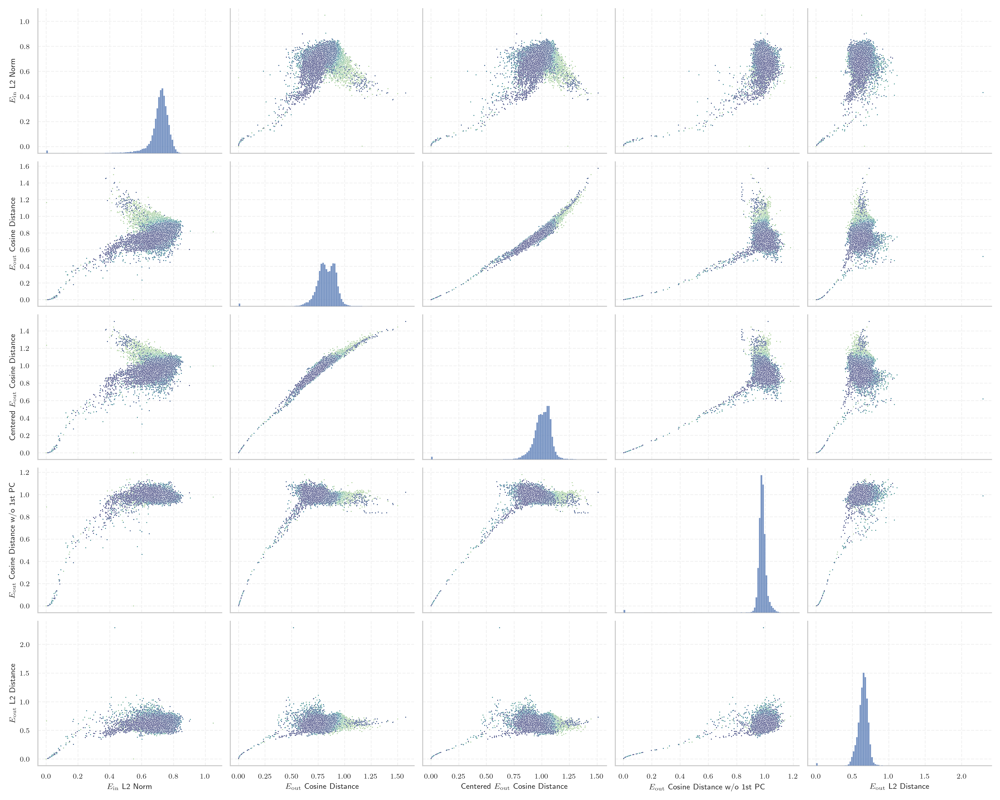
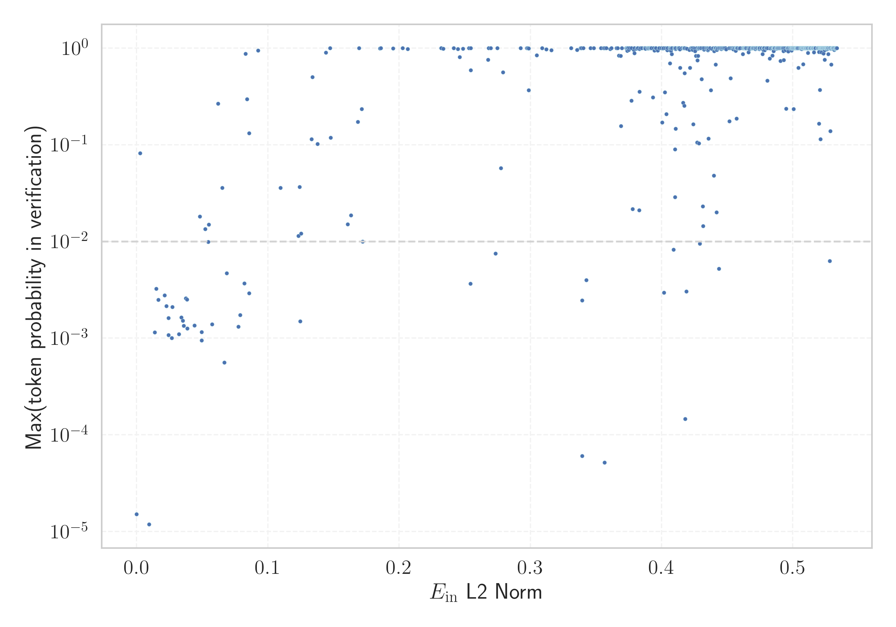

# Report for `mistralai/Mixtral-8x7B-v0.1`

## Model info

* Tied embeddings: no
* LM head uses bias: no
* Indicator for under-trained tokens: E_{in} L2 Norm
  * Overall distribution 0.709 +/- 0.080
  * Token used for verification prompt building: `includegraphics`
  * Verification threshold: 0.534
  * Threshold for showing candidate under-trained tokens: 0.065
  * Median verified threshold (for bytes, unreachable and special tokens): 0.062
* Embeddings shape: (32000, 4096)
* Vocabulary size: 32000
  * Number of single byte tokens: 380, of which 143 below indicator threshold
  * Number of special tokens: 3, of which 2 below indicator threshold
  * Number of tested under-trained tokens: 637, 542 non-special, 42 below p = 0.01 threshold, 23 below soft indicator threshold

## Under-trained token indicators plot


## Verification plot


## Under-trained token verification results
23 entries below threshold of 0.065

|   token_id | token              |   indicator | max_prob                                                         | in_other_tokens                                                             |
|------------|--------------------|-------------|------------------------------------------------------------------|-----------------------------------------------------------------------------|
|      31738 | ````` \uefc0 ````` |  0.00952411 | <span style='border: 1px solid rgb(169, 68, 66);'>1.2e-05</span> |                                                                             |
|      20418 | ````` ▁/**\r ````` |  0.0137132  | <span style='border: 1px solid rgb(255, 145, 0);'>0.0011</span>  |                                                                             |
|      26083 | ````` ▁//\r `````  |  0.0149266  | <span style='border: 1px solid rgb(255, 145, 0);'>0.0032</span>  |                                                                             |
|      26636 | ````` });\r `````  |  0.0164495  | <span style='border: 1px solid rgb(255, 145, 0);'>0.0025</span>  |                                                                             |
|      26392 | ````` ▁});\r ````` |  0.0213868  | <span style='border: 1px solid rgb(255, 145, 0);'>0.0028</span>  |                                                                             |
|       9823 | ````` */\r `````   |  0.0227401  | <span style='border: 1px solid rgb(255, 145, 0);'>0.0022</span>  |                                                                             |
|      26407 | ````` };\r `````   |  0.0242334  | <span style='border: 1px solid rgb(255, 145, 0);'>0.0011</span>  |                                                                             |
|      28171 | ````` ]);\r `````  |  0.0242576  | <span style='border: 1px solid rgb(255, 145, 0);'>0.0016</span>  |                                                                             |
|      23139 | ````` ▁};\r `````  |  0.026813   | <span style='border: 1px solid rgb(255, 145, 0);'>0.001</span>   |                                                                             |
|       7608 | ````` ▁*/\r `````  |  0.0271379  | <span style='border: 1px solid rgb(255, 145, 0);'>0.0021</span>  |                                                                             |
|      15056 | ````` ());\r ````` |  0.0323113  | <span style='border: 1px solid rgb(255, 145, 0);'>0.0011</span>  |                                                                             |
|      12193 | ````` ▁);\r `````  |  0.0341091  | <span style='border: 1px solid rgb(255, 145, 0);'>0.0016</span>  |                                                                             |
|      20692 | ````` ▁},\r `````  |  0.0352363  | <span style='border: 1px solid rgb(255, 145, 0);'>0.0015</span>  |                                                                             |
|      18759 | ````` ';\r `````   |  0.0359167  | <span style='border: 1px solid rgb(255, 145, 0);'>0.0013</span>  |                                                                             |
|      16943 | ````` ');\r `````  |  0.037474   | <span style='border: 1px solid rgb(255, 145, 0);'>0.0026</span>  |                                                                             |
|      17695 | ````` },\r `````   |  0.0383723  | <span style='border: 1px solid rgb(255, 145, 0);'>0.0025</span>  | <span style='border: 1px solid rgb(255, 145, 0);'>````` ▁},\r `````</span>  |
|      14756 | ````` /**\r `````  |  0.0385622  | <span style='border: 1px solid rgb(255, 145, 0);'>0.0013</span>  | <span style='border: 1px solid rgb(255, 145, 0);'>````` ▁/**\r `````</span> |
|      10278 | ````` ',\r `````   |  0.0440239  | <span style='border: 1px solid rgb(255, 145, 0);'>0.0014</span>  |                                                                             |
|      11880 | ````` ";\r `````   |  0.0494156  | <span style='border: 1px solid rgb(255, 145, 0);'>0.0012</span>  |                                                                             |
|      14420 | ````` ];\r `````   |  0.0494746  | <span style='border: 1px solid rgb(169, 68, 66);'>0.00095</span> |                                                                             |
<details><summary>3 additional entries below threshold</summary>

|   token_id | token             |   indicator | max_prob                                                        | in_other_tokens                                                             |
|------------|-------------------|-------------|-----------------------------------------------------------------|-----------------------------------------------------------------------------|
|      30929 | ````` ᥀ `````     |   0.0521718 | <span style='border: 1px solid rgb(251, 189, 8);'>0.013</span>  |                                                                             |
|      10941 | ````` ));\r ````` |   0.0574462 | <span style='border: 1px solid rgb(255, 145, 0);'>0.0014</span> | <span style='border: 1px solid rgb(255, 145, 0);'>````` ());\r `````</span> |
|      25833 | ````` >?[< `````  |   0.0619776 | <span style='border: 1px solid rgb(40, 167, 69);'>0.27</span>   |                                                                             |
</details>
<details><summary>519 additional entries above threshold</summary>

|   token_id | token                      |   indicator | max_prob                                                         | in_other_tokens                                                                                                                                                                                                                                                                                                                                                                                  |
|------------|----------------------------|-------------|------------------------------------------------------------------|--------------------------------------------------------------------------------------------------------------------------------------------------------------------------------------------------------------------------------------------------------------------------------------------------------------------------------------------------------------------------------------------------|
|      31363 | ````` \x85 `````           |   0.0651172 | <span style='border: 1px solid rgb(251, 189, 8);'>0.036</span>   |                                                                                                                                                                                                                                                                                                                                                                                                  |
|      18055 | ````` ){\r `````           |   0.0667208 | <span style='border: 1px solid rgb(169, 68, 66);'>0.00056</span> |                                                                                                                                                                                                                                                                                                                                                                                                  |
|      14980 | ````` ">\r `````           |   0.0686989 | <span style='border: 1px solid rgb(255, 145, 0);'>0.0047</span>  |                                                                                                                                                                                                                                                                                                                                                                                                  |
|      22186 | ````` ')\r `````           |   0.0774437 | <span style='border: 1px solid rgb(255, 145, 0);'>0.0013</span>  |                                                                                                                                                                                                                                                                                                                                                                                                  |
|       6913 | ````` ");\r `````          |   0.0788711 | <span style='border: 1px solid rgb(255, 145, 0);'>0.0017</span>  |                                                                                                                                                                                                                                                                                                                                                                                                  |
|       4420 | ````` ();\r `````          |   0.0820362 | <span style='border: 1px solid rgb(255, 145, 0);'>0.0037</span>  |                                                                                                                                                                                                                                                                                                                                                                                                  |
|      25900 | ````` iNdEx `````          |   0.0828887 | <span style='border: 1px solid rgb(40, 167, 69);'>0.87</span>    |                                                                                                                                                                                                                                                                                                                                                                                                  |
|      10939 | ````` ",\r `````           |   0.0856243 | <span style='border: 1px solid rgb(255, 145, 0);'>0.0029</span>  |                                                                                                                                                                                                                                                                                                                                                                                                  |
|      19248 | ````` NdEx `````           |   0.0925325 | <span style='border: 1px solid rgb(40, 167, 69);'>0.95</span>    | <span style='border: 1px solid rgb(40, 167, 69);'>````` iNdEx `````</span>                                                                                                                                                                                                                                                                                                                       |
|       3426 | ````` ▁}\r `````           |   0.109498  | <span style='border: 1px solid rgb(251, 189, 8);'>0.036</span>   |                                                                                                                                                                                                                                                                                                                                                                                                  |
|       4441 | ````` {\r `````            |   0.123344  | <span style='border: 1px solid rgb(251, 189, 8);'>0.011</span>   | <span style='border: 1px solid rgb(169, 68, 66);'>````` ){\r `````</span>                                                                                                                                                                                                                                                                                                                        |
|      14619 | ````` ▁)\r `````           |   0.124156  | <span style='border: 1px solid rgb(251, 189, 8);'>0.037</span>   |                                                                                                                                                                                                                                                                                                                                                                                                  |
|      23486 | ````` ),\r `````           |   0.124685  | <span style='border: 1px solid rgb(255, 145, 0);'>0.0015</span>  |                                                                                                                                                                                                                                                                                                                                                                                                  |
|       9962 | ````` ()\r `````           |   0.125345  | <span style='border: 1px solid rgb(251, 189, 8);'>0.012</span>   |                                                                                                                                                                                                                                                                                                                                                                                                  |
|      17334 | ````` (\r `````            |   0.133354  | <span style='border: 1px solid rgb(40, 167, 69);'>0.11</span>    |                                                                                                                                                                                                                                                                                                                                                                                                  |
|      16949 | ````` ")\r `````           |   0.134042  | <span style='border: 1px solid rgb(40, 167, 69);'>0.5</span>     |                                                                                                                                                                                                                                                                                                                                                                                                  |
|       1969 | ````` ▁{\r `````           |   0.137746  | <span style='border: 1px solid rgb(40, 167, 69);'>0.1</span>     |                                                                                                                                                                                                                                                                                                                                                                                                  |
|       2519 | ````` }\r `````            |   0.144114  | <span style='border: 1px solid rgb(40, 167, 69);'>0.9</span>     | <span style='border: 1px solid rgb(251, 189, 8);'>````` ▁}\r `````</span>                                                                                                                                                                                                                                                                                                                        |
|      31853 | ````` ⇽ `````              |   0.14749   | <span style='border: 1px solid rgb(40, 167, 69);'>1</span>       |                                                                                                                                                                                                                                                                                                                                                                                                  |
|       1761 | ````` );\r `````           |   0.147911  | <span style='border: 1px solid rgb(40, 167, 69);'>0.12</span>    | <span style='border: 1px solid rgb(255, 145, 0);'>````` ();\r `````</span>, <span style='border: 1px solid rgb(255, 145, 0);'>````` ");\r `````</span>, <span style='border: 1px solid rgb(255, 145, 0);'>````` ));\r `````</span>, <span style='border: 1px solid rgb(255, 145, 0);'>````` ▁);\r `````</span>, <span style='border: 1px solid rgb(255, 145, 0);'>````` ());\r `````</span>, ... |
|      27732 | ````` '\r `````            |   0.16081   | <span style='border: 1px solid rgb(251, 189, 8);'>0.015</span>   |                                                                                                                                                                                                                                                                                                                                                                                                  |
|      14668 | ````` ))\r `````           |   0.163286  | <span style='border: 1px solid rgb(251, 189, 8);'>0.019</span>   |                                                                                                                                                                                                                                                                                                                                                                                                  |
|      26831 | ````` ▁febbra `````        |   0.168439  | <span style='border: 1px solid rgb(40, 167, 69);'>0.17</span>    | ````` ▁febbraio `````                                                                                                                                                                                                                                                                                                                                                                            |
|      16724 | ````` tagHelper `````      |   0.169371  | <span style='border: 1px solid rgb(40, 167, 69);'>1</span>       |                                                                                                                                                                                                                                                                                                                                                                                                  |
|      27456 | ````` :%.*]] `````         |   0.1716    | <span style='border: 1px solid rgb(40, 167, 69);'>0.23</span>    |                                                                                                                                                                                                                                                                                                                                                                                                  |
|      15641 | ````` ▁uitgen `````        |   0.172154  | <span style='border: 1px solid rgb(255, 145, 0);'>0.01</span>    | <span style='border: 1px solid rgb(169, 68, 66);'>````` ▁uitgenodigd `````</span>                                                                                                                                                                                                                                                                                                                |
|      31645 | ````` ≯ `````              |   0.185487  | <span style='border: 1px solid rgb(40, 167, 69);'>0.99</span>    |                                                                                                                                                                                                                                                                                                                                                                                                  |
|      30413 | ````` ⌁ `````              |   0.186077  | <span style='border: 1px solid rgb(40, 167, 69);'>1</span>       |                                                                                                                                                                                                                                                                                                                                                                                                  |
|      31656 | ````` ≮ `````              |   0.195464  | <span style='border: 1px solid rgb(40, 167, 69);'>0.99</span>    |                                                                                                                                                                                                                                                                                                                                                                                                  |
|      16772 | ````` :%.* `````           |   0.202751  | <span style='border: 1px solid rgb(40, 167, 69);'>1</span>       | <span style='border: 1px solid rgb(40, 167, 69);'>````` :%.*]] `````</span>                                                                                                                                                                                                                                                                                                                      |
|      15880 | ````` >:]< `````           |   0.206478  | <span style='border: 1px solid rgb(40, 167, 69);'>0.98</span>    |                                                                                                                                                                                                                                                                                                                                                                                                  |
|       7941 | ````` ICENSE `````         |   0.232054  | <span style='border: 1px solid rgb(40, 167, 69);'>1</span>       | ````` LICENSE `````, ````` ▁LICENSE `````                                                                                                                                                                                                                                                                                                                                                        |
|      31932 | ````` ҽ `````              |   0.233605  | <span style='border: 1px solid rgb(40, 167, 69);'>0.99</span>    |                                                                                                                                                                                                                                                                                                                                                                                                  |
|      10762 | ````` qpoint `````         |   0.241667  | <span style='border: 1px solid rgb(40, 167, 69);'>1</span>       | ````` pgfqpoint `````                                                                                                                                                                                                                                                                                                                                                                            |
|      18766 | ````` ]\r `````            |   0.244713  | <span style='border: 1px solid rgb(40, 167, 69);'>0.98</span>    |                                                                                                                                                                                                                                                                                                                                                                                                  |
|      31733 | ````` ⵙ `````              |   0.246092  | <span style='border: 1px solid rgb(40, 167, 69);'>0.8</span>     |                                                                                                                                                                                                                                                                                                                                                                                                  |
|      15500 | ````` itempty `````        |   0.248595  | <span style='border: 1px solid rgb(40, 167, 69);'>0.98</span>    | ````` omitempty `````                                                                                                                                                                                                                                                                                                                                                                            |
|      31179 | ````` ┈ `````              |   0.253111  | <span style='border: 1px solid rgb(40, 167, 69);'>1</span>       |                                                                                                                                                                                                                                                                                                                                                                                                  |
|      17779 | ````` ▁gepublice `````     |   0.254273  | <span style='border: 1px solid rgb(255, 145, 0);'>0.0037</span>  | ````` ▁gepubliceerd `````                                                                                                                                                                                                                                                                                                                                                                        |
|      30813 | ````` ︙ `````             |   0.254574  | <span style='border: 1px solid rgb(40, 167, 69);'>1</span>       |                                                                                                                                                                                                                                                                                                                                                                                                  |
|      31922 | ````` ⵓ `````              |   0.254665  | <span style='border: 1px solid rgb(40, 167, 69);'>0.59</span>    |                                                                                                                                                                                                                                                                                                                                                                                                  |
|       3685 | ````` >\r `````            |   0.267851  | <span style='border: 1px solid rgb(40, 167, 69);'>0.75</span>    | <span style='border: 1px solid rgb(255, 145, 0);'>````` ">\r `````</span>                                                                                                                                                                                                                                                                                                                        |
|      27265 | ````` ▁SDValue `````       |   0.268197  | <span style='border: 1px solid rgb(40, 167, 69);'>1</span>       |                                                                                                                                                                                                                                                                                                                                                                                                  |
|       1271 | ````` ;\r `````            |   0.269704  | <span style='border: 1px solid rgb(40, 167, 69);'>1</span>       | <span style='border: 1px solid rgb(40, 167, 69);'>````` );\r `````</span>, <span style='border: 1px solid rgb(255, 145, 0);'>````` ();\r `````</span>, <span style='border: 1px solid rgb(255, 145, 0);'>````` ");\r `````</span>, <span style='border: 1px solid rgb(255, 145, 0);'>````` ));\r `````</span>, <span style='border: 1px solid rgb(255, 145, 0);'>````` ";\r `````</span>, ...    |
|      14052 | ````` ▁Jahrhund `````      |   0.273471  | <span style='border: 1px solid rgb(255, 145, 0);'>0.0075</span>  | ````` ▁Jahrhundert `````, ````` ▁Jahrhunderts `````                                                                                                                                                                                                                                                                                                                                              |
|      30983 | ````` ڕ `````              |   0.274869  | <span style='border: 1px solid rgb(40, 167, 69);'>1</span>       |                                                                                                                                                                                                                                                                                                                                                                                                  |
|      11525 | ````` "\r `````            |   0.277532  | <span style='border: 1px solid rgb(251, 189, 8);'>0.057</span>   |                                                                                                                                                                                                                                                                                                                                                                                                  |
|      15630 | ````` odigd `````          |   0.279076  | <span style='border: 1px solid rgb(40, 167, 69);'>0.56</span>    | <span style='border: 1px solid rgb(169, 68, 66);'>````` ▁uitgenodigd `````</span>                                                                                                                                                                                                                                                                                                                |
|      31841 | ````` ❒ `````              |   0.292646  | <span style='border: 1px solid rgb(40, 167, 69);'>1</span>       |                                                                                                                                                                                                                                                                                                                                                                                                  |
|      30897 | ````` ⠄ `````              |   0.297331  | <span style='border: 1px solid rgb(40, 167, 69);'>1</span>       |                                                                                                                                                                                                                                                                                                                                                                                                  |
|      31933 | ````` ថ `````              |   0.298001  | <span style='border: 1px solid rgb(40, 167, 69);'>1</span>       |                                                                                                                                                                                                                                                                                                                                                                                                  |
|      11167 | ````` ityEngine `````      |   0.298729  | <span style='border: 1px solid rgb(40, 167, 69);'>0.99</span>    | ````` ▁UnityEngine `````, ````` UnityEngine `````                                                                                                                                                                                                                                                                                                                                                |
|      31443 | ````` ⵏ `````              |   0.298767  | <span style='border: 1px solid rgb(40, 167, 69);'>0.37</span>    |                                                                                                                                                                                                                                                                                                                                                                                                  |
|      31317 | ````` ⵉ `````              |   0.304823  | <span style='border: 1px solid rgb(40, 167, 69);'>0.84</span>    |                                                                                                                                                                                                                                                                                                                                                                                                  |
|      24713 | ````` vscale `````         |   0.308887  | <span style='border: 1px solid rgb(40, 167, 69);'>1</span>       |                                                                                                                                                                                                                                                                                                                                                                                                  |
|      31469 | ````` ӏ `````              |   0.312098  | <span style='border: 1px solid rgb(40, 167, 69);'>0.97</span>    |                                                                                                                                                                                                                                                                                                                                                                                                  |
|      23270 | ````` ByComparator `````   |   0.316043  | <span style='border: 1px solid rgb(40, 167, 69);'>0.95</span>    |                                                                                                                                                                                                                                                                                                                                                                                                  |
|      30867 | ````` 🟠 `````             |   0.335491  | <span style='border: 1px solid rgb(40, 167, 69);'>0.95</span>    |                                                                                                                                                                                                                                                                                                                                                                                                  |
|      31901 | ````` ញ `````              |   0.338418  | <span style='border: 1px solid rgb(40, 167, 69);'>1</span>       |                                                                                                                                                                                                                                                                                                                                                                                                  |
|      30690 | ````` ێ `````              |   0.338934  | <span style='border: 1px solid rgb(40, 167, 69);'>1</span>       |                                                                                                                                                                                                                                                                                                                                                                                                  |
|      26939 | ````` ▁invån `````         |   0.339398  | <span style='border: 1px solid rgb(169, 68, 66);'>6.1e-05</span> | ````` ▁invånare `````                                                                                                                                                                                                                                                                                                                                                                            |
|      20358 | ````` ):\r `````           |   0.339421  | <span style='border: 1px solid rgb(255, 145, 0);'>0.0025</span>  |                                                                                                                                                                                                                                                                                                                                                                                                  |
|      31949 | ````` Ḩ `````              |   0.340273  | <span style='border: 1px solid rgb(40, 167, 69);'>1</span>       |                                                                                                                                                                                                                                                                                                                                                                                                  |
|      31486 | ````` ્ `````               |   0.342574  | <span style='border: 1px solid rgb(255, 145, 0);'>0.004</span>   |                                                                                                                                                                                                                                                                                                                                                                                                  |
|      29934 | ````` ⣿ `````              |   0.34588   | <span style='border: 1px solid rgb(40, 167, 69);'>1</span>       |                                                                                                                                                                                                                                                                                                                                                                                                  |
|      31895 | ````` ❍ `````              |   0.348415  | <span style='border: 1px solid rgb(40, 167, 69);'>1</span>       |                                                                                                                                                                                                                                                                                                                                                                                                  |
|      30770 | ````` 🟡 `````             |   0.353798  | <span style='border: 1px solid rgb(40, 167, 69);'>1</span>       |                                                                                                                                                                                                                                                                                                                                                                                                  |
|      31394 | ````` ើ `````               |   0.355766  | <span style='border: 1px solid rgb(40, 167, 69);'>1</span>       |                                                                                                                                                                                                                                                                                                                                                                                                  |
|      13078 | ````` ERCHANTABILITY ````` |   0.356621  | <span style='border: 1px solid rgb(169, 68, 66);'>5.2e-05</span> | ````` ▁MERCHANTABILITY `````                                                                                                                                                                                                                                                                                                                                                                     |
|      21399 | ````` TagHelpers `````     |   0.356852  | <span style='border: 1px solid rgb(40, 167, 69);'>1</span>       |                                                                                                                                                                                                                                                                                                                                                                                                  |
|      20411 | ````` ][< `````            |   0.3578    | <span style='border: 1px solid rgb(40, 167, 69);'>1</span>       |                                                                                                                                                                                                                                                                                                                                                                                                  |
|      31956 | ````` ោ `````               |   0.360881  | <span style='border: 1px solid rgb(40, 167, 69);'>0.98</span>    |                                                                                                                                                                                                                                                                                                                                                                                                  |
|      31172 | ````` ┆ `````              |   0.365567  | <span style='border: 1px solid rgb(40, 167, 69);'>1</span>       |                                                                                                                                                                                                                                                                                                                                                                                                  |
|      13667 | ````` *\r `````            |   0.367479  | <span style='border: 1px solid rgb(40, 167, 69);'>0.84</span>    | <span style='border: 1px solid rgb(255, 145, 0);'>````` /**\r `````</span>, <span style='border: 1px solid rgb(255, 145, 0);'>````` ▁/**\r `````</span>                                                                                                                                                                                                                                          |
|      31692 | ````` ែ `````               |   0.368866  | <span style='border: 1px solid rgb(40, 167, 69);'>0.83</span>    |                                                                                                                                                                                                                                                                                                                                                                                                  |
|      31441 | ````` ូ `````               |   0.369151  | <span style='border: 1px solid rgb(40, 167, 69);'>0.16</span>    |                                                                                                                                                                                                                                                                                                                                                                                                  |
|      15947 | ````` BPACK `````          |   0.372938  | <span style='border: 1px solid rgb(40, 167, 69);'>1</span>       | <span style='border: 1px solid rgb(40, 167, 69);'>````` WEBPACK `````</span>                                                                                                                                                                                                                                                                                                                     |
|      31731 | ````` Ӏ `````              |   0.373048  | <span style='border: 1px solid rgb(40, 167, 69);'>1</span>       |                                                                                                                                                                                                                                                                                                                                                                                                  |
|      31849 | ````` ತ `````              |   0.373702  | <span style='border: 1px solid rgb(40, 167, 69);'>0.99</span>    |                                                                                                                                                                                                                                                                                                                                                                                                  |
|      31826 | ````` ಯ `````              |   0.373889  | <span style='border: 1px solid rgb(40, 167, 69);'>0.94</span>    |                                                                                                                                                                                                                                                                                                                                                                                                  |
|      31527 | ````` ჩ `````              |   0.374055  | <span style='border: 1px solid rgb(40, 167, 69);'>1</span>       |                                                                                                                                                                                                                                                                                                                                                                                                  |
|      31803 | ````` ណ `````              |   0.374991  | <span style='border: 1px solid rgb(40, 167, 69);'>0.95</span>    |                                                                                                                                                                                                                                                                                                                                                                                                  |
|      31636 | ````` ⬜ `````             |   0.375605  | <span style='border: 1px solid rgb(40, 167, 69);'>1</span>       |                                                                                                                                                                                                                                                                                                                                                                                                  |
|      31966 | ````` ಂ `````               |   0.376939  | <span style='border: 1px solid rgb(40, 167, 69);'>0.29</span>    |                                                                                                                                                                                                                                                                                                                                                                                                  |
|      31053 | ````` პ `````              |   0.377024  | <span style='border: 1px solid rgb(40, 167, 69);'>1</span>       |                                                                                                                                                                                                                                                                                                                                                                                                  |
|      30406 | ````` ್ `````               |   0.377802  | <span style='border: 1px solid rgb(251, 189, 8);'>0.022</span>   |                                                                                                                                                                                                                                                                                                                                                                                                  |
|      31802 | ````` ವ `````              |   0.378826  | <span style='border: 1px solid rgb(40, 167, 69);'>0.96</span>    |                                                                                                                                                                                                                                                                                                                                                                                                  |
|      31238 | ````` ដ `````              |   0.379212  | <span style='border: 1px solid rgb(40, 167, 69);'>1</span>       |                                                                                                                                                                                                                                                                                                                                                                                                  |
|       4604 | ````` ,\r `````            |   0.379322  | <span style='border: 1px solid rgb(40, 167, 69);'>0.88</span>    | <span style='border: 1px solid rgb(255, 145, 0);'>````` ',\r `````</span>, <span style='border: 1px solid rgb(255, 145, 0);'>````` ",\r `````</span>, <span style='border: 1px solid rgb(255, 145, 0);'>````` },\r `````</span>, <span style='border: 1px solid rgb(255, 145, 0);'>````` ▁},\r `````</span>, <span style='border: 1px solid rgb(255, 145, 0);'>````` ),\r `````</span>           |
|      30654 | ````` ⴰ `````              |   0.380918  | <span style='border: 1px solid rgb(40, 167, 69);'>0.99</span>    |                                                                                                                                                                                                                                                                                                                                                                                                  |
|      29091 | ````` ↘ `````              |   0.381752  | <span style='border: 1px solid rgb(40, 167, 69);'>1</span>       |                                                                                                                                                                                                                                                                                                                                                                                                  |
|      25351 | ````` __(/*! `````         |   0.382866  | <span style='border: 1px solid rgb(251, 189, 8);'>0.021</span>   |                                                                                                                                                                                                                                                                                                                                                                                                  |
|      31707 | ````` ಸ `````              |   0.383198  | <span style='border: 1px solid rgb(40, 167, 69);'>0.97</span>    |                                                                                                                                                                                                                                                                                                                                                                                                  |
|      12251 | ````` ября `````           |   0.383212  | <span style='border: 1px solid rgb(40, 167, 69);'>0.35</span>    | ````` ▁сентября `````, ````` ▁октября `````, ````` ▁ноября `````                                                                                                                                                                                                                                                                                                                                 |
|      31264 | ````` ⬛ `````             |   0.387184  | <span style='border: 1px solid rgb(40, 167, 69);'>1</span>       |                                                                                                                                                                                                                                                                                                                                                                                                  |
|      31379 | ````` អ `````              |   0.387419  | <span style='border: 1px solid rgb(40, 167, 69);'>1</span>       |                                                                                                                                                                                                                                                                                                                                                                                                  |
|      31941 | ````` ಮ `````              |   0.387676  | <span style='border: 1px solid rgb(40, 167, 69);'>0.98</span>    |                                                                                                                                                                                                                                                                                                                                                                                                  |
|      31702 | ````` ʐ `````              |   0.388956  | <span style='border: 1px solid rgb(40, 167, 69);'>1</span>       |                                                                                                                                                                                                                                                                                                                                                                                                  |
|      31252 | ````` ۆ `````              |   0.389455  | <span style='border: 1px solid rgb(40, 167, 69);'>1</span>       |                                                                                                                                                                                                                                                                                                                                                                                                  |
|      31863 | ````` Մ `````              |   0.389779  | <span style='border: 1px solid rgb(40, 167, 69);'>0.99</span>    |                                                                                                                                                                                                                                                                                                                                                                                                  |
|      31287 | ````` ყ `````              |   0.390404  | <span style='border: 1px solid rgb(40, 167, 69);'>1</span>       |                                                                                                                                                                                                                                                                                                                                                                                                  |
|      31734 | ````` 丶 `````             |   0.390417  | <span style='border: 1px solid rgb(40, 167, 69);'>1</span>       |                                                                                                                                                                                                                                                                                                                                                                                                  |
|      31412 | ````` វ `````              |   0.39055   | <span style='border: 1px solid rgb(40, 167, 69);'>1</span>       |                                                                                                                                                                                                                                                                                                                                                                                                  |
|      31648 | ````` ಲ `````              |   0.391315  | <span style='border: 1px solid rgb(40, 167, 69);'>1</span>       |                                                                                                                                                                                                                                                                                                                                                                                                  |
|      31543 | ````` ជ `````              |   0.391485  | <span style='border: 1px solid rgb(40, 167, 69);'>1</span>       |                                                                                                                                                                                                                                                                                                                                                                                                  |
|      31468 | ````` ಕ `````              |   0.391882  | <span style='border: 1px solid rgb(40, 167, 69);'>1</span>       |                                                                                                                                                                                                                                                                                                                                                                                                  |
|      25471 | ````` +\_\ `````           |   0.39338   | <span style='border: 1px solid rgb(40, 167, 69);'>0.31</span>    | ````` \+\_\ `````                                                                                                                                                                                                                                                                                                                                                                                |
|      31032 | ````` ច `````              |   0.393822  | <span style='border: 1px solid rgb(40, 167, 69);'>1</span>       |                                                                                                                                                                                                                                                                                                                                                                                                  |
|      31903 | ````` Ս `````              |   0.394601  | <span style='border: 1px solid rgb(40, 167, 69);'>0.94</span>    |                                                                                                                                                                                                                                                                                                                                                                                                  |
|      31775 | ````` ದ `````              |   0.395272  | <span style='border: 1px solid rgb(40, 167, 69);'>1</span>       |                                                                                                                                                                                                                                                                                                                                                                                                  |
|      31789 | ````` ಗ `````              |   0.395604  | <span style='border: 1px solid rgb(40, 167, 69);'>0.99</span>    |                                                                                                                                                                                                                                                                                                                                                                                                  |
|      30660 | ````` ☽ `````              |   0.39569   | <span style='border: 1px solid rgb(40, 167, 69);'>1</span>       |                                                                                                                                                                                                                                                                                                                                                                                                  |
|      31798 | ````` ም `````              |   0.396958  | <span style='border: 1px solid rgb(40, 167, 69);'>0.95</span>    |                                                                                                                                                                                                                                                                                                                                                                                                  |
|        302 | ````` ▁of `````            |   0.39788   | <span style='border: 1px solid rgb(40, 167, 69);'>1</span>       | ````` ▁off `````, ````` ▁offer `````, ````` ▁often `````, ````` ▁offic `````, ````` ▁office `````, ...                                                                                                                                                                                                                                                                                           |
|      20896 | ````` ▁Станов `````        |   0.399755  | <span style='border: 1px solid rgb(40, 167, 69);'>1</span>       | ````` ▁Становништво `````                                                                                                                                                                                                                                                                                                                                                                        |
|      30890 | ````` ់ `````               |   0.400367  | <span style='border: 1px solid rgb(40, 167, 69);'>0.17</span>    |                                                                                                                                                                                                                                                                                                                                                                                                  |
|      31913 | ````` ḩ `````              |   0.400843  | <span style='border: 1px solid rgb(40, 167, 69);'>0.99</span>    |                                                                                                                                                                                                                                                                                                                                                                                                  |
|      16613 | ````` CLUD `````           |   0.401266  | <span style='border: 1px solid rgb(40, 167, 69);'>1</span>       | <span style='border: 1px solid rgb(40, 167, 69);'>````` CLUDING `````</span>, ````` ▁INCLUDING `````, <span style='border: 1px solid rgb(40, 167, 69);'>````` INCLUDING `````</span>                                                                                                                                                                                                             |
|      28513 | ````` dentry `````         |   0.401411  | <span style='border: 1px solid rgb(40, 167, 69);'>1</span>       |                                                                                                                                                                                                                                                                                                                                                                                                  |
|      31026 | ````` ಾ `````               |   0.401748  | <span style='border: 1px solid rgb(255, 145, 0);'>0.003</span>   |                                                                                                                                                                                                                                                                                                                                                                                                  |
|      31837 | ````` ે `````               |   0.402589  | <span style='border: 1px solid rgb(40, 167, 69);'>0.35</span>    |                                                                                                                                                                                                                                                                                                                                                                                                  |
|      31942 | ````` አ `````              |   0.402626  | <span style='border: 1px solid rgb(40, 167, 69);'>1</span>       |                                                                                                                                                                                                                                                                                                                                                                                                  |
|      31946 | ````` ન `````              |   0.403519  | <span style='border: 1px solid rgb(40, 167, 69);'>0.21</span>    |                                                                                                                                                                                                                                                                                                                                                                                                  |
|      15695 | ````` ▁bewerken `````      |   0.404306  | <span style='border: 1px solid rgb(40, 167, 69);'>0.95</span>    |                                                                                                                                                                                                                                                                                                                                                                                                  |
|      31196 | ````` ព `````              |   0.404591  | <span style='border: 1px solid rgb(40, 167, 69);'>1</span>       |                                                                                                                                                                                                                                                                                                                                                                                                  |
|      31726 | ````` ስ `````              |   0.4064    | <span style='border: 1px solid rgb(40, 167, 69);'>0.99</span>    |                                                                                                                                                                                                                                                                                                                                                                                                  |
|      31976 | ````` వ `````              |   0.406447  | <span style='border: 1px solid rgb(40, 167, 69);'>0.69</span>    |                                                                                                                                                                                                                                                                                                                                                                                                  |
|      31741 | ````` ል `````              |   0.407048  | <span style='border: 1px solid rgb(40, 167, 69);'>0.94</span>    |                                                                                                                                                                                                                                                                                                                                                                                                  |
|      26570 | ````` AtA `````            |   0.407207  | <span style='border: 1px solid rgb(40, 167, 69);'>1</span>       |                                                                                                                                                                                                                                                                                                                                                                                                  |
|      31100 | ````` យ `````              |   0.407375  | <span style='border: 1px solid rgb(40, 167, 69);'>0.99</span>    |                                                                                                                                                                                                                                                                                                                                                                                                  |
|      31904 | ````` ນ `````              |   0.407791  | <span style='border: 1px solid rgb(40, 167, 69);'>0.87</span>    |                                                                                                                                                                                                                                                                                                                                                                                                  |
|        288 | ````` ing `````            |   0.407938  | <span style='border: 1px solid rgb(40, 167, 69);'>1</span>       | ````` ring `````, ````` ings `````, ````` tring `````, ````` ning `````, ````` ating `````, ...                                                                                                                                                                                                                                                                                                  |
|      31143 | ````` ು `````               |   0.40907   | <span style='border: 1px solid rgb(255, 145, 0);'>0.0083</span>  |                                                                                                                                                                                                                                                                                                                                                                                                  |
|      15320 | ````` ▁/***/ `````         |   0.409591  | <span style='border: 1px solid rgb(40, 167, 69);'>1</span>       |                                                                                                                                                                                                                                                                                                                                                                                                  |
|      15652 | ````` ▁voegen `````        |   0.410183  | <span style='border: 1px solid rgb(251, 189, 8);'>0.029</span>   |                                                                                                                                                                                                                                                                                                                                                                                                  |
|      31421 | ````` ೆ `````               |   0.410217  | <span style='border: 1px solid rgb(251, 189, 8);'>0.09</span>    |                                                                                                                                                                                                                                                                                                                                                                                                  |
|      31464 | ````` ძ `````              |   0.410429  | <span style='border: 1px solid rgb(40, 167, 69);'>1</span>       |                                                                                                                                                                                                                                                                                                                                                                                                  |
|      31994 | ````` ٓ `````               |   0.410614  | <span style='border: 1px solid rgb(40, 167, 69);'>0.98</span>    |                                                                                                                                                                                                                                                                                                                                                                                                  |
|      31396 | ````` េ `````               |   0.410658  | <span style='border: 1px solid rgb(40, 167, 69);'>0.15</span>    |                                                                                                                                                                                                                                                                                                                                                                                                  |
|      22801 | ````` crtc `````           |   0.412379  | <span style='border: 1px solid rgb(40, 167, 69);'>1</span>       |                                                                                                                                                                                                                                                                                                                                                                                                  |
|      25931 | ````` tcx `````            |   0.412422  | <span style='border: 1px solid rgb(40, 167, 69);'>1</span>       |                                                                                                                                                                                                                                                                                                                                                                                                  |
|      13130 | ````` ▁aapt `````          |   0.413054  | <span style='border: 1px solid rgb(40, 167, 69);'>1</span>       |                                                                                                                                                                                                                                                                                                                                                                                                  |
|        272 | ````` ▁the `````           |   0.413512  | <span style='border: 1px solid rgb(40, 167, 69);'>1</span>       | ````` ▁they `````, ````` ▁their `````, ````` ▁them `````, ````` ▁there `````, ````` ▁then `````, ...                                                                                                                                                                                                                                                                                             |
|      31892 | ````` ᴜ `````              |   0.413865  | <span style='border: 1px solid rgb(40, 167, 69);'>0.97</span>    |                                                                                                                                                                                                                                                                                                                                                                                                  |
|      31061 | ````` ុ `````               |   0.414165  | <span style='border: 1px solid rgb(40, 167, 69);'>0.63</span>    |                                                                                                                                                                                                                                                                                                                                                                                                  |
|      30862 | ````` ზ `````              |   0.415554  | <span style='border: 1px solid rgb(40, 167, 69);'>1</span>       |                                                                                                                                                                                                                                                                                                                                                                                                  |
|      31427 | ````` ર `````              |   0.416471  | <span style='border: 1px solid rgb(40, 167, 69);'>0.27</span>    |                                                                                                                                                                                                                                                                                                                                                                                                  |
|      31489 | ````` ڈ `````              |   0.416674  | <span style='border: 1px solid rgb(40, 167, 69);'>1</span>       |                                                                                                                                                                                                                                                                                                                                                                                                  |
|      31083 | ````` ᴛ `````              |   0.416718  | <span style='border: 1px solid rgb(40, 167, 69);'>1</span>       |                                                                                                                                                                                                                                                                                                                                                                                                  |
|        298 | ````` ▁to `````            |   0.41685   | <span style='border: 1px solid rgb(40, 167, 69);'>1</span>       | ````` ▁too `````, ````` ▁top `````, ````` ▁took `````, ````` ▁tot `````, ````` ▁told `````, ...                                                                                                                                                                                                                                                                                                  |
|      31737 | ````` የ `````              |   0.417213  | <span style='border: 1px solid rgb(40, 167, 69);'>0.99</span>    |                                                                                                                                                                                                                                                                                                                                                                                                  |
|        304 | ````` ▁and `````           |   0.417271  | <span style='border: 1px solid rgb(40, 167, 69);'>1</span>       | ````` ▁android `````, ````` ▁andere `````, ````` ▁anderen `````, ````` ▁ander `````, ````` ▁andra `````, ...                                                                                                                                                                                                                                                                                     |
|      30845 | ````` ិ `````               |   0.417312  | <span style='border: 1px solid rgb(40, 167, 69);'>0.25</span>    |                                                                                                                                                                                                                                                                                                                                                                                                  |
|      31979 | ````` 袁 `````             |   0.417341  | <span style='border: 1px solid rgb(40, 167, 69);'>1</span>       |                                                                                                                                                                                                                                                                                                                                                                                                  |
|      21876 | ````` imeq `````           |   0.417548  | <span style='border: 1px solid rgb(40, 167, 69);'>1</span>       | ````` simeq `````                                                                                                                                                                                                                                                                                                                                                                                |
|      31015 | ````` ី `````               |   0.417613  | <span style='border: 1px solid rgb(40, 167, 69);'>0.55</span>    |                                                                                                                                                                                                                                                                                                                                                                                                  |
|      15649 | ````` ▁uitgenodigd `````   |   0.417955  | <span style='border: 1px solid rgb(169, 68, 66);'>0.00015</span> |                                                                                                                                                                                                                                                                                                                                                                                                  |
|      31066 | ````` ನ `````              |   0.418601  | <span style='border: 1px solid rgb(40, 167, 69);'>0.99</span>    |                                                                                                                                                                                                                                                                                                                                                                                                  |
|      31714 | ````` ਾ `````               |   0.418989  | <span style='border: 1px solid rgb(255, 145, 0);'>0.003</span>   |                                                                                                                                                                                                                                                                                                                                                                                                  |
|      31963 | ````` ස `````              |   0.419316  | <span style='border: 1px solid rgb(40, 167, 69);'>0.98</span>    |                                                                                                                                                                                                                                                                                                                                                                                                  |
|      31910 | ````` ක `````              |   0.421122  | <span style='border: 1px solid rgb(40, 167, 69);'>0.96</span>    |                                                                                                                                                                                                                                                                                                                                                                                                  |
|      31251 | ````` ំ `````               |   0.421576  | <span style='border: 1px solid rgb(40, 167, 69);'>0.63</span>    |                                                                                                                                                                                                                                                                                                                                                                                                  |
|      31943 | ````` 轩 `````             |   0.423031  | <span style='border: 1px solid rgb(40, 167, 69);'>1</span>       |                                                                                                                                                                                                                                                                                                                                                                                                  |
|      30880 | ````` ფ `````              |   0.423578  | <span style='border: 1px solid rgb(40, 167, 69);'>0.96</span>    |                                                                                                                                                                                                                                                                                                                                                                                                  |
|      30762 | ````` ಿ `````               |   0.424025  | <span style='border: 1px solid rgb(40, 167, 69);'>0.16</span>    |                                                                                                                                                                                                                                                                                                                                                                                                  |
|      31048 | ````` ರ `````              |   0.424535  | <span style='border: 1px solid rgb(40, 167, 69);'>1</span>       |                                                                                                                                                                                                                                                                                                                                                                                                  |
|      31679 | ````` త `````              |   0.425412  | <span style='border: 1px solid rgb(40, 167, 69);'>0.93</span>    |                                                                                                                                                                                                                                                                                                                                                                                                  |
|      31506 | ````` ት `````              |   0.425428  | <span style='border: 1px solid rgb(40, 167, 69);'>0.99</span>    |                                                                                                                                                                                                                                                                                                                                                                                                  |
|      16681 | ````` börd `````           |   0.425547  | <span style='border: 1px solid rgb(40, 167, 69);'>0.93</span>    | ````` ederbörd `````, <span style='border: 1px solid rgb(255, 145, 0);'>````` ▁nederbörd `````</span>                                                                                                                                                                                                                                                                                            |
|      31190 | ````` ర `````              |   0.426106  | <span style='border: 1px solid rgb(40, 167, 69);'>0.83</span>    |                                                                                                                                                                                                                                                                                                                                                                                                  |
|      31355 | ````` ි `````               |   0.427179  | <span style='border: 1px solid rgb(40, 167, 69);'>0.11</span>    |                                                                                                                                                                                                                                                                                                                                                                                                  |
|      31880 | ````` ਰ `````              |   0.427291  | <span style='border: 1px solid rgb(40, 167, 69);'>0.74</span>    |                                                                                                                                                                                                                                                                                                                                                                                                  |
|      31985 | ````` క `````              |   0.427777  | <span style='border: 1px solid rgb(40, 167, 69);'>0.83</span>    |                                                                                                                                                                                                                                                                                                                                                                                                  |
|      31865 | ````` ٔ `````               |   0.427781  | <span style='border: 1px solid rgb(40, 167, 69);'>0.99</span>    |                                                                                                                                                                                                                                                                                                                                                                                                  |
|      28705 | ````` ▁ `````              |   0.427923  | <span style='border: 1px solid rgb(40, 167, 69);'>1</span>       |                                                                                                                                                                                                                                                                                                                                                                                                  |
|      23583 | ````` CodeAttribute `````  |   0.428461  | <span style='border: 1px solid rgb(40, 167, 69);'>1</span>       |                                                                                                                                                                                                                                                                                                                                                                                                  |
|      30865 | ````` ్ `````               |   0.428493  | <span style='border: 1px solid rgb(40, 167, 69);'>0.1</span>     |                                                                                                                                                                                                                                                                                                                                                                                                  |
|      29455 | ````` ە `````              |   0.428696  | <span style='border: 1px solid rgb(40, 167, 69);'>0.99</span>    |                                                                                                                                                                                                                                                                                                                                                                                                  |
|      31227 | ````` ి `````               |   0.429121  | <span style='border: 1px solid rgb(255, 145, 0);'>0.0095</span>  |                                                                                                                                                                                                                                                                                                                                                                                                  |
|      30937 | ````` წ `````              |   0.429652  | <span style='border: 1px solid rgb(40, 167, 69);'>1</span>       |                                                                                                                                                                                                                                                                                                                                                                                                  |
|      31627 | ````` ා `````               |   0.430395  | <span style='border: 1px solid rgb(40, 167, 69);'>0.48</span>    |                                                                                                                                                                                                                                                                                                                                                                                                  |
|      15581 | ````` achuset `````        |   0.43135   | <span style='border: 1px solid rgb(251, 189, 8);'>0.023</span>   | ````` achusetts `````, ````` ▁Massachusetts `````                                                                                                                                                                                                                                                                                                                                                |
|      19250 | ````` ▁/******/ `````      |   0.431373  | <span style='border: 1px solid rgb(40, 167, 69);'>1</span>       |                                                                                                                                                                                                                                                                                                                                                                                                  |
|      30973 | ````` ទ `````              |   0.431386  | <span style='border: 1px solid rgb(40, 167, 69);'>1</span>       |                                                                                                                                                                                                                                                                                                                                                                                                  |
|      31290 | ````` ા `````               |   0.431603  | <span style='border: 1px solid rgb(251, 189, 8);'>0.014</span>   |                                                                                                                                                                                                                                                                                                                                                                                                  |
|      31938 | ````` ම `````              |   0.432405  | <span style='border: 1px solid rgb(40, 167, 69);'>0.97</span>    |                                                                                                                                                                                                                                                                                                                                                                                                  |
|      15106 | ````` THOD `````           |   0.432407  | <span style='border: 1px solid rgb(40, 167, 69);'>1</span>       | ````` METHOD `````                                                                                                                                                                                                                                                                                                                                                                               |
|      30964 | ````` ល `````              |   0.43357   | <span style='border: 1px solid rgb(40, 167, 69);'>1</span>       |                                                                                                                                                                                                                                                                                                                                                                                                  |
|      31419 | ````` Қ `````              |   0.435062  | <span style='border: 1px solid rgb(40, 167, 69);'>1</span>       |                                                                                                                                                                                                                                                                                                                                                                                                  |
|      31266 | ````` 錢 `````             |   0.435162  | <span style='border: 1px solid rgb(40, 167, 69);'>0.99</span>    |                                                                                                                                                                                                                                                                                                                                                                                                  |
|      31848 | ````` ల `````              |   0.43518   | <span style='border: 1px solid rgb(40, 167, 69);'>0.95</span>    |                                                                                                                                                                                                                                                                                                                                                                                                  |
|      18239 | ````` HasColumnType `````  |   0.43566   | <span style='border: 1px solid rgb(40, 167, 69);'>0.12</span>    |                                                                                                                                                                                                                                                                                                                                                                                                  |
|      31668 | ````` 刪 `````             |   0.435708  | <span style='border: 1px solid rgb(40, 167, 69);'>0.97</span>    |                                                                                                                                                                                                                                                                                                                                                                                                  |
|      30546 | ````` ๏ `````              |   0.436848  | <span style='border: 1px solid rgb(40, 167, 69);'>1</span>       |                                                                                                                                                                                                                                                                                                                                                                                                  |
|      31522 | ````` ር `````              |   0.437612  | <span style='border: 1px solid rgb(40, 167, 69);'>0.37</span>    |                                                                                                                                                                                                                                                                                                                                                                                                  |
|      31616 | ````` າ `````              |   0.438249  | <span style='border: 1px solid rgb(40, 167, 69);'>0.98</span>    |                                                                                                                                                                                                                                                                                                                                                                                                  |
|      31282 | ````` ా `````               |   0.439753  | <span style='border: 1px solid rgb(251, 189, 8);'>0.048</span>   |                                                                                                                                                                                                                                                                                                                                                                                                  |
|      31487 | ````` න `````              |   0.440044  | <span style='border: 1px solid rgb(40, 167, 69);'>0.93</span>    |                                                                                                                                                                                                                                                                                                                                                                                                  |
|      30114 | ````` ប `````              |   0.440561  | <span style='border: 1px solid rgb(40, 167, 69);'>0.99</span>    |                                                                                                                                                                                                                                                                                                                                                                                                  |
|      30460 | ````` ត `````              |   0.440612  | <span style='border: 1px solid rgb(40, 167, 69);'>1</span>       |                                                                                                                                                                                                                                                                                                                                                                                                  |
|       7148 | ````` sembly `````         |   0.440617  | <span style='border: 1px solid rgb(40, 167, 69);'>1</span>       | ````` ▁Assembly `````, ````` ▁assembly `````, ````` assembly `````, ````` Assembly `````                                                                                                                                                                                                                                                                                                         |
|       7963 | ````` ▁citiz `````         |   0.440631  | <span style='border: 1px solid rgb(40, 167, 69);'>1</span>       | ````` ▁citizens `````, ````` ▁citizen `````                                                                                                                                                                                                                                                                                                                                                      |
|      20889 | ````` TagHelper `````      |   0.440653  | <span style='border: 1px solid rgb(40, 167, 69);'>1</span>       | <span style='border: 1px solid rgb(40, 167, 69);'>````` TagHelpers `````</span>                                                                                                                                                                                                                                                                                                                  |
|      31327 | ````` ̞ `````               |   0.44114   | <span style='border: 1px solid rgb(40, 167, 69);'>1</span>       |                                                                                                                                                                                                                                                                                                                                                                                                  |
|      31674 | ````` న `````              |   0.441232  | <span style='border: 1px solid rgb(40, 167, 69);'>0.68</span>    |                                                                                                                                                                                                                                                                                                                                                                                                  |
|      31532 | ````` ර `````              |   0.441796  | <span style='border: 1px solid rgb(40, 167, 69);'>0.96</span>    |                                                                                                                                                                                                                                                                                                                                                                                                  |
|      31784 | ````` ാ `````               |   0.441915  | <span style='border: 1px solid rgb(251, 189, 8);'>0.02</span>    |                                                                                                                                                                                                                                                                                                                                                                                                  |
|      31773 | ````` ѐ `````              |   0.442006  | <span style='border: 1px solid rgb(40, 167, 69);'>0.99</span>    |                                                                                                                                                                                                                                                                                                                                                                                                  |
|      31276 | ````` ን `````              |   0.4422    | <span style='border: 1px solid rgb(40, 167, 69);'>0.95</span>    |                                                                                                                                                                                                                                                                                                                                                                                                  |
|      31886 | ````` ව `````              |   0.44258   | <span style='border: 1px solid rgb(40, 167, 69);'>0.99</span>    |                                                                                                                                                                                                                                                                                                                                                                                                  |
|      31357 | ````` ұ `````              |   0.44355   | <span style='border: 1px solid rgb(40, 167, 69);'>1</span>       |                                                                                                                                                                                                                                                                                                                                                                                                  |
|      31526 | ````` ി `````               |   0.443592  | <span style='border: 1px solid rgb(255, 145, 0);'>0.0052</span>  |                                                                                                                                                                                                                                                                                                                                                                                                  |
|      31881 | ````` պ `````              |   0.443979  | <span style='border: 1px solid rgb(40, 167, 69);'>1</span>       |                                                                                                                                                                                                                                                                                                                                                                                                  |
|      31293 | ````` բ `````              |   0.444829  | <span style='border: 1px solid rgb(40, 167, 69);'>1</span>       |                                                                                                                                                                                                                                                                                                                                                                                                  |
|      31801 | ````` շ `````              |   0.444885  | <span style='border: 1px solid rgb(40, 167, 69);'>1</span>       |                                                                                                                                                                                                                                                                                                                                                                                                  |
|        297 | ````` ▁in `````            |   0.445402  | <span style='border: 1px solid rgb(40, 167, 69);'>1</span>       | ````` ▁int `````, ````` ▁into `````, ````` ▁inter `````, ````` ▁inst `````, ````` ▁incl `````, ...                                                                                                                                                                                                                                                                                               |
|      30765 | ````` ង `````              |   0.445409  | <span style='border: 1px solid rgb(40, 167, 69);'>0.98</span>    |                                                                                                                                                                                                                                                                                                                                                                                                  |
|        274 | ````` es `````             |   0.447212  | <span style='border: 1px solid rgb(40, 167, 69);'>1</span>       | ````` est `````, ````` ess `````, ````` res `````, <span style='border: 1px solid rgb(40, 167, 69);'>````` ies `````</span>, ````` ▁res `````, ...                                                                                                                                                                                                                                               |
|      30832 | ````` 🟢 `````             |   0.447837  | <span style='border: 1px solid rgb(40, 167, 69);'>1</span>       |                                                                                                                                                                                                                                                                                                                                                                                                  |
|      31638 | ````` Հ `````              |   0.4487    | <span style='border: 1px solid rgb(40, 167, 69);'>0.98</span>    |                                                                                                                                                                                                                                                                                                                                                                                                  |
|        286 | ````` ed `````             |   0.448717  | <span style='border: 1px solid rgb(40, 167, 69);'>1</span>       | ````` ated `````, ````` ied `````, ````` hed `````, ````` red `````, ````` ▁need `````, ...                                                                                                                                                                                                                                                                                                      |
|      31857 | ````` ය `````              |   0.449143  | <span style='border: 1px solid rgb(40, 167, 69);'>0.97</span>    |                                                                                                                                                                                                                                                                                                                                                                                                  |
|      31548 | ````` ం `````               |   0.451619  | <span style='border: 1px solid rgb(40, 167, 69);'>0.17</span>    |                                                                                                                                                                                                                                                                                                                                                                                                  |
|      31335 | ````` ు `````               |   0.45258   | <span style='border: 1px solid rgb(40, 167, 69);'>0.49</span>    |                                                                                                                                                                                                                                                                                                                                                                                                  |
|      30991 | ````` ც `````              |   0.452641  | <span style='border: 1px solid rgb(40, 167, 69);'>1</span>       |                                                                                                                                                                                                                                                                                                                                                                                                  |
|      31856 | ````` ҳ `````              |   0.453424  | <span style='border: 1px solid rgb(40, 167, 69);'>1</span>       |                                                                                                                                                                                                                                                                                                                                                                                                  |
|       9663 | ````` ▁laug `````          |   0.454088  | <span style='border: 1px solid rgb(40, 167, 69);'>1</span>       | ````` ▁laughed `````, ````` ▁laughing `````, ````` ▁laughter `````                                                                                                                                                                                                                                                                                                                               |
|       2931 | ````` perties `````        |   0.454296  | <span style='border: 1px solid rgb(40, 167, 69);'>0.99</span>    | ````` ▁properties `````, ````` Properties `````, ````` properties `````, ````` ▁Properties `````                                                                                                                                                                                                                                                                                                 |
|      31708 | ````` စ `````              |   0.454528  | <span style='border: 1px solid rgb(40, 167, 69);'>0.97</span>    |                                                                                                                                                                                                                                                                                                                                                                                                  |
|        264 | ````` ▁a `````             |   0.455328  | <span style='border: 1px solid rgb(40, 167, 69);'>1</span>       | <span style='border: 1px solid rgb(40, 167, 69);'>````` ▁and `````</span>, <span style='border: 1px solid rgb(40, 167, 69);'>````` ▁al `````</span>, <span style='border: 1px solid rgb(40, 167, 69);'>````` ▁as `````</span>, <span style='border: 1px solid rgb(40, 167, 69);'>````` ▁an `````</span>, <span style='border: 1px solid rgb(40, 167, 69);'>````` ▁at `````</span>, ...           |
|      31344 | ````` դ `````              |   0.455507  | <span style='border: 1px solid rgb(40, 167, 69);'>1</span>       |                                                                                                                                                                                                                                                                                                                                                                                                  |
|      30264 | ````` ម `````              |   0.456467  | <span style='border: 1px solid rgb(40, 167, 69);'>1</span>       |                                                                                                                                                                                                                                                                                                                                                                                                  |
|      15617 | ````` netje `````          |   0.456473  | <span style='border: 1px solid rgb(40, 167, 69);'>1</span>       | ````` ▁beginnetje `````                                                                                                                                                                                                                                                                                                                                                                          |
|      25053 | ````` __[" `````           |   0.456522  | <span style='border: 1px solid rgb(40, 167, 69);'>0.94</span>    |                                                                                                                                                                                                                                                                                                                                                                                                  |
|        263 | ````` er `````             |   0.456873  | <span style='border: 1px solid rgb(40, 167, 69);'>1</span>       | ````` ver `````, ````` ter `````, ````` ere `````, <span style='border: 1px solid rgb(40, 167, 69);'>````` ers `````</span>, ````` ser `````, ...                                                                                                                                                                                                                                                |
|      30300 | ````` შ `````              |   0.456876  | <span style='border: 1px solid rgb(40, 167, 69);'>1</span>       |                                                                                                                                                                                                                                                                                                                                                                                                  |
|      31004 | ````` ් `````               |   0.457086  | <span style='border: 1px solid rgb(40, 167, 69);'>0.19</span>    |                                                                                                                                                                                                                                                                                                                                                                                                  |
|      31766 | ````` 魏 `````             |   0.457171  | <span style='border: 1px solid rgb(40, 167, 69);'>1</span>       |                                                                                                                                                                                                                                                                                                                                                                                                  |
|        390 | ````` ▁as `````            |   0.457706  | <span style='border: 1px solid rgb(40, 167, 69);'>1</span>       | ````` ▁ass `````, ````` ▁ask `````, ````` ▁assert `````, ````` ▁asked `````, ````` ▁associ `````, ...                                                                                                                                                                                                                                                                                            |
|        369 | ````` ▁that `````          |   0.458827  | <span style='border: 1px solid rgb(40, 167, 69);'>1</span>       | ````` ▁thats `````                                                                                                                                                                                                                                                                                                                                                                               |
|      30326 | ````` ស `````              |   0.459057  | <span style='border: 1px solid rgb(40, 167, 69);'>0.99</span>    |                                                                                                                                                                                                                                                                                                                                                                                                  |
|      30540 | ````` კ `````              |   0.459866  | <span style='border: 1px solid rgb(40, 167, 69);'>1</span>       |                                                                                                                                                                                                                                                                                                                                                                                                  |
|      27957 | ````` dhd `````            |   0.461618  | <span style='border: 1px solid rgb(40, 167, 69);'>1</span>       |                                                                                                                                                                                                                                                                                                                                                                                                  |
|       3174 | ````` )\r `````            |   0.461817  | <span style='border: 1px solid rgb(40, 167, 69);'>0.86</span>    | <span style='border: 1px solid rgb(251, 189, 8);'>````` ()\r `````</span>, <span style='border: 1px solid rgb(251, 189, 8);'>````` ▁)\r `````</span>, <span style='border: 1px solid rgb(251, 189, 8);'>````` ))\r `````</span>, <span style='border: 1px solid rgb(40, 167, 69);'>````` ")\r `````</span>, <span style='border: 1px solid rgb(255, 145, 0);'>````` ')\r `````</span>            |
|        325 | ````` ▁( `````             |   0.462347  | <span style='border: 1px solid rgb(40, 167, 69);'>1</span>       | ````` ▁(! `````, ````` ▁(* `````, ````` ▁(( `````, ````` ▁() `````, ````` ▁($ `````, ...                                                                                                                                                                                                                                                                                                         |
|      16846 | ````` IMPORTED `````       |   0.462488  | <span style='border: 1px solid rgb(40, 167, 69);'>1</span>       |                                                                                                                                                                                                                                                                                                                                                                                                  |
|        262 | ````` in `````             |   0.462501  | <span style='border: 1px solid rgb(40, 167, 69);'>1</span>       | <span style='border: 1px solid rgb(40, 167, 69);'>````` ing `````</span>, <span style='border: 1px solid rgb(40, 167, 69);'>````` ▁in `````</span>, ````` ain `````, ````` ine `````, ````` int `````, ...                                                                                                                                                                                       |
|        354 | ````` ▁for `````           |   0.462616  | <span style='border: 1px solid rgb(40, 167, 69);'>1</span>       | ````` ▁form `````, ````` ▁fore `````, ````` ▁forward `````, ````` ▁force `````, ````` ▁former `````, ...                                                                                                                                                                                                                                                                                         |
|      31832 | ````` သ `````              |   0.462635  | <span style='border: 1px solid rgb(40, 167, 69);'>1</span>       |                                                                                                                                                                                                                                                                                                                                                                                                  |
|      22076 | ````` ▁skb `````           |   0.463176  | <span style='border: 1px solid rgb(40, 167, 69);'>1</span>       |                                                                                                                                                                                                                                                                                                                                                                                                  |
|      30078 | ````` ន `````              |   0.463301  | <span style='border: 1px solid rgb(40, 167, 69);'>1</span>       |                                                                                                                                                                                                                                                                                                                                                                                                  |
|      30888 | ````` Ћ `````              |   0.463526  | <span style='border: 1px solid rgb(40, 167, 69);'>1</span>       |                                                                                                                                                                                                                                                                                                                                                                                                  |
|        269 | ````` en `````             |   0.463681  | <span style='border: 1px solid rgb(40, 167, 69);'>1</span>       | ````` ent `````, <span style='border: 1px solid rgb(40, 167, 69);'>````` end `````</span>, <span style='border: 1px solid rgb(40, 167, 69);'>````` ment `````</span>, ````` ▁en `````, ````` hen `````, ...                                                                                                                                                                                      |
|      31575 | ````` ʏ `````              |   0.4642    | <span style='border: 1px solid rgb(40, 167, 69);'>0.99</span>    |                                                                                                                                                                                                                                                                                                                                                                                                  |
|        267 | ````` re `````             |   0.464238  | <span style='border: 1px solid rgb(40, 167, 69);'>1</span>       | ````` ▁re `````, ````` ere `````, ````` res `````, ````` ore `````, <span style='border: 1px solid rgb(40, 167, 69);'>````` ▁are `````</span>, ...                                                                                                                                                                                                                                               |
|      31356 | ````` 亞 `````             |   0.464504  | <span style='border: 1px solid rgb(40, 167, 69);'>1</span>       |                                                                                                                                                                                                                                                                                                                                                                                                  |
|       7754 | ````` imary `````          |   0.46551   | <span style='border: 1px solid rgb(40, 167, 69);'>1</span>       | ````` primary `````, ````` Primary `````, ````` ▁Primary `````                                                                                                                                                                                                                                                                                                                                   |
|       4477 | ````` opyright `````       |   0.466214  | <span style='border: 1px solid rgb(40, 167, 69);'>0.99</span>    | ````` ▁Copyright `````, ````` ▁copyright `````, ````` Copyright `````, ````` copyright `````                                                                                                                                                                                                                                                                                                     |
|      31611 | ````` ക `````              |   0.466257  | <span style='border: 1px solid rgb(40, 167, 69);'>0.9</span>     |                                                                                                                                                                                                                                                                                                                                                                                                  |
|      31378 | ````` հ `````              |   0.466784  | <span style='border: 1px solid rgb(40, 167, 69);'>1</span>       |                                                                                                                                                                                                                                                                                                                                                                                                  |
|      30184 | ````` ⛔ `````             |   0.466844  | <span style='border: 1px solid rgb(40, 167, 69);'>0.98</span>    |                                                                                                                                                                                                                                                                                                                                                                                                  |
|      31452 | ````` ပ `````              |   0.466853  | <span style='border: 1px solid rgb(40, 167, 69);'>0.98</span>    |                                                                                                                                                                                                                                                                                                                                                                                                  |
|      30208 | ````` ក `````              |   0.46865   | <span style='border: 1px solid rgb(40, 167, 69);'>1</span>       |                                                                                                                                                                                                                                                                                                                                                                                                  |
|      31153 | ````` ᴏ `````              |   0.468682  | <span style='border: 1px solid rgb(40, 167, 69);'>0.99</span>    |                                                                                                                                                                                                                                                                                                                                                                                                  |
|        404 | ````` ers `````            |   0.468997  | <span style='border: 1px solid rgb(40, 167, 69);'>1</span>       | ````` vers `````, ````` erson `````, ````` ▁person `````, ````` ters `````, ````` ivers `````, ...                                                                                                                                                                                                                                                                                               |
|      30732 | ````` ٱ `````              |   0.469038  | <span style='border: 1px solid rgb(40, 167, 69);'>1</span>       |                                                                                                                                                                                                                                                                                                                                                                                                  |
|      31666 | ````` ☃ `````              |   0.469363  | <span style='border: 1px solid rgb(40, 167, 69);'>1</span>       |                                                                                                                                                                                                                                                                                                                                                                                                  |
|      31633 | ````` ʋ `````              |   0.469964  | <span style='border: 1px solid rgb(40, 167, 69);'>1</span>       |                                                                                                                                                                                                                                                                                                                                                                                                  |
|       6477 | ````` ▁weap `````          |   0.470352  | <span style='border: 1px solid rgb(40, 167, 69);'>1</span>       | ````` ▁weapons `````, ````` ▁weapon `````                                                                                                                                                                                                                                                                                                                                                        |
|      23338 | ````` rdev `````           |   0.470879  | <span style='border: 1px solid rgb(40, 167, 69);'>1</span>       |                                                                                                                                                                                                                                                                                                                                                                                                  |
|        609 | ````` ). `````             |   0.471184  | <span style='border: 1px solid rgb(40, 167, 69);'>1</span>       | ````` (). `````, ````` "). `````, ````` '). `````, ````` }). `````, ````` )). `````, ...                                                                                                                                                                                                                                                                                                         |
|      31576 | ````` ெ `````               |   0.47137   | <span style='border: 1px solid rgb(40, 167, 69);'>0.98</span>    |                                                                                                                                                                                                                                                                                                                                                                                                  |
|      30119 | ````` ტ `````              |   0.471653  | <span style='border: 1px solid rgb(40, 167, 69);'>1</span>       |                                                                                                                                                                                                                                                                                                                                                                                                  |
|      31665 | ````` ʟ `````              |   0.472252  | <span style='border: 1px solid rgb(40, 167, 69);'>1</span>       |                                                                                                                                                                                                                                                                                                                                                                                                  |
|      10062 | ````` ▁acknow `````        |   0.472255  | <span style='border: 1px solid rgb(40, 167, 69);'>1</span>       | ````` ▁acknowled `````, ````` ▁acknowledge `````, ````` ▁acknowledged `````                                                                                                                                                                                                                                                                                                                      |
|        349 | ````` ▁is `````            |   0.473944  | <span style='border: 1px solid rgb(40, 167, 69);'>1</span>       | ````` ▁iss `````, ````` ▁ist `````, ````` ▁isn `````, ````` ▁issue `````, ````` ▁issues `````, ...                                                                                                                                                                                                                                                                                               |
|      31995 | ````` အ `````              |   0.474363  | <span style='border: 1px solid rgb(40, 167, 69);'>0.98</span>    |                                                                                                                                                                                                                                                                                                                                                                                                  |
|      31683 | ````` 寶 `````             |   0.474451  | <span style='border: 1px solid rgb(40, 167, 69);'>1</span>       |                                                                                                                                                                                                                                                                                                                                                                                                  |
|      30630 | ````` ქ `````              |   0.474474  | <span style='border: 1px solid rgb(40, 167, 69);'>1</span>       |                                                                                                                                                                                                                                                                                                                                                                                                  |
|      27862 | ````` getOperand `````     |   0.474517  | <span style='border: 1px solid rgb(40, 167, 69);'>1</span>       |                                                                                                                                                                                                                                                                                                                                                                                                  |
|      21851 | ````` ▁фев `````           |   0.474593  | <span style='border: 1px solid rgb(40, 167, 69);'>1</span>       | <span style='border: 1px solid rgb(40, 167, 69);'>````` ▁февра `````</span>, ````` ▁февраля `````                                                                                                                                                                                                                                                                                                |
|      30306 | ````` ხ `````              |   0.475675  | <span style='border: 1px solid rgb(40, 167, 69);'>0.99</span>    |                                                                                                                                                                                                                                                                                                                                                                                                  |
|      30774 | ````` ᴇ `````              |   0.475788  | <span style='border: 1px solid rgb(40, 167, 69);'>1</span>       |                                                                                                                                                                                                                                                                                                                                                                                                  |
|      30634 | ````` ٹ `````              |   0.476191  | <span style='border: 1px solid rgb(40, 167, 69);'>1</span>       |                                                                                                                                                                                                                                                                                                                                                                                                  |
|      25224 | ````` ▁февра `````         |   0.477019  | <span style='border: 1px solid rgb(40, 167, 69);'>0.87</span>    | ````` ▁февраля `````                                                                                                                                                                                                                                                                                                                                                                             |
|       1064 | ````` ## `````             |   0.4775    | <span style='border: 1px solid rgb(40, 167, 69);'>1</span>       | <span style='border: 1px solid rgb(40, 167, 69);'>````` #### `````</span>, ````` ▁#### `````, ````` ######## `````, ````` ▁##### `````, ````` ################ `````, ...                                                                                                                                                                                                                        |
|      29847 | ````` ា `````               |   0.477611  | <span style='border: 1px solid rgb(40, 167, 69);'>0.95</span>    |                                                                                                                                                                                                                                                                                                                                                                                                  |
|      30218 | ````` გ `````              |   0.477922  | <span style='border: 1px solid rgb(40, 167, 69);'>1</span>       |                                                                                                                                                                                                                                                                                                                                                                                                  |
|      30953 | ````` Ա `````              |   0.477976  | <span style='border: 1px solid rgb(40, 167, 69);'>1</span>       |                                                                                                                                                                                                                                                                                                                                                                                                  |
|        395 | ````` ▁with `````          |   0.4781    | <span style='border: 1px solid rgb(40, 167, 69);'>1</span>       | ````` ▁without `````, ````` ▁within `````, ````` ▁withdraw `````, ````` ▁withd `````, ````` ▁withdrawal `````                                                                                                                                                                                                                                                                                    |
|      31808 | ````` ရ `````              |   0.478526  | <span style='border: 1px solid rgb(40, 167, 69);'>0.95</span>    |                                                                                                                                                                                                                                                                                                                                                                                                  |
|      20585 | ````` Pyx `````            |   0.479454  | <span style='border: 1px solid rgb(40, 167, 69);'>1</span>       |                                                                                                                                                                                                                                                                                                                                                                                                  |
|      31887 | ````` ြ `````               |   0.47976   | <span style='border: 1px solid rgb(40, 167, 69);'>0.99</span>    |                                                                                                                                                                                                                                                                                                                                                                                                  |
|      31980 | ````` ষ `````              |   0.480201  | <span style='border: 1px solid rgb(40, 167, 69);'>1</span>       |                                                                                                                                                                                                                                                                                                                                                                                                  |
|      16634 | ````` CLUDING `````        |   0.480537  | <span style='border: 1px solid rgb(40, 167, 69);'>0.46</span>    | ````` ▁INCLUDING `````, <span style='border: 1px solid rgb(40, 167, 69);'>````` INCLUDING `````</span>                                                                                                                                                                                                                                                                                           |
|      28835 | ````` “ `````              |   0.480923  | <span style='border: 1px solid rgb(40, 167, 69);'>1</span>       |                                                                                                                                                                                                                                                                                                                                                                                                  |
|      21259 | ````` \r\r `````           |   0.482365  | <span style='border: 1px solid rgb(40, 167, 69);'>0.78</span>    |                                                                                                                                                                                                                                                                                                                                                                                                  |
|      31502 | ````` թ `````              |   0.482826  | <span style='border: 1px solid rgb(40, 167, 69);'>1</span>       |                                                                                                                                                                                                                                                                                                                                                                                                  |
|      17011 | ````` HasColumn `````      |   0.482911  | <span style='border: 1px solid rgb(40, 167, 69);'>1</span>       | <span style='border: 1px solid rgb(40, 167, 69);'>````` HasColumnType `````</span>                                                                                                                                                                                                                                                                                                               |
|       6784 | ````` ▁WARRAN `````        |   0.482914  | <span style='border: 1px solid rgb(40, 167, 69);'>0.99</span>    | ````` ▁WARRANTIES `````, ````` ▁WARRANTY `````                                                                                                                                                                                                                                                                                                                                                   |
|      31147 | ````` 葛 `````             |   0.483765  | <span style='border: 1px solid rgb(40, 167, 69);'>1</span>       |                                                                                                                                                                                                                                                                                                                                                                                                  |
|        282 | ````` al `````             |   0.483935  | <span style='border: 1px solid rgb(40, 167, 69);'>1</span>       | <span style='border: 1px solid rgb(40, 167, 69);'>````` ▁al `````</span>, ````` all `````, ````` ial `````, ````` ▁all `````, ````` ally `````, ...                                                                                                                                                                                                                                              |
|      28809 | ````` ’ `````              |   0.483985  | <span style='border: 1px solid rgb(40, 167, 69);'>1</span>       |                                                                                                                                                                                                                                                                                                                                                                                                  |
|      17185 | ````` ublice `````         |   0.484405  | <span style='border: 1px solid rgb(40, 167, 69);'>0.84</span>    | <span style='border: 1px solid rgb(255, 145, 0);'>````` ▁gepublice `````</span>, ````` ▁gepubliceerd `````                                                                                                                                                                                                                                                                                       |
|      27332 | ````` ### `````            |   0.484842  | <span style='border: 1px solid rgb(40, 167, 69);'>1</span>       |                                                                                                                                                                                                                                                                                                                                                                                                  |
|       1014 | ````` The `````            |   0.484996  | <span style='border: 1px solid rgb(40, 167, 69);'>1</span>       | ````` ▁They `````, ````` ▁There `````, ````` ▁Then `````, ````` ▁These `````, ````` There `````, ...                                                                                                                                                                                                                                                                                             |
|        352 | ````` ation `````          |   0.485025  | <span style='border: 1px solid rgb(40, 167, 69);'>1</span>       | <span style='border: 1px solid rgb(40, 167, 69);'>````` ations `````</span>, ````` ational `````, ````` lation `````, ````` formation `````, ````` translation `````, ...                                                                                                                                                                                                                        |
|        356 | ````` ▁on `````            |   0.485272  | <span style='border: 1px solid rgb(40, 167, 69);'>1</span>       | ````` ▁one `````, ````` ▁only `````, ````` ▁once `````, ````` ▁online `````, ````` ▁ones `````, ...                                                                                                                                                                                                                                                                                              |
|      31207 | ````` བ `````              |   0.485376  | <span style='border: 1px solid rgb(40, 167, 69);'>0.97</span>    |                                                                                                                                                                                                                                                                                                                                                                                                  |
|      23242 | ````` ▁апре `````          |   0.485443  | <span style='border: 1px solid rgb(40, 167, 69);'>0.93</span>    | ````` ▁апреля `````                                                                                                                                                                                                                                                                                                                                                                              |
|        385 | ````` os `````             |   0.485516  | <span style='border: 1px solid rgb(40, 167, 69);'>1</span>       | ````` ost `````, ````` ose `````, ````` ▁pos `````, ````` pos `````, ````` ▁most `````, ...                                                                                                                                                                                                                                                                                                      |
|      29995 | ````` រ `````              |   0.485721  | <span style='border: 1px solid rgb(40, 167, 69);'>1</span>       |                                                                                                                                                                                                                                                                                                                                                                                                  |
|      31565 | ````` ղ `````              |   0.486032  | <span style='border: 1px solid rgb(40, 167, 69);'>1</span>       |                                                                                                                                                                                                                                                                                                                                                                                                  |
|      31305 | ````` գ `````              |   0.486163  | <span style='border: 1px solid rgb(40, 167, 69);'>1</span>       |                                                                                                                                                                                                                                                                                                                                                                                                  |
|      31074 | ````` ɴ `````              |   0.487198  | <span style='border: 1px solid rgb(40, 167, 69);'>1</span>       |                                                                                                                                                                                                                                                                                                                                                                                                  |
|      31505 | ````` ད `````              |   0.487566  | <span style='border: 1px solid rgb(40, 167, 69);'>0.98</span>    |                                                                                                                                                                                                                                                                                                                                                                                                  |
|        415 | ````` ▁The `````           |   0.487704  | <span style='border: 1px solid rgb(40, 167, 69);'>1</span>       | ````` ▁They `````, ````` ▁There `````, ````` ▁Then `````, ````` ▁These `````, ````` ▁Their `````, ...                                                                                                                                                                                                                                                                                            |
|      31878 | ````` ͜ `````               |   0.487883  | <span style='border: 1px solid rgb(40, 167, 69);'>1</span>       |                                                                                                                                                                                                                                                                                                                                                                                                  |
|       2435 | ````` .” `````             |   0.487996  | <span style='border: 1px solid rgb(40, 167, 69);'>1</span>       |                                                                                                                                                                                                                                                                                                                                                                                                  |
|      31557 | ````` Ə `````              |   0.488802  | <span style='border: 1px solid rgb(40, 167, 69);'>1</span>       |                                                                                                                                                                                                                                                                                                                                                                                                  |
|      31093 | ````` ᴀ `````              |   0.489631  | <span style='border: 1px solid rgb(40, 167, 69);'>1</span>       |                                                                                                                                                                                                                                                                                                                                                                                                  |
|      22697 | ````` ▁янва `````          |   0.49064   | <span style='border: 1px solid rgb(40, 167, 69);'>0.74</span>    | ````` ▁января `````                                                                                                                                                                                                                                                                                                                                                                              |
|        611 | ````` ." `````             |   0.491432  | <span style='border: 1px solid rgb(40, 167, 69);'>1</span>       | ````` ..." `````, ````` .", `````, ````` ."); `````, ````` ▁." `````, ````` .""" `````, ...                                                                                                                                                                                                                                                                                                      |
|        557 | ````` ), `````             |   0.491885  | <span style='border: 1px solid rgb(40, 167, 69);'>1</span>       | ````` (), `````, ````` "), `````, ````` '), `````, ````` ▁), `````, ````` }), `````, ...                                                                                                                                                                                                                                                                                                         |
|       7241 | ````` ALSE `````           |   0.492115  | <span style='border: 1px solid rgb(40, 167, 69);'>1</span>       | ````` ▁FALSE `````, ````` FALSE `````                                                                                                                                                                                                                                                                                                                                                            |
|       1823 | ````` icense `````         |   0.492574  | <span style='border: 1px solid rgb(40, 167, 69);'>1</span>       | ````` ▁License `````, ````` ▁license `````, ````` licenses `````, ````` License `````, ````` ▁Licensed `````, ...                                                                                                                                                                                                                                                                                |
|      31606 | ````` མ `````              |   0.492736  | <span style='border: 1px solid rgb(40, 167, 69);'>0.93</span>    |                                                                                                                                                                                                                                                                                                                                                                                                  |
|      31847 | ````` ན `````              |   0.492999  | <span style='border: 1px solid rgb(40, 167, 69);'>0.75</span>    |                                                                                                                                                                                                                                                                                                                                                                                                  |
|      30644 | ````` 曹 `````             |   0.493305  | <span style='border: 1px solid rgb(40, 167, 69);'>1</span>       |                                                                                                                                                                                                                                                                                                                                                                                                  |
|      10530 | ````` ▁franç `````         |   0.494186  | <span style='border: 1px solid rgb(40, 167, 69);'>1</span>       | ````` ▁français `````, ````` ▁française `````                                                                                                                                                                                                                                                                                                                                                    |
|      22220 | ````` нва `````            |   0.494509  | <span style='border: 1px solid rgb(40, 167, 69);'>0.95</span>    | <span style='border: 1px solid rgb(40, 167, 69);'>````` ▁янва `````</span>, ````` ▁января `````                                                                                                                                                                                                                                                                                                  |
|      31858 | ````` ེ `````               |   0.494831  | <span style='border: 1px solid rgb(40, 167, 69);'>0.24</span>    |                                                                                                                                                                                                                                                                                                                                                                                                  |
|      31509 | ````` 擇 `````             |   0.49586   | <span style='border: 1px solid rgb(40, 167, 69);'>1</span>       |                                                                                                                                                                                                                                                                                                                                                                                                  |
|      31624 | ````` တ `````              |   0.496065  | <span style='border: 1px solid rgb(40, 167, 69);'>0.99</span>    |                                                                                                                                                                                                                                                                                                                                                                                                  |
|      15708 | ````` ▁klikken `````       |   0.496259  | <span style='border: 1px solid rgb(40, 167, 69);'>1</span>       |                                                                                                                                                                                                                                                                                                                                                                                                  |
|      29732 | ````` ្ `````               |   0.496503  | <span style='border: 1px solid rgb(40, 167, 69);'>0.92</span>    |                                                                                                                                                                                                                                                                                                                                                                                                  |
|      28268 | ````` rcu `````            |   0.497032  | <span style='border: 1px solid rgb(40, 167, 69);'>1</span>       |                                                                                                                                                                                                                                                                                                                                                                                                  |
|      31558 | ````` ང `````              |   0.497695  | <span style='border: 1px solid rgb(40, 167, 69);'>0.99</span>    |                                                                                                                                                                                                                                                                                                                                                                                                  |
|      31879 | ````` Ζ `````              |   0.49811   | <span style='border: 1px solid rgb(40, 167, 69);'>1</span>       |                                                                                                                                                                                                                                                                                                                                                                                                  |
|      31827 | ````` 爾 `````             |   0.498555  | <span style='border: 1px solid rgb(40, 167, 69);'>1</span>       |                                                                                                                                                                                                                                                                                                                                                                                                  |
|      30834 | ````` լ `````              |   0.498951  | <span style='border: 1px solid rgb(40, 167, 69);'>1</span>       |                                                                                                                                                                                                                                                                                                                                                                                                  |
|      31185 | ````` ར `````              |   0.498982  | <span style='border: 1px solid rgb(40, 167, 69);'>0.94</span>    |                                                                                                                                                                                                                                                                                                                                                                                                  |
|        278 | ````` is `````             |   0.499056  | <span style='border: 1px solid rgb(40, 167, 69);'>1</span>       | <span style='border: 1px solid rgb(40, 167, 69);'>````` ▁is `````</span>, ````` ist `````, ````` ▁this `````, ````` ▁his `````, ````` ▁dis `````, ...                                                                                                                                                                                                                                            |
|      30728 | ````` ʂ `````              |   0.499079  | <span style='border: 1px solid rgb(40, 167, 69);'>0.98</span>    |                                                                                                                                                                                                                                                                                                                                                                                                  |
|        414 | ````` ▁\ `````             |   0.499124  | <span style='border: 1px solid rgb(40, 167, 69);'>1</span>       | ````` ▁\\ `````, ````` ▁\, `````, ````` ▁\] `````, ````` ▁\[ `````, ````` ▁\" `````, ...                                                                                                                                                                                                                                                                                                         |
|      31756 | ````` 炮 `````             |   0.499315  | <span style='border: 1px solid rgb(40, 167, 69);'>1</span>       |                                                                                                                                                                                                                                                                                                                                                                                                  |
|        266 | ````` on `````             |   0.499662  | <span style='border: 1px solid rgb(40, 167, 69);'>1</span>       | ````` ion `````, <span style='border: 1px solid rgb(40, 167, 69);'>````` ation `````</span>, <span style='border: 1px solid rgb(40, 167, 69);'>````` ▁on `````</span>, ````` ▁con `````, ````` ction `````, ...                                                                                                                                                                                  |
|      27446 | ````` INCLUDING `````      |   0.499888  | <span style='border: 1px solid rgb(40, 167, 69);'>0.99</span>    |                                                                                                                                                                                                                                                                                                                                                                                                  |
|      22546 | ````` ▁окт `````           |   0.500061  | <span style='border: 1px solid rgb(40, 167, 69);'>0.99</span>    | ````` ▁октября `````                                                                                                                                                                                                                                                                                                                                                                             |
|      12977 | ````` ERCHANT `````        |   0.500394  | <span style='border: 1px solid rgb(40, 167, 69);'>1</span>       | <span style='border: 1px solid rgb(169, 68, 66);'>````` ERCHANTABILITY `````</span>, ````` ▁MERCHANTABILITY `````                                                                                                                                                                                                                                                                                |
|      31375 | ````` ི `````               |   0.500597  | <span style='border: 1px solid rgb(40, 167, 69);'>0.23</span>    |                                                                                                                                                                                                                                                                                                                                                                                                  |
|      31670 | ````` ☉ `````              |   0.50067   | <span style='border: 1px solid rgb(40, 167, 69);'>1</span>       |                                                                                                                                                                                                                                                                                                                                                                                                  |
|        271 | ````` or `````             |   0.501286  | <span style='border: 1px solid rgb(40, 167, 69);'>1</span>       | <span style='border: 1px solid rgb(40, 167, 69);'>````` ▁for `````</span>, ````` ort `````, ````` ore `````, ````` ▁or `````, ````` port `````, ...                                                                                                                                                                                                                                              |
|      31141 | ````` һ `````              |   0.501396  | <span style='border: 1px solid rgb(40, 167, 69);'>1</span>       |                                                                                                                                                                                                                                                                                                                                                                                                  |
|      31844 | ````` 昭 `````             |   0.501985  | <span style='border: 1px solid rgb(40, 167, 69);'>1</span>       |                                                                                                                                                                                                                                                                                                                                                                                                  |
|      31440 | ````` ց `````              |   0.502362  | <span style='border: 1px solid rgb(40, 167, 69);'>1</span>       |                                                                                                                                                                                                                                                                                                                                                                                                  |
|      31024 | ````` ▓ `````              |   0.502385  | <span style='border: 1px solid rgb(40, 167, 69);'>1</span>       |                                                                                                                                                                                                                                                                                                                                                                                                  |
|      30695 | ````` ں `````              |   0.502755  | <span style='border: 1px solid rgb(40, 167, 69);'>1</span>       |                                                                                                                                                                                                                                                                                                                                                                                                  |
|        293 | ````` as `````             |   0.503     | <span style='border: 1px solid rgb(40, 167, 69);'>1</span>       | <span style='border: 1px solid rgb(40, 167, 69);'>````` ▁as `````</span>, <span style='border: 1px solid rgb(40, 167, 69);'>````` ▁was `````</span>, ````` ass `````, ````` ast `````, ````` ase `````, ...                                                                                                                                                                                      |
|      31682 | ````` ǧ `````              |   0.503001  | <span style='border: 1px solid rgb(40, 167, 69);'>1</span>       |                                                                                                                                                                                                                                                                                                                                                                                                  |
|      31806 | ````` 莉 `````             |   0.503308  | <span style='border: 1px solid rgb(40, 167, 69);'>1</span>       |                                                                                                                                                                                                                                                                                                                                                                                                  |
|      31992 | ````` Ħ `````              |   0.503308  | <span style='border: 1px solid rgb(40, 167, 69);'>1</span>       |                                                                                                                                                                                                                                                                                                                                                                                                  |
|      16524 | ````` WEBPACK `````        |   0.503374  | <span style='border: 1px solid rgb(40, 167, 69);'>1</span>       |                                                                                                                                                                                                                                                                                                                                                                                                  |
|        911 | ````` ▁et `````            |   0.503559  | <span style='border: 1px solid rgb(40, 167, 69);'>1</span>       | ````` ▁etc `````, ````` ▁eth `````, ````` ▁ett `````, ````` ▁etwa `````, ````` ▁etern `````, ...                                                                                                                                                                                                                                                                                                 |
|      30691 | ````` ് `````               |   0.504187  | <span style='border: 1px solid rgb(40, 167, 69);'>0.63</span>    |                                                                                                                                                                                                                                                                                                                                                                                                  |
|      31962 | ````` ĉ `````              |   0.504201  | <span style='border: 1px solid rgb(40, 167, 69);'>1</span>       |                                                                                                                                                                                                                                                                                                                                                                                                  |
|      31907 | ````` 孝 `````             |   0.505155  | <span style='border: 1px solid rgb(40, 167, 69);'>1</span>       |                                                                                                                                                                                                                                                                                                                                                                                                  |
|        477 | ````` ▁from `````          |   0.505892  | <span style='border: 1px solid rgb(40, 167, 69);'>1</span>       |                                                                                                                                                                                                                                                                                                                                                                                                  |
|      31860 | ````` 塊 `````             |   0.505935  | <span style='border: 1px solid rgb(40, 167, 69);'>1</span>       |                                                                                                                                                                                                                                                                                                                                                                                                  |
|        279 | ````` it `````             |   0.505984  | <span style='border: 1px solid rgb(40, 167, 69);'>1</span>       | ````` ith `````, <span style='border: 1px solid rgb(40, 167, 69);'>````` ▁it `````</span>, <span style='border: 1px solid rgb(40, 167, 69);'>````` ▁with `````</span>, ````` ity `````, ````` ite `````, ...                                                                                                                                                                                     |
|       5003 | ````` ▁thous `````         |   0.506056  | <span style='border: 1px solid rgb(40, 167, 69);'>1</span>       | ````` ▁thousand `````, ````` ▁thousands `````                                                                                                                                                                                                                                                                                                                                                    |
|      31278 | ````` ღ `````              |   0.506199  | <span style='border: 1px solid rgb(40, 167, 69);'>1</span>       |                                                                                                                                                                                                                                                                                                                                                                                                  |
|      31813 | ````` 岡 `````             |   0.506652  | <span style='border: 1px solid rgb(40, 167, 69);'>1</span>       |                                                                                                                                                                                                                                                                                                                                                                                                  |
|      31641 | ````` ே `````               |   0.506727  | <span style='border: 1px solid rgb(40, 167, 69);'>0.98</span>    |                                                                                                                                                                                                                                                                                                                                                                                                  |
|      19881 | ````` XFF `````            |   0.506968  | <span style='border: 1px solid rgb(40, 167, 69);'>1</span>       |                                                                                                                                                                                                                                                                                                                                                                                                  |
|      29951 | ````` უ `````              |   0.50735   | <span style='border: 1px solid rgb(40, 167, 69);'>1</span>       |                                                                                                                                                                                                                                                                                                                                                                                                  |
|        305 | ````` ▁l `````             |   0.507609  | <span style='border: 1px solid rgb(40, 167, 69);'>1</span>       | ````` ▁le `````, ````` ▁la `````, ````` ▁li `````, ````` ▁like `````, ````` ▁look `````, ...                                                                                                                                                                                                                                                                                                     |
|       2287 | ````` ▁▁▁ `````            |   0.507699  | <span style='border: 1px solid rgb(40, 167, 69);'>1</span>       | ````` ▁▁▁▁▁▁▁▁▁ `````, ````` ▁▁▁▁▁▁▁ `````, ````` ▁▁▁▁▁▁▁▁▁▁▁ `````                                                                                                                                                                                                                                                                                                                              |
|      31561 | ````` ུ `````               |   0.507848  | <span style='border: 1px solid rgb(40, 167, 69);'>0.68</span>    |                                                                                                                                                                                                                                                                                                                                                                                                  |
|      31899 | ````` 衛 `````             |   0.508033  | <span style='border: 1px solid rgb(40, 167, 69);'>1</span>       |                                                                                                                                                                                                                                                                                                                                                                                                  |
|       8004 | ````` bolds `````          |   0.508117  | <span style='border: 1px solid rgb(40, 167, 69);'>1</span>       | ````` boldsymbol `````                                                                                                                                                                                                                                                                                                                                                                           |
|        403 | ````` ▁was `````           |   0.508406  | <span style='border: 1px solid rgb(40, 167, 69);'>1</span>       | <span style='border: 1px solid rgb(40, 167, 69);'>````` ▁wasn `````</span>, ````` ▁waste `````, ````` ▁wash `````, ````` ▁washing `````, ````` ▁washed `````, ...                                                                                                                                                                                                                                |
|        270 | ````` at `````             |   0.509148  | <span style='border: 1px solid rgb(40, 167, 69);'>1</span>       | <span style='border: 1px solid rgb(40, 167, 69);'>````` ation `````</span>, <span style='border: 1px solid rgb(40, 167, 69);'>````` ▁that `````</span>, <span style='border: 1px solid rgb(40, 167, 69);'>````` ate `````</span>, <span style='border: 1px solid rgb(40, 167, 69);'>````` ▁at `````</span>, ````` ath `````, ...                                                                 |
|      30806 | ````` ◼ `````              |   0.50953   | <span style='border: 1px solid rgb(40, 167, 69);'>1</span>       |                                                                                                                                                                                                                                                                                                                                                                                                  |
|        276 | ````` an `````             |   0.509621  | <span style='border: 1px solid rgb(40, 167, 69);'>1</span>       | <span style='border: 1px solid rgb(40, 167, 69);'>````` ▁and `````</span>, ````` and `````, <span style='border: 1px solid rgb(40, 167, 69);'>````` ▁an `````</span>, ````` ant `````, ````` ans `````, ...                                                                                                                                                                                      |
|        330 | ````` ▁A `````             |   0.509839  | <span style='border: 1px solid rgb(40, 167, 69);'>1</span>       | ````` ▁Al `````, ````` ▁Ar `````, ````` ▁And `````, ````` ▁An `````, ````` ▁As `````, ...                                                                                                                                                                                                                                                                                                        |
|        424 | ````` te `````             |   0.509935  | <span style='border: 1px solid rgb(40, 167, 69);'>1</span>       | ````` ite `````, ````` ated `````, ````` ▁te `````, ````` text `````, ````` ▁inter `````, ...                                                                                                                                                                                                                                                                                                    |
|      31158 | ````` က `````              |   0.509937  | <span style='border: 1px solid rgb(40, 167, 69);'>1</span>       |                                                                                                                                                                                                                                                                                                                                                                                                  |
|        291 | ````` le `````             |   0.510083  | <span style='border: 1px solid rgb(40, 167, 69);'>1</span>       | ````` ▁le `````, ````` able `````, ````` ile `````, ````` ple `````, ````` lect `````, ...                                                                                                                                                                                                                                                                                                       |
|        725 | ````` ER `````             |   0.510168  | <span style='border: 1px solid rgb(40, 167, 69);'>1</span>       | ````` ERR `````, ````` VER `````, ````` ERT `````, ````` ERROR `````, ````` TER `````, ...                                                                                                                                                                                                                                                                                                       |
|      31900 | ````` অ `````              |   0.510244  | <span style='border: 1px solid rgb(40, 167, 69);'>0.99</span>    |                                                                                                                                                                                                                                                                                                                                                                                                  |
|        283 | ````` ar `````             |   0.510723  | <span style='border: 1px solid rgb(40, 167, 69);'>1</span>       | ````` art `````, <span style='border: 1px solid rgb(40, 167, 69);'>````` ▁are `````</span>, ````` ard `````, ````` are `````, ````` ▁ar `````, ...                                                                                                                                                                                                                                               |
|      31610 | ````` ṯ `````              |   0.5108    | <span style='border: 1px solid rgb(40, 167, 69);'>1</span>       |                                                                                                                                                                                                                                                                                                                                                                                                  |
|      30706 | ````` ╚ `````              |   0.510922  | <span style='border: 1px solid rgb(40, 167, 69);'>1</span>       |                                                                                                                                                                                                                                                                                                                                                                                                  |
|      31658 | ````` Ṭ `````              |   0.511166  | <span style='border: 1px solid rgb(40, 167, 69);'>0.99</span>    |                                                                                                                                                                                                                                                                                                                                                                                                  |
|        281 | ````` ▁d `````             |   0.511183  | <span style='border: 1px solid rgb(40, 167, 69);'>1</span>       | <span style='border: 1px solid rgb(40, 167, 69);'>````` ▁de `````</span>, ````` ▁do `````, ````` ▁des `````, ````` ▁dis `````, ````` ▁def `````, ...                                                                                                                                                                                                                                             |
|       2043 | ````` ING `````            |   0.511206  | <span style='border: 1px solid rgb(40, 167, 69);'>1</span>       | ````` STRING `````, ````` TING `````, <span style='border: 1px solid rgb(40, 167, 69);'>````` CLUDING `````</span>, ````` WARNING `````, ````` SETTING `````, ...                                                                                                                                                                                                                                |
|      31388 | ````` ড `````              |   0.511334  | <span style='border: 1px solid rgb(40, 167, 69);'>1</span>       |                                                                                                                                                                                                                                                                                                                                                                                                  |
|      31000 | ````` ң `````              |   0.511424  | <span style='border: 1px solid rgb(40, 167, 69);'>1</span>       |                                                                                                                                                                                                                                                                                                                                                                                                  |
|      11292 | ````` краї `````           |   0.511549  | <span style='border: 1px solid rgb(40, 167, 69);'>0.89</span>    | ````` ▁Украї `````, ````` ▁України `````, ````` країн `````, ````` ▁україн `````                                                                                                                                                                                                                                                                                                                 |
|      20492 | ````` kfree `````          |   0.51219   | <span style='border: 1px solid rgb(40, 167, 69);'>1</span>       |                                                                                                                                                                                                                                                                                                                                                                                                  |
|        340 | ````` ▁de `````            |   0.512547  | <span style='border: 1px solid rgb(40, 167, 69);'>1</span>       | ````` ▁des `````, ````` ▁def `````, ````` ▁del `````, ````` ▁der `````, ````` ▁det `````, ...                                                                                                                                                                                                                                                                                                    |
|      31686 | ````` 崎 `````             |   0.512637  | <span style='border: 1px solid rgb(40, 167, 69);'>1</span>       |                                                                                                                                                                                                                                                                                                                                                                                                  |
|      31908 | ````` 陳 `````             |   0.512841  | <span style='border: 1px solid rgb(40, 167, 69);'>1</span>       |                                                                                                                                                                                                                                                                                                                                                                                                  |
|       8126 | ````` ▁Finally `````       |   0.513066  | <span style='border: 1px solid rgb(40, 167, 69);'>1</span>       |                                                                                                                                                                                                                                                                                                                                                                                                  |
|        486 | ````` ▁by `````            |   0.513067  | <span style='border: 1px solid rgb(40, 167, 69);'>1</span>       | ````` ▁byte `````, ````` ▁bytes `````, ````` ▁byl `````, ````` ▁był `````, ````` ▁byla `````                                                                                                                                                                                                                                                                                                     |
|      31680 | ````` 戰 `````             |   0.513181  | <span style='border: 1px solid rgb(40, 167, 69);'>1</span>       |                                                                                                                                                                                                                                                                                                                                                                                                  |
|      29878 | ````` დ `````              |   0.513478  | <span style='border: 1px solid rgb(40, 167, 69);'>1</span>       |                                                                                                                                                                                                                                                                                                                                                                                                  |
|        764 | ````` ▁– `````             |   0.513562  | <span style='border: 1px solid rgb(40, 167, 69);'>1</span>       | ````` ▁–, `````                                                                                                                                                                                                                                                                                                                                                                                  |
|      31678 | ````` ɯ `````              |   0.513582  | <span style='border: 1px solid rgb(40, 167, 69);'>1</span>       |                                                                                                                                                                                                                                                                                                                                                                                                  |
|      31598 | ````` ₄ `````              |   0.513629  | <span style='border: 1px solid rgb(40, 167, 69);'>1</span>       |                                                                                                                                                                                                                                                                                                                                                                                                  |
|      31748 | ````` ண `````              |   0.513706  | <span style='border: 1px solid rgb(40, 167, 69);'>1</span>       |                                                                                                                                                                                                                                                                                                                                                                                                  |
|       2000 | ````` #### `````           |   0.514513  | <span style='border: 1px solid rgb(40, 167, 69);'>1</span>       | ````` ▁#### `````, ````` ######## `````, ````` ▁##### `````, ````` ################ `````, ````` ▁###### `````                                                                                                                                                                                                                                                                                   |
|      31531 | ````` চ `````              |   0.514621  | <span style='border: 1px solid rgb(40, 167, 69);'>1</span>       |                                                                                                                                                                                                                                                                                                                                                                                                  |
|      30990 | ````` ় `````               |   0.514844  | <span style='border: 1px solid rgb(40, 167, 69);'>1</span>       |                                                                                                                                                                                                                                                                                                                                                                                                  |
|      31998 | ````` ゼ `````             |   0.515074  | <span style='border: 1px solid rgb(40, 167, 69);'>1</span>       |                                                                                                                                                                                                                                                                                                                                                                                                  |
|      31289 | ````` ք `````              |   0.515314  | <span style='border: 1px solid rgb(40, 167, 69);'>1</span>       |                                                                                                                                                                                                                                                                                                                                                                                                  |
|      31174 | ````` 郡 `````             |   0.515391  | <span style='border: 1px solid rgb(40, 167, 69);'>1</span>       |                                                                                                                                                                                                                                                                                                                                                                                                  |
|      31277 | ````` Ť `````              |   0.515391  | <span style='border: 1px solid rgb(40, 167, 69);'>1</span>       |                                                                                                                                                                                                                                                                                                                                                                                                  |
|      31890 | ````` 銀 `````             |   0.515569  | <span style='border: 1px solid rgb(40, 167, 69);'>1</span>       |                                                                                                                                                                                                                                                                                                                                                                                                  |
|      31218 | ````` မ `````              |   0.516053  | <span style='border: 1px solid rgb(40, 167, 69);'>0.91</span>    |                                                                                                                                                                                                                                                                                                                                                                                                  |
|        460 | ````` ▁are `````           |   0.516089  | <span style='border: 1px solid rgb(40, 167, 69);'>1</span>       | ````` ▁area `````, ````` ▁areas `````, ````` ▁aren `````, ````` ▁arena `````                                                                                                                                                                                                                                                                                                                     |
|        344 | ````` ); `````             |   0.516486  | <span style='border: 1px solid rgb(40, 167, 69);'>1</span>       | ````` (); `````, ````` "); `````, ````` )); `````, ````` ()); `````, <span style='border: 1px solid rgb(40, 167, 69);'>````` );\r `````</span>, ...                                                                                                                                                                                                                                              |
|      26612 | ````` impse `````          |   0.516669  | <span style='border: 1px solid rgb(40, 167, 69);'>1</span>       | ````` ▁glimpse `````                                                                                                                                                                                                                                                                                                                                                                             |
|      25247 | ````` ▁Blockly `````       |   0.516731  | <span style='border: 1px solid rgb(40, 167, 69);'>1</span>       |                                                                                                                                                                                                                                                                                                                                                                                                  |
|      31870 | ````` ǀ `````              |   0.516802  | <span style='border: 1px solid rgb(40, 167, 69);'>0.99</span>    |                                                                                                                                                                                                                                                                                                                                                                                                  |
|        387 | ````` ▁- `````             |   0.516872  | <span style='border: 1px solid rgb(40, 167, 69);'>1</span>       | ````` ▁-- `````, ````` ▁-> `````, ````` ▁--> `````, ````` ▁-= `````, ````` ▁--- `````, ...                                                                                                                                                                                                                                                                                                       |
|        378 | ````` ▁it `````            |   0.51718   | <span style='border: 1px solid rgb(40, 167, 69);'>1</span>       | ````` ▁its `````, ````` ▁item `````, ````` ▁itself `````, ````` ▁items `````, ````` ▁iter `````, ...                                                                                                                                                                                                                                                                                             |
|        315 | ````` ▁I `````             |   0.517286  | <span style='border: 1px solid rgb(40, 167, 69);'>1</span>       | <span style='border: 1px solid rgb(40, 167, 69);'>````` ▁In `````</span>, ````` ▁It `````, ````` ▁If `````, ````` ▁Is `````, ````` ▁Ind `````, ...                                                                                                                                                                                                                                               |
|      30907 | ````` վ `````              |   0.518555  | <span style='border: 1px solid rgb(40, 167, 69);'>1</span>       |                                                                                                                                                                                                                                                                                                                                                                                                  |
|      31760 | ````` ヘ `````             |   0.518662  | <span style='border: 1px solid rgb(40, 167, 69);'>1</span>       |                                                                                                                                                                                                                                                                                                                                                                                                  |
|      31490 | ````` 溪 `````             |   0.518916  | <span style='border: 1px solid rgb(40, 167, 69);'>1</span>       |                                                                                                                                                                                                                                                                                                                                                                                                  |
|      13328 | ````` ▁oppon `````         |   0.518946  | <span style='border: 1px solid rgb(40, 167, 69);'>1</span>       | ````` ▁opponent `````, ````` ▁opponents `````                                                                                                                                                                                                                                                                                                                                                    |
|      30966 | ````` Ἀ `````              |   0.519448  | <span style='border: 1px solid rgb(40, 167, 69);'>1</span>       |                                                                                                                                                                                                                                                                                                                                                                                                  |
|      31819 | ````` ভ `````              |   0.519939  | <span style='border: 1px solid rgb(40, 167, 69);'>1</span>       |                                                                                                                                                                                                                                                                                                                                                                                                  |
|      31321 | ````` ိ `````               |   0.52      | <span style='border: 1px solid rgb(40, 167, 69);'>0.17</span>    |                                                                                                                                                                                                                                                                                                                                                                                                  |
|      30996 | ````` ས `````              |   0.520027  | <span style='border: 1px solid rgb(40, 167, 69);'>0.91</span>    |                                                                                                                                                                                                                                                                                                                                                                                                  |
|      30987 | ````` ု `````               |   0.520663  | <span style='border: 1px solid rgb(40, 167, 69);'>0.37</span>    |                                                                                                                                                                                                                                                                                                                                                                                                  |
|        949 | ````` ▁don `````           |   0.520897  | <span style='border: 1px solid rgb(40, 167, 69);'>1</span>       | ````` ▁done `````, ````` ▁dont `````, ````` ▁donde `````, ````` ▁donc `````, ````` ▁donne `````                                                                                                                                                                                                                                                                                                  |
|       8230 | ````` :\r `````            |   0.520982  | <span style='border: 1px solid rgb(40, 167, 69);'>0.11</span>    | <span style='border: 1px solid rgb(255, 145, 0);'>````` ):\r `````</span>                                                                                                                                                                                                                                                                                                                        |
|        380 | ````` ate `````            |   0.520982  | <span style='border: 1px solid rgb(40, 167, 69);'>1</span>       | ````` ated `````, ````` ater `````, ````` ates `````, ````` rivate `````, ````` date `````, ...                                                                                                                                                                                                                                                                                                  |
|        294 | ````` ic `````             |   0.521125  | <span style='border: 1px solid rgb(40, 167, 69);'>1</span>       | ````` ice `````, ````` ich `````, ````` lic `````, ````` ublic `````, ````` ick `````, ...                                                                                                                                                                                                                                                                                                       |
|        327 | ````` ▁= `````             |   0.521145  | <span style='border: 1px solid rgb(40, 167, 69);'>1</span>       | ````` ▁== `````, ````` ▁=> `````, ````` ▁=== `````, ````` ▁=\ `````, ````` ▁==> `````                                                                                                                                                                                                                                                                                                            |
|        368 | ````` ▁you `````           |   0.521201  | <span style='border: 1px solid rgb(40, 167, 69);'>1</span>       | ````` ▁your `````, ````` ▁young `````, ````` ▁yourself `````, ````` ▁youth `````, ````` ▁younger `````, ...                                                                                                                                                                                                                                                                                      |
|        299 | ````` et `````             |   0.521254  | <span style='border: 1px solid rgb(40, 167, 69);'>1</span>       | ````` get `````, ````` ▁return `````, ````` ▁get `````, ````` set `````, ````` eth `````, ...                                                                                                                                                                                                                                                                                                    |
|        497 | ````` ies `````            |   0.521395  | <span style='border: 1px solid rgb(40, 167, 69);'>1</span>       | ````` ities `````, ````` ries `````, ````` ories `````, <span style='border: 1px solid rgb(40, 167, 69);'>````` perties `````</span>, ````` ▁series `````, ...                                                                                                                                                                                                                                   |
|      31882 | ````` ং `````               |   0.521561  | <span style='border: 1px solid rgb(40, 167, 69);'>0.99</span>    |                                                                                                                                                                                                                                                                                                                                                                                                  |
|      31035 | ````` ག `````              |   0.521665  | <span style='border: 1px solid rgb(40, 167, 69);'>0.9</span>     |                                                                                                                                                                                                                                                                                                                                                                                                  |
|      30073 | ````` ▌ `````              |   0.521796  | <span style='border: 1px solid rgb(40, 167, 69);'>1</span>       |                                                                                                                                                                                                                                                                                                                                                                                                  |
|      30476 | ````` կ `````              |   0.522026  | <span style='border: 1px solid rgb(40, 167, 69);'>1</span>       |                                                                                                                                                                                                                                                                                                                                                                                                  |
|        396 | ````` ▁an `````            |   0.522296  | <span style='border: 1px solid rgb(40, 167, 69);'>1</span>       | ````` ▁any `````, ````` ▁another `````, ````` ▁ann `````, ````` ▁anything `````, ````` ▁ant `````, ...                                                                                                                                                                                                                                                                                           |
|      29102 | ````` ɵ `````              |   0.522467  | <span style='border: 1px solid rgb(40, 167, 69);'>1</span>       |                                                                                                                                                                                                                                                                                                                                                                                                  |
|      30273 | ````` ѕ `````              |   0.522597  | <span style='border: 1px solid rgb(40, 167, 69);'>1</span>       |                                                                                                                                                                                                                                                                                                                                                                                                  |
|        981 | ````` ▁“ `````             |   0.522907  | <span style='border: 1px solid rgb(40, 167, 69);'>1</span>       |                                                                                                                                                                                                                                                                                                                                                                                                  |
|      30521 | ````` տ `````              |   0.522936  | <span style='border: 1px solid rgb(40, 167, 69);'>1</span>       |                                                                                                                                                                                                                                                                                                                                                                                                  |
|      30569 | ````` մ `````              |   0.523147  | <span style='border: 1px solid rgb(40, 167, 69);'>1</span>       |                                                                                                                                                                                                                                                                                                                                                                                                  |
|      30773 | ````` း `````               |   0.523333  | <span style='border: 1px solid rgb(40, 167, 69);'>0.88</span>    |                                                                                                                                                                                                                                                                                                                                                                                                  |
|        345 | ````` ▁" `````             |   0.523499  | <span style='border: 1px solid rgb(40, 167, 69);'>1</span>       | ````` ▁""" `````, ````` ▁"\ `````, ````` ▁"< `````, ````` ▁"/ `````, ````` ▁"" `````, ...                                                                                                                                                                                                                                                                                                        |
|        560 | ````` ▁In `````            |   0.523538  | <span style='border: 1px solid rgb(40, 167, 69);'>1</span>       | ````` ▁Ind `````, ````` ▁Inst `````, ````` ▁Intern `````, ````` ▁Inter `````, ````` ▁Int `````, ...                                                                                                                                                                                                                                                                                              |
|      31593 | ````` 陵 `````             |   0.523754  | <span style='border: 1px solid rgb(40, 167, 69);'>1</span>       |                                                                                                                                                                                                                                                                                                                                                                                                  |
|        301 | ````` el `````             |   0.523977  | <span style='border: 1px solid rgb(40, 167, 69);'>1</span>       | ````` ell `````, ````` elf `````, ````` ▁el `````, ````` ely `````, ````` iel `````, ...                                                                                                                                                                                                                                                                                                         |
|      29686 | ````` ্ `````               |   0.524178  | <span style='border: 1px solid rgb(40, 167, 69);'>0.76</span>    |                                                                                                                                                                                                                                                                                                                                                                                                  |
|        697 | ````` ations `````         |   0.524195  | <span style='border: 1px solid rgb(40, 167, 69);'>0.99</span>    | ````` ▁relations `````, ````` ▁relationship `````, ````` ulations `````, ````` ▁operations `````, ````` ifications `````, ...                                                                                                                                                                                                                                                                    |
|      31226 | ````` န `````              |   0.524238  | <span style='border: 1px solid rgb(40, 167, 69);'>0.95</span>    |                                                                                                                                                                                                                                                                                                                                                                                                  |
|        416 | ````` end `````            |   0.524257  | <span style='border: 1px solid rgb(40, 167, 69);'>1</span>       | ````` ▁end `````, ````` riend `````, ````` pend `````, ````` ▁friend `````, ````` ender `````, ...                                                                                                                                                                                                                                                                                               |
|        381 | ````` us `````             |   0.524345  | <span style='border: 1px solid rgb(40, 167, 69);'>1</span>       | ````` ust `````, ````` ▁us `````, ````` ous `````, ````` ▁just `````, ````` ause `````, ...                                                                                                                                                                                                                                                                                                      |
|       3372 | ````` ,” `````             |   0.5247    | <span style='border: 1px solid rgb(40, 167, 69);'>1</span>       |                                                                                                                                                                                                                                                                                                                                                                                                  |
|      29704 | ````` ბ `````              |   0.524766  | <span style='border: 1px solid rgb(40, 167, 69);'>1</span>       |                                                                                                                                                                                                                                                                                                                                                                                                  |
|        862 | ````` ," `````             |   0.524854  | <span style='border: 1px solid rgb(40, 167, 69);'>1</span>       | ````` "," `````, ````` ▁"," `````                                                                                                                                                                                                                                                                                                                                                                |
|       1539 | ````` ▁didn `````          |   0.525102  | <span style='border: 1px solid rgb(40, 167, 69);'>1</span>       |                                                                                                                                                                                                                                                                                                                                                                                                  |
|      31604 | ````` ಠ `````              |   0.525432  | <span style='border: 1px solid rgb(40, 167, 69);'>1</span>       |                                                                                                                                                                                                                                                                                                                                                                                                  |
|      29701 | ````` ნ `````              |   0.525595  | <span style='border: 1px solid rgb(40, 167, 69);'>0.99</span>    |                                                                                                                                                                                                                                                                                                                                                                                                  |
|      31989 | ````` འ `````              |   0.525741  | <span style='border: 1px solid rgb(40, 167, 69);'>0.97</span>    |                                                                                                                                                                                                                                                                                                                                                                                                  |
|      31723 | ````` এ `````              |   0.525841  | <span style='border: 1px solid rgb(40, 167, 69);'>1</span>       |                                                                                                                                                                                                                                                                                                                                                                                                  |
|        438 | ````` ▁at `````            |   0.526081  | <span style='border: 1px solid rgb(40, 167, 69);'>1</span>       | ````` ▁att `````, ````` ▁attack `````, ````` ▁attempt `````, ````` ▁attention `````, ````` ▁attribute `````, ...                                                                                                                                                                                                                                                                                 |
|        466 | ````` ment `````           |   0.526225  | <span style='border: 1px solid rgb(40, 167, 69);'>1</span>       | ````` lement `````, ````` ement `````, ````` ument `````, ````` ments `````, ````` ament `````, ...                                                                                                                                                                                                                                                                                              |
|      31162 | ````` ོ `````               |   0.526259  | <span style='border: 1px solid rgb(40, 167, 69);'>0.98</span>    |                                                                                                                                                                                                                                                                                                                                                                                                  |
|      31742 | ````` 殿 `````             |   0.526295  | <span style='border: 1px solid rgb(40, 167, 69);'>1</span>       |                                                                                                                                                                                                                                                                                                                                                                                                  |
|      22283 | ````` ▁сент `````          |   0.526321  | <span style='border: 1px solid rgb(40, 167, 69);'>1</span>       | ````` ▁сентября `````                                                                                                                                                                                                                                                                                                                                                                            |
|      31603 | ````` ״ `````              |   0.526331  | <span style='border: 1px solid rgb(40, 167, 69);'>1</span>       |                                                                                                                                                                                                                                                                                                                                                                                                  |
|      12662 | ````` ntil `````           |   0.526372  | <span style='border: 1px solid rgb(40, 167, 69);'>1</span>       | ````` ▁Until `````, ````` Until `````, ````` until `````                                                                                                                                                                                                                                                                                                                                         |
|      30853 | ````` ာ `````               |   0.526993  | <span style='border: 1px solid rgb(40, 167, 69);'>0.87</span>    |                                                                                                                                                                                                                                                                                                                                                                                                  |
|      31069 | ````` ள `````              |   0.527094  | <span style='border: 1px solid rgb(40, 167, 69);'>0.99</span>    |                                                                                                                                                                                                                                                                                                                                                                                                  |
|      16527 | ````` ША `````             |   0.527655  | <span style='border: 1px solid rgb(40, 167, 69);'>1</span>       | ````` ▁США `````                                                                                                                                                                                                                                                                                                                                                                                 |
|        389 | ````` ▁al `````            |   0.527745  | <span style='border: 1px solid rgb(40, 167, 69);'>1</span>       | ````` ▁all `````, ````` ▁also `````, ````` ▁always `````, ````` ▁allow `````, ````` ▁already `````, ...                                                                                                                                                                                                                                                                                          |
|      28373 | ````` ▁nederbörd `````     |   0.528116  | <span style='border: 1px solid rgb(255, 145, 0);'>0.0063</span>  |                                                                                                                                                                                                                                                                                                                                                                                                  |
|      30674 | ````` ɲ `````              |   0.528179  | <span style='border: 1px solid rgb(40, 167, 69);'>1</span>       |                                                                                                                                                                                                                                                                                                                                                                                                  |
|      30291 | ````` ւ `````              |   0.528199  | <span style='border: 1px solid rgb(40, 167, 69);'>1</span>       |                                                                                                                                                                                                                                                                                                                                                                                                  |
|      31521 | ````` 灣 `````             |   0.52855   | <span style='border: 1px solid rgb(40, 167, 69);'>1</span>       |                                                                                                                                                                                                                                                                                                                                                                                                  |
|      31730 | ````` 橋 `````             |   0.528559  | <span style='border: 1px solid rgb(40, 167, 69);'>1</span>       |                                                                                                                                                                                                                                                                                                                                                                                                  |
|      31406 | ````` ী `````               |   0.528618  | <span style='border: 1px solid rgb(40, 167, 69);'>0.14</span>    |                                                                                                                                                                                                                                                                                                                                                                                                  |
|      26292 | ````` emperaturen `````    |   0.529027  | <span style='border: 1px solid rgb(40, 167, 69);'>0.99</span>    | ````` eltemperaturen `````                                                                                                                                                                                                                                                                                                                                                                       |
|      18784 | ````` ▁авгу `````          |   0.529177  | <span style='border: 1px solid rgb(40, 167, 69);'>0.67</span>    | ````` ▁августа `````                                                                                                                                                                                                                                                                                                                                                                             |
|       2723 | ````` ▁wasn `````          |   0.529179  | <span style='border: 1px solid rgb(40, 167, 69);'>0.99</span>    |                                                                                                                                                                                                                                                                                                                                                                                                  |
|      22383 | ````` vma `````            |   0.529801  | <span style='border: 1px solid rgb(40, 167, 69);'>1</span>       |                                                                                                                                                                                                                                                                                                                                                                                                  |
|      31477 | ````` 啟 `````             |   0.529853  | <span style='border: 1px solid rgb(40, 167, 69);'>1</span>       |                                                                                                                                                                                                                                                                                                                                                                                                  |
|      29830 | ````` ვ `````              |   0.530258  | <span style='border: 1px solid rgb(40, 167, 69);'>1</span>       |                                                                                                                                                                                                                                                                                                                                                                                                  |
|      19507 | ````` xFC `````            |   0.530344  | <span style='border: 1px solid rgb(40, 167, 69);'>1</span>       |                                                                                                                                                                                                                                                                                                                                                                                                  |
|      12853 | ````` CHANT `````          |   0.530362  | <span style='border: 1px solid rgb(40, 167, 69);'>1</span>       | <span style='border: 1px solid rgb(40, 167, 69);'>````` ERCHANT `````</span>, <span style='border: 1px solid rgb(169, 68, 66);'>````` ERCHANTABILITY `````</span>, ````` ▁MERCHANTABILITY `````                                                                                                                                                                                                  |
|      30663 | ````` ┃ `````              |   0.53039   | <span style='border: 1px solid rgb(40, 167, 69);'>1</span>       |                                                                                                                                                                                                                                                                                                                                                                                                  |
|      23200 | ````` ▁drm `````           |   0.530593  | <span style='border: 1px solid rgb(40, 167, 69);'>1</span>       |                                                                                                                                                                                                                                                                                                                                                                                                  |
|      31164 | ````` 輸 `````             |   0.530679  | <span style='border: 1px solid rgb(40, 167, 69);'>1</span>       |                                                                                                                                                                                                                                                                                                                                                                                                  |
|        532 | ````` to `````             |   0.530699  | <span style='border: 1px solid rgb(40, 167, 69);'>1</span>       | ````` ▁into `````, ````` ator `````, ````` ton `````, ````` ▁too `````, ````` ustom `````, ...                                                                                                                                                                                                                                                                                                   |
|        346 | ````` ly `````             |   0.53082   | <span style='border: 1px solid rgb(40, 167, 69);'>1</span>       | ````` ally `````, ````` ely `````, ````` ▁only `````, ````` ily `````, ````` ually `````, ...                                                                                                                                                                                                                                                                                                    |
|       4569 | ````` ▁behav `````         |   0.530831  | <span style='border: 1px solid rgb(40, 167, 69);'>1</span>       | ````` ▁behavior `````, ````` ▁behavi `````, ````` ▁behaviour `````, ````` ▁behaviors `````, ````` ▁behave `````                                                                                                                                                                                                                                                                                  |
|      31700 | ````` 聖 `````             |   0.531265  | <span style='border: 1px solid rgb(40, 167, 69);'>1</span>       |                                                                                                                                                                                                                                                                                                                                                                                                  |
|      28797 | ````` é `````              |   0.531507  | <span style='border: 1px solid rgb(40, 167, 69);'>1</span>       |                                                                                                                                                                                                                                                                                                                                                                                                  |
|      30687 | ````` ய `````              |   0.531534  | <span style='border: 1px solid rgb(40, 167, 69);'>0.95</span>    |                                                                                                                                                                                                                                                                                                                                                                                                  |
|        412 | ````` ie `````             |   0.531605  | <span style='border: 1px solid rgb(40, 167, 69);'>1</span>       | <span style='border: 1px solid rgb(40, 167, 69);'>````` ies `````</span>, ````` ient `````, ````` ier `````, ````` iel `````, ````` ied `````, ...                                                                                                                                                                                                                                               |
|      30350 | ````` ѣ `````              |   0.532086  | <span style='border: 1px solid rgb(40, 167, 69);'>0.98</span>    |                                                                                                                                                                                                                                                                                                                                                                                                  |
|      19173 | ````` ▁janu `````          |   0.532221  | <span style='border: 1px solid rgb(40, 167, 69);'>0.98</span>    | ````` ▁januari `````                                                                                                                                                                                                                                                                                                                                                                             |
|        347 | ````` ▁be `````            |   0.532259  | <span style='border: 1px solid rgb(40, 167, 69);'>1</span>       | ````` ▁been `````, ````` ▁bec `````, ````` ▁bet `````, ````` ▁because `````, ````` ▁before `````, ...                                                                                                                                                                                                                                                                                            |
|      31894 | ````` ฌ `````              |   0.532536  | <span style='border: 1px solid rgb(40, 167, 69);'>1</span>       |                                                                                                                                                                                                                                                                                                                                                                                                  |
|      31254 | ````` গ `````              |   0.532569  | <span style='border: 1px solid rgb(40, 167, 69);'>1</span>       |                                                                                                                                                                                                                                                                                                                                                                                                  |
|      31284 | ````` င `````              |   0.532653  | <span style='border: 1px solid rgb(40, 167, 69);'>0.99</span>    |                                                                                                                                                                                                                                                                                                                                                                                                  |
|      31964 | ````` 閉 `````             |   0.532919  | <span style='border: 1px solid rgb(40, 167, 69);'>1</span>       |                                                                                                                                                                                                                                                                                                                                                                                                  |
|      30851 | ````` 顯 `````             |   0.532958  | <span style='border: 1px solid rgb(40, 167, 69);'>1</span>       |                                                                                                                                                                                                                                                                                                                                                                                                  |
|      31432 | ````` 県 `````             |   0.533123  | <span style='border: 1px solid rgb(40, 167, 69);'>1</span>       |                                                                                                                                                                                                                                                                                                                                                                                                  |
|      31494 | ````` 夢 `````             |   0.533525  | <span style='border: 1px solid rgb(40, 167, 69);'>1</span>       |                                                                                                                                                                                                                                                                                                                                                                                                  |
</details>

## Byte tokens
143 entries below threshold of 0.062

|   token_id | token              |   indicator |   ord | hex   | byte_type   | reencoded               |
|------------|--------------------|-------------|-------|-------|-------------|-------------------------|
|          4 | ````` <0x01> ````` |           0 |     1 | 0x01  | ascii       | 29534: ````` \x01 ````` |
|          5 | ````` <0x02> ````` |           0 |     2 | 0x02  | ascii       | 30551: ````` \x02 ````` |
|          6 | ````` <0x03> ````` |           0 |     3 | 0x03  | ascii       | 30662: ````` \x03 ````` |
|          7 | ````` <0x04> ````` |           0 |     4 | 0x04  | ascii       | 30724: ````` \x04 ````` |
|          8 | ````` <0x05> ````` |           0 |     5 | 0x05  | ascii       | 30550: ````` \x05 ````` |
|          9 | ````` <0x06> ````` |           0 |     6 | 0x06  | ascii       | 30314: ````` \x06 ````` |
|         10 | ````` <0x07> ````` |           0 |     7 | 0x07  | ascii       | 30963: ````` \x07 ````` |
|         11 | ````` <0x08> ````` |           0 |     8 | 0x08  | ascii       | 31129: ````` \x08 ````` |
|         14 | ````` <0x0B> ````` |           0 |    11 | 0x0B  | ascii       | 30638: ````` \x0b ````` |
|         15 | ````` <0x0C> ````` |           0 |    12 | 0x0C  | ascii       | 29683: ````` \x0c ````` |
|         16 | ````` <0x0D> ````` |           0 |    13 | 0x0D  | ascii       | 28801: ````` \r `````   |
|         17 | ````` <0x0E> ````` |           0 |    14 | 0x0E  | ascii       | 30517: ````` \x0e ````` |
|         18 | ````` <0x0F> ````` |           0 |    15 | 0x0F  | ascii       | 30698: ````` \x0f ````` |
|         19 | ````` <0x10> ````` |           0 |    16 | 0x10  | ascii       | 30388: ````` \x10 ````` |
|         20 | ````` <0x11> ````` |           0 |    17 | 0x11  | ascii       | 30557: ````` \x11 ````` |
|         21 | ````` <0x12> ````` |           0 |    18 | 0x12  | ascii       | 30298: ````` \x12 ````` |
|         22 | ````` <0x13> ````` |           0 |    19 | 0x13  | ascii       | 30453: ````` \x13 ````` |
|         23 | ````` <0x14> ````` |           0 |    20 | 0x14  | ascii       | 30721: ````` \x14 ````` |
|         24 | ````` <0x15> ````` |           0 |    21 | 0x15  | ascii       | 30675: ````` \x15 ````` |
|         25 | ````` <0x16> ````` |           0 |    22 | 0x16  | ascii       | 30935: ````` \x16 ````` |
<details><summary>123 additional entries below threshold</summary>

|   token_id | token              |   indicator |   ord | hex   | byte_type   | reencoded               |
|------------|--------------------|-------------|-------|-------|-------------|-------------------------|
|         26 | ````` <0x17> ````` |   0         |    23 | 0x17  | ascii       | 30841: ````` \x17 ````` |
|         27 | ````` <0x18> ````` |   0         |    24 | 0x18  | ascii       | 30555: ````` \x18 ````` |
|         28 | ````` <0x19> ````` |   0         |    25 | 0x19  | ascii       | 30969: ````` \x19 ````` |
|         29 | ````` <0x1A> ````` |   0         |    26 | 0x1A  | ascii       | 30759: ````` \x1a ````` |
|         30 | ````` <0x1B> ````` |   0         |    27 | 0x1B  | ascii       | 30246: ````` \x1b ````` |
|         31 | ````` <0x1C> ````` |   0         |    28 | 0x1C  | ascii       | 31134: ````` \x1c ````` |
|         32 | ````` <0x1D> ````` |   0         |    29 | 0x1D  | ascii       | 31236: ````` \x1d ````` |
|         33 | ````` <0x1E> ````` |   0         |    30 | 0x1E  | ascii       | 31150: ````` \x1e ````` |
|         34 | ````` <0x1F> ````` |   0         |    31 | 0x1F  | ascii       | 31217: ````` \x1f ````` |
|         35 | ````` <0x20> ````` |   0         |    32 | 0x20  | ascii       | 28705: ````` ▁ `````    |
|         36 | ````` <0x21> ````` |   0         |    33 | 0x21  | ascii       | 28808: ````` ! `````    |
|         37 | ````` <0x22> ````` |   0         |    34 | 0x22  | ascii       | 28739: ````` " `````    |
|         38 | ````` <0x23> ````` |   0         |    35 | 0x23  | ascii       | 28771: ````` # `````    |
|         39 | ````` <0x24> ````` |   0         |    36 | 0x24  | ascii       | 28776: ````` $ `````    |
|         40 | ````` <0x25> ````` |   0         |    37 | 0x25  | ascii       | 28823: ````` % `````    |
|         41 | ````` <0x26> ````` |   0         |    38 | 0x26  | ascii       | 28800: ````` & `````    |
|         42 | ````` <0x27> ````` |   0         |    39 | 0x27  | ascii       | 28742: ````` ' `````    |
|         43 | ````` <0x28> ````` |   0         |    40 | 0x28  | ascii       | 28732: ````` ( `````    |
|         44 | ````` <0x29> ````` |   0         |    41 | 0x29  | ascii       | 28731: ````` ) `````    |
|         45 | ````` <0x2A> ````` |   0         |    42 | 0x2A  | ascii       | 28736: ````` * `````    |
|         46 | ````` <0x2B> ````` |   0         |    43 | 0x2B  | ascii       | 28806: ````` + `````    |
|         47 | ````` <0x2C> ````` |   0         |    44 | 0x2C  | ascii       | 28725: ````` , `````    |
|         48 | ````` <0x2D> ````` |   0         |    45 | 0x2D  | ascii       | 28733: ````` - `````    |
|         49 | ````` <0x2E> ````` |   0         |    46 | 0x2E  | ascii       | 28723: ````` . `````    |
|         50 | ````` <0x2F> ````` |   0         |    47 | 0x2F  | ascii       | 28748: ````` / `````    |
|         51 | ````` <0x30> ````` |   0         |    48 | 0x30  | ascii       | 28734: ````` 0 `````    |
|         52 | ````` <0x31> ````` |   0         |    49 | 0x31  | ascii       | 28740: ````` 1 `````    |
|         53 | ````` <0x32> ````` |   0         |    50 | 0x32  | ascii       | 28750: ````` 2 `````    |
|         54 | ````` <0x33> ````` |   0         |    51 | 0x33  | ascii       | 28770: ````` 3 `````    |
|         55 | ````` <0x34> ````` |   0         |    52 | 0x34  | ascii       | 28781: ````` 4 `````    |
|         56 | ````` <0x35> ````` |   0         |    53 | 0x35  | ascii       | 28782: ````` 5 `````    |
|         57 | ````` <0x36> ````` |   0         |    54 | 0x36  | ascii       | 28784: ````` 6 `````    |
|         58 | ````` <0x37> ````` |   0         |    55 | 0x37  | ascii       | 28787: ````` 7 `````    |
|         59 | ````` <0x38> ````` |   0         |    56 | 0x38  | ascii       | 28783: ````` 8 `````    |
|         60 | ````` <0x39> ````` |   0         |    57 | 0x39  | ascii       | 28774: ````` 9 `````    |
|         61 | ````` <0x3A> ````` |   0         |    58 | 0x3A  | ascii       | 28747: ````` : `````    |
|         62 | ````` <0x3B> ````` |   0         |    59 | 0x3B  | ascii       | 28745: ````` ; `````    |
|         63 | ````` <0x3C> ````` |   0         |    60 | 0x3C  | ascii       | 28789: ````` < `````    |
|         64 | ````` <0x3D> ````` |   0         |    61 | 0x3D  | ascii       | 28746: ````` = `````    |
|         65 | ````` <0x3E> ````` |   0         |    62 | 0x3E  | ascii       | 28767: ````` > `````    |
|         66 | ````` <0x3F> ````` |   0         |    63 | 0x3F  | ascii       | 28804: ````` ? `````    |
|         67 | ````` <0x40> ````` |   0         |    64 | 0x40  | ascii       | 28818: ````` @ `````    |
|         68 | ````` <0x41> ````` |   0         |    65 | 0x41  | ascii       | 28741: ````` A `````    |
|         69 | ````` <0x42> ````` |   0         |    66 | 0x42  | ascii       | 28760: ````` B `````    |
|         70 | ````` <0x43> ````` |   0         |    67 | 0x43  | ascii       | 28743: ````` C `````    |
|         71 | ````` <0x44> ````` |   0         |    68 | 0x44  | ascii       | 28757: ````` D `````    |
|         72 | ````` <0x45> ````` |   0         |    69 | 0x45  | ascii       | 28749: ````` E `````    |
|         73 | ````` <0x46> ````` |   0         |    70 | 0x46  | ascii       | 28765: ````` F `````    |
|         74 | ````` <0x47> ````` |   0         |    71 | 0x47  | ascii       | 28777: ````` G `````    |
|         75 | ````` <0x48> ````` |   0         |    72 | 0x48  | ascii       | 28769: ````` H `````    |
|         76 | ````` <0x49> ````` |   0         |    73 | 0x49  | ascii       | 28737: ````` I `````    |
|         77 | ````` <0x4A> ````` |   0         |    74 | 0x4A  | ascii       | 28798: ````` J `````    |
|         78 | ````` <0x4B> ````` |   0         |    75 | 0x4B  | ascii       | 28796: ````` K `````    |
|         79 | ````` <0x4C> ````` |   0         |    76 | 0x4C  | ascii       | 28758: ````` L `````    |
|         80 | ````` <0x4D> ````` |   0         |    77 | 0x4D  | ascii       | 28755: ````` M `````    |
|         81 | ````` <0x4E> ````` |   0         |    78 | 0x4E  | ascii       | 28759: ````` N `````    |
|         82 | ````` <0x4F> ````` |   0         |    79 | 0x4F  | ascii       | 28762: ````` O `````    |
|         83 | ````` <0x50> ````` |   0         |    80 | 0x50  | ascii       | 28753: ````` P `````    |
|         84 | ````` <0x51> ````` |   0         |    81 | 0x51  | ascii       | 28824: ````` Q `````    |
|         85 | ````` <0x52> ````` |   0         |    82 | 0x52  | ascii       | 28754: ````` R `````    |
|         86 | ````` <0x53> ````` |   0         |    83 | 0x53  | ascii       | 28735: ````` S `````    |
|         87 | ````` <0x54> ````` |   0         |    84 | 0x54  | ascii       | 28738: ````` T `````    |
|         88 | ````` <0x55> ````` |   0         |    85 | 0x55  | ascii       | 28779: ````` U `````    |
|         89 | ````` <0x56> ````` |   0         |    86 | 0x56  | ascii       | 28790: ````` V `````    |
|         90 | ````` <0x57> ````` |   0         |    87 | 0x57  | ascii       | 28780: ````` W `````    |
|         91 | ````` <0x58> ````` |   0         |    88 | 0x58  | ascii       | 28814: ````` X `````    |
|         92 | ````` <0x59> ````` |   0         |    89 | 0x59  | ascii       | 28802: ````` Y `````    |
|         93 | ````` <0x5A> ````` |   0         |    90 | 0x5A  | ascii       | 28828: ````` Z `````    |
|         94 | ````` <0x5B> ````` |   0         |    91 | 0x5B  | ascii       | 28792: ````` [ `````    |
|         95 | ````` <0x5C> ````` |   0         |    92 | 0x5C  | ascii       | 28756: ````` \ `````    |
|         96 | ````` <0x5D> ````` |   0         |    93 | 0x5D  | ascii       | 28793: ````` ] `````    |
|         97 | ````` <0x5E> ````` |   0         |    94 | 0x5E  | ascii       | 28815: ````` ^ `````    |
|         98 | ````` <0x5F> ````` |   0         |    95 | 0x5F  | ascii       | 28730: ````` _ `````    |
|         99 | ````` <0x60> ````` |   0         |    96 | 0x60  | ascii       | 28832: ````` ` `````    |
|        100 | ````` <0x61> ````` |   0         |    97 | 0x61  | ascii       | 28708: ````` a `````    |
|        101 | ````` <0x62> ````` |   0         |    98 | 0x62  | ascii       | 28726: ````` b `````    |
|        102 | ````` <0x63> ````` |   0         |    99 | 0x63  | ascii       | 28717: ````` c `````    |
|        103 | ````` <0x64> ````` |   0         |   100 | 0x64  | ascii       | 28715: ````` d `````    |
|        104 | ````` <0x65> ````` |   0         |   101 | 0x65  | ascii       | 28706: ````` e `````    |
|        105 | ````` <0x66> ````` |   0         |   102 | 0x66  | ascii       | 28722: ````` f `````    |
|        106 | ````` <0x67> ````` |   0         |   103 | 0x67  | ascii       | 28721: ````` g `````    |
|        107 | ````` <0x68> ````` |   0         |   104 | 0x68  | ascii       | 28716: ````` h `````    |
|        108 | ````` <0x69> ````` |   0         |   105 | 0x69  | ascii       | 28710: ````` i `````    |
|        109 | ````` <0x6A> ````` |   0         |   106 | 0x6A  | ascii       | 28768: ````` j `````    |
|        110 | ````` <0x6B> ````` |   0         |   107 | 0x6B  | ascii       | 28729: ````` k `````    |
|        111 | ````` <0x6C> ````` |   0         |   108 | 0x6C  | ascii       | 28714: ````` l `````    |
|        112 | ````` <0x6D> ````` |   0         |   109 | 0x6D  | ascii       | 28719: ````` m `````    |
|        113 | ````` <0x6E> ````` |   0         |   110 | 0x6E  | ascii       | 28711: ````` n `````    |
|        114 | ````` <0x6F> ````` |   0         |   111 | 0x6F  | ascii       | 28709: ````` o `````    |
|        115 | ````` <0x70> ````` |   0         |   112 | 0x70  | ascii       | 28720: ````` p `````    |
|        116 | ````` <0x71> ````` |   0         |   113 | 0x71  | ascii       | 28775: ````` q `````    |
|        117 | ````` <0x72> ````` |   0         |   114 | 0x72  | ascii       | 28712: ````` r `````    |
|        118 | ````` <0x73> ````` |   0         |   115 | 0x73  | ascii       | 28713: ````` s `````    |
|        119 | ````` <0x74> ````` |   0         |   116 | 0x74  | ascii       | 28707: ````` t `````    |
|        120 | ````` <0x75> ````` |   0         |   117 | 0x75  | ascii       | 28718: ````` u `````    |
|        121 | ````` <0x76> ````` |   0         |   118 | 0x76  | ascii       | 28728: ````` v `````    |
|        122 | ````` <0x77> ````` |   0         |   119 | 0x77  | ascii       | 28727: ````` w `````    |
|        123 | ````` <0x78> ````` |   0         |   120 | 0x78  | ascii       | 28744: ````` x `````    |
|        124 | ````` <0x79> ````` |   0         |   121 | 0x79  | ascii       | 28724: ````` y `````    |
|        125 | ````` <0x7A> ````` |   0         |   122 | 0x7A  | ascii       | 28764: ````` z `````    |
|        126 | ````` <0x7B> ````` |   0         |   123 | 0x7B  | ascii       | 28751: ````` { `````    |
|        127 | ````` <0x7C> ````` |   0         |   124 | 0x7C  | ascii       | 28766: ````` \| `````   |
|        128 | ````` <0x7D> ````` |   0         |   125 | 0x7D  | ascii       | 28752: ````` } `````    |
|        129 | ````` <0x7E> ````` |   0         |   126 | 0x7E  | ascii       | 28845: ````` ~ `````    |
|        130 | ````` <0x7F> ````` |   0         |   127 | 0x7F  | ascii       | 30982: ````` \x7f ````` |
|        195 | ````` <0xC0> ````` |   0         |   192 | 0xC0  | unused_utf8 |                         |
|        196 | ````` <0xC1> ````` |   0         |   193 | 0xC1  | unused_utf8 |                         |
|        197 | ````` <0xC2> ````` |   0         |   194 | 0xC2  | utf8        |                         |
|        198 | ````` <0xC3> ````` |   0         |   195 | 0xC3  | utf8        |                         |
|        248 | ````` <0xF5> ````` |   0         |   245 | 0xF5  | unused_utf8 |                         |
|        249 | ````` <0xF6> ````` |   0         |   246 | 0xF6  | unused_utf8 |                         |
|        250 | ````` <0xF7> ````` |   0         |   247 | 0xF7  | unused_utf8 |                         |
|        251 | ````` <0xF8> ````` |   0         |   248 | 0xF8  | unused_utf8 |                         |
|        252 | ````` <0xF9> ````` |   0         |   249 | 0xF9  | unused_utf8 |                         |
|        253 | ````` <0xFA> ````` |   0         |   250 | 0xFA  | unused_utf8 |                         |
|        254 | ````` <0xFB> ````` |   0         |   251 | 0xFB  | unused_utf8 |                         |
|        255 | ````` <0xFC> ````` |   0         |   252 | 0xFC  | unused_utf8 |                         |
|        256 | ````` <0xFD> ````` |   0         |   253 | 0xFD  | unused_utf8 |                         |
|        257 | ````` <0xFE> ````` |   0         |   254 | 0xFE  | unused_utf8 |                         |
|        258 | ````` <0xFF> ````` |   0         |   255 | 0xFF  | unused_utf8 |                         |
|      31150 | ````` \x1e `````   |   0.0481115 |    30 | 0x1E  | ascii       |                         |
|      31134 | ````` \x1c `````   |   0.0546376 |    28 | 0x1C  | ascii       |                         |
|      31236 | ````` \x1d `````   |   0.054877  |    29 | 0x1D  | ascii       |                         |
</details>
<details><summary>237 additional entries above threshold</summary>

|   token_id | token              |   indicator |   ord | hex   | byte_type   |
|------------|--------------------|-------------|-------|-------|-------------|
|      30638 | ````` \x0b `````   |   0.0841868 |    11 | 0x0B  | ascii       |
|      29683 | ````` \x0c `````   |   0.0858092 |    12 | 0x0C  | ascii       |
|        244 | ````` <0xF1> ````` |   0.175259  |   241 | 0xF1  | utf8        |
|        245 | ````` <0xF2> ````` |   0.217594  |   242 | 0xF2  | utf8        |
|      30841 | ````` \x17 `````   |   0.330938  |    23 | 0x17  | ascii       |
|      30453 | ````` \x13 `````   |   0.361751  |    19 | 0x13  | ascii       |
|      30935 | ````` \x16 `````   |   0.366575  |    22 | 0x16  | ascii       |
|      30298 | ````` \x12 `````   |   0.369675  |    18 | 0x12  | ascii       |
|      28725 | ````` , `````      |   0.373508  |    44 | 0x2C  | ascii       |
|      30675 | ````` \x15 `````   |   0.374551  |    21 | 0x15  | ascii       |
|      28723 | ````` . `````      |   0.377062  |    46 | 0x2E  | ascii       |
|      30557 | ````` \x11 `````   |   0.381485  |    17 | 0x11  | ascii       |
|      30721 | ````` \x14 `````   |   0.383867  |    20 | 0x14  | ascii       |
|        224 | ````` <0xDD> ````` |   0.384901  |   221 | 0xDD  | utf8        |
|      28713 | ````` s `````      |   0.384929  |   115 | 0x73  | ascii       |
|      30517 | ````` \x0e `````   |   0.386785  |    14 | 0x0E  | ascii       |
|      30969 | ````` \x19 `````   |   0.392289  |    25 | 0x19  | ascii       |
|      31217 | ````` \x1f `````   |   0.3982    |    31 | 0x1F  | ascii       |
|      30314 | ````` \x06 `````   |   0.403916  |     6 | 0x06  | ascii       |
|      30662 | ````` \x03 `````   |   0.404624  |     3 | 0x03  | ascii       |
|      30724 | ````` \x04 `````   |   0.406185  |     4 | 0x04  | ascii       |
|      30698 | ````` \x0f `````   |   0.406722  |    15 | 0x0F  | ascii       |
|      28747 | ````` : `````      |   0.410034  |    58 | 0x3A  | ascii       |
|      30963 | ````` \x07 `````   |   0.410628  |     7 | 0x07  | ascii       |
|      30550 | ````` \x05 `````   |   0.422391  |     5 | 0x05  | ascii       |
|         13 | ````` <0x0A> ````` |   0.423406  |    10 | 0x0A  | ascii       |
|      28740 | ````` 1 `````      |   0.426903  |    49 | 0x31  | ascii       |
|      28733 | ````` - `````      |   0.430021  |    45 | 0x2D  | ascii       |
|      30555 | ````` \x18 `````   |   0.434367  |    24 | 0x18  | ascii       |
|      30388 | ````` \x10 `````   |   0.436731  |    16 | 0x10  | ascii       |
|        226 | ````` <0xDF> ````` |   0.438062  |   223 | 0xDF  | utf8        |
|      28707 | ````` t `````      |   0.439352  |   116 | 0x74  | ascii       |
|      28735 | ````` S `````      |   0.441055  |    83 | 0x53  | ascii       |
|      28710 | ````` i `````      |   0.442204  |   105 | 0x69  | ascii       |
|      28750 | ````` 2 `````      |   0.445566  |    50 | 0x32  | ascii       |
|      28709 | ````` o `````      |   0.446206  |   111 | 0x6F  | ascii       |
|      28724 | ````` y `````      |   0.446668  |   121 | 0x79  | ascii       |
|      28706 | ````` e `````      |   0.451432  |   101 | 0x65  | ascii       |
|      28734 | ````` 0 `````      |   0.456774  |    48 | 0x30  | ascii       |
|      28708 | ````` a `````      |   0.457428  |    97 | 0x61  | ascii       |
|        225 | ````` <0xDE> ````` |   0.462721  |   222 | 0xDE  | utf8        |
|      28719 | ````` m `````      |   0.462854  |   109 | 0x6D  | ascii       |
|      28742 | ````` ' `````      |   0.466371  |    39 | 0x27  | ascii       |
|      28731 | ````` ) `````      |   0.467573  |    41 | 0x29  | ascii       |
|      28711 | ````` n `````      |   0.469396  |   110 | 0x6E  | ascii       |
|      30246 | ````` \x1b `````   |   0.472907  |    27 | 0x1B  | ascii       |
|      28741 | ````` A `````      |   0.47376   |    65 | 0x41  | ascii       |
|      28767 | ````` > `````      |   0.474301  |    62 | 0x3E  | ascii       |
|      28802 | ````` Y `````      |   0.477295  |    89 | 0x59  | ascii       |
|      28712 | ````` r `````      |   0.477828  |   114 | 0x72  | ascii       |
|      28717 | ````` c `````      |   0.478102  |    99 | 0x63  | ascii       |
|        247 | ````` <0xF4> ````` |   0.478757  |   244 | 0xF4  | utf8        |
|      28715 | ````` d `````      |   0.482589  |   100 | 0x64  | ascii       |
|      28756 | ````` \ `````      |   0.48387   |    92 | 0x5C  | ascii       |
|      28730 | ````` _ `````      |   0.484965  |    95 | 0x5F  | ascii       |
|      28714 | ````` l `````      |   0.485301  |   108 | 0x6C  | ascii       |
|      28737 | ````` I `````      |   0.488553  |    73 | 0x49  | ascii       |
|      28718 | ````` u `````      |   0.488754  |   117 | 0x75  | ascii       |
|      28722 | ````` f `````      |   0.489492  |   102 | 0x66  | ascii       |
|      28720 | ````` p `````      |   0.490255  |   112 | 0x70  | ascii       |
|      28738 | ````` T `````      |   0.490553  |    84 | 0x54  | ascii       |
|      28745 | ````` ; `````      |   0.491275  |    59 | 0x3B  | ascii       |
|      28757 | ````` D `````      |   0.495232  |    68 | 0x44  | ascii       |
|      28739 | ````` " `````      |   0.496003  |    34 | 0x22  | ascii       |
|      28716 | ````` h `````      |   0.497554  |   104 | 0x68  | ascii       |
|      28749 | ````` E `````      |   0.49912   |    69 | 0x45  | ascii       |
|      28752 | ````` } `````      |   0.499519  |   125 | 0x7D  | ascii       |
|      28770 | ````` 3 `````      |   0.501115  |    51 | 0x33  | ascii       |
|      28721 | ````` g `````      |   0.501251  |   103 | 0x67  | ascii       |
|      28804 | ````` ? `````      |   0.502146  |    63 | 0x3F  | ascii       |
|      28726 | ````` b `````      |   0.502682  |    98 | 0x62  | ascii       |
|      28732 | ````` ( `````      |   0.505206  |    40 | 0x28  | ascii       |
|        221 | ````` <0xDA> ````` |   0.506903  |   218 | 0xDA  | utf8        |
|      28729 | ````` k `````      |   0.506907  |   107 | 0x6B  | ascii       |
|      28769 | ````` H `````      |   0.50716   |    72 | 0x48  | ascii       |
|      28728 | ````` v `````      |   0.508351  |   118 | 0x76  | ascii       |
|      28743 | ````` C `````      |   0.508597  |    67 | 0x43  | ascii       |
|      28755 | ````` M `````      |   0.509092  |    77 | 0x4D  | ascii       |
|      28762 | ````` O `````      |   0.509172  |    79 | 0x4F  | ascii       |
|      28764 | ````` z `````      |   0.509193  |   122 | 0x7A  | ascii       |
|      28771 | ````` # `````      |   0.509221  |    35 | 0x23  | ascii       |
|      28751 | ````` { `````      |   0.510509  |   123 | 0x7B  | ascii       |
|      28759 | ````` N `````      |   0.51161   |    78 | 0x4E  | ascii       |
|      29534 | ````` \x01 `````   |   0.516607  |     1 | 0x01  | ascii       |
|      28781 | ````` 4 `````      |   0.516669  |    52 | 0x34  | ascii       |
|      28782 | ````` 5 `````      |   0.519825  |    53 | 0x35  | ascii       |
|      28736 | ````` * `````      |   0.51999   |    42 | 0x2A  | ascii       |
|      28753 | ````` P `````      |   0.52035   |    80 | 0x50  | ascii       |
|      28754 | ````` R `````      |   0.520579  |    82 | 0x52  | ascii       |
|      30551 | ````` \x02 `````   |   0.521587  |     2 | 0x02  | ascii       |
|      28758 | ````` L `````      |   0.522045  |    76 | 0x4C  | ascii       |
|        223 | ````` <0xDC> ````` |   0.523089  |   220 | 0xDC  | utf8        |
|        215 | ````` <0xD4> ````` |   0.523596  |   212 | 0xD4  | utf8        |
|      28793 | ````` ] `````      |   0.52487   |    93 | 0x5D  | ascii       |
|        219 | ````` <0xD8> ````` |   0.526546  |   216 | 0xD8  | utf8        |
|      28765 | ````` F `````      |   0.526615  |    70 | 0x46  | ascii       |
|         12 | ````` <0x09> ````` |   0.526849  |     9 | 0x09  | ascii       |
|      28727 | ````` w `````      |   0.528614  |   119 | 0x77  | ascii       |
|        211 | ````` <0xD0> ````` |   0.52928   |   208 | 0xD0  | utf8        |
|        212 | ````` <0xD1> ````` |   0.529675  |   209 | 0xD1  | utf8        |
|        213 | ````` <0xD2> ````` |   0.529859  |   210 | 0xD2  | utf8        |
|      28760 | ````` B `````      |   0.530046  |    66 | 0x42  | ascii       |
|      28777 | ````` G `````      |   0.53061   |    71 | 0x47  | ascii       |
|      28744 | ````` x `````      |   0.533867  |   120 | 0x78  | ascii       |
|      28774 | ````` 9 `````      |   0.535056  |    57 | 0x39  | ascii       |
|      28796 | ````` K `````      |   0.536094  |    75 | 0x4B  | ascii       |
|      28787 | ````` 7 `````      |   0.537429  |    55 | 0x37  | ascii       |
|      28784 | ````` 6 `````      |   0.540021  |    54 | 0x36  | ascii       |
|      28808 | ````` ! `````      |   0.540464  |    33 | 0x21  | ascii       |
|      28779 | ````` U `````      |   0.541973  |    85 | 0x55  | ascii       |
|          3 | ````` <0x00> ````` |   0.549756  |       | 0x00  | ascii       |
|      28790 | ````` V `````      |   0.552098  |    86 | 0x56  | ascii       |
|      28783 | ````` 8 `````      |   0.553469  |    56 | 0x38  | ascii       |
|      28780 | ````` W `````      |   0.553733  |    87 | 0x57  | ascii       |
|      28768 | ````` j `````      |   0.562032  |   106 | 0x6A  | ascii       |
|      28832 | ````` ` `````      |   0.562604  |    96 | 0x60  | ascii       |
|      28776 | ````` $ `````      |   0.56506   |    36 | 0x24  | ascii       |
|      28748 | ````` / `````      |   0.565408  |    47 | 0x2F  | ascii       |
|      28798 | ````` J `````      |   0.566371  |    74 | 0x4A  | ascii       |
|        214 | ````` <0xD3> ````` |   0.567022  |   211 | 0xD3  | utf8        |
|        216 | ````` <0xD5> ````` |   0.56867   |   213 | 0xD5  | utf8        |
|      28828 | ````` Z `````      |   0.570408  |    90 | 0x5A  | ascii       |
|        131 | ````` <0x80> ````` |   0.57095   |   128 | 0x80  | utf8        |
|        203 | ````` <0xC8> ````` |   0.57765   |   200 | 0xC8  | utf8        |
|      28792 | ````` [ `````      |   0.578206  |    91 | 0x5B  | ascii       |
|      28814 | ````` X `````      |   0.580577  |    88 | 0x58  | ascii       |
|        220 | ````` <0xD9> ````` |   0.584333  |   217 | 0xD9  | utf8        |
|      28746 | ````` = `````      |   0.585412  |    61 | 0x3D  | ascii       |
|        201 | ````` <0xC6> ````` |   0.585953  |   198 | 0xC6  | utf8        |
|      28766 | ````` \| `````     |   0.587136  |   124 | 0x7C  | ascii       |
|        202 | ````` <0xC7> ````` |   0.589162  |   199 | 0xC7  | utf8        |
|      28806 | ````` + `````      |   0.593717  |    43 | 0x2B  | ascii       |
|      28775 | ````` q `````      |   0.600834  |   113 | 0x71  | ascii       |
|      30759 | ````` \x1a `````   |   0.603841  |    26 | 0x1A  | ascii       |
|        246 | ````` <0xF3> ````` |   0.607397  |   243 | 0xF3  | utf8        |
|        218 | ````` <0xD7> ````` |   0.607817  |   215 | 0xD7  | utf8        |
|        217 | ````` <0xD6> ````` |   0.610908  |   214 | 0xD6  | utf8        |
|      28824 | ````` Q `````      |   0.612523  |    81 | 0x51  | ascii       |
|      28815 | ````` ^ `````      |   0.61323   |    94 | 0x5E  | ascii       |
|      28823 | ````` % `````      |   0.614754  |    37 | 0x25  | ascii       |
|        229 | ````` <0xE2> ````` |   0.621269  |   226 | 0xE2  | utf8        |
|        191 | ````` <0xBC> ````` |   0.623643  |   188 | 0xBC  | utf8        |
|        222 | ````` <0xDB> ````` |   0.630395  |   219 | 0xDB  | utf8        |
|        227 | ````` <0xE0> ````` |   0.632429  |   224 | 0xE0  | utf8        |
|        204 | ````` <0xC9> ````` |   0.635133  |   201 | 0xC9  | utf8        |
|      28845 | ````` ~ `````      |   0.635952  |   126 | 0x7E  | ascii       |
|        209 | ````` <0xCE> ````` |   0.644832  |   206 | 0xCE  | utf8        |
|      28789 | ````` < `````      |   0.645706  |    60 | 0x3C  | ascii       |
|        208 | ````` <0xCD> ````` |   0.646096  |   205 | 0xCD  | utf8        |
|        199 | ````` <0xC4> ````` |   0.646273  |   196 | 0xC4  | utf8        |
|      31129 | ````` \x08 `````   |   0.648774  |     8 | 0x08  | ascii       |
|      28800 | ````` & `````      |   0.650244  |    38 | 0x26  | ascii       |
|        205 | ````` <0xCA> ````` |   0.653916  |   202 | 0xCA  | utf8        |
|        140 | ````` <0x89> ````` |   0.654287  |   137 | 0x89  | utf8        |
|        200 | ````` <0xC5> ````` |   0.65651   |   197 | 0xC5  | utf8        |
|        163 | ````` <0xA0> ````` |   0.664332  |   160 | 0xA0  | utf8        |
|        240 | ````` <0xED> ````` |   0.665459  |   237 | 0xED  | utf8        |
|        178 | ````` <0xAF> ````` |   0.672761  |   175 | 0xAF  | utf8        |
|        239 | ````` <0xEC> ````` |   0.673419  |   236 | 0xEC  | utf8        |
|        210 | ````` <0xCF> ````` |   0.676897  |   207 | 0xCF  | utf8        |
|        228 | ````` <0xE1> ````` |   0.681122  |   225 | 0xE1  | utf8        |
|        238 | ````` <0xEB> ````` |   0.681896  |   235 | 0xEB  | utf8        |
|        235 | ````` <0xE8> ````` |   0.686311  |   232 | 0xE8  | utf8        |
|        155 | ````` <0x98> ````` |   0.686801  |   152 | 0x98  | utf8        |
|        138 | ````` <0x87> ````` |   0.687314  |   135 | 0x87  | utf8        |
|        243 | ````` <0xF0> ````` |   0.68763   |   240 | 0xF0  | utf8        |
|      28818 | ````` @ `````      |   0.689137  |    64 | 0x40  | ascii       |
|        206 | ````` <0xCB> ````` |   0.691748  |   203 | 0xCB  | utf8        |
|        134 | ````` <0x83> ````` |   0.692609  |   131 | 0x83  | utf8        |
|        174 | ````` <0xAB> ````` |   0.693104  |   171 | 0xAB  | utf8        |
|        161 | ````` <0x9E> ````` |   0.696433  |   158 | 0x9E  | utf8        |
|        237 | ````` <0xEA> ````` |   0.699728  |   234 | 0xEA  | utf8        |
|        147 | ````` <0x90> ````` |   0.700859  |   144 | 0x90  | utf8        |
|        233 | ````` <0xE6> ````` |   0.703921  |   230 | 0xE6  | utf8        |
|        175 | ````` <0xAC> ````` |   0.705257  |   172 | 0xAC  | utf8        |
|      30982 | ````` \x7f `````   |   0.705841  |   127 | 0x7F  | ascii       |
|        187 | ````` <0xB8> ````` |   0.707955  |   184 | 0xB8  | utf8        |
|        207 | ````` <0xCC> ````` |   0.709206  |   204 | 0xCC  | utf8        |
|        157 | ````` <0x9A> ````` |   0.709888  |   154 | 0x9A  | utf8        |
|        144 | ````` <0x8D> ````` |   0.710222  |   141 | 0x8D  | utf8        |
|        180 | ````` <0xB1> ````` |   0.711436  |   177 | 0xB1  | utf8        |
|        165 | ````` <0xA2> ````` |   0.713251  |   162 | 0xA2  | utf8        |
|        168 | ````` <0xA5> ````` |   0.714153  |   165 | 0xA5  | utf8        |
|        177 | ````` <0xAE> ````` |   0.714232  |   174 | 0xAE  | utf8        |
|        136 | ````` <0x85> ````` |   0.71436   |   133 | 0x85  | utf8        |
|        152 | ````` <0x95> ````` |   0.714844  |   149 | 0x95  | utf8        |
|        167 | ````` <0xA4> ````` |   0.715998  |   164 | 0xA4  | utf8        |
|        189 | ````` <0xBA> ````` |   0.716534  |   186 | 0xBA  | utf8        |
|        230 | ````` <0xE3> ````` |   0.716932  |   227 | 0xE3  | utf8        |
|        188 | ````` <0xB9> ````` |   0.717043  |   185 | 0xB9  | utf8        |
|        154 | ````` <0x97> ````` |   0.717702  |   151 | 0x97  | utf8        |
|        153 | ````` <0x96> ````` |   0.717945  |   150 | 0x96  | utf8        |
|        143 | ````` <0x8C> ````` |   0.718986  |   140 | 0x8C  | utf8        |
|        166 | ````` <0xA3> ````` |   0.719512  |   163 | 0xA3  | utf8        |
|        164 | ````` <0xA1> ````` |   0.719553  |   161 | 0xA1  | utf8        |
|        182 | ````` <0xB3> ````` |   0.720035  |   179 | 0xB3  | utf8        |
|        151 | ````` <0x94> ````` |   0.720206  |   148 | 0x94  | utf8        |
|        158 | ````` <0x9B> ````` |   0.720367  |   155 | 0x9B  | utf8        |
|        232 | ````` <0xE5> ````` |   0.721334  |   229 | 0xE5  | utf8        |
|        234 | ````` <0xE7> ````` |   0.72187   |   231 | 0xE7  | utf8        |
|        172 | ````` <0xA9> ````` |   0.723117  |   169 | 0xA9  | utf8        |
|        171 | ````` <0xA8> ````` |   0.723443  |   168 | 0xA8  | utf8        |
|        241 | ````` <0xEE> ````` |   0.72369   |   238 | 0xEE  | utf8        |
|        185 | ````` <0xB6> ````` |   0.72433   |   182 | 0xB6  | utf8        |
|        192 | ````` <0xBD> ````` |   0.725017  |   189 | 0xBD  | utf8        |
|        142 | ````` <0x8B> ````` |   0.725344  |   139 | 0x8B  | utf8        |
|        159 | ````` <0x9C> ````` |   0.726083  |   156 | 0x9C  | utf8        |
|        148 | ````` <0x91> ````` |   0.726308  |   145 | 0x91  | utf8        |
|        170 | ````` <0xA7> ````` |   0.726319  |   167 | 0xA7  | utf8        |
|        133 | ````` <0x82> ````` |   0.726605  |   130 | 0x82  | utf8        |
|        139 | ````` <0x88> ````` |   0.726771  |   136 | 0x88  | utf8        |
|        186 | ````` <0xB7> ````` |   0.726942  |   183 | 0xB7  | utf8        |
|        183 | ````` <0xB4> ````` |   0.727295  |   180 | 0xB4  | utf8        |
|        242 | ````` <0xEF> ````` |   0.72752   |   239 | 0xEF  | utf8        |
|        176 | ````` <0xAD> ````` |   0.727679  |   173 | 0xAD  | utf8        |
|        190 | ````` <0xBB> ````` |   0.727933  |   187 | 0xBB  | utf8        |
|        184 | ````` <0xB5> ````` |   0.728296  |   181 | 0xB5  | utf8        |
|        179 | ````` <0xB0> ````` |   0.729837  |   176 | 0xB0  | utf8        |
|        162 | ````` <0x9F> ````` |   0.732     |   159 | 0x9F  | utf8        |
|        173 | ````` <0xAA> ````` |   0.732706  |   170 | 0xAA  | utf8        |
|        141 | ````` <0x8A> ````` |   0.73312   |   138 | 0x8A  | utf8        |
|        132 | ````` <0x81> ````` |   0.733593  |   129 | 0x81  | utf8        |
|        135 | ````` <0x84> ````` |   0.73362   |   132 | 0x84  | utf8        |
|        146 | ````` <0x8F> ````` |   0.73448   |   143 | 0x8F  | utf8        |
|        150 | ````` <0x93> ````` |   0.734673  |   147 | 0x93  | utf8        |
|        145 | ````` <0x8E> ````` |   0.734793  |   142 | 0x8E  | utf8        |
|        169 | ````` <0xA6> ````` |   0.735498  |   166 | 0xA6  | utf8        |
|        156 | ````` <0x99> ````` |   0.736399  |   153 | 0x99  | utf8        |
|        160 | ````` <0x9D> ````` |   0.736592  |   157 | 0x9D  | utf8        |
|        149 | ````` <0x92> ````` |   0.736609  |   146 | 0x92  | utf8        |
|        194 | ````` <0xBF> ````` |   0.742889  |   191 | 0xBF  | utf8        |
|        236 | ````` <0xE9> ````` |   0.74487   |   233 | 0xE9  | utf8        |
|        193 | ````` <0xBE> ````` |   0.74667   |   190 | 0xBE  | utf8        |
|        231 | ````` <0xE4> ````` |   0.747511  |   228 | 0xE4  | utf8        |
|        181 | ````` <0xB2> ````` |   0.75149   |   178 | 0xB2  | utf8        |
|        137 | ````` <0x86> ````` |   0.766615  |   134 | 0x86  | utf8        |
|      28801 | ````` \r `````     |   0.77427   |    13 | 0x0D  | ascii       |
</details>

## Special tokens
2 entries below threshold of 0.062

|   token_id | token             |   indicator | max_prob                                                         |
|------------|-------------------|-------------|------------------------------------------------------------------|
|          0 | ````` <unk> ````` |  0          | <span style='border: 1px solid rgb(169, 68, 66);'>1.5e-05</span> |
|          2 | ````` </s> `````  |  0.00266472 | <span style='border: 1px solid rgb(251, 189, 8);'>0.082</span>   |
<details><summary>1 additional entries above threshold</summary>

|   token_id | token           |   indicator |
|------------|-----------------|-------------|
|          1 | ````` <s> ````` |    0.549454 |
</details>
