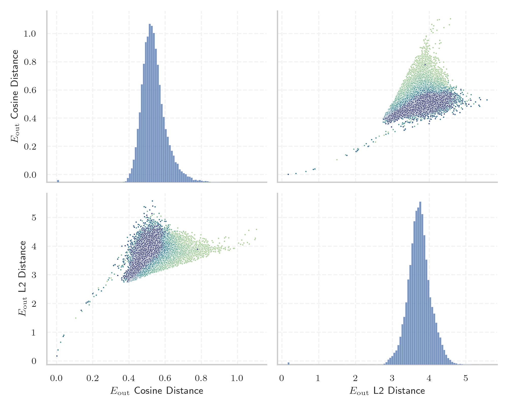
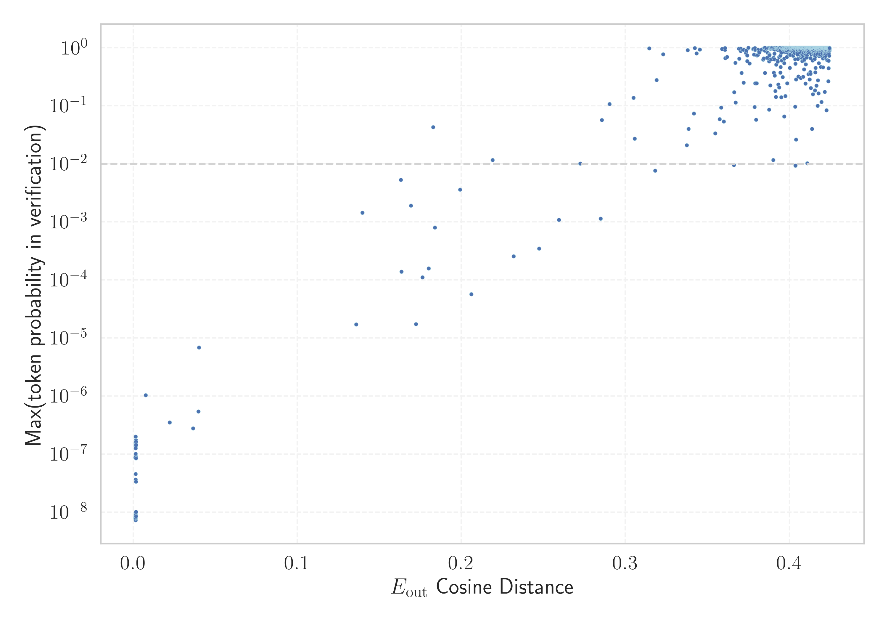

# Report for `openai-community/gpt2`

## Model info

* Model Info: 
  * Tied embeddings: True
  * LM head uses bias: False
  * Embeddings shape: [50257, 768]
* Tokenizer Info: 
  * Vocab Size: 50257
  * Tokenizer Class: GPT2Tokenizer
  * Bytes handling: Byte Input
  * Tokenizer Type: BPE
  * Token for verification prompt building: BuyableInstoreAndOnline
  * Token id for verification prompt building: 40242
* Indicator summary: 
  * Indicator for under-trained tokens: E_{out} Cosine Distance
  * Overall distribution: 0.536 +/- 0.070
* Detected Token Counts: 
  * Number of tested under-trained tokens: 999, 967 non-special, 33 below p = 0.01 threshold, 26 below soft indicator threshold
  * Number of single byte tokens: 256, of which 46 below indicator threshold
  * Number of special tokens: 0, of which 0 below indicator threshold
  * Number of non-single-byte UTF-fragment tokens:  216, of which 2 below soft indicator threshold

## Under-trained token indicators plot


## Verification plot


## Under-trained token verification results
26 entries below threshold of 0.206

|   token_id | token                                        |   indicator | max_prob                                                         | in_other_tokens                                                                                                                                                                                                                                                                                                                     |
|------------|----------------------------------------------|-------------|------------------------------------------------------------------|-------------------------------------------------------------------------------------------------------------------------------------------------------------------------------------------------------------------------------------------------------------------------------------------------------------------------------------|
|      40241 | ````` InstoreAndOnline `````                 |  0.00143921 | <span style='border: 1px solid rgb(169, 68, 66);'>8.6e-09</span> | <span style='border: 1px solid rgb(40, 167, 69);'>````` BuyableInstoreAndOnline `````</span>                                                                                                                                                                                                                                        |
|      30905 | ````` rawdownload `````                      |  0.00145763 | <span style='border: 1px solid rgb(169, 68, 66);'>1.4e-07</span> | ````` rawdownloadcloneembedreportprint `````                                                                                                                                                                                                                                                                                        |
|      39752 | ````` quickShip `````                        |  0.00147873 | <span style='border: 1px solid rgb(169, 68, 66);'>9.1e-09</span> | <span style='border: 1px solid rgb(40, 167, 69);'>````` quickShipAvailable `````</span>                                                                                                                                                                                                                                             |
|      40240 | ````` oreAndOnline `````                     |  0.00148576 | <span style='border: 1px solid rgb(169, 68, 66);'>9.1e-08</span> | <span style='border: 1px solid rgb(169, 68, 66);'>````` InstoreAndOnline `````</span>, <span style='border: 1px solid rgb(40, 167, 69);'>````` BuyableInstoreAndOnline `````</span>                                                                                                                                                 |
|      30898 | ````` embedreportprint `````                 |  0.00153571 | <span style='border: 1px solid rgb(169, 68, 66);'>1e-07</span>   | <span style='border: 1px solid rgb(169, 68, 66);'>````` cloneembedreportprint `````</span>, ````` rawdownloadcloneembedreportprint `````                                                                                                                                                                                            |
|      45544 | ````` ▁サーティ `````                        |  0.00154209 | <span style='border: 1px solid rgb(169, 68, 66);'>1.4e-07</span> | <span style='border: 1px solid rgb(40, 167, 69);'>````` ▁サーティワン `````</span>                                                                                                                                                                                                                                                  |
|      36173 | ````` ▁RandomRedditor `````                  |  0.00156629 | <span style='border: 1px solid rgb(169, 68, 66);'>1.5e-07</span> | <span style='border: 1px solid rgb(40, 167, 69);'>````` ▁RandomRedditorWithNo `````</span>                                                                                                                                                                                                                                          |
|      30212 | ````` ▁externalToEVA `````                   |  0.00158066 | <span style='border: 1px solid rgb(169, 68, 66);'>1.7e-07</span> | <span style='border: 1px solid rgb(40, 167, 69);'>````` ▁externalToEVAOnly `````</span>                                                                                                                                                                                                                                             |
|      42089 | ````` ▁TheNitrome `````                      |  0.00158507 | <span style='border: 1px solid rgb(169, 68, 66);'>8.5e-09</span> | <span style='border: 1px solid rgb(40, 167, 69);'>````` ▁TheNitromeFan `````</span>                                                                                                                                                                                                                                                 |
|      30897 | ````` reportprint `````                      |  0.00160545 | <span style='border: 1px solid rgb(169, 68, 66);'>3.3e-08</span> | <span style='border: 1px solid rgb(169, 68, 66);'>````` embedreportprint `````</span>, <span style='border: 1px solid rgb(169, 68, 66);'>````` cloneembedreportprint `````</span>, ````` rawdownloadcloneembedreportprint `````                                                                                                     |
|      30208 | ````` ▁externalTo `````                      |  0.00763935 | <span style='border: 1px solid rgb(169, 68, 66);'>1e-06</span>   | <span style='border: 1px solid rgb(169, 68, 66);'>````` ▁externalToEVA `````</span>, <span style='border: 1px solid rgb(40, 167, 69);'>````` ▁externalToEVAOnly `````</span>                                                                                                                                                        |
|      23090 | ````` ÃÂÃÂÃÂÃÂÃÂÃÂÃÂÃÂÃÂÃÂÃÂÃÂÃÂÃÂÃÂÃÂ ````` |  0.022287   | <span style='border: 1px solid rgb(169, 68, 66);'>3.5e-07</span> | <span style='border: 1px solid rgb(40, 167, 69);'>````` ÃÂÃÂÃÂÃÂÃÂÃÂÃÂÃÂÃÂÃÂÃÂÃÂÃÂÃÂÃÂÃÂÃÂÃÂÃÂÃÂÃÂÃÂÃÂÃÂÃÂÃÂÃÂÃÂÃÂÃÂÃÂÃÂ `````</span>                                                                                                                                                                                               |
|      37574 | ````` StreamerBot `````                      |  0.036516   | <span style='border: 1px solid rgb(169, 68, 66);'>2.8e-07</span> | <span style='border: 1px solid rgb(40, 167, 69);'>````` TPPStreamerBot `````</span>                                                                                                                                                                                                                                                 |
|      31573 | ````` ActionCode `````                       |  0.0397143  | <span style='border: 1px solid rgb(169, 68, 66);'>5.4e-07</span> | ````` externalActionCode `````                                                                                                                                                                                                                                                                                                      |
|      14827 | ````` ÃÂÃÂÃÂÃÂÃÂÃÂÃÂÃÂ `````                 |  0.0400726  | <span style='border: 1px solid rgb(169, 68, 66);'>6.9e-06</span> | <span style='border: 1px solid rgb(169, 68, 66);'>````` ÃÂÃÂÃÂÃÂÃÂÃÂÃÂÃÂÃÂÃÂÃÂÃÂÃÂÃÂÃÂÃÂ `````</span>, <span style='border: 1px solid rgb(40, 167, 69);'>````` ÃÂÃÂÃÂÃÂÃÂÃÂÃÂÃÂÃÂÃÂÃÂÃÂÃÂÃÂÃÂÃÂÃÂÃÂÃÂÃÂÃÂÃÂÃÂÃÂÃÂÃÂÃÂÃÂÃÂÃÂÃÂÃÂ `````</span>                                                                                        |
|      42066 | ````` Nitrome `````                          |  0.135858   | <span style='border: 1px solid rgb(169, 68, 66);'>1.7e-05</span> | <span style='border: 1px solid rgb(169, 68, 66);'>````` ▁TheNitrome `````</span>, <span style='border: 1px solid rgb(40, 167, 69);'>````` ▁TheNitromeFan `````</span>                                                                                                                                                               |
|       9364 | ````` ÃÂÃÂÃÂÃÂ `````                         |  0.139732   | <span style='border: 1px solid rgb(255, 145, 0);'>0.0014</span>  | <span style='border: 1px solid rgb(169, 68, 66);'>````` ÃÂÃÂÃÂÃÂÃÂÃÂÃÂÃÂ `````</span>, <span style='border: 1px solid rgb(169, 68, 66);'>````` ÃÂÃÂÃÂÃÂÃÂÃÂÃÂÃÂÃÂÃÂÃÂÃÂÃÂÃÂÃÂÃÂ `````</span>, <span style='border: 1px solid rgb(40, 167, 69);'>````` ÃÂÃÂÃÂÃÂÃÂÃÂÃÂÃÂÃÂÃÂÃÂÃÂÃÂÃÂÃÂÃÂÃÂÃÂÃÂÃÂÃÂÃÂÃÂÃÂÃÂÃÂÃÂÃÂÃÂÃÂÃÂÃÂ `````</span> |
|      39749 | ````` DeliveryDate `````                     |  0.163166   | <span style='border: 1px solid rgb(255, 145, 0);'>0.0053</span>  | <span style='border: 1px solid rgb(40, 167, 69);'>````` soDeliveryDate `````</span>                                                                                                                                                                                                                                                 |
|      39142 | ````` ThumbnailImage `````                   |  0.163535   | <span style='border: 1px solid rgb(169, 68, 66);'>0.00014</span> | <span style='border: 1px solid rgb(40, 167, 69);'>````` ItemThumbnailImage `````</span>                                                                                                                                                                                                                                             |
|      39714 | ````` isSpecial `````                        |  0.169225   | <span style='border: 1px solid rgb(255, 145, 0);'>0.0019</span>  | <span style='border: 1px solid rgb(40, 167, 69);'>````` isSpecialOrderable `````</span>                                                                                                                                                                                                                                             |
<details><summary>6 additional entries below threshold</summary>

|   token_id | token                             |   indicator | max_prob                                                         | in_other_tokens                                                                                                                                                                                                                                                                                                                                                                                                    |
|------------|-----------------------------------|-------------|------------------------------------------------------------------|--------------------------------------------------------------------------------------------------------------------------------------------------------------------------------------------------------------------------------------------------------------------------------------------------------------------------------------------------------------------------------------------------------------------|
|      40219 | ````` oreAnd `````                |    0.172416 | <span style='border: 1px solid rgb(169, 68, 66);'>1.7e-05</span> | <span style='border: 1px solid rgb(169, 68, 66);'>````` oreAndOnline `````</span>, <span style='border: 1px solid rgb(169, 68, 66);'>````` InstoreAndOnline `````</span>, <span style='border: 1px solid rgb(40, 167, 69);'>````` BuyableInstoreAndOnline `````</span>                                                                                                                                             |
|      30899 | ````` cloneembedreportprint ````` |    0.176264 | <span style='border: 1px solid rgb(169, 68, 66);'>0.00011</span> | ````` rawdownloadcloneembedreportprint `````                                                                                                                                                                                                                                                                                                                                                                       |
|      13150 | ````` ▁subur `````                |    0.180166 | <span style='border: 1px solid rgb(169, 68, 66);'>0.00016</span> | ````` ▁suburban `````, ````` ▁suburbs `````, ````` ▁suburb `````                                                                                                                                                                                                                                                                                                                                                   |
|       5815 | ````` ÃÂÃÂ `````                  |    0.182786 | <span style='border: 1px solid rgb(251, 189, 8);'>0.043</span>   | <span style='border: 1px solid rgb(255, 145, 0);'>````` ÃÂÃÂÃÂÃÂ `````</span>, <span style='border: 1px solid rgb(169, 68, 66);'>````` ÃÂÃÂÃÂÃÂÃÂÃÂÃÂÃÂ `````</span>, <span style='border: 1px solid rgb(169, 68, 66);'>````` ÃÂÃÂÃÂÃÂÃÂÃÂÃÂÃÂÃÂÃÂÃÂÃÂÃÂÃÂÃÂÃÂ `````</span>, <span style='border: 1px solid rgb(40, 167, 69);'>````` ÃÂÃÂÃÂÃÂÃÂÃÂÃÂÃÂÃÂÃÂÃÂÃÂÃÂÃÂÃÂÃÂÃÂÃÂÃÂÃÂÃÂÃÂÃÂÃÂÃÂÃÂÃÂÃÂÃÂÃÂÃÂÃÂ `````</span> |
|      17629 | ````` ▁practition `````           |    0.183995 | <span style='border: 1px solid rgb(169, 68, 66);'>0.0008</span>  | ````` ▁practitioners `````, ````` ▁practitioner `````                                                                                                                                                                                                                                                                                                                                                              |
|      39655 | ````` Orderable `````             |    0.199313 | <span style='border: 1px solid rgb(255, 145, 0);'>0.0036</span>  | <span style='border: 1px solid rgb(40, 167, 69);'>````` isSpecialOrderable `````</span>                                                                                                                                                                                                                                                                                                                            |
</details>
<details><summary>941 additional entries above threshold</summary>

|   token_id | token                                                                        |   indicator | max_prob                                                         | in_other_tokens                                                                                                                                                                                                                                                                                                                                                                                                                                                                               |
|------------|------------------------------------------------------------------------------|-------------|------------------------------------------------------------------|-----------------------------------------------------------------------------------------------------------------------------------------------------------------------------------------------------------------------------------------------------------------------------------------------------------------------------------------------------------------------------------------------------------------------------------------------------------------------------------------------|
|      15272 | ````` ▁pione `````                                                           |    0.206062 | <span style='border: 1px solid rgb(169, 68, 66);'>5.7e-05</span> | ````` ▁pioneer `````, ````` ▁pioneering `````, ````` ▁pioneers `````, ````` ▁pioneered `````                                                                                                                                                                                                                                                                                                                                                                                                  |
|      27293 | ````` ▁antidepress `````                                                     |    0.219108 | <span style='border: 1px solid rgb(251, 189, 8);'>0.012</span>   | ````` ▁antidepressants `````, ````` ▁antidepressant `````                                                                                                                                                                                                                                                                                                                                                                                                                                     |
|      27013 | ````` aditional `````                                                        |    0.231961 | <span style='border: 1px solid rgb(169, 68, 66);'>0.00026</span> | ````` ▁Traditional `````, ````` traditional `````, ````` Traditional `````                                                                                                                                                                                                                                                                                                                                                                                                                    |
|      30439 | ````` ▁unintention `````                                                     |    0.247503 | <span style='border: 1px solid rgb(169, 68, 66);'>0.00035</span> | ````` ▁unintentionally `````, ````` ▁unintentional `````                                                                                                                                                                                                                                                                                                                                                                                                                                      |
|      25618 | ````` ▁councill `````                                                        |    0.259484 | <span style='border: 1px solid rgb(255, 145, 0);'>0.0011</span>  | ````` ▁councillor `````, ````` ▁councillors `````                                                                                                                                                                                                                                                                                                                                                                                                                                             |
|       7105 | ````` ▁volunte `````                                                         |    0.272465 | <span style='border: 1px solid rgb(251, 189, 8);'>0.01</span>    | ````` ▁volunteers `````, ````` ▁volunteer `````, ````` ▁volunteered `````, ````` ▁volunteering `````                                                                                                                                                                                                                                                                                                                                                                                          |
|       4690 | ````` ortunately `````                                                       |    0.28492  | <span style='border: 1px solid rgb(255, 145, 0);'>0.0011</span>  | ````` fortunately `````, ````` ▁Unfortunately `````, ````` ▁unfortunately `````, <span style='border: 1px solid rgb(40, 167, 69);'>````` Unfortunately `````</span>, ````` ▁Fortunately `````, ...                                                                                                                                                                                                                                                                                            |
|      24973 | ````` ▁exting `````                                                          |    0.285715 | <span style='border: 1px solid rgb(251, 189, 8);'>0.057</span>   | ````` ▁extingu `````, ````` ▁extinguished `````                                                                                                                                                                                                                                                                                                                                                                                                                                               |
|      19476 | ````` ▁carbohyd `````                                                        |    0.29039  | <span style='border: 1px solid rgb(40, 167, 69);'>0.11</span>    | ````` ▁carbohydrate `````, ````` ▁carbohydrates `````                                                                                                                                                                                                                                                                                                                                                                                                                                         |
|      18945 | ````` ▁teasp `````                                                           |    0.304984 | <span style='border: 1px solid rgb(40, 167, 69);'>0.14</span>    | ````` ▁teaspoon `````, ````` ▁teaspoons `````                                                                                                                                                                                                                                                                                                                                                                                                                                                 |
|      13198 | ````` ▁earthqu `````                                                         |    0.305768 | <span style='border: 1px solid rgb(251, 189, 8);'>0.027</span>   | ````` ▁earthquake `````, ````` ▁earthquakes `````                                                                                                                                                                                                                                                                                                                                                                                                                                             |
|      42202 | ````` GoldMagikarp `````                                                     |    0.31455  | <span style='border: 1px solid rgb(40, 167, 69);'>0.98</span>    | <span style='border: 1px solid rgb(40, 167, 69);'>````` ▁SolidGoldMagikarp `````</span>                                                                                                                                                                                                                                                                                                                                                                                                       |
|      11548 | ````` ▁entreprene `````                                                      |    0.318222 | <span style='border: 1px solid rgb(255, 145, 0);'>0.0076</span>  | ````` ▁entrepreneurs `````, ````` ▁entrepreneur `````, ````` ▁entrepreneurial `````, ````` ▁entrepreneurship `````                                                                                                                                                                                                                                                                                                                                                                            |
|      14695 | ````` ▁eleph `````                                                           |    0.319038 | <span style='border: 1px solid rgb(40, 167, 69);'>0.28</span>    | ````` ▁elephant `````, ````` ▁elephants `````                                                                                                                                                                                                                                                                                                                                                                                                                                                 |
|      39693 | ````` Buyable `````                                                          |    0.323047 | <span style='border: 1px solid rgb(40, 167, 69);'>0.77</span>    | <span style='border: 1px solid rgb(40, 167, 69);'>````` BuyableInstoreAndOnline `````</span>                                                                                                                                                                                                                                                                                                                                                                                                  |
|      42889 | ````` ikuman `````                                                           |    0.33741  | <span style='border: 1px solid rgb(251, 189, 8);'>0.021</span>   | ````` ▁Kinnikuman `````                                                                                                                                                                                                                                                                                                                                                                                                                                                                       |
|      48396 | ````` ÛÛ `````                                                               |    0.337924 | <span style='border: 1px solid rgb(40, 167, 69);'>0.91</span>    |                                                                                                                                                                                                                                                                                                                                                                                                                                                                                               |
|      44392 | ````` ▁cumbers `````                                                         |    0.338503 | <span style='border: 1px solid rgb(251, 189, 8);'>0.04</span>    | <span style='border: 1px solid rgb(40, 167, 69);'>````` ▁cumbersome `````</span>                                                                                                                                                                                                                                                                                                                                                                                                              |
|      14341 | ````` PDATE `````                                                            |    0.341838 | <span style='border: 1px solid rgb(251, 189, 8);'>0.073</span>   | ````` UPDATE `````, ````` ▁UPDATE `````, <span style='border: 1px solid rgb(40, 167, 69);'>````` PDATED `````</span>                                                                                                                                                                                                                                                                                                                                                                          |
|      35496 | ````` ÃÂÃÂÃÂÃÂÃÂÃÂÃÂÃÂÃÂÃÂÃÂÃÂÃÂÃÂÃÂÃÂÃÂÃÂÃÂÃÂÃÂÃÂÃÂÃÂÃÂÃÂÃÂÃÂÃÂÃÂÃÂÃÂ ````` |    0.342343 | <span style='border: 1px solid rgb(40, 167, 69);'>0.98</span>    |                                                                                                                                                                                                                                                                                                                                                                                                                                                                                               |
|      31666 | ````` ?????-?????- `````                                                     |    0.343427 | <span style='border: 1px solid rgb(40, 167, 69);'>0.8</span>     |                                                                                                                                                                                                                                                                                                                                                                                                                                                                                               |
|       5808 | ````` ÃÂ `````                                                               |    0.345483 | <span style='border: 1px solid rgb(40, 167, 69);'>0.93</span>    | <span style='border: 1px solid rgb(251, 189, 8);'>````` ÃÂÃÂ `````</span>, <span style='border: 1px solid rgb(255, 145, 0);'>````` ÃÂÃÂÃÂÃÂ `````</span>, <span style='border: 1px solid rgb(169, 68, 66);'>````` ÃÂÃÂÃÂÃÂÃÂÃÂÃÂÃÂ `````</span>, <span style='border: 1px solid rgb(169, 68, 66);'>````` ÃÂÃÂÃÂÃÂÃÂÃÂÃÂÃÂÃÂÃÂÃÂÃÂÃÂÃÂÃÂÃÂ `````</span>, <span style='border: 1px solid rgb(40, 167, 69);'>````` ÃÂÃÂÃÂÃÂÃÂÃÂÃÂÃÂÃÂÃÂÃÂÃÂÃÂÃÂÃÂÃÂÃÂÃÂÃÂÃÂÃÂÃÂÃÂÃÂÃÂÃÂÃÂÃÂÃÂÃÂÃÂÃÂ `````</span> |
|      22315 | ````` ▁newcom `````                                                          |    0.354794 | <span style='border: 1px solid rgb(251, 189, 8);'>0.033</span>   | ````` ▁newcomers `````, ````` ▁newcomer `````                                                                                                                                                                                                                                                                                                                                                                                                                                                 |
|      23711 | ````` ▁Moroc `````                                                           |    0.357426 | <span style='border: 1px solid rgb(251, 189, 8);'>0.059</span>   | ````` ▁Morocco `````, ````` ▁Moroccan `````                                                                                                                                                                                                                                                                                                                                                                                                                                                   |
|       8994 | ````` ailability `````                                                       |    0.35836  | <span style='border: 1px solid rgb(251, 189, 8);'>0.093</span>   | ````` ▁availability `````, ````` Availability `````, <span style='border: 1px solid rgb(40, 167, 69);'>````` channelAvailability `````</span>, ````` ▁Availability `````, ````` availability `````                                                                                                                                                                                                                                                                                            |
|      40817 | ````` Honestly `````                                                         |    0.35894  | <span style='border: 1px solid rgb(40, 167, 69);'>0.95</span>    |                                                                                                                                                                                                                                                                                                                                                                                                                                                                                               |
|      24307 | ````` ▁looph `````                                                           |    0.360073 | <span style='border: 1px solid rgb(251, 189, 8);'>0.053</span>   | ````` ▁loophole `````, ````` ▁loopholes `````                                                                                                                                                                                                                                                                                                                                                                                                                                                 |
|      41215 | ````` conservancy `````                                                      |    0.360696 | <span style='border: 1px solid rgb(40, 167, 69);'>0.92</span>    | <span style='border: 1px solid rgb(40, 167, 69);'>````` natureconservancy `````</span>                                                                                                                                                                                                                                                                                                                                                                                                        |
|      46399 | ````` Putting `````                                                          |    0.36074  | <span style='border: 1px solid rgb(40, 167, 69);'>0.99</span>    |                                                                                                                                                                                                                                                                                                                                                                                                                                                                                               |
|      44850 | ````` Ironically `````                                                       |    0.360898 | <span style='border: 1px solid rgb(40, 167, 69);'>0.66</span>    |                                                                                                                                                                                                                                                                                                                                                                                                                                                                                               |
|      25658 | ````` ?????- `````                                                           |    0.362028 | <span style='border: 1px solid rgb(40, 167, 69);'>0.69</span>    | <span style='border: 1px solid rgb(40, 167, 69);'>````` ?????-?????- `````</span>                                                                                                                                                                                                                                                                                                                                                                                                             |
|      20554 | ````` ▁unbeliev `````                                                        |    0.366103 | <span style='border: 1px solid rgb(255, 145, 0);'>0.0096</span>  | ````` ▁unbelievable `````, <span style='border: 1px solid rgb(40, 167, 69);'>````` ▁unbelievably `````</span>                                                                                                                                                                                                                                                                                                                                                                                 |
|      11689 | ````` ▁unnecess `````                                                        |    0.366404 | <span style='border: 1px solid rgb(40, 167, 69);'>0.17</span>    | ````` ▁unnecessary `````, ````` ▁unnecessarily `````                                                                                                                                                                                                                                                                                                                                                                                                                                          |
|      27924 | ````` ▁srf `````                                                             |    0.367115 | <span style='border: 1px solid rgb(40, 167, 69);'>0.55</span>    | ````` ▁srfN `````, <span style='border: 1px solid rgb(40, 167, 69);'>````` ▁srfAttach `````</span>                                                                                                                                                                                                                                                                                                                                                                                            |
|      22640 | ````` itially `````                                                          |    0.367276 | <span style='border: 1px solid rgb(40, 167, 69);'>0.11</span>    | <span style='border: 1px solid rgb(40, 167, 69);'>````` ▁Initially `````</span>, <span style='border: 1px solid rgb(40, 167, 69);'>````` Initially `````</span>                                                                                                                                                                                                                                                                                                                               |
|      48142 | ````` Assuming `````                                                         |    0.369249 | <span style='border: 1px solid rgb(40, 167, 69);'>0.97</span>    |                                                                                                                                                                                                                                                                                                                                                                                                                                                                                               |
|      30513 | ````` Shortly `````                                                          |    0.369461 | <span style='border: 1px solid rgb(40, 167, 69);'>0.65</span>    |                                                                                                                                                                                                                                                                                                                                                                                                                                                                                               |
|      43298 | ````` userc `````                                                            |    0.370259 | <span style='border: 1px solid rgb(40, 167, 69);'>0.88</span>    | <span style='border: 1px solid rgb(40, 167, 69);'>````` usercontent `````</span>                                                                                                                                                                                                                                                                                                                                                                                                              |
|      33813 | ````` =~=~ `````                                                             |    0.370398 | <span style='border: 1px solid rgb(40, 167, 69);'>0.97</span>    |                                                                                                                                                                                                                                                                                                                                                                                                                                                                                               |
|      32917 | ````` aution `````                                                           |    0.370782 | <span style='border: 1px solid rgb(40, 167, 69);'>0.37</span>    | ````` ▁precaution `````, ````` ▁cautioned `````                                                                                                                                                                                                                                                                                                                                                                                                                                               |
|      43569 | ````` ÍÍ `````                                                               |    0.371278 | <span style='border: 1px solid rgb(40, 167, 69);'>0.92</span>    |                                                                                                                                                                                                                                                                                                                                                                                                                                                                                               |
|      27927 | ````` Nearly `````                                                           |    0.372061 | <span style='border: 1px solid rgb(40, 167, 69);'>0.92</span>    |                                                                                                                                                                                                                                                                                                                                                                                                                                                                                               |
|      16303 | ````` ▁undermin `````                                                        |    0.372135 | <span style='border: 1px solid rgb(40, 167, 69);'>0.25</span>    | <span style='border: 1px solid rgb(40, 167, 69);'>````` ▁undermine `````</span>, <span style='border: 1px solid rgb(40, 167, 69);'>````` ▁undermining `````</span>, <span style='border: 1px solid rgb(40, 167, 69);'>````` ▁undermined `````</span>, <span style='border: 1px solid rgb(40, 167, 69);'>````` ▁undermines `````</span>                                                                                                                                                        |
|      49321 | ````` Typically `````                                                        |    0.37348  | <span style='border: 1px solid rgb(40, 167, 69);'>0.81</span>    |                                                                                                                                                                                                                                                                                                                                                                                                                                                                                               |
|      41156 | ````` Depending `````                                                        |    0.3738   | <span style='border: 1px solid rgb(40, 167, 69);'>0.9</span>     |                                                                                                                                                                                                                                                                                                                                                                                                                                                                                               |
|      33092 | ````` Interestingly `````                                                    |    0.374256 | <span style='border: 1px solid rgb(40, 167, 69);'>0.74</span>    |                                                                                                                                                                                                                                                                                                                                                                                                                                                                                               |
|      36174 | ````` ▁RandomRedditorWithNo `````                                            |    0.374315 | <span style='border: 1px solid rgb(40, 167, 69);'>0.59</span>    |                                                                                                                                                                                                                                                                                                                                                                                                                                                                                               |
|      48908 | ````` ▁4090 `````                                                            |    0.375049 | <span style='border: 1px solid rgb(40, 167, 69);'>1</span>       |                                                                                                                                                                                                                                                                                                                                                                                                                                                                                               |
|      43258 | ````` Nonetheless `````                                                      |    0.375779 | <span style='border: 1px solid rgb(40, 167, 69);'>0.54</span>    |                                                                                                                                                                                                                                                                                                                                                                                                                                                                                               |
|      36725 | ````` Sadly `````                                                            |    0.377924 | <span style='border: 1px solid rgb(40, 167, 69);'>0.94</span>    |                                                                                                                                                                                                                                                                                                                                                                                                                                                                                               |
|      43541 | ````` Amid `````                                                             |    0.377997 | <span style='border: 1px solid rgb(40, 167, 69);'>0.96</span>    |                                                                                                                                                                                                                                                                                                                                                                                                                                                                                               |
|      40443 | ````` Initially `````                                                        |    0.378373 | <span style='border: 1px solid rgb(40, 167, 69);'>0.76</span>    |                                                                                                                                                                                                                                                                                                                                                                                                                                                                                               |
|      12677 | ````` ▁tradem `````                                                          |    0.378841 | <span style='border: 1px solid rgb(251, 189, 8);'>0.095</span>   | ````` ▁trademark `````, ````` ▁trademarks `````                                                                                                                                                                                                                                                                                                                                                                                                                                               |
|      40475 | ````` Considering `````                                                      |    0.379018 | <span style='border: 1px solid rgb(40, 167, 69);'>0.99</span>    |                                                                                                                                                                                                                                                                                                                                                                                                                                                                                               |
|      28235 | ````` aeper `````                                                            |    0.379227 | <span style='border: 1px solid rgb(40, 167, 69);'>0.24</span>    | <span style='border: 1px solid rgb(40, 167, 69);'>````` aepernick `````</span>, ````` ▁Kaepernick `````                                                                                                                                                                                                                                                                                                                                                                                       |
|      50030 | ````` ▁glared `````                                                          |    0.37924  | <span style='border: 1px solid rgb(40, 167, 69);'>0.92</span>    |                                                                                                                                                                                                                                                                                                                                                                                                                                                                                               |
|       4183 | ````` ▁conflic `````                                                         |    0.379625 | <span style='border: 1px solid rgb(251, 189, 8);'>0.058</span>   | ````` ▁conflict `````, ````` ▁conflicts `````, ````` ▁conflicting `````, ````` ▁conflicted `````                                                                                                                                                                                                                                                                                                                                                                                              |
|      45228 | ````` uliffe `````                                                           |    0.380092 | <span style='border: 1px solid rgb(40, 167, 69);'>0.24</span>    | ````` ▁McAuliffe `````                                                                                                                                                                                                                                                                                                                                                                                                                                                                        |
|      20670 | ````` Obviously `````                                                        |    0.380222 | <span style='border: 1px solid rgb(40, 167, 69);'>0.73</span>    |                                                                                                                                                                                                                                                                                                                                                                                                                                                                                               |
|      49543 | ````` ▁inhibits `````                                                        |    0.380854 | <span style='border: 1px solid rgb(40, 167, 69);'>0.75</span>    |                                                                                                                                                                                                                                                                                                                                                                                                                                                                                               |
|      36651 | ````` ▁Somehow `````                                                         |    0.380955 | <span style='border: 1px solid rgb(40, 167, 69);'>0.92</span>    |                                                                                                                                                                                                                                                                                                                                                                                                                                                                                               |
|      27894 | ````` Regardless `````                                                       |    0.381237 | <span style='border: 1px solid rgb(40, 167, 69);'>0.85</span>    |                                                                                                                                                                                                                                                                                                                                                                                                                                                                                               |
|      30402 | ````` Apparently `````                                                       |    0.381601 | <span style='border: 1px solid rgb(40, 167, 69);'>0.83</span>    |                                                                                                                                                                                                                                                                                                                                                                                                                                                                                               |
|      37731 | ````` ▁Ironically `````                                                      |    0.383061 | <span style='border: 1px solid rgb(40, 167, 69);'>0.93</span>    |                                                                                                                                                                                                                                                                                                                                                                                                                                                                                               |
|      35992 | ````` WithNo `````                                                           |    0.384026 | <span style='border: 1px solid rgb(40, 167, 69);'>0.62</span>    | <span style='border: 1px solid rgb(40, 167, 69);'>````` ▁RandomRedditorWithNo `````</span>                                                                                                                                                                                                                                                                                                                                                                                                    |
|      24982 | ````` ▁Consequently `````                                                    |    0.384384 | <span style='border: 1px solid rgb(40, 167, 69);'>0.65</span>    |                                                                                                                                                                                                                                                                                                                                                                                                                                                                                               |
|      46418 | ````` ▁formulate `````                                                       |    0.384643 | <span style='border: 1px solid rgb(40, 167, 69);'>0.95</span>    |                                                                                                                                                                                                                                                                                                                                                                                                                                                                                               |
|      50009 | ````` ▁strutConnector `````                                                  |    0.384671 | <span style='border: 1px solid rgb(40, 167, 69);'>0.99</span>    |                                                                                                                                                                                                                                                                                                                                                                                                                                                                                               |
|      30638 | ````` Clearly `````                                                          |    0.38488  | <span style='border: 1px solid rgb(40, 167, 69);'>0.9</span>     |                                                                                                                                                                                                                                                                                                                                                                                                                                                                                               |
|      38150 | ````` Hundreds `````                                                         |    0.385048 | <span style='border: 1px solid rgb(40, 167, 69);'>0.89</span>    |                                                                                                                                                                                                                                                                                                                                                                                                                                                                                               |
|      26797 | ````` Throughout `````                                                       |    0.38505  | <span style='border: 1px solid rgb(40, 167, 69);'>0.88</span>    |                                                                                                                                                                                                                                                                                                                                                                                                                                                                                               |
|       6598 | ````` ▁behavi `````                                                          |    0.385081 | <span style='border: 1px solid rgb(40, 167, 69);'>0.37</span>    | ````` ▁behaviour `````, ````` ▁behaviors `````, ````` ▁behavioral `````, ````` ▁behaving `````, ````` ▁behaviours `````, ...                                                                                                                                                                                                                                                                                                                                                                  |
|      43970 | ````` ▁Notwithstanding `````                                                 |    0.385126 | <span style='border: 1px solid rgb(40, 167, 69);'>1</span>       |                                                                                                                                                                                                                                                                                                                                                                                                                                                                                               |
|      44217 | ````` Hmm `````                                                              |    0.38603  | <span style='border: 1px solid rgb(40, 167, 69);'>0.96</span>    |                                                                                                                                                                                                                                                                                                                                                                                                                                                                                               |
|      45683 | ````` ▁Notably `````                                                         |    0.38644  | <span style='border: 1px solid rgb(40, 167, 69);'>0.67</span>    |                                                                                                                                                                                                                                                                                                                                                                                                                                                                                               |
|      47578 | ````` ▁counteract `````                                                      |    0.386773 | <span style='border: 1px solid rgb(40, 167, 69);'>0.82</span>    |                                                                                                                                                                                                                                                                                                                                                                                                                                                                                               |
|      44213 | ````` Naturally `````                                                        |    0.386882 | <span style='border: 1px solid rgb(40, 167, 69);'>0.98</span>    |                                                                                                                                                                                                                                                                                                                                                                                                                                                                                               |
|      49856 | ````` 627 `````                                                              |    0.387394 | <span style='border: 1px solid rgb(40, 167, 69);'>0.99</span>    |                                                                                                                                                                                                                                                                                                                                                                                                                                                                                               |
|      34718 | ````` rehensible `````                                                       |    0.387654 | <span style='border: 1px solid rgb(40, 167, 69);'>0.58</span>    | ````` ▁incomprehensible `````                                                                                                                                                                                                                                                                                                                                                                                                                                                                 |
|      29740 | ````` ▁Azerb `````                                                           |    0.387717 | <span style='border: 1px solid rgb(251, 189, 8);'>0.085</span>   | ````` ▁Azerbai `````, ````` ▁Azerbaijan `````                                                                                                                                                                                                                                                                                                                                                                                                                                                 |
|      34173 | ````` ▁Honestly `````                                                        |    0.38779  | <span style='border: 1px solid rgb(40, 167, 69);'>0.77</span>    |                                                                                                                                                                                                                                                                                                                                                                                                                                                                                               |
|      47183 | ````` ▁Surprisingly `````                                                    |    0.38784  | <span style='border: 1px solid rgb(40, 167, 69);'>0.75</span>    |                                                                                                                                                                                                                                                                                                                                                                                                                                                                                               |
|      46435 | ````` 653 `````                                                              |    0.387993 | <span style='border: 1px solid rgb(40, 167, 69);'>0.99</span>    |                                                                                                                                                                                                                                                                                                                                                                                                                                                                                               |
|      13296 | ````` ▁Leban `````                                                           |    0.38822  | <span style='border: 1px solid rgb(40, 167, 69);'>0.63</span>    | ````` ▁Lebanon `````, ````` ▁Lebanese `````                                                                                                                                                                                                                                                                                                                                                                                                                                                   |
|      40067 | ````` ▁Ideally `````                                                         |    0.388304 | <span style='border: 1px solid rgb(40, 167, 69);'>0.97</span>    |                                                                                                                                                                                                                                                                                                                                                                                                                                                                                               |
|      12869 | ````` ▁reluct `````                                                          |    0.388419 | <span style='border: 1px solid rgb(40, 167, 69);'>0.22</span>    | ````` ▁reluctant `````, ````` ▁reluctance `````, ````` ▁reluctantly `````                                                                                                                                                                                                                                                                                                                                                                                                                     |
|      37058 | ````` Generally `````                                                        |    0.388523 | <span style='border: 1px solid rgb(40, 167, 69);'>0.96</span>    |                                                                                                                                                                                                                                                                                                                                                                                                                                                                                               |
|      44669 | ````` Compared `````                                                         |    0.388598 | <span style='border: 1px solid rgb(40, 167, 69);'>0.98</span>    |                                                                                                                                                                                                                                                                                                                                                                                                                                                                                               |
|      45385 | ````` 674 `````                                                              |    0.388907 | <span style='border: 1px solid rgb(40, 167, 69);'>0.99</span>    |                                                                                                                                                                                                                                                                                                                                                                                                                                                                                               |
|       6336 | ````` ▁Palestin `````                                                        |    0.389059 | <span style='border: 1px solid rgb(40, 167, 69);'>0.63</span>    | ````` ▁Palestinian `````, ````` ▁Palestinians `````, ````` ▁Palestine `````                                                                                                                                                                                                                                                                                                                                                                                                                   |
|      42548 | ````` 676 `````                                                              |    0.389105 | <span style='border: 1px solid rgb(40, 167, 69);'>0.99</span>    |                                                                                                                                                                                                                                                                                                                                                                                                                                                                                               |
|      47106 | ````` 439 `````                                                              |    0.389444 | <span style='border: 1px solid rgb(40, 167, 69);'>0.99</span>    | <span style='border: 1px solid rgb(40, 167, 69);'>````` 20439 `````</span>                                                                                                                                                                                                                                                                                                                                                                                                                    |
|      44959 | ````` Quite `````                                                            |    0.389908 | <span style='border: 1px solid rgb(40, 167, 69);'>0.96</span>    |                                                                                                                                                                                                                                                                                                                                                                                                                                                                                               |
|      48724 | ````` 572 `````                                                              |    0.390064 | <span style='border: 1px solid rgb(40, 167, 69);'>0.99</span>    |                                                                                                                                                                                                                                                                                                                                                                                                                                                                                               |
|      48448 | ````` iosyn `````                                                            |    0.390173 | <span style='border: 1px solid rgb(251, 189, 8);'>0.012</span>   | <span style='border: 1px solid rgb(251, 189, 8);'>````` iosyncr `````</span>, ````` ▁idiosyncr `````                                                                                                                                                                                                                                                                                                                                                                                          |
|      25044 | ````` ▁Interestingly `````                                                   |    0.390359 | <span style='border: 1px solid rgb(40, 167, 69);'>0.67</span>    |                                                                                                                                                                                                                                                                                                                                                                                                                                                                                               |
|      43336 | ````` ▁291 `````                                                             |    0.390429 | <span style='border: 1px solid rgb(40, 167, 69);'>0.97</span>    |                                                                                                                                                                                                                                                                                                                                                                                                                                                                                               |
|      45872 | ````` Likewise `````                                                         |    0.390493 | <span style='border: 1px solid rgb(40, 167, 69);'>0.37</span>    |                                                                                                                                                                                                                                                                                                                                                                                                                                                                                               |
|      46010 | ````` Huh `````                                                              |    0.39083  | <span style='border: 1px solid rgb(40, 167, 69);'>0.95</span>    |                                                                                                                                                                                                                                                                                                                                                                                                                                                                                               |
|      39889 | ````` ▁chuckled `````                                                        |    0.390899 | <span style='border: 1px solid rgb(40, 167, 69);'>0.63</span>    |                                                                                                                                                                                                                                                                                                                                                                                                                                                                                               |
|      32602 | ````` Aside `````                                                            |    0.390969 | <span style='border: 1px solid rgb(40, 167, 69);'>0.79</span>    |                                                                                                                                                                                                                                                                                                                                                                                                                                                                                               |
|      33937 | ````` Vaults `````                                                           |    0.390998 | <span style='border: 1px solid rgb(40, 167, 69);'>0.96</span>    |                                                                                                                                                                                                                                                                                                                                                                                                                                                                                               |
|      36720 | ````` 372 `````                                                              |    0.391018 | <span style='border: 1px solid rgb(40, 167, 69);'>0.99</span>    | <span style='border: 1px solid rgb(40, 167, 69);'>````` ▁372 `````</span>                                                                                                                                                                                                                                                                                                                                                                                                                     |
|      24847 | ````` ModLoader `````                                                        |    0.391086 | <span style='border: 1px solid rgb(40, 167, 69);'>0.93</span>    | <span style='border: 1px solid rgb(40, 167, 69);'>````` ForgeModLoader `````</span>                                                                                                                                                                                                                                                                                                                                                                                                           |
|      13171 | ````` VIDIA `````                                                            |    0.391106 | <span style='border: 1px solid rgb(40, 167, 69);'>0.33</span>    | ````` ▁NVIDIA `````, <span style='border: 1px solid rgb(40, 167, 69);'>````` NVIDIA `````</span>                                                                                                                                                                                                                                                                                                                                                                                              |
|      33459 | ````` 459 `````                                                              |    0.391122 | <span style='border: 1px solid rgb(40, 167, 69);'>0.99</span>    |                                                                                                                                                                                                                                                                                                                                                                                                                                                                                               |
|       3523 | ````` ▁citiz `````                                                           |    0.391493 | <span style='border: 1px solid rgb(40, 167, 69);'>0.18</span>    | ````` ▁citizens `````, ````` ▁citizen `````, ````` ▁citizenship `````                                                                                                                                                                                                                                                                                                                                                                                                                         |
|      27824 | ````` 367 `````                                                              |    0.391611 | <span style='border: 1px solid rgb(40, 167, 69);'>0.99</span>    | <span style='border: 1px solid rgb(40, 167, 69);'>````` ▁367 `````</span>                                                                                                                                                                                                                                                                                                                                                                                                                     |
|      36928 | ````` 807 `````                                                              |    0.391641 | <span style='border: 1px solid rgb(40, 167, 69);'>1</span>       |                                                                                                                                                                                                                                                                                                                                                                                                                                                                                               |
|      45648 | ````` Knowing `````                                                          |    0.391828 | <span style='border: 1px solid rgb(40, 167, 69);'>0.97</span>    |                                                                                                                                                                                                                                                                                                                                                                                                                                                                                               |
|      42000 | ````` ▁hemor `````                                                           |    0.391834 | <span style='border: 1px solid rgb(40, 167, 69);'>0.14</span>    | ````` ▁hemorrh `````                                                                                                                                                                                                                                                                                                                                                                                                                                                                          |
|      41974 | ````` accompan `````                                                         |    0.391983 | <span style='border: 1px solid rgb(40, 167, 69);'>0.99</span>    | <span style='border: 1px solid rgb(40, 167, 69);'>````` accompanied `````</span>, ````` ▁unaccompanied `````, ````` ▁accompanies `````                                                                                                                                                                                                                                                                                                                                                        |
|      27251 | ````` ▁Nonetheless `````                                                     |    0.392029 | <span style='border: 1px solid rgb(40, 167, 69);'>0.51</span>    |                                                                                                                                                                                                                                                                                                                                                                                                                                                                                               |
|      44826 | ````` ▁385 `````                                                             |    0.392464 | <span style='border: 1px solid rgb(40, 167, 69);'>0.98</span>    |                                                                                                                                                                                                                                                                                                                                                                                                                                                                                               |
|      45214 | ````` 694 `````                                                              |    0.392592 | <span style='border: 1px solid rgb(40, 167, 69);'>0.99</span>    |                                                                                                                                                                                                                                                                                                                                                                                                                                                                                               |
|      28877 | ````` Whenever `````                                                         |    0.392652 | <span style='border: 1px solid rgb(40, 167, 69);'>0.99</span>    |                                                                                                                                                                                                                                                                                                                                                                                                                                                                                               |
|      24606 | ````` Moreover `````                                                         |    0.392747 | <span style='border: 1px solid rgb(40, 167, 69);'>0.6</span>     |                                                                                                                                                                                                                                                                                                                                                                                                                                                                                               |
|      24795 | ````` Nobody `````                                                           |    0.39277  | <span style='border: 1px solid rgb(40, 167, 69);'>0.99</span>    |                                                                                                                                                                                                                                                                                                                                                                                                                                                                                               |
|      24951 | ````` Furthermore `````                                                      |    0.392842 | <span style='border: 1px solid rgb(40, 167, 69);'>0.57</span>    |                                                                                                                                                                                                                                                                                                                                                                                                                                                                                               |
|      39865 | ````` proclaimed `````                                                       |    0.393023 | <span style='border: 1px solid rgb(40, 167, 69);'>0.97</span>    |                                                                                                                                                                                                                                                                                                                                                                                                                                                                                               |
|      34039 | ````` ▁Essentially `````                                                     |    0.393099 | <span style='border: 1px solid rgb(40, 167, 69);'>0.91</span>    |                                                                                                                                                                                                                                                                                                                                                                                                                                                                                               |
|      48758 | ````` ▁396 `````                                                             |    0.393169 | <span style='border: 1px solid rgb(40, 167, 69);'>0.98</span>    |                                                                                                                                                                                                                                                                                                                                                                                                                                                                                               |
|      45082 | ````` ▁perpend `````                                                         |    0.393224 | <span style='border: 1px solid rgb(40, 167, 69);'>0.23</span>    | ````` ▁perpendicular `````                                                                                                                                                                                                                                                                                                                                                                                                                                                                    |
|      43864 | ````` 672 `````                                                              |    0.393241 | <span style='border: 1px solid rgb(40, 167, 69);'>0.97</span>    |                                                                                                                                                                                                                                                                                                                                                                                                                                                                                               |
|      43193 | ````` 652 `````                                                              |    0.393338 | <span style='border: 1px solid rgb(40, 167, 69);'>0.99</span>    |                                                                                                                                                                                                                                                                                                                                                                                                                                                                                               |
|      36336 | ````` ▁quantify `````                                                        |    0.393502 | <span style='border: 1px solid rgb(40, 167, 69);'>0.94</span>    |                                                                                                                                                                                                                                                                                                                                                                                                                                                                                               |
|      30695 | ````` 378 `````                                                              |    0.393547 | <span style='border: 1px solid rgb(40, 167, 69);'>1</span>       | <span style='border: 1px solid rgb(40, 167, 69);'>````` ▁378 `````</span>                                                                                                                                                                                                                                                                                                                                                                                                                     |
|      38569 | ````` 758 `````                                                              |    0.39358  | <span style='border: 1px solid rgb(40, 167, 69);'>1</span>       |                                                                                                                                                                                                                                                                                                                                                                                                                                                                                               |
|      48379 | ````` Specifically `````                                                     |    0.393715 | <span style='border: 1px solid rgb(40, 167, 69);'>0.69</span>    |                                                                                                                                                                                                                                                                                                                                                                                                                                                                                               |
|       7782 | ````` ▁occas `````                                                           |    0.393793 | <span style='border: 1px solid rgb(40, 167, 69);'>0.21</span>    | ````` ▁occasionally `````, ````` ▁occasional `````, ````` ▁occasions `````                                                                                                                                                                                                                                                                                                                                                                                                                    |
|      37680 | ````` 657 `````                                                              |    0.393804 | <span style='border: 1px solid rgb(40, 167, 69);'>0.99</span>    |                                                                                                                                                                                                                                                                                                                                                                                                                                                                                               |
|      34107 | ````` 396 `````                                                              |    0.394078 | <span style='border: 1px solid rgb(40, 167, 69);'>0.99</span>    | <span style='border: 1px solid rgb(40, 167, 69);'>````` ▁396 `````</span>                                                                                                                                                                                                                                                                                                                                                                                                                     |
|      28172 | ````` Everybody `````                                                        |    0.394122 | <span style='border: 1px solid rgb(40, 167, 69);'>0.99</span>    |                                                                                                                                                                                                                                                                                                                                                                                                                                                                                               |
|      44084 | ````` ▁348 `````                                                             |    0.394169 | <span style='border: 1px solid rgb(40, 167, 69);'>0.98</span>    |                                                                                                                                                                                                                                                                                                                                                                                                                                                                                               |
|      49051 | ````` 593 `````                                                              |    0.394261 | <span style='border: 1px solid rgb(40, 167, 69);'>1</span>       |                                                                                                                                                                                                                                                                                                                                                                                                                                                                                               |
|      29886 | ````` ▁assail `````                                                          |    0.39442  | <span style='border: 1px solid rgb(40, 167, 69);'>0.72</span>    | ````` ▁assailant `````, ````` ▁assailants `````                                                                                                                                                                                                                                                                                                                                                                                                                                               |
|      49473 | ````` ▁interrogated `````                                                    |    0.394476 | <span style='border: 1px solid rgb(40, 167, 69);'>0.91</span>    |                                                                                                                                                                                                                                                                                                                                                                                                                                                                                               |
|      29011 | ````` Nevertheless `````                                                     |    0.394491 | <span style='border: 1px solid rgb(40, 167, 69);'>0.37</span>    |                                                                                                                                                                                                                                                                                                                                                                                                                                                                                               |
|      36268 | ````` ▁grinned `````                                                         |    0.394681 | <span style='border: 1px solid rgb(40, 167, 69);'>0.47</span>    |                                                                                                                                                                                                                                                                                                                                                                                                                                                                                               |
|      33372 | ````` 397 `````                                                              |    0.394988 | <span style='border: 1px solid rgb(40, 167, 69);'>0.99</span>    |                                                                                                                                                                                                                                                                                                                                                                                                                                                                                               |
|      44326 | ````` ーテ `````                                                             |    0.395033 | <span style='border: 1px solid rgb(40, 167, 69);'>0.14</span>    | <span style='border: 1px solid rgb(40, 167, 69);'>````` ーティ `````</span>, <span style='border: 1px solid rgb(169, 68, 66);'>````` ▁サーティ `````</span>, <span style='border: 1px solid rgb(40, 167, 69);'>````` ▁サーティワン `````</span>                                                                                                                                                                                                                                               |
|      18521 | ````` Unlike `````                                                           |    0.395035 | <span style='border: 1px solid rgb(40, 167, 69);'>0.82</span>    |                                                                                                                                                                                                                                                                                                                                                                                                                                                                                               |
|      37710 | ````` 391 `````                                                              |    0.39525  | <span style='border: 1px solid rgb(40, 167, 69);'>1</span>       |                                                                                                                                                                                                                                                                                                                                                                                                                                                                                               |
|      48065 | ````` ▁426 `````                                                             |    0.395292 | <span style='border: 1px solid rgb(40, 167, 69);'>0.98</span>    |                                                                                                                                                                                                                                                                                                                                                                                                                                                                                               |
|      34626 | ````` 394 `````                                                              |    0.395293 | <span style='border: 1px solid rgb(40, 167, 69);'>0.99</span>    |                                                                                                                                                                                                                                                                                                                                                                                                                                                                                               |
|      29646 | ````` ▁gobl `````                                                            |    0.395385 | <span style='border: 1px solid rgb(40, 167, 69);'>0.6</span>     | ````` ▁goblin `````, ````` ▁goblins `````                                                                                                                                                                                                                                                                                                                                                                                                                                                     |
|      43240 | ````` 798 `````                                                              |    0.395672 | <span style='border: 1px solid rgb(40, 167, 69);'>0.99</span>    |                                                                                                                                                                                                                                                                                                                                                                                                                                                                                               |
|      33238 | ````` ▁Assuming `````                                                        |    0.395767 | <span style='border: 1px solid rgb(40, 167, 69);'>0.98</span>    |                                                                                                                                                                                                                                                                                                                                                                                                                                                                                               |
|      42983 | ````` ワン `````                                                             |    0.395899 | <span style='border: 1px solid rgb(40, 167, 69);'>0.99</span>    | <span style='border: 1px solid rgb(40, 167, 69);'>````` ▁サーティワン `````</span>                                                                                                                                                                                                                                                                                                                                                                                                            |
|       8983 | ````` ▁satell `````                                                          |    0.395953 | <span style='border: 1px solid rgb(40, 167, 69);'>0.31</span>    | ````` ▁satellite `````, ````` ▁satellites `````                                                                                                                                                                                                                                                                                                                                                                                                                                               |
|      48602 | ````` 629 `````                                                              |    0.395969 | <span style='border: 1px solid rgb(40, 167, 69);'>0.99</span>    |                                                                                                                                                                                                                                                                                                                                                                                                                                                                                               |
|      49541 | ````` 691 `````                                                              |    0.396014 | <span style='border: 1px solid rgb(40, 167, 69);'>0.98</span>    |                                                                                                                                                                                                                                                                                                                                                                                                                                                                                               |
|      49633 | ````` ▁389 `````                                                             |    0.396025 | <span style='border: 1px solid rgb(40, 167, 69);'>0.99</span>    |                                                                                                                                                                                                                                                                                                                                                                                                                                                                                               |
|      49020 | ````` ▁374 `````                                                             |    0.396068 | <span style='border: 1px solid rgb(40, 167, 69);'>0.97</span>    |                                                                                                                                                                                                                                                                                                                                                                                                                                                                                               |
|      39118 | ````` 588 `````                                                              |    0.396095 | <span style='border: 1px solid rgb(40, 167, 69);'>0.99</span>    |                                                                                                                                                                                                                                                                                                                                                                                                                                                                                               |
|      39195 | ````` 326 `````                                                              |    0.396142 | <span style='border: 1px solid rgb(40, 167, 69);'>0.99</span>    | <span style='border: 1px solid rgb(40, 167, 69);'>````` ▁326 `````</span>                                                                                                                                                                                                                                                                                                                                                                                                                     |
|      44125 | ````` ▁preclude `````                                                        |    0.396318 | <span style='border: 1px solid rgb(40, 167, 69);'>0.92</span>    |                                                                                                                                                                                                                                                                                                                                                                                                                                                                                               |
|      40654 | ````` ▁284 `````                                                             |    0.396412 | <span style='border: 1px solid rgb(40, 167, 69);'>0.95</span>    |                                                                                                                                                                                                                                                                                                                                                                                                                                                                                               |
|      42382 | ````` Depths `````                                                           |    0.396489 | <span style='border: 1px solid rgb(40, 167, 69);'>0.99</span>    |                                                                                                                                                                                                                                                                                                                                                                                                                                                                                               |
|      34301 | ````` Prosecut `````                                                         |    0.39657  | <span style='border: 1px solid rgb(40, 167, 69);'>0.99</span>    | ````` ▁Prosecutor `````, <span style='border: 1px solid rgb(40, 167, 69);'>````` Prosecutors `````</span>, ````` ▁Prosecutors `````                                                                                                                                                                                                                                                                                                                                                           |
|      48800 | ````` ▁Presumably `````                                                      |    0.396773 | <span style='border: 1px solid rgb(40, 167, 69);'>0.54</span>    |                                                                                                                                                                                                                                                                                                                                                                                                                                                                                               |
|       9286 | ````` ▁exha `````                                                            |    0.396782 | <span style='border: 1px solid rgb(251, 189, 8);'>0.065</span>   | ````` ▁exhaust `````, ````` ▁exhausted `````, ````` ▁exhaustion `````, ````` ▁exhaustive `````, ````` ▁exhausting `````                                                                                                                                                                                                                                                                                                                                                                       |
|      31524 | ````` Basically `````                                                        |    0.396791 | <span style='border: 1px solid rgb(40, 167, 69);'>0.64</span>    |                                                                                                                                                                                                                                                                                                                                                                                                                                                                                               |
|      47834 | ````` Yep `````                                                              |    0.396833 | <span style='border: 1px solid rgb(40, 167, 69);'>0.97</span>    |                                                                                                                                                                                                                                                                                                                                                                                                                                                                                               |
|      49689 | ````` ▁387 `````                                                             |    0.396854 | <span style='border: 1px solid rgb(40, 167, 69);'>0.9</span>     |                                                                                                                                                                                                                                                                                                                                                                                                                                                                                               |
|      44169 | ````` 589 `````                                                              |    0.396926 | <span style='border: 1px solid rgb(40, 167, 69);'>1</span>       |                                                                                                                                                                                                                                                                                                                                                                                                                                                                                               |
|      44578 | ````` 464 `````                                                              |    0.396966 | <span style='border: 1px solid rgb(40, 167, 69);'>0.99</span>    |                                                                                                                                                                                                                                                                                                                                                                                                                                                                                               |
|      38056 | ````` 371 `````                                                              |    0.397006 | <span style='border: 1px solid rgb(40, 167, 69);'>0.99</span>    | <span style='border: 1px solid rgb(40, 167, 69);'>````` ▁371 `````</span>                                                                                                                                                                                                                                                                                                                                                                                                                     |
|      27728 | ````` 298 `````                                                              |    0.397036 | <span style='border: 1px solid rgb(40, 167, 69);'>0.99</span>    | ````` ▁298 `````                                                                                                                                                                                                                                                                                                                                                                                                                                                                              |
|      36001 | ````` Certainly `````                                                        |    0.397224 | <span style='border: 1px solid rgb(40, 167, 69);'>0.84</span>    |                                                                                                                                                                                                                                                                                                                                                                                                                                                                                               |
|      46519 | ````` 782 `````                                                              |    0.397379 | <span style='border: 1px solid rgb(40, 167, 69);'>0.99</span>    |                                                                                                                                                                                                                                                                                                                                                                                                                                                                                               |
|      26294 | ````` ioxid `````                                                            |    0.397502 | <span style='border: 1px solid rgb(40, 167, 69);'>0.91</span>    | <span style='border: 1px solid rgb(40, 167, 69);'>````` ▁antioxid `````</span>, ````` ▁antioxidant `````, <span style='border: 1px solid rgb(40, 167, 69);'>````` ▁antioxidants `````</span>                                                                                                                                                                                                                                                                                                  |
|      33023 | ````` hovah `````                                                            |    0.39755  | <span style='border: 1px solid rgb(40, 167, 69);'>0.9</span>     | ````` ▁Jehovah `````                                                                                                                                                                                                                                                                                                                                                                                                                                                                          |
|      15755 | ````` ▁millenn `````                                                         |    0.397636 | <span style='border: 1px solid rgb(40, 167, 69);'>0.15</span>    | ````` ▁millennials `````, ````` ▁millennia `````, ````` ▁millennium `````, ````` ▁millennial `````                                                                                                                                                                                                                                                                                                                                                                                            |
|      35667 | ````` 362 `````                                                              |    0.397695 | <span style='border: 1px solid rgb(40, 167, 69);'>1</span>       |                                                                                                                                                                                                                                                                                                                                                                                                                                                                                               |
|      41810 | ````` ▁282 `````                                                             |    0.397708 | <span style='border: 1px solid rgb(40, 167, 69);'>0.97</span>    |                                                                                                                                                                                                                                                                                                                                                                                                                                                                                               |
|      41451 | ````` Isn `````                                                              |    0.39773  | <span style='border: 1px solid rgb(40, 167, 69);'>1</span>       |                                                                                                                                                                                                                                                                                                                                                                                                                                                                                               |
|      47946 | ````` ▁373 `````                                                             |    0.397774 | <span style='border: 1px solid rgb(40, 167, 69);'>0.98</span>    |                                                                                                                                                                                                                                                                                                                                                                                                                                                                                               |
|      48564 | ````` 681 `````                                                              |    0.397838 | <span style='border: 1px solid rgb(40, 167, 69);'>0.99</span>    |                                                                                                                                                                                                                                                                                                                                                                                                                                                                                               |
|      39351 | ````` authored `````                                                         |    0.397929 | <span style='border: 1px solid rgb(40, 167, 69);'>0.85</span>    |                                                                                                                                                                                                                                                                                                                                                                                                                                                                                               |
|      10864 | ````` iverpool `````                                                         |    0.397976 | <span style='border: 1px solid rgb(40, 167, 69);'>1</span>       | ````` ▁Liverpool `````, ````` Liverpool `````                                                                                                                                                                                                                                                                                                                                                                                                                                                 |
|      43453 | ````` ▁SolidGoldMagikarp `````                                               |    0.398138 | <span style='border: 1px solid rgb(40, 167, 69);'>0.88</span>    |                                                                                                                                                                                                                                                                                                                                                                                                                                                                                               |
|      43452 | ````` 599 `````                                                              |    0.398179 | <span style='border: 1px solid rgb(40, 167, 69);'>0.99</span>    |                                                                                                                                                                                                                                                                                                                                                                                                                                                                                               |
|      32437 | ````` ▁Smartstocks `````                                                     |    0.398365 | <span style='border: 1px solid rgb(40, 167, 69);'>0.88</span>    |                                                                                                                                                                                                                                                                                                                                                                                                                                                                                               |
|      49934 | ````` 548 `````                                                              |    0.398365 | <span style='border: 1px solid rgb(40, 167, 69);'>1</span>       |                                                                                                                                                                                                                                                                                                                                                                                                                                                                                               |
|      48102 | ````` ▁nutritious `````                                                      |    0.398386 | <span style='border: 1px solid rgb(40, 167, 69);'>0.99</span>    |                                                                                                                                                                                                                                                                                                                                                                                                                                                                                               |
|      49225 | ````` ▁incite `````                                                          |    0.398448 | <span style='border: 1px solid rgb(40, 167, 69);'>0.88</span>    |                                                                                                                                                                                                                                                                                                                                                                                                                                                                                               |
|      39768 | ````` ▁274 `````                                                             |    0.398469 | <span style='border: 1px solid rgb(40, 167, 69);'>0.95</span>    |                                                                                                                                                                                                                                                                                                                                                                                                                                                                                               |
|      28386 | ````` ▁Accordingly `````                                                     |    0.398533 | <span style='border: 1px solid rgb(40, 167, 69);'>0.69</span>    |                                                                                                                                                                                                                                                                                                                                                                                                                                                                                               |
|      20213 | ````` ▁pestic `````                                                          |    0.39855  | <span style='border: 1px solid rgb(40, 167, 69);'>0.24</span>    | ````` ▁pesticides `````, ````` ▁pesticide `````                                                                                                                                                                                                                                                                                                                                                                                                                                               |
|      48528 | ````` 693 `````                                                              |    0.398559 | <span style='border: 1px solid rgb(40, 167, 69);'>0.99</span>    |                                                                                                                                                                                                                                                                                                                                                                                                                                                                                               |
|      49522 | ````` ▁exacerbate `````                                                      |    0.398581 | <span style='border: 1px solid rgb(40, 167, 69);'>0.96</span>    |                                                                                                                                                                                                                                                                                                                                                                                                                                                                                               |
|      41103 | ````` ▁297 `````                                                             |    0.398632 | <span style='border: 1px solid rgb(40, 167, 69);'>0.98</span>    |                                                                                                                                                                                                                                                                                                                                                                                                                                                                                               |
|      45734 | ````` 596 `````                                                              |    0.398957 | <span style='border: 1px solid rgb(40, 167, 69);'>1</span>       |                                                                                                                                                                                                                                                                                                                                                                                                                                                                                               |
|      42032 | ````` ▁283 `````                                                             |    0.399178 | <span style='border: 1px solid rgb(40, 167, 69);'>0.99</span>    |                                                                                                                                                                                                                                                                                                                                                                                                                                                                                               |
|      40523 | ````` 689 `````                                                              |    0.399347 | <span style='border: 1px solid rgb(40, 167, 69);'>0.99</span>    |                                                                                                                                                                                                                                                                                                                                                                                                                                                                                               |
|      49814 | ````` ▁383 `````                                                             |    0.399463 | <span style='border: 1px solid rgb(40, 167, 69);'>1</span>       |                                                                                                                                                                                                                                                                                                                                                                                                                                                                                               |
|      46589 | ````` 692 `````                                                              |    0.399476 | <span style='border: 1px solid rgb(40, 167, 69);'>0.99</span>    |                                                                                                                                                                                                                                                                                                                                                                                                                                                                                               |
|      43195 | ````` ▁impede `````                                                          |    0.399542 | <span style='border: 1px solid rgb(40, 167, 69);'>0.77</span>    |                                                                                                                                                                                                                                                                                                                                                                                                                                                                                               |
|      39466 | ````` ▁279 `````                                                             |    0.399613 | <span style='border: 1px solid rgb(40, 167, 69);'>0.93</span>    |                                                                                                                                                                                                                                                                                                                                                                                                                                                                                               |
|      37381 | ````` 695 `````                                                              |    0.399634 | <span style='border: 1px solid rgb(40, 167, 69);'>1</span>       |                                                                                                                                                                                                                                                                                                                                                                                                                                                                                               |
|      47343 | ````` ▁371 `````                                                             |    0.399726 | <span style='border: 1px solid rgb(40, 167, 69);'>0.98</span>    |                                                                                                                                                                                                                                                                                                                                                                                                                                                                                               |
|      42489 | ````` ▁339 `````                                                             |    0.399781 | <span style='border: 1px solid rgb(40, 167, 69);'>0.98</span>    |                                                                                                                                                                                                                                                                                                                                                                                                                                                                                               |
|      38040 | ````` ▁promul `````                                                          |    0.399814 | <span style='border: 1px solid rgb(40, 167, 69);'>0.97</span>    | ````` ▁promulg `````                                                                                                                                                                                                                                                                                                                                                                                                                                                                          |
|      43690 | ````` 436 `````                                                              |    0.40001  | <span style='border: 1px solid rgb(40, 167, 69);'>1</span>       | <span style='border: 1px solid rgb(40, 167, 69);'>````` ▁436 `````</span>                                                                                                                                                                                                                                                                                                                                                                                                                     |
|      47674 | ````` ▁Particularly `````                                                    |    0.400092 | <span style='border: 1px solid rgb(40, 167, 69);'>0.75</span>    |                                                                                                                                                                                                                                                                                                                                                                                                                                                                                               |
|      27212 | ````` Ultimately `````                                                       |    0.400264 | <span style='border: 1px solid rgb(40, 167, 69);'>0.91</span>    |                                                                                                                                                                                                                                                                                                                                                                                                                                                                                               |
|      48156 | ````` 792 `````                                                              |    0.400269 | <span style='border: 1px solid rgb(40, 167, 69);'>0.99</span>    |                                                                                                                                                                                                                                                                                                                                                                                                                                                                                               |
|      36119 | ````` querque `````                                                          |    0.400274 | <span style='border: 1px solid rgb(40, 167, 69);'>0.45</span>    | <span style='border: 1px solid rgb(40, 167, 69);'>````` buquerque `````</span>, ````` ▁Albuquerque `````                                                                                                                                                                                                                                                                                                                                                                                      |
|      35890 | ````` 489 `````                                                              |    0.400285 | <span style='border: 1px solid rgb(40, 167, 69);'>0.99</span>    |                                                                                                                                                                                                                                                                                                                                                                                                                                                                                               |
|      39937 | ````` ▁345 `````                                                             |    0.400389 | <span style='border: 1px solid rgb(40, 167, 69);'>1</span>       |                                                                                                                                                                                                                                                                                                                                                                                                                                                                                               |
|      50255 | ````` ▁gazed `````                                                           |    0.400456 | <span style='border: 1px solid rgb(40, 167, 69);'>0.76</span>    |                                                                                                                                                                                                                                                                                                                                                                                                                                                                                               |
|      31496 | ````` 337 `````                                                              |    0.400481 | <span style='border: 1px solid rgb(40, 167, 69);'>0.99</span>    | <span style='border: 1px solid rgb(40, 167, 69);'>````` ▁337 `````</span>                                                                                                                                                                                                                                                                                                                                                                                                                     |
|      46674 | ````` ▁counterproductive `````                                               |    0.400615 | <span style='border: 1px solid rgb(40, 167, 69);'>0.99</span>    |                                                                                                                                                                                                                                                                                                                                                                                                                                                                                               |
|      42819 | ````` ▁334 `````                                                             |    0.400711 | <span style='border: 1px solid rgb(40, 167, 69);'>0.98</span>    |                                                                                                                                                                                                                                                                                                                                                                                                                                                                                               |
|      23591 | ````` ▁Depending `````                                                       |    0.400882 | <span style='border: 1px solid rgb(40, 167, 69);'>0.95</span>    |                                                                                                                                                                                                                                                                                                                                                                                                                                                                                               |
|      49669 | ````` ▁465 `````                                                             |    0.400962 | <span style='border: 1px solid rgb(40, 167, 69);'>0.99</span>    |                                                                                                                                                                                                                                                                                                                                                                                                                                                                                               |
|      39174 | ````` ▁278 `````                                                             |    0.400982 | <span style='border: 1px solid rgb(40, 167, 69);'>0.96</span>    |                                                                                                                                                                                                                                                                                                                                                                                                                                                                                               |
|      37001 | ````` ▁undermines `````                                                      |    0.401224 | <span style='border: 1px solid rgb(40, 167, 69);'>0.98</span>    |                                                                                                                                                                                                                                                                                                                                                                                                                                                                                               |
|      30885 | ````` ▁alleviate `````                                                       |    0.401226 | <span style='border: 1px solid rgb(40, 167, 69);'>0.9</span>     |                                                                                                                                                                                                                                                                                                                                                                                                                                                                                               |
|      32568 | ````` 282 `````                                                              |    0.401249 | <span style='border: 1px solid rgb(40, 167, 69);'>0.99</span>    | <span style='border: 1px solid rgb(40, 167, 69);'>````` ▁282 `````</span>                                                                                                                                                                                                                                                                                                                                                                                                                     |
|      37991 | ````` @@@@@@@@ `````                                                         |    0.4013   | <span style='border: 1px solid rgb(40, 167, 69);'>0.96</span>    |                                                                                                                                                                                                                                                                                                                                                                                                                                                                                               |
|      45151 | ````` 725 `````                                                              |    0.401443 | <span style='border: 1px solid rgb(40, 167, 69);'>1</span>       |                                                                                                                                                                                                                                                                                                                                                                                                                                                                                               |
|      46250 | ````` 671 `````                                                              |    0.401447 | <span style='border: 1px solid rgb(40, 167, 69);'>0.99</span>    |                                                                                                                                                                                                                                                                                                                                                                                                                                                                                               |
|      45473 | ````` ▁378 `````                                                             |    0.401466 | <span style='border: 1px solid rgb(40, 167, 69);'>0.99</span>    |                                                                                                                                                                                                                                                                                                                                                                                                                                                                                               |
|      47521 | ````` 683 `````                                                              |    0.401482 | <span style='border: 1px solid rgb(40, 167, 69);'>0.99</span>    |                                                                                                                                                                                                                                                                                                                                                                                                                                                                                               |
|      44617 | ````` 587 `````                                                              |    0.401504 | <span style='border: 1px solid rgb(40, 167, 69);'>0.99</span>    |                                                                                                                                                                                                                                                                                                                                                                                                                                                                                               |
|      40256 | ````` 492 `````                                                              |    0.401537 | <span style='border: 1px solid rgb(40, 167, 69);'>0.99</span>    |                                                                                                                                                                                                                                                                                                                                                                                                                                                                                               |
|      33528 | ````` Investigators `````                                                    |    0.401738 | <span style='border: 1px solid rgb(40, 167, 69);'>0.85</span>    | ````` ▁Investigators `````                                                                                                                                                                                                                                                                                                                                                                                                                                                                    |
|      43155 | ````` ▁341 `````                                                             |    0.401822 | <span style='border: 1px solid rgb(40, 167, 69);'>0.97</span>    |                                                                                                                                                                                                                                                                                                                                                                                                                                                                                               |
|      39401 | ````` Prosecutors `````                                                      |    0.401832 | <span style='border: 1px solid rgb(40, 167, 69);'>0.97</span>    | ````` ▁Prosecutors `````                                                                                                                                                                                                                                                                                                                                                                                                                                                                      |
|      46618 | ````` ▁413 `````                                                             |    0.401893 | <span style='border: 1px solid rgb(40, 167, 69);'>0.99</span>    |                                                                                                                                                                                                                                                                                                                                                                                                                                                                                               |
|      40149 | ````` 482 `````                                                              |    0.401897 | <span style='border: 1px solid rgb(40, 167, 69);'>0.99</span>    |                                                                                                                                                                                                                                                                                                                                                                                                                                                                                               |
|      39997 | ````` 462 `````                                                              |    0.402016 | <span style='border: 1px solid rgb(40, 167, 69);'>1</span>       |                                                                                                                                                                                                                                                                                                                                                                                                                                                                                               |
|      46096 | ````` 537 `````                                                              |    0.402108 | <span style='border: 1px solid rgb(40, 167, 69);'>1</span>       |                                                                                                                                                                                                                                                                                                                                                                                                                                                                                               |
|      39424 | ````` Regarding `````                                                        |    0.40218  | <span style='border: 1px solid rgb(40, 167, 69);'>0.99</span>    |                                                                                                                                                                                                                                                                                                                                                                                                                                                                                               |
|      38219 | ````` 756 `````                                                              |    0.402222 | <span style='border: 1px solid rgb(40, 167, 69);'>0.99</span>    |                                                                                                                                                                                                                                                                                                                                                                                                                                                                                               |
|      41125 | ````` ▁reinforces `````                                                      |    0.402226 | <span style='border: 1px solid rgb(40, 167, 69);'>0.99</span>    |                                                                                                                                                                                                                                                                                                                                                                                                                                                                                               |
|      12943 | ````` ▁encount `````                                                         |    0.402307 | <span style='border: 1px solid rgb(40, 167, 69);'>0.73</span>    | ````` ▁encountered `````, ````` ▁encounters `````, ````` ▁encountering `````                                                                                                                                                                                                                                                                                                                                                                                                                  |
|      43625 | ````` Normally `````                                                         |    0.402448 | <span style='border: 1px solid rgb(40, 167, 69);'>0.88</span>    |                                                                                                                                                                                                                                                                                                                                                                                                                                                                                               |
|      48207 | ````` ▁392 `````                                                             |    0.402465 | <span style='border: 1px solid rgb(40, 167, 69);'>0.99</span>    |                                                                                                                                                                                                                                                                                                                                                                                                                                                                                               |
|      46767 | ````` ▁embroiled `````                                                       |    0.402533 | <span style='border: 1px solid rgb(40, 167, 69);'>0.87</span>    |                                                                                                                                                                                                                                                                                                                                                                                                                                                                                               |
|      47325 | ````` 699 `````                                                              |    0.402537 | <span style='border: 1px solid rgb(40, 167, 69);'>0.99</span>    |                                                                                                                                                                                                                                                                                                                                                                                                                                                                                               |
|      42141 | ````` ▁329 `````                                                             |    0.402653 | <span style='border: 1px solid rgb(40, 167, 69);'>0.96</span>    |                                                                                                                                                                                                                                                                                                                                                                                                                                                                                               |
|      38205 | ````` 696 `````                                                              |    0.402919 | <span style='border: 1px solid rgb(40, 167, 69);'>1</span>       |                                                                                                                                                                                                                                                                                                                                                                                                                                                                                               |
|      48630 | ````` 581 `````                                                              |    0.402954 | <span style='border: 1px solid rgb(40, 167, 69);'>1</span>       |                                                                                                                                                                                                                                                                                                                                                                                                                                                                                               |
|      41813 | ````` 643 `````                                                              |    0.402992 | <span style='border: 1px solid rgb(40, 167, 69);'>0.99</span>    |                                                                                                                                                                                                                                                                                                                                                                                                                                                                                               |
|      43874 | ````` ▁perpetuate `````                                                      |    0.403087 | <span style='border: 1px solid rgb(40, 167, 69);'>0.84</span>    |                                                                                                                                                                                                                                                                                                                                                                                                                                                                                               |
|      44341 | ````` ▁342 `````                                                             |    0.403098 | <span style='border: 1px solid rgb(40, 167, 69);'>0.98</span>    |                                                                                                                                                                                                                                                                                                                                                                                                                                                                                               |
|      39339 | ````` ▁eradicate `````                                                       |    0.403098 | <span style='border: 1px solid rgb(40, 167, 69);'>0.8</span>     |                                                                                                                                                                                                                                                                                                                                                                                                                                                                                               |
|      46302 | ````` 786 `````                                                              |    0.403104 | <span style='border: 1px solid rgb(40, 167, 69);'>0.99</span>    |                                                                                                                                                                                                                                                                                                                                                                                                                                                                                               |
|      43722 | ````` ▁331 `````                                                             |    0.403121 | <span style='border: 1px solid rgb(40, 167, 69);'>0.98</span>    |                                                                                                                                                                                                                                                                                                                                                                                                                                                                                               |
|      45730 | ````` ▁undertook `````                                                       |    0.403133 | <span style='border: 1px solid rgb(40, 167, 69);'>0.91</span>    |                                                                                                                                                                                                                                                                                                                                                                                                                                                                                               |
|      42240 | ````` 866 `````                                                              |    0.403163 | <span style='border: 1px solid rgb(40, 167, 69);'>1</span>       |                                                                                                                                                                                                                                                                                                                                                                                                                                                                                               |
|      47263 | ````` ▁ridiculed `````                                                       |    0.403217 | <span style='border: 1px solid rgb(40, 167, 69);'>0.89</span>    |                                                                                                                                                                                                                                                                                                                                                                                                                                                                                               |
|      42294 | ````` ▁337 `````                                                             |    0.403222 | <span style='border: 1px solid rgb(40, 167, 69);'>0.97</span>    |                                                                                                                                                                                                                                                                                                                                                                                                                                                                                               |
|      37528 | ````` ▁258 `````                                                             |    0.403229 | <span style='border: 1px solid rgb(40, 167, 69);'>0.98</span>    |                                                                                                                                                                                                                                                                                                                                                                                                                                                                                               |
|      48655 | ````` ▁445 `````                                                             |    0.403242 | <span style='border: 1px solid rgb(40, 167, 69);'>1</span>       |                                                                                                                                                                                                                                                                                                                                                                                                                                                                                               |
|      49852 | ````` ▁reiterate `````                                                       |    0.403292 | <span style='border: 1px solid rgb(40, 167, 69);'>0.9</span>     |                                                                                                                                                                                                                                                                                                                                                                                                                                                                                               |
|      37988 | ````` 806 `````                                                              |    0.403307 | <span style='border: 1px solid rgb(40, 167, 69);'>1</span>       |                                                                                                                                                                                                                                                                                                                                                                                                                                                                                               |
|      28705 | ````` Authorities `````                                                      |    0.403337 | <span style='border: 1px solid rgb(40, 167, 69);'>0.86</span>    | ````` ▁Authorities `````                                                                                                                                                                                                                                                                                                                                                                                                                                                                      |
|      26443 | ````` ▁denounced `````                                                       |    0.40336  | <span style='border: 1px solid rgb(40, 167, 69);'>0.81</span>    |                                                                                                                                                                                                                                                                                                                                                                                                                                                                                               |
|       5392 | ````` ▁conclud `````                                                         |    0.403435 | <span style='border: 1px solid rgb(251, 189, 8);'>0.097</span>   | ````` ▁concluded `````, ````` ▁conclude `````, ````` ▁concludes `````, ````` ▁concluding `````                                                                                                                                                                                                                                                                                                                                                                                                |
|      43239 | ````` 597 `````                                                              |    0.40349  | <span style='border: 1px solid rgb(40, 167, 69);'>0.99</span>    |                                                                                                                                                                                                                                                                                                                                                                                                                                                                                               |
|      44218 | ````` 554 `````                                                              |    0.403496 | <span style='border: 1px solid rgb(40, 167, 69);'>1</span>       |                                                                                                                                                                                                                                                                                                                                                                                                                                                                                               |
|      45937 | ````` ▁379 `````                                                             |    0.403511 | <span style='border: 1px solid rgb(40, 167, 69);'>0.98</span>    |                                                                                                                                                                                                                                                                                                                                                                                                                                                                                               |
|      21893 | ````` ▁sighed `````                                                          |    0.403549 | <span style='border: 1px solid rgb(40, 167, 69);'>0.63</span>    |                                                                                                                                                                                                                                                                                                                                                                                                                                                                                               |
|      37859 | ````` paralleled `````                                                       |    0.40358  | <span style='border: 1px solid rgb(40, 167, 69);'>0.99</span>    | ````` ▁unparalleled `````                                                                                                                                                                                                                                                                                                                                                                                                                                                                     |
|      43467 | ````` Understanding `````                                                    |    0.403615 | <span style='border: 1px solid rgb(40, 167, 69);'>1</span>       |                                                                                                                                                                                                                                                                                                                                                                                                                                                                                               |
|      33551 | ````` 291 `````                                                              |    0.403718 | <span style='border: 1px solid rgb(40, 167, 69);'>0.99</span>    | <span style='border: 1px solid rgb(40, 167, 69);'>````` ▁291 `````</span>                                                                                                                                                                                                                                                                                                                                                                                                                     |
|      30956 | ````` ▁impover `````                                                         |    0.403733 | <span style='border: 1px solid rgb(40, 167, 69);'>0.98</span>    | ````` ▁impoverished `````                                                                                                                                                                                                                                                                                                                                                                                                                                                                     |
|      42470 | ````` TextColor `````                                                        |    0.403741 | <span style='border: 1px solid rgb(40, 167, 69);'>1</span>       | <span style='border: 1px solid rgb(40, 167, 69);'>````` ▁SetTextColor `````</span>                                                                                                                                                                                                                                                                                                                                                                                                            |
|      16041 | ````` ▁referen `````                                                         |    0.403752 | <span style='border: 1px solid rgb(40, 167, 69);'>0.53</span>    | ````` ▁referenced `````, ````` ▁referencing `````                                                                                                                                                                                                                                                                                                                                                                                                                                             |
|       8438 | ````` everal `````                                                           |    0.403758 | <span style='border: 1px solid rgb(255, 145, 0);'>0.0093</span>  | <span style='border: 1px solid rgb(40, 167, 69);'>````` ▁Several `````</span>, <span style='border: 1px solid rgb(40, 167, 69);'>````` Several `````</span>                                                                                                                                                                                                                                                                                                                                   |
|      44282 | ````` ▁plummeted `````                                                       |    0.403851 | <span style='border: 1px solid rgb(40, 167, 69);'>0.87</span>    |                                                                                                                                                                                                                                                                                                                                                                                                                                                                                               |
|      43134 | ````` 493 `````                                                              |    0.403855 | <span style='border: 1px solid rgb(40, 167, 69);'>1</span>       |                                                                                                                                                                                                                                                                                                                                                                                                                                                                                               |
|      48246 | ````` 748 `````                                                              |    0.403976 | <span style='border: 1px solid rgb(40, 167, 69);'>0.99</span>    |                                                                                                                                                                                                                                                                                                                                                                                                                                                                                               |
|      35402 | ````` 706 `````                                                              |    0.403982 | <span style='border: 1px solid rgb(40, 167, 69);'>0.99</span>    |                                                                                                                                                                                                                                                                                                                                                                                                                                                                                               |
|      34801 | ````` 705 `````                                                              |    0.404002 | <span style='border: 1px solid rgb(40, 167, 69);'>0.99</span>    |                                                                                                                                                                                                                                                                                                                                                                                                                                                                                               |
|       4060 | ````` vertisement `````                                                      |    0.404033 | <span style='border: 1px solid rgb(251, 189, 8);'>0.026</span>   | ````` Advertisement `````, ````` vertisements `````, ````` Advertisements `````, ````` ▁advertisement `````, ````` ▁advertisements `````, ...                                                                                                                                                                                                                                                                                                                                                 |
|      48311 | ````` ilantro `````                                                          |    0.404038 | <span style='border: 1px solid rgb(40, 167, 69);'>0.95</span>    |                                                                                                                                                                                                                                                                                                                                                                                                                                                                                               |
|      19306 | ````` ▁prosec `````                                                          |    0.40407  | <span style='border: 1px solid rgb(40, 167, 69);'>0.28</span>    | ````` ▁prosecuted `````, ````` ▁prosecute `````, ````` ▁prosecutions `````, ````` ▁prosecuting `````                                                                                                                                                                                                                                                                                                                                                                                          |
|      45165 | ````` organisms `````                                                        |    0.404183 | <span style='border: 1px solid rgb(40, 167, 69);'>1</span>       |                                                                                                                                                                                                                                                                                                                                                                                                                                                                                               |
|      31256 | ````` ▁undermined `````                                                      |    0.404192 | <span style='border: 1px solid rgb(40, 167, 69);'>0.97</span>    |                                                                                                                                                                                                                                                                                                                                                                                                                                                                                               |
|      40236 | ````` FINEST `````                                                           |    0.404288 | <span style='border: 1px solid rgb(40, 167, 69);'>0.98</span>    |                                                                                                                                                                                                                                                                                                                                                                                                                                                                                               |
|      47915 | ````` 561 `````                                                              |    0.404623 | <span style='border: 1px solid rgb(40, 167, 69);'>0.99</span>    | <span style='border: 1px solid rgb(40, 167, 69);'>````` 76561 `````</span>                                                                                                                                                                                                                                                                                                                                                                                                                    |
|      30557 | ````` 346 `````                                                              |    0.404754 | <span style='border: 1px solid rgb(40, 167, 69);'>0.99</span>    | <span style='border: 1px solid rgb(40, 167, 69);'>````` ▁346 `````</span>                                                                                                                                                                                                                                                                                                                                                                                                                     |
|      44351 | ````` ▁despise `````                                                         |    0.404785 | <span style='border: 1px solid rgb(40, 167, 69);'>0.84</span>    | ````` ▁despised `````                                                                                                                                                                                                                                                                                                                                                                                                                                                                         |
|      34287 | ````` 648 `````                                                              |    0.404896 | <span style='border: 1px solid rgb(40, 167, 69);'>0.99</span>    |                                                                                                                                                                                                                                                                                                                                                                                                                                                                                               |
|      23937 | ````` Besides `````                                                          |    0.404919 | <span style='border: 1px solid rgb(40, 167, 69);'>0.76</span>    |                                                                                                                                                                                                                                                                                                                                                                                                                                                                                               |
|      36347 | ````` ▁neuronal `````                                                        |    0.404941 | <span style='border: 1px solid rgb(40, 167, 69);'>0.92</span>    |                                                                                                                                                                                                                                                                                                                                                                                                                                                                                               |
|      47498 | ````` approximately `````                                                    |    0.404951 | <span style='border: 1px solid rgb(40, 167, 69);'>0.98</span>    |                                                                                                                                                                                                                                                                                                                                                                                                                                                                                               |
|      41235 | ````` ▁294 `````                                                             |    0.404965 | <span style='border: 1px solid rgb(40, 167, 69);'>0.97</span>    |                                                                                                                                                                                                                                                                                                                                                                                                                                                                                               |
|      45331 | ````` 432 `````                                                              |    0.404971 | <span style='border: 1px solid rgb(40, 167, 69);'>1</span>       | ````` ▁432 `````                                                                                                                                                                                                                                                                                                                                                                                                                                                                              |
|      40223 | ````` disable `````                                                          |    0.405021 | <span style='border: 1px solid rgb(40, 167, 69);'>0.99</span>    | ````` disabled `````                                                                                                                                                                                                                                                                                                                                                                                                                                                                          |
|      37747 | ````` 496 `````                                                              |    0.405029 | <span style='border: 1px solid rgb(40, 167, 69);'>0.99</span>    |                                                                                                                                                                                                                                                                                                                                                                                                                                                                                               |
|      30803 | ````` 369 `````                                                              |    0.405039 | <span style='border: 1px solid rgb(40, 167, 69);'>0.98</span>    | <span style='border: 1px solid rgb(40, 167, 69);'>````` ▁369 `````</span>                                                                                                                                                                                                                                                                                                                                                                                                                     |
|      46239 | ````` 583 `````                                                              |    0.405113 | <span style='border: 1px solid rgb(40, 167, 69);'>0.99</span>    |                                                                                                                                                                                                                                                                                                                                                                                                                                                                                               |
|      46438 | ````` 594 `````                                                              |    0.405175 | <span style='border: 1px solid rgb(40, 167, 69);'>1</span>       |                                                                                                                                                                                                                                                                                                                                                                                                                                                                                               |
|      28039 | ````` Similarly `````                                                        |    0.405188 | <span style='border: 1px solid rgb(40, 167, 69);'>0.64</span>    |                                                                                                                                                                                                                                                                                                                                                                                                                                                                                               |
|      31869 | ````` esteem `````                                                           |    0.405251 | <span style='border: 1px solid rgb(40, 167, 69);'>1</span>       | ````` ▁esteem `````, ````` ▁esteemed `````                                                                                                                                                                                                                                                                                                                                                                                                                                                    |
|      48252 | ````` ▁424 `````                                                             |    0.405264 | <span style='border: 1px solid rgb(40, 167, 69);'>0.98</span>    |                                                                                                                                                                                                                                                                                                                                                                                                                                                                                               |
|      43798 | ````` 670 `````                                                              |    0.405486 | <span style='border: 1px solid rgb(40, 167, 69);'>0.99</span>    | ````` ▁670 `````                                                                                                                                                                                                                                                                                                                                                                                                                                                                              |
|      41580 | ````` 684 `````                                                              |    0.405518 | <span style='border: 1px solid rgb(40, 167, 69);'>1</span>       |                                                                                                                                                                                                                                                                                                                                                                                                                                                                                               |
|      42877 | ````` 70710 `````                                                            |    0.405554 | <span style='border: 1px solid rgb(40, 167, 69);'>1</span>       |                                                                                                                                                                                                                                                                                                                                                                                                                                                                                               |
|      42300 | ````` umenthal `````                                                         |    0.405575 | <span style='border: 1px solid rgb(40, 167, 69);'>0.32</span>    | ````` ▁Blumenthal `````                                                                                                                                                                                                                                                                                                                                                                                                                                                                       |
|      35809 | ````` 668 `````                                                              |    0.405696 | <span style='border: 1px solid rgb(40, 167, 69);'>0.99</span>    |                                                                                                                                                                                                                                                                                                                                                                                                                                                                                               |
|      39925 | ````` 687 `````                                                              |    0.405782 | <span style='border: 1px solid rgb(40, 167, 69);'>1</span>       |                                                                                                                                                                                                                                                                                                                                                                                                                                                                                               |
|      40281 | ````` Increased `````                                                        |    0.405801 | <span style='border: 1px solid rgb(40, 167, 69);'>0.98</span>    |                                                                                                                                                                                                                                                                                                                                                                                                                                                                                               |
|      40501 | ````` Absolutely `````                                                       |    0.405803 | <span style='border: 1px solid rgb(40, 167, 69);'>0.99</span>    |                                                                                                                                                                                                                                                                                                                                                                                                                                                                                               |
|      38431 | ````` 658 `````                                                              |    0.40581  | <span style='border: 1px solid rgb(40, 167, 69);'>1</span>       |                                                                                                                                                                                                                                                                                                                                                                                                                                                                                               |
|      39111 | ````` 654 `````                                                              |    0.405845 | <span style='border: 1px solid rgb(40, 167, 69);'>0.99</span>    |                                                                                                                                                                                                                                                                                                                                                                                                                                                                                               |
|      45071 | ````` ▁refute `````                                                          |    0.405868 | <span style='border: 1px solid rgb(40, 167, 69);'>0.93</span>    | ````` ▁refuted `````                                                                                                                                                                                                                                                                                                                                                                                                                                                                          |
|      49995 | ````` 733 `````                                                              |    0.405891 | <span style='border: 1px solid rgb(40, 167, 69);'>0.99</span>    |                                                                                                                                                                                                                                                                                                                                                                                                                                                                                               |
|      26556 | ````` Taking `````                                                           |    0.405916 | <span style='border: 1px solid rgb(40, 167, 69);'>0.98</span>    |                                                                                                                                                                                                                                                                                                                                                                                                                                                                                               |
|      30336 | ````` 284 `````                                                              |    0.405968 | <span style='border: 1px solid rgb(40, 167, 69);'>0.99</span>    | <span style='border: 1px solid rgb(40, 167, 69);'>````` ▁284 `````</span>                                                                                                                                                                                                                                                                                                                                                                                                                     |
|      44856 | ````` ▁366 `````                                                             |    0.405969 | <span style='border: 1px solid rgb(40, 167, 69);'>0.9</span>     |                                                                                                                                                                                                                                                                                                                                                                                                                                                                                               |
|      49489 | ````` 546 `````                                                              |    0.406012 | <span style='border: 1px solid rgb(40, 167, 69);'>1</span>       |                                                                                                                                                                                                                                                                                                                                                                                                                                                                                               |
|      39114 | ````` ▁Needless `````                                                        |    0.406031 | <span style='border: 1px solid rgb(40, 167, 69);'>0.98</span>    |                                                                                                                                                                                                                                                                                                                                                                                                                                                                                               |
|      47744 | ````` ▁361 `````                                                             |    0.406046 | <span style='border: 1px solid rgb(40, 167, 69);'>0.99</span>    |                                                                                                                                                                                                                                                                                                                                                                                                                                                                                               |
|      38314 | ````` 759 `````                                                              |    0.406088 | <span style='border: 1px solid rgb(40, 167, 69);'>1</span>       |                                                                                                                                                                                                                                                                                                                                                                                                                                                                                               |
|      41569 | ````` ▁292 `````                                                             |    0.406141 | <span style='border: 1px solid rgb(40, 167, 69);'>0.99</span>    |                                                                                                                                                                                                                                                                                                                                                                                                                                                                                               |
|      37967 | ````` 329 `````                                                              |    0.406167 | <span style='border: 1px solid rgb(40, 167, 69);'>0.99</span>    | <span style='border: 1px solid rgb(40, 167, 69);'>````` ▁329 `````</span>                                                                                                                                                                                                                                                                                                                                                                                                                     |
|      41696 | ````` ▁insightful `````                                                      |    0.406198 | <span style='border: 1px solid rgb(40, 167, 69);'>0.9</span>     |                                                                                                                                                                                                                                                                                                                                                                                                                                                                                               |
|      30057 | ````` 261 `````                                                              |    0.406262 | <span style='border: 1px solid rgb(40, 167, 69);'>1</span>       | <span style='border: 1px solid rgb(40, 167, 69);'>````` ▁261 `````</span>                                                                                                                                                                                                                                                                                                                                                                                                                     |
|      46352 | ````` 584 `````                                                              |    0.406297 | <span style='border: 1px solid rgb(40, 167, 69);'>1</span>       |                                                                                                                                                                                                                                                                                                                                                                                                                                                                                               |
|      48952 | ````` 591 `````                                                              |    0.406341 | <span style='border: 1px solid rgb(40, 167, 69);'>1</span>       |                                                                                                                                                                                                                                                                                                                                                                                                                                                                                               |
|      13710 | ````` Perhaps `````                                                          |    0.406443 | <span style='border: 1px solid rgb(40, 167, 69);'>0.91</span>    |                                                                                                                                                                                                                                                                                                                                                                                                                                                                                               |
|      39166 | ````` ▁261 `````                                                             |    0.406489 | <span style='border: 1px solid rgb(40, 167, 69);'>0.99</span>    |                                                                                                                                                                                                                                                                                                                                                                                                                                                                                               |
|      31442 | ````` Alright `````                                                          |    0.406528 | <span style='border: 1px solid rgb(40, 167, 69);'>0.93</span>    | ````` ▁Alright `````                                                                                                                                                                                                                                                                                                                                                                                                                                                                          |
|      27097 | ````` -+-+ `````                                                             |    0.406553 | <span style='border: 1px solid rgb(40, 167, 69);'>0.89</span>    | <span style='border: 1px solid rgb(40, 167, 69);'>````` -+-+-+-+ `````</span>                                                                                                                                                                                                                                                                                                                                                                                                                 |
|      41734 | ````` 579 `````                                                              |    0.406608 | <span style='border: 1px solid rgb(40, 167, 69);'>0.99</span>    |                                                                                                                                                                                                                                                                                                                                                                                                                                                                                               |
|      48132 | ````` ▁409 `````                                                             |    0.406629 | <span style='border: 1px solid rgb(40, 167, 69);'>0.99</span>    | <span style='border: 1px solid rgb(40, 167, 69);'>````` ▁4090 `````</span>                                                                                                                                                                                                                                                                                                                                                                                                                    |
|      39135 | ````` ▁263 `````                                                             |    0.406652 | <span style='border: 1px solid rgb(40, 167, 69);'>0.99</span>    |                                                                                                                                                                                                                                                                                                                                                                                                                                                                                               |
|      34137 | ````` 484 `````                                                              |    0.406669 | <span style='border: 1px solid rgb(40, 167, 69);'>0.99</span>    |                                                                                                                                                                                                                                                                                                                                                                                                                                                                                               |
|      36481 | ````` ertodd `````                                                           |    0.406692 | <span style='border: 1px solid rgb(40, 167, 69);'>0.93</span>    | <span style='border: 1px solid rgb(40, 167, 69);'>````` ▁petertodd `````</span>                                                                                                                                                                                                                                                                                                                                                                                                               |
|      45063 | ````` ▁428 `````                                                             |    0.4068   | <span style='border: 1px solid rgb(40, 167, 69);'>0.99</span>    |                                                                                                                                                                                                                                                                                                                                                                                                                                                                                               |
|      30995 | ````` 347 `````                                                              |    0.40682  | <span style='border: 1px solid rgb(40, 167, 69);'>1</span>       | <span style='border: 1px solid rgb(40, 167, 69);'>````` ▁347 `````</span>                                                                                                                                                                                                                                                                                                                                                                                                                     |
|      40179 | ````` 677 `````                                                              |    0.406825 | <span style='border: 1px solid rgb(40, 167, 69);'>1</span>       |                                                                                                                                                                                                                                                                                                                                                                                                                                                                                               |
|      36243 | ````` 382 `````                                                              |    0.406861 | <span style='border: 1px solid rgb(40, 167, 69);'>1</span>       |                                                                                                                                                                                                                                                                                                                                                                                                                                                                                               |
|      35061 | ````` ositories `````                                                        |    0.406874 | <span style='border: 1px solid rgb(40, 167, 69);'>0.3</span>     | ````` ▁repositories `````                                                                                                                                                                                                                                                                                                                                                                                                                                                                     |
|      23216 | ````` Additionally `````                                                     |    0.406921 | <span style='border: 1px solid rgb(40, 167, 69);'>0.81</span>    |                                                                                                                                                                                                                                                                                                                                                                                                                                                                                               |
|      32759 | ````` 292 `````                                                              |    0.406978 | <span style='border: 1px solid rgb(40, 167, 69);'>1</span>       | <span style='border: 1px solid rgb(40, 167, 69);'>````` ▁292 `````</span>                                                                                                                                                                                                                                                                                                                                                                                                                     |
|      32365 | ````` Hopefully `````                                                        |    0.406991 | <span style='border: 1px solid rgb(40, 167, 69);'>0.97</span>    |                                                                                                                                                                                                                                                                                                                                                                                                                                                                                               |
|      28872 | ````` 241 `````                                                              |    0.407031 | <span style='border: 1px solid rgb(40, 167, 69);'>0.99</span>    | <span style='border: 1px solid rgb(40, 167, 69);'>````` ▁241 `````</span>                                                                                                                                                                                                                                                                                                                                                                                                                     |
|      43343 | ````` Damn `````                                                             |    0.40713  | <span style='border: 1px solid rgb(40, 167, 69);'>0.96</span>    |                                                                                                                                                                                                                                                                                                                                                                                                                                                                                               |
|      37288 | ````` Often `````                                                            |    0.407175 | <span style='border: 1px solid rgb(40, 167, 69);'>0.68</span>    |                                                                                                                                                                                                                                                                                                                                                                                                                                                                                               |
|      19373 | ````` ▁adolesc `````                                                         |    0.407191 | <span style='border: 1px solid rgb(40, 167, 69);'>0.73</span>    | ````` ▁adolescents `````, ````` ▁adolescent `````, ````` ▁adolescence `````                                                                                                                                                                                                                                                                                                                                                                                                                   |
|      47101 | ````` 434 `````                                                              |    0.407261 | <span style='border: 1px solid rgb(40, 167, 69);'>1</span>       |                                                                                                                                                                                                                                                                                                                                                                                                                                                                                               |
|      48891 | ````` 029 `````                                                              |    0.407282 | <span style='border: 1px solid rgb(40, 167, 69);'>0.98</span>    |                                                                                                                                                                                                                                                                                                                                                                                                                                                                                               |
|      27693 | ````` 289 `````                                                              |    0.407328 | <span style='border: 1px solid rgb(40, 167, 69);'>0.98</span>    | <span style='border: 1px solid rgb(40, 167, 69);'>````` ▁289 `````</span>                                                                                                                                                                                                                                                                                                                                                                                                                     |
|      31952 | ````` 398 `````                                                              |    0.407396 | <span style='border: 1px solid rgb(40, 167, 69);'>0.99</span>    | <span style='border: 1px solid rgb(40, 167, 69);'>````` ▁398 `````</span>                                                                                                                                                                                                                                                                                                                                                                                                                     |
|      48578 | ````` ▁disingen `````                                                        |    0.407404 | <span style='border: 1px solid rgb(40, 167, 69);'>0.97</span>    |                                                                                                                                                                                                                                                                                                                                                                                                                                                                                               |
|      45791 | ````` 663 `````                                                              |    0.40747  | <span style='border: 1px solid rgb(40, 167, 69);'>1</span>       |                                                                                                                                                                                                                                                                                                                                                                                                                                                                                               |
|      30743 | ````` 359 `````                                                              |    0.407579 | <span style='border: 1px solid rgb(40, 167, 69);'>0.99</span>    | ````` ▁359 `````                                                                                                                                                                                                                                                                                                                                                                                                                                                                              |
|      50148 | ````` 956 `````                                                              |    0.407585 | <span style='border: 1px solid rgb(40, 167, 69);'>0.99</span>    |                                                                                                                                                                                                                                                                                                                                                                                                                                                                                               |
|      36387 | ````` intestinal `````                                                       |    0.407631 | <span style='border: 1px solid rgb(40, 167, 69);'>0.98</span>    | <span style='border: 1px solid rgb(40, 167, 69);'>````` ▁gastrointestinal `````</span>                                                                                                                                                                                                                                                                                                                                                                                                        |
|      38652 | ````` 474 `````                                                              |    0.407707 | <span style='border: 1px solid rgb(40, 167, 69);'>0.98</span>    |                                                                                                                                                                                                                                                                                                                                                                                                                                                                                               |
|      40097 | ````` ▁uphe `````                                                            |    0.407711 | <span style='border: 1px solid rgb(40, 167, 69);'>0.97</span>    | ````` ▁upheaval `````                                                                                                                                                                                                                                                                                                                                                                                                                                                                         |
|      45598 | ````` 740 `````                                                              |    0.407714 | <span style='border: 1px solid rgb(40, 167, 69);'>1</span>       |                                                                                                                                                                                                                                                                                                                                                                                                                                                                                               |
|      42311 | ````` arnaev `````                                                           |    0.407754 | <span style='border: 1px solid rgb(40, 167, 69);'>0.59</span>    | ````` ▁Tsarnaev `````                                                                                                                                                                                                                                                                                                                                                                                                                                                                         |
|      44163 | ````` Alternatively `````                                                    |    0.407806 | <span style='border: 1px solid rgb(40, 167, 69);'>0.71</span>    |                                                                                                                                                                                                                                                                                                                                                                                                                                                                                               |
|      47682 | ````` ,,,,,,,, `````                                                         |    0.40782  | <span style='border: 1px solid rgb(40, 167, 69);'>1</span>       |                                                                                                                                                                                                                                                                                                                                                                                                                                                                                               |
|      47075 | ````` ▁restricts `````                                                       |    0.407845 | <span style='border: 1px solid rgb(40, 167, 69);'>0.76</span>    |                                                                                                                                                                                                                                                                                                                                                                                                                                                                                               |
|      41455 | ````` entanyl `````                                                          |    0.40791  | <span style='border: 1px solid rgb(40, 167, 69);'>0.99</span>    | ````` ▁fentanyl `````                                                                                                                                                                                                                                                                                                                                                                                                                                                                         |
|      38865 | ````` FAULT `````                                                            |    0.407953 | <span style='border: 1px solid rgb(40, 167, 69);'>0.98</span>    |                                                                                                                                                                                                                                                                                                                                                                                                                                                                                               |
|      42090 | ````` ▁TheNitromeFan `````                                                   |    0.407987 | <span style='border: 1px solid rgb(40, 167, 69);'>0.92</span>    |                                                                                                                                                                                                                                                                                                                                                                                                                                                                                               |
|      16637 | ````` ▁undermine `````                                                       |    0.408099 | <span style='border: 1px solid rgb(40, 167, 69);'>0.93</span>    | <span style='border: 1px solid rgb(40, 167, 69);'>````` ▁undermined `````</span>, <span style='border: 1px solid rgb(40, 167, 69);'>````` ▁undermines `````</span>                                                                                                                                                                                                                                                                                                                            |
|      39506 | ````` 442 `````                                                              |    0.408101 | <span style='border: 1px solid rgb(40, 167, 69);'>0.99</span>    |                                                                                                                                                                                                                                                                                                                                                                                                                                                                                               |
|      48105 | ````` ▁integrates `````                                                      |    0.408114 | <span style='border: 1px solid rgb(40, 167, 69);'>0.94</span>    |                                                                                                                                                                                                                                                                                                                                                                                                                                                                                               |
|      40434 | ````` ▁saddened `````                                                        |    0.408144 | <span style='border: 1px solid rgb(40, 167, 69);'>0.84</span>    |                                                                                                                                                                                                                                                                                                                                                                                                                                                                                               |
|      34511 | ````` ▁Conversely `````                                                      |    0.408206 | <span style='border: 1px solid rgb(40, 167, 69);'>0.75</span>    |                                                                                                                                                                                                                                                                                                                                                                                                                                                                                               |
|      45236 | ````` ▁gasped `````                                                          |    0.408207 | <span style='border: 1px solid rgb(40, 167, 69);'>0.89</span>    |                                                                                                                                                                                                                                                                                                                                                                                                                                                                                               |
|      47567 | ````` ▁353 `````                                                             |    0.408277 | <span style='border: 1px solid rgb(40, 167, 69);'>0.99</span>    |                                                                                                                                                                                                                                                                                                                                                                                                                                                                                               |
|      43375 | ````` unsigned `````                                                         |    0.408292 | <span style='border: 1px solid rgb(40, 167, 69);'>0.99</span>    |                                                                                                                                                                                                                                                                                                                                                                                                                                                                                               |
|      48387 | ````` Thankfully `````                                                       |    0.408326 | <span style='border: 1px solid rgb(40, 167, 69);'>0.32</span>    |                                                                                                                                                                                                                                                                                                                                                                                                                                                                                               |
|      35273 | ````` 351 `````                                                              |    0.408344 | <span style='border: 1px solid rgb(40, 167, 69);'>0.99</span>    | <span style='border: 1px solid rgb(40, 167, 69);'>````` ▁351 `````</span>                                                                                                                                                                                                                                                                                                                                                                                                                     |
|      37730 | ````` 452 `````                                                              |    0.408389 | <span style='border: 1px solid rgb(40, 167, 69);'>1</span>       |                                                                                                                                                                                                                                                                                                                                                                                                                                                                                               |
|      33660 | ````` 341 `````                                                              |    0.408407 | <span style='border: 1px solid rgb(40, 167, 69);'>0.99</span>    | <span style='border: 1px solid rgb(40, 167, 69);'>````` ▁341 `````</span>                                                                                                                                                                                                                                                                                                                                                                                                                     |
|      40286 | ````` ▁309 `````                                                             |    0.408412 | <span style='border: 1px solid rgb(40, 167, 69);'>0.98</span>    |                                                                                                                                                                                                                                                                                                                                                                                                                                                                                               |
|      13947 | ````` itzerland `````                                                        |    0.408416 | <span style='border: 1px solid rgb(40, 167, 69);'>0.82</span>    | ````` ▁Switzerland `````                                                                                                                                                                                                                                                                                                                                                                                                                                                                      |
|      45675 | ````` Excellent `````                                                        |    0.408441 | <span style='border: 1px solid rgb(40, 167, 69);'>1</span>       |                                                                                                                                                                                                                                                                                                                                                                                                                                                                                               |
|      49125 | ````` ▁423 `````                                                             |    0.408453 | <span style='border: 1px solid rgb(40, 167, 69);'>0.97</span>    |                                                                                                                                                                                                                                                                                                                                                                                                                                                                                               |
|      45839 | ````` 592 `````                                                              |    0.408459 | <span style='border: 1px solid rgb(40, 167, 69);'>0.99</span>    |                                                                                                                                                                                                                                                                                                                                                                                                                                                                                               |
|      45261 | ````` ▁Numerous `````                                                        |    0.408479 | <span style='border: 1px solid rgb(40, 167, 69);'>0.71</span>    |                                                                                                                                                                                                                                                                                                                                                                                                                                                                                               |
|      49150 | ````` 736 `````                                                              |    0.408488 | <span style='border: 1px solid rgb(40, 167, 69);'>0.99</span>    |                                                                                                                                                                                                                                                                                                                                                                                                                                                                                               |
|      46633 | ````` ▁372 `````                                                             |    0.408562 | <span style='border: 1px solid rgb(40, 167, 69);'>0.97</span>    |                                                                                                                                                                                                                                                                                                                                                                                                                                                                                               |
|      42699 | ````` ▁facilitates `````                                                     |    0.40864  | <span style='border: 1px solid rgb(40, 167, 69);'>0.87</span>    |                                                                                                                                                                                                                                                                                                                                                                                                                                                                                               |
|      46957 | ````` 028 `````                                                              |    0.408645 | <span style='border: 1px solid rgb(40, 167, 69);'>0.99</span>    |                                                                                                                                                                                                                                                                                                                                                                                                                                                                                               |
|      32128 | ````` 376 `````                                                              |    0.408665 | <span style='border: 1px solid rgb(40, 167, 69);'>0.99</span>    | <span style='border: 1px solid rgb(40, 167, 69);'>````` ▁376 `````</span>                                                                                                                                                                                                                                                                                                                                                                                                                     |
|      49327 | ````` ▁363 `````                                                             |    0.408726 | <span style='border: 1px solid rgb(40, 167, 69);'>0.98</span>    |                                                                                                                                                                                                                                                                                                                                                                                                                                                                                               |
|      10060 | ````` ithub `````                                                            |    0.408746 | <span style='border: 1px solid rgb(40, 167, 69);'>0.6</span>     | ````` github `````, ````` ▁github `````, ````` ▁Github `````                                                                                                                                                                                                                                                                                                                                                                                                                                  |
|      40652 | ````` 461 `````                                                              |    0.408781 | <span style='border: 1px solid rgb(40, 167, 69);'>0.99</span>    |                                                                                                                                                                                                                                                                                                                                                                                                                                                                                               |
|      50165 | ````` 783 `````                                                              |    0.408794 | <span style='border: 1px solid rgb(40, 167, 69);'>1</span>       |                                                                                                                                                                                                                                                                                                                                                                                                                                                                                               |
|      29613 | ````` otonin `````                                                           |    0.408891 | <span style='border: 1px solid rgb(40, 167, 69);'>0.42</span>    | ````` ▁serotonin `````                                                                                                                                                                                                                                                                                                                                                                                                                                                                        |
|      41544 | ````` 795 `````                                                              |    0.408913 | <span style='border: 1px solid rgb(40, 167, 69);'>0.99</span>    |                                                                                                                                                                                                                                                                                                                                                                                                                                                                                               |
|      28360 | ````` ▁antioxid `````                                                        |    0.409    | <span style='border: 1px solid rgb(40, 167, 69);'>0.92</span>    | ````` ▁antioxidant `````, <span style='border: 1px solid rgb(40, 167, 69);'>````` ▁antioxidants `````</span>                                                                                                                                                                                                                                                                                                                                                                                  |
|      44093 | ````` 899 `````                                                              |    0.409022 | <span style='border: 1px solid rgb(40, 167, 69);'>0.99</span>    | ````` ▁1899 `````                                                                                                                                                                                                                                                                                                                                                                                                                                                                             |
|      45758 | ````` 673 `````                                                              |    0.409045 | <span style='border: 1px solid rgb(40, 167, 69);'>1</span>       |                                                                                                                                                                                                                                                                                                                                                                                                                                                                                               |
|      31727 | ````` cffff `````                                                            |    0.409047 | <span style='border: 1px solid rgb(40, 167, 69);'>0.63</span>    | <span style='border: 1px solid rgb(40, 167, 69);'>````` cffffcc `````</span>                                                                                                                                                                                                                                                                                                                                                                                                                  |
|      43614 | ````` ▁induces `````                                                         |    0.40907  | <span style='border: 1px solid rgb(40, 167, 69);'>0.98</span>    |                                                                                                                                                                                                                                                                                                                                                                                                                                                                                               |
|      43019 | ````` ▁368 `````                                                             |    0.409071 | <span style='border: 1px solid rgb(40, 167, 69);'>0.98</span>    |                                                                                                                                                                                                                                                                                                                                                                                                                                                                                               |
|      43494 | ````` ▁mobilize `````                                                        |    0.409073 | <span style='border: 1px solid rgb(40, 167, 69);'>0.9</span>     | <span style='border: 1px solid rgb(40, 167, 69);'>````` ▁mobilized `````</span>                                                                                                                                                                                                                                                                                                                                                                                                               |
|      46900 | ````` 574 `````                                                              |    0.409115 | <span style='border: 1px solid rgb(40, 167, 69);'>0.99</span>    |                                                                                                                                                                                                                                                                                                                                                                                                                                                                                               |
|      36794 | ````` ▁imposes `````                                                         |    0.409175 | <span style='border: 1px solid rgb(40, 167, 69);'>0.93</span>    |                                                                                                                                                                                                                                                                                                                                                                                                                                                                                               |
|      45455 | ````` 799 `````                                                              |    0.409197 | <span style='border: 1px solid rgb(40, 167, 69);'>1</span>       |                                                                                                                                                                                                                                                                                                                                                                                                                                                                                               |
|      49641 | ````` 763 `````                                                              |    0.409209 | <span style='border: 1px solid rgb(40, 167, 69);'>1</span>       |                                                                                                                                                                                                                                                                                                                                                                                                                                                                                               |
|      33394 | ````` 352 `````                                                              |    0.409263 | <span style='border: 1px solid rgb(40, 167, 69);'>1</span>       | <span style='border: 1px solid rgb(40, 167, 69);'>````` ▁352 `````</span>                                                                                                                                                                                                                                                                                                                                                                                                                     |
|      41586 | ````` ▁appalled `````                                                        |    0.409379 | <span style='border: 1px solid rgb(40, 167, 69);'>0.83</span>    |                                                                                                                                                                                                                                                                                                                                                                                                                                                                                               |
|      42321 | ````` ▁395 `````                                                             |    0.409449 | <span style='border: 1px solid rgb(40, 167, 69);'>0.97</span>    |                                                                                                                                                                                                                                                                                                                                                                                                                                                                                               |
|      38703 | ````` ▁277 `````                                                             |    0.409489 | <span style='border: 1px solid rgb(40, 167, 69);'>0.98</span>    |                                                                                                                                                                                                                                                                                                                                                                                                                                                                                               |
|      46660 | ````` 887 `````                                                              |    0.409523 | <span style='border: 1px solid rgb(40, 167, 69);'>0.99</span>    |                                                                                                                                                                                                                                                                                                                                                                                                                                                                                               |
|      33505 | ````` ▁succumb `````                                                         |    0.409596 | <span style='border: 1px solid rgb(40, 167, 69);'>0.99</span>    | ````` ▁succumbed `````                                                                                                                                                                                                                                                                                                                                                                                                                                                                        |
|      25895 | ````` idepress `````                                                         |    0.409632 | <span style='border: 1px solid rgb(40, 167, 69);'>0.93</span>    | <span style='border: 1px solid rgb(251, 189, 8);'>````` ▁antidepress `````</span>, ````` ▁antidepressants `````, ````` ▁antidepressant `````                                                                                                                                                                                                                                                                                                                                                  |
|      43855 | ````` ▁propel `````                                                          |    0.409635 | <span style='border: 1px solid rgb(40, 167, 69);'>0.98</span>    | ````` ▁propell `````                                                                                                                                                                                                                                                                                                                                                                                                                                                                          |
|      44426 | ````` ▁deems `````                                                           |    0.409708 | <span style='border: 1px solid rgb(40, 167, 69);'>0.85</span>    |                                                                                                                                                                                                                                                                                                                                                                                                                                                                                               |
|      21109 | ````` pleasant `````                                                         |    0.409729 | <span style='border: 1px solid rgb(40, 167, 69);'>1</span>       | ````` ▁unpleasant `````, ````` ▁pleasantly `````                                                                                                                                                                                                                                                                                                                                                                                                                                              |
|      21920 | ````` innamon `````                                                          |    0.409742 | <span style='border: 1px solid rgb(40, 167, 69);'>0.97</span>    | ````` ▁cinnamon `````, ````` ▁Cinnamon `````                                                                                                                                                                                                                                                                                                                                                                                                                                                  |
|      41723 | ````` ▁hesitated `````                                                       |    0.409853 | <span style='border: 1px solid rgb(40, 167, 69);'>0.95</span>    |                                                                                                                                                                                                                                                                                                                                                                                                                                                                                               |
|      27213 | ````` ▁Sadly `````                                                           |    0.409866 | <span style='border: 1px solid rgb(40, 167, 69);'>0.74</span>    |                                                                                                                                                                                                                                                                                                                                                                                                                                                                                               |
|      42530 | ````` estyles `````                                                          |    0.409907 | <span style='border: 1px solid rgb(40, 167, 69);'>0.24</span>    | ````` ▁lifestyles `````                                                                                                                                                                                                                                                                                                                                                                                                                                                                       |
|      46511 | ````` ▁advisable `````                                                       |    0.40995  | <span style='border: 1px solid rgb(40, 167, 69);'>0.96</span>    |                                                                                                                                                                                                                                                                                                                                                                                                                                                                                               |
|      27846 | ````` ▁glanced `````                                                         |    0.40995  | <span style='border: 1px solid rgb(40, 167, 69);'>0.83</span>    |                                                                                                                                                                                                                                                                                                                                                                                                                                                                                               |
|      29088 | ````` 379 `````                                                              |    0.409966 | <span style='border: 1px solid rgb(40, 167, 69);'>0.99</span>    | <span style='border: 1px solid rgb(40, 167, 69);'>````` ▁379 `````</span>                                                                                                                                                                                                                                                                                                                                                                                                                     |
|      46343 | ````` untled `````                                                           |    0.409977 | <span style='border: 1px solid rgb(40, 167, 69);'>0.75</span>    | ````` ▁disgruntled `````                                                                                                                                                                                                                                                                                                                                                                                                                                                                      |
|      42338 | ````` Seriously `````                                                        |    0.409983 | <span style='border: 1px solid rgb(40, 167, 69);'>0.95</span>    |                                                                                                                                                                                                                                                                                                                                                                                                                                                                                               |
|      38639 | ````` ▁denounce `````                                                        |    0.41     | <span style='border: 1px solid rgb(40, 167, 69);'>0.97</span>    |                                                                                                                                                                                                                                                                                                                                                                                                                                                                                               |
|      48200 | ````` 628 `````                                                              |    0.410007 | <span style='border: 1px solid rgb(40, 167, 69);'>0.99</span>    |                                                                                                                                                                                                                                                                                                                                                                                                                                                                                               |
|      44087 | ````` 022 `````                                                              |    0.410033 | <span style='border: 1px solid rgb(40, 167, 69);'>0.99</span>    |                                                                                                                                                                                                                                                                                                                                                                                                                                                                                               |
|      26912 | ````` 246 `````                                                              |    0.41008  | <span style='border: 1px solid rgb(40, 167, 69);'>0.99</span>    | <span style='border: 1px solid rgb(40, 167, 69);'>````` ▁246 `````</span>                                                                                                                                                                                                                                                                                                                                                                                                                     |
|      18356 | ````` ▁opio `````                                                            |    0.41009  | <span style='border: 1px solid rgb(40, 167, 69);'>0.52</span>    | ````` ▁opioid `````, ````` ▁opioids `````                                                                                                                                                                                                                                                                                                                                                                                                                                                     |
|      38776 | ````` ïve `````                                                              |    0.410124 | <span style='border: 1px solid rgb(40, 167, 69);'>0.99</span>    | ````` ▁naïve `````                                                                                                                                                                                                                                                                                                                                                                                                                                                                            |
|      41922 | ````` ▁296 `````                                                             |    0.410187 | <span style='border: 1px solid rgb(40, 167, 69);'>0.97</span>    |                                                                                                                                                                                                                                                                                                                                                                                                                                                                                               |
|      41289 | ````` 491 `````                                                              |    0.410231 | <span style='border: 1px solid rgb(40, 167, 69);'>0.99</span>    |                                                                                                                                                                                                                                                                                                                                                                                                                                                                                               |
|      34804 | ````` ▁unavoid `````                                                         |    0.41026  | <span style='border: 1px solid rgb(40, 167, 69);'>0.71</span>    | ````` ▁unavoidable `````                                                                                                                                                                                                                                                                                                                                                                                                                                                                      |
|      27265 | ````` ▁Shortly `````                                                         |    0.410287 | <span style='border: 1px solid rgb(40, 167, 69);'>0.7</span>     |                                                                                                                                                                                                                                                                                                                                                                                                                                                                                               |
|      48096 | ````` 553 `````                                                              |    0.41035  | <span style='border: 1px solid rgb(40, 167, 69);'>1</span>       |                                                                                                                                                                                                                                                                                                                                                                                                                                                                                               |
|       7678 | ````` ▁overwhel `````                                                        |    0.41037  | <span style='border: 1px solid rgb(40, 167, 69);'>0.7</span>     | ````` ▁overwhelming `````, ````` ▁overwhelmed `````, ````` ▁overwhelmingly `````, ````` ▁overwhelm `````                                                                                                                                                                                                                                                                                                                                                                                      |
|      34951 | ````` ▁246 `````                                                             |    0.410484 | <span style='border: 1px solid rgb(40, 167, 69);'>0.98</span>    |                                                                                                                                                                                                                                                                                                                                                                                                                                                                                               |
|      38149 | ````` Configuration `````                                                    |    0.410494 | <span style='border: 1px solid rgb(40, 167, 69);'>0.99</span>    |                                                                                                                                                                                                                                                                                                                                                                                                                                                                                               |
|      47905 | ````` ▁tirelessly `````                                                      |    0.41057  | <span style='border: 1px solid rgb(40, 167, 69);'>0.96</span>    |                                                                                                                                                                                                                                                                                                                                                                                                                                                                                               |
|      43916 | ````` 730 `````                                                              |    0.410575 | <span style='border: 1px solid rgb(40, 167, 69);'>0.99</span>    |                                                                                                                                                                                                                                                                                                                                                                                                                                                                                               |
|      43713 | ````` ▁leapt `````                                                           |    0.410621 | <span style='border: 1px solid rgb(40, 167, 69);'>0.68</span>    |                                                                                                                                                                                                                                                                                                                                                                                                                                                                                               |
|      32583 | ````` 708 `````                                                              |    0.410639 | <span style='border: 1px solid rgb(40, 167, 69);'>0.99</span>    |                                                                                                                                                                                                                                                                                                                                                                                                                                                                                               |
|      36445 | ````` 659 `````                                                              |    0.410641 | <span style='border: 1px solid rgb(40, 167, 69);'>0.99</span>    |                                                                                                                                                                                                                                                                                                                                                                                                                                                                                               |
|      30340 | ````` ▁undermining `````                                                     |    0.410697 | <span style='border: 1px solid rgb(40, 167, 69);'>0.99</span>    |                                                                                                                                                                                                                                                                                                                                                                                                                                                                                               |
|      43550 | ````` ▁388 `````                                                             |    0.410699 | <span style='border: 1px solid rgb(40, 167, 69);'>0.97</span>    |                                                                                                                                                                                                                                                                                                                                                                                                                                                                                               |
|      49148 | ````` ▁antioxidants `````                                                    |    0.410729 | <span style='border: 1px solid rgb(40, 167, 69);'>0.96</span>    |                                                                                                                                                                                                                                                                                                                                                                                                                                                                                               |
|      45662 | ````` raltar `````                                                           |    0.410748 | <span style='border: 1px solid rgb(40, 167, 69);'>0.75</span>    | ````` ▁Gibraltar `````                                                                                                                                                                                                                                                                                                                                                                                                                                                                        |
|      28544 | ````` Increases `````                                                        |    0.410776 | <span style='border: 1px solid rgb(40, 167, 69);'>1</span>       |                                                                                                                                                                                                                                                                                                                                                                                                                                                                                               |
|      45449 | ````` CLASSIFIED `````                                                       |    0.410787 | <span style='border: 1px solid rgb(40, 167, 69);'>0.95</span>    | ````` ▁UNCLASSIFIED `````                                                                                                                                                                                                                                                                                                                                                                                                                                                                     |
|      32321 | ````` 392 `````                                                              |    0.410835 | <span style='border: 1px solid rgb(40, 167, 69);'>1</span>       | <span style='border: 1px solid rgb(40, 167, 69);'>````` ▁392 `````</span>                                                                                                                                                                                                                                                                                                                                                                                                                     |
|      28417 | ````` ▁Surely `````                                                          |    0.41088  | <span style='border: 1px solid rgb(40, 167, 69);'>0.91</span>    |                                                                                                                                                                                                                                                                                                                                                                                                                                                                                               |
|      22428 | ````` acerb `````                                                            |    0.410916 | <span style='border: 1px solid rgb(40, 167, 69);'>0.8</span>     | ````` ▁exacerb `````, ````` ▁exacerbated `````, <span style='border: 1px solid rgb(40, 167, 69);'>````` ▁exacerbate `````</span>                                                                                                                                                                                                                                                                                                                                                              |
|      49881 | ````` ▁stimulates `````                                                      |    0.41093  | <span style='border: 1px solid rgb(40, 167, 69);'>0.85</span>    |                                                                                                                                                                                                                                                                                                                                                                                                                                                                                               |
|      10298 | ````` senal `````                                                            |    0.410941 | <span style='border: 1px solid rgb(251, 189, 8);'>0.01</span>    | ````` ▁Arsenal `````, ````` ▁arsenal `````, ````` Arsenal `````                                                                                                                                                                                                                                                                                                                                                                                                                               |
|      40064 | ````` 435 `````                                                              |    0.410956 | <span style='border: 1px solid rgb(40, 167, 69);'>1</span>       | ````` ▁435 `````                                                                                                                                                                                                                                                                                                                                                                                                                                                                              |
|      27137 | ````` 296 `````                                                              |    0.410998 | <span style='border: 1px solid rgb(40, 167, 69);'>1</span>       | <span style='border: 1px solid rgb(40, 167, 69);'>````` ▁296 `````</span>                                                                                                                                                                                                                                                                                                                                                                                                                     |
|      43147 | ````` 710 `````                                                              |    0.411062 | <span style='border: 1px solid rgb(40, 167, 69);'>0.98</span>    |                                                                                                                                                                                                                                                                                                                                                                                                                                                                                               |
|      43352 | ````` ▁Hmm `````                                                             |    0.411082 | <span style='border: 1px solid rgb(40, 167, 69);'>0.96</span>    |                                                                                                                                                                                                                                                                                                                                                                                                                                                                                               |
|      27019 | ````` 277 `````                                                              |    0.411112 | <span style='border: 1px solid rgb(40, 167, 69);'>0.99</span>    | <span style='border: 1px solid rgb(40, 167, 69);'>````` ▁277 `````</span>                                                                                                                                                                                                                                                                                                                                                                                                                     |
|      34427 | ````` 688 `````                                                              |    0.411141 | <span style='border: 1px solid rgb(40, 167, 69);'>0.99</span>    |                                                                                                                                                                                                                                                                                                                                                                                                                                                                                               |
|      49351 | ````` 528 `````                                                              |    0.411236 | <span style='border: 1px solid rgb(40, 167, 69);'>0.99</span>    |                                                                                                                                                                                                                                                                                                                                                                                                                                                                                               |
|      14945 | ````` Several `````                                                          |    0.411265 | <span style='border: 1px solid rgb(40, 167, 69);'>0.91</span>    |                                                                                                                                                                                                                                                                                                                                                                                                                                                                                               |
|      38073 | ````` 497 `````                                                              |    0.41129  | <span style='border: 1px solid rgb(40, 167, 69);'>0.99</span>    |                                                                                                                                                                                                                                                                                                                                                                                                                                                                                               |
|      47589 | ````` ▁undeniably `````                                                      |    0.411369 | <span style='border: 1px solid rgb(40, 167, 69);'>0.92</span>    |                                                                                                                                                                                                                                                                                                                                                                                                                                                                                               |
|      46600 | ````` ▁Adinida `````                                                         |    0.411422 | <span style='border: 1px solid rgb(40, 167, 69);'>0.99</span>    |                                                                                                                                                                                                                                                                                                                                                                                                                                                                                               |
|      48638 | ````` 573 `````                                                              |    0.411435 | <span style='border: 1px solid rgb(40, 167, 69);'>0.99</span>    |                                                                                                                                                                                                                                                                                                                                                                                                                                                                                               |
|      36657 | ````` 669 `````                                                              |    0.411454 | <span style='border: 1px solid rgb(40, 167, 69);'>0.99</span>    |                                                                                                                                                                                                                                                                                                                                                                                                                                                                                               |
|      43643 | ````` Lots `````                                                             |    0.411477 | <span style='border: 1px solid rgb(40, 167, 69);'>0.99</span>    |                                                                                                                                                                                                                                                                                                                                                                                                                                                                                               |
|      45210 | ````` ▁357 `````                                                             |    0.411517 | <span style='border: 1px solid rgb(40, 167, 69);'>0.99</span>    |                                                                                                                                                                                                                                                                                                                                                                                                                                                                                               |
|      47400 | ````` risome `````                                                           |    0.411524 | <span style='border: 1px solid rgb(40, 167, 69);'>0.84</span>    | <span style='border: 1px solid rgb(40, 167, 69);'>````` ▁worrisome `````</span>                                                                                                                                                                                                                                                                                                                                                                                                               |
|      16782 | ````` ▁misunder `````                                                        |    0.411567 | <span style='border: 1px solid rgb(40, 167, 69);'>0.35</span>    | ````` ▁misunderstanding `````, ````` ▁misunderstood `````, ````` ▁misunderstand `````                                                                                                                                                                                                                                                                                                                                                                                                         |
|      17844 | ````` ▁insurg `````                                                          |    0.41159  | <span style='border: 1px solid rgb(40, 167, 69);'>0.99</span>    | ````` ▁insurgents `````, ````` ▁insurgency `````, ````` ▁insurgent `````                                                                                                                                                                                                                                                                                                                                                                                                                      |
|      45345 | ````` ▁427 `````                                                             |    0.41159  | <span style='border: 1px solid rgb(40, 167, 69);'>0.99</span>    |                                                                                                                                                                                                                                                                                                                                                                                                                                                                                               |
|      46554 | ````` ▁apopt `````                                                           |    0.411594 | <span style='border: 1px solid rgb(40, 167, 69);'>1</span>       |                                                                                                                                                                                                                                                                                                                                                                                                                                                                                               |
|      42524 | ````` ivariate `````                                                         |    0.411713 | <span style='border: 1px solid rgb(40, 167, 69);'>0.99</span>    |                                                                                                                                                                                                                                                                                                                                                                                                                                                                                               |
|      46752 | ````` ▁354 `````                                                             |    0.411717 | <span style='border: 1px solid rgb(40, 167, 69);'>0.98</span>    |                                                                                                                                                                                                                                                                                                                                                                                                                                                                                               |
|      41483 | ````` ▁skyrocket `````                                                       |    0.411736 | <span style='border: 1px solid rgb(40, 167, 69);'>0.96</span>    |                                                                                                                                                                                                                                                                                                                                                                                                                                                                                               |
|      27662 | ````` ▁Considering `````                                                     |    0.411744 | <span style='border: 1px solid rgb(40, 167, 69);'>0.88</span>    |                                                                                                                                                                                                                                                                                                                                                                                                                                                                                               |
|      28042 | ````` Unless `````                                                           |    0.411758 | <span style='border: 1px solid rgb(40, 167, 69);'>0.96</span>    |                                                                                                                                                                                                                                                                                                                                                                                                                                                                                               |
|      37831 | ````` ▁259 `````                                                             |    0.411862 | <span style='border: 1px solid rgb(40, 167, 69);'>0.96</span>    |                                                                                                                                                                                                                                                                                                                                                                                                                                                                                               |
|      36260 | ````` 498 `````                                                              |    0.411863 | <span style='border: 1px solid rgb(40, 167, 69);'>0.99</span>    |                                                                                                                                                                                                                                                                                                                                                                                                                                                                                               |
|      30290 | ````` 283 `````                                                              |    0.411961 | <span style='border: 1px solid rgb(40, 167, 69);'>1</span>       | <span style='border: 1px solid rgb(40, 167, 69);'>````` ▁283 `````</span>                                                                                                                                                                                                                                                                                                                                                                                                                     |
|      45959 | ````` ▁418 `````                                                             |    0.411966 | <span style='border: 1px solid rgb(40, 167, 69);'>0.99</span>    |                                                                                                                                                                                                                                                                                                                                                                                                                                                                                               |
|      40486 | ````` 558 `````                                                              |    0.412044 | <span style='border: 1px solid rgb(40, 167, 69);'>1</span>       |                                                                                                                                                                                                                                                                                                                                                                                                                                                                                               |
|      48061 | ````` ▁embody `````                                                          |    0.412055 | <span style='border: 1px solid rgb(40, 167, 69);'>0.96</span>    |                                                                                                                                                                                                                                                                                                                                                                                                                                                                                               |
|      32182 | ````` 354 `````                                                              |    0.412089 | <span style='border: 1px solid rgb(40, 167, 69);'>0.99</span>    | <span style='border: 1px solid rgb(40, 167, 69);'>````` ▁354 `````</span>                                                                                                                                                                                                                                                                                                                                                                                                                     |
|      48531 | ````` 526 `````                                                              |    0.412141 | <span style='border: 1px solid rgb(40, 167, 69);'>1</span>       |                                                                                                                                                                                                                                                                                                                                                                                                                                                                                               |
|      44367 | ````` ▁349 `````                                                             |    0.41215  | <span style='border: 1px solid rgb(40, 167, 69);'>0.98</span>    |                                                                                                                                                                                                                                                                                                                                                                                                                                                                                               |
|      28525 | ````` oliberal `````                                                         |    0.412269 | <span style='border: 1px solid rgb(40, 167, 69);'>0.9</span>     | ````` ▁neoliberal `````                                                                                                                                                                                                                                                                                                                                                                                                                                                                       |
|      27412 | ````` 368 `````                                                              |    0.412379 | <span style='border: 1px solid rgb(40, 167, 69);'>0.99</span>    | <span style='border: 1px solid rgb(40, 167, 69);'>````` ▁368 `````</span>                                                                                                                                                                                                                                                                                                                                                                                                                     |
|      33524 | ````` anamo `````                                                            |    0.412387 | <span style='border: 1px solid rgb(40, 167, 69);'>0.28</span>    | ````` ▁Guantanamo `````                                                                                                                                                                                                                                                                                                                                                                                                                                                                       |
|      40385 | ````` ▁319 `````                                                             |    0.412435 | <span style='border: 1px solid rgb(40, 167, 69);'>0.96</span>    |                                                                                                                                                                                                                                                                                                                                                                                                                                                                                               |
|      38595 | ````` ▁324 `````                                                             |    0.412449 | <span style='border: 1px solid rgb(40, 167, 69);'>0.98</span>    |                                                                                                                                                                                                                                                                                                                                                                                                                                                                                               |
|      40856 | ````` ▁lessen `````                                                          |    0.412466 | <span style='border: 1px solid rgb(40, 167, 69);'>0.89</span>    |                                                                                                                                                                                                                                                                                                                                                                                                                                                                                               |
|      40035 | ````` 697 `````                                                              |    0.412536 | <span style='border: 1px solid rgb(40, 167, 69);'>1</span>       |                                                                                                                                                                                                                                                                                                                                                                                                                                                                                               |
|      16263 | ````` ▁Obviously `````                                                       |    0.412551 | <span style='border: 1px solid rgb(40, 167, 69);'>0.81</span>    |                                                                                                                                                                                                                                                                                                                                                                                                                                                                                               |
|      38831 | ````` ▁322 `````                                                             |    0.412705 | <span style='border: 1px solid rgb(40, 167, 69);'>0.95</span>    |                                                                                                                                                                                                                                                                                                                                                                                                                                                                                               |
|      45601 | ````` ▁490 `````                                                             |    0.412728 | <span style='border: 1px solid rgb(40, 167, 69);'>0.99</span>    |                                                                                                                                                                                                                                                                                                                                                                                                                                                                                               |
|      34583 | ````` 809 `````                                                              |    0.412738 | <span style='border: 1px solid rgb(40, 167, 69);'>1</span>       |                                                                                                                                                                                                                                                                                                                                                                                                                                                                                               |
|      39500 | ````` osponsors `````                                                        |    0.412792 | <span style='border: 1px solid rgb(40, 167, 69);'>0.38</span>    | <span style='border: 1px solid rgb(40, 167, 69);'>````` ▁Cosponsors `````</span>                                                                                                                                                                                                                                                                                                                                                                                                              |
|      37364 | ````` ▁267 `````                                                             |    0.412808 | <span style='border: 1px solid rgb(40, 167, 69);'>0.99</span>    |                                                                                                                                                                                                                                                                                                                                                                                                                                                                                               |
|       7601 | ````` ▁proport `````                                                         |    0.412823 | <span style='border: 1px solid rgb(40, 167, 69);'>0.66</span>    | ````` ▁proportion `````, ````` ▁proportions `````, ````` ▁proportional `````                                                                                                                                                                                                                                                                                                                                                                                                                  |
|      49287 | ````` 883 `````                                                              |    0.412844 | <span style='border: 1px solid rgb(40, 167, 69);'>0.99</span>    |                                                                                                                                                                                                                                                                                                                                                                                                                                                                                               |
|      14698 | ````` Having `````                                                           |    0.412911 | <span style='border: 1px solid rgb(40, 167, 69);'>0.96</span>    |                                                                                                                                                                                                                                                                                                                                                                                                                                                                                               |
|      29769 | ````` 389 `````                                                              |    0.412916 | <span style='border: 1px solid rgb(40, 167, 69);'>0.99</span>    | <span style='border: 1px solid rgb(40, 167, 69);'>````` ▁389 `````</span>                                                                                                                                                                                                                                                                                                                                                                                                                     |
|      42322 | ````` Personally `````                                                       |    0.412921 | <span style='border: 1px solid rgb(40, 167, 69);'>0.98</span>    |                                                                                                                                                                                                                                                                                                                                                                                                                                                                                               |
|      28268 | ````` racuse `````                                                           |    0.412953 | <span style='border: 1px solid rgb(40, 167, 69);'>0.36</span>    | ````` ▁Syracuse `````                                                                                                                                                                                                                                                                                                                                                                                                                                                                         |
|      40037 | ````` establish `````                                                        |    0.413066 | <span style='border: 1px solid rgb(40, 167, 69);'>0.99</span>    | ````` establishment `````                                                                                                                                                                                                                                                                                                                                                                                                                                                                     |
|      36678 | ````` ▁268 `````                                                             |    0.413132 | <span style='border: 1px solid rgb(40, 167, 69);'>0.97</span>    |                                                                                                                                                                                                                                                                                                                                                                                                                                                                                               |
|      48365 | ````` 751 `````                                                              |    0.413154 | <span style='border: 1px solid rgb(40, 167, 69);'>0.99</span>    |                                                                                                                                                                                                                                                                                                                                                                                                                                                                                               |
|      30856 | ````` ▁Vaugh `````                                                           |    0.413165 | <span style='border: 1px solid rgb(40, 167, 69);'>0.2</span>     | ````` ▁Vaughn `````, ````` ▁Vaughan `````                                                                                                                                                                                                                                                                                                                                                                                                                                                     |
|      45881 | ````` ▁475 `````                                                             |    0.413166 | <span style='border: 1px solid rgb(40, 167, 69);'>0.98</span>    |                                                                                                                                                                                                                                                                                                                                                                                                                                                                                               |
|      35447 | ````` 363 `````                                                              |    0.413169 | <span style='border: 1px solid rgb(40, 167, 69);'>1</span>       | <span style='border: 1px solid rgb(40, 167, 69);'>````` ▁363 `````</span>                                                                                                                                                                                                                                                                                                                                                                                                                     |
|      50080 | ````` 431 `````                                                              |    0.413309 | <span style='border: 1px solid rgb(40, 167, 69);'>0.99</span>    |                                                                                                                                                                                                                                                                                                                                                                                                                                                                                               |
|      33207 | ````` WINDOWS `````                                                          |    0.413317 | <span style='border: 1px solid rgb(40, 167, 69);'>1</span>       |                                                                                                                                                                                                                                                                                                                                                                                                                                                                                               |
|      32459 | ````` 366 `````                                                              |    0.413376 | <span style='border: 1px solid rgb(40, 167, 69);'>1</span>       | <span style='border: 1px solid rgb(40, 167, 69);'>````` ▁366 `````</span>                                                                                                                                                                                                                                                                                                                                                                                                                     |
|      41948 | ````` 557 `````                                                              |    0.413407 | <span style='border: 1px solid rgb(40, 167, 69);'>1</span>       |                                                                                                                                                                                                                                                                                                                                                                                                                                                                                               |
|      45041 | ````` ▁denouncing `````                                                      |    0.413455 | <span style='border: 1px solid rgb(40, 167, 69);'>0.77</span>    |                                                                                                                                                                                                                                                                                                                                                                                                                                                                                               |
|      32220 | ````` 387 `````                                                              |    0.41347  | <span style='border: 1px solid rgb(40, 167, 69);'>1</span>       | <span style='border: 1px solid rgb(40, 167, 69);'>````` ▁387 `````</span>                                                                                                                                                                                                                                                                                                                                                                                                                     |
|      44103 | ````` 413 `````                                                              |    0.413547 | <span style='border: 1px solid rgb(40, 167, 69);'>1</span>       | <span style='border: 1px solid rgb(40, 167, 69);'>````` ▁413 `````</span>                                                                                                                                                                                                                                                                                                                                                                                                                     |
|      31697 | ````` 331 `````                                                              |    0.413562 | <span style='border: 1px solid rgb(40, 167, 69);'>0.99</span>    | <span style='border: 1px solid rgb(40, 167, 69);'>````` ▁331 `````</span>                                                                                                                                                                                                                                                                                                                                                                                                                     |
|      43704 | ````` 438 `````                                                              |    0.413579 | <span style='border: 1px solid rgb(40, 167, 69);'>1</span>       |                                                                                                                                                                                                                                                                                                                                                                                                                                                                                               |
|      44994 | ````` 533 `````                                                              |    0.413579 | <span style='border: 1px solid rgb(40, 167, 69);'>1</span>       |                                                                                                                                                                                                                                                                                                                                                                                                                                                                                               |
|      25096 | ````` 186 `````                                                              |    0.413592 | <span style='border: 1px solid rgb(40, 167, 69);'>0.99</span>    | <span style='border: 1px solid rgb(40, 167, 69);'>````` ▁186 `````</span>, ````` ▁1860 `````, ````` ▁1861 `````, ````` ▁1863 `````, ````` ▁1865 `````, ...                                                                                                                                                                                                                                                                                                                                    |
|      44673 | ````` 797 `````                                                              |    0.413689 | <span style='border: 1px solid rgb(40, 167, 69);'>0.99</span>    |                                                                                                                                                                                                                                                                                                                                                                                                                                                                                               |
|      42759 | ````` 641 `````                                                              |    0.413713 | <span style='border: 1px solid rgb(40, 167, 69);'>0.99</span>    |                                                                                                                                                                                                                                                                                                                                                                                                                                                                                               |
|      41290 | ````` 642 `````                                                              |    0.413722 | <span style='border: 1px solid rgb(40, 167, 69);'>1</span>       |                                                                                                                                                                                                                                                                                                                                                                                                                                                                                               |
|      34876 | ````` ortmund `````                                                          |    0.413727 | <span style='border: 1px solid rgb(40, 167, 69);'>0.97</span>    | ````` ▁Dortmund `````                                                                                                                                                                                                                                                                                                                                                                                                                                                                         |
|      48702 | ````` iosyncr `````                                                          |    0.413737 | <span style='border: 1px solid rgb(251, 189, 8);'>0.04</span>    | ````` ▁idiosyncr `````                                                                                                                                                                                                                                                                                                                                                                                                                                                                        |
|      29807 | ````` 272 `````                                                              |    0.413739 | <span style='border: 1px solid rgb(40, 167, 69);'>0.99</span>    | <span style='border: 1px solid rgb(40, 167, 69);'>````` ▁272 `````</span>                                                                                                                                                                                                                                                                                                                                                                                                                     |
|      33153 | ````` ```` `````                                                             |    0.413757 | <span style='border: 1px solid rgb(40, 167, 69);'>0.99</span>    |                                                                                                                                                                                                                                                                                                                                                                                                                                                                                               |
|      46839 | ````` ▁455 `````                                                             |    0.413821 | <span style='border: 1px solid rgb(40, 167, 69);'>0.98</span>    |                                                                                                                                                                                                                                                                                                                                                                                                                                                                                               |
|      47258 | ````` Callback `````                                                         |    0.413827 | <span style='border: 1px solid rgb(40, 167, 69);'>1</span>       |                                                                                                                                                                                                                                                                                                                                                                                                                                                                                               |
|      31128 | ````` 358 `````                                                              |    0.413842 | <span style='border: 1px solid rgb(40, 167, 69);'>0.99</span>    | ````` ▁358 `````                                                                                                                                                                                                                                                                                                                                                                                                                                                                              |
|      42622 | ````` ▁402 `````                                                             |    0.413879 | <span style='border: 1px solid rgb(40, 167, 69);'>0.99</span>    |                                                                                                                                                                                                                                                                                                                                                                                                                                                                                               |
|      48464 | ````` Especially `````                                                       |    0.413927 | <span style='border: 1px solid rgb(40, 167, 69);'>0.92</span>    |                                                                                                                                                                                                                                                                                                                                                                                                                                                                                               |
|      48977 | ````` ▁joyful `````                                                          |    0.413944 | <span style='border: 1px solid rgb(40, 167, 69);'>0.95</span>    |                                                                                                                                                                                                                                                                                                                                                                                                                                                                                               |
|      37736 | ````` ▁oxidative `````                                                       |    0.41395  | <span style='border: 1px solid rgb(40, 167, 69);'>1</span>       |                                                                                                                                                                                                                                                                                                                                                                                                                                                                                               |
|      43489 | ````` 445 `````                                                              |    0.414039 | <span style='border: 1px solid rgb(40, 167, 69);'>0.99</span>    | <span style='border: 1px solid rgb(40, 167, 69);'>````` ▁445 `````</span>                                                                                                                                                                                                                                                                                                                                                                                                                     |
|      48303 | ````` ▁cherish `````                                                         |    0.414067 | <span style='border: 1px solid rgb(40, 167, 69);'>0.97</span>    |                                                                                                                                                                                                                                                                                                                                                                                                                                                                                               |
|      42199 | ````` 466 `````                                                              |    0.414077 | <span style='border: 1px solid rgb(40, 167, 69);'>1</span>       |                                                                                                                                                                                                                                                                                                                                                                                                                                                                                               |
|      45620 | ````` ▁369 `````                                                             |    0.414106 | <span style='border: 1px solid rgb(40, 167, 69);'>0.92</span>    |                                                                                                                                                                                                                                                                                                                                                                                                                                                                                               |
|      47284 | ````` ▁outlandish `````                                                      |    0.41417  | <span style='border: 1px solid rgb(40, 167, 69);'>0.6</span>     |                                                                                                                                                                                                                                                                                                                                                                                                                                                                                               |
|      28211 | ````` Someone `````                                                          |    0.414178 | <span style='border: 1px solid rgb(40, 167, 69);'>0.95</span>    |                                                                                                                                                                                                                                                                                                                                                                                                                                                                                               |
|      43038 | ````` ▁Okawaru `````                                                         |    0.414235 | <span style='border: 1px solid rgb(40, 167, 69);'>0.98</span>    |                                                                                                                                                                                                                                                                                                                                                                                                                                                                                               |
|      48581 | ````` 949 `````                                                              |    0.414236 | <span style='border: 1px solid rgb(40, 167, 69);'>1</span>       |                                                                                                                                                                                                                                                                                                                                                                                                                                                                                               |
|      45975 | ````` Removed `````                                                          |    0.414263 | <span style='border: 1px solid rgb(40, 167, 69);'>0.99</span>    |                                                                                                                                                                                                                                                                                                                                                                                                                                                                                               |
|      35914 | ````` omedical `````                                                         |    0.414291 | <span style='border: 1px solid rgb(40, 167, 69);'>0.98</span>    | ````` ▁biomedical `````                                                                                                                                                                                                                                                                                                                                                                                                                                                                       |
|      39890 | ````` jriwal `````                                                           |    0.414316 | <span style='border: 1px solid rgb(40, 167, 69);'>0.16</span>    | ````` ▁Kejriwal `````                                                                                                                                                                                                                                                                                                                                                                                                                                                                         |
|      29743 | ````` uania `````                                                            |    0.414343 | <span style='border: 1px solid rgb(40, 167, 69);'>0.93</span>    | ````` ▁Lithuania `````                                                                                                                                                                                                                                                                                                                                                                                                                                                                        |
|      36100 | ````` ▁257 `````                                                             |    0.414361 | <span style='border: 1px solid rgb(40, 167, 69);'>0.98</span>    |                                                                                                                                                                                                                                                                                                                                                                                                                                                                                               |
|      39088 | ````` 525 `````                                                              |    0.414375 | <span style='border: 1px solid rgb(40, 167, 69);'>1</span>       | <span style='border: 1px solid rgb(40, 167, 69);'>````` ▁525 `````</span>                                                                                                                                                                                                                                                                                                                                                                                                                     |
|      48712 | ````` 896 `````                                                              |    0.414407 | <span style='border: 1px solid rgb(40, 167, 69);'>1</span>       |                                                                                                                                                                                                                                                                                                                                                                                                                                                                                               |
|      44417 | ````` ▁351 `````                                                             |    0.414418 | <span style='border: 1px solid rgb(40, 167, 69);'>0.98</span>    |                                                                                                                                                                                                                                                                                                                                                                                                                                                                                               |
|      39357 | ````` 698 `````                                                              |    0.414447 | <span style='border: 1px solid rgb(40, 167, 69);'>0.99</span>    | <span style='border: 1px solid rgb(40, 167, 69);'>````` ▁698 `````</span>                                                                                                                                                                                                                                                                                                                                                                                                                     |
|      36897 | ````` eredith `````                                                          |    0.414515 | <span style='border: 1px solid rgb(40, 167, 69);'>0.79</span>    | ````` ▁Meredith `````                                                                                                                                                                                                                                                                                                                                                                                                                                                                         |
|      27800 | ````` 287 `````                                                              |    0.414544 | <span style='border: 1px solid rgb(40, 167, 69);'>0.99</span>    | <span style='border: 1px solid rgb(40, 167, 69);'>````` ▁287 `````</span>                                                                                                                                                                                                                                                                                                                                                                                                                     |
|      37737 | ````` ▁266 `````                                                             |    0.414588 | <span style='border: 1px solid rgb(40, 167, 69);'>0.97</span>    |                                                                                                                                                                                                                                                                                                                                                                                                                                                                                               |
|      49517 | ````` 712 `````                                                              |    0.414596 | <span style='border: 1px solid rgb(40, 167, 69);'>1</span>       |                                                                                                                                                                                                                                                                                                                                                                                                                                                                                               |
|      44033 | ````` ▀ `````                                                                |    0.414601 | <span style='border: 1px solid rgb(40, 167, 69);'>0.99</span>    |                                                                                                                                                                                                                                                                                                                                                                                                                                                                                               |
|      46983 | ````` ▁contaminants `````                                                    |    0.414617 | <span style='border: 1px solid rgb(40, 167, 69);'>0.99</span>    |                                                                                                                                                                                                                                                                                                                                                                                                                                                                                               |
|      38902 | ````` ▁289 `````                                                             |    0.414649 | <span style='border: 1px solid rgb(40, 167, 69);'>0.96</span>    |                                                                                                                                                                                                                                                                                                                                                                                                                                                                                               |
|      37084 | ````` ▁supremacists `````                                                    |    0.414786 | <span style='border: 1px solid rgb(40, 167, 69);'>0.85</span>    |                                                                                                                                                                                                                                                                                                                                                                                                                                                                                               |
|      37466 | ````` 656 `````                                                              |    0.414804 | <span style='border: 1px solid rgb(40, 167, 69);'>0.99</span>    | <span style='border: 1px solid rgb(40, 167, 69);'>````` 76561 `````</span>                                                                                                                                                                                                                                                                                                                                                                                                                    |
|      11606 | ````` ategory `````                                                          |    0.414829 | <span style='border: 1px solid rgb(40, 167, 69);'>0.97</span>    | ````` ▁Category `````, ````` category `````, ````` Category `````                                                                                                                                                                                                                                                                                                                                                                                                                             |
|      36623 | ````` Critics `````                                                          |    0.414863 | <span style='border: 1px solid rgb(40, 167, 69);'>0.89</span>    |                                                                                                                                                                                                                                                                                                                                                                                                                                                                                               |
|      29966 | ````` ormons `````                                                           |    0.41495  | <span style='border: 1px solid rgb(40, 167, 69);'>0.99</span>    | ````` ▁Mormons `````                                                                                                                                                                                                                                                                                                                                                                                                                                                                          |
|      39177 | ````` ItemThumbnailImage `````                                               |    0.415003 | <span style='border: 1px solid rgb(40, 167, 69);'>0.99</span>    |                                                                                                                                                                                                                                                                                                                                                                                                                                                                                               |
|      47159 | ````` 661 `````                                                              |    0.415004 | <span style='border: 1px solid rgb(40, 167, 69);'>1</span>       |                                                                                                                                                                                                                                                                                                                                                                                                                                                                                               |
|      38880 | ````` ▁altercation `````                                                     |    0.415037 | <span style='border: 1px solid rgb(40, 167, 69);'>0.98</span>    |                                                                                                                                                                                                                                                                                                                                                                                                                                                                                               |
|      44230 | ````` 885 `````                                                              |    0.415111 | <span style='border: 1px solid rgb(40, 167, 69);'>1</span>       |                                                                                                                                                                                                                                                                                                                                                                                                                                                                                               |
|      38905 | ````` 585 `````                                                              |    0.415129 | <span style='border: 1px solid rgb(40, 167, 69);'>1</span>       |                                                                                                                                                                                                                                                                                                                                                                                                                                                                                               |
|      44870 | ````` ▁broaden `````                                                         |    0.415136 | <span style='border: 1px solid rgb(40, 167, 69);'>0.94</span>    |                                                                                                                                                                                                                                                                                                                                                                                                                                                                                               |
|      24237 | ````` ▁mitigate `````                                                        |    0.415139 | <span style='border: 1px solid rgb(40, 167, 69);'>0.91</span>    |                                                                                                                                                                                                                                                                                                                                                                                                                                                                                               |
|      46766 | ````` ▁spearheaded `````                                                     |    0.415161 | <span style='border: 1px solid rgb(40, 167, 69);'>0.96</span>    |                                                                                                                                                                                                                                                                                                                                                                                                                                                                                               |
|      27988 | ````` 276 `````                                                              |    0.415271 | <span style='border: 1px solid rgb(40, 167, 69);'>0.99</span>    | <span style='border: 1px solid rgb(40, 167, 69);'>````` ▁276 `````</span>                                                                                                                                                                                                                                                                                                                                                                                                                     |
|      38192 | ````` ▁unsettling `````                                                      |    0.415286 | <span style='border: 1px solid rgb(40, 167, 69);'>0.74</span>    |                                                                                                                                                                                                                                                                                                                                                                                                                                                                                               |
|      47850 | ````` ▁evaluates `````                                                       |    0.4153   | <span style='border: 1px solid rgb(40, 167, 69);'>0.95</span>    |                                                                                                                                                                                                                                                                                                                                                                                                                                                                                               |
|      43950 | ````` 682 `````                                                              |    0.415353 | <span style='border: 1px solid rgb(40, 167, 69);'>1</span>       |                                                                                                                                                                                                                                                                                                                                                                                                                                                                                               |
|      43292 | ````` ▁347 `````                                                             |    0.415388 | <span style='border: 1px solid rgb(40, 167, 69);'>0.99</span>    |                                                                                                                                                                                                                                                                                                                                                                                                                                                                                               |
|      28018 | ````` urrencies `````                                                        |    0.415397 | <span style='border: 1px solid rgb(40, 167, 69);'>0.95</span>    | ````` ▁cryptocurrencies `````                                                                                                                                                                                                                                                                                                                                                                                                                                                                 |
|      35292 | ````` ▁soared `````                                                          |    0.415438 | <span style='border: 1px solid rgb(40, 167, 69);'>0.96</span>    |                                                                                                                                                                                                                                                                                                                                                                                                                                                                                               |
|      46044 | ````` 582 `````                                                              |    0.415443 | <span style='border: 1px solid rgb(40, 167, 69);'>0.99</span>    |                                                                                                                                                                                                                                                                                                                                                                                                                                                                                               |
|      48947 | ````` ▁THESE `````                                                           |    0.415446 | <span style='border: 1px solid rgb(40, 167, 69);'>0.98</span>    |                                                                                                                                                                                                                                                                                                                                                                                                                                                                                               |
|      49542 | ````` 522 `````                                                              |    0.415447 | <span style='border: 1px solid rgb(40, 167, 69);'>1</span>       |                                                                                                                                                                                                                                                                                                                                                                                                                                                                                               |
|      39861 | ````` ▁698 `````                                                             |    0.415449 | <span style='border: 1px solid rgb(40, 167, 69);'>1</span>       |                                                                                                                                                                                                                                                                                                                                                                                                                                                                                               |
|      34598 | ````` ▁231 `````                                                             |    0.415458 | <span style='border: 1px solid rgb(40, 167, 69);'>0.99</span>    |                                                                                                                                                                                                                                                                                                                                                                                                                                                                                               |
|      38618 | ````` Avoid `````                                                            |    0.41546  | <span style='border: 1px solid rgb(40, 167, 69);'>0.96</span>    |                                                                                                                                                                                                                                                                                                                                                                                                                                                                                               |
|      43903 | ````` ptives `````                                                           |    0.415479 | <span style='border: 1px solid rgb(40, 167, 69);'>0.77</span>    | ````` ▁contraceptives `````, ````` ▁captives `````                                                                                                                                                                                                                                                                                                                                                                                                                                            |
|      42780 | ````` 426 `````                                                              |    0.415485 | <span style='border: 1px solid rgb(40, 167, 69);'>1</span>       | <span style='border: 1px solid rgb(40, 167, 69);'>````` ▁426 `````</span>                                                                                                                                                                                                                                                                                                                                                                                                                     |
|      46396 | ````` 075 `````                                                              |    0.415492 | <span style='border: 1px solid rgb(40, 167, 69);'>0.99</span>    |                                                                                                                                                                                                                                                                                                                                                                                                                                                                                               |
|      47916 | ````` ▁innovate `````                                                        |    0.415495 | <span style='border: 1px solid rgb(40, 167, 69);'>0.64</span>    |                                                                                                                                                                                                                                                                                                                                                                                                                                                                                               |
|      32901 | ````` Adding `````                                                           |    0.415505 | <span style='border: 1px solid rgb(40, 167, 69);'>0.98</span>    |                                                                                                                                                                                                                                                                                                                                                                                                                                                                                               |
|      36626 | ````` 381 `````                                                              |    0.415525 | <span style='border: 1px solid rgb(40, 167, 69);'>1</span>       |                                                                                                                                                                                                                                                                                                                                                                                                                                                                                               |
|      43011 | ````` mittedly `````                                                         |    0.415539 | <span style='border: 1px solid rgb(40, 167, 69);'>0.18</span>    |                                                                                                                                                                                                                                                                                                                                                                                                                                                                                               |
|      48404 | ````` ruciating `````                                                        |    0.415543 | <span style='border: 1px solid rgb(40, 167, 69);'>0.18</span>    | ````` ▁excruciating `````                                                                                                                                                                                                                                                                                                                                                                                                                                                                     |
|      36314 | ````` Seeing `````                                                           |    0.415577 | <span style='border: 1px solid rgb(40, 167, 69);'>0.95</span>    |                                                                                                                                                                                                                                                                                                                                                                                                                                                                                               |
|      37283 | ````` 322 `````                                                              |    0.41564  | <span style='border: 1px solid rgb(40, 167, 69);'>0.99</span>    | <span style='border: 1px solid rgb(40, 167, 69);'>````` ▁322 `````</span>                                                                                                                                                                                                                                                                                                                                                                                                                     |
|      20627 | ````` becca `````                                                            |    0.415662 | <span style='border: 1px solid rgb(40, 167, 69);'>0.94</span>    | ````` ▁Rebecca `````                                                                                                                                                                                                                                                                                                                                                                                                                                                                          |
|      42332 | ````` Luckily `````                                                          |    0.415733 | <span style='border: 1px solid rgb(40, 167, 69);'>0.38</span>    |                                                                                                                                                                                                                                                                                                                                                                                                                                                                                               |
|      42018 | ````` 465 `````                                                              |    0.415739 | <span style='border: 1px solid rgb(40, 167, 69);'>1</span>       | <span style='border: 1px solid rgb(40, 167, 69);'>````` ▁465 `````</span>                                                                                                                                                                                                                                                                                                                                                                                                                     |
|      47785 | ````` 519 `````                                                              |    0.415764 | <span style='border: 1px solid rgb(40, 167, 69);'>1</span>       |                                                                                                                                                                                                                                                                                                                                                                                                                                                                                               |
|      29889 | ````` ▁diminish `````                                                        |    0.415834 | <span style='border: 1px solid rgb(40, 167, 69);'>0.8</span>     | ````` ▁diminishing `````                                                                                                                                                                                                                                                                                                                                                                                                                                                                      |
|      33552 | ````` ▁exclaimed `````                                                       |    0.415878 | <span style='border: 1px solid rgb(40, 167, 69);'>0.99</span>    |                                                                                                                                                                                                                                                                                                                                                                                                                                                                                               |
|      45979 | ````` ▁pious `````                                                           |    0.41588  | <span style='border: 1px solid rgb(40, 167, 69);'>0.72</span>    |                                                                                                                                                                                                                                                                                                                                                                                                                                                                                               |
|      41172 | ````` 785 `````                                                              |    0.415881 | <span style='border: 1px solid rgb(40, 167, 69);'>1</span>       |                                                                                                                                                                                                                                                                                                                                                                                                                                                                                               |
|      25674 | ````` 267 `````                                                              |    0.415888 | <span style='border: 1px solid rgb(40, 167, 69);'>1</span>       | <span style='border: 1px solid rgb(40, 167, 69);'>````` ▁267 `````</span>                                                                                                                                                                                                                                                                                                                                                                                                                     |
|      32531 | ````` 402 `````                                                              |    0.4159   | <span style='border: 1px solid rgb(40, 167, 69);'>1</span>       | <span style='border: 1px solid rgb(40, 167, 69);'>````` ▁402 `````</span>                                                                                                                                                                                                                                                                                                                                                                                                                     |
|      37411 | ````` Honest `````                                                           |    0.415902 | <span style='border: 1px solid rgb(40, 167, 69);'>1</span>       | <span style='border: 1px solid rgb(40, 167, 69);'>````` Honestly `````</span>                                                                                                                                                                                                                                                                                                                                                                                                                 |
|      24369 | ````` 290 `````                                                              |    0.415943 | <span style='border: 1px solid rgb(40, 167, 69);'>1</span>       | <span style='border: 1px solid rgb(40, 167, 69);'>````` ▁290 `````</span>                                                                                                                                                                                                                                                                                                                                                                                                                     |
|      20621 | ````` akespe `````                                                           |    0.415954 | <span style='border: 1px solid rgb(40, 167, 69);'>0.45</span>    | ````` akespeare `````, ````` ▁Shakespeare `````                                                                                                                                                                                                                                                                                                                                                                                                                                               |
|      42223 | ````` upuncture `````                                                        |    0.416015 | <span style='border: 1px solid rgb(40, 167, 69);'>0.83</span>    | ````` ▁acupuncture `````                                                                                                                                                                                                                                                                                                                                                                                                                                                                      |
|      47007 | ````` 615 `````                                                              |    0.416019 | <span style='border: 1px solid rgb(40, 167, 69);'>1</span>       |                                                                                                                                                                                                                                                                                                                                                                                                                                                                                               |
|      37887 | ````` Usually `````                                                          |    0.416043 | <span style='border: 1px solid rgb(40, 167, 69);'>0.79</span>    |                                                                                                                                                                                                                                                                                                                                                                                                                                                                                               |
|      50242 | ````` 794 `````                                                              |    0.416162 | <span style='border: 1px solid rgb(40, 167, 69);'>0.99</span>    |                                                                                                                                                                                                                                                                                                                                                                                                                                                                                               |
|      18092 | ````` ernandez `````                                                         |    0.416164 | <span style='border: 1px solid rgb(40, 167, 69);'>0.88</span>    | ````` ▁Hernandez `````, ````` ▁Fernandez `````                                                                                                                                                                                                                                                                                                                                                                                                                                                |
|      37750 | ````` 790 `````                                                              |    0.416194 | <span style='border: 1px solid rgb(40, 167, 69);'>0.99</span>    |                                                                                                                                                                                                                                                                                                                                                                                                                                                                                               |
|      38380 | ````` 463 `````                                                              |    0.416246 | <span style='border: 1px solid rgb(40, 167, 69);'>1</span>       |                                                                                                                                                                                                                                                                                                                                                                                                                                                                                               |
|      39449 | ````` 494 `````                                                              |    0.416251 | <span style='border: 1px solid rgb(40, 167, 69);'>1</span>       |                                                                                                                                                                                                                                                                                                                                                                                                                                                                                               |
|      31380 | ````` 334 `````                                                              |    0.416278 | <span style='border: 1px solid rgb(40, 167, 69);'>1</span>       | <span style='border: 1px solid rgb(40, 167, 69);'>````` ▁334 `````</span>                                                                                                                                                                                                                                                                                                                                                                                                                     |
|      27203 | ````` 385 `````                                                              |    0.416289 | <span style='border: 1px solid rgb(40, 167, 69);'>1</span>       | <span style='border: 1px solid rgb(40, 167, 69);'>````` ▁385 `````</span>                                                                                                                                                                                                                                                                                                                                                                                                                     |
|      44550 | ````` 753 `````                                                              |    0.416355 | <span style='border: 1px solid rgb(40, 167, 69);'>1</span>       |                                                                                                                                                                                                                                                                                                                                                                                                                                                                                               |
|      24581 | ````` ▁Throughout `````                                                      |    0.416382 | <span style='border: 1px solid rgb(40, 167, 69);'>0.91</span>    |                                                                                                                                                                                                                                                                                                                                                                                                                                                                                               |
|      45900 | ````` ▁414 `````                                                             |    0.416455 | <span style='border: 1px solid rgb(40, 167, 69);'>0.99</span>    |                                                                                                                                                                                                                                                                                                                                                                                                                                                                                               |
|      20677 | ````` ▁comr `````                                                            |    0.416465 | <span style='border: 1px solid rgb(40, 167, 69);'>0.22</span>    | ````` ▁comrades `````, ````` ▁comrade `````                                                                                                                                                                                                                                                                                                                                                                                                                                                   |
|      32571 | ````` ▁Rohing `````                                                          |    0.416492 | <span style='border: 1px solid rgb(40, 167, 69);'>0.88</span>    | ````` ▁Rohingya `````                                                                                                                                                                                                                                                                                                                                                                                                                                                                         |
|      45223 | ````` fledged `````                                                          |    0.416507 | <span style='border: 1px solid rgb(40, 167, 69);'>0.97</span>    |                                                                                                                                                                                                                                                                                                                                                                                                                                                                                               |
|      48058 | ````` ▁condone `````                                                         |    0.416518 | <span style='border: 1px solid rgb(40, 167, 69);'>0.99</span>    |                                                                                                                                                                                                                                                                                                                                                                                                                                                                                               |
|      43665 | ````` 752 `````                                                              |    0.416572 | <span style='border: 1px solid rgb(40, 167, 69);'>1</span>       |                                                                                                                                                                                                                                                                                                                                                                                                                                                                                               |
|      34206 | ````` #$#$ `````                                                             |    0.416637 | <span style='border: 1px solid rgb(40, 167, 69);'>0.93</span>    |                                                                                                                                                                                                                                                                                                                                                                                                                                                                                               |
|      40401 | ````` 789 `````                                                              |    0.416653 | <span style='border: 1px solid rgb(40, 167, 69);'>0.98</span>    |                                                                                                                                                                                                                                                                                                                                                                                                                                                                                               |
|      44086 | ````` oxicity `````                                                          |    0.416705 | <span style='border: 1px solid rgb(40, 167, 69);'>0.91</span>    |                                                                                                                                                                                                                                                                                                                                                                                                                                                                                               |
|      44415 | ````` ▁μg `````                                                              |    0.416729 | <span style='border: 1px solid rgb(40, 167, 69);'>0.98</span>    |                                                                                                                                                                                                                                                                                                                                                                                                                                                                                               |
|      37397 | ````` 680 `````                                                              |    0.416733 | <span style='border: 1px solid rgb(40, 167, 69);'>0.99</span>    | ````` ▁680 `````                                                                                                                                                                                                                                                                                                                                                                                                                                                                              |
|      44815 | ````` Keeping `````                                                          |    0.416782 | <span style='border: 1px solid rgb(40, 167, 69);'>0.98</span>    |                                                                                                                                                                                                                                                                                                                                                                                                                                                                                               |
|      49259 | ````` 645 `````                                                              |    0.416803 | <span style='border: 1px solid rgb(40, 167, 69);'>0.99</span>    |                                                                                                                                                                                                                                                                                                                                                                                                                                                                                               |
|      28724 | ````` Eventually `````                                                       |    0.416807 | <span style='border: 1px solid rgb(40, 167, 69);'>0.99</span>    |                                                                                                                                                                                                                                                                                                                                                                                                                                                                                               |
|      24199 | ````` ▁Ultimately `````                                                      |    0.416827 | <span style='border: 1px solid rgb(40, 167, 69);'>0.95</span>    |                                                                                                                                                                                                                                                                                                                                                                                                                                                                                               |
|      33314 | ````` erala `````                                                            |    0.416834 | <span style='border: 1px solid rgb(40, 167, 69);'>0.76</span>    | ````` ▁Kerala `````                                                                                                                                                                                                                                                                                                                                                                                                                                                                           |
|      26417 | ````` Actually `````                                                         |    0.416834 | <span style='border: 1px solid rgb(40, 167, 69);'>0.98</span>    |                                                                                                                                                                                                                                                                                                                                                                                                                                                                                               |
|      49569 | ````` ▁nonsensical `````                                                     |    0.416835 | <span style='border: 1px solid rgb(40, 167, 69);'>0.97</span>    |                                                                                                                                                                                                                                                                                                                                                                                                                                                                                               |
|      28312 | ````` ▁unfocused `````                                                       |    0.416847 | <span style='border: 1px solid rgb(40, 167, 69);'>0.97</span>    | ````` ▁unfocusedRange `````                                                                                                                                                                                                                                                                                                                                                                                                                                                                   |
|      39322 | ````` 580 `````                                                              |    0.41688  | <span style='border: 1px solid rgb(40, 167, 69);'>1</span>       | ````` ▁580 `````                                                                                                                                                                                                                                                                                                                                                                                                                                                                              |
|      48893 | ````` Disable `````                                                          |    0.416911 | <span style='border: 1px solid rgb(40, 167, 69);'>0.99</span>    |                                                                                                                                                                                                                                                                                                                                                                                                                                                                                               |
|      32417 | ````` 605 `````                                                              |    0.416971 | <span style='border: 1px solid rgb(40, 167, 69);'>1</span>       |                                                                                                                                                                                                                                                                                                                                                                                                                                                                                               |
|      41026 | ````` joice `````                                                            |    0.417049 | <span style='border: 1px solid rgb(40, 167, 69);'>0.97</span>    | ````` ▁rejoice `````                                                                                                                                                                                                                                                                                                                                                                                                                                                                          |
|      26279 | ````` 285 `````                                                              |    0.417057 | <span style='border: 1px solid rgb(40, 167, 69);'>0.99</span>    | ````` ▁285 `````                                                                                                                                                                                                                                                                                                                                                                                                                                                                              |
|      25707 | ````` 244 `````                                                              |    0.417105 | <span style='border: 1px solid rgb(40, 167, 69);'>1</span>       | <span style='border: 1px solid rgb(40, 167, 69);'>````` ▁244 `````</span>                                                                                                                                                                                                                                                                                                                                                                                                                     |
|      37133 | ````` umsy `````                                                             |    0.417141 | <span style='border: 1px solid rgb(251, 189, 8);'>0.099</span>   | ````` ▁clumsy `````                                                                                                                                                                                                                                                                                                                                                                                                                                                                           |
|      49406 | ````` perors `````                                                           |    0.417142 | <span style='border: 1px solid rgb(40, 167, 69);'>0.88</span>    |                                                                                                                                                                                                                                                                                                                                                                                                                                                                                               |
|      50038 | ````` ▁436 `````                                                             |    0.417147 | <span style='border: 1px solid rgb(40, 167, 69);'>0.99</span>    |                                                                                                                                                                                                                                                                                                                                                                                                                                                                                               |
|      43564 | ````` 803 `````                                                              |    0.417176 | <span style='border: 1px solid rgb(40, 167, 69);'>1</span>       |                                                                                                                                                                                                                                                                                                                                                                                                                                                                                               |
|      47045 | ````` documented `````                                                       |    0.417181 | <span style='border: 1px solid rgb(40, 167, 69);'>0.98</span>    |                                                                                                                                                                                                                                                                                                                                                                                                                                                                                               |
|      38783 | ````` 483 `````                                                              |    0.417188 | <span style='border: 1px solid rgb(40, 167, 69);'>1</span>       |                                                                                                                                                                                                                                                                                                                                                                                                                                                                                               |
|      47697 | ````` ▁intensify `````                                                       |    0.417242 | <span style='border: 1px solid rgb(40, 167, 69);'>0.93</span>    |                                                                                                                                                                                                                                                                                                                                                                                                                                                                                               |
|      38932 | ````` ▁encompasses `````                                                     |    0.417264 | <span style='border: 1px solid rgb(40, 167, 69);'>0.92</span>    |                                                                                                                                                                                                                                                                                                                                                                                                                                                                                               |
|      24096 | ````` 176 `````                                                              |    0.417287 | <span style='border: 1px solid rgb(40, 167, 69);'>0.99</span>    | <span style='border: 1px solid rgb(40, 167, 69);'>````` ▁176 `````</span>                                                                                                                                                                                                                                                                                                                                                                                                                     |
|      36189 | ````` 575 `````                                                              |    0.417364 | <span style='border: 1px solid rgb(40, 167, 69);'>0.99</span>    |                                                                                                                                                                                                                                                                                                                                                                                                                                                                                               |
|       2887 | ````` acebook `````                                                          |    0.417372 | <span style='border: 1px solid rgb(40, 167, 69);'>0.27</span>    | ````` ▁Facebook `````, ````` Facebook `````, ````` facebook `````, ````` ▁facebook `````                                                                                                                                                                                                                                                                                                                                                                                                      |
|      20168 | ````` astrous `````                                                          |    0.41738  | <span style='border: 1px solid rgb(40, 167, 69);'>0.92</span>    | ````` ▁disastrous `````                                                                                                                                                                                                                                                                                                                                                                                                                                                                       |
|      45370 | ````` ▁embodies `````                                                        |    0.417457 | <span style='border: 1px solid rgb(40, 167, 69);'>0.99</span>    |                                                                                                                                                                                                                                                                                                                                                                                                                                                                                               |
|      40887 | ````` ▁gastrointestinal `````                                                |    0.417466 | <span style='border: 1px solid rgb(40, 167, 69);'>0.94</span>    |                                                                                                                                                                                                                                                                                                                                                                                                                                                                                               |
|      35195 | ````` 361 `````                                                              |    0.417485 | <span style='border: 1px solid rgb(40, 167, 69);'>1</span>       | <span style='border: 1px solid rgb(40, 167, 69);'>````` ▁361 `````</span>                                                                                                                                                                                                                                                                                                                                                                                                                     |
|      38818 | ````` ▁homers `````                                                          |    0.417525 | <span style='border: 1px solid rgb(40, 167, 69);'>0.99</span>    |                                                                                                                                                                                                                                                                                                                                                                                                                                                                                               |
|      43356 | ````` 423 `````                                                              |    0.417534 | <span style='border: 1px solid rgb(40, 167, 69);'>0.99</span>    | <span style='border: 1px solid rgb(40, 167, 69);'>````` ▁423 `````</span>                                                                                                                                                                                                                                                                                                                                                                                                                     |
|      47034 | ````` ▁despicable `````                                                      |    0.417576 | <span style='border: 1px solid rgb(40, 167, 69);'>0.88</span>    |                                                                                                                                                                                                                                                                                                                                                                                                                                                                                               |
|      41529 | ````` ▁handcuffed `````                                                      |    0.417631 | <span style='border: 1px solid rgb(40, 167, 69);'>0.94</span>    |                                                                                                                                                                                                                                                                                                                                                                                                                                                                                               |
|      22186 | ````` 195 `````                                                              |    0.417635 | <span style='border: 1px solid rgb(40, 167, 69);'>1</span>       | ````` ▁1959 `````, ````` ▁1953 `````, ````` ▁1958 `````, ````` ▁1954 `````, <span style='border: 1px solid rgb(40, 167, 69);'>````` ▁195 `````</span>, ...                                                                                                                                                                                                                                                                                                                                    |
|      39882 | ````` ▁281 `````                                                             |    0.417643 | <span style='border: 1px solid rgb(40, 167, 69);'>0.98</span>    |                                                                                                                                                                                                                                                                                                                                                                                                                                                                                               |
|      48629 | ````` ▁distraught `````                                                      |    0.417675 | <span style='border: 1px solid rgb(40, 167, 69);'>0.97</span>    |                                                                                                                                                                                                                                                                                                                                                                                                                                                                                               |
|      24991 | ````` 197 `````                                                              |    0.4177   | <span style='border: 1px solid rgb(40, 167, 69);'>0.99</span>    | <span style='border: 1px solid rgb(40, 167, 69);'>````` ▁197 `````</span>, ````` 1970 `````, ````` 1979 `````, ````` 1977 `````, ````` 1978 `````, ...                                                                                                                                                                                                                                                                                                                                        |
|      40553 | ````` Across `````                                                           |    0.417706 | <span style='border: 1px solid rgb(40, 167, 69);'>0.97</span>    |                                                                                                                                                                                                                                                                                                                                                                                                                                                                                               |
|      23195 | ````` 275 `````                                                              |    0.41773  | <span style='border: 1px solid rgb(40, 167, 69);'>0.99</span>    | <span style='border: 1px solid rgb(40, 167, 69);'>````` ▁275 `````</span>                                                                                                                                                                                                                                                                                                                                                                                                                     |
|      11585 | ````` eatures `````                                                          |    0.417749 | <span style='border: 1px solid rgb(40, 167, 69);'>0.16</span>    | ````` ▁Features `````, ````` Features `````, ````` ▁Creatures `````, ````` features `````                                                                                                                                                                                                                                                                                                                                                                                                     |
|      35797 | ````` ▁disparities `````                                                     |    0.417759 | <span style='border: 1px solid rgb(40, 167, 69);'>0.98</span>    |                                                                                                                                                                                                                                                                                                                                                                                                                                                                                               |
|      27192 | ````` 171 `````                                                              |    0.417812 | <span style='border: 1px solid rgb(40, 167, 69);'>0.98</span>    | <span style='border: 1px solid rgb(40, 167, 69);'>````` ▁171 `````</span>                                                                                                                                                                                                                                                                                                                                                                                                                     |
|      38366 | ````` ▁pathogens `````                                                       |    0.417814 | <span style='border: 1px solid rgb(40, 167, 69);'>0.94</span>    |                                                                                                                                                                                                                                                                                                                                                                                                                                                                                               |
|      39697 | ````` ▁286 `````                                                             |    0.417867 | <span style='border: 1px solid rgb(40, 167, 69);'>0.96</span>    |                                                                                                                                                                                                                                                                                                                                                                                                                                                                                               |
|      40271 | ````` 481 `````                                                              |    0.417883 | <span style='border: 1px solid rgb(40, 167, 69);'>1</span>       |                                                                                                                                                                                                                                                                                                                                                                                                                                                                                               |
|      45743 | ````` ocusing `````                                                          |    0.417917 | <span style='border: 1px solid rgb(40, 167, 69);'>0.54</span>    |                                                                                                                                                                                                                                                                                                                                                                                                                                                                                               |
|      25272 | ````` 196 `````                                                              |    0.417918 | <span style='border: 1px solid rgb(40, 167, 69);'>0.99</span>    | <span style='border: 1px solid rgb(40, 167, 69);'>````` ▁196 `````</span>, ````` 1969 `````, ````` 1960 `````, ````` 1968 `````, ````` 1967 `````, ...                                                                                                                                                                                                                                                                                                                                        |
|      29626 | ````` 339 `````                                                              |    0.418033 | <span style='border: 1px solid rgb(40, 167, 69);'>1</span>       | <span style='border: 1px solid rgb(40, 167, 69);'>````` ▁339 `````</span>                                                                                                                                                                                                                                                                                                                                                                                                                     |
|      45799 | ````` ▁sprinkle `````                                                        |    0.418055 | <span style='border: 1px solid rgb(40, 167, 69);'>0.72</span>    | ````` ▁sprinkled `````                                                                                                                                                                                                                                                                                                                                                                                                                                                                        |
|      47316 | ````` ▁appease `````                                                         |    0.418069 | <span style='border: 1px solid rgb(40, 167, 69);'>0.94</span>    |                                                                                                                                                                                                                                                                                                                                                                                                                                                                                               |
|      49703 | ````` 781 `````                                                              |    0.418098 | <span style='border: 1px solid rgb(40, 167, 69);'>0.99</span>    |                                                                                                                                                                                                                                                                                                                                                                                                                                                                                               |
|      44686 | ````` ーティ `````                                                           |    0.418099 | <span style='border: 1px solid rgb(40, 167, 69);'>0.91</span>    | <span style='border: 1px solid rgb(169, 68, 66);'>````` ▁サーティ `````</span>, <span style='border: 1px solid rgb(40, 167, 69);'>````` ▁サーティワン `````</span>                                                                                                                                                                                                                                                                                                                            |
|      35378 | ````` 507 `````                                                              |    0.418127 | <span style='border: 1px solid rgb(40, 167, 69);'>0.99</span>    |                                                                                                                                                                                                                                                                                                                                                                                                                                                                                               |
|      31010 | ````` 395 `````                                                              |    0.418132 | <span style='border: 1px solid rgb(40, 167, 69);'>0.98</span>    | <span style='border: 1px solid rgb(40, 167, 69);'>````` ▁395 `````</span>                                                                                                                                                                                                                                                                                                                                                                                                                     |
|      16080 | ````` ▁corrid `````                                                          |    0.418173 | <span style='border: 1px solid rgb(40, 167, 69);'>0.93</span>    | ````` ▁corridor `````, ````` ▁corridors `````                                                                                                                                                                                                                                                                                                                                                                                                                                                 |
|      32071 | ````` Creating `````                                                         |    0.418236 | <span style='border: 1px solid rgb(40, 167, 69);'>0.98</span>    |                                                                                                                                                                                                                                                                                                                                                                                                                                                                                               |
|      48512 | ````` ▁deducted `````                                                        |    0.418245 | <span style='border: 1px solid rgb(40, 167, 69);'>0.97</span>    |                                                                                                                                                                                                                                                                                                                                                                                                                                                                                               |
|      30120 | ````` 407 `````                                                              |    0.418261 | <span style='border: 1px solid rgb(40, 167, 69);'>1</span>       | ````` ▁407 `````                                                                                                                                                                                                                                                                                                                                                                                                                                                                              |
|      33781 | ````` 495 `````                                                              |    0.418288 | <span style='border: 1px solid rgb(40, 167, 69);'>0.99</span>    |                                                                                                                                                                                                                                                                                                                                                                                                                                                                                               |
|      45271 | ````` 1965 `````                                                             |    0.418325 | <span style='border: 1px solid rgb(40, 167, 69);'>1</span>       |                                                                                                                                                                                                                                                                                                                                                                                                                                                                                               |
|      41776 | ````` okane `````                                                            |    0.41833  | <span style='border: 1px solid rgb(40, 167, 69);'>0.88</span>    | ````` ▁Spokane `````                                                                                                                                                                                                                                                                                                                                                                                                                                                                          |
|      36625 | ````` 453 `````                                                              |    0.418349 | <span style='border: 1px solid rgb(40, 167, 69);'>1</span>       |                                                                                                                                                                                                                                                                                                                                                                                                                                                                                               |
|      48494 | ````` Whereas `````                                                          |    0.418368 | <span style='border: 1px solid rgb(40, 167, 69);'>0.96</span>    |                                                                                                                                                                                                                                                                                                                                                                                                                                                                                               |
|      47058 | ````` ▁worsen `````                                                          |    0.418387 | <span style='border: 1px solid rgb(40, 167, 69);'>0.98</span>    |                                                                                                                                                                                                                                                                                                                                                                                                                                                                                               |
|      48689 | ````` ▁indignation `````                                                     |    0.418396 | <span style='border: 1px solid rgb(40, 167, 69);'>0.98</span>    |                                                                                                                                                                                                                                                                                                                                                                                                                                                                                               |
|      42347 | ````` Residents `````                                                        |    0.418397 | <span style='border: 1px solid rgb(40, 167, 69);'>1</span>       |                                                                                                                                                                                                                                                                                                                                                                                                                                                                                               |
|      46347 | ````` ▁uptick `````                                                          |    0.418399 | <span style='border: 1px solid rgb(40, 167, 69);'>0.96</span>    |                                                                                                                                                                                                                                                                                                                                                                                                                                                                                               |
|      30716 | ````` ▁cannabin `````                                                        |    0.41842  | <span style='border: 1px solid rgb(40, 167, 69);'>1</span>       | ````` ▁cannabinoids `````, ````` ▁cannabinoid `````                                                                                                                                                                                                                                                                                                                                                                                                                                           |
|      45664 | ````` mbuds `````                                                            |    0.418484 | <span style='border: 1px solid rgb(40, 167, 69);'>0.95</span>    | <span style='border: 1px solid rgb(40, 167, 69);'>````` mbudsman `````</span>                                                                                                                                                                                                                                                                                                                                                                                                                 |
|      35638 | ````` 506 `````                                                              |    0.418492 | <span style='border: 1px solid rgb(40, 167, 69);'>0.99</span>    |                                                                                                                                                                                                                                                                                                                                                                                                                                                                                               |
|      37511 | ````` Lastly `````                                                           |    0.418528 | <span style='border: 1px solid rgb(40, 167, 69);'>0.75</span>    |                                                                                                                                                                                                                                                                                                                                                                                                                                                                                               |
|      48367 | ````` ▁worrisome `````                                                       |    0.41853  | <span style='border: 1px solid rgb(40, 167, 69);'>0.92</span>    |                                                                                                                                                                                                                                                                                                                                                                                                                                                                                               |
|      43865 | ````` ▁scalable `````                                                        |    0.418598 | <span style='border: 1px solid rgb(40, 167, 69);'>0.98</span>    |                                                                                                                                                                                                                                                                                                                                                                                                                                                                                               |
|      46572 | ````` 563 `````                                                              |    0.418604 | <span style='border: 1px solid rgb(40, 167, 69);'>1</span>       |                                                                                                                                                                                                                                                                                                                                                                                                                                                                                               |
|      40660 | ````` ▁326 `````                                                             |    0.418639 | <span style='border: 1px solid rgb(40, 167, 69);'>0.98</span>    |                                                                                                                                                                                                                                                                                                                                                                                                                                                                                               |
|      31714 | ````` 479 `````                                                              |    0.418639 | <span style='border: 1px solid rgb(40, 167, 69);'>0.99</span>    |                                                                                                                                                                                                                                                                                                                                                                                                                                                                                               |
|      24059 | ````` ▁prohibits `````                                                       |    0.418672 | <span style='border: 1px solid rgb(40, 167, 69);'>0.97</span>    |                                                                                                                                                                                                                                                                                                                                                                                                                                                                                               |
|      45072 | ````` ▁inquired `````                                                        |    0.418728 | <span style='border: 1px solid rgb(40, 167, 69);'>0.94</span>    |                                                                                                                                                                                                                                                                                                                                                                                                                                                                                               |
|      48943 | ````` ▁unbelievably `````                                                    |    0.418742 | <span style='border: 1px solid rgb(40, 167, 69);'>0.77</span>    |                                                                                                                                                                                                                                                                                                                                                                                                                                                                                               |
|      49841 | ````` 034 `````                                                              |    0.418775 | <span style='border: 1px solid rgb(40, 167, 69);'>1</span>       |                                                                                                                                                                                                                                                                                                                                                                                                                                                                                               |
|      41423 | ````` ▁332 `````                                                             |    0.418862 | <span style='border: 1px solid rgb(40, 167, 69);'>0.98</span>    |                                                                                                                                                                                                                                                                                                                                                                                                                                                                                               |
|      16950 | ````` ournaments `````                                                       |    0.418932 | <span style='border: 1px solid rgb(40, 167, 69);'>0.92</span>    | ````` ▁tournaments `````                                                                                                                                                                                                                                                                                                                                                                                                                                                                      |
|      29211 | ````` 336 `````                                                              |    0.418962 | <span style='border: 1px solid rgb(40, 167, 69);'>1</span>       | <span style='border: 1px solid rgb(40, 167, 69);'>````` ▁336 `````</span>                                                                                                                                                                                                                                                                                                                                                                                                                     |
|      39710 | ````` 441 `````                                                              |    0.418968 | <span style='border: 1px solid rgb(40, 167, 69);'>0.99</span>    |                                                                                                                                                                                                                                                                                                                                                                                                                                                                                               |
|      38867 | ````` ▁336 `````                                                             |    0.418994 | <span style='border: 1px solid rgb(40, 167, 69);'>0.96</span>    |                                                                                                                                                                                                                                                                                                                                                                                                                                                                                               |
|      43187 | ````` Jennifer `````                                                         |    0.418999 | <span style='border: 1px solid rgb(40, 167, 69);'>0.99</span>    |                                                                                                                                                                                                                                                                                                                                                                                                                                                                                               |
|      24898 | ````` Recomm `````                                                           |    0.419048 | <span style='border: 1px solid rgb(40, 167, 69);'>0.89</span>    | ````` ▁Recommend `````, ````` ▁Recommended `````, ````` Recommended `````, ````` Recommend `````                                                                                                                                                                                                                                                                                                                                                                                              |
|      22250 | ````` ▁Regardless `````                                                      |    0.419054 | <span style='border: 1px solid rgb(40, 167, 69);'>0.94</span>    |                                                                                                                                                                                                                                                                                                                                                                                                                                                                                               |
|      29372 | ````` ▁guiActiveUn `````                                                     |    0.419055 | <span style='border: 1px solid rgb(40, 167, 69);'>0.9</span>     | ````` ▁guiActiveUnfocused `````                                                                                                                                                                                                                                                                                                                                                                                                                                                               |
|      33646 | ````` 488 `````                                                              |    0.419061 | <span style='border: 1px solid rgb(40, 167, 69);'>0.99</span>    |                                                                                                                                                                                                                                                                                                                                                                                                                                                                                               |
|      47132 | ````` etchup `````                                                           |    0.419097 | <span style='border: 1px solid rgb(40, 167, 69);'>0.94</span>    |                                                                                                                                                                                                                                                                                                                                                                                                                                                                                               |
|      34059 | ````` Officers `````                                                         |    0.419103 | <span style='border: 1px solid rgb(40, 167, 69);'>0.99</span>    |                                                                                                                                                                                                                                                                                                                                                                                                                                                                                               |
|      49658 | ````` ▁1862 `````                                                            |    0.419114 | <span style='border: 1px solid rgb(40, 167, 69);'>0.96</span>    |                                                                                                                                                                                                                                                                                                                                                                                                                                                                                               |
|      25340 | ````` ▁undertake `````                                                       |    0.419146 | <span style='border: 1px solid rgb(40, 167, 69);'>0.95</span>    |                                                                                                                                                                                                                                                                                                                                                                                                                                                                                               |
|      37688 | ````` 784 `````                                                              |    0.419153 | <span style='border: 1px solid rgb(40, 167, 69);'>1</span>       |                                                                                                                                                                                                                                                                                                                                                                                                                                                                                               |
|      41807 | ````` leanor `````                                                           |    0.419178 | <span style='border: 1px solid rgb(40, 167, 69);'>0.99</span>    | ````` ▁Eleanor `````                                                                                                                                                                                                                                                                                                                                                                                                                                                                          |
|      34042 | ````` ▁muttered `````                                                        |    0.419189 | <span style='border: 1px solid rgb(40, 167, 69);'>0.98</span>    |                                                                                                                                                                                                                                                                                                                                                                                                                                                                                               |
|      40828 | ````` 1974 `````                                                             |    0.419214 | <span style='border: 1px solid rgb(40, 167, 69);'>0.99</span>    |                                                                                                                                                                                                                                                                                                                                                                                                                                                                                               |
|      40574 | ````` LinkedIn `````                                                         |    0.419214 | <span style='border: 1px solid rgb(40, 167, 69);'>1</span>       |                                                                                                                                                                                                                                                                                                                                                                                                                                                                                               |
|      31303 | ````` umably `````                                                           |    0.41922  | <span style='border: 1px solid rgb(40, 167, 69);'>0.46</span>    | <span style='border: 1px solid rgb(40, 167, 69);'>````` ▁Presumably `````</span>                                                                                                                                                                                                                                                                                                                                                                                                              |
|      34716 | ````` 460 `````                                                              |    0.419286 | <span style='border: 1px solid rgb(40, 167, 69);'>1</span>       |                                                                                                                                                                                                                                                                                                                                                                                                                                                                                               |
|      13898 | ````` Unfortunately `````                                                    |    0.419317 | <span style='border: 1px solid rgb(40, 167, 69);'>0.95</span>    |                                                                                                                                                                                                                                                                                                                                                                                                                                                                                               |
|      28460 | ````` 338 `````                                                              |    0.419317 | <span style='border: 1px solid rgb(40, 167, 69);'>0.99</span>    | <span style='border: 1px solid rgb(40, 167, 69);'>````` ▁338 `````</span>                                                                                                                                                                                                                                                                                                                                                                                                                     |
|      48341 | ````` 830 `````                                                              |    0.41938  | <span style='border: 1px solid rgb(40, 167, 69);'>1</span>       |                                                                                                                                                                                                                                                                                                                                                                                                                                                                                               |
|      29193 | ````` Scientists `````                                                       |    0.419453 | <span style='border: 1px solid rgb(40, 167, 69);'>0.97</span>    |                                                                                                                                                                                                                                                                                                                                                                                                                                                                                               |
|      47580 | ````` ▁417 `````                                                             |    0.419454 | <span style='border: 1px solid rgb(40, 167, 69);'>0.98</span>    |                                                                                                                                                                                                                                                                                                                                                                                                                                                                                               |
|      38582 | ````` Suddenly `````                                                         |    0.419474 | <span style='border: 1px solid rgb(40, 167, 69);'>0.97</span>    |                                                                                                                                                                                                                                                                                                                                                                                                                                                                                               |
|      19381 | ````` iovascular `````                                                       |    0.419479 | <span style='border: 1px solid rgb(40, 167, 69);'>0.91</span>    | ````` ▁cardiovascular `````                                                                                                                                                                                                                                                                                                                                                                                                                                                                   |
|      36061 | ````` ▁surged `````                                                          |    0.419527 | <span style='border: 1px solid rgb(40, 167, 69);'>0.71</span>    |                                                                                                                                                                                                                                                                                                                                                                                                                                                                                               |
|      43929 | ````` ▁heinous `````                                                         |    0.419587 | <span style='border: 1px solid rgb(40, 167, 69);'>0.92</span>    |                                                                                                                                                                                                                                                                                                                                                                                                                                                                                               |
|      28592 | ````` 253 `````                                                              |    0.419655 | <span style='border: 1px solid rgb(40, 167, 69);'>1</span>       | <span style='border: 1px solid rgb(40, 167, 69);'>````` ▁253 `````</span>                                                                                                                                                                                                                                                                                                                                                                                                                     |
|      41504 | ````` farious `````                                                          |    0.419661 | <span style='border: 1px solid rgb(40, 167, 69);'>0.12</span>    | ````` ▁nefarious `````                                                                                                                                                                                                                                                                                                                                                                                                                                                                        |
|      37482 | ````` Thousands `````                                                        |    0.419672 | <span style='border: 1px solid rgb(40, 167, 69);'>0.99</span>    |                                                                                                                                                                                                                                                                                                                                                                                                                                                                                               |
|      30900 | ````` ▁Initially `````                                                       |    0.419711 | <span style='border: 1px solid rgb(40, 167, 69);'>0.92</span>    |                                                                                                                                                                                                                                                                                                                                                                                                                                                                                               |
|      42105 | ````` intuitive `````                                                        |    0.419806 | <span style='border: 1px solid rgb(40, 167, 69);'>0.99</span>    |                                                                                                                                                                                                                                                                                                                                                                                                                                                                                               |
|      23730 | ````` ▁Clearly `````                                                         |    0.419863 | <span style='border: 1px solid rgb(40, 167, 69);'>0.88</span>    |                                                                                                                                                                                                                                                                                                                                                                                                                                                                                               |
|      34999 | ````` inances `````                                                          |    0.419873 | <span style='border: 1px solid rgb(40, 167, 69);'>0.99</span>    | ````` ▁ordinances `````                                                                                                                                                                                                                                                                                                                                                                                                                                                                       |
|      27534 | ````` ░░ `````                                                               |    0.419876 | <span style='border: 1px solid rgb(40, 167, 69);'>0.99</span>    |                                                                                                                                                                                                                                                                                                                                                                                                                                                                                               |
|      39063 | ````` ▁Afterwards `````                                                      |    0.419884 | <span style='border: 1px solid rgb(40, 167, 69);'>0.8</span>     |                                                                                                                                                                                                                                                                                                                                                                                                                                                                                               |
|      47760 | ````` 727 `````                                                              |    0.419887 | <span style='border: 1px solid rgb(40, 167, 69);'>0.98</span>    |                                                                                                                                                                                                                                                                                                                                                                                                                                                                                               |
|      29416 | ````` 409 `````                                                              |    0.420032 | <span style='border: 1px solid rgb(40, 167, 69);'>0.99</span>    | ````` ▁4096 `````, <span style='border: 1px solid rgb(40, 167, 69);'>````` ▁409 `````</span>, <span style='border: 1px solid rgb(40, 167, 69);'>````` ▁4090 `````</span>                                                                                                                                                                                                                                                                                                                      |
|      38907 | ````` 578 `````                                                              |    0.420049 | <span style='border: 1px solid rgb(40, 167, 69);'>1</span>       |                                                                                                                                                                                                                                                                                                                                                                                                                                                                                               |
|      38549 | ````` ▁273 `````                                                             |    0.420064 | <span style='border: 1px solid rgb(40, 167, 69);'>0.95</span>    |                                                                                                                                                                                                                                                                                                                                                                                                                                                                                               |
|      41292 | ````` 598 `````                                                              |    0.420111 | <span style='border: 1px solid rgb(40, 167, 69);'>0.99</span>    |                                                                                                                                                                                                                                                                                                                                                                                                                                                                                               |
|      45516 | ````` ▁poignant `````                                                        |    0.420131 | <span style='border: 1px solid rgb(40, 167, 69);'>0.92</span>    |                                                                                                                                                                                                                                                                                                                                                                                                                                                                                               |
|      42744 | ````` -+-+-+-+ `````                                                         |    0.420147 | <span style='border: 1px solid rgb(40, 167, 69);'>0.69</span>    |                                                                                                                                                                                                                                                                                                                                                                                                                                                                                               |
|      50166 | ````` ▁mobilized `````                                                       |    0.420211 | <span style='border: 1px solid rgb(40, 167, 69);'>0.98</span>    |                                                                                                                                                                                                                                                                                                                                                                                                                                                                                               |
|      44063 | ````` ▁352 `````                                                             |    0.42028  | <span style='border: 1px solid rgb(40, 167, 69);'>0.98</span>    |                                                                                                                                                                                                                                                                                                                                                                                                                                                                                               |
|      40761 | ````` 760 `````                                                              |    0.420324 | <span style='border: 1px solid rgb(40, 167, 69);'>0.99</span>    | <span style='border: 1px solid rgb(40, 167, 69);'>````` 7601 `````</span>, <span style='border: 1px solid rgb(40, 167, 69);'>````` ▁760 `````</span>                                                                                                                                                                                                                                                                                                                                          |
|      23815 | ````` 228 `````                                                              |    0.420369 | <span style='border: 1px solid rgb(40, 167, 69);'>1</span>       | <span style='border: 1px solid rgb(40, 167, 69);'>````` ▁228 `````</span>                                                                                                                                                                                                                                                                                                                                                                                                                     |
|      44729 | ````` ▁346 `````                                                             |    0.420372 | <span style='border: 1px solid rgb(40, 167, 69);'>0.99</span>    |                                                                                                                                                                                                                                                                                                                                                                                                                                                                                               |
|      39257 | ````` ▁championed `````                                                      |    0.420399 | <span style='border: 1px solid rgb(40, 167, 69);'>0.99</span>    |                                                                                                                                                                                                                                                                                                                                                                                                                                                                                               |
|      37757 | ````` glomer `````                                                           |    0.420411 | <span style='border: 1px solid rgb(40, 167, 69);'>0.46</span>    | ````` ▁conglomer `````, ````` ▁conglomerate `````                                                                                                                                                                                                                                                                                                                                                                                                                                             |
|      22316 | ````` ▁detrim `````                                                          |    0.420508 | <span style='border: 1px solid rgb(40, 167, 69);'>0.89</span>    | ````` ▁detrimental `````, ````` ▁detriment `````                                                                                                                                                                                                                                                                                                                                                                                                                                              |
|      32570 | ````` Palest `````                                                           |    0.420522 | <span style='border: 1px solid rgb(40, 167, 69);'>1</span>       | ````` Palestinian `````                                                                                                                                                                                                                                                                                                                                                                                                                                                                       |
|      41023 | ````` 1972 `````                                                             |    0.420536 | <span style='border: 1px solid rgb(40, 167, 69);'>0.99</span>    |                                                                                                                                                                                                                                                                                                                                                                                                                                                                                               |
|      31276 | ````` Fortunately `````                                                      |    0.420546 | <span style='border: 1px solid rgb(40, 167, 69);'>0.65</span>    |                                                                                                                                                                                                                                                                                                                                                                                                                                                                                               |
|      49290 | ````` ▁malnutrition `````                                                    |    0.420559 | <span style='border: 1px solid rgb(40, 167, 69);'>0.99</span>    |                                                                                                                                                                                                                                                                                                                                                                                                                                                                                               |
|      47338 | ````` 825 `````                                                              |    0.420613 | <span style='border: 1px solid rgb(40, 167, 69);'>0.99</span>    |                                                                                                                                                                                                                                                                                                                                                                                                                                                                                               |
|      33583 | ````` Applic `````                                                           |    0.420613 | <span style='border: 1px solid rgb(40, 167, 69);'>1</span>       | ````` Applications `````, ````` ▁Applicant `````                                                                                                                                                                                                                                                                                                                                                                                                                                              |
|      31980 | ````` 607 `````                                                              |    0.420623 | <span style='border: 1px solid rgb(40, 167, 69);'>1</span>       |                                                                                                                                                                                                                                                                                                                                                                                                                                                                                               |
|      34770 | ````` 373 `````                                                              |    0.420631 | <span style='border: 1px solid rgb(40, 167, 69);'>0.99</span>    | <span style='border: 1px solid rgb(40, 167, 69);'>````` ▁373 `````</span>                                                                                                                                                                                                                                                                                                                                                                                                                     |
|      28771 | ````` 399 `````                                                              |    0.420705 | <span style='border: 1px solid rgb(40, 167, 69);'>1</span>       | ````` ▁399 `````                                                                                                                                                                                                                                                                                                                                                                                                                                                                              |
|      25883 | ````` Officials `````                                                        |    0.420726 | <span style='border: 1px solid rgb(40, 167, 69);'>0.95</span>    | ````` ▁Officials `````                                                                                                                                                                                                                                                                                                                                                                                                                                                                        |
|      35844 | ````` 690 `````                                                              |    0.420756 | <span style='border: 1px solid rgb(40, 167, 69);'>0.99</span>    |                                                                                                                                                                                                                                                                                                                                                                                                                                                                                               |
|      42723 | ````` discrimination `````                                                   |    0.420756 | <span style='border: 1px solid rgb(40, 167, 69);'>1</span>       |                                                                                                                                                                                                                                                                                                                                                                                                                                                                                               |
|      43525 | ````` Located `````                                                          |    0.420758 | <span style='border: 1px solid rgb(40, 167, 69);'>1</span>       |                                                                                                                                                                                                                                                                                                                                                                                                                                                                                               |
|      42691 | ````` 994 `````                                                              |    0.420801 | <span style='border: 1px solid rgb(40, 167, 69);'>1</span>       |                                                                                                                                                                                                                                                                                                                                                                                                                                                                                               |
|      45969 | ````` 515 `````                                                              |    0.420802 | <span style='border: 1px solid rgb(40, 167, 69);'>1</span>       |                                                                                                                                                                                                                                                                                                                                                                                                                                                                                               |
|      35989 | ````` ▁243 `````                                                             |    0.420811 | <span style='border: 1px solid rgb(40, 167, 69);'>0.98</span>    |                                                                                                                                                                                                                                                                                                                                                                                                                                                                                               |
|      45118 | ````` ▁overtly `````                                                         |    0.420813 | <span style='border: 1px solid rgb(40, 167, 69);'>0.92</span>    |                                                                                                                                                                                                                                                                                                                                                                                                                                                                                               |
|      44006 | ````` ▁encompass `````                                                       |    0.420828 | <span style='border: 1px solid rgb(40, 167, 69);'>0.99</span>    |                                                                                                                                                                                                                                                                                                                                                                                                                                                                                               |
|      46431 | ````` ▁proclaiming `````                                                     |    0.420873 | <span style='border: 1px solid rgb(40, 167, 69);'>0.94</span>    |                                                                                                                                                                                                                                                                                                                                                                                                                                                                                               |
|      42245 | ````` ertation `````                                                         |    0.42088  | <span style='border: 1px solid rgb(40, 167, 69);'>0.97</span>    | ````` ▁dissertation `````                                                                                                                                                                                                                                                                                                                                                                                                                                                                     |
|      47452 | ````` HAEL `````                                                             |    0.420958 | <span style='border: 1px solid rgb(40, 167, 69);'>1</span>       |                                                                                                                                                                                                                                                                                                                                                                                                                                                                                               |
|      49626 | ````` ▁overdoses `````                                                       |    0.420994 | <span style='border: 1px solid rgb(40, 167, 69);'>0.96</span>    |                                                                                                                                                                                                                                                                                                                                                                                                                                                                                               |
|      37444 | ````` ▁petertodd `````                                                       |    0.420999 | <span style='border: 1px solid rgb(40, 167, 69);'>0.93</span>    |                                                                                                                                                                                                                                                                                                                                                                                                                                                                                               |
|      41322 | ````` 060 `````                                                              |    0.421022 | <span style='border: 1px solid rgb(40, 167, 69);'>0.99</span>    |                                                                                                                                                                                                                                                                                                                                                                                                                                                                                               |
|      39827 | ````` enfranch `````                                                         |    0.421043 | <span style='border: 1px solid rgb(40, 167, 69);'>0.99</span>    | ````` ▁disenfranch `````                                                                                                                                                                                                                                                                                                                                                                                                                                                                      |
|      39320 | ````` ▁318 `````                                                             |    0.421072 | <span style='border: 1px solid rgb(40, 167, 69);'>0.98</span>    |                                                                                                                                                                                                                                                                                                                                                                                                                                                                                               |
|      15040 | ````` byss `````                                                             |    0.421075 | <span style='border: 1px solid rgb(40, 167, 69);'>0.92</span>    | ````` ▁Abyss `````, ````` ▁abyss `````, ````` ▁Abyssal `````, ````` Abyss `````                                                                                                                                                                                                                                                                                                                                                                                                               |
|      34284 | ````` estinal `````                                                          |    0.421105 | <span style='border: 1px solid rgb(40, 167, 69);'>0.78</span>    | <span style='border: 1px solid rgb(40, 167, 69);'>````` intestinal `````</span>, <span style='border: 1px solid rgb(40, 167, 69);'>````` ▁gastrointestinal `````</span>                                                                                                                                                                                                                                                                                                                       |
|      41296 | ````` cipled `````                                                           |    0.42112  | <span style='border: 1px solid rgb(40, 167, 69);'>0.99</span>    | ````` ▁principled `````                                                                                                                                                                                                                                                                                                                                                                                                                                                                       |
|      24710 | ````` oldemort `````                                                         |    0.421123 | <span style='border: 1px solid rgb(40, 167, 69);'>0.86</span>    | ````` ▁Voldemort `````                                                                                                                                                                                                                                                                                                                                                                                                                                                                        |
|      28978 | ````` 348 `````                                                              |    0.421139 | <span style='border: 1px solid rgb(40, 167, 69);'>1</span>       | <span style='border: 1px solid rgb(40, 167, 69);'>````` ▁348 `````</span>                                                                                                                                                                                                                                                                                                                                                                                                                     |
|      38107 | ````` ▁272 `````                                                             |    0.421194 | <span style='border: 1px solid rgb(40, 167, 69);'>0.96</span>    |                                                                                                                                                                                                                                                                                                                                                                                                                                                                                               |
|      43056 | ````` abiding `````                                                          |    0.421215 | <span style='border: 1px solid rgb(40, 167, 69);'>1</span>       | ````` ▁abiding `````                                                                                                                                                                                                                                                                                                                                                                                                                                                                          |
|      49010 | ````` ▁dismissive `````                                                      |    0.421237 | <span style='border: 1px solid rgb(40, 167, 69);'>0.97</span>    |                                                                                                                                                                                                                                                                                                                                                                                                                                                                                               |
|      24035 | ````` Along `````                                                            |    0.421248 | <span style='border: 1px solid rgb(40, 167, 69);'>0.99</span>    |                                                                                                                                                                                                                                                                                                                                                                                                                                                                                               |
|      48268 | ````` respected `````                                                        |    0.421269 | <span style='border: 1px solid rgb(40, 167, 69);'>0.98</span>    |                                                                                                                                                                                                                                                                                                                                                                                                                                                                                               |
|      32275 | ````` ructose `````                                                          |    0.421295 | <span style='border: 1px solid rgb(40, 167, 69);'>0.7</span>     | ````` ▁fructose `````                                                                                                                                                                                                                                                                                                                                                                                                                                                                         |
|      44505 | ````` ▁630 `````                                                             |    0.42133  | <span style='border: 1px solid rgb(40, 167, 69);'>0.98</span>    |                                                                                                                                                                                                                                                                                                                                                                                                                                                                                               |
|      23631 | ````` ▁Certainly `````                                                       |    0.421332 | <span style='border: 1px solid rgb(40, 167, 69);'>0.73</span>    |                                                                                                                                                                                                                                                                                                                                                                                                                                                                                               |
|      50119 | ````` 951 `````                                                              |    0.421339 | <span style='border: 1px solid rgb(40, 167, 69);'>1</span>       |                                                                                                                                                                                                                                                                                                                                                                                                                                                                                               |
|      47623 | ````` ▁laughable `````                                                       |    0.421419 | <span style='border: 1px solid rgb(40, 167, 69);'>0.99</span>    |                                                                                                                                                                                                                                                                                                                                                                                                                                                                                               |
|      41538 | ````` Magikarp `````                                                         |    0.421429 | <span style='border: 1px solid rgb(40, 167, 69);'>0.99</span>    | <span style='border: 1px solid rgb(40, 167, 69);'>````` GoldMagikarp `````</span>, <span style='border: 1px solid rgb(40, 167, 69);'>````` ▁SolidGoldMagikarp `````</span>                                                                                                                                                                                                                                                                                                                    |
|      35264 | ````` ▁244 `````                                                             |    0.421441 | <span style='border: 1px solid rgb(40, 167, 69);'>0.98</span>    |                                                                                                                                                                                                                                                                                                                                                                                                                                                                                               |
|      30762 | ````` ▁metic `````                                                           |    0.421467 | <span style='border: 1px solid rgb(40, 167, 69);'>0.17</span>    | ````` ▁meticulously `````, <span style='border: 1px solid rgb(40, 167, 69);'>````` ▁meticulous `````</span>                                                                                                                                                                                                                                                                                                                                                                                   |
|      24881 | ````` ricanes `````                                                          |    0.421518 | <span style='border: 1px solid rgb(40, 167, 69);'>0.99</span>    | ````` ▁Hurricanes `````, ````` ▁hurricanes `````                                                                                                                                                                                                                                                                                                                                                                                                                                              |
|      46528 | ````` ▁recite `````                                                          |    0.421536 | <span style='border: 1px solid rgb(40, 167, 69);'>0.7</span>     |                                                                                                                                                                                                                                                                                                                                                                                                                                                                                               |
|      48170 | ````` 517 `````                                                              |    0.421571 | <span style='border: 1px solid rgb(40, 167, 69);'>1</span>       |                                                                                                                                                                                                                                                                                                                                                                                                                                                                                               |
|      33796 | ````` Important `````                                                        |    0.421591 | <span style='border: 1px solid rgb(40, 167, 69);'>0.97</span>    |                                                                                                                                                                                                                                                                                                                                                                                                                                                                                               |
|      50186 | ````` ▁conspiring `````                                                      |    0.421593 | <span style='border: 1px solid rgb(40, 167, 69);'>0.97</span>    |                                                                                                                                                                                                                                                                                                                                                                                                                                                                                               |
|      28857 | ````` 274 `````                                                              |    0.421594 | <span style='border: 1px solid rgb(40, 167, 69);'>0.98</span>    | <span style='border: 1px solid rgb(40, 167, 69);'>````` ▁274 `````</span>                                                                                                                                                                                                                                                                                                                                                                                                                     |
|      34372 | ````` ▁egregious `````                                                       |    0.421612 | <span style='border: 1px solid rgb(40, 167, 69);'>0.95</span>    |                                                                                                                                                                                                                                                                                                                                                                                                                                                                                               |
|      45719 | ````` ▁525 `````                                                             |    0.421666 | <span style='border: 1px solid rgb(40, 167, 69);'>1</span>       |                                                                                                                                                                                                                                                                                                                                                                                                                                                                                               |
|      48868 | ````` ▁625 `````                                                             |    0.421693 | <span style='border: 1px solid rgb(40, 167, 69);'>0.96</span>    |                                                                                                                                                                                                                                                                                                                                                                                                                                                                                               |
|      45962 | ````` ▁curtail `````                                                         |    0.421699 | <span style='border: 1px solid rgb(40, 167, 69);'>0.97</span>    |                                                                                                                                                                                                                                                                                                                                                                                                                                                                                               |
|      44248 | ````` atonin `````                                                           |    0.421702 | <span style='border: 1px solid rgb(40, 167, 69);'>0.99</span>    |                                                                                                                                                                                                                                                                                                                                                                                                                                                                                               |
|      48676 | ````` ▁intrinsically `````                                                   |    0.421712 | <span style='border: 1px solid rgb(40, 167, 69);'>0.98</span>    |                                                                                                                                                                                                                                                                                                                                                                                                                                                                                               |
|      42947 | ````` 469 `````                                                              |    0.421714 | <span style='border: 1px solid rgb(40, 167, 69);'>1</span>       |                                                                                                                                                                                                                                                                                                                                                                                                                                                                                               |
|      34096 | ````` Twenty `````                                                           |    0.421737 | <span style='border: 1px solid rgb(40, 167, 69);'>0.96</span>    |                                                                                                                                                                                                                                                                                                                                                                                                                                                                                               |
|      44622 | ````` ▁376 `````                                                             |    0.421745 | <span style='border: 1px solid rgb(40, 167, 69);'>0.99</span>    |                                                                                                                                                                                                                                                                                                                                                                                                                                                                                               |
|      48866 | ````` ▁disapprove `````                                                      |    0.421861 | <span style='border: 1px solid rgb(40, 167, 69);'>0.86</span>    |                                                                                                                                                                                                                                                                                                                                                                                                                                                                                               |
|      21271 | ````` HAHA `````                                                             |    0.421941 | <span style='border: 1px solid rgb(40, 167, 69);'>0.85</span>    | <span style='border: 1px solid rgb(40, 167, 69);'>````` HAHAHAHA `````</span>                                                                                                                                                                                                                                                                                                                                                                                                                 |
|      50146 | ````` ▁lackluster `````                                                      |    0.422066 | <span style='border: 1px solid rgb(40, 167, 69);'>0.92</span>    |                                                                                                                                                                                                                                                                                                                                                                                                                                                                                               |
|      33916 | ````` 324 `````                                                              |    0.422092 | <span style='border: 1px solid rgb(40, 167, 69);'>1</span>       | <span style='border: 1px solid rgb(40, 167, 69);'>````` ▁324 `````</span>                                                                                                                                                                                                                                                                                                                                                                                                                     |
|      31696 | ````` noticed `````                                                          |    0.422115 | <span style='border: 1px solid rgb(40, 167, 69);'>0.72</span>    | ````` ▁unnoticed `````                                                                                                                                                                                                                                                                                                                                                                                                                                                                        |
|      48120 | ````` ▁touting `````                                                         |    0.422125 | <span style='border: 1px solid rgb(40, 167, 69);'>0.99</span>    |                                                                                                                                                                                                                                                                                                                                                                                                                                                                                               |
|      42802 | ````` 877 `````                                                              |    0.422152 | <span style='border: 1px solid rgb(40, 167, 69);'>1</span>       |                                                                                                                                                                                                                                                                                                                                                                                                                                                                                               |
|      38271 | ````` aucuses `````                                                          |    0.422166 | <span style='border: 1px solid rgb(40, 167, 69);'>0.78</span>    | ````` ▁caucuses `````                                                                                                                                                                                                                                                                                                                                                                                                                                                                         |
|      47938 | ````` ▁ingrained `````                                                       |    0.422166 | <span style='border: 1px solid rgb(40, 167, 69);'>0.97</span>    |                                                                                                                                                                                                                                                                                                                                                                                                                                                                                               |
|      38339 | ````` 471 `````                                                              |    0.422182 | <span style='border: 1px solid rgb(40, 167, 69);'>0.99</span>    |                                                                                                                                                                                                                                                                                                                                                                                                                                                                                               |
|      30460 | ````` 388 `````                                                              |    0.422186 | <span style='border: 1px solid rgb(40, 167, 69);'>1</span>       | <span style='border: 1px solid rgb(40, 167, 69);'>````` ▁388 `````</span>                                                                                                                                                                                                                                                                                                                                                                                                                     |
|      34323 | ````` ▁234 `````                                                             |    0.422238 | <span style='border: 1px solid rgb(40, 167, 69);'>0.99</span>    |                                                                                                                                                                                                                                                                                                                                                                                                                                                                                               |
|      37068 | ````` ▁Yanuk `````                                                           |    0.422262 | <span style='border: 1px solid rgb(40, 167, 69);'>1</span>       | <span style='border: 1px solid rgb(40, 167, 69);'>````` ▁Yanukovych `````</span>                                                                                                                                                                                                                                                                                                                                                                                                              |
|      49989 | ````` ▁448 `````                                                             |    0.42234  | <span style='border: 1px solid rgb(40, 167, 69);'>1</span>       |                                                                                                                                                                                                                                                                                                                                                                                                                                                                                               |
|      47305 | ````` ▁strikingly `````                                                      |    0.422355 | <span style='border: 1px solid rgb(40, 167, 69);'>0.96</span>    |                                                                                                                                                                                                                                                                                                                                                                                                                                                                                               |
|      35133 | ````` 487 `````                                                              |    0.422364 | <span style='border: 1px solid rgb(40, 167, 69);'>1</span>       |                                                                                                                                                                                                                                                                                                                                                                                                                                                                                               |
|      40220 | ````` 1973 `````                                                             |    0.422367 | <span style='border: 1px solid rgb(40, 167, 69);'>1</span>       |                                                                                                                                                                                                                                                                                                                                                                                                                                                                                               |
|      47194 | ````` ▁adore `````                                                           |    0.42237  | <span style='border: 1px solid rgb(40, 167, 69);'>1</span>       |                                                                                                                                                                                                                                                                                                                                                                                                                                                                                               |
|      32576 | ````` 475 `````                                                              |    0.422386 | <span style='border: 1px solid rgb(40, 167, 69);'>1</span>       | <span style='border: 1px solid rgb(40, 167, 69);'>````` ▁475 `````</span>                                                                                                                                                                                                                                                                                                                                                                                                                     |
|      44119 | ````` ▁premiered `````                                                       |    0.422425 | <span style='border: 1px solid rgb(40, 167, 69);'>0.98</span>    |                                                                                                                                                                                                                                                                                                                                                                                                                                                                                               |
|      48250 | ````` 635 `````                                                              |    0.422459 | <span style='border: 1px solid rgb(40, 167, 69);'>1</span>       |                                                                                                                                                                                                                                                                                                                                                                                                                                                                                               |
|      40360 | ````` ▁blinked `````                                                         |    0.422461 | <span style='border: 1px solid rgb(40, 167, 69);'>0.97</span>    |                                                                                                                                                                                                                                                                                                                                                                                                                                                                                               |
|      49312 | ````` ▁overwrite `````                                                       |    0.422462 | <span style='border: 1px solid rgb(40, 167, 69);'>0.98</span>    |                                                                                                                                                                                                                                                                                                                                                                                                                                                                                               |
|      45310 | ````` 023 `````                                                              |    0.422462 | <span style='border: 1px solid rgb(40, 167, 69);'>0.99</span>    |                                                                                                                                                                                                                                                                                                                                                                                                                                                                                               |
|      50147 | ````` ▁aback `````                                                           |    0.422463 | <span style='border: 1px solid rgb(40, 167, 69);'>0.83</span>    |                                                                                                                                                                                                                                                                                                                                                                                                                                                                                               |
|      42440 | ````` ▁cytok `````                                                           |    0.422584 | <span style='border: 1px solid rgb(40, 167, 69);'>0.96</span>    |                                                                                                                                                                                                                                                                                                                                                                                                                                                                                               |
|      36284 | ````` ▁vehement `````                                                        |    0.422595 | <span style='border: 1px solid rgb(40, 167, 69);'>0.9</span>     | ````` ▁vehemently `````                                                                                                                                                                                                                                                                                                                                                                                                                                                                       |
|      40173 | ````` 428 `````                                                              |    0.422599 | <span style='border: 1px solid rgb(40, 167, 69);'>0.99</span>    | <span style='border: 1px solid rgb(40, 167, 69);'>````` ▁428 `````</span>                                                                                                                                                                                                                                                                                                                                                                                                                     |
|      49615 | ````` ▁perceptual `````                                                      |    0.422611 | <span style='border: 1px solid rgb(40, 167, 69);'>0.99</span>    |                                                                                                                                                                                                                                                                                                                                                                                                                                                                                               |
|      11273 | ````` ▁enthusi `````                                                         |    0.422623 | <span style='border: 1px solid rgb(251, 189, 8);'>0.083</span>   | ````` ▁enthusiasm `````, ````` ▁enthusiastic `````, ````` ▁enthusiasts `````, ````` ▁enthusiast `````, ````` ▁enthusiastically `````                                                                                                                                                                                                                                                                                                                                                          |
|      42184 | ````` Romney `````                                                           |    0.422643 | <span style='border: 1px solid rgb(40, 167, 69);'>1</span>       |                                                                                                                                                                                                                                                                                                                                                                                                                                                                                               |
|      11399 | ````` ▁Furthermore `````                                                     |    0.42265  | <span style='border: 1px solid rgb(40, 167, 69);'>0.62</span>    |                                                                                                                                                                                                                                                                                                                                                                                                                                                                                               |
|      41824 | ````` ▁pollutants `````                                                      |    0.422692 | <span style='border: 1px solid rgb(40, 167, 69);'>0.97</span>    |                                                                                                                                                                                                                                                                                                                                                                                                                                                                                               |
|      30368 | ````` 281 `````                                                              |    0.422705 | <span style='border: 1px solid rgb(40, 167, 69);'>1</span>       | <span style='border: 1px solid rgb(40, 167, 69);'>````` ▁281 `````</span>                                                                                                                                                                                                                                                                                                                                                                                                                     |
|      41683 | ````` ▁linemen `````                                                         |    0.422774 | <span style='border: 1px solid rgb(40, 167, 69);'>0.87</span>    |                                                                                                                                                                                                                                                                                                                                                                                                                                                                                               |
|      48831 | ````` ▁spate `````                                                           |    0.422849 | <span style='border: 1px solid rgb(40, 167, 69);'>0.87</span>    |                                                                                                                                                                                                                                                                                                                                                                                                                                                                                               |
|      28470 | ````` ▁Aside `````                                                           |    0.422853 | <span style='border: 1px solid rgb(40, 167, 69);'>0.93</span>    |                                                                                                                                                                                                                                                                                                                                                                                                                                                                                               |
|      33799 | ````` ▁contends `````                                                        |    0.422871 | <span style='border: 1px solid rgb(40, 167, 69);'>0.83</span>    |                                                                                                                                                                                                                                                                                                                                                                                                                                                                                               |
|      43526 | ````` 057 `````                                                              |    0.422891 | <span style='border: 1px solid rgb(40, 167, 69);'>1</span>       |                                                                                                                                                                                                                                                                                                                                                                                                                                                                                               |
|      47685 | ````` ▁biochemical `````                                                     |    0.422893 | <span style='border: 1px solid rgb(40, 167, 69);'>0.97</span>    |                                                                                                                                                                                                                                                                                                                                                                                                                                                                                               |
|      40239 | ````` ampoo `````                                                            |    0.422906 | <span style='border: 1px solid rgb(40, 167, 69);'>0.98</span>    | ````` ▁shampoo `````                                                                                                                                                                                                                                                                                                                                                                                                                                                                          |
|      43234 | ````` 910 `````                                                              |    0.422914 | <span style='border: 1px solid rgb(40, 167, 69);'>0.99</span>    |                                                                                                                                                                                                                                                                                                                                                                                                                                                                                               |
|      44867 | ````` ▁nutrit `````                                                          |    0.422947 | <span style='border: 1px solid rgb(40, 167, 69);'>0.8</span>     | <span style='border: 1px solid rgb(40, 167, 69);'>````` ▁nutritious `````</span>                                                                                                                                                                                                                                                                                                                                                                                                              |
|      25870 | ````` 278 `````                                                              |    0.422974 | <span style='border: 1px solid rgb(40, 167, 69);'>0.99</span>    | <span style='border: 1px solid rgb(40, 167, 69);'>````` ▁278 `````</span>                                                                                                                                                                                                                                                                                                                                                                                                                     |
|      49334 | ````` brainer `````                                                          |    0.422987 | <span style='border: 1px solid rgb(40, 167, 69);'>0.97</span>    |                                                                                                                                                                                                                                                                                                                                                                                                                                                                                               |
|      40516 | ````` ▒ `````                                                                |    0.422996 | <span style='border: 1px solid rgb(40, 167, 69);'>1</span>       |                                                                                                                                                                                                                                                                                                                                                                                                                                                                                               |
|      36879 | ````` 665 `````                                                              |    0.423012 | <span style='border: 1px solid rgb(40, 167, 69);'>0.99</span>    |                                                                                                                                                                                                                                                                                                                                                                                                                                                                                               |
|      31751 | ````` 609 `````                                                              |    0.42308  | <span style='border: 1px solid rgb(40, 167, 69);'>0.99</span>    |                                                                                                                                                                                                                                                                                                                                                                                                                                                                                               |
|      44064 | ````` doctoral `````                                                         |    0.423094 | <span style='border: 1px solid rgb(40, 167, 69);'>0.99</span>    |                                                                                                                                                                                                                                                                                                                                                                                                                                                                                               |
|      48513 | ````` ▁partake `````                                                         |    0.423111 | <span style='border: 1px solid rgb(40, 167, 69);'>0.98</span>    |                                                                                                                                                                                                                                                                                                                                                                                                                                                                                               |
|      45403 | ````` 1959 `````                                                             |    0.423138 | <span style='border: 1px solid rgb(40, 167, 69);'>1</span>       |                                                                                                                                                                                                                                                                                                                                                                                                                                                                                               |
|      26514 | ````` 377 `````                                                              |    0.423138 | <span style='border: 1px solid rgb(40, 167, 69);'>0.99</span>    | <span style='border: 1px solid rgb(40, 167, 69);'>````` ▁377 `````</span>                                                                                                                                                                                                                                                                                                                                                                                                                     |
|      43900 | ````` ilitarian `````                                                        |    0.423241 | <span style='border: 1px solid rgb(40, 167, 69);'>0.61</span>    | ````` ▁utilitarian `````                                                                                                                                                                                                                                                                                                                                                                                                                                                                      |
|      47236 | ````` ▁coercive `````                                                        |    0.423246 | <span style='border: 1px solid rgb(40, 167, 69);'>0.96</span>    |                                                                                                                                                                                                                                                                                                                                                                                                                                                                                               |
|      29703 | ````` 406 `````                                                              |    0.423259 | <span style='border: 1px solid rgb(40, 167, 69);'>1</span>       | <span style='border: 1px solid rgb(40, 167, 69);'>````` ▁406 `````</span>                                                                                                                                                                                                                                                                                                                                                                                                                     |
|      38369 | ````` ▁307 `````                                                             |    0.423267 | <span style='border: 1px solid rgb(40, 167, 69);'>0.97</span>    |                                                                                                                                                                                                                                                                                                                                                                                                                                                                                               |
|      23188 | ````` 178 `````                                                              |    0.423285 | <span style='border: 1px solid rgb(40, 167, 69);'>1</span>       | <span style='border: 1px solid rgb(40, 167, 69);'>````` ▁178 `````</span>                                                                                                                                                                                                                                                                                                                                                                                                                     |
|      44698 | ````` 027 `````                                                              |    0.42329  | <span style='border: 1px solid rgb(40, 167, 69);'>0.98</span>    |                                                                                                                                                                                                                                                                                                                                                                                                                                                                                               |
|      39200 | ````` ▁Suppose `````                                                         |    0.42333  | <span style='border: 1px solid rgb(40, 167, 69);'>0.99</span>    |                                                                                                                                                                                                                                                                                                                                                                                                                                                                                               |
|      14223 | ````` ;;;; `````                                                             |    0.423378 | <span style='border: 1px solid rgb(40, 167, 69);'>0.98</span>    | <span style='border: 1px solid rgb(40, 167, 69);'>````` ;;;;;;;; `````</span>, <span style='border: 1px solid rgb(40, 167, 69);'>````` ;;;;;;;;;;;; `````</span>                                                                                                                                                                                                                                                                                                                              |
|      41747 | ````` ▁waging `````                                                          |    0.423393 | <span style='border: 1px solid rgb(40, 167, 69);'>0.99</span>    |                                                                                                                                                                                                                                                                                                                                                                                                                                                                                               |
|      35871 | ````` ▁ideologies `````                                                      |    0.423395 | <span style='border: 1px solid rgb(40, 167, 69);'>0.99</span>    |                                                                                                                                                                                                                                                                                                                                                                                                                                                                                               |
|      33981 | ````` 647 `````                                                              |    0.423417 | <span style='border: 1px solid rgb(40, 167, 69);'>0.99</span>    |                                                                                                                                                                                                                                                                                                                                                                                                                                                                                               |
|      47582 | ````` 774 `````                                                              |    0.423422 | <span style='border: 1px solid rgb(40, 167, 69);'>0.99</span>    |                                                                                                                                                                                                                                                                                                                                                                                                                                                                                               |
|      46477 | ````` 1964 `````                                                             |    0.423454 | <span style='border: 1px solid rgb(40, 167, 69);'>1</span>       |                                                                                                                                                                                                                                                                                                                                                                                                                                                                                               |
|      49786 | ````` evaluate `````                                                         |    0.423498 | <span style='border: 1px solid rgb(40, 167, 69);'>1</span>       |                                                                                                                                                                                                                                                                                                                                                                                                                                                                                               |
|      41060 | ````` 796 `````                                                              |    0.423518 | <span style='border: 1px solid rgb(40, 167, 69);'>1</span>       |                                                                                                                                                                                                                                                                                                                                                                                                                                                                                               |
|      44328 | ````` ▁negate `````                                                          |    0.423551 | <span style='border: 1px solid rgb(40, 167, 69);'>0.92</span>    |                                                                                                                                                                                                                                                                                                                                                                                                                                                                                               |
|      40659 | ````` ▁Occasionally `````                                                    |    0.423612 | <span style='border: 1px solid rgb(40, 167, 69);'>0.99</span>    |                                                                                                                                                                                                                                                                                                                                                                                                                                                                                               |
|      31352 | ````` ▁supremacist `````                                                     |    0.423615 | <span style='border: 1px solid rgb(40, 167, 69);'>0.98</span>    | <span style='border: 1px solid rgb(40, 167, 69);'>````` ▁supremacists `````</span>                                                                                                                                                                                                                                                                                                                                                                                                            |
|      21889 | ````` ottenham `````                                                         |    0.423634 | <span style='border: 1px solid rgb(40, 167, 69);'>0.26</span>    | ````` ▁Tottenham `````                                                                                                                                                                                                                                                                                                                                                                                                                                                                        |
|      35596 | ````` Simply `````                                                           |    0.423673 | <span style='border: 1px solid rgb(40, 167, 69);'>0.96</span>    |                                                                                                                                                                                                                                                                                                                                                                                                                                                                                               |
|      30064 | ````` ▁tablespoons `````                                                     |    0.423686 | <span style='border: 1px solid rgb(40, 167, 69);'>0.99</span>    |                                                                                                                                                                                                                                                                                                                                                                                                                                                                                               |
|      44491 | ````` ▁cumbersome `````                                                      |    0.423691 | <span style='border: 1px solid rgb(40, 167, 69);'>0.93</span>    |                                                                                                                                                                                                                                                                                                                                                                                                                                                                                               |
|      42218 | ````` excluding `````                                                        |    0.423694 | <span style='border: 1px solid rgb(40, 167, 69);'>0.93</span>    |                                                                                                                                                                                                                                                                                                                                                                                                                                                                                               |
|      32148 | ````` 332 `````                                                              |    0.423754 | <span style='border: 1px solid rgb(40, 167, 69);'>1</span>       | <span style='border: 1px solid rgb(40, 167, 69);'>````` ▁332 `````</span>                                                                                                                                                                                                                                                                                                                                                                                                                     |
|      23496 | ````` aundering `````                                                        |    0.423764 | <span style='border: 1px solid rgb(40, 167, 69);'>0.82</span>    | ````` ▁laundering `````                                                                                                                                                                                                                                                                                                                                                                                                                                                                       |
|      36841 | ````` ▁markedly `````                                                        |    0.423795 | <span style='border: 1px solid rgb(40, 167, 69);'>0.92</span>    |                                                                                                                                                                                                                                                                                                                                                                                                                                                                                               |
|      49254 | ````` ▁SERVICES `````                                                        |    0.423795 | <span style='border: 1px solid rgb(40, 167, 69);'>0.99</span>    |                                                                                                                                                                                                                                                                                                                                                                                                                                                                                               |
|      46145 | ````` ▁summarizes `````                                                      |    0.423798 | <span style='border: 1px solid rgb(40, 167, 69);'>0.9</span>     |                                                                                                                                                                                                                                                                                                                                                                                                                                                                                               |
|      49294 | ````` ▁421 `````                                                             |    0.423818 | <span style='border: 1px solid rgb(40, 167, 69);'>0.99</span>    |                                                                                                                                                                                                                                                                                                                                                                                                                                                                                               |
|      36941 | ````` ▁indulge `````                                                         |    0.423832 | <span style='border: 1px solid rgb(40, 167, 69);'>0.86</span>    |                                                                                                                                                                                                                                                                                                                                                                                                                                                                                               |
|      43977 | ````` 044 `````                                                              |    0.423844 | <span style='border: 1px solid rgb(40, 167, 69);'>0.99</span>    |                                                                                                                                                                                                                                                                                                                                                                                                                                                                                               |
|      36543 | ````` ▁sarcast `````                                                         |    0.423857 | <span style='border: 1px solid rgb(40, 167, 69);'>0.45</span>    | ````` ▁sarcastic `````                                                                                                                                                                                                                                                                                                                                                                                                                                                                        |
|      22660 | ````` ▁Likewise `````                                                        |    0.423871 | <span style='border: 1px solid rgb(40, 167, 69);'>0.6</span>     |                                                                                                                                                                                                                                                                                                                                                                                                                                                                                               |
|      50046 | ````` ▁warheads `````                                                        |    0.423918 | <span style='border: 1px solid rgb(40, 167, 69);'>0.99</span>    |                                                                                                                                                                                                                                                                                                                                                                                                                                                                                               |
|      41306 | ````` ▁skillet `````                                                         |    0.423962 | <span style='border: 1px solid rgb(40, 167, 69);'>0.98</span>    |                                                                                                                                                                                                                                                                                                                                                                                                                                                                                               |
|      46861 | ````` ▁Arpaio `````                                                          |    0.423978 | <span style='border: 1px solid rgb(40, 167, 69);'>0.99</span>    |                                                                                                                                                                                                                                                                                                                                                                                                                                                                                               |
|      44361 | ````` 422 `````                                                              |    0.423981 | <span style='border: 1px solid rgb(40, 167, 69);'>1</span>       | <span style='border: 1px solid rgb(40, 167, 69);'>````` ▁422 `````</span>                                                                                                                                                                                                                                                                                                                                                                                                                     |
|      34044 | ````` ▁236 `````                                                             |    0.423984 | <span style='border: 1px solid rgb(40, 167, 69);'>0.99</span>    |                                                                                                                                                                                                                                                                                                                                                                                                                                                                                               |
|      31540 | ````` ▁assaulting `````                                                      |    0.423991 | <span style='border: 1px solid rgb(40, 167, 69);'>0.97</span>    |                                                                                                                                                                                                                                                                                                                                                                                                                                                                                               |
|      46927 | ````` roversial `````                                                        |    0.423997 | <span style='border: 1px solid rgb(40, 167, 69);'>0.78</span>    |                                                                                                                                                                                                                                                                                                                                                                                                                                                                                               |
|      28935 | ````` ▁Volunte `````                                                         |    0.424021 | <span style='border: 1px solid rgb(40, 167, 69);'>1</span>       | ````` ▁Volunteer `````, ````` ▁Volunteers `````                                                                                                                                                                                                                                                                                                                                                                                                                                               |
|      43078 | ````` utonium `````                                                          |    0.424088 | <span style='border: 1px solid rgb(40, 167, 69);'>0.77</span>    | ````` ▁plutonium `````                                                                                                                                                                                                                                                                                                                                                                                                                                                                        |
|      48348 | ````` ▁additives `````                                                       |    0.424095 | <span style='border: 1px solid rgb(40, 167, 69);'>1</span>       |                                                                                                                                                                                                                                                                                                                                                                                                                                                                                               |
|      37601 | ````` 679 `````                                                              |    0.424147 | <span style='border: 1px solid rgb(40, 167, 69);'>0.98</span>    |                                                                                                                                                                                                                                                                                                                                                                                                                                                                                               |
|      25929 | ````` ▁Alternatively `````                                                   |    0.42415  | <span style='border: 1px solid rgb(40, 167, 69);'>0.92</span>    |                                                                                                                                                                                                                                                                                                                                                                                                                                                                                               |
|      45200 | ````` ▁culminated `````                                                      |    0.424166 | <span style='border: 1px solid rgb(40, 167, 69);'>0.94</span>    |                                                                                                                                                                                                                                                                                                                                                                                                                                                                                               |
|      32848 | ````` ▁hesitant `````                                                        |    0.424178 | <span style='border: 1px solid rgb(40, 167, 69);'>0.92</span>    |                                                                                                                                                                                                                                                                                                                                                                                                                                                                                               |
|      45326 | ````` 545 `````                                                              |    0.424203 | <span style='border: 1px solid rgb(40, 167, 69);'>0.99</span>    |                                                                                                                                                                                                                                                                                                                                                                                                                                                                                               |
|      23305 | ````` ▁notor `````                                                           |    0.424211 | <span style='border: 1px solid rgb(40, 167, 69);'>0.72</span>    | ````` ▁notoriously `````, ````` ▁notoriety `````                                                                                                                                                                                                                                                                                                                                                                                                                                              |
|      43571 | ````` 772 `````                                                              |    0.424233 | <span style='border: 1px solid rgb(40, 167, 69);'>0.99</span>    |                                                                                                                                                                                                                                                                                                                                                                                                                                                                                               |
|      33792 | ````` ormonal `````                                                          |    0.424251 | <span style='border: 1px solid rgb(40, 167, 69);'>0.88</span>    | ````` ▁hormonal `````                                                                                                                                                                                                                                                                                                                                                                                                                                                                         |
|      31575 | ````` 342 `````                                                              |    0.424327 | <span style='border: 1px solid rgb(40, 167, 69);'>1</span>       | <span style='border: 1px solid rgb(40, 167, 69);'>````` ▁342 `````</span>                                                                                                                                                                                                                                                                                                                                                                                                                     |
|      49574 | ````` ▁metabolites `````                                                     |    0.424335 | <span style='border: 1px solid rgb(40, 167, 69);'>0.98</span>    |                                                                                                                                                                                                                                                                                                                                                                                                                                                                                               |
|      37177 | ````` Attempt `````                                                          |    0.424337 | <span style='border: 1px solid rgb(40, 167, 69);'>0.99</span>    | ````` Attempts `````                                                                                                                                                                                                                                                                                                                                                                                                                                                                          |
|      49649 | ````` 953 `````                                                              |    0.424344 | <span style='border: 1px solid rgb(40, 167, 69);'>1</span>       |                                                                                                                                                                                                                                                                                                                                                                                                                                                                                               |
|      23379 | ````` Almost `````                                                           |    0.424364 | <span style='border: 1px solid rgb(40, 167, 69);'>0.88</span>    |                                                                                                                                                                                                                                                                                                                                                                                                                                                                                               |
|      42763 | ````` ▁drawbacks `````                                                       |    0.424388 | <span style='border: 1px solid rgb(40, 167, 69);'>0.93</span>    |                                                                                                                                                                                                                                                                                                                                                                                                                                                                                               |
|      33032 | ````` 457 `````                                                              |    0.42439  | <span style='border: 1px solid rgb(40, 167, 69);'>1</span>       | ````` ▁457 `````                                                                                                                                                                                                                                                                                                                                                                                                                                                                              |
|      43383 | ````` ▁levied `````                                                          |    0.42439  | <span style='border: 1px solid rgb(40, 167, 69);'>0.97</span>    |                                                                                                                                                                                                                                                                                                                                                                                                                                                                                               |
|      38147 | ````` ▁276 `````                                                             |    0.424403 | <span style='border: 1px solid rgb(40, 167, 69);'>0.99</span>    |                                                                                                                                                                                                                                                                                                                                                                                                                                                                                               |
</details>

## Tokens with partial UTF-8 sequences
2 entries below threshold of 0.206

|   token_id | token                      |   indicator | in_other_tokens                                                             |
|------------|----------------------------|-------------|-----------------------------------------------------------------------------|
|      39820 | ````` 龍<0xE5><0xA5> ````` |  0.00162309 | <span style='border: 1px solid rgb(40, 167, 69);'>````` 龍契士 `````</span> |
|      33434 | ````` <0x96><0x9A>士 ````` |  0.201911   | <span style='border: 1px solid rgb(40, 167, 69);'>````` 龍喚士 `````</span> |
<details><summary>214 additional entries above threshold</summary>

|   token_id | token                           |   indicator | in_other_tokens                                                                                                                                                                                                                                                                                                                          |
|------------|---------------------------------|-------------|------------------------------------------------------------------------------------------------------------------------------------------------------------------------------------------------------------------------------------------------------------------------------------------------------------------------------------------|
|      13945 | ````` <0xA5><0x9E> `````        |    0.316751 | ````` 神 `````, ````` ▁神 `````                                                                                                                                                                                                                                                                                                          |
|      47490 | ````` <0xA9><0xB6><0xE6> `````  |    0.378875 | ````` <0xA9><0xB6>極 `````                                                                                                                                                                                                                                                                                                               |
|      23596 | ````` <0x93><0x98> `````        |    0.38741  | ````` ▁ⓘ `````, ````` ⓘ `````                                                                                                                                                                                                                                                                                                            |
|      39374 | ````` <0x91>士 `````            |    0.394016 | <span style='border: 1px solid rgb(40, 167, 69);'>````` 龍契士 `````</span>                                                                                                                                                                                                                                                              |
|      47703 | ````` <0xA9><0xB6>極 `````      |    0.428451 |                                                                                                                                                                                                                                                                                                                                          |
|      43897 | ````` <0xE6><0xA9> `````        |    0.438768 | ````` 機 `````                                                                                                                                                                                                                                                                                                                           |
|       4204 | ````` <0xBF><0xBD> `````        |    0.441968 | ````` � `````, ````` �� `````, ````` ���� `````, ````` ▁� `````, ````` ▁���� `````, ...                                                                                                                                                                                                                                                  |
|      22757 | ````` <0x9A>醒 `````            |    0.442171 | <span style='border: 1px solid rgb(40, 167, 69);'>````` 覚醒 `````</span>, ````` ▁裏覚醒 `````                                                                                                                                                                                                                                           |
|      34247 | ````` ا<0xD8> `````             |    0.443137 |                                                                                                                                                                                                                                                                                                                                          |
|      23329 | ````` <0x8E><0x8B> `````        |    0.446635 | ````` 王 `````                                                                                                                                                                                                                                                                                                                           |
|      43769 | ````` <0x81><0xAB> `````        |    0.447803 |                                                                                                                                                                                                                                                                                                                                          |
|      47797 | ````` <0xE8><0x83> `````        |    0.449707 |                                                                                                                                                                                                                                                                                                                                          |
|      43889 | ````` <0xE5><0x8E> `````        |    0.45015  |                                                                                                                                                                                                                                                                                                                                          |
|      19021 | ````` <0xE7><0x9A> `````        |    0.450203 | ````` 的 `````                                                                                                                                                                                                                                                                                                                           |
|      49035 | ````` <0xE5><0x87> `````        |    0.450535 |                                                                                                                                                                                                                                                                                                                                          |
|      32003 | ````` <0xE8><0x80> `````        |    0.450764 | ````` 者 `````                                                                                                                                                                                                                                                                                                                           |
|      32518 | ````` <0xE8><0xA3> `````        |    0.45343  | ````` ▁裏<0xE8> `````, ````` 装 `````                                                                                                                                                                                                                                                                                                    |
|      48071 | ````` <0xE0><0xA6> `````        |    0.455177 |                                                                                                                                                                                                                                                                                                                                          |
|      39355 | ````` <0xE5><0x8D> `````        |    0.455582 |                                                                                                                                                                                                                                                                                                                                          |
|      46479 | ````` <0xE4><0xBF> `````        |    0.456193 |                                                                                                                                                                                                                                                                                                                                          |
|      36596 | ````` <0xBB><0x92> `````        |    0.456427 | ````` 黒 `````                                                                                                                                                                                                                                                                                                                           |
|      46763 | ````` <0xE6><0x95> `````        |    0.456463 |                                                                                                                                                                                                                                                                                                                                          |
|      11805 | ````` <0x98><0x85> `````        |    0.457008 | ````` ★ `````, ````` ▁★ `````, ````` ★★ `````                                                                                                                                                                                                                                                                                            |
|      45539 | ````` <0xAC><0xBC> `````        |    0.457333 |                                                                                                                                                                                                                                                                                                                                          |
|      29826 | ````` <0xE6><0xAD> `````        |    0.457675 | ````` 武 `````                                                                                                                                                                                                                                                                                                                           |
|      35069 | ````` <0xA5><0xB5> `````        |    0.458313 | ````` <0xA9><0xB6>極 `````                                                                                                                                                                                                                                                                                                               |
|      25001 | ````` <0xE5><0xA5> `````        |    0.459953 | ````` 龍<0xE5><0xA5> `````, <span style='border: 1px solid rgb(40, 167, 69);'>````` 龍契士 `````</span>, ````` 女 `````                                                                                                                                                                                                                  |
|      18004 | ````` <0xE5><0xA3> `````        |    0.460822 | ````` 士 `````, ````` <0x96><0x9A>士 `````, <span style='border: 1px solid rgb(40, 167, 69);'>````` 龍喚士 `````</span>, ````` <0x91>士 `````, <span style='border: 1px solid rgb(40, 167, 69);'>````` 龍契士 `````</span>                                                                                                               |
|      25081 | ````` <0x99><0x82> `````        |    0.461012 | ````` ▁🙂 `````                                                                                                                                                                                                                                                                                                                          |
|      37239 | ````` <0xE9><0x9B> `````        |    0.461139 |                                                                                                                                                                                                                                                                                                                                          |
|      49426 | ````` <0xE7><0x90> `````        |    0.461541 |                                                                                                                                                                                                                                                                                                                                          |
|      49694 | ````` <0xE9><0x9A> `````        |    0.46357  |                                                                                                                                                                                                                                                                                                                                          |
|      33699 | ````` <0xE6><0x89> `````        |    0.466032 |                                                                                                                                                                                                                                                                                                                                          |
|      22755 | ````` <0xE6><0x88> `````        |    0.466052 | ````` 戦 `````                                                                                                                                                                                                                                                                                                                           |
|      43380 | ````` <0xE5><0xAF> `````        |    0.466767 |                                                                                                                                                                                                                                                                                                                                          |
|      28839 | ````` <0xE5><0x9C> `````        |    0.466827 |                                                                                                                                                                                                                                                                                                                                          |
|      19049 | ````` 龍<0xE5> `````            |    0.466854 | <span style='border: 1px solid rgb(40, 167, 69);'>````` 龍喚士 `````</span>, ````` 龍<0xE5><0xA5> `````, <span style='border: 1px solid rgb(40, 167, 69);'>````` 龍契士 `````</span>                                                                                                                                                     |
|      47728 | ````` <0xF0><0x9D> `````        |    0.467541 |                                                                                                                                                                                                                                                                                                                                          |
|      48953 | ````` <0xAD><0xB7> `````        |    0.467792 |                                                                                                                                                                                                                                                                                                                                          |
|       8955 | ````` <0x82><0xAC> `````        |    0.468319 | ````` ▁€ `````, ````` ガ `````, ````` € `````                                                                                                                                                                                                                                                                                            |
|      37863 | ````` <0xE5><0x86> `````        |    0.468368 |                                                                                                                                                                                                                                                                                                                                          |
|      45617 | ````` <0xE9><0xA3> `````        |    0.468685 |                                                                                                                                                                                                                                                                                                                                          |
|      45865 | ````` <0xAB><0x98> `````        |    0.468965 |                                                                                                                                                                                                                                                                                                                                          |
|       6408 | ````` <0xA3><0x8F> `````        |    0.469302 | ````` ▁裏 `````, ````` ▁裏<0xE7> `````, ````` ▁裏覚醒 `````, ````` ▁裏<0xE8> `````                                                                                                                                                                                                                                                       |
|      18433 | ````` <0xAD><0x94> `````        |    0.470022 | ````` 魔 `````, ````` の魔 `````                                                                                                                                                                                                                                                                                                         |
|      36365 | ````` <0xE6><0xB0> `````        |    0.470478 |                                                                                                                                                                                                                                                                                                                                          |
|      41840 | ````` <0xF0><0x9F><0x91> `````  |    0.471918 | ````` ▁<0xF0><0x9F><0x91> `````                                                                                                                                                                                                                                                                                                          |
|      45784 | ````` <0xE7><0xB7> `````        |    0.472803 |                                                                                                                                                                                                                                                                                                                                          |
|      27764 | ````` <0xE5><0xAD> `````        |    0.472922 | ````` 子 `````                                                                                                                                                                                                                                                                                                                           |
|      46349 | ````` <0xE6><0x83> `````        |    0.472942 |                                                                                                                                                                                                                                                                                                                                          |
|      32573 | ````` <0xE8><0xBF> `````        |    0.473065 |                                                                                                                                                                                                                                                                                                                                          |
|      33951 | ````` י<0xD7> `````             |    0.473572 |                                                                                                                                                                                                                                                                                                                                          |
|      48958 | ````` <0xE8><0x88> `````        |    0.473692 |                                                                                                                                                                                                                                                                                                                                          |
|      33232 | ````` <0xE5><0xBF> `````        |    0.474013 |                                                                                                                                                                                                                                                                                                                                          |
|      40367 | ````` <0xE7><0x9C> `````        |    0.474041 |                                                                                                                                                                                                                                                                                                                                          |
|       7134 | ````` <0x88><0x92> `````        |    0.47414  | ````` ▁− `````, ````` − `````, ````` ▁(− `````                                                                                                                                                                                                                                                                                           |
|      22880 | ````` <0xE2><0x95> `````        |    0.474212 | <span style='border: 1px solid rgb(40, 167, 69);'>````` ═ `````</span>, ````` ══ `````                                                                                                                                                                                                                                                   |
|      46788 | ````` <0x8A><0xB1> `````        |    0.474641 |                                                                                                                                                                                                                                                                                                                                          |
|      43102 | ````` <0xE8><0xBB> `````        |    0.476129 |                                                                                                                                                                                                                                                                                                                                          |
|      45433 | ````` <0x81><0x96> `````        |    0.476318 |                                                                                                                                                                                                                                                                                                                                          |
|      35975 | ````` <0xEC><0x9D> `````        |    0.476523 |                                                                                                                                                                                                                                                                                                                                          |
|      47249 | ````` <0xF0><0x9F><0x98> `````  |    0.476631 |                                                                                                                                                                                                                                                                                                                                          |
|      21253 | ````` <0x9A><0xE9> `````        |    0.476954 | ````` <0x9A>醒 `````, <span style='border: 1px solid rgb(40, 167, 69);'>````` 覚醒 `````</span>, ````` ▁裏覚醒 `````                                                                                                                                                                                                                     |
|      28938 | ````` <0xE5><0x90> `````        |    0.476994 |                                                                                                                                                                                                                                                                                                                                          |
|      31479 | ````` <0xE0><0xB9> `````        |    0.477151 |                                                                                                                                                                                                                                                                                                                                          |
|      47947 | ````` <0xE5><0x8B> `````        |    0.47763  |                                                                                                                                                                                                                                                                                                                                          |
|      18796 | ````` <0xE7><0x94> `````        |    0.477676 | ````` 田 `````, ````` 生 `````                                                                                                                                                                                                                                                                                                           |
|      44293 | ````` <0xE5><0x8C> `````        |    0.477925 |                                                                                                                                                                                                                                                                                                                                          |
|      22887 | ````` <0xE5><0xB0> `````        |    0.478969 | <span style='border: 1px solid rgb(40, 167, 69);'>````` 将 `````</span>                                                                                                                                                                                                                                                                  |
|      10253 | ````` <0x86><0x92> `````        |    0.479474 | ````` ▁→ `````, ````` <0x9A>醒 `````, <span style='border: 1px solid rgb(40, 167, 69);'>````` 覚醒 `````</span>, ````` ▁裏覚醒 `````, ````` → `````                                                                                                                                                                                      |
|      47991 | ````` <0xED><0x95> `````        |    0.479547 |                                                                                                                                                                                                                                                                                                                                          |
|      45911 | ````` <0xE7><0x95> `````        |    0.479553 |                                                                                                                                                                                                                                                                                                                                          |
|      45379 | ````` <0xE7><0x8B> `````        |    0.479554 |                                                                                                                                                                                                                                                                                                                                          |
|      35707 | ````` <0xE6><0x84> `````        |    0.479617 |                                                                                                                                                                                                                                                                                                                                          |
|      30298 | ````` <0xE5><0x89> `````        |    0.479731 |                                                                                                                                                                                                                                                                                                                                          |
|      29785 | ````` <0xE9><0x97> `````        |    0.479936 | <span style='border: 1px solid rgb(40, 167, 69);'>````` 闘 `````</span>                                                                                                                                                                                                                                                                  |
|      42314 | ````` ▁<0xE0><0xA8> `````       |    0.480335 |                                                                                                                                                                                                                                                                                                                                          |
|      19526 | ````` <0xE4><0xBD> `````        |    0.4808   | ````` 作 `````, ````` 使 `````                                                                                                                                                                                                                                                                                                           |
|      31965 | ````` <0xE7><0x89> `````        |    0.481065 | ````` 版 `````                                                                                                                                                                                                                                                                                                                           |
|      34650 | ````` <0xE5><0xA7> `````        |    0.481602 | ````` 姫 `````                                                                                                                                                                                                                                                                                                                           |
|      34932 | ````` <0xE9><0x87> `````        |    0.48175  |                                                                                                                                                                                                                                                                                                                                          |
|      44165 | ````` <0xE7><0xAB> `````        |    0.482186 |                                                                                                                                                                                                                                                                                                                                          |
|      27670 | ````` <0xE4><0xBC> `````        |    0.482448 |                                                                                                                                                                                                                                                                                                                                          |
|      50159 | ````` <0x99><0xBD> `````        |    0.482667 |                                                                                                                                                                                                                                                                                                                                          |
|      46237 | ````` <0xE8><0xAF> `````        |    0.482668 |                                                                                                                                                                                                                                                                                                                                          |
|      35050 | ````` <0xB6><0xE6> `````        |    0.482791 | ````` <0xA9><0xB6><0xE6> `````, ````` <0xA9><0xB6>極 `````                                                                                                                                                                                                                                                                               |
|      31619 | ````` ▁<0xEB> `````             |    0.482926 |                                                                                                                                                                                                                                                                                                                                          |
|      30585 | ````` <0xE5><0xB8> `````        |    0.483343 |                                                                                                                                                                                                                                                                                                                                          |
|      46695 | ````` <0xEB><0x8B> `````        |    0.483431 |                                                                                                                                                                                                                                                                                                                                          |
|      31204 | ````` <0x96><0x9A> `````        |    0.48369  | ````` <0x96><0x9A>士 `````, <span style='border: 1px solid rgb(40, 167, 69);'>````` 龍喚士 `````</span>                                                                                                                                                                                                                                  |
|      49149 | ````` の<0xE5><0xAE> `````      |    0.484379 |                                                                                                                                                                                                                                                                                                                                          |
|      42164 | ````` ▁<0xE6><0x9C> `````       |    0.484584 |                                                                                                                                                                                                                                                                                                                                          |
|      34402 | ````` <0xE9><0x81> `````        |    0.485002 |                                                                                                                                                                                                                                                                                                                                          |
|      45495 | ````` <0xE1><0xBD> `````        |    0.485084 |                                                                                                                                                                                                                                                                                                                                          |
|      13783 | ````` <0xE5><0xA4> `````        |    0.485114 | ````` 天 `````, ````` 大 `````, ````` ▁<0xE5><0xA4> `````                                                                                                                                                                                                                                                                                |
|      34504 | ````` ▁裏<0xE8> `````           |    0.485328 |                                                                                                                                                                                                                                                                                                                                          |
|      42062 | ````` <0x88><0xE8> `````        |    0.485419 |                                                                                                                                                                                                                                                                                                                                          |
|      30266 | ````` <0xE6><0x9D> `````        |    0.485944 |                                                                                                                                                                                                                                                                                                                                          |
|      36181 | ````` <0xE5><0xBE> `````        |    0.486193 |                                                                                                                                                                                                                                                                                                                                          |
|      19469 | ````` <0xE0><0xA8> `````        |    0.486271 | ````` ▁<0xE0><0xA8> `````                                                                                                                                                                                                                                                                                                                |
|      37772 | ````` <0xE5><0x91> `````        |    0.486389 |                                                                                                                                                                                                                                                                                                                                          |
|      20015 | ````` <0xE4><0xBB> `````        |    0.486396 | ````` 代 `````                                                                                                                                                                                                                                                                                                                           |
|      43636 | ````` <0xE5><0x82> `````        |    0.486406 |                                                                                                                                                                                                                                                                                                                                          |
|      38184 | ````` <0xE6><0xB5> `````        |    0.486498 |                                                                                                                                                                                                                                                                                                                                          |
|      47078 | ````` <0xE7><0x84> `````        |    0.48656  |                                                                                                                                                                                                                                                                                                                                          |
|      33426 | ````` の<0xE9> `````            |    0.486781 | ````` の魔 `````                                                                                                                                                                                                                                                                                                                         |
|      11737 | ````` <0xE9><0xBE> `````        |    0.486799 | ````` 龍 `````, ````` 龍<0xE5> `````, <span style='border: 1px solid rgb(40, 167, 69);'>````` 龍喚士 `````</span>, ````` 龍<0xE5><0xA5> `````, <span style='border: 1px solid rgb(40, 167, 69);'>````` 龍契士 `````</span>                                                                                                               |
|      25443 | ````` о<0xD0> `````             |    0.487452 |                                                                                                                                                                                                                                                                                                                                          |
|      26344 | ````` <0xE5><0x88> `````        |    0.487557 |                                                                                                                                                                                                                                                                                                                                          |
|      32849 | ````` <0xE9><0x83> `````        |    0.488043 |                                                                                                                                                                                                                                                                                                                                          |
|      43718 | ````` <0xE6><0xA0> `````        |    0.488645 |                                                                                                                                                                                                                                                                                                                                          |
|      32432 | ````` <0xE5><0xB7> `````        |    0.489007 |                                                                                                                                                                                                                                                                                                                                          |
|      32368 | ````` <0xE5><0x9B> `````        |    0.489398 |                                                                                                                                                                                                                                                                                                                                          |
|      26534 | ````` <0x85><0x8B> `````        |    0.489413 | <span style='border: 1px solid rgb(40, 167, 69);'>````` ㅋ `````</span>, <span style='border: 1px solid rgb(40, 167, 69);'>````` ㅋㅋ `````</span>                                                                                                                                                                                       |
|      34460 | ````` <0xE9><0x80> `````        |    0.489867 |                                                                                                                                                                                                                                                                                                                                          |
|      33176 | ````` <0xE5><0xB9> `````        |    0.4899   |                                                                                                                                                                                                                                                                                                                                          |
|      41340 | ````` <0xE0><0xBC> `````        |    0.490545 |                                                                                                                                                                                                                                                                                                                                          |
|      41753 | ````` <0xE5><0xBA> `````        |    0.490717 |                                                                                                                                                                                                                                                                                                                                          |
|      12859 | ````` <0xE4><0xBA> `````        |    0.490731 | ````` 人 `````, <span style='border: 1px solid rgb(40, 167, 69);'>````` 五 `````</span>                                                                                                                                                                                                                                                  |
|      36469 | ````` ▁<0xE5><0xA4> `````       |    0.4909   |                                                                                                                                                                                                                                                                                                                                          |
|      33566 | ````` <0xE7><0x9B> `````        |    0.491017 |                                                                                                                                                                                                                                                                                                                                          |
|      43518 | ````` <0x82><0x8E> `````        |    0.491796 |                                                                                                                                                                                                                                                                                                                                          |
|      36685 | ````` <0xE5><0xA6> `````        |    0.49236  |                                                                                                                                                                                                                                                                                                                                          |
|      37345 | ````` <0xE6><0xB3> `````        |    0.492377 |                                                                                                                                                                                                                                                                                                                                          |
|      23877 | ````` <0xE6><0x96> `````        |    0.493012 | ````` 方 `````                                                                                                                                                                                                                                                                                                                           |
|      23626 | ````` <0xE6><0x98> `````        |    0.493242 | ````` 是 `````                                                                                                                                                                                                                                                                                                                           |
|      41678 | ````` <0xB6><0x85> `````        |    0.493761 |                                                                                                                                                                                                                                                                                                                                          |
|      45250 | ````` <0xE6><0x80> `````        |    0.494832 |                                                                                                                                                                                                                                                                                                                                          |
|      43297 | ````` <0xE0><0xA9> `````        |    0.495167 |                                                                                                                                                                                                                                                                                                                                          |
|      15139 | ````` ▁<0xE2><0x89> `````       |    0.495304 | ````` ▁≥ `````, ````` ▁≡ `````, ````` ▁≤ `````                                                                                                                                                                                                                                                                                           |
|      20998 | ````` <0xE5><0x8F> `````        |    0.495347 |                                                                                                                                                                                                                                                                                                                                          |
|      33768 | ````` <0xE6><0x97> `````        |    0.495784 |                                                                                                                                                                                                                                                                                                                                          |
|      17358 | ````` <0xE8><0xA6> `````        |    0.4965   | <span style='border: 1px solid rgb(40, 167, 69);'>````` 覚醒 `````</span>, ````` ▁裏覚醒 `````                                                                                                                                                                                                                                           |
|      45739 | ````` <0xE8><0xAA> `````        |    0.496809 |                                                                                                                                                                                                                                                                                                                                          |
|      10310 | ````` <0xE4><0xB8> `````        |    0.497147 | ````` 一 `````, ````` 不 `````, ````` 中 `````, ````` 上 `````, ````` 三 `````                                                                                                                                                                                                                                                           |
|      23821 | ````` ▁<0xEC> `````             |    0.497489 |                                                                                                                                                                                                                                                                                                                                          |
|      37605 | ````` <0xE5><0xBD> `````        |    0.499306 |                                                                                                                                                                                                                                                                                                                                          |
|      17739 | ````` <0xE5><0x85> `````        |    0.499424 | ````` 光 `````                                                                                                                                                                                                                                                                                                                           |
|      20046 | ````` <0xE4><0xB9> `````        |    0.501329 | ````` 之 `````                                                                                                                                                                                                                                                                                                                           |
|      39611 | ````` <0xE1><0xB5> `````        |    0.501967 |                                                                                                                                                                                                                                                                                                                                          |
|      22522 | ````` <0xE5><0xAE> `````        |    0.502101 | ````` の<0xE5><0xAE> `````                                                                                                                                                                                                                                                                                                               |
|      50169 | ````` ▁<0xF0><0x9F><0x91> ````` |    0.502247 |                                                                                                                                                                                                                                                                                                                                          |
|      18923 | ````` ▁<0xD9> `````             |    0.503234 | ````` ▁و `````, ````` ▁م `````                                                                                                                                                                                                                                                                                                           |
|      15926 | ````` <0xE2><0x97> `````        |    0.505319 | ````` ▁<0xE2><0x97> `````, ````` ● `````, ````` ▁● `````, <span style='border: 1px solid rgb(40, 167, 69);'>````` ◼ `````</span>                                                                                                                                                                                                         |
|      41585 | ````` <0xE1><0xB8> `````        |    0.50542  |                                                                                                                                                                                                                                                                                                                                          |
|      35266 | ````` <0xEF><0xB8> `````        |    0.507202 | ````` ️ `````                                                                                                                                                                                                                                                                                                                             |
|       1792 | ````` <0xE3><0x82> `````        |    0.507488 | ````` ス `````, ````` イ `````, ````` ア `````, ````` ク `````, ````` シ `````, ...                                                                                                                                                                                                                                                      |
|      38461 | ````` <0xE9><0x96> `````        |    0.50884  |                                                                                                                                                                                                                                                                                                                                          |
|      14519 | ````` ▁<0xE2><0x9C> `````       |    0.510499 | ````` ▁✓ `````, ````` ▁✔ `````                                                                                                                                                                                                                                                                                                           |
|      41365 | ````` <0x82><0xAA> `````        |    0.510769 |                                                                                                                                                                                                                                                                                                                                          |
|      28156 | ````` <0xE5><0xBC> `````        |    0.510932 |                                                                                                                                                                                                                                                                                                                                          |
|      29705 | ````` <0xE2><0x86> `````        |    0.512347 | ````` → `````, ````` ↑ `````                                                                                                                                                                                                                                                                                                             |
|      27950 | ````` <0xE5><0x8A> `````        |    0.512615 |                                                                                                                                                                                                                                                                                                                                          |
|      26193 | ````` <0xE8><0xA1> `````        |    0.513023 |                                                                                                                                                                                                                                                                                                                                          |
|      12045 | ````` ー<0xE3><0x83> `````      |    0.513714 | <span style='border: 1px solid rgb(40, 167, 69);'>````` ーン `````</span>, ````` ール `````, <span style='border: 1px solid rgb(40, 167, 69);'>````` ーテ `````</span>, <span style='border: 1px solid rgb(40, 167, 69);'>````` ーティ `````</span>, <span style='border: 1px solid rgb(169, 68, 66);'>````` ▁サーティ `````</span>, ... |
|      27032 | ````` の<0xE6> `````            |    0.514515 |                                                                                                                                                                                                                                                                                                                                          |
|      35705 | ````` <0xE2><0x89> `````        |    0.515011 | ````` ▁≡ `````, ````` ▁≤ `````                                                                                                                                                                                                                                                                                                           |
|      19567 | ````` <0xE0><0xB8> `````        |    0.515037 |                                                                                                                                                                                                                                                                                                                                          |
|       2515 | ````` <0xE3><0x81> `````        |    0.515715 | ````` の `````, ````` の<0xE5> `````, ````` の<0xE7> `````, ````` い `````, ````` し `````, ...                                                                                                                                                                                                                                          |
|       8008 | ````` <0x84><0xA2> `````        |    0.516003 | ````` ™ `````, ````` ™: `````                                                                                                                                                                                                                                                                                                            |
|      30325 | ````` ▁<0xF0><0x9F><0x98> ````` |    0.517076 |                                                                                                                                                                                                                                                                                                                                          |
|      20174 | ````` ▁裏<0xE7> `````           |    0.517223 |                                                                                                                                                                                                                                                                                                                                          |
|      26292 | ````` <0xE1><0xB9> `````        |    0.517404 |                                                                                                                                                                                                                                                                                                                                          |
|      17312 | ````` <0xE6><0x9C> `````        |    0.517434 | ````` ▁<0xE6><0x9C> `````                                                                                                                                                                                                                                                                                                                |
|      11976 | ````` <0xE0><0xA4> `````        |    0.51759  | ````` ▁<0xE0><0xA4> `````, ````` ा `````                                                                                                                                                                                                                                                                                                  |
|      26486 | ````` <0xE2><0x9C> `````        |    0.517651 | ````` ▁✔ `````                                                                                                                                                                                                                                                                                                                           |
|      14360 | ````` ▁<0xD7> `````             |    0.51925  |                                                                                                                                                                                                                                                                                                                                          |
|       6552 | ````` <0xE2><0x94> `````        |    0.520441 | ````` ─ `````, ````` ── `````, ````` ▁<0xE2><0x94> `````, <span style='border: 1px solid rgb(40, 167, 69);'>````` ──── `````</span>, ````` ▁│ `````, ...                                                                                                                                                                                 |
|      17550 | ````` ▁<0xD8> `````             |    0.520777 | ````` ▁ال `````                                                                                                                                                                                                                                                                                                                          |
|      23294 | ````` ▁<0xE3><0x81> `````       |    0.522037 |                                                                                                                                                                                                                                                                                                                                          |
|      39333 | ````` <0xB2><0xBE> `````        |    0.523633 |                                                                                                                                                                                                                                                                                                                                          |
|      17433 | ````` ▁<0xE3><0x82> `````       |    0.523751 | <span style='border: 1px solid rgb(40, 167, 69);'>````` ▁サ `````</span>, <span style='border: 1px solid rgb(169, 68, 66);'>````` ▁サーティ `````</span>, <span style='border: 1px solid rgb(40, 167, 69);'>````` ▁サーティワン `````</span>                                                                                             |
|      28225 | ````` ▁<0xE0><0xA4> `````       |    0.524213 |                                                                                                                                                                                                                                                                                                                                          |
|      24231 | ````` <0xE0><0xA5> `````        |    0.524801 |                                                                                                                                                                                                                                                                                                                                          |
|      42527 | ````` ▁<0xE2><0x87> `````       |    0.525539 |                                                                                                                                                                                                                                                                                                                                          |
|      28053 | ````` ▁<0xE1> `````             |    0.525607 |                                                                                                                                                                                                                                                                                                                                          |
|      13305 | ````` ▁<0xE2><0x94> `````       |    0.525661 | ````` ▁│ `````, <span style='border: 1px solid rgb(40, 167, 69);'>````` ▁├ `````</span>, <span style='border: 1px solid rgb(40, 167, 69);'>````` ▁├── `````</span>                                                                                                                                                                       |
|      43074 | ````` ▁<0xE2><0x9D> `````       |    0.526396 |                                                                                                                                                                                                                                                                                                                                          |
|      17683 | ````` の<0xE7> `````            |    0.526527 |                                                                                                                                                                                                                                                                                                                                          |
|      17804 | ````` ▁<0xE2><0x86> `````       |    0.526877 | ````` ▁↑ `````                                                                                                                                                                                                                                                                                                                           |
|      15474 | ````` の<0xE5> `````            |    0.529464 | ````` の<0xE5><0xAE> `````                                                                                                                                                                                                                                                                                                               |
|      17992 | ````` <0xE2><0x99> `````        |    0.529969 | ````` ▁<0xE2><0x99> `````, ````` ♥ `````, ````` ♦ `````                                                                                                                                                                                                                                                                                  |
|      24966 | ````` ▁<0xE2><0x97> `````       |    0.530476 | ````` ▁● `````                                                                                                                                                                                                                                                                                                                           |
|      32391 | ````` <0xE2><0x9D> `````        |    0.531058 | ````` ▁<0xE2><0x9D> `````                                                                                                                                                                                                                                                                                                                |
|       5008 | ````` <0xE2><0x96> `````        |    0.532309 | ````` █ `````, ````` ██ `````, ````` ▁<0xE2><0x96> `````, ````` ████ `````, ````` ░ `````, ...                                                                                                                                                                                                                                           |
|       8582 | ````` <0xF0><0x9F> `````        |    0.534677 | ````` ▁<0xF0><0x9F> `````, ````` ▁<0xF0><0x9F><0x98> `````, ````` ▁🙂 `````, ````` <0xF0><0x9F><0x91> `````, ````` <0xF0><0x9F><0x98> `````, ...                                                                                                                                                                                         |
|      29773 | ````` <0xEE><0x80> `````        |    0.534788 |                                                                                                                                                                                                                                                                                                                                          |
|      24583 | ````` <0xE2><0x98> `````        |    0.534919 | ````` ★★ `````, ````` ▁<0xE2><0x98> `````, ````` ☆ `````                                                                                                                                                                                                                                                                                 |
|       1209 | ````` <0xE3><0x83> `````        |    0.535312 | ````` ・ `````, ````` ー `````, ````` ン `````, ````` ル `````, ````` ラ `````, ...                                                                                                                                                                                                                                                      |
|      14524 | ````` ▁<0xE3><0x83> `````       |    0.541521 |                                                                                                                                                                                                                                                                                                                                          |
|      18074 | ````` ▁<0xCF> `````             |    0.54181  | ````` ▁τ `````                                                                                                                                                                                                                                                                                                                           |
|      18872 | ````` ▁<0xE2><0x88> `````       |    0.541945 | ````` ▁∼ `````                                                                                                                                                                                                                                                                                                                           |
|       5099 | ````` <0xE3><0x80> `````        |    0.542084 | ````` 「 `````, ````` 」 `````, ````` 。 `````, ````` 、 `````, ````` 】 `````, ...                                                                                                                                                                                                                                                      |
|      34719 | ````` ▁<0xE2><0x98> `````       |    0.544297 |                                                                                                                                                                                                                                                                                                                                          |
|      16268 | ````` ▁<0xE9> `````             |    0.545694 |                                                                                                                                                                                                                                                                                                                                          |
|      46256 | ````` <0xE2><0x81> `````        |    0.549108 |                                                                                                                                                                                                                                                                                                                                          |
|      13328 | ````` ▁<0xE7> `````             |    0.549931 | ````` ▁神 `````                                                                                                                                                                                                                                                                                                                          |
|      25370 | ````` ▁<0xC5> `````             |    0.556054 |                                                                                                                                                                                                                                                                                                                                          |
|       5525 | ````` ▁<0xE8> `````             |    0.558289 | ````` ▁裏 `````, ````` ▁裏<0xE7> `````, ````` ▁裏覚醒 `````, ````` ▁裏<0xE8> `````                                                                                                                                                                                                                                                       |
|      10545 | ````` ▁<0xE6> `````             |    0.562226 | ````` ▁<0xE6><0x9C> `````                                                                                                                                                                                                                                                                                                                |
|      24861 | ````` <0xE2><0x88> `````        |    0.562391 | ````` ▁(− `````, ````` ▁∼ `````                                                                                                                                                                                                                                                                                                          |
|      34754 | ````` ▁<0xC4> `````             |    0.562496 |                                                                                                                                                                                                                                                                                                                                          |
|       7377 | ````` ▁<0xCE> `````             |    0.563062 | ````` ▁μ `````, ````` ▁α `````, ````` ▁β `````, ````` ▁Δ `````, <span style='border: 1px solid rgb(40, 167, 69);'>````` ▁μg `````</span>                                                                                                                                                                                                 |
|      12520 | ````` ▁<0xF0><0x9F> `````       |    0.564086 | ````` ▁<0xF0><0x9F><0x98> `````, ````` ▁🙂 `````, ````` ▁<0xF0><0x9F><0x91> `````                                                                                                                                                                                                                                                        |
|      27332 | ````` ▁<0xEF> `````             |    0.569655 | <span style='border: 1px solid rgb(40, 167, 69);'>````` ▁�������� `````</span>                                                                                                                                                                                                                                                           |
|      10263 | ````` ▁<0xE5> `````             |    0.569912 | ````` ▁<0xE5><0xA4> `````                                                                                                                                                                                                                                                                                                                |
|      12466 | ````` ▁<0xD0> `````             |    0.580397 |                                                                                                                                                                                                                                                                                                                                          |
|      20724 | ````` ▁<0xE2><0x99> `````       |    0.581587 |                                                                                                                                                                                                                                                                                                                                          |
|       1587 | ````` ▁<0xC2> `````             |    0.589135 | ````` ▁£ `````, ````` ▁\xa0 `````, ````` ▁± `````, ````` ▁§ `````, ````` ▁© `````, ...                                                                                                                                                                                                                                                   |
|      11019 | ````` ▁<0xE2><0x96> `````       |    0.596913 | ````` ▁█ `````, ````` ▁■ `````, ````` ▁► `````                                                                                                                                                                                                                                                                                           |
|        447 | ````` <0xE2><0x80> `````        |    0.6029   | ````` ▁<0xE2><0x80> `````, ````` ▁– `````, ````` ▁— `````, ````` — `````, ````` … `````, ...                                                                                                                                                                                                                                             |
|        564 | ````` ▁<0xE2><0x80> `````       |    0.612308 | ````` ▁– `````, ````` ▁— `````, ````` ▁… `````, ````` ▁• `````, ````` ▁\u200b `````, ...                                                                                                                                                                                                                                                 |
|       2343 | ````` ▁<0xE2> `````             |    0.62053  | ````` ▁… `````, ````` ▁• `````, ````` ▁− `````, ````` ▁€ `````, ````` ▁<0xE2><0x96> `````, ...                                                                                                                                                                                                                                           |
|       6184 | ````` ▁<0xC3> `````             |    0.637716 | ````` ▁× `````, ````` ▁à `````, ````` ▁é `````, ````` ▁þ `````, ````` ▁É `````, ...                                                                                                                                                                                                                                                      |
</details>

## Byte tokens
46 entries below threshold of 0.140

|   token_id | token              |   indicator |   ord | hex   | byte_type   |
|------------|--------------------|-------------|-------|-------|-------------|
|        179 | ````` <0xF7> ````` |  0.00115538 |   247 | 0xF7  | unused_utf8 |
|        177 | ````` <0xF5> ````` |  0.00115615 |   245 | 0xF5  | unused_utf8 |
|        187 | ````` <0xFF> ````` |  0.00116438 |   255 | 0xFF  | unused_utf8 |
|        185 | ````` <0xFD> ````` |  0.00117475 |   253 | 0xFD  | unused_utf8 |
|        183 | ````` <0xFB> ````` |  0.00117517 |   251 | 0xFB  | unused_utf8 |
|        178 | ````` <0xF6> ````` |  0.00118297 |   246 | 0xF6  | unused_utf8 |
|        181 | ````` <0xF9> ````` |  0.0011909  |   249 | 0xF9  | unused_utf8 |
|        182 | ````` <0xFA> ````` |  0.00121307 |   250 | 0xFA  | unused_utf8 |
|        186 | ````` <0xFE> ````` |  0.00128454 |   254 | 0xFE  | unused_utf8 |
|        184 | ````` <0xFC> ````` |  0.0013572  |   252 | 0xFC  | unused_utf8 |
|        180 | ````` <0xF8> ````` |  0.00136507 |   248 | 0xF8  | unused_utf8 |
|        202 | ````` \x0e `````   |  0.00137275 |    14 | 0x0E  | ascii       |
|        188 | ````` \x00 `````   |  0.00137687 |       | 0x00  | ascii       |
|        205 | ````` \x11 `````   |  0.00137717 |    17 | 0x11  | ascii       |
|        125 | ````` <0xC1> ````` |  0.00139213 |   193 | 0xC1  | unused_utf8 |
|        213 | ````` \x19 `````   |  0.00141013 |    25 | 0x19  | ascii       |
|        197 | ````` \t `````     |  0.00141722 |     9 | 0x09  | ascii       |
|        204 | ````` \x10 `````   |  0.00142157 |    16 | 0x10  | ascii       |
|        211 | ````` \x17 `````   |  0.00145513 |    23 | 0x17  | ascii       |
|        207 | ````` \x13 `````   |  0.00145561 |    19 | 0x13  | ascii       |
<details><summary>26 additional entries below threshold</summary>

|   token_id | token              |   indicator |   ord | hex   | byte_type   |
|------------|--------------------|-------------|-------|-------|-------------|
|        200 | ````` \x0c `````   |  0.0014562  |    12 | 0x0C  | ascii       |
|        208 | ````` \x14 `````   |  0.00146127 |    20 | 0x14  | ascii       |
|        189 | ````` \x01 `````   |  0.00146729 |     1 | 0x01  | ascii       |
|        193 | ````` \x05 `````   |  0.00146949 |     5 | 0x05  | ascii       |
|        214 | ````` \x1a `````   |  0.0014773  |    26 | 0x1A  | ascii       |
|        190 | ````` \x02 `````   |  0.00147963 |     2 | 0x02  | ascii       |
|        199 | ````` \x0b `````   |  0.00148165 |    11 | 0x0B  | ascii       |
|        195 | ````` \x07 `````   |  0.00149047 |     7 | 0x07  | ascii       |
|        201 | ````` \r `````     |  0.00149822 |    13 | 0x0D  | ascii       |
|        194 | ````` \x06 `````   |  0.00150222 |     6 | 0x06  | ascii       |
|        216 | ````` \x1c `````   |  0.00151449 |    28 | 0x1C  | ascii       |
|        217 | ````` \x1d `````   |  0.00151765 |    29 | 0x1D  | ascii       |
|        219 | ````` \x1f `````   |  0.00152028 |    31 | 0x1F  | ascii       |
|        124 | ````` <0xC0> ````` |  0.00152189 |   192 | 0xC0  | unused_utf8 |
|        203 | ````` \x0f `````   |  0.00152725 |    15 | 0x0F  | ascii       |
|        206 | ````` \x12 `````   |  0.00153619 |    18 | 0x12  | ascii       |
|        212 | ````` \x18 `````   |  0.0015434  |    24 | 0x18  | ascii       |
|        221 | ````` \x7f `````   |  0.0015437  |   127 | 0x7F  | ascii       |
|        192 | ````` \x04 `````   |  0.00154603 |     4 | 0x04  | ascii       |
|        210 | ````` \x16 `````   |  0.00154918 |    22 | 0x16  | ascii       |
|        196 | ````` \x08 `````   |  0.00157344 |     8 | 0x08  | ascii       |
|        218 | ````` \x1e `````   |  0.00160688 |    30 | 0x1E  | ascii       |
|        209 | ````` \x15 `````   |  0.00163686 |    21 | 0x15  | ascii       |
|        191 | ````` \x03 `````   |  0.00166035 |     3 | 0x03  | ascii       |
|        215 | ````` \x1b `````   |  0.00167865 |    27 | 0x1B  | ascii       |
|        153 | ````` <0xDD> ````` |  0.105542   |   221 | 0xDD  | utf8        |
</details>
<details><summary>210 additional entries above threshold</summary>

|   token_id | token              |   indicator |   ord | hex   | byte_type   |
|------------|--------------------|-------------|-------|-------|-------------|
|        174 | ````` <0xF2> ````` |    0.167003 |   242 | 0xF2  | utf8        |
|        173 | ````` <0xF1> ````` |    0.173873 |   241 | 0xF1  | utf8        |
|        154 | ````` <0xDE> ````` |    0.230459 |   222 | 0xDE  | utf8        |
|        155 | ````` <0xDF> ````` |    0.27928  |   223 | 0xDF  | utf8        |
|        176 | ````` <0xF4> ````` |    0.300827 |   244 | 0xF4  | utf8        |
|        152 | ````` <0xDC> ````` |    0.396505 |   220 | 0xDC  | utf8        |
|        175 | ````` <0xF3> ````` |    0.405284 |   243 | 0xF3  | utf8        |
|        150 | ````` <0xDA> ````` |    0.421559 |   218 | 0xDA  | utf8        |
|        160 | ````` <0xE4> ````` |    0.464325 |   228 | 0xE4  | utf8        |
|        145 | ````` <0xD5> ````` |    0.464496 |   213 | 0xD5  | utf8        |
|        143 | ````` <0xD3> ````` |    0.466559 |   211 | 0xD3  | utf8        |
|        172 | ````` <0xF0> ````` |    0.466762 |   240 | 0xF0  | utf8        |
|        151 | ````` <0xDB> ````` |    0.471456 |   219 | 0xDB  | utf8        |
|        169 | ````` <0xED> ````` |    0.473067 |   237 | 0xED  | utf8        |
|        166 | ````` <0xEA> ````` |    0.482233 |   234 | 0xEA  | utf8        |
|        144 | ````` <0xD4> ````` |    0.488315 |   212 | 0xD4  | utf8        |
|        147 | ````` <0xD7> ````` |    0.489711 |   215 | 0xD7  | utf8        |
|        148 | ````` <0xD8> ````` |    0.491993 |   216 | 0xD8  | utf8        |
|        131 | ````` <0xC7> ````` |    0.494264 |   199 | 0xC7  | utf8        |
|        167 | ````` <0xEB> ````` |    0.495822 |   235 | 0xEB  | utf8        |
|        142 | ````` <0xD2> ````` |    0.497258 |   210 | 0xD2  | utf8        |
|        139 | ````` <0xCF> ````` |    0.498268 |   207 | 0xCF  | utf8        |
|        149 | ````` <0xD9> ````` |    0.499115 |   217 | 0xD9  | utf8        |
|        159 | ````` <0xE3> ````` |    0.499514 |   227 | 0xE3  | utf8        |
|        168 | ````` <0xEC> ````` |    0.49957  |   236 | 0xEC  | utf8        |
|        133 | ````` <0xC9> ````` |    0.500372 |   201 | 0xC9  | utf8        |
|        137 | ````` <0xCD> ````` |    0.509996 |   205 | 0xCD  | utf8        |
|        130 | ````` <0xC6> ````` |    0.518623 |   198 | 0xC6  | utf8        |
|        156 | ````` <0xE0> ````` |    0.523145 |   224 | 0xE0  | utf8        |
|        161 | ````` <0xE5> ````` |    0.524869 |   229 | 0xE5  | utf8        |
|        141 | ````` <0xD1> ````` |    0.526708 |   209 | 0xD1  | utf8        |
|        170 | ````` <0xEE> ````` |    0.526741 |   238 | 0xEE  | utf8        |
|         95 | ````` <0xA2> ````` |    0.537576 |   162 | 0xA2  | utf8        |
|        132 | ````` <0xC8> ````` |    0.538115 |   200 | 0xC8  | utf8        |
|        162 | ````` <0xE6> ````` |    0.53825  |   230 | 0xE6  | utf8        |
|        164 | ````` <0xE8> ````` |    0.538859 |   232 | 0xE8  | utf8        |
|        146 | ````` <0xD6> ````` |    0.539047 |   214 | 0xD6  | utf8        |
|        104 | ````` <0xAB> ````` |    0.539134 |   171 | 0xAB  | utf8        |
|        121 | ````` <0xBD> ````` |    0.540342 |   189 | 0xBD  | utf8        |
|        165 | ````` <0xE9> ````` |    0.540569 |   233 | 0xE9  | utf8        |
|        171 | ````` <0xEF> ````` |    0.54207  |   239 | 0xEF  | utf8        |
|        252 | ````` <0x9E> ````` |    0.542418 |   158 | 0x9E  | utf8        |
|        235 | ````` <0x8D> ````` |    0.543801 |   141 | 0x8D  | utf8        |
|        106 | ````` <0xAE> ````` |    0.546793 |   174 | 0xAE  | utf8        |
|         99 | ````` <0xA6> ````` |    0.54755  |   166 | 0xA6  | utf8        |
|        163 | ````` <0xE7> ````` |    0.547909 |   231 | 0xE7  | utf8        |
|        136 | ````` <0xCC> ````` |    0.548162 |   204 | 0xCC  | utf8        |
|        103 | ````` <0xAA> ````` |    0.549399 |   170 | 0xAA  | utf8        |
|        250 | ````` <0x9C> ````` |    0.549502 |   156 | 0x9C  | utf8        |
|        255 | ````` <0xAD> ````` |    0.550183 |   173 | 0xAD  | utf8        |
|        111 | ````` <0xB3> ````` |    0.550384 |   179 | 0xB3  | utf8        |
|        115 | ````` <0xB7> ````` |    0.550723 |   183 | 0xB7  | utf8        |
|        157 | ````` <0xE1> ````` |    0.550763 |   225 | 0xE1  | utf8        |
|        228 | ````` <0x86> ````` |    0.550818 |   134 | 0x86  | utf8        |
|        100 | ````` <0xA7> ````` |    0.551208 |   167 | 0xA7  | utf8        |
|         96 | ````` <0xA3> ````` |    0.551218 |   163 | 0xA3  | utf8        |
|        237 | ````` <0x8F> ````` |    0.551939 |   143 | 0x8F  | utf8        |
|        119 | ````` <0xBB> ````` |    0.552567 |   187 | 0xBB  | utf8        |
|        244 | ````` <0x96> ````` |    0.553186 |   150 | 0x96  | utf8        |
|        232 | ````` <0x8A> ````` |    0.553933 |   138 | 0x8A  | utf8        |
|        238 | ````` <0x90> ````` |    0.554733 |   144 | 0x90  | utf8        |
|        110 | ````` <0xB2> ````` |    0.555323 |   178 | 0xB2  | utf8        |
|        248 | ````` <0x9A> ````` |    0.555586 |   154 | 0x9A  | utf8        |
|        240 | ````` <0x92> ````` |    0.555737 |   146 | 0x92  | utf8        |
|        245 | ````` <0x97> ````` |    0.556407 |   151 | 0x97  | utf8        |
|        242 | ````` <0x94> ````` |    0.55675  |   148 | 0x94  | utf8        |
|        243 | ````` <0x95> ````` |    0.557039 |   149 | 0x95  | utf8        |
|        225 | ````` <0x83> ````` |    0.557613 |   131 | 0x83  | utf8        |
|         97 | ````` <0xA4> ````` |    0.557832 |   164 | 0xA4  | utf8        |
|        117 | ````` <0xB9> ````` |    0.558541 |   185 | 0xB9  | utf8        |
|        109 | ````` <0xB1> ````` |    0.558543 |   177 | 0xB1  | utf8        |
|        135 | ````` <0xCB> ````` |    0.558843 |   203 | 0xCB  | utf8        |
|        107 | ````` <0xAF> ````` |    0.558994 |   175 | 0xAF  | utf8        |
|        112 | ````` <0xB4> ````` |    0.559058 |   180 | 0xB4  | utf8        |
|        105 | ````` <0xAC> ````` |    0.559753 |   172 | 0xAC  | utf8        |
|        223 | ````` <0x81> ````` |    0.559985 |   129 | 0x81  | utf8        |
|        254 | ````` <0xA0> ````` |    0.560324 |   160 | 0xA0  | utf8        |
|         98 | ````` <0xA5> ````` |    0.560359 |   165 | 0xA5  | utf8        |
|        101 | ````` <0xA8> ````` |    0.560811 |   168 | 0xA8  | utf8        |
|        114 | ````` <0xB6> ````` |    0.560951 |   182 | 0xB6  | utf8        |
|        140 | ````` <0xD0> ````` |    0.561022 |   208 | 0xD0  | utf8        |
|        230 | ````` <0x88> ````` |    0.561344 |   136 | 0x88  | utf8        |
|        247 | ````` <0x99> ````` |    0.561852 |   153 | 0x99  | utf8        |
|        134 | ````` <0xCA> ````` |    0.562296 |   202 | 0xCA  | utf8        |
|        222 | ````` <0x80> ````` |    0.56239  |   128 | 0x80  | utf8        |
|         94 | ````` <0xA1> ````` |    0.562492 |   161 | 0xA1  | utf8        |
|        233 | ````` <0x8B> ````` |    0.563777 |   139 | 0x8B  | utf8        |
|        138 | ````` <0xCE> ````` |    0.563809 |   206 | 0xCE  | utf8        |
|        239 | ````` <0x91> ````` |    0.564012 |   145 | 0x91  | utf8        |
|        102 | ````` <0xA9> ````` |    0.564341 |   169 | 0xA9  | utf8        |
|        253 | ````` <0x9F> ````` |    0.56463  |   159 | 0x9F  | utf8        |
|        241 | ````` <0x93> ````` |    0.566288 |   147 | 0x93  | utf8        |
|        231 | ````` <0x89> ````` |    0.566508 |   137 | 0x89  | utf8        |
|        108 | ````` <0xB0> ````` |    0.566781 |   176 | 0xB0  | utf8        |
|        116 | ````` <0xB8> ````` |    0.567318 |   184 | 0xB8  | utf8        |
|        246 | ````` <0x98> ````` |    0.567941 |   152 | 0x98  | utf8        |
|        122 | ````` <0xBE> ````` |    0.568097 |   190 | 0xBE  | utf8        |
|        120 | ````` <0xBC> ````` |    0.56886  |   188 | 0xBC  | utf8        |
|        118 | ````` <0xBA> ````` |    0.570098 |   186 | 0xBA  | utf8        |
|        113 | ````` <0xB5> ````` |    0.571313 |   181 | 0xB5  | utf8        |
|        236 | ````` <0x8E> ````` |    0.5715   |   142 | 0x8E  | utf8        |
|        227 | ````` <0x85> ````` |    0.571958 |   133 | 0x85  | utf8        |
|        234 | ````` <0x8C> ````` |    0.572285 |   140 | 0x8C  | utf8        |
|        251 | ````` <0x9D> ````` |    0.572305 |   157 | 0x9D  | utf8        |
|        224 | ````` <0x82> ````` |    0.572491 |   130 | 0x82  | utf8        |
|        249 | ````` <0x9B> ````` |    0.573863 |   155 | 0x9B  | utf8        |
|        226 | ````` <0x84> ````` |    0.573914 |   132 | 0x84  | utf8        |
|        229 | ````` <0x87> ````` |    0.576642 |   135 | 0x87  | utf8        |
|        128 | ````` <0xC4> ````` |    0.578588 |   196 | 0xC4  | utf8        |
|        123 | ````` <0xBF> ````` |    0.57898  |   191 | 0xBF  | utf8        |
|        129 | ````` <0xC5> ````` |    0.597445 |   197 | 0xC5  | utf8        |
|        158 | ````` <0xE2> ````` |    0.602405 |   226 | 0xE2  | utf8        |
|        126 | ````` <0xC2> ````` |    0.61877  |   194 | 0xC2  | utf8        |
|         92 | ````` } `````      |    0.627752 |   125 | 0x7D  | ascii       |
|         90 | ````` { `````      |    0.639155 |   123 | 0x7B  | ascii       |
|        127 | ````` <0xC3> ````` |    0.643043 |   195 | 0xC3  | utf8        |
|         63 | ````` ` `````      |    0.65181  |    96 | 0x60  | ascii       |
|         61 | ````` ^ `````      |    0.662929 |    94 | 0x5E  | ascii       |
|          3 | ````` $ `````      |    0.663779 |    36 | 0x24  | ascii       |
|         93 | ````` ~ `````      |    0.666712 |   126 | 0x7E  | ascii       |
|         27 | ````` < `````      |    0.686481 |    60 | 0x3C  | ascii       |
|          2 | ````` # `````      |    0.686593 |    35 | 0x23  | ascii       |
|         59 | ````` \ `````      |    0.687838 |    92 | 0x5C  | ascii       |
|         91 | ````` \| `````     |    0.694004 |   124 | 0x7C  | ascii       |
|         24 | ````` 9 `````      |    0.696497 |    57 | 0x39  | ascii       |
|         21 | ````` 6 `````      |    0.696751 |    54 | 0x36  | ascii       |
|         23 | ````` 8 `````      |    0.698009 |    56 | 0x38  | ascii       |
|         22 | ````` 7 `````      |    0.699247 |    55 | 0x37  | ascii       |
|         80 | ````` q `````      |    0.699591 |   113 | 0x71  | ascii       |
|         31 | ````` @ `````      |    0.70065  |    64 | 0x40  | ascii       |
|         29 | ````` > `````      |    0.708774 |    62 | 0x3E  | ascii       |
|         57 | ````` Z `````      |    0.709682 |    90 | 0x5A  | ascii       |
|         48 | ````` Q `````      |    0.710838 |    81 | 0x51  | ascii       |
|         56 | ````` Y `````      |    0.718    |    89 | 0x59  | ascii       |
|         28 | ````` = `````      |    0.718791 |    61 | 0x3D  | ascii       |
|         15 | ````` 0 `````      |    0.7196   |    48 | 0x30  | ascii       |
|          4 | ````` % `````      |    0.721073 |    37 | 0x25  | ascii       |
|         20 | ````` 5 `````      |    0.724367 |    53 | 0x35  | ascii       |
|          5 | ````` & `````      |    0.731675 |    38 | 0x26  | ascii       |
|         54 | ````` W `````      |    0.732553 |    87 | 0x57  | ascii       |
|         41 | ````` J `````      |    0.734824 |    74 | 0x4A  | ascii       |
|         52 | ````` U `````      |    0.739134 |    85 | 0x55  | ascii       |
|         19 | ````` 4 `````      |    0.740863 |    52 | 0x34  | ascii       |
|         55 | ````` X `````      |    0.741186 |    88 | 0x58  | ascii       |
|         36 | ````` E `````      |    0.741788 |    69 | 0x45  | ascii       |
|         46 | ````` O `````      |    0.745141 |    79 | 0x4F  | ascii       |
|         60 | ````` ] `````      |    0.746135 |    93 | 0x5D  | ascii       |
|         53 | ````` V `````      |    0.747995 |    86 | 0x56  | ascii       |
|         45 | ````` N `````      |    0.750942 |    78 | 0x4E  | ascii       |
|         40 | ````` I `````      |    0.752849 |    73 | 0x49  | ascii       |
|         10 | ````` + `````      |    0.754061 |    43 | 0x2B  | ascii       |
|          9 | ````` * `````      |    0.756454 |    42 | 0x2A  | ascii       |
|         43 | ````` L `````      |    0.761259 |    76 | 0x4C  | ascii       |
|         39 | ````` H `````      |    0.761783 |    72 | 0x48  | ascii       |
|         42 | ````` K `````      |    0.76298  |    75 | 0x4B  | ascii       |
|         49 | ````` R `````      |    0.765187 |    82 | 0x52  | ascii       |
|         47 | ````` P `````      |    0.765212 |    80 | 0x50  | ascii       |
|         18 | ````` 3 `````      |    0.768257 |    51 | 0x33  | ascii       |
|         38 | ````` G `````      |    0.77102  |    71 | 0x47  | ascii       |
|         58 | ````` [ `````      |    0.772278 |    91 | 0x5B  | ascii       |
|         37 | ````` F `````      |    0.772933 |    70 | 0x46  | ascii       |
|         84 | ````` u `````      |    0.77488  |   117 | 0x75  | ascii       |
|         51 | ````` T `````      |    0.776583 |    84 | 0x54  | ascii       |
|         34 | ````` C `````      |    0.779543 |    67 | 0x43  | ascii       |
|         44 | ````` M `````      |    0.782255 |    77 | 0x4D  | ascii       |
|         35 | ````` D `````      |    0.782783 |    68 | 0x44  | ascii       |
|         89 | ````` z `````      |    0.78908  |   122 | 0x7A  | ascii       |
|         32 | ````` A `````      |    0.789253 |    65 | 0x41  | ascii       |
|         73 | ````` j `````      |    0.78963  |   106 | 0x6A  | ascii       |
|         87 | ````` x `````      |    0.789777 |   120 | 0x78  | ascii       |
|         33 | ````` B `````      |    0.790633 |    66 | 0x42  | ascii       |
|         50 | ````` S `````      |    0.792968 |    83 | 0x53  | ascii       |
|         81 | ````` r `````      |    0.79434  |   114 | 0x72  | ascii       |
|         86 | ````` w `````      |    0.795779 |   119 | 0x77  | ascii       |
|         17 | ````` 2 `````      |    0.796077 |    50 | 0x32  | ascii       |
|        220 | ````` ▁ `````      |    0.796784 |    32 | 0x20  | ascii       |
|         74 | ````` k `````      |    0.797121 |   107 | 0x6B  | ascii       |
|         85 | ````` v `````      |    0.797511 |   118 | 0x76  | ascii       |
|          0 | ````` ! `````      |    0.797713 |    33 | 0x21  | ascii       |
|         16 | ````` 1 `````      |    0.80789  |    49 | 0x31  | ascii       |
|         79 | ````` p `````      |    0.80806  |   112 | 0x70  | ascii       |
|         70 | ````` g `````      |    0.81095  |   103 | 0x67  | ascii       |
|         30 | ````` ? `````      |    0.813412 |    63 | 0x3F  | ascii       |
|         75 | ````` l `````      |    0.81376  |   108 | 0x6C  | ascii       |
|         71 | ````` h `````      |    0.816604 |   104 | 0x68  | ascii       |
|         67 | ````` d `````      |    0.817897 |   100 | 0x64  | ascii       |
|          7 | ````` ( `````      |    0.818547 |    40 | 0x28  | ascii       |
|         66 | ````` c `````      |    0.823076 |    99 | 0x63  | ascii       |
|         68 | ````` e `````      |    0.823388 |   101 | 0x65  | ascii       |
|         69 | ````` f `````      |    0.825164 |   102 | 0x66  | ascii       |
|         88 | ````` y `````      |    0.82561  |   121 | 0x79  | ascii       |
|          8 | ````` ) `````      |    0.826005 |    41 | 0x29  | ascii       |
|         65 | ````` b `````      |    0.826941 |    98 | 0x62  | ascii       |
|         26 | ````` ; `````      |    0.827545 |    59 | 0x3B  | ascii       |
|         62 | ````` _ `````      |    0.829546 |    95 | 0x5F  | ascii       |
|         83 | ````` t `````      |    0.83119  |   116 | 0x74  | ascii       |
|         78 | ````` o `````      |    0.831293 |   111 | 0x6F  | ascii       |
|         77 | ````` n `````      |    0.832061 |   110 | 0x6E  | ascii       |
|         76 | ````` m `````      |    0.834383 |   109 | 0x6D  | ascii       |
|         72 | ````` i `````      |    0.835831 |   105 | 0x69  | ascii       |
|          1 | ````` " `````      |    0.839757 |    34 | 0x22  | ascii       |
|          6 | ````` ' `````      |    0.859091 |    39 | 0x27  | ascii       |
|         64 | ````` a `````      |    0.864021 |    97 | 0x61  | ascii       |
|         82 | ````` s `````      |    0.894729 |   115 | 0x73  | ascii       |
|         14 | ````` / `````      |    0.934385 |    47 | 0x2F  | ascii       |
|         25 | ````` : `````      |    0.951251 |    58 | 0x3A  | ascii       |
|        198 | ````` \n `````     |    1.0055   |    10 | 0x0A  | ascii       |
|         13 | ````` . `````      |    1.04142  |    46 | 0x2E  | ascii       |
|         12 | ````` - `````      |    1.06188  |    45 | 0x2D  | ascii       |
|         11 | ````` , `````      |    1.10433  |    44 | 0x2C  | ascii       |
</details>

## Special tokens
0 entries below threshold of 0.140


<details><summary>1 additional entries above threshold</summary>

|   token_id | token                       |   indicator |
|------------|-----------------------------|-------------|
|      50256 | ````` <\|endoftext\|> ````` |    0.778391 |
</details>
