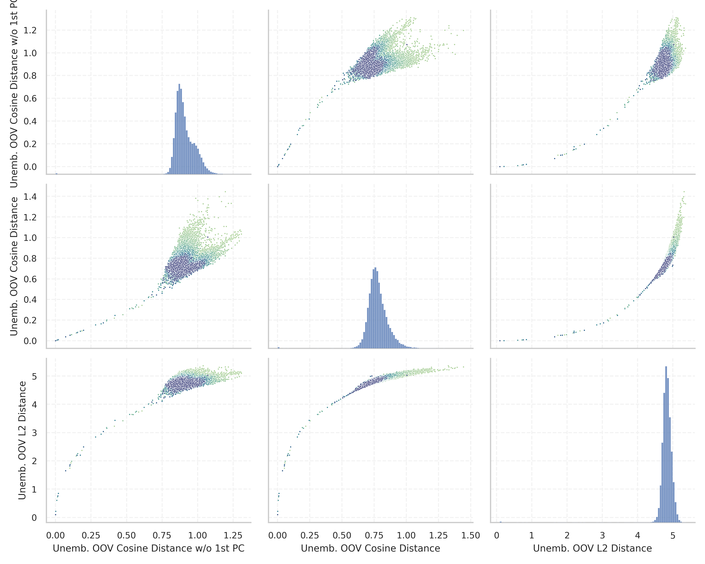

# Report for `openai-community/gpt2-large`

## Model info

* Tied embeddings: yes
* Unembeddings use bias: no
* Metric for under-trained tokens: Unemb. OOV Cosine Distance w/o 1st PC
  * Overall distribution 0.909 +/- 0.074
  * Token used for verification prompt building: `BuyableInstoreAndOnline`
  * Verification threshold: 0.816
  * Threshold for showing candidate under-trained tokens: 0.197
  * Median verified threshold (for bytes, unreachable and special tokens): 0.018
* Embeddings shape: (50257, 1280)
* Vocabulary size: 50257
  * Number of single byte tokens: 256, of which 45 below metric threshold
  * Number of special tokens: 1, of which 0 below metric threshold
  * Number of non-single-byte UTF-fragment tokens: 216, 2 below soft metric threshold
  * Number of tested under-trained tokens: 967, 28 below p = 0.01 threshold, 23 below soft metric threshold

## Metrics plot


## Verification plot


## Under-trained token verification results
23 entries below threshold of 0.197

|   token_id | token                                        |      metric | max_prob                                                         | in_other_tokens                                                                                                                                                                                                                                                                                                                                                                                                    |
|------------|----------------------------------------------|-------------|------------------------------------------------------------------|--------------------------------------------------------------------------------------------------------------------------------------------------------------------------------------------------------------------------------------------------------------------------------------------------------------------------------------------------------------------------------------------------------------------|
|      45544 | ````` ▁サーティ `````                        | 0.000355482 | <span style='border: 1px solid rgb(169, 68, 66);'>7.1e-13</span> | ````` ▁サーティワン `````                                                                                                                                                                                                                                                                                                                                                                                          |
|      40241 | ````` InstoreAndOnline `````                 | 0.000364542 | <span style='border: 1px solid rgb(169, 68, 66);'>5.1e-13</span> | ````` BuyableInstoreAndOnline `````                                                                                                                                                                                                                                                                                                                                                                                |
|      40240 | ````` oreAndOnline `````                     | 0.000376344 | <span style='border: 1px solid rgb(169, 68, 66);'>5.2e-13</span> | <span style='border: 1px solid rgb(169, 68, 66);'>````` InstoreAndOnline `````</span>, ````` BuyableInstoreAndOnline `````                                                                                                                                                                                                                                                                                         |
|      42089 | ````` ▁TheNitrome `````                      | 0.000377417 | <span style='border: 1px solid rgb(169, 68, 66);'>5.3e-13</span> | <span style='border: 1px solid rgb(40, 167, 69);'>````` ▁TheNitromeFan `````</span>                                                                                                                                                                                                                                                                                                                                |
|      30905 | ````` rawdownload `````                      | 0.000389099 | <span style='border: 1px solid rgb(169, 68, 66);'>4.2e-13</span> | ````` rawdownloadcloneembedreportprint `````                                                                                                                                                                                                                                                                                                                                                                       |
|      39752 | ````` quickShip `````                        | 0.000402331 | <span style='border: 1px solid rgb(169, 68, 66);'>5.3e-13</span> | ````` quickShipAvailable `````                                                                                                                                                                                                                                                                                                                                                                                     |
|      30898 | ````` embedreportprint `````                 | 0.000409424 | <span style='border: 1px solid rgb(169, 68, 66);'>5e-13</span>   | <span style='border: 1px solid rgb(169, 68, 66);'>````` cloneembedreportprint `````</span>, ````` rawdownloadcloneembedreportprint `````                                                                                                                                                                                                                                                                           |
|      36173 | ````` ▁RandomRedditor `````                  | 0.000413239 | <span style='border: 1px solid rgb(169, 68, 66);'>4.7e-13</span> | <span style='border: 1px solid rgb(40, 167, 69);'>````` ▁RandomRedditorWithNo `````</span>                                                                                                                                                                                                                                                                                                                         |
|      30212 | ````` ▁externalToEVA `````                   | 0.000433743 | <span style='border: 1px solid rgb(169, 68, 66);'>8.5e-13</span> | ````` ▁externalToEVAOnly `````                                                                                                                                                                                                                                                                                                                                                                                     |
|      30897 | ````` reportprint `````                      | 0.000453413 | <span style='border: 1px solid rgb(169, 68, 66);'>5.8e-13</span> | <span style='border: 1px solid rgb(169, 68, 66);'>````` embedreportprint `````</span>, <span style='border: 1px solid rgb(169, 68, 66);'>````` cloneembedreportprint `````</span>, ````` rawdownloadcloneembedreportprint `````                                                                                                                                                                                    |
|      30208 | ````` ▁externalTo `````                      | 0.00155187  | <span style='border: 1px solid rgb(169, 68, 66);'>1.2e-12</span> | <span style='border: 1px solid rgb(169, 68, 66);'>````` ▁externalToEVA `````</span>, ````` ▁externalToEVAOnly `````                                                                                                                                                                                                                                                                                                |
|      23090 | ````` ÃÂÃÂÃÂÃÂÃÂÃÂÃÂÃÂÃÂÃÂÃÂÃÂÃÂÃÂÃÂÃÂ ````` | 0.00914395  | <span style='border: 1px solid rgb(169, 68, 66);'>1e-10</span>   | <span style='border: 1px solid rgb(40, 167, 69);'>````` ÃÂÃÂÃÂÃÂÃÂÃÂÃÂÃÂÃÂÃÂÃÂÃÂÃÂÃÂÃÂÃÂÃÂÃÂÃÂÃÂÃÂÃÂÃÂÃÂÃÂÃÂÃÂÃÂÃÂÃÂÃÂÃÂ `````</span>                                                                                                                                                                                                                                                                              |
|      14827 | ````` ÃÂÃÂÃÂÃÂÃÂÃÂÃÂÃÂ `````                 | 0.0141876   | <span style='border: 1px solid rgb(169, 68, 66);'>3.7e-10</span> | <span style='border: 1px solid rgb(169, 68, 66);'>````` ÃÂÃÂÃÂÃÂÃÂÃÂÃÂÃÂÃÂÃÂÃÂÃÂÃÂÃÂÃÂÃÂ `````</span>, <span style='border: 1px solid rgb(40, 167, 69);'>````` ÃÂÃÂÃÂÃÂÃÂÃÂÃÂÃÂÃÂÃÂÃÂÃÂÃÂÃÂÃÂÃÂÃÂÃÂÃÂÃÂÃÂÃÂÃÂÃÂÃÂÃÂÃÂÃÂÃÂÃÂÃÂÃÂ `````</span>                                                                                                                                                                       |
|      37574 | ````` StreamerBot `````                      | 0.0165439   | <span style='border: 1px solid rgb(169, 68, 66);'>7.1e-12</span> | ````` TPPStreamerBot `````                                                                                                                                                                                                                                                                                                                                                                                         |
|      31573 | ````` ActionCode `````                       | 0.0202737   | <span style='border: 1px solid rgb(169, 68, 66);'>2.8e-10</span> | ````` externalActionCode `````                                                                                                                                                                                                                                                                                                                                                                                     |
|      42066 | ````` Nitrome `````                          | 0.0711562   | <span style='border: 1px solid rgb(169, 68, 66);'>8e-07</span>   | <span style='border: 1px solid rgb(169, 68, 66);'>````` ▁TheNitrome `````</span>, <span style='border: 1px solid rgb(40, 167, 69);'>````` ▁TheNitromeFan `````</span>                                                                                                                                                                                                                                              |
|      39749 | ````` DeliveryDate `````                     | 0.100581    | <span style='border: 1px solid rgb(251, 189, 8);'>0.018</span>   | ````` soDeliveryDate `````                                                                                                                                                                                                                                                                                                                                                                                         |
|      40219 | ````` oreAnd `````                           | 0.102289    | <span style='border: 1px solid rgb(169, 68, 66);'>2.2e-06</span> | <span style='border: 1px solid rgb(169, 68, 66);'>````` oreAndOnline `````</span>, <span style='border: 1px solid rgb(169, 68, 66);'>````` InstoreAndOnline `````</span>, ````` BuyableInstoreAndOnline `````                                                                                                                                                                                                      |
|       9364 | ````` ÃÂÃÂÃÂÃÂ `````                         | 0.113247    | <span style='border: 1px solid rgb(169, 68, 66);'>9.6e-06</span> | <span style='border: 1px solid rgb(169, 68, 66);'>````` ÃÂÃÂÃÂÃÂÃÂÃÂÃÂÃÂ `````</span>, <span style='border: 1px solid rgb(169, 68, 66);'>````` ÃÂÃÂÃÂÃÂÃÂÃÂÃÂÃÂÃÂÃÂÃÂÃÂÃÂÃÂÃÂÃÂ `````</span>, <span style='border: 1px solid rgb(40, 167, 69);'>````` ÃÂÃÂÃÂÃÂÃÂÃÂÃÂÃÂÃÂÃÂÃÂÃÂÃÂÃÂÃÂÃÂÃÂÃÂÃÂÃÂÃÂÃÂÃÂÃÂÃÂÃÂÃÂÃÂÃÂÃÂÃÂÃÂ `````</span>                                                                                |
|       5815 | ````` ÃÂÃÂ `````                             | 0.145459    | <span style='border: 1px solid rgb(169, 68, 66);'>0.00028</span> | <span style='border: 1px solid rgb(169, 68, 66);'>````` ÃÂÃÂÃÂÃÂ `````</span>, <span style='border: 1px solid rgb(169, 68, 66);'>````` ÃÂÃÂÃÂÃÂÃÂÃÂÃÂÃÂ `````</span>, <span style='border: 1px solid rgb(169, 68, 66);'>````` ÃÂÃÂÃÂÃÂÃÂÃÂÃÂÃÂÃÂÃÂÃÂÃÂÃÂÃÂÃÂÃÂ `````</span>, <span style='border: 1px solid rgb(40, 167, 69);'>````` ÃÂÃÂÃÂÃÂÃÂÃÂÃÂÃÂÃÂÃÂÃÂÃÂÃÂÃÂÃÂÃÂÃÂÃÂÃÂÃÂÃÂÃÂÃÂÃÂÃÂÃÂÃÂÃÂÃÂÃÂÃÂÃÂ `````</span> |
<details><summary>3 additional entries below threshold</summary>

|   token_id | token                             |   metric | max_prob                                                         | in_other_tokens                                       |
|------------|-----------------------------------|----------|------------------------------------------------------------------|-------------------------------------------------------|
|      39142 | ````` ThumbnailImage `````        | 0.151515 | <span style='border: 1px solid rgb(169, 68, 66);'>4.1e-06</span> | ````` ItemThumbnailImage `````                        |
|      17629 | ````` ▁practition `````           | 0.156226 | <span style='border: 1px solid rgb(169, 68, 66);'>5.8e-07</span> | ````` ▁practitioners `````, ````` ▁practitioner ````` |
|      30899 | ````` cloneembedreportprint ````` | 0.174837 | <span style='border: 1px solid rgb(169, 68, 66);'>3e-07</span>   | ````` rawdownloadcloneembedreportprint `````          |
</details>
<details><summary>944 additional entries above threshold</summary>

|   token_id | token                                                                        |   metric | max_prob                                                         | in_other_tokens                                                                                                                                                                                                                                                                                                                                                                                                                                                                               |
|------------|------------------------------------------------------------------------------|----------|------------------------------------------------------------------|-----------------------------------------------------------------------------------------------------------------------------------------------------------------------------------------------------------------------------------------------------------------------------------------------------------------------------------------------------------------------------------------------------------------------------------------------------------------------------------------------|
|      39714 | ````` isSpecial `````                                                        | 0.197474 | <span style='border: 1px solid rgb(251, 189, 8);'>0.017</span>   | ````` isSpecialOrderable `````                                                                                                                                                                                                                                                                                                                                                                                                                                                                |
|      27293 | ````` ▁antidepress `````                                                     | 0.282081 | <span style='border: 1px solid rgb(169, 68, 66);'>1.7e-05</span> | ````` ▁antidepressants `````, ````` ▁antidepressant `````                                                                                                                                                                                                                                                                                                                                                                                                                                     |
|      27013 | ````` aditional `````                                                        | 0.320891 | <span style='border: 1px solid rgb(251, 189, 8);'>0.052</span>   | ````` ▁Traditional `````, ````` traditional `````, ````` Traditional `````                                                                                                                                                                                                                                                                                                                                                                                                                    |
|      39655 | ````` Orderable `````                                                        | 0.336632 | <span style='border: 1px solid rgb(40, 167, 69);'>0.24</span>    | ````` isSpecialOrderable `````                                                                                                                                                                                                                                                                                                                                                                                                                                                                |
|      13150 | ````` ▁subur `````                                                           | 0.35933  | <span style='border: 1px solid rgb(255, 145, 0);'>0.0019</span>  | ````` ▁suburban `````, ````` ▁suburbs `````, ````` ▁suburb `````                                                                                                                                                                                                                                                                                                                                                                                                                              |
|      15272 | ````` ▁pione `````                                                           | 0.36109  | <span style='border: 1px solid rgb(169, 68, 66);'>0.00048</span> | ````` ▁pioneer `````, ````` ▁pioneering `````, ````` ▁pioneers `````, ````` ▁pioneered `````                                                                                                                                                                                                                                                                                                                                                                                                  |
|      30439 | ````` ▁unintention `````                                                     | 0.41846  | <span style='border: 1px solid rgb(255, 145, 0);'>0.0064</span>  | ````` ▁unintentionally `````, ````` ▁unintentional `````                                                                                                                                                                                                                                                                                                                                                                                                                                      |
|       4690 | ````` ortunately `````                                                       | 0.474103 | <span style='border: 1px solid rgb(169, 68, 66);'>0.00079</span> | ````` fortunately `````, ````` ▁Unfortunately `````, ````` ▁unfortunately `````, ````` Unfortunately `````, ````` ▁Fortunately `````, ...                                                                                                                                                                                                                                                                                                                                                     |
|      19476 | ````` ▁carbohyd `````                                                        | 0.521724 | <span style='border: 1px solid rgb(40, 167, 69);'>0.59</span>    | ````` ▁carbohydrate `````, ````` ▁carbohydrates `````                                                                                                                                                                                                                                                                                                                                                                                                                                         |
|       7105 | ````` ▁volunte `````                                                         | 0.53797  | <span style='border: 1px solid rgb(251, 189, 8);'>0.017</span>   | ````` ▁volunteers `````, ````` ▁volunteer `````, ````` ▁volunteered `````, ````` ▁volunteering `````                                                                                                                                                                                                                                                                                                                                                                                          |
|      13198 | ````` ▁earthqu `````                                                         | 0.563447 | <span style='border: 1px solid rgb(255, 145, 0);'>0.0025</span>  | ````` ▁earthquake `````, <span style='border: 1px solid rgb(40, 167, 69);'>````` ▁earthquakes `````</span>                                                                                                                                                                                                                                                                                                                                                                                    |
|      14695 | ````` ▁eleph `````                                                           | 0.56982  | <span style='border: 1px solid rgb(40, 167, 69);'>0.79</span>    | ````` ▁elephant `````, ````` ▁elephants `````                                                                                                                                                                                                                                                                                                                                                                                                                                                 |
|      25618 | ````` ▁councill `````                                                        | 0.62372  | <span style='border: 1px solid rgb(40, 167, 69);'>0.13</span>    | ````` ▁councillor `````, ````` ▁councillors `````                                                                                                                                                                                                                                                                                                                                                                                                                                             |
|      24973 | ````` ▁exting `````                                                          | 0.654316 | <span style='border: 1px solid rgb(40, 167, 69);'>0.61</span>    | ````` ▁extingu `````, ````` ▁extinguished `````                                                                                                                                                                                                                                                                                                                                                                                                                                               |
|      11548 | ````` ▁entreprene `````                                                      | 0.657123 | <span style='border: 1px solid rgb(251, 189, 8);'>0.01</span>    | ````` ▁entrepreneurs `````, ````` ▁entrepreneur `````, ````` ▁entrepreneurial `````, ````` ▁entrepreneurship `````                                                                                                                                                                                                                                                                                                                                                                            |
|       5808 | ````` ÃÂ `````                                                               | 0.673876 | <span style='border: 1px solid rgb(40, 167, 69);'>1</span>       | <span style='border: 1px solid rgb(169, 68, 66);'>````` ÃÂÃÂ `````</span>, <span style='border: 1px solid rgb(169, 68, 66);'>````` ÃÂÃÂÃÂÃÂ `````</span>, <span style='border: 1px solid rgb(169, 68, 66);'>````` ÃÂÃÂÃÂÃÂÃÂÃÂÃÂÃÂ `````</span>, <span style='border: 1px solid rgb(169, 68, 66);'>````` ÃÂÃÂÃÂÃÂÃÂÃÂÃÂÃÂÃÂÃÂÃÂÃÂÃÂÃÂÃÂÃÂ `````</span>, <span style='border: 1px solid rgb(40, 167, 69);'>````` ÃÂÃÂÃÂÃÂÃÂÃÂÃÂÃÂÃÂÃÂÃÂÃÂÃÂÃÂÃÂÃÂÃÂÃÂÃÂÃÂÃÂÃÂÃÂÃÂÃÂÃÂÃÂÃÂÃÂÃÂÃÂÃÂ `````</span> |
|      44392 | ````` ▁cumbers `````                                                         | 0.67821  | <span style='border: 1px solid rgb(40, 167, 69);'>0.83</span>    | ````` ▁cumbersome `````                                                                                                                                                                                                                                                                                                                                                                                                                                                                       |
|      24307 | ````` ▁looph `````                                                           | 0.682847 | <span style='border: 1px solid rgb(40, 167, 69);'>0.89</span>    | ````` ▁loophole `````, ````` ▁loopholes `````                                                                                                                                                                                                                                                                                                                                                                                                                                                 |
|      18945 | ````` ▁teasp `````                                                           | 0.687518 | <span style='border: 1px solid rgb(40, 167, 69);'>1</span>       | ````` ▁teaspoon `````, ````` ▁teaspoons `````                                                                                                                                                                                                                                                                                                                                                                                                                                                 |
|      42889 | ````` ikuman `````                                                           | 0.710801 | <span style='border: 1px solid rgb(40, 167, 69);'>0.38</span>    | ````` ▁Kinnikuman `````                                                                                                                                                                                                                                                                                                                                                                                                                                                                       |
|      12677 | ````` ▁tradem `````                                                          | 0.722255 | <span style='border: 1px solid rgb(40, 167, 69);'>0.94</span>    | ````` ▁trademark `````, ````` ▁trademarks `````                                                                                                                                                                                                                                                                                                                                                                                                                                               |
|       9286 | ````` ▁exha `````                                                            | 0.723736 | <span style='border: 1px solid rgb(40, 167, 69);'>0.98</span>    | ````` ▁exhaust `````, ````` ▁exhausted `````, ````` ▁exhaustion `````, ````` ▁exhaustive `````, ````` ▁exhausting `````                                                                                                                                                                                                                                                                                                                                                                       |
|      22315 | ````` ▁newcom `````                                                          | 0.725628 | <span style='border: 1px solid rgb(40, 167, 69);'>0.66</span>    | ````` ▁newcomers `````, ````` ▁newcomer `````                                                                                                                                                                                                                                                                                                                                                                                                                                                 |
|      27924 | ````` ▁srf `````                                                             | 0.729686 | <span style='border: 1px solid rgb(40, 167, 69);'>0.97</span>    | ````` ▁srfN `````, ````` ▁srfAttach `````                                                                                                                                                                                                                                                                                                                                                                                                                                                     |
|      20554 | ````` ▁unbeliev `````                                                        | 0.73602  | <span style='border: 1px solid rgb(40, 167, 69);'>0.9</span>     | ````` ▁unbelievable `````, ````` ▁unbelievably `````                                                                                                                                                                                                                                                                                                                                                                                                                                          |
|      16041 | ````` ▁referen `````                                                         | 0.739599 | <span style='border: 1px solid rgb(40, 167, 69);'>0.93</span>    | ````` ▁referenced `````, ````` ▁referencing `````                                                                                                                                                                                                                                                                                                                                                                                                                                             |
|      16303 | ````` ▁undermin `````                                                        | 0.741094 | <span style='border: 1px solid rgb(40, 167, 69);'>0.99</span>    | ````` ▁undermine `````, ````` ▁undermining `````, ````` ▁undermined `````, ````` ▁undermines `````                                                                                                                                                                                                                                                                                                                                                                                            |
|      29740 | ````` ▁Azerb `````                                                           | 0.741216 | <span style='border: 1px solid rgb(40, 167, 69);'>0.66</span>    | <span style='border: 1px solid rgb(40, 167, 69);'>````` ▁Azerbai `````</span>, ````` ▁Azerbaijan `````                                                                                                                                                                                                                                                                                                                                                                                        |
|       6598 | ````` ▁behavi `````                                                          | 0.741594 | <span style='border: 1px solid rgb(40, 167, 69);'>0.77</span>    | ````` ▁behaviour `````, ````` ▁behaviors `````, ````` ▁behavioral `````, ````` ▁behaving `````, ````` ▁behaviours `````, ...                                                                                                                                                                                                                                                                                                                                                                  |
|      23711 | ````` ▁Moroc `````                                                           | 0.741773 | <span style='border: 1px solid rgb(40, 167, 69);'>0.94</span>    | ````` ▁Morocco `````, ````` ▁Moroccan `````                                                                                                                                                                                                                                                                                                                                                                                                                                                   |
|       5571 | ````` ▁acknow `````                                                          | 0.7423   | <span style='border: 1px solid rgb(40, 167, 69);'>0.99</span>    | <span style='border: 1px solid rgb(40, 167, 69);'>````` ▁acknowled `````</span>, ````` ▁acknowledged `````, ````` ▁acknowledge `````, ````` ▁acknowledges `````, ````` ▁acknowledging `````, ...                                                                                                                                                                                                                                                                                              |
|      35496 | ````` ÃÂÃÂÃÂÃÂÃÂÃÂÃÂÃÂÃÂÃÂÃÂÃÂÃÂÃÂÃÂÃÂÃÂÃÂÃÂÃÂÃÂÃÂÃÂÃÂÃÂÃÂÃÂÃÂÃÂÃÂÃÂÃÂ ````` | 0.750083 | <span style='border: 1px solid rgb(40, 167, 69);'>1</span>       |                                                                                                                                                                                                                                                                                                                                                                                                                                                                                               |
|      17787 | ````` ▁cryst `````                                                           | 0.750268 | <span style='border: 1px solid rgb(40, 167, 69);'>0.96</span>    | ````` ▁crystals `````, ````` ▁crystall `````                                                                                                                                                                                                                                                                                                                                                                                                                                                  |
|      14341 | ````` PDATE `````                                                            | 0.750486 | <span style='border: 1px solid rgb(40, 167, 69);'>0.88</span>    | ````` UPDATE `````, ````` ▁UPDATE `````, ````` PDATED `````                                                                                                                                                                                                                                                                                                                                                                                                                                   |
|      29372 | ````` ▁guiActiveUn `````                                                     | 0.751406 | <span style='border: 1px solid rgb(40, 167, 69);'>0.42</span>    | ````` ▁guiActiveUnfocused `````                                                                                                                                                                                                                                                                                                                                                                                                                                                               |
|      16782 | ````` ▁misunder `````                                                        | 0.751832 | <span style='border: 1px solid rgb(40, 167, 69);'>0.95</span>    | ````` ▁misunderstanding `````, ````` ▁misunderstood `````, ````` ▁misunderstand `````                                                                                                                                                                                                                                                                                                                                                                                                         |
|      46858 | ````` ▁Canaver `````                                                         | 0.753079 | <span style='border: 1px solid rgb(40, 167, 69);'>0.98</span>    | ````` ▁Canaveral `````                                                                                                                                                                                                                                                                                                                                                                                                                                                                        |
|      20677 | ````` ▁comr `````                                                            | 0.753097 | <span style='border: 1px solid rgb(40, 167, 69);'>0.9</span>     | ````` ▁comrades `````, ````` ▁comrade `````                                                                                                                                                                                                                                                                                                                                                                                                                                                   |
|      22263 | ````` ▁mosqu `````                                                           | 0.753171 | <span style='border: 1px solid rgb(40, 167, 69);'>0.99</span>    | ````` ▁mosques `````, <span style='border: 1px solid rgb(40, 167, 69);'>````` ▁mosquit `````</span>, ````` ▁mosquito `````, ````` ▁mosquitoes `````                                                                                                                                                                                                                                                                                                                                           |
|       9418 | ````` ▁distingu `````                                                        | 0.754055 | <span style='border: 1px solid rgb(40, 167, 69);'>0.99</span>    | ````` ▁distinguish `````, ````` ▁distinguished `````, ````` ▁distinguishing `````, ````` ▁distinguishes `````                                                                                                                                                                                                                                                                                                                                                                                 |
|       8983 | ````` ▁satell `````                                                          | 0.755706 | <span style='border: 1px solid rgb(40, 167, 69);'>0.99</span>    | ````` ▁satellite `````, ````` ▁satellites `````                                                                                                                                                                                                                                                                                                                                                                                                                                               |
|      11411 | ````` ▁destro `````                                                          | 0.756818 | <span style='border: 1px solid rgb(40, 167, 69);'>0.99</span>    | ````` ▁destroying `````, ````` ▁destroys `````, ````` ▁destroyer `````                                                                                                                                                                                                                                                                                                                                                                                                                        |
|      20213 | ````` ▁pestic `````                                                          | 0.756918 | <span style='border: 1px solid rgb(40, 167, 69);'>0.87</span>    | ````` ▁pesticides `````, ````` ▁pesticide `````                                                                                                                                                                                                                                                                                                                                                                                                                                               |
|      48416 | ````` ▁shenan `````                                                          | 0.758291 | <span style='border: 1px solid rgb(40, 167, 69);'>0.88</span>    | ````` ▁shenanigans `````                                                                                                                                                                                                                                                                                                                                                                                                                                                                      |
|      15755 | ````` ▁millenn `````                                                         | 0.759812 | <span style='border: 1px solid rgb(40, 167, 69);'>0.99</span>    | ````` ▁millennials `````, ````` ▁millennia `````, ````` ▁millennium `````, ````` ▁millennial `````                                                                                                                                                                                                                                                                                                                                                                                            |
|       2955 | ````` ▁behav `````                                                           | 0.759982 | <span style='border: 1px solid rgb(40, 167, 69);'>0.91</span>    | ````` ▁behavior `````, <span style='border: 1px solid rgb(40, 167, 69);'>````` ▁behavi `````</span>, ````` ▁behaviour `````, ````` ▁behaviors `````, ````` ▁behavioral `````, ...                                                                                                                                                                                                                                                                                                             |
|      35913 | ````` ▁Debor `````                                                           | 0.761049 | <span style='border: 1px solid rgb(40, 167, 69);'>1</span>       | ````` ▁Deborah `````                                                                                                                                                                                                                                                                                                                                                                                                                                                                          |
|      46968 | ````` ▁convol `````                                                          | 0.761367 | <span style='border: 1px solid rgb(40, 167, 69);'>0.95</span>    | ````` ▁convoluted `````                                                                                                                                                                                                                                                                                                                                                                                                                                                                       |
|      48448 | ````` iosyn `````                                                            | 0.762916 | <span style='border: 1px solid rgb(40, 167, 69);'>0.28</span>    | ````` iosyncr `````, <span style='border: 1px solid rgb(40, 167, 69);'>````` ▁idiosyncr `````</span>                                                                                                                                                                                                                                                                                                                                                                                          |
|       4183 | ````` ▁conflic `````                                                         | 0.764696 | <span style='border: 1px solid rgb(40, 167, 69);'>0.77</span>    | ````` ▁conflict `````, ````` ▁conflicts `````, ````` ▁conflicting `````, ````` ▁conflicted `````                                                                                                                                                                                                                                                                                                                                                                                              |
|      20590 | ````` ▁Pengu `````                                                           | 0.765658 | <span style='border: 1px solid rgb(40, 167, 69);'>1</span>       | ````` ▁Penguins `````, ````` ▁Penguin `````                                                                                                                                                                                                                                                                                                                                                                                                                                                   |
|      16148 | ````` ▁unlaw `````                                                           | 0.765734 | <span style='border: 1px solid rgb(40, 167, 69);'>0.88</span>    | ````` ▁unlawful `````, ````` ▁unlawfully `````                                                                                                                                                                                                                                                                                                                                                                                                                                                |
|       7961 | ````` ▁obser `````                                                           | 0.767235 | <span style='border: 1px solid rgb(40, 167, 69);'>0.99</span>    | ````` ▁observe `````, ````` ▁observations `````, ````` ▁observation `````, ````` ▁observers `````, ````` ▁observing `````, ...                                                                                                                                                                                                                                                                                                                                                                |
|      42000 | ````` ▁hemor `````                                                           | 0.767676 | <span style='border: 1px solid rgb(40, 167, 69);'>0.93</span>    | ````` ▁hemorrh `````                                                                                                                                                                                                                                                                                                                                                                                                                                                                          |
|      14060 | ````` ▁predec `````                                                          | 0.768546 | <span style='border: 1px solid rgb(40, 167, 69);'>0.98</span>    | ````` ▁predecessor `````, ````` ▁predecessors `````                                                                                                                                                                                                                                                                                                                                                                                                                                           |
|      28798 | ````` ▁tsun `````                                                            | 0.769165 | <span style='border: 1px solid rgb(40, 167, 69);'>0.93</span>    | ````` ▁tsunami `````                                                                                                                                                                                                                                                                                                                                                                                                                                                                          |
|      12869 | ````` ▁reluct `````                                                          | 0.77008  | <span style='border: 1px solid rgb(40, 167, 69);'>0.99</span>    | ````` ▁reluctant `````, ````` ▁reluctance `````, ````` ▁reluctantly `````                                                                                                                                                                                                                                                                                                                                                                                                                     |
|      21876 | ````` ▁showc `````                                                           | 0.770713 | <span style='border: 1px solid rgb(40, 167, 69);'>0.96</span>    | ````` ▁showcasing `````, ````` ▁showcased `````, ````` ▁showcases `````                                                                                                                                                                                                                                                                                                                                                                                                                       |
|      28189 | ````` ▁impat `````                                                           | 0.770744 | <span style='border: 1px solid rgb(40, 167, 69);'>0.95</span>    | ````` ▁impatient `````                                                                                                                                                                                                                                                                                                                                                                                                                                                                        |
|      24781 | ````` ▁appell `````                                                          | 0.771438 | <span style='border: 1px solid rgb(40, 167, 69);'>1</span>       | ````` ▁appellate `````, ````` ▁appellant `````                                                                                                                                                                                                                                                                                                                                                                                                                                                |
|      12486 | ````` ▁suspic `````                                                          | 0.771503 | <span style='border: 1px solid rgb(40, 167, 69);'>0.96</span>    | ````` ▁suspicious `````, ````` ▁suspicion `````, ````` ▁suspicions `````                                                                                                                                                                                                                                                                                                                                                                                                                      |
|       2532 | ````` ▁chall `````                                                           | 0.7716   | <span style='border: 1px solid rgb(40, 167, 69);'>0.98</span>    | <span style='border: 1px solid rgb(40, 167, 69);'>````` ▁challeng `````</span>, ````` ▁challenge `````, ````` ▁challenges `````, ````` ▁challenging `````, ````` ▁challenged `````, ...                                                                                                                                                                                                                                                                                                       |
|       5208 | ````` ▁appre `````                                                           | 0.771643 | <span style='border: 1px solid rgb(40, 167, 69);'>1</span>       | ````` ▁appreci `````, ````` ▁appreciate `````, ````` ▁appreciated `````, ````` ▁appreciation `````, ````` ▁apprehend `````, ...                                                                                                                                                                                                                                                                                                                                                               |
|      40012 | ````` uyomi `````                                                            | 0.771887 | <span style='border: 1px solid rgb(40, 167, 69);'>0.43</span>    | ````` ▁Tsukuyomi `````                                                                                                                                                                                                                                                                                                                                                                                                                                                                        |
|      11082 | ````` ▁inequ `````                                                           | 0.772317 | <span style='border: 1px solid rgb(40, 167, 69);'>0.99</span>    | ````` ▁inequality `````, ````` ▁inequalities `````                                                                                                                                                                                                                                                                                                                                                                                                                                            |
|       6336 | ````` ▁Palestin `````                                                        | 0.773028 | <span style='border: 1px solid rgb(40, 167, 69);'>0.39</span>    | ````` ▁Palestinian `````, ````` ▁Palestinians `````, ````` ▁Palestine `````                                                                                                                                                                                                                                                                                                                                                                                                                   |
|       5785 | ````` ▁veter `````                                                           | 0.773724 | <span style='border: 1px solid rgb(40, 167, 69);'>0.98</span>    | ````` ▁veteran `````, ````` ▁veterans `````, ````` ▁veterin `````, ````` ▁veterinary `````, ````` ▁veterinarian `````                                                                                                                                                                                                                                                                                                                                                                         |
|      16878 | ````` ▁fict `````                                                            | 0.773771 | <span style='border: 1px solid rgb(40, 167, 69);'>1</span>       | ````` ▁fictional `````, ````` ▁fictitious `````                                                                                                                                                                                                                                                                                                                                                                                                                                               |
|      46266 | ````` ▁spitting `````                                                        | 0.774408 | <span style='border: 1px solid rgb(40, 167, 69);'>0.99</span>    |                                                                                                                                                                                                                                                                                                                                                                                                                                                                                               |
|      44105 | ````` ▁siph `````                                                            | 0.775603 | <span style='border: 1px solid rgb(40, 167, 69);'>0.98</span>    |                                                                                                                                                                                                                                                                                                                                                                                                                                                                                               |
|      20645 | ````` ▁dilig `````                                                           | 0.775611 | <span style='border: 1px solid rgb(40, 167, 69);'>0.99</span>    | ````` ▁diligence `````, ````` ▁diligently `````, ````` ▁diligent `````                                                                                                                                                                                                                                                                                                                                                                                                                        |
|       3523 | ````` ▁citiz `````                                                           | 0.775708 | <span style='border: 1px solid rgb(40, 167, 69);'>0.95</span>    | ````` ▁citizens `````, ````` ▁citizen `````, ````` ▁citizenship `````                                                                                                                                                                                                                                                                                                                                                                                                                         |
|      14077 | ````` ▁artif `````                                                           | 0.776063 | <span style='border: 1px solid rgb(40, 167, 69);'>0.97</span>    | ````` ▁artifacts `````, ````` ▁artifact `````, ````` ▁artific `````, ````` ▁artificially `````                                                                                                                                                                                                                                                                                                                                                                                                |
|      10108 | ````` ▁simultane `````                                                       | 0.776155 | <span style='border: 1px solid rgb(40, 167, 69);'>0.98</span>    | ````` ▁simultaneously `````, ````` ▁simultaneous `````                                                                                                                                                                                                                                                                                                                                                                                                                                        |
|      22496 | ````` ▁intrins `````                                                         | 0.776926 | <span style='border: 1px solid rgb(40, 167, 69);'>0.96</span>    | ````` ▁intrinsic `````, ````` ▁intrinsically `````                                                                                                                                                                                                                                                                                                                                                                                                                                            |
|      32640 | ````` ▁submer `````                                                          | 0.777065 | <span style='border: 1px solid rgb(40, 167, 69);'>0.98</span>    | ````` ▁submerged `````                                                                                                                                                                                                                                                                                                                                                                                                                                                                        |
|      37734 | ````` ▁Manz `````                                                            | 0.77709  | <span style='border: 1px solid rgb(40, 167, 69);'>0.99</span>    | ````` ▁Manziel `````                                                                                                                                                                                                                                                                                                                                                                                                                                                                          |
|      50052 | ````` ▁dyed `````                                                            | 0.777154 | <span style='border: 1px solid rgb(40, 167, 69);'>0.95</span>    |                                                                                                                                                                                                                                                                                                                                                                                                                                                                                               |
|      15535 | ````` ▁ende `````                                                            | 0.777714 | <span style='border: 1px solid rgb(40, 167, 69);'>0.97</span>    | ````` ▁endeav `````, ````` ▁endeavor `````, ````` ▁endeavors `````, ````` ▁endemic `````, ````` ▁endeavour `````                                                                                                                                                                                                                                                                                                                                                                              |
|      19306 | ````` ▁prosec `````                                                          | 0.777715 | <span style='border: 1px solid rgb(40, 167, 69);'>0.86</span>    | ````` ▁prosecuted `````, ````` ▁prosecute `````, ````` ▁prosecutions `````, ````` ▁prosecuting `````                                                                                                                                                                                                                                                                                                                                                                                          |
|      12943 | ````` ▁encount `````                                                         | 0.777773 | <span style='border: 1px solid rgb(40, 167, 69);'>0.95</span>    | ````` ▁encountered `````, ````` ▁encounters `````, ````` ▁encountering `````                                                                                                                                                                                                                                                                                                                                                                                                                  |
|      22316 | ````` ▁detrim `````                                                          | 0.7778   | <span style='border: 1px solid rgb(40, 167, 69);'>0.98</span>    | ````` ▁detrimental `````, ````` ▁detriment `````                                                                                                                                                                                                                                                                                                                                                                                                                                              |
|      13296 | ````` ▁Leban `````                                                           | 0.777929 | <span style='border: 1px solid rgb(40, 167, 69);'>0.96</span>    | ````` ▁Lebanon `````, ````` ▁Lebanese `````                                                                                                                                                                                                                                                                                                                                                                                                                                                   |
|      17258 | ````` ▁caut `````                                                            | 0.778112 | <span style='border: 1px solid rgb(40, 167, 69);'>0.99</span>    | ````` ▁cautious `````, ````` ▁cautioned `````, ````` ▁cautiously `````                                                                                                                                                                                                                                                                                                                                                                                                                        |
|       8700 | ````` ▁certific `````                                                        | 0.778344 | <span style='border: 1px solid rgb(40, 167, 69);'>0.99</span>    | ````` ▁certificate `````, ````` ▁certification `````, ````` ▁certificates `````                                                                                                                                                                                                                                                                                                                                                                                                               |
|      49666 | ````` ▁rabid `````                                                           | 0.778448 | <span style='border: 1px solid rgb(40, 167, 69);'>0.99</span>    |                                                                                                                                                                                                                                                                                                                                                                                                                                                                                               |
|      17473 | ````` ▁contrace `````                                                        | 0.778709 | <span style='border: 1px solid rgb(40, 167, 69);'>0.94</span>    | ````` ▁contraception `````, ````` ▁contraceptive `````, ````` ▁contraceptives `````                                                                                                                                                                                                                                                                                                                                                                                                           |
|       6059 | ````` ▁prin `````                                                            | 0.779108 | <span style='border: 1px solid rgb(40, 167, 69);'>0.99</span>    | ````` ▁principles `````, ````` ▁principle `````, ````` ▁principal `````, ````` ▁printed `````, ````` ▁printing `````, ...                                                                                                                                                                                                                                                                                                                                                                     |
|      33954 | ````` ▁exqu `````                                                            | 0.779347 | <span style='border: 1px solid rgb(40, 167, 69);'>0.96</span>    | ````` ▁exquisite `````                                                                                                                                                                                                                                                                                                                                                                                                                                                                        |
|       5578 | ````` ▁negoti `````                                                          | 0.779374 | <span style='border: 1px solid rgb(40, 167, 69);'>0.85</span>    | ````` ▁negotiations `````, ````` ▁negotiate `````, ````` ▁negotiating `````, ````` ▁negotiated `````, ````` ▁negotiation `````, ...                                                                                                                                                                                                                                                                                                                                                           |
|      14472 | ````` ▁entert `````                                                          | 0.779525 | <span style='border: 1px solid rgb(40, 167, 69);'>0.95</span>    | ````` ▁entertaining `````, ````` ▁entertained `````                                                                                                                                                                                                                                                                                                                                                                                                                                           |
|      13757 | ````` ▁disg `````                                                            | 0.779565 | <span style='border: 1px solid rgb(40, 167, 69);'>1</span>       | ````` ▁disgust `````, <span style='border: 1px solid rgb(40, 167, 69);'>````` ▁disgu `````</span>, <span style='border: 1px solid rgb(40, 167, 69);'>````` ▁disgr `````</span>, ````` ▁disgusting `````, ````` ▁disguise `````, ...                                                                                                                                                                                                                                                           |
|      16136 | ````` ▁maneu `````                                                           | 0.779821 | <span style='border: 1px solid rgb(40, 167, 69);'>0.94</span>    | ````` ▁maneuver `````, ````` ▁maneuvers `````                                                                                                                                                                                                                                                                                                                                                                                                                                                 |
|      10160 | ````` ▁trave `````                                                           | 0.779878 | <span style='border: 1px solid rgb(40, 167, 69);'>0.95</span>    | ````` ▁traveling `````, ````` ▁traveled `````, ````` ▁travelling `````, ````` ▁travels `````, ````` ▁travelled `````, ...                                                                                                                                                                                                                                                                                                                                                                     |
|      44668 | ````` ▁devise `````                                                          | 0.779907 | <span style='border: 1px solid rgb(40, 167, 69);'>0.99</span>    |                                                                                                                                                                                                                                                                                                                                                                                                                                                                                               |
|      48036 | ````` ▁locality `````                                                        | 0.780062 | <span style='border: 1px solid rgb(40, 167, 69);'>1</span>       |                                                                                                                                                                                                                                                                                                                                                                                                                                                                                               |
|      13392 | ````` ▁toile `````                                                           | 0.780314 | <span style='border: 1px solid rgb(40, 167, 69);'>1</span>       | ````` ▁toilet `````, ````` ▁toilets `````                                                                                                                                                                                                                                                                                                                                                                                                                                                     |
|      42543 | ````` ▁Seym `````                                                            | 0.780445 | <span style='border: 1px solid rgb(40, 167, 69);'>0.99</span>    | ````` ▁Seymour `````                                                                                                                                                                                                                                                                                                                                                                                                                                                                          |
|      49928 | ````` ▁wills `````                                                           | 0.780466 | <span style='border: 1px solid rgb(40, 167, 69);'>0.99</span>    |                                                                                                                                                                                                                                                                                                                                                                                                                                                                                               |
|      13233 | ````` ▁cous `````                                                            | 0.780627 | <span style='border: 1px solid rgb(40, 167, 69);'>1</span>       | ````` ▁cousin `````, ````` ▁cousins `````                                                                                                                                                                                                                                                                                                                                                                                                                                                     |
|      19871 | ````` ▁manif `````                                                           | 0.780898 | <span style='border: 1px solid rgb(40, 167, 69);'>0.94</span>    | ````` ▁manifesto `````, ````` ▁manifestation `````, ````` ▁manifested `````, ````` ▁manifestations `````, <span style='border: 1px solid rgb(40, 167, 69);'>````` ▁manifests `````</span>, ...                                                                                                                                                                                                                                                                                                |
|       8346 | ````` ▁condem `````                                                          | 0.78098  | <span style='border: 1px solid rgb(40, 167, 69);'>0.98</span>    | ````` ▁condemned `````, ````` ▁condemn `````, ````` ▁condemnation `````, ````` ▁condemning `````, ````` ▁condemns `````                                                                                                                                                                                                                                                                                                                                                                       |
|      30716 | ````` ▁cannabin `````                                                        | 0.781546 | <span style='border: 1px solid rgb(40, 167, 69);'>0.99</span>    | ````` ▁cannabinoids `````, ````` ▁cannabinoid `````                                                                                                                                                                                                                                                                                                                                                                                                                                           |
|      17844 | ````` ▁insurg `````                                                          | 0.781804 | <span style='border: 1px solid rgb(40, 167, 69);'>0.7</span>     | ````` ▁insurgents `````, ````` ▁insurgency `````, ````` ▁insurgent `````                                                                                                                                                                                                                                                                                                                                                                                                                      |
|      19373 | ````` ▁adolesc `````                                                         | 0.781849 | <span style='border: 1px solid rgb(40, 167, 69);'>0.95</span>    | ````` ▁adolescents `````, ````` ▁adolescent `````, ````` ▁adolescence `````                                                                                                                                                                                                                                                                                                                                                                                                                   |
|       5144 | ````` ▁princ `````                                                           | 0.78189  | <span style='border: 1px solid rgb(40, 167, 69);'>0.97</span>    | ````` ▁principles `````, ````` ▁principle `````, ````` ▁principal `````, ````` ▁prince `````, ````` ▁princess `````, ...                                                                                                                                                                                                                                                                                                                                                                      |
|      15038 | ````` ▁seiz `````                                                            | 0.782024 | <span style='border: 1px solid rgb(40, 167, 69);'>0.98</span>    | ````` ▁seize `````, ````` ▁seizure `````, ````` ▁seizures `````, ````` ▁seizing `````                                                                                                                                                                                                                                                                                                                                                                                                         |
|       9540 | ````` ▁wedd `````                                                            | 0.782088 | <span style='border: 1px solid rgb(40, 167, 69);'>0.98</span>    | ````` ▁wedding `````, <span style='border: 1px solid rgb(40, 167, 69);'>````` ▁weddings `````</span>                                                                                                                                                                                                                                                                                                                                                                                          |
|      38566 | ````` ▁clen `````                                                            | 0.782219 | <span style='border: 1px solid rgb(40, 167, 69);'>0.97</span>    | ````` ▁clenched `````                                                                                                                                                                                                                                                                                                                                                                                                                                                                         |
|      18806 | ````` ▁concess `````                                                         | 0.78321  | <span style='border: 1px solid rgb(40, 167, 69);'>0.98</span>    | <span style='border: 1px solid rgb(40, 167, 69);'>````` ▁concessions `````</span>, <span style='border: 1px solid rgb(40, 167, 69);'>````` ▁concession `````</span>                                                                                                                                                                                                                                                                                                                           |
|      11689 | ````` ▁unnecess `````                                                        | 0.783669 | <span style='border: 1px solid rgb(40, 167, 69);'>0.93</span>    | ````` ▁unnecessary `````, ````` ▁unnecessarily `````                                                                                                                                                                                                                                                                                                                                                                                                                                          |
|       9547 | ````` ▁brill `````                                                           | 0.783706 | <span style='border: 1px solid rgb(40, 167, 69);'>0.99</span>    | ````` ▁brilliant `````, ````` ▁brilliance `````, ````` ▁brilliantly `````                                                                                                                                                                                                                                                                                                                                                                                                                     |
|      50222 | ````` ▁sensibilities `````                                                   | 0.783774 | <span style='border: 1px solid rgb(40, 167, 69);'>0.95</span>    |                                                                                                                                                                                                                                                                                                                                                                                                                                                                                               |
|       8815 | ````` ▁tiss `````                                                            | 0.78388  | <span style='border: 1px solid rgb(40, 167, 69);'>1</span>       | ````` ▁tissue `````, ````` ▁tissues `````                                                                                                                                                                                                                                                                                                                                                                                                                                                     |
|      12561 | ````` ▁bicy `````                                                            | 0.784379 | <span style='border: 1px solid rgb(40, 167, 69);'>0.88</span>    | ````` ▁bicycle `````, ````` ▁bicycles `````, ````` ▁bicycl `````                                                                                                                                                                                                                                                                                                                                                                                                                              |
|      28360 | ````` ▁antioxid `````                                                        | 0.784517 | <span style='border: 1px solid rgb(40, 167, 69);'>0.75</span>    | ````` ▁antioxidant `````, ````` ▁antioxidants `````                                                                                                                                                                                                                                                                                                                                                                                                                                           |
|      27694 | ````` ▁Rena `````                                                            | 0.78456  | <span style='border: 1px solid rgb(40, 167, 69);'>0.99</span>    | ````` ▁Renaissance `````, ````` ▁Renault `````                                                                                                                                                                                                                                                                                                                                                                                                                                                |
|      49485 | ````` ▁joystick `````                                                        | 0.7847   | <span style='border: 1px solid rgb(40, 167, 69);'>1</span>       |                                                                                                                                                                                                                                                                                                                                                                                                                                                                                               |
|      20301 | ````` ▁swall `````                                                           | 0.785211 | <span style='border: 1px solid rgb(40, 167, 69);'>0.99</span>    | ````` ▁swallow `````, ````` ▁swallowed `````, ````` ▁swallowing `````                                                                                                                                                                                                                                                                                                                                                                                                                         |
|      35511 | ````` ▁Pru `````                                                             | 0.785398 | <span style='border: 1px solid rgb(40, 167, 69);'>1</span>       | ````` ▁Pruitt `````                                                                                                                                                                                                                                                                                                                                                                                                                                                                           |
|      22227 | ````` ▁hurd `````                                                            | 0.785638 | <span style='border: 1px solid rgb(40, 167, 69);'>1</span>       | ````` ▁hurdles `````, ````` ▁hurdle `````                                                                                                                                                                                                                                                                                                                                                                                                                                                     |
|      44889 | ````` ▁weaving `````                                                         | 0.78586  | <span style='border: 1px solid rgb(40, 167, 69);'>1</span>       |                                                                                                                                                                                                                                                                                                                                                                                                                                                                                               |
|       7678 | ````` ▁overwhel `````                                                        | 0.785874 | <span style='border: 1px solid rgb(40, 167, 69);'>0.98</span>    | ````` ▁overwhelming `````, ````` ▁overwhelmed `````, ````` ▁overwhelmingly `````, ````` ▁overwhelm `````                                                                                                                                                                                                                                                                                                                                                                                      |
|      13371 | ````` ▁plaint `````                                                          | 0.785934 | <span style='border: 1px solid rgb(40, 167, 69);'>1</span>       | <span style='border: 1px solid rgb(40, 167, 69);'>````` ▁plaintiff `````</span>, ````` ▁plaintiffs `````                                                                                                                                                                                                                                                                                                                                                                                      |
|      10882 | ````` ▁lapt `````                                                            | 0.785961 | <span style='border: 1px solid rgb(40, 167, 69);'>1</span>       | ````` ▁laptop `````, ````` ▁laptops `````                                                                                                                                                                                                                                                                                                                                                                                                                                                     |
|      42920 | ````` ▁CPR `````                                                             | 0.78598  | <span style='border: 1px solid rgb(40, 167, 69);'>1</span>       |                                                                                                                                                                                                                                                                                                                                                                                                                                                                                               |
|      36583 | ````` ▁divert `````                                                          | 0.785995 | <span style='border: 1px solid rgb(40, 167, 69);'>0.99</span>    |                                                                                                                                                                                                                                                                                                                                                                                                                                                                                               |
|      49156 | ````` ▁salient `````                                                         | 0.78614  | <span style='border: 1px solid rgb(40, 167, 69);'>1</span>       |                                                                                                                                                                                                                                                                                                                                                                                                                                                                                               |
|      14118 | ````` ▁interven `````                                                        | 0.786175 | <span style='border: 1px solid rgb(40, 167, 69);'>0.97</span>    | ````` ▁interventions `````, ````` ▁intervene `````, ````` ▁intervened `````, ````` ▁intervening `````                                                                                                                                                                                                                                                                                                                                                                                         |
|       9120 | ````` ▁convin `````                                                          | 0.786239 | <span style='border: 1px solid rgb(40, 167, 69);'>0.53</span>    | ````` ▁convinced `````, ````` ▁convince `````, ````` ▁convinc `````, ````` ▁convincing `````                                                                                                                                                                                                                                                                                                                                                                                                  |
|      14560 | ````` ▁disadvant `````                                                       | 0.786398 | <span style='border: 1px solid rgb(40, 167, 69);'>0.83</span>    | ````` ▁disadvantage `````, ````` ▁disadvantaged `````, ````` ▁disadvantages `````                                                                                                                                                                                                                                                                                                                                                                                                             |
|      10967 | ````` ▁foss `````                                                            | 0.786455 | <span style='border: 1px solid rgb(40, 167, 69);'>0.99</span>    | ````` ▁fossil `````, ````` ▁fossils `````                                                                                                                                                                                                                                                                                                                                                                                                                                                     |
|       6112 | ````` ▁pregn `````                                                           | 0.786562 | <span style='border: 1px solid rgb(40, 167, 69);'>0.99</span>    | ````` ▁pregnancy `````, ````` ▁pregnant `````, ````` ▁pregnancies `````                                                                                                                                                                                                                                                                                                                                                                                                                       |
|      17505 | ````` ▁incap `````                                                           | 0.786976 | <span style='border: 1px solid rgb(40, 167, 69);'>0.94</span>    | ````` ▁incapable `````, ````` ▁incapac `````                                                                                                                                                                                                                                                                                                                                                                                                                                                  |
|      28465 | ````` ▁mortg `````                                                           | 0.78741  | <span style='border: 1px solid rgb(40, 167, 69);'>0.97</span>    | ````` ▁mortgages `````                                                                                                                                                                                                                                                                                                                                                                                                                                                                        |
|      49875 | ````` ▁idiosyncr `````                                                       | 0.78741  | <span style='border: 1px solid rgb(40, 167, 69);'>1</span>       |                                                                                                                                                                                                                                                                                                                                                                                                                                                                                               |
|      43418 | ````` ▁frivol `````                                                          | 0.787417 | <span style='border: 1px solid rgb(40, 167, 69);'>0.99</span>    | ````` ▁frivolous `````                                                                                                                                                                                                                                                                                                                                                                                                                                                                        |
|      23646 | ````` ▁todd `````                                                            | 0.787579 | <span style='border: 1px solid rgb(40, 167, 69);'>1</span>       | ````` ▁toddler `````, ````` ▁toddlers `````                                                                                                                                                                                                                                                                                                                                                                                                                                                   |
|      44984 | ````` ▁alienation `````                                                      | 0.787981 | <span style='border: 1px solid rgb(40, 167, 69);'>0.97</span>    |                                                                                                                                                                                                                                                                                                                                                                                                                                                                                               |
|      31830 | ````` ▁inexper `````                                                         | 0.78804  | <span style='border: 1px solid rgb(40, 167, 69);'>0.97</span>    | ````` ▁inexperienced `````                                                                                                                                                                                                                                                                                                                                                                                                                                                                    |
|      39788 | ````` ▁mosa `````                                                            | 0.788058 | <span style='border: 1px solid rgb(40, 167, 69);'>0.84</span>    | ````` ▁mosaic `````                                                                                                                                                                                                                                                                                                                                                                                                                                                                           |
|      23046 | ````` ▁indo `````                                                            | 0.788099 | <span style='border: 1px solid rgb(40, 167, 69);'>0.99</span>    | ````` ▁indoors `````, ````` ▁indoctr `````                                                                                                                                                                                                                                                                                                                                                                                                                                                    |
|      12426 | ````` ▁sophistic `````                                                       | 0.788215 | <span style='border: 1px solid rgb(40, 167, 69);'>0.99</span>    | <span style='border: 1px solid rgb(40, 167, 69);'>````` ▁sophisticated `````</span>, ````` ▁sophistication `````                                                                                                                                                                                                                                                                                                                                                                              |
|      14605 | ````` ▁intu `````                                                            | 0.788282 | <span style='border: 1px solid rgb(40, 167, 69);'>0.97</span>    | ````` ▁intuitive `````, ````` ▁intuition `````                                                                                                                                                                                                                                                                                                                                                                                                                                                |
|      32876 | ````` ▁overfl `````                                                          | 0.788337 | <span style='border: 1px solid rgb(40, 167, 69);'>0.9</span>     | ````` ▁overflowing `````                                                                                                                                                                                                                                                                                                                                                                                                                                                                      |
|       2729 | ````` ▁immedi `````                                                          | 0.78837  | <span style='border: 1px solid rgb(40, 167, 69);'>0.99</span>    | ````` ▁immediately `````, ````` ▁immediate `````                                                                                                                                                                                                                                                                                                                                                                                                                                              |
|       6141 | ````` ▁myster `````                                                          | 0.788638 | <span style='border: 1px solid rgb(40, 167, 69);'>0.99</span>    | ````` ▁mystery `````, ````` ▁mysterious `````, ````` ▁mysteries `````, ````` ▁mysteriously `````                                                                                                                                                                                                                                                                                                                                                                                              |
|      21275 | ````` ▁intox `````                                                           | 0.788716 | <span style='border: 1px solid rgb(40, 167, 69);'>0.98</span>    | ````` ▁intoxicated `````, ````` ▁intoxication `````                                                                                                                                                                                                                                                                                                                                                                                                                                           |
|       7503 | ````` ▁defe `````                                                            | 0.788866 | <span style='border: 1px solid rgb(40, 167, 69);'>0.98</span>    | ````` ▁defence `````, ````` ▁defeated `````, ````` ▁defendant `````, ````` ▁defending `````, ````` ▁defect `````, ...                                                                                                                                                                                                                                                                                                                                                                         |
|      29636 | ````` ▁dst `````                                                             | 0.789023 | <span style='border: 1px solid rgb(40, 167, 69);'>0.99</span>    | ````` ▁dstg `````                                                                                                                                                                                                                                                                                                                                                                                                                                                                             |
|      48263 | ````` ▁ROS `````                                                             | 0.789051 | <span style='border: 1px solid rgb(40, 167, 69);'>1</span>       |                                                                                                                                                                                                                                                                                                                                                                                                                                                                                               |
|      42402 | ````` ▁sweets `````                                                          | 0.789056 | <span style='border: 1px solid rgb(40, 167, 69);'>0.99</span>    |                                                                                                                                                                                                                                                                                                                                                                                                                                                                                               |
|       7726 | ````` ▁embr `````                                                            | 0.789258 | <span style='border: 1px solid rgb(40, 167, 69);'>1</span>       | ````` ▁embrace `````, ````` ▁embraced `````, ````` ▁embry `````, ````` ▁embracing `````, ````` ▁embro `````, ...                                                                                                                                                                                                                                                                                                                                                                              |
|      24852 | ````` ▁acquaint `````                                                        | 0.789323 | <span style='border: 1px solid rgb(40, 167, 69);'>0.99</span>    | ````` ▁acquaintance `````, ````` ▁acquainted `````, ````` ▁acquaintances `````                                                                                                                                                                                                                                                                                                                                                                                                                |
|       7969 | ````` ▁disag `````                                                           | 0.789365 | <span style='border: 1px solid rgb(40, 167, 69);'>1</span>       | ````` ▁disagree `````, ````` ▁disagreement `````, ````` ▁disagreed `````, ````` ▁disagrees `````, ````` ▁disagreements `````                                                                                                                                                                                                                                                                                                                                                                  |
|      11568 | ````` ▁resemb `````                                                          | 0.789426 | <span style='border: 1px solid rgb(40, 167, 69);'>0.98</span>    | ````` ▁resemble `````, ````` ▁resembles `````, ````` ▁resemblance `````, ````` ▁resembling `````, ````` ▁resembled `````                                                                                                                                                                                                                                                                                                                                                                      |
|      32846 | ````` ▁reperc `````                                                          | 0.78944  | <span style='border: 1px solid rgb(40, 167, 69);'>0.99</span>    | ````` ▁repercussions `````                                                                                                                                                                                                                                                                                                                                                                                                                                                                    |
|      30892 | ````` ▁torped `````                                                          | 0.789462 | <span style='border: 1px solid rgb(40, 167, 69);'>0.93</span>    | ````` ▁torpedo `````                                                                                                                                                                                                                                                                                                                                                                                                                                                                          |
|      18686 | ````` ▁juven `````                                                           | 0.789657 | <span style='border: 1px solid rgb(40, 167, 69);'>1</span>       | ````` ▁juvenile `````, ````` ▁juveniles `````                                                                                                                                                                                                                                                                                                                                                                                                                                                 |
|      13177 | ````` ▁nodd `````                                                            | 0.789666 | <span style='border: 1px solid rgb(40, 167, 69);'>0.99</span>    | ````` ▁nodded `````, ````` ▁nodding `````                                                                                                                                                                                                                                                                                                                                                                                                                                                     |
|       6367 | ````` ▁colle `````                                                           | 0.789717 | <span style='border: 1px solid rgb(40, 167, 69);'>0.99</span>    | ````` ▁collected `````, ````` ▁colleagues `````, ````` ▁collective `````, ````` ▁collecting `````, ````` ▁colleg `````, ...                                                                                                                                                                                                                                                                                                                                                                   |
|      21338 | ````` ▁grapp `````                                                           | 0.789752 | <span style='border: 1px solid rgb(40, 167, 69);'>0.91</span>    | ````` ▁grappling `````, ````` ▁grapple `````                                                                                                                                                                                                                                                                                                                                                                                                                                                  |
|      33373 | ````` ▁mosquit `````                                                         | 0.789883 | <span style='border: 1px solid rgb(40, 167, 69);'>0.95</span>    | ````` ▁mosquito `````, ````` ▁mosquitoes `````                                                                                                                                                                                                                                                                                                                                                                                                                                                |
|      26857 | ````` ▁balcon `````                                                          | 0.789905 | <span style='border: 1px solid rgb(40, 167, 69);'>0.88</span>    | ````` ▁balcony `````                                                                                                                                                                                                                                                                                                                                                                                                                                                                          |
|      27570 | ````` ▁dissatisf `````                                                       | 0.790195 | <span style='border: 1px solid rgb(40, 167, 69);'>0.97</span>    | ````` ▁dissatisfaction `````, ````` ▁dissatisfied `````                                                                                                                                                                                                                                                                                                                                                                                                                                       |
|       7847 | ````` ▁murd `````                                                            | 0.790195 | <span style='border: 1px solid rgb(40, 167, 69);'>1</span>       | ````` ▁murdered `````, ````` ▁murders `````, ````` ▁murderer `````, <span style='border: 1px solid rgb(40, 167, 69);'>````` ▁murdering `````</span>, ````` ▁murderous `````, ...                                                                                                                                                                                                                                                                                                              |
|      34866 | ````` ▁wrink `````                                                           | 0.790308 | <span style='border: 1px solid rgb(40, 167, 69);'>1</span>       | <span style='border: 1px solid rgb(40, 167, 69);'>````` ▁wrinkles `````</span>                                                                                                                                                                                                                                                                                                                                                                                                                |
|      25373 | ````` ▁inadvert `````                                                        | 0.790438 | <span style='border: 1px solid rgb(40, 167, 69);'>0.95</span>    | ````` ▁inadvertently `````                                                                                                                                                                                                                                                                                                                                                                                                                                                                    |
|      40686 | ````` ▁symmetry `````                                                        | 0.790533 | <span style='border: 1px solid rgb(40, 167, 69);'>0.99</span>    |                                                                                                                                                                                                                                                                                                                                                                                                                                                                                               |
|       2803 | ````` ▁estab `````                                                           | 0.790686 | <span style='border: 1px solid rgb(40, 167, 69);'>0.89</span>    | ````` ▁establish `````, ````` ▁established `````, ````` ▁establishment `````, ````` ▁establishing `````, ````` ▁establishes `````, ...                                                                                                                                                                                                                                                                                                                                                        |
|      32318 | ````` ▁ALE `````                                                             | 0.790848 | <span style='border: 1px solid rgb(40, 167, 69);'>0.99</span>    | ````` ▁ALEC `````                                                                                                                                                                                                                                                                                                                                                                                                                                                                             |
|      29646 | ````` ▁gobl `````                                                            | 0.790898 | <span style='border: 1px solid rgb(40, 167, 69);'>0.99</span>    | ````` ▁goblin `````, ````` ▁goblins `````                                                                                                                                                                                                                                                                                                                                                                                                                                                     |
|      45768 | ````` ▁tru `````                                                             | 0.79108  | <span style='border: 1px solid rgb(40, 167, 69);'>0.99</span>    |                                                                                                                                                                                                                                                                                                                                                                                                                                                                                               |
|      37392 | ````` ▁champagne `````                                                       | 0.791306 | <span style='border: 1px solid rgb(40, 167, 69);'>0.99</span>    |                                                                                                                                                                                                                                                                                                                                                                                                                                                                                               |
|      29723 | ````` ▁tresp `````                                                           | 0.791342 | <span style='border: 1px solid rgb(40, 167, 69);'>0.99</span>    | ````` ▁trespass `````                                                                                                                                                                                                                                                                                                                                                                                                                                                                         |
|       6043 | ````` ▁newsp `````                                                           | 0.791586 | <span style='border: 1px solid rgb(40, 167, 69);'>0.99</span>    | ````` ▁newspaper `````, ````` ▁newspapers `````                                                                                                                                                                                                                                                                                                                                                                                                                                               |
|       7333 | ````` ▁acknowled `````                                                       | 0.791673 | <span style='border: 1px solid rgb(40, 167, 69);'>0.97</span>    | ````` ▁acknowledged `````, ````` ▁acknowledge `````, ````` ▁acknowledges `````, ````` ▁acknowledging `````, ````` ▁acknowledgement `````, ...                                                                                                                                                                                                                                                                                                                                                 |
|      27097 | ````` -+-+ `````                                                             | 0.791721 | <span style='border: 1px solid rgb(40, 167, 69);'>1</span>       | ````` -+-+-+-+ `````                                                                                                                                                                                                                                                                                                                                                                                                                                                                          |
|      46171 | ````` ▁curv `````                                                            | 0.791752 | <span style='border: 1px solid rgb(40, 167, 69);'>0.95</span>    |                                                                                                                                                                                                                                                                                                                                                                                                                                                                                               |
|      45118 | ````` ▁overtly `````                                                         | 0.791788 | <span style='border: 1px solid rgb(40, 167, 69);'>0.97</span>    |                                                                                                                                                                                                                                                                                                                                                                                                                                                                                               |
|      40260 | ````` ▁imitation `````                                                       | 0.791811 | <span style='border: 1px solid rgb(40, 167, 69);'>0.99</span>    |                                                                                                                                                                                                                                                                                                                                                                                                                                                                                               |
|      26854 | ````` ▁ISIL `````                                                            | 0.792155 | <span style='border: 1px solid rgb(40, 167, 69);'>1</span>       |                                                                                                                                                                                                                                                                                                                                                                                                                                                                                               |
|      18547 | ````` ▁relent `````                                                          | 0.792284 | <span style='border: 1px solid rgb(40, 167, 69);'>1</span>       | ````` ▁relentless `````, ````` ▁relentlessly `````                                                                                                                                                                                                                                                                                                                                                                                                                                            |
|      23764 | ````` ▁unpop `````                                                           | 0.792318 | <span style='border: 1px solid rgb(40, 167, 69);'>0.98</span>    | ````` ▁unpopular `````                                                                                                                                                                                                                                                                                                                                                                                                                                                                        |
|      18356 | ````` ▁opio `````                                                            | 0.79258  | <span style='border: 1px solid rgb(40, 167, 69);'>0.67</span>    | ````` ▁opioid `````, ````` ▁opioids `````                                                                                                                                                                                                                                                                                                                                                                                                                                                     |
|      26712 | ````` ▁unden `````                                                           | 0.792638 | <span style='border: 1px solid rgb(40, 167, 69);'>0.87</span>    | ````` ▁undeniable `````, ````` ▁undeniably `````                                                                                                                                                                                                                                                                                                                                                                                                                                              |
|      32207 | ````` ▁warr `````                                                            | 0.792664 | <span style='border: 1px solid rgb(40, 167, 69);'>0.99</span>    | ````` ▁warranted `````, ````` ▁warranties `````                                                                                                                                                                                                                                                                                                                                                                                                                                               |
|       9454 | ````` ▁incent `````                                                          | 0.792856 | <span style='border: 1px solid rgb(40, 167, 69);'>0.99</span>    | ````` ▁incentive `````, ````` ▁incentives `````, ````` ▁incentiv `````                                                                                                                                                                                                                                                                                                                                                                                                                        |
|      16323 | ````` ▁glim `````                                                            | 0.792984 | <span style='border: 1px solid rgb(40, 167, 69);'>0.99</span>    | ````` ▁glimpse `````, ````` ▁glimps `````                                                                                                                                                                                                                                                                                                                                                                                                                                                     |
|      11833 | ````` ▁sovere `````                                                          | 0.79319  | <span style='border: 1px solid rgb(40, 167, 69);'>0.99</span>    | ````` ▁sovereignty `````, ````` ▁sovereign `````                                                                                                                                                                                                                                                                                                                                                                                                                                              |
|      17360 | ````` ▁disgu `````                                                           | 0.793276 | <span style='border: 1px solid rgb(40, 167, 69);'>0.89</span>    | ````` ▁disgusting `````, ````` ▁disguise `````, ````` ▁disguised `````, ````` ▁disgusted `````                                                                                                                                                                                                                                                                                                                                                                                                |
|      11896 | ````` ▁mathemat `````                                                        | 0.793343 | <span style='border: 1px solid rgb(40, 167, 69);'>1</span>       | ````` ▁mathematical `````, ````` ▁mathematics `````, ````` ▁mathematic `````, ````` ▁mathematician `````                                                                                                                                                                                                                                                                                                                                                                                      |
|      45201 | ````` ▁conduc `````                                                          | 0.793421 | <span style='border: 1px solid rgb(40, 167, 69);'>0.98</span>    | ````` ▁conducive `````                                                                                                                                                                                                                                                                                                                                                                                                                                                                        |
|      49650 | ````` ▁uniqueness `````                                                      | 0.79348  | <span style='border: 1px solid rgb(40, 167, 69);'>1</span>       |                                                                                                                                                                                                                                                                                                                                                                                                                                                                                               |
|      42227 | ````` ▁furnace `````                                                         | 0.7935   | <span style='border: 1px solid rgb(40, 167, 69);'>0.98</span>    |                                                                                                                                                                                                                                                                                                                                                                                                                                                                                               |
|      36501 | ````` ▁unres `````                                                           | 0.793506 | <span style='border: 1px solid rgb(40, 167, 69);'>0.99</span>    | ````` ▁unresolved `````                                                                                                                                                                                                                                                                                                                                                                                                                                                                       |
|      16080 | ````` ▁corrid `````                                                          | 0.793838 | <span style='border: 1px solid rgb(40, 167, 69);'>0.96</span>    | ````` ▁corridor `````, ````` ▁corridors `````                                                                                                                                                                                                                                                                                                                                                                                                                                                 |
|      36081 | ````` ▁contempor `````                                                       | 0.793864 | <span style='border: 1px solid rgb(40, 167, 69);'>1</span>       | ````` ▁contemporaries `````                                                                                                                                                                                                                                                                                                                                                                                                                                                                   |
|      39682 | ````` ▁exponential `````                                                     | 0.793982 | <span style='border: 1px solid rgb(40, 167, 69);'>0.99</span>    |                                                                                                                                                                                                                                                                                                                                                                                                                                                                                               |
|      35325 | ````` ▁epilepsy `````                                                        | 0.794039 | <span style='border: 1px solid rgb(40, 167, 69);'>0.85</span>    |                                                                                                                                                                                                                                                                                                                                                                                                                                                                                               |
|      49212 | ````` ▁animosity `````                                                       | 0.794095 | <span style='border: 1px solid rgb(40, 167, 69);'>0.93</span>    |                                                                                                                                                                                                                                                                                                                                                                                                                                                                                               |
|      32571 | ````` ▁Rohing `````                                                          | 0.79425  | <span style='border: 1px solid rgb(40, 167, 69);'>0.85</span>    | ````` ▁Rohingya `````                                                                                                                                                                                                                                                                                                                                                                                                                                                                         |
|       4412 | ````` ▁commer `````                                                          | 0.79426  | <span style='border: 1px solid rgb(40, 167, 69);'>0.98</span>    | ````` ▁commercial `````, ````` ▁commerce `````, ````` ▁commercially `````, ````` ▁commercials `````                                                                                                                                                                                                                                                                                                                                                                                           |
|       5862 | ````` ▁discl `````                                                           | 0.794355 | <span style='border: 1px solid rgb(40, 167, 69);'>0.99</span>    | ````` ▁disclosure `````, ````` ▁disclose `````, ````` ▁disclosed `````, ````` ▁disclaim `````, ````` ▁disclosures `````, ...                                                                                                                                                                                                                                                                                                                                                                  |
|      18249 | ````` ▁submar `````                                                          | 0.794464 | <span style='border: 1px solid rgb(40, 167, 69);'>0.99</span>    | ````` ▁submarine `````, ````` ▁submarines `````                                                                                                                                                                                                                                                                                                                                                                                                                                               |
|      12054 | ````` ▁scrut `````                                                           | 0.794471 | <span style='border: 1px solid rgb(40, 167, 69);'>0.99</span>    | ````` ▁scrutiny `````, ````` ▁scrutin `````                                                                                                                                                                                                                                                                                                                                                                                                                                                   |
|      20532 | ````` ▁livest `````                                                          | 0.794583 | <span style='border: 1px solid rgb(40, 167, 69);'>0.97</span>    | ````` ▁livestock `````, ````` ▁livestream `````                                                                                                                                                                                                                                                                                                                                                                                                                                               |
|      11727 | ````` ▁helicop `````                                                         | 0.794685 | <span style='border: 1px solid rgb(40, 167, 69);'>0.94</span>    | ````` ▁helicopter `````, ````` ▁helicopters `````                                                                                                                                                                                                                                                                                                                                                                                                                                             |
|      39072 | ````` ▁sparkling `````                                                       | 0.794753 | <span style='border: 1px solid rgb(40, 167, 69);'>0.98</span>    |                                                                                                                                                                                                                                                                                                                                                                                                                                                                                               |
|       4840 | ````` ▁lawy `````                                                            | 0.794829 | <span style='border: 1px solid rgb(40, 167, 69);'>0.99</span>    | ````` ▁lawyer `````, ````` ▁lawyers `````                                                                                                                                                                                                                                                                                                                                                                                                                                                     |
|      50196 | ````` ▁volleyball `````                                                      | 0.795042 | <span style='border: 1px solid rgb(40, 167, 69);'>1</span>       |                                                                                                                                                                                                                                                                                                                                                                                                                                                                                               |
|      16364 | ````` ▁Garc `````                                                            | 0.795068 | <span style='border: 1px solid rgb(40, 167, 69);'>0.99</span>    | ````` ▁Garcia `````                                                                                                                                                                                                                                                                                                                                                                                                                                                                           |
|      38095 | ````` ▁Yose `````                                                            | 0.795141 | <span style='border: 1px solid rgb(40, 167, 69);'>1</span>       | ````` ▁Yosemite `````                                                                                                                                                                                                                                                                                                                                                                                                                                                                         |
|      41961 | ````` ▁peac `````                                                            | 0.795174 | <span style='border: 1px solid rgb(40, 167, 69);'>0.97</span>    | ````` ▁peach `````                                                                                                                                                                                                                                                                                                                                                                                                                                                                            |
|      25563 | ````` ▁ensl `````                                                            | 0.795181 | <span style='border: 1px solid rgb(40, 167, 69);'>0.97</span>    | <span style='border: 1px solid rgb(40, 167, 69);'>````` ▁enslaved `````</span>                                                                                                                                                                                                                                                                                                                                                                                                                |
|      46066 | ````` ▁dissu `````                                                           | 0.7952   | <span style='border: 1px solid rgb(40, 167, 69);'>0.94</span>    |                                                                                                                                                                                                                                                                                                                                                                                                                                                                                               |
|      46895 | ````` ▁pedigree `````                                                        | 0.795264 | <span style='border: 1px solid rgb(40, 167, 69);'>1</span>       |                                                                                                                                                                                                                                                                                                                                                                                                                                                                                               |
|      46875 | ````` ▁spirited `````                                                        | 0.795313 | <span style='border: 1px solid rgb(40, 167, 69);'>0.99</span>    |                                                                                                                                                                                                                                                                                                                                                                                                                                                                                               |
|       3542 | ````` ▁clos `````                                                            | 0.795408 | <span style='border: 1px solid rgb(40, 167, 69);'>0.97</span>    | ````` ▁closed `````, ````` ▁closer `````, ````` ▁closely `````, ````` ▁closing `````, ````` ▁closest `````, ...                                                                                                                                                                                                                                                                                                                                                                               |
|      38040 | ````` ▁promul `````                                                          | 0.795422 | <span style='border: 1px solid rgb(40, 167, 69);'>0.88</span>    | ````` ▁promulg `````                                                                                                                                                                                                                                                                                                                                                                                                                                                                          |
|      41329 | ````` ▁annexation `````                                                      | 0.795433 | <span style='border: 1px solid rgb(40, 167, 69);'>0.99</span>    |                                                                                                                                                                                                                                                                                                                                                                                                                                                                                               |
|      10376 | ````` ▁jurisd `````                                                          | 0.795545 | <span style='border: 1px solid rgb(40, 167, 69);'>0.94</span>    | ````` ▁jurisdiction `````, ````` ▁jurisdictions `````                                                                                                                                                                                                                                                                                                                                                                                                                                         |
|      27849 | ````` ▁miscon `````                                                          | 0.795622 | <span style='border: 1px solid rgb(40, 167, 69);'>1</span>       | <span style='border: 1px solid rgb(40, 167, 69);'>````` ▁misconception `````</span>, ````` ▁misconceptions `````                                                                                                                                                                                                                                                                                                                                                                              |
|       6222 | ````` ▁vulner `````                                                          | 0.795629 | <span style='border: 1px solid rgb(40, 167, 69);'>0.99</span>    | ````` ▁vulnerable `````, ````` ▁vulnerability `````, ````` ▁vulnerabilities `````                                                                                                                                                                                                                                                                                                                                                                                                             |
|      43431 | ````` ▁inund `````                                                           | 0.795652 | <span style='border: 1px solid rgb(40, 167, 69);'>0.99</span>    |                                                                                                                                                                                                                                                                                                                                                                                                                                                                                               |
|      23305 | ````` ▁notor `````                                                           | 0.795663 | <span style='border: 1px solid rgb(40, 167, 69);'>1</span>       | ````` ▁notoriously `````, ````` ▁notoriety `````                                                                                                                                                                                                                                                                                                                                                                                                                                              |
|      33923 | ````` ▁unequiv `````                                                         | 0.7957   | <span style='border: 1px solid rgb(40, 167, 69);'>0.91</span>    | ````` ▁unequivocally `````                                                                                                                                                                                                                                                                                                                                                                                                                                                                    |
|      41786 | ````` ▁scissors `````                                                        | 0.795712 | <span style='border: 1px solid rgb(40, 167, 69);'>0.99</span>    |                                                                                                                                                                                                                                                                                                                                                                                                                                                                                               |
|      47080 | ````` ▁disson `````                                                          | 0.795814 | <span style='border: 1px solid rgb(40, 167, 69);'>0.96</span>    |                                                                                                                                                                                                                                                                                                                                                                                                                                                                                               |
|       6002 | ````` ▁heav `````                                                            | 0.795819 | <span style='border: 1px solid rgb(40, 167, 69);'>0.99</span>    | ````` ▁heavily `````, ````` ▁heaven `````, ````` ▁heavier `````, ````` ▁heavens `````, ````` ▁heavenly `````, ...                                                                                                                                                                                                                                                                                                                                                                             |
|      50168 | ````` ▁LU `````                                                              | 0.795958 | <span style='border: 1px solid rgb(40, 167, 69);'>1</span>       |                                                                                                                                                                                                                                                                                                                                                                                                                                                                                               |
|      29008 | ````` ▁sar `````                                                             | 0.796011 | <span style='border: 1px solid rgb(40, 167, 69);'>1</span>       | ````` ▁sarcast `````, ````` ▁sarc `````, ````` ▁sarcastic `````                                                                                                                                                                                                                                                                                                                                                                                                                               |
|      11039 | ````` ▁tremend `````                                                         | 0.796012 | <span style='border: 1px solid rgb(40, 167, 69);'>0.95</span>    | ````` ▁tremendous `````, ````` ▁tremendously `````                                                                                                                                                                                                                                                                                                                                                                                                                                            |
|      42906 | ````` ▁lodging `````                                                         | 0.796087 | <span style='border: 1px solid rgb(40, 167, 69);'>1</span>       |                                                                                                                                                                                                                                                                                                                                                                                                                                                                                               |
|      50116 | ````` ▁ptr `````                                                             | 0.796204 | <span style='border: 1px solid rgb(40, 167, 69);'>1</span>       |                                                                                                                                                                                                                                                                                                                                                                                                                                                                                               |
|      10063 | ````` ▁contrad `````                                                         | 0.796207 | <span style='border: 1px solid rgb(40, 167, 69);'>0.83</span>    | ````` ▁contradict `````, ````` ▁contradiction `````, ````` ▁contradictory `````, ````` ▁contradictions `````, ````` ▁contradicts `````, ...                                                                                                                                                                                                                                                                                                                                                   |
|      45948 | ````` ▁resettlement `````                                                    | 0.796263 | <span style='border: 1px solid rgb(40, 167, 69);'>0.98</span>    |                                                                                                                                                                                                                                                                                                                                                                                                                                                                                               |
|      30856 | ````` ▁Vaugh `````                                                           | 0.796326 | <span style='border: 1px solid rgb(40, 167, 69);'>0.97</span>    | ````` ▁Vaughn `````, ````` ▁Vaughan `````                                                                                                                                                                                                                                                                                                                                                                                                                                                     |
|      18503 | ````` ▁aster `````                                                           | 0.796624 | <span style='border: 1px solid rgb(40, 167, 69);'>1</span>       | ````` ▁asteroid `````, ````` ▁asteroids `````                                                                                                                                                                                                                                                                                                                                                                                                                                                 |
|      32437 | ````` ▁Smartstocks `````                                                     | 0.796666 | <span style='border: 1px solid rgb(40, 167, 69);'>0.28</span>    |                                                                                                                                                                                                                                                                                                                                                                                                                                                                                               |
|      31954 | ````` ▁egreg `````                                                           | 0.796717 | <span style='border: 1px solid rgb(40, 167, 69);'>0.99</span>    | ````` ▁egregious `````                                                                                                                                                                                                                                                                                                                                                                                                                                                                        |
|      48981 | ````` ▁attrition `````                                                       | 0.796809 | <span style='border: 1px solid rgb(40, 167, 69);'>1</span>       |                                                                                                                                                                                                                                                                                                                                                                                                                                                                                               |
|      39391 | ````` ▁unsus `````                                                           | 0.796817 | <span style='border: 1px solid rgb(40, 167, 69);'>0.98</span>    | ````` ▁unsustainable `````, ````` ▁unsuspecting `````                                                                                                                                                                                                                                                                                                                                                                                                                                         |
|      46600 | ````` ▁Adinida `````                                                         | 0.796834 | <span style='border: 1px solid rgb(40, 167, 69);'>0.62</span>    |                                                                                                                                                                                                                                                                                                                                                                                                                                                                                               |
|      17236 | ````` ▁gren `````                                                            | 0.797006 | <span style='border: 1px solid rgb(40, 167, 69);'>1</span>       | ````` ▁grenade `````, ````` ▁grenades `````                                                                                                                                                                                                                                                                                                                                                                                                                                                   |
|      43133 | ````` ▁rightful `````                                                        | 0.79705  | <span style='border: 1px solid rgb(40, 167, 69);'>0.98</span>    |                                                                                                                                                                                                                                                                                                                                                                                                                                                                                               |
|      38265 | ````` ▁brid `````                                                            | 0.797288 | <span style='border: 1px solid rgb(40, 167, 69);'>0.99</span>    |                                                                                                                                                                                                                                                                                                                                                                                                                                                                                               |
|       2827 | ````` ▁surpr `````                                                           | 0.797319 | <span style='border: 1px solid rgb(40, 167, 69);'>1</span>       | ````` ▁surprise `````, ````` ▁surprising `````, ````` ▁surprised `````, ````` ▁surprisingly `````, ````` ▁surprises `````                                                                                                                                                                                                                                                                                                                                                                     |
|       7677 | ````` ▁ingred `````                                                          | 0.797324 | <span style='border: 1px solid rgb(40, 167, 69);'>0.99</span>    | ````` ▁ingredients `````, ````` ▁ingredient `````                                                                                                                                                                                                                                                                                                                                                                                                                                             |
|      22806 | ````` ▁disse `````                                                           | 0.797362 | <span style='border: 1px solid rgb(40, 167, 69);'>0.98</span>    | ````` ▁dissemin `````, ````` ▁dissect `````, ````` ▁dissenting `````, ````` ▁dissemination `````, <span style='border: 1px solid rgb(40, 167, 69);'>````` ▁dissertation `````</span>                                                                                                                                                                                                                                                                                                          |
|      21579 | ````` ▁Emir `````                                                            | 0.797416 | <span style='border: 1px solid rgb(40, 167, 69);'>1</span>       | ````` ▁Emirates `````                                                                                                                                                                                                                                                                                                                                                                                                                                                                         |
|      30680 | ````` ▁wines `````                                                           | 0.797555 | <span style='border: 1px solid rgb(40, 167, 69);'>0.97</span>    |                                                                                                                                                                                                                                                                                                                                                                                                                                                                                               |
|      18699 | ````` ▁pecul `````                                                           | 0.797679 | <span style='border: 1px solid rgb(40, 167, 69);'>0.98</span>    | ````` ▁peculiar `````                                                                                                                                                                                                                                                                                                                                                                                                                                                                         |
|      43277 | ````` ▁LIN `````                                                             | 0.797692 | <span style='border: 1px solid rgb(40, 167, 69);'>0.99</span>    | ````` ▁LINE `````                                                                                                                                                                                                                                                                                                                                                                                                                                                                             |
|      45142 | ````` ▁itiner `````                                                          | 0.797824 | <span style='border: 1px solid rgb(40, 167, 69);'>1</span>       |                                                                                                                                                                                                                                                                                                                                                                                                                                                                                               |
|       2477 | ````` ▁agre `````                                                            | 0.797832 | <span style='border: 1px solid rgb(40, 167, 69);'>0.97</span>    | ````` ▁agree `````, ````` ▁agreement `````, ````` ▁agreed `````, ````` ▁agreements `````, ````` ▁agrees `````, ...                                                                                                                                                                                                                                                                                                                                                                            |
|      42405 | ````` ▁repud `````                                                           | 0.797835 | <span style='border: 1px solid rgb(40, 167, 69);'>0.98</span>    |                                                                                                                                                                                                                                                                                                                                                                                                                                                                                               |
|      21117 | ````` ▁Jagu `````                                                            | 0.797872 | <span style='border: 1px solid rgb(40, 167, 69);'>1</span>       | ````` ▁Jaguars `````, ````` ▁Jaguar `````                                                                                                                                                                                                                                                                                                                                                                                                                                                     |
|      36064 | ````` ▁chimpan `````                                                         | 0.797986 | <span style='border: 1px solid rgb(40, 167, 69);'>0.99</span>    | ````` ▁chimpanzees `````                                                                                                                                                                                                                                                                                                                                                                                                                                                                      |
|      42996 | ````` ▁plunder `````                                                         | 0.798156 | <span style='border: 1px solid rgb(40, 167, 69);'>0.95</span>    |                                                                                                                                                                                                                                                                                                                                                                                                                                                                                               |
|      50162 | ````` ▁gou `````                                                             | 0.798167 | <span style='border: 1px solid rgb(40, 167, 69);'>0.99</span>    |                                                                                                                                                                                                                                                                                                                                                                                                                                                                                               |
|      48973 | ````` ▁angst `````                                                           | 0.798234 | <span style='border: 1px solid rgb(40, 167, 69);'>0.95</span>    |                                                                                                                                                                                                                                                                                                                                                                                                                                                                                               |
|      19130 | ````` ▁Ferr `````                                                            | 0.798373 | <span style='border: 1px solid rgb(40, 167, 69);'>0.99</span>    | ````` ▁Ferrari `````, ````` ▁Ferry `````                                                                                                                                                                                                                                                                                                                                                                                                                                                      |
|      45357 | ````` ▁exposition `````                                                      | 0.798394 | <span style='border: 1px solid rgb(40, 167, 69);'>1</span>       |                                                                                                                                                                                                                                                                                                                                                                                                                                                                                               |
|      37902 | ````` ▁UR `````                                                              | 0.79841  | <span style='border: 1px solid rgb(40, 167, 69);'>1</span>       | ````` ▁URI `````                                                                                                                                                                                                                                                                                                                                                                                                                                                                              |
|      24373 | ````` ▁discrep `````                                                         | 0.79846  | <span style='border: 1px solid rgb(40, 167, 69);'>0.95</span>    | ````` ▁discrepancy `````, ````` ▁discrepancies `````                                                                                                                                                                                                                                                                                                                                                                                                                                          |
|      50010 | ````` ▁massacres `````                                                       | 0.798509 | <span style='border: 1px solid rgb(40, 167, 69);'>0.99</span>    |                                                                                                                                                                                                                                                                                                                                                                                                                                                                                               |
|      45101 | ````` ▁facult `````                                                          | 0.798649 | <span style='border: 1px solid rgb(40, 167, 69);'>0.98</span>    | ````` ▁faculties `````                                                                                                                                                                                                                                                                                                                                                                                                                                                                        |
|       6730 | ````` ▁frust `````                                                           | 0.798839 | <span style='border: 1px solid rgb(40, 167, 69);'>0.99</span>    | ````` ▁frustration `````, ````` ▁frustrated `````, ````` ▁frustrating `````, ````` ▁frustrations `````                                                                                                                                                                                                                                                                                                                                                                                        |
|      14865 | ````` ▁Dise `````                                                            | 0.798898 | <span style='border: 1px solid rgb(40, 167, 69);'>0.98</span>    | ````` ▁Disease `````, ````` ▁Diseases `````                                                                                                                                                                                                                                                                                                                                                                                                                                                   |
|      15575 | ````` ▁puzz `````                                                            | 0.799173 | <span style='border: 1px solid rgb(40, 167, 69);'>0.91</span>    | ````` ▁puzzles `````, ````` ▁puzzled `````, ````` ▁puzzling `````                                                                                                                                                                                                                                                                                                                                                                                                                             |
|       8294 | ````` ▁convent `````                                                         | 0.79919  | <span style='border: 1px solid rgb(40, 167, 69);'>0.99</span>    | ````` ▁convention `````, ````` ▁conventional `````, ````` ▁conventions `````                                                                                                                                                                                                                                                                                                                                                                                                                  |
|      44326 | ````` ーテ `````                                                             | 0.799215 | <span style='border: 1px solid rgb(40, 167, 69);'>0.97</span>    | ````` ーティ `````, <span style='border: 1px solid rgb(169, 68, 66);'>````` ▁サーティ `````</span>, ````` ▁サーティワン `````                                                                                                                                                                                                                                                                                                                                                                 |
|       9065 | ````` ▁taxp `````                                                            | 0.799221 | <span style='border: 1px solid rgb(40, 167, 69);'>0.98</span>    | ````` ▁taxpayers `````, ````` ▁taxpayer `````                                                                                                                                                                                                                                                                                                                                                                                                                                                 |
|       6627 | ````` ▁prosecut `````                                                        | 0.79928  | <span style='border: 1px solid rgb(40, 167, 69);'>0.82</span>    | ````` ▁prosecutors `````, ````` ▁prosecution `````, ````` ▁prosecutor `````, ````` ▁prosecuted `````, ````` ▁prosecute `````, ...                                                                                                                                                                                                                                                                                                                                                             |
|       7260 | ````` escription `````                                                       | 0.799387 | <span style='border: 1px solid rgb(40, 167, 69);'>0.17</span>    | ````` description `````, ````` Description `````, ````` ▁Description `````, ````` ▁prescription `````, ````` ▁descriptions `````, ...                                                                                                                                                                                                                                                                                                                                                         |
|      38693 | ````` ▁Beir `````                                                            | 0.799429 | <span style='border: 1px solid rgb(40, 167, 69);'>0.99</span>    | ````` ▁Beirut `````                                                                                                                                                                                                                                                                                                                                                                                                                                                                           |
|      42239 | ````` ▁Kardash `````                                                         | 0.799508 | <span style='border: 1px solid rgb(40, 167, 69);'>0.97</span>    | ````` ▁Kardashian `````                                                                                                                                                                                                                                                                                                                                                                                                                                                                       |
|      35931 | ````` ▁Clarks `````                                                          | 0.799612 | <span style='border: 1px solid rgb(40, 167, 69);'>0.99</span>    | ````` ▁Clarkson `````                                                                                                                                                                                                                                                                                                                                                                                                                                                                         |
|      25679 | ````` ▁beet `````                                                            | 0.799624 | <span style='border: 1px solid rgb(40, 167, 69);'>1</span>       | ````` ▁beetle `````, ````` ▁beetles `````                                                                                                                                                                                                                                                                                                                                                                                                                                                     |
|      39353 | ````` ▁bask `````                                                            | 0.799741 | <span style='border: 1px solid rgb(40, 167, 69);'>0.98</span>    | ````` ▁baskets `````                                                                                                                                                                                                                                                                                                                                                                                                                                                                          |
|       8930 | ````` ▁accommod `````                                                        | 0.799782 | <span style='border: 1px solid rgb(40, 167, 69);'>0.99</span>    | ````` ▁accommodate `````, ````` ▁accommodation `````, ````` ▁accommodations `````, ````` ▁accommodating `````                                                                                                                                                                                                                                                                                                                                                                                 |
|      16166 | ````` ▁lineback `````                                                        | 0.799967 | <span style='border: 1px solid rgb(40, 167, 69);'>0.93</span>    | ````` ▁linebacker `````, ````` ▁linebackers `````                                                                                                                                                                                                                                                                                                                                                                                                                                             |
|      14756 | ````` ▁liqu `````                                                            | 0.80023  | <span style='border: 1px solid rgb(40, 167, 69);'>0.99</span>    | ````` ▁liquor `````, ````` ▁liquidity `````, ````` ▁liquids `````                                                                                                                                                                                                                                                                                                                                                                                                                             |
|      43807 | ````` ▁commenters `````                                                      | 0.800236 | <span style='border: 1px solid rgb(40, 167, 69);'>0.87</span>    |                                                                                                                                                                                                                                                                                                                                                                                                                                                                                               |
|      40095 | ````` ▁orchestra `````                                                       | 0.800265 | <span style='border: 1px solid rgb(40, 167, 69);'>0.99</span>    |                                                                                                                                                                                                                                                                                                                                                                                                                                                                                               |
|      38891 | ````` ▁palp `````                                                            | 0.800284 | <span style='border: 1px solid rgb(40, 167, 69);'>1</span>       | <span style='border: 1px solid rgb(40, 167, 69);'>````` ▁palpable `````</span>                                                                                                                                                                                                                                                                                                                                                                                                                |
|      49911 | ````` ▁CSI `````                                                             | 0.800289 | <span style='border: 1px solid rgb(40, 167, 69);'>1</span>       |                                                                                                                                                                                                                                                                                                                                                                                                                                                                                               |
|      33607 | ````` ▁combustion `````                                                      | 0.800296 | <span style='border: 1px solid rgb(40, 167, 69);'>0.99</span>    |                                                                                                                                                                                                                                                                                                                                                                                                                                                                                               |
|       3207 | ````` ▁thous `````                                                           | 0.800529 | <span style='border: 1px solid rgb(40, 167, 69);'>0.99</span>    | ````` ▁thousands `````, ````` ▁thousand `````                                                                                                                                                                                                                                                                                                                                                                                                                                                 |
|      44192 | ````` ▁unde `````                                                            | 0.800546 | <span style='border: 1px solid rgb(40, 167, 69);'>0.98</span>    | <span style='border: 1px solid rgb(40, 167, 69);'>````` ▁underdog `````</span>, ````` ▁underscore `````, ````` ▁underside `````, ````` ▁undertook `````, ````` ▁understatement `````, ...                                                                                                                                                                                                                                                                                                     |
|      28430 | ````` ▁affinity `````                                                        | 0.80057  | <span style='border: 1px solid rgb(40, 167, 69);'>0.99</span>    |                                                                                                                                                                                                                                                                                                                                                                                                                                                                                               |
|      41905 | ````` ▁divest `````                                                          | 0.800586 | <span style='border: 1px solid rgb(40, 167, 69);'>0.99</span>    |                                                                                                                                                                                                                                                                                                                                                                                                                                                                                               |
|      20036 | ````` ▁resil `````                                                           | 0.800604 | <span style='border: 1px solid rgb(40, 167, 69);'>0.99</span>    | ````` ▁resilient `````, <span style='border: 1px solid rgb(40, 167, 69);'>````` ▁resilience `````</span>                                                                                                                                                                                                                                                                                                                                                                                      |
|      14405 | ````` ▁rhyth `````                                                           | 0.80071  | <span style='border: 1px solid rgb(40, 167, 69);'>0.97</span>    | ````` ▁rhythm `````, ````` ▁rhythms `````                                                                                                                                                                                                                                                                                                                                                                                                                                                     |
|      46387 | ````` ▁pigeon `````                                                          | 0.800943 | <span style='border: 1px solid rgb(40, 167, 69);'>0.99</span>    |                                                                                                                                                                                                                                                                                                                                                                                                                                                                                               |
|      34515 | ````` ▁laure `````                                                           | 0.800945 | <span style='border: 1px solid rgb(40, 167, 69);'>1</span>       | ````` ▁laureate `````                                                                                                                                                                                                                                                                                                                                                                                                                                                                         |
|      49615 | ````` ▁perceptual `````                                                      | 0.80099  | <span style='border: 1px solid rgb(40, 167, 69);'>0.97</span>    |                                                                                                                                                                                                                                                                                                                                                                                                                                                                                               |
|      17238 | ````` ▁exploitation `````                                                    | 0.801023 | <span style='border: 1px solid rgb(40, 167, 69);'>0.98</span>    |                                                                                                                                                                                                                                                                                                                                                                                                                                                                                               |
|       7601 | ````` ▁proport `````                                                         | 0.801066 | <span style='border: 1px solid rgb(40, 167, 69);'>0.99</span>    | ````` ▁proportion `````, ````` ▁proportions `````, ````` ▁proportional `````                                                                                                                                                                                                                                                                                                                                                                                                                  |
|       6399 | ````` ▁subsequ `````                                                         | 0.801108 | <span style='border: 1px solid rgb(40, 167, 69);'>1</span>       | ````` ▁subsequent `````, ````` ▁subsequently `````                                                                                                                                                                                                                                                                                                                                                                                                                                            |
|      42274 | ````` ▁DAV `````                                                             | 0.801116 | <span style='border: 1px solid rgb(40, 167, 69);'>0.99</span>    |                                                                                                                                                                                                                                                                                                                                                                                                                                                                                               |
|      40097 | ````` ▁uphe `````                                                            | 0.801129 | <span style='border: 1px solid rgb(40, 167, 69);'>0.92</span>    | ````` ▁upheaval `````                                                                                                                                                                                                                                                                                                                                                                                                                                                                         |
|      43843 | ````` ▁payoff `````                                                          | 0.801207 | <span style='border: 1px solid rgb(40, 167, 69);'>0.98</span>    |                                                                                                                                                                                                                                                                                                                                                                                                                                                                                               |
|      38837 | ````` ▁morp `````                                                            | 0.801312 | <span style='border: 1px solid rgb(40, 167, 69);'>0.87</span>    | ````` ▁morphine `````, ````` ▁morphology `````, ````` ▁morphed `````                                                                                                                                                                                                                                                                                                                                                                                                                          |
|      47085 | ````` ▁broom `````                                                           | 0.801347 | <span style='border: 1px solid rgb(40, 167, 69);'>0.99</span>    |                                                                                                                                                                                                                                                                                                                                                                                                                                                                                               |
|      27876 | ````` ▁geography `````                                                       | 0.801363 | <span style='border: 1px solid rgb(40, 167, 69);'>0.96</span>    |                                                                                                                                                                                                                                                                                                                                                                                                                                                                                               |
|      44238 | ````` ▁Afgh `````                                                            | 0.801393 | <span style='border: 1px solid rgb(40, 167, 69);'>0.97</span>    | ````` ▁Afghans `````                                                                                                                                                                                                                                                                                                                                                                                                                                                                          |
|      40040 | ````` ▁Fior `````                                                            | 0.801394 | <span style='border: 1px solid rgb(40, 167, 69);'>1</span>       | ````` ▁Fiorina `````                                                                                                                                                                                                                                                                                                                                                                                                                                                                          |
|      47752 | ````` ▁acquies `````                                                         | 0.80141  | <span style='border: 1px solid rgb(40, 167, 69);'>0.99</span>    |                                                                                                                                                                                                                                                                                                                                                                                                                                                                                               |
|      38653 | ````` ▁Strongh `````                                                         | 0.80148  | <span style='border: 1px solid rgb(40, 167, 69);'>0.98</span>    | ````` ▁Stronghold `````                                                                                                                                                                                                                                                                                                                                                                                                                                                                       |
|       8934 | ````` ▁reven `````                                                           | 0.801562 | <span style='border: 1px solid rgb(40, 167, 69);'>1</span>       | ````` ▁revenues `````, ````` ▁revenge `````                                                                                                                                                                                                                                                                                                                                                                                                                                                   |
|       2103 | ````` ▁targ `````                                                            | 0.801623 | <span style='border: 1px solid rgb(40, 167, 69);'>0.99</span>    | ````` ▁target `````, ````` ▁targets `````, ````` ▁targeted `````, ````` ▁targeting `````                                                                                                                                                                                                                                                                                                                                                                                                      |
|      21451 | ````` ▁blat `````                                                            | 0.801632 | <span style='border: 1px solid rgb(40, 167, 69);'>0.99</span>    | ````` ▁blatant `````, ````` ▁blatantly `````                                                                                                                                                                                                                                                                                                                                                                                                                                                  |
|      15384 | ````` ▁resid `````                                                           | 0.801642 | <span style='border: 1px solid rgb(40, 167, 69);'>0.99</span>    | ````` ▁reside `````, ````` ▁residency `````, ````` ▁resides `````, ````` ▁residual `````, ````` ▁residing `````, ...                                                                                                                                                                                                                                                                                                                                                                          |
|      36156 | ````` ▁pollut `````                                                          | 0.801651 | <span style='border: 1px solid rgb(40, 167, 69);'>0.98</span>    | ````` ▁pollutants `````, ````` ▁polluted `````                                                                                                                                                                                                                                                                                                                                                                                                                                                |
|      25958 | ````` ▁Spir `````                                                            | 0.801654 | <span style='border: 1px solid rgb(40, 167, 69);'>1</span>       | ````` ▁Spirits `````, ````` ▁Spiritual `````, ````` ▁Spiral `````                                                                                                                                                                                                                                                                                                                                                                                                                             |
|      43148 | ````` ▁subter `````                                                          | 0.801669 | <span style='border: 1px solid rgb(40, 167, 69);'>0.98</span>    |                                                                                                                                                                                                                                                                                                                                                                                                                                                                                               |
|      20488 | ````` ▁inconven `````                                                        | 0.801714 | <span style='border: 1px solid rgb(40, 167, 69);'>0.89</span>    | ````` ▁inconvenience `````, ````` ▁inconvenient `````                                                                                                                                                                                                                                                                                                                                                                                                                                         |
|      22015 | ````` ▁arous `````                                                           | 0.801728 | <span style='border: 1px solid rgb(40, 167, 69);'>0.95</span>    | ````` ▁arousal `````, ````` ▁aroused `````                                                                                                                                                                                                                                                                                                                                                                                                                                                    |
|      49068 | ````` ▁SPR `````                                                             | 0.801757 | <span style='border: 1px solid rgb(40, 167, 69);'>1</span>       |                                                                                                                                                                                                                                                                                                                                                                                                                                                                                               |
|      15659 | ````` ▁depri `````                                                           | 0.801772 | <span style='border: 1px solid rgb(40, 167, 69);'>0.86</span>    | ````` ▁deprived `````, ````` ▁deprivation `````, ````` ▁deprive `````                                                                                                                                                                                                                                                                                                                                                                                                                         |
|      37268 | ````` ▁deceit `````                                                          | 0.801998 | <span style='border: 1px solid rgb(40, 167, 69);'>0.99</span>    |                                                                                                                                                                                                                                                                                                                                                                                                                                                                                               |
|      33898 | ````` ▁acron `````                                                           | 0.802032 | <span style='border: 1px solid rgb(40, 167, 69);'>0.95</span>    | ````` ▁acronym `````                                                                                                                                                                                                                                                                                                                                                                                                                                                                          |
|      21634 | ````` ▁griev `````                                                           | 0.802043 | <span style='border: 1px solid rgb(40, 167, 69);'>1</span>       | <span style='border: 1px solid rgb(40, 167, 69);'>````` ▁grievances `````</span>, ````` ▁grieving `````, <span style='border: 1px solid rgb(40, 167, 69);'>````` ▁grievance `````</span>                                                                                                                                                                                                                                                                                                      |
|      33070 | ````` ▁cram `````                                                            | 0.802152 | <span style='border: 1px solid rgb(40, 167, 69);'>1</span>       | ````` ▁cramped `````, ````` ▁crammed `````                                                                                                                                                                                                                                                                                                                                                                                                                                                    |
|      46152 | ````` ▁repet `````                                                           | 0.802221 | <span style='border: 1px solid rgb(40, 167, 69);'>0.99</span>    |                                                                                                                                                                                                                                                                                                                                                                                                                                                                                               |
|      38625 | ````` ▁mischief `````                                                        | 0.802248 | <span style='border: 1px solid rgb(40, 167, 69);'>1</span>       |                                                                                                                                                                                                                                                                                                                                                                                                                                                                                               |
|      44017 | ````` ▁pend `````                                                            | 0.802278 | <span style='border: 1px solid rgb(40, 167, 69);'>1</span>       |                                                                                                                                                                                                                                                                                                                                                                                                                                                                                               |
|      31286 | ````` ▁unexpl `````                                                          | 0.802292 | <span style='border: 1px solid rgb(40, 167, 69);'>0.99</span>    | ````` ▁unexplained `````                                                                                                                                                                                                                                                                                                                                                                                                                                                                      |
|      35362 | ````` ▁lodge `````                                                           | 0.802359 | <span style='border: 1px solid rgb(40, 167, 69);'>0.97</span>    |                                                                                                                                                                                                                                                                                                                                                                                                                                                                                               |
|      48167 | ````` ▁FRI `````                                                             | 0.802454 | <span style='border: 1px solid rgb(40, 167, 69);'>0.99</span>    |                                                                                                                                                                                                                                                                                                                                                                                                                                                                                               |
|      39208 | ````` ▁Fren `````                                                            | 0.802481 | <span style='border: 1px solid rgb(40, 167, 69);'>0.99</span>    | ````` ▁Frenchman `````, ````` ▁Frenzy `````                                                                                                                                                                                                                                                                                                                                                                                                                                                   |
|      15083 | ````` ▁Reincarn `````                                                        | 0.802528 | <span style='border: 1px solid rgb(40, 167, 69);'>0.96</span>    | ````` ▁Reincarnated `````                                                                                                                                                                                                                                                                                                                                                                                                                                                                     |
|      29286 | ````` ▁unsett `````                                                          | 0.802537 | <span style='border: 1px solid rgb(40, 167, 69);'>0.99</span>    | ````` ▁unsettling `````                                                                                                                                                                                                                                                                                                                                                                                                                                                                       |
|      34873 | ````` ▁Feld `````                                                            | 0.802574 | <span style='border: 1px solid rgb(40, 167, 69);'>1</span>       | ````` ▁Feldman `````                                                                                                                                                                                                                                                                                                                                                                                                                                                                          |
|      47456 | ````` ▁delusions `````                                                       | 0.802607 | <span style='border: 1px solid rgb(40, 167, 69);'>0.99</span>    |                                                                                                                                                                                                                                                                                                                                                                                                                                                                                               |
|      22251 | ````` ▁humili `````                                                          | 0.802616 | <span style='border: 1px solid rgb(40, 167, 69);'>0.99</span>    | ````` ▁humiliation `````, <span style='border: 1px solid rgb(40, 167, 69);'>````` ▁humility `````</span>, ````` ▁humiliating `````, ````` ▁humiliated `````                                                                                                                                                                                                                                                                                                                                   |
|      47354 | ````` ▁cellul `````                                                          | 0.802617 | <span style='border: 1px solid rgb(40, 167, 69);'>1</span>       |                                                                                                                                                                                                                                                                                                                                                                                                                                                                                               |
|       8462 | ````` ▁anticip `````                                                         | 0.802618 | <span style='border: 1px solid rgb(40, 167, 69);'>0.99</span>    | ````` ▁anticipated `````, ````` ▁anticipate `````, ````` ▁anticipation `````, ````` ▁anticipating `````                                                                                                                                                                                                                                                                                                                                                                                       |
|      19291 | ````` ▁reiter `````                                                          | 0.802632 | <span style='border: 1px solid rgb(40, 167, 69);'>0.99</span>    | ````` ▁reiterated `````, ````` ▁reiterate `````                                                                                                                                                                                                                                                                                                                                                                                                                                               |
|      30623 | ````` ▁marble `````                                                          | 0.802651 | <span style='border: 1px solid rgb(40, 167, 69);'>0.99</span>    |                                                                                                                                                                                                                                                                                                                                                                                                                                                                                               |
|      46014 | ````` ▁Forbidden `````                                                       | 0.802698 | <span style='border: 1px solid rgb(40, 167, 69);'>1</span>       |                                                                                                                                                                                                                                                                                                                                                                                                                                                                                               |
|      39153 | ````` ▁bathing `````                                                         | 0.802827 | <span style='border: 1px solid rgb(40, 167, 69);'>0.98</span>    |                                                                                                                                                                                                                                                                                                                                                                                                                                                                                               |
|      45282 | ````` ▁lightsaber `````                                                      | 0.802829 | <span style='border: 1px solid rgb(40, 167, 69);'>0.93</span>    |                                                                                                                                                                                                                                                                                                                                                                                                                                                                                               |
|      19176 | ````` ▁smugg `````                                                           | 0.802888 | <span style='border: 1px solid rgb(40, 167, 69);'>0.94</span>    | <span style='border: 1px solid rgb(40, 167, 69);'>````` ▁smuggling `````</span>, ````` ▁smugglers `````, ````` ▁smuggled `````                                                                                                                                                                                                                                                                                                                                                                |
|      47925 | ````` ▁rink `````                                                            | 0.802914 | <span style='border: 1px solid rgb(40, 167, 69);'>0.97</span>    |                                                                                                                                                                                                                                                                                                                                                                                                                                                                                               |
|      33154 | ````` ▁sul `````                                                             | 0.802922 | <span style='border: 1px solid rgb(40, 167, 69);'>0.99</span>    | ````` ▁sulfur `````, ````` ▁sulph `````                                                                                                                                                                                                                                                                                                                                                                                                                                                       |
|       1121 | ````` ▁exper `````                                                           | 0.803123 | <span style='border: 1px solid rgb(40, 167, 69);'>0.99</span>    | ````` ▁experience `````, ````` ▁experien `````, ````` ▁expert `````, ````` ▁experienced `````, ````` ▁experts `````, ...                                                                                                                                                                                                                                                                                                                                                                      |
|      39698 | ````` ▁simul `````                                                           | 0.803156 | <span style='border: 1px solid rgb(40, 167, 69);'>0.99</span>    | ````` ▁simulac `````                                                                                                                                                                                                                                                                                                                                                                                                                                                                          |
|      33908 | ````` ▁brute `````                                                           | 0.803223 | <span style='border: 1px solid rgb(40, 167, 69);'>0.99</span>    |                                                                                                                                                                                                                                                                                                                                                                                                                                                                                               |
|       1543 | ````` ▁charact `````                                                         | 0.803285 | <span style='border: 1px solid rgb(40, 167, 69);'>0.97</span>    | ````` ▁character `````, ````` ▁characters `````, ````` ▁characteristics `````, ````` ▁characterized `````, ````` ▁characteristic `````, ...                                                                                                                                                                                                                                                                                                                                                   |
|      45338 | ````` ▁kins `````                                                            | 0.803315 | <span style='border: 1px solid rgb(40, 167, 69);'>0.94</span>    |                                                                                                                                                                                                                                                                                                                                                                                                                                                                                               |
|       3472 | ````` ▁streng `````                                                          | 0.80338  | <span style='border: 1px solid rgb(40, 167, 69);'>1</span>       | ````` ▁strength `````, ````` ▁strengthen `````, ````` ▁strengths `````, ````` ▁strengthening `````, ````` ▁strengthened `````, ...                                                                                                                                                                                                                                                                                                                                                            |
|      47645 | ````` ▁grievance `````                                                       | 0.803385 | <span style='border: 1px solid rgb(40, 167, 69);'>0.99</span>    |                                                                                                                                                                                                                                                                                                                                                                                                                                                                                               |
|      20413 | ````` ▁deton `````                                                           | 0.803386 | <span style='border: 1px solid rgb(40, 167, 69);'>0.99</span>    | ````` ▁detonated `````                                                                                                                                                                                                                                                                                                                                                                                                                                                                        |
|      45061 | ````` ▁palpable `````                                                        | 0.803418 | <span style='border: 1px solid rgb(40, 167, 69);'>0.96</span>    |                                                                                                                                                                                                                                                                                                                                                                                                                                                                                               |
|      12084 | ````` ▁compr `````                                                           | 0.803437 | <span style='border: 1px solid rgb(40, 167, 69);'>1</span>       | ````` ▁compromise `````, ````` ▁compromised `````, ````` ▁compression `````, ````` ▁comprised `````, ````` ▁comprehend `````, ...                                                                                                                                                                                                                                                                                                                                                             |
|      43629 | ````` ▁subjug `````                                                          | 0.803463 | <span style='border: 1px solid rgb(40, 167, 69);'>0.99</span>    |                                                                                                                                                                                                                                                                                                                                                                                                                                                                                               |
|      39634 | ````` ▁refining `````                                                        | 0.803477 | <span style='border: 1px solid rgb(40, 167, 69);'>0.99</span>    |                                                                                                                                                                                                                                                                                                                                                                                                                                                                                               |
|      41096 | ````` ▁reperto `````                                                         | 0.803523 | <span style='border: 1px solid rgb(40, 167, 69);'>0.96</span>    | ````` ▁repertoire `````                                                                                                                                                                                                                                                                                                                                                                                                                                                                       |
|      19324 | ````` ▁plun `````                                                            | 0.803532 | <span style='border: 1px solid rgb(40, 167, 69);'>0.99</span>    | ````` ▁plunged `````, ````` ▁plunge `````, ````` ▁plung `````, <span style='border: 1px solid rgb(40, 167, 69);'>````` ▁plunder `````</span>                                                                                                                                                                                                                                                                                                                                                  |
|      44736 | ````` ▁decap `````                                                           | 0.803588 | <span style='border: 1px solid rgb(40, 167, 69);'>0.98</span>    |                                                                                                                                                                                                                                                                                                                                                                                                                                                                                               |
|       9981 | ````` ▁compe `````                                                           | 0.803599 | <span style='border: 1px solid rgb(40, 167, 69);'>0.97</span>    | ````` ▁competing `````, ````` ▁compelling `````, ````` ▁competitors `````, ````` ▁competent `````, ````` ▁compelled `````, ...                                                                                                                                                                                                                                                                                                                                                                |
|      46793 | ````` ▁dissertation `````                                                    | 0.80361  | <span style='border: 1px solid rgb(40, 167, 69);'>1</span>       |                                                                                                                                                                                                                                                                                                                                                                                                                                                                                               |
|      29529 | ````` ▁smuggling `````                                                       | 0.803611 | <span style='border: 1px solid rgb(40, 167, 69);'>0.99</span>    |                                                                                                                                                                                                                                                                                                                                                                                                                                                                                               |
|      34264 | ````` ▁playful `````                                                         | 0.803633 | <span style='border: 1px solid rgb(40, 167, 69);'>0.99</span>    |                                                                                                                                                                                                                                                                                                                                                                                                                                                                                               |
|      35285 | ````` ▁bombard `````                                                         | 0.803686 | <span style='border: 1px solid rgb(40, 167, 69);'>0.99</span>    | ````` ▁bombardment `````                                                                                                                                                                                                                                                                                                                                                                                                                                                                      |
|      38274 | ````` ▁emulator `````                                                        | 0.803707 | <span style='border: 1px solid rgb(40, 167, 69);'>0.98</span>    |                                                                                                                                                                                                                                                                                                                                                                                                                                                                                               |
|      48533 | ````` ▁virginity `````                                                       | 0.803723 | <span style='border: 1px solid rgb(40, 167, 69);'>0.98</span>    |                                                                                                                                                                                                                                                                                                                                                                                                                                                                                               |
|      21781 | ````` ▁divor `````                                                           | 0.803745 | <span style='border: 1px solid rgb(40, 167, 69);'>0.62</span>    | ````` ▁divorced `````                                                                                                                                                                                                                                                                                                                                                                                                                                                                         |
|      41547 | ````` ▁cortisol `````                                                        | 0.80378  | <span style='border: 1px solid rgb(40, 167, 69);'>0.97</span>    |                                                                                                                                                                                                                                                                                                                                                                                                                                                                                               |
|      46164 | ````` ▁UA `````                                                              | 0.803783 | <span style='border: 1px solid rgb(40, 167, 69);'>1</span>       |                                                                                                                                                                                                                                                                                                                                                                                                                                                                                               |
|      23177 | ````` ▁pilgr `````                                                           | 0.803785 | <span style='border: 1px solid rgb(40, 167, 69);'>0.95</span>    | ````` ▁pilgrimage `````, ````` ▁pilgrims `````                                                                                                                                                                                                                                                                                                                                                                                                                                                |
|       3631 | ````` ▁opin `````                                                            | 0.803816 | <span style='border: 1px solid rgb(40, 167, 69);'>0.96</span>    | ````` ▁opinion `````, ````` ▁opinions `````                                                                                                                                                                                                                                                                                                                                                                                                                                                   |
|       2874 | ````` ▁stru `````                                                            | 0.803818 | <span style='border: 1px solid rgb(40, 167, 69);'>0.97</span>    | ````` ▁struct `````, ````` ▁strugg `````, ````` ▁structure `````, ````` ▁struggle `````, ````` ▁struck `````, ...                                                                                                                                                                                                                                                                                                                                                                             |
|      50111 | ````` ▁dysph `````                                                           | 0.803854 | <span style='border: 1px solid rgb(40, 167, 69);'>0.97</span>    |                                                                                                                                                                                                                                                                                                                                                                                                                                                                                               |
|      36121 | ````` ▁grievances `````                                                      | 0.803962 | <span style='border: 1px solid rgb(40, 167, 69);'>1</span>       |                                                                                                                                                                                                                                                                                                                                                                                                                                                                                               |
|       1880 | ````` ▁hig `````                                                             | 0.803963 | <span style='border: 1px solid rgb(40, 167, 69);'>0.99</span>    | ````` ▁higher `````, ````` ▁highly `````, ````` ▁highest `````, ````` ▁highlight `````, ````` ▁highlights `````, ...                                                                                                                                                                                                                                                                                                                                                                          |
|      44376 | ````` ▁inaction `````                                                        | 0.803964 | <span style='border: 1px solid rgb(40, 167, 69);'>0.97</span>    |                                                                                                                                                                                                                                                                                                                                                                                                                                                                                               |
|      35976 | ````` ▁miscar `````                                                          | 0.803967 | <span style='border: 1px solid rgb(40, 167, 69);'>0.84</span>    | <span style='border: 1px solid rgb(40, 167, 69);'>````` ▁miscarriage `````</span>                                                                                                                                                                                                                                                                                                                                                                                                             |
|      47313 | ````` ▁displeasure `````                                                     | 0.804004 | <span style='border: 1px solid rgb(40, 167, 69);'>0.96</span>    |                                                                                                                                                                                                                                                                                                                                                                                                                                                                                               |
|      36536 | ````` ▁resin `````                                                           | 0.804049 | <span style='border: 1px solid rgb(40, 167, 69);'>0.99</span>    |                                                                                                                                                                                                                                                                                                                                                                                                                                                                                               |
|      25086 | ````` ▁irrational `````                                                      | 0.804077 | <span style='border: 1px solid rgb(40, 167, 69);'>0.93</span>    |                                                                                                                                                                                                                                                                                                                                                                                                                                                                                               |
|      32285 | ````` ▁inspir `````                                                          | 0.804132 | <span style='border: 1px solid rgb(40, 167, 69);'>0.96</span>    | ````` ▁inspires `````, ````` ▁inspirational `````                                                                                                                                                                                                                                                                                                                                                                                                                                             |
|      27360 | ````` ▁revolt `````                                                          | 0.804144 | <span style='border: 1px solid rgb(40, 167, 69);'>0.97</span>    |                                                                                                                                                                                                                                                                                                                                                                                                                                                                                               |
|       8485 | ````` ▁enthus `````                                                          | 0.804151 | <span style='border: 1px solid rgb(40, 167, 69);'>0.99</span>    | <span style='border: 1px solid rgb(40, 167, 69);'>````` ▁enthusi `````</span>, ````` ▁enthusiasm `````, ````` ▁enthusiastic `````, ````` ▁enthusiasts `````, ````` ▁enthusiast `````, ...                                                                                                                                                                                                                                                                                                     |
|      10600 | ````` ▁accompan `````                                                        | 0.804179 | <span style='border: 1px solid rgb(40, 167, 69);'>0.99</span>    | ````` ▁accompanied `````, ````` ▁accompany `````, ````` ▁accompanying `````, ````` ▁accompanies `````                                                                                                                                                                                                                                                                                                                                                                                         |
|      22439 | ````` ▁separat `````                                                         | 0.80424  | <span style='border: 1px solid rgb(40, 167, 69);'>0.99</span>    | ````` ▁separating `````, ````` ▁separates `````, ````` ▁separatists `````, ````` ▁separatist `````                                                                                                                                                                                                                                                                                                                                                                                            |
|       9882 | ````` ▁neighb `````                                                          | 0.804256 | <span style='border: 1px solid rgb(40, 167, 69);'>0.88</span>    | ````` ▁neighbors `````, ````` ▁neighbour `````, ````` ▁neighborhoods `````, ````` ▁neighbourhood `````, ````` ▁neighboring `````, ...                                                                                                                                                                                                                                                                                                                                                         |
|      33423 | ````` ▁sibling `````                                                         | 0.804287 | <span style='border: 1px solid rgb(40, 167, 69);'>1</span>       |                                                                                                                                                                                                                                                                                                                                                                                                                                                                                               |
|       2335 | ````` ▁announ `````                                                          | 0.804312 | <span style='border: 1px solid rgb(40, 167, 69);'>0.82</span>    | ````` ▁announced `````, ````` ▁announce `````, ````` ▁announcement `````, ````` ▁announcing `````, ````` ▁announcements `````, ...                                                                                                                                                                                                                                                                                                                                                            |
|      33334 | ````` ▁locom `````                                                           | 0.804394 | <span style='border: 1px solid rgb(40, 167, 69);'>0.98</span>    |                                                                                                                                                                                                                                                                                                                                                                                                                                                                                               |
|      49391 | ````` ▁wrinkles `````                                                        | 0.804397 | <span style='border: 1px solid rgb(40, 167, 69);'>1</span>       |                                                                                                                                                                                                                                                                                                                                                                                                                                                                                               |
|      25820 | ````` ▁caval `````                                                           | 0.804478 | <span style='border: 1px solid rgb(40, 167, 69);'>0.98</span>    | ````` ▁cavalry `````                                                                                                                                                                                                                                                                                                                                                                                                                                                                          |
|      35987 | ````` ▁bitterness `````                                                      | 0.804512 | <span style='border: 1px solid rgb(40, 167, 69);'>0.97</span>    |                                                                                                                                                                                                                                                                                                                                                                                                                                                                                               |
|      47726 | ````` ▁JM `````                                                              | 0.804541 | <span style='border: 1px solid rgb(40, 167, 69);'>1</span>       |                                                                                                                                                                                                                                                                                                                                                                                                                                                                                               |
|       8817 | ````` ▁ridic `````                                                           | 0.804597 | <span style='border: 1px solid rgb(40, 167, 69);'>1</span>       | ````` ▁ridiculous `````, ````` ▁ridiculously `````, ````` ▁ridicule `````, ````` ▁ridiculed `````                                                                                                                                                                                                                                                                                                                                                                                             |
|      45391 | ````` ▁suitcase `````                                                        | 0.804608 | <span style='border: 1px solid rgb(40, 167, 69);'>0.99</span>    |                                                                                                                                                                                                                                                                                                                                                                                                                                                                                               |
|      11273 | ````` ▁enthusi `````                                                         | 0.804623 | <span style='border: 1px solid rgb(40, 167, 69);'>0.91</span>    | ````` ▁enthusiasm `````, ````` ▁enthusiastic `````, ````` ▁enthusiasts `````, ````` ▁enthusiast `````, ````` ▁enthusiastically `````                                                                                                                                                                                                                                                                                                                                                          |
|      10079 | ````` ▁photograp `````                                                       | 0.80465  | <span style='border: 1px solid rgb(40, 167, 69);'>0.48</span>    | ````` ▁photographs `````, ````` ▁photography `````, ````` ▁photographer `````, ````` ▁photographed `````, ````` ▁photographers `````, ...                                                                                                                                                                                                                                                                                                                                                     |
|      42202 | ````` GoldMagikarp `````                                                     | 0.804684 | <span style='border: 1px solid rgb(40, 167, 69);'>0.7</span>     | <span style='border: 1px solid rgb(40, 167, 69);'>````` ▁SolidGoldMagikarp `````</span>                                                                                                                                                                                                                                                                                                                                                                                                       |
|       8994 | ````` ailability `````                                                       | 0.804698 | <span style='border: 1px solid rgb(40, 167, 69);'>0.76</span>    | ````` ▁availability `````, ````` Availability `````, ````` channelAvailability `````, ````` ▁Availability `````, ````` availability `````                                                                                                                                                                                                                                                                                                                                                     |
|      45748 | ````` ▁VIDE `````                                                            | 0.804811 | <span style='border: 1px solid rgb(40, 167, 69);'>0.93</span>    | ````` ▁VIDEOS `````                                                                                                                                                                                                                                                                                                                                                                                                                                                                           |
|      37285 | ````` ▁Petra `````                                                           | 0.80486  | <span style='border: 1px solid rgb(40, 167, 69);'>1</span>       | ````` ▁Petraeus `````                                                                                                                                                                                                                                                                                                                                                                                                                                                                         |
|      46836 | ````` ▁rupture `````                                                         | 0.804892 | <span style='border: 1px solid rgb(40, 167, 69);'>0.98</span>    |                                                                                                                                                                                                                                                                                                                                                                                                                                                                                               |
|      15117 | ````` ▁discour `````                                                         | 0.804935 | <span style='border: 1px solid rgb(40, 167, 69);'>0.99</span>    | ````` ▁discourse `````, ````` ▁discourage `````, ````` ▁discouraged `````, ````` ▁discouraging `````                                                                                                                                                                                                                                                                                                                                                                                          |
|      32386 | ````` ▁careg `````                                                           | 0.804978 | <span style='border: 1px solid rgb(40, 167, 69);'>0.95</span>    | ````` ▁caregivers `````                                                                                                                                                                                                                                                                                                                                                                                                                                                                       |
|      33022 | ````` ▁Explos `````                                                          | 0.804998 | <span style='border: 1px solid rgb(40, 167, 69);'>0.98</span>    | ````` ▁Explosion `````, ````` ▁Explosive `````                                                                                                                                                                                                                                                                                                                                                                                                                                                |
|      47780 | ````` ▁quarry `````                                                          | 0.805017 | <span style='border: 1px solid rgb(40, 167, 69);'>0.99</span>    |                                                                                                                                                                                                                                                                                                                                                                                                                                                                                               |
|      20918 | ````` ▁vom `````                                                             | 0.805122 | <span style='border: 1px solid rgb(40, 167, 69);'>0.99</span>    | ````` ▁vomiting `````, ````` ▁vomit `````                                                                                                                                                                                                                                                                                                                                                                                                                                                     |
|       8885 | ````` ▁enorm `````                                                           | 0.805135 | <span style='border: 1px solid rgb(40, 167, 69);'>0.98</span>    | ````` ▁enormous `````, ````` ▁enormously `````                                                                                                                                                                                                                                                                                                                                                                                                                                                |
|       2698 | ````` ▁laun `````                                                            | 0.805182 | <span style='border: 1px solid rgb(40, 167, 69);'>1</span>       | ````` ▁launch `````, ````` ▁launched `````, ````` ▁launching `````, ````` ▁launches `````, ````` ▁laund `````, ...                                                                                                                                                                                                                                                                                                                                                                            |
|      38128 | ````` ▁besie `````                                                           | 0.805202 | <span style='border: 1px solid rgb(40, 167, 69);'>0.94</span>    | ````` ▁besieged `````                                                                                                                                                                                                                                                                                                                                                                                                                                                                         |
|      47153 | ````` ▁hopping `````                                                         | 0.805215 | <span style='border: 1px solid rgb(40, 167, 69);'>0.98</span>    |                                                                                                                                                                                                                                                                                                                                                                                                                                                                                               |
|       3343 | ````` ▁surv `````                                                            | 0.805235 | <span style='border: 1px solid rgb(40, 167, 69);'>0.99</span>    | ````` ▁survey `````, ````` ▁surve `````, ````` ▁survive `````, ````` ▁surveillance `````, ````` ▁survival `````, ...                                                                                                                                                                                                                                                                                                                                                                          |
|      12208 | ````` ▁traged `````                                                          | 0.805265 | <span style='border: 1px solid rgb(40, 167, 69);'>0.95</span>    | ````` ▁tragedy `````, ````` ▁tragedies `````                                                                                                                                                                                                                                                                                                                                                                                                                                                  |
|      45140 | ````` ▁Gerr `````                                                            | 0.805267 | <span style='border: 1px solid rgb(40, 167, 69);'>1</span>       | ````` ▁Gerrard `````                                                                                                                                                                                                                                                                                                                                                                                                                                                                          |
|      25554 | ````` ▁Yug `````                                                             | 0.805268 | <span style='border: 1px solid rgb(40, 167, 69);'>1</span>       | ````` ▁Yugoslav `````, ````` ▁Yugoslavia `````                                                                                                                                                                                                                                                                                                                                                                                                                                                |
|      44868 | ````` ▁landowners `````                                                      | 0.805368 | <span style='border: 1px solid rgb(40, 167, 69);'>0.91</span>    |                                                                                                                                                                                                                                                                                                                                                                                                                                                                                               |
|      18975 | ````` ▁symbolic `````                                                        | 0.805379 | <span style='border: 1px solid rgb(40, 167, 69);'>0.99</span>    |                                                                                                                                                                                                                                                                                                                                                                                                                                                                                               |
|      33542 | ````` ▁Riy `````                                                             | 0.805494 | <span style='border: 1px solid rgb(40, 167, 69);'>1</span>       | ````` ▁Riyadh `````                                                                                                                                                                                                                                                                                                                                                                                                                                                                           |
|      39225 | ````` ▁SHAR `````                                                            | 0.805495 | <span style='border: 1px solid rgb(40, 167, 69);'>0.99</span>    | ````` ▁SHARES `````                                                                                                                                                                                                                                                                                                                                                                                                                                                                           |
|      23326 | ````` ▁sensory `````                                                         | 0.805505 | <span style='border: 1px solid rgb(40, 167, 69);'>0.99</span>    |                                                                                                                                                                                                                                                                                                                                                                                                                                                                                               |
|      39708 | ````` ▁Conrad `````                                                          | 0.805547 | <span style='border: 1px solid rgb(40, 167, 69);'>1</span>       |                                                                                                                                                                                                                                                                                                                                                                                                                                                                                               |
|      28057 | ````` ▁medals `````                                                          | 0.805641 | <span style='border: 1px solid rgb(40, 167, 69);'>0.99</span>    |                                                                                                                                                                                                                                                                                                                                                                                                                                                                                               |
|       8938 | ````` ▁brut `````                                                            | 0.805678 | <span style='border: 1px solid rgb(40, 167, 69);'>0.98</span>    | ````` ▁brutal `````, ````` ▁brutality `````, ````` ▁brutally `````, <span style='border: 1px solid rgb(40, 167, 69);'>````` ▁brute `````</span>                                                                                                                                                                                                                                                                                                                                               |
|      49909 | ````` ▁fid `````                                                             | 0.805697 | <span style='border: 1px solid rgb(40, 167, 69);'>0.99</span>    |                                                                                                                                                                                                                                                                                                                                                                                                                                                                                               |
|      19329 | ````` ▁disgr `````                                                           | 0.805718 | <span style='border: 1px solid rgb(40, 167, 69);'>0.98</span>    | ````` ▁disgrace `````, ````` ▁disgruntled `````                                                                                                                                                                                                                                                                                                                                                                                                                                               |
|      49877 | ````` ▁foreskin `````                                                        | 0.805719 | <span style='border: 1px solid rgb(40, 167, 69);'>0.99</span>    |                                                                                                                                                                                                                                                                                                                                                                                                                                                                                               |
|      32628 | ````` ▁mantra `````                                                          | 0.80574  | <span style='border: 1px solid rgb(40, 167, 69);'>0.99</span>    |                                                                                                                                                                                                                                                                                                                                                                                                                                                                                               |
|      40145 | ````` ▁JPM `````                                                             | 0.805741 | <span style='border: 1px solid rgb(40, 167, 69);'>0.99</span>    | ````` ▁JPMorgan `````                                                                                                                                                                                                                                                                                                                                                                                                                                                                         |
|      13968 | ````` ▁embod `````                                                           | 0.805761 | <span style='border: 1px solid rgb(40, 167, 69);'>0.98</span>    | ````` ▁embodiment `````, ````` ▁embodiments `````, ````` ▁embodied `````, ````` ▁embodies `````, ````` ▁embody `````                                                                                                                                                                                                                                                                                                                                                                          |
|      45054 | ````` ▁disinformation `````                                                  | 0.805773 | <span style='border: 1px solid rgb(40, 167, 69);'>0.99</span>    |                                                                                                                                                                                                                                                                                                                                                                                                                                                                                               |
|      10894 | ````` ▁astron `````                                                          | 0.805792 | <span style='border: 1px solid rgb(40, 167, 69);'>0.86</span>    | ````` ▁astronauts `````, ````` ▁astronomers `````, ````` ▁astronaut `````, ````` ▁astronomy `````, ````` ▁astronomical `````, ...                                                                                                                                                                                                                                                                                                                                                             |
|      29465 | ````` ▁counterfe `````                                                       | 0.80581  | <span style='border: 1px solid rgb(40, 167, 69);'>0.91</span>    | ````` ▁counterfeit `````                                                                                                                                                                                                                                                                                                                                                                                                                                                                      |
|      21121 | ````` ▁caffe `````                                                           | 0.805818 | <span style='border: 1px solid rgb(40, 167, 69);'>0.97</span>    | ````` ▁caffeine `````                                                                                                                                                                                                                                                                                                                                                                                                                                                                         |
|      27901 | ````` ▁Instr `````                                                           | 0.805841 | <span style='border: 1px solid rgb(40, 167, 69);'>0.9</span>     | ````` ▁Instrument `````, ````` ▁Instruments `````, ````` ▁Instruction `````, ````` ▁Instructor `````                                                                                                                                                                                                                                                                                                                                                                                          |
|      33298 | ````` ▁condoms `````                                                         | 0.805861 | <span style='border: 1px solid rgb(40, 167, 69);'>0.93</span>    |                                                                                                                                                                                                                                                                                                                                                                                                                                                                                               |
|      13595 | ````` ▁pupp `````                                                            | 0.805955 | <span style='border: 1px solid rgb(40, 167, 69);'>0.92</span>    | ````` ▁puppy `````, ````` ▁puppet `````, ````` ▁puppies `````                                                                                                                                                                                                                                                                                                                                                                                                                                 |
|      41497 | ````` ▁indexed `````                                                         | 0.80599  | <span style='border: 1px solid rgb(40, 167, 69);'>0.99</span>    |                                                                                                                                                                                                                                                                                                                                                                                                                                                                                               |
|       4010 | ````` ▁challeng `````                                                        | 0.806025 | <span style='border: 1px solid rgb(40, 167, 69);'>0.97</span>    | ````` ▁challenge `````, ````` ▁challenges `````, ````` ▁challenging `````, ````` ▁challenged `````, ````` ▁challenger `````, ...                                                                                                                                                                                                                                                                                                                                                              |
|      42123 | ````` ▁spills `````                                                          | 0.806137 | <span style='border: 1px solid rgb(40, 167, 69);'>0.99</span>    |                                                                                                                                                                                                                                                                                                                                                                                                                                                                                               |
|      31580 | ````` ▁rupt `````                                                            | 0.806174 | <span style='border: 1px solid rgb(40, 167, 69);'>0.96</span>    | <span style='border: 1px solid rgb(40, 167, 69);'>````` ▁rupture `````</span>                                                                                                                                                                                                                                                                                                                                                                                                                 |
|      34793 | ````` ▁pistols `````                                                         | 0.806184 | <span style='border: 1px solid rgb(40, 167, 69);'>0.98</span>    |                                                                                                                                                                                                                                                                                                                                                                                                                                                                                               |
|      46054 | ````` ▁mats `````                                                            | 0.806204 | <span style='border: 1px solid rgb(40, 167, 69);'>1</span>       |                                                                                                                                                                                                                                                                                                                                                                                                                                                                                               |
|      36906 | ````` ▁wiping `````                                                          | 0.806273 | <span style='border: 1px solid rgb(40, 167, 69);'>0.98</span>    |                                                                                                                                                                                                                                                                                                                                                                                                                                                                                               |
|      39515 | ````` ▁starch `````                                                          | 0.806308 | <span style='border: 1px solid rgb(40, 167, 69);'>1</span>       |                                                                                                                                                                                                                                                                                                                                                                                                                                                                                               |
|      34335 | ````` ▁contag `````                                                          | 0.806315 | <span style='border: 1px solid rgb(40, 167, 69);'>0.99</span>    | ````` ▁contagious `````                                                                                                                                                                                                                                                                                                                                                                                                                                                                       |
|      39244 | ````` ▁fencing `````                                                         | 0.806325 | <span style='border: 1px solid rgb(40, 167, 69);'>0.99</span>    |                                                                                                                                                                                                                                                                                                                                                                                                                                                                                               |
|      46705 | ````` ▁emptied `````                                                         | 0.806413 | <span style='border: 1px solid rgb(40, 167, 69);'>0.89</span>    |                                                                                                                                                                                                                                                                                                                                                                                                                                                                                               |
|      44221 | ````` ▁sunscreen `````                                                       | 0.806449 | <span style='border: 1px solid rgb(40, 167, 69);'>0.98</span>    |                                                                                                                                                                                                                                                                                                                                                                                                                                                                                               |
|      39216 | ````` ▁enslaved `````                                                        | 0.806488 | <span style='border: 1px solid rgb(40, 167, 69);'>0.98</span>    |                                                                                                                                                                                                                                                                                                                                                                                                                                                                                               |
|      17754 | ````` ▁mobil `````                                                           | 0.806492 | <span style='border: 1px solid rgb(40, 167, 69);'>1</span>       | ````` ▁mobilize `````, ````` ▁mobilization `````, <span style='border: 1px solid rgb(40, 167, 69);'>````` ▁mobilized `````</span>                                                                                                                                                                                                                                                                                                                                                             |
|      19820 | ````` ▁psychiat `````                                                        | 0.806494 | <span style='border: 1px solid rgb(40, 167, 69);'>1</span>       | ````` ▁psychiatric `````, ````` ▁psychiatrist `````, ````` ▁psychiatry `````, ````` ▁psychiatrists `````                                                                                                                                                                                                                                                                                                                                                                                      |
|      30675 | ````` ▁arter `````                                                           | 0.806519 | <span style='border: 1px solid rgb(40, 167, 69);'>0.99</span>    | ````` ▁artery `````, ````` ▁arteries `````                                                                                                                                                                                                                                                                                                                                                                                                                                                    |
|      12830 | ````` ▁Fif `````                                                             | 0.806526 | <span style='border: 1px solid rgb(40, 167, 69);'>0.98</span>    | ````` ▁Fifth `````, ````` ▁Fifty `````, ````` ▁Fifa `````                                                                                                                                                                                                                                                                                                                                                                                                                                     |
|      48927 | ````` ▁intruder `````                                                        | 0.806558 | <span style='border: 1px solid rgb(40, 167, 69);'>0.99</span>    |                                                                                                                                                                                                                                                                                                                                                                                                                                                                                               |
|       7782 | ````` ▁occas `````                                                           | 0.806617 | <span style='border: 1px solid rgb(40, 167, 69);'>0.99</span>    | ````` ▁occasionally `````, ````` ▁occasional `````, ````` ▁occasions `````                                                                                                                                                                                                                                                                                                                                                                                                                    |
|       5505 | ````` ▁guarant `````                                                         | 0.806678 | <span style='border: 1px solid rgb(40, 167, 69);'>0.99</span>    | ````` ▁guarantee `````, ````` ▁guaranteed `````, ````` ▁guarantees `````, ````` ▁guaranteeing `````                                                                                                                                                                                                                                                                                                                                                                                           |
|      31898 | ````` ▁Sunder `````                                                          | 0.806682 | <span style='border: 1px solid rgb(40, 167, 69);'>0.99</span>    | ````` ▁Sunderland `````                                                                                                                                                                                                                                                                                                                                                                                                                                                                       |
|      29389 | ````` ▁unman `````                                                           | 0.806687 | <span style='border: 1px solid rgb(40, 167, 69);'>0.92</span>    | ````` ▁unmanned `````                                                                                                                                                                                                                                                                                                                                                                                                                                                                         |
|      41722 | ````` ▁JA `````                                                              | 0.806726 | <span style='border: 1px solid rgb(40, 167, 69);'>1</span>       | ````` ▁JACK `````                                                                                                                                                                                                                                                                                                                                                                                                                                                                             |
|      35905 | ````` ▁infuri `````                                                          | 0.806824 | <span style='border: 1px solid rgb(40, 167, 69);'>0.98</span>    |                                                                                                                                                                                                                                                                                                                                                                                                                                                                                               |
|      42821 | ````` ▁smir `````                                                            | 0.806896 | <span style='border: 1px solid rgb(40, 167, 69);'>0.73</span>    |                                                                                                                                                                                                                                                                                                                                                                                                                                                                                               |
|      36342 | ````` ▁videog `````                                                          | 0.806927 | <span style='border: 1px solid rgb(40, 167, 69);'>0.99</span>    |                                                                                                                                                                                                                                                                                                                                                                                                                                                                                               |
|      30466 | ````` ▁baggage `````                                                         | 0.806986 | <span style='border: 1px solid rgb(40, 167, 69);'>0.98</span>    |                                                                                                                                                                                                                                                                                                                                                                                                                                                                                               |
|      35041 | ````` ▁subdu `````                                                           | 0.807027 | <span style='border: 1px solid rgb(40, 167, 69);'>0.99</span>    | ````` ▁subdued `````                                                                                                                                                                                                                                                                                                                                                                                                                                                                          |
|       3591 | ````` ▁dise `````                                                            | 0.807054 | <span style='border: 1px solid rgb(40, 167, 69);'>0.97</span>    | ````` ▁disease `````, ````` ▁diseases `````, ````` ▁disemb `````, ````` ▁diseng `````, ````` ▁disenfranch `````, ...                                                                                                                                                                                                                                                                                                                                                                          |
|      48977 | ````` ▁joyful `````                                                          | 0.807094 | <span style='border: 1px solid rgb(40, 167, 69);'>0.95</span>    |                                                                                                                                                                                                                                                                                                                                                                                                                                                                                               |
|      42387 | ````` ▁ostr `````                                                            | 0.80711  | <span style='border: 1px solid rgb(40, 167, 69);'>1</span>       |                                                                                                                                                                                                                                                                                                                                                                                                                                                                                               |
|      38914 | ````` ▁popcorn `````                                                         | 0.807112 | <span style='border: 1px solid rgb(40, 167, 69);'>0.98</span>    |                                                                                                                                                                                                                                                                                                                                                                                                                                                                                               |
|      45945 | ````` ▁linkage `````                                                         | 0.807122 | <span style='border: 1px solid rgb(40, 167, 69);'>0.99</span>    |                                                                                                                                                                                                                                                                                                                                                                                                                                                                                               |
|      43969 | ````` ▁repro `````                                                           | 0.807151 | <span style='border: 1px solid rgb(40, 167, 69);'>0.99</span>    |                                                                                                                                                                                                                                                                                                                                                                                                                                                                                               |
|      20287 | ````` ▁renown `````                                                          | 0.807154 | <span style='border: 1px solid rgb(40, 167, 69);'>1</span>       | ````` ▁renowned `````                                                                                                                                                                                                                                                                                                                                                                                                                                                                         |
|      41548 | ````` ▁vex `````                                                             | 0.807182 | <span style='border: 1px solid rgb(40, 167, 69);'>1</span>       |                                                                                                                                                                                                                                                                                                                                                                                                                                                                                               |
|      43373 | ````` ▁divul `````                                                           | 0.807206 | <span style='border: 1px solid rgb(40, 167, 69);'>1</span>       |                                                                                                                                                                                                                                                                                                                                                                                                                                                                                               |
|      45890 | ````` ▁Frie `````                                                            | 0.807253 | <span style='border: 1px solid rgb(40, 167, 69);'>1</span>       | ````` ▁Friedrich `````, ````` ▁Frieza `````                                                                                                                                                                                                                                                                                                                                                                                                                                                   |
|      29549 | ````` ▁knowledgeable `````                                                   | 0.807274 | <span style='border: 1px solid rgb(40, 167, 69);'>1</span>       |                                                                                                                                                                                                                                                                                                                                                                                                                                                                                               |
|      45747 | ````` ▁backfield `````                                                       | 0.807287 | <span style='border: 1px solid rgb(40, 167, 69);'>0.96</span>    |                                                                                                                                                                                                                                                                                                                                                                                                                                                                                               |
|      29781 | ````` ▁earthquakes `````                                                     | 0.80731  | <span style='border: 1px solid rgb(40, 167, 69);'>0.98</span>    |                                                                                                                                                                                                                                                                                                                                                                                                                                                                                               |
|      42078 | ````` ▁spoof `````                                                           | 0.807312 | <span style='border: 1px solid rgb(40, 167, 69);'>0.99</span>    |                                                                                                                                                                                                                                                                                                                                                                                                                                                                                               |
|      36913 | ````` ▁symbolism `````                                                       | 0.807316 | <span style='border: 1px solid rgb(40, 167, 69);'>0.88</span>    |                                                                                                                                                                                                                                                                                                                                                                                                                                                                                               |
|      18905 | ````` ▁dispens `````                                                         | 0.807477 | <span style='border: 1px solid rgb(40, 167, 69);'>0.99</span>    | ````` ▁dispensaries `````, ````` ▁dispensary `````                                                                                                                                                                                                                                                                                                                                                                                                                                            |
|      43428 | ````` ▁treasurer `````                                                       | 0.8075   | <span style='border: 1px solid rgb(40, 167, 69);'>0.98</span>    |                                                                                                                                                                                                                                                                                                                                                                                                                                                                                               |
|      25607 | ````` ▁fairy `````                                                           | 0.807502 | <span style='border: 1px solid rgb(40, 167, 69);'>0.99</span>    |                                                                                                                                                                                                                                                                                                                                                                                                                                                                                               |
|      14369 | ````` ▁slic `````                                                            | 0.807522 | <span style='border: 1px solid rgb(40, 167, 69);'>0.99</span>    | ````` ▁slice `````, ````` ▁slices `````, ````` ▁sliced `````, ````` ▁slick `````, ````` ▁slicing `````                                                                                                                                                                                                                                                                                                                                                                                        |
|      39241 | ````` ▁CLS `````                                                             | 0.807524 | <span style='border: 1px solid rgb(40, 167, 69);'>0.98</span>    | ````` ▁CLSID `````                                                                                                                                                                                                                                                                                                                                                                                                                                                                            |
|      36812 | ````` ▁competitiveness `````                                                 | 0.807548 | <span style='border: 1px solid rgb(40, 167, 69);'>0.98</span>    |                                                                                                                                                                                                                                                                                                                                                                                                                                                                                               |
|       2432 | ````` ▁weap `````                                                            | 0.807574 | <span style='border: 1px solid rgb(40, 167, 69);'>0.97</span>    | ````` ▁weapons `````, ````` ▁weapon `````, ````` ▁weaponry `````                                                                                                                                                                                                                                                                                                                                                                                                                              |
|      41978 | ````` ▁broch `````                                                           | 0.807577 | <span style='border: 1px solid rgb(40, 167, 69);'>1</span>       |                                                                                                                                                                                                                                                                                                                                                                                                                                                                                               |
|      28279 | ````` ▁repression `````                                                      | 0.807653 | <span style='border: 1px solid rgb(40, 167, 69);'>0.98</span>    |                                                                                                                                                                                                                                                                                                                                                                                                                                                                                               |
|      31596 | ````` ▁TVs `````                                                             | 0.807656 | <span style='border: 1px solid rgb(40, 167, 69);'>0.95</span>    |                                                                                                                                                                                                                                                                                                                                                                                                                                                                                               |
|      33217 | ````` ▁murdering `````                                                       | 0.807697 | <span style='border: 1px solid rgb(40, 167, 69);'>0.96</span>    |                                                                                                                                                                                                                                                                                                                                                                                                                                                                                               |
|      33988 | ````` ▁coloring `````                                                        | 0.807702 | <span style='border: 1px solid rgb(40, 167, 69);'>0.99</span>    |                                                                                                                                                                                                                                                                                                                                                                                                                                                                                               |
|      48786 | ````` ▁catapult `````                                                        | 0.80772  | <span style='border: 1px solid rgb(40, 167, 69);'>0.99</span>    |                                                                                                                                                                                                                                                                                                                                                                                                                                                                                               |
|      45716 | ````` ▁pitfalls `````                                                        | 0.807739 | <span style='border: 1px solid rgb(40, 167, 69);'>0.99</span>    |                                                                                                                                                                                                                                                                                                                                                                                                                                                                                               |
|      18324 | ````` ▁spont `````                                                           | 0.807841 | <span style='border: 1px solid rgb(40, 167, 69);'>0.98</span>    | ````` ▁spontaneous `````, ````` ▁spontaneously `````                                                                                                                                                                                                                                                                                                                                                                                                                                          |
|      43563 | ````` ▁PowerPoint `````                                                      | 0.807865 | <span style='border: 1px solid rgb(40, 167, 69);'>1</span>       |                                                                                                                                                                                                                                                                                                                                                                                                                                                                                               |
|      20851 | ````` ▁spoil `````                                                           | 0.807871 | <span style='border: 1px solid rgb(40, 167, 69);'>0.96</span>    | ````` ▁spoilers `````, ````` ▁spoiler `````, ````` ▁spoiled `````                                                                                                                                                                                                                                                                                                                                                                                                                             |
|      22077 | ````` ▁anecd `````                                                           | 0.807928 | <span style='border: 1px solid rgb(40, 167, 69);'>0.68</span>    | ````` ▁anecdotal `````, ````` ▁anecdotes `````, <span style='border: 1px solid rgb(40, 167, 69);'>````` ▁anecdote `````</span>                                                                                                                                                                                                                                                                                                                                                                |
|      27564 | ````` ▁LIM `````                                                             | 0.807974 | <span style='border: 1px solid rgb(40, 167, 69);'>0.99</span>    | ````` ▁LIMITED `````                                                                                                                                                                                                                                                                                                                                                                                                                                                                          |
|      12731 | ````` ▁horr `````                                                            | 0.80799  | <span style='border: 1px solid rgb(40, 167, 69);'>0.96</span>    | ````` ▁horrific `````, ````` ▁horrors `````, ````` ▁horrifying `````, ````` ▁horrified `````, ````` ▁horribly `````, ...                                                                                                                                                                                                                                                                                                                                                                      |
|      40561 | ````` apego `````                                                            | 0.808009 | <span style='border: 1px solid rgb(40, 167, 69);'>0.52</span>    | <span style='border: 1px solid rgb(40, 167, 69);'>````` ▁scapego `````</span>                                                                                                                                                                                                                                                                                                                                                                                                                 |
|      48520 | ````` ▁limestone `````                                                       | 0.808037 | <span style='border: 1px solid rgb(40, 167, 69);'>0.97</span>    |                                                                                                                                                                                                                                                                                                                                                                                                                                                                                               |
|      34893 | ````` ▁perenn `````                                                          | 0.808037 | <span style='border: 1px solid rgb(40, 167, 69);'>0.99</span>    | ````` ▁perennial `````                                                                                                                                                                                                                                                                                                                                                                                                                                                                        |
|      47410 | ````` ▁Issa `````                                                            | 0.808039 | <span style='border: 1px solid rgb(40, 167, 69);'>1</span>       |                                                                                                                                                                                                                                                                                                                                                                                                                                                                                               |
|      44670 | ````` ▁pudding `````                                                         | 0.808076 | <span style='border: 1px solid rgb(40, 167, 69);'>1</span>       |                                                                                                                                                                                                                                                                                                                                                                                                                                                                                               |
|       3422 | ````` ▁neigh `````                                                           | 0.80811  | <span style='border: 1px solid rgb(40, 167, 69);'>0.99</span>    | ````` ▁neighbor `````, ````` ▁neighborhood `````, <span style='border: 1px solid rgb(40, 167, 69);'>````` ▁neighb `````</span>, ````` ▁neighbors `````, ````` ▁neighbour `````, ...                                                                                                                                                                                                                                                                                                           |
|      36666 | ````` ▁strang `````                                                          | 0.808147 | <span style='border: 1px solid rgb(40, 167, 69);'>0.99</span>    |                                                                                                                                                                                                                                                                                                                                                                                                                                                                                               |
|       9789 | ````` ▁Eag `````                                                             | 0.808154 | <span style='border: 1px solid rgb(40, 167, 69);'>1</span>       | ````` ▁Eagles `````, ````` ▁Eagle `````                                                                                                                                                                                                                                                                                                                                                                                                                                                       |
|      14910 | ````` ▁sidew `````                                                           | 0.808164 | <span style='border: 1px solid rgb(40, 167, 69);'>0.99</span>    | ````` ▁sidewalk `````, ````` ▁sideways `````, ````` ▁sidewalks `````                                                                                                                                                                                                                                                                                                                                                                                                                          |
|      45856 | ````` ▁Stella `````                                                          | 0.808218 | <span style='border: 1px solid rgb(40, 167, 69);'>1</span>       |                                                                                                                                                                                                                                                                                                                                                                                                                                                                                               |
|      30330 | ````` ▁replication `````                                                     | 0.808222 | <span style='border: 1px solid rgb(40, 167, 69);'>0.99</span>    |                                                                                                                                                                                                                                                                                                                                                                                                                                                                                               |
|      41176 | ````` ▁DPR `````                                                             | 0.808294 | <span style='border: 1px solid rgb(40, 167, 69);'>0.99</span>    | <span style='border: 1px solid rgb(40, 167, 69);'>````` ▁DPRK `````</span>                                                                                                                                                                                                                                                                                                                                                                                                                    |
|      14577 | ````` ▁comed `````                                                           | 0.8083   | <span style='border: 1px solid rgb(40, 167, 69);'>0.98</span>    | ````` ▁comedian `````, ````` ▁comedic `````, ````` ▁comedians `````                                                                                                                                                                                                                                                                                                                                                                                                                           |
|      41209 | ````` ▁provocation `````                                                     | 0.808328 | <span style='border: 1px solid rgb(40, 167, 69);'>0.98</span>    |                                                                                                                                                                                                                                                                                                                                                                                                                                                                                               |
|      35164 | ````` ▁irritation `````                                                      | 0.808342 | <span style='border: 1px solid rgb(40, 167, 69);'>0.99</span>    |                                                                                                                                                                                                                                                                                                                                                                                                                                                                                               |
|       5771 | ````` ▁territ `````                                                          | 0.808376 | <span style='border: 1px solid rgb(40, 167, 69);'>0.98</span>    | ````` ▁territory `````, ````` ▁territories `````, ````` ▁territorial `````                                                                                                                                                                                                                                                                                                                                                                                                                    |
|       4655 | ````` ▁disco `````                                                           | 0.808388 | <span style='border: 1px solid rgb(40, 167, 69);'>0.99</span>    | ````` ▁discovered `````, ````` ▁discover `````, ````` ▁discovery `````, ````` ▁discount `````, <span style='border: 1px solid rgb(40, 167, 69);'>````` ▁discour `````</span>, ...                                                                                                                                                                                                                                                                                                             |
|      50017 | ````` ▁flared `````                                                          | 0.808423 | <span style='border: 1px solid rgb(40, 167, 69);'>0.98</span>    |                                                                                                                                                                                                                                                                                                                                                                                                                                                                                               |
|       6166 | ````` ▁explan `````                                                          | 0.808437 | <span style='border: 1px solid rgb(40, 167, 69);'>0.97</span>    | ````` ▁explanation `````, ````` ▁explanations `````, ````` ▁explanatory `````                                                                                                                                                                                                                                                                                                                                                                                                                 |
|       4209 | ````` ▁somew `````                                                           | 0.808438 | <span style='border: 1px solid rgb(40, 167, 69);'>0.97</span>    | ````` ▁somewhat `````, ````` ▁somewhere `````                                                                                                                                                                                                                                                                                                                                                                                                                                                 |
|      49529 | ````` ▁salsa `````                                                           | 0.80845  | <span style='border: 1px solid rgb(40, 167, 69);'>0.99</span>    |                                                                                                                                                                                                                                                                                                                                                                                                                                                                                               |
|      31600 | ````` ▁AIR `````                                                             | 0.808478 | <span style='border: 1px solid rgb(40, 167, 69);'>0.99</span>    |                                                                                                                                                                                                                                                                                                                                                                                                                                                                                               |
|      35732 | ````` ▁timet `````                                                           | 0.808479 | <span style='border: 1px solid rgb(40, 167, 69);'>0.98</span>    | ````` ▁timetable `````                                                                                                                                                                                                                                                                                                                                                                                                                                                                        |
|      36827 | ````` ▁extravag `````                                                        | 0.808485 | <span style='border: 1px solid rgb(40, 167, 69);'>0.99</span>    | ````` ▁extravagant `````                                                                                                                                                                                                                                                                                                                                                                                                                                                                      |
|      14908 | ````` ▁awa `````                                                             | 0.808508 | <span style='border: 1px solid rgb(40, 167, 69);'>1</span>       | ````` ▁awake `````, ````` ▁awaiting `````, ````` ▁await `````, ````` ▁awaken `````, ````` ▁awakening `````, ...                                                                                                                                                                                                                                                                                                                                                                               |
|      11631 | ````` ▁volunt `````                                                          | 0.808612 | <span style='border: 1px solid rgb(40, 167, 69);'>0.99</span>    | ````` ▁volunteers `````, ````` ▁volunteer `````, ````` ▁voluntary `````, ````` ▁voluntarily `````, ````` ▁volunteered `````, ...                                                                                                                                                                                                                                                                                                                                                              |
|      40723 | ````` ▁Activision `````                                                      | 0.808624 | <span style='border: 1px solid rgb(40, 167, 69);'>0.99</span>    |                                                                                                                                                                                                                                                                                                                                                                                                                                                                                               |
|      40751 | ````` ▁redevelopment `````                                                   | 0.80863  | <span style='border: 1px solid rgb(40, 167, 69);'>0.98</span>    |                                                                                                                                                                                                                                                                                                                                                                                                                                                                                               |
|      44606 | ````` ▁arcs `````                                                            | 0.80867  | <span style='border: 1px solid rgb(40, 167, 69);'>0.99</span>    |                                                                                                                                                                                                                                                                                                                                                                                                                                                                                               |
|       8029 | ````` ▁desper `````                                                          | 0.808673 | <span style='border: 1px solid rgb(40, 167, 69);'>0.98</span>    | ````` ▁desperate `````, ````` ▁desperately `````, ````` ▁desperation `````                                                                                                                                                                                                                                                                                                                                                                                                                    |
|      36945 | ````` ▁nem `````                                                             | 0.808685 | <span style='border: 1px solid rgb(40, 167, 69);'>0.99</span>    |                                                                                                                                                                                                                                                                                                                                                                                                                                                                                               |
|      44981 | ````` ▁slurs `````                                                           | 0.808697 | <span style='border: 1px solid rgb(40, 167, 69);'>0.99</span>    |                                                                                                                                                                                                                                                                                                                                                                                                                                                                                               |
|      30849 | ````` ▁cakes `````                                                           | 0.808708 | <span style='border: 1px solid rgb(40, 167, 69);'>0.95</span>    |                                                                                                                                                                                                                                                                                                                                                                                                                                                                                               |
|       2590 | ````` ▁answ `````                                                            | 0.808749 | <span style='border: 1px solid rgb(40, 167, 69);'>0.99</span>    | ````` ▁answer `````, ````` ▁answers `````, ````` ▁answered `````, ````` ▁answering `````                                                                                                                                                                                                                                                                                                                                                                                                      |
|       2216 | ````` ▁signific `````                                                        | 0.808766 | <span style='border: 1px solid rgb(40, 167, 69);'>1</span>       | ````` ▁significant `````, ````` ▁significantly `````, ````` ▁significance `````                                                                                                                                                                                                                                                                                                                                                                                                               |
|      39217 | ````` ▁awakened `````                                                        | 0.808795 | <span style='border: 1px solid rgb(40, 167, 69);'>0.92</span>    |                                                                                                                                                                                                                                                                                                                                                                                                                                                                                               |
|      26817 | ````` ▁muse `````                                                            | 0.808804 | <span style='border: 1px solid rgb(40, 167, 69);'>1</span>       | ````` ▁museums `````                                                                                                                                                                                                                                                                                                                                                                                                                                                                          |
|      49364 | ````` ▁mango `````                                                           | 0.808836 | <span style='border: 1px solid rgb(40, 167, 69);'>0.99</span>    |                                                                                                                                                                                                                                                                                                                                                                                                                                                                                               |
|      34935 | ````` ▁humility `````                                                        | 0.808841 | <span style='border: 1px solid rgb(40, 167, 69);'>0.99</span>    |                                                                                                                                                                                                                                                                                                                                                                                                                                                                                               |
|      19331 | ````` ▁reconc `````                                                          | 0.808844 | <span style='border: 1px solid rgb(40, 167, 69);'>0.89</span>    | ````` ▁reconciliation `````, ````` ▁reconcile `````, ````` ▁reconcil `````                                                                                                                                                                                                                                                                                                                                                                                                                    |
|      39113 | ````` ▁singers `````                                                         | 0.808904 | <span style='border: 1px solid rgb(40, 167, 69);'>0.98</span>    |                                                                                                                                                                                                                                                                                                                                                                                                                                                                                               |
|      36196 | ````` ▁nonex `````                                                           | 0.808917 | <span style='border: 1px solid rgb(40, 167, 69);'>1</span>       | ````` ▁nonexistent `````                                                                                                                                                                                                                                                                                                                                                                                                                                                                      |
|      47735 | ````` ▁ballet `````                                                          | 0.808996 | <span style='border: 1px solid rgb(40, 167, 69);'>0.99</span>    |                                                                                                                                                                                                                                                                                                                                                                                                                                                                                               |
|      15096 | ````` ▁conced `````                                                          | 0.809055 | <span style='border: 1px solid rgb(40, 167, 69);'>0.85</span>    | ````` ▁conceded `````, ````` ▁concede `````, ````` ▁concedes `````                                                                                                                                                                                                                                                                                                                                                                                                                            |
|      15014 | ````` ▁unst `````                                                            | 0.809065 | <span style='border: 1px solid rgb(40, 167, 69);'>0.96</span>    | ````` ▁unstable `````, ````` ▁unstoppable `````                                                                                                                                                                                                                                                                                                                                                                                                                                               |
|      19997 | ````` ▁trump `````                                                           | 0.809067 | <span style='border: 1px solid rgb(40, 167, 69);'>0.99</span>    | ````` ▁trumpet `````                                                                                                                                                                                                                                                                                                                                                                                                                                                                          |
|      46560 | ````` ▁mindless `````                                                        | 0.809108 | <span style='border: 1px solid rgb(40, 167, 69);'>0.99</span>    |                                                                                                                                                                                                                                                                                                                                                                                                                                                                                               |
|      44396 | ````` ▁handwriting `````                                                     | 0.809115 | <span style='border: 1px solid rgb(40, 167, 69);'>0.97</span>    |                                                                                                                                                                                                                                                                                                                                                                                                                                                                                               |
|      35177 | ````` ▁adversaries `````                                                     | 0.809139 | <span style='border: 1px solid rgb(40, 167, 69);'>0.98</span>    |                                                                                                                                                                                                                                                                                                                                                                                                                                                                                               |
|      45715 | ````` ▁RL `````                                                              | 0.809148 | <span style='border: 1px solid rgb(40, 167, 69);'>1</span>       |                                                                                                                                                                                                                                                                                                                                                                                                                                                                                               |
|      48936 | ````` ▁emancipation `````                                                    | 0.809172 | <span style='border: 1px solid rgb(40, 167, 69);'>0.98</span>    |                                                                                                                                                                                                                                                                                                                                                                                                                                                                                               |
|      41088 | ````` ▁logistical `````                                                      | 0.809184 | <span style='border: 1px solid rgb(40, 167, 69);'>0.88</span>    |                                                                                                                                                                                                                                                                                                                                                                                                                                                                                               |
|      10895 | ````` ▁correl `````                                                          | 0.809187 | <span style='border: 1px solid rgb(40, 167, 69);'>0.99</span>    | ````` ▁correlation `````, ````` ▁correlated `````, ````` ▁correlations `````, ````` ▁correlate `````, ````` ▁correlates `````                                                                                                                                                                                                                                                                                                                                                                 |
|      48166 | ````` ▁NYU `````                                                             | 0.809215 | <span style='border: 1px solid rgb(40, 167, 69);'>0.99</span>    |                                                                                                                                                                                                                                                                                                                                                                                                                                                                                               |
|      50131 | ````` ▁antidote `````                                                        | 0.809289 | <span style='border: 1px solid rgb(40, 167, 69);'>0.99</span>    |                                                                                                                                                                                                                                                                                                                                                                                                                                                                                               |
|      14364 | ````` ▁nu `````                                                              | 0.809292 | <span style='border: 1px solid rgb(40, 167, 69);'>1</span>       | ````` ▁nuts `````, ````` ▁nurse `````, ````` ▁nutrition `````, ````` ▁nucle `````, ````` ▁nursing `````, ...                                                                                                                                                                                                                                                                                                                                                                                  |
|      42374 | ````` ▁scapego `````                                                         | 0.809335 | <span style='border: 1px solid rgb(40, 167, 69);'>0.99</span>    |                                                                                                                                                                                                                                                                                                                                                                                                                                                                                               |
|      46997 | ````` ▁Sard `````                                                            | 0.80935  | <span style='border: 1px solid rgb(40, 167, 69);'>1</span>       |                                                                                                                                                                                                                                                                                                                                                                                                                                                                                               |
|      43210 | ````` ▁gracious `````                                                        | 0.809355 | <span style='border: 1px solid rgb(40, 167, 69);'>0.97</span>    |                                                                                                                                                                                                                                                                                                                                                                                                                                                                                               |
|      18163 | ````` ▁suscept `````                                                         | 0.809405 | <span style='border: 1px solid rgb(40, 167, 69);'>0.99</span>    | ````` ▁susceptible `````, ````` ▁susceptibility `````                                                                                                                                                                                                                                                                                                                                                                                                                                         |
|      31299 | ````` ▁vener `````                                                           | 0.809435 | <span style='border: 1px solid rgb(40, 167, 69);'>1</span>       | ````` ▁venerable `````                                                                                                                                                                                                                                                                                                                                                                                                                                                                        |
|      47824 | ````` ▁humanities `````                                                      | 0.809436 | <span style='border: 1px solid rgb(40, 167, 69);'>0.98</span>    |                                                                                                                                                                                                                                                                                                                                                                                                                                                                                               |
|      35673 | ````` ▁diverted `````                                                        | 0.809461 | <span style='border: 1px solid rgb(40, 167, 69);'>0.98</span>    |                                                                                                                                                                                                                                                                                                                                                                                                                                                                                               |
|      17177 | ````` ▁gorge `````                                                           | 0.809462 | <span style='border: 1px solid rgb(40, 167, 69);'>1</span>       | ````` ▁gorgeous `````                                                                                                                                                                                                                                                                                                                                                                                                                                                                         |
|      42732 | ````` ▁publicized `````                                                      | 0.809535 | <span style='border: 1px solid rgb(40, 167, 69);'>1</span>       |                                                                                                                                                                                                                                                                                                                                                                                                                                                                                               |
|      48651 | ````` ▁PSP `````                                                             | 0.809536 | <span style='border: 1px solid rgb(40, 167, 69);'>0.99</span>    |                                                                                                                                                                                                                                                                                                                                                                                                                                                                                               |
|      34841 | ````` ▁Spiel `````                                                           | 0.809539 | <span style='border: 1px solid rgb(40, 167, 69);'>1</span>       | ````` ▁Spielberg `````                                                                                                                                                                                                                                                                                                                                                                                                                                                                        |
|      45176 | ````` ▁sequels `````                                                         | 0.809565 | <span style='border: 1px solid rgb(40, 167, 69);'>0.98</span>    |                                                                                                                                                                                                                                                                                                                                                                                                                                                                                               |
|      49938 | ````` ▁typew `````                                                           | 0.809653 | <span style='border: 1px solid rgb(40, 167, 69);'>0.99</span>    |                                                                                                                                                                                                                                                                                                                                                                                                                                                                                               |
|      48950 | ````` ▁vitri `````                                                           | 0.809671 | <span style='border: 1px solid rgb(40, 167, 69);'>0.98</span>    |                                                                                                                                                                                                                                                                                                                                                                                                                                                                                               |
|      46059 | ````` ▁propell `````                                                         | 0.80973  | <span style='border: 1px solid rgb(40, 167, 69);'>0.99</span>    |                                                                                                                                                                                                                                                                                                                                                                                                                                                                                               |
|      48473 | ````` ▁multiplication `````                                                  | 0.80974  | <span style='border: 1px solid rgb(40, 167, 69);'>0.99</span>    |                                                                                                                                                                                                                                                                                                                                                                                                                                                                                               |
|      25556 | ````` ▁heightened `````                                                      | 0.809744 | <span style='border: 1px solid rgb(40, 167, 69);'>0.91</span>    |                                                                                                                                                                                                                                                                                                                                                                                                                                                                                               |
|      37380 | ````` ▁Mahjong `````                                                         | 0.80977  | <span style='border: 1px solid rgb(40, 167, 69);'>0.99</span>    |                                                                                                                                                                                                                                                                                                                                                                                                                                                                                               |
|      12895 | ````` ▁intimid `````                                                         | 0.809805 | <span style='border: 1px solid rgb(40, 167, 69);'>0.97</span>    | ````` ▁intimidation `````, ````` ▁intimidating `````, ````` ▁intimidate `````, ````` ▁intimidated `````                                                                                                                                                                                                                                                                                                                                                                                       |
|       1947 | ````` ▁sugg `````                                                            | 0.809877 | <span style='border: 1px solid rgb(40, 167, 69);'>1</span>       | ````` ▁suggest `````, ````` ▁suggested `````, ````` ▁suggests `````, ````` ▁suggesting `````, ````` ▁suggestions `````, ...                                                                                                                                                                                                                                                                                                                                                                   |
|      40598 | ````` ▁ballpark `````                                                        | 0.809909 | <span style='border: 1px solid rgb(40, 167, 69);'>1</span>       |                                                                                                                                                                                                                                                                                                                                                                                                                                                                                               |
|      45417 | ````` ▁SDL `````                                                             | 0.809949 | <span style='border: 1px solid rgb(40, 167, 69);'>0.99</span>    |                                                                                                                                                                                                                                                                                                                                                                                                                                                                                               |
|      29830 | ````` ▁Azerbai `````                                                         | 0.809966 | <span style='border: 1px solid rgb(40, 167, 69);'>0.86</span>    | ````` ▁Azerbaijan `````                                                                                                                                                                                                                                                                                                                                                                                                                                                                       |
|      38924 | ````` ▁arsen `````                                                           | 0.809977 | <span style='border: 1px solid rgb(40, 167, 69);'>0.99</span>    | ````` ▁arsenic `````                                                                                                                                                                                                                                                                                                                                                                                                                                                                          |
|      12638 | ````` ▁Indones `````                                                         | 0.809984 | <span style='border: 1px solid rgb(40, 167, 69);'>0.58</span>    | ````` ▁Indonesia `````, ````` ▁Indonesian `````                                                                                                                                                                                                                                                                                                                                                                                                                                               |
|      43122 | ````` ▁misconception `````                                                   | 0.810026 | <span style='border: 1px solid rgb(40, 167, 69);'>0.99</span>    | ````` ▁misconceptions `````                                                                                                                                                                                                                                                                                                                                                                                                                                                                   |
|      42304 | ````` ▁cout `````                                                            | 0.810066 | <span style='border: 1px solid rgb(40, 167, 69);'>1</span>       |                                                                                                                                                                                                                                                                                                                                                                                                                                                                                               |
|      14346 | ````` ▁frank `````                                                           | 0.810079 | <span style='border: 1px solid rgb(40, 167, 69);'>1</span>       | ````` ▁frankly `````                                                                                                                                                                                                                                                                                                                                                                                                                                                                          |
|      19890 | ````` ▁membr `````                                                           | 0.810084 | <span style='border: 1px solid rgb(40, 167, 69);'>1</span>       | ````` ▁membrane `````, ````` ▁membranes `````                                                                                                                                                                                                                                                                                                                                                                                                                                                 |
|      21849 | ````` ▁twent `````                                                           | 0.810103 | <span style='border: 1px solid rgb(40, 167, 69);'>0.97</span>    | ````` ▁twentieth `````, ````` ▁twenties `````                                                                                                                                                                                                                                                                                                                                                                                                                                                 |
|       1193 | ````` ▁expl `````                                                            | 0.810165 | <span style='border: 1px solid rgb(40, 167, 69);'>0.99</span>    | ````` ▁explain `````, ````` ▁explained `````, ````` ▁explos `````, <span style='border: 1px solid rgb(40, 167, 69);'>````` ▁explan `````</span>, ````` ▁explains `````, ...                                                                                                                                                                                                                                                                                                                   |
|      10450 | ````` ▁cance `````                                                           | 0.810172 | <span style='border: 1px solid rgb(40, 167, 69);'>0.87</span>    | ````` ▁cancel `````, ````` ▁cancelled `````, ````` ▁canceled `````, <span style='border: 1px solid rgb(40, 167, 69);'>````` ▁cancell `````</span>, ````` ▁cancers `````, ...                                                                                                                                                                                                                                                                                                                  |
|      47489 | ````` ▁Rollins `````                                                         | 0.810189 | <span style='border: 1px solid rgb(40, 167, 69);'>0.99</span>    |                                                                                                                                                                                                                                                                                                                                                                                                                                                                                               |
|      32799 | ````` ▁characterization `````                                                | 0.810216 | <span style='border: 1px solid rgb(40, 167, 69);'>0.99</span>    |                                                                                                                                                                                                                                                                                                                                                                                                                                                                                               |
|      10558 | ````` ▁symp `````                                                            | 0.810223 | <span style='border: 1px solid rgb(40, 167, 69);'>1</span>       | ````` ▁sympathy `````, ````` ▁sympathetic `````, ````` ▁sympath `````, ````` ▁symptom `````                                                                                                                                                                                                                                                                                                                                                                                                   |
|      27296 | ````` ▁opera `````                                                           | 0.810231 | <span style='border: 1px solid rgb(40, 167, 69);'>0.99</span>    | ````` ▁operative `````                                                                                                                                                                                                                                                                                                                                                                                                                                                                        |
|      43018 | ````` ▁bragging `````                                                        | 0.810232 | <span style='border: 1px solid rgb(40, 167, 69);'>0.99</span>    |                                                                                                                                                                                                                                                                                                                                                                                                                                                                                               |
|       8626 | ````` ▁bom `````                                                             | 0.810247 | <span style='border: 1px solid rgb(40, 167, 69);'>1</span>       | ````` ▁bombs `````, ````` ▁bombing `````, ````` ▁bomber `````, ````` ▁bombers `````, ````` ▁bombings `````, ...                                                                                                                                                                                                                                                                                                                                                                               |
|      33801 | ````` ▁calibr `````                                                          | 0.810253 | <span style='border: 1px solid rgb(40, 167, 69);'>0.92</span>    | ````` ▁calibration `````, ````` ▁calibrated `````                                                                                                                                                                                                                                                                                                                                                                                                                                             |
|       6863 | ````` ▁administr `````                                                       | 0.810265 | <span style='border: 1px solid rgb(40, 167, 69);'>0.98</span>    | ````` ▁administrative `````, ````` ▁administrator `````, ````` ▁administrators `````, ````` ▁administrations `````                                                                                                                                                                                                                                                                                                                                                                            |
|      43060 | ````` ▁perverse `````                                                        | 0.810295 | <span style='border: 1px solid rgb(40, 167, 69);'>0.98</span>    |                                                                                                                                                                                                                                                                                                                                                                                                                                                                                               |
|      16128 | ````` ▁aston `````                                                           | 0.810313 | <span style='border: 1px solid rgb(40, 167, 69);'>0.98</span>    | ````` ▁astonishing `````, ````` ▁astonished `````                                                                                                                                                                                                                                                                                                                                                                                                                                             |
|      41020 | ````` ▁Okin `````                                                            | 0.810332 | <span style='border: 1px solid rgb(40, 167, 69);'>0.9</span>     | ````` ▁Okinawa `````                                                                                                                                                                                                                                                                                                                                                                                                                                                                          |
|       7798 | ````` ▁privile `````                                                         | 0.810344 | <span style='border: 1px solid rgb(40, 167, 69);'>0.99</span>    | ````` ▁privilege `````, ````` ▁privileges `````, ````` ▁privileged `````                                                                                                                                                                                                                                                                                                                                                                                                                      |
|      48733 | ````` ▁brainstorm `````                                                      | 0.810353 | <span style='border: 1px solid rgb(40, 167, 69);'>0.98</span>    |                                                                                                                                                                                                                                                                                                                                                                                                                                                                                               |
|      37377 | ````` ▁weddings `````                                                        | 0.810462 | <span style='border: 1px solid rgb(40, 167, 69);'>0.99</span>    |                                                                                                                                                                                                                                                                                                                                                                                                                                                                                               |
|       7555 | ````` ▁accomp `````                                                          | 0.810478 | <span style='border: 1px solid rgb(40, 167, 69);'>0.99</span>    | ````` ▁accomplish `````, <span style='border: 1px solid rgb(40, 167, 69);'>````` ▁accompan `````</span>, ````` ▁accompanied `````, ````` ▁accomplished `````, ````` ▁accompany `````, ...                                                                                                                                                                                                                                                                                                     |
|      48818 | ````` ▁ascert `````                                                          | 0.810509 | <span style='border: 1px solid rgb(40, 167, 69);'>0.67</span>    |                                                                                                                                                                                                                                                                                                                                                                                                                                                                                               |
|      41577 | ````` ▁knitting `````                                                        | 0.810532 | <span style='border: 1px solid rgb(40, 167, 69);'>0.99</span>    |                                                                                                                                                                                                                                                                                                                                                                                                                                                                                               |
|      39732 | ````` ▁runaway `````                                                         | 0.810533 | <span style='border: 1px solid rgb(40, 167, 69);'>0.99</span>    |                                                                                                                                                                                                                                                                                                                                                                                                                                                                                               |
|      47558 | ````` ▁resize `````                                                          | 0.810539 | <span style='border: 1px solid rgb(40, 167, 69);'>0.99</span>    |                                                                                                                                                                                                                                                                                                                                                                                                                                                                                               |
|      47254 | ````` ▁vending `````                                                         | 0.810566 | <span style='border: 1px solid rgb(40, 167, 69);'>0.99</span>    |                                                                                                                                                                                                                                                                                                                                                                                                                                                                                               |
|      49731 | ````` ▁EntityItem `````                                                      | 0.810584 | <span style='border: 1px solid rgb(40, 167, 69);'>0.93</span>    |                                                                                                                                                                                                                                                                                                                                                                                                                                                                                               |
|      13736 | ````` ▁horizont `````                                                        | 0.810585 | <span style='border: 1px solid rgb(40, 167, 69);'>0.96</span>    | ````` ▁horizontal `````, ````` ▁horizontally `````                                                                                                                                                                                                                                                                                                                                                                                                                                            |
|      42190 | ````` ▁manifests `````                                                       | 0.810611 | <span style='border: 1px solid rgb(40, 167, 69);'>0.98</span>    |                                                                                                                                                                                                                                                                                                                                                                                                                                                                                               |
|      32449 | ````` ▁biod `````                                                            | 0.810616 | <span style='border: 1px solid rgb(40, 167, 69);'>1</span>       | ````` ▁biodiversity `````                                                                                                                                                                                                                                                                                                                                                                                                                                                                     |
|      24481 | ````` ▁entr `````                                                            | 0.81069  | <span style='border: 1px solid rgb(40, 167, 69);'>0.99</span>    | ````` ▁entrenched `````, ````` ▁entrusted `````, ````` ▁entrepreneurial `````, ````` ▁entropy `````, ````` ▁entrances `````, ...                                                                                                                                                                                                                                                                                                                                                              |
|      29433 | ````` ▁landsl `````                                                          | 0.810736 | <span style='border: 1px solid rgb(40, 167, 69);'>0.97</span>    | ````` ▁landslide `````                                                                                                                                                                                                                                                                                                                                                                                                                                                                        |
|      47613 | ````` ▁defund `````                                                          | 0.810803 | <span style='border: 1px solid rgb(40, 167, 69);'>0.98</span>    |                                                                                                                                                                                                                                                                                                                                                                                                                                                                                               |
|      46586 | ````` ▁HOUSE `````                                                           | 0.810812 | <span style='border: 1px solid rgb(40, 167, 69);'>0.99</span>    |                                                                                                                                                                                                                                                                                                                                                                                                                                                                                               |
|      49435 | ````` ▁pomp `````                                                            | 0.810841 | <span style='border: 1px solid rgb(40, 167, 69);'>0.99</span>    |                                                                                                                                                                                                                                                                                                                                                                                                                                                                                               |
|      10817 | ````` ▁vend `````                                                            | 0.810849 | <span style='border: 1px solid rgb(40, 167, 69);'>1</span>       | ````` ▁vendors `````, ````` ▁vendor `````, <span style='border: 1px solid rgb(40, 167, 69);'>````` ▁vending `````</span>                                                                                                                                                                                                                                                                                                                                                                      |
|      32372 | ````` ▁pige `````                                                            | 0.810864 | <span style='border: 1px solid rgb(40, 167, 69);'>0.9</span>     | <span style='border: 1px solid rgb(40, 167, 69);'>````` ▁pigeon `````</span>                                                                                                                                                                                                                                                                                                                                                                                                                  |
|      44551 | ````` ▁shrew `````                                                           | 0.810872 | <span style='border: 1px solid rgb(40, 167, 69);'>1</span>       |                                                                                                                                                                                                                                                                                                                                                                                                                                                                                               |
|       6424 | ````` ▁accompl `````                                                         | 0.810892 | <span style='border: 1px solid rgb(40, 167, 69);'>0.96</span>    | ````` ▁accomplish `````, ````` ▁accomplished `````, ````` ▁accomplishments `````, ````` ▁accomplishment `````                                                                                                                                                                                                                                                                                                                                                                                 |
|      39384 | ````` ▁constituent `````                                                     | 0.810895 | <span style='border: 1px solid rgb(40, 167, 69);'>0.99</span>    |                                                                                                                                                                                                                                                                                                                                                                                                                                                                                               |
|       9468 | ````` ▁welf `````                                                            | 0.810899 | <span style='border: 1px solid rgb(40, 167, 69);'>0.97</span>    | ````` ▁welfare `````                                                                                                                                                                                                                                                                                                                                                                                                                                                                          |
|      48966 | ````` ▁slapping `````                                                        | 0.810911 | <span style='border: 1px solid rgb(40, 167, 69);'>0.99</span>    |                                                                                                                                                                                                                                                                                                                                                                                                                                                                                               |
|      48578 | ````` ▁disingen `````                                                        | 0.810967 | <span style='border: 1px solid rgb(40, 167, 69);'>0.91</span>    |                                                                                                                                                                                                                                                                                                                                                                                                                                                                                               |
|       2463 | ````` ▁compan `````                                                          | 0.811023 | <span style='border: 1px solid rgb(40, 167, 69);'>0.99</span>    | ````` ▁companies `````, ````` ▁companion `````, ````` ▁companions `````                                                                                                                                                                                                                                                                                                                                                                                                                       |
|      46792 | ````` ▁richness `````                                                        | 0.811039 | <span style='border: 1px solid rgb(40, 167, 69);'>0.99</span>    |                                                                                                                                                                                                                                                                                                                                                                                                                                                                                               |
|      41175 | ````` ▁crane `````                                                           | 0.811047 | <span style='border: 1px solid rgb(40, 167, 69);'>1</span>       |                                                                                                                                                                                                                                                                                                                                                                                                                                                                                               |
|      13724 | ````` ▁eru `````                                                             | 0.811056 | <span style='border: 1px solid rgb(40, 167, 69);'>0.97</span>    | ````` ▁erupt `````, ````` ▁erupted `````, ````` ▁eruption `````                                                                                                                                                                                                                                                                                                                                                                                                                               |
|      26255 | ````` ▁roomm `````                                                           | 0.811059 | <span style='border: 1px solid rgb(40, 167, 69);'>0.98</span>    | ````` ▁roommate `````                                                                                                                                                                                                                                                                                                                                                                                                                                                                         |
|      33131 | ````` ▁gastro `````                                                          | 0.811069 | <span style='border: 1px solid rgb(40, 167, 69);'>0.95</span>    | ````` ▁gastrointestinal `````                                                                                                                                                                                                                                                                                                                                                                                                                                                                 |
|      46789 | ````` ▁concoct `````                                                         | 0.811091 | <span style='border: 1px solid rgb(40, 167, 69);'>0.98</span>    |                                                                                                                                                                                                                                                                                                                                                                                                                                                                                               |
|      44880 | ````` ▁storylines `````                                                      | 0.811116 | <span style='border: 1px solid rgb(40, 167, 69);'>0.99</span>    |                                                                                                                                                                                                                                                                                                                                                                                                                                                                                               |
|      39809 | ````` ▁strife `````                                                          | 0.811157 | <span style='border: 1px solid rgb(40, 167, 69);'>0.99</span>    |                                                                                                                                                                                                                                                                                                                                                                                                                                                                                               |
|      22884 | ````` ▁telev `````                                                           | 0.811174 | <span style='border: 1px solid rgb(40, 167, 69);'>0.98</span>    | ````` ▁televised `````                                                                                                                                                                                                                                                                                                                                                                                                                                                                        |
|      30731 | ````` ▁psycho `````                                                          | 0.811186 | <span style='border: 1px solid rgb(40, 167, 69);'>0.98</span>    | ````` ▁psychologists `````, ````` ▁psychotic `````, ````` ▁psychosis `````, ````` ▁psychologically `````                                                                                                                                                                                                                                                                                                                                                                                      |
|      29820 | ````` ▁RM `````                                                              | 0.811187 | <span style='border: 1px solid rgb(40, 167, 69);'>1</span>       |                                                                                                                                                                                                                                                                                                                                                                                                                                                                                               |
|      47136 | ````` ▁preferential `````                                                    | 0.811202 | <span style='border: 1px solid rgb(40, 167, 69);'>0.99</span>    |                                                                                                                                                                                                                                                                                                                                                                                                                                                                                               |
|      46554 | ````` ▁apopt `````                                                           | 0.81122  | <span style='border: 1px solid rgb(40, 167, 69);'>0.97</span>    |                                                                                                                                                                                                                                                                                                                                                                                                                                                                                               |
|      28963 | ````` ▁entitlement `````                                                     | 0.81126  | <span style='border: 1px solid rgb(40, 167, 69);'>0.99</span>    |                                                                                                                                                                                                                                                                                                                                                                                                                                                                                               |
|      23511 | ````` ▁paran `````                                                           | 0.811264 | <span style='border: 1px solid rgb(40, 167, 69);'>1</span>       | ````` ▁paranoid `````, ````` ▁paranoia `````, ````` ▁paranormal `````                                                                                                                                                                                                                                                                                                                                                                                                                         |
|      44096 | ````` ▁forging `````                                                         | 0.81128  | <span style='border: 1px solid rgb(40, 167, 69);'>0.99</span>    |                                                                                                                                                                                                                                                                                                                                                                                                                                                                                               |
|      48636 | ````` ▁resusc `````                                                          | 0.811292 | <span style='border: 1px solid rgb(40, 167, 69);'>1</span>       |                                                                                                                                                                                                                                                                                                                                                                                                                                                                                               |
|      36174 | ````` ▁RandomRedditorWithNo `````                                            | 0.811329 | <span style='border: 1px solid rgb(40, 167, 69);'>0.11</span>    |                                                                                                                                                                                                                                                                                                                                                                                                                                                                                               |
|      28888 | ````` ▁resentment `````                                                      | 0.81136  | <span style='border: 1px solid rgb(40, 167, 69);'>0.98</span>    |                                                                                                                                                                                                                                                                                                                                                                                                                                                                                               |
|      43754 | ````` ▁NTS `````                                                             | 0.811381 | <span style='border: 1px solid rgb(40, 167, 69);'>0.96</span>    |                                                                                                                                                                                                                                                                                                                                                                                                                                                                                               |
|      42954 | ````` ▁Rai `````                                                             | 0.811385 | <span style='border: 1px solid rgb(40, 167, 69);'>0.99</span>    |                                                                                                                                                                                                                                                                                                                                                                                                                                                                                               |
|      32803 | ````` ▁fri `````                                                             | 0.811418 | <span style='border: 1px solid rgb(40, 167, 69);'>0.99</span>    | ````` ▁friendships `````, ````` ▁frig `````, <span style='border: 1px solid rgb(40, 167, 69);'>````` ▁frivol `````</span>, ````` ▁frivolous `````                                                                                                                                                                                                                                                                                                                                             |
|      23909 | ````` ▁empt `````                                                            | 0.811435 | <span style='border: 1px solid rgb(40, 167, 69);'>0.98</span>    | <span style='border: 1px solid rgb(40, 167, 69);'>````` ▁emptied `````</span>, ````` ▁emptiness `````                                                                                                                                                                                                                                                                                                                                                                                         |
|      35676 | ````` ▁fingert `````                                                         | 0.811451 | <span style='border: 1px solid rgb(40, 167, 69);'>1</span>       | ````` ▁fingertips `````                                                                                                                                                                                                                                                                                                                                                                                                                                                                       |
|      45528 | ````` ▁Adin `````                                                            | 0.811461 | <span style='border: 1px solid rgb(40, 167, 69);'>0.98</span>    | <span style='border: 1px solid rgb(40, 167, 69);'>````` ▁Adinida `````</span>                                                                                                                                                                                                                                                                                                                                                                                                                 |
|      37591 | ````` ▁feudal `````                                                          | 0.811486 | <span style='border: 1px solid rgb(40, 167, 69);'>0.99</span>    |                                                                                                                                                                                                                                                                                                                                                                                                                                                                                               |
|      45273 | ````` ▁juxtap `````                                                          | 0.811493 | <span style='border: 1px solid rgb(40, 167, 69);'>0.96</span>    |                                                                                                                                                                                                                                                                                                                                                                                                                                                                                               |
|      42653 | ````` ▁recal `````                                                           | 0.811504 | <span style='border: 1px solid rgb(40, 167, 69);'>0.99</span>    |                                                                                                                                                                                                                                                                                                                                                                                                                                                                                               |
|      32010 | ````` ▁theatrical `````                                                      | 0.811513 | <span style='border: 1px solid rgb(40, 167, 69);'>0.97</span>    |                                                                                                                                                                                                                                                                                                                                                                                                                                                                                               |
|      38177 | ````` ▁precedence `````                                                      | 0.811551 | <span style='border: 1px solid rgb(40, 167, 69);'>0.99</span>    |                                                                                                                                                                                                                                                                                                                                                                                                                                                                                               |
|      49025 | ````` ▁brav `````                                                            | 0.811556 | <span style='border: 1px solid rgb(40, 167, 69);'>0.99</span>    |                                                                                                                                                                                                                                                                                                                                                                                                                                                                                               |
|      50206 | ````` ▁Canary `````                                                          | 0.811582 | <span style='border: 1px solid rgb(40, 167, 69);'>0.99</span>    |                                                                                                                                                                                                                                                                                                                                                                                                                                                                                               |
|      42769 | ````` ▁exaggeration `````                                                    | 0.811586 | <span style='border: 1px solid rgb(40, 167, 69);'>0.99</span>    |                                                                                                                                                                                                                                                                                                                                                                                                                                                                                               |
|      43989 | ````` ▁Romeo `````                                                           | 0.811601 | <span style='border: 1px solid rgb(40, 167, 69);'>0.99</span>    |                                                                                                                                                                                                                                                                                                                                                                                                                                                                                               |
|      33316 | ````` ▁resurg `````                                                          | 0.811621 | <span style='border: 1px solid rgb(40, 167, 69);'>0.97</span>    | ````` ▁resurgence `````                                                                                                                                                                                                                                                                                                                                                                                                                                                                       |
|      22832 | ````` ▁fren `````                                                            | 0.811623 | <span style='border: 1px solid rgb(40, 167, 69);'>0.97</span>    | ````` ▁frenzy `````, ````` ▁french `````                                                                                                                                                                                                                                                                                                                                                                                                                                                      |
|      40703 | ````` ▁+--- `````                                                            | 0.81163  | <span style='border: 1px solid rgb(40, 167, 69);'>0.96</span>    |                                                                                                                                                                                                                                                                                                                                                                                                                                                                                               |
|      37441 | ````` ▁aval `````                                                            | 0.811637 | <span style='border: 1px solid rgb(40, 167, 69);'>0.99</span>    | <span style='border: 1px solid rgb(40, 167, 69);'>````` ▁avalanche `````</span>                                                                                                                                                                                                                                                                                                                                                                                                               |
|      21826 | ````` ▁postp `````                                                           | 0.811638 | <span style='border: 1px solid rgb(40, 167, 69);'>0.95</span>    | ````` ▁postponed `````, ````` ▁postpone `````                                                                                                                                                                                                                                                                                                                                                                                                                                                 |
|      41093 | ````` ▁rodents `````                                                         | 0.81168  | <span style='border: 1px solid rgb(40, 167, 69);'>0.96</span>    |                                                                                                                                                                                                                                                                                                                                                                                                                                                                                               |
|      42934 | ````` ▁abhor `````                                                           | 0.811709 | <span style='border: 1px solid rgb(40, 167, 69);'>0.99</span>    |                                                                                                                                                                                                                                                                                                                                                                                                                                                                                               |
|      47734 | ````` ▁intangible `````                                                      | 0.811734 | <span style='border: 1px solid rgb(40, 167, 69);'>0.98</span>    |                                                                                                                                                                                                                                                                                                                                                                                                                                                                                               |
|      37593 | ````` ▁crow `````                                                            | 0.811759 | <span style='border: 1px solid rgb(40, 167, 69);'>0.99</span>    |                                                                                                                                                                                                                                                                                                                                                                                                                                                                                               |
|       6522 | ````` ▁suc `````                                                             | 0.811774 | <span style='border: 1px solid rgb(40, 167, 69);'>0.99</span>    | ````` ▁succeed `````, ````` ▁successfully `````, ````` ▁suck `````, ````` ▁succeeded `````, ````` ▁successor `````, ...                                                                                                                                                                                                                                                                                                                                                                       |
|      41077 | ````` ▁mediation `````                                                       | 0.811786 | <span style='border: 1px solid rgb(40, 167, 69);'>0.98</span>    |                                                                                                                                                                                                                                                                                                                                                                                                                                                                                               |
|      22865 | ````` ▁unreal `````                                                          | 0.811793 | <span style='border: 1px solid rgb(40, 167, 69);'>1</span>       | ````` ▁unrealistic `````                                                                                                                                                                                                                                                                                                                                                                                                                                                                      |
|      13600 | ````` ▁Hispan `````                                                          | 0.811796 | <span style='border: 1px solid rgb(40, 167, 69);'>0.97</span>    | ````` ▁Hispanic `````, ````` ▁Hispanics `````                                                                                                                                                                                                                                                                                                                                                                                                                                                 |
|      33972 | ````` ▁Tunisia `````                                                         | 0.811815 | <span style='border: 1px solid rgb(40, 167, 69);'>0.99</span>    |                                                                                                                                                                                                                                                                                                                                                                                                                                                                                               |
|      12241 | ````` ▁horm `````                                                            | 0.811835 | <span style='border: 1px solid rgb(40, 167, 69);'>1</span>       | ````` ▁hormone `````, ````` ▁hormones `````, ````` ▁hormonal `````                                                                                                                                                                                                                                                                                                                                                                                                                            |
|      26233 | ````` ▁Prosecut `````                                                        | 0.811837 | <span style='border: 1px solid rgb(40, 167, 69);'>0.99</span>    | ````` ▁Prosecutor `````, ````` ▁Prosecutors `````                                                                                                                                                                                                                                                                                                                                                                                                                                             |
|      23970 | ````` ▁analogy `````                                                         | 0.811876 | <span style='border: 1px solid rgb(40, 167, 69);'>0.98</span>    |                                                                                                                                                                                                                                                                                                                                                                                                                                                                                               |
|      16202 | ````` ▁ware `````                                                            | 0.811895 | <span style='border: 1px solid rgb(40, 167, 69);'>1</span>       | ````` ▁warehouse `````, ````` ▁warehouses `````                                                                                                                                                                                                                                                                                                                                                                                                                                               |
|      44128 | ````` ▁avalanche `````                                                       | 0.811899 | <span style='border: 1px solid rgb(40, 167, 69);'>0.99</span>    |                                                                                                                                                                                                                                                                                                                                                                                                                                                                                               |
|      43485 | ````` ▁undergrad `````                                                       | 0.811908 | <span style='border: 1px solid rgb(40, 167, 69);'>0.97</span>    |                                                                                                                                                                                                                                                                                                                                                                                                                                                                                               |
|      32966 | ````` ▁clust `````                                                           | 0.811952 | <span style='border: 1px solid rgb(40, 167, 69);'>0.98</span>    | ````` ▁clustered `````                                                                                                                                                                                                                                                                                                                                                                                                                                                                        |
|      39534 | ````` ▁Cove `````                                                            | 0.811954 | <span style='border: 1px solid rgb(40, 167, 69);'>0.99</span>    |                                                                                                                                                                                                                                                                                                                                                                                                                                                                                               |
|      32333 | ````` ▁ringing `````                                                         | 0.811964 | <span style='border: 1px solid rgb(40, 167, 69);'>0.98</span>    |                                                                                                                                                                                                                                                                                                                                                                                                                                                                                               |
|       2789 | ````` ▁relig `````                                                           | 0.81197  | <span style='border: 1px solid rgb(40, 167, 69);'>0.98</span>    | ````` ▁religious `````, ````` ▁religion `````, ````` ▁religions `````, ````` ▁religiously `````                                                                                                                                                                                                                                                                                                                                                                                               |
|      25812 | ````` ▁RP `````                                                              | 0.811986 | <span style='border: 1px solid rgb(40, 167, 69);'>1</span>       | ````` ▁RPM `````, ````` ▁RPC `````, ````` ▁RPGs `````                                                                                                                                                                                                                                                                                                                                                                                                                                         |
|      29856 | ````` ▁mun `````                                                             | 0.811989 | <span style='border: 1px solid rgb(40, 167, 69);'>0.99</span>    | ````` ▁mundane `````, ````` ▁munitions `````                                                                                                                                                                                                                                                                                                                                                                                                                                                  |
|      43453 | ````` ▁SolidGoldMagikarp `````                                               | 0.812019 | <span style='border: 1px solid rgb(40, 167, 69);'>0.42</span>    |                                                                                                                                                                                                                                                                                                                                                                                                                                                                                               |
|       9026 | ````` ▁inev `````                                                            | 0.812058 | <span style='border: 1px solid rgb(40, 167, 69);'>0.95</span>    | ````` ▁inevitable `````, ````` ▁inevitably `````                                                                                                                                                                                                                                                                                                                                                                                                                                              |
|      45694 | ````` ▁veiled `````                                                          | 0.812059 | <span style='border: 1px solid rgb(40, 167, 69);'>1</span>       |                                                                                                                                                                                                                                                                                                                                                                                                                                                                                               |
|      24841 | ````` ▁maturity `````                                                        | 0.812061 | <span style='border: 1px solid rgb(40, 167, 69);'>0.98</span>    |                                                                                                                                                                                                                                                                                                                                                                                                                                                                                               |
|      33851 | ````` ▁crowdfunding `````                                                    | 0.812112 | <span style='border: 1px solid rgb(40, 167, 69);'>0.98</span>    |                                                                                                                                                                                                                                                                                                                                                                                                                                                                                               |
|      27020 | ````` ▁cruc `````                                                            | 0.812115 | <span style='border: 1px solid rgb(40, 167, 69);'>0.97</span>    | ````` ▁crucifix `````                                                                                                                                                                                                                                                                                                                                                                                                                                                                         |
|      36343 | ````` ▁quar `````                                                            | 0.812156 | <span style='border: 1px solid rgb(40, 167, 69);'>0.97</span>    | ````` ▁quarrel `````, <span style='border: 1px solid rgb(40, 167, 69);'>````` ▁quarry `````</span>, ````` ▁quartz `````, ````` ▁quarantine `````                                                                                                                                                                                                                                                                                                                                              |
|      49495 | ````` ▁Brenda `````                                                          | 0.812186 | <span style='border: 1px solid rgb(40, 167, 69);'>0.99</span>    |                                                                                                                                                                                                                                                                                                                                                                                                                                                                                               |
|      30810 | ````` ▁offending `````                                                       | 0.812194 | <span style='border: 1px solid rgb(40, 167, 69);'>0.93</span>    |                                                                                                                                                                                                                                                                                                                                                                                                                                                                                               |
|      24226 | ````` ▁Pep `````                                                             | 0.812204 | <span style='border: 1px solid rgb(40, 167, 69);'>1</span>       | ````` ▁Pepper `````, ````` ▁Pepsi `````, ````` ▁Pepe `````                                                                                                                                                                                                                                                                                                                                                                                                                                    |
|      42345 | ````` ▁Madonna `````                                                         | 0.812242 | <span style='border: 1px solid rgb(40, 167, 69);'>1</span>       |                                                                                                                                                                                                                                                                                                                                                                                                                                                                                               |
|      48217 | ````` ▁aspiration `````                                                      | 0.812257 | <span style='border: 1px solid rgb(40, 167, 69);'>0.99</span>    |                                                                                                                                                                                                                                                                                                                                                                                                                                                                                               |
|      45541 | ````` ▁amalg `````                                                           | 0.812282 | <span style='border: 1px solid rgb(40, 167, 69);'>0.99</span>    |                                                                                                                                                                                                                                                                                                                                                                                                                                                                                               |
|      47077 | ````` ▁melodies `````                                                        | 0.812295 | <span style='border: 1px solid rgb(40, 167, 69);'>0.99</span>    |                                                                                                                                                                                                                                                                                                                                                                                                                                                                                               |
|      33798 | ````` ▁mindful `````                                                         | 0.812304 | <span style='border: 1px solid rgb(40, 167, 69);'>0.99</span>    | ````` ▁mindfulness `````                                                                                                                                                                                                                                                                                                                                                                                                                                                                      |
|      33468 | ````` ▁├ `````                                                               | 0.812309 | <span style='border: 1px solid rgb(40, 167, 69);'>0.92</span>    | ````` ▁├── `````                                                                                                                                                                                                                                                                                                                                                                                                                                                                              |
|      46526 | ````` ▁alcoholism `````                                                      | 0.812311 | <span style='border: 1px solid rgb(40, 167, 69);'>0.92</span>    |                                                                                                                                                                                                                                                                                                                                                                                                                                                                                               |
|      24832 | ````` ▁courtroom `````                                                       | 0.812444 | <span style='border: 1px solid rgb(40, 167, 69);'>0.87</span>    |                                                                                                                                                                                                                                                                                                                                                                                                                                                                                               |
|      44443 | ````` ▁dogged `````                                                          | 0.812458 | <span style='border: 1px solid rgb(40, 167, 69);'>0.99</span>    |                                                                                                                                                                                                                                                                                                                                                                                                                                                                                               |
|      38436 | ````` ▁TED `````                                                             | 0.812464 | <span style='border: 1px solid rgb(40, 167, 69);'>1</span>       |                                                                                                                                                                                                                                                                                                                                                                                                                                                                                               |
|      42583 | ````` ▁homophobia `````                                                      | 0.812471 | <span style='border: 1px solid rgb(40, 167, 69);'>0.97</span>    |                                                                                                                                                                                                                                                                                                                                                                                                                                                                                               |
|      48482 | ````` ▁inertia `````                                                         | 0.812481 | <span style='border: 1px solid rgb(40, 167, 69);'>0.99</span>    |                                                                                                                                                                                                                                                                                                                                                                                                                                                                                               |
|      47886 | ````` ▁melancholy `````                                                      | 0.812504 | <span style='border: 1px solid rgb(40, 167, 69);'>0.97</span>    |                                                                                                                                                                                                                                                                                                                                                                                                                                                                                               |
|      39040 | ````` ▁Beet `````                                                            | 0.812547 | <span style='border: 1px solid rgb(40, 167, 69);'>0.98</span>    | ````` ▁Beetle `````                                                                                                                                                                                                                                                                                                                                                                                                                                                                           |
|      44054 | ````` ▁marqu `````                                                           | 0.812562 | <span style='border: 1px solid rgb(40, 167, 69);'>0.99</span>    | ````` ▁marquee `````                                                                                                                                                                                                                                                                                                                                                                                                                                                                          |
|      48740 | ````` ▁modesty `````                                                         | 0.812576 | <span style='border: 1px solid rgb(40, 167, 69);'>1</span>       |                                                                                                                                                                                                                                                                                                                                                                                                                                                                                               |
|      49972 | ````` ▁annihilation `````                                                    | 0.81258  | <span style='border: 1px solid rgb(40, 167, 69);'>0.98</span>    |                                                                                                                                                                                                                                                                                                                                                                                                                                                                                               |
|       1977 | ````` ▁toget `````                                                           | 0.812588 | <span style='border: 1px solid rgb(40, 167, 69);'>0.98</span>    | ````` ▁together `````                                                                                                                                                                                                                                                                                                                                                                                                                                                                         |
|      41946 | ````` ▁Medina `````                                                          | 0.81262  | <span style='border: 1px solid rgb(40, 167, 69);'>0.99</span>    |                                                                                                                                                                                                                                                                                                                                                                                                                                                                                               |
|      25033 | ````` ▁physiological `````                                                   | 0.812634 | <span style='border: 1px solid rgb(40, 167, 69);'>0.97</span>    |                                                                                                                                                                                                                                                                                                                                                                                                                                                                                               |
|      35064 | ````` ▁shri `````                                                            | 0.81264  | <span style='border: 1px solid rgb(40, 167, 69);'>0.97</span>    |                                                                                                                                                                                                                                                                                                                                                                                                                                                                                               |
|      45458 | ````` ▁invoice `````                                                         | 0.812643 | <span style='border: 1px solid rgb(40, 167, 69);'>1</span>       |                                                                                                                                                                                                                                                                                                                                                                                                                                                                                               |
|      32550 | ````` ▁treacher `````                                                        | 0.812653 | <span style='border: 1px solid rgb(40, 167, 69);'>0.96</span>    | ````` ▁treacherous `````                                                                                                                                                                                                                                                                                                                                                                                                                                                                      |
|       3821 | ````` ▁hous `````                                                            | 0.812654 | <span style='border: 1px solid rgb(40, 167, 69);'>0.99</span>    | ````` ▁housing `````, ````` ▁household `````, ````` ▁houses `````, ````` ▁households `````, ````` ▁housed `````                                                                                                                                                                                                                                                                                                                                                                               |
|      32394 | ````` ▁splend `````                                                          | 0.812658 | <span style='border: 1px solid rgb(40, 167, 69);'>0.96</span>    | ````` ▁splendid `````                                                                                                                                                                                                                                                                                                                                                                                                                                                                         |
|       3133 | ````` ▁sle `````                                                             | 0.812701 | <span style='border: 1px solid rgb(40, 167, 69);'>0.98</span>    | ````` ▁sleep `````, ````` ▁sleeping `````, ````` ▁slee `````, ````` ▁slept `````, ````` ▁sleeve `````, ...                                                                                                                                                                                                                                                                                                                                                                                    |
|      50124 | ````` ▁duplication `````                                                     | 0.812701 | <span style='border: 1px solid rgb(40, 167, 69);'>1</span>       |                                                                                                                                                                                                                                                                                                                                                                                                                                                                                               |
|      26537 | ````` ▁enlarg `````                                                          | 0.812717 | <span style='border: 1px solid rgb(40, 167, 69);'>0.98</span>    | ````` ▁enlarge `````, ````` ▁enlarged `````                                                                                                                                                                                                                                                                                                                                                                                                                                                   |
|      46964 | ````` ▁capit `````                                                           | 0.812743 | <span style='border: 1px solid rgb(40, 167, 69);'>1</span>       |                                                                                                                                                                                                                                                                                                                                                                                                                                                                                               |
|      31727 | ````` cffff `````                                                            | 0.812762 | <span style='border: 1px solid rgb(40, 167, 69);'>0.9</span>     | ````` cffffcc `````                                                                                                                                                                                                                                                                                                                                                                                                                                                                           |
|      45885 | ````` ▁crotch `````                                                          | 0.812767 | <span style='border: 1px solid rgb(40, 167, 69);'>0.98</span>    |                                                                                                                                                                                                                                                                                                                                                                                                                                                                                               |
|      31962 | ````` ▁camoufl `````                                                         | 0.812772 | <span style='border: 1px solid rgb(40, 167, 69);'>0.94</span>    | ````` ▁camouflage `````                                                                                                                                                                                                                                                                                                                                                                                                                                                                       |
|       5392 | ````` ▁conclud `````                                                         | 0.812838 | <span style='border: 1px solid rgb(40, 167, 69);'>0.91</span>    | ````` ▁concluded `````, ````` ▁conclude `````, ````` ▁concludes `````, ````` ▁concluding `````                                                                                                                                                                                                                                                                                                                                                                                                |
|      44757 | ````` ▁fuller `````                                                          | 0.812843 | <span style='border: 1px solid rgb(40, 167, 69);'>1</span>       |                                                                                                                                                                                                                                                                                                                                                                                                                                                                                               |
|      41062 | ````` ▁receptive `````                                                       | 0.812855 | <span style='border: 1px solid rgb(40, 167, 69);'>0.98</span>    |                                                                                                                                                                                                                                                                                                                                                                                                                                                                                               |
|      42465 | ````` ▁recurrent `````                                                       | 0.812902 | <span style='border: 1px solid rgb(40, 167, 69);'>0.99</span>    |                                                                                                                                                                                                                                                                                                                                                                                                                                                                                               |
|      38844 | ````` ▁Micha `````                                                           | 0.812944 | <span style='border: 1px solid rgb(40, 167, 69);'>0.99</span>    | ````` ▁Michaels `````                                                                                                                                                                                                                                                                                                                                                                                                                                                                         |
|      47537 | ````` ▁irrad `````                                                           | 0.812954 | <span style='border: 1px solid rgb(40, 167, 69);'>0.98</span>    |                                                                                                                                                                                                                                                                                                                                                                                                                                                                                               |
|      35251 | ````` ▁stag `````                                                            | 0.812957 | <span style='border: 1px solid rgb(40, 167, 69);'>1</span>       | ````` ▁stagnant `````, ````` ▁stagnation `````, ````` ▁staggered `````                                                                                                                                                                                                                                                                                                                                                                                                                        |
|      48197 | ````` ▁brist `````                                                           | 0.812976 | <span style='border: 1px solid rgb(40, 167, 69);'>0.99</span>    |                                                                                                                                                                                                                                                                                                                                                                                                                                                                                               |
|      50170 | ````` ▁refin `````                                                           | 0.812994 | <span style='border: 1px solid rgb(40, 167, 69);'>0.99</span>    |                                                                                                                                                                                                                                                                                                                                                                                                                                                                                               |
|      45043 | ````` ▁souven `````                                                          | 0.813004 | <span style='border: 1px solid rgb(40, 167, 69);'>1</span>       |                                                                                                                                                                                                                                                                                                                                                                                                                                                                                               |
|      46069 | ````` ▁boxed `````                                                           | 0.813005 | <span style='border: 1px solid rgb(40, 167, 69);'>0.97</span>    |                                                                                                                                                                                                                                                                                                                                                                                                                                                                                               |
|      23291 | ````` ▁voy `````                                                             | 0.813008 | <span style='border: 1px solid rgb(40, 167, 69);'>0.98</span>    | ````` ▁voyage `````                                                                                                                                                                                                                                                                                                                                                                                                                                                                           |
|      31921 | ````` ▁upro `````                                                            | 0.813019 | <span style='border: 1px solid rgb(40, 167, 69);'>0.98</span>    | ````` ▁uproar `````                                                                                                                                                                                                                                                                                                                                                                                                                                                                           |
|      38060 | ````` ▁handguns `````                                                        | 0.813036 | <span style='border: 1px solid rgb(40, 167, 69);'>0.96</span>    |                                                                                                                                                                                                                                                                                                                                                                                                                                                                                               |
|      26731 | ````` ▁nud `````                                                             | 0.813059 | <span style='border: 1px solid rgb(40, 167, 69);'>0.99</span>    | ````` ▁nudity `````                                                                                                                                                                                                                                                                                                                                                                                                                                                                           |
|      36765 | ````` ▁Newsp `````                                                           | 0.813084 | <span style='border: 1px solid rgb(40, 167, 69);'>0.99</span>    | ````` ▁Newspaper `````                                                                                                                                                                                                                                                                                                                                                                                                                                                                        |
|      13236 | ````` ▁retrie `````                                                          | 0.813092 | <span style='border: 1px solid rgb(40, 167, 69);'>0.96</span>    | ````` ▁retrieve `````, ````` ▁retrieved `````, ````` ▁retrieval `````, ````` ▁retrieving `````                                                                                                                                                                                                                                                                                                                                                                                                |
|      48134 | ````` ▁reverber `````                                                        | 0.813116 | <span style='border: 1px solid rgb(40, 167, 69);'>1</span>       |                                                                                                                                                                                                                                                                                                                                                                                                                                                                                               |
|      44346 | ````` ▁bookstore `````                                                       | 0.813121 | <span style='border: 1px solid rgb(40, 167, 69);'>0.99</span>    |                                                                                                                                                                                                                                                                                                                                                                                                                                                                                               |
|      26337 | ````` ▁deception `````                                                       | 0.813131 | <span style='border: 1px solid rgb(40, 167, 69);'>0.99</span>    |                                                                                                                                                                                                                                                                                                                                                                                                                                                                                               |
|      47424 | ````` ▁directional `````                                                     | 0.813143 | <span style='border: 1px solid rgb(40, 167, 69);'>0.99</span>    |                                                                                                                                                                                                                                                                                                                                                                                                                                                                                               |
|      36914 | ````` ▁Fraz `````                                                            | 0.81315  | <span style='border: 1px solid rgb(40, 167, 69);'>0.99</span>    | ````` ▁Frazier `````                                                                                                                                                                                                                                                                                                                                                                                                                                                                          |
|      26169 | ````` ▁Ging `````                                                            | 0.813154 | <span style='border: 1px solid rgb(40, 167, 69);'>1</span>       | ````` ▁Gingrich `````, ````` ▁Ginger `````                                                                                                                                                                                                                                                                                                                                                                                                                                                    |
|      36428 | ````` ▁UDP `````                                                             | 0.813161 | <span style='border: 1px solid rgb(40, 167, 69);'>0.99</span>    |                                                                                                                                                                                                                                                                                                                                                                                                                                                                                               |
|      48960 | ````` ▁individuality `````                                                   | 0.81317  | <span style='border: 1px solid rgb(40, 167, 69);'>1</span>       |                                                                                                                                                                                                                                                                                                                                                                                                                                                                                               |
|      44956 | ````` ▁frontline `````                                                       | 0.813188 | <span style='border: 1px solid rgb(40, 167, 69);'>1</span>       |                                                                                                                                                                                                                                                                                                                                                                                                                                                                                               |
|      47200 | ````` ▁FAT `````                                                             | 0.813199 | <span style='border: 1px solid rgb(40, 167, 69);'>0.99</span>    |                                                                                                                                                                                                                                                                                                                                                                                                                                                                                               |
|      43928 | ````` ▁ARC `````                                                             | 0.813205 | <span style='border: 1px solid rgb(40, 167, 69);'>1</span>       |                                                                                                                                                                                                                                                                                                                                                                                                                                                                                               |
|      16141 | ````` ▁discont `````                                                         | 0.813206 | <span style='border: 1px solid rgb(40, 167, 69);'>1</span>       | ````` ▁discontin `````, ````` ▁discontinued `````, ````` ▁discontent `````                                                                                                                                                                                                                                                                                                                                                                                                                    |
|      26739 | ````` ▁concessions `````                                                     | 0.81321  | <span style='border: 1px solid rgb(40, 167, 69);'>0.99</span>    |                                                                                                                                                                                                                                                                                                                                                                                                                                                                                               |
|      43565 | ````` ▁bluff `````                                                           | 0.813216 | <span style='border: 1px solid rgb(40, 167, 69);'>0.99</span>    |                                                                                                                                                                                                                                                                                                                                                                                                                                                                                               |
|      44405 | ````` ▁dexter `````                                                          | 0.813221 | <span style='border: 1px solid rgb(40, 167, 69);'>0.99</span>    | ````` ▁dexterity `````                                                                                                                                                                                                                                                                                                                                                                                                                                                                        |
|      13751 | ````` ▁sacrific `````                                                        | 0.813223 | <span style='border: 1px solid rgb(40, 167, 69);'>0.98</span>    | ````` ▁sacrifices `````, ````` ▁sacrificed `````, ````` ▁sacrificing `````                                                                                                                                                                                                                                                                                                                                                                                                                    |
|      46587 | ````` ▁FACE `````                                                            | 0.813265 | <span style='border: 1px solid rgb(40, 167, 69);'>0.99</span>    |                                                                                                                                                                                                                                                                                                                                                                                                                                                                                               |
|      42090 | ````` ▁TheNitromeFan `````                                                   | 0.813275 | <span style='border: 1px solid rgb(40, 167, 69);'>0.15</span>    |                                                                                                                                                                                                                                                                                                                                                                                                                                                                                               |
|      31307 | ````` ▁resilience `````                                                      | 0.813294 | <span style='border: 1px solid rgb(40, 167, 69);'>0.99</span>    |                                                                                                                                                                                                                                                                                                                                                                                                                                                                                               |
|      26450 | ````` ▁ferry `````                                                           | 0.813311 | <span style='border: 1px solid rgb(40, 167, 69);'>1</span>       |                                                                                                                                                                                                                                                                                                                                                                                                                                                                                               |
|      47029 | ````` ▁exhilar `````                                                         | 0.813352 | <span style='border: 1px solid rgb(40, 167, 69);'>0.92</span>    |                                                                                                                                                                                                                                                                                                                                                                                                                                                                                               |
|      19019 | ````` ▁injust `````                                                          | 0.813362 | <span style='border: 1px solid rgb(40, 167, 69);'>0.78</span>    | ````` ▁injustice `````                                                                                                                                                                                                                                                                                                                                                                                                                                                                        |
|      22858 | ````` ▁Revel `````                                                           | 0.813389 | <span style='border: 1px solid rgb(40, 167, 69);'>1</span>       | ````` ▁Revelation `````, ````` ▁Revelations `````                                                                                                                                                                                                                                                                                                                                                                                                                                             |
|      42517 | ````` ▁quer `````                                                            | 0.813406 | <span style='border: 1px solid rgb(40, 167, 69);'>0.97</span>    |                                                                                                                                                                                                                                                                                                                                                                                                                                                                                               |
|      30747 | ````` ▁caste `````                                                           | 0.813475 | <span style='border: 1px solid rgb(40, 167, 69);'>1</span>       | ````` ▁caster `````                                                                                                                                                                                                                                                                                                                                                                                                                                                                           |
|      45931 | ````` ▁miscarriage `````                                                     | 0.81351  | <span style='border: 1px solid rgb(40, 167, 69);'>0.99</span>    |                                                                                                                                                                                                                                                                                                                                                                                                                                                                                               |
|      38283 | ````` ▁violin `````                                                          | 0.813514 | <span style='border: 1px solid rgb(40, 167, 69);'>0.97</span>    |                                                                                                                                                                                                                                                                                                                                                                                                                                                                                               |
|      43744 | ````` ▁mayhem `````                                                          | 0.813515 | <span style='border: 1px solid rgb(40, 167, 69);'>0.97</span>    |                                                                                                                                                                                                                                                                                                                                                                                                                                                                                               |
|      22735 | ````` ▁confisc `````                                                         | 0.813517 | <span style='border: 1px solid rgb(40, 167, 69);'>0.99</span>    | ````` ▁confiscated `````                                                                                                                                                                                                                                                                                                                                                                                                                                                                      |
|      48495 | ````` ▁extermination `````                                                   | 0.813603 | <span style='border: 1px solid rgb(40, 167, 69);'>0.96</span>    |                                                                                                                                                                                                                                                                                                                                                                                                                                                                                               |
|      48479 | ````` ▁exorc `````                                                           | 0.81363  | <span style='border: 1px solid rgb(40, 167, 69);'>1</span>       |                                                                                                                                                                                                                                                                                                                                                                                                                                                                                               |
|      36006 | ````` ▁999 `````                                                             | 0.81363  | <span style='border: 1px solid rgb(40, 167, 69);'>0.99</span>    |                                                                                                                                                                                                                                                                                                                                                                                                                                                                                               |
|       9076 | ````` ▁aver `````                                                            | 0.813636 | <span style='border: 1px solid rgb(40, 167, 69);'>0.99</span>    | ````` ▁averaged `````, ````` ▁averaging `````, ````` ▁averages `````, ````` ▁aversion `````, ````` ▁avert `````                                                                                                                                                                                                                                                                                                                                                                               |
|      16883 | ````` ▁coh `````                                                             | 0.813645 | <span style='border: 1px solid rgb(40, 167, 69);'>0.99</span>    | ````` ▁cohort `````, ````` ▁coherent `````, ````` ▁cohorts `````, ````` ▁cohesive `````, ````` ▁cohesion `````                                                                                                                                                                                                                                                                                                                                                                                |
|      40670 | ````` .� `````                                                               | 0.813651 | <span style='border: 1px solid rgb(40, 167, 69);'>1</span>       |                                                                                                                                                                                                                                                                                                                                                                                                                                                                                               |
|      48861 | ````` ▁genesis `````                                                         | 0.81368  | <span style='border: 1px solid rgb(40, 167, 69);'>0.99</span>    |                                                                                                                                                                                                                                                                                                                                                                                                                                                                                               |
|      25985 | ````` ▁histories `````                                                       | 0.813685 | <span style='border: 1px solid rgb(40, 167, 69);'>0.99</span>    |                                                                                                                                                                                                                                                                                                                                                                                                                                                                                               |
|      28312 | ````` ▁unfocused `````                                                       | 0.81369  | <span style='border: 1px solid rgb(40, 167, 69);'>1</span>       | ````` ▁unfocusedRange `````                                                                                                                                                                                                                                                                                                                                                                                                                                                                   |
|      16011 | ````` ▁mistaken `````                                                        | 0.813694 | <span style='border: 1px solid rgb(40, 167, 69);'>0.95</span>    | ````` ▁mistakenly `````                                                                                                                                                                                                                                                                                                                                                                                                                                                                       |
|      21847 | ````` ▁exh `````                                                             | 0.813742 | <span style='border: 1px solid rgb(40, 167, 69);'>0.97</span>    | ````` ▁exhibited `````, ````` ▁exhibits `````, ````` ▁exhaustion `````, ````` ▁exhaustive `````, ````` ▁exhausting `````, ...                                                                                                                                                                                                                                                                                                                                                                 |
|      32155 | ````` ▁Doct `````                                                            | 0.813759 | <span style='border: 1px solid rgb(40, 167, 69);'>1</span>       | ````` ▁Doctrine `````                                                                                                                                                                                                                                                                                                                                                                                                                                                                         |
|      16103 | ````` ▁oun `````                                                             | 0.813803 | <span style='border: 1px solid rgb(40, 167, 69);'>1</span>       | ````` ▁ounces `````, ````` ▁ounce `````                                                                                                                                                                                                                                                                                                                                                                                                                                                       |
|      28235 | ````` aeper `````                                                            | 0.813817 | <span style='border: 1px solid rgb(40, 167, 69);'>0.98</span>    | ````` aepernick `````, ````` ▁Kaepernick `````                                                                                                                                                                                                                                                                                                                                                                                                                                                |
|      12276 | ````` ▁pir `````                                                             | 0.813831 | <span style='border: 1px solid rgb(40, 167, 69);'>0.98</span>    | ````` ▁pirate `````, ````` ▁pirates `````, ````` ▁piracy `````                                                                                                                                                                                                                                                                                                                                                                                                                                |
|      49134 | ````` ▁ransomware `````                                                      | 0.813842 | <span style='border: 1px solid rgb(40, 167, 69);'>0.98</span>    |                                                                                                                                                                                                                                                                                                                                                                                                                                                                                               |
|      19735 | ````` ▁swords `````                                                          | 0.81386  | <span style='border: 1px solid rgb(40, 167, 69);'>0.97</span>    |                                                                                                                                                                                                                                                                                                                                                                                                                                                                                               |
|      25487 | ````` ▁elic `````                                                            | 0.813884 | <span style='border: 1px solid rgb(40, 167, 69);'>0.95</span>    | ````` ▁elicit `````                                                                                                                                                                                                                                                                                                                                                                                                                                                                           |
|      33033 | ````` ▁rever `````                                                           | 0.813891 | <span style='border: 1px solid rgb(40, 167, 69);'>0.98</span>    | ````` ▁revert `````, ````` ▁revered `````, ````` ▁reversing `````, ````` ▁reverence `````, <span style='border: 1px solid rgb(40, 167, 69);'>````` ▁reverber `````</span>, ...                                                                                                                                                                                                                                                                                                                |
|      45481 | ````` ▁leth `````                                                            | 0.813892 | <span style='border: 1px solid rgb(40, 167, 69);'>0.99</span>    |                                                                                                                                                                                                                                                                                                                                                                                                                                                                                               |
|      15106 | ````` ▁spo `````                                                             | 0.813913 | <span style='border: 1px solid rgb(40, 167, 69);'>0.99</span>    | ````` ▁sponsored `````, ````` ▁spouse `````, ````` ▁sponsor `````, ````` ▁sporting `````, ````` ▁spotlight `````, ...                                                                                                                                                                                                                                                                                                                                                                         |
|      44097 | ````` ▁Koran `````                                                           | 0.813919 | <span style='border: 1px solid rgb(40, 167, 69);'>0.98</span>    |                                                                                                                                                                                                                                                                                                                                                                                                                                                                                               |
|       8926 | ````` ▁furn `````                                                            | 0.813969 | <span style='border: 1px solid rgb(40, 167, 69);'>0.95</span>    | ````` ▁furniture `````, ````` ▁furnished `````, ````` ▁furnish `````, <span style='border: 1px solid rgb(40, 167, 69);'>````` ▁furnace `````</span>                                                                                                                                                                                                                                                                                                                                           |
|      33130 | ````` ▁concession `````                                                      | 0.813996 | <span style='border: 1px solid rgb(40, 167, 69);'>0.99</span>    |                                                                                                                                                                                                                                                                                                                                                                                                                                                                                               |
|      31641 | ````` ▁Rw `````                                                              | 0.813998 | <span style='border: 1px solid rgb(40, 167, 69);'>0.99</span>    | ````` ▁Rwanda `````                                                                                                                                                                                                                                                                                                                                                                                                                                                                           |
|      39861 | ````` ▁698 `````                                                             | 0.814007 | <span style='border: 1px solid rgb(40, 167, 69);'>0.99</span>    |                                                                                                                                                                                                                                                                                                                                                                                                                                                                                               |
|      32279 | ````` ▁powd `````                                                            | 0.814046 | <span style='border: 1px solid rgb(40, 167, 69);'>0.98</span>    | ````` ▁powdered `````                                                                                                                                                                                                                                                                                                                                                                                                                                                                         |
|      47064 | ````` ▁endogenous `````                                                      | 0.814067 | <span style='border: 1px solid rgb(40, 167, 69);'>0.99</span>    |                                                                                                                                                                                                                                                                                                                                                                                                                                                                                               |
|      23898 | ````` ▁recons `````                                                          | 0.814076 | <span style='border: 1px solid rgb(40, 167, 69);'>0.99</span>    | ````` ▁reconstruction `````, ````` ▁reconsider `````, ````` ▁reconstruct `````, ````` ▁reconstructed `````                                                                                                                                                                                                                                                                                                                                                                                    |
|      44080 | ````` ▁obfusc `````                                                          | 0.814102 | <span style='border: 1px solid rgb(40, 167, 69);'>0.99</span>    |                                                                                                                                                                                                                                                                                                                                                                                                                                                                                               |
|      37998 | ````` ▁backstory `````                                                       | 0.814102 | <span style='border: 1px solid rgb(40, 167, 69);'>0.98</span>    |                                                                                                                                                                                                                                                                                                                                                                                                                                                                                               |
|      32199 | ````` ▁poisonous `````                                                       | 0.814106 | <span style='border: 1px solid rgb(40, 167, 69);'>0.97</span>    |                                                                                                                                                                                                                                                                                                                                                                                                                                                                                               |
|      27500 | ````` ▁combust `````                                                         | 0.814118 | <span style='border: 1px solid rgb(40, 167, 69);'>0.99</span>    | <span style='border: 1px solid rgb(40, 167, 69);'>````` ▁combustion `````</span>                                                                                                                                                                                                                                                                                                                                                                                                              |
|      40388 | ````` ▁shortstop `````                                                       | 0.814139 | <span style='border: 1px solid rgb(40, 167, 69);'>0.98</span>    |                                                                                                                                                                                                                                                                                                                                                                                                                                                                                               |
|      33677 | ````` ▁shovel `````                                                          | 0.81414  | <span style='border: 1px solid rgb(40, 167, 69);'>0.98</span>    |                                                                                                                                                                                                                                                                                                                                                                                                                                                                                               |
|      43890 | ````` ▁malls `````                                                           | 0.814143 | <span style='border: 1px solid rgb(40, 167, 69);'>0.94</span>    |                                                                                                                                                                                                                                                                                                                                                                                                                                                                                               |
|      48363 | ````` ▁DPRK `````                                                            | 0.814162 | <span style='border: 1px solid rgb(40, 167, 69);'>0.96</span>    |                                                                                                                                                                                                                                                                                                                                                                                                                                                                                               |
|      43247 | ````` ▁overarching `````                                                     | 0.814173 | <span style='border: 1px solid rgb(40, 167, 69);'>0.95</span>    |                                                                                                                                                                                                                                                                                                                                                                                                                                                                                               |
|      19785 | ````` emetery `````                                                          | 0.814182 | <span style='border: 1px solid rgb(251, 189, 8);'>0.042</span>   | ````` ▁cemetery `````, ````` ▁Cemetery `````                                                                                                                                                                                                                                                                                                                                                                                                                                                  |
|      22762 | ````` ▁Ern `````                                                             | 0.814209 | <span style='border: 1px solid rgb(40, 167, 69);'>1</span>       | ````` ▁Ernest `````, ````` ▁Ernst `````                                                                                                                                                                                                                                                                                                                                                                                                                                                       |
|      40592 | ````` ▁gearing `````                                                         | 0.814212 | <span style='border: 1px solid rgb(40, 167, 69);'>0.97</span>    |                                                                                                                                                                                                                                                                                                                                                                                                                                                                                               |
|       1993 | ````` ▁vot `````                                                             | 0.814226 | <span style='border: 1px solid rgb(40, 167, 69);'>1</span>       | ````` ▁vote `````, ````` ▁voters `````, ````` ▁votes `````, ````` ▁voting `````, ````` ▁voted `````, ...                                                                                                                                                                                                                                                                                                                                                                                      |
|      21483 | ````` ▁respir `````                                                          | 0.814234 | <span style='border: 1px solid rgb(40, 167, 69);'>0.99</span>    | ````` ▁respiratory `````                                                                                                                                                                                                                                                                                                                                                                                                                                                                      |
|      28253 | ````` ▁hippocamp `````                                                       | 0.814252 | <span style='border: 1px solid rgb(40, 167, 69);'>0.88</span>    | ````` ▁hippocampus `````                                                                                                                                                                                                                                                                                                                                                                                                                                                                      |
|      42764 | ````` ▁complainant `````                                                     | 0.814255 | <span style='border: 1px solid rgb(40, 167, 69);'>0.99</span>    |                                                                                                                                                                                                                                                                                                                                                                                                                                                                                               |
|      48641 | ````` ▁hypothal `````                                                        | 0.814284 | <span style='border: 1px solid rgb(40, 167, 69);'>0.98</span>    |                                                                                                                                                                                                                                                                                                                                                                                                                                                                                               |
|      36640 | ````` ▁distinctions `````                                                    | 0.814308 | <span style='border: 1px solid rgb(40, 167, 69);'>0.99</span>    |                                                                                                                                                                                                                                                                                                                                                                                                                                                                                               |
|      22079 | ````` ▁hypothes `````                                                        | 0.814321 | <span style='border: 1px solid rgb(40, 167, 69);'>0.94</span>    | ````` ▁hypotheses `````, ````` ▁hypothesized `````                                                                                                                                                                                                                                                                                                                                                                                                                                            |
|      25303 | ````` ▁sadness `````                                                         | 0.814329 | <span style='border: 1px solid rgb(40, 167, 69);'>0.98</span>    |                                                                                                                                                                                                                                                                                                                                                                                                                                                                                               |
|      48850 | ````` ▁brunt `````                                                           | 0.81433  | <span style='border: 1px solid rgb(40, 167, 69);'>0.88</span>    |                                                                                                                                                                                                                                                                                                                                                                                                                                                                                               |
|      35891 | ````` ▁revol `````                                                           | 0.814333 | <span style='border: 1px solid rgb(40, 167, 69);'>0.97</span>    | ````` ▁revolutions `````, ````` ▁revolves `````, ````` ▁revolving `````, ````` ▁revolver `````, ````` ▁revolutionaries `````                                                                                                                                                                                                                                                                                                                                                                  |
|      37946 | ````` ▁McKay `````                                                           | 0.814381 | <span style='border: 1px solid rgb(40, 167, 69);'>0.99</span>    |                                                                                                                                                                                                                                                                                                                                                                                                                                                                                               |
|      48497 | ````` ▁Takeru `````                                                          | 0.814395 | <span style='border: 1px solid rgb(40, 167, 69);'>1</span>       |                                                                                                                                                                                                                                                                                                                                                                                                                                                                                               |
|      42053 | ````` ▁unamb `````                                                           | 0.814458 | <span style='border: 1px solid rgb(40, 167, 69);'>1</span>       |                                                                                                                                                                                                                                                                                                                                                                                                                                                                                               |
|       5622 | ````` ▁philos `````                                                          | 0.814463 | <span style='border: 1px solid rgb(40, 167, 69);'>0.99</span>    | ````` ▁philosoph `````, ````` ▁philosophy `````, ````` ▁philosophical `````, ````` ▁philosopher `````, ````` ▁philosophers `````, ...                                                                                                                                                                                                                                                                                                                                                         |
|      40358 | ````` ▁surname `````                                                         | 0.814484 | <span style='border: 1px solid rgb(40, 167, 69);'>0.99</span>    |                                                                                                                                                                                                                                                                                                                                                                                                                                                                                               |
|      41316 | ````` ▁primates `````                                                        | 0.814485 | <span style='border: 1px solid rgb(40, 167, 69);'>0.97</span>    |                                                                                                                                                                                                                                                                                                                                                                                                                                                                                               |
|      41348 | ````` ▁skiing `````                                                          | 0.814493 | <span style='border: 1px solid rgb(40, 167, 69);'>0.95</span>    |                                                                                                                                                                                                                                                                                                                                                                                                                                                                                               |
|      17240 | ````` ▁finan `````                                                           | 0.814498 | <span style='border: 1px solid rgb(40, 167, 69);'>0.69</span>    | ````` ▁financially `````, ````` ▁finances `````, ````` ▁financed `````                                                                                                                                                                                                                                                                                                                                                                                                                        |
|      42608 | ````` ▁tricked `````                                                         | 0.814505 | <span style='border: 1px solid rgb(40, 167, 69);'>0.93</span>    |                                                                                                                                                                                                                                                                                                                                                                                                                                                                                               |
|       6990 | ````` ▁hur `````                                                             | 0.814553 | <span style='border: 1px solid rgb(40, 167, 69);'>1</span>       | ````` ▁hurts `````, ````` ▁hurting `````, <span style='border: 1px solid rgb(40, 167, 69);'>````` ▁hurd `````</span>, ````` ▁hurry `````, ````` ▁hurricane `````, ...                                                                                                                                                                                                                                                                                                                         |
|      34835 | ````` ▁Schwarz `````                                                         | 0.814577 | <span style='border: 1px solid rgb(40, 167, 69);'>0.99</span>    | ````` ▁Schwarzenegger `````                                                                                                                                                                                                                                                                                                                                                                                                                                                                   |
|      44987 | ````` ▁overriding `````                                                      | 0.814583 | <span style='border: 1px solid rgb(40, 167, 69);'>0.97</span>    |                                                                                                                                                                                                                                                                                                                                                                                                                                                                                               |
|      43385 | ````` ▁pigment `````                                                         | 0.81459  | <span style='border: 1px solid rgb(40, 167, 69);'>1</span>       |                                                                                                                                                                                                                                                                                                                                                                                                                                                                                               |
|      49400 | ````` ▁modernization `````                                                   | 0.81459  | <span style='border: 1px solid rgb(40, 167, 69);'>0.99</span>    |                                                                                                                                                                                                                                                                                                                                                                                                                                                                                               |
|       5204 | ````` ▁calcul `````                                                          | 0.814606 | <span style='border: 1px solid rgb(40, 167, 69);'>0.92</span>    | ````` ▁calculated `````, ````` ▁calculate `````, ````` ▁calculations `````, ````` ▁calculation `````, ````` ▁calculating `````, ...                                                                                                                                                                                                                                                                                                                                                           |
|      34524 | ````` ▁totalitarian `````                                                    | 0.814608 | <span style='border: 1px solid rgb(40, 167, 69);'>0.98</span>    |                                                                                                                                                                                                                                                                                                                                                                                                                                                                                               |
|      13170 | ````` ▁squee `````                                                           | 0.814609 | <span style='border: 1px solid rgb(40, 167, 69);'>0.96</span>    | ````` ▁squeeze `````, ````` ▁squeezed `````, ````` ▁squeezing `````                                                                                                                                                                                                                                                                                                                                                                                                                           |
|      41602 | ````` ▁bona `````                                                            | 0.814623 | <span style='border: 1px solid rgb(40, 167, 69);'>0.97</span>    |                                                                                                                                                                                                                                                                                                                                                                                                                                                                                               |
|      28631 | ````` ▁arist `````                                                           | 0.814658 | <span style='border: 1px solid rgb(40, 167, 69);'>0.99</span>    | ````` ▁aristocracy `````                                                                                                                                                                                                                                                                                                                                                                                                                                                                      |
|      49994 | ````` ▁composure `````                                                       | 0.814669 | <span style='border: 1px solid rgb(40, 167, 69);'>0.99</span>    |                                                                                                                                                                                                                                                                                                                                                                                                                                                                                               |
|      45854 | ````` ▁FTP `````                                                             | 0.81467  | <span style='border: 1px solid rgb(40, 167, 69);'>0.99</span>    |                                                                                                                                                                                                                                                                                                                                                                                                                                                                                               |
|      40763 | ````` ▁specificity `````                                                     | 0.814686 | <span style='border: 1px solid rgb(40, 167, 69);'>0.98</span>    |                                                                                                                                                                                                                                                                                                                                                                                                                                                                                               |
|      41454 | ````` ▁Kramer `````                                                          | 0.814707 | <span style='border: 1px solid rgb(40, 167, 69);'>0.99</span>    |                                                                                                                                                                                                                                                                                                                                                                                                                                                                                               |
|      29179 | ````` ▁conquest `````                                                        | 0.814759 | <span style='border: 1px solid rgb(40, 167, 69);'>0.98</span>    |                                                                                                                                                                                                                                                                                                                                                                                                                                                                                               |
|      37911 | ````` ▁fue `````                                                             | 0.814795 | <span style='border: 1px solid rgb(40, 167, 69);'>0.98</span>    | ````` ▁fueling `````, ````` ▁fuelled `````                                                                                                                                                                                                                                                                                                                                                                                                                                                    |
|      18401 | ````` ▁feas `````                                                            | 0.814819 | <span style='border: 1px solid rgb(40, 167, 69);'>0.9</span>     | ````` ▁feasible `````, ````` ▁feast `````, ````` ▁feasibility `````                                                                                                                                                                                                                                                                                                                                                                                                                           |
|       9556 | ````` ▁interf `````                                                          | 0.814833 | <span style='border: 1px solid rgb(40, 167, 69);'>0.99</span>    | ````` ▁interference `````, ````` ▁interfere `````, ````` ▁interfaces `````, ````` ▁interfering `````, ````` ▁interfered `````                                                                                                                                                                                                                                                                                                                                                                 |
|      49553 | ````` ▁UCS `````                                                             | 0.814877 | <span style='border: 1px solid rgb(40, 167, 69);'>1</span>       |                                                                                                                                                                                                                                                                                                                                                                                                                                                                                               |
|      19284 | ````` ▁litigation `````                                                      | 0.814895 | <span style='border: 1px solid rgb(40, 167, 69);'>0.99</span>    |                                                                                                                                                                                                                                                                                                                                                                                                                                                                                               |
|      44829 | ````` ▁covari `````                                                          | 0.814921 | <span style='border: 1px solid rgb(40, 167, 69);'>0.99</span>    |                                                                                                                                                                                                                                                                                                                                                                                                                                                                                               |
|      17452 | ````` ▁unanim `````                                                          | 0.814931 | <span style='border: 1px solid rgb(40, 167, 69);'>0.98</span>    | ````` ▁unanimous `````, ````` ▁unanimously `````                                                                                                                                                                                                                                                                                                                                                                                                                                              |
|      39399 | ````` ▁booze `````                                                           | 0.814932 | <span style='border: 1px solid rgb(40, 167, 69);'>0.96</span>    |                                                                                                                                                                                                                                                                                                                                                                                                                                                                                               |
|      28600 | ````` ▁Gujar `````                                                           | 0.814941 | <span style='border: 1px solid rgb(40, 167, 69);'>0.96</span>    | ````` ▁Gujarat `````                                                                                                                                                                                                                                                                                                                                                                                                                                                                          |
|       3295 | ````` ▁Afric `````                                                           | 0.81496  | <span style='border: 1px solid rgb(40, 167, 69);'>0.99</span>    | ````` ▁Africa `````, ````` ▁African `````, ````` ▁Africans `````                                                                                                                                                                                                                                                                                                                                                                                                                              |
|      36021 | ````` ▁salty `````                                                           | 0.814971 | <span style='border: 1px solid rgb(40, 167, 69);'>0.88</span>    |                                                                                                                                                                                                                                                                                                                                                                                                                                                                                               |
|      38259 | ````` ▁visceral `````                                                        | 0.815004 | <span style='border: 1px solid rgb(40, 167, 69);'>1</span>       |                                                                                                                                                                                                                                                                                                                                                                                                                                                                                               |
|      20870 | ````` ▁plaintiff `````                                                       | 0.81502  | <span style='border: 1px solid rgb(40, 167, 69);'>0.98</span>    | ````` ▁plaintiffs `````                                                                                                                                                                                                                                                                                                                                                                                                                                                                       |
|      32739 | ````` ▁erotic `````                                                          | 0.815021 | <span style='border: 1px solid rgb(40, 167, 69);'>0.99</span>    |                                                                                                                                                                                                                                                                                                                                                                                                                                                                                               |
|      19965 | ````` ▁redes `````                                                           | 0.815036 | <span style='border: 1px solid rgb(40, 167, 69);'>0.98</span>    | ````` ▁redesign `````, ````` ▁redesigned `````                                                                                                                                                                                                                                                                                                                                                                                                                                                |
|      33034 | ````` ▁hardened `````                                                        | 0.815056 | <span style='border: 1px solid rgb(40, 167, 69);'>0.99</span>    |                                                                                                                                                                                                                                                                                                                                                                                                                                                                                               |
|      29868 | ````` ▁tremb `````                                                           | 0.815063 | <span style='border: 1px solid rgb(40, 167, 69);'>0.95</span>    | ````` ▁trembling `````                                                                                                                                                                                                                                                                                                                                                                                                                                                                        |
|      44288 | ````` ▁underdog `````                                                        | 0.815074 | <span style='border: 1px solid rgb(40, 167, 69);'>1</span>       |                                                                                                                                                                                                                                                                                                                                                                                                                                                                                               |
|      44779 | ````` ▁DRAG `````                                                            | 0.815075 | <span style='border: 1px solid rgb(40, 167, 69);'>0.97</span>    | ````` ▁DRAGON `````                                                                                                                                                                                                                                                                                                                                                                                                                                                                           |
|      38623 | ````` ▁Romero `````                                                          | 0.815125 | <span style='border: 1px solid rgb(40, 167, 69);'>0.99</span>    |                                                                                                                                                                                                                                                                                                                                                                                                                                                                                               |
|      31887 | ````` ▁apprehens `````                                                       | 0.815126 | <span style='border: 1px solid rgb(40, 167, 69);'>0.98</span>    | ````` ▁apprehension `````                                                                                                                                                                                                                                                                                                                                                                                                                                                                     |
|      36324 | ````` ▁sushi `````                                                           | 0.815162 | <span style='border: 1px solid rgb(40, 167, 69);'>0.98</span>    |                                                                                                                                                                                                                                                                                                                                                                                                                                                                                               |
|      46646 | ````` ▁KM `````                                                              | 0.815208 | <span style='border: 1px solid rgb(40, 167, 69);'>1</span>       |                                                                                                                                                                                                                                                                                                                                                                                                                                                                                               |
|      40826 | ````` ▁convergence `````                                                     | 0.815213 | <span style='border: 1px solid rgb(40, 167, 69);'>0.99</span>    |                                                                                                                                                                                                                                                                                                                                                                                                                                                                                               |
|      13767 | ````` ▁sophisticated `````                                                   | 0.815227 | <span style='border: 1px solid rgb(40, 167, 69);'>0.99</span>    |                                                                                                                                                                                                                                                                                                                                                                                                                                                                                               |
|      14092 | ````` ▁inflamm `````                                                         | 0.815261 | <span style='border: 1px solid rgb(40, 167, 69);'>0.98</span>    | ````` ▁inflammation `````, ````` ▁inflammatory `````                                                                                                                                                                                                                                                                                                                                                                                                                                          |
|      28605 | ````` ▁uncont `````                                                          | 0.815266 | <span style='border: 1px solid rgb(40, 167, 69);'>0.88</span>    | ````` ▁uncontroll `````, ````` ▁uncontrolled `````                                                                                                                                                                                                                                                                                                                                                                                                                                            |
|      43705 | ````` ▁glitches `````                                                        | 0.815271 | <span style='border: 1px solid rgb(40, 167, 69);'>0.98</span>    |                                                                                                                                                                                                                                                                                                                                                                                                                                                                                               |
|      19719 | ````` ▁precedent `````                                                       | 0.815279 | <span style='border: 1px solid rgb(40, 167, 69);'>0.98</span>    |                                                                                                                                                                                                                                                                                                                                                                                                                                                                                               |
|      48323 | ````` ▁SAP `````                                                             | 0.815298 | <span style='border: 1px solid rgb(40, 167, 69);'>1</span>       |                                                                                                                                                                                                                                                                                                                                                                                                                                                                                               |
|      40693 | ````` ▁qualitative `````                                                     | 0.815334 | <span style='border: 1px solid rgb(40, 167, 69);'>0.97</span>    |                                                                                                                                                                                                                                                                                                                                                                                                                                                                                               |
|      43367 | ````` ▁505 `````                                                             | 0.815361 | <span style='border: 1px solid rgb(40, 167, 69);'>0.98</span>    |                                                                                                                                                                                                                                                                                                                                                                                                                                                                                               |
|      40966 | ````` ▁Wein `````                                                            | 0.815368 | <span style='border: 1px solid rgb(40, 167, 69);'>1</span>       |                                                                                                                                                                                                                                                                                                                                                                                                                                                                                               |
|      48402 | ````` ▁glutamate `````                                                       | 0.815395 | <span style='border: 1px solid rgb(40, 167, 69);'>0.99</span>    |                                                                                                                                                                                                                                                                                                                                                                                                                                                                                               |
|      39765 | ````` ▁childish `````                                                        | 0.8154   | <span style='border: 1px solid rgb(40, 167, 69);'>0.92</span>    |                                                                                                                                                                                                                                                                                                                                                                                                                                                                                               |
|      37068 | ````` ▁Yanuk `````                                                           | 0.81541  | <span style='border: 1px solid rgb(40, 167, 69);'>0.96</span>    | ````` ▁Yanukovych `````                                                                                                                                                                                                                                                                                                                                                                                                                                                                       |
|      48655 | ````` ▁445 `````                                                             | 0.815434 | <span style='border: 1px solid rgb(40, 167, 69);'>0.99</span>    |                                                                                                                                                                                                                                                                                                                                                                                                                                                                                               |
|      25798 | ````` ▁captive `````                                                         | 0.815441 | <span style='border: 1px solid rgb(40, 167, 69);'>0.98</span>    | ````` ▁captives `````                                                                                                                                                                                                                                                                                                                                                                                                                                                                         |
|      32317 | ````` ▁pes `````                                                             | 0.815441 | <span style='border: 1px solid rgb(40, 167, 69);'>1</span>       | ````` ▁pesticide `````, ````` ▁pests `````, ````` ▁pessimistic `````, ````` ▁pesky `````                                                                                                                                                                                                                                                                                                                                                                                                      |
|      26733 | ````` ▁strongh `````                                                         | 0.815442 | <span style='border: 1px solid rgb(40, 167, 69);'>0.96</span>    | ````` ▁stronghold `````                                                                                                                                                                                                                                                                                                                                                                                                                                                                       |
|      20253 | ````` ▁airst `````                                                           | 0.815443 | <span style='border: 1px solid rgb(40, 167, 69);'>0.96</span>    | ````` ▁airstrikes `````, ````` ▁airstrike `````                                                                                                                                                                                                                                                                                                                                                                                                                                               |
|      24607 | ````` ▁tangible `````                                                        | 0.815447 | <span style='border: 1px solid rgb(40, 167, 69);'>0.99</span>    |                                                                                                                                                                                                                                                                                                                                                                                                                                                                                               |
|      34378 | ````` ▁Guantanamo `````                                                      | 0.81546  | <span style='border: 1px solid rgb(40, 167, 69);'>0.95</span>    |                                                                                                                                                                                                                                                                                                                                                                                                                                                                                               |
|       6917 | ````` ▁Sov `````                                                             | 0.81546  | <span style='border: 1px solid rgb(40, 167, 69);'>0.99</span>    | ````` ▁Soviet `````, ````` ▁Soviets `````, ````` ▁Sovere `````, ````` ▁Sovereign `````                                                                                                                                                                                                                                                                                                                                                                                                        |
|      39796 | ````` ▁vil `````                                                             | 0.815546 | <span style='border: 1px solid rgb(40, 167, 69);'>1</span>       |                                                                                                                                                                                                                                                                                                                                                                                                                                                                                               |
|      43840 | ````` ▁actu `````                                                            | 0.815549 | <span style='border: 1px solid rgb(40, 167, 69);'>1</span>       |                                                                                                                                                                                                                                                                                                                                                                                                                                                                                               |
|      17251 | ````` ▁artic `````                                                           | 0.815561 | <span style='border: 1px solid rgb(40, 167, 69);'>0.98</span>    | ````` ▁articulate `````, ````` ▁articulated `````                                                                                                                                                                                                                                                                                                                                                                                                                                             |
|       6694 | ````` ▁explo `````                                                           | 0.81557  | <span style='border: 1px solid rgb(40, 167, 69);'>0.91</span>    | ````` ▁explore `````, ````` ▁explosion `````, ````` ▁exploring `````, ````` ▁explosive `````, ````` ▁exploration `````, ...                                                                                                                                                                                                                                                                                                                                                                   |
|      48924 | ````` ▁dag `````                                                             | 0.815588 | <span style='border: 1px solid rgb(40, 167, 69);'>0.95</span>    |                                                                                                                                                                                                                                                                                                                                                                                                                                                                                               |
|      47155 | ````` ▁caveats `````                                                         | 0.815595 | <span style='border: 1px solid rgb(40, 167, 69);'>0.97</span>    |                                                                                                                                                                                                                                                                                                                                                                                                                                                                                               |
|      46960 | ````` ▁hoard `````                                                           | 0.815623 | <span style='border: 1px solid rgb(40, 167, 69);'>0.94</span>    |                                                                                                                                                                                                                                                                                                                                                                                                                                                                                               |
|      46534 | ````` ▁corrective `````                                                      | 0.815627 | <span style='border: 1px solid rgb(40, 167, 69);'>0.99</span>    |                                                                                                                                                                                                                                                                                                                                                                                                                                                                                               |
|      50166 | ````` ▁mobilized `````                                                       | 0.81564  | <span style='border: 1px solid rgb(40, 167, 69);'>0.99</span>    |                                                                                                                                                                                                                                                                                                                                                                                                                                                                                               |
|      47560 | ````` ▁budgetary `````                                                       | 0.815644 | <span style='border: 1px solid rgb(40, 167, 69);'>0.98</span>    |                                                                                                                                                                                                                                                                                                                                                                                                                                                                                               |
|      42232 | ````` ▁bruises `````                                                         | 0.815658 | <span style='border: 1px solid rgb(40, 167, 69);'>0.99</span>    |                                                                                                                                                                                                                                                                                                                                                                                                                                                                                               |
|      17771 | ````` ▁orche `````                                                           | 0.815663 | <span style='border: 1px solid rgb(40, 167, 69);'>0.98</span>    | ````` ▁orchestr `````, ````` ▁orchestrated `````, <span style='border: 1px solid rgb(40, 167, 69);'>````` ▁orchestra `````</span>                                                                                                                                                                                                                                                                                                                                                             |
|      34359 | ````` ▁RG `````                                                              | 0.815667 | <span style='border: 1px solid rgb(40, 167, 69);'>1</span>       |                                                                                                                                                                                                                                                                                                                                                                                                                                                                                               |
|      49473 | ````` ▁interrogated `````                                                    | 0.815681 | <span style='border: 1px solid rgb(40, 167, 69);'>0.99</span>    |                                                                                                                                                                                                                                                                                                                                                                                                                                                                                               |
|      47524 | ````` ▁rog `````                                                             | 0.815703 | <span style='border: 1px solid rgb(40, 167, 69);'>0.99</span>    |                                                                                                                                                                                                                                                                                                                                                                                                                                                                                               |
|      29886 | ````` ▁assail `````                                                          | 0.815709 | <span style='border: 1px solid rgb(40, 167, 69);'>0.95</span>    | ````` ▁assailant `````, ````` ▁assailants `````                                                                                                                                                                                                                                                                                                                                                                                                                                               |
|      43236 | ````` ▁TRE `````                                                             | 0.815713 | <span style='border: 1px solid rgb(40, 167, 69);'>1</span>       |                                                                                                                                                                                                                                                                                                                                                                                                                                                                                               |
|      40995 | ````` ▁doctoral `````                                                        | 0.815717 | <span style='border: 1px solid rgb(40, 167, 69);'>1</span>       |                                                                                                                                                                                                                                                                                                                                                                                                                                                                                               |
|      37677 | ````` ▁altru `````                                                           | 0.815743 | <span style='border: 1px solid rgb(40, 167, 69);'>0.99</span>    |                                                                                                                                                                                                                                                                                                                                                                                                                                                                                               |
|      45712 | ````` ▁persever `````                                                        | 0.815743 | <span style='border: 1px solid rgb(40, 167, 69);'>1</span>       |                                                                                                                                                                                                                                                                                                                                                                                                                                                                                               |
|      48879 | ````` ▁Kinect `````                                                          | 0.815754 | <span style='border: 1px solid rgb(40, 167, 69);'>0.99</span>    |                                                                                                                                                                                                                                                                                                                                                                                                                                                                                               |
|      27591 | ````` ▁spit `````                                                            | 0.815774 | <span style='border: 1px solid rgb(40, 167, 69);'>0.99</span>    | <span style='border: 1px solid rgb(40, 167, 69);'>````` ▁spitting `````</span>                                                                                                                                                                                                                                                                                                                                                                                                                |
|      47472 | ````` ▁impedance `````                                                       | 0.815784 | <span style='border: 1px solid rgb(40, 167, 69);'>1</span>       |                                                                                                                                                                                                                                                                                                                                                                                                                                                                                               |
|      30819 | ````` ▁chast `````                                                           | 0.815788 | <span style='border: 1px solid rgb(40, 167, 69);'>0.99</span>    |                                                                                                                                                                                                                                                                                                                                                                                                                                                                                               |
|      41262 | ````` ▁vouchers `````                                                        | 0.815795 | <span style='border: 1px solid rgb(40, 167, 69);'>0.98</span>    |                                                                                                                                                                                                                                                                                                                                                                                                                                                                                               |
|      30762 | ````` ▁metic `````                                                           | 0.815808 | <span style='border: 1px solid rgb(40, 167, 69);'>0.94</span>    | ````` ▁meticulously `````, ````` ▁meticulous `````                                                                                                                                                                                                                                                                                                                                                                                                                                            |
|      38818 | ````` ▁homers `````                                                          | 0.815825 | <span style='border: 1px solid rgb(40, 167, 69);'>0.98</span>    |                                                                                                                                                                                                                                                                                                                                                                                                                                                                                               |
|      22040 | ````` ▁cancell `````                                                         | 0.815832 | <span style='border: 1px solid rgb(40, 167, 69);'>0.91</span>    | ````` ▁cancellation `````                                                                                                                                                                                                                                                                                                                                                                                                                                                                     |
|      16369 | ````` ▁recount `````                                                         | 0.81584  | <span style='border: 1px solid rgb(40, 167, 69);'>0.95</span>    | ````` ▁recounted `````, ````` ▁recounts `````                                                                                                                                                                                                                                                                                                                                                                                                                                                 |
|      43118 | ````` ▁prefrontal `````                                                      | 0.815841 | <span style='border: 1px solid rgb(40, 167, 69);'>0.98</span>    |                                                                                                                                                                                                                                                                                                                                                                                                                                                                                               |
|      49741 | ````` ▁insur `````                                                           | 0.815846 | <span style='border: 1px solid rgb(40, 167, 69);'>0.98</span>    |                                                                                                                                                                                                                                                                                                                                                                                                                                                                                               |
|       9933 | ````` ▁exch `````                                                            | 0.815856 | <span style='border: 1px solid rgb(40, 167, 69);'>1</span>       | ````` ▁exchanges `````, ````` ▁exchanged `````, ````` ▁exchanging `````                                                                                                                                                                                                                                                                                                                                                                                                                       |
|      40174 | ````` ▁disapproval `````                                                     | 0.815871 | <span style='border: 1px solid rgb(40, 167, 69);'>0.98</span>    |                                                                                                                                                                                                                                                                                                                                                                                                                                                                                               |
|      30956 | ````` ▁impover `````                                                         | 0.815882 | <span style='border: 1px solid rgb(40, 167, 69);'>0.97</span>    | ````` ▁impoverished `````                                                                                                                                                                                                                                                                                                                                                                                                                                                                     |
|      22588 | ````` ▁intric `````                                                          | 0.815894 | <span style='border: 1px solid rgb(40, 167, 69);'>0.94</span>    | ````` ▁intricate `````                                                                                                                                                                                                                                                                                                                                                                                                                                                                        |
|      47376 | ````` ▁insurrection `````                                                    | 0.815911 | <span style='border: 1px solid rgb(40, 167, 69);'>0.98</span>    |                                                                                                                                                                                                                                                                                                                                                                                                                                                                                               |
|      22820 | ````` ▁extr `````                                                            | 0.815919 | <span style='border: 1px solid rgb(40, 167, 69);'>0.99</span>    | ````` ▁extremism `````, ````` ▁extrad `````, ````` ▁extremes `````, ````` ▁extraordinarily `````, ````` ▁extracts `````, ...                                                                                                                                                                                                                                                                                                                                                                  |
|      42582 | ````` ▁nonviolent `````                                                      | 0.815937 | <span style='border: 1px solid rgb(40, 167, 69);'>0.98</span>    |                                                                                                                                                                                                                                                                                                                                                                                                                                                                                               |
|      43050 | ````` ▁Bray `````                                                            | 0.815938 | <span style='border: 1px solid rgb(40, 167, 69);'>1</span>       |                                                                                                                                                                                                                                                                                                                                                                                                                                                                                               |
|       7887 | ````` ▁contem `````                                                          | 0.815939 | <span style='border: 1px solid rgb(40, 167, 69);'>0.96</span>    | ````` ▁contemporary `````, ````` ▁contempt `````, ````` ▁contempl `````, <span style='border: 1px solid rgb(40, 167, 69);'>````` ▁contempor `````</span>, ````` ▁contemplating `````, ...                                                                                                                                                                                                                                                                                                     |
|      42815 | ````` ▁CALL `````                                                            | 0.815951 | <span style='border: 1px solid rgb(40, 167, 69);'>0.98</span>    |                                                                                                                                                                                                                                                                                                                                                                                                                                                                                               |
|      19527 | ````` ▁lod `````                                                             | 0.815952 | <span style='border: 1px solid rgb(40, 167, 69);'>0.99</span>    | ````` ▁lodged `````, <span style='border: 1px solid rgb(40, 167, 69);'>````` ▁lodge `````</span>, <span style='border: 1px solid rgb(40, 167, 69);'>````` ▁lodging `````</span>                                                                                                                                                                                                                                                                                                               |
|      42614 | ````` ▁Aman `````                                                            | 0.815967 | <span style='border: 1px solid rgb(40, 167, 69);'>1</span>       |                                                                                                                                                                                                                                                                                                                                                                                                                                                                                               |
|      42050 | ````` ▁decoration `````                                                      | 0.815974 | <span style='border: 1px solid rgb(40, 167, 69);'>1</span>       |                                                                                                                                                                                                                                                                                                                                                                                                                                                                                               |
|      44072 | ````` ▁USL `````                                                             | 0.815985 | <span style='border: 1px solid rgb(40, 167, 69);'>0.99</span>    |                                                                                                                                                                                                                                                                                                                                                                                                                                                                                               |
|      49533 | ````` ▁anecdote `````                                                        | 0.815992 | <span style='border: 1px solid rgb(40, 167, 69);'>1</span>       |                                                                                                                                                                                                                                                                                                                                                                                                                                                                                               |
|      40052 | ````` ▁Mub `````                                                             | 0.815994 | <span style='border: 1px solid rgb(40, 167, 69);'>1</span>       | ````` ▁Mubarak `````                                                                                                                                                                                                                                                                                                                                                                                                                                                                          |
|      32567 | ````` ▁CHR `````                                                             | 0.815994 | <span style='border: 1px solid rgb(40, 167, 69);'>0.99</span>    | ````` ▁CHRIST `````                                                                                                                                                                                                                                                                                                                                                                                                                                                                           |
</details>

## Undecodable tokens
2 entries below threshold of 0.197

|   token_id | token                      |      metric | in_other_tokens    |
|------------|----------------------------|-------------|--------------------|
|      39820 | ````` 龍<0xE5><0xA5> ````` | 0.000363767 | ````` 龍契士 ````` |
|      33434 | ````` <0x96><0x9A>士 ````` | 0.150589    | ````` 龍喚士 ````` |
<details><summary>214 additional entries above threshold</summary>

|   token_id | token                           |   metric | in_other_tokens                                                                                                                                                                                                        |
|------------|---------------------------------|----------|------------------------------------------------------------------------------------------------------------------------------------------------------------------------------------------------------------------------|
|      13945 | ````` <0xA5><0x9E> `````        | 0.546494 | ````` 神 `````, ````` ▁神 `````                                                                                                                                                                                        |
|      43897 | ````` <0xE6><0xA9> `````        | 0.810036 | ````` 機 `````                                                                                                                                                                                                         |
|      49149 | ````` の<0xE5><0xAE> `````      | 0.818812 |                                                                                                                                                                                                                        |
|      39374 | ````` <0x91>士 `````            | 0.82958  | ````` 龍契士 `````                                                                                                                                                                                                     |
|      20174 | ````` ▁裏<0xE7> `````           | 0.836913 |                                                                                                                                                                                                                        |
|      47490 | ````` <0xA9><0xB6><0xE6> `````  | 0.837975 | ````` <0xA9><0xB6>極 `````                                                                                                                                                                                             |
|      11805 | ````` <0x98><0x85> `````        | 0.843817 | ````` ★ `````, ````` ▁★ `````, ````` ★★ `````                                                                                                                                                                          |
|      42164 | ````` ▁<0xE6><0x9C> `````       | 0.845978 |                                                                                                                                                                                                                        |
|      23596 | ````` <0x93><0x98> `````        | 0.848494 | ````` ▁ⓘ `````, ````` ⓘ `````                                                                                                                                                                                          |
|      33426 | ````` の<0xE9> `````            | 0.849303 | ````` の魔 `````                                                                                                                                                                                                       |
|      31619 | ````` ▁<0xEB> `````             | 0.849591 |                                                                                                                                                                                                                        |
|      31204 | ````` <0x96><0x9A> `````        | 0.856168 | ````` <0x96><0x9A>士 `````, ````` 龍喚士 `````                                                                                                                                                                         |
|      49426 | ````` <0xE7><0x90> `````        | 0.861137 |                                                                                                                                                                                                                        |
|      22757 | ````` <0x9A>醒 `````            | 0.861234 | ````` 覚醒 `````, ````` ▁裏覚醒 `````                                                                                                                                                                                  |
|      34504 | ````` ▁裏<0xE8> `````           | 0.863377 |                                                                                                                                                                                                                        |
|      15139 | ````` ▁<0xE2><0x89> `````       | 0.864086 | ````` ▁≥ `````, ````` ▁≡ `````, ````` ▁≤ `````                                                                                                                                                                         |
|      32518 | ````` <0xE8><0xA3> `````        | 0.864727 | ````` ▁裏<0xE8> `````, ````` 装 `````                                                                                                                                                                                  |
|      27032 | ````` の<0xE6> `````            | 0.865193 |                                                                                                                                                                                                                        |
|      36596 | ````` <0xBB><0x92> `````        | 0.868327 | ````` 黒 `````                                                                                                                                                                                                         |
|       4204 | ````` <0xBF><0xBD> `````        | 0.868993 | ````` � `````, ````` �� `````, ````` ���� `````, ````` ▁� `````, ````` ▁���� `````, ...                                                                                                                                |
|      36469 | ````` ▁<0xE5><0xA4> `````       | 0.870025 |                                                                                                                                                                                                                        |
|      48953 | ````` <0xAD><0xB7> `````        | 0.873303 |                                                                                                                                                                                                                        |
|      18074 | ````` ▁<0xCF> `````             | 0.874024 | ````` ▁τ `````                                                                                                                                                                                                         |
|      13305 | ````` ▁<0xE2><0x94> `````       | 0.875537 | ````` ▁│ `````, <span style='border: 1px solid rgb(40, 167, 69);'>````` ▁├ `````</span>, ````` ▁├── `````                                                                                                              |
|      19021 | ````` <0xE7><0x9A> `````        | 0.875845 | ````` 的 `````                                                                                                                                                                                                         |
|      45250 | ````` <0xE6><0x80> `````        | 0.877246 |                                                                                                                                                                                                                        |
|      34754 | ````` ▁<0xC4> `````             | 0.878424 |                                                                                                                                                                                                                        |
|      47797 | ````` <0xE8><0x83> `````        | 0.880342 |                                                                                                                                                                                                                        |
|      42314 | ````` ▁<0xE0><0xA8> `````       | 0.882208 |                                                                                                                                                                                                                        |
|      23626 | ````` <0xE6><0x98> `````        | 0.884039 | ````` 是 `````                                                                                                                                                                                                         |
|       6408 | ````` <0xA3><0x8F> `````        | 0.884502 | ````` ▁裏 `````, ````` ▁裏<0xE7> `````, ````` ▁裏覚醒 `````, ````` ▁裏<0xE8> `````                                                                                                                                     |
|      43718 | ````` <0xE6><0xA0> `````        | 0.884663 |                                                                                                                                                                                                                        |
|      35069 | ````` <0xA5><0xB5> `````        | 0.884785 | ````` <0xA9><0xB6>極 `````                                                                                                                                                                                             |
|      47703 | ````` <0xA9><0xB6>極 `````      | 0.884913 |                                                                                                                                                                                                                        |
|      36365 | ````` <0xE6><0xB0> `````        | 0.885663 |                                                                                                                                                                                                                        |
|      10253 | ````` <0x86><0x92> `````        | 0.885957 | ````` ▁→ `````, ````` <0x9A>醒 `````, ````` 覚醒 `````, ````` ▁裏覚醒 `````, ````` → `````                                                                                                                             |
|      23821 | ````` ▁<0xEC> `````             | 0.886507 |                                                                                                                                                                                                                        |
|      43769 | ````` <0x81><0xAB> `````        | 0.886736 |                                                                                                                                                                                                                        |
|      47947 | ````` <0xE5><0x8B> `````        | 0.886748 |                                                                                                                                                                                                                        |
|      32003 | ````` <0xE8><0x80> `````        | 0.888346 | ````` 者 `````                                                                                                                                                                                                         |
|      45784 | ````` <0xE7><0xB7> `````        | 0.88849  |                                                                                                                                                                                                                        |
|      23294 | ````` ▁<0xE3><0x81> `````       | 0.888816 |                                                                                                                                                                                                                        |
|      45379 | ````` <0xE7><0x8B> `````        | 0.89012  |                                                                                                                                                                                                                        |
|      18923 | ````` ▁<0xD9> `````             | 0.890289 | ````` ▁و `````, ````` ▁م `````                                                                                                                                                                                         |
|      42527 | ````` ▁<0xE2><0x87> `````       | 0.89063  |                                                                                                                                                                                                                        |
|      11737 | ````` <0xE9><0xBE> `````        | 0.890642 | ````` 龍 `````, ````` 龍<0xE5> `````, ````` 龍喚士 `````, <span style='border: 1px solid rgb(169, 68, 66);'>````` 龍<0xE5><0xA5> `````</span>, ````` 龍契士 `````                                                      |
|      49694 | ````` <0xE9><0x9A> `````        | 0.891165 |                                                                                                                                                                                                                        |
|      34650 | ````` <0xE5><0xA7> `````        | 0.893783 | ````` 姫 `````                                                                                                                                                                                                         |
|      48958 | ````` <0xE8><0x88> `````        | 0.894786 |                                                                                                                                                                                                                        |
|      18004 | ````` <0xE5><0xA3> `````        | 0.895219 | ````` 士 `````, ````` <0x96><0x9A>士 `````, ````` 龍喚士 `````, ````` <0x91>士 `````, ````` 龍契士 `````                                                                                                               |
|      41340 | ````` <0xE0><0xBC> `````        | 0.895854 |                                                                                                                                                                                                                        |
|      27764 | ````` <0xE5><0xAD> `````        | 0.896836 | ````` 子 `````                                                                                                                                                                                                         |
|      37239 | ````` <0xE9><0x9B> `````        | 0.897026 |                                                                                                                                                                                                                        |
|      40367 | ````` <0xE7><0x9C> `````        | 0.897249 |                                                                                                                                                                                                                        |
|      43636 | ````` <0xE5><0x82> `````        | 0.897338 |                                                                                                                                                                                                                        |
|      45617 | ````` <0xE9><0xA3> `````        | 0.898207 |                                                                                                                                                                                                                        |
|      34460 | ````` <0xE9><0x80> `````        | 0.898623 |                                                                                                                                                                                                                        |
|      49035 | ````` <0xE5><0x87> `````        | 0.899309 |                                                                                                                                                                                                                        |
|      21253 | ````` <0x9A><0xE9> `````        | 0.899649 | ````` <0x9A>醒 `````, ````` 覚醒 `````, ````` ▁裏覚醒 `````                                                                                                                                                            |
|      35707 | ````` <0xE6><0x84> `````        | 0.900218 |                                                                                                                                                                                                                        |
|      29785 | ````` <0xE9><0x97> `````        | 0.901248 | ````` 闘 `````                                                                                                                                                                                                         |
|       5525 | ````` ▁<0xE8> `````             | 0.901455 | ````` ▁裏 `````, ````` ▁裏<0xE7> `````, ````` ▁裏覚醒 `````, ````` ▁裏<0xE8> `````                                                                                                                                     |
|      34719 | ````` ▁<0xE2><0x98> `````       | 0.901684 |                                                                                                                                                                                                                        |
|      34932 | ````` <0xE9><0x87> `````        | 0.901815 |                                                                                                                                                                                                                        |
|      14519 | ````` ▁<0xE2><0x9C> `````       | 0.902451 | ````` ▁✓ `````, ````` ▁✔ `````                                                                                                                                                                                         |
|      17550 | ````` ▁<0xD8> `````             | 0.902881 | ````` ▁ال `````                                                                                                                                                                                                        |
|      17804 | ````` ▁<0xE2><0x86> `````       | 0.902984 | ````` ▁↑ `````                                                                                                                                                                                                         |
|      25370 | ````` ▁<0xC5> `````             | 0.903395 |                                                                                                                                                                                                                        |
|      38461 | ````` <0xE9><0x96> `````        | 0.904628 |                                                                                                                                                                                                                        |
|      17358 | ````` <0xE8><0xA6> `````        | 0.906291 | ````` 覚醒 `````, ````` ▁裏覚醒 `````                                                                                                                                                                                  |
|      31965 | ````` <0xE7><0x89> `````        | 0.906408 | ````` 版 `````                                                                                                                                                                                                         |
|      23329 | ````` <0x8E><0x8B> `````        | 0.906458 | ````` 王 `````                                                                                                                                                                                                         |
|      45539 | ````` <0xAC><0xBC> `````        | 0.907396 |                                                                                                                                                                                                                        |
|      43074 | ````` ▁<0xE2><0x9D> `````       | 0.908253 |                                                                                                                                                                                                                        |
|      45739 | ````` <0xE8><0xAA> `````        | 0.90923  |                                                                                                                                                                                                                        |
|       8008 | ````` <0x84><0xA2> `````        | 0.909711 | ````` ™ `````, ````` ™: `````                                                                                                                                                                                          |
|      44165 | ````` <0xE7><0xAB> `````        | 0.90972  |                                                                                                                                                                                                                        |
|      17433 | ````` ▁<0xE3><0x82> `````       | 0.910776 | ````` ▁サ `````, <span style='border: 1px solid rgb(169, 68, 66);'>````` ▁サーティ `````</span>, ````` ▁サーティワン `````                                                                                             |
|      25081 | ````` <0x99><0x82> `````        | 0.910828 | ````` ▁🙂 `````                                                                                                                                                                                                        |
|      13328 | ````` ▁<0xE7> `````             | 0.911012 | ````` ▁神 `````                                                                                                                                                                                                        |
|      19049 | ````` 龍<0xE5> `````            | 0.912002 | ````` 龍喚士 `````, <span style='border: 1px solid rgb(169, 68, 66);'>````` 龍<0xE5><0xA5> `````</span>, ````` 龍契士 `````                                                                                            |
|      37605 | ````` <0xE5><0xBD> `````        | 0.91206  |                                                                                                                                                                                                                        |
|       5099 | ````` <0xE3><0x80> `````        | 0.912518 | ````` 「 `````, ````` 」 `````, ````` 。 `````, ````` 、 `````, ````` 】 `````, ...                                                                                                                                    |
|      38184 | ````` <0xE6><0xB5> `````        | 0.913733 |                                                                                                                                                                                                                        |
|      33232 | ````` <0xE5><0xBF> `````        | 0.914859 |                                                                                                                                                                                                                        |
|      14360 | ````` ▁<0xD7> `````             | 0.914949 |                                                                                                                                                                                                                        |
|       6552 | ````` <0xE2><0x94> `````        | 0.915107 | ````` ─ `````, ````` ── `````, ````` ▁<0xE2><0x94> `````, ````` ──── `````, ````` ▁│ `````, ...                                                                                                                        |
|      42062 | ````` <0x88><0xE8> `````        | 0.91517  |                                                                                                                                                                                                                        |
|      23877 | ````` <0xE6><0x96> `````        | 0.9161   | ````` 方 `````                                                                                                                                                                                                         |
|      24966 | ````` ▁<0xE2><0x97> `````       | 0.916119 | ````` ▁● `````                                                                                                                                                                                                         |
|      32432 | ````` <0xE5><0xB7> `````        | 0.916316 |                                                                                                                                                                                                                        |
|      16268 | ````` ▁<0xE9> `````             | 0.916495 |                                                                                                                                                                                                                        |
|      46237 | ````` <0xE8><0xAF> `````        | 0.917127 |                                                                                                                                                                                                                        |
|        564 | ````` ▁<0xE2><0x80> `````       | 0.91726  | ````` ▁– `````, ````` ▁— `````, ````` ▁… `````, ````` ▁• `````, ````` ▁\u200b `````, ...                                                                                                                               |
|      43297 | ````` <0xE0><0xA9> `````        | 0.917348 |                                                                                                                                                                                                                        |
|      28225 | ````` ▁<0xE0><0xA4> `````       | 0.917456 |                                                                                                                                                                                                                        |
|      33699 | ````` <0xE6><0x89> `````        | 0.917925 |                                                                                                                                                                                                                        |
|      30266 | ````` <0xE6><0x9D> `````        | 0.918156 |                                                                                                                                                                                                                        |
|      45911 | ````` <0xE7><0x95> `````        | 0.918295 |                                                                                                                                                                                                                        |
|      26344 | ````` <0xE5><0x88> `````        | 0.9186   |                                                                                                                                                                                                                        |
|      20724 | ````` ▁<0xE2><0x99> `````       | 0.918655 |                                                                                                                                                                                                                        |
|      43102 | ````` <0xE8><0xBB> `````        | 0.919053 |                                                                                                                                                                                                                        |
|      27670 | ````` <0xE4><0xBC> `````        | 0.919144 |                                                                                                                                                                                                                        |
|      43889 | ````` <0xE5><0x8E> `````        | 0.91939  |                                                                                                                                                                                                                        |
|      17683 | ````` の<0xE7> `````            | 0.919474 |                                                                                                                                                                                                                        |
|      35050 | ````` <0xB6><0xE6> `````        | 0.92     | ````` <0xA9><0xB6><0xE6> `````, ````` <0xA9><0xB6>極 `````                                                                                                                                                             |
|      37345 | ````` <0xE6><0xB3> `````        | 0.92073  |                                                                                                                                                                                                                        |
|      28053 | ````` ▁<0xE1> `````             | 0.920804 |                                                                                                                                                                                                                        |
|      47991 | ````` <0xED><0x95> `````        | 0.921077 |                                                                                                                                                                                                                        |
|      36685 | ````` <0xE5><0xA6> `````        | 0.921423 |                                                                                                                                                                                                                        |
|      35975 | ````` <0xEC><0x9D> `````        | 0.921995 |                                                                                                                                                                                                                        |
|      18796 | ````` <0xE7><0x94> `````        | 0.922141 | ````` 田 `````, ````` 生 `````                                                                                                                                                                                         |
|      43380 | ````` <0xE5><0xAF> `````        | 0.923333 |                                                                                                                                                                                                                        |
|      46788 | ````` <0x8A><0xB1> `````        | 0.923998 |                                                                                                                                                                                                                        |
|      47078 | ````` <0xE7><0x84> `````        | 0.924365 |                                                                                                                                                                                                                        |
|      39333 | ````` <0xB2><0xBE> `````        | 0.924479 |                                                                                                                                                                                                                        |
|      46695 | ````` <0xEB><0x8B> `````        | 0.924703 |                                                                                                                                                                                                                        |
|      33566 | ````` <0xE7><0x9B> `````        | 0.925141 |                                                                                                                                                                                                                        |
|       7134 | ````` <0x88><0x92> `````        | 0.925183 | ````` ▁− `````, ````` − `````, ````` ▁(− `````                                                                                                                                                                         |
|      45495 | ````` <0xE1><0xBD> `````        | 0.92537  |                                                                                                                                                                                                                        |
|      41840 | ````` <0xF0><0x9F><0x91> `````  | 0.925551 | ````` ▁<0xF0><0x9F><0x91> `````                                                                                                                                                                                        |
|      27950 | ````` <0xE5><0x8A> `````        | 0.926063 |                                                                                                                                                                                                                        |
|      35266 | ````` <0xEF><0xB8> `````        | 0.926847 | ````` ️ `````                                                                                                                                                                                                           |
|      45865 | ````` <0xAB><0x98> `````        | 0.927634 |                                                                                                                                                                                                                        |
|      45433 | ````` <0x81><0x96> `````        | 0.927913 |                                                                                                                                                                                                                        |
|      37863 | ````` <0xE5><0x86> `````        | 0.928235 |                                                                                                                                                                                                                        |
|      50159 | ````` <0x99><0xBD> `````        | 0.929115 |                                                                                                                                                                                                                        |
|      41753 | ````` <0xE5><0xBA> `````        | 0.929343 |                                                                                                                                                                                                                        |
|      39355 | ````` <0xE5><0x8D> `````        | 0.93011  |                                                                                                                                                                                                                        |
|      18433 | ````` <0xAD><0x94> `````        | 0.930158 | ````` 魔 `````, ````` の魔 `````                                                                                                                                                                                       |
|      26193 | ````` <0xE8><0xA1> `````        | 0.930388 |                                                                                                                                                                                                                        |
|      44293 | ````` <0xE5><0x8C> `````        | 0.930568 |                                                                                                                                                                                                                        |
|      30325 | ````` ▁<0xF0><0x9F><0x98> ````` | 0.930796 |                                                                                                                                                                                                                        |
|      28839 | ````` <0xE5><0x9C> `````        | 0.931844 |                                                                                                                                                                                                                        |
|      33768 | ````` <0xE6><0x97> `````        | 0.933235 |                                                                                                                                                                                                                        |
|      43518 | ````` <0x82><0x8E> `````        | 0.933244 |                                                                                                                                                                                                                        |
|      34402 | ````` <0xE9><0x81> `````        | 0.934354 |                                                                                                                                                                                                                        |
|      14524 | ````` ▁<0xE3><0x83> `````       | 0.934751 |                                                                                                                                                                                                                        |
|      32849 | ````` <0xE9><0x83> `````        | 0.935549 |                                                                                                                                                                                                                        |
|       8955 | ````` <0x82><0xAC> `````        | 0.936832 | ````` ▁€ `````, ````` ガ `````, ````` € `````                                                                                                                                                                          |
|       7377 | ````` ▁<0xCE> `````             | 0.93699  | ````` ▁μ `````, ````` ▁α `````, ````` ▁β `````, ````` ▁Δ `````, ````` ▁μg `````                                                                                                                                        |
|      31479 | ````` <0xE0><0xB9> `````        | 0.937237 |                                                                                                                                                                                                                        |
|      29826 | ````` <0xE6><0xAD> `````        | 0.937432 | ````` 武 `````                                                                                                                                                                                                         |
|      33176 | ````` <0xE5><0xB9> `````        | 0.93775  |                                                                                                                                                                                                                        |
|      18872 | ````` ▁<0xE2><0x88> `````       | 0.937916 | ````` ▁∼ `````                                                                                                                                                                                                         |
|      25001 | ````` <0xE5><0xA5> `````        | 0.938536 | <span style='border: 1px solid rgb(169, 68, 66);'>````` 龍<0xE5><0xA5> `````</span>, ````` 龍契士 `````, ````` 女 `````                                                                                                |
|      33951 | ````` י<0xD7> `````             | 0.938577 |                                                                                                                                                                                                                        |
|      46349 | ````` <0xE6><0x83> `````        | 0.93868  |                                                                                                                                                                                                                        |
|      47249 | ````` <0xF0><0x9F><0x98> `````  | 0.938839 |                                                                                                                                                                                                                        |
|      36181 | ````` <0xE5><0xBE> `````        | 0.939438 |                                                                                                                                                                                                                        |
|      29705 | ````` <0xE2><0x86> `````        | 0.939797 | ````` → `````, ````` ↑ `````                                                                                                                                                                                           |
|      10545 | ````` ▁<0xE6> `````             | 0.93996  | ````` ▁<0xE6><0x9C> `````                                                                                                                                                                                              |
|      22880 | ````` <0xE2><0x95> `````        | 0.939969 | ````` ═ `````, ````` ══ `````                                                                                                                                                                                          |
|      15474 | ````` の<0xE5> `````            | 0.940687 | ````` の<0xE5><0xAE> `````                                                                                                                                                                                             |
|      30585 | ````` <0xE5><0xB8> `````        | 0.941514 |                                                                                                                                                                                                                        |
|      46763 | ````` <0xE6><0x95> `````        | 0.941935 |                                                                                                                                                                                                                        |
|      41365 | ````` <0x82><0xAA> `````        | 0.945938 |                                                                                                                                                                                                                        |
|      30298 | ````` <0xE5><0x89> `````        | 0.946325 |                                                                                                                                                                                                                        |
|       1587 | ````` ▁<0xC2> `````             | 0.949102 | ````` ▁£ `````, ````` ▁\xa0 `````, ````` ▁± `````, ````` ▁§ `````, ````` ▁© `````, ...                                                                                                                                 |
|      27332 | ````` ▁<0xEF> `````             | 0.949152 | ````` ▁�������� `````                                                                                                                                                                                                  |
|      41678 | ````` <0xB6><0x85> `````        | 0.94959  |                                                                                                                                                                                                                        |
|      10263 | ````` ▁<0xE5> `````             | 0.950375 | ````` ▁<0xE5><0xA4> `````                                                                                                                                                                                              |
|      32391 | ````` <0xE2><0x9D> `````        | 0.950792 | ````` ▁<0xE2><0x9D> `````                                                                                                                                                                                              |
|      47728 | ````` <0xF0><0x9D> `````        | 0.950994 |                                                                                                                                                                                                                        |
|      20046 | ````` <0xE4><0xB9> `````        | 0.953443 | ````` 之 `````                                                                                                                                                                                                         |
|      28938 | ````` <0xE5><0x90> `````        | 0.953717 |                                                                                                                                                                                                                        |
|       2343 | ````` ▁<0xE2> `````             | 0.955451 | ````` ▁… `````, ````` ▁• `````, ````` ▁− `````, ````` ▁€ `````, ````` ▁<0xE2><0x96> `````, ...                                                                                                                         |
|      50169 | ````` ▁<0xF0><0x9F><0x91> ````` | 0.955564 |                                                                                                                                                                                                                        |
|       6184 | ````` ▁<0xC3> `````             | 0.956086 | ````` ▁× `````, ````` ▁à `````, ````` ▁é `````, ````` ▁þ `````, ````` ▁É `````, ...                                                                                                                                    |
|      37772 | ````` <0xE5><0x91> `````        | 0.956823 |                                                                                                                                                                                                                        |
|      12466 | ````` ▁<0xD0> `````             | 0.957423 |                                                                                                                                                                                                                        |
|      22887 | ````` <0xE5><0xB0> `````        | 0.95787  | ````` 将 `````                                                                                                                                                                                                         |
|      32573 | ````` <0xE8><0xBF> `````        | 0.958023 |                                                                                                                                                                                                                        |
|      46479 | ````` <0xE4><0xBF> `````        | 0.958333 |                                                                                                                                                                                                                        |
|      28156 | ````` <0xE5><0xBC> `````        | 0.960506 |                                                                                                                                                                                                                        |
|      34247 | ````` ا<0xD8> `````             | 0.961942 |                                                                                                                                                                                                                        |
|      32368 | ````` <0xE5><0x9B> `````        | 0.962415 |                                                                                                                                                                                                                        |
|      48071 | ````` <0xE0><0xA6> `````        | 0.96262  |                                                                                                                                                                                                                        |
|      12045 | ````` ー<0xE3><0x83> `````      | 0.962835 | ````` ーン `````, ````` ール `````, <span style='border: 1px solid rgb(40, 167, 69);'>````` ーテ `````</span>, ````` ーティ `````, <span style='border: 1px solid rgb(169, 68, 66);'>````` ▁サーティ `````</span>, ... |
|      41585 | ````` <0xE1><0xB8> `````        | 0.96355  |                                                                                                                                                                                                                        |
|      12520 | ````` ▁<0xF0><0x9F> `````       | 0.964056 | ````` ▁<0xF0><0x9F><0x98> `````, ````` ▁🙂 `````, ````` ▁<0xF0><0x9F><0x91> `````                                                                                                                                      |
|      20015 | ````` <0xE4><0xBB> `````        | 0.964098 | ````` 代 `````                                                                                                                                                                                                         |
|      26534 | ````` <0x85><0x8B> `````        | 0.965972 | ````` ㅋ `````, ````` ㅋㅋ `````                                                                                                                                                                                       |
|      15926 | ````` <0xE2><0x97> `````        | 0.967221 | ````` ▁<0xE2><0x97> `````, ````` ● `````, ````` ▁● `````, ````` ◼ `````                                                                                                                                                |
|      19526 | ````` <0xE4><0xBD> `````        | 0.968365 | ````` 作 `````, ````` 使 `````                                                                                                                                                                                         |
|      11019 | ````` ▁<0xE2><0x96> `````       | 0.9686   | ````` ▁█ `````, ````` ▁■ `````, ````` ▁► `````                                                                                                                                                                         |
|      46256 | ````` <0xE2><0x81> `````        | 0.969681 |                                                                                                                                                                                                                        |
|       1792 | ````` <0xE3><0x82> `````        | 0.970275 | ````` ス `````, ````` イ `````, ````` ア `````, ````` ク `````, ````` シ `````, ...                                                                                                                                    |
|      24231 | ````` <0xE0><0xA5> `````        | 0.970479 |                                                                                                                                                                                                                        |
|      19567 | ````` <0xE0><0xB8> `````        | 0.972334 |                                                                                                                                                                                                                        |
|      20998 | ````` <0xE5><0x8F> `````        | 0.972929 |                                                                                                                                                                                                                        |
|      13783 | ````` <0xE5><0xA4> `````        | 0.974618 | ````` 天 `````, ````` 大 `````, ````` ▁<0xE5><0xA4> `````                                                                                                                                                              |
|      22522 | ````` <0xE5><0xAE> `````        | 0.97478  | ````` の<0xE5><0xAE> `````                                                                                                                                                                                             |
|      17992 | ````` <0xE2><0x99> `````        | 0.97487  | ````` ▁<0xE2><0x99> `````, ````` ♥ `````, ````` ♦ `````                                                                                                                                                                |
|      29773 | ````` <0xEE><0x80> `````        | 0.975671 |                                                                                                                                                                                                                        |
|      22755 | ````` <0xE6><0x88> `````        | 0.976093 | ````` 戦 `````                                                                                                                                                                                                         |
|      35705 | ````` <0xE2><0x89> `````        | 0.976799 | ````` ▁≡ `````, ````` ▁≤ `````                                                                                                                                                                                         |
|      17312 | ````` <0xE6><0x9C> `````        | 0.977402 | ````` ▁<0xE6><0x9C> `````                                                                                                                                                                                              |
|        447 | ````` <0xE2><0x80> `````        | 0.9787   | ````` ▁<0xE2><0x80> `````, ````` ▁– `````, ````` ▁— `````, ````` — `````, ````` … `````, ...                                                                                                                           |
|      25443 | ````` о<0xD0> `````             | 0.97889  |                                                                                                                                                                                                                        |
|       5008 | ````` <0xE2><0x96> `````        | 0.979553 | ````` █ `````, ````` ██ `````, ````` ▁<0xE2><0x96> `````, ````` ████ `````, ````` ░ `````, ...                                                                                                                         |
|      39611 | ````` <0xE1><0xB5> `````        | 0.983774 |                                                                                                                                                                                                                        |
|      12859 | ````` <0xE4><0xBA> `````        | 0.984248 | ````` 人 `````, ````` 五 `````                                                                                                                                                                                         |
|      26486 | ````` <0xE2><0x9C> `````        | 0.98568  | ````` ▁✔ `````                                                                                                                                                                                                         |
|      24583 | ````` <0xE2><0x98> `````        | 0.989035 | ````` ★★ `````, ````` ▁<0xE2><0x98> `````, ````` ☆ `````                                                                                                                                                               |
|      17739 | ````` <0xE5><0x85> `````        | 0.991626 | ````` 光 `````                                                                                                                                                                                                         |
|      26292 | ````` <0xE1><0xB9> `````        | 0.992425 |                                                                                                                                                                                                                        |
|      19469 | ````` <0xE0><0xA8> `````        | 0.993213 | ````` ▁<0xE0><0xA8> `````                                                                                                                                                                                              |
|      11976 | ````` <0xE0><0xA4> `````        | 0.993862 | ````` ▁<0xE0><0xA4> `````, ````` ा `````                                                                                                                                                                                |
|      10310 | ````` <0xE4><0xB8> `````        | 0.997819 | ````` 一 `````, ````` 不 `````, ````` 中 `````, ````` 上 `````, ````` 三 `````                                                                                                                                         |
|       8582 | ````` <0xF0><0x9F> `````        | 1.00463  | ````` ▁<0xF0><0x9F> `````, ````` ▁<0xF0><0x9F><0x98> `````, ````` ▁🙂 `````, ````` <0xF0><0x9F><0x91> `````, ````` <0xF0><0x9F><0x98> `````, ...                                                                       |
|      24861 | ````` <0xE2><0x88> `````        | 1.00886  | ````` ▁(− `````, ````` ▁∼ `````                                                                                                                                                                                        |
|       1209 | ````` <0xE3><0x83> `````        | 1.01173  | ````` ・ `````, ````` ー `````, ````` ン `````, ````` ル `````, ````` ラ `````, ...                                                                                                                                    |
|       2515 | ````` <0xE3><0x81> `````        | 1.02384  | ````` の `````, ````` の<0xE5> `````, ````` の<0xE7> `````, ````` い `````, ````` し `````, ...                                                                                                                        |
</details>

## Byte tokens
45 entries below threshold of 0.018

|   token_id | token              |      metric |   ord | hex   | byte_type   |
|------------|--------------------|-------------|-------|-------|-------------|
|        180 | ````` <0xF8> ````` | 0.000310838 |   248 | 0xF8  | unused_utf8 |
|        183 | ````` <0xFB> ````` | 0.000330746 |   251 | 0xFB  | unused_utf8 |
|        187 | ````` <0xFF> ````` | 0.000333071 |   255 | 0xFF  | unused_utf8 |
|        179 | ````` <0xF7> ````` | 0.000334859 |   247 | 0xF7  | unused_utf8 |
|        191 | ````` \x03 `````   | 0.000336826 |     3 | 0x03  | ascii       |
|        178 | ````` <0xF6> ````` | 0.00033778  |   246 | 0xF6  | unused_utf8 |
|        181 | ````` <0xF9> ````` | 0.000341713 |   249 | 0xF9  | unused_utf8 |
|        184 | ````` <0xFC> ````` | 0.000344634 |   252 | 0xFC  | unused_utf8 |
|        186 | ````` <0xFE> ````` | 0.000346959 |   254 | 0xFE  | unused_utf8 |
|        185 | ````` <0xFD> ````` | 0.000350058 |   253 | 0xFD  | unused_utf8 |
|        182 | ````` <0xFA> ````` | 0.000354707 |   250 | 0xFA  | unused_utf8 |
|        177 | ````` <0xF5> ````` | 0.000355482 |   245 | 0xF5  | unused_utf8 |
|        217 | ````` \x1d `````   | 0.000356138 |    29 | 0x1D  | ascii       |
|        202 | ````` \x0e `````   | 0.000371754 |    14 | 0x0E  | ascii       |
|        189 | ````` \x01 `````   | 0.000372529 |     1 | 0x01  | ascii       |
|        215 | ````` \x1b `````   | 0.000378251 |    27 | 0x1B  | ascii       |
|        195 | ````` \x07 `````   | 0.000378609 |     7 | 0x07  | ascii       |
|        194 | ````` \x06 `````   | 0.000381649 |     6 | 0x06  | ascii       |
|        207 | ````` \x13 `````   | 0.000386894 |    19 | 0x13  | ascii       |
|        203 | ````` \x0f `````   | 0.000387967 |    15 | 0x0F  | ascii       |
<details><summary>25 additional entries below threshold</summary>

|   token_id | token              |      metric |   ord | hex   | byte_type   |
|------------|--------------------|-------------|-------|-------|-------------|
|        221 | ````` \x7f `````   | 0.00039047  |   127 | 0x7F  | ascii       |
|        210 | ````` \x16 `````   | 0.000393033 |    22 | 0x16  | ascii       |
|        200 | ````` \x0c `````   | 0.000394166 |    12 | 0x0C  | ascii       |
|        212 | ````` \x18 `````   | 0.000394762 |    24 | 0x18  | ascii       |
|        206 | ````` \x12 `````   | 0.000396967 |    18 | 0x12  | ascii       |
|        197 | ````` \t `````     | 0.000398219 |     9 | 0x09  | ascii       |
|        219 | ````` \x1f `````   | 0.000405312 |    31 | 0x1F  | ascii       |
|        214 | ````` \x1a `````   | 0.000406325 |    26 | 0x1A  | ascii       |
|        216 | ````` \x1c `````   | 0.000409067 |    28 | 0x1C  | ascii       |
|        124 | ````` <0xC0> ````` | 0.000409126 |   192 | 0xC0  | unused_utf8 |
|        211 | ````` \x17 `````   | 0.000409186 |    23 | 0x17  | ascii       |
|        213 | ````` \x19 `````   | 0.000410855 |    25 | 0x19  | ascii       |
|        193 | ````` \x05 `````   | 0.000412226 |     5 | 0x05  | ascii       |
|        201 | ````` \r `````     | 0.000417769 |    13 | 0x0D  | ascii       |
|        188 | ````` \x00 `````   | 0.000420392 |       | 0x00  | ascii       |
|        205 | ````` \x11 `````   | 0.00042212  |    17 | 0x11  | ascii       |
|        190 | ````` \x02 `````   | 0.000429988 |     2 | 0x02  | ascii       |
|        192 | ````` \x04 `````   | 0.000439405 |     4 | 0x04  | ascii       |
|        209 | ````` \x15 `````   | 0.000439465 |    21 | 0x15  | ascii       |
|        125 | ````` <0xC1> ````` | 0.000439882 |   193 | 0xC1  | unused_utf8 |
|        218 | ````` \x1e `````   | 0.000444055 |    30 | 0x1E  | ascii       |
|        199 | ````` \x0b `````   | 0.000445127 |    11 | 0x0B  | ascii       |
|        208 | ````` \x14 `````   | 0.000453353 |    20 | 0x14  | ascii       |
|        204 | ````` \x10 `````   | 0.000455976 |    16 | 0x10  | ascii       |
|        196 | ````` \x08 `````   | 0.000469565 |     8 | 0x08  | ascii       |
</details>
<details><summary>211 additional entries above threshold</summary>

|   token_id | token              |   metric |   ord | hex   | byte_type   |
|------------|--------------------|----------|-------|-------|-------------|
|        174 | ````` <0xF2> ````` | 0.100962 |   242 | 0xF2  | utf8        |
|        153 | ````` <0xDD> ````` | 0.108461 |   221 | 0xDD  | utf8        |
|        173 | ````` <0xF1> ````` | 0.18583  |   241 | 0xF1  | utf8        |
|        154 | ````` <0xDE> ````` | 0.414185 |   222 | 0xDE  | utf8        |
|        155 | ````` <0xDF> ````` | 0.585075 |   223 | 0xDF  | utf8        |
|        176 | ````` <0xF4> ````` | 0.608421 |   244 | 0xF4  | utf8        |
|        175 | ````` <0xF3> ````` | 0.854447 |   243 | 0xF3  | utf8        |
|        152 | ````` <0xDC> ````` | 0.862359 |   220 | 0xDC  | utf8        |
|        150 | ````` <0xDA> ````` | 0.871839 |   218 | 0xDA  | utf8        |
|        143 | ````` <0xD3> ````` | 0.87629  |   211 | 0xD3  | utf8        |
|        144 | ````` <0xD4> ````` | 0.881093 |   212 | 0xD4  | utf8        |
|        145 | ````` <0xD5> ````` | 0.907524 |   213 | 0xD5  | utf8        |
|        142 | ````` <0xD2> ````` | 0.910786 |   210 | 0xD2  | utf8        |
|        137 | ````` <0xCD> ````` | 0.936442 |   205 | 0xCD  | utf8        |
|        151 | ````` <0xDB> ````` | 0.94245  |   219 | 0xDB  | utf8        |
|        172 | ````` <0xF0> ````` | 0.942691 |   240 | 0xF0  | utf8        |
|        149 | ````` <0xD9> ````` | 0.947953 |   217 | 0xD9  | utf8        |
|        159 | ````` <0xE3> ````` | 0.953719 |   227 | 0xE3  | utf8        |
|        107 | ````` <0xAF> ````` | 0.965076 |   175 | 0xAF  | utf8        |
|        132 | ````` <0xC8> ````` | 0.965117 |   200 | 0xC8  | utf8        |
|        160 | ````` <0xE4> ````` | 0.970903 |   228 | 0xE4  | utf8        |
|        146 | ````` <0xD6> ````` | 0.975046 |   214 | 0xD6  | utf8        |
|        104 | ````` <0xAB> ````` | 0.975139 |   171 | 0xAB  | utf8        |
|        171 | ````` <0xEF> ````` | 0.975148 |   239 | 0xEF  | utf8        |
|        136 | ````` <0xCC> ````` | 0.976746 |   204 | 0xCC  | utf8        |
|        170 | ````` <0xEE> ````` | 0.977957 |   238 | 0xEE  | utf8        |
|        135 | ````` <0xCB> ````` | 0.983636 |   203 | 0xCB  | utf8        |
|         63 | ````` ` `````      | 0.984571 |    96 | 0x60  | ascii       |
|        134 | ````` <0xCA> ````` | 0.984725 |   202 | 0xCA  | utf8        |
|        167 | ````` <0xEB> ````` | 0.985073 |   235 | 0xEB  | utf8        |
|        228 | ````` <0x86> ````` | 0.987829 |   134 | 0x86  | utf8        |
|        130 | ````` <0xC6> ````` | 0.988052 |   198 | 0xC6  | utf8        |
|        161 | ````` <0xE5> ````` | 0.990194 |   229 | 0xE5  | utf8        |
|        234 | ````` <0x8C> ````` | 0.99291  |   140 | 0x8C  | utf8        |
|        169 | ````` <0xED> ````` | 0.994425 |   237 | 0xED  | utf8        |
|        147 | ````` <0xD7> ````` | 0.996596 |   215 | 0xD7  | utf8        |
|        148 | ````` <0xD8> ````` | 0.999405 |   216 | 0xD8  | utf8        |
|        166 | ````` <0xEA> ````` | 1.00017  |   234 | 0xEA  | utf8        |
|        131 | ````` <0xC7> ````` | 1.00136  |   199 | 0xC7  | utf8        |
|        237 | ````` <0x8F> ````` | 1.00239  |   143 | 0x8F  | utf8        |
|        225 | ````` <0x83> ````` | 1.00486  |   131 | 0x83  | utf8        |
|        235 | ````` <0x8D> ````` | 1.00734  |   141 | 0x8D  | utf8        |
|        168 | ````` <0xEC> ````` | 1.00781  |   236 | 0xEC  | utf8        |
|        109 | ````` <0xB1> ````` | 1.00828  |   177 | 0xB1  | utf8        |
|        253 | ````` <0x9F> ````` | 1.01312  |   159 | 0x9F  | utf8        |
|        156 | ````` <0xE0> ````` | 1.01322  |   224 | 0xE0  | utf8        |
|         98 | ````` <0xA5> ````` | 1.01529  |   165 | 0xA5  | utf8        |
|        141 | ````` <0xD1> ````` | 1.0163   |   209 | 0xD1  | utf8        |
|        112 | ````` <0xB4> ````` | 1.01647  |   180 | 0xB4  | utf8        |
|        255 | ````` <0xAD> ````` | 1.01784  |   173 | 0xAD  | utf8        |
|        106 | ````` <0xAE> ````` | 1.01839  |   174 | 0xAE  | utf8        |
|        117 | ````` <0xB9> ````` | 1.02077  |   185 | 0xB9  | utf8        |
|        115 | ````` <0xB7> ````` | 1.02082  |   183 | 0xB7  | utf8        |
|        231 | ````` <0x89> ````` | 1.02115  |   137 | 0x89  | utf8        |
|         96 | ````` <0xA3> ````` | 1.0214   |   163 | 0xA3  | utf8        |
|        129 | ````` <0xC5> ````` | 1.02365  |   197 | 0xC5  | utf8        |
|         92 | ````` } `````      | 1.02513  |   125 | 0x7D  | ascii       |
|        220 | ````` ▁ `````      | 1.02518  |    32 | 0x20  | ascii       |
|        128 | ````` <0xC4> ````` | 1.02546  |   196 | 0xC4  | utf8        |
|        139 | ````` <0xCF> ````` | 1.0255   |   207 | 0xCF  | utf8        |
|        251 | ````` <0x9D> ````` | 1.02552  |   157 | 0x9D  | utf8        |
|        165 | ````` <0xE9> ````` | 1.02555  |   233 | 0xE9  | utf8        |
|         90 | ````` { `````      | 1.02564  |   123 | 0x7B  | ascii       |
|        121 | ````` <0xBD> ````` | 1.02688  |   189 | 0xBD  | utf8        |
|        236 | ````` <0x8E> ````` | 1.02697  |   142 | 0x8E  | utf8        |
|        111 | ````` <0xB3> ````` | 1.02711  |   179 | 0xB3  | utf8        |
|        232 | ````` <0x8A> ````` | 1.02759  |   138 | 0x8A  | utf8        |
|        233 | ````` <0x8B> ````` | 1.02778  |   139 | 0x8B  | utf8        |
|        250 | ````` <0x9C> ````` | 1.028    |   156 | 0x9C  | utf8        |
|        133 | ````` <0xC9> ````` | 1.02946  |   201 | 0xC9  | utf8        |
|        248 | ````` <0x9A> ````` | 1.02955  |   154 | 0x9A  | utf8        |
|        164 | ````` <0xE8> ````` | 1.0304   |   232 | 0xE8  | utf8        |
|        163 | ````` <0xE7> ````` | 1.03045  |   231 | 0xE7  | utf8        |
|        105 | ````` <0xAC> ````` | 1.03048  |   172 | 0xAC  | utf8        |
|        224 | ````` <0x82> ````` | 1.03049  |   130 | 0x82  | utf8        |
|         99 | ````` <0xA6> ````` | 1.03088  |   166 | 0xA6  | utf8        |
|        244 | ````` <0x96> ````` | 1.03237  |   150 | 0x96  | utf8        |
|        113 | ````` <0xB5> ````` | 1.03285  |   181 | 0xB5  | utf8        |
|        239 | ````` <0x91> ````` | 1.03574  |   145 | 0x91  | utf8        |
|        118 | ````` <0xBA> ````` | 1.03623  |   186 | 0xBA  | utf8        |
|         91 | ````` \| `````     | 1.03725  |   124 | 0x7C  | ascii       |
|        100 | ````` <0xA7> ````` | 1.03774  |   167 | 0xA7  | utf8        |
|        119 | ````` <0xBB> ````` | 1.03842  |   187 | 0xBB  | utf8        |
|        114 | ````` <0xB6> ````` | 1.03917  |   182 | 0xB6  | utf8        |
|         95 | ````` <0xA2> ````` | 1.03987  |   162 | 0xA2  | utf8        |
|         29 | ````` > `````      | 1.04011  |    62 | 0x3E  | ascii       |
|        230 | ````` <0x88> ````` | 1.04028  |   136 | 0x88  | utf8        |
|        241 | ````` <0x93> ````` | 1.0403   |   147 | 0x93  | utf8        |
|         60 | ````` ] `````      | 1.04043  |    93 | 0x5D  | ascii       |
|        101 | ````` <0xA8> ````` | 1.04061  |   168 | 0xA8  | utf8        |
|        102 | ````` <0xA9> ````` | 1.04147  |   169 | 0xA9  | utf8        |
|        108 | ````` <0xB0> ````` | 1.04222  |   176 | 0xB0  | utf8        |
|        222 | ````` <0x80> ````` | 1.04333  |   128 | 0x80  | utf8        |
|        226 | ````` <0x84> ````` | 1.04338  |   132 | 0x84  | utf8        |
|         27 | ````` < `````      | 1.0434   |    60 | 0x3C  | ascii       |
|        158 | ````` <0xE2> ````` | 1.04344  |   226 | 0xE2  | utf8        |
|        227 | ````` <0x85> ````` | 1.04397  |   133 | 0x85  | utf8        |
|        103 | ````` <0xAA> ````` | 1.04557  |   170 | 0xAA  | utf8        |
|        245 | ````` <0x97> ````` | 1.04613  |   151 | 0x97  | utf8        |
|        126 | ````` <0xC2> ````` | 1.04613  |   194 | 0xC2  | utf8        |
|        157 | ````` <0xE1> ````` | 1.04637  |   225 | 0xE1  | utf8        |
|         61 | ````` ^ `````      | 1.04771  |    94 | 0x5E  | ascii       |
|        243 | ````` <0x95> ````` | 1.04774  |   149 | 0x95  | utf8        |
|        252 | ````` <0x9E> ````` | 1.04801  |   158 | 0x9E  | utf8        |
|        249 | ````` <0x9B> ````` | 1.04806  |   155 | 0x9B  | utf8        |
|        246 | ````` <0x98> ````` | 1.04893  |   152 | 0x98  | utf8        |
|         59 | ````` \ `````      | 1.04923  |    92 | 0x5C  | ascii       |
|        229 | ````` <0x87> ````` | 1.0497   |   135 | 0x87  | utf8        |
|        110 | ````` <0xB2> ````` | 1.05001  |   178 | 0xB2  | utf8        |
|        223 | ````` <0x81> ````` | 1.05038  |   129 | 0x81  | utf8        |
|        123 | ````` <0xBF> ````` | 1.0514   |   191 | 0xBF  | utf8        |
|        162 | ````` <0xE6> ````` | 1.05304  |   230 | 0xE6  | utf8        |
|        240 | ````` <0x92> ````` | 1.05333  |   146 | 0x92  | utf8        |
|        116 | ````` <0xB8> ````` | 1.05354  |   184 | 0xB8  | utf8        |
|        242 | ````` <0x94> ````` | 1.05486  |   148 | 0x94  | utf8        |
|         30 | ````` ? `````      | 1.05593  |    63 | 0x3F  | ascii       |
|        238 | ````` <0x90> ````` | 1.05648  |   144 | 0x90  | utf8        |
|         28 | ````` = `````      | 1.06103  |    61 | 0x3D  | ascii       |
|         94 | ````` <0xA1> ````` | 1.06255  |   161 | 0xA1  | utf8        |
|         97 | ````` <0xA4> ````` | 1.06344  |   164 | 0xA4  | utf8        |
|          3 | ````` $ `````      | 1.06593  |    36 | 0x24  | ascii       |
|         31 | ````` @ `````      | 1.0672   |    64 | 0x40  | ascii       |
|        122 | ````` <0xBE> ````` | 1.06882  |   190 | 0xBE  | utf8        |
|        247 | ````` <0x99> ````` | 1.07029  |   153 | 0x99  | utf8        |
|          2 | ````` # `````      | 1.07083  |    35 | 0x23  | ascii       |
|        138 | ````` <0xCE> ````` | 1.0762   |   206 | 0xCE  | utf8        |
|         93 | ````` ~ `````      | 1.07756  |   126 | 0x7E  | ascii       |
|         26 | ````` ; `````      | 1.07888  |    59 | 0x3B  | ascii       |
|          8 | ````` ) `````      | 1.08138  |    41 | 0x29  | ascii       |
|        254 | ````` <0xA0> ````` | 1.08151  |   160 | 0xA0  | utf8        |
|        127 | ````` <0xC3> ````` | 1.08311  |   195 | 0xC3  | utf8        |
|        140 | ````` <0xD0> ````` | 1.08378  |   208 | 0xD0  | utf8        |
|          9 | ````` * `````      | 1.08494  |    42 | 0x2A  | ascii       |
|         58 | ````` [ `````      | 1.08541  |    91 | 0x5B  | ascii       |
|          4 | ````` % `````      | 1.09574  |    37 | 0x25  | ascii       |
|         10 | ````` + `````      | 1.09589  |    43 | 0x2B  | ascii       |
|        120 | ````` <0xBC> ````` | 1.09802  |   188 | 0xBC  | utf8        |
|          5 | ````` & `````      | 1.09925  |    38 | 0x26  | ascii       |
|          0 | ````` ! `````      | 1.10003  |    33 | 0x21  | ascii       |
|         25 | ````` : `````      | 1.11803  |    58 | 0x3A  | ascii       |
|         48 | ````` Q `````      | 1.12072  |    81 | 0x51  | ascii       |
|          6 | ````` ' `````      | 1.12116  |    39 | 0x27  | ascii       |
|         80 | ````` q `````      | 1.13504  |   113 | 0x71  | ascii       |
|          7 | ````` ( `````      | 1.14544  |    40 | 0x28  | ascii       |
|         14 | ````` / `````      | 1.14595  |    47 | 0x2F  | ascii       |
|         55 | ````` X `````      | 1.16208  |    88 | 0x58  | ascii       |
|         56 | ````` Y `````      | 1.16486  |    89 | 0x59  | ascii       |
|         88 | ````` y `````      | 1.16974  |   121 | 0x79  | ascii       |
|         87 | ````` x `````      | 1.17433  |   120 | 0x78  | ascii       |
|         89 | ````` z `````      | 1.17495  |   122 | 0x7A  | ascii       |
|         52 | ````` U `````      | 1.17681  |    85 | 0x55  | ascii       |
|         84 | ````` u `````      | 1.18192  |   117 | 0x75  | ascii       |
|         73 | ````` j `````      | 1.18211  |   106 | 0x6A  | ascii       |
|          1 | ````` " `````      | 1.18541  |    34 | 0x22  | ascii       |
|         57 | ````` Z `````      | 1.19234  |    90 | 0x5A  | ascii       |
|         62 | ````` _ `````      | 1.19268  |    95 | 0x5F  | ascii       |
|         11 | ````` , `````      | 1.19529  |    44 | 0x2C  | ascii       |
|        198 | ````` \n `````     | 1.19776  |    10 | 0x0A  | ascii       |
|         78 | ````` o `````      | 1.20091  |   111 | 0x6F  | ascii       |
|         82 | ````` s `````      | 1.20228  |   115 | 0x73  | ascii       |
|         85 | ````` v `````      | 1.20306  |   118 | 0x76  | ascii       |
|         68 | ````` e `````      | 1.20676  |   101 | 0x65  | ascii       |
|         41 | ````` J `````      | 1.20869  |    74 | 0x4A  | ascii       |
|         46 | ````` O `````      | 1.2133   |    79 | 0x4F  | ascii       |
|         12 | ````` - `````      | 1.2168   |    45 | 0x2D  | ascii       |
|         74 | ````` k `````      | 1.21712  |   107 | 0x6B  | ascii       |
|         81 | ````` r `````      | 1.22547  |   114 | 0x72  | ascii       |
|         71 | ````` h `````      | 1.22591  |   104 | 0x68  | ascii       |
|         53 | ````` V `````      | 1.22735  |    86 | 0x56  | ascii       |
|         42 | ````` K `````      | 1.22746  |    75 | 0x4B  | ascii       |
|         15 | ````` 0 `````      | 1.22839  |    48 | 0x30  | ascii       |
|         54 | ````` W `````      | 1.22872  |    87 | 0x57  | ascii       |
|         23 | ````` 8 `````      | 1.22991  |    56 | 0x38  | ascii       |
|         69 | ````` f `````      | 1.23065  |   102 | 0x66  | ascii       |
|         77 | ````` n `````      | 1.23298  |   110 | 0x6E  | ascii       |
|         86 | ````` w `````      | 1.23691  |   119 | 0x77  | ascii       |
|         13 | ````` . `````      | 1.23701  |    46 | 0x2E  | ascii       |
|         24 | ````` 9 `````      | 1.23793  |    57 | 0x39  | ascii       |
|         70 | ````` g `````      | 1.23793  |   103 | 0x67  | ascii       |
|         50 | ````` S `````      | 1.23904  |    83 | 0x53  | ascii       |
|         22 | ````` 7 `````      | 1.23909  |    55 | 0x37  | ascii       |
|         79 | ````` p `````      | 1.23963  |   112 | 0x70  | ascii       |
|         75 | ````` l `````      | 1.24071  |   108 | 0x6C  | ascii       |
|         36 | ````` E `````      | 1.24276  |    69 | 0x45  | ascii       |
|         45 | ````` N `````      | 1.24646  |    78 | 0x4E  | ascii       |
|         38 | ````` G `````      | 1.24909  |    71 | 0x47  | ascii       |
|         76 | ````` m `````      | 1.25062  |   109 | 0x6D  | ascii       |
|         21 | ````` 6 `````      | 1.25114  |    54 | 0x36  | ascii       |
|         67 | ````` d `````      | 1.25381  |   100 | 0x64  | ascii       |
|         39 | ````` H `````      | 1.25644  |    72 | 0x48  | ascii       |
|         72 | ````` i `````      | 1.25804  |   105 | 0x69  | ascii       |
|         37 | ````` F `````      | 1.26402  |    70 | 0x46  | ascii       |
|         49 | ````` R `````      | 1.26473  |    82 | 0x52  | ascii       |
|         20 | ````` 5 `````      | 1.26598  |    53 | 0x35  | ascii       |
|         64 | ````` a `````      | 1.26602  |    97 | 0x61  | ascii       |
|         65 | ````` b `````      | 1.26925  |    98 | 0x62  | ascii       |
|         43 | ````` L `````      | 1.2693   |    76 | 0x4C  | ascii       |
|         47 | ````` P `````      | 1.2694   |    80 | 0x50  | ascii       |
|         66 | ````` c `````      | 1.27056  |    99 | 0x63  | ascii       |
|         35 | ````` D `````      | 1.27278  |    68 | 0x44  | ascii       |
|         44 | ````` M `````      | 1.273    |    77 | 0x4D  | ascii       |
|         19 | ````` 4 `````      | 1.28145  |    52 | 0x34  | ascii       |
|         51 | ````` T `````      | 1.28413  |    84 | 0x54  | ascii       |
|         34 | ````` C `````      | 1.28448  |    67 | 0x43  | ascii       |
|         83 | ````` t `````      | 1.28451  |   116 | 0x74  | ascii       |
|         40 | ````` I `````      | 1.2885   |    73 | 0x49  | ascii       |
|         33 | ````` B `````      | 1.29283  |    66 | 0x42  | ascii       |
|         17 | ````` 2 `````      | 1.29646  |    50 | 0x32  | ascii       |
|         16 | ````` 1 `````      | 1.29929  |    49 | 0x31  | ascii       |
|         18 | ````` 3 `````      | 1.30502  |    51 | 0x33  | ascii       |
|         32 | ````` A `````      | 1.30859  |    65 | 0x41  | ascii       |
</details>

## Special tokens
0 entries below threshold of 0.018


<details><summary>1 additional entries above threshold</summary>

|   token_id | token                       |   metric |
|------------|-----------------------------|----------|
|      50256 | ````` <\|endoftext\|> ````` |  1.07161 |
</details>
