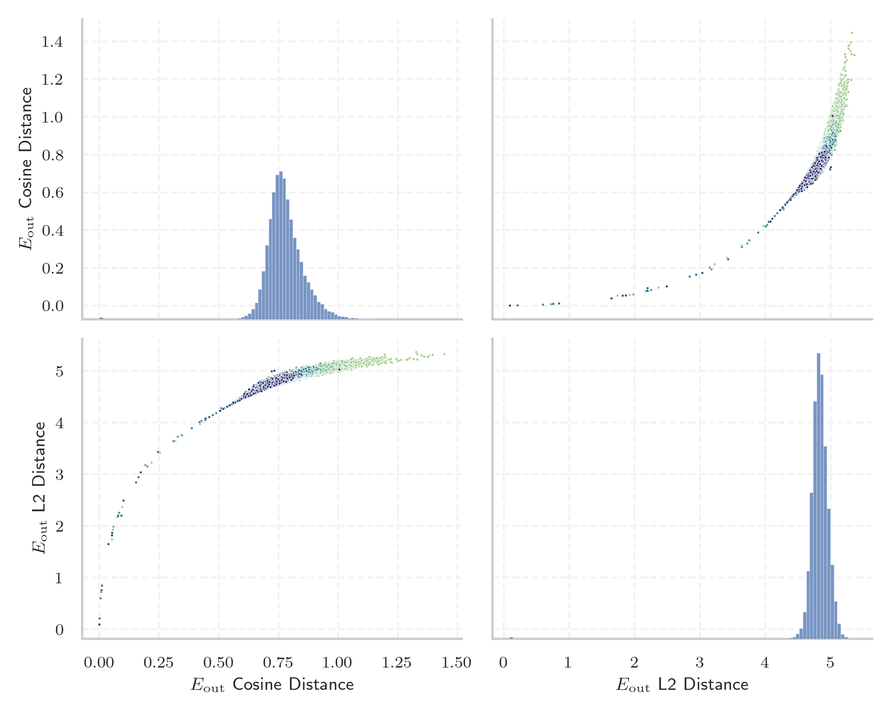
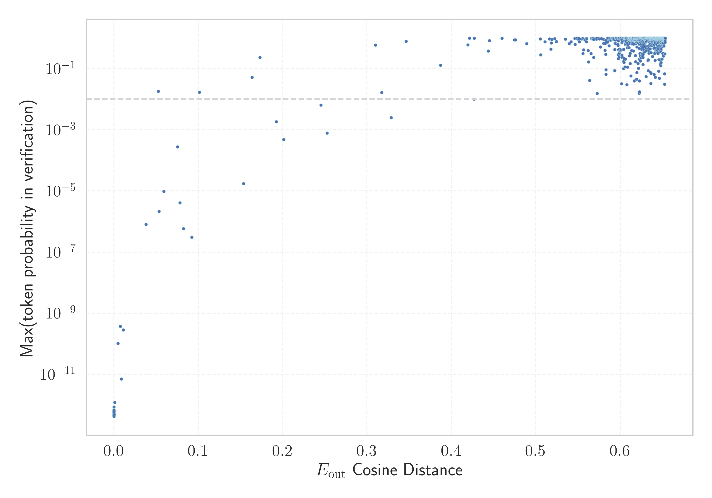

# Report for `openai-community/gpt2-large`

## Model info

* Tied embeddings: yes
* LM head uses bias: no
* Indicator for under-trained tokens: E_{out} Cosine Distance
  * Overall distribution 0.778 +/- 0.080
  * Token used for verification prompt building: `BuyableInstoreAndOnline`
  * Verification threshold: 0.653
  * Threshold for showing candidate under-trained tokens: 0.101
  * Median verified threshold (for bytes, unreachable and special tokens): 0.010
* Embeddings shape: (50257, 1280)
* Vocabulary size: 50257
  * Number of single byte tokens: 256, of which 45 below indicator threshold
  * Number of special tokens: 1, of which 0 below indicator threshold
  * Number of non-single-byte UTF-fragment tokens: 216, 2 below soft indicator threshold
  * Number of tested under-trained tokens: 999, 967 non-special, 28 below p = 0.01 threshold, 23 below soft indicator threshold

## Under-trained token indicators plot


## Verification plot


## Under-trained token verification results
23 entries below threshold of 0.101

|   token_id | token                                        |   indicator | max_prob                                                         | in_other_tokens                                                                                                                                                                                                                                                                                                                                                                                                    |
|------------|----------------------------------------------|-------------|------------------------------------------------------------------|--------------------------------------------------------------------------------------------------------------------------------------------------------------------------------------------------------------------------------------------------------------------------------------------------------------------------------------------------------------------------------------------------------------------|
|      45544 | ````` ▁サーティ `````                        | 0.000190854 | <span style='border: 1px solid rgb(169, 68, 66);'>7.1e-13</span> | <span style='border: 1px solid rgb(40, 167, 69);'>````` ▁サーティワン `````</span>                                                                                                                                                                                                                                                                                                                                 |
|      40241 | ````` InstoreAndOnline `````                 | 0.000195801 | <span style='border: 1px solid rgb(169, 68, 66);'>5.1e-13</span> | <span style='border: 1px solid rgb(40, 167, 69);'>````` BuyableInstoreAndOnline `````</span>                                                                                                                                                                                                                                                                                                                       |
|      40240 | ````` oreAndOnline `````                     | 0.000202    | <span style='border: 1px solid rgb(169, 68, 66);'>5.2e-13</span> | <span style='border: 1px solid rgb(169, 68, 66);'>````` InstoreAndOnline `````</span>, <span style='border: 1px solid rgb(40, 167, 69);'>````` BuyableInstoreAndOnline `````</span>                                                                                                                                                                                                                                |
|      42089 | ````` ▁TheNitrome `````                      | 0.000202775 | <span style='border: 1px solid rgb(169, 68, 66);'>5.3e-13</span> | <span style='border: 1px solid rgb(40, 167, 69);'>````` ▁TheNitromeFan `````</span>                                                                                                                                                                                                                                                                                                                                |
|      30905 | ````` rawdownload `````                      | 0.000209093 | <span style='border: 1px solid rgb(169, 68, 66);'>4.2e-13</span> | ````` rawdownloadcloneembedreportprint `````                                                                                                                                                                                                                                                                                                                                                                       |
|      39752 | ````` quickShip `````                        | 0.000216007 | <span style='border: 1px solid rgb(169, 68, 66);'>5.3e-13</span> | <span style='border: 1px solid rgb(40, 167, 69);'>````` quickShipAvailable `````</span>                                                                                                                                                                                                                                                                                                                            |
|      30898 | ````` embedreportprint `````                 | 0.00022006  | <span style='border: 1px solid rgb(169, 68, 66);'>5e-13</span>   | <span style='border: 1px solid rgb(169, 68, 66);'>````` cloneembedreportprint `````</span>, ````` rawdownloadcloneembedreportprint `````                                                                                                                                                                                                                                                                           |
|      36173 | ````` ▁RandomRedditor `````                  | 0.000221908 | <span style='border: 1px solid rgb(169, 68, 66);'>4.7e-13</span> | <span style='border: 1px solid rgb(40, 167, 69);'>````` ▁RandomRedditorWithNo `````</span>                                                                                                                                                                                                                                                                                                                         |
|      30212 | ````` ▁externalToEVA `````                   | 0.000232816 | <span style='border: 1px solid rgb(169, 68, 66);'>8.5e-13</span> | <span style='border: 1px solid rgb(40, 167, 69);'>````` ▁externalToEVAOnly `````</span>                                                                                                                                                                                                                                                                                                                            |
|      30897 | ````` reportprint `````                      | 0.000243366 | <span style='border: 1px solid rgb(169, 68, 66);'>5.8e-13</span> | <span style='border: 1px solid rgb(169, 68, 66);'>````` embedreportprint `````</span>, <span style='border: 1px solid rgb(169, 68, 66);'>````` cloneembedreportprint `````</span>, ````` rawdownloadcloneembedreportprint `````                                                                                                                                                                                    |
|      30208 | ````` ▁externalTo `````                      | 0.000833333 | <span style='border: 1px solid rgb(169, 68, 66);'>1.2e-12</span> | <span style='border: 1px solid rgb(169, 68, 66);'>````` ▁externalToEVA `````</span>, <span style='border: 1px solid rgb(40, 167, 69);'>````` ▁externalToEVAOnly `````</span>                                                                                                                                                                                                                                       |
|      23090 | ````` ÃÂÃÂÃÂÃÂÃÂÃÂÃÂÃÂÃÂÃÂÃÂÃÂÃÂÃÂÃÂÃÂ ````` | 0.00494826  | <span style='border: 1px solid rgb(169, 68, 66);'>1e-10</span>   | <span style='border: 1px solid rgb(40, 167, 69);'>````` ÃÂÃÂÃÂÃÂÃÂÃÂÃÂÃÂÃÂÃÂÃÂÃÂÃÂÃÂÃÂÃÂÃÂÃÂÃÂÃÂÃÂÃÂÃÂÃÂÃÂÃÂÃÂÃÂÃÂÃÂÃÂÃÂ `````</span>                                                                                                                                                                                                                                                                              |
|      14827 | ````` ÃÂÃÂÃÂÃÂÃÂÃÂÃÂÃÂ `````                 | 0.00767154  | <span style='border: 1px solid rgb(169, 68, 66);'>3.7e-10</span> | <span style='border: 1px solid rgb(169, 68, 66);'>````` ÃÂÃÂÃÂÃÂÃÂÃÂÃÂÃÂÃÂÃÂÃÂÃÂÃÂÃÂÃÂÃÂ `````</span>, <span style='border: 1px solid rgb(40, 167, 69);'>````` ÃÂÃÂÃÂÃÂÃÂÃÂÃÂÃÂÃÂÃÂÃÂÃÂÃÂÃÂÃÂÃÂÃÂÃÂÃÂÃÂÃÂÃÂÃÂÃÂÃÂÃÂÃÂÃÂÃÂÃÂÃÂÃÂ `````</span>                                                                                                                                                                       |
|      37574 | ````` StreamerBot `````                      | 0.00892842  | <span style='border: 1px solid rgb(169, 68, 66);'>7.1e-12</span> | <span style='border: 1px solid rgb(40, 167, 69);'>````` TPPStreamerBot `````</span>                                                                                                                                                                                                                                                                                                                                |
|      31573 | ````` ActionCode `````                       | 0.0109636   | <span style='border: 1px solid rgb(169, 68, 66);'>2.8e-10</span> | <span style='border: 1px solid rgb(40, 167, 69);'>````` externalActionCode `````</span>                                                                                                                                                                                                                                                                                                                            |
|      42066 | ````` Nitrome `````                          | 0.0379956   | <span style='border: 1px solid rgb(169, 68, 66);'>8e-07</span>   | <span style='border: 1px solid rgb(169, 68, 66);'>````` ▁TheNitrome `````</span>, <span style='border: 1px solid rgb(40, 167, 69);'>````` ▁TheNitromeFan `````</span>                                                                                                                                                                                                                                              |
|      39749 | ````` DeliveryDate `````                     | 0.052729    | <span style='border: 1px solid rgb(251, 189, 8);'>0.018</span>   | <span style='border: 1px solid rgb(40, 167, 69);'>````` soDeliveryDate `````</span>                                                                                                                                                                                                                                                                                                                                |
|      40219 | ````` oreAnd `````                           | 0.0535512   | <span style='border: 1px solid rgb(169, 68, 66);'>2.2e-06</span> | <span style='border: 1px solid rgb(169, 68, 66);'>````` oreAndOnline `````</span>, <span style='border: 1px solid rgb(169, 68, 66);'>````` InstoreAndOnline `````</span>, <span style='border: 1px solid rgb(40, 167, 69);'>````` BuyableInstoreAndOnline `````</span>                                                                                                                                             |
|       9364 | ````` ÃÂÃÂÃÂÃÂ `````                         | 0.0591084   | <span style='border: 1px solid rgb(169, 68, 66);'>9.6e-06</span> | <span style='border: 1px solid rgb(169, 68, 66);'>````` ÃÂÃÂÃÂÃÂÃÂÃÂÃÂÃÂ `````</span>, <span style='border: 1px solid rgb(169, 68, 66);'>````` ÃÂÃÂÃÂÃÂÃÂÃÂÃÂÃÂÃÂÃÂÃÂÃÂÃÂÃÂÃÂÃÂ `````</span>, <span style='border: 1px solid rgb(40, 167, 69);'>````` ÃÂÃÂÃÂÃÂÃÂÃÂÃÂÃÂÃÂÃÂÃÂÃÂÃÂÃÂÃÂÃÂÃÂÃÂÃÂÃÂÃÂÃÂÃÂÃÂÃÂÃÂÃÂÃÂÃÂÃÂÃÂÃÂ `````</span>                                                                                |
|       5815 | ````` ÃÂÃÂ `````                             | 0.0754375   | <span style='border: 1px solid rgb(169, 68, 66);'>0.00028</span> | <span style='border: 1px solid rgb(169, 68, 66);'>````` ÃÂÃÂÃÂÃÂ `````</span>, <span style='border: 1px solid rgb(169, 68, 66);'>````` ÃÂÃÂÃÂÃÂÃÂÃÂÃÂÃÂ `````</span>, <span style='border: 1px solid rgb(169, 68, 66);'>````` ÃÂÃÂÃÂÃÂÃÂÃÂÃÂÃÂÃÂÃÂÃÂÃÂÃÂÃÂÃÂÃÂ `````</span>, <span style='border: 1px solid rgb(40, 167, 69);'>````` ÃÂÃÂÃÂÃÂÃÂÃÂÃÂÃÂÃÂÃÂÃÂÃÂÃÂÃÂÃÂÃÂÃÂÃÂÃÂÃÂÃÂÃÂÃÂÃÂÃÂÃÂÃÂÃÂÃÂÃÂÃÂÃÂ `````</span> |
<details><summary>3 additional entries below threshold</summary>

|   token_id | token                             |   indicator | max_prob                                                         | in_other_tokens                                                                         |
|------------|-----------------------------------|-------------|------------------------------------------------------------------|-----------------------------------------------------------------------------------------|
|      39142 | ````` ThumbnailImage `````        |   0.0783563 | <span style='border: 1px solid rgb(169, 68, 66);'>4.1e-06</span> | <span style='border: 1px solid rgb(40, 167, 69);'>````` ItemThumbnailImage `````</span> |
|      17629 | ````` ▁practition `````           |   0.0825393 | <span style='border: 1px solid rgb(169, 68, 66);'>5.8e-07</span> | ````` ▁practitioners `````, ````` ▁practitioner `````                                   |
|      30899 | ````` cloneembedreportprint ````` |   0.0923434 | <span style='border: 1px solid rgb(169, 68, 66);'>3e-07</span>   | ````` rawdownloadcloneembedreportprint `````                                            |
</details>
<details><summary>944 additional entries above threshold</summary>

|   token_id | token                                                                        |   indicator | max_prob                                                         | in_other_tokens                                                                                                                                                                                                                                                                                                                                                                                                                                                                               |
|------------|------------------------------------------------------------------------------|-------------|------------------------------------------------------------------|-----------------------------------------------------------------------------------------------------------------------------------------------------------------------------------------------------------------------------------------------------------------------------------------------------------------------------------------------------------------------------------------------------------------------------------------------------------------------------------------------|
|      39714 | ````` isSpecial `````                                                        |    0.101428 | <span style='border: 1px solid rgb(251, 189, 8);'>0.017</span>   | <span style='border: 1px solid rgb(40, 167, 69);'>````` isSpecialOrderable `````</span>                                                                                                                                                                                                                                                                                                                                                                                                       |
|      27293 | ````` ▁antidepress `````                                                     |    0.153574 | <span style='border: 1px solid rgb(169, 68, 66);'>1.7e-05</span> | ````` ▁antidepressants `````, ````` ▁antidepressant `````                                                                                                                                                                                                                                                                                                                                                                                                                                     |
|      27013 | ````` aditional `````                                                        |    0.163868 | <span style='border: 1px solid rgb(251, 189, 8);'>0.052</span>   | ````` ▁Traditional `````, ````` traditional `````, ````` Traditional `````                                                                                                                                                                                                                                                                                                                                                                                                                    |
|      39655 | ````` Orderable `````                                                        |    0.173202 | <span style='border: 1px solid rgb(40, 167, 69);'>0.24</span>    | <span style='border: 1px solid rgb(40, 167, 69);'>````` isSpecialOrderable `````</span>                                                                                                                                                                                                                                                                                                                                                                                                       |
|      13150 | ````` ▁subur `````                                                           |    0.192407 | <span style='border: 1px solid rgb(255, 145, 0);'>0.0019</span>  | ````` ▁suburban `````, ````` ▁suburbs `````, ````` ▁suburb `````                                                                                                                                                                                                                                                                                                                                                                                                                              |
|      15272 | ````` ▁pione `````                                                           |    0.201267 | <span style='border: 1px solid rgb(169, 68, 66);'>0.00048</span> | ````` ▁pioneer `````, ````` ▁pioneering `````, ````` ▁pioneers `````, ````` ▁pioneered `````                                                                                                                                                                                                                                                                                                                                                                                                  |
|      30439 | ````` ▁unintention `````                                                     |    0.245503 | <span style='border: 1px solid rgb(255, 145, 0);'>0.0064</span>  | ````` ▁unintentionally `````, ````` ▁unintentional `````                                                                                                                                                                                                                                                                                                                                                                                                                                      |
|       4690 | ````` ortunately `````                                                       |    0.252657 | <span style='border: 1px solid rgb(169, 68, 66);'>0.00079</span> | ````` fortunately `````, ````` ▁Unfortunately `````, ````` ▁unfortunately `````, ````` Unfortunately `````, ````` ▁Fortunately `````, ...                                                                                                                                                                                                                                                                                                                                                     |
|      19476 | ````` ▁carbohyd `````                                                        |    0.310128 | <span style='border: 1px solid rgb(40, 167, 69);'>0.59</span>    | ````` ▁carbohydrate `````, ````` ▁carbohydrates `````                                                                                                                                                                                                                                                                                                                                                                                                                                         |
|       7105 | ````` ▁volunte `````                                                         |    0.31736  | <span style='border: 1px solid rgb(251, 189, 8);'>0.017</span>   | ````` ▁volunteers `````, ````` ▁volunteer `````, ````` ▁volunteered `````, ````` ▁volunteering `````                                                                                                                                                                                                                                                                                                                                                                                          |
|      13198 | ````` ▁earthqu `````                                                         |    0.328759 | <span style='border: 1px solid rgb(255, 145, 0);'>0.0025</span>  | ````` ▁earthquake `````, <span style='border: 1px solid rgb(40, 167, 69);'>````` ▁earthquakes `````</span>                                                                                                                                                                                                                                                                                                                                                                                    |
|      14695 | ````` ▁eleph `````                                                           |    0.346385 | <span style='border: 1px solid rgb(40, 167, 69);'>0.79</span>    | ````` ▁elephant `````, ````` ▁elephants `````                                                                                                                                                                                                                                                                                                                                                                                                                                                 |
|      25618 | ````` ▁councill `````                                                        |    0.387082 | <span style='border: 1px solid rgb(40, 167, 69);'>0.13</span>    | ````` ▁councillor `````, ````` ▁councillors `````                                                                                                                                                                                                                                                                                                                                                                                                                                             |
|      24973 | ````` ▁exting `````                                                          |    0.419614 | <span style='border: 1px solid rgb(40, 167, 69);'>0.61</span>    | ````` ▁extingu `````, ````` ▁extinguished `````                                                                                                                                                                                                                                                                                                                                                                                                                                               |
|       5808 | ````` ÃÂ `````                                                               |    0.42147  | <span style='border: 1px solid rgb(40, 167, 69);'>1</span>       | <span style='border: 1px solid rgb(169, 68, 66);'>````` ÃÂÃÂ `````</span>, <span style='border: 1px solid rgb(169, 68, 66);'>````` ÃÂÃÂÃÂÃÂ `````</span>, <span style='border: 1px solid rgb(169, 68, 66);'>````` ÃÂÃÂÃÂÃÂÃÂÃÂÃÂÃÂ `````</span>, <span style='border: 1px solid rgb(169, 68, 66);'>````` ÃÂÃÂÃÂÃÂÃÂÃÂÃÂÃÂÃÂÃÂÃÂÃÂÃÂÃÂÃÂÃÂ `````</span>, <span style='border: 1px solid rgb(40, 167, 69);'>````` ÃÂÃÂÃÂÃÂÃÂÃÂÃÂÃÂÃÂÃÂÃÂÃÂÃÂÃÂÃÂÃÂÃÂÃÂÃÂÃÂÃÂÃÂÃÂÃÂÃÂÃÂÃÂÃÂÃÂÃÂÃÂÃÂ `````</span> |
|      11548 | ````` ▁entreprene `````                                                      |    0.42687  | <span style='border: 1px solid rgb(251, 189, 8);'>0.01</span>    | ````` ▁entrepreneurs `````, ````` ▁entrepreneur `````, ````` ▁entrepreneurial `````, ````` ▁entrepreneurship `````                                                                                                                                                                                                                                                                                                                                                                            |
|      18945 | ````` ▁teasp `````                                                           |    0.427103 | <span style='border: 1px solid rgb(40, 167, 69);'>1</span>       | ````` ▁teaspoon `````, ````` ▁teaspoons `````                                                                                                                                                                                                                                                                                                                                                                                                                                                 |
|      42889 | ````` ikuman `````                                                           |    0.443628 | <span style='border: 1px solid rgb(40, 167, 69);'>0.38</span>    | <span style='border: 1px solid rgb(40, 167, 69);'>````` ▁Kinnikuman `````</span>                                                                                                                                                                                                                                                                                                                                                                                                              |
|      44392 | ````` ▁cumbers `````                                                         |    0.445171 | <span style='border: 1px solid rgb(40, 167, 69);'>0.83</span>    | ````` ▁cumbersome `````                                                                                                                                                                                                                                                                                                                                                                                                                                                                       |
|      35496 | ````` ÃÂÃÂÃÂÃÂÃÂÃÂÃÂÃÂÃÂÃÂÃÂÃÂÃÂÃÂÃÂÃÂÃÂÃÂÃÂÃÂÃÂÃÂÃÂÃÂÃÂÃÂÃÂÃÂÃÂÃÂÃÂÃÂ ````` |    0.460086 | <span style='border: 1px solid rgb(40, 167, 69);'>1</span>       |                                                                                                                                                                                                                                                                                                                                                                                                                                                                                               |
|      24307 | ````` ▁looph `````                                                           |    0.474922 | <span style='border: 1px solid rgb(40, 167, 69);'>0.89</span>    | ````` ▁loophole `````, ````` ▁loopholes `````                                                                                                                                                                                                                                                                                                                                                                                                                                                 |
|      14341 | ````` PDATE `````                                                            |    0.475956 | <span style='border: 1px solid rgb(40, 167, 69);'>0.88</span>    | ````` UPDATE `````, ````` ▁UPDATE `````, ````` PDATED `````                                                                                                                                                                                                                                                                                                                                                                                                                                   |
|      22315 | ````` ▁newcom `````                                                          |    0.489289 | <span style='border: 1px solid rgb(40, 167, 69);'>0.66</span>    | ````` ▁newcomers `````, ````` ▁newcomer `````                                                                                                                                                                                                                                                                                                                                                                                                                                                 |
|      12677 | ````` ▁tradem `````                                                          |    0.505235 | <span style='border: 1px solid rgb(40, 167, 69);'>0.94</span>    | ````` ▁trademark `````, ````` ▁trademarks `````                                                                                                                                                                                                                                                                                                                                                                                                                                               |
|      48448 | ````` iosyn `````                                                            |    0.505846 | <span style='border: 1px solid rgb(40, 167, 69);'>0.28</span>    | <span style='border: 1px solid rgb(40, 167, 69);'>````` iosyncr `````</span>, <span style='border: 1px solid rgb(40, 167, 69);'>````` ▁idiosyncr `````</span>                                                                                                                                                                                                                                                                                                                                 |
|      31666 | ````` ?????-?????- `````                                                     |    0.510879 | <span style='border: 1px solid rgb(40, 167, 69);'>0.76</span>    |                                                                                                                                                                                                                                                                                                                                                                                                                                                                                               |
|      23711 | ````` ▁Moroc `````                                                           |    0.516163 | <span style='border: 1px solid rgb(40, 167, 69);'>0.94</span>    | ````` ▁Morocco `````, ````` ▁Moroccan `````                                                                                                                                                                                                                                                                                                                                                                                                                                                   |
|      40012 | ````` uyomi `````                                                            |    0.517908 | <span style='border: 1px solid rgb(40, 167, 69);'>0.43</span>    | <span style='border: 1px solid rgb(40, 167, 69);'>````` ▁Tsukuyomi `````</span>                                                                                                                                                                                                                                                                                                                                                                                                               |
|      42202 | ````` GoldMagikarp `````                                                     |    0.518356 | <span style='border: 1px solid rgb(40, 167, 69);'>0.7</span>     | <span style='border: 1px solid rgb(40, 167, 69);'>````` ▁SolidGoldMagikarp `````</span>                                                                                                                                                                                                                                                                                                                                                                                                       |
|      20554 | ````` ▁unbeliev `````                                                        |    0.518917 | <span style='border: 1px solid rgb(40, 167, 69);'>0.9</span>     | ````` ▁unbelievable `````, ````` ▁unbelievably `````                                                                                                                                                                                                                                                                                                                                                                                                                                          |
|      27924 | ````` ▁srf `````                                                             |    0.522466 | <span style='border: 1px solid rgb(40, 167, 69);'>0.97</span>    | ````` ▁srfN `````, ````` ▁srfAttach `````                                                                                                                                                                                                                                                                                                                                                                                                                                                     |
|       4183 | ````` ▁conflic `````                                                         |    0.524312 | <span style='border: 1px solid rgb(40, 167, 69);'>0.77</span>    | ````` ▁conflict `````, ````` ▁conflicts `````, ````` ▁conflicting `````, ````` ▁conflicted `````                                                                                                                                                                                                                                                                                                                                                                                              |
|      32917 | ````` aution `````                                                           |    0.535036 | <span style='border: 1px solid rgb(40, 167, 69);'>0.92</span>    | ````` ▁precaution `````, ````` ▁cautioned `````                                                                                                                                                                                                                                                                                                                                                                                                                                               |
|      29740 | ````` ▁Azerb `````                                                           |    0.539707 | <span style='border: 1px solid rgb(40, 167, 69);'>0.66</span>    | <span style='border: 1px solid rgb(40, 167, 69);'>````` ▁Azerbai `````</span>, ````` ▁Azerbaijan `````                                                                                                                                                                                                                                                                                                                                                                                        |
|       6598 | ````` ▁behavi `````                                                          |    0.54178  | <span style='border: 1px solid rgb(40, 167, 69);'>0.77</span>    | ````` ▁behaviour `````, ````` ▁behaviors `````, ````` ▁behavioral `````, ````` ▁behaving `````, ````` ▁behaviours `````, ...                                                                                                                                                                                                                                                                                                                                                                  |
|      43298 | ````` userc `````                                                            |    0.546225 | <span style='border: 1px solid rgb(40, 167, 69);'>0.99</span>    | ````` usercontent `````                                                                                                                                                                                                                                                                                                                                                                                                                                                                       |
|       4060 | ````` vertisement `````                                                      |    0.54664  | <span style='border: 1px solid rgb(40, 167, 69);'>0.62</span>    | ````` Advertisement `````, ````` vertisements `````, ````` Advertisements `````, ````` ▁advertisement `````, ````` ▁advertisements `````, ...                                                                                                                                                                                                                                                                                                                                                 |
|      28235 | ````` aeper `````                                                            |    0.548548 | <span style='border: 1px solid rgb(40, 167, 69);'>0.98</span>    | <span style='border: 1px solid rgb(40, 167, 69);'>````` aepernick `````</span>, ````` ▁Kaepernick `````                                                                                                                                                                                                                                                                                                                                                                                       |
|      27097 | ````` -+-+ `````                                                             |    0.550335 | <span style='border: 1px solid rgb(40, 167, 69);'>1</span>       | <span style='border: 1px solid rgb(40, 167, 69);'>````` -+-+-+-+ `````</span>                                                                                                                                                                                                                                                                                                                                                                                                                 |
|      16041 | ````` ▁referen `````                                                         |    0.550412 | <span style='border: 1px solid rgb(40, 167, 69);'>0.93</span>    | ````` ▁referenced `````, ````` ▁referencing `````                                                                                                                                                                                                                                                                                                                                                                                                                                             |
|       9286 | ````` ▁exha `````                                                            |    0.551064 | <span style='border: 1px solid rgb(40, 167, 69);'>0.98</span>    | ````` ▁exhaust `````, ````` ▁exhausted `````, ````` ▁exhaustion `````, ````` ▁exhaustive `````, ````` ▁exhausting `````                                                                                                                                                                                                                                                                                                                                                                       |
|       8994 | ````` ailability `````                                                       |    0.551608 | <span style='border: 1px solid rgb(40, 167, 69);'>0.76</span>    | ````` ▁availability `````, ````` Availability `````, <span style='border: 1px solid rgb(40, 167, 69);'>````` channelAvailability `````</span>, ````` ▁Availability `````, ````` availability `````                                                                                                                                                                                                                                                                                            |
|      19373 | ````` ▁adolesc `````                                                         |    0.554276 | <span style='border: 1px solid rgb(40, 167, 69);'>0.95</span>    | ````` ▁adolescents `````, ````` ▁adolescent `````, ````` ▁adolescence `````                                                                                                                                                                                                                                                                                                                                                                                                                   |
|      39693 | ````` Buyable `````                                                          |    0.555341 | <span style='border: 1px solid rgb(40, 167, 69);'>0.97</span>    | <span style='border: 1px solid rgb(40, 167, 69);'>````` BuyableInstoreAndOnline `````</span>                                                                                                                                                                                                                                                                                                                                                                                                  |
|      16303 | ````` ▁undermin `````                                                        |    0.555824 | <span style='border: 1px solid rgb(40, 167, 69);'>0.99</span>    | ````` ▁undermine `````, ````` ▁undermining `````, ````` ▁undermined `````, ````` ▁undermines `````                                                                                                                                                                                                                                                                                                                                                                                            |
|      35992 | ````` WithNo `````                                                           |    0.555909 | <span style='border: 1px solid rgb(40, 167, 69);'>0.31</span>    | <span style='border: 1px solid rgb(40, 167, 69);'>````` ▁RandomRedditorWithNo `````</span>                                                                                                                                                                                                                                                                                                                                                                                                    |
|      16782 | ````` ▁misunder `````                                                        |    0.556701 | <span style='border: 1px solid rgb(40, 167, 69);'>0.95</span>    | ````` ▁misunderstanding `````, ````` ▁misunderstood `````, ````` ▁misunderstand `````                                                                                                                                                                                                                                                                                                                                                                                                         |
|      29372 | ````` ▁guiActiveUn `````                                                     |    0.556854 | <span style='border: 1px solid rgb(40, 167, 69);'>0.42</span>    | <span style='border: 1px solid rgb(40, 167, 69);'>````` ▁guiActiveUnfocused `````</span>                                                                                                                                                                                                                                                                                                                                                                                                      |
|      20213 | ````` ▁pestic `````                                                          |    0.558273 | <span style='border: 1px solid rgb(40, 167, 69);'>0.87</span>    | ````` ▁pesticides `````, ````` ▁pesticide `````                                                                                                                                                                                                                                                                                                                                                                                                                                               |
|      41215 | ````` conservancy `````                                                      |    0.560235 | <span style='border: 1px solid rgb(40, 167, 69);'>0.77</span>    | <span style='border: 1px solid rgb(40, 167, 69);'>````` natureconservancy `````</span>                                                                                                                                                                                                                                                                                                                                                                                                        |
|      46858 | ````` ▁Canaver `````                                                         |    0.560238 | <span style='border: 1px solid rgb(40, 167, 69);'>0.98</span>    | ````` ▁Canaveral `````                                                                                                                                                                                                                                                                                                                                                                                                                                                                        |
|      44326 | ````` ーテ `````                                                             |    0.560534 | <span style='border: 1px solid rgb(40, 167, 69);'>0.97</span>    | <span style='border: 1px solid rgb(40, 167, 69);'>````` ーティ `````</span>, <span style='border: 1px solid rgb(169, 68, 66);'>````` ▁サーティ `````</span>, <span style='border: 1px solid rgb(40, 167, 69);'>````` ▁サーティワン `````</span>                                                                                                                                                                                                                                               |
|       6336 | ````` ▁Palestin `````                                                        |    0.561966 | <span style='border: 1px solid rgb(40, 167, 69);'>0.39</span>    | ````` ▁Palestinian `````, ````` ▁Palestinians `````, ````` ▁Palestine `````                                                                                                                                                                                                                                                                                                                                                                                                                   |
|       7260 | ````` escription `````                                                       |    0.5626   | <span style='border: 1px solid rgb(40, 167, 69);'>0.17</span>    | ````` description `````, ````` Description `````, ````` ▁Description `````, ````` ▁prescription `````, ````` ▁descriptions `````, ...                                                                                                                                                                                                                                                                                                                                                         |
|      19785 | ````` emetery `````                                                          |    0.563838 | <span style='border: 1px solid rgb(251, 189, 8);'>0.042</span>   | ````` ▁cemetery `````, ````` ▁Cemetery `````                                                                                                                                                                                                                                                                                                                                                                                                                                                  |
|      13171 | ````` VIDIA `````                                                            |    0.565362 | <span style='border: 1px solid rgb(40, 167, 69);'>0.31</span>    | ````` ▁NVIDIA `````, ````` NVIDIA `````                                                                                                                                                                                                                                                                                                                                                                                                                                                       |
|      15755 | ````` ▁millenn `````                                                         |    0.566126 | <span style='border: 1px solid rgb(40, 167, 69);'>0.99</span>    | ````` ▁millennials `````, ````` ▁millennia `````, ````` ▁millennium `````, ````` ▁millennial `````                                                                                                                                                                                                                                                                                                                                                                                            |
|      13296 | ````` ▁Leban `````                                                           |    0.566368 | <span style='border: 1px solid rgb(40, 167, 69);'>0.96</span>    | ````` ▁Lebanon `````, ````` ▁Lebanese `````                                                                                                                                                                                                                                                                                                                                                                                                                                                   |
|      22263 | ````` ▁mosqu `````                                                           |    0.567417 | <span style='border: 1px solid rgb(40, 167, 69);'>0.99</span>    | ````` ▁mosques `````, <span style='border: 1px solid rgb(40, 167, 69);'>````` ▁mosquit `````</span>, ````` ▁mosquito `````, ````` ▁mosquitoes `````                                                                                                                                                                                                                                                                                                                                           |
|      11689 | ````` ▁unnecess `````                                                        |    0.567686 | <span style='border: 1px solid rgb(40, 167, 69);'>0.93</span>    | ````` ▁unnecessary `````, ````` ▁unnecessarily `````                                                                                                                                                                                                                                                                                                                                                                                                                                          |
|       8983 | ````` ▁satell `````                                                          |    0.567858 | <span style='border: 1px solid rgb(40, 167, 69);'>0.99</span>    | ````` ▁satellite `````, ````` ▁satellites `````                                                                                                                                                                                                                                                                                                                                                                                                                                               |
|      42000 | ````` ▁hemor `````                                                           |    0.568055 | <span style='border: 1px solid rgb(40, 167, 69);'>0.93</span>    | ````` ▁hemorrh `````                                                                                                                                                                                                                                                                                                                                                                                                                                                                          |
|      45228 | ````` uliffe `````                                                           |    0.568495 | <span style='border: 1px solid rgb(40, 167, 69);'>0.23</span>    | ````` ▁McAuliffe `````                                                                                                                                                                                                                                                                                                                                                                                                                                                                        |
|      31727 | ````` cffff `````                                                            |    0.568546 | <span style='border: 1px solid rgb(40, 167, 69);'>0.9</span>     | <span style='border: 1px solid rgb(40, 167, 69);'>````` cffffcc `````</span>                                                                                                                                                                                                                                                                                                                                                                                                                  |
|      25658 | ````` ?????- `````                                                           |    0.571736 | <span style='border: 1px solid rgb(40, 167, 69);'>0.97</span>    | <span style='border: 1px solid rgb(40, 167, 69);'>````` ?????-?????- `````</span>                                                                                                                                                                                                                                                                                                                                                                                                             |
|       8438 | ````` everal `````                                                           |    0.571794 | <span style='border: 1px solid rgb(40, 167, 69);'>0.99</span>    | ````` ▁Several `````, ````` Several `````                                                                                                                                                                                                                                                                                                                                                                                                                                                     |
|      15040 | ````` byss `````                                                             |    0.571958 | <span style='border: 1px solid rgb(40, 167, 69);'>0.93</span>    | ````` ▁Abyss `````, ````` ▁abyss `````, ````` ▁Abyssal `````, ````` Abyss `````                                                                                                                                                                                                                                                                                                                                                                                                               |
|      12869 | ````` ▁reluct `````                                                          |    0.572348 | <span style='border: 1px solid rgb(40, 167, 69);'>0.99</span>    | ````` ▁reluctant `````, ````` ▁reluctance `````, ````` ▁reluctantly `````                                                                                                                                                                                                                                                                                                                                                                                                                     |
|      22640 | ````` itially `````                                                          |    0.572703 | <span style='border: 1px solid rgb(251, 189, 8);'>0.015</span>   | ````` ▁Initially `````, ````` Initially `````                                                                                                                                                                                                                                                                                                                                                                                                                                                 |
|      40242 | ````` BuyableInstoreAndOnline `````                                          |    0.575122 | <span style='border: 1px solid rgb(40, 167, 69);'>0.99</span>    |                                                                                                                                                                                                                                                                                                                                                                                                                                                                                               |
|       3523 | ````` ▁citiz `````                                                           |    0.575328 | <span style='border: 1px solid rgb(40, 167, 69);'>0.95</span>    | ````` ▁citizens `````, ````` ▁citizen `````, ````` ▁citizenship `````                                                                                                                                                                                                                                                                                                                                                                                                                         |
|      40561 | ````` apego `````                                                            |    0.576627 | <span style='border: 1px solid rgb(40, 167, 69);'>0.52</span>    | <span style='border: 1px solid rgb(40, 167, 69);'>````` ▁scapego `````</span>                                                                                                                                                                                                                                                                                                                                                                                                                 |
|      41974 | ````` accompan `````                                                         |    0.577552 | <span style='border: 1px solid rgb(40, 167, 69);'>1</span>       | <span style='border: 1px solid rgb(40, 167, 69);'>````` accompanied `````</span>, ````` ▁unaccompanied `````, ````` ▁accompanies `````                                                                                                                                                                                                                                                                                                                                                        |
|      32288 | ````` regor `````                                                            |    0.577932 | <span style='border: 1px solid rgb(40, 167, 69);'>0.96</span>    | ````` ▁McGregor `````                                                                                                                                                                                                                                                                                                                                                                                                                                                                         |
|      45664 | ````` mbuds `````                                                            |    0.580088 | <span style='border: 1px solid rgb(40, 167, 69);'>0.93</span>    | <span style='border: 1px solid rgb(40, 167, 69);'>````` mbudsman `````</span>                                                                                                                                                                                                                                                                                                                                                                                                                 |
|      33023 | ````` hovah `````                                                            |    0.580325 | <span style='border: 1px solid rgb(40, 167, 69);'>0.67</span>    | ````` ▁Jehovah `````                                                                                                                                                                                                                                                                                                                                                                                                                                                                          |
|      25549 | ````` umbledore `````                                                        |    0.581967 | <span style='border: 1px solid rgb(40, 167, 69);'>0.4</span>     | ````` ▁Dumbledore `````                                                                                                                                                                                                                                                                                                                                                                                                                                                                       |
|      18356 | ````` ▁opio `````                                                            |    0.582247 | <span style='border: 1px solid rgb(40, 167, 69);'>0.67</span>    | ````` ▁opioid `````, ````` ▁opioids `````                                                                                                                                                                                                                                                                                                                                                                                                                                                     |
|      10060 | ````` ithub `````                                                            |    0.582813 | <span style='border: 1px solid rgb(40, 167, 69);'>0.3</span>     | ````` github `````, ````` ▁github `````, ````` ▁Github `````                                                                                                                                                                                                                                                                                                                                                                                                                                  |
|      41504 | ````` farious `````                                                          |    0.582826 | <span style='border: 1px solid rgb(40, 167, 69);'>0.84</span>    | ````` ▁nefarious `````                                                                                                                                                                                                                                                                                                                                                                                                                                                                        |
|      44309 | ````` agascar `````                                                          |    0.583135 | <span style='border: 1px solid rgb(251, 189, 8);'>0.066</span>   | ````` ▁Madagascar `````                                                                                                                                                                                                                                                                                                                                                                                                                                                                       |
|      29085 | ````` orgetown `````                                                         |    0.583268 | <span style='border: 1px solid rgb(251, 189, 8);'>0.093</span>   | ````` ▁Georgetown `````                                                                                                                                                                                                                                                                                                                                                                                                                                                                       |
|      29646 | ````` ▁gobl `````                                                            |    0.584956 | <span style='border: 1px solid rgb(40, 167, 69);'>0.99</span>    | ````` ▁goblin `````, ````` ▁goblins `````                                                                                                                                                                                                                                                                                                                                                                                                                                                     |
|      37757 | ````` glomer `````                                                           |    0.584994 | <span style='border: 1px solid rgb(40, 167, 69);'>0.97</span>    | ````` ▁conglomer `````, ````` ▁conglomerate `````                                                                                                                                                                                                                                                                                                                                                                                                                                             |
|      17473 | ````` ▁contrace `````                                                        |    0.585124 | <span style='border: 1px solid rgb(40, 167, 69);'>0.94</span>    | ````` ▁contraception `````, ````` ▁contraceptive `````, ````` ▁contraceptives `````                                                                                                                                                                                                                                                                                                                                                                                                           |
|      28360 | ````` ▁antioxid `````                                                        |    0.58523  | <span style='border: 1px solid rgb(40, 167, 69);'>0.75</span>    | ````` ▁antioxidant `````, ````` ▁antioxidants `````                                                                                                                                                                                                                                                                                                                                                                                                                                           |
|      39756 | ````` inventoryQuantity `````                                                |    0.585761 | <span style='border: 1px solid rgb(40, 167, 69);'>1</span>       |                                                                                                                                                                                                                                                                                                                                                                                                                                                                                               |
|      22501 | ````` strous `````                                                           |    0.586723 | <span style='border: 1px solid rgb(40, 167, 69);'>0.56</span>    | ````` ▁monstrous `````, ````` ▁Monstrous `````                                                                                                                                                                                                                                                                                                                                                                                                                                                |
|      20677 | ````` ▁comr `````                                                            |    0.586753 | <span style='border: 1px solid rgb(40, 167, 69);'>0.9</span>     | ````` ▁comrades `````, ````` ▁comrade `````                                                                                                                                                                                                                                                                                                                                                                                                                                                   |
|      42543 | ````` ▁Seym `````                                                            |    0.587521 | <span style='border: 1px solid rgb(40, 167, 69);'>0.99</span>    | ````` ▁Seymour `````                                                                                                                                                                                                                                                                                                                                                                                                                                                                          |
|      48702 | ````` iosyncr `````                                                          |    0.587669 | <span style='border: 1px solid rgb(40, 167, 69);'>0.88</span>    | <span style='border: 1px solid rgb(40, 167, 69);'>````` ▁idiosyncr `````</span>                                                                                                                                                                                                                                                                                                                                                                                                               |
|      41551 | ````` Downloadha `````                                                       |    0.58807  | <span style='border: 1px solid rgb(40, 167, 69);'>0.93</span>    |                                                                                                                                                                                                                                                                                                                                                                                                                                                                                               |
|      38160 | ````` FontSize `````                                                         |    0.588193 | <span style='border: 1px solid rgb(40, 167, 69);'>0.99</span>    | ````` ▁SetFontSize `````                                                                                                                                                                                                                                                                                                                                                                                                                                                                      |
|      46968 | ````` ▁convol `````                                                          |    0.58859  | <span style='border: 1px solid rgb(40, 167, 69);'>0.95</span>    | ````` ▁convoluted `````                                                                                                                                                                                                                                                                                                                                                                                                                                                                       |
|      44686 | ````` ーティ `````                                                           |    0.588751 | <span style='border: 1px solid rgb(40, 167, 69);'>0.96</span>    | <span style='border: 1px solid rgb(169, 68, 66);'>````` ▁サーティ `````</span>, <span style='border: 1px solid rgb(40, 167, 69);'>````` ▁サーティワン `````</span>                                                                                                                                                                                                                                                                                                                            |
|      19306 | ````` ▁prosec `````                                                          |    0.588905 | <span style='border: 1px solid rgb(40, 167, 69);'>0.86</span>    | ````` ▁prosecuted `````, ````` ▁prosecute `````, ````` ▁prosecutions `````, ````` ▁prosecuting `````                                                                                                                                                                                                                                                                                                                                                                                          |
|       8815 | ````` ▁tiss `````                                                            |    0.589978 | <span style='border: 1px solid rgb(40, 167, 69);'>1</span>       | ````` ▁tissue `````, ````` ▁tissues `````                                                                                                                                                                                                                                                                                                                                                                                                                                                     |
|      20590 | ````` ▁Pengu `````                                                           |    0.59008  | <span style='border: 1px solid rgb(40, 167, 69);'>1</span>       | ````` ▁Penguins `````, ````` ▁Penguin `````                                                                                                                                                                                                                                                                                                                                                                                                                                                   |
|      20645 | ````` ▁dilig `````                                                           |    0.590092 | <span style='border: 1px solid rgb(40, 167, 69);'>0.99</span>    | ````` ▁diligence `````, ````` ▁diligently `````, ````` ▁diligent `````                                                                                                                                                                                                                                                                                                                                                                                                                        |
|      11039 | ````` ▁tremend `````                                                         |    0.590636 | <span style='border: 1px solid rgb(40, 167, 69);'>0.95</span>    | ````` ▁tremendous `````, ````` ▁tremendously `````                                                                                                                                                                                                                                                                                                                                                                                                                                            |
|      17787 | ````` ▁cryst `````                                                           |    0.590994 | <span style='border: 1px solid rgb(40, 167, 69);'>0.96</span>    | ````` ▁crystals `````, ````` ▁crystall `````                                                                                                                                                                                                                                                                                                                                                                                                                                                  |
|      30716 | ````` ▁cannabin `````                                                        |    0.591169 | <span style='border: 1px solid rgb(40, 167, 69);'>0.99</span>    | ````` ▁cannabinoids `````, ````` ▁cannabinoid `````                                                                                                                                                                                                                                                                                                                                                                                                                                           |
|      45662 | ````` raltar `````                                                           |    0.591568 | <span style='border: 1px solid rgb(40, 167, 69);'>1</span>       | ````` ▁Gibraltar `````                                                                                                                                                                                                                                                                                                                                                                                                                                                                        |
|      39321 | ````` rontal `````                                                           |    0.591689 | <span style='border: 1px solid rgb(40, 167, 69);'>0.95</span>    | <span style='border: 1px solid rgb(40, 167, 69);'>````` ▁prefrontal `````</span>                                                                                                                                                                                                                                                                                                                                                                                                              |
|      36897 | ````` eredith `````                                                          |    0.59201  | <span style='border: 1px solid rgb(40, 167, 69);'>0.95</span>    | ````` ▁Meredith `````                                                                                                                                                                                                                                                                                                                                                                                                                                                                         |
|       5392 | ````` ▁conclud `````                                                         |    0.592146 | <span style='border: 1px solid rgb(40, 167, 69);'>0.91</span>    | ````` ▁concluded `````, ````` ▁conclude `````, ````` ▁concludes `````, ````` ▁concluding `````                                                                                                                                                                                                                                                                                                                                                                                                |
|      12943 | ````` ▁encount `````                                                         |    0.592553 | <span style='border: 1px solid rgb(40, 167, 69);'>0.95</span>    | ````` ▁encountered `````, ````` ▁encounters `````, ````` ▁encountering `````                                                                                                                                                                                                                                                                                                                                                                                                                  |
|      19359 | ````` neapolis `````                                                         |    0.593552 | <span style='border: 1px solid rgb(251, 189, 8);'>0.089</span>   | ````` ▁Minneapolis `````                                                                                                                                                                                                                                                                                                                                                                                                                                                                      |
|      34876 | ````` ortmund `````                                                          |    0.593557 | <span style='border: 1px solid rgb(40, 167, 69);'>0.42</span>    | ````` ▁Dortmund `````                                                                                                                                                                                                                                                                                                                                                                                                                                                                         |
|      11585 | ````` eatures `````                                                          |    0.593604 | <span style='border: 1px solid rgb(251, 189, 8);'>0.086</span>   | ````` ▁Features `````, ````` Features `````, ````` ▁Creatures `````, ````` features `````                                                                                                                                                                                                                                                                                                                                                                                                     |
|      15020 | ````` incinn `````                                                           |    0.593984 | <span style='border: 1px solid rgb(40, 167, 69);'>0.69</span>    | <span style='border: 1px solid rgb(40, 167, 69);'>````` incinnati `````</span>, ````` ▁Cincinnati `````                                                                                                                                                                                                                                                                                                                                                                                       |
|      16148 | ````` ▁unlaw `````                                                           |    0.594575 | <span style='border: 1px solid rgb(40, 167, 69);'>0.88</span>    | ````` ▁unlawful `````, ````` ▁unlawfully `````                                                                                                                                                                                                                                                                                                                                                                                                                                                |
|      42300 | ````` umenthal `````                                                         |    0.594661 | <span style='border: 1px solid rgb(40, 167, 69);'>0.66</span>    | ````` ▁Blumenthal `````                                                                                                                                                                                                                                                                                                                                                                                                                                                                       |
|      48404 | ````` ruciating `````                                                        |    0.594686 | <span style='border: 1px solid rgb(40, 167, 69);'>1</span>       | ````` ▁excruciating `````                                                                                                                                                                                                                                                                                                                                                                                                                                                                     |
|      33813 | ````` =~=~ `````                                                             |    0.594717 | <span style='border: 1px solid rgb(40, 167, 69);'>1</span>       |                                                                                                                                                                                                                                                                                                                                                                                                                                                                                               |
|      45449 | ````` CLASSIFIED `````                                                       |    0.595073 | <span style='border: 1px solid rgb(40, 167, 69);'>1</span>       | ````` ▁UNCLASSIFIED `````                                                                                                                                                                                                                                                                                                                                                                                                                                                                     |
|      38281 | ````` aredevil `````                                                         |    0.595185 | <span style='border: 1px solid rgb(40, 167, 69);'>0.99</span>    | ````` ▁Daredevil `````                                                                                                                                                                                                                                                                                                                                                                                                                                                                        |
|      36639 | ````` monary `````                                                           |    0.595192 | <span style='border: 1px solid rgb(40, 167, 69);'>0.99</span>    | ````` ▁pulmonary `````                                                                                                                                                                                                                                                                                                                                                                                                                                                                        |
|       7961 | ````` ▁obser `````                                                           |    0.595652 | <span style='border: 1px solid rgb(40, 167, 69);'>0.99</span>    | ````` ▁observe `````, ````` ▁observations `````, ````` ▁observation `````, ````` ▁observers `````, ````` ▁observing `````, ...                                                                                                                                                                                                                                                                                                                                                                |
|      36278 | ````` icter `````                                                            |    0.595662 | <span style='border: 1px solid rgb(40, 167, 69);'>1</span>       | ````` ▁stricter `````                                                                                                                                                                                                                                                                                                                                                                                                                                                                         |
|      16080 | ````` ▁corrid `````                                                          |    0.596491 | <span style='border: 1px solid rgb(40, 167, 69);'>0.96</span>    | ````` ▁corridor `````, ````` ▁corridors `````                                                                                                                                                                                                                                                                                                                                                                                                                                                 |
|      46165 | ````` ensical `````                                                          |    0.596909 | <span style='border: 1px solid rgb(40, 167, 69);'>0.63</span>    | ````` ▁nonsensical `````                                                                                                                                                                                                                                                                                                                                                                                                                                                                      |
|      39753 | ````` quickShipAvailable `````                                               |    0.597411 | <span style='border: 1px solid rgb(40, 167, 69);'>0.96</span>    |                                                                                                                                                                                                                                                                                                                                                                                                                                                                                               |
|      10298 | ````` senal `````                                                            |    0.597427 | <span style='border: 1px solid rgb(40, 167, 69);'>0.58</span>    | ````` ▁Arsenal `````, ````` ▁arsenal `````, ````` Arsenal `````                                                                                                                                                                                                                                                                                                                                                                                                                               |
|      40517 | ````` ADRA `````                                                             |    0.597694 | <span style='border: 1px solid rgb(40, 167, 69);'>1</span>       | ````` ▁TAMADRA `````                                                                                                                                                                                                                                                                                                                                                                                                                                                                          |
|      40236 | ````` FINEST `````                                                           |    0.597858 | <span style='border: 1px solid rgb(40, 167, 69);'>0.81</span>    |                                                                                                                                                                                                                                                                                                                                                                                                                                                                                               |
|      36481 | ````` ertodd `````                                                           |    0.597906 | <span style='border: 1px solid rgb(40, 167, 69);'>0.21</span>    | <span style='border: 1px solid rgb(40, 167, 69);'>````` ▁petertodd `````</span>                                                                                                                                                                                                                                                                                                                                                                                                               |
|      31424 | ````` kefeller `````                                                         |    0.597929 | <span style='border: 1px solid rgb(40, 167, 69);'>0.29</span>    | ````` ▁Rockefeller `````                                                                                                                                                                                                                                                                                                                                                                                                                                                                      |
|      43453 | ````` ▁SolidGoldMagikarp `````                                               |    0.598109 | <span style='border: 1px solid rgb(40, 167, 69);'>0.42</span>    |                                                                                                                                                                                                                                                                                                                                                                                                                                                                                               |
|      31052 | ````` olkien `````                                                           |    0.598484 | <span style='border: 1px solid rgb(40, 167, 69);'>0.99</span>    | ````` ▁Tolkien `````                                                                                                                                                                                                                                                                                                                                                                                                                                                                          |
|       5571 | ````` ▁acknow `````                                                          |    0.598496 | <span style='border: 1px solid rgb(40, 167, 69);'>0.99</span>    | <span style='border: 1px solid rgb(40, 167, 69);'>````` ▁acknowled `````</span>, ````` ▁acknowledged `````, ````` ▁acknowledge `````, ````` ▁acknowledges `````, ````` ▁acknowledging `````, ...                                                                                                                                                                                                                                                                                              |
|      11606 | ````` ategory `````                                                          |    0.598683 | <span style='border: 1px solid rgb(40, 167, 69);'>0.24</span>    | ````` ▁Category `````, ````` category `````, ````` Category `````                                                                                                                                                                                                                                                                                                                                                                                                                             |
|      42983 | ````` ワン `````                                                             |    0.598943 | <span style='border: 1px solid rgb(40, 167, 69);'>1</span>       | <span style='border: 1px solid rgb(40, 167, 69);'>````` ▁サーティワン `````</span>                                                                                                                                                                                                                                                                                                                                                                                                            |
|      39890 | ````` jriwal `````                                                           |    0.59915  | <span style='border: 1px solid rgb(40, 167, 69);'>0.32</span>    | ````` ▁Kejriwal `````                                                                                                                                                                                                                                                                                                                                                                                                                                                                         |
|      44942 | ````` endars `````                                                           |    0.599281 | <span style='border: 1px solid rgb(40, 167, 69);'>0.44</span>    | ````` ▁calendars `````                                                                                                                                                                                                                                                                                                                                                                                                                                                                        |
|      12486 | ````` ▁suspic `````                                                          |    0.599507 | <span style='border: 1px solid rgb(40, 167, 69);'>0.96</span>    | ````` ▁suspicious `````, ````` ▁suspicion `````, ````` ▁suspicions `````                                                                                                                                                                                                                                                                                                                                                                                                                      |
|      25895 | ````` idepress `````                                                         |    0.599759 | <span style='border: 1px solid rgb(40, 167, 69);'>0.38</span>    | <span style='border: 1px solid rgb(169, 68, 66);'>````` ▁antidepress `````</span>, ````` ▁antidepressants `````, ````` ▁antidepressant `````                                                                                                                                                                                                                                                                                                                                                  |
|      10353 | ````` repre `````                                                            |    0.600388 | <span style='border: 1px solid rgb(40, 167, 69);'>0.98</span>    | <span style='border: 1px solid rgb(40, 167, 69);'>````` reprene `````</span>, ````` ▁representation `````, ````` ▁representatives `````, <span style='border: 1px solid rgb(251, 189, 8);'>````` ▁entreprene `````</span>, ````` represent `````, ...                                                                                                                                                                                                                                         |
|      39827 | ````` enfranch `````                                                         |    0.600394 | <span style='border: 1px solid rgb(40, 167, 69);'>0.95</span>    | ````` ▁disenfranch `````                                                                                                                                                                                                                                                                                                                                                                                                                                                                      |
|      27674 | ````` DonaldTrump `````                                                      |    0.600491 | <span style='border: 1px solid rgb(40, 167, 69);'>0.39</span>    | <span style='border: 1px solid rgb(40, 167, 69);'>````` realDonaldTrump `````</span>                                                                                                                                                                                                                                                                                                                                                                                                          |
|      23305 | ````` ▁notor `````                                                           |    0.600615 | <span style='border: 1px solid rgb(40, 167, 69);'>1</span>       | ````` ▁notoriously `````, ````` ▁notoriety `````                                                                                                                                                                                                                                                                                                                                                                                                                                              |
|      39500 | ````` osponsors `````                                                        |    0.600902 | <span style='border: 1px solid rgb(40, 167, 69);'>0.4</span>     | <span style='border: 1px solid rgb(40, 167, 69);'>````` ▁Cosponsors `````</span>                                                                                                                                                                                                                                                                                                                                                                                                              |
|      12845 | ````` etheless `````                                                         |    0.600925 | <span style='border: 1px solid rgb(40, 167, 69);'>0.98</span>    | ````` ▁nonetheless `````, ````` ▁Nonetheless `````, ````` Nonetheless `````                                                                                                                                                                                                                                                                                                                                                                                                                   |
|      13726 | ````` aughed `````                                                           |    0.601252 | <span style='border: 1px solid rgb(40, 167, 69);'>0.99</span>    | ````` ▁laughed `````                                                                                                                                                                                                                                                                                                                                                                                                                                                                          |
|       5997 | ````` sembly `````                                                           |    0.601749 | <span style='border: 1px solid rgb(251, 189, 8);'>0.032</span>   | ````` ▁Assembly `````, ````` ▁assembly `````, ````` assembly `````, ````` Assembly `````                                                                                                                                                                                                                                                                                                                                                                                                      |
|      34148 | ````` htaking `````                                                          |    0.602051 | <span style='border: 1px solid rgb(40, 167, 69);'>0.71</span>    | ````` ▁breathtaking `````                                                                                                                                                                                                                                                                                                                                                                                                                                                                     |
|      32437 | ````` ▁Smartstocks `````                                                     |    0.602107 | <span style='border: 1px solid rgb(40, 167, 69);'>0.28</span>    |                                                                                                                                                                                                                                                                                                                                                                                                                                                                                               |
|      21876 | ````` ▁showc `````                                                           |    0.602283 | <span style='border: 1px solid rgb(40, 167, 69);'>0.96</span>    | ````` ▁showcasing `````, ````` ▁showcased `````, ````` ▁showcases `````                                                                                                                                                                                                                                                                                                                                                                                                                       |
|      41945 | ````` efficients `````                                                       |    0.602525 | <span style='border: 1px solid rgb(40, 167, 69);'>0.23</span>    | ````` ▁coefficients `````                                                                                                                                                                                                                                                                                                                                                                                                                                                                     |
|      39803 | ````` soType `````                                                           |    0.602608 | <span style='border: 1px solid rgb(40, 167, 69);'>0.97</span>    |                                                                                                                                                                                                                                                                                                                                                                                                                                                                                               |
|      42470 | ````` TextColor `````                                                        |    0.602708 | <span style='border: 1px solid rgb(40, 167, 69);'>0.91</span>    | <span style='border: 1px solid rgb(40, 167, 69);'>````` ▁SetTextColor `````</span>                                                                                                                                                                                                                                                                                                                                                                                                            |
|      39906 | ````` EStream `````                                                          |    0.602789 | <span style='border: 1px solid rgb(40, 167, 69);'>0.8</span>     | <span style='border: 1px solid rgb(40, 167, 69);'>````` EStreamFrame `````</span>                                                                                                                                                                                                                                                                                                                                                                                                             |
|       7782 | ````` ▁occas `````                                                           |    0.603174 | <span style='border: 1px solid rgb(40, 167, 69);'>0.99</span>    | ````` ▁occasionally `````, ````` ▁occasional `````, ````` ▁occasions `````                                                                                                                                                                                                                                                                                                                                                                                                                    |
|      28018 | ````` urrencies `````                                                        |    0.603217 | <span style='border: 1px solid rgb(40, 167, 69);'>0.43</span>    | ````` ▁cryptocurrencies `````                                                                                                                                                                                                                                                                                                                                                                                                                                                                 |
|      41993 | ````` dinand `````                                                           |    0.603941 | <span style='border: 1px solid rgb(40, 167, 69);'>0.17</span>    | ````` ▁Ferdinand `````                                                                                                                                                                                                                                                                                                                                                                                                                                                                        |
|      39814 | ````` olulu `````                                                            |    0.603964 | <span style='border: 1px solid rgb(40, 167, 69);'>0.1</span>     | ````` ▁Honolulu `````                                                                                                                                                                                                                                                                                                                                                                                                                                                                         |
|      19227 | ````` avorite `````                                                          |    0.60403  | <span style='border: 1px solid rgb(40, 167, 69);'>0.93</span>    | ````` ▁Favorite `````, ````` favorite `````, ````` Favorite `````                                                                                                                                                                                                                                                                                                                                                                                                                             |
|      37133 | ````` umsy `````                                                             |    0.604292 | <span style='border: 1px solid rgb(40, 167, 69);'>0.43</span>    | ````` ▁clumsy `````                                                                                                                                                                                                                                                                                                                                                                                                                                                                           |
|      17258 | ````` ▁caut `````                                                            |    0.604504 | <span style='border: 1px solid rgb(40, 167, 69);'>0.99</span>    | ````` ▁cautious `````, ````` ▁cautioned `````, ````` ▁cautiously `````                                                                                                                                                                                                                                                                                                                                                                                                                        |
|       2941 | ````` ccording `````                                                         |    0.604508 | <span style='border: 1px solid rgb(40, 167, 69);'>0.22</span>    | ````` ▁According `````, ````` According `````, ````` ▁accordingly `````, ````` ▁Accordingly `````, ````` according `````                                                                                                                                                                                                                                                                                                                                                                      |
|      14575 | ````` asketball `````                                                        |    0.604544 | <span style='border: 1px solid rgb(40, 167, 69);'>0.16</span>    | ````` basketball `````, ````` ▁Basketball `````                                                                                                                                                                                                                                                                                                                                                                                                                                               |
|       8795 | ````` iscons `````                                                           |    0.604606 | <span style='border: 1px solid rgb(40, 167, 69);'>0.99</span>    | <span style='border: 1px solid rgb(40, 167, 69);'>````` isconsin `````</span>, ````` ▁Wisconsin `````, ````` Wisconsin `````                                                                                                                                                                                                                                                                                                                                                                  |
|      48416 | ````` ▁shenan `````                                                          |    0.604937 | <span style='border: 1px solid rgb(40, 167, 69);'>0.88</span>    | ````` ▁shenanigans `````                                                                                                                                                                                                                                                                                                                                                                                                                                                                      |
|      48505 | ````` Ire `````                                                              |    0.605006 | <span style='border: 1px solid rgb(40, 167, 69);'>0.98</span>    | ````` Ireland `````                                                                                                                                                                                                                                                                                                                                                                                                                                                                           |
|      47198 | ````` ItemTracker `````                                                      |    0.605038 | <span style='border: 1px solid rgb(40, 167, 69);'>0.98</span>    |                                                                                                                                                                                                                                                                                                                                                                                                                                                                                               |
|      41807 | ````` leanor `````                                                           |    0.605174 | <span style='border: 1px solid rgb(40, 167, 69);'>0.99</span>    | ````` ▁Eleanor `````                                                                                                                                                                                                                                                                                                                                                                                                                                                                          |
|      39811 | ````` soDeliveryDate `````                                                   |    0.605506 | <span style='border: 1px solid rgb(40, 167, 69);'>0.97</span>    |                                                                                                                                                                                                                                                                                                                                                                                                                                                                                               |
|      36174 | ````` ▁RandomRedditorWithNo `````                                            |    0.605721 | <span style='border: 1px solid rgb(40, 167, 69);'>0.11</span>    |                                                                                                                                                                                                                                                                                                                                                                                                                                                                                               |
|      15535 | ````` ▁ende `````                                                            |    0.605742 | <span style='border: 1px solid rgb(40, 167, 69);'>0.97</span>    | ````` ▁endeav `````, ````` ▁endeavor `````, ````` ▁endeavors `````, ````` ▁endemic `````, ````` ▁endeavour `````                                                                                                                                                                                                                                                                                                                                                                              |
|      23314 | ````` uterte `````                                                           |    0.606088 | <span style='border: 1px solid rgb(40, 167, 69);'>0.82</span>    | ````` ▁Duterte `````                                                                                                                                                                                                                                                                                                                                                                                                                                                                          |
|      11896 | ````` ▁mathemat `````                                                        |    0.606094 | <span style='border: 1px solid rgb(40, 167, 69);'>1</span>       | ````` ▁mathematical `````, ````` ▁mathematics `````, ````` ▁mathematic `````, ````` ▁mathematician `````                                                                                                                                                                                                                                                                                                                                                                                      |
|      43903 | ````` ptives `````                                                           |    0.606205 | <span style='border: 1px solid rgb(40, 167, 69);'>0.21</span>    | ````` ▁contraceptives `````, ````` ▁captives `````                                                                                                                                                                                                                                                                                                                                                                                                                                            |
|      46600 | ````` ▁Adinida `````                                                         |    0.60623  | <span style='border: 1px solid rgb(40, 167, 69);'>0.62</span>    |                                                                                                                                                                                                                                                                                                                                                                                                                                                                                               |
|      48193 | ````` @#& `````                                                              |    0.606235 | <span style='border: 1px solid rgb(40, 167, 69);'>1</span>       |                                                                                                                                                                                                                                                                                                                                                                                                                                                                                               |
|      34206 | ````` #$#$ `````                                                             |    0.606392 | <span style='border: 1px solid rgb(40, 167, 69);'>0.97</span>    |                                                                                                                                                                                                                                                                                                                                                                                                                                                                                               |
|      31696 | ````` noticed `````                                                          |    0.606395 | <span style='border: 1px solid rgb(40, 167, 69);'>1</span>       | ````` ▁unnoticed `````                                                                                                                                                                                                                                                                                                                                                                                                                                                                        |
|      27050 | ````` abwe `````                                                             |    0.606439 | <span style='border: 1px solid rgb(40, 167, 69);'>0.99</span>    | <span style='border: 1px solid rgb(40, 167, 69);'>````` imbabwe `````</span>, ````` ▁Zimbabwe `````                                                                                                                                                                                                                                                                                                                                                                                           |
|      12640 | ````` munition `````                                                         |    0.606488 | <span style='border: 1px solid rgb(40, 167, 69);'>0.99</span>    | ````` ▁ammunition `````, ````` ▁munitions `````, ````` ▁Ammunition `````                                                                                                                                                                                                                                                                                                                                                                                                                      |
|       9418 | ````` ▁distingu `````                                                        |    0.606504 | <span style='border: 1px solid rgb(40, 167, 69);'>0.99</span>    | ````` ▁distinguish `````, ````` ▁distinguished `````, ````` ▁distinguishing `````, ````` ▁distinguishes `````                                                                                                                                                                                                                                                                                                                                                                                 |
|      18115 | ````` izoph `````                                                            |    0.606695 | <span style='border: 1px solid rgb(40, 167, 69);'>1</span>       | <span style='border: 1px solid rgb(40, 167, 69);'>````` izophren `````</span>, ````` ▁schizophren `````, ````` ▁schizophrenia `````                                                                                                                                                                                                                                                                                                                                                           |
|      49997 | ````` ahime `````                                                            |    0.606718 | <span style='border: 1px solid rgb(40, 167, 69);'>0.85</span>    |                                                                                                                                                                                                                                                                                                                                                                                                                                                                                               |
|       2115 | ````` lished `````                                                           |    0.606931 | <span style='border: 1px solid rgb(40, 167, 69);'>0.76</span>    | ````` ▁published `````, ````` ▁established `````, ````` ▁accomplished `````, ````` ablished `````, ````` ▁polished `````, ...                                                                                                                                                                                                                                                                                                                                                                 |
|      44448 | ````` ierrez `````                                                           |    0.607121 | <span style='border: 1px solid rgb(40, 167, 69);'>1</span>       | ````` ▁Gutierrez `````                                                                                                                                                                                                                                                                                                                                                                                                                                                                        |
|       7601 | ````` ▁proport `````                                                         |    0.607238 | <span style='border: 1px solid rgb(40, 167, 69);'>0.99</span>    | ````` ▁proportion `````, ````` ▁proportions `````, ````` ▁proportional `````                                                                                                                                                                                                                                                                                                                                                                                                                  |
|      47400 | ````` risome `````                                                           |    0.607259 | <span style='border: 1px solid rgb(40, 167, 69);'>0.89</span>    | ````` ▁worrisome `````                                                                                                                                                                                                                                                                                                                                                                                                                                                                        |
|      32570 | ````` Palest `````                                                           |    0.607319 | <span style='border: 1px solid rgb(40, 167, 69);'>0.98</span>    | ````` Palestinian `````                                                                                                                                                                                                                                                                                                                                                                                                                                                                       |
|      11411 | ````` ▁destro `````                                                          |    0.607351 | <span style='border: 1px solid rgb(40, 167, 69);'>0.99</span>    | ````` ▁destroying `````, ````` ▁destroys `````, ````` ▁destroyer `````                                                                                                                                                                                                                                                                                                                                                                                                                        |
|      37467 | ````` zsche `````                                                            |    0.607609 | <span style='border: 1px solid rgb(40, 167, 69);'>0.62</span>    | ````` ▁Nietzsche `````                                                                                                                                                                                                                                                                                                                                                                                                                                                                        |
|      36119 | ````` querque `````                                                          |    0.607704 | <span style='border: 1px solid rgb(40, 167, 69);'>0.99</span>    | <span style='border: 1px solid rgb(40, 167, 69);'>````` buquerque `````</span>, ````` ▁Albuquerque `````                                                                                                                                                                                                                                                                                                                                                                                      |
|      35887 | ````` andestine `````                                                        |    0.607826 | <span style='border: 1px solid rgb(251, 189, 8);'>0.03</span>    | ````` ▁clandestine `````                                                                                                                                                                                                                                                                                                                                                                                                                                                                      |
|      37077 | ````` ancock `````                                                           |    0.608222 | <span style='border: 1px solid rgb(40, 167, 69);'>0.69</span>    | ````` ▁Hancock `````                                                                                                                                                                                                                                                                                                                                                                                                                                                                          |
|      36767 | ````` archment `````                                                         |    0.608516 | <span style='border: 1px solid rgb(40, 167, 69);'>0.48</span>    | ````` ▁parchment `````                                                                                                                                                                                                                                                                                                                                                                                                                                                                        |
|      22123 | ````` levard `````                                                           |    0.608582 | <span style='border: 1px solid rgb(40, 167, 69);'>0.97</span>    | ````` ▁Boulevard `````                                                                                                                                                                                                                                                                                                                                                                                                                                                                        |
|      42424 | ````` DragonMagazine `````                                                   |    0.608616 | <span style='border: 1px solid rgb(40, 167, 69);'>0.9</span>     |                                                                                                                                                                                                                                                                                                                                                                                                                                                                                               |
|      15041 | ````` oldown `````                                                           |    0.608834 | <span style='border: 1px solid rgb(40, 167, 69);'>0.11</span>    | ````` ▁cooldown `````, ````` ▁Cooldown `````, ````` Cooldown `````                                                                                                                                                                                                                                                                                                                                                                                                                            |
|      42030 | ````` foundland `````                                                        |    0.609118 | <span style='border: 1px solid rgb(40, 167, 69);'>0.61</span>    | ````` ▁Newfoundland `````                                                                                                                                                                                                                                                                                                                                                                                                                                                                     |
|      24847 | ````` ModLoader `````                                                        |    0.609637 | <span style='border: 1px solid rgb(40, 167, 69);'>0.94</span>    | ````` ForgeModLoader `````                                                                                                                                                                                                                                                                                                                                                                                                                                                                    |
|      41538 | ````` Magikarp `````                                                         |    0.609856 | <span style='border: 1px solid rgb(40, 167, 69);'>0.98</span>    | <span style='border: 1px solid rgb(40, 167, 69);'>````` GoldMagikarp `````</span>, <span style='border: 1px solid rgb(40, 167, 69);'>````` ▁SolidGoldMagikarp `````</span>                                                                                                                                                                                                                                                                                                                    |
|       6681 | ````` ▁withd `````                                                           |    0.61014  | <span style='border: 1px solid rgb(40, 167, 69);'>0.98</span>    | ````` ▁withdraw `````, ````` ▁withdrawal `````, ````` ▁withdrawn `````, ````` ▁withdrew `````, ````` ▁withdrawing `````, ...                                                                                                                                                                                                                                                                                                                                                                  |
|      43569 | ````` ÍÍ `````                                                               |    0.610338 | <span style='border: 1px solid rgb(40, 167, 69);'>0.98</span>    |                                                                                                                                                                                                                                                                                                                                                                                                                                                                                               |
|      22675 | ````` @@@@ `````                                                             |    0.610409 | <span style='border: 1px solid rgb(40, 167, 69);'>0.93</span>    | <span style='border: 1px solid rgb(40, 167, 69);'>````` @@@@@@@@ `````</span>                                                                                                                                                                                                                                                                                                                                                                                                                 |
|      37485 | ````` FTWARE `````                                                           |    0.610446 | <span style='border: 1px solid rgb(40, 167, 69);'>0.49</span>    | ````` ▁SOFTWARE `````                                                                                                                                                                                                                                                                                                                                                                                                                                                                         |
|       1977 | ````` ▁toget `````                                                           |    0.610837 | <span style='border: 1px solid rgb(40, 167, 69);'>0.98</span>    | ````` ▁together `````                                                                                                                                                                                                                                                                                                                                                                                                                                                                         |
|      32571 | ````` ▁Rohing `````                                                          |    0.610917 | <span style='border: 1px solid rgb(40, 167, 69);'>0.85</span>    | ````` ▁Rohingya `````                                                                                                                                                                                                                                                                                                                                                                                                                                                                         |
|      42311 | ````` arnaev `````                                                           |    0.61093  | <span style='border: 1px solid rgb(40, 167, 69);'>0.26</span>    | ````` ▁Tsarnaev `````                                                                                                                                                                                                                                                                                                                                                                                                                                                                         |
|      42877 | ````` 70710 `````                                                            |    0.610936 | <span style='border: 1px solid rgb(40, 167, 69);'>0.82</span>    |                                                                                                                                                                                                                                                                                                                                                                                                                                                                                               |
|      32734 | ````` aughtered `````                                                        |    0.61099  | <span style='border: 1px solid rgb(40, 167, 69);'>0.99</span>    | ````` ▁slaughtered `````                                                                                                                                                                                                                                                                                                                                                                                                                                                                      |
|      46923 | ````` utherford `````                                                        |    0.611012 | <span style='border: 1px solid rgb(40, 167, 69);'>0.9</span>     | ````` ▁Rutherford `````                                                                                                                                                                                                                                                                                                                                                                                                                                                                       |
|      24898 | ````` Recomm `````                                                           |    0.61104  | <span style='border: 1px solid rgb(40, 167, 69);'>0.98</span>    | ````` ▁Recommend `````, ````` ▁Recommended `````, ````` Recommended `````, ````` Recommend `````                                                                                                                                                                                                                                                                                                                                                                                              |
|      48908 | ````` ▁4090 `````                                                            |    0.611204 | <span style='border: 1px solid rgb(40, 167, 69);'>0.93</span>    |                                                                                                                                                                                                                                                                                                                                                                                                                                                                                               |
|      30856 | ````` ▁Vaugh `````                                                           |    0.611247 | <span style='border: 1px solid rgb(40, 167, 69);'>0.97</span>    | ````` ▁Vaughn `````, ````` ▁Vaughan `````                                                                                                                                                                                                                                                                                                                                                                                                                                                     |
|      36408 | ````` iannopoulos `````                                                      |    0.611386 | <span style='border: 1px solid rgb(40, 167, 69);'>0.94</span>    | ````` ▁Yiannopoulos `````                                                                                                                                                                                                                                                                                                                                                                                                                                                                     |
|       2549 | ````` ournal `````                                                           |    0.611458 | <span style='border: 1px solid rgb(40, 167, 69);'>0.86</span>    | ````` ▁journal `````, ````` ▁Journal `````, ````` ▁journalists `````, ````` ▁journalist `````, ````` ▁journalism `````, ...                                                                                                                                                                                                                                                                                                                                                                   |
|      26941 | ````` gerald `````                                                           |    0.611518 | <span style='border: 1px solid rgb(40, 167, 69);'>0.96</span>    | ````` ▁Fitzgerald `````                                                                                                                                                                                                                                                                                                                                                                                                                                                                       |
|      33357 | ````` querade `````                                                          |    0.611575 | <span style='border: 1px solid rgb(40, 167, 69);'>0.67</span>    | ````` ▁Masquerade `````                                                                                                                                                                                                                                                                                                                                                                                                                                                                       |
|      49731 | ````` ▁EntityItem `````                                                      |    0.611608 | <span style='border: 1px solid rgb(40, 167, 69);'>0.93</span>    |                                                                                                                                                                                                                                                                                                                                                                                                                                                                                               |
|      39755 | ````` isSpecialOrderable `````                                               |    0.611619 | <span style='border: 1px solid rgb(40, 167, 69);'>0.9</span>     |                                                                                                                                                                                                                                                                                                                                                                                                                                                                                               |
|      33524 | ````` anamo `````                                                            |    0.611761 | <span style='border: 1px solid rgb(40, 167, 69);'>0.32</span>    | <span style='border: 1px solid rgb(40, 167, 69);'>````` ▁Guantanamo `````</span>                                                                                                                                                                                                                                                                                                                                                                                                              |
|      42090 | ````` ▁TheNitromeFan `````                                                   |    0.611803 | <span style='border: 1px solid rgb(40, 167, 69);'>0.15</span>    |                                                                                                                                                                                                                                                                                                                                                                                                                                                                                               |
|      42915 | ````` xtap `````                                                             |    0.612213 | <span style='border: 1px solid rgb(40, 167, 69);'>0.91</span>    | ````` ixtape `````, <span style='border: 1px solid rgb(40, 167, 69);'>````` ▁juxtap `````</span>                                                                                                                                                                                                                                                                                                                                                                                              |
|      25193 | ````` NetMessage `````                                                       |    0.612248 | <span style='border: 1px solid rgb(40, 167, 69);'>0.98</span>    | <span style='border: 1px solid rgb(40, 167, 69);'>````` PsyNetMessage `````</span>                                                                                                                                                                                                                                                                                                                                                                                                            |
|      35913 | ````` ▁Debor `````                                                           |    0.612272 | <span style='border: 1px solid rgb(40, 167, 69);'>1</span>       | ````` ▁Deborah `````                                                                                                                                                                                                                                                                                                                                                                                                                                                                          |
|      46343 | ````` untled `````                                                           |    0.612471 | <span style='border: 1px solid rgb(40, 167, 69);'>0.98</span>    | ````` ▁disgruntled `````                                                                                                                                                                                                                                                                                                                                                                                                                                                                      |
|      32113 | ````` addafi `````                                                           |    0.61258  | <span style='border: 1px solid rgb(251, 189, 8);'>0.058</span>   | ````` ▁Gaddafi `````                                                                                                                                                                                                                                                                                                                                                                                                                                                                          |
|      26712 | ````` ▁unden `````                                                           |    0.612791 | <span style='border: 1px solid rgb(40, 167, 69);'>0.87</span>    | ````` ▁undeniable `````, ````` ▁undeniably `````                                                                                                                                                                                                                                                                                                                                                                                                                                              |
|      42530 | ````` estyles `````                                                          |    0.613026 | <span style='border: 1px solid rgb(40, 167, 69);'>0.91</span>    | ````` ▁lifestyles `````                                                                                                                                                                                                                                                                                                                                                                                                                                                                       |
|      24466 | ````` emort `````                                                            |    0.613045 | <span style='border: 1px solid rgb(40, 167, 69);'>0.95</span>    | <span style='border: 1px solid rgb(40, 167, 69);'>````` oldemort `````</span>, ````` ▁Voldemort `````                                                                                                                                                                                                                                                                                                                                                                                         |
|      36726 | ````` Reloaded `````                                                         |    0.613104 | <span style='border: 1px solid rgb(40, 167, 69);'>0.99</span>    | <span style='border: 1px solid rgb(40, 167, 69);'>````` FactoryReloaded `````</span>                                                                                                                                                                                                                                                                                                                                                                                                          |
|      28333 | ````` aepernick `````                                                        |    0.613306 | <span style='border: 1px solid rgb(40, 167, 69);'>0.97</span>    | ````` ▁Kaepernick `````                                                                                                                                                                                                                                                                                                                                                                                                                                                                       |
|      45748 | ````` ▁VIDE `````                                                            |    0.61337  | <span style='border: 1px solid rgb(40, 167, 69);'>0.93</span>    | ````` ▁VIDEOS `````                                                                                                                                                                                                                                                                                                                                                                                                                                                                           |
|      10125 | ````` ntil `````                                                             |    0.613445 | <span style='border: 1px solid rgb(40, 167, 69);'>0.96</span>    | ````` ▁Until `````, ````` Until `````, ````` until `````, ````` ▁ventilation `````, ````` ▁percentile `````                                                                                                                                                                                                                                                                                                                                                                                   |
|      11273 | ````` ▁enthusi `````                                                         |    0.613561 | <span style='border: 1px solid rgb(40, 167, 69);'>0.91</span>    | ````` ▁enthusiasm `````, ````` ▁enthusiastic `````, ````` ▁enthusiasts `````, ````` ▁enthusiast `````, ````` ▁enthusiastically `````                                                                                                                                                                                                                                                                                                                                                          |
|      45640 | ````` uphem `````                                                            |    0.61358  | <span style='border: 1px solid rgb(40, 167, 69);'>0.95</span>    | ````` ▁euphem `````                                                                                                                                                                                                                                                                                                                                                                                                                                                                           |
|      30345 | ````` urdue `````                                                            |    0.613583 | <span style='border: 1px solid rgb(40, 167, 69);'>0.98</span>    | ````` ▁Purdue `````                                                                                                                                                                                                                                                                                                                                                                                                                                                                           |
|      31032 | ````` SpaceEngineers `````                                                   |    0.613609 | <span style='border: 1px solid rgb(40, 167, 69);'>0.66</span>    |                                                                                                                                                                                                                                                                                                                                                                                                                                                                                               |
|      42245 | ````` ertation `````                                                         |    0.613637 | <span style='border: 1px solid rgb(40, 167, 69);'>0.96</span>    | <span style='border: 1px solid rgb(40, 167, 69);'>````` ▁dissertation `````</span>                                                                                                                                                                                                                                                                                                                                                                                                            |
|      43660 | ````` bernatorial `````                                                      |    0.613639 | <span style='border: 1px solid rgb(40, 167, 69);'>0.39</span>    | ````` ▁gubernatorial `````                                                                                                                                                                                                                                                                                                                                                                                                                                                                    |
|      37176 | ````` ensional `````                                                         |    0.613829 | <span style='border: 1px solid rgb(40, 167, 69);'>0.92</span>    | ````` ▁dimensional `````                                                                                                                                                                                                                                                                                                                                                                                                                                                                      |
|      33314 | ````` erala `````                                                            |    0.613873 | <span style='border: 1px solid rgb(40, 167, 69);'>0.66</span>    | ````` ▁Kerala `````                                                                                                                                                                                                                                                                                                                                                                                                                                                                           |
|      30475 | ````` agnar `````                                                            |    0.614075 | <span style='border: 1px solid rgb(40, 167, 69);'>0.77</span>    | ````` ▁Ragnar `````, ````` ▁Ragnarok `````                                                                                                                                                                                                                                                                                                                                                                                                                                                    |
|      48753 | ````` dfx `````                                                              |    0.614104 | <span style='border: 1px solid rgb(40, 167, 69);'>0.97</span>    |                                                                                                                                                                                                                                                                                                                                                                                                                                                                                               |
|      47286 | ````` letico `````                                                           |    0.6142   | <span style='border: 1px solid rgb(40, 167, 69);'>0.88</span>    |                                                                                                                                                                                                                                                                                                                                                                                                                                                                                               |
|      16822 | ````` =-=- `````                                                             |    0.614273 | <span style='border: 1px solid rgb(40, 167, 69);'>0.93</span>    | <span style='border: 1px solid rgb(40, 167, 69);'>````` =-=-=-=- `````</span>, ````` =-=-=-=-=-=-=-=- `````                                                                                                                                                                                                                                                                                                                                                                                   |
|      45492 | ````` oğ `````                                                               |    0.614317 | <span style='border: 1px solid rgb(40, 167, 69);'>0.95</span>    | ````` oğan `````                                                                                                                                                                                                                                                                                                                                                                                                                                                                              |
|      34032 | ````` renheit `````                                                          |    0.614423 | <span style='border: 1px solid rgb(40, 167, 69);'>1</span>       | ````` ▁Fahrenheit `````                                                                                                                                                                                                                                                                                                                                                                                                                                                                       |
|      12662 | ````` ▁Citiz `````                                                           |    0.614581 | <span style='border: 1px solid rgb(40, 167, 69);'>0.99</span>    | ````` ▁Citizens `````, ````` ▁Citizen `````, ````` ▁Citizenship `````                                                                                                                                                                                                                                                                                                                                                                                                                         |
|      44797 | ````` lehem `````                                                            |    0.614622 | <span style='border: 1px solid rgb(40, 167, 69);'>0.96</span>    | ````` ▁Bethlehem `````                                                                                                                                                                                                                                                                                                                                                                                                                                                                        |
|       6112 | ````` ▁pregn `````                                                           |    0.614681 | <span style='border: 1px solid rgb(40, 167, 69);'>0.99</span>    | ````` ▁pregnancy `````, ````` ▁pregnant `````, ````` ▁pregnancies `````                                                                                                                                                                                                                                                                                                                                                                                                                       |
|      32015 | ````` yout `````                                                             |    0.614884 | <span style='border: 1px solid rgb(40, 167, 69);'>1</span>       | ````` Layout `````, <span style='border: 1px solid rgb(40, 167, 69);'>````` youtu `````</span>, ````` ▁youtube `````, ````` ▁youthful `````, ````` ▁layouts `````, ...                                                                                                                                                                                                                                                                                                                        |
|      41230 | ````` govtrack `````                                                         |    0.615009 | <span style='border: 1px solid rgb(40, 167, 69);'>0.99</span>    |                                                                                                                                                                                                                                                                                                                                                                                                                                                                                               |
|      43517 | ````` riott `````                                                            |    0.615203 | <span style='border: 1px solid rgb(40, 167, 69);'>1</span>       | ````` ▁Marriott `````                                                                                                                                                                                                                                                                                                                                                                                                                                                                         |
|       3728 | ````` ruary `````                                                            |    0.61529  | <span style='border: 1px solid rgb(40, 167, 69);'>0.7</span>     | ````` ▁February `````, ````` February `````                                                                                                                                                                                                                                                                                                                                                                                                                                                   |
|       7677 | ````` ▁ingred `````                                                          |    0.615351 | <span style='border: 1px solid rgb(40, 167, 69);'>0.99</span>    | ````` ▁ingredients `````, ````` ▁ingredient `````                                                                                                                                                                                                                                                                                                                                                                                                                                             |
|      27175 | ````` imbabwe `````                                                          |    0.615414 | <span style='border: 1px solid rgb(40, 167, 69);'>0.96</span>    | ````` ▁Zimbabwe `````                                                                                                                                                                                                                                                                                                                                                                                                                                                                         |
|      42120 | ````` espie `````                                                            |    0.61566  | <span style='border: 1px solid rgb(40, 167, 69);'>0.99</span>    | ````` ▁Gillespie `````                                                                                                                                                                                                                                                                                                                                                                                                                                                                        |
|      37642 | ````` ocobo `````                                                            |    0.615732 | <span style='border: 1px solid rgb(40, 167, 69);'>0.64</span>    | ````` ▁Chocobo `````                                                                                                                                                                                                                                                                                                                                                                                                                                                                          |
|       8816 | ````` isconsin `````                                                         |    0.615914 | <span style='border: 1px solid rgb(40, 167, 69);'>0.38</span>    | ````` ▁Wisconsin `````, ````` Wisconsin `````                                                                                                                                                                                                                                                                                                                                                                                                                                                 |
|      34585 | ````` rupal `````                                                            |    0.615941 | <span style='border: 1px solid rgb(40, 167, 69);'>0.93</span>    | ````` ▁Drupal `````                                                                                                                                                                                                                                                                                                                                                                                                                                                                           |
|      34237 | ````` uberty `````                                                           |    0.616008 | <span style='border: 1px solid rgb(40, 167, 69);'>0.96</span>    | ````` ▁puberty `````                                                                                                                                                                                                                                                                                                                                                                                                                                                                          |
|      21364 | ````` engeance `````                                                         |    0.616582 | <span style='border: 1px solid rgb(251, 189, 8);'>0.04</span>    | ````` ▁vengeance `````, ````` ▁Vengeance `````                                                                                                                                                                                                                                                                                                                                                                                                                                                |
|       9049 | ````` ▁nomine `````                                                          |    0.616655 | <span style='border: 1px solid rgb(40, 167, 69);'>0.99</span>    | ````` ▁nominee `````, ````` ▁nominees `````                                                                                                                                                                                                                                                                                                                                                                                                                                                   |
|      29047 | ````` maxwell `````                                                          |    0.617282 | <span style='border: 1px solid rgb(40, 167, 69);'>0.97</span>    | ````` ▁gmaxwell `````                                                                                                                                                                                                                                                                                                                                                                                                                                                                         |
|      35061 | ````` ositories `````                                                        |    0.617331 | <span style='border: 1px solid rgb(40, 167, 69);'>0.89</span>    | ````` ▁repositories `````                                                                                                                                                                                                                                                                                                                                                                                                                                                                     |
|      22678 | ````` namese `````                                                           |    0.617368 | <span style='border: 1px solid rgb(40, 167, 69);'>0.9</span>     | ````` ▁Vietnamese `````                                                                                                                                                                                                                                                                                                                                                                                                                                                                       |
|      33784 | ````` udicrous `````                                                         |    0.61737  | <span style='border: 1px solid rgb(40, 167, 69);'>0.97</span>    | ````` ▁ludicrous `````                                                                                                                                                                                                                                                                                                                                                                                                                                                                        |
|      31869 | ````` esteem `````                                                           |    0.617496 | <span style='border: 1px solid rgb(40, 167, 69);'>0.98</span>    | ````` ▁esteem `````, ````` ▁esteemed `````                                                                                                                                                                                                                                                                                                                                                                                                                                                    |
|      24710 | ````` oldemort `````                                                         |    0.617587 | <span style='border: 1px solid rgb(40, 167, 69);'>0.95</span>    | ````` ▁Voldemort `````                                                                                                                                                                                                                                                                                                                                                                                                                                                                        |
|      35058 | ````` schild `````                                                           |    0.617588 | <span style='border: 1px solid rgb(40, 167, 69);'>0.98</span>    | ````` ▁Rothschild `````                                                                                                                                                                                                                                                                                                                                                                                                                                                                       |
|      24022 | ````` :::: `````                                                             |    0.617883 | <span style='border: 1px solid rgb(40, 167, 69);'>0.99</span>    | <span style='border: 1px solid rgb(40, 167, 69);'>````` :::::::: `````</span>                                                                                                                                                                                                                                                                                                                                                                                                                 |
|      28535 | ````` azeera `````                                                           |    0.617968 | <span style='border: 1px solid rgb(40, 167, 69);'>0.66</span>    | ````` ▁Jazeera `````                                                                                                                                                                                                                                                                                                                                                                                                                                                                          |
|      32360 | ````` negie `````                                                            |    0.618068 | <span style='border: 1px solid rgb(40, 167, 69);'>0.27</span>    | ````` ▁Carnegie `````                                                                                                                                                                                                                                                                                                                                                                                                                                                                         |
|      28268 | ````` racuse `````                                                           |    0.618273 | <span style='border: 1px solid rgb(40, 167, 69);'>0.17</span>    | ````` ▁Syracuse `````                                                                                                                                                                                                                                                                                                                                                                                                                                                                         |
|      14060 | ````` ▁predec `````                                                          |    0.618331 | <span style='border: 1px solid rgb(40, 167, 69);'>0.98</span>    | ````` ▁predecessor `````, ````` ▁predecessors `````                                                                                                                                                                                                                                                                                                                                                                                                                                           |
|      11727 | ````` ▁helicop `````                                                         |    0.618344 | <span style='border: 1px solid rgb(40, 167, 69);'>0.94</span>    | ````` ▁helicopter `````, ````` ▁helicopters `````                                                                                                                                                                                                                                                                                                                                                                                                                                             |
|      12208 | ````` ▁traged `````                                                          |    0.618538 | <span style='border: 1px solid rgb(40, 167, 69);'>0.95</span>    | ````` ▁tragedy `````, ````` ▁tragedies `````                                                                                                                                                                                                                                                                                                                                                                                                                                                  |
|      39065 | ````` ikhail `````                                                           |    0.618768 | <span style='border: 1px solid rgb(40, 167, 69);'>0.97</span>    | ````` ▁Mikhail `````                                                                                                                                                                                                                                                                                                                                                                                                                                                                          |
|       8346 | ````` ▁condem `````                                                          |    0.618976 | <span style='border: 1px solid rgb(40, 167, 69);'>0.98</span>    | ````` ▁condemned `````, ````` ▁condemn `````, ````` ▁condemnation `````, ````` ▁condemning `````, ````` ▁condemns `````                                                                                                                                                                                                                                                                                                                                                                       |
|      20621 | ````` akespe `````                                                           |    0.619005 | <span style='border: 1px solid rgb(40, 167, 69);'>0.75</span>    | <span style='border: 1px solid rgb(40, 167, 69);'>````` akespeare `````</span>, ````` ▁Shakespeare `````                                                                                                                                                                                                                                                                                                                                                                                      |
|      50179 | ````` artifacts `````                                                        |    0.6192   | <span style='border: 1px solid rgb(40, 167, 69);'>1</span>       |                                                                                                                                                                                                                                                                                                                                                                                                                                                                                               |
|       3462 | ````` nesday `````                                                           |    0.619604 | <span style='border: 1px solid rgb(251, 189, 8);'>0.045</span>   | ````` ▁Wednesday `````, ````` Wednesday `````                                                                                                                                                                                                                                                                                                                                                                                                                                                 |
|      41296 | ````` cipled `````                                                           |    0.619615 | <span style='border: 1px solid rgb(40, 167, 69);'>0.98</span>    | ````` ▁principled `````                                                                                                                                                                                                                                                                                                                                                                                                                                                                       |
|      45545 | ````` ▁サーティワン `````                                                    |    0.619651 | <span style='border: 1px solid rgb(40, 167, 69);'>0.51</span>    |                                                                                                                                                                                                                                                                                                                                                                                                                                                                                               |
|      15790 | ````` mercial `````                                                          |    0.619732 | <span style='border: 1px solid rgb(251, 189, 8);'>0.075</span>   | ````` ▁Commercial `````, ````` ▁commercially `````, ````` ▁commercials `````, ````` commercial `````, ````` Commercial `````                                                                                                                                                                                                                                                                                                                                                                  |
|      34697 | ````` terness `````                                                          |    0.619762 | <span style='border: 1px solid rgb(40, 167, 69);'>0.84</span>    | <span style='border: 1px solid rgb(40, 167, 69);'>````` ▁bitterness `````</span>                                                                                                                                                                                                                                                                                                                                                                                                              |
|      31538 | ````` actionDate `````                                                       |    0.61991  | <span style='border: 1px solid rgb(40, 167, 69);'>0.98</span>    |                                                                                                                                                                                                                                                                                                                                                                                                                                                                                               |
|      40415 | ````` GGGGGGGG `````                                                         |    0.619988 | <span style='border: 1px solid rgb(40, 167, 69);'>1</span>       |                                                                                                                                                                                                                                                                                                                                                                                                                                                                                               |
|      36387 | ````` intestinal `````                                                       |    0.620012 | <span style='border: 1px solid rgb(40, 167, 69);'>0.99</span>    | ````` ▁gastrointestinal `````                                                                                                                                                                                                                                                                                                                                                                                                                                                                 |
|      26294 | ````` ioxid `````                                                            |    0.62009  | <span style='border: 1px solid rgb(40, 167, 69);'>0.93</span>    | <span style='border: 1px solid rgb(40, 167, 69);'>````` ▁antioxid `````</span>, ````` ▁antioxidant `````, ````` ▁antioxidants `````                                                                                                                                                                                                                                                                                                                                                           |
|      36828 | ````` ulhu `````                                                             |    0.620156 | <span style='border: 1px solid rgb(40, 167, 69);'>0.76</span>    | ````` ▁Cthulhu `````                                                                                                                                                                                                                                                                                                                                                                                                                                                                          |
|      43177 | ````` EStreamFrame `````                                                     |    0.620205 | <span style='border: 1px solid rgb(40, 167, 69);'>0.99</span>    |                                                                                                                                                                                                                                                                                                                                                                                                                                                                                               |
|      19820 | ````` ▁psychiat `````                                                        |    0.620284 | <span style='border: 1px solid rgb(40, 167, 69);'>1</span>       | ````` ▁psychiatric `````, ````` ▁psychiatrist `````, ````` ▁psychiatry `````, ````` ▁psychiatrists `````                                                                                                                                                                                                                                                                                                                                                                                      |
|      22997 | ````` ゴン `````                                                             |    0.620551 | <span style='border: 1px solid rgb(40, 167, 69);'>0.95</span>    | <span style='border: 1px solid rgb(40, 167, 69);'>````` ドラゴン `````</span>                                                                                                                                                                                                                                                                                                                                                                                                                 |
|      45626 | ````` landish `````                                                          |    0.620641 | <span style='border: 1px solid rgb(40, 167, 69);'>0.99</span>    | ````` ▁outlandish `````                                                                                                                                                                                                                                                                                                                                                                                                                                                                       |
|      19488 | ````` ynasty `````                                                           |    0.620813 | <span style='border: 1px solid rgb(40, 167, 69);'>0.88</span>    | ````` ▁Dynasty `````, ````` ▁dynasty `````                                                                                                                                                                                                                                                                                                                                                                                                                                                    |
|      47486 | ````` ━ `````                                                                |    0.620847 | <span style='border: 1px solid rgb(40, 167, 69);'>0.98</span>    |                                                                                                                                                                                                                                                                                                                                                                                                                                                                                               |
|      37631 | ````` FactoryReloaded `````                                                  |    0.620935 | <span style='border: 1px solid rgb(40, 167, 69);'>0.77</span>    |                                                                                                                                                                                                                                                                                                                                                                                                                                                                                               |
|      34718 | ````` rehensible `````                                                       |    0.621027 | <span style='border: 1px solid rgb(40, 167, 69);'>0.9</span>     | ````` ▁incomprehensible `````                                                                                                                                                                                                                                                                                                                                                                                                                                                                 |
|      23473 | ````` owship `````                                                           |    0.621068 | <span style='border: 1px solid rgb(40, 167, 69);'>0.15</span>    | ````` ▁Fellowship `````, ````` ▁fellowship `````                                                                                                                                                                                                                                                                                                                                                                                                                                              |
|      38040 | ````` ▁promul `````                                                          |    0.621136 | <span style='border: 1px solid rgb(40, 167, 69);'>0.88</span>    | ````` ▁promulg `````                                                                                                                                                                                                                                                                                                                                                                                                                                                                          |
|      47701 | ````` greSQL `````                                                           |    0.621143 | <span style='border: 1px solid rgb(40, 167, 69);'>0.15</span>    |                                                                                                                                                                                                                                                                                                                                                                                                                                                                                               |
|      43056 | ````` abiding `````                                                          |    0.621336 | <span style='border: 1px solid rgb(40, 167, 69);'>1</span>       | ````` ▁abiding `````                                                                                                                                                                                                                                                                                                                                                                                                                                                                          |
|      37389 | ````` ▁�������� `````                                                        |    0.621407 | <span style='border: 1px solid rgb(40, 167, 69);'>0.91</span>    |                                                                                                                                                                                                                                                                                                                                                                                                                                                                                               |
|      22316 | ````` ▁detrim `````                                                          |    0.621607 | <span style='border: 1px solid rgb(40, 167, 69);'>0.98</span>    | ````` ▁detrimental `````, ````` ▁detriment `````                                                                                                                                                                                                                                                                                                                                                                                                                                              |
|       8809 | ````` abama `````                                                            |    0.621692 | <span style='border: 1px solid rgb(40, 167, 69);'>0.71</span>    | ````` ▁Alabama `````, ````` Alabama `````                                                                                                                                                                                                                                                                                                                                                                                                                                                     |
|      38448 | ````` ichick `````                                                           |    0.621797 | <span style='border: 1px solid rgb(40, 167, 69);'>0.1</span>     | ````` ▁Belichick `````                                                                                                                                                                                                                                                                                                                                                                                                                                                                        |
|      34261 | ````` thora `````                                                            |    0.621918 | <span style='border: 1px solid rgb(40, 167, 69);'>0.99</span>    | ````` ▁plethora `````                                                                                                                                                                                                                                                                                                                                                                                                                                                                         |
|      38271 | ````` aucuses `````                                                          |    0.6222   | <span style='border: 1px solid rgb(40, 167, 69);'>0.97</span>    | ````` ▁caucuses `````                                                                                                                                                                                                                                                                                                                                                                                                                                                                         |
|      47090 | ````` naissance `````                                                        |    0.622201 | <span style='border: 1px solid rgb(40, 167, 69);'>0.95</span>    | ````` ▁renaissance `````                                                                                                                                                                                                                                                                                                                                                                                                                                                                      |
|      16201 | ````` ktop `````                                                             |    0.6223   | <span style='border: 1px solid rgb(40, 167, 69);'>0.95</span>    | ````` ▁Desktop `````, ````` Desktop `````, ````` desktop `````                                                                                                                                                                                                                                                                                                                                                                                                                                |
|      15966 | ````` anyahu `````                                                           |    0.622377 | <span style='border: 1px solid rgb(40, 167, 69);'>0.99</span>    | ````` ▁Netanyahu `````                                                                                                                                                                                                                                                                                                                                                                                                                                                                        |
|      29613 | ````` otonin `````                                                           |    0.62245  | <span style='border: 1px solid rgb(40, 167, 69);'>0.81</span>    | ````` ▁serotonin `````                                                                                                                                                                                                                                                                                                                                                                                                                                                                        |
|      42522 | ````` iscopal `````                                                          |    0.622477 | <span style='border: 1px solid rgb(40, 167, 69);'>0.63</span>    | ````` ▁Episcopal `````                                                                                                                                                                                                                                                                                                                                                                                                                                                                        |
|      44223 | ````` raviolet `````                                                         |    0.622542 | <span style='border: 1px solid rgb(40, 167, 69);'>0.46</span>    | ````` ▁ultraviolet `````                                                                                                                                                                                                                                                                                                                                                                                                                                                                      |
|       8360 | ````` nesota `````                                                           |    0.622555 | <span style='border: 1px solid rgb(251, 189, 8);'>0.016</span>   | ````` ▁Minnesota `````, ````` Minnesota `````                                                                                                                                                                                                                                                                                                                                                                                                                                                 |
|      48069 | ````` *=- `````                                                              |    0.622557 | <span style='border: 1px solid rgb(40, 167, 69);'>0.81</span>    |                                                                                                                                                                                                                                                                                                                                                                                                                                                                                               |
|      43270 | ````` rocal `````                                                            |    0.62258  | <span style='border: 1px solid rgb(40, 167, 69);'>0.96</span>    | ````` ▁reciprocal `````                                                                                                                                                                                                                                                                                                                                                                                                                                                                       |
|      31695 | ````` stasy `````                                                            |    0.622653 | <span style='border: 1px solid rgb(40, 167, 69);'>0.82</span>    | ````` ▁ecstasy `````                                                                                                                                                                                                                                                                                                                                                                                                                                                                          |
|      39165 | ````` catentry `````                                                         |    0.622678 | <span style='border: 1px solid rgb(40, 167, 69);'>0.95</span>    |                                                                                                                                                                                                                                                                                                                                                                                                                                                                                               |
|      36584 | ````` CRIP `````                                                             |    0.622756 | <span style='border: 1px solid rgb(40, 167, 69);'>0.99</span>    | ````` CRIPTION `````                                                                                                                                                                                                                                                                                                                                                                                                                                                                          |
|       3479 | ````` ursday `````                                                           |    0.622806 | <span style='border: 1px solid rgb(251, 189, 8);'>0.04</span>    | ````` ▁Thursday `````, ````` Thursday `````                                                                                                                                                                                                                                                                                                                                                                                                                                                   |
|      26623 | ````` velength `````                                                         |    0.622824 | <span style='border: 1px solid rgb(40, 167, 69);'>0.2</span>     | ````` ▁wavelength `````, ````` ▁wavelengths `````                                                                                                                                                                                                                                                                                                                                                                                                                                             |
|       6533 | ````` ometimes `````                                                         |    0.62287  | <span style='border: 1px solid rgb(251, 189, 8);'>0.018</span>   | ````` ▁Sometimes `````, ````` Sometimes `````, ````` sometimes `````                                                                                                                                                                                                                                                                                                                                                                                                                          |
|       2468 | ````` vironment `````                                                        |    0.623312 | <span style='border: 1px solid rgb(40, 167, 69);'>0.31</span>    | ````` ▁environment `````, ````` ▁environmental `````, ````` ▁Environment `````, <span style='border: 1px solid rgb(251, 189, 8);'>````` vironments `````</span>, ````` ▁environments `````, ...                                                                                                                                                                                                                                                                                               |
|      10160 | ````` ▁trave `````                                                           |    0.623382 | <span style='border: 1px solid rgb(40, 167, 69);'>0.95</span>    | ````` ▁traveling `````, ````` ▁traveled `````, ````` ▁travelling `````, ````` ▁travels `````, ````` ▁travelled `````, ...                                                                                                                                                                                                                                                                                                                                                                     |
|      43491 | ````` paio `````                                                             |    0.623397 | <span style='border: 1px solid rgb(40, 167, 69);'>0.75</span>    | ````` ▁Arpaio `````                                                                                                                                                                                                                                                                                                                                                                                                                                                                           |
|      10882 | ````` ▁lapt `````                                                            |    0.623419 | <span style='border: 1px solid rgb(40, 167, 69);'>1</span>       | ````` ▁laptop `````, ````` ▁laptops `````                                                                                                                                                                                                                                                                                                                                                                                                                                                     |
|      37422 | ````` tesque `````                                                           |    0.623477 | <span style='border: 1px solid rgb(40, 167, 69);'>0.98</span>    | ````` ▁grotesque `````                                                                                                                                                                                                                                                                                                                                                                                                                                                                        |
|      40822 | ````` ovych `````                                                            |    0.62353  | <span style='border: 1px solid rgb(40, 167, 69);'>0.89</span>    | ````` ▁Yanukovych `````                                                                                                                                                                                                                                                                                                                                                                                                                                                                       |
|      39070 | ````` psey `````                                                             |    0.623867 | <span style='border: 1px solid rgb(40, 167, 69);'>0.26</span>    | ````` ▁Dempsey `````                                                                                                                                                                                                                                                                                                                                                                                                                                                                          |
|      33931 | ````` osate `````                                                            |    0.624007 | <span style='border: 1px solid rgb(40, 167, 69);'>0.18</span>    | ````` ▁glyphosate `````                                                                                                                                                                                                                                                                                                                                                                                                                                                                       |
|      33012 | ````` ifference `````                                                        |    0.624025 | <span style='border: 1px solid rgb(40, 167, 69);'>0.98</span>    | ````` ▁indifference `````, ````` ▁Differences `````, ````` ▁Difference `````                                                                                                                                                                                                                                                                                                                                                                                                                  |
|      44591 | ````` undai `````                                                            |    0.624186 | <span style='border: 1px solid rgb(40, 167, 69);'>0.61</span>    | ````` ▁Hyundai `````                                                                                                                                                                                                                                                                                                                                                                                                                                                                          |
|      11647 | ````` merce `````                                                            |    0.624252 | <span style='border: 1px solid rgb(40, 167, 69);'>0.84</span>    | ````` ▁Commerce `````, ````` ▁commerce `````, ````` commerce `````, ````` ▁mercenaries `````, ````` ▁mercenary `````, ...                                                                                                                                                                                                                                                                                                                                                                     |
|      49834 | ````` ozyg `````                                                             |    0.624386 | <span style='border: 1px solid rgb(40, 167, 69);'>0.84</span>    |                                                                                                                                                                                                                                                                                                                                                                                                                                                                                               |
|      21271 | ````` HAHA `````                                                             |    0.624393 | <span style='border: 1px solid rgb(40, 167, 69);'>0.99</span>    | <span style='border: 1px solid rgb(40, 167, 69);'>````` HAHAHAHA `````</span>                                                                                                                                                                                                                                                                                                                                                                                                                 |
|      16166 | ````` ▁lineback `````                                                        |    0.624528 | <span style='border: 1px solid rgb(40, 167, 69);'>0.93</span>    | ````` ▁linebacker `````, ````` ▁linebackers `````                                                                                                                                                                                                                                                                                                                                                                                                                                             |
|      21324 | ````` yrinth `````                                                           |    0.624656 | <span style='border: 1px solid rgb(40, 167, 69);'>0.23</span>    | ````` ▁Labyrinth `````, ````` ▁labyrinth `````                                                                                                                                                                                                                                                                                                                                                                                                                                                |
|       2887 | ````` acebook `````                                                          |    0.624982 | <span style='border: 1px solid rgb(40, 167, 69);'>0.94</span>    | ````` ▁Facebook `````, ````` Facebook `````, ````` facebook `````, ````` ▁facebook `````                                                                                                                                                                                                                                                                                                                                                                                                      |
|      41868 | ````` ▁Cosponsors `````                                                      |    0.625059 | <span style='border: 1px solid rgb(40, 167, 69);'>0.94</span>    |                                                                                                                                                                                                                                                                                                                                                                                                                                                                                               |
|      14560 | ````` ▁disadvant `````                                                       |    0.625065 | <span style='border: 1px solid rgb(40, 167, 69);'>0.83</span>    | ````` ▁disadvantage `````, ````` ▁disadvantaged `````, ````` ▁disadvantages `````                                                                                                                                                                                                                                                                                                                                                                                                             |
|      27584 | ````` =-=-=-=- `````                                                         |    0.62534  | <span style='border: 1px solid rgb(40, 167, 69);'>0.99</span>    | ````` =-=-=-=-=-=-=-=- `````                                                                                                                                                                                                                                                                                                                                                                                                                                                                  |
|       7589 | ````` essage `````                                                           |    0.625351 | <span style='border: 1px solid rgb(40, 167, 69);'>0.54</span>    | ````` Message `````, ````` ▁Message `````, ````` message `````, <span style='border: 1px solid rgb(40, 167, 69);'>````` NetMessage `````</span>, <span style='border: 1px solid rgb(40, 167, 69);'>````` PsyNetMessage `````</span>, ...                                                                                                                                                                                                                                                      |
|      25887 | ````` ;;;;;;;; `````                                                         |    0.625375 | <span style='border: 1px solid rgb(40, 167, 69);'>0.99</span>    | <span style='border: 1px solid rgb(40, 167, 69);'>````` ;;;;;;;;;;;; `````</span>                                                                                                                                                                                                                                                                                                                                                                                                             |
|      43246 | ````` akeru `````                                                            |    0.625412 | <span style='border: 1px solid rgb(40, 167, 69);'>0.99</span>    | <span style='border: 1px solid rgb(40, 167, 69);'>````` ▁Takeru `````</span>                                                                                                                                                                                                                                                                                                                                                                                                                  |
|      41681 | ````` weeney `````                                                           |    0.625437 | <span style='border: 1px solid rgb(40, 167, 69);'>0.87</span>    | ````` ▁Sweeney `````                                                                                                                                                                                                                                                                                                                                                                                                                                                                          |
|      35895 | ````` ebted `````                                                            |    0.625526 | <span style='border: 1px solid rgb(40, 167, 69);'>0.31</span>    | ````` ▁indebted `````                                                                                                                                                                                                                                                                                                                                                                                                                                                                         |
|      31957 | ````` cffffcc `````                                                          |    0.625623 | <span style='border: 1px solid rgb(40, 167, 69);'>1</span>       |                                                                                                                                                                                                                                                                                                                                                                                                                                                                                               |
|      10864 | ````` iverpool `````                                                         |    0.625636 | <span style='border: 1px solid rgb(40, 167, 69);'>0.42</span>    | ````` ▁Liverpool `````, ````` Liverpool `````                                                                                                                                                                                                                                                                                                                                                                                                                                                 |
|      28024 | ````` realDonaldTrump `````                                                  |    0.625669 | <span style='border: 1px solid rgb(40, 167, 69);'>0.8</span>     |                                                                                                                                                                                                                                                                                                                                                                                                                                                                                               |
|      29918 | ````` orkshire `````                                                         |    0.625774 | <span style='border: 1px solid rgb(40, 167, 69);'>0.28</span>    | ````` ▁Yorkshire `````                                                                                                                                                                                                                                                                                                                                                                                                                                                                        |
|      45201 | ````` ▁conduc `````                                                          |    0.625841 | <span style='border: 1px solid rgb(40, 167, 69);'>0.98</span>    | ````` ▁conducive `````                                                                                                                                                                                                                                                                                                                                                                                                                                                                        |
|      10108 | ````` ▁simultane `````                                                       |    0.625933 | <span style='border: 1px solid rgb(40, 167, 69);'>0.98</span>    | ````` ▁simultaneously `````, ````` ▁simultaneous `````                                                                                                                                                                                                                                                                                                                                                                                                                                        |
|      42744 | ````` -+-+-+-+ `````                                                         |    0.626067 | <span style='border: 1px solid rgb(40, 167, 69);'>0.95</span>    |                                                                                                                                                                                                                                                                                                                                                                                                                                                                                               |
|      37662 | ````` ォ `````                                                               |    0.626099 | <span style='border: 1px solid rgb(40, 167, 69);'>0.98</span>    | <span style='border: 1px solid rgb(40, 167, 69);'>````` フォ `````</span>                                                                                                                                                                                                                                                                                                                                                                                                                     |
|      21117 | ````` ▁Jagu `````                                                            |    0.6261   | <span style='border: 1px solid rgb(40, 167, 69);'>1</span>       | ````` ▁Jaguars `````, ````` ▁Jaguar `````                                                                                                                                                                                                                                                                                                                                                                                                                                                     |
|      50113 | ````` .''. `````                                                             |    0.626164 | <span style='border: 1px solid rgb(40, 167, 69);'>0.79</span>    |                                                                                                                                                                                                                                                                                                                                                                                                                                                                                               |
|       8911 | ````` anchester `````                                                        |    0.626175 | <span style='border: 1px solid rgb(40, 167, 69);'>0.95</span>    | ````` ▁Manchester `````, ````` Manchester `````                                                                                                                                                                                                                                                                                                                                                                                                                                               |
|      18924 | ````` ourgeois `````                                                         |    0.626195 | <span style='border: 1px solid rgb(40, 167, 69);'>0.6</span>     | ````` ▁bourgeois `````, ````` ▁bourgeoisie `````                                                                                                                                                                                                                                                                                                                                                                                                                                              |
|       3207 | ````` ▁thous `````                                                           |    0.62625  | <span style='border: 1px solid rgb(40, 167, 69);'>0.99</span>    | ````` ▁thousands `````, ````` ▁thousand `````                                                                                                                                                                                                                                                                                                                                                                                                                                                 |
|      40461 | ````` Saharan `````                                                          |    0.626415 | <span style='border: 1px solid rgb(40, 167, 69);'>0.62</span>    |                                                                                                                                                                                                                                                                                                                                                                                                                                                                                               |
|      45384 | ````` utherland `````                                                        |    0.626556 | <span style='border: 1px solid rgb(40, 167, 69);'>0.88</span>    | ````` ▁Sutherland `````                                                                                                                                                                                                                                                                                                                                                                                                                                                                       |
|      42210 | ````` \|\|\|\| `````                                                         |    0.626644 | <span style='border: 1px solid rgb(40, 167, 69);'>1</span>       |                                                                                                                                                                                                                                                                                                                                                                                                                                                                                               |
|      44464 | ````` phans `````                                                            |    0.626678 | <span style='border: 1px solid rgb(40, 167, 69);'>0.9</span>     | ````` ▁orphans `````                                                                                                                                                                                                                                                                                                                                                                                                                                                                          |
|      46764 | ````` iqueness `````                                                         |    0.626941 | <span style='border: 1px solid rgb(40, 167, 69);'>0.96</span>    | <span style='border: 1px solid rgb(40, 167, 69);'>````` ▁uniqueness `````</span>                                                                                                                                                                                                                                                                                                                                                                                                              |
|      45165 | ````` organisms `````                                                        |    0.626955 | <span style='border: 1px solid rgb(40, 167, 69);'>1</span>       |                                                                                                                                                                                                                                                                                                                                                                                                                                                                                               |
|      48995 | ````` milo `````                                                             |    0.626975 | <span style='border: 1px solid rgb(40, 167, 69);'>1</span>       |                                                                                                                                                                                                                                                                                                                                                                                                                                                                                               |
|      36916 | ````` etheus `````                                                           |    0.626977 | <span style='border: 1px solid rgb(40, 167, 69);'>0.14</span>    | ````` ▁Prometheus `````                                                                                                                                                                                                                                                                                                                                                                                                                                                                       |
|      39922 | ````` guyen `````                                                            |    0.626983 | <span style='border: 1px solid rgb(40, 167, 69);'>0.23</span>    | ````` ▁Nguyen `````                                                                                                                                                                                                                                                                                                                                                                                                                                                                           |
|      49781 | ````` EngineDebug `````                                                      |    0.627172 | <span style='border: 1px solid rgb(40, 167, 69);'>0.98</span>    |                                                                                                                                                                                                                                                                                                                                                                                                                                                                                               |
|      47333 | ````` reditary `````                                                         |    0.627193 | <span style='border: 1px solid rgb(40, 167, 69);'>0.29</span>    | ````` ▁hereditary `````                                                                                                                                                                                                                                                                                                                                                                                                                                                                       |
|      38776 | ````` ïve `````                                                              |    0.627261 | <span style='border: 1px solid rgb(40, 167, 69);'>0.54</span>    | ````` ▁naïve `````                                                                                                                                                                                                                                                                                                                                                                                                                                                                            |
|      38653 | ````` ▁Strongh `````                                                         |    0.627405 | <span style='border: 1px solid rgb(40, 167, 69);'>0.98</span>    | ````` ▁Stronghold `````                                                                                                                                                                                                                                                                                                                                                                                                                                                                       |
|      16950 | ````` ournaments `````                                                       |    0.627442 | <span style='border: 1px solid rgb(40, 167, 69);'>0.98</span>    | ````` ▁tournaments `````                                                                                                                                                                                                                                                                                                                                                                                                                                                                      |
|      16323 | ````` ▁glim `````                                                            |    0.627445 | <span style='border: 1px solid rgb(40, 167, 69);'>0.99</span>    | ````` ▁glimpse `````, ````` ▁glimps `````                                                                                                                                                                                                                                                                                                                                                                                                                                                     |
|      21563 | ````` veyard `````                                                           |    0.627486 | <span style='border: 1px solid rgb(40, 167, 69);'>0.79</span>    | ````` ▁graveyard `````, ````` ▁Graveyard `````                                                                                                                                                                                                                                                                                                                                                                                                                                                |
|      39724 | ````` aturdays `````                                                         |    0.627508 | <span style='border: 1px solid rgb(40, 167, 69);'>0.81</span>    | ````` ▁Saturdays `````                                                                                                                                                                                                                                                                                                                                                                                                                                                                        |
|      37991 | ````` @@@@@@@@ `````                                                         |    0.627639 | <span style='border: 1px solid rgb(40, 167, 69);'>0.99</span>    |                                                                                                                                                                                                                                                                                                                                                                                                                                                                                               |
|      29743 | ````` uania `````                                                            |    0.627658 | <span style='border: 1px solid rgb(40, 167, 69);'>0.99</span>    | ````` ▁Lithuania `````                                                                                                                                                                                                                                                                                                                                                                                                                                                                        |
|      39000 | ````` rarily `````                                                           |    0.627738 | <span style='border: 1px solid rgb(40, 167, 69);'>0.86</span>    | ````` ▁arbitrarily `````                                                                                                                                                                                                                                                                                                                                                                                                                                                                      |
|      11480 | ````` iversal `````                                                          |    0.627908 | <span style='border: 1px solid rgb(40, 167, 69);'>0.96</span>    | ````` ▁Universal `````, ````` ▁universally `````, ````` Universal `````, ````` universal `````                                                                                                                                                                                                                                                                                                                                                                                                |
|      21711 | ````` estial `````                                                           |    0.628001 | <span style='border: 1px solid rgb(40, 167, 69);'>1</span>       | ````` ▁celestial `````, ````` ▁Celestial `````                                                                                                                                                                                                                                                                                                                                                                                                                                                |
|      12712 | ````` wcs `````                                                              |    0.628056 | <span style='border: 1px solid rgb(40, 167, 69);'>1</span>       | <span style='border: 1px solid rgb(40, 167, 69);'>````` wcsstore `````</span>                                                                                                                                                                                                                                                                                                                                                                                                                 |
|      40651 | ````` bestos `````                                                           |    0.628114 | <span style='border: 1px solid rgb(40, 167, 69);'>0.38</span>    | ````` ▁asbestos `````                                                                                                                                                                                                                                                                                                                                                                                                                                                                         |
|      38535 | ````` ashtra `````                                                           |    0.628317 | <span style='border: 1px solid rgb(40, 167, 69);'>0.98</span>    | ````` ▁Maharashtra `````                                                                                                                                                                                                                                                                                                                                                                                                                                                                      |
|       9841 | ````` irlf `````                                                             |    0.628388 | <span style='border: 1px solid rgb(40, 167, 69);'>0.66</span>    | ````` irlfriend `````, ````` ▁girlfriend `````, <span style='border: 1px solid rgb(40, 167, 69);'>````` girlfriend `````</span>, ````` ▁girlfriends `````                                                                                                                                                                                                                                                                                                                                     |
|       5319 | ````` cknow `````                                                            |    0.628519 | <span style='border: 1px solid rgb(40, 167, 69);'>0.93</span>    | <span style='border: 1px solid rgb(40, 167, 69);'>````` ▁acknow `````</span>, <span style='border: 1px solid rgb(40, 167, 69);'>````` ▁acknowled `````</span>, ````` ▁acknowledged `````, ````` ▁acknowledge `````, ````` ▁acknowledges `````, ...                                                                                                                                                                                                                                            |
|      34284 | ````` estinal `````                                                          |    0.628573 | <span style='border: 1px solid rgb(40, 167, 69);'>0.43</span>    | <span style='border: 1px solid rgb(40, 167, 69);'>````` intestinal `````</span>, ````` ▁gastrointestinal `````                                                                                                                                                                                                                                                                                                                                                                                |
|      23242 | ````` enment `````                                                           |    0.628726 | <span style='border: 1px solid rgb(40, 167, 69);'>0.77</span>    | ````` ▁enlightenment `````, ````` ▁Enlightenment `````                                                                                                                                                                                                                                                                                                                                                                                                                                        |
|      33353 | ````` vae `````                                                              |    0.628759 | <span style='border: 1px solid rgb(40, 167, 69);'>0.96</span>    | ````` ▁larvae `````                                                                                                                                                                                                                                                                                                                                                                                                                                                                           |
|      41455 | ````` entanyl `````                                                          |    0.628807 | <span style='border: 1px solid rgb(40, 167, 69);'>0.99</span>    | ````` ▁fentanyl `````                                                                                                                                                                                                                                                                                                                                                                                                                                                                         |
|      34889 | ````` aphael `````                                                           |    0.629102 | <span style='border: 1px solid rgb(40, 167, 69);'>0.35</span>    | ````` ▁Raphael `````                                                                                                                                                                                                                                                                                                                                                                                                                                                                          |
|       4010 | ````` ▁challeng `````                                                        |    0.629225 | <span style='border: 1px solid rgb(40, 167, 69);'>0.97</span>    | ````` ▁challenge `````, ````` ▁challenges `````, ````` ▁challenging `````, ````` ▁challenged `````, ````` ▁challenger `````, ...                                                                                                                                                                                                                                                                                                                                                              |
|      44064 | ````` doctoral `````                                                         |    0.629438 | <span style='border: 1px solid rgb(40, 167, 69);'>0.87</span>    |                                                                                                                                                                                                                                                                                                                                                                                                                                                                                               |
|      43895 | ````` thens `````                                                            |    0.629583 | <span style='border: 1px solid rgb(40, 167, 69);'>0.99</span>    | ````` ▁strengthens `````                                                                                                                                                                                                                                                                                                                                                                                                                                                                      |
|      17653 | ````` aspberry `````                                                         |    0.629606 | <span style='border: 1px solid rgb(40, 167, 69);'>0.98</span>    | ````` ▁Raspberry `````, ````` ▁raspberry `````                                                                                                                                                                                                                                                                                                                                                                                                                                                |
|      22885 | ````` aliation `````                                                         |    0.629658 | <span style='border: 1px solid rgb(40, 167, 69);'>0.69</span>    | ````` ▁retaliation `````                                                                                                                                                                                                                                                                                                                                                                                                                                                                      |
|      17649 | ````` arcer `````                                                            |    0.629768 | <span style='border: 1px solid rgb(40, 167, 69);'>0.79</span>    | ````` ▁incarcer `````, ````` ▁incarceration `````, ````` ▁incarcerated `````                                                                                                                                                                                                                                                                                                                                                                                                                  |
|      39177 | ````` ItemThumbnailImage `````                                               |    0.629794 | <span style='border: 1px solid rgb(40, 167, 69);'>0.85</span>    |                                                                                                                                                                                                                                                                                                                                                                                                                                                                                               |
|      22496 | ````` ▁intrins `````                                                         |    0.629807 | <span style='border: 1px solid rgb(40, 167, 69);'>0.96</span>    | ````` ▁intrinsic `````, ````` ▁intrinsically `````                                                                                                                                                                                                                                                                                                                                                                                                                                            |
|      19202 | ````` ilogy `````                                                            |    0.629833 | <span style='border: 1px solid rgb(40, 167, 69);'>0.55</span>    | ````` ▁trilogy `````, ````` ▁Trilogy `````                                                                                                                                                                                                                                                                                                                                                                                                                                                    |
|      30167 | ````` ratulations `````                                                      |    0.629934 | <span style='border: 1px solid rgb(40, 167, 69);'>0.54</span>    | ````` Congratulations `````, ````` ▁congratulations `````, ````` ▁Congratulations `````                                                                                                                                                                                                                                                                                                                                                                                                       |
|      35967 | ````` iband `````                                                            |    0.629966 | <span style='border: 1px solid rgb(40, 167, 69);'>0.51</span>    | ````` ▁Miliband `````                                                                                                                                                                                                                                                                                                                                                                                                                                                                         |
|       2955 | ````` ▁behav `````                                                           |    0.630187 | <span style='border: 1px solid rgb(40, 167, 69);'>0.91</span>    | ````` ▁behavior `````, <span style='border: 1px solid rgb(40, 167, 69);'>````` ▁behavi `````</span>, ````` ▁behaviour `````, ````` ▁behaviors `````, ````` ▁behavioral `````, ...                                                                                                                                                                                                                                                                                                             |
|      16495 | ````` insula `````                                                           |    0.630227 | <span style='border: 1px solid rgb(40, 167, 69);'>1</span>       | ````` ▁Peninsula `````, ````` ▁peninsula `````, ````` ▁insulation `````, ````` ▁insulated `````                                                                                                                                                                                                                                                                                                                                                                                               |
|      37510 | ````` thinkable `````                                                        |    0.630256 | <span style='border: 1px solid rgb(40, 167, 69);'>1</span>       | ````` ▁unthinkable `````                                                                                                                                                                                                                                                                                                                                                                                                                                                                      |
|      46557 | ````` ecake `````                                                            |    0.630266 | <span style='border: 1px solid rgb(40, 167, 69);'>0.77</span>    |                                                                                                                                                                                                                                                                                                                                                                                                                                                                                               |
|      32818 | ````` aunders `````                                                          |    0.630342 | <span style='border: 1px solid rgb(40, 167, 69);'>0.75</span>    | ````` ▁Saunders `````                                                                                                                                                                                                                                                                                                                                                                                                                                                                         |
|      42223 | ````` upuncture `````                                                        |    0.630385 | <span style='border: 1px solid rgb(40, 167, 69);'>0.95</span>    | ````` ▁acupuncture `````                                                                                                                                                                                                                                                                                                                                                                                                                                                                      |
|      25472 | ````` axies `````                                                            |    0.630421 | <span style='border: 1px solid rgb(40, 167, 69);'>0.94</span>    | ````` ▁galaxies `````                                                                                                                                                                                                                                                                                                                                                                                                                                                                         |
|      34301 | ````` Prosecut `````                                                         |    0.630561 | <span style='border: 1px solid rgb(40, 167, 69);'>0.93</span>    | ````` ▁Prosecutor `````, <span style='border: 1px solid rgb(40, 167, 69);'>````` Prosecutors `````</span>, ````` ▁Prosecutors `````                                                                                                                                                                                                                                                                                                                                                           |
|      21955 | ````` uilt `````                                                             |    0.630572 | <span style='border: 1px solid rgb(40, 167, 69);'>0.9</span>     | ````` ▁Built `````, ````` ▁rebuilt `````, ````` Built `````, ````` ▁Guilty `````                                                                                                                                                                                                                                                                                                                                                                                                              |
|      44425 | ````` ridor `````                                                            |    0.630584 | <span style='border: 1px solid rgb(40, 167, 69);'>0.39</span>    | ````` ▁Corridor `````                                                                                                                                                                                                                                                                                                                                                                                                                                                                         |
|      32511 | ````` ojure `````                                                            |    0.630661 | <span style='border: 1px solid rgb(40, 167, 69);'>0.96</span>    | ````` ▁Clojure `````                                                                                                                                                                                                                                                                                                                                                                                                                                                                          |
|      11910 | ````` ngth `````                                                             |    0.630755 | <span style='border: 1px solid rgb(40, 167, 69);'>0.98</span>    | ````` ▁strengthen `````, ````` length `````, ````` ▁Strength `````, ````` ▁lengthy `````, ````` ▁strengths `````, ...                                                                                                                                                                                                                                                                                                                                                                         |
|      12103 | ````` vironments `````                                                       |    0.630814 | <span style='border: 1px solid rgb(251, 189, 8);'>0.055</span>   | ````` ▁environments `````                                                                                                                                                                                                                                                                                                                                                                                                                                                                     |
|      40413 | ````` zbek `````                                                             |    0.630904 | <span style='border: 1px solid rgb(40, 167, 69);'>0.89</span>    | ````` ▁Uzbek `````                                                                                                                                                                                                                                                                                                                                                                                                                                                                            |
|      40345 | ````` ㅋㅋ `````                                                             |    0.631012 | <span style='border: 1px solid rgb(40, 167, 69);'>0.95</span>    |                                                                                                                                                                                                                                                                                                                                                                                                                                                                                               |
|      13947 | ````` itzerland `````                                                        |    0.631084 | <span style='border: 1px solid rgb(40, 167, 69);'>0.94</span>    | ````` ▁Switzerland `````                                                                                                                                                                                                                                                                                                                                                                                                                                                                      |
|      40704 | ````` igslist `````                                                          |    0.631108 | <span style='border: 1px solid rgb(40, 167, 69);'>1</span>       | ````` ▁Craigslist `````                                                                                                                                                                                                                                                                                                                                                                                                                                                                       |
|       3330 | ````` estern `````                                                           |    0.631128 | <span style='border: 1px solid rgb(40, 167, 69);'>1</span>       | ````` ▁Western `````, ````` ▁western `````, ````` western `````, ````` Western `````, ````` ▁Northwestern `````, ...                                                                                                                                                                                                                                                                                                                                                                          |
|      39590 | ````` lopp `````                                                             |    0.631133 | <span style='border: 1px solid rgb(40, 167, 69);'>1</span>       | ````` ▁Klopp `````, ````` ▁floppy `````                                                                                                                                                                                                                                                                                                                                                                                                                                                       |
|      45166 | ````` oresc `````                                                            |    0.631148 | <span style='border: 1px solid rgb(40, 167, 69);'>1</span>       | ````` orescence `````                                                                                                                                                                                                                                                                                                                                                                                                                                                                         |
|       9462 | ````` unicip `````                                                           |    0.631219 | <span style='border: 1px solid rgb(40, 167, 69);'>0.81</span>    | ````` ▁municip `````, ````` ▁municipal `````, ````` ▁municipality `````, ````` ▁Municip `````, ````` ▁municipalities `````, ...                                                                                                                                                                                                                                                                                                                                                               |
|      49801 | ````` iferation `````                                                        |    0.631233 | <span style='border: 1px solid rgb(40, 167, 69);'>0.38</span>    |                                                                                                                                                                                                                                                                                                                                                                                                                                                                                               |
|      17750 | ````` inition `````                                                          |    0.631267 | <span style='border: 1px solid rgb(40, 167, 69);'>0.9</span>     | ````` ▁Definition `````, ````` Definition `````, ````` ▁Definitions `````, ````` definition `````, ````` initions `````                                                                                                                                                                                                                                                                                                                                                                       |
|      17845 | ````` swer `````                                                             |    0.631325 | <span style='border: 1px solid rgb(40, 167, 69);'>0.98</span>    | ````` ▁answering `````, ````` ▁Answer `````, ````` answered `````, ````` Answer `````, ````` ▁unanswered `````, ...                                                                                                                                                                                                                                                                                                                                                                           |
|       8193 | ````` phia `````                                                             |    0.631403 | <span style='border: 1px solid rgb(40, 167, 69);'>1</span>       | ````` adelphia `````, ````` ▁Philadelphia `````, ````` ▁Sophia `````, ````` Philadelphia `````                                                                                                                                                                                                                                                                                                                                                                                                |
|      31576 | ````` externalActionCode `````                                               |    0.631555 | <span style='border: 1px solid rgb(40, 167, 69);'>0.91</span>    |                                                                                                                                                                                                                                                                                                                                                                                                                                                                                               |
|      27246 | ````` //////////////// `````                                                 |    0.631576 | <span style='border: 1px solid rgb(40, 167, 69);'>1</span>       | ````` //////////////////////////////// `````                                                                                                                                                                                                                                                                                                                                                                                                                                                  |
|      10269 | ````` umbn `````                                                             |    0.631708 | <span style='border: 1px solid rgb(40, 167, 69);'>1</span>       | ````` umbnails `````, ````` thumbnails `````, ````` umbnail `````, ````` ▁Thumbnails `````, ````` Thumbnail `````, ...                                                                                                                                                                                                                                                                                                                                                                        |
|      22646 | ````` ustomed `````                                                          |    0.631759 | <span style='border: 1px solid rgb(40, 167, 69);'>1</span>       | ````` ▁accustomed `````                                                                                                                                                                                                                                                                                                                                                                                                                                                                       |
|      31765 | ````` MpServer `````                                                         |    0.631851 | <span style='border: 1px solid rgb(40, 167, 69);'>1</span>       |                                                                                                                                                                                                                                                                                                                                                                                                                                                                                               |
|      18686 | ````` ▁juven `````                                                           |    0.632057 | <span style='border: 1px solid rgb(40, 167, 69);'>1</span>       | ````` ▁juvenile `````, ````` ▁juveniles `````                                                                                                                                                                                                                                                                                                                                                                                                                                                 |
|      32594 | ````` youtu `````                                                            |    0.6322   | <span style='border: 1px solid rgb(40, 167, 69);'>0.99</span>    | ````` ▁youtube `````                                                                                                                                                                                                                                                                                                                                                                                                                                                                          |
|      10555 | ````` usalem `````                                                           |    0.632318 | <span style='border: 1px solid rgb(40, 167, 69);'>1</span>       | ````` ▁Jerusalem `````                                                                                                                                                                                                                                                                                                                                                                                                                                                                        |
|      18806 | ````` ▁concess `````                                                         |    0.632323 | <span style='border: 1px solid rgb(40, 167, 69);'>0.98</span>    | <span style='border: 1px solid rgb(40, 167, 69);'>````` ▁concessions `````</span>, <span style='border: 1px solid rgb(40, 167, 69);'>````` ▁concession `````</span>                                                                                                                                                                                                                                                                                                                           |
|      23111 | ````` pherd `````                                                            |    0.63239  | <span style='border: 1px solid rgb(40, 167, 69);'>0.5</span>     | ````` ▁Shepherd `````, ````` ▁shepherd `````                                                                                                                                                                                                                                                                                                                                                                                                                                                  |
|      33080 | ````` emporary `````                                                         |    0.632415 | <span style='border: 1px solid rgb(40, 167, 69);'>1</span>       | ````` ▁Contemporary `````, ````` ▁Temporary `````                                                                                                                                                                                                                                                                                                                                                                                                                                             |
|      44913 | ````` ptroller `````                                                         |    0.632554 | <span style='border: 1px solid rgb(40, 167, 69);'>0.47</span>    |                                                                                                                                                                                                                                                                                                                                                                                                                                                                                               |
|      32207 | ````` ▁warr `````                                                            |    0.632655 | <span style='border: 1px solid rgb(40, 167, 69);'>0.99</span>    | ````` ▁warranted `````, ````` ▁warranties `````                                                                                                                                                                                                                                                                                                                                                                                                                                               |
|       5227 | ````` rency `````                                                            |    0.632828 | <span style='border: 1px solid rgb(40, 167, 69);'>0.95</span>    | ````` ▁currency `````, ````` parency `````, ````` urrency `````, ````` ▁transparency `````, ````` ▁Currency `````, ...                                                                                                                                                                                                                                                                                                                                                                        |
|       3273 | ````` cember `````                                                           |    0.632912 | <span style='border: 1px solid rgb(40, 167, 69);'>0.18</span>    | ````` ▁December `````, ````` December `````                                                                                                                                                                                                                                                                                                                                                                                                                                                   |
|      42723 | ````` discrimination `````                                                   |    0.632923 | <span style='border: 1px solid rgb(40, 167, 69);'>0.99</span>    |                                                                                                                                                                                                                                                                                                                                                                                                                                                                                               |
|      29940 | ````` FINE `````                                                             |    0.633052 | <span style='border: 1px solid rgb(40, 167, 69);'>0.98</span>    | <span style='border: 1px solid rgb(40, 167, 69);'>````` FINEST `````</span>                                                                                                                                                                                                                                                                                                                                                                                                                   |
|      50012 | ````` fetched `````                                                          |    0.633074 | <span style='border: 1px solid rgb(40, 167, 69);'>1</span>       |                                                                                                                                                                                                                                                                                                                                                                                                                                                                                               |
|      43163 | ````` leneck `````                                                           |    0.633082 | <span style='border: 1px solid rgb(40, 167, 69);'>0.98</span>    | ````` ▁bottleneck `````                                                                                                                                                                                                                                                                                                                                                                                                                                                                       |
|      22428 | ````` acerb `````                                                            |    0.633088 | <span style='border: 1px solid rgb(40, 167, 69);'>0.98</span>    | ````` ▁exacerb `````, ````` ▁exacerbated `````, ````` ▁exacerbate `````                                                                                                                                                                                                                                                                                                                                                                                                                       |
|      13233 | ````` ▁cous `````                                                            |    0.63312  | <span style='border: 1px solid rgb(40, 167, 69);'>1</span>       | ````` ▁cousin `````, ````` ▁cousins `````                                                                                                                                                                                                                                                                                                                                                                                                                                                     |
|      46939 | ````` ;;;;;;;;;;;; `````                                                     |    0.633231 | <span style='border: 1px solid rgb(40, 167, 69);'>0.97</span>    |                                                                                                                                                                                                                                                                                                                                                                                                                                                                                               |
|      46853 | ````` oplan `````                                                            |    0.63325  | <span style='border: 1px solid rgb(40, 167, 69);'>0.98</span>    |                                                                                                                                                                                                                                                                                                                                                                                                                                                                                               |
|      25078 | ````` elaide `````                                                           |    0.633344 | <span style='border: 1px solid rgb(40, 167, 69);'>0.19</span>    | ````` ▁Adelaide `````                                                                                                                                                                                                                                                                                                                                                                                                                                                                         |
|       1896 | ````` ividual `````                                                          |    0.633372 | <span style='border: 1px solid rgb(251, 189, 8);'>0.086</span>   | ````` ▁individual `````, ````` ▁individuals `````, ````` ividually `````, ````` ▁individually `````, ````` ▁Individual `````, ...                                                                                                                                                                                                                                                                                                                                                             |
|      19801 | ````` cellence `````                                                         |    0.633414 | <span style='border: 1px solid rgb(40, 167, 69);'>0.54</span>    | ````` ▁excellence `````, ````` ▁Excellence `````                                                                                                                                                                                                                                                                                                                                                                                                                                              |
|      19965 | ````` ▁redes `````                                                           |    0.63343  | <span style='border: 1px solid rgb(40, 167, 69);'>0.98</span>    | ````` ▁redesign `````, ````` ▁redesigned `````                                                                                                                                                                                                                                                                                                                                                                                                                                                |
|       9146 | ````` GBT `````                                                              |    0.633475 | <span style='border: 1px solid rgb(40, 167, 69);'>0.97</span>    | ````` ▁LGBT `````, ````` ▁LGBTQ `````, ````` LGBT `````                                                                                                                                                                                                                                                                                                                                                                                                                                       |
|      26425 | ````` eteenth `````                                                          |    0.63349  | <span style='border: 1px solid rgb(40, 167, 69);'>0.87</span>    | ````` ▁nineteenth `````                                                                                                                                                                                                                                                                                                                                                                                                                                                                       |
|      28525 | ````` oliberal `````                                                         |    0.633506 | <span style='border: 1px solid rgb(40, 167, 69);'>0.98</span>    | ````` ▁neoliberal `````                                                                                                                                                                                                                                                                                                                                                                                                                                                                       |
|      49955 | ````` righteous `````                                                        |    0.633593 | <span style='border: 1px solid rgb(40, 167, 69);'>0.99</span>    |                                                                                                                                                                                                                                                                                                                                                                                                                                                                                               |
|      36598 | ````` hemy `````                                                             |    0.633698 | <span style='border: 1px solid rgb(40, 167, 69);'>0.93</span>    | ````` ▁blasphemy `````, ````` ▁Alchemy `````                                                                                                                                                                                                                                                                                                                                                                                                                                                  |
|      35952 | ````` ospons `````                                                           |    0.633712 | <span style='border: 1px solid rgb(40, 167, 69);'>0.39</span>    | <span style='border: 1px solid rgb(40, 167, 69);'>````` osponsors `````</span>, <span style='border: 1px solid rgb(40, 167, 69);'>````` ▁Cosponsors `````</span>                                                                                                                                                                                                                                                                                                                              |
|       5208 | ````` ▁appre `````                                                           |    0.633756 | <span style='border: 1px solid rgb(40, 167, 69);'>1</span>       | ````` ▁appreci `````, ````` ▁appreciate `````, ````` ▁appreciated `````, ````` ▁appreciation `````, ````` ▁apprehend `````, ...                                                                                                                                                                                                                                                                                                                                                               |
|      30360 | ````` dyl `````                                                              |    0.633939 | <span style='border: 1px solid rgb(40, 167, 69);'>0.98</span>    | ````` dylib `````                                                                                                                                                                                                                                                                                                                                                                                                                                                                             |
|      42376 | ````` othal `````                                                            |    0.633956 | <span style='border: 1px solid rgb(40, 167, 69);'>0.95</span>    | <span style='border: 1px solid rgb(40, 167, 69);'>````` ▁hypothal `````</span>                                                                                                                                                                                                                                                                                                                                                                                                                |
|      34832 | ````` Redditor `````                                                         |    0.63407  | <span style='border: 1px solid rgb(40, 167, 69);'>0.91</span>    | <span style='border: 1px solid rgb(169, 68, 66);'>````` ▁RandomRedditor `````</span>, <span style='border: 1px solid rgb(40, 167, 69);'>````` ▁RandomRedditorWithNo `````</span>                                                                                                                                                                                                                                                                                                              |
|       3603 | ````` ufact `````                                                            |    0.634159 | <span style='border: 1px solid rgb(40, 167, 69);'>0.33</span>    | ````` ▁manufact `````, ````` ▁manufacture `````, ````` ▁manufacturing `````, ````` ▁manufacturers `````, ````` ▁manufacturer `````, ...                                                                                                                                                                                                                                                                                                                                                       |
|      24881 | ````` ricanes `````                                                          |    0.634242 | <span style='border: 1px solid rgb(40, 167, 69);'>0.98</span>    | ````` ▁Hurricanes `````, ````` ▁hurricanes `````                                                                                                                                                                                                                                                                                                                                                                                                                                              |
|      43078 | ````` utonium `````                                                          |    0.63446  | <span style='border: 1px solid rgb(40, 167, 69);'>0.79</span>    | ````` ▁plutonium `````                                                                                                                                                                                                                                                                                                                                                                                                                                                                        |
|      28914 | ````` ctica `````                                                            |    0.634465 | <span style='border: 1px solid rgb(40, 167, 69);'>0.99</span>    | ````` ▁Antarctica `````, ````` ractical `````, ````` ▁impractical `````, ````` ▁practicable `````                                                                                                                                                                                                                                                                                                                                                                                             |
|      23496 | ````` aundering `````                                                        |    0.634469 | <span style='border: 1px solid rgb(40, 167, 69);'>1</span>       | ````` ▁laundering `````                                                                                                                                                                                                                                                                                                                                                                                                                                                                       |
|      16103 | ````` ▁oun `````                                                             |    0.634509 | <span style='border: 1px solid rgb(40, 167, 69);'>1</span>       | ````` ▁ounces `````, ````` ▁ounce `````                                                                                                                                                                                                                                                                                                                                                                                                                                                       |
|      21109 | ````` pleasant `````                                                         |    0.63453  | <span style='border: 1px solid rgb(40, 167, 69);'>1</span>       | ````` ▁unpleasant `````, ````` ▁pleasantly `````                                                                                                                                                                                                                                                                                                                                                                                                                                              |
|      21053 | ````` nyder `````                                                            |    0.634555 | <span style='border: 1px solid rgb(40, 167, 69);'>0.98</span>    | ````` ▁Snyder `````                                                                                                                                                                                                                                                                                                                                                                                                                                                                           |
|      25611 | ````` GGGG `````                                                             |    0.634587 | <span style='border: 1px solid rgb(40, 167, 69);'>0.92</span>    | <span style='border: 1px solid rgb(40, 167, 69);'>````` GGGGGGGG `````</span>                                                                                                                                                                                                                                                                                                                                                                                                                 |
|      47983 | ````` jandro `````                                                           |    0.634607 | <span style='border: 1px solid rgb(40, 167, 69);'>0.8</span>     |                                                                                                                                                                                                                                                                                                                                                                                                                                                                                               |
|      47596 | ````` xff `````                                                              |    0.634635 | <span style='border: 1px solid rgb(40, 167, 69);'>0.97</span>    |                                                                                                                                                                                                                                                                                                                                                                                                                                                                                               |
|      36670 | ````` rongh `````                                                            |    0.634701 | <span style='border: 1px solid rgb(40, 167, 69);'>0.89</span>    | <span style='border: 1px solid rgb(40, 167, 69);'>````` ▁Strongh `````</span>, ````` ▁Stronghold `````                                                                                                                                                                                                                                                                                                                                                                                        |
|      50147 | ````` ▁aback `````                                                           |    0.634766 | <span style='border: 1px solid rgb(40, 167, 69);'>0.8</span>     |                                                                                                                                                                                                                                                                                                                                                                                                                                                                                               |
|      16100 | ````` retty `````                                                            |    0.634781 | <span style='border: 1px solid rgb(40, 167, 69);'>0.98</span>    | ````` ▁Pretty `````, ````` Pretty `````, ````` pretty `````                                                                                                                                                                                                                                                                                                                                                                                                                                   |
|      28624 | ````` aples `````                                                            |    0.634785 | <span style='border: 1px solid rgb(40, 167, 69);'>0.99</span>    | ````` ▁Staples `````, ````` ▁staples `````, ````` ▁Naples `````                                                                                                                                                                                                                                                                                                                                                                                                                               |
|      31374 | ````` ffield `````                                                           |    0.634847 | <span style='border: 1px solid rgb(40, 167, 69);'>0.59</span>    | ````` ▁Sheffield `````                                                                                                                                                                                                                                                                                                                                                                                                                                                                        |
|      45082 | ````` ▁perpend `````                                                         |    0.634898 | <span style='border: 1px solid rgb(40, 167, 69);'>0.97</span>    | ````` ▁perpendicular `````                                                                                                                                                                                                                                                                                                                                                                                                                                                                    |
|      32275 | ````` ructose `````                                                          |    0.634898 | <span style='border: 1px solid rgb(40, 167, 69);'>0.99</span>    | ````` ▁fructose `````                                                                                                                                                                                                                                                                                                                                                                                                                                                                         |
|      49344 | ````` arlane `````                                                           |    0.634957 | <span style='border: 1px solid rgb(40, 167, 69);'>0.73</span>    |                                                                                                                                                                                                                                                                                                                                                                                                                                                                                               |
|      11833 | ````` ▁sovere `````                                                          |    0.635113 | <span style='border: 1px solid rgb(40, 167, 69);'>0.99</span>    | ````` ▁sovereignty `````, ````` ▁sovereign `````                                                                                                                                                                                                                                                                                                                                                                                                                                              |
|      32555 | ````` issors `````                                                           |    0.63517  | <span style='border: 1px solid rgb(40, 167, 69);'>0.95</span>    | <span style='border: 1px solid rgb(40, 167, 69);'>````` ▁scissors `````</span>                                                                                                                                                                                                                                                                                                                                                                                                                |
|      33468 | ````` ▁├ `````                                                               |    0.635234 | <span style='border: 1px solid rgb(40, 167, 69);'>0.92</span>    | ````` ▁├── `````                                                                                                                                                                                                                                                                                                                                                                                                                                                                              |
|      23282 | ````` ▁davidjl `````                                                         |    0.635294 | <span style='border: 1px solid rgb(40, 167, 69);'>0.79</span>    |                                                                                                                                                                                                                                                                                                                                                                                                                                                                                               |
|      47418 | ````` Winged `````                                                           |    0.635324 | <span style='border: 1px solid rgb(40, 167, 69);'>0.99</span>    |                                                                                                                                                                                                                                                                                                                                                                                                                                                                                               |
|      28588 | ````` ewitness `````                                                         |    0.635462 | <span style='border: 1px solid rgb(40, 167, 69);'>0.45</span>    | ````` ▁eyewitness `````                                                                                                                                                                                                                                                                                                                                                                                                                                                                       |
|      26440 | ````` prus `````                                                             |    0.635482 | <span style='border: 1px solid rgb(40, 167, 69);'>1</span>       | ````` ▁Cyprus `````                                                                                                                                                                                                                                                                                                                                                                                                                                                                           |
|      34634 | ````` oneliness `````                                                        |    0.635495 | <span style='border: 1px solid rgb(40, 167, 69);'>0.65</span>    | ````` ▁loneliness `````                                                                                                                                                                                                                                                                                                                                                                                                                                                                       |
|      44559 | ````` Leod `````                                                             |    0.635544 | <span style='border: 1px solid rgb(40, 167, 69);'>0.95</span>    |                                                                                                                                                                                                                                                                                                                                                                                                                                                                                               |
|       5785 | ````` ▁veter `````                                                           |    0.635699 | <span style='border: 1px solid rgb(40, 167, 69);'>0.98</span>    | ````` ▁veteran `````, ````` ▁veterans `````, ````` ▁veterin `````, ````` ▁veterinary `````, ````` ▁veterinarian `````                                                                                                                                                                                                                                                                                                                                                                         |
|      21645 | ````` umbai `````                                                            |    0.63575  | <span style='border: 1px solid rgb(251, 189, 8);'>0.076</span>   | ````` ▁Mumbai `````                                                                                                                                                                                                                                                                                                                                                                                                                                                                           |
|      38247 | ````` awei `````                                                             |    0.635785 | <span style='border: 1px solid rgb(40, 167, 69);'>0.86</span>    | ````` ▁Huawei `````                                                                                                                                                                                                                                                                                                                                                                                                                                                                           |
|      29310 | ````` astery `````                                                           |    0.635859 | <span style='border: 1px solid rgb(40, 167, 69);'>0.98</span>    | ````` ▁mastery `````, ````` ▁Mastery `````, ````` ▁monastery `````                                                                                                                                                                                                                                                                                                                                                                                                                            |
|      13994 | ````` ospel `````                                                            |    0.635894 | <span style='border: 1px solid rgb(40, 167, 69);'>0.99</span>    | ````` ▁gospel `````, ````` ▁Gospel `````, ````` ospels `````                                                                                                                                                                                                                                                                                                                                                                                                                                  |
|      41225 | ````` Qaida `````                                                            |    0.635932 | <span style='border: 1px solid rgb(40, 167, 69);'>0.82</span>    |                                                                                                                                                                                                                                                                                                                                                                                                                                                                                               |
|      27161 | ````` olphin `````                                                           |    0.635949 | <span style='border: 1px solid rgb(40, 167, 69);'>0.94</span>    | ````` ▁dolphins `````, ````` ▁dolphin `````, ````` ▁Dolphin `````                                                                                                                                                                                                                                                                                                                                                                                                                             |
|      41780 | ````` usional `````                                                          |    0.635994 | <span style='border: 1px solid rgb(40, 167, 69);'>0.99</span>    | ````` ▁delusional `````                                                                                                                                                                                                                                                                                                                                                                                                                                                                       |
|      38370 | ````` iHUD `````                                                             |    0.636068 | <span style='border: 1px solid rgb(40, 167, 69);'>0.98</span>    |                                                                                                                                                                                                                                                                                                                                                                                                                                                                                               |
|      29639 | ````` inflamm `````                                                          |    0.636102 | <span style='border: 1px solid rgb(40, 167, 69);'>1</span>       | ````` inflammatory `````                                                                                                                                                                                                                                                                                                                                                                                                                                                                      |
|      37083 | ````` paralle `````                                                          |    0.63612  | <span style='border: 1px solid rgb(40, 167, 69);'>1</span>       | <span style='border: 1px solid rgb(40, 167, 69);'>````` paralleled `````</span>, ````` ▁unparalleled `````                                                                                                                                                                                                                                                                                                                                                                                    |
|      23979 | ````` rehend `````                                                           |    0.636232 | <span style='border: 1px solid rgb(40, 167, 69);'>0.97</span>    | ````` ▁comprehend `````, ````` ▁apprehend `````, ````` ▁apprehended `````                                                                                                                                                                                                                                                                                                                                                                                                                     |
|      11921 | ````` bably `````                                                            |    0.636273 | <span style='border: 1px solid rgb(40, 167, 69);'>0.9</span>     | ````` ▁Probably `````, ````` probably `````, ````` Probably `````                                                                                                                                                                                                                                                                                                                                                                                                                             |
|      42799 | ````` ▁Janeiro `````                                                         |    0.636376 | <span style='border: 1px solid rgb(251, 189, 8);'>0.033</span>   |                                                                                                                                                                                                                                                                                                                                                                                                                                                                                               |
|      47118 | ````` JOHN `````                                                             |    0.63642  | <span style='border: 1px solid rgb(40, 167, 69);'>0.99</span>    |                                                                                                                                                                                                                                                                                                                                                                                                                                                                                               |
|      38790 | ````` jri `````                                                              |    0.636462 | <span style='border: 1px solid rgb(40, 167, 69);'>1</span>       | <span style='border: 1px solid rgb(40, 167, 69);'>````` jriwal `````</span>, ````` ▁Kejriwal `````                                                                                                                                                                                                                                                                                                                                                                                            |
|      16098 | ````` avascript `````                                                        |    0.636514 | <span style='border: 1px solid rgb(251, 189, 8);'>0.071</span>   | ````` ▁Javascript `````, ````` javascript `````, ````` ▁javascript `````                                                                                                                                                                                                                                                                                                                                                                                                                      |
|      28794 | ````` qqa `````                                                              |    0.636582 | <span style='border: 1px solid rgb(40, 167, 69);'>0.89</span>    | ````` ▁Raqqa `````                                                                                                                                                                                                                                                                                                                                                                                                                                                                            |
|      45101 | ````` ▁facult `````                                                          |    0.636658 | <span style='border: 1px solid rgb(40, 167, 69);'>0.98</span>    | ````` ▁faculties `````                                                                                                                                                                                                                                                                                                                                                                                                                                                                        |
|      39691 | ````` acly `````                                                             |    0.636677 | <span style='border: 1px solid rgb(40, 167, 69);'>0.92</span>    | ````` aclysm `````                                                                                                                                                                                                                                                                                                                                                                                                                                                                            |
|      16813 | ````` iberal `````                                                           |    0.636693 | <span style='border: 1px solid rgb(40, 167, 69);'>0.34</span>    | ````` ▁liberals `````, ````` ▁Liberals `````, <span style='border: 1px solid rgb(40, 167, 69);'>````` oliberal `````</span>, ````` ▁neoliberal `````, ````` ▁liberalism `````, ...                                                                                                                                                                                                                                                                                                            |
|      44930 | ````` ernels `````                                                           |    0.636737 | <span style='border: 1px solid rgb(40, 167, 69);'>0.96</span>    | ````` ▁kernels `````                                                                                                                                                                                                                                                                                                                                                                                                                                                                          |
|      31626 | ````` ourning `````                                                          |    0.636748 | <span style='border: 1px solid rgb(40, 167, 69);'>0.99</span>    | ````` ▁mourning `````                                                                                                                                                                                                                                                                                                                                                                                                                                                                         |
|      43735 | ````` .」 `````                                                              |    0.636761 | <span style='border: 1px solid rgb(40, 167, 69);'>0.82</span>    |                                                                                                                                                                                                                                                                                                                                                                                                                                                                                               |
|      33153 | ````` ```` `````                                                             |    0.636845 | <span style='border: 1px solid rgb(40, 167, 69);'>1</span>       |                                                                                                                                                                                                                                                                                                                                                                                                                                                                                               |
|      44952 | ````` foreseen `````                                                         |    0.636878 | <span style='border: 1px solid rgb(40, 167, 69);'>0.99</span>    | ````` ▁unforeseen `````                                                                                                                                                                                                                                                                                                                                                                                                                                                                       |
|      42822 | ````` ginx `````                                                             |    0.637183 | <span style='border: 1px solid rgb(40, 167, 69);'>0.97</span>    |                                                                                                                                                                                                                                                                                                                                                                                                                                                                                               |
|      47779 | ````` examination `````                                                      |    0.637199 | <span style='border: 1px solid rgb(40, 167, 69);'>0.99</span>    |                                                                                                                                                                                                                                                                                                                                                                                                                                                                                               |
|      47540 | ````` ▁._ `````                                                              |    0.637219 | <span style='border: 1px solid rgb(40, 167, 69);'>0.99</span>    |                                                                                                                                                                                                                                                                                                                                                                                                                                                                                               |
|      32990 | ````` inness `````                                                           |    0.637261 | <span style='border: 1px solid rgb(40, 167, 69);'>0.58</span>    | ````` ▁Guinness `````                                                                                                                                                                                                                                                                                                                                                                                                                                                                         |
|      15924 | ````` Rober `````                                                            |    0.637271 | <span style='border: 1px solid rgb(40, 167, 69);'>0.99</span>    | ````` Robert `````, ````` ▁Robertson `````, ````` ▁Roberto `````, ````` Roberts `````                                                                                                                                                                                                                                                                                                                                                                                                         |
|      19073 | ````` ドラ `````                                                             |    0.63731  | <span style='border: 1px solid rgb(40, 167, 69);'>0.99</span>    | <span style='border: 1px solid rgb(40, 167, 69);'>````` ドラゴン `````</span>                                                                                                                                                                                                                                                                                                                                                                                                                 |
|      28798 | ````` ▁tsun `````                                                            |    0.637401 | <span style='border: 1px solid rgb(40, 167, 69);'>0.93</span>    | ````` ▁tsunami `````                                                                                                                                                                                                                                                                                                                                                                                                                                                                          |
|      39598 | ````` jiang `````                                                            |    0.63744  | <span style='border: 1px solid rgb(40, 167, 69);'>0.99</span>    |                                                                                                                                                                                                                                                                                                                                                                                                                                                                                               |
|      13392 | ````` ▁toile `````                                                           |    0.637515 | <span style='border: 1px solid rgb(40, 167, 69);'>1</span>       | ````` ▁toilet `````, ````` ▁toilets `````                                                                                                                                                                                                                                                                                                                                                                                                                                                     |
|      42381 | ````` ideon `````                                                            |    0.637554 | <span style='border: 1px solid rgb(40, 167, 69);'>0.8</span>     | ````` ▁Gideon `````                                                                                                                                                                                                                                                                                                                                                                                                                                                                           |
|      49613 | ````` philis `````                                                           |    0.637636 | <span style='border: 1px solid rgb(40, 167, 69);'>1</span>       |                                                                                                                                                                                                                                                                                                                                                                                                                                                                                               |
|      42239 | ````` ▁Kardash `````                                                         |    0.637677 | <span style='border: 1px solid rgb(40, 167, 69);'>0.97</span>    | ````` ▁Kardashian `````                                                                                                                                                                                                                                                                                                                                                                                                                                                                       |
|      20168 | ````` astrous `````                                                          |    0.637698 | <span style='border: 1px solid rgb(40, 167, 69);'>0.91</span>    | ````` ▁disastrous `````                                                                                                                                                                                                                                                                                                                                                                                                                                                                       |
|      17022 | ````` allery `````                                                           |    0.63775  | <span style='border: 1px solid rgb(40, 167, 69);'>0.88</span>    | ````` gallery `````, ````` Gallery `````                                                                                                                                                                                                                                                                                                                                                                                                                                                      |
|      38601 | ````` ilater `````                                                           |    0.637772 | <span style='border: 1px solid rgb(40, 167, 69);'>0.98</span>    | ````` ilaterally `````, ````` ▁unilaterally `````                                                                                                                                                                                                                                                                                                                                                                                                                                             |
|      49643 | ````` DERR `````                                                             |    0.637871 | <span style='border: 1px solid rgb(40, 167, 69);'>0.99</span>    |                                                                                                                                                                                                                                                                                                                                                                                                                                                                                               |
|      14308 | ````` celona `````                                                           |    0.637902 | <span style='border: 1px solid rgb(40, 167, 69);'>1</span>       | ````` ▁Barcelona `````                                                                                                                                                                                                                                                                                                                                                                                                                                                                        |
|      36807 | ````` efeated `````                                                          |    0.637932 | <span style='border: 1px solid rgb(40, 167, 69);'>0.74</span>    | ````` ▁undefeated `````                                                                                                                                                                                                                                                                                                                                                                                                                                                                       |
|      32524 | ````` bryce `````                                                            |    0.637972 | <span style='border: 1px solid rgb(40, 167, 69);'>1</span>       |                                                                                                                                                                                                                                                                                                                                                                                                                                                                                               |
|      13177 | ````` ▁nodd `````                                                            |    0.63804  | <span style='border: 1px solid rgb(40, 167, 69);'>0.99</span>    | ````` ▁nodded `````, ````` ▁nodding `````                                                                                                                                                                                                                                                                                                                                                                                                                                                     |
|      36977 | ````` netflix `````                                                          |    0.63804  | <span style='border: 1px solid rgb(40, 167, 69);'>0.98</span>    |                                                                                                                                                                                                                                                                                                                                                                                                                                                                                               |
|      13562 | ````` itialized `````                                                        |    0.638121 | <span style='border: 1px solid rgb(40, 167, 69);'>0.69</span>    | ````` initialized `````, ````` ▁initialized `````, ````` Initialized `````                                                                                                                                                                                                                                                                                                                                                                                                                    |
|       1369 | ````` ▁proble `````                                                          |    0.638135 | <span style='border: 1px solid rgb(40, 167, 69);'>0.96</span>    | ````` ▁problem `````, ````` ▁problems `````, ````` ▁problematic `````                                                                                                                                                                                                                                                                                                                                                                                                                         |
|      31536 | ````` displayText `````                                                      |    0.638179 | <span style='border: 1px solid rgb(40, 167, 69);'>0.87</span>    |                                                                                                                                                                                                                                                                                                                                                                                                                                                                                               |
|      35793 | ````` )=( `````                                                              |    0.63818  | <span style='border: 1px solid rgb(40, 167, 69);'>0.97</span>    |                                                                                                                                                                                                                                                                                                                                                                                                                                                                                               |
|      36473 | ````` luaj `````                                                             |    0.638214 | <span style='border: 1px solid rgb(40, 167, 69);'>1</span>       |                                                                                                                                                                                                                                                                                                                                                                                                                                                                                               |
|       6710 | ````` anwhile `````                                                          |    0.638225 | <span style='border: 1px solid rgb(40, 167, 69);'>0.84</span>    | ````` Meanwhile `````, ````` ▁Meanwhile `````, ````` ▁meanwhile `````                                                                                                                                                                                                                                                                                                                                                                                                                         |
|      16897 | ````` iblical `````                                                          |    0.638253 | <span style='border: 1px solid rgb(40, 167, 69);'>0.97</span>    | ````` ▁biblical `````, ````` ▁Biblical `````                                                                                                                                                                                                                                                                                                                                                                                                                                                  |
|      15038 | ````` ▁seiz `````                                                            |    0.638255 | <span style='border: 1px solid rgb(40, 167, 69);'>0.98</span>    | ````` ▁seize `````, ````` ▁seizure `````, ````` ▁seizures `````, ````` ▁seizing `````                                                                                                                                                                                                                                                                                                                                                                                                         |
|      19381 | ````` iovascular `````                                                       |    0.638318 | <span style='border: 1px solid rgb(40, 167, 69);'>0.85</span>    | ````` ▁cardiovascular `````                                                                                                                                                                                                                                                                                                                                                                                                                                                                   |
|      39401 | ````` Prosecutors `````                                                      |    0.63836  | <span style='border: 1px solid rgb(40, 167, 69);'>0.94</span>    | ````` ▁Prosecutors `````                                                                                                                                                                                                                                                                                                                                                                                                                                                                      |
|      41709 | ````` artney `````                                                           |    0.638378 | <span style='border: 1px solid rgb(40, 167, 69);'>0.25</span>    | ````` ▁McCartney `````                                                                                                                                                                                                                                                                                                                                                                                                                                                                        |
|      31358 | ````` berra `````                                                            |    0.638454 | <span style='border: 1px solid rgb(40, 167, 69);'>0.78</span>    | ````` ▁Canberra `````                                                                                                                                                                                                                                                                                                                                                                                                                                                                         |
|      28666 | ````` PsyNetMessage `````                                                    |    0.63858  | <span style='border: 1px solid rgb(40, 167, 69);'>1</span>       |                                                                                                                                                                                                                                                                                                                                                                                                                                                                                               |
|      16040 | ````` ullivan `````                                                          |    0.638611 | <span style='border: 1px solid rgb(40, 167, 69);'>0.64</span>    | ````` ▁Sullivan `````, ````` Sullivan `````                                                                                                                                                                                                                                                                                                                                                                                                                                                   |
|      38577 | ````` lycer `````                                                            |    0.638671 | <span style='border: 1px solid rgb(40, 167, 69);'>0.86</span>    | ````` ▁triglycer `````                                                                                                                                                                                                                                                                                                                                                                                                                                                                        |
|      43900 | ````` ilitarian `````                                                        |    0.63868  | <span style='border: 1px solid rgb(40, 167, 69);'>0.95</span>    | ````` ▁utilitarian `````                                                                                                                                                                                                                                                                                                                                                                                                                                                                      |
|      39010 | ````` arij `````                                                             |    0.638727 | <span style='border: 1px solid rgb(40, 167, 69);'>0.93</span>    | ````` arijuana `````                                                                                                                                                                                                                                                                                                                                                                                                                                                                          |
|      46948 | ````` エル `````                                                             |    0.638968 | <span style='border: 1px solid rgb(40, 167, 69);'>1</span>       |                                                                                                                                                                                                                                                                                                                                                                                                                                                                                               |
|      43549 | ````` mobi `````                                                             |    0.638973 | <span style='border: 1px solid rgb(40, 167, 69);'>1</span>       | ````` ▁automobiles `````, ````` ▁mobilization `````, ````` ▁immobil `````, <span style='border: 1px solid rgb(40, 167, 69);'>````` ▁mobilized `````</span>                                                                                                                                                                                                                                                                                                                                    |
|      33447 | ````` ensable `````                                                          |    0.639    | <span style='border: 1px solid rgb(40, 167, 69);'>0.92</span>    | ````` ▁indispensable `````                                                                                                                                                                                                                                                                                                                                                                                                                                                                    |
|      37068 | ````` ▁Yanuk `````                                                           |    0.639095 | <span style='border: 1px solid rgb(40, 167, 69);'>0.96</span>    | ````` ▁Yanukovych `````                                                                                                                                                                                                                                                                                                                                                                                                                                                                       |
|      20532 | ````` ▁livest `````                                                          |    0.639101 | <span style='border: 1px solid rgb(40, 167, 69);'>0.97</span>    | ````` ▁livestock `````, ````` ▁livestream `````                                                                                                                                                                                                                                                                                                                                                                                                                                               |
|      36297 | ````` chwitz `````                                                           |    0.63913  | <span style='border: 1px solid rgb(40, 167, 69);'>0.87</span>    | ````` ▁Auschwitz `````                                                                                                                                                                                                                                                                                                                                                                                                                                                                        |
|       6141 | ````` ▁myster `````                                                          |    0.639182 | <span style='border: 1px solid rgb(40, 167, 69);'>0.99</span>    | ````` ▁mystery `````, ````` ▁mysterious `````, ````` ▁mysteries `````, ````` ▁mysteriously `````                                                                                                                                                                                                                                                                                                                                                                                              |
|      50030 | ````` ▁glared `````                                                          |    0.639193 | <span style='border: 1px solid rgb(40, 167, 69);'>0.96</span>    |                                                                                                                                                                                                                                                                                                                                                                                                                                                                                               |
|       3239 | ````` ovember `````                                                          |    0.63941  | <span style='border: 1px solid rgb(40, 167, 69);'>0.99</span>    | ````` ▁November `````, ````` November `````                                                                                                                                                                                                                                                                                                                                                                                                                                                   |
|      36295 | ````` uggish `````                                                           |    0.639464 | <span style='border: 1px solid rgb(40, 167, 69);'>1</span>       | ````` ▁sluggish `````                                                                                                                                                                                                                                                                                                                                                                                                                                                                         |
|      37910 | ````` herical `````                                                          |    0.639465 | <span style='border: 1px solid rgb(40, 167, 69);'>0.99</span>    | ````` ▁spherical `````                                                                                                                                                                                                                                                                                                                                                                                                                                                                        |
|      39757 | ````` channelAvailability `````                                              |    0.639519 | <span style='border: 1px solid rgb(40, 167, 69);'>0.87</span>    |                                                                                                                                                                                                                                                                                                                                                                                                                                                                                               |
|      15973 | ````` oubted `````                                                           |    0.63961  | <span style='border: 1px solid rgb(40, 167, 69);'>0.88</span>    | <span style='border: 1px solid rgb(40, 167, 69);'>````` oubtedly `````</span>, ````` ▁undoubtedly `````, ````` ▁doubted `````                                                                                                                                                                                                                                                                                                                                                                 |
|      36461 | ````` buquerque `````                                                        |    0.639653 | <span style='border: 1px solid rgb(40, 167, 69);'>0.76</span>    | ````` ▁Albuquerque `````                                                                                                                                                                                                                                                                                                                                                                                                                                                                      |
|      14978 | ````` pection `````                                                          |    0.639728 | <span style='border: 1px solid rgb(40, 167, 69);'>0.98</span>    | ````` ▁inspection `````, ````` ▁inspections `````, ````` spection `````, ````` ▁Inspection `````                                                                                                                                                                                                                                                                                                                                                                                              |
|      22748 | ````` owntown `````                                                          |    0.639751 | <span style='border: 1px solid rgb(40, 167, 69);'>1</span>       | ````` ▁Downtown `````                                                                                                                                                                                                                                                                                                                                                                                                                                                                         |
|      30961 | ````` swick `````                                                            |    0.639772 | <span style='border: 1px solid rgb(40, 167, 69);'>0.97</span>    | ````` ▁Brunswick `````                                                                                                                                                                                                                                                                                                                                                                                                                                                                        |
|       8700 | ````` ▁certific `````                                                        |    0.639773 | <span style='border: 1px solid rgb(40, 167, 69);'>0.99</span>    | ````` ▁certificate `````, ````` ▁certification `````, ````` ▁certificates `````                                                                                                                                                                                                                                                                                                                                                                                                               |
|      39115 | ````` '''' `````                                                             |    0.639781 | <span style='border: 1px solid rgb(40, 167, 69);'>1</span>       |                                                                                                                                                                                                                                                                                                                                                                                                                                                                                               |
|      48366 | ````` ◼ `````                                                                |    0.6398   | <span style='border: 1px solid rgb(40, 167, 69);'>1</span>       |                                                                                                                                                                                                                                                                                                                                                                                                                                                                                               |
|      49334 | ````` brainer `````                                                          |    0.639833 | <span style='border: 1px solid rgb(40, 167, 69);'>0.94</span>    |                                                                                                                                                                                                                                                                                                                                                                                                                                                                                               |
|      43038 | ````` ▁Okawaru `````                                                         |    0.63989  | <span style='border: 1px solid rgb(40, 167, 69);'>0.62</span>    |                                                                                                                                                                                                                                                                                                                                                                                                                                                                                               |
|      13736 | ````` ▁horizont `````                                                        |    0.639908 | <span style='border: 1px solid rgb(40, 167, 69);'>0.96</span>    | ````` ▁horizontal `````, ````` ▁horizontally `````                                                                                                                                                                                                                                                                                                                                                                                                                                            |
|      36886 | ````` STDOUT `````                                                           |    0.639928 | <span style='border: 1px solid rgb(40, 167, 69);'>0.96</span>    |                                                                                                                                                                                                                                                                                                                                                                                                                                                                                               |
|      39187 | ````` uncture `````                                                          |    0.639962 | <span style='border: 1px solid rgb(40, 167, 69);'>0.72</span>    | <span style='border: 1px solid rgb(40, 167, 69);'>````` upuncture `````</span>, ````` ▁acupuncture `````                                                                                                                                                                                                                                                                                                                                                                                      |
|      49406 | ````` perors `````                                                           |    0.63997  | <span style='border: 1px solid rgb(40, 167, 69);'>0.98</span>    |                                                                                                                                                                                                                                                                                                                                                                                                                                                                                               |
|      39666 | ````` yip `````                                                              |    0.640009 | <span style='border: 1px solid rgb(40, 167, 69);'>1</span>       | ````` ▁Tayyip `````                                                                                                                                                                                                                                                                                                                                                                                                                                                                           |
|       7847 | ````` ▁murd `````                                                            |    0.640013 | <span style='border: 1px solid rgb(40, 167, 69);'>1</span>       | ````` ▁murdered `````, ````` ▁murders `````, ````` ▁murderer `````, <span style='border: 1px solid rgb(40, 167, 69);'>````` ▁murdering `````</span>, ````` ▁murderous `````, ...                                                                                                                                                                                                                                                                                                              |
|      27983 | ````` ileaks `````                                                           |    0.640056 | <span style='border: 1px solid rgb(40, 167, 69);'>0.99</span>    | ````` ▁Wikileaks `````                                                                                                                                                                                                                                                                                                                                                                                                                                                                        |
|      18337 | ````` izophren `````                                                         |    0.640065 | <span style='border: 1px solid rgb(40, 167, 69);'>0.93</span>    | ````` ▁schizophren `````, ````` ▁schizophrenia `````                                                                                                                                                                                                                                                                                                                                                                                                                                          |
|      46257 | ````` assies `````                                                           |    0.640095 | <span style='border: 1px solid rgb(40, 167, 69);'>0.47</span>    | ````` ▁embassies `````                                                                                                                                                                                                                                                                                                                                                                                                                                                                        |
|       3587 | ````` atever `````                                                           |    0.640132 | <span style='border: 1px solid rgb(40, 167, 69);'>0.94</span>    | ````` ▁whatever `````, ````` ▁Whatever `````, ````` Whatever `````, ````` whatever `````                                                                                                                                                                                                                                                                                                                                                                                                      |
|      35624 | ````` endas `````                                                            |    0.640305 | <span style='border: 1px solid rgb(40, 167, 69);'>0.98</span>    | ````` ▁agendas `````                                                                                                                                                                                                                                                                                                                                                                                                                                                                          |
|      47182 | ````` ":""},{" `````                                                         |    0.640369 | <span style='border: 1px solid rgb(251, 189, 8);'>0.064</span>   |                                                                                                                                                                                                                                                                                                                                                                                                                                                                                               |
|      41800 | ````` ellery `````                                                           |    0.640412 | <span style='border: 1px solid rgb(40, 167, 69);'>0.85</span>    |                                                                                                                                                                                                                                                                                                                                                                                                                                                                                               |
|      46136 | ````` ciating `````                                                          |    0.640415 | <span style='border: 1px solid rgb(40, 167, 69);'>1</span>       | <span style='border: 1px solid rgb(40, 167, 69);'>````` ruciating `````</span>, ````` ▁excruciating `````                                                                                                                                                                                                                                                                                                                                                                                     |
|      42757 | ````` blance `````                                                           |    0.640484 | <span style='border: 1px solid rgb(40, 167, 69);'>0.99</span>    | ````` ▁semblance `````                                                                                                                                                                                                                                                                                                                                                                                                                                                                        |
|      30762 | ````` ▁metic `````                                                           |    0.640504 | <span style='border: 1px solid rgb(40, 167, 69);'>0.94</span>    | ````` ▁meticulously `````, ````` ▁meticulous `````                                                                                                                                                                                                                                                                                                                                                                                                                                            |
|      40420 | ````` gdala `````                                                            |    0.640552 | <span style='border: 1px solid rgb(40, 167, 69);'>0.48</span>    | ````` ▁amygdala `````                                                                                                                                                                                                                                                                                                                                                                                                                                                                         |
|      31881 | ````` steamapps `````                                                        |    0.640701 | <span style='border: 1px solid rgb(40, 167, 69);'>1</span>       |                                                                                                                                                                                                                                                                                                                                                                                                                                                                                               |
|      38696 | ````` perse `````                                                            |    0.640832 | <span style='border: 1px solid rgb(40, 167, 69);'>1</span>       | ````` ▁disperse `````, <span style='border: 1px solid rgb(40, 167, 69);'>````` ▁persever `````</span>                                                                                                                                                                                                                                                                                                                                                                                         |
|       8285 | ````` regon `````                                                            |    0.640855 | <span style='border: 1px solid rgb(40, 167, 69);'>0.99</span>    | ````` ▁Oregon `````, ````` Oregon `````                                                                                                                                                                                                                                                                                                                                                                                                                                                       |
|      15517 | ````` raints `````                                                           |    0.640866 | <span style='border: 1px solid rgb(40, 167, 69);'>0.99</span>    | ````` ▁constraints `````, ````` ▁restraints `````                                                                                                                                                                                                                                                                                                                                                                                                                                             |
|      32345 | ````` ixir `````                                                             |    0.640931 | <span style='border: 1px solid rgb(40, 167, 69);'>0.32</span>    | ````` ▁Elixir `````                                                                                                                                                                                                                                                                                                                                                                                                                                                                           |
|      37418 | ````` rieving `````                                                          |    0.641009 | <span style='border: 1px solid rgb(40, 167, 69);'>0.71</span>    | ````` ▁grieving `````, ````` ▁retrieving `````                                                                                                                                                                                                                                                                                                                                                                                                                                                |
|      17720 | ````` sers `````                                                             |    0.641183 | <span style='border: 1px solid rgb(40, 167, 69);'>0.98</span>    | ````` users `````, ````` ▁Users `````, ````` asers `````, ````` ▁advisers `````, ````` isers `````, ...                                                                                                                                                                                                                                                                                                                                                                                       |
|      49158 | ````` yrights `````                                                          |    0.641265 | <span style='border: 1px solid rgb(40, 167, 69);'>0.74</span>    |                                                                                                                                                                                                                                                                                                                                                                                                                                                                                               |
|      30209 | ````` ▁unfocusedRange `````                                                  |    0.641298 | <span style='border: 1px solid rgb(40, 167, 69);'>0.7</span>     |                                                                                                                                                                                                                                                                                                                                                                                                                                                                                               |
|      27600 | ````` OHN `````                                                              |    0.641303 | <span style='border: 1px solid rgb(40, 167, 69);'>0.94</span>    | ````` ▁JOHN `````, <span style='border: 1px solid rgb(40, 167, 69);'>````` JOHN `````</span>                                                                                                                                                                                                                                                                                                                                                                                                  |
|      25198 | ````` ffiti `````                                                            |    0.641321 | <span style='border: 1px solid rgb(40, 167, 69);'>1</span>       | ````` ▁graffiti `````                                                                                                                                                                                                                                                                                                                                                                                                                                                                         |
|      22222 | ````` inburgh `````                                                          |    0.641365 | <span style='border: 1px solid rgb(40, 167, 69);'>0.98</span>    | ````` ▁Edinburgh `````                                                                                                                                                                                                                                                                                                                                                                                                                                                                        |
|      42588 | ````` accompanied `````                                                      |    0.641434 | <span style='border: 1px solid rgb(40, 167, 69);'>0.99</span>    | ````` ▁unaccompanied `````                                                                                                                                                                                                                                                                                                                                                                                                                                                                    |
|      44112 | ````` 黒 `````                                                               |    0.64147  | <span style='border: 1px solid rgb(40, 167, 69);'>1</span>       |                                                                                                                                                                                                                                                                                                                                                                                                                                                                                               |
|      38277 | ````` iseum `````                                                            |    0.641483 | <span style='border: 1px solid rgb(40, 167, 69);'>0.71</span>    | ````` ▁Coliseum `````                                                                                                                                                                                                                                                                                                                                                                                                                                                                         |
|      31292 | ````` ocese `````                                                            |    0.641529 | <span style='border: 1px solid rgb(40, 167, 69);'>0.19</span>    |                                                                                                                                                                                                                                                                                                                                                                                                                                                                                               |
|      47530 | ````` ▬ `````                                                                |    0.641587 | <span style='border: 1px solid rgb(40, 167, 69);'>1</span>       | <span style='border: 1px solid rgb(40, 167, 69);'>````` ▬▬ `````</span>                                                                                                                                                                                                                                                                                                                                                                                                                       |
|       5144 | ````` ▁princ `````                                                           |    0.641589 | <span style='border: 1px solid rgb(40, 167, 69);'>0.97</span>    | ````` ▁principles `````, ````` ▁principle `````, ````` ▁principal `````, ````` ▁prince `````, ````` ▁princess `````, ...                                                                                                                                                                                                                                                                                                                                                                      |
|       2432 | ````` ▁weap `````                                                            |    0.641595 | <span style='border: 1px solid rgb(40, 167, 69);'>0.97</span>    | ````` ▁weapons `````, ````` ▁weapon `````, ````` ▁weaponry `````                                                                                                                                                                                                                                                                                                                                                                                                                              |
|      48826 | ````` iazep `````                                                            |    0.641607 | <span style='border: 1px solid rgb(40, 167, 69);'>0.99</span>    |                                                                                                                                                                                                                                                                                                                                                                                                                                                                                               |
|      50009 | ````` ▁strutConnector `````                                                  |    0.64164  | <span style='border: 1px solid rgb(251, 189, 8);'>0.052</span>   |                                                                                                                                                                                                                                                                                                                                                                                                                                                                                               |
|      45700 | ````` rompt `````                                                            |    0.64169  | <span style='border: 1px solid rgb(40, 167, 69);'>0.77</span>    | ````` ▁Prompt `````, ````` romptu `````                                                                                                                                                                                                                                                                                                                                                                                                                                                       |
|      20036 | ````` ▁resil `````                                                           |    0.64171  | <span style='border: 1px solid rgb(40, 167, 69);'>0.99</span>    | ````` ▁resilient `````, <span style='border: 1px solid rgb(40, 167, 69);'>````` ▁resilience `````</span>                                                                                                                                                                                                                                                                                                                                                                                      |
|       2477 | ````` ▁agre `````                                                            |    0.641756 | <span style='border: 1px solid rgb(40, 167, 69);'>0.97</span>    | ````` ▁agree `````, ````` ▁agreement `````, ````` ▁agreed `````, ````` ▁agreements `````, ````` ▁agrees `````, ...                                                                                                                                                                                                                                                                                                                                                                            |
|      16150 | ````` //////// `````                                                         |    0.64178  | <span style='border: 1px solid rgb(40, 167, 69);'>0.99</span>    | <span style='border: 1px solid rgb(40, 167, 69);'>````` //////////////// `````</span>, ````` //////////////////////////////// `````                                                                                                                                                                                                                                                                                                                                                           |
|       8773 | ````` intendo `````                                                          |    0.641785 | <span style='border: 1px solid rgb(40, 167, 69);'>0.34</span>    | ````` ▁Nintendo `````, ````` Nintendo `````                                                                                                                                                                                                                                                                                                                                                                                                                                                   |
|      48858 | ````` ineries `````                                                          |    0.641826 | <span style='border: 1px solid rgb(40, 167, 69);'>1</span>       |                                                                                                                                                                                                                                                                                                                                                                                                                                                                                               |
|      37093 | ````` omsky `````                                                            |    0.641885 | <span style='border: 1px solid rgb(40, 167, 69);'>0.91</span>    | ````` ▁Chomsky `````                                                                                                                                                                                                                                                                                                                                                                                                                                                                          |
|      39021 | ````` HAHAHAHA `````                                                         |    0.641941 | <span style='border: 1px solid rgb(40, 167, 69);'>0.97</span>    |                                                                                                                                                                                                                                                                                                                                                                                                                                                                                               |
|      12084 | ````` ▁compr `````                                                           |    0.641947 | <span style='border: 1px solid rgb(40, 167, 69);'>1</span>       | ````` ▁compromise `````, ````` ▁compromised `````, ````` ▁compression `````, ````` ▁comprised `````, ````` ▁comprehend `````, ...                                                                                                                                                                                                                                                                                                                                                             |
|      38574 | ````` Sov `````                                                              |    0.642019 | <span style='border: 1px solid rgb(40, 167, 69);'>1</span>       | ````` Soviet `````, ````` ▁Sovereign `````                                                                                                                                                                                                                                                                                                                                                                                                                                                    |
|      14865 | ````` ▁Dise `````                                                            |    0.642084 | <span style='border: 1px solid rgb(40, 167, 69);'>0.98</span>    | ````` ▁Disease `````, ````` ▁Diseases `````                                                                                                                                                                                                                                                                                                                                                                                                                                                   |
|      12730 | ````` urches `````                                                           |    0.642141 | <span style='border: 1px solid rgb(40, 167, 69);'>1</span>       | ````` ▁churches `````, ````` ▁Churches `````                                                                                                                                                                                                                                                                                                                                                                                                                                                  |
|      20026 | ````` itored `````                                                           |    0.642148 | <span style='border: 1px solid rgb(40, 167, 69);'>0.38</span>    | ````` ▁monitored `````                                                                                                                                                                                                                                                                                                                                                                                                                                                                        |
|      45392 | ````` dayName `````                                                          |    0.642423 | <span style='border: 1px solid rgb(40, 167, 69);'>0.98</span>    |                                                                                                                                                                                                                                                                                                                                                                                                                                                                                               |
|      26047 | ````` ocamp `````                                                            |    0.642682 | <span style='border: 1px solid rgb(40, 167, 69);'>0.89</span>    | <span style='border: 1px solid rgb(40, 167, 69);'>````` ▁hippocamp `````</span>, ````` ▁hippocampus `````                                                                                                                                                                                                                                                                                                                                                                                     |
|      14038 | ````` rencies `````                                                          |    0.642707 | <span style='border: 1px solid rgb(40, 167, 69);'>1</span>       | ````` ▁currencies `````, <span style='border: 1px solid rgb(40, 167, 69);'>````` urrencies `````</span>, ````` ▁cryptocurrencies `````                                                                                                                                                                                                                                                                                                                                                        |
|      44555 | ````` ▁Archdemon `````                                                       |    0.642766 | <span style='border: 1px solid rgb(40, 167, 69);'>0.99</span>    |                                                                                                                                                                                                                                                                                                                                                                                                                                                                                               |
|      45528 | ````` ▁Adin `````                                                            |    0.642814 | <span style='border: 1px solid rgb(40, 167, 69);'>0.98</span>    | <span style='border: 1px solid rgb(40, 167, 69);'>````` ▁Adinida `````</span>                                                                                                                                                                                                                                                                                                                                                                                                                 |
|      21945 | ````` roleum `````                                                           |    0.642816 | <span style='border: 1px solid rgb(40, 167, 69);'>0.9</span>     | ````` ▁petroleum `````, ````` ▁Petroleum `````                                                                                                                                                                                                                                                                                                                                                                                                                                                |
|      12241 | ````` ▁horm `````                                                            |    0.642836 | <span style='border: 1px solid rgb(40, 167, 69);'>1</span>       | ````` ▁hormone `````, ````` ▁hormones `````, ````` ▁hormonal `````                                                                                                                                                                                                                                                                                                                                                                                                                            |
|      36917 | ````` %%%% `````                                                             |    0.64289  | <span style='border: 1px solid rgb(40, 167, 69);'>0.99</span>    |                                                                                                                                                                                                                                                                                                                                                                                                                                                                                               |
|      39865 | ````` proclaimed `````                                                       |    0.642976 | <span style='border: 1px solid rgb(40, 167, 69);'>0.72</span>    |                                                                                                                                                                                                                                                                                                                                                                                                                                                                                               |
|      35728 | ````` ploma `````                                                            |    0.643008 | <span style='border: 1px solid rgb(40, 167, 69);'>0.63</span>    | ````` ▁diploma `````                                                                                                                                                                                                                                                                                                                                                                                                                                                                          |
|      24741 | ````` ilibrium `````                                                         |    0.643053 | <span style='border: 1px solid rgb(40, 167, 69);'>0.4</span>     | ````` ▁equilibrium `````                                                                                                                                                                                                                                                                                                                                                                                                                                                                      |
|      33792 | ````` ormonal `````                                                          |    0.643114 | <span style='border: 1px solid rgb(40, 167, 69);'>0.9</span>     | ````` ▁hormonal `````                                                                                                                                                                                                                                                                                                                                                                                                                                                                         |
|       9407 | ````` abeth `````                                                            |    0.643134 | <span style='border: 1px solid rgb(40, 167, 69);'>0.96</span>    | <span style='border: 1px solid rgb(40, 167, 69);'>````` izabeth `````</span>, ````` ▁Elizabeth `````, ````` Elizabeth `````                                                                                                                                                                                                                                                                                                                                                                   |
|      41942 | ````` phalt `````                                                            |    0.643161 | <span style='border: 1px solid rgb(40, 167, 69);'>0.75</span>    | ````` ▁asphalt `````                                                                                                                                                                                                                                                                                                                                                                                                                                                                          |
|      20960 | ````` undreds `````                                                          |    0.643164 | <span style='border: 1px solid rgb(40, 167, 69);'>0.98</span>    | ````` ▁Hundreds `````, ````` Hundreds `````                                                                                                                                                                                                                                                                                                                                                                                                                                                   |
|      26233 | ````` ▁Prosecut `````                                                        |    0.643258 | <span style='border: 1px solid rgb(40, 167, 69);'>0.99</span>    | ````` ▁Prosecutor `````, ````` ▁Prosecutors `````                                                                                                                                                                                                                                                                                                                                                                                                                                             |
|       5130 | ````` liament `````                                                          |    0.643307 | <span style='border: 1px solid rgb(40, 167, 69);'>0.89</span>    | ````` ▁Parliament `````, ````` ▁parliament `````, ````` ▁parliamentary `````, ````` ▁Parliamentary `````                                                                                                                                                                                                                                                                                                                                                                                      |
|      50216 | ````` ▁Leilan `````                                                          |    0.64334  | <span style='border: 1px solid rgb(40, 167, 69);'>0.9</span>     |                                                                                                                                                                                                                                                                                                                                                                                                                                                                                               |
|      36750 | ````` localhost `````                                                        |    0.643381 | <span style='border: 1px solid rgb(40, 167, 69);'>1</span>       |                                                                                                                                                                                                                                                                                                                                                                                                                                                                                               |
|      23001 | ````` choes `````                                                            |    0.643387 | <span style='border: 1px solid rgb(40, 167, 69);'>0.87</span>    | ````` ▁echoes `````, ````` ▁Echoes `````                                                                                                                                                                                                                                                                                                                                                                                                                                                      |
|      14908 | ````` ▁awa `````                                                             |    0.643392 | <span style='border: 1px solid rgb(40, 167, 69);'>1</span>       | ````` ▁awake `````, ````` ▁awaiting `````, ````` ▁await `````, ````` ▁awaken `````, ````` ▁awakening `````, ...                                                                                                                                                                                                                                                                                                                                                                               |
|      12836 | ````` thodox `````                                                           |    0.6434   | <span style='border: 1px solid rgb(40, 167, 69);'>1</span>       | ````` ▁Orthodox `````, ````` ▁orthodox `````, <span style='border: 1px solid rgb(40, 167, 69);'>````` orthodox `````</span>, ````` ▁orthodoxy `````, ````` ▁unorthodox `````                                                                                                                                                                                                                                                                                                                  |
|      42473 | ````` TRUMP `````                                                            |    0.643478 | <span style='border: 1px solid rgb(40, 167, 69);'>0.98</span>    | ````` ▁TRUMP `````                                                                                                                                                                                                                                                                                                                                                                                                                                                                            |
|      37978 | ````` bidden `````                                                           |    0.643505 | <span style='border: 1px solid rgb(40, 167, 69);'>0.35</span>    | <span style='border: 1px solid rgb(40, 167, 69);'>````` ▁Forbidden `````</span>                                                                                                                                                                                                                                                                                                                                                                                                               |
|      20627 | ````` becca `````                                                            |    0.64351  | <span style='border: 1px solid rgb(40, 167, 69);'>0.86</span>    | ````` ▁Rebecca `````                                                                                                                                                                                                                                                                                                                                                                                                                                                                          |
|      30433 | ````` utsche `````                                                           |    0.643521 | <span style='border: 1px solid rgb(40, 167, 69);'>0.81</span>    | ````` ▁Deutsche `````                                                                                                                                                                                                                                                                                                                                                                                                                                                                         |
|      45422 | ````` \/\/ `````                                                             |    0.643589 | <span style='border: 1px solid rgb(40, 167, 69);'>0.98</span>    |                                                                                                                                                                                                                                                                                                                                                                                                                                                                                               |
|      34354 | ````` OPLE `````                                                             |    0.643593 | <span style='border: 1px solid rgb(40, 167, 69);'>0.99</span>    | ````` ▁PEOPLE `````                                                                                                                                                                                                                                                                                                                                                                                                                                                                           |
|      40988 | ````` icipated `````                                                         |    0.64362  | <span style='border: 1px solid rgb(40, 167, 69);'>0.39</span>    | ````` anticipated `````                                                                                                                                                                                                                                                                                                                                                                                                                                                                       |
|      37555 | ````` anuts `````                                                            |    0.643679 | <span style='border: 1px solid rgb(40, 167, 69);'>0.82</span>    | ````` ▁peanuts `````                                                                                                                                                                                                                                                                                                                                                                                                                                                                          |
|       9454 | ````` ▁incent `````                                                          |    0.643699 | <span style='border: 1px solid rgb(40, 167, 69);'>0.99</span>    | ````` ▁incentive `````, ````` ▁incentives `````, ````` ▁incentiv `````                                                                                                                                                                                                                                                                                                                                                                                                                        |
|      19587 | ````` chnology `````                                                         |    0.643758 | <span style='border: 1px solid rgb(40, 167, 69);'>0.78</span>    | ````` otechnology `````, ````` Technology `````, ````` technology `````                                                                                                                                                                                                                                                                                                                                                                                                                       |
|      34999 | ````` inances `````                                                          |    0.643767 | <span style='border: 1px solid rgb(40, 167, 69);'>0.98</span>    | ````` ▁ordinances `````                                                                                                                                                                                                                                                                                                                                                                                                                                                                       |
|      38047 | ````` adena `````                                                            |    0.643902 | <span style='border: 1px solid rgb(40, 167, 69);'>0.98</span>    | ````` ▁Pasadena `````                                                                                                                                                                                                                                                                                                                                                                                                                                                                         |
|      38095 | ````` ▁Yose `````                                                            |    0.643942 | <span style='border: 1px solid rgb(40, 167, 69);'>1</span>       | ````` ▁Yosemite `````                                                                                                                                                                                                                                                                                                                                                                                                                                                                         |
|      33373 | ````` ▁mosquit `````                                                         |    0.643986 | <span style='border: 1px solid rgb(40, 167, 69);'>0.95</span>    | ````` ▁mosquito `````, ````` ▁mosquitoes `````                                                                                                                                                                                                                                                                                                                                                                                                                                                |
|      45335 | ````` aterasu `````                                                          |    0.643988 | <span style='border: 1px solid rgb(40, 167, 69);'>0.61</span>    |                                                                                                                                                                                                                                                                                                                                                                                                                                                                                               |
|      35779 | ````` erker `````                                                            |    0.643995 | <span style='border: 1px solid rgb(40, 167, 69);'>0.97</span>    | ````` ▁Berserker `````                                                                                                                                                                                                                                                                                                                                                                                                                                                                        |
|      16878 | ````` ▁fict `````                                                            |    0.644041 | <span style='border: 1px solid rgb(40, 167, 69);'>1</span>       | ````` ▁fictional `````, ````` ▁fictitious `````                                                                                                                                                                                                                                                                                                                                                                                                                                               |
|      25205 | ````` aucas `````                                                            |    0.644062 | <span style='border: 1px solid rgb(40, 167, 69);'>1</span>       | ````` ▁Caucas `````, ````` ▁Caucasian `````, ````` ▁Caucasus `````                                                                                                                                                                                                                                                                                                                                                                                                                            |
|      25362 | ````` ァ `````                                                               |    0.64412  | <span style='border: 1px solid rgb(40, 167, 69);'>0.95</span>    | <span style='border: 1px solid rgb(40, 167, 69);'>````` ファ `````</span>, <span style='border: 1px solid rgb(40, 167, 69);'>````` ヴァ `````</span>                                                                                                                                                                                                                                                                                                                                          |
|      40310 | ````` incerity `````                                                         |    0.64414  | <span style='border: 1px solid rgb(40, 167, 69);'>0.98</span>    | ````` ▁sincerity `````                                                                                                                                                                                                                                                                                                                                                                                                                                                                        |
|      43034 | ````` endiary `````                                                          |    0.644204 | <span style='border: 1px solid rgb(40, 167, 69);'>0.34</span>    | ````` ▁incendiary `````                                                                                                                                                                                                                                                                                                                                                                                                                                                                       |
|      16423 | ````` oubtedly `````                                                         |    0.644212 | <span style='border: 1px solid rgb(40, 167, 69);'>0.7</span>     | ````` ▁undoubtedly `````                                                                                                                                                                                                                                                                                                                                                                                                                                                                      |
|      29636 | ````` ▁dst `````                                                             |    0.644222 | <span style='border: 1px solid rgb(40, 167, 69);'>0.99</span>    | ````` ▁dstg `````                                                                                                                                                                                                                                                                                                                                                                                                                                                                             |
|      43037 | ````` cientious `````                                                        |    0.644234 | <span style='border: 1px solid rgb(40, 167, 69);'>1</span>       | ````` ▁conscientious `````                                                                                                                                                                                                                                                                                                                                                                                                                                                                    |
|      35850 | ````` genre `````                                                            |    0.644258 | <span style='border: 1px solid rgb(40, 167, 69);'>1</span>       |                                                                                                                                                                                                                                                                                                                                                                                                                                                                                               |
|       9681 | ````` pread `````                                                            |    0.644271 | <span style='border: 1px solid rgb(40, 167, 69);'>0.93</span>    | ````` idespread `````, ````` ▁widespread `````, ````` ▁spreading `````, ````` ▁spreads `````, ````` ▁spreadsheet `````, ...                                                                                                                                                                                                                                                                                                                                                                   |
|      21775 | ````` ghazi `````                                                            |    0.644302 | <span style='border: 1px solid rgb(40, 167, 69);'>0.96</span>    | ````` ▁Benghazi `````                                                                                                                                                                                                                                                                                                                                                                                                                                                                         |
|      18167 | ````` stitial `````                                                          |    0.644383 | <span style='border: 1px solid rgb(40, 167, 69);'>0.46</span>    | ````` interstitial `````, ````` Interstitial `````                                                                                                                                                                                                                                                                                                                                                                                                                                            |
|      27570 | ````` ▁dissatisf `````                                                       |    0.644389 | <span style='border: 1px solid rgb(40, 167, 69);'>0.97</span>    | ````` ▁dissatisfaction `````, ````` ▁dissatisfied `````                                                                                                                                                                                                                                                                                                                                                                                                                                       |
|      37859 | ````` paralleled `````                                                       |    0.644463 | <span style='border: 1px solid rgb(40, 167, 69);'>0.99</span>    | ````` ▁unparalleled `````                                                                                                                                                                                                                                                                                                                                                                                                                                                                     |
|      32495 | ````` elsius `````                                                           |    0.644469 | <span style='border: 1px solid rgb(40, 167, 69);'>0.51</span>    | ````` ▁Celsius `````                                                                                                                                                                                                                                                                                                                                                                                                                                                                          |
|      40239 | ````` ampoo `````                                                            |    0.644482 | <span style='border: 1px solid rgb(40, 167, 69);'>0.34</span>    | ````` ▁shampoo `````                                                                                                                                                                                                                                                                                                                                                                                                                                                                          |
|      30010 | ````` omez `````                                                             |    0.644519 | <span style='border: 1px solid rgb(40, 167, 69);'>0.96</span>    | ````` ▁Gomez `````                                                                                                                                                                                                                                                                                                                                                                                                                                                                            |
|      17844 | ````` ▁insurg `````                                                          |    0.644521 | <span style='border: 1px solid rgb(40, 167, 69);'>0.7</span>     | ````` ▁insurgents `````, ````` ▁insurgency `````, ````` ▁insurgent `````                                                                                                                                                                                                                                                                                                                                                                                                                      |
|      41726 | ````` inguishable `````                                                      |    0.644613 | <span style='border: 1px solid rgb(40, 167, 69);'>0.97</span>    | ````` ▁indistinguishable `````                                                                                                                                                                                                                                                                                                                                                                                                                                                                |
|      12977 | ````` olitan `````                                                           |    0.64463  | <span style='border: 1px solid rgb(40, 167, 69);'>0.94</span>    | ````` ropolitan `````, ````` ▁Metropolitan `````, ````` ▁metropolitan `````, ````` mopolitan `````                                                                                                                                                                                                                                                                                                                                                                                            |
|      31410 | ````` psons `````                                                            |    0.644678 | <span style='border: 1px solid rgb(40, 167, 69);'>0.31</span>    | ````` ▁Simpsons `````                                                                                                                                                                                                                                                                                                                                                                                                                                                                         |
|      29966 | ````` ormons `````                                                           |    0.644741 | <span style='border: 1px solid rgb(40, 167, 69);'>0.93</span>    | ````` ▁Mormons `````                                                                                                                                                                                                                                                                                                                                                                                                                                                                          |
|      43782 | ````` lyak `````                                                             |    0.644793 | <span style='border: 1px solid rgb(40, 167, 69);'>0.93</span>    | ````` ▁Kislyak `````                                                                                                                                                                                                                                                                                                                                                                                                                                                                          |
|      34043 | ````` thritis `````                                                          |    0.644913 | <span style='border: 1px solid rgb(40, 167, 69);'>0.73</span>    | ````` ▁arthritis `````                                                                                                                                                                                                                                                                                                                                                                                                                                                                        |
|      50022 | ````` alions `````                                                           |    0.644987 | <span style='border: 1px solid rgb(40, 167, 69);'>0.84</span>    |                                                                                                                                                                                                                                                                                                                                                                                                                                                                                               |
|      24373 | ````` ▁discrep `````                                                         |    0.64501  | <span style='border: 1px solid rgb(40, 167, 69);'>0.95</span>    | ````` ▁discrepancy `````, ````` ▁discrepancies `````                                                                                                                                                                                                                                                                                                                                                                                                                                          |
|      43230 | ````` HCR `````                                                              |    0.645036 | <span style='border: 1px solid rgb(40, 167, 69);'>0.96</span>    | ````` ▁UNHCR `````                                                                                                                                                                                                                                                                                                                                                                                                                                                                            |
|      18270 | ````` arthy `````                                                            |    0.645072 | <span style='border: 1px solid rgb(40, 167, 69);'>0.97</span>    | ````` ▁McCarthy `````                                                                                                                                                                                                                                                                                                                                                                                                                                                                         |
|      30728 | ````` kef `````                                                              |    0.645179 | <span style='border: 1px solid rgb(40, 167, 69);'>1</span>       | <span style='border: 1px solid rgb(40, 167, 69);'>````` kefeller `````</span>, ````` ▁Rockefeller `````                                                                                                                                                                                                                                                                                                                                                                                       |
|      28935 | ````` ▁Volunte `````                                                         |    0.645191 | <span style='border: 1px solid rgb(40, 167, 69);'>0.99</span>    | ````` ▁Volunteer `````, ````` ▁Volunteers `````                                                                                                                                                                                                                                                                                                                                                                                                                                               |
|      38767 | ````` culosis `````                                                          |    0.645221 | <span style='border: 1px solid rgb(40, 167, 69);'>0.99</span>    | ````` ▁tuberculosis `````                                                                                                                                                                                                                                                                                                                                                                                                                                                                     |
|      47012 | ````` mbudsman `````                                                         |    0.645224 | <span style='border: 1px solid rgb(40, 167, 69);'>0.93</span>    |                                                                                                                                                                                                                                                                                                                                                                                                                                                                                               |
|       3156 | ````` ecause `````                                                           |    0.64525  | <span style='border: 1px solid rgb(40, 167, 69);'>0.44</span>    | ````` ▁Because `````, ````` Because `````, ````` because `````                                                                                                                                                                                                                                                                                                                                                                                                                                |
|       7555 | ````` ▁accomp `````                                                          |    0.645256 | <span style='border: 1px solid rgb(40, 167, 69);'>0.99</span>    | ````` ▁accomplish `````, <span style='border: 1px solid rgb(40, 167, 69);'>````` ▁accompan `````</span>, ````` ▁accompanied `````, ````` ▁accomplished `````, ````` ▁accompany `````, ...                                                                                                                                                                                                                                                                                                     |
|      45242 | ````` folios `````                                                           |    0.645264 | <span style='border: 1px solid rgb(40, 167, 69);'>0.94</span>    | ````` ▁portfolios `````                                                                                                                                                                                                                                                                                                                                                                                                                                                                       |
|      23764 | ````` ▁unpop `````                                                           |    0.645305 | <span style='border: 1px solid rgb(40, 167, 69);'>0.98</span>    | ````` ▁unpopular `````                                                                                                                                                                                                                                                                                                                                                                                                                                                                        |
|       7678 | ````` ▁overwhel `````                                                        |    0.645313 | <span style='border: 1px solid rgb(40, 167, 69);'>0.98</span>    | ````` ▁overwhelming `````, ````` ▁overwhelmed `````, ````` ▁overwhelmingly `````, ````` ▁overwhelm `````                                                                                                                                                                                                                                                                                                                                                                                      |
|       9468 | ````` ▁welf `````                                                            |    0.645385 | <span style='border: 1px solid rgb(40, 167, 69);'>0.97</span>    | ````` ▁welfare `````                                                                                                                                                                                                                                                                                                                                                                                                                                                                          |
|      31303 | ````` umably `````                                                           |    0.645511 | <span style='border: 1px solid rgb(251, 189, 8);'>0.083</span>   | ````` ▁Presumably `````                                                                                                                                                                                                                                                                                                                                                                                                                                                                       |
|      47271 | ````` セ `````                                                               |    0.645543 | <span style='border: 1px solid rgb(40, 167, 69);'>0.99</span>    |                                                                                                                                                                                                                                                                                                                                                                                                                                                                                               |
|      38693 | ````` ▁Beir `````                                                            |    0.645561 | <span style='border: 1px solid rgb(40, 167, 69);'>0.99</span>    | ````` ▁Beirut `````                                                                                                                                                                                                                                                                                                                                                                                                                                                                           |
|      10063 | ````` ▁contrad `````                                                         |    0.645681 | <span style='border: 1px solid rgb(40, 167, 69);'>0.83</span>    | ````` ▁contradict `````, ````` ▁contradiction `````, ````` ▁contradictory `````, ````` ▁contradictions `````, ````` ▁contradicts `````, ...                                                                                                                                                                                                                                                                                                                                                   |
|      38295 | ````` roying `````                                                           |    0.645713 | <span style='border: 1px solid rgb(40, 167, 69);'>0.96</span>    |                                                                                                                                                                                                                                                                                                                                                                                                                                                                                               |
|      48527 | ````` 76561 `````                                                            |    0.645732 | <span style='border: 1px solid rgb(40, 167, 69);'>1</span>       |                                                                                                                                                                                                                                                                                                                                                                                                                                                                                               |
|      28122 | ````` orget `````                                                            |    0.645752 | <span style='border: 1px solid rgb(40, 167, 69);'>1</span>       | <span style='border: 1px solid rgb(251, 189, 8);'>````` orgetown `````</span>, ````` ▁Forget `````, ````` ▁Georgetown `````, ````` ▁forgetting `````, ````` ▁unforgettable `````                                                                                                                                                                                                                                                                                                              |
|      35098 | ````` ㅋ `````                                                               |    0.645789 | <span style='border: 1px solid rgb(40, 167, 69);'>0.95</span>    | <span style='border: 1px solid rgb(40, 167, 69);'>````` ㅋㅋ `````</span>                                                                                                                                                                                                                                                                                                                                                                                                                     |
|      45003 | ````` ▁SetTextColor `````                                                    |    0.645843 | <span style='border: 1px solid rgb(40, 167, 69);'>0.8</span>     |                                                                                                                                                                                                                                                                                                                                                                                                                                                                                               |
|      40612 | ````` alore `````                                                            |    0.645851 | <span style='border: 1px solid rgb(40, 167, 69);'>0.96</span>    | ````` ▁Bangalore `````                                                                                                                                                                                                                                                                                                                                                                                                                                                                        |
|      32086 | ````` aminer `````                                                           |    0.645873 | <span style='border: 1px solid rgb(40, 167, 69);'>1</span>       | ````` ▁Examiner `````, ````` ▁examiner `````                                                                                                                                                                                                                                                                                                                                                                                                                                                  |
|       2827 | ````` ▁surpr `````                                                           |    0.645922 | <span style='border: 1px solid rgb(40, 167, 69);'>1</span>       | ````` ▁surprise `````, ````` ▁surprising `````, ````` ▁surprised `````, ````` ▁surprisingly `````, ````` ▁surprises `````                                                                                                                                                                                                                                                                                                                                                                     |
|      32821 | ````` erity `````                                                            |    0.645933 | <span style='border: 1px solid rgb(40, 167, 69);'>1</span>       | <span style='border: 1px solid rgb(40, 167, 69);'>````` incerity `````</span>, ````` ▁Dexterity `````, ````` ▁sincerity `````, ````` ▁dexterity `````                                                                                                                                                                                                                                                                                                                                         |
|      16838 | ````` pleted `````                                                           |    0.645955 | <span style='border: 1px solid rgb(40, 167, 69);'>1</span>       | ````` ▁Completed `````, ````` ▁depleted `````, ````` Completed `````                                                                                                                                                                                                                                                                                                                                                                                                                          |
|      41096 | ````` ▁reperto `````                                                         |    0.645964 | <span style='border: 1px solid rgb(40, 167, 69);'>0.96</span>    | ````` ▁repertoire `````                                                                                                                                                                                                                                                                                                                                                                                                                                                                       |
|      36850 | ````` ikarp `````                                                            |    0.645964 | <span style='border: 1px solid rgb(40, 167, 69);'>0.58</span>    | <span style='border: 1px solid rgb(40, 167, 69);'>````` Magikarp `````</span>, <span style='border: 1px solid rgb(40, 167, 69);'>````` GoldMagikarp `````</span>, <span style='border: 1px solid rgb(40, 167, 69);'>````` ▁SolidGoldMagikarp `````</span>                                                                                                                                                                                                                                     |
|      18408 | ````` ournals `````                                                          |    0.645977 | <span style='border: 1px solid rgb(40, 167, 69);'>0.2</span>     | ````` ▁journals `````, ````` ▁Journals `````                                                                                                                                                                                                                                                                                                                                                                                                                                                  |
|      25182 | ````` ortium `````                                                           |    0.646002 | <span style='border: 1px solid rgb(40, 167, 69);'>1</span>       | ````` ▁consortium `````, ````` ▁Consortium `````                                                                                                                                                                                                                                                                                                                                                                                                                                              |
|      10166 | ````` ouver `````                                                            |    0.646017 | <span style='border: 1px solid rgb(40, 167, 69);'>0.96</span>    | ````` ancouver `````, ````` ▁Vancouver `````                                                                                                                                                                                                                                                                                                                                                                                                                                                  |
|      48497 | ````` ▁Takeru `````                                                          |    0.64602  | <span style='border: 1px solid rgb(40, 167, 69);'>1</span>       |                                                                                                                                                                                                                                                                                                                                                                                                                                                                                               |
|      50054 | ````` gado `````                                                             |    0.64608  | <span style='border: 1px solid rgb(40, 167, 69);'>0.86</span>    |                                                                                                                                                                                                                                                                                                                                                                                                                                                                                               |
|      24179 | ````` stanbul `````                                                          |    0.646082 | <span style='border: 1px solid rgb(40, 167, 69);'>0.86</span>    | ````` ▁Istanbul `````                                                                                                                                                                                                                                                                                                                                                                                                                                                                         |
|      41026 | ````` joice `````                                                            |    0.646104 | <span style='border: 1px solid rgb(40, 167, 69);'>0.63</span>    | ````` ▁rejoice `````                                                                                                                                                                                                                                                                                                                                                                                                                                                                          |
|      17663 | ````` eanor `````                                                            |    0.646131 | <span style='border: 1px solid rgb(40, 167, 69);'>0.94</span>    | ````` ▁misdemeanor `````, ````` ▁demeanor `````, <span style='border: 1px solid rgb(40, 167, 69);'>````` leanor `````</span>, ````` ▁Eleanor `````                                                                                                                                                                                                                                                                                                                                            |
|      23414 | ````` ▁tomat `````                                                           |    0.646147 | <span style='border: 1px solid rgb(40, 167, 69);'>1</span>       | ````` ▁tomatoes `````, ````` ▁tomato `````                                                                                                                                                                                                                                                                                                                                                                                                                                                    |
|      29672 | ````` uggage `````                                                           |    0.646364 | <span style='border: 1px solid rgb(40, 167, 69);'>0.2</span>     | ````` ▁luggage `````                                                                                                                                                                                                                                                                                                                                                                                                                                                                          |
|      30347 | ````` enhagen `````                                                          |    0.646366 | <span style='border: 1px solid rgb(40, 167, 69);'>0.58</span>    | ````` ▁Copenhagen `````                                                                                                                                                                                                                                                                                                                                                                                                                                                                       |
|      21807 | ````` \\\\\\\\ `````                                                         |    0.646398 | <span style='border: 1px solid rgb(40, 167, 69);'>1</span>       | <span style='border: 1px solid rgb(40, 167, 69);'>````` \\\\\\\\\\\\\\\\ `````</span>                                                                                                                                                                                                                                                                                                                                                                                                         |
|      27694 | ````` ▁Rena `````                                                            |    0.646466 | <span style='border: 1px solid rgb(40, 167, 69);'>0.99</span>    | ````` ▁Renaissance `````, ````` ▁Renault `````                                                                                                                                                                                                                                                                                                                                                                                                                                                |
|      39351 | ````` authored `````                                                         |    0.646466 | <span style='border: 1px solid rgb(40, 167, 69);'>0.84</span>    |                                                                                                                                                                                                                                                                                                                                                                                                                                                                                               |
|      44557 | ````` iggurat `````                                                          |    0.646491 | <span style='border: 1px solid rgb(40, 167, 69);'>0.98</span>    |                                                                                                                                                                                                                                                                                                                                                                                                                                                                                               |
|       4824 | ````` orthern `````                                                          |    0.646584 | <span style='border: 1px solid rgb(251, 189, 8);'>0.049</span>   | ````` ▁northern `````, ````` ▁Northern `````, ````` Northern `````                                                                                                                                                                                                                                                                                                                                                                                                                            |
|      46916 | ````` plets `````                                                            |    0.646662 | <span style='border: 1px solid rgb(40, 167, 69);'>0.98</span>    |                                                                                                                                                                                                                                                                                                                                                                                                                                                                                               |
|       9882 | ````` ▁neighb `````                                                          |    0.646741 | <span style='border: 1px solid rgb(40, 167, 69);'>0.88</span>    | ````` ▁neighbors `````, ````` ▁neighbour `````, ````` ▁neighborhoods `````, ````` ▁neighbourhood `````, ````` ▁neighboring `````, ...                                                                                                                                                                                                                                                                                                                                                         |
|      12630 | ````` ▁defic `````                                                           |    0.646768 | <span style='border: 1px solid rgb(40, 167, 69);'>0.99</span>    | ````` ▁deficits `````, ````` ▁deficiency `````, ````` ▁deficiencies `````, ````` ▁deficient `````                                                                                                                                                                                                                                                                                                                                                                                             |
|      49409 | ````` ▁Parables `````                                                        |    0.646781 | <span style='border: 1px solid rgb(40, 167, 69);'>0.96</span>    |                                                                                                                                                                                                                                                                                                                                                                                                                                                                                               |
|      28670 | ````` ═ `````                                                                |    0.646792 | <span style='border: 1px solid rgb(40, 167, 69);'>0.97</span>    | ````` ══ `````                                                                                                                                                                                                                                                                                                                                                                                                                                                                                |
|      49228 | ````` ministic `````                                                         |    0.646837 | <span style='border: 1px solid rgb(40, 167, 69);'>0.99</span>    |                                                                                                                                                                                                                                                                                                                                                                                                                                                                                               |
|      35217 | ````` blogspot `````                                                         |    0.646878 | <span style='border: 1px solid rgb(40, 167, 69);'>0.99</span>    |                                                                                                                                                                                                                                                                                                                                                                                                                                                                                               |
|      49258 | ````` bledon `````                                                           |    0.646882 | <span style='border: 1px solid rgb(40, 167, 69);'>0.74</span>    |                                                                                                                                                                                                                                                                                                                                                                                                                                                                                               |
|      40703 | ````` ▁+--- `````                                                            |    0.646913 | <span style='border: 1px solid rgb(40, 167, 69);'>0.96</span>    |                                                                                                                                                                                                                                                                                                                                                                                                                                                                                               |
|      24085 | ````` overty `````                                                           |    0.646937 | <span style='border: 1px solid rgb(40, 167, 69);'>0.98</span>    | ````` ▁Poverty `````                                                                                                                                                                                                                                                                                                                                                                                                                                                                          |
|      43727 | ````` zees `````                                                             |    0.646946 | <span style='border: 1px solid rgb(40, 167, 69);'>0.87</span>    | ````` ▁chimpanzees `````                                                                                                                                                                                                                                                                                                                                                                                                                                                                      |
|      47132 | ````` etchup `````                                                           |    0.646957 | <span style='border: 1px solid rgb(40, 167, 69);'>0.67</span>    |                                                                                                                                                                                                                                                                                                                                                                                                                                                                                               |
|      39008 | ````` awaru `````                                                            |    0.647032 | <span style='border: 1px solid rgb(40, 167, 69);'>1</span>       | <span style='border: 1px solid rgb(40, 167, 69);'>````` ▁Okawaru `````</span>                                                                                                                                                                                                                                                                                                                                                                                                                 |
|      41776 | ````` okane `````                                                            |    0.647101 | <span style='border: 1px solid rgb(40, 167, 69);'>0.94</span>    | ````` ▁Spokane `````                                                                                                                                                                                                                                                                                                                                                                                                                                                                          |
|      37541 | ````` ibaba `````                                                            |    0.647104 | <span style='border: 1px solid rgb(40, 167, 69);'>0.93</span>    | ````` ▁Alibaba `````                                                                                                                                                                                                                                                                                                                                                                                                                                                                          |
|      44028 | ````` enegger `````                                                          |    0.647169 | <span style='border: 1px solid rgb(40, 167, 69);'>0.86</span>    | ````` ▁Schwarzenegger `````                                                                                                                                                                                                                                                                                                                                                                                                                                                                   |
|      13751 | ````` ▁sacrific `````                                                        |    0.647173 | <span style='border: 1px solid rgb(40, 167, 69);'>0.98</span>    | ````` ▁sacrifices `````, ````` ▁sacrificed `````, ````` ▁sacrificing `````                                                                                                                                                                                                                                                                                                                                                                                                                    |
|      43505 | ````` ukemia `````                                                           |    0.647292 | <span style='border: 1px solid rgb(40, 167, 69);'>0.37</span>    | ````` ▁leukemia `````                                                                                                                                                                                                                                                                                                                                                                                                                                                                         |
|       3408 | ````` nown `````                                                             |    0.647293 | <span style='border: 1px solid rgb(40, 167, 69);'>1</span>       | ````` known `````, ````` ▁unknown `````, ````` ▁Unknown `````, ````` Unknown `````, <span style='border: 1px solid rgb(40, 167, 69);'>````` ▁renown `````</span>, ...                                                                                                                                                                                                                                                                                                                         |
|      16671 | ````` ioxide `````                                                           |    0.647336 | <span style='border: 1px solid rgb(40, 167, 69);'>0.89</span>    | ````` ▁dioxide `````                                                                                                                                                                                                                                                                                                                                                                                                                                                                          |
|      20946 | ````` akespeare `````                                                        |    0.647354 | <span style='border: 1px solid rgb(40, 167, 69);'>0.9</span>     | ````` ▁Shakespeare `````                                                                                                                                                                                                                                                                                                                                                                                                                                                                      |
|      31327 | ````` isites `````                                                           |    0.647481 | <span style='border: 1px solid rgb(40, 167, 69);'>0.93</span>    | ````` requisites `````                                                                                                                                                                                                                                                                                                                                                                                                                                                                        |
|      36370 | ````` arthed `````                                                           |    0.647534 | <span style='border: 1px solid rgb(40, 167, 69);'>1</span>       | ````` ▁unearthed `````                                                                                                                                                                                                                                                                                                                                                                                                                                                                        |
|      43941 | ````` ▁Dhabi `````                                                           |    0.647553 | <span style='border: 1px solid rgb(40, 167, 69);'>0.46</span>    |                                                                                                                                                                                                                                                                                                                                                                                                                                                                                               |
|      11924 | ````` esity `````                                                            |    0.647593 | <span style='border: 1px solid rgb(40, 167, 69);'>0.96</span>    | ````` ▁obesity `````, ````` ▁Obesity `````                                                                                                                                                                                                                                                                                                                                                                                                                                                    |
|      10406 | ````` reprene `````                                                          |    0.647621 | <span style='border: 1px solid rgb(40, 167, 69);'>1</span>       | <span style='border: 1px solid rgb(251, 189, 8);'>````` ▁entreprene `````</span>, ````` ▁entrepreneurs `````, ````` ▁entrepreneur `````, ````` ▁entrepreneurial `````, ````` ▁Entreprene `````, ...                                                                                                                                                                                                                                                                                           |
|      43977 | ````` 044 `````                                                              |    0.647779 | <span style='border: 1px solid rgb(40, 167, 69);'>0.98</span>    |                                                                                                                                                                                                                                                                                                                                                                                                                                                                                               |
|       9547 | ````` ▁brill `````                                                           |    0.647823 | <span style='border: 1px solid rgb(40, 167, 69);'>0.99</span>    | ````` ▁brilliant `````, ````` ▁brilliance `````, ````` ▁brilliantly `````                                                                                                                                                                                                                                                                                                                                                                                                                     |
|      27815 | ````` laughter `````                                                         |    0.64784  | <span style='border: 1px solid rgb(40, 167, 69);'>1</span>       | ````` ▁slaughtered `````, ````` ▁manslaughter `````, ````` ▁Slaughter `````                                                                                                                                                                                                                                                                                                                                                                                                                   |
|       5477 | ````` Americ `````                                                           |    0.64784  | <span style='border: 1px solid rgb(40, 167, 69);'>0.98</span>    | ````` American `````, ````` Americans `````, ````` America `````, ````` ▁Americas `````                                                                                                                                                                                                                                                                                                                                                                                                       |
|      28776 | ````` fashioned `````                                                        |    0.647841 | <span style='border: 1px solid rgb(40, 167, 69);'>0.96</span>    | ````` ▁fashioned `````                                                                                                                                                                                                                                                                                                                                                                                                                                                                        |
|      26018 | ````` livion `````                                                           |    0.647869 | <span style='border: 1px solid rgb(40, 167, 69);'>0.98</span>    | ````` ▁Oblivion `````                                                                                                                                                                                                                                                                                                                                                                                                                                                                         |
|      24852 | ````` ▁acquaint `````                                                        |    0.647894 | <span style='border: 1px solid rgb(40, 167, 69);'>0.99</span>    | ````` ▁acquaintance `````, ````` ▁acquainted `````, ````` ▁acquaintances `````                                                                                                                                                                                                                                                                                                                                                                                                                |
|      48694 | ````` Lago `````                                                             |    0.647924 | <span style='border: 1px solid rgb(40, 167, 69);'>1</span>       |                                                                                                                                                                                                                                                                                                                                                                                                                                                                                               |
|      35029 | ````` miah `````                                                             |    0.647932 | <span style='border: 1px solid rgb(40, 167, 69);'>0.14</span>    | ````` ▁Jeremiah `````                                                                                                                                                                                                                                                                                                                                                                                                                                                                         |
|      43010 | ````` ▁Kinnikuman `````                                                      |    0.647951 | <span style='border: 1px solid rgb(40, 167, 69);'>0.99</span>    |                                                                                                                                                                                                                                                                                                                                                                                                                                                                                               |
|      49843 | ````` ▬▬ `````                                                               |    0.648002 | <span style='border: 1px solid rgb(40, 167, 69);'>0.99</span>    |                                                                                                                                                                                                                                                                                                                                                                                                                                                                                               |
|      49809 | ````` ossession `````                                                        |    0.648007 | <span style='border: 1px solid rgb(40, 167, 69);'>0.91</span>    |                                                                                                                                                                                                                                                                                                                                                                                                                                                                                               |
|      18826 | ````` abases `````                                                           |    0.648018 | <span style='border: 1px solid rgb(40, 167, 69);'>0.96</span>    | ````` ▁databases `````                                                                                                                                                                                                                                                                                                                                                                                                                                                                        |
|       9201 | ````` morrow `````                                                           |    0.648032 | <span style='border: 1px solid rgb(40, 167, 69);'>0.98</span>    | ````` ▁tomorrow `````, ````` ▁Tomorrow `````, ````` Tomorrow `````                                                                                                                                                                                                                                                                                                                                                                                                                            |
|      20761 | ````` usterity `````                                                         |    0.648156 | <span style='border: 1px solid rgb(40, 167, 69);'>0.49</span>    | ````` ▁austerity `````                                                                                                                                                                                                                                                                                                                                                                                                                                                                        |
|       2918 | ````` ription `````                                                          |    0.648168 | <span style='border: 1px solid rgb(40, 167, 69);'>0.84</span>    | ````` ▁description `````, ````` cription `````, <span style='border: 1px solid rgb(40, 167, 69);'>````` escription `````</span>, ````` description `````, ````` Description `````, ...                                                                                                                                                                                                                                                                                                        |
|      12071 | ````` izont `````                                                            |    0.648203 | <span style='border: 1px solid rgb(40, 167, 69);'>0.81</span>    | <span style='border: 1px solid rgb(40, 167, 69);'>````` ▁horizont `````</span>, ````` ▁horizontal `````, ````` ▁horizontally `````, ````` izontal `````                                                                                                                                                                                                                                                                                                                                       |
|      21700 | ````` ipeg `````                                                             |    0.648217 | <span style='border: 1px solid rgb(40, 167, 69);'>0.99</span>    | ````` ▁Winnipeg `````                                                                                                                                                                                                                                                                                                                                                                                                                                                                         |
|      46684 | ````` awatts `````                                                           |    0.648234 | <span style='border: 1px solid rgb(40, 167, 69);'>0.93</span>    |                                                                                                                                                                                                                                                                                                                                                                                                                                                                                               |
|      25497 | ````` cyclopedia `````                                                       |    0.648258 | <span style='border: 1px solid rgb(40, 167, 69);'>0.4</span>     | ````` ▁Encyclopedia `````, ````` ▁encyclopedia `````                                                                                                                                                                                                                                                                                                                                                                                                                                          |
|      39815 | ````` heses `````                                                            |    0.648258 | <span style='border: 1px solid rgb(40, 167, 69);'>0.71</span>    | ````` ▁parentheses `````                                                                                                                                                                                                                                                                                                                                                                                                                                                                      |
|      23320 | ````` redients `````                                                         |    0.648268 | <span style='border: 1px solid rgb(40, 167, 69);'>0.13</span>    | ````` ▁Ingredients `````, ````` Ingredients `````                                                                                                                                                                                                                                                                                                                                                                                                                                             |
|      20142 | ````` gomery `````                                                           |    0.64832  | <span style='border: 1px solid rgb(40, 167, 69);'>0.16</span>    | ````` ▁Montgomery `````                                                                                                                                                                                                                                                                                                                                                                                                                                                                       |
|      15969 | ````` idges `````                                                            |    0.648369 | <span style='border: 1px solid rgb(40, 167, 69);'>0.97</span>    | ````` ▁bridges `````, ````` ridges `````, ````` ▁cartridges `````, ````` ▁Bridges `````                                                                                                                                                                                                                                                                                                                                                                                                       |
|       3472 | ````` ▁streng `````                                                          |    0.648407 | <span style='border: 1px solid rgb(40, 167, 69);'>1</span>       | ````` ▁strength `````, ````` ▁strengthen `````, ````` ▁strengths `````, ````` ▁strengthening `````, ````` ▁strengthened `````, ...                                                                                                                                                                                                                                                                                                                                                            |
|      37444 | ````` ▁petertodd `````                                                       |    0.648412 | <span style='border: 1px solid rgb(40, 167, 69);'>0.96</span>    |                                                                                                                                                                                                                                                                                                                                                                                                                                                                                               |
|      32021 | ````` ▁GOODMAN `````                                                         |    0.648449 | <span style='border: 1px solid rgb(40, 167, 69);'>0.99</span>    |                                                                                                                                                                                                                                                                                                                                                                                                                                                                                               |
|      30661 | ````` anoia `````                                                            |    0.648543 | <span style='border: 1px solid rgb(40, 167, 69);'>0.43</span>    | ````` ▁paranoia `````                                                                                                                                                                                                                                                                                                                                                                                                                                                                         |
|      44531 | ````` krit `````                                                             |    0.648558 | <span style='border: 1px solid rgb(40, 167, 69);'>0.99</span>    | ````` ▁Sanskrit `````                                                                                                                                                                                                                                                                                                                                                                                                                                                                         |
|      31018 | ````` lves `````                                                             |    0.648568 | <span style='border: 1px solid rgb(40, 167, 69);'>0.62</span>    | ````` ▁elves `````, ````` ▁Elves `````, ````` ▁halves `````, ````` ▁revolves `````, ````` ▁resolves `````, ...                                                                                                                                                                                                                                                                                                                                                                                |
|      21142 | ````` ecd `````                                                              |    0.648606 | <span style='border: 1px solid rgb(40, 167, 69);'>0.99</span>    | <span style='border: 1px solid rgb(40, 167, 69);'>````` ▁anecd `````</span>, ````` ▁anecdotal `````, ````` ▁anecdotes `````, <span style='border: 1px solid rgb(40, 167, 69);'>````` ▁anecdote `````</span>                                                                                                                                                                                                                                                                                   |
|      38128 | ````` ▁besie `````                                                           |    0.648646 | <span style='border: 1px solid rgb(40, 167, 69);'>0.94</span>    | ````` ▁besieged `````                                                                                                                                                                                                                                                                                                                                                                                                                                                                         |
|      34604 | ````` \\\\\\\\\\\\\\\\ `````                                                 |    0.648693 | <span style='border: 1px solid rgb(40, 167, 69);'>1</span>       |                                                                                                                                                                                                                                                                                                                                                                                                                                                                                               |
|       9140 | ````` ocolate `````                                                          |    0.648728 | <span style='border: 1px solid rgb(40, 167, 69);'>0.96</span>    | ````` ▁chocolate `````, ````` ▁Chocolate `````                                                                                                                                                                                                                                                                                                                                                                                                                                                |
|      25195 | ````` urtles `````                                                           |    0.648729 | <span style='border: 1px solid rgb(40, 167, 69);'>0.99</span>    | ````` ▁turtles `````, ````` ▁Turtles `````                                                                                                                                                                                                                                                                                                                                                                                                                                                    |
|      35347 | ````` hement `````                                                           |    0.648735 | <span style='border: 1px solid rgb(40, 167, 69);'>0.98</span>    | ````` ▁vehement `````, ````` ▁vehemently `````                                                                                                                                                                                                                                                                                                                                                                                                                                                |
|      38925 | ````` conserv `````                                                          |    0.648742 | <span style='border: 1px solid rgb(40, 167, 69);'>0.99</span>    | <span style='border: 1px solid rgb(40, 167, 69);'>````` conservancy `````</span>, <span style='border: 1px solid rgb(40, 167, 69);'>````` natureconservancy `````</span>, ````` conservative `````, ````` ▁conserve `````                                                                                                                                                                                                                                                                     |
|      21889 | ````` ottenham `````                                                         |    0.648798 | <span style='border: 1px solid rgb(40, 167, 69);'>0.57</span>    | ````` ▁Tottenham `````                                                                                                                                                                                                                                                                                                                                                                                                                                                                        |
|      39294 | ````` Nusra `````                                                            |    0.648835 | <span style='border: 1px solid rgb(40, 167, 69);'>0.88</span>    |                                                                                                                                                                                                                                                                                                                                                                                                                                                                                               |
|      43661 | ````` :::::::: `````                                                         |    0.648853 | <span style='border: 1px solid rgb(40, 167, 69);'>1</span>       |                                                                                                                                                                                                                                                                                                                                                                                                                                                                                               |
|       8077 | ````` verty `````                                                            |    0.648888 | <span style='border: 1px solid rgb(40, 167, 69);'>0.99</span>    | ````` ▁poverty `````, <span style='border: 1px solid rgb(40, 167, 69);'>````` overty `````</span>, ````` ▁Poverty `````                                                                                                                                                                                                                                                                                                                                                                       |
|       6166 | ````` ▁explan `````                                                          |    0.648912 | <span style='border: 1px solid rgb(40, 167, 69);'>0.97</span>    | ````` ▁explanation `````, ````` ▁explanations `````, ````` ▁explanatory `````                                                                                                                                                                                                                                                                                                                                                                                                                 |
|      16136 | ````` ▁maneu `````                                                           |    0.648959 | <span style='border: 1px solid rgb(40, 167, 69);'>0.94</span>    | ````` ▁maneuver `````, ````` ▁maneuvers `````                                                                                                                                                                                                                                                                                                                                                                                                                                                 |
|      14472 | ````` ▁entert `````                                                          |    0.648971 | <span style='border: 1px solid rgb(40, 167, 69);'>0.95</span>    | ````` ▁entertaining `````, ````` ▁entertained `````                                                                                                                                                                                                                                                                                                                                                                                                                                           |
|      33395 | ````` verett `````                                                           |    0.648976 | <span style='border: 1px solid rgb(40, 167, 69);'>0.93</span>    | ````` ▁Everett `````                                                                                                                                                                                                                                                                                                                                                                                                                                                                          |
|      18865 | ````` uddenly `````                                                          |    0.648994 | <span style='border: 1px solid rgb(40, 167, 69);'>0.21</span>    | ````` ▁Suddenly `````, ````` Suddenly `````                                                                                                                                                                                                                                                                                                                                                                                                                                                   |
|      45217 | ````` selage `````                                                           |    0.649001 | <span style='border: 1px solid rgb(40, 167, 69);'>0.68</span>    |                                                                                                                                                                                                                                                                                                                                                                                                                                                                                               |
|      46272 | ````` rupulous `````                                                         |    0.649008 | <span style='border: 1px solid rgb(40, 167, 69);'>0.93</span>    |                                                                                                                                                                                                                                                                                                                                                                                                                                                                                               |
|       9350 | ````` isdom `````                                                            |    0.649028 | <span style='border: 1px solid rgb(40, 167, 69);'>0.99</span>    | ````` ▁wisdom `````, ````` ▁Wisdom `````                                                                                                                                                                                                                                                                                                                                                                                                                                                      |
|      39253 | ````` ▁UCHIJ `````                                                           |    0.649065 | <span style='border: 1px solid rgb(40, 167, 69);'>0.77</span>    |                                                                                                                                                                                                                                                                                                                                                                                                                                                                                               |
|      31820 | ````` =~ `````                                                               |    0.649085 | <span style='border: 1px solid rgb(40, 167, 69);'>0.91</span>    | <span style='border: 1px solid rgb(40, 167, 69);'>````` =~=~ `````</span>                                                                                                                                                                                                                                                                                                                                                                                                                     |
|      45199 | ````` ▁fixme `````                                                           |    0.649112 | <span style='border: 1px solid rgb(40, 167, 69);'>1</span>       |                                                                                                                                                                                                                                                                                                                                                                                                                                                                                               |
|      29589 | ````` ▁Defin `````                                                           |    0.649175 | <span style='border: 1px solid rgb(40, 167, 69);'>0.97</span>    | ````` ▁Definition `````, ````` ▁Definitely `````, ````` ▁Definitions `````, ````` ▁Definitive `````                                                                                                                                                                                                                                                                                                                                                                                           |
|      18942 | ````` rators `````                                                           |    0.649204 | <span style='border: 1px solid rgb(40, 167, 69);'>0.91</span>    | ````` ▁demonstrators `````, ````` ▁perpetrators `````, ````` ▁generators `````, ````` ▁moderators `````, ````` ▁collaborators `````                                                                                                                                                                                                                                                                                                                                                           |
|      27755 | ````` OUP `````                                                              |    0.64921  | <span style='border: 1px solid rgb(40, 167, 69);'>0.95</span>    | ````` ▁GROUP `````, ````` GROUP `````                                                                                                                                                                                                                                                                                                                                                                                                                                                         |
|      17773 | ````` ▁skelet `````                                                          |    0.649216 | <span style='border: 1px solid rgb(40, 167, 69);'>0.99</span>    | ````` ▁skeleton `````, ````` ▁skeletons `````, ````` ▁skeletal `````                                                                                                                                                                                                                                                                                                                                                                                                                          |
|       9603 | ````` theless `````                                                          |    0.649217 | <span style='border: 1px solid rgb(40, 167, 69);'>0.77</span>    | <span style='border: 1px solid rgb(40, 167, 69);'>````` etheless `````</span>, ````` ▁Nevertheless `````, ````` ▁nonetheless `````, ````` ▁nevertheless `````, ````` ▁Nonetheless `````, ...                                                                                                                                                                                                                                                                                                  |
|      32529 | ````` cigarettes `````                                                       |    0.649233 | <span style='border: 1px solid rgb(40, 167, 69);'>0.98</span>    |                                                                                                                                                                                                                                                                                                                                                                                                                                                                                               |
|      34027 | ````` ▁actionGroup `````                                                     |    0.649293 | <span style='border: 1px solid rgb(40, 167, 69);'>1</span>       |                                                                                                                                                                                                                                                                                                                                                                                                                                                                                               |
|      15961 | ````` ascript `````                                                          |    0.649384 | <span style='border: 1px solid rgb(40, 167, 69);'>0.54</span>    | <span style='border: 1px solid rgb(251, 189, 8);'>````` avascript `````</span>, ````` ▁Javascript `````, ````` javascript `````, ````` ▁javascript `````                                                                                                                                                                                                                                                                                                                                      |
|      15130 | ````` incinnati `````                                                        |    0.649388 | <span style='border: 1px solid rgb(40, 167, 69);'>0.87</span>    | ````` ▁Cincinnati `````                                                                                                                                                                                                                                                                                                                                                                                                                                                                       |
|      47000 | ````` Unix `````                                                             |    0.649444 | <span style='border: 1px solid rgb(40, 167, 69);'>0.99</span>    |                                                                                                                                                                                                                                                                                                                                                                                                                                                                                               |
|      21317 | ````` inosaur `````                                                          |    0.649464 | <span style='border: 1px solid rgb(40, 167, 69);'>0.21</span>    | ````` ▁dinosaurs `````, ````` ▁dinosaur `````, ````` ▁Dinosaur `````                                                                                                                                                                                                                                                                                                                                                                                                                          |
|      32006 | ````` avorable `````                                                         |    0.649465 | <span style='border: 1px solid rgb(40, 167, 69);'>0.99</span>    | ````` ▁unfavorable `````                                                                                                                                                                                                                                                                                                                                                                                                                                                                      |
|      42539 | ````` orthodox `````                                                         |    0.649561 | <span style='border: 1px solid rgb(40, 167, 69);'>1</span>       | ````` ▁orthodoxy `````, ````` ▁unorthodox `````                                                                                                                                                                                                                                                                                                                                                                                                                                               |
|      47831 | ````` CHQ `````                                                              |    0.649562 | <span style='border: 1px solid rgb(40, 167, 69);'>0.98</span>    |                                                                                                                                                                                                                                                                                                                                                                                                                                                                                               |
|      20364 | ````` anchez `````                                                           |    0.649574 | <span style='border: 1px solid rgb(40, 167, 69);'>0.97</span>    | ````` ▁Sanchez `````                                                                                                                                                                                                                                                                                                                                                                                                                                                                          |
|      20826 | ````` edience `````                                                          |    0.649574 | <span style='border: 1px solid rgb(40, 167, 69);'>0.92</span>    | ````` ▁obedience `````, ````` ▁disobedience `````                                                                                                                                                                                                                                                                                                                                                                                                                                             |
|      14077 | ````` ▁artif `````                                                           |    0.649635 | <span style='border: 1px solid rgb(40, 167, 69);'>0.97</span>    | ````` ▁artifacts `````, ````` ▁artifact `````, ````` ▁artific `````, ````` ▁artificially `````                                                                                                                                                                                                                                                                                                                                                                                                |
|      11306 | ````` mble `````                                                             |    0.649737 | <span style='border: 1px solid rgb(40, 167, 69);'>0.99</span>    | ````` semble `````, ````` ▁assembled `````, ````` ▁humble `````, ````` ▁resemble `````, ````` ▁resembles `````, ...                                                                                                                                                                                                                                                                                                                                                                           |
|      45999 | ````` REDACTED `````                                                         |    0.649847 | <span style='border: 1px solid rgb(40, 167, 69);'>0.99</span>    |                                                                                                                                                                                                                                                                                                                                                                                                                                                                                               |
|      11430 | ````` odox `````                                                             |    0.649862 | <span style='border: 1px solid rgb(40, 167, 69);'>0.87</span>    | <span style='border: 1px solid rgb(40, 167, 69);'>````` thodox `````</span>, ````` ▁Orthodox `````, ````` ▁orthodox `````, <span style='border: 1px solid rgb(40, 167, 69);'>````` orthodox `````</span>, ````` ▁orthodoxy `````, ...                                                                                                                                                                                                                                                         |
|      30486 | ````` riched `````                                                           |    0.649886 | <span style='border: 1px solid rgb(40, 167, 69);'>0.87</span>    | ````` ▁enriched `````                                                                                                                                                                                                                                                                                                                                                                                                                                                                         |
|      33494 | ````` incible `````                                                          |    0.649929 | <span style='border: 1px solid rgb(40, 167, 69);'>0.65</span>    | ````` ▁invincible `````                                                                                                                                                                                                                                                                                                                                                                                                                                                                       |
|      39192 | ````` berus `````                                                            |    0.649981 | <span style='border: 1px solid rgb(40, 167, 69);'>0.6</span>     | ````` ▁Cerberus `````                                                                                                                                                                                                                                                                                                                                                                                                                                                                         |
|      17088 | ````` braska `````                                                           |    0.649985 | <span style='border: 1px solid rgb(40, 167, 69);'>1</span>       | ````` ▁Nebraska `````                                                                                                                                                                                                                                                                                                                                                                                                                                                                         |
|      23614 | ````` 覚醒 `````                                                             |    0.650035 | <span style='border: 1px solid rgb(40, 167, 69);'>0.98</span>    | <span style='border: 1px solid rgb(40, 167, 69);'>````` ▁裏覚醒 `````</span>                                                                                                                                                                                                                                                                                                                                                                                                                  |
|      46512 | ````` Fax `````                                                              |    0.650071 | <span style='border: 1px solid rgb(40, 167, 69);'>1</span>       |                                                                                                                                                                                                                                                                                                                                                                                                                                                                                               |
|      30951 | ````` atalie `````                                                           |    0.650087 | <span style='border: 1px solid rgb(40, 167, 69);'>0.9</span>     | ````` ▁Natalie `````                                                                                                                                                                                                                                                                                                                                                                                                                                                                          |
|      47106 | ````` 439 `````                                                              |    0.650124 | <span style='border: 1px solid rgb(40, 167, 69);'>0.99</span>    | <span style='border: 1px solid rgb(40, 167, 69);'>````` 20439 `````</span>                                                                                                                                                                                                                                                                                                                                                                                                                    |
|      30526 | ````` married `````                                                          |    0.650148 | <span style='border: 1px solid rgb(40, 167, 69);'>1</span>       | ````` ▁unmarried `````                                                                                                                                                                                                                                                                                                                                                                                                                                                                        |
|      45281 | ````` ▁Gohan `````                                                           |    0.65015  | <span style='border: 1px solid rgb(40, 167, 69);'>0.98</span>    |                                                                                                                                                                                                                                                                                                                                                                                                                                                                                               |
|      23745 | ````` mares `````                                                            |    0.650215 | <span style='border: 1px solid rgb(40, 167, 69);'>1</span>       | ````` ▁nightmares `````, ````` ▁Nightmares `````                                                                                                                                                                                                                                                                                                                                                                                                                                              |
|      10046 | ````` flix `````                                                             |    0.650249 | <span style='border: 1px solid rgb(40, 167, 69);'>0.99</span>    | ````` ▁Netflix `````, <span style='border: 1px solid rgb(40, 167, 69);'>````` netflix `````</span>, ````` Netflix `````                                                                                                                                                                                                                                                                                                                                                                       |
|      46134 | ````` ominium `````                                                          |    0.65025  | <span style='border: 1px solid rgb(40, 167, 69);'>0.95</span>    |                                                                                                                                                                                                                                                                                                                                                                                                                                                                                               |
|      37362 | ````` habi `````                                                             |    0.650274 | <span style='border: 1px solid rgb(40, 167, 69);'>0.94</span>    | <span style='border: 1px solid rgb(40, 167, 69);'>````` ▁Dhabi `````</span>, ````` ▁rehabilit `````, ````` ▁habitual `````, ````` ▁habitable `````                                                                                                                                                                                                                                                                                                                                            |
|      32255 | ````` odied `````                                                            |    0.650286 | <span style='border: 1px solid rgb(40, 167, 69);'>1</span>       | ````` ▁embodied `````, ````` bodied `````                                                                                                                                                                                                                                                                                                                                                                                                                                                     |
|       6987 | ````` ▁therap `````                                                          |    0.650369 | <span style='border: 1px solid rgb(40, 167, 69);'>0.96</span>    | ````` ▁therapy `````, ````` ▁therape `````, ````` ▁therapeutic `````, ````` ▁therapist `````, ````` ▁therapies `````, ...                                                                                                                                                                                                                                                                                                                                                                     |
|       3631 | ````` ▁opin `````                                                            |    0.650376 | <span style='border: 1px solid rgb(40, 167, 69);'>0.96</span>    | ````` ▁opinion `````, ````` ▁opinions `````                                                                                                                                                                                                                                                                                                                                                                                                                                                   |
|      28012 | ````` oufl `````                                                             |    0.650388 | <span style='border: 1px solid rgb(40, 167, 69);'>0.54</span>    | <span style='border: 1px solid rgb(40, 167, 69);'>````` ▁camoufl `````</span>, ````` ▁camouflage `````                                                                                                                                                                                                                                                                                                                                                                                        |
|      18267 | ````` peat `````                                                             |    0.650399 | <span style='border: 1px solid rgb(40, 167, 69);'>1</span>       | ````` ▁repeating `````, ````` ▁repeats `````, ````` ▁Repeat `````, ````` Repeat `````, ````` repeat `````                                                                                                                                                                                                                                                                                                                                                                                     |
|      13486 | ````` apons `````                                                            |    0.65042  | <span style='border: 1px solid rgb(40, 167, 69);'>0.97</span>    | ````` ▁Weapons `````, ````` weapons `````, ````` Weapons `````                                                                                                                                                                                                                                                                                                                                                                                                                                |
|       9000 | ````` anguage `````                                                          |    0.650426 | <span style='border: 1px solid rgb(40, 167, 69);'>0.59</span>    | ````` ▁Language `````, ````` language `````, ````` Language `````, ````` anguages `````, ````` ▁Languages `````                                                                                                                                                                                                                                                                                                                                                                               |
|      13253 | ````` ophob `````                                                            |    0.650446 | <span style='border: 1px solid rgb(40, 167, 69);'>0.97</span>    | ````` ophobia `````, ````` ophobic `````, ````` ▁homophobic `````, <span style='border: 1px solid rgb(40, 167, 69);'>````` ▁homophobia `````</span>                                                                                                                                                                                                                                                                                                                                           |
|      44190 | ````` ocally `````                                                           |    0.650478 | <span style='border: 1px solid rgb(40, 167, 69);'>1</span>       | ````` ▁unequivocally `````                                                                                                                                                                                                                                                                                                                                                                                                                                                                    |
|      35470 | ````` onential `````                                                         |    0.650516 | <span style='border: 1px solid rgb(40, 167, 69);'>0.32</span>    | ````` ▁exponentially `````, <span style='border: 1px solid rgb(40, 167, 69);'>````` ▁exponential `````</span>                                                                                                                                                                                                                                                                                                                                                                                 |
|      29084 | ````` ▁ensu `````                                                            |    0.650527 | <span style='border: 1px solid rgb(40, 167, 69);'>0.99</span>    | ````` ▁ensuing `````, ````` ▁ensured `````, ````` ▁ensued `````                                                                                                                                                                                                                                                                                                                                                                                                                               |
|      35235 | ````` println `````                                                          |    0.650533 | <span style='border: 1px solid rgb(40, 167, 69);'>0.99</span>    | ````` ▁println `````                                                                                                                                                                                                                                                                                                                                                                                                                                                                          |
|      45140 | ````` ▁Gerr `````                                                            |    0.650542 | <span style='border: 1px solid rgb(40, 167, 69);'>1</span>       | ````` ▁Gerrard `````                                                                                                                                                                                                                                                                                                                                                                                                                                                                          |
|      31387 | ````` ftime `````                                                            |    0.650557 | <span style='border: 1px solid rgb(40, 167, 69);'>0.98</span>    | ````` ▁halftime `````                                                                                                                                                                                                                                                                                                                                                                                                                                                                         |
|      46554 | ````` ▁apopt `````                                                           |    0.650575 | <span style='border: 1px solid rgb(40, 167, 69);'>0.97</span>    |                                                                                                                                                                                                                                                                                                                                                                                                                                                                                               |
|      25200 | ````` bial `````                                                             |    0.650581 | <span style='border: 1px solid rgb(40, 167, 69);'>0.97</span>    | ````` ▁microbial `````, ````` ▁proverbial `````, ````` icrobial `````                                                                                                                                                                                                                                                                                                                                                                                                                         |
|      30213 | ````` ▁externalToEVAOnly `````                                               |    0.650602 | <span style='border: 1px solid rgb(40, 167, 69);'>0.99</span>    |                                                                                                                                                                                                                                                                                                                                                                                                                                                                                               |
|      35630 | ````` earances `````                                                         |    0.650603 | <span style='border: 1px solid rgb(40, 167, 69);'>0.77</span>    | ````` Appearances `````                                                                                                                                                                                                                                                                                                                                                                                                                                                                       |
|      28352 | ````` usra `````                                                             |    0.650735 | <span style='border: 1px solid rgb(40, 167, 69);'>0.64</span>    | <span style='border: 1px solid rgb(40, 167, 69);'>````` Nusra `````</span>                                                                                                                                                                                                                                                                                                                                                                                                                    |
|      19335 | ````` achelor `````                                                          |    0.6508   | <span style='border: 1px solid rgb(40, 167, 69);'>0.97</span>    | ````` ▁bachelor `````, ````` ▁Bachelor `````                                                                                                                                                                                                                                                                                                                                                                                                                                                  |
|      45890 | ````` ▁Frie `````                                                            |    0.650876 | <span style='border: 1px solid rgb(40, 167, 69);'>1</span>       | ````` ▁Friedrich `````, ````` ▁Frieza `````                                                                                                                                                                                                                                                                                                                                                                                                                                                   |
|      41570 | ````` forestation `````                                                      |    0.650984 | <span style='border: 1px solid rgb(40, 167, 69);'>0.79</span>    | ````` ▁deforestation `````                                                                                                                                                                                                                                                                                                                                                                                                                                                                    |
|      12596 | ````` enezuel `````                                                          |    0.651032 | <span style='border: 1px solid rgb(40, 167, 69);'>0.98</span>    | ````` ▁Venezuel `````, ````` ▁Venezuela `````, ````` ▁Venezuelan `````                                                                                                                                                                                                                                                                                                                                                                                                                        |
|      47682 | ````` ,,,,,,,, `````                                                         |    0.651052 | <span style='border: 1px solid rgb(40, 167, 69);'>1</span>       |                                                                                                                                                                                                                                                                                                                                                                                                                                                                                               |
|      45189 | ````` girlfriend `````                                                       |    0.651057 | <span style='border: 1px solid rgb(40, 167, 69);'>0.96</span>    | ````` ▁girlfriends `````                                                                                                                                                                                                                                                                                                                                                                                                                                                                      |
|      36929 | ````` ▁sidx `````                                                            |    0.651065 | <span style='border: 1px solid rgb(40, 167, 69);'>0.91</span>    |                                                                                                                                                                                                                                                                                                                                                                                                                                                                                               |
|      45746 | ````` FFER `````                                                             |    0.651118 | <span style='border: 1px solid rgb(40, 167, 69);'>0.88</span>    |                                                                                                                                                                                                                                                                                                                                                                                                                                                                                               |
|      45501 | ````` atography `````                                                        |    0.651127 | <span style='border: 1px solid rgb(40, 167, 69);'>0.96</span>    |                                                                                                                                                                                                                                                                                                                                                                                                                                                                                               |
|      27945 | ````` ocre `````                                                             |    0.651162 | <span style='border: 1px solid rgb(40, 167, 69);'>0.92</span>    | ````` ▁mediocre `````                                                                                                                                                                                                                                                                                                                                                                                                                                                                         |
|      44835 | ````` brates `````                                                           |    0.65121  | <span style='border: 1px solid rgb(40, 167, 69);'>0.93</span>    |                                                                                                                                                                                                                                                                                                                                                                                                                                                                                               |
|      41510 | ````` puters `````                                                           |    0.651221 | <span style='border: 1px solid rgb(40, 167, 69);'>1</span>       |                                                                                                                                                                                                                                                                                                                                                                                                                                                                                               |
|      37713 | ````` verend `````                                                           |    0.651237 | <span style='border: 1px solid rgb(40, 167, 69);'>0.88</span>    | ````` ▁Reverend `````                                                                                                                                                                                                                                                                                                                                                                                                                                                                         |
|      18092 | ````` ernandez `````                                                         |    0.651256 | <span style='border: 1px solid rgb(40, 167, 69);'>0.66</span>    | ````` ▁Hernandez `````, ````` ▁Fernandez `````                                                                                                                                                                                                                                                                                                                                                                                                                                                |
|      34026 | ````` eteen `````                                                            |    0.651301 | <span style='border: 1px solid rgb(40, 167, 69);'>0.71</span>    | ````` ▁nineteen `````                                                                                                                                                                                                                                                                                                                                                                                                                                                                         |
|      43053 | ````` ▁+# `````                                                              |    0.651307 | <span style='border: 1px solid rgb(40, 167, 69);'>0.97</span>    |                                                                                                                                                                                                                                                                                                                                                                                                                                                                                               |
|      27717 | ````` seys `````                                                             |    0.651312 | <span style='border: 1px solid rgb(40, 167, 69);'>0.98</span>    | ````` ▁jerseys `````                                                                                                                                                                                                                                                                                                                                                                                                                                                                          |
|      36764 | ````` agonists `````                                                         |    0.651333 | <span style='border: 1px solid rgb(40, 167, 69);'>0.92</span>    | ````` ▁protagonists `````, ````` ▁antagonists `````                                                                                                                                                                                                                                                                                                                                                                                                                                           |
|      33286 | ````` ublished `````                                                         |    0.651336 | <span style='border: 1px solid rgb(40, 167, 69);'>0.26</span>    | ````` ▁unpublished `````                                                                                                                                                                                                                                                                                                                                                                                                                                                                      |
|       2698 | ````` ▁laun `````                                                            |    0.651338 | <span style='border: 1px solid rgb(40, 167, 69);'>1</span>       | ````` ▁launch `````, ````` ▁launched `````, ````` ▁launching `````, ````` ▁launches `````, ````` ▁laund `````, ...                                                                                                                                                                                                                                                                                                                                                                            |
|       6009 | ````` ▁perspect `````                                                        |    0.651341 | <span style='border: 1px solid rgb(40, 167, 69);'>0.99</span>    | ````` ▁perspective `````, ````` ▁perspectives `````                                                                                                                                                                                                                                                                                                                                                                                                                                           |
|       1518 | ````` ajor `````                                                             |    0.651366 | <span style='border: 1px solid rgb(40, 167, 69);'>0.99</span>    | ````` ▁major `````, ````` ▁majority `````, ````` ▁Major `````, ````` ▁Majority `````, ````` major `````, ...                                                                                                                                                                                                                                                                                                                                                                                  |
|      40029 | ````` Syria `````                                                            |    0.651369 | <span style='border: 1px solid rgb(40, 167, 69);'>0.94</span>    | ````` Syrian `````                                                                                                                                                                                                                                                                                                                                                                                                                                                                            |
|      38390 | ````` ▁サ `````                                                              |    0.651392 | <span style='border: 1px solid rgb(40, 167, 69);'>0.99</span>    | <span style='border: 1px solid rgb(169, 68, 66);'>````` ▁サーティ `````</span>, <span style='border: 1px solid rgb(40, 167, 69);'>````` ▁サーティワン `````</span>                                                                                                                                                                                                                                                                                                                            |
|      35753 | ````` xiety `````                                                            |    0.65144  | <span style='border: 1px solid rgb(40, 167, 69);'>0.97</span>    | ````` ▁Anxiety `````                                                                                                                                                                                                                                                                                                                                                                                                                                                                          |
|      15380 | ````` ysical `````                                                           |    0.651451 | <span style='border: 1px solid rgb(40, 167, 69);'>0.59</span>    | ````` ▁Physical `````, ````` Physical `````, ````` ophysical `````, ````` ▁metaphysical `````, ````` physical `````                                                                                                                                                                                                                                                                                                                                                                           |
|      28383 | ````` skirts `````                                                           |    0.651454 | <span style='border: 1px solid rgb(40, 167, 69);'>0.99</span>    | ````` ▁outskirts `````, ````` ▁skirts `````                                                                                                                                                                                                                                                                                                                                                                                                                                                   |
|      13556 | ````` iciary `````                                                           |    0.651536 | <span style='border: 1px solid rgb(40, 167, 69);'>0.92</span>    | ````` ▁Judiciary `````, ````` ▁judiciary `````, ````` ▁beneficiary `````                                                                                                                                                                                                                                                                                                                                                                                                                      |
|      35826 | ````` fman `````                                                             |    0.651582 | <span style='border: 1px solid rgb(40, 167, 69);'>0.98</span>    | ````` ▁Kaufman `````                                                                                                                                                                                                                                                                                                                                                                                                                                                                          |
|      35503 | ````` ecided `````                                                           |    0.651591 | <span style='border: 1px solid rgb(40, 167, 69);'>0.97</span>    | ````` ▁undecided `````                                                                                                                                                                                                                                                                                                                                                                                                                                                                        |
|      30327 | ````` Anth `````                                                             |    0.651631 | <span style='border: 1px solid rgb(40, 167, 69);'>1</span>       | ````` Anthony `````, ````` ▁Anthrop `````, ````` ▁Anthem `````, ````` ▁Anthropology `````                                                                                                                                                                                                                                                                                                                                                                                                     |
|      45762 | ````` ▁endif `````                                                           |    0.651652 | <span style='border: 1px solid rgb(40, 167, 69);'>0.92</span>    |                                                                                                                                                                                                                                                                                                                                                                                                                                                                                               |
|      41380 | ````` natureconservancy `````                                                |    0.651677 | <span style='border: 1px solid rgb(40, 167, 69);'>1</span>       |                                                                                                                                                                                                                                                                                                                                                                                                                                                                                               |
|      13211 | ````` incarn `````                                                           |    0.651689 | <span style='border: 1px solid rgb(40, 167, 69);'>0.99</span>    | <span style='border: 1px solid rgb(40, 167, 69);'>````` ▁Reincarn `````</span>, ````` ▁Reincarnated `````, ````` ▁incarn `````, ````` ▁incarnation `````, ````` ▁reincarn `````                                                                                                                                                                                                                                                                                                               |
|      12292 | ````` cedented `````                                                         |    0.651703 | <span style='border: 1px solid rgb(40, 167, 69);'>1</span>       | ````` ▁unprecedented `````                                                                                                                                                                                                                                                                                                                                                                                                                                                                    |
|       9522 | ````` heast `````                                                            |    0.651718 | <span style='border: 1px solid rgb(40, 167, 69);'>0.99</span>    | ````` outheast `````, <span style='border: 1px solid rgb(40, 167, 69);'>````` heastern `````</span>, ````` ▁Southeast `````, ````` ▁northeast `````, ````` ▁southeast `````, ...                                                                                                                                                                                                                                                                                                              |
|      41386 | ````` Poké `````                                                             |    0.651816 | <span style='border: 1px solid rgb(40, 167, 69);'>0.98</span>    | ````` Pokémon `````                                                                                                                                                                                                                                                                                                                                                                                                                                                                           |
|      17043 | ````` clipse `````                                                           |    0.651871 | <span style='border: 1px solid rgb(40, 167, 69);'>0.98</span>    | ````` ▁eclipse `````, ````` ▁Eclipse `````                                                                                                                                                                                                                                                                                                                                                                                                                                                    |
|      37600 | ````` oeuv `````                                                             |    0.651876 | <span style='border: 1px solid rgb(40, 167, 69);'>0.56</span>    | ````` ▁manoeuv `````                                                                                                                                                                                                                                                                                                                                                                                                                                                                          |
|      10621 | ````` eals `````                                                             |    0.651897 | <span style='border: 1px solid rgb(40, 167, 69);'>0.99</span>    | ````` ▁meals `````, ````` deals `````, ````` ▁appeals `````, ````` ▁Appeals `````, ````` ▁ideals `````, ...                                                                                                                                                                                                                                                                                                                                                                                   |
|      14223 | ````` ;;;; `````                                                             |    0.651937 | <span style='border: 1px solid rgb(40, 167, 69);'>0.95</span>    | <span style='border: 1px solid rgb(40, 167, 69);'>````` ;;;;;;;; `````</span>, <span style='border: 1px solid rgb(40, 167, 69);'>````` ;;;;;;;;;;;; `````</span>                                                                                                                                                                                                                                                                                                                              |
|      38032 | ````` peria `````                                                            |    0.651955 | <span style='border: 1px solid rgb(40, 167, 69);'>0.98</span>    | ````` ▁imperialist `````, ````` ▁Xperia `````                                                                                                                                                                                                                                                                                                                                                                                                                                                 |
|      43299 | ````` ecast `````                                                            |    0.652001 | <span style='border: 1px solid rgb(40, 167, 69);'>0.83</span>    |                                                                                                                                                                                                                                                                                                                                                                                                                                                                                               |
|      43655 | ````` annabin `````                                                          |    0.652108 | <span style='border: 1px solid rgb(40, 167, 69);'>0.78</span>    | ````` ▁cannabinoids `````, ````` ▁cannabinoid `````                                                                                                                                                                                                                                                                                                                                                                                                                                           |
|      42098 | ````` riet `````                                                             |    0.652182 | <span style='border: 1px solid rgb(40, 167, 69);'>0.98</span>    | ````` ▁notoriety `````, ````` ▁Harriet `````                                                                                                                                                                                                                                                                                                                                                                                                                                                  |
|      43217 | ````` ptin `````                                                             |    0.652208 | <span style='border: 1px solid rgb(40, 167, 69);'>0.94</span>    | ````` ▁emptiness `````, ````` ▁leptin `````                                                                                                                                                                                                                                                                                                                                                                                                                                                   |
|      26825 | ````` ▁���� `````                                                            |    0.652283 | <span style='border: 1px solid rgb(40, 167, 69);'>0.89</span>    | <span style='border: 1px solid rgb(40, 167, 69);'>````` ▁�������� `````</span>                                                                                                                                                                                                                                                                                                                                                                                                                |
|      29736 | ````` atchewan `````                                                         |    0.65239  | <span style='border: 1px solid rgb(40, 167, 69);'>1</span>       | ````` ▁Saskatchewan `````                                                                                                                                                                                                                                                                                                                                                                                                                                                                     |
|      22683 | ````` cig `````                                                              |    0.652391 | <span style='border: 1px solid rgb(40, 167, 69);'>0.98</span>    | ````` ▁cigar `````, <span style='border: 1px solid rgb(40, 167, 69);'>````` cigarettes `````</span>, ````` ▁cigars `````, ````` cigarette `````                                                                                                                                                                                                                                                                                                                                               |
|      48000 | ````` 047 `````                                                              |    0.652501 | <span style='border: 1px solid rgb(40, 167, 69);'>0.96</span>    |                                                                                                                                                                                                                                                                                                                                                                                                                                                                                               |
|       2783 | ````` ancial `````                                                           |    0.652507 | <span style='border: 1px solid rgb(40, 167, 69);'>0.9</span>     | ````` ▁financial `````, ````` ▁Financial `````, ````` ▁financially `````, ````` Financial `````, ````` financial `````                                                                                                                                                                                                                                                                                                                                                                        |
|      48338 | ````` aretz `````                                                            |    0.652511 | <span style='border: 1px solid rgb(40, 167, 69);'>0.99</span>    |                                                                                                                                                                                                                                                                                                                                                                                                                                                                                               |
|      31614 | ````` geoning `````                                                          |    0.65255  | <span style='border: 1px solid rgb(40, 167, 69);'>0.89</span>    | ````` ▁burgeoning `````                                                                                                                                                                                                                                                                                                                                                                                                                                                                       |
|      32212 | ````` Phones `````                                                           |    0.652559 | <span style='border: 1px solid rgb(40, 167, 69);'>0.93</span>    | ````` ▁iPhones `````                                                                                                                                                                                                                                                                                                                                                                                                                                                                          |
|      40843 | ````` gewater `````                                                          |    0.652561 | <span style='border: 1px solid rgb(40, 167, 69);'>0.97</span>    | ````` ▁Bridgewater `````                                                                                                                                                                                                                                                                                                                                                                                                                                                                      |
|      21398 | ````` emade `````                                                            |    0.652653 | <span style='border: 1px solid rgb(251, 189, 8);'>0.068</span>   | ````` ▁homemade `````                                                                                                                                                                                                                                                                                                                                                                                                                                                                         |
|      39861 | ````` ▁698 `````                                                             |    0.652693 | <span style='border: 1px solid rgb(40, 167, 69);'>0.99</span>    |                                                                                                                                                                                                                                                                                                                                                                                                                                                                                               |
|       7990 | ````` ocument `````                                                          |    0.652731 | <span style='border: 1px solid rgb(251, 189, 8);'>0.031</span>   | ````` ▁documentation `````, ````` ▁documentary `````, ````` ▁documented `````, ````` ▁Document `````, ````` ocumented `````, ...                                                                                                                                                                                                                                                                                                                                                              |
|      48074 | ````` puting `````                                                           |    0.652799 | <span style='border: 1px solid rgb(40, 167, 69);'>0.99</span>    |                                                                                                                                                                                                                                                                                                                                                                                                                                                                                               |
|      40031 | ````` staking `````                                                          |    0.652799 | <span style='border: 1px solid rgb(40, 167, 69);'>1</span>       | ````` ▁painstaking `````                                                                                                                                                                                                                                                                                                                                                                                                                                                                      |
|      37380 | ````` ▁Mahjong `````                                                         |    0.652822 | <span style='border: 1px solid rgb(40, 167, 69);'>0.99</span>    |                                                                                                                                                                                                                                                                                                                                                                                                                                                                                               |
|      21863 | ````` ishops `````                                                           |    0.652848 | <span style='border: 1px solid rgb(40, 167, 69);'>0.99</span>    | ````` ▁bishops `````                                                                                                                                                                                                                                                                                                                                                                                                                                                                          |
|      41690 | ````` apist `````                                                            |    0.65285  | <span style='border: 1px solid rgb(40, 167, 69);'>0.94</span>    |                                                                                                                                                                                                                                                                                                                                                                                                                                                                                               |
|      32667 | ````` elvet `````                                                            |    0.652931 | <span style='border: 1px solid rgb(40, 167, 69);'>0.74</span>    | ````` ▁Velvet `````, ````` ▁velvet `````                                                                                                                                                                                                                                                                                                                                                                                                                                                      |
|      42728 | ````` ▁largeDownload `````                                                   |    0.65301  | <span style='border: 1px solid rgb(40, 167, 69);'>0.3</span>     |                                                                                                                                                                                                                                                                                                                                                                                                                                                                                               |
|      43444 | ````` bda `````                                                              |    0.65306  | <span style='border: 1px solid rgb(40, 167, 69);'>0.96</span>    | ````` lambda `````                                                                                                                                                                                                                                                                                                                                                                                                                                                                            |
|      27881 | ````` EVA `````                                                              |    0.653065 | <span style='border: 1px solid rgb(40, 167, 69);'>0.99</span>    | <span style='border: 1px solid rgb(169, 68, 66);'>````` ▁externalToEVA `````</span>, <span style='border: 1px solid rgb(40, 167, 69);'>````` ▁externalToEVAOnly `````</span>                                                                                                                                                                                                                                                                                                                  |
|      11568 | ````` ▁resemb `````                                                          |    0.653232 | <span style='border: 1px solid rgb(40, 167, 69);'>0.98</span>    | ````` ▁resemble `````, ````` ▁resembles `````, ````` ▁resemblance `````, ````` ▁resembling `````, ````` ▁resembled `````                                                                                                                                                                                                                                                                                                                                                                      |
|      43691 | ````` ossibility `````                                                       |    0.653234 | <span style='border: 1px solid rgb(40, 167, 69);'>0.73</span>    | ````` ▁impossibility `````                                                                                                                                                                                                                                                                                                                                                                                                                                                                    |
|      38250 | ````` ▁Skydragon `````                                                       |    0.65324  | <span style='border: 1px solid rgb(40, 167, 69);'>0.83</span>    |                                                                                                                                                                                                                                                                                                                                                                                                                                                                                               |
|      18160 | ````` heastern `````                                                         |    0.653274 | <span style='border: 1px solid rgb(40, 167, 69);'>0.88</span>    | ````` outheastern `````, ````` ▁southeastern `````, ````` ▁northeastern `````                                                                                                                                                                                                                                                                                                                                                                                                                 |
|      26388 | ````` oslav `````                                                            |    0.653321 | <span style='border: 1px solid rgb(40, 167, 69);'>0.73</span>    | ````` ▁Yugoslav `````, ````` ▁Yugoslavia `````                                                                                                                                                                                                                                                                                                                                                                                                                                                |
|      29774 | ````` Senator `````                                                          |    0.65333  | <span style='border: 1px solid rgb(40, 167, 69);'>0.98</span>    |                                                                                                                                                                                                                                                                                                                                                                                                                                                                                               |
|      43702 | ````` QUI `````                                                              |    0.653376 | <span style='border: 1px solid rgb(40, 167, 69);'>0.99</span>    | ````` QUIRE `````                                                                                                                                                                                                                                                                                                                                                                                                                                                                             |
|      11641 | ````` aeda `````                                                             |    0.653427 | <span style='border: 1px solid rgb(40, 167, 69);'>0.98</span>    | ````` ▁Qaeda `````, ````` Qaeda `````                                                                                                                                                                                                                                                                                                                                                                                                                                                         |
|      40591 | ````` noxious `````                                                          |    0.653468 | <span style='border: 1px solid rgb(40, 167, 69);'>0.99</span>    | ````` ▁obnoxious `````                                                                                                                                                                                                                                                                                                                                                                                                                                                                        |
</details>

## Partial UTF-8 tokens
2 entries below threshold of 0.101

|   token_id | token                      |   indicator | in_other_tokens                                                             |
|------------|----------------------------|-------------|-----------------------------------------------------------------------------|
|      39820 | ````` 龍<0xE5><0xA5> ````` | 0.000195265 | <span style='border: 1px solid rgb(40, 167, 69);'>````` 龍契士 `````</span> |
|      33434 | ````` <0x96><0x9A>士 ````` | 0.0781655   | <span style='border: 1px solid rgb(40, 167, 69);'>````` 龍喚士 `````</span> |
<details><summary>214 additional entries above threshold</summary>

|   token_id | token                           |   indicator | in_other_tokens                                                                                                                                                                                                                                                                     |
|------------|---------------------------------|-------------|-------------------------------------------------------------------------------------------------------------------------------------------------------------------------------------------------------------------------------------------------------------------------------------|
|      13945 | ````` <0xA5><0x9E> `````        |    0.311517 | ````` 神 `````, <span style='border: 1px solid rgb(40, 167, 69);'>````` ▁神 `````</span>                                                                                                                                                                                            |
|      39374 | ````` <0x91>士 `````            |    0.566395 | <span style='border: 1px solid rgb(40, 167, 69);'>````` 龍契士 `````</span>                                                                                                                                                                                                         |
|      23596 | ````` <0x93><0x98> `````        |    0.570157 | ````` ▁ⓘ `````, ````` ⓘ `````                                                                                                                                                                                                                                                       |
|      47490 | ````` <0xA9><0xB6><0xE6> `````  |    0.587776 | ````` <0xA9><0xB6>極 `````                                                                                                                                                                                                                                                          |
|      43897 | ````` <0xE6><0xA9> `````        |    0.600147 | ````` 機 `````                                                                                                                                                                                                                                                                      |
|      22757 | ````` <0x9A>醒 `````            |    0.613159 | <span style='border: 1px solid rgb(40, 167, 69);'>````` 覚醒 `````</span>, <span style='border: 1px solid rgb(40, 167, 69);'>````` ▁裏覚醒 `````</span>                                                                                                                             |
|      11805 | ````` <0x98><0x85> `````        |    0.614007 | ````` ★ `````, ````` ▁★ `````, ````` ★★ `````                                                                                                                                                                                                                                       |
|       4204 | ````` <0xBF><0xBD> `````        |    0.616814 | ````` � `````, ````` �� `````, ````` ���� `````, ````` ▁� `````, <span style='border: 1px solid rgb(40, 167, 69);'>````` ▁���� `````</span>, ...                                                                                                                                    |
|      31204 | ````` <0x96><0x9A> `````        |    0.619391 | ````` <0x96><0x9A>士 `````, <span style='border: 1px solid rgb(40, 167, 69);'>````` 龍喚士 `````</span>                                                                                                                                                                             |
|       6408 | ````` <0xA3><0x8F> `````        |    0.637867 | ````` ▁裏 `````, ````` ▁裏<0xE7> `````, <span style='border: 1px solid rgb(40, 167, 69);'>````` ▁裏覚醒 `````</span>, ````` ▁裏<0xE8> `````                                                                                                                                         |
|      36596 | ````` <0xBB><0x92> `````        |    0.644184 | <span style='border: 1px solid rgb(40, 167, 69);'>````` 黒 `````</span>                                                                                                                                                                                                             |
|      47703 | ````` <0xA9><0xB6>極 `````      |    0.648262 |                                                                                                                                                                                                                                                                                     |
|      49426 | ````` <0xE7><0x90> `````        |    0.650302 |                                                                                                                                                                                                                                                                                     |
|      18004 | ````` <0xE5><0xA3> `````        |    0.651387 | ````` 士 `````, ````` <0x96><0x9A>士 `````, <span style='border: 1px solid rgb(40, 167, 69);'>````` 龍喚士 `````</span>, ````` <0x91>士 `````, <span style='border: 1px solid rgb(40, 167, 69);'>````` 龍契士 `````</span>                                                          |
|      32518 | ````` <0xE8><0xA3> `````        |    0.65344  | ````` ▁裏<0xE8> `````, ````` 装 `````                                                                                                                                                                                                                                               |
|      32003 | ````` <0xE8><0x80> `````        |    0.653941 | ````` 者 `````                                                                                                                                                                                                                                                                      |
|      11737 | ````` <0xE9><0xBE> `````        |    0.655816 | ````` 龍 `````, ````` 龍<0xE5> `````, <span style='border: 1px solid rgb(40, 167, 69);'>````` 龍喚士 `````</span>, <span style='border: 1px solid rgb(169, 68, 66);'>````` 龍<0xE5><0xA5> `````</span>, <span style='border: 1px solid rgb(40, 167, 69);'>````` 龍契士 `````</span> |
|      20174 | ````` ▁裏<0xE7> `````           |    0.656126 |                                                                                                                                                                                                                                                                                     |
|      35069 | ````` <0xA5><0xB5> `````        |    0.65687  | ````` <0xA9><0xB6>極 `````                                                                                                                                                                                                                                                          |
|      48953 | ````` <0xAD><0xB7> `````        |    0.657323 |                                                                                                                                                                                                                                                                                     |
|      49149 | ````` の<0xE5><0xAE> `````      |    0.657341 |                                                                                                                                                                                                                                                                                     |
|      10253 | ````` <0x86><0x92> `````        |    0.660686 | ````` ▁→ `````, ````` <0x9A>醒 `````, <span style='border: 1px solid rgb(40, 167, 69);'>````` 覚醒 `````</span>, <span style='border: 1px solid rgb(40, 167, 69);'>````` ▁裏覚醒 `````</span>, ````` → `````                                                                        |
|      19021 | ````` <0xE7><0x9A> `````        |    0.660804 | ````` 的 `````                                                                                                                                                                                                                                                                      |
|      36365 | ````` <0xE6><0xB0> `````        |    0.665281 |                                                                                                                                                                                                                                                                                     |
|      48958 | ````` <0xE8><0x88> `````        |    0.666313 |                                                                                                                                                                                                                                                                                     |
|      47947 | ````` <0xE5><0x8B> `````        |    0.667969 |                                                                                                                                                                                                                                                                                     |
|      47797 | ````` <0xE8><0x83> `````        |    0.668396 |                                                                                                                                                                                                                                                                                     |
|      45495 | ````` <0xE1><0xBD> `````        |    0.668913 |                                                                                                                                                                                                                                                                                     |
|      45379 | ````` <0xE7><0x8B> `````        |    0.669816 |                                                                                                                                                                                                                                                                                     |
|      43769 | ````` <0x81><0xAB> `````        |    0.670407 |                                                                                                                                                                                                                                                                                     |
|      45250 | ````` <0xE6><0x80> `````        |    0.670912 |                                                                                                                                                                                                                                                                                     |
|      49035 | ````` <0xE5><0x87> `````        |    0.673087 |                                                                                                                                                                                                                                                                                     |
|      27764 | ````` <0xE5><0xAD> `````        |    0.673679 | ````` 子 `````                                                                                                                                                                                                                                                                      |
|      49694 | ````` <0xE9><0x9A> `````        |    0.67438  |                                                                                                                                                                                                                                                                                     |
|      45865 | ````` <0xAB><0x98> `````        |    0.675214 |                                                                                                                                                                                                                                                                                     |
|      23329 | ````` <0x8E><0x8B> `````        |    0.675863 | ````` 王 `````                                                                                                                                                                                                                                                                      |
|      43297 | ````` <0xE0><0xA9> `````        |    0.676125 |                                                                                                                                                                                                                                                                                     |
|      43636 | ````` <0xE5><0x82> `````        |    0.676503 |                                                                                                                                                                                                                                                                                     |
|      34504 | ````` ▁裏<0xE8> `````           |    0.676653 |                                                                                                                                                                                                                                                                                     |
|      34650 | ````` <0xE5><0xA7> `````        |    0.677013 | <span style='border: 1px solid rgb(40, 167, 69);'>````` 姫 `````</span>                                                                                                                                                                                                             |
|      43718 | ````` <0xE6><0xA0> `````        |    0.677197 |                                                                                                                                                                                                                                                                                     |
|      45617 | ````` <0xE9><0xA3> `````        |    0.677542 |                                                                                                                                                                                                                                                                                     |
|      46695 | ````` <0xEB><0x8B> `````        |    0.678538 |                                                                                                                                                                                                                                                                                     |
|      27032 | ````` の<0xE6> `````            |    0.679015 |                                                                                                                                                                                                                                                                                     |
|      45784 | ````` <0xE7><0xB7> `````        |    0.679567 |                                                                                                                                                                                                                                                                                     |
|      33426 | ````` の<0xE9> `````            |    0.680018 | <span style='border: 1px solid rgb(40, 167, 69);'>````` の魔 `````</span>                                                                                                                                                                                                           |
|      31965 | ````` <0xE7><0x89> `````        |    0.681897 | ````` 版 `````                                                                                                                                                                                                                                                                      |
|      29785 | ````` <0xE9><0x97> `````        |    0.682021 | ````` 闘 `````                                                                                                                                                                                                                                                                      |
|      21253 | ````` <0x9A><0xE9> `````        |    0.682472 | ````` <0x9A>醒 `````, <span style='border: 1px solid rgb(40, 167, 69);'>````` 覚醒 `````</span>, <span style='border: 1px solid rgb(40, 167, 69);'>````` ▁裏覚醒 `````</span>                                                                                                       |
|      41340 | ````` <0xE0><0xBC> `````        |    0.682537 |                                                                                                                                                                                                                                                                                     |
|      42314 | ````` ▁<0xE0><0xA8> `````       |    0.683216 |                                                                                                                                                                                                                                                                                     |
|      42164 | ````` ▁<0xE6><0x9C> `````       |    0.683329 |                                                                                                                                                                                                                                                                                     |
|      34932 | ````` <0xE9><0x87> `````        |    0.68406  |                                                                                                                                                                                                                                                                                     |
|      45433 | ````` <0x81><0x96> `````        |    0.684143 |                                                                                                                                                                                                                                                                                     |
|      19049 | ````` 龍<0xE5> `````            |    0.685168 | <span style='border: 1px solid rgb(40, 167, 69);'>````` 龍喚士 `````</span>, <span style='border: 1px solid rgb(169, 68, 66);'>````` 龍<0xE5><0xA5> `````</span>, <span style='border: 1px solid rgb(40, 167, 69);'>````` 龍契士 `````</span>                                       |
|      35707 | ````` <0xE6><0x84> `````        |    0.686064 |                                                                                                                                                                                                                                                                                     |
|      23626 | ````` <0xE6><0x98> `````        |    0.688079 | ````` 是 `````                                                                                                                                                                                                                                                                      |
|      45739 | ````` <0xE8><0xAA> `````        |    0.688288 |                                                                                                                                                                                                                                                                                     |
|       8008 | ````` <0x84><0xA2> `````        |    0.688792 | ````` ™ `````, ````` ™: `````                                                                                                                                                                                                                                                       |
|      33951 | ````` י<0xD7> `````             |    0.690268 |                                                                                                                                                                                                                                                                                     |
|      17358 | ````` <0xE8><0xA6> `````        |    0.690273 | <span style='border: 1px solid rgb(40, 167, 69);'>````` 覚醒 `````</span>, <span style='border: 1px solid rgb(40, 167, 69);'>````` ▁裏覚醒 `````</span>                                                                                                                             |
|      45911 | ````` <0xE7><0x95> `````        |    0.690892 |                                                                                                                                                                                                                                                                                     |
|      47991 | ````` <0xED><0x95> `````        |    0.690925 |                                                                                                                                                                                                                                                                                     |
|      39333 | ````` <0xB2><0xBE> `````        |    0.691006 |                                                                                                                                                                                                                                                                                     |
|       8955 | ````` <0x82><0xAC> `````        |    0.691058 | ````` ▁€ `````, ````` ガ `````, ````` € `````                                                                                                                                                                                                                                       |
|      35975 | ````` <0xEC><0x9D> `````        |    0.691864 |                                                                                                                                                                                                                                                                                     |
|      18796 | ````` <0xE7><0x94> `````        |    0.691897 | <span style='border: 1px solid rgb(40, 167, 69);'>````` 田 `````</span>, ````` 生 `````                                                                                                                                                                                             |
|      37239 | ````` <0xE9><0x9B> `````        |    0.692049 |                                                                                                                                                                                                                                                                                     |
|      43102 | ````` <0xE8><0xBB> `````        |    0.692068 |                                                                                                                                                                                                                                                                                     |
|      45539 | ````` <0xAC><0xBC> `````        |    0.692589 |                                                                                                                                                                                                                                                                                     |
|      25081 | ````` <0x99><0x82> `````        |    0.69303  | ````` ▁🙂 `````                                                                                                                                                                                                                                                                     |
|      34460 | ````` <0xE9><0x80> `````        |    0.693196 |                                                                                                                                                                                                                                                                                     |
|      33699 | ````` <0xE6><0x89> `````        |    0.693566 |                                                                                                                                                                                                                                                                                     |
|      47078 | ````` <0xE7><0x84> `````        |    0.69367  |                                                                                                                                                                                                                                                                                     |
|      48071 | ````` <0xE0><0xA6> `````        |    0.694456 |                                                                                                                                                                                                                                                                                     |
|      40367 | ````` <0xE7><0x9C> `````        |    0.694812 |                                                                                                                                                                                                                                                                                     |
|      43889 | ````` <0xE5><0x8E> `````        |    0.696047 |                                                                                                                                                                                                                                                                                     |
|      46788 | ````` <0x8A><0xB1> `````        |    0.696388 |                                                                                                                                                                                                                                                                                     |
|      42062 | ````` <0x88><0xE8> `````        |    0.696479 |                                                                                                                                                                                                                                                                                     |
|      38461 | ````` <0xE9><0x96> `````        |    0.697302 |                                                                                                                                                                                                                                                                                     |
|      26344 | ````` <0xE5><0x88> `````        |    0.697315 |                                                                                                                                                                                                                                                                                     |
|      44165 | ````` <0xE7><0xAB> `````        |    0.697581 |                                                                                                                                                                                                                                                                                     |
|      38184 | ````` <0xE6><0xB5> `````        |    0.697713 |                                                                                                                                                                                                                                                                                     |
|      37605 | ````` <0xE5><0xBD> `````        |    0.699166 |                                                                                                                                                                                                                                                                                     |
|      46237 | ````` <0xE8><0xAF> `````        |    0.699188 |                                                                                                                                                                                                                                                                                     |
|      31479 | ````` <0xE0><0xB9> `````        |    0.699638 |                                                                                                                                                                                                                                                                                     |
|      44293 | ````` <0xE5><0x8C> `````        |    0.700351 |                                                                                                                                                                                                                                                                                     |
|      50159 | ````` <0x99><0xBD> `````        |    0.700539 |                                                                                                                                                                                                                                                                                     |
|      32432 | ````` <0xE5><0xB7> `````        |    0.701121 |                                                                                                                                                                                                                                                                                     |
|      31619 | ````` ▁<0xEB> `````             |    0.701366 |                                                                                                                                                                                                                                                                                     |
|      47728 | ````` <0xF0><0x9D> `````        |    0.701371 |                                                                                                                                                                                                                                                                                     |
|      39355 | ````` <0xE5><0x8D> `````        |    0.70185  |                                                                                                                                                                                                                                                                                     |
|      22880 | ````` <0xE2><0x95> `````        |    0.702038 | <span style='border: 1px solid rgb(40, 167, 69);'>````` ═ `````</span>, ````` ══ `````                                                                                                                                                                                              |
|       7134 | ````` <0x88><0x92> `````        |    0.702154 | ````` ▁− `````, ````` − `````, ````` ▁(− `````                                                                                                                                                                                                                                      |
|      37863 | ````` <0xE5><0x86> `````        |    0.702451 |                                                                                                                                                                                                                                                                                     |
|      33232 | ````` <0xE5><0xBF> `````        |    0.70251  |                                                                                                                                                                                                                                                                                     |
|      41365 | ````` <0x82><0xAA> `````        |    0.70332  |                                                                                                                                                                                                                                                                                     |
|      37345 | ````` <0xE6><0xB3> `````        |    0.703637 |                                                                                                                                                                                                                                                                                     |
|      30266 | ````` <0xE6><0x9D> `````        |    0.703895 |                                                                                                                                                                                                                                                                                     |
|      25001 | ````` <0xE5><0xA5> `````        |    0.704426 | <span style='border: 1px solid rgb(169, 68, 66);'>````` 龍<0xE5><0xA5> `````</span>, <span style='border: 1px solid rgb(40, 167, 69);'>````` 龍契士 `````</span>, ````` 女 `````                                                                                                    |
|      46349 | ````` <0xE6><0x83> `````        |    0.704537 |                                                                                                                                                                                                                                                                                     |
|      43518 | ````` <0x82><0x8E> `````        |    0.705244 |                                                                                                                                                                                                                                                                                     |
|      35266 | ````` <0xEF><0xB8> `````        |    0.705989 | ````` ️ `````                                                                                                                                                                                                                                                                        |
|      23877 | ````` <0xE6><0x96> `````        |    0.706541 | ````` 方 `````                                                                                                                                                                                                                                                                      |
|      36181 | ````` <0xE5><0xBE> `````        |    0.708133 |                                                                                                                                                                                                                                                                                     |
|      41753 | ````` <0xE5><0xBA> `````        |    0.708933 |                                                                                                                                                                                                                                                                                     |
|      43380 | ````` <0xE5><0xAF> `````        |    0.709291 |                                                                                                                                                                                                                                                                                     |
|      32849 | ````` <0xE9><0x83> `````        |    0.709829 |                                                                                                                                                                                                                                                                                     |
|      36469 | ````` ▁<0xE5><0xA4> `````       |    0.710001 |                                                                                                                                                                                                                                                                                     |
|      35050 | ````` <0xB6><0xE6> `````        |    0.710047 | ````` <0xA9><0xB6><0xE6> `````, ````` <0xA9><0xB6>極 `````                                                                                                                                                                                                                          |
|      34402 | ````` <0xE9><0x81> `````        |    0.710713 |                                                                                                                                                                                                                                                                                     |
|      18433 | ````` <0xAD><0x94> `````        |    0.710724 | ````` 魔 `````, <span style='border: 1px solid rgb(40, 167, 69);'>````` の魔 `````</span>                                                                                                                                                                                           |
|      41840 | ````` <0xF0><0x9F><0x91> `````  |    0.710753 | ````` ▁<0xF0><0x9F><0x91> `````                                                                                                                                                                                                                                                     |
|      30298 | ````` <0xE5><0x89> `````        |    0.710757 |                                                                                                                                                                                                                                                                                     |
|       6552 | ````` <0xE2><0x94> `````        |    0.711224 | ````` ─ `````, ````` ── `````, ````` ▁<0xE2><0x94> `````, ````` ──── `````, ````` ▁│ `````, ...                                                                                                                                                                                     |
|      29826 | ````` <0xE6><0xAD> `````        |    0.711425 | <span style='border: 1px solid rgb(40, 167, 69);'>````` 武 `````</span>                                                                                                                                                                                                             |
|      33566 | ````` <0xE7><0x9B> `````        |    0.711783 |                                                                                                                                                                                                                                                                                     |
|      47249 | ````` <0xF0><0x9F><0x98> `````  |    0.711998 |                                                                                                                                                                                                                                                                                     |
|      46763 | ````` <0xE6><0x95> `````        |    0.712359 |                                                                                                                                                                                                                                                                                     |
|      26193 | ````` <0xE8><0xA1> `````        |    0.713445 |                                                                                                                                                                                                                                                                                     |
|      33768 | ````` <0xE6><0x97> `````        |    0.714134 |                                                                                                                                                                                                                                                                                     |
|      26534 | ````` <0x85><0x8B> `````        |    0.714766 | <span style='border: 1px solid rgb(40, 167, 69);'>````` ㅋ `````</span>, <span style='border: 1px solid rgb(40, 167, 69);'>````` ㅋㅋ `````</span>                                                                                                                                  |
|      28839 | ````` <0xE5><0x9C> `````        |    0.715242 |                                                                                                                                                                                                                                                                                     |
|      27950 | ````` <0xE5><0x8A> `````        |    0.716538 |                                                                                                                                                                                                                                                                                     |
|      34247 | ````` ا<0xD8> `````             |    0.716845 |                                                                                                                                                                                                                                                                                     |
|      18923 | ````` ▁<0xD9> `````             |    0.717028 | ````` ▁و `````, ````` ▁م `````                                                                                                                                                                                                                                                      |
|      22887 | ````` <0xE5><0xB0> `````        |    0.717146 | ````` 将 `````                                                                                                                                                                                                                                                                      |
|      36685 | ````` <0xE5><0xA6> `````        |    0.717438 |                                                                                                                                                                                                                                                                                     |
|      33176 | ````` <0xE5><0xB9> `````        |    0.717651 |                                                                                                                                                                                                                                                                                     |
|      41585 | ````` <0xE1><0xB8> `````        |    0.717841 |                                                                                                                                                                                                                                                                                     |
|      32573 | ````` <0xE8><0xBF> `````        |    0.718386 |                                                                                                                                                                                                                                                                                     |
|      27670 | ````` <0xE4><0xBC> `````        |    0.720748 |                                                                                                                                                                                                                                                                                     |
|      30585 | ````` <0xE5><0xB8> `````        |    0.721705 |                                                                                                                                                                                                                                                                                     |
|      19469 | ````` <0xE0><0xA8> `````        |    0.724709 | ````` ▁<0xE0><0xA8> `````                                                                                                                                                                                                                                                           |
|      28938 | ````` <0xE5><0x90> `````        |    0.725041 |                                                                                                                                                                                                                                                                                     |
|      41678 | ````` <0xB6><0x85> `````        |    0.725711 |                                                                                                                                                                                                                                                                                     |
|      46479 | ````` <0xE4><0xBF> `````        |    0.729169 |                                                                                                                                                                                                                                                                                     |
|      25443 | ````` о<0xD0> `````             |    0.72917  |                                                                                                                                                                                                                                                                                     |
|      28156 | ````` <0xE5><0xBC> `````        |    0.72927  |                                                                                                                                                                                                                                                                                     |
|      37772 | ````` <0xE5><0x91> `````        |    0.729587 |                                                                                                                                                                                                                                                                                     |
|      29705 | ````` <0xE2><0x86> `````        |    0.72969  | ````` → `````, ````` ↑ `````                                                                                                                                                                                                                                                        |
|      20046 | ````` <0xE4><0xB9> `````        |    0.729951 | ````` 之 `````                                                                                                                                                                                                                                                                      |
|      15139 | ````` ▁<0xE2><0x89> `````       |    0.730064 | ````` ▁≥ `````, ````` ▁≡ `````, ````` ▁≤ `````                                                                                                                                                                                                                                      |
|      17683 | ````` の<0xE7> `````            |    0.735061 |                                                                                                                                                                                                                                                                                     |
|      42527 | ````` ▁<0xE2><0x87> `````       |    0.736638 |                                                                                                                                                                                                                                                                                     |
|      19567 | ````` <0xE0><0xB8> `````        |    0.736917 |                                                                                                                                                                                                                                                                                     |
|       5099 | ````` <0xE3><0x80> `````        |    0.738528 | ````` 「 `````, ````` 」 `````, ````` 。 `````, ````` 、 `````, ````` 】 `````, ...                                                                                                                                                                                                 |
|      13305 | ````` ▁<0xE2><0x94> `````       |    0.739031 | ````` ▁│ `````, <span style='border: 1px solid rgb(40, 167, 69);'>````` ▁├ `````</span>, ````` ▁├── `````                                                                                                                                                                           |
|      23821 | ````` ▁<0xEC> `````             |    0.73936  |                                                                                                                                                                                                                                                                                     |
|      20998 | ````` <0xE5><0x8F> `````        |    0.739767 |                                                                                                                                                                                                                                                                                     |
|      11976 | ````` <0xE0><0xA4> `````        |    0.740098 | ````` ▁<0xE0><0xA4> `````, ````` ा `````                                                                                                                                                                                                                                             |
|      32391 | ````` <0xE2><0x9D> `````        |    0.741359 | ````` ▁<0xE2><0x9D> `````                                                                                                                                                                                                                                                           |
|      28225 | ````` ▁<0xE0><0xA4> `````       |    0.741533 |                                                                                                                                                                                                                                                                                     |
|      12045 | ````` ー<0xE3><0x83> `````      |    0.741581 | ````` ーン `````, ````` ール `````, <span style='border: 1px solid rgb(40, 167, 69);'>````` ーテ `````</span>, <span style='border: 1px solid rgb(40, 167, 69);'>````` ーティ `````</span>, <span style='border: 1px solid rgb(169, 68, 66);'>````` ▁サーティ `````</span>, ...     |
|      17550 | ````` ▁<0xD8> `````             |    0.74172  | ````` ▁ال `````                                                                                                                                                                                                                                                                     |
|      22522 | ````` <0xE5><0xAE> `````        |    0.741755 | ````` の<0xE5><0xAE> `````                                                                                                                                                                                                                                                          |
|      23294 | ````` ▁<0xE3><0x81> `````       |    0.741933 |                                                                                                                                                                                                                                                                                     |
|      15474 | ````` の<0xE5> `````            |    0.743073 | ````` の<0xE5><0xAE> `````                                                                                                                                                                                                                                                          |
|      15926 | ````` <0xE2><0x97> `````        |    0.743558 | ````` ▁<0xE2><0x97> `````, ````` ● `````, ````` ▁● `````, <span style='border: 1px solid rgb(40, 167, 69);'>````` ◼ `````</span>                                                                                                                                                    |
|      24231 | ````` <0xE0><0xA5> `````        |    0.744151 |                                                                                                                                                                                                                                                                                     |
|      13783 | ````` <0xE5><0xA4> `````        |    0.744645 | ````` 天 `````, ````` 大 `````, ````` ▁<0xE5><0xA4> `````                                                                                                                                                                                                                           |
|      32368 | ````` <0xE5><0x9B> `````        |    0.745011 |                                                                                                                                                                                                                                                                                     |
|      39611 | ````` <0xE1><0xB5> `````        |    0.746193 |                                                                                                                                                                                                                                                                                     |
|      29773 | ````` <0xEE><0x80> `````        |    0.746953 |                                                                                                                                                                                                                                                                                     |
|      22755 | ````` <0xE6><0x88> `````        |    0.747537 | ````` 戦 `````                                                                                                                                                                                                                                                                      |
|      35705 | ````` <0xE2><0x89> `````        |    0.749012 | ````` ▁≡ `````, ````` ▁≤ `````                                                                                                                                                                                                                                                      |
|      17433 | ````` ▁<0xE3><0x82> `````       |    0.74943  | <span style='border: 1px solid rgb(40, 167, 69);'>````` ▁サ `````</span>, <span style='border: 1px solid rgb(169, 68, 66);'>````` ▁サーティ `````</span>, <span style='border: 1px solid rgb(40, 167, 69);'>````` ▁サーティワン `````</span>                                        |
|      17739 | ````` <0xE5><0x85> `````        |    0.751875 | ````` 光 `````                                                                                                                                                                                                                                                                      |
|      12859 | ````` <0xE4><0xBA> `````        |    0.752385 | ````` 人 `````, ````` 五 `````                                                                                                                                                                                                                                                      |
|      20015 | ````` <0xE4><0xBB> `````        |    0.752619 | ````` 代 `````                                                                                                                                                                                                                                                                      |
|       1792 | ````` <0xE3><0x82> `````        |    0.754036 | ````` ス `````, ````` イ `````, ````` ア `````, ````` ク `````, ````` シ `````, ...                                                                                                                                                                                                 |
|      19526 | ````` <0xE4><0xBD> `````        |    0.755242 | ````` 作 `````, ````` 使 `````                                                                                                                                                                                                                                                      |
|      14519 | ````` ▁<0xE2><0x9C> `````       |    0.755979 | ````` ▁✓ `````, ````` ▁✔ `````                                                                                                                                                                                                                                                      |
|      26292 | ````` <0xE1><0xB9> `````        |    0.757066 |                                                                                                                                                                                                                                                                                     |
|      17312 | ````` <0xE6><0x9C> `````        |    0.758578 | ````` ▁<0xE6><0x9C> `````                                                                                                                                                                                                                                                           |
|       1209 | ````` <0xE3><0x83> `````        |    0.759968 | ````` ・ `````, ````` ー `````, ````` ン `````, ````` ル `````, ````` ラ `````, ...                                                                                                                                                                                                 |
|      43074 | ````` ▁<0xE2><0x9D> `````       |    0.760071 |                                                                                                                                                                                                                                                                                     |
|      17992 | ````` <0xE2><0x99> `````        |    0.760831 | ````` ▁<0xE2><0x99> `````, ````` ♥ `````, ````` ♦ `````                                                                                                                                                                                                                             |
|       5525 | ````` ▁<0xE8> `````             |    0.762041 | ````` ▁裏 `````, ````` ▁裏<0xE7> `````, <span style='border: 1px solid rgb(40, 167, 69);'>````` ▁裏覚醒 `````</span>, ````` ▁裏<0xE8> `````                                                                                                                                         |
|      10310 | ````` <0xE4><0xB8> `````        |    0.762714 | ````` 一 `````, ````` 不 `````, ````` 中 `````, ````` 上 `````, ````` 三 `````                                                                                                                                                                                                      |
|      26486 | ````` <0xE2><0x9C> `````        |    0.764358 | ````` ▁✔ `````                                                                                                                                                                                                                                                                      |
|      34719 | ````` ▁<0xE2><0x98> `````       |    0.766827 |                                                                                                                                                                                                                                                                                     |
|      24583 | ````` <0xE2><0x98> `````        |    0.768219 | ````` ★★ `````, ````` ▁<0xE2><0x98> `````, ````` ☆ `````                                                                                                                                                                                                                            |
|       5008 | ````` <0xE2><0x96> `````        |    0.768977 | ````` █ `````, ````` ██ `````, ````` ▁<0xE2><0x96> `````, ````` ████ `````, ````` ░ `````, ...                                                                                                                                                                                      |
|      14524 | ````` ▁<0xE3><0x83> `````       |    0.773823 |                                                                                                                                                                                                                                                                                     |
|      24966 | ````` ▁<0xE2><0x97> `````       |    0.777127 | ````` ▁● `````                                                                                                                                                                                                                                                                      |
|      13328 | ````` ▁<0xE7> `````             |    0.777262 | <span style='border: 1px solid rgb(40, 167, 69);'>````` ▁神 `````</span>                                                                                                                                                                                                            |
|      17804 | ````` ▁<0xE2><0x86> `````       |    0.777527 | ````` ▁↑ `````                                                                                                                                                                                                                                                                      |
|      46256 | ````` <0xE2><0x81> `````        |    0.77843  |                                                                                                                                                                                                                                                                                     |
|      14360 | ````` ▁<0xD7> `````             |    0.778561 |                                                                                                                                                                                                                                                                                     |
|      16268 | ````` ▁<0xE9> `````             |    0.778832 |                                                                                                                                                                                                                                                                                     |
|      18074 | ````` ▁<0xCF> `````             |    0.779424 | ````` ▁τ `````                                                                                                                                                                                                                                                                      |
|       2515 | ````` <0xE3><0x81> `````        |    0.783332 | ````` の `````, ````` の<0xE5> `````, ````` の<0xE7> `````, ````` い `````, ````` し `````, ...                                                                                                                                                                                     |
|      30325 | ````` ▁<0xF0><0x9F><0x98> ````` |    0.785226 |                                                                                                                                                                                                                                                                                     |
|      34754 | ````` ▁<0xC4> `````             |    0.790947 |                                                                                                                                                                                                                                                                                     |
|       8582 | ````` <0xF0><0x9F> `````        |    0.791012 | ````` ▁<0xF0><0x9F> `````, ````` ▁<0xF0><0x9F><0x98> `````, ````` ▁🙂 `````, ````` <0xF0><0x9F><0x91> `````, ````` <0xF0><0x9F><0x98> `````, ...                                                                                                                                    |
|      28053 | ````` ▁<0xE1> `````             |    0.793102 |                                                                                                                                                                                                                                                                                     |
|      50169 | ````` ▁<0xF0><0x9F><0x91> ````` |    0.79668  |                                                                                                                                                                                                                                                                                     |
|      24861 | ````` <0xE2><0x88> `````        |    0.801107 | ````` ▁(− `````, ````` ▁∼ `````                                                                                                                                                                                                                                                     |
|      20724 | ````` ▁<0xE2><0x99> `````       |    0.802895 |                                                                                                                                                                                                                                                                                     |
|      18872 | ````` ▁<0xE2><0x88> `````       |    0.803959 | ````` ▁∼ `````                                                                                                                                                                                                                                                                      |
|      10545 | ````` ▁<0xE6> `````             |    0.806962 | ````` ▁<0xE6><0x9C> `````                                                                                                                                                                                                                                                           |
|      27332 | ````` ▁<0xEF> `````             |    0.815379 | <span style='border: 1px solid rgb(40, 167, 69);'>````` ▁�������� `````</span>                                                                                                                                                                                                      |
|      10263 | ````` ▁<0xE5> `````             |    0.816781 | ````` ▁<0xE5><0xA4> `````                                                                                                                                                                                                                                                           |
|        447 | ````` <0xE2><0x80> `````        |    0.826372 | ````` ▁<0xE2><0x80> `````, ````` ▁– `````, ````` ▁— `````, ````` — `````, ````` … `````, ...                                                                                                                                                                                        |
|      25370 | ````` ▁<0xC5> `````             |    0.82992  |                                                                                                                                                                                                                                                                                     |
|      11019 | ````` ▁<0xE2><0x96> `````       |    0.833402 | ````` ▁█ `````, ````` ▁■ `````, ````` ▁► `````                                                                                                                                                                                                                                      |
|      12466 | ````` ▁<0xD0> `````             |    0.836772 |                                                                                                                                                                                                                                                                                     |
|      12520 | ````` ▁<0xF0><0x9F> `````       |    0.841605 | ````` ▁<0xF0><0x9F><0x98> `````, ````` ▁🙂 `````, ````` ▁<0xF0><0x9F><0x91> `````                                                                                                                                                                                                   |
|        564 | ````` ▁<0xE2><0x80> `````       |    0.843593 | ````` ▁– `````, ````` ▁— `````, ````` ▁… `````, ````` ▁• `````, ````` ▁\u200b `````, ...                                                                                                                                                                                            |
|       7377 | ````` ▁<0xCE> `````             |    0.849197 | ````` ▁μ `````, ````` ▁α `````, ````` ▁β `````, ````` ▁Δ `````, ````` ▁μg `````                                                                                                                                                                                                     |
|       1587 | ````` ▁<0xC2> `````             |    0.884121 | ````` ▁£ `````, ````` ▁\xa0 `````, ````` ▁± `````, ````` ▁§ `````, ````` ▁© `````, ...                                                                                                                                                                                              |
|       2343 | ````` ▁<0xE2> `````             |    0.884451 | ````` ▁… `````, ````` ▁• `````, ````` ▁− `````, ````` ▁€ `````, ````` ▁<0xE2><0x96> `````, ...                                                                                                                                                                                      |
|       6184 | ````` ▁<0xC3> `````             |    0.927018 | ````` ▁× `````, ````` ▁à `````, ````` ▁é `````, ````` ▁þ `````, ````` ▁É `````, ...                                                                                                                                                                                                 |
</details>

## Byte tokens
45 entries below threshold of 0.010

|   token_id | token              |   indicator |   ord | hex   | byte_type   |
|------------|--------------------|-------------|-------|-------|-------------|
|        180 | ````` <0xF8> ````` | 0.000167012 |   248 | 0xF8  | unused_utf8 |
|        183 | ````` <0xFB> ````` | 0.00017792  |   251 | 0xFB  | unused_utf8 |
|        187 | ````` <0xFF> ````` | 0.000178874 |   255 | 0xFF  | unused_utf8 |
|        179 | ````` <0xF7> ````` | 0.000179827 |   247 | 0xF7  | unused_utf8 |
|        191 | ````` \x03 `````   | 0.0001809   |     3 | 0x03  | ascii       |
|        178 | ````` <0xF6> ````` | 0.000181615 |   246 | 0xF6  | unused_utf8 |
|        181 | ````` <0xF9> ````` | 0.000183344 |   249 | 0xF9  | unused_utf8 |
|        184 | ````` <0xFC> ````` | 0.000185072 |   252 | 0xFC  | unused_utf8 |
|        186 | ````` <0xFE> ````` | 0.000186443 |   254 | 0xFE  | unused_utf8 |
|        185 | ````` <0xFD> ````` | 0.000188112 |   253 | 0xFD  | unused_utf8 |
|        182 | ````` <0xFA> ````` | 0.000190377 |   250 | 0xFA  | unused_utf8 |
|        177 | ````` <0xF5> ````` | 0.000190854 |   245 | 0xF5  | unused_utf8 |
|        217 | ````` \x1d `````   | 0.000191271 |    29 | 0x1D  | ascii       |
|        202 | ````` \x0e `````   | 0.000199556 |    14 | 0x0E  | ascii       |
|        189 | ````` \x01 `````   | 0.000200152 |     1 | 0x01  | ascii       |
|        215 | ````` \x1b `````   | 0.000203133 |    27 | 0x1B  | ascii       |
|        195 | ````` \x07 `````   | 0.000203252 |     7 | 0x07  | ascii       |
|        194 | ````` \x06 `````   | 0.000205159 |     6 | 0x06  | ascii       |
|        207 | ````` \x13 `````   | 0.000207841 |    19 | 0x13  | ascii       |
|        203 | ````` \x0f `````   | 0.000208259 |    15 | 0x0F  | ascii       |
<details><summary>25 additional entries below threshold</summary>

|   token_id | token              |   indicator |   ord | hex   | byte_type   |
|------------|--------------------|-------------|-------|-------|-------------|
|        221 | ````` \x7f `````   | 0.00020957  |   127 | 0x7F  | ascii       |
|        210 | ````` \x16 `````   | 0.00021112  |    22 | 0x16  | ascii       |
|        200 | ````` \x0c `````   | 0.000211656 |    12 | 0x0C  | ascii       |
|        212 | ````` \x18 `````   | 0.000212073 |    24 | 0x18  | ascii       |
|        206 | ````` \x12 `````   | 0.000213146 |    18 | 0x12  | ascii       |
|        197 | ````` \t `````     | 0.000213802 |     9 | 0x09  | ascii       |
|        219 | ````` \x1f `````   | 0.000217676 |    31 | 0x1F  | ascii       |
|        214 | ````` \x1a `````   | 0.000218213 |    26 | 0x1A  | ascii       |
|        124 | ````` <0xC0> ````` | 0.000219643 |   192 | 0xC0  | unused_utf8 |
|        216 | ````` \x1c `````   | 0.000219882 |    28 | 0x1C  | ascii       |
|        211 | ````` \x17 `````   | 0.000219941 |    23 | 0x17  | ascii       |
|        213 | ````` \x19 `````   | 0.000220656 |    25 | 0x19  | ascii       |
|        193 | ````` \x05 `````   | 0.000221491 |     5 | 0x05  | ascii       |
|        201 | ````` \r `````     | 0.000224352 |    13 | 0x0D  | ascii       |
|        188 | ````` \x00 `````   | 0.0002262   |       | 0x00  | ascii       |
|        205 | ````` \x11 `````   | 0.000226974 |    17 | 0x11  | ascii       |
|        190 | ````` \x02 `````   | 0.000230968 |     2 | 0x02  | ascii       |
|        192 | ````` \x04 `````   | 0.000235915 |     4 | 0x04  | ascii       |
|        209 | ````` \x15 `````   | 0.000235975 |    21 | 0x15  | ascii       |
|        125 | ````` <0xC1> ````` | 0.000236392 |   193 | 0xC1  | unused_utf8 |
|        218 | ````` \x1e `````   | 0.000238478 |    30 | 0x1E  | ascii       |
|        199 | ````` \x0b `````   | 0.000239253 |    11 | 0x0B  | ascii       |
|        208 | ````` \x14 `````   | 0.000243425 |    20 | 0x14  | ascii       |
|        204 | ````` \x10 `````   | 0.000244737 |    16 | 0x10  | ascii       |
|        196 | ````` \x08 `````   | 0.000252247 |     8 | 0x08  | ascii       |
</details>
<details><summary>211 additional entries above threshold</summary>

|   token_id | token              |   indicator |   ord | hex   | byte_type   |
|------------|--------------------|-------------|-------|-------|-------------|
|        174 | ````` <0xF2> ````` |   0.0528759 |   242 | 0xF2  | utf8        |
|        153 | ````` <0xDD> ````` |   0.0566837 |   221 | 0xDD  | utf8        |
|        173 | ````` <0xF1> ````` |   0.0954822 |   241 | 0xF1  | utf8        |
|        154 | ````` <0xDE> ````` |   0.218868  |   222 | 0xDE  | utf8        |
|        155 | ````` <0xDF> ````` |   0.326273  |   223 | 0xDF  | utf8        |
|        176 | ````` <0xF4> ````` |   0.342956  |   244 | 0xF4  | utf8        |
|        175 | ````` <0xF3> ````` |   0.569875  |   243 | 0xF3  | utf8        |
|        152 | ````` <0xDC> ````` |   0.595115  |   220 | 0xDC  | utf8        |
|        150 | ````` <0xDA> ````` |   0.627286  |   218 | 0xDA  | utf8        |
|        144 | ````` <0xD4> ````` |   0.632358  |   212 | 0xD4  | utf8        |
|        143 | ````` <0xD3> ````` |   0.646715  |   211 | 0xD3  | utf8        |
|        145 | ````` <0xD5> ````` |   0.652204  |   213 | 0xD5  | utf8        |
|        172 | ````` <0xF0> ````` |   0.684356  |   240 | 0xF0  | utf8        |
|        142 | ````` <0xD2> ````` |   0.688125  |   210 | 0xD2  | utf8        |
|        137 | ````` <0xCD> ````` |   0.697502  |   205 | 0xCD  | utf8        |
|        151 | ````` <0xDB> ````` |   0.713257  |   219 | 0xDB  | utf8        |
|        159 | ````` <0xE3> ````` |   0.719293  |   227 | 0xE3  | utf8        |
|        149 | ````` <0xD9> ````` |   0.721115  |   217 | 0xD9  | utf8        |
|        160 | ````` <0xE4> ````` |   0.721281  |   228 | 0xE4  | utf8        |
|        132 | ````` <0xC8> ````` |   0.729586  |   200 | 0xC8  | utf8        |
|        169 | ````` <0xED> ````` |   0.740832  |   237 | 0xED  | utf8        |
|        131 | ````` <0xC7> ````` |   0.740911  |   199 | 0xC7  | utf8        |
|        167 | ````` <0xEB> ````` |   0.741651  |   235 | 0xEB  | utf8        |
|        147 | ````` <0xD7> ````` |   0.74478   |   215 | 0xD7  | utf8        |
|        148 | ````` <0xD8> ````` |   0.747847  |   216 | 0xD8  | utf8        |
|        130 | ````` <0xC6> ````` |   0.749229  |   198 | 0xC6  | utf8        |
|        166 | ````` <0xEA> ````` |   0.750308  |   234 | 0xEA  | utf8        |
|        146 | ````` <0xD6> ````` |   0.750409  |   214 | 0xD6  | utf8        |
|        139 | ````` <0xCF> ````` |   0.758615  |   207 | 0xCF  | utf8        |
|        228 | ````` <0x86> ````` |   0.760245  |   134 | 0x86  | utf8        |
|        161 | ````` <0xE5> ````` |   0.760931  |   229 | 0xE5  | utf8        |
|        170 | ````` <0xEE> ````` |   0.763741  |   238 | 0xEE  | utf8        |
|        156 | ````` <0xE0> ````` |   0.764562  |   224 | 0xE0  | utf8        |
|        171 | ````` <0xEF> ````` |   0.764718  |   239 | 0xEF  | utf8        |
|        168 | ````` <0xEC> ````` |   0.767295  |   236 | 0xEC  | utf8        |
|        133 | ````` <0xC9> ````` |   0.772687  |   201 | 0xC9  | utf8        |
|        107 | ````` <0xAF> ````` |   0.774599  |   175 | 0xAF  | utf8        |
|        141 | ````` <0xD1> ````` |   0.782936  |   209 | 0xD1  | utf8        |
|        225 | ````` <0x83> ````` |   0.790288  |   131 | 0x83  | utf8        |
|        104 | ````` <0xAB> ````` |   0.790537  |   171 | 0xAB  | utf8        |
|        136 | ````` <0xCC> ````` |   0.793289  |   204 | 0xCC  | utf8        |
|        165 | ````` <0xE9> ````` |   0.796095  |   233 | 0xE9  | utf8        |
|        135 | ````` <0xCB> ````` |   0.796735  |   203 | 0xCB  | utf8        |
|        234 | ````` <0x8C> ````` |   0.798195  |   140 | 0x8C  | utf8        |
|        163 | ````` <0xE7> ````` |   0.798447  |   231 | 0xE7  | utf8        |
|        164 | ````` <0xE8> ````` |   0.798449  |   232 | 0xE8  | utf8        |
|        106 | ````` <0xAE> ````` |   0.800161  |   174 | 0xAE  | utf8        |
|        134 | ````` <0xCA> ````` |   0.801383  |   202 | 0xCA  | utf8        |
|        128 | ````` <0xC4> ````` |   0.805186  |   196 | 0xC4  | utf8        |
|        112 | ````` <0xB4> ````` |   0.805506  |   180 | 0xB4  | utf8        |
|        235 | ````` <0x8D> ````` |   0.807737  |   141 | 0x8D  | utf8        |
|        157 | ````` <0xE1> ````` |   0.810291  |   225 | 0xE1  | utf8        |
|        233 | ````` <0x8B> ````` |   0.811904  |   139 | 0x8B  | utf8        |
|        232 | ````` <0x8A> ````` |   0.813218  |   138 | 0x8A  | utf8        |
|         99 | ````` <0xA6> ````` |   0.813257  |   166 | 0xA6  | utf8        |
|        115 | ````` <0xB7> ````` |   0.814342  |   183 | 0xB7  | utf8        |
|        109 | ````` <0xB1> ````` |   0.814488  |   177 | 0xB1  | utf8        |
|        237 | ````` <0x8F> ````` |   0.815529  |   143 | 0x8F  | utf8        |
|        123 | ````` <0xBF> ````` |   0.817962  |   191 | 0xBF  | utf8        |
|        162 | ````` <0xE6> ````` |   0.818428  |   230 | 0xE6  | utf8        |
|        231 | ````` <0x89> ````` |   0.818667  |   137 | 0x89  | utf8        |
|        224 | ````` <0x82> ````` |   0.818704  |   130 | 0x82  | utf8        |
|         98 | ````` <0xA5> ````` |   0.818926  |   165 | 0xA5  | utf8        |
|        255 | ````` <0xAD> ````` |   0.819247  |   173 | 0xAD  | utf8        |
|         96 | ````` <0xA3> ````` |   0.82011   |   163 | 0xA3  | utf8        |
|        121 | ````` <0xBD> ````` |   0.820372  |   189 | 0xBD  | utf8        |
|        129 | ````` <0xC5> ````` |   0.821418  |   197 | 0xC5  | utf8        |
|        253 | ````` <0x9F> ````` |   0.821833  |   159 | 0x9F  | utf8        |
|        244 | ````` <0x96> ````` |   0.822778  |   150 | 0x96  | utf8        |
|        248 | ````` <0x9A> ````` |   0.823875  |   154 | 0x9A  | utf8        |
|        118 | ````` <0xBA> ````` |   0.824042  |   186 | 0xBA  | utf8        |
|        226 | ````` <0x84> ````` |   0.824597  |   132 | 0x84  | utf8        |
|        103 | ````` <0xAA> ````` |   0.825183  |   170 | 0xAA  | utf8        |
|        250 | ````` <0x9C> ````` |   0.826268  |   156 | 0x9C  | utf8        |
|        140 | ````` <0xD0> ````` |   0.826396  |   208 | 0xD0  | utf8        |
|        236 | ````` <0x8E> ````` |   0.82675   |   142 | 0x8E  | utf8        |
|        251 | ````` <0x9D> ````` |   0.826946  |   157 | 0x9D  | utf8        |
|        100 | ````` <0xA7> ````` |   0.826964  |   167 | 0xA7  | utf8        |
|        119 | ````` <0xBB> ````` |   0.827679  |   187 | 0xBB  | utf8        |
|        243 | ````` <0x95> ````` |   0.828262  |   149 | 0x95  | utf8        |
|        105 | ````` <0xAC> ````` |   0.828792  |   172 | 0xAC  | utf8        |
|        110 | ````` <0xB2> ````` |   0.829746  |   178 | 0xB2  | utf8        |
|        222 | ````` <0x80> ````` |   0.829811  |   128 | 0x80  | utf8        |
|        117 | ````` <0xB9> ````` |   0.829831  |   185 | 0xB9  | utf8        |
|        239 | ````` <0x91> ````` |   0.8301    |   145 | 0x91  | utf8        |
|        227 | ````` <0x85> ````` |   0.830159  |   133 | 0x85  | utf8        |
|        111 | ````` <0xB3> ````` |   0.830739  |   179 | 0xB3  | utf8        |
|        114 | ````` <0xB6> ````` |   0.830932  |   182 | 0xB6  | utf8        |
|        241 | ````` <0x93> ````` |   0.832295  |   147 | 0x93  | utf8        |
|        113 | ````` <0xB5> ````` |   0.832666  |   181 | 0xB5  | utf8        |
|        116 | ````` <0xB8> ````` |   0.833908  |   184 | 0xB8  | utf8        |
|        223 | ````` <0x81> ````` |   0.834337  |   129 | 0x81  | utf8        |
|         95 | ````` <0xA2> ````` |   0.834467  |   162 | 0xA2  | utf8        |
|        230 | ````` <0x88> ````` |   0.835094  |   136 | 0x88  | utf8        |
|        246 | ````` <0x98> ````` |   0.835523  |   152 | 0x98  | utf8        |
|        101 | ````` <0xA8> ````` |   0.835787  |   168 | 0xA8  | utf8        |
|        242 | ````` <0x94> ````` |   0.836632  |   148 | 0x94  | utf8        |
|        238 | ````` <0x90> ````` |   0.837501  |   144 | 0x90  | utf8        |
|         90 | ````` { `````      |   0.837655  |   123 | 0x7B  | ascii       |
|        138 | ````` <0xCE> ````` |   0.838697  |   206 | 0xCE  | utf8        |
|        108 | ````` <0xB0> ````` |   0.839173  |   176 | 0xB0  | utf8        |
|        252 | ````` <0x9E> ````` |   0.840763  |   158 | 0x9E  | utf8        |
|        102 | ````` <0xA9> ````` |   0.841031  |   169 | 0xA9  | utf8        |
|        249 | ````` <0x9B> ````` |   0.842719  |   155 | 0x9B  | utf8        |
|        240 | ````` <0x92> ````` |   0.846295  |   146 | 0x92  | utf8        |
|        229 | ````` <0x87> ````` |   0.848052  |   135 | 0x87  | utf8        |
|         97 | ````` <0xA4> ````` |   0.849755  |   164 | 0xA4  | utf8        |
|        245 | ````` <0x97> ````` |   0.849954  |   151 | 0x97  | utf8        |
|        122 | ````` <0xBE> ````` |   0.85046   |   190 | 0xBE  | utf8        |
|        247 | ````` <0x99> ````` |   0.855169  |   153 | 0x99  | utf8        |
|         63 | ````` ` `````      |   0.859074  |    96 | 0x60  | ascii       |
|         94 | ````` <0xA1> ````` |   0.859167  |   161 | 0xA1  | utf8        |
|        158 | ````` <0xE2> ````` |   0.859529  |   226 | 0xE2  | utf8        |
|         92 | ````` } `````      |   0.860833  |   125 | 0x7D  | ascii       |
|          3 | ````` $ `````      |   0.870029  |    36 | 0x24  | ascii       |
|        254 | ````` <0xA0> ````` |   0.872601  |   160 | 0xA0  | utf8        |
|        120 | ````` <0xBC> ````` |   0.873472  |   188 | 0xBC  | utf8        |
|         27 | ````` < `````      |   0.880666  |    60 | 0x3C  | ascii       |
|        126 | ````` <0xC2> ````` |   0.883206  |   194 | 0xC2  | utf8        |
|        127 | ````` <0xC3> ````` |   0.884985  |   195 | 0xC3  | utf8        |
|         61 | ````` ^ `````      |   0.886665  |    94 | 0x5E  | ascii       |
|          2 | ````` # `````      |   0.893814  |    35 | 0x23  | ascii       |
|         31 | ````` @ `````      |   0.893978  |    64 | 0x40  | ascii       |
|         91 | ````` \| `````     |   0.894024  |   124 | 0x7C  | ascii       |
|         29 | ````` > `````      |   0.896047  |    62 | 0x3E  | ascii       |
|         48 | ````` Q `````      |   0.899624  |    81 | 0x51  | ascii       |
|         59 | ````` \ `````      |   0.906406  |    92 | 0x5C  | ascii       |
|         80 | ````` q `````      |   0.910704  |   113 | 0x71  | ascii       |
|         93 | ````` ~ `````      |   0.915056  |   126 | 0x7E  | ascii       |
|         28 | ````` = `````      |   0.922556  |    61 | 0x3D  | ascii       |
|          5 | ````` & `````      |   0.92805   |    38 | 0x26  | ascii       |
|         56 | ````` Y `````      |   0.928509  |    89 | 0x59  | ascii       |
|         52 | ````` U `````      |   0.939475  |    85 | 0x55  | ascii       |
|         55 | ````` X `````      |   0.943867  |    88 | 0x58  | ascii       |
|         57 | ````` Z `````      |   0.944045  |    90 | 0x5A  | ascii       |
|         84 | ````` u `````      |   0.944458  |   117 | 0x75  | ascii       |
|         60 | ````` ] `````      |   0.950168  |    93 | 0x5D  | ascii       |
|          4 | ````` % `````      |   0.95255   |    37 | 0x25  | ascii       |
|         73 | ````` j `````      |   0.953061  |   106 | 0x6A  | ascii       |
|         89 | ````` z `````      |   0.958227  |   122 | 0x7A  | ascii       |
|         41 | ````` J `````      |   0.960423  |    74 | 0x4A  | ascii       |
|         87 | ````` x `````      |   0.966397  |   120 | 0x78  | ascii       |
|         85 | ````` v `````      |   0.971704  |   118 | 0x76  | ascii       |
|         58 | ````` [ `````      |   0.97415   |    91 | 0x5B  | ascii       |
|         46 | ````` O `````      |   0.974374  |    79 | 0x4F  | ascii       |
|         53 | ````` V `````      |   0.975351  |    86 | 0x56  | ascii       |
|         15 | ````` 0 `````      |   0.97649   |    48 | 0x30  | ascii       |
|         42 | ````` K `````      |   0.977938  |    75 | 0x4B  | ascii       |
|         54 | ````` W `````      |   0.980294  |    87 | 0x57  | ascii       |
|         24 | ````` 9 `````      |   0.982562  |    57 | 0x39  | ascii       |
|         10 | ````` + `````      |   0.982685  |    43 | 0x2B  | ascii       |
|         74 | ````` k `````      |   0.982944  |   107 | 0x6B  | ascii       |
|         45 | ````` N `````      |   0.985134  |    78 | 0x4E  | ascii       |
|         23 | ````` 8 `````      |   0.985587  |    56 | 0x38  | ascii       |
|          9 | ````` * `````      |   0.98719   |    42 | 0x2A  | ascii       |
|         81 | ````` r `````      |   0.990497  |   114 | 0x72  | ascii       |
|         21 | ````` 6 `````      |   0.992354  |    54 | 0x36  | ascii       |
|         38 | ````` G `````      |   0.99247   |    71 | 0x47  | ascii       |
|         22 | ````` 7 `````      |   0.992735  |    55 | 0x37  | ascii       |
|         36 | ````` E `````      |   0.992758  |    69 | 0x45  | ascii       |
|         69 | ````` f `````      |   0.995139  |   102 | 0x66  | ascii       |
|         71 | ````` h `````      |   0.996047  |   104 | 0x68  | ascii       |
|         79 | ````` p `````      |   0.997483  |   112 | 0x70  | ascii       |
|         86 | ````` w `````      |   0.997824  |   119 | 0x77  | ascii       |
|         49 | ````` R `````      |   0.997967  |    82 | 0x52  | ascii       |
|         37 | ````` F `````      |   0.998245  |    70 | 0x46  | ascii       |
|         39 | ````` H `````      |   0.999377  |    72 | 0x48  | ascii       |
|         40 | ````` I `````      |   0.99972   |    73 | 0x49  | ascii       |
|         47 | ````` P `````      |   0.99998   |    80 | 0x50  | ascii       |
|         43 | ````` L `````      |   1.00057   |    76 | 0x4C  | ascii       |
|         70 | ````` g `````      |   1.00178   |   103 | 0x67  | ascii       |
|         78 | ````` o `````      |   1.00216   |   111 | 0x6F  | ascii       |
|         35 | ````` D `````      |   1.00595   |    68 | 0x44  | ascii       |
|         50 | ````` S `````      |   1.00758   |    83 | 0x53  | ascii       |
|         44 | ````` M `````      |   1.00866   |    77 | 0x4D  | ascii       |
|         67 | ````` d `````      |   1.01599   |   100 | 0x64  | ascii       |
|         77 | ````` n `````      |   1.01634   |   110 | 0x6E  | ascii       |
|         51 | ````` T `````      |   1.01904   |    84 | 0x54  | ascii       |
|         88 | ````` y `````      |   1.01923   |   121 | 0x79  | ascii       |
|         34 | ````` C `````      |   1.02075   |    67 | 0x43  | ascii       |
|         20 | ````` 5 `````      |   1.02222   |    53 | 0x35  | ascii       |
|         75 | ````` l `````      |   1.02507   |   108 | 0x6C  | ascii       |
|         19 | ````` 4 `````      |   1.02846   |    52 | 0x34  | ascii       |
|         33 | ````` B `````      |   1.02875   |    66 | 0x42  | ascii       |
|         76 | ````` m `````      |   1.0315    |   109 | 0x6D  | ascii       |
|         32 | ````` A `````      |   1.03406   |    65 | 0x41  | ascii       |
|         66 | ````` c `````      |   1.03425   |    99 | 0x63  | ascii       |
|         68 | ````` e `````      |   1.03504   |   101 | 0x65  | ascii       |
|          7 | ````` ( `````      |   1.03521   |    40 | 0x28  | ascii       |
|         65 | ````` b `````      |   1.03556   |    98 | 0x62  | ascii       |
|        220 | ````` ▁ `````      |   1.03598   |    32 | 0x20  | ascii       |
|         62 | ````` _ `````      |   1.03941   |    95 | 0x5F  | ascii       |
|          8 | ````` ) `````      |   1.04578   |    41 | 0x29  | ascii       |
|         72 | ````` i `````      |   1.05331   |   105 | 0x69  | ascii       |
|         64 | ````` a `````      |   1.05433   |    97 | 0x61  | ascii       |
|         83 | ````` t `````      |   1.0563    |   116 | 0x74  | ascii       |
|         18 | ````` 3 `````      |   1.06037   |    51 | 0x33  | ascii       |
|         30 | ````` ? `````      |   1.06478   |    63 | 0x3F  | ascii       |
|          0 | ````` ! `````      |   1.06534   |    33 | 0x21  | ascii       |
|         26 | ````` ; `````      |   1.06826   |    59 | 0x3B  | ascii       |
|         17 | ````` 2 `````      |   1.06974   |    50 | 0x32  | ascii       |
|         16 | ````` 1 `````      |   1.07484   |    49 | 0x31  | ascii       |
|          6 | ````` ' `````      |   1.08776   |    39 | 0x27  | ascii       |
|         82 | ````` s `````      |   1.10759   |   115 | 0x73  | ascii       |
|          1 | ````` " `````      |   1.10775   |    34 | 0x22  | ascii       |
|         14 | ````` / `````      |   1.1925    |    47 | 0x2F  | ascii       |
|         25 | ````` : `````      |   1.19927   |    58 | 0x3A  | ascii       |
|        198 | ````` \n `````     |   1.30002   |    10 | 0x0A  | ascii       |
|         12 | ````` - `````      |   1.33147   |    45 | 0x2D  | ascii       |
|         13 | ````` . `````      |   1.33158   |    46 | 0x2E  | ascii       |
|         11 | ````` , `````      |   1.44478   |    44 | 0x2C  | ascii       |
</details>

## Special tokens
0 entries below threshold of 0.010


<details><summary>1 additional entries above threshold</summary>

|   token_id | token                       |   indicator |
|------------|-----------------------------|-------------|
|      50256 | ````` <\|endoftext\|> ````` |      1.0049 |
</details>
