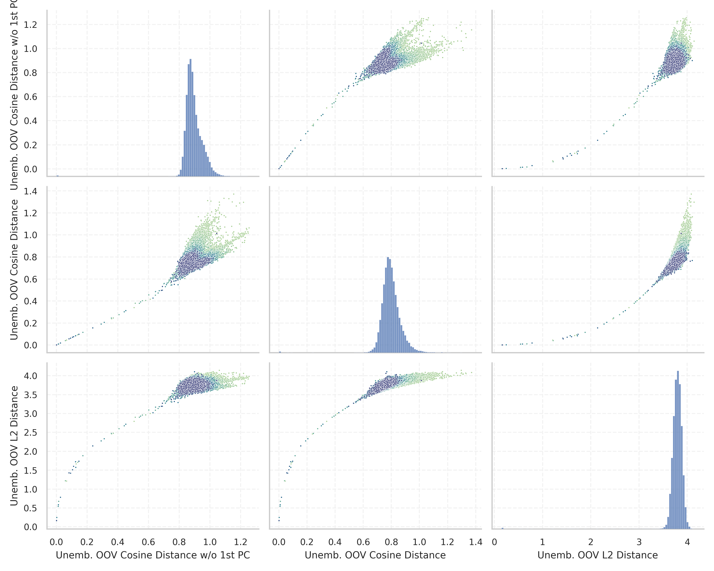

# Report for `openai-community/gpt2-xl`

## Model info

* Tied embeddings: yes
* Unembeddings use bias: no
* Metric for under-trained tokens: Unemb. OOV Cosine Distance w/o 1st PC
  * Overall distribution 0.895 +/- 0.061
  * Token used for verification prompt building: `BuyableInstoreAndOnline`
  * Verification threshold: 0.822
  * Threshold for showing candidate under-trained tokens: 0.358
  * Median verified threshold (for bytes, unreachable and special tokens): 0.071
* Embeddings shape: (50257, 1600)
* Vocabulary size: 50257
  * Number of single byte tokens: 256, of which 46 below metric threshold
  * Number of special tokens: 1, of which 0 below metric threshold
  * Number of non-single-byte UTF-fragment tokens: 216, 2 below soft metric threshold
  * Number of tested under-trained tokens: 967, 32 below p = 0.01 threshold, 27 below soft metric threshold

## Metrics plot


## Verification plot


## Under-trained token verification results
27 entries below threshold of 0.358

|   token_id | token                                        |     metric | max_prob                                                         | in_other_tokens                                                                                                                                                                                                                                                                                                                     |
|------------|----------------------------------------------|------------|------------------------------------------------------------------|-------------------------------------------------------------------------------------------------------------------------------------------------------------------------------------------------------------------------------------------------------------------------------------------------------------------------------------|
|      30898 | ````` embedreportprint `````                 | 0.00127864 | <span style='border: 1px solid rgb(169, 68, 66);'>2.8e-12</span> | <span style='border: 1px solid rgb(169, 68, 66);'>````` cloneembedreportprint `````</span>, ````` rawdownloadcloneembedreportprint `````                                                                                                                                                                                            |
|      39752 | ````` quickShip `````                        | 0.00146645 | <span style='border: 1px solid rgb(169, 68, 66);'>4e-12</span>   | ````` quickShipAvailable `````                                                                                                                                                                                                                                                                                                      |
|      45544 | ````` ▁サーティ `````                        | 0.00147152 | <span style='border: 1px solid rgb(169, 68, 66);'>4.2e-12</span> | <span style='border: 1px solid rgb(40, 167, 69);'>````` ▁サーティワン `````</span>                                                                                                                                                                                                                                                  |
|      30212 | ````` ▁externalToEVA `````                   | 0.00147331 | <span style='border: 1px solid rgb(169, 68, 66);'>3.8e-12</span> | ````` ▁externalToEVAOnly `````                                                                                                                                                                                                                                                                                                      |
|      30897 | ````` reportprint `````                      | 0.00150126 | <span style='border: 1px solid rgb(169, 68, 66);'>3.7e-12</span> | <span style='border: 1px solid rgb(169, 68, 66);'>````` embedreportprint `````</span>, <span style='border: 1px solid rgb(169, 68, 66);'>````` cloneembedreportprint `````</span>, ````` rawdownloadcloneembedreportprint `````                                                                                                     |
|      30905 | ````` rawdownload `````                      | 0.00151372 | <span style='border: 1px solid rgb(169, 68, 66);'>3.9e-12</span> | ````` rawdownloadcloneembedreportprint `````                                                                                                                                                                                                                                                                                        |
|      40240 | ````` oreAndOnline `````                     | 0.00157619 | <span style='border: 1px solid rgb(169, 68, 66);'>6.3e-12</span> | <span style='border: 1px solid rgb(169, 68, 66);'>````` InstoreAndOnline `````</span>, ````` BuyableInstoreAndOnline `````                                                                                                                                                                                                          |
|      40241 | ````` InstoreAndOnline `````                 | 0.0015797  | <span style='border: 1px solid rgb(169, 68, 66);'>2.8e-12</span> | ````` BuyableInstoreAndOnline `````                                                                                                                                                                                                                                                                                                 |
|      42089 | ````` ▁TheNitrome `````                      | 0.00158209 | <span style='border: 1px solid rgb(169, 68, 66);'>7.2e-12</span> | ````` ▁TheNitromeFan `````                                                                                                                                                                                                                                                                                                          |
|      36173 | ````` ▁RandomRedditor `````                  | 0.00158858 | <span style='border: 1px solid rgb(169, 68, 66);'>2.9e-12</span> | <span style='border: 1px solid rgb(40, 167, 69);'>````` ▁RandomRedditorWithNo `````</span>                                                                                                                                                                                                                                          |
|      30208 | ````` ▁externalTo `````                      | 0.00313026 | <span style='border: 1px solid rgb(169, 68, 66);'>3.6e-12</span> | <span style='border: 1px solid rgb(169, 68, 66);'>````` ▁externalToEVA `````</span>, ````` ▁externalToEVAOnly `````                                                                                                                                                                                                                 |
|      23090 | ````` ÃÂÃÂÃÂÃÂÃÂÃÂÃÂÃÂÃÂÃÂÃÂÃÂÃÂÃÂÃÂÃÂ ````` | 0.0124331  | <span style='border: 1px solid rgb(169, 68, 66);'>2.2e-10</span> | <span style='border: 1px solid rgb(40, 167, 69);'>````` ÃÂÃÂÃÂÃÂÃÂÃÂÃÂÃÂÃÂÃÂÃÂÃÂÃÂÃÂÃÂÃÂÃÂÃÂÃÂÃÂÃÂÃÂÃÂÃÂÃÂÃÂÃÂÃÂÃÂÃÂÃÂÃÂ `````</span>                                                                                                                                                                                               |
|      31573 | ````` ActionCode `````                       | 0.0135205  | <span style='border: 1px solid rgb(169, 68, 66);'>6.3e-09</span> | ````` externalActionCode `````                                                                                                                                                                                                                                                                                                      |
|      14827 | ````` ÃÂÃÂÃÂÃÂÃÂÃÂÃÂÃÂ `````                 | 0.0154353  | <span style='border: 1px solid rgb(169, 68, 66);'>1.1e-08</span> | <span style='border: 1px solid rgb(169, 68, 66);'>````` ÃÂÃÂÃÂÃÂÃÂÃÂÃÂÃÂÃÂÃÂÃÂÃÂÃÂÃÂÃÂÃÂ `````</span>, <span style='border: 1px solid rgb(40, 167, 69);'>````` ÃÂÃÂÃÂÃÂÃÂÃÂÃÂÃÂÃÂÃÂÃÂÃÂÃÂÃÂÃÂÃÂÃÂÃÂÃÂÃÂÃÂÃÂÃÂÃÂÃÂÃÂÃÂÃÂÃÂÃÂÃÂÃÂ `````</span>                                                                                        |
|      37574 | ````` StreamerBot `````                      | 0.0270101  | <span style='border: 1px solid rgb(169, 68, 66);'>4.1e-11</span> | ````` TPPStreamerBot `````                                                                                                                                                                                                                                                                                                          |
|       9364 | ````` ÃÂÃÂÃÂÃÂ `````                         | 0.0590547  | <span style='border: 1px solid rgb(169, 68, 66);'>2.8e-07</span> | <span style='border: 1px solid rgb(169, 68, 66);'>````` ÃÂÃÂÃÂÃÂÃÂÃÂÃÂÃÂ `````</span>, <span style='border: 1px solid rgb(169, 68, 66);'>````` ÃÂÃÂÃÂÃÂÃÂÃÂÃÂÃÂÃÂÃÂÃÂÃÂÃÂÃÂÃÂÃÂ `````</span>, <span style='border: 1px solid rgb(40, 167, 69);'>````` ÃÂÃÂÃÂÃÂÃÂÃÂÃÂÃÂÃÂÃÂÃÂÃÂÃÂÃÂÃÂÃÂÃÂÃÂÃÂÃÂÃÂÃÂÃÂÃÂÃÂÃÂÃÂÃÂÃÂÃÂÃÂÃÂ `````</span> |
|      42066 | ````` Nitrome `````                          | 0.0825542  | <span style='border: 1px solid rgb(169, 68, 66);'>1.2e-08</span> | <span style='border: 1px solid rgb(169, 68, 66);'>````` ▁TheNitrome `````</span>, ````` ▁TheNitromeFan `````                                                                                                                                                                                                                        |
|      40219 | ````` oreAnd `````                           | 0.0928409  | <span style='border: 1px solid rgb(169, 68, 66);'>3.3e-09</span> | <span style='border: 1px solid rgb(169, 68, 66);'>````` oreAndOnline `````</span>, <span style='border: 1px solid rgb(169, 68, 66);'>````` InstoreAndOnline `````</span>, ````` BuyableInstoreAndOnline `````                                                                                                                       |
|      39749 | ````` DeliveryDate `````                     | 0.105611   | <span style='border: 1px solid rgb(251, 189, 8);'>0.026</span>   | ````` soDeliveryDate `````                                                                                                                                                                                                                                                                                                          |
|      39714 | ````` isSpecial `````                        | 0.112422   | <span style='border: 1px solid rgb(255, 145, 0);'>0.0015</span>  | ````` isSpecialOrderable `````                                                                                                                                                                                                                                                                                                      |
<details><summary>7 additional entries below threshold</summary>

|   token_id | token                             |   metric | max_prob                                                         | in_other_tokens                                                                                                                                                                                                                                                                                                                                                                                                    |
|------------|-----------------------------------|----------|------------------------------------------------------------------|--------------------------------------------------------------------------------------------------------------------------------------------------------------------------------------------------------------------------------------------------------------------------------------------------------------------------------------------------------------------------------------------------------------------|
|      30899 | ````` cloneembedreportprint ````` | 0.126686 | <span style='border: 1px solid rgb(169, 68, 66);'>3.6e-09</span> | ````` rawdownloadcloneembedreportprint `````                                                                                                                                                                                                                                                                                                                                                                       |
|       5815 | ````` ÃÂÃÂ `````                  | 0.139781 | <span style='border: 1px solid rgb(255, 145, 0);'>0.002</span>   | <span style='border: 1px solid rgb(169, 68, 66);'>````` ÃÂÃÂÃÂÃÂ `````</span>, <span style='border: 1px solid rgb(169, 68, 66);'>````` ÃÂÃÂÃÂÃÂÃÂÃÂÃÂÃÂ `````</span>, <span style='border: 1px solid rgb(169, 68, 66);'>````` ÃÂÃÂÃÂÃÂÃÂÃÂÃÂÃÂÃÂÃÂÃÂÃÂÃÂÃÂÃÂÃÂ `````</span>, <span style='border: 1px solid rgb(40, 167, 69);'>````` ÃÂÃÂÃÂÃÂÃÂÃÂÃÂÃÂÃÂÃÂÃÂÃÂÃÂÃÂÃÂÃÂÃÂÃÂÃÂÃÂÃÂÃÂÃÂÃÂÃÂÃÂÃÂÃÂÃÂÃÂÃÂÃÂ `````</span> |
|      39142 | ````` ThumbnailImage `````        | 0.14702  | <span style='border: 1px solid rgb(169, 68, 66);'>5.7e-07</span> | ````` ItemThumbnailImage `````                                                                                                                                                                                                                                                                                                                                                                                     |
|      17629 | ````` ▁practition `````           | 0.172914 | <span style='border: 1px solid rgb(169, 68, 66);'>2.5e-08</span> | ````` ▁practitioners `````, ````` ▁practitioner `````                                                                                                                                                                                                                                                                                                                                                              |
|      39655 | ````` Orderable `````             | 0.237241 | <span style='border: 1px solid rgb(251, 189, 8);'>0.043</span>   | ````` isSpecialOrderable `````                                                                                                                                                                                                                                                                                                                                                                                     |
|      27013 | ````` aditional `````             | 0.291865 | <span style='border: 1px solid rgb(251, 189, 8);'>0.013</span>   | ````` ▁Traditional `````, ````` traditional `````, ````` Traditional `````                                                                                                                                                                                                                                                                                                                                         |
|      27293 | ````` ▁antidepress `````          | 0.31186  | <span style='border: 1px solid rgb(169, 68, 66);'>3.2e-07</span> | <span style='border: 1px solid rgb(40, 167, 69);'>````` ▁antidepressants `````</span>, ````` ▁antidepressant `````                                                                                                                                                                                                                                                                                                 |
</details>
<details><summary>940 additional entries above threshold</summary>

|   token_id | token                                                                        |   metric | max_prob                                                         | in_other_tokens                                                                                                                                                                                                                                                                                                                                                                                                                                                                               |
|------------|------------------------------------------------------------------------------|----------|------------------------------------------------------------------|-----------------------------------------------------------------------------------------------------------------------------------------------------------------------------------------------------------------------------------------------------------------------------------------------------------------------------------------------------------------------------------------------------------------------------------------------------------------------------------------------|
|      15272 | ````` ▁pione `````                                                           | 0.358406 | <span style='border: 1px solid rgb(169, 68, 66);'>2.4e-07</span> | ````` ▁pioneer `````, ````` ▁pioneering `````, ````` ▁pioneers `````, ````` ▁pioneered `````                                                                                                                                                                                                                                                                                                                                                                                                  |
|       4690 | ````` ortunately `````                                                       | 0.370843 | <span style='border: 1px solid rgb(169, 68, 66);'>9.8e-06</span> | ````` fortunately `````, ````` ▁Unfortunately `````, ````` ▁unfortunately `````, ````` Unfortunately `````, ````` ▁Fortunately `````, ...                                                                                                                                                                                                                                                                                                                                                     |
|      13150 | ````` ▁subur `````                                                           | 0.408187 | <span style='border: 1px solid rgb(169, 68, 66);'>2.9e-06</span> | ````` ▁suburban `````, ````` ▁suburbs `````, ````` ▁suburb `````                                                                                                                                                                                                                                                                                                                                                                                                                              |
|      25618 | ````` ▁councill `````                                                        | 0.442136 | <span style='border: 1px solid rgb(169, 68, 66);'>1.9e-05</span> | ````` ▁councillor `````, ````` ▁councillors `````                                                                                                                                                                                                                                                                                                                                                                                                                                             |
|      30439 | ````` ▁unintention `````                                                     | 0.452326 | <span style='border: 1px solid rgb(169, 68, 66);'>3.2e-05</span> | ````` ▁unintentionally `````, ````` ▁unintentional `````                                                                                                                                                                                                                                                                                                                                                                                                                                      |
|       7105 | ````` ▁volunte `````                                                         | 0.513823 | <span style='border: 1px solid rgb(255, 145, 0);'>0.0018</span>  | ````` ▁volunteers `````, ````` ▁volunteer `````, ````` ▁volunteered `````, ````` ▁volunteering `````                                                                                                                                                                                                                                                                                                                                                                                          |
|      13198 | ````` ▁earthqu `````                                                         | 0.540569 | <span style='border: 1px solid rgb(255, 145, 0);'>0.0062</span>  | ````` ▁earthquake `````, <span style='border: 1px solid rgb(40, 167, 69);'>````` ▁earthquakes `````</span>                                                                                                                                                                                                                                                                                                                                                                                    |
|      19476 | ````` ▁carbohyd `````                                                        | 0.548661 | <span style='border: 1px solid rgb(251, 189, 8);'>0.017</span>   | ````` ▁carbohydrate `````, ````` ▁carbohydrates `````                                                                                                                                                                                                                                                                                                                                                                                                                                         |
|      11548 | ````` ▁entreprene `````                                                      | 0.560396 | <span style='border: 1px solid rgb(169, 68, 66);'>0.0004</span>  | ````` ▁entrepreneurs `````, <span style='border: 1px solid rgb(40, 167, 69);'>````` ▁entrepreneur `````</span>, ````` ▁entrepreneurial `````, <span style='border: 1px solid rgb(40, 167, 69);'>````` ▁entrepreneurship `````</span>                                                                                                                                                                                                                                                          |
|       5808 | ````` ÃÂ `````                                                               | 0.581755 | <span style='border: 1px solid rgb(40, 167, 69);'>0.95</span>    | <span style='border: 1px solid rgb(255, 145, 0);'>````` ÃÂÃÂ `````</span>, <span style='border: 1px solid rgb(169, 68, 66);'>````` ÃÂÃÂÃÂÃÂ `````</span>, <span style='border: 1px solid rgb(169, 68, 66);'>````` ÃÂÃÂÃÂÃÂÃÂÃÂÃÂÃÂ `````</span>, <span style='border: 1px solid rgb(169, 68, 66);'>````` ÃÂÃÂÃÂÃÂÃÂÃÂÃÂÃÂÃÂÃÂÃÂÃÂÃÂÃÂÃÂÃÂ `````</span>, <span style='border: 1px solid rgb(40, 167, 69);'>````` ÃÂÃÂÃÂÃÂÃÂÃÂÃÂÃÂÃÂÃÂÃÂÃÂÃÂÃÂÃÂÃÂÃÂÃÂÃÂÃÂÃÂÃÂÃÂÃÂÃÂÃÂÃÂÃÂÃÂÃÂÃÂÃÂ `````</span> |
|      14695 | ````` ▁eleph `````                                                           | 0.601805 | <span style='border: 1px solid rgb(40, 167, 69);'>0.85</span>    | ````` ▁elephant `````, ````` ▁elephants `````                                                                                                                                                                                                                                                                                                                                                                                                                                                 |
|      35496 | ````` ÃÂÃÂÃÂÃÂÃÂÃÂÃÂÃÂÃÂÃÂÃÂÃÂÃÂÃÂÃÂÃÂÃÂÃÂÃÂÃÂÃÂÃÂÃÂÃÂÃÂÃÂÃÂÃÂÃÂÃÂÃÂÃÂ ````` | 0.629265 | <span style='border: 1px solid rgb(40, 167, 69);'>1</span>       |                                                                                                                                                                                                                                                                                                                                                                                                                                                                                               |
|      22315 | ````` ▁newcom `````                                                          | 0.645733 | <span style='border: 1px solid rgb(251, 189, 8);'>0.029</span>   | ````` ▁newcomers `````, ````` ▁newcomer `````                                                                                                                                                                                                                                                                                                                                                                                                                                                 |
|      18945 | ````` ▁teasp `````                                                           | 0.662576 | <span style='border: 1px solid rgb(40, 167, 69);'>0.94</span>    | ````` ▁teaspoon `````, ````` ▁teaspoons `````                                                                                                                                                                                                                                                                                                                                                                                                                                                 |
|      24973 | ````` ▁exting `````                                                          | 0.669944 | <span style='border: 1px solid rgb(40, 167, 69);'>0.37</span>    | ````` ▁extingu `````, ````` ▁extinguished `````                                                                                                                                                                                                                                                                                                                                                                                                                                               |
|      42889 | ````` ikuman `````                                                           | 0.683848 | <span style='border: 1px solid rgb(40, 167, 69);'>0.53</span>    | <span style='border: 1px solid rgb(40, 167, 69);'>````` ▁Kinnikuman `````</span>                                                                                                                                                                                                                                                                                                                                                                                                              |
|      42202 | ````` GoldMagikarp `````                                                     | 0.690151 | <span style='border: 1px solid rgb(251, 189, 8);'>0.049</span>   | <span style='border: 1px solid rgb(40, 167, 69);'>````` ▁SolidGoldMagikarp `````</span>                                                                                                                                                                                                                                                                                                                                                                                                       |
|      44392 | ````` ▁cumbers `````                                                         | 0.690665 | <span style='border: 1px solid rgb(40, 167, 69);'>0.89</span>    | ````` ▁cumbersome `````                                                                                                                                                                                                                                                                                                                                                                                                                                                                       |
|      12677 | ````` ▁tradem `````                                                          | 0.699847 | <span style='border: 1px solid rgb(40, 167, 69);'>0.97</span>    | ````` ▁trademark `````, ````` ▁trademarks `````                                                                                                                                                                                                                                                                                                                                                                                                                                               |
|      20554 | ````` ▁unbeliev `````                                                        | 0.702013 | <span style='border: 1px solid rgb(40, 167, 69);'>0.35</span>    | ````` ▁unbelievable `````, ````` ▁unbelievably `````                                                                                                                                                                                                                                                                                                                                                                                                                                          |
|      23711 | ````` ▁Moroc `````                                                           | 0.709942 | <span style='border: 1px solid rgb(251, 189, 8);'>0.053</span>   | ````` ▁Morocco `````, ````` ▁Moroccan `````                                                                                                                                                                                                                                                                                                                                                                                                                                                   |
|      27924 | ````` ▁srf `````                                                             | 0.716971 | <span style='border: 1px solid rgb(40, 167, 69);'>0.89</span>    | ````` ▁srfN `````, ````` ▁srfAttach `````                                                                                                                                                                                                                                                                                                                                                                                                                                                     |
|      24307 | ````` ▁looph `````                                                           | 0.72082  | <span style='border: 1px solid rgb(40, 167, 69);'>0.97</span>    | ````` ▁loophole `````, ````` ▁loopholes `````                                                                                                                                                                                                                                                                                                                                                                                                                                                 |
|      13296 | ````` ▁Leban `````                                                           | 0.728227 | <span style='border: 1px solid rgb(40, 167, 69);'>0.92</span>    | ````` ▁Lebanon `````, ````` ▁Lebanese `````                                                                                                                                                                                                                                                                                                                                                                                                                                                   |
|       4183 | ````` ▁conflic `````                                                         | 0.730408 | <span style='border: 1px solid rgb(40, 167, 69);'>0.84</span>    | ````` ▁conflict `````, ````` ▁conflicts `````, ````` ▁conflicting `````, ````` ▁conflicted `````                                                                                                                                                                                                                                                                                                                                                                                              |
|       3523 | ````` ▁citiz `````                                                           | 0.732235 | <span style='border: 1px solid rgb(40, 167, 69);'>0.96</span>    | ````` ▁citizens `````, ````` ▁citizen `````, ````` ▁citizenship `````                                                                                                                                                                                                                                                                                                                                                                                                                         |
|      11689 | ````` ▁unnecess `````                                                        | 0.733013 | <span style='border: 1px solid rgb(40, 167, 69);'>0.69</span>    | ````` ▁unnecessary `````, ````` ▁unnecessarily `````                                                                                                                                                                                                                                                                                                                                                                                                                                          |
|       6598 | ````` ▁behavi `````                                                          | 0.734061 | <span style='border: 1px solid rgb(40, 167, 69);'>0.97</span>    | ````` ▁behaviour `````, ````` ▁behaviors `````, ````` ▁behavioral `````, ````` ▁behaving `````, ````` ▁behaviours `````, ...                                                                                                                                                                                                                                                                                                                                                                  |
|      16782 | ````` ▁misunder `````                                                        | 0.736091 | <span style='border: 1px solid rgb(40, 167, 69);'>0.61</span>    | ````` ▁misunderstanding `````, ````` ▁misunderstood `````, ````` ▁misunderstand `````                                                                                                                                                                                                                                                                                                                                                                                                         |
|      29372 | ````` ▁guiActiveUn `````                                                     | 0.740782 | <span style='border: 1px solid rgb(40, 167, 69);'>0.97</span>    | ````` ▁guiActiveUnfocused `````                                                                                                                                                                                                                                                                                                                                                                                                                                                               |
|      42000 | ````` ▁hemor `````                                                           | 0.742983 | <span style='border: 1px solid rgb(40, 167, 69);'>0.91</span>    | <span style='border: 1px solid rgb(40, 167, 69);'>````` ▁hemorrh `````</span>                                                                                                                                                                                                                                                                                                                                                                                                                 |
|       8994 | ````` ailability `````                                                       | 0.744818 | <span style='border: 1px solid rgb(40, 167, 69);'>0.82</span>    | ````` ▁availability `````, ````` Availability `````, ````` channelAvailability `````, ````` ▁Availability `````, ````` availability `````                                                                                                                                                                                                                                                                                                                                                     |
|      14341 | ````` PDATE `````                                                            | 0.745774 | <span style='border: 1px solid rgb(40, 167, 69);'>0.99</span>    | ````` UPDATE `````, ````` ▁UPDATE `````, ````` PDATED `````                                                                                                                                                                                                                                                                                                                                                                                                                                   |
|      12869 | ````` ▁reluct `````                                                          | 0.746687 | <span style='border: 1px solid rgb(40, 167, 69);'>0.96</span>    | ````` ▁reluctant `````, ````` ▁reluctance `````, ````` ▁reluctantly `````                                                                                                                                                                                                                                                                                                                                                                                                                     |
|       9286 | ````` ▁exha `````                                                            | 0.74816  | <span style='border: 1px solid rgb(40, 167, 69);'>0.96</span>    | ````` ▁exhaust `````, ````` ▁exhausted `````, ````` ▁exhaustion `````, ````` ▁exhaustive `````, ````` ▁exhausting `````                                                                                                                                                                                                                                                                                                                                                                       |
|      48448 | ````` iosyn `````                                                            | 0.748913 | <span style='border: 1px solid rgb(40, 167, 69);'>1</span>       | ````` iosyncr `````, ````` ▁idiosyncr `````                                                                                                                                                                                                                                                                                                                                                                                                                                                   |
|      22263 | ````` ▁mosqu `````                                                           | 0.750748 | <span style='border: 1px solid rgb(40, 167, 69);'>1</span>       | ````` ▁mosques `````, <span style='border: 1px solid rgb(40, 167, 69);'>````` ▁mosquit `````</span>, ````` ▁mosquito `````, ````` ▁mosquitoes `````                                                                                                                                                                                                                                                                                                                                           |
|      32917 | ````` aution `````                                                           | 0.751108 | <span style='border: 1px solid rgb(40, 167, 69);'>0.55</span>    | ````` ▁precaution `````, ````` ▁cautioned `````                                                                                                                                                                                                                                                                                                                                                                                                                                               |
|       8983 | ````` ▁satell `````                                                          | 0.753617 | <span style='border: 1px solid rgb(40, 167, 69);'>0.96</span>    | ````` ▁satellite `````, ````` ▁satellites `````                                                                                                                                                                                                                                                                                                                                                                                                                                               |
|      20677 | ````` ▁comr `````                                                            | 0.753904 | <span style='border: 1px solid rgb(40, 167, 69);'>0.98</span>    | ````` ▁comrades `````, ````` ▁comrade `````                                                                                                                                                                                                                                                                                                                                                                                                                                                   |
|      16303 | ````` ▁undermin `````                                                        | 0.756855 | <span style='border: 1px solid rgb(40, 167, 69);'>0.86</span>    | ````` ▁undermine `````, ````` ▁undermining `````, ````` ▁undermined `````, ````` ▁undermines `````                                                                                                                                                                                                                                                                                                                                                                                            |
|      29740 | ````` ▁Azerb `````                                                           | 0.758643 | <span style='border: 1px solid rgb(40, 167, 69);'>0.96</span>    | ````` ▁Azerbai `````, ````` ▁Azerbaijan `````                                                                                                                                                                                                                                                                                                                                                                                                                                                 |
|      41297 | ````` ▁TAMADRA `````                                                         | 0.758892 | <span style='border: 1px solid rgb(40, 167, 69);'>1</span>       |                                                                                                                                                                                                                                                                                                                                                                                                                                                                                               |
|      11273 | ````` ▁enthusi `````                                                         | 0.759332 | <span style='border: 1px solid rgb(40, 167, 69);'>0.94</span>    | ````` ▁enthusiasm `````, ````` ▁enthusiastic `````, ````` ▁enthusiasts `````, ````` ▁enthusiast `````, ````` ▁enthusiastically `````                                                                                                                                                                                                                                                                                                                                                          |
|      15755 | ````` ▁millenn `````                                                         | 0.761184 | <span style='border: 1px solid rgb(40, 167, 69);'>1</span>       | ````` ▁millennials `````, ````` ▁millennia `````, ````` ▁millennium `````, ````` ▁millennial `````                                                                                                                                                                                                                                                                                                                                                                                            |
|      11039 | ````` ▁tremend `````                                                         | 0.761734 | <span style='border: 1px solid rgb(40, 167, 69);'>0.86</span>    | ````` ▁tremendous `````, ````` ▁tremendously `````                                                                                                                                                                                                                                                                                                                                                                                                                                            |
|      16041 | ````` ▁referen `````                                                         | 0.763841 | <span style='border: 1px solid rgb(40, 167, 69);'>0.94</span>    | ````` ▁referenced `````, ````` ▁referencing `````                                                                                                                                                                                                                                                                                                                                                                                                                                             |
|      40012 | ````` uyomi `````                                                            | 0.764955 | <span style='border: 1px solid rgb(40, 167, 69);'>0.99</span>    | <span style='border: 1px solid rgb(40, 167, 69);'>````` ▁Tsukuyomi `````</span>                                                                                                                                                                                                                                                                                                                                                                                                               |
|      19373 | ````` ▁adolesc `````                                                         | 0.765265 | <span style='border: 1px solid rgb(40, 167, 69);'>0.88</span>    | ````` ▁adolescents `````, ````` ▁adolescent `````, ````` ▁adolescence `````                                                                                                                                                                                                                                                                                                                                                                                                                   |
|       5571 | ````` ▁acknow `````                                                          | 0.765496 | <span style='border: 1px solid rgb(40, 167, 69);'>0.99</span>    | ````` ▁acknowled `````, ````` ▁acknowledged `````, ````` ▁acknowledge `````, ````` ▁acknowledges `````, ````` ▁acknowledging `````, ...                                                                                                                                                                                                                                                                                                                                                       |
|      20590 | ````` ▁Pengu `````                                                           | 0.766542 | <span style='border: 1px solid rgb(40, 167, 69);'>0.99</span>    | ````` ▁Penguins `````, ````` ▁Penguin `````                                                                                                                                                                                                                                                                                                                                                                                                                                                   |
|      16080 | ````` ▁corrid `````                                                          | 0.767106 | <span style='border: 1px solid rgb(40, 167, 69);'>0.99</span>    | ````` ▁corridor `````, ````` ▁corridors `````                                                                                                                                                                                                                                                                                                                                                                                                                                                 |
|      39693 | ````` Buyable `````                                                          | 0.767927 | <span style='border: 1px solid rgb(40, 167, 69);'>0.96</span>    | ````` BuyableInstoreAndOnline `````                                                                                                                                                                                                                                                                                                                                                                                                                                                           |
|      46968 | ````` ▁convol `````                                                          | 0.769091 | <span style='border: 1px solid rgb(40, 167, 69);'>0.99</span>    | ````` ▁convoluted `````                                                                                                                                                                                                                                                                                                                                                                                                                                                                       |
|      20213 | ````` ▁pestic `````                                                          | 0.770054 | <span style='border: 1px solid rgb(40, 167, 69);'>0.95</span>    | ````` ▁pesticides `````, ````` ▁pesticide `````                                                                                                                                                                                                                                                                                                                                                                                                                                               |
|       2477 | ````` ▁agre `````                                                            | 0.773466 | <span style='border: 1px solid rgb(40, 167, 69);'>1</span>       | ````` ▁agree `````, ````` ▁agreement `````, ````` ▁agreed `````, ````` ▁agreements `````, ````` ▁agrees `````, ...                                                                                                                                                                                                                                                                                                                                                                            |
|      28235 | ````` aeper `````                                                            | 0.774454 | <span style='border: 1px solid rgb(40, 167, 69);'>0.99</span>    | ````` aepernick `````, ````` ▁Kaepernick `````                                                                                                                                                                                                                                                                                                                                                                                                                                                |
|      43453 | ````` ▁SolidGoldMagikarp `````                                               | 0.775759 | <span style='border: 1px solid rgb(40, 167, 69);'>0.61</span>    |                                                                                                                                                                                                                                                                                                                                                                                                                                                                                               |
|      21876 | ````` ▁showc `````                                                           | 0.776224 | <span style='border: 1px solid rgb(40, 167, 69);'>1</span>       | ````` ▁showcasing `````, ````` ▁showcased `````, ````` ▁showcases `````                                                                                                                                                                                                                                                                                                                                                                                                                       |
|      15535 | ````` ▁ende `````                                                            | 0.777624 | <span style='border: 1px solid rgb(40, 167, 69);'>0.99</span>    | ````` ▁endeav `````, ````` ▁endeavor `````, ````` ▁endeavors `````, ````` ▁endemic `````, ````` ▁endeavour `````                                                                                                                                                                                                                                                                                                                                                                              |
|      44686 | ````` ーティ `````                                                           | 0.777694 | <span style='border: 1px solid rgb(40, 167, 69);'>0.99</span>    | <span style='border: 1px solid rgb(169, 68, 66);'>````` ▁サーティ `````</span>, <span style='border: 1px solid rgb(40, 167, 69);'>````` ▁サーティワン `````</span>                                                                                                                                                                                                                                                                                                                            |
|      18356 | ````` ▁opio `````                                                            | 0.777945 | <span style='border: 1px solid rgb(40, 167, 69);'>0.96</span>    | ````` ▁opioid `````, ````` ▁opioids `````                                                                                                                                                                                                                                                                                                                                                                                                                                                     |
|      23614 | ````` 覚醒 `````                                                             | 0.778281 | <span style='border: 1px solid rgb(40, 167, 69);'>0.81</span>    | <span style='border: 1px solid rgb(40, 167, 69);'>````` ▁裏覚醒 `````</span>                                                                                                                                                                                                                                                                                                                                                                                                                  |
|      48416 | ````` ▁shenan `````                                                          | 0.778348 | <span style='border: 1px solid rgb(40, 167, 69);'>0.99</span>    | ````` ▁shenanigans `````                                                                                                                                                                                                                                                                                                                                                                                                                                                                      |
|      29646 | ````` ▁gobl `````                                                            | 0.778392 | <span style='border: 1px solid rgb(40, 167, 69);'>0.99</span>    | ````` ▁goblin `````, ````` ▁goblins `````                                                                                                                                                                                                                                                                                                                                                                                                                                                     |
|      43298 | ````` userc `````                                                            | 0.779357 | <span style='border: 1px solid rgb(40, 167, 69);'>1</span>       | ````` usercontent `````                                                                                                                                                                                                                                                                                                                                                                                                                                                                       |
|       1369 | ````` ▁proble `````                                                          | 0.779502 | <span style='border: 1px solid rgb(40, 167, 69);'>1</span>       | ````` ▁problem `````, ````` ▁problems `````, ````` ▁problematic `````                                                                                                                                                                                                                                                                                                                                                                                                                         |
|      16136 | ````` ▁maneu `````                                                           | 0.779648 | <span style='border: 1px solid rgb(40, 167, 69);'>0.88</span>    | ````` ▁maneuver `````, ````` ▁maneuvers `````                                                                                                                                                                                                                                                                                                                                                                                                                                                 |
|      22316 | ````` ▁detrim `````                                                          | 0.779896 | <span style='border: 1px solid rgb(40, 167, 69);'>1</span>       | ````` ▁detrimental `````, ````` ▁detriment `````                                                                                                                                                                                                                                                                                                                                                                                                                                              |
|      42543 | ````` ▁Seym `````                                                            | 0.78004  | <span style='border: 1px solid rgb(40, 167, 69);'>1</span>       | ````` ▁Seymour `````                                                                                                                                                                                                                                                                                                                                                                                                                                                                          |
|       2955 | ````` ▁behav `````                                                           | 0.780616 | <span style='border: 1px solid rgb(40, 167, 69);'>1</span>       | ````` ▁behavior `````, <span style='border: 1px solid rgb(40, 167, 69);'>````` ▁behavi `````</span>, ````` ▁behaviour `````, ````` ▁behaviors `````, ````` ▁behavioral `````, ...                                                                                                                                                                                                                                                                                                             |
|      26712 | ````` ▁unden `````                                                           | 0.781821 | <span style='border: 1px solid rgb(40, 167, 69);'>0.98</span>    | ````` ▁undeniable `````, ````` ▁undeniably `````                                                                                                                                                                                                                                                                                                                                                                                                                                              |
|      14077 | ````` ▁artif `````                                                           | 0.782024 | <span style='border: 1px solid rgb(40, 167, 69);'>1</span>       | ````` ▁artifacts `````, ````` ▁artifact `````, <span style='border: 1px solid rgb(40, 167, 69);'>````` ▁artific `````</span>, ````` ▁artificially `````                                                                                                                                                                                                                                                                                                                                       |
|       7961 | ````` ▁obser `````                                                           | 0.783241 | <span style='border: 1px solid rgb(40, 167, 69);'>0.99</span>    | ````` ▁observe `````, ````` ▁observations `````, ````` ▁observation `````, ````` ▁observers `````, ````` ▁observing `````, ...                                                                                                                                                                                                                                                                                                                                                                |
|      22934 | ````` ▁tyr `````                                                             | 0.783252 | <span style='border: 1px solid rgb(40, 167, 69);'>0.97</span>    | ````` ▁tyranny `````, ````` ▁tyres `````, ````` ▁tyrann `````, ````` ▁tyrant `````, ````` ▁tyre `````                                                                                                                                                                                                                                                                                                                                                                                         |
|      44779 | ````` ▁DRAG `````                                                            | 0.783651 | <span style='border: 1px solid rgb(40, 167, 69);'>0.98</span>    | <span style='border: 1px solid rgb(40, 167, 69);'>````` ▁DRAGON `````</span>                                                                                                                                                                                                                                                                                                                                                                                                                  |
|      12630 | ````` ▁defic `````                                                           | 0.784072 | <span style='border: 1px solid rgb(40, 167, 69);'>0.99</span>    | ````` ▁deficits `````, ````` ▁deficiency `````, ````` ▁deficiencies `````, ````` ▁deficient `````                                                                                                                                                                                                                                                                                                                                                                                             |
|      16648 | ````` ▁fortun `````                                                          | 0.784414 | <span style='border: 1px solid rgb(40, 167, 69);'>0.98</span>    | ````` ▁fortunate `````, ````` ▁fortunes `````, ````` ▁fortunately `````                                                                                                                                                                                                                                                                                                                                                                                                                       |
|      32207 | ````` ▁warr `````                                                            | 0.784517 | <span style='border: 1px solid rgb(40, 167, 69);'>0.95</span>    | ````` ▁warranted `````, ````` ▁warranties `````                                                                                                                                                                                                                                                                                                                                                                                                                                               |
|      16128 | ````` ▁aston `````                                                           | 0.784571 | <span style='border: 1px solid rgb(40, 167, 69);'>1</span>       | ````` ▁astonishing `````, ````` ▁astonished `````                                                                                                                                                                                                                                                                                                                                                                                                                                             |
|      29084 | ````` ▁ensu `````                                                            | 0.784679 | <span style='border: 1px solid rgb(40, 167, 69);'>1</span>       | ````` ▁ensuing `````, ````` ▁ensured `````, ````` ▁ensued `````                                                                                                                                                                                                                                                                                                                                                                                                                               |
|       7601 | ````` ▁proport `````                                                         | 0.785344 | <span style='border: 1px solid rgb(40, 167, 69);'>0.99</span>    | ````` ▁proportion `````, ````` ▁proportions `````, ````` ▁proportional `````                                                                                                                                                                                                                                                                                                                                                                                                                  |
|      44326 | ````` ーテ `````                                                             | 0.785451 | <span style='border: 1px solid rgb(40, 167, 69);'>0.98</span>    | <span style='border: 1px solid rgb(40, 167, 69);'>````` ーティ `````</span>, <span style='border: 1px solid rgb(169, 68, 66);'>````` ▁サーティ `````</span>, <span style='border: 1px solid rgb(40, 167, 69);'>````` ▁サーティワン `````</span>                                                                                                                                                                                                                                               |
|      40561 | ````` apego `````                                                            | 0.785467 | <span style='border: 1px solid rgb(40, 167, 69);'>0.12</span>    | <span style='border: 1px solid rgb(40, 167, 69);'>````` ▁scapego `````</span>                                                                                                                                                                                                                                                                                                                                                                                                                 |
|      25992 | ````` ▁裏覚醒 `````                                                          | 0.785832 | <span style='border: 1px solid rgb(40, 167, 69);'>0.5</span>     |                                                                                                                                                                                                                                                                                                                                                                                                                                                                                               |
|       3472 | ````` ▁streng `````                                                          | 0.785838 | <span style='border: 1px solid rgb(40, 167, 69);'>1</span>       | ````` ▁strength `````, ````` ▁strengthen `````, ````` ▁strengths `````, ````` ▁strengthening `````, ````` ▁strengthened `````, ...                                                                                                                                                                                                                                                                                                                                                            |
|       8346 | ````` ▁condem `````                                                          | 0.787487 | <span style='border: 1px solid rgb(40, 167, 69);'>1</span>       | ````` ▁condemned `````, ````` ▁condemn `````, ````` ▁condemnation `````, ````` ▁condemning `````, ````` ▁condemns `````                                                                                                                                                                                                                                                                                                                                                                       |
|      16323 | ````` ▁glim `````                                                            | 0.787677 | <span style='border: 1px solid rgb(40, 167, 69);'>1</span>       | ````` ▁glimpse `````, ````` ▁glimps `````                                                                                                                                                                                                                                                                                                                                                                                                                                                     |
|       5144 | ````` ▁princ `````                                                           | 0.788203 | <span style='border: 1px solid rgb(40, 167, 69);'>0.99</span>    | ````` ▁principles `````, ````` ▁principle `````, ````` ▁principal `````, ````` ▁prince `````, ````` ▁princess `````, ...                                                                                                                                                                                                                                                                                                                                                                      |
|      13392 | ````` ▁toile `````                                                           | 0.788251 | <span style='border: 1px solid rgb(40, 167, 69);'>0.99</span>    | ````` ▁toilet `````, ````` ▁toilets `````                                                                                                                                                                                                                                                                                                                                                                                                                                                     |
|      30762 | ````` ▁metic `````                                                           | 0.788475 | <span style='border: 1px solid rgb(40, 167, 69);'>0.99</span>    | ````` ▁meticulously `````, ````` ▁meticulous `````                                                                                                                                                                                                                                                                                                                                                                                                                                            |
|       7782 | ````` ▁occas `````                                                           | 0.78916  | <span style='border: 1px solid rgb(40, 167, 69);'>0.99</span>    | ````` ▁occasionally `````, ````` ▁occasional `````, ````` ▁occasions `````                                                                                                                                                                                                                                                                                                                                                                                                                    |
|       3422 | ````` ▁neigh `````                                                           | 0.789323 | <span style='border: 1px solid rgb(40, 167, 69);'>1</span>       | ````` ▁neighbor `````, ````` ▁neighborhood `````, <span style='border: 1px solid rgb(40, 167, 69);'>````` ▁neighb `````</span>, ````` ▁neighbors `````, ````` ▁neighbour `````, ...                                                                                                                                                                                                                                                                                                           |
|       9882 | ````` ▁neighb `````                                                          | 0.789342 | <span style='border: 1px solid rgb(40, 167, 69);'>0.94</span>    | ````` ▁neighbors `````, ````` ▁neighbour `````, ````` ▁neighborhoods `````, ````` ▁neighbourhood `````, ````` ▁neighboring `````, ...                                                                                                                                                                                                                                                                                                                                                         |
|      13757 | ````` ▁disg `````                                                            | 0.789553 | <span style='border: 1px solid rgb(40, 167, 69);'>1</span>       | ````` ▁disgust `````, ````` ▁disgu `````, ````` ▁disgr `````, ````` ▁disgusting `````, ````` ▁disguise `````, ...                                                                                                                                                                                                                                                                                                                                                                             |
|      45541 | ````` ▁amalg `````                                                           | 0.790056 | <span style='border: 1px solid rgb(40, 167, 69);'>1</span>       |                                                                                                                                                                                                                                                                                                                                                                                                                                                                                               |
|      22496 | ````` ▁intrins `````                                                         | 0.790062 | <span style='border: 1px solid rgb(40, 167, 69);'>0.99</span>    | ````` ▁intrinsic `````, ````` ▁intrinsically `````                                                                                                                                                                                                                                                                                                                                                                                                                                            |
|      37068 | ````` ▁Yanuk `````                                                           | 0.790222 | <span style='border: 1px solid rgb(40, 167, 69);'>1</span>       | ````` ▁Yanukovych `````                                                                                                                                                                                                                                                                                                                                                                                                                                                                       |
|      26857 | ````` ▁balcon `````                                                          | 0.790581 | <span style='border: 1px solid rgb(40, 167, 69);'>1</span>       | ````` ▁balcony `````                                                                                                                                                                                                                                                                                                                                                                                                                                                                          |
|      17844 | ````` ▁insurg `````                                                          | 0.790779 | <span style='border: 1px solid rgb(40, 167, 69);'>0.81</span>    | ````` ▁insurgents `````, ````` ▁insurgency `````, ````` ▁insurgent `````                                                                                                                                                                                                                                                                                                                                                                                                                      |
|      41215 | ````` conservancy `````                                                      | 0.791073 | <span style='border: 1px solid rgb(40, 167, 69);'>1</span>       | ````` natureconservancy `````                                                                                                                                                                                                                                                                                                                                                                                                                                                                 |
|      19820 | ````` ▁psychiat `````                                                        | 0.791128 | <span style='border: 1px solid rgb(40, 167, 69);'>0.99</span>    | ````` ▁psychiatric `````, ````` ▁psychiatrist `````, ````` ▁psychiatry `````, ````` ▁psychiatrists `````                                                                                                                                                                                                                                                                                                                                                                                      |
|      31727 | ````` cffff `````                                                            | 0.791182 | <span style='border: 1px solid rgb(40, 167, 69);'>0.94</span>    | ````` cffffcc `````                                                                                                                                                                                                                                                                                                                                                                                                                                                                           |
|      23646 | ````` ▁todd `````                                                            | 0.791498 | <span style='border: 1px solid rgb(40, 167, 69);'>1</span>       | ````` ▁toddler `````, ````` ▁toddlers `````                                                                                                                                                                                                                                                                                                                                                                                                                                                   |
|      14756 | ````` ▁liqu `````                                                            | 0.791532 | <span style='border: 1px solid rgb(40, 167, 69);'>1</span>       | ````` ▁liquor `````, ````` ▁liquidity `````, ````` ▁liquids `````                                                                                                                                                                                                                                                                                                                                                                                                                             |
|      43010 | ````` ▁Kinnikuman `````                                                      | 0.791555 | <span style='border: 1px solid rgb(40, 167, 69);'>0.99</span>    |                                                                                                                                                                                                                                                                                                                                                                                                                                                                                               |
|       5622 | ````` ▁philos `````                                                          | 0.792146 | <span style='border: 1px solid rgb(40, 167, 69);'>0.99</span>    | ````` ▁philosoph `````, ````` ▁philosophy `````, ````` ▁philosophical `````, ````` ▁philosopher `````, ````` ▁philosophers `````, ...                                                                                                                                                                                                                                                                                                                                                         |
|       9020 | ````` ▁arrang `````                                                          | 0.792313 | <span style='border: 1px solid rgb(40, 167, 69);'>0.89</span>    | ````` ▁arrangement `````, ````` ▁arrangements `````, ````` ▁arranged `````, ````` ▁arrange `````, ````` ▁arranging `````                                                                                                                                                                                                                                                                                                                                                                      |
|      31666 | ````` ?????-?????- `````                                                     | 0.792347 | <span style='border: 1px solid rgb(40, 167, 69);'>0.77</span>    |                                                                                                                                                                                                                                                                                                                                                                                                                                                                                               |
|      49819 | ````` ▁DRAGON `````                                                          | 0.792457 | <span style='border: 1px solid rgb(40, 167, 69);'>0.94</span>    |                                                                                                                                                                                                                                                                                                                                                                                                                                                                                               |
|      10882 | ````` ▁lapt `````                                                            | 0.792542 | <span style='border: 1px solid rgb(40, 167, 69);'>1</span>       | ````` ▁laptop `````, ````` ▁laptops `````                                                                                                                                                                                                                                                                                                                                                                                                                                                     |
|      46600 | ````` ▁Adinida `````                                                         | 0.792776 | <span style='border: 1px solid rgb(40, 167, 69);'>0.84</span>    |                                                                                                                                                                                                                                                                                                                                                                                                                                                                                               |
|      10298 | ````` senal `````                                                            | 0.792945 | <span style='border: 1px solid rgb(251, 189, 8);'>0.079</span>   | ````` ▁Arsenal `````, ````` ▁arsenal `````, ````` Arsenal `````                                                                                                                                                                                                                                                                                                                                                                                                                               |
|      49886 | ````` ▁Indra `````                                                           | 0.793051 | <span style='border: 1px solid rgb(40, 167, 69);'>1</span>       |                                                                                                                                                                                                                                                                                                                                                                                                                                                                                               |
|      36827 | ````` ▁extravag `````                                                        | 0.793157 | <span style='border: 1px solid rgb(40, 167, 69);'>1</span>       | ````` ▁extravagant `````                                                                                                                                                                                                                                                                                                                                                                                                                                                                      |
|      20290 | ````` ▁Antar `````                                                           | 0.793294 | <span style='border: 1px solid rgb(40, 167, 69);'>1</span>       | ````` ▁Antarctica `````, ````` ▁Antarctic `````                                                                                                                                                                                                                                                                                                                                                                                                                                               |
|      45890 | ````` ▁Frie `````                                                            | 0.793315 | <span style='border: 1px solid rgb(40, 167, 69);'>1</span>       | ````` ▁Friedrich `````, <span style='border: 1px solid rgb(40, 167, 69);'>````` ▁Frieza `````</span>                                                                                                                                                                                                                                                                                                                                                                                          |
|      39906 | ````` EStream `````                                                          | 0.793835 | <span style='border: 1px solid rgb(40, 167, 69);'>0.88</span>    | ````` EStreamFrame `````                                                                                                                                                                                                                                                                                                                                                                                                                                                                      |
|      12486 | ````` ▁suspic `````                                                          | 0.793943 | <span style='border: 1px solid rgb(40, 167, 69);'>0.99</span>    | ````` ▁suspicious `````, ````` ▁suspicion `````, ````` ▁suspicions `````                                                                                                                                                                                                                                                                                                                                                                                                                      |
|      28189 | ````` ▁impat `````                                                           | 0.793945 | <span style='border: 1px solid rgb(40, 167, 69);'>0.96</span>    | ````` ▁impatient `````                                                                                                                                                                                                                                                                                                                                                                                                                                                                        |
|       5208 | ````` ▁appre `````                                                           | 0.794039 | <span style='border: 1px solid rgb(40, 167, 69);'>1</span>       | ````` ▁appreci `````, ````` ▁appreciate `````, ````` ▁appreciated `````, ````` ▁appreciation `````, ````` ▁apprehend `````, ...                                                                                                                                                                                                                                                                                                                                                               |
|      20645 | ````` ▁dilig `````                                                           | 0.794273 | <span style='border: 1px solid rgb(40, 167, 69);'>1</span>       | ````` ▁diligence `````, ````` ▁diligently `````, ````` ▁diligent `````                                                                                                                                                                                                                                                                                                                                                                                                                        |
|      10108 | ````` ▁simultane `````                                                       | 0.794534 | <span style='border: 1px solid rgb(40, 167, 69);'>1</span>       | ````` ▁simultaneously `````, ````` ▁simultaneous `````                                                                                                                                                                                                                                                                                                                                                                                                                                        |
|      44889 | ````` ▁weaving `````                                                         | 0.794632 | <span style='border: 1px solid rgb(40, 167, 69);'>1</span>       |                                                                                                                                                                                                                                                                                                                                                                                                                                                                                               |
|      44551 | ````` ▁shrew `````                                                           | 0.794665 | <span style='border: 1px solid rgb(40, 167, 69);'>1</span>       |                                                                                                                                                                                                                                                                                                                                                                                                                                                                                               |
|      17473 | ````` ▁contrace `````                                                        | 0.794765 | <span style='border: 1px solid rgb(40, 167, 69);'>1</span>       | ````` ▁contraception `````, ````` ▁contraceptive `````, ````` ▁contraceptives `````                                                                                                                                                                                                                                                                                                                                                                                                           |
|      48173 | ````` ▁701 `````                                                             | 0.794913 | <span style='border: 1px solid rgb(40, 167, 69);'>0.98</span>    |                                                                                                                                                                                                                                                                                                                                                                                                                                                                                               |
|       7555 | ````` ▁accomp `````                                                          | 0.795232 | <span style='border: 1px solid rgb(40, 167, 69);'>0.99</span>    | ````` ▁accomplish `````, ````` ▁accompan `````, ````` ▁accompanied `````, ````` ▁accomplished `````, ````` ▁accompany `````, ...                                                                                                                                                                                                                                                                                                                                                              |
|      12208 | ````` ▁traged `````                                                          | 0.795241 | <span style='border: 1px solid rgb(40, 167, 69);'>0.99</span>    | ````` ▁tragedy `````, ````` ▁tragedies `````                                                                                                                                                                                                                                                                                                                                                                                                                                                  |
|      16148 | ````` ▁unlaw `````                                                           | 0.795329 | <span style='border: 1px solid rgb(40, 167, 69);'>0.97</span>    | ````` ▁unlawful `````, ````` ▁unlawfully `````                                                                                                                                                                                                                                                                                                                                                                                                                                                |
|      32247 | ````` ▁VID `````                                                             | 0.795602 | <span style='border: 1px solid rgb(40, 167, 69);'>0.99</span>    | ````` ▁VIDEO `````, <span style='border: 1px solid rgb(40, 167, 69);'>````` ▁VIDE `````</span>, ````` ▁VIDEOS `````                                                                                                                                                                                                                                                                                                                                                                           |
|      14472 | ````` ▁entert `````                                                          | 0.79565  | <span style='border: 1px solid rgb(40, 167, 69);'>0.97</span>    | ````` ▁entertaining `````, ````` ▁entertained `````                                                                                                                                                                                                                                                                                                                                                                                                                                           |
|      45545 | ````` ▁サーティワン `````                                                    | 0.795848 | <span style='border: 1px solid rgb(40, 167, 69);'>0.79</span>    |                                                                                                                                                                                                                                                                                                                                                                                                                                                                                               |
|      45176 | ````` ▁sequels `````                                                         | 0.796111 | <span style='border: 1px solid rgb(40, 167, 69);'>0.99</span>    |                                                                                                                                                                                                                                                                                                                                                                                                                                                                                               |
|       8552 | ````` ▁incorpor `````                                                        | 0.796158 | <span style='border: 1px solid rgb(40, 167, 69);'>0.96</span>    | ````` ▁incorporated `````, ````` ▁incorporate `````, ````` ▁incorporating `````, ````` ▁incorporates `````, ````` ▁incorporation `````                                                                                                                                                                                                                                                                                                                                                        |
|      12230 | ````` ▁Malays `````                                                          | 0.79626  | <span style='border: 1px solid rgb(40, 167, 69);'>1</span>       | ````` ▁Malaysia `````, ````` ▁Malaysian `````                                                                                                                                                                                                                                                                                                                                                                                                                                                 |
|       5578 | ````` ▁negoti `````                                                          | 0.796347 | <span style='border: 1px solid rgb(40, 167, 69);'>0.97</span>    | ````` ▁negotiations `````, ````` ▁negotiate `````, ````` ▁negotiating `````, ````` ▁negotiated `````, ````` ▁negotiation `````, ...                                                                                                                                                                                                                                                                                                                                                           |
|       7969 | ````` ▁disag `````                                                           | 0.796357 | <span style='border: 1px solid rgb(40, 167, 69);'>1</span>       | ````` ▁disagree `````, ````` ▁disagreement `````, ````` ▁disagreed `````, ````` ▁disagrees `````, <span style='border: 1px solid rgb(40, 167, 69);'>````` ▁disagreements `````</span>                                                                                                                                                                                                                                                                                                         |
|      11239 | ````` ▁distur `````                                                          | 0.796425 | <span style='border: 1px solid rgb(40, 167, 69);'>0.99</span>    | ````` ▁disturbing `````, ````` ▁disturb `````, ````` ▁disturbed `````, ````` ▁disturbance `````, ````` ▁disturbances `````                                                                                                                                                                                                                                                                                                                                                                    |
|      48973 | ````` ▁angst `````                                                           | 0.796581 | <span style='border: 1px solid rgb(40, 167, 69);'>1</span>       |                                                                                                                                                                                                                                                                                                                                                                                                                                                                                               |
|      29829 | ````` ▁artific `````                                                         | 0.796613 | <span style='border: 1px solid rgb(40, 167, 69);'>1</span>       | ````` ▁artificially `````                                                                                                                                                                                                                                                                                                                                                                                                                                                                     |
|      42423 | ````` ▁unconditional `````                                                   | 0.796976 | <span style='border: 1px solid rgb(40, 167, 69);'>0.99</span>    |                                                                                                                                                                                                                                                                                                                                                                                                                                                                                               |
|      17787 | ````` ▁cryst `````                                                           | 0.796978 | <span style='border: 1px solid rgb(40, 167, 69);'>1</span>       | ````` ▁crystals `````, ````` ▁crystall `````                                                                                                                                                                                                                                                                                                                                                                                                                                                  |
|      32846 | ````` ▁reperc `````                                                          | 0.797014 | <span style='border: 1px solid rgb(40, 167, 69);'>1</span>       | ````` ▁repercussions `````                                                                                                                                                                                                                                                                                                                                                                                                                                                                    |
|      44485 | ````` ▁Henri `````                                                           | 0.797111 | <span style='border: 1px solid rgb(40, 167, 69);'>1</span>       |                                                                                                                                                                                                                                                                                                                                                                                                                                                                                               |
|       6987 | ````` ▁therap `````                                                          | 0.797258 | <span style='border: 1px solid rgb(40, 167, 69);'>0.98</span>    | ````` ▁therapy `````, ````` ▁therape `````, ````` ▁therapeutic `````, ````` ▁therapist `````, ````` ▁therapies `````, ...                                                                                                                                                                                                                                                                                                                                                                     |
|      20301 | ````` ▁swall `````                                                           | 0.797267 | <span style='border: 1px solid rgb(40, 167, 69);'>1</span>       | ````` ▁swallow `````, ````` ▁swallowed `````, ````` ▁swallowing `````                                                                                                                                                                                                                                                                                                                                                                                                                         |
|      47382 | ````` ▁Laksh `````                                                           | 0.797315 | <span style='border: 1px solid rgb(40, 167, 69);'>1</span>       |                                                                                                                                                                                                                                                                                                                                                                                                                                                                                               |
|      40452 | ````` ▁Drupal `````                                                          | 0.797404 | <span style='border: 1px solid rgb(40, 167, 69);'>0.99</span>    |                                                                                                                                                                                                                                                                                                                                                                                                                                                                                               |
|       8707 | ````` ▁unemploy `````                                                        | 0.797758 | <span style='border: 1px solid rgb(40, 167, 69);'>0.68</span>    | ````` ▁unemployment `````, ````` ▁unemployed `````                                                                                                                                                                                                                                                                                                                                                                                                                                            |
|      19965 | ````` ▁redes `````                                                           | 0.797824 | <span style='border: 1px solid rgb(40, 167, 69);'>1</span>       | ````` ▁redesign `````, ````` ▁redesigned `````                                                                                                                                                                                                                                                                                                                                                                                                                                                |
|       9120 | ````` ▁convin `````                                                          | 0.797906 | <span style='border: 1px solid rgb(40, 167, 69);'>0.84</span>    | ````` ▁convinced `````, ````` ▁convince `````, ````` ▁convinc `````, ````` ▁convincing `````                                                                                                                                                                                                                                                                                                                                                                                                  |
|      39227 | ````` ▁dystop `````                                                          | 0.797964 | <span style='border: 1px solid rgb(40, 167, 69);'>0.99</span>    | ````` ▁dystopian `````                                                                                                                                                                                                                                                                                                                                                                                                                                                                        |
|      31954 | ````` ▁egreg `````                                                           | 0.798281 | <span style='border: 1px solid rgb(40, 167, 69);'>1</span>       | ````` ▁egregious `````                                                                                                                                                                                                                                                                                                                                                                                                                                                                        |
|      15038 | ````` ▁seiz `````                                                            | 0.798496 | <span style='border: 1px solid rgb(40, 167, 69);'>1</span>       | ````` ▁seize `````, ````` ▁seizure `````, ````` ▁seizures `````, ````` ▁seizing `````                                                                                                                                                                                                                                                                                                                                                                                                         |
|      50216 | ````` ▁Leilan `````                                                          | 0.79875  | <span style='border: 1px solid rgb(40, 167, 69);'>0.98</span>    |                                                                                                                                                                                                                                                                                                                                                                                                                                                                                               |
|      48237 | ````` ▁interrupts `````                                                      | 0.799068 | <span style='border: 1px solid rgb(40, 167, 69);'>0.99</span>    |                                                                                                                                                                                                                                                                                                                                                                                                                                                                                               |
|      24847 | ````` ModLoader `````                                                        | 0.799108 | <span style='border: 1px solid rgb(40, 167, 69);'>0.98</span>    | ````` ForgeModLoader `````                                                                                                                                                                                                                                                                                                                                                                                                                                                                    |
|      17258 | ````` ▁caut `````                                                            | 0.799158 | <span style='border: 1px solid rgb(40, 167, 69);'>1</span>       | ````` ▁cautious `````, ````` ▁cautioned `````, ````` ▁cautiously `````                                                                                                                                                                                                                                                                                                                                                                                                                        |
|      48148 | ````` ▁Amit `````                                                            | 0.7993   | <span style='border: 1px solid rgb(40, 167, 69);'>1</span>       |                                                                                                                                                                                                                                                                                                                                                                                                                                                                                               |
|      16553 | ````` ▁ank `````                                                             | 0.799363 | <span style='border: 1px solid rgb(40, 167, 69);'>0.99</span>    | ````` ▁ankle `````, <span style='border: 1px solid rgb(40, 167, 69);'>````` ▁ankles `````</span>                                                                                                                                                                                                                                                                                                                                                                                              |
|      20488 | ````` ▁inconven `````                                                        | 0.799366 | <span style='border: 1px solid rgb(40, 167, 69);'>0.99</span>    | ````` ▁inconvenience `````, ````` ▁inconvenient `````                                                                                                                                                                                                                                                                                                                                                                                                                                         |
|       2803 | ````` ▁estab `````                                                           | 0.799379 | <span style='border: 1px solid rgb(40, 167, 69);'>0.98</span>    | ````` ▁establish `````, ````` ▁established `````, ````` ▁establishment `````, ````` ▁establishing `````, ````` ▁establishes `````, ...                                                                                                                                                                                                                                                                                                                                                        |
|      10160 | ````` ▁trave `````                                                           | 0.79981  | <span style='border: 1px solid rgb(40, 167, 69);'>0.99</span>    | ````` ▁traveling `````, ````` ▁traveled `````, ````` ▁travelling `````, ````` ▁travels `````, ````` ▁travelled `````, ...                                                                                                                                                                                                                                                                                                                                                                     |
|      33373 | ````` ▁mosquit `````                                                         | 0.799829 | <span style='border: 1px solid rgb(40, 167, 69);'>0.95</span>    | ````` ▁mosquito `````, ````` ▁mosquitoes `````                                                                                                                                                                                                                                                                                                                                                                                                                                                |
|       2698 | ````` ▁laun `````                                                            | 0.799977 | <span style='border: 1px solid rgb(40, 167, 69);'>0.97</span>    | ````` ▁launch `````, ````` ▁launched `````, ````` ▁launching `````, ````` ▁launches `````, ````` ▁laund `````, ...                                                                                                                                                                                                                                                                                                                                                                            |
|      39321 | ````` rontal `````                                                           | 0.800199 | <span style='border: 1px solid rgb(40, 167, 69);'>1</span>       | ````` ▁prefrontal `````                                                                                                                                                                                                                                                                                                                                                                                                                                                                       |
|      27097 | ````` -+-+ `````                                                             | 0.800229 | <span style='border: 1px solid rgb(40, 167, 69);'>0.98</span>    | ````` -+-+-+-+ `````                                                                                                                                                                                                                                                                                                                                                                                                                                                                          |
|      49358 | ````` ▁XCOM `````                                                            | 0.800308 | <span style='border: 1px solid rgb(40, 167, 69);'>1</span>       |                                                                                                                                                                                                                                                                                                                                                                                                                                                                                               |
|      12943 | ````` ▁encount `````                                                         | 0.800426 | <span style='border: 1px solid rgb(40, 167, 69);'>0.79</span>    | ````` ▁encountered `````, ````` ▁encounters `````, ````` ▁encountering `````                                                                                                                                                                                                                                                                                                                                                                                                                  |
|      42506 | ````` ▁wellness `````                                                        | 0.800565 | <span style='border: 1px solid rgb(40, 167, 69);'>1</span>       |                                                                                                                                                                                                                                                                                                                                                                                                                                                                                               |
|      40513 | ````` ▁Nicol `````                                                           | 0.800582 | <span style='border: 1px solid rgb(40, 167, 69);'>1</span>       |                                                                                                                                                                                                                                                                                                                                                                                                                                                                                               |
|      39821 | ````` 龍契士 `````                                                           | 0.800595 | <span style='border: 1px solid rgb(40, 167, 69);'>1</span>       |                                                                                                                                                                                                                                                                                                                                                                                                                                                                                               |
|      47456 | ````` ▁delusions `````                                                       | 0.800598 | <span style='border: 1px solid rgb(40, 167, 69);'>0.99</span>    |                                                                                                                                                                                                                                                                                                                                                                                                                                                                                               |
|      49519 | ````` ▁debtor `````                                                          | 0.800639 | <span style='border: 1px solid rgb(40, 167, 69);'>0.99</span>    |                                                                                                                                                                                                                                                                                                                                                                                                                                                                                               |
|      49874 | ````` ▁visitation `````                                                      | 0.800675 | <span style='border: 1px solid rgb(40, 167, 69);'>1</span>       |                                                                                                                                                                                                                                                                                                                                                                                                                                                                                               |
|       9540 | ````` ▁wedd `````                                                            | 0.800973 | <span style='border: 1px solid rgb(40, 167, 69);'>0.98</span>    | ````` ▁wedding `````, ````` ▁weddings `````                                                                                                                                                                                                                                                                                                                                                                                                                                                   |
|      22858 | ````` ▁Revel `````                                                           | 0.801024 | <span style='border: 1px solid rgb(40, 167, 69);'>1</span>       | ````` ▁Revelation `````, ````` ▁Revelations `````                                                                                                                                                                                                                                                                                                                                                                                                                                             |
|      32318 | ````` ▁ALE `````                                                             | 0.801219 | <span style='border: 1px solid rgb(40, 167, 69);'>1</span>       | ````` ▁ALEC `````                                                                                                                                                                                                                                                                                                                                                                                                                                                                             |
|      11727 | ````` ▁helicop `````                                                         | 0.801239 | <span style='border: 1px solid rgb(40, 167, 69);'>0.89</span>    | ````` ▁helicopter `````, ````` ▁helicopters `````                                                                                                                                                                                                                                                                                                                                                                                                                                             |
|      12084 | ````` ▁compr `````                                                           | 0.801281 | <span style='border: 1px solid rgb(40, 167, 69);'>1</span>       | ````` ▁compromise `````, ````` ▁compromised `````, ````` ▁compression `````, ````` ▁comprised `````, ````` ▁comprehend `````, ...                                                                                                                                                                                                                                                                                                                                                             |
|      50009 | ````` ▁strutConnector `````                                                  | 0.801446 | <span style='border: 1px solid rgb(40, 167, 69);'>0.56</span>    |                                                                                                                                                                                                                                                                                                                                                                                                                                                                                               |
|      45664 | ````` mbuds `````                                                            | 0.80149  | <span style='border: 1px solid rgb(40, 167, 69);'>0.99</span>    | ````` mbudsman `````                                                                                                                                                                                                                                                                                                                                                                                                                                                                          |
|      42769 | ````` ▁exaggeration `````                                                    | 0.801496 | <span style='border: 1px solid rgb(40, 167, 69);'>1</span>       |                                                                                                                                                                                                                                                                                                                                                                                                                                                                                               |
|       6222 | ````` ▁vulner `````                                                          | 0.80165  | <span style='border: 1px solid rgb(40, 167, 69);'>0.99</span>    | ````` ▁vulnerable `````, ````` ▁vulnerability `````, ````` ▁vulnerabilities `````                                                                                                                                                                                                                                                                                                                                                                                                             |
|       7726 | ````` ▁embr `````                                                            | 0.80166  | <span style='border: 1px solid rgb(40, 167, 69);'>0.99</span>    | ````` ▁embrace `````, ````` ▁embraced `````, ````` ▁embry `````, ````` ▁embracing `````, ````` ▁embro `````, ...                                                                                                                                                                                                                                                                                                                                                                              |
|      45748 | ````` ▁VIDE `````                                                            | 0.801679 | <span style='border: 1px solid rgb(40, 167, 69);'>0.97</span>    | ````` ▁VIDEOS `````                                                                                                                                                                                                                                                                                                                                                                                                                                                                           |
|      13371 | ````` ▁plaint `````                                                          | 0.801794 | <span style='border: 1px solid rgb(40, 167, 69);'>1</span>       | ````` ▁plaintiff `````, ````` ▁plaintiffs `````                                                                                                                                                                                                                                                                                                                                                                                                                                               |
|      46442 | ````` ▁prett `````                                                           | 0.801804 | <span style='border: 1px solid rgb(40, 167, 69);'>1</span>       |                                                                                                                                                                                                                                                                                                                                                                                                                                                                                               |
|      22439 | ````` ▁separat `````                                                         | 0.801945 | <span style='border: 1px solid rgb(40, 167, 69);'>0.99</span>    | ````` ▁separating `````, ````` ▁separates `````, ````` ▁separatists `````, ````` ▁separatist `````                                                                                                                                                                                                                                                                                                                                                                                            |
|      27038 | ````` ▁dismant `````                                                         | 0.802102 | <span style='border: 1px solid rgb(40, 167, 69);'>0.93</span>    | ````` ▁dismantle `````, ````` ▁dismantling `````, ````` ▁dismantled `````                                                                                                                                                                                                                                                                                                                                                                                                                     |
|      34935 | ````` ▁humility `````                                                        | 0.802127 | <span style='border: 1px solid rgb(40, 167, 69);'>0.99</span>    |                                                                                                                                                                                                                                                                                                                                                                                                                                                                                               |
|      46174 | ````` ▁Elise `````                                                           | 0.802132 | <span style='border: 1px solid rgb(40, 167, 69);'>1</span>       |                                                                                                                                                                                                                                                                                                                                                                                                                                                                                               |
|       3302 | ````` ▁achie `````                                                           | 0.80217  | <span style='border: 1px solid rgb(40, 167, 69);'>1</span>       | ````` ▁achieve `````, ````` ▁achieved `````, ````` ▁achievement `````, ````` ▁achieving `````, ````` ▁achievements `````, ...                                                                                                                                                                                                                                                                                                                                                                 |
|      39788 | ````` ▁mosa `````                                                            | 0.802175 | <span style='border: 1px solid rgb(40, 167, 69);'>0.99</span>    | ````` ▁mosaic `````                                                                                                                                                                                                                                                                                                                                                                                                                                                                           |
|       1147 | ````` ▁happ `````                                                            | 0.802187 | <span style='border: 1px solid rgb(40, 167, 69);'>0.99</span>    | ````` ▁happen `````, ````` ▁happened `````, ````` ▁happy `````, ````` ▁happens `````, ````` ▁happening `````, ...                                                                                                                                                                                                                                                                                                                                                                             |
|      38040 | ````` ▁promul `````                                                          | 0.802209 | <span style='border: 1px solid rgb(40, 167, 69);'>0.88</span>    | ````` ▁promulg `````                                                                                                                                                                                                                                                                                                                                                                                                                                                                          |
|       9468 | ````` ▁welf `````                                                            | 0.80225  | <span style='border: 1px solid rgb(40, 167, 69);'>0.99</span>    | ````` ▁welfare `````                                                                                                                                                                                                                                                                                                                                                                                                                                                                          |
|      41964 | ````` ▁thw `````                                                             | 0.802361 | <span style='border: 1px solid rgb(40, 167, 69);'>1</span>       | ````` ▁thwarted `````                                                                                                                                                                                                                                                                                                                                                                                                                                                                         |
|      11896 | ````` ▁mathemat `````                                                        | 0.802424 | <span style='border: 1px solid rgb(40, 167, 69);'>0.96</span>    | ````` ▁mathematical `````, ````` ▁mathematics `````, ````` ▁mathematic `````, ````` ▁mathematician `````                                                                                                                                                                                                                                                                                                                                                                                      |
|      32734 | ````` aughtered `````                                                        | 0.802543 | <span style='border: 1px solid rgb(40, 167, 69);'>0.84</span>    | ````` ▁slaughtered `````                                                                                                                                                                                                                                                                                                                                                                                                                                                                      |
|      41167 | ````` ▁Hermes `````                                                          | 0.802551 | <span style='border: 1px solid rgb(40, 167, 69);'>1</span>       |                                                                                                                                                                                                                                                                                                                                                                                                                                                                                               |
|      34421 | ````` ▁disple `````                                                          | 0.802614 | <span style='border: 1px solid rgb(40, 167, 69);'>1</span>       | <span style='border: 1px solid rgb(40, 167, 69);'>````` ▁displeasure `````</span>                                                                                                                                                                                                                                                                                                                                                                                                             |
|      11082 | ````` ▁inequ `````                                                           | 0.802673 | <span style='border: 1px solid rgb(40, 167, 69);'>1</span>       | ````` ▁inequality `````, ````` ▁inequalities `````                                                                                                                                                                                                                                                                                                                                                                                                                                            |
|      48167 | ````` ▁FRI `````                                                             | 0.802754 | <span style='border: 1px solid rgb(40, 167, 69);'>1</span>       |                                                                                                                                                                                                                                                                                                                                                                                                                                                                                               |
|      35325 | ````` ▁epilepsy `````                                                        | 0.802834 | <span style='border: 1px solid rgb(40, 167, 69);'>0.99</span>    |                                                                                                                                                                                                                                                                                                                                                                                                                                                                                               |
|      39354 | ````` ▁asynchronous `````                                                    | 0.802953 | <span style='border: 1px solid rgb(40, 167, 69);'>0.98</span>    |                                                                                                                                                                                                                                                                                                                                                                                                                                                                                               |
|      39353 | ````` ▁bask `````                                                            | 0.803097 | <span style='border: 1px solid rgb(40, 167, 69);'>0.99</span>    | ````` ▁baskets `````                                                                                                                                                                                                                                                                                                                                                                                                                                                                          |
|      45818 | ````` ▁approvals `````                                                       | 0.803119 | <span style='border: 1px solid rgb(40, 167, 69);'>1</span>       |                                                                                                                                                                                                                                                                                                                                                                                                                                                                                               |
|       5392 | ````` ▁conclud `````                                                         | 0.80331  | <span style='border: 1px solid rgb(40, 167, 69);'>0.99</span>    | ````` ▁concluded `````, ````` ▁conclude `````, ````` ▁concludes `````, ````` ▁concluding `````                                                                                                                                                                                                                                                                                                                                                                                                |
|      49935 | ````` ▁embassies `````                                                       | 0.803496 | <span style='border: 1px solid rgb(40, 167, 69);'>0.96</span>    |                                                                                                                                                                                                                                                                                                                                                                                                                                                                                               |
|      49731 | ````` ▁EntityItem `````                                                      | 0.803543 | <span style='border: 1px solid rgb(40, 167, 69);'>0.87</span>    |                                                                                                                                                                                                                                                                                                                                                                                                                                                                                               |
|      28798 | ````` ▁tsun `````                                                            | 0.803547 | <span style='border: 1px solid rgb(40, 167, 69);'>0.97</span>    | ````` ▁tsunami `````                                                                                                                                                                                                                                                                                                                                                                                                                                                                          |
|      41842 | ````` ▁Morsi `````                                                           | 0.803551 | <span style='border: 1px solid rgb(40, 167, 69);'>1</span>       |                                                                                                                                                                                                                                                                                                                                                                                                                                                                                               |
|      23046 | ````` ▁indo `````                                                            | 0.803576 | <span style='border: 1px solid rgb(40, 167, 69);'>1</span>       | ````` ▁indoors `````, ````` ▁indoctr `````                                                                                                                                                                                                                                                                                                                                                                                                                                                    |
|      23764 | ````` ▁unpop `````                                                           | 0.803734 | <span style='border: 1px solid rgb(40, 167, 69);'>0.99</span>    | ````` ▁unpopular `````                                                                                                                                                                                                                                                                                                                                                                                                                                                                        |
|      32943 | ````` ▁wart `````                                                            | 0.803827 | <span style='border: 1px solid rgb(40, 167, 69);'>1</span>       | ````` ▁wartime `````                                                                                                                                                                                                                                                                                                                                                                                                                                                                          |
|      44737 | ````` ▁adjunct `````                                                         | 0.803842 | <span style='border: 1px solid rgb(40, 167, 69);'>0.98</span>    |                                                                                                                                                                                                                                                                                                                                                                                                                                                                                               |
|      34261 | ````` thora `````                                                            | 0.803848 | <span style='border: 1px solid rgb(40, 167, 69);'>1</span>       | ````` ▁plethora `````                                                                                                                                                                                                                                                                                                                                                                                                                                                                         |
|      30258 | ````` ▁impeachment `````                                                     | 0.80386  | <span style='border: 1px solid rgb(40, 167, 69);'>0.96</span>    |                                                                                                                                                                                                                                                                                                                                                                                                                                                                                               |
|      47727 | ````` ▁Aadhaar `````                                                         | 0.803912 | <span style='border: 1px solid rgb(40, 167, 69);'>1</span>       |                                                                                                                                                                                                                                                                                                                                                                                                                                                                                               |
|      30856 | ````` ▁Vaugh `````                                                           | 0.804087 | <span style='border: 1px solid rgb(40, 167, 69);'>0.97</span>    | ````` ▁Vaughn `````, ````` ▁Vaughan `````                                                                                                                                                                                                                                                                                                                                                                                                                                                     |
|      48263 | ````` ▁ROS `````                                                             | 0.804107 | <span style='border: 1px solid rgb(40, 167, 69);'>1</span>       |                                                                                                                                                                                                                                                                                                                                                                                                                                                                                               |
|      15117 | ````` ▁discour `````                                                         | 0.804125 | <span style='border: 1px solid rgb(40, 167, 69);'>0.9</span>     | ````` ▁discourse `````, ````` ▁discourage `````, ````` ▁discouraged `````, ````` ▁discouraging `````                                                                                                                                                                                                                                                                                                                                                                                          |
|      11568 | ````` ▁resemb `````                                                          | 0.804157 | <span style='border: 1px solid rgb(40, 167, 69);'>0.98</span>    | ````` ▁resemble `````, ````` ▁resembles `````, ````` ▁resemblance `````, ````` ▁resembling `````, ````` ▁resembled `````                                                                                                                                                                                                                                                                                                                                                                      |
|      18699 | ````` ▁pecul `````                                                           | 0.804293 | <span style='border: 1px solid rgb(40, 167, 69);'>1</span>       | ````` ▁peculiar `````                                                                                                                                                                                                                                                                                                                                                                                                                                                                         |
|      30184 | ````` ▁amusement `````                                                       | 0.804306 | <span style='border: 1px solid rgb(40, 167, 69);'>1</span>       |                                                                                                                                                                                                                                                                                                                                                                                                                                                                                               |
|      47656 | ````` ▁ogre `````                                                            | 0.804335 | <span style='border: 1px solid rgb(40, 167, 69);'>0.99</span>    |                                                                                                                                                                                                                                                                                                                                                                                                                                                                                               |
|      49362 | ````` ▁Asheville `````                                                       | 0.804391 | <span style='border: 1px solid rgb(40, 167, 69);'>1</span>       |                                                                                                                                                                                                                                                                                                                                                                                                                                                                                               |
|      46387 | ````` ▁pigeon `````                                                          | 0.804397 | <span style='border: 1px solid rgb(40, 167, 69);'>0.99</span>    |                                                                                                                                                                                                                                                                                                                                                                                                                                                                                               |
|      23177 | ````` ▁pilgr `````                                                           | 0.804488 | <span style='border: 1px solid rgb(40, 167, 69);'>0.99</span>    | ````` ▁pilgrimage `````, ````` ▁pilgrims `````                                                                                                                                                                                                                                                                                                                                                                                                                                                |
|      45528 | ````` ▁Adin `````                                                            | 0.8045   | <span style='border: 1px solid rgb(40, 167, 69);'>0.99</span>    | <span style='border: 1px solid rgb(40, 167, 69);'>````` ▁Adinida `````</span>                                                                                                                                                                                                                                                                                                                                                                                                                 |
|      23305 | ````` ▁notor `````                                                           | 0.804519 | <span style='border: 1px solid rgb(40, 167, 69);'>1</span>       | ````` ▁notoriously `````, ````` ▁notoriety `````                                                                                                                                                                                                                                                                                                                                                                                                                                              |
|      48445 | ````` ▁ASIC `````                                                            | 0.804639 | <span style='border: 1px solid rgb(40, 167, 69);'>1</span>       |                                                                                                                                                                                                                                                                                                                                                                                                                                                                                               |
|      19176 | ````` ▁smugg `````                                                           | 0.804763 | <span style='border: 1px solid rgb(40, 167, 69);'>1</span>       | <span style='border: 1px solid rgb(40, 167, 69);'>````` ▁smuggling `````</span>, ````` ▁smugglers `````, ````` ▁smuggled `````                                                                                                                                                                                                                                                                                                                                                                |
|      46739 | ````` ▁kios `````                                                            | 0.804843 | <span style='border: 1px solid rgb(40, 167, 69);'>1</span>       |                                                                                                                                                                                                                                                                                                                                                                                                                                                                                               |
|      41329 | ````` ▁annexation `````                                                      | 0.804855 | <span style='border: 1px solid rgb(40, 167, 69);'>1</span>       |                                                                                                                                                                                                                                                                                                                                                                                                                                                                                               |
|      44571 | ````` ▁butterflies `````                                                     | 0.804883 | <span style='border: 1px solid rgb(40, 167, 69);'>1</span>       |                                                                                                                                                                                                                                                                                                                                                                                                                                                                                               |
|      12781 | ````` wcsstore `````                                                         | 0.805044 | <span style='border: 1px solid rgb(40, 167, 69);'>0.96</span>    |                                                                                                                                                                                                                                                                                                                                                                                                                                                                                               |
|       2432 | ````` ▁weap `````                                                            | 0.805088 | <span style='border: 1px solid rgb(40, 167, 69);'>1</span>       | ````` ▁weapons `````, ````` ▁weapon `````, ````` ▁weaponry `````                                                                                                                                                                                                                                                                                                                                                                                                                              |
|       4026 | ````` ▁advant `````                                                          | 0.805156 | <span style='border: 1px solid rgb(40, 167, 69);'>0.99</span>    | ````` ▁advantage `````, ````` ▁advantages `````, ````` ▁advantageous `````                                                                                                                                                                                                                                                                                                                                                                                                                    |
|      39208 | ````` ▁Fren `````                                                            | 0.805206 | <span style='border: 1px solid rgb(40, 167, 69);'>1</span>       | ````` ▁Frenchman `````, ````` ▁Frenzy `````                                                                                                                                                                                                                                                                                                                                                                                                                                                   |
|      11411 | ````` ▁destro `````                                                          | 0.805233 | <span style='border: 1px solid rgb(40, 167, 69);'>1</span>       | ````` ▁destroying `````, ````` ▁destroys `````, ````` ▁destroyer `````                                                                                                                                                                                                                                                                                                                                                                                                                        |
|       6166 | ````` ▁explan `````                                                          | 0.805294 | <span style='border: 1px solid rgb(40, 167, 69);'>0.96</span>    | ````` ▁explanation `````, ````` ▁explanations `````, ````` ▁explanatory `````                                                                                                                                                                                                                                                                                                                                                                                                                 |
|      42923 | ````` ▁holistic `````                                                        | 0.80534  | <span style='border: 1px solid rgb(40, 167, 69);'>0.99</span>    |                                                                                                                                                                                                                                                                                                                                                                                                                                                                                               |
|      49796 | ````` ▁parcels `````                                                         | 0.805433 | <span style='border: 1px solid rgb(40, 167, 69);'>1</span>       |                                                                                                                                                                                                                                                                                                                                                                                                                                                                                               |
|      42366 | ````` ▁disobedience `````                                                    | 0.805496 | <span style='border: 1px solid rgb(40, 167, 69);'>0.95</span>    |                                                                                                                                                                                                                                                                                                                                                                                                                                                                                               |
|       7677 | ````` ▁ingred `````                                                          | 0.805734 | <span style='border: 1px solid rgb(40, 167, 69);'>1</span>       | ````` ▁ingredients `````, ````` ▁ingredient `````                                                                                                                                                                                                                                                                                                                                                                                                                                             |
|      32876 | ````` ▁overfl `````                                                          | 0.805788 | <span style='border: 1px solid rgb(40, 167, 69);'>1</span>       | <span style='border: 1px solid rgb(40, 167, 69);'>````` ▁overflowing `````</span>                                                                                                                                                                                                                                                                                                                                                                                                             |
|      28253 | ````` ▁hippocamp `````                                                       | 0.805808 | <span style='border: 1px solid rgb(40, 167, 69);'>0.74</span>    | ````` ▁hippocampus `````                                                                                                                                                                                                                                                                                                                                                                                                                                                                      |
|      37721 | ````` ▁ultrasound `````                                                      | 0.805813 | <span style='border: 1px solid rgb(40, 167, 69);'>0.99</span>    |                                                                                                                                                                                                                                                                                                                                                                                                                                                                                               |
|       4322 | ````` ▁confir `````                                                          | 0.805817 | <span style='border: 1px solid rgb(40, 167, 69);'>0.96</span>    | ````` ▁confirmed `````, ````` ▁confirm `````, ````` ▁confirmation `````, ````` ▁confirms `````, ````` ▁confirming `````                                                                                                                                                                                                                                                                                                                                                                       |
|      21264 | ````` ▁frog `````                                                            | 0.805828 | <span style='border: 1px solid rgb(40, 167, 69);'>1</span>       | <span style='border: 1px solid rgb(40, 167, 69);'>````` ▁frogs `````</span>                                                                                                                                                                                                                                                                                                                                                                                                                   |
|       6141 | ````` ▁myster `````                                                          | 0.805834 | <span style='border: 1px solid rgb(40, 167, 69);'>1</span>       | ````` ▁mystery `````, ````` ▁mysterious `````, ````` ▁mysteries `````, ````` ▁mysteriously `````                                                                                                                                                                                                                                                                                                                                                                                              |
|      49291 | ````` ▁filmmaking `````                                                      | 0.805914 | <span style='border: 1px solid rgb(40, 167, 69);'>0.94</span>    |                                                                                                                                                                                                                                                                                                                                                                                                                                                                                               |
|      13736 | ````` ▁horizont `````                                                        | 0.805942 | <span style='border: 1px solid rgb(40, 167, 69);'>1</span>       | ````` ▁horizontal `````, ````` ▁horizontally `````                                                                                                                                                                                                                                                                                                                                                                                                                                            |
|      42212 | ````` ▁ESA `````                                                             | 0.805994 | <span style='border: 1px solid rgb(40, 167, 69);'>0.99</span>    |                                                                                                                                                                                                                                                                                                                                                                                                                                                                                               |
|      14092 | ````` ▁inflamm `````                                                         | 0.806025 | <span style='border: 1px solid rgb(40, 167, 69);'>1</span>       | ````` ▁inflammation `````, ````` ▁inflammatory `````                                                                                                                                                                                                                                                                                                                                                                                                                                          |
|      24481 | ````` ▁entr `````                                                            | 0.806092 | <span style='border: 1px solid rgb(40, 167, 69);'>1</span>       | ````` ▁entrenched `````, ````` ▁entrusted `````, ````` ▁entrepreneurial `````, ````` ▁entropy `````, ````` ▁entrances `````, ...                                                                                                                                                                                                                                                                                                                                                              |
|      42591 | ````` ▁Mongo `````                                                           | 0.806194 | <span style='border: 1px solid rgb(40, 167, 69);'>1</span>       | ````` ▁Mongolia `````                                                                                                                                                                                                                                                                                                                                                                                                                                                                         |
|      17900 | ````` ▁Dragonbound `````                                                     | 0.806201 | <span style='border: 1px solid rgb(40, 167, 69);'>0.76</span>    |                                                                                                                                                                                                                                                                                                                                                                                                                                                                                               |
|      36670 | ````` rongh `````                                                            | 0.806246 | <span style='border: 1px solid rgb(40, 167, 69);'>0.89</span>    | <span style='border: 1px solid rgb(40, 167, 69);'>````` ▁Strongh `````</span>, ````` ▁Stronghold `````                                                                                                                                                                                                                                                                                                                                                                                        |
|      28543 | ````` ▁enclosed `````                                                        | 0.806249 | <span style='border: 1px solid rgb(40, 167, 69);'>0.99</span>    |                                                                                                                                                                                                                                                                                                                                                                                                                                                                                               |
|      42498 | ````` ▁occupancy `````                                                       | 0.806361 | <span style='border: 1px solid rgb(40, 167, 69);'>0.99</span>    |                                                                                                                                                                                                                                                                                                                                                                                                                                                                                               |
|      49816 | ````` ▁Jindal `````                                                          | 0.806421 | <span style='border: 1px solid rgb(40, 167, 69);'>1</span>       |                                                                                                                                                                                                                                                                                                                                                                                                                                                                                               |
|      43770 | ````` ▁approves `````                                                        | 0.806429 | <span style='border: 1px solid rgb(40, 167, 69);'>1</span>       |                                                                                                                                                                                                                                                                                                                                                                                                                                                                                               |
|      48895 | ````` ▁analges `````                                                         | 0.806772 | <span style='border: 1px solid rgb(40, 167, 69);'>0.97</span>    |                                                                                                                                                                                                                                                                                                                                                                                                                                                                                               |
|      22640 | ````` itially `````                                                          | 0.806775 | <span style='border: 1px solid rgb(40, 167, 69);'>0.21</span>    | ````` ▁Initially `````, ````` Initially `````                                                                                                                                                                                                                                                                                                                                                                                                                                                 |
|       9065 | ````` ▁taxp `````                                                            | 0.806929 | <span style='border: 1px solid rgb(40, 167, 69);'>0.98</span>    | ````` ▁taxpayers `````, ````` ▁taxpayer `````                                                                                                                                                                                                                                                                                                                                                                                                                                                 |
|      49797 | ````` ▁samurai `````                                                         | 0.806938 | <span style='border: 1px solid rgb(40, 167, 69);'>1</span>       |                                                                                                                                                                                                                                                                                                                                                                                                                                                                                               |
|      44369 | ````` ▁consulate `````                                                       | 0.806951 | <span style='border: 1px solid rgb(40, 167, 69);'>1</span>       |                                                                                                                                                                                                                                                                                                                                                                                                                                                                                               |
|      11585 | ````` eatures `````                                                          | 0.80697  | <span style='border: 1px solid rgb(251, 189, 8);'>0.06</span>    | ````` ▁Features `````, ````` Features `````, ````` ▁Creatures `````, ````` features `````                                                                                                                                                                                                                                                                                                                                                                                                     |
|      41766 | ````` ▁Constantin `````                                                      | 0.807056 | <span style='border: 1px solid rgb(40, 167, 69);'>0.99</span>    | ````` ▁Constantine `````, ````` ▁Constantinople `````                                                                                                                                                                                                                                                                                                                                                                                                                                         |
|      32372 | ````` ▁pige `````                                                            | 0.807108 | <span style='border: 1px solid rgb(40, 167, 69);'>0.98</span>    | <span style='border: 1px solid rgb(40, 167, 69);'>````` ▁pigeon `````</span>                                                                                                                                                                                                                                                                                                                                                                                                                  |
|      37156 | ````` ▁Chero `````                                                           | 0.807184 | <span style='border: 1px solid rgb(40, 167, 69);'>0.96</span>    | ````` ▁Cherokee `````                                                                                                                                                                                                                                                                                                                                                                                                                                                                         |
|       2216 | ````` ▁signific `````                                                        | 0.8072   | <span style='border: 1px solid rgb(40, 167, 69);'>0.99</span>    | ````` ▁significant `````, ````` ▁significantly `````, ````` ▁significance `````                                                                                                                                                                                                                                                                                                                                                                                                               |
|       2729 | ````` ▁immedi `````                                                          | 0.807232 | <span style='border: 1px solid rgb(40, 167, 69);'>1</span>       | ````` ▁immediately `````, ````` ▁immediate `````                                                                                                                                                                                                                                                                                                                                                                                                                                              |
|      35787 | ````` ▁appe `````                                                            | 0.807284 | <span style='border: 1px solid rgb(40, 167, 69);'>1</span>       | ````` ▁appellate `````, ````` ▁appendix `````, ````` ▁appellant `````, ````` ▁appease `````                                                                                                                                                                                                                                                                                                                                                                                                   |
|      27570 | ````` ▁dissatisf `````                                                       | 0.807287 | <span style='border: 1px solid rgb(40, 167, 69);'>0.98</span>    | <span style='border: 1px solid rgb(40, 167, 69);'>````` ▁dissatisfaction `````</span>, ````` ▁dissatisfied `````                                                                                                                                                                                                                                                                                                                                                                              |
|      39481 | ````` ▁Unicorn `````                                                         | 0.807312 | <span style='border: 1px solid rgb(40, 167, 69);'>0.99</span>    |                                                                                                                                                                                                                                                                                                                                                                                                                                                                                               |
|      40260 | ````` ▁imitation `````                                                       | 0.80735  | <span style='border: 1px solid rgb(40, 167, 69);'>1</span>       |                                                                                                                                                                                                                                                                                                                                                                                                                                                                                               |
|      25057 | ````` ▁wast `````                                                            | 0.807355 | <span style='border: 1px solid rgb(40, 167, 69);'>0.99</span>    | <span style='border: 1px solid rgb(40, 167, 69);'>````` ▁wastewater `````</span>, ````` ▁wastes `````, ````` ▁wasteful `````, ````` ▁wasteland `````                                                                                                                                                                                                                                                                                                                                          |
|      38924 | ````` ▁arsen `````                                                           | 0.807424 | <span style='border: 1px solid rgb(40, 167, 69);'>1</span>       | ````` ▁arsenic `````                                                                                                                                                                                                                                                                                                                                                                                                                                                                          |
|      44376 | ````` ▁inaction `````                                                        | 0.807426 | <span style='border: 1px solid rgb(40, 167, 69);'>1</span>       |                                                                                                                                                                                                                                                                                                                                                                                                                                                                                               |
|      28312 | ````` ▁unfocused `````                                                       | 0.807439 | <span style='border: 1px solid rgb(40, 167, 69);'>1</span>       | ````` ▁unfocusedRange `````                                                                                                                                                                                                                                                                                                                                                                                                                                                                   |
|      30432 | ````` ゼ `````                                                               | 0.807717 | <span style='border: 1px solid rgb(40, 167, 69);'>1</span>       | ````` ゼウス `````                                                                                                                                                                                                                                                                                                                                                                                                                                                                            |
|      43903 | ````` ptives `````                                                           | 0.807758 | <span style='border: 1px solid rgb(40, 167, 69);'>0.95</span>    | ````` ▁contraceptives `````, ````` ▁captives `````                                                                                                                                                                                                                                                                                                                                                                                                                                            |
|      48080 | ````` ▁Frieza `````                                                          | 0.807776 | <span style='border: 1px solid rgb(40, 167, 69);'>1</span>       |                                                                                                                                                                                                                                                                                                                                                                                                                                                                                               |
|       9981 | ````` ▁compe `````                                                           | 0.807787 | <span style='border: 1px solid rgb(40, 167, 69);'>0.99</span>    | ````` ▁competing `````, ````` ▁compelling `````, ````` ▁competitors `````, ````` ▁competent `````, ````` ▁compelled `````, ...                                                                                                                                                                                                                                                                                                                                                                |
|      41393 | ````` ▁dissatisfaction `````                                                 | 0.807837 | <span style='border: 1px solid rgb(40, 167, 69);'>0.99</span>    |                                                                                                                                                                                                                                                                                                                                                                                                                                                                                               |
|      24476 | ````` ▁wors `````                                                            | 0.807901 | <span style='border: 1px solid rgb(40, 167, 69);'>1</span>       | ````` ▁worsh `````, ````` ▁worsening `````, ````` ▁worsened `````, ````` ▁worshipped `````, ````` ▁worsen `````                                                                                                                                                                                                                                                                                                                                                                               |
|      49028 | ````` ▁Fiorina `````                                                         | 0.807923 | <span style='border: 1px solid rgb(40, 167, 69);'>0.98</span>    |                                                                                                                                                                                                                                                                                                                                                                                                                                                                                               |
|      47752 | ````` ▁acquies `````                                                         | 0.807924 | <span style='border: 1px solid rgb(40, 167, 69);'>1</span>       |                                                                                                                                                                                                                                                                                                                                                                                                                                                                                               |
|      33414 | ````` ▁Alv `````                                                             | 0.807944 | <span style='border: 1px solid rgb(40, 167, 69);'>1</span>       | ````` ▁Alvarez `````, ````` ▁Alvin `````                                                                                                                                                                                                                                                                                                                                                                                                                                                      |
|      48962 | ````` ▁mars `````                                                            | 0.807966 | <span style='border: 1px solid rgb(40, 167, 69);'>1</span>       |                                                                                                                                                                                                                                                                                                                                                                                                                                                                                               |
|      41920 | ````` ▁Elys `````                                                            | 0.807993 | <span style='border: 1px solid rgb(40, 167, 69);'>1</span>       |                                                                                                                                                                                                                                                                                                                                                                                                                                                                                               |
|      36615 | ````` ▁chewing `````                                                         | 0.808068 | <span style='border: 1px solid rgb(40, 167, 69);'>1</span>       |                                                                                                                                                                                                                                                                                                                                                                                                                                                                                               |
|      15575 | ````` ▁puzz `````                                                            | 0.808152 | <span style='border: 1px solid rgb(40, 167, 69);'>0.97</span>    | ````` ▁puzzles `````, ````` ▁puzzled `````, ````` ▁puzzling `````                                                                                                                                                                                                                                                                                                                                                                                                                             |
|      40457 | ````` ▁Saras `````                                                           | 0.808241 | <span style='border: 1px solid rgb(40, 167, 69);'>1</span>       |                                                                                                                                                                                                                                                                                                                                                                                                                                                                                               |
|      33614 | ````` ▁sidel `````                                                           | 0.808247 | <span style='border: 1px solid rgb(40, 167, 69);'>1</span>       | ````` ▁sidelined `````                                                                                                                                                                                                                                                                                                                                                                                                                                                                        |
|      49742 | ````` ▁PAX `````                                                             | 0.808248 | <span style='border: 1px solid rgb(40, 167, 69);'>1</span>       |                                                                                                                                                                                                                                                                                                                                                                                                                                                                                               |
|      47509 | ````` ▁Devi `````                                                            | 0.808294 | <span style='border: 1px solid rgb(40, 167, 69);'>1</span>       |                                                                                                                                                                                                                                                                                                                                                                                                                                                                                               |
|      32437 | ````` ▁Smartstocks `````                                                     | 0.808313 | <span style='border: 1px solid rgb(40, 167, 69);'>0.54</span>    |                                                                                                                                                                                                                                                                                                                                                                                                                                                                                               |
|       7678 | ````` ▁overwhel `````                                                        | 0.808425 | <span style='border: 1px solid rgb(40, 167, 69);'>1</span>       | ````` ▁overwhelming `````, ````` ▁overwhelmed `````, ````` ▁overwhelmingly `````, ````` ▁overwhelm `````                                                                                                                                                                                                                                                                                                                                                                                      |
|      40299 | ````` ▁opium `````                                                           | 0.808504 | <span style='border: 1px solid rgb(40, 167, 69);'>0.99</span>    |                                                                                                                                                                                                                                                                                                                                                                                                                                                                                               |
|      48607 | ````` ▁Bezos `````                                                           | 0.808547 | <span style='border: 1px solid rgb(40, 167, 69);'>1</span>       |                                                                                                                                                                                                                                                                                                                                                                                                                                                                                               |
|      42073 | ````` ▁wastewater `````                                                      | 0.808556 | <span style='border: 1px solid rgb(40, 167, 69);'>0.99</span>    |                                                                                                                                                                                                                                                                                                                                                                                                                                                                                               |
|      14908 | ````` ▁awa `````                                                             | 0.808668 | <span style='border: 1px solid rgb(40, 167, 69);'>1</span>       | ````` ▁awake `````, ````` ▁awaiting `````, ````` ▁await `````, ````` ▁awaken `````, ````` ▁awakening `````, ...                                                                                                                                                                                                                                                                                                                                                                               |
|      36278 | ````` icter `````                                                            | 0.808706 | <span style='border: 1px solid rgb(40, 167, 69);'>1</span>       | ````` ▁stricter `````                                                                                                                                                                                                                                                                                                                                                                                                                                                                         |
|      29423 | ````` ▁Mari `````                                                            | 0.808726 | <span style='border: 1px solid rgb(40, 167, 69);'>1</span>       | ````` ▁Marion `````, ````` ▁Mariners `````, ````` ▁Marina `````, ````` ▁Marin `````, ````` ▁Marian `````, ...                                                                                                                                                                                                                                                                                                                                                                                 |
|       5435 | ````` ▁Ukrain `````                                                          | 0.808737 | <span style='border: 1px solid rgb(40, 167, 69);'>0.96</span>    | ````` ▁Ukraine `````, ````` ▁Ukrainian `````, ````` ▁Ukrainians `````                                                                                                                                                                                                                                                                                                                                                                                                                         |
|      24373 | ````` ▁discrep `````                                                         | 0.808777 | <span style='border: 1px solid rgb(40, 167, 69);'>0.94</span>    | ````` ▁discrepancy `````, ````` ▁discrepancies `````                                                                                                                                                                                                                                                                                                                                                                                                                                          |
|      44695 | ````` ▁Trojan `````                                                          | 0.808836 | <span style='border: 1px solid rgb(40, 167, 69);'>1</span>       |                                                                                                                                                                                                                                                                                                                                                                                                                                                                                               |
|      32571 | ````` ▁Rohing `````                                                          | 0.808885 | <span style='border: 1px solid rgb(40, 167, 69);'>0.85</span>    | ````` ▁Rohingya `````                                                                                                                                                                                                                                                                                                                                                                                                                                                                         |
|      17505 | ````` ▁incap `````                                                           | 0.808917 | <span style='border: 1px solid rgb(40, 167, 69);'>0.98</span>    | ````` ▁incapable `````, ````` ▁incapac `````                                                                                                                                                                                                                                                                                                                                                                                                                                                  |
|      42983 | ````` ワン `````                                                             | 0.808964 | <span style='border: 1px solid rgb(40, 167, 69);'>0.99</span>    | <span style='border: 1px solid rgb(40, 167, 69);'>````` ▁サーティワン `````</span>                                                                                                                                                                                                                                                                                                                                                                                                            |
|      38693 | ````` ▁Beir `````                                                            | 0.809012 | <span style='border: 1px solid rgb(40, 167, 69);'>1</span>       | ````` ▁Beirut `````                                                                                                                                                                                                                                                                                                                                                                                                                                                                           |
|      43277 | ````` ▁LIN `````                                                             | 0.809012 | <span style='border: 1px solid rgb(40, 167, 69);'>0.99</span>    | ````` ▁LINE `````                                                                                                                                                                                                                                                                                                                                                                                                                                                                             |
|      11143 | ````` ▁continu `````                                                         | 0.809093 | <span style='border: 1px solid rgb(40, 167, 69);'>0.99</span>    | ````` ▁continuous `````, ````` ▁continuously `````, ````` ▁continually `````, ````` ▁continuity `````, ````` ▁continuation `````, ...                                                                                                                                                                                                                                                                                                                                                         |
|      25303 | ````` ▁sadness `````                                                         | 0.80915  | <span style='border: 1px solid rgb(40, 167, 69);'>0.99</span>    |                                                                                                                                                                                                                                                                                                                                                                                                                                                                                               |
|       5271 | ````` ▁advoc `````                                                           | 0.80916  | <span style='border: 1px solid rgb(40, 167, 69);'>0.99</span>    | ````` ▁advocates `````, ````` ▁advocate `````, ````` ▁advocacy `````, ````` ▁advocating `````, ````` ▁advocated `````                                                                                                                                                                                                                                                                                                                                                                         |
|      22630 | ````` ▁chromos `````                                                         | 0.809258 | <span style='border: 1px solid rgb(40, 167, 69);'>0.88</span>    | ````` ▁chromosome `````, ````` ▁chromosomes `````                                                                                                                                                                                                                                                                                                                                                                                                                                             |
|       3410 | ````` ▁experien `````                                                        | 0.809288 | <span style='border: 1px solid rgb(40, 167, 69);'>1</span>       | ````` ▁experienced `````, ````` ▁experiences `````, ````` ▁experiencing `````                                                                                                                                                                                                                                                                                                                                                                                                                 |
|      14399 | ````` ▁tatt `````                                                            | 0.809311 | <span style='border: 1px solid rgb(40, 167, 69);'>1</span>       | ````` ▁tattoo `````, ````` ▁tattoos `````                                                                                                                                                                                                                                                                                                                                                                                                                                                     |
|      49928 | ````` ▁wills `````                                                           | 0.809335 | <span style='border: 1px solid rgb(40, 167, 69);'>0.99</span>    |                                                                                                                                                                                                                                                                                                                                                                                                                                                                                               |
|      27694 | ````` ▁Rena `````                                                            | 0.809354 | <span style='border: 1px solid rgb(40, 167, 69);'>0.99</span>    | ````` ▁Renaissance `````, ````` ▁Renault `````                                                                                                                                                                                                                                                                                                                                                                                                                                                |
|      41961 | ````` ▁peac `````                                                            | 0.80937  | <span style='border: 1px solid rgb(40, 167, 69);'>1</span>       | ````` ▁peach `````                                                                                                                                                                                                                                                                                                                                                                                                                                                                            |
|      38936 | ````` ▁Yoshi `````                                                           | 0.809388 | <span style='border: 1px solid rgb(40, 167, 69);'>1</span>       |                                                                                                                                                                                                                                                                                                                                                                                                                                                                                               |
|      40108 | ````` ▁tofu `````                                                            | 0.809421 | <span style='border: 1px solid rgb(40, 167, 69);'>1</span>       |                                                                                                                                                                                                                                                                                                                                                                                                                                                                                               |
|      42608 | ````` ▁tricked `````                                                         | 0.809429 | <span style='border: 1px solid rgb(40, 167, 69);'>0.96</span>    |                                                                                                                                                                                                                                                                                                                                                                                                                                                                                               |
|      47432 | ````` ▁神 `````                                                              | 0.809429 | <span style='border: 1px solid rgb(40, 167, 69);'>0.97</span>    |                                                                                                                                                                                                                                                                                                                                                                                                                                                                                               |
|      43246 | ````` akeru `````                                                            | 0.809512 | <span style='border: 1px solid rgb(40, 167, 69);'>0.96</span>    | ````` ▁Takeru `````                                                                                                                                                                                                                                                                                                                                                                                                                                                                           |
|      20532 | ````` ▁livest `````                                                          | 0.809591 | <span style='border: 1px solid rgb(40, 167, 69);'>0.99</span>    | ````` ▁livestock `````, ````` ▁livestream `````                                                                                                                                                                                                                                                                                                                                                                                                                                               |
|      40631 | ````` ▁inver `````                                                           | 0.809639 | <span style='border: 1px solid rgb(40, 167, 69);'>1</span>       |                                                                                                                                                                                                                                                                                                                                                                                                                                                                                               |
|       6112 | ````` ▁pregn `````                                                           | 0.809671 | <span style='border: 1px solid rgb(40, 167, 69);'>0.99</span>    | ````` ▁pregnancy `````, ````` ▁pregnant `````, ````` ▁pregnancies `````                                                                                                                                                                                                                                                                                                                                                                                                                       |
|       2827 | ````` ▁surpr `````                                                           | 0.809731 | <span style='border: 1px solid rgb(40, 167, 69);'>1</span>       | ````` ▁surprise `````, ````` ▁surprising `````, ````` ▁surprised `````, ````` ▁surprisingly `````, <span style='border: 1px solid rgb(40, 167, 69);'>````` ▁surprises `````</span>                                                                                                                                                                                                                                                                                                            |
|      35913 | ````` ▁Debor `````                                                           | 0.809767 | <span style='border: 1px solid rgb(40, 167, 69);'>1</span>       | ````` ▁Deborah `````                                                                                                                                                                                                                                                                                                                                                                                                                                                                          |
|       8485 | ````` ▁enthus `````                                                          | 0.809792 | <span style='border: 1px solid rgb(40, 167, 69);'>0.99</span>    | <span style='border: 1px solid rgb(40, 167, 69);'>````` ▁enthusi `````</span>, ````` ▁enthusiasm `````, ````` ▁enthusiastic `````, ````` ▁enthusiasts `````, ````` ▁enthusiast `````, ...                                                                                                                                                                                                                                                                                                     |
|      11477 | ````` ▁ignor `````                                                           | 0.809843 | <span style='border: 1px solid rgb(40, 167, 69);'>1</span>       | ````` ▁ignoring `````, ````` ▁ignorance `````, ````` ▁ignorant `````, ````` ▁ignores `````                                                                                                                                                                                                                                                                                                                                                                                                    |
|      28465 | ````` ▁mortg `````                                                           | 0.809901 | <span style='border: 1px solid rgb(40, 167, 69);'>0.99</span>    | ````` ▁mortgages `````                                                                                                                                                                                                                                                                                                                                                                                                                                                                        |
|      24072 | ````` ▁surprises `````                                                       | 0.809993 | <span style='border: 1px solid rgb(40, 167, 69);'>0.99</span>    |                                                                                                                                                                                                                                                                                                                                                                                                                                                                                               |
|      36926 | ````` ▁attm `````                                                            | 0.809996 | <span style='border: 1px solid rgb(40, 167, 69);'>0.92</span>    |                                                                                                                                                                                                                                                                                                                                                                                                                                                                                               |
|      17251 | ````` ▁artic `````                                                           | 0.810023 | <span style='border: 1px solid rgb(40, 167, 69);'>1</span>       | ````` ▁articulate `````, ````` ▁articulated `````                                                                                                                                                                                                                                                                                                                                                                                                                                             |
|      50067 | ````` ▁Rik `````                                                             | 0.810027 | <span style='border: 1px solid rgb(40, 167, 69);'>0.99</span>    |                                                                                                                                                                                                                                                                                                                                                                                                                                                                                               |
|      30623 | ````` ▁marble `````                                                          | 0.810034 | <span style='border: 1px solid rgb(40, 167, 69);'>0.99</span>    |                                                                                                                                                                                                                                                                                                                                                                                                                                                                                               |
|      18615 | ````` ▁incarcer `````                                                        | 0.810035 | <span style='border: 1px solid rgb(40, 167, 69);'>0.98</span>    | ````` ▁incarceration `````, ````` ▁incarcerated `````                                                                                                                                                                                                                                                                                                                                                                                                                                         |
|      20329 | ````` ▁abdom `````                                                           | 0.810111 | <span style='border: 1px solid rgb(40, 167, 69);'>0.98</span>    | ````` ▁abdominal `````, ````` ▁abdomen `````                                                                                                                                                                                                                                                                                                                                                                                                                                                  |
|       1977 | ````` ▁toget `````                                                           | 0.81015  | <span style='border: 1px solid rgb(40, 167, 69);'>0.97</span>    | ````` ▁together `````                                                                                                                                                                                                                                                                                                                                                                                                                                                                         |
|      48548 | ````` ▁2400 `````                                                            | 0.810156 | <span style='border: 1px solid rgb(40, 167, 69);'>0.99</span>    |                                                                                                                                                                                                                                                                                                                                                                                                                                                                                               |
|      17236 | ````` ▁gren `````                                                            | 0.810192 | <span style='border: 1px solid rgb(40, 167, 69);'>1</span>       | ````` ▁grenade `````, ````` ▁grenades `````                                                                                                                                                                                                                                                                                                                                                                                                                                                   |
|      41822 | ````` ▁linen `````                                                           | 0.81022  | <span style='border: 1px solid rgb(40, 167, 69);'>1</span>       |                                                                                                                                                                                                                                                                                                                                                                                                                                                                                               |
|      41587 | ````` ▁antidepressants `````                                                 | 0.810304 | <span style='border: 1px solid rgb(40, 167, 69);'>0.97</span>    |                                                                                                                                                                                                                                                                                                                                                                                                                                                                                               |
|       9454 | ````` ▁incent `````                                                          | 0.810321 | <span style='border: 1px solid rgb(40, 167, 69);'>0.99</span>    | ````` ▁incentive `````, ````` ▁incentives `````, ````` ▁incentiv `````                                                                                                                                                                                                                                                                                                                                                                                                                        |
|      43170 | ````` ▁roaring `````                                                         | 0.810396 | <span style='border: 1px solid rgb(40, 167, 69);'>0.99</span>    |                                                                                                                                                                                                                                                                                                                                                                                                                                                                                               |
|        846 | ````` ▁includ `````                                                          | 0.810421 | <span style='border: 1px solid rgb(40, 167, 69);'>0.96</span>    | ````` ▁including `````, ````` ▁include `````, ````` ▁included `````, ````` ▁includes `````                                                                                                                                                                                                                                                                                                                                                                                                    |
|      43735 | ````` .」 `````                                                              | 0.810436 | <span style='border: 1px solid rgb(40, 167, 69);'>0.99</span>    |                                                                                                                                                                                                                                                                                                                                                                                                                                                                                               |
|      48871 | ````` ▁squats `````                                                          | 0.810446 | <span style='border: 1px solid rgb(40, 167, 69);'>0.99</span>    |                                                                                                                                                                                                                                                                                                                                                                                                                                                                                               |
|       6002 | ````` ▁heav `````                                                            | 0.810462 | <span style='border: 1px solid rgb(40, 167, 69);'>1</span>       | ````` ▁heavily `````, ````` ▁heaven `````, ````` ▁heavier `````, ````` ▁heavens `````, ````` ▁heavenly `````, ...                                                                                                                                                                                                                                                                                                                                                                             |
|      30788 | ````` ▁oxide `````                                                           | 0.810494 | <span style='border: 1px solid rgb(40, 167, 69);'>0.99</span>    |                                                                                                                                                                                                                                                                                                                                                                                                                                                                                               |
|      25607 | ````` ▁fairy `````                                                           | 0.810528 | <span style='border: 1px solid rgb(40, 167, 69);'>1</span>       |                                                                                                                                                                                                                                                                                                                                                                                                                                                                                               |
|      49552 | ````` ▁streetcar `````                                                       | 0.810553 | <span style='border: 1px solid rgb(40, 167, 69);'>0.99</span>    |                                                                                                                                                                                                                                                                                                                                                                                                                                                                                               |
|      48052 | ````` ▁SHE `````                                                             | 0.810599 | <span style='border: 1px solid rgb(40, 167, 69);'>0.99</span>    |                                                                                                                                                                                                                                                                                                                                                                                                                                                                                               |
|       1947 | ````` ▁sugg `````                                                            | 0.810659 | <span style='border: 1px solid rgb(40, 167, 69);'>1</span>       | ````` ▁suggest `````, ````` ▁suggested `````, ````` ▁suggests `````, ````` ▁suggesting `````, ````` ▁suggestions `````, ...                                                                                                                                                                                                                                                                                                                                                                   |
|      46526 | ````` ▁alcoholism `````                                                      | 0.810674 | <span style='border: 1px solid rgb(40, 167, 69);'>0.98</span>    |                                                                                                                                                                                                                                                                                                                                                                                                                                                                                               |
|      33132 | ````` ▁Sprite `````                                                          | 0.810691 | <span style='border: 1px solid rgb(40, 167, 69);'>1</span>       |                                                                                                                                                                                                                                                                                                                                                                                                                                                                                               |
|       8572 | ````` ▁remem `````                                                           | 0.8107   | <span style='border: 1px solid rgb(40, 167, 69);'>0.95</span>    | ````` ▁remembered `````, ````` ▁remembers `````, ````` ▁remembering `````, ````` ▁remembrance `````                                                                                                                                                                                                                                                                                                                                                                                           |
|       6367 | ````` ▁colle `````                                                           | 0.810725 | <span style='border: 1px solid rgb(40, 167, 69);'>1</span>       | ````` ▁collected `````, ````` ▁colleagues `````, ````` ▁collective `````, ````` ▁collecting `````, ````` ▁colleg `````, ...                                                                                                                                                                                                                                                                                                                                                                   |
|      29359 | ````` ▁royalty `````                                                         | 0.810735 | <span style='border: 1px solid rgb(40, 167, 69);'>0.99</span>    |                                                                                                                                                                                                                                                                                                                                                                                                                                                                                               |
|      39253 | ````` ▁UCHIJ `````                                                           | 0.810765 | <span style='border: 1px solid rgb(40, 167, 69);'>0.99</span>    |                                                                                                                                                                                                                                                                                                                                                                                                                                                                                               |
|      16166 | ````` ▁lineback `````                                                        | 0.810849 | <span style='border: 1px solid rgb(40, 167, 69);'>0.89</span>    | ````` ▁linebacker `````, ````` ▁linebackers `````                                                                                                                                                                                                                                                                                                                                                                                                                                             |
|      29415 | ````` ▁Jaune `````                                                           | 0.810864 | <span style='border: 1px solid rgb(40, 167, 69);'>0.99</span>    |                                                                                                                                                                                                                                                                                                                                                                                                                                                                                               |
|      38160 | ````` FontSize `````                                                         | 0.810875 | <span style='border: 1px solid rgb(40, 167, 69);'>1</span>       | <span style='border: 1px solid rgb(40, 167, 69);'>````` ▁SetFontSize `````</span>                                                                                                                                                                                                                                                                                                                                                                                                             |
|      41067 | ````` ▁SEA `````                                                             | 0.810922 | <span style='border: 1px solid rgb(40, 167, 69);'>1</span>       |                                                                                                                                                                                                                                                                                                                                                                                                                                                                                               |
|      31830 | ````` ▁inexper `````                                                         | 0.810975 | <span style='border: 1px solid rgb(40, 167, 69);'>0.97</span>    | ````` ▁inexperienced `````                                                                                                                                                                                                                                                                                                                                                                                                                                                                    |
|      45887 | ````` ▁vm `````                                                              | 0.810985 | <span style='border: 1px solid rgb(40, 167, 69);'>1</span>       |                                                                                                                                                                                                                                                                                                                                                                                                                                                                                               |
|      16943 | ````` ▁anten `````                                                           | 0.811017 | <span style='border: 1px solid rgb(40, 167, 69);'>1</span>       | ````` ▁antenna `````, ````` ▁antennas `````                                                                                                                                                                                                                                                                                                                                                                                                                                                   |
|       4209 | ````` ▁somew `````                                                           | 0.81107  | <span style='border: 1px solid rgb(40, 167, 69);'>0.92</span>    | ````` ▁somewhat `````, ````` ▁somewhere `````                                                                                                                                                                                                                                                                                                                                                                                                                                                 |
|      12054 | ````` ▁scrut `````                                                           | 0.811095 | <span style='border: 1px solid rgb(40, 167, 69);'>1</span>       | ````` ▁scrutiny `````, ````` ▁scrutin `````                                                                                                                                                                                                                                                                                                                                                                                                                                                   |
|      44653 | ````` ▁broccoli `````                                                        | 0.811105 | <span style='border: 1px solid rgb(40, 167, 69);'>1</span>       |                                                                                                                                                                                                                                                                                                                                                                                                                                                                                               |
|      36174 | ````` ▁RandomRedditorWithNo `````                                            | 0.811167 | <span style='border: 1px solid rgb(40, 167, 69);'>0.75</span>    |                                                                                                                                                                                                                                                                                                                                                                                                                                                                                               |
|      30409 | ````` ▁diarr `````                                                           | 0.811278 | <span style='border: 1px solid rgb(40, 167, 69);'>1</span>       | ````` ▁diarrhea `````                                                                                                                                                                                                                                                                                                                                                                                                                                                                         |
|      38035 | ````` ▁fructose `````                                                        | 0.811305 | <span style='border: 1px solid rgb(40, 167, 69);'>1</span>       |                                                                                                                                                                                                                                                                                                                                                                                                                                                                                               |
|      46964 | ````` ▁capit `````                                                           | 0.811325 | <span style='border: 1px solid rgb(40, 167, 69);'>1</span>       |                                                                                                                                                                                                                                                                                                                                                                                                                                                                                               |
|      37441 | ````` ▁aval `````                                                            | 0.811328 | <span style='border: 1px solid rgb(40, 167, 69);'>1</span>       | <span style='border: 1px solid rgb(40, 167, 69);'>````` ▁avalanche `````</span>                                                                                                                                                                                                                                                                                                                                                                                                               |
|      37361 | ````` ▁Beyon `````                                                           | 0.811357 | <span style='border: 1px solid rgb(40, 167, 69);'>1</span>       |                                                                                                                                                                                                                                                                                                                                                                                                                                                                                               |
|      48579 | ````` ▁Lei `````                                                             | 0.811396 | <span style='border: 1px solid rgb(40, 167, 69);'>1</span>       | ````` ▁Leica `````, <span style='border: 1px solid rgb(40, 167, 69);'>````` ▁Leilan `````</span>                                                                                                                                                                                                                                                                                                                                                                                              |
|       3485 | ````` ▁independ `````                                                        | 0.811511 | <span style='border: 1px solid rgb(40, 167, 69);'>0.98</span>    | ````` ▁independent `````, ````` ▁independence `````, ````` ▁independently `````, ````` ▁independents `````                                                                                                                                                                                                                                                                                                                                                                                    |
|      19506 | ````` ▁imagery `````                                                         | 0.811544 | <span style='border: 1px solid rgb(40, 167, 69);'>1</span>       |                                                                                                                                                                                                                                                                                                                                                                                                                                                                                               |
|      15786 | ````` ▁aggress `````                                                         | 0.811547 | <span style='border: 1px solid rgb(40, 167, 69);'>0.99</span>    | ````` ▁aggressively `````                                                                                                                                                                                                                                                                                                                                                                                                                                                                     |
|      43033 | ````` ▁ardent `````                                                          | 0.811585 | <span style='border: 1px solid rgb(40, 167, 69);'>0.96</span>    |                                                                                                                                                                                                                                                                                                                                                                                                                                                                                               |
|       5785 | ````` ▁veter `````                                                           | 0.811589 | <span style='border: 1px solid rgb(40, 167, 69);'>0.98</span>    | ````` ▁veteran `````, ````` ▁veterans `````, ````` ▁veterin `````, ````` ▁veterinary `````, ````` ▁veterinarian `````                                                                                                                                                                                                                                                                                                                                                                         |
|      45430 | ````` ▁Metroid `````                                                         | 0.811603 | <span style='border: 1px solid rgb(40, 167, 69);'>1</span>       |                                                                                                                                                                                                                                                                                                                                                                                                                                                                                               |
|      19435 | ````` ▁insects `````                                                         | 0.81161  | <span style='border: 1px solid rgb(40, 167, 69);'>0.99</span>    |                                                                                                                                                                                                                                                                                                                                                                                                                                                                                               |
|      29589 | ````` ▁Defin `````                                                           | 0.811626 | <span style='border: 1px solid rgb(40, 167, 69);'>0.5</span>     | ````` ▁Definition `````, ````` ▁Definitely `````, ````` ▁Definitions `````, ````` ▁Definitive `````                                                                                                                                                                                                                                                                                                                                                                                           |
|      28118 | ````` ▁obstruction `````                                                     | 0.811642 | <span style='border: 1px solid rgb(40, 167, 69);'>0.97</span>    |                                                                                                                                                                                                                                                                                                                                                                                                                                                                                               |
|      45489 | ````` ▁beetle `````                                                          | 0.811669 | <span style='border: 1px solid rgb(40, 167, 69);'>1</span>       | <span style='border: 1px solid rgb(40, 167, 69);'>````` ▁beetles `````</span>                                                                                                                                                                                                                                                                                                                                                                                                                 |
|      25895 | ````` idepress `````                                                         | 0.811705 | <span style='border: 1px solid rgb(40, 167, 69);'>0.89</span>    | <span style='border: 1px solid rgb(169, 68, 66);'>````` ▁antidepress `````</span>, <span style='border: 1px solid rgb(40, 167, 69);'>````` ▁antidepressants `````</span>, ````` ▁antidepressant `````                                                                                                                                                                                                                                                                                         |
|      48936 | ````` ▁emancipation `````                                                    | 0.811738 | <span style='border: 1px solid rgb(40, 167, 69);'>0.97</span>    |                                                                                                                                                                                                                                                                                                                                                                                                                                                                                               |
|      47558 | ````` ▁resize `````                                                          | 0.811742 | <span style='border: 1px solid rgb(40, 167, 69);'>1</span>       |                                                                                                                                                                                                                                                                                                                                                                                                                                                                                               |
|      32985 | ````` ▁mog `````                                                             | 0.811758 | <span style='border: 1px solid rgb(40, 167, 69);'>1</span>       | ````` ▁mogul `````                                                                                                                                                                                                                                                                                                                                                                                                                                                                            |
|       9026 | ````` ▁inev `````                                                            | 0.811762 | <span style='border: 1px solid rgb(40, 167, 69);'>1</span>       | ````` ▁inevitable `````, ````` ▁inevitably `````                                                                                                                                                                                                                                                                                                                                                                                                                                              |
|      33468 | ````` ▁├ `````                                                               | 0.811785 | <span style='border: 1px solid rgb(40, 167, 69);'>0.95</span>    | ````` ▁├── `````                                                                                                                                                                                                                                                                                                                                                                                                                                                                              |
|      42511 | ````` ▁Thiel `````                                                           | 0.811842 | <span style='border: 1px solid rgb(40, 167, 69);'>1</span>       |                                                                                                                                                                                                                                                                                                                                                                                                                                                                                               |
|      40097 | ````` ▁uphe `````                                                            | 0.811866 | <span style='border: 1px solid rgb(40, 167, 69);'>1</span>       | <span style='border: 1px solid rgb(40, 167, 69);'>````` ▁upheaval `````</span>                                                                                                                                                                                                                                                                                                                                                                                                                |
|       3207 | ````` ▁thous `````                                                           | 0.811878 | <span style='border: 1px solid rgb(40, 167, 69);'>1</span>       | ````` ▁thousands `````, ````` ▁thousand `````                                                                                                                                                                                                                                                                                                                                                                                                                                                 |
|      46376 | ````` ▁plaster `````                                                         | 0.811895 | <span style='border: 1px solid rgb(40, 167, 69);'>0.99</span>    |                                                                                                                                                                                                                                                                                                                                                                                                                                                                                               |
|      46907 | ````` ▁upheaval `````                                                        | 0.811918 | <span style='border: 1px solid rgb(40, 167, 69);'>0.96</span>    |                                                                                                                                                                                                                                                                                                                                                                                                                                                                                               |
|      38566 | ````` ▁clen `````                                                            | 0.811948 | <span style='border: 1px solid rgb(40, 167, 69);'>1</span>       | ````` ▁clenched `````                                                                                                                                                                                                                                                                                                                                                                                                                                                                         |
|      26854 | ````` ▁ISIL `````                                                            | 0.81196  | <span style='border: 1px solid rgb(40, 167, 69);'>1</span>       |                                                                                                                                                                                                                                                                                                                                                                                                                                                                                               |
|      25755 | ````` ▁hamm `````                                                            | 0.811966 | <span style='border: 1px solid rgb(40, 167, 69);'>1</span>       | ````` ▁hammered `````                                                                                                                                                                                                                                                                                                                                                                                                                                                                         |
|      39137 | ````` ▁envoy `````                                                           | 0.811972 | <span style='border: 1px solid rgb(40, 167, 69);'>0.99</span>    |                                                                                                                                                                                                                                                                                                                                                                                                                                                                                               |
|      24633 | ````` ▁Eston `````                                                           | 0.811986 | <span style='border: 1px solid rgb(40, 167, 69);'>0.92</span>    | ````` ▁Estonia `````                                                                                                                                                                                                                                                                                                                                                                                                                                                                          |
|      16202 | ````` ▁ware `````                                                            | 0.812018 | <span style='border: 1px solid rgb(40, 167, 69);'>1</span>       | ````` ▁warehouse `````, ````` ▁warehouses `````                                                                                                                                                                                                                                                                                                                                                                                                                                               |
|      37176 | ````` ensional `````                                                         | 0.812019 | <span style='border: 1px solid rgb(40, 167, 69);'>1</span>       | ````` ▁dimensional `````                                                                                                                                                                                                                                                                                                                                                                                                                                                                      |
|      38433 | ````` ▁Frem `````                                                            | 0.812021 | <span style='border: 1px solid rgb(40, 167, 69);'>1</span>       |                                                                                                                                                                                                                                                                                                                                                                                                                                                                                               |
|      33561 | ````` ▁Lynd `````                                                            | 0.812036 | <span style='border: 1px solid rgb(40, 167, 69);'>0.99</span>    | ````` ▁Lyndon `````                                                                                                                                                                                                                                                                                                                                                                                                                                                                           |
|      41974 | ````` accompan `````                                                         | 0.812054 | <span style='border: 1px solid rgb(40, 167, 69);'>1</span>       | ````` accompanied `````, ````` ▁unaccompanied `````, ````` ▁accompanies `````                                                                                                                                                                                                                                                                                                                                                                                                                 |
|      45293 | ````` ▁textile `````                                                         | 0.812066 | <span style='border: 1px solid rgb(40, 167, 69);'>0.99</span>    |                                                                                                                                                                                                                                                                                                                                                                                                                                                                                               |
|      49592 | ````` ▁anesthesia `````                                                      | 0.812067 | <span style='border: 1px solid rgb(40, 167, 69);'>0.99</span>    |                                                                                                                                                                                                                                                                                                                                                                                                                                                                                               |
|      45228 | ````` uliffe `````                                                           | 0.812156 | <span style='border: 1px solid rgb(40, 167, 69);'>0.2</span>     | ````` ▁McAuliffe `````                                                                                                                                                                                                                                                                                                                                                                                                                                                                        |
|      40853 | ````` ▁melanch `````                                                         | 0.812284 | <span style='border: 1px solid rgb(40, 167, 69);'>1</span>       | <span style='border: 1px solid rgb(40, 167, 69);'>````` ▁melancholy `````</span>                                                                                                                                                                                                                                                                                                                                                                                                              |
|      20628 | ````` ▁expans `````                                                          | 0.812307 | <span style='border: 1px solid rgb(40, 167, 69);'>1</span>       | ````` ▁expansive `````, ````` ▁expansions `````                                                                                                                                                                                                                                                                                                                                                                                                                                               |
|      45771 | ````` ▁airflow `````                                                         | 0.812323 | <span style='border: 1px solid rgb(40, 167, 69);'>1</span>       |                                                                                                                                                                                                                                                                                                                                                                                                                                                                                               |
|      20036 | ````` ▁resil `````                                                           | 0.812358 | <span style='border: 1px solid rgb(40, 167, 69);'>1</span>       | ````` ▁resilient `````, ````` ▁resilience `````                                                                                                                                                                                                                                                                                                                                                                                                                                               |
|      16878 | ````` ▁fict `````                                                            | 0.812445 | <span style='border: 1px solid rgb(40, 167, 69);'>0.99</span>    | ````` ▁fictional `````, ````` ▁fictitious `````                                                                                                                                                                                                                                                                                                                                                                                                                                               |
|       9049 | ````` ▁nomine `````                                                          | 0.812469 | <span style='border: 1px solid rgb(40, 167, 69);'>0.99</span>    | ````` ▁nominee `````, ````` ▁nominees `````                                                                                                                                                                                                                                                                                                                                                                                                                                                   |
|      14369 | ````` ▁slic `````                                                            | 0.812471 | <span style='border: 1px solid rgb(40, 167, 69);'>0.99</span>    | ````` ▁slice `````, ````` ▁slices `````, ````` ▁sliced `````, ````` ▁slick `````, ````` ▁slicing `````                                                                                                                                                                                                                                                                                                                                                                                        |
|      28018 | ````` urrencies `````                                                        | 0.812494 | <span style='border: 1px solid rgb(251, 189, 8);'>0.021</span>   | ````` ▁cryptocurrencies `````                                                                                                                                                                                                                                                                                                                                                                                                                                                                 |
|      23793 | ````` ▁gad `````                                                             | 0.812505 | <span style='border: 1px solid rgb(40, 167, 69);'>1</span>       | ````` ▁gadgets `````, ````` ▁gadget `````                                                                                                                                                                                                                                                                                                                                                                                                                                                     |
|      42083 | ````` ▁Esper `````                                                           | 0.812517 | <span style='border: 1px solid rgb(40, 167, 69);'>1</span>       |                                                                                                                                                                                                                                                                                                                                                                                                                                                                                               |
|      42795 | ````` ▁Sounders `````                                                        | 0.812529 | <span style='border: 1px solid rgb(40, 167, 69);'>0.99</span>    |                                                                                                                                                                                                                                                                                                                                                                                                                                                                                               |
|      12563 | ````` ▁whis `````                                                            | 0.812553 | <span style='border: 1px solid rgb(40, 167, 69);'>0.99</span>    | ````` ▁whistle `````, ````` ▁whisk `````, ````` ▁whistlebl `````, ````` ▁whispered `````, ````` ▁whiskey `````, ...                                                                                                                                                                                                                                                                                                                                                                           |
|      36522 | ````` ▁footh `````                                                           | 0.812553 | <span style='border: 1px solid rgb(40, 167, 69);'>0.99</span>    | ````` ▁foothold `````                                                                                                                                                                                                                                                                                                                                                                                                                                                                         |
|      47313 | ````` ▁displeasure `````                                                     | 0.812566 | <span style='border: 1px solid rgb(40, 167, 69);'>0.99</span>    |                                                                                                                                                                                                                                                                                                                                                                                                                                                                                               |
|      14118 | ````` ▁interven `````                                                        | 0.812615 | <span style='border: 1px solid rgb(40, 167, 69);'>1</span>       | ````` ▁interventions `````, ````` ▁intervene `````, ````` ▁intervened `````, ````` ▁intervening `````                                                                                                                                                                                                                                                                                                                                                                                         |
|      19833 | ````` ▁congrat `````                                                         | 0.812631 | <span style='border: 1px solid rgb(40, 167, 69);'>0.97</span>    | ````` ▁congratulate `````, ````` ▁congratulations `````, ````` ▁congratulated `````                                                                                                                                                                                                                                                                                                                                                                                                           |
|      41175 | ````` ▁crane `````                                                           | 0.812674 | <span style='border: 1px solid rgb(40, 167, 69);'>1</span>       |                                                                                                                                                                                                                                                                                                                                                                                                                                                                                               |
|      34692 | ````` ▁missionary `````                                                      | 0.812691 | <span style='border: 1px solid rgb(40, 167, 69);'>0.98</span>    |                                                                                                                                                                                                                                                                                                                                                                                                                                                                                               |
|       6522 | ````` ▁suc `````                                                             | 0.812707 | <span style='border: 1px solid rgb(40, 167, 69);'>1</span>       | ````` ▁succeed `````, ````` ▁successfully `````, ````` ▁suck `````, ````` ▁succeeded `````, ````` ▁successor `````, ...                                                                                                                                                                                                                                                                                                                                                                       |
|      48047 | ````` ▁titan `````                                                           | 0.812716 | <span style='border: 1px solid rgb(40, 167, 69);'>0.99</span>    |                                                                                                                                                                                                                                                                                                                                                                                                                                                                                               |
|      10774 | ````` ▁cir `````                                                             | 0.812717 | <span style='border: 1px solid rgb(40, 167, 69);'>1</span>       | ````` ▁circles `````, ````` ▁circular `````, ````` ▁circulation `````, ````` ▁circulating `````, ````` ▁circuits `````, ...                                                                                                                                                                                                                                                                                                                                                                   |
|      46266 | ````` ▁spitting `````                                                        | 0.812735 | <span style='border: 1px solid rgb(40, 167, 69);'>1</span>       |                                                                                                                                                                                                                                                                                                                                                                                                                                                                                               |
|      31500 | ````` ▁uter `````                                                            | 0.812818 | <span style='border: 1px solid rgb(40, 167, 69);'>0.96</span>    | <span style='border: 1px solid rgb(40, 167, 69);'>````` ▁uterus `````</span>                                                                                                                                                                                                                                                                                                                                                                                                                  |
|      42030 | ````` foundland `````                                                        | 0.812848 | <span style='border: 1px solid rgb(40, 167, 69);'>0.64</span>    | ````` ▁Newfoundland `````                                                                                                                                                                                                                                                                                                                                                                                                                                                                     |
|      42311 | ````` arnaev `````                                                           | 0.81286  | <span style='border: 1px solid rgb(40, 167, 69);'>0.66</span>    | ````` ▁Tsarnaev `````                                                                                                                                                                                                                                                                                                                                                                                                                                                                         |
|      12415 | ````` ▁Boe `````                                                             | 0.81287  | <span style='border: 1px solid rgb(40, 167, 69);'>0.99</span>    | ````` ▁Boeing `````, ````` ▁Boehner `````                                                                                                                                                                                                                                                                                                                                                                                                                                                     |
|      33813 | ````` =~=~ `````                                                             | 0.812915 | <span style='border: 1px solid rgb(40, 167, 69);'>0.98</span>    |                                                                                                                                                                                                                                                                                                                                                                                                                                                                                               |
|      15159 | ````` ▁propri `````                                                          | 0.812942 | <span style='border: 1px solid rgb(40, 167, 69);'>1</span>       | ````` ▁proprietary `````, ````` ▁propriet `````                                                                                                                                                                                                                                                                                                                                                                                                                                               |
|      38594 | ````` ▁Krishna `````                                                         | 0.813002 | <span style='border: 1px solid rgb(40, 167, 69);'>0.99</span>    |                                                                                                                                                                                                                                                                                                                                                                                                                                                                                               |
|      23360 | ````` ▁grap `````                                                            | 0.813007 | <span style='border: 1px solid rgb(40, 167, 69);'>1</span>       | ````` ▁graphical `````, ````` ▁graphs `````, ````` ▁grape `````, ````` ▁grapes `````, ````` ▁grappling `````, ...                                                                                                                                                                                                                                                                                                                                                                             |
|      13233 | ````` ▁cous `````                                                            | 0.813031 | <span style='border: 1px solid rgb(40, 167, 69);'>1</span>       | ````` ▁cousin `````, ````` ▁cousins `````                                                                                                                                                                                                                                                                                                                                                                                                                                                     |
|      47080 | ````` ▁disson `````                                                          | 0.813034 | <span style='border: 1px solid rgb(40, 167, 69);'>1</span>       |                                                                                                                                                                                                                                                                                                                                                                                                                                                                                               |
|      34842 | ````` ▁isEnabled `````                                                       | 0.813161 | <span style='border: 1px solid rgb(40, 167, 69);'>0.91</span>    |                                                                                                                                                                                                                                                                                                                                                                                                                                                                                               |
|      15040 | ````` byss `````                                                             | 0.813164 | <span style='border: 1px solid rgb(40, 167, 69);'>1</span>       | ````` ▁Abyss `````, ````` ▁abyss `````, ````` ▁Abyssal `````, ````` Abyss `````                                                                                                                                                                                                                                                                                                                                                                                                               |
|      42406 | ````` ▁lizard `````                                                          | 0.813164 | <span style='border: 1px solid rgb(40, 167, 69);'>1</span>       |                                                                                                                                                                                                                                                                                                                                                                                                                                                                                               |
|      15189 | ````` ▁fart `````                                                            | 0.813193 | <span style='border: 1px solid rgb(40, 167, 69);'>0.99</span>    | ````` ▁farther `````                                                                                                                                                                                                                                                                                                                                                                                                                                                                          |
|      19512 | ````` ▁commem `````                                                          | 0.813214 | <span style='border: 1px solid rgb(40, 167, 69);'>0.94</span>    | ````` ▁commemor `````, ````` ▁commemorate `````                                                                                                                                                                                                                                                                                                                                                                                                                                               |
|      40371 | ````` ▁hallucinations `````                                                  | 0.813227 | <span style='border: 1px solid rgb(40, 167, 69);'>0.99</span>    |                                                                                                                                                                                                                                                                                                                                                                                                                                                                                               |
|      21117 | ````` ▁Jagu `````                                                            | 0.81323  | <span style='border: 1px solid rgb(40, 167, 69);'>0.99</span>    | ````` ▁Jaguars `````, ````` ▁Jaguar `````                                                                                                                                                                                                                                                                                                                                                                                                                                                     |
|      44264 | ````` ▁Xer `````                                                             | 0.813266 | <span style='border: 1px solid rgb(40, 167, 69);'>1</span>       |                                                                                                                                                                                                                                                                                                                                                                                                                                                                                               |
|      48292 | ````` ▁asphalt `````                                                         | 0.813267 | <span style='border: 1px solid rgb(40, 167, 69);'>1</span>       |                                                                                                                                                                                                                                                                                                                                                                                                                                                                                               |
|      39500 | ````` osponsors `````                                                        | 0.813297 | <span style='border: 1px solid rgb(40, 167, 69);'>0.63</span>    | ````` ▁Cosponsors `````                                                                                                                                                                                                                                                                                                                                                                                                                                                                       |
|      27296 | ````` ▁opera `````                                                           | 0.813321 | <span style='border: 1px solid rgb(40, 167, 69);'>0.99</span>    | ````` ▁operative `````                                                                                                                                                                                                                                                                                                                                                                                                                                                                        |
|      49214 | ````` ▁Uriel `````                                                           | 0.813354 | <span style='border: 1px solid rgb(40, 167, 69);'>1</span>       |                                                                                                                                                                                                                                                                                                                                                                                                                                                                                               |
|      47060 | ````` ▁deviations `````                                                      | 0.813375 | <span style='border: 1px solid rgb(40, 167, 69);'>1</span>       |                                                                                                                                                                                                                                                                                                                                                                                                                                                                                               |
|      37527 | ````` ▁Sasuke `````                                                          | 0.813385 | <span style='border: 1px solid rgb(40, 167, 69);'>1</span>       |                                                                                                                                                                                                                                                                                                                                                                                                                                                                                               |
|      43448 | ````` ▁forwarding `````                                                      | 0.813401 | <span style='border: 1px solid rgb(40, 167, 69);'>0.99</span>    |                                                                                                                                                                                                                                                                                                                                                                                                                                                                                               |
|      24491 | ````` ▁lith `````                                                            | 0.813438 | <span style='border: 1px solid rgb(40, 167, 69);'>1</span>       | <span style='border: 1px solid rgb(40, 167, 69);'>````` ▁lithium `````</span>                                                                                                                                                                                                                                                                                                                                                                                                                 |
|      24781 | ````` ▁appell `````                                                          | 0.813466 | <span style='border: 1px solid rgb(40, 167, 69);'>1</span>       | ````` ▁appellate `````, ````` ▁appellant `````                                                                                                                                                                                                                                                                                                                                                                                                                                                |
|      48793 | ````` ▁almonds `````                                                         | 0.813482 | <span style='border: 1px solid rgb(40, 167, 69);'>1</span>       |                                                                                                                                                                                                                                                                                                                                                                                                                                                                                               |
|      43233 | ````` ▁Ambro `````                                                           | 0.813483 | <span style='border: 1px solid rgb(40, 167, 69);'>1</span>       | ````` ▁Ambrose `````                                                                                                                                                                                                                                                                                                                                                                                                                                                                          |
|      30324 | ````` ▁geop `````                                                            | 0.813506 | <span style='border: 1px solid rgb(40, 167, 69);'>1</span>       | ````` ▁geopolitical `````                                                                                                                                                                                                                                                                                                                                                                                                                                                                     |
|      47577 | ````` ▁deform `````                                                          | 0.813523 | <span style='border: 1px solid rgb(40, 167, 69);'>1</span>       |                                                                                                                                                                                                                                                                                                                                                                                                                                                                                               |
|      19914 | ````` ▁misdem `````                                                          | 0.813635 | <span style='border: 1px solid rgb(40, 167, 69);'>0.99</span>    | ````` ▁misdemeanor `````                                                                                                                                                                                                                                                                                                                                                                                                                                                                      |
|      40439 | ````` ▁aerospace `````                                                       | 0.813656 | <span style='border: 1px solid rgb(40, 167, 69);'>0.96</span>    |                                                                                                                                                                                                                                                                                                                                                                                                                                                                                               |
|      37285 | ````` ▁Petra `````                                                           | 0.813663 | <span style='border: 1px solid rgb(40, 167, 69);'>1</span>       | ````` ▁Petraeus `````                                                                                                                                                                                                                                                                                                                                                                                                                                                                         |
|      38095 | ````` ▁Yose `````                                                            | 0.813677 | <span style='border: 1px solid rgb(40, 167, 69);'>0.99</span>    | ````` ▁Yosemite `````                                                                                                                                                                                                                                                                                                                                                                                                                                                                         |
|      41899 | ````` ▁thor `````                                                            | 0.81372  | <span style='border: 1px solid rgb(40, 167, 69);'>1</span>       |                                                                                                                                                                                                                                                                                                                                                                                                                                                                                               |
|      44448 | ````` ierrez `````                                                           | 0.813735 | <span style='border: 1px solid rgb(40, 167, 69);'>0.53</span>    | ````` ▁Gutierrez `````                                                                                                                                                                                                                                                                                                                                                                                                                                                                        |
|      16364 | ````` ▁Garc `````                                                            | 0.813743 | <span style='border: 1px solid rgb(40, 167, 69);'>0.99</span>    | ````` ▁Garcia `````                                                                                                                                                                                                                                                                                                                                                                                                                                                                           |
|       8746 | ````` ▁burd `````                                                            | 0.813779 | <span style='border: 1px solid rgb(40, 167, 69);'>0.99</span>    | ````` ▁burden `````, ````` ▁burdens `````                                                                                                                                                                                                                                                                                                                                                                                                                                                     |
|      42954 | ````` ▁Rai `````                                                             | 0.813798 | <span style='border: 1px solid rgb(40, 167, 69);'>1</span>       |                                                                                                                                                                                                                                                                                                                                                                                                                                                                                               |
|      42849 | ````` ▁Rousse `````                                                          | 0.813854 | <span style='border: 1px solid rgb(40, 167, 69);'>1</span>       |                                                                                                                                                                                                                                                                                                                                                                                                                                                                                               |
|      39515 | ````` ▁starch `````                                                          | 0.813928 | <span style='border: 1px solid rgb(40, 167, 69);'>1</span>       |                                                                                                                                                                                                                                                                                                                                                                                                                                                                                               |
|      22007 | ````` ▁obstacle `````                                                        | 0.813939 | <span style='border: 1px solid rgb(40, 167, 69);'>1</span>       |                                                                                                                                                                                                                                                                                                                                                                                                                                                                                               |
|      34514 | ````` ▁overth `````                                                          | 0.813964 | <span style='border: 1px solid rgb(40, 167, 69);'>0.99</span>    |                                                                                                                                                                                                                                                                                                                                                                                                                                                                                               |
|      26516 | ````` ▁accomplishments `````                                                 | 0.813984 | <span style='border: 1px solid rgb(40, 167, 69);'>0.99</span>    |                                                                                                                                                                                                                                                                                                                                                                                                                                                                                               |
|      39631 | ````` ▁Abram `````                                                           | 0.814002 | <span style='border: 1px solid rgb(40, 167, 69);'>1</span>       |                                                                                                                                                                                                                                                                                                                                                                                                                                                                                               |
|      25373 | ````` ▁inadvert `````                                                        | 0.814019 | <span style='border: 1px solid rgb(40, 167, 69);'>0.98</span>    | ````` ▁inadvertently `````                                                                                                                                                                                                                                                                                                                                                                                                                                                                    |
|       2463 | ````` ▁compan `````                                                          | 0.814024 | <span style='border: 1px solid rgb(40, 167, 69);'>0.99</span>    | ````` ▁companies `````, ````` ▁companion `````, ````` ▁companions `````                                                                                                                                                                                                                                                                                                                                                                                                                       |
|      39910 | ````` ▁horrend `````                                                         | 0.814034 | <span style='border: 1px solid rgb(40, 167, 69);'>0.98</span>    | ````` ▁horrendous `````                                                                                                                                                                                                                                                                                                                                                                                                                                                                       |
|      38653 | ````` ▁Strongh `````                                                         | 0.814073 | <span style='border: 1px solid rgb(40, 167, 69);'>0.98</span>    | ````` ▁Stronghold `````                                                                                                                                                                                                                                                                                                                                                                                                                                                                       |
|      49997 | ````` ahime `````                                                            | 0.814125 | <span style='border: 1px solid rgb(40, 167, 69);'>1</span>       |                                                                                                                                                                                                                                                                                                                                                                                                                                                                                               |
|      49734 | ````` ▁laureate `````                                                        | 0.81414  | <span style='border: 1px solid rgb(40, 167, 69);'>0.91</span>    |                                                                                                                                                                                                                                                                                                                                                                                                                                                                                               |
|       5505 | ````` ▁guarant `````                                                         | 0.81414  | <span style='border: 1px solid rgb(40, 167, 69);'>1</span>       | ````` ▁guarantee `````, ````` ▁guaranteed `````, ````` ▁guarantees `````, ````` ▁guaranteeing `````                                                                                                                                                                                                                                                                                                                                                                                           |
|      39744 | ````` ▁invoking `````                                                        | 0.814167 | <span style='border: 1px solid rgb(40, 167, 69);'>0.98</span>    |                                                                                                                                                                                                                                                                                                                                                                                                                                                                                               |
|      34880 | ````` ▁Ike `````                                                             | 0.814197 | <span style='border: 1px solid rgb(40, 167, 69);'>1</span>       |                                                                                                                                                                                                                                                                                                                                                                                                                                                                                               |
|      42844 | ````` ▁Anglic `````                                                          | 0.814217 | <span style='border: 1px solid rgb(40, 167, 69);'>1</span>       |                                                                                                                                                                                                                                                                                                                                                                                                                                                                                               |
|      17773 | ````` ▁skelet `````                                                          | 0.814291 | <span style='border: 1px solid rgb(40, 167, 69);'>1</span>       | ````` ▁skeleton `````, ````` ▁skeletons `````, ````` ▁skeletal `````                                                                                                                                                                                                                                                                                                                                                                                                                          |
|      39446 | ````` ▁SetFontSize `````                                                     | 0.814294 | <span style='border: 1px solid rgb(40, 167, 69);'>1</span>       |                                                                                                                                                                                                                                                                                                                                                                                                                                                                                               |
|      37990 | ````` ▁disagreements `````                                                   | 0.814332 | <span style='border: 1px solid rgb(40, 167, 69);'>0.99</span>    |                                                                                                                                                                                                                                                                                                                                                                                                                                                                                               |
|      41584 | ````` ▁breakup `````                                                         | 0.814348 | <span style='border: 1px solid rgb(40, 167, 69);'>0.99</span>    |                                                                                                                                                                                                                                                                                                                                                                                                                                                                                               |
|      49088 | ````` ▁outburst `````                                                        | 0.814352 | <span style='border: 1px solid rgb(40, 167, 69);'>1</span>       |                                                                                                                                                                                                                                                                                                                                                                                                                                                                                               |
|      43104 | ````` ▁multim `````                                                          | 0.814364 | <span style='border: 1px solid rgb(40, 167, 69);'>1</span>       |                                                                                                                                                                                                                                                                                                                                                                                                                                                                                               |
|       8456 | ````` ▁fulf `````                                                            | 0.814399 | <span style='border: 1px solid rgb(40, 167, 69);'>1</span>       | ````` ▁fulfill `````, ````` ▁fulfilled `````, ````` ▁fulfilling `````, ````` ▁fulfil `````, ````` ▁fulfillment `````                                                                                                                                                                                                                                                                                                                                                                          |
|       9318 | ````` ▁indu `````                                                            | 0.814444 | <span style='border: 1px solid rgb(40, 167, 69);'>0.99</span>    | ````` ▁industries `````, ````` ▁induced `````, ````` ▁indul `````, ````` ▁induce `````, ````` ▁induction `````, ...                                                                                                                                                                                                                                                                                                                                                                           |
|      11735 | ````` ▁Anna `````                                                            | 0.814448 | <span style='border: 1px solid rgb(40, 167, 69);'>1</span>       |                                                                                                                                                                                                                                                                                                                                                                                                                                                                                               |
|      48020 | ````` ▁encamp `````                                                          | 0.814452 | <span style='border: 1px solid rgb(40, 167, 69);'>0.99</span>    |                                                                                                                                                                                                                                                                                                                                                                                                                                                                                               |
|      44346 | ````` ▁bookstore `````                                                       | 0.814459 | <span style='border: 1px solid rgb(40, 167, 69);'>0.99</span>    |                                                                                                                                                                                                                                                                                                                                                                                                                                                                                               |
|      22794 | ````` ▁schizophrenia `````                                                   | 0.814473 | <span style='border: 1px solid rgb(40, 167, 69);'>0.99</span>    |                                                                                                                                                                                                                                                                                                                                                                                                                                                                                               |
|      42262 | ````` ▁forceful `````                                                        | 0.814566 | <span style='border: 1px solid rgb(40, 167, 69);'>0.98</span>    |                                                                                                                                                                                                                                                                                                                                                                                                                                                                                               |
|      39225 | ````` ▁SHAR `````                                                            | 0.814592 | <span style='border: 1px solid rgb(40, 167, 69);'>1</span>       | ````` ▁SHARES `````                                                                                                                                                                                                                                                                                                                                                                                                                                                                           |
|      42330 | ````` ▁flakes `````                                                          | 0.814597 | <span style='border: 1px solid rgb(40, 167, 69);'>1</span>       |                                                                                                                                                                                                                                                                                                                                                                                                                                                                                               |
|      47735 | ````` ▁ballet `````                                                          | 0.814616 | <span style='border: 1px solid rgb(40, 167, 69);'>0.99</span>    |                                                                                                                                                                                                                                                                                                                                                                                                                                                                                               |
|      25679 | ````` ▁beet `````                                                            | 0.814624 | <span style='border: 1px solid rgb(40, 167, 69);'>1</span>       | <span style='border: 1px solid rgb(40, 167, 69);'>````` ▁beetle `````</span>, <span style='border: 1px solid rgb(40, 167, 69);'>````` ▁beetles `````</span>                                                                                                                                                                                                                                                                                                                                   |
|      48689 | ````` ▁indignation `````                                                     | 0.81464  | <span style='border: 1px solid rgb(40, 167, 69);'>1</span>       |                                                                                                                                                                                                                                                                                                                                                                                                                                                                                               |
|      46066 | ````` ▁dissu `````                                                           | 0.814646 | <span style='border: 1px solid rgb(40, 167, 69);'>1</span>       |                                                                                                                                                                                                                                                                                                                                                                                                                                                                                               |
|       4840 | ````` ▁lawy `````                                                            | 0.814649 | <span style='border: 1px solid rgb(40, 167, 69);'>1</span>       | ````` ▁lawyer `````, ````` ▁lawyers `````                                                                                                                                                                                                                                                                                                                                                                                                                                                     |
|      31424 | ````` kefeller `````                                                         | 0.814685 | <span style='border: 1px solid rgb(40, 167, 69);'>0.25</span>    | ````` ▁Rockefeller `````                                                                                                                                                                                                                                                                                                                                                                                                                                                                      |
|      30710 | ````` ▁Dota `````                                                            | 0.814689 | <span style='border: 1px solid rgb(40, 167, 69);'>1</span>       |                                                                                                                                                                                                                                                                                                                                                                                                                                                                                               |
|      32415 | ````` ▁humiliation `````                                                     | 0.8147   | <span style='border: 1px solid rgb(40, 167, 69);'>0.99</span>    |                                                                                                                                                                                                                                                                                                                                                                                                                                                                                               |
|      42209 | ````` ▁agitation `````                                                       | 0.814713 | <span style='border: 1px solid rgb(40, 167, 69);'>1</span>       |                                                                                                                                                                                                                                                                                                                                                                                                                                                                                               |
|      50066 | ````` ▁Anchorage `````                                                       | 0.814715 | <span style='border: 1px solid rgb(40, 167, 69);'>0.99</span>    |                                                                                                                                                                                                                                                                                                                                                                                                                                                                                               |
|      37449 | ````` ▁Ceres `````                                                           | 0.814749 | <span style='border: 1px solid rgb(40, 167, 69);'>0.99</span>    |                                                                                                                                                                                                                                                                                                                                                                                                                                                                                               |
|       3786 | ````` ▁disapp `````                                                          | 0.814761 | <span style='border: 1px solid rgb(40, 167, 69);'>1</span>       | ````` ▁disappoint `````, ````` ▁disappear `````, ````` ▁disappointed `````, ````` ▁disappeared `````, ````` ▁disappointing `````, ...                                                                                                                                                                                                                                                                                                                                                         |
|      50196 | ````` ▁volleyball `````                                                      | 0.814789 | <span style='border: 1px solid rgb(40, 167, 69);'>1</span>       |                                                                                                                                                                                                                                                                                                                                                                                                                                                                                               |
|      37334 | ````` ▁unequal `````                                                         | 0.814793 | <span style='border: 1px solid rgb(40, 167, 69);'>0.99</span>    |                                                                                                                                                                                                                                                                                                                                                                                                                                                                                               |
|      26241 | ````` ▁tiger `````                                                           | 0.814817 | <span style='border: 1px solid rgb(40, 167, 69);'>0.99</span>    | ````` ▁tigers `````                                                                                                                                                                                                                                                                                                                                                                                                                                                                           |
|      39933 | ````` ▁Rasm `````                                                            | 0.814823 | <span style='border: 1px solid rgb(40, 167, 69);'>1</span>       | ````` ▁Rasmussen `````                                                                                                                                                                                                                                                                                                                                                                                                                                                                        |
|      43314 | ````` ▁secession `````                                                       | 0.814851 | <span style='border: 1px solid rgb(40, 167, 69);'>1</span>       |                                                                                                                                                                                                                                                                                                                                                                                                                                                                                               |
|       5687 | ````` ▁elim `````                                                            | 0.814854 | <span style='border: 1px solid rgb(40, 167, 69);'>1</span>       | ````` ▁eliminate `````, ````` ▁eliminated `````, ````` ▁eliminating `````, ````` ▁elimination `````, ````` ▁eliminates `````                                                                                                                                                                                                                                                                                                                                                                  |
|      41212 | ````` ▁Leia `````                                                            | 0.814855 | <span style='border: 1px solid rgb(40, 167, 69);'>0.99</span>    |                                                                                                                                                                                                                                                                                                                                                                                                                                                                                               |
|      47644 | ````` ▁moaning `````                                                         | 0.814855 | <span style='border: 1px solid rgb(40, 167, 69);'>1</span>       |                                                                                                                                                                                                                                                                                                                                                                                                                                                                                               |
|      46743 | ````` ▁scraping `````                                                        | 0.814926 | <span style='border: 1px solid rgb(40, 167, 69);'>0.99</span>    |                                                                                                                                                                                                                                                                                                                                                                                                                                                                                               |
|      29886 | ````` ▁assail `````                                                          | 0.81494  | <span style='border: 1px solid rgb(40, 167, 69);'>0.99</span>    | ````` ▁assailant `````, ````` ▁assailants `````                                                                                                                                                                                                                                                                                                                                                                                                                                               |
|      37790 | ````` ▁Cham `````                                                            | 0.814943 | <span style='border: 1px solid rgb(40, 167, 69);'>0.99</span>    | ````` ▁Chamberlain `````                                                                                                                                                                                                                                                                                                                                                                                                                                                                      |
|      47836 | ````` ▁unwillingness `````                                                   | 0.814973 | <span style='border: 1px solid rgb(40, 167, 69);'>0.84</span>    |                                                                                                                                                                                                                                                                                                                                                                                                                                                                                               |
|      46643 | ````` ▁Bellev `````                                                          | 0.815005 | <span style='border: 1px solid rgb(40, 167, 69);'>0.99</span>    |                                                                                                                                                                                                                                                                                                                                                                                                                                                                                               |
|      29529 | ````` ▁smuggling `````                                                       | 0.815019 | <span style='border: 1px solid rgb(40, 167, 69);'>1</span>       |                                                                                                                                                                                                                                                                                                                                                                                                                                                                                               |
|      39849 | ````` ▁cov `````                                                             | 0.815039 | <span style='border: 1px solid rgb(40, 167, 69);'>1</span>       | ````` ▁covari `````                                                                                                                                                                                                                                                                                                                                                                                                                                                                           |
|      29340 | ````` ▁accomplishment `````                                                  | 0.81505  | <span style='border: 1px solid rgb(40, 167, 69);'>0.99</span>    |                                                                                                                                                                                                                                                                                                                                                                                                                                                                                               |
|      14238 | ````` ▁pedest `````                                                          | 0.81505  | <span style='border: 1px solid rgb(40, 167, 69);'>1</span>       | ````` ▁pedestrian `````, ````` ▁pedestrians `````                                                                                                                                                                                                                                                                                                                                                                                                                                             |
|      38463 | ````` ▁Korra `````                                                           | 0.815057 | <span style='border: 1px solid rgb(40, 167, 69);'>1</span>       |                                                                                                                                                                                                                                                                                                                                                                                                                                                                                               |
|      44309 | ````` agascar `````                                                          | 0.815065 | <span style='border: 1px solid rgb(40, 167, 69);'>1</span>       | ````` ▁Madagascar `````                                                                                                                                                                                                                                                                                                                                                                                                                                                                       |
|      40663 | ````` ▁spaceship `````                                                       | 0.815089 | <span style='border: 1px solid rgb(40, 167, 69);'>0.99</span>    |                                                                                                                                                                                                                                                                                                                                                                                                                                                                                               |
|      46705 | ````` ▁emptied `````                                                         | 0.815163 | <span style='border: 1px solid rgb(40, 167, 69);'>0.98</span>    |                                                                                                                                                                                                                                                                                                                                                                                                                                                                                               |
|      47412 | ````` ▁Barron `````                                                          | 0.815187 | <span style='border: 1px solid rgb(40, 167, 69);'>1</span>       |                                                                                                                                                                                                                                                                                                                                                                                                                                                                                               |
|      38283 | ````` ▁violin `````                                                          | 0.815188 | <span style='border: 1px solid rgb(40, 167, 69);'>0.99</span>    |                                                                                                                                                                                                                                                                                                                                                                                                                                                                                               |
|      45142 | ````` ▁itiner `````                                                          | 0.815237 | <span style='border: 1px solid rgb(40, 167, 69);'>1</span>       |                                                                                                                                                                                                                                                                                                                                                                                                                                                                                               |
|       2325 | ````` ▁upd `````                                                             | 0.815239 | <span style='border: 1px solid rgb(40, 167, 69);'>1</span>       | ````` ▁update `````, ````` ▁updates `````, ````` ▁updated `````, ````` ▁updating `````                                                                                                                                                                                                                                                                                                                                                                                                        |
|      36051 | ````` ▁heartbeat `````                                                       | 0.815262 | <span style='border: 1px solid rgb(40, 167, 69);'>0.99</span>    |                                                                                                                                                                                                                                                                                                                                                                                                                                                                                               |
|      39241 | ````` ▁CLS `````                                                             | 0.815269 | <span style='border: 1px solid rgb(40, 167, 69);'>1</span>       | ````` ▁CLSID `````                                                                                                                                                                                                                                                                                                                                                                                                                                                                            |
|      28475 | ````` ▁ether `````                                                           | 0.815323 | <span style='border: 1px solid rgb(40, 167, 69);'>1</span>       |                                                                                                                                                                                                                                                                                                                                                                                                                                                                                               |
|      27714 | ````` ▁rubbing `````                                                         | 0.815329 | <span style='border: 1px solid rgb(40, 167, 69);'>0.99</span>    |                                                                                                                                                                                                                                                                                                                                                                                                                                                                                               |
|      45782 | ````` ▁ecstatic `````                                                        | 0.815333 | <span style='border: 1px solid rgb(40, 167, 69);'>1</span>       |                                                                                                                                                                                                                                                                                                                                                                                                                                                                                               |
|      15149 | ````` ▁cryptoc `````                                                         | 0.81536  | <span style='border: 1px solid rgb(40, 167, 69);'>0.99</span>    | ````` ▁cryptocurrency `````, ````` ▁cryptocurrencies `````                                                                                                                                                                                                                                                                                                                                                                                                                                    |
|      38837 | ````` ▁morp `````                                                            | 0.815369 | <span style='border: 1px solid rgb(40, 167, 69);'>0.77</span>    | ````` ▁morphine `````, <span style='border: 1px solid rgb(40, 167, 69);'>````` ▁morphology `````</span>, ````` ▁morphed `````                                                                                                                                                                                                                                                                                                                                                                 |
|      42387 | ````` ▁ostr `````                                                            | 0.815377 | <span style='border: 1px solid rgb(40, 167, 69);'>1</span>       |                                                                                                                                                                                                                                                                                                                                                                                                                                                                                               |
|      25571 | ````` ▁extremism `````                                                       | 0.815383 | <span style='border: 1px solid rgb(40, 167, 69);'>0.99</span>    |                                                                                                                                                                                                                                                                                                                                                                                                                                                                                               |
|      19455 | ````` ▁Surviv `````                                                          | 0.815473 | <span style='border: 1px solid rgb(40, 167, 69);'>0.98</span>    | ````` ▁Survival `````, ````` ▁Survivor `````, ````` ▁Survive `````, ````` ▁Survivors `````                                                                                                                                                                                                                                                                                                                                                                                                    |
|      12833 | ````` ▁insect `````                                                          | 0.81548  | <span style='border: 1px solid rgb(40, 167, 69);'>0.98</span>    | <span style='border: 1px solid rgb(40, 167, 69);'>````` ▁insects `````</span>                                                                                                                                                                                                                                                                                                                                                                                                                 |
|       8029 | ````` ▁desper `````                                                          | 0.815481 | <span style='border: 1px solid rgb(40, 167, 69);'>1</span>       | ````` ▁desperate `````, ````` ▁desperately `````, ````` ▁desperation `````                                                                                                                                                                                                                                                                                                                                                                                                                    |
|      49364 | ````` ▁mango `````                                                           | 0.815577 | <span style='border: 1px solid rgb(40, 167, 69);'>1</span>       |                                                                                                                                                                                                                                                                                                                                                                                                                                                                                               |
|      33112 | ````` ▁TAM `````                                                             | 0.815591 | <span style='border: 1px solid rgb(40, 167, 69);'>1</span>       | <span style='border: 1px solid rgb(40, 167, 69);'>````` ▁TAMADRA `````</span>                                                                                                                                                                                                                                                                                                                                                                                                                 |
|      47254 | ````` ▁vending `````                                                         | 0.815608 | <span style='border: 1px solid rgb(40, 167, 69);'>0.99</span>    |                                                                                                                                                                                                                                                                                                                                                                                                                                                                                               |
|      45406 | ````` ▁selfies `````                                                         | 0.815609 | <span style='border: 1px solid rgb(40, 167, 69);'>1</span>       |                                                                                                                                                                                                                                                                                                                                                                                                                                                                                               |
|      35356 | ````` ▁sewing `````                                                          | 0.815613 | <span style='border: 1px solid rgb(40, 167, 69);'>1</span>       |                                                                                                                                                                                                                                                                                                                                                                                                                                                                                               |
|      33436 | ````` ▁UW `````                                                              | 0.815645 | <span style='border: 1px solid rgb(40, 167, 69);'>1</span>       |                                                                                                                                                                                                                                                                                                                                                                                                                                                                                               |
|      22787 | ````` ▁Sebast `````                                                          | 0.815645 | <span style='border: 1px solid rgb(40, 167, 69);'>1</span>       | ````` ▁Sebastian `````                                                                                                                                                                                                                                                                                                                                                                                                                                                                        |
|      44237 | ````` ▁inco `````                                                            | 0.815647 | <span style='border: 1px solid rgb(40, 167, 69);'>1</span>       | ````` ▁incomprehensible `````                                                                                                                                                                                                                                                                                                                                                                                                                                                                 |
|      30716 | ````` ▁cannabin `````                                                        | 0.815666 | <span style='border: 1px solid rgb(40, 167, 69);'>0.99</span>    | ````` ▁cannabinoids `````, ````` ▁cannabinoid `````                                                                                                                                                                                                                                                                                                                                                                                                                                           |
|      41176 | ````` ▁DPR `````                                                             | 0.815675 | <span style='border: 1px solid rgb(40, 167, 69);'>1</span>       | ````` ▁DPRK `````                                                                                                                                                                                                                                                                                                                                                                                                                                                                             |
|      45834 | ````` ▁stagnation `````                                                      | 0.815693 | <span style='border: 1px solid rgb(40, 167, 69);'>1</span>       |                                                                                                                                                                                                                                                                                                                                                                                                                                                                                               |
|      39458 | ````` ▁intertw `````                                                         | 0.815703 | <span style='border: 1px solid rgb(40, 167, 69);'>1</span>       | ````` ▁intertwined `````                                                                                                                                                                                                                                                                                                                                                                                                                                                                      |
|      49349 | ````` ▁JUL `````                                                             | 0.815717 | <span style='border: 1px solid rgb(40, 167, 69);'>1</span>       |                                                                                                                                                                                                                                                                                                                                                                                                                                                                                               |
|       6059 | ````` ▁prin `````                                                            | 0.815727 | <span style='border: 1px solid rgb(40, 167, 69);'>1</span>       | ````` ▁principles `````, ````` ▁principle `````, ````` ▁principal `````, ````` ▁printed `````, ````` ▁printing `````, ...                                                                                                                                                                                                                                                                                                                                                                     |
|      19785 | ````` emetery `````                                                          | 0.815758 | <span style='border: 1px solid rgb(40, 167, 69);'>0.38</span>    | ````` ▁cemetery `````, ````` ▁Cemetery `````                                                                                                                                                                                                                                                                                                                                                                                                                                                  |
|      26795 | ````` ▁imped `````                                                           | 0.815803 | <span style='border: 1px solid rgb(40, 167, 69);'>1</span>       | ````` ▁impede `````, <span style='border: 1px solid rgb(40, 167, 69);'>````` ▁impedance `````</span>                                                                                                                                                                                                                                                                                                                                                                                          |
|      47472 | ````` ▁impedance `````                                                       | 0.815818 | <span style='border: 1px solid rgb(40, 167, 69);'>1</span>       |                                                                                                                                                                                                                                                                                                                                                                                                                                                                                               |
|       7847 | ````` ▁murd `````                                                            | 0.81588  | <span style='border: 1px solid rgb(40, 167, 69);'>1</span>       | ````` ▁murdered `````, ````` ▁murders `````, ````` ▁murderer `````, ````` ▁murdering `````, ````` ▁murderous `````, ...                                                                                                                                                                                                                                                                                                                                                                       |
|      48147 | ````` ▁Luffy `````                                                           | 0.815917 | <span style='border: 1px solid rgb(40, 167, 69);'>0.98</span>    |                                                                                                                                                                                                                                                                                                                                                                                                                                                                                               |
|      42016 | ````` ▁Sear `````                                                            | 0.815958 | <span style='border: 1px solid rgb(40, 167, 69);'>0.99</span>    |                                                                                                                                                                                                                                                                                                                                                                                                                                                                                               |
|      34856 | ````` ▁Kara `````                                                            | 0.815968 | <span style='border: 1px solid rgb(40, 167, 69);'>1</span>       | ````` ▁Karachi `````                                                                                                                                                                                                                                                                                                                                                                                                                                                                          |
|      36318 | ````` ▁Ashe `````                                                            | 0.81597  | <span style='border: 1px solid rgb(40, 167, 69);'>0.99</span>    | <span style='border: 1px solid rgb(40, 167, 69);'>````` ▁Asheville `````</span>                                                                                                                                                                                                                                                                                                                                                                                                               |
|      50030 | ````` ▁glared `````                                                          | 0.81598  | <span style='border: 1px solid rgb(40, 167, 69);'>0.98</span>    |                                                                                                                                                                                                                                                                                                                                                                                                                                                                                               |
|      17177 | ````` ▁gorge `````                                                           | 0.815994 | <span style='border: 1px solid rgb(40, 167, 69);'>1</span>       | ````` ▁gorgeous `````                                                                                                                                                                                                                                                                                                                                                                                                                                                                         |
|      45566 | ````` ▁Eleanor `````                                                         | 0.816    | <span style='border: 1px solid rgb(40, 167, 69);'>0.99</span>    |                                                                                                                                                                                                                                                                                                                                                                                                                                                                                               |
|      46716 | ````` ▁beetles `````                                                         | 0.81601  | <span style='border: 1px solid rgb(40, 167, 69);'>1</span>       |                                                                                                                                                                                                                                                                                                                                                                                                                                                                                               |
|      47262 | ````` ▁superhuman `````                                                      | 0.816039 | <span style='border: 1px solid rgb(40, 167, 69);'>1</span>       |                                                                                                                                                                                                                                                                                                                                                                                                                                                                                               |
|      48482 | ````` ▁inertia `````                                                         | 0.816045 | <span style='border: 1px solid rgb(40, 167, 69);'>0.97</span>    |                                                                                                                                                                                                                                                                                                                                                                                                                                                                                               |
|      25009 | ````` ▁Alm `````                                                             | 0.816049 | <span style='border: 1px solid rgb(40, 167, 69);'>1</span>       | ````` ▁Almighty `````, ````` ▁Alma `````                                                                                                                                                                                                                                                                                                                                                                                                                                                      |
|      13968 | ````` ▁embod `````                                                           | 0.816118 | <span style='border: 1px solid rgb(40, 167, 69);'>0.97</span>    | ````` ▁embodiment `````, ````` ▁embodiments `````, ````` ▁embodied `````, ````` ▁embodies `````, ````` ▁embody `````                                                                                                                                                                                                                                                                                                                                                                          |
|      21851 | ````` ▁autonomy `````                                                        | 0.816128 | <span style='border: 1px solid rgb(40, 167, 69);'>0.99</span>    |                                                                                                                                                                                                                                                                                                                                                                                                                                                                                               |
|      23282 | ````` ▁davidjl `````                                                         | 0.816157 | <span style='border: 1px solid rgb(40, 167, 69);'>0.69</span>    |                                                                                                                                                                                                                                                                                                                                                                                                                                                                                               |
|      36481 | ````` ertodd `````                                                           | 0.816172 | <span style='border: 1px solid rgb(40, 167, 69);'>0.77</span>    | ````` ▁petertodd `````                                                                                                                                                                                                                                                                                                                                                                                                                                                                        |
|      44555 | ````` ▁Archdemon `````                                                       | 0.816194 | <span style='border: 1px solid rgb(40, 167, 69);'>1</span>       |                                                                                                                                                                                                                                                                                                                                                                                                                                                                                               |
|      33652 | ````` ▁amnesty `````                                                         | 0.816237 | <span style='border: 1px solid rgb(40, 167, 69);'>1</span>       |                                                                                                                                                                                                                                                                                                                                                                                                                                                                                               |
|      48852 | ````` ▁clitor `````                                                          | 0.816245 | <span style='border: 1px solid rgb(40, 167, 69);'>1</span>       |                                                                                                                                                                                                                                                                                                                                                                                                                                                                                               |
|      32386 | ````` ▁careg `````                                                           | 0.816279 | <span style='border: 1px solid rgb(40, 167, 69);'>0.98</span>    | ````` ▁caregivers `````                                                                                                                                                                                                                                                                                                                                                                                                                                                                       |
|      33825 | ````` ▁SSH `````                                                             | 0.816306 | <span style='border: 1px solid rgb(40, 167, 69);'>0.99</span>    |                                                                                                                                                                                                                                                                                                                                                                                                                                                                                               |
|      47678 | ````` ▁Chennai `````                                                         | 0.816383 | <span style='border: 1px solid rgb(40, 167, 69);'>1</span>       |                                                                                                                                                                                                                                                                                                                                                                                                                                                                                               |
|      43219 | ````` ▁invocation `````                                                      | 0.816385 | <span style='border: 1px solid rgb(40, 167, 69);'>1</span>       |                                                                                                                                                                                                                                                                                                                                                                                                                                                                                               |
|      16491 | ````` ▁warrior `````                                                         | 0.816387 | <span style='border: 1px solid rgb(40, 167, 69);'>0.99</span>    | ````` ▁warriors `````                                                                                                                                                                                                                                                                                                                                                                                                                                                                         |
|      48879 | ````` ▁Kinect `````                                                          | 0.816397 | <span style='border: 1px solid rgb(40, 167, 69);'>1</span>       |                                                                                                                                                                                                                                                                                                                                                                                                                                                                                               |
|      47927 | ````` ▁Iro `````                                                             | 0.816414 | <span style='border: 1px solid rgb(40, 167, 69);'>1</span>       |                                                                                                                                                                                                                                                                                                                                                                                                                                                                                               |
|      29008 | ````` ▁sar `````                                                             | 0.81644  | <span style='border: 1px solid rgb(40, 167, 69);'>1</span>       | ````` ▁sarcast `````, ````` ▁sarc `````, ````` ▁sarcastic `````                                                                                                                                                                                                                                                                                                                                                                                                                               |
|      34515 | ````` ▁laure `````                                                           | 0.816477 | <span style='border: 1px solid rgb(40, 167, 69);'>1</span>       | <span style='border: 1px solid rgb(40, 167, 69);'>````` ▁laureate `````</span>                                                                                                                                                                                                                                                                                                                                                                                                                |
|      40488 | ````` ▁ACE `````                                                             | 0.816506 | <span style='border: 1px solid rgb(40, 167, 69);'>0.98</span>    |                                                                                                                                                                                                                                                                                                                                                                                                                                                                                               |
|      49391 | ````` ▁wrinkles `````                                                        | 0.816514 | <span style='border: 1px solid rgb(40, 167, 69);'>1</span>       |                                                                                                                                                                                                                                                                                                                                                                                                                                                                                               |
|      30913 | ````` ▁openness `````                                                        | 0.816522 | <span style='border: 1px solid rgb(40, 167, 69);'>0.99</span>    |                                                                                                                                                                                                                                                                                                                                                                                                                                                                                               |
|      25940 | ````` ▁Hiro `````                                                            | 0.816537 | <span style='border: 1px solid rgb(40, 167, 69);'>1</span>       | ````` ▁Hirosh `````, ````` ▁Hiroshima `````                                                                                                                                                                                                                                                                                                                                                                                                                                                   |
|      43196 | ````` ▁blinking `````                                                        | 0.816541 | <span style='border: 1px solid rgb(40, 167, 69);'>1</span>       |                                                                                                                                                                                                                                                                                                                                                                                                                                                                                               |
|      42203 | ````` ▁hemorrh `````                                                         | 0.816561 | <span style='border: 1px solid rgb(40, 167, 69);'>0.99</span>    |                                                                                                                                                                                                                                                                                                                                                                                                                                                                                               |
|      49769 | ````` ▁Amelia `````                                                          | 0.816568 | <span style='border: 1px solid rgb(40, 167, 69);'>1</span>       |                                                                                                                                                                                                                                                                                                                                                                                                                                                                                               |
|      31600 | ````` ▁AIR `````                                                             | 0.81658  | <span style='border: 1px solid rgb(40, 167, 69);'>1</span>       |                                                                                                                                                                                                                                                                                                                                                                                                                                                                                               |
|      47693 | ````` ▁biotech `````                                                         | 0.816609 | <span style='border: 1px solid rgb(40, 167, 69);'>0.95</span>    |                                                                                                                                                                                                                                                                                                                                                                                                                                                                                               |
|      21459 | ````` ▁rede `````                                                            | 0.816613 | <span style='border: 1px solid rgb(40, 167, 69);'>1</span>       | ````` ▁redeem `````, ````` ▁redemption `````, ````` ▁redesign `````, ````` ▁redevelop `````, ````` ▁redef `````, ...                                                                                                                                                                                                                                                                                                                                                                          |
|      16595 | ````` ▁popul `````                                                           | 0.816656 | <span style='border: 1px solid rgb(40, 167, 69);'>0.96</span>    | ````` ▁populated `````, ````` ▁populist `````, ````` ▁populace `````, ````` ▁populous `````, ````` ▁populism `````, ...                                                                                                                                                                                                                                                                                                                                                                       |
|      47029 | ````` ▁exhilar `````                                                         | 0.816665 | <span style='border: 1px solid rgb(40, 167, 69);'>0.99</span>    |                                                                                                                                                                                                                                                                                                                                                                                                                                                                                               |
|      28668 | ````` ▁torso `````                                                           | 0.81668  | <span style='border: 1px solid rgb(40, 167, 69);'>1</span>       |                                                                                                                                                                                                                                                                                                                                                                                                                                                                                               |
|      41731 | ````` ▁underscores `````                                                     | 0.816687 | <span style='border: 1px solid rgb(40, 167, 69);'>1</span>       |                                                                                                                                                                                                                                                                                                                                                                                                                                                                                               |
|      46775 | ````` ▁Shogun `````                                                          | 0.816696 | <span style='border: 1px solid rgb(40, 167, 69);'>1</span>       |                                                                                                                                                                                                                                                                                                                                                                                                                                                                                               |
|       7180 | ````` ▁spons `````                                                           | 0.816721 | <span style='border: 1px solid rgb(40, 167, 69);'>0.95</span>    | ````` ▁sponsored `````, ````` ▁sponsor `````, ````` ▁sponsors `````, ````` ▁sponsorship `````, ````` ▁sponsoring `````                                                                                                                                                                                                                                                                                                                                                                        |
|      40801 | ````` ▁Hamm `````                                                            | 0.816728 | <span style='border: 1px solid rgb(40, 167, 69);'>0.99</span>    |                                                                                                                                                                                                                                                                                                                                                                                                                                                                                               |
|      45948 | ````` ▁resettlement `````                                                    | 0.816768 | <span style='border: 1px solid rgb(40, 167, 69);'>0.99</span>    |                                                                                                                                                                                                                                                                                                                                                                                                                                                                                               |
|      43807 | ````` ▁commenters `````                                                      | 0.816783 | <span style='border: 1px solid rgb(40, 167, 69);'>0.96</span>    |                                                                                                                                                                                                                                                                                                                                                                                                                                                                                               |
|      34386 | ````` ▁Pyrrha `````                                                          | 0.816821 | <span style='border: 1px solid rgb(40, 167, 69);'>1</span>       |                                                                                                                                                                                                                                                                                                                                                                                                                                                                                               |
|      39698 | ````` ▁simul `````                                                           | 0.816826 | <span style='border: 1px solid rgb(40, 167, 69);'>1</span>       | ````` ▁simulac `````                                                                                                                                                                                                                                                                                                                                                                                                                                                                          |
|      40094 | ````` ▁perfume `````                                                         | 0.816839 | <span style='border: 1px solid rgb(40, 167, 69);'>0.99</span>    |                                                                                                                                                                                                                                                                                                                                                                                                                                                                                               |
|      22227 | ````` ▁hurd `````                                                            | 0.816839 | <span style='border: 1px solid rgb(40, 167, 69);'>1</span>       | ````` ▁hurdles `````, ````` ▁hurdle `````                                                                                                                                                                                                                                                                                                                                                                                                                                                     |
|      33070 | ````` ▁cram `````                                                            | 0.816863 | <span style='border: 1px solid rgb(40, 167, 69);'>1</span>       | ````` ▁cramped `````, ````` ▁crammed `````                                                                                                                                                                                                                                                                                                                                                                                                                                                    |
|      36461 | ````` buquerque `````                                                        | 0.816881 | <span style='border: 1px solid rgb(40, 167, 69);'>0.59</span>    | ````` ▁Albuquerque `````                                                                                                                                                                                                                                                                                                                                                                                                                                                                      |
|      14346 | ````` ▁frank `````                                                           | 0.816882 | <span style='border: 1px solid rgb(40, 167, 69);'>1</span>       | ````` ▁frankly `````                                                                                                                                                                                                                                                                                                                                                                                                                                                                          |
|      30892 | ````` ▁torped `````                                                          | 0.81689  | <span style='border: 1px solid rgb(40, 167, 69);'>0.96</span>    | ````` ▁torpedo `````                                                                                                                                                                                                                                                                                                                                                                                                                                                                          |
|       2532 | ````` ▁chall `````                                                           | 0.816935 | <span style='border: 1px solid rgb(40, 167, 69);'>1</span>       | ````` ▁challeng `````, ````` ▁challenge `````, ````` ▁challenges `````, ````` ▁challenging `````, ````` ▁challenged `````, ...                                                                                                                                                                                                                                                                                                                                                                |
|      40095 | ````` ▁orchestra `````                                                       | 0.816953 | <span style='border: 1px solid rgb(40, 167, 69);'>1</span>       |                                                                                                                                                                                                                                                                                                                                                                                                                                                                                               |
|      43947 | ````` ▁pronouns `````                                                        | 0.816954 | <span style='border: 1px solid rgb(40, 167, 69);'>1</span>       |                                                                                                                                                                                                                                                                                                                                                                                                                                                                                               |
|      34643 | ````` ▁businessmen `````                                                     | 0.816973 | <span style='border: 1px solid rgb(40, 167, 69);'>0.99</span>    |                                                                                                                                                                                                                                                                                                                                                                                                                                                                                               |
|      42867 | ````` ▁Vegeta `````                                                          | 0.81702  | <span style='border: 1px solid rgb(40, 167, 69);'>0.99</span>    |                                                                                                                                                                                                                                                                                                                                                                                                                                                                                               |
|      48977 | ````` ▁joyful `````                                                          | 0.817034 | <span style='border: 1px solid rgb(40, 167, 69);'>0.98</span>    |                                                                                                                                                                                                                                                                                                                                                                                                                                                                                               |
|      36137 | ````` ▁Artemis `````                                                         | 0.817095 | <span style='border: 1px solid rgb(40, 167, 69);'>1</span>       |                                                                                                                                                                                                                                                                                                                                                                                                                                                                                               |
|      49202 | ````` ▁vigilance `````                                                       | 0.817128 | <span style='border: 1px solid rgb(40, 167, 69);'>1</span>       |                                                                                                                                                                                                                                                                                                                                                                                                                                                                                               |
|      12662 | ````` ▁Citiz `````                                                           | 0.81713  | <span style='border: 1px solid rgb(40, 167, 69);'>1</span>       | ````` ▁Citizens `````, ````` ▁Citizen `````, ````` ▁Citizenship `````                                                                                                                                                                                                                                                                                                                                                                                                                         |
|      43565 | ````` ▁bluff `````                                                           | 0.81714  | <span style='border: 1px solid rgb(40, 167, 69);'>1</span>       |                                                                                                                                                                                                                                                                                                                                                                                                                                                                                               |
|      35405 | ````` ▁citrus `````                                                          | 0.817198 | <span style='border: 1px solid rgb(40, 167, 69);'>0.98</span>    |                                                                                                                                                                                                                                                                                                                                                                                                                                                                                               |
|      33930 | ````` ▁HAS `````                                                             | 0.817233 | <span style='border: 1px solid rgb(40, 167, 69);'>0.99</span>    |                                                                                                                                                                                                                                                                                                                                                                                                                                                                                               |
|      50176 | ````` ▁swath `````                                                           | 0.817236 | <span style='border: 1px solid rgb(40, 167, 69);'>0.98</span>    |                                                                                                                                                                                                                                                                                                                                                                                                                                                                                               |
|      40294 | ````` ▁Kepler `````                                                          | 0.817239 | <span style='border: 1px solid rgb(40, 167, 69);'>1</span>       |                                                                                                                                                                                                                                                                                                                                                                                                                                                                                               |
|      42405 | ````` ▁repud `````                                                           | 0.817253 | <span style='border: 1px solid rgb(40, 167, 69);'>1</span>       |                                                                                                                                                                                                                                                                                                                                                                                                                                                                                               |
|      47830 | ````` ▁confid `````                                                          | 0.817259 | <span style='border: 1px solid rgb(40, 167, 69);'>1</span>       |                                                                                                                                                                                                                                                                                                                                                                                                                                                                                               |
|      40391 | ````` ▁api `````                                                             | 0.817305 | <span style='border: 1px solid rgb(40, 167, 69);'>0.99</span>    | ````` ▁apiece `````                                                                                                                                                                                                                                                                                                                                                                                                                                                                           |
|      50234 | ````` ▁gazing `````                                                          | 0.817321 | <span style='border: 1px solid rgb(40, 167, 69);'>1</span>       |                                                                                                                                                                                                                                                                                                                                                                                                                                                                                               |
|      43142 | ````` ▁helium `````                                                          | 0.817362 | <span style='border: 1px solid rgb(40, 167, 69);'>0.99</span>    |                                                                                                                                                                                                                                                                                                                                                                                                                                                                                               |
|      44436 | ````` ▁entrepreneurship `````                                                | 0.817374 | <span style='border: 1px solid rgb(40, 167, 69);'>0.99</span>    |                                                                                                                                                                                                                                                                                                                                                                                                                                                                                               |
|      29712 | ````` ▁inval `````                                                           | 0.817381 | <span style='border: 1px solid rgb(40, 167, 69);'>0.99</span>    | ````` ▁invaluable `````                                                                                                                                                                                                                                                                                                                                                                                                                                                                       |
|       7887 | ````` ▁contem `````                                                          | 0.817405 | <span style='border: 1px solid rgb(40, 167, 69);'>1</span>       | ````` ▁contemporary `````, ````` ▁contempt `````, ````` ▁contempl `````, ````` ▁contempor `````, ````` ▁contemplating `````, ...                                                                                                                                                                                                                                                                                                                                                              |
|      35246 | ````` ▁hect `````                                                            | 0.817432 | <span style='border: 1px solid rgb(40, 167, 69);'>1</span>       | ````` ▁hectares `````                                                                                                                                                                                                                                                                                                                                                                                                                                                                         |
|      36767 | ````` archment `````                                                         | 0.817453 | <span style='border: 1px solid rgb(40, 167, 69);'>0.98</span>    | ````` ▁parchment `````                                                                                                                                                                                                                                                                                                                                                                                                                                                                        |
|      22062 | ````` ▁knight `````                                                          | 0.817461 | <span style='border: 1px solid rgb(40, 167, 69);'>1</span>       | <span style='border: 1px solid rgb(40, 167, 69);'>````` ▁knights `````</span>                                                                                                                                                                                                                                                                                                                                                                                                                 |
|      50113 | ````` .''. `````                                                             | 0.817465 | <span style='border: 1px solid rgb(40, 167, 69);'>0.47</span>    |                                                                                                                                                                                                                                                                                                                                                                                                                                                                                               |
|      37475 | ````` ▁frogs `````                                                           | 0.817465 | <span style='border: 1px solid rgb(40, 167, 69);'>1</span>       |                                                                                                                                                                                                                                                                                                                                                                                                                                                                                               |
|      46792 | ````` ▁richness `````                                                        | 0.817479 | <span style='border: 1px solid rgb(40, 167, 69);'>0.99</span>    |                                                                                                                                                                                                                                                                                                                                                                                                                                                                                               |
|      47399 | ````` ▁embell `````                                                          | 0.81749  | <span style='border: 1px solid rgb(40, 167, 69);'>0.99</span>    |                                                                                                                                                                                                                                                                                                                                                                                                                                                                                               |
|      45201 | ````` ▁conduc `````                                                          | 0.817493 | <span style='border: 1px solid rgb(40, 167, 69);'>0.96</span>    | ````` ▁conducive `````                                                                                                                                                                                                                                                                                                                                                                                                                                                                        |
|      32649 | ````` ▁attent `````                                                          | 0.817535 | <span style='border: 1px solid rgb(40, 167, 69);'>1</span>       | ````` ▁attentive `````                                                                                                                                                                                                                                                                                                                                                                                                                                                                        |
|      49335 | ````` ▁outpatient `````                                                      | 0.817544 | <span style='border: 1px solid rgb(40, 167, 69);'>1</span>       |                                                                                                                                                                                                                                                                                                                                                                                                                                                                                               |
|      49842 | ````` ▁enclave `````                                                         | 0.817614 | <span style='border: 1px solid rgb(40, 167, 69);'>1</span>       |                                                                                                                                                                                                                                                                                                                                                                                                                                                                                               |
|      47876 | ````` ▁distortions `````                                                     | 0.817622 | <span style='border: 1px solid rgb(40, 167, 69);'>0.97</span>    |                                                                                                                                                                                                                                                                                                                                                                                                                                                                                               |
|      43207 | ````` ▁yacht `````                                                           | 0.817626 | <span style='border: 1px solid rgb(40, 167, 69);'>1</span>       |                                                                                                                                                                                                                                                                                                                                                                                                                                                                                               |
|      30345 | ````` urdue `````                                                            | 0.817627 | <span style='border: 1px solid rgb(40, 167, 69);'>0.97</span>    | ````` ▁Purdue `````                                                                                                                                                                                                                                                                                                                                                                                                                                                                           |
|      32422 | ````` ▁Galile `````                                                          | 0.81768  | <span style='border: 1px solid rgb(40, 167, 69);'>1</span>       | ````` ▁Galileo `````                                                                                                                                                                                                                                                                                                                                                                                                                                                                          |
|      45361 | ````` ▁clothed `````                                                         | 0.817685 | <span style='border: 1px solid rgb(40, 167, 69);'>0.99</span>    |                                                                                                                                                                                                                                                                                                                                                                                                                                                                                               |
|      40723 | ````` ▁Activision `````                                                      | 0.817699 | <span style='border: 1px solid rgb(40, 167, 69);'>0.99</span>    |                                                                                                                                                                                                                                                                                                                                                                                                                                                                                               |
|      22812 | ````` ▁ori `````                                                             | 0.817712 | <span style='border: 1px solid rgb(40, 167, 69);'>0.98</span>    | ````` ▁oriented `````, ````` ▁originating `````, ````` ▁originate `````, ````` ▁originals `````                                                                                                                                                                                                                                                                                                                                                                                               |
|       6043 | ````` ▁newsp `````                                                           | 0.817743 | <span style='border: 1px solid rgb(40, 167, 69);'>1</span>       | ````` ▁newspaper `````, ````` ▁newspapers `````                                                                                                                                                                                                                                                                                                                                                                                                                                               |
|      38460 | ````` ▁StarCraft `````                                                       | 0.817754 | <span style='border: 1px solid rgb(40, 167, 69);'>0.99</span>    |                                                                                                                                                                                                                                                                                                                                                                                                                                                                                               |
|      45338 | ````` ▁kins `````                                                            | 0.81776  | <span style='border: 1px solid rgb(40, 167, 69);'>0.97</span>    |                                                                                                                                                                                                                                                                                                                                                                                                                                                                                               |
|      42660 | ````` ▁WARN `````                                                            | 0.817778 | <span style='border: 1px solid rgb(40, 167, 69);'>1</span>       |                                                                                                                                                                                                                                                                                                                                                                                                                                                                                               |
|      45450 | ````` ▁asbestos `````                                                        | 0.817791 | <span style='border: 1px solid rgb(40, 167, 69);'>0.98</span>    |                                                                                                                                                                                                                                                                                                                                                                                                                                                                                               |
|      26911 | ````` ▁snipp `````                                                           | 0.817797 | <span style='border: 1px solid rgb(40, 167, 69);'>0.99</span>    | ````` ▁snippet `````, ````` ▁snippets `````                                                                                                                                                                                                                                                                                                                                                                                                                                                   |
|      35793 | ````` )=( `````                                                              | 0.817803 | <span style='border: 1px solid rgb(40, 167, 69);'>0.91</span>    |                                                                                                                                                                                                                                                                                                                                                                                                                                                                                               |
|      21451 | ````` ▁blat `````                                                            | 0.817805 | <span style='border: 1px solid rgb(40, 167, 69);'>1</span>       | ````` ▁blatant `````, ````` ▁blatantly `````                                                                                                                                                                                                                                                                                                                                                                                                                                                  |
|      10558 | ````` ▁symp `````                                                            | 0.817809 | <span style='border: 1px solid rgb(40, 167, 69);'>1</span>       | ````` ▁sympathy `````, ````` ▁sympathetic `````, ````` ▁sympath `````, ````` ▁symptom `````                                                                                                                                                                                                                                                                                                                                                                                                   |
|      27236 | ````` ▁Nare `````                                                            | 0.817855 | <span style='border: 1px solid rgb(40, 167, 69);'>1</span>       | ````` ▁Narendra `````                                                                                                                                                                                                                                                                                                                                                                                                                                                                         |
|      48045 | ````` ▁LOOK `````                                                            | 0.817874 | <span style='border: 1px solid rgb(40, 167, 69);'>0.98</span>    |                                                                                                                                                                                                                                                                                                                                                                                                                                                                                               |
|      39609 | ````` ▁vanity `````                                                          | 0.817875 | <span style='border: 1px solid rgb(40, 167, 69);'>1</span>       |                                                                                                                                                                                                                                                                                                                                                                                                                                                                                               |
|       2914 | ````` ▁arri `````                                                            | 0.817884 | <span style='border: 1px solid rgb(40, 167, 69);'>1</span>       | ````` ▁arrived `````, ````` ▁arrive `````, ````` ▁arrival `````, ````` ▁arrives `````, ````` ▁arriving `````, ...                                                                                                                                                                                                                                                                                                                                                                             |
|      36769 | ````` ▁headphone `````                                                       | 0.817908 | <span style='border: 1px solid rgb(40, 167, 69);'>0.96</span>    |                                                                                                                                                                                                                                                                                                                                                                                                                                                                                               |
|      36128 | ````` ▁Messi `````                                                           | 0.817925 | <span style='border: 1px solid rgb(40, 167, 69);'>1</span>       | ````` ▁Messiah `````                                                                                                                                                                                                                                                                                                                                                                                                                                                                          |
|       8795 | ````` iscons `````                                                           | 0.817933 | <span style='border: 1px solid rgb(40, 167, 69);'>1</span>       | ````` isconsin `````, ````` ▁Wisconsin `````, ````` Wisconsin `````                                                                                                                                                                                                                                                                                                                                                                                                                           |
|      38806 | ````` ▁stares `````                                                          | 0.817953 | <span style='border: 1px solid rgb(40, 167, 69);'>0.99</span>    |                                                                                                                                                                                                                                                                                                                                                                                                                                                                                               |
|      43840 | ````` ▁actu `````                                                            | 0.81796  | <span style='border: 1px solid rgb(40, 167, 69);'>1</span>       |                                                                                                                                                                                                                                                                                                                                                                                                                                                                                               |
|      46366 | ````` ▁STOR `````                                                            | 0.817977 | <span style='border: 1px solid rgb(40, 167, 69);'>1</span>       | ````` ▁STORY `````                                                                                                                                                                                                                                                                                                                                                                                                                                                                            |
|      41110 | ````` ▁privatization `````                                                   | 0.817986 | <span style='border: 1px solid rgb(40, 167, 69);'>0.99</span>    |                                                                                                                                                                                                                                                                                                                                                                                                                                                                                               |
|      33023 | ````` hovah `````                                                            | 0.818006 | <span style='border: 1px solid rgb(40, 167, 69);'>0.94</span>    | ````` ▁Jehovah `````                                                                                                                                                                                                                                                                                                                                                                                                                                                                          |
|      44878 | ````` ▁Palo `````                                                            | 0.818013 | <span style='border: 1px solid rgb(40, 167, 69);'>1</span>       |                                                                                                                                                                                                                                                                                                                                                                                                                                                                                               |
|      15083 | ````` ▁Reincarn `````                                                        | 0.818023 | <span style='border: 1px solid rgb(40, 167, 69);'>0.99</span>    | ````` ▁Reincarnated `````                                                                                                                                                                                                                                                                                                                                                                                                                                                                     |
|      49276 | ````` ▁sill `````                                                            | 0.818027 | <span style='border: 1px solid rgb(40, 167, 69);'>1</span>       |                                                                                                                                                                                                                                                                                                                                                                                                                                                                                               |
|      40415 | ````` GGGGGGGG `````                                                         | 0.818045 | <span style='border: 1px solid rgb(40, 167, 69);'>1</span>       |                                                                                                                                                                                                                                                                                                                                                                                                                                                                                               |
|      38981 | ````` ▁affordability `````                                                   | 0.818053 | <span style='border: 1px solid rgb(40, 167, 69);'>1</span>       |                                                                                                                                                                                                                                                                                                                                                                                                                                                                                               |
|      23511 | ````` ▁paran `````                                                           | 0.818068 | <span style='border: 1px solid rgb(40, 167, 69);'>1</span>       | ````` ▁paranoid `````, ````` ▁paranoia `````, ````` ▁paranormal `````                                                                                                                                                                                                                                                                                                                                                                                                                         |
|      32070 | ````` ▁hepat `````                                                           | 0.818079 | <span style='border: 1px solid rgb(40, 167, 69);'>0.95</span>    | ````` ▁hepatitis `````                                                                                                                                                                                                                                                                                                                                                                                                                                                                        |
|      33219 | ````` ▁Tuls `````                                                            | 0.818079 | <span style='border: 1px solid rgb(40, 167, 69);'>1</span>       | ````` ▁Tulsa `````                                                                                                                                                                                                                                                                                                                                                                                                                                                                            |
|      28699 | ````` ▁turtle `````                                                          | 0.81808  | <span style='border: 1px solid rgb(40, 167, 69);'>1</span>       | ````` ▁turtles `````                                                                                                                                                                                                                                                                                                                                                                                                                                                                          |
|      48716 | ````` ▁brokerage `````                                                       | 0.818088 | <span style='border: 1px solid rgb(40, 167, 69);'>0.98</span>    |                                                                                                                                                                                                                                                                                                                                                                                                                                                                                               |
|      47395 | ````` ▁Ada `````                                                             | 0.818177 | <span style='border: 1px solid rgb(40, 167, 69);'>1</span>       |                                                                                                                                                                                                                                                                                                                                                                                                                                                                                               |
|      42040 | ````` ▁Mikhail `````                                                         | 0.818185 | <span style='border: 1px solid rgb(40, 167, 69);'>1</span>       |                                                                                                                                                                                                                                                                                                                                                                                                                                                                                               |
|      36773 | ````` ▁deadlines `````                                                       | 0.818189 | <span style='border: 1px solid rgb(40, 167, 69);'>1</span>       |                                                                                                                                                                                                                                                                                                                                                                                                                                                                                               |
|      13595 | ````` ▁pupp `````                                                            | 0.818189 | <span style='border: 1px solid rgb(40, 167, 69);'>0.98</span>    | ````` ▁puppy `````, ````` ▁puppet `````, ````` ▁puppies `````                                                                                                                                                                                                                                                                                                                                                                                                                                 |
|      35144 | ````` ▁Izan `````                                                            | 0.818276 | <span style='border: 1px solid rgb(40, 167, 69);'>1</span>       |                                                                                                                                                                                                                                                                                                                                                                                                                                                                                               |
|      31771 | ````` ▁Loki `````                                                            | 0.818304 | <span style='border: 1px solid rgb(40, 167, 69);'>1</span>       |                                                                                                                                                                                                                                                                                                                                                                                                                                                                                               |
|       7260 | ````` escription `````                                                       | 0.818308 | <span style='border: 1px solid rgb(40, 167, 69);'>0.12</span>    | ````` description `````, ````` Description `````, ````` ▁Description `````, ````` ▁prescription `````, ````` ▁descriptions `````, ...                                                                                                                                                                                                                                                                                                                                                         |
|      25006 | ````` ▁methane `````                                                         | 0.818311 | <span style='border: 1px solid rgb(40, 167, 69);'>1</span>       |                                                                                                                                                                                                                                                                                                                                                                                                                                                                                               |
|      18679 | ````` VERTISEMENT `````                                                      | 0.818326 | <span style='border: 1px solid rgb(40, 167, 69);'>0.98</span>    | ````` ADVERTISEMENT `````                                                                                                                                                                                                                                                                                                                                                                                                                                                                     |
|      34066 | ````` ▁fossils `````                                                         | 0.818361 | <span style='border: 1px solid rgb(40, 167, 69);'>1</span>       |                                                                                                                                                                                                                                                                                                                                                                                                                                                                                               |
|      13352 | ````` ▁incomp `````                                                          | 0.818367 | <span style='border: 1px solid rgb(40, 167, 69);'>0.99</span>    | ````` ▁incomplete `````, ````` ▁incompet `````, ````` ▁incompatible `````, ````` ▁incompetent `````, ````` ▁incompetence `````, ...                                                                                                                                                                                                                                                                                                                                                           |
|       1189 | ````` ▁iss `````                                                             | 0.818383 | <span style='border: 1px solid rgb(40, 167, 69);'>1</span>       | ````` ▁issue `````, ````` ▁issues `````, ````` ▁issued `````, ````` ▁issuing `````, ````` ▁issu `````, ...                                                                                                                                                                                                                                                                                                                                                                                    |
|       8660 | ````` ▁nerv `````                                                            | 0.818392 | <span style='border: 1px solid rgb(40, 167, 69);'>0.99</span>    | ````` ▁nervous `````, ````` ▁nerve `````, ````` ▁nerves `````, ````` ▁nervously `````                                                                                                                                                                                                                                                                                                                                                                                                         |
|      24673 | ````` ▁unreasonable `````                                                    | 0.818402 | <span style='border: 1px solid rgb(40, 167, 69);'>1</span>       |                                                                                                                                                                                                                                                                                                                                                                                                                                                                                               |
|      48577 | ````` ▁manure `````                                                          | 0.818411 | <span style='border: 1px solid rgb(40, 167, 69);'>1</span>       |                                                                                                                                                                                                                                                                                                                                                                                                                                                                                               |
|      48505 | ````` Ire `````                                                              | 0.818486 | <span style='border: 1px solid rgb(40, 167, 69);'>1</span>       | ````` Ireland `````                                                                                                                                                                                                                                                                                                                                                                                                                                                                           |
|      46252 | ````` ▁arte `````                                                            | 0.818486 | <span style='border: 1px solid rgb(40, 167, 69);'>0.99</span>    |                                                                                                                                                                                                                                                                                                                                                                                                                                                                                               |
|      49103 | ````` ▁Kira `````                                                            | 0.818519 | <span style='border: 1px solid rgb(40, 167, 69);'>0.99</span>    |                                                                                                                                                                                                                                                                                                                                                                                                                                                                                               |
|      46014 | ````` ▁Forbidden `````                                                       | 0.818529 | <span style='border: 1px solid rgb(40, 167, 69);'>1</span>       |                                                                                                                                                                                                                                                                                                                                                                                                                                                                                               |
|      41077 | ````` ▁mediation `````                                                       | 0.818531 | <span style='border: 1px solid rgb(40, 167, 69);'>0.98</span>    |                                                                                                                                                                                                                                                                                                                                                                                                                                                                                               |
|      48815 | ````` ▁ratification `````                                                    | 0.818535 | <span style='border: 1px solid rgb(40, 167, 69);'>0.99</span>    |                                                                                                                                                                                                                                                                                                                                                                                                                                                                                               |
|      48908 | ````` ▁4090 `````                                                            | 0.818536 | <span style='border: 1px solid rgb(40, 167, 69);'>0.99</span>    |                                                                                                                                                                                                                                                                                                                                                                                                                                                                                               |
|      43270 | ````` rocal `````                                                            | 0.818559 | <span style='border: 1px solid rgb(40, 167, 69);'>0.72</span>    | ````` ▁reciprocal `````                                                                                                                                                                                                                                                                                                                                                                                                                                                                       |
|      14865 | ````` ▁Dise `````                                                            | 0.818564 | <span style='border: 1px solid rgb(40, 167, 69);'>0.98</span>    | ````` ▁Disease `````, ````` ▁Diseases `````                                                                                                                                                                                                                                                                                                                                                                                                                                                   |
|      46688 | ````` ▁Uri `````                                                             | 0.818576 | <span style='border: 1px solid rgb(40, 167, 69);'>1</span>       | <span style='border: 1px solid rgb(40, 167, 69);'>````` ▁Uriel `````</span>                                                                                                                                                                                                                                                                                                                                                                                                                   |
|      20253 | ````` ▁airst `````                                                           | 0.818587 | <span style='border: 1px solid rgb(40, 167, 69);'>1</span>       | ````` ▁airstrikes `````, ````` ▁airstrike `````                                                                                                                                                                                                                                                                                                                                                                                                                                               |
|      19306 | ````` ▁prosec `````                                                          | 0.818616 | <span style='border: 1px solid rgb(40, 167, 69);'>0.89</span>    | ````` ▁prosecuted `````, ````` ▁prosecute `````, ````` ▁prosecutions `````, ````` ▁prosecuting `````                                                                                                                                                                                                                                                                                                                                                                                          |
|       1331 | ````` ▁appro `````                                                           | 0.818674 | <span style='border: 1px solid rgb(40, 167, 69);'>1</span>       | ````` ▁approach `````, ````` ▁appropri `````, ````` ▁appropriate `````, ````` ▁approx `````, ````` ▁approved `````, ...                                                                                                                                                                                                                                                                                                                                                                       |
|      38985 | ````` ▁occupies `````                                                        | 0.818675 | <span style='border: 1px solid rgb(40, 167, 69);'>0.99</span>    |                                                                                                                                                                                                                                                                                                                                                                                                                                                                                               |
|      43098 | ````` ▁asteroids `````                                                       | 0.818684 | <span style='border: 1px solid rgb(40, 167, 69);'>0.99</span>    |                                                                                                                                                                                                                                                                                                                                                                                                                                                                                               |
|      27666 | ````` ▁doom `````                                                            | 0.818688 | <span style='border: 1px solid rgb(40, 167, 69);'>0.99</span>    |                                                                                                                                                                                                                                                                                                                                                                                                                                                                                               |
|      23849 | ````` ▁worm `````                                                            | 0.818723 | <span style='border: 1px solid rgb(40, 167, 69);'>1</span>       | ````` ▁worms `````                                                                                                                                                                                                                                                                                                                                                                                                                                                                            |
|      38061 | ````` ▁DACA `````                                                            | 0.818728 | <span style='border: 1px solid rgb(40, 167, 69);'>1</span>       |                                                                                                                                                                                                                                                                                                                                                                                                                                                                                               |
|      36963 | ````` ▁marches `````                                                         | 0.818737 | <span style='border: 1px solid rgb(40, 167, 69);'>1</span>       |                                                                                                                                                                                                                                                                                                                                                                                                                                                                                               |
|      13171 | ````` VIDIA `````                                                            | 0.818751 | <span style='border: 1px solid rgb(40, 167, 69);'>0.59</span>    | ````` ▁NVIDIA `````, ````` NVIDIA `````                                                                                                                                                                                                                                                                                                                                                                                                                                                       |
|      47464 | ````` ▁Beetle `````                                                          | 0.818752 | <span style='border: 1px solid rgb(40, 167, 69);'>0.99</span>    |                                                                                                                                                                                                                                                                                                                                                                                                                                                                                               |
|      37829 | ````` ▁stumbling `````                                                       | 0.818766 | <span style='border: 1px solid rgb(40, 167, 69);'>0.96</span>    |                                                                                                                                                                                                                                                                                                                                                                                                                                                                                               |
|      30904 | ````` ▁inefficient `````                                                     | 0.81879  | <span style='border: 1px solid rgb(40, 167, 69);'>1</span>       |                                                                                                                                                                                                                                                                                                                                                                                                                                                                                               |
|      35134 | ````` ▁Lilly `````                                                           | 0.818793 | <span style='border: 1px solid rgb(40, 167, 69);'>0.98</span>    |                                                                                                                                                                                                                                                                                                                                                                                                                                                                                               |
|       2225 | ````` ▁describ `````                                                         | 0.818835 | <span style='border: 1px solid rgb(40, 167, 69);'>0.93</span>    | ````` ▁described `````, ````` ▁describe `````, ````` ▁describes `````, ````` ▁describing `````                                                                                                                                                                                                                                                                                                                                                                                                |
|      22768 | ````` ▁annex `````                                                           | 0.818838 | <span style='border: 1px solid rgb(40, 167, 69);'>1</span>       | <span style='border: 1px solid rgb(40, 167, 69);'>````` ▁annexation `````</span>, ````` ▁annexed `````                                                                                                                                                                                                                                                                                                                                                                                        |
|      37254 | ````` ▁Elena `````                                                           | 0.81885  | <span style='border: 1px solid rgb(40, 167, 69);'>1</span>       |                                                                                                                                                                                                                                                                                                                                                                                                                                                                                               |
|      21237 | ````` ▁Unic `````                                                            | 0.818864 | <span style='border: 1px solid rgb(40, 167, 69);'>1</span>       | ````` ▁Unicode `````, <span style='border: 1px solid rgb(40, 167, 69);'>````` ▁Unicorn `````</span>                                                                                                                                                                                                                                                                                                                                                                                           |
|      39153 | ````` ▁bathing `````                                                         | 0.818878 | <span style='border: 1px solid rgb(40, 167, 69);'>1</span>       |                                                                                                                                                                                                                                                                                                                                                                                                                                                                                               |
|      19890 | ````` ▁membr `````                                                           | 0.81888  | <span style='border: 1px solid rgb(40, 167, 69);'>0.99</span>    | ````` ▁membrane `````, ````` ▁membranes `````                                                                                                                                                                                                                                                                                                                                                                                                                                                 |
|      44984 | ````` ▁alienation `````                                                      | 0.818923 | <span style='border: 1px solid rgb(40, 167, 69);'>0.99</span>    |                                                                                                                                                                                                                                                                                                                                                                                                                                                                                               |
|      22270 | ````` ▁physic `````                                                          | 0.818929 | <span style='border: 1px solid rgb(40, 167, 69);'>0.97</span>    | ````` ▁physicist `````, ````` ▁physicists `````                                                                                                                                                                                                                                                                                                                                                                                                                                               |
|      13177 | ````` ▁nodd `````                                                            | 0.818996 | <span style='border: 1px solid rgb(40, 167, 69);'>0.99</span>    | ````` ▁nodded `````, ````` ▁nodding `````                                                                                                                                                                                                                                                                                                                                                                                                                                                     |
|      48312 | ````` ▁renegoti `````                                                        | 0.818996 | <span style='border: 1px solid rgb(40, 167, 69);'>0.99</span>    |                                                                                                                                                                                                                                                                                                                                                                                                                                                                                               |
|      28000 | ````` ▁unic `````                                                            | 0.819007 | <span style='border: 1px solid rgb(40, 167, 69);'>0.99</span>    | ````` ▁unicorn `````                                                                                                                                                                                                                                                                                                                                                                                                                                                                          |
|      35221 | ````` ▁delaying `````                                                        | 0.819032 | <span style='border: 1px solid rgb(40, 167, 69);'>0.98</span>    |                                                                                                                                                                                                                                                                                                                                                                                                                                                                                               |
|      36047 | ````` ▁emergencies `````                                                     | 0.819033 | <span style='border: 1px solid rgb(40, 167, 69);'>0.99</span>    |                                                                                                                                                                                                                                                                                                                                                                                                                                                                                               |
|      48404 | ````` ruciating `````                                                        | 0.819034 | <span style='border: 1px solid rgb(40, 167, 69);'>1</span>       | ````` ▁excruciating `````                                                                                                                                                                                                                                                                                                                                                                                                                                                                     |
|       9622 | ````` ▁sear `````                                                            | 0.819052 | <span style='border: 1px solid rgb(40, 167, 69);'>1</span>       | ````` ▁searching `````, ````` ▁searches `````, ````` ▁searched `````                                                                                                                                                                                                                                                                                                                                                                                                                          |
|      29811 | ````` ▁objected `````                                                        | 0.819056 | <span style='border: 1px solid rgb(40, 167, 69);'>0.95</span>    |                                                                                                                                                                                                                                                                                                                                                                                                                                                                                               |
|      47824 | ````` ▁humanities `````                                                      | 0.819059 | <span style='border: 1px solid rgb(40, 167, 69);'>0.99</span>    |                                                                                                                                                                                                                                                                                                                                                                                                                                                                                               |
|      47906 | ````` ▁infertility `````                                                     | 0.819076 | <span style='border: 1px solid rgb(40, 167, 69);'>0.98</span>    |                                                                                                                                                                                                                                                                                                                                                                                                                                                                                               |
|      32285 | ````` ▁inspir `````                                                          | 0.819116 | <span style='border: 1px solid rgb(40, 167, 69);'>0.99</span>    | ````` ▁inspires `````, ````` ▁inspirational `````                                                                                                                                                                                                                                                                                                                                                                                                                                             |
|      45253 | ````` ▁unbearable `````                                                      | 0.819117 | <span style='border: 1px solid rgb(40, 167, 69);'>0.97</span>    |                                                                                                                                                                                                                                                                                                                                                                                                                                                                                               |
|      41600 | ````` ▁misfortune `````                                                      | 0.819123 | <span style='border: 1px solid rgb(40, 167, 69);'>1</span>       |                                                                                                                                                                                                                                                                                                                                                                                                                                                                                               |
|      19500 | ````` ▁entrepreneur `````                                                    | 0.819131 | <span style='border: 1px solid rgb(40, 167, 69);'>0.99</span>    | ````` ▁entrepreneurial `````, <span style='border: 1px solid rgb(40, 167, 69);'>````` ▁entrepreneurship `````</span>                                                                                                                                                                                                                                                                                                                                                                          |
|      32279 | ````` ▁powd `````                                                            | 0.819138 | <span style='border: 1px solid rgb(40, 167, 69);'>0.99</span>    | ````` ▁powdered `````                                                                                                                                                                                                                                                                                                                                                                                                                                                                         |
|      42374 | ````` ▁scapego `````                                                         | 0.819151 | <span style='border: 1px solid rgb(40, 167, 69);'>1</span>       |                                                                                                                                                                                                                                                                                                                                                                                                                                                                                               |
|      41905 | ````` ▁divest `````                                                          | 0.81916  | <span style='border: 1px solid rgb(40, 167, 69);'>1</span>       |                                                                                                                                                                                                                                                                                                                                                                                                                                                                                               |
|       4052 | ````` ▁encour `````                                                          | 0.819161 | <span style='border: 1px solid rgb(40, 167, 69);'>0.98</span>    | ````` ▁encourage `````, ````` ▁encouraged `````, ````` ▁encouraging `````, ````` ▁encourages `````, ````` ▁encouragement `````                                                                                                                                                                                                                                                                                                                                                                |
|      22907 | ````` ▁exacerb `````                                                         | 0.819163 | <span style='border: 1px solid rgb(40, 167, 69);'>0.93</span>    | ````` ▁exacerbated `````, ````` ▁exacerbate `````                                                                                                                                                                                                                                                                                                                                                                                                                                             |
|      49409 | ````` ▁Parables `````                                                        | 0.819202 | <span style='border: 1px solid rgb(40, 167, 69);'>1</span>       |                                                                                                                                                                                                                                                                                                                                                                                                                                                                                               |
|      42414 | ````` ▁salesman `````                                                        | 0.819251 | <span style='border: 1px solid rgb(40, 167, 69);'>0.99</span>    |                                                                                                                                                                                                                                                                                                                                                                                                                                                                                               |
|      49172 | ````` ▁crabs `````                                                           | 0.819251 | <span style='border: 1px solid rgb(40, 167, 69);'>1</span>       |                                                                                                                                                                                                                                                                                                                                                                                                                                                                                               |
|      47590 | ````` ▁railing `````                                                         | 0.819252 | <span style='border: 1px solid rgb(40, 167, 69);'>1</span>       |                                                                                                                                                                                                                                                                                                                                                                                                                                                                                               |
|      29726 | ````` ▁Schwar `````                                                          | 0.819253 | <span style='border: 1px solid rgb(40, 167, 69);'>1</span>       | ````` ▁Schwarz `````, ````` ▁Schwarzenegger `````                                                                                                                                                                                                                                                                                                                                                                                                                                             |
|      32000 | ````` ▁coercion `````                                                        | 0.819401 | <span style='border: 1px solid rgb(40, 167, 69);'>0.99</span>    |                                                                                                                                                                                                                                                                                                                                                                                                                                                                                               |
|      30660 | ````` ▁Ogre `````                                                            | 0.819412 | <span style='border: 1px solid rgb(40, 167, 69);'>1</span>       |                                                                                                                                                                                                                                                                                                                                                                                                                                                                                               |
|      43236 | ````` ▁TRE `````                                                             | 0.81942  | <span style='border: 1px solid rgb(40, 167, 69);'>1</span>       |                                                                                                                                                                                                                                                                                                                                                                                                                                                                                               |
|      27329 | ````` ▁visuals `````                                                         | 0.819457 | <span style='border: 1px solid rgb(40, 167, 69);'>0.99</span>    |                                                                                                                                                                                                                                                                                                                                                                                                                                                                                               |
|      43347 | ````` ▁overflowing `````                                                     | 0.819462 | <span style='border: 1px solid rgb(40, 167, 69);'>0.99</span>    |                                                                                                                                                                                                                                                                                                                                                                                                                                                                                               |
|      26425 | ````` eteenth `````                                                          | 0.81947  | <span style='border: 1px solid rgb(40, 167, 69);'>0.86</span>    | ````` ▁nineteenth `````                                                                                                                                                                                                                                                                                                                                                                                                                                                                       |
|      33923 | ````` ▁unequiv `````                                                         | 0.819479 | <span style='border: 1px solid rgb(40, 167, 69);'>0.99</span>    | ````` ▁unequivocally `````                                                                                                                                                                                                                                                                                                                                                                                                                                                                    |
|       9418 | ````` ▁distingu `````                                                        | 0.819492 | <span style='border: 1px solid rgb(40, 167, 69);'>1</span>       | ````` ▁distinguish `````, ````` ▁distinguished `````, ````` ▁distinguishing `````, ````` ▁distinguishes `````                                                                                                                                                                                                                                                                                                                                                                                 |
|      49741 | ````` ▁insur `````                                                           | 0.819495 | <span style='border: 1px solid rgb(40, 167, 69);'>0.97</span>    |                                                                                                                                                                                                                                                                                                                                                                                                                                                                                               |
|      43563 | ````` ▁PowerPoint `````                                                      | 0.819496 | <span style='border: 1px solid rgb(40, 167, 69);'>0.99</span>    |                                                                                                                                                                                                                                                                                                                                                                                                                                                                                               |
|      39402 | ````` ▁diseng `````                                                          | 0.81951  | <span style='border: 1px solid rgb(40, 167, 69);'>1</span>       |                                                                                                                                                                                                                                                                                                                                                                                                                                                                                               |
|      29781 | ````` ▁earthquakes `````                                                     | 0.819527 | <span style='border: 1px solid rgb(40, 167, 69);'>1</span>       |                                                                                                                                                                                                                                                                                                                                                                                                                                                                                               |
|      41487 | ````` ▁heroine `````                                                         | 0.819553 | <span style='border: 1px solid rgb(40, 167, 69);'>0.99</span>    |                                                                                                                                                                                                                                                                                                                                                                                                                                                                                               |
|      39501 | ````` ▁whisky `````                                                          | 0.819555 | <span style='border: 1px solid rgb(40, 167, 69);'>0.99</span>    |                                                                                                                                                                                                                                                                                                                                                                                                                                                                                               |
|      32333 | ````` ▁ringing `````                                                         | 0.819565 | <span style='border: 1px solid rgb(40, 167, 69);'>1</span>       |                                                                                                                                                                                                                                                                                                                                                                                                                                                                                               |
|      44149 | ````` ▁bandits `````                                                         | 0.81958  | <span style='border: 1px solid rgb(40, 167, 69);'>1</span>       |                                                                                                                                                                                                                                                                                                                                                                                                                                                                                               |
|      36506 | ````` ▁royalties `````                                                       | 0.819591 | <span style='border: 1px solid rgb(40, 167, 69);'>1</span>       |                                                                                                                                                                                                                                                                                                                                                                                                                                                                                               |
|      22434 | ````` ▁Alzheimer `````                                                       | 0.819621 | <span style='border: 1px solid rgb(40, 167, 69);'>1</span>       |                                                                                                                                                                                                                                                                                                                                                                                                                                                                                               |
|      38348 | ````` ▁CAT `````                                                             | 0.819651 | <span style='border: 1px solid rgb(40, 167, 69);'>1</span>       |                                                                                                                                                                                                                                                                                                                                                                                                                                                                                               |
|      33050 | ````` ▁premie `````                                                          | 0.819685 | <span style='border: 1px solid rgb(40, 167, 69);'>1</span>       | ````` ▁premiered `````                                                                                                                                                                                                                                                                                                                                                                                                                                                                        |
|      37246 | ````` ▁goose `````                                                           | 0.819698 | <span style='border: 1px solid rgb(40, 167, 69);'>0.99</span>    |                                                                                                                                                                                                                                                                                                                                                                                                                                                                                               |
|      31299 | ````` ▁vener `````                                                           | 0.819724 | <span style='border: 1px solid rgb(40, 167, 69);'>1</span>       | ````` ▁venerable `````                                                                                                                                                                                                                                                                                                                                                                                                                                                                        |
|       4412 | ````` ▁commer `````                                                          | 0.819748 | <span style='border: 1px solid rgb(40, 167, 69);'>0.95</span>    | ````` ▁commercial `````, ````` ▁commerce `````, ````` ▁commercially `````, ````` ▁commercials `````                                                                                                                                                                                                                                                                                                                                                                                           |
|      39958 | ````` ▁sanitation `````                                                      | 0.819768 | <span style='border: 1px solid rgb(40, 167, 69);'>1</span>       |                                                                                                                                                                                                                                                                                                                                                                                                                                                                                               |
|      16114 | ````` ▁Rodrig `````                                                          | 0.819784 | <span style='border: 1px solid rgb(40, 167, 69);'>1</span>       | ````` ▁Rodriguez `````, ````` ▁Rodrigo `````                                                                                                                                                                                                                                                                                                                                                                                                                                                  |
|      45101 | ````` ▁facult `````                                                          | 0.819799 | <span style='border: 1px solid rgb(40, 167, 69);'>1</span>       | ````` ▁faculties `````                                                                                                                                                                                                                                                                                                                                                                                                                                                                        |
|      27536 | ````` ▁knights `````                                                         | 0.819802 | <span style='border: 1px solid rgb(40, 167, 69);'>1</span>       |                                                                                                                                                                                                                                                                                                                                                                                                                                                                                               |
|      24268 | ````` ▁unpaid `````                                                          | 0.819803 | <span style='border: 1px solid rgb(40, 167, 69);'>0.99</span>    |                                                                                                                                                                                                                                                                                                                                                                                                                                                                                               |
|      46414 | ````` ▁interfered `````                                                      | 0.819804 | <span style='border: 1px solid rgb(40, 167, 69);'>1</span>       |                                                                                                                                                                                                                                                                                                                                                                                                                                                                                               |
|      27899 | ````` ▁insulting `````                                                       | 0.819811 | <span style='border: 1px solid rgb(40, 167, 69);'>1</span>       |                                                                                                                                                                                                                                                                                                                                                                                                                                                                                               |
|      26948 | ````` ▁almond `````                                                          | 0.819813 | <span style='border: 1px solid rgb(40, 167, 69);'>0.99</span>    | <span style='border: 1px solid rgb(40, 167, 69);'>````` ▁almonds `````</span>                                                                                                                                                                                                                                                                                                                                                                                                                 |
|      13724 | ````` ▁eru `````                                                             | 0.819817 | <span style='border: 1px solid rgb(40, 167, 69);'>1</span>       | ````` ▁erupt `````, ````` ▁erupted `````, ````` ▁eruption `````                                                                                                                                                                                                                                                                                                                                                                                                                               |
|      31413 | ````` ▁referral `````                                                        | 0.819834 | <span style='border: 1px solid rgb(40, 167, 69);'>1</span>       | ````` ▁referrals `````                                                                                                                                                                                                                                                                                                                                                                                                                                                                        |
|      31372 | ````` ▁Krish `````                                                           | 0.819858 | <span style='border: 1px solid rgb(40, 167, 69);'>1</span>       | <span style='border: 1px solid rgb(40, 167, 69);'>````` ▁Krishna `````</span>                                                                                                                                                                                                                                                                                                                                                                                                                 |
|      45712 | ````` ▁persever `````                                                        | 0.81992  | <span style='border: 1px solid rgb(40, 167, 69);'>1</span>       |                                                                                                                                                                                                                                                                                                                                                                                                                                                                                               |
|      42676 | ````` ▁princes `````                                                         | 0.819929 | <span style='border: 1px solid rgb(40, 167, 69);'>1</span>       |                                                                                                                                                                                                                                                                                                                                                                                                                                                                                               |
|      32451 | ````` ▁Elon `````                                                            | 0.81994  | <span style='border: 1px solid rgb(40, 167, 69);'>1</span>       |                                                                                                                                                                                                                                                                                                                                                                                                                                                                                               |
|      32584 | ````` ▁Zuckerberg `````                                                      | 0.81995  | <span style='border: 1px solid rgb(40, 167, 69);'>1</span>       |                                                                                                                                                                                                                                                                                                                                                                                                                                                                                               |
|      18284 | ````` ▁autonomous `````                                                      | 0.819973 | <span style='border: 1px solid rgb(40, 167, 69);'>0.99</span>    |                                                                                                                                                                                                                                                                                                                                                                                                                                                                                               |
|      35478 | ````` ▁clich `````                                                           | 0.819983 | <span style='border: 1px solid rgb(40, 167, 69);'>0.89</span>    | ````` ▁cliché `````                                                                                                                                                                                                                                                                                                                                                                                                                                                                           |
|      47400 | ````` risome `````                                                           | 0.819984 | <span style='border: 1px solid rgb(40, 167, 69);'>1</span>       | ````` ▁worrisome `````                                                                                                                                                                                                                                                                                                                                                                                                                                                                        |
|      41021 | ````` ▁camel `````                                                           | 0.819991 | <span style='border: 1px solid rgb(40, 167, 69);'>1</span>       |                                                                                                                                                                                                                                                                                                                                                                                                                                                                                               |
|      46750 | ````` ▁Cassandra `````                                                       | 0.819993 | <span style='border: 1px solid rgb(40, 167, 69);'>1</span>       |                                                                                                                                                                                                                                                                                                                                                                                                                                                                                               |
|      11631 | ````` ▁volunt `````                                                          | 0.820021 | <span style='border: 1px solid rgb(40, 167, 69);'>1</span>       | ````` ▁volunteers `````, ````` ▁volunteer `````, ````` ▁voluntary `````, ````` ▁voluntarily `````, ````` ▁volunteered `````, ...                                                                                                                                                                                                                                                                                                                                                              |
|      38738 | ````` ▁eviction `````                                                        | 0.820022 | <span style='border: 1px solid rgb(40, 167, 69);'>1</span>       |                                                                                                                                                                                                                                                                                                                                                                                                                                                                                               |
|      27600 | ````` OHN `````                                                              | 0.820023 | <span style='border: 1px solid rgb(40, 167, 69);'>0.99</span>    | ````` ▁JOHN `````, ````` JOHN `````                                                                                                                                                                                                                                                                                                                                                                                                                                                           |
|      44494 | ````` ▁rotting `````                                                         | 0.820026 | <span style='border: 1px solid rgb(40, 167, 69);'>0.97</span>    |                                                                                                                                                                                                                                                                                                                                                                                                                                                                                               |
|      45893 | ````` ▁repentance `````                                                      | 0.82004  | <span style='border: 1px solid rgb(40, 167, 69);'>1</span>       |                                                                                                                                                                                                                                                                                                                                                                                                                                                                                               |
|       7503 | ````` ▁defe `````                                                            | 0.820048 | <span style='border: 1px solid rgb(40, 167, 69);'>0.99</span>    | ````` ▁defence `````, ````` ▁defeated `````, ````` ▁defendant `````, ````` ▁defending `````, ````` ▁defect `````, ...                                                                                                                                                                                                                                                                                                                                                                         |
|      32330 | ````` ▁Expo `````                                                            | 0.820058 | <span style='border: 1px solid rgb(40, 167, 69);'>1</span>       | ````` ▁Export `````, ````` ▁Exposure `````                                                                                                                                                                                                                                                                                                                                                                                                                                                    |
|      39809 | ````` ▁strife `````                                                          | 0.820079 | <span style='border: 1px solid rgb(40, 167, 69);'>1</span>       |                                                                                                                                                                                                                                                                                                                                                                                                                                                                                               |
|      40931 | ````` ▁oversized `````                                                       | 0.820085 | <span style='border: 1px solid rgb(40, 167, 69);'>1</span>       |                                                                                                                                                                                                                                                                                                                                                                                                                                                                                               |
|      45172 | ````` ▁millionaire `````                                                     | 0.820171 | <span style='border: 1px solid rgb(40, 167, 69);'>0.95</span>    | ````` ▁millionaires `````                                                                                                                                                                                                                                                                                                                                                                                                                                                                     |
|      49148 | ````` ▁antioxidants `````                                                    | 0.820184 | <span style='border: 1px solid rgb(40, 167, 69);'>1</span>       |                                                                                                                                                                                                                                                                                                                                                                                                                                                                                               |
|       8320 | ````` ▁acceler `````                                                         | 0.820224 | <span style='border: 1px solid rgb(40, 167, 69);'>0.99</span>    | ````` ▁acceleration `````, ````` ▁accelerate `````, ````` ▁accelerated `````, ````` ▁accelerating `````, ````` ▁accelerator `````                                                                                                                                                                                                                                                                                                                                                             |
|      47886 | ````` ▁melancholy `````                                                      | 0.820236 | <span style='border: 1px solid rgb(40, 167, 69);'>0.99</span>    |                                                                                                                                                                                                                                                                                                                                                                                                                                                                                               |
|      49906 | ````` ▁pressuring `````                                                      | 0.82025  | <span style='border: 1px solid rgb(40, 167, 69);'>0.88</span>    |                                                                                                                                                                                                                                                                                                                                                                                                                                                                                               |
|      44304 | ````` ▁warships `````                                                        | 0.820264 | <span style='border: 1px solid rgb(40, 167, 69);'>0.98</span>    |                                                                                                                                                                                                                                                                                                                                                                                                                                                                                               |
|       4253 | ````` ▁categ `````                                                           | 0.82027  | <span style='border: 1px solid rgb(40, 167, 69);'>0.99</span>    | ````` ▁category `````, ````` ▁categories `````, ````` ▁categor `````, ````` ▁categorized `````                                                                                                                                                                                                                                                                                                                                                                                                |
|      35903 | ````` ▁Tina `````                                                            | 0.820283 | <span style='border: 1px solid rgb(40, 167, 69);'>0.99</span>    |                                                                                                                                                                                                                                                                                                                                                                                                                                                                                               |
|      29406 | ````` ▁mish `````                                                            | 0.820296 | <span style='border: 1px solid rgb(40, 167, 69);'>1</span>       | ````` ▁mishand `````                                                                                                                                                                                                                                                                                                                                                                                                                                                                          |
|      41471 | ````` ▁Dahl `````                                                            | 0.820297 | <span style='border: 1px solid rgb(40, 167, 69);'>0.99</span>    |                                                                                                                                                                                                                                                                                                                                                                                                                                                                                               |
|      40430 | ````` ▁Schwe `````                                                           | 0.820298 | <span style='border: 1px solid rgb(40, 167, 69);'>1</span>       |                                                                                                                                                                                                                                                                                                                                                                                                                                                                                               |
|      32614 | ````` ▁980 `````                                                             | 0.820311 | <span style='border: 1px solid rgb(40, 167, 69);'>0.99</span>    |                                                                                                                                                                                                                                                                                                                                                                                                                                                                                               |
|      28444 | ````` ▁lithium `````                                                         | 0.820312 | <span style='border: 1px solid rgb(40, 167, 69);'>0.99</span>    |                                                                                                                                                                                                                                                                                                                                                                                                                                                                                               |
|      50111 | ````` ▁dysph `````                                                           | 0.820328 | <span style='border: 1px solid rgb(40, 167, 69);'>1</span>       |                                                                                                                                                                                                                                                                                                                                                                                                                                                                                               |
|      49877 | ````` ▁foreskin `````                                                        | 0.820356 | <span style='border: 1px solid rgb(40, 167, 69);'>0.99</span>    |                                                                                                                                                                                                                                                                                                                                                                                                                                                                                               |
|      48389 | ````` ▁oranges `````                                                         | 0.820361 | <span style='border: 1px solid rgb(40, 167, 69);'>1</span>       |                                                                                                                                                                                                                                                                                                                                                                                                                                                                                               |
|      48177 | ````` ▁epis `````                                                            | 0.820363 | <span style='border: 1px solid rgb(40, 167, 69);'>0.99</span>    |                                                                                                                                                                                                                                                                                                                                                                                                                                                                                               |
|      48166 | ````` ▁NYU `````                                                             | 0.820363 | <span style='border: 1px solid rgb(40, 167, 69);'>1</span>       |                                                                                                                                                                                                                                                                                                                                                                                                                                                                                               |
|      40866 | ````` ▁alters `````                                                          | 0.820371 | <span style='border: 1px solid rgb(40, 167, 69);'>1</span>       |                                                                                                                                                                                                                                                                                                                                                                                                                                                                                               |
|      38274 | ````` ▁emulator `````                                                        | 0.820394 | <span style='border: 1px solid rgb(40, 167, 69);'>0.99</span>    |                                                                                                                                                                                                                                                                                                                                                                                                                                                                                               |
|      35579 | ````` ▁Mechdragon `````                                                      | 0.820396 | <span style='border: 1px solid rgb(40, 167, 69);'>0.58</span>    |                                                                                                                                                                                                                                                                                                                                                                                                                                                                                               |
|      31427 | ````` ▁Ort `````                                                             | 0.820399 | <span style='border: 1px solid rgb(40, 167, 69);'>1</span>       | ````` ▁Ortiz `````, ````` ▁Orth `````                                                                                                                                                                                                                                                                                                                                                                                                                                                         |
|      27142 | ````` ▁gum `````                                                             | 0.820413 | <span style='border: 1px solid rgb(40, 167, 69);'>0.99</span>    |                                                                                                                                                                                                                                                                                                                                                                                                                                                                                               |
|      50203 | ````` ▁Telegram `````                                                        | 0.820425 | <span style='border: 1px solid rgb(40, 167, 69);'>1</span>       |                                                                                                                                                                                                                                                                                                                                                                                                                                                                                               |
|      30861 | ````` ▁Zika `````                                                            | 0.820427 | <span style='border: 1px solid rgb(40, 167, 69);'>1</span>       |                                                                                                                                                                                                                                                                                                                                                                                                                                                                                               |
|      36279 | ````` ▁vodka `````                                                           | 0.820434 | <span style='border: 1px solid rgb(40, 167, 69);'>0.99</span>    |                                                                                                                                                                                                                                                                                                                                                                                                                                                                                               |
|      40562 | ````` ▁carrot `````                                                          | 0.820446 | <span style='border: 1px solid rgb(40, 167, 69);'>0.99</span>    |                                                                                                                                                                                                                                                                                                                                                                                                                                                                                               |
|      44338 | ````` ▁hangar `````                                                          | 0.820474 | <span style='border: 1px solid rgb(40, 167, 69);'>1</span>       |                                                                                                                                                                                                                                                                                                                                                                                                                                                                                               |
|      43835 | ````` ▁ape `````                                                             | 0.820492 | <span style='border: 1px solid rgb(40, 167, 69);'>1</span>       | ````` ▁apes `````                                                                                                                                                                                                                                                                                                                                                                                                                                                                             |
|      30017 | ````` ▁maritime `````                                                        | 0.8205   | <span style='border: 1px solid rgb(40, 167, 69);'>0.95</span>    |                                                                                                                                                                                                                                                                                                                                                                                                                                                                                               |
|      48980 | ````` ▁phosphorus `````                                                      | 0.820506 | <span style='border: 1px solid rgb(40, 167, 69);'>1</span>       |                                                                                                                                                                                                                                                                                                                                                                                                                                                                                               |
|      44375 | ````` ▁renal `````                                                           | 0.820526 | <span style='border: 1px solid rgb(40, 167, 69);'>0.98</span>    |                                                                                                                                                                                                                                                                                                                                                                                                                                                                                               |
|      19640 | ````` ▁plag `````                                                            | 0.820555 | <span style='border: 1px solid rgb(40, 167, 69);'>1</span>       | ````` ▁plague `````, ````` ▁plagued `````, ````` ▁plagiar `````                                                                                                                                                                                                                                                                                                                                                                                                                               |
|      35287 | ````` ▁defiance `````                                                        | 0.820575 | <span style='border: 1px solid rgb(40, 167, 69);'>1</span>       |                                                                                                                                                                                                                                                                                                                                                                                                                                                                                               |
|      25919 | ````` ▁nep `````                                                             | 0.820588 | <span style='border: 1px solid rgb(40, 167, 69);'>1</span>       | ````` ▁nephew `````                                                                                                                                                                                                                                                                                                                                                                                                                                                                           |
|      39080 | ````` ▁skim `````                                                            | 0.820597 | <span style='border: 1px solid rgb(40, 167, 69);'>0.99</span>    |                                                                                                                                                                                                                                                                                                                                                                                                                                                                                               |
|      33793 | ````` ▁indent `````                                                          | 0.820605 | <span style='border: 1px solid rgb(40, 167, 69);'>1</span>       |                                                                                                                                                                                                                                                                                                                                                                                                                                                                                               |
|      45193 | ````` ▁intermediary `````                                                    | 0.820663 | <span style='border: 1px solid rgb(40, 167, 69);'>0.93</span>    |                                                                                                                                                                                                                                                                                                                                                                                                                                                                                               |
|      48155 | ````` ▁overtake `````                                                        | 0.820685 | <span style='border: 1px solid rgb(40, 167, 69);'>1</span>       |                                                                                                                                                                                                                                                                                                                                                                                                                                                                                               |
|      44128 | ````` ▁avalanche `````                                                       | 0.820688 | <span style='border: 1px solid rgb(40, 167, 69);'>1</span>       |                                                                                                                                                                                                                                                                                                                                                                                                                                                                                               |
|      46842 | ````` ▁spears `````                                                          | 0.820706 | <span style='border: 1px solid rgb(40, 167, 69);'>1</span>       |                                                                                                                                                                                                                                                                                                                                                                                                                                                                                               |
|      43018 | ````` ▁bragging `````                                                        | 0.820708 | <span style='border: 1px solid rgb(40, 167, 69);'>0.99</span>    |                                                                                                                                                                                                                                                                                                                                                                                                                                                                                               |
|      20164 | ````` ▁underest `````                                                        | 0.820715 | <span style='border: 1px solid rgb(40, 167, 69);'>0.97</span>    | ````` ▁underestimate `````, ````` ▁underestimated `````                                                                                                                                                                                                                                                                                                                                                                                                                                       |
|      43796 | ````` ▁Tsukuyomi `````                                                       | 0.820724 | <span style='border: 1px solid rgb(40, 167, 69);'>1</span>       |                                                                                                                                                                                                                                                                                                                                                                                                                                                                                               |
|      33607 | ````` ▁combustion `````                                                      | 0.820743 | <span style='border: 1px solid rgb(40, 167, 69);'>1</span>       |                                                                                                                                                                                                                                                                                                                                                                                                                                                                                               |
|      48067 | ````` ▁vying `````                                                           | 0.820757 | <span style='border: 1px solid rgb(40, 167, 69);'>0.99</span>    |                                                                                                                                                                                                                                                                                                                                                                                                                                                                                               |
|       7845 | ````` ▁displ `````                                                           | 0.820771 | <span style='border: 1px solid rgb(40, 167, 69);'>0.97</span>    | ````` ▁displayed `````, ````` ▁displays `````, ````` ▁displaying `````, ````` ▁displaced `````, ````` ▁displacement `````, ...                                                                                                                                                                                                                                                                                                                                                                |
|      33753 | ````` ▁Ober `````                                                            | 0.820773 | <span style='border: 1px solid rgb(40, 167, 69);'>1</span>       |                                                                                                                                                                                                                                                                                                                                                                                                                                                                                               |
|      35285 | ````` ▁bombard `````                                                         | 0.820786 | <span style='border: 1px solid rgb(40, 167, 69);'>1</span>       | ````` ▁bombardment `````                                                                                                                                                                                                                                                                                                                                                                                                                                                                      |
|      28637 | ````` ▁deed `````                                                            | 0.82081  | <span style='border: 1px solid rgb(40, 167, 69);'>1</span>       |                                                                                                                                                                                                                                                                                                                                                                                                                                                                                               |
|      12731 | ````` ▁horr `````                                                            | 0.820815 | <span style='border: 1px solid rgb(40, 167, 69);'>1</span>       | ````` ▁horrific `````, ````` ▁horrors `````, ````` ▁horrifying `````, ````` ▁horrified `````, ````` ▁horribly `````, ...                                                                                                                                                                                                                                                                                                                                                                      |
|      39940 | ````` ▁jaws `````                                                            | 0.820816 | <span style='border: 1px solid rgb(40, 167, 69);'>1</span>       |                                                                                                                                                                                                                                                                                                                                                                                                                                                                                               |
|      16141 | ````` ▁discont `````                                                         | 0.820838 | <span style='border: 1px solid rgb(40, 167, 69);'>0.96</span>    | ````` ▁discontin `````, ````` ▁discontinued `````, ````` ▁discontent `````                                                                                                                                                                                                                                                                                                                                                                                                                    |
|      33674 | ````` ▁caric `````                                                           | 0.820843 | <span style='border: 1px solid rgb(40, 167, 69);'>1</span>       | ````` ▁caricature `````                                                                                                                                                                                                                                                                                                                                                                                                                                                                       |
|      36871 | ````` ▁NUM `````                                                             | 0.820865 | <span style='border: 1px solid rgb(40, 167, 69);'>1</span>       |                                                                                                                                                                                                                                                                                                                                                                                                                                                                                               |
|       8885 | ````` ▁enorm `````                                                           | 0.82087  | <span style='border: 1px solid rgb(40, 167, 69);'>0.95</span>    | ````` ▁enormous `````, ````` ▁enormously `````                                                                                                                                                                                                                                                                                                                                                                                                                                                |
|      38644 | ````` ▁GPL `````                                                             | 0.820884 | <span style='border: 1px solid rgb(40, 167, 69);'>1</span>       |                                                                                                                                                                                                                                                                                                                                                                                                                                                                                               |
|      11538 | ````` ▁electron `````                                                        | 0.82089  | <span style='border: 1px solid rgb(40, 167, 69);'>0.99</span>    | ````` ▁electronics `````, ````` ▁electrons `````, ````` ▁electronically `````                                                                                                                                                                                                                                                                                                                                                                                                                 |
|      28986 | ````` ▁grandchildren `````                                                   | 0.820896 | <span style='border: 1px solid rgb(40, 167, 69);'>1</span>       |                                                                                                                                                                                                                                                                                                                                                                                                                                                                                               |
|      36914 | ````` ▁Fraz `````                                                            | 0.820896 | <span style='border: 1px solid rgb(40, 167, 69);'>1</span>       | ````` ▁Frazier `````                                                                                                                                                                                                                                                                                                                                                                                                                                                                          |
|      35898 | ````` ▁Winc `````                                                            | 0.820903 | <span style='border: 1px solid rgb(40, 167, 69);'>1</span>       | ````` ▁Winchester `````                                                                                                                                                                                                                                                                                                                                                                                                                                                                       |
|      43378 | ````` ▁forks `````                                                           | 0.820918 | <span style='border: 1px solid rgb(40, 167, 69);'>1</span>       |                                                                                                                                                                                                                                                                                                                                                                                                                                                                                               |
|      50085 | ````` ▁donkey `````                                                          | 0.820938 | <span style='border: 1px solid rgb(40, 167, 69);'>1</span>       |                                                                                                                                                                                                                                                                                                                                                                                                                                                                                               |
|      42055 | ````` ▁magician `````                                                        | 0.820973 | <span style='border: 1px solid rgb(40, 167, 69);'>0.98</span>    |                                                                                                                                                                                                                                                                                                                                                                                                                                                                                               |
|      38705 | ````` ▁manic `````                                                           | 0.820996 | <span style='border: 1px solid rgb(40, 167, 69);'>1</span>       |                                                                                                                                                                                                                                                                                                                                                                                                                                                                                               |
|      27789 | ````` ▁menstru `````                                                         | 0.821033 | <span style='border: 1px solid rgb(40, 167, 69);'>0.98</span>    | ````` ▁menstrual `````                                                                                                                                                                                                                                                                                                                                                                                                                                                                        |
|      37505 | ````` ▁impulses `````                                                        | 0.821033 | <span style='border: 1px solid rgb(40, 167, 69);'>1</span>       |                                                                                                                                                                                                                                                                                                                                                                                                                                                                                               |
|      44428 | ````` ▁GOLD `````                                                            | 0.821044 | <span style='border: 1px solid rgb(40, 167, 69);'>1</span>       |                                                                                                                                                                                                                                                                                                                                                                                                                                                                                               |
|      13550 | ````` ▁hier `````                                                            | 0.821052 | <span style='border: 1px solid rgb(40, 167, 69);'>1</span>       | ````` ▁hierarchy `````, ````` ▁hierarch `````, ````` ▁hierarchical `````                                                                                                                                                                                                                                                                                                                                                                                                                      |
|      41050 | ````` ▁boobs `````                                                           | 0.821056 | <span style='border: 1px solid rgb(40, 167, 69);'>0.99</span>    |                                                                                                                                                                                                                                                                                                                                                                                                                                                                                               |
|      41303 | ````` ▁uterus `````                                                          | 0.821059 | <span style='border: 1px solid rgb(40, 167, 69);'>0.98</span>    |                                                                                                                                                                                                                                                                                                                                                                                                                                                                                               |
|      40410 | ````` ▁APR `````                                                             | 0.821097 | <span style='border: 1px solid rgb(40, 167, 69);'>1</span>       |                                                                                                                                                                                                                                                                                                                                                                                                                                                                                               |
|      34383 | ````` ▁parity `````                                                          | 0.821114 | <span style='border: 1px solid rgb(40, 167, 69);'>1</span>       |                                                                                                                                                                                                                                                                                                                                                                                                                                                                                               |
|      35164 | ````` ▁irritation `````                                                      | 0.821119 | <span style='border: 1px solid rgb(40, 167, 69);'>0.98</span>    |                                                                                                                                                                                                                                                                                                                                                                                                                                                                                               |
|      38104 | ````` ▁Godzilla `````                                                        | 0.821142 | <span style='border: 1px solid rgb(40, 167, 69);'>1</span>       |                                                                                                                                                                                                                                                                                                                                                                                                                                                                                               |
|      41453 | ````` ▁legion `````                                                          | 0.82118  | <span style='border: 1px solid rgb(40, 167, 69);'>1</span>       | ````` ▁legions `````                                                                                                                                                                                                                                                                                                                                                                                                                                                                          |
|      12561 | ````` ▁bicy `````                                                            | 0.821193 | <span style='border: 1px solid rgb(40, 167, 69);'>0.93</span>    | ````` ▁bicycle `````, ````` ▁bicycles `````, ````` ▁bicycl `````                                                                                                                                                                                                                                                                                                                                                                                                                              |
|      41987 | ````` ▁disrespectful `````                                                   | 0.821198 | <span style='border: 1px solid rgb(40, 167, 69);'>0.96</span>    |                                                                                                                                                                                                                                                                                                                                                                                                                                                                                               |
|      28829 | ````` ▁ethanol `````                                                         | 0.821201 | <span style='border: 1px solid rgb(40, 167, 69);'>1</span>       |                                                                                                                                                                                                                                                                                                                                                                                                                                                                                               |
|      42156 | ````` ▁nudity `````                                                          | 0.821254 | <span style='border: 1px solid rgb(40, 167, 69);'>0.98</span>    |                                                                                                                                                                                                                                                                                                                                                                                                                                                                                               |
|      38713 | ````` ▁adultery `````                                                        | 0.821266 | <span style='border: 1px solid rgb(40, 167, 69);'>1</span>       |                                                                                                                                                                                                                                                                                                                                                                                                                                                                                               |
|      12475 | ````` ▁tempt `````                                                           | 0.821268 | <span style='border: 1px solid rgb(40, 167, 69);'>0.99</span>    | ````` ▁tempted `````, ````` ▁temptation `````, ````` ▁tempting `````                                                                                                                                                                                                                                                                                                                                                                                                                          |
|      15041 | ````` oldown `````                                                           | 0.821291 | <span style='border: 1px solid rgb(40, 167, 69);'>0.38</span>    | ````` ▁cooldown `````, ````` ▁Cooldown `````, ````` Cooldown `````                                                                                                                                                                                                                                                                                                                                                                                                                            |
|      41702 | ````` ▁ambassadors `````                                                     | 0.821295 | <span style='border: 1px solid rgb(40, 167, 69);'>0.99</span>    |                                                                                                                                                                                                                                                                                                                                                                                                                                                                                               |
|      43148 | ````` ▁subter `````                                                          | 0.821304 | <span style='border: 1px solid rgb(40, 167, 69);'>1</span>       |                                                                                                                                                                                                                                                                                                                                                                                                                                                                                               |
|      13507 | ````` ▁encl `````                                                            | 0.821329 | <span style='border: 1px solid rgb(40, 167, 69);'>0.99</span>    | <span style='border: 1px solid rgb(40, 167, 69);'>````` ▁enclosed `````</span>, ````` ▁enclosure `````, <span style='border: 1px solid rgb(40, 167, 69);'>````` ▁enclave `````</span>                                                                                                                                                                                                                                                                                                         |
|      17771 | ````` ▁orche `````                                                           | 0.821343 | <span style='border: 1px solid rgb(40, 167, 69);'>0.98</span>    | ````` ▁orchestr `````, ````` ▁orchestrated `````, <span style='border: 1px solid rgb(40, 167, 69);'>````` ▁orchestra `````</span>                                                                                                                                                                                                                                                                                                                                                             |
|      16946 | ````` ▁narc `````                                                            | 0.821344 | <span style='border: 1px solid rgb(40, 167, 69);'>1</span>       | ````` ▁narciss `````, ````` ▁narcotics `````, ````` ▁narcissistic `````                                                                                                                                                                                                                                                                                                                                                                                                                       |
|      31556 | ````` ▁Mahm `````                                                            | 0.821358 | <span style='border: 1px solid rgb(40, 167, 69);'>1</span>       | ````` ▁Mahmoud `````                                                                                                                                                                                                                                                                                                                                                                                                                                                                          |
|      39804 | ````` ▁rhythms `````                                                         | 0.82136  | <span style='border: 1px solid rgb(40, 167, 69);'>1</span>       |                                                                                                                                                                                                                                                                                                                                                                                                                                                                                               |
|      46320 | ````` ▁morphology `````                                                      | 0.821376 | <span style='border: 1px solid rgb(40, 167, 69);'>0.98</span>    |                                                                                                                                                                                                                                                                                                                                                                                                                                                                                               |
|      41286 | ````` ▁cran `````                                                            | 0.821396 | <span style='border: 1px solid rgb(40, 167, 69);'>1</span>       |                                                                                                                                                                                                                                                                                                                                                                                                                                                                                               |
|      38512 | ````` ▁footnote `````                                                        | 0.821398 | <span style='border: 1px solid rgb(40, 167, 69);'>1</span>       |                                                                                                                                                                                                                                                                                                                                                                                                                                                                                               |
|      21317 | ````` inosaur `````                                                          | 0.821448 | <span style='border: 1px solid rgb(40, 167, 69);'>0.84</span>    | ````` ▁dinosaurs `````, ````` ▁dinosaur `````, ````` ▁Dinosaur `````                                                                                                                                                                                                                                                                                                                                                                                                                          |
|      41259 | ````` ▁acknowledgement `````                                                 | 0.821465 | <span style='border: 1px solid rgb(40, 167, 69);'>0.84</span>    |                                                                                                                                                                                                                                                                                                                                                                                                                                                                                               |
|      27488 | ````` ▁biom `````                                                            | 0.821484 | <span style='border: 1px solid rgb(40, 167, 69);'>1</span>       | ````` ▁biomass `````, ````` ▁biome `````, ````` ▁biomedical `````, ````` ▁biomark `````                                                                                                                                                                                                                                                                                                                                                                                                       |
|      45812 | ````` ▁Founders `````                                                        | 0.821487 | <span style='border: 1px solid rgb(40, 167, 69);'>0.99</span>    |                                                                                                                                                                                                                                                                                                                                                                                                                                                                                               |
|      43209 | ````` ▁solvent `````                                                         | 0.821488 | <span style='border: 1px solid rgb(40, 167, 69);'>1</span>       |                                                                                                                                                                                                                                                                                                                                                                                                                                                                                               |
|      34520 | ````` ▁Raleigh `````                                                         | 0.821494 | <span style='border: 1px solid rgb(40, 167, 69);'>1</span>       |                                                                                                                                                                                                                                                                                                                                                                                                                                                                                               |
|      37883 | ````` ▁hars `````                                                            | 0.821506 | <span style='border: 1px solid rgb(40, 167, 69);'>0.93</span>    | ````` ▁harshly `````, ````` ▁harsher `````                                                                                                                                                                                                                                                                                                                                                                                                                                                    |
|      47074 | ````` ▁WTO `````                                                             | 0.82151  | <span style='border: 1px solid rgb(40, 167, 69);'>1</span>       |                                                                                                                                                                                                                                                                                                                                                                                                                                                                                               |
|      28427 | ````` ▁sket `````                                                            | 0.821524 | <span style='border: 1px solid rgb(40, 167, 69);'>1</span>       | ````` ▁sketches `````                                                                                                                                                                                                                                                                                                                                                                                                                                                                         |
|      40527 | ````` ▁drinkers `````                                                        | 0.821529 | <span style='border: 1px solid rgb(40, 167, 69);'>0.98</span>    |                                                                                                                                                                                                                                                                                                                                                                                                                                                                                               |
|      47817 | ````` ▁Nikola `````                                                          | 0.821548 | <span style='border: 1px solid rgb(40, 167, 69);'>1</span>       |                                                                                                                                                                                                                                                                                                                                                                                                                                                                                               |
|       3045 | ````` ▁recomm `````                                                          | 0.821556 | <span style='border: 1px solid rgb(40, 167, 69);'>1</span>       | ````` ▁recommend `````, ````` ▁recommended `````, ````` ▁recommendations `````, ````` ▁recommendation `````, ````` ▁recommends `````, ...                                                                                                                                                                                                                                                                                                                                                     |
|      47800 | ````` ▁immobil `````                                                         | 0.821599 | <span style='border: 1px solid rgb(40, 167, 69);'>1</span>       |                                                                                                                                                                                                                                                                                                                                                                                                                                                                                               |
|      47988 | ````` ▁leakage `````                                                         | 0.821603 | <span style='border: 1px solid rgb(40, 167, 69);'>1</span>       |                                                                                                                                                                                                                                                                                                                                                                                                                                                                                               |
|      16986 | ````` ▁Confeder `````                                                        | 0.821615 | <span style='border: 1px solid rgb(40, 167, 69);'>0.99</span>    | ````` ▁Confederate `````, ````` ▁Confederacy `````, ````` ▁Confederation `````                                                                                                                                                                                                                                                                                                                                                                                                                |
|      41088 | ````` ▁logistical `````                                                      | 0.821617 | <span style='border: 1px solid rgb(40, 167, 69);'>0.96</span>    |                                                                                                                                                                                                                                                                                                                                                                                                                                                                                               |
|      21849 | ````` ▁twent `````                                                           | 0.821621 | <span style='border: 1px solid rgb(40, 167, 69);'>1</span>       | ````` ▁twentieth `````, ````` ▁twenties `````                                                                                                                                                                                                                                                                                                                                                                                                                                                 |
|      42415 | ````` ▁ankles `````                                                          | 0.821628 | <span style='border: 1px solid rgb(40, 167, 69);'>0.97</span>    |                                                                                                                                                                                                                                                                                                                                                                                                                                                                                               |
|      10967 | ````` ▁foss `````                                                            | 0.821634 | <span style='border: 1px solid rgb(40, 167, 69);'>1</span>       | ````` ▁fossil `````, <span style='border: 1px solid rgb(40, 167, 69);'>````` ▁fossils `````</span>                                                                                                                                                                                                                                                                                                                                                                                            |
</details>

## Undecodable tokens
2 entries below threshold of 0.358

|   token_id | token                      |     metric | in_other_tokens                                                             |
|------------|----------------------------|------------|-----------------------------------------------------------------------------|
|      39820 | ````` 龍<0xE5><0xA5> ````` | 0.00159615 | <span style='border: 1px solid rgb(40, 167, 69);'>````` 龍契士 `````</span> |
|      33434 | ````` <0x96><0x9A>士 ````` | 0.125307   | ````` 龍喚士 `````                                                          |
<details><summary>214 additional entries above threshold</summary>

|   token_id | token                           |   metric | in_other_tokens                                                                                                                                                                                                                                                                 |
|------------|---------------------------------|----------|---------------------------------------------------------------------------------------------------------------------------------------------------------------------------------------------------------------------------------------------------------------------------------|
|      13945 | ````` <0xA5><0x9E> `````        | 0.644895 | ````` 神 `````, <span style='border: 1px solid rgb(40, 167, 69);'>````` ▁神 `````</span>                                                                                                                                                                                        |
|      47490 | ````` <0xA9><0xB6><0xE6> `````  | 0.749181 | ````` <0xA9><0xB6>極 `````                                                                                                                                                                                                                                                      |
|      39374 | ````` <0x91>士 `````            | 0.7888   | <span style='border: 1px solid rgb(40, 167, 69);'>````` 龍契士 `````</span>                                                                                                                                                                                                     |
|      49149 | ````` の<0xE5><0xAE> `````      | 0.811663 |                                                                                                                                                                                                                                                                                 |
|      34504 | ````` ▁裏<0xE8> `````           | 0.818087 |                                                                                                                                                                                                                                                                                 |
|      22757 | ````` <0x9A>醒 `````            | 0.827384 | <span style='border: 1px solid rgb(40, 167, 69);'>````` 覚醒 `````</span>, <span style='border: 1px solid rgb(40, 167, 69);'>````` ▁裏覚醒 `````</span>                                                                                                                         |
|      23596 | ````` <0x93><0x98> `````        | 0.827912 | ````` ▁ⓘ `````, ````` ⓘ `````                                                                                                                                                                                                                                                   |
|      27032 | ````` の<0xE6> `````            | 0.838395 |                                                                                                                                                                                                                                                                                 |
|      47703 | ````` <0xA9><0xB6>極 `````      | 0.839467 |                                                                                                                                                                                                                                                                                 |
|       4204 | ````` <0xBF><0xBD> `````        | 0.841814 | ````` � `````, ````` �� `````, ````` ���� `````, ````` ▁� `````, ````` ▁���� `````, ...                                                                                                                                                                                         |
|      20174 | ````` ▁裏<0xE7> `````           | 0.84395  |                                                                                                                                                                                                                                                                                 |
|      11737 | ````` <0xE9><0xBE> `````        | 0.844325 | ````` 龍 `````, ````` 龍<0xE5> `````, ````` 龍喚士 `````, ````` 龍<0xE5><0xA5> `````, <span style='border: 1px solid rgb(40, 167, 69);'>````` 龍契士 `````</span>                                                                                                               |
|      32518 | ````` <0xE8><0xA3> `````        | 0.844534 | ````` ▁裏<0xE8> `````, ````` 装 `````                                                                                                                                                                                                                                           |
|      11805 | ````` <0x98><0x85> `````        | 0.846112 | ````` ★ `````, ````` ▁★ `````, ````` ★★ `````                                                                                                                                                                                                                                   |
|      42164 | ````` ▁<0xE6><0x9C> `````       | 0.848401 |                                                                                                                                                                                                                                                                                 |
|      19021 | ````` <0xE7><0x9A> `````        | 0.848774 | ````` 的 `````                                                                                                                                                                                                                                                                  |
|      31204 | ````` <0x96><0x9A> `````        | 0.849828 | ````` <0x96><0x9A>士 `````, ````` 龍喚士 `````                                                                                                                                                                                                                                  |
|      19049 | ````` 龍<0xE5> `````            | 0.853427 | ````` 龍喚士 `````, ````` 龍<0xE5><0xA5> `````, <span style='border: 1px solid rgb(40, 167, 69);'>````` 龍契士 `````</span>                                                                                                                                                     |
|      15139 | ````` ▁<0xE2><0x89> `````       | 0.855334 | ````` ▁≥ `````, ````` ▁≡ `````, ````` ▁≤ `````                                                                                                                                                                                                                                  |
|      36469 | ````` ▁<0xE5><0xA4> `````       | 0.855702 |                                                                                                                                                                                                                                                                                 |
|      36596 | ````` <0xBB><0x92> `````        | 0.856212 | ````` 黒 `````                                                                                                                                                                                                                                                                  |
|      37239 | ````` <0xE9><0x9B> `````        | 0.860172 |                                                                                                                                                                                                                                                                                 |
|      43074 | ````` ▁<0xE2><0x9D> `````       | 0.860712 |                                                                                                                                                                                                                                                                                 |
|       6552 | ````` <0xE2><0x94> `````        | 0.862117 | ````` ─ `````, ````` ── `````, ````` ▁<0xE2><0x94> `````, ````` ──── `````, ````` ▁│ `````, ...                                                                                                                                                                                 |
|      43636 | ````` <0xE5><0x82> `````        | 0.862322 |                                                                                                                                                                                                                                                                                 |
|      23294 | ````` ▁<0xE3><0x81> `````       | 0.862896 |                                                                                                                                                                                                                                                                                 |
|      23821 | ````` ▁<0xEC> `````             | 0.863202 |                                                                                                                                                                                                                                                                                 |
|      43897 | ````` <0xE6><0xA9> `````        | 0.863402 | ````` 機 `````                                                                                                                                                                                                                                                                  |
|      42314 | ````` ▁<0xE0><0xA8> `````       | 0.863611 |                                                                                                                                                                                                                                                                                 |
|      47797 | ````` <0xE8><0x83> `````        | 0.86482  |                                                                                                                                                                                                                                                                                 |
|      49426 | ````` <0xE7><0x90> `````        | 0.86538  |                                                                                                                                                                                                                                                                                 |
|      45433 | ````` <0x81><0x96> `````        | 0.86619  |                                                                                                                                                                                                                                                                                 |
|      28225 | ````` ▁<0xE0><0xA4> `````       | 0.866868 |                                                                                                                                                                                                                                                                                 |
|      49694 | ````` <0xE9><0x9A> `````        | 0.867859 |                                                                                                                                                                                                                                                                                 |
|      34719 | ````` ▁<0xE2><0x98> `````       | 0.86847  |                                                                                                                                                                                                                                                                                 |
|       6408 | ````` <0xA3><0x8F> `````        | 0.86903  | ````` ▁裏 `````, ````` ▁裏<0xE7> `````, <span style='border: 1px solid rgb(40, 167, 69);'>````` ▁裏覚醒 `````</span>, ````` ▁裏<0xE8> `````                                                                                                                                     |
|      16268 | ````` ▁<0xE9> `````             | 0.869465 |                                                                                                                                                                                                                                                                                 |
|      33426 | ````` の<0xE9> `````            | 0.869597 | ````` の魔 `````                                                                                                                                                                                                                                                                |
|      13305 | ````` ▁<0xE2><0x94> `````       | 0.869637 | ````` ▁│ `````, <span style='border: 1px solid rgb(40, 167, 69);'>````` ▁├ `````</span>, ````` ▁├── `````                                                                                                                                                                       |
|      45617 | ````` <0xE9><0xA3> `````        | 0.870403 |                                                                                                                                                                                                                                                                                 |
|      47947 | ````` <0xE5><0x8B> `````        | 0.87043  |                                                                                                                                                                                                                                                                                 |
|      23329 | ````` <0x8E><0x8B> `````        | 0.87066  | ````` 王 `````                                                                                                                                                                                                                                                                  |
|      41678 | ````` <0xB6><0x85> `````        | 0.870916 |                                                                                                                                                                                                                                                                                 |
|      43718 | ````` <0xE6><0xA0> `````        | 0.871012 |                                                                                                                                                                                                                                                                                 |
|      48953 | ````` <0xAD><0xB7> `````        | 0.871192 |                                                                                                                                                                                                                                                                                 |
|      27764 | ````` <0xE5><0xAD> `````        | 0.871377 | ````` 子 `````                                                                                                                                                                                                                                                                  |
|      26534 | ````` <0x85><0x8B> `````        | 0.87303  | ````` ㅋ `````, ````` ㅋㅋ `````                                                                                                                                                                                                                                                |
|      43102 | ````` <0xE8><0xBB> `````        | 0.874558 |                                                                                                                                                                                                                                                                                 |
|      31619 | ````` ▁<0xEB> `````             | 0.874589 |                                                                                                                                                                                                                                                                                 |
|      14519 | ````` ▁<0xE2><0x9C> `````       | 0.874928 | ````` ▁✓ `````, ````` ▁✔ `````                                                                                                                                                                                                                                                  |
|      10253 | ````` <0x86><0x92> `````        | 0.87614  | ````` ▁→ `````, ````` <0x9A>醒 `````, <span style='border: 1px solid rgb(40, 167, 69);'>````` 覚醒 `````</span>, <span style='border: 1px solid rgb(40, 167, 69);'>````` ▁裏覚醒 `````</span>, ````` → `````                                                                    |
|      17358 | ````` <0xE8><0xA6> `````        | 0.877136 | <span style='border: 1px solid rgb(40, 167, 69);'>````` 覚醒 `````</span>, <span style='border: 1px solid rgb(40, 167, 69);'>````` ▁裏覚醒 `````</span>                                                                                                                         |
|      18923 | ````` ▁<0xD9> `````             | 0.877396 | ````` ▁و `````, ````` ▁م `````                                                                                                                                                                                                                                                  |
|      34650 | ````` <0xE5><0xA7> `````        | 0.878414 | ````` 姫 `````                                                                                                                                                                                                                                                                  |
|      42527 | ````` ▁<0xE2><0x87> `````       | 0.878725 |                                                                                                                                                                                                                                                                                 |
|      35050 | ````` <0xB6><0xE6> `````        | 0.879027 | ````` <0xA9><0xB6><0xE6> `````, ````` <0xA9><0xB6>極 `````                                                                                                                                                                                                                      |
|      13328 | ````` ▁<0xE7> `````             | 0.879518 | <span style='border: 1px solid rgb(40, 167, 69);'>````` ▁神 `````</span>                                                                                                                                                                                                        |
|      50159 | ````` <0x99><0xBD> `````        | 0.879644 |                                                                                                                                                                                                                                                                                 |
|      18004 | ````` <0xE5><0xA3> `````        | 0.879934 | ````` 士 `````, ````` <0x96><0x9A>士 `````, ````` 龍喚士 `````, ````` <0x91>士 `````, <span style='border: 1px solid rgb(40, 167, 69);'>````` 龍契士 `````</span>                                                                                                               |
|      17683 | ````` の<0xE7> `````            | 0.881    |                                                                                                                                                                                                                                                                                 |
|      38184 | ````` <0xE6><0xB5> `````        | 0.881017 |                                                                                                                                                                                                                                                                                 |
|      17433 | ````` ▁<0xE3><0x82> `````       | 0.881196 | ````` ▁サ `````, <span style='border: 1px solid rgb(169, 68, 66);'>````` ▁サーティ `````</span>, <span style='border: 1px solid rgb(40, 167, 69);'>````` ▁サーティワン `````</span>                                                                                             |
|      45911 | ````` <0xE7><0x95> `````        | 0.881848 |                                                                                                                                                                                                                                                                                 |
|      29785 | ````` <0xE9><0x97> `````        | 0.882689 | ````` 闘 `````                                                                                                                                                                                                                                                                  |
|      33232 | ````` <0xE5><0xBF> `````        | 0.88334  |                                                                                                                                                                                                                                                                                 |
|      43889 | ````` <0xE5><0x8E> `````        | 0.883566 |                                                                                                                                                                                                                                                                                 |
|      50169 | ````` ▁<0xF0><0x9F><0x91> ````` | 0.883686 |                                                                                                                                                                                                                                                                                 |
|      33176 | ````` <0xE5><0xB9> `````        | 0.884141 |                                                                                                                                                                                                                                                                                 |
|      38461 | ````` <0xE9><0x96> `````        | 0.884356 |                                                                                                                                                                                                                                                                                 |
|      34754 | ````` ▁<0xC4> `````             | 0.885288 |                                                                                                                                                                                                                                                                                 |
|      45379 | ````` <0xE7><0x8B> `````        | 0.885408 |                                                                                                                                                                                                                                                                                 |
|      18796 | ````` <0xE7><0x94> `````        | 0.885826 | ````` 田 `````, ````` 生 `````                                                                                                                                                                                                                                                  |
|      49035 | ````` <0xE5><0x87> `````        | 0.886109 |                                                                                                                                                                                                                                                                                 |
|      43518 | ````` <0x82><0x8E> `````        | 0.88644  |                                                                                                                                                                                                                                                                                 |
|      32003 | ````` <0xE8><0x80> `````        | 0.887856 | ````` 者 `````                                                                                                                                                                                                                                                                  |
|      24966 | ````` ▁<0xE2><0x97> `````       | 0.888307 | ````` ▁● `````                                                                                                                                                                                                                                                                  |
|      18433 | ````` <0xAD><0x94> `````        | 0.888503 | ````` 魔 `````, ````` の魔 `````                                                                                                                                                                                                                                                |
|      41340 | ````` <0xE0><0xBC> `````        | 0.88877  |                                                                                                                                                                                                                                                                                 |
|      17550 | ````` ▁<0xD8> `````             | 0.88908  | ````` ▁ال `````                                                                                                                                                                                                                                                                 |
|      35975 | ````` <0xEC><0x9D> `````        | 0.889098 |                                                                                                                                                                                                                                                                                 |
|      15474 | ````` の<0xE5> `````            | 0.890426 | ````` の<0xE5><0xAE> `````                                                                                                                                                                                                                                                      |
|      14524 | ````` ▁<0xE3><0x83> `````       | 0.890519 |                                                                                                                                                                                                                                                                                 |
|      32432 | ````` <0xE5><0xB7> `````        | 0.891067 |                                                                                                                                                                                                                                                                                 |
|       8955 | ````` <0x82><0xAC> `````        | 0.891069 | ````` ▁€ `````, ````` ガ `````, ````` € `````                                                                                                                                                                                                                                   |
|      25081 | ````` <0x99><0x82> `````        | 0.891288 | ````` ▁🙂 `````                                                                                                                                                                                                                                                                 |
|      46237 | ````` <0xE8><0xAF> `````        | 0.891642 |                                                                                                                                                                                                                                                                                 |
|      48958 | ````` <0xE8><0x88> `````        | 0.891995 |                                                                                                                                                                                                                                                                                 |
|      33768 | ````` <0xE6><0x97> `````        | 0.892322 |                                                                                                                                                                                                                                                                                 |
|      33566 | ````` <0xE7><0x9B> `````        | 0.892674 |                                                                                                                                                                                                                                                                                 |
|      43769 | ````` <0x81><0xAB> `````        | 0.892706 |                                                                                                                                                                                                                                                                                 |
|      36365 | ````` <0xE6><0xB0> `````        | 0.892764 |                                                                                                                                                                                                                                                                                 |
|      45539 | ````` <0xAC><0xBC> `````        | 0.893331 |                                                                                                                                                                                                                                                                                 |
|      31965 | ````` <0xE7><0x89> `````        | 0.893451 | ````` 版 `````                                                                                                                                                                                                                                                                  |
|      17804 | ````` ▁<0xE2><0x86> `````       | 0.89349  | ````` ▁↑ `````                                                                                                                                                                                                                                                                  |
|      45784 | ````` <0xE7><0xB7> `````        | 0.894144 |                                                                                                                                                                                                                                                                                 |
|      41365 | ````` <0x82><0xAA> `````        | 0.89417  |                                                                                                                                                                                                                                                                                 |
|      47078 | ````` <0xE7><0x84> `````        | 0.894318 |                                                                                                                                                                                                                                                                                 |
|      25001 | ````` <0xE5><0xA5> `````        | 0.894768 | ````` 龍<0xE5><0xA5> `````, <span style='border: 1px solid rgb(40, 167, 69);'>````` 龍契士 `````</span>, ````` 女 `````                                                                                                                                                         |
|      46788 | ````` <0x8A><0xB1> `````        | 0.894937 |                                                                                                                                                                                                                                                                                 |
|      18074 | ````` ▁<0xCF> `````             | 0.895139 | ````` ▁τ `````                                                                                                                                                                                                                                                                  |
|      40367 | ````` <0xE7><0x9C> `````        | 0.895282 |                                                                                                                                                                                                                                                                                 |
|      20724 | ````` ▁<0xE2><0x99> `````       | 0.895358 |                                                                                                                                                                                                                                                                                 |
|      37605 | ````` <0xE5><0xBD> `````        | 0.895438 |                                                                                                                                                                                                                                                                                 |
|      27332 | ````` ▁<0xEF> `````             | 0.895491 | ````` ▁�������� `````                                                                                                                                                                                                                                                           |
|      32368 | ````` <0xE5><0x9B> `````        | 0.895501 |                                                                                                                                                                                                                                                                                 |
|      35266 | ````` <0xEF><0xB8> `````        | 0.895844 | ````` ️ `````                                                                                                                                                                                                                                                                    |
|      30585 | ````` <0xE5><0xB8> `````        | 0.896487 |                                                                                                                                                                                                                                                                                 |
|       5525 | ````` ▁<0xE8> `````             | 0.896933 | ````` ▁裏 `````, ````` ▁裏<0xE7> `````, <span style='border: 1px solid rgb(40, 167, 69);'>````` ▁裏覚醒 `````</span>, ````` ▁裏<0xE8> `````                                                                                                                                     |
|      36685 | ````` <0xE5><0xA6> `````        | 0.897444 |                                                                                                                                                                                                                                                                                 |
|      45495 | ````` <0xE1><0xBD> `````        | 0.897641 |                                                                                                                                                                                                                                                                                 |
|      10545 | ````` ▁<0xE6> `````             | 0.898481 | ````` ▁<0xE6><0x9C> `````                                                                                                                                                                                                                                                       |
|      37863 | ````` <0xE5><0x86> `````        | 0.898501 |                                                                                                                                                                                                                                                                                 |
|      35707 | ````` <0xE6><0x84> `````        | 0.899304 |                                                                                                                                                                                                                                                                                 |
|      45865 | ````` <0xAB><0x98> `````        | 0.89994  |                                                                                                                                                                                                                                                                                 |
|      43380 | ````` <0xE5><0xAF> `````        | 0.900236 |                                                                                                                                                                                                                                                                                 |
|      20998 | ````` <0xE5><0x8F> `````        | 0.90026  |                                                                                                                                                                                                                                                                                 |
|      44293 | ````` <0xE5><0x8C> `````        | 0.900396 |                                                                                                                                                                                                                                                                                 |
|       7134 | ````` <0x88><0x92> `````        | 0.90099  | ````` ▁− `````, ````` − `````, ````` ▁(− `````                                                                                                                                                                                                                                  |
|      32573 | ````` <0xE8><0xBF> `````        | 0.90124  |                                                                                                                                                                                                                                                                                 |
|      41753 | ````` <0xE5><0xBA> `````        | 0.901608 |                                                                                                                                                                                                                                                                                 |
|      47991 | ````` <0xED><0x95> `````        | 0.902348 |                                                                                                                                                                                                                                                                                 |
|      45250 | ````` <0xE6><0x80> `````        | 0.902351 |                                                                                                                                                                                                                                                                                 |
|       5099 | ````` <0xE3><0x80> `````        | 0.902625 | ````` 「 `````, ````` 」 `````, ````` 。 `````, ````` 、 `````, ````` 】 `````, ...                                                                                                                                                                                             |
|      22880 | ````` <0xE2><0x95> `````        | 0.902885 | ````` ═ `````, ````` ══ `````                                                                                                                                                                                                                                                   |
|      29826 | ````` <0xE6><0xAD> `````        | 0.903365 | ````` 武 `````                                                                                                                                                                                                                                                                  |
|      30325 | ````` ▁<0xF0><0x9F><0x98> ````` | 0.903426 |                                                                                                                                                                                                                                                                                 |
|      25370 | ````` ▁<0xC5> `````             | 0.903659 |                                                                                                                                                                                                                                                                                 |
|      30298 | ````` <0xE5><0x89> `````        | 0.904295 |                                                                                                                                                                                                                                                                                 |
|      21253 | ````` <0x9A><0xE9> `````        | 0.904399 | ````` <0x9A>醒 `````, <span style='border: 1px solid rgb(40, 167, 69);'>````` 覚醒 `````</span>, <span style='border: 1px solid rgb(40, 167, 69);'>````` ▁裏覚醒 `````</span>                                                                                                   |
|      36181 | ````` <0xE5><0xBE> `````        | 0.905945 |                                                                                                                                                                                                                                                                                 |
|      10263 | ````` ▁<0xE5> `````             | 0.906535 | ````` ▁<0xE5><0xA4> `````                                                                                                                                                                                                                                                       |
|      39355 | ````` <0xE5><0x8D> `````        | 0.906686 |                                                                                                                                                                                                                                                                                 |
|        564 | ````` ▁<0xE2><0x80> `````       | 0.906993 | ````` ▁– `````, ````` ▁— `````, ````` ▁… `````, ````` ▁• `````, ````` ▁\u200b `````, ...                                                                                                                                                                                        |
|      35069 | ````` <0xA5><0xB5> `````        | 0.908055 | ````` <0xA9><0xB6>極 `````                                                                                                                                                                                                                                                      |
|      32849 | ````` <0xE9><0x83> `````        | 0.908666 |                                                                                                                                                                                                                                                                                 |
|      28839 | ````` <0xE5><0x9C> `````        | 0.908734 |                                                                                                                                                                                                                                                                                 |
|      27670 | ````` <0xE4><0xBC> `````        | 0.908874 |                                                                                                                                                                                                                                                                                 |
|      47249 | ````` <0xF0><0x9F><0x98> `````  | 0.90902  |                                                                                                                                                                                                                                                                                 |
|      46349 | ````` <0xE6><0x83> `````        | 0.909315 |                                                                                                                                                                                                                                                                                 |
|      37345 | ````` <0xE6><0xB3> `````        | 0.910538 |                                                                                                                                                                                                                                                                                 |
|      20015 | ````` <0xE4><0xBB> `````        | 0.910661 | ````` 代 `````                                                                                                                                                                                                                                                                  |
|      44165 | ````` <0xE7><0xAB> `````        | 0.910892 |                                                                                                                                                                                                                                                                                 |
|       8008 | ````` <0x84><0xA2> `````        | 0.911097 | ````` ™ `````, ````` ™: `````                                                                                                                                                                                                                                                   |
|      37772 | ````` <0xE5><0x91> `````        | 0.91121  |                                                                                                                                                                                                                                                                                 |
|      46763 | ````` <0xE6><0x95> `````        | 0.911239 |                                                                                                                                                                                                                                                                                 |
|      23626 | ````` <0xE6><0x98> `````        | 0.911713 | ````` 是 `````                                                                                                                                                                                                                                                                  |
|      14360 | ````` ▁<0xD7> `````             | 0.912049 |                                                                                                                                                                                                                                                                                 |
|      34402 | ````` <0xE9><0x81> `````        | 0.912305 |                                                                                                                                                                                                                                                                                 |
|      34460 | ````` <0xE9><0x80> `````        | 0.912916 |                                                                                                                                                                                                                                                                                 |
|      45739 | ````` <0xE8><0xAA> `````        | 0.912984 |                                                                                                                                                                                                                                                                                 |
|      28053 | ````` ▁<0xE1> `````             | 0.913038 |                                                                                                                                                                                                                                                                                 |
|      11019 | ````` ▁<0xE2><0x96> `````       | 0.913253 | ````` ▁█ `````, ````` ▁■ `````, ````` ▁► `````                                                                                                                                                                                                                                  |
|      48071 | ````` <0xE0><0xA6> `````        | 0.913661 |                                                                                                                                                                                                                                                                                 |
|      39333 | ````` <0xB2><0xBE> `````        | 0.913909 |                                                                                                                                                                                                                                                                                 |
|      12520 | ````` ▁<0xF0><0x9F> `````       | 0.914542 | ````` ▁<0xF0><0x9F><0x98> `````, ````` ▁🙂 `````, ````` ▁<0xF0><0x9F><0x91> `````                                                                                                                                                                                               |
|      41840 | ````` <0xF0><0x9F><0x91> `````  | 0.914888 | ````` ▁<0xF0><0x9F><0x91> `````                                                                                                                                                                                                                                                 |
|      29705 | ````` <0xE2><0x86> `````        | 0.91671  | ````` → `````, ````` ↑ `````                                                                                                                                                                                                                                                    |
|      46695 | ````` <0xEB><0x8B> `````        | 0.917671 |                                                                                                                                                                                                                                                                                 |
|      12045 | ````` ー<0xE3><0x83> `````      | 0.918366 | ````` ーン `````, ````` ール `````, <span style='border: 1px solid rgb(40, 167, 69);'>````` ーテ `````</span>, <span style='border: 1px solid rgb(40, 167, 69);'>````` ーティ `````</span>, <span style='border: 1px solid rgb(169, 68, 66);'>````` ▁サーティ `````</span>, ... |
|      27950 | ````` <0xE5><0x8A> `````        | 0.918439 |                                                                                                                                                                                                                                                                                 |
|      42062 | ````` <0x88><0xE8> `````        | 0.918974 |                                                                                                                                                                                                                                                                                 |
|      12466 | ````` ▁<0xD0> `````             | 0.919215 |                                                                                                                                                                                                                                                                                 |
|      33699 | ````` <0xE6><0x89> `````        | 0.919544 |                                                                                                                                                                                                                                                                                 |
|      31479 | ````` <0xE0><0xB9> `````        | 0.920719 |                                                                                                                                                                                                                                                                                 |
|      26193 | ````` <0xE8><0xA1> `````        | 0.920828 |                                                                                                                                                                                                                                                                                 |
|       7377 | ````` ▁<0xCE> `````             | 0.921272 | ````` ▁μ `````, ````` ▁α `````, ````` ▁β `````, ````` ▁Δ `````, ````` ▁μg `````                                                                                                                                                                                                 |
|      46479 | ````` <0xE4><0xBF> `````        | 0.921472 |                                                                                                                                                                                                                                                                                 |
|      32391 | ````` <0xE2><0x9D> `````        | 0.921507 | ````` ▁<0xE2><0x9D> `````                                                                                                                                                                                                                                                       |
|      46256 | ````` <0xE2><0x81> `````        | 0.921942 |                                                                                                                                                                                                                                                                                 |
|      30266 | ````` <0xE6><0x9D> `````        | 0.922424 |                                                                                                                                                                                                                                                                                 |
|      23877 | ````` <0xE6><0x96> `````        | 0.925623 | ````` 方 `````                                                                                                                                                                                                                                                                  |
|       2343 | ````` ▁<0xE2> `````             | 0.925991 | ````` ▁… `````, ````` ▁• `````, ````` ▁− `````, ````` ▁€ `````, ````` ▁<0xE2><0x96> `````, ...                                                                                                                                                                                  |
|      47728 | ````` <0xF0><0x9D> `````        | 0.926982 |                                                                                                                                                                                                                                                                                 |
|      22887 | ````` <0xE5><0xB0> `````        | 0.927221 | ````` 将 `````                                                                                                                                                                                                                                                                  |
|      18872 | ````` ▁<0xE2><0x88> `````       | 0.927552 | ````` ▁∼ `````                                                                                                                                                                                                                                                                  |
|      33951 | ````` י<0xD7> `````             | 0.928233 |                                                                                                                                                                                                                                                                                 |
|      13783 | ````` <0xE5><0xA4> `````        | 0.928258 | ````` 天 `````, ````` 大 `````, ````` ▁<0xE5><0xA4> `````                                                                                                                                                                                                                       |
|      22755 | ````` <0xE6><0x88> `````        | 0.929449 | ````` 戦 `````                                                                                                                                                                                                                                                                  |
|      24583 | ````` <0xE2><0x98> `````        | 0.930039 | ````` ★★ `````, ````` ▁<0xE2><0x98> `````, ````` ☆ `````                                                                                                                                                                                                                        |
|      28156 | ````` <0xE5><0xBC> `````        | 0.931465 |                                                                                                                                                                                                                                                                                 |
|      15926 | ````` <0xE2><0x97> `````        | 0.932356 | ````` ▁<0xE2><0x97> `````, ````` ● `````, ````` ▁● `````, ````` ◼ `````                                                                                                                                                                                                         |
|      20046 | ````` <0xE4><0xB9> `````        | 0.933213 | ````` 之 `````                                                                                                                                                                                                                                                                  |
|      22522 | ````` <0xE5><0xAE> `````        | 0.933676 | ````` の<0xE5><0xAE> `````                                                                                                                                                                                                                                                      |
|      12859 | ````` <0xE4><0xBA> `````        | 0.933945 | ````` 人 `````, ````` 五 `````                                                                                                                                                                                                                                                  |
|      35705 | ````` <0xE2><0x89> `````        | 0.934411 | ````` ▁≡ `````, ````` ▁≤ `````                                                                                                                                                                                                                                                  |
|      19526 | ````` <0xE4><0xBD> `````        | 0.935016 | ````` 作 `````, ````` 使 `````                                                                                                                                                                                                                                                  |
|      17992 | ````` <0xE2><0x99> `````        | 0.935073 | ````` ▁<0xE2><0x99> `````, ````` ♥ `````, ````` ♦ `````                                                                                                                                                                                                                         |
|      11976 | ````` <0xE0><0xA4> `````        | 0.935323 | ````` ▁<0xE0><0xA4> `````, ````` ा `````                                                                                                                                                                                                                                         |
|      17739 | ````` <0xE5><0x85> `````        | 0.936486 | ````` 光 `````                                                                                                                                                                                                                                                                  |
|      39611 | ````` <0xE1><0xB5> `````        | 0.93903  |                                                                                                                                                                                                                                                                                 |
|      19567 | ````` <0xE0><0xB8> `````        | 0.939471 |                                                                                                                                                                                                                                                                                 |
|      34932 | ````` <0xE9><0x87> `````        | 0.940227 |                                                                                                                                                                                                                                                                                 |
|      26344 | ````` <0xE5><0x88> `````        | 0.940573 |                                                                                                                                                                                                                                                                                 |
|      26486 | ````` <0xE2><0x9C> `````        | 0.942004 | ````` ▁✔ `````                                                                                                                                                                                                                                                                  |
|      24231 | ````` <0xE0><0xA5> `````        | 0.942468 |                                                                                                                                                                                                                                                                                 |
|      41585 | ````` <0xE1><0xB8> `````        | 0.944628 |                                                                                                                                                                                                                                                                                 |
|      28938 | ````` <0xE5><0x90> `````        | 0.944922 |                                                                                                                                                                                                                                                                                 |
|      17312 | ````` <0xE6><0x9C> `````        | 0.946769 | ````` ▁<0xE6><0x9C> `````                                                                                                                                                                                                                                                       |
|       1587 | ````` ▁<0xC2> `````             | 0.947335 | ````` ▁£ `````, ````` ▁\xa0 `````, ````` ▁± `````, ````` ▁§ `````, ````` ▁© `````, ...                                                                                                                                                                                          |
|      26292 | ````` <0xE1><0xB9> `````        | 0.94794  |                                                                                                                                                                                                                                                                                 |
|      34247 | ````` ا<0xD8> `````             | 0.952044 |                                                                                                                                                                                                                                                                                 |
|       1209 | ````` <0xE3><0x83> `````        | 0.95389  | ````` ・ `````, ````` ー `````, ````` ン `````, ````` ル `````, ````` ラ `````, ...                                                                                                                                                                                             |
|       1792 | ````` <0xE3><0x82> `````        | 0.955399 | ````` ス `````, ````` イ `````, ````` ア `````, ````` ク `````, ````` シ `````, ...                                                                                                                                                                                             |
|       6184 | ````` ▁<0xC3> `````             | 0.955772 | ````` ▁× `````, ````` ▁à `````, ````` ▁é `````, ````` ▁þ `````, ````` ▁É `````, ...                                                                                                                                                                                             |
|      43297 | ````` <0xE0><0xA9> `````        | 0.958475 |                                                                                                                                                                                                                                                                                 |
|       5008 | ````` <0xE2><0x96> `````        | 0.959997 | ````` █ `````, ````` ██ `````, ````` ▁<0xE2><0x96> `````, ````` ████ `````, ````` ░ `````, ...                                                                                                                                                                                  |
|      25443 | ````` о<0xD0> `````             | 0.960492 |                                                                                                                                                                                                                                                                                 |
|       8582 | ````` <0xF0><0x9F> `````        | 0.964182 | ````` ▁<0xF0><0x9F> `````, ````` ▁<0xF0><0x9F><0x98> `````, ````` ▁🙂 `````, ````` <0xF0><0x9F><0x91> `````, ````` <0xF0><0x9F><0x98> `````, ...                                                                                                                                |
|      29773 | ````` <0xEE><0x80> `````        | 0.970189 |                                                                                                                                                                                                                                                                                 |
|      19469 | ````` <0xE0><0xA8> `````        | 0.975152 | ````` ▁<0xE0><0xA8> `````                                                                                                                                                                                                                                                       |
|      10310 | ````` <0xE4><0xB8> `````        | 0.975567 | ````` 一 `````, ````` 不 `````, ````` 中 `````, ````` 上 `````, ````` 三 `````                                                                                                                                                                                                  |
|      24861 | ````` <0xE2><0x88> `````        | 0.983681 | ````` ▁(− `````, ````` ▁∼ `````                                                                                                                                                                                                                                                 |
|       2515 | ````` <0xE3><0x81> `````        | 0.985797 | ````` の `````, ````` の<0xE5> `````, ````` の<0xE7> `````, ````` い `````, ````` し `````, ...                                                                                                                                                                                 |
|        447 | ````` <0xE2><0x80> `````        | 0.995955 | ````` ▁<0xE2><0x80> `````, ````` ▁– `````, ````` ▁— `````, ````` — `````, ````` … `````, ...                                                                                                                                                                                    |
</details>

## Byte tokens
46 entries below threshold of 0.071

|   token_id | token              |     metric |   ord | hex   | byte_type   |
|------------|--------------------|------------|-------|-------|-------------|
|        183 | ````` <0xFB> ````` | 0.00117397 |   251 | 0xFB  | unused_utf8 |
|        182 | ````` <0xFA> ````` | 0.00119317 |   250 | 0xFA  | unused_utf8 |
|        186 | ````` <0xFE> ````` | 0.00121397 |   254 | 0xFE  | unused_utf8 |
|        179 | ````` <0xF7> ````` | 0.00122541 |   247 | 0xF7  | unused_utf8 |
|        177 | ````` <0xF5> ````` | 0.00123304 |   245 | 0xF5  | unused_utf8 |
|        181 | ````` <0xF9> ````` | 0.00123394 |   249 | 0xF9  | unused_utf8 |
|        184 | ````` <0xFC> ````` | 0.00128961 |   252 | 0xFC  | unused_utf8 |
|        187 | ````` <0xFF> ````` | 0.00129032 |   255 | 0xFF  | unused_utf8 |
|        124 | ````` <0xC0> ````` | 0.0013051  |   192 | 0xC0  | unused_utf8 |
|        185 | ````` <0xFD> ````` | 0.00131041 |   253 | 0xFD  | unused_utf8 |
|        180 | ````` <0xF8> ````` | 0.00131661 |   248 | 0xF8  | unused_utf8 |
|        178 | ````` <0xF6> ````` | 0.00135911 |   246 | 0xF6  | unused_utf8 |
|        209 | ````` \x15 `````   | 0.00138211 |    21 | 0x15  | ascii       |
|        214 | ````` \x1a `````   | 0.0013994  |    26 | 0x1A  | ascii       |
|        218 | ````` \x1e `````   | 0.00140119 |    30 | 0x1E  | ascii       |
|        193 | ````` \x05 `````   | 0.00140476 |     5 | 0x05  | ascii       |
|        217 | ````` \x1d `````   | 0.00141686 |    29 | 0x1D  | ascii       |
|        197 | ````` \t `````     | 0.00142866 |     9 | 0x09  | ascii       |
|        212 | ````` \x18 `````   | 0.0014289  |    24 | 0x18  | ascii       |
|        206 | ````` \x12 `````   | 0.00144064 |    18 | 0x12  | ascii       |
<details><summary>26 additional entries below threshold</summary>

|   token_id | token              |     metric |   ord | hex   | byte_type   |
|------------|--------------------|------------|-------|-------|-------------|
|        205 | ````` \x11 `````   | 0.00144136 |    17 | 0x11  | ascii       |
|        204 | ````` \x10 `````   | 0.00144762 |    16 | 0x10  | ascii       |
|        210 | ````` \x16 `````   | 0.00144887 |    22 | 0x16  | ascii       |
|        211 | ````` \x17 `````   | 0.00146347 |    23 | 0x17  | ascii       |
|        208 | ````` \x14 `````   | 0.00147158 |    20 | 0x14  | ascii       |
|        207 | ````` \x13 `````   | 0.00147259 |    19 | 0x13  | ascii       |
|        192 | ````` \x04 `````   | 0.00147516 |     4 | 0x04  | ascii       |
|        219 | ````` \x1f `````   | 0.00147599 |    31 | 0x1F  | ascii       |
|        216 | ````` \x1c `````   | 0.00148761 |    28 | 0x1C  | ascii       |
|        213 | ````` \x19 `````   | 0.00148928 |    25 | 0x19  | ascii       |
|        200 | ````` \x0c `````   | 0.00149506 |    12 | 0x0C  | ascii       |
|        196 | ````` \x08 `````   | 0.00149548 |     8 | 0x08  | ascii       |
|        189 | ````` \x01 `````   | 0.00150794 |     1 | 0x01  | ascii       |
|        125 | ````` <0xC1> ````` | 0.001513   |   193 | 0xC1  | unused_utf8 |
|        201 | ````` \r `````     | 0.00152701 |    13 | 0x0D  | ascii       |
|        191 | ````` \x03 `````   | 0.001553   |     3 | 0x03  | ascii       |
|        202 | ````` \x0e `````   | 0.00155473 |    14 | 0x0E  | ascii       |
|        221 | ````` \x7f `````   | 0.00155646 |   127 | 0x7F  | ascii       |
|        188 | ````` \x00 `````   | 0.00157201 |       | 0x00  | ascii       |
|        199 | ````` \x0b `````   | 0.00158995 |    11 | 0x0B  | ascii       |
|        195 | ````` \x07 `````   | 0.00159156 |     7 | 0x07  | ascii       |
|        190 | ````` \x02 `````   | 0.00159299 |     2 | 0x02  | ascii       |
|        215 | ````` \x1b `````   | 0.00161266 |    27 | 0x1B  | ascii       |
|        203 | ````` \x0f `````   | 0.00162262 |    15 | 0x0F  | ascii       |
|        194 | ````` \x06 `````   | 0.00169295 |     6 | 0x06  | ascii       |
|        174 | ````` <0xF2> ````` | 0.0668033  |   242 | 0xF2  | utf8        |
</details>
<details><summary>210 additional entries above threshold</summary>

|   token_id | token              |    metric |   ord | hex   | byte_type   |
|------------|--------------------|-----------|-------|-------|-------------|
|        153 | ````` <0xDD> ````` | 0.0838734 |   221 | 0xDD  | utf8        |
|        173 | ````` <0xF1> ````` | 0.128947  |   241 | 0xF1  | utf8        |
|        154 | ````` <0xDE> ````` | 0.359981  |   222 | 0xDE  | utf8        |
|        155 | ````` <0xDF> ````` | 0.506288  |   223 | 0xDF  | utf8        |
|        176 | ````` <0xF4> ````` | 0.61119   |   244 | 0xF4  | utf8        |
|        152 | ````` <0xDC> ````` | 0.826712  |   220 | 0xDC  | utf8        |
|        150 | ````` <0xDA> ````` | 0.85896   |   218 | 0xDA  | utf8        |
|        143 | ````` <0xD3> ````` | 0.86568   |   211 | 0xD3  | utf8        |
|        144 | ````` <0xD4> ````` | 0.866604  |   212 | 0xD4  | utf8        |
|        175 | ````` <0xF3> ````` | 0.867251  |   243 | 0xF3  | utf8        |
|        172 | ````` <0xF0> ````` | 0.8967    |   240 | 0xF0  | utf8        |
|        145 | ````` <0xD5> ````` | 0.901521  |   213 | 0xD5  | utf8        |
|        137 | ````` <0xCD> ````` | 0.906135  |   205 | 0xCD  | utf8        |
|        142 | ````` <0xD2> ````` | 0.908423  |   210 | 0xD2  | utf8        |
|        151 | ````` <0xDB> ````` | 0.930393  |   219 | 0xDB  | utf8        |
|        130 | ````` <0xC6> ````` | 0.93533   |   198 | 0xC6  | utf8        |
|        160 | ````` <0xE4> ````` | 0.936552  |   228 | 0xE4  | utf8        |
|        136 | ````` <0xCC> ````` | 0.937013  |   204 | 0xCC  | utf8        |
|        159 | ````` <0xE3> ````` | 0.937671  |   227 | 0xE3  | utf8        |
|        132 | ````` <0xC8> ````` | 0.939357  |   200 | 0xC8  | utf8        |
|        134 | ````` <0xCA> ````` | 0.940327  |   202 | 0xCA  | utf8        |
|        171 | ````` <0xEF> ````` | 0.940643  |   239 | 0xEF  | utf8        |
|        131 | ````` <0xC7> ````` | 0.95525   |   199 | 0xC7  | utf8        |
|        107 | ````` <0xAF> ````` | 0.957147  |   175 | 0xAF  | utf8        |
|        135 | ````` <0xCB> ````` | 0.958672  |   203 | 0xCB  | utf8        |
|        170 | ````` <0xEE> ````` | 0.959319  |   238 | 0xEE  | utf8        |
|        156 | ````` <0xE0> ````` | 0.96193   |   224 | 0xE0  | utf8        |
|        146 | ````` <0xD6> ````` | 0.966415  |   214 | 0xD6  | utf8        |
|        169 | ````` <0xED> ````` | 0.96669   |   237 | 0xED  | utf8        |
|         63 | ````` ` `````      | 0.970435  |    96 | 0x60  | ascii       |
|        133 | ````` <0xC9> ````` | 0.971326  |   201 | 0xC9  | utf8        |
|        161 | ````` <0xE5> ````` | 0.975465  |   229 | 0xE5  | utf8        |
|        255 | ````` <0xAD> ````` | 0.97673   |   173 | 0xAD  | utf8        |
|         99 | ````` <0xA6> ````` | 0.977915  |   166 | 0xA6  | utf8        |
|        237 | ````` <0x8F> ````` | 0.979132  |   143 | 0x8F  | utf8        |
|        235 | ````` <0x8D> ````` | 0.982662  |   141 | 0x8D  | utf8        |
|        123 | ````` <0xBF> ````` | 0.984042  |   191 | 0xBF  | utf8        |
|        166 | ````` <0xEA> ````` | 0.986411  |   234 | 0xEA  | utf8        |
|        158 | ````` <0xE2> ````` | 0.987751  |   226 | 0xE2  | utf8        |
|        165 | ````` <0xE9> ````` | 0.988833  |   233 | 0xE9  | utf8        |
|        167 | ````` <0xEB> ````` | 0.988838  |   235 | 0xEB  | utf8        |
|        149 | ````` <0xD9> ````` | 0.98906   |   217 | 0xD9  | utf8        |
|         95 | ````` <0xA2> ````` | 0.989236  |   162 | 0xA2  | utf8        |
|         91 | ````` \| `````     | 0.989354  |   124 | 0x7C  | ascii       |
|        141 | ````` <0xD1> ````` | 0.989628  |   209 | 0xD1  | utf8        |
|        168 | ````` <0xEC> ````` | 0.989914  |   236 | 0xEC  | utf8        |
|        106 | ````` <0xAE> ````` | 0.991556  |   174 | 0xAE  | utf8        |
|        231 | ````` <0x89> ````` | 0.991571  |   137 | 0x89  | utf8        |
|        224 | ````` <0x82> ````` | 0.991796  |   130 | 0x82  | utf8        |
|        139 | ````` <0xCF> ````` | 0.992364  |   207 | 0xCF  | utf8        |
|        115 | ````` <0xB7> ````` | 0.993065  |   183 | 0xB7  | utf8        |
|        108 | ````` <0xB0> ````` | 0.993155  |   176 | 0xB0  | utf8        |
|        121 | ````` <0xBD> ````` | 0.99337   |   189 | 0xBD  | utf8        |
|        128 | ````` <0xC4> ````` | 0.994638  |   196 | 0xC4  | utf8        |
|        148 | ````` <0xD8> ````` | 0.996672  |   216 | 0xD8  | utf8        |
|        243 | ````` <0x95> ````` | 0.996738  |   149 | 0x95  | utf8        |
|        232 | ````` <0x8A> ````` | 0.997232  |   138 | 0x8A  | utf8        |
|        229 | ````` <0x87> ````` | 0.997879  |   135 | 0x87  | utf8        |
|        147 | ````` <0xD7> ````` | 0.998274  |   215 | 0xD7  | utf8        |
|         92 | ````` } `````      | 0.998515  |   125 | 0x7D  | ascii       |
|         60 | ````` ] `````      | 0.998783  |    93 | 0x5D  | ascii       |
|        163 | ````` <0xE7> ````` | 0.999085  |   231 | 0xE7  | utf8        |
|        233 | ````` <0x8B> ````` | 0.999257  |   139 | 0x8B  | utf8        |
|         90 | ````` { `````      | 0.999362  |   123 | 0x7B  | ascii       |
|        244 | ````` <0x96> ````` | 1.00008   |   150 | 0x96  | utf8        |
|        238 | ````` <0x90> ````` | 1.00016   |   144 | 0x90  | utf8        |
|        234 | ````` <0x8C> ````` | 1.00038   |   140 | 0x8C  | utf8        |
|        157 | ````` <0xE1> ````` | 1.00043   |   225 | 0xE1  | utf8        |
|        100 | ````` <0xA7> ````` | 1.00106   |   167 | 0xA7  | utf8        |
|        104 | ````` <0xAB> ````` | 1.00138   |   171 | 0xAB  | utf8        |
|        162 | ````` <0xE6> ````` | 1.00255   |   230 | 0xE6  | utf8        |
|        225 | ````` <0x83> ````` | 1.00276   |   131 | 0x83  | utf8        |
|        119 | ````` <0xBB> ````` | 1.00277   |   187 | 0xBB  | utf8        |
|        111 | ````` <0xB3> ````` | 1.00294   |   179 | 0xB3  | utf8        |
|        117 | ````` <0xB9> ````` | 1.00297   |   185 | 0xB9  | utf8        |
|        228 | ````` <0x86> ````` | 1.00332   |   134 | 0x86  | utf8        |
|        109 | ````` <0xB1> ````` | 1.0036    |   177 | 0xB1  | utf8        |
|        114 | ````` <0xB6> ````` | 1.00468   |   182 | 0xB6  | utf8        |
|        122 | ````` <0xBE> ````` | 1.00469   |   190 | 0xBE  | utf8        |
|        164 | ````` <0xE8> ````` | 1.00517   |   232 | 0xE8  | utf8        |
|        240 | ````` <0x92> ````` | 1.00541   |   146 | 0x92  | utf8        |
|         29 | ````` > `````      | 1.00993   |    62 | 0x3E  | ascii       |
|        129 | ````` <0xC5> ````` | 1.01103   |   197 | 0xC5  | utf8        |
|        138 | ````` <0xCE> ````` | 1.01394   |   206 | 0xCE  | utf8        |
|        241 | ````` <0x93> ````` | 1.01419   |   147 | 0x93  | utf8        |
|         96 | ````` <0xA3> ````` | 1.01424   |   163 | 0xA3  | utf8        |
|         61 | ````` ^ `````      | 1.01442   |    94 | 0x5E  | ascii       |
|          5 | ````` & `````      | 1.01468   |    38 | 0x26  | ascii       |
|         27 | ````` < `````      | 1.01469   |    60 | 0x3C  | ascii       |
|         59 | ````` \ `````      | 1.01486   |    92 | 0x5C  | ascii       |
|        247 | ````` <0x99> ````` | 1.0151    |   153 | 0x99  | utf8        |
|        253 | ````` <0x9F> ````` | 1.01518   |   159 | 0x9F  | utf8        |
|        113 | ````` <0xB5> ````` | 1.01546   |   181 | 0xB5  | utf8        |
|        252 | ````` <0x9E> ````` | 1.01577   |   158 | 0x9E  | utf8        |
|        103 | ````` <0xAA> ````` | 1.01588   |   170 | 0xAA  | utf8        |
|        236 | ````` <0x8E> ````` | 1.01588   |   142 | 0x8E  | utf8        |
|         28 | ````` = `````      | 1.01616   |    61 | 0x3D  | ascii       |
|        250 | ````` <0x9C> ````` | 1.01729   |   156 | 0x9C  | utf8        |
|        127 | ````` <0xC3> ````` | 1.01731   |   195 | 0xC3  | utf8        |
|        227 | ````` <0x85> ````` | 1.01855   |   133 | 0x85  | utf8        |
|        140 | ````` <0xD0> ````` | 1.01914   |   208 | 0xD0  | utf8        |
|        105 | ````` <0xAC> ````` | 1.02049   |   172 | 0xAC  | utf8        |
|        226 | ````` <0x84> ````` | 1.0206    |   132 | 0x84  | utf8        |
|        118 | ````` <0xBA> ````` | 1.02198   |   186 | 0xBA  | utf8        |
|         93 | ````` ~ `````      | 1.02288   |   126 | 0x7E  | ascii       |
|        220 | ````` ▁ `````      | 1.02311   |    32 | 0x20  | ascii       |
|        246 | ````` <0x98> ````` | 1.02368   |   152 | 0x98  | utf8        |
|        126 | ````` <0xC2> ````` | 1.02544   |   194 | 0xC2  | utf8        |
|        230 | ````` <0x88> ````` | 1.0273    |   136 | 0x88  | utf8        |
|          3 | ````` $ `````      | 1.02738   |    36 | 0x24  | ascii       |
|        242 | ````` <0x94> ````` | 1.02748   |   148 | 0x94  | utf8        |
|         97 | ````` <0xA4> ````` | 1.02788   |   164 | 0xA4  | utf8        |
|        239 | ````` <0x91> ````` | 1.02831   |   145 | 0x91  | utf8        |
|         98 | ````` <0xA5> ````` | 1.02835   |   165 | 0xA5  | utf8        |
|        102 | ````` <0xA9> ````` | 1.02977   |   169 | 0xA9  | utf8        |
|        248 | ````` <0x9A> ````` | 1.02982   |   154 | 0x9A  | utf8        |
|        110 | ````` <0xB2> ````` | 1.02995   |   178 | 0xB2  | utf8        |
|        120 | ````` <0xBC> ````` | 1.03011   |   188 | 0xBC  | utf8        |
|        223 | ````` <0x81> ````` | 1.03275   |   129 | 0x81  | utf8        |
|        245 | ````` <0x97> ````` | 1.03451   |   151 | 0x97  | utf8        |
|        249 | ````` <0x9B> ````` | 1.03665   |   155 | 0x9B  | utf8        |
|        112 | ````` <0xB4> ````` | 1.03704   |   180 | 0xB4  | utf8        |
|         94 | ````` <0xA1> ````` | 1.03767   |   161 | 0xA1  | utf8        |
|         31 | ````` @ `````      | 1.03865   |    64 | 0x40  | ascii       |
|        222 | ````` <0x80> ````` | 1.04083   |   128 | 0x80  | utf8        |
|        251 | ````` <0x9D> ````` | 1.04164   |   157 | 0x9D  | utf8        |
|          2 | ````` # `````      | 1.04166   |    35 | 0x23  | ascii       |
|        116 | ````` <0xB8> ````` | 1.04249   |   184 | 0xB8  | utf8        |
|          0 | ````` ! `````      | 1.04553   |    33 | 0x21  | ascii       |
|        254 | ````` <0xA0> ````` | 1.04566   |   160 | 0xA0  | utf8        |
|        101 | ````` <0xA8> ````` | 1.04601   |   168 | 0xA8  | utf8        |
|         10 | ````` + `````      | 1.04672   |    43 | 0x2B  | ascii       |
|         30 | ````` ? `````      | 1.05566   |    63 | 0x3F  | ascii       |
|          8 | ````` ) `````      | 1.05875   |    41 | 0x29  | ascii       |
|         58 | ````` [ `````      | 1.06629   |    91 | 0x5B  | ascii       |
|         26 | ````` ; `````      | 1.067     |    59 | 0x3B  | ascii       |
|          9 | ````` * `````      | 1.07345   |    42 | 0x2A  | ascii       |
|          4 | ````` % `````      | 1.07377   |    37 | 0x25  | ascii       |
|         25 | ````` : `````      | 1.09227   |    58 | 0x3A  | ascii       |
|          6 | ````` ' `````      | 1.09652   |    39 | 0x27  | ascii       |
|         48 | ````` Q `````      | 1.0991    |    81 | 0x51  | ascii       |
|         14 | ````` / `````      | 1.10256   |    47 | 0x2F  | ascii       |
|         80 | ````` q `````      | 1.10399   |   113 | 0x71  | ascii       |
|          7 | ````` ( `````      | 1.10538   |    40 | 0x28  | ascii       |
|         55 | ````` X `````      | 1.11242   |    88 | 0x58  | ascii       |
|         56 | ````` Y `````      | 1.11656   |    89 | 0x59  | ascii       |
|         88 | ````` y `````      | 1.11689   |   121 | 0x79  | ascii       |
|         84 | ````` u `````      | 1.12322   |   117 | 0x75  | ascii       |
|         52 | ````` U `````      | 1.12419   |    85 | 0x55  | ascii       |
|         57 | ````` Z `````      | 1.132     |    90 | 0x5A  | ascii       |
|         41 | ````` J `````      | 1.14104   |    74 | 0x4A  | ascii       |
|          1 | ````` " `````      | 1.1416    |    34 | 0x22  | ascii       |
|         81 | ````` r `````      | 1.14523   |   114 | 0x72  | ascii       |
|         68 | ````` e `````      | 1.1494    |   101 | 0x65  | ascii       |
|         87 | ````` x `````      | 1.14994   |   120 | 0x78  | ascii       |
|         73 | ````` j `````      | 1.15019   |   106 | 0x6A  | ascii       |
|         85 | ````` v `````      | 1.15316   |   118 | 0x76  | ascii       |
|         78 | ````` o `````      | 1.15406   |   111 | 0x6F  | ascii       |
|         11 | ````` , `````      | 1.1547    |    44 | 0x2C  | ascii       |
|         62 | ````` _ `````      | 1.15514   |    95 | 0x5F  | ascii       |
|         46 | ````` O `````      | 1.15734   |    79 | 0x4F  | ascii       |
|         89 | ````` z `````      | 1.16012   |   122 | 0x7A  | ascii       |
|         86 | ````` w `````      | 1.16371   |   119 | 0x77  | ascii       |
|         54 | ````` W `````      | 1.16476   |    87 | 0x57  | ascii       |
|         53 | ````` V `````      | 1.165     |    86 | 0x56  | ascii       |
|         74 | ````` k `````      | 1.16865   |   107 | 0x6B  | ascii       |
|         12 | ````` - `````      | 1.17162   |    45 | 0x2D  | ascii       |
|         70 | ````` g `````      | 1.17199   |   103 | 0x67  | ascii       |
|         36 | ````` E `````      | 1.17503   |    69 | 0x45  | ascii       |
|         42 | ````` K `````      | 1.18317   |    75 | 0x4B  | ascii       |
|         38 | ````` G `````      | 1.18386   |    71 | 0x47  | ascii       |
|         39 | ````` H `````      | 1.18472   |    72 | 0x48  | ascii       |
|         72 | ````` i `````      | 1.18484   |   105 | 0x69  | ascii       |
|         45 | ````` N `````      | 1.19127   |    78 | 0x4E  | ascii       |
|         71 | ````` h `````      | 1.19151   |   104 | 0x68  | ascii       |
|         82 | ````` s `````      | 1.19248   |   115 | 0x73  | ascii       |
|         13 | ````` . `````      | 1.19318   |    46 | 0x2E  | ascii       |
|         77 | ````` n `````      | 1.1948    |   110 | 0x6E  | ascii       |
|         24 | ````` 9 `````      | 1.19673   |    57 | 0x39  | ascii       |
|         69 | ````` f `````      | 1.19796   |   102 | 0x66  | ascii       |
|         79 | ````` p `````      | 1.19978   |   112 | 0x70  | ascii       |
|         15 | ````` 0 `````      | 1.20077   |    48 | 0x30  | ascii       |
|         76 | ````` m `````      | 1.20101   |   109 | 0x6D  | ascii       |
|         43 | ````` L `````      | 1.20386   |    76 | 0x4C  | ascii       |
|         75 | ````` l `````      | 1.20637   |   108 | 0x6C  | ascii       |
|         49 | ````` R `````      | 1.20646   |    82 | 0x52  | ascii       |
|         83 | ````` t `````      | 1.20803   |   116 | 0x74  | ascii       |
|         44 | ````` M `````      | 1.20823   |    77 | 0x4D  | ascii       |
|         66 | ````` c `````      | 1.20995   |    99 | 0x63  | ascii       |
|         37 | ````` F `````      | 1.21358   |    70 | 0x46  | ascii       |
|         65 | ````` b `````      | 1.21376   |    98 | 0x62  | ascii       |
|         21 | ````` 6 `````      | 1.21472   |    54 | 0x36  | ascii       |
|         47 | ````` P `````      | 1.21677   |    80 | 0x50  | ascii       |
|        198 | ````` \n `````     | 1.21856   |    10 | 0x0A  | ascii       |
|         67 | ````` d `````      | 1.2187    |   100 | 0x64  | ascii       |
|         19 | ````` 4 `````      | 1.22022   |    52 | 0x34  | ascii       |
|         33 | ````` B `````      | 1.2224    |    66 | 0x42  | ascii       |
|         51 | ````` T `````      | 1.22367   |    84 | 0x54  | ascii       |
|         23 | ````` 8 `````      | 1.22399   |    56 | 0x38  | ascii       |
|         50 | ````` S `````      | 1.22512   |    83 | 0x53  | ascii       |
|         35 | ````` D `````      | 1.22603   |    68 | 0x44  | ascii       |
|         40 | ````` I `````      | 1.22933   |    73 | 0x49  | ascii       |
|         18 | ````` 3 `````      | 1.23021   |    51 | 0x33  | ascii       |
|         22 | ````` 7 `````      | 1.23221   |    55 | 0x37  | ascii       |
|         34 | ````` C `````      | 1.23567   |    67 | 0x43  | ascii       |
|         64 | ````` a `````      | 1.23752   |    97 | 0x61  | ascii       |
|         17 | ````` 2 `````      | 1.24009   |    50 | 0x32  | ascii       |
|         20 | ````` 5 `````      | 1.24699   |    53 | 0x35  | ascii       |
|         32 | ````` A `````      | 1.24873   |    65 | 0x41  | ascii       |
|         16 | ````` 1 `````      | 1.2548    |    49 | 0x31  | ascii       |
</details>

## Special tokens
0 entries below threshold of 0.071


<details><summary>1 additional entries above threshold</summary>

|   token_id | token                       |   metric |
|------------|-----------------------------|----------|
|      50256 | ````` <\|endoftext\|> ````` |  1.04414 |
</details>
