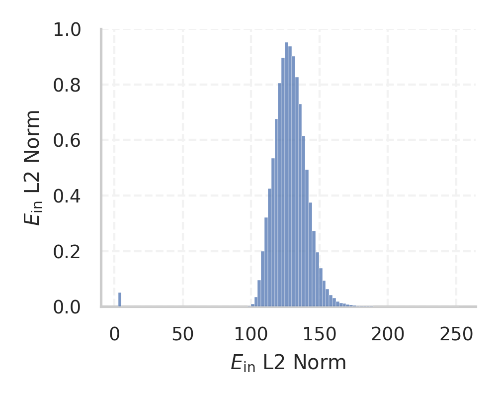
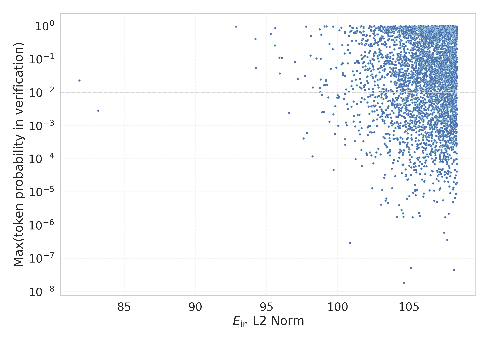

# Report for `openai/gpt-oss-20b`

## Model info

* Model Info: 
  * Tied embeddings: False
  * LM head uses bias: False
  * Embeddings shape: [201088, 2880]
* Tokenizer Info: 
  * Vocab Size: 200019
  * Tokenizer Class: PreTrainedTokenizerFast
  * Tokenizer Type: BPE
  * Bytes handling: Byte Input
  * Token for verification prompt building: ABCDEFGHIJKLMNOPQRSTUVWXYZ
  * Token id for verification prompt building: 184150
* Indicator summary: 
  * Indicator for under-trained tokens: E_{in} L2 Norm
  * Overall distribution: 128.309 +/- 14.289
* Detected Token Counts: 
  * Number of tested under-trained tokens: 3969, 3966 non-special, 1346 below p = 0.01 threshold, 11 below soft indicator threshold
  * Number of single byte tokens: 256, of which 55 below indicator threshold
  * Number of special tokens: 21, of which 1 below indicator threshold
  * Number of non-single-byte unreachable tokens: 12, of which 0 below indicator threshold
  * Number of non-single-byte UTF-fragment tokens:  1434, of which 1 below soft indicator threshold

## Under-trained token indicators plot


## Verification plot


## Under-trained token verification results
11 entries below threshold of 96.582

|   token_id | token                 |   indicator | max_prob                                                        | in_other_tokens                                                                                                       |
|------------|-----------------------|-------------|-----------------------------------------------------------------|-----------------------------------------------------------------------------------------------------------------------|
|     193278 | ````` _REALTYPE ````` |     81.8549 | <span style='border: 1px solid rgb(251, 189, 8);'>0.023</span>  |                                                                                                                       |
|      15362 | ````` ▁Short `````    |     83.1738 | <span style='border: 1px solid rgb(255, 145, 0);'>0.0028</span> | ````` ▁Shorts `````, ````` ▁Shortly `````, ````` ▁Shortcut `````                                                      |
|     194425 | ````` /copyleft ````` |     92.8512 | <span style='border: 1px solid rgb(40, 167, 69);'>0.95</span>   |                                                                                                                       |
|     164424 | ````` /place `````    |     94.2154 | <span style='border: 1px solid rgb(40, 167, 69);'>0.4</span>    |                                                                                                                       |
|      66313 | ````` ѕ `````         |     94.2377 | <span style='border: 1px solid rgb(251, 189, 8);'>0.054</span>  |                                                                                                                       |
|     173853 | ````` .gstatic `````  |     95.2913 | <span style='border: 1px solid rgb(40, 167, 69);'>0.58</span>   |                                                                                                                       |
|     171423 | ````` ▁PMC `````      |     95.5809 | <span style='border: 1px solid rgb(40, 167, 69);'>0.26</span>   |                                                                                                                       |
|      33751 | ````` ấp `````        |     95.5988 | <span style='border: 1px solid rgb(40, 167, 69);'>0.86</span>   | ````` ▁cấp `````, ````` ▁hấp `````, ````` ▁thấp `````                                                                 |
|      51555 | ````` ắn `````        |     95.8954 | <span style='border: 1px solid rgb(40, 167, 69);'>0.11</span>   | ````` ▁hắn `````, ````` ắng `````, ````` ▁chắn `````, ````` ▁trắng `````, ````` ▁thắng `````                          |
|      24406 | ````` ối `````        |     95.9207 | <span style='border: 1px solid rgb(251, 189, 8);'>0.037</span>  | ````` ▁cuối `````, ````` ▁tối `````, ````` ▁nối `````, ````` ▁phối `````, ````` ▁đối `````                            |
|      43558 | ````` lever `````     |     96.0894 | <span style='border: 1px solid rgb(40, 167, 69);'>0.11</span>   | ````` ▁levering `````, ````` geleverd `````, ````` ▁leverancier `````, ````` ▁Clever `````, ````` ▁leveren `````, ... |
<details><summary>3955 additional entries above threshold</summary>

|   token_id | token                         |   indicator | max_prob                                                         | in_other_tokens                                                                                                                                                                                                                  |
|------------|-------------------------------|-------------|------------------------------------------------------------------|----------------------------------------------------------------------------------------------------------------------------------------------------------------------------------------------------------------------------------|
|      50192 | ````` ấu `````                |     96.5819 | <span style='border: 1px solid rgb(255, 145, 0);'>0.0024</span>  | ````` ▁cấu `````, ````` ▁đấu `````, ````` ▁dấu `````                                                                                                                                                                             |
|      45503 | ````` ốn `````                |     96.9982 | <span style='border: 1px solid rgb(251, 189, 8);'>0.082</span>   | ````` ▁sống `````, ````` ▁xuống `````, ````` ▁uống `````, ````` ▁muốn `````, ````` ▁vốn `````, ...                                                                                                                               |
|       7644 | ````` ứ `````                 |     97.1941 | <span style='border: 1px solid rgb(251, 189, 8);'>0.025</span>   | ````` ▁tức `````, ````` ▁thứ `````, ````` ▁Đức `````, ````` ▁sức `````, <span style='border: 1px solid rgb(40, 167, 69);'>````` ức `````</span>, ...                                                                             |
|     133866 | ````` aldi `````              |     97.593  | <span style='border: 1px solid rgb(169, 68, 66);'>0.00041</span> | ````` ▁Maldives `````                                                                                                                                                                                                            |
|      40823 | ````` ộc `````                |     97.7081 | <span style='border: 1px solid rgb(251, 189, 8);'>0.031</span>   | ````` ▁cuộc `````, ````` ▁thuộc `````, ````` ▁độc `````                                                                                                                                                                          |
|      92115 | ````` 웃 `````                |     97.7815 | <span style='border: 1px solid rgb(40, 167, 69);'>0.96</span>    | ````` ▁웃 `````                                                                                                                                                                                                                  |
|     122866 | ````` Ứ `````                 |     97.8403 | <span style='border: 1px solid rgb(169, 68, 66);'>0.0006</span>  |                                                                                                                                                                                                                                  |
|     112126 | ````` zyn `````               |     98.0851 | <span style='border: 1px solid rgb(40, 167, 69);'>0.13</span>    | ````` ▁czyn `````, <span style='border: 1px solid rgb(169, 68, 66);'>````` czyn `````</span>                                                                                                                                     |
|      24165 | ````` 속 `````                |     98.1232 | <span style='border: 1px solid rgb(40, 167, 69);'>0.5</span>     | ````` ▁계속 `````, ````` ▁지속 `````, ````` ▁속 `````                                                                                                                                                                            |
|     173318 | ````` oulos `````             |     98.2303 | <span style='border: 1px solid rgb(169, 68, 66);'>0.00012</span> |                                                                                                                                                                                                                                  |
|     153561 | ````` lsi `````               |     98.2428 | <span style='border: 1px solid rgb(251, 189, 8);'>0.014</span>   | ````` elsif `````, ````` ▁propulsion `````, ````` ▁bolsillo `````, ````` ▁hillside `````, ````` ▁Helsing `````                                                                                                                   |
|      16664 | ````` ạn `````                |     98.4995 | <span style='border: 1px solid rgb(40, 167, 69);'>0.1</span>     | ````` ▁Bạn `````, <span style='border: 1px solid rgb(251, 189, 8);'>````` ạng `````</span>, <span style='border: 1px solid rgb(251, 189, 8);'>````` ạnh `````</span>, ````` ▁hạn `````, ````` ▁mạng `````, ...                   |
|      48304 | ````` 락 `````                |     98.7303 | <span style='border: 1px solid rgb(40, 167, 69);'>0.79</span>    | ````` ▁연락 `````                                                                                                                                                                                                                |
|      20048 | ````` ải `````                |     98.7362 | <span style='border: 1px solid rgb(251, 189, 8);'>0.014</span>   | ````` ▁Hải `````, ````` ▁trải `````, ````` ▁cải `````, ````` ▁phải `````, ````` ▁tải `````, ...                                                                                                                                  |
|      86886 | ````` ếp `````                |     98.778  | <span style='border: 1px solid rgb(251, 189, 8);'>0.01</span>    |                                                                                                                                                                                                                                  |
|     133446 | ````` າ `````                 |     98.7963 | <span style='border: 1px solid rgb(40, 167, 69);'>0.1</span>     |                                                                                                                                                                                                                                  |
|     150505 | ````` evenodd `````           |     98.8002 | <span style='border: 1px solid rgb(251, 189, 8);'>0.024</span>   |                                                                                                                                                                                                                                  |
|      89574 | ````` luent `````             |     98.8374 | <span style='border: 1px solid rgb(40, 167, 69);'>0.54</span>    | ````` ▁affluent `````, ````` ▁fluent `````, ````` ▁Fluent `````                                                                                                                                                                  |
|      21890 | ````` ương `````              |     98.8871 | <span style='border: 1px solid rgb(255, 145, 0);'>0.0083</span>  | ````` ▁chương `````, ````` ▁tương `````, ````` ▁phương `````, ````` ▁thương `````                                                                                                                                                |
|      16025 | ````` ỏ `````                 |     98.8983 | <span style='border: 1px solid rgb(255, 145, 0);'>0.0025</span>  | ````` ▁khỏe `````, <span style='border: 1px solid rgb(169, 68, 66);'>````` ỏa `````</span>, ````` ▁nhỏ `````, ````` ỏi `````, ````` ▁bỏ `````, ...                                                                               |
|      35708 | ````` ắc `````                |     99.0282 | <span style='border: 1px solid rgb(255, 145, 0);'>0.0026</span>  | ````` ▁mắc `````, ````` ▁sắc `````, ````` ▁Bắc `````, ````` ▁chắc `````                                                                                                                                                          |
|      23660 | ````` ật `````                |     99.0498 | <span style='border: 1px solid rgb(251, 189, 8);'>0.017</span>   | ````` ▁thật `````, ````` ▁thuật `````, ````` ▁vật `````, ````` ▁nhật `````, ````` ▁luật `````, ...                                                                                                                               |
|      21875 | ````` ält `````               |     99.075  | <span style='border: 1px solid rgb(40, 167, 69);'>0.97</span>    | ````` ▁enthält `````, ````` ▁vält `````, ````` ▁hält `````, ````` ▁Verhältnis `````, ````` fält `````, ...                                                                                                                       |
|      15421 | ````` ột `````                |     99.1464 | <span style='border: 1px solid rgb(251, 189, 8);'>0.017</span>   | ````` ▁Một `````, ````` Một `````, ````` ▁một `````                                                                                                                                                                              |
|      44888 | ````` furt `````              |     99.1878 | <span style='border: 1px solid rgb(251, 189, 8);'>0.024</span>   | ````` furter `````, ````` ▁furt `````, ````` ▁Frankfurt `````, ````` ▁furthermore `````                                                                                                                                          |
|      47023 | ````` alkan `````             |     99.2127 | <span style='border: 1px solid rgb(40, 167, 69);'>0.97</span>    | ````` ▁Balkan `````, ````` galkan `````                                                                                                                                                                                          |
|      66246 | ````` ẩn `````                |     99.2519 | <span style='border: 1px solid rgb(251, 189, 8);'>0.017</span>   | ````` ▁chuẩn `````                                                                                                                                                                                                               |
|     134511 | ````` lexams `````            |     99.3316 | <span style='border: 1px solid rgb(255, 145, 0);'>0.007</span>   | ````` ▁killexams `````                                                                                                                                                                                                           |
|      75177 | ````` erden `````             |     99.4113 | <span style='border: 1px solid rgb(40, 167, 69);'>0.29</span>    | ````` ▁derden `````, ````` ▁verden `````, ````` ▁Beschwerden `````, ````` ▁honderden `````, ````` ▁Werden `````, ...                                                                                                             |
|      41878 | ````` hren `````              |     99.4174 | <span style='border: 1px solid rgb(255, 145, 0);'>0.0013</span>  | ````` ▁Gebühren `````, ````` ▁Verfahren `````, ````` ahrenheit `````, ````` ▁brethren `````, ````` führen `````, ...                                                                                                             |
|      26770 | ````` øy `````                |     99.5085 | <span style='border: 1px solid rgb(251, 189, 8);'>0.051</span>   | ````` ▁høy `````, ````` ▁undertøy `````, ````` ▁sexleketøy `````, ````` ketøy `````, ````` ▁leketøy `````                                                                                                                        |
|      28920 | ````` ět `````                |     99.6382 | <span style='border: 1px solid rgb(40, 167, 69);'>0.2</span>     | ````` ▁děti `````, <span style='border: 1px solid rgb(251, 189, 8);'>````` vět `````</span>, ````` ▁svět `````, ````` ětí `````, ````` ▁vět `````                                                                                |
|     174200 | ````` .dtd `````              |     99.6804 | <span style='border: 1px solid rgb(40, 167, 69);'>0.96</span>    |                                                                                                                                                                                                                                  |
|      30536 | ````` ồng `````               |     99.6847 | <span style='border: 1px solid rgb(255, 145, 0);'>0.0022</span>  | ````` ▁Đồng `````, ````` ▁đồng `````                                                                                                                                                                                             |
|      82302 | ````` itze `````              |     99.7055 | <span style='border: 1px solid rgb(169, 68, 66);'>4.6e-05</span> | ````` ▁Spitze `````, ````` ▁besitzen `````, ````` ▁Pulitzer `````, ````` itzeko `````, ````` ▁Spitzen `````, ...                                                                                                                 |
|      41450 | ````` рун `````               |     99.8043 | <span style='border: 1px solid rgb(169, 68, 66);'>0.00055</span> | ````` ▁орун `````, ````` ▁грун `````                                                                                                                                                                                             |
|     173639 | ````` axo `````               |     99.8214 | <span style='border: 1px solid rgb(255, 145, 0);'>0.0038</span>  |                                                                                                                                                                                                                                  |
|      87262 | ````` ắp `````                |     99.8911 | <span style='border: 1px solid rgb(251, 189, 8);'>0.056</span>   |                                                                                                                                                                                                                                  |
|      44246 | ````` ốt `````                |     99.9611 | <span style='border: 1px solid rgb(255, 145, 0);'>0.0069</span>  | ````` ▁tốt `````                                                                                                                                                                                                                 |
|     181208 | ````` trin `````              |     99.9848 | <span style='border: 1px solid rgb(255, 145, 0);'>0.0082</span>  | ````` ▁doctrines `````, ````` \tCString `````, ````` ▁doctrina `````, ````` ▁tostring `````, ````` \tNSString `````                                                                                                              |
|      11919 | ````` ỉ `````                 |    100.017  | <span style='border: 1px solid rgb(255, 145, 0);'>0.0069</span>  | ````` ỉnh `````, ````` ▁chỉ `````, ````` ▁tỉnh `````, ````` ▁chỉnh `````, ````` ▁nghỉ `````                                                                                                                                      |
|      46654 | ````` ểu `````                |    100.039  | <span style='border: 1px solid rgb(169, 68, 66);'>0.00099</span> | ````` ▁biểu `````, ````` ▁kiểu `````, ````` ▁hiểu `````                                                                                                                                                                          |
|     131499 | ````` šķ `````                |    100.074  | <span style='border: 1px solid rgb(255, 145, 0);'>0.0072</span>  | ````` ▁šķ `````                                                                                                                                                                                                                  |
|      64290 | ````` ouder `````             |    100.116  | <span style='border: 1px solid rgb(40, 167, 69);'>0.73</span>    | ````` ouders `````, ````` ▁ouder `````, ````` houder `````, ````` ▁ouderen `````, ````` ▁oudere `````, ...                                                                                                                       |
|      22745 | ````` үй `````                |    100.25   | <span style='border: 1px solid rgb(40, 167, 69);'>0.89</span>    | ````` ▁үйлдвэрлэгч `````, ````` ▁сүйл `````, ````` ▁үйлдвэрл `````, ````` ▁күй `````, ````` ▁жүй `````, ...                                                                                                                      |
|      34742 | ````` ảo `````                |    100.258  | <span style='border: 1px solid rgb(251, 189, 8);'>0.07</span>    | ````` ▁khảo `````, ````` ▁bảo `````, ````` ▁đảo `````                                                                                                                                                                            |
|      24270 | ````` 격 `````                |    100.322  | <span style='border: 1px solid rgb(40, 167, 69);'>0.27</span>    | ````` 가격 `````, ````` ▁가격 `````, ````` ▁공격 `````                                                                                                                                                                           |
|      72653 | ````` Ế `````                 |    100.345  | <span style='border: 1px solid rgb(251, 189, 8);'>0.038</span>   |                                                                                                                                                                                                                                  |
|     107799 | ````` odin `````              |    100.347  | <span style='border: 1px solid rgb(251, 189, 8);'>0.075</span>   | ````` .Encoding `````, ````` ▁iodine `````, ````` ▁godinu `````, ````` -Encoding `````, ````` .encoding `````, ...                                                                                                               |
|      30647 | ````` ính `````               |    100.379  | <span style='border: 1px solid rgb(251, 189, 8);'>0.033</span>   | ````` ▁kính `````, ````` ▁tính `````, ````` ▁Chính `````, ````` ▁chính `````                                                                                                                                                     |
|       8187 | ````` ров `````               |    100.426  | <span style='border: 1px solid rgb(255, 145, 0);'>0.0064</span>  | ````` ирована `````, ````` аров `````, ````` ▁игров `````, ````` ▁добров `````, ````` ировки `````, ...                                                                                                                          |
|      38632 | ````` änn `````               |    100.476  | <span style='border: 1px solid rgb(40, 167, 69);'>0.15</span>    | ````` ▁känns `````, ````` ▁männer `````, ````` äänn `````, ````` ▁Männern `````, ````` ▁ännu `````, ...                                                                                                                          |
|      13992 | ````` ết `````                |    100.494  | <span style='border: 1px solid rgb(40, 167, 69);'>0.62</span>    | ````` ▁chết `````, ````` ▁kết `````, ````` ▁tiết `````, ````` ▁thiết `````, ````` ▁biết `````, ...                                                                                                                               |
|      22368 | ````` ước `````               |    100.498  | <span style='border: 1px solid rgb(169, 68, 66);'>0.00039</span> | ````` ▁bước `````, ````` ▁nước `````, ````` ▁trước `````                                                                                                                                                                         |
|     182529 | ````` stedt `````             |    100.513  | <span style='border: 1px solid rgb(40, 167, 69);'>0.67</span>    |                                                                                                                                                                                                                                  |
|      82205 | ````` ızı `````               |    100.518  | <span style='border: 1px solid rgb(255, 145, 0);'>0.0089</span>  | ````` ınızı `````, ````` mızı `````                                                                                                                                                                                              |
|     149358 | ````` ifton `````             |    100.519  | <span style='border: 1px solid rgb(251, 189, 8);'>0.031</span>   | ````` ▁Clifton `````                                                                                                                                                                                                             |
|      52032 | ````` \Core `````             |    100.53   | <span style='border: 1px solid rgb(169, 68, 66);'>0.00026</span> |                                                                                                                                                                                                                                  |
|      31438 | ````` owo `````               |    100.567  | <span style='border: 1px solid rgb(255, 145, 0);'>0.0012</span>  | ````` oworld `````, ````` ▁iṣowo `````, ````` ▁powod `````, ````` ▁coworkers `````, ````` ▁cowork `````, ...                                                                                                                     |
|      23632 | ````` ành `````               |    100.58   | <span style='border: 1px solid rgb(251, 189, 8);'>0.012</span>   | ````` ▁Thành `````, ````` ▁thành `````, ````` ▁dành `````, ````` ▁ngành `````, ````` ▁hành `````                                                                                                                                 |
|      75476 | ````` ầm `````                |    100.625  | <span style='border: 1px solid rgb(255, 145, 0);'>0.001</span>   |                                                                                                                                                                                                                                  |
|      67283 | ````` ąż `````                |    100.666  | <span style='border: 1px solid rgb(255, 145, 0);'>0.0044</span>  | ````` ciąż `````, ````` ▁książ `````                                                                                                                                                                                             |
|     112524 | ````` íž `````                |    100.692  | <span style='border: 1px solid rgb(255, 145, 0);'>0.0032</span>  |                                                                                                                                                                                                                                  |
|      39752 | ````` 향 `````                |    100.694  | <span style='border: 1px solid rgb(251, 189, 8);'>0.074</span>   | ````` ▁영향 `````, ````` ▁영향을 `````, ````` ▁방향 `````, ````` ▁향 `````                                                                                                                                                       |
|      73320 | ````` eil `````               |    100.696  | <span style='border: 1px solid rgb(40, 167, 69);'>0.27</span>    | ````` ▁deilige `````, ````` ▁Vorteil `````, ````` veille `````, ````` ▁veiligheids `````, ````` ▁conseille `````, ...                                                                                                            |
|      18971 | ````` ัก `````                 |    100.713  | <span style='border: 1px solid rgb(40, 167, 69);'>0.19</span>    | ````` สำนักงาน `````, ````` ▁นักลงทุนสัมพันธ์ `````, ````` พัก `````, ````` นัก `````, ````` ▁สำนักเลขานุการองค์กร `````, ...                                                                                                               |
|      76224 | ````` unin `````              |    100.789  | <span style='border: 1px solid rgb(251, 189, 8);'>0.01</span>    | ````` ▁uninter `````, ````` ▁ondersteuning `````, ````` ▁unintended `````, ````` ▁unin `````, ````` ▁uninstall `````, ...                                                                                                        |
|     189136 | ````` Π`````                 |    100.791  | <span style='border: 1px solid rgb(40, 167, 69);'>0.5</span>     |                                                                                                                                                                                                                                  |
|     153589 | ````` ▁天天中彩票粤 `````     |    100.85   | <span style='border: 1px solid rgb(169, 68, 66);'>2.9e-07</span> |                                                                                                                                                                                                                                  |
|     134566 | ````` giore `````             |    100.851  | <span style='border: 1px solid rgb(40, 167, 69);'>0.99</span>    | ````` ▁maggiore `````                                                                                                                                                                                                            |
|      48311 | ````` υσ `````                |    100.864  | <span style='border: 1px solid rgb(40, 167, 69);'>0.66</span>    | ````` ▁παρουσιά `````, ````` ▁φυσ `````, ````` υση `````, ````` ▁παρουσία `````, ````` ▁δυσ `````, ...                                                                                                                           |
|      14733 | ````` ện `````                |    100.872  | <span style='border: 1px solid rgb(40, 167, 69);'>0.15</span>    | ````` ▁diện `````, ````` ệnh `````, ````` ▁tiện `````, ````` ▁viện `````, ````` ▁kiện `````, ...                                                                                                                                 |
|      90058 | ````` baum `````              |    100.893  | <span style='border: 1px solid rgb(40, 167, 69);'>0.69</span>    |                                                                                                                                                                                                                                  |
|      28547 | ````` ifu `````               |    100.961  | <span style='border: 1px solid rgb(251, 189, 8);'>0.015</span>   | ````` ▁difusión `````, ````` ifun `````, ````` Beautiful `````, ````` ▁difund `````, ````` .Bunifu `````, ...                                                                                                                    |
|      16700 | ````` ▁horiz `````            |    100.962  | <span style='border: 1px solid rgb(40, 167, 69);'>0.72</span>    | ````` ▁horizontally `````, ````` ▁horizonte `````, ````` ▁horizontal `````, ````` ▁horizons `````, ````` ▁horizont `````, ...                                                                                                    |
|      12387 | ````` لال `````               |    100.963  | <span style='border: 1px solid rgb(255, 145, 0);'>0.0037</span>  | ````` ▁خلالها `````, ````` ▁استقلال `````, ````` ▁خلال `````, ````` غلال `````, ````` ▁الاحتلال `````, ...                                                                                                                       |
|      59957 | ````` ustin `````             |    100.988  | <span style='border: 1px solid rgb(40, 167, 69);'>0.35</span>    | ````` ▁Dustin `````, ````` Justin `````, ````` ▁disgusting `````, ````` ▁Augustine `````, ````` ▁adjusting `````, ...                                                                                                            |
|      88682 | ````` auri `````              |    100.997  | <span style='border: 1px solid rgb(251, 189, 8);'>0.022</span>   | ````` ashauri `````, ````` ▁mauris `````, ````` ▁Mauricio `````, ````` ▁Mauritius `````, ````` ▁Laurie `````, ...                                                                                                                |
|      56292 | ````` awang `````             |    101.015  | <span style='border: 1px solid rgb(40, 167, 69);'>0.89</span>    | ````` ▁dalawang `````                                                                                                                                                                                                            |
|     164777 | ````` ATOM `````              |    101.046  | <span style='border: 1px solid rgb(251, 189, 8);'>0.043</span>   |                                                                                                                                                                                                                                  |
|      98490 | ````` anko `````              |    101.051  | <span style='border: 1px solid rgb(40, 167, 69);'>0.86</span>    | ````` ▁tankou `````, ````` ▁aankoop `````, ````` ▁ankor `````                                                                                                                                                                    |
|     124281 | ````` ipop `````              |    101.061  | <span style='border: 1px solid rgb(251, 189, 8);'>0.013</span>   | ````` ollipop `````                                                                                                                                                                                                              |
|      25067 | ````` ơn `````                |    101.112  | <span style='border: 1px solid rgb(255, 145, 0);'>0.0053</span>  | ````` ▁chương `````, ````` ▁Sơn `````, ````` ▁đơn `````, ````` ▁tương `````, ````` ▁phương `````, ...                                                                                                                            |
|     158114 | ````` weiler `````            |    101.114  | <span style='border: 1px solid rgb(255, 145, 0);'>0.0013</span>  |                                                                                                                                                                                                                                  |
|      22578 | ````` ận `````                |    101.132  | <span style='border: 1px solid rgb(255, 145, 0);'>0.0019</span>  | ````` ▁luận `````, ````` ▁vận `````, ````` ▁trận `````, ````` ▁tận `````, ````` ▁nhận `````, ...                                                                                                                                 |
|      92420 | ````` ijkt `````              |    101.134  | <span style='border: 1px solid rgb(40, 167, 69);'>0.62</span>    | ````` ▁kijkt `````                                                                                                                                                                                                               |
|      18673 | ````` ږ `````                 |    101.153  | <span style='border: 1px solid rgb(251, 189, 8);'>0.033</span>   | ````` موږ `````, ````` ▁کېږي `````, ````` ▁لږ `````, ````` ▁کیږي `````, ````` ▁اوږ `````, ...                                                                                                                                    |
|     191981 | ````` vedo `````              |    101.2    | <span style='border: 1px solid rgb(169, 68, 66);'>0.00034</span> |                                                                                                                                                                                                                                  |
|      15992 | ````` unca `````              |    101.204  | <span style='border: 1px solid rgb(251, 189, 8);'>0.076</span>   | ````` truncate `````, ````` uncated `````, ````` ▁Nunca `````, ````` uncan `````, ````` ▁uncanny `````, ...                                                                                                                      |
|      12907 | ````` лад `````               |    101.211  | <span style='border: 1px solid rgb(40, 167, 69);'>0.64</span>    | ````` ▁склада `````, ````` ▁вклад `````, ````` ▁влад `````, ````` лады `````, ````` ▁владель `````, ...                                                                                                                          |
|     180177 | ````` zko `````               |    101.223  | <span style='border: 1px solid rgb(169, 68, 66);'>0.00094</span> | ````` ▁szko `````                                                                                                                                                                                                                |
|      83082 | ````` huizen `````            |    101.245  | <span style='border: 1px solid rgb(169, 68, 66);'>9.7e-05</span> | ````` ▁huizen `````                                                                                                                                                                                                              |
|      56862 | ````` 존 `````                |    101.253  | <span style='border: 1px solid rgb(251, 189, 8);'>0.024</span>   | ````` ▁존재 `````, ````` ▁존 `````, ````` ▁기존 `````                                                                                                                                                                            |
|      35448 | ````` реж `````               |    101.274  | <span style='border: 1px solid rgb(40, 167, 69);'>0.6</span>     | ````` ереж `````, ````` ▁режима `````, ````` ▁режим `````, ````` ▁преж `````, ````` ▁прежде `````, ...                                                                                                                           |
|      28347 | ````` راج `````               |    101.275  | <span style='border: 1px solid rgb(40, 167, 69);'>0.36</span>    | ````` راجع `````, ````` ▁استخراج `````, ````` ▁مراج `````, ````` ▁مراجعه `````                                                                                                                                                   |
|      37164 | ````` utin `````              |    101.324  | <span style='border: 1px solid rgb(40, 167, 69);'>0.85</span>    | ````` ▁executing `````, ````` .routing `````, ````` ▁routing `````, ````` ▁routines `````, ````` ▁routinely `````, ...                                                                                                           |
|     182494 | ````` kopf `````              |    101.331  | <span style='border: 1px solid rgb(251, 189, 8);'>0.091</span>   |                                                                                                                                                                                                                                  |
|      21753 | ````` ực `````                |    101.337  | <span style='border: 1px solid rgb(251, 189, 8);'>0.016</span>   | ````` ▁lực `````, ````` ▁thực `````, ````` ▁vực `````, ````` ▁trực `````, ````` ▁cực `````                                                                                                                                       |
|      47374 | ````` лаж `````               |    101.346  | <span style='border: 1px solid rgb(255, 145, 0);'>0.0045</span>  | ````` ▁наслаж `````, ````` ▁охлаж `````, ````` ▁влаж `````                                                                                                                                                                       |
|      35392 | ````` ổi `````                |    101.349  | <span style='border: 1px solid rgb(251, 189, 8);'>0.044</span>   | ````` ▁tuổi `````, ````` ▁đổi `````, ````` ▁nổi `````                                                                                                                                                                            |
|      20952 | ````` uat `````               |    101.365  | <span style='border: 1px solid rgb(40, 167, 69);'>0.68</span>    | ````` ▁kuat `````, ````` uatanga `````, ````` ▁actuator `````, ````` ▁Evaluation `````, ````` ▁continuation `````, ...                                                                                                           |
|      17318 | ````` enga `````              |    101.371  | <span style='border: 1px solid rgb(40, 167, 69);'>0.72</span>    | ````` ▁engage `````, ````` ▁engari `````, ````` ▁mengambil `````, ````` ▁Tengah `````, ````` ▁venga `````, ...                                                                                                                   |
|      24329 | ````` äd `````                |    101.376  | <span style='border: 1px solid rgb(251, 189, 8);'>0.08</span>    | ````` ▁lädt `````, ````` äden `````, ````` ▁Städten `````, ````` äder `````, ````` ▁beschäd `````, ...                                                                                                                           |
|     189478 | ````` Ồ `````                 |    101.397  | <span style='border: 1px solid rgb(255, 145, 0);'>0.0021</span>  |                                                                                                                                                                                                                                  |
|      23599 | ````` اذ `````                |    101.411  | <span style='border: 1px solid rgb(251, 189, 8);'>0.089</span>   | ````` اذا `````, ````` ▁لماذا `````, ````` ▁ماذا `````, ````` ▁اذ `````, ````` ▁اذا `````, ...                                                                                                                                   |
|      67500 | ````` ạc `````                |    101.474  | <span style='border: 1px solid rgb(169, 68, 66);'>0.00071</span> | ````` ▁sạch `````, ````` ▁bạc `````, ````` ▁hoạch `````                                                                                                                                                                          |
|     194409 | ````` antia `````             |    101.485  | <span style='border: 1px solid rgb(251, 189, 8);'>0.076</span>   | ````` instantiate `````                                                                                                                                                                                                          |
|      40487 | ````` ắt `````                |    101.497  | <span style='border: 1px solid rgb(40, 167, 69);'>0.29</span>    | ````` ▁bắt `````, ````` ▁mắt `````                                                                                                                                                                                               |
|     117495 | ````` uven `````              |    101.525  | <span style='border: 1px solid rgb(255, 145, 0);'>0.0021</span>  | ````` ▁Juven `````, ````` ▁Leuven `````, ````` ▁juvenil `````, ````` ▁juventud `````                                                                                                                                             |
|      57926 | ````` τω `````                |    101.545  | <span style='border: 1px solid rgb(40, 167, 69);'>0.67</span>    | ````` ▁περίπτωση `````, ````` μάτων `````, ````` πτωση `````, ````` ▁κάτω `````, ````` τως `````                                                                                                                                 |
|     163905 | ````` LEBeta `````            |    101.546  | <span style='border: 1px solid rgb(251, 189, 8);'>0.014</span>   |                                                                                                                                                                                                                                  |
|     115169 | ````` anor `````              |    101.553  | <span style='border: 1px solid rgb(251, 189, 8);'>0.025</span>   | ````` ▁anore `````, ````` leanor `````, ````` ▁demeanor `````, ````` ▁paranormal `````, ````` ▁Panorama `````, ...                                                                                                               |
|      90305 | ````` wier `````              |    101.557  | <span style='border: 1px solid rgb(169, 68, 66);'>0.00054</span> | ````` ▁powierz `````, ````` ▁wier `````, ````` ▁Schwier `````, ````` ▁schwier `````, ````` ▁schwierig `````, ...                                                                                                                 |
|      60213 | ````` ửa `````                |    101.572  | <span style='border: 1px solid rgb(255, 145, 0);'>0.0013</span>  | ````` ▁cửa `````, ````` ▁sửa `````                                                                                                                                                                                               |
|     192340 | ````` łę `````                |    101.583  | <span style='border: 1px solid rgb(251, 189, 8);'>0.038</span>   |                                                                                                                                                                                                                                  |
|      33107 | ````` zens `````              |    101.598  | <span style='border: 1px solid rgb(40, 167, 69);'>0.96</span>    | ````` ▁Citizens `````, ````` izens `````, ````` ▁Citizenship `````, ````` ▁dozens `````, ````` ▁Rezension `````, ...                                                                                                             |
|     144992 | ````` jár `````               |    101.609  | <span style='border: 1px solid rgb(255, 145, 0);'>0.0051</span>  | ````` jára `````, ````` ▁jár `````                                                                                                                                                                                               |
|      26233 | ````` ập `````                |    101.625  | <span style='border: 1px solid rgb(251, 189, 8);'>0.019</span>   | ````` ▁tập `````, ````` ▁cập `````, ````` ▁nhập `````, ````` ▁lập `````                                                                                                                                                          |
|      53443 | ````` čas `````               |    101.631  | <span style='border: 1px solid rgb(40, 167, 69);'>0.63</span>    | ````` ▁součas `````, ````` ▁počas `````, ````` ▁čas `````, ````` ▁často `````, ````` ▁časa `````, ...                                                                                                                            |
|      89205 | ````` oude `````              |    101.654  | <span style='border: 1px solid rgb(169, 68, 66);'>0.00019</span> | ````` ▁behouden `````, ````` ▁onderhouden `````, ````` ouders `````, ````` ▁koude `````, ````` houder `````, ...                                                                                                                 |
|      10815 | ````` яв `````                |    101.656  | <span style='border: 1px solid rgb(40, 167, 69);'>0.3</span>     | ````` ▁появляются `````, ````` ▁является `````, ````` ▁появ `````, ````` ▁заявление `````, ````` яване `````, ...                                                                                                                |
|      22526 | ````` ức `````                |    101.657  | <span style='border: 1px solid rgb(40, 167, 69);'>0.13</span>    | ````` ▁tức `````, ````` ▁Đức `````, ````` ▁sức `````, <span style='border: 1px solid rgb(251, 189, 8);'>````` ▁thức `````</span>, ````` ▁mức `````, ...                                                                          |
|      20576 | ````` ường `````              |    101.659  | <span style='border: 1px solid rgb(251, 189, 8);'>0.013</span>   | ````` ▁trường `````, ````` ▁đường `````, ````` ▁thường `````                                                                                                                                                                     |
|      53947 | ````` วน `````                |    101.664  | <span style='border: 1px solid rgb(40, 167, 69);'>0.97</span>    | ````` สวน `````, ````` ำนวน `````, ````` จำนวน `````, ````` ▁จำนวน `````, ````` ▁ส่วน `````, ...                                                                                                                                  |
|      45246 | ````` ibel `````              |    101.666  | <span style='border: 1px solid rgb(169, 68, 66);'>0.00083</span> | ````` ▁flexibel `````, ````` ▁Bibele `````, ````` ibela `````, ````` ibele `````                                                                                                                                                 |
|      30278 | ````` cii `````               |    101.679  | <span style='border: 1px solid rgb(169, 68, 66);'>6.1e-05</span> | ````` ▁ascii `````, ````` ▁ciid `````, ````` Ascii `````, ````` icii `````, ````` ascii `````, ...                                                                                                                               |
|      20751 | ````` ерж `````               |    101.682  | <span style='border: 1px solid rgb(40, 167, 69);'>0.1</span>     | ````` верж `````, ````` ▁придерж `````, ````` ▁содержащ `````, ````` ▁поддерж `````, ````` ▁содержит `````, ...                                                                                                                  |
|      80036 | ````` holt `````              |    101.695  | <span style='border: 1px solid rgb(255, 145, 0);'>0.0067</span>  |                                                                                                                                                                                                                                  |
|     116269 | ````` stamp `````             |    101.707  | <span style='border: 1px solid rgb(40, 167, 69);'>0.28</span>    | ````` ▁stamping `````, ````` ▁estamp `````, ````` _stamp `````, ````` ▁stampa `````                                                                                                                                              |
|      40196 | ````` 열 `````                |    101.715  | <span style='border: 1px solid rgb(40, 167, 69);'>0.37</span>    | ````` ▁열린 `````, ````` ▁열 `````, ````` ▁배열 `````, ````` ▁문자열 `````                                                                                                                                                       |
|       3599 | ````` ores `````              |    101.742  | <span style='border: 1px solid rgb(40, 167, 69);'>0.53</span>    | ````` ▁proveedores `````, ````` ▁investidores `````, ````` ▁forestry `````, ````` ▁Scores `````, ````` ▁Flores `````, ...                                                                                                        |
|     125476 | ````` frey `````              |    101.758  | <span style='border: 1px solid rgb(251, 189, 8);'>0.074</span>   | ````` ▁Geoffrey `````                                                                                                                                                                                                            |
|      92168 | ````` EDS `````               |    101.764  | <span style='border: 1px solid rgb(251, 189, 8);'>0.057</span>   | ````` IPEDS `````                                                                                                                                                                                                                |
|      73509 | ````` alach `````             |    101.776  | <span style='border: 1px solid rgb(40, 167, 69);'>0.42</span>    | ````` ▁Appalach `````, ````` ▁Appalachian `````                                                                                                                                                                                  |
|      49327 | ````` ồi `````                |    101.794  | <span style='border: 1px solid rgb(40, 167, 69);'>0.11</span>    | ````` ▁rồi `````, ````` ▁hồi `````                                                                                                                                                                                               |
|      14714 | ````` osto `````              |    101.797  | <span style='border: 1px solid rgb(169, 68, 66);'>0.00034</span> | ````` ▁composto `````, ````` ▁agosto `````, ````` ▁disposto `````, ````` Costo `````, ````` postos `````, ...                                                                                                                    |
|      14888 | ````` וג `````                |    101.806  | <span style='border: 1px solid rgb(40, 167, 69);'>0.94</span>    | ````` וגמא `````, ````` ▁מוג `````, ````` וגע `````, ````` וגר `````, ````` ▁סוג `````, ...                                                                                                                                      |
|      78062 | ````` inkan `````             |    101.81   | <span style='border: 1px solid rgb(40, 167, 69);'>0.68</span>    | ````` ▁memainkan `````, ````` ▁dimainkan `````, ````` ungkinkan `````, ````` ainkan `````, ````` ▁memungkinkan `````                                                                                                             |
|     129588 | ````` ଟ `````                 |    101.811  | <span style='border: 1px solid rgb(40, 167, 69);'>0.87</span>    |                                                                                                                                                                                                                                  |
|      79323 | ````` Ố `````                 |    101.819  | <span style='border: 1px solid rgb(251, 189, 8);'>0.014</span>   |                                                                                                                                                                                                                                  |
|      40277 | ````` ρχ `````                |    101.842  | <span style='border: 1px solid rgb(251, 189, 8);'>0.016</span>   | ````` ▁υπάρχει `````, ````` ▁αρχ `````, ````` ▁υπάρχουν `````                                                                                                                                                                    |
|      60181 | ````` ạch `````               |    101.844  | <span style='border: 1px solid rgb(40, 167, 69);'>0.53</span>    | ````` ▁sạch `````, ````` ▁hoạch `````                                                                                                                                                                                            |
|      11441 | ````` ünd `````               |    101.852  | <span style='border: 1px solid rgb(251, 189, 8);'>0.082</span>   | <span style='border: 1px solid rgb(251, 189, 8);'>````` ünde `````</span>, ````` ünden `````, ````` ▁Bünd `````, ````` ▁düşünd `````, ````` ündet `````, ...                                                                     |
|     167272 | ````` ▁kës `````              |    101.875  | <span style='border: 1px solid rgb(255, 145, 0);'>0.0061</span>  |                                                                                                                                                                                                                                  |
|      10889 | ````` egen `````              |    101.9    | <span style='border: 1px solid rgb(40, 167, 69);'>0.13</span>    | ````` ▁legen `````, ````` ▁bewegen `````, ````` ▁Gegend `````, ````` .codegen `````, ````` ▁vliegen `````, ...                                                                                                                   |
|      13164 | ````` ğı `````                |    101.902  | <span style='border: 1px solid rgb(40, 167, 69);'>0.26</span>    | ````` dığı `````, ````` ığı `````, ````` acağını `````, ````` ığını `````, ````` ▁olmadığı `````, ...                                                                                                                            |
|     115759 | ````` utad `````              |    101.911  | <span style='border: 1px solid rgb(251, 189, 8);'>0.046</span>   | ````` ▁computadores `````, ````` ▁diputados `````, ````` utada `````, ````` ▁computadora `````, ````` ▁ciutad `````, ...                                                                                                         |
|      17864 | ````` weise `````             |    101.914  | <span style='border: 1px solid rgb(251, 189, 8);'>0.012</span>   | ````` ielsweise `````, ````` ▁Hinweise `````, <span style='border: 1px solid rgb(169, 68, 66);'>````` weisen `````</span>, ````` ziehungsweise `````, ````` ▁beispielsweise `````, ...                                           |
|      27453 | ````` ρώ `````                |    101.917  | <span style='border: 1px solid rgb(40, 167, 69);'>0.16</span>    | ````` ▁πρώ `````, ````` ▁πρώτη `````, ````` ▁ανθρώ `````, ````` ρών `````, ````` ▁πρώτο `````, ...                                                                                                                               |
|      32141 | ````` ốc `````                |    101.919  | <span style='border: 1px solid rgb(40, 167, 69);'>0.17</span>    | ````` ▁thuốc `````, ````` ▁tốc `````, ````` ▁quốc `````, ````` ▁Quốc `````                                                                                                                                                       |
|      20717 | ````` chester `````           |    101.924  | <span style='border: 1px solid rgb(251, 189, 8);'>0.017</span>   | ````` ▁Manchester `````, ````` Manchester `````, ````` ▁Winchester `````, ````` ▁Rochester `````                                                                                                                                 |
|      52529 | ````` žit `````               |    101.948  | <span style='border: 1px solid rgb(251, 189, 8);'>0.061</span>   | ````` ▁použit `````, ````` ležit `````, ````` žite `````                                                                                                                                                                         |
|      33856 | ````` cery `````              |    101.955  | <span style='border: 1px solid rgb(251, 189, 8);'>0.048</span>   | ````` ▁grocery `````, ````` ▁Grocery `````, ````` rocery `````                                                                                                                                                                   |
|      33675 | ````` λέ `````                |    101.976  | <span style='border: 1px solid rgb(40, 167, 69);'>0.36</span>    | ````` ▁πολλές `````, ````` λέον `````, ````` ▁πλέον `````, ````` ▁λέ `````, ````` ▁βλέ `````, ...                                                                                                                                |
|      35569 | ````` ayı `````               |    102      | <span style='border: 1px solid rgb(40, 167, 69);'>0.29</span>    | ````` ▁kayıt `````, ````` ▁ayında `````, ````` ▁sayı `````, ````` ▁yayın `````, ````` ayın `````, ...                                                                                                                            |
|      18490 | ````` 록 `````                |    102.003  | <span style='border: 1px solid rgb(40, 167, 69);'>0.49</span>    | ````` 등록 `````, ````` ▁등록 `````, ````` ▁목록 `````, ````` 도록 `````, ````` ▁기록 `````, ...                                                                                                                                 |
|      32598 | ````` yang `````              |    102.019  | <span style='border: 1px solid rgb(169, 68, 66);'>0.00015</span> | ````` ▁yango `````, ````` ▁yangi `````, ````` uyang `````, ````` ▁niyang `````, ````` .yang `````, ...                                                                                                                           |
|      20512 | ````` ращ `````               |    102.032  | <span style='border: 1px solid rgb(251, 189, 8);'>0.029</span>   | ````` ▁сокращ `````, ````` ▁выращ `````, ````` ▁прекращ `````, ````` ▁обращения `````, ````` ▁вращ `````, ...                                                                                                                    |
|      12065 | ````` ại `````                |    102.033  | <span style='border: 1px solid rgb(169, 68, 66);'>0.00013</span> | ````` ▁loại `````, ````` ▁thoại `````, ````` ▁đại `````, ````` ▁mại `````, ````` ▁tại `````, ...                                                                                                                                 |
|       5851 | ````` ọn `````                |    102.037  | <span style='border: 1px solid rgb(40, 167, 69);'>0.53</span>    | ````` ▁àwọn `````, ````` ▁Awọn `````, ````` wọn `````, ````` ọng `````, ````` ▁ọn `````, ...                                                                                                                                     |
|      36599 | ````` بط `````                |    102.058  | <span style='border: 1px solid rgb(40, 167, 69);'>0.35</span>    | ````` ▁ضبط `````, ````` ▁الرابط `````, ````` بطال `````, ````` ▁بط `````, ````` ▁البط `````, ...                                                                                                                                 |
|       2505 | ````` ora `````               |    102.074  | <span style='border: 1px solid rgb(251, 189, 8);'>0.022</span>   | ````` orado `````, ````` ▁Laboratories `````, <span style='border: 1px solid rgb(40, 167, 69);'>````` pora `````</span>, ````` ▁Contemporary `````, ````` ▁collaborateurs `````, ...                                             |
|      19632 | ````` لق `````                |    102.074  | <span style='border: 1px solid rgb(251, 189, 8);'>0.048</span>   | ````` ▁تلق `````, ````` ▁القب `````, ````` ▁القانون `````, ````` ▁تعلق `````, ````` ▁القوات `````, ...                                                                                                                           |
|      36279 | ````` ifo `````               |    102.082  | <span style='border: 1px solid rgb(251, 189, 8);'>0.03</span>    | ````` uniform `````, ````` .uniform `````, ````` Uniform `````, ````` ifold `````, ````` _uniform `````, ...                                                                                                                     |
|      90616 | ````` hoven `````             |    102.082  | <span style='border: 1px solid rgb(255, 145, 0);'>0.005</span>   | ````` ▁Beethoven `````, ````` ethoven `````, ````` ▁Eindhoven `````                                                                                                                                                              |
|       5576 | ````` رد `````                |    102.085  | <span style='border: 1px solid rgb(40, 167, 69);'>0.12</span>    | ````` ▁کردیا `````, ````` ▁گردش `````, ````` ▁میلیارد `````, ````` پرد `````, ````` ▁مردم `````, ...                                                                                                                             |
|      51396 | ````` hau `````               |    102.091  | <span style='border: 1px solid rgb(169, 68, 66);'>0.00088</span> | ````` ▁hauled `````, ````` ▁anschauen `````, ````` ▁exhaustion `````, ````` ▁behaupt `````, ````` ▁Rathaus `````, ...                                                                                                            |
|       7847 | ````` ajo `````               |    102.093  | <span style='border: 1px solid rgb(251, 189, 8);'>0.05</span>    | ````` ajor `````, ````` -major `````, ````` ▁bajos `````, ````` ▁trabajo `````, ````` ▁Majority `````, ...                                                                                                                       |
|     158136 | ````` weig `````              |    102.095  | <span style='border: 1px solid rgb(40, 167, 69);'>0.38</span>    | ````` ▁weig `````, ````` ▁weighting `````, ````` weighted `````                                                                                                                                                                  |
|      52449 | ````` rai `````               |    102.12   | <span style='border: 1px solid rgb(251, 189, 8);'>0.019</span>   | ````` strain `````, ````` ▁ferait `````, ````` ▁voudrais `````, ````` ▁trainees `````, ````` .trailing `````, ...                                                                                                                |
|      54438 | ````` ăt `````                |    102.121  | <span style='border: 1px solid rgb(169, 68, 66);'>0.00051</span> | <span style='border: 1px solid rgb(40, 167, 69);'>````` ătă `````</span>, ````` ăto `````, ````` ▁către `````, ````` ător `````                                                                                                  |
|      10944 | ````` ähr `````               |    102.137  | <span style='border: 1px solid rgb(255, 145, 0);'>0.0073</span>  | ````` ▁fährt `````, ````` jähr `````, ````` ▁Ernährung `````, ````` ährungen `````, ````` -Jährige `````, ...                                                                                                                    |
|      30171 | ````` ống `````               |    102.146  | <span style='border: 1px solid rgb(251, 189, 8);'>0.074</span>   | ````` ▁sống `````, ````` ▁xuống `````, ````` ▁uống `````, ````` ▁chống `````, ````` ▁thống `````, ...                                                                                                                            |
|      44367 | ````` lech `````              |    102.161  | <span style='border: 1px solid rgb(255, 145, 0);'>0.0037</span>  | ````` lechter `````, ````` ▁slecht `````, ````` ▁slechts `````, ````` ▁schlecht `````, ````` ▁leche `````, ...                                                                                                                   |
|      71517 | ````` حص `````                |    102.162  | <span style='border: 1px solid rgb(251, 189, 8);'>0.048</span>   | ````` ▁تحصل `````, ````` ▁حصہ `````, ````` ▁للحصول `````, ````` ▁محصولات `````, ````` ▁حصل `````, ...                                                                                                                            |
|     114078 | ````` hout `````              |    102.164  | <span style='border: 1px solid rgb(40, 167, 69);'>0.27</span>    |                                                                                                                                                                                                                                  |
|      22259 | ````` ền `````                |    102.181  | <span style='border: 1px solid rgb(251, 189, 8);'>0.012</span>   | ````` ▁nghiền `````, ````` ▁nền `````, ````` ▁truyền `````, ````` ▁miền `````, ````` ▁tiền `````, ...                                                                                                                            |
|      32721 | ````` ั่น `````                 |    102.185  | <span style='border: 1px solid rgb(169, 68, 66);'>0.00096</span> | ````` ชั่น `````, ````` โปรโมชั่น `````, ````` ▁โปรโมชั่น `````, ````` โมชั่น `````                                                                                                                                                      |
|      19592 | ````` ่าย `````                |    102.191  | <span style='border: 1px solid rgb(40, 167, 69);'>0.85</span>    | ````` ▁ถ่ายทอด `````, ````` ง่าย `````, ````` ▁ฝ่ายขายข่าว `````, ````` ่ายขาย `````, ````` ่ายทอด `````, ...                                                                                                                          |
|      18114 | ````` ิด `````                 |    102.203  | <span style='border: 1px solid rgb(40, 167, 69);'>0.16</span>    | ````` เปิดอภิปรายทั่วไป `````, ````` สดงความคิดเห็น `````, ````` คิด `````, ````` ติด `````, ````` ความคิดเห็น `````, ...                                                                                                                  |
|      72506 | ````` ipur `````              |    102.214  | <span style='border: 1px solid rgb(255, 145, 0);'>0.0023</span>  | ````` ▁Jaipur `````                                                                                                                                                                                                              |
|      22234 | ````` فق `````                |    102.235  | <span style='border: 1px solid rgb(251, 189, 8);'>0.053</span>   | ````` ▁توافق `````, ````` رافق `````, ````` وفق `````, ````` ▁موفق `````, ````` ▁وفق `````, ...                                                                                                                                  |
|      23588 | ````` 람 `````                |    102.237  | <span style='border: 1px solid rgb(40, 167, 69);'>0.99</span>    | ````` ▁사람이 `````, ````` ▁사람들이 `````, ````` ▁사람 `````                                                                                                                                                                    |
|      54716 | ````` veld `````              |    102.238  | <span style='border: 1px solid rgb(40, 167, 69);'>0.5</span>     | ````` ▁veldig `````, ````` ▁kveld `````, ````` ▁veld `````, ````` velden `````                                                                                                                                                   |
|      76612 | ````` mě `````                |    102.257  | <span style='border: 1px solid rgb(169, 68, 66);'>0.00097</span> | ````` ▁smě `````, ````` ▁zaměst `````, ````` ▁měl `````, ````` ▁změ `````, ````` ▁měla `````, ...                                                                                                                                |
|      25597 | ````` ুষ `````                 |    102.259  | <span style='border: 1px solid rgb(169, 68, 66);'>0.00015</span> | ````` ▁অনুষ্ঠান `````, ````` ুষ্ঠ `````, ````` ▁অনুষ্ঠিত `````, ````` ুষ্ট `````, ````` ▁মানুষ `````, ...                                                                                                                                    |
|      41503 | ````` atsi `````              |    102.269  | <span style='border: 1px solid rgb(169, 68, 66);'>0.00063</span> | ````` ▁letsatsi `````, ````` atsis `````, ````` ▁Inatsis `````, ````` atsira `````, ````` ▁inatsis `````, ...                                                                                                                    |
|      26410 | ````` už `````                |    102.27   | <span style='border: 1px solid rgb(255, 145, 0);'>0.0075</span>  | ````` ▁služby `````, ````` ▁použit `````, ````` ruž `````, ````` ▁muž `````, ````` ▁použív `````, ...                                                                                                                            |
|      17782 | ````` руд `````               |    102.277  | <span style='border: 1px solid rgb(40, 167, 69);'>0.24</span>    | ````` отруд `````, ````` ▁сотрудников `````, ````` ▁оборудование `````, ````` ▁оборудования `````, ````` ▁сотруднич `````, ...                                                                                                   |
|      26339 | ````` gev `````               |    102.279  | <span style='border: 1px solid rgb(40, 167, 69);'>0.18</span>    | ````` ▁gevaar `````, ````` ▁omgeving `````, ````` gevoel `````, ````` ▁gevel `````, ````` ▁gevolgen `````, ...                                                                                                                   |
|     126094 | ````` ิ่ง `````                 |    102.283  | <span style='border: 1px solid rgb(251, 189, 8);'>0.09</span>    |                                                                                                                                                                                                                                  |
|     117457 | ````` jing `````              |    102.287  | <span style='border: 1px solid rgb(251, 189, 8);'>0.09</span>    | ````` ▁jingï `````, ````` ▁jings `````                                                                                                                                                                                           |
|      85822 | ````` ocz `````               |    102.299  | <span style='border: 1px solid rgb(255, 145, 0);'>0.0085</span>  | ````` ▁początku `````, ````` ▁ocz `````, ````` ▁począt `````, ````` ▁oczy `````, ````` oczes `````                                                                                                                               |
|     148035 | ````` enig `````              |    102.302  | <span style='border: 1px solid rgb(251, 189, 8);'>0.076</span>   | ````` vereniging `````, ````` jenige `````, ````` ▁wenigstens `````, ````` ▁diejenigen `````, ````` ▁enigmatic `````                                                                                                             |
|      17359 | ````` าว `````                |    102.31   | <span style='border: 1px solid rgb(40, 167, 69);'>0.77</span>    | ````` ดาว `````, ````` ▁ฝ่ายขายข่าว `````, ````` ข่าว `````, ````` ▁ข่าว `````, ````` ้าว `````, ...                                                                                                                                  |
|      23865 | ````` ôi `````                |    102.321  | <span style='border: 1px solid rgb(40, 167, 69);'>0.29</span>    | ````` ▁thôi `````, ````` ▁tôi `````, ````` ▁đôi `````, ````` ▁môi `````, ````` ▁Tôi `````                                                                                                                                        |
|      39418 | ````` ứng `````               |    102.329  | <span style='border: 1px solid rgb(255, 145, 0);'>0.0082</span>  | ````` ▁ứng `````, ````` ▁chứng `````, ````` ▁đứng `````                                                                                                                                                                          |
|      40620 | ````` ุน `````                 |    102.329  | <span style='border: 1px solid rgb(40, 167, 69);'>0.72</span>    | ````` ▁นักลงทุนสัมพันธ์ `````, ````` ถุนายน `````, ````` ลงทุน `````, ````` ถุน `````, ````` ทุน `````, ...                                                                                                                               |
|      60437 | ````` roon `````              |    102.341  | <span style='border: 1px solid rgb(251, 189, 8);'>0.032</span>   | ````` ▁mayroon `````, ````` akaroon `````, ````` roong `````, ````` eroon `````, ````` ▁kroon `````, ...                                                                                                                         |
|      43663 | ````` ště `````               |    102.35   | <span style='border: 1px solid rgb(251, 189, 8);'>0.043</span>   | ````` ▁ještě `````, ````` štění `````                                                                                                                                                                                            |
|      21582 | ````` ijf `````               |    102.355  | <span style='border: 1px solid rgb(169, 68, 66);'>0.00013</span> | ````` ijfers `````, ````` ▁bedrijf `````, ````` ▁cijfers `````, ````` bedrijf `````, ````` ▁schrijft `````, ...                                                                                                                  |
|      88413 | ````` orget `````             |    102.362  | <span style='border: 1px solid rgb(255, 145, 0);'>0.0038</span>  | ````` orgetown `````, ````` Forget `````, ````` ▁forgetting `````, ````` ▁Forget `````, ````` ▁Georgetown `````                                                                                                                  |
|      45603 | ````` inum `````              |    102.364  | <span style='border: 1px solid rgb(40, 167, 69);'>0.91</span>    | ````` ▁einum `````, ````` ▁platinum `````, ````` ▁Platinum `````, ````` ▁Aluminum `````                                                                                                                                          |
|      54955 | ````` elier `````             |    102.385  | <span style='border: 1px solid rgb(169, 68, 66);'>0.00062</span> | ````` atelier `````, ````` ▁Atelier `````, ````` andelier `````, ````` ▁ateliers `````, ````` eliers `````, ...                                                                                                                  |
|      21427 | ````` ầu `````                |    102.388  | <span style='border: 1px solid rgb(251, 189, 8);'>0.035</span>   | ````` ▁dầu `````, ````` ▁cầu `````, ````` ▁đầu `````                                                                                                                                                                             |
|      28907 | ````` ่าง `````                |    102.407  | <span style='border: 1px solid rgb(255, 145, 0);'>0.0027</span>  | ````` ต่าง `````, ````` อย่าง `````, ````` หว่าง `````, ````` ▁อย่าง `````, ````` ▁ต่าง `````                                                                                                                                         |
|     190438 | ````` nington `````           |    102.413  | <span style='border: 1px solid rgb(169, 68, 66);'>1.3e-05</span> |                                                                                                                                                                                                                                  |
|      19418 | ````` ック `````              |    102.416  | <span style='border: 1px solid rgb(40, 167, 69);'>0.25</span>    | ````` ラックバック `````, ````` ブラック `````, <span style='border: 1px solid rgb(255, 145, 0);'>````` ックス `````</span>, ````` クリック `````, ````` バック `````, ...                                                       |
|      31829 | ````` avia `````              |    102.424  | <span style='border: 1px solid rgb(255, 145, 0);'>0.0084</span>  | ````` avian `````, ````` ▁haviam `````, ````` ▁havia `````, ````` aviar `````, ````` ▁aviation `````, ...                                                                                                                        |
|       8581 | ````` ông `````               |    102.425  | <span style='border: 1px solid rgb(251, 189, 8);'>0.071</span>   | ````` ▁ông `````, ````` ▁thông `````, ````` ▁công `````, ````` Không `````, ````` ▁đông `````, ...                                                                                                                               |
|      10321 | ````` لف `````                |    102.437  | <span style='border: 1px solid rgb(40, 167, 69);'>0.1</span>     | ````` ▁الفترة `````, ````` ▁خلف `````, ````` ▁الفلسطيني `````, ````` ▁تلف `````, ````` ▁مختلف `````, ...                                                                                                                         |
|       6730 | ````` änd `````               |    102.44   | <span style='border: 1px solid rgb(255, 145, 0);'>0.0027</span>  | ````` stände `````, ````` ▁änd `````, ````` ▁ständig `````, ````` ▁Ländern `````, <span style='border: 1px solid rgb(255, 145, 0);'>````` ände `````</span>, ...                                                                 |
|       4716 | ````` ợ `````                 |    102.445  | <span style='border: 1px solid rgb(251, 189, 8);'>0.013</span>   | ````` ▁tượng `````, <span style='border: 1px solid rgb(255, 145, 0);'>````` ợi `````</span>, ````` ▁cược `````, <span style='border: 1px solid rgb(251, 189, 8);'>````` ▁lượng `````</span>, ````` ▁được `````, ...              |
|      53833 | ````` öst `````               |    102.445  | <span style='border: 1px solid rgb(255, 145, 0);'>0.0084</span>  | ````` ▁österreich `````, ````` ▁gösterm `````, ````` ▁göstər `````, ````` ▁göst `````, ````` ▁göster `````                                                                                                                       |
|     178078 | ````` .leetcode `````         |    102.457  | <span style='border: 1px solid rgb(251, 189, 8);'>0.028</span>   |                                                                                                                                                                                                                                  |
|      31292 | ````` uters `````             |    102.463  | <span style='border: 1px solid rgb(255, 145, 0);'>0.0014</span>  | ````` ▁routers `````, ````` Reuters `````, ````` ▁Computers `````, ````` routers `````, ````` ▁Reuters `````, ...                                                                                                                |
|      39630 | ````` ạt `````                |    102.476  | <span style='border: 1px solid rgb(251, 189, 8);'>0.027</span>   | ````` ▁hoạt `````, ````` ▁đạt `````                                                                                                                                                                                              |
|      13618 | ````` ық `````                |    102.478  | <span style='border: 1px solid rgb(251, 189, 8);'>0.06</span>    | ````` дықтан `````, ````` ықәса `````, ````` ▁Сондықтан `````, ````` тық `````, ````` ▁толық `````, ...                                                                                                                          |
|      27160 | ````` ール `````              |    102.485  | <span style='border: 1px solid rgb(251, 189, 8);'>0.062</span>   | ````` メール `````, ````` フィール `````, ````` ールド `````, ````` プロフィール `````                                                                                                                                           |
|      18851 | ````` stein `````             |    102.486  | <span style='border: 1px solid rgb(251, 189, 8);'>0.01</span>    | ````` ▁Bernstein `````, ````` ▁Einstein `````, ````` ▁Frankenstein `````, ````` ▁Weinstein `````, ````` ▁Epstein `````, ...                                                                                                      |
|     145738 | ````` šť `````                |    102.49   | <span style='border: 1px solid rgb(40, 167, 69);'>0.6</span>     |                                                                                                                                                                                                                                  |
|      45992 | ````` assi `````              |    102.499  | <span style='border: 1px solid rgb(169, 68, 66);'>7.3e-05</span> | ````` ▁classics `````, ````` assignment `````, ````` ▁Assassin `````, ````` ▁assimilation `````, ````` ▁assassination `````, ...                                                                                                 |
|      82413 | ````` rgctx `````             |    102.503  | <span style='border: 1px solid rgb(40, 167, 69);'>0.71</span>    |                                                                                                                                                                                                                                  |
|       9451 | ````` нов `````               |    102.505  | <span style='border: 1px solid rgb(251, 189, 8);'>0.049</span>   | ````` ▁разновид `````, ````` ▁основной `````, ````` ▁органов `````, ````` ▁станов `````, ````` ▁основных `````, ...                                                                                                              |
|     179537 | ````` urals `````             |    102.51   | <span style='border: 1px solid rgb(255, 145, 0);'>0.004</span>   | ````` ▁murals `````                                                                                                                                                                                                              |
|      76467 | ````` beck `````              |    102.513  | <span style='border: 1px solid rgb(255, 145, 0);'>0.0014</span>  | ````` ▁beck `````                                                                                                                                                                                                                |
|       4511 | ````` ổ `````                 |    102.523  | <span style='border: 1px solid rgb(251, 189, 8);'>0.096</span>   | ````` ▁tuổi `````, ````` ▁tổng `````, ````` ▁Tổng `````, ````` ▁đổi `````, <span style='border: 1px solid rgb(251, 189, 8);'>````` ổi `````</span>, ...                                                                          |
|       2629 | ````` ị `````                 |    102.524  | <span style='border: 1px solid rgb(255, 145, 0);'>0.0055</span>  | ````` ▁gị `````, ````` ▁ahịa `````, ````` ịtị `````, ````` ▁ụbọchị `````, ````` ▁bụghị `````, ...                                                                                                                                |
|      62415 | ````` iglia `````             |    102.529  | <span style='border: 1px solid rgb(40, 167, 69);'>0.42</span>    | ````` ▁famiglia `````                                                                                                                                                                                                            |
|     100278 | ````` ordo `````              |    102.53   | <span style='border: 1px solid rgb(40, 167, 69);'>0.57</span>    | ````` ▁bordo `````, ````` ▁coordonnées `````, ````` cordova `````, ````` ▁ordonnance `````                                                                                                                                       |
|     194999 | ````` öf `````                |    102.53   | <span style='border: 1px solid rgb(40, 167, 69);'>0.15</span>    |                                                                                                                                                                                                                                  |
|      17195 | ````` lette `````             |    102.531  | <span style='border: 1px solid rgb(40, 167, 69);'>0.13</span>    | ````` roulette `````, ````` newsletter `````, ````` ▁Palette `````, ````` ▁palettes `````, ````` Newsletter `````, ...                                                                                                           |
|     117382 | ````` æld `````               |    102.54   | <span style='border: 1px solid rgb(40, 167, 69);'>0.28</span>    | ````` ▁tilfælde `````, ````` ælde `````                                                                                                                                                                                          |
|      31453 | ````` 립 `````                |    102.549  | <span style='border: 1px solid rgb(40, 167, 69);'>0.66</span>    | ````` 드립니다 `````, ````` 립니다 `````                                                                                                                                                                                         |
|     174163 | ````` uddin `````             |    102.564  | <span style='border: 1px solid rgb(40, 167, 69);'>0.67</span>    | ````` udding `````                                                                                                                                                                                                               |
|      62197 | ````` quam `````              |    102.565  | <span style='border: 1px solid rgb(40, 167, 69);'>0.98</span>    | ````` ▁aliquam `````                                                                                                                                                                                                             |
|      13982 | ````` ược `````               |    102.566  | <span style='border: 1px solid rgb(169, 68, 66);'>0.00062</span> | ````` ▁cược `````, ````` ▁được `````                                                                                                                                                                                             |
|      59476 | ````` çi `````                |    102.57   | <span style='border: 1px solid rgb(255, 145, 0);'>0.0038</span>  | ````` ▁içine `````, ````` çiler `````, ````` ▁geçir `````, ````` ▁çiz `````, ````` çilik `````, ...                                                                                                                              |
|     171902 | ````` fell `````              |    102.579  | <span style='border: 1px solid rgb(255, 145, 0);'>0.0026</span>  |                                                                                                                                                                                                                                  |
|      92923 | ````` Ware `````              |    102.589  | <span style='border: 1px solid rgb(251, 189, 8);'>0.021</span>   |                                                                                                                                                                                                                                  |
|       9470 | ````` руг `````               |    102.592  | <span style='border: 1px solid rgb(40, 167, 69);'>0.51</span>    | ````` ▁друга `````, ````` ▁другом `````, ````` ▁вдруг `````, ````` ▁други `````, ````` ▁другу `````, ...                                                                                                                         |
|       6779 | ````` וד `````                |    102.593  | <span style='border: 1px solid rgb(40, 167, 69);'>0.76</span>    | ````` ▁להתמודד `````, ````` בודה `````, ````` ודל `````, <span style='border: 1px solid rgb(40, 167, 69);'>````` מוד `````</span>, ````` עוד `````, ...                                                                          |
|      65783 | ````` ulli `````              |    102.597  | <span style='border: 1px solid rgb(40, 167, 69);'>0.75</span>    | ````` ▁bullish `````, ````` ullivan `````, ````` ▁bullied `````, ````` ▁bullion `````, ````` ▁sulliss `````, ...                                                                                                                 |
|      15013 | ````` ến `````                |    102.598  | <span style='border: 1px solid rgb(251, 189, 8);'>0.016</span>   | ````` ▁đến `````, ````` ▁tiếng `````, ````` ▁kiến `````, ````` ▁tiến `````, ````` ▁tuyến `````, ...                                                                                                                              |
|     116165 | ````` htar `````              |    102.611  | <span style='border: 1px solid rgb(40, 167, 69);'>0.3</span>     | ````` rightarrow `````                                                                                                                                                                                                           |
|      13914 | ````` هد `````                |    102.613  | <span style='border: 1px solid rgb(40, 167, 69);'>0.16</span>    | ````` شهد `````, ````` ▁دهد `````, ````` ▁شهد `````, ````` ▁عهد `````, ````` ▁هدف `````, ...                                                                                                                                     |
|      13805 | ````` și `````                |    102.614  | <span style='border: 1px solid rgb(40, 167, 69);'>0.37</span>    | ````` ▁și `````                                                                                                                                                                                                                  |
|     136472 | ````` edan `````              |    102.627  | <span style='border: 1px solid rgb(255, 145, 0);'>0.0071</span>  | ````` ▁bedankt `````, ````` ▁medan `````, ````` edance `````, ````` ▁impedance `````, ````` ▁bedanken `````, ...                                                                                                                 |
|      28204 | ````` ulan `````              |    102.638  | <span style='border: 1px solid rgb(169, 68, 66);'>0.00011</span> | ````` bulan `````, ````` ▁bulan `````, ````` uland `````, ````` ulana `````, ````` ▁roulant `````, ...                                                                                                                           |
|       6268 | ````` ở `````                 |    102.639  | <span style='border: 1px solid rgb(255, 145, 0);'>0.004</span>   | ````` ▁trưởng `````, ````` ▁thưởng `````, ````` ưở `````, ````` ▁bởi `````, <span style='border: 1px solid rgb(255, 145, 0);'>````` ưởng `````</span>, ...                                                                       |
|       9796 | ````` дел `````               |    102.648  | <span style='border: 1px solid rgb(40, 167, 69);'>0.32</span>    | ````` ▁предел `````, ````` ▁сделки `````, ````` ▁недель `````, ````` ▁дела `````, ````` ▁модель `````, ...                                                                                                                       |
|       6902 | ````` อง `````                |    102.649  | <span style='border: 1px solid rgb(251, 189, 8);'>0.03</span>    | ````` ▁ทดลองใช้ฟรี `````, ````` ทอง `````, ````` ▁รองเท `````, ````` เรื่อง `````, ````` ข้อง `````, ...                                                                                                                              |
|      49004 | ````` 망 `````                |    102.656  | <span style='border: 1px solid rgb(40, 167, 69);'>0.88</span>    | ````` ▁전망 `````                                                                                                                                                                                                                |
|      84315 | ````` atang `````             |    102.659  | <span style='border: 1px solid rgb(40, 167, 69);'>0.15</span>    | ````` uatanga `````, ````` ▁batang `````, ````` atanga `````, ````` ▁matang `````                                                                                                                                                |
|      44805 | ````` ambar `````             |    102.693  | <span style='border: 1px solid rgb(40, 167, 69);'>0.85</span>    | ````` gambar `````, ````` ambara `````, ````` ▁gambar `````                                                                                                                                                                      |
|     181414 | ````` wain `````              |    102.694  | <span style='border: 1px solid rgb(251, 189, 8);'>0.032</span>   |                                                                                                                                                                                                                                  |
|      15931 | ````` chter `````             |    102.714  | <span style='border: 1px solid rgb(169, 68, 66);'>0.00015</span> | ````` ichter `````, ````` lechter `````, ````` rechter `````, ````` ▁achtergrond `````, ````` ▁achter `````, ...                                                                                                                 |
|      20305 | ````` ỷ `````                 |    102.744  | <span style='border: 1px solid rgb(255, 145, 0);'>0.0029</span>  | ````` ▁tỷ `````                                                                                                                                                                                                                  |
|      63458 | ````` ừa `````                |    102.752  | <span style='border: 1px solid rgb(169, 68, 66);'>0.00096</span> | ````` ▁vừa `````                                                                                                                                                                                                                 |
|     153614 | ````` ddi `````               |    102.757  | <span style='border: 1px solid rgb(255, 145, 0);'>0.0015</span>  | ````` .embedding `````, ````` ▁ddiwedd `````, ````` ▁addictions `````, <span style='border: 1px solid rgb(40, 167, 69);'>````` uddin `````</span>, ````` ▁Bedding `````, ...                                                     |
|     177797 | ````` .erp `````              |    102.771  | <span style='border: 1px solid rgb(40, 167, 69);'>0.31</span>    |                                                                                                                                                                                                                                  |
|      54844 | ````` ivad `````              |    102.779  | <span style='border: 1px solid rgb(40, 167, 69);'>0.56</span>    | ````` ▁privada `````, ````` ▁privado `````, ````` ▁privadas `````, ````` ▁privados `````, ````` ▁võivad `````, ...                                                                                                               |
|     146344 | ````` aird `````              |    102.787  | <span style='border: 1px solid rgb(40, 167, 69);'>0.13</span>    |                                                                                                                                                                                                                                  |
|     107879 | ````` ็ง `````                 |    102.788  | <span style='border: 1px solid rgb(40, 167, 69);'>0.12</span>    |                                                                                                                                                                                                                                  |
|       2985 | ````` ULL `````               |    102.79   | <span style='border: 1px solid rgb(255, 145, 0);'>0.0075</span>  | ````` .NULL `````, ````` =NULL `````, ````` (NULL `````, ````` \tNULL `````, ````` _PULL `````, ...                                                                                                                              |
|      54031 | ````` went `````              |    102.791  | <span style='border: 1px solid rgb(251, 189, 8);'>0.024</span>   | ````` ▁twenties `````, ````` Twenty `````, ````` ▁Twenty `````, ````` ▁twentieth `````, ````` ▁underwent `````                                                                                                                   |
|      13100 | ````` ussen `````             |    102.799  | <span style='border: 1px solid rgb(255, 145, 0);'>0.0047</span>  | ````` asmussen `````, ````` ▁tussen `````, ````` tussen `````, ````` ▁ondertussen `````, ````` ▁Rasmussen `````                                                                                                                  |
|      17856 | ````` ần `````                |    102.804  | <span style='border: 1px solid rgb(251, 189, 8);'>0.016</span>   | ````` ▁phần `````, ````` ầng `````, ````` ▁thần `````, ````` ▁gần `````, ````` ▁cần `````, ...                                                                                                                                   |
|      15933 | ````` ách `````               |    102.814  | <span style='border: 1px solid rgb(251, 189, 8);'>0.051</span>   | ````` ▁trách `````, ````` ▁cách `````, ````` ▁khách `````, ````` ▁sách `````, ````` kách `````                                                                                                                                   |
|       5233 | ````` ät `````                |    102.814  | <span style='border: 1px solid rgb(40, 167, 69);'>0.1</span>     | ````` ▁sätt `````, ````` ▁bestätigt `````, ````` ▁zusätzlichen `````, ````` ätten `````, ````` ▁bestätigen `````, ...                                                                                                            |
|      69311 | ````` ovel `````              |    102.816  | <span style='border: 1px solid rgb(40, 167, 69);'>0.55</span>    | ````` ▁novelas `````, ````` ▁noveller `````, ````` ▁novelty `````, ````` ▁Novel `````, ````` ▁shovel `````, ...                                                                                                                  |
|       3657 | ````` fter `````              |    102.82   | <span style='border: 1px solid rgb(251, 189, 8);'>0.051</span>   | ````` (after `````, ````` ▁Afterwards `````, ````` ▁aftermarket `````, ````` -after `````, ````` ▁eftersom `````, ...                                                                                                            |
|      23698 | ````` ăng `````               |    102.828  | <span style='border: 1px solid rgb(255, 145, 0);'>0.002</span>   | ````` ▁đăng `````, ````` ▁tăng `````, ````` ▁năng `````                                                                                                                                                                          |
|      63104 | ````` arke `````              |    102.832  | <span style='border: 1px solid rgb(40, 167, 69);'>0.33</span>    | ````` ▁aftermarket `````, ````` Markets `````, ````` fügbarkeit `````, ````` ▁marketed `````, ````` .marker `````, ...                                                                                                           |
|     180625 | ````` LOSS `````              |    102.834  | <span style='border: 1px solid rgb(40, 167, 69);'>0.26</span>    |                                                                                                                                                                                                                                  |
|      69851 | ````` agang `````             |    102.836  | <span style='border: 1px solid rgb(40, 167, 69);'>0.88</span>    | ````` ▁perdagangan `````, ````` dagangan `````                                                                                                                                                                                   |
|     106121 | ````` pòt `````               |    102.845  | <span style='border: 1px solid rgb(40, 167, 69);'>0.93</span>    | ````` ▁nenpòt `````, ````` ▁pòt `````                                                                                                                                                                                            |
|      16125 | ````` 然 `````                |    102.849  | <span style='border: 1px solid rgb(169, 68, 66);'>0.0002</span>  | ````` 然后 `````, ````` 自然 `````, ````` ，然后 `````, ````` 然而 `````, ````` 当然 `````, ...                                                                                                                                  |
|     137629 | ````` opan `````              |    102.865  | <span style='border: 1px solid rgb(251, 189, 8);'>0.014</span>   | ````` atsopano `````                                                                                                                                                                                                             |
|     120012 | ````` endal `````             |    102.88   | <span style='border: 1px solid rgb(251, 189, 8);'>0.086</span>   | ````` ▁Kendall `````, ````` ▁Glendale `````                                                                                                                                                                                      |
|      13395 | ````` racht `````             |    102.905  | <span style='border: 1px solid rgb(40, 167, 69);'>0.75</span>    | ````` ▁betrachtet `````, ````` ▁gebracht `````, ````` ▁pracht `````, ````` ▁prachtig `````, ````` ▁brachte `````, ...                                                                                                            |
|      43756 | ````` ğer `````               |    102.912  | <span style='border: 1px solid rgb(255, 145, 0);'>0.0078</span>  | ````` ▁değerl `````, ````` ▁değerlend `````, ````` ▁diğer `````, ````` ▁Eğer `````, ````` ▁değer `````                                                                                                                           |
|      79373 | ````` ุ่น `````                 |    102.916  | <span style='border: 1px solid rgb(40, 167, 69);'>0.13</span>    | ````` ี่ปุ่น `````, ````` ▁รุ่น `````                                                                                                                                                                                                  |
|      20492 | ````` ollen `````             |    102.916  | <span style='border: 1px solid rgb(40, 167, 69);'>0.2</span>     | ````` ▁sollen `````, ````` ▁Rollen `````, ````` vollen `````, ````` ▁wollen `````, ````` ▁pollen `````, ...                                                                                                                      |
|      20443 | ````` ้อง `````                |    102.929  | <span style='border: 1px solid rgb(251, 189, 8);'>0.01</span>    | ````` ข้อง `````, ````` ▁ไม่ต้องฝาก `````, ````` ▁ต้อง `````, ````` ต้อง `````, ````` ร้อง `````, ...                                                                                                                                  |
|      61839 | ````` реб `````               |    102.932  | <span style='border: 1px solid rgb(251, 189, 8);'>0.04</span>    | ````` ▁треба `````, ````` ▁употреб `````, ````` ▁требуют `````, ````` ▁востреб `````, ````` ▁переб `````, ...                                                                                                                    |
|      85577 | ````` ắm `````                |    102.933  | <span style='border: 1px solid rgb(40, 167, 69);'>0.16</span>    |                                                                                                                                                                                                                                  |
|     121878 | ````` icki `````              |    102.943  | <span style='border: 1px solid rgb(40, 167, 69);'>0.92</span>    | ````` ▁Clicking `````, ````` Picking `````, ````` ▁Picking `````, ````` ▁ticking `````, ````` ▁licking `````, ...                                                                                                                |
|      70887 | ````` hra `````               |    102.944  | <span style='border: 1px solid rgb(251, 189, 8);'>0.025</span>   | ````` ahraga `````, ````` ▁Phrase `````, <span style='border: 1px solid rgb(40, 167, 69);'>````` hrad `````</span>, <span style='border: 1px solid rgb(40, 167, 69);'>````` hran `````</span>, ````` ▁hra `````, ...             |
|      36959 | ````` ikas `````              |    102.948  | <span style='border: 1px solid rgb(251, 189, 8);'>0.01</span>    | ````` plikasi `````, ````` ▁Respublikas `````, ````` ▁aplikasyon `````, ````` ifikasi `````, ````` ▁aplikasi `````, ...                                                                                                          |
|      45981 | ````` ədə `````               |    102.95   | <span style='border: 1px solid rgb(40, 167, 69);'>0.41</span>    | ````` ədəni `````, ````` ədən `````, ````` ▁barədə `````, ````` ▁qədər `````                                                                                                                                                     |
|     157504 | ````` ńc `````                |    102.963  | <span style='border: 1px solid rgb(40, 167, 69);'>0.36</span>    | <span style='border: 1px solid rgb(251, 189, 8);'>````` ńczy `````</span>                                                                                                                                                        |
|     177133 | ````` onka `````              |    102.965  | <span style='border: 1px solid rgb(255, 145, 0);'>0.0036</span>  |                                                                                                                                                                                                                                  |
|      15348 | ````` וכ `````                |    102.967  | <span style='border: 1px solid rgb(40, 167, 69);'>0.82</span>    | ````` ▁וכ `````, ````` ▁וכן `````, ````` וכר `````, ````` וכל `````, ````` וכן `````, ...                                                                                                                                        |
|       4359 | ````` ộ `````                 |    102.97   | <span style='border: 1px solid rgb(40, 167, 69);'>0.84</span>    | ````` ▁hộ `````, ````` ▁nội `````, ````` ▁đội `````, ````` ▁cộng `````, ````` ▁rộng `````, ...                                                                                                                                   |
|     122851 | ````` otch `````              |    102.975  | <span style='border: 1px solid rgb(40, 167, 69);'>0.93</span>    | ````` ▁Scotch `````                                                                                                                                                                                                              |
|      10078 | ````` нач `````               |    102.976  | <span style='border: 1px solid rgb(251, 189, 8);'>0.054</span>   | ````` ▁значения `````, ````` ▁означает `````, ````` ▁начало `````, ````` ▁начинается `````, ````` нознач `````, ...                                                                                                              |
|      71085 | ````` igal `````              |    102.988  | <span style='border: 1px solid rgb(40, 167, 69);'>0.42</span>    | ````` igalugit `````, ````` utigalugu `````, ````` ▁Kigali `````                                                                                                                                                                 |
|      31159 | ````` راف `````               |    102.989  | <span style='border: 1px solid rgb(40, 167, 69);'>0.79</span>    | ````` رافق `````, ````` رافي `````, ````` غراف `````                                                                                                                                                                             |
|      40780 | ````` upal `````              |    102.991  | <span style='border: 1px solid rgb(255, 145, 0);'>0.0018</span>  | ````` Drupal `````, ````` ▁Drupal `````                                                                                                                                                                                          |
|      17132 | ````` 래 `````                |    103.001  | <span style='border: 1px solid rgb(40, 167, 69);'>0.18</span>    | ````` ▁거래 `````, ````` ▁아래 `````, ````` ▁클래 `````, ````` ▁그래 `````, ````` ▁클래스 `````, ...                                                                                                                             |
|      81145 | ````` øj `````                |    103.001  | <span style='border: 1px solid rgb(40, 167, 69);'>0.94</span>    | ````` ▁høj `````                                                                                                                                                                                                                 |
|      18687 | ````` άν `````                |    103.003  | <span style='border: 1px solid rgb(251, 189, 8);'>0.025</span>   | ````` ργάν `````, ````` ▁κάν `````, ````` ▁κάνουν `````, ````` ▁κάνει `````, ````` ▁πάντα `````, ...                                                                                                                             |
|      47528 | ````` ạng `````               |    103.01   | <span style='border: 1px solid rgb(251, 189, 8);'>0.055</span>   | ````` ▁mạng `````, ````` ▁trạng `````, ````` ▁dạng `````                                                                                                                                                                         |
|      45929 | ````` wnie `````              |    103.011  | <span style='border: 1px solid rgb(169, 68, 66);'>0.00014</span> | ````` ▁brownie `````, <span style='border: 1px solid rgb(40, 167, 69);'>````` ownie `````</span>, ````` ▁równie `````, ````` ▁również `````, ````` ▁brownies `````                                                               |
|       4563 | ````` әр `````                |    103.018  | <span style='border: 1px solid rgb(40, 167, 69);'>0.14</span>    | ````` ▁күтәр `````, ````` ләрдә `````, ````` әтләр `````, ````` ләрни `````, ````` ▁әрек `````, ...                                                                                                                              |
|       3065 | ````` ế `````                 |    103.023  | <span style='border: 1px solid rgb(251, 189, 8);'>0.062</span>   | ````` ▁đến `````, ````` ▁chết `````, ````` ▁tiếng `````, ````` ▁kiến `````, ````` ▁tế `````, ...                                                                                                                                 |
|      17900 | ````` ší `````                |    103.027  | <span style='border: 1px solid rgb(40, 167, 69);'>0.99</span>    | ````` ších `````, ````` jší `````, ````` ším `````, ````` lepší `````, ````` ▁dalších `````, ...                                                                                                                                 |
|      58331 | ````` andu `````              |    103.032  | <span style='border: 1px solid rgb(169, 68, 66);'>4.2e-06</span> | ````` andum `````, ````` ▁Kathmandu `````, ````` ▁Bandung `````, ````` mandu `````, ````` ▁pandurog `````, ...                                                                                                                   |
|      54593 | ````` wię `````               |    103.038  | <span style='border: 1px solid rgb(40, 167, 69);'>0.7</span>     | ````` ▁więcej `````, ````` więks `````, ````` ▁najwięks `````, ````` ▁zwięks `````, ````` ▁więks `````, ...                                                                                                                      |
|      18080 | ````` ښ `````                 |    103.045  | <span style='border: 1px solid rgb(40, 167, 69);'>0.38</span>    | ````` ▁ښ `````, ````` ▁کښې `````, ````` ▁ښک `````, <span style='border: 1px solid rgb(40, 167, 69);'>````` ښت `````</span>, ````` ښې `````, ...                                                                                  |
|      53794 | ````` ƙ `````                 |    103.061  | <span style='border: 1px solid rgb(255, 145, 0);'>0.0088</span>  | ````` ▁ƙar `````                                                                                                                                                                                                                 |
|      22033 | ````` uest `````              |    103.062  | <span style='border: 1px solid rgb(255, 145, 0);'>0.0085</span>  | ````` uestran `````, ````` ▁quests `````, ````` ▁cuest `````, ````` ▁encuesta `````, ````` _question `````, ...                                                                                                                  |
|      43971 | ````` سط `````                |    103.067  | <span style='border: 1px solid rgb(255, 145, 0);'>0.0071</span>  | ````` ▁الفلسطيني `````, ````` ▁سطح `````, ````` وسطة `````, ````` ▁فلسط `````, ````` ▁الفلسط `````, ...                                                                                                                          |
|      14946 | ````` erca `````              |    103.069  | <span style='border: 1px solid rgb(251, 189, 8);'>0.01</span>    | ````` ▁mercados `````, ````` ▁mercato `````, ````` ▁mercado `````, ````` ▁lowercase `````, ````` ▁uppercase `````, ...                                                                                                           |
|      22113 | ````` ungan `````             |    103.07   | <span style='border: 1px solid rgb(40, 167, 69);'>0.11</span>    | ````` ▁hubungan `````, ````` ▁lingkungan `````, ````` untungan `````, ````` kungan `````, ````` ▁keuntungan `````, ...                                                                                                           |
|      53908 | ````` wohl `````              |    103.071  | <span style='border: 1px solid rgb(255, 145, 0);'>0.003</span>   | ````` ▁obwohl `````, ````` ▁Obwohl `````, ````` ▁sowohl `````                                                                                                                                                                    |
|      23091 | ````` shal `````              |    103.074  | <span style='border: 1px solid rgb(251, 189, 8);'>0.057</span>   | ````` .Unmarshal `````, <span style='border: 1px solid rgb(169, 68, 66);'>````` shall `````</span>, ````` arshal `````, ````` ▁Haushalt `````, ````` ▁Marshal `````, ...                                                         |
|      78179 | ````` wadi `````              |    103.081  | <span style='border: 1px solid rgb(40, 167, 69);'>0.49</span>    | ````` okwadi `````                                                                                                                                                                                                               |
|      21989 | ````` ennes `````             |    103.082  | <span style='border: 1px solid rgb(255, 145, 0);'>0.0091</span>  | ````` ▁hennes `````, ````` ▁openness `````, ````` ▁européennes `````, ````` enness `````, ````` ennessee `````, ...                                                                                                              |
|     120153 | ````` sei `````               |    103.089  | <span style='border: 1px solid rgb(255, 145, 0);'>0.0019</span>  | ````` ▁seid `````, ````` ▁conseille `````, ````` ’enseignement `````, ````` ▁auseinander `````, ````` seid `````, ...                                                                                                            |
|      42744 | ````` inais `````             |    103.09   | <span style='border: 1px solid rgb(40, 167, 69);'>0.43</span>    | ````` ▁finais `````, ````` ▁combinaison `````, ````` ▁sinais `````                                                                                                                                                               |
|      48424 | ````` ruk `````               |    103.09   | <span style='border: 1px solid rgb(251, 189, 8);'>0.029</span>   | ````` ▁bruke `````, ````` ▁struktur `````, ````` struktur `````, ````` ▁Konstruk `````, ````` ▁instruk `````, ...                                                                                                                |
|     142953 | ````` ังค `````                |    103.101  | <span style='border: 1px solid rgb(40, 167, 69);'>0.47</span>    |                                                                                                                                                                                                                                  |
|     169079 | ````` coe `````               |    103.104  | <span style='border: 1px solid rgb(255, 145, 0);'>0.0027</span>  | ````` .coe `````, ````` icoes `````                                                                                                                                                                                              |
|      82476 | ````` ęż `````                |    103.105  | <span style='border: 1px solid rgb(40, 167, 69);'>0.29</span>    | ````` ▁cięż `````, ````` ężczy `````                                                                                                                                                                                             |
|      42107 | ````` ół `````                |    103.111  | <span style='border: 1px solid rgb(251, 189, 8);'>0.031</span>   | ````` ▁pół `````, ````` ▁współ `````                                                                                                                                                                                             |
|     177487 | ````` ъж `````                |    103.115  | <span style='border: 1px solid rgb(255, 145, 0);'>0.0096</span>  |                                                                                                                                                                                                                                  |
|      42022 | ````` ikke `````              |    103.119  | <span style='border: 1px solid rgb(40, 167, 69);'>0.14</span>    | ````` ikkert `````, ````` ▁sikkert `````, ````` ▁beschikken `````, ````` ▁ontwikkeld `````, ````` ▁klikken `````, ...                                                                                                            |
|      41190 | ````` όν `````                |    103.121  | <span style='border: 1px solid rgb(40, 167, 69);'>0.11</span>    | ````` ▁χρόνια `````, ````` ▁χρόν `````, ````` πόν `````, ````` ▁χρόνο `````, ````` ▁λοιπόν `````, ...                                                                                                                            |
|      22411 | ````` іль `````               |    103.121  | <span style='border: 1px solid rgb(255, 145, 0);'>0.0046</span>  | ````` ільш `````, ````` ▁біль `````, ````` ▁тільки `````, ````` ▁кіль `````, ````` ▁більше `````, ...                                                                                                                            |
|      36318 | ````` ussa `````              |    103.122  | <span style='border: 1px solid rgb(40, 167, 69);'>0.68</span>    | ````` ▁Oqartussat `````, ````` ▁Aussage `````, ````` ▁Aussagen `````, ````` ussat `````                                                                                                                                          |
|     186140 | ````` atse `````              |    103.123  | <span style='border: 1px solid rgb(169, 68, 66);'>1.1e-05</span> | ````` ▁plaatse `````                                                                                                                                                                                                             |
|     135931 | ````` cona `````              |    103.13   | <span style='border: 1px solid rgb(255, 145, 0);'>0.0022</span>  |                                                                                                                                                                                                                                  |
|      44252 | ````` ichi `````              |    103.132  | <span style='border: 1px solid rgb(255, 145, 0);'>0.0015</span>  | ````` ichita `````, ````` ▁dichiar `````, ````` ▁fichiers `````, ````` ▁ichi `````, ````` ▁richi `````, ...                                                                                                                      |
|     153579 | ````` ěž `````                |    103.139  | <span style='border: 1px solid rgb(251, 189, 8);'>0.013</span>   |                                                                                                                                                                                                                                  |
|       7302 | ````` رف `````                |    103.143  | <span style='border: 1px solid rgb(40, 167, 69);'>0.48</span>    | ````` ▁گرفته `````, ````` ▁رفتار `````, ````` ▁معرفی `````, ````` ▁حرف `````, ````` ▁رف `````, ...                                                                                                                               |
|      36742 | ````` ď `````                 |    103.146  | <span style='border: 1px solid rgb(40, 167, 69);'>0.91</span>    | ````` ▁keď `````, ````` ▁ďal `````, ````` ▁ď `````                                                                                                                                                                               |
|       3390 | ````` ả `````                 |    103.154  | <span style='border: 1px solid rgb(251, 189, 8);'>0.012</span>   | ````` ▁cảnh `````, ````` ▁quả `````, ````` ▁Hải `````, ````` ▁khảo `````, ````` ▁bảng `````, ...                                                                                                                                 |
|      57349 | ````` uyên `````              |    103.157  | <span style='border: 1px solid rgb(255, 145, 0);'>0.0026</span>  | ````` ▁chuyên `````, ````` ▁nguyên `````, ````` ▁xuyên `````                                                                                                                                                                     |
|     112935 | ````` zerw `````              |    103.163  | <span style='border: 1px solid rgb(40, 167, 69);'>0.86</span>    | ````` ▁czerw `````                                                                                                                                                                                                               |
|     198408 | ````` garh `````              |    103.169  | <span style='border: 1px solid rgb(40, 167, 69);'>0.87</span>    |                                                                                                                                                                                                                                  |
|      60247 | ````` ypad `````              |    103.177  | <span style='border: 1px solid rgb(255, 145, 0);'>0.0014</span>  | ````` ▁przypad `````, ````` ▁keypad `````, ````` ▁przypadku `````                                                                                                                                                                |
|      37546 | ````` ښت `````                |    103.181  | <span style='border: 1px solid rgb(40, 167, 69);'>0.11</span>    | ````` ▁غوښت `````, ````` ▁پښت `````                                                                                                                                                                                              |
|      24387 | ````` جب `````                |    103.184  | <span style='border: 1px solid rgb(251, 189, 8);'>0.046</span>   | ````` ▁موجب `````, ````` ▁جبکہ `````, ````` ▁جب `````, ````` ▁جبل `````, ````` ▁يجب `````, ...                                                                                                                                   |
|      28868 | ````` 급 `````                |    103.188  | <span style='border: 1px solid rgb(40, 167, 69);'>0.28</span>    | ````` ▁지급 `````, ````` ▁공급 `````, ````` ▁급 `````                                                                                                                                                                            |
|     129305 | ````` imd `````               |    103.205  | <span style='border: 1px solid rgb(255, 145, 0);'>0.0063</span>  | ````` ▁imdb `````, ````` imde `````, ````` ▁şimdi `````                                                                                                                                                                          |
|       4395 | ````` ớ `````                 |    103.208  | <span style='border: 1px solid rgb(40, 167, 69);'>0.81</span>    | ````` ▁giới `````, ````` ▁tới `````, ````` ▁nhớ `````, ````` ▁lớn `````, ````` ới `````, ...                                                                                                                                     |
|     134607 | ````` hely `````              |    103.209  | <span style='border: 1px solid rgb(169, 68, 66);'>0.00046</span> |                                                                                                                                                                                                                                  |
|     160024 | ````` izr `````               |    103.214  | <span style='border: 1px solid rgb(251, 189, 8);'>0.012</span>   | ````` ▁izraz `````                                                                                                                                                                                                               |
|      29137 | ````` ăn `````                |    103.222  | <span style='border: 1px solid rgb(40, 167, 69);'>0.42</span>    | ````` ▁ăn `````, ````` ▁đăng `````, ````` ▁căn `````, ````` ▁tăng `````, ````` ▁săn `````, ...                                                                                                                                   |
|       5677 | ````` ủ `````                 |    103.227  | <span style='border: 1px solid rgb(251, 189, 8);'>0.017</span>   | ````` ▁ngủ `````, ````` ▁của `````, ````` ▁thủ `````, ````` ▁chủ `````, ````` ▁Chủ `````, ...                                                                                                                                    |
|      13512 | ````` יס `````                |    103.228  | <span style='border: 1px solid rgb(251, 189, 8);'>0.011</span>   | ````` יסיון `````, ````` וויס `````, ````` ▁אויס `````, ````` ▁וויס `````, ````` יסוי `````, ...                                                                                                                                 |
|      13681 | ````` לא `````                |    103.234  | <span style='border: 1px solid rgb(251, 189, 8);'>0.063</span>   | ````` ▁מלאה `````, ````` ▁לאחר `````, ````` ▁פלא `````, ````` ▁ללא `````, ````` ▁הלא `````, ...                                                                                                                                  |
|      40839 | ````` łą `````                |    103.241  | <span style='border: 1px solid rgb(255, 145, 0);'>0.0024</span>  | ````` łąc `````, ````` łącz `````                                                                                                                                                                                                |
|     156127 | ````` erus `````              |    103.25   | <span style='border: 1px solid rgb(169, 68, 66);'>0.00044</span> | ````` innerus `````, ````` ▁peruste `````, ````` ▁uitgerust `````, ````` numerusform `````                                                                                                                                       |
|      68523 | ````` orra `````              |    103.259  | <span style='border: 1px solid rgb(169, 68, 66);'>2.7e-05</span> | ````` ▁korral `````, ````` ▁voorraad `````, ````` ▁Lorraine `````, ````` ▁ahorrar `````, ````` orrag `````, ...                                                                                                                  |
|      84221 | ````` stal `````              |    103.26   | <span style='border: 1px solid rgb(251, 189, 8);'>0.074</span>   | ````` ▁pedestal `````, ````` ▁installé `````, ````` ▁Installer `````, ````` ▁nostalgia `````, ````` ▁gestalten `````, ...                                                                                                        |
|      53241 | ````` υν `````                |    103.267  | <span style='border: 1px solid rgb(251, 189, 8);'>0.044</span>   | ````` ▁κάνουν `````, ````` ζουν `````, ````` ▁γυνα `````, ````` ▁συνεργ `````, ````` ▁συνέ `````, ...                                                                                                                            |
|       7546 | ````` esso `````              |    103.272  | <span style='border: 1px solid rgb(255, 145, 0);'>0.0014</span>  | ````` ▁sesso `````, ````` essoas `````, ````` ▁presso `````, ````` ▁accessory `````, ````` ▁professors `````, ...                                                                                                                |
|     108695 | ````` stv `````               |    103.273  | <span style='border: 1px solid rgb(40, 167, 69);'>0.63</span>    | ````` ▁stvari `````, ````` ▁sredstva `````, ````` ▁ostvar `````, ````` stvu `````, ````` ▁ustvar `````, ...                                                                                                                      |
|     119326 | ````` noi `````               |    103.279  | <span style='border: 1px solid rgb(255, 145, 0);'>0.0085</span>  | ````` ▁anois `````, ````` ▁cannabinoids `````, ````` ▁noirs `````, ````` ▁nois `````, ````` ▁noites `````, ...                                                                                                                   |
|      25865 | ````` لاف `````               |    103.281  | <span style='border: 1px solid rgb(40, 167, 69);'>0.94</span>    | ````` ▁خلاف `````, ````` ▁اختلاف `````, ````` ▁آلاف `````, ````` ▁الاف `````                                                                                                                                                     |
|      41003 | ````` atto `````              |    103.282  | <span style='border: 1px solid rgb(251, 189, 8);'>0.083</span>   | ````` ▁tattoos `````, ````` ▁tattoo `````, ````` ▁attorneys `````, ````` ▁Tattoo `````, ````` ▁Tattoos `````, ...                                                                                                                |
|     157972 | ````` hali `````              |    103.285  | <span style='border: 1px solid rgb(251, 189, 8);'>0.028</span>   | ````` ▁halinde `````, ````` ▁halimbawa `````                                                                                                                                                                                     |
|      28898 | ````` änder `````             |    103.288  | <span style='border: 1px solid rgb(255, 145, 0);'>0.0012</span>  | ````` ▁Ländern `````, ````` ▁använder `````, ````` ▁verändern `````, ````` ▁Länder `````, ````` ändert `````, ...                                                                                                                |
|      62453 | ````` ייר `````               |    103.295  | <span style='border: 1px solid rgb(40, 167, 69);'>0.71</span>    |                                                                                                                                                                                                                                  |
|     150449 | ````` ulek `````              |    103.296  | <span style='border: 1px solid rgb(169, 68, 66);'>0.00041</span> | ````` uleke `````                                                                                                                                                                                                                |
|     162335 | ````` γνω `````               |    103.297  | <span style='border: 1px solid rgb(40, 167, 69);'>0.33</span>    |                                                                                                                                                                                                                                  |
|     126727 | ````` adis `````              |    103.301  | <span style='border: 1px solid rgb(169, 68, 66);'>0.00029</span> | ````` ▁paradis `````, ````` ▁hadis `````                                                                                                                                                                                         |
|      93743 | ````` fta `````               |    103.301  | <span style='border: 1px solid rgb(251, 189, 8);'>0.05</span>    | ````` ▁ofta `````, ````` ▁hafta `````, ````` ▁daftar `````, ````` endaftaran `````                                                                                                                                               |
|     178595 | ````` arkin `````             |    103.303  | <span style='border: 1px solid rgb(169, 68, 66);'>3.3e-05</span> | ````` ▁benchmarking `````, ````` ▁embarking `````                                                                                                                                                                                |
|      65177 | ````` ėj `````                |    103.314  | <span style='border: 1px solid rgb(40, 167, 69);'>0.26</span>    | ````` ėjo `````, ````` ėje `````                                                                                                                                                                                                 |
|      13446 | ````` že `````                |    103.329  | <span style='border: 1px solid rgb(169, 68, 66);'>0.00027</span> | ````` ▁možemo `````, ````` ▁můžete `````, ````` ▁žele `````, ````` žení `````, ````` ▁ženy `````, ...                                                                                                                            |
|      99349 | ````` auw `````               |    103.338  | <span style='border: 1px solid rgb(40, 167, 69);'>0.67</span>    | ````` ▁blauw `````, ````` ▁blauwe `````, ````` ▁nauwelijks `````                                                                                                                                                                 |
|      65803 | ````` alda `````              |    103.349  | <span style='border: 1px solid rgb(169, 68, 66);'>5.5e-06</span> | ````` aldas `````, ````` ▁igualdade `````, ````` ▁espalda `````, ````` ▁halda `````, ````` ▁igualdad `````                                                                                                                       |
|     187376 | ````` brite `````             |    103.35   | <span style='border: 1px solid rgb(255, 145, 0);'>0.0018</span>  |                                                                                                                                                                                                                                  |
|      33906 | ````` amut `````              |    103.353  | <span style='border: 1px solid rgb(255, 145, 0);'>0.0083</span>  | ````` ▁samuti `````, ````` issamut `````, ````` arnissamut `````, ````` ▁gamut `````                                                                                                                                             |
|      17906 | ````` صر `````                |    103.355  | <span style='border: 1px solid rgb(40, 167, 69);'>0.12</span>    | ````` ناصر `````, ````` ▁العناصر `````, ````` ▁تصريح `````, ````` ▁مصر `````, ````` اصر `````, ...                                                                                                                               |
|       7094 | ````` ▁vez `````              |    103.363  | <span style='border: 1px solid rgb(255, 145, 0);'>0.0091</span>  | ````` ▁vezes `````, ````` ▁veze `````, ````` ▁vezi `````, ````` ▁vezet `````                                                                                                                                                     |
|      16684 | ````` 호 `````                |    103.371  | <span style='border: 1px solid rgb(40, 167, 69);'>0.61</span>    | ````` 번호 `````, ````` 호텔 `````, ````` ▁번호 `````, ````` ▁호출 `````, ````` ▁호텔 `````, ...                                                                                                                                 |
|      18346 | ````` ản `````                |    103.374  | <span style='border: 1px solid rgb(251, 189, 8);'>0.073</span>   | ````` ▁cảnh `````, ````` ▁bảng `````, ````` ▁bản `````, <span style='border: 1px solid rgb(255, 145, 0);'>````` ảnh `````</span>, ````` ▁giản `````, ...                                                                         |
|      59392 | ````` entro `````             |    103.378  | <span style='border: 1px solid rgb(40, 167, 69);'>0.74</span>    | ````` ▁Dentro `````, ````` entropy `````, ````` _entropy `````, ````` ▁entropy `````, ````` Dentro `````, ...                                                                                                                    |
|      45745 | ````` uez `````               |    103.38   | <span style='border: 1px solid rgb(251, 189, 8);'>0.087</span>   | ````` guez `````, ````` ▁riqueza `````, ````` ▁Rodríguez `````, ````` quez `````, ````` ▁cliquez `````, ...                                                                                                                      |
|     171991 | ````` lund `````              |    103.384  | <span style='border: 1px solid rgb(169, 68, 66);'>0.00057</span> |                                                                                                                                                                                                                                  |
|      26298 | ````` وص `````                |    103.386  | <span style='border: 1px solid rgb(255, 145, 0);'>0.0066</span>  | ````` ▁توص `````, ````` وصل `````, ````` ▁وص `````, ````` خصوص `````, ````` ▁وصف `````, ...                                                                                                                                      |
|      30125 | ````` גל `````                |    103.388  | <span style='border: 1px solid rgb(40, 167, 69);'>0.29</span>    | ````` וגל `````, ````` ▁בגלל `````, ````` גלית `````, ````` ▁גל `````, ````` ▁בגל `````                                                                                                                                          |
|     117815 | ````` śc `````                |    103.392  | <span style='border: 1px solid rgb(169, 68, 66);'>0.00025</span> | ````` ściej `````, ````` ścią `````, ````` ▁możliwości `````, ````` ścia `````, ````` ▁jakości `````, ...                                                                                                                        |
|      35259 | ````` ục `````                |    103.397  | <span style='border: 1px solid rgb(40, 167, 69);'>0.13</span>    | ````` ▁dục `````, ````` ▁mục `````, ````` ▁phục `````, ````` ▁tục `````                                                                                                                                                          |
|      14304 | ````` ыт `````                |    103.399  | <span style='border: 1px solid rgb(255, 145, 0);'>0.003</span>   | ````` ▁быть `````, ````` ▁пыта `````, ````` ▁открытия `````, ````` ▁пыт `````, ````` ▁уақыт `````, ...                                                                                                                           |
|      46640 | ````` endu `````              |    103.399  | <span style='border: 1px solid rgb(40, 167, 69);'>0.63</span>    | ````` ▁attendu `````, ````` ▁stendur `````, ````` ▁endurance `````, ````` wendungs `````, ````` endus `````, ...                                                                                                                 |
|      12359 | ````` خص `````                |    103.409  | <span style='border: 1px solid rgb(255, 145, 0);'>0.0077</span>  | ````` ▁الخص `````, ````` ▁الشخصية `````, ````` ▁شخصیت `````, ````` خصوص `````, ````` ▁خص `````, ...                                                                                                                              |
|     136318 | ````` omac `````              |    103.409  | <span style='border: 1px solid rgb(251, 189, 8);'>0.011</span>   | ````` omach `````, ````` ▁diplomacy `````                                                                                                                                                                                        |
|       6417 | ````` ред `````               |    103.413  | <span style='border: 1px solid rgb(40, 167, 69);'>0.86</span>    | ````` ▁предприятия `````, ````` ▁предел `````, ````` ▁среднего `````, ````` ▁береді `````, ````` ▁предлагает `````, ...                                                                                                          |
|     102826 | ````` oura `````              |    103.414  | <span style='border: 1px solid rgb(169, 68, 66);'>6.3e-06</span> | ````` ▁Courage `````, ````` ▁entourage `````, ````` ▁favourable `````, ````` ▁behavioural `````, ````` ▁Encourage `````, ...                                                                                                     |
|       8121 | ````` از `````                |    103.415  | <span style='border: 1px solid rgb(251, 189, 8);'>0.013</span>   | ````` غاز `````, ````` ▁اجازه `````, ````` ▁ساز `````, ````` ▁نماز `````, ````` ▁بازار `````, ...                                                                                                                                |
|     102088 | ````` bör `````               |    103.42   | <span style='border: 1px solid rgb(255, 145, 0);'>0.0021</span>  | ````` ▁börja `````, ````` ▁börjar `````, ````` ▁började `````, ````` ▁början `````, ````` börse `````                                                                                                                            |
|      86986 | ````` вен `````               |    103.424  | <span style='border: 1px solid rgb(40, 167, 69);'>0.71</span>    | ````` ▁родствен `````, ````` ▁государственного `````, ````` ▁собственности `````, ````` ственную `````, ````` ▁собственной `````, ...                                                                                            |
|       7275 | ````` ран `````               |    103.424  | <span style='border: 1px solid rgb(40, 167, 69);'>0.24</span>    | ````` ранспорт `````, ````` ▁рань `````, ````` еран `````, ````` ▁выбран `````, ````` ностран `````, ...                                                                                                                         |
|     102133 | ````` iret `````              |    103.428  | <span style='border: 1px solid rgb(40, 167, 69);'>0.74</span>    | ````` ▁Diretor `````, ````` ▁direttamente `````, ````` ▁direta `````, ````` ▁direto `````, ````` ▁Diret `````                                                                                                                    |
|     116614 | ````` tał `````               |    103.436  | <span style='border: 1px solid rgb(255, 145, 0);'>0.0073</span>  | ````` ▁został `````, ````` ształ `````, ````` ▁została `````                                                                                                                                                                     |
|      42202 | ````` orda `````              |    103.44   | <span style='border: 1px solid rgb(40, 167, 69);'>0.11</span>    | ````` ▁Hvordan `````, ````` ordable `````, ````` ▁aborda `````, ````` ▁affordability `````, ````` ▁abordagem `````, ...                                                                                                          |
|      38722 | ````` ιδ `````                |    103.452  | <span style='border: 1px solid rgb(40, 167, 69);'>0.9</span>     | ````` ▁ιδ `````, ````` ▁παιδιά `````, ````` ▁ειδ `````, ````` ▁ιδιαί `````                                                                                                                                                       |
|      19194 | ````` ühr `````               |    103.463  | <span style='border: 1px solid rgb(169, 68, 66);'>0.00023</span> | ````` ▁Gebühren `````, ````` ▁geführt `````, ````` ▁Einführung `````, ````` führen `````, ````` ▁führ `````, ...                                                                                                                 |
|      83218 | ````` roep `````              |    103.463  | <span style='border: 1px solid rgb(251, 189, 8);'>0.034</span>   | ````` groepen `````, ````` ▁doelgroep `````, ````` ▁beroeps `````, ````` ▁beroep `````, ````` groep `````, ...                                                                                                                   |
|      71913 | ````` horn `````              |    103.464  | <span style='border: 1px solid rgb(251, 189, 8);'>0.084</span>   | ````` ▁horno `````, <span style='border: 1px solid rgb(251, 189, 8);'>````` thorne `````</span>, ````` ▁Thorn `````, ````` thorn `````, ````` ▁horny `````, ...                                                                  |
|     134715 | ````` håll `````              |    103.466  | <span style='border: 1px solid rgb(251, 189, 8);'>0.076</span>   | ````` ▁håller `````, ````` ▁hålla `````, ````` ▁håll `````                                                                                                                                                                       |
|      19286 | ````` ssen `````              |    103.469  | <span style='border: 1px solid rgb(251, 189, 8);'>0.092</span>   | ````` geschlossen `````, ````` asmussen `````, ````` ▁Messenger `````, ````` Passenger `````, ````` ▁passenger `````, ...                                                                                                        |
|     176793 | ````` ulam `````              |    103.479  | <span style='border: 1px solid rgb(40, 167, 69);'>0.12</span>    |                                                                                                                                                                                                                                  |
|     102166 | ````` rych `````              |    103.491  | <span style='border: 1px solid rgb(40, 167, 69);'>0.89</span>    | ````` ▁edrych `````, ````` ▁rych `````                                                                                                                                                                                           |
|     127214 | ````` vum `````               |    103.495  | <span style='border: 1px solid rgb(40, 167, 69);'>0.14</span>    |                                                                                                                                                                                                                                  |
|      61218 | ````` рев `````               |    103.499  | <span style='border: 1px solid rgb(40, 167, 69);'>0.62</span>    | ````` ▁древ `````, ````` ▁револю `````, ````` ▁превос `````, ````` ▁перевоз `````, ````` ▁соревн `````, ...                                                                                                                      |
|      74133 | ````` ző `````                |    103.499  | <span style='border: 1px solid rgb(40, 167, 69);'>0.37</span>    | ````` kező `````                                                                                                                                                                                                                 |
|     105844 | ````` liz `````               |    103.502  | <span style='border: 1px solid rgb(255, 145, 0);'>0.0021</span>  | ````` ▁Blizzard `````, ````` ▁localizar `````, ````` ialize `````, ````` ▁especializados `````, ````` ▁actualizado `````, ...                                                                                                    |
|      52262 | ````` Ả `````                 |    103.504  | <span style='border: 1px solid rgb(255, 145, 0);'>0.0018</span>  |                                                                                                                                                                                                                                  |
|     131680 | ````` edev `````              |    103.506  | <span style='border: 1px solid rgb(40, 167, 69);'>0.96</span>    | ````` edevším `````, ````` ▁redevelopment `````                                                                                                                                                                                  |
|      13925 | ````` ình `````               |    103.506  | <span style='border: 1px solid rgb(255, 145, 0);'>0.0033</span>  | ````` ▁Bình `````, ````` ▁đình `````, ````` ▁hình `````, ````` ▁trình `````, ````` ▁tình `````, ...                                                                                                                              |
|      32569 | ````` ếu `````                |    103.507  | <span style='border: 1px solid rgb(169, 68, 66);'>0.00058</span> | ````` Nếu `````, ````` ▁Nếu `````, ````` ▁thiếu `````, ````` ▁nếu `````, ````` ▁yếu `````                                                                                                                                        |
|      60133 | ````` askan `````             |    103.509  | <span style='border: 1px solid rgb(169, 68, 66);'>0.00015</span> | ````` elaskan `````                                                                                                                                                                                                              |
|      25020 | ````` وار `````               |    103.517  | <span style='border: 1px solid rgb(40, 167, 69);'>0.49</span>    | ````` ▁واري `````, ````` ▁وارد `````, ````` واره `````, ````` ▁الموارد `````, ````` وارع `````, ...                                                                                                                              |
|      69906 | ````` ulik `````              |    103.519  | <span style='border: 1px solid rgb(40, 167, 69);'>0.58</span>    | ````` ▁ulike `````, ````` ▁kuliko `````, ````` ▁ulik `````                                                                                                                                                                       |
|      36437 | ````` فاق `````               |    103.522  | <span style='border: 1px solid rgb(40, 167, 69);'>0.8</span>     | ````` ▁اتفاق `````, ````` ▁الاتفاق `````, ````` ▁وفاق `````                                                                                                                                                                      |
|       3108 | ````` ogle `````              |    103.526  | <span style='border: 1px solid rgb(40, 167, 69);'>0.53</span>    | ````` oogle `````, ````` ▁ogled `````, ````` ▁Google's `````, ````` Google `````, ````` -google `````, ...                                                                                                                       |
|       6459 | ````` قد `````                |    103.531  | <span style='border: 1px solid rgb(40, 167, 69);'>0.79</span>    | ````` ▁مقدم `````, ````` ▁القدم `````, ````` ▁القديمة `````, ````` عتقد `````, ````` ▁اقدامات `````, ...                                                                                                                         |
|       8318 | ````` ouw `````               |    103.532  | <span style='border: 1px solid rgb(169, 68, 66);'>4.7e-06</span> | <span style='border: 1px solid rgb(251, 189, 8);'>````` rouw `````</span>, ````` ▁vertrouwen `````, ````` bouw `````, ````` ▁bouw `````, ````` ▁betrouwbaar `````, ...                                                           |
|     151846 | ````` ນ `````                 |    103.533  | <span style='border: 1px solid rgb(40, 167, 69);'>0.37</span>    |                                                                                                                                                                                                                                  |
|      89336 | ````` acam `````              |    103.539  | <span style='border: 1px solid rgb(251, 189, 8);'>0.036</span>   | ````` ▁macam `````, ````` acamole `````                                                                                                                                                                                          |
|       2151 | ````` ư `````                 |    103.54   | <span style='border: 1px solid rgb(255, 145, 0);'>0.0036</span>  | ````` ▁trưởng `````, ````` ười `````, ````` ▁chương `````, ````` ườ `````, ````` ▁thưởng `````, ...                                                                                                                              |
|     169102 | ````` zburg `````             |    103.543  | <span style='border: 1px solid rgb(255, 145, 0);'>0.0055</span>  |                                                                                                                                                                                                                                  |
|      96757 | ````` amata `````             |    103.55   | <span style='border: 1px solid rgb(251, 189, 8);'>0.074</span>   | ````` ▁amata `````, ````` ▁tamata `````, ````` ecamatan `````, ````` ▁kamata `````, ````` ▁Kecamatan `````                                                                                                                       |
|      70859 | ````` chia `````              |    103.551  | <span style='border: 1px solid rgb(251, 189, 8);'>0.084</span>   | ````` ▁dichiar `````, ````` ▁Psychiatry `````, ````` ▁chia `````, ````` ▁psychiatrist `````, ````` ▁chiar `````, ...                                                                                                             |
|     189968 | ````` ubel `````              |    103.552  | <span style='border: 1px solid rgb(169, 68, 66);'>0.00015</span> | ````` ▁meubels `````                                                                                                                                                                                                             |
|      60243 | ````` важ `````               |    103.553  | <span style='border: 1px solid rgb(40, 167, 69);'>0.5</span>     | ````` ▁важно `````, ````` ▁важных `````, ````` ▁уваж `````, ````` важа `````                                                                                                                                                     |
|      69071 | ````` ▁sobie `````            |    103.556  | <span style='border: 1px solid rgb(255, 145, 0);'>0.0038</span>  |                                                                                                                                                                                                                                  |
|      11578 | ````` هر `````                |    103.562  | <span style='border: 1px solid rgb(251, 189, 8);'>0.08</span>    | ````` اهرة `````, ````` ▁ظاهر `````, ````` ▁أشهر `````, ````` ▁القاهرة `````, ````` ▁بهر `````, ...                                                                                                                              |
|     105063 | ````` endorf `````            |    103.564  | <span style='border: 1px solid rgb(251, 189, 8);'>0.011</span>   |                                                                                                                                                                                                                                  |
|      51935 | ````` ersen `````             |    103.573  | <span style='border: 1px solid rgb(169, 68, 66);'>0.00094</span> | ````` ▁diversen `````, ````` ▁Petersen `````, ````` ▁persen `````, ````` ▁Andersen `````                                                                                                                                         |
|       9447 | ````` assen `````             |    103.58   | <span style='border: 1px solid rgb(40, 167, 69);'>0.7</span>     | ````` Passenger `````, ````` ▁passenger `````, ````` ▁Passenger `````, ````` ▁passende `````, ````` ▁passent `````, ...                                                                                                          |
|      77937 | ````` امن `````               |    103.595  | <span style='border: 1px solid rgb(251, 189, 8);'>0.09</span>    | ````` ▁سامنے `````, ````` ▁امنیت `````                                                                                                                                                                                           |
|     121395 | ````` ucar `````              |    103.599  | <span style='border: 1px solid rgb(40, 167, 69);'>0.75</span>    |                                                                                                                                                                                                                                  |
|     109617 | ````` ĩnh `````               |    103.607  | <span style='border: 1px solid rgb(40, 167, 69);'>0.12</span>    | ````` ▁lĩnh `````                                                                                                                                                                                                                |
|      79139 | ````` azan `````              |    103.619  | <span style='border: 1px solid rgb(40, 167, 69);'>0.4</span>     | ````` azane `````, ````` azana `````, ````` ▁kazan `````                                                                                                                                                                         |
|      10739 | ````` ір `````                |    103.62   | <span style='border: 1px solid rgb(40, 167, 69);'>0.11</span>    | ````` ▁бірі `````, ````` ▁өндір `````, ````` кір `````, ````` ▁кір `````, ````` ▁кіраў `````, ...                                                                                                                                |
|      48207 | ````` alka `````              |    103.622  | <span style='border: 1px solid rgb(169, 68, 66);'>0.00042</span> | ````` ▁Federaalka `````, ````` ▁halkara `````, ````` ▁alkaline `````, ````` ▁Balkan `````, ````` ▁alkaa `````, ...                                                                                                               |
|      30386 | ````` achel `````             |    103.63   | <span style='border: 1px solid rgb(251, 189, 8);'>0.07</span>    | ````` ▁bachelor `````, ````` ▁bachelor's `````, ````` ▁Bachelor's `````, ````` Bachelor `````, ````` achelors `````, ...                                                                                                         |
|       6053 | ````` ello `````              |    103.632  | <span style='border: 1px solid rgb(169, 68, 66);'>0.00053</span> | ````` ▁nello `````, ````` rello `````, ````` vellous `````, ````` ▁mellow `````, ````` ▁fellowship `````, ...                                                                                                                    |
|      34259 | ````` طل `````                |    103.642  | <span style='border: 1px solid rgb(40, 167, 69);'>0.23</span>    | ````` ▁المطلوبة `````, ````` ▁المطل `````, ````` ▁اطلاع `````, ````` طلاق `````, ````` طلع `````, ...                                                                                                                            |
|      24307 | ````` ùng `````               |    103.649  | <span style='border: 1px solid rgb(169, 68, 66);'>0.00016</span> | ````` ▁cùng `````, ````` ▁dùng `````, ````` ▁vùng `````                                                                                                                                                                          |
|     105724 | ````` yos `````               |    103.655  | <span style='border: 1px solid rgb(40, 167, 69);'>0.11</span>    | ````` ▁yos `````, ````` ▁Diyos `````, ````` ▁cuyos `````, ````` ▁embryos `````, ````` ▁yosh `````, ...                                                                                                                           |
|      18222 | ````` ολ `````                |    103.657  | <span style='border: 1px solid rgb(40, 167, 69);'>0.16</span>    | ````` ▁πολλές `````, ````` βολ `````, ````` ▁Πολ `````, ````` ▁πολι `````, ````` ▁πολλά `````, ...                                                                                                                               |
|     174321 | ````` lą `````                |    103.662  | <span style='border: 1px solid rgb(169, 68, 66);'>0.00019</span> | ````` ▁wygląda `````                                                                                                                                                                                                             |
|      42159 | ````` ihe `````               |    103.663  | <span style='border: 1px solid rgb(169, 68, 66);'>0.00013</span> | ````` ▁siihen `````, ````` ▁aihe `````, <span style='border: 1px solid rgb(251, 189, 8);'>````` ihen `````</span>, ````` ▁Reihen `````, ````` freiheit `````, ...                                                                |
|     117371 | ````` rona `````              |    103.664  | <span style='border: 1px solid rgb(169, 68, 66);'>0.00035</span> | ````` ▁coronavírus `````, ````` ▁astronauts `````, ````` ▁Verona `````, ````` ▁neuronal `````, ````` ▁prona `````, ...                                                                                                           |
|      33948 | ````` affen `````             |    103.666  | <span style='border: 1px solid rgb(251, 189, 8);'>0.088</span>   | ````` ▁Waffen `````, ````` ▁geschaffen `````, ````` ▁schaffen `````                                                                                                                                                              |
|      50967 | ````` itzen `````             |    103.668  | <span style='border: 1px solid rgb(255, 145, 0);'>0.0022</span>  | ````` ▁besitzen `````, ````` ▁Spitzen `````, ````` ▁uitzending `````, ````` ▁sitzen `````                                                                                                                                        |
|       3090 | ````` ạ `````                 |    103.669  | <span style='border: 1px solid rgb(251, 189, 8);'>0.041</span>   | ````` ▁Bạn `````, ````` ▁loại `````, ````` ▁thoại `````, <span style='border: 1px solid rgb(251, 189, 8);'>````` ạng `````</span>, <span style='border: 1px solid rgb(251, 189, 8);'>````` ạnh `````</span>, ...                 |
|     100777 | ````` wani `````              |    103.672  | <span style='border: 1px solid rgb(40, 167, 69);'>0.92</span>    | ````` owaniu `````, ````` owani `````, ````` wanie `````, ````` ▁kwani `````                                                                                                                                                     |
|      33889 | ````` zem `````               |    103.674  | <span style='border: 1px solid rgb(251, 189, 8);'>0.056</span>   | ````` ▁fazemos `````, ````` ▁szem `````, ````` czema `````, ````` ▁zem `````, ````` ▁eczema `````, ...                                                                                                                           |
|     102775 | ````` hurst `````             |    103.675  | <span style='border: 1px solid rgb(40, 167, 69);'>0.64</span>    |                                                                                                                                                                                                                                  |
|     141405 | ````` ypy `````               |    103.677  | <span style='border: 1px solid rgb(40, 167, 69);'>0.49</span>    |                                                                                                                                                                                                                                  |
|      31459 | ````` êu `````                |    103.679  | <span style='border: 1px solid rgb(255, 145, 0);'>0.0056</span>  | ````` ▁yêu `````, ````` ▁tiêu `````                                                                                                                                                                                              |
|      24607 | ````` χει `````               |    103.692  | <span style='border: 1px solid rgb(40, 167, 69);'>0.8</span>     | ````` ▁χει `````, ````` ▁έχει `````, ````` ▁υπάρχει `````, ````` χεια `````, ````` ▁επιχει `````, ...                                                                                                                            |
|      10256 | ````` ่น `````                 |    103.696  | <span style='border: 1px solid rgb(40, 167, 69);'>0.12</span>    | ````` ▁เล่น `````, ````` ชั่น `````, ````` ี่ปุ่น `````, ````` โปรโมชั่น `````, ````` ▁เช่น `````, ...                                                                                                                                     |
|      63182 | ````` czas `````              |    103.696  | <span style='border: 1px solid rgb(40, 167, 69);'>0.85</span>    | ````` ▁podczas `````, ````` ▁czasu `````, ````` ▁czasie `````                                                                                                                                                                    |
|      34725 | ````` ivat `````              |    103.707  | <span style='border: 1px solid rgb(40, 167, 69);'>0.96</span>    | ````` ▁derivative `````, ````` Activated `````, ````` _activation `````, ````` Activation `````, ````` ▁motivate `````, ...                                                                                                      |
|      24610 | ````` ัด `````                 |    103.712  | <span style='border: 1px solid rgb(40, 167, 69);'>0.15</span>    | ````` ังหวัด `````, ````` ▁นัด `````, ````` จังหวัด `````, ````` ▁จังหวัด `````, ````` ▁จำกัด `````, ...                                                                                                                                 |
|      53143 | ````` مول `````               |    103.716  | <span style='border: 1px solid rgb(251, 189, 8);'>0.021</span>   | ````` ▁المحمول `````, ````` ▁المحمولة `````, ````` مولة `````, ````` ▁معمول `````, ````` ▁مول `````                                                                                                                              |
|      21370 | ````` ณ `````                 |    103.722  | <span style='border: 1px solid rgb(251, 189, 8);'>0.012</span>   | ````` มาณ `````, ````` ณ์ `````, ````` าณ `````, ````` กรณ์ `````, ````` ุณ `````, ...                                                                                                                                              |
|     137325 | ````` υχ `````                |    103.725  | <span style='border: 1px solid rgb(251, 189, 8);'>0.032</span>   |                                                                                                                                                                                                                                  |
|     135481 | ````` emus `````              |    103.727  | <span style='border: 1px solid rgb(40, 167, 69);'>0.92</span>    | ````` ▁nemus `````                                                                                                                                                                                                               |
|      23792 | ````` inton `````             |    103.732  | <span style='border: 1px solid rgb(255, 145, 0);'>0.0012</span>  | ````` ▁Clinton `````, ````` minton `````, ````` ▁badminton `````                                                                                                                                                                 |
|     153793 | ````` grim `````              |    103.734  | <span style='border: 1px solid rgb(251, 189, 8);'>0.021</span>   | ````` ▁pilgrimage `````, ````` ▁grime `````, ````` ▁pilgrims `````                                                                                                                                                               |
|      56938 | ````` ardia `````             |    103.741  | <span style='border: 1px solid rgb(255, 145, 0);'>0.0017</span>  | ````` ▁guardians `````, ````` guardian `````, ````` ▁Lombardia `````, ````` ▁Guardia `````, ````` Guardian `````, ...                                                                                                            |
|      22256 | ````` رق `````                |    103.745  | <span style='border: 1px solid rgb(40, 167, 69);'>0.64</span>    | ````` ▁ترقي `````, ````` شرق `````, ````` ارق `````, ````` ▁الرقم `````, ````` ▁رق `````, ...                                                                                                                                    |
|      39051 | ````` ánh `````               |    103.747  | <span style='border: 1px solid rgb(251, 189, 8);'>0.073</span>   | ````` ▁bánh `````, ````` ▁đánh `````, ````` ▁ánh `````, ````` ▁tránh `````                                                                                                                                                       |
|      24754 | ````` ้าน `````                |    103.762  | <span style='border: 1px solid rgb(251, 189, 8);'>0.051</span>   | ````` ▁ล้าน `````, ````` ▁ล้านบาท `````, ````` ร้าน `````, ````` ด้าน `````, ````` ฝ่ายค้าน `````, ...                                                                                                                                 |
|      30671 | ````` áng `````               |    103.772  | <span style='border: 1px solid rgb(40, 167, 69);'>0.85</span>    | ````` ▁đáng `````, ````` ▁sáng `````, ````` ▁tháng `````                                                                                                                                                                         |
|       6659 | ````` лен `````               |    103.773  | <span style='border: 1px solid rgb(40, 167, 69);'>0.76</span>    | ````` лению `````, ````` лена `````, ````` ▁лен `````, ````` ▁Зелен `````, ````` ▁поколения `````, ...                                                                                                                           |
|      43871 | ````` iban `````              |    103.773  | <span style='border: 1px solid rgb(251, 189, 8);'>0.075</span>   | ````` ▁iban `````, ````` ▁Taliban `````, ````` ▁dibanding `````, ````` ibang `````, ````` ▁ibang `````                                                                                                                           |
|      49314 | ````` ้อม `````                |    103.775  | <span style='border: 1px solid rgb(251, 189, 8);'>0.011</span>   | ````` พร้อม `````, ````` ข้อมูล `````, ````` ร้อม `````, ````` ้อมูล `````, ````` ▁พร้อม `````                                                                                                                                          |
|      47097 | ````` araan `````             |    103.786  | <span style='border: 1px solid rgb(255, 145, 0);'>0.0048</span>  | ````` ▁kendaraan `````, ````` ▁paraan `````                                                                                                                                                                                      |
|      88860 | ````` ënd `````               |    103.788  | <span style='border: 1px solid rgb(255, 145, 0);'>0.0014</span>  | ````` ▁rënd `````                                                                                                                                                                                                                |
|       7684 | ````` äl `````                |    103.789  | <span style='border: 1px solid rgb(251, 189, 8);'>0.076</span>   | ````` ▁välja `````, ````` ▁Fällen `````, ````` ▁gäller `````, ````` ▁väldigt `````, ````` ▁hjälper `````, ...                                                                                                                    |
|      11895 | ````` لب `````                |    103.792  | <span style='border: 1px solid rgb(251, 189, 8);'>0.038</span>   | ````` ▁البريد `````, ````` ▁غالب `````, ````` ▁البداية `````, ````` لبة `````, ````` ▁البحر `````, ...                                                                                                                           |
|     190435 | ````` ogal `````              |    103.793  | <span style='border: 1px solid rgb(40, 167, 69);'>0.39</span>    |                                                                                                                                                                                                                                  |
|      55949 | ````` rade `````              |    103.8    | <span style='border: 1px solid rgb(251, 189, 8);'>0.081</span>   | ````` ▁raden `````, ````` ▁agradecer `````, ````` grades `````, ````` _trade `````, ````` ▁aanrader `````, ...                                                                                                                   |
|      12846 | ````` arta `````              |    103.802  | <span style='border: 1px solid rgb(169, 68, 66);'>5e-05</span>   | ````` ▁partagé `````, ````` ▁karta `````, ````` ▁Cartagena `````, ````` ogyakarta `````, ````` ▁cartas `````, ...                                                                                                                |
|       5638 | ````` iva `````               |    103.803  | <span style='border: 1px solid rgb(40, 167, 69);'>0.16</span>    | ````` ▁derivative `````, ````` ▁activa `````, ````` Activated `````, ````` _activation `````, ````` ▁alternativas `````, ...                                                                                                     |
|     110366 | ````` igny `````              |    103.805  | <span style='border: 1px solid rgb(255, 145, 0);'>0.001</span>   |                                                                                                                                                                                                                                  |
|      36569 | ````` úc `````                |    103.806  | <span style='border: 1px solid rgb(251, 189, 8);'>0.051</span>   | ````` úch `````, <span style='border: 1px solid rgb(40, 167, 69);'>````` úcar `````</span>, ````` ▁açúcar `````, ````` ▁thúc `````, ````` ▁azúcar `````, ...                                                                     |
|      79576 | ````` ritz `````              |    103.812  | <span style='border: 1px solid rgb(40, 167, 69);'>0.5</span>     | ````` ▁Fritz `````                                                                                                                                                                                                               |
|      61550 | ````` uzo `````               |    103.812  | <span style='border: 1px solid rgb(169, 68, 66);'>1.3e-05</span> | ````` ▁uzo `````                                                                                                                                                                                                                 |
|     137812 | ````` illot `````             |    103.812  | <span style='border: 1px solid rgb(255, 145, 0);'>0.0028</span>  |                                                                                                                                                                                                                                  |
|     146453 | ````` Coy `````               |    103.813  | <span style='border: 1px solid rgb(255, 145, 0);'>0.0042</span>  | ````` ▁Coy `````                                                                                                                                                                                                                 |
|      57748 | ````` 착 `````                |    103.814  | <span style='border: 1px solid rgb(251, 189, 8);'>0.035</span>   | ````` ▁착 `````                                                                                                                                                                                                                  |
|     198236 | ````` etsk `````              |    103.835  | <span style='border: 1px solid rgb(251, 189, 8);'>0.011</span>   |                                                                                                                                                                                                                                  |
|      43653 | ````` ưa `````                |    103.835  | <span style='border: 1px solid rgb(251, 189, 8);'>0.038</span>   | ````` ▁đưa `````, ````` ▁chưa `````                                                                                                                                                                                              |
|      14562 | ````` êm `````                |    103.845  | <span style='border: 1px solid rgb(40, 167, 69);'>0.51</span>    | ````` -même `````, ````` ▁prêmio `````, ````` ▁mêmes `````, ````` ▁têm `````, ````` êmio `````, ...                                                                                                                              |
|      24491 | ````` ynn `````               |    103.849  | <span style='border: 1px solid rgb(40, 167, 69);'>0.88</span>    | ````` ▁Wynn `````, ````` ▁gynnwys `````, ````` ynnwys `````, ````` ynnig `````, ````` ▁Flynn `````, ...                                                                                                                          |
|      83984 | ````` ạm `````                |    103.852  | <span style='border: 1px solid rgb(255, 145, 0);'>0.0062</span>  | ````` ▁phạm `````                                                                                                                                                                                                                |
|       2635 | ````` ын `````                |    103.852  | <span style='border: 1px solid rgb(251, 189, 8);'>0.071</span>   | ````` хын `````, ````` ыны `````, ````` һын `````, ````` уына `````, ````` ысын `````, ...                                                                                                                                       |
|      87690 | ````` edig `````              |    103.854  | <span style='border: 1px solid rgb(40, 167, 69);'>0.66</span>    | ````` ▁pedigree `````, ````` ▁lediglich `````, ````` iedig `````, ````` ledig `````                                                                                                                                              |
|      24538 | ````` еред `````              |    103.861  | <span style='border: 1px solid rgb(255, 145, 0);'>0.0045</span>  | ````` ▁береді `````, ````` ▁очеред `````, ````` ▁очередь `````, ````` Перед `````, ````` ▁вперед `````, ...                                                                                                                      |
|      59912 | ````` nium `````              |    103.865  | <span style='border: 1px solid rgb(40, 167, 69);'>0.67</span>    | ````` ▁uranium `````, ````` ▁Millennium `````, ````` ▁Aluminium `````, ````` ▁condominium `````, ````` ▁millennium `````, ...                                                                                                    |
|      26610 | ````` resso `````             |    103.873  | <span style='border: 1px solid rgb(251, 189, 8);'>0.01</span>    | ````` ▁presso `````, ````` espresso `````, ````` ▁espresso `````, ````` ressor `````, ````` ▁ressources `````, ...                                                                                                               |
|      59893 | ````` ồn `````                |    103.875  | <span style='border: 1px solid rgb(255, 145, 0);'>0.0011</span>  | ````` ▁tồn `````, ````` ▁Đồng `````, ````` ▁nguồn `````                                                                                                                                                                          |
|      18937 | ````` کن `````                |    103.881  | <span style='border: 1px solid rgb(251, 189, 8);'>0.046</span>   | ````` \u200cکن `````, ````` ▁تکن `````, ````` ▁میکن `````, ````` کند `````, ````` ▁کارکن `````, ...                                                                                                                              |
|      12286 | ````` ีย `````                 |    103.881  | <span style='border: 1px solid rgb(255, 145, 0);'>0.0056</span>  | ````` เดียว `````, ````` ▁ลงทะเบียนฟรี `````, ````` รีย `````, ````` ▁พรีเมียร์ลีก `````, ````` ลงทะเบียนฟรี `````, ...                                                                                                                    |
|      78158 | ````` ryn `````               |    103.889  | <span style='border: 1px solid rgb(169, 68, 66);'>7.5e-05</span> | ````` arynda `````, ````` aryn `````, ````` ▁rynku `````, ````` laryna `````, ````` ▁dryness `````, ...                                                                                                                          |
|      80596 | ````` ulang `````             |    103.889  | <span style='border: 1px solid rgb(40, 167, 69);'>0.1</span>     | ````` ▁ulang `````                                                                                                                                                                                                               |
|     107307 | ````` zew `````               |    103.895  | <span style='border: 1px solid rgb(251, 189, 8);'>0.054</span>   | ````` ▁przew `````                                                                                                                                                                                                               |
|      86615 | ````` лев `````               |    103.899  | <span style='border: 1px solid rgb(40, 167, 69);'>0.37</span>    | ````` ▁заболевание `````, ````` ▁телевиз `````, ````` ▁лев `````, ````` ▁заболеваний `````                                                                                                                                       |
|      44725 | ````` =device `````           |    103.899  | <span style='border: 1px solid rgb(251, 189, 8);'>0.042</span>   |                                                                                                                                                                                                                                  |
|      23518 | ````` unik `````              |    103.9    | <span style='border: 1px solid rgb(40, 167, 69);'>0.13</span>    | ````` ▁Kommunikations `````, ````` unika `````, ````` artunik `````, ````` ▁kommunik `````, ````` unikira `````, ...                                                                                                             |
|     151674 | ````` stern `````             |    103.902  | <span style='border: 1px solid rgb(40, 167, 69);'>0.97</span>    | ````` ▁northeastern `````, ````` ▁Southwestern `````, ````` ▁southwestern `````, ````` Eastern `````, ````` ▁Southeastern `````, ...                                                                                             |
|      75104 | ````` ừng `````               |    103.904  | <span style='border: 1px solid rgb(251, 189, 8);'>0.054</span>   | ````` ▁từng `````                                                                                                                                                                                                                |
|       6560 | ````` ัน `````                 |    103.911  | <span style='border: 1px solid rgb(255, 145, 0);'>0.0024</span>  | ````` อันดับ `````, ````` วันที่ `````, ````` ันวาคม `````, ````` ▁วัน `````, ````` ▁ยัน `````, ...                                                                                                                                      |
|      12667 | ````` וח `````                |    103.913  | <span style='border: 1px solid rgb(251, 189, 8);'>0.034</span>   | ````` ▁מיוח `````, ````` וחד `````, ````` ▁במיוחד `````, ````` וחות `````, ````` ▁מוח `````, ...                                                                                                                                 |
|      38310 | ````` zej `````               |    103.913  | <span style='border: 1px solid rgb(40, 167, 69);'>0.8</span>     | ````` ▁naszej `````, ````` ▁zej `````                                                                                                                                                                                            |
|      60006 | ````` oben `````              |    103.914  | <span style='border: 1px solid rgb(169, 68, 66);'>0.00052</span> |                                                                                                                                                                                                                                  |
|      82816 | ````` =edge `````             |    103.919  | <span style='border: 1px solid rgb(169, 68, 66);'>0.0004</span>  |                                                                                                                                                                                                                                  |
|      15528 | ````` emente `````            |    103.927  | <span style='border: 1px solid rgb(255, 145, 0);'>0.0091</span>  | ````` vemente `````, ````` ▁elementen `````, ````` ▁recentemente `````, ````` ientemente `````, ````` implemented `````, ...                                                                                                     |
|     185391 | ````` chee `````              |    103.93   | <span style='border: 1px solid rgb(169, 68, 66);'>0.0004</span>  |                                                                                                                                                                                                                                  |
|      11236 | ````` arde `````              |    103.935  | <span style='border: 1px solid rgb(169, 68, 66);'>0.00068</span> | ````` ▁hardened `````, ````` ▁Gardening `````, ````` waarden `````, ````` ▁tarde `````, ````` ▁regarde `````, ...                                                                                                                |
|      77075 | ````` 탄 `````                |    103.937  | <span style='border: 1px solid rgb(40, 167, 69);'>0.61</span>    | ````` ▁탄 `````                                                                                                                                                                                                                  |
|      17101 | ````` zent `````              |    103.939  | <span style='border: 1px solid rgb(40, 167, 69);'>0.68</span>    | ````` ▁zentrale `````, ````` ▁reprezent `````, ````` ▁konzent `````, ````` ▁Konzentr `````, ````` ▁zentral `````, ...                                                                                                            |
|     125603 | ````` hera `````              |    103.945  | <span style='border: 1px solid rgb(169, 68, 66);'>9.1e-05</span> | ````` atherapy `````, ````` otherapeut `````, ````` Peripheral `````, ````` otherapie `````, ````` ▁Therapie `````, ...                                                                                                          |
|     118983 | ````` åg `````                |    103.951  | <span style='border: 1px solid rgb(40, 167, 69);'>0.28</span>    | ````` ▁såg `````, ````` ▁fråga `````, ````` ▁frågor `````, ````` ▁låg `````                                                                                                                                                      |
|      31985 | ````` agua `````              |    103.952  | <span style='border: 1px solid rgb(40, 167, 69);'>0.27</span>    | ````` ▁aguard `````, ````` icaragua `````, ````` ▁aguas `````, ````` ▁Nicaragua `````, ````` ▁Jaguars `````, ...                                                                                                                 |
|      11717 | ````` خر `````                |    103.959  | <span style='border: 1px solid rgb(251, 189, 8);'>0.055</span>   | ````` خرة `````, ````` آخر `````, ````` ▁أخرى `````, ````` ▁خراب `````, ````` ▁خرد `````, ...                                                                                                                                    |
|      88762 | ````` mur `````               |    103.965  | <span style='border: 1px solid rgb(255, 145, 0);'>0.0041</span>  | ````` ▁murderous `````, ````` ▁kemur `````, ````` ▁murm `````, ````` ▁Timur `````, ````` ▁murdering `````, ...                                                                                                                   |
|     101730 | ````` ạy `````                |    103.972  | <span style='border: 1px solid rgb(255, 145, 0);'>0.004</span>   | ````` ▁chạy `````                                                                                                                                                                                                                |
|      71016 | ````` onger `````             |    103.973  | <span style='border: 1px solid rgb(40, 167, 69);'>0.2</span>     | ````` ▁jongeren `````, ````` ongera `````, ````` ▁Longer `````                                                                                                                                                                   |
|      37117 | ````` 박 `````                |    103.977  | <span style='border: 1px solid rgb(255, 145, 0);'>0.0053</span>  | ````` ▁박 `````                                                                                                                                                                                                                  |
|     153220 | ````` onec `````              |    103.979  | <span style='border: 1px solid rgb(40, 167, 69);'>0.33</span>    | ````` ▁conecta `````                                                                                                                                                                                                             |
|      25115 | ````` ời `````                |    103.979  | <span style='border: 1px solid rgb(251, 189, 8);'>0.03</span>    | ````` ▁đời `````, ````` ▁Người `````, ````` ▁lời `````, ````` ▁thời `````, ````` ▁trời `````                                                                                                                                     |
|     169949 | ````` ;o `````                |    103.98   | <span style='border: 1px solid rgb(255, 145, 0);'>0.0012</span>  |                                                                                                                                                                                                                                  |
|     119906 | ````` bonne `````             |    103.982  | <span style='border: 1px solid rgb(251, 189, 8);'>0.02</span>    | ````` ▁bonnet `````                                                                                                                                                                                                              |
|      60473 | ````` rego `````              |    103.996  | <span style='border: 1px solid rgb(251, 189, 8);'>0.039</span>   | ````` ▁foregoing `````, ````` Gregorian `````, ````` ▁Gregory `````, ````` ▁Gregorian `````, ````` ▁emprego `````, ...                                                                                                           |
|     137220 | ````` łów `````               |    104.002  | <span style='border: 1px solid rgb(40, 167, 69);'>0.93</span>    |                                                                                                                                                                                                                                  |
|      39465 | ````` jang `````              |    104.004  | <span style='border: 1px solid rgb(40, 167, 69);'>0.87</span>    | ````` ▁Django `````, ````` ▁jangan `````, ````` .djangoproject `````, ````` ▁panjang `````, ````` anjang `````, ...                                                                                                              |
|     184447 | ````` alek `````              |    104.007  | <span style='border: 1px solid rgb(251, 189, 8);'>0.067</span>   |                                                                                                                                                                                                                                  |
|      76158 | ````` afin `````              |    104.008  | <span style='border: 1px solid rgb(251, 189, 8);'>0.041</span>   | ````` ▁afinal `````, ````` ▁kafin `````                                                                                                                                                                                          |
|      14940 | ````` äs `````                |    104.012  | <span style='border: 1px solid rgb(40, 167, 69);'>0.45</span>    | <span style='border: 1px solid rgb(40, 167, 69);'>````` läss `````</span>, ````` ▁zuverlässig `````, ````` ▁päästä `````, ````` ▁nästan `````, ````` ▁tästä `````, ...                                                           |
|      41381 | ````` точ `````               |    104.025  | <span style='border: 1px solid rgb(251, 189, 8);'>0.036</span>   | ````` ▁уточ `````, ````` ▁точно `````, ````` ▁точки `````, ````` ▁карточ `````, ````` ▁достаточно `````, ...                                                                                                                     |
|     103501 | ````` wjgl `````              |    104.025  | <span style='border: 1px solid rgb(169, 68, 66);'>3e-05</span>   | ````` .lwjgl `````, ````` ▁lwjgl `````                                                                                                                                                                                           |
|      35603 | ````` anci `````              |    104.029  | <span style='border: 1px solid rgb(251, 189, 8);'>0.018</span>   | ````` ▁balancing `````, ````` ▁financieros `````, ````` ▁canción `````, ````` ▁vigilancia `````, ````` ▁financially `````, ...                                                                                                   |
|      25540 | ````` ば `````                |    104.029  | <span style='border: 1px solid rgb(40, 167, 69);'>0.98</span>    | ````` えば `````, ````` れば `````, ````` 例えば `````, ````` ばん `````, ````` 風吹けば名無し `````, ...                                                                                                                        |
|     169958 | ````` treme `````             |    104.037  | <span style='border: 1px solid rgb(255, 145, 0);'>0.0034</span>  | ````` Extreme `````                                                                                                                                                                                                              |
|      99427 | ````` ashin `````             |    104.04   | <span style='border: 1px solid rgb(251, 189, 8);'>0.021</span>   | ````` ▁hashing `````, ````` ▁Washing `````, ````` washing `````, ````` ▁washington `````, ````` ▁smashing `````, ...                                                                                                             |
|      95504 | ````` óż `````                |    104.045  | <span style='border: 1px solid rgb(169, 68, 66);'>0.00084</span> | ````` ▁różnych `````                                                                                                                                                                                                             |
|      41122 | ````` तर `````                |    104.047  | <span style='border: 1px solid rgb(251, 189, 8);'>0.043</span>   | ````` ▁भीतर `````, ````` ▁उत्तर `````, <span style='border: 1px solid rgb(40, 167, 69);'>````` ंतर `````</span>, ````` ▁वितरण `````, ````` ▁अंतर `````, ...                                                                           |
|      21874 | ````` halb `````              |    104.051  | <span style='border: 1px solid rgb(251, 189, 8);'>0.084</span>   | ````` ▁Deshalb `````, ````` ▁innerhalb `````, ````` ▁deshalb `````, ````` ▁halb `````, ````` ▁außerhalb `````, ...                                                                                                               |
|      40511 | ````` ład `````               |    104.053  | <span style='border: 1px solid rgb(251, 189, 8);'>0.055</span>   | <span style='border: 1px solid rgb(169, 68, 66);'>````` łada `````</span>, ````` ▁dokład `````, ````` ▁skład `````, ````` ▁przykład `````                                                                                        |
|     158359 | ````` ipc `````               |    104.06   | <span style='border: 1px solid rgb(255, 145, 0);'>0.0069</span>  | ````` zipcode `````, ````` ▁zipcode `````, ````` .descripcion `````                                                                                                                                                              |
|      28013 | ````` 직 `````                |    104.066  | <span style='border: 1px solid rgb(40, 167, 69);'>0.27</span>    | ````` ▁직 `````, ````` ▁직접 `````, ````` ▁조직 `````, ````` ▁직원 `````, ````` ▁아직 `````, ...                                                                                                                                 |
|      38132 | ````` ře `````                |    104.076  | <span style='border: 1px solid rgb(251, 189, 8);'>0.032</span>   | ````` ▁potřeb `````, ````` ▁přes `````, ````` ▁přev `````, ````` ▁veřej `````, ````` ▁dobře `````, ...                                                                                                                           |
|      11450 | ````` ất `````                |    104.084  | <span style='border: 1px solid rgb(251, 189, 8);'>0.031</span>   | ````` ▁đất `````, ````` ▁chất `````, ````` ▁nhất `````, ````` ▁rất `````, ````` ▁suất `````, ...                                                                                                                                 |
|      62097 | ````` दान `````                |    104.084  | <span style='border: 1px solid rgb(40, 167, 69);'>0.76</span>    | ````` ▁मतदान `````, ````` ▁योगदान `````, ````` ▁मैदान `````, ````` ▁प्रदान `````                                                                                                                                                        |
|      41430 | ````` merk `````              |    104.086  | <span style='border: 1px solid rgb(251, 189, 8);'>0.053</span>   | ````` imerkiksi `````, ````` merksam `````, ````` merken `````, ````` ▁merken `````, ````` imerk `````, ...                                                                                                                      |
|     198092 | ````` hik `````               |    104.088  | <span style='border: 1px solid rgb(251, 189, 8);'>0.068</span>   |                                                                                                                                                                                                                                  |
|     105612 | ````` ippen `````             |    104.101  | <span style='border: 1px solid rgb(255, 145, 0);'>0.0019</span>  | ````` ▁Lippen `````                                                                                                                                                                                                              |
|      18197 | ````` 료 `````                |    104.101  | <span style='border: 1px solid rgb(255, 145, 0);'>0.0044</span>  | ````` 무료 `````, ````` ▁치료 `````, ````` ▁완료 `````, ````` 자료 `````, ````` ▁종료 `````, ...                                                                                                                                 |
|      89789 | ````` urik `````              |    104.101  | <span style='border: 1px solid rgb(40, 167, 69);'>0.86</span>    | ````` urika `````, ````` ▁Afurika `````                                                                                                                                                                                          |
|      40930 | ````` alta `````              |    104.102  | <span style='border: 1px solid rgb(251, 189, 8);'>0.037</span>   | ````` ibraltar `````, ````` altar `````, ````` ▁altamente `````, ````` ▁altar `````, ````` ▁Gibraltar `````, ...                                                                                                                 |
|     102407 | ````` issy `````              |    104.103  | <span style='border: 1px solid rgb(251, 189, 8);'>0.016</span>   |                                                                                                                                                                                                                                  |
|      25380 | ````` ệt `````                |    104.104  | <span style='border: 1px solid rgb(251, 189, 8);'>0.029</span>   | ````` ▁biệt `````, ````` ▁Việt `````, ````` ▁nhiệt `````, ````` ▁tuyệt `````                                                                                                                                                     |
|     171031 | ````` ensky `````             |    104.109  | <span style='border: 1px solid rgb(169, 68, 66);'>0.00041</span> |                                                                                                                                                                                                                                  |
|      79812 | ````` utel `````              |    104.118  | <span style='border: 1px solid rgb(251, 189, 8);'>0.019</span>   | ````` utele `````, ````` ▁Absolutely `````, ````` Absolutely `````, ````` ▁tutela `````, ````` ▁sleutel `````                                                                                                                    |
|     162021 | ````` ッシュ `````            |    104.12   | <span style='border: 1px solid rgb(40, 167, 69);'>0.38</span>    |                                                                                                                                                                                                                                  |
|      37060 | ````` ็ด `````                 |    104.122  | <span style='border: 1px solid rgb(251, 189, 8);'>0.02</span>    | ````` เต็ด `````, ````` เด็ด `````, ````` ▁สามสิบเอ็ด `````, ````` เอ็ด `````, ````` ไนเต็ด `````, ...                                                                                                                                 |
|      19147 | ````` вор `````               |    104.122  | <span style='border: 1px solid rgb(251, 189, 8);'>0.034</span>   | ````` ▁говоря `````, ````` ▁ворот `````, ````` ▁твор `````, <span style='border: 1px solid rgb(251, 189, 8);'>````` отвор `````</span>, ````` ▁вор `````, ...                                                                    |
|      90283 | ````` elan `````              |    104.123  | <span style='border: 1px solid rgb(40, 167, 69);'>0.79</span>    | ````` ▁melanoma `````, ````` ▁belangstelling `````, ````` ▁Freelancer `````, ````` ▁gelang `````, ````` ▁Telangana `````, ...                                                                                                    |
|     110531 | ````` łat `````               |    104.124  | <span style='border: 1px solid rgb(255, 145, 0);'>0.0019</span>  | ````` ▁łat `````                                                                                                                                                                                                                 |
|      65871 | ````` auta `````              |    104.126  | <span style='border: 1px solid rgb(255, 145, 0);'>0.0012</span>  | ````` ▁pauta `````, ````` ▁auta `````, ````` 'autant `````, ````` ’autant `````                                                                                                                                                  |
|     181943 | ````` fels `````              |    104.128  | <span style='border: 1px solid rgb(251, 189, 8);'>0.014</span>   |                                                                                                                                                                                                                                  |
|      79711 | ````` apur `````              |    104.128  | <span style='border: 1px solid rgb(255, 145, 0);'>0.01</span>    | ````` apura `````                                                                                                                                                                                                                |
|      50549 | ````` ulter `````             |    104.13   | <span style='border: 1px solid rgb(251, 189, 8);'>0.019</span>   | ````` ▁ulterior `````, ````` ▁Schulter `````, ````` ▁multer `````, ````` ▁consulter `````, ````` ▁adulter `````                                                                                                                  |
|     184622 | ````` odend `````             |    104.131  | <span style='border: 1px solid rgb(255, 145, 0);'>0.0039</span>  |                                                                                                                                                                                                                                  |
|      30067 | ````` عار `````               |    104.135  | <span style='border: 1px solid rgb(255, 145, 0);'>0.0037</span>  | ````` ▁المعارضة `````, ````` ▁اسعار `````, ````` ▁أسعار `````, ````` ▁شعار `````, ````` ▁الأسعار `````                                                                                                                           |
|     128073 | ````` ubat `````              |    104.138  | <span style='border: 1px solid rgb(251, 189, 8);'>0.011</span>   | ````` ▁incubation `````, ````` ubator `````                                                                                                                                                                                      |
|     199376 | ````` stede `````             |    104.144  | <span style='border: 1px solid rgb(169, 68, 66);'>1.8e-06</span> |                                                                                                                                                                                                                                  |
|      22316 | ````` 저 `````                |    104.148  | <span style='border: 1px solid rgb(40, 167, 69);'>0.28</span>    | ````` ▁저는 `````, ````` ▁저 `````, ````` ▁먼저 `````, ````` ▁저장 `````                                                                                                                                                         |
|      62943 | ````` げ `````                |    104.154  | <span style='border: 1px solid rgb(251, 189, 8);'>0.035</span>   |                                                                                                                                                                                                                                  |
|     102469 | ````` ällig `````             |    104.156  | <span style='border: 1px solid rgb(40, 167, 69);'>0.47</span>    |                                                                                                                                                                                                                                  |
|      13730 | ````` ız `````                |    104.158  | <span style='border: 1px solid rgb(251, 189, 8);'>0.099</span>   | ````` ınızı `````, ````` mızı `````, <span style='border: 1px solid rgb(255, 145, 0);'>````` ızı `````</span>, ````` ▁kız `````, ````` ımıza `````, ...                                                                          |
|      42071 | ````` ảng `````               |    104.165  | <span style='border: 1px solid rgb(255, 145, 0);'>0.0013</span>  | ````` ▁bảng `````, ````` ▁quảng `````, ````` ▁khoảng `````                                                                                                                                                                       |
|     169233 | ````` PACT `````              |    104.165  | <span style='border: 1px solid rgb(255, 145, 0);'>0.006</span>   |                                                                                                                                                                                                                                  |
|      65506 | ````` åt `````                |    104.167  | <span style='border: 1px solid rgb(251, 189, 8);'>0.013</span>   | ````` ▁måte `````, ````` ▁åt `````, ````` ▁kåte `````, ````` ▁kåt `````, ````` ▁fått `````, ...                                                                                                                                  |
|       9585 | ````` יט `````                |    104.184  | <span style='border: 1px solid rgb(40, 167, 69);'>0.14</span>    | ````` ייטן `````, ````` ויט `````, ````` ייטער `````, ````` יטעט `````, ````` יטה `````, ...                                                                                                                                     |
|      21044 | ````` ixo `````               |    104.19   | <span style='border: 1px solid rgb(169, 68, 66);'>0.00041</span> | ````` baixo `````, ````` ▁baixos `````, ````` ▁Dixon `````, ````` ▁Nixon `````, ````` ▁eixo `````, ...                                                                                                                           |
|      90030 | ````` ▁Gone `````             |    104.195  | <span style='border: 1px solid rgb(169, 68, 66);'>0.00037</span> |                                                                                                                                                                                                                                  |
|     150982 | ````` tium `````              |    104.199  | <span style='border: 1px solid rgb(255, 145, 0);'>0.0044</span>  | ````` ▁pretium `````                                                                                                                                                                                                             |
|      46636 | ````` jspx `````              |    104.205  | <span style='border: 1px solid rgb(251, 189, 8);'>0.098</span>   |                                                                                                                                                                                                                                  |
|     180650 | ````` ił `````                |    104.206  | <span style='border: 1px solid rgb(169, 68, 66);'>8.4e-05</span> |                                                                                                                                                                                                                                  |
|      34522 | ````` cola `````              |    104.207  | <span style='border: 1px solid rgb(40, 167, 69);'>0.65</span>    | ````` ▁escolar `````, ````` ▁agrícola `````, ````` ícola `````, ````` acola `````, ````` ▁colaborar `````, ...                                                                                                                   |
|      21783 | ````` ây `````                |    104.208  | <span style='border: 1px solid rgb(255, 145, 0);'>0.0042</span>  | ````` ▁cây `````, ````` ▁đây `````, ````` ▁gây `````, ````` ▁dây `````, ````` ▁Tây `````, ...                                                                                                                                    |
|      81440 | ````` illac `````             |    104.218  | <span style='border: 1px solid rgb(255, 145, 0);'>0.0068</span>  | ````` ▁Cadillac `````                                                                                                                                                                                                            |
|      89118 | ````` igna `````              |    104.219  | <span style='border: 1px solid rgb(40, 167, 69);'>0.86</span>    | ````` Signals `````, ````` ▁signage `````, ````` .Signal `````, ````` (signature `````, <span style='border: 1px solid rgb(251, 189, 8);'>````` ignan `````</span>, ...                                                          |
|      41885 | ````` äg `````                |    104.228  | <span style='border: 1px solid rgb(255, 145, 0);'>0.0018</span>  | ````` träge `````, ````` Beiträge `````, ````` äglich `````, ````` ▁lägga `````, ````` ▁Kläger `````, ...                                                                                                                        |
|      94937 | ````` zee `````               |    104.231  | <span style='border: 1px solid rgb(40, 167, 69);'>0.11</span>    | ````` azeera `````                                                                                                                                                                                                               |
|      74319 | ````` tenham `````            |    104.231  | <span style='border: 1px solid rgb(169, 68, 66);'>0.00095</span> | ````` ▁Tottenham `````, ````` ▁tenham `````                                                                                                                                                                                      |
|      26210 | ````` לק `````                |    104.238  | <span style='border: 1px solid rgb(251, 189, 8);'>0.092</span>   | ````` ▁לקבל `````, ````` ▁לקר `````, ````` ▁לקחת `````, ````` לקוחות `````, ````` ▁חלק `````, ...                                                                                                                                |
|     105557 | ````` gna `````               |    104.242  | <span style='border: 1px solid rgb(251, 189, 8);'>0.025</span>   | ````` Signals `````, ````` ▁Pregnancy `````, ````` ▁signage `````, ````` ▁Ragnar `````, ````` .Signal `````, ...                                                                                                                 |
|      67215 | ````` راز `````               |    104.248  | <span style='border: 1px solid rgb(251, 189, 8);'>0.023</span>   | ````` ▁راز `````                                                                                                                                                                                                                 |
|      91913 | ````` unic `````              |    104.25   | <span style='border: 1px solid rgb(40, 167, 69);'>0.13</span>    | ````` ▁telecommunications `````, ````` _unicode `````, ````` ▁municipios `````, ````` Municip `````, ````` ▁municipalities `````, ...                                                                                            |
|       9627 | ````` uten `````              |    104.253  | <span style='border: 1px solid rgb(251, 189, 8);'>0.038</span>   | ````` ▁Minuten `````, ````` ▁minuten `````, ````` ▁Gluten `````, ````` ▁uten `````, ````` utenção `````, ...                                                                                                                     |
|      94285 | ````` čet `````               |    104.255  | <span style='border: 1px solid rgb(251, 189, 8);'>0.04</span>    | ````` ▁četiri `````, ````` ▁začet `````, ````` ▁účet `````, ````` četně `````                                                                                                                                                    |
|      19352 | ````` ущ `````                |    104.255  | <span style='border: 1px solid rgb(255, 145, 0);'>0.0011</span>  | ````` ▁имущество `````, ````` ▁будущ `````, ````` ▁осуществляется `````, ````` ▁текущ `````, ````` уществует `````, ...                                                                                                          |
|      23303 | ````` ritt `````              |    104.255  | <span style='border: 1px solid rgb(40, 167, 69);'>0.69</span>    | ````` written `````, ````` ▁dritte `````, ````` ritter `````, ````` _written `````, ````` ▁scritto `````, ...                                                                                                                    |
|      47929 | ````` elk `````               |    104.263  | <span style='border: 1px solid rgb(40, 167, 69);'>0.52</span>    | ````` ▁welk `````, ````` elkast `````, ````` ▁koelkast `````, ````` ▁rendelkez `````, ````` Welkom `````, ...                                                                                                                    |
|     193745 | ````` erval `````             |    104.266  | <span style='border: 1px solid rgb(169, 68, 66);'>0.00085</span> |                                                                                                                                                                                                                                  |
|      12738 | ````` ਨ `````                 |    104.271  | <span style='border: 1px solid rgb(251, 189, 8);'>0.025</span>   | ````` ▁ਮਨ `````, ````` ੈਨ `````, ````` ਨਾ `````, ````` ਾਨ `````, ````` ਨੀ `````, ...                                                                                                                                                 |
|      15178 | ````` uld `````               |    104.274  | <span style='border: 1px solid rgb(255, 145, 0);'>0.0021</span>  | ````` _Should `````, ````` Would `````, ````` ▁couldn't `````, ````` ulde `````, ````` .should `````, ...                                                                                                                        |
|     125764 | ````` reth `````              |    104.275  | <span style='border: 1px solid rgb(255, 145, 0);'>0.0035</span>  | ````` ▁polyurethane `````, ````` ▁preth `````, ````` ▁brethren `````, ````` ▁rethink `````, ````` ▁Gareth `````                                                                                                                  |
|      61842 | ````` っぱ `````              |    104.275  | <span style='border: 1px solid rgb(40, 167, 69);'>0.69</span>    | ````` いっぱい `````, ````` っぱい `````, ````` ＠お腹いっぱい `````                                                                                                                                                             |
|      75747 | ````` urz `````               |    104.283  | <span style='border: 1px solid rgb(255, 145, 0);'>0.0079</span>  | ````` ▁kurzer `````, ````` ▁urząd `````, ````` ▁Kurz `````, ````` ▁duurzaamheid `````, ````` ▁kurzen `````, ...                                                                                                                  |
|       6881 | ````` ác `````                |    104.284  | <span style='border: 1px solid rgb(251, 189, 8);'>0.03</span>    | ````` áciu `````, ````` áculos `````, ````` ▁prácticamente `````, ````` ácia `````, ````` ▁carácter `````, ...                                                                                                                   |
|      26565 | ````` оже `````               |    104.288  | <span style='border: 1px solid rgb(251, 189, 8);'>0.014</span>   | ````` ▁расположен `````, ````` ▁коже `````, ````` ложения `````, ````` ▁пожел `````, ````` ▁Может `````, ...                                                                                                                     |
|      71758 | ````` ouche `````             |    104.291  | <span style='border: 1px solid rgb(255, 145, 0);'>0.0025</span>  | ````` ▁Voucher `````, ````` ▁untouched `````, ````` Voucher `````, ````` ▁touche `````, ````` ▁vouchers `````, ...                                                                                                               |
|      47872 | ````` σω `````                |    104.292  | <span style='border: 1px solid rgb(40, 167, 69);'>0.72</span>    | ````` ▁προσω `````, ````` ▁προσωπ `````, ````` ▁μέσω `````, ````` σως `````, ````` ▁σω `````                                                                                                                                     |
|     105887 | ````` UNCH `````              |    104.292  | <span style='border: 1px solid rgb(251, 189, 8);'>0.034</span>   |                                                                                                                                                                                                                                  |
|      54577 | ````` zec `````               |    104.295  | <span style='border: 1px solid rgb(255, 145, 0);'>0.003</span>   | ````` ▁przeci `````, ````` ▁przeciw `````, ````` ▁rzecz `````, ````` ▁przec `````, ````` ▁rzec `````, ...                                                                                                                        |
|      22198 | ````` 발 `````                |    104.304  | <span style='border: 1px solid rgb(251, 189, 8);'>0.077</span>   | ````` ▁발생 `````, ````` ▁개발 `````, ````` ▁발 `````, ````` ▁발전 `````, ````` ▁발표 `````, ...                                                                                                                                 |
|      13153 | ````` ße `````                |    104.304  | <span style='border: 1px solid rgb(40, 167, 69);'>0.96</span>    | ````` ▁äußer `````, ````` ▁weißen `````, ````` ließen `````, ````` ▁äußerst `````, ````` ▁großer `````, ...                                                                                                                      |
|      74367 | ````` iket `````              |    104.305  | <span style='border: 1px solid rgb(40, 167, 69);'>0.73</span>    | ````` ▁diketahui `````, ````` ▁diket `````, ````` ▁tiket `````                                                                                                                                                                   |
|      55060 | ````` част `````              |    104.307  | <span style='border: 1px solid rgb(251, 189, 8);'>0.094</span>   | ````` ▁зачаст `````, ````` ▁участников `````, ````` ▁участке `````, ````` ▁участие `````, ````` ▁участок `````, ...                                                                                                              |
|      68395 | ````` uzzi `````              |    104.311  | <span style='border: 1px solid rgb(169, 68, 66);'>4e-06</span>   | ````` ▁jacuzzi `````, ````` ▁buzzing `````, ````` ▁Jacuzzi `````                                                                                                                                                                 |
|      51621 | ````` /wiki `````             |    104.312  | <span style='border: 1px solid rgb(251, 189, 8);'>0.048</span>   |                                                                                                                                                                                                                                  |
|      28628 | ````` 름 `````                |    104.313  | <span style='border: 1px solid rgb(40, 167, 69);'>0.15</span>    | ````` ▁아름 `````, ````` ▁이름 `````                                                                                                                                                                                             |
|      18394 | ````` ẻ `````                 |    104.313  | <span style='border: 1px solid rgb(40, 167, 69);'>0.21</span>    | ````` ▁sẻ `````, ````` ▁trẻ `````, ````` ▁vẻ `````                                                                                                                                                                               |
|     170902 | ````` kë `````                |    104.315  | <span style='border: 1px solid rgb(169, 68, 66);'>0.00015</span> | ````` ▁kënnen `````                                                                                                                                                                                                              |
|      45442 | ````` род `````               |    104.315  | <span style='border: 1px solid rgb(251, 189, 8);'>0.022</span>   | ````` ▁родствен `````, ````` ▁Прод `````, ````` ▁природ `````, ````` ▁городской `````, ````` ▁продаж `````, ...                                                                                                                  |
|      72889 | ````` ști `````               |    104.316  | <span style='border: 1px solid rgb(169, 68, 66);'>0.00011</span> |                                                                                                                                                                                                                                  |
|     188726 | ````` lofen `````             |    104.32   | <span style='border: 1px solid rgb(255, 145, 0);'>0.0027</span>  |                                                                                                                                                                                                                                  |
|      24483 | ````` ่าน `````                |    104.324  | <span style='border: 1px solid rgb(40, 167, 69);'>0.44</span>    | ````` อ่านข้อความเต็ม `````, ````` ▁อ่าน `````, ````` ่านั้น `````, ````` ▁ผ่าน `````, ````` อ่านข้อความ `````, ...                                                                                                                        |
|      59153 | ````` phis `````              |    104.326  | <span style='border: 1px solid rgb(40, 167, 69);'>0.94</span>    | ````` ▁sophist `````, ````` orphism `````, ````` ▁Memphis `````, ````` ▁sophistication `````, ````` ▁phishing `````                                                                                                              |
|      41056 | ````` oras `````              |    104.326  | <span style='border: 1px solid rgb(40, 167, 69);'>0.56</span>    | ````` ▁mejoras `````, ````` ▁oras `````, ````` Horas `````, ````` ▁trituradoras `````                                                                                                                                            |
|      87504 | ````` ấm `````                |    104.327  | <span style='border: 1px solid rgb(251, 189, 8);'>0.017</span>   |                                                                                                                                                                                                                                  |
|      68788 | ````` ikker `````             |    104.33   | <span style='border: 1px solid rgb(40, 167, 69);'>0.68</span>    | ````` ikkert `````, ````` ▁sikkert `````, ````` ▁sikker `````, ````` ▁butikker `````                                                                                                                                             |
|      72773 | ````` okan `````              |    104.33   | <span style='border: 1px solid rgb(251, 189, 8);'>0.038</span>   | ````` okane `````, ````` ▁Spokane `````, ````` ▁kutokana `````                                                                                                                                                                   |
|      22195 | ````` яж `````                |    104.332  | <span style='border: 1px solid rgb(40, 167, 69);'>0.48</span>    | ````` ▁тяж `````, ````` ▁цяж `````, ````` ▁напряж `````, ````` яжении `````, ````` ▁тяжел `````, ...                                                                                                                             |
|      64101 | ````` colo `````              |    104.333  | <span style='border: 1px solid rgb(255, 145, 0);'>0.0044</span>  | ````` _colors `````, ````` cology `````, ````` _colour `````, ````` ▁colo `````, ````` ▁colorado `````, ...                                                                                                                      |
|      21797 | ````` ỗ `````                 |    104.334  | <span style='border: 1px solid rgb(251, 189, 8);'>0.022</span>   | ````` ▁hỗ `````, <span style='border: 1px solid rgb(255, 145, 0);'>````` ỗi `````</span>, ````` ▁lỗi `````, ````` ▁mỗi `````                                                                                                     |
|      14126 | ````` ощ `````                |    104.336  | <span style='border: 1px solid rgb(40, 167, 69);'>0.52</span>    | ````` ▁площад `````, ````` ▁помощь `````, ````` лощ `````, ````` ▁проще `````, ````` ▁мощ `````, ...                                                                                                                             |
|      43156 | ````` раў `````               |    104.336  | <span style='border: 1px solid rgb(40, 167, 69);'>0.1</span>     | ````` ▁кіраў `````, ````` ▁сапраў `````                                                                                                                                                                                          |
|      77240 | ````` obiles `````            |    104.34   | <span style='border: 1px solid rgb(40, 167, 69);'>0.33</span>    | ````` ▁automobiles `````, ````` ▁mobiles `````                                                                                                                                                                                   |
|      26253 | ````` لاح `````               |    104.341  | <span style='border: 1px solid rgb(40, 167, 69);'>0.11</span>    | ````` ▁صلاح `````, ````` ▁الاحتلال `````, ````` ▁الاحت `````, ````` صلاح `````, ````` ▁الاح `````, ...                                                                                                                           |
|       5592 | ````` رب `````                |    104.345  | <span style='border: 1px solid rgb(40, 167, 69);'>0.12</span>    | ````` ▁کاربران `````, ````` ▁الغربية `````, ````` ▁ضرب `````, ````` ربع `````, ````` ▁درباره `````, ...                                                                                                                          |
|      14748 | ````` лав `````               |    104.347  | <span style='border: 1px solid rgb(40, 167, 69);'>0.85</span>    | ````` ▁клав `````, ````` лава `````, ````` ▁чалавека `````, ````` ▁глав `````, ````` ▁чалавек `````, ...                                                                                                                         |
|     130360 | ````` aghan `````             |    104.35   | <span style='border: 1px solid rgb(251, 189, 8);'>0.044</span>   |                                                                                                                                                                                                                                  |
|      46720 | ````` ưởng `````              |    104.354  | <span style='border: 1px solid rgb(255, 145, 0);'>0.0021</span>  | ````` ▁trưởng `````, ````` ▁thưởng `````, ````` ▁tưởng `````, ````` ▁hưởng `````                                                                                                                                                 |
|      19759 | ````` şı `````                |    104.355  | <span style='border: 1px solid rgb(169, 68, 66);'>0.00031</span> | ````` laşı `````, ````` ▁dışında `````, ````` ▁yaxşı `````, ````` ▁qarşı `````, ````` ▁karşı `````, ...                                                                                                                          |
|      66348 | ````` esz `````               |    104.355  | <span style='border: 1px solid rgb(169, 68, 66);'>0.00028</span> | ````` ▁miesz `````, ````` ▁możesz `````, ````` ▁besz `````, ````` ▁mieszkań `````, ````` ▁vesz `````, ...                                                                                                                        |
|     102936 | ````` tia `````               |    104.357  | <span style='border: 1px solid rgb(169, 68, 66);'>0.00083</span> | ````` ▁Confidential `````, ````` Initially `````, ````` ▁Sequential `````, ````` antiates `````, ````` ▁exponential `````, ...                                                                                                   |
|      23289 | ````` iad `````               |    104.362  | <span style='border: 1px solid rgb(169, 68, 66);'>0.001</span>   | ````` viado `````, ````` ▁siad `````, ````` ▁aliado `````, ````` iada `````, ````` ▁demasiado `````, ...                                                                                                                         |
|      63043 | ````` avant `````             |    104.364  | <span style='border: 1px solid rgb(40, 167, 69);'>0.74</span>    | ````` ’avant `````, ````` ▁davant `````, ````` ▁avantage `````, ````` ▁avantages `````, ````` 'avant `````, ...                                                                                                                  |
|      25827 | ````` ilu `````               |    104.366  | <span style='border: 1px solid rgb(169, 68, 66);'>0.00019</span> | ````` ilus `````, ````` failure `````, ````` ailure `````, ````` teilungen `````, ````` ▁failures `````, ...                                                                                                                     |
|      13441 | ````` شر `````                |    104.366  | <span style='border: 1px solid rgb(40, 167, 69);'>0.21</span>    | ````` ▁الشر `````, ````` شرين `````, ````` شراء `````, ````` ▁تشرين `````, ````` شرطة `````, ...                                                                                                                                 |
|      89383 | ````` ляд `````               |    104.372  | <span style='border: 1px solid rgb(40, 167, 69);'>0.49</span>    | ````` ▁взгляд `````, ````` ▁выглядит `````                                                                                                                                                                                       |
|      73958 | ````` awr `````               |    104.375  | <span style='border: 1px solid rgb(169, 68, 66);'>0.00016</span> | ````` ▁mawr `````                                                                                                                                                                                                                |
|       6704 | ````` рат `````               |    104.378  | <span style='border: 1px solid rgb(40, 167, 69);'>0.96</span>    | ````` ▁аппарат `````, ````` парат `````, ````` рата `````, ````` туратә `````, ````` ▁брат `````, ...                                                                                                                            |
|     163635 | ````` rook `````              |    104.378  | <span style='border: 1px solid rgb(251, 189, 8);'>0.023</span>   | ````` ▁crooked `````, ````` ▁brook `````                                                                                                                                                                                         |
|       5458 | ````` år `````                |    104.383  | <span style='border: 1px solid rgb(251, 189, 8);'>0.032</span>   | ````` ▁dårlig `````, ````` -år `````, ````` års `````, ````` ▁våre `````, <span style='border: 1px solid rgb(40, 167, 69);'>````` står `````</span>, ...                                                                         |
|     166223 | ````` oxi `````               |    104.386  | <span style='border: 1px solid rgb(251, 189, 8);'>0.024</span>   | ````` ▁toxin `````, ````` Approximately `````, ````` oxia `````, ````` ▁inoxidable `````, ````` ▁intoxic `````, ...                                                                                                              |
|     172695 | ````` lieb `````              |    104.389  | <span style='border: 1px solid rgb(251, 189, 8);'>0.016</span>   | ````` ▁geblieben `````, ````` ▁liebsten `````, ````` ▁beliebten `````, ````` ▁liebt `````                                                                                                                                        |
|     100475 | ````` isky `````              |    104.39   | <span style='border: 1px solid rgb(40, 167, 69);'>0.26</span>    | ````` ▁whisky `````, ````` ▁Whisky `````                                                                                                                                                                                         |
|      91108 | ````` χη `````                |    104.391  | <span style='border: 1px solid rgb(40, 167, 69);'>0.22</span>    |                                                                                                                                                                                                                                  |
|     103855 | ````` েক্ষ `````                |    104.394  | <span style='border: 1px solid rgb(40, 167, 69);'>0.31</span>    | ````` ▁অপেক্ষ `````                                                                                                                                                                                                                |
|     199972 | ````` ibris `````             |    104.4    | <span style='border: 1px solid rgb(251, 189, 8);'>0.069</span>   |                                                                                                                                                                                                                                  |
|      77110 | ````` anzu `````              |    104.4    | <span style='border: 1px solid rgb(169, 68, 66);'>0.00044</span> | ````` ▁yanzu `````                                                                                                                                                                                                               |
|      19329 | ````` особ `````              |    104.402  | <span style='border: 1px solid rgb(251, 189, 8);'>0.012</span>   | ````` ▁пособ `````, ````` ▁способы `````, ````` ▁способность `````, ````` ▁способов `````, ````` ▁способствует `````, ...                                                                                                        |
|      55002 | ````` ssel `````              |    104.405  | <span style='border: 1px solid rgb(40, 167, 69);'>0.12</span>    | ````` ▁Düsseldorf `````, ````` ▁Vessel `````, ````` wisseling `````, ````` isselle `````, ````` lüssel `````, ...                                                                                                                |
|      12500 | ````` וס `````                |    104.405  | <span style='border: 1px solid rgb(255, 145, 0);'>0.0089</span>  | ````` וסטר `````, ````` ▁בנוסף `````, ````` וסף `````, ````` וסיף `````, ````` ▁נוסף `````, ...                                                                                                                                  |
|      36933 | ````` cheid `````             |    104.406  | <span style='border: 1px solid rgb(40, 167, 69);'>0.14</span>    | ````` ▁Entscheidungen `````, ````` ▁Entscheid `````, ````` ▁afscheid `````, ````` entscheidung `````, ````` ▁entscheidet `````, ...                                                                                              |
|      11127 | ````` ër `````                |    104.408  | <span style='border: 1px solid rgb(255, 145, 0);'>0.0012</span>  | ````` ▁kër `````, ````` ▁përd `````, ````` ▁bërë `````, ````` ëren `````, ````` ▁për `````, ...                                                                                                                                  |
|      16097 | ````` فس `````                |    104.409  | <span style='border: 1px solid rgb(251, 189, 8);'>0.018</span>   | ````` ▁فساد `````, ````` ▁المنافس `````, ````` ▁نفسه `````, ````` ▁فس `````, ````` ▁افس `````, ...                                                                                                                               |
|     130768 | ````` zad `````               |    104.409  | <span style='border: 1px solid rgb(255, 145, 0);'>0.0043</span>  | ````` ▁aprendizado `````, ````` ▁especializados `````, ````` ▁actualizado `````, ````` azada `````, ````` ▁zadovolj `````, ...                                                                                                   |
|     106686 | ````` agian `````             |    104.41   | <span style='border: 1px solid rgb(255, 145, 0);'>0.0092</span>  | ````` ▁sebagian `````                                                                                                                                                                                                            |
|     173102 | ````` /rss `````              |    104.41   | <span style='border: 1px solid rgb(40, 167, 69);'>0.99</span>    |                                                                                                                                                                                                                                  |
|       9465 | ````` ibt `````               |    104.415  | <span style='border: 1px solid rgb(40, 167, 69);'>0.1</span>     | ````` ▁schreibt `````, ````` ▁beschreibt `````, ````` reibt `````, ````` ▁bleibt `````, ````` ▁ergibt `````, ...                                                                                                                 |
|      55899 | ````` υνα `````               |    104.419  | <span style='border: 1px solid rgb(251, 189, 8);'>0.04</span>    | ````` ▁γυνα `````, ````` ▁δυνατό `````, ````` ▁συνα `````, ````` ▁δυνα `````                                                                                                                                                     |
|      10957 | ````` став `````              |    104.419  | <span style='border: 1px solid rgb(255, 145, 0);'>0.0028</span>  | ````` ▁оставить `````, ````` ▁представителей `````, ````` ▁Представ `````, ````` ▁ставка `````, ````` ▁ставок `````, ...                                                                                                         |
|      49624 | ````` ankan `````             |    104.43   | <span style='border: 1px solid rgb(251, 189, 8);'>0.05</span>    | ````` ▁Lankan `````                                                                                                                                                                                                              |
|      17226 | ````` ều `````                |    104.432  | <span style='border: 1px solid rgb(251, 189, 8);'>0.049</span>   | ````` ▁nhiều `````, ````` ▁đều `````, ````` ▁chiều `````, ````` ▁Điều `````, ````` ▁điều `````                                                                                                                                   |
|      47396 | ````` noch `````              |    104.434  | <span style='border: 1px solid rgb(251, 189, 8);'>0.061</span>   | ````` ▁nochmal `````, ````` ▁nochmals `````, ````` ▁monoch `````, ````` ▁Dennoch `````, ````` ▁dennoch `````, ...                                                                                                                |
|      29264 | ````` oust `````              |    104.435  | <span style='border: 1px solid rgb(40, 167, 69);'>0.95</span>    | ````` oustic `````, ````` ▁acoust `````, ````` Houston `````, ````` ▁moust `````, ````` ▁Acoustic `````, ...                                                                                                                     |
|      11724 | ````` ßen `````               |    104.439  | <span style='border: 1px solid rgb(40, 167, 69);'>0.38</span>    | ````` ▁weißen `````, ````` ließen `````, ````` ▁heißen `````, ````` ▁Straßen `````, ````` ießen `````, ...                                                                                                                       |
|      85759 | ````` kaz `````               |    104.455  | <span style='border: 1px solid rgb(255, 145, 0);'>0.0028</span>  | ````` ▁okaz `````, ````` ▁kazan `````, ````` akazi `````, ````` ▁dokaz `````, ````` ▁zákaz `````, ...                                                                                                                            |
|     117597 | ````` vai `````               |    104.457  | <span style='border: 1px solid rgb(40, 167, 69);'>0.16</span>    | ````` ▁vaikut `````, ````` ▁mauvaises `````, ````` ▁vairāk `````, ````` ▁pouvais `````, ````` ▁travailleurs `````, ...                                                                                                           |
|      13011 | ````` رض `````                |    104.46   | <span style='border: 1px solid rgb(251, 189, 8);'>0.014</span>   | ````` ▁المرض `````, ````` عرض `````, ````` ▁المعارضة `````, ````` ارض `````, ````` ▁رض `````, ...                                                                                                                                |
|     126372 | ````` eus `````               |    104.461  | <span style='border: 1px solid rgb(169, 68, 66);'>0.00018</span> | ````` ▁reused `````, ````` ucleus `````, ````` ▁Neust `````, ````` ueuse `````, ````` ▁heureuse `````, ...                                                                                                                       |
|      89503 | ````` Ơ `````                 |    104.465  | <span style='border: 1px solid rgb(255, 145, 0);'>0.0033</span>  |                                                                                                                                                                                                                                  |
|     122115 | ````` ardin `````             |    104.468  | <span style='border: 1px solid rgb(255, 145, 0);'>0.0068</span>  | ````` ▁jardins `````, ````` ▁awarding `````, ````` ▁Boarding `````, ````` ▁safeguarding `````, ````` ▁Jardin `````, ...                                                                                                          |
|      73566 | ````` əş `````                |    104.468  | <span style='border: 1px solid rgb(251, 189, 8);'>0.03</span>    | ````` ▁məş `````, ````` ▁yerləş `````, ````` ▁təş `````, ````` ▁təşkil `````                                                                                                                                                     |
|     113361 | ````` udan `````              |    104.469  | <span style='border: 1px solid rgb(40, 167, 69);'>0.71</span>    | ````` ▁estudante `````, ````` ▁ayudan `````, ````` ▁gudanar `````                                                                                                                                                                |
|      64077 | ````` ertu `````              |    104.474  | <span style='border: 1px solid rgb(169, 68, 66);'>2.9e-06</span> | ````` ▁perturb `````, ````` ▁ouverture `````, ````` ertut `````, ````` ▁Bewertungen `````, ````` wertung `````, ...                                                                                                              |
|     144766 | ````` vand `````              |    104.475  | <span style='border: 1px solid rgb(40, 167, 69);'>0.75</span>    | ````` ▁lavander `````, ````` ▁vandaan `````, ````` ▁llevando `````                                                                                                                                                               |
|      44954 | ````` ží `````                |    104.478  | <span style='border: 1px solid rgb(40, 167, 69);'>0.37</span>    | ````` ▁použív `````, ````` ▁použí `````                                                                                                                                                                                          |
|      17944 | ````` adda `````              |    104.479  | <span style='border: 1px solid rgb(255, 145, 0);'>0.01</span>    | ````` ▁adda `````, ````` iyadda `````, ````` ▁dowladda `````, ````` ▁hadda `````, ````` ▁yadda `````, ...                                                                                                                        |
|      93545 | ````` ibri `````              |    104.485  | <span style='border: 1px solid rgb(169, 68, 66);'>3.7e-05</span> | ````` ▁equilibrio `````, ````` Calibri `````, <span style='border: 1px solid rgb(251, 189, 8);'>````` ibris `````</span>, ````` ▁libri `````                                                                                     |
|      73658 | ````` ưng `````               |    104.486  | <span style='border: 1px solid rgb(251, 189, 8);'>0.016</span>   | ````` ▁Nhưng `````                                                                                                                                                                                                               |
|      46559 | ````` ätz `````               |    104.487  | <span style='border: 1px solid rgb(255, 145, 0);'>0.0019</span>  | ````` ▁zusätzlichen `````, ````` ▁zusätz `````, ````` sätzlich `````, ````` ▁zusätzlich `````, ````` ▁zusätzliche `````, ...                                                                                                     |
|      50827 | ````` 昌 `````                |    104.489  | <span style='border: 1px solid rgb(251, 189, 8);'>0.09</span>    | ````` ▁昌 `````, ````` 昌县 `````                                                                                                                                                                                                |
|      12815 | ````` 息 `````                |    104.492  | <span style='border: 1px solid rgb(251, 189, 8);'>0.024</span>   | ````` ▁信息 `````, ````` 日消息 `````, ````` 的信息 `````, ````` 消息 `````, ````` 信息 `````                                                                                                                                    |
|     175208 | ````` ucat `````              |    104.492  | <span style='border: 1px solid rgb(40, 167, 69);'>0.66</span>    | ````` ▁educativas `````, ````` Educational `````                                                                                                                                                                                 |
|      43718 | ````` ευ `````                |    104.496  | <span style='border: 1px solid rgb(40, 167, 69);'>0.92</span>    | ````` ▁τελευτα `````, ````` ▁τελευταία `````, ````` λευ `````, ````` λευτα `````, ````` ▁ευ `````, ...                                                                                                                           |
|     129338 | ````` iffel `````             |    104.498  | <span style='border: 1px solid rgb(251, 189, 8);'>0.08</span>    | ````` ▁Eiffel `````                                                                                                                                                                                                              |
|      29306 | ````` ội `````                |    104.503  | <span style='border: 1px solid rgb(251, 189, 8);'>0.025</span>   | ````` ▁nội `````, ````` ▁đội `````, ````` ▁hội `````, ````` ▁Nội `````, ````` ▁Hội `````                                                                                                                                         |
|      40347 | ````` upi `````               |    104.505  | <span style='border: 1px solid rgb(40, 167, 69);'>0.63</span>    | ````` ▁cupid `````, ````` ▁pupil `````, ````` Cupid `````, ````` ▁Jupiter `````, ````` ▁mangrupikeun `````, ...                                                                                                                  |
|      44307 | ````` 황 `````                |    104.508  | <span style='border: 1px solid rgb(40, 167, 69);'>0.93</span>    | ````` ▁상황 `````, ````` ▁황 `````                                                                                                                                                                                               |
|      80096 | ````` itsu `````              |    104.511  | <span style='border: 1px solid rgb(251, 189, 8);'>0.031</span>   | ````` ▁Mitsubishi `````, ````` itsulo `````, ````` itsut `````, ````` itsumik `````                                                                                                                                              |
|     118071 | ````` ledu `````              |    104.514  | <span style='border: 1px solid rgb(40, 167, 69);'>0.77</span>    |                                                                                                                                                                                                                                  |
|      41843 | ````` φα `````                |    104.52   | <span style='border: 1px solid rgb(40, 167, 69);'>0.66</span>    | ````` ▁εμφαν `````, ````` φαρ `````, ````` φαση `````, ````` ▁εφαρ `````, ````` φαν `````, ...                                                                                                                                   |
|      21865 | ````` াঁ `````                  |    104.53   | <span style='border: 1px solid rgb(251, 189, 8);'>0.051</span>   | ````` াঁও `````, ````` ▁হাঁ `````, ````` ▁দাঁ `````, ````` ▁বাঁ `````, ````` ▁পাঁচ `````, ...                                                                                                                                              |
|     100666 | ````` apel `````              |    104.533  | <span style='border: 1px solid rgb(251, 189, 8);'>0.015</span>   | ````` apellido `````, ````` ▁chapel `````, ````` apele `````, ````` ▁apellido `````, ````` ▁Papel `````, ...                                                                                                                     |
|      27294 | ````` 울 `````                |    104.536  | <span style='border: 1px solid rgb(251, 189, 8);'>0.065</span>   | ````` ▁울 `````, ````` ▁서울 `````, ````` 서울 `````                                                                                                                                                                             |
|      65364 | ````` ahir `````              |    104.536  | <span style='border: 1px solid rgb(255, 145, 0);'>0.0035</span>  |                                                                                                                                                                                                                                  |
|     107618 | ````` tridge `````            |    104.537  | <span style='border: 1px solid rgb(169, 68, 66);'>6.5e-05</span> | ````` ▁Cartridge `````                                                                                                                                                                                                           |
|       6194 | ````` acht `````              |    104.54   | <span style='border: 1px solid rgb(251, 189, 8);'>0.089</span>   | ````` ▁verwacht `````, ````` ▁zachte `````, ````` ▁betrachtet `````, ````` ▁gedacht `````, ````` ▁slachtoffers `````, ...                                                                                                        |
|      67050 | ````` erras `````             |    104.54   | <span style='border: 1px solid rgb(251, 189, 8);'>0.012</span>   | ````` ▁terras `````, ````` ▁tierras `````, ````` ▁guerras `````, ````` ▁Terrasse `````, ````` ▁verrass `````, ...                                                                                                                |
|      68969 | ````` ợi `````                |    104.54   | <span style='border: 1px solid rgb(255, 145, 0);'>0.0055</span>  | ````` ▁lợi `````                                                                                                                                                                                                                 |
|     115079 | ````` ysł `````               |    104.54   | <span style='border: 1px solid rgb(251, 189, 8);'>0.069</span>   |                                                                                                                                                                                                                                  |
|      17677 | ````` 단 `````                |    104.543  | <span style='border: 1px solid rgb(40, 167, 69);'>0.24</span>    | ````` ▁단계 `````, ````` ▁판단 `````, ````` ▁단 `````                                                                                                                                                                            |
|      53017 | ````` िल्ल `````                |    104.546  | <span style='border: 1px solid rgb(40, 167, 69);'>0.57</span>    | ````` ▁जिल्ला `````, ````` ▁जिल्ल `````, ````` िल्लो `````                                                                                                                                                                               |
|     134128 | ````` nti `````               |    104.547  | <span style='border: 1px solid rgb(169, 68, 66);'>0.0004</span>  | ````` ▁Orientierung `````, ````` ▁kantite `````, ````` Authenticate `````, ````` ▁strumenti `````, ````` ▁unidentified `````, ...                                                                                                |
|      21936 | ````` zir `````               |    104.548  | <span style='border: 1px solid rgb(255, 145, 0);'>0.0091</span>  | ````` ▁zir `````, ````` ▁häzirki `````, ````` ▁reduzir `````, ````` ▁produzir `````, ````` adzir `````, ...                                                                                                                      |
|      54273 | ````` ובר `````               |    104.548  | <span style='border: 1px solid rgb(251, 189, 8);'>0.012</span>   | ````` ▁מדובר `````, ````` ▁ובר `````                                                                                                                                                                                             |
|     131969 | ````` naf `````               |    104.55   | <span style='border: 1px solid rgb(169, 68, 66);'>0.00013</span> | ````` ▁onafhankelijk `````, ````` ▁onafh `````, ````` ▁unaffected `````                                                                                                                                                          |
|       6543 | ````` уж `````                |    104.554  | <span style='border: 1px solid rgb(40, 167, 69);'>0.12</span>    | ````` ▁мужчины `````, ````` ▁уж `````, ````` служ `````, ````` ▁мужч `````, ````` -служ `````, ...                                                                                                                               |
|     120990 | ````` 이어 `````              |    104.559  | <span style='border: 1px solid rgb(251, 189, 8);'>0.013</span>   |                                                                                                                                                                                                                                  |
|      65233 | ````` драв `````              |    104.562  | <span style='border: 1px solid rgb(251, 189, 8);'>0.01</span>    | ````` ▁здрав `````, ````` ▁поздрав `````, ````` Здравствуйте `````, ````` дравствуйте `````                                                                                                                                      |
|      95465 | ````` soe `````               |    104.563  | <span style='border: 1px solid rgb(251, 189, 8);'>0.017</span>   | ````` ▁soepel `````, ````` ▁soe `````, ````` soeng `````, ````` ▁soeur `````, ````` ▁soep `````                                                                                                                                  |
|      78983 | ````` 隆 `````                |    104.575  | <span style='border: 1px solid rgb(40, 167, 69);'>0.94</span>    | ````` ▁隆 `````                                                                                                                                                                                                                  |
|      99618 | ````` emun `````              |    104.575  | <span style='border: 1px solid rgb(169, 68, 66);'>0.00015</span> | ````` ▁kemungkinan `````, ````` ▁remuner `````, ````` ▁testemun `````, ````` ▁remun `````, ````` ▁remuneration `````, ...                                                                                                        |
|      12283 | ````` ucht `````              |    104.578  | <span style='border: 1px solid rgb(40, 167, 69);'>0.58</span>    | ````` ▁luchthaven `````, ````` ▁versucht `````, ````` ▁gesucht `````, ````` ▁besucht `````, ````` uchtigkeit `````, ...                                                                                                          |
|     125981 | ````` &t `````                |    104.58   | <span style='border: 1px solid rgb(40, 167, 69);'>0.96</span>    | ````` &type `````                                                                                                                                                                                                                |
|      81154 | ````` deen `````              |    104.583  | <span style='border: 1px solid rgb(169, 68, 66);'>0.00032</span> | ````` ▁Aberdeen `````, ````` ▁deen `````, ````` adeen `````, ````` ideen `````                                                                                                                                                   |
|      12832 | ````` лас `````               |    104.587  | <span style='border: 1px solid rgb(251, 189, 8);'>0.012</span>   | ````` оглас `````, ````` ▁области `````, ````` ▁аласыз `````, ````` ласан `````, ````` ласці `````, ...                                                                                                                          |
|     165291 | ````` attel `````             |    104.587  | <span style='border: 1px solid rgb(169, 68, 66);'>0.00096</span> |                                                                                                                                                                                                                                  |
|      15329 | ````` obre `````              |    104.59   | <span style='border: 1px solid rgb(255, 145, 0);'>0.0059</span>  | ````` ▁cobre `````, ````` ▁dobre `````, ````` ▁pobre `````, ````` ▁ottobre `````, ````` ▁pobreza `````, ...                                                                                                                      |
|      28575 | ````` annon `````             |    104.592  | <span style='border: 1px solid rgb(40, 167, 69);'>0.8</span>     | ````` ▁annon `````, ````` ▁annoncé `````, ````` ▁annonc `````, ````` 'annonce `````, ````` ▁annoncer `````, ...                                                                                                                  |
|      94731 | ````` ρακ `````               |    104.593  | <span style='border: 1px solid rgb(251, 189, 8);'>0.04</span>    | ````` ▁χαρακ `````, ````` ▁χαρακτη `````, ````` ▁χαρακτηρισ `````                                                                                                                                                                |
|     162570 | ````` URED `````              |    104.594  | <span style='border: 1px solid rgb(169, 68, 66);'>2.3e-06</span> |                                                                                                                                                                                                                                  |
|      31524 | ````` uppe `````              |    104.596  | <span style='border: 1px solid rgb(40, 167, 69);'>0.29</span>    | ````` uppen `````, ````` ▁Gruppen `````, ````` ▁strtoupper `````, ````` ▁Gruppe `````, ````` ▁gruppe `````, ...                                                                                                                  |
|      57987 | ````` ラック `````            |    104.601  | <span style='border: 1px solid rgb(40, 167, 69);'>0.75</span>    | ````` ラックバック `````, ````` ブラック `````, ````` トラックバック `````, ````` ▁ブラック `````                                                                                                                                |
|       7157 | ````` heid `````              |    104.603  | <span style='border: 1px solid rgb(255, 145, 0);'>0.0062</span>  | ````` ▁Entscheidungen `````, ````` ▁zekerheid `````, ````` zaamheid `````, ````` ▁veiligheids `````, ````` ▁heidän `````, ...                                                                                                    |
|       8335 | ````` اع `````                |    104.604  | <span style='border: 1px solid rgb(251, 189, 8);'>0.034</span>   | ````` ▁داع `````, ````` داع `````, ````` ▁اعتماد `````, ````` ▁اعلان `````, ````` ▁اللاعبين `````, ...                                                                                                                           |
|      91033 | ````` ulah `````              |    104.604  | <span style='border: 1px solid rgb(40, 167, 69);'>0.92</span>    |                                                                                                                                                                                                                                  |
|      17335 | ````` ilig `````              |    104.605  | <span style='border: 1px solid rgb(169, 68, 66);'>6.7e-05</span> | ````` ▁deilige `````, ````` ▁veiligheids `````, ````` ▁beteiligt `````, ````` iliga `````, ````` ▁Beteilig `````, ...                                                                                                            |
|      27357 | ````` ঠ `````                 |    104.606  | <span style='border: 1px solid rgb(255, 145, 0);'>0.0098</span>  | ````` ▁অনুষ্ঠান `````, ````` ুষ্ঠ `````, ````` িষ্ঠ `````, ````` ▁ওঠ `````, ````` ▁ঠ `````, ...                                                                                                                                         |
|      35956 | ````` ρή `````                |    104.608  | <span style='border: 1px solid rgb(251, 189, 8);'>0.022</span>   | ````` ▁χρήση `````, ````` ▁χρή `````                                                                                                                                                                                             |
|      69394 | ````` odus `````              |    104.611  | <span style='border: 1px solid rgb(251, 189, 8);'>0.019</span>   | ````` ▁Exodus `````, ````` modus `````, ````` ▁modus `````, ````` ▁produs `````, ````` ▁produse `````                                                                                                                            |
|      61956 | ````` hoe `````               |    104.612  | <span style='border: 1px solid rgb(40, 167, 69);'>0.55</span>    | ````` ▁Shoe `````, ````` hoes `````, ````` ▁echoes `````, ````` ▁Shoes `````, ````` ▁hoeven `````, ...                                                                                                                           |
|      97953 | ````` ặng `````               |    104.612  | <span style='border: 1px solid rgb(255, 145, 0);'>0.0045</span>  |                                                                                                                                                                                                                                  |
|     199993 | ````` iffen `````             |    104.612  | <span style='border: 1px solid rgb(40, 167, 69);'>0.12</span>    |                                                                                                                                                                                                                                  |
|     132367 | ````` ajos `````              |    104.613  | <span style='border: 1px solid rgb(40, 167, 69);'>0.65</span>    | ````` ▁bajos `````                                                                                                                                                                                                               |
|     155188 | ````` ▁彩神争霸下载 `````     |    104.615  | <span style='border: 1px solid rgb(169, 68, 66);'>1.8e-06</span> |                                                                                                                                                                                                                                  |
|      16264 | ````` iş `````                |    104.629  | <span style='border: 1px solid rgb(40, 167, 69);'>0.47</span>    | ````` ▁kiş `````, ````` ▁işgär `````, ````` ▁gelişt `````, ````` ▁işi `````, ````` ▁işl `````, ...                                                                                                                               |
|      86083 | ````` ▁腾讯天天中彩票 `````   |    104.629  | <span style='border: 1px solid rgb(169, 68, 66);'>1.8e-08</span> |                                                                                                                                                                                                                                  |
|      83022 | ````` itech `````             |    104.631  | <span style='border: 1px solid rgb(40, 167, 69);'>0.58</span>    | ````` ▁Logitech `````                                                                                                                                                                                                            |
|      34863 | ````` ান্ত `````                |    104.635  | <span style='border: 1px solid rgb(40, 167, 69);'>0.28</span>    | ````` ▁শান্ত `````, ````` ▁আক্রান্ত `````, ````` ক্রান্ত `````, ````` ▁সিদ্ধান্ত `````                                                                                                                                                       |
|      59578 | ````` ąd `````                |    104.636  | <span style='border: 1px solid rgb(255, 145, 0);'>0.0019</span>  | ````` ▁urząd `````, ````` ządz `````, ````` ▁wygląda `````, <span style='border: 1px solid rgb(255, 145, 0);'>````` ząd `````</span>, ````` ąda `````                                                                            |
|     110956 | ````` ograd `````             |    104.637  | <span style='border: 1px solid rgb(40, 167, 69);'>0.96</span>    | ````` ▁logrado `````, ````` logradouro `````                                                                                                                                                                                     |
|     149284 | ````` λεκ `````               |    104.639  | <span style='border: 1px solid rgb(40, 167, 69);'>0.21</span>    | ````` ▁ηλεκ `````                                                                                                                                                                                                                |
|      21208 | ````` κε `````                |    104.64   | <span style='border: 1px solid rgb(40, 167, 69);'>0.1</span>     | ````` ▁βρίσκεται `````, ````` κεκρι `````, ````` κει `````, ````` κες `````, ````` ▁αρκε `````, ...                                                                                                                              |
|      33292 | ````` ünde `````              |    104.641  | <span style='border: 1px solid rgb(251, 189, 8);'>0.018</span>   | ````` ünden `````, ````` ündet `````, ````` ▁Gründen `````, ````` ▁Gründe `````, ````` ▁hökmünde `````, ...                                                                                                                      |
|      56531 | ````` slag `````              |    104.647  | <span style='border: 1px solid rgb(40, 167, 69);'>0.67</span>    | ````` ▁beslag `````, ````` ▁opslag `````, ````` ▁slags `````, ````` ▁forslag `````, ````` ▁verslag `````, ...                                                                                                                    |
|      16179 | ````` eso `````               |    104.647  | <span style='border: 1px solid rgb(251, 189, 8);'>0.015</span>   | ````` @Resource `````, ````` _resources `````, ````` ▁progreso `````, ````` ▁besoin `````, ````` resolution `````, ...                                                                                                           |
|      44251 | ````` ész `````               |    104.647  | <span style='border: 1px solid rgb(255, 145, 0);'>0.0065</span>  | ````` ▁természet `````, ````` ▁egész `````, ````` ▁kész `````, ````` ▁rész `````, ````` észet `````                                                                                                                              |
|      33373 | ````` ilon `````              |    104.65   | <span style='border: 1px solid rgb(251, 189, 8);'>0.03</span>    | ````` psilon `````, ````` epsilon `````, ````` ▁epsilon `````, ````` ▁bilong `````                                                                                                                                               |
|      26764 | ````` ерт `````               |    104.651  | <span style='border: 1px solid rgb(169, 68, 66);'>0.00018</span> | ````` ертв `````, ````` ▁смерть `````, ````` ▁смерти `````, ````` ▁вертик `````, ````` ▁зерт `````, ...                                                                                                                          |
|      82662 | ````` æng `````               |    104.657  | <span style='border: 1px solid rgb(40, 167, 69);'>0.87</span>    | ````` ▁læng `````, ````` ▁længere `````                                                                                                                                                                                          |
|      20061 | ````` ften `````              |    104.658  | <span style='border: 1px solid rgb(169, 68, 66);'>0.00018</span> | ````` schaften `````, ````` enschaften `````, ````` ▁softened `````, ````` often `````, ````` Often `````, ...                                                                                                                   |
|      35629 | ````` λά `````                |    104.659  | <span style='border: 1px solid rgb(255, 145, 0);'>0.0023</span>  | ````` ▁Ελλάδα `````, ````` ▁καλά `````, ````` ▁πολλά `````, ````` ▁λά `````, ````` ▁Ελλά `````, ...                                                                                                                              |
|     155455 | ````` ismar `````             |    104.659  | <span style='border: 1px solid rgb(255, 145, 0);'>0.0041</span>  |                                                                                                                                                                                                                                  |
|      74875 | ````` alto `````              |    104.661  | <span style='border: 1px solid rgb(251, 189, 8);'>0.066</span>   | ````` falto `````, ````` ▁Realtor `````, ````` ▁Realtors `````, ````` ▁salto `````, ````` ▁altos `````, ...                                                                                                                      |
|     161062 | ````` ortis `````             |    104.663  | <span style='border: 1px solid rgb(40, 167, 69);'>0.6</span>     |                                                                                                                                                                                                                                  |
|     111407 | ````` ỡng `````               |    104.665  | <span style='border: 1px solid rgb(255, 145, 0);'>0.001</span>   | ````` ▁dưỡng `````                                                                                                                                                                                                               |
|      62590 | ````` gil `````               |    104.665  | <span style='border: 1px solid rgb(40, 167, 69);'>0.24</span>    | ````` ▁bilgiler `````, ````` ▁vigilancia `````, ````` ▁gild `````, ````` ▁agility `````, ````` ▁vigilance `````, ...                                                                                                             |
|      56357 | ````` uzu `````               |    104.667  | <span style='border: 1px solid rgb(251, 189, 8);'>0.03</span>    | ````` ▁Suzuki `````, ````` ▁uzun `````                                                                                                                                                                                           |
|      19910 | ````` elde `````              |    104.668  | <span style='border: 1px solid rgb(251, 189, 8);'>0.019</span>   | ````` ▁Gelder `````, ````` felder `````, ````` ▁helder `````, ````` ▁gelden `````, ````` ▁anmelden `````, ...                                                                                                                    |
|     187601 | ````` ntä `````               |    104.671  | <span style='border: 1px solid rgb(40, 167, 69);'>0.95</span>    | ````` intään `````                                                                                                                                                                                                               |
|       6489 | ````` igin `````              |    104.672  | <span style='border: 1px solid rgb(40, 167, 69);'>0.11</span>    | ````` 'origine `````, ````` ▁originele `````, ````` ’origine `````, ````` original `````, ````` Origin `````, ...                                                                                                                |
|      81119 | ````` uluk `````              |    104.672  | <span style='border: 1px solid rgb(40, 167, 69);'>0.19</span>    | ````` uluka `````                                                                                                                                                                                                                |
|      10550 | ````` esto `````              |    104.675  | <span style='border: 1px solid rgb(255, 145, 0);'>0.006</span>   | ````` ▁ancestors `````, ````` ▁estou `````, ````` uestos `````, ````` \trestore `````, <span style='border: 1px solid rgb(255, 145, 0);'>````` estos `````</span>, ...                                                           |
|      99902 | ````` วม `````                |    104.676  | <span style='border: 1px solid rgb(251, 189, 8);'>0.037</span>   | ````` ร่วม `````, ````` รวม `````, ````` ่วม `````, ````` ▁รวม `````                                                                                                                                                               |
|      13555 | ````` חר `````                |    104.679  | <span style='border: 1px solid rgb(251, 189, 8);'>0.016</span>   | ````` ▁אחרי `````, ````` חרות `````, ````` ▁אחר `````, ````` ▁האחרון `````, ````` ▁לאחר `````, ...                                                                                                                               |
|      22394 | ````` ंत `````                 |    104.68   | <span style='border: 1px solid rgb(40, 167, 69);'>0.13</span>    | ````` ▁मंत्र `````, ````` ▁नियंत्रण `````, ````` ▁मुख्यमंत्री `````, ````` ▁नियंत्र `````, <span style='border: 1px solid rgb(40, 167, 69);'>````` ंतर `````</span>, ...                                                                       |
|     151133 | ````` alz `````               |    104.683  | <span style='border: 1px solid rgb(251, 189, 8);'>0.075</span>   | ````` falz `````                                                                                                                                                                                                                 |
|      29195 | ````` út `````                |    104.685  | <span style='border: 1px solid rgb(40, 167, 69);'>0.16</span>    | ````` ▁hút `````, ````` ▁phút `````, ````` ▁chút `````, ````` ▁útiles `````, ````` útbol `````, ...                                                                                                                              |
|      91127 | ````` ฐ `````                 |    104.686  | <span style='border: 1px solid rgb(40, 167, 69);'>0.13</span>    | ````` หรัฐ `````, ````` ัฐมนตรี `````, ````` รัฐบาล `````, ````` กรัฐมนตรี `````, ````` ฐาน `````                                                                                                                                      |
|      53132 | ````` χν `````                |    104.69   | <span style='border: 1px solid rgb(251, 189, 8);'>0.097</span>   | ````` ▁παιχνί `````, ````` ▁παιχν `````                                                                                                                                                                                          |
|     185879 | ````` bros `````              |    104.69   | <span style='border: 1px solid rgb(169, 68, 66);'>0.00062</span> |                                                                                                                                                                                                                                  |
|     142376 | ````` mium `````              |    104.69   | <span style='border: 1px solid rgb(255, 145, 0);'>0.0013</span>  | ````` remium `````, ````` premium `````, ````` ▁chromium `````                                                                                                                                                                   |
|     158642 | ````` ukai `````              |    104.693  | <span style='border: 1px solid rgb(255, 145, 0);'>0.0047</span>  |                                                                                                                                                                                                                                  |
|     103030 | ````` unah `````              |    104.694  | <span style='border: 1px solid rgb(40, 167, 69);'>0.8</span>     | ````` unahing `````, ````` ▁pangunahing `````                                                                                                                                                                                    |
|     174708 | ````` uedo `````              |    104.698  | <span style='border: 1px solid rgb(169, 68, 66);'>0.00031</span> |                                                                                                                                                                                                                                  |
|     172526 | ````` vina `````              |    104.699  | <span style='border: 1px solid rgb(251, 189, 8);'>0.012</span>   |                                                                                                                                                                                                                                  |
|      20706 | ````` стра `````              |    104.699  | <span style='border: 1px solid rgb(255, 145, 0);'>0.0046</span>  | ````` ▁страш `````, ````` ▁устра `````, ````` ▁Австра `````, ````` ностран `````, ````` ▁стран `````, ...                                                                                                                        |
|       7738 | ````` رك `````                |    104.699  | <span style='border: 1px solid rgb(40, 167, 69);'>0.81</span>    | ````` ▁مرك `````, ````` ▁شرك `````, ````` ▁المشاركة `````, ````` ▁الشركة `````, ````` ▁حركة `````, ...                                                                                                                           |
|      29871 | ````` 택 `````                |    104.7    | <span style='border: 1px solid rgb(40, 167, 69);'>0.85</span>    | ````` ▁선택 `````                                                                                                                                                                                                                |
|     127115 | ````` ころ `````              |    104.706  | <span style='border: 1px solid rgb(40, 167, 69);'>0.11</span>    | ````` ところ `````                                                                                                                                                                                                               |
|      39641 | ````` ึง `````                 |    104.71   | <span style='border: 1px solid rgb(251, 189, 8);'>0.094</span>   | ````` ถึง `````, ````` ▁ถึง `````                                                                                                                                                                                                  |
|       4655 | ````` ione `````              |    104.71   | <span style='border: 1px solid rgb(251, 189, 8);'>0.025</span>   | ````` ▁commissioned `````, ````` ▁situazione `````, ````` iciones `````, ````` ▁vacaciones `````, ````` ▁traditionelle `````, ...                                                                                                |
|     144116 | ````` educt `````             |    104.714  | <span style='border: 1px solid rgb(255, 145, 0);'>0.0025</span>  | ````` ▁reduct `````, ````` ▁seductive `````                                                                                                                                                                                      |
|      94764 | ````` yszer `````             |    104.715  | <span style='border: 1px solid rgb(255, 145, 0);'>0.0017</span>  | ````` ▁egyszer `````                                                                                                                                                                                                             |
|      46308 | ````` ppo `````               |    104.716  | <span style='border: 1px solid rgb(40, 167, 69);'>0.54</span>    | ````` ▁Oppo `````, ````` ▁disappointment `````, ````` ▁Opportunities `````, ````` -support `````, ````` Appointments `````, ...                                                                                                  |
|     146939 | ````` apid `````              |    104.718  | <span style='border: 1px solid rgb(40, 167, 69);'>0.52</span>    | ````` Rapid `````, ````` ▁rapidez `````, ````` ▁rapido `````, ````` ▁rapides `````                                                                                                                                               |
|      30781 | ````` oran `````              |    104.719  | <span style='border: 1px solid rgb(251, 189, 8);'>0.045</span>   | ````` istorante `````, ````` ▁oranges `````, ````` ▁aworan `````, ````` aporan `````, ````` orange `````, ...                                                                                                                    |
|     114630 | ````` liš `````               |    104.726  | <span style='border: 1px solid rgb(251, 189, 8);'>0.062</span>   |                                                                                                                                                                                                                                  |
|      23136 | ````` ρω `````                |    104.728  | <span style='border: 1px solid rgb(251, 189, 8);'>0.099</span>   | ````` ρωση `````, ````` θρω `````, ````` ρων `````, ````` ρωπαϊ `````, ````` ▁πρω `````, ...                                                                                                                                     |
|      27239 | ````` jak `````               |    104.73   | <span style='border: 1px solid rgb(251, 189, 8);'>0.024</span>   | ````` ijakan `````, ````` ▁sejak `````, ````` ▁jakości `````, ````` ▁jakie `````, ````` ▁jakarta `````, ...                                                                                                                      |
|      32243 | ````` vida `````              |    104.733  | <span style='border: 1px solid rgb(251, 189, 8);'>0.032</span>   | ````` ▁dívida `````, ````` ividades `````, ````` ▁dúvida `````, ````` ▁olvidar `````, ````` ▁criatividade `````, ...                                                                                                             |
|      20653 | ````` оск `````               |    104.735  | <span style='border: 1px solid rgb(40, 167, 69);'>0.43</span>    | ````` осква `````, ````` ▁Москов `````, ````` ▁Моск `````, ````` ▁москов `````, ````` ▁посколь `````, ...                                                                                                                        |
|      98471 | ````` dě `````                |    104.736  | <span style='border: 1px solid rgb(251, 189, 8);'>0.062</span>   | ````` ▁děti `````, ````` ▁případě `````                                                                                                                                                                                          |
|      53269 | ````` اور `````               |    104.736  | <span style='border: 1px solid rgb(251, 189, 8);'>0.025</span>   | ````` ▁فناوری `````, ````` ▁باور `````                                                                                                                                                                                           |
|      11123 | ````` صل `````                |    104.738  | <span style='border: 1px solid rgb(251, 189, 8);'>0.08</span>    | ````` ▁تحصل `````, ````` ▁اصل `````, ````` ▁صلى `````, ````` ▁صلاح `````, ````` ▁صلاة `````, ...                                                                                                                                 |
|      30711 | ````` τί `````                |    104.742  | <span style='border: 1px solid rgb(40, 167, 69);'>0.6</span>     | ````` τίας `````, ````` τία `````, ````` ▁αντί `````, ````` ▁γιατί `````, ````` ▁τί `````                                                                                                                                        |
|     196352 | ````` igot `````              |    104.743  | <span style='border: 1px solid rgb(40, 167, 69);'>0.49</span>    |                                                                                                                                                                                                                                  |
|      17198 | ````` 산 `````                |    104.743  | <span style='border: 1px solid rgb(40, 167, 69);'>0.96</span>    | ````` ▁생산 `````, ````` ▁산업 `````, ````` ▁계산 `````, ````` ▁산 `````, ````` ▁부산 `````                                                                                                                                      |
|      18176 | ````` ohl `````               |    104.743  | <span style='border: 1px solid rgb(255, 145, 0);'>0.0099</span>  | ````` fohlen `````, ````` ▁mohl `````, ````` ▁obwohl `````, ````` ▁Wohl `````, ````` ▁tsohle `````, ...                                                                                                                          |
|      54045 | ````` лот `````               |    104.744  | <span style='border: 1px solid rgb(40, 167, 69);'>0.81</span>    | ````` ▁плот `````, ````` ▁полот `````, ````` ▁золот `````, ````` ▁болот `````, ````` олот `````, ...                                                                                                                             |
|      14931 | ````` aine `````              |    104.752  | <span style='border: 1px solid rgb(255, 145, 0);'>0.0032</span>  | ````` /container `````, ````` ▁trainees `````, ````` ▁bhaineann `````, ````` ▁dizaines `````, ````` ▁prochaine `````, ...                                                                                                        |
|     153376 | ````` forth `````             |    104.754  | <span style='border: 1px solid rgb(255, 145, 0);'>0.0067</span>  |                                                                                                                                                                                                                                  |
|      46812 | ````` ért `````               |    104.758  | <span style='border: 1px solid rgb(255, 145, 0);'>0.0062</span>  | ````` ▁azért `````, ````` ▁ért `````, ````` ▁ezért `````                                                                                                                                                                         |
|     175927 | ````` .wpi `````              |    104.758  | <span style='border: 1px solid rgb(169, 68, 66);'>4.8e-05</span> |                                                                                                                                                                                                                                  |
|      45181 | ````` 독 `````                |    104.759  | <span style='border: 1px solid rgb(40, 167, 69);'>0.52</span>    | ````` ▁독 `````, ````` ▁감독 `````                                                                                                                                                                                               |
|      41888 | ````` ände `````              |    104.759  | <span style='border: 1px solid rgb(255, 145, 0);'>0.0033</span>  | ````` stände `````, ````` ▁Ländern `````, ````` ▁använder `````, ````` ▁verändern `````, ````` ▁Händen `````, ...                                                                                                                |
|      54675 | ````` allu `````              |    104.759  | <span style='border: 1px solid rgb(169, 68, 66);'>0.00067</span> | ````` ▁allure `````, ````` allutik `````, ````` ▁gallu `````, ````` ▁metallurgy `````, ````` alluni `````, ...                                                                                                                   |
|      66665 | ````` cott `````              |    104.759  | <span style='border: 1px solid rgb(40, 167, 69);'>0.25</span>    | ````` ▁Prescott `````, ````` ▁Scotts `````, ````` ▁cottages `````, ````` ▁boycott `````, ````` ▁Scottsdale `````, ...                                                                                                            |
|      19453 | ````` iben `````              |    104.762  | <span style='border: 1px solid rgb(169, 68, 66);'>3e-05</span>   | ````` ▁schreiben `````, ````` ▁bleiben `````, ````` ▁Schreiben `````, ````` ▁reciben `````, ````` reiben `````, ...                                                                                                              |
|      18470 | ````` уда `````               |    104.763  | <span style='border: 1px solid rgb(251, 189, 8);'>0.029</span>   | ````` ▁государственного `````, ````` ▁государ `````, ````` ▁худалда `````, ````` ▁суда `````, ````` ▁шуданд `````, ...                                                                                                           |
|     188755 | ````` zzo `````               |    104.765  | <span style='border: 1px solid rgb(255, 145, 0);'>0.0011</span>  | <span style='border: 1px solid rgb(169, 68, 66);'>````` uzzo `````</span>                                                                                                                                                        |
|      31193 | ````` ärt `````               |    104.766  | <span style='border: 1px solid rgb(251, 189, 8);'>0.088</span>   | ````` wärt `````, ````` ärten `````, ````` wärts `````, ````` ▁erklärte `````, ````` ▁erklärt `````, ...                                                                                                                         |
|      42979 | ````` çek `````               |    104.767  | <span style='border: 1px solid rgb(251, 189, 8);'>0.072</span>   | ````` ▁gerçekle `````, ````` ▁gerçekleşt `````, ````` ▁gerçekten `````, ````` ▁gerçekleş `````, ````` ▁gerçekleştir `````, ...                                                                                                   |
|      20616 | ````` ugal `````              |    104.769  | <span style='border: 1px solid rgb(40, 167, 69);'>0.62</span>    | ````` Portugal `````, ````` ▁portugal `````, ````` ▁Portugal `````, ````` ▁centrifugal `````                                                                                                                                     |
|      77674 | ````` wiss `````              |    104.769  | <span style='border: 1px solid rgb(251, 189, 8);'>0.099</span>   | ````` ▁wiss `````, ````` ▁swiss `````, ````` Swiss `````, ````` ▁wissenschaft `````, ````` wissenschaft `````, ...                                                                                                               |
|     105432 | ````` $MESS `````             |    104.771  | <span style='border: 1px solid rgb(40, 167, 69);'>0.83</span>    |                                                                                                                                                                                                                                  |
|      77007 | ````` ្រុ `````                 |    104.771  | <span style='border: 1px solid rgb(255, 145, 0);'>0.0038</span>  | ````` ្រុម `````, ````` ្រុង `````                                                                                                                                                                                                   |
|      18307 | ````` صول `````               |    104.773  | <span style='border: 1px solid rgb(251, 189, 8);'>0.02</span>    | ````` ▁اصول `````, ````` ▁للحصول `````, ````` ▁محصولات `````, ````` ▁حصول `````, ````` ▁الوصول `````, ...                                                                                                                        |
|      23850 | ````` عم `````                |    104.773  | <span style='border: 1px solid rgb(251, 189, 8);'>0.061</span>   | ````` عمل `````, ````` ▁العم `````, ````` ▁العمال `````, ````` ▁اعمال `````, ````` ▁تعمیر `````, ...                                                                                                                             |
|      81623 | ````` ecz `````               |    104.776  | <span style='border: 1px solid rgb(251, 189, 8);'>0.02</span>    | ````` ▁bezpieczeń `````, ````` ▁społecz `````, ````` pieczeń `````, ````` ▁rzecz `````, ````` ▁rzeczy `````, ...                                                                                                                 |
|      29688 | ````` inka `````              |    104.776  | <span style='border: 1px solid rgb(251, 189, 8);'>0.016</span>   | ````` ▁memainkan `````, <span style='border: 1px solid rgb(40, 167, 69);'>````` inkan `````</span>, ````` ▁dimainkan `````, ````` ▁linkage `````, ````` ungkinkan `````, ...                                                     |
|      36109 | ````` estro `````             |    104.777  | <span style='border: 1px solid rgb(251, 189, 8);'>0.037</span>   | ````` ▁destroys `````, ````` ▁restroom `````, ````` Destroyed `````, ````` ▁maestros `````, ````` estros `````, ...                                                                                                              |
|     123277 | ````` icka `````              |    104.779  | <span style='border: 1px solid rgb(169, 68, 66);'>0.0009</span>  | ````` ▁clickable `````                                                                                                                                                                                                           |
|      35886 | ````` elden `````             |    104.779  | <span style='border: 1px solid rgb(40, 167, 69);'>0.98</span>    | ````` ▁gelden `````, ````` ▁anmelden `````, ````` beelden `````, ````` melden `````, ````` ▁aanmelden `````, ...                                                                                                                 |
|      12188 | ````` مال `````               |    104.78   | <span style='border: 1px solid rgb(251, 189, 8);'>0.07</span>    | ````` ▁مال `````, ````` ▁العمال `````, ````` ▁جمال `````, ````` ▁ممالک `````, ````` ▁مالي `````, ...                                                                                                                             |
|     133419 | ````` pland `````             |    104.784  | <span style='border: 1px solid rgb(40, 167, 69);'>0.88</span>    | ````` ▁gepland `````                                                                                                                                                                                                             |
|      92020 | ````` ليق `````               |    104.785  | <span style='border: 1px solid rgb(40, 167, 69);'>0.81</span>    | ````` ليقات `````, ````` ▁تعليق `````                                                                                                                                                                                            |
|      60950 | ````` ahat `````              |    104.787  | <span style='border: 1px solid rgb(40, 167, 69);'>0.78</span>    | ````` ▁maslahat `````, ````` ▁rahat `````, ````` lahat `````                                                                                                                                                                     |
|      11017 | ````` apat `````              |    104.79   | <span style='border: 1px solid rgb(255, 145, 0);'>0.003</span>   | ````` ▁zapatos `````, ````` ▁zapat `````, ````` ▁sapat `````, ````` apati `````, ````` ▁dapat `````, ...                                                                                                                         |
|      86724 | ````` λω `````                |    104.79   | <span style='border: 1px solid rgb(251, 189, 8);'>0.042</span>   | ````` λωση `````, ````` λων `````                                                                                                                                                                                                |
|      33233 | ````` 달 `````                |    104.79   | <span style='border: 1px solid rgb(251, 189, 8);'>0.087</span>   | ````` ▁전달 `````, ````` ▁달 `````                                                                                                                                                                                               |
|      54553 | ````` üst `````               |    104.791  | <span style='border: 1px solid rgb(40, 167, 69);'>0.12</span>    | ````` üstung `````, ````` üste `````, ````` ▁üstün `````, ````` ▁üstünlik `````, ````` rüstung `````, ...                                                                                                                        |
|      19601 | ````` zig `````               |    104.795  | <span style='border: 1px solid rgb(40, 167, 69);'>0.15</span>    | ````` ▁zig `````, ````` ▁gewijzigd `````, ````` ▁einzige `````, ````` ▁bezig `````, ````` ▁einzigartige `````, ...                                                                                                               |
|     125911 | ````` otus `````              |    104.795  | <span style='border: 1px solid rgb(255, 145, 0);'>0.0014</span>  | ````` ▁lotus `````                                                                                                                                                                                                               |
|      90728 | ````` oyle `````              |    104.795  | <span style='border: 1px solid rgb(255, 145, 0);'>0.0014</span>  | ````` ▁Doyle `````, ````` ▁Boyle `````                                                                                                                                                                                           |
|     134273 | ````` ień `````               |    104.799  | <span style='border: 1px solid rgb(40, 167, 69);'>0.93</span>    | ````` ▁dzień `````                                                                                                                                                                                                               |
|     168085 | ````` ewo `````               |    104.802  | <span style='border: 1px solid rgb(169, 68, 66);'>3.3e-05</span> | ````` _Framework `````, ````` Homework `````, ````` ▁gewohnt `````, ````` ▁bewonder `````, ````` /framework `````, ...                                                                                                           |
|      46253 | ````` ̉ `````                  |    104.804  | <span style='border: 1px solid rgb(255, 145, 0);'>0.005</span>   |                                                                                                                                                                                                                                  |
|      28755 | ````` 종 `````                |    104.805  | <span style='border: 1px solid rgb(251, 189, 8);'>0.065</span>   | ````` ▁종료 `````, ````` ▁종 `````, ````` ▁종류 `````                                                                                                                                                                            |
|      45291 | ````` 접 `````                |    104.805  | <span style='border: 1px solid rgb(40, 167, 69);'>0.7</span>     | ````` ▁접근 `````, ````` ▁직접 `````, ````` ▁접 `````                                                                                                                                                                            |
|      77093 | ````` верд `````              |    104.808  | <span style='border: 1px solid rgb(40, 167, 69);'>0.12</span>    | ````` ▁подтверд `````                                                                                                                                                                                                            |
|       7182 | ````` аж `````                |    104.813  | <span style='border: 1px solid rgb(255, 145, 0);'>0.0035</span>  | ````` ▁каждым `````, ````` ▁монтаж `````, ````` ▁иажәа `````, ````` ▁отображ `````, ````` каж `````, ...                                                                                                                         |
|     161723 | ````` bibli `````             |    104.815  | <span style='border: 1px solid rgb(255, 145, 0);'>0.0041</span>  | ````` ▁bibliotek `````                                                                                                                                                                                                           |
|      16709 | ````` halten `````            |    104.815  | <span style='border: 1px solid rgb(255, 145, 0);'>0.0028</span>  | ````` ▁gehalten `````, ````` ▁behalten `````, ````` ▁erhalten `````, ````` uhalten `````, ````` ▁Verhalten `````, ...                                                                                                            |
|       3272 | ````` ething `````            |    104.817  | <span style='border: 1px solid rgb(40, 167, 69);'>0.33</span>    | ````` ▁Something `````, ````` something `````, ````` ▁something `````, ````` omething `````, ````` Something `````                                                                                                               |
|      10010 | ````` esse `````              |    104.82   | <span style='border: 1px solid rgb(255, 145, 0);'>0.0067</span>  | ````` -Adresse `````, ````` ▁vessels `````, ````` Compressed `````, ````` ▁mattresses `````, ````` resses `````, ...                                                                                                             |
|      34466 | ````` stä `````               |    104.825  | <span style='border: 1px solid rgb(251, 189, 8);'>0.033</span>   | ````` stände `````, ````` isestä `````, ````` ▁päästä `````, ````` ▁bestätigt `````, ````` ▁ständig `````, ...                                                                                                                   |
|      70264 | ````` ряд `````               |    104.829  | <span style='border: 1px solid rgb(251, 189, 8);'>0.016</span>   | ````` ▁порядке `````, ````` ▁порядок `````, ````` ▁рядом `````, ````` ▁ряда `````, ````` ▁подряд `````, ...                                                                                                                      |
|      13405 | ````` 합 `````                |    104.829  | <span style='border: 1px solid rgb(40, 167, 69);'>0.77</span>    | ````` ▁감사합니다 `````, ````` ▁합 `````, ````` 합뉴스 `````, ````` ▁합니다 `````, ````` 합니다 `````, ...                                                                                                                       |
|      16994 | ````` лаг `````               |    104.831  | <span style='border: 1px solid rgb(40, 167, 69);'>0.55</span>    | ````` ▁благодар `````, ````` ▁располага `````, ````` ▁предлагает `````, ````` ▁иалагеит `````, ````` ▁влаг `````, ...                                                                                                            |
|      94222 | ````` bolt `````              |    104.832  | <span style='border: 1px solid rgb(40, 167, 69);'>0.11</span>    |                                                                                                                                                                                                                                  |
|     156619 | ````` losti `````             |    104.833  | <span style='border: 1px solid rgb(40, 167, 69);'>0.43</span>    |                                                                                                                                                                                                                                  |
|      33717 | ````` uvre `````              |    104.833  | <span style='border: 1px solid rgb(255, 145, 0);'>0.0062</span>  | ````` ouvrez `````, ````` ▁pauvres `````, ````` ▁Découvrez `````, ````` ▁Louvre `````, ````` ▁pauvre `````, ...                                                                                                                  |
|      43177 | ````` ấn `````                |    104.838  | <span style='border: 1px solid rgb(255, 145, 0);'>0.0031</span>  | ````` ▁vấn `````                                                                                                                                                                                                                 |
|      58748 | ````` σκε `````               |    104.839  | <span style='border: 1px solid rgb(40, 167, 69);'>0.93</span>    | ````` ▁βρίσκεται `````, ````` σκευ `````, ````` σκευή `````, ````` σκεται `````                                                                                                                                                  |
|     169492 | ````` ynos `````              |    104.842  | <span style='border: 1px solid rgb(40, 167, 69);'>0.72</span>    |                                                                                                                                                                                                                                  |
|      49504 | ````` loed `````              |    104.844  | <span style='border: 1px solid rgb(169, 68, 66);'>0.00026</span> | ````` ▁invloed `````, ````` loeden `````, ````` ▁bloed `````                                                                                                                                                                     |
|      63835 | ````` weisen `````            |    104.851  | <span style='border: 1px solid rgb(169, 68, 66);'>0.00023</span> | ````` ▁weisen `````                                                                                                                                                                                                              |
|     142188 | ````` icto `````              |    104.859  | <span style='border: 1px solid rgb(169, 68, 66);'>0.00039</span> | ````` ▁predictors `````, ````` ▁conflictos `````, ````` ▁victorious `````, ````` Victor `````, ````` ▁victor `````, ...                                                                                                          |
|      89921 | ````` ुळ `````                 |    104.868  | <span style='border: 1px solid rgb(251, 189, 8);'>0.064</span>   | ````` ुळे `````, ````` ामुळे `````, ````` ▁त्यामुळे `````                                                                                                                                                                                 |
|     141814 | ````` iby `````               |    104.868  | <span style='border: 1px solid rgb(255, 145, 0);'>0.0022</span>  |                                                                                                                                                                                                                                  |
|      73019 | ````` ọc `````                |    104.873  | <span style='border: 1px solid rgb(251, 189, 8);'>0.044</span>   | ````` ▁đọc `````, ````` ▁ụbọchị `````, ````` bọchị `````, ````` ▁ọch `````                                                                                                                                                       |
|       4186 | ````` mente `````             |    104.873  | <span style='border: 1px solid rgb(251, 189, 8);'>0.012</span>   | ````` ▁automáticamente `````, ````` ▁conjuntamente `````, ````` ▁exactamente `````, ````` ▁exatamente `````, ````` ualmente `````, ...                                                                                           |
|      95840 | ````` iega `````              |    104.873  | <span style='border: 1px solid rgb(40, 167, 69);'>0.63</span>    |                                                                                                                                                                                                                                  |
|      35058 | ````` adera `````             |    104.878  | <span style='border: 1px solid rgb(169, 68, 66);'>6.2e-06</span> | ````` ▁madera `````, ````` ▁verdadera `````, ````` aderas `````                                                                                                                                                                  |
|      36951 | ````` ully `````              |    104.884  | <span style='border: 1px solid rgb(169, 68, 66);'>2.3e-05</span> | ````` ▁painfully `````, ````` ▁Fully `````, ````` Fully `````, ````` ▁Successfully `````, ````` ▁thankfully `````, ...                                                                                                           |
|      29327 | ````` vier `````              |    104.885  | <span style='border: 1px solid rgb(255, 145, 0);'>0.0056</span>  | <span style='border: 1px solid rgb(255, 145, 0);'>````` viert `````</span>, ````` ivier `````, ````` ▁convierte `````, ````` ▁tuvieron `````, ````` ▁clavier `````, ...                                                          |
|      73183 | ````` adur `````              |    104.894  | <span style='border: 1px solid rgb(169, 68, 66);'>0.00076</span> | ````` ▁madura `````, ````` ▁dadurch `````, ````` ▁maduras `````, ````` ▁Maduro `````, ````` ▁Dadurch `````, ...                                                                                                                  |
|      16539 | ````` nten `````              |    104.897  | <span style='border: 1px solid rgb(40, 167, 69);'>0.2</span>     | ````` ▁planten `````, ````` ▁sentencia `````, ````` ▁intensive `````, ````` contents `````, ````` ▁frontend `````, ...                                                                                                           |
|      36865 | ````` dek `````               |    104.897  | <span style='border: 1px solid rgb(251, 189, 8);'>0.074</span>   | ````` ▁dekat `````, ````` ▁ontdekt `````, ````` uningdek `````, ````` ▁ontdekken `````, ````` ▁deklar `````, ...                                                                                                                 |
|      97547 | ````` óng `````               |    104.899  | <span style='border: 1px solid rgb(255, 145, 0);'>0.0099</span>  | ````` ▁nóng `````, ````` ▁chóng `````, ````` ▁đóng `````                                                                                                                                                                         |
|      78287 | ````` ucu `````               |    104.9    | <span style='border: 1px solid rgb(169, 68, 66);'>0.0003</span>  | ````` ▁Aucun `````, ````` ▁mucus `````, ````` ▁sonucu `````, ````` ucun `````, ````` ▁Bucure `````, ...                                                                                                                          |
|      55203 | ````` яў `````                |    104.903  | <span style='border: 1px solid rgb(40, 167, 69);'>0.89</span>    | ````` яўля `````, ````` 'яўляецца `````, ````` няў `````, ````` яўляецца `````                                                                                                                                                   |
|      59168 | ````` ált `````               |    104.907  | <span style='border: 1px solid rgb(255, 145, 0);'>0.008</span>   | ````` ▁által `````, ````` ▁válto `````                                                                                                                                                                                           |
|     146575 | ````` ulay `````              |    104.907  | <span style='border: 1px solid rgb(169, 68, 66);'>0.00043</span> | ````` ▁kulay `````                                                                                                                                                                                                               |
|      44082 | ````` kung `````              |    104.911  | <span style='border: 1px solid rgb(169, 68, 66);'>0.00058</span> | ````` ▁lingkungan `````, ````` ▁Auswirkungen `````, ````` kungan `````, ````` deckung `````, ````` ▁langkung `````, ...                                                                                                          |
|     133335 | ````` onite `````             |    104.911  | <span style='border: 1px solid rgb(255, 145, 0);'>0.003</span>   |                                                                                                                                                                                                                                  |
|      40111 | ````` ugen `````              |    104.913  | <span style='border: 1px solid rgb(255, 145, 0);'>0.0021</span>  | ````` ▁Jugendlichen `````, ````` ▁Jugendliche `````, ````` ugenzi `````, ````` ▁Augen `````, ````` ▁geheugen `````, ...                                                                                                          |
|      32659 | ````` ulier `````             |    104.916  | <span style='border: 1px solid rgb(251, 189, 8);'>0.015</span>   | ````` ▁formulier `````, ````` formulier `````, ````` ▁reguliere `````, ````` ulieren `````, ````` ▁particulier `````, ...                                                                                                        |
|     134714 | ````` ibor `````              |    104.917  | <span style='border: 1px solid rgb(255, 145, 0);'>0.0069</span>  |                                                                                                                                                                                                                                  |
|      69237 | ````` minster `````           |    104.917  | <span style='border: 1px solid rgb(255, 145, 0);'>0.0012</span>  | ````` ▁Westminster `````                                                                                                                                                                                                         |
|     142877 | ````` opha `````              |    104.918  | <span style='border: 1px solid rgb(251, 189, 8);'>0.013</span>   | ````` ▁ophalen `````, ````` ophageal `````, ````` ophagus `````                                                                                                                                                                  |
|      22084 | ````` inig `````              |    104.923  | <span style='border: 1px solid rgb(251, 189, 8);'>0.022</span>   | ````` ▁Reinigung `````, ````` ▁einiges `````, ````` ▁Einige `````, ````` ▁einigen `````, ````` inigung `````, ...                                                                                                                |
|      67990 | ````` vale `````              |    104.924  | <span style='border: 1px solid rgb(255, 145, 0);'>0.0056</span>  | ````` ▁prevalent `````, ````` avale `````, ````` Equivalent `````, ````` ▁valenc `````, ````` ▁valent `````, ...                                                                                                                 |
|      54266 | ````` afen `````              |    104.925  | <span style='border: 1px solid rgb(251, 189, 8);'>0.052</span>   | ````` ▁Hafen `````, ````` ▁schlafen `````, ````` ▁Flughafen `````, ````` lafen `````                                                                                                                                             |
|      14801 | ````` سان `````               |    104.927  | <span style='border: 1px solid rgb(251, 189, 8);'>0.051</span>   | ````` ▁کسانو `````, ````` ▁اسان `````, ````` سانة `````, ````` ▁آسان `````, ````` ▁انسانی `````, ...                                                                                                                             |
|      11266 | ````` яз `````                |    104.928  | <span style='border: 1px solid rgb(251, 189, 8);'>0.016</span>   | ````` ▁языке `````, ````` ▁связь `````, ````` ▁обяз `````, ````` ▁гряз `````, ````` авяз `````, ...                                                                                                                              |
|      65617 | ````` рач `````               |    104.929  | <span style='border: 1px solid rgb(255, 145, 0);'>0.0022</span>  | ````` ▁врач `````, ````` ▁врача `````, ````` ▁прозрач `````, ````` ▁врачу `````, ````` орач `````                                                                                                                                |
|      62854 | ````` باط `````               |    104.933  | <span style='border: 1px solid rgb(40, 167, 69);'>0.74</span>    | ````` ▁ارتباط `````                                                                                                                                                                                                              |
|      50001 | ````` urin `````              |    104.937  | <span style='border: 1px solid rgb(40, 167, 69);'>0.59</span>    | ````` Featuring `````, ````` ▁securing `````, ````` ▁configuring `````, ````` ▁urinary `````, ````` ▁Turin `````, ...                                                                                                            |
|      76939 | ````` leid `````              |    104.939  | <span style='border: 1px solid rgb(40, 167, 69);'>0.93</span>    | ````` ▁leidt `````, ````` ▁opleidingen `````, ````` ▁beleid `````, ````` opleiding `````, ````` ▁geleid `````, ...                                                                                                               |
|      27546 | ````` ibu `````               |    104.941  | <span style='border: 1px solid rgb(251, 189, 8);'>0.026</span>   | ````` ▁distribute `````, ````` _attribute `````, ````` atibus `````, ````` reibung `````, ````` ▁tribun `````, ...                                                                                                               |
|      75663 | ````` atly `````              |    104.944  | <span style='border: 1px solid rgb(169, 68, 66);'>2.4e-05</span> | ````` ▁atly `````, ````` ▁hormatly `````, ````` ▁neatly `````                                                                                                                                                                    |
|      81866 | ````` uerte `````             |    104.944  | <span style='border: 1px solid rgb(40, 167, 69);'>0.43</span>    | ````` ▁prostituerte `````, ````` ▁fuertes `````                                                                                                                                                                                  |
|      48288 | ````` usst `````              |    104.945  | <span style='border: 1px solid rgb(40, 167, 69);'>0.36</span>    | ````` ▁bewusst `````, ````` ▁musste `````, ````` ▁Ausstattung `````, ````` ▁Ausstellung `````, ````` usstsein `````, ...                                                                                                         |
|      68774 | ````` ค์ `````                 |    104.949  | <span style='border: 1px solid rgb(251, 189, 8);'>0.032</span>   | ````` ▁สำนักเลขานุการองค์กร `````, ````` องค์กร `````, ````` องค์ `````                                                                                                                                                               |
|      87140 | ````` bera `````              |    104.952  | <span style='border: 1px solid rgb(255, 145, 0);'>0.0041</span>  | ````` iberal `````, ````` ▁receberam `````, ````` ▁deliberate `````, ````` ▁liberar `````, ````` ▁kubera `````, ...                                                                                                              |
|      60009 | ````` atzen `````             |    104.954  | <span style='border: 1px solid rgb(255, 145, 0);'>0.0023</span>  | ````` ▁Katzen `````                                                                                                                                                                                                              |
|     157601 | ````` zac `````               |    104.959  | <span style='border: 1px solid rgb(255, 145, 0);'>0.0096</span>  | ````` izacja `````, ````` ▁autorización `````, ````` izacji `````                                                                                                                                                                |
|     126235 | ````` alho `````              |    104.959  | <span style='border: 1px solid rgb(251, 189, 8);'>0.093</span>   | ````` ▁Carvalho `````, ````` abalho `````, ````` valho `````, ````` ▁alho `````                                                                                                                                                  |
|     124128 | ````` luž `````               |    104.964  | <span style='border: 1px solid rgb(255, 145, 0);'>0.0021</span>  | ````` ▁služby `````                                                                                                                                                                                                              |
|      77386 | ````` gne `````               |    104.965  | <span style='border: 1px solid rgb(255, 145, 0);'>0.0075</span>  | ````` ,unsigned `````, ````` igneur `````, ````` ▁soigne `````, ````` ▁Signed `````, ````` Aligned `````, ...                                                                                                                    |
|      50979 | ````` øg `````                |    104.966  | <span style='border: 1px solid rgb(40, 167, 69);'>0.1</span>     | ````` ▁søger `````                                                                                                                                                                                                               |
|      97105 | ````` erni `````              |    104.97   | <span style='border: 1px solid rgb(40, 167, 69);'>0.79</span>    | ````` vernig `````, ````` ▁maternity `````, ````` ▁fraternity `````, ````` ▁discerning `````, ````` ▁eternity `````, ...                                                                                                         |
|      54323 | ````` otec `````              |    104.97   | <span style='border: 1px solid rgb(40, 167, 69);'>0.5</span>     | ````` ▁Protected `````, ````` ▁hipotec `````, ````` rotechn `````, ````` ▁Protector `````, ````` ▁protections `````, ...                                                                                                         |
|      92192 | ````` kei `````               |    104.971  | <span style='border: 1px solid rgb(169, 68, 66);'>0.00022</span> | ````` fügbarkeit `````, ````` ▁keinem `````, ````` ▁keines `````, ````` igkeits `````, ````` ▁Öffentlichkeit `````, ...                                                                                                          |
|      54474 | ````` chod `````              |    104.973  | <span style='border: 1px solid rgb(251, 189, 8);'>0.018</span>   | ````` ▁obchod `````, ````` ▁chodzi `````, ````` ▁chod `````                                                                                                                                                                      |
|      58043 | ````` awai `````              |    104.974  | <span style='border: 1px solid rgb(251, 189, 8);'>0.013</span>   | ````` awaii `````, ````` \tawait `````, ````` ▁awaiting `````, ````` ▁kawaida `````, ````` (await `````, ...                                                                                                                     |
|     157337 | ````` égation `````           |    104.975  | <span style='border: 1px solid rgb(169, 68, 66);'>0.00016</span> |                                                                                                                                                                                                                                  |
|      55489 | ````` arre `````              |    104.978  | <span style='border: 1px solid rgb(255, 145, 0);'>0.0028</span>  | ````` ▁carreras `````, ````` ▁barrels `````, ````` ▁barre `````, ````` ▁carretera `````, ````` ▁carregar `````, ...                                                                                                              |
|      31125 | ````` bourne `````            |    104.983  | <span style='border: 1px solid rgb(169, 68, 66);'>0.00078</span> | ````` ▁Melbourne `````                                                                                                                                                                                                           |
|      93247 | ````` chau `````              |    104.985  | <span style='border: 1px solid rgb(251, 189, 8);'>0.036</span>   | ````` ▁anschauen `````, ````` ▁chauffeur `````, ````` ▁chaudière `````, ````` ▁chau `````, ````` ▁schauen `````, ...                                                                                                             |
|      44962 | ````` таж `````               |    104.989  | <span style='border: 1px solid rgb(251, 189, 8);'>0.01</span>    | ````` ▁монтаж `````, ````` ▁этаж `````                                                                                                                                                                                           |
|       8371 | ````` aken `````              |    104.998  | <span style='border: 1px solid rgb(255, 145, 0);'>0.0092</span>  | ````` ▁bakeng `````, ````` ▁shaken `````, ````` praken `````, ````` ▁Kraken `````, ````` ▁weakened `````, ...                                                                                                                    |
|     117674 | ````` kina `````              |    105      | <span style='border: 1px solid rgb(251, 189, 8);'>0.027</span>   | ````` ▁kinase `````, ````` ungkinan `````, ````` ▁kemungkinan `````, ````` ▁Burkina `````, ````` ▁kinak `````, ...                                                                                                               |
|      37892 | ````` ابع `````               |    105.002  | <span style='border: 1px solid rgb(169, 68, 66);'>0.00099</span> | ````` ▁التابعة `````, ````` ▁متابعة `````, ````` ▁الرابعة `````, ````` ▁الرابع `````, ````` ▁تابع `````, ...                                                                                                                     |
|      23764 | ````` ăm `````                |    105.002  | <span style='border: 1px solid rgb(40, 167, 69);'>0.7</span>     | ````` ▁năm `````, ````` ptăm `````, ````` ▁chăm `````                                                                                                                                                                            |
|     163121 | ````` aney `````              |    105.004  | <span style='border: 1px solid rgb(251, 189, 8);'>0.037</span>   |                                                                                                                                                                                                                                  |
|      34514 | ````` leo `````               |    105.005  | <span style='border: 1px solid rgb(255, 145, 0);'>0.0041</span>  | ````` ameleon `````, ````` ileo `````, ````` ▁leopard `````, ````` ▁Paleo `````, ````` ▁lleol `````, ...                                                                                                                         |
|      36967 | ````` τυ `````                |    105.006  | <span style='border: 1px solid rgb(251, 189, 8);'>0.065</span>   | ````` ▁ανάπτυ `````, ````` πτυ `````, ````` τυχ `````, ````` τυνομ `````                                                                                                                                                         |
|     141265 | ````` vět `````               |    105.008  | <span style='border: 1px solid rgb(251, 189, 8);'>0.062</span>   |                                                                                                                                                                                                                                  |
|      54680 | ````` wedd `````              |    105.009  | <span style='border: 1px solid rgb(40, 167, 69);'>0.32</span>    | ````` ▁diwedd `````, ````` ▁ddiwedd `````, ````` ▁weddings `````, ````` ▁wedd `````, ````` weddol `````                                                                                                                          |
|     154010 | ````` utsu `````              |    105.018  | <span style='border: 1px solid rgb(169, 68, 66);'>7.5e-06</span> |                                                                                                                                                                                                                                  |
|      42376 | ````` جز `````                |    105.021  | <span style='border: 1px solid rgb(251, 189, 8);'>0.067</span>   | ````` جزاء `````, ````` ▁أجزاء `````, ````` ▁الجزء `````, ````` ▁الجز `````, ````` ▁جز `````, ...                                                                                                                                |
|      23094 | ````` wich `````              |    105.023  | <span style='border: 1px solid rgb(169, 68, 66);'>0.00076</span> | ````` ▁wichtig `````, ````` ▁wichtiger `````, ````` ▁wichtigste `````, ````` ▁Gewicht `````, ````` ▁wicht `````, ...                                                                                                             |
|      19871 | ````` onte `````              |    105.026  | <span style='border: 1px solid rgb(169, 68, 66);'>6.1e-05</span> | ````` ▁Contemporary `````, ````` \tcontext `````, ````` ▁Monte `````, ````` (Context `````, ````` contents `````, ...                                                                                                            |
|      49823 | ````` όγ `````                |    105.027  | <span style='border: 1px solid rgb(40, 167, 69);'>0.16</span>    | ````` λόγ `````, ````` ▁πρόγραμμα `````, ````` ▁λόγω `````, ````` ▁λόγ `````                                                                                                                                                     |
|      77992 | ````` wego `````              |    105.028  | <span style='border: 1px solid rgb(40, 167, 69);'>0.98</span>    | ````` ▁rwego `````                                                                                                                                                                                                               |
|      67902 | ````` Ấ `````                 |    105.029  | <span style='border: 1px solid rgb(169, 68, 66);'>0.00019</span> |                                                                                                                                                                                                                                  |
|      67181 | ````` atea `````              |    105.036  | <span style='border: 1px solid rgb(255, 145, 0);'>0.0086</span>  | ````` ▁plateau `````, ````` ateau `````, ````` ▁Chateau `````, ````` ▁batean `````, ````` ▁Plateau `````, ...                                                                                                                    |
|      24576 | ````` azon `````              |    105.04   | <span style='border: 1px solid rgb(40, 167, 69);'>0.6</span>     | ````` .amazon `````, ````` Amazon `````, ````` amazon `````, ````` ▁amazon `````, ````` ▁azonban `````, ...                                                                                                                      |
|      89418 | ````` qin `````               |    105.042  | <span style='border: 1px solid rgb(255, 145, 0);'>0.0042</span>  | ````` ▁qinn `````, <span style='border: 1px solid rgb(169, 68, 66);'>````` qing `````</span>                                                                                                                                     |
|     119698 | ````` endel `````             |    105.045  | <span style='border: 1px solid rgb(169, 68, 66);'>9.5e-05</span> | ````` ▁rendelkez `````, ````` ▁maendeleo `````, ````` ▁vriendelijk `````, ````` riendelijke `````, ````` ▁vriendelijke `````, ...                                                                                                |
|     143981 | ````` czyn `````              |    105.045  | <span style='border: 1px solid rgb(169, 68, 66);'>0.00086</span> | ````` ▁czyn `````                                                                                                                                                                                                                |
|     109074 | ````` idhi `````              |    105.046  | <span style='border: 1px solid rgb(40, 167, 69);'>0.34</span>    |                                                                                                                                                                                                                                  |
|     131225 | ````` akhi `````              |    105.049  | <span style='border: 1px solid rgb(169, 68, 66);'>0.00013</span> | ````` ▁akhirnya `````                                                                                                                                                                                                            |
|      78361 | ````` 슬 `````                |    105.05   | <span style='border: 1px solid rgb(40, 167, 69);'>0.7</span>     | ````` ▁슬 `````, ````` ▁슬롯 `````                                                                                                                                                                                               |
|      47232 | ````` ữa `````                |    105.05   | <span style='border: 1px solid rgb(255, 145, 0);'>0.0011</span>  | ````` ▁giữa `````, ````` ▁chữa `````, ````` ▁nữa `````                                                                                                                                                                           |
|      23944 | ````` rov `````               |    105.052  | <span style='border: 1px solid rgb(40, 167, 69);'>0.95</span>    | ````` ▁proveedores `````, ````` ▁provoca `````, ````` ▁provident `````, ````` provided `````, ````` ▁provoquer `````, ...                                                                                                        |
|      38339 | ````` kee `````               |    105.061  | <span style='border: 1px solid rgb(251, 189, 8);'>0.012</span>   | ````` ▁keess `````, ````` ▁Yankee `````, ````` ▁Milwaukee `````, ````` .keep `````, ````` _keeper `````, ...                                                                                                                     |
|     124608 | ````` alus `````              |    105.062  | <span style='border: 1px solid rgb(251, 189, 8);'>0.02</span>    | ````` ▁alus `````, ````` ▁alust `````                                                                                                                                                                                            |
|     109271 | ````` elius `````             |    105.067  | <span style='border: 1px solid rgb(169, 68, 66);'>0.0008</span>  |                                                                                                                                                                                                                                  |
|      53141 | ````` opard `````             |    105.069  | <span style='border: 1px solid rgb(251, 189, 8);'>0.027</span>   | ````` ▁leopard `````, ````` ▁Leopard `````, ````` ▁jeopard `````                                                                                                                                                                 |
|      20629 | ````` gry `````               |    105.07   | <span style='border: 1px solid rgb(255, 145, 0);'>0.0019</span>  | ````` ▁hungry `````, ````` ▁Hungry `````, ````` ▁angry `````, ````` ▁gry `````, ````` ▁Angry `````                                                                                                                               |
|     188309 | ````` sero `````              |    105.071  | <span style='border: 1px solid rgb(255, 145, 0);'>0.0093</span>  |                                                                                                                                                                                                                                  |
|      57717 | ````` ział `````              |    105.074  | <span style='border: 1px solid rgb(255, 145, 0);'>0.0027</span>  | ````` ▁działa `````, ````` ▁dział `````, ````` ▁działal `````, ````` ▁udział `````, ````` ▁działania `````                                                                                                                       |
|     183883 | ````` zou `````               |    105.075  | <span style='border: 1px solid rgb(251, 189, 8);'>0.096</span>   |                                                                                                                                                                                                                                  |
|      10046 | ````` essa `````              |    105.076  | <span style='border: 1px solid rgb(40, 167, 69);'>0.52</span>    | ````` <\|message\|> `````, ````` ▁nécessaire `````, ````` ▁Alessandro `````, ````` ▁nessa `````, ````` ▁IMessage `````, ...                                                                                                      |
|      11098 | ````` сть `````               |    105.077  | <span style='border: 1px solid rgb(251, 189, 8);'>0.09</span>    | ````` ▁стоимость `````, ````` Есть `````, ````` Стоимость `````, ````` ▁Есть `````, ````` альность `````, ...                                                                                                                    |
|       4654 | ````` рав `````               |    105.078  | <span style='border: 1px solid rgb(40, 167, 69);'>0.36</span>    | ````` ▁сравнению `````, ````` ▁вправ `````, ````` ▁право `````, ````` рава `````, ````` ▁направлении `````, ...                                                                                                                  |
|      92090 | ````` uš `````                |    105.084  | <span style='border: 1px solid rgb(251, 189, 8);'>0.023</span>   | ````` ▁zkušen `````, ````` ▁muš `````, ````` okuš `````, ````` kušen `````, ````` ▁pokuš `````                                                                                                                                   |
|      92686 | ````` ត្ត `````                |    105.088  | <span style='border: 1px solid rgb(255, 145, 0);'>0.0014</span>  | ````` ិត្ត `````, ````` េត្ត `````                                                                                                                                                                                                   |
|      89787 | ````` ysa `````               |    105.09   | <span style='border: 1px solid rgb(169, 68, 66);'>0.00092</span> | ````` ▁paysage `````, ````` ▁chrysanthemums `````, ````` ▁ykdysady `````, ````` ▁aysan `````, ````` kdysady `````, ...                                                                                                           |
|     106503 | ````` atian `````             |    105.101  | <span style='border: 1px solid rgb(169, 68, 66);'>7.8e-05</span> | ````` ▁perhatian `````, ````` hatian `````, ````` ▁Croatian `````                                                                                                                                                                |
|      75523 | ````` 얼 `````                |    105.104  | <span style='border: 1px solid rgb(40, 167, 69);'>0.19</span>    | ````` ▁얼 `````, ````` ▁얼마 `````, ````` ▁얼굴 `````, ````` ▁얼마나 `````                                                                                                                                                       |
|      77681 | ````` lite `````              |    105.105  | <span style='border: 1px solid rgb(251, 189, 8);'>0.011</span>   | <span style='border: 1px solid rgb(251, 189, 8);'>````` olite `````</span>, ````` .literal `````, ````` -lite `````, ````` ▁facilite `````, ````` liter `````, ...                                                               |
|      14064 | ````` ieg `````               |    105.11   | <span style='border: 1px solid rgb(40, 167, 69);'>0.92</span>    | ````` skiego `````, ````` ▁liegt `````, ````` ▁vliegen `````, ````` ▁niego `````, ````` ▁tiegħu `````, ...                                                                                                                       |
|     107365 | ````` versa `````             |    105.113  | <span style='border: 1px solid rgb(255, 145, 0);'>0.0014</span>  | ````` ▁anniversaire `````, ````` versal `````, ````` ▁conversational `````, ````` ▁transversal `````, ````` ▁aniversario `````, ...                                                                                              |
|      47609 | ````` ourg `````              |    105.114  | <span style='border: 1px solid rgb(40, 167, 69);'>0.64</span>    | ````` ▁bourgeois `````, ````` ▁Strasbourg `````, ````` ▁Luxembourg `````, ````` ▁Bourg `````, ````` bourg `````                                                                                                                  |
|      21033 | ````` لاق `````               |    105.118  | <span style='border: 1px solid rgb(40, 167, 69);'>0.32</span>    | ````` ▁علاقه `````, ````` لاقات `````, ````` ▁اخلاق `````, ````` ▁علاقوں `````, ````` لاقة `````, ...                                                                                                                            |
|      25941 | ````` 약 `````                |    105.12   | <span style='border: 1px solid rgb(40, 167, 69);'>0.45</span>    | ````` ▁약 `````, ````` ▁예약 `````, ````` ▁계약 `````, ````` 예약 `````                                                                                                                                                          |
|       6732 | ````` حد `````                |    105.124  | <span style='border: 1px solid rgb(40, 167, 69);'>0.18</span>    | ````` ▁يحدث `````, ````` ▁حديث `````, ````` ▁واحد `````, ````` ▁أحد `````, ````` ▁الحدود `````, ...                                                                                                                              |
|      73106 | ````` lassen `````            |    105.128  | <span style='border: 1px solid rgb(40, 167, 69);'>0.51</span>    | ````` elassen `````, ````` ▁verlassen `````, ````` ▁Klassen `````, ````` plassen `````                                                                                                                                           |
|      12145 | ````` 입 `````                |    105.128  | <span style='border: 1px solid rgb(40, 167, 69);'>0.75</span>    | ````` ▁입력 `````, ````` 입니다 `````, ````` ▁입 `````, ````` ▁타입 `````, ````` ▁입니다 `````, ...                                                                                                                              |
|      23400 | ````` orum `````              |    105.131  | <span style='border: 1px solid rgb(40, 167, 69);'>0.29</span>    | ````` iyorum `````, ````` /forum `````, ````` ▁laborum `````, ````` yorum `````, ````` /forums `````, ...                                                                                                                        |
|     134263 | ````` ▁微信天天彩票 `````     |    105.132  | <span style='border: 1px solid rgb(169, 68, 66);'>5.1e-08</span> |                                                                                                                                                                                                                                  |
|       7352 | ````` rown `````              |    105.133  | <span style='border: 1px solid rgb(40, 167, 69);'>0.8</span>     | ````` ▁drowned `````, ````` ▁brown `````, ````` ▁Crown `````, ````` ▁Brown `````, ````` ▁browned `````, ...                                                                                                                      |
|      34922 | ````` anik `````              |    105.135  | <span style='border: 1px solid rgb(40, 167, 69);'>0.51</span>    | ````` assanik `````, ````` aanik `````, ````` ianik `````                                                                                                                                                                        |
|      28388 | ````` din `````               |    105.145  | <span style='border: 1px solid rgb(255, 145, 0);'>0.0058</span>  | ````` ▁voorbereiding `````, ````` .embedding `````, ````` (binding `````, ````` ▁pleading `````, ````` ▁afbeeldingen `````, ...                                                                                                  |
|      94256 | ````` ullo `````              |    105.148  | <span style='border: 1px solid rgb(169, 68, 66);'>3.3e-05</span> | ````` ▁ulloq `````, ````` ▁orgullo `````                                                                                                                                                                                         |
|      59680 | ````` отив `````              |    105.149  | <span style='border: 1px solid rgb(255, 145, 0);'>0.0018</span>  | ````` ▁сопротив `````, ````` ▁противоп `````, ````` ▁противопоказ `````, ````` ▁мотив `````                                                                                                                                      |
|      27131 | ````` ouwen `````             |    105.152  | <span style='border: 1px solid rgb(255, 145, 0);'>0.0022</span>  | ````` ▁vertrouwen `````, ````` rouwen `````, ````` ▁trouwens `````, ````` bouwen `````, ````` ▁gebouwen `````, ...                                                                                                               |
|     108082 | ````` hton `````              |    105.154  | <span style='border: 1px solid rgb(40, 167, 69);'>0.36</span>    | ````` ▁Ashton `````, <span style='border: 1px solid rgb(251, 189, 8);'>````` ighton `````</span>, ````` oughton `````, ````` ▁htons `````                                                                                        |
|      14198 | ````` ів `````                |    105.155  | <span style='border: 1px solid rgb(40, 167, 69);'>0.3</span>     | ````` ників `````, ````` лів `````, ````` ▁рів `````, ````` ▁спів `````, ````` дів `````, ...                                                                                                                                    |
|     110791 | ````` Ủ `````                 |    105.156  | <span style='border: 1px solid rgb(251, 189, 8);'>0.011</span>   |                                                                                                                                                                                                                                  |
|     130971 | ````` šev `````               |    105.157  | <span style='border: 1px solid rgb(40, 167, 69);'>0.52</span>    |                                                                                                                                                                                                                                  |
|      51321 | ````` /docs `````             |    105.157  | <span style='border: 1px solid rgb(40, 167, 69);'>0.48</span>    |                                                                                                                                                                                                                                  |
|      75703 | ````` uyo `````               |    105.158  | <span style='border: 1px solid rgb(169, 68, 66);'>5.5e-05</span> | ````` ▁kuyo `````, ````` ▁oluyor `````, ````` ▁huyo `````, ````` ▁cuyos `````, ````` uyobozi `````, ...                                                                                                                          |
|      73359 | ````` abra `````              |    105.161  | <span style='border: 1px solid rgb(40, 167, 69);'>0.13</span>    | ````` abras `````, ````` ▁abrasion `````, ````` ▁abrasive `````, ````` ▁abrang `````, ````` ▁Labrador `````, ...                                                                                                                 |
|      43260 | ````` orang `````             |    105.165  | <span style='border: 1px solid rgb(251, 189, 8);'>0.035</span>   | ````` ▁oranges `````, ````` orange `````, ````` .orange `````, ````` ▁seseorang `````, ````` -orange `````, ...                                                                                                                  |
|      36212 | ````` nsk `````               |    105.169  | <span style='border: 1px solid rgb(169, 68, 66);'>0.00041</span> | ````` ▁kanskje `````, ````` ansk `````, ````` enskap `````, ````` inska `````, ````` ▁vanskelig `````, ...                                                                                                                       |
|      91522 | ````` صب `````                |    105.172  | <span style='border: 1px solid rgb(251, 189, 8);'>0.043</span>   | ````` ▁صبح `````, ````` ▁أصبح `````, ````` صبح `````, ````` ▁نصب `````, ````` ▁تصبح `````, ...                                                                                                                                   |
|      57541 | ````` zhou `````              |    105.173  | <span style='border: 1px solid rgb(251, 189, 8);'>0.03</span>    | ````` ▁Guangzhou `````                                                                                                                                                                                                           |
|       9651 | ````` osten `````             |    105.173  | <span style='border: 1px solid rgb(169, 68, 66);'>0.00052</span> | ````` Kosten `````, ````` skosten `````, ````` ▁kostenlosen `````, ````` ▁Kosten `````, ````` ▁sosten `````, ...                                                                                                                 |
|     132838 | ````` keh `````               |    105.177  | <span style='border: 1px solid rgb(40, 167, 69);'>0.12</span>    | ````` kehrt `````, ````` okeh `````, ````` ▁Verkehrs `````, ````` ▁kehidupan `````, ````` ▁stakeholder `````, ...                                                                                                                |
|       9864 | ````` اض `````                |    105.184  | <span style='border: 1px solid rgb(255, 145, 0);'>0.0092</span>  | ````` ▁الأراضي `````, ````` اضي `````, ````` ▁اضافه `````, ````` ▁الرياضية `````, ````` ▁انخفاض `````, ...                                                                                                                       |
|      54371 | ````` ilden `````             |    105.184  | <span style='border: 1px solid rgb(169, 68, 66);'>0.00011</span> | ````` ▁sildenafil `````, ````` ▁wilden `````, ````` ildenafil `````, ````` ▁Sildenafil `````, ````` ▁bilden `````                                                                                                                |
|      30436 | ````` 련 `````                |    105.185  | <span style='border: 1px solid rgb(251, 189, 8);'>0.1</span>     | ````` ▁마련 `````, ````` ▁관련 `````, ````` 관련 `````                                                                                                                                                                           |
|       5276 | ````` eft `````               |    105.185  | <span style='border: 1px solid rgb(40, 167, 69);'>0.83</span>    | ````` ▁leeft `````, ````` ▁eftersom `````, ````` ▁hefty `````, ````` ieft `````, ````` _left `````, ...                                                                                                                          |
|      30598 | ````` 석 `````                |    105.185  | <span style='border: 1px solid rgb(40, 167, 69);'>0.63</span>    | ````` ▁참석 `````, ````` ▁분석 `````                                                                                                                                                                                             |
|      63865 | ````` leti `````              |    105.19   | <span style='border: 1px solid rgb(255, 145, 0);'>0.0086</span>  | ````` ▁leti `````, ````` Deletion `````, ````` completion `````, ````` ▁Completing `````, ````` ▁Completion `````, ...                                                                                                           |
|      17822 | ````` aho `````               |    105.193  | <span style='border: 1px solid rgb(255, 145, 0);'>0.0019</span>  | ````` ▁hikwalaho `````, ````` ▁naho `````, ````` @yahoo `````, ````` alaho `````, ````` ▁trabaho `````, ...                                                                                                                      |
|     137952 | ````` ľad `````               |    105.193  | <span style='border: 1px solid rgb(40, 167, 69);'>0.7</span>     |                                                                                                                                                                                                                                  |
|      21011 | ````` atra `````              |    105.196  | <span style='border: 1px solid rgb(251, 189, 8);'>0.066</span>   | ````` ▁atraso `````, ````` ▁atraves `````, ````` ▁atraer `````, ````` ▁atras `````, ````` ▁atrap `````, ...                                                                                                                      |
|     151599 | ````` sworth `````            |    105.199  | <span style='border: 1px solid rgb(169, 68, 66);'>0.00087</span> |                                                                                                                                                                                                                                  |
|      77580 | ````` =UTF `````              |    105.201  | <span style='border: 1px solid rgb(169, 68, 66);'>0.00038</span> |                                                                                                                                                                                                                                  |
|     156654 | ````` олос `````              |    105.204  | <span style='border: 1px solid rgb(255, 145, 0);'>0.0061</span>  |                                                                                                                                                                                                                                  |
|      24965 | ````` וך `````                |    105.204  | <span style='border: 1px solid rgb(40, 167, 69);'>0.97</span>    | ````` ▁מתוך `````, ````` ינוך `````, ````` ▁בתוך `````, ````` ▁תוך `````                                                                                                                                                         |
|      98238 | ````` ås `````                |    105.204  | <span style='border: 1px solid rgb(255, 145, 0);'>0.0075</span>  | ````` ▁måske `````, ````` ▁såsom `````                                                                                                                                                                                           |
|      52713 | ````` entino `````            |    105.207  | <span style='border: 1px solid rgb(169, 68, 66);'>0.00077</span> | ````` ▁argentinos `````, ````` ▁argentino `````, ````` ▁Valentino `````                                                                                                                                                          |
|      45206 | ````` γκ `````                |    105.213  | <span style='border: 1px solid rgb(40, 167, 69);'>0.83</span>    | ````` ▁εγκα `````, ````` ▁συγκ `````, ````` ▁εγκ `````, ````` ▁συγκεκρι `````, ````` ▁ανάγκ `````                                                                                                                                |
|      17535 | ````` eken `````              |    105.214  | <span style='border: 1px solid rgb(251, 189, 8);'>0.017</span>   | ````` ▁weekends `````, ````` ▁weken `````, ````` ▁beteken `````, ````` ▁steken `````, ````` ▁uitstekende `````, ...                                                                                                              |
|      98334 | ````` μον `````               |    105.216  | <span style='border: 1px solid rgb(251, 189, 8);'>0.028</span>   | ````` ▁μον `````, ````` ▁μονα `````                                                                                                                                                                                              |
|       3733 | ````` ود `````                |    105.216  | <span style='border: 1px solid rgb(40, 167, 69);'>0.92</span>    | ````` ▁اليهود `````, ````` ▁خود `````, ````` ▁کودک `````, ````` ▁الحدود `````, ````` ▁دود `````, ...                                                                                                                             |
|      33708 | ````` uito `````              |    105.22   | <span style='border: 1px solid rgb(251, 189, 8);'>0.017</span>   | ````` ▁Quito `````, ````` quitos `````, ````` ▁mosquitoes `````, ````` Muito `````, ````` ▁Muitos `````, ...                                                                                                                     |
|     178917 | ````` awl `````               |    105.221  | <span style='border: 1px solid rgb(255, 145, 0);'>0.0078</span>  | ````` ▁flawlessly `````, ````` ▁Crawl `````, ````` crawler `````                                                                                                                                                                 |
|      21477 | ````` ット `````              |    105.224  | <span style='border: 1px solid rgb(251, 189, 8);'>0.085</span>   | ````` ケット `````, ````` ネット `````, <span style='border: 1px solid rgb(40, 167, 69);'>````` レット `````</span>, ````` セット `````                                                                                          |
|      50282 | ````` ubi `````               |    105.225  | <span style='border: 1px solid rgb(40, 167, 69);'>0.2</span>     | ````` ubishi `````, ````` ▁subito `````, ````` ▁jubile `````, ````` ▁ubi `````, ````` ubiri `````, ...                                                                                                                           |
|     190122 | ````` atav `````              |    105.225  | <span style='border: 1px solid rgb(251, 189, 8);'>0.055</span>   |                                                                                                                                                                                                                                  |
|     101133 | ````` acken `````             |    105.226  | <span style='border: 1px solid rgb(255, 145, 0);'>0.0012</span>  | ````` ▁Backend `````, ````` /backend `````, ````` .backends `````                                                                                                                                                                |
|       5226 | ````` ờ `````                 |    105.227  | <span style='border: 1px solid rgb(40, 167, 69);'>0.41</span>    | ````` ười `````, ````` ườ `````, <span style='border: 1px solid rgb(251, 189, 8);'>````` ường `````</span>, ````` ▁đời `````, ````` ▁trường `````, ...                                                                           |
|      69667 | ````` bole `````              |    105.228  | <span style='border: 1px solid rgb(251, 189, 8);'>0.062</span>   | ````` ▁bolezni `````, ````` ▁bolesti `````, ````` ▁bolest `````, ````` ▁symbole `````, ````` ▁árboles `````, ...                                                                                                                 |
|      28826 | ````` ení `````               |    105.229  | <span style='border: 1px solid rgb(40, 167, 69);'>0.41</span>    | ````` ▁není `````, ````` ▁tenían `````, ````` žení `````, ````` ření `````, ````` ▁tenía `````, ...                                                                                                                              |
|      18267 | ````` áv `````                |    105.229  | <span style='border: 1px solid rgb(40, 167, 69);'>0.22</span>    | ````` áver `````, ````` áva `````, ````` ▁provável `````, ````` ával `````, ````` ▁cadáver `````, ...                                                                                                                            |
|      15550 | ````` בל `````                |    105.229  | <span style='border: 1px solid rgb(40, 167, 69);'>0.16</span>    | ````` ▁לקבל `````, ````` אבל `````, ````` ▁בל `````, ````` ▁בלבד `````, ````` בלת `````, ...                                                                                                                                     |
|      57928 | ````` ARGE `````              |    105.23   | <span style='border: 1px solid rgb(169, 68, 66);'>0.00026</span> | ````` ▁LARGE `````, ````` TARGET `````, ````` ▁TARGET `````, ````` _TARGET `````                                                                                                                                                 |
|      94460 | ````` ancin `````             |    105.232  | <span style='border: 1px solid rgb(40, 167, 69);'>0.89</span>    | ````` ▁Dancing `````, ````` ▁Financing `````, ````` ▁refinancing `````                                                                                                                                                           |
|      39063 | ````` irim `````              |    105.235  | <span style='border: 1px solid rgb(40, 167, 69);'>0.8</span>     | ````` irimbo `````, ````` iriman `````                                                                                                                                                                                           |
|      81317 | ````` unod `````              |    105.235  | <span style='border: 1px solid rgb(255, 145, 0);'>0.0014</span>  |                                                                                                                                                                                                                                  |
|      60525 | ````` ři `````                |    105.235  | <span style='border: 1px solid rgb(169, 68, 66);'>0.00072</span> | ````` ▁přip `````, ````` ▁při `````, ````` řit `````, ````` ▁přij `````                                                                                                                                                          |
|      36783 | ````` руш `````               |    105.237  | <span style='border: 1px solid rgb(255, 145, 0);'>0.0026</span>  | ````` ▁наруш `````, ````` туруш `````, ````` ▁руш `````, ````` ▁нарушения `````, ````` уруш `````, ...                                                                                                                           |
|     142983 | ````` 헌 `````                |    105.237  | <span style='border: 1px solid rgb(255, 145, 0);'>0.0049</span>  |                                                                                                                                                                                                                                  |
|      11248 | ````` سم `````                |    105.241  | <span style='border: 1px solid rgb(40, 167, 69);'>0.2</span>     | ````` ▁موسم `````, ````` سماء `````, ````` ▁رسمی `````, ````` ▁الأسمنت `````, ````` ▁أسماء `````, ...                                                                                                                            |
|      65359 | ````` ysz `````               |    105.243  | <span style='border: 1px solid rgb(40, 167, 69);'>0.12</span>    | <span style='border: 1px solid rgb(255, 145, 0);'>````` yszer `````</span>, ````` ▁przysz `````, ````` ▁egyszer `````                                                                                                            |
|      46160 | ````` hã `````                |    105.245  | <span style='border: 1px solid rgb(40, 167, 69);'>0.2</span>     | ````` ▁manhã `````, ````` ▁hãy `````, ````` ▁milhão `````, ````` anhã `````, ````` ▁amanhã `````, ...                                                                                                                            |
|      32663 | ````` inya `````              |    105.248  | <span style='border: 1px solid rgb(251, 189, 8);'>0.031</span>   | ````` ainya `````, ````` inyaka `````, ````` ▁dirinya `````, ````` ▁minyak `````                                                                                                                                                 |
|      68680 | ````` rape `````              |    105.249  | <span style='border: 1px solid rgb(255, 145, 0);'>0.0019</span>  | ````` otherapeut `````, ````` ▁grape `````, ````` ▁grapes `````, ````` ▁scrape `````, ````` ▁grapefruit `````, ...                                                                                                               |
|     168164 | ````` allero `````            |    105.249  | <span style='border: 1px solid rgb(169, 68, 66);'>1.7e-06</span> |                                                                                                                                                                                                                                  |
|     140982 | ````` íba `````               |    105.251  | <span style='border: 1px solid rgb(251, 189, 8);'>0.019</span>   |                                                                                                                                                                                                                                  |
|      10754 | ````` ť `````                 |    105.252  | <span style='border: 1px solid rgb(251, 189, 8);'>0.021</span>   | ````` žiť `````, ````` nosť `````, <span style='border: 1px solid rgb(169, 68, 66);'>````` ťa `````</span>, ````` ▁byť `````, ````` ovať `````, ...                                                                              |
|      15651 | ````` ось `````               |    105.253  | <span style='border: 1px solid rgb(40, 167, 69);'>0.11</span>    | ````` ▁получилось `````, ````` ▁хотелось `````, ````` ▁пришлось `````, ````` алось `````, ````` лось `````, ...                                                                                                                  |
|      11740 | ````` си `````                |    105.254  | <span style='border: 1px solid rgb(40, 167, 69);'>0.11</span>    | ````` чиси `````, ````` ▁сил `````, ````` ▁муносиб `````, ````` Россия `````, ````` ▁сила `````, ...                                                                                                                             |
|      12906 | ````` oir `````               |    105.256  | <span style='border: 1px solid rgb(251, 189, 8);'>0.039</span>   | ````` atoires `````, ````` ▁noirs `````, ````` ▁Noir `````, ````` ▁voir `````, ````` poir `````, ...                                                                                                                             |
|     105310 | ````` ọt `````                |    105.257  | <span style='border: 1px solid rgb(251, 189, 8);'>0.034</span>   | ````` kọta `````                                                                                                                                                                                                                 |
|      53314 | ````` ebo `````               |    105.262  | <span style='border: 1px solid rgb(255, 145, 0);'>0.0019</span>  | ````` ebox `````, ````` ▁scoreboard `````, ````` Notebook `````, ````` ebooks `````, ````` ▁angeboten `````, ...                                                                                                                 |
|      19858 | ````` ဲ `````                  |    105.263  | <span style='border: 1px solid rgb(40, 167, 69);'>0.27</span>    | ````` တဲ့ `````, ````` ခဲ့ `````, ````` ▁နဲ `````, ````` ရဲ `````, ````` ဲ့ `````, ...                                                                                                                                                   |
|      54884 | ````` řed `````               |    105.266  | <span style='border: 1px solid rgb(40, 167, 69);'>0.2</span>     | ````` ▁prostřed `````, ````` ▁představ `````                                                                                                                                                                                     |
|      28493 | ````` igung `````             |    105.266  | <span style='border: 1px solid rgb(40, 167, 69);'>0.44</span>    | ````` ▁Reinigung `````, ````` inigung `````, ````` igungs `````, ````` igungen `````, ````` ätigung `````, ...                                                                                                                   |
|      20194 | ````` قر `````                |    105.267  | <span style='border: 1px solid rgb(251, 189, 8);'>0.066</span>   | ````` قرة `````, ````` ▁اقرأ `````, ````` ▁قرآن `````, ````` قراء `````, ````` ▁قرارد `````, ...                                                                                                                                 |
|      38693 | ````` hle `````               |    105.269  | <span style='border: 1px solid rgb(255, 145, 0);'>0.0018</span>  | ````` ▁Schle `````, ````` ▁bezahlen `````, ````` ▁Schleswig `````, ````` ▁fühlen `````, ````` ▁Zahlen `````, ...                                                                                                                 |
|      24768 | ````` ابق `````               |    105.274  | <span style='border: 1px solid rgb(251, 189, 8);'>0.019</span>   | ````` ▁السابقة `````, ````` ▁السابق `````, ````` ▁سابق `````, ````` ▁مسابق `````, ````` ▁مطابق `````, ...                                                                                                                        |
|      16844 | ````` kele `````              |    105.279  | <span style='border: 1px solid rgb(40, 167, 69);'>0.58</span>    | ````` ▁skeletal `````, ````` ▁artikelen `````, ````` culoskeletal `````, ````` ▁skeleton `````, ````` ▁Skeleton `````, ...                                                                                                       |
|     109770 | ````` ▁minh `````             |    105.283  | <span style='border: 1px solid rgb(169, 68, 66);'>9.5e-06</span> |                                                                                                                                                                                                                                  |
|      18496 | ````` enza `````              |    105.285  | <span style='border: 1px solid rgb(255, 145, 0);'>0.0077</span>  | ````` ▁comenzar `````, ````` uenza `````, ````` endenza `````, ````` ▁presenza `````, ````` ienza `````, ...                                                                                                                     |
|       6630 | ````` ړ `````                 |    105.289  | <span style='border: 1px solid rgb(40, 167, 69);'>0.13</span>    | ````` ▁نړیوال `````, ````` ړیوال `````, ````` ▁کړه `````, ````` ▁لوړ `````, ````` ▁کړی `````, ...                                                                                                                                |
|      10997 | ````` 구 `````                |    105.29   | <span style='border: 1px solid rgb(40, 167, 69);'>0.67</span>    | ````` ▁구현 `````, ````` ▁구축 `````, ````` ▁연구 `````, ````` ▁누구 `````, ````` ▁요구 `````, ...                                                                                                                               |
|     110644 | ````` lub `````               |    105.291  | <span style='border: 1px solid rgb(251, 189, 8);'>0.02</span>    | ````` ▁Klub `````, ````` ▁lubrication `````, ````` .club `````, ````` clubs `````, ````` ▁nightclub `````, ...                                                                                                                   |
|     181379 | ````` utum `````              |    105.298  | <span style='border: 1px solid rgb(40, 167, 69);'>0.85</span>    |                                                                                                                                                                                                                                  |
|      59135 | ````` oppel `````             |    105.301  | <span style='border: 1px solid rgb(40, 167, 69);'>0.19</span>    | ````` ▁Doppel `````                                                                                                                                                                                                              |
|      68339 | ````` kvæ `````               |    105.302  | <span style='border: 1px solid rgb(40, 167, 69);'>0.11</span>    | ````` kvæmt `````, ````` ▁framkvæmd `````, ````` ▁samkvæmt `````, ````` ▁framkvæ `````                                                                                                                                           |
|     146553 | ````` ecode `````             |    105.303  | <span style='border: 1px solid rgb(251, 189, 8);'>0.011</span>   | ````` (decoded `````, ````` Decoded `````, ````` .decoder `````                                                                                                                                                                  |
|     116115 | ````` nale `````              |    105.304  | <span style='border: 1px solid rgb(255, 145, 0);'>0.002</span>   | ````` ▁Internationale `````, ````` ▁znaleźć `````, ````` ▁canales `````, ````` ▁Finale `````, ````` azionale `````, ...                                                                                                          |
|      61758 | ````` рист `````              |    105.305  | <span style='border: 1px solid rgb(255, 145, 0);'>0.0081</span>  | ````` ▁приступ `````, ````` ристи `````, ````` ▁характерист `````, ````` риста `````, ````` ▁використов `````, ...                                                                                                               |
|      79278 | ````` 혼 `````                |    105.314  | <span style='border: 1px solid rgb(40, 167, 69);'>0.56</span>    | ````` ▁혼 `````                                                                                                                                                                                                                  |
|     137147 | ````` ανα `````               |    105.317  | <span style='border: 1px solid rgb(40, 167, 69);'>0.41</span>    | ````` ▁ανακοίν `````                                                                                                                                                                                                             |
|       9883 | ````` вет `````               |    105.323  | <span style='border: 1px solid rgb(40, 167, 69);'>0.22</span>    | ````` ▁соответств `````, ````` ивет `````, ````` ▁совет `````, ````` ▁ответствен `````, ````` ▁привет `````, ...                                                                                                                 |
|      79006 | ````` vær `````               |    105.325  | <span style='border: 1px solid rgb(251, 189, 8);'>0.03</span>    | ````` ▁værd `````, ````` ▁svært `````, ````` ▁væri `````, ````` ▁vær `````, ````` ▁været `````                                                                                                                                   |
|      18045 | ````` awo `````               |    105.327  | <span style='border: 1px solid rgb(169, 68, 66);'>7e-05</span>   | ````` ▁aworan `````, ````` ▁nawo `````, ````` ▁tawo `````, ````` ▁awood `````, ````` indawo `````, ...                                                                                                                           |
|      14389 | ````` áp `````                |    105.327  | <span style='border: 1px solid rgb(40, 167, 69);'>0.41</span>    | ````` ▁rápido `````, ````` ▁pháp `````, ````` ▁cáps `````, ````` ▁rápidas `````, ````` ▁rápida `````, ...                                                                                                                        |
|      79940 | ````` ickle `````             |    105.328  | <span style='border: 1px solid rgb(169, 68, 66);'>5.6e-05</span> | ````` _pickle `````, ````` pickle `````, ````` ▁Entwickler `````                                                                                                                                                                 |
|      41334 | ````` άλ `````                |    105.33   | <span style='border: 1px solid rgb(251, 189, 8);'>0.053</span>   | ````` άλιστα `````, ````` ▁μεγάλη `````, ````` ▁μεγάλο `````, ````` άλι `````, ````` ▁άλλ `````, ...                                                                                                                             |
|      47964 | ````` uft `````               |    105.332  | <span style='border: 1px solid rgb(251, 189, 8);'>0.051</span>   | ````` ▁gekauft `````, ````` ▁auftreten `````, ````` ▁luft `````, ````` auft `````, ````` ▁auft `````, ...                                                                                                                        |
|      28996 | ````` ôm `````                |    105.334  | <span style='border: 1px solid rgb(251, 189, 8);'>0.03</span>    | ````` ▁econômico `````, ````` ômetros `````, ````` ▁diplôme `````, ````` ▁chômage `````, ````` ▁econôm `````, ...                                                                                                                |
|       4907 | ````` ơ `````                 |    105.334  | <span style='border: 1px solid rgb(40, 167, 69);'>0.3</span>     | ````` ▁chương `````, <span style='border: 1px solid rgb(169, 68, 66);'>````` ơi `````</span>, ````` ▁thơ `````, ````` ▁Sơn `````, ````` ▁cơ `````, ...                                                                           |
|      70883 | ````` 쟁 `````                |    105.337  | <span style='border: 1px solid rgb(251, 189, 8);'>0.035</span>   | ````` ▁경쟁 `````                                                                                                                                                                                                                |
|      70962 | ````` iria `````              |    105.338  | <span style='border: 1px solid rgb(40, 167, 69);'>0.77</span>    | ````` ▁iria `````, ````` iriam `````, ````` ▁Miriam `````, ````` ▁Siria `````                                                                                                                                                    |
|      38989 | ````` ष्ट `````                |    105.339  | <span style='border: 1px solid rgb(255, 145, 0);'>0.0082</span>  | ````` ाष्ट्रीय `````, ````` ▁महाराष्ट्र `````, ````` ▁पुष्टि `````, ````` ▁राष्ट्र `````, ````` ▁राष्ट्रिय `````, ...                                                                                                                              |
|      87325 | ````` hö `````                |    105.34   | <span style='border: 1px solid rgb(255, 145, 0);'>0.002</span>   | ````` ▁Schön `````, ````` ▁hör `````, ````` ▁gehör `````, ````` ▁höchsten `````, ````` ▁hört `````, ...                                                                                                                          |
|      14698 | ````` ätt `````               |    105.34   | <span style='border: 1px solid rgb(255, 145, 0);'>0.0034</span>  | ````` ▁sätt `````, ````` ätten `````, ````` stätten `````, ````` ▁jätt `````, ````` ▁rätt `````, ...                                                                                                                             |
|      28280 | ````` igd `````               |    105.342  | <span style='border: 1px solid rgb(255, 145, 0);'>0.003</span>   | ````` ▁gewijzigd `````, ````` ▁Verenigde `````, ````` ▁overtuigd `````, ````` ▁bevestigd `````, ````` ▁benodigde `````, ...                                                                                                      |
|     182904 | ````` ILY `````               |    105.342  | <span style='border: 1px solid rgb(169, 68, 66);'>0.00073</span> | ````` ▁DAILY `````                                                                                                                                                                                                               |
|      57622 | ````` 침 `````                |    105.343  | <span style='border: 1px solid rgb(40, 167, 69);'>0.85</span>    | ````` ▁침 `````                                                                                                                                                                                                                  |
|     130585 | ````` uban `````              |    105.345  | <span style='border: 1px solid rgb(40, 167, 69);'>0.44</span>    | ````` ▁kubanga `````                                                                                                                                                                                                             |
|      45152 | ````` юн `````                |    105.345  | <span style='border: 1px solid rgb(40, 167, 69);'>0.11</span>    | ````` ▁боюн `````, ````` ▁июня `````, ````` ▁оюн `````, ````` ▁боюнча `````                                                                                                                                                      |
|      27200 | ````` anken `````             |    105.35   | <span style='border: 1px solid rgb(251, 189, 8);'>0.047</span>   | ````` ▁Frankenstein `````, ````` ▁Gedanken `````, ````` ▁Banken `````, ````` ▁Kranken `````, ````` ▁banken `````, ...                                                                                                            |
|      26546 | ````` ิง `````                 |    105.359  | <span style='border: 1px solid rgb(255, 145, 0);'>0.0032</span>  | ````` หญิง `````, ````` ▁จริง `````, ````` ญิง `````, ````` ยิงปลา `````, ````` ริง `````, ...                                                                                                                                        |
|       4330 | ````` ivo `````               |    105.359  | <span style='border: 1px solid rgb(169, 68, 66);'>0.00099</span> | ````` Archivo `````, ````` ▁administrativos `````, ````` ▁efectivos `````, ````` ▁survivor `````, ````` ▁positivo `````, ...                                                                                                     |
|      67372 | ````` wijk `````              |    105.362  | <span style='border: 1px solid rgb(255, 145, 0);'>0.0065</span>  | ````` ▁afwijk `````, ````` ▁wijk `````                                                                                                                                                                                           |
|      36736 | ````` àng `````               |    105.365  | <span style='border: 1px solid rgb(251, 189, 8);'>0.023</span>   | ````` ▁vàng `````, ````` ▁nàng `````, ````` ▁dàng `````, ````` ▁càng `````                                                                                                                                                       |
|     129548 | ````` idin `````              |    105.365  | <span style='border: 1px solid rgb(40, 167, 69);'>0.98</span>    | ````` ▁voorbereiding `````, ````` ▁uitbreiding `````, ````` ▁opleidingen `````, ````` ▁abiding `````, ````` opleiding `````, ...                                                                                                 |
|      51514 | ````` ücken `````             |    105.369  | <span style='border: 1px solid rgb(40, 167, 69);'>0.15</span>    | ````` ▁drücken `````, ````` ▁Rücken `````                                                                                                                                                                                        |
|     141631 | ````` raż `````               |    105.369  | <span style='border: 1px solid rgb(169, 68, 66);'>4.6e-05</span> |                                                                                                                                                                                                                                  |
|      25405 | ````` hir `````               |    105.372  | <span style='border: 1px solid rgb(40, 167, 69);'>0.81</span>    | ````` ▁sapphire `````, ````` ▁Thirty `````, ````` ▁Chiropractic `````, ````` ▁chir `````, ````` ▁sweatshirt `````, ...                                                                                                           |
|     157832 | ````` ucken `````             |    105.373  | <span style='border: 1px solid rgb(251, 189, 8);'>0.024</span>   | ````` rucken `````                                                                                                                                                                                                               |
|     143428 | ````` ipta `````              |    105.374  | <span style='border: 1px solid rgb(255, 145, 0);'>0.001</span>   | ````` ▁shqiptar `````, ````` iptables `````                                                                                                                                                                                      |
|     185026 | ````` 杉 `````                |    105.375  | <span style='border: 1px solid rgb(40, 167, 69);'>0.58</span>    |                                                                                                                                                                                                                                  |
|      42652 | ````` קל `````                |    105.382  | <span style='border: 1px solid rgb(40, 167, 69);'>0.46</span>    | ````` ▁קל `````, ````` יקל `````, ````` ▁שקל `````                                                                                                                                                                               |
|      14563 | ````` ossa `````              |    105.383  | <span style='border: 1px solid rgb(40, 167, 69);'>0.85</span>    | ````` Nossa `````, ````` ▁Nossa `````, ````` ▁nossa `````, ````` ▁nossas `````, ````` ▁glossary `````, ...                                                                                                                       |
|      22857 | ````` zeug `````              |    105.385  | <span style='border: 1px solid rgb(40, 167, 69);'>0.78</span>    | ````` ▁Fahrzeug `````, ````` ▁erzeug `````, ````` ▁Werkzeug `````, ````` zeuge `````, ````` ▁überzeugt `````, ...                                                                                                                |
|      13859 | ````` лич `````               |    105.385  | <span style='border: 1px solid rgb(40, 167, 69);'>0.74</span>    | ````` ▁публич `````, ````` ▁количеством `````, ````` ублич `````, ````` ▁наличии `````, ````` личес `````, ...                                                                                                                   |
|      15779 | ````` уз `````                |    105.386  | <span style='border: 1px solid rgb(40, 167, 69);'>0.59</span>    | ````` ▁друзья `````, ````` ▁нагруз `````, ````` ▁друз `````, ````` ▁гуз `````, ````` ▁нагрузки `````, ...                                                                                                                        |
|     112008 | ````` 崎 `````                |    105.386  | <span style='border: 1px solid rgb(40, 167, 69);'>0.5</span>     |                                                                                                                                                                                                                                  |
|       6480 | ````` וא `````                |    105.389  | <span style='border: 1px solid rgb(40, 167, 69);'>0.25</span>    | ````` ▁ווא `````, ````` וואָ `````, ````` ▁למצוא `````, ````` וואַ `````, ````` ▁געווא `````, ...                                                                                                                                  |
|     177629 | ````` tham `````              |    105.389  | <span style='border: 1px solid rgb(251, 189, 8);'>0.021</span>   |                                                                                                                                                                                                                                  |
|      10003 | ````` ענ `````                |    105.389  | <span style='border: 1px solid rgb(40, 167, 69);'>0.54</span>    | ````` ענטש `````, ````` ענען `````, ````` ▁מענ `````, ````` ▁גענ `````, ````` עניין `````, ...                                                                                                                                   |
|     128920 | ````` adhan `````             |    105.39   | <span style='border: 1px solid rgb(169, 68, 66);'>0.00016</span> |                                                                                                                                                                                                                                  |
|      36639 | ````` ikir `````              |    105.393  | <span style='border: 1px solid rgb(255, 145, 0);'>0.0014</span>  | ````` ikira `````, ````` ▁fikir `````, ````` unikira `````, ````` ▁pikir `````                                                                                                                                                   |
|     165775 | ````` estown `````            |    105.395  | <span style='border: 1px solid rgb(40, 167, 69);'>0.58</span>    |                                                                                                                                                                                                                                  |
|      15962 | ````` issen `````             |    105.395  | <span style='border: 1px solid rgb(255, 145, 0);'>0.0013</span>  | ````` issent `````, ````` ▁vissen `````, ````` ▁wissenschaft `````, ````` ▁gebeurtenissen `````, ````` ▁Wissenschaft `````, ...                                                                                                  |
|       7640 | ````` nie `````               |    105.396  | <span style='border: 1px solid rgb(255, 145, 0);'>0.0049</span>  | ````` ▁nieuwste `````, ````` ▁ingeniería `````, ````` ▁Minnie `````, ````` britannien `````, ````` iniert `````, ...                                                                                                             |
|       4630 | ````` ус `````                |    105.4    | <span style='border: 1px solid rgb(40, 167, 69);'>0.31</span>    | ````` усус `````, ````` ▁корпуса `````, ````` ▁Беларусі `````, ````` ▁усп `````, ````` ▁условия `````, ...                                                                                                                       |
|      78913 | ````` ély `````               |    105.401  | <span style='border: 1px solid rgb(40, 167, 69);'>0.56</span>    | ````` ▁személy `````                                                                                                                                                                                                             |
|      49098 | ````` yez `````               |    105.402  | <span style='border: 1px solid rgb(251, 189, 8);'>0.079</span>   | ````` ▁yez `````, ````` ▁voyez `````, ````` yezi `````, ````` ▁soyez `````                                                                                                                                                       |
|      44499 | ````` 백 `````                |    105.402  | <span style='border: 1px solid rgb(40, 167, 69);'>0.41</span>    | ````` ▁백 `````                                                                                                                                                                                                                  |
|      53641 | ````` що `````                |    105.403  | <span style='border: 1px solid rgb(251, 189, 8);'>0.025</span>   | ````` ▁якщо `````, ````` ▁щоб `````, ````` ▁щодо `````, ````` ▁Якщо `````                                                                                                                                                        |
|       2361 | ````` ң `````                 |    105.405  | <span style='border: 1px solid rgb(251, 189, 8);'>0.01</span>    | ````` ▁яң `````, ````` ▁кәң `````, ````` ▁тең `````, ````` ▁заң `````, ````` ▁өң `````, ...                                                                                                                                      |
|     174064 | ````` atap `````              |    105.408  | <span style='border: 1px solid rgb(40, 167, 69);'>0.58</span>    |                                                                                                                                                                                                                                  |
|      57869 | ````` isko `````              |    105.41   | <span style='border: 1px solid rgb(251, 189, 8);'>0.011</span>   | ````` ▁människor `````                                                                                                                                                                                                           |
|     100459 | ````` ashe `````              |    105.415  | <span style='border: 1px solid rgb(169, 68, 66);'>1.2e-05</span> | ````` ▁hashes `````, ````` slashes `````, ````` ▁ashes `````, ````` ▁flashes `````, ````` ▁smashed `````, ...                                                                                                                    |
|      38870 | ````` ippi `````              |    105.416  | <span style='border: 1px solid rgb(40, 167, 69);'>0.4</span>     | ````` ▁slipping `````, ````` ▁ripping `````, ````` ▁Mississippi `````, ````` ▁dripping `````, ````` ▁skipping `````, ...                                                                                                         |
|      60403 | ````` apie `````              |    105.418  | <span style='border: 1px solid rgb(169, 68, 66);'>7.3e-05</span> | ````` papier `````, ````` ▁therapies `````, ````` rapie `````, ````` otherapie `````, ````` ▁Therapie `````, ...                                                                                                                 |
|      11831 | ````` וי `````                |    105.421  | <span style='border: 1px solid rgb(255, 145, 0);'>0.0017</span>  | ````` ויב `````, ````` ▁אויף `````, ````` ▁שינוי `````, ````` ויט `````, ````` וויס `````, ...                                                                                                                                   |
|      19239 | ````` ľ `````                 |    105.427  | <span style='border: 1px solid rgb(40, 167, 69);'>0.2</span>     | <span style='border: 1px solid rgb(40, 167, 69);'>````` iteľ `````</span>, <span style='border: 1px solid rgb(40, 167, 69);'>````` ľad `````</span>, ````` ▁podľa `````, ````` ateľ `````, ````` ▁veľmi `````, ...               |
|     116796 | ````` aluk `````              |    105.429  | <span style='border: 1px solid rgb(40, 167, 69);'>0.68</span>    |                                                                                                                                                                                                                                  |
|     119543 | ````` trand `````             |    105.431  | <span style='border: 1px solid rgb(40, 167, 69);'>0.38</span>    | ````` ▁stranded `````, ````` ▁Bertrand `````, ````` ▁entrando `````, ````` ▁stranden `````                                                                                                                                       |
|      25680 | ````` ilan `````              |    105.431  | <span style='border: 1px solid rgb(251, 189, 8);'>0.012</span>   | ````` ▁nilang `````, ````` ▁kabilang `````, ````` ampilan `````, ````` ▁vigilancia `````, ````` ▁thailand `````, ...                                                                                                             |
|      26306 | ````` ahoma `````             |    105.434  | <span style='border: 1px solid rgb(40, 167, 69);'>0.27</span>    | ````` Tahoma `````, ````` ▁Oklahoma `````, ````` klahoma `````                                                                                                                                                                   |
|     185975 | ````` odle `````              |    105.435  | <span style='border: 1px solid rgb(255, 145, 0);'>0.0015</span>  | ````` ▁noodle `````                                                                                                                                                                                                              |
|     137940 | ````` agio `````              |    105.436  | <span style='border: 1px solid rgb(169, 68, 66);'>1.6e-05</span> | ````` ▁stagione `````                                                                                                                                                                                                            |
|     145844 | ````` ingia `````             |    105.437  | <span style='border: 1px solid rgb(255, 145, 0);'>0.0012</span>  |                                                                                                                                                                                                                                  |
|      93180 | ````` gång `````              |    105.439  | <span style='border: 1px solid rgb(40, 167, 69);'>0.81</span>    | ````` ▁gånger `````, ````` ▁gången `````                                                                                                                                                                                         |
|      11585 | ````` ijo `````               |    105.439  | <span style='border: 1px solid rgb(255, 145, 0);'>0.0015</span>  | ````` ▁hijos `````, ````` ▁sijo `````, ````` ▁dijo `````, ````` ijoje `````, ````` ▁Dijon `````, ...                                                                                                                             |
|      47856 | ````` ěl `````                |    105.44   | <span style='border: 1px solid rgb(255, 145, 0);'>0.0034</span>  | ````` ěli `````, ````` ▁měl `````, ````` ▁měla `````, ````` ěla `````, ````` ▁měli `````                                                                                                                                         |
|      10397 | ````` ంద `````                 |    105.44   | <span style='border: 1px solid rgb(40, 167, 69);'>0.85</span>    | ````` ▁వచ్చింది `````, ````` ▁సందర్భంగా `````, ````` ిస్తోంది `````, ````` ుందని `````, ````` ోంది `````, ...                                                                                                                                       |
|      13978 | ````` мет `````               |    105.443  | <span style='border: 1px solid rgb(40, 167, 69);'>0.54</span>    | ````` ▁методы `````, ````` ▁метав `````, ````` ▁метро `````, ````` ▁метавонед `````, ````` ▁метавон `````, ...                                                                                                                   |
|      77123 | ````` ックス `````            |    105.446  | <span style='border: 1px solid rgb(255, 145, 0);'>0.0042</span>  |                                                                                                                                                                                                                                  |
|     137368 | ````` oldt `````              |    105.446  | <span style='border: 1px solid rgb(251, 189, 8);'>0.011</span>   | ````` ▁Humboldt `````                                                                                                                                                                                                            |
|     126739 | ````` aroo `````              |    105.447  | <span style='border: 1px solid rgb(169, 68, 66);'>1.1e-05</span> | ````` akaroon `````, ````` ▁magkaroon `````, ````` karoon `````                                                                                                                                                                  |
|      55523 | ````` ỗi `````                |    105.447  | <span style='border: 1px solid rgb(255, 145, 0);'>0.0011</span>  | ````` ▁lỗi `````, ````` ▁mỗi `````                                                                                                                                                                                               |
|      15719 | ````` 행 `````                |    105.448  | <span style='border: 1px solid rgb(40, 167, 69);'>0.11</span>    | ````` ▁행복 `````, ````` ▁실행 `````, ````` ▁행동 `````, ````` ▁여행 `````, ````` 은행 `````, ...                                                                                                                                |
|      31058 | ````` wydd `````              |    105.451  | <span style='border: 1px solid rgb(255, 145, 0);'>0.0015</span>  | ````` ▁newydd `````, ````` ▁swydd `````, ````` wyddyn `````, ````` ▁digwydd `````, ````` herwydd `````, ...                                                                                                                      |
|      44732 | ````` boro `````              |    105.454  | <span style='border: 1px solid rgb(255, 145, 0);'>0.0029</span>  | ````` ▁Greensboro `````, ````` ▁borough `````, <span style='border: 1px solid rgb(251, 189, 8);'>````` borough `````</span>                                                                                                      |
|      10587 | ````` νο `````                |    105.454  | <span style='border: 1px solid rgb(40, 167, 69);'>0.12</span>    | ````` όμενο `````, ````` ▁κάνουν `````, ````` νοι `````, ````` ▁οικονομ `````, ````` ▁ανο `````, ...                                                                                                                             |
|      48927 | ````` ubu `````               |    105.454  | <span style='border: 1px solid rgb(40, 167, 69);'>0.39</span>    | ````` ▁hubungan `````, ````` ▁ubut `````, ````` ▁tubular `````, ````` ▁Auburn `````, ````` ▁suburb `````, ...                                                                                                                    |
|      33655 | ````` ู่ `````                  |    105.455  | <span style='border: 1px solid rgb(251, 189, 8);'>0.04</span>    | ````` ▁อยู่ `````, ````` ▁คู่ `````, ````` อยู่ `````, ````` คู่ `````                                                                                                                                                                   |
|      18385 | ````` allen `````             |    105.459  | <span style='border: 1px solid rgb(255, 145, 0);'>0.0067</span>  | ````` vallen `````, ````` Challenges `````, ````` allenge `````, ````` ▁Challenger `````, ````` ▁Fallen `````, ...                                                                                                               |
|      67866 | ````` usha `````              |    105.459  | <span style='border: 1px solid rgb(169, 68, 66);'>0.00035</span> | ````` ▁Haushalt `````, ````` ushan `````                                                                                                                                                                                         |
|      13340 | ````` ี้ `````                  |    105.459  | <span style='border: 1px solid rgb(40, 167, 69);'>0.1</span>     | ````` อกจากนี้ `````, ````` ▁วิเคราะห์บอลวันนี้ `````, ````` ี้ย `````, ````` คืนนี้ `````, ````` ิตี้ `````, ...                                                                                                                               |
|      54397 | ````` زد `````                |    105.459  | <span style='border: 1px solid rgb(251, 189, 8);'>0.025</span>   | ````` ▁نزدیک `````, ````` ازد `````, ````` ▁نزد `````, ````` ▁زده `````, ````` ▁زد `````, ...                                                                                                                                    |
|      92464 | ````` azzo `````              |    105.462  | <span style='border: 1px solid rgb(169, 68, 66);'>5.9e-05</span> | ````` ▁Palazzo `````                                                                                                                                                                                                             |
|      56609 | ````` remen `````             |    105.462  | <span style='border: 1px solid rgb(251, 189, 8);'>0.023</span>   | ````` _increment `````, ````` ▁Procurement `````, ````` ▁régulièrement `````, ````` ▁aforementioned `````, ````` ▁procurement `````, ...                                                                                         |
|      56123 | ````` ój `````                |    105.462  | <span style='border: 1px solid rgb(255, 145, 0);'>0.0017</span>  |                                                                                                                                                                                                                                  |
|      67858 | ````` ziej `````              |    105.465  | <span style='border: 1px solid rgb(169, 68, 66);'>0.00089</span> | ````` bardziej `````, ````` ▁bardziej `````, ````` ▁najbardziej `````                                                                                                                                                            |
|      13987 | ````` iba `````               |    105.465  | <span style='border: 1px solid rgb(255, 145, 0);'>0.0069</span>  | ````` anzibar `````, ````` ▁iba `````, ````` ▁Toshiba `````, ````` ▁Saiba `````, ````` ▁arribar `````, ...                                                                                                                       |
|      10725 | ````` unden `````             |    105.468  | <span style='border: 1px solid rgb(255, 145, 0);'>0.0017</span>  | ````` ▁kunden `````, ````` ▁undeniable `````, ````` ▁Kunden `````, ````` ▁verbunden `````, ````` ▁Freunden `````, ...                                                                                                            |
|      86426 | ````` annik `````             |    105.469  | <span style='border: 1px solid rgb(251, 189, 8);'>0.017</span>   |                                                                                                                                                                                                                                  |
|     151600 | ````` ysen `````              |    105.47   | <span style='border: 1px solid rgb(251, 189, 8);'>0.025</span>   |                                                                                                                                                                                                                                  |
|     198067 | ````` acor `````              |    105.472  | <span style='border: 1px solid rgb(251, 189, 8);'>0.034</span>   |                                                                                                                                                                                                                                  |
|      67008 | ````` abus `````              |    105.473  | <span style='border: 1px solid rgb(255, 145, 0);'>0.0011</span>  | ````` ▁syllabus `````, ````` ▁abusing `````, ````` ▁abuses `````, ````` yllabus `````, ````` ▁abused `````, ...                                                                                                                  |
|      11745 | ````` äng `````               |    105.473  | <span style='border: 1px solid rgb(40, 167, 69);'>0.97</span>    | ````` ängt `````, ````` ▁Sänger `````, <span style='border: 1px solid rgb(40, 167, 69);'>````` änge `````</span>, ````` ▁unabhängig `````, ````` ▁läng `````, ...                                                                |
|     198617 | ````` cutta `````             |    105.473  | <span style='border: 1px solid rgb(169, 68, 66);'>7.9e-06</span> |                                                                                                                                                                                                                                  |
|      64328 | ````` 득 `````                |    105.479  | <span style='border: 1px solid rgb(251, 189, 8);'>0.063</span>   |                                                                                                                                                                                                                                  |
|     112268 | ````` roh `````               |    105.479  | <span style='border: 1px solid rgb(251, 189, 8);'>0.086</span>   | ````` ▁prohibition `````, ````` ▁froh `````, ````` ▁rohe `````, ````` ▁prohibits `````, ````` ▁baroh `````                                                                                                                       |
|     134710 | ````` thol `````              |    105.48   | <span style='border: 1px solid rgb(251, 189, 8);'>0.015</span>   | ````` ▁pathological `````, ````` ethol `````, ````` laethol `````, ````` ▁kathol `````                                                                                                                                           |
|     193104 | ````` antel `````             |    105.48   | <span style='border: 1px solid rgb(40, 167, 69);'>0.93</span>    |                                                                                                                                                                                                                                  |
|      26212 | ````` gend `````              |    105.481  | <span style='border: 1px solid rgb(251, 189, 8);'>0.045</span>   | ````` ▁agendas `````, ````` _gender `````, ````` ▁Gegend `````, ````` ▁irgendwie `````, ````` ▁volgend `````, ...                                                                                                                |
|      40587 | ````` raak `````              |    105.482  | <span style='border: 1px solid rgb(40, 167, 69);'>0.15</span>    | ````` ▁raakt `````, ````` ▁uitspraak `````, ````` spraak `````, ````` braak `````, ````` ▁raak `````, ...                                                                                                                        |
|      67394 | ````` roč `````               |    105.482  | <span style='border: 1px solid rgb(40, 167, 69);'>0.61</span>    | ````` ▁proč `````, ````` oroč `````, ````` ▁priporoč `````, ````` ▁področ `````                                                                                                                                                  |
|      66602 | ````` arus `````              |    105.484  | <span style='border: 1px solid rgb(169, 68, 66);'>4.6e-05</span> | ````` ▁Belarus `````                                                                                                                                                                                                             |
|      91322 | ````` asca `````              |    105.487  | <span style='border: 1px solid rgb(251, 189, 8);'>0.054</span>   | ````` Cascade `````, ````` ▁mascara `````, ````` ▁mascar `````, ````` .Cascade `````, ````` ▁Madagascar `````, ...                                                                                                               |
|      19535 | ````` иров `````              |    105.49   | <span style='border: 1px solid rgb(40, 167, 69);'>0.13</span>    | ````` ирована `````, ````` ировки `````, ````` ▁мировой `````, ````` изирован `````, ````` ировании `````, ...                                                                                                                   |
|      11088 | ````` دم `````                |    105.49   | <span style='border: 1px solid rgb(251, 189, 8);'>0.044</span>   | ````` ▁مردم `````, ````` ▁مقدم `````, ````` ▁دم `````, ````` ▁القادم `````, ````` ▁القدم `````, ...                                                                                                                              |
|      80997 | ````` znál `````              |    105.49   | <span style='border: 1px solid rgb(169, 68, 66);'>0.00082</span> | ````` ▁használ `````                                                                                                                                                                                                             |
|     172974 | ````` pewa `````              |    105.491  | <span style='border: 1px solid rgb(251, 189, 8);'>0.017</span>   |                                                                                                                                                                                                                                  |
|      76156 | ````` gee `````               |    105.491  | <span style='border: 1px solid rgb(255, 145, 0);'>0.0049</span>  | ````` ▁vergeet `````, ````` ▁geek `````, ````` ungee `````, ````` ▁geef `````, ````` ▁geeign `````, ...                                                                                                                          |
|      23899 | ````` laub `````              |    105.493  | <span style='border: 1px solid rgb(251, 189, 8);'>0.019</span>   | ````` urlaub `````, ````` ▁glaub `````, ````` ▁unglaublic `````, ````` ▁erlaub `````, ````` ▁glaube `````, ...                                                                                                                   |
|      74029 | ````` går `````               |    105.496  | <span style='border: 1px solid rgb(251, 189, 8);'>0.02</span>    |                                                                                                                                                                                                                                  |
|      84947 | ````` inia `````              |    105.497  | <span style='border: 1px solid rgb(40, 167, 69);'>0.32</span>    | ````` cinia `````, ````` Virginia `````, ````` inians `````, ````` ▁Garcinia `````, ````` iniai `````, ...                                                                                                                       |
|      15773 | ````` ഴ `````                 |    105.499  | <span style='border: 1px solid rgb(40, 167, 69);'>0.14</span>    | ````` ▁തമിഴ `````, ````` ▁ഒഴ `````, ````` ▁കോഴിക്കോട് `````, ````` ▁കഴ `````, ````` ▁തൊഴില `````, ...                                                                                                                                    |
|     173473 | ````` erz `````               |    105.5    | <span style='border: 1px solid rgb(255, 145, 0);'>0.0011</span>  | ````` ▁onderzoeks `````, ````` ▁verzekerd `````, ````` ▁Herzog `````, ````` ▁onderzoekers `````, ````` ▁onderzocht `````, ...                                                                                                    |
|      30984 | ````` recht `````             |    105.5    | <span style='border: 1px solid rgb(251, 189, 8);'>0.017</span>   | ````` ▁rechte `````, ````` ▁rechtstreeks `````, <span style='border: 1px solid rgb(251, 189, 8);'>````` erecht `````</span>, ````` rechter `````, ````` rechten `````, ...                                                       |
|       7985 | ````` лю `````                |    105.502  | <span style='border: 1px solid rgb(251, 189, 8);'>0.012</span>   | ````` ▁револю `````, ````` ▁плю `````, ````` ▁соблюдать `````, ````` ▁шлю `````, ````` ▁любим `````, ...                                                                                                                         |
|      52540 | ````` quete `````             |    105.503  | <span style='border: 1px solid rgb(169, 68, 66);'>0.00042</span> | ````` ▁paquetes `````, ````` ▁paquete `````, ````` quetes `````                                                                                                                                                                  |
|      42155 | ````` лон `````               |    105.505  | <span style='border: 1px solid rgb(251, 189, 8);'>0.011</span>   | ````` ▁колон `````, ````` ▁олон `````, ````` ▁болон `````, ````` ▁склон `````, ````` ▁калон `````, ...                                                                                                                           |
|      13693 | ````` ivel `````              |    105.506  | <span style='border: 1px solid rgb(255, 145, 0);'>0.0063</span>  | ````` ▁creatively `````, ````` ▁actively `````, ````` ▁aggressively `````, ````` ▁Nivel `````, ````` ▁livelihood `````, ...                                                                                                      |
|      30137 | ````` ريد `````               |    105.507  | <span style='border: 1px solid rgb(251, 189, 8);'>0.014</span>   | ````` ▁البريد `````, ````` ▁تريد `````, ````` ▁مدريد `````, ````` ▁بريد `````, ````` ▁يريد `````, ...                                                                                                                            |
|      16582 | ````` əs `````                |    105.511  | <span style='border: 1px solid rgb(251, 189, 8);'>0.066</span>   | ````` ▁əs `````, ````` ilməsi `````, ````` məsi `````, ````` ▁əsas `````, ````` ▁məsəl `````, ...                                                                                                                                |
|     105864 | ````` ardy `````              |    105.511  | <span style='border: 1px solid rgb(169, 68, 66);'>3.9e-05</span> | ````` ▁hardy `````                                                                                                                                                                                                               |
|      63696 | ````` əli `````               |    105.514  | <span style='border: 1px solid rgb(251, 189, 8);'>0.017</span>   | ````` əlif `````, ````` xtəlif `````, ````` ▁müxtəlif `````                                                                                                                                                                      |
|      35614 | ````` borg `````              |    105.514  | <span style='border: 1px solid rgb(251, 189, 8);'>0.077</span>   | ````` ▁verborgen `````, ````` ▁Lamborghini `````, ````` ▁borg `````, ````` teborg `````, ````` ▁Göteborg `````                                                                                                                   |
|      22588 | ````` شار `````               |    105.516  | <span style='border: 1px solid rgb(255, 145, 0);'>0.01</span>    | ````` ▁مشار `````, ````` ▁فشار `````, ````` شارة `````, ````` ▁انتشار `````, ````` ▁المشاركة `````, ...                                                                                                                          |
|       8391 | ````` ulu `````               |    105.517  | <span style='border: 1px solid rgb(169, 68, 66);'>0.00063</span> | ````` ▁Mulungu `````, ````` uluka `````, ````` culus `````, ````` ▁Lulu `````, <span style='border: 1px solid rgb(40, 167, 69);'>````` uluk `````</span>, ...                                                                    |
|      30549 | ````` σα `````                |    105.517  | <span style='border: 1px solid rgb(40, 167, 69);'>0.59</span>    | ````` σσα `````, ````` μεσα `````, ````` σαμε `````, ````` σαν `````, ````` σαι `````, ...                                                                                                                                       |
|      45923 | ````` wią `````               |    105.519  | <span style='border: 1px solid rgb(40, 167, 69);'>0.59</span>    | ````` ▁obowią `````, ````` ▁rozwiąz `````, ````` ▁związ `````, <span style='border: 1px solid rgb(251, 189, 8);'>````` owią `````</span>, ````` wiąz `````                                                                       |
|      22896 | ````` roit `````              |    105.52   | <span style='border: 1px solid rgb(251, 189, 8);'>0.015</span>   | ````` ▁Detroit `````, ````` ▁droite `````, ````` ▁droits `````, ````` ▁endroits `````, ````` Detroit `````, ...                                                                                                                  |
|      82163 | ````` řej `````               |    105.521  | <span style='border: 1px solid rgb(255, 145, 0);'>0.0016</span>  | ````` ▁veřej `````, ````` řejmě `````                                                                                                                                                                                            |
|      25587 | ````` achen `````             |    105.522  | <span style='border: 1px solid rgb(40, 167, 69);'>0.53</span>    | ````` ▁Sachen `````, ````` ▁lachen `````, ````` rachen `````, ````` machen `````, ````` ▁maachen `````, ...                                                                                                                      |
|       3854 | ````` ố `````                 |    105.523  | <span style='border: 1px solid rgb(255, 145, 0);'>0.0082</span>  | <span style='border: 1px solid rgb(251, 189, 8);'>````` ốn `````</span>, ````` ▁sống `````, ````` ▁xuống `````, ````` ▁cuối `````, ````` ▁tối `````, ...                                                                         |
|     196906 | ````` roog `````              |    105.523  | <span style='border: 1px solid rgb(251, 189, 8);'>0.034</span>   |                                                                                                                                                                                                                                  |
|       6406 | ````` รี `````                 |    105.524  | <span style='border: 1px solid rgb(40, 167, 69);'>0.93</span>    | ````` ▁ทดลองใช้ฟรี `````, ````` ▁ฟรีเครดิต `````, ````` ัฐมนตรี `````, ````` มนตรี `````, ````` ▁ลงทะเบียนฟรี `````, ...                                                                                                                  |
|      50729 | ````` ittel `````             |    105.528  | <span style='border: 1px solid rgb(251, 189, 8);'>0.013</span>   | ````` ▁Mittelpunkt `````, ````` ▁vermittelt `````, ````` ▁Mittel `````, ````` ▁mittels `````, ````` ▁vermitteln `````, ...                                                                                                       |
|       8679 | ````` сли `````               |    105.53   | <span style='border: 1px solid rgb(251, 189, 8);'>0.022</span>   | ````` ▁слишком `````, ````` ▁Если `````, ````` ▁если `````, ````` ▁слиз `````, ````` если `````, ...                                                                                                                             |
|      32714 | ````` قب `````                |    105.532  | <span style='border: 1px solid rgb(40, 167, 69);'>0.1</span>     | ````` ▁القب `````, ````` ▁قبول `````, ````` قبال `````, ````` ▁المقبلة `````, ````` ▁استقبال `````, ...                                                                                                                          |
|      85573 | ````` үс `````                |    105.536  | <span style='border: 1px solid rgb(40, 167, 69);'>0.54</span>    | ````` ▁хүмүүс `````, ````` ▁хүс `````, ````` түстік `````, ````` ▁үст `````, ````` үүс `````                                                                                                                                     |
|       9692 | ````` وی `````                |    105.538  | <span style='border: 1px solid rgb(40, 167, 69);'>0.23</span>    | ````` ▁سوی `````, ````` ▁ویل `````, ````` ویه `````, ````` ▁وی `````, ````` ویر `````, ...                                                                                                                                       |
|      93523 | ````` äst `````               |    105.54   | <span style='border: 1px solid rgb(40, 167, 69);'>0.78</span>    | ````` ▁päästä `````, ````` ▁nästan `````, ````` ▁tästä `````, ````` ▁hästi `````, ````` västi `````, ...                                                                                                                         |
|      21604 | ````` تاب `````               |    105.545  | <span style='border: 1px solid rgb(40, 167, 69);'>0.9</span>     | ````` ▁کتاب `````, ````` كتاب `````, ````` ▁التابعة `````, ````` ▁الكتاب `````, ````` ▁ڪتاب `````, ...                                                                                                                           |
|      84824 | ````` ẳng `````               |    105.545  | <span style='border: 1px solid rgb(40, 167, 69);'>0.18</span>    | ````` ▁chẳng `````                                                                                                                                                                                                               |
|      60020 | ````` lington `````           |    105.549  | <span style='border: 1px solid rgb(251, 189, 8);'>0.019</span>   | ````` ▁Arlington `````, ````` ▁Burlington `````, ````` ellington `````, ````` ▁Wellington `````                                                                                                                                  |
|       2192 | ````` то `````                |    105.549  | <span style='border: 1px solid rgb(251, 189, 8);'>0.024</span>   | ````` ▁багато `````, ````` ▁документов `````, ````` ▁которому `````, ````` ▁территории `````, ````` ▁които `````, ...                                                                                                            |
|      88738 | ````` byt `````               |    105.549  | <span style='border: 1px solid rgb(251, 189, 8);'>0.091</span>   | ````` ▁Presbyterian `````, ````` ▁byt `````, ````` .byt `````, ````` -byte `````, ````` .bytes `````, ...                                                                                                                        |
|     105746 | ````` ënt `````               |    105.55   | <span style='border: 1px solid rgb(251, 189, 8);'>0.094</span>   | ````` ënte `````, ````` ▁efficiënt `````, ````` ▁cliënt `````, ````` ▁ingrediënten `````, ````` ▁patiënt `````, ...                                                                                                              |
|      49651 | ````` ście `````              |    105.554  | <span style='border: 1px solid rgb(40, 167, 69);'>0.57</span>    | ````` ściej `````, ````` wiście `````                                                                                                                                                                                            |
|      21270 | ````` مار `````               |    105.555  | <span style='border: 1px solid rgb(40, 167, 69);'>0.43</span>    | ````` ▁مارکی `````, ````` مارسة `````, ````` ▁مارس `````, ````` ▁مارچ `````, ````` ثمارات `````, ...                                                                                                                             |
|      55757 | ````` imut `````              |    105.556  | <span style='border: 1px solid rgb(255, 145, 0);'>0.002</span>   | ````` -imut `````, ````` imuth `````                                                                                                                                                                                             |
|      30762 | ````` 증 `````                |    105.557  | <span style='border: 1px solid rgb(40, 167, 69);'>0.73</span>    | ````` ▁증 `````, ````` ▁증가 `````, ````` ▁인증 `````                                                                                                                                                                            |
|      87975 | ````` ואה `````               |    105.56   | <span style='border: 1px solid rgb(251, 189, 8);'>0.027</span>   |                                                                                                                                                                                                                                  |
|      39168 | ````` 론 `````                |    105.561  | <span style='border: 1px solid rgb(251, 189, 8);'>0.021</span>   | ````` ▁물론 `````                                                                                                                                                                                                                |
|      12718 | ````` ử `````                 |    105.561  | <span style='border: 1px solid rgb(255, 145, 0);'>0.0035</span>  | ````` ▁cửa `````, ````` ửi `````, ````` ▁thử `````, ````` ▁xử `````, ````` ▁sử `````, ...                                                                                                                                        |
|       3594 | ````` ды `````                |    105.561  | <span style='border: 1px solid rgb(169, 68, 66);'>0.0002</span>  | ````` ▁каждым `````, ````` ▁годы `````, ````` ▁калды `````, ````` дықтан `````, ````` айды `````, ...                                                                                                                            |
|      76956 | ````` iyet `````              |    105.563  | <span style='border: 1px solid rgb(40, 167, 69);'>0.31</span>    | ````` aliyet `````, ````` ▁faaliyet `````                                                                                                                                                                                        |
|     102837 | ````` Ề `````                 |    105.564  | <span style='border: 1px solid rgb(251, 189, 8);'>0.03</span>    |                                                                                                                                                                                                                                  |
|       6358 | ````` ober `````              |    105.565  | <span style='border: 1px solid rgb(255, 145, 0);'>0.0013</span>  | ````` ktober `````, ````` ▁Robertson `````, ````` ▁Robert `````, ````` ▁Oktober `````, ````` ▁Gobern `````, ...                                                                                                                  |
|     121814 | ````` pens `````              |    105.568  | <span style='border: 1px solid rgb(255, 145, 0);'>0.0036</span>  | ````` ▁dispensing `````, ````` ▁Happens `````, ````` ▁pensamos `````, ````` .opensource `````, ````` ▁dépenses `````, ...                                                                                                        |
|     182000 | ````` reza `````              |    105.575  | <span style='border: 1px solid rgb(169, 68, 66);'>1.1e-05</span> |                                                                                                                                                                                                                                  |
|     149364 | ````` combe `````             |    105.576  | <span style='border: 1px solid rgb(251, 189, 8);'>0.037</span>   |                                                                                                                                                                                                                                  |
|       7162 | ````` ű `````                 |    105.577  | <span style='border: 1px solid rgb(169, 68, 66);'>0.00027</span> | ````` ▁mű `````, ````` ▁műkö `````                                                                                                                                                                                               |
|      84572 | ````` orni `````              |    105.579  | <span style='border: 1px solid rgb(169, 68, 66);'>0.0001</span>  | ````` Morning `````, ````` ▁california `````, ````` orning `````                                                                                                                                                                 |
|      34424 | ````` ören `````              |    105.582  | <span style='border: 1px solid rgb(40, 167, 69);'>0.19</span>    | ````` ▁dazugehören `````, ````` ▁gehören `````, ````` ▁hören `````                                                                                                                                                               |
|      19467 | ````` ullen `````             |    105.582  | <span style='border: 1px solid rgb(40, 167, 69);'>0.32</span>    | ````` ▁vullen `````, ````` ▁spullen `````, ````` ▁Cullen `````, ````` ▁zullen `````, ````` ▁aanvullende `````                                                                                                                    |
|      21636 | ````` ört `````               |    105.584  | <span style='border: 1px solid rgb(255, 145, 0);'>0.0028</span>  | ````` ▁tört `````, ````` ▁hört `````, ````` ▁ört `````, ````` ▁dört `````, ````` örter `````, ...                                                                                                                                |
|     102521 | ````` жил `````               |    105.585  | <span style='border: 1px solid rgb(251, 189, 8);'>0.09</span>    | ````` ▁жилья `````, ````` ▁ажиллага `````, ````` ▁жилийн `````                                                                                                                                                                   |
|      15935 | ````` ارد `````               |    105.587  | <span style='border: 1px solid rgb(40, 167, 69);'>0.11</span>    | ````` ▁میلیارد `````, ````` ▁اردو `````, ````` ▁ارد `````, ````` ▁قرارد `````, ````` ▁وارد `````, ...                                                                                                                            |
|      45942 | ````` atsch `````             |    105.588  | <span style='border: 1px solid rgb(169, 68, 66);'>0.00023</span> | ````` ▁maatschapp `````, ````` ▁maatschappij `````, ````` atschapp `````, ````` maatschapp `````, ````` ▁maatschappelijke `````                                                                                                  |
|      21246 | ````` atta `````              |    105.594  | <span style='border: 1px solid rgb(251, 189, 8);'>0.031</span>   | ````` attano `````, ````` ▁attaining `````, ````` attaque `````, ````` ▁trattamento `````, ````` attachment `````, ...                                                                                                           |
|     178076 | ````` イブ `````              |    105.594  | <span style='border: 1px solid rgb(251, 189, 8);'>0.011</span>   | ````` ライブ `````                                                                                                                                                                                                               |
|      28303 | ````` DUCT `````              |    105.595  | <span style='border: 1px solid rgb(255, 145, 0);'>0.0056</span>  | ````` ▁PRODUCTS `````, ````` _PRODUCTS `````, ````` PRODUCT `````, ````` _PRODUCT `````, ````` ▁PRODUCT `````, ...                                                                                                               |
|     165063 | ````` iché `````              |    105.597  | <span style='border: 1px solid rgb(40, 167, 69);'>0.53</span>    | ````` ▁clichés `````                                                                                                                                                                                                             |
|      29468 | ````` ူ `````                  |    105.597  | <span style='border: 1px solid rgb(40, 167, 69);'>0.89</span>    | ````` ▁လူ `````, ````` ယူ `````, ````` ▁သူ `````, ````` သူ `````, ````` ူး `````                                                                                                                                                       |
|      46982 | ````` 축 `````                |    105.6    | <span style='border: 1px solid rgb(251, 189, 8);'>0.041</span>   | ````` ▁구축 `````, ````` ▁축 `````                                                                                                                                                                                               |
|      22177 | ````` ادي `````               |    105.6    | <span style='border: 1px solid rgb(251, 189, 8);'>0.019</span>   | ````` ▁الاقتصادية `````, ````` ادية `````, ````` ▁اقتصادي `````, ````` اديم `````, ````` اديمية `````, ...                                                                                                                       |
|      20768 | ````` حن `````                |    105.601  | <span style='border: 1px solid rgb(255, 145, 0);'>0.0043</span>  | ````` حنة `````, ````` ▁ونحن `````, ````` ▁نحن `````, ````` مطحنة `````, ````` ▁مطاحن `````, ...                                                                                                                                 |
|      81470 | ````` рош `````               |    105.602  | <span style='border: 1px solid rgb(255, 145, 0);'>0.0069</span>  | ````` ▁прошлого `````, ````` ▁хорошие `````, ````` ▁хорошем `````, ````` ▁прошл `````, ````` ▁порош `````, ...                                                                                                                   |
|      32372 | ````` ובה `````               |    105.602  | <span style='border: 1px solid rgb(40, 167, 69);'>0.25</span>    | ````` תגובה `````, ````` ▁חובה `````, ````` ▁טובה `````, ````` ▁ובה `````, ````` גובה `````                                                                                                                                      |
|      93693 | ````` चित `````                |    105.603  | <span style='border: 1px solid rgb(255, 145, 0);'>0.0099</span>  | ````` चित्र `````, ````` ▁सुनिश्चित `````, ````` ▁चित्र `````, ````` ▁चलचित्र `````, ````` ▁निश्चित `````, ...                                                                                                                                |
|      53774 | ````` essi `````              |    105.608  | <span style='border: 1px solid rgb(40, 167, 69);'>0.79</span>    | ````` ▁possessions `````, ````` ▁pessim `````, ````` ’expression `````, ````` =session `````, ````` Accessible `````, ...                                                                                                        |
|      70635 | ````` inio `````              |    105.608  | <span style='border: 1px solid rgb(169, 68, 66);'>0.00026</span> | ````` ▁dominio `````, ````` ▁opiniones `````, ````` ▁Opinion `````, ````` ▁Dominion `````, ````` ominio `````, ...                                                                                                               |
|      20453 | ````` lah `````               |    105.609  | <span style='border: 1px solid rgb(251, 189, 8);'>0.028</span>   | ````` ▁hikwalaho `````, ````` aalaha `````, ````` alaho `````, ````` ▁blah `````, ````` ▁maslahat `````, ...                                                                                                                     |
|      10578 | ````` יב `````                |    105.61   | <span style='border: 1px solid rgb(40, 167, 69);'>0.1</span>     | ````` ▁ציבור `````, ````` ויב `````, ````` ▁חייב `````, ````` ייבער `````, ````` ▁אביב `````, ...                                                                                                                                |
|       7951 | ````` avy `````               |    105.611  | <span style='border: 1px solid rgb(40, 167, 69);'>0.31</span>    | ````` ▁navy `````, ````` ▁heavyweight `````, ````` Heavy `````, ````` ▁Heavy `````, ````` -heavy `````, ...                                                                                                                      |
|      57673 | ````` idak `````              |    105.616  | <span style='border: 1px solid rgb(40, 167, 69);'>0.29</span>    | ````` ▁Tidak `````, ````` Tidak `````                                                                                                                                                                                            |
|       7023 | ````` וב `````                |    105.624  | <span style='border: 1px solid rgb(40, 167, 69);'>0.13</span>    | ````` תגובה `````, ````` ▁מדובר `````, ````` ▁עובדים `````, ````` ▁טוב `````, ````` ▁עובד `````, ...                                                                                                                             |
|     174542 | ````` tyw `````               |    105.625  | <span style='border: 1px solid rgb(40, 167, 69);'>0.86</span>    |                                                                                                                                                                                                                                  |
|     173710 | ````` rym `````               |    105.627  | <span style='border: 1px solid rgb(40, 167, 69);'>0.33</span>    |                                                                                                                                                                                                                                  |
|       7903 | ````` ilder `````             |    105.629  | <span style='border: 1px solid rgb(251, 189, 8);'>0.015</span>   | ````` .builders `````, ````` .Builder `````, ````` ▁builder `````, ````` Builders `````, ````` ilderness `````, ...                                                                                                              |
|       3894 | ````` αι `````                |    105.633  | <span style='border: 1px solid rgb(251, 189, 8);'>0.038</span>   | ````` ▁απαι `````, ````` άζεται `````, ````` ▁αισ `````, ````` ▁βρίσκεται `````, ````` ίζεται `````, ...                                                                                                                         |
|       5245 | ````` argin `````             |    105.634  | <span style='border: 1px solid rgb(40, 167, 69);'>0.74</span>    | ````` ▁varargin `````, ````` _margin `````, ````` ▁charging `````, ````` .margin `````, ````` ▁margins `````, ...                                                                                                                |
|      30556 | ````` ILED `````              |    105.642  | <span style='border: 1px solid rgb(169, 68, 66);'>9.5e-05</span> | ````` ▁FAILED `````, ````` _FAILED `````, ````` FAILED `````                                                                                                                                                                     |
|      25460 | ````` uden `````              |    105.643  | <span style='border: 1px solid rgb(169, 68, 66);'>9.4e-05</span> | ````` <Student `````, ````` udents `````, ````` students `````, ````` .students `````, ````` ▁behouden `````, ...                                                                                                                |
|     160286 | ````` ▁Kalou `````            |    105.646  | <span style='border: 1px solid rgb(255, 145, 0);'>0.0043</span>  |                                                                                                                                                                                                                                  |
|      73656 | ````` tingen `````            |    105.646  | <span style='border: 1px solid rgb(40, 167, 69);'>0.12</span>    | ````` ▁contingency `````, ````` ▁contingent `````, ````` ▁verwachtingen `````, ````` metingen `````                                                                                                                              |
|      53202 | ````` қы `````                |    105.646  | <span style='border: 1px solid rgb(251, 189, 8);'>0.046</span>   | ````` ▁бақыла `````, ````` ▁ақыҭа `````, ````` ▁уақыт `````, ````` ▁алғашқы `````, ````` ▁құқық `````, ...                                                                                                                       |
|     159400 | ````` rash `````              |    105.652  | <span style='border: 1px solid rgb(40, 167, 69);'>0.57</span>    | ````` ▁rashin `````                                                                                                                                                                                                              |
|     106760 | ````` рых `````               |    105.654  | <span style='border: 1px solid rgb(169, 68, 66);'>0.0009</span>  | ````` ▁рых `````, ````` ▁аҭоурых `````                                                                                                                                                                                           |
|     103182 | ````` šin `````               |    105.655  | <span style='border: 1px solid rgb(40, 167, 69);'>0.73</span>    | ````` šina `````                                                                                                                                                                                                                 |
|      37194 | ````` isel `````              |    105.66   | <span style='border: 1px solid rgb(40, 167, 69);'>0.92</span>    | ````` iselt `````, ````` aliselt `````, ````` ▁wisely `````, ````` misel `````, ````` isela `````, ...                                                                                                                           |
|       6844 | ````` ذا `````                |    105.666  | <span style='border: 1px solid rgb(40, 167, 69);'>0.47</span>    | ````` اذا `````, ````` ▁گذا `````, ````` ▁لماذا `````, ````` ▁لذا `````, ````` ▁گذاری `````, ...                                                                                                                                 |
|      46091 | ````` ajn `````               |    105.667  | <span style='border: 1px solid rgb(40, 167, 69);'>0.32</span>    | ````` ajno `````, ````` ajne `````                                                                                                                                                                                               |
|      77327 | ````` ieber `````             |    105.667  | <span style='border: 1px solid rgb(40, 167, 69);'>0.52</span>    | ````` ▁Bieber `````, ````` ▁lieber `````, ````` ▁Lieber `````                                                                                                                                                                    |
|     166997 | ````` .mall `````             |    105.669  | <span style='border: 1px solid rgb(40, 167, 69);'>0.99</span>    |                                                                                                                                                                                                                                  |
|      26188 | ````` 난 `````                |    105.669  | <span style='border: 1px solid rgb(40, 167, 69);'>0.11</span>    | ````` 지난 `````, ````` 어난 `````, ````` ▁지난 `````, ````` ▁지난해 `````, ````` ▁난 `````                                                                                                                                      |
|      34675 | ````` iap `````               |    105.67   | <span style='border: 1px solid rgb(40, 167, 69);'>0.81</span>    | ````` ▁setiap `````, ````` ▁diaphr `````, ````` ▁diap `````, ````` ▁diaphragm `````, ````` ▁diapers `````, ...                                                                                                                   |
|      17293 | ````` ▁soit `````             |    105.672  | <span style='border: 1px solid rgb(169, 68, 66);'>0.00036</span> |                                                                                                                                                                                                                                  |
|      72188 | ````` riet `````              |    105.673  | <span style='border: 1px solid rgb(251, 189, 8);'>0.036</span>   | ````` ▁proprietário `````, ````` ▁verdriet `````, ````` ▁Harriet `````, ````` ▁Variety `````, ````` ▁proprietor `````, ...                                                                                                       |
|      71155 | ````` ंदर `````                |    105.674  | <span style='border: 1px solid rgb(40, 167, 69);'>0.72</span>    | ````` ▁अंदर `````, ````` ▁सुंदर `````                                                                                                                                                                                               |
|      23235 | ````` unta `````              |    105.676  | <span style='border: 1px solid rgb(169, 68, 66);'>0.00021</span> | ````` ▁conjuntamente `````, ````` ▁mountains `````, ````` ▁Mountains `````, ````` ▁fountain `````, ````` ountain `````, ...                                                                                                      |
|      15705 | ````` leich `````             |    105.677  | <span style='border: 1px solid rgb(251, 189, 8);'>0.072</span>   | ````` leicht `````, ````` ▁leicht `````, ````` ▁gleiche `````, ````` ▁vergleich `````, ````` ▁vergleichen `````, ...                                                                                                             |
|     185596 | ````` elts `````              |    105.677  | <span style='border: 1px solid rgb(40, 167, 69);'>0.91</span>    |                                                                                                                                                                                                                                  |
|      26439 | ````` ergen `````             |    105.679  | <span style='border: 1px solid rgb(255, 145, 0);'>0.0018</span>  | ````` ▁divergence `````, ````` ▁Bergen `````, ````` ▁emergencies `````, ````` ▁detergent `````, ````` ▁emergencia `````, ...                                                                                                     |
|      76002 | ````` vom `````               |    105.68   | <span style='border: 1px solid rgb(255, 145, 0);'>0.0023</span>  | ````` ▁Novomatic `````, ````` ▁ovom `````, ````` ▁svom `````, ````` ▁davom `````, ````` ▁vomiting `````                                                                                                                          |
|     128253 | ````` askar `````             |    105.68   | <span style='border: 1px solid rgb(251, 189, 8);'>0.036</span>   |                                                                                                                                                                                                                                  |
|     122932 | ````` шин `````               |    105.681  | <span style='border: 1px solid rgb(255, 145, 0);'>0.0025</span>  | ````` ▁большинстве `````, ````` ▁машине `````, ````` ▁большинство `````, ````` ▁шинэ `````, ````` ▁машину `````, ...                                                                                                             |
|      38776 | ````` ulis `````              |    105.684  | <span style='border: 1px solid rgb(255, 145, 0);'>0.0014</span>  | ````` ▁Paulista `````, ````` ▁sulis `````, ````` ▁paulista `````, ````` ▁sulisut `````, ````` ▁tulisan `````                                                                                                                     |
|     123073 | ````` ամեն `````              |    105.685  | <span style='border: 1px solid rgb(251, 189, 8);'>0.054</span>   |                                                                                                                                                                                                                                  |
|      64909 | ````` isie `````              |    105.685  | <span style='border: 1px solid rgb(251, 189, 8);'>0.082</span>   | ````` isieren `````, ````` ▁spezialisiert `````, ````` aisie `````, ````` isierte `````, ````` ▁visie `````, ...                                                                                                                 |
|      39706 | ````` имо `````               |    105.686  | <span style='border: 1px solid rgb(40, 167, 69);'>0.72</span>    | ````` ▁зависимости `````, ````` ▁стоимость `````, ````` Стоимость `````, ````` ▁независимо `````, ````` ▁стоимости `````, ...                                                                                                    |
|      52922 | ````` يط `````                |    105.689  | <span style='border: 1px solid rgb(40, 167, 69);'>0.82</span>    | ````` طيط `````, ````` ▁البريطانية `````, ````` ▁البريط `````, ````` ريط `````, ````` ▁السيطرة `````, ...                                                                                                                        |
|      81931 | ````` zyst `````              |    105.689  | <span style='border: 1px solid rgb(255, 145, 0);'>0.0035</span>  | ````` ▁wszystkie `````, ````` ▁wszystkim `````, ````` orzyst `````, ````` ▁korzyst `````, ````` ▁wszystkich `````, ...                                                                                                           |
|     122567 | ````` kow `````               |    105.692  | <span style='border: 1px solid rgb(40, 167, 69);'>0.71</span>    | ````` ▁kow `````                                                                                                                                                                                                                 |
|      43840 | ````` λί `````                |    105.695  | <span style='border: 1px solid rgb(251, 189, 8);'>0.021</span>   | ````` λία `````, ````` ▁λίγο `````, ````` λίου `````, ````` ▁λί `````                                                                                                                                                            |
|     134399 | ````` eru `````               |    105.696  | <span style='border: 1px solid rgb(255, 145, 0);'>0.0029</span>  | ````` ▁Orientierung `````, ````` ifizierung `````, ````` ▁erupted `````, ````` ▁eruption `````, ````` ▁Bundesregierung `````, ...                                                                                                |
|      25139 | ````` nak `````               |    105.696  | <span style='border: 1px solid rgb(40, 167, 69);'>0.18</span>    | ````` ▁nakk `````, ````` ▁anak `````, ````` ▁nakne `````, ````` ▁kanaka `````, ````` ▁annak `````, ...                                                                                                                           |
|      90836 | ````` olong `````             |    105.697  | <span style='border: 1px solid rgb(255, 145, 0);'>0.0061</span>  |                                                                                                                                                                                                                                  |
|     122674 | ````` vena `````              |    105.697  | <span style='border: 1px solid rgb(251, 189, 8);'>0.019</span>   | ````` ▁provenance `````, ````` ▁provenant `````, ````` ▁Covenant `````, ````` ▁venait `````, ````` ▁vena `````, ...                                                                                                              |
|      89038 | ````` erran `````             |    105.698  | <span style='border: 1px solid rgb(40, 167, 69);'>0.2</span>     | ````` ▁errands `````, ````` ▁kerran `````                                                                                                                                                                                        |
|     166031 | ````` thorne `````            |    105.699  | <span style='border: 1px solid rgb(251, 189, 8);'>0.068</span>   |                                                                                                                                                                                                                                  |
|      92261 | ````` oui `````               |    105.7    | <span style='border: 1px solid rgb(40, 167, 69);'>0.87</span>    | ````` Louis `````, ````` -Louis `````, ````` ▁louis `````, ````` ouille `````                                                                                                                                                    |
|      70991 | ````` alic `````              |    105.711  | <span style='border: 1px solid rgb(251, 189, 8);'>0.027</span>   | ````` alice `````, ````` italic `````, ````` Italic `````, ````` ▁Galicia `````, ````` ▁italic `````, ...                                                                                                                        |
|      34027 | ````` 편 `````                |    105.711  | <span style='border: 1px solid rgb(40, 167, 69);'>0.92</span>    | ````` ▁편 `````                                                                                                                                                                                                                  |
|      47118 | ````` uille `````             |    105.711  | <span style='border: 1px solid rgb(169, 68, 66);'>2.3e-06</span> | ````` ▁feuille `````, ````` uilleadh `````, ````` uillez `````, ````` efeuille `````, ````` ▁tranquille `````, ...                                                                                                               |
|      49075 | ````` ี่ย `````                 |    105.712  | <span style='border: 1px solid rgb(251, 189, 8);'>0.085</span>   | ````` ี่ยว `````, ````` เที่ยว `````, ````` ลี่ย `````, ````` เกี่ยว `````                                                                                                                                                               |
|      48819 | ````` cco `````               |    105.713  | <span style='border: 1px solid rgb(255, 145, 0);'>0.0032</span>  | ````` ▁accommodated `````, ````` ▁accol `````, ````` .Account `````, ````` ▁piccoli `````, ````` ccoli `````, ...                                                                                                                |
|     103253 | ````` nais `````              |    105.715  | <span style='border: 1px solid rgb(169, 68, 66);'>6.2e-05</span> | ````` ▁tradicionais `````, ````` ▁connaissez `````, ````` ▁connais `````, ````` ▁nacionais `````, ````` ▁finais `````, ...                                                                                                       |
|       9480 | ````` wers `````              |    105.715  | <span style='border: 1px solid rgb(169, 68, 66);'>0.00098</span> | ````` Flowers `````, ````` ▁Followers `````, ````` flowers `````, ````` ▁viewers `````, ````` .answers `````, ...                                                                                                                |
|     100672 | ````` mlin `````              |    105.717  | <span style='border: 1px solid rgb(255, 145, 0);'>0.0044</span>  | ````` mlink `````, ````` ▁streamlined `````, ````` ▁Kremlin `````                                                                                                                                                                |
|       7355 | ````` تم `````                |    105.718  | <span style='border: 1px solid rgb(40, 167, 69);'>0.97</span>    | ````` ▁تمن `````, ````` ▁اجتما `````, ````` ▁تمكن `````, ````` ▁اعتماد `````, ````` ▁سبتمبر `````, ...                                                                                                                           |
|      72676 | ````` ček `````               |    105.719  | <span style='border: 1px solid rgb(251, 189, 8);'>0.056</span>   | ````` ▁ček `````, ````` ▁oček `````                                                                                                                                                                                              |
|      26840 | ````` eit `````               |    105.72   | <span style='border: 1px solid rgb(251, 189, 8);'>0.044</span>   | ````` ▁Gesundheits `````, ````` ▁Arbeits `````, ````` ▁efeitos `````, ````` ▁zweite `````, ````` ▁Sicherheits `````, ...                                                                                                         |
|      13436 | ````` riage `````             |    105.72   | <span style='border: 1px solid rgb(169, 68, 66);'>0.00069</span> | ````` Marriage `````, ````` riages `````, ````` ▁miscarriage `````, ````` ▁mariage `````, ````` ▁marriages `````, ...                                                                                                            |
|      15541 | ````` ieu `````               |    105.721  | <span style='border: 1px solid rgb(169, 68, 66);'>0.00052</span> | ````` ▁Mathieu `````, ````` ▁nieuwste `````, ````` ▁précieux `````, ````` ieuze `````, ````` ’intérieur `````, ...                                                                                                               |
|      96058 | ````` ostra `````             |    105.722  | <span style='border: 1px solid rgb(255, 145, 0);'>0.0034</span>  | ````` ▁Mostrar `````, ````` ▁demostrado `````, ````` ▁demostrar `````, ````` ▁mostram `````, ````` ▁mostramos `````, ...                                                                                                         |
|     105794 | ````` URNS `````              |    105.726  | <span style='border: 1px solid rgb(169, 68, 66);'>0.00011</span> | ````` ▁RETURNS `````                                                                                                                                                                                                             |
|      19684 | ````` 중 `````                |    105.727  | <span style='border: 1px solid rgb(40, 167, 69);'>0.22</span>    | ````` ▁중국 `````, ````` ▁중심 `````, ````` ▁중요한 `````, ````` ▁집중 `````, ````` ▁중요 `````, ...                                                                                                                             |
|     143207 | ````` acto `````              |    105.727  | <span style='border: 1px solid rgb(255, 145, 0);'>0.0044</span>  | ````` ▁lactose `````, ````` atisfactory `````, ````` ▁compacto `````, ````` \Factory `````, ````` .factor `````, ...                                                                                                             |
|      14476 | ````` oba `````               |    105.729  | <span style='border: 1px solid rgb(255, 145, 0);'>0.0026</span>  | ````` ▁Tobago `````, ````` ▁aprobar `````, ````` ▁probabil `````, ````` ▁globally `````, ````` ▁Sobald `````, ...                                                                                                                |
|     141287 | ````` gaon `````              |    105.729  | <span style='border: 1px solid rgb(255, 145, 0);'>0.0018</span>  | ````` ▁Gurgaon `````                                                                                                                                                                                                             |
|      97697 | ````` jala `````              |    105.73   | <span style='border: 1px solid rgb(255, 145, 0);'>0.0043</span>  | ````` jalanan `````, ````` ▁berjalan `````, ````` ▁perjalanan `````                                                                                                                                                              |
|      98494 | ````` odob `````              |    105.731  | <span style='border: 1px solid rgb(40, 167, 69);'>0.71</span>    |                                                                                                                                                                                                                                  |
|       4415 | ````` ਾ `````                  |    105.733  | <span style='border: 1px solid rgb(40, 167, 69);'>0.85</span>    | ````` ਾਜ `````, ````` ਾਰ `````, ````` ਾਪ `````, ````` ਾਉ `````, ````` ਾਦ `````, ...                                                                                                                                                   |
|      12403 | ````` alah `````              |    105.736  | <span style='border: 1px solid rgb(251, 189, 8);'>0.082</span>   | ````` ▁hikwalaho `````, ````` aalaha `````, ````` alaho `````, ````` ▁malah `````, ````` ▁ialah `````, ...                                                                                                                       |
|      19321 | ````` halt `````              |    105.738  | <span style='border: 1px solid rgb(40, 167, 69);'>0.96</span>    | ````` ▁halted `````, ````` ▁gehalten `````, ````` ▁behalten `````, ````` ▁erhalten `````, ````` ▁Nachhalt `````, ...                                                                                                             |
|     112981 | ````` qing `````              |    105.741  | <span style='border: 1px solid rgb(169, 68, 66);'>0.00092</span> |                                                                                                                                                                                                                                  |
|      27366 | ````` ρισ `````               |    105.742  | <span style='border: 1px solid rgb(40, 167, 69);'>0.86</span>    | ````` ▁χαρακτηρισ `````, ````` ▁περισσότερο `````, ````` ▁περισσότε `````, ````` ▁περισ `````                                                                                                                                    |
|      13979 | ````` ещ `````                |    105.742  | <span style='border: 1px solid rgb(169, 68, 66);'>0.00094</span> | ````` ▁еще `````, ````` ещения `````, ````` ▁ещё `````, ````` ▁помещение `````, ````` ▁вещ `````, ...                                                                                                                            |
|      25277 | ````` gens `````              |    105.742  | <span style='border: 1px solid rgb(251, 189, 8);'>0.013</span>   | ````` ▁vervolgens `````, ````` ▁pathogens `````, ````` ▁overigens `````, ````` ▁imagens `````, ````` ▁volgens `````, ...                                                                                                         |
|      80347 | ````` vole `````              |    105.742  | <span style='border: 1px solid rgb(255, 145, 0);'>0.0044</span>  | ````` ▁aanbevolen `````, ````` volent `````, ````` ▁vole `````, ````` ▁voler `````, ````` volen `````, ...                                                                                                                       |
|      85807 | ````` ktf `````               |    105.742  | <span style='border: 1px solid rgb(251, 189, 8);'>0.013</span>   | ````` ▁cdktf `````                                                                                                                                                                                                               |
|     100430 | ````` atai `````              |    105.745  | <span style='border: 1px solid rgb(251, 189, 8);'>0.043</span>   | ````` ataifa `````, ````` ▁bataille `````                                                                                                                                                                                        |
|      17914 | ````` מש `````                |    105.748  | <span style='border: 1px solid rgb(40, 167, 69);'>0.11</span>    | ````` ▁שמש `````, ````` משיך `````, ````` ▁הממשלה `````, ````` ▁משתמש `````, ````` ▁משחק `````, ...                                                                                                                              |
|     195257 | ````` ighi `````              |    105.75   | <span style='border: 1px solid rgb(40, 167, 69);'>0.33</span>    |                                                                                                                                                                                                                                  |
|      37856 | ````` ួ `````                  |    105.751  | <span style='border: 1px solid rgb(251, 189, 8);'>0.035</span>   | ````` ាមួយ `````, ````` ួន `````, ````` ួល `````, ````` ួយ `````                                                                                                                                                                      |
|      41295 | ````` wyd `````               |    105.753  | <span style='border: 1px solid rgb(40, 167, 69);'>0.75</span>    | ````` ▁newydd `````, ````` ▁swydd `````, ````` ▁wydar `````, ````` wyddyn `````, ````` ▁digwydd `````, ...                                                                                                                       |
|     183872 | ````` .wso `````              |    105.753  | <span style='border: 1px solid rgb(40, 167, 69);'>0.58</span>    |                                                                                                                                                                                                                                  |
|      91679 | ````` рив `````               |    105.753  | <span style='border: 1px solid rgb(40, 167, 69);'>0.39</span>    | ````` ▁привлеч `````, ````` ▁приват `````, ````` ▁привлекатель `````, ````` ▁привет `````, ````` ▁грив `````, ...                                                                                                                |
|      16238 | ````` 체 `````                |    105.754  | <span style='border: 1px solid rgb(251, 189, 8);'>0.095</span>   | ````` ▁전체 `````, ````` ▁체크 `````, ````` 전체 `````, ````` ▁체 `````, ````` ▁업체 `````, ...                                                                                                                                  |
|      97511 | ````` isal `````              |    105.756  | <span style='border: 1px solid rgb(40, 167, 69);'>0.1</span>     | ````` ▁Invisalign `````, ````` ▁sisald `````, ````` ▁kiisalu `````                                                                                                                                                               |
|      50523 | ````` alı `````               |    105.757  | <span style='border: 1px solid rgb(251, 189, 8);'>0.052</span>   | ````` ▁çalışmalar `````, ````` alık `````, ````` ▁alın `````, ````` malıdır `````, ````` ▁çalışma `````, ...                                                                                                                     |
|     184619 | ````` mele `````              |    105.757  | <span style='border: 1px solid rgb(251, 189, 8);'>0.02</span>    |                                                                                                                                                                                                                                  |
|     179611 | ````` ▁}{@ `````              |    105.758  | <span style='border: 1px solid rgb(169, 68, 66);'>1.9e-06</span> |                                                                                                                                                                                                                                  |
|      90577 | ````` ihad `````              |    105.758  | <span style='border: 1px solid rgb(255, 145, 0);'>0.0045</span>  | ````` ▁jihad `````                                                                                                                                                                                                               |
|      92391 | ````` enburg `````            |    105.758  | <span style='border: 1px solid rgb(251, 189, 8);'>0.041</span>   | ````` ▁Brandenburg `````, ````` cklenburg `````, ````` andenburg `````, ````` ▁Mecklenburg `````                                                                                                                                 |
|      21140 | ````` uchen `````             |    105.759  | <span style='border: 1px solid rgb(255, 145, 0);'>0.0025</span>  | ````` ▁versuchen `````, ````` uchenget `````, ````` ▁brauchen `````, ````` ▁buchen `````, ````` ▁suchen `````, ...                                                                                                               |
|      42125 | ````` icz `````               |    105.76   | <span style='border: 1px solid rgb(255, 145, 0);'>0.0047</span>  | ````` icznych `````, ````` ▁licz `````, ````` iczne `````                                                                                                                                                                        |
|      22960 | ````` 통 `````                |    105.76   | <span style='border: 1px solid rgb(40, 167, 69);'>0.67</span>    | ````` 통령 `````, ````` ▁대통령 `````, ````` ▁통해 `````, ````` ▁통한 `````, ````` ▁통 `````                                                                                                                                     |
|      48292 | ````` іш `````                |    105.762  | <span style='border: 1px solid rgb(255, 145, 0);'>0.0012</span>  | ````` ▁іш `````, ````` ▁ішінде `````, ````` ▁рішення `````, ````` кіш `````, ````` ніш `````, ...                                                                                                                                |
|      21845 | ````` ří `````                |    105.762  | <span style='border: 1px solid rgb(251, 189, 8);'>0.055</span>   | ````` ▁kteří `````, ````` ▁ří `````, ````` ▁například `````, ````` ▁pří `````, ````` ▁případě `````, ...                                                                                                                         |
|      68386 | ````` chio `````              |    105.764  | <span style='border: 1px solid rgb(169, 68, 66);'>0.00027</span> | ````` ▁rischio `````                                                                                                                                                                                                             |
|      40588 | ````` ikia `````              |    105.766  | <span style='border: 1px solid rgb(169, 68, 66);'>3.4e-05</span> | ````` ikian `````, ````` Wikia `````, ````` ▁reikia `````, ````` ▁demikian `````                                                                                                                                                 |
|      47138 | ````` ▁dey `````              |    105.767  | <span style='border: 1px solid rgb(169, 68, 66);'>0.00075</span> | ````` ▁deyil `````                                                                                                                                                                                                               |
|     122697 | ````` 탕 `````                |    105.768  | <span style='border: 1px solid rgb(40, 167, 69);'>0.16</span>    |                                                                                                                                                                                                                                  |
|     121190 | ````` ukum `````              |    105.77   | <span style='border: 1px solid rgb(255, 145, 0);'>0.0024</span>  | ````` ▁hukumar `````, ````` ▁ukum `````                                                                                                                                                                                          |
|      87128 | ````` xton `````              |    105.77   | <span style='border: 1px solid rgb(251, 189, 8);'>0.039</span>   |                                                                                                                                                                                                                                  |
|      59165 | ````` eby `````               |    105.773  | <span style='border: 1px solid rgb(169, 68, 66);'>8.3e-05</span> | ````` ▁żeby `````, ````` ▁leby `````, ````` ▁whereby `````, ````` ▁lebyi `````, ````` ▁neby `````, ...                                                                                                                           |
|      76978 | ````` aszt `````              |    105.774  | <span style='border: 1px solid rgb(40, 167, 69);'>0.52</span>    | ````` ▁választ `````                                                                                                                                                                                                             |
|     181051 | ````` \application `````      |    105.775  | <span style='border: 1px solid rgb(40, 167, 69);'>0.73</span>    |                                                                                                                                                                                                                                  |
|       9517 | ````` мен `````               |    105.776  | <span style='border: 1px solid rgb(251, 189, 8);'>0.096</span>   | ````` ▁документов `````, ````` ▁документа `````, ````` ▁рекоменд `````, ````` ▁применение `````, ````` ▁элементы `````, ...                                                                                                      |
|     129555 | ````` amax `````              |    105.779  | <span style='border: 1px solid rgb(40, 167, 69);'>0.63</span>    |                                                                                                                                                                                                                                  |
|      96482 | ````` odan `````              |    105.78   | <span style='border: 1px solid rgb(40, 167, 69);'>0.13</span>    |                                                                                                                                                                                                                                  |
|     146330 | ````` ställ `````             |    105.782  | <span style='border: 1px solid rgb(251, 189, 8);'>0.053</span>   | ````` ▁istället `````                                                                                                                                                                                                            |
|      55462 | ````` rium `````              |    105.784  | <span style='border: 1px solid rgb(40, 167, 69);'>0.13</span>    | ````` ▁trium `````, ````` ministerium `````, ````` ▁equilibrium `````, ````` atorium `````, ````` ▁Aquarium `````, ...                                                                                                           |
|      30293 | ````` anse `````              |    105.789  | <span style='border: 1px solid rgb(255, 145, 0);'>0.0023</span>  | ````` ▁cleanser `````, ````` ▁Franse `````, ````` ▁ansehen `````, ````` ▁Swansea `````, ````` ansen `````, ...                                                                                                                   |
|      31443 | ````` inkel `````             |    105.79   | <span style='border: 1px solid rgb(255, 145, 0);'>0.0028</span>  | ````` ▁winkel `````, ````` ▁Winkel `````, ````` ▁winkels `````, ````` winkel `````                                                                                                                                               |
|      17058 | ````` іл `````                |    105.792  | <span style='border: 1px solid rgb(251, 189, 8);'>0.016</span>   | ````` ільш `````, ````` зілі `````, ````` іла `````, ````` шілік `````, ````` гілі `````, ...                                                                                                                                    |
|      27715 | ````` üş `````                |    105.793  | <span style='border: 1px solid rgb(40, 167, 69);'>0.6</span>     | ````` üşt `````, ````` ▁dönüş `````, ````` ▁düşünd `````, ````` ▁düşünü `````, ````` ▁görnüş `````, ...                                                                                                                          |
|       4494 | ````` ์ `````                  |    105.794  | <span style='border: 1px solid rgb(40, 167, 69);'>0.61</span>    | ````` แลนด์ `````, ````` ต์ `````, ````` อนไลน์ `````, ````` แชร์ `````, ````` ล์ `````, ...                                                                                                                                          |
|      39232 | ````` zik `````               |    105.795  | <span style='border: 1px solid rgb(40, 167, 69);'>0.75</span>    | ````` ziko `````, ````` ▁fizik `````, ````` ▁muzik `````, ````` ▁zik `````, ````` hazik `````                                                                                                                                    |
|      66080 | ````` ៀ `````                  |    105.795  | <span style='border: 1px solid rgb(40, 167, 69);'>0.29</span>    | ````` ៀត `````                                                                                                                                                                                                                    |
|      12574 | ````` прав `````              |    105.796  | <span style='border: 1px solid rgb(40, 167, 69);'>0.21</span>    | ````` ▁вправ `````, ````` ▁право `````, ````` ▁направлении `````, ````` ▁управля `````, ````` ▁Управ `````, ...                                                                                                                  |
|     171195 | ````` hwa `````               |    105.797  | <span style='border: 1px solid rgb(255, 145, 0);'>0.005</span>   | ````` ▁chwarae `````, ````` ▁schwarze `````, ````` ▁Schwanz `````, ````` ▁ychwan `````                                                                                                                                           |
|      37672 | ````` ড় `````                 |    105.797  | <span style='border: 1px solid rgb(251, 189, 8);'>0.027</span>   | ````` াড়া `````, ````` ▁পড় `````, ````` ▁বাড় `````, ````` ▁বড় `````, ````` াড় `````                                                                                                                                                  |
|     141214 | ````` roach `````             |    105.798  | <span style='border: 1px solid rgb(255, 145, 0);'>0.0016</span>  | ````` ▁approachable `````                                                                                                                                                                                                        |
|      24831 | ````` νε `````                |    105.798  | <span style='border: 1px solid rgb(40, 167, 69);'>0.17</span>    | ````` ώνει `````, ````` ▁γίνει `````, ````` μένες `````, ````` ▁κάνει `````, ````` ίνεται `````, ...                                                                                                                             |
|      56437 | ````` .liferay `````          |    105.798  | <span style='border: 1px solid rgb(40, 167, 69);'>0.96</span>    |                                                                                                                                                                                                                                  |
|      35417 | ````` ăr `````                |    105.8    | <span style='border: 1px solid rgb(40, 167, 69);'>0.6</span>     | ````` ărul `````, ````` ▁fără `````, ````` ării `````, ````` ările `````, ````` ări `````, ...                                                                                                                                   |
|      59837 | ````` elia `````              |    105.801  | <span style='border: 1px solid rgb(40, 167, 69);'>0.67</span>    | ````` ▁Reliable `````, ````` ▁unreliable `````, ````` ▁epithelial `````, ````` eliac `````, ````` ▁Reliability `````, ...                                                                                                        |
|      72391 | ````` čių `````               |    105.808  | <span style='border: 1px solid rgb(40, 167, 69);'>0.74</span>    |                                                                                                                                                                                                                                  |
|      13651 | ````` قل `````                |    105.808  | <span style='border: 1px solid rgb(255, 145, 0);'>0.0096</span>  | ````` ▁منتقل `````, ````` قلت `````, ````` ▁استقلال `````, ````` ▁قل `````, ````` ▁نقل `````, ...                                                                                                                                |
|      56796 | ````` েহ `````                 |    105.809  | <span style='border: 1px solid rgb(40, 167, 69);'>0.11</span>    |                                                                                                                                                                                                                                  |
|      25320 | ````` lage `````              |    105.81   | <span style='border: 1px solid rgb(40, 167, 69);'>0.25</span>    | ````` ▁collagen `````, ````` laget `````, ````` allage `````, ````` ▁villagers `````, ````` illage `````, ...                                                                                                                    |
|      53518 | ````` ongan `````             |    105.81   | <span style='border: 1px solid rgb(251, 189, 8);'>0.014</span>   |                                                                                                                                                                                                                                  |
|     144507 | ````` jima `````              |    105.815  | <span style='border: 1px solid rgb(251, 189, 8);'>0.042</span>   | ````` ▁njima `````                                                                                                                                                                                                               |
|      87366 | ````` lið `````               |    105.816  | <span style='border: 1px solid rgb(40, 167, 69);'>0.55</span>    | ````` ▁lið `````                                                                                                                                                                                                                 |
|      45119 | ````` stå `````               |    105.818  | <span style='border: 1px solid rgb(251, 189, 8);'>0.013</span>   | ````` stånd `````, <span style='border: 1px solid rgb(40, 167, 69);'>````` står `````</span>, ````` ▁stå `````, ````` ▁forstå `````, ````` ▁består `````, ...                                                                    |
|      30639 | ````` eki `````               |    105.818  | <span style='border: 1px solid rgb(251, 189, 8);'>0.045</span>   | ````` ▁şekilde `````, ````` ▁Seeking `````, ````` ▁Bekijk `````, ````` ▁beýleki `````, ````` ʻeki `````, ...                                                                                                                     |
|      18372 | ````` وال `````               |    105.819  | <span style='border: 1px solid rgb(255, 145, 0);'>0.0072</span>  | ````` ▁والي `````, ````` ▁طوال `````, ````` ▁والص `````, ````` ▁والتعليم `````, ````` ▁نړیوال `````, ...                                                                                                                         |
|     113615 | ````` imber `````             |    105.821  | <span style='border: 1px solid rgb(251, 189, 8);'>0.07</span>    | ````` ▁Kimber `````, ````` ▁Kimberly `````                                                                                                                                                                                       |
|      24255 | ````` auen `````              |    105.821  | <span style='border: 1px solid rgb(255, 145, 0);'>0.005</span>   | ````` ▁anschauen `````, ````` ubauen `````, ````` bauen `````, ````` ▁bauen `````, ````` ▁schauen `````, ...                                                                                                                     |
|      58499 | ````` /svg `````              |    105.823  | <span style='border: 1px solid rgb(40, 167, 69);'>0.98</span>    |                                                                                                                                                                                                                                  |
|      40241 | ````` ihat `````              |    105.825  | <span style='border: 1px solid rgb(40, 167, 69);'>0.67</span>    | ````` ▁terlihat `````, ````` ▁melihat `````, ````` lihat `````, ````` ▁lihat `````                                                                                                                                               |
|      29516 | ````` ळ `````                 |    105.827  | <span style='border: 1px solid rgb(40, 167, 69);'>0.11</span>    | ````` ुळे `````, ````` ामुळे `````, ````` ▁मिळ `````, ````` ▁त्यामुळे `````, ````` गळ `````, ...                                                                                                                                           |
|      22059 | ````` ино `````               |    105.829  | <span style='border: 1px solid rgb(255, 145, 0);'>0.0036</span>  | ````` иной `````, ````` ▁иностран `````, ````` ▁причиной `````, ````` ▁казино `````, ````` ▁винов `````, ...                                                                                                                     |
|      73343 | ````` قص `````                |    105.831  | <span style='border: 1px solid rgb(40, 167, 69);'>0.14</span>    | ````` ▁قصيرة `````, ````` ▁القص `````, ````` ▁نقص `````, ````` ▁نقصان `````, ````` ▁قصة `````, ...                                                                                                                               |
|      37399 | ````` angkan `````            |    105.835  | <span style='border: 1px solid rgb(40, 167, 69);'>0.95</span>    | ````` embangkan `````, ````` enangkan `````, ````` ▁memenangkan `````                                                                                                                                                            |
|     188154 | ````` etl `````               |    105.836  | <span style='border: 1px solid rgb(251, 189, 8);'>0.069</span>   |                                                                                                                                                                                                                                  |
|      15441 | ````` ellt `````              |    105.838  | <span style='border: 1px solid rgb(251, 189, 8);'>0.011</span>   | ````` ▁erstellt `````, ````` ▁dargestellt `````, ````` ▁stellte `````, ````` ▁stellt `````, ````` ▁gestellt `````, ...                                                                                                           |
|     129096 | ````` archa `````             |    105.839  | <span style='border: 1px solid rgb(251, 189, 8);'>0.026</span>   | ````` ▁barcha `````, ````` ▁marchand `````, ````` ▁archa `````, ````` ▁archaeology `````                                                                                                                                         |
|      58640 | ````` ूत `````                 |    105.84   | <span style='border: 1px solid rgb(251, 189, 8);'>0.057</span>   | ````` ▁सूत्र `````, ````` ▁मजबूत `````                                                                                                                                                                                              |
|     166923 | ````` ütter `````             |    105.851  | <span style='border: 1px solid rgb(255, 145, 0);'>0.0054</span>  |                                                                                                                                                                                                                                  |
|      44756 | ````` рак `````               |    105.852  | <span style='border: 1px solid rgb(40, 167, 69);'>0.88</span>    | ````` ▁аракет `````, ````` ▁характериз `````, ````` ▁характерист `````, ````` ▁практика `````, ````` ҳарак `````, ...                                                                                                            |
|     158941 | ````` ฆ `````                 |    105.852  | <span style='border: 1px solid rgb(251, 189, 8);'>0.064</span>   |                                                                                                                                                                                                                                  |
|      30919 | ````` ển `````                |    105.852  | <span style='border: 1px solid rgb(40, 167, 69);'>0.17</span>    | ````` ▁tuyển `````, ````` ▁chuyển `````, ````` ▁biển `````, ````` ▁triển `````                                                                                                                                                   |
|      63597 | ````` udian `````             |    105.852  | <span style='border: 1px solid rgb(40, 167, 69);'>0.86</span>    | ````` udiante `````, ````` ▁kemudian `````, ````` udiantes `````, ````` udiant `````, ````` ▁perjudian `````, ...                                                                                                                |
|      62092 | ````` ಣ್ಣ `````                |    105.852  | <span style='border: 1px solid rgb(40, 167, 69);'>0.75</span>    | ````` ಣ್ಣು `````                                                                                                                                                                                                                   |
|      46098 | ````` elho `````              |    105.854  | <span style='border: 1px solid rgb(169, 68, 66);'>0.00029</span> | ````` ▁vermelho `````, ````` elhos `````, ````` ▁melhora `````, ````` ▁velho `````, ````` ▁melhorias `````, ...                                                                                                                  |
|      33931 | ````` reden `````             |    105.856  | <span style='border: 1px solid rgb(255, 145, 0);'>0.0035</span>  | ````` ▁optreden `````, ````` Credential `````, ````` .credentials `````, ````` Credentials `````, ````` redentials `````, ...                                                                                                    |
|      29007 | ````` ▁volta `````            |    105.856  | <span style='border: 1px solid rgb(169, 68, 66);'>0.00074</span> | ````` ▁voltage `````, ````` ▁voltar `````                                                                                                                                                                                        |
|      40096 | ````` waard `````             |    105.862  | <span style='border: 1px solid rgb(251, 189, 8);'>0.01</span>    | ````` waarden `````, ````` zienswaard `````, ````` ▁hoogwaardige `````, ````` waardig `````, ````` ▁voorwaarden `````, ...                                                                                                       |
|      85630 | ````` ungg `````              |    105.862  | <span style='border: 1px solid rgb(251, 189, 8);'>0.049</span>   | ````` ▁ungg `````, ````` unggu `````, ````` ungguh `````                                                                                                                                                                         |
|      69346 | ````` λεί `````               |    105.862  | <span style='border: 1px solid rgb(40, 167, 69);'>0.89</span>    | ````` ▁αποτελεί `````                                                                                                                                                                                                            |
|     161239 | ````` ireacht `````           |    105.864  | <span style='border: 1px solid rgb(40, 167, 69);'>0.5</span>     |                                                                                                                                                                                                                                  |
|      58690 | ````` ermo `````              |    105.865  | <span style='border: 1px solid rgb(251, 189, 8);'>0.05</span>    | ````` ermont `````, ````` ▁Palermo `````, ````` ▁thermostat `````, ````` ▁vermoed `````, ````` ▁termo `````, ...                                                                                                                 |
|        988 | ````` ung `````               |    105.865  | <span style='border: 1px solid rgb(255, 145, 0);'>0.0015</span>  | ````` örung `````, ````` ▁chung `````, ````` ▁Entscheidungen `````, ````` ▁langsung `````, ````` ▁Bung `````, ...                                                                                                                |
|     170069 | ````` engin `````             |    105.866  | <span style='border: 1px solid rgb(251, 189, 8);'>0.085</span>   | ````` \tengine `````                                                                                                                                                                                                             |
|      69673 | ````` imbi `````              |    105.867  | <span style='border: 1px solid rgb(251, 189, 8);'>0.061</span>   | ````` imbing `````                                                                                                                                                                                                               |
|      39763 | ````` 육 `````                |    105.867  | <span style='border: 1px solid rgb(40, 167, 69);'>0.96</span>    | ````` 교육 `````, ````` ▁교육 `````, ````` ▁육 `````                                                                                                                                                                             |
|     102254 | ````` bergen `````            |    105.868  | <span style='border: 1px solid rgb(40, 167, 69);'>0.33</span>    |                                                                                                                                                                                                                                  |
|      32267 | ````` руж `````               |    105.87   | <span style='border: 1px solid rgb(255, 145, 0);'>0.0034</span>  | ````` ▁наруж `````, ````` ▁круж `````, ````` ▁друж `````, ````` ▁сооруж `````, ````` ▁вооруж `````, ...                                                                                                                          |
|     110652 | ````` ứa `````                |    105.87   | <span style='border: 1px solid rgb(251, 189, 8);'>0.022</span>   | ````` ▁chứa `````                                                                                                                                                                                                                |
|      27306 | ````` əri `````               |    105.871  | <span style='border: 1px solid rgb(40, 167, 69);'>0.21</span>    | ````` ərinin `````, ````` ələrinin `````, ````` ələrin `````, ````` ləri `````, ````` ərin `````, ...                                                                                                                            |
|      90559 | ````` anque `````             |    105.872  | <span style='border: 1px solid rgb(169, 68, 66);'>5e-05</span>   | ````` ▁tanque `````, ````` ▁banque `````, ````` ▁banques `````, ````` ▁manquer `````, ````` ▁Banque `````, ...                                                                                                                   |
|      56527 | ````` gow `````               |    105.873  | <span style='border: 1px solid rgb(251, 189, 8);'>0.021</span>   | ````` ▁gowy `````, ````` ▁gown `````, ````` ▁gow `````, ````` ▁Glasgow `````, ````` ▁gowns `````                                                                                                                                 |
|      17157 | ````` ibli `````              |    105.876  | <span style='border: 1px solid rgb(169, 68, 66);'>0.00055</span> | ````` ▁sibling `````, ````` ▁Biblia `````, ````` ▁biblioteca `````, ````` iblings `````, ````` ▁bibliothèque `````, ...                                                                                                          |
|     135743 | ````` ALLE `````              |    105.877  | <span style='border: 1px solid rgb(255, 145, 0);'>0.0024</span>  | ````` ALLERY `````, ````` ALLED `````                                                                                                                                                                                            |
|     139606 | ````` adine `````             |    105.878  | <span style='border: 1px solid rgb(255, 145, 0);'>0.0027</span>  |                                                                                                                                                                                                                                  |
|      22089 | ````` dux `````               |    105.879  | <span style='border: 1px solid rgb(40, 167, 69);'>0.45</span>    | ````` Redux `````, ````` redux `````, ````` ▁redux `````, ````` ▁Redux `````, ````` -redux `````                                                                                                                                 |
|      50689 | ````` oris `````              |    105.881  | <span style='border: 1px solid rgb(40, 167, 69);'>0.1</span>     | ````` ▁Boris `````, ````` ▁terrorismo `````, ````` ▁favoriser `````, ````` ▁terrorist `````, ````` ▁korist `````, ...                                                                                                            |
|      32481 | ````` 근 `````                |    105.881  | <span style='border: 1px solid rgb(40, 167, 69);'>0.63</span>    | ````` ▁접근 `````, ````` 최근 `````, ````` ▁근 `````, ````` ▁최근 `````                                                                                                                                                          |
|      67696 | ````` utti `````              |    105.882  | <span style='border: 1px solid rgb(40, 167, 69);'>0.72</span>    | ````` ▁Cutting `````, ````` ▁Putting `````, ````` utting `````, ````` ▁shutting `````, ````` Putting `````                                                                                                                       |
|      98197 | ````` urid `````              |    105.883  | <span style='border: 1px solid rgb(40, 167, 69);'>0.4</span>     | ````` ▁juridique `````, ````` ▁juridische `````                                                                                                                                                                                  |
|     107657 | ````` عاد `````               |    105.885  | <span style='border: 1px solid rgb(251, 189, 8);'>0.055</span>   | ````` ▁عاد `````, ````` بعاد `````, ````` ▁عادة `````, ````` ▁المعادن `````                                                                                                                                                      |
|      69574 | ````` 牲 `````                |    105.886  | <span style='border: 1px solid rgb(251, 189, 8);'>0.047</span>   | ````` 牲交 `````                                                                                                                                                                                                                 |
|      77055 | ````` ausch `````             |    105.889  | <span style='border: 1px solid rgb(169, 68, 66);'>0.00089</span> | ````` ▁Austausch `````                                                                                                                                                                                                           |
|      49297 | ````` عداد `````              |    105.89   | <span style='border: 1px solid rgb(40, 167, 69);'>0.9</span>     | ````` ▁تعداد `````, ````` ▁إعداد `````, ````` ▁استعداد `````                                                                                                                                                                     |
|       3424 | ````` ыл `````                |    105.891  | <span style='border: 1px solid rgb(255, 145, 0);'>0.0094</span>  | ````` ▁бақыла `````, ````` уыл `````, ````` агылаза `````, ````` -жылы `````, ````` ылып `````, ...                                                                                                                              |
|      93170 | ````` reda `````              |    105.892  | <span style='border: 1px solid rgb(255, 145, 0);'>0.0019</span>  | ````` ▁redan `````, ````` ▁predator `````, ````` ▁reda `````, ````` ▁Predator `````, ````` ▁fredag `````, ...                                                                                                                    |
|       7588 | ````` onder `````             |    105.892  | <span style='border: 1px solid rgb(40, 167, 69);'>0.34</span>    | ````` ▁onderwijs `````, ````` ▁Wonder `````, ````` ▁ondersteuning `````, ````` ▁zonder `````, ````` ▁ponder `````, ...                                                                                                           |
|       9248 | ````` вер `````               |    105.893  | <span style='border: 1px solid rgb(40, 167, 69);'>0.75</span>    | ````` ▁заверш `````, <span style='border: 1px solid rgb(40, 167, 69);'>````` верх `````</span>, ````` ▁двери `````, ````` ▁версия `````, ````` ▁невероят `````, ...                                                              |
|      13904 | ````` ισ `````                |    105.893  | <span style='border: 1px solid rgb(40, 167, 69);'>0.98</span>    | ````` άλιστα `````, <span style='border: 1px solid rgb(40, 167, 69);'>````` τισ `````</span>, ````` ▁αισ `````, ````` ισε `````, ````` επισ `````, ...                                                                           |
|      38084 | ````` ardan `````             |    105.896  | <span style='border: 1px solid rgb(40, 167, 69);'>0.18</span>    | ````` lardan `````                                                                                                                                                                                                               |
|      50022 | ````` ुद्ध `````                |    105.896  | <span style='border: 1px solid rgb(251, 189, 8);'>0.07</span>    | ````` ▁बुद्ध `````, ````` ▁युद्ध `````                                                                                                                                                                                               |
|      44950 | ````` âu `````                |    105.897  | <span style='border: 1px solid rgb(251, 189, 8);'>0.051</span>   | ````` ▁sâu `````, ````` ▁lâu `````, ````` ▁đâu `````, ````` ▁câu `````                                                                                                                                                           |
|      38896 | ````` ابط `````               |    105.897  | <span style='border: 1px solid rgb(251, 189, 8);'>0.038</span>   | ````` ▁الرابط `````, ````` ▁روابط `````, ````` ▁رابط `````, ````` ▁رابطه `````                                                                                                                                                   |
|       7806 | ````` ই `````                 |    105.898  | <span style='border: 1px solid rgb(40, 167, 69);'>0.25</span>    | ````` ▁আইন `````, ````` ▁টাই `````, ````` ▁ইন `````, ````` ▁ইয় `````, ````` াইক `````, ...                                                                                                                                         |
|       9379 | ````` وز `````                |    105.901  | <span style='border: 1px solid rgb(251, 189, 8);'>0.01</span>    | ````` ▁الوزراء `````, ````` ▁حوزه `````, ````` ▁توزي `````, ````` ▁وزیراعظم `````, ````` ▁الوزارة `````, ...                                                                                                                     |
|      38197 | ````` ύν `````                |    105.903  | <span style='border: 1px solid rgb(251, 189, 8);'>0.093</span>   | ````` ούν `````, ````` θούν `````, ````` ρούν `````, ````` τούν `````, ````` ▁μπορούν `````, ...                                                                                                                                 |
|     103631 | ````` ảy `````                |    105.904  | <span style='border: 1px solid rgb(251, 189, 8);'>0.052</span>   | ````` ▁xảy `````                                                                                                                                                                                                                 |
|      54990 | ````` ęp `````                |    105.907  | <span style='border: 1px solid rgb(40, 167, 69);'>0.19</span>    | ````` ▁dostęp `````, ````` ▁następ `````, ````` ępu `````                                                                                                                                                                        |
|     114207 | ````` isert `````             |    105.907  | <span style='border: 1px solid rgb(40, 167, 69);'>0.11</span>    |                                                                                                                                                                                                                                  |
|      12463 | ````` дер `````               |    105.909  | <span style='border: 1px solid rgb(251, 189, 8);'>0.021</span>   | ````` дерін `````, ````` ▁Федера `````, ````` ▁Федерации `````, ````` ▁лидер `````, ````` идер `````, ...                                                                                                                        |
|     162603 | ````` intang `````            |    105.91   | <span style='border: 1px solid rgb(40, 167, 69);'>0.64</span>    | ````` ▁intangible `````                                                                                                                                                                                                          |
|      60838 | ````` nio `````               |    105.91   | <span style='border: 1px solid rgb(251, 189, 8);'>0.084</span>   | ````` ▁Companion `````, ````` ’Union `````, ````` ónio `````, ````` anio `````, ````` ▁dominio `````, ...                                                                                                                        |
|      21226 | ````` ورد `````               |    105.912  | <span style='border: 1px solid rgb(255, 145, 0);'>0.0039</span>  | ````` ▁المورد `````, ````` ▁برخورد `````, ````` ▁ورد `````, ````` ▁خورد `````, ````` ▁مورد `````, ...                                                                                                                            |
|     106018 | ````` agga `````              |    105.913  | <span style='border: 1px solid rgb(40, 167, 69);'>0.36</span>    | ````` ▁paggawa `````, ````` ▁draggable `````, ````` ▁paggamit `````, ````` ▁paggamot `````                                                                                                                                       |
|     135446 | ````` oland `````             |    105.913  | <span style='border: 1px solid rgb(40, 167, 69);'>0.8</span>     | ````` ▁Holanda `````                                                                                                                                                                                                             |
|      50314 | ````` ịch `````               |    105.915  | <span style='border: 1px solid rgb(40, 167, 69);'>0.8</span>     | ````` ▁lịch `````, ````` ▁ịch `````, ````` ▁dịch `````                                                                                                                                                                           |
|     113565 | ````` liet `````              |    105.915  | <span style='border: 1px solid rgb(169, 68, 66);'>2.4e-05</span> | ````` ▁Juliet `````                                                                                                                                                                                                              |
|      59834 | ````` bero `````              |    105.919  | <span style='border: 1px solid rgb(251, 189, 8);'>0.022</span>   | ````` ▁kerberos `````, ````` ▁libero `````, ````` ▁beroeps `````, ````` ▁beroep `````, ````` memberof `````, ...                                                                                                                 |
|      68977 | ````` ечат `````              |    105.92   | <span style='border: 1px solid rgb(251, 189, 8);'>0.051</span>   | ````` ▁впечат `````                                                                                                                                                                                                              |
|      21537 | ````` nek `````               |    105.92   | <span style='border: 1px solid rgb(169, 68, 66);'>6.9e-05</span> | ````` onek `````, ````` ének `````, ````` unek `````, ````` ▁nek `````, ````` enek `````, ...                                                                                                                                    |
|      40671 | ````` weit `````              |    105.92   | <span style='border: 1px solid rgb(40, 167, 69);'>0.15</span>    | ````` ▁zweite `````, ````` ▁weiteres `````, ````` oweit `````, ````` ▁zweiten `````, ````` ▁zweit `````, ...                                                                                                                     |
|     142015 | ````` ロン `````              |    105.923  | <span style='border: 1px solid rgb(40, 167, 69);'>0.55</span>    |                                                                                                                                                                                                                                  |
|      23409 | ````` ाख `````                 |    105.925  | <span style='border: 1px solid rgb(251, 189, 8);'>0.022</span>   | ````` ▁शाख `````, ````` ▁लाख `````, ````` ▁दाख `````, ````` ▁राख `````                                                                                                                                                               |
|      36942 | ````` itched `````            |    105.925  | <span style='border: 1px solid rgb(40, 167, 69);'>0.64</span>    | ````` ▁pitched `````, ````` ▁switched `````, ````` ▁stitched `````                                                                                                                                                               |
|      20685 | ````` घ `````                 |    105.927  | <span style='border: 1px solid rgb(40, 167, 69);'>0.15</span>    | ````` ंघ `````, ````` ्घ `````, ````` ▁घर `````, ````` ▁घायल `````, ````` ▁घोषित `````, ...                                                                                                                                           |
|      10209 | ````` abet `````              |    105.93   | <span style='border: 1px solid rgb(40, 167, 69);'>0.95</span>    | ````` abeth `````, ````` ▁diabetic `````, ````` ▁Elizabeth `````, ````` ▁diabet `````, ````` ▁Alphabet `````, ...                                                                                                                |
|      23800 | ````` trag `````              |    105.932  | <span style='border: 1px solid rgb(40, 167, 69);'>0.94</span>    | ````` ▁Vortrag `````, ````` getragen `````, ````` ▁outrageous `````, ````` ▁vitrage `````, ````` ▁übertragen `````, ...                                                                                                          |
|      19051 | ````` ځ `````                 |    105.932  | <span style='border: 1px solid rgb(251, 189, 8);'>0.088</span>   | ````` ځي `````, ````` ▁ځل `````, ````` ▁ځواکونو `````, ````` ▁ځان `````, ````` ځه `````, ...                                                                                                                                     |
|      39875 | ````` ikat `````              |    105.934  | <span style='border: 1px solid rgb(251, 189, 8);'>0.037</span>   | ````` ikation `````, ````` ▁indikator `````, ````` ifikation `````, ````` ▁Kommunikations `````, ````` ikations `````, ...                                                                                                       |
|      36025 | ````` indu `````              |    105.937  | <span style='border: 1px solid rgb(169, 68, 66);'>0.00023</span> | ````` ▁industriales `````, ````` industr `````, ````` bindung `````, ````` ▁induction `````, ````` ▁industrie `````, ...                                                                                                         |
|      59850 | ````` rš `````                |    105.94   | <span style='border: 1px solid rgb(40, 167, 69);'>0.14</span>    | ````` ▁površ `````, ````` ▁završ `````                                                                                                                                                                                           |
|      14330 | ````` orgen `````             |    105.941  | <span style='border: 1px solid rgb(40, 167, 69);'>0.87</span>    | ````` ▁sorgen `````, ````` ▁vorgen `````, ````` morgen `````, ````` ▁verborgen `````, ````` ▁morgens `````, ...                                                                                                                  |
|      13294 | ````` ثر `````                |    105.943  | <span style='border: 1px solid rgb(40, 167, 69);'>0.48</span>    | ````` ▁اثر `````, ````` ▁اكثر `````, ````` ▁اکثر `````, ````` ▁الأكثر `````, ````` ▁متاثر `````, ...                                                                                                                             |
|      11753 | ````` 신 `````                |    105.944  | <span style='border: 1px solid rgb(251, 189, 8);'>0.058</span>   | ````` ▁대신 `````, ````` ▁자신의 `````, ````` ▁신규 `````, ````` ▁최신 `````, ````` 신문 `````, ...                                                                                                                              |
|       9008 | ````` ồ `````                 |    105.949  | <span style='border: 1px solid rgb(251, 189, 8);'>0.012</span>   | ````` ▁rồi `````, <span style='border: 1px solid rgb(40, 167, 69);'>````` ồi `````</span>, ````` ▁đồ `````, ````` ồm `````, <span style='border: 1px solid rgb(255, 145, 0);'>````` ồng `````</span>, ...                        |
|      21040 | ````` ▁soo `````              |    105.949  | <span style='border: 1px solid rgb(255, 145, 0);'>0.0017</span>  | ````` ▁sooner `````, ````` ▁soov `````, ````` ▁sooo `````, ````` ▁soorten `````, ````` ▁soot `````, ...                                                                                                                          |
|      77122 | ````` zum `````               |    105.951  | <span style='border: 1px solid rgb(255, 145, 0);'>0.0019</span>  | ````` ▁razum `````, ````` ▁zumindest `````                                                                                                                                                                                       |
|      78707 | ````` ସ `````                 |    105.954  | <span style='border: 1px solid rgb(40, 167, 69);'>0.67</span>    | ````` ▁ସ `````                                                                                                                                                                                                                   |
|      80636 | ````` ρυ `````                |    105.96   | <span style='border: 1px solid rgb(40, 167, 69);'>0.13</span>    | ````` ρυθ `````                                                                                                                                                                                                                  |
|      16049 | ````` zet `````               |    105.962  | <span style='border: 1px solid rgb(40, 167, 69);'>0.11</span>    | ````` vezet `````, ````` ▁természet `````, ````` ▁zetten `````, ````` gezet `````, ````` ▁inzet `````, ...                                                                                                                       |
|     143145 | ````` iehen `````             |    105.962  | <span style='border: 1px solid rgb(251, 189, 8);'>0.086</span>   | ````` ▁beziehen `````                                                                                                                                                                                                            |
|      60693 | ````` estos `````             |    105.965  | <span style='border: 1px solid rgb(255, 145, 0);'>0.001</span>   | ````` bestos `````, ````` ▁asbestos `````, ````` ▁restos `````, ````` ▁impuestos `````, ````` ▁testoster `````, ...                                                                                                              |
|     120187 | ````` iori `````              |    105.965  | <span style='border: 1px solid rgb(40, 167, 69);'>0.5</span>     | ````` (priority `````, ````` ▁prioridad `````, ````` .Priority `````, ````` ▁superiority `````, ````` ▁prioritized `````, ...                                                                                                    |
|      36277 | ````` elve `````              |    105.967  | <span style='border: 1px solid rgb(169, 68, 66);'>0.00018</span> | ````` ▁devuelve `````, ````` ▁velvet `````, ````` ▁Velvet `````, ````` ▁twelve `````, ````` ▁Helvetica `````, ...                                                                                                                |
|      31627 | ````` ollo `````              |    105.968  | <span style='border: 1px solid rgb(255, 145, 0);'>0.0069</span>  | ````` ▁Following `````, ````` ▁Followers `````, ````` .follow `````, ````` ▁Apollo `````, ````` ▁hollow `````, ...                                                                                                               |
|     180985 | ````` occi `````              |    105.968  | <span style='border: 1px solid rgb(251, 189, 8);'>0.013</span>   |                                                                                                                                                                                                                                  |
|      32320 | ````` زم `````                |    105.969  | <span style='border: 1px solid rgb(40, 167, 69);'>0.9</span>     | ````` ▁الزمن `````, ````` زمة `````, ````` ▁لازم `````, ````` ▁أزمة `````, ````` ▁زم `````, ...                                                                                                                                  |
|     137928 | ````` cius `````              |    105.97   | <span style='border: 1px solid rgb(251, 189, 8);'>0.013</span>   |                                                                                                                                                                                                                                  |
|      75511 | ````` elis `````              |    105.97   | <span style='border: 1px solid rgb(40, 167, 69);'>0.84</span>    | ````` ▁felis `````, ````` ▁sebelisa `````, ````` veliso `````, ````` ▁whitelist `````, ````` ▁Melissa `````, ...                                                                                                                 |
|      38584 | ````` reeze `````             |    105.973  | <span style='border: 1px solid rgb(40, 167, 69);'>0.15</span>    | ````` ▁freezer `````, ````` ▁freezes `````, ````` ▁Breeze `````, ````` ▁freeze `````, ````` Freeze `````, ...                                                                                                                    |
|      66940 | ````` inke `````              |    105.973  | <span style='border: 1px solid rgb(255, 145, 0);'>0.0048</span>  | ````` ▁linkedin `````, ````` linked `````, ````` ▁trinken `````, ````` ▁linken `````, ````` .linkedin `````, ...                                                                                                                 |
|      26588 | ````` חת `````                |    105.973  | <span style='border: 1px solid rgb(40, 167, 69);'>0.59</span>    | ````` ▁אחת `````, ````` ▁לקחת `````, ````` יחת `````, ````` ▁תחת `````, ````` ▁חת `````                                                                                                                                          |
|     104142 | ````` ellan `````             |    105.976  | <span style='border: 1px solid rgb(169, 68, 66);'>0.00074</span> | ````` ellaneous `````, ````` ▁appellant `````, ````` ▁miscellaneous `````, ````` ellant `````                                                                                                                                    |
|      85796 | ````` oš `````                |    105.978  | <span style='border: 1px solid rgb(169, 68, 66);'>0.00044</span> | ````` ▁proš `````, ````` ▁pošk `````, ````` ▁poškod `````                                                                                                                                                                        |
|      58836 | ````` جان `````               |    105.978  | <span style='border: 1px solid rgb(251, 189, 8);'>0.023</span>   | ````` ▁مجانا `````, ````` ▁الجانب `````, ````` ▁جانے `````, ````` ▁مجانية `````, ````` جانب `````, ...                                                                                                                           |
|      21713 | ````` رات `````               |    105.98   | <span style='border: 1px solid rgb(251, 189, 8);'>0.085</span>   | ````` ▁مرات `````, ````` ادرات `````, ````` ▁السيارات `````, ````` ▁كسارات `````, ````` ▁استراتيجية `````, ...                                                                                                                   |
|      76728 | ````` 邦 `````                |    105.98   | <span style='border: 1px solid rgb(255, 145, 0);'>0.0052</span>  | ````` ▁邦尼 `````, ````` ▁邦 `````, ````` <0x9E>客邦 `````, ````` ▁痞客邦 `````, ````` 客邦 `````                                                                                                                                |
|      20380 | ````` طر `````                |    105.98   | <span style='border: 1px solid rgb(251, 189, 8);'>0.029</span>   | ````` ▁طراحی `````, ````` طرح `````, ````` ▁الطريق `````, ````` طريقة `````, ````` ▁خاطر `````, ...                                                                                                                              |
|      16024 | ````` onna `````              |    105.988  | <span style='border: 1px solid rgb(251, 189, 8);'>0.011</span>   | ````` ▁personnage `````, ````` ▁Madonna `````, ````` ▁donnant `````, ````` onnas `````, ````` ▁connaissez `````, ...                                                                                                             |
|      47048 | ````` luk `````               |    105.99   | <span style='border: 1px solid rgb(40, 167, 69);'>0.18</span>    | ````` hluk `````, ````` ▁luka `````, ````` uluka `````, ````` ahluk `````, <span style='border: 1px solid rgb(40, 167, 69);'>````` uluk `````</span>, ...                                                                        |
|      92611 | ````` ặp `````                |    105.99   | <span style='border: 1px solid rgb(255, 145, 0);'>0.0013</span>  | ````` ▁gặp `````                                                                                                                                                                                                                 |
|      29443 | ````` orsch `````             |    105.991  | <span style='border: 1px solid rgb(40, 167, 69);'>0.61</span>    | ````` ▁Forschung `````, ````` ▁Porsche `````, ````` ▁voorsch `````, ````` orschung `````, ````` ▁Forschungs `````, ...                                                                                                           |
|       4779 | ````` rij `````               |    105.991  | <span style='border: 1px solid rgb(40, 167, 69);'>0.15</span>    | ````` ▁schrijver `````, ````` ▁schrij `````, ````` ▁prijzen `````, ````` ▁rije `````, ````` ▁vrijdag `````, ...                                                                                                                  |
|      18784 | ````` ria `````               |    105.993  | <span style='border: 1px solid rgb(169, 68, 66);'>0.00037</span> | ````` ▁memorial `````, ````` ▁criação `````, ````` ▁variability `````, ````` ▁Presbyterian `````, ````` ariat `````, ...                                                                                                         |
|       9775 | ````` ิน `````                 |    105.994  | <span style='border: 1px solid rgb(40, 167, 69);'>0.79</span>    | ````` เงินบาทไทย `````, ````` บิน `````, ````` สิน `````, ````` กินแบ่ง `````, ````` ได้เงิน `````, ...                                                                                                                                 |
|      48983 | ````` іб `````                |    105.994  | <span style='border: 1px solid rgb(251, 189, 8);'>0.055</span>   | ````` ▁потрібно `````, ````` ▁біблі `````, ````` іблі `````, ````` ▁потріб `````                                                                                                                                                 |
|      25439 | ````` ース `````              |    105.994  | <span style='border: 1px solid rgb(255, 145, 0);'>0.0052</span>  | ````` ▁ケース `````, ````` ニュース `````, ````` ディース `````, ````` ▁レディース `````, ````` ケース `````                                                                                                                     |
|      76922 | ````` oller `````             |    105.995  | <span style='border: 1px solid rgb(40, 167, 69);'>0.12</span>    | ````` ▁Controllers `````, ````` .controllers `````, ````` (controller `````, ````` ▁rollers `````, ````` Scroller `````, ...                                                                                                     |
|      59155 | ````` CADE `````              |    105.998  | <span style='border: 1px solid rgb(255, 145, 0);'>0.001</span>   | ````` .CASCADE `````, ````` ASCADE `````                                                                                                                                                                                         |
|     125213 | ````` jord `````              |    105.999  | <span style='border: 1px solid rgb(251, 189, 8);'>0.024</span>   | ````` fjord `````, ````` ▁jordan `````                                                                                                                                                                                           |
|      70047 | ````` quid `````              |    105.999  | <span style='border: 1px solid rgb(40, 167, 69);'>0.17</span>    | ````` Liquid `````, ````` ▁quidem `````, ````` ▁squid `````, ````` ▁liquide `````, ````` -liquid `````, ...                                                                                                                      |
|      39871 | ````` لط `````                |    106      | <span style='border: 1px solid rgb(40, 167, 69);'>0.19</span>    | ````` ▁بالط `````, ````` ▁سلط `````, ````` ▁للط `````, ````` ▁سلطان `````, ````` ▁الطبيعية `````, ...                                                                                                                            |
|     119343 | ````` vell `````              |    106      | <span style='border: 1px solid rgb(40, 167, 69);'>0.15</span>    | ````` vellous `````, ````` ▁vell `````, ````` ▁novella `````, ````` Traveller `````, ````` ▁nivell `````, ...                                                                                                                    |
|      70683 | ````` ลัง `````                |    106.001  | <span style='border: 1px solid rgb(40, 167, 69);'>0.23</span>    | ````` ย้อนหลัง `````, ````` ▁หลัง `````, ````` หลัง `````                                                                                                                                                                            |
|      47217 | ````` ▁lượng `````            |    106.001  | <span style='border: 1px solid rgb(251, 189, 8);'>0.012</span>   |                                                                                                                                                                                                                                  |
|     109623 | ````` olda `````              |    106.003  | <span style='border: 1px solid rgb(169, 68, 66);'>0.00011</span> | ````` ▁oldal `````, ````` ▁soldados `````, ````` ▁soldats `````                                                                                                                                                                  |
|      73935 | ````` leda `````              |    106.006  | <span style='border: 1px solid rgb(255, 145, 0);'>0.0013</span>  | ````` ledad `````                                                                                                                                                                                                                |
|     111499 | ````` antara `````            |    106.006  | <span style='border: 1px solid rgb(255, 145, 0);'>0.0055</span>  |                                                                                                                                                                                                                                  |
|     113481 | ````` elha `````              |    106.007  | <span style='border: 1px solid rgb(169, 68, 66);'>7.3e-06</span> | ````` ▁semelhantes `````, ````` ▁semelhante `````, ````` ▁velha `````                                                                                                                                                            |
|      56233 | ````` erna `````              |    106.009  | <span style='border: 1px solid rgb(40, 167, 69);'>0.88</span>    | ````` ▁alternativas `````, ````` ▁Internationale `````, ````` =username `````, ````` ▁concernant `````, ````` ▁internacionales `````, ...                                                                                        |
|      35134 | ````` ào `````                |    106.009  | <span style='border: 1px solid rgb(255, 145, 0);'>0.0023</span>  | ````` ▁nào `````, ````` ▁đào `````                                                                                                                                                                                               |
|     104132 | ````` zio `````               |    106.01   | <span style='border: 1px solid rgb(40, 167, 69);'>0.99</span>    | ````` ▁situazione `````, ````` uzioni `````, ````` azionale `````, ````` ▁disposizione `````, ````` azioa `````, ...                                                                                                             |
|     156463 | ````` usho `````              |    106.012  | <span style='border: 1px solid rgb(169, 68, 66);'>0.0005</span>  | ````` ▁kusho `````                                                                                                                                                                                                               |
|      21156 | ````` etz `````               |    106.012  | <span style='border: 1px solid rgb(169, 68, 66);'>0.00099</span> | ````` etzung `````, ````` etzten `````, ````` ▁eingesetzt `````, ````` letzt `````, ````` ▁setzt `````, ...                                                                                                                      |
|      16734 | ````` anny `````              |    106.012  | <span style='border: 1px solid rgb(169, 68, 66);'>0.00015</span> | ````` ▁uncanny `````, ````` ▁tyranny `````, ````` ▁granny `````, ````` ▁ganny `````, ````` ▁Danny `````, ...                                                                                                                     |
|      87855 | ````` styr `````              |    106.013  | <span style='border: 1px solid rgb(255, 145, 0);'>0.001</span>   |                                                                                                                                                                                                                                  |
|      23352 | ````` apore `````             |    106.015  | <span style='border: 1px solid rgb(40, 167, 69);'>0.74</span>    | ````` ▁Singapore `````, ````` Singapore `````, ````` ▁singapore `````                                                                                                                                                            |
|     100064 | ````` yre `````               |    106.016  | <span style='border: 1px solid rgb(255, 145, 0);'>0.0015</span>  | ````` ▁tyres `````                                                                                                                                                                                                               |
|     128348 | ````` beri `````              |    106.017  | <span style='border: 1px solid rgb(251, 189, 8);'>0.069</span>   | ````` Numberish `````, ````` omberie `````, ````` ▁numbering `````, ````` ▁Liberia `````, ````` ▁plomberie `````, ...                                                                                                            |
|      32051 | ````` vod `````               |    106.018  | <span style='border: 1px solid rgb(251, 189, 8);'>0.031</span>   | ````` ▁vod `````, ````` vodu `````, ````` ▁vodka `````, ````` ▁voda `````, ````` ▁qvod `````, ...                                                                                                                                |
|      49664 | ````` esty `````              |    106.019  | <span style='border: 1px solid rgb(40, 167, 69);'>0.3</span>     | ````` ▁freestyle `````, ````` ▁honesty `````, ````` ▁Lifestyle `````, ````` ▁Amnesty `````, ````` ▁linestyle `````, ...                                                                                                          |
|      11010 | ````` unto `````              |    106.02   | <span style='border: 1px solid rgb(169, 68, 66);'>0.0005</span>  | ````` junto `````, ````` ▁juntos `````, ````` ▁untouched `````, ````` ▁assuntos `````, ````` ▁asunto `````, ...                                                                                                                  |
|     110136 | ````` cheon `````             |    106.022  | <span style='border: 1px solid rgb(169, 68, 66);'>0.0008</span>  | ````` ▁luncheon `````                                                                                                                                                                                                            |
|      27708 | ````` 두 `````                |    106.023  | <span style='border: 1px solid rgb(40, 167, 69);'>0.19</span>    | ````` ▁모두 `````, ````` ▁두 `````                                                                                                                                                                                               |
|      93059 | ````` iose `````              |    106.025  | <span style='border: 1px solid rgb(251, 189, 8);'>0.065</span>   |                                                                                                                                                                                                                                  |
|      83555 | ````` ffa `````               |    106.026  | <span style='border: 1px solid rgb(255, 145, 0);'>0.0031</span>  | ````` ▁affaire `````, ````` ’affaires `````, ````` ▁Affair `````, ````` iffany `````, ````` 'affaires `````, ...                                                                                                                 |
|     139018 | ````` adl `````               |    106.026  | <span style='border: 1px solid rgb(251, 189, 8);'>0.025</span>   | ````` ▁cradle `````, ````` Sadly `````, ````` ▁readline `````, ````` ▁adlaw `````, ````` Headline `````, ...                                                                                                                     |
|      30649 | ````` อด `````                |    106.028  | <span style='border: 1px solid rgb(40, 167, 69);'>0.94</span>    | ````` ▁ถ่ายทอด `````, ````` ่ายทอด `````, ````` ▁ถ่ายทอดสดฟุตบอล `````, ````` ยอด `````, ````` ลอด `````, ...                                                                                                                        |
|      54755 | ````` олькі `````             |    106.031  | <span style='border: 1px solid rgb(251, 189, 8);'>0.093</span>   | ````` ▁толькі `````                                                                                                                                                                                                              |
|     117558 | ````` ång `````               |    106.034  | <span style='border: 1px solid rgb(40, 167, 69);'>0.7</span>     | ````` ▁gånger `````, ````` ▁gången `````, ````` ▁långt `````                                                                                                                                                                     |
|      76685 | ````` uger `````              |    106.038  | <span style='border: 1px solid rgb(169, 68, 66);'>8.9e-06</span> | ````` ▁bruger `````                                                                                                                                                                                                              |
|       7813 | ````` nder `````              |    106.038  | <span style='border: 1px solid rgb(169, 68, 66);'>0.00094</span> | ````` renderer `````, ````` ▁reprehenderit `````, ````` ▁finder `````, ````` ▁gender `````, ````` ▁misunder `````, ...                                                                                                           |
|      21080 | ````` ็บ `````                 |    106.042  | <span style='border: 1px solid rgb(40, 167, 69);'>0.83</span>    | ````` <0xA7>็บ `````, ````` ▁เว็บ `````, ````` เว็บ `````, ````` เว็บไซต์ `````, ````` ▁เว็บคาสิโน `````, ...                                                                                                                           |
|     163046 | ````` zano `````              |    106.043  | <span style='border: 1px solid rgb(40, 167, 69);'>0.46</span>    |                                                                                                                                                                                                                                  |
|      27970 | ````` ceu `````               |    106.044  | <span style='border: 1px solid rgb(251, 189, 8);'>0.016</span>   | ````` ▁venceu `````, ````` armaceutical `````, ````` ▁pharmaceutical `````, ````` ▁Pharmaceuticals `````, ````` ▁aconteceu `````, ...                                                                                            |
|     163758 | ````` ASIL `````              |    106.047  | <span style='border: 1px solid rgb(40, 167, 69);'>0.31</span>    |                                                                                                                                                                                                                                  |
|      99636 | ````` ajal `````              |    106.049  | <span style='border: 1px solid rgb(251, 189, 8);'>0.022</span>   | ````` ▁vajalik `````                                                                                                                                                                                                             |
|      20356 | ````` 매 `````                |    106.049  | <span style='border: 1px solid rgb(40, 167, 69);'>0.62</span>    | ````` ▁매 `````, ````` 판매 `````, ````` ▁매우 `````, ````` ▁판매 `````, ````` ▁구매 `````                                                                                                                                       |
|      83046 | ````` ENO `````               |    106.049  | <span style='border: 1px solid rgb(255, 145, 0);'>0.0085</span>  | ````` ENOMEM `````                                                                                                                                                                                                               |
|      71755 | ````` ierz `````              |    106.052  | <span style='border: 1px solid rgb(255, 145, 0);'>0.0085</span>  | ````` ▁powierz `````, ````` ▁hierzu `````                                                                                                                                                                                        |
|      45441 | ````` žd `````                |    106.052  | <span style='border: 1px solid rgb(169, 68, 66);'>0.00021</span> | ````` ▁vždy `````, ````` ▁každý `````, ````` ždy `````, ````` ▁možda `````, ````` ▁každ `````                                                                                                                                    |
|      12546 | ````` owa `````               |    106.052  | <span style='border: 1px solid rgb(251, 189, 8);'>0.027</span>   | ````` prowad `````, ````` Nowadays `````, ````` ▁Nowadays `````, ````` Howard `````, ````` owany `````, ...                                                                                                                      |
|      34074 | ````` kehr `````              |    106.052  | <span style='border: 1px solid rgb(251, 189, 8);'>0.064</span>   | ````` kehrt `````, ````` ▁Verkehrs `````, ````` verkehr `````, ````` ▁Verkehr `````                                                                                                                                              |
|      56072 | ````` igua `````              |    106.053  | <span style='border: 1px solid rgb(251, 189, 8);'>0.037</span>   | ````` ▁igualmente `````, ````` ▁riguarda `````, ````` ▁desigual `````, ````` ▁Antigua `````, ````` ▁iguais `````, ...                                                                                                            |
|     137592 | ````` \tRE `````              |    106.053  | <span style='border: 1px solid rgb(169, 68, 66);'>0.00029</span> | ````` \tREG `````                                                                                                                                                                                                                |
|      31333 | ````` одар `````              |    106.054  | <span style='border: 1px solid rgb(40, 167, 69);'>0.42</span>    | ````` ▁благодар `````, ````` нодар `````, ````` ▁благодаря `````, ````` одаря `````, ````` ▁Краснодар `````, ...                                                                                                                 |
|      99590 | ````` arap `````              |    106.057  | <span style='border: 1px solid rgb(40, 167, 69);'>0.27</span>    | ````` ▁berharap `````, ````` harap `````, ````` ▁tarapyndan `````                                                                                                                                                                |
|      49890 | ````` inik `````              |    106.06   | <span style='border: 1px solid rgb(40, 167, 69);'>0.35</span>    | ````` utinik `````, ````` ▁Klinik `````                                                                                                                                                                                          |
|      94807 | ````` innie `````             |    106.06   | <span style='border: 1px solid rgb(251, 189, 8);'>0.012</span>   | ````` ▁Minnie `````, ````` ▁Winnie `````                                                                                                                                                                                         |
|      38830 | ````` ób `````                |    106.061  | <span style='border: 1px solid rgb(251, 189, 8);'>0.069</span>   | ````` ▁sposób `````, ````` ▁osób `````, ````` ▁prób `````                                                                                                                                                                        |
|     177131 | ````` ikle `````              |    106.063  | <span style='border: 1px solid rgb(169, 68, 66);'>2.1e-05</span> | ````` ikler `````                                                                                                                                                                                                                |
|      42851 | ````` στη `````               |    106.064  | <span style='border: 1px solid rgb(251, 189, 8);'>0.02</span>    | ````` στηκε `````, ````` στημα `````                                                                                                                                                                                             |
|      33096 | ````` जन `````                |    106.069  | <span style='border: 1px solid rgb(251, 189, 8);'>0.029</span>   | ````` ▁भोजन `````, ````` ोजना `````, ````` ▁सार्वजनिक `````, ````` ▁आयोजना `````, ````` ंजन `````, ...                                                                                                                                    |
|      59208 | ````` ULD `````               |    106.07   | <span style='border: 1px solid rgb(255, 145, 0);'>0.0032</span>  | ````` ▁WOULD `````, ````` ▁SHOULD `````                                                                                                                                                                                          |
|      38619 | ````` oure `````              |    106.07   | <span style='border: 1px solid rgb(169, 68, 66);'>5.9e-05</span> | ````` ▁amoureux `````, ````` ▁coloured `````, ````` oureux `````, ````` ▁honoured `````, ````` ▁poured `````, ...                                                                                                                |
|     119586 | ````` SEE `````               |    106.072  | <span style='border: 1px solid rgb(169, 68, 66);'>0.0009</span>  |                                                                                                                                                                                                                                  |
|      36320 | ````` üll `````               |    106.072  | <span style='border: 1px solid rgb(255, 145, 0);'>0.0042</span>  | ````` üllen `````, ````` üllt `````, ````` ▁Müller `````, ````` füll `````, ````` ▁küll `````, ...                                                                                                                               |
|     152169 | ````` arys `````              |    106.073  | <span style='border: 1px solid rgb(251, 189, 8);'>0.059</span>   |                                                                                                                                                                                                                                  |
|      87572 | ````` ậu `````                |    106.075  | <span style='border: 1px solid rgb(169, 68, 66);'>0.00011</span> | ````` ▁hậu `````                                                                                                                                                                                                                 |
|      33109 | ````` ặc `````                |    106.077  | <span style='border: 1px solid rgb(255, 145, 0);'>0.0045</span>  | ````` ▁đặc `````, ````` ▁hoặc `````, ````` ▁mặc `````                                                                                                                                                                            |
|     170593 | ````` від `````               |    106.079  | <span style='border: 1px solid rgb(40, 167, 69);'>0.14</span>    | ````` ▁відк `````                                                                                                                                                                                                                |
|      24067 | ````` 천 `````                |    106.081  | <span style='border: 1px solid rgb(40, 167, 69);'>0.16</span>    | ````` ▁추천 `````, ````` 추천 `````, ````` ▁천 `````                                                                                                                                                                             |
|      27993 | ````` هل `````                |    106.082  | <span style='border: 1px solid rgb(255, 145, 0);'>0.0083</span>  | ````` ▁سهلة `````, ````` ▁أهل `````, ````` ▁وهل `````, ````` ▁الأهلي `````, ````` ▁هل `````, ...                                                                                                                                 |
|      11910 | ````` ух `````                |    106.083  | <span style='border: 1px solid rgb(40, 167, 69);'>0.36</span>    | ````` ▁кухня `````, ````` ▁уход `````, ````` ▁воздуха `````, ````` ▁ух `````, ````` уха `````, ...                                                                                                                               |
|     129738 | ````` 雀 `````                |    106.083  | <span style='border: 1px solid rgb(40, 167, 69);'>0.55</span>    | ````` ▁银雀 `````                                                                                                                                                                                                                |
|      87640 | ````` alink `````             |    106.083  | <span style='border: 1px solid rgb(40, 167, 69);'>0.91</span>    | ````` malink `````, ````` ▁permalink `````, ````` _permalink `````                                                                                                                                                               |
|      32112 | ````` ivan `````              |    106.085  | <span style='border: 1px solid rgb(40, 167, 69);'>0.72</span>    | <span style='border: 1px solid rgb(40, 167, 69);'>````` ivant `````</span>, ````` ▁suivants `````, ````` ▁suivant `````, ````` ullivan `````, ````` ▁suivante `````, ...                                                         |
|      23156 | ````` دد `````                |    106.087  | <span style='border: 1px solid rgb(255, 145, 0);'>0.0063</span>  | ````` ▁متعددة `````, ````` ▁متعدد `````, ````` ردد `````, ````` ▁عدد `````, ````` ▁العدد `````, ...                                                                                                                              |
|      32688 | ````` anso `````              |    106.089  | <span style='border: 1px solid rgb(169, 68, 66);'>0.00079</span> | ````` ▁ansonsten `````, ````` ▁descanso `````, ````` ▁komanso `````, ````` ▁Hanson `````, ````` ▁ransom `````, ...                                                                                                               |
|     166076 | ````` weeney `````            |    106.091  | <span style='border: 1px solid rgb(169, 68, 66);'>2.2e-05</span> |                                                                                                                                                                                                                                  |
|      22976 | ````` طن `````                |    106.092  | <span style='border: 1px solid rgb(40, 167, 69);'>0.22</span>    | ````` ▁الوطن `````, ````` ▁المواطن `````, ````` ▁المواطنين `````, ````` ▁وطن `````, ````` ▁الوطني `````, ...                                                                                                                     |
|       8221 | ````` стан `````              |    106.094  | <span style='border: 1px solid rgb(40, 167, 69);'>0.67</span>    | ````` ▁станов `````, ````` тостан `````, ````` ▁Татарстан `````, ````` ▁становятся `````, ````` ▁станции `````, ...                                                                                                              |
|     160518 | ````` :semicolon `````        |    106.097  | <span style='border: 1px solid rgb(40, 167, 69);'>0.79</span>    |                                                                                                                                                                                                                                  |
|      22598 | ````` DEX `````               |    106.097  | <span style='border: 1px solid rgb(40, 167, 69);'>0.59</span>    | ````` _INDEX `````, ````` ▁INDEX `````, ````` INDEX `````                                                                                                                                                                        |
|      39403 | ````` alet `````              |    106.099  | <span style='border: 1px solid rgb(40, 167, 69);'>0.77</span>    | ````` ▁Palette `````, ````` ▁palettes `````, ````` Palette `````, ````` .palette `````, ````` ▁valet `````, ...                                                                                                                  |
|      69380 | ````` redo `````              |    106.1    | <span style='border: 1px solid rgb(251, 189, 8);'>0.065</span>   | ````` ▁segredo `````, ````` ▁corredores `````, ````` ▁predominant `````, ````` ▁boredom `````, ````` ▁predominantly `````, ...                                                                                                   |
|      71405 | ````` chner `````             |    106.102  | <span style='border: 1px solid rgb(169, 68, 66);'>0.00028</span> | ````` ▁Rechner `````                                                                                                                                                                                                             |
|      60134 | ````` uang `````              |    106.105  | <span style='border: 1px solid rgb(40, 167, 69);'>0.44</span>    | ````` huang `````, ````` ▁ruang `````, ````` ▁peluang `````, ````` ▁Huang `````, ````` uangan `````, ...                                                                                                                         |
|      99338 | ````` žia `````               |    106.105  | <span style='border: 1px solid rgb(251, 189, 8);'>0.092</span>   |                                                                                                                                                                                                                                  |
|      59372 | ````` ksom `````              |    106.107  | <span style='border: 1px solid rgb(251, 189, 8);'>0.04</span>    | ````` ▁virksom `````, ````` ▁virksomhed `````, ````` ▁virksomheder `````                                                                                                                                                         |
|     147947 | ````` 촉 `````                |    106.107  | <span style='border: 1px solid rgb(169, 68, 66);'>0.00086</span> |                                                                                                                                                                                                                                  |
|     110585 | ````` uyan `````              |    106.108  | <span style='border: 1px solid rgb(40, 167, 69);'>0.92</span>    | ````` uyang `````, ````` uyant `````                                                                                                                                                                                             |
|      87049 | ````` llum `````              |    106.109  | <span style='border: 1px solid rgb(40, 167, 69);'>0.34</span>    | ````` ▁öllum `````, ````` ▁illuminated `````, ````` ▁illumination `````, ````` ▁millum `````, ````` ▁Illumin `````, ...                                                                                                          |
|     113209 | ````` rii `````               |    106.11   | <span style='border: 1px solid rgb(251, 189, 8);'>0.018</span>   | ````` ▁riipp `````, ````` ▁historii `````                                                                                                                                                                                        |
|       4560 | ````` uis `````               |    106.111  | <span style='border: 1px solid rgb(255, 145, 0);'>0.0022</span>  | ````` Pesquisar `````, ````` ▁Depuis `````, ````` ▁exquis `````, ````` Louis `````, ````` ▁Puis `````, ...                                                                                                                       |
|     113935 | ````` itts `````              |    106.111  | <span style='border: 1px solid rgb(40, 167, 69);'>0.55</span>    |                                                                                                                                                                                                                                  |
|      85829 | ````` hran `````              |    106.113  | <span style='border: 1px solid rgb(40, 167, 69);'>0.97</span>    | ````` ▁hran `````, ````` ▁hrane `````, ````` ▁Tehran `````, ````` lschrank `````                                                                                                                                                 |
|      72507 | ````` 郎 `````                |    106.114  | <span style='border: 1px solid rgb(40, 167, 69);'>0.47</span>    | ````` ▁北京赛车女郎 `````                                                                                                                                                                                                        |
|      59921 | ````` ügen `````              |    106.114  | <span style='border: 1px solid rgb(251, 189, 8);'>0.036</span>   | ````` ▁genügend `````, ````` ▁hinzufügen `````, ````` zufügen `````, ````` ▁verfügen `````                                                                                                                                       |
|       7387 | ````` ė `````                 |    106.115  | <span style='border: 1px solid rgb(251, 189, 8);'>0.036</span>   | ````` inės `````, ````` ybės `````, ````` ėjo `````, <span style='border: 1px solid rgb(40, 167, 69);'>````` ėj `````</span>, ````` ės `````, ...                                                                                |
|      50141 | ````` annt `````              |    106.116  | <span style='border: 1px solid rgb(251, 189, 8);'>0.065</span>   | ````` pannt `````, ````` ▁sogenannte `````, ````` ▁bekannten `````, ````` annten `````, ````` ▁genannt `````, ...                                                                                                                |
|      76703 | ````` bě `````                |    106.117  | <span style='border: 1px solid rgb(40, 167, 69);'>0.9</span>     | ````` ▁bě `````, ````` ▁době `````, ````` ▁během `````                                                                                                                                                                           |
|      19198 | ````` ży `````                |    106.118  | <span style='border: 1px solid rgb(40, 167, 69);'>0.23</span>    | ````` ▁życie `````, ````` ▁życia `````, ````` ▁należy `````, ````` ▁ży `````, ````` żyt `````, ...                                                                                                                               |
|     113698 | ````` ijer `````              |    106.124  | <span style='border: 1px solid rgb(255, 145, 0);'>0.0029</span>  | ````` ▁dijeron `````                                                                                                                                                                                                             |
|     144309 | ````` hean `````              |    106.126  | <span style='border: 1px solid rgb(169, 68, 66);'>0.0002</span>  | ````` ighean `````                                                                                                                                                                                                               |
|     156746 | ````` номер `````             |    106.128  | <span style='border: 1px solid rgb(255, 145, 0);'>0.002</span>   |                                                                                                                                                                                                                                  |
|     102930 | ````` θυ `````                |    106.131  | <span style='border: 1px solid rgb(255, 145, 0);'>0.0061</span>  | ````` ▁θυ `````, <span style='border: 1px solid rgb(251, 189, 8);'>````` θυν `````</span>                                                                                                                                        |
|      79284 | ````` oban `````              |    106.131  | <span style='border: 1px solid rgb(40, 167, 69);'>0.73</span>    | ````` probante `````, ````` obank `````                                                                                                                                                                                          |
|      53028 | ````` орож `````              |    106.131  | <span style='border: 1px solid rgb(251, 189, 8);'>0.022</span>   | ````` ▁дорож `````, ````` ▁осторож `````                                                                                                                                                                                         |
|      95494 | ````` árt `````               |    106.133  | <span style='border: 1px solid rgb(40, 167, 69);'>0.12</span>    |                                                                                                                                                                                                                                  |
|      15672 | ````` εν `````                |    106.137  | <span style='border: 1px solid rgb(40, 167, 69);'>0.79</span>    | ````` όμενο `````, ````` γεν `````, ````` ▁ενώ `````, ````` ▁Δεν `````, ````` θεν `````, ...                                                                                                                                     |
|      90833 | ````` iedz `````              |    106.141  | <span style='border: 1px solid rgb(40, 167, 69);'>0.56</span>    |                                                                                                                                                                                                                                  |
|      10456 | ````` ið `````                |    106.142  | <span style='border: 1px solid rgb(251, 189, 8);'>0.022</span>   | ````` ▁Við `````, ````` rið `````, ````` ▁verið `````, ````` ▁leið `````, ````` itið `````, ...                                                                                                                                  |
|      27142 | ````` lio `````               |    106.143  | <span style='border: 1px solid rgb(169, 68, 66);'>7.7e-05</span> | ````` ▁rebellious `````, ````` ▁milioni `````, ````` ▁Julio `````, ````` ▁Portfolio `````, ````` -billion `````, ...                                                                                                             |
|     123420 | ````` 泊 `````                |    106.143  | <span style='border: 1px solid rgb(251, 189, 8);'>0.049</span>   |                                                                                                                                                                                                                                  |
|      42740 | ````` rio `````               |    106.144  | <span style='border: 1px solid rgb(251, 189, 8);'>0.054</span>   | ````` riors `````, ````` ▁Criterion `````, ````` _prior `````, ````` itorio `````, ````` ▁Marion `````, ...                                                                                                                      |
|      97818 | ````` ibia `````              |    106.145  | <span style='border: 1px solid rgb(40, 167, 69);'>0.4</span>     | ````` ▁Namibia `````                                                                                                                                                                                                             |
|      23378 | ````` ват `````               |    106.145  | <span style='border: 1px solid rgb(255, 145, 0);'>0.0049</span>  | ````` ваться `````, ````` ▁приват `````, ````` екват `````, ````` вата `````, ````` ваты `````, ...                                                                                                                              |
|     110650 | ````` ieli `````              |    106.146  | <span style='border: 1px solid rgb(169, 68, 66);'>3.5e-05</span> |                                                                                                                                                                                                                                  |
|      55234 | ````` vall `````              |    106.147  | <span style='border: 1px solid rgb(40, 167, 69);'>0.75</span>    | ````` ▁turvall `````, ````` vallen `````, ````` ▁valleys `````, ````` ▁opvall `````, ````` ▁vallée `````, ...                                                                                                                    |
|     196046 | ````` czaj `````              |    106.147  | <span style='border: 1px solid rgb(40, 167, 69);'>0.82</span>    |                                                                                                                                                                                                                                  |
|      29900 | ````` ंध `````                 |    106.148  | <span style='border: 1px solid rgb(251, 189, 8);'>0.073</span>   | ````` बंधन `````, ````` ▁संबंधित `````, ````` बंध `````, ````` ▁संबंध `````, ````` ▁गांधी `````                                                                                                                                            |
|      19769 | ````` idor `````              |    106.148  | <span style='border: 1px solid rgb(251, 189, 8);'>0.032</span>   | ````` uidor `````, ````` ▁investidores `````, ````` idora `````, ````` ▁corridors `````, ````` ▁Corridor `````, ...                                                                                                              |
|      13557 | ````` ठ `````                 |    106.15   | <span style='border: 1px solid rgb(251, 189, 8);'>0.082</span>   | ````` ▁संगठन `````, ````` श्रेष्ठ `````, ````` ▁ठ `````, ````` ▁गठ `````, ````` ाठमाडौँ `````, ...                                                                                                                                       |
|      52990 | ````` zus `````               |    106.152  | <span style='border: 1px solid rgb(40, 167, 69);'>0.26</span>    | ````` zust `````, ````` ▁zusätzlichen `````, ````` ▁zusammeng `````, ````` ▁zust `````, ````` ▁zusätz `````, ...                                                                                                                 |
|      34093 | ````` akam `````              |    106.152  | <span style='border: 1px solid rgb(40, 167, 69);'>0.54</span>    | ````` ▁whakamahi `````, ````` ▁Nakam `````, ````` ▁pinakamahusay `````, ````` akama `````, ````` ▁whakam `````, ...                                                                                                              |
|     123791 | ````` heus `````              |    106.153  | <span style='border: 1px solid rgb(40, 167, 69);'>0.48</span>    |                                                                                                                                                                                                                                  |
|     158961 | ````` ykke `````              |    106.153  | <span style='border: 1px solid rgb(169, 68, 66);'>0.00049</span> |                                                                                                                                                                                                                                  |
|      65539 | ````` zat `````               |    106.156  | <span style='border: 1px solid rgb(169, 68, 66);'>0.00063</span> | ````` izzati `````, ````` ▁personalization `````, ````` optimization `````, ````` izat `````, ````` ▁civilizations `````, ...                                                                                                    |
|     117612 | ````` etty `````              |    106.157  | <span style='border: 1px solid rgb(169, 68, 66);'>0.00012</span> | ````` Getty `````, ````` .pretty `````, ````` ▁petty `````                                                                                                                                                                       |
|      85324 | ````` ocat `````              |    106.157  | <span style='border: 1px solid rgb(40, 167, 69);'>0.83</span>    | ````` ▁avocat `````, ````` (locator `````, ````` ▁Invocation `````, ````` ▁advocating `````, ````` ▁locating `````, ...                                                                                                          |
|       1477 | ````` ument `````             |    106.158  | <span style='border: 1px solid rgb(40, 167, 69);'>0.58</span>    | ````` /Documents `````, ````` umento `````, ````` ▁strumenti `````, ````` <Document `````, ````` ▁argumentative `````, ...                                                                                                       |
|      17394 | ````` ək `````                |    106.158  | <span style='border: 1px solid rgb(169, 68, 66);'>0.00019</span> | ````` ▁etmək `````, ````` mək `````, ````` ▁şək `````, ````` ▁məkt `````, ````` ▁çək `````, ...                                                                                                                                  |
|     125641 | ````` ifar `````              |    106.158  | <span style='border: 1px solid rgb(40, 167, 69);'>0.34</span>    |                                                                                                                                                                                                                                  |
|     106478 | ````` 엄 `````                |    106.159  | <span style='border: 1px solid rgb(40, 167, 69);'>0.81</span>    | ````` ▁엄 `````                                                                                                                                                                                                                  |
|      36253 | ````` раст `````              |    106.159  | <span style='border: 1px solid rgb(251, 189, 8);'>0.01</span>    | ````` ▁растение `````, ````` раста `````, ````` ▁растения `````, ````` ▁возраст `````, ````` ▁инфраструкт `````, ...                                                                                                             |
|     154594 | ````` 奏 `````                |    106.161  | <span style='border: 1px solid rgb(251, 189, 8);'>0.012</span>   |                                                                                                                                                                                                                                  |
|       2144 | ````` ken `````               |    106.161  | <span style='border: 1px solid rgb(255, 145, 0);'>0.0036</span>  | ````` \tToken `````, ````` [token `````, ````` ▁bakeng `````, ````` ▁weekends `````, ````` ▁wirken `````, ...                                                                                                                    |
|     123346 | ````` pti `````               |    106.164  | <span style='border: 1px solid rgb(251, 189, 8);'>0.014</span>   | ````` Consumption `````, ````` ocalyptic `````, ````` optimized `````, ````` Prescription `````, ````` ▁adsorption `````, ...                                                                                                    |
|      84509 | ````` icot `````              |    106.167  | <span style='border: 1px solid rgb(169, 68, 66);'>8.7e-05</span> |                                                                                                                                                                                                                                  |
|      68639 | ````` 극 `````                |    106.171  | <span style='border: 1px solid rgb(251, 189, 8);'>0.054</span>   | ````` ▁극 `````, ````` ▁적극 `````                                                                                                                                                                                               |
|       4984 | ````` ण `````                 |    106.174  | <span style='border: 1px solid rgb(40, 167, 69);'>0.96</span>    | ````` ▁नियन्त्रण `````, ````` ▁वातावरण `````, ````` ▁विवरण `````, ````` ▁परिण `````, <span style='border: 1px solid rgb(40, 167, 69);'>````` णी `````</span>, ...                                                                        |
|      39885 | ````` änge `````              |    106.174  | <span style='border: 1px solid rgb(40, 167, 69);'>0.89</span>    | ````` ▁Sänger `````, ````` fänger `````, ````` ▁Anfänger `````, ````` ▁hängen `````, ````` ▁länge `````, ...                                                                                                                     |
|      39377 | ````` iren `````              |    106.175  | <span style='border: 1px solid rgb(40, 167, 69);'>0.78</span>    | ````` irenze `````, ````` irenena `````, ````` ▁diren `````, ````` ▁Firenze `````, ````` ▁ziren `````                                                                                                                            |
|      83016 | ````` ysty `````              |    106.177  | <span style='border: 1px solid rgb(251, 189, 8);'>0.057</span>   | ````` ystycz `````, ````` displaystyle `````                                                                                                                                                                                     |
|      36129 | ````` анс `````               |    106.178  | <span style='border: 1px solid rgb(40, 167, 69);'>0.5</span>     | ````` ранспорт `````, ````` ▁финанс `````, ````` ▁транспорта `````, ````` ▁баланс `````, ````` анса `````, ...                                                                                                                   |
|      55213 | ````` bli `````               |    106.18   | <span style='border: 1px solid rgb(255, 145, 0);'>0.0029</span>  | ````` publish `````, ````` Publié `````, ````` publisher `````, ````` ▁publiée `````, ````` ▁obliged `````, ...                                                                                                                  |
|     157548 | ````` avir `````              |    106.18   | <span style='border: 1px solid rgb(40, 167, 69);'>0.36</span>    | ````` avirus `````                                                                                                                                                                                                               |
|      44799 | ````` isb `````               |    106.181  | <span style='border: 1px solid rgb(251, 189, 8);'>0.077</span>   | ````` ▁Brisbane `````, ````` ▁Salisbury `````, ````` ▁disbelief `````, ````` isbane `````, ````` ▁isbn `````, ...                                                                                                                |
|      41474 | ````` ضر `````                |    106.182  | <span style='border: 1px solid rgb(251, 189, 8);'>0.011</span>   | ````` ▁ضرور `````, ````` ▁ضرب `````, ````` اضر `````, ````` ▁ضرورت `````, ````` ▁ضروری `````, ...                                                                                                                                |
|      56466 | ````` tec `````               |    106.184  | <span style='border: 1px solid rgb(40, 167, 69);'>0.31</span>    | ````` ▁Protected `````, ````` ▁hipotec `````, ````` Architecture `````, ````` ▁detects `````, ````` technik `````, ...                                                                                                           |
|      36980 | ````` פק `````                |    106.187  | <span style='border: 1px solid rgb(40, 167, 69);'>0.43</span>    | ````` ▁ספק `````, ````` פקיד `````                                                                                                                                                                                               |
|      60591 | ````` 찰 `````                |    106.188  | <span style='border: 1px solid rgb(40, 167, 69);'>0.23</span>    | ````` ▁경찰 `````                                                                                                                                                                                                                |
|     119810 | ````` elsch `````             |    106.191  | <span style='border: 1px solid rgb(251, 189, 8);'>0.039</span>   | ````` elschap `````                                                                                                                                                                                                              |
|      57346 | ````` 막 `````                |    106.192  | <span style='border: 1px solid rgb(251, 189, 8);'>0.087</span>   | ````` ▁마지막 `````, ````` ▁막 `````, ````` 지막 `````                                                                                                                                                                           |
|      30455 | ````` ेष `````                 |    106.192  | <span style='border: 1px solid rgb(251, 189, 8);'>0.047</span>   | ````` श्रेष्ठ `````, ````` ेष्ठ `````, ````` ्लेष `````, ````` ▁विशेषज्ञ `````, ````` ▁विशेष `````, ...                                                                                                                                      |
|      60583 | ````` zal `````               |    106.192  | <span style='border: 1px solid rgb(40, 167, 69);'>0.44</span>    | ````` ▁bezala `````, ````` ▁ezali `````, ````` ▁azal `````, ````` ▁zalo `````, ````` ▁Gonzalez `````, ...                                                                                                                        |
|      50789 | ````` iped `````              |    106.198  | <span style='border: 1px solid rgb(40, 167, 69);'>0.68</span>    | ````` ▁wikipedia `````, ````` ▁striped `````, ````` Wikipedia `````, ````` .wikipedia `````, ````` -striped `````, ...                                                                                                           |
|     122401 | ````` ocha `````              |    106.198  | <span style='border: 1px solid rgb(169, 68, 66);'>0.00026</span> | ````` ▁prochains `````, ````` ▁mocha `````, ````` ▁stochastic `````, ````` ▁prochaines `````, ````` ▁nyocha `````, ...                                                                                                           |
|     139132 | ````` -opacity `````          |    106.198  | <span style='border: 1px solid rgb(40, 167, 69);'>0.31</span>    |                                                                                                                                                                                                                                  |
|     167073 | ````` eble `````              |    106.199  | <span style='border: 1px solid rgb(169, 68, 66);'>8.9e-05</span> | ````` ▁inmueble `````, ````` ▁gebleven `````                                                                                                                                                                                     |
|       2808 | ````` pty `````               |    106.2    | <span style='border: 1px solid rgb(251, 189, 8);'>0.024</span>   | ````` ptype `````, ````` itempty `````, ````` empty `````, ````` ▁empty `````, ````` _empty `````, ...                                                                                                                           |
|     127305 | ````` istel `````             |    106.201  | <span style='border: 1px solid rgb(251, 189, 8);'>0.052</span>   |                                                                                                                                                                                                                                  |
|      19098 | ````` dern `````              |    106.201  | <span style='border: 1px solid rgb(169, 68, 66);'>0.0009</span>  | ````` ▁modernes `````, ````` ▁Kindern `````, ````` aderno `````, ````` ▁Ländern `````, ````` ▁ondernemers `````, ...                                                                                                             |
|      20047 | ````` olen `````              |    106.203  | <span style='border: 1px solid rgb(251, 189, 8);'>0.036</span>   | ````` ▁aanbevolen `````, ````` violent `````, ````` volent `````, ````` holen `````, ````` ▁stolen `````, ...                                                                                                                    |
|      37738 | ````` etur `````              |    106.206  | <span style='border: 1px solid rgb(40, 167, 69);'>0.9</span>     | ````` Returning `````, ````` (Return `````, ````` :return `````, ````` _returns `````, ````` <\|return\|> `````, ...                                                                                                             |
|      28006 | ````` öff `````               |    106.206  | <span style='border: 1px solid rgb(251, 189, 8);'>0.012</span>   | ````` ▁eröffnet `````, ````` öffnet `````, ````` ▁öffentlichen `````, ````` ▁öff `````, ````` öffentlich `````, ...                                                                                                              |
|      51579 | ````` ယ် `````                 |    106.207  | <span style='border: 1px solid rgb(251, 189, 8);'>0.061</span>   | ````` ပါတယ် `````                                                                                                                                                                                                                  |
|      36498 | ````` وط `````                |    106.208  | <span style='border: 1px solid rgb(40, 167, 69);'>0.17</span>    | ````` ▁خطوط `````, ````` ▁مضبوط `````, ````` ▁الوطن `````, ````` روط `````, ````` ▁مخروط `````, ...                                                                                                                              |
|     146787 | ````` vald `````              |    106.209  | <span style='border: 1px solid rgb(169, 68, 66);'>0.00021</span> | ````` ▁vald `````                                                                                                                                                                                                                |
|       5261 | ````` ят `````                |    106.21   | <span style='border: 1px solid rgb(251, 189, 8);'>0.02</span>    | ````` ▁выполнять `````, ````` ▁предприятия `````, ````` ▁хотят `````, ````` ▁десят `````, ````` ▁занятия `````, ...                                                                                                              |
|      95924 | ````` erri `````              |    106.211  | <span style='border: 1px solid rgb(255, 145, 0);'>0.0092</span>  | ````` ▁blueberries `````, ````` .override `````, ````` ▁Terrier `````, ````` ▁Overrides `````, ````` ▁strawberries `````, ...                                                                                                    |
|      57910 | ````` icho `````              |    106.212  | <span style='border: 1px solid rgb(169, 68, 66);'>0.00029</span> | ````` ▁dichos `````, ````` ▁Nichols `````, ````` ▁Nicholas `````, ````` ▁hicho `````, ````` ▁Nicholson `````                                                                                                                     |
|      20043 | ````` 임 `````                |    106.214  | <span style='border: 1px solid rgb(40, 167, 69);'>0.91</span>    | ````` 게임 `````, ````` ▁책임 `````, ````` ▁게임 `````, ````` ▁임 `````                                                                                                                                                          |
|      21176 | ````` оў `````                |    106.216  | <span style='border: 1px solid rgb(40, 167, 69);'>0.15</span>    | ````` ▁асноў `````, ````` роў `````, ````` ноў `````, ````` коў `````, <span style='border: 1px solid rgb(251, 189, 8);'>````` рацоў `````</span>, ...                                                                           |
|     167880 | ````` ESO `````               |    106.221  | <span style='border: 1px solid rgb(251, 189, 8);'>0.062</span>   | ````` ▁ESO `````, ````` ▁AWESOME `````, ````` ▁RESOURCE `````                                                                                                                                                                    |
|      24046 | ````` ук `````                |    106.221  | <span style='border: 1px solid rgb(40, 167, 69);'>0.14</span>    | <span style='border: 1px solid rgb(251, 189, 8);'>````` дук `````</span>, ````` ▁украин `````, ````` уку `````, ````` структ `````, ````` ▁руках `````, ...                                                                      |
|      11661 | ````` על `````                |    106.221  | <span style='border: 1px solid rgb(251, 189, 8);'>0.023</span>   | ````` פעל `````, <span style='border: 1px solid rgb(40, 167, 69);'>````` ▁זעל `````</span>, ````` ▁געל `````, ````` ▁ועל `````, ````` עלן `````, ...                                                                             |
|     187483 | ````` seca `````              |    106.223  | <span style='border: 1px solid rgb(251, 189, 8);'>0.015</span>   |                                                                                                                                                                                                                                  |
|      49926 | ````` ่อน `````                |    106.223  | <span style='border: 1px solid rgb(251, 189, 8);'>0.021</span>   | ````` ▁ก่อน `````, ````` ื่อน `````, ````` ก่อน `````                                                                                                                                                                                |
|     110810 | ````` adav `````              |    106.224  | <span style='border: 1px solid rgb(251, 189, 8);'>0.096</span>   |                                                                                                                                                                                                                                  |
|      83296 | ````` tingham `````           |    106.225  | <span style='border: 1px solid rgb(251, 189, 8);'>0.029</span>   | ````` ▁Nottingham `````                                                                                                                                                                                                          |
|     105258 | ````` ymo `````               |    106.225  | <span style='border: 1px solid rgb(169, 68, 66);'>0.00057</span> | ````` ▁synonymous `````, ````` ▁anonymously `````, ````` ▁honeymoon `````, ````` ▁Seymour `````, ````` ▁raymond `````                                                                                                            |
|      31337 | ````` ▁tym `````              |    106.225  | <span style='border: 1px solid rgb(255, 145, 0);'>0.0024</span>  |                                                                                                                                                                                                                                  |
|     184853 | ````` πού `````               |    106.227  | <span style='border: 1px solid rgb(251, 189, 8);'>0.017</span>   |                                                                                                                                                                                                                                  |
|      48434 | ````` ainte `````             |    106.227  | <span style='border: 1px solid rgb(40, 167, 69);'>0.75</span>    | ````` ▁painter `````, ````` ▁plainte `````, ````` ▁plaintext `````, ````` ▁painters `````, ````` ▁maintenir `````, ...                                                                                                           |
|      45927 | ````` _IMPORTED `````         |    106.229  | <span style='border: 1px solid rgb(169, 68, 66);'>5.9e-05</span> |                                                                                                                                                                                                                                  |
|      28890 | ````` ệu `````                |    106.229  | <span style='border: 1px solid rgb(251, 189, 8);'>0.012</span>   | ````` ▁thiệu `````, ````` ▁triệu `````, ````` ▁hiệu `````, ````` ▁liệu `````                                                                                                                                                     |
|      17940 | ````` iau `````               |    106.23   | <span style='border: 1px solid rgb(169, 68, 66);'>0.00044</span> | ````` ▁tačiau `````, ````` ▁matériau `````, ````` ▁matériaux `````, ````` ▁daugiau `````, ````` ▁sociaux `````, ...                                                                                                              |
|      29540 | ````` ahay `````              |    106.231  | <span style='border: 1px solid rgb(251, 189, 8);'>0.018</span>   | ````` ▁leeyahay `````, ````` ▁tahay `````, ````` ▁yahay `````, ````` ahayag `````, ````` ▁ahayd `````, ...                                                                                                                       |
|      78224 | ````` ारण `````                |    106.231  | <span style='border: 1px solid rgb(40, 167, 69);'>0.8</span>     |                                                                                                                                                                                                                                  |
|      26346 | ````` οι `````                |    106.232  | <span style='border: 1px solid rgb(40, 167, 69);'>0.13</span>    | ````` ▁κοινων `````, ````` τοποι `````, ````` ▁χρησιμοποι `````, ````` σιμοποι `````, ````` ▁στοι `````, ...                                                                                                                     |
|     117839 | ````` igli `````              |    106.234  | <span style='border: 1px solid rgb(40, 167, 69);'>0.23</span>    | ````` ▁migliore `````, ````` iglie `````, ````` ▁consigli `````, ````` ▁figli `````, ````` iglio `````                                                                                                                           |
|     177469 | ````` лід `````               |    106.234  | <span style='border: 1px solid rgb(251, 189, 8);'>0.031</span>   |                                                                                                                                                                                                                                  |
|      53416 | ````` роз `````               |    106.235  | <span style='border: 1px solid rgb(40, 167, 69);'>0.13</span>    | ````` ▁угроз `````, ````` ▁прозрач `````, ````` ▁розвит `````, ````` ▁мороз `````, ````` ▁проз `````, ...                                                                                                                        |
|      55982 | ````` idhe `````              |    106.236  | <span style='border: 1px solid rgb(40, 167, 69);'>0.41</span>    | ````` idhean `````                                                                                                                                                                                                               |
|      34690 | ````` hlen `````              |    106.237  | <span style='border: 1px solid rgb(40, 167, 69);'>0.47</span>    | ````` ▁bezahlen `````, ````` ▁fühlen `````, ````` ▁Zahlen `````, ````` ▁fehlen `````, ````` fohlen `````, ...                                                                                                                    |
|      33811 | ````` kä `````                |    106.239  | <span style='border: 1px solid rgb(40, 167, 69);'>0.13</span>    | ````` ▁käytt `````, ````` ▁Verkäufer `````, ````` ▁känns `````, ````` ▁ehkä `````, ````` ▁kän `````, ...                                                                                                                         |
|      45107 | ````` iston `````             |    106.243  | <span style='border: 1px solid rgb(40, 167, 69);'>0.75</span>    | ````` ▁piston `````, ````` ‘zbekiston `````, ````` bekiston `````                                                                                                                                                                |
|     108050 | ````` osse `````              |    106.244  | <span style='border: 1px solid rgb(169, 68, 66);'>0.00037</span> | ````` ▁fossem `````, ````` ▁osserv `````, ````` ▁embossed `````, ````` ▁oplossen `````, ````` ▁losse `````, ...                                                                                                                  |
|      46507 | ````` іж `````                |    106.244  | <span style='border: 1px solid rgb(255, 145, 0);'>0.005</span>   | ````` ▁ніж `````, ````` ▁між `````, ````` ▁паміж `````, ````` ▁міжнарод `````                                                                                                                                                    |
|      12041 | ````` าง `````                |    106.248  | <span style='border: 1px solid rgb(40, 167, 69);'>0.11</span>    | ````` ▁ทางเข้า `````, ````` ต่าง `````, ````` ทาง `````, ````` อย่าง `````, ````` สร้าง `````, ...                                                                                                                                   |
|      14954 | ````` wana `````              |    106.251  | <span style='border: 1px solid rgb(251, 189, 8);'>0.031</span>   | ````` owana `````, ````` ▁wananchi `````, ````` ’wana `````, ````` ▁wanaagsan `````, ````` ▁wanawake `````, ...                                                                                                                  |
|      46167 | ````` ennen `````             |    106.256  | <span style='border: 1px solid rgb(40, 167, 69);'>0.92</span>    | ````` ▁nennen `````, ````` ennent `````, ````` ▁deviennent `````, ````` ▁kennenlernen `````, ````` ▁prennent `````, ...                                                                                                          |
|     199770 | ````` encha `````             |    106.256  | <span style='border: 1px solid rgb(251, 189, 8);'>0.031</span>   |                                                                                                                                                                                                                                  |
|      37100 | ````` 절 `````                |    106.257  | <span style='border: 1px solid rgb(40, 167, 69);'>0.33</span>    | ````` ▁절 `````                                                                                                                                                                                                                  |
|      74404 | ````` 턴 `````                |    106.263  | <span style='border: 1px solid rgb(40, 167, 69);'>0.9</span>     |                                                                                                                                                                                                                                  |
|      30718 | ````` 典 `````                |    106.263  | <span style='border: 1px solid rgb(40, 167, 69);'>0.3</span>     | ````` 经典三级 `````, ````` 经典 `````, ````` 宝典 `````                                                                                                                                                                         |
|     104671 | ````` asaki `````             |    106.263  | <span style='border: 1px solid rgb(169, 68, 66);'>0.00014</span> | ````` ▁Kawasaki `````                                                                                                                                                                                                            |
|      30232 | ````` яг `````                |    106.265  | <span style='border: 1px solid rgb(251, 189, 8);'>0.013</span>   | ````` ▁працяг `````, ````` сяг `````, ````` ▁ягод `````, ````` ▁яго `````, ````` ▁яг `````, ...                                                                                                                                  |
|      68927 | ````` velt `````              |    106.267  | <span style='border: 1px solid rgb(40, 167, 69);'>0.81</span>    | ````` ▁novelty `````, ````` ▁Roosevelt `````, ````` velte `````, ````` osevelt `````                                                                                                                                             |
|      33604 | ````` στε `````               |    106.268  | <span style='border: 1px solid rgb(255, 145, 0);'>0.0075</span>  | ````` ▁ώστε `````, ````` μαστε `````, ````` ▁στε `````, ````` στεί `````                                                                                                                                                         |
|      22993 | ````` جم `````                |    106.269  | <span style='border: 1px solid rgb(40, 167, 69);'>0.47</span>    | ````` ▁جمه `````, ````` جمع `````, ````` ▁جمال `````, ````` ▁جما `````, ````` ▁الجميل `````, ...                                                                                                                                 |
|     154610 | ````` essie `````             |    106.272  | <span style='border: 1px solid rgb(255, 145, 0);'>0.0017</span>  | ````` ▁interessieren `````                                                                                                                                                                                                       |
|      44744 | ````` rouw `````              |    106.274  | <span style='border: 1px solid rgb(251, 189, 8);'>0.01</span>    | ````` ▁vertrouwen `````, ````` ▁betrouwbaar `````, ````` rouwen `````, ````` ▁betrouw `````, ````` ▁trouwens `````, ...                                                                                                          |
|      84973 | ````` hiba `````              |    106.277  | <span style='border: 1px solid rgb(251, 189, 8);'>0.012</span>   | ````` ▁Toshiba `````, ````` ildhibaan `````                                                                                                                                                                                      |
|     144511 | ````` terra `````             |    106.277  | <span style='border: 1px solid rgb(40, 167, 69);'>0.66</span>    | ````` ▁terrains `````, ````` ▁terraz `````, ````` ▁terraces `````                                                                                                                                                                |
|     172896 | ````` reit `````              |    106.278  | <span style='border: 1px solid rgb(169, 68, 66);'>0.00037</span> | ````` ▁breite `````, ````` reiten `````                                                                                                                                                                                          |
|      30357 | ````` 番 `````                |    106.279  | <span style='border: 1px solid rgb(40, 167, 69);'>0.81</span>    | ````` 番号 `````                                                                                                                                                                                                                 |
|      25259 | ````` ív `````                |    106.281  | <span style='border: 1px solid rgb(40, 167, 69);'>0.95</span>    | ````` ▁dívida `````, ````` ▁disponível `````, ````` ▁possíveis `````, ````` ▁níveis `````, ````` íveis `````, ...                                                                                                                |
|      58394 | ````` atil `````              |    106.282  | <span style='border: 1px solid rgb(40, 167, 69);'>0.15</span>    | ````` ▁tunngatillugu `````, ````` ▁volatility `````, ````` ▁versatility `````, ````` atillugu `````, ````` ▁volatil `````, ...                                                                                                   |
|      11096 | ````` ũ `````                 |    106.284  | <span style='border: 1px solid rgb(251, 189, 8);'>0.043</span>   | ````` ũng `````, ````` ▁cũng `````                                                                                                                                                                                               |
|      22438 | ````` וה `````                |    106.285  | <span style='border: 1px solid rgb(40, 167, 69);'>0.11</span>    | ````` ▁והמ `````, ````` ▁גבוה `````, ````` ▁והש `````, ````` ווה `````, ````` ▁והת `````, ...                                                                                                                                    |
|      33660 | ````` attan `````             |    106.287  | <span style='border: 1px solid rgb(255, 145, 0);'>0.0021</span>  | ````` attano `````, ````` hattan `````, ````` ▁Chattanooga `````, ````` attanooga `````, ````` ▁Manhattan `````                                                                                                                  |
|      25787 | ````` èl `````                |    106.288  | <span style='border: 1px solid rgb(40, 167, 69);'>0.64</span>    | ````` ▁modèle `````, ````` ▁révèle `````, ````` èles `````, ````` ▁sèl `````, ````` ▁modèles `````, ...                                                                                                                          |
|     129455 | ````` prio `````              |    106.291  | <span style='border: 1px solid rgb(251, 189, 8);'>0.021</span>   | ````` _prior `````, ````` (priority `````, ````` ▁prioridad `````, ````` ▁prioritized `````, ````` ▁prioridade `````, ...                                                                                                        |
|      13689 | ````` 러 `````                |    106.294  | <span style='border: 1px solid rgb(40, 167, 69);'>0.58</span>    | ````` ▁러 `````, ````` 러스 `````, ````` ▁그러 `````, ````` ▁여러분 `````, ````` 러운 `````, ...                                                                                                                                 |
|      28505 | ````` 준 `````                |    106.294  | <span style='border: 1px solid rgb(40, 167, 69);'>0.3</span>     | ````` ▁준비 `````, ````` ▁수준 `````, ````` ▁기준 `````, ````` 준다 `````, ````` ▁준 `````                                                                                                                                       |
|      57845 | ````` chine `````             |    106.295  | <span style='border: 1px solid rgb(255, 145, 0);'>0.0019</span>  | ````` .machine `````, ````` (machine `````, ````` /apimachinery `````, ````` maschine `````, ````` maschinen `````, ...                                                                                                          |
|      26476 | ````` tersch `````            |    106.295  | <span style='border: 1px solid rgb(255, 145, 0);'>0.0085</span>  | ````` ▁Unterschied `````, ````` ▁unterschiedlich `````, ````` ▁untersch `````, ````` ▁unterschiedliche `````, ````` ▁unterschied `````, ...                                                                                      |
|      57330 | ````` λι `````                |    106.297  | <span style='border: 1px solid rgb(251, 189, 8);'>0.075</span>   | ````` άλιστα `````, ````` λικό `````, ````` ▁πολι `````, <span style='border: 1px solid rgb(40, 167, 69);'>````` λικ `````</span>, ````` λιο `````, ...                                                                          |
|      37842 | ````` ्यक्ष `````               |    106.303  | <span style='border: 1px solid rgb(40, 167, 69);'>0.51</span>    | ````` ▁अध्यक्ष `````, ````` ाध्यक्ष `````                                                                                                                                                                                             |
|     183658 | ````` ђу `````                |    106.304  | <span style='border: 1px solid rgb(255, 145, 0);'>0.0074</span>  |                                                                                                                                                                                                                                  |
|      46442 | ````` ől `````                |    106.306  | <span style='border: 1px solid rgb(251, 189, 8);'>0.082</span>   | ````` ből `````                                                                                                                                                                                                                  |
|      81264 | ````` ossen `````             |    106.307  | <span style='border: 1px solid rgb(169, 68, 66);'>0.00061</span> | ````` ▁oplossen `````, ````` lossene `````, ````` ▁ausgeschlossen `````, ````` ▁geschlossen `````, ````` ▁beschlossen `````, ...                                                                                                 |
|      13375 | ````` عب `````                |    106.311  | <span style='border: 1px solid rgb(40, 167, 69);'>0.22</span>    | ````` عبة `````, ````` ▁اللاعبين `````, ````` ▁عبارة `````, ````` ▁عبدالله `````, ````` ▁التعب `````, ...                                                                                                                        |
|       2503 | ````` ụ `````                 |    106.312  | <span style='border: 1px solid rgb(251, 189, 8);'>0.065</span>   | ````` ▁ngwaọrụ `````, ````` ipụta `````, ````` gụ `````, ````` ▁ọrụ `````, ````` ▁akụ `````, ...                                                                                                                                 |
|      28878 | ````` দ্ধ `````                |    106.316  | <span style='border: 1px solid rgb(255, 145, 0);'>0.0023</span>  | ````` ▁উদ্ধ `````, ````` ▁বৃদ্ধি `````, ````` ুদ্ধে `````, ````` ▁বিরুদ্ধে `````, ````` ▁উদ্ধার `````, ...                                                                                                                                    |
|     164158 | ````` idler `````             |    106.319  | <span style='border: 1px solid rgb(251, 189, 8);'>0.063</span>   | ````` idlertid `````                                                                                                                                                                                                             |
|      12519 | ````` мер `````               |    106.321  | <span style='border: 1px solid rgb(40, 167, 69);'>0.1</span>     | ````` ▁смер `````, ````` ▁мера `````, ````` например `````, ````` ▁намер `````, ````` ▁мероприятия `````, ...                                                                                                                    |
|     103778 | ````` ▁sát `````              |    106.321  | <span style='border: 1px solid rgb(40, 167, 69);'>0.17</span>    |                                                                                                                                                                                                                                  |
|      42537 | ````` voll `````              |    106.322  | <span style='border: 1px solid rgb(251, 189, 8);'>0.017</span>   | ````` ▁volley `````, ````` vollen `````, ````` ▁stijlvolle `````, ````` ▁volle `````, ````` ▁succesvolle `````, ...                                                                                                              |
|      80732 | ````` arez `````              |    106.324  | <span style='border: 1px solid rgb(255, 145, 0);'>0.0011</span>  | ````` ▁Alvarez `````, ````` ▁Suarez `````, ````` varez `````                                                                                                                                                                     |
|     166949 | ````` 帰 `````                |    106.324  | <span style='border: 1px solid rgb(251, 189, 8);'>0.096</span>   |                                                                                                                                                                                                                                  |
|     192255 | ````` zki `````               |    106.326  | <span style='border: 1px solid rgb(251, 189, 8);'>0.018</span>   |                                                                                                                                                                                                                                  |
|     170663 | ````` axx `````               |    106.327  | <span style='border: 1px solid rgb(255, 145, 0);'>0.0012</span>  |                                                                                                                                                                                                                                  |
|      15440 | ````` ัง `````                 |    106.327  | <span style='border: 1px solid rgb(251, 189, 8);'>0.011</span>   | ````` ังหวัด `````, <span style='border: 1px solid rgb(40, 167, 69);'>````` ังค `````</span>, ````` ย้อนหลัง `````, ````` ังกร `````, ````` จังหวัด `````, ...                                                                           |
|      90249 | ````` iany `````              |    106.329  | <span style='border: 1px solid rgb(255, 145, 0);'>0.0023</span>  |                                                                                                                                                                                                                                  |
|      19388 | ````` 당 `````                |    106.33   | <span style='border: 1px solid rgb(40, 167, 69);'>0.2</span>     | ````` ▁담당 `````, ````` ▁상당 `````, ````` ▁당 `````, ````` ▁해당 `````, ````` ▁당신 `````, ...                                                                                                                                 |
|      78617 | ````` رخ `````                |    106.334  | <span style='border: 1px solid rgb(251, 189, 8);'>0.063</span>   | ````` ▁درخواست `````, ````` ▁نرخ `````, ````` ▁برخورد `````, ````` ▁رخ `````, ````` ▁برخه `````, ...                                                                                                                             |
|      21917 | ````` ulla `````              |    106.336  | <span style='border: 1px solid rgb(255, 145, 0);'>0.0032</span>  | ````` ullar `````, ````` nullable `````, ````` _nullable `````, ````` ▁nulla `````, ````` ▁ullam `````, ...                                                                                                                      |
|      74773 | ````` esson `````             |    106.338  | <span style='border: 1px solid rgb(40, 167, 69);'>0.62</span>    | ````` Lesson `````, ````` lesson `````, ````` .lesson `````, ````` ▁Lessons `````, ````` Lessons `````                                                                                                                           |
|      78495 | ````` อม `````                |    106.339  | <span style='border: 1px solid rgb(251, 189, 8);'>0.017</span>   | ````` พร้อม `````, ````` ข้อมูล `````, ````` ้อมูล `````, ````` ▁พร้อม `````                                                                                                                                                           |
|      19058 | ````` λη `````                |    106.341  | <span style='border: 1px solid rgb(40, 167, 69);'>0.9</span>     | ````` ▁ελλην `````, ````` ▁μεγάλη `````, ````` ▁Ελλην `````, ````` λημα `````, <span style='border: 1px solid rgb(255, 145, 0);'>````` λλη `````</span>, ...                                                                     |
|     185814 | ````` ▁,[ `````               |    106.341  | <span style='border: 1px solid rgb(40, 167, 69);'>0.11</span>    |                                                                                                                                                                                                                                  |
|     153577 | ````` ellus `````             |    106.342  | <span style='border: 1px solid rgb(251, 189, 8);'>0.064</span>   | ````` ▁tellus `````                                                                                                                                                                                                              |
|     141880 | ````` ellis `````             |    106.343  | <span style='border: 1px solid rgb(251, 189, 8);'>0.017</span>   | ````` ellisen `````, ````` ▁embellished `````                                                                                                                                                                                    |
|      45114 | ````` ضم `````                |    106.344  | <span style='border: 1px solid rgb(40, 167, 69);'>0.87</span>    | ````` ▁مضمون `````, ````` ▁ضمان `````, ````` ▁تضم `````, ````` ضمون `````, ````` ضمن `````, ...                                                                                                                                  |
|      75502 | ````` zion `````              |    106.349  | <span style='border: 1px solid rgb(40, 167, 69);'>0.99</span>    | ````` ▁situazione `````, ````` uzioni `````, ````` ▁informazioni `````, ````` azionale `````, ````` ▁disposizione `````, ...                                                                                                     |
|     115372 | ````` rina `````              |    106.351  | <span style='border: 1px solid rgb(169, 68, 66);'>0.00012</span> | ````` itorinaa `````, ````` trina `````, ````` abrina `````, ````` ▁nitorinaa `````, ````` ▁doctrina `````, ...                                                                                                                  |
|     108333 | ````` liu `````               |    106.351  | <span style='border: 1px solid rgb(40, 167, 69);'>0.42</span>    | ````` ▁iliu `````, <span style='border: 1px solid rgb(169, 68, 66);'>````` lius `````</span>, ````` ▁helium `````, <span style='border: 1px solid rgb(169, 68, 66);'>````` elius `````</span>, ````` ilium `````, ...            |
|      48366 | ````` باح `````               |    106.354  | <span style='border: 1px solid rgb(40, 167, 69);'>0.12</span>    | ````` باحية `````, ````` ▁الإباحية `````, ````` ▁الباحث `````, ````` ▁صباح `````                                                                                                                                                 |
|      96395 | ````` insel `````             |    106.354  | <span style='border: 1px solid rgb(40, 167, 69);'>0.98</span>    |                                                                                                                                                                                                                                  |
|      31507 | ````` ewa `````               |    106.354  | <span style='border: 1px solid rgb(251, 189, 8);'>0.018</span>   | ````` ▁driveway `````, ````` ▁steward `````, ````` ▁Saskatchewan `````, ````` Firewall `````, ````` ▁bewa `````, ...                                                                                                             |
|      18986 | ````` wort `````              |    106.356  | <span style='border: 1px solid rgb(40, 167, 69);'>0.62</span>    | ````` ▁Antworten `````, ````` ▁verantwort `````, ````` worthiness `````, ````` eworthy `````, ````` ▁Verantwort `````, ...                                                                                                       |
|      53938 | ````` arca `````              |    106.357  | <span style='border: 1px solid rgb(40, 167, 69);'>0.57</span>    | ````` ▁sarcast `````, ````` ▁arcade `````, ````` amarca `````, ````` ▁marcado `````, ````` ▁marcada `````, ...                                                                                                                   |
|      12289 | ````` рос `````               |    106.359  | <span style='border: 1px solid rgb(40, 167, 69);'>0.88</span>    | ````` ▁прос `````, ````` ▁прост `````, ````` ▁просто `````, ````` ▁вопросам `````, ````` ▁Прос `````, ...                                                                                                                        |
|       5679 | ````` ự `````                 |    106.359  | <span style='border: 1px solid rgb(169, 68, 66);'>0.00047</span> | ````` ▁dự `````, ````` ▁lựa `````, ````` ▁lực `````, ````` ▁dựng `````, ````` ▁thực `````, ...                                                                                                                                   |
|      45724 | ````` igde `````              |    106.36   | <span style='border: 1px solid rgb(40, 167, 69);'>0.68</span>    | ````` ▁Verenigde `````, ````` ▁benodigde `````                                                                                                                                                                                   |
|      13628 | ````` וצ `````                |    106.361  | <span style='border: 1px solid rgb(251, 189, 8);'>0.012</span>   | ````` ▁נוצ `````, ````` וציא `````, ````` וצאות `````, ````` וצה `````, ````` ▁רוצה `````, ...                                                                                                                                   |
|     160383 | ````` slan `````              |    106.361  | <span style='border: 1px solid rgb(169, 68, 66);'>0.00026</span> | ````` ▁Islanders `````                                                                                                                                                                                                           |
|       5690 | ````` ια `````                |    106.361  | <span style='border: 1px solid rgb(251, 189, 8);'>0.051</span>   | ````` ▁δια `````, ````` κια `````, ````` ▁για `````, ````` ▁διαφο `````, ````` Για `````, ...                                                                                                                                    |
|     119252 | ````` yska `````              |    106.362  | <span style='border: 1px solid rgb(255, 145, 0);'>0.0012</span>  |                                                                                                                                                                                                                                  |
|      73015 | ````` exo `````               |    106.362  | <span style='border: 1px solid rgb(255, 145, 0);'>0.0093</span>  | ````` Sexo `````, ````` sexo `````, ````` ▁complexo `````, ````` ▁exot `````, ````` ▁exon `````, ...                                                                                                                             |
|      40726 | ````` veel `````              |    106.364  | <span style='border: 1px solid rgb(255, 145, 0);'>0.003</span>   | ````` ▁veelzijd `````, ````` oveel `````, ````` ▁zoveel `````, ````` ▁hoeveelheid `````, ````` ▁teveel `````, ...                                                                                                                |
|     193177 | ````` orek `````              |    106.366  | <span style='border: 1px solid rgb(40, 167, 69);'>0.12</span>    |                                                                                                                                                                                                                                  |
|      31198 | ````` zij `````               |    106.367  | <span style='border: 1px solid rgb(40, 167, 69);'>0.75</span>    | ````` zijds `````, ````` ▁veelzijd `````, ````` ▁dankzij `````, ````` zijd `````, ````` ▁Dankzij `````, ...                                                                                                                      |
|      22286 | ````` eko `````               |    106.367  | <span style='border: 1px solid rgb(40, 167, 69);'>0.28</span>    | ````` gekomen `````, ````` ▁gekomen `````, ````` ▁Telekom `````, ````` ▁neko `````, ````` ▁gekocht `````, ...                                                                                                                    |
|     174329 | ````` ppel `````              |    106.369  | <span style='border: 1px solid rgb(40, 167, 69);'>0.74</span>    | ````` 'appelle `````, ````` ▁appelée `````, ````` ▁Zeppelin `````                                                                                                                                                                |
|      14100 | ````` كر `````                |    106.369  | <span style='border: 1px solid rgb(40, 167, 69);'>0.67</span>    | ````` سكرية `````, ````` ▁كرة `````, ````` سكري `````, ````` ▁فكرة `````, ````` ذكر `````, ...                                                                                                                                   |
|      18808 | ````` elly `````              |    106.37   | <span style='border: 1px solid rgb(255, 145, 0);'>0.0022</span>  | ````` ▁Belly `````, ````` ▁Kelly `````, ````` Kelly `````, ````` ▁belly `````, ````` nelly `````, ...                                                                                                                            |
|     122410 | ````` awas `````              |    106.371  | <span style='border: 1px solid rgb(40, 167, 69);'>0.15</span>    | ````` ▁kawasan `````, ````` ▁Kawasaki `````, ````` awasan `````                                                                                                                                                                  |
|      55186 | ````` รง `````                |    106.372  | <span style='border: 1px solid rgb(251, 189, 8);'>0.047</span>   | ````` โรง `````, ````` ครง `````, ````` ตรง `````, ````` แรง `````, ````` ครงการ `````, ...                                                                                                                                      |
|      79723 | ````` سام `````               |    106.373  | <span style='border: 1px solid rgb(40, 167, 69);'>0.29</span>    | ````` ▁سامنے `````, ````` ▁سامان `````                                                                                                                                                                                           |
|      82143 | ````` ücke `````              |    106.374  | <span style='border: 1px solid rgb(251, 189, 8);'>0.076</span>   | ````` ▁drücken `````, ````` stücke `````, ````` ▁Rücken `````                                                                                                                                                                    |
|      56697 | ````` 견 `````                |    106.376  | <span style='border: 1px solid rgb(40, 167, 69);'>0.46</span>    | ````` ▁견 `````, ````` ▁의견 `````, ````` ▁발견 `````                                                                                                                                                                            |
|      70175 | ````` brig `````              |    106.377  | <span style='border: 1px solid rgb(251, 189, 8);'>0.074</span>   | ````` Obrigado `````, ````` ▁brigade `````, ````` ▁obrigatório `````, ````` bright `````, ````` brightness `````, ...                                                                                                            |
|      55553 | ````` urna `````              |    106.378  | <span style='border: 1px solid rgb(255, 145, 0);'>0.0059</span>  | ````` ▁urna `````, ````` ▁journals `````, ````` Tournament `````, ````` ▁Journalism `````, ````` ▁jurnal `````, ...                                                                                                              |
|      67107 | ````` hör `````               |    106.379  | <span style='border: 1px solid rgb(40, 167, 69);'>0.13</span>    | ````` ▁hör `````, ````` ▁gehör `````, ````` ▁hört `````, ````` gehör `````, ````` ▁Zubehör `````, ...                                                                                                                            |
|     163132 | ````` 닉 `````                |    106.381  | <span style='border: 1px solid rgb(40, 167, 69);'>0.76</span>    |                                                                                                                                                                                                                                  |
|     185482 | ````` piro `````              |    106.382  | <span style='border: 1px solid rgb(255, 145, 0);'>0.0021</span>  |                                                                                                                                                                                                                                  |
|      76432 | ````` chin `````              |    106.383  | <span style='border: 1px solid rgb(251, 189, 8);'>0.01</span>    | ````` .machine `````, ````` Fetching `````, ````` (machine `````, ````` matching `````, ````` /apimachinery `````, ...                                                                                                           |
|     155628 | ````` azza `````              |    106.384  | <span style='border: 1px solid rgb(40, 167, 69);'>0.32</span>    |                                                                                                                                                                                                                                  |
|      15821 | ````` ең `````                |    106.384  | <span style='border: 1px solid rgb(40, 167, 69);'>0.21</span>    | ````` ▁тең `````, ````` ▁еңбек `````, ````` енең `````, ````` ▁йең `````, ````` ▁йеңи `````, ...                                                                                                                                 |
|      40732 | ````` كد `````                |    106.385  | <span style='border: 1px solid rgb(255, 145, 0);'>0.0072</span>  | ````` ▁أكد `````, ````` أكد `````, ````` وأكد `````                                                                                                                                                                              |
|      80717 | ````` več `````               |    106.392  | <span style='border: 1px solid rgb(40, 167, 69);'>0.29</span>    | ````` ▁poveč `````, ````` ▁največ `````                                                                                                                                                                                          |
|     116644 | ````` ONY `````               |    106.394  | <span style='border: 1px solid rgb(255, 145, 0);'>0.0057</span>  |                                                                                                                                                                                                                                  |
|     141694 | ````` iege `````              |    106.394  | <span style='border: 1px solid rgb(169, 68, 66);'>0.00047</span> | ````` ▁vliegen `````, ````` piegel `````, ````` ▁Siege `````, ````` ▁Anliegen `````, ````` ▁Sieger `````, ...                                                                                                                    |
|      39483 | ````` úa `````                |    106.395  | <span style='border: 1px solid rgb(169, 68, 66);'>0.00044</span> | ````` úan `````, ````` ▁continúa `````, ````` ▁súa `````                                                                                                                                                                         |
|      37693 | ````` illon `````             |    106.396  | <span style='border: 1px solid rgb(251, 189, 8);'>0.02</span>    | ````` illons `````, ````` ▁Dillon `````, ````` ▁Shillong `````, ````` illong `````, ````` Shillong `````                                                                                                                         |
|     146542 | ````` oloa `````              |    106.397  | <span style='border: 1px solid rgb(255, 145, 0);'>0.0035</span>  | ````` autoload `````                                                                                                                                                                                                             |
|      43740 | ````` icut `````              |    106.398  | <span style='border: 1px solid rgb(169, 68, 66);'>0.00052</span> | ````` ▁sicut `````, ````` ▁Connecticut `````                                                                                                                                                                                     |
|      21909 | ````` دار `````               |    106.401  | <span style='border: 1px solid rgb(40, 167, 69);'>0.25</span>    | ````` ▁مدارس `````, ````` داری `````, ````` ▁ندار `````, ````` ▁ادار `````, ````` ▁الإدارة `````, ...                                                                                                                            |
|      61235 | ````` asz `````               |    106.405  | <span style='border: 1px solid rgb(251, 189, 8);'>0.087</span>   | ````` ▁faszin `````, ````` ▁naszej `````, ````` ▁nasze `````, <span style='border: 1px solid rgb(40, 167, 69);'>````` aszt `````</span>, ````` ▁választ `````, ...                                                               |
|      14171 | ````` unde `````              |    106.405  | <span style='border: 1px solid rgb(169, 68, 66);'>0.00035</span> | ````` ▁Runde `````, ````` ▁Rounded `````, ````` ▁misunder `````, ````` ▁underpin `````, ````` ▁understands `````, ...                                                                                                            |
|      23049 | ````` فع `````                |    106.405  | <span style='border: 1px solid rgb(40, 167, 69);'>0.13</span>    | ````` ▁دفع `````, ````` ▁الدفع `````, ````` فعال `````, ````` ▁فع `````, ````` ▁فعال `````, ...                                                                                                                                  |
|      42989 | ````` rega `````              |    106.406  | <span style='border: 1px solid rgb(40, 167, 69);'>0.48</span>    | ````` ▁agregado `````, ````` ▁empregados `````, ````` ▁regarde `````, ````` ▁regain `````, ````` ▁carregar `````, ...                                                                                                            |
|      58915 | ````` orsi `````              |    106.407  | <span style='border: 1px solid rgb(40, 167, 69);'>0.66</span>    | ````` artorsi `````, ````` ▁Vorsitz `````                                                                                                                                                                                        |
|     101117 | ````` reon `````              |    106.41   | <span style='border: 1px solid rgb(255, 145, 0);'>0.002</span>   | ````` ▁Patreon `````                                                                                                                                                                                                             |
|      21364 | ````` lias `````              |    106.412  | <span style='border: 1px solid rgb(251, 189, 8);'>0.013</span>   | ````` ▁aliases `````, ````` ▁Alias `````, ````` _alias `````, ````` .alias `````, ````` ▁familias `````, ...                                                                                                                     |
|     181541 | ````` oula `````              |    106.414  | <span style='border: 1px solid rgb(255, 145, 0);'>0.0014</span>  | ````` ▁roulant `````                                                                                                                                                                                                             |
|      37151 | ````` 량 `````                |    106.415  | <span style='border: 1px solid rgb(40, 167, 69);'>0.82</span>    | ````` ▁차량 `````                                                                                                                                                                                                                |
|      15223 | ````` odos `````              |    106.416  | <span style='border: 1px solid rgb(251, 189, 8);'>0.014</span>   | ````` ▁períodos `````, ````` ▁muodost `````, ````` ▁métodos `````, ````` Todos `````, ````` ▁modos `````, ...                                                                                                                    |
|      44768 | ````` הל `````                |    106.417  | <span style='border: 1px solid rgb(255, 145, 0);'>0.0052</span>  | ````` הלך `````, ````` ▁הללו `````, ````` ▁במהלך `````, ````` ▁הלא `````, ````` הליך `````, ...                                                                                                                                  |
|       9274 | ````` ieder `````             |    106.419  | <span style='border: 1px solid rgb(40, 167, 69);'>0.43</span>    | ````` ▁iedere `````, ````` ▁nieder `````, ````` ▁ieder `````, ````` ▁Wieder `````, ````` ▁Nieder `````, ...                                                                                                                      |
|     100641 | ````` .bs `````               |    106.42   | <span style='border: 1px solid rgb(40, 167, 69);'>0.22</span>    |                                                                                                                                                                                                                                  |
|     179405 | ````` că `````                |    106.421  | <span style='border: 1px solid rgb(251, 189, 8);'>0.013</span>   | ````` ▁Dacă `````                                                                                                                                                                                                                |
|      27299 | ````` ché `````               |    106.422  | <span style='border: 1px solid rgb(255, 145, 0);'>0.0036</span>  | ````` ▁cliché `````, ````` ▁marchés `````, ````` ▁chéad `````, ````` ▁éché `````, ````` ▁ché `````, ...                                                                                                                          |
|      38003 | ````` tev `````               |    106.422  | <span style='border: 1px solid rgb(40, 167, 69);'>0.95</span>    | ````` ▁ettevõ `````, ````` ▁Stevie `````, ````` ▁števil `````, ````` teva `````, ````` ▁Steven `````, ...                                                                                                                        |
|     105248 | ````` quil `````              |    106.432  | <span style='border: 1px solid rgb(251, 189, 8);'>0.019</span>   | ````` quila `````, ````` ▁quilting `````, ````` ▁tranquility `````, ````` ▁maquillaje `````, ````` ▁equilibrio `````, ...                                                                                                        |
|      51808 | ````` epen `````              |    106.433  | <span style='border: 1px solid rgb(40, 167, 69);'>0.14</span>    | ````` dependency `````, ````` ▁independente `````, ````` ▁independiente `````, ````` repen `````, ````` ▁dependable `````, ...                                                                                                   |
|      74313 | ````` ilk `````               |    106.433  | <span style='border: 1px solid rgb(251, 189, 8);'>0.054</span>   | ````` ▁ilkin `````, ````` ▁kilka `````, ````` ▁vilket `````, ````` ampilkan `````, ````` ▁kilku `````, ...                                                                                                                       |
|      21744 | ````` ント `````              |    106.434  | <span style='border: 1px solid rgb(255, 145, 0);'>0.0041</span>  | ````` イベント `````, ````` ゼント `````, ````` コメント `````, ````` ベント `````, ````` ポイント `````, ...                                                                                                                    |
|      81075 | ````` orin `````              |    106.438  | <span style='border: 1px solid rgb(169, 68, 66);'>1.1e-05</span> | ````` roring `````, ````` ▁chlorine `````, ````` ▁factoring `````, ````` itorinaa `````, ````` ▁mentoring `````, ...                                                                                                             |
|      16785 | ````` 생 `````                |    106.439  | <span style='border: 1px solid rgb(40, 167, 69);'>0.7</span>     | ````` ▁생성 `````, ````` ▁생 `````, ````` ▁발생 `````, ````` 생활 `````, ````` ▁생활 `````, ...                                                                                                                                  |
|      42521 | ````` ODY `````               |    106.439  | <span style='border: 1px solid rgb(40, 167, 69);'>0.16</span>    | ````` _BODY `````, ````` ▁BODY `````, ````` BODY `````                                                                                                                                                                           |
|      77909 | ````` 扑 `````                |    106.439  | <span style='border: 1px solid rgb(251, 189, 8);'>0.03</span>    | ````` ▁大发扑克 `````, ````` 州扑克 `````, ````` 扑克 `````                                                                                                                                                                      |
|      72961 | ````` abang `````             |    106.439  | <span style='border: 1px solid rgb(40, 167, 69);'>0.61</span>    | ````` ▁habang `````, ````` ▁abang `````, ````` abanga `````                                                                                                                                                                      |
|     193189 | ````` เปอร์ `````              |    106.44   | <span style='border: 1px solid rgb(40, 167, 69);'>0.41</span>    |                                                                                                                                                                                                                                  |
|      51150 | ````` .twimg `````            |    106.441  | <span style='border: 1px solid rgb(251, 189, 8);'>0.015</span>   |                                                                                                                                                                                                                                  |
|      66272 | ````` дон `````               |    106.443  | <span style='border: 1px solid rgb(251, 189, 8);'>0.022</span>   | ````` ▁донъя `````, ````` андони `````, ````` ▁дон `````, ````` ондон `````, ````` ▁Македони `````, ...                                                                                                                          |
|     142902 | ````` ناع `````               |    106.443  | <span style='border: 1px solid rgb(40, 167, 69);'>0.55</span>    | ````` ▁الصناعة `````                                                                                                                                                                                                             |
|      14908 | ````` ennis `````             |    106.443  | <span style='border: 1px solid rgb(255, 145, 0);'>0.0078</span>  | ````` ▁tennis `````, ````` ▁Dennis `````, ````` ▁kennis `````, ````` Dennis `````, ````` ▁Tennis `````, ...                                                                                                                      |
|      29403 | ````` 환 `````                |    106.444  | <span style='border: 1px solid rgb(251, 189, 8);'>0.034</span>   | ````` ▁환경 `````, ````` ▁환 `````, ````` 환경 `````, ````` ▁반환 `````                                                                                                                                                          |
|      32020 | ````` itsa `````              |    106.445  | <span style='border: 1px solid rgb(251, 189, 8);'>0.013</span>   | ````` ▁pitsaaner `````, ````` wiritsa `````, ````` ▁pitsaas `````, ````` ulitsa `````                                                                                                                                            |
|      26647 | ````` قی `````                |    106.447  | <span style='border: 1px solid rgb(40, 167, 69);'>0.17</span>    | ````` ▁تحقی `````, ````` ▁تحقیق `````, ````` ▁باقی `````, ````` ▁مستقیم `````, ````` ▁دقیقه `````, ...                                                                                                                           |
|     120317 | ````` alea `````              |    106.448  | <span style='border: 1px solid rgb(251, 189, 8);'>0.066</span>   |                                                                                                                                                                                                                                  |
|      47777 | ````` ibre `````              |    106.449  | <span style='border: 1px solid rgb(169, 68, 66);'>0.00058</span> | ````` Libre `````, ````` ilibre `````, ````` ▁Fibre `````, ````` ▁calibre `````, ````` ▁Libre `````, ...                                                                                                                         |
|     124836 | ````` ーズ `````              |    106.449  | <span style='border: 1px solid rgb(40, 167, 69);'>0.55</span>    | ````` リーズ `````, ````` シリーズ `````                                                                                                                                                                                         |
|     186613 | ````` isat `````              |    106.45   | <span style='border: 1px solid rgb(255, 145, 0);'>0.0061</span>  | ````` ▁Organisations `````, ````` ▁réalisateur `````, ````` ▁localisation `````                                                                                                                                                  |
|      35690 | ````` ablo `````              |    106.45   | <span style='border: 1px solid rgb(255, 145, 0);'>0.0089</span>  | ````` ▁tablo `````, ````` ▁Diablo `````, ````` ▁Pablo `````                                                                                                                                                                      |
|     166962 | ````` ighton `````            |    106.452  | <span style='border: 1px solid rgb(251, 189, 8);'>0.028</span>   |                                                                                                                                                                                                                                  |
|      32120 | ````` سل `````                |    106.453  | <span style='border: 1px solid rgb(40, 167, 69);'>0.74</span>    | ````` ▁سلام `````, ````` رسل `````, ````` ▁سلط `````, ````` ▁سلي `````, ````` ▁سلس `````, ...                                                                                                                                    |
|     124425 | ````` ående `````             |    106.454  | <span style='border: 1px solid rgb(40, 167, 69);'>0.75</span>    | ````` stående `````, ````` gående `````                                                                                                                                                                                          |
|      31084 | ````` umba `````              |    106.455  | <span style='border: 1px solid rgb(40, 167, 69);'>0.56</span>    | ````` umbani `````, ````` umbai `````, ````` Mumbai `````, ````` ▁nyumba `````, ````` ▁lumbar `````, ...                                                                                                                         |
|      56977 | ````` inch `````              |    106.456  | <span style='border: 1px solid rgb(40, 167, 69);'>0.82</span>    | ````` _inches `````, ````` inchi `````, ````` ▁pinch `````, ````` ▁Winchester `````, ````` ▁Finch `````                                                                                                                          |
|      72939 | ````` одав `````              |    106.457  | <span style='border: 1px solid rgb(40, 167, 69);'>0.36</span>    | ````` ▁подав `````, ````` ▁преподав `````, ````` ▁продав `````                                                                                                                                                                   |
|      74966 | ````` emba `````              |    106.458  | <span style='border: 1px solid rgb(251, 189, 8);'>0.017</span>   | ````` hemba `````, ````` ▁membaca `````, ````` embangkan `````, ````` ▁perkembangan `````, ````` embar `````, ...                                                                                                                |
|      30943 | ````` ះ `````                  |    106.458  | <span style='border: 1px solid rgb(251, 189, 8);'>0.079</span>   | ````` នេះ `````, ````` ្ទះ `````, ````` ្រះ `````, ````` េះ `````, <span style='border: 1px solid rgb(251, 189, 8);'>````` ោះ `````</span>                                                                                                 |
|     163487 | ````` posito `````            |    106.458  | <span style='border: 1px solid rgb(169, 68, 66);'>0.00026</span> | ````` ▁IRepository `````, ````` repositories `````, ````` Repositorio `````                                                                                                                                                      |
|      80835 | ````` gera `````              |    106.46   | <span style='border: 1px solid rgb(169, 68, 66);'>0.00026</span> | ````` ▁refrigeration `````, ````` ▁exaggerated `````, ````` ▁gerais `````, ````` agera `````, ````` gerald `````, ...                                                                                                            |
|      49733 | ````` ikko `````              |    106.46   | <span style='border: 1px solid rgb(40, 167, 69);'>0.62</span>    | ````` ikkoort `````, ````` ▁immikkoort `````                                                                                                                                                                                     |
|      68472 | ````` ijan `````              |    106.461  | <span style='border: 1px solid rgb(169, 68, 66);'>0.00076</span> | ````` ▁Azerbaijan `````, ````` ▁vijana `````                                                                                                                                                                                     |
|      27080 | ````` unger `````             |    106.462  | <span style='border: 1px solid rgb(40, 167, 69);'>0.24</span>    | ````` ▁Younger `````, ````` ▁fungerer `````, ````` ungere `````, ````` ▁hunger `````, ````` ▁Hunger `````, ...                                                                                                                   |
|      93171 | ````` ringen `````            |    106.462  | <span style='border: 1px solid rgb(251, 189, 8);'>0.036</span>   | ````` ▁ervaringen `````, ````` ▁dringend `````, ````` springen `````, ````` ▁springen `````, ````` ▁aufspringen `````, ...                                                                                                       |
|      50727 | ````` ivar `````              |    106.463  | <span style='border: 1px solid rgb(40, 167, 69);'>0.9</span>     | ````` ivariate `````, ````` ▁activar `````, ````` ▁incentivar `````, ````` activar `````, ````` ivari `````, ...                                                                                                                 |
|      45875 | ````` בד `````                |    106.464  | <span style='border: 1px solid rgb(40, 167, 69);'>0.14</span>    | ````` ▁עובדים `````, ````` ▁עובד `````, ````` ▁בדר `````, ````` ▁לבד `````, ````` ▁בלבד `````, ...                                                                                                                               |
|      75621 | ````` inam `````              |    106.465  | <span style='border: 1px solid rgb(40, 167, 69);'>0.71</span>    | ````` inama `````, ````` ▁treinamento `````, ````` ▁dinam `````, ````` iname `````                                                                                                                                               |
|      16408 | ````` ày `````                |    106.465  | <span style='border: 1px solid rgb(251, 189, 8);'>0.018</span>   | ````` ▁ngày `````, ````` Ngày `````, ````` ▁này `````                                                                                                                                                                            |
|      17097 | ````` 연 `````                |    106.465  | <span style='border: 1px solid rgb(40, 167, 69);'>0.13</span>    | ````` ▁연구 `````, ````` ▁연락 `````, ````` ▁자연 `````, ````` ▁연결 `````, ````` ▁공연 `````, ...                                                                                                                               |
|      44931 | ````` בור `````               |    106.466  | <span style='border: 1px solid rgb(251, 189, 8);'>0.043</span>   | ````` ▁ציבור `````, ````` ▁עבור `````, ````` ▁הציבור `````, ````` בורה `````, ````` יבור `````                                                                                                                                   |
|     108590 | ````` ppi `````               |    106.467  | <span style='border: 1px solid rgb(40, 167, 69);'>0.11</span>    | ````` ▁slipping `````, ````` ▁ripping `````, ````` ▁chopping `````, ````` appiness `````, ````` ▁prepping `````, ...                                                                                                             |
|      53550 | ````` pele `````              |    106.468  | <span style='border: 1px solid rgb(251, 189, 8);'>0.037</span>   | ````` ▁hopeless `````, ````` ▁appeler `````, ````` ▁spelers `````, ````` ▁simpele `````, ````` ▁speler `````, ...                                                                                                                |
|      21462 | ````` ipa `````               |    106.47   | <span style='border: 1px solid rgb(40, 167, 69);'>0.82</span>    | ````` ▁Tripadvisor `````, ````` ipas `````, ````` ▁ipad `````, ````` ultipart `````, ````` .Multipart `````, ...                                                                                                                 |
|      23770 | ````` ielt `````              |    106.471  | <span style='border: 1px solid rgb(169, 68, 66);'>0.00088</span> | ````` ▁spielt `````, ````` ▁spesielt `````, ````` ielte `````, ````` ▁erhielt `````, ````` ▁spielte `````, ...                                                                                                                   |
|      55549 | ````` andes `````             |    106.471  | <span style='border: 1px solid rgb(169, 68, 66);'>0.00027</span> | ````` ▁Grandes `````, ````` ▁demandes `````, ````` ▁commandes `````, ````` ▁Landes `````, ````` ▁Fernandes `````, ...                                                                                                            |
|      46013 | ````` ungi `````              |    106.473  | <span style='border: 1px solid rgb(169, 68, 66);'>0.00051</span> | ````` ▁lounging `````, ````` ▁fungi `````, ````` ▁kungiyar `````                                                                                                                                                                 |
|      16981 | ````` unter `````             |    106.473  | <span style='border: 1px solid rgb(40, 167, 69);'>0.22</span>    | ````` Encounter `````, ````` ▁Encounter `````, ````` ▁counterpart `````, ````` hunter `````, ````` counter `````, ...                                                                                                            |
|      76123 | ````` ledo `````              |    106.474  | <span style='border: 1px solid rgb(169, 68, 66);'>0.00014</span> | ````` imbledon `````, ````` ledon `````, ````` ▁Toledo `````, ````` ▁Wimbledon `````                                                                                                                                             |
|      74259 | ````` レス `````              |    106.475  | <span style='border: 1px solid rgb(251, 189, 8);'>0.079</span>   |                                                                                                                                                                                                                                  |
|      52617 | ````` هاد `````               |    106.476  | <span style='border: 1px solid rgb(251, 189, 8);'>0.036</span>   | ````` ▁شهاد `````, ````` ▁پیشنهاد `````, ````` هادة `````, ````` ▁شهادة `````                                                                                                                                                    |
|      14783 | ````` ně `````                |    106.477  | <span style='border: 1px solid rgb(251, 189, 8);'>0.048</span>   | ````` ▁něk `````, ````` ▁něco `````, ````` čně `````, ````` ▁několik `````, ````` ▁někol `````, ...                                                                                                                              |
|      38538 | ````` erecht `````            |    106.479  | <span style='border: 1px solid rgb(251, 189, 8);'>0.013</span>   | ````` gerecht `````, ````` ▁terecht `````, ````` ▁gerecht `````, ````` ▁gerechten `````                                                                                                                                          |
|      24805 | ````` صد `````                |    106.48   | <span style='border: 1px solid rgb(40, 167, 69);'>0.94</span>    | ````` صدق `````, ````` ▁المصدر `````, ````` صدقاء `````, ````` ▁صد `````, ````` ▁مصدر `````, ...                                                                                                                                 |
|      63819 | ````` adia `````              |    106.481  | <span style='border: 1px solid rgb(255, 145, 0);'>0.001</span>   | ````` ▁radiator `````, ````` Radians `````, ````` ▁radial `````, ````` ▁radiant `````, ````` ▁irradiation `````, ...                                                                                                             |
|     110244 | ````` ROY `````               |    106.483  | <span style='border: 1px solid rgb(255, 145, 0);'>0.0073</span>  |                                                                                                                                                                                                                                  |
|      25168 | ````` ווא `````               |    106.485  | <span style='border: 1px solid rgb(251, 189, 8);'>0.019</span>   | ````` וואָ `````, ````` וואַ `````, ````` ▁געווא `````, ````` ▁וואָס `````, ````` ▁געווארן `````, ...                                                                                                                               |
|      10858 | ````` arlier `````            |    106.487  | <span style='border: 1px solid rgb(40, 167, 69);'>0.86</span>    | ````` ▁earlier `````, ````` Earlier `````, ````` ▁Earlier `````                                                                                                                                                                  |
|     195544 | ````` ertown `````            |    106.489  | <span style='border: 1px solid rgb(251, 189, 8);'>0.01</span>    |                                                                                                                                                                                                                                  |
|      19035 | ````` anan `````              |    106.49   | <span style='border: 1px solid rgb(251, 189, 8);'>0.058</span>   | ````` ▁Buchanan `````, ````` hanana `````, ````` ▁panan `````, ````` jalanan `````, ````` akanani `````, ...                                                                                                                     |
|      64343 | ````` मत `````                |    106.491  | <span style='border: 1px solid rgb(40, 167, 69);'>0.93</span>    | ````` ▁अनुमति `````, ````` ▁मतदान `````, ````` मता `````, ````` मती `````, ````` ▁मतलब `````, ...                                                                                                                                     |
|      53116 | ````` upan `````              |    106.495  | <span style='border: 1px solid rgb(169, 68, 66);'>0.00061</span> | ````` ▁kehidupan `````, ````` ▁occupancy `````, ````` ▁upande `````, ````` ▁kupanga `````, ````` ▁occupant `````, ...                                                                                                            |
|      23797 | ````` hew `````               |    106.496  | <span style='border: 1px solid rgb(255, 145, 0);'>0.0099</span>  | ````` ▁Saskatchewan `````, ````` ▁nephew `````, ````` ▁chewing `````, ````` ▁nephews `````, ````` hews `````, ...                                                                                                                |
|      41256 | ````` wch `````               |    106.496  | <span style='border: 1px solid rgb(40, 167, 69);'>0.12</span>    | ````` ▁wchar `````, ````` ▁gallwch `````                                                                                                                                                                                         |
|     163900 | ````` .lk `````               |    106.498  | <span style='border: 1px solid rgb(40, 167, 69);'>0.93</span>    |                                                                                                                                                                                                                                  |
|     190285 | ````` maf `````               |    106.499  | <span style='border: 1px solid rgb(251, 189, 8);'>0.015</span>   |                                                                                                                                                                                                                                  |
|      29889 | ````` واز `````               |    106.501  | <span style='border: 1px solid rgb(255, 145, 0);'>0.0073</span>  | ````` ▁نواز `````, ````` ▁یوازې `````, ````` وازن `````, ````` ▁آواز `````, ````` وازې `````                                                                                                                                     |
|     138034 | ````` hui `````               |    106.502  | <span style='border: 1px solid rgb(40, 167, 69);'>0.39</span>    | ````` ▁huisarts `````, ````` ▁huile `````, ````` ▁huiles `````, ````` ▁huishoud `````, ````` ▁diketahui `````, ...                                                                                                               |
|     184092 | ````` otis `````              |    106.503  | <span style='border: 1px solid rgb(251, 189, 8);'>0.01</span>    | ````` ▁Erotiske `````                                                                                                                                                                                                            |
|      37351 | ````` orris `````             |    106.506  | <span style='border: 1px solid rgb(40, 167, 69);'>0.48</span>    | ````` ▁Morris `````, ````` ▁sorriso `````, ````` ▁Morrison `````, ````` ▁Norris `````                                                                                                                                            |
|     170289 | ````` accala `````            |    106.506  | <span style='border: 1px solid rgb(169, 68, 66);'>3.2e-05</span> |                                                                                                                                                                                                                                  |
|      36494 | ````` ând `````               |    106.506  | <span style='border: 1px solid rgb(255, 145, 0);'>0.0013</span>  | ````` ândia `````, ````` ▁când `````                                                                                                                                                                                             |
|      86465 | ````` hto `````               |    106.507  | <span style='border: 1px solid rgb(251, 189, 8);'>0.024</span>   | <span style='border: 1px solid rgb(40, 167, 69);'>````` hton `````</span>, ````` ▁slachtoffers `````, ````` achto `````, ````` ▁Ashton `````, <span style='border: 1px solid rgb(251, 189, 8);'>````` ighton `````</span>, ...   |
|      24080 | ````` וז `````                |    106.507  | <span style='border: 1px solid rgb(40, 167, 69);'>0.85</span>    | ````` ▁מוז `````, ````` ▁חוז `````, ````` ▁וזה `````, ````` ▁וז `````                                                                                                                                                            |
|      18957 | ````` вол `````               |    106.507  | <span style='border: 1px solid rgb(251, 189, 8);'>0.046</span>   | ````` ▁позволяет `````, ````` ▁револю `````, <span style='border: 1px solid rgb(40, 167, 69);'>````` воль `````</span>, ````` оволь `````, ````` ▁позвол `````, ...                                                              |
|      34678 | ````` нев `````               |    106.51   | <span style='border: 1px solid rgb(40, 167, 69);'>0.88</span>    | ````` ▁ежедневно `````, ````` ▁невероят `````, ````` ▁невозмож `````, ````` ▁днев `````, ````` ▁невер `````, ...                                                                                                                 |
|     155710 | ````` axb `````               |    106.511  | <span style='border: 1px solid rgb(40, 167, 69);'>0.77</span>    |                                                                                                                                                                                                                                  |
|      16790 | ````` ielen `````             |    106.513  | <span style='border: 1px solid rgb(251, 189, 8);'>0.037</span>   | ````` ▁Vielen `````, ````` ▁spielen `````, ````` ▁erzielen `````, ````` spielen `````, ````` ▁Spielen `````, ...                                                                                                                 |
|     163176 | ````` unkan `````             |    106.514  | <span style='border: 1px solid rgb(169, 68, 66);'>0.00082</span> |                                                                                                                                                                                                                                  |
|     119790 | ````` inca `````              |    106.518  | <span style='border: 1px solid rgb(169, 68, 66);'>0.00054</span> | ````` ▁incarcerated `````, ````` ▁incarnation `````, ````` ▁finca `````, ````` ▁incarceration `````, ````` ▁brincar `````, ...                                                                                                   |
|      39778 | ````` otre `````              |    106.519  | <span style='border: 1px solid rgb(251, 189, 8);'>0.042</span>   | ````` ▁Notre `````, ````` ▁Votre `````, ````` ▁potrebe `````, ````` Notre `````, ````` ▁potre `````, ...                                                                                                                         |
|      96251 | ````` owią `````              |    106.519  | <span style='border: 1px solid rgb(251, 189, 8);'>0.016</span>   | ````` ▁obowią `````                                                                                                                                                                                                              |
|     131100 | ````` Ự `````                 |    106.52   | <span style='border: 1px solid rgb(169, 68, 66);'>0.00015</span> |                                                                                                                                                                                                                                  |
|      52678 | ````` artu `````              |    106.523  | <span style='border: 1px solid rgb(169, 68, 66);'>0.00016</span> | ````` startup `````, ````` artumik `````, ````` artuss `````, ````` ▁startups `````, ````` ▁hartu `````, ...                                                                                                                     |
|      20758 | ````` inna `````              |    106.523  | <span style='border: 1px solid rgb(255, 145, 0);'>0.0043</span>  | ````` incinnati `````, ````` ▁Ginnastica `````, ````` arsinnaapput `````, ````` arinnar `````, ````` innamon `````, ...                                                                                                          |
|      88658 | ````` acul `````              |    106.523  | <span style='border: 1px solid rgb(255, 145, 0);'>0.0022</span>  | ````` ▁Facult `````, ````` ▁spectaculaire `````, ````` ▁Dracula `````, ````` ▁miraculous `````, ````` ▁espectacular `````, ...                                                                                                   |
|     143637 | ````` عال `````               |    106.523  | <span style='border: 1px solid rgb(251, 189, 8);'>0.02</span>    | ````` ▁عالمی `````, ````` ▁العالي `````, ````` ▁عالمي `````, ````` فعال `````, ````` ▁العالية `````, ...                                                                                                                         |
|       4520 | ````` elijk `````             |    106.524  | <span style='border: 1px solid rgb(40, 167, 69);'>0.95</span>    | ````` ▁tegelijkertijd `````, ````` ▁onafhankelijk `````, ````` ▁huwelijk `````, ````` ▁makkelijk `````, ````` ▁werkelijkheid `````, ...                                                                                          |
|      84900 | ````` フト `````              |    106.532  | <span style='border: 1px solid rgb(255, 145, 0);'>0.0015</span>  |                                                                                                                                                                                                                                  |
|      31069 | ````` yen `````               |    106.534  | <span style='border: 1px solid rgb(255, 145, 0);'>0.0053</span>  | ````` ▁incluyen `````, ````` ▁citoyens `````, ````` ▁yen `````, ````` ▁byen `````, ````` ▁genyen `````, ...                                                                                                                      |
|      36314 | ````` ød `````                |    106.536  | <span style='border: 1px solid rgb(169, 68, 66);'>0.00013</span> | ````` ▁nødvend `````, ````` ▁nød `````, ````` øde `````, ````` ▁nødvendig `````                                                                                                                                                  |
|      74892 | ````` ាង `````                 |    106.536  | <span style='border: 1px solid rgb(40, 167, 69);'>0.11</span>    |                                                                                                                                                                                                                                  |
|      60857 | ````` ubil `````              |    106.537  | <span style='border: 1px solid rgb(251, 189, 8);'>0.027</span>   | ````` ▁jubile `````, ````` ▁Jubilee `````, ````` ▁Jubil `````, ````` ▁jubil `````                                                                                                                                                |
|     184069 | ````` noh `````               |    106.537  | <span style='border: 1px solid rgb(251, 189, 8);'>0.032</span>   |                                                                                                                                                                                                                                  |
|     114480 | ````` elope `````             |    106.537  | <span style='border: 1px solid rgb(255, 145, 0);'>0.0013</span>  | ````` ▁envelopes `````, ````` ▁Envelope `````, ````` -envelope `````, ````` developers `````, ````` elopen `````, ...                                                                                                            |
|      64547 | ````` اطر `````               |    106.537  | <span style='border: 1px solid rgb(40, 167, 69);'>0.11</span>    | ````` ▁خاطر `````                                                                                                                                                                                                                |
|      28867 | ````` üy `````                |    106.542  | <span style='border: 1px solid rgb(251, 189, 8);'>0.078</span>   | ````` üyük `````, ````` ▁büyük `````, ````` üyor `````, ````` ▁büy `````, ````` ▁Büyük `````, ...                                                                                                                                |
|     123756 | ````` 戸 `````                |    106.542  | <span style='border: 1px solid rgb(251, 189, 8);'>0.039</span>   |                                                                                                                                                                                                                                  |
|     192528 | ````` たり `````              |    106.542  | <span style='border: 1px solid rgb(251, 189, 8);'>0.046</span>   |                                                                                                                                                                                                                                  |
|      31532 | ````` oldo `````              |    106.543  | <span style='border: 1px solid rgb(255, 145, 0);'>0.0067</span>  | ````` ▁cooldown `````, ````` ▁voldoende `````, ````` ▁voldoen `````, ````` voldoende `````, ````` ▁onvoldoende `````, ...                                                                                                        |
|      20984 | ````` іс `````                |    106.545  | <span style='border: 1px solid rgb(255, 145, 0);'>0.0053</span>  | ````` ▁міс `````, ````` ▁після `````, ````` ість `````, ````` істі `````, ````` ▁іст `````, ...                                                                                                                                  |
|      98696 | ````` sburg `````             |    106.547  | <span style='border: 1px solid rgb(40, 167, 69);'>0.33</span>    | ````` ▁Augsburg `````, ````` ▁Johannesburg `````, ````` ▁Williamsburg `````, ````` ensburg `````                                                                                                                                 |
|      69620 | ````` ethi `````              |    106.547  | <span style='border: 1px solid rgb(255, 145, 0);'>0.0013</span>  | ````` ethical `````, ````` ▁ethically `````, ````` ▁rethink `````, ````` ▁ethic `````, ````` ▁unethical `````, ...                                                                                                               |
|      23208 | ````` ונה `````               |    106.549  | <span style='border: 1px solid rgb(255, 145, 0);'>0.0065</span>  | ````` ▁הראשונה `````, ````` מונה `````                                                                                                                                                                                           |
|      72020 | ````` YPT `````               |    106.549  | <span style='border: 1px solid rgb(255, 145, 0);'>0.0086</span>  | ````` CRYPT `````, ````` YPTO `````                                                                                                                                                                                              |
|      82779 | ````` ้าย `````                |    106.551  | <span style='border: 1px solid rgb(251, 189, 8);'>0.016</span>   | ````` ท้าย `````                                                                                                                                                                                                                  |
|      50129 | ````` utto `````              |    106.552  | <span style='border: 1px solid rgb(169, 68, 66);'>0.00061</span> | ````` buttons `````, ````` UIButton `````, ````` ▁soprattutto `````, ````` (Button `````, ````` .buttons `````, ...                                                                                                              |
|      94858 | ````` ześ `````               |    106.552  | <span style='border: 1px solid rgb(255, 145, 0);'>0.0012</span>  | ````` ześnie `````, ````` ▁wcześ `````, ````` ▁wcześniej `````                                                                                                                                                                   |
|       2582 | ````` اد `````                |    106.554  | <span style='border: 1px solid rgb(40, 167, 69);'>0.12</span>    | ````` ▁عاد `````, ````` ادرات `````, ````` ▁فساد `````, ````` ادات `````, ````` ▁استفاده `````, ...                                                                                                                              |
|      19596 | ````` ást `````               |    106.554  | <span style='border: 1px solid rgb(251, 189, 8);'>0.013</span>   | ````` ástico `````, ````` ▁fantástica `````, ````` ástica `````, ````` část `````, ````` ▁část `````, ...                                                                                                                        |
|      37622 | ````` ယ္ `````                 |    106.555  | <span style='border: 1px solid rgb(255, 145, 0);'>0.0058</span>  | ````` တယ္ `````, ````` ပါတယ္ `````                                                                                                                                                                                                  |
|      21532 | ````` əd `````                |    106.556  | <span style='border: 1px solid rgb(40, 167, 69);'>0.86</span>    | ````` ədəni `````, ````` ədən `````, <span style='border: 1px solid rgb(40, 167, 69);'>````` ədə `````</span>, ````` ▁barədə `````, ````` ▁qədər `````, ...                                                                      |
|      71887 | ````` ån `````                |    106.558  | <span style='border: 1px solid rgb(255, 145, 0);'>0.0013</span>  | ````` ▁lång `````, ````` stånd `````, ````` ▁gånger `````, ````` ▁måneder `````, ````` ▁månader `````, ...                                                                                                                       |
|      90105 | ````` ocre `````              |    106.558  | <span style='border: 1px solid rgb(251, 189, 8);'>0.043</span>   | ````` ▁mediocre `````                                                                                                                                                                                                            |
|       8651 | ````` ыз `````                |    106.559  | <span style='border: 1px solid rgb(255, 145, 0);'>0.0093</span>  | ````` сыз `````, ````` Кыргыз `````, ````` ымыз `````, ````` ▁кыз `````, ````` ▁пайыз `````, ...                                                                                                                                 |
|     119195 | ````` ugl `````               |    106.56   | <span style='border: 1px solid rgb(40, 167, 69);'>0.1</span>     | ````` Douglas `````, ````` uglia `````, ````` ▁luglio `````, ````` ▁zugleich `````                                                                                                                                               |
|      91142 | ````` oč `````                |    106.561  | <span style='border: 1px solid rgb(251, 189, 8);'>0.011</span>   | ````` ▁odloč `````, ````` ▁moč `````, ````` ▁pomoč `````, ````` moč `````, ````` ▁oči `````, ...                                                                                                                                 |
|      67520 | ````` utte `````              |    106.562  | <span style='border: 1px solid rgb(255, 145, 0);'>0.0011</span>  | ````` ▁lutte `````, ````` utters `````, ````` utterstock `````, ````` .Butter `````, ````` ▁Shutterstock `````, ...                                                                                                              |
|     100083 | ````` zyk `````               |    106.562  | <span style='border: 1px solid rgb(40, 167, 69);'>0.95</span>    | ````` ▁przyk `````, ````` zyka `````, ````` ▁przykład `````                                                                                                                                                                      |
|      40317 | ````` nir `````               |    106.563  | <span style='border: 1px solid rgb(251, 189, 8);'>0.074</span>   | ````` ▁définir `````, ````` ▁nir `````, ````` ▁definir `````, ````` ▁vegnir `````, ````` ▁fournir `````, ...                                                                                                                     |
|      40298 | ````` rás `````               |    106.563  | <span style='border: 1px solid rgb(40, 167, 69);'>0.83</span>    | ````` ▁detrás `````, ````` ▁trás `````, ````` ▁krás `````, ````` ▁encontrarás `````, ````` ▁podrás `````, ...                                                                                                                    |
|     160445 | ````` RGCTXData `````         |    106.564  | <span style='border: 1px solid rgb(251, 189, 8);'>0.035</span>   |                                                                                                                                                                                                                                  |
|      20062 | ````` νη `````                |    106.565  | <span style='border: 1px solid rgb(40, 167, 69);'>0.75</span>    | ````` μένη `````, ````` ▁ενη `````, ````` κίνη `````, ````` ▁κυβέρνηση `````, ````` νης `````, ...                                                                                                                               |
|      37096 | ````` avier `````             |    106.565  | <span style='border: 1px solid rgb(251, 189, 8);'>0.021</span>   | ````` ▁clavier `````, ````` ▁heavier `````, ````` ▁Xavier `````, ````` ▁Javier `````                                                                                                                                             |
|      16445 | ````` asser `````             |    106.565  | <span style='border: 1px solid rgb(251, 189, 8);'>0.055</span>   | ````` wasser `````, ````` ▁passer `````, ````` asserie `````, ````` ▁Wasser `````, ````` ▁casserole `````, ...                                                                                                                   |
|      27797 | ````` grund `````             |    106.567  | <span style='border: 1px solid rgb(169, 68, 66);'>0.00061</span> | ````` ▁grund `````, ````` ▁Hintergrund `````, ````` ▁grundleg `````, ````` ▁aufgrund `````, ````` ▁grundsätzlich `````, ...                                                                                                      |
|      25551 | ````` yna `````               |    106.567  | <span style='border: 1px solid rgb(255, 145, 0);'>0.005</span>   | ````` ynau `````, ````` laryna `````, ````` ▁Dynam `````, ````` magyna `````, ````` (dynamic `````, ...                                                                                                                          |
|     119120 | ````` ocu `````               |    106.568  | <span style='border: 1px solid rgb(169, 68, 66);'>0.00024</span> | ````` /Documents `````, ````` ▁Procurement `````, ````` <Document `````, ````` ▁documenten `````, ````` ▁locus `````, ...                                                                                                        |
|      76122 | ````` 충 `````                |    106.569  | <span style='border: 1px solid rgb(40, 167, 69);'>0.14</span>    | ````` ▁충분 `````                                                                                                                                                                                                                |
|     168273 | ````` tila `````              |    106.569  | <span style='border: 1px solid rgb(255, 145, 0);'>0.0028</span>  | ````` ▁tilante `````                                                                                                                                                                                                             |
|       6308 | ````` ู `````                  |    106.57   | <span style='border: 1px solid rgb(251, 189, 8);'>0.092</span>   | ````` ข้อมูล `````, ````` พู `````, ````` รูป `````, ````` ▁ดูบอลสด `````, ````` ▁อยู่ `````, ...                                                                                                                                       |
|      56552 | ````` ptic `````              |    106.572  | <span style='border: 1px solid rgb(40, 167, 69);'>0.29</span>    | ````` ocalyptic `````, ````` ▁optic `````, ````` ▁Optical `````, ````` ▁skeptical `````, ````` ▁skeptic `````, ...                                                                                                               |
|      58261 | ````` öld `````               |    106.576  | <span style='border: 1px solid rgb(40, 167, 69);'>0.14</span>    | ````` ▁öld `````                                                                                                                                                                                                                 |
|      36299 | ````` ่ม `````                 |    106.578  | <span style='border: 1px solid rgb(169, 68, 66);'>0.00035</span> | ````` เพิ่มเติม `````, ````` ิ่ม `````, <span style='border: 1px solid rgb(251, 189, 8);'>````` ุ่ม `````</span>, ````` ริ่ม `````, ````` เพิ่ม `````, ...                                                                                  |
|      75662 | ````` κι `````                |    106.578  | <span style='border: 1px solid rgb(40, 167, 69);'>0.14</span>    | ````` κια `````, ````` ▁κιν `````, ````` ▁κινη `````, ````` κιν `````                                                                                                                                                            |
|     118303 | ````` ルト `````              |    106.579  | <span style='border: 1px solid rgb(40, 167, 69);'>0.99</span>    |                                                                                                                                                                                                                                  |
|     188656 | ````` .qt `````               |    106.581  | <span style='border: 1px solid rgb(40, 167, 69);'>0.58</span>    |                                                                                                                                                                                                                                  |
|      42139 | ````` erne `````              |    106.581  | <span style='border: 1px solid rgb(251, 189, 8);'>0.074</span>   | ````` .internet `````, ````` ▁modernes `````, ````` lernen `````, ````` .kernel `````, ````` ▁Gouvernement `````, ...                                                                                                            |
|      91836 | ````` ▁onts `````             |    106.585  | <span style='border: 1px solid rgb(169, 68, 66);'>0.00017</span> | ````` ▁ontspannen `````, ````` ▁ontstaat `````                                                                                                                                                                                   |
|      68752 | ````` onus `````              |    106.585  | <span style='border: 1px solid rgb(255, 145, 0);'>0.0063</span>  | ````` ▁konusu `````, ````` ▁Bonuses `````, ````` _bonus `````, ````` ▁konusunda `````                                                                                                                                            |
|      16096 | ````` েখ `````                 |    106.585  | <span style='border: 1px solid rgb(251, 189, 8);'>0.069</span>   | ````` ▁দেখ `````, ````` েখানে `````, ````` ▁রেখ `````, ````` ▁দেখা `````, ````` ▁দেখতে `````, ...                                                                                                                                         |
|      20776 | ````` त्त `````                |    106.586  | <span style='border: 1px solid rgb(40, 167, 69);'>0.34</span>    | ````` त्ति `````, ````` ▁वित्त `````, ````` ▁सत्ता `````, ````` ▁उत्तर `````, ````` ▁गुणवत्ता `````, ...                                                                                                                                   |
|      43893 | ````` елен `````              |    106.588  | <span style='border: 1px solid rgb(251, 189, 8);'>0.02</span>    | ````` ▁Зелен `````, ````` ▁зелен `````, ````` ▁населения `````, ````` ▁определения `````                                                                                                                                         |
|      42525 | ````` चार `````                |    106.594  | <span style='border: 1px solid rgb(251, 189, 8);'>0.03</span>    | ````` ाचार `````, ````` ▁उपचार `````, ````` ▁प्रचार `````, ````` ▁कर्मचारी `````, ````` ▁समाचार `````, ...                                                                                                                                 |
|      99927 | ````` nus `````               |    106.597  | <span style='border: 1px solid rgb(255, 145, 0);'>0.0062</span>  | ````` _minus `````, ````` ▁konusu `````, ````` ▁anus `````, ````` ▁Bonuses `````, ````` ▁nust `````, ...                                                                                                                         |
|      23099 | ````` 반 `````                |    106.598  | <span style='border: 1px solid rgb(40, 167, 69);'>0.8</span>     | ````` ▁반드시 `````, ````` ▁반 `````, ````` ▁반복 `````, ````` ▁반환 `````, ````` ▁일반 `````, ...                                                                                                                               |
|      14109 | ````` äll `````               |    106.599  | <span style='border: 1px solid rgb(255, 145, 0);'>0.0064</span>  | ````` ▁Fällen `````, ````` ▁gäller `````, ````` ället `````, ````` ▁täällä `````, ````` ▁fällt `````, ...                                                                                                                        |
|     128939 | ````` λικ `````               |    106.6    | <span style='border: 1px solid rgb(40, 167, 69);'>0.14</span>    | ````` λικό `````, ````` ▁ηλικ `````                                                                                                                                                                                              |
|     144847 | ````` acetam `````            |    106.601  | <span style='border: 1px solid rgb(169, 68, 66);'>0.0001</span>  |                                                                                                                                                                                                                                  |
|      53559 | ````` ignon `````             |    106.602  | <span style='border: 1px solid rgb(169, 68, 66);'>4.3e-05</span> | ````` ▁Sauvignon `````, ````` ignons `````                                                                                                                                                                                       |
|      12481 | ````` esa `````               |    106.602  | <span style='border: 1px solid rgb(251, 189, 8);'>0.029</span>   | ````` ▁expresa `````, ````` ▁apesar `````, ````` Mesa `````, ````` ▁parmesan `````, ````` ▁gesammelt `````, ...                                                                                                                  |
|     108902 | ````` agm `````               |    106.602  | <span style='border: 1px solid rgb(40, 167, 69);'>0.13</span>    | ````` ▁magma `````, ````` ▁pagmimina `````, ````` (Fragment `````, ````` Fragments `````, ````` ▁diaphragm `````, ...                                                                                                            |
|      82840 | ````` hver `````              |    106.604  | <span style='border: 1px solid rgb(251, 189, 8);'>0.02</span>    | ````` ▁hvers `````, ````` ▁einhver `````, ````` ▁hvernig `````, ````` ▁enhver `````, ````` ▁hvert `````                                                                                                                          |
|     182633 | ````` estin `````             |    106.605  | <span style='border: 1px solid rgb(169, 68, 66);'>0.00041</span> | ````` ▁destinadas `````, ````` Interestingly `````, ````` _testing `````, ````` vesting `````, ````` ▁destinée `````, ...                                                                                                        |
|       8636 | ````` ше `````                |    106.605  | <span style='border: 1px solid rgb(169, 68, 66);'>0.00046</span> | ````` ▁нашем `````, ````` ▁ваше `````, ````` ▁наше `````, ````` ▁повышения `````, ````` ише `````, ...                                                                                                                           |
|      99829 | ````` ngo `````               |    106.605  | <span style='border: 1px solid rgb(169, 68, 66);'>0.00051</span> | ````` ▁kugirango `````, ````` .Mongo `````, ````` ▁viongozi `````, ````` ▁Mango `````, ````` wango `````, ...                                                                                                                    |
|      50176 | ````` jev `````               |    106.605  | <span style='border: 1px solid rgb(40, 167, 69);'>0.95</span>    | ````` jeva `````, ````` ajev `````, ````` ▁Sarajevo `````, ````` jeve `````                                                                                                                                                      |
|      30936 | ````` htë `````               |    106.606  | <span style='border: 1px solid rgb(251, 189, 8);'>0.024</span>   | ````` ▁është `````, ````` shtë `````                                                                                                                                                                                             |
|     135261 | ````` Ắ `````                 |    106.606  | <span style='border: 1px solid rgb(251, 189, 8);'>0.021</span>   |                                                                                                                                                                                                                                  |
|      16786 | ````` onden `````             |    106.608  | <span style='border: 1px solid rgb(40, 167, 69);'>0.81</span>    | ````` ▁condensed `````, ````` ▁seconden `````, ````` ▁vonden `````, ````` ▁Londen `````, ````` ▁condenado `````, ...                                                                                                             |
|       1928 | ````` perty `````             |    106.609  | <span style='border: 1px solid rgb(40, 167, 69);'>0.24</span>    | ````` _Property `````, ````` [property `````, ````` property `````, ````` @property `````, ````` .Property `````, ...                                                                                                            |
|      73702 | ````` eryl `````              |    106.609  | <span style='border: 1px solid rgb(40, 167, 69);'>0.78</span>    | ````` ▁Cheryl `````                                                                                                                                                                                                              |
|     118815 | ````` atius `````             |    106.612  | <span style='border: 1px solid rgb(169, 68, 66);'>0.00019</span> |                                                                                                                                                                                                                                  |
|     138979 | ````` ård `````               |    106.612  | <span style='border: 1px solid rgb(251, 189, 8);'>0.043</span>   |                                                                                                                                                                                                                                  |
|     197260 | ````` gha `````               |    106.614  | <span style='border: 1px solid rgb(169, 68, 66);'>0.00052</span> | ````` ▁gha `````                                                                                                                                                                                                                 |
|     160213 | ````` στι `````               |    106.616  | <span style='border: 1px solid rgb(251, 189, 8);'>0.059</span>   |                                                                                                                                                                                                                                  |
|      33580 | ````` šč `````                |    106.618  | <span style='border: 1px solid rgb(255, 145, 0);'>0.0048</span>  | ````` ▁zašč `````, ````` šče `````, ````` šča `````                                                                                                                                                                              |
|     131546 | ````` AVEL `````              |    106.618  | <span style='border: 1px solid rgb(251, 189, 8);'>0.026</span>   |                                                                                                                                                                                                                                  |
|      21336 | ````` wart `````              |    106.618  | <span style='border: 1px solid rgb(251, 189, 8);'>0.079</span>   | ````` ▁wart `````, ````` ▁wartet `````, ````` ▁Erwart `````, ````` ▁warten `````, ````` ▁thwart `````, ...                                                                                                                       |
|      55566 | ````` anton `````             |    106.618  | <span style='border: 1px solid rgb(251, 189, 8);'>0.089</span>   | ````` ▁Stanton `````, ````` ▁anton `````, ````` ▁Canton `````, ````` ▁canton `````                                                                                                                                               |
|      62162 | ````` slu `````               |    106.62   | <span style='border: 1px solid rgb(255, 145, 0);'>0.0039</span>  | ````` ▁sluggish `````, ````` ▁besluit `````, ````` ▁služby `````, ````` ▁sluiten `````, ````` ▁besluiten `````, ...                                                                                                              |
|      21857 | ````` вал `````               |    106.622  | <span style='border: 1px solid rgb(255, 145, 0);'>0.0093</span>  | ````` ▁вале `````, ````` ивали `````, ````` естиваль `````, ````` валид `````, ````` ▁вал `````, ...                                                                                                                             |
|      71784 | ````` ilah `````              |    106.623  | <span style='border: 1px solid rgb(40, 167, 69);'>0.66</span>    | ````` ▁hilaha `````                                                                                                                                                                                                              |
|      77774 | ````` akai `````              |    106.623  | <span style='border: 1px solid rgb(169, 68, 66);'>0.00099</span> | ````` ▁memakai `````, ````` ▁takaisin `````                                                                                                                                                                                      |
|      41550 | ````` nero `````              |    106.623  | <span style='border: 1px solid rgb(40, 167, 69);'>0.43</span>    | ````` ▁generosity `````, ````` Genero `````, ````` ▁generously `````, ````` ▁genero `````, ````` ▁nero `````, ...                                                                                                                |
|      69702 | ````` IVO `````               |    106.623  | <span style='border: 1px solid rgb(255, 145, 0);'>0.0093</span>  | ````` IVOS `````                                                                                                                                                                                                                 |
|     177034 | ````` idot `````              |    106.623  | <span style='border: 1px solid rgb(40, 167, 69);'>0.66</span>    |                                                                                                                                                                                                                                  |
|      19520 | ````` onga `````              |    106.626  | <span style='border: 1px solid rgb(255, 145, 0);'>0.0021</span>  | ````` itsonga `````, <span style='border: 1px solid rgb(251, 189, 8);'>````` ongan `````</span>, ````` Xitsonga `````, ````` ▁longa `````, ````` ▁Tonga `````, ...                                                               |
|     145706 | ````` CUL `````               |    106.626  | <span style='border: 1px solid rgb(251, 189, 8);'>0.044</span>   | ````` ▁CULT `````                                                                                                                                                                                                                |
|     158592 | ````` 다운 `````              |    106.627  | <span style='border: 1px solid rgb(40, 167, 69);'>0.1</span>     | ````` ▁다운로드 `````                                                                                                                                                                                                            |
|      10795 | ````` із `````                |    106.627  | <span style='border: 1px solid rgb(40, 167, 69);'>0.89</span>    | ````` ▁жүргіз `````, ````` іміз `````, ````` ▁фіз `````, ````` ▁негіз `````, ````` сіз `````, ...                                                                                                                                |
|      36608 | ````` ざ `````                |    106.627  | <span style='border: 1px solid rgb(40, 167, 69);'>0.75</span>    | ````` ありがとうございました `````, ````` ございます `````, ````` ござ `````, ````` ございました `````, ````` ありがとうございます `````                                                                                         |
|     100294 | ````` 폭 `````                |    106.628  | <span style='border: 1px solid rgb(40, 167, 69);'>0.68</span>    | ````` ▁폭 `````                                                                                                                                                                                                                  |
|     120987 | ````` elod `````              |    106.629  | <span style='border: 1px solid rgb(40, 167, 69);'>0.54</span>    | ````` ▁melodies `````, ````` ▁melodic `````, ````` ▁aelod `````, ````` ▁Melody `````                                                                                                                                             |
|     166761 | ````` ătă `````               |    106.629  | <span style='border: 1px solid rgb(40, 167, 69);'>0.37</span>    |                                                                                                                                                                                                                                  |
|     163248 | ````` apak `````              |    106.629  | <span style='border: 1px solid rgb(251, 189, 8);'>0.041</span>   |                                                                                                                                                                                                                                  |
|      89068 | ````` ועד `````               |    106.63   | <span style='border: 1px solid rgb(40, 167, 69);'>0.71</span>    | ````` ▁ועד `````                                                                                                                                                                                                                 |
|      25111 | ````` тов `````               |    106.632  | <span style='border: 1px solid rgb(169, 68, 66);'>0.00086</span> | ````` ▁документов `````, ````` ▁подготовки `````, ````` итов `````, ````` етов `````, ````` ▁приготовить `````, ...                                                                                                              |
|      39194 | ````` ịnh `````               |    106.637  | <span style='border: 1px solid rgb(40, 167, 69);'>0.11</span>    | ````` ▁định `````                                                                                                                                                                                                                |
|      73067 | ````` گرد `````               |    106.637  | <span style='border: 1px solid rgb(255, 145, 0);'>0.0022</span>  | ````` ▁گردش `````, ````` ▁گردد `````                                                                                                                                                                                             |
|      26490 | ````` eben `````              |    106.639  | <span style='border: 1px solid rgb(255, 145, 0);'>0.0017</span>  | ````` ▁geschrieben `````, ````` ▁sieben `````, ````` ▁Neben `````, ````` ▁eben `````, ````` ▁gegeben `````, ...                                                                                                                  |
|      29663 | ````` 己 `````                |    106.639  | <span style='border: 1px solid rgb(251, 189, 8);'>0.045</span>   | ````` 自己 `````, ````` 自己的 `````                                                                                                                                                                                             |
|     109773 | ````` tis `````               |    106.64   | <span style='border: 1px solid rgb(169, 68, 66);'>0.00066</span> | ````` prentissage `````, ````` attis `````, ````` ▁Autism `````, ````` ▁partisan `````, ````` .statistics `````, ...                                                                                                             |
|     177938 | ````` .gs `````               |    106.641  | <span style='border: 1px solid rgb(255, 145, 0);'>0.0076</span>  |                                                                                                                                                                                                                                  |
|      94376 | ````` .mas `````              |    106.641  | <span style='border: 1px solid rgb(40, 167, 69);'>0.79</span>    | ````` .mass `````                                                                                                                                                                                                                |
|      36175 | ````` ést `````               |    106.643  | <span style='border: 1px solid rgb(40, 167, 69);'>0.11</span>    | ````` ▁préstamos `````, ````` ▁emprést `````, ````` ▁éste `````, ````` ▁domést `````, ````` ▁éstos `````, ...                                                                                                                    |
|      37406 | ````` gré `````               |    106.645  | <span style='border: 1px solid rgb(251, 189, 8);'>0.015</span>   | ````` ▁intégré `````, ````` ▁degré `````, ````` ▁agréable `````, ````` ▁ingrédients `````, ````` ▁degrés `````, ...                                                                                                              |
|      39994 | ````` ्ठ `````                 |    106.646  | <span style='border: 1px solid rgb(40, 167, 69);'>0.98</span>    | ````` श्रेष्ठ `````, ````` ेष्ठ `````, ````` ृष्ठ `````, ````` ▁वरिष्ठ `````, ````` ▁प्रतिष्ठ `````, ...                                                                                                                                     |
|      30991 | ````` òng `````               |    106.646  | <span style='border: 1px solid rgb(255, 145, 0);'>0.0061</span>  | ````` ▁phòng `````, ````` ▁dòng `````, ````` ▁lòng `````, ````` ▁vòng `````                                                                                                                                                      |
|      45968 | ````` قاء `````               |    106.647  | <span style='border: 1px solid rgb(40, 167, 69);'>0.14</span>    | ````` صدقاء `````, ````` ▁اللقاء `````, ````` ▁لقاء `````                                                                                                                                                                        |
|      88784 | ````` atul `````              |    106.647  | <span style='border: 1px solid rgb(255, 145, 0);'>0.0017</span>  | ````` ▁congratulate `````, ````` ▁congratulations `````, ````` ▁Congratulations `````                                                                                                                                            |
|      60241 | ````` ासन `````                |    106.649  | <span style='border: 1px solid rgb(40, 167, 69);'>0.12</span>    | ````` ▁प्रशासन `````, ````` ▁शासन `````                                                                                                                                                                                             |
|      90895 | ````` šet `````               |    106.65   | <span style='border: 1px solid rgb(40, 167, 69);'>0.14</span>    | ````` ▁všet `````                                                                                                                                                                                                                |
|      28079 | ````` rett `````              |    106.65   | <span style='border: 1px solid rgb(40, 167, 69);'>0.9</span>     | ````` ▁Brett `````, ````` ▁Everett `````, ````` arette `````, ````` pretty `````, <span style='border: 1px solid rgb(255, 145, 0);'>````` rette `````</span>, ...                                                                |
|     180938 | ````` igno `````              |    106.651  | <span style='border: 1px solid rgb(251, 189, 8);'>0.021</span>   | ````` ▁digno `````                                                                                                                                                                                                               |
|     106915 | ````` égé `````               |    106.651  | <span style='border: 1px solid rgb(255, 145, 0);'>0.0022</span>  |                                                                                                                                                                                                                                  |
|       5336 | ````` rea `````               |    106.653  | <span style='border: 1px solid rgb(255, 145, 0);'>0.0016</span>  | ````` ▁ostream `````, ````` Treat `````, ````` ▁reasonable `````, ````` ▁creatively `````, ````` creased `````, ...                                                                                                              |
|      34811 | ````` sted `````              |    106.658  | <span style='border: 1px solid rgb(169, 68, 66);'>4.2e-05</span> | ````` trusted `````, ````` ▁wasted `````, ````` ▁consisted `````, ````` Listed `````, ````` ▁contrasted `````, ...                                                                                                               |
|      42546 | ````` ərə `````               |    106.658  | <span style='border: 1px solid rgb(255, 145, 0);'>0.0053</span>  | ````` ▁tərə `````, ````` ▁tərəfindən `````, <span style='border: 1px solid rgb(40, 167, 69);'>````` ərək `````</span>, ````` ▁tərəfind `````                                                                                     |
|      89060 | ````` dda `````               |    106.66   | <span style='border: 1px solid rgb(255, 145, 0);'>0.0017</span>  | ````` idda `````, ````` ▁adda `````, ````` ▁ddat `````, ````` iyadda `````, ````` ▁granddaughter `````, ...                                                                                                                      |
|      48810 | ````` াত্র `````                |    106.662  | <span style='border: 1px solid rgb(251, 189, 8);'>0.025</span>   | ````` াত্রী `````, ````` মাত্র `````, ````` ▁ছাত্র `````, ````` ▁মাত্র `````                                                                                                                                                              |
|       9028 | ````` ữ `````                 |    106.662  | <span style='border: 1px solid rgb(251, 189, 8);'>0.035</span>   | ````` ▁nữ `````, ````` ▁giữa `````, ````` ▁chữa `````, ````` ▁nữa `````, ````` ▁những `````, ...                                                                                                                                 |
|      63674 | ````` egan `````              |    106.665  | <span style='border: 1px solid rgb(40, 167, 69);'>0.66</span>    | ````` ▁chegando `````, ````` Elegant `````, ````` ▁Vegan `````, ````` ▁begann `````, ````` ▁Elegant `````, ...                                                                                                                   |
|     188805 | ````` fsch `````              |    106.666  | <span style='border: 1px solid rgb(251, 189, 8);'>0.05</span>    |                                                                                                                                                                                                                                  |
|      67726 | ````` embe `````              |    106.666  | <span style='border: 1px solid rgb(251, 189, 8);'>0.018</span>   | ````` .embedding `````, ````` .members `````, ````` _embedding `````, ````` ▁malembe `````, ````` ttemberg `````, ...                                                                                                            |
|     151247 | ````` toe `````               |    106.673  | <span style='border: 1px solid rgb(40, 167, 69);'>0.16</span>    | ````` ▁toetsen `````, ````` ▁toev `````, ````` ▁toegepast `````, ````` ▁toerana `````, ````` ▁toevoeg `````, ...                                                                                                                 |
|      91243 | ````` ープ `````              |    106.677  | <span style='border: 1px solid rgb(40, 167, 69);'>0.91</span>    |                                                                                                                                                                                                                                  |
|     110509 | ````` .dex `````              |    106.677  | <span style='border: 1px solid rgb(40, 167, 69);'>0.25</span>    |                                                                                                                                                                                                                                  |
|     147268 | ````` ulé `````               |    106.677  | <span style='border: 1px solid rgb(169, 68, 66);'>0.00016</span> |                                                                                                                                                                                                                                  |
|      19653 | ````` יג `````                |    106.677  | <span style='border: 1px solid rgb(40, 167, 69);'>0.31</span>    | ````` יגן `````, ````` יגה `````, ````` ייג `````, ````` ייגן `````, ````` יגע `````, ...                                                                                                                                        |
|       5291 | ````` مل `````                |    106.678  | <span style='border: 1px solid rgb(251, 189, 8);'>0.077</span>   | ````` ▁ملي `````, ````` مله `````, ````` عمل `````, ````` ▁الملك `````, ````` ▁العامل `````, ...                                                                                                                                 |
|     132277 | ````` সূ `````                 |    106.679  | <span style='border: 1px solid rgb(255, 145, 0);'>0.0015</span>  | ````` ▁সূত্র `````, ````` সূচ `````                                                                                                                                                                                                 |
|      98789 | ````` żej `````               |    106.681  | <span style='border: 1px solid rgb(251, 189, 8);'>0.042</span>   |                                                                                                                                                                                                                                  |
|     186593 | ````` abber `````             |    106.681  | <span style='border: 1px solid rgb(40, 167, 69);'>0.35</span>    |                                                                                                                                                                                                                                  |
|     144320 | ````` ishu `````              |    106.683  | <span style='border: 1px solid rgb(169, 68, 66);'>0.00028</span> |                                                                                                                                                                                                                                  |
|      30231 | ````` orten `````             |    106.684  | <span style='border: 1px solid rgb(40, 167, 69);'>0.85</span>    | ````` ▁Antworten `````, ````` ▁portent `````, ````` ▁shorten `````, ````` ▁sporten `````, ````` ▁Worten `````, ...                                                                                                               |
|      45180 | ````` iesen `````             |    106.685  | <span style='border: 1px solid rgb(251, 189, 8);'>0.094</span>   |                                                                                                                                                                                                                                  |
|      48344 | ````` ạnh `````               |    106.686  | <span style='border: 1px solid rgb(251, 189, 8);'>0.037</span>   | ````` ▁lạnh `````, ````` ▁mạnh `````, ````` ▁cạnh `````                                                                                                                                                                          |
|      81388 | ````` anak `````              |    106.686  | <span style='border: 1px solid rgb(40, 167, 69);'>0.36</span>    | ````` ▁kanaka `````, ````` akanaka `````, ````` aksanakan `````, ````` -anak `````                                                                                                                                               |
|      43143 | ````` ighed `````             |    106.686  | <span style='border: 1px solid rgb(40, 167, 69);'>0.32</span>    | ````` standigheden `````, ````` ▁muligheder `````, ````` ▁vaardigheden `````, ````` ▁sighed `````, ````` ▁weighed `````, ...                                                                                                     |
|     157875 | ````` agno `````              |    106.686  | <span style='border: 1px solid rgb(169, 68, 66);'>0.00077</span> | ````` ▁Diagnosis `````, ````` ▁Diagnose `````, ````` ▁Diagnostics `````, ````` Diagnosis `````, ````` ▁diagnosing `````, ...                                                                                                     |
|     157723 | ````` \modules `````          |    106.689  | <span style='border: 1px solid rgb(40, 167, 69);'>0.14</span>    |                                                                                                                                                                                                                                  |
|     154133 | ````` ENDS `````              |    106.69   | <span style='border: 1px solid rgb(251, 189, 8);'>0.043</span>   |                                                                                                                                                                                                                                  |
|      71578 | ````` anen `````              |    106.69   | <span style='border: 1px solid rgb(251, 189, 8);'>0.012</span>   | ````` aneng `````, ````` Permanent `````, ````` ▁banen `````, ````` apaneng `````, ````` ▁Permanente `````, ...                                                                                                                  |
|      37308 | ````` င္း `````                 |    106.691  | <span style='border: 1px solid rgb(40, 167, 69);'>0.33</span>    | ````` တင္း `````, ````` ာင္း `````                                                                                                                                                                                                    |
|      16895 | ````` unque `````             |    106.691  | <span style='border: 1px solid rgb(255, 145, 0);'>0.0031</span>  | ````` ▁dunque `````, ````` ▁comunque `````, ````` ▁Aunque `````, ````` ▁unquestionably `````, ````` ▁aunque `````, ...                                                                                                           |
|      30662 | ````` ليل `````               |    106.693  | <span style='border: 1px solid rgb(40, 167, 69);'>0.34</span>    | ````` ▁ليلة `````, ````` ▁تحليل `````, ````` ▁قليلة `````, ````` ▁دليل `````, ````` ▁قليل `````, ...                                                                                                                             |
|       1346 | ````` ə `````                 |    106.693  | <span style='border: 1px solid rgb(251, 189, 8);'>0.048</span>   | ````` ▁də `````, ````` ▁bilərsiniz `````, ````` ərbayc `````, ````` ▁istifadə `````, ````` ▁dər `````, ...                                                                                                                       |
|      44438 | ````` llen `````              |    106.693  | <span style='border: 1px solid rgb(40, 167, 69);'>0.37</span>    | ````` vallen `````, ````` ▁lleng `````, ````` illent `````, ````` ▁individuellen `````, ````` ▁Millennium `````, ...                                                                                                             |
|     102444 | ````` olana `````             |    106.693  | <span style='border: 1px solid rgb(169, 68, 66);'>8.1e-05</span> |                                                                                                                                                                                                                                  |
|      56244 | ````` jde `````               |    106.695  | <span style='border: 1px solid rgb(169, 68, 66);'>0.00028</span> | ````` ▁arbejde `````, ````` ▁verwijderen `````, ````` ▁tijden `````, ````` ▁arbejder `````, ````` ▁wedstrijden `````, ...                                                                                                        |
|     187056 | ````` saus `````              |    106.698  | <span style='border: 1px solid rgb(255, 145, 0);'>0.0033</span>  |                                                                                                                                                                                                                                  |
|      37978 | ````` ivement `````           |    106.699  | <span style='border: 1px solid rgb(40, 167, 69);'>0.5</span>     | ````` ▁vivement `````, ````` ativement `````, ````` ▁exclusivement `````, ````` ▁relativement `````, ````` ▁effectivement `````, ...                                                                                             |
|     106442 | ````` ťa `````                |    106.7    | <span style='border: 1px solid rgb(169, 68, 66);'>1.8e-05</span> | ````` ťaž `````                                                                                                                                                                                                                  |
|     185990 | ````` epam `````              |    106.7    | <span style='border: 1px solid rgb(40, 167, 69);'>0.86</span>    |                                                                                                                                                                                                                                  |
|      11545 | ````` าก `````                |    106.702  | <span style='border: 1px solid rgb(40, 167, 69);'>0.32</span>    | ````` อกจากนี้ `````, ````` อกจาก `````, ````` าการ `````, ````` ▁ฝาก `````, ````` ลาก `````, ...                                                                                                                                  |
|      87486 | ````` ropolit `````           |    106.708  | <span style='border: 1px solid rgb(251, 189, 8);'>0.021</span>   | ````` ropolitana `````, ````` ▁Metropolitana `````                                                                                                                                                                               |
|      69915 | ````` 탁 `````                |    106.709  | <span style='border: 1px solid rgb(251, 189, 8);'>0.039</span>   | ````` ▁부탁 `````                                                                                                                                                                                                                |
|      48036 | ````` LEAR `````              |    106.711  | <span style='border: 1px solid rgb(40, 167, 69);'>0.54</span>    | ````` ▁CLEAR `````, ````` _CLEAR `````, ````` CLEAR `````                                                                                                                                                                        |
|      66142 | ````` ALS `````               |    106.711  | <span style='border: 1px solid rgb(251, 189, 8);'>0.018</span>   | ````` ▁ALSO `````, ````` .FALSE `````, ````` _EQUALS `````, ````` $GLOBALS `````, ````` FALSE `````, ...                                                                                                                         |
|      67640 | ````` avera `````             |    106.714  | <span style='border: 1px solid rgb(255, 145, 0);'>0.0025</span>  | ````` -average `````, ````` ▁Primavera `````, ````` ▁averaged `````, ````` ▁averages `````, ````` ▁primavera `````, ...                                                                                                          |
|      76465 | ````` omt `````               |    106.716  | <span style='border: 1px solid rgb(40, 167, 69);'>0.37</span>    | ````` ▁omt `````, ````` ▁tomto `````, ````` komt `````, ````` ▁omtrent `````, ````` ▁voorkomt `````                                                                                                                              |
|      21449 | ````` aso `````               |    106.716  | <span style='border: 1px solid rgb(251, 189, 8);'>0.022</span>   | ````` ▁seasonal `````, ````` ▁asos `````, ````` ▁fason `````, ````` ▁atraso `````, ````` ▁ultrasonic `````, ...                                                                                                                  |
|      55570 | ````` rup `````               |    106.716  | <span style='border: 1px solid rgb(255, 145, 0);'>0.001</span>   | ````` ▁disrupted `````, ````` ▁Gruppen `````, ````` ▁interruptions `````, ````` ▁corrupção `````, ````` ▁erupted `````, ...                                                                                                      |
|      29283 | ````` zza `````               |    106.718  | <span style='border: 1px solid rgb(169, 68, 66);'>0.0003</span>  | ````` ▁Blizzard `````, ````` izzati `````, ````` ▁mozzarella `````, ````` hezza `````, ````` ▁utilizzare `````, ...                                                                                                              |
|      24789 | ````` ात्र `````                |    106.72   | <span style='border: 1px solid rgb(40, 167, 69);'>0.54</span>    | ````` ▁मात्रा `````, ````` ▁छात्रों `````, ````` ▁पात्र `````, ````` ▁यात्रा `````, ````` ▁यात्र `````, ...                                                                                                                                    |
|      79123 | ````` Ị `````                 |    106.721  | <span style='border: 1px solid rgb(255, 145, 0);'>0.0035</span>  | ````` ▁Ị `````                                                                                                                                                                                                                   |
|      49537 | ````` מוד `````               |    106.723  | <span style='border: 1px solid rgb(40, 167, 69);'>0.28</span>    | ````` ▁להתמודד `````, ````` ▁מוד `````, ````` ▁ללמוד `````, ````` מודד `````                                                                                                                                                     |
|      50793 | ````` рай `````               |    106.723  | <span style='border: 1px solid rgb(40, 167, 69);'>0.37</span>    | ````` ▁қарай `````, ````` ▁района `````, ````` ▁край `````, ````` ▁крайн `````, ````` арай `````, ...                                                                                                                            |
|      29965 | ````` chein `````             |    106.724  | <span style='border: 1px solid rgb(251, 189, 8);'>0.079</span>   | ````` erschein `````, ````` rscheinlichkeit `````, ````` ▁Erschein `````, ````` utschein `````, ````` ▁wahrscheinlich `````, ...                                                                                                 |
|      10502 | ````` ғы `````                |    106.724  | <span style='border: 1px solid rgb(40, 167, 69);'>0.62</span>    | ````` ғым `````, ````` алығы `````, <span style='border: 1px solid rgb(251, 189, 8);'>````` ғын `````</span>, ````` ғыш `````, ````` ғыз `````, ...                                                                              |
|      28945 | ````` indre `````             |    106.725  | <span style='border: 1px solid rgb(40, 167, 69);'>0.94</span>    | ````` ▁mindre `````, ````` ▁moindre `````, ````` ▁joindre `````, ````` ▁atteindre `````, ````` ▁rejoindre `````                                                                                                                  |
|     191465 | ````` luv `````               |    106.725  | <span style='border: 1px solid rgb(40, 167, 69);'>0.59</span>    |                                                                                                                                                                                                                                  |
|       9164 | ````` ומ `````                |    106.725  | <span style='border: 1px solid rgb(40, 167, 69);'>0.84</span>    | ````` ומת `````, ````` ומי `````, ````` ▁אומר `````, ````` ומית `````, ````` ▁לומר `````, ...                                                                                                                                    |
|     109216 | ````` lägg `````              |    106.727  | <span style='border: 1px solid rgb(40, 167, 69);'>0.81</span>    | ````` ▁lägga `````                                                                                                                                                                                                               |
|       7759 | ````` akan `````              |    106.73   | <span style='border: 1px solid rgb(40, 167, 69);'>0.59</span>    | ````` ijakan `````, ````` ▁belakang `````, ````` ▁Bakan `````, ````` akanani `````, ````` ▁tsakanin `````, ...                                                                                                                   |
|      76661 | ````` unz `````               |    106.731  | <span style='border: 1px solid rgb(255, 145, 0);'>0.0094</span>  | ````` ▁funz `````, ````` unze `````, ````` ▁funzion `````, ````` ▁unzip `````, ````` ▁funzione `````, ...                                                                                                                        |
|     181778 | ````` essar `````             |    106.742  | <span style='border: 1px solid rgb(40, 167, 69);'>0.2</span>     | ````` ▁necessari `````, ````` Necessary `````                                                                                                                                                                                    |
|      11018 | ````` тив `````               |    106.743  | <span style='border: 1px solid rgb(40, 167, 69);'>0.89</span>    | ````` естиваль `````, ````` тернатив `````, ````` ▁против `````, ````` ▁сопротив `````, ````` атив `````, ...                                                                                                                    |
|      47694 | ````` ahkan `````             |    106.743  | <span style='border: 1px solid rgb(40, 167, 69);'>0.44</span>    | ````` ▁bahkan `````, ````` ▁Bahkan `````, ````` ambahkan `````                                                                                                                                                                   |
|      22566 | ````` 각 `````                |    106.745  | <span style='border: 1px solid rgb(255, 145, 0);'>0.0088</span>  | ````` ▁각 `````, ````` ▁생각 `````, ````` ▁각각 `````                                                                                                                                                                            |
|      95934 | ````` giv `````               |    106.746  | <span style='border: 1px solid rgb(251, 189, 8);'>0.02</span>    | ````` ▁thanksgiving `````, ````` giving `````, ````` ▁forgiving `````, ````` ▁giveaways `````, ````` ▁giv `````, ...                                                                                                             |
|     113121 | ````` vita `````              |    106.747  | <span style='border: 1px solid rgb(255, 145, 0);'>0.0082</span>  | ````` ▁Invitation `````, ````` ▁Novitads `````, ````` ▁gravitational `````, ````` ▁Invitations `````, ````` ▁evitare `````, ...                                                                                                  |
|      63394 | ````` outil `````             |    106.749  | <span style='border: 1px solid rgb(255, 145, 0);'>0.0025</span>  | ````` ▁ioutil `````, ````` /ioutil `````, ````` ▁outil `````                                                                                                                                                                     |
|      53950 | ````` statt `````             |    106.751  | <span style='border: 1px solid rgb(251, 189, 8);'>0.043</span>   | ````` ▁ausgestattet `````, ````` ▁Ausstattung `````, ````` ▁stattfinden `````, ````` stattung `````                                                                                                                              |
|     125143 | ````` ่อย `````                |    106.751  | <span style='border: 1px solid rgb(251, 189, 8);'>0.048</span>   |                                                                                                                                                                                                                                  |
|       9885 | ````` тор `````               |    106.753  | <span style='border: 1px solid rgb(40, 167, 69);'>0.64</span>    | ````` ▁которому `````, ````` ▁территории `````, ````` ▁територ `````, ````` ▁повтор `````, ````` ▁тор `````, ...                                                                                                                 |
|      65365 | ````` quí `````               |    106.754  | <span style='border: 1px solid rgb(255, 145, 0);'>0.0045</span>  | ````` ▁químicos `````, ````` Aquí `````, ````` ▁Aquí `````, ````` ▁química `````                                                                                                                                                 |
|     130959 | ````` риф `````               |    106.754  | <span style='border: 1px solid rgb(251, 189, 8);'>0.014</span>   | ````` ▁тариф `````, ````` ▁гирифта `````, ````` ▁гирифт `````                                                                                                                                                                    |
|      52551 | ````` olos `````              |    106.754  | <span style='border: 1px solid rgb(40, 167, 69);'>0.72</span>    | ````` ▁colossal `````, ````` ▁folos `````, ````` ▁solos `````, ````` ▁protocolos `````, ````` ▁símbolos `````, ...                                                                                                               |
|      24699 | ````` лов `````               |    106.758  | <span style='border: 1px solid rgb(251, 189, 8);'>0.082</span>   | ````` ▁условия `````, ````` ▁боловсруулах `````, ````` ▁человечес `````, ````` ▁болов `````, ````` ▁боловс `````, ...                                                                                                            |
|     120215 | ````` egro `````              |    106.758  | <span style='border: 1px solid rgb(169, 68, 66);'>0.00016</span> | ````` .Foreground `````, ````` leground `````, ````` ▁begro `````, ````` ▁Montenegro `````, ````` enegro `````                                                                                                                   |
|      37479 | ````` undu `````              |    106.759  | <span style='border: 1px solid rgb(169, 68, 66);'>0.00078</span> | ````` ▁mtundu `````, ````` ▁roundup `````, ````` ▁bulundu `````, ````` undur `````, ````` ▁undue `````                                                                                                                           |
|      35931 | ````` ifen `````              |    106.76   | <span style='border: 1px solid rgb(169, 68, 66);'>1.1e-05</span> | ````` ▁Reifen `````, ````` ifend `````, ````` ▁greifen `````, ````` reifen `````                                                                                                                                                 |
|      40065 | ````` чет `````               |    106.76   | <span style='border: 1px solid rgb(40, 167, 69);'>0.11</span>    | ````` ▁счета `````, ````` ▁хочет `````, ````` ▁учет `````, ````` ▁сочет `````, ````` ▁четвер `````, ...                                                                                                                          |
|       8971 | ````` uga `````               |    106.762  | <span style='border: 1px solid rgb(40, 167, 69);'>0.37</span>    | ````` ▁bavuga `````, ````` ugador `````, ````` ▁jugar `````, ````` ugang `````, ````` ▁luga `````, ...                                                                                                                           |
|     166681 | ````` olab `````              |    106.764  | <span style='border: 1px solid rgb(40, 167, 69);'>0.19</span>    | ````` ▁colaboração `````                                                                                                                                                                                                         |
|      64794 | ````` eret `````              |    106.764  | <span style='border: 1px solid rgb(251, 189, 8);'>0.047</span>   | ````` ▁Everett `````, ````` ▁thereto `````, ````` ▁szeret `````                                                                                                                                                                  |
|     195106 | ````` ērā `````               |    106.767  | <span style='border: 1px solid rgb(251, 189, 8);'>0.02</span>    |                                                                                                                                                                                                                                  |
|      84908 | ````` soon `````              |    106.767  | <span style='border: 1px solid rgb(251, 189, 8);'>0.07</span>    | ````` persoon `````, ````` ▁persoonsgegevens `````, ````` ▁persoons `````                                                                                                                                                        |
|      73984 | ````` pell `````              |    106.769  | <span style='border: 1px solid rgb(251, 189, 8);'>0.087</span>   | ````` 'appelle `````, ````` ▁Montpellier `````, ````` ▁pelle `````, ````` apellido `````, ````` ▁pell `````, ...                                                                                                                 |
|      64519 | ````` lsen `````              |    106.77   | <span style='border: 1px solid rgb(251, 189, 8);'>0.035</span>   | ````` ▁Nielsen `````, ````` relsen `````, <span style='border: 1px solid rgb(251, 189, 8);'>````` ilsen `````</span>, <span style='border: 1px solid rgb(251, 189, 8);'>````` ielsen `````</span>, ````` ▁Olsen `````            |
|      88113 | ````` ərk `````               |    106.77   | <span style='border: 1px solid rgb(40, 167, 69);'>0.97</span>    |                                                                                                                                                                                                                                  |
|     117209 | ````` awal `````              |    106.772  | <span style='border: 1px solid rgb(169, 68, 66);'>9e-05</span>   | ````` ▁Withdrawal `````, ````` ▁mawala `````, ````` ▁mawalan `````, ````` Withdrawal `````                                                                                                                                       |
|     136092 | ````` arau `````              |    106.772  | <span style='border: 1px solid rgb(251, 189, 8);'>0.012</span>   |                                                                                                                                                                                                                                  |
|      99205 | ````` ěst `````               |    106.773  | <span style='border: 1px solid rgb(251, 189, 8);'>0.098</span>   | ````` ▁zaměst `````                                                                                                                                                                                                              |
|      12042 | ````` ув `````                |    106.774  | <span style='border: 1px solid rgb(40, 167, 69);'>0.81</span>    | ````` ▁обув `````, ````` ▁був `````, ````` ▁уволь `````, ````` ▁уведом `````, ````` ▁хувь `````, ...                                                                                                                             |
|      58068 | ````` teren `````             |    106.774  | <span style='border: 1px solid rgb(251, 189, 8);'>0.048</span>   | ````` iteren `````, ````` ▁presenteren `````, ````` ▁verbeteren `````, ````` ▁teren `````, ````` ▁investeren `````, ...                                                                                                          |
|     119551 | ````` azzi `````              |    106.775  | <span style='border: 1px solid rgb(169, 68, 66);'>5.4e-06</span> | ````` ▁ragazzi `````                                                                                                                                                                                                             |
|      52396 | ````` یده `````               |    106.777  | <span style='border: 1px solid rgb(255, 145, 0);'>0.0077</span>  | ````` ▁دیده `````                                                                                                                                                                                                                |
|     145810 | ````` quan `````              |    106.778  | <span style='border: 1px solid rgb(255, 145, 0);'>0.0031</span>  | ````` Enquanto `````, ````` ▁quantified `````, ````` ▁squander `````, ````` ▁quantit `````, ````` ▁cliquant `````, ...                                                                                                           |
|      16954 | ````` vens `````              |    106.781  | <span style='border: 1px solid rgb(40, 167, 69);'>0.99</span>    | ````` ▁bovenstaande `````, ````` ▁svensk `````, ````` ▁persoonsgegevens `````, ````` ▁Svens `````, ````` ▁Svenska `````, ...                                                                                                     |
|      28922 | ````` das `````               |    106.782  | <span style='border: 1px solid rgb(251, 189, 8);'>0.014</span>   | ````` hadas `````, ````` ▁cadastrar `````, ````` ▁toneladas `````, ````` ▁agendas `````, ````` ▁relacionadas `````, ...                                                                                                          |
|      29681 | ````` øre `````               |    106.782  | <span style='border: 1px solid rgb(40, 167, 69);'>0.58</span>    | ````` ▁føre `````, ````` ▁høre `````, ````` fører `````, ````` ▁gøre `````, ````` ørende `````, ...                                                                                                                              |
|      33988 | ````` езд `````               |    106.783  | <span style='border: 1px solid rgb(40, 167, 69);'>0.77</span>    | ````` езде `````, ````` езда `````, ````` ▁езд `````, ````` ▁звезд `````, ````` ▁поезд `````, ...                                                                                                                                |
|     130053 | ````` zeri `````              |    106.787  | <span style='border: 1px solid rgb(251, 189, 8);'>0.028</span>   | ````` izzeria `````                                                                                                                                                                                                              |
|      14955 | ````` क्त `````                |    106.788  | <span style='border: 1px solid rgb(251, 189, 8);'>0.025</span>   | ````` ▁रक्त `````, <span style='border: 1px solid rgb(251, 189, 8);'>````` ुक्त `````</span>, ````` ▁व्यक्त `````, ````` ▁व्यक्तिगत `````, ````` क्ति `````, ...                                                                           |
|      23187 | ````` رم `````                |    106.788  | <span style='border: 1px solid rgb(40, 167, 69);'>0.8</span>     | ````` ▁سرمای `````, ````` ▁جرم `````, ````` ▁سرمایہ `````, ````` ▁رم `````, ````` ▁درمان `````, ...                                                                                                                              |
|      60199 | ````` eddy `````              |    106.79   | <span style='border: 1px solid rgb(251, 189, 8);'>0.028</span>   | ````` ▁Freddy `````, ````` ▁teddy `````, ````` ▁Teddy `````                                                                                                                                                                      |
|      92005 | ````` ッチ `````              |    106.791  | <span style='border: 1px solid rgb(40, 167, 69);'>0.97</span>    |                                                                                                                                                                                                                                  |
|      47043 | ````` adura `````             |    106.791  | <span style='border: 1px solid rgb(169, 68, 66);'>0.00037</span> | ````` ▁madura `````, ````` ▁maduras `````, ````` aduras `````                                                                                                                                                                    |
|      59336 | ````` terna `````             |    106.792  | <span style='border: 1px solid rgb(255, 145, 0);'>0.0011</span>  | ````` ▁alternativas `````, ````` ▁Internationale `````, ````` ▁internacionales `````, ````` Alternative `````, ````` ▁internationalen `````, ...                                                                                 |
|      21609 | ````` undi `````              |    106.794  | <span style='border: 1px solid rgb(169, 68, 66);'>6.9e-05</span> | ````` undir `````, ````` ▁Bounding `````, ````` ▁undir `````, ````` ▁grounding `````, ````` ▁lundi `````, ...                                                                                                                    |
|     155745 | ````` eyer `````              |    106.794  | <span style='border: 1px solid rgb(251, 189, 8);'>0.019</span>   |                                                                                                                                                                                                                                  |
|      67668 | ````` rž `````                |    106.796  | <span style='border: 1px solid rgb(251, 189, 8);'>0.038</span>   | ````` ▁država `````, ````` adrž `````, ````` ▁trži `````, ````` ▁sadrž `````, ````` ▁održ `````, ...                                                                                                                             |
|      66113 | ````` ộng `````               |    106.797  | <span style='border: 1px solid rgb(255, 145, 0);'>0.0093</span>  | ````` ▁cộng `````, ````` ▁rộng `````                                                                                                                                                                                             |
|      95180 | ````` 켓 `````                |    106.8    | <span style='border: 1px solid rgb(251, 189, 8);'>0.024</span>   |                                                                                                                                                                                                                                  |
|      10453 | ````` обы `````               |    106.801  | <span style='border: 1px solid rgb(40, 167, 69);'>0.63</span>    | ````` ▁способы `````, ````` тобы `````, ````` ▁необы `````, ````` ▁события `````, ````` Чтобы `````, ...                                                                                                                         |
|       4969 | ````` ει `````                |    106.801  | <span style='border: 1px solid rgb(251, 189, 8);'>0.02</span>    | ````` ▁σει `````, ````` ώνει `````, ````` ▁γίνει `````, ````` πει `````, ````` ρίζει `````, ...                                                                                                                                  |
|      65829 | ````` ijal `````              |    106.802  | <span style='border: 1px solid rgb(40, 167, 69);'>0.18</span>    |                                                                                                                                                                                                                                  |
|      54093 | ````` unen `````              |    106.803  | <span style='border: 1px solid rgb(255, 145, 0);'>0.0056</span>  | ````` ▁unen `````, ````` unene `````, ````` ▁kommunen `````, ````` ounen `````, ````` ▁ondersteunen `````                                                                                                                        |
|      94570 | ````` ែក `````                 |    106.804  | <span style='border: 1px solid rgb(40, 167, 69);'>0.55</span>    |                                                                                                                                                                                                                                  |
|       6399 | ````` иш `````                |    106.805  | <span style='border: 1px solid rgb(251, 189, 8);'>0.035</span>   | ````` ▁ниш `````, ````` лишком `````, ````` ▁иш `````, ````` ▁лишь `````, ````` ▁слишком `````, ...                                                                                                                              |
|      27583 | ````` esar `````              |    106.805  | <span style='border: 1px solid rgb(251, 189, 8);'>0.012</span>   | ````` ▁apesar `````, ````` ▁necesaria `````, ````` ▁terbesar `````, ````` ▁sebesar `````, ````` ▁desarrolla `````, ...                                                                                                           |
|      68097 | ````` ELY `````               |    106.806  | <span style='border: 1px solid rgb(255, 145, 0);'>0.0018</span>  |                                                                                                                                                                                                                                  |
|     142842 | ````` azel `````              |    106.806  | <span style='border: 1px solid rgb(251, 189, 8);'>0.011</span>   | ````` azelo `````                                                                                                                                                                                                                |
|     110318 | ````` otide `````             |    106.807  | <span style='border: 1px solid rgb(169, 68, 66);'>0.00015</span> | ````` ucleotide `````, ````` ▁nucleotide `````                                                                                                                                                                                   |
|      76040 | ````` atek `````              |    106.809  | <span style='border: 1px solid rgb(251, 189, 8);'>0.066</span>   | ````` ateko `````                                                                                                                                                                                                                |
|      66525 | ````` avag `````              |    106.809  | <span style='border: 1px solid rgb(251, 189, 8);'>0.091</span>   | ````` avage `````, ````` ▁lavagem `````, ````` ▁lavage `````, ````` ▁Savage `````, ````` ▁cleavage `````, ...                                                                                                                    |
|      61355 | ````` орот `````              |    106.811  | <span style='border: 1px solid rgb(169, 68, 66);'>0.00098</span> | ````` ▁ворот `````, ````` ▁наоборот `````, ````` оборот `````, ````` ▁бороть `````, ````` ▁корот `````                                                                                                                           |
|       9303 | ````` ən `````                |    106.814  | <span style='border: 1px solid rgb(251, 189, 8);'>0.023</span>   | ````` ədəni `````, ````` ▁müəyyən `````, ````` ▁edən `````, ````` ▁Mən `````, ````` ▁Ermən `````, ...                                                                                                                            |
|     198916 | ````` 끄 `````                |    106.814  | <span style='border: 1px solid rgb(251, 189, 8);'>0.018</span>   |                                                                                                                                                                                                                                  |
|      96984 | ````` folge `````             |    106.815  | <span style='border: 1px solid rgb(40, 167, 69);'>0.11</span>    | ````` ▁verfolgen `````, ````` folger `````, ````` ▁zufolge `````, ````` ▁erfolgen `````, ````` ▁folgend `````, ...                                                                                                               |
|      23310 | ````` arbe `````              |    106.816  | <span style='border: 1px solid rgb(255, 145, 0);'>0.0061</span>  | ````` ▁arbejde `````, ````` ▁Zusammenarbeit `````, ````` ▁arbej `````, ````` ▁Marbella `````, ````` arbeitung `````, ...                                                                                                         |
|     121915 | ````` ərək `````              |    106.817  | <span style='border: 1px solid rgb(40, 167, 69);'>0.22</span>    |                                                                                                                                                                                                                                  |
|      91491 | ````` ▁эх `````               |    106.819  | <span style='border: 1px solid rgb(251, 189, 8);'>0.016</span>   |                                                                                                                                                                                                                                  |
|      82488 | ````` ちゃ `````              |    106.819  | <span style='border: 1px solid rgb(40, 167, 69);'>0.18</span>    | ````` ちゃん `````                                                                                                                                                                                                               |
|     128194 | ````` ぼ `````                |    106.82   | <span style='border: 1px solid rgb(40, 167, 69);'>0.59</span>    |                                                                                                                                                                                                                                  |
|      16845 | ````` рок `````               |    106.821  | <span style='border: 1px solid rgb(40, 167, 69);'>0.83</span>    | ````` ▁рок `````, ````` ▁срока `````, ````` ▁Бирок `````, ````` ▁иштирок `````, ````` ▁срок `````, ...                                                                                                                           |
|     132833 | ````` (PORT `````             |    106.823  | <span style='border: 1px solid rgb(40, 167, 69);'>0.98</span>    |                                                                                                                                                                                                                                  |
|       4909 | ````` anto `````              |    106.825  | <span style='border: 1px solid rgb(251, 189, 8);'>0.087</span>   | ````` Enquanto `````, ````` ▁enquanto `````, ````` ▁Portanto `````, ````` antom `````, ````` ▁phantom `````, ...                                                                                                                 |
|     130813 | ````` ạp `````                |    106.826  | <span style='border: 1px solid rgb(251, 189, 8);'>0.025</span>   |                                                                                                                                                                                                                                  |
|      45355 | ````` ír `````                |    106.827  | <span style='border: 1px solid rgb(251, 189, 8);'>0.063</span>   | ````` ▁ír `````, ````` ▁coronavírus `````, ````` írus `````, ````` ▁círc `````, ````` onavírus `````, ...                                                                                                                        |
|      21902 | ````` 양 `````                |    106.831  | <span style='border: 1px solid rgb(40, 167, 69);'>0.93</span>    | ````` ▁다양한 `````, ````` ▁양 `````, ````` ▁다양 `````                                                                                                                                                                          |
|     185957 | ````` .habbo `````            |    106.832  | <span style='border: 1px solid rgb(169, 68, 66);'>0.00022</span> |                                                                                                                                                                                                                                  |
|     130894 | ````` ЕД `````                |    106.832  | <span style='border: 1px solid rgb(251, 189, 8);'>0.097</span>   |                                                                                                                                                                                                                                  |
|     126894 | ````` öss `````               |    106.833  | <span style='border: 1px solid rgb(40, 167, 69);'>0.5</span>     | ````` ▁össze `````                                                                                                                                                                                                               |
|      73034 | ````` roud `````              |    106.835  | <span style='border: 1px solid rgb(255, 145, 0);'>0.0086</span>  | ````` ▁Proud `````                                                                                                                                                                                                               |
|      25496 | ````` ļ `````                 |    106.836  | <span style='border: 1px solid rgb(169, 68, 66);'>0.00091</span> | ````` ļu `````, ````` ēļ `````, ````` ▁ļoti `````, ````` ļa `````, ````` ▁ļ `````, ...                                                                                                                                           |
|     117531 | ````` gete `````              |    106.839  | <span style='border: 1px solid rgb(169, 68, 66);'>0.00018</span> | ````` ▁getenv `````, ````` ▁gegeten `````, ````` geteilt `````, ````` ▁getestet `````, ````` ▁gete `````                                                                                                                         |
|      23645 | ````` ntil `````              |    106.84   | <span style='border: 1px solid rgb(255, 145, 0);'>0.0013</span>  | ````` ▁infantil `````, ````` ▁ventilation `````, ````` Until `````, ````` .until `````, ````` ▁gentil `````, ...                                                                                                                 |
|      21060 | ````` geben `````             |    106.841  | <span style='border: 1px solid rgb(251, 189, 8);'>0.023</span>   | ````` ▁gegeben `````, ````` zugeben `````, ````` ▁geben `````, ````` ▁angegeben `````, ````` gegeben `````, ...                                                                                                                  |
|     123818 | ````` wyl `````               |    106.842  | <span style='border: 1px solid rgb(255, 145, 0);'>0.0054</span>  | ````` wyll `````                                                                                                                                                                                                                 |
|      44411 | ````` uant `````              |    106.844  | <span style='border: 1px solid rgb(40, 167, 69);'>0.86</span>    | ````` Enquanto `````, ````` Quantum `````, ````` ▁quantité `````, ````` ▁quantified `````, ````` ▁cuant `````, ...                                                                                                               |
|      49520 | ````` nev `````               |    106.845  | <span style='border: 1px solid rgb(40, 167, 69);'>0.67</span>    | ````` ▁Geneva `````, ````` ▁uneven `````, ````` ▁Whenever `````, ````` ▁inevit `````, ````` ▁nevar `````, ...                                                                                                                    |
|     140332 | ````` iddy `````              |    106.846  | <span style='border: 1px solid rgb(169, 68, 66);'>0.00034</span> |                                                                                                                                                                                                                                  |
|     123445 | ````` abora `````             |    106.847  | <span style='border: 1px solid rgb(169, 68, 66);'>8.9e-05</span> | ````` ▁Laboratories `````, ````` ▁collaborateurs `````, ````` ▁elaborado `````, ````` ▁Collaboration `````, ````` ▁colaborar `````, ...                                                                                          |
|     151244 | ````` .appspot `````          |    106.848  | <span style='border: 1px solid rgb(251, 189, 8);'>0.052</span>   |                                                                                                                                                                                                                                  |
|      54014 | ````` ίκ `````                |    106.848  | <span style='border: 1px solid rgb(251, 189, 8);'>0.019</span>   | ````` ίκη `````                                                                                                                                                                                                                  |
|      69494 | ````` .netbeans `````         |    106.85   | <span style='border: 1px solid rgb(40, 167, 69);'>0.96</span>    |                                                                                                                                                                                                                                  |
|     116974 | ````` iesel `````             |    106.852  | <span style='border: 1px solid rgb(40, 167, 69);'>0.69</span>    |                                                                                                                                                                                                                                  |
|       2819 | ````` ß `````                 |    106.852  | <span style='border: 1px solid rgb(40, 167, 69);'>0.74</span>    | ````` maßnahmen `````, ````` ▁äußer `````, <span style='border: 1px solid rgb(40, 167, 69);'>````` ße `````</span>, ````` ▁weißen `````, ````` ▁gemäß `````, ...                                                                 |
|      37241 | ````` atia `````              |    106.852  | <span style='border: 1px solid rgb(40, 167, 69);'>0.41</span>    | ````` ospatial `````, ````` ▁Spatial `````, ````` ▁perhatian `````, ````` hatian `````, ````` ▁spatial `````, ...                                                                                                                |
|      67027 | ````` acco `````              |    106.854  | <span style='border: 1px solid rgb(169, 68, 66);'>0.00016</span> | ````` ▁accommodated `````, ````` ▁accol `````, ````` ▁accomplishments `````, ````` ▁accountant `````, ````` ▁accords `````, ...                                                                                                  |
|       6297 | ````` adu `````               |    106.854  | <span style='border: 1px solid rgb(169, 68, 66);'>0.00013</span> | ````` ▁Nadu `````, ````` ▁Kaduna `````, ````` ladung `````, ````` ▁adul `````, ````` ▁graduate `````, ...                                                                                                                        |
|      53148 | ````` ато `````               |    106.862  | <span style='border: 1px solid rgb(169, 68, 66);'>0.00063</span> | ````` ▁багато `````, ````` атора `````, ````` ▁когато `````, ````` ▁атом `````, ````` ратор `````, ...                                                                                                                           |
|      72487 | ````` ithio `````             |    106.863  | <span style='border: 1px solid rgb(40, 167, 69);'>0.68</span>    | <span style='border: 1px solid rgb(251, 189, 8);'>````` ithiol `````</span>, ````` ▁gweithio `````                                                                                                                               |
|      97189 | ````` CID `````               |    106.863  | <span style='border: 1px solid rgb(40, 167, 69);'>0.99</span>    | ````` ▁CID `````                                                                                                                                                                                                                 |
|      34938 | ````` zü `````                |    106.865  | <span style='border: 1px solid rgb(255, 145, 0);'>0.0036</span>  | ````` ▁özü `````, ````` ▁großzüg `````, ````` ▁bezüglich `````, ````` züg `````, ````` ▁szüks `````, ...                                                                                                                         |
|      73022 | ````` vetica `````            |    106.865  | <span style='border: 1px solid rgb(169, 68, 66);'>0.00049</span> | ````` ▁Helvetica `````, ````` Helvetica `````                                                                                                                                                                                    |
|      14735 | ````` orde `````              |    106.866  | <span style='border: 1px solid rgb(169, 68, 66);'>0.00018</span> | ````` (Border `````, ````` ▁Herausforderungen `````, ````` ▁fordert `````, ````` ▁voordeel `````, ````` ▁Disorders `````, ...                                                                                                    |
|      22076 | ````` уля `````               |    106.868  | <span style='border: 1px solid rgb(251, 189, 8);'>0.01</span>    | ````` ▁гуля `````, ````` ▁регулярно `````, ````` ▁популярных `````, ````` муля `````, ````` ▁популяр `````, ...                                                                                                                  |
|      22604 | ````` rie `````               |    106.869  | <span style='border: 1px solid rgb(251, 189, 8);'>0.044</span>   | ````` ▁geschrieben `````, ````` ’Brien `````, ````` ▁Laboratories `````, ````` ▁griev `````, ````` ▁Orientierung `````, ...                                                                                                      |
|      54512 | ````` סק `````                |    106.869  | <span style='border: 1px solid rgb(40, 167, 69);'>0.93</span>    | ````` ▁העסק `````, ````` ▁עסק `````, ````` וסק `````, ````` ▁סק `````                                                                                                                                                            |
|     123087 | ````` ovina `````             |    106.87   | <span style='border: 1px solid rgb(255, 145, 0);'>0.0012</span>  |                                                                                                                                                                                                                                  |
|      43348 | ````` ูก `````                 |    106.872  | <span style='border: 1px solid rgb(40, 167, 69);'>0.11</span>    | ````` ถูก `````, ````` ▁ถูก `````, ````` ลูก `````, ````` ▁ลูก `````                                                                                                                                                                 |
|      50374 | ````` hala `````              |    106.874  | <span style='border: 1px solid rgb(251, 189, 8);'>0.027</span>   | ````` akhala `````, ````` ▁hala `````, ````` ▁kukhala `````, ````` ▁Meghalaya `````, ````` ahala `````, ...                                                                                                                      |
|     120878 | ````` incs `````              |    106.874  | <span style='border: 1px solid rgb(169, 68, 66);'>0.00025</span> | ````` ▁nincs `````                                                                                                                                                                                                               |
|      78013 | ````` rosa `````              |    106.876  | <span style='border: 1px solid rgb(251, 189, 8);'>0.048</span>   | ````` ▁poderosa `````, ````` ▁rosas `````, ````` ▁numerosas `````                                                                                                                                                                |
|     147271 | ````` OSA `````               |    106.877  | <span style='border: 1px solid rgb(40, 167, 69);'>0.92</span>    |                                                                                                                                                                                                                                  |
|      13030 | ````` اط `````                |    106.879  | <span style='border: 1px solid rgb(40, 167, 69);'>0.72</span>    | ````` ▁اطلاع `````, ````` ▁المناطق `````, ````` ▁خاطر `````, ````` راطي `````, ````` ▁النشاط `````, ...                                                                                                                          |
|     147031 | ````` landers `````           |    106.879  | <span style='border: 1px solid rgb(255, 145, 0);'>0.0053</span>  | ````` ▁Islanders `````, ````` ▁Nederlanders `````                                                                                                                                                                                |
|      13759 | ````` αν `````                |    106.88   | <span style='border: 1px solid rgb(40, 167, 69);'>0.46</span>    | ````` ▁είχαν `````, ````` ταν `````, ````` ▁εμφαν `````, ````` ▁αντι `````, ````` ▁έναν `````, ...                                                                                                                               |
|      83278 | ````` στά `````               |    106.88   | <span style='border: 1px solid rgb(255, 145, 0);'>0.0017</span>  | ````` ▁στά `````                                                                                                                                                                                                                 |
|      18862 | ````` оном `````              |    106.883  | <span style='border: 1px solid rgb(40, 167, 69);'>0.36</span>    | ````` ▁законом `````, ````` ▁экономики `````, ````` ▁автоном `````, ````` ▁экономика `````, ````` эконом `````, ...                                                                                                              |
|     178432 | ````` idm `````               |    106.883  | <span style='border: 1px solid rgb(251, 189, 8);'>0.02</span>    |                                                                                                                                                                                                                                  |
|     136211 | ````` igarh `````             |    106.883  | <span style='border: 1px solid rgb(40, 167, 69);'>0.64</span>    | ````` ▁Chandigarh `````                                                                                                                                                                                                          |
|      13774 | ````` 진 `````                |    106.885  | <span style='border: 1px solid rgb(40, 167, 69);'>0.66</span>    | ````` ▁진 `````, ````` ▁가진 `````, ````` 사진 `````, ````` ▁사진 `````, ````` 어진 `````, ...                                                                                                                                   |
|      18525 | ````` vere `````              |    106.887  | <span style='border: 1px solid rgb(40, 167, 69);'>0.29</span>    | ````` ivere `````, ````` ▁vereadores `````, ````` ▁vereador `````, ````` veren `````, ````` ▁trouverez `````, ...                                                                                                                |
|      31876 | ````` isser `````             |    106.887  | <span style='border: 1px solid rgb(255, 145, 0);'>0.0072</span>  | ````` ▁disseram `````, ````` ▁Dissertation `````, ````` ▁disser `````, ````` ▁dissertations `````, ````` ▁dissertation `````, ...                                                                                                |
|      66106 | ````` icin `````              |    106.888  | <span style='border: 1px solid rgb(40, 167, 69);'>0.55</span>    | ````` ▁sacrificing `````, ````` ▁medicinal `````, ````` edicine `````, ````` ▁Oficina `````, ````` Medicine `````, ...                                                                                                           |
|      61450 | ````` 익 `````                |    106.888  | <span style='border: 1px solid rgb(40, 167, 69);'>0.1</span>     | ````` ▁익 `````                                                                                                                                                                                                                  |
|       5778 | ````` يا `````                |    106.89   | <span style='border: 1px solid rgb(40, 167, 69);'>0.47</span>    | ````` طانيا `````, ````` يام `````, ````` ▁زيات `````, ````` ▁قيام `````, ````` نيا `````, ...                                                                                                                                   |
|     177219 | ````` ្រឹ `````                 |    106.892  | <span style='border: 1px solid rgb(40, 167, 69);'>0.25</span>    |                                                                                                                                                                                                                                  |
|      31894 | ````` iego `````              |    106.892  | <span style='border: 1px solid rgb(40, 167, 69);'>0.55</span>    | ````` skiego `````, ````` ▁niego `````, ````` kiego `````                                                                                                                                                                        |
|      44323 | ````` zos `````               |    106.893  | <span style='border: 1px solid rgb(251, 189, 8);'>0.031</span>   | ````` izos `````, ````` ▁został `````, ````` ▁zosta `````, ````` ▁zost `````, ````` ▁brazos `````, ...                                                                                                                           |
|     190852 | ````` 빙 `````                |    106.897  | <span style='border: 1px solid rgb(251, 189, 8);'>0.032</span>   |                                                                                                                                                                                                                                  |
|     132712 | ````` että `````              |    106.898  | <span style='border: 1px solid rgb(255, 145, 0);'>0.0055</span>  |                                                                                                                                                                                                                                  |
|      35344 | ````` uny `````               |    106.898  | <span style='border: 1px solid rgb(251, 189, 8);'>0.065</span>   | ````` ▁juny `````, ````` ▁dunya `````, ````` ▁tentunya `````, ````` ▁punya `````, ````` ▁muny `````, ...                                                                                                                         |
|       5286 | ````` ะ `````                 |    106.899  | <span style='border: 1px solid rgb(251, 189, 8);'>0.01</span>    | ````` ▁พระ `````, ````` ว่าจะ `````, ````` ▁ประเทศ `````, ````` ที่จะ `````, ````` ▁วิเคราะห์บอลวันนี้ `````, ...                                                                                                                        |
|      48246 | ````` erno `````              |    106.899  | <span style='border: 1px solid rgb(40, 167, 69);'>0.27</span>    | ````` ▁externos `````, ````` ’interno `````, ````` aderno `````, ````` ternoons `````, ````` ▁inverno `````, ...                                                                                                                 |
|      93723 | ````` já `````                |    106.9    | <span style='border: 1px solid rgb(255, 145, 0);'>0.0011</span>  | ````` ján `````, ````` jál `````, ````` ▁alapján `````, ````` jára `````, ````` ▁jár `````, ...                                                                                                                                  |
|      56963 | ````` opu `````               |    106.901  | <span style='border: 1px solid rgb(251, 189, 8);'>0.021</span>   | ````` population `````, ````` populate `````, ````` ▁poput `````, ````` _popup `````, <span style='border: 1px solid rgb(255, 145, 0);'>````` opus `````</span>, ...                                                             |
|      24638 | ````` zung `````              |    106.902  | <span style='border: 1px solid rgb(251, 189, 8);'>0.021</span>   | ````` etzung `````, ````` utzung `````, ````` ▁Voraussetzungen `````, ````` izung `````, ````` setzung `````, ...                                                                                                                |
|      94495 | ````` ंतर `````                |    106.903  | <span style='border: 1px solid rgb(40, 167, 69);'>0.27</span>    |                                                                                                                                                                                                                                  |
|     147075 | ````` rela `````              |    106.904  | <span style='border: 1px solid rgb(169, 68, 66);'>0.00025</span> | ````` -relative `````, ````` .relationship `````, ````` ▁relata `````, ````` ▁estrela `````, ````` .relative `````, ...                                                                                                          |
|      51569 | ````` 머 `````                |    106.904  | <span style='border: 1px solid rgb(40, 167, 69);'>0.74</span>    | ````` ▁머 `````, ````` 머니 `````, ````` ▁머신 `````                                                                                                                                                                             |
|      55238 | ````` afu `````               |    106.904  | <span style='border: 1px solid rgb(169, 68, 66);'>0.00011</span> | ````` afuta `````, ````` ▁afuera `````, ````` ▁mafuta `````                                                                                                                                                                      |
|      32729 | ````` etse `````              |    106.904  | <span style='border: 1px solid rgb(40, 167, 69);'>0.67</span>    | ````` ▁toetsen `````, ````` etseng `````, ````` letse `````, ````` letseng `````, ````` ▁fietsen `````, ...                                                                                                                      |
|      75245 | ````` steh `````              |    106.904  | <span style='border: 1px solid rgb(255, 145, 0);'>0.0063</span>  | ````` ▁besteh `````, ````` stehenden `````, ````` ▁steh `````, ````` steht `````, ````` ▁verstehen `````, ...                                                                                                                    |
|       7418 | ````` enden `````             |    106.907  | <span style='border: 1px solid rgb(251, 189, 8);'>0.06</span>    | ````` dependency `````, ````` ▁independente `````, ````` ▁independence `````, ````` ▁superintendent `````, ````` ▁verwenden `````, ...                                                                                           |
|     122341 | ````` entra `````             |    106.907  | <span style='border: 1px solid rgb(255, 145, 0);'>0.007</span>   | ````` centration `````, ````` ▁zentrale `````, ````` ▁entraîner `````, ````` ▁concentrates `````, ````` Mientras `````, ...                                                                                                      |
|     127972 | ````` ombra `````             |    106.907  | <span style='border: 1px solid rgb(251, 189, 8);'>0.037</span>   | ````` ▁sombras `````                                                                                                                                                                                                             |
|      72245 | ````` yni `````               |    106.909  | <span style='border: 1px solid rgb(251, 189, 8);'>0.08</span>    | ````` ▁wynik `````, <span style='border: 1px solid rgb(255, 145, 0);'>````` ynie `````</span>, ````` ▁cynical `````, ````` lyni `````                                                                                            |
|      71301 | ````` гээ `````               |    106.91   | <span style='border: 1px solid rgb(255, 145, 0);'>0.0039</span>  | ````` чилгээ `````, ````` ▁үйлчилгээ `````, ````` гээр `````                                                                                                                                                                     |
|      13720 | ````` جر `````                |    106.912  | <span style='border: 1px solid rgb(40, 167, 69);'>0.26</span>    | ````` ▁الحجر `````, ````` ▁مجرد `````, ````` ▁جرم `````, ````` ▁الجر `````, ````` جرة `````, ...                                                                                                                                 |
|      30727 | ````` alten `````             |    106.913  | <span style='border: 1px solid rgb(40, 167, 69);'>0.41</span>    | ````` ▁gehalten `````, ````` ▁behalten `````, ````` ▁gestalten `````, ````` ▁erhalten `````, ````` uhalten `````, ...                                                                                                            |
|       4263 | ````` ề `````                 |    106.913  | <span style='border: 1px solid rgb(255, 145, 0);'>0.0086</span>  | ````` ▁nhiều `````, ````` ềm `````, ````` ▁đề `````, ````` ▁đều `````, ````` ▁nghiền `````, ...                                                                                                                                  |
|      17638 | ````` 려 `````                |    106.914  | <span style='border: 1px solid rgb(255, 145, 0);'>0.007</span>   | ````` 하려 `````, ````` ▁어려 `````, ````` ▁알려 `````, ````` ▁고려 `````, ````` 려고 `````, ...                                                                                                                                 |
|      77848 | ````` جع `````                |    106.914  | <span style='border: 1px solid rgb(255, 145, 0);'>0.002</span>   | ````` راجع `````, ````` ▁جعل `````, ````` ▁جع `````, ````` ▁يجعل `````, ````` ▁تجعل `````, ...                                                                                                                                   |
|      54103 | ````` yet `````               |    106.914  | <span style='border: 1px solid rgb(255, 145, 0);'>0.0079</span>  | ````` ▁yethu `````, ````` ▁yetu `````, ````` ▁Lafayette `````, ````` ▁yetiş `````, <span style='border: 1px solid rgb(40, 167, 69);'>````` iyet `````</span>, ...                                                                |
|     124219 | ````` occus `````             |    106.917  | <span style='border: 1px solid rgb(169, 68, 66);'>0.00019</span> | ````` ococcus `````                                                                                                                                                                                                              |
|      12374 | ````` ugins `````             |    106.918  | <span style='border: 1px solid rgb(169, 68, 66);'>0.00095</span> | ````` ▁Plugins `````, ````` plugins `````, ````` _plugins `````, ````` .plugins `````, ````` /plugins `````, ...                                                                                                                 |
|      25480 | ````` іп `````                |    106.919  | <span style='border: 1px solid rgb(251, 189, 8);'>0.063</span>   | ````` тіп `````, ````` іпті `````, ````` ▁қауіп `````, ````` ▁кәсіп `````                                                                                                                                                        |
|      10829 | ````` өн `````                |    106.92   | <span style='border: 1px solid rgb(40, 167, 69);'>0.34</span>    | ````` ▁өнер `````, ````` үлгөн `````, ````` ▁өндір `````, ````` өнхий `````, ````` ▁өнд `````, ...                                                                                                                               |
|     178267 | ````` wiek `````              |    106.921  | <span style='border: 1px solid rgb(169, 68, 66);'>0.00088</span> |                                                                                                                                                                                                                                  |
|      33525 | ````` wand `````              |    106.923  | <span style='border: 1px solid rgb(40, 167, 69);'>0.17</span>    | ````` wander `````, ````` ▁Rwanda `````, ````` ▁wandering `````, ````` ▁wandeling `````, ````` ▁Aufwand `````, ...                                                                                                               |
|      26021 | ````` emed `````              |    106.923  | <span style='border: 1px solid rgb(255, 145, 0);'>0.005</span>   | ````` ▁deemed `````, ````` ▁esteemed `````, ````` ▁Remedy `````, ````` ▁themed `````, ````` ▁remediation `````, ...                                                                                                              |
|      22418 | ````` ضع `````                |    106.924  | <span style='border: 1px solid rgb(255, 145, 0);'>0.0098</span>  | ````` ▁وضعیت `````, ````` ▁الوضع `````, ````` ▁ضعف `````, ````` ▁ضع `````, ````` ▁وضع `````                                                                                                                                      |
|     105343 | ````` iaan `````              |    106.924  | <span style='border: 1px solid rgb(255, 145, 0);'>0.009</span>   | ````` ▁Italiaanse `````                                                                                                                                                                                                          |
|      26835 | ````` utar `````              |    106.925  | <span style='border: 1px solid rgb(40, 167, 69);'>0.92</span>    | ````` ▁lutar `````, ````` ▁disputar `````, ````` ▁executar `````, ````` ▁disfrutar `````, ````` ▁ejecutar `````, ...                                                                                                             |
|     154240 | ````` hrad `````              |    106.925  | <span style='border: 1px solid rgb(40, 167, 69);'>0.88</span>    |                                                                                                                                                                                                                                  |
|      99696 | ````` ucr `````               |    106.925  | <span style='border: 1px solid rgb(251, 189, 8);'>0.03</span>    | ````` ▁involucr `````, ````` ▁lucru `````, ````` ▁lucro `````, ````` ▁bureaucracy `````                                                                                                                                          |
|      94497 | ````` gehend `````            |    106.925  | <span style='border: 1px solid rgb(169, 68, 66);'>0.00032</span> |                                                                                                                                                                                                                                  |
|      17211 | ````` وه `````                |    106.926  | <span style='border: 1px solid rgb(255, 145, 0);'>0.0032</span>  | ````` ▁وه `````, ````` ▁وهذه `````, ````` ▁گروه `````, ````` ▁وهم `````, ````` ▁یوه `````, ...                                                                                                                                   |
|      83933 | ````` awd `````               |    106.926  | <span style='border: 1px solid rgb(255, 145, 0);'>0.0031</span>  | ````` ▁ntawd `````, ````` awdd `````, ````` ▁naprawdę `````, ````` rawdę `````, ````` rawd `````                                                                                                                                 |
|      56435 | ````` νομ `````               |    106.928  | <span style='border: 1px solid rgb(40, 167, 69);'>0.29</span>    | ````` ▁οικονομ `````, ````` νομα `````, ````` τυνομ `````                                                                                                                                                                        |
|      71014 | ````` fert `````              |    106.928  | <span style='border: 1px solid rgb(40, 167, 69);'>0.71</span>    | ````` ▁offertes `````, ````` ▁ofert `````, ````` ▁fertility `````, ````` ▁offerte `````, ````` ▁fertilizer `````, ...                                                                                                            |
|      29954 | ````` omba `````              |    106.93   | <span style='border: 1px solid rgb(251, 189, 8);'>0.079</span>   | ````` ▁bomba `````, ````` ▁fomba `````, ````` ▁Lombardia `````, ````` ▁bombard `````, ````` combat `````, ...                                                                                                                    |
|     156034 | ````` ossi `````              |    106.93   | <span style='border: 1px solid rgb(169, 68, 66);'>0.00077</span> | ````` _possible `````, ````` ▁crossings `````, ````` Impossible `````, ````` ▁prossimo `````, ````` ▁possiamo `````, ...                                                                                                         |
|      59709 | ````` орон `````              |    106.93   | <span style='border: 1px solid rgb(255, 145, 0);'>0.0016</span>  | ````` ▁коронавирус `````, ````` ▁стороне `````, ````` ▁акоронавирус `````, ````` ▁сторона `````, ````` ▁сторону `````, ...                                                                                                       |
|      91570 | ````` yder `````              |    106.93   | <span style='border: 1px solid rgb(169, 68, 66);'>0.00049</span> | ````` ▁Ryder `````, ````` ▁Snyder `````, ````` ▁tilbyder `````, ````` nyder `````, ````` ▁yder `````, ...                                                                                                                        |
|      12185 | ````` iele `````              |    106.933  | <span style='border: 1px solid rgb(169, 68, 66);'>2.4e-05</span> | ````` spieler `````, ````` ▁vieler `````, ````` ▁spiele `````, ````` ▁Vielen `````, ````` ▁Ziele `````, ...                                                                                                                      |
|      23924 | ````` kov `````               |    106.934  | <span style='border: 1px solid rgb(40, 167, 69);'>0.71</span>    | ````` kové `````, ````` akov `````, ````` ▁učinkov `````, ````` stackoverflow `````, ````` nikov `````, ...                                                                                                                      |
|       8705 | ````` ää `````                |    106.935  | <span style='border: 1px solid rgb(40, 167, 69);'>0.15</span>    | ````` ▁päästä `````, ````` ▁lää `````, ````` ▁väär `````, ````` ttää `````, ````` ▁Lisää `````, ...                                                                                                                              |
|      70085 | ````` ыль `````               |    106.938  | <span style='border: 1px solid rgb(169, 68, 66);'>0.00031</span> | ````` ▁прибыль `````                                                                                                                                                                                                             |
|      33294 | ````` rav `````               |    106.938  | <span style='border: 1px solid rgb(40, 167, 69);'>0.15</span>    | ````` ▁agrav `````, ````` ▁Traverse `````, ````` ▁atraves `````, ````` ▁Travelers `````, ````` ▁brave `````, ...                                                                                                                 |
|      23167 | ````` ρη `````                |    106.939  | <span style='border: 1px solid rgb(251, 189, 8);'>0.042</span>   | ````` ▁χρησιμοποι `````, ````` ▁χρη `````, ````` ρης `````, ````` ρηση `````                                                                                                                                                     |
|      91357 | ````` achter `````            |    106.943  | <span style='border: 1px solid rgb(40, 167, 69);'>0.2</span>     | ````` ▁achtergrond `````, ````` ▁achterkant `````                                                                                                                                                                                |
|      43170 | ````` ourd `````              |    106.943  | <span style='border: 1px solid rgb(169, 68, 66);'>0.00088</span> | ````` ujourd `````, ````` Aujourd `````, ````` ▁Aujourd `````, ````` ▁Lourdes `````, ````` ▁lourd `````                                                                                                                          |
|      33300 | ````` imba `````              |    106.944  | <span style='border: 1px solid rgb(251, 189, 8);'>0.011</span>   | ````` imbali `````, ````` ▁mbalimbali `````, ````` ▁imbalance `````, ````` imbabwe `````, ````` ▁Zimbabwe `````, ...                                                                                                             |
|       7489 | ````` یر `````                |    106.945  | <span style='border: 1px solid rgb(40, 167, 69);'>0.11</span>    | ````` ▁تیر `````, ````` ▁میر `````, ````` ▁گیری `````, ````` ▁تاثیر `````, ````` ▁ایر `````, ...                                                                                                                                 |
|      88635 | ````` adena `````             |    106.946  | <span style='border: 1px solid rgb(169, 68, 66);'>0.00071</span> | ````` cadena `````, ````` ▁Pasadena `````, ````` ▁cadenas `````, ````` adenas `````                                                                                                                                              |
|      30201 | ````` usement `````           |    106.946  | <span style='border: 1px solid rgb(40, 167, 69);'>0.56</span>    | ````` ▁amusement `````, ````` heureusement `````, ````` ▁malheureusement `````                                                                                                                                                   |
|     174058 | ````` ্বল `````                |    106.947  | <span style='border: 1px solid rgb(251, 189, 8);'>0.019</span>   |                                                                                                                                                                                                                                  |
|      41831 | ````` abat `````              |    106.948  | <span style='border: 1px solid rgb(40, 167, 69);'>0.97</span>    | ````` şgabat `````, ````` ▁Aşgabat `````, ````` ▁abat `````, ````` ▁abaturage `````, ````` abata `````, ...                                                                                                                      |
|      30651 | ````` ング `````              |    106.949  | <span style='border: 1px solid rgb(40, 167, 69);'>0.51</span>    | ````` ランキング `````, ````` ッピング `````, ````` リング `````, ````` キング `````, ````` ニング `````, ...                                                                                                                    |
|      28583 | ````` ضا `````                |    106.95   | <span style='border: 1px solid rgb(255, 145, 0);'>0.0037</span>  | ````` وأضاف `````, ````` ▁اضافه `````, ````` ضافة `````, ````` ضاء `````, ````` ▁اضاف `````, ...                                                                                                                                 |
|       2989 | ````` anel `````              |    106.951  | <span style='border: 1px solid rgb(255, 145, 0);'>0.0095</span>  | ````` Panel `````, ````` ▁zonnepanelen `````, ````` ▁fanele `````, ````` .Panel `````, ````` \tpanel `````, ...                                                                                                                  |
|      35794 | ````` ány `````               |    106.951  | <span style='border: 1px solid rgb(40, 167, 69);'>0.25</span>    | ````` vány `````, <span style='border: 1px solid rgb(251, 189, 8);'>````` omány `````</span>, ````` ormány `````                                                                                                                 |
|      55415 | ````` ulat `````              |    106.953  | <span style='border: 1px solid rgb(40, 167, 69);'>0.92</span>    | ````` ▁stimulating `````, ````` ▁speculative `````, ````` population `````, ````` populate `````, ````` ▁formulate `````, ...                                                                                                    |
|      65188 | ````` ziel `````              |    106.953  | <span style='border: 1px solid rgb(251, 189, 8);'>0.081</span>   | ````` izielle `````, ````` ▁speziell `````, ````` ▁erzielen `````, ````` ▁speziellen `````, ````` ▁offiziell `````, ...                                                                                                          |
|      28201 | ````` ուց `````               |    106.953  | <span style='border: 1px solid rgb(40, 167, 69);'>0.77</span>    | ````` ▁կառուց `````, ````` ▁ցուց `````, ````` ուցիչ `````, ````` ▁ներկայացուցիչ `````                                                                                                                                            |
|      69428 | ````` avio `````              |    106.953  | <span style='border: 1px solid rgb(40, 167, 69);'>0.85</span>    | ````` aviors `````, ````` ▁ultraviolet `````, ````` ▁avions `````, ````` behavior `````, ````` ▁behaviours `````, ...                                                                                                            |
|     125923 | ````` olite `````             |    106.955  | <span style='border: 1px solid rgb(251, 189, 8);'>0.032</span>   | ````` ▁metabolites `````, ````` ▁politely `````                                                                                                                                                                                  |
|      12737 | ````` ukan `````              |    106.955  | <span style='border: 1px solid rgb(255, 145, 0);'>0.0011</span>  | ````` ▁bukan `````, ````` ▁menentukan `````, ````` erlukan `````, ````` ▁dilakukan `````, ````` andukanye `````, ...                                                                                                             |
|      33131 | ````` ufen `````              |    106.96   | <span style='border: 1px solid rgb(169, 68, 66);'>5e-06</span>   | ````` ▁laufen `````, ````` ▁Kaufen `````, ````` rufen `````, ````` ▁Aufenthalt `````, ````` ▁Aufent `````, ...                                                                                                                   |
|     123345 | ````` oram `````              |    106.961  | <span style='border: 1px solid rgb(40, 167, 69);'>0.73</span>    | ````` ▁Panorama `````, ````` ▁Foram `````                                                                                                                                                                                        |
|     141725 | ````` ürt `````               |    106.962  | <span style='border: 1px solid rgb(255, 145, 0);'>0.0014</span>  |                                                                                                                                                                                                                                  |
|      78395 | ````` enture `````            |    106.964  | <span style='border: 1px solid rgb(255, 145, 0);'>0.0017</span>  | ````` Adventure `````, ````` ▁ventured `````, ````` ▁Adventures `````, ````` ▁Venture `````, ````` ventures `````, ...                                                                                                           |
|      80921 | ````` ährt `````              |    106.964  | <span style='border: 1px solid rgb(255, 145, 0);'>0.0094</span>  | ````` ▁fährt `````                                                                                                                                                                                                               |
|     130972 | ````` hasa `````              |    106.965  | <span style='border: 1px solid rgb(169, 68, 66);'>4.3e-05</span> | ````` ▁hasa `````, ````` ▁Bahasa `````                                                                                                                                                                                           |
|     155429 | ````` 乗 `````                |    106.968  | <span style='border: 1px solid rgb(40, 167, 69);'>0.3</span>     |                                                                                                                                                                                                                                  |
|      12952 | ````` иц `````                |    106.969  | <span style='border: 1px solid rgb(40, 167, 69);'>0.11</span>    | ````` ▁коэффици `````, ````` ▁лица `````, ````` ▁улице `````, ````` ▁официаль `````, ````` иций `````, ...                                                                                                                       |
|      27545 | ````` ofa `````               |    106.972  | <span style='border: 1px solid rgb(251, 189, 8);'>0.089</span>   | ````` ▁Sofa `````, <span style='border: 1px solid rgb(169, 68, 66);'>````` ofan `````</span>, ````` ▁tofauti `````, <span style='border: 1px solid rgb(255, 145, 0);'>````` ofar `````</span>, ````` ofanira `````, ...          |
|       2694 | ````` ING `````               |    106.972  | <span style='border: 1px solid rgb(255, 145, 0);'>0.008</span>   | ````` TINGS `````, ````` _STRING `````, ````` _WARNING `````, ````` _PENDING `````, ````` INGER `````, ...                                                                                                                       |
|      13528 | ````` issa `````              |    106.973  | <span style='border: 1px solid rgb(40, 167, 69);'>0.22</span>    | ````` prentissage `````, ````` issamik `````, ````` issat `````, ````` issaq `````, ````` issant `````, ...                                                                                                                      |
|     158641 | ````` iteľ `````              |    106.973  | <span style='border: 1px solid rgb(40, 167, 69);'>0.58</span>    |                                                                                                                                                                                                                                  |
|      16259 | ````` idir `````              |    106.975  | <span style='border: 1px solid rgb(40, 167, 69);'>0.97</span>    | ````` lidir `````, ````` ▁dividir `````, ````` ▁féidir `````, ````` ▁biridir `````, ````` ▁idir `````, ...                                                                                                                       |
|      32872 | ````` estas `````             |    106.975  | <span style='border: 1px solid rgb(251, 189, 8);'>0.023</span>   | ````` ▁egestas `````, ````` ▁investasi `````, ````` ▁respuestas `````, ````` ▁apuestas `````, ````` puestas `````, ...                                                                                                           |
|      58440 | ````` ảnh `````               |    106.978  | <span style='border: 1px solid rgb(255, 145, 0);'>0.003</span>   | ````` ▁cảnh `````, ````` ▁ảnh `````                                                                                                                                                                                              |
|      36459 | ````` بع `````                |    106.979  | <span style='border: 1px solid rgb(255, 145, 0);'>0.0046</span>  | ````` ▁وبعد `````, ````` ▁بعدها `````, ````` بعاد `````, ````` ربع `````, ````` ▁التابعة `````, ...                                                                                                                              |
|       1167 | ````` ale `````               |    106.98   | <span style='border: 1px solid rgb(255, 145, 0);'>0.0018</span>  | ````` érale `````, ````` ▁chaleur `````, ````` ▁idéale `````, ````` ▁rurales `````, ````` ▁kalender `````, ...                                                                                                                   |
|      17588 | ````` ahren `````             |    106.98   | <span style='border: 1px solid rgb(169, 68, 66);'>0.00068</span> | ````` ▁Verfahren `````, ````` ahrenheit `````, ````` ▁fahren `````, ````` ▁Fahrenheit `````, ````` ▁erfahren `````, ...                                                                                                          |
|      62733 | ````` maid `````              |    106.98   | <span style='border: 1px solid rgb(251, 189, 8);'>0.085</span>   | ````` ▁maid `````, ````` ▁maiden `````, ````` ▁Mermaid `````, ````` maids `````, ````` ▁maidir `````                                                                                                                             |
|     152164 | ````` ignan `````             |    106.982  | <span style='border: 1px solid rgb(251, 189, 8);'>0.023</span>   |                                                                                                                                                                                                                                  |
|      88486 | ````` оц `````                |    106.982  | <span style='border: 1px solid rgb(40, 167, 69);'>0.39</span>    | ````` ▁процессов `````, ````` ▁процент `````, ````` ▁социальной `````, ````` ▁социальных `````, ````` ▁соц `````, ...                                                                                                            |
|      77895 | ````` opal `````              |    106.984  | <span style='border: 1px solid rgb(40, 167, 69);'>0.14</span>    | ````` ▁Episcopal `````                                                                                                                                                                                                           |
|      24573 | ````` ytt `````               |    106.986  | <span style='border: 1px solid rgb(251, 189, 8);'>0.038</span>   | ````` ▁käytt `````, ````` ytter `````, ````` ▁käyttö `````, ````` ▁näytt `````, ````` ▁ytter `````, ...                                                                                                                          |
|      35997 | ````` quele `````             |    106.989  | <span style='border: 1px solid rgb(169, 68, 66);'>0.00067</span> | ````` ▁daqueles `````, ````` ▁aqueles `````, ````` queles `````, ````` ▁aquele `````, ````` ▁daquele `````, ...                                                                                                                  |
|     130498 | ````` quilla `````            |    106.989  | <span style='border: 1px solid rgb(255, 145, 0);'>0.0093</span>  | ````` ▁maquillaje `````                                                                                                                                                                                                          |
|      11060 | ````` ôt `````                |    106.991  | <span style='border: 1px solid rgb(169, 68, 66);'>0.00064</span> | ````` ▁côtés `````, ````` ôtes `````, ````` ôtels `````, ````` ▁tôt `````, ````` ôtel `````, ...                                                                                                                                 |
|      64970 | ````` ıt `````                |    106.992  | <span style='border: 1px solid rgb(40, 167, 69);'>0.46</span>    | ````` ▁kayıt `````                                                                                                                                                                                                               |
|      55010 | ````` รม `````                |    106.993  | <span style='border: 1px solid rgb(251, 189, 8);'>0.015</span>   | ````` ▁โปรแกรม `````, ````` ▁แกรมมี่ `````, ````` ธรรม `````, ````` รรม `````, ````` แกรม `````, ...                                                                                                                               |
|      57345 | ````` র্থ `````                |    106.999  | <span style='border: 1px solid rgb(255, 145, 0);'>0.0066</span>  | ````` ার্থী `````, ````` ার্থ `````, ````` ▁অর্থ `````                                                                                                                                                                                 |
|       2424 | ````` ico `````               |    106.999  | <span style='border: 1px solid rgb(255, 145, 0);'>0.0012</span>  | ````` ▁ico `````, ````` ▁típico `````, ````` ífico `````, ````` ▁Nicol `````, ````` ▁específicos `````, ...                                                                                                                      |
|      99016 | ````` lend `````              |    107.001  | <span style='border: 1px solid rgb(40, 167, 69);'>0.71</span>    | ````` ▁kalender `````, ````` .calendar `````, ````` _calendar `````, ````` killende `````, ````` ▁değerlend `````, ...                                                                                                           |
|      34399 | ````` ajas `````              |    107.002  | <span style='border: 1px solid rgb(169, 68, 66);'>4e-05</span>   | ````` ▁Rajasthan `````, ````` ▁ventajas `````, ````` ▁bajas `````, ````` ajasthan `````, ````` ▁cajas `````                                                                                                                      |
|      26181 | ````` ích `````               |    107.003  | <span style='border: 1px solid rgb(40, 167, 69);'>0.17</span>    | ````` álních `````, ````` ▁kích `````, ````` ších `````, ````` ▁tích `````, ````` ▁thích `````, ...                                                                                                                              |
|     134564 | ````` クト `````              |    107.004  | <span style='border: 1px solid rgb(251, 189, 8);'>0.03</span>    |                                                                                                                                                                                                                                  |
|      26959 | ````` هب `````                |    107.005  | <span style='border: 1px solid rgb(255, 145, 0);'>0.0049</span>  | ````` ▁الذهب `````, ````` ذهب `````, ````` ▁ذهب `````                                                                                                                                                                            |
|     143499 | ````` ęt `````                |    107.005  | <span style='border: 1px solid rgb(255, 145, 0);'>0.0024</span>  |                                                                                                                                                                                                                                  |
|     169504 | ````` barth `````             |    107.006  | <span style='border: 1px solid rgb(169, 68, 66);'>0.00064</span> |                                                                                                                                                                                                                                  |
|      14353 | ````` ık `````                |    107.007  | <span style='border: 1px solid rgb(255, 145, 0);'>0.0017</span>  | ````` ▁çıkt `````, ````` ▁artık `````, ````` ıkları `````, ````` alık `````, ````` lık `````, ...                                                                                                                                |
|      32652 | ````` աժ `````                |    107.007  | <span style='border: 1px solid rgb(40, 167, 69);'>0.41</span>    | ````` աժամ `````, ````` րաժեշտ `````, ````` ▁հրաժ `````, ````` աժողով `````, ````` րաժ `````, ...                                                                                                                                |
|      23555 | ````` ډ `````                 |    107.007  | <span style='border: 1px solid rgb(251, 189, 8);'>0.029</span>   | ````` نډ `````, ````` ونډ `````, ````` ▁ډې `````, ````` ▁ګډ `````, ````` ▁ډېر `````, ...                                                                                                                                         |
|      73088 | ````` umbre `````             |    107.008  | <span style='border: 1px solid rgb(251, 189, 8);'>0.019</span>   | ````` umbres `````, ````` ▁umbrellas `````, ````` ▁umbrella `````                                                                                                                                                                |
|      66627 | ````` odol `````              |    107.008  | <span style='border: 1px solid rgb(40, 167, 69);'>0.35</span>    | ````` odolist `````, ````` fodol `````, ````` ▁metodología `````, ````` ▁methodologies `````, ````` ▁metodologia `````, ...                                                                                                      |
|      36174 | ````` образ `````             |    107.008  | <span style='border: 1px solid rgb(40, 167, 69);'>0.17</span>    | ````` ▁образование `````, ````` ▁образования `````, ````` ▁образом `````, ````` ▁преобраз `````, ````` ▁образователь `````, ...                                                                                                  |
|     122902 | ````` 깨 `````                |    107.009  | <span style='border: 1px solid rgb(255, 145, 0);'>0.0066</span>  | ````` ▁깨 `````                                                                                                                                                                                                                  |
|       5921 | ````` ər `````                |    107.01   | <span style='border: 1px solid rgb(40, 167, 69);'>0.47</span>    | ````` ▁bilərsiniz `````, ````` ərbayc `````, ````` ▁dər `````, ````` ▁xəbər `````, ````` ▁bilər `````, ...                                                                                                                       |
|      31135 | ````` בוד `````               |    107.014  | <span style='border: 1px solid rgb(251, 189, 8);'>0.02</span>    | ````` בודה `````, ````` ▁לעבוד `````, ````` ▁עבודה `````, ````` ▁עבוד `````, ````` ▁העבודה `````                                                                                                                                 |
|      33709 | ````` ର `````                 |    107.014  | <span style='border: 1px solid rgb(40, 167, 69);'>0.32</span>    |                                                                                                                                                                                                                                  |
|      65722 | ````` alat `````              |    107.015  | <span style='border: 1px solid rgb(251, 189, 8);'>0.025</span>   | ````` ▁balat `````, ````` alata `````, ````` ▁alatt `````, ````` ▁escalate `````, ````` ▁palate `````, ...                                                                                                                       |
|      55100 | ````` 녀 `````                |    107.016  | <span style='border: 1px solid rgb(251, 189, 8);'>0.045</span>   | ````` ▁그녀 `````                                                                                                                                                                                                                |
|      89424 | ````` akkan `````             |    107.017  | <span style='border: 1px solid rgb(255, 145, 0);'>0.0017</span>  |                                                                                                                                                                                                                                  |
|      58777 | ````` eloof `````             |    107.017  | <span style='border: 1px solid rgb(40, 167, 69);'>0.68</span>    | ````` ▁geloof `````, ````` ▁ongeloof `````                                                                                                                                                                                       |
|      66358 | ````` crest `````             |    107.017  | <span style='border: 1px solid rgb(251, 189, 8);'>0.023</span>   | ````` ▁crest `````, ````` .hamcrest `````                                                                                                                                                                                        |
|     192575 | ````` ecil `````              |    107.018  | <span style='border: 1px solid rgb(169, 68, 66);'>0.00018</span> |                                                                                                                                                                                                                                  |
|      44075 | ````` arsch `````             |    107.021  | <span style='border: 1px solid rgb(255, 145, 0);'>0.0016</span>  | ````` arschijnlijk `````, ````` ▁waarschijnlijk `````                                                                                                                                                                            |
|      27763 | ````` 처 `````                |    107.026  | <span style='border: 1px solid rgb(251, 189, 8);'>0.047</span>   | ````` ▁처 `````, ````` ▁처리 `````, ````` ▁처음 `````, ````` 처럼 `````                                                                                                                                                          |
|      34347 | ````` uela `````              |    107.026  | <span style='border: 1px solid rgb(169, 68, 66);'>3.1e-05</span> | ````` ▁daquela `````, ````` ▁aquelas `````, ````` uelas `````, ````` quela `````, ````` quelas `````, ...                                                                                                                        |
|     195435 | ````` zhi `````               |    107.029  | <span style='border: 1px solid rgb(251, 189, 8);'>0.013</span>   |                                                                                                                                                                                                                                  |
|      32642 | ````` нос `````               |    107.033  | <span style='border: 1px solid rgb(251, 189, 8);'>0.093</span>   | ````` ▁муносиб `````, ````` ▁относительно `````, ````` ▁безопасности `````, ````` ▁собственности `````, ````` альности `````, ...                                                                                                |
|       3816 | ````` ما `````                |    107.035  | <span style='border: 1px solid rgb(40, 167, 69);'>0.23</span>    | ````` ▁مال `````, ````` لمان `````, ````` ▁اجتما `````, ````` سماء `````, ````` ▁ماده `````, ...                                                                                                                                 |
|      34558 | ````` σο `````                |    107.036  | <span style='border: 1px solid rgb(40, 167, 69);'>0.6</span>     | ````` ▁τόσο `````, ````` σουμε `````, ````` ▁σου `````, ````` ▁σο `````, ````` ▁όσο `````, ...                                                                                                                                   |
|       8898 | ````` อน `````                |    107.039  | <span style='border: 1px solid rgb(251, 189, 8);'>0.038</span>   | ````` เดือน `````, ````` อนไลน์ `````, ````` ▁ก่อน `````, ````` ย้อนหลัง `````, ````` บอลออนไลน์ `````, ...                                                                                                                            |
|     125212 | ````` åd `````                |    107.039  | <span style='border: 1px solid rgb(40, 167, 69);'>0.15</span>    | ````` området `````, ````` område `````, ````` ▁områder `````, ````` ▁område `````, ````` ▁rådg `````, ...                                                                                                                       |
|      74064 | ````` akel `````              |    107.04   | <span style='border: 1px solid rgb(251, 189, 8);'>0.013</span>   | ````` ▁zakelijke `````, ````` ▁noodzakelijk `````, ````` akeld `````                                                                                                                                                             |
|      46315 | ````` স্ত `````                |    107.042  | <span style='border: 1px solid rgb(40, 167, 69);'>0.46</span>    | ````` ▁বিস্তারিত `````, ````` ▁বাস্ত `````, ````` ▁স্ত `````, ````` ▁অস্ত `````, ````` ▁প্রস্তু `````, ...                                                                                                                                  |
|      21253 | ````` ثير `````               |    107.042  | <span style='border: 1px solid rgb(40, 167, 69);'>0.22</span>    | ````` ▁الكثير `````, ````` ▁كثيرة `````, ````` ▁تأثير `````, ````` ▁كثير `````, ````` ▁كثيرا `````                                                                                                                               |
|      51639 | ````` στα `````               |    107.043  | <span style='border: 1px solid rgb(251, 189, 8);'>0.029</span>   | ````` άλιστα `````, ````` ▁κατάσταση `````, ````` σταση `````, ````` ▁προστα `````, ````` ιστα `````                                                                                                                             |
|      92711 | ````` ่วง `````                |    107.044  | <span style='border: 1px solid rgb(251, 189, 8);'>0.071</span>   | ````` ช่วง `````                                                                                                                                                                                                                  |
|     120434 | ````` ortes `````             |    107.046  | <span style='border: 1px solid rgb(251, 189, 8);'>0.023</span>   | ````` ▁sortes `````, ````` ▁Deportes `````, ````` Shortest `````, ````` ▁deportes `````, ````` portes `````, ...                                                                                                                 |
|      59448 | ````` rema `````              |    107.047  | <span style='border: 1px solid rgb(255, 145, 0);'>0.0059</span>  | ````` ▁remake `````, ````` remark `````, ````` ▁crema `````, ````` ▁Suprema `````, ````` reman `````, ...                                                                                                                        |
|      18302 | ````` وات `````               |    107.049  | <span style='border: 1px solid rgb(40, 167, 69);'>0.28</span>    | ````` ▁القوات `````, ````` ▁قوات `````, ````` ▁خوات `````, ````` ▁وات `````, ````` ▁أدوات `````, ...                                                                                                                             |
|      72861 | ````` зор `````               |    107.049  | <span style='border: 1px solid rgb(255, 145, 0);'>0.0036</span>  | ````` ▁ҳазор `````, ````` ▁зор `````, ````` ▁зориул `````, ````` ▁баргузор `````, ````` ▁обзор `````, ...                                                                                                                        |
|      31166 | ````` 즈 `````                |    107.052  | <span style='border: 1px solid rgb(251, 189, 8);'>0.057</span>   | ````` 리즈 `````                                                                                                                                                                                                                 |
|      48125 | ````` راء `````               |    107.053  | <span style='border: 1px solid rgb(255, 145, 0);'>0.0063</span>  | ````` شراء `````, ````` ▁الوزراء `````, ````` قراء `````, ````` ▁قراءة `````, ````` مراء `````, ...                                                                                                                              |
|      16662 | ````` 출 `````                |    107.054  | <span style='border: 1px solid rgb(251, 189, 8);'>0.083</span>   | ````` ▁출 `````, ````` 출장 `````, ````` \ufeff출장안마 `````, ````` ▁출력 `````, ````` ▁호출 `````, ...                                                                                                                         |
|      26275 | ````` usia `````              |    107.054  | <span style='border: 1px solid rgb(251, 189, 8);'>0.04</span>    | ````` ▁enthousiasme `````, ````` usiasm `````, ````` ▁enthusiastic `````, ````` ▁enthusiast `````, ````` ▁enthousiast `````, ...                                                                                                 |
|      18920 | ````` קר `````                |    107.058  | <span style='border: 1px solid rgb(40, 167, 69);'>0.91</span>    | ````` וקר `````, ````` ▁מקר `````, ````` ▁לקר `````, ````` ▁הקר `````, ````` ▁במקרה `````, ...                                                                                                                                   |
|      16441 | ````` ẽ `````                 |    107.058  | <span style='border: 1px solid rgb(40, 167, 69);'>0.93</span>    | ````` ▁sẽ `````, ````` ’ẽ `````                                                                                                                                                                                                  |
|      63999 | ````` rede `````              |    107.059  | <span style='border: 1px solid rgb(251, 189, 8);'>0.013</span>   | ````` ▁predetermined `````, ````` ▁Frederick `````, ````` ▁optreden `````, ````` ▁paredes `````, ````` ▁redef `````, ...                                                                                                         |
|      29593 | ````` іч `````                |    107.059  | <span style='border: 1px solid rgb(40, 167, 69);'>0.67</span>    | ````` ▁ніч `````, ````` ніча `````, ````` ніч `````                                                                                                                                                                              |
|       9045 | ````` مر `````                |    107.059  | <span style='border: 1px solid rgb(40, 167, 69);'>0.17</span>    | ````` ▁مرات `````, ````` ▁امري `````, ````` ▁المرض `````, ````` ▁امرأة `````, ````` ▁همراه `````, ...                                                                                                                            |
|      65369 | ````` ząd `````               |    107.062  | <span style='border: 1px solid rgb(255, 145, 0);'>0.0094</span>  | ````` ▁urząd `````, ````` ządz `````                                                                                                                                                                                             |
|      86405 | ````` fri `````               |    107.062  | <span style='border: 1px solid rgb(169, 68, 66);'>0.00063</span> | ````` ▁refrigeration `````, ````` ▁frisse `````, ````` ▁África `````, ````` frig `````, ````` ▁girlfriends `````, ...                                                                                                            |
|      47089 | ````` achs `````              |    107.063  | <span style='border: 1px solid rgb(251, 189, 8);'>0.069</span>   | ````` ▁wachsen `````, ````` ▁Sachs `````, ````` ▁Sachsen `````, ````` ▁Wachstum `````, ````` ▁Erwachsenen `````, ...                                                                                                             |
|     103902 | ````` ▁així `````             |    107.063  | <span style='border: 1px solid rgb(255, 145, 0);'>0.0047</span>  |                                                                                                                                                                                                                                  |
|      79922 | ````` sø `````                |    107.064  | <span style='border: 1px solid rgb(255, 145, 0);'>0.0017</span>  | ````` ▁sør `````, ````` ▁søger `````, ````` ▁tromsø `````, ````` ▁undersø `````, ````` ▁forsø `````, ...                                                                                                                         |
|     150548 | ````` endam `````             |    107.064  | <span style='border: 1px solid rgb(40, 167, 69);'>0.96</span>    |                                                                                                                                                                                                                                  |
|     145005 | ````` aiman `````             |    107.065  | <span style='border: 1px solid rgb(251, 189, 8);'>0.033</span>   | ````` ▁claimant `````                                                                                                                                                                                                            |
|      43850 | ````` igar `````              |    107.066  | <span style='border: 1px solid rgb(40, 167, 69);'>0.56</span>    | ````` ▁cigar `````, ````` ▁ligar `````, ````` igare `````, ````` ▁tidigare `````, ````` ▁einzigartige `````, ...                                                                                                                 |
|      27732 | ````` ockey `````             |    107.066  | <span style='border: 1px solid rgb(40, 167, 69);'>0.54</span>    | ````` ▁jockey `````, ````` ▁Hockey `````, ````` ▁hockey `````                                                                                                                                                                    |
|     155944 | ````` ਠ `````                 |    107.066  | <span style='border: 1px solid rgb(40, 167, 69);'>0.2</span>     |                                                                                                                                                                                                                                  |
|      80963 | ````` τον `````               |    107.067  | <span style='border: 1px solid rgb(40, 167, 69);'>0.4</span>     |                                                                                                                                                                                                                                  |
|      90154 | ````` ernet `````             |    107.068  | <span style='border: 1px solid rgb(40, 167, 69);'>0.59</span>    | ````` .internet `````, ````` ▁Kubernetes `````, ````` internet `````, ````` ▁internetu `````, ````` ▁ethernet `````, ...                                                                                                         |
|      24422 | ````` рет `````               |    107.069  | <span style='border: 1px solid rgb(251, 189, 8);'>0.028</span>   | ````` ▁треть `````, ````` ▁берет `````, ````` ▁трет `````, ````` ▁секрет `````, ````` ▁прет `````, ...                                                                                                                           |
|     182216 | ````` ynu `````               |    107.069  | <span style='border: 1px solid rgb(169, 68, 66);'>2.1e-05</span> |                                                                                                                                                                                                                                  |
|      42126 | ````` ذي `````                |    107.069  | <span style='border: 1px solid rgb(255, 145, 0);'>0.0027</span>  | ````` ▁التنفيذي `````, ````` ذين `````, ````` ذية `````, ````` فيذي `````, ````` ▁والذي `````                                                                                                                                    |
|      14258 | ````` obby `````              |    107.07   | <span style='border: 1px solid rgb(255, 145, 0);'>0.0014</span>  | ````` ▁lobbying `````, ````` ▁Bobby `````, ````` Lobby `````, ````` ▁Hobby `````, ````` ▁hobby `````, ...                                                                                                                        |
|      68534 | ````` ıp `````                |    107.071  | <span style='border: 1px solid rgb(251, 189, 8);'>0.03</span>    |                                                                                                                                                                                                                                  |
|      36518 | ````` huis `````              |    107.072  | <span style='border: 1px solid rgb(251, 189, 8);'>0.08</span>    | ````` ▁huisarts `````, ````` ▁huishoud `````, ````` ▁ziekenhuis `````, ````` ▁verhuis `````, ````` ▁huish `````                                                                                                                  |
|      36623 | ````` dio `````               |    107.073  | <span style='border: 1px solid rgb(251, 189, 8);'>0.058</span>   | ````` édio `````, ````` <stdio `````, ````` ▁cardiovas `````, ````` nyddio `````, ````` ▁dios `````, ...                                                                                                                         |
|      14985 | ````` onda `````              |    107.076  | <span style='border: 1px solid rgb(255, 145, 0);'>0.0024</span>  | ````` ▁zondag `````, ````` Monday `````, ````` ▁ondanks `````, ````` ▁Secondary `````, ````` Honda `````, ...                                                                                                                    |
|      35461 | ````` obra `````              |    107.077  | <span style='border: 1px solid rgb(255, 145, 0);'>0.0016</span>  | ````` cobra `````, ````` ▁obraz `````, ````` ▁sobra `````, ````` ▁cobran `````, ````` ▁cobrar `````, ...                                                                                                                         |
|      86300 | ````` nae `````               |    107.08   | <span style='border: 1px solid rgb(169, 68, 66);'>0.00019</span> | ````` naewele `````, ````` ▁pūnaewele `````, ````` ▁anaer `````, ````` ▁nae `````, ````` naeth `````                                                                                                                             |
|      21697 | ````` entlich `````           |    107.08   | <span style='border: 1px solid rgb(251, 189, 8);'>0.063</span>   | ````` ▁öffentlichen `````, ````` ▁Öffentlichkeit `````, ````` öffentlich `````, ````` ▁öffentliche `````, ````` entliche `````, ...                                                                                              |
|       9257 | ````` uba `````               |    107.081  | <span style='border: 1px solid rgb(40, 167, 69);'>0.8</span>     | ````` ▁Aruba `````, ````` ▁cuba `````, ````` ubauen `````, ````` ▁Cuban `````, ````` ▁uban `````, ...                                                                                                                            |
|      15570 | ````` elig `````              |    107.081  | <span style='border: 1px solid rgb(40, 167, 69);'>0.37</span>    | ````` ▁religious `````, ````` ▁delightful `````, ````` ▁vanskelig `````, ````` ▁Delight `````, ````` ▁religion `````, ...                                                                                                        |
|      69027 | ````` ন্য `````                |    107.082  | <span style='border: 1px solid rgb(251, 189, 8);'>0.044</span>   | ````` ▁অন্যান্য `````, ````` ▁অন্যতম `````, ````` ্যান্য `````                                                                                                                                                                          |
|      44377 | ````` абар `````              |    107.085  | <span style='border: 1px solid rgb(251, 189, 8);'>0.058</span>   | ````` ▁хабар `````                                                                                                                                                                                                               |
|      33967 | ````` edo `````               |    107.085  | <span style='border: 1px solid rgb(169, 68, 66);'>0.0004</span>  | ````` ▁Freedom `````, ````` ▁proveedores `````, ````` ▁segredo `````, ````` imbledon `````, ````` ▁corredores `````, ...                                                                                                         |
|       6351 | ````` لم `````                |    107.085  | <span style='border: 1px solid rgb(40, 167, 69);'>0.87</span>    | ````` ▁المز `````, ````` ▁المطلوبة `````, ````` لمان `````, ````` ▁المن `````, ````` ▁المرض `````, ...                                                                                                                           |
|     159751 | ````` ennig `````             |    107.085  | <span style='border: 1px solid rgb(40, 167, 69);'>0.1</span>     |                                                                                                                                                                                                                                  |
|     177707 | ````` anair `````             |    107.085  | <span style='border: 1px solid rgb(169, 68, 66);'>0.00057</span> |                                                                                                                                                                                                                                  |
|     107977 | ````` iž `````                |    107.087  | <span style='border: 1px solid rgb(40, 167, 69);'>0.45</span>    | ````` niž `````, ````` ▁totiž `````                                                                                                                                                                                              |
|       8128 | ````` ء `````                 |    107.087  | <span style='border: 1px solid rgb(40, 167, 69);'>0.39</span>    | ````` شراء `````, ````` سماء `````, ````` ▁الثلاثاء `````, ````` ▁الوزراء `````, ````` اءة `````, ...                                                                                                                            |
|      28243 | ````` arı `````               |    107.089  | <span style='border: 1px solid rgb(255, 145, 0);'>0.0055</span>  | ````` larından `````, ````` alarını `````, ````` ▁onların `````, ````` alarının `````, ````` larında `````, ...                                                                                                                  |
|      61359 | ````` ▁sao `````              |    107.091  | <span style='border: 1px solid rgb(255, 145, 0);'>0.0017</span>  | ````` ▁saol `````, ````` ▁saor `````                                                                                                                                                                                             |
|     196124 | ````` OPSIS `````             |    107.091  | <span style='border: 1px solid rgb(251, 189, 8);'>0.018</span>   |                                                                                                                                                                                                                                  |
|     131390 | ````` ูน `````                 |    107.092  | <span style='border: 1px solid rgb(40, 167, 69);'>0.15</span>    |                                                                                                                                                                                                                                  |
|     116460 | ````` तन `````                |    107.092  | <span style='border: 1px solid rgb(251, 189, 8);'>0.038</span>   | ````` ▁परिवर्तन `````, ````` ▁कितना `````, ````` ▁तन `````, ````` ▁इतने `````, ````` ▁तनाव `````, ...                                                                                                                                  |
|      91416 | ````` ільки `````             |    107.093  | <span style='border: 1px solid rgb(255, 145, 0);'>0.0018</span>  | ````` ▁тільки `````                                                                                                                                                                                                              |
|     158222 | ````` udah `````              |    107.094  | <span style='border: 1px solid rgb(40, 167, 69);'>0.93</span>    | ````` ▁gudaha `````                                                                                                                                                                                                              |
|      41676 | ````` 언 `````                |    107.094  | <span style='border: 1px solid rgb(251, 189, 8);'>0.097</span>   | ````` ▁언 `````, ````` ▁언제 `````, ````` ▁선언 `````                                                                                                                                                                            |
|     100796 | ````` ardar `````             |    107.095  | <span style='border: 1px solid rgb(251, 189, 8);'>0.081</span>   | ````` guardar `````                                                                                                                                                                                                              |
|      55220 | ````` etto `````              |    107.098  | <span style='border: 1px solid rgb(169, 68, 66);'>3.4e-05</span> | ````` ▁settore `````, ````` ▁nettoyage `````, ````` getto `````, ````` ▁bettor `````, ````` hetto `````, ...                                                                                                                     |
|      49189 | ````` реш `````               |    107.098  | <span style='border: 1px solid rgb(251, 189, 8);'>0.049</span>   | ````` ▁решений `````, ````` ▁решить `````, ````` ▁решила `````, ````` ▁решения `````, ````` ▁решение `````, ...                                                                                                                  |
|      51028 | ````` apen `````              |    107.098  | <span style='border: 1px solid rgb(40, 167, 69);'>0.89</span>    | ````` ▁slapen `````, ````` ▁kapena `````                                                                                                                                                                                         |
|      23405 | ````` teil `````              |    107.099  | <span style='border: 1px solid rgb(40, 167, 69);'>0.15</span>    | ````` ▁Vorteil `````, ````` ▁Gegenteil `````, ````` ▁beteiligt `````, ````` teilungen `````, ````` ▁Vorteile `````, ...                                                                                                          |
|     109817 | ````` ρύ `````                |    107.101  | <span style='border: 1px solid rgb(251, 189, 8);'>0.015</span>   |                                                                                                                                                                                                                                  |
|      46421 | ````` اعد `````               |    107.101  | <span style='border: 1px solid rgb(251, 189, 8);'>0.038</span>   | ````` قاعد `````, ````` ▁قواعد `````, ````` اعدة `````, ````` ساعدة `````, ````` ▁قاعدة `````, ...                                                                                                                               |
|      71067 | ````` леж `````               |    107.101  | <span style='border: 1px solid rgb(40, 167, 69);'>0.23</span>    | ````` ▁леж `````, ````` ▁принадлеж `````, ````` ▁незалеж `````, ````` лежащ `````, ````` ▁залеж `````, ...                                                                                                                       |
|      34565 | ````` laf `````               |    107.103  | <span style='border: 1px solid rgb(40, 167, 69);'>0.15</span>    | ````` ▁Olaf `````, ````` ▁plafond `````, ````` ▁tadalafil `````, ````` ▁laf `````, ````` ▁Schlaf `````, ...                                                                                                                      |
|      93709 | ````` bruch `````             |    107.105  | <span style='border: 1px solid rgb(40, 167, 69);'>0.23</span>    |                                                                                                                                                                                                                                  |
|      34430 | ````` λή `````                |    107.105  | <span style='border: 1px solid rgb(40, 167, 69);'>0.59</span>    | ````` ▁πλή `````, ````` λής `````, ````` λήματα `````                                                                                                                                                                            |
|      57764 | ````` anqu `````              |    107.105  | <span style='border: 1px solid rgb(169, 68, 66);'>0.00068</span> | ````` ▁tranquility `````, ````` ▁tanque `````, ````` ▁banque `````, ````` ▁banques `````, <span style='border: 1px solid rgb(169, 68, 66);'>````` anque `````</span>, ...                                                        |
|     145935 | ````` .imgur `````            |    107.107  | <span style='border: 1px solid rgb(40, 167, 69);'>0.91</span>    |                                                                                                                                                                                                                                  |
|     158906 | ````` overe `````             |    107.109  | <span style='border: 1px solid rgb(40, 167, 69);'>0.73</span>    | ````` ▁hovered `````, ````` ▁overe `````, ````` Covered `````, ````` ▁Sovere `````, ````` Hovered `````                                                                                                                          |
|      21385 | ````` bec `````               |    107.109  | <span style='border: 1px solid rgb(169, 68, 66);'>0.00044</span> | ````` ▁Rebecca `````, ````` ▁obec `````, <span style='border: 1px solid rgb(255, 145, 0);'>````` beck `````</span>, ````` Rebecca `````, ````` ▁vůbec `````, ...                                                                 |
|      68407 | ````` Ệ `````                 |    107.11   | <span style='border: 1px solid rgb(255, 145, 0);'>0.0051</span>  |                                                                                                                                                                                                                                  |
|     112003 | ````` accio `````             |    107.11   | <span style='border: 1px solid rgb(251, 189, 8);'>0.024</span>   | ````` ▁accion `````, ````` ▁reaccion `````                                                                                                                                                                                       |
|     149438 | ````` naud `````              |    107.111  | <span style='border: 1px solid rgb(169, 68, 66);'>5e-05</span>   | ````` ▁naudoj `````                                                                                                                                                                                                              |
|     103630 | ````` ecan `````              |    107.112  | <span style='border: 1px solid rgb(40, 167, 69);'>0.83</span>    | ````` ▁mecanismos `````, ````` ▁mecanismo `````                                                                                                                                                                                  |
|      40420 | ````` ▁lý `````               |    107.112  | <span style='border: 1px solid rgb(40, 167, 69);'>0.34</span>    |                                                                                                                                                                                                                                  |
|     187393 | ````` tric `````              |    107.112  | <span style='border: 1px solid rgb(40, 167, 69);'>0.65</span>    | ````` (metrics `````, ````` ▁nitric `````, ````` ▁Pediatrics `````, ````` ▁symmetrical `````, ````` Matrices `````, ...                                                                                                          |
|      39856 | ````` haft `````              |    107.114  | <span style='border: 1px solid rgb(40, 167, 69);'>0.11</span>    | ````` shaft `````, ````` ▁Schwangerschaft `````, ````` ▁shafts `````, ````` ▁dauerhaft `````, ````` inschaft `````, ...                                                                                                          |
|      86805 | ````` ุ่ม `````                 |    107.114  | <span style='border: 1px solid rgb(251, 189, 8);'>0.018</span>   |                                                                                                                                                                                                                                  |
|     156755 | ````` hina `````              |    107.116  | <span style='border: 1px solid rgb(251, 189, 8);'>0.02</span>    | ````` ▁macchina `````, ````` ▁Chinatown `````                                                                                                                                                                                    |
|      29224 | ````` سته `````               |    107.118  | <span style='border: 1px solid rgb(251, 189, 8);'>0.016</span>   | ````` ▁وروسته `````, ````` ▁دسته `````, ````` ▁بسته `````, ````` ▁مرسته `````                                                                                                                                                    |
|      23849 | ````` ampa `````              |    107.121  | <span style='border: 1px solid rgb(255, 145, 0);'>0.0059</span>  | ````` _campaign `````, ````` ampaikan `````, ````` ▁ampak `````, ````` ampani `````, ````` ▁Tampa `````, ...                                                                                                                     |
|        268 | ````` es `````                |    107.121  | <span style='border: 1px solid rgb(255, 145, 0);'>0.0055</span>  | ````` \tTest `````, ````` igest `````, ````` ▁estudantes `````, ````` ▁geschrieben `````, ````` ▁responsibilities `````, ...                                                                                                     |
|       6637 | ````` ır `````                |    107.121  | <span style='border: 1px solid rgb(40, 167, 69);'>0.73</span>    | ````` ▁sıra `````, ````` ▁kır `````, ````` laşdır `````, ````` ▁hazır `````, ````` ılır `````, ...                                                                                                                               |
|     148269 | ````` ARRY `````              |    107.122  | <span style='border: 1px solid rgb(40, 167, 69);'>0.87</span>    |                                                                                                                                                                                                                                  |
|     173191 | ````` lof `````               |    107.124  | <span style='border: 1px solid rgb(40, 167, 69);'>0.1</span>     | ````` ▁lofty `````, <span style='border: 1px solid rgb(255, 145, 0);'>````` lofen `````</span>                                                                                                                                   |
|      15597 | ````` ох `````                |    107.125  | <span style='border: 1px solid rgb(251, 189, 8);'>0.047</span>   | ````` охожие `````, ````` ▁прох `````, ````` охил `````, ````` ▁болох `````, ````` ▁эпох `````, ...                                                                                                                              |
|     163714 | ````` hofer `````             |    107.127  | <span style='border: 1px solid rgb(255, 145, 0);'>0.0032</span>  |                                                                                                                                                                                                                                  |
|      17626 | ````` ন্ত `````                |    107.127  | <span style='border: 1px solid rgb(40, 167, 69);'>0.54</span>    | ````` ▁মন্ত `````, ````` ▁শান্ত `````, ````` ▁কিন্তু `````, ````` ▁আন্ত `````, ````` ▁মন্তব্য `````, ...                                                                                                                                  |
|      61134 | ````` ัญ `````                 |    107.127  | <span style='border: 1px solid rgb(40, 167, 69);'>0.12</span>    | ````` บัญ `````                                                                                                                                                                                                                   |
|      62697 | ````` ▁thức `````             |    107.128  | <span style='border: 1px solid rgb(251, 189, 8);'>0.021</span>   |                                                                                                                                                                                                                                  |
|      96720 | ````` ▁xil `````              |    107.128  | <span style='border: 1px solid rgb(251, 189, 8);'>0.076</span>   |                                                                                                                                                                                                                                  |
|      69490 | ````` arro `````              |    107.131  | <span style='border: 1px solid rgb(169, 68, 66);'>0.00038</span> | ````` _arrow `````, ````` ▁Sparrow `````, ````` ▁arrogant `````, ````` ▁marrow `````, ````` ▁carrot `````, ...                                                                                                                   |
|       5978 | ````` де `````                |    107.132  | <span style='border: 1px solid rgb(251, 189, 8);'>0.032</span>   | ````` ождения `````, ````` -де `````, ````` ▁иден `````, ````` ▁предел `````, ````` дерін `````, ...                                                                                                                             |
|      59332 | ````` stro `````              |    107.132  | <span style='border: 1px solid rgb(251, 189, 8);'>0.031</span>   | ````` ▁destroys `````, ````` .stroke `````, ````` ▁catastrophic `````, ````` angstrom `````, ````` ▁restroom `````, ...                                                                                                          |
|      52796 | ````` ้าง `````                |    107.134  | <span style='border: 1px solid rgb(251, 189, 8);'>0.012</span>   | ````` สร้าง `````                                                                                                                                                                                                                 |
|     166287 | ````` urts `````              |    107.136  | <span style='border: 1px solid rgb(40, 167, 69);'>0.79</span>    |                                                                                                                                                                                                                                  |
|      30317 | ````` ัว `````                 |    107.137  | <span style='border: 1px solid rgb(251, 189, 8);'>0.011</span>   | ````` ตัว `````, ````` ▁ตัว `````, ````` หัว `````                                                                                                                                                                                  |
|     143295 | ````` orme `````              |    107.137  | <span style='border: 1px solid rgb(40, 167, 69);'>0.94</span>    | ````` .Malformed `````, ````` ▁informer `````, ````` ▁plateformes `````, ````` ▁Performer `````, ````` Malformed `````, ...                                                                                                      |
|      51201 | ````` kie `````               |    107.139  | <span style='border: 1px solid rgb(40, 167, 69);'>0.69</span>    | ````` ▁Tolkien `````, ````` ▁wszystkie `````, ````` ▁kiek `````, ````` skiego `````, ````` .cookies `````, ...                                                                                                                   |
|     186696 | ````` utra `````              |    107.139  | <span style='border: 1px solid rgb(255, 145, 0);'>0.0022</span>  | ````` ▁Outra `````                                                                                                                                                                                                               |
|       2287 | ````` loat `````              |    107.141  | <span style='border: 1px solid rgb(251, 189, 8);'>0.017</span>   | ````` ▁floating `````, ````` .Float `````, ````` ▁afloat `````, ````` ▁CGFloat `````, ````` ,float `````, ...                                                                                                                    |
|      53082 | ````` γε `````                |    107.141  | <span style='border: 1px solid rgb(40, 167, 69);'>0.96</span>    | ````` γελμα `````, ````` γεν `````, ````` ▁γε `````, ````` ▁γεγον `````, ````` γει `````, ...                                                                                                                                    |
|      29869 | ````` iai `````               |    107.141  | <span style='border: 1px solid rgb(251, 189, 8);'>0.053</span>   | ````` ▁iai `````, ````` iaires `````, ````` ▁oficiais `````, ````` ▁policiais `````, ````` édiaire `````, ...                                                                                                                    |
|      71672 | ````` ále `````               |    107.141  | <span style='border: 1px solid rgb(169, 68, 66);'>0.00076</span> | ````` ález `````, ````` ▁cuáles `````, ````` ▁stále `````, ````` áles `````, ````` ▁González `````                                                                                                                               |
|     126656 | ````` alite `````             |    107.142  | <span style='border: 1px solid rgb(255, 145, 0);'>0.0074</span>  | ````` ▁kaliteli `````, ````` ▁kvalite `````, ````` ▁galite `````, ````` ▁kwaliteits `````                                                                                                                                        |
|      29147 | ````` anke `````              |    107.142  | <span style='border: 1px solid rgb(169, 68, 66);'>1.2e-05</span> | ````` ▁Danke `````, ````` ▁Yankee `````, ````` ▁onafhankelijk `````, ````` anked `````, ````` ▁tanker `````, ...                                                                                                                 |
|      65546 | ````` рап `````               |    107.143  | <span style='border: 1px solid rgb(40, 167, 69);'>0.14</span>    | ````` ▁терапии `````, ````` ▁қарап `````, ````` ▁терап `````, ````` ▁прап `````, ````` ▁прапан `````, ...                                                                                                                        |
|     185125 | ````` gau `````               |    107.143  | <span style='border: 1px solid rgb(251, 189, 8);'>0.073</span>   | ````` ▁gauna `````                                                                                                                                                                                                               |
|      66594 | ````` indra `````             |    107.144  | <span style='border: 1px solid rgb(255, 145, 0);'>0.002</span>   | ````` ▁indrindra `````                                                                                                                                                                                                           |
|      66244 | ````` ahal `````              |    107.145  | <span style='border: 1px solid rgb(251, 189, 8);'>0.04</span>    | ````` ahala `````, ````` ▁ahal `````, ````` ▁Mahal `````, ````` ▁mahal `````                                                                                                                                                     |
|      10396 | ````` وع `````                |    107.147  | <span style='border: 1px solid rgb(40, 167, 69);'>0.33</span>    | ````` موع `````, ````` ▁مصنوع `````, ````` موعة `````, ````` نوع `````, ````` نوعة `````, ...                                                                                                                                    |
|      43316 | ````` ALLY `````              |    107.148  | <span style='border: 1px solid rgb(251, 189, 8);'>0.056</span>   | ````` ▁REALLY `````                                                                                                                                                                                                              |
|      27347 | ````` rais `````              |    107.149  | <span style='border: 1px solid rgb(40, 167, 69);'>0.42</span>    | ````` ▁voudrais `````, ````` raised `````, ````` ▁praises `````, ````` raisers `````, ````` raisal `````, ...                                                                                                                    |
|      35421 | ````` کل `````                |    107.15   | <span style='border: 1px solid rgb(40, 167, 69);'>0.25</span>    | ````` کله `````, ````` ▁نکل `````, ````` ▁کلاس `````, ````` ▁کلی `````, ````` یکل `````, ...                                                                                                                                     |
|      30275 | ````` shall `````             |    107.152  | <span style='border: 1px solid rgb(169, 68, 66);'>0.00013</span> | ````` marshaller `````, ````` ▁shallow `````, ````` shaller `````, ````` shalling `````, ````` Marshaller `````, ...                                                                                                             |
|      94727 | ````` ivr `````               |    107.152  | <span style='border: 1px solid rgb(40, 167, 69);'>0.7</span>     | ````` .jsdelivr `````, ````` delivr `````, ````` Livro `````, ````` ▁Livraison `````, ````` ▁Livre `````, ...                                                                                                                    |
|      44003 | ````` aldo `````              |    107.154  | <span style='border: 1px solid rgb(255, 145, 0);'>0.0014</span>  | ````` ▁caldo `````, ````` ▁saldo `````, ````` Saldo `````, ````` saldo `````, ````` ▁respaldo `````, ...                                                                                                                         |
|      29860 | ````` erts `````              |    107.154  | <span style='border: 1px solid rgb(251, 189, 8);'>0.032</span>   | ````` ▁inserts `````, ````` Verts `````, ````` ▁Robertson `````, ````` perts `````, ````` ▁ouverts `````, ...                                                                                                                    |
|     175539 | ````` buck `````              |    107.154  | <span style='border: 1px solid rgb(251, 189, 8);'>0.082</span>   |                                                                                                                                                                                                                                  |
|      64248 | ````` িধ `````                 |    107.155  | <span style='border: 1px solid rgb(255, 145, 0);'>0.0031</span>  | ````` ▁প্রতিনিধ `````, ````` ▁সুবিধ `````, ````` ▁প্রতিনিধি `````, ````` ▁বিধ `````, ````` িনিধ `````                                                                                                                                        |
|     190674 | ````` සර `````                |    107.155  | <span style='border: 1px solid rgb(40, 167, 69);'>0.15</span>    |                                                                                                                                                                                                                                  |
|     109448 | ````` localctx `````          |    107.156  | <span style='border: 1px solid rgb(40, 167, 69);'>0.36</span>    |                                                                                                                                                                                                                                  |
|     124399 | ````` wartz `````             |    107.156  | <span style='border: 1px solid rgb(169, 68, 66);'>0.0006</span>  | ````` ▁Schwartz `````                                                                                                                                                                                                            |
|      40947 | ````` рез `````               |    107.157  | <span style='border: 1px solid rgb(251, 189, 8);'>0.055</span>   | ````` ▁чрез `````, ````` ▁резко `````, ````` ▁результата `````, ````` ▁Президенти `````, ````` ▁президенти `````, ...                                                                                                            |
|     106335 | ````` 풍 `````                |    107.157  | <span style='border: 1px solid rgb(40, 167, 69);'>0.42</span>    | ````` ▁풍 `````                                                                                                                                                                                                                  |
|      50395 | ````` ಡು `````                 |    107.157  | <span style='border: 1px solid rgb(40, 167, 69);'>0.61</span>    | ````` ▁ಬಿಡುಗ `````, ````` ಡುವ `````, ````` ▁ನಡುವೆ `````, ````` ▁ಬಿಡುಗಡೆ `````, ````` ▁ಮಾಡುವ `````, ...                                                                                                                                     |
|     125147 | ````` osu `````               |    107.157  | <span style='border: 1px solid rgb(251, 189, 8);'>0.037</span>   | ````` osur `````, ````` ▁posuere `````, ````` ▁osu `````, ````` ▁disclosures `````, ````` osure `````, ...                                                                                                                       |
|     152710 | ````` nitz `````              |    107.159  | <span style='border: 1px solid rgb(169, 68, 66);'>8.2e-05</span> |                                                                                                                                                                                                                                  |
|      33983 | ````` isim `````              |    107.16   | <span style='border: 1px solid rgb(40, 167, 69);'>0.99</span>    | ````` ▁isim `````, ````` ▁kisim `````, ````` ▁ilisim `````, ````` ▁Sisimi `````                                                                                                                                                  |
|      10698 | ````` onto `````              |    107.16   | <span style='border: 1px solid rgb(251, 189, 8);'>0.056</span>   | ````` ▁contour `````, ````` ▁pronto `````, ````` conto `````, ````` ▁Toronto `````, ````` Contours `````, ...                                                                                                                    |
|       1510 | ````` ople `````              |    107.16   | <span style='border: 1px solid rgb(255, 145, 0);'>0.0028</span>  | ````` ▁ople `````, ````` oples `````, ````` ▁opleidingen `````, ````` People `````, ````` oplevel `````, ...                                                                                                                     |
|      85488 | ````` _fu `````               |    107.161  | <span style='border: 1px solid rgb(40, 167, 69);'>0.97</span>    | ````` _funcs `````, ````` _future `````                                                                                                                                                                                          |
|     136432 | ````` niu `````               |    107.161  | <span style='border: 1px solid rgb(169, 68, 66);'>9.8e-05</span> | ````` inius `````, ````` ▁condominium `````, ````` owaniu `````, ````` ▁millennium `````, ````` ▁Selenium `````, ...                                                                                                             |
|     118083 | ````` wein `````              |    107.162  | <span style='border: 1px solid rgb(251, 189, 8);'>0.081</span>   |                                                                                                                                                                                                                                  |
|      50851 | ````` тип `````               |    107.162  | <span style='border: 1px solid rgb(40, 167, 69);'>0.13</span>    | ````` ▁иттипақ `````, ````` ▁типов `````, ````` типақ `````, ````` отип `````, ````` ▁типа `````                                                                                                                                 |
|      26566 | ````` ותר `````               |    107.163  | <span style='border: 1px solid rgb(40, 167, 69);'>0.11</span>    | ````` יותר `````, ````` ▁יותר `````, ````` ▁ביותר `````                                                                                                                                                                          |
|      21847 | ````` lagen `````             |    107.164  | <span style='border: 1px solid rgb(251, 189, 8);'>0.077</span>   | ````` ▁collagen `````, ````` ▁lagen `````, ````` ▁Grundlagen `````, ````` anlagen `````, ````` ▁Anlagen `````, ...                                                                                                               |
|      30124 | ````` راق `````               |    107.164  | <span style='border: 1px solid rgb(40, 167, 69);'>0.51</span>    | ````` ▁العراقي `````, ````` راقي `````, ````` ▁العراق `````, ````` ▁مراق `````, ````` ▁عراق `````, ...                                                                                                                           |
|     107458 | ````` cea `````               |    107.165  | <span style='border: 1px solid rgb(40, 167, 69);'>0.1</span>     | ````` ▁această `````, ````` ▁morceaux `````, ````` ceau `````, ````` ceased `````, ````` ▁conceal `````, ...                                                                                                                     |
|      28431 | ````` ilib `````              |    107.166  | <span style='border: 1px solid rgb(169, 68, 66);'>0.0005</span>  | ````` ▁qilib `````, ````` ▁equilibrio `````, ````` ilibr `````, ````` ▁equilibrium `````, ````` ilibre `````, ...                                                                                                                |
|     166610 | ````` zamy `````              |    107.167  | <span style='border: 1px solid rgb(40, 167, 69);'>0.15</span>    | ````` raszamy `````                                                                                                                                                                                                              |
|      48936 | ````` פי `````                |    107.167  | <span style='border: 1px solid rgb(251, 189, 8);'>0.048</span>   | ````` ▁אפילו `````, ````` ופי `````, ````` ▁כפי `````, ````` יפים `````, ````` ▁מספיק `````, ...                                                                                                                                 |
|     118571 | ````` ippa `````              |    107.168  | <span style='border: 1px solid rgb(40, 167, 69);'>0.86</span>    | ````` ippage `````, ````` ippaa `````                                                                                                                                                                                            |
|     103924 | ````` usin `````              |    107.169  | <span style='border: 1px solid rgb(169, 68, 66);'>4e-05</span>   | ````` ▁businessmen `````, ````` Businesses `````, ````` ▁limousine `````, ````` ▁usine `````, ````` ▁abusing `````, ...                                                                                                          |
|      29988 | ````` бо `````                |    107.169  | <span style='border: 1px solid rgb(251, 189, 8);'>0.046</span>   | ````` ▁заболевание `````, ````` ▁боюн `````, ````` ▁борь `````, ````` ▁прибор `````, ````` ▁сбор `````, ...                                                                                                                      |
|      23426 | ````` دو `````                |    107.17   | <span style='border: 1px solid rgb(255, 145, 0);'>0.0083</span>  | ````` ▁دوسری `````, ````` ▁اردو `````, ````` ▁الدولية `````, ````` ▁دوستان `````, ````` ▁دورة `````, ...                                                                                                                         |
|      36994 | ````` นน `````                |    107.17   | <span style='border: 1px solid rgb(40, 167, 69);'>0.5</span>     | ````` ▁วิเคราะห์บอลวันนี้ `````, ````` คืนนี้ `````, ````` ▁ถนนสุขุมวิท `````, ````` ▁ตารางคะแนน `````, ````` ะแนน `````, ...                                                                                                               |
|      15844 | ````` ី `````                  |    107.171  | <span style='border: 1px solid rgb(40, 167, 69);'>0.41</span>    | ````` ទី `````, ````` ៊ី `````, ````` ្រី `````, ````` ពី `````, ````` ម្បី `````, ...                                                                                                                                                   |
|      61937 | ````` vais `````              |    107.173  | <span style='border: 1px solid rgb(169, 68, 66);'>8.2e-05</span> | ````` ▁mauvaises `````, ````` ▁pouvais `````, ````` ▁mauvais `````, ````` vaises `````, ````` ▁mauvaise `````, ...                                                                                                               |
|     123063 | ````` emis `````              |    107.173  | <span style='border: 1px solid rgb(251, 189, 8);'>0.018</span>   | ````` chemist `````, ````` ▁hemisphere `````, ````` ▁emisión `````, ````` ▁emisiones `````, ````` ▁hemis `````, ...                                                                                                              |
|      34203 | ````` itti `````              |    107.175  | <span style='border: 1px solid rgb(169, 68, 66);'>0.00023</span> | ````` ▁emitting `````, ````` ▁hitting `````, ````` ▁submitting `````, ````` ▁knitting `````, ````` ▁Sitting `````, ...                                                                                                           |
|      13935 | ````` ือ `````                 |    107.177  | <span style='border: 1px solid rgb(255, 145, 0);'>0.0022</span>  | ````` ▁มือ `````, ````` เดือน `````, ````` เลือก `````, ````` คือ `````, ````` ▁ถือ `````, ...                                                                                                                                        |
|      58998 | ````` uja `````               |    107.179  | <span style='border: 1px solid rgb(169, 68, 66);'>4.8e-05</span> | ````` ▁Abuja `````, ````` ujara `````, ````` ▁Gujar `````, ````` ▁ujar `````, ````` ▁Gujarati `````, ...                                                                                                                         |
|      14644 | ````` ulle `````              |    107.181  | <span style='border: 1px solid rgb(251, 189, 8);'>0.021</span>   | ````` ▁vullen `````, ````` ▁fuller `````, ````` ▁spullen `````, ````` ▁pulley `````, ````` bullet `````, ...                                                                                                                     |
|     128174 | ````` ipan `````              |    107.183  | <span style='border: 1px solid rgb(40, 167, 69);'>0.15</span>    | ````` ▁participante `````, ````` participants `````, ````` ▁participan `````, ````` icipants `````                                                                                                                               |
|      61464 | ````` ebu `````               |    107.184  | <span style='border: 1px solid rgb(169, 68, 66);'>0.00011</span> | ````` ▁trebuie `````, ````` ▁Geburt `````, ````` ▁framebuffer `````, ````` ▁nebude `````, ````` (Debug `````, ...                                                                                                                |
|      26528 | ````` اید `````               |    107.184  | <span style='border: 1px solid rgb(251, 189, 8);'>0.025</span>   | ````` ▁شاید `````, ````` ▁باید `````                                                                                                                                                                                             |
|      78960 | ````` 염 `````                |    107.184  | <span style='border: 1px solid rgb(251, 189, 8);'>0.077</span>   |                                                                                                                                                                                                                                  |
|     133687 | ````` lius `````              |    107.185  | <span style='border: 1px solid rgb(169, 68, 66);'>0.00074</span> |                                                                                                                                                                                                                                  |
|      71281 | ````` rang `````              |    107.187  | <span style='border: 1px solid rgb(40, 167, 69);'>0.99</span>    | ````` ▁sprang `````, ````` _ranges `````, ````` ▁étrangères `````, ````` ▁amafaranga `````, ````` ▁kugirango `````, ...                                                                                                          |
|      53909 | ````` োধ `````                 |    107.189  | <span style='border: 1px solid rgb(251, 189, 8);'>0.015</span>   |                                                                                                                                                                                                                                  |
|      21721 | ````` abu `````               |    107.19   | <span style='border: 1px solid rgb(169, 68, 66);'>0.00036</span> | ````` ▁vocabulary `````, ````` ▁aburr `````, ````` Vocabulary `````, ````` ▁Kabupaten `````, ````` ▁fabulous `````, ...                                                                                                          |
|      83011 | ````` står `````              |    107.19   | <span style='border: 1px solid rgb(40, 167, 69);'>0.16</span>    | ````` ▁består `````                                                                                                                                                                                                              |
|      29316 | ````` ppen `````              |    107.191  | <span style='border: 1px solid rgb(251, 189, 8);'>0.063</span>   | ````` ▁Lippen `````, ````` uppen `````, ````` ▁Gruppen `````, ````` ▁stappen `````, ````` ▁boodschappen `````, ...                                                                                                               |
|     108088 | ````` ddar `````              |    107.193  | <span style='border: 1px solid rgb(169, 68, 66);'>1.2e-05</span> | ````` ▁cheddar `````, ````` ▁ddar `````                                                                                                                                                                                          |
|     123750 | ````` gare `````              |    107.193  | <span style='border: 1px solid rgb(251, 189, 8);'>0.02</span>    | ````` ligare `````, ````` ▁hogares `````                                                                                                                                                                                         |
|     179839 | ````` oung `````              |    107.194  | <span style='border: 1px solid rgb(40, 167, 69);'>0.59</span>    | ````` ▁Younger `````, ````` /lounge `````, ````` ▁lounges `````, ````` ▁lounging `````                                                                                                                                           |
|     144770 | ````` yac `````               |    107.194  | <span style='border: 1px solid rgb(169, 68, 66);'>1.3e-05</span> | ````` ▁yacc `````, ````` iyac `````, ````` ▁yachts `````                                                                                                                                                                         |
|      20718 | ````` ุต `````                 |    107.194  | <span style='border: 1px solid rgb(40, 167, 69);'>0.8</span>     | ````` ฟุตบอล `````, ````` ▁ถ่ายทอดสดฟุตบอล `````, ````` ุตบอล `````, ````` ▁ฟุตบอล `````                                                                                                                                              |
|      56731 | ````` ntag `````              |    107.196  | <span style='border: 1px solid rgb(251, 189, 8);'>0.047</span>   | ````` ▁montage `````, ````` ▁advantageous `````, ````` ▁Pentagon `````, ````` ▁antagonist `````, ````` ▁antagon `````, ...                                                                                                       |
|      75010 | ````` ONTAL `````             |    107.197  | <span style='border: 1px solid rgb(255, 145, 0);'>0.0013</span>  | ````` _HORIZONTAL `````, ````` .HORIZONTAL `````, ````` ORIZONTAL `````                                                                                                                                                          |
|      17353 | ````` عي `````                |    107.197  | <span style='border: 1px solid rgb(251, 189, 8);'>0.02</span>    | ````` عيد `````, ````` عيش `````, ````` ▁الطبيعية `````, ````` وعي `````, ````` ▁العين `````, ...                                                                                                                                |
|     113763 | ````` ▁COPYING `````          |    107.198  | <span style='border: 1px solid rgb(251, 189, 8);'>0.019</span>   |                                                                                                                                                                                                                                  |
|      90246 | ````` duit `````              |    107.199  | <span style='border: 1px solid rgb(255, 145, 0);'>0.009</span>   | ````` ▁Produit `````, ````` ▁conduite `````, ````` Produit `````, ````` ▁réduit `````, ````` ▁traduit `````                                                                                                                      |
|     152153 | ````` asos `````              |    107.201  | <span style='border: 1px solid rgb(251, 189, 8);'>0.046</span>   | ````` ▁vasos `````                                                                                                                                                                                                               |
|     108488 | ````` eming `````             |    107.204  | <span style='border: 1px solid rgb(40, 167, 69);'>0.83</span>    | ````` ▁Hemingway `````, ````` ▁Fleming `````, ````` ▁onderneming `````, ````` ▁seeming `````, ````` ▁Heming `````                                                                                                                |
|      81043 | ````` anchi `````             |    107.205  | <span style='border: 1px solid rgb(169, 68, 66);'>8.4e-05</span> | ````` ianchi `````, ````` anchise `````, ````` ▁wananchi `````, ````` ▁franchises `````, ````` ▁branching `````, ...                                                                                                             |
|      48284 | ````` لاب `````               |    107.205  | <span style='border: 1px solid rgb(251, 189, 8);'>0.066</span>   | ````` ▁الملاب `````, ````` ▁الطلاب `````, ````` طلاب `````, ````` قلاب `````, ````` ▁الاب `````, ...                                                                                                                             |
|      50445 | ````` μή `````                |    107.208  | <span style='border: 1px solid rgb(251, 189, 8);'>0.044</span>   | ````` ▁στιγμή `````, ````` ▁μή `````                                                                                                                                                                                             |
|     152043 | ````` yno `````               |    107.21   | <span style='border: 1px solid rgb(169, 68, 66);'>0.00045</span> | ````` wyno `````, ````` Polynomial `````, ````` ▁Polynomial `````, <span style='border: 1px solid rgb(40, 167, 69);'>````` ynos `````</span>, ````` ynomials `````                                                               |
|      64869 | ````` ugan `````              |    107.211  | <span style='border: 1px solid rgb(251, 189, 8);'>0.016</span>   | ````` ugang `````, ````` ▁jugando `````, ````` ▁Zugang `````, ````` uganda `````, ````` ulugan `````                                                                                                                             |
|     180960 | ````` 짓 `````                |    107.211  | <span style='border: 1px solid rgb(40, 167, 69);'>0.78</span>    |                                                                                                                                                                                                                                  |
|     127712 | ````` ucia `````              |    107.213  | <span style='border: 1px solid rgb(255, 145, 0);'>0.0071</span>  | ````` ▁Luciano `````                                                                                                                                                                                                             |
|      18603 | ````` unu `````               |    107.214  | <span style='border: 1px solid rgb(169, 68, 66);'>0.00031</span> | ````` ▁bunu `````, ````` orsunuz `````, ````` ▁unul `````, ````` unused `````, ````` ▁unui `````, ...                                                                                                                            |
|      76434 | ````` 穴 `````                |    107.217  | <span style='border: 1px solid rgb(40, 167, 69);'>0.91</span>    |                                                                                                                                                                                                                                  |
|     123973 | ````` afr `````               |    107.217  | <span style='border: 1px solid rgb(255, 145, 0);'>0.0011</span>  | ````` ▁afrontar `````, ````` afruit `````, ````` ▁african `````, ````` ▁afr `````, ````` _dataframe `````, ...                                                                                                                   |
|      62370 | ````` llt `````               |    107.22   | <span style='border: 1px solid rgb(169, 68, 66);'>0.00083</span> | ````` ▁alltaf `````, ````` ▁erstellt `````, ````` allt `````, ````` ▁dargestellt `````, ````` ▁stellte `````, ...                                                                                                                |
|      15169 | ````` ña `````                |    107.22   | <span style='border: 1px solid rgb(40, 167, 69);'>0.72</span>    | ````` ▁señal `````, ````` ▁pequeñas `````, ````` ▁uñas `````, ````` ñado `````, ````` ▁señaló `````, ...                                                                                                                         |
|      22463 | ````` 더 `````                |    107.221  | <span style='border: 1px solid rgb(251, 189, 8);'>0.038</span>   | ````` ▁더욱 `````, ````` ▁더 `````                                                                                                                                                                                               |
|      43082 | ````` ỡ `````                 |    107.221  | <span style='border: 1px solid rgb(255, 145, 0);'>0.0056</span>  | ````` ▁dưỡng `````, <span style='border: 1px solid rgb(255, 145, 0);'>````` ỡng `````</span>                                                                                                                                     |
|       3157 | ````` ئ `````                 |    107.226  | <span style='border: 1px solid rgb(40, 167, 69);'>0.11</span>    | ````` ئت `````, ````` ئيس `````, ````` ائح `````, ````` ▁نتائج `````, ````` ائة `````, ...                                                                                                                                       |
|      54109 | ````` οιν `````               |    107.227  | <span style='border: 1px solid rgb(251, 189, 8);'>0.012</span>   | ````` ▁κοινων `````, ````` οινων `````, ````` ▁κοιν `````                                                                                                                                                                        |
|      88710 | ````` arras `````             |    107.227  | <span style='border: 1px solid rgb(169, 68, 66);'>0.00015</span> | ````` ▁barras `````, ````` ▁embarrassed `````, ````` ▁embarrassment `````, ````` ▁embarrassing `````                                                                                                                             |
|     174269 | ````` éar `````               |    107.228  | <span style='border: 1px solid rgb(40, 167, 69);'>0.21</span>    |                                                                                                                                                                                                                                  |
|     142387 | ````` lede `````              |    107.229  | <span style='border: 1px solid rgb(251, 189, 8);'>0.052</span>   | ````` ▁således `````, ````` ledem `````, ````` ▁overleden `````, ````` ▁billeder `````                                                                                                                                           |
|      82745 | ````` òd `````                |    107.234  | <span style='border: 1px solid rgb(40, 167, 69);'>0.1</span>     |                                                                                                                                                                                                                                  |
|      14493 | ````` erde `````              |    107.235  | <span style='border: 1px solid rgb(251, 189, 8);'>0.091</span>   | ````` ▁eerder `````, ````` ▁meerdere `````, ````` ▁derden `````, ````` .userdetails `````, ````` ▁verden `````, ...                                                                                                              |
|      71008 | ````` isz `````               |    107.236  | <span style='border: 1px solid rgb(251, 189, 8);'>0.047</span>   |                                                                                                                                                                                                                                  |
|      71434 | ````` ื่น `````                 |    107.236  | <span style='border: 1px solid rgb(255, 145, 0);'>0.0097</span>  | ````` อื่น `````                                                                                                                                                                                                                   |
|     123092 | ````` pois `````              |    107.238  | <span style='border: 1px solid rgb(40, 167, 69);'>0.82</span>    | ````` ▁poist `````, ````` ▁poisonous `````, ````` ▁poissons `````, ````` ▁poisoned `````, ````` ▁poisson `````                                                                                                                   |
|      24082 | ````` ូ `````                  |    107.239  | <span style='border: 1px solid rgb(255, 145, 0);'>0.0021</span>  | ````` ូល `````, ````` ្រូ `````, ````` ូវ `````, ````` ូន `````, ````` ្លូវ `````, ...                                                                                                                                                  |
|     138335 | ````` estad `````             |    107.239  | <span style='border: 1px solid rgb(251, 189, 8);'>0.016</span>   | ````` ▁estadísticas `````, ````` ▁estadio `````, ````` .estado `````, ````` ▁estadounidenses `````, ````` _estado `````, ...                                                                                                     |
|      76369 | ````` \u200dय `````           |    107.242  | <span style='border: 1px solid rgb(251, 189, 8);'>0.016</span>   | ````` \u200dया `````                                                                                                                                                                                                              |
|       2294 | ````` ás `````                |    107.243  | <span style='border: 1px solid rgb(255, 145, 0);'>0.0037</span>  | ````` ▁zás `````, ````` ▁Además `````, ````` adás `````, ````` ▁detrás `````, ````` ▁trás `````, ...                                                                                                                             |
|      98706 | ````` ikos `````              |    107.244  | <span style='border: 1px solid rgb(251, 189, 8);'>0.014</span>   |                                                                                                                                                                                                                                  |
|      57390 | ````` ysk `````               |    107.244  | <span style='border: 1px solid rgb(251, 189, 8);'>0.017</span>   | ````` ryske `````, ````` ▁Fryske `````, <span style='border: 1px solid rgb(255, 145, 0);'>````` yska `````</span>, ````` yskland `````, ````` yske `````                                                                         |
|      11015 | ````` стр `````               |    107.245  | <span style='border: 1px solid rgb(40, 167, 69);'>0.71</span>    | ````` астроф `````, ````` ▁страш `````, ````` строй `````, ````` ▁стрем `````, ````` структ `````, ...                                                                                                                           |
|     122165 | ````` elate `````             |    107.247  | <span style='border: 1px solid rgb(40, 167, 69);'>0.9</span>     | ````` _related `````, ````` ▁correlate `````, ````` elateerde `````                                                                                                                                                              |
|      18661 | ````` ्ध `````                 |    107.248  | <span style='border: 1px solid rgb(251, 189, 8);'>0.015</span>   | <span style='border: 1px solid rgb(251, 189, 8);'>````` ुद्ध `````</span>, ````` िद्ध `````, ````` ▁श्रद्ध `````, ````` ▁प्रसिद्ध `````, ````` ▁सम्बन्ध `````, ...                                                                          |
|     185264 | ````` कत `````                |    107.249  | <span style='border: 1px solid rgb(40, 167, 69);'>0.53</span>    | ````` ▁लोकत `````                                                                                                                                                                                                                 |
|     103485 | ````` леб `````               |    107.25   | <span style='border: 1px solid rgb(255, 145, 0);'>0.0043</span>  | ````` ▁хлеб `````                                                                                                                                                                                                                |
|     129732 | ````` umal `````              |    107.25   | <span style='border: 1px solid rgb(169, 68, 66);'>0.00048</span> |                                                                                                                                                                                                                                  |
|     188949 | ````` yee `````               |    107.251  | <span style='border: 1px solid rgb(169, 68, 66);'>0.00069</span> |                                                                                                                                                                                                                                  |
|     159889 | ````` vore `````              |    107.252  | <span style='border: 1px solid rgb(40, 167, 69);'>0.62</span>    | ````` ▁favorecer `````, ````` ivore `````, ````` ▁árvores `````, ````` ▁tevoren `````, ````` ▁árvore `````                                                                                                                       |
|      41595 | ````` тен `````               |    107.252  | <span style='border: 1px solid rgb(40, 167, 69);'>0.95</span>    | ````` ▁оттен `````, ````` ▁растение `````, ````` ▁растения `````, ````` ▁тен `````, ````` ▁потенциаль `````, ...                                                                                                                 |
|       8494 | ````` өр `````                |    107.254  | <span style='border: 1px solid rgb(40, 167, 69);'>0.7</span>     | ````` дөр `````, ````` өлөр `````, ````` ▁өдөр `````, ````` ▁өткөр `````, ````` ▁өндөр `````, ...                                                                                                                                |
|     122301 | ````` acca `````              |    107.254  | <span style='border: 1px solid rgb(255, 145, 0);'>0.0011</span>  | <span style='border: 1px solid rgb(169, 68, 66);'>````` accala `````</span>, ````` ▁Baccarat `````                                                                                                                               |
|      74353 | ````` ោះ `````                  |    107.256  | <span style='border: 1px solid rgb(251, 189, 8);'>0.015</span>   |                                                                                                                                                                                                                                  |
|      27401 | ````` زل `````                |    107.256  | <span style='border: 1px solid rgb(251, 189, 8);'>0.075</span>   | ````` ▁منزل `````, ````` ازل `````, ````` ▁المنزل `````                                                                                                                                                                          |
|      32731 | ````` uche `````              |    107.256  | <span style='border: 1px solid rgb(169, 68, 66);'>3.5e-05</span> | ````` ▁Voucher `````, ````` ▁versuchen `````, ````` ▁Suche `````, ````` uchenget `````, ````` ▁untouched `````, ...                                                                                                              |
|      51682 | ````` oste `````              |    107.259  | <span style='border: 1px solid rgb(255, 145, 0);'>0.0022</span>  | ````` ▁Compostela `````, ````` ▁gostei `````, ````` Roster `````, ````` posted `````, ````` ▁osteoporosis `````, ...                                                                                                             |
|       4692 | ````` ince `````              |    107.259  | <span style='border: 1px solid rgb(255, 145, 0);'>0.0018</span>  | <span style='border: 1px solid rgb(255, 145, 0);'>````` incer `````</span>, ````` ▁provinces `````, ````` ▁incentive `````, ````` ▁incendi `````, ````` _since `````, ...                                                        |
|      13080 | ````` inq `````               |    107.26   | <span style='border: 1px solid rgb(40, 167, 69);'>0.26</span>    | ````` ▁cinqu `````, ````` ▁relinqu `````, ````` ▁inquire `````, ````` ▁inqui `````, ````` ▁inquiét `````, ...                                                                                                                    |
|     108647 | ````` insen `````             |    107.261  | <span style='border: 1px solid rgb(251, 189, 8);'>0.014</span>   | ````` inseng `````, ````` ▁insensitive `````                                                                                                                                                                                     |
|     143342 | ````` cliffe `````            |    107.262  | <span style='border: 1px solid rgb(255, 145, 0);'>0.003</span>   |                                                                                                                                                                                                                                  |
|     127991 | ````` ଣ `````                 |    107.262  | <span style='border: 1px solid rgb(40, 167, 69);'>0.96</span>    |                                                                                                                                                                                                                                  |
|      65828 | ````` acre `````              |    107.264  | <span style='border: 1px solid rgb(251, 189, 8);'>0.032</span>   | ````` -acre `````, ````` ▁acrescent `````, ````` ▁massacre `````, ````` ▁acreditar `````, ````` ▁acredito `````, ...                                                                                                             |
|      27843 | ````` nga `````               |    107.265  | <span style='border: 1px solid rgb(169, 68, 66);'>0.00025</span> | ````` ▁ngaahi `````, ````` ingat `````, ````` ahanga `````, ````` ▁langage `````, ````` angaza `````, ...                                                                                                                        |
|      35674 | ````` hur `````               |    107.266  | <span style='border: 1px solid rgb(255, 145, 0);'>0.0023</span>  | ````` Church `````, ````` ▁luhur `````, ````` ▁Thursdays `````, <span style='border: 1px solid rgb(40, 167, 69);'>````` hurst `````</span>, ````` ▁hurried `````, ...                                                            |
|      56939 | ````` =head `````             |    107.266  | <span style='border: 1px solid rgb(169, 68, 66);'>0.00086</span> | ````` =headers `````                                                                                                                                                                                                             |
|      14895 | ````` яд `````                |    107.267  | <span style='border: 1px solid rgb(40, 167, 69);'>0.58</span>    | ````` ▁яд `````, ````` ▁бояд `````, ````` гляд `````, ````` ▁выгляд `````, ````` ▁взгляд `````, ...                                                                                                                              |
|     138554 | ````` ệp `````                |    107.269  | <span style='border: 1px solid rgb(251, 189, 8);'>0.053</span>   |                                                                                                                                                                                                                                  |
|      39676 | ````` tho `````               |    107.271  | <span style='border: 1px solid rgb(255, 145, 0);'>0.0013</span>  | ````` _python `````, ````` _methods `````, ````` authorize `````, ````` ▁authorization `````, ````` ▁thoại `````, ...                                                                                                            |
|      18224 | ````` ึ `````                  |    107.271  | <span style='border: 1px solid rgb(40, 167, 69);'>0.56</span>    | ````` ถึง `````, ````` ึก `````, ````` ▁ซึ่ง `````, ````` ศึกษา `````, ````` ึกษ `````, ...                                                                                                                                            |
|      59545 | ````` धी `````                 |    107.276  | <span style='border: 1px solid rgb(255, 145, 0);'>0.0065</span>  | ````` ▁धी `````, ````` ▁गांधी `````, ````` ▁धीरे `````                                                                                                                                                                                 |
|      13966 | ````` ści `````               |    107.276  | <span style='border: 1px solid rgb(40, 167, 69);'>0.4</span>     | ````` ściej `````, ````` ścią `````, ````` ▁możliwości `````, ````` ścia `````, ````` ności `````, ...                                                                                                                           |
|      44674 | ````` uca `````               |    107.278  | <span style='border: 1px solid rgb(255, 145, 0);'>0.007</span>   | ````` ▁educating `````, ````` ▁educativo `````, ````` ▁educated `````, ````` ▁poucas `````, ````` ▁Lucas `````, ...                                                                                                              |
|     169113 | ````` juna `````              |    107.279  | <span style='border: 1px solid rgb(169, 68, 66);'>0.00019</span> |                                                                                                                                                                                                                                  |
|     182597 | ````` CUS `````               |    107.279  | <span style='border: 1px solid rgb(251, 189, 8);'>0.042</span>   |                                                                                                                                                                                                                                  |
|     110253 | ````` ▁خات `````              |    107.28   | <span style='border: 1px solid rgb(251, 189, 8);'>0.029</span>   |                                                                                                                                                                                                                                  |
|      68414 | ````` ALT `````               |    107.281  | <span style='border: 1px solid rgb(40, 167, 69);'>0.99</span>    | ````` ▁REALTORS `````, ````` ▁HEALTH `````, ````` ALTH `````, ````` ▁REALTOR `````, <span style='border: 1px solid rgb(251, 189, 8);'>````` _REALTYPE `````</span>, ...                                                          |
|      89173 | ````` neos `````              |    107.283  | <span style='border: 1px solid rgb(251, 189, 8);'>0.016</span>   |                                                                                                                                                                                                                                  |
|      30008 | ````` liv `````               |    107.283  | <span style='border: 1px solid rgb(255, 145, 0);'>0.0079</span>  | ````` ▁blive `````, ````` ▁saliva `````, ````` ▁Alive `````, ````` -live `````, ````` .jsdelivr `````, ...                                                                                                                       |
|     141689 | ````` uelo `````              |    107.284  | <span style='border: 1px solid rgb(169, 68, 66);'>0.00015</span> | ````` ▁vuelos `````, ````` uelos `````                                                                                                                                                                                           |
|      41151 | ````` ève `````               |    107.289  | <span style='border: 1px solid rgb(255, 145, 0);'>0.0023</span>  | ````` ▁élèves `````, ````` èvement `````, ````` ▁Genève `````, ````` ▁relève `````, ````` èves `````                                                                                                                             |
|     101810 | ````` رده `````               |    107.29   | <span style='border: 1px solid rgb(255, 145, 0);'>0.0011</span>  |                                                                                                                                                                                                                                  |
|      11367 | ````` τι `````                |    107.29   | <span style='border: 1px solid rgb(40, 167, 69);'>0.92</span>    | ````` ▁αντι `````, ````` ▁ότι `````, <span style='border: 1px solid rgb(40, 167, 69);'>````` τισ `````</span>, ````` ▁τι `````, ````` τικών `````, ...                                                                           |
|      14859 | ````` erto `````              |    107.291  | <span style='border: 1px solid rgb(255, 145, 0);'>0.0045</span>  | ````` ▁concierto `````, ````` ▁ciertos `````, ````` ▁Alberto `````, ````` ▁Puerto `````, ````` ▁concerto `````, ...                                                                                                              |
|      36596 | ````` র্ত `````                |    107.291  | <span style='border: 1px solid rgb(251, 189, 8);'>0.081</span>   | ````` র্তি `````, ````` ▁বর্ত `````, ````` ▁ভর্তি `````, ````` ▁কর্মকর্তা `````, ````` ▁কর্ত `````, ...                                                                                                                                   |
|     193956 | ````` iffy `````              |    107.292  | <span style='border: 1px solid rgb(40, 167, 69);'>0.95</span>    |                                                                                                                                                                                                                                  |
|     107671 | ````` óa `````                |    107.293  | <span style='border: 1px solid rgb(255, 145, 0);'>0.0059</span>  | ````` ▁khóa `````                                                                                                                                                                                                                |
|      92206 | ````` oley `````              |    107.293  | <span style='border: 1px solid rgb(255, 145, 0);'>0.0037</span>  | ````` ▁Foley `````                                                                                                                                                                                                               |
|      47189 | ````` ιν `````                |    107.297  | <span style='border: 1px solid rgb(40, 167, 69);'>0.63</span>    | ````` ▁κοινων `````, ````` οινων `````, <span style='border: 1px solid rgb(251, 189, 8);'>````` οιν `````</span>, ````` ριν `````, ````` αιν `````, ...                                                                          |
|     136725 | ````` UDA `````               |    107.298  | <span style='border: 1px solid rgb(251, 189, 8);'>0.085</span>   | ````` CUDA `````, ````` ▁CUDA `````                                                                                                                                                                                              |
|     188203 | ````` ▁tutur `````            |    107.299  | <span style='border: 1px solid rgb(169, 68, 66);'>0.00016</span> |                                                                                                                                                                                                                                  |
|     113550 | ````` ▁adipisicing `````      |    107.3    | <span style='border: 1px solid rgb(40, 167, 69);'>0.86</span>    |                                                                                                                                                                                                                                  |
|      92866 | ````` jid `````               |    107.301  | <span style='border: 1px solid rgb(255, 145, 0);'>0.0073</span>  | ````` ▁jid `````, ````` ▁tejido `````, ````` ▁tejidos `````                                                                                                                                                                      |
|      85774 | ````` ぜ `````                |    107.301  | <span style='border: 1px solid rgb(251, 189, 8);'>0.039</span>   | ````` ぜひ `````                                                                                                                                                                                                                 |
|      10137 | ````` יד `````                |    107.301  | <span style='border: 1px solid rgb(40, 167, 69);'>0.6</span>     | ````` ▁מיד `````, ````` ידים `````, ````` ▁יד `````, ````` ▁מידע `````, ````` ידות `````, ...                                                                                                                                    |
|     194041 | ````` ãn `````                |    107.304  | <span style='border: 1px solid rgb(251, 189, 8);'>0.013</span>   |                                                                                                                                                                                                                                  |
|      35591 | ````` ▁kadar `````            |    107.306  | <span style='border: 1px solid rgb(251, 189, 8);'>0.016</span>   |                                                                                                                                                                                                                                  |
|      40083 | ````` imat `````              |    107.306  | <span style='border: 1px solid rgb(40, 167, 69);'>0.53</span>    | ````` approximately `````, ````` _animation `````, ````` Animate `````, ````` ▁estimator `````, ````` ▁Zestimate `````, ...                                                                                                      |
|      95062 | ````` νού `````               |    107.309  | <span style='border: 1px solid rgb(40, 167, 69);'>0.79</span>    |                                                                                                                                                                                                                                  |
|      63448 | ````` ouches `````            |    107.312  | <span style='border: 1px solid rgb(251, 189, 8);'>0.067</span>   | ````` ▁couches `````, ````` Touches `````                                                                                                                                                                                        |
|      33711 | ````` ovat `````              |    107.312  | <span style='border: 1px solid rgb(40, 167, 69);'>0.9</span>     | ````` ovati `````, ````` ▁renovation `````, ````` ▁renovating `````, ````` novation `````, ````` ▁Innovations `````, ...                                                                                                         |
|     104348 | ````` falt `````              |    107.313  | <span style='border: 1px solid rgb(251, 189, 8);'>0.023</span>   | ````` falto `````, ````` elfalt `````, ````` ▁asfalt `````, ````` ▁Vielfalt `````, ````` ▁faltar `````                                                                                                                           |
|     199497 | ````` trate `````             |    107.313  | <span style='border: 1px solid rgb(40, 167, 69);'>0.16</span>    | ````` strategie `````                                                                                                                                                                                                            |
|     146223 | ````` еден `````              |    107.313  | <span style='border: 1px solid rgb(251, 189, 8);'>0.042</span>   | ````` ▁поведения `````, ````` ведения `````, ````` ведение `````, ````` ▁проведение `````                                                                                                                                        |
|      96867 | ````` amara `````             |    107.315  | <span style='border: 1px solid rgb(40, 167, 69);'>0.79</span>    |                                                                                                                                                                                                                                  |
|     152552 | ````` heem `````              |    107.317  | <span style='border: 1px solid rgb(255, 145, 0);'>0.0022</span>  |                                                                                                                                                                                                                                  |
|       7262 | ````` יל `````                |    107.318  | <span style='border: 1px solid rgb(40, 167, 69);'>0.29</span>    | ````` ▁שפּיל `````, ````` ילים `````, ````` ▁שיל `````, ````` ▁מיל `````, ````` ילות `````, ...                                                                                                                                   |
|      61878 | ````` úcar `````              |    107.318  | <span style='border: 1px solid rgb(40, 167, 69);'>0.2</span>     | ````` ▁açúcar `````, ````` ▁azúcar `````                                                                                                                                                                                         |
|       9482 | ````` دا `````                |    107.319  | <span style='border: 1px solid rgb(251, 189, 8);'>0.043</span>   | ````` ▁مدارس `````, ````` ▁دا `````, ````` داول `````, ````` ▁داع `````, ````` ▁جدا `````, ...                                                                                                                                   |
|      22590 | ````` unan `````              |    107.319  | <span style='border: 1px solid rgb(255, 145, 0);'>0.0025</span>  | ````` ▁unang `````, ````` ▁unanimously `````, ````` ▁unan `````, ````` unang `````, ````` ▁meunang `````, ...                                                                                                                    |
|      72585 | ````` ylum `````              |    107.32   | <span style='border: 1px solid rgb(169, 68, 66);'>4.6e-05</span> | ````` ▁asylum `````                                                                                                                                                                                                              |
|     108166 | ````` مز `````                |    107.32   | <span style='border: 1px solid rgb(251, 189, 8);'>0.039</span>   | ````` ▁المز `````, ````` ▁رمز `````, ````` ▁مزد `````                                                                                                                                                                            |
|      71556 | ````` isso `````              |    107.321  | <span style='border: 1px solid rgb(169, 68, 66);'>0.00047</span> | ````` ▁dissolve `````, ````` ▁scissors `````, ````` issor `````, ````` ▁compromisso `````, ````` ▁dissolution `````, ...                                                                                                         |
|     117357 | ````` chon `````              |    107.322  | <span style='border: 1px solid rgb(169, 68, 66);'>2.9e-05</span> | ````` .fetchone `````, ````` Schon `````, ````` ▁mitochondrial `````                                                                                                                                                             |
|     106883 | ````` kens `````              |    107.323  | <span style='border: 1px solid rgb(251, 189, 8);'>0.059</span>   | ````` ▁Dickens `````, ````` ▁Frankenstein `````, ````` .tokens `````, ````` ▁telkens `````, ````` _kensho `````, ...                                                                                                             |
|      42796 | ````` oyi `````               |    107.323  | <span style='border: 1px solid rgb(255, 145, 0);'>0.0013</span>  | ````` ▁employing `````, ````` ▁deploying `````, ````` ▁loyi `````, ````` ▁annoying `````, ````` oyin `````, ...                                                                                                                  |
|       2224 | ````` ва `````                |    107.323  | <span style='border: 1px solid rgb(40, 167, 69);'>0.67</span>    | ````` ирована `````, ````` ▁заболевание `````, ````` варт `````, ````` ▁вале `````, ````` ▁свар `````, ...                                                                                                                       |
|      17645 | ````` ément `````             |    107.324  | <span style='border: 1px solid rgb(40, 167, 69);'>0.73</span>    | ````` ▁complément `````, ````` ▁énormément `````, ````` ▁supplémentaires `````, ````` ▁élément `````, ````` ▁forcément `````, ...                                                                                                |
|      14611 | ````` олн `````               |    107.325  | <span style='border: 1px solid rgb(251, 189, 8);'>0.037</span>   | ````` ▁выполнять `````, ````` олнение `````, ````` олня `````, ````` ▁выполня `````, ````` ▁выполн `````, ...                                                                                                                    |
|     107347 | ````` lees `````              |    107.325  | <span style='border: 1px solid rgb(169, 68, 66);'>0.00071</span> | ````` ▁leest `````                                                                                                                                                                                                               |
|      11463 | ````` ده `````                |    107.326  | <span style='border: 1px solid rgb(251, 189, 8);'>0.032</span>   | ````` ▁استفاده `````, ````` ▁دهد `````, ````` ▁ماده `````, ````` ▁بعدها `````, ````` ▁الدهون `````, ...                                                                                                                          |
|      21109 | ````` λα `````                |    107.328  | <span style='border: 1px solid rgb(255, 145, 0);'>0.0045</span>  | ````` λαμβ `````, ````` ▁άλλα `````, ````` ▁λα `````, <span style='border: 1px solid rgb(251, 189, 8);'>````` λλα `````</span>, ````` ▁όλα `````, ...                                                                            |
|      24416 | ````` яс `````                |    107.328  | <span style='border: 1px solid rgb(255, 145, 0);'>0.0086</span>  | ````` ▁пояс `````, ````` ▁саясат `````, ````` аясь `````, ````` ъяс `````, ````` ▁мяс `````, ...                                                                                                                                 |
|      56670 | ````` ænd `````               |    107.328  | <span style='border: 1px solid rgb(40, 167, 69);'>0.13</span>    | ````` ▁ænd `````, ````` ▁spænd `````, ````` ▁mænd `````                                                                                                                                                                          |
|      21363 | ````` raid `````              |    107.328  | <span style='border: 1px solid rgb(40, 167, 69);'>0.99</span>    | ````` ▁raids `````, ````` ▁iarraidh `````, ````` ▁braided `````, ````` ▁raid `````, ````` ▁afraid `````, ...                                                                                                                     |
|      38289 | ````` verture `````           |    107.33   | <span style='border: 1px solid rgb(251, 189, 8);'>0.079</span>   | ````` ▁ouverture `````, ````` 'ouverture `````, ````` ▁couverture `````, ````` ’ouverture `````                                                                                                                                  |
|     137576 | ````` apin `````              |    107.331  | <span style='border: 1px solid rgb(40, 167, 69);'>0.79</span>    | ````` ▁scraping `````, ````` ▁Landscaping `````                                                                                                                                                                                  |
|     134668 | ````` SHIP `````              |    107.332  | <span style='border: 1px solid rgb(251, 189, 8);'>0.073</span>   |                                                                                                                                                                                                                                  |
|      12780 | ````` 간 `````                |    107.332  | <span style='border: 1px solid rgb(40, 167, 69);'>0.88</span>    | ````` ▁인간 `````, ````` ▁시간을 `````, ````` ▁공간 `````, ````` ▁간 `````, ````` ▁순간 `````, ...                                                                                                                               |
|     150447 | ````` olari `````             |    107.333  | <span style='border: 1px solid rgb(169, 68, 66);'>0.00086</span> | ````` ▁polarized `````, ````` ▁Solaris `````, ````` ▁Polaris `````, ````` ▁polarity `````                                                                                                                                        |
|      38411 | ````` yla `````               |    107.334  | <span style='border: 1px solid rgb(169, 68, 66);'>0.00054</span> | ````` .ylabel `````, ````` uyla `````, ````` ▁ylabel `````, ````` ylan `````, ````` ▁Disneyland `````, ...                                                                                                                       |
|     175893 | ````` afy `````               |    107.334  | <span style='border: 1px solid rgb(251, 189, 8);'>0.025</span>   |                                                                                                                                                                                                                                  |
|      97863 | ````` stod `````              |    107.335  | <span style='border: 1px solid rgb(169, 68, 66);'>8.1e-05</span> | ````` ▁custod `````, ````` ▁stod `````, ````` ▁ystod `````                                                                                                                                                                       |
|      61205 | ````` enera `````             |    107.335  | <span style='border: 1px solid rgb(251, 189, 8);'>0.032</span>   | ````` .Generate `````, ````` _generation `````, ````` .Generation `````, ````` (generate `````, ````` _generate `````, ...                                                                                                       |
|       7260 | ````` ех `````                |    107.336  | <span style='border: 1px solid rgb(40, 167, 69);'>0.45</span>    | ````` ▁Чех `````, ````` ехнолог `````, ````` ▁механ `````, ````` ехника `````, ````` ▁техиму `````, ...                                                                                                                          |
|     137230 | ````` Gee `````               |    107.338  | <span style='border: 1px solid rgb(251, 189, 8);'>0.035</span>   | ````` ▁Geef `````, ````` Geek `````                                                                                                                                                                                              |
|      30484 | ````` otto `````              |    107.338  | <span style='border: 1px solid rgb(40, 167, 69);'>0.94</span>    | ````` ▁prodotto `````, ````` .Bottom `````, ````` ▁Cotton `````, ````` ▁sotto `````, ````` ▁lotto `````, ...                                                                                                                     |
|      82947 | ````` rete `````              |    107.338  | <span style='border: 1px solid rgb(169, 68, 66);'>9.5e-05</span> | ````` ▁rete `````, ````` ▁vertreten `````, ````` ▁auftreten `````, ````` ▁carretera `````, ````` ▁pretending `````, ...                                                                                                          |
|      54022 | ````` nica `````              |    107.339  | <span style='border: 1px solid rgb(255, 145, 0);'>0.0026</span>  | ````` anonical `````, ````` communications `````, ````` ánica `````, ````` ▁Monica `````, ````` ▁electronically `````, ...                                                                                                       |
|      82744 | ````` クセ `````              |    107.34   | <span style='border: 1px solid rgb(40, 167, 69);'>0.27</span>    | ````` アクセ `````, ````` アクセス `````                                                                                                                                                                                         |
|      20409 | ````` ęd `````                |    107.341  | <span style='border: 1px solid rgb(40, 167, 69);'>0.23</span>    | ````` ▁między `````, <span style='border: 1px solid rgb(255, 145, 0);'>````` ędzie `````</span>, ````` ▁będą `````, ````` ędzy `````, ````` ▁będzie `````, ...                                                                   |
|      11729 | ````` aal `````               |    107.344  | <span style='border: 1px solid rgb(255, 145, 0);'>0.002</span>   | ````` ▁Soomaaliyeed `````, ````` ▁betaald `````, ````` ▁maximaal `````, ````` ▁aal `````, ````` ▁Federaalka `````, ...                                                                                                           |
|      17087 | ````` 식 `````                |    107.347  | <span style='border: 1px solid rgb(40, 167, 69);'>0.86</span>    | ````` ▁음식 `````, ````` ▁방식 `````, ````` 식을 `````, ````` ▁공식 `````, ````` ▁식 `````                                                                                                                                       |
|      20584 | ````` орош `````              |    107.347  | <span style='border: 1px solid rgb(251, 189, 8);'>0.048</span>   | ````` ▁хорошие `````, ````` ▁хорошем `````, ````` ▁хорошо `````, ````` ▁хорош `````, ````` ▁порош `````, ...                                                                                                                     |
|      93740 | ````` igem `````              |    107.347  | <span style='border: 1px solid rgb(255, 145, 0);'>0.0035</span>  |                                                                                                                                                                                                                                  |
|     168108 | ````` vain `````              |    107.347  | <span style='border: 1px solid rgb(169, 68, 66);'>0.00023</span> | ````` ▁convaincre `````                                                                                                                                                                                                          |
|     196308 | ````` AGMA `````              |    107.348  | <span style='border: 1px solid rgb(255, 145, 0);'>0.0045</span>  |                                                                                                                                                                                                                                  |
|     152953 | ````` ROWN `````              |    107.349  | <span style='border: 1px solid rgb(40, 167, 69);'>0.89</span>    |                                                                                                                                                                                                                                  |
|     144609 | ````` älla `````              |    107.351  | <span style='border: 1px solid rgb(251, 189, 8);'>0.02</span>    |                                                                                                                                                                                                                                  |
|      31874 | ````` тур `````               |    107.352  | <span style='border: 1px solid rgb(40, 167, 69);'>0.96</span>    | ````` туратә `````, ````` ▁туруп `````, ````` ▁турат `````, ````` ▁структур `````, ````` ▁турни `````, ...                                                                                                                       |
|      22880 | ````` iao `````               |    107.352  | <span style='border: 1px solid rgb(169, 68, 66);'>0.00036</span> | ````` ▁Xiao `````, ````` iaomi `````, ````` ▁giao `````, ````` ▁Xiaomi `````                                                                                                                                                     |
|     158062 | ````` ▁זעל `````              |    107.353  | <span style='border: 1px solid rgb(40, 167, 69);'>0.44</span>    |                                                                                                                                                                                                                                  |
|      71812 | ````` halts `````             |    107.353  | <span style='border: 1px solid rgb(251, 189, 8);'>0.017</span>   | ````` ▁Inhalts `````                                                                                                                                                                                                             |
|      34934 | ````` ơi `````                |    107.355  | <span style='border: 1px solid rgb(169, 68, 66);'>0.00055</span> | ````` ươi `````, ````` ▁nơi `````, ````` ▁hơi `````, ````` ▁chơi `````                                                                                                                                                           |
|      95547 | ````` řeb `````               |    107.355  | <span style='border: 1px solid rgb(40, 167, 69);'>0.29</span>    | ````` ▁potřeb `````, ````` ▁třeba `````                                                                                                                                                                                          |
|     193593 | ````` ithiol `````            |    107.355  | <span style='border: 1px solid rgb(251, 189, 8);'>0.063</span>   |                                                                                                                                                                                                                                  |
|      87506 | ````` ilai `````              |    107.355  | <span style='border: 1px solid rgb(169, 68, 66);'>4.9e-05</span> | ````` ▁similaires `````, ````` ▁similaire `````, ````` nilai `````, ````` ilaire `````                                                                                                                                           |
|     133777 | ````` leis `````              |    107.356  | <span style='border: 1px solid rgb(255, 145, 0);'>0.0015</span>  | ````` leisten `````, ````` ▁Dienstleistungen `````, ````` ▁leisurely `````, ````` ▁leistungs `````, ````` ▁gewährleisten `````, ...                                                                                              |
|      40885 | ````` 담 `````                |    107.358  | <span style='border: 1px solid rgb(40, 167, 69);'>0.3</span>     | ````` ▁상담 `````, ````` ▁담당 `````, ````` ▁담 `````, ````` ▁부담 `````                                                                                                                                                         |
|     125779 | ````` lade `````              |    107.36   | <span style='border: 1px solid rgb(40, 167, 69);'>0.36</span>    | ````` blade `````, ````` ▁bladeren `````, ````` Philadelphia `````, ````` ▁lade `````, ````` ▁eingeladen `````, ...                                                                                                              |
|      65670 | ````` rine `````              |    107.36   | <span style='border: 1px solid rgb(169, 68, 66);'>9.4e-05</span> | ````` marine `````, ````` ▁erine `````, ````` ▁chlorine `````, ````` Marine `````, ````` ▁doctrines `````, ...                                                                                                                   |
|     157797 | ````` ubal `````              |    107.363  | <span style='border: 1px solid rgb(251, 189, 8);'>0.055</span>   |                                                                                                                                                                                                                                  |
|      13969 | ````` ento `````              |    107.363  | <span style='border: 1px solid rgb(255, 145, 0);'>0.0075</span>  | ````` ▁julgamento `````, ````` ▁Inventory `````, ````` umento `````, ````` ▁suplemento `````, ````` inventory `````, ...                                                                                                         |
|      49226 | ````` embr `````              |    107.365  | <span style='border: 1px solid rgb(255, 145, 0);'>0.0037</span>  | ````` ▁lembro `````, ````` ▁miembros `````, ````` ▁diciembre `````, ````` ▁septiembre `````, ````` iciembre `````, ...                                                                                                           |
|       5575 | ````` eds `````               |    107.366  | <span style='border: 1px solid rgb(40, 167, 69);'>0.85</span>    | ````` ceeds `````, ````` ▁meds `````, ````` Seeds `````, ````` ▁przedsi `````, ````` ▁leds `````, ...                                                                                                                            |
|     132237 | ````` UGHT `````              |    107.367  | <span style='border: 1px solid rgb(169, 68, 66);'>8e-05</span>   |                                                                                                                                                                                                                                  |
|      41026 | ````` orsk `````              |    107.37   | <span style='border: 1px solid rgb(40, 167, 69);'>0.69</span>    | ````` ▁forskellige `````, ````` ▁Norske `````, ````` orske `````, ````` ▁forskj `````, ````` ▁Norsk `````, ...                                                                                                                   |
|      88028 | ````` ūk `````                |    107.371  | <span style='border: 1px solid rgb(169, 68, 66);'>0.00025</span> |                                                                                                                                                                                                                                  |
|     168751 | ````` sting `````             |    107.372  | <span style='border: 1px solid rgb(251, 189, 8);'>0.011</span>   | ````` Casting `````, ````` -testing `````, ````` ▁distinguishes `````, ````` casting `````, ````` ▁distinguir `````, ...                                                                                                         |
|      86968 | ````` uç `````                |    107.372  | <span style='border: 1px solid rgb(40, 167, 69);'>0.16</span>    | ````` ▁execução `````, ````` ▁evolução `````, ````` ▁reprodução `````, ````` ▁suç `````, ````` ▁uç `````, ...                                                                                                                    |
|     101440 | ````` ଲ `````                 |    107.373  | <span style='border: 1px solid rgb(40, 167, 69);'>0.65</span>    |                                                                                                                                                                                                                                  |
|     153546 | ````` quiv `````              |    107.374  | <span style='border: 1px solid rgb(40, 167, 69);'>0.94</span>    | ````` arquivo `````, ````` ▁equivalents `````, ````` ▁Equivalent `````, ````` ▁equivoc `````, ````` ▁unequiv `````                                                                                                               |
|     157353 | ````` ruff `````              |    107.375  | <span style='border: 1px solid rgb(40, 167, 69);'>0.76</span>    |                                                                                                                                                                                                                                  |
|      26753 | ````` ើ `````                  |    107.375  | <span style='border: 1px solid rgb(40, 167, 69);'>0.85</span>    | ````` ើង `````, ````` ្រើ `````, ````` ើម្ប `````, ````` ើម្បី `````, ````` ើយ `````, ...                                                                                                                                                 |
|     179874 | ````` gher `````              |    107.378  | <span style='border: 1px solid rgb(255, 145, 0);'>0.0039</span>  | ````` higher `````                                                                                                                                                                                                               |
|      80045 | ````` ubar `````              |    107.379  | <span style='border: 1px solid rgb(40, 167, 69);'>0.84</span>    | ````` ▁Subaru `````                                                                                                                                                                                                              |
|      92610 | ````` ่วย `````                |    107.38   | <span style='border: 1px solid rgb(169, 68, 66);'>0.00039</span> | ````` ช่วย `````                                                                                                                                                                                                                  |
|     182569 | ````` estes `````             |    107.38   | <span style='border: 1px solid rgb(255, 145, 0);'>0.0084</span>  |                                                                                                                                                                                                                                  |
|      25723 | ````` ghan `````              |    107.381  | <span style='border: 1px solid rgb(251, 189, 8);'>0.09</span>    | ````` ▁Vaughan `````, ````` ▁Afghanistan `````, <span style='border: 1px solid rgb(251, 189, 8);'>````` aghan `````</span>, ````` ▁Meghan `````, <span style='border: 1px solid rgb(251, 189, 8);'>````` ghana `````</span>, ... |
|      86105 | ````` itza `````              |    107.381  | <span style='border: 1px solid rgb(169, 68, 66);'>0.00052</span> | ````` itzat `````, ````` ització `````                                                                                                                                                                                           |
|       8378 | ````` ongo `````              |    107.382  | <span style='border: 1px solid rgb(169, 68, 66);'>0.00069</span> | ````` ▁Mongo `````, ````` mongodb `````, ````` ongoose `````, ````` .Mongo `````, ````` ▁viongozi `````, ...                                                                                                                     |
|      40638 | ````` يش `````                |    107.383  | <span style='border: 1px solid rgb(169, 68, 66);'>0.00025</span> | ````` ▁پيش `````, ````` عيش `````, ````` ▁يشعر `````, ````` ليش `````, ````` ▁الجيش `````, ...                                                                                                                                   |
|     154895 | ````` ędzie `````             |    107.383  | <span style='border: 1px solid rgb(255, 145, 0);'>0.0088</span>  |                                                                                                                                                                                                                                  |
|     113859 | ````` ęb `````                |    107.383  | <span style='border: 1px solid rgb(40, 167, 69);'>0.79</span>    | ````` ębior `````, ````` ▁przedsiębior `````                                                                                                                                                                                     |
|     150105 | ````` ovin `````              |    107.384  | <span style='border: 1px solid rgb(40, 167, 69);'>0.91</span>    | ````` ▁provincias `````, ````` Provincia `````, ````` ▁approving `````, ````` ▁Provin `````, ````` ovine `````, ...                                                                                                              |
|      31537 | ````` vang `````              |    107.384  | <span style='border: 1px solid rgb(40, 167, 69);'>0.98</span>    | ````` ▁ontvangen `````, ````` ▁vang `````, ````` opvang `````, ````` ▁omvang `````, ````` ▁stavanger `````, ...                                                                                                                  |
|      58535 | ````` рати `````              |    107.385  | <span style='border: 1px solid rgb(40, 167, 69);'>0.73</span>    | ````` ▁декоратив `````, ````` ▁обратиться `````, ````` ▁обратить `````, ````` ▁оператив `````, ````` ▁корпоратив `````, ...                                                                                                      |
|      26592 | ````` andel `````             |    107.387  | <span style='border: 1px solid rgb(40, 167, 69);'>0.64</span>    | ````` ▁behandeling `````, ````` ▁handelen `````, ````` ▁wandeling `````, ````` ▁Mandela `````, ````` ▁behandel `````, ...                                                                                                        |
|      88348 | ````` izou `````              |    107.391  | <span style='border: 1px solid rgb(169, 68, 66);'>5.6e-06</span> | ````` ▁realizou `````                                                                                                                                                                                                            |
|      70620 | ````` Ạ `````                 |    107.393  | <span style='border: 1px solid rgb(255, 145, 0);'>0.0019</span>  |                                                                                                                                                                                                                                  |
|      22377 | ````` če `````                |    107.393  | <span style='border: 1px solid rgb(255, 145, 0);'>0.0074</span>  | ````` ▁učen `````, ````` ▁četiri `````, ````` ▁počet `````, ````` čer `````, ````` ▁ček `````, ...                                                                                                                               |
|      46064 | ````` дель `````              |    107.395  | <span style='border: 1px solid rgb(251, 189, 8);'>0.061</span>   | ````` ▁недель `````, ````` ▁модель `````, ````` ▁владель `````, ````` едель `````, ````` ▁отдель `````, ...                                                                                                                      |
|      19093 | ````` ाली `````                 |    107.398  | <span style='border: 1px solid rgb(255, 145, 0);'>0.0012</span>  | ````` पाली `````, ````` ▁वाली `````, ````` ▁नेपाली `````, ````` ▁प्रणाली `````, ````` ▁झाली `````, ...                                                                                                                                       |
|      17560 | ````` ▁plaats `````           |    107.4    | <span style='border: 1px solid rgb(255, 145, 0);'>0.0022</span>  | ````` ▁plaatsvinden `````, ````` ▁plaatsen `````, ````` ▁plaatse `````                                                                                                                                                           |
|      55086 | ````` ุม `````                 |    107.4    | <span style='border: 1px solid rgb(40, 167, 69);'>0.93</span>    | ````` ▁ถนนสุขุมวิท `````, ````` ุมวิท `````, ````` สุขุมวิท `````                                                                                                                                                                        |
|      10080 | ````` ыш `````                |    107.401  | <span style='border: 1px solid rgb(40, 167, 69);'>0.17</span>    | ````` лыш `````, ````` ▁байланыш `````, ````` аныш `````, ````` мыш `````, ````` ▁повышения `````, ...                                                                                                                           |
|     136302 | ````` ucho `````              |    107.402  | <span style='border: 1px solid rgb(169, 68, 66);'>0.00039</span> | ````` ▁kuchokera `````, ````` ▁Muchos `````, ````` uchos `````                                                                                                                                                                   |
|     100656 | ````` र्ध `````                |    107.404  | <span style='border: 1px solid rgb(251, 189, 8);'>0.01</span>    | ````` ▁निर्धारित `````, ````` ▁निर्ध `````                                                                                                                                                                                             |
|       6138 | ````` ונ `````                |    107.405  | <span style='border: 1px solid rgb(40, 167, 69);'>0.2</span>     | ````` וניות `````, ````` ▁הראשונה `````, ````` ונג `````, ````` ▁אונז `````, ````` ונד `````, ...                                                                                                                                |
|      11262 | ````` oven `````              |    107.405  | <span style='border: 1px solid rgb(40, 167, 69);'>0.85</span>    | ````` ▁bovenstaande `````, ````` ▁provenance `````, ````` ovend `````, ````` ▁Slovenia `````, ````` ▁provenant `````, ...                                                                                                        |
|      39837 | ````` pires `````             |    107.405  | <span style='border: 1px solid rgb(251, 189, 8);'>0.053</span>   | ````` expires `````, ````` ▁vampires `````, ````` ▁inspires `````, ````` Expires `````, ````` ▁expires `````                                                                                                                     |
|     114614 | ````` 갑 `````                |    107.405  | <span style='border: 1px solid rgb(40, 167, 69);'>0.94</span>    | ````` ▁갑 `````                                                                                                                                                                                                                  |
|     111753 | ````` ikov `````              |    107.406  | <span style='border: 1px solid rgb(40, 167, 69);'>0.33</span>    |                                                                                                                                                                                                                                  |
|     102074 | ````` âld `````               |    107.406  | <span style='border: 1px solid rgb(40, 167, 69);'>0.64</span>    |                                                                                                                                                                                                                                  |
|       6805 | ````` еж `````                |    107.408  | <span style='border: 1px solid rgb(40, 167, 69);'>0.15</span>    | ````` ереж `````, ````` ▁между `````, ````` ежде `````, <span style='border: 1px solid rgb(40, 167, 69);'>````` реж `````</span>, ````` ▁ежедневно `````, ...                                                                    |
|     181897 | ````` riak `````              |    107.409  | <span style='border: 1px solid rgb(251, 189, 8);'>0.048</span>   |                                                                                                                                                                                                                                  |
|      32794 | ````` 복 `````                |    107.41   | <span style='border: 1px solid rgb(40, 167, 69);'>0.77</span>    | ````` ▁행복 `````, ````` ▁반복 `````, ````` ▁복 `````                                                                                                                                                                            |
|      62124 | ````` tero `````              |    107.411  | <span style='border: 1px solid rgb(169, 68, 66);'>0.00055</span> | ````` teros `````, ````` ▁kterou `````, ````` ▁interoper `````, ````` ▁colesterol `````, ````` .writerow `````, ...                                                                                                              |
|      69282 | ````` atl `````               |    107.413  | <span style='border: 1px solid rgb(169, 68, 66);'>0.00042</span> | ````` ▁matla `````, ````` ▁atl `````, ````` ▁atletas `````, ````` atlan `````, ````` ▁Beatles `````, ...                                                                                                                         |
|      49305 | ````` reten `````             |    107.415  | <span style='border: 1px solid rgb(169, 68, 66);'>0.00061</span> | ````` ▁pretende `````, ````` ▁vertreten `````, ````` ▁auftreten `````, ````` ▁retention `````, ````` ▁pretending `````, ...                                                                                                      |
|     174072 | ````` udha `````              |    107.417  | <span style='border: 1px solid rgb(255, 145, 0);'>0.0014</span>  |                                                                                                                                                                                                                                  |
|      10367 | ````` ær `````                |    107.417  | <span style='border: 1px solid rgb(251, 189, 8);'>0.037</span>   | ````` ▁nærheten `````, <span style='border: 1px solid rgb(251, 189, 8);'>````` vær `````</span>, ````` ▁særlig `````, ````` ▁klær `````, ````` ærl `````, ...                                                                    |
|      11850 | ````` оду `````               |    107.419  | <span style='border: 1px solid rgb(255, 145, 0);'>0.0015</span>  | ````` ▁продук `````, ````` ▁продуктов `````, ````` ▁году `````, ````` ▁поводу `````, ````` ▁проду `````, ...                                                                                                                     |
|     100782 | ````` ivant `````             |    107.42   | <span style='border: 1px solid rgb(40, 167, 69);'>0.97</span>    | ````` ▁suivants `````, ````` ▁suivante `````, ````` ▁suivantes `````, ````` ▁vivant `````                                                                                                                                        |
|     160360 | ````` orol `````              |    107.421  | <span style='border: 1px solid rgb(251, 189, 8);'>0.022</span>   | ````` ▁Corolla `````                                                                                                                                                                                                             |
|      25771 | ````` awan `````              |    107.422  | <span style='border: 1px solid rgb(255, 145, 0);'>0.0017</span>  | ````` ▁katawan `````, ````` aryawan `````, ````` ▁dalawang `````, ````` awanda `````, ````` ▁larawan `````, ...                                                                                                                  |
|      30798 | ````` efe `````               |    107.423  | <span style='border: 1px solid rgb(251, 189, 8);'>0.022</span>   | ````` ▁refere `````, ````` ▁efeitos `````, ````` Referencia `````, ````` ▁Defense `````, ````` ▁efectivos `````, ...                                                                                                             |
|      32289 | ````` cole `````              |    107.426  | <span style='border: 1px solid rgb(251, 189, 8);'>0.022</span>   | ````` ▁colegas `````, ````` ▁colesterol `````, ````` coles `````, ````` ▁colección `````, ````` ▁écoles `````, ...                                                                                                               |
|      36856 | ````` uve `````               |    107.426  | <span style='border: 1px solid rgb(251, 189, 8);'>0.03</span>    | ````` ▁retrouve `````, ````` ▁renouvel `````, ````` ▁zuverlässig `````, ````` ouveau `````, ````` ▁couvert `````, ...                                                                                                            |
|     106756 | ````` юч `````                |    107.426  | <span style='border: 1px solid rgb(255, 145, 0);'>0.0031</span>  | ````` ючы `````, ````` ▁переключ `````, ````` ▁подключения `````, ````` ▁выключ `````, ````` ▁приключ `````, ...                                                                                                                 |
|      11658 | ````` וש `````                |    107.426  | <span style='border: 1px solid rgb(251, 189, 8);'>0.057</span>   | ````` ושלים `````, ````` ▁עושים `````, ````` ושט `````, ````` ▁מוש `````, ````` ושים `````, ...                                                                                                                                  |
|      50449 | ````` ikar `````              |    107.428  | <span style='border: 1px solid rgb(255, 145, 0);'>0.0027</span>  | ````` .Hikari `````, ````` ▁hikari `````, ````` ▁likar `````, ````` irikare `````, ````` ikarhi `````, ...                                                                                                                       |
|      86089 | ````` dea `````               |    107.429  | <span style='border: 1px solid rgb(255, 145, 0);'>0.0049</span>  | ````` (dead `````, ````` .idea `````, ````` Ideal `````, ````` ▁Trudeau `````, ````` ▁deactivate `````, ...                                                                                                                      |
|      50751 | ````` anyi `````              |    107.429  | <span style='border: 1px solid rgb(255, 145, 0);'>0.0082</span>  | ````` anyika `````, ````` anyisa `````                                                                                                                                                                                           |
|      43289 | ````` wala `````              |    107.431  | <span style='border: 1px solid rgb(169, 68, 66);'>0.00049</span> | ````` ▁hikwalaho `````, ````` ▁mawala `````, ````` ▁pagkawala `````, ````` awala `````, ````` ▁mawalan `````, ...                                                                                                                |
|      13721 | ````` ้น `````                 |    107.433  | <span style='border: 1px solid rgb(40, 167, 69);'>0.16</span>    | ````` ▁ขั้น `````, ````` ุ้น `````, ````` หุ้น `````, ````` ▁ชั้น `````, ````` ▁หุ้น `````, ...                                                                                                                                            |
|      19942 | ````` زار `````               |    107.434  | <span style='border: 1px solid rgb(40, 167, 69);'>0.13</span>    | ````` ▁ہزار `````, ````` ▁گزارش `````, ````` گزاری `````, ````` ▁الوزارة `````, ````` ▁بازار `````, ...                                                                                                                          |
|      31917 | ````` 랑 `````                |    107.434  | <span style='border: 1px solid rgb(251, 189, 8);'>0.053</span>   | ````` ▁사랑 `````                                                                                                                                                                                                                |
|      51044 | ````` ihl `````               |    107.436  | <span style='border: 1px solid rgb(169, 68, 66);'>0.00012</span> | ````` ▁lihlahisoa `````, ````` ihle `````                                                                                                                                                                                        |
|      53773 | ````` ву `````                |    107.437  | <span style='border: 1px solid rgb(255, 145, 0);'>0.0067</span>  | ````` ▁девушка `````, ````` ▁девушку `````, ````` уществует `````, ````` ствуют `````, ````` ▁вуҷуд `````, ...                                                                                                                   |
|      63011 | ````` igis `````              |    107.437  | <span style='border: 1px solid rgb(40, 167, 69);'>0.95</span>    |                                                                                                                                                                                                                                  |
|      46652 | ````` ғын `````               |    107.438  | <span style='border: 1px solid rgb(251, 189, 8);'>0.074</span>   | ````` ▁тұрғын `````, ````` ғына `````, ````` ғында `````, ````` ▁ғына `````                                                                                                                                                      |
|      30064 | ````` িদ `````                 |    107.439  | <span style='border: 1px solid rgb(251, 189, 8);'>0.015</span>   | ````` ▁বিশ্ববিদ্যাল `````, ````` ▁বিদেশ `````, ````` বিদ `````, ````` ▁বিদ্যাল `````, ````` ▁বিদ `````, ...                                                                                                                                  |
|      11816 | ````` auc `````               |    107.441  | <span style='border: 1px solid rgb(40, 167, 69);'>0.98</span>    | ````` ▁Gebrauch `````, ````` ▁faucets `````, ````` ▁pauc `````, ````` ▁nauc `````, ````` ▁Sauce `````, ...                                                                                                                       |
|     130116 | ````` τύ `````                |    107.441  | <span style='border: 1px solid rgb(40, 167, 69);'>0.14</span>    | ````` ▁τύ `````                                                                                                                                                                                                                  |
|      94446 | ````` ार्थ `````                |    107.442  | <span style='border: 1px solid rgb(251, 189, 8);'>0.094</span>   | ````` ▁विद्यार्थी `````, ````` ्यार्थ `````, ````` ▁विद्यार्थ `````, ````` ▁पदार्थ `````                                                                                                                                                       |
|     164594 | ````` 輯 `````                |    107.444  | <span style='border: 1px solid rgb(255, 145, 0);'>0.0057</span>  |                                                                                                                                                                                                                                  |
|      72427 | ````` uldig `````             |    107.445  | <span style='border: 1px solid rgb(251, 189, 8);'>0.048</span>   | ````` vuldig `````, ````` ▁zorgvuldig `````                                                                                                                                                                                      |
|     132388 | ````` odil `````              |    107.447  | <span style='border: 1px solid rgb(169, 68, 66);'>0.0001</span>  |                                                                                                                                                                                                                                  |
|     119144 | ````` inko `````              |    107.447  | <span style='border: 1px solid rgb(251, 189, 8);'>0.017</span>   | ````` ▁inkomen `````, ````` ▁učinkov `````, ````` ▁Einkommen `````, ````` ▁inkomsten `````, ````` ▁inkom `````                                                                                                                   |
|      94522 | ````` oppen `````             |    107.448  | <span style='border: 1px solid rgb(40, 167, 69);'>0.1</span>     | ````` ▁shoppen `````, ````` ▁toppen `````                                                                                                                                                                                        |
|     190485 | ````` ndice `````             |    107.448  | <span style='border: 1px solid rgb(40, 167, 69);'>0.26</span>    | ````` Indice `````                                                                                                                                                                                                               |
|      26288 | ````` جد `````                |    107.449  | <span style='border: 1px solid rgb(251, 189, 8);'>0.092</span>   | ````` ▁توجد `````, ````` ▁تجد `````, ````` ▁الجديدة `````, ````` ▁جدا `````, ````` ▁يوجد `````, ...                                                                                                                              |
|      85164 | ````` ighty `````             |    107.45   | <span style='border: 1px solid rgb(255, 145, 0);'>0.0042</span>  | ````` ▁eighty `````, ````` ▁Almighty `````, ````` ▁Mighty `````                                                                                                                                                                  |
|      23174 | ````` tta `````               |    107.45   | <span style='border: 1px solid rgb(169, 68, 66);'>0.00098</span> | ````` ▁Detta `````, ````` ▁Attachment `````, ````` ▁jotta `````, ````` Attack `````, ````` ▁þetta `````, ...                                                                                                                     |
|     115041 | ````` ırs `````               |    107.45   | <span style='border: 1px solid rgb(169, 68, 66);'>0.00015</span> | ````` ▁fırs `````                                                                                                                                                                                                                |
|      25252 | ````` òn `````                |    107.452  | <span style='border: 1px solid rgb(251, 189, 8);'>0.081</span>   | ````` ▁sònraichte `````, ````` ▁phòng `````, ````` ▁dòng `````, ````` ▁còn `````, ````` ▁lòng `````, ...                                                                                                                         |
|      27541 | ````` าะ `````                |    107.454  | <span style='border: 1px solid rgb(255, 145, 0);'>0.0038</span>  | ````` ▁วิเคราะห์บอลวันนี้ `````, ````` ราะ `````, ````` ▁เพราะ `````, ````` ▁วิเคราะห์ `````, ````` <0x84>ราะ `````, ...                                                                                                                |
|      65951 | ````` othes `````             |    107.455  | <span style='border: 1px solid rgb(251, 189, 8);'>0.013</span>   | ````` ▁Clothes `````, ````` othesis `````, ````` ▁hypotheses `````                                                                                                                                                               |
|      17138 | ````` ργ `````                |    107.455  | <span style='border: 1px solid rgb(40, 167, 69);'>0.76</span>    | ````` ργάν `````, ````` ▁εργ `````, ````` ▁οργαν `````, ````` ▁έργ `````, ````` ▁συνεργ `````, ...                                                                                                                               |
|      99934 | ````` 틀 `````                |    107.457  | <span style='border: 1px solid rgb(40, 167, 69);'>0.13</span>    |                                                                                                                                                                                                                                  |
|      75025 | ````` ▁天天中彩票可以 `````   |    107.457  | <span style='border: 1px solid rgb(169, 68, 66);'>5.9e-07</span> |                                                                                                                                                                                                                                  |
|     129800 | ````` ivin `````              |    107.458  | <span style='border: 1px solid rgb(169, 68, 66);'>0.00064</span> | ````` ▁thanksgiving `````, ````` ▁privind `````, ````` ▁Receiving `````, ````` giving `````, ````` ▁forgiving `````, ...                                                                                                         |
|      79406 | ````` mern `````              |    107.46   | <span style='border: 1px solid rgb(251, 189, 8);'>0.035</span>   | ````` ▁kümmern `````                                                                                                                                                                                                             |
|     137729 | ````` .Unity `````            |    107.462  | <span style='border: 1px solid rgb(255, 145, 0);'>0.0013</span>  |                                                                                                                                                                                                                                  |
|      22824 | ````` cue `````               |    107.462  | <span style='border: 1px solid rgb(40, 167, 69);'>0.34</span>    | ````` ▁encuentre `````, ````` ▁cuest `````, ````` ▁encuesta `````, ````` ▁recue `````, ````` ▁accueillir `````, ...                                                                                                              |
|      67073 | ````` äß `````                |    107.463  | <span style='border: 1px solid rgb(255, 145, 0);'>0.0012</span>  | ````` ▁gemäß `````, ````` ▁regelmäßig `````, ````` ▁regelmäß `````                                                                                                                                                               |
|      17711 | ````` engo `````              |    107.464  | <span style='border: 1px solid rgb(169, 68, 66);'>0.00013</span> | ````` Tengo `````, ````` ▁tengo `````, ````` ▁njengoba `````, ````` ▁vengono `````, ````` ▁Tengo `````, ...                                                                                                                      |
|      99170 | ````` undy `````              |    107.467  | <span style='border: 1px solid rgb(251, 189, 8);'>0.099</span>   | ````` ▁Burgundy `````                                                                                                                                                                                                            |
|      26635 | ````` כת `````                |    107.468  | <span style='border: 1px solid rgb(255, 145, 0);'>0.009</span>   | ````` כתוב `````, ````` ▁מערכת `````, ````` ▁כת `````, ````` כתב `````, ````` יכת `````, ...                                                                                                                                     |
|      43129 | ````` 족 `````                |    107.469  | <span style='border: 1px solid rgb(255, 145, 0);'>0.0091</span>  | ````` ▁만족 `````, ````` ▁가족 `````, ````` ▁부족 `````                                                                                                                                                                          |
|     199948 | ````` воль `````              |    107.469  | <span style='border: 1px solid rgb(40, 167, 69);'>0.46</span>    |                                                                                                                                                                                                                                  |
|       4835 | ````` их `````                |    107.47   | <span style='border: 1px solid rgb(251, 189, 8);'>0.05</span>    | ````` ▁ваших `````, ````` ▁внутренних `````, ````` ▁ихьӡ `````, ````` ▁своих `````, ````` ▁ихаҭ `````, ...                                                                                                                       |
|      50857 | ````` ुक्त `````                |    107.47   | <span style='border: 1px solid rgb(251, 189, 8);'>0.013</span>   | ````` ▁संयुक्त `````, ````` युक्त `````, ````` ▁नियुक्त `````, ````` ▁मुक्त `````                                                                                                                                                          |
|      26758 | ````` نج `````                |    107.471  | <span style='border: 1px solid rgb(40, 167, 69);'>0.31</span>    | ````` ▁الإنج `````, ````` ▁النج `````, ````` ▁پنجاب `````, ````` ▁انج `````, ````` ▁انجام `````, ...                                                                                                                             |
|       2992 | ````` older `````             |    107.471  | <span style='border: 1px solid rgb(251, 189, 8);'>0.033</span>   | ````` ▁shareholder `````, ````` ▁placeholders `````, ````` ▁Holder `````, ````` (holder `````, ````` _folder `````, ...                                                                                                          |
|      50761 | ````` owski `````             |    107.471  | <span style='border: 1px solid rgb(40, 167, 69);'>0.36</span>    |                                                                                                                                                                                                                                  |
|      23475 | ````` рад `````               |    107.473  | <span style='border: 1px solid rgb(40, 167, 69);'>0.89</span>    | ````` ▁рад `````, ````` инград `````, ````` ▁дорад `````, ````` арад `````, ````` ▁градусов `````, ...                                                                                                                           |
|      61655 | ````` αλ `````                |    107.473  | <span style='border: 1px solid rgb(40, 167, 69);'>0.36</span>    | ````` ▁καλύτε `````, ````` ▁αλλ `````, ````` ▁μεγαλύτε `````, ````` ▁καλά `````, ````` ▁καλ `````, ...                                                                                                                           |
|      39324 | ````` lič `````               |    107.474  | <span style='border: 1px solid rgb(40, 167, 69);'>0.55</span>    | ````` ▁različ `````, ````` ▁različnih `````, ````` ▁odlič `````                                                                                                                                                                  |
|      28120 | ````` ਟ `````                 |    107.474  | <span style='border: 1px solid rgb(251, 189, 8);'>0.069</span>   | ````` ▁ਟ `````, ````` ਟਰ `````, ````` ੱਟ `````, ````` ਸਟ `````, ````` ਟੀ `````                                                                                                                                                     |
|     172874 | ````` ଡ `````                 |    107.476  | <span style='border: 1px solid rgb(40, 167, 69);'>0.73</span>    |                                                                                                                                                                                                                                  |
|      11462 | ````` ίν `````                |    107.477  | <span style='border: 1px solid rgb(40, 167, 69);'>0.11</span>    | ````` ▁γίνει `````, ````` ίναι `````, ````` ίνεται `````, ````` ▁ανακοίν `````, ````` κοίν `````, ...                                                                                                                            |
|     191196 | ````` ỏa `````                |    107.478  | <span style='border: 1px solid rgb(169, 68, 66);'>0.00024</span> |                                                                                                                                                                                                                                  |
|      46925 | ````` alik `````              |    107.48   | <span style='border: 1px solid rgb(40, 167, 69);'>0.56</span>    | ````` ▁Malik `````, ````` ▁nalika `````, ````` ▁võimalik `````, ````` ▁alikuwa `````, ````` ▁vajalik `````, ...                                                                                                                  |
|      24037 | ````` bage `````              |    107.481  | <span style='border: 1px solid rgb(251, 189, 8);'>0.022</span>   | ````` ▁tilbage `````, ````` ▁garbage `````, ````` ▁Garbage `````, ````` ▁bage `````, ````` ▁cabbage `````                                                                                                                        |
|     124697 | ````` κολου `````             |    107.481  | <span style='border: 1px solid rgb(255, 145, 0);'>0.0068</span>  |                                                                                                                                                                                                                                  |
|      28825 | ````` alles `````             |    107.482  | <span style='border: 1px solid rgb(255, 145, 0);'>0.0013</span>  | ````` ▁calles `````, ````` ▁detalles `````, ````` Detalles `````, ````` ▁salles `````, ````` ▁tallest `````, ...                                                                                                                 |
|      23250 | ````` olu `````               |    107.482  | <span style='border: 1px solid rgb(40, 167, 69);'>0.1</span>     | ````` 'évolution `````, ````` ▁volumes `````, ````` resolution `````, ````` \Column `````, ````` ▁volunteering `````, ...                                                                                                        |
|      51900 | ````` enco `````              |    107.484  | <span style='border: 1px solid rgb(169, 68, 66);'>0.00035</span> | ````` ▁Rencontre `````, ````` ▁encontrados `````, ````` ▁encontraba `````, ````` ▁encontramos `````, ````` (encoded `````, ...                                                                                                   |
|      82603 | ````` ▁taip `````             |    107.486  | <span style='border: 1px solid rgb(255, 145, 0);'>0.0022</span>  |                                                                                                                                                                                                                                  |
|      67310 | ````` uris `````              |    107.486  | <span style='border: 1px solid rgb(40, 167, 69);'>0.76</span>    | ````` ▁sécurisé `````, ````` ▁turista `````, ````` ▁juris `````, ````` ▁nourishment `````, ````` ▁turismo `````, ...                                                                                                             |
|     126938 | ````` iola `````              |    107.487  | <span style='border: 1px solid rgb(169, 68, 66);'>0.0005</span>  | ````` ▁Viola `````, ````` ▁viola `````, ````` ▁Guardiola `````                                                                                                                                                                   |
|      90731 | ````` robi `````              |    107.487  | <span style='border: 1px solid rgb(255, 145, 0);'>0.0054</span>  | ````` ▁antimicrobial `````, ````` ▁probiotics `````, ````` ▁Nairobi `````, ````` ▁zrobić `````, ````` ▁robi `````, ...                                                                                                           |
|       7483 | ````` auf `````               |    107.487  | <span style='border: 1px solid rgb(255, 145, 0);'>0.0085</span>  | ````` ▁aufge `````, ````` ▁laufen `````, ````` ▁Kaufen `````, ````` ▁gekauft `````, ````` ▁auftreten `````, ...                                                                                                                  |
|      66109 | ````` ाळ `````                 |    107.489  | <span style='border: 1px solid rgb(40, 167, 69);'>0.3</span>     | ````` ▁काळ `````                                                                                                                                                                                                                  |
|      57293 | ````` ací `````               |    107.49   | <span style='border: 1px solid rgb(40, 167, 69);'>0.8</span>     | ````` ▁vacío `````, ````` ▁hacía `````, ````` ovací `````                                                                                                                                                                        |
|      90670 | ````` ově `````               |    107.491  | <span style='border: 1px solid rgb(251, 189, 8);'>0.02</span>    |                                                                                                                                                                                                                                  |
|      64916 | ````` צה `````                |    107.493  | <span style='border: 1px solid rgb(255, 145, 0);'>0.0099</span>  | ````` ▁רוצה `````, ````` בוצה `````, ````` יצה `````                                                                                                                                                                             |
|      11985 | ````` isto `````              |    107.493  | <span style='border: 1px solid rgb(40, 167, 69);'>0.16</span>    | ````` ▁Bristol `````, ````` istorante `````, ````` ▁historians `````, ````` ▁resistor `````, ````` ▁histories `````, ...                                                                                                         |
|     109250 | ````` xon `````               |    107.495  | <span style='border: 1px solid rgb(255, 145, 0);'>0.0098</span>  | ````` ▁Dixon `````, ````` ▁xona `````, ````` ▁exon `````, ````` taxonomy `````, ````` ▁Exxon `````, ...                                                                                                                          |
|     133312 | ````` Ể `````                 |    107.495  | <span style='border: 1px solid rgb(255, 145, 0);'>0.0026</span>  |                                                                                                                                                                                                                                  |
|     172778 | ````` icis `````              |    107.495  | <span style='border: 1px solid rgb(251, 189, 8);'>0.039</span>   | ````` ▁skepticism `````, ````` ▁criticised `````                                                                                                                                                                                 |
|     188665 | ````` ypter `````             |    107.496  | <span style='border: 1px solid rgb(169, 68, 66);'>9.6e-05</span> |                                                                                                                                                                                                                                  |
|     180694 | ````` ỏng `````               |    107.496  | <span style='border: 1px solid rgb(251, 189, 8);'>0.039</span>   |                                                                                                                                                                                                                                  |
|     131411 | ````` óc `````                |    107.497  | <span style='border: 1px solid rgb(255, 145, 0);'>0.0061</span>  | ````` ócr `````, ````` ▁tóc `````, ````` ▁dwóch `````, ````` óch `````, ````` ▁sóc `````                                                                                                                                         |
|       4594 | ````` يد `````                |    107.498  | <span style='border: 1px solid rgb(40, 167, 69);'>0.87</span>    | ````` ▁البريد `````, ````` عيد `````, ````` ▁الجديدة `````, ````` يدة `````, ````` ▁جديدة `````, ...                                                                                                                             |
|      46027 | ````` loe `````               |    107.499  | <span style='border: 1px solid rgb(169, 68, 66);'>2.1e-05</span> | ````` ▁bloemen `````, ````` ▁bloem `````, ````` vloer `````, ````` ▁vloer `````, ````` iloeng `````, ...                                                                                                                         |
|      47160 | ````` stvo `````              |    107.499  | <span style='border: 1px solid rgb(255, 145, 0);'>0.0024</span>  |                                                                                                                                                                                                                                  |
|      47346 | ````` ühl `````               |    107.501  | <span style='border: 1px solid rgb(255, 145, 0);'>0.0034</span>  | ````` gefühl `````, ````` ▁fühlen `````, ````` ühlt `````, ````` ▁fühlt `````, ````` ühle `````, ...                                                                                                                             |
|      46335 | ````` אות `````               |    107.502  | <span style='border: 1px solid rgb(40, 167, 69);'>0.16</span>    | ````` יאות `````, ````` ▁אותך `````, ````` ▁אותנו `````, ````` ראות `````, ````` ▁אותי `````, ...                                                                                                                                |
|     120522 | ````` nell `````              |    107.503  | <span style='border: 1px solid rgb(40, 167, 69);'>0.79</span>    | ````` ▁nello `````, ````` ▁traditionelle `````, ````` ▁Schnell `````, ````` ▁traditionnelle `````, ````` ▁professionnelles `````, ...                                                                                            |
|      48030 | ````` ihen `````              |    107.506  | <span style='border: 1px solid rgb(251, 189, 8);'>0.013</span>   | ````` ▁siihen `````, ````` ▁Reihen `````                                                                                                                                                                                         |
|     192476 | ````` uhin `````              |    107.506  | <span style='border: 1px solid rgb(251, 189, 8);'>0.015</span>   |                                                                                                                                                                                                                                  |
|      71207 | ````` ppa `````               |    107.506  | <span style='border: 1px solid rgb(251, 189, 8);'>0.032</span>   | ````` Appartement `````, ````` ▁apparatuur `````, ````` ▁apparaten `````, ````` ▁hoppas `````, ````` ’appar `````, ...                                                                                                           |
|      31600 | ````` έρ `````                |    107.507  | <span style='border: 1px solid rgb(255, 145, 0);'>0.0064</span>  | ````` ▁μέρος `````, ````` ▁έργ `````, ````` τέρ `````, ````` έργ `````, ````` φέρον `````, ...                                                                                                                                   |
|      54141 | ````` anao `````              |    107.508  | <span style='border: 1px solid rgb(251, 189, 8);'>0.028</span>   | ````` ▁manao `````, ````` ▁anao `````, ````` ▁ianao `````                                                                                                                                                                        |
|      38500 | ````` anze `````              |    107.508  | <span style='border: 1px solid rgb(169, 68, 66);'>0.0001</span>  | ````` ▁ganze `````, ````` ▁Pflanzen `````, ````` anzen `````, ````` ▁ganzen `````, ````` anzeigen `````, ...                                                                                                                     |
|      41584 | ````` ufe `````               |    107.509  | <span style='border: 1px solid rgb(169, 68, 66);'>3.3e-05</span> | ````` ▁laufen `````, ````` ▁Kaufen `````, ````` ▁Verkäufer `````, ````` rufen `````, ````` ufer `````, ...                                                                                                                       |
|     191603 | ````` fei `````               |    107.509  | <span style='border: 1px solid rgb(251, 189, 8);'>0.076</span>   | ````` ▁feina `````, ````` feiço `````                                                                                                                                                                                            |
|      44176 | ````` gia `````               |    107.509  | <span style='border: 1px solid rgb(255, 145, 0);'>0.0068</span>  | <span style='border: 1px solid rgb(40, 167, 69);'>````` algia `````</span>, ````` ▁estrategias `````, ````` ▁feugiat `````, ````` ▁nostalgia `````, ````` energia `````, ...                                                     |
|      38050 | ````` ित्र `````                |    107.51   | <span style='border: 1px solid rgb(40, 167, 69);'>0.55</span>    | ````` चित्र `````, ````` ▁चित्र `````, ````` ▁मित्र `````, ````` ▁चलचित्र `````                                                                                                                                                          |
|      75678 | ````` rope `````              |    107.51   | <span style='border: 1px solid rgb(40, 167, 69);'>0.86</span>    | ````` _Property `````, ````` ▁ropes `````, ````` ▁interoper `````, ````` -European `````, ````` [property `````, ...                                                                                                             |
|      62859 | ````` 널 `````                |    107.511  | <span style='border: 1px solid rgb(40, 167, 69);'>0.54</span>    |                                                                                                                                                                                                                                  |
|      98982 | ````` agad `````              |    107.513  | <span style='border: 1px solid rgb(40, 167, 69);'>0.57</span>    | ````` agaduhan `````, ````` ▁ngagaduhan `````                                                                                                                                                                                    |
|     125220 | ````` asian `````             |    107.513  | <span style='border: 1px solid rgb(255, 145, 0);'>0.0019</span>  |                                                                                                                                                                                                                                  |
|      20266 | ````` lez `````               |    107.513  | <span style='border: 1px solid rgb(40, 167, 69);'>0.61</span>    | ````` ▁lezot `````, ````` ▁bolezni `````, ````` ▁beleza `````, ````` ález `````, ````` lezza `````, ...                                                                                                                          |
|      11412 | ````` ล็ `````                 |    107.513  | <span style='border: 1px solid rgb(40, 167, 69);'>0.77</span>    | ````` สล็อต `````, ````` เล็ต `````, ````` ▁สล็อต `````, ````` ▁สล็อตออนไลน์ `````, ````` ▁เกมสล็อต `````, ...                                                                                                                         |
|      44611 | ````` ิก `````                 |    107.513  | <span style='border: 1px solid rgb(40, 167, 69);'>0.81</span>    | ````` สมาชิก `````, ````` ิกายน `````, ````` าชิก `````, ````` ฤศจิกายน `````, ````` บริการ `````, ...                                                                                                                                |
|      41175 | ````` सर `````                |    107.514  | <span style='border: 1px solid rgb(40, 167, 69);'>0.68</span>    | ````` ▁सर्वो `````, ````` ▁सरकारी `````, ````` ▁असर `````, ````` ▁अवसर `````, ````` ▁अक्सर `````, ...                                                                                                                                 |
|     167230 | ````` alid `````              |    107.515  | <span style='border: 1px solid rgb(251, 189, 8);'>0.024</span>   | ````` invalidate `````, ````` -valid `````, ````` ▁validade `````, ````` ▁validations `````, ````` ▁kalidad `````, ...                                                                                                           |
|      41679 | ````` obili `````             |    107.515  | <span style='border: 1px solid rgb(255, 145, 0);'>0.0057</span>  | ````` ▁mobilier `````, ````` ▁mobilité `````, ````` ▁immobilier `````, ````` ▁mobility `````, ````` ▁mobilisation `````, ...                                                                                                     |
|     118939 | ````` ogat `````              |    107.516  | <span style='border: 1px solid rgb(251, 189, 8);'>0.079</span>   | ````` ▁interrogation `````, ````` ▁surrogate `````, ````` ▁támogat `````                                                                                                                                                         |
|      44392 | ````` ερ `````                |    107.516  | <span style='border: 1px solid rgb(40, 167, 69);'>0.5</span>     | ````` ωτερ `````, ````` τερ `````, ````` ▁περίπτωση `````, ````` ήμερα `````, ````` ▁εργ `````, ...                                                                                                                              |
|      19080 | ````` äch `````               |    107.517  | <span style='border: 1px solid rgb(255, 145, 0);'>0.0056</span>  | ````` ächst `````, ````` ▁nächste `````, ````` ▁tatsäch `````, ````` ächlich `````, ````` ▁nächsten `````, ...                                                                                                                   |
|       3141 | ````` оль `````               |    107.519  | <span style='border: 1px solid rgb(251, 189, 8);'>0.08</span>    | ````` ▁коль `````, ````` ▁небольш `````, ````` ▁настолько `````, <span style='border: 1px solid rgb(40, 167, 69);'>````` воль `````</span>, ````` оволь `````, ...                                                               |
|      50935 | ````` wane `````              |    107.52   | <span style='border: 1px solid rgb(169, 68, 66);'>3.9e-05</span> | ````` ▁Taiwanese `````, ````` ▁wanem `````, ````` ▁tshwanetse `````                                                                                                                                                              |
|      15491 | ````` isha `````              |    107.522  | <span style='border: 1px solid rgb(40, 167, 69);'>0.28</span>    | ````` ikisha `````, ````` ababisha `````, ````` ishaji `````, ````` ▁kuhakikisha `````, ````` ishable `````, ...                                                                                                                 |
|      43859 | ````` द्ध `````                |    107.524  | <span style='border: 1px solid rgb(251, 189, 8);'>0.076</span>   | <span style='border: 1px solid rgb(251, 189, 8);'>````` ुद्ध `````</span>, ````` िद्ध `````, ````` ▁श्रद्ध `````, ````` ▁प्रसिद्ध `````, ````` ▁वृद्ध `````, ...                                                                            |
|      44241 | ````` ייד `````               |    107.525  | <span style='border: 1px solid rgb(251, 189, 8);'>0.077</span>   | ````` יידער `````                                                                                                                                                                                                                |
|      68808 | ````` ادل `````               |    107.525  | <span style='border: 1px solid rgb(255, 145, 0);'>0.0059</span>  | ````` بادل `````                                                                                                                                                                                                                 |
|     194247 | ````` alini `````             |    107.527  | <span style='border: 1px solid rgb(40, 167, 69);'>0.26</span>    |                                                                                                                                                                                                                                  |
|      33014 | ````` werp `````              |    107.529  | <span style='border: 1px solid rgb(40, 167, 69);'>0.17</span>    | ````` ▁Antwerp `````, ````` ▁powerpoint `````, ````` ▁ontwerpen `````, ````` werpen `````, ````` ▁Schwerpunkt `````, ...                                                                                                         |
|     150563 | ````` ghana `````             |    107.53   | <span style='border: 1px solid rgb(251, 189, 8);'>0.057</span>   |                                                                                                                                                                                                                                  |
|     131511 | ````` reno `````              |    107.53   | <span style='border: 1px solid rgb(169, 68, 66);'>0.0008</span>  | ````` ▁renovación `````, ````` ▁renovating `````, ````` ▁renovar `````, ````` ▁estreno `````, ````` ▁Grenoble `````, ...                                                                                                         |
|     143854 | ````` \Html `````             |    107.534  | <span style='border: 1px solid rgb(255, 145, 0);'>0.0024</span>  |                                                                                                                                                                                                                                  |
|     143391 | ````` cki `````               |    107.534  | <span style='border: 1px solid rgb(251, 189, 8);'>0.011</span>   | ````` locking `````, ````` ▁Blocking `````, ````` ▁unlocking `````, ````` ▁Packing `````, ````` _tracking `````, ...                                                                                                             |
|     114012 | ````` TEC `````               |    107.534  | <span style='border: 1px solid rgb(251, 189, 8);'>0.026</span>   | ````` TECTED `````, ````` TECTION `````, ````` ▁TECHNO `````, ````` TECH `````, ````` ▁TEC `````                                                                                                                                 |
|       8398 | ````` ؤ `````                 |    107.535  | <span style='border: 1px solid rgb(40, 167, 69);'>0.38</span>    | ````` ▁هؤلاء `````, ````` ؤون `````, ````` ▁المؤسسة `````, ````` ▁المؤسسات `````, ````` اؤ `````, ...                                                                                                                            |
|      76124 | ````` edt `````               |    107.538  | <span style='border: 1px solid rgb(251, 189, 8);'>0.071</span>   | <span style='border: 1px solid rgb(40, 167, 69);'>````` stedt `````</span>, ````` ▁bedtime `````, ````` ▁edt `````                                                                                                               |
|     172784 | ````` berge `````             |    107.538  | <span style='border: 1px solid rgb(251, 189, 8);'>0.065</span>   | ````` ébergement `````                                                                                                                                                                                                           |
|     119335 | ````` ynie `````              |    107.538  | <span style='border: 1px solid rgb(255, 145, 0);'>0.0023</span>  |                                                                                                                                                                                                                                  |
|      21222 | ````` essen `````             |    107.538  | <span style='border: 1px solid rgb(40, 167, 69);'>0.99</span>    | ````` ▁Messenger `````, ````` essenger `````, ````` ▁messen `````, ````` -essential `````, ````` ▁essentielles `````, ...                                                                                                        |
|      99155 | ````` awar `````              |    107.538  | <span style='border: 1px solid rgb(251, 189, 8);'>0.012</span>   | ````` -awareness `````, ````` ▁menawarkan `````, ````` ▁awarding `````, ````` award `````, ````` awaran `````, ...                                                                                                               |
|       6319 | ````` τα `````                |    107.539  | <span style='border: 1px solid rgb(40, 167, 69);'>0.11</span>    | ````` άλιστα `````, ````` ταν `````, ````` άζεται `````, ````` ▁κατάσταση `````, ````` ▁βρίσκεται `````, ...                                                                                                                     |
|      34133 | ````` аран `````              |    107.539  | <span style='border: 1px solid rgb(169, 68, 66);'>0.00047</span> | ````` ▁гарант `````, ````` ▁заранее `````, ````` ▁каран `````, ````` ▁гаран `````                                                                                                                                                |
|      33652 | ````` éli `````               |    107.539  | <span style='border: 1px solid rgb(251, 189, 8);'>0.052</span>   | ````` ▁améliorer `````, ````` 'améli `````, ````` ▁délic `````, ````` ▁célib `````, ````` ▁déliv `````, ...                                                                                                                      |
|     195028 | ````` onts `````              |    107.54   | <span style='border: 1px solid rgb(40, 167, 69);'>0.41</span>    |                                                                                                                                                                                                                                  |
|      53147 | ````` ンク `````              |    107.541  | <span style='border: 1px solid rgb(251, 189, 8);'>0.037</span>   | ````` リンク `````                                                                                                                                                                                                               |
|      65303 | ````` ebel `````              |    107.542  | <span style='border: 1px solid rgb(255, 145, 0);'>0.0035</span>  | ````` ▁rebellious `````, ````` ▁Rebel `````, ````` ▁sebelisa `````, ````` ▁rebels `````, ````` ▁Rebels `````, ...                                                                                                                |
|     135024 | ````` epo `````               |    107.542  | <span style='border: 1px solid rgb(255, 145, 0);'>0.0014</span>  | ````` .spongepowered `````, ````` ▁reportagem `````, ````` .reporting `````, ````` ▁Deportivo `````, ````` ▁IRepository `````, ...                                                                                               |
|     179362 | ````` fora `````              |    107.544  | <span style='border: 1px solid rgb(251, 189, 8);'>0.091</span>   | ````` ▁forage `````, ````` forall `````                                                                                                                                                                                          |
|      55069 | ````` .Win `````              |    107.545  | <span style='border: 1px solid rgb(251, 189, 8);'>0.055</span>   |                                                                                                                                                                                                                                  |
|      51911 | ````` akah `````              |    107.545  | <span style='border: 1px solid rgb(169, 68, 66);'>0.0002</span>  | ````` ▁makah `````, ````` ▁makahiki `````, ````` ▁apakah `````, ````` ▁whakahaere `````, ````` ▁whakah `````                                                                                                                     |
|      40954 | ````` غم `````                |    107.546  | <span style='border: 1px solid rgb(251, 189, 8);'>0.012</span>   | ````` ▁رغم `````, ````` ▁الرغم `````                                                                                                                                                                                             |
|     120222 | ````` ▁whakap `````           |    107.546  | <span style='border: 1px solid rgb(40, 167, 69);'>0.21</span>    |                                                                                                                                                                                                                                  |
|     199306 | ````` uzzo `````              |    107.547  | <span style='border: 1px solid rgb(169, 68, 66);'>1.7e-06</span> |                                                                                                                                                                                                                                  |
|      11597 | ````` остав `````             |    107.548  | <span style='border: 1px solid rgb(251, 189, 8);'>0.035</span>   | ````` ▁оставить `````, ````` ▁составляет `````, ````` ▁предоставляет `````, ````` ▁состав `````, ````` ▁составля `````, ...                                                                                                      |
|      78042 | ````` ANGED `````             |    107.55   | <span style='border: 1px solid rgb(169, 68, 66);'>0.0001</span>  | ````` _CHANGED `````                                                                                                                                                                                                             |
|     158622 | ````` じめ `````              |    107.55   | <span style='border: 1px solid rgb(251, 189, 8);'>0.016</span>   |                                                                                                                                                                                                                                  |
|      84767 | ````` nton `````              |    107.551  | <span style='border: 1px solid rgb(169, 68, 66);'>0.0002</span>  | ````` ▁Entonces `````, ````` ▁Stanton `````, ````` ▁Antoni `````, ````` Anton `````, ````` ▁anton `````, ...                                                                                                                     |
|      64718 | ````` vē `````                |    107.551  | <span style='border: 1px solid rgb(251, 189, 8);'>0.072</span>   | ````` ▁vē `````, ````` ▁cilvē `````, ````` ▁izvē `````, ````` ▁vēl `````                                                                                                                                                         |
|      67451 | ````` aktor `````             |    107.552  | <span style='border: 1px solid rgb(255, 145, 0);'>0.0043</span>  | ````` ▁faktor `````, ````` ▁Faktor `````, ````` ▁Faktoren `````                                                                                                                                                                  |
|       6591 | ````` igt `````               |    107.553  | <span style='border: 1px solid rgb(251, 189, 8);'>0.015</span>   | ````` rligt `````, ````` ldigt `````, ````` ▁bestätigt `````, ````` ▁zeigte `````, ````` ▁vigtig `````, ...                                                                                                                      |
|     125775 | ````` 칭 `````                |    107.553  | <span style='border: 1px solid rgb(251, 189, 8);'>0.078</span>   |                                                                                                                                                                                                                                  |
|      73525 | ````` ührt `````              |    107.553  | <span style='border: 1px solid rgb(169, 68, 66);'>0.00012</span> | ````` ▁geführt `````, ````` ▁durchgeführt `````, ````` führten `````, ````` geführt `````, ````` ▁führte `````                                                                                                                   |
|     156169 | ````` retto `````             |    107.554  | <span style='border: 1px solid rgb(169, 68, 66);'>9.6e-05</span> |                                                                                                                                                                                                                                  |
|     144399 | ````` àm `````                |    107.555  | <span style='border: 1px solid rgb(251, 189, 8);'>0.029</span>   | ````` ▁àm `````                                                                                                                                                                                                                  |
|      63872 | ````` amarin `````            |    107.555  | <span style='border: 1px solid rgb(251, 189, 8);'>0.038</span>   | ````` ▁Xamarin `````                                                                                                                                                                                                             |
|      97473 | ````` epa `````               |    107.557  | <span style='border: 1px solid rgb(40, 167, 69);'>0.74</span>    | ````` ▁zonnepanelen `````, ````` ▁preparados `````, ````` ▁sepak `````, ````` ▁pepa `````, ````` -separated `````, ...                                                                                                           |
|     169805 | ````` čius `````              |    107.557  | <span style='border: 1px solid rgb(251, 189, 8);'>0.019</span>   |                                                                                                                                                                                                                                  |
|      27439 | ````` ेत `````                 |    107.557  | <span style='border: 1px solid rgb(251, 189, 8);'>0.041</span>   | ````` ▁क्षेत्र `````, ````` ▁हेत `````, ````` ▁क्षेत्रों `````, ````` ▁देती `````, ````` केत `````, ...                                                                                                                                      |
|      53657 | ````` 括 `````                |    107.557  | <span style='border: 1px solid rgb(40, 167, 69);'>0.61</span>    | ````` 包括 `````, ````` ，包括 `````                                                                                                                                                                                             |
|      74495 | ````` ște `````               |    107.557  | <span style='border: 1px solid rgb(251, 189, 8);'>0.023</span>   |                                                                                                                                                                                                                                  |
|     159626 | ````` Xt `````                |    107.558  | <span style='border: 1px solid rgb(251, 189, 8);'>0.012</span>   |                                                                                                                                                                                                                                  |
|      12903 | ````` ijs `````               |    107.56   | <span style='border: 1px solid rgb(40, 167, 69);'>0.76</span>    | ````` ijske `````, ````` ▁onderwijs `````, ````` ijst `````, ````` ijski `````, ````` prijs `````, ...                                                                                                                           |
|      57936 | ````` önt `````               |    107.56   | <span style='border: 1px solid rgb(40, 167, 69);'>0.18</span>    | ````` ▁yönt `````, ````` ▁dönt `````, ````` ▁yöntem `````                                                                                                                                                                        |
|      48462 | ````` ellik `````             |    107.561  | <span style='border: 1px solid rgb(40, 167, 69);'>0.66</span>    | ````` ▁özellik `````, ````` ▁özellikle `````, ````` ellikle `````                                                                                                                                                                |
|     122455 | ````` ▁ғай `````              |    107.561  | <span style='border: 1px solid rgb(40, 167, 69);'>0.14</span>    |                                                                                                                                                                                                                                  |
|      18794 | ````` aland `````             |    107.561  | <span style='border: 1px solid rgb(251, 189, 8);'>0.062</span>   | ````` ▁falando `````, ````` ▁Zealand `````                                                                                                                                                                                       |
|      32328 | ````` onz `````               |    107.562  | <span style='border: 1px solid rgb(251, 189, 8);'>0.017</span>   | ````` ▁Konzert `````, ````` ▁konzent `````, ````` ▁Konzentr `````, ````` onzi `````, ````` ▁konz `````, ...                                                                                                                      |
|      48915 | ````` inan `````              |    107.563  | <span style='border: 1px solid rgb(169, 68, 66);'>0.00027</span> | ````` ▁recombinant `````, ````` ▁dominante `````, ````` ▁financieros `````, ````` ▁minangka `````, ````` ▁financially `````, ...                                                                                                 |
|     165021 | ````` ম্ব `````                |    107.565  | <span style='border: 1px solid rgb(40, 167, 69);'>0.54</span>    | ````` ▁ডিসেম্বর `````, ````` ▁নভেম্বর `````, ````` ▁সেপ্টেম্বর `````                                                                                                                                                                      |
|      32270 | ````` दा `````                 |    107.566  | <span style='border: 1px solid rgb(251, 189, 8);'>0.013</span>   | ````` ▁शानदार `````, ````` ▁हुँदा `````, ````` ादा `````, ````` ▁उदाहरण `````, ````` भन्दा `````, ...                                                                                                                                      |
|      14764 | ````` ancia `````             |    107.566  | <span style='border: 1px solid rgb(251, 189, 8);'>0.044</span>   | ````` ▁vigilancia `````, ````` ▁financially `````, ````` ▁financiamento `````, ````` ▁sustancias `````, ````` ▁estancia `````, ...                                                                                               |
|     100516 | ````` alem `````              |    107.566  | <span style='border: 1px solid rgb(255, 145, 0);'>0.009</span>   | ````` usalem `````, ````` ▁malembe `````, ````` usalema `````, ````` ▁talem `````, ````` ▁alemán `````, ...                                                                                                                      |
|       7822 | ````` ု `````                  |    107.568  | <span style='border: 1px solid rgb(40, 167, 69);'>0.12</span>    | ````` လုပ် `````, ````` ုတ် `````, ````` ို့ `````, ````` ံုး `````, ````` တို့ `````, ...                                                                                                                                                    |
|      14203 | ````` امل `````               |    107.569  | <span style='border: 1px solid rgb(40, 167, 69);'>0.11</span>    | ````` ▁العامل `````, ````` ▁التعامل `````, ````` ▁كامل `````, ````` ▁شامل `````, ````` املة `````, ...                                                                                                                           |
|     120672 | ````` renn `````              |    107.572  | <span style='border: 1px solid rgb(40, 167, 69);'>0.65</span>    | ````` ▁Brennan `````, ````` ▁prennent `````, ````` rennen `````, ````` ▁perennial `````, ````` ▁comprennent `````                                                                                                                |
|      13420 | ````` icken `````             |    107.574  | <span style='border: 1px solid rgb(255, 145, 0);'>0.004</span>   | ````` ▁klicken `````, ````` ▁Dickens `````, ````` ▁Chicken `````, ````` ▁schicken `````, ````` ▁Dicken `````, ...                                                                                                                |
|      58901 | ````` etsi `````              |    107.575  | <span style='border: 1px solid rgb(251, 189, 8);'>0.012</span>   | ````` ▁metsi `````, ````` ▁ücretsiz `````, ````` cretsiz `````, ````` agetsi `````, ````` betsi `````, ...                                                                                                                       |
|      63681 | ````` æl `````                |    107.576  | <span style='border: 1px solid rgb(40, 167, 69);'>0.67</span>    | ````` ▁hjæl `````, ````` ▁væl `````, ````` ▁hjælpe `````, ````` ▁tilfælde `````, ````` ▁hjælp `````, ...                                                                                                                         |
|      14681 | ````` स्त `````                |    107.577  | <span style='border: 1px solid rgb(251, 189, 8);'>0.095</span>   | ````` ▁अस्त `````, ````` स्ता `````, ````` ▁विस्त `````, ````` ▁हस्त `````, ````` स्तो `````, ...                                                                                                                                        |
|      47349 | ````` acho `````              |    107.577  | <span style='border: 1px solid rgb(169, 68, 66);'>0.00034</span> | ````` ▁macho `````, ````` ▁despacho `````, ````` ▁cachorro `````, ````` ▁acho `````, ````` achos `````                                                                                                                           |
|     148250 | ````` ubby `````              |    107.577  | <span style='border: 1px solid rgb(251, 189, 8);'>0.026</span>   |                                                                                                                                                                                                                                  |
|      17721 | ````` enne `````              |    107.579  | <span style='border: 1px solid rgb(169, 68, 66);'>0.0003</span>  | ````` ▁hennes `````, ````` ▁nennen `````, ````` ▁Kennedy `````, ````` ▁penned `````, ````` ▁openness `````, ...                                                                                                                  |
|     186308 | ````` ▁Mose `````             |    107.582  | <span style='border: 1px solid rgb(255, 145, 0);'>0.0016</span>  |                                                                                                                                                                                                                                  |
|      20452 | ````` itra `````              |    107.583  | <span style='border: 1px solid rgb(255, 145, 0);'>0.0012</span>  | ````` ▁nitrate `````, ````` ▁vitrage `````, ````` ▁arbitrary `````, ````` ▁levitra `````, ````` riamanitra `````, ...                                                                                                            |
|      58625 | ````` 밀 `````                |    107.584  | <span style='border: 1px solid rgb(40, 167, 69);'>0.12</span>    | ````` 밀번호 `````, ````` ▁밀 `````                                                                                                                                                                                              |
|      65201 | ````` tle `````               |    107.584  | <span style='border: 1px solid rgb(169, 68, 66);'>0.00075</span> | ````` ▁gentlemen `````, ````` $title `````, ````` ▁Atlet `````, ````` rtle `````, ````` ▁battlefield `````, ...                                                                                                                  |
|     117756 | ````` FTA `````               |    107.587  | <span style='border: 1px solid rgb(251, 189, 8);'>0.037</span>   |                                                                                                                                                                                                                                  |
|      27434 | ````` atten `````             |    107.587  | <span style='border: 1px solid rgb(251, 189, 8);'>0.049</span>   | ````` .flatten `````, ````` ▁attendant `````, ````` ▁bevatten `````, ````` ▁attendre `````, ````` ▁attendu `````, ...                                                                                                            |
|     120212 | ````` obus `````              |    107.588  | <span style='border: 1px solid rgb(255, 145, 0);'>0.002</span>   | ````` ▁robustness `````, ````` ▁Robust `````, ````` ▁robuste `````, ````` ▁autobus `````                                                                                                                                         |
|     128831 | ````` arko `````              |    107.588  | <span style='border: 1px solid rgb(255, 145, 0);'>0.0023</span>  | ````` ▁tarkoit `````, ````` ▁farko `````, ````` ▁tarko `````, ````` ▁Sarkozy `````                                                                                                                                               |
|      42514 | ````` 津 `````                |    107.59   | <span style='border: 1px solid rgb(251, 189, 8);'>0.065</span>   | ````` ▁天津 `````, ````` 天津 `````                                                                                                                                                                                              |
|      14017 | ````` iante `````             |    107.593  | <span style='border: 1px solid rgb(255, 145, 0);'>0.0016</span>  | ````` udiante `````, ````` ▁Varianten `````, ````` udiantes `````, ````` ▁Variante `````, ````` ▁mediante `````, ...                                                                                                             |
|      60128 | ````` ellem `````             |    107.594  | <span style='border: 1px solid rgb(40, 167, 69);'>0.61</span>    | ````` ▁actuellement `````, ````` ▁tellement `````, ````` ▁naturellement `````, ````` iellement `````, ````` ▁officiellement `````, ...                                                                                           |
|     197351 | ````` zky `````               |    107.594  | <span style='border: 1px solid rgb(40, 167, 69);'>0.51</span>    |                                                                                                                                                                                                                                  |
|      49632 | ````` րկ `````                |    107.594  | <span style='border: 1px solid rgb(251, 189, 8);'>0.02</span>    | ````` նարկ `````, ````` արկել `````, ````` ▁երկրորդ `````, ````` ▁երկու `````, ````` ▁հարկ `````, ...                                                                                                                            |
|      34471 | ````` ート `````              |    107.595  | <span style='border: 1px solid rgb(40, 167, 69);'>0.39</span>    |                                                                                                                                                                                                                                  |
|      95452 | ````` 끼 `````                |    107.596  | <span style='border: 1px solid rgb(255, 145, 0);'>0.0025</span>  |                                                                                                                                                                                                                                  |
|      41622 | ````` engi `````              |    107.596  | <span style='border: 1px solid rgb(40, 167, 69);'>0.78</span>    | ````` -engine `````, ````` engineering `````, ````` enging `````, ````` ▁wengine `````, ````` ▁wengi `````, ...                                                                                                                  |
|     121797 | ````` rola `````              |    107.598  | <span style='border: 1px solid rgb(169, 68, 66);'>9.2e-05</span> | ````` ▁controla `````, ````` ▁controlador `````, ````` ▁parola `````                                                                                                                                                             |
|      88928 | ````` &rs `````               |    107.599  | <span style='border: 1px solid rgb(255, 145, 0);'>0.009</span>   | ````` &rsquo `````                                                                                                                                                                                                               |
|     136554 | ````` asch `````              |    107.599  | <span style='border: 1px solid rgb(251, 189, 8);'>0.076</span>   | ````` ▁Tasche `````, ````` ▁überrascht `````, ````` ▁Überrasch `````, ````` ▁Maschine `````, ````` ▁Wasch `````, ...                                                                                                             |
|      24451 | ````` ▁quanto `````           |    107.601  | <span style='border: 1px solid rgb(251, 189, 8);'>0.038</span>   |                                                                                                                                                                                                                                  |
|       9003 | ````` үн `````                |    107.601  | <span style='border: 1px solid rgb(251, 189, 8);'>0.064</span>   | ````` үгүн `````, ````` үүний `````, ````` үндө `````, ````` ▁күн `````, ````` ▁жөнүндө `````, ...                                                                                                                               |
|      64271 | ````` UGH `````               |    107.602  | <span style='border: 1px solid rgb(169, 68, 66);'>0.00051</span> | <span style='border: 1px solid rgb(169, 68, 66);'>````` UGHT `````</span>, ````` ROUGH `````, ````` ▁THROUGH `````, ````` OUGH `````                                                                                             |
|      53800 | ````` СС `````                |    107.603  | <span style='border: 1px solid rgb(40, 167, 69);'>0.48</span>    | ````` ▁СССР `````, ````` ССР `````                                                                                                                                                                                               |
|      25833 | ````` iels `````              |    107.603  | <span style='border: 1px solid rgb(40, 167, 69);'>0.96</span>    | ````` ▁Nielsen `````, ````` ielsweise `````, ````` ▁Daniels `````, ````` ▁Spiels `````, ````` ▁logiciels `````, ...                                                                                                              |
|      11981 | ````` لس `````                |    107.604  | <span style='border: 1px solid rgb(40, 167, 69);'>0.37</span>    | ````` ▁السير `````, ````` ▁لس `````, ````` ▁جلس `````, ````` ▁السيارات `````, ````` ▁الفلسطيني `````, ...                                                                                                                        |
|     150959 | ````` valo `````              |    107.606  | <span style='border: 1px solid rgb(251, 189, 8);'>0.036</span>   | ````` ovalo `````, ````` ▁Avalon `````, ````` ▁valori `````, ````` ▁valorar `````, ````` ▁valoración `````, ...                                                                                                                  |
|     166396 | ````` agonia `````            |    107.607  | <span style='border: 1px solid rgb(169, 68, 66);'>0.00016</span> | ````` ▁Patagonia `````                                                                                                                                                                                                           |
|        973 | ````` ade `````               |    107.608  | <span style='border: 1px solid rgb(169, 68, 66);'>0.00018</span> | ````` ▁nader `````, ````` ▁enfermedades `````, ````` ▁necessidade `````, ````` Academic `````, ````` ▁verdadeira `````, ...                                                                                                      |
|      21736 | ````` ▁hebt `````             |    107.608  | <span style='border: 1px solid rgb(255, 145, 0);'>0.0011</span>  |                                                                                                                                                                                                                                  |
|      21442 | ````` ิม `````                 |    107.608  | <span style='border: 1px solid rgb(40, 167, 69);'>0.17</span>    | ````` ▁เติม `````, ````` เพิ่มเติม `````, ````` ริม `````, ````` ิมพัน `````, ````` ▁เดิมพัน `````, ...                                                                                                                                   |
|      12196 | ````` lijk `````              |    107.608  | <span style='border: 1px solid rgb(40, 167, 69);'>0.76</span>    | ````` ▁tegelijkertijd `````, ````` ▁natuurlijke `````, ````` ▁onafhankelijk `````, ````` lijkse `````, ````` ▁huwelijk `````, ...                                                                                                |
|     101866 | ````` iong `````              |    107.608  | <span style='border: 1px solid rgb(255, 145, 0);'>0.0043</span>  | ````` ▁viongozi `````, ````` iongozi `````                                                                                                                                                                                       |
|       8239 | ````` ош `````                |    107.609  | <span style='border: 1px solid rgb(40, 167, 69);'>0.18</span>    | ````` ▁ойош `````, ````` ▁прошлого `````, ````` ошт `````, ````` ▁отнош `````, ````` ▁ошо `````, ...                                                                                                                             |
|      14662 | ````` ंद `````                 |    107.61   | <span style='border: 1px solid rgb(251, 189, 8);'>0.014</span>   | ````` ▁अंदर `````, ````` ▁हिंद `````, ````` ▁संदेश `````, ````` ▁केंद्र `````, ````` ंद्र `````, ...                                                                                                                                       |
|      23492 | ````` ruck `````              |    107.61   | <span style='border: 1px solid rgb(255, 145, 0);'>0.0015</span>  | ````` ▁trucks `````, ````` ▁Truck `````, ````` ▁beeindruck `````, ````` bruck `````, ````` ▁Eindruck `````, ...                                                                                                                  |
|      13136 | ````` še `````                |    107.611  | <span style='border: 1px solid rgb(255, 145, 0);'>0.0011</span>  | ````` šenja `````, ````` ▁vaše `````, ````` ▁našem `````, ````` ▁všechny `````, ````` šel `````, ...                                                                                                                             |
|      31268 | ````` طف `````                |    107.611  | <span style='border: 1px solid rgb(40, 167, 69);'>0.12</span>    | ````` ▁الأطفال `````, ````` ▁طف `````, ````` ▁للأطفال `````, ````` ▁أطفال `````, ````` ▁طفل `````, ...                                                                                                                           |
|     171757 | ````` olim `````              |    107.613  | <span style='border: 1px solid rgb(40, 167, 69);'>0.56</span>    | ````` ▁olimp `````                                                                                                                                                                                                               |
|      15660 | ````` ρό `````                |    107.613  | <span style='border: 1px solid rgb(251, 189, 8);'>0.021</span>   | ````` ▁τρόπο `````, ````` ▁πρόγραμμα `````, ````` ▁χρόνια `````, ````` ▁χρό `````, ````` ▁χρόν `````, ...                                                                                                                        |
|      28084 | ````` ольш `````              |    107.614  | <span style='border: 1px solid rgb(251, 189, 8);'>0.014</span>   | ````` ▁небольш `````, ````` ▁большой `````, ````` ▁большим `````, ````` ▁большое `````, ````` ▁большие `````, ...                                                                                                                |
|     181996 | ````` hose `````              |    107.614  | <span style='border: 1px solid rgb(251, 189, 8);'>0.068</span>   | ````` whose `````                                                                                                                                                                                                                |
|     102781 | ````` zna `````               |    107.615  | <span style='border: 1px solid rgb(255, 145, 0);'>0.0016</span>  | ````` znam `````, ````` ▁ozna `````, ````` ▁znaleźć `````, ````` ▁znači `````, ````` ▁znac `````, ...                                                                                                                            |
|     186449 | ````` entor `````             |    107.617  | <span style='border: 1px solid rgb(251, 189, 8);'>0.033</span>   | ````` ▁Elementor `````                                                                                                                                                                                                           |
|      90172 | ````` inse `````              |    107.618  | <span style='border: 1px solid rgb(255, 145, 0);'>0.001</span>   | ````` ▁inserting `````, <span style='border: 1px solid rgb(251, 189, 8);'>````` insen `````</span>, ````` ▁rinse `````, ````` ▁insertar `````, ````` \tinsert `````, ...                                                         |
|      71384 | ````` aul `````               |    107.62   | <span style='border: 1px solid rgb(255, 145, 0);'>0.0036</span>  | ````` ▁hauled `````, ````` ▁Hydraulic `````, ````` ▁Paula `````, ````` ▁aulas `````, ````` 'default `````, ...                                                                                                                   |
|      55947 | ````` واج `````               |    107.621  | <span style='border: 1px solid rgb(255, 145, 0);'>0.0098</span>  | ````` واجهة `````, ````` ▁واج `````, ````` ▁مواجه `````, ````` واجد `````, ````` واجه `````, ...                                                                                                                                 |
|     194104 | ````` VAC `````               |    107.622  | <span style='border: 1px solid rgb(251, 189, 8);'>0.021</span>   |                                                                                                                                                                                                                                  |
|     141212 | ````` ashen `````             |    107.622  | <span style='border: 1px solid rgb(169, 68, 66);'>0.00023</span> |                                                                                                                                                                                                                                  |
|      39803 | ````` ीत `````                 |    107.623  | <span style='border: 1px solid rgb(40, 167, 69);'>0.36</span>    | ````` चीत `````, ````` ▁नीति `````, ````` ▁भीतर `````, ````` गीत `````, ````` ▁राजनीतिक `````, ...                                                                                                                                       |
|     158486 | ````` viert `````             |    107.624  | <span style='border: 1px solid rgb(255, 145, 0);'>0.0029</span>  | ````` ▁aktiviert `````                                                                                                                                                                                                           |
|      53702 | ````` waar `````              |    107.624  | <span style='border: 1px solid rgb(255, 145, 0);'>0.0016</span>  | ````` waarden `````, ````` zienswaard `````, ````` ▁hoogwaardige `````, ````` ▁waaronder `````, ````` ▁waarvoor `````, ...                                                                                                       |
|      50054 | ````` elik `````              |    107.624  | <span style='border: 1px solid rgb(40, 167, 69);'>0.52</span>    | ````` ▁velike `````, ````` elike `````, ````` ▁velik `````, ````` ▁yönelik `````, ````` ▁velika `````, ...                                                                                                                       |
|      58362 | ````` läss `````              |    107.624  | <span style='border: 1px solid rgb(40, 167, 69);'>0.87</span>    | ````` ▁zuverlässig `````, ````` ▁zuverläss `````, ````` verläss `````, ````` lässlich `````                                                                                                                                      |
|      74839 | ````` osan `````              |    107.625  | <span style='border: 1px solid rgb(169, 68, 66);'>3.8e-05</span> | ````` ▁composants `````, ````` ▁proposant `````                                                                                                                                                                                  |
|     110966 | ````` udel `````              |    107.627  | <span style='border: 1px solid rgb(169, 68, 66);'>0.00091</span> |                                                                                                                                                                                                                                  |
|      74529 | ````` =no `````               |    107.627  | <span style='border: 1px solid rgb(255, 145, 0);'>0.0012</span>  | ````` =node `````                                                                                                                                                                                                                |
|      95776 | ````` গত `````                |    107.628  | <span style='border: 1px solid rgb(251, 189, 8);'>0.021</span>   | ````` ▁লগতে `````, ````` িগত `````, ````` াগত `````                                                                                                                                                                                 |
|     108414 | ````` angos `````             |    107.628  | <span style='border: 1px solid rgb(255, 145, 0);'>0.005</span>   | ````` ddangos `````                                                                                                                                                                                                              |
|      76789 | ````` ätter `````             |    107.629  | <span style='border: 1px solid rgb(169, 68, 66);'>2.7e-05</span> |                                                                                                                                                                                                                                  |
|      48429 | ````` ;s `````                |    107.629  | <span style='border: 1px solid rgb(40, 167, 69);'>0.88</span>    |                                                                                                                                                                                                                                  |
|      76522 | ````` حب `````                |    107.632  | <span style='border: 1px solid rgb(255, 145, 0);'>0.0074</span>  | ````` ▁أحب `````, ````` ▁محبوب `````, ````` ▁يحب `````, ````` ▁حب `````, ````` ▁صحبت `````, ...                                                                                                                                  |
|      23991 | ````` uste `````              |    107.633  | <span style='border: 1px solid rgb(169, 68, 66);'>0.00017</span> | ````` trusted `````, ````` ▁trustee `````, ````` _cluster `````, ````` ▁clustered `````, ````` Clusters `````, ...                                                                                                               |
|      58146 | ````` ildo `````              |    107.633  | <span style='border: 1px solid rgb(251, 189, 8);'>0.01</span>    | ````` ▁dildo `````                                                                                                                                                                                                               |
|      21943 | ````` عود `````               |    107.634  | <span style='border: 1px solid rgb(251, 189, 8);'>0.013</span>   | ````` ▁سعود `````, ````` عودة `````, ````` ▁يعود `````, ````` ▁سعودي `````, ````` ▁سعودی `````, ...                                                                                                                              |
|      19648 | ````` иж `````                |    107.634  | <span style='border: 1px solid rgb(255, 145, 0);'>0.0092</span>  | ````` ▁достижения `````, ````` ▁иж `````, ````` ▁жижиг `````, ````` ▁движения `````, ````` ▁сниж `````, ...                                                                                                                      |
|      42098 | ````` فظ `````                |    107.634  | <span style='border: 1px solid rgb(40, 167, 69);'>0.12</span>    | ````` ▁محافظة `````, ````` ▁لفظ `````, ````` ▁محافظ `````, ````` ▁حافظ `````, ````` افظة `````, ...                                                                                                                              |
|      70240 | ````` orama `````             |    107.636  | <span style='border: 1px solid rgb(40, 167, 69);'>0.14</span>    | ````` ▁Panorama `````, ````` ▁panorama `````                                                                                                                                                                                     |
|      31022 | ````` يز `````                |    107.636  | <span style='border: 1px solid rgb(251, 189, 8);'>0.084</span>   | ````` هيز `````, ````` ▁ميز `````, ````` ▁الإنجليزية `````, ````` ميز `````, ````` ▁العزيز `````, ...                                                                                                                            |
|      39294 | ````` ្ល `````                 |    107.637  | <span style='border: 1px solid rgb(251, 189, 8);'>0.022</span>   | ````` ន្ល `````, ````` ម្ល `````, ````` ្លូវ `````                                                                                                                                                                                   |
|      39576 | ````` koop `````              |    107.637  | <span style='border: 1px solid rgb(251, 189, 8);'>0.06</span>    | ````` ▁aankoop `````, ````` ▁verkoop `````, ````` ▁goedkoop `````, ````` ▁koopt `````, ````` ▁koop `````                                                                                                                         |
|      44951 | ````` isma `````              |    107.638  | <span style='border: 1px solid rgb(169, 68, 66);'>0.001</span>   | ````` ▁mismas `````, ````` ▁mismatch `````, ````` Mismatch `````, ````` ▁Prisma `````, ````` ismatic `````, ...                                                                                                                  |
|     167615 | ````` opis `````              |    107.639  | <span style='border: 1px solid rgb(40, 167, 69);'>0.96</span>    | ````` ▁opiskel `````                                                                                                                                                                                                             |
|     157512 | ````` .Features `````         |    107.639  | <span style='border: 1px solid rgb(251, 189, 8);'>0.011</span>   |                                                                                                                                                                                                                                  |
|      53376 | ````` ģ `````                 |    107.639  | <span style='border: 1px solid rgb(40, 167, 69);'>0.11</span>    | ````` ▁ģ `````, ````` oloģ `````                                                                                                                                                                                                 |
|      52026 | ````` llib `````              |    107.641  | <span style='border: 1px solid rgb(169, 68, 66);'>6.9e-05</span> | ````` urllib `````, ````` ▁urllib `````, ````` ▁llib `````, ````` ▁llibre `````                                                                                                                                                  |
|       3409 | ````` stru `````              |    107.641  | <span style='border: 1px solid rgb(169, 68, 66);'>0.00052</span> | ````` ▁restruct `````, ````` ▁strumenti `````, ````` frastructure `````, ````` ▁Instruction `````, ````` ▁Constructs `````, ...                                                                                                  |
|      64198 | ````` edis `````              |    107.642  | <span style='border: 1px solid rgb(251, 189, 8);'>0.02</span>    | ````` ▁predis `````, ````` ▁Redistribution `````, ````` ▁redistributed `````, ````` .redis `````, ````` .Redis `````, ...                                                                                                        |
|      42914 | ````` agner `````             |    107.643  | <span style='border: 1px solid rgb(251, 189, 8);'>0.066</span>   | ````` ▁gagner `````, ````` ▁Wagner `````, ````` ▁accompagner `````                                                                                                                                                               |
|      20987 | ````` ffen `````              |    107.643  | <span style='border: 1px solid rgb(169, 68, 66);'>7e-05</span>   | ````` griffen `````, ````` ▁Waffen `````, ````` ▁offenses `````, ````` ▁öffentlichen `````, <span style='border: 1px solid rgb(40, 167, 69);'>````` iffen `````</span>, ...                                                      |
|      84002 | ````` enius `````             |    107.644  | <span style='border: 1px solid rgb(169, 68, 66);'>0.00011</span> | ````` ▁Genius `````                                                                                                                                                                                                              |
|       6161 | ````` ITY `````               |    107.645  | <span style='border: 1px solid rgb(169, 68, 66);'>0.00073</span> | ````` MERCHANTABILITY `````, ````` ▁SECURITY `````, ````` ▁CITY `````, ````` ▁LIABILITY `````, ````` IBILITY `````, ...                                                                                                          |
|      80652 | ````` enya `````              |    107.646  | <span style='border: 1px solid rgb(251, 189, 8);'>0.012</span>   | ````` ▁penyakit `````, ````` ▁kenya `````, ````` ▁Kenyan `````, ````` ▁keenya `````, ````` ▁menyang `````                                                                                                                        |
|      11472 | ````` roke `````              |    107.648  | <span style='border: 1px solid rgb(169, 68, 66);'>0.00045</span> | ````` ▁broker `````, ````` ▁brokerage `````, ````` ▁brokers `````, ````` .stroke `````, ````` ▁Brokerage `````, ...                                                                                                              |
|      20537 | ````` во `````                |    107.648  | <span style='border: 1px solid rgb(255, 145, 0);'>0.0024</span>  | ````` ▁имущество `````, ````` ▁возник `````, ````` ▁своё `````, ````` ▁первой `````, ````` овое `````, ...                                                                                                                       |
|       1948 | ````` ür `````                |    107.649  | <span style='border: 1px solid rgb(255, 145, 0);'>0.0095</span>  | ````` ▁süreç `````, <span style='border: 1px solid rgb(255, 145, 0);'>````` ürt `````</span>, ````` ▁Bürgermeister `````, ````` ▁fürs `````, ````` ▁kür `````, ...                                                               |
|     131653 | ````` λύ `````                |    107.65   | <span style='border: 1px solid rgb(255, 145, 0);'>0.0073</span>  | ````` ▁μεγαλύτε `````, ````` ▁λύ `````                                                                                                                                                                                           |
|     109987 | ````` nders `````             |    107.651  | <span style='border: 1px solid rgb(40, 167, 69);'>0.16</span>    | ````` ▁cylinders `````, <span style='border: 1px solid rgb(255, 145, 0);'>````` landers `````</span>, ````` ▁understatement `````, ````` renders `````, ````` ▁underserved `````, ...                                            |
|      20760 | ````` achten `````            |    107.652  | <span style='border: 1px solid rgb(40, 167, 69);'>0.86</span>    | ````` ▁achten `````, ````` ▁beobachten `````, ````` ▁klachten `````, ````` nachten `````, ````` ▁verwachten `````, ...                                                                                                           |
|      15239 | ````` ERSION `````            |    107.652  | <span style='border: 1px solid rgb(251, 189, 8);'>0.065</span>   | ````` VERSION `````, ````` ▁VERSION `````, ````` .VERSION `````, ````` _VERSION `````                                                                                                                                            |
|     181659 | ````` ъп `````                |    107.654  | <span style='border: 1px solid rgb(40, 167, 69);'>0.79</span>    |                                                                                                                                                                                                                                  |
|      70044 | ````` ppe `````               |    107.654  | <span style='border: 1px solid rgb(40, 167, 69);'>0.68</span>    | ````` ▁Appetite `````, ````` .Appearance `````, ````` ▁Lippen `````, ````` ▁snippets `````, ````` 'appelle `````, ...                                                                                                            |
|     104153 | ````` leigh `````             |    107.655  | <span style='border: 1px solid rgb(40, 167, 69);'>0.19</span>    |                                                                                                                                                                                                                                  |
|      16628 | ````` عر `````                |    107.656  | <span style='border: 1px solid rgb(251, 189, 8);'>0.05</span>    | ````` عرض `````, ````` اعر `````, ````` ▁يشعر `````, ````` عراض `````, ````` ▁العراقي `````, ...                                                                                                                                 |
|      84862 | ````` adium `````             |    107.656  | <span style='border: 1px solid rgb(40, 167, 69);'>0.15</span>    |                                                                                                                                                                                                                                  |
|      38553 | ````` ukun `````              |    107.656  | <span style='border: 1px solid rgb(169, 68, 66);'>2.7e-05</span> | ````` ▁tukuna `````, ````` ukunft `````, ````` ukung `````, ````` ▁Zukunft `````, ````` ▁ukun `````                                                                                                                              |
|     101811 | ````` ட்ச `````                |    107.656  | <span style='border: 1px solid rgb(40, 167, 69);'>0.67</span>    | ````` ாட்ச `````, ````` ாட்சி `````                                                                                                                                                                                                   |
|      41360 | ````` pread `````             |    107.657  | <span style='border: 1px solid rgb(40, 167, 69);'>0.26</span>    | ````` ▁Spread `````, ````` ▁spreading `````, ````` ▁spreads `````, ````` ▁Spreadsheet `````, ````` ▁widespread `````, ...                                                                                                        |
|      27730 | ````` rong `````              |    107.657  | <span style='border: 1px solid rgb(251, 189, 8);'>0.024</span>   | ````` ▁strongest `````, ````` ▁Armstrong `````, ````` Wrong `````, ````` ▁Trong `````, ````` wrong `````, ...                                                                                                                    |
|      73449 | ````` 징 `````                |    107.657  | <span style='border: 1px solid rgb(40, 167, 69);'>0.96</span>    | ````` ▁특징 `````                                                                                                                                                                                                                |
|       6683 | ````` وق `````                |    107.658  | <span style='border: 1px solid rgb(40, 167, 69);'>0.26</span>    | ````` ▁حقوق `````, ````` حقوق `````, ````` ▁الموقع `````, ````` وقت `````, ````` ▁توقف `````, ...                                                                                                                                |
|      31368 | ````` hele `````              |    107.659  | <span style='border: 1px solid rgb(255, 145, 0);'>0.0029</span>  | ````` etheless `````, ````` helele `````, ````` ▁gehele `````, ````` ▁Nonetheless `````, ````` ▁Nevertheless `````, ...                                                                                                          |
|      87951 | ````` åk `````                |    107.659  | <span style='border: 1px solid rgb(255, 145, 0);'>0.0012</span>  | ````` ▁språk `````                                                                                                                                                                                                               |
|     196102 | ````` attar `````             |    107.659  | <span style='border: 1px solid rgb(40, 167, 69);'>0.74</span>    |                                                                                                                                                                                                                                  |
|      51501 | ````` 席 `````                |    107.659  | <span style='border: 1px solid rgb(251, 189, 8);'>0.092</span>   | ````` 主席 `````                                                                                                                                                                                                                 |
|      70811 | ````` olph `````              |    107.66   | <span style='border: 1px solid rgb(255, 145, 0);'>0.0014</span>  | ````` ▁Dolphins `````, ````` ▁dolph `````, ````` ▁Dolph `````, ````` ▁Randolph `````, ````` ▁Rudolph `````, ...                                                                                                                  |
|      22656 | ````` ansas `````             |    107.663  | <span style='border: 1px solid rgb(169, 68, 66);'>0.00066</span> | ````` Kansas `````, ````` ▁Arkansas `````, ````` ▁Kansas `````                                                                                                                                                                   |
|     189735 | ````` (coder `````            |    107.663  | <span style='border: 1px solid rgb(40, 167, 69);'>0.14</span>    |                                                                                                                                                                                                                                  |
|     178547 | ````` hede `````              |    107.664  | <span style='border: 1px solid rgb(251, 189, 8);'>0.097</span>   | ````` ▁muligheder `````, ````` ▁virksomheder `````                                                                                                                                                                               |
|     137890 | ````` łada `````              |    107.665  | <span style='border: 1px solid rgb(169, 68, 66);'>0.00084</span> |                                                                                                                                                                                                                                  |
|      39655 | ````` estre `````             |    107.666  | <span style='border: 1px solid rgb(169, 68, 66);'>8e-05</span>   | ````` ▁semestre `````, ````` ▁terrestre `````, ````` ▁estrela `````, ````` ▁estrem `````, ````` ▁estreno `````, ...                                                                                                              |
|     130951 | ````` ibble `````             |    107.667  | <span style='border: 1px solid rgb(255, 145, 0);'>0.0032</span>  |                                                                                                                                                                                                                                  |
|     127594 | ````` োদ `````                 |    107.67   | <span style='border: 1px solid rgb(40, 167, 69);'>0.13</span>    |                                                                                                                                                                                                                                  |
|      45904 | ````` ві `````                |    107.67   | <span style='border: 1px solid rgb(251, 189, 8);'>0.09</span>    | ````` ові `````, ````` ▁відк `````, ````` ▁відпов `````, ````` ▁сві `````, ````` ▁вій `````, ...                                                                                                                                 |
|       9508 | ````` ำ `````                 |    107.671  | <span style='border: 1px solid rgb(40, 167, 69);'>0.39</span>    | ````` จำ `````, ````` ตำรวจ `````, ````` นำ `````, ````` สำนักงาน `````, ````` ำนวน `````, ...                                                                                                                                    |
|      11737 | ````` كل `````                |    107.672  | <span style='border: 1px solid rgb(251, 189, 8);'>0.012</span>   | ````` ▁بكل `````, ````` ▁كلية `````, ````` ▁المشاكل `````, ````` كلة `````, ````` ▁بشكل `````, ...                                                                                                                               |
|      94281 | ````` 済 `````                |    107.673  | <span style='border: 1px solid rgb(251, 189, 8);'>0.03</span>    |                                                                                                                                                                                                                                  |
|     149857 | ````` ▁wzglę `````            |    107.674  | <span style='border: 1px solid rgb(40, 167, 69);'>0.15</span>    |                                                                                                                                                                                                                                  |
|     148461 | ````` θυν `````               |    107.674  | <span style='border: 1px solid rgb(251, 189, 8);'>0.05</span>    |                                                                                                                                                                                                                                  |
|      45290 | ````` кы `````                |    107.675  | <span style='border: 1px solid rgb(251, 189, 8);'>0.06</span>    | ````` ▁кыз `````, ````` ▁кый `````, ````` кылуу `````, ````` ▁кызы `````, ````` ▁акыр `````, ...                                                                                                                                 |
|      65232 | ````` æs `````                |    107.676  | <span style='border: 1px solid rgb(251, 189, 8);'>0.013</span>   | ````` Læs `````, ````` ▁næsten `````, ````` ▁næste `````                                                                                                                                                                         |
|     114381 | ````` intl `````              |    107.676  | <span style='border: 1px solid rgb(40, 167, 69);'>0.9</span>     | ````` ▁intl `````, ````` ▁pointless `````                                                                                                                                                                                        |
|     169529 | ````` lse `````               |    107.676  | <span style='border: 1px solid rgb(169, 68, 66);'>0.00023</span> | ````` pulse `````, ````` alselt `````, ````` ▁impulses `````, ````` ▁analsex `````, ````` .false `````, ...                                                                                                                      |
|       4699 | ````` عد `````                |    107.677  | <span style='border: 1px solid rgb(40, 167, 69);'>0.47</span>    | ````` ▁وبعد `````, ````` ▁متعددة `````, ````` ▁متعدد `````, ````` ▁بعدها `````, ````` قاعد `````, ...                                                                                                                            |
|     121240 | ````` cak `````               |    107.677  | <span style='border: 1px solid rgb(251, 189, 8);'>0.027</span>   | ````` ▁sıcak `````, ````` ▁pancake `````, ````` ▁cheesecake `````, ````` ▁cupcake `````, ````` ccak `````, ...                                                                                                                   |
|      32814 | ````` adden `````             |    107.678  | <span style='border: 1px solid rgb(251, 189, 8);'>0.038</span>   | ````` ▁Madden `````, ````` ▁saddened `````, ````` ▁hadden `````                                                                                                                                                                  |
|      83526 | ````` arang `````             |    107.678  | <span style='border: 1px solid rgb(40, 167, 69);'>0.88</span>    | ````` ▁amafaranga `````, ````` Barang `````, ````` _barang `````, ````` faranga `````, ````` ▁sekarang `````, ...                                                                                                                |
|      41591 | ````` وك `````                |    107.68   | <span style='border: 1px solid rgb(251, 189, 8);'>0.031</span>   | ````` نوك `````, ````` ▁وكان `````, ````` بوك `````, ````` لوك `````, ````` ▁وكذلك `````, ...                                                                                                                                    |
|      45953 | ````` mez `````               |    107.68   | <span style='border: 1px solid rgb(251, 189, 8);'>0.057</span>   | ````` ▁aimez `````, ````` ▁mezi `````, ````` omez `````, ````` ▁Gómez `````, ````` ▁mezcla `````, ...                                                                                                                            |
|      40904 | ````` edu `````               |    107.681  | <span style='border: 1px solid rgb(251, 189, 8);'>0.013</span>   | ````` ▁educating `````, ````` ▁procedural `````, ````` Schedulers `````, ````` Redux `````, ````` ▁reducción `````, ...                                                                                                          |
|     192811 | ````` auts `````              |    107.681  | <span style='border: 1px solid rgb(251, 189, 8);'>0.014</span>   |                                                                                                                                                                                                                                  |
|     167296 | ````` opak `````              |    107.681  | <span style='border: 1px solid rgb(40, 167, 69);'>0.83</span>    |                                                                                                                                                                                                                                  |
|     166627 | ````` anset `````             |    107.682  | <span style='border: 1px solid rgb(251, 189, 8);'>0.015</span>   | ````` ansett `````                                                                                                                                                                                                               |
|      60956 | ````` онч `````               |    107.682  | <span style='border: 1px solid rgb(40, 167, 69);'>0.85</span>    | ````` ▁законч `````, ````` ▁оконч `````, ````` ▁окончания `````                                                                                                                                                                  |
|      33650 | ````` δα `````                |    107.683  | <span style='border: 1px solid rgb(40, 167, 69);'>0.24</span>    | ````` ▁Ελλάδα `````, ````` ▁ομάδα `````, ````` δας `````                                                                                                                                                                         |
|      38213 | ````` idu `````               |    107.683  | <span style='border: 1px solid rgb(251, 189, 8);'>0.05</span>    | ````` ▁individuelles `````, ````` ▁Entscheidungen `````, ````` ▁individuel `````, ````` idur `````, ````` ▁individuellen `````, ...                                                                                              |
|       5917 | ````` بر `````                |    107.687  | <span style='border: 1px solid rgb(251, 189, 8);'>0.026</span>   | ````` ▁البريد `````, ````` ▁الأكبر `````, ````` ▁وبر `````, ````` ▁أكبر `````, ````` عتبر `````, ...                                                                                                                             |
|     154365 | ````` ▁天天中彩票中奖了 ````` |    107.69   | <span style='border: 1px solid rgb(169, 68, 66);'>3.6e-07</span> |                                                                                                                                                                                                                                  |
|     155266 | ````` рест `````              |    107.692  | <span style='border: 1px solid rgb(40, 167, 69);'>0.99</span>    | ````` ▁ресторан `````, ````` ▁рестора `````, ````` ▁крест `````                                                                                                                                                                  |
|     125721 | ````` obel `````              |    107.692  | <span style='border: 1px solid rgb(251, 189, 8);'>0.058</span>   |                                                                                                                                                                                                                                  |
|      30889 | ````` قيق `````               |    107.692  | <span style='border: 1px solid rgb(40, 167, 69);'>0.79</span>    | ````` ▁الحقيقة `````, ````` ▁حقيقة `````, ````` ▁لتحقيق `````, ````` قيقي `````, ````` ▁الحقيقي `````, ...                                                                                                                       |
|      84289 | ````` itsch `````             |    107.692  | <span style='border: 1px solid rgb(40, 167, 69);'>0.43</span>    |                                                                                                                                                                                                                                  |
|     169959 | ````` ANDING `````            |    107.693  | <span style='border: 1px solid rgb(169, 68, 66);'>0.0009</span>  |                                                                                                                                                                                                                                  |
|      12671 | ````` rá `````                |    107.694  | <span style='border: 1px solid rgb(255, 145, 0);'>0.004</span>   | ````` ográfica `````, ````` ▁ficará `````, ````` ▁serán `````, ````` ▁rápido `````, ````` ▁tránsito `````, ...                                                                                                                   |
|      75936 | ````` heres `````             |    107.695  | <span style='border: 1px solid rgb(169, 68, 66);'>6.8e-05</span> | ````` ▁Theresa `````, ````` pheres `````, ````` ▁theres `````, ````` ▁Mulheres `````, ````` ▁spheres `````                                                                                                                       |
|      99152 | ````` asad `````              |    107.695  | <span style='border: 1px solid rgb(255, 145, 0);'>0.0052</span>  | ````` ▁basado `````, ````` ▁Pasadena `````, ````` ▁basada `````, ````` ▁zasad `````                                                                                                                                              |
|      14257 | ````` ται `````               |    107.697  | <span style='border: 1px solid rgb(251, 189, 8);'>0.026</span>   | ````` άζεται `````, ````` ▁βρίσκεται `````, ````` ίζεται `````, ````` χεται `````, ````` ίνεται `````, ...                                                                                                                       |
|     161427 | ````` ugel `````              |    107.697  | <span style='border: 1px solid rgb(169, 68, 66);'>0.00025</span> |                                                                                                                                                                                                                                  |
|      41330 | ````` hta `````               |    107.697  | <span style='border: 1px solid rgb(169, 68, 66);'>0.00054</span> | ````` íochtaí `````, ````` Hashtable `````, ````` hashtags `````, <span style='border: 1px solid rgb(40, 167, 69);'>````` htar `````</span>, ````` htag `````, ...                                                               |
|      90946 | ````` ără `````               |    107.698  | <span style='border: 1px solid rgb(255, 145, 0);'>0.0034</span>  | ````` ▁fără `````                                                                                                                                                                                                                |
|      38684 | ````` لد `````                |    107.702  | <span style='border: 1px solid rgb(255, 145, 0);'>0.0013</span>  | ````` ▁بلد `````, ````` ▁الدولية `````, ````` ▁الدهون `````, ````` ▁الدفع `````, ````` ▁الدفاع `````, ...                                                                                                                        |
|     158700 | ````` cura `````              |    107.702  | <span style='border: 1px solid rgb(40, 167, 69);'>0.68</span>    | ````` ▁procuram `````, ````` ▁Accurate `````, ````` ▁inaccuracies `````, ````` ▁sicuramente `````, ````` ▁curate `````                                                                                                           |
|      96669 | ````` geta `````              |    107.703  | <span style='border: 1px solid rgb(40, 167, 69);'>0.12</span>    | ````` ▁Vegetarian `````, ````` ▁olgeta `````, ````` ▁mengetahui `````, ````` ▁Vegetable `````, ````` ▁vegetal `````, ...                                                                                                         |
|     103815 | ````` ologne `````            |    107.703  | <span style='border: 1px solid rgb(169, 68, 66);'>0.00021</span> | ````` ▁Cologne `````                                                                                                                                                                                                             |
|      73582 | ````` отно `````              |    107.704  | <span style='border: 1px solid rgb(255, 145, 0);'>0.0066</span>  | ````` ▁относительно `````, ````` ▁отношения `````, ````` ▁относится `````, ````` ▁отношении `````, ````` отнош `````, ...                                                                                                        |
|      58617 | ````` χή `````                |    107.704  | <span style='border: 1px solid rgb(251, 189, 8);'>0.087</span>   | ````` ▁περιοχή `````, ````` χής `````                                                                                                                                                                                            |
|     114611 | ````` oen `````               |    107.705  | <span style='border: 1px solid rgb(255, 145, 0);'>0.0029</span>  | ````` eroen `````, ````` voldoende `````, ````` Toen `````, ````` ▁onvoldoende `````, ````` iloeng `````, ...                                                                                                                    |
|      77841 | ````` λυ `````                |    107.705  | <span style='border: 1px solid rgb(251, 189, 8);'>0.084</span>   |                                                                                                                                                                                                                                  |
|      27285 | ````` осуд `````              |    107.705  | <span style='border: 1px solid rgb(255, 145, 0);'>0.0014</span>  | ````` ▁государственного `````, ````` ▁государ `````, ````` ▁Государ `````, ````` ▁государственных `````, ````` ▁государства `````, ...                                                                                           |
|     191758 | ````` dex `````               |    107.706  | <span style='border: 1px solid rgb(40, 167, 69);'>0.49</span>    | ````` [Index `````, ````` indexed `````, ````` ▁NSIndex `````                                                                                                                                                                    |
|     158743 | ````` ända `````              |    107.706  | <span style='border: 1px solid rgb(40, 167, 69);'>0.88</span>    |                                                                                                                                                                                                                                  |
|     105333 | ````` ocken `````             |    107.707  | <span style='border: 1px solid rgb(169, 68, 66);'>0.00014</span> | ````` ▁trocken `````                                                                                                                                                                                                             |
|      88985 | ````` مود `````               |    107.707  | <span style='border: 1px solid rgb(251, 189, 8);'>0.056</span>   | ````` ▁مود `````, ````` ▁نمود `````, ````` ▁محمود `````                                                                                                                                                                          |
|     158102 | ````` wagon `````             |    107.708  | <span style='border: 1px solid rgb(40, 167, 69);'>0.94</span>    |                                                                                                                                                                                                                                  |
|      51696 | ````` rets `````              |    107.708  | <span style='border: 1px solid rgb(40, 167, 69);'>0.5</span>     | ````` ▁Secrets `````, ````` ▁ücretsiz `````, ````` ▁årets `````, ````` cretsiz `````, ````` Secrets `````, ...                                                                                                                   |
|      53895 | ````` borough `````           |    107.708  | <span style='border: 1px solid rgb(251, 189, 8);'>0.089</span>   | ````` ▁borough `````                                                                                                                                                                                                             |
|      72082 | ````` alee `````              |    107.708  | <span style='border: 1px solid rgb(251, 189, 8);'>0.027</span>   | ````` ▁malee `````                                                                                                                                                                                                               |
|      28512 | ````` ува `````               |    107.709  | <span style='border: 1px solid rgb(251, 189, 8);'>0.016</span>   | ````` увати `````, ````` уваат `````, ````` ▁ува `````, ````` ували `````, ````` ування `````, ...                                                                                                                               |
|      30077 | ````` ensk `````              |    107.709  | <span style='border: 1px solid rgb(40, 167, 69);'>0.32</span>    | ````` enskap `````, ````` ▁svensk `````, ````` enski `````, ````` ▁Svenska `````, ````` enska `````, ...                                                                                                                         |
|      32040 | ````` úng `````               |    107.71   | <span style='border: 1px solid rgb(169, 68, 66);'>0.00047</span> | ````` ▁đúng `````, ````` ▁chúng `````                                                                                                                                                                                            |
|      25338 | ````` ме `````                |    107.711  | <span style='border: 1px solid rgb(169, 68, 66);'>0.00099</span> | ````` ▁смер `````, ````` мест `````, ````` ▁документов `````, ````` ▁мера `````, ````` ▁совмест `````, ...                                                                                                                       |
|      12602 | ````` że `````                |    107.711  | <span style='border: 1px solid rgb(40, 167, 69);'>0.16</span>    | ````` ▁możesz `````, ````` ▁może `````, ````` ▁żeby `````, ````` ▁że `````, <span style='border: 1px solid rgb(251, 189, 8);'>````` żej `````</span>, ...                                                                        |
|      81793 | ````` üng `````               |    107.712  | <span style='border: 1px solid rgb(255, 145, 0);'>0.0051</span>  | ````` ▁ursprüng `````, ````` prüng `````, ````` ▁jüng `````, ````` ▁ursprünglich `````                                                                                                                                           |
|      11226 | ````` 소 `````                |    107.714  | <span style='border: 1px solid rgb(40, 167, 69);'>0.75</span>    | ````` ▁소재 `````, ````` ▁요소 `````, ````` 소년 `````, ````` ▁소 `````, ````` 주소 `````, ...                                                                                                                                   |
|      96895 | ````` चन `````                |    107.714  | <span style='border: 1px solid rgb(251, 189, 8);'>0.064</span>   | ````` ाचन `````, ````` ▁निर्वाचन `````                                                                                                                                                                                               |
|      61542 | ````` urre `````              |    107.715  | <span style='border: 1px solid rgb(169, 68, 66);'>0.00023</span> | ````` =current `````, ````` currently `````, ````` urrenz `````, ````` .Currency `````, ````` ▁beurre `````, ...                                                                                                                 |
|      90475 | ````` seh `````               |    107.715  | <span style='border: 1px solid rgb(40, 167, 69);'>0.51</span>    | ````` ▁sehemu `````, ````` ▁versehen `````, ````` ▁Fernsehen `````, ````` ▁aussehen `````, ````` ▁vorgesehen `````, ...                                                                                                          |
|     145365 | ````` ▁неаб `````             |    107.716  | <span style='border: 1px solid rgb(251, 189, 8);'>0.024</span>   | ````` ▁неабход `````                                                                                                                                                                                                             |
|      36479 | ````` ڳ `````                 |    107.717  | <span style='border: 1px solid rgb(40, 167, 69);'>0.21</span>    | ````` ▁ڳاله `````, ````` ▁لڳ `````, ````` ▁ڳ `````, ````` ▁اڳ `````, ````` ڳو `````                                                                                                                                              |
|      78176 | ````` áš `````                |    107.719  | <span style='border: 1px solid rgb(251, 189, 8);'>0.066</span>   | ````` ▁váš `````                                                                                                                                                                                                                 |
|      75494 | ````` त्ता `````                |    107.72   | <span style='border: 1px solid rgb(255, 145, 0);'>0.0085</span>  | ````` ▁सत्ता `````, ````` ▁गुणवत्ता `````                                                                                                                                                                                             |
|      15285 | ````` ovo `````               |    107.721  | <span style='border: 1px solid rgb(40, 167, 69);'>0.95</span>    | ````` ▁provoca `````, ````` ▁provoquer `````, ````` ovolta `````, ````` ▁novo `````, ````` ▁provoke `````, ...                                                                                                                   |
|      71272 | ````` ály `````               |    107.721  | <span style='border: 1px solid rgb(40, 167, 69);'>0.63</span>    |                                                                                                                                                                                                                                  |
|      15119 | ````` бор `````               |    107.722  | <span style='border: 1px solid rgb(40, 167, 69);'>0.88</span>    | ````` ▁борь `````, ````` ▁прибор `````, ````` ▁сбор `````, ````` ▁обор `````, ````` ▁оборудование `````, ...                                                                                                                     |
|      22560 | ````` اغ `````                |    107.723  | <span style='border: 1px solid rgb(251, 189, 8);'>0.054</span>   | ````` ▁اغ `````, ````` ▁باغ `````, ````` ▁راغ `````, ````` بلاغ `````                                                                                                                                                            |
|      91852 | ````` юш `````                |    107.723  | <span style='border: 1px solid rgb(255, 145, 0);'>0.0026</span>  | ````` ▁уюш `````                                                                                                                                                                                                                 |
|      12029 | ````` üh `````                |    107.725  | <span style='border: 1px solid rgb(255, 145, 0);'>0.0073</span>  | ````` ▁Gebühren `````, ````` ▁ühend `````, ````` gefühl `````, ````` ▁fühlen `````, ````` ühlt `````, ...                                                                                                                        |
|     127296 | ````` plorer `````            |    107.727  | <span style='border: 1px solid rgb(255, 145, 0);'>0.0018</span>  | ````` ▁explorers `````                                                                                                                                                                                                           |
|      20667 | ````` ाड `````                 |    107.727  | <span style='border: 1px solid rgb(255, 145, 0);'>0.0013</span>  | ````` ाठमाडौँ `````, ````` ाठमाडौं `````, ````` ▁खिलाड़ी `````, ````` ाठमाड `````, ````` ाड़ियों `````, ...                                                                                                                                         |
|      41000 | ````` anzi `````              |    107.728  | <span style='border: 1px solid rgb(169, 68, 66);'>3.5e-05</span> | ````` anzibar `````, ````` amanzi `````, ````` ▁aanzien `````, ````` ▁aanzienlijk `````, ````` ▁finanzi `````, ...                                                                                                               |
|      65664 | ````` ээл `````               |    107.728  | <span style='border: 1px solid rgb(251, 189, 8);'>0.048</span>   | ````` ▁мэдээл `````                                                                                                                                                                                                              |
|     100852 | ````` dera `````              |    107.729  | <span style='border: 1px solid rgb(169, 68, 66);'>0.00035</span> | ````` ▁considerate `````, ````` ▁Federaalka `````, ````` ▁dera `````, ````` ▁moderately `````, ````` derall `````, ...                                                                                                           |
|      27811 | ````` wir `````               |    107.729  | <span style='border: 1px solid rgb(251, 189, 8);'>0.039</span>   | ````` ▁wirken `````, ````` wire `````, ````` ▁wirkt `````, ````` ▁wirklich `````, ````` ▁Auswirkungen `````, ...                                                                                                                 |
|      52864 | ````` alous `````             |    107.729  | <span style='border: 1px solid rgb(255, 145, 0);'>0.001</span>   | ````` ▁jealousy `````, ````` ▁jealous `````                                                                                                                                                                                      |
|      94141 | ````` ěř `````                |    107.73   | <span style='border: 1px solid rgb(40, 167, 69);'>0.52</span>    |                                                                                                                                                                                                                                  |
|     101066 | ````` ggio `````              |    107.73   | <span style='border: 1px solid rgb(40, 167, 69);'>0.91</span>    | ````` ▁maggio `````, ````` ▁viaggio `````, ````` ▁aggior `````, ````` ▁soggior `````, ````` ▁maggiore `````, ...                                                                                                                 |
|      37706 | ````` chet `````              |    107.73   | <span style='border: 1px solid rgb(40, 167, 69);'>0.98</span>    | ````` ▁acheté `````, ````` ▁chete `````, ````` acheter `````, ````` ▁crochet `````, ````` ▁Acheter `````, ...                                                                                                                    |
|     181384 | ````` aksud `````             |    107.731  | <span style='border: 1px solid rgb(40, 167, 69);'>0.46</span>    |                                                                                                                                                                                                                                  |
|     158875 | ````` uram `````              |    107.733  | <span style='border: 1px solid rgb(40, 167, 69);'>0.8</span>     | ````` ▁procuram `````, ````` ▁sicuramente `````                                                                                                                                                                                  |
|      13077 | ````` uar `````               |    107.734  | <span style='border: 1px solid rgb(40, 167, 69);'>0.82</span>    | ````` ▁quartet `````, ````` ▁aguard `````, ````` ▁guardians `````, ````` Square `````, ````` ▁Quarry `````, ...                                                                                                                  |
|      26264 | ````` ести `````              |    107.736  | <span style='border: 1px solid rgb(40, 167, 69);'>0.79</span>    | ````` естиваль `````, ````` ▁вести `````, ````` ▁фестив `````, ````` естив `````, ````` нести `````, ...                                                                                                                         |
|      92575 | ````` pei `````               |    107.736  | <span style='border: 1px solid rgb(169, 68, 66);'>0.00056</span> | ````` ▁Speicher `````, ````` ▁peixe `````, ````` ▁peito `````, ````` ▁Taipei `````, ````` ▁gespeichert `````, ...                                                                                                                |
|      57988 | ````` zię `````               |    107.737  | <span style='border: 1px solid rgb(251, 189, 8);'>0.01</span>    | ````` ▁Dzięki `````, ````` ▁dzięki `````, ````` zięki `````                                                                                                                                                                      |
|      58115 | ````` طق `````                |    107.737  | <span style='border: 1px solid rgb(40, 167, 69);'>0.84</span>    | ````` ▁المناطق `````, ````` ▁المنطقة `````, ````` ▁منطقة `````, ````` ▁منطقه `````, ````` ▁مناطق `````                                                                                                                           |
|      27187 | ````` alc `````               |    107.738  | <span style='border: 1px solid rgb(40, 167, 69);'>0.27</span>    | ````` ▁calcular `````, ````` alcon `````, ````` ▁Qualcomm `````, ````` ▁Balcony `````, ````` ▁alcal `````, ...                                                                                                                   |
|      31000 | ````` раб `````               |    107.74   | <span style='border: 1px solid rgb(40, 167, 69);'>0.74</span>    | ````` ▁работают `````, ````` ▁зраб `````, ````` ▁заработать `````, ````` ▁рабочего `````, ````` ▁работать `````, ...                                                                                                             |
|      22610 | ````` reich `````             |    107.74   | <span style='border: 1px solid rgb(251, 189, 8);'>0.056</span>   | ````` ▁reicht `````, ````` ▁österreich `````, ````` ▁zahlreiche `````, ````` sterreich `````, ````` ▁Bereich `````, ...                                                                                                          |
|     130950 | ````` ñez `````               |    107.74   | <span style='border: 1px solid rgb(255, 145, 0);'>0.002</span>   |                                                                                                                                                                                                                                  |
|       8603 | ````` ög `````                |    107.742  | <span style='border: 1px solid rgb(169, 68, 66);'>0.00032</span> | ````` ▁möglichen `````, ````` ▁ermög `````, ````` ▁ermöglicht `````, ````` ▁mögliche `````, ````` ▁möglichst `````, ...                                                                                                          |
|      64772 | ````` णी `````                 |    107.742  | <span style='border: 1px solid rgb(40, 167, 69);'>0.94</span>    | ````` ▁टिप्पणी `````, ````` ाणी `````                                                                                                                                                                                                 |
|      60649 | ````` cka `````               |    107.742  | <span style='border: 1px solid rgb(169, 68, 66);'>2e-05</span>   | ````` ▁blockade `````, ````` ▁packaged `````, ````` .package `````, ````` /package `````, ````` Packaging `````, ...                                                                                                             |
|      63986 | ````` ablement `````          |    107.743  | <span style='border: 1px solid rgb(40, 167, 69);'>0.27</span>    | ````` ▁probablemente `````, ````` ablemente `````, ````` ▁probablement `````                                                                                                                                                     |
|      90718 | ````` ingin `````             |    107.743  | <span style='border: 1px solid rgb(169, 68, 66);'>4.3e-05</span> | ````` bringing `````, ````` ▁mwingine `````, ````` ▁ringing `````, ````` ▁Singing `````, ````` ▁swinging `````, ...                                                                                                              |
|     136131 | ````` 틱 `````                |    107.745  | <span style='border: 1px solid rgb(40, 167, 69);'>0.59</span>    |                                                                                                                                                                                                                                  |
|      38148 | ````` avais `````             |    107.746  | <span style='border: 1px solid rgb(251, 189, 8);'>0.014</span>   | ````` 'avais `````, ````` ’avais `````, ````` ▁savais `````, ````` ▁avais `````                                                                                                                                                  |
|     185165 | ````` ouli `````              |    107.747  | <span style='border: 1px solid rgb(169, 68, 66);'>0.00012</span> |                                                                                                                                                                                                                                  |
|      62540 | ````` ikai `````              |    107.747  | <span style='border: 1px solid rgb(255, 145, 0);'>0.0023</span>  | ````` ▁tikai `````                                                                                                                                                                                                               |
|      83467 | ````` rette `````             |    107.748  | <span style='border: 1px solid rgb(255, 145, 0);'>0.0059</span>  | ````` achelorette `````, ````` ▁rette `````, ````` ▁retten `````, ````` orette `````                                                                                                                                             |
|      77778 | ````` elder `````             |    107.749  | <span style='border: 1px solid rgb(251, 189, 8);'>0.013</span>   | ````` ▁Gelder `````, ````` felder `````, ````` ▁helder `````, ````` ▁midfielder `````, ````` ▁elders `````, ...                                                                                                                  |
|      92519 | ````` єм `````                |    107.749  | <span style='border: 1px solid rgb(251, 189, 8);'>0.047</span>   | ````` приєм `````, ````` ємо `````, ````` ▁підприєм `````                                                                                                                                                                        |
|      49188 | ````` олов `````              |    107.749  | <span style='border: 1px solid rgb(40, 167, 69);'>0.47</span>    | ````` ▁боловсруулах `````, ````` ▁болов `````, ````` ▁боловс `````, ````` ▁голове `````, ````` ▁головы `````, ...                                                                                                                |
|       5125 | ````` anu `````               |    107.751  | <span style='border: 1px solid rgb(169, 68, 66);'>0.00035</span> | ````` ▁anul `````, ````` anud `````, ````` ▁anunciou `````, ````` ▁Manuel `````, ````` anut `````, ...                                                                                                                           |
|     184344 | ````` прос `````              |    107.751  | <span style='border: 1px solid rgb(40, 167, 69);'>0.76</span>    | ````` прост `````, ````` ▁проститутки `````, ````` ▁просмотр `````, ````` ▁пространства `````, ````` ▁простор `````                                                                                                              |
|      13617 | ````` icher `````             |    107.751  | <span style='border: 1px solid rgb(40, 167, 69);'>0.11</span>    | ````` ▁Sicherheits `````, ````` ▁Speicher `````, ````` ▁Sicher `````, ````` icherheit `````, ````` ▁Sicherheit `````, ...                                                                                                        |
|      67290 | ````` δε `````                |    107.752  | <span style='border: 1px solid rgb(40, 167, 69);'>0.6</span>     | ````` ▁δεδο `````, ````` δες `````, ````` ▁δεύτε `````, ````` ▁δεί `````, ````` δευ `````, ...                                                                                                                                   |
|      63589 | ````` endis `````             |    107.753  | <span style='border: 1px solid rgb(251, 189, 8);'>0.028</span>   | ````` ▁kjendiser `````                                                                                                                                                                                                           |
|      78872 | ````` urai `````              |    107.755  | <span style='border: 1px solid rgb(255, 145, 0);'>0.0042</span>  | ````` ▁naturais `````, ````` ▁auraient `````, ````` ▁culturais `````, ````` 'aurais `````, ````` ▁Samurai `````                                                                                                                  |
|      60949 | ````` ρκ `````                |    107.757  | <span style='border: 1px solid rgb(40, 167, 69);'>0.92</span>    | ````` ▁αρκε `````, ````` ▁διάρκ `````, ````` ▁διάρκεια `````                                                                                                                                                                     |
|      47454 | ````` ombe `````              |    107.76   | <span style='border: 1px solid rgb(40, 167, 69);'>0.65</span>    | ````` omber `````, ````` ▁tomber `````, ````` ▁Bombe `````, ````` omberie `````, ````` ▁bombe `````, ...                                                                                                                         |
|      79607 | ````` ぐ `````                |    107.761  | <span style='border: 1px solid rgb(40, 167, 69);'>0.77</span>    |                                                                                                                                                                                                                                  |
|     103658 | ````` vär `````               |    107.761  | <span style='border: 1px solid rgb(251, 189, 8);'>0.037</span>   | ````` ▁värld `````, ````` ▁världen `````                                                                                                                                                                                         |
|      69121 | ````` rée `````               |    107.765  | <span style='border: 1px solid rgb(251, 189, 8);'>0.031</span>   | ````` ’entrée `````, ````` ▁rentrée `````, ````` ▁crée `````, ````` urée `````, ````` 'entrée `````, ...                                                                                                                         |
|     191320 | ````` รรณ `````               |    107.768  | <span style='border: 1px solid rgb(40, 167, 69);'>0.17</span>    |                                                                                                                                                                                                                                  |
|       5521 | ````` pli `````               |    107.769  | <span style='border: 1px solid rgb(40, 167, 69);'>0.43</span>    | ````` ▁Applic `````, ````` ▁replicated `````, ````` (split `````, ````` .Application `````, ````` ▁semplice `````, ...                                                                                                           |
|      61026 | ````` мов `````               |    107.77   | <span style='border: 1px solid rgb(40, 167, 69);'>0.19</span>    | ````` ▁домов `````, ````` ▁мов `````, ````` ▁умов `````                                                                                                                                                                          |
|     126355 | ````` heil `````              |    107.77   | <span style='border: 1px solid rgb(169, 68, 66);'>0.00031</span> | ````` ▁heilt `````, ````` ▁Sheila `````                                                                                                                                                                                          |
|      59373 | ````` ibes `````              |    107.77   | <span style='border: 1px solid rgb(169, 68, 66);'>9.5e-05</span> | ````` ▁vibes `````, ````` cribes `````, ````` ▁tribes `````                                                                                                                                                                      |
|      59267 | ````` áll `````               |    107.773  | <span style='border: 1px solid rgb(251, 189, 8);'>0.067</span>   | ````` ▁váll `````                                                                                                                                                                                                                |
|     142552 | ````` viso `````              |    107.773  | <span style='border: 1px solid rgb(40, 167, 69);'>0.21</span>    | ````` Supervisor `````, ````` ▁visor `````, ````` ▁visok `````, ````` ▁supervisory `````                                                                                                                                         |
|     179091 | ````` anay `````              |    107.774  | <span style='border: 1px solid rgb(251, 189, 8);'>0.063</span>   |                                                                                                                                                                                                                                  |
|      16482 | ````` íd `````                |    107.776  | <span style='border: 1px solid rgb(40, 167, 69);'>0.71</span>    | ````` ▁jurídico `````, ````` íduo `````, ````` ▁míd `````, ````` ▁jurídica `````, ````` ▁líder `````, ...                                                                                                                        |
|     154290 | ````` doch `````              |    107.776  | <span style='border: 1px solid rgb(251, 189, 8);'>0.018</span>   |                                                                                                                                                                                                                                  |
|     109447 | ````` ilip `````              |    107.776  | <span style='border: 1px solid rgb(251, 189, 8);'>0.064</span>   | ````` Philip `````, ````` ▁philippines `````, ````` ▁Pilipinas `````, ````` ▁filip `````                                                                                                                                         |
|       6416 | ````` ле `````                |    107.776  | <span style='border: 1px solid rgb(251, 189, 8);'>0.013</span>   | ````` ▁заболевание `````, ````` ▁лест `````, ````` ▁вале `````, ````` ▁клетки `````, ````` лению `````, ...                                                                                                                      |
|      25031 | ````` ilik `````              |    107.777  | <span style='border: 1px solid rgb(40, 167, 69);'>0.11</span>    | ````` çilik `````, ````` ▁ilikuwa `````, ````` iliki `````, ````` ilikom `````, ````` ▁memiliki `````, ...                                                                                                                       |
|     149503 | ````` laut `````              |    107.777  | <span style='border: 1px solid rgb(169, 68, 66);'>0.00064</span> | ````` ▁palaut `````, ````` ▁lautet `````                                                                                                                                                                                         |
|      65575 | ````` riad `````              |    107.778  | <span style='border: 1px solid rgb(255, 145, 0);'>0.0048</span>  | ````` ariado `````, ````` ▁variadas `````, ````` ▁variados `````, ````` ▁criado `````, ````` ▁criada `````, ...                                                                                                                  |
|      65040 | ````` eris `````              |    107.778  | <span style='border: 1px solid rgb(251, 189, 8);'>0.03</span>    | ````` Numberish `````, ````` sterisk `````, ````` ▁içeris `````, ````` ▁perish `````, ````` ▁içerisinde `````, ...                                                                                                               |
|       3373 | ````` ў `````                 |    107.779  | <span style='border: 1px solid rgb(40, 167, 69);'>0.72</span>    | <span style='border: 1px solid rgb(40, 167, 69);'>````` раў `````</span>, ````` ▁ўсё `````, ````` ▁асноў `````, ````` яўля `````, ````` іў `````, ...                                                                            |
|      65013 | ````` itso `````              |    107.779  | <span style='border: 1px solid rgb(169, 68, 66);'>2.2e-06</span> | ````` itsonga `````, ````` Xitsonga `````, ````` itsoq `````                                                                                                                                                                     |
|      34806 | ````` שט `````                |    107.779  | <span style='border: 1px solid rgb(169, 68, 66);'>0.00095</span> | ````` ▁פארשט `````, ````` ושט `````, ````` שטער `````, ````` ▁ערשטער `````                                                                                                                                                       |
|       7084 | ````` וע `````                |    107.78   | <span style='border: 1px solid rgb(40, 167, 69);'>0.57</span>    | ````` ▁ווערט `````, ````` ▁געווען `````, <span style='border: 1px solid rgb(40, 167, 69);'>````` ועד `````</span>, ````` וער `````, ````` ▁וועגן `````, ...                                                                      |
|     162925 | ````` șa `````                |    107.782  | <span style='border: 1px solid rgb(40, 167, 69);'>0.66</span>    |                                                                                                                                                                                                                                  |
|      33549 | ````` esten `````             |    107.782  | <span style='border: 1px solid rgb(40, 167, 69);'>0.84</span>    | ````` ▁moesten `````, ````` ▁restent `````, ````` estens `````, ````` testen `````, ````` ▁Besten `````, ...                                                                                                                     |
|      15311 | ````` chant `````             |    107.782  | <span style='border: 1px solid rgb(251, 189, 8);'>0.019</span>   | ````` merchant `````, ````` ▁sachant `````, ````` ▁chantier `````, ````` ▁merchant `````, ````` ▁enchant `````, ...                                                                                                              |
|      44579 | ````` جو `````                |    107.782  | <span style='border: 1px solid rgb(40, 167, 69);'>0.12</span>    | ````` وجوان `````, ````` ▁جور `````, ````` ▁الموجودة `````, ````` ▁الجولة `````, ````` ▁جول `````, ...                                                                                                                           |
|      86123 | ````` oleh `````              |    107.783  | <span style='border: 1px solid rgb(169, 68, 66);'>4e-05</span>   | ````` ▁wholehearted `````, ````` ▁memperoleh `````, ````` ▁wholeheartedly `````                                                                                                                                                  |
|      13426 | ````` 치 `````                |    107.784  | <span style='border: 1px solid rgb(40, 167, 69);'>0.43</span>    | ````` ▁위치 `````, ````` ▁설치 `````, ````` ▁치료 `````, ````` ▁정치 `````, ````` ▁치 `````, ...                                                                                                                                 |
|      63699 | ````` usen `````              |    107.785  | <span style='border: 1px solid rgb(169, 68, 66);'>6e-05</span>   | ````` hausen `````, ````` ▁ausencia `````                                                                                                                                                                                        |
|      28314 | ````` miş `````               |    107.788  | <span style='border: 1px solid rgb(40, 167, 69);'>0.18</span>    | ````` ▁etmiş `````, ````` ▁edilmiş `````, ````` irmiş `````, ````` ilmiş `````, ````` ▁geçmiş `````, ...                                                                                                                         |
|     196711 | ````` dsn `````               |    107.788  | <span style='border: 1px solid rgb(40, 167, 69);'>0.59</span>    |                                                                                                                                                                                                                                  |
|      15835 | ````` ôn `````                |    107.789  | <span style='border: 1px solid rgb(255, 145, 0);'>0.0075</span>  | ````` ▁ông `````, ````` ônia `````, ````` ▁thông `````, ````` ▁công `````, ````` Không `````, ...                                                                                                                                |
|       9404 | ````` ль `````                |    107.789  | <span style='border: 1px solid rgb(251, 189, 8);'>0.017</span>   | ````` ▁желательно `````, ````` ▁коль `````, ````` ▁сильно `````, ````` ▁небольш `````, ````` ▁настолько `````, ...                                                                                                               |
|      30909 | ````` erty `````              |    107.79   | <span style='border: 1px solid rgb(40, 167, 69);'>0.78</span>    | ````` _Property `````, ````` [property `````, ````` ▁puberty `````, ````` ▁Liberty `````, ````` overty `````, ...                                                                                                                |
|      46499 | ````` 察 `````                |    107.791  | <span style='border: 1px solid rgb(251, 189, 8);'>0.03</span>    | ````` 观察 `````, ````` 监察 `````, ````` ▁察 `````                                                                                                                                                                              |
|      53409 | ````` ताल `````                |    107.791  | <span style='border: 1px solid rgb(251, 189, 8);'>0.021</span>   | ````` ▁ताल `````, ````` ▁अस्पताल `````                                                                                                                                                                                              |
|     142263 | ````` inty `````              |    107.792  | <span style='border: 1px solid rgb(40, 167, 69);'>0.37</span>    | ````` certainty `````                                                                                                                                                                                                            |
|     100683 | ````` edel `````              |    107.793  | <span style='border: 1px solid rgb(169, 68, 66);'>0.00021</span> | ````` .timedelta `````, ````` ▁psychedelic `````, ````` ▁redelijk `````, ````` ▁timedelta `````, ````` ▁edelleen `````, ...                                                                                                      |
|      25790 | ````` iero `````              |    107.795  | <span style='border: 1px solid rgb(251, 189, 8);'>0.046</span>   | ````` ▁hicieron `````, ````` ▁financieros `````, ````` ▁quiero `````, ````` ▁financiero `````, ````` rieron `````, ...                                                                                                           |
|      56271 | ````` jus `````               |    107.796  | <span style='border: 1px solid rgb(251, 189, 8);'>0.039</span>   | ````` ▁justicia `````, ````` justice `````, ````` _Adjust `````, ````` ▁injustice `````, ````` adjust `````, ...                                                                                                                 |
|      59773 | ````` irie `````              |    107.797  | <span style='border: 1px solid rgb(255, 145, 0);'>0.0036</span>  | ````` ▁prairie `````, ````` ▁inquiries `````, ````` ▁mairie `````, ````` ▁enquiries `````, ````` ▁Prairie `````, ...                                                                                                             |
|     183234 | ````` ,exports `````          |    107.797  | <span style='border: 1px solid rgb(40, 167, 69);'>0.97</span>    |                                                                                                                                                                                                                                  |
|      50469 | ````` rosso `````             |    107.798  | <span style='border: 1px solid rgb(251, 189, 8);'>0.014</span>   | ````` ▁Grosso `````, ````` ▁crossorigin `````, ````` ▁crossover `````, ````` rossover `````                                                                                                                                      |
|      24248 | ````` quina `````             |    107.798  | <span style='border: 1px solid rgb(251, 189, 8);'>0.038</span>   | ````` ▁Máquina `````, ````` ▁máquina `````, ````` ▁maquinaria `````, ````` ▁maquina `````, ````` quinaria `````, ...                                                                                                             |
|       4972 | ````` ән `````                |    107.798  | <span style='border: 1px solid rgb(40, 167, 69);'>0.98</span>    | ````` ▁сән `````, ````` ▁пән `````, ````` илгән `````, ````` мән `````, ````` ▁билдүргән `````, ...                                                                                                                              |
|     128165 | ````` orros `````             |    107.803  | <span style='border: 1px solid rgb(251, 189, 8);'>0.039</span>   |                                                                                                                                                                                                                                  |
|      12520 | ````` wei `````               |    107.803  | <span style='border: 1px solid rgb(251, 189, 8);'>0.022</span>   | ````` ▁zweite `````, ````` ▁Lightweight `````, ````` ▁weiteres `````, ````` -weight `````, ````` uawei `````, ...                                                                                                                |
|      58490 | ````` び `````                |    107.805  | <span style='border: 1px solid rgb(40, 167, 69);'>0.66</span>    |                                                                                                                                                                                                                                  |
|      97014 | ````` lug `````               |    107.805  | <span style='border: 1px solid rgb(40, 167, 69);'>0.31</span>    | ````` ▁sluggish `````, ````` igalugit `````, ````` ▁alug `````, ````` ▁Plugins `````, ````` _plugins `````, ...                                                                                                                  |
|      42784 | ````` τρο `````               |    107.81   | <span style='border: 1px solid rgb(40, 167, 69);'>0.1</span>     | ````` έντρο `````, ````` τροφ `````, ````` ▁τρο `````                                                                                                                                                                            |
|      29350 | ````` тора `````              |    107.811  | <span style='border: 1px solid rgb(40, 167, 69);'>0.79</span>    | ````` атора `````, ````` есторан `````, ````` ▁ресторан `````, ````` ▁тора `````, ````` ▁рестора `````, ...                                                                                                                      |
|     160516 | ````` oftware `````           |    107.811  | <span style='border: 1px solid rgb(255, 145, 0);'>0.0059</span>  | ````` /software `````, ````` ▁softwares `````                                                                                                                                                                                    |
|      42973 | ````` inci `````              |    107.811  | <span style='border: 1px solid rgb(251, 189, 8);'>0.096</span>   | ````` ▁provincias `````, ````` ▁incidente `````, ````` ▁principios `````, ````` ▁provincie `````, ````` princip `````, ...                                                                                                       |
|      17188 | ````` ivid `````              |    107.812  | <span style='border: 1px solid rgb(40, 167, 69);'>0.23</span>    | ````` ▁individuelles `````, ````` Divide `````, ````` ▁individuel `````, ````` ▁individuellen `````, ````` ividades `````, ...                                                                                                   |
|      10404 | ````` imos `````              |    107.814  | <span style='border: 1px solid rgb(40, 167, 69);'>0.69</span>    | ````` issimos `````, ````` ▁próximos `````, ````` ▁seguimos `````, ````` ▁últimos `````, ````` ▁conseguimos `````, ...                                                                                                           |
|      79478 | ````` τισ `````               |    107.814  | <span style='border: 1px solid rgb(40, 167, 69);'>0.87</span>    |                                                                                                                                                                                                                                  |
|     180026 | ````` ilsen `````             |    107.815  | <span style='border: 1px solid rgb(251, 189, 8);'>0.066</span>   |                                                                                                                                                                                                                                  |
|      67287 | ````` ונט `````               |    107.816  | <span style='border: 1px solid rgb(40, 167, 69);'>0.78</span>    | ````` ▁אונטער `````, ````` ▁געזונט `````                                                                                                                                                                                         |
|      77563 | ````` .biz `````              |    107.817  | <span style='border: 1px solid rgb(40, 167, 69);'>0.95</span>    |                                                                                                                                                                                                                                  |
|      24412 | ````` isine `````             |    107.817  | <span style='border: 1px solid rgb(40, 167, 69);'>0.53</span>    | ````` Cuisine `````, ````` ▁cuisine `````, ````` ▁cuisines `````, ````` ▁Cuisine `````, ````` uisine `````                                                                                                                       |
|     161544 | ````` ベル `````              |    107.819  | <span style='border: 1px solid rgb(40, 167, 69);'>0.49</span>    |                                                                                                                                                                                                                                  |
|      33264 | ````` uken `````              |    107.819  | <span style='border: 1px solid rgb(40, 167, 69);'>0.88</span>    | ````` ▁keuken `````, ````` ahlukene `````, ````` ukeneyo `````, ````` ▁neuken `````                                                                                                                                              |
|     140212 | ````` éir `````               |    107.82   | <span style='border: 1px solid rgb(251, 189, 8);'>0.063</span>   | ````` ▁réir `````                                                                                                                                                                                                                |
|      10145 | ````` ellig `````             |    107.821  | <span style='border: 1px solid rgb(251, 189, 8);'>0.024</span>   | ````` elligen `````, ````` ▁forskellige `````, ````` ▁intelligence `````, ````` elligence `````, ````` ▁intellig `````, ...                                                                                                      |
|      79655 | ````` ஞ்ச `````                |    107.822  | <span style='border: 1px solid rgb(40, 167, 69);'>0.82</span>    |                                                                                                                                                                                                                                  |
|     159097 | ````` abril `````             |    107.822  | <span style='border: 1px solid rgb(40, 167, 69);'>0.89</span>    |                                                                                                                                                                                                                                  |
|      66452 | ````` rid `````               |    107.822  | <span style='border: 1px solid rgb(40, 167, 69);'>0.11</span>    | ````` oride `````, ````` (Grid `````, ````` (userid `````, ````` ▁juridique `````, ````` .override `````, ...                                                                                                                    |
|      58375 | ````` cran `````              |    107.823  | <span style='border: 1px solid rgb(40, 167, 69);'>0.48</span>    | ````` ▁crank `````, ````` ▁cranes `````, ````` ▁crane `````, ````` ’écran `````, ````` ▁écran `````, ...                                                                                                                         |
|      13554 | ````` اک `````                |    107.823  | <span style='border: 1px solid rgb(255, 145, 0);'>0.0018</span>  | ````` ▁واک `````, ````` راک `````, ````` لاک `````, ````` ▁ځواکونو `````, ````` ▁تاک `````, ...                                                                                                                                  |
|      33788 | ````` άρ `````                |    107.825  | <span style='border: 1px solid rgb(255, 145, 0);'>0.0037</span>  | ````` ▁άρθ `````, ````` ▁υπάρχει `````, ````` ▁διάρκ `````, ````` ▁διάρκεια `````, ````` ▁υπάρ `````, ...                                                                                                                        |
|     133299 | ````` orab `````              |    107.826  | <span style='border: 1px solid rgb(40, 167, 69);'>0.42</span>    | ````` ▁uporablja `````, ````` ▁unfavorable `````, ````` ▁uporabo `````, ````` ▁Onorab `````, ````` ▁memorabilia `````                                                                                                            |
|       8658 | ````` كن `````                |    107.826  | <span style='border: 1px solid rgb(40, 167, 69);'>0.12</span>    | ````` ▁تمكن `````, ````` كنولوجيا `````, ````` ▁ولكنه `````, ````` يمكن `````, ````` ▁لكنها `````, ...                                                                                                                           |
|      24394 | ````` рон `````               |    107.828  | <span style='border: 1px solid rgb(40, 167, 69);'>0.19</span>    | ````` ▁брон `````, ````` рони `````, <span style='border: 1px solid rgb(255, 145, 0);'>````` орон `````</span>, ````` ▁стороны `````, ````` арон `````, ...                                                                      |
|     135139 | ````` şam `````               |    107.828  | <span style='border: 1px solid rgb(40, 167, 69);'>0.42</span>    |                                                                                                                                                                                                                                  |
|      37767 | ````` idl `````               |    107.828  | <span style='border: 1px solid rgb(40, 167, 69);'>0.96</span>    | ````` idle `````, ````` idlertid `````, ````` ▁vividly `````, ````` ▁Midland `````, ````` ▁Midlands `````, ...                                                                                                                   |
|     102255 | ````` antz `````              |    107.829  | <span style='border: 1px solid rgb(169, 68, 66);'>0.0002</span>  |                                                                                                                                                                                                                                  |
|      21256 | ````` ommen `````             |    107.829  | <span style='border: 1px solid rgb(40, 167, 69);'>0.29</span>    | ````` kommens `````, ````` ▁kommen `````, ````` Komment `````, ````` commended `````, ````` Commentaires `````, ...                                                                                                              |
|     178646 | ````` elbe `````              |    107.832  | <span style='border: 1px solid rgb(251, 189, 8);'>0.02</span>    |                                                                                                                                                                                                                                  |
|      58584 | ````` ivez `````              |    107.832  | <span style='border: 1px solid rgb(251, 189, 8);'>0.066</span>   | ````` ▁ivez `````                                                                                                                                                                                                                |
|       9131 | ````` اص `````                |    107.835  | <span style='border: 1px solid rgb(255, 145, 0);'>0.0039</span>  | ````` ناصر `````, ````` ▁الخاصة `````, ````` ▁العناصر `````, ````` ▁اصل `````, ````` ▁اصول `````, ...                                                                                                                            |
|     198379 | ````` igia `````              |    107.835  | <span style='border: 1px solid rgb(169, 68, 66);'>1.5e-05</span> |                                                                                                                                                                                                                                  |
|     154301 | ````` .eks `````              |    107.835  | <span style='border: 1px solid rgb(169, 68, 66);'>5.3e-05</span> |                                                                                                                                                                                                                                  |
|     107669 | ````` ermann `````            |    107.836  | <span style='border: 1px solid rgb(40, 167, 69);'>0.88</span>    | ````` ▁Hermann `````                                                                                                                                                                                                             |
|      12356 | ````` лем `````               |    107.836  | <span style='border: 1px solid rgb(40, 167, 69);'>0.18</span>    | ````` ▁элементы `````, ````` ▁элемента `````, ````` ▁тиклем `````, ````` ▁әлем `````, ````` ▁проблем `````, ...                                                                                                                  |
|      87893 | ````` ľa `````                |    107.837  | <span style='border: 1px solid rgb(251, 189, 8);'>0.055</span>   | <span style='border: 1px solid rgb(40, 167, 69);'>````` ľad `````</span>, ````` ▁podľa `````                                                                                                                                     |
|       7512 | ````` τη `````                |    107.838  | <span style='border: 1px solid rgb(40, 167, 69);'>0.3</span>     | ````` ήτη `````, ````` τηγ `````, ````` ότητες `````, ````` ▁χαρακτη `````, ````` τητα `````, ...                                                                                                                                |
|      28174 | ````` atha `````              |    107.838  | <span style='border: 1px solid rgb(251, 189, 8);'>0.068</span>   | ````` ▁Hathaway `````, ````` ▁Rathaus `````, ````` Jonathan `````, ````` atham `````, ````` ▁breathable `````, ...                                                                                                               |
|      19450 | ````` μο `````                |    107.838  | <span style='border: 1px solid rgb(251, 189, 8);'>0.019</span>   | ````` ▁χρησιμοποι `````, ````` σιμοποι `````, <span style='border: 1px solid rgb(251, 189, 8);'>````` μον `````</span>, ````` ▁μον `````, ````` ▁κόσμο `````, ...                                                                |
|      20229 | ````` ươ `````                |    107.839  | <span style='border: 1px solid rgb(255, 145, 0);'>0.0091</span>  | ````` ▁chương `````, ````` ươi `````, <span style='border: 1px solid rgb(255, 145, 0);'>````` ương `````</span>, ````` ▁tương `````, ````` ▁phương `````, ...                                                                    |
|      99802 | ````` okin `````              |    107.84   | <span style='border: 1px solid rgb(40, 167, 69);'>0.12</span>    | ````` ▁choking `````, ````` ▁hooking `````, ````` ▁joking `````, ````` .booking `````, ````` -smoking `````, ...                                                                                                                 |
|      49081 | ````` غط `````                |    107.843  | <span style='border: 1px solid rgb(40, 167, 69);'>0.24</span>    | ````` ضغط `````, ````` ▁الضغط `````, ````` ▁ضغط `````                                                                                                                                                                            |
|      57847 | ````` ivu `````               |    107.843  | <span style='border: 1px solid rgb(169, 68, 66);'>0.00013</span> | ````` ▁Divulgação `````, ````` ▁divul `````, ````` ▁divulgado `````, ````` ▁divulgar `````, ````` ▁divulgação `````                                                                                                              |
|     114897 | ````` aub `````               |    107.844  | <span style='border: 1px solid rgb(40, 167, 69);'>0.67</span>    | ````` ▁aub `````, ````` urlaub `````, ````` ▁unglaublic `````, ````` ▁ntaub `````, ````` ▁glauben `````, ...                                                                                                                     |
|      29575 | ````` يار `````               |    107.846  | <span style='border: 1px solid rgb(255, 145, 0);'>0.0098</span>  | ````` ▁السيارات `````, ````` ▁الخيار `````, ````` ▁مليار `````, ````` يارات `````, ````` ▁السيارة `````, ...                                                                                                                     |
|      81244 | ````` landa `````             |    107.846  | <span style='border: 1px solid rgb(169, 68, 66);'>0.0005</span>  | ````` landais `````, ````` ▁Holanda `````, ````` ▁Irlanda `````                                                                                                                                                                  |
|      67937 | ````` mage `````              |    107.847  | <span style='border: 1px solid rgb(251, 189, 8);'>0.046</span>   | ````` \tImage `````, ````` ▁fromage `````, ````` _Image `````, ````` ,image `````, ````` ▁imagery `````, ...                                                                                                                     |
|      21584 | ````` ุด `````                 |    107.847  | <span style='border: 1px solid rgb(40, 167, 69);'>0.54</span>    | ````` ดีที่สุด `````, ````` ▁จุด `````, ````` ▁ล่าสุด `````, ````` ล่าสุด `````, ````` ที่สุด `````, ...                                                                                                                                     |
|     172504 | ````` otl `````               |    107.848  | <span style='border: 1px solid rgb(251, 189, 8);'>0.026</span>   | ````` ▁spotless `````, ````` ▁Motley `````, ````` ▁tsotlhe `````                                                                                                                                                                 |
|      74126 | ````` vine `````              |    107.848  | <span style='border: 1px solid rgb(40, 167, 69);'>0.68</span>    | ````` ▁vineyard `````, ````` ovine `````, ````` ▁Levine `````, ````` ▁Irvine `````, ````` ▁vines `````, ...                                                                                                                      |
|     111872 | ````` vate `````              |    107.848  | <span style='border: 1px solid rgb(255, 145, 0);'>0.0083</span>  | ````` _activate `````, ````` .Private `````, ````` ▁deactivate `````, ````` ▁fileprivate `````, ````` -private `````, ...                                                                                                        |
|      56208 | ````` 답 `````                |    107.848  | <span style='border: 1px solid rgb(40, 167, 69);'>0.89</span>    | ````` ▁답 `````                                                                                                                                                                                                                  |
|      81187 | ````` orat `````              |    107.85   | <span style='border: 1px solid rgb(40, 167, 69);'>0.87</span>    | ````` ▁Laboratories `````, ````` ▁collaborateurs `````, ````` ▁evaporation `````, ````` ▁Collaboration `````, ````` ▁deterioration `````, ...                                                                                    |
|      82913 | ````` hemb `````              |    107.851  | <span style='border: 1px solid rgb(255, 145, 0);'>0.0068</span>  | ````` hemba `````, ````` ▁tshemb `````                                                                                                                                                                                           |
|      84872 | ````` αρ `````                |    107.851  | <span style='border: 1px solid rgb(251, 189, 8);'>0.063</span>   | ````` φαρ `````, ````` ▁παρέ `````, ````` ▁παραγω `````, ````` ▁παρουσιά `````, ````` ▁χαρακ `````, ...                                                                                                                          |
|      11477 | ````` орт `````               |    107.852  | <span style='border: 1px solid rgb(251, 189, 8);'>0.028</span>   | ````` ранспорт `````, ````` орта `````, ````` ▁порт `````, ````` ▁портал `````, ````` форт `````, ...                                                                                                                            |
|       7944 | ````` icker `````             |    107.852  | <span style='border: 1px solid rgb(255, 145, 0);'>0.007</span>   | ````` Sticker `````, ````` angepicker `````, ````` ▁wicker `````, ````` -datepicker `````, ````` picker `````, ...                                                                                                               |
|     103254 | ````` ohu `````               |    107.852  | <span style='border: 1px solid rgb(169, 68, 66);'>0.00013</span> | ````` ▁tohu `````                                                                                                                                                                                                                |
|      14201 | ````` ston `````              |    107.854  | <span style='border: 1px solid rgb(251, 189, 8);'>0.064</span>   | ````` ▁Estonia `````, ````` ▁Keystone `````, ````` ▁limestone `````, ````` ▁Aston `````, ````` ▁milestones `````, ...                                                                                                            |
|      71462 | ````` 盾 `````                |    107.854  | <span style='border: 1px solid rgb(40, 167, 69);'>0.69</span>    | ````` ▁金盾 `````, ````` ▁蓝盾 `````                                                                                                                                                                                             |
|      76815 | ````` 튼 `````                |    107.854  | <span style='border: 1px solid rgb(255, 145, 0);'>0.0048</span>  | ````` ▁버튼 `````                                                                                                                                                                                                                |
|      99052 | ````` istet `````             |    107.854  | <span style='border: 1px solid rgb(251, 189, 8);'>0.021</span>   |                                                                                                                                                                                                                                  |
|      35023 | ````` ъл `````                |    107.855  | <span style='border: 1px solid rgb(40, 167, 69);'>0.61</span>    | ````` ▁Българ `````, ````` ▁маълум `````, ````` ълум `````, ````` ългар `````                                                                                                                                                    |
|      74979 | ````` র্শ `````                |    107.856  | <span style='border: 1px solid rgb(251, 189, 8);'>0.065</span>   | ````` ▁দর্শ `````                                                                                                                                                                                                                 |
|      27828 | ````` quo `````               |    107.858  | <span style='border: 1px solid rgb(251, 189, 8);'>0.064</span>   | ````` ▁quod `````, ````` quoi `````, ````` ▁quotations `````, ````` ▁quoting `````, ````` quota `````, ...                                                                                                                       |
|      40793 | ````` اصل `````               |    107.858  | <span style='border: 1px solid rgb(255, 145, 0);'>0.0096</span>  | ````` ▁اصل `````, ````` ▁حاصل `````, ````` ▁التواصل `````, ````` واصل `````, ````` ▁اصلی `````, ...                                                                                                                              |
|     109288 | ````` рацоў `````             |    107.859  | <span style='border: 1px solid rgb(251, 189, 8);'>0.044</span>   | ````` ▁супрацоў `````                                                                                                                                                                                                            |
|      28178 | ````` zym `````               |    107.859  | <span style='border: 1px solid rgb(40, 167, 69);'>0.68</span>    | ````` zymy `````, ````` zyma `````, ````` ▁naszym `````, ````` ▁enzyme `````, ````` ▁enzymes `````, ...                                                                                                                          |
|      20144 | ````` 锋 `````                |    107.862  | <span style='border: 1px solid rgb(40, 167, 69);'>0.33</span>    | ````` 影音先锋 `````, ````` ￣影音先锋 `````, ````` 先锋影音 `````, ````` 先锋 `````, ````` 争锋 `````, ...                                                                                                                      |
|     180529 | ````` allan `````             |    107.865  | <span style='border: 1px solid rgb(169, 68, 66);'>0.00058</span> |                                                                                                                                                                                                                                  |
|     150165 | ````` .tc `````               |    107.866  | <span style='border: 1px solid rgb(40, 167, 69);'>0.87</span>    |                                                                                                                                                                                                                                  |
|     163316 | ````` akaran `````            |    107.866  | <span style='border: 1px solid rgb(251, 189, 8);'>0.045</span>   |                                                                                                                                                                                                                                  |
|      18084 | ````` uthi `````              |    107.867  | <span style='border: 1px solid rgb(169, 68, 66);'>0.00036</span> | ````` ▁futhi `````, ````` ▁ukuthi `````                                                                                                                                                                                          |
|     167218 | ````` kne `````               |    107.867  | <span style='border: 1px solid rgb(40, 167, 69);'>0.55</span>    | ````` ▁darknet `````, ````` ▁Nakne `````                                                                                                                                                                                         |
|      38409 | ````` rä `````                |    107.869  | <span style='border: 1px solid rgb(251, 189, 8);'>0.078</span>   | ````` ▁kräft `````, ````` ▁Getränke `````, ````` träge `````, ````` ▁prä `````, ````` Beiträge `````, ...                                                                                                                        |
|     150370 | ````` ъв `````                |    107.873  | <span style='border: 1px solid rgb(169, 68, 66);'>0.00071</span> | ````` ▁във `````                                                                                                                                                                                                                 |
|      74017 | ````` طاء `````               |    107.873  | <span style='border: 1px solid rgb(40, 167, 69);'>0.47</span>    |                                                                                                                                                                                                                                  |
|       8641 | ````` اح `````                |    107.875  | <span style='border: 1px solid rgb(251, 189, 8);'>0.089</span>   | ````` ▁طراحی `````, ````` ▁واحد `````, ````` ▁صلاح `````, ````` راحة `````, <span style='border: 1px solid rgb(40, 167, 69);'>````` باح `````</span>, ...                                                                        |
|      29167 | ````` lais `````              |    107.875  | <span style='border: 1px solid rgb(251, 189, 8);'>0.033</span>   | ````` ▁anglais `````, ````` ▁voulais `````, ````` ▁Palais `````, ````` ▁laiss `````, ````` ▁laissez `````, ...                                                                                                                   |
|      28468 | ````` itung `````             |    107.878  | <span style='border: 1px solid rgb(40, 167, 69);'>0.41</span>    | ````` ▁Vorbereitung `````, ````` arbeitung `````, ````` beitung `````, ````` ▁Anleitung `````, ````` bereitung `````, ...                                                                                                        |
|     124000 | ````` jö `````                |    107.878  | <span style='border: 1px solid rgb(255, 145, 0);'>0.001</span>   | ````` jör `````                                                                                                                                                                                                                  |
|     124320 | ````` ahara `````             |    107.88   | <span style='border: 1px solid rgb(255, 145, 0);'>0.0016</span>  | ````` aharan `````, ````` ▁Sahara `````                                                                                                                                                                                          |
|       2708 | ````` stance `````            |    107.88   | <span style='border: 1px solid rgb(40, 167, 69);'>0.63</span>    | ````` .distance `````, ````` instancetype `````, ````` ▁Resistance `````, ````` ▁distance `````, ````` Distances `````, ...                                                                                                      |
|      30182 | ````` hana `````              |    107.88   | <span style='border: 1px solid rgb(251, 189, 8);'>0.049</span>   | ````` ▁Buchanan `````, ````` hanana `````, ````` ▁hana `````, ````` ahana `````, ````` ▁ʻoihana `````, ...                                                                                                                       |
|       7289 | ````` bum `````               |    107.88   | <span style='border: 1px solid rgb(251, 189, 8);'>0.037</span>   | ````` ▁bump `````, ````` ▁bumi `````, ````` ▁bumili `````, ````` ▁album `````, ````` ▁bumped `````, ...                                                                                                                          |
|      37678 | ````` ktor `````              |    107.88   | <span style='border: 1px solid rgb(40, 167, 69);'>0.87</span>    | ````` ektor `````, ````` ▁faktor `````, ````` ▁ktoré `````, ````` ▁ktorí `````, ````` ▁Faktor `````, ...                                                                                                                         |
|      59640 | ````` ciu `````               |    107.881  | <span style='border: 1px solid rgb(255, 145, 0);'>0.0066</span>  | ````` áciu `````, ````` ▁ciudadanía `````, ````` ▁ciudadano `````, <span style='border: 1px solid rgb(251, 189, 8);'>````` cius `````</span>, ````` ▁ciudadanos `````, ...                                                       |
|     117648 | ````` strand `````            |    107.882  | <span style='border: 1px solid rgb(40, 167, 69);'>0.84</span>    | ````` ▁stranded `````, ````` ▁stranden `````                                                                                                                                                                                     |
|      82000 | ````` insk `````              |    107.883  | <span style='border: 1px solid rgb(40, 167, 69);'>0.14</span>    | ````` inska `````, ````` inske `````, ````` ▁minsken `````, ````` ▁Minsk `````, ````` insky `````                                                                                                                                |
|      36867 | ````` IVATE `````             |    107.883  | <span style='border: 1px solid rgb(251, 189, 8);'>0.016</span>   | ````` ▁PRIVATE `````, ````` _PRIVATE `````, ````` PRIVATE `````                                                                                                                                                                  |
|     189897 | ````` klju `````              |    107.883  | <span style='border: 1px solid rgb(169, 68, 66);'>0.00043</span> |                                                                                                                                                                                                                                  |
|     118863 | ````` sla `````               |    107.884  | <span style='border: 1px solid rgb(251, 189, 8);'>0.011</span>   | ````` _translate `````, ````` ▁aislamiento `````, ````` ▁beslag `````, ````` ▁slachtoffers `````, ````` slashes `````, ...                                                                                                       |
|      28528 | ````` utan `````              |    107.884  | <span style='border: 1px solid rgb(169, 68, 66);'>0.00029</span> | ````` ▁utan `````, ````` ▁kutani `````, ````` ▁mutants `````, ````` 'autant `````, ````` ▁Bhutan `````, ...                                                                                                                      |
|      29925 | ````` ميل `````               |    107.885  | <span style='border: 1px solid rgb(40, 167, 69);'>0.16</span>    | ````` ▁الجميل `````, ````` ▁جميل `````, ````` تحميل `````, ````` ▁الميل `````, ````` ▁جميلة `````, ...                                                                                                                           |
|     101688 | ````` óra `````               |    107.885  | <span style='border: 1px solid rgb(251, 189, 8);'>0.042</span>   |                                                                                                                                                                                                                                  |
|      34214 | ````` ckt `````               |    107.885  | <span style='border: 1px solid rgb(255, 145, 0);'>0.001</span>   | ````` ackt `````, ````` ückt `````, ````` ckte `````, ````` ▁cocktails `````, ````` ickt `````, ...                                                                                                                              |
|      27710 | ````` ρέ `````                |    107.885  | <span style='border: 1px solid rgb(40, 167, 69);'>0.57</span>    | ````` ▁παρέ `````, ````` ▁φορές `````, ````` ρέπει `````, ````` τρέ `````, ````` ▁πρέπει `````                                                                                                                                   |
|      87883 | ````` pora `````              |    107.886  | <span style='border: 1px solid rgb(40, 167, 69);'>0.12</span>    | ````` ▁uporablja `````, ````` ▁evaporation `````, ````` ▁incorporación `````, ````` ▁tempora `````, ````` ▁incorporar `````, ...                                                                                                 |
|      69535 | ````` mack `````              |    107.887  | <span style='border: 1px solid rgb(251, 189, 8);'>0.01</span>    | ````` ▁smack `````, ````` ▁Geschmack `````                                                                                                                                                                                       |
|      51435 | ````` wara `````              |    107.888  | <span style='border: 1px solid rgb(255, 145, 0);'>0.0075</span>  | ````` ▁chwarae `````, ````` warae `````, ````` awaran `````, ````` ▁wara `````, ````` kwara `````                                                                                                                                |
|      17060 | ````` wu `````                |    107.888  | <span style='border: 1px solid rgb(251, 189, 8);'>0.056</span>   | ````` ▁wurdt `````, ````` wur `````, ````` ▁bewusst `````, ````` -ekwu `````, ````` ▁okwu `````, ...                                                                                                                             |
|      12864 | ````` jem `````               |    107.888  | <span style='border: 1px solid rgb(255, 145, 0);'>0.0084</span>  | ````` ▁hjemmes `````, ````` ▁hjemme `````, ````` ▁jem `````, ````` ajem `````, ````` anjem `````, ...                                                                                                                            |
|     165745 | ````` bosch `````             |    107.888  | <span style='border: 1px solid rgb(40, 167, 69);'>0.89</span>    |                                                                                                                                                                                                                                  |
|     124968 | ````` cei `````               |    107.889  | <span style='border: 1px solid rgb(255, 145, 0);'>0.0042</span>  | ````` ▁enceinte `````, ````` ▁terceiros `````, ````` ▁aceitar `````, ````` ▁Receiving `````, ````` (receiver `````, ...                                                                                                          |
|     150307 | ````` .xtext `````            |    107.889  | <span style='border: 1px solid rgb(40, 167, 69);'>0.95</span>    |                                                                                                                                                                                                                                  |
|      16816 | ````` öt `````                |    107.89   | <span style='border: 1px solid rgb(40, 167, 69);'>0.34</span>    | ````` ▁benöt `````, ````` ötzlich `````, ````` ▁nötig `````, ````` ▁kötü `````, ````` ött `````, ...                                                                                                                             |
|     133462 | ````` izzly `````             |    107.89   | <span style='border: 1px solid rgb(251, 189, 8);'>0.012</span>   |                                                                                                                                                                                                                                  |
|     146710 | ````` kite `````              |    107.891  | <span style='border: 1px solid rgb(40, 167, 69);'>0.15</span>    | ````` ▁kitea `````                                                                                                                                                                                                               |
|      33523 | ````` PTY `````               |    107.891  | <span style='border: 1px solid rgb(255, 145, 0);'>0.0054</span>  | ````` _EMPTY `````, ````` ▁EMPTY `````, ````` EMPTY `````, ````` .EMPTY `````                                                                                                                                                    |
|      64627 | ````` итал `````              |    107.892  | <span style='border: 1px solid rgb(40, 167, 69);'>0.89</span>    | ````` ▁капитал `````                                                                                                                                                                                                             |
|     151951 | ````` ulich `````             |    107.895  | <span style='border: 1px solid rgb(169, 68, 66);'>9.2e-06</span> |                                                                                                                                                                                                                                  |
|      14776 | ````` ім `````                |    107.895  | <span style='border: 1px solid rgb(40, 167, 69);'>0.39</span>    | ````` іміз `````, ````` ▁сім `````, ````` ілім `````, ````` скім `````, ````` імі `````, ...                                                                                                                                     |
|      46904 | ````` ixon `````              |    107.895  | <span style='border: 1px solid rgb(169, 68, 66);'>3e-05</span>   | ````` ▁Dixon `````, ````` ▁Nixon `````, ````` ▁apaixon `````                                                                                                                                                                     |
|      79878 | ````` egal `````              |    107.895  | <span style='border: 1px solid rgb(40, 167, 69);'>0.51</span>    | ````` ▁segala `````, ````` ▁regal `````, ````` ▁legales `````, ````` ▁legalization `````, ````` ▁illegally `````, ...                                                                                                            |
|      25798 | ````` 심 `````                |    107.896  | <span style='border: 1px solid rgb(40, 167, 69);'>0.88</span>    | ````` ▁관심 `````, ````` ▁심 `````, ````` ▁중심 `````                                                                                                                                                                            |
|     121120 | ````` roso `````              |    107.897  | <span style='border: 1px solid rgb(169, 68, 66);'>0.00097</span> | ````` ▁poderoso `````, ````` ▁numerosos `````, ````` ▁Microsoft's `````, ````` ▁aerosol `````                                                                                                                                    |
|     130180 | ````` altura `````            |    107.897  | <span style='border: 1px solid rgb(40, 167, 69);'>0.3</span>     | ````` ▁alturas `````                                                                                                                                                                                                             |
|     104974 | ````` र्तन `````               |    107.897  | <span style='border: 1px solid rgb(40, 167, 69);'>0.55</span>    | ````` ▁परिवर्तन `````                                                                                                                                                                                                              |
|      73271 | ````` 徒 `````                |    107.898  | <span style='border: 1px solid rgb(40, 167, 69);'>0.2</span>     | ````` ▁徒 `````, ````` 徒歩 `````                                                                                                                                                                                                |
|      27111 | ````` च्च `````                |    107.899  | <span style='border: 1px solid rgb(40, 167, 69);'>0.17</span>    | ````` ▁बच्चे `````, ````` ▁उच्च `````, ````` ▁बच्च `````, ````` ▁बच्चों `````                                                                                                                                                           |
|     181875 | ````` schuld `````            |    107.9    | <span style='border: 1px solid rgb(251, 189, 8);'>0.013</span>   |                                                                                                                                                                                                                                  |
|      95602 | ````` teis `````              |    107.9    | <span style='border: 1px solid rgb(255, 145, 0);'>0.0036</span>  | ````` ▁teiste `````, ````` ▁teis `````, ````` ▁úteis `````, ````` ▁yhteisty `````                                                                                                                                                |
|     170613 | ````` schung `````            |    107.901  | <span style='border: 1px solid rgb(40, 167, 69);'>0.87</span>    |                                                                                                                                                                                                                                  |
|      56985 | ````` 刻 `````                |    107.904  | <span style='border: 1px solid rgb(40, 167, 69);'>0.2</span>     |                                                                                                                                                                                                                                  |
|     119545 | ````` ësht `````              |    107.904  | <span style='border: 1px solid rgb(251, 189, 8);'>0.022</span>   |                                                                                                                                                                                                                                  |
|      20025 | ````` venir `````             |    107.908  | <span style='border: 1px solid rgb(40, 167, 69);'>0.98</span>    | ````` ▁parvenir `````, ````` 'avenir `````, ````` ▁revenir `````, ````` ▁souvenir `````, ````` ▁venir `````, ...                                                                                                                 |
|      13220 | ````` ük `````                |    107.909  | <span style='border: 1px solid rgb(255, 145, 0);'>0.002</span>   | ````` üyük `````, ````` ▁təhlük `````, ````` ▁böyük `````, ````` ▁büyük `````, ````` ▁küçük `````, ...                                                                                                                           |
|      69899 | ````` ştır `````              |    107.909  | <span style='border: 1px solid rgb(255, 145, 0);'>0.0017</span>  | ````` mıştır `````, ````` ıştır `````, ````` laştır `````, ````` ▁araştır `````                                                                                                                                                  |
|      79027 | ````` lož `````               |    107.909  | <span style='border: 1px solid rgb(40, 167, 69);'>0.47</span>    | ````` ▁polož `````                                                                                                                                                                                                               |
|     191162 | ````` ofar `````              |    107.91   | <span style='border: 1px solid rgb(255, 145, 0);'>0.0014</span>  |                                                                                                                                                                                                                                  |
|      50051 | ````` рах `````               |    107.911  | <span style='border: 1px solid rgb(251, 189, 8);'>0.013</span>   | ````` ▁трах `````, ````` ерах `````, ````` ▁рах `````, ````` орах `````, ````` ▁страх `````, ...                                                                                                                                 |
|      98686 | ````` ောက် `````                 |    107.922  | <span style='border: 1px solid rgb(40, 167, 69);'>0.5</span>     |                                                                                                                                                                                                                                  |
|      61300 | ````` eva `````               |    107.923  | <span style='border: 1px solid rgb(255, 145, 0);'>0.0028</span>  | ````` ▁gevaar `````, ````` jeva `````, ````` ▁evaporation `````, ````` ▁Geneva `````, ````` ▁evapor `````, ...                                                                                                                   |
|      72541 | ````` 롯 `````                |    107.923  | <span style='border: 1px solid rgb(40, 167, 69);'>0.19</span>    | ````` ▁슬롯 `````, ````` ▁비롯 `````                                                                                                                                                                                             |
|       2538 | ````` ож `````                |    107.923  | <span style='border: 1px solid rgb(251, 189, 8);'>0.028</span>   | ````` ождения `````, ````` ожд `````, ````` ▁расположен `````, ````` ▁коже `````, ````` охожие `````, ...                                                                                                                        |
|     109580 | ````` 拜 `````                |    107.923  | <span style='border: 1px solid rgb(40, 167, 69);'>0.11</span>    |                                                                                                                                                                                                                                  |
|      21852 | ````` صف `````                |    107.924  | <span style='border: 1px solid rgb(251, 189, 8);'>0.076</span>   | ````` ▁نصف `````, ````` ▁وصف `````, ````` ▁صفر `````, ````` صفات `````, ````` ▁الصف `````, ...                                                                                                                                   |
|     181528 | ````` opolis `````            |    107.925  | <span style='border: 1px solid rgb(40, 167, 69);'>0.55</span>    |                                                                                                                                                                                                                                  |
|     166608 | ````` ukin `````              |    107.925  | <span style='border: 1px solid rgb(255, 145, 0);'>0.0027</span>  |                                                                                                                                                                                                                                  |
|     186914 | ````` vei `````               |    107.925  | <span style='border: 1px solid rgb(40, 167, 69);'>0.51</span>    | ````` ▁incríveis `````, ````` ▁merveilleux `````                                                                                                                                                                                 |
|      57501 | ````` zea `````               |    107.927  | <span style='border: 1px solid rgb(40, 167, 69);'>0.14</span>    | ````` ▁zeal `````, ````` ▁sizeable `````                                                                                                                                                                                         |
|      11175 | ````` rench `````             |    107.927  | <span style='border: 1px solid rgb(169, 68, 66);'>3.9e-05</span> | ````` ▁french `````, ````` ▁trenches `````, ````` ▁wrench `````, ````` French `````, ````` ▁French `````, ...                                                                                                                    |
|      74683 | ````` vero `````              |    107.928  | <span style='border: 1px solid rgb(40, 167, 69);'>0.21</span>    | ````` ▁veroorzaken `````, ````` ▁veroor `````, ````` ▁veroorzaakt `````, ````` ▁davvero `````                                                                                                                                    |
|      69430 | ````` reter `````             |    107.928  | <span style='border: 1px solid rgb(251, 189, 8);'>0.073</span>   | ````` ▁carretera `````, ````` ▁Interpreter `````, ````` Interpreter `````, ````` ▁Vertreter `````, ````` ▁interpreter `````                                                                                                      |
|      38021 | ````` arant `````             |    107.928  | <span style='border: 1px solid rgb(251, 189, 8);'>0.058</span>   | ````` Garant `````, ````` ▁garanties `````, ````` ▁Garantie `````, ````` arantine `````, ````` ▁Guaranteed `````, ...                                                                                                            |
|      78687 | ````` igur `````              |    107.928  | <span style='border: 1px solid rgb(255, 145, 0);'>0.004</span>   | ````` Configured `````, ````` Configurator `````, ````` ▁figuras `````, ````` ▁configurable `````, ````` ▁IConfiguration `````, ...                                                                                              |
|     193690 | ````` zell `````              |    107.929  | <span style='border: 1px solid rgb(40, 167, 69);'>0.23</span>    |                                                                                                                                                                                                                                  |
|      29066 | ````` ظم `````                |    107.93   | <span style='border: 1px solid rgb(251, 189, 8);'>0.071</span>   | ````` ظمات `````, ````` ▁وزیراعظم `````, ````` ▁نظم `````, ````` ▁معظم `````, ````` ▁منظمة `````, ...                                                                                                                            |
|      77141 | ````` খ্য `````                |    107.932  | <span style='border: 1px solid rgb(255, 145, 0);'>0.0026</span>  | ````` ▁সংখ্য `````, ````` ▁সংখ্যা `````                                                                                                                                                                                               |
|      40023 | ````` iland `````             |    107.932  | <span style='border: 1px solid rgb(40, 167, 69);'>0.61</span>    | ````` ▁thailand `````, ````` ▁eiland `````, ````` ▁Somaliland `````, ````` Thailand `````, ````` aliland `````                                                                                                                   |
|      74868 | ````` vise `````              |    107.935  | <span style='border: 1px solid rgb(251, 189, 8);'>0.012</span>   | ````` ▁adviseren `````, ````` ▁supervised `````, ````` ▁devised `````, ````` ▁advisers `````, ````` ▁Adviser `````, ...                                                                                                          |
|      56368 | ````` ärk `````               |    107.936  | <span style='border: 1px solid rgb(40, 167, 69);'>0.15</span>    | ````` ärkt `````, ````` ▁stärker `````, ````` ▁tärke `````, ````` ▁stärken `````, ````` ▁märk `````, ...                                                                                                                         |
|      67368 | ````` imine `````             |    107.936  | <span style='border: 1px solid rgb(40, 167, 69);'>0.1</span>     |                                                                                                                                                                                                                                  |
|      61674 | ````` inel `````              |    107.938  | <span style='border: 1px solid rgb(255, 145, 0);'>0.0016</span>  | ````` ▁originele `````, ````` ▁painel `````, ````` ▁routinely `````, ````` entinel `````, ````` ▁sentinel `````, ...                                                                                                             |
|      55501 | ````` оля `````               |    107.939  | <span style='border: 1px solid rgb(251, 189, 8);'>0.078</span>   | ````` ▁контроля `````, ````` ▁позволя `````, ````` ▁позволяют `````, ````` ▁поля `````, ````` изоля `````                                                                                                                        |
|      14287 | ````` bour `````              |    107.94   | <span style='border: 1px solid rgb(255, 145, 0);'>0.0012</span>  | ````` ▁Labour `````, ````` Neighbour `````, <span style='border: 1px solid rgb(169, 68, 66);'>````` bourne `````</span>, ````` ▁bourgeois `````, ````` ▁harbour `````, ...                                                       |
|     125284 | ````` ollah `````             |    107.942  | <span style='border: 1px solid rgb(251, 189, 8);'>0.041</span>   | ````` zbollah `````, ````` ▁Hezbollah `````                                                                                                                                                                                      |
|      72885 | ````` idio `````              |    107.944  | <span style='border: 1px solid rgb(40, 167, 69);'>0.94</span>    | ````` ▁idiomas `````, ````` ▁idiot `````, ````` ▁cannabidiol `````, ````` idious `````, ````` abidiol `````, ...                                                                                                                 |
|     155533 | ````` ▁АҚ `````               |    107.944  | <span style='border: 1px solid rgb(255, 145, 0);'>0.0041</span>  |                                                                                                                                                                                                                                  |
|     134884 | ````` hrer `````              |    107.944  | <span style='border: 1px solid rgb(251, 189, 8);'>0.032</span>   | ````` fahrer `````, ````` ahrer `````, ````` ▁Geschäftsführer `````                                                                                                                                                              |
|      15472 | ````` ουν `````               |    107.945  | <span style='border: 1px solid rgb(40, 167, 69);'>0.82</span>    | ````` ▁κάνουν `````, ````` ζουν `````, ````` ίζουν `````, ````` ίνουν `````, ````` χουν `````, ...                                                                                                                               |
|      66564 | ````` riz `````               |    107.946  | <span style='border: 1px solid rgb(251, 189, 8);'>0.089</span>   | ````` ▁horizontally `````, ````` authorize `````, ````` ▁characterize `````, ````` ▁autorização `````, ````` ▁horizonte `````, ...                                                                                               |
|      14610 | ````` ээ `````                |    107.947  | <span style='border: 1px solid rgb(40, 167, 69);'>0.17</span>    | ````` ▁дээ `````, ````` жээ `````, ````` ээн `````, ````` ▁дээр `````, ````` ▁хэмжээ `````, ...                                                                                                                                  |
|     194029 | ````` adou `````              |    107.947  | <span style='border: 1px solid rgb(169, 68, 66);'>0.00055</span> |                                                                                                                                                                                                                                  |
|      49629 | ````` neas `````              |    107.947  | <span style='border: 1px solid rgb(255, 145, 0);'>0.002</span>   | ````` ▁uneasy `````, ````` ▁líneas `````                                                                                                                                                                                         |
|      60531 | ````` стоя `````              |    107.947  | <span style='border: 1px solid rgb(251, 189, 8);'>0.097</span>   | ````` ▁обстоятель `````, ````` ▁состоянии `````, ````` ▁самостоятель `````, ````` ▁расстоя `````, ````` остоя `````, ...                                                                                                         |
|      56055 | ````` ethu `````              |    107.949  | <span style='border: 1px solid rgb(255, 145, 0);'>0.0062</span>  | ````` ▁yethu `````                                                                                                                                                                                                               |
|     121016 | ````` asche `````             |    107.949  | <span style='border: 1px solid rgb(169, 68, 66);'>0.00039</span> | ````` ▁Tasche `````, ````` ▁Taschen `````                                                                                                                                                                                        |
|      49970 | ````` tru `````               |    107.95   | <span style='border: 1px solid rgb(255, 145, 0);'>0.0038</span>  | ````` Structural `````, ````` trusted `````, ````` ▁truc `````, ````` ▁restruct `````, ````` ▁strumenti `````, ...                                                                                                               |
|      87882 | ````` nye `````               |    107.951  | <span style='border: 1px solid rgb(255, 145, 0);'>0.0078</span>  | ````` ▁Onye `````, ````` ▁banyere `````, ````` ▁enye `````, ````` ▁genyen `````, ````` yanye `````, ...                                                                                                                          |
|      13182 | ````` arty `````              |    107.952  | <span style='border: 1px solid rgb(40, 167, 69);'>0.78</span>    | ````` ▁Party `````, ````` ▁partying `````, ````` ▁Smarty `````, ````` ▁Marty `````, ````` Party `````, ...                                                                                                                       |
|      13697 | ````` لو `````                |    107.953  | <span style='border: 1px solid rgb(255, 145, 0);'>0.0054</span>  | ````` ▁المطلوبة `````, ````` ▁الوجه `````, ````` ▁معلوم `````, ````` ▁کولو `````, ````` ▁الوزراء `````, ...                                                                                                                      |
|     157605 | ````` ียบ `````                |    107.953  | <span style='border: 1px solid rgb(255, 145, 0);'>0.0029</span>  |                                                                                                                                                                                                                                  |
|     127096 | ````` ultz `````              |    107.954  | <span style='border: 1px solid rgb(169, 68, 66);'>0.00031</span> | ````` ▁Schultz `````                                                                                                                                                                                                             |
|      21411 | ````` нич `````               |    107.954  | <span style='border: 1px solid rgb(251, 189, 8);'>0.02</span>    | ````` ▁сотруднич `````, ````` ▁нич `````, ````` ранич `````, ````` ничес `````, ````` ▁хроничес `````, ...                                                                                                                       |
|      17077 | ````` 거 `````                |    107.954  | <span style='border: 1px solid rgb(40, 167, 69);'>0.83</span>    | ````` 거리 `````, ````` 하거나 `````, ````` ▁거 `````, ````` ▁거래 `````, ````` 거나 `````, ...                                                                                                                                  |
|      43825 | ````` mund `````              |    107.954  | <span style='border: 1px solid rgb(169, 68, 66);'>0.00022</span> | ````` ▁mundos `````, ````` ▁Edmund `````, ````` ▁mundane `````, ````` ▁Dortmund `````                                                                                                                                            |
|      24782 | ````` ucks `````              |    107.956  | <span style='border: 1px solid rgb(251, 189, 8);'>0.06</span>    | ````` ▁trucks `````, ````` ▁Bucks `````, ````` ▁Ducks `````, ````` ▁ducks `````, ````` bucks `````, ...                                                                                                                          |
|      58089 | ````` arik `````              |    107.956  | <span style='border: 1px solid rgb(169, 68, 66);'>0.00063</span> | ````` ▁tariki `````, ````` ▁ariko `````, ````` ariki `````, ````` ▁menarik `````, ````` ▁tarik `````                                                                                                                             |
|      23601 | ````` بح `````                |    107.956  | <span style='border: 1px solid rgb(40, 167, 69);'>0.65</span>    | ````` ▁بحاجة `````, ````` ▁صبح `````, ````` ▁البحر `````, ````` ▁أصبح `````, ````` ▁بحران `````, ...                                                                                                                             |
|      67280 | ````` ้อน `````                |    107.957  | <span style='border: 1px solid rgb(251, 189, 8);'>0.039</span>   | ````` ย้อนหลัง `````, ````` ย้อน `````                                                                                                                                                                                              |
|      53587 | ````` acie `````              |    107.957  | <span style='border: 1px solid rgb(40, 167, 69);'>0.54</span>    | ````` ▁pacient `````, ````` ▁paciencia `````, ````` ▁glaciers `````, ````` Paciente `````, ````` aciente `````, ...                                                                                                              |
|       2380 | ````` ijn `````               |    107.957  | <span style='border: 1px solid rgb(169, 68, 66);'>0.0001</span>  | ````` Mijn `````, ````` ▁bijna `````, ````` ijnen `````, ````` ▁Rijn `````, ````` ijnt `````, ...                                                                                                                                |
|      72243 | ````` év `````                |    107.958  | <span style='border: 1px solid rgb(40, 167, 69);'>0.91</span>    | ````` 'évolution `````, ````` ▁révolution `````, ````` ▁évolution `````, ````` ▁révèle `````, ````` ▁évo `````, ...                                                                                                              |
|      40857 | ````` ास्त `````                |    107.958  | <span style='border: 1px solid rgb(255, 145, 0);'>0.0061</span>  | ````` ▁वास्तव `````, ````` ▁वास्तविक `````, ````` ▁रास्त `````, ````` ▁वास्त `````                                                                                                                                                        |
|      20660 | ````` ți `````                |    107.959  | <span style='border: 1px solid rgb(255, 145, 0);'>0.0018</span>  | ````` ție `````, ````` ține `````, ````` ția `````, ````` țiile `````, ````` țin `````, ...                                                                                                                                      |
|      60395 | ````` hre `````               |    107.959  | <span style='border: 1px solid rgb(169, 68, 66);'>0.00091</span> | ````` ▁Fahrer `````, ````` ▁Gebühren `````, ````` ▁Verfahren `````, ````` ▁threaded `````, ````` ▁schreiben `````, ...                                                                                                           |
|     142125 | ````` owler `````             |    107.959  | <span style='border: 1px solid rgb(40, 167, 69);'>0.36</span>    | ````` ▁Fowler `````                                                                                                                                                                                                              |
|     153344 | ````` .jasper `````           |    107.96   | <span style='border: 1px solid rgb(251, 189, 8);'>0.066</span>   |                                                                                                                                                                                                                                  |
|      40996 | ````` ਡ `````                 |    107.96   | <span style='border: 1px solid rgb(40, 167, 69);'>0.29</span>    | ````` ਾਡ `````, ````` ੰਡ `````, ````` ਾਡੇ `````, ````` ੱਡ `````, ````` ▁ਡ `````, ...                                                                                                                                                  |
|     137540 | ````` ropol `````             |    107.96   | <span style='border: 1px solid rgb(255, 145, 0);'>0.0038</span>  | ````` ▁Metropolitana `````, ````` ▁metropolis `````, ````` ▁anthropology `````, ````` ▁Anthropology `````                                                                                                                        |
|      55153 | ````` فی `````                |    107.965  | <span style='border: 1px solid rgb(40, 167, 69);'>0.29</span>    | ````` ▁سفید `````, ````` افی `````, ````` ▁کافی `````, ````` ▁معرفی `````, ````` ▁فیصل `````, ...                                                                                                                                |
|       8538 | ````` ді `````                |    107.965  | <span style='border: 1px solid rgb(251, 189, 8);'>0.096</span>   | ````` ▁береді `````, ````` ▁өндір `````, ````` ▁діт `````, ````` ▁дейді `````, ````` дік `````, ...                                                                                                                              |
|     168482 | ````` asana `````             |    107.966  | <span style='border: 1px solid rgb(255, 145, 0);'>0.0063</span>  | ````` ▁masana `````                                                                                                                                                                                                              |
|      46660 | ````` ikor `````              |    107.968  | <span style='border: 1px solid rgb(40, 167, 69);'>0.18</span>    | ````` ▁ibikorwa `````, ````` ▁bikorwa `````, ````` ▁amikor `````, ````` ikoresho `````, ````` ikorwa `````                                                                                                                       |
|      18309 | ````` уст `````               |    107.968  | <span style='border: 1px solid rgb(251, 189, 8);'>0.039</span>   | ````` устить `````, ````` ▁устра `````, ````` устя `````, ````` ▁спустя `````, ````` ▁сустав `````, ...                                                                                                                          |
|     189512 | ````` pey `````               |    107.969  | <span style='border: 1px solid rgb(169, 68, 66);'>0.00042</span> |                                                                                                                                                                                                                                  |
|     142362 | ````` يض `````                |    107.971  | <span style='border: 1px solid rgb(251, 189, 8);'>0.05</span>    | ````` يضا `````, <span style='border: 1px solid rgb(40, 167, 69);'>````` ويض `````</span>, ````` ▁البيضاء `````, ````` ▁ايضا `````, ````` فيض `````                                                                              |
|      18624 | ````` uko `````               |    107.971  | <span style='border: 1px solid rgb(255, 145, 0);'>0.0047</span>  | ````` ▁Yukon `````, ````` atuko `````, ````` ukoy `````, ````` ▁ukoll `````, ````` ▁huko `````, ...                                                                                                                              |
|      21897 | ````` adel `````              |    107.971  | <span style='border: 1px solid rgb(251, 189, 8);'>0.093</span>   | ````` ▁Philadelphia `````, ````` Philadelphia `````, ````` ▁adelgazar `````, ````` adelph `````, ````` ▁adelante `````, ...                                                                                                      |
|      61656 | ````` bod `````               |    107.971  | <span style='border: 1px solid rgb(251, 189, 8);'>0.012</span>   | ````` ▁bodem `````, ````` ▁aanbod `````, ````` ▁embodied `````, ````` bodaeth `````, ````` <tbody `````, ...                                                                                                                     |
|      77926 | ````` ingles `````            |    107.971  | <span style='border: 1px solid rgb(40, 167, 69);'>0.88</span>    | ````` ▁meaningless `````, ````` Singles `````, ````` ▁shingles `````, ````` ▁inglesa `````                                                                                                                                       |
|      60637 | ````` πό `````                |    107.972  | <span style='border: 1px solid rgb(255, 145, 0);'>0.0076</span>  | ````` ▁Από `````, ````` ▁υπό `````, ````` πόν `````, ````` ▁πό `````, ````` ▁λοιπόν `````                                                                                                                                        |
|     117764 | ````` eran `````              |    107.974  | <span style='border: 1px solid rgb(255, 145, 0);'>0.0047</span>  | ````` ▁veranda `````, ````` _operand `````, ````` ▁esperan `````, ````` ▁liderança `````, ````` ▁leverancier `````, ...                                                                                                          |
|      30491 | ````` نب `````                |    107.975  | <span style='border: 1px solid rgb(40, 167, 69);'>0.14</span>    | ````` ▁شنبه `````, ````` ▁النبات `````, ````` شنبه `````, ````` نبال `````, ````` ▁ينب `````, ...                                                                                                                                |
|      11603 | ````` ím `````                |    107.978  | <span style='border: 1px solid rgb(40, 167, 69);'>0.49</span>    | ````` ▁centímetros `````, ````` ▁límites `````, ````` áním `````, ````` ▁límite `````, ````` ▁cím `````, ...                                                                                                                     |
|     174067 | ````` razi `````              |    107.979  | <span style='border: 1px solid rgb(40, 167, 69);'>0.29</span>    | ````` ▁collaborazione `````, ````` ▁razisk `````                                                                                                                                                                                 |
|      15899 | ````` ่อ `````                 |    107.979  | <span style='border: 1px solid rgb(251, 189, 8);'>0.03</span>    | ````` ชื่อ `````, ````` ▁ก่อน `````, ````` ▁เมื่อ `````, ````` เรื่อง `````, ````` ต่อ `````, ...                                                                                                                                        |
|      16602 | ````` unched `````            |    107.979  | <span style='border: 1px solid rgb(255, 145, 0);'>0.0036</span>  | ````` ▁punched `````, ````` ▁launched `````                                                                                                                                                                                      |
|     155176 | ````` ūd `````                |    107.979  | <span style='border: 1px solid rgb(255, 145, 0);'>0.0074</span>  |                                                                                                                                                                                                                                  |
|      56979 | ````` ନ `````                 |    107.98   | <span style='border: 1px solid rgb(40, 167, 69);'>0.61</span>    |                                                                                                                                                                                                                                  |
|      59706 | ````` ichtlich `````          |    107.981  | <span style='border: 1px solid rgb(251, 189, 8);'>0.013</span>   | ````` ▁offensichtlich `````, ````` ▁hinsichtlich `````                                                                                                                                                                           |
|       9067 | ````` icio `````              |    107.981  | <span style='border: 1px solid rgb(255, 145, 0);'>0.0072</span>  | ````` ▁tradicionais `````, ````` iciones `````, ````` ▁juicio `````, ````` ▁acondicionado `````, ````` Adicionar `````, ...                                                                                                      |
|      34663 | ````` िवार `````                |    107.981  | <span style='border: 1px solid rgb(40, 167, 69);'>0.35</span>    | ````` ▁परिवार `````, ````` ▁शनिवार `````, ````` ▁रविवार `````                                                                                                                                                                          |
|      14148 | ````` نی `````                |    107.982  | <span style='border: 1px solid rgb(40, 167, 69);'>0.11</span>    | ````` ▁کمپنی `````, ````` ونی `````, ````` ▁دنیا `````, ````` ▁ایرانی `````, ````` ینی `````, ...                                                                                                                                |
|     184152 | ````` BLIC `````              |    107.983  | <span style='border: 1px solid rgb(40, 167, 69);'>0.12</span>    | ````` .PUBLIC `````                                                                                                                                                                                                              |
|     113059 | ````` rut `````               |    107.984  | <span style='border: 1px solid rgb(251, 189, 8);'>0.033</span>   | ````` truth `````, ````` ▁rutas `````, ````` Menurut `````, ````` krut `````, ````` ▁disfruta `````, ...                                                                                                                         |
|      87453 | ````` artz `````              |    107.984  | <span style='border: 1px solid rgb(169, 68, 66);'>0.00082</span> | ````` Quartz `````, <span style='border: 1px solid rgb(169, 68, 66);'>````` wartz `````</span>, ````` ▁Schwartz `````, ````` ▁Quartz `````                                                                                       |
|      48867 | ````` asal `````              |    107.985  | <span style='border: 1px solid rgb(40, 167, 69);'>0.23</span>    | ````` ▁nasal `````, ````` ▁asal `````, ````` ▁casal `````, ````` ▁basal `````, ````` ▁basalt `````, ...                                                                                                                          |
|      85210 | ````` âng `````               |    107.986  | <span style='border: 1px solid rgb(40, 167, 69);'>0.7</span>     | ````` ▁nâng `````                                                                                                                                                                                                                |
|      49978 | ````` רג `````                |    107.987  | <span style='border: 1px solid rgb(40, 167, 69);'>0.87</span>    | ````` ▁רגע `````, ````` ורג `````, ````` ▁רג `````                                                                                                                                                                               |
|       6111 | ````` orte `````              |    107.989  | <span style='border: 1px solid rgb(40, 167, 69);'>0.73</span>    | ````` ▁Antworten `````, ````` ▁Sorte `````, ````` aporte `````, ````` ▁Vorteil `````, ````` ▁portent `````, ...                                                                                                                  |
|      27992 | ````` μά `````                |    107.989  | <span style='border: 1px solid rgb(251, 189, 8);'>0.042</span>   | ````` ▁ομάδα `````, ````` μάτων `````, ````` ▁μά `````, ````` ▁ομά `````                                                                                                                                                         |
|     193941 | ````` ummel `````             |    107.99   | <span style='border: 1px solid rgb(40, 167, 69);'>0.13</span>    |                                                                                                                                                                                                                                  |
|      16837 | ````` ιο `````                |    107.991  | <span style='border: 1px solid rgb(251, 189, 8);'>0.1</span>     | ````` ριο `````, ````` τήριο `````, ````` λιο `````, ````` ▁πιο `````, ````` αιο `````, ...                                                                                                                                      |
|      28724 | ````` əm `````                |    107.992  | <span style='border: 1px solid rgb(40, 167, 69);'>0.83</span>    | ````` ▁həm `````, ````` ▁təmin `````, ````` ▁həmin `````, ````` ▁əmək `````, ````` ▁əm `````, ...                                                                                                                                |
|       5367 | ````` ijd `````               |    107.992  | <span style='border: 1px solid rgb(169, 68, 66);'>0.00031</span> | ````` ▁altijd `````, ````` ▁tegelijkertijd `````, ````` ▁Tijd `````, ````` zijds `````, ````` ▁vrijdag `````, ...                                                                                                                |
|     106793 | ````` ovich `````             |    107.993  | <span style='border: 1px solid rgb(255, 145, 0);'>0.0074</span>  |                                                                                                                                                                                                                                  |
|      93756 | ````` okee `````              |    107.993  | <span style='border: 1px solid rgb(40, 167, 69);'>0.66</span>    | ````` ▁Cherokee `````, ````` ookeeper `````                                                                                                                                                                                      |
|      71520 | ````` veda `````              |    107.994  | <span style='border: 1px solid rgb(40, 167, 69);'>0.32</span>    | ````` ▁novedades `````, ````` ▁gravedad `````, ````` avedad `````, ````` ▁Ayurveda `````                                                                                                                                         |
|      66538 | ````` ňa `````                |    107.994  | <span style='border: 1px solid rgb(251, 189, 8);'>0.01</span>    |                                                                                                                                                                                                                                  |
|      76188 | ````` иск `````               |    107.997  | <span style='border: 1px solid rgb(251, 189, 8);'>0.061</span>   | ````` ▁диск `````, ````` ▁риск `````, ````` ▁риска `````, ````` ▁исключительно `````, ````` ▁искать `````, ...                                                                                                                   |
|      76257 | ````` 浦 `````                |    107.998  | <span style='border: 1px solid rgb(251, 189, 8);'>0.015</span>   |                                                                                                                                                                                                                                  |
|      26389 | ````` contre `````            |    107.999  | <span style='border: 1px solid rgb(40, 167, 69);'>0.92</span>    | ````` ▁Rencontre `````, ````` ▁encontre `````, ````` contres `````, ````` ▁rencontre `````, ````` ▁rencontres `````, ...                                                                                                         |
|     133565 | ````` Sharper `````           |    107.999  | <span style='border: 1px solid rgb(255, 145, 0);'>0.002</span>   |                                                                                                                                                                                                                                  |
|      22908 | ````` aufen `````             |    108.001  | <span style='border: 1px solid rgb(251, 189, 8);'>0.01</span>    | ````` ▁laufen `````, ````` ▁Kaufen `````, ````` ▁kaufen `````, ````` ▁verkaufen `````, ````` laufen `````                                                                                                                        |
|      83413 | ````` zl `````                |    108.001  | <span style='border: 1px solid rgb(251, 189, 8);'>0.021</span>   | ````` ötzlich `````, ````` ▁muzzle `````, ````` ▁zusätzlichen `````, ````` ▁herzlich `````, ````` ▁zl `````, ...                                                                                                                 |
|     163214 | ````` λλα `````               |    108.002  | <span style='border: 1px solid rgb(251, 189, 8);'>0.032</span>   | ````` ▁αλλαγ `````                                                                                                                                                                                                               |
|      61434 | ````` imik `````              |    108.002  | <span style='border: 1px solid rgb(40, 167, 69);'>0.11</span>    |                                                                                                                                                                                                                                  |
|      44847 | ````` ahrt `````              |    108.003  | <span style='border: 1px solid rgb(169, 68, 66);'>0.0007</span>  | ````` fahrt `````, ````` ▁Fahrt `````                                                                                                                                                                                            |
|     143144 | ````` iech `````              |    108.003  | <span style='border: 1px solid rgb(255, 145, 0);'>0.0031</span>  | ````` ▁iechyd `````, ````` ▁Griechen `````                                                                                                                                                                                       |
|     141772 | ````` ondes `````             |    108.004  | <span style='border: 1px solid rgb(40, 167, 69);'>0.51</span>    |                                                                                                                                                                                                                                  |
|      72326 | ````` uebl `````              |    108.004  | <span style='border: 1px solid rgb(40, 167, 69);'>0.77</span>    | ````` ▁inmueble `````, ````` uebles `````, ````` ▁muebles `````, ````` ueble `````, ````` ▁pueblos `````, ...                                                                                                                    |
|      22251 | ````` phan `````              |    108.005  | <span style='border: 1px solid rgb(255, 145, 0);'>0.0029</span>  | ````` ▁elephants `````, ````` ▁orphan `````, ````` ▁Elephant `````, ````` Stephanie `````, ````` ▁phantom `````, ...                                                                                                             |
|     104221 | ````` dor `````               |    108.006  | <span style='border: 1px solid rgb(251, 189, 8);'>0.025</span>   | ````` uidor `````, ````` ▁investidores `````, ````` idora `````, ````` ▁corredores `````, ````` ugador `````, ...                                                                                                                |
|     199571 | ````` estat `````             |    108.007  | <span style='border: 1px solid rgb(40, 167, 69);'>0.98</span>    |                                                                                                                                                                                                                                  |
|     183504 | ````` anach `````             |    108.007  | <span style='border: 1px solid rgb(169, 68, 66);'>0.00019</span> |                                                                                                                                                                                                                                  |
|     150066 | ````` レット `````            |    108.007  | <span style='border: 1px solid rgb(40, 167, 69);'>0.86</span>    |                                                                                                                                                                                                                                  |
|     121238 | ````` umd `````               |    108.009  | <span style='border: 1px solid rgb(251, 189, 8);'>0.015</span>   | ````` ▁durumda `````                                                                                                                                                                                                             |
|      70728 | ````` vig `````               |    108.01   | <span style='border: 1px solid rgb(40, 167, 69);'>0.79</span>    | ````` _navigation `````, ````` ▁vigtig `````, ````` ▁vigilancia `````, ````` ▁Navig `````, ````` navigate `````, ...                                                                                                             |
|     178234 | ````` zny `````               |    108.011  | <span style='border: 1px solid rgb(40, 167, 69);'>0.21</span>    |                                                                                                                                                                                                                                  |
|      20738 | ````` azy `````               |    108.013  | <span style='border: 1px solid rgb(40, 167, 69);'>0.85</span>    | ````` Crazy `````, ````` ▁azy `````, ````` ▁crazy `````, ````` .lazy `````, ````` ▁razy `````, ...                                                                                                                               |
|      55983 | ````` дав `````               |    108.014  | <span style='border: 1px solid rgb(251, 189, 8);'>0.032</span>   | <span style='border: 1px solid rgb(40, 167, 69);'>````` одав `````</span>, ````` ▁подав `````, ````` ▁давления `````, ````` ▁преподав `````, ````` ▁давам `````, ...                                                             |
|      51993 | ````` imed `````              |    108.015  | <span style='border: 1px solid rgb(255, 145, 0);'>0.0018</span>  | ````` .timedelta `````, ````` ▁reclaimed `````, ````` ▁imedi `````, ````` ▁timedelta `````, ````` ▁Multimedia `````, ...                                                                                                         |
|     197949 | ````` ffin `````              |    108.015  | <span style='border: 1px solid rgb(169, 68, 66);'>0.00083</span> |                                                                                                                                                                                                                                  |
|      61190 | ````` endy `````              |    108.015  | <span style='border: 1px solid rgb(251, 189, 8);'>0.023</span>   | ````` ▁Wendy `````                                                                                                                                                                                                               |
|      37123 | ````` verk `````              |    108.016  | <span style='border: 1px solid rgb(169, 68, 66);'>0.00069</span> | ````` ▁verkar `````, ````` ▁verkef `````, ````` ▁verkrijgbaar `````, ````` ▁verke `````, ````` ▁verkrijgen `````, ...                                                                                                            |
|     168289 | ````` ukut `````              |    108.016  | <span style='border: 1px solid rgb(169, 68, 66);'>0.00037</span> |                                                                                                                                                                                                                                  |
|      47537 | ````` olan `````              |    108.016  | <span style='border: 1px solid rgb(169, 68, 66);'>0.00095</span> | ````` ▁Roland `````, ````` ▁coolant `````, ````` ▁zolang `````, ````` ▁volant `````, ````` ▁Nolan `````, ...                                                                                                                     |
|     109476 | ````` bler `````              |    108.019  | <span style='border: 1px solid rgb(169, 68, 66);'>0.0002</span>  | ````` ▁assembler `````, ````` assembler `````, ````` ▁gamblers `````, ````` ▁gambler `````, ````` Assembler `````, ...                                                                                                           |
|      45504 | ````` -LAST `````             |    108.019  | <span style='border: 1px solid rgb(40, 167, 69);'>0.16</span>    |                                                                                                                                                                                                                                  |
|       5912 | ````` iden `````              |    108.021  | <span style='border: 1px solid rgb(40, 167, 69);'>0.97</span>    | ````` ▁Confidential `````, ````` Resident `````, ````` ▁residencia `````, ````` ▁kruiden `````, ````` ▁provident `````, ...                                                                                                      |
|     194429 | ````` ownie `````             |    108.021  | <span style='border: 1px solid rgb(40, 167, 69);'>0.81</span>    |                                                                                                                                                                                                                                  |
|       3819 | ````` endo `````              |    108.022  | <span style='border: 1px solid rgb(255, 145, 0);'>0.006</span>   | ````` ▁facendo `````, ````` ▁siendo `````, ````` ▁vendo `````, ````` ▁dependendo `````, ````` ▁Vendor `````, ...                                                                                                                 |
|       6244 | ````` ید `````                |    108.023  | <span style='border: 1px solid rgb(251, 189, 8);'>0.019</span>   | ````` ▁پید `````, ````` ▁سفید `````, ````` ▁دهید `````, ````` ▁تولید `````, ````` \u200cتوانید `````, ...                                                                                                                        |
|      18459 | ````` ĩ `````                 |    108.025  | <span style='border: 1px solid rgb(40, 167, 69);'>0.21</span>    | ````` ▁nghĩa `````, ````` ▁lĩnh `````, ````` ▁sĩ `````, <span style='border: 1px solid rgb(40, 167, 69);'>````` ĩnh `````</span>, ````` ▁peteĩ `````, ...                                                                        |
|     138428 | ````` \Extension `````        |    108.025  | <span style='border: 1px solid rgb(169, 68, 66);'>0.00057</span> |                                                                                                                                                                                                                                  |
|     160883 | ````` ▁***!\n `````           |    108.026  | <span style='border: 1px solid rgb(251, 189, 8);'>0.019</span>   |                                                                                                                                                                                                                                  |
|       1513 | ````` ows `````               |    108.026  | <span style='border: 1px solid rgb(255, 145, 0);'>0.0013</span>  | ````` ▁lows `````, ````` rowse `````, ````` ▁throws `````, ````` Browsable `````, ````` Flows `````, ...                                                                                                                         |
|      13186 | ````` uran `````              |    108.027  | <span style='border: 1px solid rgb(255, 145, 0);'>0.0028</span>  | ````` ▁uranium `````, ````` ▁segurança `````, ````` ▁Segurança `````, ````` ▁urang `````, ````` insurance `````, ...                                                                                                             |
|      77621 | ````` abin `````              |    108.027  | <span style='border: 1px solid rgb(251, 189, 8);'>0.027</span>   | ````` ▁cabinetry `````, ````` ▁cannabinoids `````, ````` ▁kabinet `````, ````` ▁abin `````, ````` ▁Cabinets `````, ...                                                                                                           |
|      66122 | ````` ранд `````              |    108.028  | <span style='border: 1px solid rgb(40, 167, 69);'>0.11</span>    | ````` ▁доранд `````                                                                                                                                                                                                              |
|      25237 | ````` час `````               |    108.028  | <span style='border: 1px solid rgb(40, 167, 69);'>0.23</span>    | ````` ▁часу `````, ````` ▁зачаст `````, ````` ▁участников `````, <span style='border: 1px solid rgb(251, 189, 8);'>````` част `````</span>, ````` ▁участке `````, ...                                                            |
|     115516 | ````` ortar `````             |    108.029  | <span style='border: 1px solid rgb(40, 167, 69);'>0.56</span>    | ````` ▁importar `````, ````` ▁aportar `````, ````` ▁portar `````, ````` ▁transportar `````, ````` ▁cortar `````                                                                                                                  |
|      57186 | ````` anns `````              |    108.03   | <span style='border: 1px solid rgb(255, 145, 0);'>0.0017</span>  | ````` ▁anns `````, ````` ▁rannsókn `````, ````` ▁ranns `````, ````` ▁Mannschaft `````                                                                                                                                            |
|      55824 | ````` ורת `````               |    108.03   | <span style='border: 1px solid rgb(40, 167, 69);'>0.96</span>    |                                                                                                                                                                                                                                  |
|      50803 | ````` μι `````                |    108.031  | <span style='border: 1px solid rgb(255, 145, 0);'>0.0014</span>  | ````` ▁μικ `````, ````` μιο `````, ````` ▁μιας `````, ````` ▁δημι `````, ````` μια `````, ...                                                                                                                                    |
|      43514 | ````` 란 `````                |    108.031  | <span style='border: 1px solid rgb(251, 189, 8);'>0.082</span>   |                                                                                                                                                                                                                                  |
|      71663 | ````` unna `````              |    108.032  | <span style='border: 1px solid rgb(255, 145, 0);'>0.0082</span>  | ````` anjeunna `````, ````` ▁unna `````, ````` ▁unnatural `````, ````` unnar `````, ````` ▁kunna `````, ...                                                                                                                      |
|      29175 | ````` pekt `````              |    108.034  | <span style='border: 1px solid rgb(40, 167, 69);'>0.19</span>    | ````` ▁respekt `````, ````` ▁aspekt `````, ````` ▁Perspekt `````, ````` pekto `````, ````` ▁epekto `````, ...                                                                                                                    |
|      74501 | ````` ettle `````             |    108.035  | <span style='border: 1px solid rgb(40, 167, 69);'>0.57</span>    | ````` ▁Settlement `````, ````` Settlement `````, ````` ▁settlements `````, ````` ▁settlers `````, ````` ▁kettle `````, ...                                                                                                       |
|      25792 | ````` abad `````              |    108.035  | <span style='border: 1px solid rgb(40, 167, 69);'>0.93</span>    | ````` ▁Hyderabad `````, ````` ▁Ahmedabad `````, ````` ▁labada `````, ````` ▁abad `````, ````` ▁Islamabad `````, ...                                                                                                              |
|      73733 | ````` bygg `````              |    108.036  | <span style='border: 1px solid rgb(169, 68, 66);'>0.00093</span> | ````` ▁bygge `````, ````` ▁bygger `````                                                                                                                                                                                          |
|      16857 | ````` 선 `````                |    108.038  | <span style='border: 1px solid rgb(40, 167, 69);'>0.3</span>     | ````` ▁선 `````, ````` ▁개선 `````, ````` ▁선정 `````, ````` 선을 `````, ````` ▁선택 `````, ...                                                                                                                                  |
|      52601 | ````` æg `````                |    108.039  | <span style='border: 1px solid rgb(40, 167, 69);'>0.95</span>    | ````` ægt `````, ````` ▁hægt `````, ````` læg `````                                                                                                                                                                              |
|     153567 | ````` śred `````              |    108.04   | <span style='border: 1px solid rgb(251, 189, 8);'>0.017</span>   | ````` ▁śred `````                                                                                                                                                                                                                |
|     149218 | ````` accia `````             |    108.04   | <span style='border: 1px solid rgb(169, 68, 66);'>7e-05</span>   |                                                                                                                                                                                                                                  |
|     151540 | ````` aino `````              |    108.041  | <span style='border: 1px solid rgb(169, 68, 66);'>0.0004</span>  | ````` ▁mountainous `````                                                                                                                                                                                                         |
|      21000 | ````` appen `````             |    108.041  | <span style='border: 1px solid rgb(40, 167, 69);'>0.99</span>    | ````` ▁stappen `````, ````` ▁boodschappen `````, ````` \tappend `````, ````` ▁Happens `````, ````` enschappen `````, ...                                                                                                         |
|      47817 | ````` inkle `````             |    108.042  | <span style='border: 1px solid rgb(255, 145, 0);'>0.0013</span>  | ````` inkles `````, ````` ▁wrinkles `````, ````` ▁sprinkle `````, ````` ▁wrinkle `````, ````` ▁Sprinkle `````, ...                                                                                                               |
|      27098 | ````` anst `````              |    108.042  | <span style='border: 1px solid rgb(40, 167, 69);'>0.19</span>    | ````` ▁veranst `````, ````` ▁Veranstaltung `````, ````` veranst `````, ````` ▁Veranstaltungen `````, ````` ▁Veranst `````, ...                                                                                                   |
|      84454 | ````` ovia `````              |    108.045  | <span style='border: 1px solid rgb(255, 145, 0);'>0.0018</span>  | ````` ▁novia `````                                                                                                                                                                                                               |
|      40844 | ````` lel `````               |    108.046  | <span style='border: 1px solid rgb(255, 145, 0);'>0.002</span>   | ````` endlela `````, ````` ▁lelei `````, ````` helele `````, ````` ▁ndlela `````, ````` ▁indlela `````, ...                                                                                                                      |
|     113737 | ````` spf `````               |    108.046  | <span style='border: 1px solid rgb(40, 167, 69);'>0.59</span>    |                                                                                                                                                                                                                                  |
|      88111 | ````` ifte `````              |    108.05   | <span style='border: 1px solid rgb(40, 167, 69);'>0.62</span>    | ````` gifter `````, ````` iften `````                                                                                                                                                                                            |
|     129832 | ````` engk `````              |    108.051  | <span style='border: 1px solid rgb(255, 145, 0);'>0.0035</span>  | ````` ▁lengkap `````, ````` engkap `````                                                                                                                                                                                         |
|      58797 | ````` COND `````              |    108.054  | <span style='border: 1px solid rgb(255, 145, 0);'>0.0067</span>  | ````` ▁CONDITION `````, ````` SECONDS `````, ````` _SECONDS `````, ````` _SECOND `````, ````` .MILLISECONDS `````, ...                                                                                                           |
|      87748 | ````` anis `````              |    108.054  | <span style='border: 1px solid rgb(40, 167, 69);'>0.92</span>    | ````` ▁organisée `````, ````` ▁organisme `````, ````` ▁organiseren `````, ````` organisatie `````, ````` ▁organiseert `````, ...                                                                                                 |
|      29215 | ````` utta `````              |    108.055  | <span style='border: 1px solid rgb(40, 167, 69);'>0.87</span>    | ````` ▁kautta `````, ````` ▁innutta `````, ````` uutta `````, <span style='border: 1px solid rgb(169, 68, 66);'>````` cutta `````</span>, ````` uttaa `````, ...                                                                 |
|      17838 | ````` opa `````               |    108.055  | <span style='border: 1px solid rgb(40, 167, 69);'>0.12</span>    | ````` opath `````, ````` ▁Euroopa `````, ````` ropath `````, <span style='border: 1px solid rgb(40, 167, 69);'>````` opal `````</span>, ````` ▁leopard `````, ...                                                                |
|      83042 | ````` imid `````              |    108.056  | <span style='border: 1px solid rgb(40, 167, 69);'>0.69</span>    | ````` ▁intimidation `````, ````` ▁timid `````, ````` ▁intimidating `````, ````` ▁intimidated `````                                                                                                                               |
|      44570 | ````` ত্য `````                |    108.056  | <span style='border: 1px solid rgb(40, 167, 69);'>0.21</span>    | ````` ▁অত্য `````, ````` ▁হত্যা `````, ````` ▁মৃত্য `````, ````` ▁সত্য `````, ````` িত্য `````, ...                                                                                                                                      |
|      65204 | ````` gur `````               |    108.057  | <span style='border: 1px solid rgb(251, 189, 8);'>0.032</span>   | ````` Configured `````, ````` Configurator `````, ````` guru `````, ````` Seguro `````, ````` ▁figuras `````, ...                                                                                                                |
|      10638 | ````` εί `````                |    108.057  | <span style='border: 1px solid rgb(40, 167, 69);'>0.19</span>    | ````` ▁είχαν `````, ````` είμε `````, <span style='border: 1px solid rgb(40, 167, 69);'>````` λεί `````</span>, ````` ▁αποτελεί `````, ````` ▁μπορεί `````, ...                                                                  |
|      79770 | ````` هود `````               |    108.058  | <span style='border: 1px solid rgb(40, 167, 69);'>0.72</span>    | ````` ▁اليهود `````, ````` ▁جهود `````                                                                                                                                                                                           |
|     103645 | ````` Ộ `````                 |    108.061  | <span style='border: 1px solid rgb(40, 167, 69);'>0.33</span>    |                                                                                                                                                                                                                                  |
|      27333 | ````` ій `````                |    108.064  | <span style='border: 1px solid rgb(255, 145, 0);'>0.0042</span>  | ````` ній `````, ````` ▁вій `````, ````` цій `````, ````` ▁здійс `````, ````` ▁війсь `````                                                                                                                                       |
|      43287 | ````` kus `````               |    108.064  | <span style='border: 1px solid rgb(40, 167, 69);'>0.15</span>    | ````` ▁kusvika `````, ````` ▁Fokus `````, ````` akus `````, ````` ▁kusho `````, ````` ▁Diskussion `````, ...                                                                                                                     |
|      58320 | ````` rove `````              |    108.067  | <span style='border: 1px solid rgb(40, 167, 69);'>0.55</span>    | ````` ▁proveedores `````, ````` ▁provenance `````, ````` ▁aproveitar `````, ````` ▁provenant `````, ````` proved `````, ...                                                                                                      |
|      63583 | ````` ibat `````              |    108.067  | <span style='border: 1px solid rgb(255, 145, 0);'>0.0063</span>  | ````` ibatkan `````, ````` ▁akibat `````, ````` .ibatis `````                                                                                                                                                                    |
|     116487 | ````` φυ `````                |    108.067  | <span style='border: 1px solid rgb(251, 189, 8);'>0.033</span>   | ````` ▁φυσ `````, ````` ▁φυ `````                                                                                                                                                                                                |
|      15832 | ````` unga `````              |    108.068  | <span style='border: 1px solid rgb(255, 145, 0);'>0.004</span>   | <span style='border: 1px solid rgb(40, 167, 69);'>````` ungan `````</span>, ````` ungalow `````, ````` ▁hubungan `````, ````` ungalows `````, ````` ▁lingkungan `````, ...                                                       |
|      24590 | ````` vik `````               |    108.07   | <span style='border: 1px solid rgb(255, 145, 0);'>0.0013</span>  | ````` ▁kusvika `````, ````` ▁utvik `````, ````` ▁viktig `````, ````` ▁vik `````, ````` ▁udvik `````, ...                                                                                                                         |
|     147269 | ````` chis `````              |    108.072  | <span style='border: 1px solid rgb(169, 68, 66);'>0.00083</span> | ````` ▁chis `````                                                                                                                                                                                                                |
|     187794 | ````` ナル `````              |    108.072  | <span style='border: 1px solid rgb(251, 189, 8);'>0.042</span>   |                                                                                                                                                                                                                                  |
|      31749 | ````` пис `````               |    108.073  | <span style='border: 1px solid rgb(40, 167, 69);'>0.16</span>    | ````` ▁письмо `````, ````` ▁запис `````, ````` писание `````, ````` Описание `````, ````` ▁напис `````, ...                                                                                                                      |
|      20981 | ````` 차 `````                |    108.074  | <span style='border: 1px solid rgb(40, 167, 69);'>0.31</span>    | ````` ▁자동차 `````, ````` ▁차 `````, ````` ▁차량 `````                                                                                                                                                                          |
|      47212 | ````` qua `````               |    108.075  | <span style='border: 1px solid rgb(255, 145, 0);'>0.0017</span>  | ````` Enquanto `````, ````` ▁quartet `````, ````` quad `````, ````` (Equal `````, ````` ▁headquartered `````, ...                                                                                                                |
|     115259 | ````` rico `````              |    108.075  | <span style='border: 1px solid rgb(40, 167, 69);'>0.41</span>    | ````` ▁bricol `````, ````` ▁Federico `````, ````` ▁ricord `````, ````` trico `````, ````` ▁históricos `````, ...                                                                                                                 |
|      84630 | ````` onné `````              |    108.076  | <span style='border: 1px solid rgb(251, 189, 8);'>0.022</span>   | ````` ▁randonnée `````, ````` ▁coordonnées `````, ````` ▁donnée `````, ````` onnées `````, ````` onnée `````                                                                                                                     |
|      26574 | ````` цен `````               |    108.077  | <span style='border: 1px solid rgb(251, 189, 8);'>0.024</span>   | ````` ▁цену `````, ````` ▁процент `````, ````` ▁концентра `````, ````` ▁концент `````, ````` ▁сцен `````, ...                                                                                                                    |
|     196866 | ````` barra `````             |    108.078  | <span style='border: 1px solid rgb(255, 145, 0);'>0.0058</span>  |                                                                                                                                                                                                                                  |
|      55662 | ````` alas `````              |    108.078  | <span style='border: 1px solid rgb(251, 189, 8);'>0.059</span>   | ````` ▁alasan `````, ````` ▁malas `````, ````` ▁salas `````, ````` ▁alas `````, ````` ▁alaska `````                                                                                                                              |
|      36987 | ````` ål `````                |    108.078  | <span style='border: 1px solid rgb(251, 189, 8);'>0.014</span>   | ````` ▁spørgsmål `````, <span style='border: 1px solid rgb(251, 189, 8);'>````` håll `````</span>, ````` ▁spørsmål `````, ````` åller `````, ````` ▁håller `````, ...                                                            |
|      38394 | ````` avar `````              |    108.079  | <span style='border: 1px solid rgb(251, 189, 8);'>0.064</span>   | ````` ▁Anavar `````, ````` ▁Bavaria `````, ````` ▁Navarra `````, ````` ▁metavar `````, ````` ▁Navarro `````, ...                                                                                                                 |
|      91590 | ````` วด `````                |    108.08   | <span style='border: 1px solid rgb(251, 189, 8);'>0.023</span>   |                                                                                                                                                                                                                                  |
|      14104 | ````` got `````               |    108.08   | <span style='border: 1px solid rgb(251, 189, 8);'>0.011</span>   | <span style='border: 1px solid rgb(40, 167, 69);'>````` igot `````</span>, ````` goto `````, ````` ▁goth `````, ````` ▁forgot `````, ````` ▁Forgotten `````, ...                                                                 |
|     125740 | ````` ɵ `````                 |    108.081  | <span style='border: 1px solid rgb(40, 167, 69);'>0.8</span>     |                                                                                                                                                                                                                                  |
|      16372 | ````` stead `````             |    108.081  | <span style='border: 1px solid rgb(40, 167, 69);'>0.6</span>     | ````` ▁stead `````, ````` steady `````, ````` ▁steady `````, ````` instead `````, ````` ▁steadily `````, ...                                                                                                                     |
|      26730 | ````` arma `````              |    108.082  | <span style='border: 1px solid rgb(255, 145, 0);'>0.0023</span>  | ````` armacy `````, ````` ▁pharmacist `````, ````` ▁armas `````, ````` ▁Pharmacy `````, ````` ▁Farma `````, ...                                                                                                                  |
|      23616 | ````` 본 `````                |    108.085  | <span style='border: 1px solid rgb(251, 189, 8);'>0.011</span>   | ````` ▁기본 `````, ````` ▁일본 `````, ````` 본문 `````, ````` ▁본 `````                                                                                                                                                          |
|     109539 | ````` astos `````             |    108.085  | <span style='border: 1px solid rgb(255, 145, 0);'>0.0045</span>  | ````` ▁zastos `````                                                                                                                                                                                                              |
|     117748 | ````` ▁PICKS `````            |    108.087  | <span style='border: 1px solid rgb(169, 68, 66);'>1.3e-05</span> |                                                                                                                                                                                                                                  |
|      41188 | ````` وام `````               |    108.088  | <span style='border: 1px solid rgb(40, 167, 69);'>0.22</span>    | ````` ▁عوام `````, ````` ▁دوام `````, ````` ▁عوامل `````, ````` وامل `````                                                                                                                                                       |
|     101678 | ````` endale `````            |    108.088  | <span style='border: 1px solid rgb(255, 145, 0);'>0.0036</span>  | ````` ▁Glendale `````                                                                                                                                                                                                            |
|      55803 | ````` andla `````             |    108.09   | <span style='border: 1px solid rgb(40, 167, 69);'>0.19</span>    | ````` ▁amandla `````, ````` ▁handlar `````                                                                                                                                                                                       |
|      23130 | ````` ム `````                |    108.091  | <span style='border: 1px solid rgb(251, 189, 8);'>0.037</span>   | ````` ラム `````, ````` ゲーム `````, ````` ホーム `````, ````` フォーム `````, ````` ーム `````                                                                                                                                 |
|     134423 | ````` haut `````              |    108.092  | <span style='border: 1px solid rgb(251, 189, 8);'>0.011</span>   | ````` ▁schaut `````, ````` ▁hauts `````                                                                                                                                                                                          |
|      33829 | ````` ulte `````              |    108.092  | <span style='border: 1px solid rgb(169, 68, 66);'>4.9e-06</span> | ````` ▁adultes `````, ````` ▁adulte `````, ````` ▁assaulted `````, ````` ▁ulterior `````, ````` ▁Schulter `````, ...                                                                                                             |
|     109792 | ````` ovski `````             |    108.093  | <span style='border: 1px solid rgb(40, 167, 69);'>0.19</span>    | ````` ▁Swarovski `````                                                                                                                                                                                                           |
|      41501 | ````` 害 `````                |    108.093  | <span style='border: 1px solid rgb(251, 189, 8);'>0.015</span>   |                                                                                                                                                                                                                                  |
|      11023 | ````` íst `````               |    108.094  | <span style='border: 1px solid rgb(255, 145, 0);'>0.0051</span>  | ````` ▁estadísticas `````, ````` ístico `````, ````` ▁místo `````, ````` ísticas `````, ````` ▁turísticos `````, ...                                                                                                             |
|      44621 | ````` avn `````               |    108.094  | <span style='border: 1px solid rgb(40, 167, 69);'>0.19</span>    | ````` avni `````, ````` ▁København `````, ````` avna `````, ````` avne `````, ````` benhavn `````, ...                                                                                                                           |
|      85525 | ````` ласт `````              |    108.094  | <span style='border: 1px solid rgb(40, 167, 69);'>0.63</span>    | ````` ▁власт `````, ````` ▁власть `````, ````` ▁пластиков `````, ````` ▁області `````, ````` ▁область `````, ...                                                                                                                 |
|      84256 | ````` 숙 `````                |    108.095  | <span style='border: 1px solid rgb(40, 167, 69);'>0.64</span>    | ````` ▁숙 `````                                                                                                                                                                                                                  |
|     175977 | ````` ieno `````              |    108.095  | <span style='border: 1px solid rgb(169, 68, 66);'>0.00028</span> |                                                                                                                                                                                                                                  |
|      63105 | ````` дук `````               |    108.096  | <span style='border: 1px solid rgb(251, 189, 8);'>0.072</span>   | ````` ▁продуктов `````, ````` ▁прадук `````, ````` ▁продукты `````, ````` ▁продукции `````, ````` ▁продукта `````, ...                                                                                                           |
|     186116 | ````` roga `````              |    108.096  | <span style='border: 1px solid rgb(169, 68, 66);'>0.00019</span> |                                                                                                                                                                                                                                  |
|      12408 | ````` oso `````               |    108.096  | <span style='border: 1px solid rgb(169, 68, 66);'>0.00056</span> | ````` ▁philosophical `````, ````` osomal `````, ````` ▁philosophies `````, ````` ▁poderoso `````, ````` ▁idosos `````, ...                                                                                                       |
|       2209 | ````` ذ `````                 |    108.097  | <span style='border: 1px solid rgb(40, 167, 69);'>0.12</span>    | ````` ▁ذہ `````, ````` ▁الذهب `````, ````` ذهب `````, ````` گذ `````, ````` ▁ذریعہ `````, ...                                                                                                                                    |
|      96902 | ````` ofan `````              |    108.097  | <span style='border: 1px solid rgb(169, 68, 66);'>1.2e-05</span> | ````` ofanira `````, ````` ▁profanity `````, ````` ofanirwa `````                                                                                                                                                                |
|      85647 | ````` arine `````             |    108.097  | <span style='border: 1px solid rgb(251, 189, 8);'>0.01</span>    | ````` marine `````, ````` Marine `````, ````` ▁Mariners `````, ````` ▁Marines `````, ````` ▁submarine `````, ...                                                                                                                 |
|      68063 | ````` bery `````              |    108.098  | <span style='border: 1px solid rgb(169, 68, 66);'>0.00088</span> | ````` ▁robbery `````                                                                                                                                                                                                             |
|      34709 | ````` hez `````               |    108.098  | <span style='border: 1px solid rgb(251, 189, 8);'>0.058</span>   | ````` ▁recherchez `````, ````` hezza `````, ````` ▁cherchez `````, ````` ▁mchezo `````, ````` ánchez `````, ...                                                                                                                  |
|     194198 | ````` obod `````              |    108.099  | <span style='border: 1px solid rgb(40, 167, 69);'>0.74</span>    |                                                                                                                                                                                                                                  |
|     108358 | ````` etit `````              |    108.099  | <span style='border: 1px solid rgb(255, 145, 0);'>0.0015</span>  | ````` ▁Appetite `````, ````` petition `````, ````` ▁petitions `````, ````` 'etiti `````, ````` ▁competitivo `````, ...                                                                                                           |
|     137058 | ````` opin `````              |    108.1    | <span style='border: 1px solid rgb(40, 167, 69);'>0.73</span>    | ````` ▁looping `````, ````` ▁opiniões `````, ````` ▁doping `````                                                                                                                                                                 |
|      11097 | ````` τικ `````               |    108.1    | <span style='border: 1px solid rgb(40, 167, 69);'>0.12</span>    | ````` τικών `````, ````` τικής `````, ````` τικό `````, ````` τικά `````, ````` τικού `````, ...                                                                                                                                 |
|      25108 | ````` ادی `````               |    108.1    | <span style='border: 1px solid rgb(255, 145, 0);'>0.0064</span>  | ````` ▁بنیادی `````, ````` فرادی `````, ````` ▁زیادی `````, ````` ▁آزادی `````, ````` ▁شادی `````, ...                                                                                                                           |
|     118923 | ````` imil `````              |    108.102  | <span style='border: 1px solid rgb(40, 167, 69);'>0.4</span>     | ````` ▁assimilation `````, ````` Similarity `````, ````` ▁assimil `````, ````` ▁similaires `````, ````` Similarly `````, ...                                                                                                     |
|      45889 | ````` angka `````             |    108.104  | <span style='border: 1px solid rgb(251, 189, 8);'>0.053</span>   | ````` ▁minangka `````, ````` embangkan `````, ````` enangkan `````, ````` ▁angka `````, ````` ▁perangkat `````, ...                                                                                                              |
|     129472 | ````` raje `````              |    108.104  | <span style='border: 1px solid rgb(169, 68, 66);'>0.00055</span> | ````` ▁trajetória `````, ````` ▁Saraje `````, ````` ▁trajectories `````, ````` ▁Sarajevo `````, ````` ▁traje `````, ...                                                                                                          |
|       8828 | ````` сь `````                |    108.104  | <span style='border: 1px solid rgb(251, 189, 8);'>0.038</span>   | ````` ▁письмо `````, ````` ▁весь `````, ````` ської `````, ````` ▁получилось `````, ````` сьці `````, ...                                                                                                                        |
|      43770 | ````` bung `````              |    108.105  | <span style='border: 1px solid rgb(169, 68, 66);'>0.00075</span> | ````` ▁hubungan `````, ````` bungs `````, ````` bungen `````, ````` reibung `````, ````` ▁Übungen `````, ...                                                                                                                     |
|      55514 | ````` дат `````               |    108.105  | <span style='border: 1px solid rgb(251, 189, 8);'>0.059</span>   | ````` ▁даты `````, ````` ▁соблюдать `````, ````` ▁дата `````, ````` ▁создать `````, ````` ▁законодательства `````, ...                                                                                                           |
|      29527 | ````` ลง `````                |    108.106  | <span style='border: 1px solid rgb(251, 189, 8);'>0.02</span>    | ````` ▁ลงทะเบียนฟรี `````, ````` ▁นักลงทุนสัมพันธ์ `````, ````` ลงทะเบียนฟรี `````, ````` เพลง `````, ````` ▁ลง `````, ...                                                                                                                |
|      54908 | ````` bia `````               |    108.106  | <span style='border: 1px solid rgb(255, 145, 0);'>0.0025</span>  | ````` ▁cambia `````, ````` ▁antimicrobial `````, ````` ▁unbiased `````, ````` ▁Serbia `````, ````` ▁biased `````, ...                                                                                                            |
|       1406 | ````` ues `````               |    108.107  | <span style='border: 1px solid rgb(251, 189, 8);'>0.022</span>   | ````` uestran `````, ````` ▁quests `````, ````` Guess `````, ````` ▁scientifiques `````, ````` ▁Guess `````, ...                                                                                                                 |
|     124171 | ````` mea `````               |    108.108  | <span style='border: 1px solid rgb(255, 145, 0);'>0.0027</span>  | ````` ▁permeability `````, ````` ▁demeanor `````, ````` ▁meaningless `````, ````` ▁Crimea `````, ````` ▁lumea `````, ...                                                                                                         |
|      73694 | ````` iorn `````              |    108.108  | <span style='border: 1px solid rgb(251, 189, 8);'>0.013</span>   | ````` ▁aggiorn `````, ````` ▁giornata `````, ````` arsiorn `````                                                                                                                                                                 |
|      47034 | ````` анов `````              |    108.109  | <span style='border: 1px solid rgb(255, 145, 0);'>0.0092</span>  | ````` ▁органов `````, ````` ▁становятся `````, ````` ▁установка `````, ````` становка `````, ````` ▁установлен `````, ...                                                                                                        |
|      21137 | ````` ından `````             |    108.109  | <span style='border: 1px solid rgb(251, 189, 8);'>0.057</span>   | ````` larından `````, ````` ▁tarafından `````, ````` ısından `````, ````` ▁ardından `````, ````` ▁açısından `````                                                                                                                |
|      60855 | ````` dies `````              |    108.11   | <span style='border: 1px solid rgb(255, 145, 0);'>0.0031</span>  | ````` ▁Ladies `````, ````` ▁buddies `````, ````` ▁maladies `````, ````` ▁Bodies `````, ````` edies `````, ...                                                                                                                    |
|      26798 | ````` ట్ట `````                |    108.113  | <span style='border: 1px solid rgb(251, 189, 8);'>0.084</span>   | ````` ట్టు `````, ````` ▁పట్ట `````, ````` ట్టి `````, ````` ▁పెట్ట `````, ````` ుట్ట `````, ...                                                                                                                                          |
|      56580 | ````` اسو `````               |    108.114  | <span style='border: 1px solid rgb(251, 189, 8);'>0.057</span>   | ````` ▁تاسو `````, ````` ▁ستاسو `````                                                                                                                                                                                            |
|      20960 | ````` انه `````               |    108.115  | <span style='border: 1px solid rgb(255, 145, 0);'>0.0016</span>  | ````` ▁انه `````, ````` ▁انها `````, ````` ▁سبحانه `````, ````` انهن `````, ````` ▁انهن `````, ...                                                                                                                               |
|      37426 | ````` ंब `````                 |    108.115  | <span style='border: 1px solid rgb(40, 167, 69);'>0.71</span>    | ````` ▁मुंबई `````, ````` ▁नंबर `````, ````` ▁संबंधित `````, ````` ▁लंबे `````, ````` ंबई `````, ...                                                                                                                                      |
|       4755 | ````` uly `````               |    108.115  | <span style='border: 1px solid rgb(169, 68, 66);'>0.00036</span> | ````` anguly `````, ````` ▁july `````, ````` ▁Truly `````, ````` ▁uly `````, ````` ▁Gurbanguly `````, ...                                                                                                                        |
|     171686 | ````` 賀 `````                |    108.116  | <span style='border: 1px solid rgb(40, 167, 69);'>0.44</span>    |                                                                                                                                                                                                                                  |
|      40357 | ````` imony `````             |    108.116  | <span style='border: 1px solid rgb(169, 68, 66);'>0.00023</span> | ````` ▁testimony `````                                                                                                                                                                                                           |
|     133678 | ````` emn `````               |    108.117  | <span style='border: 1px solid rgb(255, 145, 0);'>0.0094</span>  | ````` ▁condemnation `````, ````` ▁remnants `````                                                                                                                                                                                 |
|     149721 | ````` sef `````               |    108.118  | <span style='border: 1px solid rgb(255, 145, 0);'>0.0011</span>  | ````` Useful `````, ````` ▁purposeful `````                                                                                                                                                                                      |
|     120088 | ````` sette `````             |    108.12   | <span style='border: 1px solid rgb(255, 145, 0);'>0.0018</span>  | ````` ▁sette `````, ````` ▁setters `````, ````` ▁settembre `````, ````` setter `````                                                                                                                                             |
|     128448 | ````` unku `````              |    108.12   | <span style='border: 1px solid rgb(169, 68, 66);'>8.1e-05</span> |                                                                                                                                                                                                                                  |
|      55592 | ````` immen `````             |    108.122  | <span style='border: 1px solid rgb(255, 145, 0);'>0.0019</span>  | ````` ▁Stimmen `````, ````` ▁immens `````, ````` ▁stimmen `````, ````` ▁bestimmen `````, ````` ▁immensely `````                                                                                                                  |
|      67145 | ````` 朗 `````                |    108.122  | <span style='border: 1px solid rgb(40, 167, 69);'>0.67</span>    | ````` 朗普 `````, ````` 特朗普 `````                                                                                                                                                                                             |
|       1576 | ````` ente `````              |    108.124  | <span style='border: 1px solid rgb(255, 145, 0);'>0.0021</span>  | ````` ▁presenters `````, ````` ▁automáticamente `````, ````` ▁conjuntamente `````, ````` ▁exactamente `````, ````` ▁siguientes `````, ...                                                                                        |
|     174407 | ````` ovac `````              |    108.126  | <span style='border: 1px solid rgb(40, 167, 69);'>0.14</span>    | ````` ▁renovación `````, ````` ovací `````                                                                                                                                                                                       |
|      41075 | ````` jä `````                |    108.127  | <span style='border: 1px solid rgb(255, 145, 0);'>0.0092</span>  | ````` jän `````, ````` ▁hjälper `````, ````` ▁själ `````, ````` jähr `````, ````` ▁jätt `````, ...                                                                                                                               |
|      64713 | ````` efa `````               |    108.127  | <span style='border: 1px solid rgb(251, 189, 8);'>0.097</span>   | ````` 'default `````, ````` ▁Stefan `````, ````` ▁lefatsheng `````, ````` ▁tarefa `````, ````` _Default `````, ...                                                                                                               |
|     160673 | ````` ecta `````              |    108.127  | <span style='border: 1px solid rgb(169, 68, 66);'>0.0003</span>  | ````` ▁delectable `````, ````` ▁spectaculaire `````, ````` ▁espectadores `````, ````` ▁afectar `````, ````` ▁rectangles `````, ...                                                                                               |
|      40858 | ````` pero `````              |    108.127  | <span style='border: 1px solid rgb(255, 145, 0);'>0.0092</span>  | ````` peror `````, ````` ▁peroxide `````, ````` Espero `````, ````` ▁Emperor `````, ````` ▁memperoleh `````, ...                                                                                                                 |
|      30453 | ````` cek `````               |    108.128  | <span style='border: 1px solid rgb(251, 189, 8);'>0.085</span>   | ````` abilecek `````, ````` ilecek `````, ````` ▁cek `````                                                                                                                                                                       |
|     109937 | ````` ﾞ `````                 |    108.128  | <span style='border: 1px solid rgb(251, 189, 8);'>0.069</span>   |                                                                                                                                                                                                                                  |
|      36312 | ````` eer `````               |    108.13   | <span style='border: 1px solid rgb(169, 68, 66);'>0.00044</span> | ````` ▁eerder `````, ````` Engineering `````, ````` ▁gecombineerd `````, ````` ▁meerdere `````, ````` ▁volunteering `````, ...                                                                                                   |
|      39171 | ````` чин `````               |    108.13   | <span style='border: 1px solid rgb(251, 189, 8);'>0.011</span>   | ````` ▁мужчины `````, ````` ▁причин `````, ````` ▁начинается `````, ````` ▁хүчин `````, ````` ▁мужчин `````, ...                                                                                                                 |
|       8126 | ````` engan `````             |    108.13   | <span style='border: 1px solid rgb(40, 167, 69);'>0.88</span>    | ````` Dengan `````, ````` ▁tengan `````, ````` ▁dengan `````, ````` ▁Dengan `````, ````` ▁engan `````                                                                                                                            |
|      80648 | ````` inand `````             |    108.131  | <span style='border: 1px solid rgb(169, 68, 66);'>1.3e-05</span> | ````` einander `````, ````` ▁auseinander `````, ````` ▁Ferdinand `````, ````` inanders `````, ````` ▁miteinander `````                                                                                                           |
|     185591 | ````` ńczy `````              |    108.131  | <span style='border: 1px solid rgb(251, 189, 8);'>0.046</span>   |                                                                                                                                                                                                                                  |
|      59987 | ````` 살 `````                |    108.132  | <span style='border: 1px solid rgb(40, 167, 69);'>0.32</span>    | ````` ▁살아 `````                                                                                                                                                                                                                |
|     137067 | ````` runde `````             |    108.134  | <span style='border: 1px solid rgb(255, 145, 0);'>0.0047</span>  | ````` ▁Grunde `````                                                                                                                                                                                                              |
|      33843 | ````` न्त `````                |    108.135  | <span style='border: 1px solid rgb(40, 167, 69);'>0.37</span>    | ````` ▁नियन्त्रण `````, ````` न्त्री `````, ````` न्त्र `````, ````` न्त्रण `````, ````` ▁अन्तर `````, ...                                                                                                                                  |
|     169376 | ````` ooka `````              |    108.135  | <span style='border: 1px solid rgb(169, 68, 66);'>0.00065</span> |                                                                                                                                                                                                                                  |
|     162716 | ````` urgo `````              |    108.135  | <span style='border: 1px solid rgb(169, 68, 66);'>0.00044</span> |                                                                                                                                                                                                                                  |
|      45623 | ````` gå `````                |    108.136  | <span style='border: 1px solid rgb(40, 167, 69);'>0.23</span>    | ````` ▁gånger `````, <span style='border: 1px solid rgb(40, 167, 69);'>````` gång `````</span>, ````` ▁gång `````, ````` gående `````, <span style='border: 1px solid rgb(251, 189, 8);'>````` går `````</span>, ...             |
|      70739 | ````` skap `````              |    108.137  | <span style='border: 1px solid rgb(251, 189, 8);'>0.018</span>   | ````` enskap `````, ````` ▁skapa `````, ````` ▁skap `````, ````` nskap `````                                                                                                                                                     |
|       6569 | ````` istry `````             |    108.137  | <span style='border: 1px solid rgb(169, 68, 66);'>0.00085</span> | ````` ▁Dentistry `````, ````` ▁dentistry `````, ````` ▁registry `````, ````` .registry `````, ````` Registry `````, ...                                                                                                          |
|      67704 | ````` TING `````              |    108.139  | <span style='border: 1px solid rgb(255, 145, 0);'>0.0025</span>  | ````` TINGS `````, ````` SETTING `````, ````` _SETTINGS `````, ````` _SETTING `````, ````` _DIPSETTING `````, ...                                                                                                                |
|       4613 | ````` mes `````               |    108.139  | <span style='border: 1px solid rgb(251, 189, 8);'>0.092</span>   | ````` <\|message\|> `````, ````` ▁hjemmes `````, ````` mest `````, ````` ▁volumes `````, ````` ▁semestre `````, ...                                                                                                              |
|      20937 | ````` kun `````               |    108.14   | <span style='border: 1px solid rgb(255, 145, 0);'>0.0011</span>  | ````` ▁jkun `````, ````` ▁kunn `````, ````` ▁kunden `````, ````` kundige `````, ````` ▁kunststof `````, ...                                                                                                                      |
|     181771 | ````` ucz `````               |    108.141  | <span style='border: 1px solid rgb(251, 189, 8);'>0.017</span>   |                                                                                                                                                                                                                                  |
|      93908 | ````` achtet `````            |    108.142  | <span style='border: 1px solid rgb(251, 189, 8);'>0.07</span>    | ````` ▁betrachtet `````                                                                                                                                                                                                          |
|     103448 | ````` tene `````              |    108.142  | <span style='border: 1px solid rgb(255, 145, 0);'>0.0027</span>  | ````` ▁heightened `````, ````` .obtener `````, ````` ▁shortened `````, ````` ▁flattened `````, ````` ▁softened `````, ...                                                                                                        |
|      65330 | ````` чат `````               |    108.143  | <span style='border: 1px solid rgb(251, 189, 8);'>0.054</span>   | <span style='border: 1px solid rgb(251, 189, 8);'>````` ечат `````</span>, ````` ▁Скачать `````, ````` ▁чат `````, ````` ▁впечат `````, ````` ▁скачать `````, ...                                                                |
|     186299 | ````` žių `````               |    108.143  | <span style='border: 1px solid rgb(40, 167, 69);'>0.74</span>    |                                                                                                                                                                                                                                  |
|      27165 | ````` uiten `````             |    108.144  | <span style='border: 1px solid rgb(251, 189, 8);'>0.06</span>    | ````` luiten `````, ````` ▁sluiten `````, ````` ▁kuitenkaan `````, ````` ▁besluiten `````, ````` ▁kuitenkin `````, ...                                                                                                           |
|      55351 | ````` ুধ `````                 |    108.144  | <span style='border: 1px solid rgb(169, 68, 66);'>9.3e-05</span> | ````` ▁শুধু `````, ````` ▁বুধবার `````, ````` ুধবার `````, ````` ▁শুধ `````                                                                                                                                                             |
|      64518 | ````` reff `````              |    108.145  | <span style='border: 1px solid rgb(251, 189, 8);'>0.071</span>   | ````` ▁Treffer `````, ````` ▁Treff `````, ````` ▁Treffen `````, ````` ▁sextreff `````, ````` reffen `````, ...                                                                                                                   |
|     121032 | ````` tren `````              |    108.145  | <span style='border: 1px solid rgb(251, 189, 8);'>0.023</span>   | ````` ▁strengthens `````, ````` ▁entrenador `````, ````` ▁trenches `````, ````` ▁getren `````, ````` ▁estreno `````, ...                                                                                                         |
|      92730 | ````` /xhtml `````            |    108.145  | <span style='border: 1px solid rgb(40, 167, 69);'>0.98</span>    |                                                                                                                                                                                                                                  |
|     103458 | ````` ంటే `````                 |    108.147  | <span style='border: 1px solid rgb(40, 167, 69);'>0.86</span>    | ````` ▁అంటే `````                                                                                                                                                                                                                  |
|      63891 | ````` apkan `````             |    108.149  | <span style='border: 1px solid rgb(40, 167, 69);'>0.58</span>    |                                                                                                                                                                                                                                  |
|     118144 | ````` peł `````               |    108.152  | <span style='border: 1px solid rgb(251, 189, 8);'>0.01</span>    |                                                                                                                                                                                                                                  |
|     168647 | ````` ▁天天送钱彩票 `````     |    108.153  | <span style='border: 1px solid rgb(169, 68, 66);'>4.5e-08</span> |                                                                                                                                                                                                                                  |
|      24196 | ````` plo `````               |    108.153  | <span style='border: 1px solid rgb(251, 189, 8);'>0.029</span>   | ````` Explosion `````, ````` ▁matplotlib `````, ````` ▁Diplom `````, ````` ’emploi `````, ````` ▁diplomat `````, ...                                                                                                             |
|      20609 | ````` ograp `````             |    108.153  | <span style='border: 1px solid rgb(40, 167, 69);'>0.55</span>    | ````` ▁photographic `````, ````` .Cryptography `````, ````` ographique `````, ````` ▁demographic `````, ````` ▁photographer `````, ...                                                                                           |
|      89577 | ````` ровод `````             |    108.153  | <span style='border: 1px solid rgb(255, 145, 0);'>0.0025</span>  | ````` ▁проводить `````, ````` ▁проводится `````, ````` ▁проводят `````                                                                                                                                                           |
|      60102 | ````` leen `````              |    108.154  | <span style='border: 1px solid rgb(169, 68, 66);'>1.9e-05</span> | ````` ▁leen `````, ````` ▁edelleen `````, ````` ▁Alleen `````, ````` ▁yleensä `````, ````` ▁Kathleen `````, ...                                                                                                                  |
|      42836 | ````` lak `````               |    108.155  | <span style='border: 1px solid rgb(40, 167, 69);'>0.16</span>    | ````` alakk `````, ````` ▁oppervlakte `````, ````` ▁belakang `````, ````` ▁laka `````, ````` ▁alak `````, ...                                                                                                                    |
|     172992 | ````` nard `````              |    108.156  | <span style='border: 1px solid rgb(255, 145, 0);'>0.0014</span>  |                                                                                                                                                                                                                                  |
|     118040 | ````` dus `````               |    108.156  | <span style='border: 1px solid rgb(169, 68, 66);'>0.00033</span> | ````` ▁Exodus `````, ````` ▁industriales `````, ````` ▁industry's `````, ````` ▁individus `````, ````` ▁redus `````, ...                                                                                                         |
|      33030 | ````` イト `````              |    108.156  | <span style='border: 1px solid rgb(255, 145, 0);'>0.0018</span>  | ````` サイト `````, ````` ワイト `````, ````` イトル `````, ````` ライト `````, ````` タイトル `````                                                                                                                             |
|     135196 | ````` feng `````              |    108.157  | <span style='border: 1px solid rgb(255, 145, 0);'>0.0041</span>  |                                                                                                                                                                                                                                  |
|      79293 | ````` עלה `````               |    108.157  | <span style='border: 1px solid rgb(40, 167, 69);'>0.59</span>    |                                                                                                                                                                                                                                  |
|      13630 | ````` uur `````               |    108.159  | <span style='border: 1px solid rgb(40, 167, 69);'>0.12</span>    | ````` ▁natuurlijke `````, ````` ▁juurde `````, ````` ▁apparatuur `````, ````` huur `````, ````` ▁puur `````, ...                                                                                                                 |
|      36538 | ````` hod `````               |    108.16   | <span style='border: 1px solid rgb(40, 167, 69);'>0.39</span>    | ````` _methods `````, ````` ethode `````, ````` -method `````, ````` staticmethod `````, ````` ▁methodology `````, ...                                                                                                           |
|       8710 | ````` oggle `````             |    108.16   | <span style='border: 1px solid rgb(40, 167, 69);'>0.75</span>    | ````` _toggle `````, ````` Toggle `````, ````` .toggle `````, ````` oggler `````, ````` toggle `````, ...                                                                                                                        |
|      11490 | ````` دي `````                |    108.161  | <span style='border: 1px solid rgb(40, 167, 69);'>0.11</span>    | ````` ▁الجديدة `````, ````` ▁دي `````, ````` ▁جديدة `````, ````` ▁حديث `````, ````` ▁ويكيبيديا `````, ...                                                                                                                        |
|       4041 | ````` ça `````                |    108.161  | <span style='border: 1px solid rgb(251, 189, 8);'>0.049</span>   | ````` ançaise `````, ````` ▁caça `````, ````` çados `````, ````` ▁segurança `````, ````` ança `````, ...                                                                                                                         |
|     164109 | ````` emar `````              |    108.161  | <span style='border: 1px solid rgb(251, 189, 8);'>0.034</span>   | ````` ▁remarquable `````, ````` ▁remarque `````, ````` ▁rosemary `````, ````` ▁Rosemary `````, ````` semary `````, ...                                                                                                           |
|     114446 | ````` roo `````               |    108.161  | <span style='border: 1px solid rgb(255, 145, 0);'>0.001</span>   | ````` ▁proofs `````, ````` ▁Euroopa `````, <span style='border: 1px solid rgb(251, 189, 8);'>````` roog `````</span>, ````` ▁Groom `````, ````` ▁Groot `````, ...                                                                |
|      25124 | ````` ôle `````               |    108.162  | <span style='border: 1px solid rgb(169, 68, 66);'>0.00065</span> | ````` ▁contrôle `````, ````` ▁drôle `````, ````` ▁rôle `````, ````` ▁contrôler `````                                                                                                                                             |
|     164157 | ````` utia `````              |    108.163  | <span style='border: 1px solid rgb(255, 145, 0);'>0.0019</span>  |                                                                                                                                                                                                                                  |
|     138966 | ````` ooft `````              |    108.163  | <span style='border: 1px solid rgb(251, 189, 8);'>0.013</span>   |                                                                                                                                                                                                                                  |
|      47697 | ````` wee `````               |    108.163  | <span style='border: 1px solid rgb(251, 189, 8);'>0.011</span>   | ````` weeted `````, ````` ▁weekdays `````, ````` Sweep `````, ````` ▁sweets `````, ````` weekday `````, ...                                                                                                                      |
|      72149 | ````` lein `````              |    108.163  | <span style='border: 1px solid rgb(255, 145, 0);'>0.0011</span>  | ````` ▁pleine `````, ````` ▁Kleine `````, ````` ▁doeleinden `````, ````` eleinden `````, ````` -lein `````, ...                                                                                                                  |
|       7899 | ````` יש `````                |    108.164  | <span style='border: 1px solid rgb(251, 189, 8);'>0.012</span>   | ````` ישרא `````, ````` ישע `````, ````` ▁היש `````, ````` ישור `````, ````` ישן `````, ...                                                                                                                                      |
|     158836 | ````` urop `````              |    108.164  | <span style='border: 1px solid rgb(40, 167, 69);'>0.85</span>    | ````` -European `````, ````` ▁européennes `````, ````` ▁Europe's `````, ````` ▁Europees `````, ````` ▁europeos `````, ...                                                                                                        |
|     143285 | ````` верх `````              |    108.164  | <span style='border: 1px solid rgb(40, 167, 69);'>0.49</span>    | ````` ▁сверху `````, ````` ▁вверх `````                                                                                                                                                                                          |
|      14460 | ````` edom `````              |    108.165  | <span style='border: 1px solid rgb(40, 167, 69);'>0.39</span>    | ````` ▁Freedom `````, ````` ▁freedom `````, ````` ▁predominant `````, ````` ▁boredom `````, ````` ▁freedoms `````, ...                                                                                                           |
|      72380 | ````` هرب `````               |    108.165  | <span style='border: 1px solid rgb(255, 145, 0);'>0.003</span>   | ````` ▁الكهرب `````, ````` ▁كهرب `````, ````` ▁الكهرباء `````, ````` ▁الكهربائية `````                                                                                                                                           |
|      88589 | ````` ρθ `````                |    108.167  | <span style='border: 1px solid rgb(40, 167, 69);'>0.94</span>    | ````` ▁άρθ `````                                                                                                                                                                                                                 |
|      88019 | ````` hrt `````               |    108.167  | <span style='border: 1px solid rgb(251, 189, 8);'>0.043</span>   | ````` ▁fährt `````, ````` kehrt `````, ````` ▁geführt `````, ````` ▁durchgeführt `````, ````` ▁Fahrt `````, ...                                                                                                                  |
|      90325 | ````` aum `````               |    108.168  | <span style='border: 1px solid rgb(251, 189, 8);'>0.021</span>   | ````` ▁Traum `````, ````` ▁traum `````, ````` ▁Trauma `````, ````` ▁royaume `````, ````` ▁traumatic `````, ...                                                                                                                   |
|     159828 | ````` ixos `````              |    108.168  | <span style='border: 1px solid rgb(40, 167, 69);'>0.69</span>    | ````` ▁baixos `````                                                                                                                                                                                                              |
|      30609 | ````` 션 `````                |    108.169  | <span style='border: 1px solid rgb(40, 167, 69);'>0.3</span>     | ````` ▁옵션 `````, ````` 이션 `````                                                                                                                                                                                              |
|      65574 | ````` uteurs `````            |    108.17   | <span style='border: 1px solid rgb(251, 189, 8);'>0.028</span>   | ````` ▁auteurs `````                                                                                                                                                                                                             |
|       4644 | ````` ungen `````             |    108.17   | <span style='border: 1px solid rgb(40, 167, 69);'>0.24</span>    | ````` ▁Entscheidungen `````, ````` ▁Herausforderungen `````, ````` immungen `````, ````` lungen `````, ````` bungen `````, ...                                                                                                   |
|      69903 | ````` äck `````               |    108.171  | <span style='border: 1px solid rgb(251, 189, 8);'>0.079</span>   |                                                                                                                                                                                                                                  |
|       1677 | ````` ед `````                |    108.171  | <span style='border: 1px solid rgb(40, 167, 69);'>0.4</span>     | ````` ▁предприятия `````, ````` овед `````, ````` ▁предел `````, ````` ▁даслед `````, ````` ▁среднего `````, ...                                                                                                                 |
|     158265 | ````` shima `````             |    108.173  | <span style='border: 1px solid rgb(169, 68, 66);'>0.00016</span> | ````` ▁Hiroshima `````, ````` ▁Fukushima `````                                                                                                                                                                                   |
|      16649 | ````` onde `````              |    108.175  | <span style='border: 1px solid rgb(251, 189, 8);'>0.039</span>   | ````` ▁responded `````, ````` ▁onderwijs `````, ````` ▁condensed `````, ````` ▁Wonder `````, ````` ▁seconden `````, ...                                                                                                          |
|      29251 | ````` ыч `````                |    108.175  | <span style='border: 1px solid rgb(255, 145, 0);'>0.003</span>   | ````` ▁Обычно `````, ````` ▁чрезвычай `````, ````` тыч `````, ````` ▁обыч `````, ````` вычай `````, ...                                                                                                                          |
|      29025 | ````` рес `````               |    108.176  | <span style='border: 1px solid rgb(40, 167, 69);'>0.14</span>    | ````` ресс `````, ````` ▁стресс `````, ````` ▁рест `````, ````` ▁республика `````, ````` ▁республик `````, ...                                                                                                                   |
|     199323 | ````` adag `````              |    108.176  | <span style='border: 1px solid rgb(40, 167, 69);'>0.7</span>     |                                                                                                                                                                                                                                  |
|      69557 | ````` zuk `````               |    108.176  | <span style='border: 1px solid rgb(169, 68, 66);'>0.00087</span> | ````` ▁zukünft `````, ````` ▁zuk `````, ````` ▁batzuk `````, ````` ▁Suzuki `````                                                                                                                                                 |
|     105788 | ````` εκ `````                |    108.179  | <span style='border: 1px solid rgb(251, 189, 8);'>0.023</span>   | ````` κεκρι `````, ````` ▁ηλεκ `````, ````` ▁εκπ `````, ````` ▁εκα `````, ````` ▁συγκεκρι `````, ...                                                                                                                             |
|     136905 | ````` ARES `````              |    108.179  | <span style='border: 1px solid rgb(255, 145, 0);'>0.0086</span>  | ````` AREST `````                                                                                                                                                                                                                |
|      90859 | ````` dew `````               |    108.18   | <span style='border: 1px solid rgb(40, 167, 69);'>0.88</span>    | ````` ▁sidewalks `````, ````` ▁mildew `````, ````` ▁medewerker `````, ````` ▁dew `````, ````` ▁sideways `````                                                                                                                    |
|      55212 | ````` irik `````              |    108.181  | <span style='border: 1px solid rgb(40, 167, 69);'>0.52</span>    | ````` irikare `````, ````` irika `````, ````` iriki `````                                                                                                                                                                        |
|      38813 | ````` ucker `````             |    108.182  | <span style='border: 1px solid rgb(255, 145, 0);'>0.003</span>   | ````` ▁Zucker `````, ````` ▁Zuckerberg `````, ````` ▁Tucker `````, ````` ▁sucker `````                                                                                                                                           |
|     132638 | ````` urp `````               |    108.183  | <span style='border: 1px solid rgb(40, 167, 69);'>0.46</span>    | ````` ▁Surprise `````, ````` ▁surpresa `````, ````` ▁purposeful `````, ````` ▁purported `````, ````` purpose `````, ...                                                                                                          |
|     158042 | ````` ويض `````               |    108.184  | <span style='border: 1px solid rgb(40, 167, 69);'>0.31</span>    |                                                                                                                                                                                                                                  |
|      56202 | ````` ▁nghiệp `````           |    108.185  | <span style='border: 1px solid rgb(255, 145, 0);'>0.0026</span>  |                                                                                                                                                                                                                                  |
|      30398 | ````` ั้น `````                 |    108.185  | <span style='border: 1px solid rgb(40, 167, 69);'>0.74</span>    | ````` ▁ขั้น `````, ````` ▁ชั้น `````, ````` นั้น `````, ````` ่านั้น `````, ````` ขั้นต่ำ `````, ...                                                                                                                                         |
|     152297 | ````` ecu `````               |    108.187  | <span style='border: 1px solid rgb(255, 145, 0);'>0.0033</span>  | ````` _secure `````, ````` ▁adecuados `````, ````` ▁recur `````, ````` ▁prosecuted `````, ````` .executor `````, ...                                                                                                             |
|      74443 | ````` kot `````               |    108.187  | <span style='border: 1px solid rgb(251, 189, 8);'>0.018</span>   | ````` ▁kote `````, ````` ikot `````, ````` okot `````, ````` ▁koti `````, ````` .kotlin `````                                                                                                                                    |
|      76934 | ````` zeg `````               |    108.189  | <span style='border: 1px solid rgb(40, 167, 69);'>0.85</span>    | ````` ▁czego `````, ````` zego `````, ````` aczego `````, ````` ▁naszego `````, ````` ▁szczeg `````, ...                                                                                                                         |
|      84210 | ````` inidad `````            |    108.19   | <span style='border: 1px solid rgb(251, 189, 8);'>0.013</span>   | ````` ▁Trinidad `````                                                                                                                                                                                                            |
|      36939 | ````` vad `````               |    108.19   | <span style='border: 1px solid rgb(169, 68, 66);'>0.00083</span> | ````` ▁vady `````, <span style='border: 1px solid rgb(40, 167, 69);'>````` ivad `````</span>, ````` ▁hvad `````, ````` ▁privada `````, ````` ▁privado `````, ...                                                                 |
|      44174 | ````` fern `````              |    108.19   | <span style='border: 1px solid rgb(251, 189, 8);'>0.054</span>   | ````` ▁entfernt `````, ````` ▁sofern `````, ````` ▁Entfernung `````, ````` ▁entfernen `````, ````` ▁ferner `````, ...                                                                                                            |
|      69064 | ````` poons `````             |    108.191  | <span style='border: 1px solid rgb(40, 167, 69);'>0.4</span>     | ````` ▁teaspoons `````, ````` ▁tablespoons `````                                                                                                                                                                                 |
|      37494 | ````` ্জ `````                 |    108.191  | <span style='border: 1px solid rgb(255, 145, 0);'>0.0017</span>  | ````` জ্জ `````, ````` ঞ্জ `````, ````` র্জাতিক `````, ````` <0x9E>্জ `````, ````` ▁অর্জ `````, ...                                                                                                                                     |
|     107792 | ````` iore `````              |    108.192  | <span style='border: 1px solid rgb(251, 189, 8);'>0.033</span>   | <span style='border: 1px solid rgb(40, 167, 69);'>````` giore `````</span>, ````` ▁migliore `````, ````` ▁posteriores `````, ````` ▁inferiores `````, ````` ▁exteriores `````, ...                                               |
|      70632 | ````` rophe `````             |    108.192  | <span style='border: 1px solid rgb(251, 189, 8);'>0.02</span>    | ````` ▁prophets `````, ````` ▁prophetic `````, ````` ▁prophecy `````, ````` ▁prophet `````, ````` ▁catastrophe `````, ...                                                                                                        |
|      16668 | ````` 금 `````                |    108.193  | <span style='border: 1px solid rgb(40, 167, 69);'>0.51</span>    | ````` ▁조금 `````, ````` ▁지금 `````, ````` ▁금 `````, ````` 금을 `````, ````` ▁금융 `````                                                                                                                                       |
|      14202 | ````` dam `````               |    108.193  | <span style='border: 1px solid rgb(251, 189, 8);'>0.035</span>   | ````` ▁dama `````, ````` ▁recomendamos `````, ````` ▁fundamentales `````, ````` ▁andamento `````, ````` ▁profundamente `````, ...                                                                                                |
|     153745 | ````` andao `````             |    108.193  | <span style='border: 1px solid rgb(169, 68, 66);'>0.00081</span> |                                                                                                                                                                                                                                  |
|      78057 | ````` ottes `````             |    108.194  | <span style='border: 1px solid rgb(40, 167, 69);'>0.19</span>    | ````` ▁Charlottesville `````, ````` ▁Charlottes `````, ````` ▁Gottes `````, ````` ottest `````                                                                                                                                   |
|     125383 | ````` aset `````              |    108.194  | <span style='border: 1px solid rgb(251, 189, 8);'>0.01</span>    | ````` datasets `````, ````` .datasets `````, ````` .Dataset `````                                                                                                                                                                |
|      19702 | ````` ρε `````                |    108.195  | <span style='border: 1px solid rgb(40, 167, 69);'>0.21</span>    | ````` ρει `````, ````` ηρε `````, ````` ▁μπορεί `````, ````` ρεί `````, ````` αιρε `````, ...                                                                                                                                    |
|     176397 | ````` ähne `````              |    108.195  | <span style='border: 1px solid rgb(251, 189, 8);'>0.032</span>   |                                                                                                                                                                                                                                  |
|      90169 | ````` áž `````                |    108.196  | <span style='border: 1px solid rgb(251, 189, 8);'>0.025</span>   | ````` áže `````                                                                                                                                                                                                                  |
|      27885 | ````` ydd `````               |    108.196  | <span style='border: 1px solid rgb(255, 145, 0);'>0.008</span>   | ````` ▁newydd `````, ````` yddol `````, ````` nyddio `````, ````` ▁defnydd `````, ````` nydd `````, ...                                                                                                                          |
|      17177 | ````` င္ `````                 |    108.197  | <span style='border: 1px solid rgb(255, 145, 0);'>0.0029</span>  | ````` င့္ `````, ````` တင္း `````, ````` ာင္ `````, <span style='border: 1px solid rgb(40, 167, 69);'>````` င္း `````</span>, ````` ႏိုင္ `````, ...                                                                                         |
|      38110 | ````` andro `````             |    108.197  | <span style='border: 1px solid rgb(255, 145, 0);'>0.0064</span>  | ````` ▁Alessandro `````, ````` _android `````, ````` /android `````, ````` ▁andro `````, ````` ▁Alejandro `````, ...                                                                                                             |
|     125158 | ````` alit `````              |    108.198  | <span style='border: 1px solid rgb(251, 189, 8);'>0.012</span>   | ````` ▁personnalité `````, ````` ▁confidentialité `````, ````` ▁actuality `````, ````` qualities `````, ````` ▁qualitat `````, ...                                                                                               |
|     105521 | ````` eku `````               |    108.199  | <span style='border: 1px solid rgb(251, 189, 8);'>0.013</span>   | ````` ekuwa `````, ````` ▁neku `````, ````` ▁Sekunden `````, ````` ▁tekur `````, ````` ▁sekund `````, ...                                                                                                                        |
|      26605 | ````` ਣ `````                 |    108.199  | <span style='border: 1px solid rgb(40, 167, 69);'>0.69</span>    | ````` ▁ਜਾਣ `````, ````` ਣਾ `````, ````` ▁ਆਪਣੇ `````, ````` ▁ਆਪਣ `````, ````` ਾਣ `````, ...                                                                                                                                           |
|      45415 | ````` hler `````              |    108.2    | <span style='border: 1px solid rgb(169, 68, 66);'>0.00026</span> | ````` ▁Fehler `````, ````` ähler `````                                                                                                                                                                                           |
|      41033 | ````` 불 `````                |    108.201  | <span style='border: 1px solid rgb(40, 167, 69);'>0.28</span>    |                                                                                                                                                                                                                                  |
|      82693 | ````` airy `````              |    108.202  | <span style='border: 1px solid rgb(251, 189, 8);'>0.091</span>   | ````` ▁hairy `````, ````` ▁airy `````, ````` ▁Fairy `````, ````` ▁Dairy `````                                                                                                                                                    |
|      27377 | ````` уг `````                |    108.202  | <span style='border: 1px solid rgb(255, 145, 0);'>0.0053</span>  | ````` ▁друга `````, ````` угаца `````, ````` ууга `````, ````` ▁другом `````, ````` ▁угроз `````, ...                                                                                                                            |
|      22895 | ````` ainless `````           |    108.203  | <span style='border: 1px solid rgb(251, 189, 8);'>0.066</span>   | ````` ▁Stainless `````, ````` ▁painless `````, ````` ▁stainless `````                                                                                                                                                            |
|      54333 | ````` 필 `````                |    108.203  | <span style='border: 1px solid rgb(251, 189, 8);'>0.059</span>   | ````` ▁필요한 `````                                                                                                                                                                                                              |
|      33961 | ````` ượng `````              |    108.203  | <span style='border: 1px solid rgb(251, 189, 8);'>0.033</span>   | ````` ▁tượng `````, <span style='border: 1px solid rgb(251, 189, 8);'>````` ▁lượng `````</span>                                                                                                                                  |
|      72095 | ````` زن `````                |    108.204  | <span style='border: 1px solid rgb(40, 167, 69);'>0.39</span>    | ````` زند `````, ````` ▁زندگي `````, ````` ▁الوزن `````, ````` ▁زنان `````, ````` ▁زن `````, ...                                                                                                                                 |
|      96489 | ````` utse `````              |    108.207  | <span style='border: 1px solid rgb(251, 189, 8);'>0.077</span>   | ````` ▁outset `````                                                                                                                                                                                                              |
|      33929 | ````` واد `````               |    108.207  | <span style='border: 1px solid rgb(251, 189, 8);'>0.068</span>   | ````` ▁هېواد `````, ````` ▁مواد `````, ````` ▁هیواد `````, ````` ▁المواد `````, ````` وادث `````, ...                                                                                                                            |
|      25001 | ````` urry `````              |    108.208  | <span style='border: 1px solid rgb(40, 167, 69);'>0.74</span>    | ````` ▁blurry `````, ````` ▁Curry `````, ````` ▁slurry `````, ````` ▁furry `````, ````` ▁hurry `````, ...                                                                                                                        |
|      62193 | ````` 備 `````                |    108.211  | <span style='border: 1px solid rgb(40, 167, 69);'>0.41</span>    | ````` 設備 `````                                                                                                                                                                                                                 |
|      71735 | ````` opus `````              |    108.212  | <span style='border: 1px solid rgb(255, 145, 0);'>0.0041</span>  | ````` ▁opus `````                                                                                                                                                                                                                |
|      83645 | ````` angkat `````            |    108.214  | <span style='border: 1px solid rgb(169, 68, 66);'>0.00016</span> | ````` ▁perangkat `````                                                                                                                                                                                                           |
|     124478 | ````` berapa `````            |    108.214  | <span style='border: 1px solid rgb(40, 167, 69);'>0.18</span>    |                                                                                                                                                                                                                                  |
|      54933 | ````` izarre `````            |    108.215  | <span style='border: 1px solid rgb(251, 189, 8);'>0.015</span>   | ````` ▁bizarre `````                                                                                                                                                                                                             |
|      61407 | ````` 친 `````                |    108.215  | <span style='border: 1px solid rgb(251, 189, 8);'>0.02</span>    | ````` ▁친구 `````, ````` ▁친 `````                                                                                                                                                                                               |
|     124850 | ````` akana `````             |    108.216  | <span style='border: 1px solid rgb(251, 189, 8);'>0.03</span>    | ````` akanani `````, ````` akanan `````                                                                                                                                                                                          |
|      84828 | ````` imbo `````              |    108.216  | <span style='border: 1px solid rgb(169, 68, 66);'>6.6e-06</span> | ````` vimbo `````, ````` irimbo `````, ````` ▁nzvimbo `````                                                                                                                                                                      |
|      15590 | ````` quel `````              |    108.217  | <span style='border: 1px solid rgb(255, 145, 0);'>0.0013</span>  | ````` ▁quella `````, ````` ▁daquela `````, ````` ▁aquella `````, ````` ▁lesquelles `````, ````` ▁aquellas `````, ...                                                                                                             |
|      33325 | ````` 候 `````                |    108.217  | <span style='border: 1px solid rgb(255, 145, 0);'>0.0061</span>  | ````` 什么时候 `````, ````` 的时候 `````, ````` 时候 `````                                                                                                                                                                       |
|      78560 | ````` chini `````             |    108.217  | <span style='border: 1px solid rgb(255, 145, 0);'>0.004</span>   | ````` ▁machining `````, ````` ▁zucchini `````, ````` ▁chini `````                                                                                                                                                                |
|      57205 | ````` هاب `````               |    108.218  | <span style='border: 1px solid rgb(169, 68, 66);'>0.00097</span> | ````` هابي `````, ````` ▁التهاب `````, ````` ▁الإرهاب `````, ````` هابية `````                                                                                                                                                   |
|     171467 | ````` edal `````              |    108.219  | <span style='border: 1px solid rgb(251, 189, 8);'>0.015</span>   |                                                                                                                                                                                                                                  |
|      26986 | ````` حق `````                |    108.22   | <span style='border: 1px solid rgb(255, 145, 0);'>0.0013</span>  | ````` ▁حقوق `````, ````` ▁تحقی `````, ````` ▁تحقق `````, ````` حقوق `````, ````` ▁تحقیق `````, ...                                                                                                                               |
|      99867 | ````` ря `````                |    108.221  | <span style='border: 1px solid rgb(255, 145, 0);'>0.0076</span>  | ````` ▁говоря `````, ````` ▁гряз `````, ````` ▁несмотря `````, ````` ▁ноября `````, ````` ▁напрям `````, ...                                                                                                                     |
|      74552 | ````` bate `````              |    108.222  | <span style='border: 1px solid rgb(255, 145, 0);'>0.0057</span>  | ````` ▁batería `````, ````` ▁bateria `````, ````` ▁rebates `````, ````` aturbate `````, ````` ▁batean `````, ...                                                                                                                 |
|     101714 | ````` etek `````              |    108.223  | <span style='border: 1px solid rgb(40, 167, 69);'>0.64</span>    | ````` ▁betekenis `````, ````` ▁betekenen `````                                                                                                                                                                                   |
|     169472 | ````` 沢 `````                |    108.223  | <span style='border: 1px solid rgb(40, 167, 69);'>0.14</span>    |                                                                                                                                                                                                                                  |
|      82961 | ````` jie `````               |    108.224  | <span style='border: 1px solid rgb(251, 189, 8);'>0.048</span>   | ````` ▁jie `````, ````` jies `````, ````` azzjonijiet `````, ````` ajiem `````, ````` ajien `````, ...                                                                                                                           |
|     139234 | ````` atex `````              |    108.226  | <span style='border: 1px solid rgb(40, 167, 69);'>0.62</span>    | ````` latex `````, ````` ▁Latex `````                                                                                                                                                                                            |
|       5077 | ````` iento `````             |    108.226  | <span style='border: 1px solid rgb(255, 145, 0);'>0.0021</span>  | ````` ▁consentimiento `````, ````` ▁tratamientos `````, ````` ▁aislamiento `````, ````` ocimiento `````, ````` ▁Movimiento `````, ...                                                                                            |
|      38526 | ````` acz `````               |    108.226  | <span style='border: 1px solid rgb(251, 189, 8);'>0.052</span>   | ````` ▁zacz `````, ````` aczego `````, ````` acza `````, ````` aczy `````                                                                                                                                                        |
|       9677 | ````` ತ್ತ `````                |    108.226  | <span style='border: 1px solid rgb(40, 167, 69);'>0.82</span>    | ````` ುತ್ತಿರುವ `````, ````` ೃತ್ತ `````, ````` ಿತ್ತು `````, ````` ುತ್ತದೆ `````, ````` ▁ಉತ್ತರ `````, ...                                                                                                                                        |
|      34530 | ````` pur `````               |    108.227  | <span style='border: 1px solid rgb(169, 68, 66);'>0.00093</span> | ````` ▁purifier `````, ````` ▁puro `````, ````` ▁Spurs `````, ````` ▁pursued `````, ````` ▁purchaser `````, ...                                                                                                                  |
|      31929 | ````` iaj `````               |    108.227  | <span style='border: 1px solid rgb(40, 167, 69);'>0.33</span>    | ````` ▁nyiaj `````, ````` ▁viaj `````, ````` ▁viajar `````, ````` ▁viajes `````, ````` iają `````, ...                                                                                                                           |
|      55399 | ````` utzer `````             |    108.227  | <span style='border: 1px solid rgb(169, 68, 66);'>4.5e-05</span> | ````` ▁Benutzer `````, ````` ▁Nutzer `````                                                                                                                                                                                       |
|      63906 | ````` ﾟ `````                 |    108.23   | <span style='border: 1px solid rgb(251, 189, 8);'>0.014</span>   |                                                                                                                                                                                                                                  |
|      18884 | ````` unci `````              |    108.231  | <span style='border: 1px solid rgb(169, 68, 66);'>0.00049</span> | ````` ▁funcionar `````, ````` ▁anunciou `````, ````` ▁funcionarios `````, ````` ▁denuncia `````, ````` ▁atunci `````, ...                                                                                                        |
|      31352 | ````` umpy `````              |    108.231  | <span style='border: 1px solid rgb(40, 167, 69);'>0.96</span>    | ````` numpy `````, ````` .numpy `````, ````` _numpy `````                                                                                                                                                                        |
|      22691 | ````` াশ `````                 |    108.233  | <span style='border: 1px solid rgb(255, 145, 0);'>0.0062</span>  | ````` াশি `````, ````` ▁প্রকাশ `````, ````` ▁পাশ `````, ````` াপাশি `````, ````` ▁পাশে `````, ...                                                                                                                                          |
|      76957 | ````` akia `````              |    108.233  | <span style='border: 1px solid rgb(169, 68, 66);'>2.6e-05</span> | ````` ▁Slovakia `````                                                                                                                                                                                                            |
|      14123 | ````` iais `````              |    108.233  | <span style='border: 1px solid rgb(169, 68, 66);'>2.6e-05</span> | ````` ▁oficiais `````, ````` ▁policiais `````, ````` ▁materiais `````, ````` ▁especiais `````, ````` ▁essenciais `````, ...                                                                                                      |
|      21424 | ````` vä `````                |    108.234  | <span style='border: 1px solid rgb(40, 167, 69);'>0.24</span>    | ````` ▁päivän `````, ````` ▁välja `````, ````` ▁väär `````, ````` västi `````, ````` ▁väldigt `````, ...                                                                                                                         |
|     122059 | ````` شو `````                |    108.235  | <span style='border: 1px solid rgb(251, 189, 8);'>0.022</span>   | ````` \u200cشوند `````, ````` ▁میشود `````, ````` ▁شوید `````, ````` ▁شورای `````, ````` ▁شوه `````, ...                                                                                                                         |
|     157036 | ````` орх `````               |    108.235  | <span style='border: 1px solid rgb(251, 189, 8);'>0.043</span>   |                                                                                                                                                                                                                                  |
|      55853 | ````` heng `````              |    108.235  | <span style='border: 1px solid rgb(40, 167, 69);'>0.88</span>    | ````` sheng `````, ````` uchenget `````, ````` ▁lefatsheng `````, ````` cheng `````, ````` ▁Zheng `````, ...                                                                                                                     |
|      88528 | ````` λλη `````               |    108.235  | <span style='border: 1px solid rgb(255, 145, 0);'>0.0013</span>  | ````` ▁ελλην `````, ````` ▁Ελλην `````, ````` ▁άλλη `````                                                                                                                                                                        |
|      43073 | ````` яч `````                |    108.235  | <span style='border: 1px solid rgb(255, 145, 0);'>0.0013</span>  | ````` ▁тысячи `````, ````` ▁горяч `````, ````` сяч `````, ````` ▁тысяч `````                                                                                                                                                     |
|      66400 | ````` ন্ম `````                |    108.236  | <span style='border: 1px solid rgb(251, 189, 8);'>0.021</span>   | ````` ▁জন্ম `````                                                                                                                                                                                                                 |
|       6812 | ````` udo `````               |    108.238  | <span style='border: 1px solid rgb(251, 189, 8);'>0.018</span>   | ````` Pseudo `````, ````` sudo `````, ````` ▁sudo `````, ````` ▁Rudolph `````, ````` Saludos `````, ...                                                                                                                          |
|       3534 | ````` uilder `````            |    108.239  | <span style='border: 1px solid rgb(40, 167, 69);'>0.56</span>    | ````` .builders `````, ````` .Builder `````, ````` ▁builder `````, ````` Builders `````, ````` \Builder `````, ...                                                                                                               |
|      60490 | ````` рын `````               |    108.24   | <span style='border: 1px solid rgb(251, 189, 8);'>0.047</span>   | ````` ▁прын `````, ````` ▁урын `````, ````` арын `````, ````` тарының `````, ````` ▁газрын `````, ...                                                                                                                            |
|       8036 | ````` раз `````               |    108.24   | <span style='border: 1px solid rgb(40, 167, 69);'>0.78</span>    | ````` ▁раза `````, ````` ▁разм `````, ````` ▁разновид `````, ````` ▁развит `````, ````` ▁размере `````, ...                                                                                                                      |
|      12124 | ````` ыс `````                |    108.24   | <span style='border: 1px solid rgb(251, 189, 8);'>0.066</span>   | ````` ҭыс `````, ````` рыстә `````, ````` ахыс `````, ````` ысын `````, ````` ▁быст `````, ...                                                                                                                                   |
|      57577 | ````` rau `````               |    108.24   | <span style='border: 1px solid rgb(255, 145, 0);'>0.0038</span>  | ````` ▁Traum `````, ````` ▁frau `````, ````` ▁Herausforderungen `````, ````` ▁Gebrauch `````, ````` ▁Hydraulic `````, ...                                                                                                        |
|      15351 | ````` الي `````               |    108.241  | <span style='border: 1px solid rgb(255, 145, 0);'>0.0087</span>  | ````` ▁اليهود `````, ````` ▁والي `````, ````` ▁العالي `````, ````` ▁مالي `````, ````` ▁اليومية `````, ...                                                                                                                        |
|      15123 | ````` uilt `````              |    108.242  | <span style='border: 1px solid rgb(40, 167, 69);'>0.29</span>    | ````` ▁quilting `````, ````` ▁builtin `````, ````` ▁quilt `````, ````` ▁rebuilt `````, ````` ▁guilt `````, ...                                                                                                                   |
|      74415 | ````` ię `````                |    108.242  | <span style='border: 1px solid rgb(255, 145, 0);'>0.0027</span>  | ````` ▁więcej `````, ````` ▁Dzięki `````, ````` ▁między `````, ````` więks `````, ````` ▁najwięks `````, ...                                                                                                                     |
|      42272 | ````` klad `````              |    108.242  | <span style='border: 1px solid rgb(40, 167, 69);'>0.7</span>     | ````` ▁například `````, ````` klady `````, ````` ▁základ `````, ````` ▁sklad `````, ````` ▁skladu `````, ...                                                                                                                     |
|     145454 | ````` ubin `````              |    108.243  | <span style='border: 1px solid rgb(251, 189, 8);'>0.087</span>   | ````` ▁Rubin `````                                                                                                                                                                                                               |
|     104917 | ````` ागत `````                |    108.243  | <span style='border: 1px solid rgb(40, 167, 69);'>0.75</span>    | ````` ▁स्वागत `````, ````` ▁लागत `````                                                                                                                                                                                              |
|      98856 | ````` aphe `````              |    108.243  | <span style='border: 1px solid rgb(251, 189, 8);'>0.018</span>   | ````` ▁photographed `````, ````` ▁Photographer `````, ````` aphezu `````, ````` ▁graphene `````, ````` aphezulu `````, ...                                                                                                       |
|      11734 | ````` 세 `````                |    108.244  | <span style='border: 1px solid rgb(40, 167, 69);'>0.25</span>    | ````` ▁자세 `````, ````` ▁세 `````, ````` 주세요 `````, ````` ▁세계 `````, ````` 하세요 `````, ...                                                                                                                               |
|      71332 | ````` pee `````               |    108.246  | <span style='border: 1px solid rgb(40, 167, 69);'>0.32</span>    | ````` ▁Speedway `````, ````` speech `````, ````` -Speed `````, ````` .peer `````, ````` ▁speedy `````, ...                                                                                                                       |
|     159032 | ````` omány `````             |    108.246  | <span style='border: 1px solid rgb(251, 189, 8);'>0.094</span>   |                                                                                                                                                                                                                                  |
|      90114 | ````` incer `````             |    108.247  | <span style='border: 1px solid rgb(255, 145, 0);'>0.002</span>   | ````` ▁incertid `````, ````` ▁sincerity `````, ````` incerely `````                                                                                                                                                              |
|      28334 | ````` antie `````             |    108.248  | <span style='border: 1px solid rgb(40, 167, 69);'>0.18</span>    | ````` ▁garanties `````, ````` ▁Garantie `````, ````` ▁panties `````, ````` ▁chantier `````, ````` ▁warranties `````, ...                                                                                                         |
|      63525 | ````` ▁_$ `````               |    108.248  | <span style='border: 1px solid rgb(255, 145, 0);'>0.0036</span>  |                                                                                                                                                                                                                                  |
|      98480 | ````` egl `````               |    108.249  | <span style='border: 1px solid rgb(255, 145, 0);'>0.0059</span>  | ````` ▁scegliere `````, ````` ▁regla `````, ````` ▁reglas `````, ````` ▁arreglo `````, ````` ▁Regl `````, ...                                                                                                                    |
|      24932 | ````` apor `````              |    108.252  | <span style='border: 1px solid rgb(40, 167, 69);'>0.62</span>    | ````` aporte `````, ````` ▁evaporation `````, ````` ▁evapor `````, ````` aporan `````, ````` ▁Vapor `````, ...                                                                                                                   |
|      63996 | ````` ankt `````              |    108.252  | <span style='border: 1px solid rgb(40, 167, 69);'>0.1</span>     | ````` ▁bedankt `````                                                                                                                                                                                                             |
|      44352 | ````` 텔 `````                |    108.253  | <span style='border: 1px solid rgb(40, 167, 69);'>0.44</span>    | ````` 호텔 `````, ````` ▁모텔 `````, ````` ▁호텔 `````                                                                                                                                                                           |
|      66351 | ````` ätzen `````             |    108.253  | <span style='border: 1px solid rgb(40, 167, 69);'>0.44</span>    |                                                                                                                                                                                                                                  |
|     198239 | ````` imur `````              |    108.253  | <span style='border: 1px solid rgb(255, 145, 0);'>0.0038</span>  |                                                                                                                                                                                                                                  |
|       4497 | ````` уч `````                |    108.254  | <span style='border: 1px solid rgb(251, 189, 8);'>0.015</span>   | ````` ▁случаи `````, ````` ▁получите `````, ````` ▁получается `````, ````` ▁науч `````, ````` ▁суч `````, ...                                                                                                                    |
|      77203 | ````` vala `````              |    108.255  | <span style='border: 1px solid rgb(40, 167, 69);'>0.47</span>    | ````` ▁vala `````, ````` ▁avalanche `````, ````` ovala `````, ````` ▁Avalanche `````, ````` ▁valable `````, ...                                                                                                                  |
|     154268 | ````` essin `````             |    108.256  | <span style='border: 1px solid rgb(40, 167, 69);'>0.81</span>    | ````` .processing `````, ````` ▁preprocessing `````, ````` essing `````, ````` ▁Dressing `````, ````` ▁dessins `````                                                                                                             |
|     170469 | ````` outi `````              |    108.258  | <span style='border: 1px solid rgb(251, 189, 8);'>0.053</span>   | ````` routing `````, ````` ▁Coroutine `````, ````` ▁coroutine `````                                                                                                                                                              |
|      82360 | ````` fram `````              |    108.258  | <span style='border: 1px solid rgb(251, 189, 8);'>0.013</span>   | ````` ▁framebuffer `````, ````` ▁framför `````, ````` ▁áfram `````, ````` ▁framt `````, ````` Iframe `````, ...                                                                                                                  |
|     165640 | ````` acal `````              |    108.259  | <span style='border: 1px solid rgb(251, 189, 8);'>0.024</span>   |                                                                                                                                                                                                                                  |
|      88697 | ````` auga `````              |    108.26   | <span style='border: 1px solid rgb(255, 145, 0);'>0.0035</span>  |                                                                                                                                                                                                                                  |
|      29199 | ````` ikal `````              |    108.26   | <span style='border: 1px solid rgb(255, 145, 0);'>0.0012</span>  | ````` ikali `````, ````` ▁musikal `````, ````` ▁Serikali `````, ````` ▁serikali `````, ````` ikale `````                                                                                                                         |
|     191685 | ````` pena `````              |    108.261  | <span style='border: 1px solid rgb(251, 189, 8);'>0.042</span>   |                                                                                                                                                                                                                                  |
|      49353 | ````` остат `````             |    108.261  | <span style='border: 1px solid rgb(40, 167, 69);'>0.55</span>    | ````` ▁недостат `````, ````` ▁остат `````                                                                                                                                                                                        |
|     107594 | ````` lander `````            |    108.261  | <span style='border: 1px solid rgb(255, 145, 0);'>0.0025</span>  | <span style='border: 1px solid rgb(255, 145, 0);'>````` landers `````</span>, ````` ▁Islanders `````, ````` ▁Nederlanders `````                                                                                                  |
|      39370 | ````` uč `````                |    108.261  | <span style='border: 1px solid rgb(251, 189, 8);'>0.017</span>   | ````` ▁učen `````, ````` ▁učink `````, ````` ▁struč `````, ````` ▁uključ `````, ````` ▁součas `````, ...                                                                                                                         |
|       7638 | ````` ço `````                |    108.262  | <span style='border: 1px solid rgb(255, 145, 0);'>0.0084</span>  | ````` ▁avanço `````, ````` ▁faço `````, ````` çois `````, ````` ▁Serviços `````, ````` ▁endereço `````, ...                                                                                                                      |
|      77340 | ````` ыв `````                |    108.262  | <span style='border: 1px solid rgb(255, 145, 0);'>0.0069</span>  | ````` ▁бывают `````, ````` ▁называется `````, ````` ▁выв `````, ````` ▁показывает `````, ````` ▁бывает `````, ...                                                                                                                |
|       7067 | ````` ní `````                |    108.262  | <span style='border: 1px solid rgb(255, 145, 0);'>0.0051</span>  | ````` ▁není `````, ````` ▁vlastní `````, ````` ▁dní `````, ````` ▁tenían `````, ````` ▁ciudadanía `````, ...                                                                                                                     |
|      56426 | ````` iligen `````            |    108.263  | <span style='border: 1px solid rgb(40, 167, 69);'>0.76</span>    | ````` ▁diligence `````, ````` ▁diligent `````, ````` ▁jeweiligen `````, ````` ▁diligently `````                                                                                                                                  |
|      25425 | ````` ließ `````              |    108.264  | <span style='border: 1px solid rgb(40, 167, 69);'>0.77</span>    | ````` ließlich `````, ````` ließen `````, ````` ▁Schließlich `````, ````` ▁anschließend `````, ````` ▁ausschließlich `````, ...                                                                                                  |
|      42100 | ````` çe `````                |    108.264  | <span style='border: 1px solid rgb(255, 145, 0);'>0.0012</span>  | ````` ▁birnäçe `````, <span style='border: 1px solid rgb(251, 189, 8);'>````` çek `````</span>, ````` ▁gerçekle `````, ````` ▁çev `````, ````` ▁içeris `````, ...                                                                |
|      39613 | ````` upu `````               |    108.265  | <span style='border: 1px solid rgb(169, 68, 66);'>0.00088</span> | ````` ▁lupus `````, ````` aupun `````, ````` ▁maupun `````, ````` ▁tupu `````, ````` ▁supuesto `````, ...                                                                                                                        |
|      38800 | ````` adin `````              |    108.27   | <span style='border: 1px solid rgb(255, 145, 0);'>0.002</span>   | ````` ▁pleading `````, <span style='border: 1px solid rgb(255, 145, 0);'>````` adine `````</span>, ````` -loading `````, ````` ▁Loading `````, ````` ▁grading `````, ...                                                         |
|      85498 | ````` ウン `````              |    108.27   | <span style='border: 1px solid rgb(40, 167, 69);'>0.13</span>    |                                                                                                                                                                                                                                  |
|      70217 | ````` arken `````             |    108.27   | <span style='border: 1px solid rgb(40, 167, 69);'>0.16</span>    | ````` ▁starken `````, ````` ▁Marken `````                                                                                                                                                                                        |
|     173176 | ````` ölt `````               |    108.271  | <span style='border: 1px solid rgb(251, 189, 8);'>0.051</span>   |                                                                                                                                                                                                                                  |
|      84013 | ````` ebb `````               |    108.271  | <span style='border: 1px solid rgb(40, 167, 69);'>0.98</span>    | ````` ▁webb `````, ````` ▁dovrebbe `````, ````` ▁Debbie `````, ````` ▁sarebbe `````, ````` ▁avrebbe `````, ...                                                                                                                   |
|      53922 | ````` ős `````                |    108.271  | <span style='border: 1px solid rgb(251, 189, 8);'>0.086</span>   | ````` őség `````                                                                                                                                                                                                                 |
|      19573 | ````` ijken `````             |    108.272  | <span style='border: 1px solid rgb(169, 68, 66);'>9.5e-05</span> | ````` ▁blijken `````, ````` ▁bekijken `````, ````` ▁vergelijken `````, ````` ▁lijken `````, ````` ▁kijken `````                                                                                                                  |
|     154181 | ````` ستن `````               |    108.272  | <span style='border: 1px solid rgb(251, 189, 8);'>0.029</span>   |                                                                                                                                                                                                                                  |
|      74385 | ````` унд `````               |    108.272  | <span style='border: 1px solid rgb(255, 145, 0);'>0.0054</span>  | ````` ▁шундақ `````, ````` ▁фундамент `````, ````` ▁мундақ `````, ````` ундай `````, ````` ▁шундақла `````, ...                                                                                                                  |
|      16898 | ````` andy `````              |    108.273  | <span style='border: 1px solid rgb(255, 145, 0);'>0.003</span>   | ````` ▁sandy `````, ````` ▁handyman `````, ````` ▁Candy `````, ````` ▁candy `````, ````` ▁Mandy `````, ...                                                                                                                       |
|      55682 | ````` 束 `````                |    108.273  | <span style='border: 1px solid rgb(40, 167, 69);'>0.38</span>    | ````` 结束 `````                                                                                                                                                                                                                 |
|     126926 | ````` orma `````              |    108.275  | <span style='border: 1px solid rgb(40, 167, 69);'>0.97</span>    | ````` ▁transforma `````, ````` _Normal `````, ````` _Format `````, ````` ▁ormai `````, ````` ▁performant `````, ...                                                                                                              |
|      22498 | ````` شن `````                |    108.275  | <span style='border: 1px solid rgb(251, 189, 8);'>0.044</span>   | ````` ▁شنبه `````, ````` شنبه `````, ````` شنا `````, ````` ▁شنا `````, ````` یشنل `````, ...                                                                                                                                    |
|      43377 | ````` ืน `````                 |    108.275  | <span style='border: 1px solid rgb(251, 189, 8);'>0.052</span>   | ````` ืนยัน `````, ````` คืนนี้ `````, ````` เมื่อคืน `````, ````` ▁คืน `````, ````` คืน `````                                                                                                                                             |
|      50870 | ````` EVER `````              |    108.276  | <span style='border: 1px solid rgb(255, 145, 0);'>0.0048</span>  | ````` ▁EVERY `````, ````` ▁EVERYTHING `````, ````` ▁HOWEVER `````, ````` ▁NEVER `````                                                                                                                                            |
|      80803 | ````` φε `````                |    108.276  | <span style='border: 1px solid rgb(251, 189, 8);'>0.014</span>   | ````` φερε `````, ````` φερ `````                                                                                                                                                                                                |
|      69384 | ````` ług `````               |    108.276  | <span style='border: 1px solid rgb(251, 189, 8);'>0.014</span>   | ````` ługi `````, ````` ▁usług `````, ````` ▁długo `````                                                                                                                                                                         |
|     127552 | ````` atina `````             |    108.277  | <span style='border: 1px solid rgb(169, 68, 66);'>0.00076</span> |                                                                                                                                                                                                                                  |
|     115902 | ````` ,tp `````               |    108.278  | <span style='border: 1px solid rgb(251, 189, 8);'>0.072</span>   |                                                                                                                                                                                                                                  |
|     135281 | ````` արթ `````               |    108.279  | <span style='border: 1px solid rgb(40, 167, 69);'>0.42</span>    |                                                                                                                                                                                                                                  |
|      91468 | ````` äten `````              |    108.28   | <span style='border: 1px solid rgb(40, 167, 69);'>0.1</span>     | ````` ▁Geräten `````, ````` ▁Aktivitäten `````                                                                                                                                                                                   |
|      14457 | ````` anas `````              |    108.28   | <span style='border: 1px solid rgb(40, 167, 69);'>0.93</span>    | ````` ▁Panasonic `````, ````` iyanasiyana `````, ````` iyanas `````, ````` ▁panas `````, ````` ianas `````, ...                                                                                                                  |
|      21026 | ````` iß `````                |    108.281  | <span style='border: 1px solid rgb(255, 145, 0);'>0.0086</span>  | ````` ▁weißen `````, ````` ▁weiß `````, ````` weiß `````, ````` ▁heißen `````, ````` ▁heiß `````, ...                                                                                                                            |
|      14890 | ````` ன்ற `````                |    108.281  | <span style='border: 1px solid rgb(40, 167, 69);'>0.95</span>    | ````` ▁இன்று `````, ````` ▁சென்ற `````, ````` ன்று `````, ````` ▁என்றும் `````, ````` ன்றி `````, ...                                                                                                                                       |
|     103315 | ````` asun `````              |    108.281  | <span style='border: 1px solid rgb(169, 68, 66);'>0.00036</span> | ````` asunut `````, ````` ▁asuntos `````, ````` asuna `````, ````` asunik `````                                                                                                                                                  |
|      73221 | ````` agus `````              |    108.281  | <span style='border: 1px solid rgb(169, 68, 66);'>3.1e-05</span> | ````` ▁bagus `````, ````` ▁asparagus `````, ````` paragus `````, ````` ophagus `````                                                                                                                                             |
|     139086 | ````` Ờ `````                 |    108.281  | <span style='border: 1px solid rgb(255, 145, 0);'>0.0018</span>  |                                                                                                                                                                                                                                  |
|      93587 | ````` ipto `````              |    108.282  | <span style='border: 1px solid rgb(40, 167, 69);'>0.79</span>    | ````` ▁descriptors `````, ````` ▁Descriptor `````, ````` descriptor `````                                                                                                                                                        |
|      86976 | ````` aira `````              |    108.283  | <span style='border: 1px solid rgb(169, 68, 66);'>0.00039</span> | ````` ▁saira `````, ````` clairage `````                                                                                                                                                                                         |
|      90490 | ````` thora `````             |    108.285  | <span style='border: 1px solid rgb(169, 68, 66);'>8.6e-06</span> | ````` ▁plethora `````                                                                                                                                                                                                            |
|      82451 | ````` ydia `````              |    108.285  | <span style='border: 1px solid rgb(251, 189, 8);'>0.019</span>   | ````` ▁Lydia `````                                                                                                                                                                                                               |
|      43805 | ````` helo `````              |    108.286  | <span style='border: 1px solid rgb(255, 145, 0);'>0.0011</span>  | ````` ▁bachelor `````, ````` ▁bachelor's `````, ````` ▁Bachelor's `````, ````` Bachelor `````, ````` achelors `````, ...                                                                                                         |
|     106329 | ````` OSI `````               |    108.286  | <span style='border: 1px solid rgb(251, 189, 8);'>0.05</span>    | ````` ▁POSITION `````, ````` POSITION `````, ````` ▁HOSI `````, ````` POSIT `````                                                                                                                                                |
|     145440 | ````` ztat `````              |    108.287  | <span style='border: 1px solid rgb(40, 167, 69);'>0.77</span>    |                                                                                                                                                                                                                                  |
|     120111 | ````` sis `````               |    108.288  | <span style='border: 1px solid rgb(255, 145, 0);'>0.0071</span>  | ````` .Persistent `````, ````` ▁siswa `````, ````` ▁Resist `````, ````` ▁insiste `````, ````` ▁tesis `````, ...                                                                                                                  |
|      10257 | ````` рам `````               |    108.289  | <span style='border: 1px solid rgb(40, 167, 69);'>0.93</span>    | ````` ограмма `````, ````` арам `````, ````` ▁программе `````, ````` рами `````, ````` орам `````, ...                                                                                                                           |
|     186325 | ````` УС `````                |    108.289  | <span style='border: 1px solid rgb(251, 189, 8);'>0.014</span>   |                                                                                                                                                                                                                                  |
|      91716 | ````` łoż `````               |    108.289  | <span style='border: 1px solid rgb(251, 189, 8);'>0.03</span>    |                                                                                                                                                                                                                                  |
|      90452 | ````` mph `````               |    108.289  | <span style='border: 1px solid rgb(40, 167, 69);'>0.78</span>    | ````` ▁amph `````, ````` umph `````, ````` ▁emphasizing `````, ````` ▁pamph `````, ````` ▁Triumph `````, ...                                                                                                                     |
|      66401 | ````` ieben `````             |    108.291  | <span style='border: 1px solid rgb(251, 189, 8);'>0.051</span>   | ````` ▁geschrieben `````, ````` ▁sieben `````, ````` ▁lieben `````, ````` ▁betrieben `````, ````` ▁geblieben `````, ...                                                                                                          |
|     153753 | ````` enzo `````              |    108.291  | <span style='border: 1px solid rgb(169, 68, 66);'>0.00066</span> |                                                                                                                                                                                                                                  |
|      56523 | ````` раш `````               |    108.291  | <span style='border: 1px solid rgb(40, 167, 69);'>0.21</span>    | ````` ▁страш `````, ````` ▁спраш `````, ````` ▁украш `````, ````` ▁раш `````                                                                                                                                                     |
|      52912 | ````` ुण `````                 |    108.292  | <span style='border: 1px solid rgb(251, 189, 8);'>0.052</span>   | ````` ▁पुण `````, ````` ▁गुणवत्ता `````, ````` ▁गुणव `````, ````` ▁गुण `````                                                                                                                                                           |
|      11921 | ````` مان `````               |    108.292  | <span style='border: 1px solid rgb(251, 189, 8);'>0.022</span>   | ````` لمان `````, ````` ثمان `````, ````` ▁ألمانيا `````, ````` ▁عمان `````, ````` ▁مسلمانوں `````, ...                                                                                                                          |
|     163661 | ````` öch `````               |    108.293  | <span style='border: 1px solid rgb(251, 189, 8);'>0.012</span>   | ````` ▁höchste `````                                                                                                                                                                                                             |
|     100753 | ````` annie `````             |    108.294  | <span style='border: 1px solid rgb(251, 189, 8);'>0.019</span>   | ````` britannien `````, ````` annies `````                                                                                                                                                                                       |
|     157098 | ````` arlow `````             |    108.294  | <span style='border: 1px solid rgb(251, 189, 8);'>0.084</span>   |                                                                                                                                                                                                                                  |
|      26630 | ````` gue `````               |    108.295  | <span style='border: 1px solid rgb(169, 68, 66);'>0.00058</span> | ````` League `````, ````` ▁intrigue `````, ````` guez `````, ````` ▁tongue `````, ````` ▁Portuguese `````, ...                                                                                                                   |
|     105900 | ````` adec `````              |    108.295  | <span style='border: 1px solid rgb(40, 167, 69);'>0.74</span>    | ````` ▁adecuados `````, ````` ▁agradecer `````, ````` ▁hexadecimal `````, ````` adecimal `````                                                                                                                                   |
|      17605 | ````` stell `````             |    108.296  | <span style='border: 1px solid rgb(40, 167, 69);'>0.67</span>    | ````` stelle `````, ````` ▁Darstellung `````, ````` ▁belangstelling `````, ````` ▁erstellt `````, ````` stelling `````, ...                                                                                                      |
|      31543 | ````` arkan `````             |    108.296  | <span style='border: 1px solid rgb(40, 167, 69);'>0.68</span>    | ````` ▁menawarkan `````, ````` asarkan `````, ````` ▁berdasarkan `````, ````` awarkan `````                                                                                                                                      |
|     142170 | ````` abt `````               |    108.296  | <span style='border: 1px solid rgb(255, 145, 0);'>0.0049</span>  | ````` ▁gehabt `````, ````` ▁dissabte `````                                                                                                                                                                                       |
|      25822 | ````` лив `````               |    108.297  | <span style='border: 1px solid rgb(40, 167, 69);'>0.78</span>    | ````` ливо `````, ````` ▁топлива `````, ````` едлив `````, ````` ▁счастлив `````, ````` лива `````, ...                                                                                                                          |
|       7953 | ````` vey `````               |    108.297  | <span style='border: 1px solid rgb(40, 167, 69);'>0.92</span>    | ````` ▁Survey `````, ````` ▁conveyors `````, ````` ▁surveyed `````, ````` urvey `````, ````` ▁Convey `````, ...                                                                                                                  |
|       3734 | ````` ired `````              |    108.298  | <span style='border: 1px solid rgb(251, 189, 8);'>0.076</span>   | ````` ▁Fired `````, ````` -inspired `````, ````` ▁required `````, ````` ▁aired `````, ````` owired `````, ...                                                                                                                    |
|     133916 | ````` bene `````              |    108.298  | <span style='border: 1px solid rgb(255, 145, 0);'>0.0016</span>  | ````` ▁beneidenswert `````, ````` ▁benefiting `````, ````` ▁beneid `````, ````` ▁beneficiation `````, ````` ▁beneficia `````, ...                                                                                                |
|      12822 | ````` ша `````                |    108.298  | <span style='border: 1px solid rgb(251, 189, 8);'>0.095</span>   | ````` ▁ша `````, ````` ▁аша `````, ````` шат `````, ````` еша `````, ````` шая `````, ...                                                                                                                                        |
|     127023 | ````` oleg `````              |    108.298  | <span style='border: 1px solid rgb(255, 145, 0);'>0.005</span>   | ````` ▁Colegio `````, ````` ▁colegios `````, ````` ▁colega `````                                                                                                                                                                 |
|      50530 | ````` boa `````               |    108.299  | <span style='border: 1px solid rgb(251, 189, 8);'>0.014</span>   | ````` ▁boating `````, ````` Clipboard `````, ````` _board `````, ````` ▁snowboard `````, ````` ▁scoreboard `````, ...                                                                                                            |
|      28596 | ````` نان `````               |    108.299  | <span style='border: 1px solid rgb(40, 167, 69);'>0.11</span>    | ````` ▁آنان `````, ````` ▁الأسنان `````, ````` ▁الفنان `````, ````` ▁لبنان `````, ````` ▁زنان `````, ...                                                                                                                         |
|      45852 | ````` ัย `````                 |    108.299  | <span style='border: 1px solid rgb(40, 167, 69);'>0.13</span>    | ````` ชัย `````, ````` วัย `````, ````` าลัย `````, ````` ทยาลัย `````, ````` ภัย `````                                                                                                                                               |
|      48220 | ````` atge `````              |    108.301  | <span style='border: 1px solid rgb(40, 167, 69);'>0.52</span>    | ````` atgeber `````, ````` atges `````                                                                                                                                                                                           |
|      62039 | ````` োঁ `````                  |    108.302  | <span style='border: 1px solid rgb(251, 189, 8);'>0.028</span>   |                                                                                                                                                                                                                                  |
|     125246 | ````` ิบ `````                 |    108.302  | <span style='border: 1px solid rgb(255, 145, 0);'>0.0065</span>  | ````` ▁สามสิบเอ็ด `````, ````` สิบเอ็ด `````, ````` สิบ `````                                                                                                                                                                         |
|     121023 | ````` .Stage `````            |    108.304  | <span style='border: 1px solid rgb(40, 167, 69);'>0.25</span>    |                                                                                                                                                                                                                                  |
|       4259 | ````` ň `````                 |    108.304  | <span style='border: 1px solid rgb(169, 68, 66);'>0.00015</span> | ````` myzyň `````, ````` ▁aň `````, ````` leriň `````, ````` iziň `````, ````` nyň `````, ...                                                                                                                                    |
|     163611 | ````` odzie `````             |    108.304  | <span style='border: 1px solid rgb(251, 189, 8);'>0.036</span>   |                                                                                                                                                                                                                                  |
|      10840 | ````` هن `````                |    108.305  | <span style='border: 1px solid rgb(251, 189, 8);'>0.055</span>   | ````` ▁هناك `````, ````` ▁فرهنگ `````, ````` ▁دهند `````, ````` ▁منهن `````, ````` ▁هنا `````, ...                                                                                                                               |
|      76105 | ````` ишь `````               |    108.305  | <span style='border: 1px solid rgb(40, 167, 69);'>0.26</span>    |                                                                                                                                                                                                                                  |
|     119748 | ````` elyn `````              |    108.306  | <span style='border: 1px solid rgb(255, 145, 0);'>0.003</span>   | ````` ▁Evelyn `````                                                                                                                                                                                                              |
|     101632 | ````` ütz `````               |    108.308  | <span style='border: 1px solid rgb(169, 68, 66);'>0.0003</span>  | ````` ▁schützt `````, ````` ▁schützen `````, ````` ▁geschützt `````                                                                                                                                                              |
|      16625 | ````` ంత `````                 |    108.308  | <span style='border: 1px solid rgb(40, 167, 69);'>0.16</span>    | ````` మంత్రి `````, ````` ▁అంత `````, ````` ▁అనంత `````, ````` ▁ఎంత `````, ````` ▁మంత్రి `````, ...                                                                                                                                       |
|      40743 | ````` anter `````             |    108.309  | <span style='border: 1px solid rgb(40, 167, 69);'>0.77</span>    | ````` ▁Lantern `````, ````` ▁planter `````, ````` ▁anteriores `````, ````` ▁delanter `````, ````` ▁anteriormente `````, ...                                                                                                      |
|      10971 | ````` inden `````             |    108.309  | <span style='border: 1px solid rgb(40, 167, 69);'>0.81</span>    | ````` lerinden `````, ````` ▁plaatsvinden `````, ````` ▁üzerinden `````, ````` ▁doeleinden `````, ````` eleinden `````, ...                                                                                                      |
|      33395 | ````` ائر `````               |    108.311  | <span style='border: 1px solid rgb(40, 167, 69);'>0.74</span>    | ````` ائري `````, ````` ▁وائرس `````, ````` ائرة `````, ````` ▁الجزائر `````, ````` ▁دائرة `````, ...                                                                                                                            |
|      18946 | ````` جي `````                |    108.311  | <span style='border: 1px solid rgb(40, 167, 69);'>0.75</span>    | ````` جيب `````, ````` ▁جيڪا `````, ````` كنولوجيا `````, ````` ▁جيد `````, ````` ▁استراتيجية `````, ...                                                                                                                         |
|      25816 | ````` 목 `````                |    108.311  | <span style='border: 1px solid rgb(40, 167, 69);'>0.26</span>    | ````` ▁목적 `````, ````` ▁목표 `````, ````` ▁목록 `````, ````` ▁제목 `````, ````` ▁목 `````                                                                                                                                      |
|      44603 | ````` roj `````               |    108.311  | <span style='border: 1px solid rgb(255, 145, 0);'>0.0052</span>  | ````` ▁Projection `````, ````` _proj `````, ````` Projet `````, ````` Projectile `````, ````` ▁Projekt `````, ...                                                                                                                |
|      10568 | ````` отр `````               |    108.312  | <span style='border: 1px solid rgb(255, 145, 0);'>0.0074</span>  | ````` отруд `````, ````` ▁отра `````, ````` ▁сотрудников `````, ````` ▁употреб `````, ````` ▁отрим `````, ...                                                                                                                    |
|      71653 | ````` osha `````              |    108.312  | <span style='border: 1px solid rgb(255, 145, 0);'>0.0011</span>  | ````` akosha `````                                                                                                                                                                                                               |
|       9329 | ````` inue `````              |    108.312  | <span style='border: 1px solid rgb(255, 145, 0);'>0.0012</span>  | ````` ▁Continue `````, ````` ▁continuer `````, ````` _continue `````, ````` continued `````, ````` continue `````, ...                                                                                                           |
|     116744 | ````` lyde `````              |    108.313  | <span style='border: 1px solid rgb(255, 145, 0);'>0.002</span>   | ````` ▁Clyde `````                                                                                                                                                                                                               |
|     103106 | ````` izzer `````             |    108.313  | <span style='border: 1px solid rgb(169, 68, 66);'>1.8e-05</span> | ````` izzeria `````                                                                                                                                                                                                              |
|      74913 | ````` fehl `````              |    108.313  | <span style='border: 1px solid rgb(255, 145, 0);'>0.0018</span>  | ````` ▁Empfehl `````, ````` ▁fehl `````, ````` ▁fehlen `````, ````` ▁fehlt `````, ````` ▁Empfehlungen `````, ...                                                                                                                 |
|     132004 | ````` \Domain `````           |    108.313  | <span style='border: 1px solid rgb(255, 145, 0);'>0.0029</span>  |                                                                                                                                                                                                                                  |
|      99762 | ````` nera `````              |    108.314  | <span style='border: 1px solid rgb(255, 145, 0);'>0.0057</span>  | ````` _generation `````, ````` .Generation `````, ````` (generate `````, ````` _generate `````, ````` ▁autogenerated `````, ...                                                                                                  |
|      44794 | ````` orz `````               |    108.314  | <span style='border: 1px solid rgb(40, 167, 69);'>0.89</span>    | ````` ▁oorzaak `````, ````` ▁vorz `````, ````` orzyst `````, ````` ▁korzyst `````, ````` ▁veroorzaken `````, ...                                                                                                                 |
|      19790 | ````` בע `````                |    108.314  | <span style='border: 1px solid rgb(40, 167, 69);'>0.26</span>    | ````` בעט `````, ````` ▁בעבר `````, ````` ▁טבע `````, ````` בער `````, ````` ייבער `````, ...                                                                                                                                    |
|     115393 | ````` ardon `````             |    108.317  | <span style='border: 1px solid rgb(40, 167, 69);'>0.16</span>    | ````` ardonn `````, ````` ▁Chardonnay `````, ````` ▁pardon `````, ````` ardonnay `````                                                                                                                                           |
|      13515 | ````` illi `````              |    108.317  | <span style='border: 1px solid rgb(255, 145, 0);'>0.0057</span>  | ````` stilling `````, ````` illis `````, ````` ▁accueillir `````, ````` -billion `````, ````` ▁Willis `````, ...                                                                                                                 |
|      31091 | ````` ję `````                |    108.317  | <span style='border: 1px solid rgb(255, 145, 0);'>0.004</span>   | ````` ację `````, ````` uję `````, ````` ▁zdję `````, ````` ▁ję `````                                                                                                                                                            |
|      20722 | ````` aque `````              |    108.318  | <span style='border: 1px solid rgb(169, 68, 66);'>0.00042</span> | ````` ▁aquests `````, ````` paque `````, ````` ▁destaque `````, ````` attaque `````, ````` ▁daquela `````, ...                                                                                                                   |
|     121647 | ````` gaard `````             |    108.319  | <span style='border: 1px solid rgb(255, 145, 0);'>0.0081</span>  |                                                                                                                                                                                                                                  |
|      85868 | ````` annu `````              |    108.319  | <span style='border: 1px solid rgb(251, 189, 8);'>0.056</span>   | ````` ▁annuel `````, ````` spannung `````, ````` ▁annum `````, ````` ▁annunci `````, ````` annual `````, ...                                                                                                                     |
|      17126 | ````` antu `````              |    108.323  | <span style='border: 1px solid rgb(255, 145, 0);'>0.0015</span>  | ````` ▁membantu `````, ````` Quantum `````, ````` ’abantu `````, ````` ▁bantu `````, ````` ▁bantuan `````, ...                                                                                                                   |
|     143797 | ````` idoo `````              |    108.324  | <span style='border: 1px solid rgb(255, 145, 0);'>0.004</span>   |                                                                                                                                                                                                                                  |
|      84822 | ````` RADE `````              |    108.325  | <span style='border: 1px solid rgb(169, 68, 66);'>0.00047</span> | ````` GRADE `````                                                                                                                                                                                                                |
|      94388 | ````` zis `````               |    108.325  | <span style='border: 1px solid rgb(251, 189, 8);'>0.037</span>   | ````` benzisi `````, ````` zisa `````, ````` etyenziswa `````, ````` shenziswa `````, ````` usebenzisa `````, ...                                                                                                                |
|      17065 | ````` 실 `````                |    108.326  | <span style='border: 1px solid rgb(40, 167, 69);'>0.68</span>    | ````` ▁실행 `````, ````` ▁실제 `````, ````` ▁현실 `````, ````` ▁실 `````, ````` ▁실패 `````, ...                                                                                                                                 |
|      69042 | ````` ebut `````              |    108.327  | <span style='border: 1px solid rgb(40, 167, 69);'>0.47</span>    | ````` ▁rebut `````, ````` ▁disebut `````, ````` ▁debuted `````, ````` ▁kasebut `````, ````` ▁kebutuhan `````                                                                                                                     |
|      84481 | ````` ielsen `````            |    108.327  | <span style='border: 1px solid rgb(251, 189, 8);'>0.033</span>   | ````` ▁Nielsen `````                                                                                                                                                                                                             |
|       7425 | ````` geb `````               |    108.328  | <span style='border: 1px solid rgb(255, 145, 0);'>0.007</span>   | ````` gebied `````, ````` ▁gebeurd `````, ````` ▁gebracht `````, ````` ▁gebase `````, ````` -Angeb `````, ...                                                                                                                    |
|      11797 | ````` تي `````                |    108.328  | <span style='border: 1px solid rgb(251, 189, 8);'>0.048</span>   | ````` ▁نتيجة `````, ````` ▁استراتيجية `````, ````` ستير `````, ````` ▁نتي `````, ````` ▁تي `````, ...                                                                                                                            |
|      72147 | ````` ѓ `````                 |    108.329  | <span style='border: 1px solid rgb(169, 68, 66);'>0.00025</span> |                                                                                                                                                                                                                                  |
|       7543 | ````` лі `````                |    108.329  | <span style='border: 1px solid rgb(251, 189, 8);'>0.03</span>    | ````` зілі `````, ````` ▁літа `````, ````` шілік `````, ````` ▁лі `````, ````` ▁літ `````, ...                                                                                                                                   |
|      34649 | ````` μη `````                |    108.329  | <span style='border: 1px solid rgb(40, 167, 69);'>0.53</span>    | ````` ▁ακόμη `````, ````` ▁μη `````, ````` ▁μην `````                                                                                                                                                                            |
|     176376 | ````` .unsplash `````         |    108.329  | <span style='border: 1px solid rgb(255, 145, 0);'>0.0097</span>  |                                                                                                                                                                                                                                  |
|      27552 | ````` نده `````               |    108.329  | <span style='border: 1px solid rgb(251, 189, 8);'>0.096</span>   | ````` ▁کننده `````, ````` ▁آینده `````                                                                                                                                                                                           |
|      66636 | ````` ufs `````               |    108.33   | <span style='border: 1px solid rgb(40, 167, 69);'>0.28</span>    | ````` aufs `````, ````` ▁aufs `````, ````` ▁aufspringen `````, ````` ▁Verkaufs `````, ````` ▁Berufs `````, ...                                                                                                                   |
|      17676 | ````` ген `````               |    108.332  | <span style='border: 1px solid rgb(40, 167, 69);'>0.34</span>    | ````` леген `````, ````` ▁генера `````, ````` ▁көптеген `````, ````` ▁деген `````, ````` ▁келген `````, ...                                                                                                                      |
|      17383 | ````` ண்ட `````                |    108.333  | <span style='border: 1px solid rgb(40, 167, 69);'>0.68</span>    | ````` ▁வேண்டும் `````, ````` ▁ஆண்டு `````, ````` ▁ஆண்ட `````, ````` ▁கொண்ட `````, ````` ▁வேண்ட `````, ...                                                                                                                                   |
|      20231 | ````` ikin `````              |    108.333  | <span style='border: 1px solid rgb(251, 189, 8);'>0.021</span>   | ````` ▁biking `````, ````` ▁aikin `````, ````` ▁liking `````, ````` ikino `````, ````` ▁Bikini `````, ...                                                                                                                        |
|      24216 | ````` üz `````                |    108.334  | <span style='border: 1px solid rgb(251, 189, 8);'>0.012</span>   | ````` ümüz `````, ````` ▁üzerinden `````, ````` ▁yüzden `````, ````` ümüzde `````, ````` ▁güzel `````, ...                                                                                                                       |
|      16232 | ````` طة `````                |    108.334  | <span style='border: 1px solid rgb(40, 167, 69);'>0.1</span>     | ````` شرطة `````, ````` ▁نقطة `````, ````` وسطة `````, ````` ▁محطة `````, ````` ▁بواسطة `````, ...                                                                                                                               |
|     138490 | ````` ICODE `````             |    108.337  | <span style='border: 1px solid rgb(40, 167, 69);'>0.81</span>    |                                                                                                                                                                                                                                  |
|     176598 | ````` актор `````             |    108.341  | <span style='border: 1px solid rgb(40, 167, 69);'>0.21</span>    |                                                                                                                                                                                                                                  |
|      41114 | ````` ージ `````              |    108.342  | <span style='border: 1px solid rgb(251, 189, 8);'>0.03</span>    | ````` ページ `````                                                                                                                                                                                                               |
|     115545 | ````` Uh `````                |    108.343  | <span style='border: 1px solid rgb(255, 145, 0);'>0.0099</span>  |                                                                                                                                                                                                                                  |
|       3990 | ````` ither `````             |    108.343  | <span style='border: 1px solid rgb(169, 68, 66);'>0.00064</span> | ````` ▁Either `````, ````` ▁neither `````, ````` ▁Neither `````, ````` Neither `````, ````` either `````, ...                                                                                                                    |
|      55936 | ````` াছ `````                 |    108.343  | <span style='border: 1px solid rgb(251, 189, 8);'>0.033</span>   | ````` ▁মাছ `````, ````` ▁কাছ `````, ````` ▁কাছে `````, ````` ▁পাছ `````                                                                                                                                                               |
|      73461 | ````` stwa `````              |    108.344  | <span style='border: 1px solid rgb(169, 68, 66);'>9.7e-05</span> |                                                                                                                                                                                                                                  |
|     121115 | ````` ább `````               |    108.345  | <span style='border: 1px solid rgb(255, 145, 0);'>0.0033</span>  | ````` ábbi `````, ````` ▁tovább `````                                                                                                                                                                                            |
|     157838 | ````` δρα `````               |    108.346  | <span style='border: 1px solid rgb(40, 167, 69);'>0.11</span>    | ````` ▁δρα `````                                                                                                                                                                                                                 |
|      65578 | ````` овар `````              |    108.347  | <span style='border: 1px solid rgb(40, 167, 69);'>0.51</span>    | ````` ▁товара `````, ````` ▁товари `````, ````` ▁овар `````, ````` ▁товаров `````, ````` ▁товары `````                                                                                                                           |
|      53220 | ````` anaf `````              |    108.347  | <span style='border: 1px solid rgb(40, 167, 69);'>0.89</span>    | ````` Vanaf `````, ````` ▁Vanaf `````                                                                                                                                                                                            |
|      11902 | ````` uwe `````               |    108.348  | <span style='border: 1px solid rgb(251, 189, 8);'>0.016</span>   | ````` ▁vertrouwen `````, ````` ▁huwelijk `````, ````` ▁uwe `````, ````` ▁duwe `````, ````` ▁nuwe `````, ...                                                                                                                      |
|     114779 | ````` algia `````             |    108.348  | <span style='border: 1px solid rgb(40, 167, 69);'>0.4</span>     | ````` romyalgia `````                                                                                                                                                                                                            |
|     121952 | ````` lacht `````             |    108.349  | <span style='border: 1px solid rgb(251, 189, 8);'>0.026</span>   | ````` ▁slachtoffers `````, ````` ▁klacht `````, ````` ▁slachtoffer `````                                                                                                                                                         |
|      52183 | ````` र्द `````                |    108.35   | <span style='border: 1px solid rgb(251, 189, 8);'>0.06</span>    | ````` ▁निर्देश `````, ````` ▁निर्देशक `````, ````` ▁निर्द `````, ````` ▁निर्देशन `````, ````` ▁गर्दछ `````, ...                                                                                                                              |
|     197996 | ````` cree `````              |    108.351  | <span style='border: 1px solid rgb(255, 145, 0);'>0.003</span>   |                                                                                                                                                                                                                                  |
|      79002 | ````` isst `````              |    108.351  | <span style='border: 1px solid rgb(255, 145, 0);'>0.0069</span>  | ````` ▁ríkisst `````, ````` ▁misst `````                                                                                                                                                                                         |
|     123994 | ````` ipat `````              |    108.352  | <span style='border: 1px solid rgb(40, 167, 69);'>0.58</span>    | ````` ▁Participate `````, ````` ▁Participation `````, ````` Participation `````, ````` anticipated `````, ````` ▁constipation `````, ...                                                                                         |
|      15380 | ````` ví `````                |    108.353  | <span style='border: 1px solid rgb(251, 189, 8);'>0.055</span>   | ````` ▁vías `````, ````` ▁vín `````, ````` ▁vínculo `````, ````` ▁vía `````, ````` ▁coronavírus `````, ...                                                                                                                       |
|      47042 | ````` فا `````                |    108.353  | <span style='border: 1px solid rgb(251, 189, 8);'>0.018</span>   | ````` ▁اتفاق `````, ````` ▁فال `````, ````` ▁الدفاع `````, ````` ▁الأطفال `````, ````` ▁انخفاض `````, ...                                                                                                                        |
|      25181 | ````` وض `````                |    108.353  | <span style='border: 1px solid rgb(251, 189, 8);'>0.019</span>   | ````` ▁وضعیت `````, ````` موضوع `````, ````` ▁الموضوع `````, ````` روض `````, ````` ▁الوضع `````, ...                                                                                                                            |
|      13009 | ````` isco `````              |    108.353  | <span style='border: 1px solid rgb(169, 68, 66);'>0.00099</span> | ````` ▁discourse `````, ````` ▁riscos `````, ````` Discord `````, ````` .disconnect `````, ````` ▁discoveries `````, ...                                                                                                         |
|      39948 | ````` isho `````              |    108.354  | <span style='border: 1px solid rgb(169, 68, 66);'>4.1e-05</span> | ````` ▁bishop `````, ````` ▁huishoud `````, ````` ▁mwisho `````, ````` ▁Muqdisho `````, ````` ▁bishops `````, ...                                                                                                                |
|      34238 | ````` æk `````                |    108.354  | <span style='border: 1px solid rgb(40, 167, 69);'>0.67</span>    | ````` ække `````, ````` ▁række `````, ````` ækker `````, ````` æki `````                                                                                                                                                         |
|      14546 | ````` chten `````             |    108.354  | <span style='border: 1px solid rgb(169, 68, 66);'>0.00015</span> | ````` ▁achten `````, ````` ▁beobachten `````, ````` lichten `````, <span style='border: 1px solid rgb(40, 167, 69);'>````` achten `````</span>, ````` ▁berichten `````, ...                                                      |
|     183164 | ````` stanz `````             |    108.355  | <span style='border: 1px solid rgb(251, 189, 8);'>0.08</span>    | ````` ▁distanza `````                                                                                                                                                                                                            |
|     123449 | ````` wic `````               |    108.356  | <span style='border: 1px solid rgb(255, 145, 0);'>0.0032</span>  | ````` ▁wicker `````, ````` ▁entwickelte `````, ````` ▁wicket `````, ````` ▁wichtigste `````, ````` .wicket `````, ...                                                                                                            |
|      65843 | ````` ração `````             |    108.356  | <span style='border: 1px solid rgb(251, 189, 8);'>0.082</span>   | ````` ▁Federação `````, ````` ▁decoração `````, ````` ▁duração `````, ````` ▁Administração `````, ````` ▁preparação `````, ...                                                                                                   |
|      99262 | ````` CRA `````               |    108.357  | <span style='border: 1px solid rgb(40, 167, 69);'>0.52</span>    | ````` ▁CRA `````                                                                                                                                                                                                                 |
|     171481 | ````` PMC `````               |    108.358  | <span style='border: 1px solid rgb(40, 167, 69);'>0.45</span>    |                                                                                                                                                                                                                                  |
|     123575 | ````` ąć `````                |    108.359  | <span style='border: 1px solid rgb(251, 189, 8);'>0.051</span>   |                                                                                                                                                                                                                                  |
|      21068 | ````` جل `````                |    108.359  | <span style='border: 1px solid rgb(251, 189, 8);'>0.099</span>   | ````` ▁جلس `````, ````` جلس `````, ````` ▁المجلس `````, ````` ▁جل `````, ````` ▁مجلة `````, ...                                                                                                                                  |
|      59152 | ````` ھن `````                |    108.36   | <span style='border: 1px solid rgb(255, 145, 0);'>0.0011</span>  | ````` ▁رکھنے `````                                                                                                                                                                                                               |
|      98956 | ````` igator `````            |    108.361  | <span style='border: 1px solid rgb(255, 145, 0);'>0.0022</span>  | ````` ▁investigator `````, ````` ▁obligatory `````, ````` .navigator `````, ````` ▁obligator `````, ````` navigator `````, ...                                                                                                   |
|      74557 | ````` laan `````              |    108.362  | <span style='border: 1px solid rgb(169, 68, 66);'>0.00029</span> | ````` ▁ilaanni `````, ````` alaan `````, ````` ellaan `````, ````` ▁Vlaanderen `````, ````` ▁slaan `````                                                                                                                         |
|     124770 | ````` イヤ `````              |    108.363  | <span style='border: 1px solid rgb(255, 145, 0);'>0.003</span>   |                                                                                                                                                                                                                                  |
|     161204 | ````` hampton `````           |    108.364  | <span style='border: 1px solid rgb(251, 189, 8);'>0.048</span>   | ````` ▁Northampton `````                                                                                                                                                                                                         |
|      52484 | ````` 올 `````                |    108.365  | <span style='border: 1px solid rgb(40, 167, 69);'>0.2</span>     | ````` ▁올해 `````, ````` ▁올라 `````                                                                                                                                                                                             |
|     122448 | ````` .ee `````               |    108.365  | <span style='border: 1px solid rgb(40, 167, 69);'>0.96</span>    |                                                                                                                                                                                                                                  |
|      99398 | ````` vene `````              |    108.366  | <span style='border: 1px solid rgb(251, 189, 8);'>0.03</span>    | ````` ▁eveneens `````, ````` ▁vener `````, ````` ▁venezol `````, ````` ▁responsiveness `````, ````` ▁veneer `````, ...                                                                                                           |
|      24950 | ````` áz `````                |    108.366  | <span style='border: 1px solid rgb(40, 167, 69);'>0.84</span>    | ````` ▁otáz `````, ````` ází `````, ````` ▁náz `````, ````` ▁száz `````, ````` ázquez `````                                                                                                                                      |
|     111763 | ````` Ầ `````                 |    108.367  | <span style='border: 1px solid rgb(169, 68, 66);'>7.1e-05</span> |                                                                                                                                                                                                                                  |
|      42774 | ````` ianza `````             |    108.368  | <span style='border: 1px solid rgb(169, 68, 66);'>1.9e-05</span> | ````` ▁alianza `````, ````` ▁confianza `````                                                                                                                                                                                     |
|      31660 | ````` elas `````              |    108.368  | <span style='border: 1px solid rgb(40, 167, 69);'>0.76</span>    | ````` ▁kelas `````, ````` ▁belast `````, ````` ▁novelas `````, ````` ▁Belast `````, ````` ▁elas `````, ...                                                                                                                       |
|      75565 | ````` elos `````              |    108.368  | <span style='border: 1px solid rgb(40, 167, 69);'>0.92</span>    | ````` ▁cabelos `````, ````` ▁Pelosi `````, ````` ▁vuelos `````, ````` uelos `````, ````` ▁opgelost `````                                                                                                                         |
|     108336 | ````` отвор `````             |    108.368  | <span style='border: 1px solid rgb(251, 189, 8);'>0.027</span>   |                                                                                                                                                                                                                                  |
</details>

## Tokens with partial UTF-8 sequences
1 entries below threshold of 96.582

|   token_id | token                      |   indicator | in_other_tokens                                          |
|------------|----------------------------|-------------|----------------------------------------------------------|
|      20373 | ````` <0xBE><0xB3>门 ````` |     3.08234 | ````` 澳门 `````, ````` ▁澳门新 `````, ````` ▁澳门 ````` |
<details><summary>1433 additional entries above threshold</summary>

|   token_id | token                            |   indicator | in_other_tokens                                                                                                                                                                                                  |
|------------|----------------------------------|-------------|------------------------------------------------------------------------------------------------------------------------------------------------------------------------------------------------------------------|
|      52415 | ````` <0x8C><0x93>글 `````       |     98.2718 | ````` ▁댓글 `````, ````` 댓글 `````                                                                                                                                                                              |
|      74805 | ````` <0xA8>어 `````             |    102.116  | ````` 웨어 `````, ````` ▁떨어 `````                                                                                                                                                                              |
|      18296 | ````` <0x91><0x9C> `````         |    102.265  | ````` ▁표 `````, ````` 표 `````, ````` ▁표현 `````, ````` ▁대표 `````, ````` ▁표시 `````, ...                                                                                                                    |
|      10925 | ````` <0xB4><0x80> `````         |    102.63   | ````` ▁관심 `````, ````` ▁관리 `````, ````` 관 `````, ````` 기관 `````, ````` ▁관 `````, ...                                                                                                                     |
|      32819 | ````` <0x88><0xAC> `````         |    102.72   | ````` ▁투자 `````, ````` 투 `````, ````` 一般 `````, ````` 般 `````, ````` ▁투 `````                                                                                                                             |
|     152176 | ````` <0xEC><0xA9> `````         |    104.093  |                                                                                                                                                                                                                  |
|     195825 | ````` <0xEB><0x9A> `````         |    104.613  |                                                                                                                                                                                                                  |
|        545 | ````` <0xE1><0xBB> `````         |    104.658  | ````` ▁ngwaọrụ `````, <span style='border: 1px solid rgb(255, 145, 0);'>````` Ị `````</span>, ````` ▁ọwọ `````, <span style='border: 1px solid rgb(251, 189, 8);'>````` ừng `````</span>, ````` ipụta `````, ... |
|       5344 | ````` <0x8C><0x80> `````         |    104.767  | ````` ▁제대로 `````, ````` ▁대신 `````, ````` ▁대부분 `````, ````` 팀 `````, ````` ▁기대 `````, ...                                                                                                              |
|       9417 | ````` <0xB9><0x84> `````         |    104.808  | ````` เปิดอภิปรายทั่วไป `````, ````` ▁준비 `````, ````` ไน `````, ````` เงินบาทไทย `````, ````` ▁ไฮ `````, ...                                                                                                        |
|      73210 | ````` <0x98>蛛词 `````           |    104.901  |                                                                                                                                                                                                                  |
|      12297 | ````` <0xA5><0xBF> `````         |    105.482  | ````` 、西 `````, ````` <0x95>西 `````, ````` 陕西 `````, ````` 西亚 `````, ````` 西 `````, ...                                                                                                                  |
|     120623 | ````` <0x9B><0xB0> `````         |    106.239  | ````` 困难 `````, ````` ▁뛰 `````, ````` ▁曰 `````                                                                                                                                                               |
|       4046 | ````` <0x97>京赛车 `````         |    106.318  | ````` ▁北京赛车如何 `````, ````` ▁北京赛车pk `````, ````` _北京赛车pk `````, ````` 北京赛车pk `````, ````` ▁玩北京赛车 `````, ...                                                                                |
|      35696 | ````` <0x9E><0x8D> `````         |    106.338  | ````` 融 `````, ````` 랍 `````, ````` 融资 `````, ````` ▁바랍니다 `````, ````` 金融 `````, ...                                                                                                                   |
|       1965 | ````` <0x80><0xE0><0xB8> `````   |    106.564  | ````` เปิดอภิปรายทั่วไป `````, ````` ▁กรุงเทพมหานคร `````, ````` เสนอ `````, ````` อ่านข้อความเต็ม `````, ````` จีเอ็มเอ็ม `````, ...                                                                                       |
|      48878 | ````` <0x8D><0xBC> `````         |    106.941  | ````` 퍼 `````, ````` ▁퍼 `````                                                                                                                                                                                  |
|     156942 | ````` <0xBA><0xAB> `````         |    106.986  | ````` 自身 `````, ````` ▁分享 `````, ````` ▁身 `````                                                                                                                                                             |
|       3749 | ````` <0xEC><0x8A> `````         |    106.991  | ````` ▁같습니다 `````, ````` ▁스타일 `````, ````` 뉴스 `````, ````` 슈 `````, ````` ▁뉴스 `````, ...                                                                                                             |
|     112137 | ````` <0x93><0xA8> `````         |    107.069  | ````` 퓨 `````, ````` 퓨터 `````                                                                                                                                                                                 |
|       3262 | ````` <0xEC><0x8B> `````         |    107.243  | ````` ▁관심 `````, ````` ▁<0xEC><0x8B> `````, ````` ▁대신 `````, <span style='border: 1px solid rgb(40, 167, 69);'>````` 실 `````</span>, ````` ▁실행 `````, ...                                                 |
|      26329 | ````` <0xEC><0xBB> `````         |    107.36   | ````` 컬 `````, ````` 컴 `````, ````` ▁컴 `````, ````` 컵 `````, ````` ▁커 `````, ...                                                                                                                            |
|     160754 | ````` <0x98>ট `````              |    107.462  | ````` ▁ঘটে `````, ````` ▁ঘটনায় `````                                                                                                                                                                               |
|      10268 | ````` <0x9A><0x8C> `````         |    107.509  | ````` ▁사회 `````, ````` 회 `````, ````` ▁조회 `````, ````` 회사 `````, ````` 조회 `````, ...                                                                                                                    |
|      71232 | ````` <0xEB><0x91> `````         |    107.609  | ````` 둘 `````, ````` ▁<0xEB><0x91> `````, ````` ▁둘 `````                                                                                                                                                       |
|       2112 | ````` <0x82><0xE0><0xB0> `````   |    107.616  | ````` ▁వచ్చింది `````, ````` ▁సందర్భంగా `````, ````` ండ్ర `````, ````` ండు `````, ````` ▁సంబంధించిన `````, ...                                                                                                                    |
|      63029 | ````` <0x92><0xA4> `````         |    107.725  | ````` 뒤 `````, ````` ▁뒤 `````, ````` 撤 `````                                                                                                                                                                  |
|      26445 | ````` <0x85>读 `````             |    107.746  | ````` 阅读全文 `````, ````` 阅读 `````, ````` ▁阅读 `````, ````` 相关阅读 `````                                                                                                                                  |
|      73422 | ````` <0xEC><0x87> `````         |    107.928  | ````` 쇄 `````, ````` 쇼 `````, ````` ▁쇼 `````, ````` ▁<0xEC><0x87> `````                                                                                                                                       |
|      13500 | ````` <0xBE><0x99> `````         |    108.17   | ````` 长龙 `````, ````` 龙 `````, ````` ▁龙头 `````, ````` ▁菲龙 `````, ````` 龙虎 `````, ...                                                                                                                    |
|      39313 | ````` <0xAC>ყ `````              |    108.464  | ````` ▁იწყ `````, ````` ▁უწყ `````, ````` ▁დაიწყ `````, ````` ▁დაიწყო `````, ````` ▁წყალ `````, ...                                                                                                              |
|     163467 | ````` <0x93><0xB8> `````         |    108.533  |                                                                                                                                                                                                                  |
|      19331 | ````` <0xBD><0x94> `````         |    108.588  | ````` 코 `````, ````` ▁코 `````, ````` ▁코드 `````, ````` 潔 `````, ````` ▁코로나 `````                                                                                                                          |
|      46807 | ````` <0x91><0xAB> `````         |    108.597  | ````` ▁鑫 `````, ````` 鑫 `````, ````` ▁众鑫 `````                                                                                                                                                               |
|     113360 | ````` <0x93><0xB4> `````         |    108.6    | ````` 쓴 `````                                                                                                                                                                                                   |
|      16446 | ````` <0xBE><0xB3> `````         |    108.611  | ````` 澳门 `````, ````` <0xBE><0xB3>门 `````, ````` ▁澳 `````, ````` 澳 `````, ````` 徳 `````, ...                                                                                                               |
|      19568 | ````` <0xBF><0x80> `````         |    108.635  | ````` 刺激 `````, ````` 激情 `````, ````` 激 `````, ````` ▁激情 `````, ````` ▁激 `````                                                                                                                           |
|       8683 | ````` որ<0xD5> `````             |    108.773  | ````` ▁որ<0xD5> `````, ````` րորդ `````, ````` որս `````, ````` ▁որոնց `````, ````` ▁որովհետև `````, ...                                                                                                         |
|      22862 | ````` <0x99>্গ `````              |    108.934  | ````` ঙ্গল `````, ````` ঙ্গ `````, ````` ▁বঙ্গ `````, ````` াঙ্গ `````, ````` ঙ্গে `````, ...                                                                                                                           |
|      28911 | ````` <0x89><0xB4> `````         |    109.01   | ````` 뉴스 `````, ````` ▁뉴스 `````, ````` ▁메뉴 `````, ````` 합뉴스 `````, ````` ▁뉴 `````, ...                                                                                                                 |
|      17726 | ````` <0x95><0x8C> `````         |    109.195  | ````` 界 `````, ````` 世界 `````, ````` ▁알려 `````, ````` ▁알 `````, ````` ▁世界 `````, ...                                                                                                                     |
|     154813 | ````` <0x95><0x85> `````         |    109.311  | ````` ▁음악 `````                                                                                                                                                                                                |
|      19966 | ````` <0x99>্<0xE0><0xA6> `````   |    109.362  | ````` ঙ্গল `````, ````` ঙ্গ `````, ````` ▁বঙ্গ `````, ````` <0x99>্গ `````, ````` াঙ্গ `````, ...                                                                                                                      |
|      79308 | ````` <0xAA>ხ `````              |    109.382  | ````` ▁განაცხადა `````, ````` ოცხ `````, ````` ▁სიცოცხ `````, ````` ეცხ `````, ````` ▁განცხად `````, ...                                                                                                         |
|       5198 | ````` ្<0xE1><0x9E> `````         |    109.439  | ````` ប្រ<0xE1><0x9E> `````, ````` ក្រ `````, ````` ្ន `````, ````` ្ម `````, ````` ម្ប `````, ...                                                                                                                    |
|       7301 | ````` <0xEB><0xAA> `````         |    109.441  | ````` ▁유명 `````, ````` ▁모집 `````, ````` ▁모텔 `````, ````` 명이 `````, ````` ▁모바일 `````, ...                                                                                                              |
|      44278 | ````` <0xA1>় `````               |    109.533  | ````` <0xA1>়ে `````, ````` াড়া `````, ````` ▁পড় `````, ````` ▁বাড় `````, ````` ▁বড় `````, ...                                                                                                                        |
|       6643 | ````` <0xB7><0xB8> `````         |    109.548  | ````` ▁그렇 `````, ````` ▁프로그램 `````, ````` ▁그런 `````, ````` ▁그대로 `````, ````` ▁그룹 `````, ...                                                                                                         |
|     147204 | ````` <0x9E>্জ `````              |    109.553  |                                                                                                                                                                                                                  |
|       7272 | ````` <0xEC><0xB2> `````         |    109.733  | <span style='border: 1px solid rgb(40, 167, 69);'>````` 천 `````</span>, ````` ▁<0xEC><0xB2> `````, ````` 척 `````, ````` ▁처 `````, ````` ▁처리 `````, ...                                                      |
|       2203 | ````` <0x82><0xAC> `````         |    109.85   | ````` ▁사건 `````, ````` ▁사고 `````, ````` €, `````, ````` ▁사회 `````, ````` ▁마사지 `````, ...                                                                                                                |
|       9058 | ````` <0x86><0x92> `````         |    109.979  | ````` → `````, ````` 冒 `````, ````` ▁높은 `````, ````` 높 `````, ````` 提醒 `````, ...                                                                                                                          |
|        790 | ````` ו<0xD7> `````              |    110.005  | ````` ▁והמ `````, ````` ▁ציבור `````, ````` ▁מיוח `````, ````` יסיון `````, ````` וניות `````, ...                                                                                                               |
|      99602 | ````` ▁ווי<0xD7> `````           |    110.019  | ````` ▁וויס `````, ````` ▁וויד `````, ````` ▁ווייַ `````, ````` ▁וויסן `````, ````` ▁ווייל `````                                                                                                                  |
|      12757 | ````` <0xEA><0xB9> `````         |    110.05   | ````` 김 `````, ````` ▁까 `````, ````` ▁<0xEA><0xB9> `````, ````` ▁깊 `````, ````` 까요 `````, ...                                                                                                               |
|       2121 | ````` <0xA0><0xE1><0x83> `````   |    110.079  | ````` ▁პროექტ `````, ````` ართულ `````, ````` ▁კარი `````, ````` ხედრო `````, ````` რძელ `````, ...                                                                                                              |
|      15492 | ````` <0xEB><0x94> `````         |    110.082  | ````` 따 `````, ````` 딩 `````, ````` ▁따르면 `````, ````` ▁따라 `````, ````` 디 `````, ...                                                                                                                      |
|     165871 | ````` <0x9E>്ച `````              |    110.094  | ````` ▁അഞ്ച് `````                                                                                                                                                                                                 |
|       6847 | ````` <0xA3><0xBC> `````         |    110.121  | ````` 주세요 `````, ````` 주시 `````, ````` ▁주문 `````, ````` 주는 `````, ````` 주 `````, ...                                                                                                                   |
|      16906 | ````` <0xEA><0xB7> `````         |    110.194  | ````` ▁접근 `````, ````` ▁귀 `````, ````` ▁극 `````, ````` ▁적극 `````, ````` ▁그렇 `````, ...                                                                                                                   |
|       7908 | ````` <0x9F><0xA5> `````         |    110.282  | ````` 知 `````, ````` 查询 `````, ````` 知识 `````, ````` 知道 `````, ````` 调查 `````, ...                                                                                                                      |
|       1363 | ````` <0xE0><0xB7> `````         |    110.34   | ````` යි `````, ````` ශ `````, ````` ෙන් `````, ````` ▁ලබා `````, ````` ෙස `````, ...                                                                                                                                 |
|      38763 | ````` フ<0xE3><0x82> `````       |    110.467  | ````` ▁ファ `````, ````` フィール `````, ````` フィ `````, ````` ファ `````, ````` フォン `````, ...                                                                                                             |
|      16380 | ````` <0x99><0x82> `````         |    110.558  | ````` 時間 `````, ````` ▁時 `````, ````` 営業時間 `````, ````` 時計 `````, ````` ♂ `````, ...                                                                                                                    |
|       1857 | ````` <0xA3><0xE1><0x83> `````   |    110.636  | ````` ართულ `````, ````` ასუხ `````, ````` ▁უფროს `````, ````` ▁უკეთ `````, ````` ▁რუსეთის `````, ...                                                                                                            |
|       8763 | ````` וי<0xD7> `````             |    110.636  | ````` ויב `````, ````` ▁אויף `````, ````` ויט `````, ````` וויס `````, ````` ▁אויס `````, ...                                                                                                                    |
|      16415 | ````` <0xB5><0x9C> `````         |    110.696  | ````` 최근 `````, ````` ▁최신 `````, ````` ▁최초 `````, ````` ▁최고의 `````, ````` ▁최소 `````, ...                                                                                                              |
|      39654 | ````` <0x8C><0x93> `````         |    110.796  | ````` ▁댓글 `````, ````` 댓 `````, ````` 댓글 `````, ````` <0x8C><0x93>글 `````                                                                                                                                  |
|      15882 | ````` ▁<0xE6><0x88> `````        |    110.84   | ````` ▁我的 `````, ````` ▁我要 `````, ````` ▁或 `````, ````` ▁房 `````, ````` ▁战 `````, ...                                                                                                                     |
|      25849 | ````` ิเ<0xE0><0xB8> `````        |    110.847  | ````` ▁วิเคราะห์บอลวันนี้ `````, ````` ▁วิเคราะห์ `````, ````` ิเวอร์พูล `````, ````` ิเวอร์ `````, ````` ▁ลิเวอร์พูล `````, ...                                                                                                |
|       7823 | ````` ▁<0xE0><0xB7> `````        |    110.862  | ````` ▁සු `````, ````` ▁හැ `````, ````` ▁ස් `````, ````` ▁හ `````, ````` ▁සම `````, ...                                                                                                                             |
|      95763 | ````` <0xEA><0xBC> `````         |    110.965  | ````` ▁꼭 `````, ````` ▁<0xEA><0xBC> `````                                                                                                                                                                       |
|      10778 | ````` <0xEC><0xB0> `````         |    111.055  | ````` ▁찾아 `````, ````` ▁자동차 `````, ````` ▁참여 `````, ````` 찌 `````, ````` ▁경찰 `````, ...                                                                                                                |
|     192023 | ````` <0x98><0x91> `````         |    111.11   |                                                                                                                                                                                                                  |
|     195457 | ````` <0xA1>়ে `````               |    111.248  |                                                                                                                                                                                                                  |
|       6158 | ````` <0xE1><0x81> `````         |    111.308  | ````` ၂၀၁ `````, ````` ၀ `````, ````` ၂ `````, ````` ၾ `````, ````` ၍ `````, ...                                                                                                                                 |
|      10548 | ````` <0xA1><0xB0> `````         |    111.626  | ````` ▁조회 `````, ````` ▁강조 `````, ````` 조회 `````, ````` ▁조금 `````, ````` ▁조 `````, ...                                                                                                                  |
|      13038 | ````` <0xEC><0x82> `````         |    111.675  | ````` ▁사건 `````, ````` ▁사고 `````, ````` ▁사회 `````, ````` ▁마사지 `````, ````` ▁사업 `````, ...                                                                                                             |
|       1364 | ````` <0xED><0x95> `````         |    111.689  | ````` ▁할 `````, ````` 하 `````, ````` ▁원하는 `````, ````` 하려 `````, ````` ▁의해 `````, ...                                                                                                                   |
|      55062 | ````` <0xBF><0xA0> `````         |    111.691  | ````` <0xA1>翠 `````, ````` 쿠 `````, ````` 忠 `````, ````` 翠 `````, ````` ▁쿠 `````                                                                                                                            |
|        774 | ````` <0xE4><0xBA> `````         |    111.73   | ````` 事实 `````, ````` ▁北京赛车如何 `````, ````` 人 `````, ````` ▁名人 `````, ````` 玩彩神争霸 `````, ...                                                                                                      |
|       9252 | ````` <0xAE>信 `````             |    111.854  | ````` ▁微信里的天天中彩票 `````, ````` 微信零钱 `````, ````` ▁微信 `````, ````` ▁微信上 `````, ````` 微信群 `````, ...                                                                                           |
|     154624 | ````` <0xA6>ვ `````              |    111.856  | ````` ▁ღვ `````                                                                                                                                                                                                  |
|     125727 | ````` <0x80>이 `````             |    111.893  | ````` ▁도움이 `````                                                                                                                                                                                              |
|      20313 | ````` <0x91><0x90> `````         |    111.927  | <span style='border: 1px solid rgb(40, 167, 69);'>````` 두 `````</span>, ````` ▁모두 `````, ````` ▁두 `````                                                                                                      |
|        709 | ````` ա<0xD5> `````              |    111.969  | ````` ականի `````, ````` ▁տնտեսական `````, ````` արակ `````, ````` ▁շատ `````, ````` աստանի `````, ...                                                                                                           |
|     139768 | ````` <0xBA><0xBC> `````         |    112.039  | ````` 꺼 `````, ````` 麼 `````                                                                                                                                                                                   |
|      15141 | ````` <0x9B><0x84> `````         |    112.065  | ````` 후 `````, ````` ▁후보 `````, ````` ▁후 `````, ````` 雄 `````, ````` ▁후기 `````, ...                                                                                                                       |
|       1528 | ````` <0xEB><0x8B> `````         |    112.093  | ````` 보다 `````, ````` ▁같습니다 `````, ````` 했다 `````, ````` 님 `````, ````` ▁아니 `````, ...                                                                                                                |
|     194937 | ````` <0xA7><0x90> `````         |    112.116  | ````` 红姐 `````                                                                                                                                                                                                 |
|      37931 | ````` <0xEB><0x81> `````         |    112.14   | ````` 끌 `````, ````` 끝 `````, ````` ▁<0xEB><0x81> `````, ````` 끔 `````, ````` ▁끝 `````, ...                                                                                                                  |
|       3828 | ````` <0xEB><0xA6> `````         |    112.154  | ````` ▁우리가 `````, ````` ▁관리 `````, ````` 거리 `````, ````` 리에 `````, ````` ▁우리는 `````, ...                                                                                                             |
|      50031 | ````` <0xA9>ევ `````             |    112.187  | ````` ▁არჩევნ `````, ````` ▁არჩევ `````, ````` <0xA9>ევნ `````, ````` არჩევნ `````                                                                                                                               |
|        857 | ````` <0xE1><0x80> `````         |    112.195  | ````` င့္ `````, ````` လုပ် `````, ````` ုတ် `````, ````` ေပး `````, ````` တယ္ `````, ...                                                                                                                                 |
|      82230 | ````` <0xEB><0x9C> `````         |    112.333  | ````` 뜻 `````, ````` 뜨 `````, ````` ▁<0xEB><0x9C> `````, ````` ▁뜻 `````                                                                                                                                       |
|      47426 | ````` <0x9A>ి `````               |    112.347  | ````` ▁వచ్చింది `````, ````` ▁సంబంధించిన `````, ````` ▁చిక `````, ````` ించింది `````, ````` ించి `````, ...                                                                                                                       |
|      10821 | ````` <0xEA><0xB1> `````         |    112.404  | ````` ▁사건 `````, ````` 거리 `````, ````` 하거나 `````, ````` 걸 `````, ````` ▁거 `````, ...                                                                                                                    |
|       3285 | ````` <0xEA><0xB8> `````         |    112.456  | ````` 보기 `````, ````` 기로 `````, ````` ▁기본 `````, ````` ▁이야기 `````, ````` 하기 `````, ...                                                                                                                |
|       4890 | ````` <0xAB><0x98> `````         |    112.474  | ````` 提高 `````, ````` ▁高清 `````, ````` 最新高清无码 `````, ````` 高清免费 `````, ````` 高清视频免费 `````, ...                                                                                               |
|       2385 | ````` <0xE5><0xBF> `````         |    112.557  | ````` ▁大发快三是国家 `````, ````` 中心官网 `````, ````` ▁大发快三是不是 `````, ````` ▁快三大发 `````, ````` 必中 `````, ...                                                                                     |
|      23611 | ````` <0x82><0xB9> `````         |    112.564  | ````` ービス `````, ````` スポンサー `````, ````` 百分点 `````, ````` 早点 `````, ````` ラス `````, ...                                                                                                          |
|       5670 | ````` <0xEB><0xA0> `````         |    112.637  | ````` 하려 `````, ````` 렴 `````, <span style='border: 1px solid rgb(251, 189, 8);'>````` 련 `````</span>, ````` ▁입력 `````, ````` ▁어려 `````, ...                                                             |
|      25039 | ````` <0xEC><0xB4> `````         |    112.65   | ````` ▁<0xEC><0xB4> `````, ````` ▁초기 `````, ````` ▁총 `````, ````` ▁초 `````, ````` ▁최초 `````, ...                                                                                                           |
|       7421 | ````` <0xEC><0x86> `````         |    112.688  | ````` ▁계속 `````, ````` ▁송 `````, ````` ▁방송 `````, <span style='border: 1px solid rgb(40, 167, 69);'>````` 속 `````</span>, ````` 손 `````, ...                                                              |
|      17657 | ````` <0xA1>ు `````               |    112.717  | ````` ండు `````, ````` డు `````, ````` ▁ఇప్పుడు `````, ````` ▁మాట్లాడుతూ `````, ````` ప్పుడు `````, ...                                                                                                                        |
|       5835 | ````` <0xEC><0x98> `````         |    112.742  | ````` ▁영역 `````, ````` 오 `````, ````` ▁옵션 `````, ````` ▁영향 `````, ````` 하였다 `````, ...                                                                                                                 |
|     150282 | ````` <0xE0><0xBE> `````         |    112.748  |                                                                                                                                                                                                                  |
|      19132 | ````` <0xE6><0xB9> `````         |    112.758  | ````` ▁湖北 `````, ````` 湘 `````, ````` 湿 `````, ````` ▁台湾 `````, ````` 湾 `````, ...                                                                                                                        |
|       6846 | ````` <0xEB><0x9E> `````         |    112.758  | ````` 략 `````, ````` ▁브랜드 `````, ````` ▁전략 `````, ````` 랍 `````, ````` ▁사람이 `````, ...                                                                                                                 |
|        463 | ````` ▁<0xD7> `````              |    112.762  | ````` ▁והמ `````, ````` ▁ציבור `````, ````` ▁חד `````, ````` ▁מיוח `````, ````` ▁אש `````, ...                                                                                                                   |
|       4034 | ````` יי<0xD7> `````             |    112.768  | ````` ▁איינער `````, ````` ליין `````, ````` יינט `````, ````` ▁חייב `````, ````` ייטן `````, ...                                                                                                                |
|     173625 | ````` ▁<0xE5><0xA0> `````        |    112.772  |                                                                                                                                                                                                                  |
|      54462 | ````` <0xE9><0xBE> `````         |    112.776  | ````` 长龙 `````, ````` ▁龙头 `````, ````` ▁菲龙 `````, ````` 年龄 `````, ````` 龙虎 `````, ...                                                                                                                  |
|       5026 | ````` <0xE7><0x99> `````         |    112.807  | ````` 發 `````, ````` ▁百度 `````, ````` 百分点 `````, ````` 登录 `````, ````` ▁百家乐 `````, ...                                                                                                                |
|       2511 | ````` <0xEA><0xB3> `````         |    112.905  | ````` ▁않고 `````, ````` ▁사고 `````, ````` 했고 `````, ````` ▁계속 `````, ````` 곡 `````, ...                                                                                                                   |
|       2523 | ````` <0xEC><0xA0> `````         |    113.027  | ````` ▁제대로 `````, ````` ▁전에 `````, ````` ▁제 `````, ````` ▁접근 `````, ````` ▁프로젝트 `````, ...                                                                                                           |
|      33470 | ````` <0xEB><0xB9> `````         |    113.034  | ````` ▁준비 `````, ````` ▁비용 `````, ````` ▁비교 `````, ````` ▁서비스를 `````, ````` ▁빨 `````, ...                                                                                                             |
|       2435 | ````` <0xEC><0x9E> `````         |    113.044  | ````` ▁자세 `````, ````` ▁작 `````, ````` ▁투자 `````, ````` ▁재 `````, ````` 게임 `````, ...                                                                                                                    |
|      95814 | ````` ▁<0xF1> `````              |    113.059  |                                                                                                                                                                                                                  |
|       7459 | ````` <0xEB><0xB2> `````         |    113.087  | ````` 범 `````, ````` ▁번 `````, ````` 로벌 `````, ````` 방법 `````, ````` ▁서버 `````, ...                                                                                                                      |
|      13125 | ````` <0x84>ร `````              |    113.159  | ````` ▁กรุงเทพมหานคร `````, ````` มัคร `````, ````` ▁ฟรีเครดิต `````, ````` ▁สมัคร `````, ````` ▁วิเคราะห์บอลวันนี้ `````, ...                                                                                             |
|     109850 | ````` <0xEA><0xB4> `````         |    113.165  | ````` ▁관심 `````, ````` ▁광고 `````, ````` ▁<0xEA><0xB4> `````, ````` 기관 `````, ````` ▁관리자 `````, ...                                                                                                      |
|      77194 | ````` <0xAC>მ `````              |    113.192  | ````` ▁წმ `````, ````` <0xAC>მუნ `````                                                                                                                                                                           |
|      14350 | ````` <0xEF><0xB8> `````         |    113.196  | ````` ️⃣ `````, ````` ❤️ `````, ````` ️ `````, ````` ︎ `````, ````` ▁❤️ `````                                                                                                                                        |
|     160966 | ````` ក្<0xE1><0x9E> `````        |    113.22   | ````` ▁ក្នុង `````, ````` \u200bក្នុង `````, ````` ក្នុង `````                                                                                                                                                         |
|       1897 | ````` <0xE8><0xB5> `````         |    113.264  | ````` 免费资料大全 `````, ````` ▁北京赛车如何 `````, ````` 赚钱吗 `````, ````` 赋 `````, ````` ▁北京赛车pk `````, ...                                                                                            |
|      60000 | ````` <0xA1>് `````               |    113.284  | ````` ▁കൊവിഡ് `````, ````` വിഡ് `````, ````` ▁ഡ്ര `````, ````` ▁കോവിഡ് `````, ````` \u200dഡ് `````                                                                                                                         |
|      51268 | ````` <0xE9><0xA7> `````         |    113.304  | ````` 駅 `````                                                                                                                                                                                                   |
|       1779 | ````` ▁<0xDA> `````              |    113.31   | ````` ▁کرتی `````, ````` ▁چهار `````, ````` ▁کردیا `````, ````` ▁کیل `````, ````` ▁گردش `````, ...                                                                                                               |
|       5179 | ````` <0xEB><0xB3> `````         |    113.323  | ````` 보기 `````, ````` 보 `````, ````` 보다 `````, ````` 일보 `````, ````` ▁기본 `````, ...                                                                                                                     |
|       3811 | ````` <0xEB><0xA5> `````         |    113.324  | ````` ▁따르면 `````, ````` ▁서비스를 `````, ````` 른 `````, ````` 르게 `````, ````` 르고 `````, ...                                                                                                              |
|      85336 | ````` <0x9B><0x88> `````         |    113.346  | ````` ▁盈立 `````, ````` 훈 `````, ````` 盈彩票 `````, ````` ▁盈 `````, ````` ▁乐盈 `````, ...                                                                                                                   |
|       7043 | ````` <0xED><0x8A> `````         |    113.425  | ````` ▁프로젝트 `````, ````` ▁버튼 `````, ````` 프트 `````, ````` 특 `````, ````` ▁스트 `````, ...                                                                                                               |
|      18678 | ````` <0xEC><0x88> `````         |    113.443  | ````` 수가 `````, ````` 술 `````, ````` ▁수준 `````, ````` ▁<0xEC><0x88> `````, ````` 숨 `````, ...                                                                                                              |
|      56388 | ````` <0x94>다 `````             |    113.53   | ````` ▁않는다 `````, ````` 는다 `````, ````` 왔다 `````, ````` ▁밝혔다 `````                                                                                                                                     |
|     133162 | ````` <0xB7><0xBA> `````         |    113.572  | ````` ▁ﷺ `````                                                                                                                                                                                                   |
|      45629 | ````` <0xEC><0xBD> `````         |    113.573  | ````` ▁<0xEC><0xBD> `````, ````` 콜 `````, ````` 콘 `````, ````` ▁콘텐츠 `````, ````` 콩 `````, ...                                                                                                              |
|       8136 | ````` <0xEB><0x8D> `````         |    113.601  | ````` ▁더욱 `````, ````` ▁데 `````, ````` 인데 `````, ````` 는데 `````, ````` 운데 `````, ...                                                                                                                    |
|      10219 | ````` <0xEB><0xAF> `````         |    113.644  | ````` 민 `````, ````` 민국 `````, ````` ▁<0xEB><0xAF> `````, ````` 이미 `````, ````` ▁고민 `````, ...                                                                                                            |
|       3174 | ````` <0xEB><0xA1> `````         |    113.649  | ````` ▁제대로 `````, ````` ▁서로 `````, ````` 로벌 `````, ````` 기로 `````, ````` 등록 `````, ...                                                                                                                |
|      50888 | ````` <0xAA><0xBD> `````         |    113.653  | ````` 쪽 `````, ````` 媽 `````, ````` 媽媽 `````                                                                                                                                                                 |
|      33854 | ````` <0xEB><0x96> `````         |    113.682  | ````` ▁<0xEB><0x96> `````, ````` ▁어떤 `````, ````` 떠 `````, ````` ▁떠 `````, ````` ▁떨어 `````, ...                                                                                                            |
|      42577 | ````` <0xAD><0x90> `````         |    113.72   | ````` 乱子 `````, ````` ▁뭐 `````, ````` ⭐ `````, ````` 电子游戏 `````, ````` 女子 `````, ...                                                                                                                   |
|       2513 | ````` <0xE5><0xB0> `````         |    113.727  | ````` 小学 `````, ````` ▁小说 `````, ````` 、小 `````, ````` 就业 `````, ````` 專 `````, ...                                                                                                                     |
|      13981 | ````` <0xA6>ి `````               |    113.73   | ````` ▁వచ్చింది `````, ````` ిస్తోంది `````, ````` ోంది `````, ````` ుంది `````, ````` ుతోంది `````, ...                                                                                                                            |
|      27683 | ````` <0xEA><0xBB> `````         |    113.748  | ````` 께 `````, ````` 껴 `````, ````` ▁함께 `````                                                                                                                                                                |
|       6169 | ````` <0xE9><0xA6> `````         |    113.777  | ````` ▁香港六 `````, ````` 大香蕉网 `````, ````` ：首页 `````, ````` ,香港 `````, ````` 香蕉 `````, ...                                                                                                          |
|      90036 | ````` ញ្<0xE1><0x9E> `````        |    113.797  | ````` ញ្ជ `````                                                                                                                                                                                                   |
|      33108 | ````` <0xB7><0xA8> `````         |    113.908  | ````` ▁編 `````, ````` 跨 `````, ````` ▁編集 `````, ````` 編 `````, ````` ▁취 `````, ...                                                                                                                         |
|      31001 | ````` ▁<0xE8><0x87> `````        |    113.932  | ````` ▁至尚 `````, ````` ▁自动 `````, ````` ▁自 `````, ````` ▁至 `````, ````` ▁自拍 `````, ...                                                                                                                   |
|        845 | ````` <0xE3><0x82> `````         |    113.98   | ````` カー `````, ````` もちろん `````, ````` あります `````, ````` クリ `````, ````` もち `````, ...                                                                                                            |
|      84003 | ````` ▁<0xE7><0xB6> `````        |    113.98   | ````` ▁網 `````                                                                                                                                                                                                  |
|     139695 | ````` <0xA2><0xB0> `````         |    113.995  | ````` _人人碰 `````, ````` 뢰 `````, ````` 碰碰 `````, ````` ,超碰 `````, ````` 超碰在线 `````, ...                                                                                                              |
|      33945 | ````` <0xA3>ს `````              |    114.032  | ````` ▁რუსეთის `````, ````` ▁მუს `````, ````` რუს `````, ````` იუს `````, ````` ▁კორონავირუს `````, ...                                                                                                          |
|       1376 | ````` <0xE5><0xAE> `````         |    114.083  | ````` 宁市 `````, ````` 事实 `````, ````` 、安全 `````, ````` ▁大发快三是国家 `````, ````` 支付宝 `````, ...                                                                                                     |
|       2669 | ````` <0xEC><0x84> `````         |    114.133  | ````` ▁자세 `````, ````` ▁서로 `````, ````` 에서는 `````, ````` 해서 `````, ````` ▁생성 `````, ...                                                                                                               |
|      91311 | ````` <0xAE><0xA4> `````         |    114.154  | ````` ▁மனித `````, ````` ▁புத்த `````, ````` தமிழ `````, ````` ிருந்து `````, ````` ைந்து `````, ...                                                                                                                        |
|      13997 | ````` <0xED><0x81> `````         |    114.212  | ````` ▁<0xED><0x81> `````, ````` 워크 `````, ````` 큰 `````, ````` ▁링크 `````, ````` 큐 `````, ...                                                                                                              |
|       2921 | ````` <0xE5><0xAD> `````         |    114.254  | ````` 学习 `````, ````` 小学 `````, ````` 乱子 `````, ````` 中文字幕无码 `````, ````` 學生 `````, ...                                                                                                            |
|      13199 | ````` <0xEB><0x84> `````         |    114.26   | ````` ▁인터넷 `````, ````` ▁너무 `````, ````` ▁넘 `````, ````` ▁넣 `````, ````` ▁넘어 `````, ...                                                                                                                 |
|     103921 | ````` ▁<0xEC><0xB8> `````        |    114.281  | ````` ▁측 `````                                                                                                                                                                                                  |
|        389 | ````` ▁<0xD8> `````              |    114.314  | ````` ▁الزام `````, ````` ▁المز `````, ````` ▁دوسری `````, ````` ▁سن `````, ````` ▁أم `````, ...                                                                                                                 |
|      27858 | ````` <0xE5><0xB3> `````         |    114.315  | ````` ▁<0xE5><0xB3> `````, ````` 峰 `````, ````` 峡 `````, ````` 島 `````                                                                                                                                        |
|      44424 | ````` <0xE9><0xBD> `````         |    114.332  | ````` 齐 `````, ````` 齢 `````                                                                                                                                                                                   |
|       1905 | ````` <0xE7><0x94> `````         |    114.365  | ````` 大发电 `````, ````` 夫妻性生活影片 `````, ````` 调用 `````, ````` 性生活 `````, ````` 电玩城 `````, ...                                                                                                    |
|       2039 | ````` <0xEC><0x97> `````         |    114.372  | ````` ▁전에 `````, ````` 에서는 `````, ````` ▁영역 `````, ````` ▁여행 `````, <span style='border: 1px solid rgb(40, 167, 69);'>````` 열 `````</span>, ...                                                        |
|       1140 | ````` <0xE4><0xB9> `````         |    114.413  | ````` 买天天中彩票 `````, ````` ▁乐购 `````, ````` 学习 `````, ````` 什么 `````, ````` ▁彩神争霸怎么样 `````, ...                                                                                                |
|      21830 | ````` <0xEB><0xB8> `````         |    114.444  | ````` ▁브랜드 `````, ````` ▁블 `````, ````` ▁<0xEB><0xB8> `````, ````` 이블 `````, ````` ▁브 `````, ...                                                                                                          |
|     186521 | ````` ▁<0xE5><0xB3> `````        |    114.458  |                                                                                                                                                                                                                  |
|      84665 | ````` <0x99>্ক `````              |    114.601  | ````` ঙ্ক `````                                                                                                                                                                                                   |
|      76944 | ````` <0xA1>్ `````               |    114.608  | ````` ండ్ర `````, ````` ాలీవుడ్ `````, ````` ుడ్ `````, ````` డ్ `````, ````` డ్డి `````, ...                                                                                                                               |
|       1714 | ````` <0xE7><0xBD> `````         |    114.61   | ````` 处罚 `````, ````` 犯罪 `````, ````` 大香蕉网 `````, ````` 官网群 `````, ````` 中心官网 `````, ...                                                                                                          |
|     119299 | ````` <0x95>西 `````             |    114.643  | ````` 陕西 `````                                                                                                                                                                                                 |
|      11073 | ````` <0xED><0x8C> `````         |    114.677  | ````` ▁파 `````, ````` 팀 `````, ````` ▁팀 `````, ````` 팅 `````, ````` 패 `````, ...                                                                                                                            |
|      15605 | ````` ▁<0xEC><0xB6> `````        |    114.705  | ````` ▁출 `````, ````` ▁축 `````, ````` ▁충 `````, ````` ▁추천 `````, ````` ▁추 `````, ...                                                                                                                       |
|      14034 | ````` <0xED><0x92> `````         |    114.714  | ````` ▁품 `````, <span style='border: 1px solid rgb(40, 167, 69);'>````` 풍 `````</span>, ````` ▁<0xED><0x92> `````, ````` ▁풍 `````, ````` ▁작품 `````, ...                                                     |
|     106563 | ````` ▁<0xE7><0x8F> `````        |    114.763  |                                                                                                                                                                                                                  |
|       1663 | ````` ا<0xD8> `````              |    114.809  | ````` ▁مباش `````, ````` ▁چهار `````, ````` ▁مرات `````, ````` ▁مدارس `````, ````` كاتب `````, ...                                                                                                               |
|       2571 | ````` <0xEA><0xB0> `````         |    114.823  | ````` ▁인간 `````, <span style='border: 1px solid rgb(40, 167, 69);'>````` 갑 `````</span>, ````` ▁우리가 `````, ````` 인가 `````, ````` ▁같습니다 `````, ...                                                    |
|      12269 | ````` <0xE1><0x82> `````         |    114.854  | ````` ႏွ `````, ````` ႔ `````, ````` ႀက `````, ````` ႀ `````, ````` ▁ႏွ `````, ...                                                                                                                                   |
|       8152 | ````` <0x9B>ে `````               |    114.86   | ````` ▁যাচ্ছে `````, ````` ছে `````, ````` ▁রয়েছে `````, ````` ▁আছে `````, ````` েছে `````, ...                                                                                                                           |
|       8307 | ````` <0xE8><0x8B> `````         |    114.911  | ````` ▁苹果 `````, ````` ▁江苏 `````, ````` ▁<0xE8><0x8B> `````, ````` 苏 `````, ````` ▁苏 `````, ...                                                                                                            |
|     137370 | ````` <0xB8>್ `````               |    114.959  | ````` ▁ಸ್ನ `````, ````` ೀಸ್ `````, ````` ▁ಪುಸ್ತಕ `````, ````` ವಸ್ಥ `````, ````` ▁ಉಪಸ್ಥ `````, ...                                                                                                                       |
|       3311 | ````` <0xEC><0x9A> `````         |    114.978  | ````` ▁우리가 `````, ````` ▁우 `````, ````` ▁더욱 `````, ````` ▁요 `````, ````` ▁비용 `````, ...                                                                                                                 |
|       8569 | ````` ▁<0xDB> `````              |    114.979  | ````` ▁ہزار `````, ````` ▁ۋاقتى `````, ````` ▁ہمیں `````, ````` ▁ہوئی `````, ````` ▁یکی `````, ...                                                                                                               |
|     129973 | ````` <0xBF>名 `````             |    114.994  | ````` 匿名 `````                                                                                                                                                                                                 |
|      27533 | ````` <0xED><0x82> `````         |    115.058  | ````` 킨 `````, ````` 킬 `````, ````` ▁<0xED><0x82> `````, ````` ▁키 `````, ````` 킹 `````, ...                                                                                                                  |
|       2531 | ````` <0xEB><0x8A> `````         |    115.063  | ````` ▁원하는 `````, ````` 에서는 `````, ````` 지는 `````, ````` ▁우리는 `````, ````` ▁느 `````, ...                                                                                                             |
|     116053 | ````` ▁<0xEB><0xA5> `````        |    115.126  | ````` ▁를 `````                                                                                                                                                                                                  |
|     193461 | ````` <0xEB><0x8C> `````         |    115.15   | ````` ▁대신 `````, ````` ▁대응 `````, ````` 대를 `````, ````` ▁대한민국 `````                                                                                                                                    |
|      23964 | ````` <0x98><0x90> `````         |    115.152  | ````` ▁또는 `````, ````` 또 `````, ````` ▁또한 `````, ````` ▁또 `````                                                                                                                                            |
|      16021 | ````` ▁<0xE9><0xA6> `````        |    115.155  | ````` ▁香港六 `````, ````` ▁首页 `````, ````` ▁香港 `````, ````` ▁香 `````, ````` ▁首 `````, ...                                                                                                                 |
|     167168 | ````` <0xED><0x88> `````         |    115.166  |                                                                                                                                                                                                                  |
|       1024 | ````` <0xE6><0x97> `````         |    115.174  | ````` ▁时时彩平台 `````, ````` ，日本 `````, ````` 无线 `````, ````` _日本毛片免费视频观看 `````, ````` 无码 `````, ...                                                                                          |
|        605 | ````` <0xE3><0x81> `````         |    115.192  | ````` ています `````, ````` い `````, ````` もちろん `````, ````` あります `````, ````` 中央値との差 `````, ...                                                                                                  |
|      16799 | ````` ირ<0xE1><0x83> `````       |    115.195  | ````` ▁ღირს `````, ````` ირებულ `````, ````` ირდა `````, ````` ▁პირვ `````, ````` ირდება `````, ...                                                                                                              |
|      53485 | ````` <0xE1><0xBF> `````         |    115.199  | ````` ῖ `````, ````` ῦ `````, ````` ῶ `````                                                                                                                                                                      |
|      11758 | ````` <0xE8><0xA2> `````         |    115.219  | ````` 被冻结 `````, ````` 袜 `````, ````` 袋 `````, ````` ▁被 `````, ````` 袖 `````, ...                                                                                                                         |
|      90328 | ````` ▁<0xE7><0x95> `````        |    115.235  | ````` ▁留 `````                                                                                                                                                                                                  |
|      79041 | ````` <0xA1>ి `````               |    115.248  | ````` డి `````, ````` ▁మీడియాలో `````, ````` ▁నుండి `````, ````` ▁మీడియ `````, ````` ▁వీడియో `````, ...                                                                                                                       |
|      32937 | ````` <0xE9><0xAD> `````         |    115.339  | ````` ▁魔兽 `````, ````` 魏 `````, ````` 魚 `````, ````` 魅 `````, ````` 魂 `````, ...                                                                                                                           |
|     110842 | ````` ណ្<0xE1><0x9E> `````        |    115.343  | ````` ណ្ឌ `````                                                                                                                                                                                                   |
|       7350 | ````` <0x9A>്ച `````              |    115.362  | ````` രിച്ചു `````, ````` ▁മികച്ച `````, ````` ിച്ചത് `````, ````` ച്ച് `````, ````` ിച്ച `````, ...                                                                                                                         |
|      37799 | ````` ▁<0xE5><0x93> `````        |    115.367  | ````` ▁哈 `````, ````` ▁品 `````, ````` ▁哪 `````, ````` ▁哪里 `````                                                                                                                                             |
|      18405 | ````` ▁אוי<0xD7> `````           |    115.394  | ````` ▁אויף `````, ````` ▁אויס `````, ````` ▁אויב `````, ````` ▁אויפ `````, ````` ▁אויך `````                                                                                                                    |
|       6293 | ````` <0xEB><0xAC> `````         |    115.423  | ````` 무료 `````, ````` ▁문의 `````, ````` ▁물론 `````, ````` ▁너무 `````, ````` 문의 `````, ...                                                                                                                 |
|      26510 | ````` <0xEC><0xB8> `````         |    115.433  | ````` 층 `````, ````` ▁<0xEC><0xB8> `````, ````` ▁측 `````, ````` 측 `````, ````` 츠 `````, ...                                                                                                                  |
|       9685 | ````` <0xE9><0xA3> `````         |    115.45   | ````` 飛 `````, ````` 风险 `````, ````` 食品 `````, ````` ▁风 `````, ````` 飞机 `````, ...                                                                                                                       |
|     139876 | ````` <0x9E>্চ `````              |    115.457  | ````` ▁অঞ্চল `````, ````` াঞ্চ `````                                                                                                                                                                                |
|      15467 | ````` <0xEC><0xA6> `````         |    115.51   | ````` ▁즐 `````, ````` 즐 `````, ````` ▁증 `````, ````` 리즈 `````, <span style='border: 1px solid rgb(40, 167, 69);'>````` 증 `````</span>, ...                                                                 |
|       6325 | ````` <0xEB><0x9D> `````         |    115.519  | ````` ▁나라 `````, ````` ▁따라 `````, ````` 라 `````, ````` 라이 `````, ````` ▁연락 `````, ...                                                                                                                   |
|      30477 | ````` ▁<0xE8><0xB6> `````        |    115.543  | ````` ▁超 `````, ````` ▁趣赢 `````, ````` ▁趣 `````, ````` ▁足 `````, ````` ▁足球 `````, ...                                                                                                                     |
|      32257 | ````` <0xEC><0xBC> `````         |    115.556  | ````` 케 `````, ````` 케팅 `````, ````` 켜 `````, <span style='border: 1px solid rgb(251, 189, 8);'>````` 켓 `````</span>, ````` ▁<0xEC><0xBC> `````                                                             |
|      59848 | ````` <0xE0><0xBC> `````         |    115.599  | ````` ་<0xE0><0xBD> `````, ````` ་ `````                                                                                                                                                                         |
|     147392 | ````` <0xED><0x80> `````         |    115.603  |                                                                                                                                                                                                                  |
|      25317 | ````` <0xE5><0xAA> `````         |    115.71   | ````` 媽 `````, ````` 传媒 `````, ````` 媒体 `````, ````` 媒 `````, ````` 媽媽 `````, ...                                                                                                                        |
|     151279 | ````` <0x9C>i `````              |    115.745  |                                                                                                                                                                                                                  |
|      28852 | ````` <0xE1><0xBD> `````         |    115.778  | ````` ὸ `````, ````` ὰ `````, ````` ί `````, ````` ὐ `````, ````` ὶ `````                                                                                                                                        |
|       6859 | ````` <0xE7><0xB1> `````         |    115.806  | ````` 籍 `````, ````` 类似 `````, ````` 米奇影视 `````, ````` ▁另类 `````, ````` 秘籍 `````, ...                                                                                                                 |
|      41311 | ````` <0x93><0x9D> `````         |    115.84   | <span style='border: 1px solid rgb(251, 189, 8);'>````` 득 `````</span>, ````` 蓝 `````, ````` ▁蓝 `````, ````` ▁蓝盾 `````                                                                                      |
|       2333 | ````` <0xE8><0xAE> `````         |    115.845  | ````` 累计 `````, ````` 允许 `````, ````` 订 `````, ````` 实名认证 `````, ````` 论 `````, ...                                                                                                                    |
|      28167 | ````` <0xB1><0xBC> `````         |    115.858  | ````` ▁捕鱼 `````, ````` 鱼儿 `````, ````` 鱼 `````, ````` ▁大鱼 `````, ````` 捕鱼 `````                                                                                                                         |
|      30334 | ````` <0xE9><0xAB> `````         |    115.887  | ````` 體 `````, ````` 提高 `````, ````` ▁高清 `````, ````` 最新高清无码 `````, ````` 高清免费 `````, ...                                                                                                         |
|      68700 | ````` ▁<0xE6><0x91> `````        |    115.899  | ````` ▁摩臣 `````, ````` ▁摩 `````, ````` ▁摄 `````                                                                                                                                                              |
|      89676 | ````` ▁<0xE6><0xA5> `````        |    115.919  |                                                                                                                                                                                                                  |
|      12056 | ````` <0xEB><0xA3> `````         |    115.928  | ````` ▁이루 `````, ````` 무료 `````, ````` ▁치료 `````, ````` ▁루 `````, ````` ▁완료 `````, ...                                                                                                                  |
|      56535 | ````` <0xE8><0xA5> `````         |    115.959  | ````` 、西 `````, ````` <0x95>西 `````, ````` 陕西 `````, ````` 西亚 `````, ````` <0xB2>襪 `````, ...                                                                                                            |
|      23728 | ````` <0xA2><0x8B> `````         |    115.972  | ````` 좋 `````, ````` 袋 `````, ````` ▁좋 `````, ````` ▁좋아 `````, ````` ▁좋은 `````                                                                                                                            |
|     109033 | ````` <0x9E>ӘА `````             |    115.983  | ````` АҞӘА `````                                                                                                                                                                                                 |
|     141927 | ````` <0x81><0xEF><0xBD> `````   |    116.026  | ````` <0x81>ｮｲ `````, ````` ｯﾁｮｲ `````, ````` ﾜｯﾁｮｲ `````                                                                                                                                                        |
|       1749 | ````` <0xE5><0x9B> `````         |    116.039  | ````` 国语 `````, ````` ▁大发快三是国家 `````, ````` 今回 `````, ````` 我国 `````, ````` 国际 `````, ...                                                                                                         |
|       5353 | ````` <0xE5><0x91> `````         |    116.042  | ````` 会员 `````, ````` 命 `````, ````` 呵 `````, ````` 味 `````, ````` 呼 `````, ...                                                                                                                            |
|      92044 | ````` ▁<0xE5><0x94> `````        |    116.119  | ````` ▁唐 `````                                                                                                                                                                                                  |
|     158419 | ````` ▁<0xE5><0xA1> `````        |    116.127  |                                                                                                                                                                                                                  |
|      64787 | ````` <0xE8><0xB8> `````         |    116.131  | ````` 踩 `````, ````` 踪 `````, ````` 踏 `````                                                                                                                                                                   |
|      80311 | ````` <0xEC><0x8D> `````         |    116.132  | ````` ▁<0xEC><0x8D> `````, ````` 써 `````                                                                                                                                                                        |
|       5476 | ````` <0xE8><0xA6> `````         |    116.135  | ````` 視 `````, ````` を見る `````, ````` 規 `````, ````` 的重要 `````, ````` ▁<0xE8><0xA6> `````, ...                                                                                                           |
|       1563 | ````` <0xE7><0x9A> `````         |    116.154  | ````` 》的 `````, ````` ）的 `````, ````` 的天天彩票 `````, ````` 面的 `````, ````` 皆 `````, ...                                                                                                                |
|       6262 | ````` <0xE6><0x99> `````         |    116.162  | ````` ▁晋 `````, ````` 晚上 `````, ````` 智 `````, ````` 背景 `````, ````` 朗普 `````, ...                                                                                                                       |
|      85760 | ````` ▁<0xE7><0xA4> `````        |    116.174  | ````` ▁示例 `````, ````` ▁社 `````, ````` ▁示 `````                                                                                                                                                              |
|      53972 | ````` ▁<0xE6><0x8F> `````        |    116.261  | ````` ▁提 `````, ````` ▁插 `````, ````` ▁描 `````                                                                                                                                                                |
|       2206 | ````` <0xE8><0xBF> `````         |    116.264  | ````` ，不过 `````, ````` 这个 `````, ````` 进去 `````, ````` 全过程 `````, ````` 违规 `````, ...                                                                                                                |
|      68856 | ````` <0x9F><0x81> `````         |    116.276  | ````` េល `````, ````` េស `````, ````` នេះ `````, ````` េញ `````, ````` េត្ត `````, ...                                                                                                                                  |
|      19776 | ````` ្រ<0xE1><0x9E> `````        |    116.279  | ````` ប្រ<0xE1><0x9E> `````, ````` ្រុម `````, ````` ្រើ `````, ````` ▁ប្រ<0xE1><0x9E> `````, ````` ្រូ `````, ...                                                                                                       |
|     129972 | ````` <0xEC><0xBF> `````         |    116.358  | ````` ▁쿠 `````                                                                                                                                                                                                  |
|     113719 | ````` ▁<0xED><0x84> `````        |    116.387  | ````` ▁터 `````                                                                                                                                                                                                  |
|      94702 | ````` ▁<0xE7><0xA9> `````        |    116.394  | ````` ▁空 `````                                                                                                                                                                                                  |
|        955 | ````` <0xEC><0x9D> `````         |    116.475  | ````` ▁이런 `````, ````` ▁이루 `````, ````` 들이 `````, ````` ▁인간 `````, ````` 일보 `````, ...                                                                                                                 |
|      35901 | ````` <0x84>ราะห์ `````           |    116.54   | ````` ▁วิเคราะห์บอลวันนี้ `````, ````` ▁วิเคราะห์ `````, ````` ิเคราะห์ `````, ````` ▁วิเคราะห์บอล `````                                                                                                                    |
|      98589 | ````` А<0xD2> `````              |    116.565  | ````` Ақ `````, ````` ▁Аҩ `````, ````` АҞӘА `````, <span style='border: 1px solid rgb(255, 145, 0);'>````` ▁АҚ `````</span>, ````` ▁Аҟәа `````, ...                                                              |
|       2094 | ````` <0xE7><0x89> `````         |    116.572  | ````` 片 `````, ````` 安卓版 `````, ````` 夫妻性生活影片 `````, ````` _日本毛片免费视频观看 `````, ````` A级毛片 `````, ...                                                                                      |
|      16320 | ````` <0xED><0x85> `````         |    116.578  | ````` 스템 `````, ````` 텍 `````, ````` ▁시스템 `````, ````` 호텔 `````, ````` ▁모텔 `````, ...                                                                                                                  |
|       2888 | ````` <0xEC><0xA7> `````         |    116.579  | ````` ▁마사지 `````, ````` 지는 `````, ````` 지난 `````, ````` ▁직 `````, ````` 짜 `````, ...                                                                                                                    |
|      51859 | ````` <0xB7>取 `````             |    116.583  | ````` ▁获取 `````                                                                                                                                                                                                |
|     119665 | ````` ▁<0xE7><0x82> `````        |    116.588  |                                                                                                                                                                                                                  |
|       1852 | ````` <0xE8><0xA7> `````         |    116.588  | ````` _日本毛片免费视频观看 `````, ````` 央视 `````, ````` 解绑银行卡 `````, ````` 高清视频免费 `````, ````` 手机在线观看 `````, ...                                                                             |
|     148877 | ````` ▁<0xEC><0x87> `````        |    116.594  | ````` ▁쇼 `````                                                                                                                                                                                                  |
|      75734 | ````` <0x90>다 `````             |    116.608  | ````` 됐다 `````                                                                                                                                                                                                 |
|      36292 | ````` <0xEB><0x88> `````         |    116.624  | ````` ▁누 `````, ````` ▁눈 `````, ````` ▁누구 `````, ````` 눈 `````, ````` 누 `````, ...                                                                                                                         |
|      50819 | ````` <0xE6><0xA6> `````         |    116.662  | ````` ▁<0xE6><0xA6> `````, ````` 概率 `````, ````` 排行榜 `````, ````` 榜 `````, ````` 概要 `````                                                                                                                |
|      10980 | ````` <0x97>ా `````               |    116.663  | ````` ▁సందర్భంగా `````, ````` \u200cగా `````, ````` ంగా `````, ````` ాప్తంగా `````, ````` గా `````, ...                                                                                                                      |
|       7734 | ````` <0xE5><0xA7> `````         |    116.664  | ````` 始化 `````, ````` 纪委 `````, ````` 党委 `````, ````` 姐姐 `````, ````` 姑 `````, ...                                                                                                                      |
|     103260 | ````` <0xE5><0xAC> `````         |    116.677  | ````` 嬉 `````                                                                                                                                                                                                   |
|     114515 | ````` <0x87><0xB4> `````         |    116.693  | ````` 一致 `````, ````` 퇴 `````, ````` 导致 `````                                                                                                                                                               |
|       3250 | ````` <0xE9><0x9C> `````         |    116.699  | ````` 玩彩神争霸 `````, ````` ▁彩神争霸怎么样 `````, ````` ▁彩神争霸安卓 `````, ````` ▁彩神争霸如何 `````, ````` 露 `````, ...                                                                                   |
|      16270 | ````` ▁<0xEC><0xB0> `````        |    116.706  | ````` ▁찾아 `````, ````` ▁참여 `````, ````` ▁차 `````, ````` ▁창 `````, ````` ▁찾 `````, ...                                                                                                                     |
|      16692 | ````` იუ<0xE1><0x83> `````       |    116.709  | ````` ▁მიუხედავად `````, ````` იუს `````, ````` იური `````, ````` იურ `````, ````` იულ `````, ...                                                                                                                |
|      29467 | ````` ▁<0xED><0x8A> `````        |    116.729  | ````` ▁특히 `````, ````` ▁특 `````, ````` ▁특징 `````, ````` ▁트 `````, ````` ▁특정 `````, ...                                                                                                                   |
|      13698 | ````` ▁<0xEC><0x9A> `````        |    116.743  | ````` ▁우리가 `````, ````` ▁우 `````, ````` ▁요 `````, ````` ▁우리는 `````, ````` ▁요구 `````, ...                                                                                                               |
|      19169 | ````` <0xE5><0x83> `````         |    116.814  | ````` 働 `````, ````` 画像 `````, ````` 四不像 `````, ````` 黄色录像影片 `````, ````` 黄色录像 `````, ...                                                                                                        |
|       9316 | ````` <0xED><0x83> `````         |    116.817  | ````` 탈 `````, ````` ▁탈 `````, <span style='border: 1px solid rgb(251, 189, 8);'>````` 탁 `````</span>, <span style='border: 1px solid rgb(40, 167, 69);'>````` 탕 `````</span>, ````` ▁타 `````, ...          |
|      13737 | ````` <0xE7><0x9D> `````         |    116.826  | ````` ▁<0xE7><0x9D> `````, ````` 意味着 `````, ````` 睛 `````, ````` 随着 `````, ````` 督 `````, ...                                                                                                             |
|       3515 | ````` <0xE5><0xBE> `````         |    116.827  | ````` 復 `````, ````` 所得 `````, ````` 午後 `````, ````` 循 `````, ````` ▁德 `````, ...                                                                                                                         |
|      16516 | ````` <0xE8><0x8E> `````         |    116.863  | ````` 莱 `````, ````` 莓 `````, ````` ▁莱 `````, ````` 莉 `````, ````` 获 `````, ...                                                                                                                             |
|      87594 | ````` ▁<0xE6><0x9F> `````        |    116.883  | ````` ▁柏 `````, ````` ▁查看 `````, ````` ▁柳 `````, ````` ▁查询 `````                                                                                                                                           |
|       2034 | ````` ր<0xD5> `````              |    116.884  | ````` արակ `````, ````` արար `````, ````` րանս `````, ````` ▁որ<0xD5> `````, ````` արհ `````, ...                                                                                                                |
|        655 | ````` <0xE5><0xA4> `````         |    116.89   | ````` 买天天中彩票 `````, ````` 天天送 `````, ````` 多个 `````, ````` 处罚 `````, ````` 免费资料大全 `````, ...                                                                                                  |
|     124379 | ````` <0xA9>ვენ `````            |    116.914  |                                                                                                                                                                                                                  |
|       9582 | ````` <0xE9><0x96> `````         |    116.921  | ````` ▁<0xE9><0x96> `````, ````` 関連 `````, ````` 閱讀 `````, ````` 専門 `````, ````` 公開 `````, ...                                                                                                           |
|      31256 | ````` ▁რ<0xE1><0x83> `````       |    116.96   | ````` ▁რეგიონ `````, ````` ▁რუსეთის `````, ````` ▁რეჟიმ `````, ````` ▁რაოდენ `````, ````` ▁რადგ `````, ...                                                                                                       |
|      18007 | ````` <0xE7><0x96> `````         |    116.962  | ````` 治疗 `````, ````` 医疗 `````, ````` 疯 `````, ````` 疼 `````, ````` 疫 `````, ...                                                                                                                          |
|      79666 | ````` ▁<0xE9><0xBC> `````        |    116.978  | ````` ▁鼎 `````, ````` ▁鼎丰 `````                                                                                                                                                                               |
|      46859 | ````` <0x93><0xB0> `````         |    116.992  | ````` 쓰 `````, ````` ▁쓰 `````, ````` 쓰기 `````                                                                                                                                                                |
|     109083 | ````` <0xE7><0x80> `````         |    117.001  |                                                                                                                                                                                                                  |
|      15859 | ````` <0xE8><0xBA> `````         |    117.013  | ````` 躁 `````, ````` 身 `````, ````` 自身 `````, ````` 身份 `````, ````` ▁身 `````, ...                                                                                                                         |
|       3013 | ````` र्<0xE0><0xA4> `````        |    117.021  | ````` ▁दर्श `````, ````` र्व `````, ````` वर्क `````, ````` र्ड `````, ````` ▁सर्वो `````, ...                                                                                                                         |
|      90054 | ````` ▁<0xE4><0xBB> `````        |    117.035  | ````` ▁以下 `````, ````` ▁仲博 `````, ````` ▁任 `````, ````` ▁今天 `````, ````` ▁仲 `````, ...                                                                                                                   |
|     170988 | ````` <0x87><0x8C> `````         |    117.054  | ````` 这里只精品 `````, ````` ▁微信里的天天中彩票 `````, ````` 热这里只有精品 `````, ````` 哪里的 `````, ````` 在哪里买 `````, ...                                                                               |
|      20426 | ````` <0xE6><0x9A> `````         |    117.068  | ````` 暨 `````, ````` 暂无 `````, ````` 暇 `````, ````` 暮 `````, ````` ▁<0xE6><0x9A> `````, ...                                                                                                                 |
|       4731 | ````` <0xEB><0xB0> `````         |    117.077  | ````` 방법 `````, ````` ▁밝 `````, ````` ▁발생 `````, ````` ▁방송 `````, ````` ▁지방 `````, ...                                                                                                                  |
|      87248 | ````` <0x9E>ირ `````             |    117.081  | ````` <0x9E>ირისპ `````, ````` ▁პირველად `````, ````` აპირ `````, ````` ირდაპირ `````, ````` ▁პირობ `````, ...                                                                                                   |
|      48331 | ````` <0xE9><0xA8> `````         |    117.082  | ````` 験 `````, ````` 経験 `````                                                                                                                                                                                 |
|      13126 | ````` <0xED><0x86> `````         |    117.137  | <span style='border: 1px solid rgb(40, 167, 69);'>````` 통 `````</span>, ````` ▁토 `````, ````` 통령 `````, ````` ▁대통령 `````, ````` ▁<0xED><0x86> `````, ...                                                  |
|       7439 | ````` <0xE9><0xBB> `````         |    117.153  | ````` 又黄 `````, ````` 巴黎 `````, ````` 红黑大战 `````, ````` 黑大战 `````, ````` 默 `````, ...                                                                                                                |
|     159774 | ````` <0xE9><0x91> `````         |    117.164  | ````` ▁众鑫 `````                                                                                                                                                                                                |
|      36010 | ````` ▁<0xEC><0xA6> `````        |    117.166  | ````` ▁즐 `````, ````` ▁증 `````, ````` ▁증가 `````, ````` ▁즉 `````                                                                                                                                             |
|     154977 | ````` <0xB6>ન `````              |    117.174  | ````` દર્શન `````                                                                                                                                                                                                 |
|       8497 | ````` <0xE8><0xB7> `````         |    117.187  | ````` 跑路 `````, ````` 践 `````, ````` 跑 `````, ````` 带一路 `````, ````` 铁路 `````, ...                                                                                                                      |
|      70619 | ````` <0xB8>் `````               |    117.202  | ````` ்ஸ் `````                                                                                                                                                                                                    |
|      76255 | ````` <0xE1><0x8B> `````         |    117.219  |                                                                                                                                                                                                                  |
|      17466 | ````` <0xB8>్త `````              |    117.225  | ````` ిస్తోంది `````, ````` ాస్త `````, ````` ేస్త `````, ````` ▁చూస్త `````, ````` స్తుతం `````, ...                                                                                                                          |
|      26799 | ````` <0xB1>്റ `````              |    117.301  | ````` ▁കമ്മിറ്റി `````, ````` ▁മറ്റ `````, ````` ▁ഏറ്റവും `````, ````` ാറ്റ `````, ````` ▁മറ്റ് `````, ...                                                                                                                   |
|       6180 | ````` <0xEB><0xB6> `````         |    117.302  | ````` ▁대부분 `````, ````` ▁불 `````, ````` ▁정부 `````, ````` 북 `````, ````` ▁북한 `````, ...                                                                                                                  |
|      26127 | ````` <0xE9><0xA4> `````         |    117.322  | ````` 套餐 `````, ````` 早餐 `````, ````` 早餐加盟 `````, ````` 餐 `````, ````` 館 `````, ...                                                                                                                    |
|     101319 | ````` <0xAD><0x94> `````         |    117.332  | ````` 孔 `````, ````` ▁魔兽 `````, ````` 答案 `````, ````` ▁魔 `````                                                                                                                                             |
|       3439 | ````` <0xE7><0xA0> `````         |    117.333  | ````` 六码 `````, ````` 无码 `````, ````` 最新高清无码 `````, ````` 研 `````, ````` 开奖号码 `````, ...                                                                                                          |
|      81397 | ````` ▁<0xE6><0xA2> `````        |    117.335  | ````` ▁梦 `````                                                                                                                                                                                                  |
|     111620 | ````` <0xE8><0xB9> `````         |    117.338  |                                                                                                                                                                                                                  |
|       7004 | ````` <0xE7><0xAD> `````         |    117.357  | ````` 筑 `````, ````` ▁<0xE7><0xAD> `````, ````` ▁等 `````, ````` 策 `````, ````` 政策 `````, ...                                                                                                                |
|      24793 | ````` <0xE5><0xA1> `````         |    117.381  | ````` 塞 `````, ````` 塑 `````, ````` 塘 `````, ````` 填 `````, ````` ▁<0xE5><0xA1> `````, ...                                                                                                                   |
|      80337 | ````` ▁<0xE9><0x9A> `````        |    117.384  | ````` ▁隆 `````                                                                                                                                                                                                  |
|       6891 | ````` <0xE6><0x9B> `````         |    117.385  | ````` 曜 `````, ````` 曾道人 `````, ````` 歌曲 `````, ````` ▁<0xE6><0x9B> `````, ````` 更 `````, ...                                                                                                             |
|       9722 | ````` <0xE9><0xA9> `````         |    117.39   | ````` ▁宝马 `````, ````` ▁<0xE9><0xA9> `````, ````` 驾驶 `````, ````` 马会 `````, ````` 驗 `````, ...                                                                                                            |
|      56606 | ````` <0xE8><0xAC> `````         |    117.399  | ````` 講 `````, ````` 謝 `````                                                                                                                                                                                   |
|      23117 | ````` <0xEC><0xA1> `````         |    117.418  | ````` ▁조회 `````, ````` ▁강조 `````, ````` 조회 `````, ````` ▁조금 `````, ````` 졌다 `````, ...                                                                                                                 |
|     100066 | ````` <0xE9><0x8F> `````         |    117.421  | ````` 鏈 `````                                                                                                                                                                                                   |
|       5441 | ````` <0xE6><0x8F> `````         |    117.427  | ````` 描 `````, ````` 提高 `````, ````` 提出 `````, ````` 不能提现 `````, ````` 骗局揭秘 `````, ...                                                                                                              |
|      18705 | ````` ურ<0xE1><0x83> `````       |    117.452  | ````` ▁თურქ `````, ````` ბურთ `````, ````` ▁ყურადღ `````, ````` ▁ფეხბურთ `````, ````` ▁ურთიერთ `````, ...                                                                                                        |
|      10922 | ````` ু<0xE0><0xA6> `````         |    117.453  | ````` ুহ `````, ````` ▁অনুষ্ঠান `````, ````` তুন `````, ````` ▁জুন `````, ````` ▁সুখ `````, ...                                                                                                                         |
|        856 | ````` ე<0xE1><0x83> `````        |    117.453  | ````` ▁პროექტ `````, ````` ▁ასევე `````, ````` ებზე `````, ````` ება `````, ````` ვეთ `````, ...                                                                                                                 |
|      18152 | ````` ▁եր<0xD5> `````            |    117.456  | ````` ▁երկրորդ `````, ````` ▁երկու `````, ````` ▁երկրների `````, ````` ▁երկրի `````, ````` ▁երգ `````, ...                                                                                                       |
|     184027 | ````` <0xE1><0x8D> `````         |    117.486  |                                                                                                                                                                                                                  |
|      15149 | ````` <0x8B>牌 `````             |    117.487  | ````` ▁棋牌游戏 `````, ````` 的棋牌游戏 `````, ````` 棋牌游戏官网 `````, ````` 棋牌官网 `````, ````` ▁棋牌 `````, ...                                                                                            |
|     188492 | ````` ▁<0xE7><0x9D> `````        |    117.526  |                                                                                                                                                                                                                  |
|       4212 | ````` <0xEB><0x8F> `````         |    117.532  | ````` ▁도 `````, ````` ▁행동 `````, ````` ▁돌아 `````, ````` ▁자동차 `````, ````` ▁활동 `````, ...                                                                                                               |
|     129906 | ````` <0x8A>្ឋ `````              |    117.536  |                                                                                                                                                                                                                  |
|      48882 | ````` <0xE6><0xBE> `````         |    117.551  | ````` 人人澡 `````, ````` 澳门 `````, ````` ▁澳 `````, ````` 澳 `````, ````` ▁<0xE6><0xBE> `````, ...                                                                                                            |
|      61357 | ````` <0xB9>િત `````              |    117.556  | ````` ▁માહિત `````, ````` ▁સહિત `````, ````` ▁માહિતી `````                                                                                                                                                             |
|       5426 | ````` <0xEA><0xB5> `````         |    117.56   | ````` ▁군 `````, ````` ▁중국 `````, ````` 민국 `````, ````` ▁구현 `````, ````` ▁구축 `````, ...                                                                                                                  |
|       4401 | ````` <0xEB><0xA7> `````         |    117.59   | <span style='border: 1px solid rgb(40, 167, 69);'>````` 망 `````</span>, ````` ▁<0xEB><0xA7> `````, ````` 맥 `````, ````` ▁매 `````, ````` ▁마사지 `````, ...                                                    |
|       9505 | ````` <0xA7>美 `````             |    117.599  | ````` ▁亚洲欧美 `````, ````` ＿欧美 `````, ````` 欧美 `````, ````` ▁欧美 `````, ````` 亚洲欧美 `````, ...                                                                                                        |
|       2004 | ````` <0xE8><0xBD> `````         |    117.608  | ````` ▁北京赛车如何 `````, ````` 预测软件 `````, ````` 下载安装到 `````, ````` ▁软件 `````, ````` 轻 `````, ...                                                                                                  |
|       2627 | ````` <0xE7><0x9C> `````         |    117.634  | ````` 天天看 `````, ````` _日本毛片免费视频观看 `````, ````` 省 `````, ````` ▁手机看片 `````, ````` 真正 `````, ...                                                                                              |
|      44645 | ````` ▁<0xE9><0x82> `````        |    117.663  | ````` ▁邦尼 `````, ````` ▁邦 `````, ````` ▁邮 `````, ````` ▁那 `````                                                                                                                                             |
|       8694 | ````` <0xE5><0xA0> `````         |    117.678  | ````` ▁<0xE5><0xA0> `````, ````` 堵 `````, ````` 课堂 `````, ````` 場 `````, ````` 天堂 `````, ...                                                                                                               |
|      93622 | ````` <0xE6><0x86> `````         |    117.679  |                                                                                                                                                                                                                  |
|       6413 | ````` <0xE4><0xBE> `````         |    117.701  | ````` 価格 `````, ````` 实例 `````, ````` 病例 `````, ````` 便 `````, ````` 案例 `````, ...                                                                                                                      |
|      43406 | ````` <0xA6><0xAC> `````         |    117.705  | ````` ▁বি `````, ````` ▁ভাব `````, ````` ▁বিভাগ `````, ````` ▁우리가 `````, ````` ▁বিশ্ববিদ্যাল `````, ...                                                                                                                |
|       3066 | ````` <0xE7><0x9B> `````         |    117.705  | ````` 盘口 `````, ````` 目录 `````, ````` 相关文章 `````, ````` ▁金盾 `````, ````` 盒 `````, ...                                                                                                                 |
|       4470 | ````` <0xE9><0x9D> `````         |    117.722  | ````` 青青青 `````, ````` 靠谱 `````, ````` ▁青青青 `````, ````` ，非常 `````, ````` 面的 `````, ...                                                                                                             |
|       4535 | ````` <0xAE>் `````               |    117.735  | ````` ாம் `````, ````` ஆம் `````, ````` யம் `````, ````` ▁மேலும் `````, ````` ▁என்றும் `````, ...                                                                                                                          |
|      12657 | ````` <0xE8><0x99> `````         |    117.737  | ````` 處 `````, ````` ▁老虎机 `````, ````` 虫 `````, ````` 龙虎 `````, ````` 虽 `````, ...                                                                                                                       |
|       8028 | ````` <0xE7><0xB4> `````         |    117.757  | ````` 累计 `````, ````` 検索 `````, ````` ▁約 `````, ````` ▁紫 `````, ````` ：約 `````, ...                                                                                                                      |
|      83954 | ````` ▁<0xE8><0xA6> `````        |    117.788  | ````` ▁要 `````                                                                                                                                                                                                  |
|     137666 | ````` <0xAF>ერ `````             |    117.813  |                                                                                                                                                                                                                  |
|       2657 | ````` <0xE6><0x80> `````         |    117.839  | ````` ▁属性 `````, ````` ▁彩神争霸怎么样 `````, ````` 夫妻性生活影片 `````, ````` 性生活 `````, ````` 动态图 `````, ...                                                                                          |
|     185839 | ````` <0xAF>ក `````              |    117.844  |                                                                                                                                                                                                                  |
|       7550 | ````` ▁ա<0xD5> `````             |    117.844  | ````` ▁ադ `````, ````` ▁ավարտ `````, ````` ▁անհ `````, ````` ▁առանձն `````, ````` ▁անդամ `````, ...                                                                                                              |
|       1326 | ````` ო<0xE1><0x83> `````        |    117.848  | ````` ▁პროექტ `````, ````` ▁კომპანი `````, ````` ▁რეგიონ `````, ````` ▁ყოვ `````, ````` ▁უფროს `````, ...                                                                                                        |
|     186527 | ````` <0xBF>ង `````              |    117.852  |                                                                                                                                                                                                                  |
|       3620 | ````` <0xEC><0x95> `````         |    117.864  | ````` ▁야 `````, ````` ▁않고 `````, ````` ▁이야기 `````, ````` ▁찾아 `````, ````` ▁돌아 `````, ...                                                                                                               |
|       2181 | ````` <0xE6><0x98> `````         |    117.881  | ````` 昔 `````, ````` ▁大发快三是国家 `````, ````` 七星彩 `````, ````` 是在 `````, ````` ▁大发快三是不是 `````, ...                                                                                              |
|       9537 | ````` ▁<0xE5><0x9B> `````        |    117.884  | ````` ▁国内 `````, ````` ▁国产成人 `````, ````` ▁图 `````, ````` ▁国 `````, ````` ▁国家 `````, ...                                                                                                               |
|     180797 | ````` ▁<0xE7><0x96> `````        |    117.919  |                                                                                                                                                                                                                  |
|      10160 | ````` <0xE7><0xA9> `````         |    117.933  | ````` 穿 `````, ````` 空气 `````, ````` 航空 `````, ````` ▁星空 `````, ````` 为空 `````, ...                                                                                                                     |
|      97244 | ````` ▁<0xE5><0xA7> `````        |    117.934  |                                                                                                                                                                                                                  |
|      30542 | ````` <0xEC><0xB1> `````         |    117.944  | ````` ▁<0xEC><0xB1> `````, ````` ▁채 `````, ````` 책 `````, ````` 채 `````, ````` ▁책임 `````, ...                                                                                                               |
|        811 | ````` ्<0xE0><0xA4> `````         |    117.964  | ````` ▁मात्रा `````, ````` ▁ध्यान `````, ````` ▁स्म `````, ````` ्स `````, ````` ▁नियन्त्रण `````, ...                                                                                                                     |
|       7856 | ````` <0xE8><0xB0> `````         |    117.966  | ````` 靠谱 `````, ````` 调用 `````, ````` 谷 `````, ````` 调查 `````, ````` 调 `````, ...                                                                                                                        |
|      37429 | ````` <0xEB><0xB7> `````         |    117.97   | ````` ▁리뷰 `````, ````` 뷰 `````                                                                                                                                                                                |
|       5940 | ````` <0xEB><0xA9> `````         |    117.985  | ````` ▁면 `````, ````` ▁따르면 `````, ````` 하면 `````, ````` 메일 `````, ````` ▁<0xEB><0xA9> `````, ...                                                                                                         |
|      22487 | ````` <0xED><0x8B> `````         |    117.992  | ````` 틴 `````, <span style='border: 1px solid rgb(40, 167, 69);'>````` 틱 `````</span>, ````` ▁<0xED><0x8B> `````, <span style='border: 1px solid rgb(40, 167, 69);'>````` 틀 `````</span>, ````` 티 `````, ... |
|       3803 | ````` <0xE6><0xB4> `````         |    117.993  | ````` 夫妻性生活影片 `````, ````` 性生活 `````, ````` ▁亚洲欧美 `````, ````` -亚洲 `````, ````` 洪 `````, ...                                                                                                    |
|      21261 | ````` <0xED><0x97> `````         |    117.996  | ````` ▁허 `````, ````` 헤 `````, ````` ▁위험 `````, ````` 시험 `````, ````` ▁시험 `````, ...                                                                                                                     |
|       5729 | ````` <0xE8><0xBE> `````         |    118.026  | ````` 辣 `````, ````` 辉 `````, ````` 込 `````, ````` 辨 `````, ````` 込み `````, ...                                                                                                                            |
|       8484 | ````` <0xE7><0x95> `````         |    118.073  | ````` 界 `````, ````` 世界 `````, ````` 異 `````, ````` 當 `````, ````` 留言 `````, ...                                                                                                                          |
|      14103 | ````` ▁<0xE6><0xAC> `````        |    118.081  | ````` ▁次 `````, ````` ▁欧亿 `````, ````` ▁欧美 `````, ````` ▁欢乐 `````, ````` ▁欧美日韩 `````, ...                                                                                                             |
|      40117 | ````` <0xE8><0x92> `````         |    118.081  | ````` 蒂 `````, ````` 蒙 `````, ````` 蒙古 `````, ````` 蒲 `````, ````` ▁<0xE8><0x92> `````                                                                                                                      |
|      20222 | ````` <0xE7><0x97> `````         |    118.082  | ````` 病例 `````, ````` 病 `````, ````` 疾病 `````, ````` ▁<0xE7><0x97> `````, ````` ▁痞客邦 `````, ...                                                                                                          |
|      26931 | ````` <0xE8><0xAB> `````         |    118.095  | ````` 評論 `````, ````` 請 `````, ````` 相談 `````, ````` 論壇 `````, ````` 談 `````, ...                                                                                                                        |
|       4097 | ````` <0xEC><0x9C> `````         |    118.099  | ````` ▁유명 `````, ````` ▁유 `````, ````` ▁위치 `````, ````` 위 `````, ````` ▁공유 `````, ...                                                                                                                    |
|      20036 | ````` <0xE6><0x85> `````         |    118.107  | ````` 自慰 `````, ````` 智慧 `````, ````` 慎 `````, ````` 慰 `````, ````` 慧 `````, ...                                                                                                                          |
|      32848 | ````` <0xE0><0xBD> `````         |    118.122  | ````` ་<0xE0><0xBD> `````, ````` ས `````                                                                                                                                                                         |
|       4274 | ````` <0xEB><0x93> `````         |    118.135  | ````` ▁브랜드 `````, ````` 들이 `````, <span style='border: 1px solid rgb(251, 189, 8);'>````` 득 `````</span>, ````` 들을 `````, ````` 등록 `````, ...                                                          |
|      10461 | ````` <0xE6><0xA3> `````         |    118.144  | ````` 森 `````, ````` ▁东森 `````, ````` ▁棋牌游戏 `````, ````` 的棋牌游戏 `````, ````` 棋 `````, ...                                                                                                            |
|        769 | ````` <0xE3><0x83> `````         |    118.173  | ````` カー `````, <span style='border: 1px solid rgb(255, 145, 0);'>````` ント `````</span>, ````` クリ `````, ````` ▁ニ `````, ````` ペ `````, ...                                                              |
|       3864 | ````` <0xE8><0x89> `````         |    118.198  | ````` ＿色 `````, ````` 色色 `````, ````` ▁双色球 `````, ````` 特色 `````, ````` 艺 `````, ...                                                                                                                   |
|      94121 | ````` <0x9C>ಿ `````               |    118.213  | ````` ▁ಸಾಮಾಜಿಕ `````, ````` ▁ಜಿಲ್ಲೆಯ `````, ````` ▁ಜಿಲ್ಲಾ `````, ````` ▁ಮಾಜಿ `````, ````` ಜಿ `````, ...                                                                                                                      |
|      61084 | ````` ավոր<0xD5> `````           |    118.241  | ````` ավորապես `````, ````` ավորված `````, ````` ավորման `````, ````` ավորմ `````, ````` ▁հնարավորություն `````, ...                                                                                             |
|     173697 | ````` <0xA1>翠 `````             |    118.243  |                                                                                                                                                                                                                  |
|       7995 | ````` <0xEB><0x85> `````         |    118.245  | ````` 녕 `````, ````` 노 `````, ````` ▁노 `````, ````` 카지노 `````, ````` 년에 `````, ...                                                                                                                       |
|      14669 | ````` <0xE7><0xB6> `````         |    118.285  | ````` 網站 `````, ````` ▁網 `````, ````` 続 `````, ````` ▁<0xE7><0xB6> `````, ````` 続きを `````, ...                                                                                                            |
|      64192 | ````` <0x98>蛛 `````             |    118.301  | ````` 蜘蛛词 `````, ````` <0x98>蛛词 `````, ````` 蜘蛛 `````                                                                                                                                                     |
|       2070 | ````` <0xE7><0xBA> `````         |    118.306  | ````` 纲 `````, ````` ▁经纬 `````, ````` 无线 `````, ````` 纪委 `````, ````` 手机在线 `````, ...                                                                                                                 |
|      65861 | ````` ▁<0xE7><0xAE> `````        |    118.341  | ````` ▁简 `````, ````` ▁管家婆 `````, ````` ▁管 `````                                                                                                                                                            |
|      19898 | ````` <0xE5><0x84> `````         |    118.352  | ````` 億 `````, ````` 億元 `````, ````` 優 `````, ````` 鱼儿 `````, ````` 優惠 `````, ...                                                                                                                        |
|      79596 | ````` <0xE1><0x89> `````         |    118.369  |                                                                                                                                                                                                                  |
|      15857 | ````` <0xE7><0x8C> `````         |    118.396  | ````` ▁博猫 `````, ````` 猎 `````, ````` 猜 `````, ````` 贡献 `````, ````` 猫 `````, ...                                                                                                                         |
|     176179 | ````` <0xEB><0x80> `````         |    118.403  |                                                                                                                                                                                                                  |
|      41824 | ````` <0xE9><0x8C> `````         |    118.404  | ````` 錯 `````, ````` 錄 `````, ````` 録 `````, ````` 登録 `````                                                                                                                                                 |
|      94670 | ````` ▁<0xE7><0x86> `````        |    118.404  | ````` ▁熟 `````, ````` ▁熊 `````                                                                                                                                                                                 |
|       7207 | ````` <0xE8><0xB6> `````         |    118.445  | ````` 来越 `````, ````` ▁天天中彩票足彩 `````, ````` 超过 `````, ````` 满足 `````, ````` 越来越 `````, ...                                                                                                       |
|      57872 | ````` <0xE7><0xB9> `````         |    118.484  | ````` 繁 `````                                                                                                                                                                                                   |
|      31878 | ````` <0xED><0x9D> `````         |    118.489  | ````` 흡 `````, ````` ▁희 `````, ````` ▁<0xED><0x9D> `````, ````` 희 `````, ````` ▁흐 `````, ...                                                                                                                 |
|        701 | ````` ▁<0xD5> `````              |    118.495  | ````` ▁տնտեսական `````, ````` ▁շատ `````, ````` ▁ին `````, ````` ▁՝ `````, ````` ▁բանակ `````, ...                                                                                                               |
|      35813 | ````` <0x84>ราะ `````            |    118.51   | ````` ▁วิเคราะห์บอลวันนี้ `````, ````` ▁วิเคราะห์ `````, ````` ิเคราะห์ `````, ````` <0x84>ราะห์ `````, ````` ▁วิเคราะห์บอล `````                                                                                            |
|       2166 | ````` <0xE5><0x8D> `````         |    118.52   | ````` ▁南 `````, ````` ▁博 `````, ````` 安卓版 `````, ````` 海南 `````, ````` ▁仲博 `````, ...                                                                                                                   |
|       2084 | ````` า<0xE0><0xB8> `````        |    118.559  | ````` มาณ `````, ````` เปิดอภิปรายทั่วไป `````, ````` ▁กรุงเทพมหานคร `````, ````` อ่านข้อความเต็ม `````, ````` อกจากนี้ `````, ...                                                                                         |
|       8341 | ````` <0xEB><0x9F> `````         |    118.56   | ````` ▁이런 `````, ````` ▁러 `````, ````` 럽 `````, <span style='border: 1px solid rgb(40, 167, 69);'>````` 량 `````</span>, <span style='border: 1px solid rgb(40, 167, 69);'>````` 러 `````</span>, ...        |
|       6828 | ````` <0xE7><0xA4> `````         |    118.561  | ````` 礼包 `````, ````` 式会社 `````, ````` 礼 `````, ````` 示 `````, ````` 提示 `````, ...                                                                                                                      |
|     176670 | ````` <0xAD>വ `````              |    118.563  |                                                                                                                                                                                                                  |
|      84471 | ````` <0xE9><0x90> `````         |    118.567  | ````` 分鐘 `````, ````` 鐘 `````                                                                                                                                                                                 |
|      87074 | ````` <0x9E><0x8B> `````         |    118.581  | ````` 模型 `````, ````` 鞋 `````, ````` ▁型 `````, ````` ▁类型 `````, ````` <0x8A>្ឋ `````, ...                                                                                                                   |
|      13558 | ````` <0xE6><0xA5> `````         |    118.581  | ````` ▁<0xE6><0xA5> `````, ````` 楚 `````, ````` 楼 `````, ````` 楽し `````, ````` 楽 `````, ...                                                                                                                 |
|       6044 | ````` <0xE7><0xAE> `````         |    118.598  | ````` 以下简称 `````, ````` 监管 `````, ````` 简单 `````, ````` 简 `````, ````` 管理 `````, ...                                                                                                                  |
|       3590 | ````` <0xE5><0x8E> `````         |    118.609  | ````` 俺去啦 `````, ````` 去哪 `````, ````` 进去 `````, ````` 山县 `````, ````` 原 `````, ...                                                                                                                    |
|       2386 | ````` ு<0xE0><0xAE> `````         |    118.61   | ````` ▁புத்த `````, ````` ுகள் `````, ````` ிருந்து `````, ````` ▁எடுத்த `````, ````` ுதல் `````, ...                                                                                                                        |
|      15675 | ````` <0xE5><0x94> `````         |    118.625  | ````` ▁唐 `````, ````` 销售 `````, ````` 唯一 `````, ````` 停售 `````, ````` ▁大唐 `````, ...                                                                                                                    |
|        995 | ````` <0xE7><0xA5> `````         |    118.653  | ````` 买天天中彩票 `````, ````` 爱彩票 `````, ````` ▁彩经彩票 `````, ````` 玩彩神争霸 `````, ````` ▁彩神争霸怎么样 `````, ...                                                                                    |
|     112652 | ````` <0x91><0xB8> `````         |    118.656  | ````` 푸 `````, ````` 人人摸人人 `````                                                                                                                                                                           |
|      68873 | ````` ▁<0xE6><0x8D> `````        |    118.661  | ````` ▁捕鱼 `````, ````` ▁捕 `````, ````` ▁据 `````                                                                                                                                                              |
|      13002 | ````` <0xE7><0xB5> `````         |    118.672  | ````` 終了 `````, ````` 結 `````, ````` 経 `````, ````` 終 `````, ````` ▁絲襪 `````, ...                                                                                                                         |
|     168558 | ````` <0xE9><0xAE> `````         |    118.691  |                                                                                                                                                                                                                  |
|      28456 | ````` <0xE5><0x98> `````         |    118.693  | ````` 嘎 `````, ````` 嘛 `````, ````` ▁嘉 `````, ````` 嘉 `````, ````` ▁<0xE5><0x98> `````, ...                                                                                                                  |
|     155152 | ````` ▁<0xE5><0x84> `````        |    118.696  |                                                                                                                                                                                                                  |
|      20175 | ````` ▁<0xE6><0x80> `````        |    118.715  | ````` ▁总 `````, ````` ▁思 `````, ````` ▁怎么 `````, ````` ▁性 `````, ````` ▁性感 `````, ...                                                                                                                     |
|      87264 | ````` ▁<0xE8><0xA2> `````        |    118.732  | ````` ▁被 `````                                                                                                                                                                                                  |
|      43607 | ````` <0xEB><0x83> `````         |    118.759  | ````` ▁<0xEB><0x83> `````, ````` 냐 `````, ````` ▁그냥 `````, ````` 냈 `````, ````` 냥 `````                                                                                                                     |
|     109270 | ````` ▁<0xE7><0xBB> `````        |    118.771  | ````` ▁经纬 `````, ````` ▁绥 `````, ````` ▁经 `````, ````` ▁给 `````                                                                                                                                             |
|      22092 | ````` ▁<0xE5><0xBC> `````        |    118.772  | ````` ▁強 `````, ````` ▁張 `````, ````` ▁张 `````, ````` ▁开 `````, ````` ▁强 `````, ...                                                                                                                         |
|      20521 | ````` <0xE8><0xAD> `````         |    118.773  | ````` 报警 `````, ````` 警 `````, ````` 議 `````, ````` 護士 `````, ````` 識 `````, ...                                                                                                                          |
|       6858 | ````` <0xED><0x99> `````         |    118.804  | ````` 확 `````, ````` 전화 `````, ````` ▁홈 `````, ````` ▁환경 `````, ````` ▁활동 `````, ...                                                                                                                     |
|      74622 | ````` ▁<0xEC><0xA2> `````        |    118.806  | ````` ▁좌 `````, ````` ▁종료 `````, ````` ▁좀 `````, ````` ▁종류 `````, ````` ▁좋아 `````                                                                                                                        |
|      88840 | ````` <0xAC>ంధ `````              |    118.834  | ````` ▁సంబంధించిన `````, ````` ▁సంబంధ `````                                                                                                                                                                             |
|       5745 | ````` <0xE7><0xB2> `````         |    118.851  | ````` 粤 `````, ````` 热在线精品 `````, ````` 精品一区二区三区 `````, ````` 这里只精品 `````, ````` 视频精品 `````, ...                                                                                          |
|      19163 | ````` ▁<0xE7><0x99> `````        |    118.855  | ````` ▁百度 `````, ````` ▁百家乐 `````, ````` ▁發 `````, ````` ▁登 `````, ````` ▁百乐 `````, ...                                                                                                                 |
|      65995 | ````` <0xB1>乐 `````             |    118.868  | ````` 娱乐平台开户 `````, ````` 国际娱乐 `````, ````` 娱乐平台招商 `````, ````` 娱乐网址 `````, ````` 彩娱乐平台 `````, ...                                                                                      |
|      75256 | ````` ▁<0xE5><0x9F> `````        |    118.888  | ````` ▁城 `````, ````` ▁基 `````                                                                                                                                                                                 |
|      24745 | ````` ▁<0xE9><0xBB> `````        |    118.893  | ````` ▁黄色 `````, ````` ▁黑人 `````, ````` ▁黑 `````, ````` ▁黃 `````, ````` ▁點 `````, ...                                                                                                                     |
|      13869 | ````` <0xE6><0x82> `````         |    118.916  | ````` ▁悠 `````, ````` 悠 `````, ````` 悪 `````, ````` ▁<0xE6><0x82> `````, ````` 您 `````, ...                                                                                                                  |
|      23867 | ````` ▁<0xE7><0xA6> `````        |    118.939  | ````` ▁福利彩票天天 `````, ````` ▁禁 `````, ````` ▁福利彩票 `````, ````` ▁福建 `````, ````` ▁福利彩票天天彩 `````, ...                                                                                           |
|      64838 | ````` <0xE9><0xAC> `````         |    118.959  | ````` 鬼 `````                                                                                                                                                                                                   |
|      10056 | ````` <0xE8><0x88> `````         |    118.965  | ````` 舰 `````, ````` 導航 `````, ````` 興 `````, ````` ▁银航 `````, ````` 舟 `````, ...                                                                                                                         |
|      98718 | ````` ▁<0xE9><0x84> `````        |    118.971  | ````` ▁鄂 `````                                                                                                                                                                                                  |
|      86991 | ````` ▁<0xE8><0xB2> `````        |    118.985  | ````` ▁財 `````, ````` ▁財布 `````                                                                                                                                                                               |
|      31031 | ````` <0xE9><0xA5> `````         |    118.991  | ````` 饰 `````, ````` ▁饰 `````, ````` 饭 `````, ````` 饰官网 `````, ````` 饮 `````, ...                                                                                                                         |
|       3326 | ````` <0xE7><0xAB> `````         |    119.017  | ````` 網站 `````, ````` 相关文章 `````, ````` 电影网站 `````, ````` 立即 `````, ````` ▁电竞 `````, ...                                                                                                           |
|       3579 | ````` <0xE9><0x99> `````         |    119.025  | ````` 际 `````, ````` 除此 `````, ````` 限制 `````, ````` 国际 `````, ````` 陪 `````, ...                                                                                                                        |
|       7589 | ````` <0xEC><0xB9> `````         |    119.042  | ````` ▁위치 `````, ````` ▁설치 `````, ````` ▁치료 `````, ````` ▁카 `````, ````` 카지노 `````, ...                                                                                                                |
|      93327 | ````` ▁<0xE8><0xA3> `````        |    119.053  |                                                                                                                                                                                                                  |
|      76326 | ````` <0xEC><0xA2> `````         |    119.063  | ````` ▁좌 `````, ````` 좌 `````, ````` ▁종료 `````, ````` ▁좀 `````, ````` 좀 `````, ...                                                                                                                         |
|       5416 | ````` <0xEF><0xBB> `````         |    119.084  | ````` \ufeff# `````, ````` ▁\ufeff `````, ````` \ufeff\ufeff `````, ````` \ufeff// `````, ````` \ufeff\n `````, ...                                                                                              |
|      96536 | ````` ▁<0xEA><0xBC> `````        |    119.088  | ````` ▁꼭 `````                                                                                                                                                                                                  |
|       4107 | ````` ▁<0xEC><0x9D> `````        |    119.092  | ````` ▁이런 `````, ````` ▁이루 `````, ````` ▁인간 `````, ````` ▁의해 `````, ````` ▁의원 `````, ...                                                                                                               |
|       2828 | ````` <0xEF><0xBF> `````         |    119.094  | ````` ▁￥ `````, ````` ▁���� `````, ````` �o `````, ````` ￣￣ `````, ````` ▁� `````, ...                                                                                                                        |
|      44957 | ````` ▁<0xE9><0x99> `````        |    119.1    | ````` ▁陈 `````                                                                                                                                                                                                  |
|      51462 | ````` ▁<0xE9><0xA1> `````        |    119.196  | ````` ▁页 `````, ````` ▁项 `````, ````` ▁页面 `````, ````` ▁顺 `````                                                                                                                                             |
|       4353 | ````` ար<0xD5> `````             |    119.217  | ````` արակ `````, ````` արար `````, ````` արհ `````, ````` ▁կարող `````, ````` ▁Սարգ `````, ...                                                                                                                  |
|       2605 | ````` <0xE5><0xBA> `````         |    119.228  | ````` 月底 `````, ````` 制度 `````, ````` 度 `````, ````` 年底 `````, ````` ▁百度 `````, ...                                                                                                                     |
|      12691 | ````` <0xED><0x8F> `````         |    119.23   | ````` ▁포함 `````, ````` 폰 `````, ````` 폼 `````, ````` ▁폐 `````, ````` ▁플랫폼 `````, ...                                                                                                                     |
|      62313 | ````` <0xA0><0x80> `````         |    119.234  | ````` ▁저는 `````, ````` ⠀ `````, ````` ▁먼저 `````, ````` ⠀⠀ `````, ````` ▁저장 `````                                                                                                                           |
|     176109 | ````` ▁<0xE6><0x85> `````        |    119.236  |                                                                                                                                                                                                                  |
|      92827 | ````` ▁<0xE8><0x99> `````        |    119.247  |                                                                                                                                                                                                                  |
|      43714 | ````` <0xEB><0xB4> `````         |    119.25   | ````` 봐 `````, ````` 봤 `````, ````` 봉 `````, ````` ▁봉 `````, ````` ▁<0xEB><0xB4> `````                                                                                                                       |
|      97938 | ````` <0xEC><0xBA> `````         |    119.262  | ````` ▁<0xEC><0xBA> `````, ````` 캐 `````, ````` ▁캠 `````, ````` ▁캐 `````                                                                                                                                      |
|       4996 | ````` <0xE8><0x87> `````         |    119.264  | ````` 自慰 `````, ````` 自然 `````, ````` 一致 `````, ````` 自主 `````, ````` 臀 `````, ...                                                                                                                      |
|      12977 | ````` ుం<0xE0><0xB0> `````         |    119.266  | ````` ుందని `````, ````` ుంబ `````, ````` ుంది `````, ````` ▁నుండి `````, ````` ▁ముంద `````, ...                                                                                                                              |
|     150739 | ````` <0xE9><0x8B> `````         |    119.272  |                                                                                                                                                                                                                  |
|       4062 | ````` <0xEA><0xB2> `````         |    119.288  | ````` ▁환경 `````, ````` 게임 `````, ````` 르게 `````, ````` ▁것 `````, ````` 겨 `````, ...                                                                                                                      |
|      50324 | ````` ▁<0xE6><0xB4> `````        |    119.289  | ````` ▁洛 `````, ````` ▁洪 `````, ````` ▁活 `````                                                                                                                                                                |
|     176540 | ````` ▁<0xE5><0x82> `````        |    119.301  |                                                                                                                                                                                                                  |
|     142851 | ````` ▁<0xE9><0xAA> `````        |    119.307  |                                                                                                                                                                                                                  |
|      27072 | ````` ▁<0xE6><0xB2> `````        |    119.316  | ````` ▁河北 `````, ````` ▁沙 `````, ````` ▁河内 `````, ````` ▁河 `````, ````` ▁河南 `````                                                                                                                        |
|     134543 | ````` <0xE9><0x84> `````         |    119.353  | ````` ▁鄂 `````                                                                                                                                                                                                  |
|      17998 | ````` <0xA2><0x85> `````         |    119.365  | ````` 梅 `````, ````` ▁종료 `````, <span style='border: 1px solid rgb(251, 189, 8);'>````` 종 `````</span>, ````` ▁종 `````, ````` ▁종류 `````                                                                   |
|      17059 | ````` िर्<0xE0><0xA4> `````        |    119.375  | ````` ▁निर्णय `````, ````` ▁निर्माण `````, ````` निर्<0xE0><0xA4> `````, ````` ▁निर्देश `````, ````` ▁निर्देशक `````, ...                                                                                                     |
|       6810 | ````` <0xE7><0xA8> `````         |    119.376  | ````` ▁<0xE7><0xA8> `````, ````` 全过程 `````, ````` 稍 `````, ````` (税込 `````, ````` 过程 `````, ...                                                                                                          |
|     186971 | ````` <0xEB><0xA4> `````         |    119.422  |                                                                                                                                                                                                                  |
|       2660 | ````` უ<0xE1><0x83> `````        |    119.427  | ````` ართულ `````, ````` ასუხ `````, ````` ▁უფროს `````, ````` ▁უკეთ `````, ````` ▁რუსეთის `````, ...                                                                                                            |
|       5410 | ````` <0xE5><0x81> `````         |    119.534  | ````` 偷偷 `````, ````` 偶 `````, ````` 假 `````, ````` 做人 `````, ````` 还是假的 `````, ...                                                                                                                    |
|      88436 | ````` ▁<0xE9><0x96> `````        |    119.56   | ````` ▁開 `````                                                                                                                                                                                                  |
|      86792 | ````` <0xE8><0x9D> `````         |    119.585  | ````` 蝶 `````                                                                                                                                                                                                   |
|      11787 | ````` <0xE6><0xB7> `````         |    119.637  | ````` 淡 `````, ````` 深 `````, ````` ▁深圳 `````, ````` 深入 `````, ````` ▁深 `````, ...                                                                                                                        |
|      52141 | ````` <0xEF><0xAC> `````         |    119.644  | ````` fi `````, ````` ▁fi `````, ````` ▁<0xEF><0xAC> `````                                                                                                                                                         |
|      13553 | ````` <0xE5><0xB2> `````         |    119.652  | ````` ▁岳 `````, ````` 岗 `````, ````` 岛 `````, ````` 岭 `````, ````` 岛国 `````, ...                                                                                                                           |
|      29940 | ````` <0xE6><0xA7> `````         |    119.658  | ````` 槽 `````, ````` 様 `````, ````` 客様 `````, ````` 仕様 `````, ````` 構 `````                                                                                                                               |
|      98091 | ````` ▁<0xE7><0xA8> `````        |    119.661  |                                                                                                                                                                                                                  |
|      74271 | ````` ង្<0xE1><0x9E> `````        |    119.682  | ````` ង្គ `````, ````` ង្ក `````                                                                                                                                                                                   |
|       6252 | ````` <0xE5><0x9F> `````         |    119.692  | ````` 电玩城 `````, ````` 地域 `````, ````` 基 `````, ````` ▁京城 `````, ````` 基金 `````, ...                                                                                                                   |
|     182317 | ````` <0xE5><0x9A> `````         |    119.704  |                                                                                                                                                                                                                  |
|      10723 | ````` <0xE5><0xA9> `````         |    119.709  | ````` 婷婷 `````, ````` 少婦 `````, ````` 老婆 `````, ````` ▁管家婆 `````, ````` ▁<0xE5><0xA9> `````, ...                                                                                                        |
|      10151 | ````` <0xE9><0xAA> `````         |    119.74   | ````` 经验 `````, ````` 骗局揭秘 `````, ````` 骗人的吗 `````, ````` 验证 `````, ````` 实验 `````, ...                                                                                                            |
|      40765 | ````` <0xE9><0xB9> `````         |    119.756  | ````` ▁鹤 `````, ````` ▁<0xE9><0xB9> `````, ````` 鹰 `````, ````` 鹅 `````, ````` 红鹰 `````, ...                                                                                                                |
|     116687 | ````` <0xE8><0x98> `````         |    119.766  |                                                                                                                                                                                                                  |
|      35393 | ````` აუ<0xE1><0x83> `````       |    119.766  | ````` აულ `````, ````` ▁აუცილებლად `````, ````` არაუდ `````, ````` აუდ `````, ````` ▁დაუ<0xE1><0x83> `````, ...                                                                                                  |
|     184146 | ````` ▁<0xEA><0xBD> `````        |    119.78   | ````` ▁꽃 `````                                                                                                                                                                                                  |
|        928 | ````` ი<0xE1><0x83> `````        |    119.784  | ````` ყვიტ `````, ````` ავია `````, ````` ლაინ `````, ````` ▁რეგიონ `````, ````` ▁შესაძლებელია `````, ...                                                                                                        |
|       7939 | ````` <0xE6><0xBA> `````         |    119.784  | ````` 準 `````, ````` 源县 `````, ````` 溪县 `````, ````` 來源 `````, ````` 新能源 `````, ...                                                                                                                    |
|      26864 | ````` ▁<0xE8><0x80> `````        |    119.824  | ````` ▁老虎机 `````, ````` ▁老 `````, ````` ▁老司机 `````, ````` ▁老时时彩 `````                                                                                                                                 |
|       2159 | ````` <0xE5><0xBC> `````         |    119.846  | ````` 增强 `````, ````` 展开 `````, ````` 强化 `````, ````` 式会社 `````, ````` ▁<0xE5><0xBC> `````, ...                                                                                                         |
|       8791 | ````` <0xE7><0xB3> `````         |    119.852  | ````` 系 `````, ````` 联系 `````, ````` 聯系 `````, ````` 市场部联系 `````, ````` 系列 `````, ...                                                                                                                |
|      82761 | ````` <0x90>美 `````             |    119.871  | ````` ▁歐美 `````                                                                                                                                                                                                |
|       6983 | ````` <0xE7><0x84> `````         |    119.872  | ````` 然后 `````, ````` 焦 `````, ````` 自然 `````, ````` 名無し `````, ````` ▁名無しさん `````, ...                                                                                                             |
|      13601 | ````` <0x9F>ે `````               |    119.875  | ````` ▁પટેલ `````, ````` ▁ટેસ્ટ `````, ````` ▁માટે `````, ````` ▁ટે `````                                                                                                                                              |
|      89606 | ````` ▁<0xE8><0x91> `````        |    119.877  | ````` ▁葡 `````, ````` ▁葡京 `````                                                                                                                                                                               |
|      44504 | ````` რუ<0xE1><0x83> `````       |    119.879  | ````` ▁რუსეთის `````, ````` ▁შესრულ `````, ````` არულ `````, ````` ▁დასრულ `````, ````` ▁დაბრუნ `````, ...                                                                                                       |
|      17347 | ````` <0xED><0x8E> `````         |    119.892  | ````` 펴 `````, ````` ▁홈페이지 `````, ````` 페이지 `````, ````` ▁<0xED><0x8E> `````, ````` 페 `````, ...                                                                                                        |
|      58722 | ````` ▁<0xE9><0xA9> `````        |    119.897  | ````` ▁马 `````, ````` ▁马会 `````                                                                                                                                                                               |
|      60804 | ````` <0xBA><0x90> `````         |    119.906  | ````` 源县 `````, ````` 캐 `````, ````` 來源 `````, ````` 新能源 `````, ````` 能源 `````, ...                                                                                                                    |
|      27036 | ````` <0xE9><0xBA> `````         |    119.926  | ````` 麦 `````, ````` 麗 `````, ````` ▁麻 `````, ````` 麟 `````, ````` ▁麒麟 `````, ...                                                                                                                          |
|     103197 | ````` ▁<0xE9><0xB9> `````        |    119.934  | ````` ▁鹤 `````                                                                                                                                                                                                  |
|       4015 | ````` <0xE9><0x97> `````         |    119.948  | ````` 期间 `````, ````` 门 `````, ````` 新闻网 `````, ````` 澳门 `````, ````` ▁新闻 `````, ...                                                                                                                   |
|        509 | ````` <0xE0><0xA7> `````         |    119.959  | ````` েগ `````, ````` ▁সেট `````, ````` ্তার `````, ````` ▁তো `````, ````` প্র `````, ...                                                                                                                              |
|       8042 | ````` <0xE8><0x8D> `````         |    119.972  | ````` 推荐 `````, ````` 专题推荐 `````, ````` ▁荣富 `````, ````` 大神推荐 `````, ````` ▁青青草 `````, ...                                                                                                        |
|       2213 | ````` <0xE9><0x87> `````         |    119.984  | ````` 金额 `````, ````` 养老金 `````, ````` ▁金盾 `````, ````` 重新 `````, ````` 野 `````, ...                                                                                                                   |
|      76559 | ````` ▁<0xEF><0xAC> `````        |    119.993  | ````` ▁fi `````                                                                                                                                                                                                   |
|       2301 | ````` ▁<0xD2> `````              |    120.014  | ````` ▁ҡ `````, ````` ▁һөкүмәт `````, ````` ▁Ҳа `````, ````` ▁үйлдвэрлэгч `````, ````` ▁ҡул `````, ...                                                                                                           |
|     141566 | ````` ▁<0xE6><0x92> `````        |    120.017  |                                                                                                                                                                                                                  |
|       4417 | ````` <0x8F>क `````              |    120.035  | ````` ाएको `````, ````` <0x8F>को `````, ````` ▁बताएका `````, ````` ▁आएको `````, ````` ▁भएक `````, ...                                                                                                                  |
|      10222 | ````` ▁<0xEB><0xAA> `````        |    120.043  | ````` ▁모집 `````, ````` ▁모텔 `````, ````` ▁모바일 `````, ````` ▁모두 `````, ````` ▁모습 `````, ...                                                                                                             |
|      20447 | ````` ▁<0xED><0x94> `````        |    120.046  | ````` ▁프로젝트 `````, ````` ▁플 `````, ````` ▁피해 `````, ````` ▁피 `````, ````` ▁프로그램 `````, ...                                                                                                           |
|       3904 | ````` <0xE7><0xBE> `````         |    120.057  | ````` 官网群 `````, ````` ▁羽 `````, ````` ▁亚洲欧美 `````, ````` ▁美国 `````, ````` 群 `````, ...                                                                                                               |
|      11676 | ````` <0xE9><0x9A> `````         |    120.062  | ````` 难 `````, ````` 隐 `````, ````` 随机 `````, ````` 隊 `````, <span style='border: 1px solid rgb(40, 167, 69);'>````` 隆 `````</span>, ...                                                                   |
|      27685 | ````` <0xB6><0x8C> `````         |    120.071  | ````` ▁권 `````, ````` 권 `````                                                                                                                                                                                  |
|      41851 | ````` ▁<0xE5><0x95> `````        |    120.077  | ````` ▁商品 `````, ````` ▁商 `````                                                                                                                                                                               |
|      69450 | ````` <0xA7>ვ `````              |    120.106  | ````` ყვიტ `````, ````` ▁ყველაფერი `````, ````` <0xA7>ვარ `````, ````` ▁იყვ `````, ````` ▁ყველას `````, ...                                                                                                      |
|      35095 | ````` <0xE9><0xBC> `````         |    120.119  | ````` ▁鼎 `````, ````` 鼓 `````, ````` ▁<0xE9><0xBC> `````, ````` ▁云鼎 `````, ````` 鼎 `````, ...                                                                                                               |
|     124428 | ````` ▁<0xE5><0xA2> `````        |    120.13   |                                                                                                                                                                                                                  |
|       2752 | ````` <0xE9><0x80> `````         |    120.149  | ````` 天天送 `````, ````` 逃 `````, ````` 退休 `````, ````` 送钱 `````, ````` 打造 `````, ...                                                                                                                    |
|      49584 | ````` ▁<0xE6><0xAF> `````        |    120.227  | ````` ▁毛 `````, ````` ▁比 `````, ````` ▁每 `````                                                                                                                                                                |
|       6578 | ````` <0xAF>় `````               |    120.237  | ````` য়ের `````, ````` েয় `````, ````` িয়ে `````, ````` য়া `````, ````` ▁হয় `````, ...                                                                                                                                |
|       1106 | ````` <0xE5><0x85> `````         |    120.253  | ````` 免费资料大全 `````, ````` 、安全 `````, ````` ▁香港六 `````, ````` 全年 `````, ````` ▁光 `````, ...                                                                                                        |
|      27485 | ````` ▁<0xE6><0x9E> `````        |    120.263  | ````` ▁极速赛车 `````, ````` ▁极 `````, ````` ▁极速 `````, ````` ▁林 `````                                                                                                                                       |
|      33130 | ````` <0xB4><0x91> `````         |    120.277  | ````` 광 `````, ````` ▁광고 `````, ````` ▁광 `````, ````` ▁관광 `````                                                                                                                                            |
|      78833 | ````` <0xE9><0x8D> `````         |    120.286  | ````` 鍵 `````                                                                                                                                                                                                   |
|      40855 | ````` ▁<0xE5><0xA8> `````        |    120.296  | ````` ▁威尼斯人 `````, ````` ▁娱乐 `````, ````` ▁威 `````                                                                                                                                                        |
|     116571 | ````` ▁<0xE8><0xBB> `````        |    120.3    | ````` ▁車 `````                                                                                                                                                                                                  |
|      17583 | ````` <0xE8><0xB3> `````         |    120.317  | ````` 質 `````, ````` 資訊 `````, ````` 資 `````, ````` 品質 `````, ````` ▁<0xE8><0xB3> `````, ...                                                                                                               |
|     103050 | ````` <0xE9><0xB3> `````         |    120.32   | ````` 鳥 `````                                                                                                                                                                                                   |
|     159763 | ````` <0xE9><0x88> `````         |    120.321  |                                                                                                                                                                                                                  |
|        381 | ````` <0xE0><0xB8> `````         |    120.326  | ````` รวจ `````, ````` มาณ `````, ````` ถ `````, ````` เปิดอภิปรายทั่วไป `````, ````` ▁บุ `````, ...                                                                                                                  |
|       2042 | ````` ու<0xD5> `````             |    120.33   | ````` ▁թվում `````, ````` ▁ուզում `````, ````` ▁կազմում `````, ````` ուսն `````, ````` ▁ռուս `````, ...                                                                                                          |
|       3512 | ````` <0xE4><0xBF> `````         |    120.362  | ````` 俺去啦 `````, ````` ▁信息 `````, ````` 装修 `````, ````` 相信 `````, ````` 返信 `````, ...                                                                                                                 |
|      13075 | ````` ▁<0xE5><0xB9> `````        |    120.371  | ````` ▁年 `````, ````` ▁幸运 `````, ````` ▁广益 `````, ````` ▁平 `````, ````` ▁幸运飞艇 `````, ...                                                                                                               |
|      19326 | ````` <0xEC><0x85> `````         |    120.38   | ````` 셔 `````, ````` ▁옵션 `````, <span style='border: 1px solid rgb(40, 167, 69);'>````` 션 `````</span>, ````` 셀 `````, ````` 이션 `````, ...                                                                |
|      41947 | ````` <0xE6><0x87> `````         |    120.386  | ````` 懂 `````, ````` 應 `````, ````` 你懂 `````                                                                                                                                                                 |
|       8570 | ````` ▁<0xE5><0x8D> `````        |    120.388  | ````` ▁南 `````, ````` ▁博 `````, ````` ▁博猫 `````, ````` ▁半 `````, ````` ▁千禧 `````, ...                                                                                                                     |
|      40594 | ````` <0xAF>այ `````             |    120.388  | ````` ▁կայ `````, ````` ▁Սակայն `````, ````` ▁սակայն `````, ````` ակայն `````, ````` ▁ներկայաց `````, ...                                                                                                        |
|      82415 | ````` ▁<0xE8><0x88> `````        |    120.39   |                                                                                                                                                                                                                  |
|      50966 | ````` ▁<0xEB><0x9D> `````        |    120.39   | ````` ▁라이 `````, ````` ▁라 `````                                                                                                                                                                               |
|      18043 | ````` <0xED><0x9E> `````         |    120.397  | ````` 전히 `````, ````` ▁특히 `````, ````` ▁<0xED><0x9E> `````, ````` ▁힘 `````, ````` 힘 `````, ...                                                                                                             |
|       6915 | ````` <0xE7><0x82> `````         |    120.403  | ````` 炒 `````, ````` 百分点 `````, ````` 早点 `````, ````` 点赞 `````, ````` 点 `````, ...                                                                                                                      |
|      11829 | ````` ▁<0xE5><0xBE> `````        |    120.425  | ````` ▁德 `````, ````` ▁微信里的天天中彩票 `````, ````` ▁微信 `````, ````` ▁微信上 `````, ````` ▁徐 `````, ...                                                                                                   |
|       8867 | ````` <0xE9><0x82> `````         |    120.432  | ````` ▁邦尼 `````, ````` 。那么 `````, ````` 邪 `````, ````` ▁邦 `````, ````` ，那 `````, ...                                                                                                                    |
|       4839 | ````` <0xE6><0xB5> `````         |    120.438  | ````` 预测软件 `````, ````` 海南 `````, ````` 浪 `````, ````` 浏览 `````, ````` 经济 `````, ...                                                                                                                  |
|      18229 | ````` <0xE8><0x8F> `````         |    120.447  | ````` 菠菜 `````, ````` 菲律宾 `````, ````` 菲 `````, ````` 菜 `````, ````` 菜单 `````, ...                                                                                                                      |
|      39071 | ````` ▁<0xEC><0xBB> `````        |    120.453  | ````` ▁컴 `````, ````` ▁커 `````, ````` ▁컨 `````, ````` ▁컬 `````                                                                                                                                               |
|      13864 | ````` <0xE7><0x81> `````         |    120.476  | ````` 灯 `````, ````` (火 `````, ````` ▁火 `````, ````` 灭 `````, ````` ▁<0xE7><0x81> `````, ...                                                                                                                 |
|      37040 | ````` <0xE5><0xAB> `````         |    120.491  | ````` 嫩 `````, ````` 涉嫌 `````, ````` 嫂 `````, ````` 嫌 `````, ````` 粉嫩 `````, ...                                                                                                                          |
|       6006 | ````` <0xE7><0xAC> `````         |    120.492  | ````` 符合 `````, ````` 第五 `````, ````` \u3000第 `````, ````` 第二 `````, ````` ▁第 `````, ...                                                                                                                 |
|      14745 | ````` <0xE8><0x95> `````         |    120.503  | ````` 大香蕉网 `````, ````` 香蕉 `````, ````` ,大香蕉 `````, ````` 线蕉 `````, ````` 蕉 `````, ...                                                                                                               |
|      21290 | ````` <0xE8><0x8C> `````         |    120.506  | ````` ▁<0xE8><0x8C> `````, ````` 范 `````, ````` ▁茗 `````, ````` 茸 `````, ````` 茶 `````, ...                                                                                                                  |
|       7804 | ````` <0xE6><0x8D> `````         |    120.512  | ````` 捷 `````, ````` ▁捕鱼 `````, ````` 据了解 `````, ````` \u3000据 `````, ````` ▁数据 `````, ...                                                                                                              |
|      12956 | ````` ორ<0xE1><0x83> `````       |    120.522  | ````` ორია `````, ````` ▁ინფორმ `````, ````` ▁განხორციელ `````, ````` ▁გიორგი `````, ````` ორცი `````, ...                                                                                                       |
|      81683 | ````` <0x91>რ `````              |    120.527  | ````` ებრივ `````, ````` ▁უბრ `````, ````` ებრივი `````, ````` ▁დაბრუნ `````, ````` ▁ბრძ `````, ...                                                                                                              |
|       5186 | ````` <0xE6><0x83> `````         |    120.54   | ````` 惠 `````, ````` 情侣 `````, ````` 友情 `````, ````` 惑 `````, ````` 色情 `````, ...                                                                                                                        |
|      35216 | ````` ▁<0xEB><0x8A> `````        |    120.543  | ````` ▁느 `````, ````` ▁느낌 `````, ````` ▁는 `````, ````` ▁늘 `````, ````` ▁능 `````                                                                                                                            |
|      21340 | ````` <0xA5>ે `````               |    120.554  | ````` ▁સાથે `````                                                                                                                                                                                                  |
|       4816 | ````` <0x88><0x98> `````         |    120.559  | ````` 红黑大战 `````, ````` 黑大战 `````, ````` 수 `````, ````` 수가 `````, ````` 战争 `````, ...                                                                                                                |
|      33040 | ````` <0xA0>除 `````             |    120.578  | ````` 删除 `````, ````` ▁删除 `````                                                                                                                                                                              |
|      38259 | ````` <0xEC><0x94> `````         |    120.589  | ````` ▁씨 `````, ````` 씬 `````, ````` 씨 `````, ````` 씩 `````, ````` ▁말씀 `````, ...                                                                                                                          |
|       2046 | ````` <0xE6><0x88> `````         |    120.599  | ````` 我国 `````, ````` ，我 `````, ````` 红黑大战 `````, ````` 娱乐平台开户 `````, ````` 开户链接 `````, ...                                                                                                    |
|      34622 | ````` ▁<0xE5><0xAD> `````        |    120.641  | ````` ▁字 `````, ````` ▁学 `````, ````` ▁子 `````                                                                                                                                                                |
|     146774 | ````` ▁<0xCB> `````              |    120.644  |                                                                                                                                                                                                                  |
|      50581 | ````` <0xEB><0x86> `````         |    120.653  | ````` 농 `````, ````` ▁높은 `````, ````` 높 `````, ````` 놓 `````, ````` 놀 `````, ...                                                                                                                           |
|      78391 | ````` <0xBE><0xB8> `````         |    120.655  | ````` 꾸 `````, ````` ▁꾸 `````                                                                                                                                                                                  |
|      78311 | ````` <0xE9><0x86> `````         |    120.671  | ````` 醉 `````, ````` 醫 `````, ````` 提醒 `````, ````` 醒 `````                                                                                                                                                 |
|      24723 | ````` ▁<0xE9><0x9D> `````        |    120.695  | ````` ▁青青青 `````, ````` ▁非 `````, ````` ▁青青草 `````, ````` ▁靖 `````, ````` ▁面 `````, ...                                                                                                                 |
|      32369 | ````` ▁<0xE6><0x9B> `````        |    120.718  | ````` ▁曾道人 `````, ````` ▁更 `````, ````` ▁更新 `````, ````` ▁曾 `````, ````` ▁曲 `````, ...                                                                                                                   |
|       5777 | ````` ▁<0xD6> `````              |    120.735  | ````` ▁ֆինանս `````, ````` ▁օրը `````, ````` ▁քաղաքացին `````, ````` ▁քաղաք `````, ````` ▁փ `````, ...                                                                                                           |
|     184017 | ````` <0xAD>र `````              |    120.736  | ````` ▁भरो `````                                                                                                                                                                                                  |
|       2077 | ````` <0xE5><0xA5> `````         |    120.779  | ````` 奖励 `````, ````` 套餐 `````, ````` ▁女 `````, ````` 中大奖 `````, ````` 开奖号码 `````, ...                                                                                                               |
|      58338 | ````` <0xEC><0xB3> `````         |    120.779  | ````` 쳤 `````, ````` 쳐 `````                                                                                                                                                                                   |
|       4425 | ````` <0xEB><0x82> `````         |    120.783  | ````` 나 `````, <span style='border: 1px solid rgb(40, 167, 69);'>````` 난 `````</span>, ````` ▁날 `````, ````` 지난 `````, ````` 내용 `````, ...                                                                |
|       1615 | ````` <0xE6><0x96> `````         |    120.784  | ````` 断 `````, ````` 免费资料大全 `````, ````` 相关文章 `````, ````` ▁中文 `````, ````` 最新高清无码 `````, ...                                                                                                 |
|      16390 | ````` <0xE6><0x91> `````         |    120.803  | ````` 摆 `````, ````` ▁摩臣 `````, ````` ▁摩 `````, ````` 摘 `````, ````` 摘要 `````, ...                                                                                                                        |
|      58954 | ````` <0xE7><0x92> `````         |    120.805  | ````` 環 `````, ````` 璃 `````                                                                                                                                                                                   |
|      73475 | ````` <0xB8>్ `````               |    120.815  | ````` ▁స్థాన `````, ````` ిస్తోంది `````, ````` ాస్త `````, ````` <0xB8>్థ `````, ````` ేస్త `````, ...                                                                                                                      |
|      75207 | ````` <0xAD>제 `````             |    120.824  | ````` ▁국제 `````, ````` 삭제 `````, ````` ▁삭제 `````                                                                                                                                                           |
|      10318 | ````` <0xEC><0xB6> `````         |    120.829  | ````` ▁구축 `````, ````` ▁출 `````, ````` ▁축 `````, <span style='border: 1px solid rgb(251, 189, 8);'>````` 축 `````</span>, ````` 추 `````, ...                                                                |
|     137175 | ````` ▁მეუ<0xE1><0x83> `````     |    120.85   |                                                                                                                                                                                                                  |
|      73390 | ````` ▁აუ<0xE1><0x83> `````      |    120.882  | ````` ▁აუცილებლად `````, ````` ▁აუცილ `````                                                                                                                                                                      |
|      13269 | ````` <0xE5><0xA2> `````         |    120.9    | ````` 增强 `````, ````` 增长 `````, ````` 新增 `````, ````` 增 `````, ````` 增加 `````, ...                                                                                                                      |
|       4697 | ````` <0xEC><0x96> `````         |    120.908  | ````` ▁언 `````, ````` ▁얼 `````, ````` ▁들어 `````, ````` ▁얼마 `````, ````` ▁만들어 `````, ...                                                                                                                 |
|       5510 | ````` <0xE5><0x95> `````         |    120.91   | ````` 俺去啦 `````, ````` 商品の `````, ````` 問い合わせ `````, ````` 招商 `````, ````` 娱乐平台招商 `````, ...                                                                                                  |
|      61285 | ````` <0xE9><0x8A> `````         |    120.912  | ````` 銀 `````, ````` 銀行 `````                                                                                                                                                                                 |
|      81542 | ````` ▁<0xE5><0x96> `````        |    120.917  | ````` ▁喜 `````                                                                                                                                                                                                  |
|       3134 | ````` <0xE5><0x93> `````         |    120.922  | ````` 去哪 `````, ````` 影响 `````, ````` 商品の `````, ````` 热在线精品 `````, ````` 哪个公司 `````, ...                                                                                                        |
|      38300 | ````` ▁<0xE8><0xBE> `````        |    120.924  | ````` ▁达 `````, ````` ▁输 `````, ````` ▁输出 `````, ````` ▁辽 `````, ````` ▁输入 `````                                                                                                                          |
|       4957 | ````` <0xE6><0xAC> `````         |    120.926  | ````` ▁亚洲欧美 `````, ````` 次 `````, ````` 欣 `````, ````` 欢 `````, ````` 次数 `````, ...                                                                                                                     |
|      11294 | ````` <0xE6><0xBC> `````         |    120.953  | ````` 動漫 `````, ````` 动漫 `````, ````` 遗漏 `````, ````` ▁<0xE6><0xBC> `````, ````` 导演 `````, ...                                                                                                           |
|      21930 | ````` <0xE8><0x91> `````         |    120.959  | ````` ▁葡 `````, ````` 董事 `````, ````` ▁<0xE8><0x91> `````, ````` ▁葡京 `````, ````` 董 `````, ...                                                                                                             |
|       6938 | ````` <0xE8><0x81> `````         |    120.977  | ````` 职 `````, ````` 招聘 `````, ````` 联 `````, ````` 职责 `````, ````` 聲 `````, ...                                                                                                                          |
|      15391 | ````` ▁<0xE5><0xB0> `````        |    120.978  | ````` ▁小说 `````, ````` ▁少妇 `````, ````` ▁尊尼 `````, ````` ▁将 `````, ````` ▁小米 `````, ...                                                                                                                 |
|      87435 | ````` ▁<0xE8><0x90> `````        |    120.978  |                                                                                                                                                                                                                  |
|       2809 | ````` <0xE4><0xBC> `````         |    120.981  | ````` 企 `````, ````` 会员 `````, ````` ，会 `````, ````` 退休 `````, ````` 不会 `````, ...                                                                                                                      |
|      47482 | ````` <0xAF>োগ `````              |    121.005  | ````` যোগ `````, ````` ▁অভিযোগ `````, ````` ▁সহযোগ `````, ````` িযোগ `````, ````` ▁উদ্যোগ `````, ...                                                                                                                     |
|      10800 | ````` <0xED><0x84> `````         |    121.01   | ````` ▁인터넷 `````, ````` 센터 `````, ````` ▁<0xED><0x84> `````, ````` 이터 `````, ````` 인터 `````, ...                                                                                                        |
|      24428 | ````` <0xE7><0xBF> `````         |    121.024  | ````` <0xA1>翠 `````, ````` 習 `````, ````` 翌 `````, ````` 翼 `````, ````` 翠 `````, ...                                                                                                                        |
|       1556 | ````` <0xE5><0x9C> `````         |    121.026  | ````` 是在 `````, ````` 手机在线 `````, ````` 热在线精品 `````, ````` 场 `````, ````` 圈 `````, ...                                                                                                              |
|      15395 | ````` ▁<0xEC><0x86> `````        |    121.059  | ````` ▁송 `````, ````` ▁손 `````, ````` ▁소재 `````, ````` ▁솔 `````, ````` ▁소 `````, ...                                                                                                                       |
|       9137 | ````` ▁<0xEB><0xB3> `````        |    121.068  | ````` ▁보 `````, ````` ▁볼 `````, ````` ▁보내 `````, ````` ▁본 `````, ````` ▁보고 `````, ...                                                                                                                     |
|      26994 | ````` ▁<0xEB><0x85> `````        |    121.084  | ````` ▁노 `````, ````` ▁논 `````, ````` ▁년 `````, ````` ▁노동 `````, ````` ▁노력 `````                                                                                                                          |
|      36085 | ````` <0xE1><0xBC> `````         |    121.092  | ````` ἐ `````, ````` ἀ `````                                                                                                                                                                                     |
|      23585 | ````` <0xE6><0xA2> `````         |    121.104  | ````` 梅 `````, ````` 梁 `````, ````` 條 `````, ````` 梦想 `````, ````` 机械 `````, ...                                                                                                                          |
|       6002 | ````` <0xE6><0xB1> `````         |    121.118  | ````` 污染 `````, ````` ▁江苏 `````, ````` 江市 `````, ````` 決 `````, ````` ▁汇丰 `````, ...                                                                                                                    |
|       1122 | ````` <0xE0><0xA8> `````         |    121.123  | ````` ▁ਇ `````, ````` ੱਜ `````, ````` ▁ਇੱਕ `````, ````` ▁ਕੰ `````, ````` ਾਜ `````, ...                                                                                                                               |
|      26441 | ````` ▁<0xED><0x81> `````        |    121.132  | ````` ▁큰 `````, ````` ▁크 `````, ````` ▁클 `````, ````` ▁클래 `````, ````` ▁클래스 `````, ...                                                                                                                   |
|       6259 | ````` რ<0xE1><0x83> `````        |    121.158  | ````` ▁პროექტ `````, ````` ართულ `````, ````` ▁კარი `````, ````` ხედრო `````, ````` რძელ `````, ...                                                                                                              |
|      10125 | ````` <0xA5>ી `````               |    121.165  | ````` ▁તેથી `````, ````` ેથી `````, ````` ▁હોવાથી `````, ````` ાથી `````, ````` ોથી `````, ...                                                                                                                              |
|      82867 | ````` ▁<0xE6><0xBC> `````        |    121.18   |                                                                                                                                                                                                                  |
|      50339 | ````` ▁საუ<0xE1><0x83> `````     |    121.187  | ````` ▁საუკუნ `````, ````` ▁საუკეთესო `````, ````` ▁საუბ `````, ````` ▁საუკეთ `````                                                                                                                              |
|      66548 | ````` ▁<0xE6><0xB9> `````        |    121.197  | ````` ▁湖北 `````, ````` ▁湖 `````, ````` ▁湘 `````                                                                                                                                                              |
|      59573 | ````` ▁<0xE7><0xB1> `````        |    121.2    | ````` ▁类型 `````, ````` ▁米 `````, ````` ▁类 `````                                                                                                                                                              |
|      21745 | ````` <0xE6><0xBD> `````         |    121.236  | ````` 潮 `````, ````` 潜 `````, ````` ▁<0xE6><0xBD> `````, ````` 高潮 `````, ````` 潔 `````, ...                                                                                                                 |
|      16149 | ````` <0xE6><0xBB> `````         |    121.239  | ````` 满 `````, ````` 满足 `````, ````` 丰满 `````, ````` 滋 `````, ````` 滴 `````, ...                                                                                                                          |
|      72978 | ````` ▁გაუ<0xE1><0x83> `````     |    121.24   |                                                                                                                                                                                                                  |
|       3049 | ````` ո<0xD5> `````              |    121.242  | ````` ▁ոլ `````, ````` ▁համոզ `````, ````` ▁կարող `````, ````` ափոխ `````, ````` ոլոգ `````, ...                                                                                                                 |
|       1456 | ````` <0xE0><0xB6> `````         |    121.247  | ````` යි `````, ````` ංග `````, ````` ▁ද `````, ````` ෙන් `````, ````` ▁ලබා `````, ...                                                                                                                                |
|     155941 | ````` ▁<0xEC><0x8D> `````        |    121.255  |                                                                                                                                                                                                                  |
|        624 | ````` <0xE4><0xB8> `````         |    121.266  | ````` 买天天中彩票 `````, ````` 世 `````, ````` 多个 `````, ````` ▁大发快三是国家 `````, ````` 不会 `````, ...                                                                                                   |
|      85980 | ````` <0x99>்கள் `````             |    121.272  | ````` ுங்கள் `````, ````` ▁உங்கள் `````, ````` ▁நீங்கள் `````                                                                                                                                                            |
|      56024 | ````` ▁<0xE8><0x8D> `````        |    121.281  | ````` ▁荣富 `````, ````` ▁草 `````, ````` ▁荣 `````                                                                                                                                                              |
|      16838 | ````` <0xE6><0x93> `````         |    121.281  | ````` ▁操 `````, ````` 操 `````, ````` ▁<0xE6><0x93> `````, ````` 擦 `````, ````` 操作 `````, ...                                                                                                                |
|      76114 | ````` ▁<0xE6><0xB6> `````        |    121.3    | ````` ▁消 `````                                                                                                                                                                                                  |
|      57697 | ````` ▁<0xE8><0xB1> `````        |    121.302  | ````` ▁豪泰 `````, ````` ▁豪 `````                                                                                                                                                                               |
|        985 | ````` <0xE6><0x9C> `````         |    121.325  | ````` 最佳 `````, ````` 月底 `````, ````` ，日本 `````, ````` 未 `````, ````` 朋克 `````, ...                                                                                                                    |
|       1467 | ````` <0xE4><0xBB> `````         |    121.333  | ````` 代表 `````, ````` 什么 `````, ````` 预测软件 `````, ````` 支付宝 `````, ````` ，以及 `````, ...                                                                                                            |
|      71187 | ````` <0xEC><0x89> `````         |    121.349  | ````` 쉬 `````, ````` ▁<0xEC><0x89> `````, ````` ▁쉽 `````, ````` ▁쉬 `````, ````` 쉽 `````, ...                                                                                                                 |
|      86201 | ````` <0xEC><0x81> `````         |    121.35   | ````` 쁘 `````, ````` 쁜 `````                                                                                                                                                                                   |
|      17748 | ````` <0xE6><0x9F> `````         |    121.359  | ````` 柜 `````, ````` 污染 `````, ````` 查询 `````, ````` 调查 `````, ````` 柳 `````, ...                                                                                                                        |
|      35895 | ````` <0xE8><0x96> `````         |    121.366  | ````` 薦 `````, ````` 薄 `````, ````` 薪 `````, ````` 推薦 `````, ````` 薬 `````                                                                                                                                 |
|      77955 | ````` <0xB8>్థ `````              |    121.382  | ````` ▁స్థాన `````, ````` ▁సంస్థ `````, ````` <0xB8>్థిత `````, ````` ▁పరిస్థిత `````, ````` స్థ `````                                                                                                                     |
|       1466 | ````` ি<0xE0><0xA6> `````         |    121.394  | <span style='border: 1px solid rgb(251, 189, 8);'>````` িদ `````</span>, ````` ▁ৱিক `````, ````` িত `````, ````` ▁বিভাগ `````, ````` িকা `````, ...                                                                     |
|       5668 | ````` <0xE6><0xAF> `````         |    121.399  | ````` 加勒比 `````, ````` _日本毛片免费视频观看 `````, ````` A级毛片 `````, ````` 比較 `````, ````` 级毛片 `````, ...                                                                                            |
|       7113 | ````` ▁<0xEC><0x8B> `````        |    121.411  | ````` ▁실행 `````, ````` ▁시장 `````, ````` ▁심 `````, ````` ▁시스템 `````, ````` ▁시험 `````, ...                                                                                                               |
|      40389 | ````` <0xED><0x9A> `````         |    121.45   | ````` ▁사회 `````, ````` ▁조회 `````, ````` 회사 `````, ````` ▁<0xED><0x9A> `````, ````` 조회 `````, ...                                                                                                         |
|      67371 | ````` ▁<0xE8><0x8C> `````        |    121.484  | ````` ▁茗 `````                                                                                                                                                                                                  |
|      22331 | ````` <0xE8><0x97> `````         |    121.492  | ````` 藏宝 `````, ````` 藝術 `````, ````` 藤 `````, ````` ▁收藏 `````, ````` 隐藏 `````, ...                                                                                                                     |
|      67452 | ````` <0xEF><0xBA> `````         |    121.495  |                                                                                                                                                                                                                  |
|     162113 | ````` <0x8F>覽 `````             |    121.507  |                                                                                                                                                                                                                  |
|      18000 | ````` <0xE6><0xAE> `````         |    121.525  | ````` 殊 `````, ````` 残 `````, ````` 特殊 `````, ````` 殺 `````, ````` 段 `````, ...                                                                                                                            |
|       3945 | ````` <0xE6><0x95> `````         |    121.539  | ````` ▁参数 `````, ````` 教材 `````, ````` 效果 `````, ````` 指数 `````, ````` ▁教 `````, ...                                                                                                                    |
|       2980 | ````` <0xE7><0x8E> `````         |    121.543  | ````` 玩彩神争霸 `````, ````` ▁玩家 `````, ````` ▁环 `````, ````` 电玩城 `````, ````` 不能提现 `````, ...                                                                                                        |
|       2189 | ````` <0xE0><0xA9> `````         |    121.547  | ````` ੱਜ `````, ````` ▁ਇੱਕ `````, ````` ▁ਕੰ `````, ````` ▁ਪ੍ਰ `````, ````` ਵੇ `````, ...                                                                                                                              |
|     120461 | ````` <0x92>麟 `````             |    121.55   | ````` ▁麒麟 `````                                                                                                                                                                                                |
|       3999 | ````` <0xE5><0x9D> `````         |    121.551  | ````` 模块 `````, ````` 均 `````, ````` 坑人 `````, ````` 坦 `````, ````` 坛 `````, ...                                                                                                                          |
|     138212 | ````` ▁<0xE5><0x9D> `````        |    121.572  |                                                                                                                                                                                                                  |
|     127980 | ````` ច្<0xE1><0x9E> `````        |    121.572  | ````` ច្ច `````                                                                                                                                                                                                   |
|      10871 | ````` <0xED><0x94> `````         |    121.584  | ````` 픽 `````, ````` ▁프로젝트 `````, ````` 프트 `````, ````` ▁플 `````, ````` ▁피해 `````, ...                                                                                                                 |
|      38727 | ````` ▁<0xE9><0x95> `````        |    121.588  | ````` ▁长 `````, ````` ▁镇 `````, ````` ▁長 `````                                                                                                                                                                |
|       9294 | ````` <0xEC><0x99> `````         |    121.589  | ````` 왔 `````, ````` 왕 `````, ````` ▁<0xEC><0x99> `````, ````` ▁완료 `````, ````` ▁외 `````, ...                                                                                                               |
|      60381 | ````` ▁<0xE5><0x89> `````        |    121.596  | ````` ▁前 `````                                                                                                                                                                                                  |
|       2704 | ````` <0xE5><0x8C> `````         |    121.605  | ````` 礼包 `````, ````` ▁北京赛车如何 `````, ````` 始化 `````, ````` ▁河北 `````, ````` 强化 `````, ...                                                                                                          |
|      81743 | ````` ▁<0xE7><0x90> `````        |    121.623  | ````` ▁琪 `````, ````` ▁理 `````, ````` ▁琪琪 `````                                                                                                                                                              |
|      24186 | ````` <0xB9>果 `````             |    121.664  | ````` ▁苹果 `````, ````` 苹果 `````, ````` ▁苹果手机 `````, ````` ▁彩神争霸苹果 `````, ````` 苹果版 `````                                                                                                        |
|      57201 | ````` ▁<0xE5><0x91> `````        |    121.673  | ````` ▁周 `````, ````` ▁呼 `````                                                                                                                                                                                 |
|      91205 | ````` <0xBB>게 `````             |    121.717  | ````` ▁어떻게 `````                                                                                                                                                                                              |
|      25664 | ````` ▁<0xE9><0x98> `````        |    121.749  | ````` ▁防 `````, ````` ▁阅读 `````, ````` ▁阜 `````, ````` ▁阿 `````, ````` ▁阳 `````                                                                                                                            |
|       3449 | ````` <0xE5><0xA8> `````         |    121.778  | ````` 娱乐平台开户 `````, ````` 国际娱乐 `````, ````` 娱乐平台招商 `````, ````` 娃 `````, ````` 娱乐网址 `````, ...                                                                                              |
|       8306 | ````` ▁<0xD9> `````              |    121.781  | ````` ▁وتج `````, ````` ▁موسم `````, ````` ▁مباش `````, ````` ▁لص `````, ````` ▁مقاومت `````, ...                                                                                                                |
|       6072 | ````` <0xE5><0x80> `````         |    121.782  | ````` 中央値との差 `````, ````` 倫理 `````, ````` 倒 `````, ````` 亂倫 `````, ````` 倍 `````, ...                                                                                                                |
|      30003 | ````` ▁<0xE8><0x81> `````        |    121.787  | ````` ▁联 `````, ````` ▁聚 `````, ````` ▁聚缘 `````, ````` ▁聚利 `````, ````` ▁联系 `````                                                                                                                        |
|      11197 | ````` ▁<0xE5><0x90> `````        |    121.809  | ````` ▁同 `````, ````` ▁名人 `````, ````` ▁名無しさん `````, ````` ▁名 `````, ````` ▁后 `````, ...                                                                                                               |
|      24826 | ````` <0xA6><0x82> `````         |    121.825  | ````` ▁北京赛车如何 `````, ````` ，如 `````, ````` াংল `````, ````` ▁彩神争霸如何 `````, ````` িং `````, ...                                                                                                         |
|       1571 | ````` <0xE5><0xB9> `````         |    121.833  | ````` 幅 `````, ````` ▁时时彩平台 `````, ````` 全年 `````, ````` 幕 `````, ````` ▁年 `````, ...                                                                                                                  |
|       1471 | ````` <0xE5><0x90> `````         |    121.841  | ````` 合理 `````, ````` ▁同 `````, ````` 然后 `````, ````` 后一 `````, ````` ▁名人 `````, ...                                                                                                                    |
|      58016 | ````` <0xE5><0xB4> `````         |    121.843  | ````` ▁<0xE5><0xB4> `````, <span style='border: 1px solid rgb(40, 167, 69);'>````` 崎 `````</span>, ````` ▁崇 `````                                                                                              |
|      60655 | ````` ▁<0xEB><0xA0> `````        |    121.845  | ````` ▁레 `````                                                                                                                                                                                                  |
|      14598 | ````` <0xE8><0x84> `````         |    121.902  | ````` 脑 `````, ````` ▁彩神争霸电脑版 `````, ````` 脱 `````, ````` 电脑版 `````, ````` 电<0xE8><0x84> `````, ...                                                                                                 |
|      26570 | ````` <0xE8><0x9B> `````         |    121.906  | ````` ▁pc蛋蛋 `````, ````` 蜘蛛词 `````, ````` 蛛 `````, ````` 蛇 `````, ````` <0x98>蛛词 `````, ...                                                                                                             |
|        647 | ````` <0xE0><0xAF> `````         |    121.919  | ````` ▁இன்று `````, ````` ▁மக்கள் `````, ````` ிந்த `````, ````` ாம் `````, ````` ்கு `````, ...                                                                                                                           |
|      70028 | ````` ▁<0xE5><0xB2> `````        |    121.946  | ````` ▁岳 `````                                                                                                                                                                                                  |
|       4782 | ````` <0xE7><0x88> `````         |    121.957  | ````` 爽 `````, ````` 爱彩票 `````, ````` 父 `````, ````` 爸爸 `````, ````` 久久爱 `````, ...                                                                                                                    |
|       3394 | ````` <0xE6><0xB8> `````         |    121.961  | ````` ▁香港六 `````, ````` 港台 `````, ````` ▁高清 `````, ````` ,香港 `````, ````` 最新高清无码 `````, ...                                                                                                       |
|      64643 | ````` <0xE7><0xB0> `````         |    121.964  | ````` 簡 `````                                                                                                                                                                                                   |
|     147404 | ````` <0xE1><0x8C> `````         |    121.989  |                                                                                                                                                                                                                  |
|      10129 | ````` <0xE5><0xBB> `````         |    122.014  | ````` ▁创建 `````, ````` 建筑 `````, ````` 廷 `````, ````` 廉 `````, ````` 党建 `````, ...                                                                                                                       |
|      36259 | ````` ▁<0xE6><0x8E> `````        |    122.021  | ````` ▁接 `````, ````` ▁排 `````, ````` ▁推荐 `````, ````` ▁推 `````, ````` ▁控 `````                                                                                                                            |
|       4437 | ````` ի<0xD5> `````              |    122.027  | ````` ▁ին `````, ````` ▁ֆինանս `````, ````` յանին `````, ````` ▁հեղինակ `````, ````` ▁ինտ `````, ...                                                                                                             |
|      18359 | ````` ▁<0xEC><0xB2> `````        |    122.038  | ````` ▁처 `````, ````` ▁처리 `````, ````` ▁천 `````, ````` ▁첫 `````, ````` ▁처음 `````, ...                                                                                                                     |
|       5728 | ````` <0xE5><0x89> `````         |    122.068  | ````` 小时前 `````, ````` 創 `````, ````` ▁名前 `````, ````` 割合 `````, ````` 电视剧 `````, ...                                                                                                                 |
|     114481 | ````` <0xE6><0xAA> `````         |    122.075  |                                                                                                                                                                                                                  |
|        671 | ````` ა<0xE1><0x83> `````        |    122.079  | ````` ▁ასევე `````, ````` ად `````, ````` ართულ `````, ````` ატი `````, ````` ▁კომპანი `````, ...                                                                                                                |
|       3798 | ````` <0xE8><0xA1> `````         |    122.102  | ````` 行 `````, ````` 衡 `````, ````` 代表 `````, ````` 排行 `````, ````` 解绑银行卡 `````, ...                                                                                                                  |
|      29112 | ````` ▁<0xE8><0x8B> `````        |    122.103  | ````` ▁苹果 `````, ````` ▁苏 `````, ````` ▁苹果手机 `````, ````` ▁若 `````, ````` ▁英 `````, ...                                                                                                                 |
|      61326 | ````` ▁შეუ<0xE1><0x83> `````     |    122.107  | ````` ▁შეუძლია `````, ````` ▁შეუძლ `````                                                                                                                                                                         |
|      49583 | ````` ▁<0xE6><0x99> `````        |    122.116  | ````` ▁晋 `````, ````` ▁時 `````, ````` ▁普 `````, ````` ▁景 `````, ````` ▁時計 `````                                                                                                                            |
|      13016 | ````` ▁<0xEB><0x8F> `````        |    122.117  | ````` ▁도 `````, ````` ▁돌아 `````, ````` ▁동 `````, ````` ▁동일 `````, ````` ▁동안 `````, ...                                                                                                                   |
|     173946 | ````` <0xE2><0x92> `````         |    122.118  |                                                                                                                                                                                                                  |
|      39587 | ````` ▁<0xE5><0xB1> `````        |    122.123  | ````` ▁属性 `````, ````` ▁山 `````, ````` ▁展 `````, ````` ▁属 `````, ````` ▁山东 `````                                                                                                                          |
|      27113 | ````` <0xE5><0x82> `````         |    122.127  | ````` ▁<0xE5><0x82> `````, ````` 傳 `````, ````` 催 `````, <span style='border: 1px solid rgb(40, 167, 69);'>````` 備 `````</span>, ````` 傅 `````, ...                                                          |
|      23412 | ````` ▁<0xE6><0xB3> `````        |    122.133  | ````` ▁注意 `````, ````` ▁波 `````, ````` ▁泛 `````, ````` ▁泰 `````, ````` ▁法 `````, ...                                                                                                                       |
|      16870 | ````` ▁<0xE5><0xA5> `````        |    122.15   | ````` ▁女 `````, ````` ▁奇 `````, ````` ▁好运 `````, ````` ▁奇米影视 `````, ````` ▁女性 `````, ...                                                                                                               |
|      35100 | ````` <0xE7><0x93> `````         |    122.205  | ````` 瓶 `````, ````` 瓣 `````, ````` 瓦 `````, ````` 瓜 `````                                                                                                                                                   |
|       4978 | ````` <0xE9><0x81> `````         |    122.231  | ````` 曾道人 `````, ````` 遗漏 `````, ````` 遣 `````, ````` 日报道 `````, ````` 知道 `````, ...                                                                                                                  |
|       1884 | ````` ു<0xE0><0xB4> `````         |    122.233  | ````` ുട `````, ````` ികളുടെ `````, ````` ▁മുഖ്യമ `````, ````` ▁തുടങ്ങിയ `````, ````` ▁ഒരുക്ക `````, ...                                                                                                                    |
|     100962 | ````` ▁<0xE6><0x82> `````        |    122.234  | ````` ▁悠 `````                                                                                                                                                                                                  |
|     145644 | ````` <0xA7>ოფ `````             |    122.249  | ````` მყოფ `````, ````` ▁ყოფილი `````, ````` მაყოფ `````, ````` ▁უზრუნველყოფ `````                                                                                                                               |
|      28948 | ````` ▁<0xE8><0x8F> `````        |    122.257  | ````` ▁菲律宾 `````, ````` ▁菲龙 `````, ````` ▁菲 `````, ````` ▁菲娱 `````, ````` ▁菠菜 `````, ...                                                                                                               |
|      13751 | ````` ▁<0xE6><0xB1> `````        |    122.26   | ````` ▁江苏 `````, ````` ▁汇丰 `````, ````` ▁江 `````, ````` ▁求 `````, ````` ▁汉 `````, ...                                                                                                                     |
|       1856 | ````` ி<0xE0><0xAE> `````         |    122.304  | ````` ▁நடிக `````, ````` ▁மனித `````, ````` ிந்த `````, ````` ▁விவ `````, ````` தமிழ `````, ...                                                                                                                        |
|      14491 | ````` <0xE6><0xA8> `````         |    122.311  | ````` 模块 `````, ````` 模拟 `````, ````` 樂 `````, ````` ▁横 `````, ````` 模型 `````, ...                                                                                                                       |
|      17652 | ````` <0xE7><0xA1> `````         |    122.313  | ````` 确保 `````, ````` 确 `````, ````` 确定 `````, ````` 硬 `````, ````` 硕 `````, ...                                                                                                                          |
|     169095 | ````` <0xBC>ប `````              |    122.314  |                                                                                                                                                                                                                  |
|       4462 | ````` <0xE6><0xA0> `````         |    122.316  | ````` 栗 `````, ````` 标 `````, ````` 価格 `````, ````` ▁彩神争霸怎么样 `````, ````` ▁<0xE6><0xA0> `````, ...                                                                                                    |
|      19922 | ````` <0xA3>ლ `````              |    122.325  | ````` ართულ `````, ````` ირებულ `````, ````` ▁შესრულ `````, ````` ოულ `````, ````` ▁გულის `````, ...                                                                                                             |
|      30242 | ````` ▁<0xEC><0xB4> `````        |    122.33   | ````` ▁초기 `````, ````` ▁총 `````, ````` ▁초 `````                                                                                                                                                              |
|        755 | ````` <0xE5><0xBD> `````         |    122.347  | ````` 买天天中彩票 `````, ````` 役 `````, ````` 爱彩票 `````, ````` 七星彩 `````, ````` ▁彩经彩票 `````, ...                                                                                                     |
|      18038 | ````` <0xAB>ლ `````              |    122.352  | ````` ▁შესაძლებელია `````, ````` ▁შესაძლოა `````, ````` ძლ `````, ````` ▁შეიძლ `````, ````` ▁ძლ `````, ...                                                                                                       |
|      56050 | ````` ▁<0xE6><0x81> `````        |    122.357  | ````` ▁恒一 `````, ````` ▁恒 `````                                                                                                                                                                               |
|      26009 | ````` <0xE0><0xBA> `````         |    122.358  | <span style='border: 1px solid rgb(40, 167, 69);'>````` ນ `````</span>, <span style='border: 1px solid rgb(40, 167, 69);'>````` າ `````</span>                                                                   |
|      35736 | ````` <0xE9><0xB8> `````         |    122.379  | ````` ▁鸿丰 `````, ````` 鸿 `````, ````` ▁鸿运 `````, ````` 鸟 `````, ````` 鸣 `````, ...                                                                                                                        |
|       4298 | ````` <0xE5><0xAF> `````         |    122.394  | ````` 寸 `````, ````` 寫 `````, ````` 导 `````, ````` ，对 `````, ````` 寝 `````, ...                                                                                                                            |
|      23954 | ````` ▁<0xC6> `````              |    122.398  | ````` ▁Ə `````, ````` ▁Əliye `````, ````` ▁ƙar `````, ````` ▁ưu `````, ````` ▁ƙ `````                                                                                                                            |
|       4549 | ````` <0xE6><0x9E> `````         |    122.41   | ````` ▁苹果 `````, ````` 枚 `````, ````` ▁<0xE6><0x9E> `````, ````` 果 `````, ````` 析 `````, ...                                                                                                                |
|       6839 | ````` <0xE6><0x92> `````         |    122.479  | ````` av不卡免费播放 `````, ````` 撮 `````, ````` 播播 `````, ````` 直播 `````, ````` 快播 `````, ...                                                                                                            |
|      49729 | ````` ▁<0xE5><0x8E> `````        |    122.491  | ````` ▁去 `````, ````` ▁原 `````                                                                                                                                                                                 |
|      12175 | ````` ▁<0xEB><0x93> `````        |    122.516  | ````` ▁드 `````, ````` ▁등의 `````, ````` ▁들어 `````, ````` ▁등에 `````, ````` ▁등록 `````, ...                                                                                                                 |
|       4347 | ````` <0xE6><0x8B> `````         |    122.532  | ````` 模拟 `````, ````` 拓 `````, ````` 招聘 `````, ````` 自拍 `````, ````` 招商 `````, ...                                                                                                                      |
|      71465 | ````` ▁<0xE7><0xB5> `````        |    122.535  | ````` ▁絲襪 `````                                                                                                                                                                                                |
|      22715 | ````` ▁<0xE8><0x85> `````        |    122.581  | ````` ▁腾 `````, <span style='border: 1px solid rgb(169, 68, 66);'>````` ▁腾讯天天中彩票 `````</span>, ````` ▁腾讯 `````, ````` ▁腾讯分分彩 `````                                                                |
|      13493 | ````` <0xE5><0x9E> `````         |    122.586  | ````` 模型 `````, ````` 型 `````, ````` ▁型 `````, ````` ▁类型 `````, ````` 类型 `````, ...                                                                                                                      |
|       9997 | ````` <0xE5><0x8B> `````         |    122.593  | ````` 加勒比 `````, ````` 勒 `````, ````` 動漫 `````, ````` 勤務 `````, ````` 勝 `````, ...                                                                                                                      |
|        795 | ````` <0xE0><0xB9> `````         |    122.593  | ````` เปิดอภิปรายทั่วไป `````, ````` ▁กรุงเทพมหานคร `````, ````` ชื่อ `````, ````` ▁ทดลองใช้ฟรี `````, ````` เสนอ `````, ...                                                                                              |
|      20000 | ````` <0xE8><0xBC> `````         |    122.604  | ````` 比較 `````, ````` 輸 `````, ````` 載 `````, ````` 輪 `````, ````` 下載 `````, ...                                                                                                                          |
|      11909 | ````` <0xE8><0x90> `````         |    122.605  | ````` 萬元 `````, ````` 萬 `````, ````` 落实 `````, ````` 营 `````, ````` 主营 `````, ...                                                                                                                        |
|      32337 | ````` ▁<0xEA><0xB7> `````        |    122.609  | ````` ▁귀 `````, ````` ▁극 `````, ````` ▁그렇 `````, ````` ▁그런 `````, ````` ▁그대로 `````, ...                                                                                                                 |
|      26664 | ````` <0xA3>ლი `````             |    122.611  | ````` ▁გულის `````, ````` ებულია `````, ````` ულის `````, ````` ქართული `````, ````` ▁სრული `````, ...                                                                                                           |
|     111687 | ````` <0xE8><0x9A> `````         |    122.615  |                                                                                                                                                                                                                  |
|     156980 | ````` <0xE9><0x8E> `````         |    122.622  |                                                                                                                                                                                                                  |
|       5654 | ````` <0xEC><0x83> `````         |    122.623  | ````` ▁생성 `````, ````` ▁생 `````, ````` ▁발생 `````, ````` 색 `````, ````` 생활 `````, ...                                                                                                                     |
|     124623 | ````` <0xAC>მუნ `````            |    122.662  |                                                                                                                                                                                                                  |
|      94707 | ````` ▁<0xEC><0xA3> `````        |    122.687  | ````` ▁주문 `````, ````` ▁주요 `````, ````` ▁주민 `````, ````` ▁주장 `````, ````` ▁주변 `````, ...                                                                                                               |
|       6849 | ````` ា<0xE1><0x9E> `````         |    122.698  | ````` \u200bមាន `````, ````` ៌មាន `````, ````` ាន `````, ````` ័ត៌មាន `````, ````` ភាព `````, ...                                                                                                                        |
|      17191 | ````` র্<0xE0><0xA6> `````        |    122.699  | ````` র্তি `````, <span style='border: 1px solid rgb(251, 189, 8);'>````` র্শ `````</span>, ````` র্ব `````, ````` ▁বর্ত `````, ````` ▁ধর্ম `````, ...                                                                 |
|      27416 | ````` ▁<0xE6><0xB0> `````        |    122.704  | ````` ▁水 `````, ````` ▁民 `````, ````` ▁永利 `````, ````` ▁永 `````                                                                                                                                             |
|       2100 | ````` <0xE4><0xBD> `````         |    122.714  | ````` ▁北京赛车如何 `````, ````` 最佳 `````, ````` 体育投注 `````, ````` 为何 `````, ````` ▁佛 `````, ...                                                                                                        |
|       4980 | ````` <0x9A>ი `````              |    122.719  | ````` ▁შესაძლებელია `````, ````` ილი `````, ````` ოლის `````, ````` აშვილის `````, ````` ▁გულის `````, ...                                                                                                       |
|       1411 | ````` <0xE5><0x88> `````         |    122.724  | ````` 制度 `````, ````` 分鐘 `````, ````` 下载安装到 `````, ````` 初 `````, ````` ▁创 `````, ...                                                                                                                 |
|       5739 | ````` <0xE6><0xB2> `````         |    122.736  | ````` ▁河北 `````, ````` 有没有 `````, ````` 治疗 `````, ````` 银河 `````, ````` 没有 `````, ...                                                                                                                 |
|       8567 | ````` ▁<0xEB><0x8B> `````        |    122.746  | ````` ▁다양한 `````, ````` ▁담당 `````, ````` ▁다른 `````, ````` ▁다 `````, ````` ▁단계 `````, ...                                                                                                               |
|       2263 | ````` <0xE8><0xAF> `````         |    122.753  | ````` 国语 `````, ````` 该 `````, ````` ▁小说 `````, ````` <0x85>读 `````, ````` 说 `````, ...                                                                                                                   |
|     104513 | ````` <0xE2><0x83> `````         |    122.753  | ````` ️⃣ `````, ````` ⃣ `````                                                                                                                                                                                       |
|      61710 | ````` ▁<0xEB><0x96> `````        |    122.771  | ````` ▁떠 `````, ````` ▁떨어 `````                                                                                                                                                                               |
|      63528 | ````` ▁<0xE9><0xA3> `````        |    122.785  | ````` ▁风 `````, ````` ▁食 `````, ````` ▁飞 `````                                                                                                                                                                |
|      38276 | ````` ▁<0xE7><0xB2> `````        |    122.81   | ````` ▁精 `````, ````` ▁精品 `````, ````` ▁精品国产 `````                                                                                                                                                        |
|       2466 | ````` <0xE8><0xB4> `````         |    122.833  | ````` ▁乐购 `````, ````` 免费资料大全 `````, ````` _日本毛片免费视频观看 `````, ````` av不卡免费播放 `````, ````` 失败 `````, ...                                                                                |
|      79877 | ````` <0xE6><0xBF> `````         |    122.843  | ````` 刺激 `````, ````` ▁激情 `````                                                                                                                                                                              |
|       7839 | ````` <0xE8><0xA8> `````         |    122.853  | ````` 許 `````, ````` 討 `````, ````` ▁<0xE8><0xA8> `````, ````` 資訊 `````, ````` 留言 `````, ...                                                                                                               |
|     135970 | ````` ▁<0xE2><0x81> `````        |    122.861  |                                                                                                                                                                                                                  |
|      16943 | ````` ▁მო<0xE1><0x83> `````      |    122.861  | ````` ▁მოგვ `````, ````` ▁მოდ `````, ````` ▁მოხდა `````, ````` ▁მოც `````, ````` ▁მოს `````, ...                                                                                                                 |
|     192092 | ````` <0x96>్య `````              |    122.878  | ````` ▁సంఖ్య `````, ````` ▁వ్యాఖ్య `````                                                                                                                                                                              |
|      74708 | ````` <0xE1><0x8A> `````         |    122.89   |                                                                                                                                                                                                                  |
|      82336 | ````` <0xE0><0xBB> `````         |    122.897  |                                                                                                                                                                                                                  |
|     108138 | ````` ▁<0xED><0x8B> `````        |    122.905  | ````` ▁티 `````                                                                                                                                                                                                  |
|      12795 | ````` ▁და<0xE1><0x83> `````      |    122.917  | ````` ▁დას `````, ````` ▁დამატ `````, ````` ▁დავ `````, ````` ▁დასრულ `````, ````` ▁დაი `````, ...                                                                                                               |
|      69635 | ````` <0xE7><0x8D> `````         |    122.967  | ````` 獸 `````                                                                                                                                                                                                   |
|      95219 | ````` <0xE7><0x98> `````         |    122.98   |                                                                                                                                                                                                                  |
|      91910 | ````` ▁<0xE5><0x8B> `````        |    122.985  | ````` ▁動 `````                                                                                                                                                                                                  |
|       3235 | ````` <0xE6><0x9D> `````         |    122.986  | ````` 来越 `````, ````` ▁<0xE6><0x9D> `````, ````` 复杂 `````, ````` 出来 `````, ````` ▁权 `````, ...                                                                                                            |
|      17885 | ````` <0xE6><0x90> `````         |    123.003  | ````` 搏 `````, ````` ▁<0xE6><0x90> `````, ````` 搜狐 `````, ````` 搜尋 `````, ````` 搞 `````, ...                                                                                                               |
|      28311 | ````` ▁<0xE9><0x93> `````        |    123.021  | ````` ▁银航 `````, ````` ▁铜 `````, ````` ▁银座 `````, ````` ▁银雀 `````, ````` ▁铁血网 `````, ...                                                                                                               |
|      10392 | ````` <0xE5><0xA3> `````         |    123.05   | ````` 壮 `````, ````` 壁 `````, ````` 博士 `````, ````` 売 `````, ````` 販売 `````, ...                                                                                                                          |
|      10787 | ````` <0xE8><0x8A> `````         |    123.051  | ````` 芸 `````, ````` 春节 `````, ````` 芝 `````, ````` 章节 `````, ````` 炸金花 `````, ...                                                                                                                      |
|     125070 | ````` <0xE3><0x88> `````         |    123.057  |                                                                                                                                                                                                                  |
|       1306 | ````` ി<0xE0><0xB4> `````         |    123.057  | ````` ിന `````, ````` ▁വികസ `````, ````` ിവസ `````, ````` ികളുടെ `````, ````` ▁ദിവസ `````, ...                                                                                                                          |
|       5185 | ````` <0xE5><0xA6> `````         |    123.066  | ````` ▁北京赛车如何 `````, ````` ，如 `````, ````` 夫妻性生活影片 `````, ````` ▁彩神争霸如何 `````, ````` 如此 `````, ...                                                                                        |
|      53787 | ````` ▁<0xE6><0x83> `````        |    123.082  | ````` ▁情 `````, ````` ▁情色 `````, ````` ▁惠 `````                                                                                                                                                              |
|      39304 | ````` <0xE7><0xB8> `````         |    123.085  | ````` 績 `````, ````` 恐縮です `````, ````` 恐縮 `````, ````` 總 `````, ````` 縄 `````, ...                                                                                                                      |
|     153945 | ````` <0xEF><0xB4> `````         |    123.086  |                                                                                                                                                                                                                  |
|       2562 | ````` <0xE9><0xA2> `````         |    123.095  | ````` 额 `````, ````` 预测软件 `````, ````` 金额 `````, ````` _日本毛片免费视频观看 `````, ````` 高清视频免费 `````, ...                                                                                         |
|       8990 | ````` <0xE6><0x81> `````         |    123.099  | ````` ▁信息 `````, ````` ▁恒一 `````, <span style='border: 1px solid rgb(251, 189, 8);'>````` 息 `````</span>, ````` 恐 `````, ````` 恩 `````, ...                                                               |
|      92285 | ````` ▁<0xE6><0x90> `````        |    123.14   | ````` ▁搜 `````                                                                                                                                                                                                  |
|      89813 | ````` ▁<0xE7><0xAD> `````        |    123.146  | ````` ▁等 `````                                                                                                                                                                                                  |
|     112064 | ````` ▁<0xE8><0x83> `````        |    123.149  | ````` ▁能 `````                                                                                                                                                                                                  |
|       9203 | ````` ▁<0xE3><0x82> `````        |    123.15   | ````` ▁サ `````, ````` ▁ケース `````, ````` ▁グ `````, ````` ▁ク `````, ````` ▁ス `````, ...                                                                                                                     |
|      57973 | ````` ▁<0xE8><0x82> `````        |    123.157  | ````` ▁股 `````, ````` ▁股票 `````                                                                                                                                                                               |
|      31117 | ````` ▁<0xE5><0xB8> `````        |    123.163  | ````` ▁希 `````, ````` ▁帝 `````, ````` ▁常 `````, ````` ▁帝一 `````, ````` ▁帝苑 `````, ...                                                                                                                     |
|       8161 | ````` <0xE7><0xA6> `````         |    123.166  | ````` 禽 `````, ````` ▁福利彩票天天 `````, ````` ▁千禧 `````, ````` 禧 `````, ````` は禁止 `````, ...                                                                                                            |
|       1222 | ````` ▁<0xE5> `````              |    123.189  | ````` ▁同 `````, ````` ▁北京赛车如何 `````, ````` ▁南 `````, ````` ▁大发快三是国家 `````, ````` ▁多 `````, ...                                                                                                   |
|        476 | ````` <0xE3><0x80> `````         |    123.191  | ````` 》\n `````, ````` 、市 `````, ````` 、安全 `````, ````` 」 `````, ````` 、小 `````, ...                                                                                                                    |
|       3302 | ````` <0x97>京 `````             |    123.2    | ````` ▁北京赛车如何 `````, ````` ▁北京赛车pk `````, ````` _北京赛车pk `````, ````` 北京赛车pk `````, ````` ▁玩北京赛车 `````, ...                                                                                |
|       5326 | ````` ▁אי<0xD7> `````            |    123.204  | ````` ▁איינער `````, ````` ▁איכות `````, ````` ▁אינו `````, ````` ▁אים `````, ````` ▁אישי `````, ...                                                                                                             |
|       4072 | ````` <0xE5><0xB1> `````         |    123.207  | ````` ▁属性 `````, ````` 展开 `````, ````` ▁山 `````, ````` 山县 `````, ````` 骗局揭秘 `````, ...                                                                                                                |
|      95778 | ````` ▁<0xE6><0x9A> `````        |    123.211  |                                                                                                                                                                                                                  |
|     100984 | ````` ▁<0xE7><0x8A> `````        |    123.212  | ````` ▁状 `````                                                                                                                                                                                                  |
|      53990 | ````` <0xE7><0xA3> `````         |    123.214  | ````` 磨 `````, ````` 磁 `````                                                                                                                                                                                   |
|      13658 | ````` <0xE8><0xB2> `````         |    123.228  | ````` ▁免費 `````, ````` 免費 `````, ````` 財布 `````, ````` 責 `````, ````` 販売 `````, ...                                                                                                                     |
|       4650 | ````` ु<0xE0><0xA4> `````         |    123.237  | ````` ▁मुंबई `````, ````` ुब `````, ````` ▁शुरुआ `````, ````` ुळे `````, ````` कुछ `````, ...                                                                                                                            |
|       4154 | ````` <0xE6><0x94> `````         |    123.246  | ````` 支付宝 `````, ````` av不卡免费播放 `````, ````` 攻击 `````, ````` 改单 `````, ````` 政协 `````, ...                                                                                                        |
|      43902 | ````` ▁<0xE5><0xBA> `````        |    123.263  | ````` ▁康 `````, ````` ▁应 `````, ````` ▁店 `````                                                                                                                                                                |
|      38818 | ````` ั<0xE0><0xB8> `````         |    123.263  | ````` อันดับ `````, ````` ริษัท `````, ````` สัต `````, ````` หรัฐ `````, ````` ัล `````, ...                                                                                                                           |
|      45960 | ````` ារ<0xE1><0x9E> `````        |    123.265  | ````` ការ<0xE1><0x9E> `````                                                                                                                                                                                       |
|      13060 | ````` <0xE8><0xB1> `````         |    123.293  | ````` 豊 `````, ````` 豪 `````, ````` 対象 `````, ````` 豹 `````, ````` ▁豪泰 `````, ...                                                                                                                         |
|       8077 | ````` <0xA1><0xD5> `````         |    123.322  | ````` ականի `````, ````` ▁տնտեսական `````, ````` արակ `````, ````` ▁շատ `````, ````` աստանի `````, ...                                                                                                           |
|      34249 | ````` ▁<0xE6><0xB8> `````        |    123.325  | ````` ▁清 `````, ````` ▁温 `````, ````` ▁港 `````, ````` ▁游戏 `````, ````` ▁游 `````                                                                                                                            |
|        300 | ````` ▁<0xD0> `````              |    123.35   | ````` ▁багато `````, ````` ▁въз `````, ````` ▁в `````, ````` ▁агә `````, ````` ▁лай `````, ...                                                                                                                   |
|      10845 | ````` <0xE6><0xB6> `````         |    123.362  | ````` 涵 `````, ````` 消 `````, ````` 日消息 `````, ````` 涙 `````, ````` 涉 `````, ...                                                                                                                          |
|      74876 | ````` ▁<0xE5><0x80> `````        |    123.363  | ````` ▁個 `````                                                                                                                                                                                                  |
|      17813 | ````` ▁<0xEA><0xB1> `````        |    123.363  | ````` ▁거 `````, ````` ▁건강 `````, ````` ▁거래 `````, ````` ▁걸 `````, ````` ▁건 `````, ...                                                                                                                     |
|      20028 | ````` <0xE7><0x85> `````         |    123.382  | ````` 按照 `````, ````` 照片 `````, ````` 照 `````, ````` 煌 `````, ````` 煙 `````, ...                                                                                                                          |
|      61338 | ````` ▁<0xE8><0xB0> `````        |    123.394  | ````` ▁谁 `````, ````` ▁谁有 `````, ````` ▁调 `````                                                                                                                                                              |
|      10252 | ````` <0x96>ე `````              |    123.411  | ````` ებზე `````, ````` ზე `````, ````` ▁ზედ `````, ````` არზე `````, ````` ეზე `````, ...                                                                                                                       |
|        473 | ````` <0xE0><0xAE> `````         |    123.418  | ````` ப `````, ````` ழ `````, ````` ▁இன்று `````, ````` ஒர `````, ````` ▁மக்கள் `````, ...                                                                                                                           |
|      26394 | ````` ვე<0xE1><0x83> `````       |    123.42   | ````` ვეთ `````, ````` ვების `````, ````` ▁ყველაფერი `````, ````` ვეშ `````, ````` თხვევ `````, ...                                                                                                              |
|      17810 | ````` ▁<0xEB><0x8D> `````        |    123.431  | ````` ▁더욱 `````, ````` ▁데 `````, ````` ▁더 `````, ````` ▁데이터를 `````, ````` ▁데이터 `````                                                                                                                  |
|      45283 | ````` <0xE7><0x91> `````         |    123.441  | ````` ▁<0xE7><0x91> `````, ````` 瑞 `````, ````` ▁瑞 `````                                                                                                                                                       |
|      98172 | ````` <0xE8><0xA4> `````         |    123.444  |                                                                                                                                                                                                                  |
|        281 | ````` <0xE0><0xA4> `````         |    123.455  | ````` ▁पल `````, ````` ोज `````, ````` ▁करते `````, ````` ▁मुंबई `````, ````` ▁तल `````, ...                                                                                                                         |
|      26551 | ````` ▁<0xE5><0xB7> `````        |    123.478  | ````` ▁巴 `````, ````` ▁左 `````, ````` ▁工 `````, ````` ▁已 `````, ````` ▁工作 `````, ...                                                                                                                       |
|      15544 | ````` ▁<0xE6><0x98> `````        |    123.482  | ````` ▁是 `````, ````` ▁明 `````, ````` ▁昌 `````, ````` ▁是否 `````, ````` ▁星空 `````, ...                                                                                                                     |
|      22267 | ````` <0xE8><0xBB> `````         |    123.491  | ````` ▁<0xE8><0xBB> `````, ````` 軽 `````, ````` 軍 `````, ````` 車 `````, ````` ▁車 `````, ...                                                                                                                  |
|       5246 | ````` <0xEC><0x9B> `````         |    123.494  | ````` ▁원하는 `````, ````` ▁의원 `````, ````` ▁웃 `````, ````` 원의 `````, ````` 월 `````, ...                                                                                                                   |
|      70471 | ````` ▁<0xE7><0x84> `````        |    123.496  | ````` ▁無 `````                                                                                                                                                                                                  |
|       7636 | ````` <0xED><0x98> `````         |    123.497  | ````` ▁구현 `````, <span style='border: 1px solid rgb(40, 167, 69);'>````` 호 `````</span>, ````` ▁<0xED><0x98> `````, ````` ▁현재 `````, ````` 번호 `````, ...                                                  |
|     123335 | ````` <0x9C>ย `````              |    123.544  | ````` เผย `````                                                                                                                                                                                                  |
|      48031 | ````` ▁<0xE7><0xB4> `````        |    123.548  | ````` ▁約 `````, ````` ▁紫 `````, ````` ▁紫金 `````                                                                                                                                                              |
|      24222 | ````` ▁<0xED><0x96> `````        |    123.564  | ````` ▁행복 `````, ````` ▁행동 `````, ````` ▁했 `````, ````` ▁했다 `````, ````` ▁행사 `````, ...                                                                                                                 |
|      12390 | ````` <0xE8><0x83> `````         |    123.606  | ````` 技能 `````, ````` 不能提现 `````, ````` 胎 `````, ````` 胖 `````, ````` ▁<0xE8><0x83> `````, ...                                                                                                           |
|      15129 | ````` <0xE9><0xA0> `````         |    123.608  | ````` 順 `````, ````` 首頁 `````, ````` 頂 `````, ````` 頻 `````, ````` ▁<0xE9><0xA0> `````, ...                                                                                                                 |
|      95386 | ````` ▁<0xE6><0xBD> `````        |    123.61   |                                                                                                                                                                                                                  |
|      90014 | ````` ეუ<0xE1><0x83> `````       |    123.611  | ````` ▁ჩვეულ `````, ````` ვეულ `````, ````` ვეული `````, ````` ▁მეუ<0xE1><0x83> `````, ````` ▁შეუძლია `````, ...                                                                                                 |
|      82233 | ````` ▁<0xE6><0x84> `````        |    123.634  | ````` ▁愛 `````, ````` ▁意 `````                                                                                                                                                                                 |
|      11337 | ````` <0xE7><0xBC> `````         |    123.642  | ````` 缩 `````, ````` 缓 `````, ````` 缘 `````, ````` 缴 `````, ````` （责任编辑 `````, ...                                                                                                                      |
|       1457 | ````` ে<0xE0><0xA6> `````         |    123.654  | ````` েগ `````, ````` ▁সেট `````, ````` দের `````, ````` য়ের `````, ````` ▁দেখ `````, ...                                                                                                                             |
|      17749 | ````` <0xE7><0x9F> `````         |    123.704  | ````` 知识 `````, ````` 知道 `````, ````` 通知 `````, ````` 短 `````, ````` 知らせ `````, ...                                                                                                                    |
|      41413 | ````` ▁<0xE6><0x95> `````        |    123.731  | ````` ▁教 `````, ````` ▁数据 `````, ````` ▁数 `````                                                                                                                                                              |
|      35096 | ````` <0xE8><0x9C> `````         |    123.732  | ````` 蜘蛛词 `````, ````` 蜘蛛 `````, ````` ▁<0xE8><0x9C> `````, ````` 蜂 `````, ````` 蜜 `````                                                                                                                  |
|      31654 | ````` ▁<0xE7><0xA7> `````        |    123.743  | ````` ▁秋 `````, ````` ▁私 `````, ````` ▁秒 `````, ````` ▁秒速 `````, ````` ▁科 `````                                                                                                                            |
|       9697 | ````` <0xE8><0xAA> `````         |    123.743  | ````` 小說 `````, ````` 語 `````, ````` 確認 `````, ````` 誘惑 `````, ````` 説 `````, ...                                                                                                                        |
|      13609 | ````` ▁<0xED><0x99> `````        |    123.758  | ````` ▁홈 `````, ````` ▁환경 `````, ````` ▁활동 `````, ````` ▁홈페이지 `````, ````` ▁활용 `````, ...                                                                                                             |
|      67503 | ````` ▁<0xE9><0x97> `````        |    123.778  | ````` ▁门 `````                                                                                                                                                                                                  |
|      63604 | ````` ▁<0xE8><0x8A> `````        |    123.786  | ````` ▁花 `````                                                                                                                                                                                                  |
|      47359 | ````` ▁<0xE6><0x94> `````        |    123.8    | ````` ▁支 `````, ````` ▁收藏 `````, ````` ▁放 `````, ````` ▁收 `````                                                                                                                                             |
|      38092 | ````` ▁<0xE7><0x88> `````        |    123.813  | ````` ▁爱 `````, ````` ▁爱赢 `````, ````` ▁爵 `````, ````` ▁爵士 `````                                                                                                                                           |
|      80533 | ````` <0xE7><0x9E> `````         |    123.814  | ````` 瞬 `````                                                                                                                                                                                                   |
|      24157 | ````` ▁<0xE8><0x89> `````        |    123.825  | ````` ▁色情 `````, ````` ▁色综合 `````, ````` ▁色 `````                                                                                                                                                          |
|       1774 | ````` ▁<0xEA> `````              |    123.845  | ````` ▁군 `````, ````` ▁관심 `````, ````` ▁구현 `````, ````` ▁구축 `````, ````` ▁기본 `````, ...                                                                                                                 |
|      32097 | ````` <0xE6><0xA4> `````         |    123.846  | ````` 検索 `````, ````` 検 `````, ````` 植 `````, ````` 椒 `````, ````` 植物百科 `````, ...                                                                                                                      |
|       6607 | ````` եր<0xD5> `````             |    123.859  | ````` երն `````, ````` ▁հերթ `````, ````` երիկ `````, ````` տեմբերի `````, ````` ▁վերաբ `````, ...                                                                                                               |
|       1129 | ````` ্<0xE0><0xA6> `````         |    123.871  | ````` ্তার `````, ````` প্র `````, ````` ▁ম্য `````, ````` ▁জন্য `````, ````` ▁সপ্ত `````, ...                                                                                                                         |
|       3670 | ````` <0xE5><0x87> `````         |    123.887  | ````` 几年 `````, ````` 几个 `````, ````` 提出 `````, ````` 攻击 `````, ````` 出来 `````, ...                                                                                                                    |
|      16512 | ````` <0xE8><0x85> `````         |    123.887  | ````` 腿 `````, ````` ▁腾 `````, ````` 腰 `````, ````` 腳 `````, ````` 腹 `````, ...                                                                                                                             |
|      89630 | ````` બ્<0xE0><0xAA> `````        |    123.89   | ````` ▁ઉપલબ્ધ `````, ````` બ્ધ `````, ````` ▁શબ્દ `````, ````` બ્દ `````, ````` ▁બ્લ `````, ...                                                                                                                       |
|     146122 | ````` <0xEF><0xB9> `````         |    123.928  |                                                                                                                                                                                                                  |
|       8007 | ````` <0xED><0x96> `````         |    123.93   | ````` 했고 `````, ````` ▁행복 `````, <span style='border: 1px solid rgb(251, 189, 8);'>````` 향 `````</span>, ````` 했다 `````, ````` ▁실행 `````, ...                                                           |
|      32381 | ````` ▁მი<0xE1><0x83> `````      |    123.937  | ````` ▁მინდა `````, ````` ▁მინ `````, ````` ▁მიუხედავად `````, ````` ▁მიმდინარე `````, ````` ▁მიზნით `````, ...                                                                                                  |
|       6695 | ````` <0xE6><0x8C> `````         |    123.95   | ````` 挂 `````, ````` 持续 `````, ````` 指数 `````, ````` 保持 `````, ````` 按照 `````, ...                                                                                                                      |
|       4628 | ````` <0xE7><0xA7> `````         |    123.951  | ````` 移动 `````, ````` 骗局揭秘 `````, ````` 以下简称 `````, ````` 报道称 `````, ````` 私人 `````, ...                                                                                                          |
|     129165 | ````` ▁<0xE7><0x8C> `````        |    123.983  |                                                                                                                                                                                                                  |
|        303 | ````` <0xE1><0x83> `````         |    123.984  | ````` ▁პროექტ `````, ````` ▁ასევე `````, ````` ებზე `````, ````` ად `````, ````` ართულ `````, ...                                                                                                                |
|        397 | ````` <0xE0><0xAA> `````         |    123.994  | ````` ▁તમામ `````, ````` ▁દુન `````, ````` મી `````, ````` ▁શકો `````, ````` ▁તમારા `````, ...                                                                                                                         |
|        721 | ````` ा<0xE0><0xA4> `````         |    124.008  | ````` ▁विभाग `````, ````` ▁मात्रा `````, ````` ▁ध्यान `````, ````` ार `````, ````` ानो `````, ...                                                                                                                          |
|      11546 | ````` <0xE5><0x99> `````         |    124.015  | ````` 神器 `````, ````` 噜噜 `````, ````` 破解器 `````, ````` 噜 `````, ````` 服务器 `````, ...                                                                                                                  |
|       6218 | ````` <0xE9><0x98> `````         |    124.018  | ````` 阿 `````, ````` 防 `````, ````` 阅 `````, ````` 阳市 `````, ````` 团队 `````, ...                                                                                                                          |
|        358 | ````` <0xE0><0xA5> `````         |    124.078  | ````` ोज `````, ````` ▁करते `````, ````` ▁मुंबई `````, ````` ▁मात्रा `````, ````` ▁सूर `````, ...                                                                                                                        |
|       1834 | ````` ా<0xE0><0xB0> `````         |    124.117  | ````` ార్ట `````, ````` ▁ప్రమాద `````, ````` ాస `````, ````` ువాత `````, ````` ▁పార్టీ `````, ...                                                                                                                          |
|      60578 | ````` ▁<0xE6><0xA3> `````        |    124.125  | ````` ▁棋牌游戏 `````, ````` ▁棋牌 `````                                                                                                                                                                         |
|       6345 | ````` ▁<0xEA><0xB2> `````        |    124.155  | ````` ▁것 `````, ````` ▁겨 `````, ````` ▁경 `````, ````` ▁게 `````, ````` ▁경찰 `````, ...                                                                                                                       |
|      10410 | ````` <0xE8><0xA3> `````         |    124.165  | ````` 装修 `````, ````` 下载安装到 `````, ````` 裸 `````, ````` 下载安装 `````, ````` 包装 `````, ...                                                                                                            |
|      30095 | ````` ▁<0xE5><0x8A> `````        |    124.176  | ````` ▁功 `````, ````` ▁加 `````, ````` ▁加拿大 `````, ````` ▁动 `````                                                                                                                                           |
|       3372 | ````` ం<0xE0><0xB0> `````         |    124.203  | ````` ▁వచ్చింది `````, ````` ▁సందర్భంగా `````, ````` ండ్ర `````, ````` ండు `````, ````` ▁సంబంధించిన `````, ...                                                                                                                    |
|      45316 | ````` <0xE5><0x97> `````         |    124.212  | ````` 嗯 `````, ````` 嗎 `````                                                                                                                                                                                   |
|      22930 | ````` ક્<0xE0><0xAA> `````        |    124.218  | ````` ક્ત `````, ````` ▁શિક્ષ `````, ````` ક્રમ `````, ````` ▁પ્રક્ર `````, ````` ▁ક્ર `````, ...                                                                                                                       |
|      11566 | ````` <0xA4><0x91> `````         |    124.237  | ````` ▁중국 `````, ````` ▁ऑ `````, <span style='border: 1px solid rgb(40, 167, 69);'>````` 중 `````</span>, ````` ▁ऑफिस `````, ````` ▁ऑन `````, ...                                                               |
|      91556 | ````` ▁<0xE7><0xBF> `````        |    124.264  |                                                                                                                                                                                                                  |
|      62042 | ````` <0xE8><0x94> `````         |    124.272  | ````` 蔡 `````                                                                                                                                                                                                   |
|     184233 | ````` <0xB5>称 `````             |    124.281  | ````` 昵称 `````                                                                                                                                                                                                 |
|      13121 | ````` ▁हु<0xE0><0xA4> `````       |    124.314  | ````` ▁हुआ `````, ````` ▁हुँदा `````, ````` ▁हुई `````, ````` ▁हुनेछ `````, ````` ▁हुन् `````, ...                                                                                                                        |
|      75701 | ````` ▁<0xEB><0xB4> `````        |    124.351  | ````` ▁봉 `````                                                                                                                                                                                                  |
|      13208 | ````` <0xB2>ో `````               |    124.37   | ````` ్లో `````, ````` ీలో `````, ````` ▁మీడియాలో `````, ````` ాల్లో `````, ````` ్యంలో `````, ...                                                                                                                             |
|       3151 | ````` <0xE5><0xB8> `````         |    124.392  | ````` 宁市 `````, ````` 、市 `````, ````` 带 `````, ````` ，非常 `````, ````` 宣布 `````, ...                                                                                                                    |
|       3918 | ````` <0xE8><0x80> `````         |    124.395  | ````` 养老金 `````, ````` 老師 `````, ````` 报记者 `````, ````` 老熟妇 `````, ````` ，而且 `````, ...                                                                                                            |
|       2749 | ````` ు<0xE0><0xB0> `````         |    124.396  | ````` ుర `````, ````` ుగు `````, ````` ువాత `````, ````` ▁ఎదుర `````, ````` ుభ `````, ...                                                                                                                               |
|      10748 | ````` ▁<0xE5><0x88> `````        |    124.403  | ````` ▁创 `````, ````` ▁初 `````, ````` ▁制服 `````, ````` ▁创建 `````, ````` ▁制 `````, ...                                                                                                                     |
|      18517 | ````` <0xE7><0xB7> `````         |    124.426  | ````` 線 `````, ````` ▁編 `````, ````` ▁<0xE7><0xB7> `````, ````` 総 `````, ````` ▁在線 `````, ...                                                                                                               |
|     147370 | ````` ▁<0xEB><0x83> `````        |    124.442  |                                                                                                                                                                                                                  |
|       2724 | ````` <0xE5><0x86> `````         |    124.443  | ````` 冊 `````, ````` 冠 `````, ````` 被冻结 `````, ````` 内 `````, ````` 注册链接 `````, ...                                                                                                                    |
|      19257 | ````` <0xE7><0x8A> `````         |    124.444  | ````` 犯罪 `````, ````` 状态 `````, ````` ▁<0xE7><0x8A> `````, ````` 犬 `````, ````` 侵犯 `````, ...                                                                                                             |
|      62669 | ````` <0xE8><0x86> `````         |    124.541  | ````` 膽 `````, ````` 膜 `````                                                                                                                                                                                   |
|       2755 | ````` <0xE6><0xB3> `````         |    124.549  | ````` 体育投注 `````, ````` 关注 `````, ````` ▁天天中彩票无法 `````, ````` 注册链接 `````, ````` 是否合法 `````, ...                                                                                             |
|       5132 | ````` ▁<0xEA><0xB0> `````        |    124.552  | ````` ▁같습니다 `````, ````` ▁개인 `````, ````` ▁갈 `````, ````` ▁같이 `````, ````` ▁감사합니다 `````, ...                                                                                                       |
|     177462 | ````` ▁<0xE7><0xB7> `````        |    124.559  |                                                                                                                                                                                                                  |
|      51190 | ````` ▁어<0xEB><0x96> `````      |    124.566  | ````` ▁어떤 `````, ````` ▁어떻게 `````                                                                                                                                                                           |
|     117530 | ````` <0xE9><0x89> `````         |    124.598  | ````` 鉴 `````, ````` 鉄 `````                                                                                                                                                                                   |
|      39107 | ````` ▁<0xE6><0xA0> `````        |    124.605  | ````` ▁格 `````, ````` ▁标签 `````, ````` ▁根 `````, ````` ▁校 `````, ````` ▁根据 `````, ...                                                                                                                     |
|      57226 | ````` ▁<0xE9><0x81> `````        |    124.638  | ````` ▁遂 `````                                                                                                                                                                                                  |
|      18498 | ````` <0xE7><0x86> `````         |    124.714  | ````` 老熟妇 `````, ````` 熟妇 `````, ````` 成熟 `````, ````` ▁熟 `````, ````` 熟女 `````, ...                                                                                                                   |
|      52267 | ````` <0xE7><0x87> `````         |    124.736  | ````` 燕 `````, ````` 營 `````, ````` 燃 `````                                                                                                                                                                   |
|     102998 | ````` ▁<0xE8><0x92> `````        |    124.749  |                                                                                                                                                                                                                  |
|      32539 | ````` 电<0xE8><0x84> `````       |    124.754  | ````` ▁彩神争霸电脑版 `````, ````` 电脑版 `````                                                                                                                                                                  |
|      25371 | ````` <0xE2><0x85> `````         |    124.768  | ````` Ⅰ `````, ````` ⅼ `````, ````` Ⅴ `````, ````` ⅴ `````, ````` Ⅱ `````                                                                                                                                        |
|      65495 | ````` ▁<0xE7><0x81> `````        |    124.775  | ````` ▁火 `````, ````` ▁灵 `````                                                                                                                                                                                 |
|      15412 | ````` ▁<0xED><0x98> `````        |    124.777  | ````` ▁현재 `````, ````` ▁형 `````, ````` ▁혈 `````, ````` ▁현대 `````, ````` ▁협 `````, ...                                                                                                                     |
|      24278 | ````` ▁որ<0xD5> `````            |    124.78   | ````` ▁որոնց `````, ````` ▁որովհետև `````, ````` ▁որոնք `````, ````` ▁որովհ `````, ````` ▁որը `````, ...                                                                                                         |
|       7293 | ````` ిం<0xE0><0xB0> `````         |    124.782  | ````` ▁వచ్చింది `````, ````` ▁సంబంధించిన `````, ````` ించారు `````, ````` ించింది `````, ````` ింగ్ `````, ...                                                                                                                        |
|      28850 | ````` రి<0xE0><0xB0> `````        |    124.791  | ````` ▁రిల `````, ````` ▁వారికి `````, ````` ▁జరిగ `````, ````` ▁రిలీజ్ `````, ````` రిగ `````, ...                                                                                                                       |
|     127857 | ````` ▁<0xE5><0xBD> `````        |    124.796  | ````` ▁彩神争霸安卓 `````, ````` ▁彩神争霸如何 `````, ````` ▁彩神争霸官方下载 `````, ````` ▁彭 `````, ````` ▁彩神争霸可以 `````, ...                                                                             |
|      70184 | ````` ▁<0xE9><0xBA> `````        |    124.8    | ````` ▁麻 `````, ````` ▁麒麟 `````                                                                                                                                                                               |
|     145786 | ````` <0x9C><0x98> `````         |    124.809  | ````` 휘 `````, ````` 團 `````                                                                                                                                                                                   |
|     192370 | ````` <0xAC>영 `````             |    124.82   |                                                                                                                                                                                                                  |
|      60911 | ````` <0x99>ეთ `````             |    124.837  | ````` ▁უკეთ `````, ````` აკეთ `````, ````` ▁საუკეთესო `````, ````` ▁გაკეთ `````, ````` ▁საუკეთ `````, ...                                                                                                        |
|      80593 | ````` ▁<0xE6><0xA8> `````        |    124.865  | ````` ▁横 `````, ````` ▁模 `````                                                                                                                                                                                 |
|      62805 | ````` ▁<0xE9><0x83> `````        |    124.881  | ````` ▁都 `````, ````` ▁部 `````                                                                                                                                                                                 |
|      33407 | ````` ద్<0xE0><0xB0> `````        |    124.91   | ````` ద్ధ `````, ````` ిద్ధ `````, ````` ▁విద్య `````, ````` ▁ఇద్ద `````, ````` ▁సిద్ధ `````, ...                                                                                                                        |
|      11192 | ````` ▁<0xE4><0xB8> `````        |    124.916  | ````` ▁中文 `````, ````` ▁东 `````, ````` ▁一级 `````, ````` ▁一分彩 `````, ````` ▁一 `````, ...                                                                                                                 |
|      22010 | ````` ▁<0xED><0x86> `````        |    124.921  | ````` ▁토 `````, ````` ▁통해 `````, ````` ▁통한 `````, ````` ▁통 `````                                                                                                                                           |
|     120569 | ````` ▁<0xEC><0x94> `````        |    124.952  | ````` ▁씨 `````                                                                                                                                                                                                  |
|       3290 | ````` ா<0xE0><0xAE> `````         |    124.953  | ````` ▁மார `````, ````` ாம் `````, ````` ால `````, ````` தாக `````, ````` ாங்க `````, ...                                                                                                                               |
|       1210 | ````` ▁<0xE0><0xB8> `````        |    124.962  | ````` ▁บุ `````, ````` ▁กรุงเทพมหานคร `````, ````` ▁ทดลองใช้ฟรี `````, ````` ▁ท `````, ````` ▁พระ `````, ...                                                                                                         |
|       4765 | ````` <0x83><0xBD> `````         |    124.972  | ````` 技能 `````, ````` 不能提现 `````, ````` 成都 `````, ````` 能够 `````, ````` ，都 `````, ...                                                                                                                |
|      79486 | ````` ▁მიუ<0xE1><0x83> `````     |    125.024  | ````` ▁მიუხედავად `````                                                                                                                                                                                          |
|     108987 | ````` ოუ<0xE1><0x83> `````       |    125.033  | ````` ოულ `````, ````` ოუკიდ `````, ````` ▁დამოუკიდ `````, ````` ▁მოუწ `````, ````` ▁მოუ<0xE1><0x83> `````                                                                                                       |
|       5689 | ````` <0xE9><0xA1> `````         |    125.034  | ````` ▁页 `````, ````` ：首页 `````, ````` 顶 `````, ````` 顔 `````, ````` 项目 `````, ...                                                                                                                       |
|      39509 | ````` ണ്<0xE0><0xB4> `````        |    125.041  | ````` ▁രണ്ട് `````, ````` ▁വീണ്ടും `````, ````` ▁കണ്ടെത്ത `````, ````` ണ്ണ `````, ````` ▁ഉണ്ടായ `````, ...                                                                                                                   |
|      14825 | ````` ▁<0xE5><0x9C> `````        |    125.054  | ````` ▁圣亚 `````, ````` ▁國 `````, ````` ▁在天天中彩票 `````, ````` ▁在线 `````, ````` ▁在線 `````, ...                                                                                                         |
|      28247 | ````` <0xB8>运 `````             |    125.056  | ````` ▁幸运 `````, ````` 幸运 `````, ````` ▁幸运飞艇 `````, ````` 幸运飞艇 `````                                                                                                                                 |
|      11938 | ````` ▁<0xEA><0xB5> `````        |    125.063  | ````` ▁군 `````, ````` ▁구현 `````, ````` ▁구축 `````, ````` ▁국내 `````, ````` ▁국가 `````, ...                                                                                                                 |
|      85996 | ````` <0xE8><0x93> `````         |    125.087  | ````` ▁蓝盾 `````                                                                                                                                                                                                |
|     117111 | ````` ▁<0xE8><0xB3> `````        |    125.118  |                                                                                                                                                                                                                  |
|      22868 | ````` <0xE7><0xAA> `````         |    125.123  | ````` 窥 `````, ````` 偷窥 `````, ````` 窝 `````, ````` 突破 `````, ````` 突然 `````, ...                                                                                                                        |
|       1552 | ````` ્<0xE0><0xAA> `````         |    125.129  | ````` િલ્લ `````, ````` ▁પુસ્ત `````, ````` ▁સ્થાનિક `````, ````` ક્ત `````, ````` ષ્ટ `````, ...                                                                                                                         |
|      60905 | ````` ▁<0xED><0x92> `````        |    125.15   | ````` ▁품 `````, ````` ▁풍 `````, ````` ▁풀 `````                                                                                                                                                                |
|      24713 | ````` ▁<0xE7><0xBE> `````        |    125.156  | ````` ▁羽 `````, ````` ▁美国 `````, ````` ▁美國 `````, ````` ▁美女 `````, ````` ▁羽林 `````, ...                                                                                                                 |
|       3300 | ````` ▁<0xE0><0xB6> `````        |    125.158  | ````` ▁ද `````, ````` ▁ලබා `````, ````` ▁පු `````, ````` ▁අප `````, ````` ▁මහතා `````, ...                                                                                                                          |
|       9158 | ````` <0xE9><0x93> `````         |    125.169  | ````` 解绑银行卡 `````, ````` 开户链接 `````, ````` 注册链接 `````, ````` 银河 `````, ````` ▁银航 `````, ...                                                                                                     |
|      22147 | ````` ▁<0xEB><0xAF> `````        |    125.194  | ````` ▁미 `````, ````` ▁믿 `````, ````` ▁민 `````, ````` ▁미래 `````, ````` ▁민주 `````, ...                                                                                                                     |
|      70242 | ````` ▁<0xEC><0xA1> `````        |    125.241  | ````` ▁조회 `````, ````` ▁조금 `````, ````` ▁조직 `````, ````` ▁존재 `````, ````` ▁존 `````, ...                                                                                                                 |
|      56210 | ````` ▁<0xED><0x97> `````        |    125.279  | ````` ▁허 `````, ````` ▁헤 `````                                                                                                                                                                                 |
|       6656 | ````` <0xE6><0x84> `````         |    125.282  | ````` 意思 `````, ````` ▁<0xE6><0x84> `````, ````` 注意 `````, ````` ▁注意 `````, ````` 感じ `````, ...                                                                                                          |
|      17453 | ````` ▁<0xE6><0x9D> `````        |    125.306  | ````` ▁权 `````, ````` ▁李 `````, ````` ▁杨 `````, ````` ▁来 `````, ````` ▁条 `````, ...                                                                                                                         |
|       8801 | ````` <0xE9><0x95> `````         |    125.313  | ````` 长龙 `````, ````` 镜 `````, ````` 镇 `````, ````` ▁<0xE9><0x95> `````, ````` 增长 `````, ...                                                                                                               |
|       8325 | ````` ▁<0xEC><0xA7> `````        |    125.32   | ````` ▁직 `````, ````` ▁지정 `````, ````` ▁지방 `````, ````` ▁직접 `````, ````` ▁진 `````, ...                                                                                                                   |
|     110467 | ````` ષ્<0xE0><0xAA> `````        |    125.35   | ````` ાષ્ટ્રીય `````, ````` ષ્ણ `````, ````` ાષ્ટ્ર `````                                                                                                                                                                |
|      36708 | ````` ▁<0xEB><0xA6> `````        |    125.363  | ````` ▁리뷰 `````, ````` ▁리스트 `````, ````` ▁리 `````                                                                                                                                                          |
|       3348 | ````` ▁<0xE9> `````              |    125.377  | ````` ▁<0xE9><0x96> `````, ````` ▁香港六 `````, ````` ▁页 `````, ````` ▁青青青 `````, ````` ▁高清 `````, ...                                                                                                     |
|       2964 | ````` <0xE6><0x89> `````         |    125.38   | ````` 扰 `````, ````` 打造 `````, ````` ▁手机天天彩票 `````, ````` 手机在线 `````, ````` 有所 `````, ...                                                                                                         |
|      23086 | ````` ాం<0xE0><0xB0> `````         |    125.387  | ````` ాంక `````, ````` ాంట `````, ````` ాంగ్రెస్ `````, ````` ▁కాంగ్రెస్ `````, ````` ాంటి `````, ...                                                                                                                             |
|       4444 | ````` <0xE6><0x8E> `````         |    125.391  | ````` 推 `````, ````` 排行 `````, ````` 开户链接 `````, ````` 控 `````, ````` 注册链接 `````, ...                                                                                                                |
|     123407 | ````` ▁<0xE9><0xA5> `````        |    125.396  | ````` ▁饰 `````                                                                                                                                                                                                  |
|      18751 | ````` ▁<0xE5><0xBF> `````        |    125.402  | ````` ▁快三大发 `````, ````` ▁快三 `````, ````` ▁必 `````, ````` ▁心博 `````, ````` ▁快乐 `````, ...                                                                                                             |
|      23716 | ````` ▁<0xEC><0x99> `````        |    125.43   | ````` ▁완료 `````, ````` ▁외 `````, ````` ▁완 `````, ````` ▁왕 `````, ````` ▁와 `````, ...                                                                                                                       |
|      76569 | ````` ▁დაუ<0xE1><0x83> `````     |    125.435  |                                                                                                                                                                                                                  |
|      41269 | ````` ▁<0xE8><0x8E> `````        |    125.445  | ````` ▁莱 `````, ````` ▁获取 `````                                                                                                                                                                               |
|       3364 | ````` <0xE5><0xB7> `````         |    125.456  | ````` %左右 `````, ````` 中央値との差 `````, ````` ▁巴 `````, ````` 巴黎 `````, ````` 工业 `````, ...                                                                                                            |
|     178292 | ````` <0xE8><0x9F> `````         |    125.469  |                                                                                                                                                                                                                  |
|      96630 | ````` <0xAA>ილ `````             |    125.493  | ````` ▁აუცილებლად `````, ````` ▁აუცილ `````                                                                                                                                                                      |
|        803 | ````` <0xE1><0xBA> `````         |    125.5    | ````` ▁cảnh `````, ````` ▁quả `````, ````` Ẩ `````, ````` ▁Hải `````, ````` ▁Bạn `````, ...                                                                                                                      |
|       8098 | ````` ▁უ<0xE1><0x83> `````       |    125.508  | ````` ▁უფროს `````, ````` ▁უკეთ `````, ````` ▁უდ `````, ````` ▁უწყ `````, ````` ▁უბრ `````, ...                                                                                                                  |
|     133945 | ````` ▁<0xE7><0xB3> `````        |    125.51   | ````` ▁系 `````                                                                                                                                                                                                  |
|     166882 | ````` ▁<0xE6><0xBE> `````        |    125.516  | ````` ▁澳门新 `````                                                                                                                                                                                              |
|       4746 | ````` არ<0xE1><0x83> `````       |    125.52   | ````` ართულ `````, ````` ▁კარი `````, ````` ▁გარემ `````, ````` ▁გაიმართ `````, ````` ▁წარმო `````, ...                                                                                                          |
|     189965 | ````` ▁<0xE7><0xAF> `````        |    125.529  |                                                                                                                                                                                                                  |
|      10109 | ````` ერ<0xE1><0x83> `````       |    125.539  | ````` ერგ `````, ````` ▁ყველაფერი `````, ````` ▁პერიო `````, ````` ერნ `````, ````` ▁ტერიტ `````, ...                                                                                                            |
|       1789 | ````` ാ<0xE0><0xB4> `````         |    125.561  | ````` ▁സാമ്പ `````, ````` ലയാള `````, ````` ാഷ്ട്ര `````, ````` യായ `````, ````` ാസ `````, ...                                                                                                                           |
|      88537 | ````` ▁<0xE5><0xA9> `````        |    125.582  | ````` ▁婷 `````, ````` ▁婷婷 `````                                                                                                                                                                               |
|      51245 | ````` ਿੱ<0xE0><0xA8> `````         |    125.591  | ````` ▁ਵਿੱਚ `````, ````` ਿੱਚ `````                                                                                                                                                                                   |
|      67906 | ````` ▁<0xE6><0xBB> `````        |    125.609  | ````` ▁满 `````, ````` ▁满堂 `````                                                                                                                                                                               |
|      84990 | ````` ▁<0xE9><0x92> `````        |    125.613  | ````` ▁钱柜 `````, ````` ▁钱 `````                                                                                                                                                                               |
|      13675 | ````` ▁<0xEC><0x96> `````        |    125.62   | ````` ▁언 `````, ````` ▁얼 `````, ````` ▁얼마 `````, ````` ▁언제 `````, ````` ▁어려 `````, ...                                                                                                                   |
|     109114 | ````` ▁<0xE5><0xA6> `````        |    125.628  |                                                                                                                                                                                                                  |
|      12103 | ````` <0xE7><0xA2> `````         |    125.642  | ````` _人人碰 `````, ````` 確認 `````, ````` 碰碰 `````, ````` 碑 `````, ````` ,超碰 `````, ...                                                                                                                  |
|       8970 | ````` ▁<0xEC><0x98> `````        |    125.643  | ````` ▁영역 `````, ````` ▁옵션 `````, ````` ▁영향 `````, ````` ▁온 `````, ````` ▁올 `````, ...                                                                                                                   |
|      88403 | ````` ▁ურ<0xE1><0x83> `````      |    125.663  | ````` ▁ურთიერთ `````, ````` ▁ურთ `````                                                                                                                                                                           |
|       8151 | ````` <0xE9><0x9F> `````         |    125.679  | ````` ▁韦伯 `````, ````` ▁日韩 `````, ````` 響 `````, ````` 影音先锋 `````, ````` 日韩 `````, ...                                                                                                                |
|        515 | ````` <0xE0><0xB5> `````         |    125.679  | ````` ▁സാമ്പ `````, ````` ്ഞ `````, ````` ്ശ `````, ````` ോബ `````, ````` ുട `````, ...                                                                                                                                |
|       1797 | ````` ▁<0xE6> `````              |    125.679  | ````` ▁时时彩平台 `````, ````` ▁<0xE6><0x9D> `````, ````` ▁河北 `````, ````` ▁恒一 `````, ````` ▁操 `````, ...                                                                                                   |
|       8560 | ````` <0xE9><0x94> `````         |    125.715  | ````` 锐 `````, ````` 关键 `````, ````` 锡 `````, ````` 销售 `````, ````` 销 `````, ...                                                                                                                          |
|      81557 | ````` ▁<0xE6><0x8C> `````        |    125.76   | ````` ▁指 `````                                                                                                                                                                                                  |
|        948 | ````` <0xE5><0x8F> `````         |    125.765  | ````` %左右 `````, ````` 右 `````, ````` 港台 `````, ````` ▁大发快三是国家 `````, ````` ▁时时彩平台 `````, ...                                                                                                   |
|     146775 | ````` ▁თურ<0xE1><0x83> `````     |    125.773  | ````` ▁თურქ `````                                                                                                                                                                                                |
|     116350 | ````` ▁<0xEB><0x9F> `````        |    125.778  | ````` ▁러 `````                                                                                                                                                                                                  |
|      23414 | ````` ▁<0xEC><0x82> `````        |    125.792  | ````` ▁사건 `````, ````` ▁사고 `````, ````` ▁사회 `````, ````` ▁사업 `````, ````` ▁사용자 `````, ...                                                                                                             |
|       2282 | ````` <0xE7><0xBB> `````         |    125.796  | ````` ▁彩经彩票 `````, ````` ▁经纬 `````, ````` ▁绥 `````, ````` 不给 `````, ````` 被冻结 `````, ...                                                                                                             |
|      18788 | ````` <0xE7><0xAF> `````         |    125.849  | ````` 篇 `````, ````` 上一篇 `````, ````` 篮 `````, ````` 節 `````, ````` 築 `````, ...                                                                                                                          |
|      11959 | ````` <0xE6><0xA1> `````         |    125.85   | ````` 案 `````, ````` 案例 `````, ````` 桥 `````, ````` ▁桃 `````, ````` 方案 `````, ...                                                                                                                         |
|      40945 | ````` ▁<0xEB><0x88> `````        |    125.851  | ````` ▁누 `````, ````` ▁눈 `````, ````` ▁누구 `````                                                                                                                                                              |
|      62682 | ````` <0xE3><0x8E> `````         |    125.86   | ````` ㎡ `````                                                                                                                                                                                                   |
|       7552 | ````` <0xE9><0x83> `````         |    125.926  | ````` 成都 `````, ````` 内部 `````, ````` ，都 `````, ````` 干部 `````, ````` 总部 `````, ...                                                                                                                    |
|       6140 | ````` ▁სა<0xE1><0x83> `````      |    125.932  | ````` ▁სატ `````, ````` ▁სან `````, ````` ▁საპ `````, ````` ▁სას `````, ````` ▁საჯ `````, ...                                                                                                                    |
|        911 | ````` ि<0xE0><0xA4> `````         |    125.97   | ````` ▁विभाग `````, ````` िर `````, ````` िगत `````, ````` ▁नियन्त्रण `````, ````` ▁सिंह `````, ...                                                                                                                       |
|      29603 | ````` ▁<0xE5><0xAF> `````        |    125.972  | ````` ▁富利 `````, ````` ▁对 `````, ````` ▁密 `````, ````` ▁察 `````, ````` ▁导 `````, ...                                                                                                                       |
|      41097 | ````` ▁<0xE6><0x8B> `````        |    125.983  | ````` ▁招 `````, ````` ▁拼 `````, ````` ▁拉菲 `````, ````` ▁拼搏 `````, ````` ▁拉 `````                                                                                                                          |
|     136440 | ````` ｯ<0xEF><0xBE> `````        |    125.998  | ````` ｯﾁｮｲ `````, ````` ﾜｯﾁｮｲ `````                                                                                                                                                                              |
|       3427 | ````` ▁<0xE8> `````              |    126.01   | ````` ▁股 `````, ````` ▁<0xE8><0xBB> `````, ````` ▁软件 `````, ````` ▁苹果 `````, ````` ▁葡 `````, ...                                                                                                           |
|      37425 | ````` ▁<0xEC><0x88> `````        |    126.013  | ````` ▁수준 `````, ````` ▁수행 `````, ````` ▁순 `````, ````` ▁순간 `````, ````` ▁숫 `````, ...                                                                                                                   |
|      36183 | ````` <0x9E>്ഞ `````              |    126.015  | ````` ▁പറഞ്ഞ `````, ````` ▁കുഞ്ഞ `````, ````` ▁പറഞ്ഞു `````, ````` ിഞ്ഞ `````, ````` ▁തെരഞ്ഞെട `````, ...                                                                                                                  |
|      18475 | ````` ▁<0xEC><0x8A> `````        |    126.028  | ````` ▁스타일 `````, ````` ▁스트 `````, ````` ▁스마트 `````, ````` ▁슬 `````, ````` ▁스포츠 `````, ...                                                                                                           |
|       1046 | ````` ા<0xE0><0xAA> `````         |    126.063  | ````` ▁તમામ `````, ````` ▁તમારા `````, ````` ▁તાલ `````, ````` ▁સ્થાનિક `````, ````` ▁ચાર `````, ...                                                                                                                     |
|      26057 | ````` ▁<0xEB><0x84> `````        |    126.071  | ````` ▁너무 `````, ````` ▁넘 `````, ````` ▁넣 `````, ````` ▁넘어 `````, ````` ▁너 `````, ...                                                                                                                     |
|       2458 | ````` <0xE5><0x8A> `````         |    126.075  | ````` 加勒比 `````, ````` 奖励 `````, ````` 劳 `````, ````` 移动 `````, ````` 动漫 `````, ...                                                                                                                    |
|      36941 | ````` വി<0xE0><0xB4> `````        |    126.092  | ````` ▁വികസ `````, ````` ▁കൊവിഡ് `````, ````` ▁വിഭാഗ `````, ````` ▁വിധ `````, ````` ▁വിവിധ `````, ...                                                                                                                     |
|      95677 | ````` ▁<0xEE> `````              |    126.097  |                                                                                                                                                                                                                  |
|      12621 | ````` <0xE5><0x96> `````         |    126.105  | ````` 喜 `````, ````` ▁七喜 `````, ````` 喜欢 `````, ````` ▁喜 `````, ````` 改善 `````, ...                                                                                                                      |
|       2879 | ````` ▁ა<0xE1><0x83> `````       |    126.114  | ````` ▁ასევე `````, ````` ▁აფ `````, ````` ▁ამიტომ `````, ````` ▁ან `````, ````` ▁აღმო<0xE1><0x83> `````, ...                                                                                                    |
|     112218 | ````` ▁<0xE6><0x93> `````        |    126.119  | ````` ▁操 `````                                                                                                                                                                                                  |
|     150139 | ````` <0x91>េស `````              |    126.124  |                                                                                                                                                                                                                  |
|      54090 | ````` ▁<0xE9><0xB8> `````        |    126.126  | ````` ▁鸿丰 `````, ````` ▁鸿运 `````, ````` ▁鸿 `````                                                                                                                                                            |
|      48661 | ````` ▁<0xE8><0xA1> `````        |    126.128  | ````` ▁表 `````, ````` ▁行 `````, ````` ▁衡 `````                                                                                                                                                                |
|     119496 | ````` ▁<0xEB><0x9E> `````        |    126.144  | ````` ▁랜 `````                                                                                                                                                                                                  |
|      64658 | ````` <0xE3><0x84> `````         |    126.188  | ````` ▁<0xE3><0x84> `````                                                                                                                                                                                        |
|      53752 | ````` ▁<0xEB><0x86> `````        |    126.233  | ````` ▁높은 `````, ````` ▁놀 `````, ````` ▁놓 `````, ````` ▁농 `````, ````` ▁높 `````                                                                                                                            |
|       5755 | ````` ే<0xE0><0xB0> `````         |    126.24   | ````` దేశ్ `````, ````` ▁చే<0xE0><0xB0> `````, ````` ▁లేదా `````, ````` ▁దేశ `````, ````` ▁పేర `````, ...                                                                                                               |
|     193015 | ````` ▁<0xE9><0xB2> `````        |    126.244  |                                                                                                                                                                                                                  |
|     113385 | ````` ▁<0xE8><0xB4> `````        |    126.245  | ````` ▁贺 `````, ````` ▁财富 `````, ````` ▁财神 `````, ````` ▁贝 `````, ````` ▁贝博 `````                                                                                                                        |
|     149596 | ````` ▁<0xEA><0xB4> `````        |    126.256  | ````` ▁광고 `````, ````` ▁관리자 `````, ````` ▁관광 `````                                                                                                                                                        |
|      60558 | ````` ▁<0xEF><0xBC> `````        |    126.272  | ````` ▁） `````, ````` ▁／ `````, ````` ▁＜ `````, ````` ▁＞ `````                                                                                                                                               |
|      10012 | ````` േ<0xE0><0xB4> `````         |    126.287  | ````` േക്ക `````, ````` ▁അദ്ദേഹ `````, ````` േജ് `````, ````` ▁നേട `````, ````` ▁സ്വദേശ `````, ...                                                                                                                        |
|      58534 | ````` ▁<0xE5><0xBB> `````        |    126.314  | ````` ▁延 `````, ````` ▁建 `````                                                                                                                                                                                 |
|       3340 | ````` <0xE6><0x8A> `````         |    126.318  | ````` 体育投注 `````, ````` 抓 `````, ````` 技能 `````, ````` 报记者 `````, ````` 抢 `````, ...                                                                                                                  |
|      63914 | ````` ▁<0xED><0x9A> `````        |    126.346  | ````` ▁회사 `````, ````` ▁회원 `````, ````` ▁효 `````, ````` ▁효과 `````                                                                                                                                         |
|       5943 | ````` ે<0xE0><0xAA> `````         |    126.454  | ````` ▁ખેલ `````, ````` ▁તેમના `````, ````` ▁આવેલી `````, ````` ેલા `````, ````` ાયેલા `````, ...                                                                                                                          |
|     169393 | ````` <0xA3><0xBF> `````         |    126.479  |                                                                                                                                                                                                                  |
|      93624 | ````` <0xE1><0xB4> `````         |    126.485  |                                                                                                                                                                                                                  |
|      68960 | ````` ម្<0xE1><0x9E> `````        |    126.516  | ````` ម្ប `````, ````` ម្ព `````, ````` ើម្ប `````, ````` ម្រាប់ `````, ````` ម្បី `````, ...                                                                                                                             |
|      99318 | ````` ▁<0xEB><0x9C> `````        |    126.578  | ````` ▁뜻 `````                                                                                                                                                                                                  |
|      35063 | ````` ▁<0xE6><0xB7> `````        |    126.588  | ````` ▁深圳 `````, ````` ▁深 `````, ````` ▁淘 `````, ````` ▁淮 `````, ````` ▁淫 `````, ...                                                                                                                       |
|     177618 | ````` ▁বে<0xE0><0xA6> `````       |    126.594  |                                                                                                                                                                                                                  |
|        435 | ````` <0xE0><0xB0> `````         |    126.66   | ````` ▁ద `````, ````` ర్గ `````, ````` ▁వచ్చింది `````, ````` ▁సందర్భంగా `````, ````` ▁కలిసి `````, ...                                                                                                                     |
|        967 | ````` া<0xE0><0xA6> `````         |    126.662  | ````` বার `````, ````` ্তার `````, ````` ▁মাজ `````, ````` ▁ভাগ `````, ````` ▁পাক `````, ...                                                                                                                           |
|      92476 | ````` ▁<0xE5><0xA3> `````        |    126.686  | ````` ▁壹 `````                                                                                                                                                                                                  |
|      67345 | ````` ▁<0xE7><0xBC> `````        |    126.748  | ````` ▁编辑 `````, ````` ▁编 `````                                                                                                                                                                               |
|        360 | ````` <0xE0><0xA6> `````         |    126.775  | ````` বার `````, ````` ▁তথ `````, <span style='border: 1px solid rgb(251, 189, 8);'>````` িদ `````</span>, ````` েগ `````, ````` ▁সেট `````, ...                                                                     |
|     104986 | ````` ▁დარ<0xE1><0x83> `````     |    126.783  | ````` ▁დარჩ `````                                                                                                                                                                                                |
|       8261 | ````` <0xA8>்த `````              |    126.891  | ````` ிந்த `````, ````` ிருந்து `````, ````` ைந்து `````, ````` ந்த `````, ````` ▁வந்து `````, ...                                                                                                                           |
|       4093 | ````` <0xE6><0xAD> `````         |    126.891  | ````` 歓 `````, ````` 除此 `````, ````` ，此 `````, ````` 歌曲 `````, ````` 真正 `````, ...                                                                                                                      |
|      13138 | ````` ▁<0xE6><0x89> `````        |    126.978  | ````` ▁手机天天彩票 `````, ````` ▁手机 `````, ````` ▁手机看片 `````, ````` ▁手机天天中彩票 `````, ````` ▁手 `````, ...                                                                                           |
|      45671 | ````` ▁<0xEB><0xA1> `````        |    126.994  | ````` ▁로그 `````, ````` ▁로 `````, ````` ▁로그인 `````                                                                                                                                                          |
|     166462 | ````` <0xBD>物 `````             |    127.009  | ````` ▁偽物 `````                                                                                                                                                                                                |
|       4018 | ````` ▁<0xE5><0x8C> `````        |    127.014  | ````` ▁北京赛车如何 `````, ````` ▁北京赛车pk `````, ````` ▁北 `````, ````` ▁北京赛车群 `````, ````` ▁北京赛车怎么 `````, ...                                                                                     |
|       2462 | ````` ▁<0xE0><0xB9> `````        |    127.024  | ````` ▁แอ `````, ````` ▁ไฮ `````, ````` ▁เล่น `````, ````` ▁เติม `````, ````` ▁โต `````, ...                                                                                                                       |
|      14968 | ````` ▁गर्<0xE0><0xA4> `````      |    127.052  | ````` ▁गर्द `````, ````` ▁गर्छ `````, ````` ▁गर्न `````, ````` ▁गर्म `````, ````` ▁गर्दछ `````, ...                                                                                                                   |
|      82249 | ````` ▁<0xE9><0x85> `````        |    127.061  | ````` ▁配 `````, ````` ▁酒 `````                                                                                                                                                                                 |
|       6613 | ````` <0xE0><0xAC> `````         |    127.066  | <span style='border: 1px solid rgb(40, 167, 69);'>````` ଲ `````</span>, ````` ଥ `````, ````` ଛ `````, ````` ବ `````, <span style='border: 1px solid rgb(40, 167, 69);'>````` ଣ `````</span>, ...                 |
|       3876 | ````` <0xE7><0x90> `````         |    127.066  | ````` 合理 `````, ````` ▁全球 `````, ````` 理 `````, ````` 倫理 `````, ````` 处理中 `````, ...                                                                                                                   |
|      13539 | ````` <0xE9><0x85> `````         |    127.093  | ````` 酒店 `````, ````` ▁<0xE9><0x85> `````, ````` 酸 `````, ````` 配 `````, ````` ▁配 `````, ...                                                                                                                |
|      93199 | ````` ▁<0xE8><0xA9> `````        |    127.107  | ````` ▁評 `````, ````` ▁詳 `````                                                                                                                                                                                 |
|      35135 | ````` ▁<0xE9><0x9F> `````        |    127.183  | ````` ▁韦伯 `````, ````` ▁韩国 `````, ````` ▁韦 `````, ````` ▁韓 `````, ````` ▁韓國 `````, ...                                                                                                                   |
|       1049 | ````` 彩<0xE7><0xA5> `````       |    127.195  | ````` 买天天中彩票 `````, ````` 爱彩票 `````, ````` ▁彩经彩票 `````, ````` 玩彩神争霸 `````, ````` ▁彩神争霸怎么样 `````, ...                                                                                    |
|      61639 | ````` <0xA9>ნ `````              |    127.207  | ````` <0xA9>ნდა `````, ````` აჩნ `````                                                                                                                                                                           |
|      48353 | ````` <0x94>რთ `````             |    127.224  | ````` ერთი `````, ````` <0x94>რთიან `````, ````` ▁ერთი `````, ````` აერთ `````, ````` ▁ურთიერთ `````, ...                                                                                                        |
|     192153 | ````` ▁<0xE8><0x9C> `````        |    127.24   |                                                                                                                                                                                                                  |
|      21973 | ````` ੱ<0xE0><0xA8> `````         |    127.254  | ````` ੱਜ `````, ````` ▁ਇੱਕ `````, ````` ▁ਵਿੱਚ `````, ````` ਿੱ<0xE0><0xA8> `````, ````` ੱਲ `````, ...                                                                                                                    |
|       5302 | ````` ો<0xE0><0xAA> `````         |    127.296  | ````` ▁કરોડ `````, ````` ▁પોલીસે `````, ````` ▁છોડ `````, ````` ▁થોડ `````, ````` ોપ `````, ...                                                                                                                         |
|      91427 | ````` ▁मि<0xE0><0xA4> `````       |    127.302  | ````` ▁मिश्र `````, ````` ▁मिलने `````, ````` ▁मिला `````, ````` ▁मिलता `````, ````` ▁मिट `````, ...                                                                                                                      |
|        660 | ````` <0xE0><0xB1> `````         |    127.308  | ````` ర్గ `````, ````` ▁వచ్చింది `````, ````` ▁సందర్భంగా `````, ````` ▁నమోదు `````, ````` ్లో `````, ...                                                                                                                      |
|      14452 | ````` <0xE8><0xA9> `````         |    127.322  | ````` 評論 `````, ````` 詢 `````, ````` 詞 `````, ````` 評 `````, ````` ▁<0xE8><0xA9> `````, ...                                                                                                                 |
|      89357 | ````` ▁<0xE9><0x94> `````        |    127.336  |                                                                                                                                                                                                                  |
|      22320 | ````` ▁<0xE6><0xAD> `````        |    127.365  | ````` ▁武 `````, ````` ▁正 `````, ````` ▁歐美 `````, ````` ▁此 `````, ````` ▁正点 `````                                                                                                                          |
|     115963 | ````` <0x95>\n\n `````           |    127.367  |                                                                                                                                                                                                                  |
|     184743 | ````` ▁<0xEF><0xBD> `````        |    127.428  |                                                                                                                                                                                                                  |
|      10182 | ````` ూ<0xE0><0xB0> `````         |    127.43   | ````` ▁రూప `````, ````` ▁చూస `````, ````` ▁చూడ `````, ````` ▁కూడా `````, ````` ▁చూస్త `````, ...                                                                                                                        |
|      55506 | ````` <0xF0><0x9F><0x87> `````   |    127.441  | ````` ▁<0xF0><0x9F><0x87> `````                                                                                                                                                                                  |
|       5709 | ````` <0xE8><0x82> `````         |    127.464  | ````` 体育投注 `````, ````` ▁股 `````, ````` ▁股票 `````, ````` 三肖 `````, ````` ▁体育彩票 `````, ...                                                                                                           |
|      37589 | ````` ▁<0xE5><0x81> `````        |    127.526  | ````` ▁偷拍 `````, ````` ▁偷 `````, ````` ▁做 `````, ````` ▁偽物 `````                                                                                                                                           |
|      13458 | ````` ರ್<0xE0><0xB2> `````        |    127.538  | ````` ರ್ಥ `````, ````` ರ್ಧ `````, ````` ರ್ಣ `````, ````` ▁ಸಾರ್ವಜನಿಕ `````, ````` ▁ಸಂದರ್ಭ `````, ...                                                                                                                      |
|      26344 | ````` <0xE9><0xB2> `````         |    127.559  | ````` 鲸 `````, ````` ▁<0xE9><0xB2> `````, ````` 鲁 `````, ````` 鲜 `````, ````` 鲁夜夜啪 `````                                                                                                                  |
|      79713 | ````` ▁<0xE8><0xAA> `````        |    127.577  |                                                                                                                                                                                                                  |
|     105137 | ````` ▁<0xEB><0x91> `````        |    127.613  | ````` ▁둘 `````                                                                                                                                                                                                  |
|       5546 | ````` <0xE9><0x9B> `````         |    127.619  | ````` 合集 `````, <span style='border: 1px solid rgb(40, 167, 69);'>````` 雀 `````</span>, ````` 雪 `````, ````` 微信零钱 `````, ````` ▁雷 `````, ...                                                            |
|      10966 | ````` ▁<0xE5><0xAE> `````        |    127.636  | ````` ▁宝马 `````, ````` ▁官方 `````, ````` ▁官 `````, ````` ▁官网 `````, ````` ▁完 `````, ...                                                                                                                   |
|      27396 | ````` រ<0xE1><0x9E> `````        |    127.639  | ````` ប្រ<0xE1><0x9E> `````, ````` \u200bរបស់ `````, ````` ្រុម `````, ````` ្រើ `````, ````` រក `````, ...                                                                                                            |
|       9592 | ````` <0xE7><0x8B> `````         |    127.64   | ````` ▁狗万 `````, ````` 狼人 `````, ````` 狠狠爱 `````, ````` 狗 `````, ````` 搜狐 `````, ...                                                                                                                   |
|        386 | ````` <0xE0><0xB4> `````         |    127.64   | ````` ഠ `````, ````` ിന `````, ````` ▁സാമ്പ `````, ````` ▁ആരംഭ `````, ````` ▁വികസ `````, ...                                                                                                                          |
|      22633 | ````` <0xEF><0xBE> `````         |    127.651  | ````` ﾉ `````, ````` ｯ<0xEF><0xBE> `````, ````` ﾜ `````, <span style='border: 1px solid rgb(251, 189, 8);'>````` ﾟ `````</span>, ````` ｯﾁｮｲ `````, ...                                                           |
|       7280 | ````` न्<0xE0><0xA4> `````        |    127.727  | ````` ▁नियन्त्रण `````, ````` िन्न `````, ````` न्दर `````, ````` न्न `````, ````` ▁उन्ह `````, ...                                                                                                                      |
|     139819 | ````` <0xE2><0x8C> `````         |    127.753  |                                                                                                                                                                                                                  |
|       6076 | ````` ਾ<0xE0><0xA8> `````         |    127.759  | ````` ਾਜ `````, ````` ਾਰ `````, ````` ਾਪ `````, ````` ਾਉ `````, ````` ਾਦ `````, ...                                                                                                                                   |
|      69008 | ````` <0xEF><0x83> `````         |    127.763  | ````` \uf0fc `````, ````` ▁<0xEF><0x83> `````, ````` \uf0d8 `````                                                                                                                                                |
|      13172 | ````` ర్<0xE0><0xB0> `````        |    127.781  | ````` ర్గ `````, ````` ▁సందర్భంగా `````, ````` ార్ట `````, ````` ▁పార్టీ `````, ````` ర్వాత `````, ...                                                                                                                       |
|      40097 | ````` ▁<0xEC><0xA4> `````        |    127.793  | ````` ▁중국 `````, ````` ▁준비 `````, ````` ▁줄 `````, ````` ▁중심 `````, ````` ▁중요한 `````, ...                                                                                                               |
|      27302 | ````` ▁<0xED><0x83> `````        |    127.796  | ````` ▁탈 `````, ````` ▁타 `````, ````` ▁탐 `````, ````` ▁태 `````, ````` ▁타입 `````, ...                                                                                                                       |
|      81370 | ````` ▁밝<0xED><0x98> `````      |    127.826  | ````` ▁밝혔다 `````                                                                                                                                                                                              |
|      64311 | ````` <0x9F><0xB3> `````         |    127.878  | ````` 柳 `````, ````` ￣影音先锋 `````, ````` 先锋影音 `````, ````` 声音 `````, ````` 音乐 `````, ...                                                                                                            |
|       1257 | ````` ்<0xE0><0xAE> `````         |    127.898  | ````` ▁இன்று `````, ````` ▁மக்கள் `````, ````` ிந்த `````, ````` ்கு `````, ````` ▁புத்த `````, ...                                                                                                                        |
|       4068 | ````` ▁<0xEC><0x9E> `````        |    127.95   | ````` ▁자세 `````, ````` ▁작 `````, ````` ▁재 `````, ````` ▁자동차 `````, ````` ▁장 `````, ...                                                                                                                   |
|     145406 | ````` ▁<0xE7><0x97> `````        |    127.958  | ````` ▁痞客邦 `````                                                                                                                                                                                              |
|      23115 | ````` <0xE3><0x85> `````         |    127.972  | ````` ㅡ `````, ````` ㅇ `````, ````` ㅋ `````, ````` ㅠ `````, ````` ㅋㅋ `````, ...                                                                                                                            |
|      74194 | ````` ▁सिर्<0xE0><0xA4> `````      |    127.973  | ````` ▁सिर्फ `````                                                                                                                                                                                                 |
|       9743 | ````` <0xE7><0x83> `````         |    128.026  | ````` 热在线精品 `````, ````` ▁久久热 `````, ````` ,久久热 `````, ````` ▁热 `````, ````` 烧 `````, ...                                                                                                           |
|      51745 | ````` ▁<0xEB><0x81> `````        |    128.079  | ````` ▁끝 `````                                                                                                                                                                                                  |
|     102852 | ````` ་<0xE0><0xBD> `````        |    128.091  |                                                                                                                                                                                                                  |
|       1676 | ````` ಿ<0xE0><0xB2> `````         |    128.098  | ````` ಿಯಿಂದ `````, ````` ▁ಕೋವಿಡ್ `````, ````` ▁ಸಿಬ್ಬಂದ `````, ````` ಿಣ `````, ````` ▁ಮಹಿಳ `````, ...                                                                                                                        |
|      24714 | ````` ▁<0xE6><0xB5> `````        |    128.135  | ````` ▁海南 `````, ````` ▁浙江 `````, ````` ▁济 `````, ````` ▁海南天天中彩票 `````, ````` ▁浏览 `````, ...                                                                                                       |
|     197155 | ````` ▁<0xE6><0xA6> `````        |    128.151  |                                                                                                                                                                                                                  |
|      16519 | ````` క్<0xE0><0xB0> `````        |    128.162  | ````` ▁అక్కడ `````, ````` ▁క్ర `````, ````` క్క `````, ````` ెక్క `````, ````` ▁తెరకెక్క `````, ...                                                                                                                      |
|      40255 | ````` ▁გამო<0xE1><0x83> `````    |    128.208  | ````` ▁გამოც `````, ````` ▁გამოს `````, ````` ▁გამოიყ `````, ````` ▁გამოიყენ `````, ````` ▁გამოყენ `````, ...                                                                                                    |
|     103534 | ````` ▁दुर्<0xE0><0xA4> `````      |    128.249  | ````` ▁दुर्घ `````                                                                                                                                                                                                 |
|      31714 | ````` ▁<0xE6><0x8A> `````        |    128.269  | ````` ▁抚 `````, ````` ▁投稿日 `````, ````` ▁投稿 `````, ````` ▁投 `````, ````` ▁技 `````                                                                                                                        |
|     118239 | ````` ▁সু<0xE0><0xA6> `````       |    128.302  | ````` ▁সুখ `````, ````` ▁সুন্দর `````, ````` ▁সুবিধ `````, ````` ▁সুব `````, ````` ▁সুযোগ `````                                                                                                                          |
|      40248 | ````` ▁તે<0xE0><0xAA> `````       |    128.308  | ````` ▁તેમના `````, ````` ▁તેથી `````, ````` ▁તેમજ `````, ````` ▁તેનો `````, ````` ▁તેના `````, ...                                                                                                                       |
|       1961 | ````` ి<0xE0><0xB0> `````         |    128.329  | ````` ▁వచ్చింది `````, ````` ▁కలిసి `````, ````` ితో `````, ````` ిద్ధ `````, ````` ▁సంబంధించిన `````, ...                                                                                                                      |
|       1892 | ````` ಾ<0xE0><0xB2> `````         |    128.34   | ````` ▁ಶಾಸ `````, ````` ಾಂಗ `````, ````` ▁ಚುನಾವಣ `````, ````` ವಾಗಿದೆ `````, ````` ▁ವ್ಯಾಪ `````, ...                                                                                                                        |
|       5857 | ````` ▁<0xEC><0x95> `````        |    128.372  | ````` ▁야 `````, ````` ▁않고 `````, ````` ▁아니 `````, ````` ▁아름 `````, ````` ▁악 `````, ...                                                                                                                   |
|       6762 | ````` <0xE2><0x96> `````         |    128.398  | ````` ▁▲ `````, ````` ▁□ `````, ````` ▓ `````, ````` ▄▄ `````, ````` ▶ `````, ...                                                                                                                                |
|      37492 | ````` ▁<0xE7><0x8B> `````        |    128.43   | ````` ▁狗万 `````, ````` ▁狠狠 `````, ````` ▁狗 `````, ````` ▁狠 `````                                                                                                                                           |
|      98848 | ````` ▁<0xE5><0x98> `````        |    128.496  | ````` ▁嘉 `````                                                                                                                                                                                                  |
|       4398 | ````` <0xE6><0xB0> `````         |    128.509  | ````` ▁<0xE6><0xB0> `````, ````` 人氣 `````, ````` 空气 `````, ````` 水县 `````, ````` 气 `````, ...                                                                                                             |
|       4889 | ````` ▁<0xEC><0xA0> `````        |    128.519  | ````` ▁제대로 `````, ````` ▁전에 `````, ````` ▁제 `````, ````` ▁접근 `````, ````` ▁정보 `````, ...                                                                                                               |
|     118133 | ````` <0xEE><0x98> `````         |    128.531  |                                                                                                                                                                                                                  |
|      33514 | ````` ▁<0xE5><0x92> `````        |    128.558  | ````` ▁和 `````, ````` ▁和盛 `````, ````` ▁和记 `````                                                                                                                                                            |
|      19053 | ````` <0xE7><0x8F> `````         |    128.57   | ````` 珍 `````, ````` 珠 `````, ````` 現在 `````, ````` 現 `````, ````` 班 `````, ...                                                                                                                            |
|       1911 | ````` ե<0xD5> `````              |    128.588  | ````` ▁տնտեսական `````, ````` են `````, ````` ▁հեղինակ `````, ````` նելու `````, ````` ետք `````, ...                                                                                                            |
|       6102 | ````` <0xA8>ი `````              |    128.596  | ````` ალში `````, ````` ეში `````, ````` ობაში `````, ````` ანში `````, ````` ლებში `````, ...                                                                                                                   |
|      87136 | ````` ▁<0xE8><0xA8> `````        |    128.616  |                                                                                                                                                                                                                  |
|      21425 | ````` ▁შე<0xE1><0x83> `````      |    128.635  | ````` ▁შეფას `````, ````` ▁შესაძლებელია `````, ````` ▁შესრულ `````, ````` ▁შეგ `````, ````` ▁შეთ `````, ...                                                                                                      |
|     158789 | ````` <0xA7>ვარ `````            |    128.641  | ````` ▁სიყვარულ `````                                                                                                                                                                                            |
|      10680 | ````` ▁<0xEC><0x9C> `````        |    128.668  | ````` ▁유명 `````, ````` ▁유 `````, ````` ▁위치 `````, ````` ▁유지 `````, ````` ▁위험 `````, ...                                                                                                                 |
|       5303 | ````` <0xE5><0x92> `````         |    128.673  | ````` ▁六和彩 `````, ````` ▁<0xE5><0x92> `````, ````` 和彩 `````, ````` 咪 `````, ````` 和平 `````, ...                                                                                                          |
|      15459 | ````` <0xE0><0xAD> `````         |    128.68   | ````` େ `````, ````` ୁ `````, ````` ୋ `````, ````` ୀ `````, ````` ୟ `````, ...                                                                                                                                       |
|      33496 | ````` <0xE1><0xB8> `````         |    128.68   | ````` ḥ `````, ````` ḓ `````, ````` ḽ `````                                                                                                                                                                      |
|       6748 | ````` <0xE9><0x92> `````         |    128.843  | ````` 赚钱吗 `````, ````` 送钱 `````, ````` 分钟 `````, ````` 钱 `````, ````` 钱怎么 `````, ...                                                                                                                  |
|       5020 | ````` ▁<0xE1><0x80> `````        |    128.871  | ````` ▁လူ `````, ````` ▁ဖ `````, ````` ▁ဒ `````, ````` ▁ျဖစ္ `````, ````` ▁တ `````, ...                                                                                                                             |
|      11042 | ````` ▁<0xEB><0xB6> `````        |    128.973  | ````` ▁불 `````, ````` ▁북한 `````, ````` ▁부분 `````, ````` ▁분야 `````, ````` ▁분 `````, ...                                                                                                                   |
|       4985 | ````` ▁<0xD4> `````              |    128.996  | ````` ▁Զ `````, ````` ▁Եր `````, ````` ▁Բ `````, ````` ▁Ես `````, ````` ▁Արցախի `````, ...                                                                                                                       |
|      57048 | ````` <0xE1><0x88> `````         |    129.01   |                                                                                                                                                                                                                  |
|     133859 | ````` ▁<0xE5><0xB4> `````        |    129.064  | ````` ▁崇 `````                                                                                                                                                                                                  |
|       2683 | ````` เ<0xE0><0xB8> `````        |    129.094  | ````` เปิดอภิปรายทั่วไป `````, ````` ▁กรุงเทพมหานคร `````, ````` เสนอ `````, ````` อ่านข้อความเต็ม `````, ````` จีเอ็มเอ็ม `````, ...                                                                                       |
|      31823 | ````` ▁ներ<0xD5> `````           |    129.113  | ````` ▁ներդ `````, ````` ▁ներկ `````, ````` ▁ներկայաց `````, ````` ▁ներկայ `````, ````` ▁ներկայացուցիչ `````                                                                                                     |
|      89033 | ````` ▁<0xE8><0xB7> `````        |    129.186  |                                                                                                                                                                                                                  |
|      64724 | ````` ▁<0xE6><0xA1> `````        |    129.275  | ````` ▁桃 `````, ````` ▁桂 `````                                                                                                                                                                                 |
|        804 | ````` ▁<0xEC> `````              |    129.316  | ````` ▁제대로 `````, ````` ▁사건 `````, ````` ▁이런 `````, ````` ▁자세 `````, ````` ▁작 `````, ...                                                                                                               |
|      38738 | ````` ▁<0xEB><0xB9> `````        |    129.346  | ````` ▁비용 `````, ````` ▁비교 `````, ````` ▁빨 `````, ````` ▁빈 `````, ````` ▁빠 `````, ...                                                                                                                     |
|       4999 | ````` ▁<0xE0><0xA5> `````        |    129.361  | ````` ▁।\n `````, ````` ▁फ़ `````, ````` ▁। `````, ````` ▁।\n\n `````, ````` ▁ख़ `````, ...                                                                                                                        |
|      25086 | ````` ▁<0xE5><0x87> `````        |    129.381  | ````` ▁凤凰 `````, ````` ▁凯 `````, ````` ▁出 `````, ````` ▁凯美 `````, ````` ▁凤 `````                                                                                                                          |
|       8918 | ````` ▁<0xEA><0xB8> `````        |    129.414  | ````` ▁기본 `````, ````` ▁기타 `````, ````` ▁기대 `````, ````` ▁기업 `````, ````` ▁글로벌 `````, ...                                                                                                             |
|      11962 | ````` <0xE2><0x97> `````         |    129.418  | ````` ▁◆ `````, ````` ▁<0xE2><0x97> `````, ````` ◇ `````, ````` ○ `````, ````` ◎ `````, ...                                                                                                                      |
|       9046 | ````` ▁<0xEB><0x82> `````        |    129.453  | ````` ▁날 `````, ````` ▁나라 `````, ````` ▁나타 `````, ````` ▁낮 `````, ````` ▁남 `````, ...                                                                                                                     |
|     167340 | ````` ▁<0xE9><0xA0> `````        |    129.487  |                                                                                                                                                                                                                  |
|      79316 | ````` ▁<0xEC><0xBD> `````        |    129.517  | ````` ▁콘텐츠 `````, ````` ▁코드 `````, ````` ▁콘 `````, ````` ▁코로나 `````                                                                                                                                     |
|       6974 | ````` ▁<0xEC><0x97> `````        |    129.557  | ````` ▁여행 `````, ````` ▁연구 `````, ````` ▁여자 `````, ````` ▁없음 `````, ````` ▁열린 `````, ...                                                                                                               |
|      25257 | ````` <0xE6><0xA9> `````         |    129.659  | ````` 橹 `````, ````` 手機 `````, ````` 橋 `````, ````` 橾 `````, ````` 機 `````                                                                                                                                 |
|       5807 | ````` ▁<0xEB><0xB0> `````        |    129.677  | ````` ▁밝 `````, ````` ▁발생 `````, ````` ▁방송 `````, ````` ▁반드시 `````, ````` ▁받을 `````, ...                                                                                                               |
|      52622 | ````` <0xF0><0x9F><0x8F> `````   |    129.696  | ````` 🏻 `````, ````` 🏼 `````                                                                                                                                                                                       |
|      92276 | ````` ▁<0xE7><0x83> `````        |    129.698  | ````` ▁热 `````                                                                                                                                                                                                  |
|      37586 | ````` ▁<0xE9><0x9B> `````        |    129.705  | ````` ▁雷 `````, ````` ▁雅 `````, ````` ▁電 `````, ````` ▁集 `````                                                                                                                                               |
|     108285 | ````` <0xEF><0x80> `````         |    129.723  |                                                                                                                                                                                                                  |
|      94775 | ````` ▁<0xE7><0x91> `````        |    129.775  | ````` ▁瑞 `````                                                                                                                                                                                                  |
|      11997 | ````` ಕ್<0xE0><0xB2> `````        |    129.778  | ````` ಕ್ರ `````, ````` ▁ಅಧ್ಯಕ್ಷ `````, ````` ಕ್ಟ `````, ````` ಕ್ಕ `````, ````` ಕ್ತ `````, ...                                                                                                                          |
|      23163 | ````` ▁<0xEB><0x94> `````        |    129.782  | ````` ▁따르면 `````, ````` ▁따라 `````, ````` ▁디 `````, ````` ▁디자인 `````, ````` ▁따 `````, ...                                                                                                               |
|        832 | ````` ്<0xE0><0xB4> `````         |    129.791  | ````` ▁സാമ്പ `````, ````` ്ഞ `````, ````` ്ശ `````, ````` ാഷ്ട്ര `````, ````` ്ജ `````, ...                                                                                                                              |
|       5257 | ````` <0xEF><0xBD> `````         |    129.793  | ````` ｍ `````, ````` ･･ `````, ````` ｯ<0xEF><0xBE> `````, ````` <0xAE>ｲ `````, ````` <0x81>ｮｲ `````, ...                                                                                                        |
|     144343 | ````` ▁<0xE0><0xA9> `````        |    129.803  |                                                                                                                                                                                                                  |
|      90135 | ````` ▁<0xED><0x82> `````        |    129.822  | ````` ▁키 `````                                                                                                                                                                                                  |
|      32720 | ````` ▁<0xE5><0x86> `````        |    129.824  | ````` ▁内 `````, ````` ▁写 `````, ````` ▁円 `````, ````` ▁内容 `````                                                                                                                                             |
|       1474 | ````` ▁<0xC3> `````              |    129.937  | ````` ▁áhrif `````, ````` ▁índice `````, ````` ▁ít `````, ````` ▁çykyş `````, ````` ▁ông `````, ...                                                                                                              |
|     155292 | ````` -<0xC4> `````              |    129.939  | ````` -ċ `````                                                                                                                                                                                                   |
|      21384 | ````` ▁<0xEC><0x9B> `````        |    129.96   | ````` ▁원하는 `````, ````` ▁웃 `````, ````` ▁워 `````, ````` ▁웹 `````, ````` ▁움 `````, ...                                                                                                                     |
|     194871 | ````` <0x94>რთიან `````          |    129.981  |                                                                                                                                                                                                                  |
|      13472 | ````` ▁చే<0xE0><0xB0> `````       |    130.01   | ````` ▁చేస్త `````, ````` ▁చేశారు `````, ````` ▁చేసే `````, ````` ▁చేశ `````, ````` ▁చేస `````, ...                                                                                                                       |
|       6862 | ````` ▁<0xEB><0xA7> `````        |    130.02   | ````` ▁매 `````, ````` ▁마사지 `````, ````` ▁만들어 `````, ````` ▁많 `````, ````` ▁마련 `````, ...                                                                                                               |
|        670 | ````` <0xE0><0xB3> `````         |    130.129  | ````` ▁ಮೃತ `````, ````` ▁ಕೋವಿಡ್ `````, ````` ್ರೆ `````, ````` ▁ಸಲ್ಲ `````, ````` ▁ಸ್ನ `````, ...                                                                                                                         |
|     182900 | ````` निर्<0xE0><0xA4> `````       |    130.211  | ````` ▁निर्देशक `````, ````` ▁निर्माता `````, ````` ▁निर्धारित `````                                                                                                                                                        |
|      27972 | ````` ▁<0xEB><0xA9> `````        |    130.349  | ````` ▁면 `````, ````` ▁메뉴 `````, ````` ▁메시 `````, ````` ▁메 `````                                                                                                                                           |
|      19839 | ````` ▁<0xED><0x8C> `````        |    130.35   | ````` ▁파 `````, ````` ▁팀 `````, ````` ▁파일 `````, ````` ▁판 `````, ````` ▁판단 `````, ...                                                                                                                     |
|     189715 | ````` സ്<0xE0><0xB4> `````        |    130.356  | ````` ▁സ്വാഗത `````, ````` ▁സ്വകാര്യ `````, ````` ▁സ്വന്തം `````                                                                                                                                                         |
|       1453 | ````` ్<0xE0><0xB0> `````         |    130.386  | ````` ర్గ `````, ````` ▁వచ్చింది `````, ````` ▁సందర్భంగా `````, ````` ్లో `````, ````` ార్ట `````, ...                                                                                                                        |
|      20470 | ````` ▁<0xED><0x8F> `````        |    130.391  | ````` ▁포함 `````, ````` ▁폐 `````, ````` ▁평균 `````, ````` ▁평 `````, ````` ▁폭 `````, ...                                                                                                                     |
|      20757 | ````` ▁<0xC5> `````              |    130.399  | ````` ▁življenje `````, ````` ▁życie `````, ````` ▁ś `````, ````` ▁Ż `````, ````` ▁Ś `````, ...                                                                                                                  |
|        760 | ````` י<0xD7> `````              |    130.404  | ````` ▁ציבור `````, ````` ▁מיוח `````, ````` ישרא `````, ````` יסיון `````, ````` וניות `````, ...                                                                                                               |
|      18371 | ````` ▁<0xEB><0xB2> `````        |    130.445  | ````` ▁번 `````, ````` ▁버튼 `````, ````` ▁버 `````, ````` ▁번호 `````, ````` ▁범 `````, ...                                                                                                                     |
|      65743 | ````` ్యూ<0xE0><0xB0> `````        |    130.466  | ````` ్యూట `````                                                                                                                                                                                                   |
|      50136 | ````` <0xEC><0xA3> `````         |    130.491  | ````` 죽 `````, ````` 주세요 `````, ````` 주시 `````, ````` 죠 `````, ````` ▁주문 `````, ...                                                                                                                     |
|      55009 | ````` ાર્<0xE0><0xAA> `````        |    130.5    | ````` ▁કાર્ય `````, ````` ▁માર્ક `````, ````` ▁માર્ગ `````, ````` ાર્ટ `````, ````` ▁પાર્ટ `````, ...                                                                                                                      |
|       9763 | ````` ー<0xE3><0x83> `````       |    130.521  | ````` ービス `````, ````` ード `````, ````` メール `````, ````` フィール `````, ````` ーナ `````, ...                                                                                                            |
|      68600 | ````` <0x86>្ន `````              |    130.534  | ````` <0x86>្នាំ `````, ````` ▁ឆ្នាំ `````, ````` ឆ្នាំ `````                                                                                                                                                             |
|     162551 | ````` <0x85>니다 `````           |    130.66   |                                                                                                                                                                                                                  |
|        429 | ````` <0xE0><0xB2> `````         |    130.755  | ````` ಿಯಿಂದ `````, ````` ▁ಮೃತ `````, ````` ಿ<0xE0><0xB2> `````, ````` ▁ಕೋವಿಡ್ `````, ````` ▁ಕರ `````, ...                                                                                                                |
|      12943 | ````` ▁<0xEB><0xAC> `````        |    130.809  | ````` ▁문의 `````, ````` ▁물론 `````, ````` ▁문제 `````, ````` ▁문화 `````, ````` ▁무엇 `````, ...                                                                                                               |
|      21502 | ````` ▁निर्<0xE0><0xA4> `````      |    130.838  | ````` ▁निर्णय `````, ````` ▁निर्माण `````, ````` ▁निर्देश `````, ````` ▁निर्देशक `````, ````` ▁निर्म `````, ...                                                                                                               |
|       8721 | ````` ▁<0xEA><0xB3> `````        |    130.865  | ````` ▁계속 `````, ````` ▁공유 `````, ````` ▁공개 `````, ````` ▁고민 `````, ````` ▁공동 `````, ...                                                                                                               |
|      13795 | ````` ন্<0xE0><0xA6> `````        |    130.876  | ````` ▁জন্য `````, ````` ন্টার `````, ````` ▁মন্ত `````, ````` বন্ধ `````, ````` েন্স `````, ...                                                                                                                        |
|     118794 | ````` ▁दि<0xE0><0xA4> `````       |    130.901  | ````` ▁दिएको `````, ````` ▁दिश `````, ````` ▁दिने `````, ````` ▁दिशा `````, ````` ▁दिखाई `````, ...                                                                                                                       |
|      21338 | ````` <0xEC><0xA4> `````         |    130.911  | ````` ▁중국 `````, ````` ▁준비 `````, ````` ▁줄 `````, ````` ▁수준 `````, ````` ▁중심 `````, ...                                                                                                                 |
|       5248 | ````` <0xE1><0xB9> `````         |    130.959  | ````` ṃ `````, ````` ṇa `````, ````` ṣe `````, ````` ▁iṣowo `````, ````` ṅ `````, ...                                                                                                                            |
|      62902 | ````` <0xAE>ედ `````             |    130.979  | ````` ხედრო `````, ````` ▁მიუხედავად `````, ````` ხედ `````, ````` ▁სამხედრო `````, ````` ▁ხედ `````, ...                                                                                                        |
|      16039 | ````` ▁გა<0xE1><0x83> `````      |    131.127  | ````` ▁გადაი `````, ````` ▁განაცხადა `````, ````` ▁გავრცელ `````, ````` ▁გარემ `````, ````` ▁გაიმართ `````, ...                                                                                                  |
|        590 | ````` <0xEF><0xBC> `````         |    131.13   | ````` ，会 `````, ````` ＠＼(^ `````, ````` １７ `````, ````` ，以及 `````, ````` ，不过 `````, ...                                                                                                              |
|      21484 | ````` <0xE2><0x91> `````         |    131.144  | ````` ① `````, ````` ② `````, ````` ⑤ `````, ````` ③ `````, ````` ④ `````                                                                                                                                        |
|      25530 | ````` ▁<0xEF> `````              |    131.179  | ````` ▁<0xEF><0xBC> `````, ````` ▁） `````, ````` ▁\ufeff `````, ````` ▁￥ `````, ````` ▁���� `````, ...                                                                                                         |
|      63078 | ````` ▁<0xEF><0x82> `````        |    131.231  | ````` ▁\uf0a7 `````, ````` ▁\uf0b7 `````                                                                                                                                                                         |
|      20507 | ````` ▁कु<0xE0><0xA4> `````       |    131.259  | ````` ▁कुल `````, ````` ▁कुन `````, ````` ▁कुछ `````, ````` ▁कुनै `````, ````` ▁कुर `````, ...                                                                                                                         |
|      38777 | ````` ▁மு<0xE0><0xAE> `````       |    131.335  | ````` ▁முதல `````, ````` ▁முக `````, ````` ▁முதல் `````, ````` ▁முத `````, ````` ▁முய `````, ...                                                                                                                       |
|      33519 | ````` <0xEB><0xA8> `````         |    131.368  | <span style='border: 1px solid rgb(40, 167, 69);'>````` 머 `````</span>, ````` 먼 `````, ````` ▁머 `````, ````` ▁먼 `````, ````` ▁먹 `````, ...                                                                  |
|      88315 | ````` ▁પા<0xE0><0xAA> `````       |    131.368  | ````` ▁પાછળ `````, ````` ▁પાલ `````, ````` ▁પાર્ટ `````, ````` ▁પાક `````, ````` ▁પાંચ `````, ...                                                                                                                       |
|      24510 | ````` ▁არ<0xE1><0x83> `````      |    131.427  | ````` ▁არსებობს `````, ````` ▁არაფერი `````, ````` ▁არაფ `````, ````` ▁არიან `````, ````` ▁არას `````, ...                                                                                                       |
|       3637 | ````` ▁<0xE7> `````              |    131.451  | ````` ▁经纬 `````, ````` ▁绥 `````, ````` ▁羽 `````, ````` ▁玩家 `````, ````` ▁环 `````, ...                                                                                                                     |
|     153284 | ````` <0xB8>్థిత `````             |    131.485  | ````` ▁పరిస్థిత `````                                                                                                                                                                                               |
|      19815 | ````` ▁<0xEC><0xB9> `````        |    131.531  | ````` ▁치료 `````, ````` ▁카 `````, ````` ▁치 `````, ````` ▁친구 `````, ````` ▁카지노 `````, ...                                                                                                                 |
|      94800 | ````` <0xA0>菜 `````             |    131.568  | ````` 菠菜 `````, ````` ▁菠菜 `````                                                                                                                                                                              |
|      36367 | ````` ▁<0xE0><0xAC> `````        |    131.601  | ````` ▁ପ `````, ````` ▁ସ `````, ````` ▁କ `````                                                                                                                                                                   |
|      32187 | ````` ▁<0xEA><0xB9> `````        |    131.625  | ````` ▁까 `````, ````` ▁깊 `````, ````` ▁깨 `````, ````` ▁김 `````                                                                                                                                               |
|      63902 | ````` ▁<0xED><0x9E> `````        |    131.648  | ````` ▁힘 `````                                                                                                                                                                                                  |
|      76779 | ````` ▁<0xEC><0x89> `````        |    131.669  | ````` ▁쉽 `````, ````` ▁쉬 `````, ````` ▁쉽게 `````                                                                                                                                                              |
|      17603 | ````` ન્<0xE0><0xAA> `````        |    131.695  | ````` રેન્દ્ર `````, ````` ન્ટ `````, ````` ેન્ટ `````, ````` ▁અન્ય `````, ````` ▁સામાન્ય `````, ...                                                                                                                       |
|      71170 | ````` ৰ্<0xE0><0xA6> `````        |    131.721  | ````` ৰ্শ `````, ````` ৰ্ব `````, ````` ৰ্ণ `````                                                                                                                                                                   |
|      74284 | ````` ▁아<0xEB><0x8B> `````      |    131.782  | ````` ▁아니다 `````, ````` ▁아니라 `````, ````` ▁아닌 `````                                                                                                                                                      |
|      50707 | ````` ▁જો<0xE0><0xAA> `````       |    131.802  | ````` ▁જોકે `````, ````` ▁જોડ `````, ````` ▁જોઈ `````, ````` ▁જોવા `````, ````` ▁જોઇ `````, ...                                                                                                                         |
|      28153 | ````` ▁હો<0xE0><0xAA> `````       |    131.822  | ````` ▁હોવાથી `````, ````` ▁હોસ્પિટલ `````, ````` ▁હોસ્પ `````, ````` ▁હોવાનું `````, ````` ▁હોય `````                                                                                                                        |
|     121057 | ````` <0xA9>ნდა `````            |    131.825  |                                                                                                                                                                                                                  |
|      37400 | ````` ▁<0xEC><0xB1> `````        |    131.886  | ````` ▁채 `````, ````` ▁책임 `````, ````` ▁책 `````                                                                                                                                                              |
|      94867 | ````` <0xB6><0x81> `````         |    132.01   | ````` ▁북한 `````, ````` ▁궁 `````, ````` 궁 `````                                                                                                                                                               |
|     118910 | ````` ▁<0xEF><0x83> `````        |    132.046  |                                                                                                                                                                                                                  |
|      78571 | ````` <0xBF><0x88> `````         |    132.075  | ````` 꿈 `````, ````` ▁꿈 `````, ````` 迈 `````                                                                                                                                                                  |
|     108499 | ````` <0xEE><0xA4> `````         |    132.083  | ````` \ue934 `````, ````` \ue934\ue934 `````                                                                                                                                                                     |
|      59325 | ````` <0xAE>ვ `````              |    132.089  | ````` ხვა `````, ````` ▁შემთხვევაში `````, ````` ▁შეხვედ `````, ````` ხვავ `````, ````` ▁შეხვ `````, ...                                                                                                         |
|     123872 | ````` ▁বু<0xE0><0xA6> `````       |    132.099  | ````` ▁বুঝ `````, ````` ▁বুধবার `````, ````` ▁বুক `````                                                                                                                                                              |
|     133152 | ````` <0xE2><0x93> `````         |    132.108  |                                                                                                                                                                                                                  |
|     101306 | ````` <0x86>ర్ `````              |    132.112  | ````` ీఆర్ `````                                                                                                                                                                                                   |
|       8434 | ````` <0xE2><0x98> `````         |    132.112  | ````` ★★ `````, ````` ☴ `````, ````` ☆\n `````, ````` ★★★★ `````, ````` ☆☆ `````, ...                                                                                                                            |
|     101233 | ````` ▁<0xEB><0xA3> `````        |    132.129  | ````` ▁루 `````                                                                                                                                                                                                  |
|     125170 | ````` ▁<0xEC><0x85> `````        |    132.147  |                                                                                                                                                                                                                  |
|       7811 | ````` <0xE2><0x99> `````         |    132.16   | ````` ▁♦ `````, ````` ♦ `````, ````` ♡ `````, ````` ▁♪ `````, ````` ▁♥\n\n `````, ...                                                                                                                            |
|      49486 | ````` દ્<0xE0><0xAA> `````        |    132.221  | ````` રેન્દ્ર `````, ````` દ્ધ `````, ````` દ્ય `````, ````` ▁વિદ્ય `````, ````` ન્દ્ર `````, ...                                                                                                                         |
|        571 | ````` ▁<0xE0><0xA6> `````        |    132.392  | ````` ▁তথ `````, ````` ▁সেট `````, ````` ▁এগ `````, ````` ▁মাজ `````, ````` ▁ভাগ `````, ...                                                                                                                         |
|      37456 | ````` ોર્<0xE0><0xAA> `````        |    132.449  | ````` ોર્મ `````, ````` ોર્ડ `````, ````` ▁કોર્<0xE0><0xAA> `````, ````` ોર્ટ `````                                                                                                                                      |
|      18695 | ````` ▁<0xD3> `````              |    132.476  | ````` ▁өнер `````, ````` ▁өң `````, ````` ▁әс `````, ````` ▁өткүз `````, ````` ▁өндір `````, ...                                                                                                                 |
|      18632 | ````` <0xE2><0x9C> `````         |    132.49   | ````` ✔ `````, ````` ▁✅ `````, ````` ✅ `````, ````` ✨ `````, ````` ✓ `````, ...                                                                                                                               |
|     114090 | ````` ▁<0xEC><0xBA> `````        |    132.533  | ````` ▁캠 `````                                                                                                                                                                                                  |
|      76660 | ````` \u200bរ<0xE1><0x9E> `````  |    132.744  | ````` \u200bរបស់ `````                                                                                                                                                                                            |
|      10862 | ````` <0xE2><0x94> `````         |    132.751  | ````` ├ `````, ````` ─ `````, ````` ▁│ `````, ````` ──── `````, ````` ━━ `````, ...                                                                                                                              |
|      40185 | ````` ▁నుం<0xE0><0xB0> `````       |    132.789  | ````` ▁నుండి `````, ````` ▁నుంచి `````                                                                                                                                                                                 |
|      22243 | ````` ▁մե<0xD5> `````            |    132.904  | ````` ▁մեկը `````, ````` ▁մեզ `````, ````` ▁մեջ `````, ````` ▁մենք `````, ````` ▁մեկն `````, ...                                                                                                                 |
|      22632 | ````` <0xE2><0x9D> `````         |    132.927  | ````` ❤️ `````, ````` ▁❤ `````, ````` ▁❤️ `````, ````` ▁<0xE2><0x9D> `````, ````` ❤ `````                                                                                                                        |
|       9675 | ````` ▁বি<0xE0><0xA6> `````       |    132.932  | ````` ▁বিভাগ `````, ````` ▁বিশ্ববিদ্যাল `````, ````` ▁বিএন `````, ````` ▁বিন `````, ````` ▁বিজেপ `````, ...                                                                                                                 |
|     126032 | ````` ▁<0xED><0x9B> `````        |    133      | ````` ▁후보 `````, ````` ▁후기 `````                                                                                                                                                                             |
|     118602 | ````` ▁<0xEC><0xBC> `````        |    133.045  |                                                                                                                                                                                                                  |
|      59790 | ````` ▁<0xE2><0x82> `````        |    133.073  | ````` ▁₹ `````, ````` ▁₪ `````, ````` ▁€. `````, ````` ▁₽ `````, ````` ▁€/ `````, ...                                                                                                                            |
|      89459 | ````` <0xBF><0x90> `````         |    133.101  | ````` ▁好运 `````, ````` 运输 `````, ````` ▁鸿运 `````, ````` ▁뿐 `````, ````` 幸运飞艇 `````, ...                                                                                                               |
|     161374 | ````` <0x86><0x8D> `````         |    133.141  | ````` ㆍ `````, ````` 再次 `````                                                                                                                                                                                 |
|     177037 | ````` <0xF0><0x9D><0x97> `````   |    133.178  |                                                                                                                                                                                                                  |
|     139749 | ````` <0xF0><0x9F><0x90> `````   |    133.182  |                                                                                                                                                                                                                  |
|      48567 | ````` ▁<0xEB><0xB8> `````        |    133.183  | ````` ▁브랜드 `````, ````` ▁블 `````, ````` ▁브 `````                                                                                                                                                            |
|        574 | ````` <0xE0><0xAB> `````         |    133.227  | ````` ▁દુન `````, ````` મી `````, ````` ▁શકો `````, ````` ▁લો `````, ````` રને `````, ...                                                                                                                             |
|        559 | ````` ▁<0xE2><0x80> `````        |    133.252  | ````` ▁\u200b\n\n `````, ````` ▁″ `````, ````` ▁“\n\n `````, ````` ▁\u200d `````, ````` ▁…. `````, ...                                                                                                           |
|        982 | ````` <0xE1><0x9E> `````         |    133.276  | ````` ិក `````, ````` ខ `````, ````` ័យ `````, ````` \u200bមាន `````, ````` ប្រ<0xE1><0x9E> `````, ...                                                                                                               |
|       8009 | ````` ▁<0xEC><0x84> `````        |    133.281  | ````` ▁서로 `````, ````` ▁서버 `````, ````` ▁설치 `````, ````` ▁서비스를 `````, ````` ▁세 `````, ...                                                                                                             |
|      10479 | ````` ▁<0xED><0x95> `````        |    133.294  | ````` ▁할 `````, ````` ▁할인 `````, ````` ▁합 `````, ````` ▁하지 `````, ````` ▁학교 `````, ...                                                                                                                   |
|      37699 | ````` <0xEF><0x82> `````         |    133.314  | ````` \uf0a7 `````, ````` ▁<0xEF><0x82> `````, ````` ▁\uf0a7 `````, ````` ▁\uf0b7 `````, ````` \uf0b7 `````                                                                                                      |
|     150630 | ````` ▁<0xE3><0x84> `````        |    133.388  |                                                                                                                                                                                                                  |
|      83054 | ````` <0xF1><0x8E> `````         |    133.39   | ````` <0xF1><0x8E><0x94> `````, ````` \U0004e50app `````                                                                                                                                                         |
|      65461 | ````` <0xEF><0x81> `````         |    133.418  | ````` ▁<0xEF><0x81> `````                                                                                                                                                                                        |
|     173468 | ````` ▁<0xF0><0x9F><0x87> `````  |    133.444  |                                                                                                                                                                                                                  |
|      59593 | ````` <0x9C><0xB4> `````         |    133.527  | ````` 휴 `````, ````` ▁휴 `````                                                                                                                                                                                  |
|       2183 | ````` <0xE1><0x9F> `````         |    133.529  | ````` ័យ `````, ````` ▁។\n\n `````, ````` ប្រ<0xE1><0x9E> `````, ````` ក្រ `````, ````` ្ន `````, ...                                                                                                                |
|      52924 | ````` <0x99>்க `````              |    133.547  | ````` ▁சங்க `````, ````` ாங்க `````, ````` ங்களில் `````, ````` ▁வழங்க `````, ````` ▁வாங்க `````, ...                                                                                                                     |
|       8739 | ````` ર્<0xE0><0xAA> `````        |    133.573  | ````` ▁કર્યો `````, ````` ▁પૂર્ણ `````, ````` ોર્મ `````, ````` ાર્<0xE0><0xAA> `````, ````` ▁કાર્ય `````, ...                                                                                                             |
|       1112 | ````` ▁<0xEB> `````              |    133.586  | ````` ▁면 `````, ````` ▁브랜드 `````, ````` ▁러 `````, ````` ▁번 `````, ````` ▁<0xEB><0xA7> `````, ...                                                                                                           |
|      69381 | ````` <0xE2><0x87> `````         |    133.852  | ````` ▁<0xE2><0x87> `````, ````` ⇒ `````, ````` ▁⇒ `````                                                                                                                                                         |
|      10700 | ````` ਿ<0xE0><0xA8> `````         |    133.899  | ````` ਿਮ `````, ````` ਿਰ `````, ````` ਿਗ `````, ````` ▁ਵਿਕ `````, ````` ਿਆਂ `````, ...                                                                                                                                 |
|      37246 | ````` ▁<0xE2><0x99> `````        |    133.925  | ````` ▁♦ `````, ````` ▁♪ `````, ````` ▁♥\n\n `````, ````` ▁♥ `````                                                                                                                                               |
|     112593 | ````` <0xEE><0x80> `````         |    133.932  |                                                                                                                                                                                                                  |
|      58340 | ````` <0xE2><0x9E> `````         |    133.944  | ````` ▁<0xE2><0x9E> `````, ````` ➡ `````                                                                                                                                                                         |
|      18707 | ````` <0xE2><0x86> `````         |    134.015  | ````` → `````, ````` ▁<0xE2><0x86> `````, ````` ← `````, ````` ▁← `````, ````` ▁↑ `````, ...                                                                                                                     |
|        890 | ````` ▁<0xE0><0xB0> `````        |    134.02   | ````` ▁ద `````, ````` ▁వచ్చింది `````, ````` ▁సందర్భంగా `````, ````` ▁కలిసి `````, ````` ▁నమోదు `````, ...                                                                                                                   |
|        318 | ````` <0xE2><0x80> `````         |    134.055  | ````` ▁[…]\n\n `````, ````` \u200dഷം `````, ````` ’Brien `````, ````` ’entretien `````, ````` ,“ `````, ...                                                                                                       |
|     126995 | ````` ▁აღმო<0xE1><0x83> `````    |    134.1    |                                                                                                                                                                                                                  |
|      71436 | ````` ប្រ<0xE1><0x9E> `````       |    134.118  | ````` ▁ប្រ<0xE1><0x9E> `````, ````` \u200bប្រ<0xE1><0x9E> `````                                                                                                                                                    |
|     183280 | ````` <0xE2><0xAC> `````         |    134.146  |                                                                                                                                                                                                                  |
|      42278 | ````` ▁മു<0xE0><0xB4> `````       |    134.181  | ````` ▁മുഖ്യമ `````, ````` ▁മുതൽ `````, ````` ▁മുഖ `````, ````` ▁മുത `````, ````` ▁മുസ `````, ...                                                                                                                      |
|      51830 | ````` <0xBA>ես `````             |    134.181  | ````` ավորապես `````, ````` ▁ինչպես `````, ````` ▁պարզապես `````, ````` ▁նույնպես `````, ````` ▁հատկապես `````, ...                                                                                              |
|      79179 | ````` ▁మూ<0xE0><0xB0> `````       |    134.191  | ````` ▁మూవ `````, ````` ▁మూవీ `````, ````` ▁మూడు `````                                                                                                                                                                |
|       1300 | ````` ್<0xE0><0xB2> `````         |    134.452  | ````` ್ರೆ `````, ````` ▁ಸಲ್ಲ `````, ````` ▁ಸ್ನ `````, ````` ರ್ಥ `````, ````` ್ಜ `````, ...                                                                                                                             |
|        367 | ````` ▁<0xE0><0xA4> `````        |    134.475  | ````` ▁पल `````, ````` ▁करते `````, ````` ▁मुंबई `````, ````` ▁तल `````, ````` ▁विभाग `````, ...                                                                                                                      |
|      48290 | ````` ▁<0xED><0x9D> `````        |    134.566  | ````` ▁희 `````, ````` ▁흐 `````, ````` ▁흔 `````                                                                                                                                                                |
|      46583 | ````` ీ<0xE0><0xB0> `````         |    134.673  | ````` ▁పోలీస `````, ````` ▁మీరు `````, ````` ీట్ `````, ````` ▁రాజకీయ `````, ````` ీలో `````, ...                                                                                                                          |
|       7574 | ````` ▁<0xE3><0x83> `````        |    134.702  | ````` ▁ニ `````, ````` ▁ナ `````, ````` ▁ファ `````, ````` ▁プ `````, ````` ▁ワ `````, ...                                                                                                                       |
|      37593 | ````` ▁<0xEB><0xA8> `````        |    134.745  | ````` ▁머 `````, ````` ▁먼 `````, ````` ▁먹 `````, ````` ▁머신 `````, ````` ▁먼저 `````                                                                                                                          |
|     116091 | ````` ▁<0xEF><0x81> `````        |    134.747  |                                                                                                                                                                                                                  |
|      24711 | ````` ▁<0xE2><0x97> `````        |    134.801  | ````` ▁◆ `````, ````` ▁● `````, ````` ▁◎ `````, ````` ▁○ `````                                                                                                                                                   |
|     112927 | ````` <0xF0><0x9F><0x9A> `````   |    134.801  | ````` ▁<0xF0><0x9F><0x9A> `````                                                                                                                                                                                  |
|        800 | ````` ▁<0xE0><0xB4> `````        |    134.845  | ````` ▁സാമ്പ `````, ````` ▁ആരംഭ `````, ````` ▁വികസ `````, ````` ▁വയ `````, ````` ▁നിർ `````, ...                                                                                                                      |
|      17880 | ````` <0x81>ม `````              |    135.054  | ````` เกมส์ `````, ````` ▁แมน `````, ````` ▁เกม `````, ````` ▁เกมส์ `````, ````` ▁เกมสล็อต `````, ...                                                                                                               |
|      34951 | ````` <0xA9>니다 `````           |    135.345  | ````` ▁감사합니다 `````, ````` ▁합니다 `````, ````` ▁됩니다 `````, ````` ▁가능합니다 `````, ````` ▁제공합니다 `````, ...                                                                                         |
|      17155 | ````` ▁<0xEB><0x90> `````        |    135.347  | ````` ▁될 `````, ````` ▁되 `````, ````` ▁되었 `````, ````` ▁된 `````, ````` ▁됩니다 `````, ...                                                                                                                   |
|     104891 | ````` \u200bប្រ<0xE1><0x9E> ````` |    135.361  |                                                                                                                                                                                                                  |
|      46800 | ````` ▁কা<0xE0><0xA6> `````       |    135.596  | ````` ▁কাল `````, ````` ▁কান `````, ````` ▁কাছ `````, ````` ▁কাট `````, ````` ▁কাম `````, ...                                                                                                                         |
|     112888 | ````` ▁მოუ<0xE1><0x83> `````     |    135.708  | ````` ▁მოუწ `````                                                                                                                                                                                                |
|      68644 | ````` <0xB2>襪 `````             |    135.736  | ````` ▁絲襪 `````, ````` 絲襪 `````                                                                                                                                                                              |
|      70325 | ````` ▁<0xE1><0xB9> `````        |    135.755  | ````` ▁ṣiṣẹ `````, ````` ▁Ṣ `````, ````` ▁ṣiṣe `````, ````` ▁ṣugbọn `````, ````` ▁ṣẹ `````, ...                                                                                                                  |
|       2803 | ````` ▁<0xED> `````              |    135.77   | ````` ▁할 `````, ````` ▁투자 `````, ````` ▁탈 `````, ````` ▁행복 `````, ````` ▁포함 `````, ...                                                                                                                   |
|      81053 | ````` <0xA7>ენ `````             |    135.78   | ````` ▁გამოიყენ `````, ````` ▁გამოყენ `````                                                                                                                                                                      |
|     159338 | ````` ▁సూ<0xE0><0xB0> `````       |    135.823  | ````` ▁సూచ `````                                                                                                                                                                                                  |
|      79715 | ````` ការ<0xE1><0x9E> `````       |    135.88   |                                                                                                                                                                                                                  |
|      14524 | ````` ▁<0xE2><0x96> `````        |    136.002  | ````` ▁▲ `````, ````` ▁□ `````, ````` ▁█ `````, ````` ▁► `````, ````` ▁▶ `````, ...                                                                                                                              |
|      57901 | ````` ▁<0xED><0x85> `````        |    136.021  | ````` ▁테스트 `````, ````` ▁테 `````                                                                                                                                                                             |
|     186037 | ````` ▁দুর্<0xE0><0xA6> `````      |    136.139  |                                                                                                                                                                                                                  |
|      34937 | ````` ▁<0xE2><0x86> `````        |    136.152  | ````` ▁← `````, ````` ▁↑ `````, ````` ▁↓ `````, ````` ▁→\n `````                                                                                                                                                 |
|      54578 | ````` ▁வா<0xE0><0xAE> `````       |    136.236  | ````` ▁வாய `````, ````` ▁வாங்க `````, ````` ▁வார `````, ````` ▁வாழ்க்க `````, ````` ▁வாழ `````                                                                                                                           |
|      35353 | ````` ▁<0xE2><0x88> `````        |    136.258  | ````` ▁− `````, ````` ▁√ `````                                                                                                                                                                                   |
|      32367 | ````` ▁<0xE2><0x9C> `````        |    136.263  | ````` ▁✅ `````, ````` ▁✔ `````, ````` ▁✓ `````                                                                                                                                                                  |
|     169883 | ````` ▁<0xF0><0x9F><0x9A> `````  |    136.299  |                                                                                                                                                                                                                  |
|       4467 | ````` ▁เ<0xE0><0xB8> `````       |    136.359  | ````` ▁เล่น `````, ````` ▁เติม `````, ````` ▁เป็น `````, ````` ▁เค `````, ````` ▁เกอร์ `````, ...                                                                                                                    |
|      82704 | ````` ૧<0xE0><0xAB> `````        |    136.384  | ````` ૧૯ `````, ````` ૧૦ `````                                                                                                                                                                                   |
|     121792 | ````` ▁<0xE2><0x95> `````        |    136.442  |                                                                                                                                                                                                                  |
|       1322 | ````` ▁<0xC2> `````              |    136.458  | ````` ▁», `````, ````` ▁».\n\n `````, ````` ▁µ `````, ````` ▁£ `````, ````` ▁\xa0 `````, ...                                                                                                                     |
|     142740 | ````` <0xAB>ი `````              |    136.587  | ````` აძის `````, ````` ▁ძირითად `````, ````` ▁მძიმე `````, ````` ონისძი `````, ````` ▁ღონისძი `````                                                                                                             |
|     112808 | ````` <0xF0><0x9F><0xA5> `````   |    136.608  |                                                                                                                                                                                                                  |
|      61138 | ````` ▁<0xF0><0x9F><0x91> `````  |    136.658  | ````` ▁👉 `````, ````` ▁👍 `````                                                                                                                                                                                 |
|       8053 | ````` <0xEB><0x90> `````         |    136.825  | ````` ▁될 `````, ````` 됨 `````, ````` ▁되 `````, ````` 되지 `````, ````` 됩 `````, ...                                                                                                                          |
|        333 | ````` ▁<0xE0> `````              |    136.828  | ````` ▁पल `````, ````` ▁তথ `````, ````` ▁സാമ്പ `````, ````` ▁ആരംഭ `````, ````` ▁તમામ `````, ...                                                                                                                      |
|      31745 | ````` ▁<0xED><0x8E> `````        |    136.862  | ````` ▁편 `````, ````` ▁펼 `````, ````` ▁페이지 `````, ````` ▁페 `````                                                                                                                                           |
|       1091 | ````` ▁<0xCE> `````              |    136.864  | ````` ▁είχαν `````, ````` ▁ελλην `````, ````` ▁γνώ `````, ````` ▁καλύτε `````, ````` ▁γίνει `````, ...                                                                                                           |
|      27461 | ````` ▁సం<0xE0><0xB0> `````       |    136.94   | ````` ▁సందర్భంగా `````, ````` ▁సంబంధించిన `````, ````` ▁సంవత్స `````, ````` ▁సంవత్సర `````, ````` ▁సంస్థ `````, ...                                                                                                             |
|     104771 | ````` ▁<0xE2><0x87> `````        |    136.944  | ````` ▁⇒ `````                                                                                                                                                                                                   |
|      18665 | ````` ▁নি<0xE0><0xA6> `````       |    136.959  | ````` ▁নিউজ `````, ````` ▁নিম `````, ````` ▁নিহ `````, ````` ▁নিহত `````, ````` ▁নিউ `````, ...                                                                                                                       |
|     110266 | ````` ▁ಅರ್<0xE0><0xB2> `````      |    136.995  |                                                                                                                                                                                                                  |
|      36818 | ````` ▁வி<0xE0><0xAE> `````       |    137.042  | ````` ▁விவ `````, ````` ▁விண `````, ````` ▁விள `````, ````` ▁விர `````, ````` ▁விட `````, ...                                                                                                                         |
|      87746 | ````` ▁వే<0xE0><0xB0> `````       |    137.103  | ````` ▁వేస `````, ````` ▁వేల `````                                                                                                                                                                                 |
|     151797 | ````` <0xA7>ურ `````             |    137.142  |                                                                                                                                                                                                                  |
|     181380 | ````` ▁യു<0xE0><0xB4> `````       |    137.174  |                                                                                                                                                                                                                  |
|      89547 | ````` <0xA9>ევნ `````            |    137.235  | ````` ▁არჩევნ `````, ````` არჩევნ `````                                                                                                                                                                          |
|     163029 | ````` <0xAD><0x95> `````         |    137.242  | ````` ⭕ `````                                                                                                                                                                                                   |
|       8228 | ````` ▁वि<0xE0><0xA4> `````       |    137.291  | ````` ▁विभाग `````, ````` ▁विवरण `````, ````` ▁विकल्प `````, ````` ▁विस `````, ````` ▁विवाद `````, ...                                                                                                                   |
|      10368 | ````` ▁<0xEC><0x83> `````        |    137.313  | ````` ▁생성 `````, ````` ▁생 `````, ````` ▁상담 `````, ````` ▁상 `````, ````` ▁생활 `````, ...                                                                                                                   |
|      78084 | ````` <0x99>江 `````             |    137.328  | ````` ▁浙江 `````, ````` 龙江 `````, ````` 浙江 `````                                                                                                                                                            |
|     181418 | ````` ▁<0xE2><0x9A> `````        |    137.342  |                                                                                                                                                                                                                  |
|        636 | ````` ▁<0xE1><0x83> `````        |    137.381  | ````` ▁პროექტ `````, ````` ▁ასევე `````, ````` ▁კომპანი `````, ````` ▁გადაი `````, ````` ▁განაცხადა `````, ...                                                                                                   |
|      24325 | ````` <0xE2><0x95> `````         |    137.503  | ````` ▁<0xE2><0x95> `````, ````` ║ `````, ````` ═ `````, ````` ════ `````, ````` ══ `````, ...                                                                                                                   |
|      91362 | ````` <0xF0><0x9D><0x90> `````   |    137.504  |                                                                                                                                                                                                                  |
|      21263 | ````` ▁<0xE0><0xA7> `````        |    137.541  | ````` ▁ৱিক `````, ````` ▁ৰাখ `````, ````` ▁ৱ `````, ````` ▁ৰাজ `````, ````` ▁ৰাজ্য `````, ...                                                                                                                         |
|       1060 | ````` ▁<0xE0><0xAE> `````        |    137.57   | ````` ▁இன்று `````, ````` ▁மக்கள் `````, ````` ▁பழ `````, ````` ▁மார `````, ````` ▁நடிக `````, ...                                                                                                                     |
|      16094 | ````` ▁వి<0xE0><0xB0> `````       |    137.667  | ````` ▁విషయం `````, ````` ▁విన `````, ````` ▁వివ `````, ````` ▁విద్య `````, ````` ▁విల `````, ...                                                                                                                       |
|       2969 | ````` ▁<0xE2> `````              |    137.729  | ````` ▁◆ `````, ````` ▁▲ `````, ````` ▁\u200b\n\n `````, ````` ▁<0xE2><0x95> `````, ````` ▁♦ `````, ...                                                                                                          |
|     159042 | ````` <0xE2><0x8A> `````         |    138.099  |                                                                                                                                                                                                                  |
|     127422 | ````` ▁അനു<0xE0><0xB4> `````      |    138.137  | ````` ▁അനുവദ `````, ````` ▁അനുവ `````                                                                                                                                                                              |
|      51843 | ````` <0xF0><0x9F><0x94> `````   |    138.157  | ````` 🔥 `````, ````` ▁<0xF0><0x9F><0x94> `````                                                                                                                                                                  |
|     102331 | ````` ▁<0xE2><0x9E> `````        |    138.187  |                                                                                                                                                                                                                  |
|      51921 | ````` ▁<0xE2><0x9D> `````        |    138.197  | ````` ▁❤ `````, ````` ▁❤️ `````                                                                                                                                                                                  |
|      62802 | ````` ▁অভি<0xE0><0xA6> `````      |    138.207  | ````` ▁অভিন `````, ````` ▁অভিযোগ `````, ````` ▁অভিয `````, ````` ▁অভিযান `````, ````` ▁অভিনেত `````                                                                                                                      |
|      84396 | ````` <0xE2><0x9A> `````         |    138.223  | ````` ▁<0xE2><0x9A> `````                                                                                                                                                                                        |
|      72601 | ````` <0x86>្នាំ `````              |    138.253  | ````` ▁ឆ្នាំ `````, ````` ឆ្នាំ `````                                                                                                                                                                                  |
|      70125 | ````` <0xF0><0x9F><0x99> `````   |    138.314  | ````` ▁<0xF0><0x9F><0x99> `````, ````` ▁🙂\n `````, ````` 🙏 `````                                                                                                                                               |
|      29259 | ````` ▁કો<0xE0><0xAA> `````       |    138.343  | ````` ▁કોઇ `````, ````` ▁કોરોના `````, ````` ▁કોરોન `````, ````` ▁કોલ `````, ````` ▁કોર્<0xE0><0xAA> `````, ...                                                                                                           |
|      21262 | ````` <0xAC><0xAC> `````         |    138.382  | ````` ବ `````, ````` 第五 `````, ````` \u3000第 `````, ````` 第二 `````, ````` ▁第 `````, ...                                                                                                                    |
|       7781 | ````` ▁<0xC4> `````              |    138.604  | ````` ▁ăn `````, ````` ▁đến `````, ````` ▁čís `````, ````` ▁ārst `````, ````` ▁đăng `````, ...                                                                                                                   |
|      25804 | ````` ▁ವಿ<0xE0><0xB2> `````       |    138.608  | ````` ▁ವಿವರ `````, ````` ▁ವಿಚಾರ `````, ````` ▁ವಿರುದ್ಧ `````, ````` ▁ವಿಷ `````, ````` ▁ವಿನ `````, ...                                                                                                                     |
|      10827 | ````` <0x9A><0xE1><0x9E> `````   |    138.698  | ````` ប្រ<0xE1><0x9E> `````, ````` \u200bរបស់ `````, ````` ្រុម `````, ````` ្រើ `````, ````` រក `````, ...                                                                                                            |
|      18085 | ````` <0xE2><0x88> `````         |    138.702  | ````` ▁− `````, ````` ∞ `````, ````` ∆ `````, ````` ▁√ `````, ````` ∀ `````, ...                                                                                                                                 |
|      14923 | ````` ▁მა<0xE1><0x83> `````      |    138.864  | ````` ▁მათ `````, ````` ▁მალ `````, ````` ▁მაგალითად `````, ````` ▁მარტო `````, ````` ▁მატ `````, ...                                                                                                            |
|     127194 | ````` ▁<0xE0><0xB5> `````        |    139.083  |                                                                                                                                                                                                                  |
|     125811 | ````` ▁സു<0xE0><0xB4> `````       |    139.1    | ````` ▁സുപ `````, ````` ▁സുരക്ഷ `````                                                                                                                                                                               |
|      35726 | ````` <0xE2><0x89> `````         |    139.201  | ````` ≥ `````, ````` ≈ `````, ````` ▁≥ `````, ````` ▁≤ `````, ````` ▁<0xE2><0x89> `````, ...                                                                                                                     |
|     124268 | ````` ▁ប្រ<0xE1><0x9E> `````      |    139.258  |                                                                                                                                                                                                                  |
|      37127 | ````` <0xE2><0x81> `````         |    139.434  | ````` ▁<0xE2><0x81> `````, ````` \u2060 `````, ````` \u2063 `````                                                                                                                                                |
|      28823 | ````` <0xF0><0x9F><0x91> `````   |    139.434  | ````` ▁👉 `````, ````` 👏 `````, ````` ▁👍 `````, ````` 👌 `````, ````` 👉 `````, ...                                                                                                                            |
|      49809 | ````` ▁<0xE2><0x94> `````        |    139.48   | ````` ▁│ `````                                                                                                                                                                                                   |
|     113718 | ````` ▁<0xF0><0x9F><0x94> `````  |    139.594  |                                                                                                                                                                                                                  |
|        607 | ````` ▁<0xE0><0xAA> `````        |    139.602  | ````` ▁તમામ `````, ````` ▁દુન `````, ````` ▁શકો `````, ````` ▁તમારા `````, ````` ▁લો `````, ...                                                                                                                        |
|      50378 | ````` <0xF0><0x9F><0xA4> `````   |    139.634  | ````` 🤣 `````, ````` ▁<0xF0><0x9F><0xA4> `````                                                                                                                                                                  |
|     159732 | ````` <0xE2><0x8B> `````         |    139.856  | ````` ▁<0xE2><0x8B> `````                                                                                                                                                                                        |
|     176681 | ````` <0xA8>ษ `````              |    139.871  | ````` ิเศษ `````                                                                                                                                                                                                  |
|      14877 | ````` <0xB3>ια `````             |    139.9    | ````` ▁γιατί `````                                                                                                                                                                                               |
|     113592 | ````` ▁<0xF0><0x9F><0x99> `````  |    140.025  | ````` ▁🙂\n `````                                                                                                                                                                                                |
|      14185 | ````` ▁വി<0xE0><0xB4> `````       |    140.092  | ````` ▁വികസ `````, ````` ▁വിഭാഗ `````, ````` ▁വിധ `````, ````` ▁വിവിധ `````, ````` ▁വിശ `````, ...                                                                                                                      |
|       4103 | ````` <0xF0><0x9F> `````         |    140.276  | ````` 😁 `````, ````` ▁👉 `````, ````` ▁😉\n\n `````, ````` ▁<0xF0><0x9F><0x99> `````, ````` <0xF0><0x9F><0x98> `````, ...                                                                                       |
|      14217 | ````` ▁ಮಾ<0xE0><0xB2> `````       |    140.397  | ````` ▁ಮಾಡಿದ್ದಾರೆ `````, ````` ▁ಮಾಹ `````, ````` ▁ಮಾಡುವ `````, ````` ▁ಮಾತ್ರ `````, ````` ▁ಮಾರ `````, ...                                                                                                                    |
|       9552 | ````` ▁<0xF0><0x9F> `````        |    140.412  | ````` ▁👉 `````, ````` ▁😉\n\n `````, ````` ▁<0xF0><0x9F><0x99> `````, ````` ▁<0xF0><0x9F><0x9A> `````, ````` ▁<0xF0><0x9F><0x87> `````, ...                                                                     |
|      69834 | ````` ▁दु<0xE0><0xA4> `````       |    140.436  | ````` ▁दुस `````, ````` ▁दुक `````, ````` ▁दुई `````, ````` ▁दुकान `````, ````` ▁दुर्घ `````, ...                                                                                                                       |
|      81161 | ````` ▁ಪರಿ<0xE0><0xB2> `````      |    140.513  | ````` ▁ಪರಿಶ `````, ````` ▁ಪರಿಣಾಮ `````, ````` ▁ಪರಿಣ `````, ````` ▁ಪರಿಸ `````                                                                                                                                          |
|      16267 | ````` ી<0xE0><0xAA> `````         |    140.519  | ````` ીર `````, ````` ▁પોલીસે `````, ````` ▁તરીકે `````, ````` ▁જીત `````, ````` ▁જીવ `````, ...                                                                                                                         |
|     102415 | ````` <0xF0><0x9F><0x8D> `````   |    140.527  | ````` ▁<0xF0><0x9F><0x8D> `````                                                                                                                                                                                  |
|     105471 | ````` <0xBD><0x83> `````         |    141.109  | ````` 꽃 `````, ````` ▁꽃 `````                                                                                                                                                                                  |
|      93203 | ````` <0x94>ស់ `````              |    141.114  | ````` \u200bរបស់ `````                                                                                                                                                                                            |
|      13545 | ````` <0x87>ิน `````              |    141.212  | ````` เงินบาทไทย `````, ````` ได้เงิน `````, ````` เงินบาท `````, ````` เงิน `````, ````` รับเงินบาท `````, ...                                                                                                         |
|      62797 | ````` ▁పరి<0xE0><0xB0> `````      |    141.33   | ````` ▁పరిస్థిత `````, ````` ▁పరిశ `````                                                                                                                                                                             |
|      31446 | ````` <0xF0><0x9F><0x92> `````   |    141.407  | ````` ▁<0xF0><0x9F><0x92> `````, ````` 💕 `````                                                                                                                                                                  |
|      93643 | ````` ▁<0xF0><0x9F><0xA4> `````  |    141.469  |                                                                                                                                                                                                                  |
|      85115 | ````` ▁រ<0xE1><0x9E> `````       |    141.505  |                                                                                                                                                                                                                  |
|      25701 | ````` ▁<0xE2><0x98> `````        |    141.62   | ````` ▁☆ `````, ````` ▁★ `````                                                                                                                                                                                   |
|      43120 | ````` <0xF0><0x9D> `````         |    141.768  | ````` <0xF0><0x9D><0x97> `````, ````` <0xF0><0x9D><0x90> `````                                                                                                                                                   |
|      59899 | ````` <0x84>รื่อง `````            |    141.839  | ````` เครื่อง `````, ````` ▁เครื่อง `````                                                                                                                                                                            |
|      78849 | ````` ▁చూ<0xE0><0xB0> `````       |    141.858  | ````` ▁చూస `````, ````` ▁చూడ `````, ````` ▁చూస్త `````, ````` ▁చూప `````                                                                                                                                              |
|      55235 | ````` ▁ವರ್<0xE0><0xB2> `````      |    142.052  | ````` ▁ವರ್ಷ `````, ````` ▁ವರ್ಷದ `````                                                                                                                                                                              |
|     130530 | ````` ▁<0xF0><0x9F><0x93> `````  |    142.546  |                                                                                                                                                                                                                  |
|     197348 | ````` ▁<0xF0><0x9F><0x8D> `````  |    142.595  |                                                                                                                                                                                                                  |
|      74580 | ````` ▁<0xF0><0x9F><0x92> `````  |    142.68   |                                                                                                                                                                                                                  |
|      38207 | ````` <0xE2><0x82> `````         |    142.843  | ````` €, `````, ````` €™ `````, ````` ▁(€ `````, ````` €\n\n `````, ````` ▁€\n `````, ...                                                                                                                        |
|      10842 | ````` ▁મા<0xE0><0xAA> `````       |    142.936  | ````` ▁માં `````, ````` ▁માર્ક `````, ````` ▁માર્ગ `````, ````` ▁માત્ર `````, ````` ▁મારા `````, ...                                                                                                                       |
|      16984 | ````` ▁સા<0xE0><0xAA> `````       |    143.057  | ````` ▁સામે `````, ````` ▁સામાન્ય `````, ````` ▁સારી `````, ````` ▁સાથે `````, ````` ▁સાં `````, ...                                                                                                                        |
|     116280 | ````` <0xAE>ედვით `````          |    143.168  | ````` ▁მიხედვით `````                                                                                                                                                                                            |
|       2191 | ````` ▁<0xE0><0xA8> `````        |    143.247  | ````` ▁ਇ `````, ````` ▁ਇੱਕ `````, ````` ▁ਕੰ `````, ````` ▁ਪ੍ਰ `````, ````` ▁ਵਿੱਚ `````, ...                                                                                                                           |
|      44910 | ````` ▁ਵਿ<0xE0><0xA8> `````       |    143.294  | ````` ▁ਵਿਕ `````, ````` ▁ਵਿਚ `````                                                                                                                                                                                 |
|      10104 | ````` <0xE2><0x84> `````         |    143.37   | ````` €™ `````, ````` ™s `````, ````` ™\n\n `````, ````` № `````, ````` Ω `````, ...                                                                                                                             |
|      64364 | ````` <0xF0><0x9F><0x8C> `````   |    143.432  | ````` ▁<0xF0><0x9F><0x8C> `````                                                                                                                                                                                  |
|       7185 | ````` \u200b<0xE1><0x9E> `````   |    143.598  | ````` \u200bមាន `````, ````` \u200bផ `````, ````` \u200bនៅ `````, ````` \u200bធ `````, ````` \u200bគ `````, ...                                                                                                    |
|     169664 | ````` <0xA2>ిల్లీ `````             |    143.694  |                                                                                                                                                                                                                  |
|      63309 | ````` <0xF0><0x9F><0x93> `````   |    143.733  | ````` ▁<0xF0><0x9F><0x93> `````                                                                                                                                                                                  |
|      13865 | ````` <0xF0><0x9F><0x98> `````   |    143.818  | ````` 😁 `````, ````` ▁😉\n\n `````, ````` 😀 `````, ````` ▁<0xF0><0x9F><0x98> `````, ````` ▁😂 `````, ...                                                                                                       |
|      71344 | ````` <0xF0><0x9F><0x8E> `````   |    143.904  | ````` ▁<0xF0><0x9F><0x8E> `````                                                                                                                                                                                  |
|     175591 | ````` ▁<0xE2><0x8B> `````        |    144.465  |                                                                                                                                                                                                                  |
|      80478 | ````` <0xF2><0x90><0x82> `````   |    144.501  | ````` \U00090095 `````                                                                                                                                                                                           |
|     130321 | ````` ▁<0xF0><0x9F><0x8C> `````  |    144.581  |                                                                                                                                                                                                                  |
|     139786 | ````` ▁<0xF0><0x9F><0x8E> `````  |    144.672  |                                                                                                                                                                                                                  |
|      22861 | ````` ▁<0xF0><0x9F><0x98> `````  |    144.719  | ````` ▁😉\n\n `````, ````` ▁😂 `````, ````` ▁😉 `````, ````` ▁😊 `````, ````` ▁😀 `````, ...                                                                                                                     |
|      42308 | ````` ▁<0xE2><0x89> `````        |    144.742  | ````` ▁≥ `````, ````` ▁≤ `````                                                                                                                                                                                   |
|     111011 | ````` <0xF1><0xB9> `````         |    144.875  | ````` \U0007968app `````, ````` <0xF1><0xB9><0x9A> `````                                                                                                                                                         |
|      23966 | ````` ▁<0xE2><0x84> `````        |    144.896  | ````` ▁℃ `````, ````` ▁™ `````, ````` ▁№ `````                                                                                                                                                                   |
|      29923 | ````` ▁વર્<0xE0><0xAA> `````      |    144.903  | ````` ▁વર્ષની `````, ````` ▁વર્ષ `````, ````` ▁વર્ષે `````                                                                                                                                                            |
|        900 | ````` ▁<0xE0><0xB2> `````        |    145.403  | ````` ▁ಮೃತ `````, ````` ▁ಕೋವಿಡ್ `````, ````` ▁ಕರ `````, ````` ▁ಶಾಸ `````, ````` ▁ಸಲ್ಲ `````, ...                                                                                                                       |
|     164159 | ````` <0xF1><0x9F> `````         |    145.468  |                                                                                                                                                                                                                  |
|      18802 | ````` <0xBE>讯 `````             |    145.612  | ````` 腾讯 `````, ````` 腾讯分分彩 `````, <span style='border: 1px solid rgb(169, 68, 66);'>````` ▁腾讯天天中彩票 `````</span>, ````` ▁腾讯 `````, ````` ▁天天中彩票腾讯 `````, ...                              |
|      49786 | ````` ▁મે<0xE0><0xAA> `````       |    145.992  | ````` ▁મેં `````, ````` ▁મેચ `````, ````` ▁મેળવી `````, ````` ▁મેળવ `````, ````` ▁મેળ `````                                                                                                                             |
|     175398 | ````` ▁કોર્<0xE0><0xAA> `````      |    146.181  |                                                                                                                                                                                                                  |
|     177311 | ````` <0x9B>ა `````              |    146.613  | ````` ▁ხმა `````, ````` ▁მომავალ `````, ````` მაგ `````, ````` მაყოფ `````, ````` ▁ერთმანეთს `````, ...                                                                                                          |
|      18901 | ````` <0xAA>்ப `````              |    146.823  | ````` ▁உறுப்ப `````, ````` ுப்பு `````, ````` ிப்ப `````, ````` ▁குறிப்ப `````, ````` ▁செய்யப்பட்ட `````, ...                                                                                                                  |
|     160352 | ````` <0x81>ｮｲ `````             |    147.534  | ````` ｯﾁｮｲ `````, ````` ﾜｯﾁｮｲ `````                                                                                                                                                                              |
|       6987 | ````` ▁<0xE1><0x9E> `````        |    147.968  | ````` ▁ហ `````, ````` ▁ម `````, ````` ▁ប `````, ````` ▁វ `````, ````` ▁ក្នុង `````, ...                                                                                                                            |
|      52004 | ````` ▁പരി<0xE0><0xB4> `````      |    148.175  | ````` ▁പരിശോധ `````, ````` ▁പരിശോധന `````, ````` ▁പരിശ `````, ````` ▁പരിപാട `````, ````` ▁പരിശീല `````                                                                                                                    |
|     188889 | ````` <0x9E>客邦 `````           |    149.006  | ````` ▁痞客邦 `````                                                                                                                                                                                              |
|      86072 | ````` <0xA7>อร์ `````             |    149.744  | ````` ิเวอร์พูล `````, ````` ▁ลิเวอร์พูล `````                                                                                                                                                                         |
|     197070 | ````` <0x9E>ირისპ `````          |    150.253  |                                                                                                                                                                                                                  |
|     145664 | ````` <0xA2>ిల్ల `````             |    151.031  | ````` <0xA2>ిల్లీ `````                                                                                                                                                                                             |
|      12826 | ````` <0x8F>को `````              |    151.436  | ````` ाएको `````, ````` ▁आएको `````, ````` ▁दिएको `````, ````` ुभएको `````, ````` ▁भएको `````, ...                                                                                                                       |
|      25773 | ````` ১<0xE0><0xA7> `````        |    152.453  | ````` ১২ `````, ````` ১৪ `````, ````` ১০ `````, ````` ১৬ `````, ````` ১৯ `````, ...                                                                                                                              |
|      50740 | ````` <0x8F>览 `````             |    152.769  | ````` 浏览 `````, ````` ▁浏览 `````                                                                                                                                                                              |
|     160065 | ````` <0xAE>ｲ `````              |    153.529  | ````` <0x81>ｮｲ `````, ````` ｯﾁｮｲ `````, ````` ﾜｯﾁｮｲ `````                                                                                                                                                        |
|      78747 | ````` <0x8A>pp `````             |    154.512  | ````` \U0007968app `````, ````` \U0004e50app `````                                                                                                                                                               |
|      67794 | ````` <0xF2><0x90> `````         |    159.239  | ````` \U00090095 `````, ````` <0xF2><0x90><0x82> `````                                                                                                                                                           |
|     108676 | ````` <0xAE>ედავად `````         |    159.453  | ````` ▁მიუხედავად `````                                                                                                                                                                                          |
|      32017 | ````` <0xA4>凰 `````             |    159.614  | ````` ▁凤凰 `````, ````` 《凤凰大参考 `````, ````` 凤凰 `````, ````` 凤凰大 `````, ````` 凤凰大参考 `````                                                                                                        |
|      48766 | ````` <0x8F>का `````              |    160.133  | ````` ▁बताएका `````, ````` िएका `````, ````` ▁भएका `````, ````` ▁आएका `````, ````` ाएका `````, ...                                                                                                                       |
|     135776 | ````` <0x99>უნ `````             |    160.362  | ````` ▁საუკუნ `````                                                                                                                                                                                              |
|     178260 | ````` <0x99>იდ `````             |    160.637  | ````` ოუკიდ `````, ````` ▁დამოუკიდ `````                                                                                                                                                                         |
|      22428 | ````` <0xA7>็บ `````              |    161.794  | ````` ▁เว็บ `````, ````` เว็บ `````, ````` เว็บไซต์ `````, ````` ▁เว็บคาสิโน `````, ````` ▁เว็บไซต์ `````, ...                                                                                                           |
|      55507 | ````` <0x98>ნ `````              |    163.918  | ````` ლაინ `````, ````` ▁ვინ `````, ````` აინ `````, ````` ▁ინფორმ `````, ````` აინის `````, ...                                                                                                                 |
|     113344 | ````` <0xF1><0xB9><0x9A> `````   |    167.192  | ````` \U0007968app `````                                                                                                                                                                                         |
|      19771 | ````` <0x84>รดิต `````            |    170.395  | ````` ▁ฟรีเครดิต `````, ````` ▁แจกเครดิตฟรี `````, ````` เครดิต `````, ````` ▁เครดิตฟรี `````, ````` ฟรีเครดิต `````, ...                                                                                                 |
|     186978 | ````` <0x9A>pp `````             |    178.852  |                                                                                                                                                                                                                  |
|      99703 | ````` <0xF1><0x8E><0x94> `````   |    180.744  | ````` \U0004e50app `````                                                                                                                                                                                         |
|        439 | ````` о<0xD0> `````              |    185.794  | ````` ирована `````, ````` ▁покупки `````, ````` ▁године `````, ````` ▁ойош `````, ````` ▁одну `````, ...                                                                                                        |
|      66183 | ````` րբե<0xD5> `````            |    198.875  | ````` ▁ադրբեջ `````, ````` ▁Ադրբեջանի `````, ````` ▁Ադրբեջ `````, ````` դրբեջ `````                                                                                                                              |
</details>

## Byte tokens
55 entries below threshold of 106.647

|   token_id | token              |   indicator |   ord | hex   | byte_type   |
|------------|--------------------|-------------|-------|-------|-------------|
|        183 | ````` <0xFB> ````` |     2.73783 |   251 | 0xFB  | unused_utf8 |
|        177 | ````` <0xF5> ````` |     2.86873 |   245 | 0xF5  | unused_utf8 |
|        125 | ````` <0xC1> ````` |     2.89802 |   193 | 0xC1  | unused_utf8 |
|        180 | ````` <0xF8> ````` |     3.03576 |   248 | 0xF8  | unused_utf8 |
|        124 | ````` <0xC0> ````` |     3.04319 |   192 | 0xC0  | unused_utf8 |
|        184 | ````` <0xFC> ````` |     3.17908 |   252 | 0xFC  | unused_utf8 |
|        181 | ````` <0xF9> ````` |     3.18167 |   249 | 0xF9  | unused_utf8 |
|        178 | ````` <0xF6> ````` |     3.19188 |   246 | 0xF6  | unused_utf8 |
|        185 | ````` <0xFD> ````` |     3.20594 |   253 | 0xFD  | unused_utf8 |
|        186 | ````` <0xFE> ````` |     3.27176 |   254 | 0xFE  | unused_utf8 |
|        179 | ````` <0xF7> ````` |     3.27246 |   247 | 0xF7  | unused_utf8 |
|        187 | ````` <0xFF> ````` |     3.34999 |   255 | 0xFF  | unused_utf8 |
|        182 | ````` <0xFA> ````` |     3.42075 |   250 | 0xFA  | unused_utf8 |
|        246 | ````` <0x98> ````` |    95.8309  |   152 | 0x98  | utf8        |
|        238 | ````` <0x90> ````` |    98.2937  |   144 | 0x90  | utf8        |
|        244 | ````` <0x96> ````` |    98.5914  |   150 | 0x96  | utf8        |
|        110 | ````` <0xB2> ````` |    98.6681  |   178 | 0xB2  | utf8        |
|        249 | ````` <0x9B> ````` |    99.2759  |   155 | 0x9B  | utf8        |
|        233 | ````` <0x8B> ````` |    99.508   |   139 | 0x8B  | utf8        |
|        109 | ````` <0xB1> ````` |    99.8037  |   177 | 0xB1  | utf8        |
<details><summary>35 additional entries below threshold</summary>

|   token_id | token              |   indicator |   ord | hex   | byte_type   |
|------------|--------------------|-------------|-------|-------|-------------|
|        236 | ````` <0x8E> ````` |     99.8598 |   142 | 0x8E  | utf8        |
|        248 | ````` <0x9A> ````` |    100.135  |   154 | 0x9A  | utf8        |
|        112 | ````` <0xB4> ````` |    100.441  |   180 | 0xB4  | utf8        |
|         94 | ````` <0xA1> ````` |    100.945  |   161 | 0xA1  | utf8        |
|        235 | ````` <0x8D> ````` |    101.118  |   141 | 0x8D  | utf8        |
|         97 | ````` <0xA4> ````` |    101.422  |   164 | 0xA4  | utf8        |
|         99 | ````` <0xA6> ````` |    101.739  |   166 | 0xA6  | utf8        |
|        237 | ````` <0x8F> ````` |    101.932  |   143 | 0x8F  | utf8        |
|        108 | ````` <0xB0> ````` |    102.074  |   176 | 0xB0  | utf8        |
|        119 | ````` <0xBB> ````` |    102.333  |   187 | 0xBB  | utf8        |
|        121 | ````` <0xBD> ````` |    102.431  |   189 | 0xBD  | utf8        |
|         95 | ````` <0xA2> ````` |    102.576  |   162 | 0xA2  | utf8        |
|        105 | ````` <0xAC> ````` |    102.69   |   172 | 0xAC  | utf8        |
|         98 | ````` <0xA5> ````` |    102.805  |   165 | 0xA5  | utf8        |
|        240 | ````` <0x92> ````` |    102.863  |   146 | 0x92  | utf8        |
|         96 | ````` <0xA3> ````` |    103.05   |   163 | 0xA3  | utf8        |
|        247 | ````` <0x99> ````` |    103.084  |   153 | 0x99  | utf8        |
|        111 | ````` <0xB3> ````` |    103.376  |   179 | 0xB3  | utf8        |
|        107 | ````` <0xAF> ````` |    103.556  |   175 | 0xAF  | utf8        |
|        252 | ````` <0x9E> ````` |    103.596  |   158 | 0x9E  | utf8        |
|        123 | ````` <0xBF> ````` |    103.66   |   191 | 0xBF  | utf8        |
|        115 | ````` <0xB7> ````` |    103.946  |   183 | 0xB7  | utf8        |
|        234 | ````` <0x8C> ````` |    104.144  |   140 | 0x8C  | utf8        |
|        100 | ````` <0xA7> ````` |    104.452  |   167 | 0xA7  | utf8        |
|        103 | ````` <0xAA> ````` |    105.035  |   170 | 0xAA  | utf8        |
|        116 | ````` <0xB8> ````` |    105.044  |   184 | 0xB8  | utf8        |
|        227 | ````` <0x85> ````` |    105.128  |   133 | 0x85  | utf8        |
|        122 | ````` <0xBE> ````` |    105.631  |   190 | 0xBE  | utf8        |
|        243 | ````` <0x95> ````` |    105.783  |   149 | 0x95  | utf8        |
|        215 | ````` \x1b `````   |    105.93   |    27 | 0x1B  | ascii       |
|        251 | ````` <0x9D> ````` |    105.961  |   157 | 0x9D  | utf8        |
|        241 | ````` <0x93> ````` |    106.044  |   147 | 0x93  | utf8        |
|        254 | ````` <0xA0> ````` |    106.048  |   160 | 0xA0  | utf8        |
|        229 | ````` <0x87> ````` |    106.162  |   135 | 0x87  | utf8        |
|        225 | ````` <0x83> ````` |    106.323  |   131 | 0x83  | utf8        |
</details>
<details><summary>201 additional entries above threshold</summary>

|   token_id | token              |   indicator |   ord | hex   | byte_type   |
|------------|--------------------|-------------|-------|-------|-------------|
|        239 | ````` <0x91> ````` |     106.831 |   145 | 0x91  | utf8        |
|        253 | ````` <0x9F> ````` |     107.204 |   159 | 0x9F  | utf8        |
|        120 | ````` <0xBC> ````` |     107.331 |   188 | 0xBC  | utf8        |
|        106 | ````` <0xAE> ````` |     107.404 |   174 | 0xAE  | utf8        |
|        226 | ````` <0x84> ````` |     107.622 |   132 | 0x84  | utf8        |
|        102 | ````` <0xA9> ````` |     107.697 |   169 | 0xA9  | utf8        |
|        101 | ````` <0xA8> ````` |     107.79  |   168 | 0xA8  | utf8        |
|        196 | ````` \x08 `````   |     107.99  |     8 | 0x08  | ascii       |
|        242 | ````` <0x94> ````` |     108.149 |   148 | 0x94  | utf8        |
|        222 | ````` <0x80> ````` |     108.179 |   128 | 0x80  | utf8        |
|        250 | ````` <0x9C> ````` |     108.301 |   156 | 0x9C  | utf8        |
|        228 | ````` <0x86> ````` |     108.477 |   134 | 0x86  | utf8        |
|        117 | ````` <0xB9> ````` |     108.66  |   185 | 0xB9  | utf8        |
|        113 | ````` <0xB5> ````` |     108.709 |   181 | 0xB5  | utf8        |
|        231 | ````` <0x89> ````` |     108.769 |   137 | 0x89  | utf8        |
|        224 | ````` <0x82> ````` |     109.068 |   130 | 0x82  | utf8        |
|        245 | ````` <0x97> ````` |     109.081 |   151 | 0x97  | utf8        |
|        118 | ````` <0xBA> ````` |     109.153 |   186 | 0xBA  | utf8        |
|        174 | ````` <0xF2> ````` |     109.189 |   242 | 0xF2  | utf8        |
|        114 | ````` <0xB6> ````` |     109.524 |   182 | 0xB6  | utf8        |
|        175 | ````` <0xF3> ````` |     109.707 |   243 | 0xF3  | utf8        |
|        176 | ````` <0xF4> ````` |     110.188 |   244 | 0xF4  | utf8        |
|        223 | ````` <0x81> ````` |     111.317 |   129 | 0x81  | utf8        |
|        104 | ````` <0xAB> ````` |     111.985 |   171 | 0xAB  | utf8        |
|        173 | ````` <0xF1> ````` |     112.741 |   241 | 0xF1  | utf8        |
|        255 | ````` <0xAD> ````` |     113.08  |   173 | 0xAD  | utf8        |
|        147 | ````` <0xD7> ````` |     114.406 |   215 | 0xD7  | utf8        |
|        169 | ````` <0xED> ````` |     114.89  |   237 | 0xED  | utf8        |
|        156 | ````` <0xE0> ````` |     115.031 |   224 | 0xE0  | utf8        |
|        204 | ````` \x10 `````   |     115.194 |    16 | 0x10  | ascii       |
|        151 | ````` <0xDB> ````` |     115.506 |   219 | 0xDB  | utf8        |
|        206 | ````` \x12 `````   |     115.844 |    18 | 0x12  | ascii       |
|        161 | ````` <0xE5> ````` |     116.064 |   229 | 0xE5  | utf8        |
|        168 | ````` <0xEC> ````` |     116.346 |   236 | 0xEC  | utf8        |
|        221 | ````` \x7f `````   |     116.356 |   127 | 0x7F  | ascii       |
|        230 | ````` <0x88> ````` |     116.581 |   136 | 0x88  | utf8        |
|        166 | ````` <0xEA> ````` |     117.346 |   234 | 0xEA  | utf8        |
|         82 | ````` s `````      |     117.626 |   115 | 0x73  | ascii       |
|        154 | ````` <0xDE> ````` |     118.352 |   222 | 0xDE  | utf8        |
|        145 | ````` <0xD5> ````` |     118.426 |   213 | 0xD5  | utf8        |
|        188 | ````` \x00 `````   |     118.498 |       | 0x00  | ascii       |
|        232 | ````` <0x8A> ````` |     118.667 |   138 | 0x8A  | utf8        |
|        127 | ````` <0xC3> ````` |     118.794 |   195 | 0xC3  | utf8        |
|        146 | ````` <0xD6> ````` |     118.818 |   214 | 0xD6  | utf8        |
|        135 | ````` <0xCB> ````` |     119.163 |   203 | 0xCB  | utf8        |
|        153 | ````` <0xDD> ````` |     119.807 |   221 | 0xDD  | utf8        |
|        167 | ````` <0xEB> ````` |     119.901 |   235 | 0xEB  | utf8        |
|         78 | ````` o `````      |     119.967 |   111 | 0x6F  | ascii       |
|        137 | ````` <0xCD> ````` |     120.314 |   205 | 0xCD  | utf8        |
|        149 | ````` <0xD9> ````` |     120.513 |   217 | 0xD9  | utf8        |
|        200 | ````` \x0c `````   |     120.827 |    12 | 0x0C  | ascii       |
|        141 | ````` <0xD1> ````` |     120.898 |   209 | 0xD1  | utf8        |
|        131 | ````` <0xC7> ````` |     121.849 |   199 | 0xC7  | utf8        |
|         69 | ````` f `````      |     121.997 |   102 | 0x66  | ascii       |
|        160 | ````` <0xE4> ````` |     122.025 |   228 | 0xE4  | utf8        |
|        163 | ````` <0xE7> ````` |     122.137 |   231 | 0xE7  | utf8        |
|        152 | ````` <0xDC> ````` |     122.736 |   220 | 0xDC  | utf8        |
|        189 | ````` \x01 `````   |     123.135 |     1 | 0x01  | ascii       |
|        165 | ````` <0xE9> ````` |     123.153 |   233 | 0xE9  | utf8        |
|        164 | ````` <0xE8> ````` |     123.206 |   232 | 0xE8  | utf8        |
|        172 | ````` <0xF0> ````` |     123.226 |   240 | 0xF0  | utf8        |
|         81 | ````` r `````      |     123.302 |   114 | 0x72  | ascii       |
|        142 | ````` <0xD2> ````` |     123.538 |   210 | 0xD2  | utf8        |
|         46 | ````` O `````      |     123.562 |    79 | 0x4F  | ascii       |
|        134 | ````` <0xCA> ````` |     123.744 |   202 | 0xCA  | utf8        |
|        159 | ````` <0xE3> ````` |     123.89  |   227 | 0xE3  | utf8        |
|        171 | ````` <0xEF> ````` |     124.018 |   239 | 0xEF  | utf8        |
|        162 | ````` <0xE6> ````` |     124.097 |   230 | 0xE6  | utf8        |
|        144 | ````` <0xD4> ````` |     124.128 |   212 | 0xD4  | utf8        |
|         86 | ````` w `````      |     124.226 |   119 | 0x77  | ascii       |
|        133 | ````` <0xC9> ````` |     124.343 |   201 | 0xC9  | utf8        |
|        126 | ````` <0xC2> ````` |     124.393 |   194 | 0xC2  | utf8        |
|        140 | ````` <0xD0> ````` |     124.574 |   208 | 0xD0  | utf8        |
|         70 | ````` g `````      |     125.026 |   103 | 0x67  | ascii       |
|         49 | ````` R `````      |     125.169 |    82 | 0x52  | ascii       |
|        170 | ````` <0xEE> ````` |     125.169 |   238 | 0xEE  | utf8        |
|        150 | ````` <0xDA> ````` |     125.477 |   218 | 0xDA  | utf8        |
|        130 | ````` <0xC6> ````` |     125.68  |   198 | 0xC6  | utf8        |
|         80 | ````` q `````      |     125.829 |   113 | 0x71  | ascii       |
|        148 | ````` <0xD8> ````` |     126.007 |   216 | 0xD8  | utf8        |
|         68 | ````` e `````      |     126.113 |   101 | 0x65  | ascii       |
|        143 | ````` <0xD3> ````` |     126.238 |   211 | 0xD3  | utf8        |
|         88 | ````` y `````      |     126.739 |   121 | 0x79  | ascii       |
|         54 | ````` W `````      |     126.846 |    87 | 0x57  | ascii       |
|        208 | ````` \x14 `````   |     126.854 |    20 | 0x14  | ascii       |
|        190 | ````` \x02 `````   |     126.878 |     2 | 0x02  | ascii       |
|         64 | ````` a `````      |     127.064 |    97 | 0x61  | ascii       |
|         71 | ````` h `````      |     127.225 |   104 | 0x68  | ascii       |
|         50 | ````` S `````      |     127.292 |    83 | 0x53  | ascii       |
|         56 | ````` Y `````      |     127.356 |    89 | 0x59  | ascii       |
|         36 | ````` E `````      |     127.39  |    69 | 0x45  | ascii       |
|         72 | ````` i `````      |     127.474 |   105 | 0x69  | ascii       |
|         51 | ````` T `````      |     127.664 |    84 | 0x54  | ascii       |
|         32 | ````` A `````      |     127.699 |    65 | 0x41  | ascii       |
|         91 | ````` \| `````     |     127.75  |   124 | 0x7C  | ascii       |
|         83 | ````` t `````      |     128.089 |   116 | 0x74  | ascii       |
|         84 | ````` u `````      |     128.144 |   117 | 0x75  | ascii       |
|        195 | ````` \x07 `````   |     128.237 |     7 | 0x07  | ascii       |
|         35 | ````` D `````      |     128.306 |    68 | 0x44  | ascii       |
|         85 | ````` v `````      |     128.31  |   118 | 0x76  | ascii       |
|         47 | ````` P `````      |     128.35  |    80 | 0x50  | ascii       |
|         52 | ````` U `````      |     128.368 |    85 | 0x55  | ascii       |
|         53 | ````` V `````      |     128.62  |    86 | 0x56  | ascii       |
|         67 | ````` d `````      |     128.625 |   100 | 0x64  | ascii       |
|        210 | ````` \x16 `````   |     128.723 |    22 | 0x16  | ascii       |
|         37 | ````` F `````      |     129.151 |    70 | 0x46  | ascii       |
|         89 | ````` z `````      |     129.188 |   122 | 0x7A  | ascii       |
|         75 | ````` l `````      |     129.251 |   108 | 0x6C  | ascii       |
|         73 | ````` j `````      |     129.429 |   106 | 0x6A  | ascii       |
|         40 | ````` I `````      |     129.45  |    73 | 0x49  | ascii       |
|         44 | ````` M `````      |     129.583 |    77 | 0x4D  | ascii       |
|         76 | ````` m `````      |     129.798 |   109 | 0x6D  | ascii       |
|        217 | ````` \x1d `````   |     129.901 |    29 | 0x1D  | ascii       |
|        155 | ````` <0xDF> ````` |     129.991 |   223 | 0xDF  | utf8        |
|         39 | ````` H `````      |     130.167 |    72 | 0x48  | ascii       |
|         66 | ````` c `````      |     130.234 |    99 | 0x63  | ascii       |
|         34 | ````` C `````      |     130.421 |    67 | 0x43  | ascii       |
|        193 | ````` \x05 `````   |     130.614 |     5 | 0x05  | ascii       |
|        201 | ````` \r `````     |     130.713 |    13 | 0x0D  | ascii       |
|         41 | ````` J `````      |     131.327 |    74 | 0x4A  | ascii       |
|         38 | ````` G `````      |     131.356 |    71 | 0x47  | ascii       |
|         65 | ````` b `````      |     131.439 |    98 | 0x62  | ascii       |
|         57 | ````` Z `````      |     131.509 |    90 | 0x5A  | ascii       |
|          1 | ````` " `````      |     131.7   |    34 | 0x22  | ascii       |
|         43 | ````` L `````      |     131.729 |    76 | 0x4C  | ascii       |
|         48 | ````` Q `````      |     131.861 |    81 | 0x51  | ascii       |
|        192 | ````` \x04 `````   |     131.904 |     4 | 0x04  | ascii       |
|         33 | ````` B `````      |     132.143 |    66 | 0x42  | ascii       |
|        128 | ````` <0xC4> ````` |     132.197 |   196 | 0xC4  | utf8        |
|         74 | ````` k `````      |     132.247 |   107 | 0x6B  | ascii       |
|        138 | ````` <0xCE> ````` |     132.302 |   206 | 0xCE  | utf8        |
|         45 | ````` N `````      |     132.4   |    78 | 0x4E  | ascii       |
|         79 | ````` p `````      |     132.517 |   112 | 0x70  | ascii       |
|        194 | ````` \x06 `````   |     132.958 |     6 | 0x06  | ascii       |
|        158 | ````` <0xE2> ````` |     133.086 |   226 | 0xE2  | utf8        |
|        129 | ````` <0xC5> ````` |     133.311 |   197 | 0xC5  | utf8        |
|        209 | ````` \x15 `````   |     133.505 |    21 | 0x15  | ascii       |
|         42 | ````` K `````      |     133.801 |    75 | 0x4B  | ascii       |
|         29 | ````` > `````      |     133.812 |    62 | 0x3E  | ascii       |
|        220 | ````` ▁ `````      |     133.963 |    32 | 0x20  | ascii       |
|        214 | ````` \x1a `````   |     134.065 |    26 | 0x1A  | ascii       |
|        212 | ````` \x18 `````   |     134.133 |    24 | 0x18  | ascii       |
|        132 | ````` <0xC8> ````` |     134.478 |   200 | 0xC8  | utf8        |
|          6 | ````` ' `````      |     135.111 |    39 | 0x27  | ascii       |
|        207 | ````` \x13 `````   |     135.172 |    19 | 0x13  | ascii       |
|          5 | ````` & `````      |     135.257 |    38 | 0x26  | ascii       |
|         55 | ````` X `````      |     135.512 |    88 | 0x58  | ascii       |
|         93 | ````` ~ `````      |     135.624 |   126 | 0x7E  | ascii       |
|         87 | ````` x `````      |     135.694 |   120 | 0x78  | ascii       |
|         77 | ````` n `````      |     135.699 |   110 | 0x6E  | ascii       |
|        157 | ````` <0xE1> ````` |     136.328 |   225 | 0xE1  | utf8        |
|          4 | ````` % `````      |     136.637 |    37 | 0x25  | ascii       |
|         31 | ````` @ `````      |     136.902 |    64 | 0x40  | ascii       |
|         26 | ````` ; `````      |     137.149 |    59 | 0x3B  | ascii       |
|        191 | ````` \x03 `````   |     137.168 |     3 | 0x03  | ascii       |
|        136 | ````` <0xCC> ````` |     137.265 |   204 | 0xCC  | utf8        |
|         62 | ````` _ `````      |     137.29  |    95 | 0x5F  | ascii       |
|         63 | ````` ` `````      |     137.498 |    96 | 0x60  | ascii       |
|         27 | ````` < `````      |     138.148 |    60 | 0x3C  | ascii       |
|         60 | ````` ] `````      |     138.205 |    93 | 0x5D  | ascii       |
|        199 | ````` \x0b `````   |     138.463 |    11 | 0x0B  | ascii       |
|        197 | ````` \t `````     |     138.676 |     9 | 0x09  | ascii       |
|        202 | ````` \x0e `````   |     138.743 |    14 | 0x0E  | ascii       |
|        139 | ````` <0xCF> ````` |     139.376 |   207 | 0xCF  | utf8        |
|        216 | ````` \x1c `````   |     139.513 |    28 | 0x1C  | ascii       |
|         11 | ````` , `````      |     139.748 |    44 | 0x2C  | ascii       |
|        219 | ````` \x1f `````   |     140.292 |    31 | 0x1F  | ascii       |
|         30 | ````` ? `````      |     140.38  |    63 | 0x3F  | ascii       |
|        218 | ````` \x1e `````   |     140.514 |    30 | 0x1E  | ascii       |
|        203 | ````` \x0f `````   |     140.633 |    15 | 0x0F  | ascii       |
|         90 | ````` { `````      |     140.773 |   123 | 0x7B  | ascii       |
|         59 | ````` \ `````      |     142.066 |    92 | 0x5C  | ascii       |
|        205 | ````` \x11 `````   |     142.4   |    17 | 0x11  | ascii       |
|        213 | ````` \x19 `````   |     143.173 |    25 | 0x19  | ascii       |
|          7 | ````` ( `````      |     143.966 |    40 | 0x28  | ascii       |
|        211 | ````` \x17 `````   |     144.131 |    23 | 0x17  | ascii       |
|         61 | ````` ^ `````      |     144.31  |    94 | 0x5E  | ascii       |
|          2 | ````` # `````      |     144.593 |    35 | 0x23  | ascii       |
|         10 | ````` + `````      |     145.142 |    43 | 0x2B  | ascii       |
|         58 | ````` [ `````      |     145.815 |    91 | 0x5B  | ascii       |
|         14 | ````` / `````      |     147.309 |    47 | 0x2F  | ascii       |
|          0 | ````` ! `````      |     147.604 |    33 | 0x21  | ascii       |
|         28 | ````` = `````      |     149.357 |    61 | 0x3D  | ascii       |
|          9 | ````` * `````      |     149.46  |    42 | 0x2A  | ascii       |
|         25 | ````` : `````      |     149.477 |    58 | 0x3A  | ascii       |
|         19 | ````` 4 `````      |     149.576 |    52 | 0x34  | ascii       |
|         17 | ````` 2 `````      |     149.854 |    50 | 0x32  | ascii       |
|        198 | ````` \n `````     |     150.74  |    10 | 0x0A  | ascii       |
|         18 | ````` 3 `````      |     151.249 |    51 | 0x33  | ascii       |
|         12 | ````` - `````      |     151.356 |    45 | 0x2D  | ascii       |
|         15 | ````` 0 `````      |     151.814 |    48 | 0x30  | ascii       |
|          8 | ````` ) `````      |     153.029 |    41 | 0x29  | ascii       |
|         22 | ````` 7 `````      |     153.982 |    55 | 0x37  | ascii       |
|         92 | ````` } `````      |     154.142 |   125 | 0x7D  | ascii       |
|         23 | ````` 8 `````      |     154.475 |    56 | 0x38  | ascii       |
|         21 | ````` 6 `````      |     155.938 |    54 | 0x36  | ascii       |
|         20 | ````` 5 `````      |     156.313 |    53 | 0x35  | ascii       |
|         24 | ````` 9 `````      |     157.275 |    57 | 0x39  | ascii       |
|          3 | ````` $ `````      |     157.612 |    36 | 0x24  | ascii       |
|         16 | ````` 1 `````      |     159.042 |    49 | 0x31  | ascii       |
|         13 | ````` . `````      |     168.72  |    46 | 0x2E  | ascii       |
</details>

## Special tokens
1 entries below threshold of 106.647

|   token_id | token                             |   indicator | max_prob                                                       |
|------------|-----------------------------------|-------------|----------------------------------------------------------------|
|     200010 | ````` <\|reserved_200010\|> ````` |     99.1692 | <span style='border: 1px solid rgb(251, 189, 8);'>0.022</span> |
<details><summary>20 additional entries above threshold</summary>

|   token_id | token                             |   indicator |
|------------|-----------------------------------|-------------|
|     200004 | ````` <\|reserved_200004\|> ````` |     118.497 |
|     200011 | ````` <\|reserved_200011\|> ````` |     122.1   |
|     200015 | ````` <\|reserved_200015\|> ````` |     124.039 |
|     200012 | ````` <\|call\|> `````            |     126.838 |
|     200009 | ````` <\|reserved_200009\|> ````` |     130.84  |
|     200014 | ````` <\|reserved_200014\|> ````` |     131.733 |
|     200001 | ````` <\|reserved_200001\|> ````` |     133.046 |
|     200002 | ````` <\|return\|> `````          |     133.895 |
|     199998 | ````` <\|startoftext\|> `````     |     134.529 |
|     200006 | ````` <\|start\|> `````           |     135.137 |
|     200005 | ````` <\|channel\|> `````         |     136.424 |
|     200008 | ````` <\|message\|> `````         |     139.208 |
|     200013 | ````` <\|reserved_200013\|> ````` |     139.434 |
|     200017 | ````` <\|reserved_200017\|> ````` |     141.31  |
|     200007 | ````` <\|end\|> `````             |     141.518 |
|     200018 | ````` <\|endofprompt\|> `````     |     157.507 |
|     200003 | ````` <\|constrain\|> `````       |     160.219 |
|     199999 | ````` <\|endoftext\|> `````       |     182.523 |
|     200000 | ````` <\|reserved_200000\|> ````` |     200.26  |
|     200016 | ````` <\|reserved_200016\|> ````` |     208.469 |
</details>

## Unreachable tokens
0 entries below threshold of 106.647


<details><summary>12 additional entries above threshold</summary>

|   token_id | token                      |   indicator | reencoded                                             |
|------------|----------------------------|-------------|-------------------------------------------------------|
|      65447 | ````` \n//\n// `````       |     129.102 | 198: ````` \n `````, 5754: ````` //\n// `````         |
|       3413 | ````` ▁I' `````            |     133.383 | 357: ````` ▁I `````, 6: ````` ' `````                 |
|     182292 | ````` ▁天天中彩票APP ````` |     133.697 | 2783: ````` ▁天天中彩票 `````, 13444: ````` APP ````` |
|      48235 | ````` \n/// `````          |     135.44  | 198: ````` \n `````, 5991: ````` /// `````            |
|       3914 | ````` \n// `````           |     137.914 | 198: ````` \n `````, 393: ````` // `````              |
|      24091 | ````` \r\n// `````         |     141.101 | 370: ````` \r\n `````, 393: ````` // `````            |
|     125141 | ````` \r\n\r\n// `````     |     148.806 | 1414: ````` \r\n\r\n `````, 393: ````` // `````       |
|      63100 | ````` \n\n// `````         |     149.079 | 279: ````` \n\n `````, 393: ````` // `````            |
|     175653 | ````` \n\n\n// `````       |     149.383 | 2499: ````` \n\n\n `````, 393: ````` // `````         |
|     193819 | ````` 亚洲AV `````         |     153.352 | 6199: ````` 亚洲 `````, 5345: ````` AV `````          |
|     147008 | ````` 无码AV `````         |     172.551 | 9070: ````` 无码 `````, 5345: ````` AV `````          |
|      99494 | ````` ▁亚洲AV `````        |     173.03  | 12555: ````` ▁亚洲 `````, 5345: ````` AV `````        |
</details>
