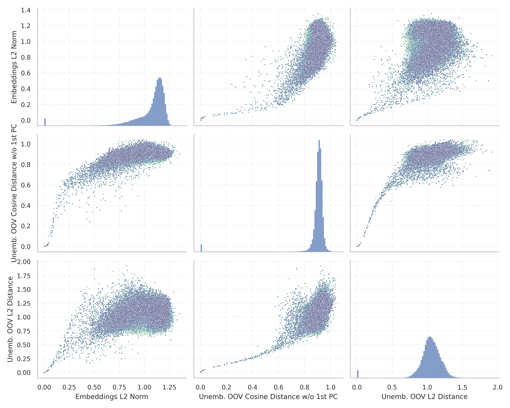
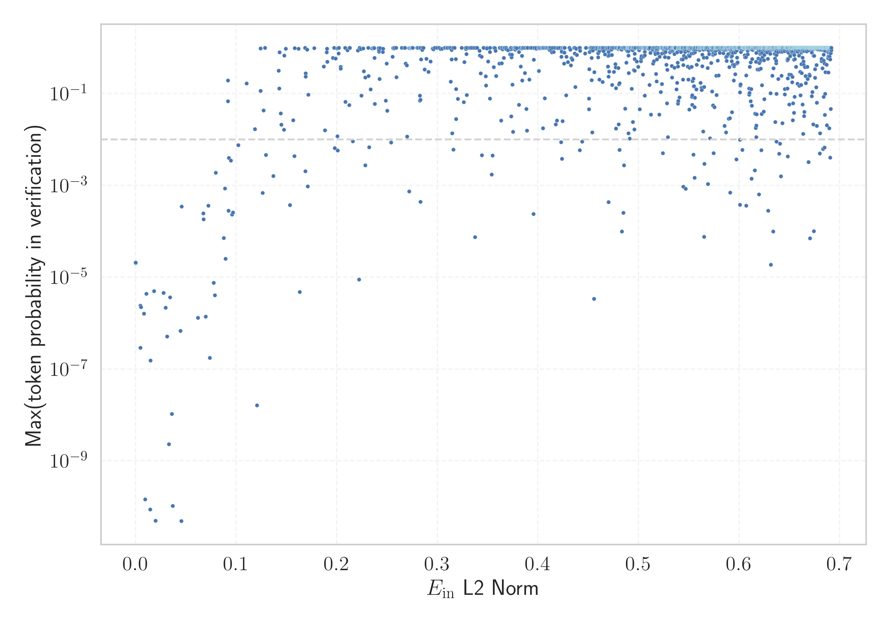

# Report for `stabilityai/stablelm-2-12b`

## Model info

* Tied embeddings: no
* Unembeddings use bias: no
* Metric for under-trained tokens: Embeddings L2 Norm
  * Overall distribution 1.065 +/- 0.179
  * Token used for verification prompt building: `ABCDEFGHIJKLMNOPQRSTUVWXYZ`
  * Verification threshold: 0.692
  * Threshold for showing candidate under-trained tokens: 0.096
  * Median verified threshold (for bytes, unreachable and special tokens): 0.228
* Embeddings shape: (100352, 5120)
* Vocabulary size: 100289
  * Number of single byte tokens: 256, of which 13 below metric threshold
  * Number of special tokens: 33, of which 29 below metric threshold
  * Number of unreachable non-single-byte tokens: 1102, of which 1102 below metric threshold
  * Number of non-single-byte UTF-fragment tokens: 645, 3 below soft metric threshold
  * Number of tested under-trained tokens: 1966, 109 below p = 0.01 threshold, 40 below soft metric threshold

## Metrics plot


## Verification plot


## Under-trained token verification results
40 entries below threshold of 0.096

|   token_id | token                             |      metric | max_prob                                                         | in_other_tokens                                                                                                                                                                              |
|------------|-----------------------------------|-------------|------------------------------------------------------------------|----------------------------------------------------------------------------------------------------------------------------------------------------------------------------------------------|
|      98100 | ````` (stypy `````                | 2.61761e-05 | <span style='border: 1px solid rgb(169, 68, 66);'>2.1e-05</span> |                                                                                                                                                                                              |
|      85069 | ````` PostalCodesNL `````         | 2.61894e-05 | <span style='border: 1px solid rgb(169, 68, 66);'>2.1e-05</span> | <span style='border: 1px solid rgb(169, 68, 66);'>````` $PostalCodesNL `````</span>                                                                                                          |
|      80369 | ````` ▁ForCanBeConverted `````    | 2.63806e-05 | <span style='border: 1px solid rgb(169, 68, 66);'>2.1e-05</span> | <span style='border: 1px solid rgb(169, 68, 66);'>````` ▁ForCanBeConvertedToForeach `````</span>, <span style='border: 1px solid rgb(169, 68, 66);'>````` ▁ForCanBeConvertedToF `````</span> |
|      89472 | ````` useRalative `````           | 2.66138e-05 | <span style='border: 1px solid rgb(169, 68, 66);'>2.1e-05</span> | <span style='border: 1px solid rgb(169, 68, 66);'>````` useRalativeImagePath `````</span>                                                                                                    |
|      79883 | ````` \tTokenNameIdentifier ````` | 2.67217e-05 | <span style='border: 1px solid rgb(169, 68, 66);'>2.1e-05</span> |                                                                                                                                                                                              |
|      80370 | ````` ▁ForCanBeConvertedToF ````` | 2.67841e-05 | <span style='border: 1px solid rgb(169, 68, 66);'>2.1e-05</span> | <span style='border: 1px solid rgb(169, 68, 66);'>````` ▁ForCanBeConvertedToForeach `````</span>                                                                                             |
|      85071 | ````` $PostalCodesNL `````        | 2.68203e-05 | <span style='border: 1px solid rgb(169, 68, 66);'>2.1e-05</span> |                                                                                                                                                                                              |
|      89475 | ````` elementGuidId `````         | 2.69237e-05 | <span style='border: 1px solid rgb(169, 68, 66);'>2.1e-05</span> |                                                                                                                                                                                              |
|      47073 | ````` webElementXpaths `````      | 0.00523197  | <span style='border: 1px solid rgb(169, 68, 66);'>2.2e-06</span> |                                                                                                                                                                                              |
|      33786 | ````` webElementProperties `````  | 0.00823011  | <span style='border: 1px solid rgb(169, 68, 66);'>1.6e-06</span> |                                                                                                                                                                                              |
|      89473 | ````` useRalativeImagePath `````  | 0.0105601   | <span style='border: 1px solid rgb(169, 68, 66);'>4.4e-06</span> |                                                                                                                                                                                              |
|      89471 | ````` useRal `````                | 0.0143661   | <span style='border: 1px solid rgb(169, 68, 66);'>8.8e-11</span> | <span style='border: 1px solid rgb(169, 68, 66);'>````` useRalative `````</span>, <span style='border: 1px solid rgb(169, 68, 66);'>````` useRalativeImagePath `````</span>                  |
|      58508 | ````` :-------------</ `````      | 0.0146235   | <span style='border: 1px solid rgb(169, 68, 66);'>1.5e-07</span> |                                                                                                                                                                                              |
|      70784 | ````` Japgolly `````              | 0.0181203   | <span style='border: 1px solid rgb(169, 68, 66);'>5e-06</span>   | <span style='border: 1px solid rgb(169, 68, 66);'>````` ▁typingsJapgolly `````</span>                                                                                                        |
|      72740 | ````` ▁typingsJapgolly `````      | 0.0298482   | <span style='border: 1px solid rgb(169, 68, 66);'>2.2e-06</span> |                                                                                                                                                                                              |
|      81259 | ````` artisanlib `````            | 0.0312198   | <span style='border: 1px solid rgb(169, 68, 66);'>5.1e-07</span> |                                                                                                                                                                                              |
|      93905 | ````` ▁QtAws `````                | 0.0328745   | <span style='border: 1px solid rgb(169, 68, 66);'>2.3e-09</span> |                                                                                                                                                                                              |
|      70316 | ````` erusform `````              | 0.0340994   | <span style='border: 1px solid rgb(169, 68, 66);'>3.6e-06</span> | <span style='border: 1px solid rgb(40, 167, 69);'>````` numerusform `````</span>                                                                                                             |
|      84576 | ````` ▁AppMethodBeat `````        | 0.0360171   | <span style='border: 1px solid rgb(169, 68, 66);'>1.1e-08</span> |                                                                                                                                                                                              |
|      73018 | ````` ▁StreamLazy `````           | 0.0366406   | <span style='border: 1px solid rgb(169, 68, 66);'>1e-10</span>   |                                                                                                                                                                                              |
<details><summary>20 additional entries below threshold</summary>

|   token_id | token                         |    metric | max_prob                                                         | in_other_tokens                                                                       |
|------------|-------------------------------|-----------|------------------------------------------------------------------|---------------------------------------------------------------------------------------|
|      96656 | ````` methodPointerType ````` | 0.044523  | <span style='border: 1px solid rgb(169, 68, 66);'>6.8e-07</span> |                                                                                       |
|      47072 | ````` webElementX `````       | 0.0452941 | <span style='border: 1px solid rgb(169, 68, 66);'>4.9e-11</span> | <span style='border: 1px solid rgb(169, 68, 66);'>````` webElementXpaths `````</span> |
|      31960 | ````` quotelev `````          | 0.0455345 | <span style='border: 1px solid rgb(169, 68, 66);'>0.00035</span> |                                                                                       |
|      34956 | ````` ▁+#+#+#+ `````          | 0.0617789 | <span style='border: 1px solid rgb(169, 68, 66);'>1.3e-06</span> | ````` ▁+#+#+#+#+#+ `````                                                              |
|      64424 | ````` ">\r\r\n `````          | 0.0671519 | <span style='border: 1px solid rgb(169, 68, 66);'>0.00025</span> |                                                                                       |
|      79740 | ````` ▁Hexatrigesimal `````   | 0.0674226 | <span style='border: 1px solid rgb(169, 68, 66);'>0.00018</span> |                                                                                       |
|      98668 | ````` );\r\r\r\n `````        | 0.0696277 | <span style='border: 1px solid rgb(169, 68, 66);'>1.4e-06</span> |                                                                                       |
|      68896 | ````` ;\r\r\r\n `````         | 0.0721249 | <span style='border: 1px solid rgb(169, 68, 66);'>0.00036</span> | <span style='border: 1px solid rgb(169, 68, 66);'>````` );\r\r\r\n `````</span>       |
|      71337 | ````` +lsi `````              | 0.0735584 | <span style='border: 1px solid rgb(169, 68, 66);'>1.8e-07</span> |                                                                                       |
|      45146 | ````` %timeout `````          | 0.077521  | <span style='border: 1px solid rgb(169, 68, 66);'>7.5e-06</span> |                                                                                       |
|      52362 | ````` SpecWarn `````          | 0.0785322 | <span style='border: 1px solid rgb(169, 68, 66);'>4e-06</span>   |                                                                                       |
|      73016 | ````` ▁EnumerableStream ````` | 0.0795078 | <span style='border: 1px solid rgb(255, 145, 0);'>0.0019</span>  |                                                                                       |
|      56225 | ````` .sulake `````           | 0.0873848 | <span style='border: 1px solid rgb(169, 68, 66);'>7.2e-05</span> |                                                                                       |
|      84875 | ````` ！\n\n\n\n `````        | 0.0886754 | <span style='border: 1px solid rgb(169, 68, 66);'>0.00086</span> |                                                                                       |
|      95073 | ````` -vesm `````             | 0.0892436 | <span style='border: 1px solid rgb(169, 68, 66);'>2.5e-05</span> |                                                                                       |
|      90412 | ````` selectorMethod `````    | 0.0915752 | <span style='border: 1px solid rgb(40, 167, 69);'>0.19</span>    |                                                                                       |
|      80612 | ````` MethodBeat `````        | 0.0917869 | <span style='border: 1px solid rgb(251, 189, 8);'>0.069</span>   | <span style='border: 1px solid rgb(169, 68, 66);'>````` ▁AppMethodBeat `````</span>   |
|      99944 | ````` ▁davidjl `````          | 0.0923761 | <span style='border: 1px solid rgb(169, 68, 66);'>0.00028</span> |                                                                                       |
|      57361 | ````` _REALTYPE `````         | 0.0924049 | <span style='border: 1px solid rgb(255, 145, 0);'>0.004</span>   |                                                                                       |
|      45794 | ````` >tagger `````           | 0.0946616 | <span style='border: 1px solid rgb(255, 145, 0);'>0.0035</span>  |                                                                                       |
</details>
<details><summary>1926 additional entries above threshold</summary>

|   token_id | token                                                |    metric | max_prob                                                         | in_other_tokens                                                                                                                                                                                                                                                                                                                                                                                                                                                              |
|------------|------------------------------------------------------|-----------|------------------------------------------------------------------|------------------------------------------------------------------------------------------------------------------------------------------------------------------------------------------------------------------------------------------------------------------------------------------------------------------------------------------------------------------------------------------------------------------------------------------------------------------------------|
|      88023 | ````` /ayushman `````                                | 0.0957834 | <span style='border: 1px solid rgb(169, 68, 66);'>0.00023</span> |                                                                                                                                                                                                                                                                                                                                                                                                                                                                              |
|      71390 | ````` ▁PodsDummy `````                               | 0.0966761 | <span style='border: 1px solid rgb(169, 68, 66);'>0.00026</span> |                                                                                                                                                                                                                                                                                                                                                                                                                                                                              |
|      43587 | ````` atrigesimal `````                              | 0.102101  | <span style='border: 1px solid rgb(255, 145, 0);'>0.0075</span>  | <span style='border: 1px solid rgb(169, 68, 66);'>````` ▁Hexatrigesimal `````</span>, <span style='border: 1px solid rgb(40, 167, 69);'>````` ▁hexatrigesimal `````</span>                                                                                                                                                                                                                                                                                                   |
|      88039 | ````` ♀♀♀♀ `````                                     | 0.110208  | <span style='border: 1px solid rgb(40, 167, 69);'>0.17</span>    |                                                                                                                                                                                                                                                                                                                                                                                                                                                                              |
|      80408 | ````` =BitConverter `````                            | 0.118512  | <span style='border: 1px solid rgb(251, 189, 8);'>0.017</span>   |                                                                                                                                                                                                                                                                                                                                                                                                                                                                              |
|      99072 | ````` 。www `````                                    | 0.120679  | <span style='border: 1px solid rgb(169, 68, 66);'>1.6e-08</span> |                                                                                                                                                                                                                                                                                                                                                                                                                                                                              |
|      59066 | ````` ▁hexatrigesimal `````                          | 0.124115  | <span style='border: 1px solid rgb(40, 167, 69);'>0.12</span>    |                                                                                                                                                                                                                                                                                                                                                                                                                                                                              |
|      26009 | ````` methodVisitor `````                            | 0.124232  | <span style='border: 1px solid rgb(40, 167, 69);'>0.97</span>    |                                                                                                                                                                                                                                                                                                                                                                                                                                                                              |
|      81998 | ````` ablytyped `````                                | 0.126044  | <span style='border: 1px solid rgb(169, 68, 66);'>0.00069</span> | ````` .scalablytyped `````                                                                                                                                                                                                                                                                                                                                                                                                                                                   |
|      41459 | ````` rigesimal `````                                | 0.126971  | <span style='border: 1px solid rgb(251, 189, 8);'>0.043</span>   | <span style='border: 1px solid rgb(169, 68, 66);'>````` ▁Hexatrigesimal `````</span>, <span style='border: 1px solid rgb(40, 167, 69);'>````` ▁hexatrigesimal `````</span>, <span style='border: 1px solid rgb(255, 145, 0);'>````` atrigesimal `````</span>                                                                                                                                                                                                                 |
|      24452 | ````` <lemma `````                                   | 0.128597  | <span style='border: 1px solid rgb(40, 167, 69);'>1</span>       |                                                                                                                                                                                                                                                                                                                                                                                                                                                                              |
|      57722 | ````` ▁;;= `````                                     | 0.129443  | <span style='border: 1px solid rgb(255, 145, 0);'>0.0046</span>  |                                                                                                                                                                                                                                                                                                                                                                                                                                                                              |
|      98715 | ````` .XRLabel `````                                 | 0.136854  | <span style='border: 1px solid rgb(255, 145, 0);'>0.0016</span>  |                                                                                                                                                                                                                                                                                                                                                                                                                                                                              |
|      71227 | ````` ▁FINSEQ `````                                  | 0.142103  | <span style='border: 1px solid rgb(40, 167, 69);'>0.31</span>    |                                                                                                                                                                                                                                                                                                                                                                                                                                                                              |
|      39866 | ````` .xrLabel `````                                 | 0.142666  | <span style='border: 1px solid rgb(40, 167, 69);'>0.13</span>    |                                                                                                                                                                                                                                                                                                                                                                                                                                                                              |
|      84993 | ````` rPid `````                                     | 0.142933  | <span style='border: 1px solid rgb(40, 167, 69);'>0.79</span>    |                                                                                                                                                                                                                                                                                                                                                                                                                                                                              |
|      66235 | ````` CppTypeDefinition `````                        | 0.144072  | <span style='border: 1px solid rgb(251, 189, 8);'>0.037</span>   | <span style='border: 1px solid rgb(40, 167, 69);'>````` CppTypeDefinitionSizes `````</span>                                                                                                                                                                                                                                                                                                                                                                                  |
|      71366 | ````` drFc `````                                     | 0.144619  | <span style='border: 1px solid rgb(251, 189, 8);'>0.021</span>   | <span style='border: 1px solid rgb(40, 167, 69);'>````` \tNdrFcShort `````</span>, <span style='border: 1px solid rgb(40, 167, 69);'>````` \tNdrFc `````</span>                                                                                                                                                                                                                                                                                                              |
|      96334 | ````` .bunifuFlatButton `````                        | 0.147503  | <span style='border: 1px solid rgb(251, 189, 8);'>0.016</span>   |                                                                                                                                                                                                                                                                                                                                                                                                                                                                              |
|      67705 | ````` _typeDefinition `````                          | 0.147776  | <span style='border: 1px solid rgb(40, 167, 69);'>0.68</span>    | <span style='border: 1px solid rgb(251, 189, 8);'>````` _typeDefinitionSize `````</span>                                                                                                                                                                                                                                                                                                                                                                                     |
|      25332 | ````` \r\r\r\n `````                                 | 0.149203  | <span style='border: 1px solid rgb(40, 167, 69);'>0.95</span>    | <span style='border: 1px solid rgb(169, 68, 66);'>````` ;\r\r\r\n `````</span>, <span style='border: 1px solid rgb(169, 68, 66);'>````` );\r\r\r\n `````</span>                                                                                                                                                                                                                                                                                                              |
|      18706 | ````` \ufeffnamespace `````                          | 0.153174  | <span style='border: 1px solid rgb(169, 68, 66);'>0.00038</span> |                                                                                                                                                                                                                                                                                                                                                                                                                                                                              |
|      97100 | ````` .barDockControl `````                          | 0.156518  | <span style='border: 1px solid rgb(251, 189, 8);'>0.026</span>   |                                                                                                                                                                                                                                                                                                                                                                                                                                                                              |
|      75630 | ````` 雅黑 `````                                     | 0.15763   | <span style='border: 1px solid rgb(255, 145, 0);'>0.0044</span>  | <span style='border: 1px solid rgb(255, 145, 0);'>````` 软雅黑 `````</span>, ````` 微软雅黑 `````                                                                                                                                                                                                                                                                                                                                                                            |
|      99071 | ````` -cmpr `````                                    | 0.158129  | <span style='border: 1px solid rgb(40, 167, 69);'>0.99</span>    |                                                                                                                                                                                                                                                                                                                                                                                                                                                                              |
|      69679 | ````` /settingsdialog `````                          | 0.161801  | <span style='border: 1px solid rgb(40, 167, 69);'>0.96</span>    |                                                                                                                                                                                                                                                                                                                                                                                                                                                                              |
|      57261 | ````` ▁;;^ `````                                     | 0.163052  | <span style='border: 1px solid rgb(169, 68, 66);'>4.8e-06</span> |                                                                                                                                                                                                                                                                                                                                                                                                                                                                              |
|      47817 | ````` :semicolon `````                               | 0.168296  | <span style='border: 1px solid rgb(40, 167, 69);'>1</span>       |                                                                                                                                                                                                                                                                                                                                                                                                                                                                              |
|      94141 | ````` .XRTableCell `````                             | 0.168687  | <span style='border: 1px solid rgb(255, 145, 0);'>0.002</span>   |                                                                                                                                                                                                                                                                                                                                                                                                                                                                              |
|      76613 | ````` extracomment `````                             | 0.168815  | <span style='border: 1px solid rgb(40, 167, 69);'>0.28</span>    |                                                                                                                                                                                                                                                                                                                                                                                                                                                                              |
|      48134 | ````` .xrTableCell `````                             | 0.169081  | <span style='border: 1px solid rgb(40, 167, 69);'>0.24</span>    |                                                                                                                                                                                                                                                                                                                                                                                                                                                                              |
|      14686 | ````` spNet `````                                    | 0.170483  | <span style='border: 1px solid rgb(40, 167, 69);'>0.91</span>    | ````` .AspNetCore `````, ````` .AspNet `````, <span style='border: 1px solid rgb(40, 167, 69);'>````` _AspNet `````</span>, ````` AspNet `````                                                                                                                                                                                                                                                                                                                               |
|      80371 | ````` ▁ForCanBeConvertedToForeach `````              | 0.170981  | <span style='border: 1px solid rgb(169, 68, 66);'>0.00096</span> |                                                                                                                                                                                                                                                                                                                                                                                                                                                                              |
|      59590 | ````` IntoConstraints `````                          | 0.171669  | <span style='border: 1px solid rgb(251, 189, 8);'>0.095</span>   | <span style='border: 1px solid rgb(255, 145, 0);'>````` AutoresizingMaskIntoConstraints `````</span>, ````` .translatesAutoresizingMaskIntoConstraints `````, <span style='border: 1px solid rgb(255, 145, 0);'>````` latesAutoresizingMaskIntoConstraints `````</span>                                                                                                                                                                                                      |
|      40729 | ````` \tTokenName `````                              | 0.177589  | <span style='border: 1px solid rgb(40, 167, 69);'>0.99</span>    | <span style='border: 1px solid rgb(169, 68, 66);'>````` \tTokenNameIdentifier `````</span>                                                                                                                                                                                                                                                                                                                                                                                   |
|       4117 | ````` \ufeffusing `````                              | 0.186905  | <span style='border: 1px solid rgb(40, 167, 69);'>0.39</span>    |                                                                                                                                                                                                                                                                                                                                                                                                                                                                              |
|      31836 | ````` >\r\r\n `````                                  | 0.188244  | <span style='border: 1px solid rgb(251, 189, 8);'>0.016</span>   | <span style='border: 1px solid rgb(169, 68, 66);'>````` ">\r\r\n `````</span>                                                                                                                                                                                                                                                                                                                                                                                                |
|      83949 | ````` .panelControl `````                            | 0.18977   | <span style='border: 1px solid rgb(40, 167, 69);'>0.8</span>     |                                                                                                                                                                                                                                                                                                                                                                                                                                                                              |
|      50174 | ````` PlainOldData `````                             | 0.190201  | <span style='border: 1px solid rgb(40, 167, 69);'>0.95</span>    | ````` ▁IsPlainOldData `````                                                                                                                                                                                                                                                                                                                                                                                                                                                  |
|      96165 | ````` ▁HinderedRotor `````                           | 0.190436  | <span style='border: 1px solid rgb(40, 167, 69);'>0.49</span>    |                                                                                                                                                                                                                                                                                                                                                                                                                                                                              |
|      71927 | ````` ▁guiActive `````                               | 0.196095  | <span style='border: 1px solid rgb(40, 167, 69);'>0.6</span>     |                                                                                                                                                                                                                                                                                                                                                                                                                                                                              |
|      97913 | ````` .simpleButton `````                            | 0.197358  | <span style='border: 1px solid rgb(40, 167, 69);'>0.99</span>    |                                                                                                                                                                                                                                                                                                                                                                                                                                                                              |
|      61013 | ````` .StylePriority `````                           | 0.197912  | <span style='border: 1px solid rgb(255, 145, 0);'>0.0065</span>  |                                                                                                                                                                                                                                                                                                                                                                                                                                                                              |
|      98797 | ````` APolynomial `````                              | 0.198739  | <span style='border: 1px solid rgb(40, 167, 69);'>0.59</span>    |                                                                                                                                                                                                                                                                                                                                                                                                                                                                              |
|      76843 | ````` ！！\n\n `````                                 | 0.200223  | <span style='border: 1px solid rgb(40, 167, 69);'>0.97</span>    |                                                                                                                                                                                                                                                                                                                                                                                                                                                                              |
|      81325 | ````` .bindingNavigatorMove `````                    | 0.20048   | <span style='border: 1px solid rgb(251, 189, 8);'>0.012</span>   |                                                                                                                                                                                                                                                                                                                                                                                                                                                                              |
|      83315 | ````` richTextPanel `````                            | 0.200772  | <span style='border: 1px solid rgb(255, 145, 0);'>0.0058</span>  |                                                                                                                                                                                                                                                                                                                                                                                                                                                                              |
|      77961 | ````` _Pods `````                                    | 0.201068  | <span style='border: 1px solid rgb(40, 167, 69);'>0.99</span>    |                                                                                                                                                                                                                                                                                                                                                                                                                                                                              |
|      85154 | ````` buttonShape `````                              | 0.201796  | <span style='border: 1px solid rgb(40, 167, 69);'>0.76</span>    |                                                                                                                                                                                                                                                                                                                                                                                                                                                                              |
|      91954 | ````` ▁GETGLOBAL `````                               | 0.201891  | <span style='border: 1px solid rgb(40, 167, 69);'>0.99</span>    |                                                                                                                                                                                                                                                                                                                                                                                                                                                                              |
|      59839 | ````` ConstraintMaker `````                          | 0.203643  | <span style='border: 1px solid rgb(40, 167, 69);'>0.39</span>    | <span style='border: 1px solid rgb(40, 167, 69);'>````` MASConstraintMaker `````</span>                                                                                                                                                                                                                                                                                                                                                                                      |
|      72745 | ````` ▁XBOOLE `````                                  | 0.203644  | <span style='border: 1px solid rgb(40, 167, 69);'>0.35</span>    |                                                                                                                                                                                                                                                                                                                                                                                                                                                                              |
|      84915 | ````` sPid `````                                     | 0.208296  | <span style='border: 1px solid rgb(40, 167, 69);'>0.99</span>    |                                                                                                                                                                                                                                                                                                                                                                                                                                                                              |
|      43053 | ````` .layoutControlItem `````                       | 0.208441  | <span style='border: 1px solid rgb(251, 189, 8);'>0.066</span>   |                                                                                                                                                                                                                                                                                                                                                                                                                                                                              |
|      87941 | ````` $fdata `````                                   | 0.210423  | <span style='border: 1px solid rgb(40, 167, 69);'>0.89</span>    |                                                                                                                                                                                                                                                                                                                                                                                                                                                                              |
|      86062 | ````` GameObjectWithTag `````                        | 0.212252  | <span style='border: 1px solid rgb(251, 189, 8);'>0.056</span>   | <span style='border: 1px solid rgb(40, 167, 69);'>````` .FindGameObjectWithTag `````</span>                                                                                                                                                                                                                                                                                                                                                                                  |
|      89854 | ````` {lng `````                                     | 0.212426  | <span style='border: 1px solid rgb(40, 167, 69);'>1</span>       |                                                                                                                                                                                                                                                                                                                                                                                                                                                                              |
|      79693 | ````` _:* `````                                      | 0.21299   | <span style='border: 1px solid rgb(40, 167, 69);'>1</span>       |                                                                                                                                                                                                                                                                                                                                                                                                                                                                              |
|      50325 | ````` adaptiveStyles `````                           | 0.215794  | <span style='border: 1px solid rgb(255, 145, 0);'>0.0091</span>  |                                                                                                                                                                                                                                                                                                                                                                                                                                                                              |
|      50611 | ````` VMLINUX `````                                  | 0.220849  | <span style='border: 1px solid rgb(40, 167, 69);'>0.87</span>    |                                                                                                                                                                                                                                                                                                                                                                                                                                                                              |
|      29138 | ````` ▁)\n\n\n\n\n\n\n\n `````                       | 0.221965  | <span style='border: 1px solid rgb(169, 68, 66);'>9e-06</span>   |                                                                                                                                                                                                                                                                                                                                                                                                                                                                              |
|      57769 | ````` LIBINT `````                                   | 0.222631  | <span style='border: 1px solid rgb(40, 167, 69);'>0.99</span>    |                                                                                                                                                                                                                                                                                                                                                                                                                                                                              |
|      80750 | ````` .groupControl `````                            | 0.223816  | <span style='border: 1px solid rgb(40, 167, 69);'>0.94</span>    |                                                                                                                                                                                                                                                                                                                                                                                                                                                                              |
|      79260 | ````` clarsimp `````                                 | 0.224275  | <span style='border: 1px solid rgb(251, 189, 8);'>0.091</span>   |                                                                                                                                                                                                                                                                                                                                                                                                                                                                              |
|      16640 | ````` #+#+ `````                                     | 0.226051  | <span style='border: 1px solid rgb(40, 167, 69);'>0.96</span>    | ````` ▁+#+#+#+#+#+ `````, <span style='border: 1px solid rgb(169, 68, 66);'>````` ▁+#+#+#+ `````</span>                                                                                                                                                                                                                                                                                                                                                                      |
|      84043 | ````` .LayoutControlItem `````                       | 0.226691  | <span style='border: 1px solid rgb(40, 167, 69);'>0.31</span>    |                                                                                                                                                                                                                                                                                                                                                                                                                                                                              |
|      47219 | ````` HeadersHeightSizeMode `````                    | 0.228112  | <span style='border: 1px solid rgb(255, 145, 0);'>0.0028</span>  | <span style='border: 1px solid rgb(255, 145, 0);'>````` .DataGridViewColumnHeadersHeightSizeMode `````</span>, <span style='border: 1px solid rgb(40, 167, 69);'>````` .ColumnHeadersHeightSizeMode `````</span>                                                                                                                                                                                                                                                             |
|      71819 | ````` numerusform `````                              | 0.22815   | <span style='border: 1px solid rgb(40, 167, 69);'>0.23</span>    |                                                                                                                                                                                                                                                                                                                                                                                                                                                                              |
|      84879 | ````` mPid `````                                     | 0.231275  | <span style='border: 1px solid rgb(40, 167, 69);'>1</span>       |                                                                                                                                                                                                                                                                                                                                                                                                                                                                              |
|      46705 | ````` .bindingNavigator `````                        | 0.23159   | <span style='border: 1px solid rgb(40, 167, 69);'>0.24</span>    | <span style='border: 1px solid rgb(251, 189, 8);'>````` .bindingNavigatorMove `````</span>                                                                                                                                                                                                                                                                                                                                                                                   |
|      96348 | ````` ',\r\r\n `````                                 | 0.232128  | <span style='border: 1px solid rgb(255, 145, 0);'>0.0068</span>  |                                                                                                                                                                                                                                                                                                                                                                                                                                                                              |
|      25061 | ````` :UIControl `````                               | 0.23344   | <span style='border: 1px solid rgb(40, 167, 69);'>0.12</span>    | <span style='border: 1px solid rgb(169, 68, 66);'>````` :UIControlEventTouchUpInside `````</span>, <span style='border: 1px solid rgb(251, 189, 8);'>````` :UIControlEvent `````</span>, <span style='border: 1px solid rgb(251, 189, 8);'>````` :UIControlState `````</span>, <span style='border: 1px solid rgb(255, 145, 0);'>````` :UIControlStateNormal `````</span>                                                                                                    |
|     100065 | ````` ～\n\n `````                                   | 0.234934  | <span style='border: 1px solid rgb(40, 167, 69);'>0.97</span>    |                                                                                                                                                                                                                                                                                                                                                                                                                                                                              |
|      90020 | ````` rparr `````                                    | 0.236052  | <span style='border: 1px solid rgb(40, 167, 69);'>1</span>       |                                                                                                                                                                                                                                                                                                                                                                                                                                                                              |
|      51345 | ````` )paren `````                                   | 0.236541  | <span style='border: 1px solid rgb(40, 167, 69);'>0.99</span>    |                                                                                                                                                                                                                                                                                                                                                                                                                                                                              |
|      62322 | ````` >xpath `````                                   | 0.237023  | <span style='border: 1px solid rgb(40, 167, 69);'>1</span>       |                                                                                                                                                                                                                                                                                                                                                                                                                                                                              |
|      90737 | ````` HomeAs `````                                   | 0.237057  | <span style='border: 1px solid rgb(40, 167, 69);'>0.99</span>    | ````` HomeAsUpEnabled `````, <span style='border: 1px solid rgb(40, 167, 69);'>````` HomeAsUp `````</span>                                                                                                                                                                                                                                                                                                                                                                   |
|      43382 | ````` .labelControl `````                            | 0.237247  | <span style='border: 1px solid rgb(40, 167, 69);'>0.6</span>     |                                                                                                                                                                                                                                                                                                                                                                                                                                                                              |
|      69790 | ````` .metroLabel `````                              | 0.237698  | <span style='border: 1px solid rgb(251, 189, 8);'>0.06</span>    |                                                                                                                                                                                                                                                                                                                                                                                                                                                                              |
|      23957 | ````` ▁[-]: `````                                    | 0.241438  | <span style='border: 1px solid rgb(40, 167, 69);'>0.98</span>    |                                                                                                                                                                                                                                                                                                                                                                                                                                                                              |
|      92261 | ````` .BorderSide `````                              | 0.241793  | <span style='border: 1px solid rgb(40, 167, 69);'>0.81</span>    |                                                                                                                                                                                                                                                                                                                                                                                                                                                                              |
|      62761 | ````` .layoutControl `````                           | 0.24181   | <span style='border: 1px solid rgb(40, 167, 69);'>0.89</span>    |                                                                                                                                                                                                                                                                                                                                                                                                                                                                              |
|      95525 | ````` ▁dataGridViewTextBoxColumn `````               | 0.242518  | <span style='border: 1px solid rgb(40, 167, 69);'>0.21</span>    |                                                                                                                                                                                                                                                                                                                                                                                                                                                                              |
|      76933 | ````` _gchandle `````                                | 0.243073  | <span style='border: 1px solid rgb(40, 167, 69);'>0.97</span>    |                                                                                                                                                                                                                                                                                                                                                                                                                                                                              |
|      96611 | ````` RGBO `````                                     | 0.245666  | <span style='border: 1px solid rgb(40, 167, 69);'>0.81</span>    | <span style='border: 1px solid rgb(40, 167, 69);'>````` .fromRGBO `````</span>                                                                                                                                                                                                                                                                                                                                                                                               |
|      91589 | ````` ImageRelation `````                            | 0.245884  | <span style='border: 1px solid rgb(40, 167, 69);'>0.96</span>    | <span style='border: 1px solid rgb(40, 167, 69);'>````` .TextImageRelation `````</span>                                                                                                                                                                                                                                                                                                                                                                                      |
|      86415 | ````` BundleOrNil `````                              | 0.248635  | <span style='border: 1px solid rgb(251, 189, 8);'>0.07</span>    | <span style='border: 1px solid rgb(255, 145, 0);'>````` ibBundleOrNil `````</span>                                                                                                                                                                                                                                                                                                                                                                                           |
|      94489 | ````` )))));\r\n `````                               | 0.249543  | <span style='border: 1px solid rgb(40, 167, 69);'>0.45</span>    |                                                                                                                                                                                                                                                                                                                                                                                                                                                                              |
|      76371 | ````` LANGADM `````                                  | 0.250006  | <span style='border: 1px solid rgb(251, 189, 8);'>0.043</span>   |                                                                                                                                                                                                                                                                                                                                                                                                                                                                              |
|      35284 | ````` .”\n\n\n\n `````                               | 0.254009  | <span style='border: 1px solid rgb(255, 145, 0);'>0.0087</span>  |                                                                                                                                                                                                                                                                                                                                                                                                                                                                              |
|      80000 | ````` 。”\n\n `````                                  | 0.255285  | <span style='border: 1px solid rgb(40, 167, 69);'>0.64</span>    |                                                                                                                                                                                                                                                                                                                                                                                                                                                                              |
|      86421 | ````` ・・・\n\n `````                               | 0.255828  | <span style='border: 1px solid rgb(40, 167, 69);'>1</span>       |                                                                                                                                                                                                                                                                                                                                                                                                                                                                              |
|      56622 | ````` _equalTo `````                                 | 0.256006  | <span style='border: 1px solid rgb(40, 167, 69);'>0.98</span>    |                                                                                                                                                                                                                                                                                                                                                                                                                                                                              |
|      24283 | ````` SequentialGroup `````                          | 0.256942  | <span style='border: 1px solid rgb(40, 167, 69);'>0.96</span>    | ````` .createSequentialGroup `````                                                                                                                                                                                                                                                                                                                                                                                                                                           |
|      91098 | ````` (Initialized `````                             | 0.257381  | <span style='border: 1px solid rgb(40, 167, 69);'>1</span>       | <span style='border: 1px solid rgb(251, 189, 8);'>````` (InitializedTypeInfo `````</span>                                                                                                                                                                                                                                                                                                                                                                                    |
|      84904 | ````` gMaps `````                                    | 0.25878   | <span style='border: 1px solid rgb(40, 167, 69);'>1</span>       |                                                                                                                                                                                                                                                                                                                                                                                                                                                                              |
|      97432 | ````` ”。\n\n `````                                  | 0.259115  | <span style='border: 1px solid rgb(40, 167, 69);'>0.23</span>    |                                                                                                                                                                                                                                                                                                                                                                                                                                                                              |
|      88606 | ````` <translation `````                             | 0.264451  | <span style='border: 1px solid rgb(40, 167, 69);'>1</span>       |                                                                                                                                                                                                                                                                                                                                                                                                                                                                              |
|      60809 | ````` .guna `````                                    | 0.266921  | <span style='border: 1px solid rgb(40, 167, 69);'>1</span>       |                                                                                                                                                                                                                                                                                                                                                                                                                                                                              |
|      79972 | ````` CanBeConverted `````                           | 0.267706  | <span style='border: 1px solid rgb(40, 167, 69);'>1</span>       | <span style='border: 1px solid rgb(169, 68, 66);'>````` ▁ForCanBeConverted `````</span>, <span style='border: 1px solid rgb(169, 68, 66);'>````` ▁ForCanBeConvertedToForeach `````</span>, <span style='border: 1px solid rgb(169, 68, 66);'>````` ▁ForCanBeConvertedToF `````</span>                                                                                                                                                                                        |
|      92783 | ````` .VisibleIndex `````                            | 0.268331  | <span style='border: 1px solid rgb(40, 167, 69);'>0.45</span>    |                                                                                                                                                                                                                                                                                                                                                                                                                                                                              |
|      76631 | ````` }\r\r\n `````                                  | 0.269612  | <span style='border: 1px solid rgb(40, 167, 69);'>0.41</span>    | <span style='border: 1px solid rgb(169, 68, 66);'>````` ▁}\r\r\n `````</span>                                                                                                                                                                                                                                                                                                                                                                                                |
|      51717 | ````` ▁prostituerte `````                            | 0.269768  | <span style='border: 1px solid rgb(251, 189, 8);'>0.012</span>   |                                                                                                                                                                                                                                                                                                                                                                                                                                                                              |
|      74570 | ````` ~":" `````                                     | 0.27175   | <span style='border: 1px solid rgb(40, 167, 69);'>0.98</span>    |                                                                                                                                                                                                                                                                                                                                                                                                                                                                              |
|      87829 | ````` ▁}\r\r\n `````                                 | 0.271852  | <span style='border: 1px solid rgb(169, 68, 66);'>0.00074</span> |                                                                                                                                                                                                                                                                                                                                                                                                                                                                              |
|      76684 | ````` SupportedContent `````                         | 0.272801  | <span style='border: 1px solid rgb(40, 167, 69);'>0.99</span>    | ````` navbarSupportedContent `````                                                                                                                                                                                                                                                                                                                                                                                                                                           |
|      85275 | ````` .UseText `````                                 | 0.27331   | <span style='border: 1px solid rgb(40, 167, 69);'>0.98</span>    |                                                                                                                                                                                                                                                                                                                                                                                                                                                                              |
|      82836 | ````` Intialized `````                               | 0.273758  | <span style='border: 1px solid rgb(40, 167, 69);'>1</span>       | <span style='border: 1px solid rgb(251, 189, 8);'>````` CppMethodIntialized `````</span>                                                                                                                                                                                                                                                                                                                                                                                     |
|      93304 | ````` VertexUvs `````                                | 0.274292  | <span style='border: 1px solid rgb(40, 167, 69);'>1</span>       | <span style='border: 1px solid rgb(40, 167, 69);'>````` .faceVertexUvs `````</span>                                                                                                                                                                                                                                                                                                                                                                                          |
|      89274 | ````` GuidId `````                                   | 0.274545  | <span style='border: 1px solid rgb(40, 167, 69);'>1</span>       | <span style='border: 1px solid rgb(169, 68, 66);'>````` elementGuidId `````</span>                                                                                                                                                                                                                                                                                                                                                                                           |
|      89987 | ````` lparr `````                                    | 0.274798  | <span style='border: 1px solid rgb(40, 167, 69);'>1</span>       |                                                                                                                                                                                                                                                                                                                                                                                                                                                                              |
|      89476 | ````` .labelX `````                                  | 0.275408  | <span style='border: 1px solid rgb(40, 167, 69);'>1</span>       |                                                                                                                                                                                                                                                                                                                                                                                                                                                                              |
|      53335 | ````` BitFields `````                                | 0.279893  | <span style='border: 1px solid rgb(40, 167, 69);'>1</span>       |                                                                                                                                                                                                                                                                                                                                                                                                                                                                              |
|      70715 | ````` DockControl `````                              | 0.280614  | <span style='border: 1px solid rgb(40, 167, 69);'>1</span>       | <span style='border: 1px solid rgb(251, 189, 8);'>````` .barDockControl `````</span>                                                                                                                                                                                                                                                                                                                                                                                         |
|      83878 | ````` .EditorButton `````                            | 0.282399  | <span style='border: 1px solid rgb(251, 189, 8);'>0.07</span>    |                                                                                                                                                                                                                                                                                                                                                                                                                                                                              |
|      69215 | ````` .XtraLayout `````                              | 0.282492  | <span style='border: 1px solid rgb(251, 189, 8);'>0.091</span>   |                                                                                                                                                                                                                                                                                                                                                                                                                                                                              |
|      66325 | ````` ♪\n\n `````                                    | 0.28257   | <span style='border: 1px solid rgb(40, 167, 69);'>1</span>       |                                                                                                                                                                                                                                                                                                                                                                                                                                                                              |
|      99118 | ````` -Cds `````                                     | 0.283003  | <span style='border: 1px solid rgb(40, 167, 69);'>1</span>       |                                                                                                                                                                                                                                                                                                                                                                                                                                                                              |
|      48077 | ````` .dataGridViewTextBoxColumn `````               | 0.28314   | <span style='border: 1px solid rgb(251, 189, 8);'>0.074</span>   |                                                                                                                                                                                                                                                                                                                                                                                                                                                                              |
|      93249 | ````` ();\r\r\n `````                                | 0.283242  | <span style='border: 1px solid rgb(169, 68, 66);'>0.00044</span> |                                                                                                                                                                                                                                                                                                                                                                                                                                                                              |
|      48640 | ````` brakk `````                                    | 0.283806  | <span style='border: 1px solid rgb(40, 167, 69);'>0.56</span>    | <span style='border: 1px solid rgb(40, 167, 69);'>````` rbrakk `````</span>, <span style='border: 1px solid rgb(251, 189, 8);'>````` lbrakk `````</span>                                                                                                                                                                                                                                                                                                                     |
|      84799 | ````` FilterWhere `````                              | 0.284794  | <span style='border: 1px solid rgb(40, 167, 69);'>1</span>       | <span style='border: 1px solid rgb(40, 167, 69);'>````` andFilterWhere `````</span>                                                                                                                                                                                                                                                                                                                                                                                          |
|      92103 | ````` NavigatorMove `````                            | 0.284874  | <span style='border: 1px solid rgb(40, 167, 69);'>0.9</span>     |                                                                                                                                                                                                                                                                                                                                                                                                                                                                              |
|      96283 | ````` ▁fChain `````                                  | 0.286101  | <span style='border: 1px solid rgb(40, 167, 69);'>1</span>       |                                                                                                                                                                                                                                                                                                                                                                                                                                                                              |
|      51005 | ````` .XtraPrinting `````                            | 0.287266  | <span style='border: 1px solid rgb(40, 167, 69);'>0.33</span>    |                                                                                                                                                                                                                                                                                                                                                                                                                                                                              |
|      99680 | ````` ▁rumpe `````                                   | 0.288999  | <span style='border: 1px solid rgb(40, 167, 69);'>0.57</span>    |                                                                                                                                                                                                                                                                                                                                                                                                                                                                              |
|      43944 | ````` orThunk `````                                  | 0.291112  | <span style='border: 1px solid rgb(40, 167, 69);'>0.3</span>     | <span style='border: 1px solid rgb(40, 167, 69);'>````` _AdjustorThunk `````</span>                                                                                                                                                                                                                                                                                                                                                                                          |
|      54278 | ````` CppGeneric `````                               | 0.293142  | <span style='border: 1px solid rgb(40, 167, 69);'>0.51</span>    | <span style='border: 1px solid rgb(40, 167, 69);'>````` CppGenericClass `````</span>                                                                                                                                                                                                                                                                                                                                                                                         |
|      69058 | ````` .UseFont `````                                 | 0.295105  | <span style='border: 1px solid rgb(40, 167, 69);'>0.95</span>    |                                                                                                                                                                                                                                                                                                                                                                                                                                                                              |
|      37742 | ````` -------------</ `````                          | 0.296062  | <span style='border: 1px solid rgb(40, 167, 69);'>0.93</span>    | <span style='border: 1px solid rgb(169, 68, 66);'>````` :-------------</ `````</span>                                                                                                                                                                                                                                                                                                                                                                                        |
|      64371 | ````` .LabelControl `````                            | 0.297122  | <span style='border: 1px solid rgb(40, 167, 69);'>0.99</span>    |                                                                                                                                                                                                                                                                                                                                                                                                                                                                              |
|      24926 | ````` matchCondition `````                           | 0.299679  | <span style='border: 1px solid rgb(40, 167, 69);'>1</span>       |                                                                                                                                                                                                                                                                                                                                                                                                                                                                              |
|      95998 | ````` *angstrom `````                                | 0.301822  | <span style='border: 1px solid rgb(40, 167, 69);'>1</span>       |                                                                                                                                                                                                                                                                                                                                                                                                                                                                              |
|      53309 | ````` arsimp `````                                   | 0.303283  | <span style='border: 1px solid rgb(40, 167, 69);'>0.94</span>    | <span style='border: 1px solid rgb(251, 189, 8);'>````` clarsimp `````</span>                                                                                                                                                                                                                                                                                                                                                                                                |
|      46241 | ````` HeadersHeight `````                            | 0.304643  | <span style='border: 1px solid rgb(40, 167, 69);'>0.95</span>    | <span style='border: 1px solid rgb(255, 145, 0);'>````` .DataGridViewColumnHeadersHeightSizeMode `````</span>, <span style='border: 1px solid rgb(255, 145, 0);'>````` HeadersHeightSizeMode `````</span>, <span style='border: 1px solid rgb(40, 167, 69);'>````` .ColumnHeadersHeightSizeMode `````</span>                                                                                                                                                                 |
|      27958 | ````` <LM `````                                      | 0.30706   | <span style='border: 1px solid rgb(40, 167, 69);'>1</span>       |                                                                                                                                                                                                                                                                                                                                                                                                                                                                              |
|      63075 | ````` 'gc `````                                      | 0.307566  | <span style='border: 1px solid rgb(40, 167, 69);'>1</span>       |                                                                                                                                                                                                                                                                                                                                                                                                                                                                              |
|      84845 | ````` PostalCodes `````                              | 0.309421  | <span style='border: 1px solid rgb(40, 167, 69);'>1</span>       | <span style='border: 1px solid rgb(169, 68, 66);'>````` $PostalCodesNL `````</span>, <span style='border: 1px solid rgb(169, 68, 66);'>````` PostalCodesNL `````</span>                                                                                                                                                                                                                                                                                                      |
|      99643 | ````` 】,【 `````                                    | 0.309852  | <span style='border: 1px solid rgb(40, 167, 69);'>0.99</span>    |                                                                                                                                                                                                                                                                                                                                                                                                                                                                              |
|      65785 | ````` URLException `````                             | 0.311662  | <span style='border: 1px solid rgb(40, 167, 69);'>1</span>       | ````` formedURLException `````                                                                                                                                                                                                                                                                                                                                                                                                                                               |
|      99874 | ````` ▁MessageLookup `````                           | 0.312901  | <span style='border: 1px solid rgb(40, 167, 69);'>0.98</span>    |                                                                                                                                                                                                                                                                                                                                                                                                                                                                              |
|      45684 | ````` ▁sourceMapping `````                           | 0.312968  | <span style='border: 1px solid rgb(40, 167, 69);'>1</span>       | ````` ▁sourceMappingURL `````                                                                                                                                                                                                                                                                                                                                                                                                                                                |
|      67672 | ````` .toolStripButton `````                         | 0.313146  | <span style='border: 1px solid rgb(40, 167, 69);'>0.18</span>    |                                                                                                                                                                                                                                                                                                                                                                                                                                                                              |
|      37176 | ````` .bunifu `````                                  | 0.314005  | <span style='border: 1px solid rgb(40, 167, 69);'>0.9</span>     | <span style='border: 1px solid rgb(251, 189, 8);'>````` .bunifuFlatButton `````</span>                                                                                                                                                                                                                                                                                                                                                                                       |
|      89541 | ````` .Guna `````                                    | 0.314205  | <span style='border: 1px solid rgb(40, 167, 69);'>0.56</span>    |                                                                                                                                                                                                                                                                                                                                                                                                                                                                              |
|      72031 | ````` ▁?>">\r\n `````                                | 0.314611  | <span style='border: 1px solid rgb(251, 189, 8);'>0.014</span>   |                                                                                                                                                                                                                                                                                                                                                                                                                                                                              |
|      73329 | ````` …\n\n\n\n `````                                | 0.315358  | <span style='border: 1px solid rgb(40, 167, 69);'>1</span>       |                                                                                                                                                                                                                                                                                                                                                                                                                                                                              |
|      70336 | ````` ▁spep `````                                    | 0.31541   | <span style='border: 1px solid rgb(40, 167, 69);'>1</span>       |                                                                                                                                                                                                                                                                                                                                                                                                                                                                              |
|      62420 | ````` );\r\r\n `````                                 | 0.315751  | <span style='border: 1px solid rgb(255, 145, 0);'>0.006</span>   | <span style='border: 1px solid rgb(169, 68, 66);'>````` ();\r\r\n `````</span>                                                                                                                                                                                                                                                                                                                                                                                               |
|      43408 | ````` .DotNetBar `````                               | 0.318263  | <span style='border: 1px solid rgb(40, 167, 69);'>0.57</span>    |                                                                                                                                                                                                                                                                                                                                                                                                                                                                              |
|      75184 | ````` rbrakk `````                                   | 0.318458  | <span style='border: 1px solid rgb(40, 167, 69);'>0.13</span>    |                                                                                                                                                                                                                                                                                                                                                                                                                                                                              |
|      75261 | ````` lbrakk `````                                   | 0.318652  | <span style='border: 1px solid rgb(251, 189, 8);'>0.028</span>   |                                                                                                                                                                                                                                                                                                                                                                                                                                                                              |
|      96913 | ````` .UltraWin `````                                | 0.320236  | <span style='border: 1px solid rgb(251, 189, 8);'>0.077</span>   |                                                                                                                                                                                                                                                                                                                                                                                                                                                                              |
|      63621 | ````` SetBranch `````                                | 0.323978  | <span style='border: 1px solid rgb(40, 167, 69);'>1</span>       | <span style='border: 1px solid rgb(40, 167, 69);'>````` SetBranchAddress `````</span>                                                                                                                                                                                                                                                                                                                                                                                        |
|      72668 | ````` '])){\r\n `````                                | 0.326145  | <span style='border: 1px solid rgb(251, 189, 8);'>0.066</span>   |                                                                                                                                                                                                                                                                                                                                                                                                                                                                              |
|      86547 | ````` ▁"""",\n `````                                 | 0.32668   | <span style='border: 1px solid rgb(40, 167, 69);'>0.49</span>    |                                                                                                                                                                                                                                                                                                                                                                                                                                                                              |
|      95610 | ````` .btnExit `````                                 | 0.328106  | <span style='border: 1px solid rgb(40, 167, 69);'>0.94</span>    |                                                                                                                                                                                                                                                                                                                                                                                                                                                                              |
|      18927 | ````` ParallelGroup `````                            | 0.328174  | <span style='border: 1px solid rgb(40, 167, 69);'>0.99</span>    | ````` .createParallelGroup `````                                                                                                                                                                                                                                                                                                                                                                                                                                             |
|      60074 | ````` MASConstraintMaker `````                       | 0.328963  | <span style='border: 1px solid rgb(40, 167, 69);'>0.72</span>    |                                                                                                                                                                                                                                                                                                                                                                                                                                                                              |
|      45222 | ````` ;\r\r\n `````                                  | 0.329242  | <span style='border: 1px solid rgb(251, 189, 8);'>0.093</span>   | <span style='border: 1px solid rgb(255, 145, 0);'>````` );\r\r\n `````</span>, <span style='border: 1px solid rgb(169, 68, 66);'>````` ();\r\r\n `````</span>                                                                                                                                                                                                                                                                                                                |
|      62181 | ````` \|`\n `````                                    | 0.329385  | <span style='border: 1px solid rgb(40, 167, 69);'>1</span>       | ````` .`\|`\n `````                                                                                                                                                                                                                                                                                                                                                                                                                                                          |
|      99503 | ````` ▁frække `````                                  | 0.331672  | <span style='border: 1px solid rgb(40, 167, 69);'>0.99</span>    |                                                                                                                                                                                                                                                                                                                                                                                                                                                                              |
|      81025 | ````` "nil `````                                     | 0.332672  | <span style='border: 1px solid rgb(40, 167, 69);'>1</span>       |                                                                                                                                                                                                                                                                                                                                                                                                                                                                              |
|      27765 | ````` >manual `````                                  | 0.334028  | <span style='border: 1px solid rgb(40, 167, 69);'>1</span>       |                                                                                                                                                                                                                                                                                                                                                                                                                                                                              |
|      25803 | ````` yalty `````                                    | 0.336087  | <span style='border: 1px solid rgb(40, 167, 69);'>1</span>       | ````` ▁royalty `````, ````` ▁loyalty `````                                                                                                                                                                                                                                                                                                                                                                                                                                   |
|      89673 | ````` ▁//{\r\n `````                                 | 0.337433  | <span style='border: 1px solid rgb(169, 68, 66);'>7.5e-05</span> |                                                                                                                                                                                                                                                                                                                                                                                                                                                                              |
|      91397 | ````` ▁[=[ `````                                     | 0.338015  | <span style='border: 1px solid rgb(40, 167, 69);'>1</span>       |                                                                                                                                                                                                                                                                                                                                                                                                                                                                              |
|      79826 | ````` ▁BCHP `````                                    | 0.339348  | <span style='border: 1px solid rgb(40, 167, 69);'>1</span>       |                                                                                                                                                                                                                                                                                                                                                                                                                                                                              |
|      50469 | ````` StoryboardSegue `````                          | 0.3419    | <span style='border: 1px solid rgb(40, 167, 69);'>0.86</span>    | <span style='border: 1px solid rgb(40, 167, 69);'>````` UIStoryboardSegue `````</span>, ````` ▁UIStoryboardSegue `````                                                                                                                                                                                                                                                                                                                                                       |
|      73433 | ````` \'";\r\n `````                                 | 0.342085  | <span style='border: 1px solid rgb(40, 167, 69);'>0.68</span>    |                                                                                                                                                                                                                                                                                                                                                                                                                                                                              |
|      10302 | ````` oolStrip `````                                 | 0.342932  | <span style='border: 1px solid rgb(40, 167, 69);'>0.28</span>    | <span style='border: 1px solid rgb(40, 167, 69);'>````` ToolStrip `````</span>, ````` ToolStripMenuItem `````, <span style='border: 1px solid rgb(40, 167, 69);'>````` .ToolStripMenuItem `````</span>, ````` .ToolStripItem `````, <span style='border: 1px solid rgb(40, 167, 69);'>````` .ToolStrip `````</span>, ...                                                                                                                                                     |
|      64237 | ````` _makeConstraints `````                         | 0.343908  | <span style='border: 1px solid rgb(40, 167, 69);'>0.64</span>    |                                                                                                                                                                                                                                                                                                                                                                                                                                                                              |
|      81885 | ````` ketøy `````                                    | 0.34407   | <span style='border: 1px solid rgb(255, 145, 0);'>0.0045</span>  |                                                                                                                                                                                                                                                                                                                                                                                                                                                                              |
|      75479 | ````` $LANG `````                                    | 0.345537  | <span style='border: 1px solid rgb(40, 167, 69);'>1</span>       |                                                                                                                                                                                                                                                                                                                                                                                                                                                                              |
|      78105 | ````` .dateTimePicker `````                          | 0.346025  | <span style='border: 1px solid rgb(40, 167, 69);'>1</span>       |                                                                                                                                                                                                                                                                                                                                                                                                                                                                              |
|      92482 | ````` .AddInParameter `````                          | 0.348016  | <span style='border: 1px solid rgb(40, 167, 69);'>0.24</span>    |                                                                                                                                                                                                                                                                                                                                                                                                                                                                              |
|      94226 | ````` /contentassist `````                           | 0.348161  | <span style='border: 1px solid rgb(40, 167, 69);'>0.15</span>    |                                                                                                                                                                                                                                                                                                                                                                                                                                                                              |
|      68080 | ````` UsageId `````                                  | 0.349121  | <span style='border: 1px solid rgb(40, 167, 69);'>1</span>       | ````` _MetadataUsageId `````                                                                                                                                                                                                                                                                                                                                                                                                                                                 |
|      49094 | ````` ----------</ `````                             | 0.349148  | <span style='border: 1px solid rgb(40, 167, 69);'>0.97</span>    | <span style='border: 1px solid rgb(169, 68, 66);'>````` :-------------</ `````</span>                                                                                                                                                                                                                                                                                                                                                                                        |
|      92913 | ````` .TextImageRelation `````                       | 0.350458  | <span style='border: 1px solid rgb(40, 167, 69);'>0.5</span>     |                                                                                                                                                                                                                                                                                                                                                                                                                                                                              |
|      86861 | ````` @testable `````                                | 0.352011  | <span style='border: 1px solid rgb(40, 167, 69);'>0.81</span>    |                                                                                                                                                                                                                                                                                                                                                                                                                                                                              |
|      83203 | ````` .SetKeyName `````                              | 0.352037  | <span style='border: 1px solid rgb(251, 189, 8);'>0.078</span>   |                                                                                                                                                                                                                                                                                                                                                                                                                                                                              |
|      54689 | ````` 。。\n\n `````                                 | 0.352282  | <span style='border: 1px solid rgb(40, 167, 69);'>1</span>       |                                                                                                                                                                                                                                                                                                                                                                                                                                                                              |
|      26815 | ````` ")]\r\n `````                                  | 0.353878  | <span style='border: 1px solid rgb(255, 145, 0);'>0.0017</span>  |                                                                                                                                                                                                                                                                                                                                                                                                                                                                              |
|      91198 | ````` externalActionCode `````                       | 0.354714  | <span style='border: 1px solid rgb(255, 145, 0);'>0.0045</span>  |                                                                                                                                                                                                                                                                                                                                                                                                                                                                              |
|      61458 | ````` NICALL `````                                   | 0.355849  | <span style='border: 1px solid rgb(40, 167, 69);'>0.38</span>    | ````` ▁JNICALL `````                                                                                                                                                                                                                                                                                                                                                                                                                                                         |
|      80562 | ````` ▁XCTAssertTrue `````                           | 0.356058  | <span style='border: 1px solid rgb(40, 167, 69);'>0.99</span>    |                                                                                                                                                                                                                                                                                                                                                                                                                                                                              |
|      40785 | ````` ♀♀ `````                                       | 0.356439  | <span style='border: 1px solid rgb(40, 167, 69);'>1</span>       | <span style='border: 1px solid rgb(40, 167, 69);'>````` ♀♀♀♀ `````</span>                                                                                                                                                                                                                                                                                                                                                                                                    |
|      42325 | ````` ▁DevComponents `````                           | 0.35665   | <span style='border: 1px solid rgb(40, 167, 69);'>1</span>       |                                                                                                                                                                                                                                                                                                                                                                                                                                                                              |
|      88136 | ````` ...\n\n\n\n\n\n `````                          | 0.357206  | <span style='border: 1px solid rgb(40, 167, 69);'>0.99</span>    |                                                                                                                                                                                                                                                                                                                                                                                                                                                                              |
|      70897 | ````` ださい `````                                   | 0.357705  | <span style='border: 1px solid rgb(40, 167, 69);'>0.86</span>    | ````` ください `````                                                                                                                                                                                                                                                                                                                                                                                                                                                         |
|      37616 | ````` .XtraReports `````                             | 0.358293  | <span style='border: 1px solid rgb(40, 167, 69);'>0.24</span>    |                                                                                                                                                                                                                                                                                                                                                                                                                                                                              |
|      93479 | ````` ?"\n\n\n\n `````                               | 0.36148   | <span style='border: 1px solid rgb(40, 167, 69);'>0.45</span>    |                                                                                                                                                                                                                                                                                                                                                                                                                                                                              |
|      69961 | ````` CHKERRQ `````                                  | 0.361824  | <span style='border: 1px solid rgb(40, 167, 69);'>1</span>       |                                                                                                                                                                                                                                                                                                                                                                                                                                                                              |
|      82496 | ````` \uB `````                                      | 0.363365  | <span style='border: 1px solid rgb(40, 167, 69);'>0.99</span>    |                                                                                                                                                                                                                                                                                                                                                                                                                                                                              |
|      92078 | ````` ▁jylland `````                                 | 0.363415  | <span style='border: 1px solid rgb(251, 189, 8);'>0.026</span>   |                                                                                                                                                                                                                                                                                                                                                                                                                                                                              |
|      51574 | ````` ▁{\r\r\n `````                                 | 0.363915  | <span style='border: 1px solid rgb(40, 167, 69);'>0.46</span>    |                                                                                                                                                                                                                                                                                                                                                                                                                                                                              |
|      98358 | ````` HeaderCode `````                               | 0.364118  | <span style='border: 1px solid rgb(40, 167, 69);'>1</span>       | <span style='border: 1px solid rgb(169, 68, 66);'>````` SmartyHeaderCode `````</span>                                                                                                                                                                                                                                                                                                                                                                                        |
|      55059 | ````` ▁eapply `````                                  | 0.364133  | <span style='border: 1px solid rgb(40, 167, 69);'>1</span>       |                                                                                                                                                                                                                                                                                                                                                                                                                                                                              |
|      84459 | ````` :";\r\n `````                                  | 0.364753  | <span style='border: 1px solid rgb(40, 167, 69);'>0.92</span>    |                                                                                                                                                                                                                                                                                                                                                                                                                                                                              |
|      96240 | ````` }");\r\n `````                                 | 0.366054  | <span style='border: 1px solid rgb(40, 167, 69);'>0.6</span>     |                                                                                                                                                                                                                                                                                                                                                                                                                                                                              |
|      43823 | ````` ▁prostituerade `````                           | 0.366276  | <span style='border: 1px solid rgb(40, 167, 69);'>0.98</span>    |                                                                                                                                                                                                                                                                                                                                                                                                                                                                              |
|      90444 | ````` .SimpleButton `````                            | 0.366467  | <span style='border: 1px solid rgb(40, 167, 69);'>0.99</span>    |                                                                                                                                                                                                                                                                                                                                                                                                                                                                              |
|      83361 | ````` printStats `````                               | 0.366932  | <span style='border: 1px solid rgb(40, 167, 69);'>1</span>       |                                                                                                                                                                                                                                                                                                                                                                                                                                                                              |
|      77989 | ````` ▁\<^ `````                                     | 0.368372  | <span style='border: 1px solid rgb(40, 167, 69);'>0.99</span>    |                                                                                                                                                                                                                                                                                                                                                                                                                                                                              |
|      34791 | ````` PreferredGap `````                             | 0.368665  | <span style='border: 1px solid rgb(40, 167, 69);'>0.92</span>    | ````` addPreferredGap `````                                                                                                                                                                                                                                                                                                                                                                                                                                                  |
|      95649 | ````` _UFunction `````                               | 0.370036  | <span style='border: 1px solid rgb(40, 167, 69);'>0.89</span>    |                                                                                                                                                                                                                                                                                                                                                                                                                                                                              |
|      98170 | ````` .StretchImage `````                            | 0.372189  | <span style='border: 1px solid rgb(40, 167, 69);'>0.72</span>    |                                                                                                                                                                                                                                                                                                                                                                                                                                                                              |
|      72692 | ````` .numericUpDown `````                           | 0.372859  | <span style='border: 1px solid rgb(40, 167, 69);'>1</span>       |                                                                                                                                                                                                                                                                                                                                                                                                                                                                              |
|      66234 | ````` SetBranchAddress `````                         | 0.37297   | <span style='border: 1px solid rgb(40, 167, 69);'>0.92</span>    |                                                                                                                                                                                                                                                                                                                                                                                                                                                                              |
|      70528 | ````` _MethodInfo `````                              | 0.373004  | <span style='border: 1px solid rgb(40, 167, 69);'>1</span>       |                                                                                                                                                                                                                                                                                                                                                                                                                                                                              |
|      55716 | ````` ▁?>\r\n\r\n `````                              | 0.373233  | <span style='border: 1px solid rgb(251, 189, 8);'>0.032</span>   |                                                                                                                                                                                                                                                                                                                                                                                                                                                                              |
|      73228 | ````` _InternalArray `````                           | 0.373808  | <span style='border: 1px solid rgb(40, 167, 69);'>0.61</span>    |                                                                                                                                                                                                                                                                                                                                                                                                                                                                              |
|      71664 | ````` \tNdrFc `````                                  | 0.374043  | <span style='border: 1px solid rgb(40, 167, 69);'>0.71</span>    | <span style='border: 1px solid rgb(40, 167, 69);'>````` \tNdrFcShort `````</span>                                                                                                                                                                                                                                                                                                                                                                                            |
|      91422 | ````` asyarak `````                                  | 0.374459  | <span style='border: 1px solid rgb(40, 167, 69);'>0.16</span>    | ````` asyarakat `````                                                                                                                                                                                                                                                                                                                                                                                                                                                        |
|      66330 | ````` 'LBL `````                                     | 0.374511  | <span style='border: 1px solid rgb(40, 167, 69);'>0.97</span>    |                                                                                                                                                                                                                                                                                                                                                                                                                                                                              |
|      82929 | ````` CppMethodIntialized `````                      | 0.375115  | <span style='border: 1px solid rgb(251, 189, 8);'>0.015</span>   |                                                                                                                                                                                                                                                                                                                                                                                                                                                                              |
|      42288 | ````` .gridColumn `````                              | 0.375815  | <span style='border: 1px solid rgb(40, 167, 69);'>1</span>       |                                                                                                                                                                                                                                                                                                                                                                                                                                                                              |
|      93226 | ````` ▁TBranch `````                                 | 0.37623   | <span style='border: 1px solid rgb(40, 167, 69);'>1</span>       |                                                                                                                                                                                                                                                                                                                                                                                                                                                                              |
|      45472 | ````` ▁输 `````                                      | 0.377035  | <span style='border: 1px solid rgb(40, 167, 69);'>1</span>       | ````` ▁输出 `````, ````` ▁输入 `````                                                                                                                                                                                                                                                                                                                                                                                                                                         |
|      77664 | ````` ▁_\r\n `````                                   | 0.377332  | <span style='border: 1px solid rgb(40, 167, 69);'>0.91</span>    |                                                                                                                                                                                                                                                                                                                                                                                                                                                                              |
|      83674 | ````` .linkLabel `````                               | 0.37763   | <span style='border: 1px solid rgb(40, 167, 69);'>1</span>       |                                                                                                                                                                                                                                                                                                                                                                                                                                                                              |
|      77645 | ````` GenerationStrategy `````                       | 0.377719  | <span style='border: 1px solid rgb(40, 167, 69);'>0.98</span>    | <span style='border: 1px solid rgb(40, 167, 69);'>````` ValueGenerationStrategy `````</span>                                                                                                                                                                                                                                                                                                                                                                                 |
|      25049 | ````` MemoryWarning `````                            | 0.377861  | <span style='border: 1px solid rgb(40, 167, 69);'>1</span>       | ````` .didReceiveMemoryWarning `````, <span style='border: 1px solid rgb(40, 167, 69);'>````` ReceiveMemoryWarning `````</span>, ````` )didReceiveMemoryWarning `````, ````` ▁didReceiveMemoryWarning `````                                                                                                                                                                                                                                                                  |
|      41373 | ````` NetBar `````                                   | 0.378944  | <span style='border: 1px solid rgb(40, 167, 69);'>0.99</span>    | <span style='border: 1px solid rgb(40, 167, 69);'>````` .DotNetBar `````</span>                                                                                                                                                                                                                                                                                                                                                                                              |
|      53355 | ````` igrationBuilder `````                          | 0.381026  | <span style='border: 1px solid rgb(251, 189, 8);'>0.057</span>   | <span style='border: 1px solid rgb(251, 189, 8);'>````` (MigrationBuilder `````</span>                                                                                                                                                                                                                                                                                                                                                                                       |
|      34306 | ````` ContainerGap `````                             | 0.381057  | <span style='border: 1px solid rgb(40, 167, 69);'>0.81</span>    | ````` addContainerGap `````                                                                                                                                                                                                                                                                                                                                                                                                                                                  |
|      94701 | ````` (inertia `````                                 | 0.382183  | <span style='border: 1px solid rgb(40, 167, 69);'>1</span>       |                                                                                                                                                                                                                                                                                                                                                                                                                                                                              |
|      85998 | ````` ！');\n `````                                  | 0.382715  | <span style='border: 1px solid rgb(40, 167, 69);'>0.39</span>    |                                                                                                                                                                                                                                                                                                                                                                                                                                                                              |
|      88879 | ````` ChildScrollView `````                          | 0.383742  | <span style='border: 1px solid rgb(40, 167, 69);'>0.98</span>    | ````` ▁SingleChildScrollView `````                                                                                                                                                                                                                                                                                                                                                                                                                                           |
|      86004 | ````` .toolStripMenuItem `````                       | 0.383917  | <span style='border: 1px solid rgb(40, 167, 69);'>0.97</span>    |                                                                                                                                                                                                                                                                                                                                                                                                                                                                              |
|      28630 | ````` >\<^ `````                                     | 0.384041  | <span style='border: 1px solid rgb(40, 167, 69);'>0.67</span>    |                                                                                                                                                                                                                                                                                                                                                                                                                                                                              |
|      98656 | ````` )\r\r\n `````                                  | 0.384284  | <span style='border: 1px solid rgb(40, 167, 69);'>0.19</span>    |                                                                                                                                                                                                                                                                                                                                                                                                                                                                              |
|      80672 | ````` _simps `````                                   | 0.384525  | <span style='border: 1px solid rgb(40, 167, 69);'>1</span>       |                                                                                                                                                                                                                                                                                                                                                                                                                                                                              |
|      83019 | ````` .Xr `````                                      | 0.385088  | <span style='border: 1px solid rgb(40, 167, 69);'>1</span>       |                                                                                                                                                                                                                                                                                                                                                                                                                                                                              |
|      89658 | ````` uniacid `````                                  | 0.386687  | <span style='border: 1px solid rgb(40, 167, 69);'>1</span>       |                                                                                                                                                                                                                                                                                                                                                                                                                                                                              |
|      57057 | ````` !\n\n\n\n\n\n `````                            | 0.387051  | <span style='border: 1px solid rgb(40, 167, 69);'>0.28</span>    |                                                                                                                                                                                                                                                                                                                                                                                                                                                                              |
|      83846 | ````` ▁GCBO `````                                    | 0.387925  | <span style='border: 1px solid rgb(40, 167, 69);'>0.99</span>    |                                                                                                                                                                                                                                                                                                                                                                                                                                                                              |
|      60837 | ````` .Bunifu `````                                  | 0.388452  | <span style='border: 1px solid rgb(251, 189, 8);'>0.046</span>   |                                                                                                                                                                                                                                                                                                                                                                                                                                                                              |
|      91817 | ````` (InitializedTypeInfo `````                     | 0.388873  | <span style='border: 1px solid rgb(251, 189, 8);'>0.016</span>   |                                                                                                                                                                                                                                                                                                                                                                                                                                                                              |
|      91097 | ````` EmptyEntries `````                             | 0.389177  | <span style='border: 1px solid rgb(40, 167, 69);'>1</span>       | <span style='border: 1px solid rgb(40, 167, 69);'>````` .RemoveEmptyEntries `````</span>                                                                                                                                                                                                                                                                                                                                                                                     |
|      54666 | ````` >NN `````                                      | 0.389309  | <span style='border: 1px solid rgb(40, 167, 69);'>1</span>       |                                                                                                                                                                                                                                                                                                                                                                                                                                                                              |
|      33628 | ````` .Undef `````                                   | 0.389349  | <span style='border: 1px solid rgb(40, 167, 69);'>1</span>       | ````` .UndefOr `````                                                                                                                                                                                                                                                                                                                                                                                                                                                         |
|      51373 | ````` ▁eauto `````                                   | 0.389612  | <span style='border: 1px solid rgb(40, 167, 69);'>1</span>       |                                                                                                                                                                                                                                                                                                                                                                                                                                                                              |
|      83654 | ````` UpEdit `````                                   | 0.389624  | <span style='border: 1px solid rgb(40, 167, 69);'>1</span>       |                                                                                                                                                                                                                                                                                                                                                                                                                                                                              |
|      87714 | ````` .flowLayoutPanel `````                         | 0.389644  | <span style='border: 1px solid rgb(40, 167, 69);'>0.99</span>    |                                                                                                                                                                                                                                                                                                                                                                                                                                                                              |
|      14030 | ````` VisualStyleBackColor `````                     | 0.391423  | <span style='border: 1px solid rgb(40, 167, 69);'>0.2</span>     | ````` .UseVisualStyleBackColor `````                                                                                                                                                                                                                                                                                                                                                                                                                                         |
|      74010 | ````` .debugLine `````                               | 0.392565  | <span style='border: 1px solid rgb(40, 167, 69);'>1</span>       |                                                                                                                                                                                                                                                                                                                                                                                                                                                                              |
|      96685 | ````` ]=] `````                                      | 0.393851  | <span style='border: 1px solid rgb(40, 167, 69);'>1</span>       |                                                                                                                                                                                                                                                                                                                                                                                                                                                                              |
|      87474 | ````` 無しさん `````                                 | 0.3956    | <span style='border: 1px solid rgb(169, 68, 66);'>0.00024</span> |                                                                                                                                                                                                                                                                                                                                                                                                                                                                              |
|      83556 | ````` .WinControls `````                             | 0.395895  | <span style='border: 1px solid rgb(40, 167, 69);'>0.55</span>    |                                                                                                                                                                                                                                                                                                                                                                                                                                                                              |
|      72607 | ````` DECREF `````                                   | 0.396187  | <span style='border: 1px solid rgb(40, 167, 69);'>0.99</span>    | ````` _XDECREF `````                                                                                                                                                                                                                                                                                                                                                                                                                                                         |
|      43637 | ````` .GridColumn `````                              | 0.396389  | <span style='border: 1px solid rgb(40, 167, 69);'>1</span>       |                                                                                                                                                                                                                                                                                                                                                                                                                                                                              |
|      76709 | ````` ▁InternalEnumerator `````                      | 0.398173  | <span style='border: 1px solid rgb(40, 167, 69);'>0.95</span>    |                                                                                                                                                                                                                                                                                                                                                                                                                                                                              |
|      20513 | ````` itempty `````                                  | 0.398237  | <span style='border: 1px solid rgb(40, 167, 69);'>1</span>       | ````` ,omitempty `````, <span style='border: 1px solid rgb(40, 167, 69);'>````` omitempty `````</span>                                                                                                                                                                                                                                                                                                                                                                       |
|      81569 | ````` isContained `````                              | 0.400157  | <span style='border: 1px solid rgb(40, 167, 69);'>1</span>       |                                                                                                                                                                                                                                                                                                                                                                                                                                                                              |
|      40270 | ````` wcsstore `````                                 | 0.400843  | <span style='border: 1px solid rgb(40, 167, 69);'>0.31</span>    |                                                                                                                                                                                                                                                                                                                                                                                                                                                                              |
|      93955 | ````` ..\n\n\n\n `````                               | 0.400887  | <span style='border: 1px solid rgb(40, 167, 69);'>0.98</span>    |                                                                                                                                                                                                                                                                                                                                                                                                                                                                              |
|      78263 | ````` .richTextBox `````                             | 0.401448  | <span style='border: 1px solid rgb(40, 167, 69);'>1</span>       |                                                                                                                                                                                                                                                                                                                                                                                                                                                                              |
|      96737 | ````` departureday `````                             | 0.402191  | <span style='border: 1px solid rgb(40, 167, 69);'>0.98</span>    |                                                                                                                                                                                                                                                                                                                                                                                                                                                                              |
|      50609 | ````` styleType `````                                | 0.403417  | <span style='border: 1px solid rgb(40, 167, 69);'>1</span>       |                                                                                                                                                                                                                                                                                                                                                                                                                                                                              |
|      68515 | ````` \uC `````                                      | 0.403784  | <span style='border: 1px solid rgb(40, 167, 69);'>0.98</span>    |                                                                                                                                                                                                                                                                                                                                                                                                                                                                              |
|      86537 | ````` .CustomButton `````                            | 0.403895  | <span style='border: 1px solid rgb(40, 167, 69);'>0.99</span>    |                                                                                                                                                                                                                                                                                                                                                                                                                                                                              |
|      87641 | ````` こんに `````                                   | 0.40477   | <span style='border: 1px solid rgb(40, 167, 69);'>1</span>       | ````` こんにちは `````                                                                                                                                                                                                                                                                                                                                                                                                                                                       |
|      90207 | ````` actionDate `````                               | 0.404898  | <span style='border: 1px solid rgb(40, 167, 69);'>1</span>       |                                                                                                                                                                                                                                                                                                                                                                                                                                                                              |
|      43740 | ````` .XtraBars `````                                | 0.405053  | <span style='border: 1px solid rgb(251, 189, 8);'>0.018</span>   |                                                                                                                                                                                                                                                                                                                                                                                                                                                                              |
|      97710 | ````` KANJI `````                                    | 0.405216  | <span style='border: 1px solid rgb(40, 167, 69);'>1</span>       |                                                                                                                                                                                                                                                                                                                                                                                                                                                                              |
|      52630 | ````` ','= `````                                     | 0.405375  | <span style='border: 1px solid rgb(40, 167, 69);'>1</span>       | <span style='border: 1px solid rgb(40, 167, 69);'>````` ','=',$ `````</span>, ````` ','=', `````, ````` ','=',' `````                                                                                                                                                                                                                                                                                                                                                        |
|      83517 | ````` \tDuel `````                                   | 0.406704  | <span style='border: 1px solid rgb(40, 167, 69);'>1</span>       |                                                                                                                                                                                                                                                                                                                                                                                                                                                                              |
|      24816 | ````` webElement `````                               | 0.406755  | <span style='border: 1px solid rgb(40, 167, 69);'>1</span>       | <span style='border: 1px solid rgb(169, 68, 66);'>````` webElementXpaths `````</span>, <span style='border: 1px solid rgb(169, 68, 66);'>````` webElementProperties `````</span>, <span style='border: 1px solid rgb(169, 68, 66);'>````` webElementX `````</span>                                                                                                                                                                                                           |
|      94851 | ````` .ImageTransparentColor `````                   | 0.406854  | <span style='border: 1px solid rgb(251, 189, 8);'>0.08</span>    |                                                                                                                                                                                                                                                                                                                                                                                                                                                                              |
|      77912 | ````` .EditValue `````                               | 0.407805  | <span style='border: 1px solid rgb(40, 167, 69);'>1</span>       |                                                                                                                                                                                                                                                                                                                                                                                                                                                                              |
|      75434 | ````` .MiddleRight `````                             | 0.408134  | <span style='border: 1px solid rgb(40, 167, 69);'>1</span>       |                                                                                                                                                                                                                                                                                                                                                                                                                                                                              |
|      24488 | ````` CppMethod `````                                | 0.409317  | <span style='border: 1px solid rgb(40, 167, 69);'>1</span>       | <span style='border: 1px solid rgb(40, 167, 69);'>````` CppMethodPointer `````</span>, <span style='border: 1px solid rgb(251, 189, 8);'>````` CppMethodIntialized `````</span>, ````` CppMethodInitialized `````                                                                                                                                                                                                                                                            |
|      55859 | ````` VarInsn `````                                  | 0.409686  | <span style='border: 1px solid rgb(40, 167, 69);'>1</span>       | <span style='border: 1px solid rgb(40, 167, 69);'>````` .visitVarInsn `````</span>                                                                                                                                                                                                                                                                                                                                                                                           |
|      76148 | ````` ，\n\n `````                                   | 0.410819  | <span style='border: 1px solid rgb(40, 167, 69);'>1</span>       |                                                                                                                                                                                                                                                                                                                                                                                                                                                                              |
|      64448 | ````` ?>\r\n\r\n `````                               | 0.411315  | <span style='border: 1px solid rgb(40, 167, 69);'>0.9</span>     |                                                                                                                                                                                                                                                                                                                                                                                                                                                                              |
|      92193 | ````` （笑 `````                                     | 0.411565  | <span style='border: 1px solid rgb(40, 167, 69);'>1</span>       |                                                                                                                                                                                                                                                                                                                                                                                                                                                                              |
|      79423 | ````` ▁thuisontvangst `````                          | 0.41193   | <span style='border: 1px solid rgb(40, 167, 69);'>0.99</span>    |                                                                                                                                                                                                                                                                                                                                                                                                                                                                              |
|      41492 | ````` THOOK `````                                    | 0.412159  | <span style='border: 1px solid rgb(40, 167, 69);'>1</span>       | <span style='border: 1px solid rgb(251, 189, 8);'>````` \tRTHOOK `````</span>                                                                                                                                                                                                                                                                                                                                                                                                |
|      92963 | ````` InTheDocument `````                            | 0.412793  | <span style='border: 1px solid rgb(40, 167, 69);'>0.91</span>    | <span style='border: 1px solid rgb(40, 167, 69);'>````` toBeInTheDocument `````</span>                                                                                                                                                                                                                                                                                                                                                                                       |
|      84752 | ````` CHEMY `````                                    | 0.413718  | <span style='border: 1px solid rgb(40, 167, 69);'>0.8</span>     | ````` ALCHEMY `````                                                                                                                                                                                                                                                                                                                                                                                                                                                          |
|      73530 | ````` (egt `````                                     | 0.414454  | <span style='border: 1px solid rgb(40, 167, 69);'>1</span>       |                                                                                                                                                                                                                                                                                                                                                                                                                                                                              |
|      13029 | ````` .IsNullOr `````                                | 0.415671  | <span style='border: 1px solid rgb(40, 167, 69);'>0.81</span>    | ````` .IsNullOrEmpty `````, ````` .IsNullOrWhiteSpace `````                                                                                                                                                                                                                                                                                                                                                                                                                  |
|      26535 | ````` ----</ `````                                   | 0.416629  | <span style='border: 1px solid rgb(40, 167, 69);'>1</span>       | <span style='border: 1px solid rgb(40, 167, 69);'>````` -------------</ `````</span>, <span style='border: 1px solid rgb(40, 167, 69);'>````` ----------</ `````</span>, <span style='border: 1px solid rgb(169, 68, 66);'>````` :-------------</ `````</span>                                                                                                                                                                                                               |
|      12971 | ````` upportInitialize `````                         | 0.417508  | <span style='border: 1px solid rgb(251, 189, 8);'>0.021</span>   | ````` .ISupportInitialize `````                                                                                                                                                                                                                                                                                                                                                                                                                                              |
|      54307 | ````` localObject `````                              | 0.418713  | <span style='border: 1px solid rgb(40, 167, 69);'>1</span>       | <span style='border: 1px solid rgb(40, 167, 69);'>````` )localObject `````</span>, <span style='border: 1px solid rgb(40, 167, 69);'>````` ▁localObject `````</span>                                                                                                                                                                                                                                                                                                         |
|      95812 | ````` \tRTCK `````                                   | 0.418827  | <span style='border: 1px solid rgb(251, 189, 8);'>0.026</span>   |                                                                                                                                                                                                                                                                                                                                                                                                                                                                              |
|      66030 | ````` DataGridViewTextBoxColumn `````                | 0.419859  | <span style='border: 1px solid rgb(40, 167, 69);'>1</span>       |                                                                                                                                                                                                                                                                                                                                                                                                                                                                              |
|      95791 | ````` ▁\r\r\n `````                                  | 0.420103  | <span style='border: 1px solid rgb(40, 167, 69);'>0.99</span>    |                                                                                                                                                                                                                                                                                                                                                                                                                                                                              |
|      67718 | ````` .columnHeader `````                            | 0.421744  | <span style='border: 1px solid rgb(40, 167, 69);'>1</span>       |                                                                                                                                                                                                                                                                                                                                                                                                                                                                              |
|      95656 | ````` .DataGridViewContentAlignment `````            | 0.422835  | <span style='border: 1px solid rgb(255, 145, 0);'>0.0088</span>  |                                                                                                                                                                                                                                                                                                                                                                                                                                                                              |
|      31827 | ````` {EIF `````                                     | 0.423196  | <span style='border: 1px solid rgb(40, 167, 69);'>0.64</span>    |                                                                                                                                                                                                                                                                                                                                                                                                                                                                              |
|      76271 | ````` \tNdrFcShort `````                             | 0.423546  | <span style='border: 1px solid rgb(40, 167, 69);'>0.9</span>     |                                                                                                                                                                                                                                                                                                                                                                                                                                                                              |
|      93695 | ````` .faceVertexUvs `````                           | 0.423553  | <span style='border: 1px solid rgb(40, 167, 69);'>0.82</span>    |                                                                                                                                                                                                                                                                                                                                                                                                                                                                              |
|      96037 | ````` .DataGridViewTriState `````                    | 0.423694  | <span style='border: 1px solid rgb(255, 145, 0);'>0.0038</span>  |                                                                                                                                                                                                                                                                                                                                                                                                                                                                              |
|      76692 | ````` LTRB `````                                     | 0.424216  | <span style='border: 1px solid rgb(40, 167, 69);'>1</span>       | <span style='border: 1px solid rgb(255, 145, 0);'>````` .fromLTRB `````</span>                                                                                                                                                                                                                                                                                                                                                                                               |
|      84206 | ````` InInspector `````                              | 0.424352  | <span style='border: 1px solid rgb(40, 167, 69);'>0.98</span>    | <span style='border: 1px solid rgb(40, 167, 69);'>````` HideInInspector `````</span>                                                                                                                                                                                                                                                                                                                                                                                         |
|      94394 | ````` .DataGridViewAutoSize `````                    | 0.424488  | <span style='border: 1px solid rgb(251, 189, 8);'>0.025</span>   |                                                                                                                                                                                                                                                                                                                                                                                                                                                                              |
|      82748 | ````` SpaceItem `````                                | 0.424498  | <span style='border: 1px solid rgb(40, 167, 69);'>1</span>       |                                                                                                                                                                                                                                                                                                                                                                                                                                                                              |
|      60973 | ````` :maj `````                                     | 0.425656  | <span style='border: 1px solid rgb(40, 167, 69);'>1</span>       |                                                                                                                                                                                                                                                                                                                                                                                                                                                                              |
|      57260 | ````` CppGenericClass `````                          | 0.425995  | <span style='border: 1px solid rgb(40, 167, 69);'>0.45</span>    |                                                                                                                                                                                                                                                                                                                                                                                                                                                                              |
|      91938 | ````` ;]/ `````                                      | 0.426009  | <span style='border: 1px solid rgb(40, 167, 69);'>1</span>       |                                                                                                                                                                                                                                                                                                                                                                                                                                                                              |
|      96444 | ````` %%*/ `````                                     | 0.426222  | <span style='border: 1px solid rgb(40, 167, 69);'>0.78</span>    |                                                                                                                                                                                                                                                                                                                                                                                                                                                                              |
|      29233 | ````` -wsj `````                                     | 0.426248  | <span style='border: 1px solid rgb(40, 167, 69);'>1</span>       |                                                                                                                                                                                                                                                                                                                                                                                                                                                                              |
|      55429 | ````` fillType `````                                 | 0.426419  | <span style='border: 1px solid rgb(40, 167, 69);'>1</span>       |                                                                                                                                                                                                                                                                                                                                                                                                                                                                              |
|      79142 | ````` ">\';\r\n `````                                | 0.427956  | <span style='border: 1px solid rgb(251, 189, 8);'>0.092</span>   |                                                                                                                                                                                                                                                                                                                                                                                                                                                                              |
|      55591 | ````` "]);\r\n `````                                 | 0.428317  | <span style='border: 1px solid rgb(40, 167, 69);'>0.64</span>    |                                                                                                                                                                                                                                                                                                                                                                                                                                                                              |
|      60673 | ````` ystatechange `````                             | 0.429644  | <span style='border: 1px solid rgb(40, 167, 69);'>0.49</span>    | ````` .onreadystatechange `````, ````` readystatechange `````                                                                                                                                                                                                                                                                                                                                                                                                                |
|      56259 | ````` CloseOperation `````                           | 0.431047  | <span style='border: 1px solid rgb(40, 167, 69);'>1</span>       | ````` ▁setDefaultCloseOperation `````, ````` DefaultCloseOperation `````                                                                                                                                                                                                                                                                                                                                                                                                     |
|     100121 | ````` cmpeq `````                                    | 0.43134   | <span style='border: 1px solid rgb(40, 167, 69);'>1</span>       |                                                                                                                                                                                                                                                                                                                                                                                                                                                                              |
|      70224 | ````` ▁århus `````                                   | 0.432222  | <span style='border: 1px solid rgb(40, 167, 69);'>0.91</span>    |                                                                                                                                                                                                                                                                                                                                                                                                                                                                              |
|      51486 | ````` .DataGridViewCellStyle `````                   | 0.432595  | <span style='border: 1px solid rgb(40, 167, 69);'>0.41</span>    |                                                                                                                                                                                                                                                                                                                                                                                                                                                                              |
|      86393 | ````` ▁PropelException `````                         | 0.433298  | <span style='border: 1px solid rgb(40, 167, 69);'>0.59</span>    |                                                                                                                                                                                                                                                                                                                                                                                                                                                                              |
|      79878 | ````` ▁"(\< `````                                    | 0.434265  | <span style='border: 1px solid rgb(40, 167, 69);'>0.55</span>    |                                                                                                                                                                                                                                                                                                                                                                                                                                                                              |
|      62176 | ````` ERRQ `````                                     | 0.43578   | <span style='border: 1px solid rgb(40, 167, 69);'>1</span>       | <span style='border: 1px solid rgb(40, 167, 69);'>````` CHKERRQ `````</span>                                                                                                                                                                                                                                                                                                                                                                                                 |
|      84765 | ````` ！", `````                                     | 0.436469  | <span style='border: 1px solid rgb(40, 167, 69);'>0.75</span>    |                                                                                                                                                                                                                                                                                                                                                                                                                                                                              |
|      86984 | ````` PropertyParams `````                           | 0.436926  | <span style='border: 1px solid rgb(40, 167, 69);'>1</span>       |                                                                                                                                                                                                                                                                                                                                                                                                                                                                              |
|      94652 | ````` BracketAccess `````                            | 0.437172  | <span style='border: 1px solid rgb(40, 167, 69);'>0.14</span>    | ````` ▁JSBracketAccess `````                                                                                                                                                                                                                                                                                                                                                                                                                                                 |
|      94497 | ````` !";\r\n `````                                  | 0.438103  | <span style='border: 1px solid rgb(40, 167, 69);'>0.95</span>    |                                                                                                                                                                                                                                                                                                                                                                                                                                                                              |
|      68393 | ````` ']))\r\n `````                                 | 0.438475  | <span style='border: 1px solid rgb(40, 167, 69);'>0.7</span>     |                                                                                                                                                                                                                                                                                                                                                                                                                                                                              |
|      68421 | ````` ▁Bunifu `````                                  | 0.440983  | <span style='border: 1px solid rgb(40, 167, 69);'>1</span>       |                                                                                                                                                                                                                                                                                                                                                                                                                                                                              |
|      74300 | ````` ['<{ `````                                     | 0.441493  | <span style='border: 1px solid rgb(255, 145, 0);'>0.0059</span>  |                                                                                                                                                                                                                                                                                                                                                                                                                                                                              |
|      33650 | ````` ▁XCTAssertEqual `````                          | 0.441552  | <span style='border: 1px solid rgb(40, 167, 69);'>1</span>       |                                                                                                                                                                                                                                                                                                                                                                                                                                                                              |
|      92488 | ````` ▁GUIDATA `````                                 | 0.441951  | <span style='border: 1px solid rgb(40, 167, 69);'>0.86</span>    |                                                                                                                                                                                                                                                                                                                                                                                                                                                                              |
|      75631 | ````` 软雅黑 `````                                   | 0.443781  | <span style='border: 1px solid rgb(255, 145, 0);'>0.009</span>   | ````` 微软雅黑 `````                                                                                                                                                                                                                                                                                                                                                                                                                                                         |
|      92378 | ````` ）\r\n `````                                   | 0.446785  | <span style='border: 1px solid rgb(40, 167, 69);'>0.76</span>    |                                                                                                                                                                                                                                                                                                                                                                                                                                                                              |
|      81393 | ````` UrlParser `````                                | 0.447558  | <span style='border: 1px solid rgb(40, 167, 69);'>1</span>       | ````` ▁useNewUrlParser `````, <span style='border: 1px solid rgb(40, 167, 69);'>````` NewUrlParser `````</span>                                                                                                                                                                                                                                                                                                                                                              |
|      84928 | ````` xoops `````                                    | 0.447855  | <span style='border: 1px solid rgb(40, 167, 69);'>1</span>       |                                                                                                                                                                                                                                                                                                                                                                                                                                                                              |
|      56930 | ````` \tRTLR `````                                   | 0.450649  | <span style='border: 1px solid rgb(251, 189, 8);'>0.078</span>   |                                                                                                                                                                                                                                                                                                                                                                                                                                                                              |
|      80154 | ````` \tRTLI `````                                   | 0.450695  | <span style='border: 1px solid rgb(251, 189, 8);'>0.046</span>   |                                                                                                                                                                                                                                                                                                                                                                                                                                                                              |
|      25054 | ````` ReceiveMemoryWarning `````                     | 0.450976  | <span style='border: 1px solid rgb(40, 167, 69);'>0.34</span>    | ````` .didReceiveMemoryWarning `````, ````` )didReceiveMemoryWarning `````, ````` ▁didReceiveMemoryWarning `````                                                                                                                                                                                                                                                                                                                                                             |
|      77520 | ````` _saida `````                                   | 0.451383  | <span style='border: 1px solid rgb(40, 167, 69);'>0.81</span>    |                                                                                                                                                                                                                                                                                                                                                                                                                                                                              |
|      81303 | ````` ▁hieronta `````                                | 0.451623  | <span style='border: 1px solid rgb(40, 167, 69);'>0.99</span>    |                                                                                                                                                                                                                                                                                                                                                                                                                                                                              |
|      99875 | ````` \tvo `````                                     | 0.45183   | <span style='border: 1px solid rgb(40, 167, 69);'>1</span>       |                                                                                                                                                                                                                                                                                                                                                                                                                                                                              |
|      63617 | ````` umptech `````                                  | 0.452037  | <span style='border: 1px solid rgb(40, 167, 69);'>0.99</span>    | ````` .bumptech `````                                                                                                                                                                                                                                                                                                                                                                                                                                                        |
|      38741 | ````` 。， `````                                     | 0.452765  | <span style='border: 1px solid rgb(40, 167, 69);'>1</span>       |                                                                                                                                                                                                                                                                                                                                                                                                                                                                              |
|      86645 | ````` .\n\n\n\n\n\n\n\n\n\n\n\n `````                | 0.453097  | <span style='border: 1px solid rgb(40, 167, 69);'>0.88</span>    |                                                                                                                                                                                                                                                                                                                                                                                                                                                                              |
|      81903 | ````` ););\n `````                                   | 0.453355  | <span style='border: 1px solid rgb(40, 167, 69);'>0.2</span>     |                                                                                                                                                                                                                                                                                                                                                                                                                                                                              |
|      91535 | ````` \x1b[ `````                                    | 0.453416  | <span style='border: 1px solid rgb(40, 167, 69);'>1</span>       |                                                                                                                                                                                                                                                                                                                                                                                                                                                                              |
|      97490 | ````` ]){\r\n `````                                  | 0.453428  | <span style='border: 1px solid rgb(40, 167, 69);'>0.6</span>     |                                                                                                                                                                                                                                                                                                                                                                                                                                                                              |
|      65548 | ````` .toolStripSeparator `````                      | 0.453882  | <span style='border: 1px solid rgb(251, 189, 8);'>0.014</span>   |                                                                                                                                                                                                                                                                                                                                                                                                                                                                              |
|      83088 | ````` .statusStrip `````                             | 0.454266  | <span style='border: 1px solid rgb(40, 167, 69);'>0.95</span>    |                                                                                                                                                                                                                                                                                                                                                                                                                                                                              |
|      98569 | ````` .',\r\n `````                                  | 0.454564  | <span style='border: 1px solid rgb(40, 167, 69);'>0.87</span>    |                                                                                                                                                                                                                                                                                                                                                                                                                                                                              |
|      92656 | ````` ▁lesbisk `````                                 | 0.455502  | <span style='border: 1px solid rgb(40, 167, 69);'>1</span>       |                                                                                                                                                                                                                                                                                                                                                                                                                                                                              |
|      99168 | ````` SmartyHeaderCode `````                         | 0.45568   | <span style='border: 1px solid rgb(169, 68, 66);'>3.4e-06</span> |                                                                                                                                                                                                                                                                                                                                                                                                                                                                              |
|      77593 | ````` yntaxException `````                           | 0.456084  | <span style='border: 1px solid rgb(40, 167, 69);'>0.29</span>    | ````` ISyntaxException `````                                                                                                                                                                                                                                                                                                                                                                                                                                                 |
|      79639 | ````` \tgbc `````                                    | 0.457189  | <span style='border: 1px solid rgb(40, 167, 69);'>0.99</span>    |                                                                                                                                                                                                                                                                                                                                                                                                                                                                              |
|      74566 | ````` ":@" `````                                     | 0.457676  | <span style='border: 1px solid rgb(40, 167, 69);'>0.95</span>    |                                                                                                                                                                                                                                                                                                                                                                                                                                                                              |
|      78598 | ````` richText `````                                 | 0.458399  | <span style='border: 1px solid rgb(40, 167, 69);'>1</span>       | <span style='border: 1px solid rgb(255, 145, 0);'>````` richTextPanel `````</span>, <span style='border: 1px solid rgb(40, 167, 69);'>````` ▁richTextBox `````</span>                                                                                                                                                                                                                                                                                                        |
|      76363 | ````` ▁DataGridViewCellStyle `````                   | 0.458981  | <span style='border: 1px solid rgb(40, 167, 69);'>1</span>       |                                                                                                                                                                                                                                                                                                                                                                                                                                                                              |
|      85952 | ````` ▁▁▁▁\t\r\n `````                               | 0.459844  | <span style='border: 1px solid rgb(40, 167, 69);'>0.78</span>    |                                                                                                                                                                                                                                                                                                                                                                                                                                                                              |
|      97736 | ````` \tRTCT `````                                   | 0.459878  | <span style='border: 1px solid rgb(40, 167, 69);'>0.77</span>    |                                                                                                                                                                                                                                                                                                                                                                                                                                                                              |
|      69269 | ````` (ALOAD `````                                   | 0.459907  | <span style='border: 1px solid rgb(40, 167, 69);'>0.62</span>    |                                                                                                                                                                                                                                                                                                                                                                                                                                                                              |
|      82774 | ````` .btnDelete `````                               | 0.460729  | <span style='border: 1px solid rgb(40, 167, 69);'>0.99</span>    |                                                                                                                                                                                                                                                                                                                                                                                                                                                                              |
|      99037 | ````` "};\r\n `````                                  | 0.460744  | <span style='border: 1px solid rgb(40, 167, 69);'>0.97</span>    |                                                                                                                                                                                                                                                                                                                                                                                                                                                                              |
|      36461 | ````` .XtraGrid `````                                | 0.461028  | <span style='border: 1px solid rgb(40, 167, 69);'>0.2</span>     |                                                                                                                                                                                                                                                                                                                                                                                                                                                                              |
|      62673 | ````` ImplOptions `````                              | 0.461075  | <span style='border: 1px solid rgb(40, 167, 69);'>0.84</span>    | ````` (MethodImplOptions `````                                                                                                                                                                                                                                                                                                                                                                                                                                               |
|      88997 | ````` ,LOCATION `````                                | 0.461394  | <span style='border: 1px solid rgb(40, 167, 69);'>1</span>       |                                                                                                                                                                                                                                                                                                                                                                                                                                                                              |
|      73799 | ````` InputBorder `````                              | 0.461537  | <span style='border: 1px solid rgb(40, 167, 69);'>1</span>       | ````` ▁OutlineInputBorder `````                                                                                                                                                                                                                                                                                                                                                                                                                                              |
|      93785 | ````` TransparentColor `````                         | 0.461582  | <span style='border: 1px solid rgb(40, 167, 69);'>1</span>       | <span style='border: 1px solid rgb(251, 189, 8);'>````` .ImageTransparentColor `````</span>                                                                                                                                                                                                                                                                                                                                                                                  |
|      93805 | ````` _TRNS `````                                    | 0.462253  | <span style='border: 1px solid rgb(40, 167, 69);'>1</span>       |                                                                                                                                                                                                                                                                                                                                                                                                                                                                              |
|      95442 | ````` requete `````                                  | 0.463288  | <span style='border: 1px solid rgb(40, 167, 69);'>1</span>       |                                                                                                                                                                                                                                                                                                                                                                                                                                                                              |
|      87274 | ````` .ImageAlign `````                              | 0.46341   | <span style='border: 1px solid rgb(40, 167, 69);'>0.93</span>    |                                                                                                                                                                                                                                                                                                                                                                                                                                                                              |
|      56995 | ````` \tpstmt `````                                  | 0.463445  | <span style='border: 1px solid rgb(40, 167, 69);'>0.98</span>    |                                                                                                                                                                                                                                                                                                                                                                                                                                                                              |
|      36397 | ````` \r\r\n\r\r\n `````                             | 0.463684  | <span style='border: 1px solid rgb(40, 167, 69);'>0.9</span>     |                                                                                                                                                                                                                                                                                                                                                                                                                                                                              |
|      77402 | ````` .btnClose `````                                | 0.463737  | <span style='border: 1px solid rgb(40, 167, 69);'>0.97</span>    |                                                                                                                                                                                                                                                                                                                                                                                                                                                                              |
|      77987 | ````` SplitOptions `````                             | 0.463797  | <span style='border: 1px solid rgb(40, 167, 69);'>0.99</span>    | ````` ▁StringSplitOptions `````                                                                                                                                                                                                                                                                                                                                                                                                                                              |
|      68664 | ````` ?\n\n\n\n\n\n `````                            | 0.464237  | <span style='border: 1px solid rgb(40, 167, 69);'>0.18</span>    |                                                                                                                                                                                                                                                                                                                                                                                                                                                                              |
|      63785 | ````` ▁RTWF `````                                    | 0.464872  | <span style='border: 1px solid rgb(40, 167, 69);'>1</span>       |                                                                                                                                                                                                                                                                                                                                                                                                                                                                              |
|      94540 | ````` .DisplayStyle `````                            | 0.465223  | <span style='border: 1px solid rgb(40, 167, 69);'>0.85</span>    |                                                                                                                                                                                                                                                                                                                                                                                                                                                                              |
|      52963 | ````` .DataGridViewColumn `````                      | 0.4665    | <span style='border: 1px solid rgb(40, 167, 69);'>0.72</span>    | <span style='border: 1px solid rgb(255, 145, 0);'>````` .DataGridViewColumnHeadersHeightSizeMode `````</span>                                                                                                                                                                                                                                                                                                                                                                |
|      79707 | ````` ButtonTitles `````                             | 0.466699  | <span style='border: 1px solid rgb(40, 167, 69);'>1</span>       | ````` ▁otherButtonTitles `````                                                                                                                                                                                                                                                                                                                                                                                                                                               |
|      91510 | ````` ▁",\r\n `````                                  | 0.467728  | <span style='border: 1px solid rgb(40, 167, 69);'>0.99</span>    |                                                                                                                                                                                                                                                                                                                                                                                                                                                                              |
|      94895 | ````` ：% `````                                      | 0.468062  | <span style='border: 1px solid rgb(40, 167, 69);'>0.95</span>    |                                                                                                                                                                                                                                                                                                                                                                                                                                                                              |
|      66118 | ````` _^( `````                                      | 0.468744  | <span style='border: 1px solid rgb(40, 167, 69);'>1</span>       |                                                                                                                                                                                                                                                                                                                                                                                                                                                                              |
|      99964 | ````` \tdto `````                                    | 0.469115  | <span style='border: 1px solid rgb(40, 167, 69);'>0.98</span>    |                                                                                                                                                                                                                                                                                                                                                                                                                                                                              |
|      73356 | ````` \tWebElement `````                             | 0.469591  | <span style='border: 1px solid rgb(40, 167, 69);'>0.39</span>    |                                                                                                                                                                                                                                                                                                                                                                                                                                                                              |
|      98414 | ````` \t\t\t\t\t\t\t\t\r\n `````                     | 0.469731  | <span style='border: 1px solid rgb(40, 167, 69);'>0.66</span>    |                                                                                                                                                                                                                                                                                                                                                                                                                                                                              |
|      61728 | ````` ▁"")\r\n `````                                 | 0.470055  | <span style='border: 1px solid rgb(40, 167, 69);'>0.83</span>    |                                                                                                                                                                                                                                                                                                                                                                                                                                                                              |
|      85965 | ````` ▁datingsider `````                             | 0.470096  | <span style='border: 1px solid rgb(40, 167, 69);'>0.81</span>    |                                                                                                                                                                                                                                                                                                                                                                                                                                                                              |
|      96355 | ````` []\r\n `````                                   | 0.470144  | <span style='border: 1px solid rgb(169, 68, 66);'>0.00043</span> |                                                                                                                                                                                                                                                                                                                                                                                                                                                                              |
|      57779 | ````` \tRTLU `````                                   | 0.47024   | <span style='border: 1px solid rgb(40, 167, 69);'>0.23</span>    |                                                                                                                                                                                                                                                                                                                                                                                                                                                                              |
|      58194 | ````` InternalEnumerator `````                       | 0.470309  | <span style='border: 1px solid rgb(40, 167, 69);'>1</span>       | <span style='border: 1px solid rgb(40, 167, 69);'>````` ▁InternalEnumerator `````</span>                                                                                                                                                                                                                                                                                                                                                                                     |
|      50722 | ````` (paren `````                                   | 0.470746  | <span style='border: 1px solid rgb(40, 167, 69);'>1</span>       |                                                                                                                                                                                                                                                                                                                                                                                                                                                                              |
|      81546 | ````` ："+ `````                                     | 0.470817  | <span style='border: 1px solid rgb(40, 167, 69);'>0.3</span>     |                                                                                                                                                                                                                                                                                                                                                                                                                                                                              |
|      96927 | ````` ▁AssemblyTrademark `````                       | 0.471012  | <span style='border: 1px solid rgb(40, 167, 69);'>0.68</span>    |                                                                                                                                                                                                                                                                                                                                                                                                                                                                              |
|      47174 | ````` ▁bryster `````                                 | 0.472659  | <span style='border: 1px solid rgb(40, 167, 69);'>1</span>       |                                                                                                                                                                                                                                                                                                                                                                                                                                                                              |
|      99649 | ````` .TestCheck `````                               | 0.472879  | <span style='border: 1px solid rgb(40, 167, 69);'>0.98</span>    |                                                                                                                                                                                                                                                                                                                                                                                                                                                                              |
|      83961 | ````` togroup `````                                  | 0.472974  | <span style='border: 1px solid rgb(40, 167, 69);'>1</span>       | ````` addtogroup `````                                                                                                                                                                                                                                                                                                                                                                                                                                                       |
|      56192 | ````` TouchUpInside `````                            | 0.473072  | <span style='border: 1px solid rgb(40, 167, 69);'>1</span>       | <span style='border: 1px solid rgb(169, 68, 66);'>````` :UIControlEventTouchUpInside `````</span>                                                                                                                                                                                                                                                                                                                                                                            |
|      64179 | ````` ▁生命周期 `````                                | 0.47323   | <span style='border: 1px solid rgb(40, 167, 69);'>0.91</span>    | <span style='border: 1px solid rgb(40, 167, 69);'>````` ▁生命周期函数 `````</span>                                                                                                                                                                                                                                                                                                                                                                                           |
|      59437 | ````` ")));\r\n `````                                | 0.473281  | <span style='border: 1px solid rgb(40, 167, 69);'>0.69</span>    |                                                                                                                                                                                                                                                                                                                                                                                                                                                                              |
|      68953 | ````` ▁nakne `````                                   | 0.473804  | <span style='border: 1px solid rgb(40, 167, 69);'>0.15</span>    |                                                                                                                                                                                                                                                                                                                                                                                                                                                                              |
|      14613 | ````` ▁/*<<< `````                                   | 0.474222  | <span style='border: 1px solid rgb(40, 167, 69);'>1</span>       |                                                                                                                                                                                                                                                                                                                                                                                                                                                                              |
|      47851 | ````` -lnd `````                                     | 0.47433   | <span style='border: 1px solid rgb(40, 167, 69);'>1</span>       |                                                                                                                                                                                                                                                                                                                                                                                                                                                                              |
|      97630 | ````` ]):\r\n `````                                  | 0.475298  | <span style='border: 1px solid rgb(40, 167, 69);'>0.3</span>     |                                                                                                                                                                                                                                                                                                                                                                                                                                                                              |
|      87303 | ````` OffsetTable `````                              | 0.475404  | <span style='border: 1px solid rgb(40, 167, 69);'>1</span>       | <span style='border: 1px solid rgb(40, 167, 69);'>````` _FieldOffsetTable `````</span>                                                                                                                                                                                                                                                                                                                                                                                       |
|      79108 | ````` 设计器 `````                                   | 0.476831  | <span style='border: 1px solid rgb(40, 167, 69);'>1</span>       |                                                                                                                                                                                                                                                                                                                                                                                                                                                                              |
|      82708 | ````` }")\r\n `````                                  | 0.476933  | <span style='border: 1px solid rgb(40, 167, 69);'>0.44</span>    |                                                                                                                                                                                                                                                                                                                                                                                                                                                                              |
|      90004 | ````` ▁?>:</ `````                                   | 0.477267  | <span style='border: 1px solid rgb(40, 167, 69);'>0.37</span>    |                                                                                                                                                                                                                                                                                                                                                                                                                                                                              |
|      85639 | ````` \|\r\n `````                                   | 0.477404  | <span style='border: 1px solid rgb(251, 189, 8);'>0.017</span>   |                                                                                                                                                                                                                                                                                                                                                                                                                                                                              |
|      60894 | ````` ичество `````                                  | 0.477508  | <span style='border: 1px solid rgb(40, 167, 69);'>0.13</span>    | ````` оличество `````, ````` ▁количество `````                                                                                                                                                                                                                                                                                                                                                                                                                               |
|      51519 | ````` AntiForgeryToken `````                         | 0.477752  | <span style='border: 1px solid rgb(40, 167, 69);'>1</span>       | ````` ValidateAntiForgeryToken `````                                                                                                                                                                                                                                                                                                                                                                                                                                         |
|      42881 | ````` OptionsItemSelected `````                      | 0.478137  | <span style='border: 1px solid rgb(40, 167, 69);'>0.99</span>    | ````` ▁onOptionsItemSelected `````, ````` .onOptionsItemSelected `````                                                                                                                                                                                                                                                                                                                                                                                                       |
|      80033 | ````` _Parms `````                                   | 0.479139  | <span style='border: 1px solid rgb(40, 167, 69);'>1</span>       |                                                                                                                                                                                                                                                                                                                                                                                                                                                                              |
|      90746 | ````` ▁?>><? `````                                   | 0.479855  | <span style='border: 1px solid rgb(40, 167, 69);'>0.36</span>    |                                                                                                                                                                                                                                                                                                                                                                                                                                                                              |
|      73453 | ````` \t\t\t\t\t\t\t\r\n `````                       | 0.479988  | <span style='border: 1px solid rgb(40, 167, 69);'>0.94</span>    | <span style='border: 1px solid rgb(40, 167, 69);'>````` \t\t\t\t\t\t\t\t\r\n `````</span>                                                                                                                                                                                                                                                                                                                                                                                    |
|      89531 | ````` _IList `````                                   | 0.480107  | <span style='border: 1px solid rgb(40, 167, 69);'>1</span>       |                                                                                                                                                                                                                                                                                                                                                                                                                                                                              |
|      96904 | ````` :)]) `````                                     | 0.480123  | <span style='border: 1px solid rgb(251, 189, 8);'>0.021</span>   |                                                                                                                                                                                                                                                                                                                                                                                                                                                                              |
|      79358 | ````` .habbo `````                                   | 0.480244  | <span style='border: 1px solid rgb(40, 167, 69);'>1</span>       |                                                                                                                                                                                                                                                                                                                                                                                                                                                                              |
|      52113 | ````` .ToolStripButton `````                         | 0.480382  | <span style='border: 1px solid rgb(40, 167, 69);'>0.16</span>    |                                                                                                                                                                                                                                                                                                                                                                                                                                                                              |
|      87817 | ````` AsStringAsync `````                            | 0.480456  | <span style='border: 1px solid rgb(40, 167, 69);'>1</span>       | ````` .ReadAsStringAsync `````                                                                                                                                                                                                                                                                                                                                                                                                                                               |
|      95556 | ````` (INVOKE `````                                  | 0.480477  | <span style='border: 1px solid rgb(40, 167, 69);'>1</span>       |                                                                                                                                                                                                                                                                                                                                                                                                                                                                              |
|      80246 | ````` )";\r\n `````                                  | 0.480565  | <span style='border: 1px solid rgb(40, 167, 69);'>0.96</span>    |                                                                                                                                                                                                                                                                                                                                                                                                                                                                              |
|      84371 | ````` (simp `````                                    | 0.480785  | <span style='border: 1px solid rgb(40, 167, 69);'>0.99</span>    |                                                                                                                                                                                                                                                                                                                                                                                                                                                                              |
|      27539 | ````` ▁dataGridViewCellStyle `````                   | 0.480892  | <span style='border: 1px solid rgb(40, 167, 69);'>0.98</span>    |                                                                                                                                                                                                                                                                                                                                                                                                                                                                              |
|      79364 | ````` --)\r\n `````                                  | 0.480901  | <span style='border: 1px solid rgb(40, 167, 69);'>0.17</span>    |                                                                                                                                                                                                                                                                                                                                                                                                                                                                              |
|      70912 | ````` .PictureBoxSizeMode `````                      | 0.480977  | <span style='border: 1px solid rgb(255, 145, 0);'>0.0059</span>  |                                                                                                                                                                                                                                                                                                                                                                                                                                                                              |
|      98855 | ````` ▁tableLayoutPanel `````                        | 0.481136  | <span style='border: 1px solid rgb(40, 167, 69);'>1</span>       |                                                                                                                                                                                                                                                                                                                                                                                                                                                                              |
|      79455 | ````` \t▁\r\n `````                                  | 0.482722  | <span style='border: 1px solid rgb(40, 167, 69);'>0.96</span>    |                                                                                                                                                                                                                                                                                                                                                                                                                                                                              |
|      15137 | ````` .AutoScale `````                               | 0.482755  | <span style='border: 1px solid rgb(40, 167, 69);'>0.99</span>    | ````` .AutoScaleMode `````, ````` .AutoScaleDimensions `````                                                                                                                                                                                                                                                                                                                                                                                                                 |
|      63547 | ````` _);\r\n `````                                  | 0.482984  | <span style='border: 1px solid rgb(40, 167, 69);'>0.91</span>    |                                                                                                                                                                                                                                                                                                                                                                                                                                                                              |
|      71003 | ````` '];?>\n `````                                  | 0.483483  | <span style='border: 1px solid rgb(169, 68, 66);'>0.0001</span>  |                                                                                                                                                                                                                                                                                                                                                                                                                                                                              |
|      70605 | ````` .listBox `````                                 | 0.483595  | <span style='border: 1px solid rgb(40, 167, 69);'>1</span>       |                                                                                                                                                                                                                                                                                                                                                                                                                                                                              |
|      52455 | ````` ▁MetroFramework `````                          | 0.484284  | <span style='border: 1px solid rgb(40, 167, 69);'>1</span>       |                                                                                                                                                                                                                                                                                                                                                                                                                                                                              |
|      83877 | ````` __':\r\n `````                                 | 0.484977  | <span style='border: 1px solid rgb(169, 68, 66);'>0.00025</span> |                                                                                                                                                                                                                                                                                                                                                                                                                                                                              |
|      72573 | ````` (EFFECT `````                                  | 0.485301  | <span style='border: 1px solid rgb(40, 167, 69);'>1</span>       |                                                                                                                                                                                                                                                                                                                                                                                                                                                                              |
|      95276 | ````` ▁DropIndex `````                               | 0.485449  | <span style='border: 1px solid rgb(40, 167, 69);'>1</span>       |                                                                                                                                                                                                                                                                                                                                                                                                                                                                              |
|      99202 | ````` (statearr `````                                | 0.485534  | <span style='border: 1px solid rgb(255, 145, 0);'>0.0027</span>  |                                                                                                                                                                                                                                                                                                                                                                                                                                                                              |
|      75787 | ````` 。\n\n\n\n\n\n `````                           | 0.486696  | <span style='border: 1px solid rgb(251, 189, 8);'>0.047</span>   |                                                                                                                                                                                                                                                                                                                                                                                                                                                                              |
|      73573 | ````` ▁';\r\n `````                                  | 0.486783  | <span style='border: 1px solid rgb(40, 167, 69);'>0.98</span>    |                                                                                                                                                                                                                                                                                                                                                                                                                                                                              |
|      94996 | ````` !")\r\n `````                                  | 0.486821  | <span style='border: 1px solid rgb(40, 167, 69);'>0.96</span>    |                                                                                                                                                                                                                                                                                                                                                                                                                                                                              |
|      78238 | ````` ▁setTitleColor `````                           | 0.486854  | <span style='border: 1px solid rgb(40, 167, 69);'>1</span>       |                                                                                                                                                                                                                                                                                                                                                                                                                                                                              |
|      77743 | ````` _)\r\n `````                                   | 0.487697  | <span style='border: 1px solid rgb(40, 167, 69);'>0.47</span>    |                                                                                                                                                                                                                                                                                                                                                                                                                                                                              |
|      93202 | ````` \t\t\r\n\r\n `````                             | 0.488262  | <span style='border: 1px solid rgb(40, 167, 69);'>0.93</span>    |                                                                                                                                                                                                                                                                                                                                                                                                                                                                              |
|      99543 | ````` (fullfile `````                                | 0.488304  | <span style='border: 1px solid rgb(40, 167, 69);'>1</span>       |                                                                                                                                                                                                                                                                                                                                                                                                                                                                              |
|      50210 | ````` .updateDynamic `````                           | 0.488485  | <span style='border: 1px solid rgb(40, 167, 69);'>1</span>       |                                                                                                                                                                                                                                                                                                                                                                                                                                                                              |
|      31119 | ````` ControlItem `````                              | 0.488537  | <span style='border: 1px solid rgb(40, 167, 69);'>0.99</span>    | <span style='border: 1px solid rgb(251, 189, 8);'>````` .layoutControlItem `````</span>, <span style='border: 1px solid rgb(40, 167, 69);'>````` .LayoutControlItem `````</span>                                                                                                                                                                                                                                                                                             |
|      68718 | ````` :");\r\n `````                                 | 0.488796  | <span style='border: 1px solid rgb(40, 167, 69);'>0.84</span>    |                                                                                                                                                                                                                                                                                                                                                                                                                                                                              |
|      49955 | ````` scriptId `````                                 | 0.488833  | <span style='border: 1px solid rgb(40, 167, 69);'>1</span>       |                                                                                                                                                                                                                                                                                                                                                                                                                                                                              |
|      68940 | ````` logradouro `````                               | 0.489282  | <span style='border: 1px solid rgb(40, 167, 69);'>1</span>       |                                                                                                                                                                                                                                                                                                                                                                                                                                                                              |
|      70595 | ````` ]-$ `````                                      | 0.48957   | <span style='border: 1px solid rgb(40, 167, 69);'>1</span>       |                                                                                                                                                                                                                                                                                                                                                                                                                                                                              |
|      82468 | ````` ▁uLocal `````                                  | 0.489771  | <span style='border: 1px solid rgb(40, 167, 69);'>1</span>       |                                                                                                                                                                                                                                                                                                                                                                                                                                                                              |
|      98518 | ````` .DefaultCellStyle `````                        | 0.489796  | <span style='border: 1px solid rgb(40, 167, 69);'>0.98</span>    |                                                                                                                                                                                                                                                                                                                                                                                                                                                                              |
|      47436 | ````` ：</ `````                                     | 0.489854  | <span style='border: 1px solid rgb(40, 167, 69);'>0.85</span>    |                                                                                                                                                                                                                                                                                                                                                                                                                                                                              |
|      73977 | ````` ']>;\n `````                                   | 0.489925  | <span style='border: 1px solid rgb(251, 189, 8);'>0.014</span>   |                                                                                                                                                                                                                                                                                                                                                                                                                                                                              |
|      87173 | ````` NetMessage `````                               | 0.489962  | <span style='border: 1px solid rgb(40, 167, 69);'>1</span>       |                                                                                                                                                                                                                                                                                                                                                                                                                                                                              |
|      70962 | ````` .CenterScreen `````                            | 0.490005  | <span style='border: 1px solid rgb(40, 167, 69);'>0.68</span>    |                                                                                                                                                                                                                                                                                                                                                                                                                                                                              |
|      52437 | ````` .DataPropertyName `````                        | 0.490181  | <span style='border: 1px solid rgb(40, 167, 69);'>0.98</span>    |                                                                                                                                                                                                                                                                                                                                                                                                                                                                              |
|      88685 | ````` .ComboBoxStyle `````                           | 0.49021   | <span style='border: 1px solid rgb(40, 167, 69);'>0.28</span>    |                                                                                                                                                                                                                                                                                                                                                                                                                                                                              |
|      84079 | ````` },\r\n\r\n `````                               | 0.490602  | <span style='border: 1px solid rgb(40, 167, 69);'>0.99</span>    |                                                                                                                                                                                                                                                                                                                                                                                                                                                                              |
|      84670 | ````` ...");\r\n `````                               | 0.490916  | <span style='border: 1px solid rgb(40, 167, 69);'>1</span>       |                                                                                                                                                                                                                                                                                                                                                                                                                                                                              |
|      67901 | ````` \tRTDBG `````                                  | 0.490948  | <span style='border: 1px solid rgb(251, 189, 8);'>0.011</span>   |                                                                                                                                                                                                                                                                                                                                                                                                                                                                              |
|      39801 | ````` .splitContainer `````                          | 0.491247  | <span style='border: 1px solid rgb(40, 167, 69);'>1</span>       |                                                                                                                                                                                                                                                                                                                                                                                                                                                                              |
|      12045 | ````` \<^ `````                                      | 0.491352  | <span style='border: 1px solid rgb(40, 167, 69);'>1</span>       | <span style='border: 1px solid rgb(40, 167, 69);'>````` ▁\<^ `````</span>, <span style='border: 1px solid rgb(40, 167, 69);'>````` >\<^ `````</span>                                                                                                                                                                                                                                                                                                                         |
|      99472 | ````` ▁*}\n\n `````                                  | 0.491752  | <span style='border: 1px solid rgb(40, 167, 69);'>0.99</span>    |                                                                                                                                                                                                                                                                                                                                                                                                                                                                              |
|      89659 | ````` \tholder `````                                 | 0.491803  | <span style='border: 1px solid rgb(40, 167, 69);'>1</span>       |                                                                                                                                                                                                                                                                                                                                                                                                                                                                              |
|      21392 | ````` <src `````                                     | 0.491942  | <span style='border: 1px solid rgb(40, 167, 69);'>1</span>       |                                                                                                                                                                                                                                                                                                                                                                                                                                                                              |
|      30923 | ````` ernetes `````                                  | 0.492243  | <span style='border: 1px solid rgb(40, 167, 69);'>0.95</span>    | ````` ubernetes `````, ````` /kubernetes `````, ````` ▁Kubernetes `````                                                                                                                                                                                                                                                                                                                                                                                                      |
|      69809 | ````` ▁JsonRequest `````                             | 0.492312  | <span style='border: 1px solid rgb(40, 167, 69);'>1</span>       | <span style='border: 1px solid rgb(40, 167, 69);'>````` ▁JsonRequestBehavior `````</span>                                                                                                                                                                                                                                                                                                                                                                                    |
|      35338 | ````` CppCodeGen `````                               | 0.493056  | <span style='border: 1px solid rgb(40, 167, 69);'>0.13</span>    | ````` CppCodeGenWriteBarrier `````                                                                                                                                                                                                                                                                                                                                                                                                                                           |
|      41899 | ````` ▁SimpleName `````                              | 0.493302  | <span style='border: 1px solid rgb(40, 167, 69);'>1</span>       |                                                                                                                                                                                                                                                                                                                                                                                                                                                                              |
|      88474 | ````` .dtp `````                                     | 0.493908  | <span style='border: 1px solid rgb(40, 167, 69);'>1</span>       |                                                                                                                                                                                                                                                                                                                                                                                                                                                                              |
|      73881 | ````` .BorderSize `````                              | 0.493924  | <span style='border: 1px solid rgb(40, 167, 69);'>0.96</span>    |                                                                                                                                                                                                                                                                                                                                                                                                                                                                              |
|      49765 | ````` OldData `````                                  | 0.494082  | <span style='border: 1px solid rgb(40, 167, 69);'>1</span>       | ````` ▁IsPlainOldData `````, <span style='border: 1px solid rgb(40, 167, 69);'>````` PlainOldData `````</span>                                                                                                                                                                                                                                                                                                                                                               |
|      94991 | ````` ▁AssemblyCompany `````                         | 0.494114  | <span style='border: 1px solid rgb(40, 167, 69);'>0.88</span>    |                                                                                                                                                                                                                                                                                                                                                                                                                                                                              |
|      80804 | ````` ▁示 `````                                      | 0.494315  | <span style='border: 1px solid rgb(40, 167, 69);'>1</span>       | ````` ▁示例 `````                                                                                                                                                                                                                                                                                                                                                                                                                                                            |
|      96754 | ````` [];\r\n `````                                  | 0.494341  | <span style='border: 1px solid rgb(251, 189, 8);'>0.024</span>   |                                                                                                                                                                                                                                                                                                                                                                                                                                                                              |
|     100199 | ````` ▁GNUNET `````                                  | 0.494516  | <span style='border: 1px solid rgb(40, 167, 69);'>0.99</span>    |                                                                                                                                                                                                                                                                                                                                                                                                                                                                              |
|      66753 | ````` ▁erotiske `````                                | 0.495249  | <span style='border: 1px solid rgb(40, 167, 69);'>0.33</span>    |                                                                                                                                                                                                                                                                                                                                                                                                                                                                              |
|      81344 | ````` "])\r\n `````                                  | 0.495327  | <span style='border: 1px solid rgb(40, 167, 69);'>0.98</span>    |                                                                                                                                                                                                                                                                                                                                                                                                                                                                              |
|      53559 | ````` ichTextBox `````                               | 0.495737  | <span style='border: 1px solid rgb(251, 189, 8);'>0.017</span>   | <span style='border: 1px solid rgb(40, 167, 69);'>````` .RichTextBox `````</span>, <span style='border: 1px solid rgb(40, 167, 69);'>````` .richTextBox `````</span>, <span style='border: 1px solid rgb(40, 167, 69);'>````` ▁richTextBox `````</span>                                                                                                                                                                                                                      |
|      92448 | ````` .GetOrdinal `````                              | 0.495956  | <span style='border: 1px solid rgb(40, 167, 69);'>0.74</span>    |                                                                                                                                                                                                                                                                                                                                                                                                                                                                              |
|      55508 | ````` .MiddleCenter `````                            | 0.496175  | <span style='border: 1px solid rgb(40, 167, 69);'>0.32</span>    |                                                                                                                                                                                                                                                                                                                                                                                                                                                                              |
|      10412 | ````` ictureBox `````                                | 0.496211  | <span style='border: 1px solid rgb(40, 167, 69);'>0.56</span>    | ````` ▁PictureBox `````, <span style='border: 1px solid rgb(40, 167, 69);'>````` .pictureBox `````</span>, <span style='border: 1px solid rgb(40, 167, 69);'>````` pictureBox `````</span>, <span style='border: 1px solid rgb(40, 167, 69);'>````` .PictureBox `````</span>, <span style='border: 1px solid rgb(40, 167, 69);'>````` PictureBox `````</span>, ...                                                                                                           |
|      80241 | ````` ▁.\r\n `````                                   | 0.496225  | <span style='border: 1px solid rgb(40, 167, 69);'>0.96</span>    |                                                                                                                                                                                                                                                                                                                                                                                                                                                                              |
|      20887 | ````` ▁XCTAssert `````                               | 0.496302  | <span style='border: 1px solid rgb(40, 167, 69);'>0.99</span>    | <span style='border: 1px solid rgb(40, 167, 69);'>````` ▁XCTAssertTrue `````</span>, <span style='border: 1px solid rgb(40, 167, 69);'>````` ▁XCTAssertEqual `````</span>                                                                                                                                                                                                                                                                                                    |
|      77260 | ````` ▁RTAL `````                                    | 0.496978  | <span style='border: 1px solid rgb(40, 167, 69);'>0.99</span>    |                                                                                                                                                                                                                                                                                                                                                                                                                                                                              |
|      77540 | ````` )");\r\n `````                                 | 0.498139  | <span style='border: 1px solid rgb(40, 167, 69);'>0.5</span>     |                                                                                                                                                                                                                                                                                                                                                                                                                                                                              |
|      96156 | ````` Nhap `````                                     | 0.499082  | <span style='border: 1px solid rgb(40, 167, 69);'>0.99</span>    |                                                                                                                                                                                                                                                                                                                                                                                                                                                                              |
|      62850 | ````` _jButton `````                                 | 0.499279  | <span style='border: 1px solid rgb(40, 167, 69);'>1</span>       |                                                                                                                                                                                                                                                                                                                                                                                                                                                                              |
|      59901 | ````` ▁principalColumn `````                         | 0.499617  | <span style='border: 1px solid rgb(40, 167, 69);'>0.39</span>    |                                                                                                                                                                                                                                                                                                                                                                                                                                                                              |
|      94288 | ````` """),\n `````                                  | 0.500317  | <span style='border: 1px solid rgb(40, 167, 69);'>0.99</span>    |                                                                                                                                                                                                                                                                                                                                                                                                                                                                              |
|      59751 | ````` ▁principalTable `````                          | 0.500399  | <span style='border: 1px solid rgb(40, 167, 69);'>0.89</span>    |                                                                                                                                                                                                                                                                                                                                                                                                                                                                              |
|      90384 | ````` \tLCD `````                                    | 0.500535  | <span style='border: 1px solid rgb(40, 167, 69);'>1</span>       |                                                                                                                                                                                                                                                                                                                                                                                                                                                                              |
|      62758 | ````` .gridView `````                                | 0.500576  | <span style='border: 1px solid rgb(40, 167, 69);'>0.99</span>    |                                                                                                                                                                                                                                                                                                                                                                                                                                                                              |
|      77666 | ````` okableCall `````                               | 0.5011    | <span style='border: 1px solid rgb(251, 189, 8);'>0.046</span>   |                                                                                                                                                                                                                                                                                                                                                                                                                                                                              |
|      15467 | ````` TextBoxColumn `````                            | 0.501556  | <span style='border: 1px solid rgb(40, 167, 69);'>1</span>       | <span style='border: 1px solid rgb(40, 167, 69);'>````` ▁dataGridViewTextBoxColumn `````</span>, <span style='border: 1px solid rgb(251, 189, 8);'>````` .dataGridViewTextBoxColumn `````</span>, <span style='border: 1px solid rgb(40, 167, 69);'>````` DataGridViewTextBoxColumn `````</span>, <span style='border: 1px solid rgb(251, 189, 8);'>````` .DataGridViewTextBoxColumn `````</span>                                                                            |
|      48928 | ````` KindOfClass `````                              | 0.501613  | <span style='border: 1px solid rgb(40, 167, 69);'>1</span>       | ````` ▁isKindOfClass `````                                                                                                                                                                                                                                                                                                                                                                                                                                                   |
|      97720 | ````` /Dk `````                                      | 0.502258  | <span style='border: 1px solid rgb(40, 167, 69);'>1</span>       |                                                                                                                                                                                                                                                                                                                                                                                                                                                                              |
|      26727 | ````` ']);\r\n `````                                 | 0.502323  | <span style='border: 1px solid rgb(40, 167, 69);'>0.51</span>    |                                                                                                                                                                                                                                                                                                                                                                                                                                                                              |
|      51490 | ````` IFn `````                                      | 0.502456  | <span style='border: 1px solid rgb(40, 167, 69);'>1</span>       | <span style='border: 1px solid rgb(251, 189, 8);'>````` $IFn `````</span>                                                                                                                                                                                                                                                                                                                                                                                                    |
|      84344 | ````` ).'</ `````                                    | 0.502463  | <span style='border: 1px solid rgb(40, 167, 69);'>0.59</span>    |                                                                                                                                                                                                                                                                                                                                                                                                                                                                              |
|      60644 | ````` )localObject `````                             | 0.502732  | <span style='border: 1px solid rgb(40, 167, 69);'>0.66</span>    |                                                                                                                                                                                                                                                                                                                                                                                                                                                                              |
|      96560 | ````` ColumnsMode `````                              | 0.503557  | <span style='border: 1px solid rgb(40, 167, 69);'>1</span>       |                                                                                                                                                                                                                                                                                                                                                                                                                                                                              |
|      94159 | ````` IsUnicode `````                                | 0.50396   | <span style='border: 1px solid rgb(40, 167, 69);'>1</span>       |                                                                                                                                                                                                                                                                                                                                                                                                                                                                              |
|      52722 | ````` >();\r\n\r\n `````                             | 0.504269  | <span style='border: 1px solid rgb(40, 167, 69);'>0.26</span>    |                                                                                                                                                                                                                                                                                                                                                                                                                                                                              |
|      99678 | ````` \|RF `````                                     | 0.504462  | <span style='border: 1px solid rgb(40, 167, 69);'>1</span>       |                                                                                                                                                                                                                                                                                                                                                                                                                                                                              |
|      80009 | ````` CustomLabel `````                              | 0.50455   | <span style='border: 1px solid rgb(40, 167, 69);'>1</span>       |                                                                                                                                                                                                                                                                                                                                                                                                                                                                              |
|      23036 | ````` unifu `````                                    | 0.504597  | <span style='border: 1px solid rgb(40, 167, 69);'>1</span>       | <span style='border: 1px solid rgb(40, 167, 69);'>````` .bunifu `````</span>, <span style='border: 1px solid rgb(40, 167, 69);'>````` ▁Bunifu `````</span>, <span style='border: 1px solid rgb(251, 189, 8);'>````` .Bunifu `````</span>, <span style='border: 1px solid rgb(251, 189, 8);'>````` .bunifuFlatButton `````</span>                                                                                                                                             |
|      73308 | ````` ")){\r\n `````                                 | 0.504879  | <span style='border: 1px solid rgb(40, 167, 69);'>0.65</span>    |                                                                                                                                                                                                                                                                                                                                                                                                                                                                              |
|      95538 | ````` .simps `````                                   | 0.50519   | <span style='border: 1px solid rgb(40, 167, 69);'>1</span>       |                                                                                                                                                                                                                                                                                                                                                                                                                                                                              |
|      79354 | ````` .');\r\n `````                                 | 0.505473  | <span style='border: 1px solid rgb(40, 167, 69);'>1</span>       |                                                                                                                                                                                                                                                                                                                                                                                                                                                                              |
|      28918 | ````` 、\n\n `````                                   | 0.505523  | <span style='border: 1px solid rgb(40, 167, 69);'>1</span>       |                                                                                                                                                                                                                                                                                                                                                                                                                                                                              |
|      72056 | ````` )\< `````                                      | 0.505951  | <span style='border: 1px solid rgb(40, 167, 69);'>0.99</span>    |                                                                                                                                                                                                                                                                                                                                                                                                                                                                              |
|      41550 | ````` \tRTHOOK `````                                 | 0.505995  | <span style='border: 1px solid rgb(251, 189, 8);'>0.09</span>    |                                                                                                                                                                                                                                                                                                                                                                                                                                                                              |
|      98289 | ````` '],$_ `````                                    | 0.506197  | <span style='border: 1px solid rgb(40, 167, 69);'>0.82</span>    |                                                                                                                                                                                                                                                                                                                                                                                                                                                                              |
|      94195 | ````` :NSLocalizedString `````                       | 0.506207  | <span style='border: 1px solid rgb(40, 167, 69);'>0.68</span>    |                                                                                                                                                                                                                                                                                                                                                                                                                                                                              |
|      75382 | ````` ').'</ `````                                   | 0.506413  | <span style='border: 1px solid rgb(40, 167, 69);'>0.97</span>    |                                                                                                                                                                                                                                                                                                                                                                                                                                                                              |
|      93498 | ````` .SplitContainer `````                          | 0.506452  | <span style='border: 1px solid rgb(40, 167, 69);'>1</span>       |                                                                                                                                                                                                                                                                                                                                                                                                                                                                              |
|      67223 | ````` .ImageLayout `````                             | 0.50681   | <span style='border: 1px solid rgb(40, 167, 69);'>0.95</span>    |                                                                                                                                                                                                                                                                                                                                                                                                                                                                              |
|      98409 | ````` ▁');\r\n `````                                 | 0.507204  | <span style='border: 1px solid rgb(40, 167, 69);'>0.98</span>    |                                                                                                                                                                                                                                                                                                                                                                                                                                                                              |
|      56378 | ````` .btnCancel `````                               | 0.507268  | <span style='border: 1px solid rgb(40, 167, 69);'>0.98</span>    |                                                                                                                                                                                                                                                                                                                                                                                                                                                                              |
|      44148 | ````` .dgv `````                                     | 0.507879  | <span style='border: 1px solid rgb(40, 167, 69);'>1</span>       |                                                                                                                                                                                                                                                                                                                                                                                                                                                                              |
|      92607 | ````` :UIAlert `````                                 | 0.508678  | <span style='border: 1px solid rgb(40, 167, 69);'>0.99</span>    |                                                                                                                                                                                                                                                                                                                                                                                                                                                                              |
|      80582 | ````` NewProp `````                                  | 0.509314  | <span style='border: 1px solid rgb(40, 167, 69);'>1</span>       |                                                                                                                                                                                                                                                                                                                                                                                                                                                                              |
|      72104 | ````` ▁dejtings `````                                | 0.509387  | <span style='border: 1px solid rgb(40, 167, 69);'>0.99</span>    | <span style='border: 1px solid rgb(40, 167, 69);'>````` ▁dejtingsaj `````</span>                                                                                                                                                                                                                                                                                                                                                                                             |
|      78109 | ````` ▁')\r\n `````                                  | 0.509511  | <span style='border: 1px solid rgb(40, 167, 69);'>0.99</span>    |                                                                                                                                                                                                                                                                                                                                                                                                                                                                              |
|      73721 | ````` chandle `````                                  | 0.509661  | <span style='border: 1px solid rgb(40, 167, 69);'>1</span>       | <span style='border: 1px solid rgb(40, 167, 69);'>````` _gchandle `````</span>                                                                                                                                                                                                                                                                                                                                                                                               |
|      91696 | ````` \tlcd `````                                    | 0.510001  | <span style='border: 1px solid rgb(40, 167, 69);'>0.98</span>    |                                                                                                                                                                                                                                                                                                                                                                                                                                                                              |
|      59870 | ````` ▁ReferentialAction `````                       | 0.510171  | <span style='border: 1px solid rgb(40, 167, 69);'>0.96</span>    |                                                                                                                                                                                                                                                                                                                                                                                                                                                                              |
|      73628 | ````` ▁amatør `````                                  | 0.510219  | <span style='border: 1px solid rgb(40, 167, 69);'>0.95</span>    |                                                                                                                                                                                                                                                                                                                                                                                                                                                                              |
|      59823 | ````` .DateTimePicker `````                          | 0.510806  | <span style='border: 1px solid rgb(40, 167, 69);'>1</span>       |                                                                                                                                                                                                                                                                                                                                                                                                                                                                              |
|      89557 | ````` =<?=$ `````                                    | 0.510819  | <span style='border: 1px solid rgb(40, 167, 69);'>0.16</span>    |                                                                                                                                                                                                                                                                                                                                                                                                                                                                              |
|      56130 | ````` */), `````                                     | 0.511167  | <span style='border: 1px solid rgb(40, 167, 69);'>1</span>       |                                                                                                                                                                                                                                                                                                                                                                                                                                                                              |
|      78506 | ````` '=>$_ `````                                    | 0.511594  | <span style='border: 1px solid rgb(40, 167, 69);'>0.78</span>    |                                                                                                                                                                                                                                                                                                                                                                                                                                                                              |
|      32059 | ````` :UIControlState `````                          | 0.512181  | <span style='border: 1px solid rgb(251, 189, 8);'>0.035</span>   | <span style='border: 1px solid rgb(255, 145, 0);'>````` :UIControlStateNormal `````</span>                                                                                                                                                                                                                                                                                                                                                                                   |
|      73408 | ````` .ColumnStyle `````                             | 0.513732  | <span style='border: 1px solid rgb(40, 167, 69);'>0.95</span>    |                                                                                                                                                                                                                                                                                                                                                                                                                                                                              |
|      83820 | ````` castHit `````                                  | 0.513739  | <span style='border: 1px solid rgb(40, 167, 69);'>0.9</span>     | ````` ▁RaycastHit `````                                                                                                                                                                                                                                                                                                                                                                                                                                                      |
|      94510 | ````` \tactor `````                                  | 0.513943  | <span style='border: 1px solid rgb(40, 167, 69);'>1</span>       |                                                                                                                                                                                                                                                                                                                                                                                                                                                                              |
|      93535 | ````` ▁AssemblyProduct `````                         | 0.51408   | <span style='border: 1px solid rgb(40, 167, 69);'>0.93</span>    |                                                                                                                                                                                                                                                                                                                                                                                                                                                                              |
|      64249 | ````` .ToolStripSeparator `````                      | 0.514349  | <span style='border: 1px solid rgb(40, 167, 69);'>0.45</span>    |                                                                                                                                                                                                                                                                                                                                                                                                                                                                              |
|      81761 | ````` vinfos `````                                   | 0.514537  | <span style='border: 1px solid rgb(40, 167, 69);'>1</span>       |                                                                                                                                                                                                                                                                                                                                                                                                                                                                              |
|      85209 | ````` >;\r\n `````                                   | 0.5152    | <span style='border: 1px solid rgb(40, 167, 69);'>0.51</span>    |                                                                                                                                                                                                                                                                                                                                                                                                                                                                              |
|      67032 | ````` .NumericUpDown `````                           | 0.51573   | <span style='border: 1px solid rgb(40, 167, 69);'>1</span>       |                                                                                                                                                                                                                                                                                                                                                                                                                                                                              |
|      58932 | ````` weakSelf `````                                 | 0.516094  | <span style='border: 1px solid rgb(40, 167, 69);'>1</span>       | <span style='border: 1px solid rgb(40, 167, 69);'>````` ▁weakSelf `````</span>                                                                                                                                                                                                                                                                                                                                                                                               |
|      83772 | ````` ▁}}\r\n `````                                  | 0.516481  | <span style='border: 1px solid rgb(40, 167, 69);'>0.77</span>    |                                                                                                                                                                                                                                                                                                                                                                                                                                                                              |
|      75299 | ````` "):\r\n `````                                  | 0.516862  | <span style='border: 1px solid rgb(40, 167, 69);'>0.73</span>    |                                                                                                                                                                                                                                                                                                                                                                                                                                                                              |
|      84877 | ````` "]=$ `````                                     | 0.517193  | <span style='border: 1px solid rgb(40, 167, 69);'>0.27</span>    |                                                                                                                                                                                                                                                                                                                                                                                                                                                                              |
|      76603 | ````` ▁kvinne `````                                  | 0.517488  | <span style='border: 1px solid rgb(40, 167, 69);'>0.99</span>    |                                                                                                                                                                                                                                                                                                                                                                                                                                                                              |
|      73218 | ````` .CheckedChanged `````                          | 0.517617  | <span style='border: 1px solid rgb(40, 167, 69);'>1</span>       |                                                                                                                                                                                                                                                                                                                                                                                                                                                                              |
|      55303 | ````` .";\r\n `````                                  | 0.517659  | <span style='border: 1px solid rgb(40, 167, 69);'>1</span>       |                                                                                                                                                                                                                                                                                                                                                                                                                                                                              |
|      57419 | ````` _Statics `````                                 | 0.517897  | <span style='border: 1px solid rgb(40, 167, 69);'>1</span>       |                                                                                                                                                                                                                                                                                                                                                                                                                                                                              |
|      57046 | ````` isicing `````                                  | 0.517974  | <span style='border: 1px solid rgb(40, 167, 69);'>0.19</span>    | ````` ▁adipisicing `````                                                                                                                                                                                                                                                                                                                                                                                                                                                     |
|      84900 | ````` .AutoSizeMode `````                            | 0.518024  | <span style='border: 1px solid rgb(40, 167, 69);'>0.93</span>    |                                                                                                                                                                                                                                                                                                                                                                                                                                                                              |
|     100003 | ````` )}\r\n `````                                   | 0.518106  | <span style='border: 1px solid rgb(40, 167, 69);'>0.55</span>    |                                                                                                                                                                                                                                                                                                                                                                                                                                                                              |
|      25707 | ````` .toolStrip `````                               | 0.51911   | <span style='border: 1px solid rgb(40, 167, 69);'>0.76</span>    | <span style='border: 1px solid rgb(40, 167, 69);'>````` .toolStripMenuItem `````</span>, <span style='border: 1px solid rgb(40, 167, 69);'>````` .toolStripButton `````</span>, <span style='border: 1px solid rgb(251, 189, 8);'>````` .toolStripSeparator `````</span>                                                                                                                                                                                                     |
|      53715 | ````` .MiddleLeft `````                              | 0.519204  | <span style='border: 1px solid rgb(40, 167, 69);'>0.94</span>    |                                                                                                                                                                                                                                                                                                                                                                                                                                                                              |
|      99214 | ````` \tdfs `````                                    | 0.520071  | <span style='border: 1px solid rgb(40, 167, 69);'>1</span>       |                                                                                                                                                                                                                                                                                                                                                                                                                                                                              |
|      24106 | ````` .DataGridViewTextBoxColumn `````               | 0.520452  | <span style='border: 1px solid rgb(251, 189, 8);'>0.035</span>   |                                                                                                                                                                                                                                                                                                                                                                                                                                                                              |
|      99493 | ````` ->{_ `````                                     | 0.520564  | <span style='border: 1px solid rgb(40, 167, 69);'>0.99</span>    |                                                                                                                                                                                                                                                                                                                                                                                                                                                                              |
|      78414 | ````` ▁));\r\n `````                                 | 0.520911  | <span style='border: 1px solid rgb(40, 167, 69);'>0.63</span>    |                                                                                                                                                                                                                                                                                                                                                                                                                                                                              |
|      46399 | ````` noteq `````                                    | 0.521897  | <span style='border: 1px solid rgb(40, 167, 69);'>1</span>       |                                                                                                                                                                                                                                                                                                                                                                                                                                                                              |
|      86818 | ````` ')?></ `````                                   | 0.522072  | <span style='border: 1px solid rgb(40, 167, 69);'>0.11</span>    |                                                                                                                                                                                                                                                                                                                                                                                                                                                                              |
|      20563 | ````` omitempty `````                                | 0.522296  | <span style='border: 1px solid rgb(40, 167, 69);'>1</span>       | ````` ,omitempty `````                                                                                                                                                                                                                                                                                                                                                                                                                                                       |
|      33533 | ````` ▁ragaz `````                                   | 0.522411  | <span style='border: 1px solid rgb(40, 167, 69);'>1</span>       | ````` ▁ragazze `````, ````` ▁ragazza `````, ````` ▁ragazzo `````, ````` ▁ragazzi `````                                                                                                                                                                                                                                                                                                                                                                                       |
|      38806 | ````` >equals `````                                  | 0.52268   | <span style='border: 1px solid rgb(40, 167, 69);'>1</span>       |                                                                                                                                                                                                                                                                                                                                                                                                                                                                              |
|      31149 | ````` ▁UIAlert `````                                 | 0.523067  | <span style='border: 1px solid rgb(40, 167, 69);'>1</span>       | ````` ▁UIAlertView `````, ````` ▁UIAlertAction `````, ````` ▁UIAlertController `````                                                                                                                                                                                                                                                                                                                                                                                         |
|      30851 | ````` ollectors `````                                | 0.523145  | <span style='border: 1px solid rgb(40, 167, 69);'>1</span>       | ````` ▁collectors `````, ````` (Collectors `````, ````` .Collectors `````                                                                                                                                                                                                                                                                                                                                                                                                    |
|      85524 | ````` *=*= `````                                     | 0.52318   | <span style='border: 1px solid rgb(40, 167, 69);'>0.75</span>    |                                                                                                                                                                                                                                                                                                                                                                                                                                                                              |
|      39854 | ````` WriteBarrier `````                             | 0.523223  | <span style='border: 1px solid rgb(40, 167, 69);'>1</span>       | ````` CppCodeGenWriteBarrier `````                                                                                                                                                                                                                                                                                                                                                                                                                                           |
|      85591 | ````` ."\',\'".$ `````                               | 0.523344  | <span style='border: 1px solid rgb(40, 167, 69);'>0.16</span>    |                                                                                                                                                                                                                                                                                                                                                                                                                                                                              |
|      84000 | ````` .DropDownStyle `````                           | 0.523521  | <span style='border: 1px solid rgb(40, 167, 69);'>1</span>       |                                                                                                                                                                                                                                                                                                                                                                                                                                                                              |
|      89917 | ````` ▁porrf `````                                   | 0.524107  | <span style='border: 1px solid rgb(40, 167, 69);'>0.97</span>    |                                                                                                                                                                                                                                                                                                                                                                                                                                                                              |
|      66195 | ````` .FormStartPosition `````                       | 0.524188  | <span style='border: 1px solid rgb(255, 145, 0);'>0.0051</span>  |                                                                                                                                                                                                                                                                                                                                                                                                                                                                              |
|      25436 | ````` .tabPage `````                                 | 0.524946  | <span style='border: 1px solid rgb(40, 167, 69);'>0.99</span>    |                                                                                                                                                                                                                                                                                                                                                                                                                                                                              |
|      43729 | ````` .menuStrip `````                               | 0.525119  | <span style='border: 1px solid rgb(40, 167, 69);'>0.92</span>    |                                                                                                                                                                                                                                                                                                                                                                                                                                                                              |
|      53486 | ````` ]:\r\n `````                                   | 0.525266  | <span style='border: 1px solid rgb(40, 167, 69);'>0.88</span>    |                                                                                                                                                                                                                                                                                                                                                                                                                                                                              |
|      91431 | ````` .Magenta `````                                 | 0.525463  | <span style='border: 1px solid rgb(40, 167, 69);'>1</span>       |                                                                                                                                                                                                                                                                                                                                                                                                                                                                              |
|      87826 | ````` )",\r\n `````                                  | 0.525612  | <span style='border: 1px solid rgb(40, 167, 69);'>0.81</span>    |                                                                                                                                                                                                                                                                                                                                                                                                                                                                              |
|      79008 | ````` ▁"";\r\n\r\n `````                             | 0.525643  | <span style='border: 1px solid rgb(40, 167, 69);'>0.77</span>    |                                                                                                                                                                                                                                                                                                                                                                                                                                                                              |
|      92273 | ````` \tintent `````                                 | 0.525725  | <span style='border: 1px solid rgb(40, 167, 69);'>0.99</span>    |                                                                                                                                                                                                                                                                                                                                                                                                                                                                              |
|      66639 | ````` toolStrip `````                                | 0.525783  | <span style='border: 1px solid rgb(40, 167, 69);'>0.95</span>    | <span style='border: 1px solid rgb(40, 167, 69);'>````` .toolStripMenuItem `````</span>, <span style='border: 1px solid rgb(40, 167, 69);'>````` .toolStripButton `````</span>                                                                                                                                                                                                                                                                                               |
|      15139 | ````` AxisAlignment `````                            | 0.525924  | <span style='border: 1px solid rgb(40, 167, 69);'>1</span>       | ````` ▁MainAxisAlignment `````, ````` ▁CrossAxisAlignment `````, ````` ▁mainAxisAlignment `````, ````` ▁crossAxisAlignment `````                                                                                                                                                                                                                                                                                                                                             |
|      45516 | ````` ！");\n `````                                  | 0.52617   | <span style='border: 1px solid rgb(40, 167, 69);'>0.63</span>    |                                                                                                                                                                                                                                                                                                                                                                                                                                                                              |
|      85469 | ````` /tinyos `````                                  | 0.526445  | <span style='border: 1px solid rgb(40, 167, 69);'>1</span>       |                                                                                                                                                                                                                                                                                                                                                                                                                                                                              |
|      49371 | ````` '){\r\n `````                                  | 0.526749  | <span style='border: 1px solid rgb(40, 167, 69);'>0.81</span>    |                                                                                                                                                                                                                                                                                                                                                                                                                                                                              |
|      98963 | ````` .MouseEventHandler `````                       | 0.527089  | <span style='border: 1px solid rgb(40, 167, 69);'>0.99</span>    |                                                                                                                                                                                                                                                                                                                                                                                                                                                                              |
|      10908 | ````` .Xtra `````                                    | 0.527182  | <span style='border: 1px solid rgb(40, 167, 69);'>1</span>       | <span style='border: 1px solid rgb(251, 189, 8);'>````` .XtraBars `````</span>, <span style='border: 1px solid rgb(251, 189, 8);'>````` .XtraLayout `````</span>, <span style='border: 1px solid rgb(40, 167, 69);'>````` .XtraGrid `````</span>, <span style='border: 1px solid rgb(40, 167, 69);'>````` .XtraPrinting `````</span>, <span style='border: 1px solid rgb(40, 167, 69);'>````` .XtraEditors `````</span>, ...                                                 |
|      98182 | ````` ']}}</ `````                                   | 0.527645  | <span style='border: 1px solid rgb(40, 167, 69);'>0.43</span>    |                                                                                                                                                                                                                                                                                                                                                                                                                                                                              |
|      27959 | ````` ▁'\r\n `````                                   | 0.528112  | <span style='border: 1px solid rgb(40, 167, 69);'>0.99</span>    |                                                                                                                                                                                                                                                                                                                                                                                                                                                                              |
|      39659 | ````` queueReusableCell `````                        | 0.528114  | <span style='border: 1px solid rgb(251, 189, 8);'>0.061</span>   | <span style='border: 1px solid rgb(40, 167, 69);'>````` ▁dequeueReusableCell `````</span>, ````` ▁dequeueReusableCellWithIdentifier `````, ````` .dequeueReusableCell `````                                                                                                                                                                                                                                                                                                  |
|      95117 | ````` ▁AssemblyCopyright `````                       | 0.528191  | <span style='border: 1px solid rgb(40, 167, 69);'>0.99</span>    |                                                                                                                                                                                                                                                                                                                                                                                                                                                                              |
|      95546 | ````` .Italic `````                                  | 0.528294  | <span style='border: 1px solid rgb(40, 167, 69);'>1</span>       |                                                                                                                                                                                                                                                                                                                                                                                                                                                                              |
|      61145 | ````` ▁councill `````                                | 0.528388  | <span style='border: 1px solid rgb(40, 167, 69);'>0.99</span>    | ````` ▁councillor `````, ````` ▁councillors `````                                                                                                                                                                                                                                                                                                                                                                                                                            |
|      22937 | ````` .tableLayoutPanel `````                        | 0.528426  | <span style='border: 1px solid rgb(40, 167, 69);'>0.33</span>    |                                                                                                                                                                                                                                                                                                                                                                                                                                                                              |
|      44720 | ````` .FlatAppearance `````                          | 0.528433  | <span style='border: 1px solid rgb(40, 167, 69);'>0.97</span>    |                                                                                                                                                                                                                                                                                                                                                                                                                                                                              |
|      83706 | ````` >"\r\n `````                                   | 0.529127  | <span style='border: 1px solid rgb(251, 189, 8);'>0.011</span>   |                                                                                                                                                                                                                                                                                                                                                                                                                                                                              |
|      72072 | ````` \tmysqli `````                                 | 0.529642  | <span style='border: 1px solid rgb(40, 167, 69);'>1</span>       |                                                                                                                                                                                                                                                                                                                                                                                                                                                                              |
|      62961 | ````` \r\n\t\t\r\n `````                             | 0.529852  | <span style='border: 1px solid rgb(40, 167, 69);'>0.61</span>    |                                                                                                                                                                                                                                                                                                                                                                                                                                                                              |
|      96198 | ````` :SetText `````                                 | 0.530246  | <span style='border: 1px solid rgb(40, 167, 69);'>1</span>       |                                                                                                                                                                                                                                                                                                                                                                                                                                                                              |
|      90852 | ````` :NSLayout `````                                | 0.530535  | <span style='border: 1px solid rgb(40, 167, 69);'>1</span>       |                                                                                                                                                                                                                                                                                                                                                                                                                                                                              |
|      97966 | ````` )reader `````                                  | 0.530611  | <span style='border: 1px solid rgb(40, 167, 69);'>0.97</span>    |                                                                                                                                                                                                                                                                                                                                                                                                                                                                              |
|      77717 | ````` ValueGenerationStrategy `````                  | 0.531122  | <span style='border: 1px solid rgb(40, 167, 69);'>0.79</span>    |                                                                                                                                                                                                                                                                                                                                                                                                                                                                              |
|      50960 | ````` $criteria `````                                | 0.531259  | <span style='border: 1px solid rgb(40, 167, 69);'>0.99</span>    |                                                                                                                                                                                                                                                                                                                                                                                                                                                                              |
|      68154 | ````` ,:);\n `````                                   | 0.531413  | <span style='border: 1px solid rgb(40, 167, 69);'>0.94</span>    |                                                                                                                                                                                                                                                                                                                                                                                                                                                                              |
|      75920 | ````` _regeneration `````                            | 0.531414  | <span style='border: 1px solid rgb(40, 167, 69);'>1</span>       |                                                                                                                                                                                                                                                                                                                                                                                                                                                                              |
|      80754 | ````` \r\n▁▁▁▁▁▁▁▁▁▁▁▁\r\n `````                     | 0.532291  | <span style='border: 1px solid rgb(40, 167, 69);'>0.85</span>    |                                                                                                                                                                                                                                                                                                                                                                                                                                                                              |
|      66482 | ````` ▁dequeueReusableCell `````                     | 0.532652  | <span style='border: 1px solid rgb(40, 167, 69);'>0.92</span>    | ````` ▁dequeueReusableCellWithIdentifier `````                                                                                                                                                                                                                                                                                                                                                                                                                               |
|      66534 | ````` '];\r\n\r\n `````                              | 0.532985  | <span style='border: 1px solid rgb(40, 167, 69);'>0.99</span>    |                                                                                                                                                                                                                                                                                                                                                                                                                                                                              |
|      60675 | ````` \',\'".$ `````                                 | 0.533071  | <span style='border: 1px solid rgb(40, 167, 69);'>0.4</span>     | <span style='border: 1px solid rgb(40, 167, 69);'>````` ."\',\'".$ `````</span>                                                                                                                                                                                                                                                                                                                                                                                              |
|      50547 | ````` .tabControl `````                              | 0.533161  | <span style='border: 1px solid rgb(40, 167, 69);'>1</span>       |                                                                                                                                                                                                                                                                                                                                                                                                                                                                              |
|      78405 | ````` ]]\r\n `````                                   | 0.533256  | <span style='border: 1px solid rgb(40, 167, 69);'>0.22</span>    |                                                                                                                                                                                                                                                                                                                                                                                                                                                                              |
|      54441 | ````` omidou `````                                   | 0.533307  | <span style='border: 1px solid rgb(40, 167, 69);'>1</span>       | ````` .baomidou `````                                                                                                                                                                                                                                                                                                                                                                                                                                                        |
|      94460 | ````` ▁eldre `````                                   | 0.533487  | <span style='border: 1px solid rgb(40, 167, 69);'>0.86</span>    |                                                                                                                                                                                                                                                                                                                                                                                                                                                                              |
|      82998 | ````` /mainwindow `````                              | 0.533837  | <span style='border: 1px solid rgb(40, 167, 69);'>0.99</span>    |                                                                                                                                                                                                                                                                                                                                                                                                                                                                              |
|      84151 | ````` :{\r\n `````                                   | 0.534236  | <span style='border: 1px solid rgb(40, 167, 69);'>0.95</span>    |                                                                                                                                                                                                                                                                                                                                                                                                                                                                              |
|      66668 | ````` .BackgroundImageLayout `````                   | 0.534424  | <span style='border: 1px solid rgb(40, 167, 69);'>0.92</span>    |                                                                                                                                                                                                                                                                                                                                                                                                                                                                              |
|      53231 | ````` ▁strSql `````                                  | 0.534596  | <span style='border: 1px solid rgb(40, 167, 69);'>1</span>       |                                                                                                                                                                                                                                                                                                                                                                                                                                                                              |
|      66428 | ````` .SizeMode `````                                | 0.534842  | <span style='border: 1px solid rgb(40, 167, 69);'>0.99</span>    |                                                                                                                                                                                                                                                                                                                                                                                                                                                                              |
|      89996 | ````` .trailingAnchor `````                          | 0.534952  | <span style='border: 1px solid rgb(40, 167, 69);'>0.99</span>    |                                                                                                                                                                                                                                                                                                                                                                                                                                                                              |
|      64273 | ````` .")\r\n `````                                  | 0.535301  | <span style='border: 1px solid rgb(40, 167, 69);'>0.97</span>    |                                                                                                                                                                                                                                                                                                                                                                                                                                                                              |
|      57539 | ````` UIAlertAction `````                            | 0.535467  | <span style='border: 1px solid rgb(40, 167, 69);'>1</span>       | <span style='border: 1px solid rgb(40, 167, 69);'>````` (UIAlertAction `````</span>                                                                                                                                                                                                                                                                                                                                                                                          |
|      92491 | ````` ▁AssemblyDescription `````                     | 0.535553  | <span style='border: 1px solid rgb(40, 167, 69);'>0.99</span>    |                                                                                                                                                                                                                                                                                                                                                                                                                                                                              |
|      30629 | ````` )]\r\n `````                                   | 0.535656  | <span style='border: 1px solid rgb(40, 167, 69);'>0.36</span>    |                                                                                                                                                                                                                                                                                                                                                                                                                                                                              |
|      71978 | ````` ▁@"";\n `````                                  | 0.535734  | <span style='border: 1px solid rgb(40, 167, 69);'>0.73</span>    |                                                                                                                                                                                                                                                                                                                                                                                                                                                                              |
|      51909 | ````` [OF `````                                      | 0.535893  | <span style='border: 1px solid rgb(40, 167, 69);'>1</span>       |                                                                                                                                                                                                                                                                                                                                                                                                                                                                              |
|      83507 | ````` .TextEdit `````                                | 0.536279  | <span style='border: 1px solid rgb(40, 167, 69);'>1</span>       |                                                                                                                                                                                                                                                                                                                                                                                                                                                                              |
|      51941 | ````` ▁")\r\n `````                                  | 0.536304  | <span style='border: 1px solid rgb(40, 167, 69);'>1</span>       |                                                                                                                                                                                                                                                                                                                                                                                                                                                                              |
|       6053 | ````` \r\r\n `````                                   | 0.536548  | <span style='border: 1px solid rgb(40, 167, 69);'>1</span>       | <span style='border: 1px solid rgb(169, 68, 66);'>````` ;\r\r\r\n `````</span>, <span style='border: 1px solid rgb(251, 189, 8);'>````` >\r\r\n `````</span>, <span style='border: 1px solid rgb(255, 145, 0);'>````` ',\r\r\n `````</span>, <span style='border: 1px solid rgb(169, 68, 66);'>````` ">\r\r\n `````</span>, <span style='border: 1px solid rgb(40, 167, 69);'>````` \r\r\r\n `````</span>, ...                                                               |
|      82024 | ````` $tpl `````                                     | 0.536727  | <span style='border: 1px solid rgb(40, 167, 69);'>0.99</span>    |                                                                                                                                                                                                                                                                                                                                                                                                                                                                              |
|      96463 | ````` >'\r\n `````                                   | 0.53774   | <span style='border: 1px solid rgb(40, 167, 69);'>0.12</span>    |                                                                                                                                                                                                                                                                                                                                                                                                                                                                              |
|      60260 | ````` .FixedSingle `````                             | 0.538249  | <span style='border: 1px solid rgb(40, 167, 69);'>0.17</span>    |                                                                                                                                                                                                                                                                                                                                                                                                                                                                              |
|      93290 | ````` [])\r\n `````                                  | 0.538358  | <span style='border: 1px solid rgb(40, 167, 69);'>0.8</span>     |                                                                                                                                                                                                                                                                                                                                                                                                                                                                              |
|      97095 | ````` .Fecha `````                                   | 0.53891   | <span style='border: 1px solid rgb(40, 167, 69);'>0.98</span>    |                                                                                                                                                                                                                                                                                                                                                                                                                                                                              |
|      89503 | ````` .='< `````                                     | 0.539002  | <span style='border: 1px solid rgb(40, 167, 69);'>0.48</span>    |                                                                                                                                                                                                                                                                                                                                                                                                                                                                              |
|      92339 | ````` <UFunction `````                               | 0.539031  | <span style='border: 1px solid rgb(40, 167, 69);'>0.39</span>    |                                                                                                                                                                                                                                                                                                                                                                                                                                                                              |
|      71601 | ````` \']?>" `````                                   | 0.539117  | <span style='border: 1px solid rgb(251, 189, 8);'>0.061</span>   |                                                                                                                                                                                                                                                                                                                                                                                                                                                                              |
|      90041 | ````` ActionCode `````                               | 0.5393    | <span style='border: 1px solid rgb(40, 167, 69);'>1</span>       | <span style='border: 1px solid rgb(255, 145, 0);'>````` externalActionCode `````</span>                                                                                                                                                                                                                                                                                                                                                                                      |
|      66260 | ````` $smarty `````                                  | 0.539313  | <span style='border: 1px solid rgb(40, 167, 69);'>0.99</span>    |                                                                                                                                                                                                                                                                                                                                                                                                                                                                              |
|      68189 | ````` _UClass `````                                  | 0.53938   | <span style='border: 1px solid rgb(40, 167, 69);'>0.94</span>    |                                                                                                                                                                                                                                                                                                                                                                                                                                                                              |
|      75027 | ````` =[]\r\n `````                                  | 0.539386  | <span style='border: 1px solid rgb(251, 189, 8);'>0.069</span>   |                                                                                                                                                                                                                                                                                                                                                                                                                                                                              |
|      45180 | ````` ▁københavn `````                               | 0.539398  | <span style='border: 1px solid rgb(40, 167, 69);'>0.99</span>    |                                                                                                                                                                                                                                                                                                                                                                                                                                                                              |
|      93483 | ````` .IsDBNull `````                                | 0.539484  | <span style='border: 1px solid rgb(40, 167, 69);'>0.98</span>    |                                                                                                                                                                                                                                                                                                                                                                                                                                                                              |
|      70157 | ````` ▁videoer `````                                 | 0.539545  | <span style='border: 1px solid rgb(40, 167, 69);'>1</span>       |                                                                                                                                                                                                                                                                                                                                                                                                                                                                              |
|      98356 | ````` ']\r\n\r\n `````                               | 0.540194  | <span style='border: 1px solid rgb(40, 167, 69);'>1</span>       |                                                                                                                                                                                                                                                                                                                                                                                                                                                                              |
|      52038 | ````` "){\r\n `````                                  | 0.540516  | <span style='border: 1px solid rgb(40, 167, 69);'>0.9</span>     |                                                                                                                                                                                                                                                                                                                                                                                                                                                                              |
|      87570 | ````` \telsif `````                                  | 0.540589  | <span style='border: 1px solid rgb(40, 167, 69);'>1</span>       |                                                                                                                                                                                                                                                                                                                                                                                                                                                                              |
|      72488 | ````` .ColumnStyles `````                            | 0.54063   | <span style='border: 1px solid rgb(40, 167, 69);'>0.98</span>    |                                                                                                                                                                                                                                                                                                                                                                                                                                                                              |
|      66915 | ````` ']]]\n `````                                   | 0.540705  | <span style='border: 1px solid rgb(251, 189, 8);'>0.083</span>   |                                                                                                                                                                                                                                                                                                                                                                                                                                                                              |
|      61033 | ````` pictureBox `````                               | 0.540827  | <span style='border: 1px solid rgb(40, 167, 69);'>1</span>       |                                                                                                                                                                                                                                                                                                                                                                                                                                                                              |
|      38352 | ````` ▁maneu `````                                   | 0.541498  | <span style='border: 1px solid rgb(40, 167, 69);'>0.98</span>    | ````` ▁maneuver `````, ````` ▁maneuvers `````                                                                                                                                                                                                                                                                                                                                                                                                                                |
|      89505 | ````` ･･ `````                                       | 0.541505  | <span style='border: 1px solid rgb(40, 167, 69);'>1</span>       |                                                                                                                                                                                                                                                                                                                                                                                                                                                                              |
|      82697 | ````` _cmos `````                                    | 0.541619  | <span style='border: 1px solid rgb(40, 167, 69);'>1</span>       |                                                                                                                                                                                                                                                                                                                                                                                                                                                                              |
|      77047 | ````` ▁}\r\n\r\n\r\n\r\n `````                       | 0.54203   | <span style='border: 1px solid rgb(40, 167, 69);'>0.81</span>    |                                                                                                                                                                                                                                                                                                                                                                                                                                                                              |
|      99017 | ````` edTextBox `````                                | 0.542089  | <span style='border: 1px solid rgb(40, 167, 69);'>0.98</span>    |                                                                                                                                                                                                                                                                                                                                                                                                                                                                              |
|      72795 | ````` @FindBy `````                                  | 0.542478  | <span style='border: 1px solid rgb(40, 167, 69);'>0.99</span>    |                                                                                                                                                                                                                                                                                                                                                                                                                                                                              |
|      84725 | ````` <AudioSource `````                             | 0.542506  | <span style='border: 1px solid rgb(40, 167, 69);'>0.99</span>    |                                                                                                                                                                                                                                                                                                                                                                                                                                                                              |
|      72576 | ````` )];\r\n `````                                  | 0.542643  | <span style='border: 1px solid rgb(40, 167, 69);'>0.56</span>    |                                                                                                                                                                                                                                                                                                                                                                                                                                                                              |
|      64128 | ````` ":[- `````                                     | 0.542908  | <span style='border: 1px solid rgb(40, 167, 69);'>1</span>       |                                                                                                                                                                                                                                                                                                                                                                                                                                                                              |
|      93706 | ````` \tattack `````                                 | 0.543048  | <span style='border: 1px solid rgb(40, 167, 69);'>1</span>       |                                                                                                                                                                                                                                                                                                                                                                                                                                                                              |
|      88910 | ````` ▁tabPage `````                                 | 0.543332  | <span style='border: 1px solid rgb(40, 167, 69);'>1</span>       |                                                                                                                                                                                                                                                                                                                                                                                                                                                                              |
|      66348 | ````` managedType `````                              | 0.543356  | <span style='border: 1px solid rgb(40, 167, 69);'>1</span>       | ````` (UnmanagedType `````                                                                                                                                                                                                                                                                                                                                                                                                                                                   |
|      23554 | ````` ICollectionView `````                          | 0.543639  | <span style='border: 1px solid rgb(40, 167, 69);'>1</span>       | ````` ▁UICollectionViewCell `````, ````` ▁UICollectionView `````, ````` UICollectionView `````                                                                                                                                                                                                                                                                                                                                                                               |
|      63480 | ````` .btnSave `````                                 | 0.543812  | <span style='border: 1px solid rgb(40, 167, 69);'>0.99</span>    |                                                                                                                                                                                                                                                                                                                                                                                                                                                                              |
|      58643 | ````` ▁jadx `````                                    | 0.543859  | <span style='border: 1px solid rgb(40, 167, 69);'>0.55</span>    |                                                                                                                                                                                                                                                                                                                                                                                                                                                                              |
|      49718 | ````` _Checked `````                                 | 0.543876  | <span style='border: 1px solid rgb(40, 167, 69);'>1</span>       | <span style='border: 1px solid rgb(40, 167, 69);'>````` _CheckedChanged `````</span>                                                                                                                                                                                                                                                                                                                                                                                         |
|      60149 | ````` }>\r\n `````                                   | 0.54408   | <span style='border: 1px solid rgb(40, 167, 69);'>0.2</span>     |                                                                                                                                                                                                                                                                                                                                                                                                                                                                              |
|      90728 | ````` .="< `````                                     | 0.544362  | <span style='border: 1px solid rgb(40, 167, 69);'>0.42</span>    |                                                                                                                                                                                                                                                                                                                                                                                                                                                                              |
|      90426 | ````` ibNameOrNil `````                              | 0.544575  | <span style='border: 1px solid rgb(169, 68, 66);'>0.00095</span> |                                                                                                                                                                                                                                                                                                                                                                                                                                                                              |
|      92998 | ````` ▁:";\n `````                                   | 0.545167  | <span style='border: 1px solid rgb(40, 167, 69);'>0.67</span>    |                                                                                                                                                                                                                                                                                                                                                                                                                                                                              |
|      44264 | ````` EditingController `````                        | 0.545264  | <span style='border: 1px solid rgb(40, 167, 69);'>1</span>       | ````` ▁TextEditingController `````                                                                                                                                                                                                                                                                                                                                                                                                                                           |
|      95533 | ````` .RowHeaders `````                              | 0.545303  | <span style='border: 1px solid rgb(40, 167, 69);'>0.93</span>    |                                                                                                                                                                                                                                                                                                                                                                                                                                                                              |
|      87461 | ````` ▁NSStringFromClass `````                       | 0.545555  | <span style='border: 1px solid rgb(40, 167, 69);'>1</span>       |                                                                                                                                                                                                                                                                                                                                                                                                                                                                              |
|      75334 | ````` ▁NSTextAlignment `````                         | 0.545973  | <span style='border: 1px solid rgb(40, 167, 69);'>1</span>       |                                                                                                                                                                                                                                                                                                                                                                                                                                                                              |
|      86395 | ````` .FindGameObjectWithTag `````                   | 0.546363  | <span style='border: 1px solid rgb(40, 167, 69);'>0.81</span>    |                                                                                                                                                                                                                                                                                                                                                                                                                                                                              |
|      91405 | ````` :SetPoint `````                                | 0.546538  | <span style='border: 1px solid rgb(40, 167, 69);'>1</span>       |                                                                                                                                                                                                                                                                                                                                                                                                                                                                              |
|      87252 | ````` ▁><? `````                                     | 0.546581  | <span style='border: 1px solid rgb(40, 167, 69);'>0.97</span>    |                                                                                                                                                                                                                                                                                                                                                                                                                                                                              |
|      48141 | ````` .SizeType `````                                | 0.546601  | <span style='border: 1px solid rgb(40, 167, 69);'>1</span>       |                                                                                                                                                                                                                                                                                                                                                                                                                                                                              |
|      93313 | ````` ."\'";\n `````                                 | 0.546846  | <span style='border: 1px solid rgb(169, 68, 66);'>0.00084</span> |                                                                                                                                                                                                                                                                                                                                                                                                                                                                              |
|      24386 | ````` .XtraEditors `````                             | 0.547081  | <span style='border: 1px solid rgb(40, 167, 69);'>0.61</span>    |                                                                                                                                                                                                                                                                                                                                                                                                                                                                              |
|      61138 | ````` '):\r\n `````                                  | 0.547342  | <span style='border: 1px solid rgb(40, 167, 69);'>0.9</span>     |                                                                                                                                                                                                                                                                                                                                                                                                                                                                              |
|      42171 | ````` ▁assms `````                                   | 0.548105  | <span style='border: 1px solid rgb(40, 167, 69);'>1</span>       |                                                                                                                                                                                                                                                                                                                                                                                                                                                                              |
|      43040 | ````` _;\r\n `````                                   | 0.548795  | <span style='border: 1px solid rgb(40, 167, 69);'>0.39</span>    |                                                                                                                                                                                                                                                                                                                                                                                                                                                                              |
|      46535 | ````` FromNib `````                                  | 0.548892  | <span style='border: 1px solid rgb(40, 167, 69);'>0.99</span>    | ````` ▁awakeFromNib `````, ````` akeFromNib `````                                                                                                                                                                                                                                                                                                                                                                                                                            |
|      93877 | ````` ẩu `````                                       | 0.548986  | <span style='border: 1px solid rgb(40, 167, 69);'>1</span>       | ````` ▁khẩu `````                                                                                                                                                                                                                                                                                                                                                                                                                                                            |
|      43619 | ````` ()){\r\n `````                                 | 0.5492    | <span style='border: 1px solid rgb(40, 167, 69);'>0.89</span>    |                                                                                                                                                                                                                                                                                                                                                                                                                                                                              |
|      44792 | ````` dropIfExists `````                             | 0.549491  | <span style='border: 1px solid rgb(40, 167, 69);'>0.99</span>    |                                                                                                                                                                                                                                                                                                                                                                                                                                                                              |
|      87012 | ````` \t\t\t\r\n\t\t\t\r\n `````                     | 0.549519  | <span style='border: 1px solid rgb(40, 167, 69);'>0.2</span>     |                                                                                                                                                                                                                                                                                                                                                                                                                                                                              |
|      55553 | ````` ▁();\r\n `````                                 | 0.549571  | <span style='border: 1px solid rgb(40, 167, 69);'>0.85</span>    |                                                                                                                                                                                                                                                                                                                                                                                                                                                                              |
|      88087 | ````` InParameter `````                              | 0.549589  | <span style='border: 1px solid rgb(40, 167, 69);'>1</span>       | <span style='border: 1px solid rgb(40, 167, 69);'>````` .AddInParameter `````</span>                                                                                                                                                                                                                                                                                                                                                                                         |
|      97014 | ````` _kelas `````                                   | 0.549606  | <span style='border: 1px solid rgb(40, 167, 69);'>0.98</span>    |                                                                                                                                                                                                                                                                                                                                                                                                                                                                              |
|      79702 | ````` (tolua `````                                   | 0.549795  | <span style='border: 1px solid rgb(40, 167, 69);'>0.97</span>    |                                                                                                                                                                                                                                                                                                                                                                                                                                                                              |
|      94070 | ````` .ScrollBars `````                              | 0.549884  | <span style='border: 1px solid rgb(40, 167, 69);'>0.99</span>    |                                                                                                                                                                                                                                                                                                                                                                                                                                                                              |
|      96984 | ````` ▁$\r\n `````                                   | 0.549893  | <span style='border: 1px solid rgb(40, 167, 69);'>0.69</span>    |                                                                                                                                                                                                                                                                                                                                                                                                                                                                              |
|      50718 | ````` \r\n\t\r\n `````                               | 0.550194  | <span style='border: 1px solid rgb(40, 167, 69);'>0.98</span>    |                                                                                                                                                                                                                                                                                                                                                                                                                                                                              |
|      38365 | ````` 。\r\n `````                                   | 0.550255  | <span style='border: 1px solid rgb(251, 189, 8);'>0.045</span>   |                                                                                                                                                                                                                                                                                                                                                                                                                                                                              |
|      85777 | ````` ありが `````                                   | 0.550304  | <span style='border: 1px solid rgb(40, 167, 69);'>1</span>       | ````` ありがとう `````, ````` ありがとうござ `````                                                                                                                                                                                                                                                                                                                                                                                                                           |
|      58474 | ````` .",\r\n `````                                  | 0.550552  | <span style='border: 1px solid rgb(40, 167, 69);'>0.99</span>    |                                                                                                                                                                                                                                                                                                                                                                                                                                                                              |
|      78974 | ````` \tcontentPane `````                            | 0.550578  | <span style='border: 1px solid rgb(40, 167, 69);'>0.94</span>    |                                                                                                                                                                                                                                                                                                                                                                                                                                                                              |
|      90862 | ````` 래스 `````                                     | 0.5507    | <span style='border: 1px solid rgb(40, 167, 69);'>0.37</span>    | ````` ▁클래스 `````                                                                                                                                                                                                                                                                                                                                                                                                                                                          |
|      57846 | ````` ~-~- `````                                     | 0.550761  | <span style='border: 1px solid rgb(40, 167, 69);'>1</span>       | <span style='border: 1px solid rgb(40, 167, 69);'>````` ~-~-~-~- `````</span>                                                                                                                                                                                                                                                                                                                                                                                                |
|      91837 | ````` ：< `````                                      | 0.550799  | <span style='border: 1px solid rgb(40, 167, 69);'>0.66</span>    |                                                                                                                                                                                                                                                                                                                                                                                                                                                                              |
|      99564 | ````` $objPHPExcel `````                             | 0.551285  | <span style='border: 1px solid rgb(40, 167, 69);'>0.94</span>    |                                                                                                                                                                                                                                                                                                                                                                                                                                                                              |
|      99243 | ````` ▁AssemblyFileVersion `````                     | 0.55134   | <span style='border: 1px solid rgb(40, 167, 69);'>1</span>       |                                                                                                                                                                                                                                                                                                                                                                                                                                                                              |
|      67729 | ````` (varargin `````                                | 0.551403  | <span style='border: 1px solid rgb(40, 167, 69);'>0.96</span>    |                                                                                                                                                                                                                                                                                                                                                                                                                                                                              |
|      81852 | ````` _produk `````                                  | 0.551542  | <span style='border: 1px solid rgb(40, 167, 69);'>1</span>       |                                                                                                                                                                                                                                                                                                                                                                                                                                                                              |
|      94453 | ````` .Nome `````                                    | 0.551632  | <span style='border: 1px solid rgb(40, 167, 69);'>1</span>       |                                                                                                                                                                                                                                                                                                                                                                                                                                                                              |
|      97574 | ````` .RichTextBox `````                             | 0.552327  | <span style='border: 1px solid rgb(40, 167, 69);'>0.98</span>    |                                                                                                                                                                                                                                                                                                                                                                                                                                                                              |
|      81371 | ````` ▁modne `````                                   | 0.552597  | <span style='border: 1px solid rgb(40, 167, 69);'>0.98</span>    |                                                                                                                                                                                                                                                                                                                                                                                                                                                                              |
|      97169 | ````` ----------\r\n `````                           | 0.552648  | <span style='border: 1px solid rgb(40, 167, 69);'>0.75</span>    |                                                                                                                                                                                                                                                                                                                                                                                                                                                                              |
|      77216 | ````` `='$ `````                                     | 0.552755  | <span style='border: 1px solid rgb(40, 167, 69);'>0.38</span>    |                                                                                                                                                                                                                                                                                                                                                                                                                                                                              |
|      61963 | ````` _RGCTX `````                                   | 0.553156  | <span style='border: 1px solid rgb(251, 189, 8);'>0.085</span>   |                                                                                                                                                                                                                                                                                                                                                                                                                                                                              |
|      86662 | ````` DefaultCellStyle `````                         | 0.553162  | <span style='border: 1px solid rgb(40, 167, 69);'>0.98</span>    | <span style='border: 1px solid rgb(40, 167, 69);'>````` .DefaultCellStyle `````</span>                                                                                                                                                                                                                                                                                                                                                                                       |
|      56323 | ````` ▁#\r\n `````                                   | 0.553295  | <span style='border: 1px solid rgb(251, 189, 8);'>0.057</span>   |                                                                                                                                                                                                                                                                                                                                                                                                                                                                              |
|      87686 | ````` ckså `````                                     | 0.553416  | <span style='border: 1px solid rgb(251, 189, 8);'>0.092</span>   | ````` ▁också `````                                                                                                                                                                                                                                                                                                                                                                                                                                                           |
|      72710 | ````` ▁-->\r\n\r\n `````                             | 0.553722  | <span style='border: 1px solid rgb(40, 167, 69);'>0.19</span>    |                                                                                                                                                                                                                                                                                                                                                                                                                                                                              |
|      59715 | ````` .TableLayoutPanel `````                        | 0.55431   | <span style='border: 1px solid rgb(40, 167, 69);'>0.98</span>    |                                                                                                                                                                                                                                                                                                                                                                                                                                                                              |
|      58373 | ````` .ApplyResources `````                          | 0.554392  | <span style='border: 1px solid rgb(40, 167, 69);'>0.21</span>    |                                                                                                                                                                                                                                                                                                                                                                                                                                                                              |
|      73303 | ````` .DataGridViewColumnHeadersHeightSizeMode ````` | 0.55451   | <span style='border: 1px solid rgb(255, 145, 0);'>0.0047</span>  |                                                                                                                                                                                                                                                                                                                                                                                                                                                                              |
|      59228 | ````` ()))\r\n `````                                 | 0.554566  | <span style='border: 1px solid rgb(40, 167, 69);'>0.76</span>    |                                                                                                                                                                                                                                                                                                                                                                                                                                                                              |
|      70640 | ````` ▁()\r\n `````                                  | 0.554942  | <span style='border: 1px solid rgb(40, 167, 69);'>0.14</span>    |                                                                                                                                                                                                                                                                                                                                                                                                                                                                              |
|      95740 | ````` =<?= `````                                     | 0.554994  | <span style='border: 1px solid rgb(40, 167, 69);'>0.15</span>    |                                                                                                                                                                                                                                                                                                                                                                                                                                                                              |
|      87914 | ````` ▁YYSTACK `````                                 | 0.555044  | <span style='border: 1px solid rgb(40, 167, 69);'>0.94</span>    |                                                                                                                                                                                                                                                                                                                                                                                                                                                                              |
|      85658 | ````` ++;\r\n\r\n `````                              | 0.555167  | <span style='border: 1px solid rgb(40, 167, 69);'>0.9</span>     |                                                                                                                                                                                                                                                                                                                                                                                                                                                                              |
|      62733 | ````` (ierr `````                                    | 0.555213  | <span style='border: 1px solid rgb(40, 167, 69);'>1</span>       |                                                                                                                                                                                                                                                                                                                                                                                                                                                                              |
|      96943 | ````` (resultado `````                               | 0.555497  | <span style='border: 1px solid rgb(40, 167, 69);'>1</span>       |                                                                                                                                                                                                                                                                                                                                                                                                                                                                              |
|      91927 | ````` \');?>" `````                                  | 0.555613  | <span style='border: 1px solid rgb(255, 145, 0);'>0.0015</span>  |                                                                                                                                                                                                                                                                                                                                                                                                                                                                              |
|      52568 | ````` :UIControlEvent `````                          | 0.55577   | <span style='border: 1px solid rgb(251, 189, 8);'>0.051</span>   | <span style='border: 1px solid rgb(169, 68, 66);'>````` :UIControlEventTouchUpInside `````</span>                                                                                                                                                                                                                                                                                                                                                                            |
|      89044 | ````` wdx `````                                      | 0.555807  | <span style='border: 1px solid rgb(40, 167, 69);'>1</span>       |                                                                                                                                                                                                                                                                                                                                                                                                                                                                              |
|      97719 | ````` _pedido `````                                  | 0.55582   | <span style='border: 1px solid rgb(40, 167, 69);'>0.98</span>    |                                                                                                                                                                                                                                                                                                                                                                                                                                                                              |
|      49998 | ````` ]))\r\n `````                                  | 0.556071  | <span style='border: 1px solid rgb(251, 189, 8);'>0.081</span>   | <span style='border: 1px solid rgb(40, 167, 69);'>````` ']))\r\n `````</span>                                                                                                                                                                                                                                                                                                                                                                                                |
|      64366 | ````` .RowStyles `````                               | 0.556106  | <span style='border: 1px solid rgb(40, 167, 69);'>0.79</span>    |                                                                                                                                                                                                                                                                                                                                                                                                                                                                              |
|      92377 | ````` ▁.'</ `````                                    | 0.556191  | <span style='border: 1px solid rgb(40, 167, 69);'>0.91</span>    |                                                                                                                                                                                                                                                                                                                                                                                                                                                                              |
|      97019 | ````` \tINNER `````                                  | 0.556404  | <span style='border: 1px solid rgb(40, 167, 69);'>1</span>       |                                                                                                                                                                                                                                                                                                                                                                                                                                                                              |
|      23230 | ````` paredStatement `````                           | 0.557325  | <span style='border: 1px solid rgb(40, 167, 69);'>0.12</span>    | ````` ▁preparedStatement `````, ````` ▁PreparedStatement `````, ````` \tPreparedStatement `````, ````` .PreparedStatement `````, ````` PreparedStatement `````                                                                                                                                                                                                                                                                                                               |
|      62121 | ````` ]));\r\n `````                                 | 0.557709  | <span style='border: 1px solid rgb(40, 167, 69);'>0.43</span>    |                                                                                                                                                                                                                                                                                                                                                                                                                                                                              |
|      47656 | ````` %\r\n `````                                    | 0.557877  | <span style='border: 1px solid rgb(40, 167, 69);'>1</span>       |                                                                                                                                                                                                                                                                                                                                                                                                                                                                              |
|      94807 | ````` ▁RTBU `````                                    | 0.557912  | <span style='border: 1px solid rgb(40, 167, 69);'>1</span>       |                                                                                                                                                                                                                                                                                                                                                                                                                                                                              |
|      47526 | ````` \t\t\t\t\t\t\r\n `````                         | 0.557938  | <span style='border: 1px solid rgb(40, 167, 69);'>0.92</span>    | <span style='border: 1px solid rgb(40, 167, 69);'>````` \t\t\t\t\t\t\t\t\r\n `````</span>, <span style='border: 1px solid rgb(40, 167, 69);'>````` \t\t\t\t\t\t\t\r\n `````</span>                                                                                                                                                                                                                                                                                           |
|      87257 | ````` ▁safezone `````                                | 0.55846   | <span style='border: 1px solid rgb(40, 167, 69);'>1</span>       |                                                                                                                                                                                                                                                                                                                                                                                                                                                                              |
|      76403 | ````` shaled `````                                   | 0.558639  | <span style='border: 1px solid rgb(40, 167, 69);'>1</span>       | ````` _marshaled `````                                                                                                                                                                                                                                                                                                                                                                                                                                                       |
|      26580 | ````` senal `````                                    | 0.558685  | <span style='border: 1px solid rgb(40, 167, 69);'>1</span>       | ````` ▁Arsenal `````, ````` ▁arsenal `````                                                                                                                                                                                                                                                                                                                                                                                                                                   |
|     100013 | ````` _ValueChanged `````                            | 0.558715  | <span style='border: 1px solid rgb(40, 167, 69);'>1</span>       |                                                                                                                                                                                                                                                                                                                                                                                                                                                                              |
|      65279 | ````` AnimationsModule `````                         | 0.559383  | <span style='border: 1px solid rgb(40, 167, 69);'>0.54</span>    | ````` ▁BrowserAnimationsModule `````                                                                                                                                                                                                                                                                                                                                                                                                                                         |
|      95907 | ````` ---\r\n `````                                  | 0.559759  | <span style='border: 1px solid rgb(40, 167, 69);'>0.97</span>    | <span style='border: 1px solid rgb(40, 167, 69);'>````` ----------\r\n `````</span>                                                                                                                                                                                                                                                                                                                                                                                          |
|      74859 | ````` ▁weakSelf `````                                | 0.560046  | <span style='border: 1px solid rgb(40, 167, 69);'>1</span>       |                                                                                                                                                                                                                                                                                                                                                                                                                                                                              |
|      72420 | ````` .Nombre `````                                  | 0.560341  | <span style='border: 1px solid rgb(40, 167, 69);'>1</span>       |                                                                                                                                                                                                                                                                                                                                                                                                                                                                              |
|      88678 | ````` ▁RTVF `````                                    | 0.560357  | <span style='border: 1px solid rgb(40, 167, 69);'>1</span>       |                                                                                                                                                                                                                                                                                                                                                                                                                                                                              |
|      92305 | ````` ▁▁▁▁▁▁▁▁▁▁▁▁▁▁▁\r\n `````                      | 0.560457  | <span style='border: 1px solid rgb(40, 167, 69);'>0.99</span>    |                                                                                                                                                                                                                                                                                                                                                                                                                                                                              |
|      74377 | ````` theValue `````                                 | 0.560627  | <span style='border: 1px solid rgb(40, 167, 69);'>1</span>       |                                                                                                                                                                                                                                                                                                                                                                                                                                                                              |
|      94270 | ````` (BitConverter `````                            | 0.56065   | <span style='border: 1px solid rgb(40, 167, 69);'>0.88</span>    |                                                                                                                                                                                                                                                                                                                                                                                                                                                                              |
|      29681 | ````` 」\n\n `````                                   | 0.560764  | <span style='border: 1px solid rgb(40, 167, 69);'>0.94</span>    |                                                                                                                                                                                                                                                                                                                                                                                                                                                                              |
|      90666 | ````` \tstatement `````                              | 0.560796  | <span style='border: 1px solid rgb(40, 167, 69);'>1</span>       |                                                                                                                                                                                                                                                                                                                                                                                                                                                                              |
|      90110 | ````` ,rp `````                                      | 0.560887  | <span style='border: 1px solid rgb(40, 167, 69);'>1</span>       |                                                                                                                                                                                                                                                                                                                                                                                                                                                                              |
|      23839 | ````` ▁taxp `````                                    | 0.560918  | <span style='border: 1px solid rgb(40, 167, 69);'>1</span>       | ````` ▁taxpayers `````, ````` ▁taxpayer `````                                                                                                                                                                                                                                                                                                                                                                                                                                |
|      74423 | ````` ObjectOfType `````                             | 0.561041  | <span style='border: 1px solid rgb(40, 167, 69);'>1</span>       | <span style='border: 1px solid rgb(40, 167, 69);'>````` ▁FindObjectOfType `````</span>                                                                                                                                                                                                                                                                                                                                                                                       |
|      81729 | ````` \tesc `````                                    | 0.561554  | <span style='border: 1px solid rgb(40, 167, 69);'>1</span>       |                                                                                                                                                                                                                                                                                                                                                                                                                                                                              |
|      73229 | ````` .ColumnHeadersHeightSizeMode `````             | 0.561627  | <span style='border: 1px solid rgb(40, 167, 69);'>0.17</span>    |                                                                                                                                                                                                                                                                                                                                                                                                                                                                              |
|      78815 | ````` ▁RoundedRectangle `````                        | 0.562111  | <span style='border: 1px solid rgb(40, 167, 69);'>1</span>       | ````` ▁RoundedRectangleBorder `````                                                                                                                                                                                                                                                                                                                                                                                                                                          |
|      43725 | ````` \t\r\n\r\n `````                               | 0.562337  | <span style='border: 1px solid rgb(40, 167, 69);'>0.99</span>    | <span style='border: 1px solid rgb(40, 167, 69);'>````` \t\t\r\n\r\n `````</span>                                                                                                                                                                                                                                                                                                                                                                                            |
|      65634 | ````` imizeBox `````                                 | 0.562469  | <span style='border: 1px solid rgb(40, 167, 69);'>0.14</span>    | <span style='border: 1px solid rgb(40, 167, 69);'>````` .MaximizeBox `````</span>                                                                                                                                                                                                                                                                                                                                                                                            |
|      88219 | ````` \tprice `````                                  | 0.562487  | <span style='border: 1px solid rgb(40, 167, 69);'>1</span>       |                                                                                                                                                                                                                                                                                                                                                                                                                                                                              |
|      89863 | ````` ▁▁▁▁▁▁▁▁\r\n\r\n `````                         | 0.562612  | <span style='border: 1px solid rgb(40, 167, 69);'>1</span>       |                                                                                                                                                                                                                                                                                                                                                                                                                                                                              |
|      84449 | ````` .CompareTag `````                              | 0.562871  | <span style='border: 1px solid rgb(40, 167, 69);'>0.13</span>    |                                                                                                                                                                                                                                                                                                                                                                                                                                                                              |
|      16240 | ````` ▁?>\r\n `````                                  | 0.562886  | <span style='border: 1px solid rgb(40, 167, 69);'>0.12</span>    | <span style='border: 1px solid rgb(251, 189, 8);'>````` ▁?>\r\n\r\n `````</span>                                                                                                                                                                                                                                                                                                                                                                                             |
|      52205 | ````` BOOLE `````                                    | 0.562918  | <span style='border: 1px solid rgb(40, 167, 69);'>1</span>       | <span style='border: 1px solid rgb(40, 167, 69);'>````` ▁XBOOLE `````</span>, ````` BOOLEAN `````, ````` ▁BOOLEAN `````                                                                                                                                                                                                                                                                                                                                                      |
|      96006 | ````` ableViewController `````                       | 0.563135  | <span style='border: 1px solid rgb(40, 167, 69);'>1</span>       | ````` ▁UITableViewController `````                                                                                                                                                                                                                                                                                                                                                                                                                                           |
|      94225 | ````` ▁BlueprintReadOnly `````                       | 0.563217  | <span style='border: 1px solid rgb(40, 167, 69);'>0.4</span>     |                                                                                                                                                                                                                                                                                                                                                                                                                                                                              |
|      80289 | ````` ())\r\n\r\n `````                              | 0.563273  | <span style='border: 1px solid rgb(40, 167, 69);'>0.71</span>    |                                                                                                                                                                                                                                                                                                                                                                                                                                                                              |
|      37270 | ````` (hObject `````                                 | 0.563287  | <span style='border: 1px solid rgb(40, 167, 69);'>1</span>       |                                                                                                                                                                                                                                                                                                                                                                                                                                                                              |
|      94762 | ````` ▁aVar `````                                    | 0.56333   | <span style='border: 1px solid rgb(40, 167, 69);'>1</span>       |                                                                                                                                                                                                                                                                                                                                                                                                                                                                              |
|      65289 | ````` .RowStyle `````                                | 0.56367   | <span style='border: 1px solid rgb(40, 167, 69);'>0.98</span>    |                                                                                                                                                                                                                                                                                                                                                                                                                                                                              |
|      34534 | ````` <AM `````                                      | 0.563682  | <span style='border: 1px solid rgb(40, 167, 69);'>1</span>       |                                                                                                                                                                                                                                                                                                                                                                                                                                                                              |
|      99825 | ````` _tcb `````                                     | 0.56419   | <span style='border: 1px solid rgb(40, 167, 69);'>0.95</span>    |                                                                                                                                                                                                                                                                                                                                                                                                                                                                              |
|      64676 | ````` .AbsoluteConstraints `````                     | 0.564218  | <span style='border: 1px solid rgb(251, 189, 8);'>0.015</span>   |                                                                                                                                                                                                                                                                                                                                                                                                                                                                              |
|      91107 | ````` ~-~-~-~- `````                                 | 0.564321  | <span style='border: 1px solid rgb(40, 167, 69);'>1</span>       |                                                                                                                                                                                                                                                                                                                                                                                                                                                                              |
|      83577 | ````` Falsy `````                                    | 0.564436  | <span style='border: 1px solid rgb(40, 167, 69);'>1</span>       | <span style='border: 1px solid rgb(40, 167, 69);'>````` toBeFalsy `````</span>                                                                                                                                                                                                                                                                                                                                                                                               |
|      98128 | ````` ▁自动生成 `````                                | 0.564563  | <span style='border: 1px solid rgb(40, 167, 69);'>0.91</span>    |                                                                                                                                                                                                                                                                                                                                                                                                                                                                              |
|      40849 | ````` )):\r\n `````                                  | 0.564786  | <span style='border: 1px solid rgb(40, 167, 69);'>0.61</span>    |                                                                                                                                                                                                                                                                                                                                                                                                                                                                              |
|      68439 | ````` \'];?>" `````                                  | 0.565075  | <span style='border: 1px solid rgb(169, 68, 66);'>7.6e-05</span> |                                                                                                                                                                                                                                                                                                                                                                                                                                                                              |
|      88721 | ````` _venta `````                                   | 0.565084  | <span style='border: 1px solid rgb(40, 167, 69);'>1</span>       |                                                                                                                                                                                                                                                                                                                                                                                                                                                                              |
|      49245 | ````` ']?></ `````                                   | 0.565171  | <span style='border: 1px solid rgb(40, 167, 69);'>0.14</span>    |                                                                                                                                                                                                                                                                                                                                                                                                                                                                              |
|      49453 | ````` EDIATEK `````                                  | 0.5653    | <span style='border: 1px solid rgb(255, 145, 0);'>0.003</span>   | <span style='border: 1px solid rgb(40, 167, 69);'>````` ▁MEDIATEK `````</span>                                                                                                                                                                                                                                                                                                                                                                                               |
|      80909 | ````` Xã `````                                       | 0.565702  | <span style='border: 1px solid rgb(40, 167, 69);'>1</span>       |                                                                                                                                                                                                                                                                                                                                                                                                                                                                              |
|      74967 | ````` ▁▁▁▁▁▁▁▁\r\n▁▁▁▁▁▁▁▁\r\n `````                 | 0.565814  | <span style='border: 1px solid rgb(40, 167, 69);'>0.97</span>    |                                                                                                                                                                                                                                                                                                                                                                                                                                                                              |
|      77427 | ````` '},\r\n `````                                  | 0.565839  | <span style='border: 1px solid rgb(40, 167, 69);'>0.98</span>    |                                                                                                                                                                                                                                                                                                                                                                                                                                                                              |
|      75987 | ````` ▁odense `````                                  | 0.566264  | <span style='border: 1px solid rgb(40, 167, 69);'>0.97</span>    |                                                                                                                                                                                                                                                                                                                                                                                                                                                                              |
|      81075 | ````` ×</ `````                                      | 0.566406  | <span style='border: 1px solid rgb(40, 167, 69);'>1</span>       | ````` ">×</ `````                                                                                                                                                                                                                                                                                                                                                                                                                                                            |
|      89590 | ````` ▁**/\r\n `````                                 | 0.566514  | <span style='border: 1px solid rgb(40, 167, 69);'>0.99</span>    |                                                                                                                                                                                                                                                                                                                                                                                                                                                                              |
|      61038 | ````` _UnityEngine `````                             | 0.566812  | <span style='border: 1px solid rgb(40, 167, 69);'>0.98</span>    |                                                                                                                                                                                                                                                                                                                                                                                                                                                                              |
|      63910 | ````` ▁XCTestCase `````                              | 0.56684   | <span style='border: 1px solid rgb(40, 167, 69);'>0.99</span>    |                                                                                                                                                                                                                                                                                                                                                                                                                                                                              |
|      54995 | ````` ▁'''\r\n `````                                 | 0.566931  | <span style='border: 1px solid rgb(40, 167, 69);'>0.97</span>    |                                                                                                                                                                                                                                                                                                                                                                                                                                                                              |
|      56919 | ````` ▁,\r\n `````                                   | 0.567022  | <span style='border: 1px solid rgb(40, 167, 69);'>0.95</span>    |                                                                                                                                                                                                                                                                                                                                                                                                                                                                              |
|      63455 | ````` ▁FUNCT `````                                   | 0.567141  | <span style='border: 1px solid rgb(40, 167, 69);'>1</span>       |                                                                                                                                                                                                                                                                                                                                                                                                                                                                              |
|      21029 | ````` .dataGridView `````                            | 0.56742   | <span style='border: 1px solid rgb(40, 167, 69);'>0.99</span>    | <span style='border: 1px solid rgb(251, 189, 8);'>````` .dataGridViewTextBoxColumn `````</span>                                                                                                                                                                                                                                                                                                                                                                              |
|      52594 | ````` ▁"");\r\n `````                                | 0.567769  | <span style='border: 1px solid rgb(40, 167, 69);'>0.61</span>    |                                                                                                                                                                                                                                                                                                                                                                                                                                                                              |
|      78508 | ````` <SpriteRenderer `````                          | 0.568337  | <span style='border: 1px solid rgb(40, 167, 69);'>1</span>       |                                                                                                                                                                                                                                                                                                                                                                                                                                                                              |
|      88632 | ````` .clips `````                                   | 0.56862   | <span style='border: 1px solid rgb(40, 167, 69);'>1</span>       | <span style='border: 1px solid rgb(40, 167, 69);'>````` .clipsToBounds `````</span>                                                                                                                                                                                                                                                                                                                                                                                          |
|      96457 | ````` (assigns `````                                 | 0.5687    | <span style='border: 1px solid rgb(40, 167, 69);'>1</span>       |                                                                                                                                                                                                                                                                                                                                                                                                                                                                              |
|      84860 | ````` .MenuStrip `````                               | 0.568713  | <span style='border: 1px solid rgb(40, 167, 69);'>0.36</span>    |                                                                                                                                                                                                                                                                                                                                                                                                                                                                              |
|      84174 | ````` stashop `````                                  | 0.568942  | <span style='border: 1px solid rgb(255, 145, 0);'>0.0011</span>  | <span style='border: 1px solid rgb(40, 167, 69);'>````` prestashop `````</span>                                                                                                                                                                                                                                                                                                                                                                                              |
|      66417 | ````` ▁▁▁▁▁▁▁▁▁▁▁▁▁▁▁▁▁▁▁▁▁▁▁▁\r\n `````             | 0.569629  | <span style='border: 1px solid rgb(40, 167, 69);'>0.87</span>    |                                                                                                                                                                                                                                                                                                                                                                                                                                                                              |
|      66679 | ````` …\n\n\n `````                                  | 0.570009  | <span style='border: 1px solid rgb(40, 167, 69);'>1</span>       | <span style='border: 1px solid rgb(40, 167, 69);'>````` …\n\n\n\n `````</span>                                                                                                                                                                                                                                                                                                                                                                                               |
|      42346 | ````` umericUpDown `````                             | 0.57013   | <span style='border: 1px solid rgb(40, 167, 69);'>0.73</span>    | <span style='border: 1px solid rgb(40, 167, 69);'>````` .numericUpDown `````</span>, <span style='border: 1px solid rgb(40, 167, 69);'>````` .NumericUpDown `````</span>                                                                                                                                                                                                                                                                                                     |
|      86378 | ````` .TabControl `````                              | 0.570374  | <span style='border: 1px solid rgb(40, 167, 69);'>0.98</span>    |                                                                                                                                                                                                                                                                                                                                                                                                                                                                              |
|      49744 | ````` ▁'',\r\n `````                                 | 0.570521  | <span style='border: 1px solid rgb(40, 167, 69);'>0.98</span>    |                                                                                                                                                                                                                                                                                                                                                                                                                                                                              |
|      96745 | ````` ,cljs `````                                    | 0.570754  | <span style='border: 1px solid rgb(40, 167, 69);'>0.97</span>    |                                                                                                                                                                                                                                                                                                                                                                                                                                                                              |
|      59849 | ````` extAlignment `````                             | 0.570905  | <span style='border: 1px solid rgb(251, 189, 8);'>0.011</span>   | <span style='border: 1px solid rgb(40, 167, 69);'>````` .TextAlignment `````</span>, <span style='border: 1px solid rgb(40, 167, 69);'>````` ▁NSTextAlignment `````</span>                                                                                                                                                                                                                                                                                                   |
|      91050 | ````` _\r\n\r\n `````                                | 0.571691  | <span style='border: 1px solid rgb(40, 167, 69);'>0.94</span>    |                                                                                                                                                                                                                                                                                                                                                                                                                                                                              |
|      64852 | ````` arParams `````                                 | 0.571815  | <span style='border: 1px solid rgb(40, 167, 69);'>0.99</span>    |                                                                                                                                                                                                                                                                                                                                                                                                                                                                              |
|      73622 | ````` ▁forCell `````                                 | 0.571988  | <span style='border: 1px solid rgb(40, 167, 69);'>0.98</span>    | <span style='border: 1px solid rgb(40, 167, 69);'>````` ▁forCellReuseIdentifier `````</span>                                                                                                                                                                                                                                                                                                                                                                                 |
|      98533 | ````` \');");\n `````                                | 0.572083  | <span style='border: 1px solid rgb(40, 167, 69);'>0.47</span>    |                                                                                                                                                                                                                                                                                                                                                                                                                                                                              |
|      90260 | ````` ▁▁▁▁▁▁▁▁▁▁▁▁▁▁\r\n `````                       | 0.572233  | <span style='border: 1px solid rgb(40, 167, 69);'>1</span>       | <span style='border: 1px solid rgb(40, 167, 69);'>````` ▁▁▁▁▁▁▁▁▁▁▁▁▁▁▁\r\n `````</span>                                                                                                                                                                                                                                                                                                                                                                                     |
|      95106 | ````` <Course `````                                  | 0.572521  | <span style='border: 1px solid rgb(40, 167, 69);'>1</span>       |                                                                                                                                                                                                                                                                                                                                                                                                                                                                              |
|      70870 | ````` ▁hObject `````                                 | 0.572561  | <span style='border: 1px solid rgb(40, 167, 69);'>1</span>       |                                                                                                                                                                                                                                                                                                                                                                                                                                                                              |
|      22121 | ````` ▁),\r\n `````                                  | 0.572855  | <span style='border: 1px solid rgb(40, 167, 69);'>0.9</span>     |                                                                                                                                                                                                                                                                                                                                                                                                                                                                              |
|      73460 | ````` BitConverter `````                             | 0.572985  | <span style='border: 1px solid rgb(40, 167, 69);'>1</span>       | <span style='border: 1px solid rgb(251, 189, 8);'>````` =BitConverter `````</span>, <span style='border: 1px solid rgb(40, 167, 69);'>````` (BitConverter `````</span>, ````` ▁BitConverter `````                                                                                                                                                                                                                                                                            |
|      96750 | ````` .fromRGBO `````                                | 0.573075  | <span style='border: 1px solid rgb(40, 167, 69);'>0.11</span>    |                                                                                                                                                                                                                                                                                                                                                                                                                                                                              |
|      61366 | ````` )),\r\n `````                                  | 0.573177  | <span style='border: 1px solid rgb(40, 167, 69);'>0.99</span>    |                                                                                                                                                                                                                                                                                                                                                                                                                                                                              |
|      59726 | ````` .DropTable `````                               | 0.573276  | <span style='border: 1px solid rgb(40, 167, 69);'>1</span>       |                                                                                                                                                                                                                                                                                                                                                                                                                                                                              |
|      84615 | ````` \",\n `````                                    | 0.573293  | <span style='border: 1px solid rgb(40, 167, 69);'>1</span>       |                                                                                                                                                                                                                                                                                                                                                                                                                                                                              |
|      97568 | ````` \tORDER `````                                  | 0.573358  | <span style='border: 1px solid rgb(40, 167, 69);'>1</span>       |                                                                                                                                                                                                                                                                                                                                                                                                                                                                              |
|      92571 | ````` ▁destinationViewController `````               | 0.573559  | <span style='border: 1px solid rgb(40, 167, 69);'>1</span>       |                                                                                                                                                                                                                                                                                                                                                                                                                                                                              |
|      67444 | ````` CppTypeDefinitionSizes `````                   | 0.573642  | <span style='border: 1px solid rgb(40, 167, 69);'>0.75</span>    |                                                                                                                                                                                                                                                                                                                                                                                                                                                                              |
|      55049 | ````` ▁"",\r\n `````                                 | 0.573901  | <span style='border: 1px solid rgb(40, 167, 69);'>0.94</span>    |                                                                                                                                                                                                                                                                                                                                                                                                                                                                              |
|      97299 | ````` _OscInitStruct `````                           | 0.573984  | <span style='border: 1px solid rgb(40, 167, 69);'>0.75</span>    |                                                                                                                                                                                                                                                                                                                                                                                                                                                                              |
|      82611 | ````` $\r\n `````                                    | 0.574026  | <span style='border: 1px solid rgb(40, 167, 69);'>0.69</span>    | <span style='border: 1px solid rgb(40, 167, 69);'>````` ▁$\r\n `````</span>                                                                                                                                                                                                                                                                                                                                                                                                  |
|      88268 | ````` ▁jMenuItem `````                               | 0.574065  | <span style='border: 1px solid rgb(40, 167, 69);'>1</span>       |                                                                                                                                                                                                                                                                                                                                                                                                                                                                              |
|      69024 | ````` ="";\r\n `````                                 | 0.574082  | <span style='border: 1px solid rgb(251, 189, 8);'>0.055</span>   |                                                                                                                                                                                                                                                                                                                                                                                                                                                                              |
|      67090 | ````` \'].\'" `````                                  | 0.574434  | <span style='border: 1px solid rgb(255, 145, 0);'>0.005</span>   |                                                                                                                                                                                                                                                                                                                                                                                                                                                                              |
|      66238 | ````` ▁''\r\n `````                                  | 0.574564  | <span style='border: 1px solid rgb(40, 167, 69);'>0.72</span>    |                                                                                                                                                                                                                                                                                                                                                                                                                                                                              |
|      72734 | ````` ."\r\n `````                                   | 0.574692  | <span style='border: 1px solid rgb(40, 167, 69);'>0.77</span>    |                                                                                                                                                                                                                                                                                                                                                                                                                                                                              |
|      37074 | ````` _GenericClass `````                            | 0.574736  | <span style='border: 1px solid rgb(40, 167, 69);'>0.99</span>    |                                                                                                                                                                                                                                                                                                                                                                                                                                                                              |
|      99145 | ````` ▁"""\r\n\r\n `````                             | 0.574883  | <span style='border: 1px solid rgb(40, 167, 69);'>0.97</span>    |                                                                                                                                                                                                                                                                                                                                                                                                                                                                              |
|      76621 | ````` .CurrentRow `````                              | 0.574964  | <span style='border: 1px solid rgb(40, 167, 69);'>1</span>       |                                                                                                                                                                                                                                                                                                                                                                                                                                                                              |
|      87361 | ````` :UIButtonType `````                            | 0.575386  | <span style='border: 1px solid rgb(251, 189, 8);'>0.051</span>   | <span style='border: 1px solid rgb(40, 167, 69);'>````` :UIButtonTypeCustom `````</span>                                                                                                                                                                                                                                                                                                                                                                                     |
|      33645 | ````` \t\t\t\t\t\r\n `````                           | 0.575987  | <span style='border: 1px solid rgb(40, 167, 69);'>0.74</span>    | <span style='border: 1px solid rgb(40, 167, 69);'>````` \t\t\t\t\t\t\t\t\r\n `````</span>, <span style='border: 1px solid rgb(40, 167, 69);'>````` \t\t\t\t\t\t\r\n `````</span>, <span style='border: 1px solid rgb(40, 167, 69);'>````` \t\t\t\t\t\t\t\r\n `````</span>                                                                                                                                                                                                    |
|      93993 | ````` (EXPR `````                                    | 0.576002  | <span style='border: 1px solid rgb(40, 167, 69);'>1</span>       |                                                                                                                                                                                                                                                                                                                                                                                                                                                                              |
|      83370 | ````` AllWindows `````                               | 0.576172  | <span style='border: 1px solid rgb(40, 167, 69);'>1</span>       | ````` .destroyAllWindows `````                                                                                                                                                                                                                                                                                                                                                                                                                                               |
|      56265 | ````` .visitVarInsn `````                            | 0.576381  | <span style='border: 1px solid rgb(40, 167, 69);'>0.98</span>    |                                                                                                                                                                                                                                                                                                                                                                                                                                                                              |
|      95347 | ````` \txtype `````                                  | 0.576382  | <span style='border: 1px solid rgb(40, 167, 69);'>1</span>       |                                                                                                                                                                                                                                                                                                                                                                                                                                                                              |
|      92254 | ````` ▁XPAR `````                                    | 0.576385  | <span style='border: 1px solid rgb(40, 167, 69);'>1</span>       |                                                                                                                                                                                                                                                                                                                                                                                                                                                                              |
|      81611 | ````` _".$ `````                                     | 0.576413  | <span style='border: 1px solid rgb(40, 167, 69);'>0.83</span>    |                                                                                                                                                                                                                                                                                                                                                                                                                                                                              |
|      94727 | ````` ▁//\r\n\r\n `````                              | 0.576649  | <span style='border: 1px solid rgb(40, 167, 69);'>0.99</span>    |                                                                                                                                                                                                                                                                                                                                                                                                                                                                              |
|      41024 | ````` ▁prostituer `````                              | 0.576917  | <span style='border: 1px solid rgb(40, 167, 69);'>0.87</span>    | <span style='border: 1px solid rgb(40, 167, 69);'>````` ▁prostituerade `````</span>, <span style='border: 1px solid rgb(251, 189, 8);'>````` ▁prostituerte `````</span>                                                                                                                                                                                                                                                                                                      |
|      92793 | ````` ▁▁▁▁▁▁▁▁\t\t\t\t `````                         | 0.576938  | <span style='border: 1px solid rgb(40, 167, 69);'>0.97</span>    |                                                                                                                                                                                                                                                                                                                                                                                                                                                                              |
|      87268 | ````` .fromFunction `````                            | 0.577008  | <span style='border: 1px solid rgb(40, 167, 69);'>1</span>       |                                                                                                                                                                                                                                                                                                                                                                                                                                                                              |
|      81936 | ````` .UNRELATED `````                               | 0.577151  | <span style='border: 1px solid rgb(40, 167, 69);'>0.25</span>    |                                                                                                                                                                                                                                                                                                                                                                                                                                                                              |
|      86404 | ````` ▁sqlCommand `````                              | 0.577178  | <span style='border: 1px solid rgb(40, 167, 69);'>1</span>       |                                                                                                                                                                                                                                                                                                                                                                                                                                                                              |
|      51821 | ````` <>();\r\n `````                                | 0.577579  | <span style='border: 1px solid rgb(251, 189, 8);'>0.093</span>   |                                                                                                                                                                                                                                                                                                                                                                                                                                                                              |
|      96724 | ````` ▁columnHeader `````                            | 0.577594  | <span style='border: 1px solid rgb(40, 167, 69);'>1</span>       |                                                                                                                                                                                                                                                                                                                                                                                                                                                                              |
|      83267 | ````` .BindingSource `````                           | 0.577599  | <span style='border: 1px solid rgb(40, 167, 69);'>0.99</span>    |                                                                                                                                                                                                                                                                                                                                                                                                                                                                              |
|      97887 | ````` ▁YYS `````                                     | 0.577933  | <span style='border: 1px solid rgb(40, 167, 69);'>1</span>       | <span style='border: 1px solid rgb(40, 167, 69);'>````` ▁YYSTYPE `````</span>                                                                                                                                                                                                                                                                                                                                                                                                |
|      16518 | ````` .pictureBox `````                              | 0.578036  | <span style='border: 1px solid rgb(40, 167, 69);'>0.99</span>    |                                                                                                                                                                                                                                                                                                                                                                                                                                                                              |
|      94864 | ````` \tside `````                                   | 0.578511  | <span style='border: 1px solid rgb(40, 167, 69);'>1</span>       |                                                                                                                                                                                                                                                                                                                                                                                                                                                                              |
|      97312 | ````` ▁emlrt `````                                   | 0.57873   | <span style='border: 1px solid rgb(40, 167, 69);'>0.53</span>    |                                                                                                                                                                                                                                                                                                                                                                                                                                                                              |
|      97187 | ````` AdapterManager `````                           | 0.579308  | <span style='border: 1px solid rgb(40, 167, 69);'>1</span>       |                                                                                                                                                                                                                                                                                                                                                                                                                                                                              |
|      35922 | ````` CppMethodPointer `````                         | 0.579468  | <span style='border: 1px solid rgb(40, 167, 69);'>0.25</span>    |                                                                                                                                                                                                                                                                                                                                                                                                                                                                              |
|      97210 | ````` _grupo `````                                   | 0.579603  | <span style='border: 1px solid rgb(40, 167, 69);'>0.99</span>    |                                                                                                                                                                                                                                                                                                                                                                                                                                                                              |
|      68191 | ````` \tcuda `````                                   | 0.57965   | <span style='border: 1px solid rgb(40, 167, 69);'>0.99</span>    |                                                                                                                                                                                                                                                                                                                                                                                                                                                                              |
|      92934 | ````` _registro `````                                | 0.579886  | <span style='border: 1px solid rgb(40, 167, 69);'>1</span>       |                                                                                                                                                                                                                                                                                                                                                                                                                                                                              |
|      97752 | ````` =".$_ `````                                    | 0.580547  | <span style='border: 1px solid rgb(40, 167, 69);'>0.89</span>    |                                                                                                                                                                                                                                                                                                                                                                                                                                                                              |
|      68907 | ````` ()\r\n\r\n\r\n `````                           | 0.580648  | <span style='border: 1px solid rgb(40, 167, 69);'>0.77</span>    |                                                                                                                                                                                                                                                                                                                                                                                                                                                                              |
|      73504 | ````` ▁jente `````                                   | 0.580952  | <span style='border: 1px solid rgb(40, 167, 69);'>0.99</span>    |                                                                                                                                                                                                                                                                                                                                                                                                                                                                              |
|      45192 | ````` -Semit `````                                   | 0.581134  | <span style='border: 1px solid rgb(40, 167, 69);'>1</span>       | ````` -Semitic `````, ````` -Semitism `````                                                                                                                                                                                                                                                                                                                                                                                                                                  |
|      85977 | ````` -----------\r\n `````                          | 0.581379  | <span style='border: 1px solid rgb(40, 167, 69);'>1</span>       |                                                                                                                                                                                                                                                                                                                                                                                                                                                                              |
|      98161 | ````` (KP `````                                      | 0.581485  | <span style='border: 1px solid rgb(40, 167, 69);'>1</span>       |                                                                                                                                                                                                                                                                                                                                                                                                                                                                              |
|      44132 | ````` .Invariant `````                               | 0.581858  | <span style='border: 1px solid rgb(40, 167, 69);'>1</span>       | ````` .InvariantCulture `````                                                                                                                                                                                                                                                                                                                                                                                                                                                |
|      94977 | ````` ▁[~, `````                                     | 0.581945  | <span style='border: 1px solid rgb(40, 167, 69);'>0.97</span>    |                                                                                                                                                                                                                                                                                                                                                                                                                                                                              |
|      45862 | ````` FontOfSize `````                               | 0.582637  | <span style='border: 1px solid rgb(40, 167, 69);'>0.95</span>    | <span style='border: 1px solid rgb(40, 167, 69);'>````` ▁systemFontOfSize `````</span>                                                                                                                                                                                                                                                                                                                                                                                       |
|      99653 | ````` donnees `````                                  | 0.582846  | <span style='border: 1px solid rgb(40, 167, 69);'>1</span>       |                                                                                                                                                                                                                                                                                                                                                                                                                                                                              |
|      89109 | ````` \tvertices `````                               | 0.583418  | <span style='border: 1px solid rgb(40, 167, 69);'>1</span>       |                                                                                                                                                                                                                                                                                                                                                                                                                                                                              |
|      90013 | ````` _IEnumerator `````                             | 0.583441  | <span style='border: 1px solid rgb(40, 167, 69);'>0.99</span>    |                                                                                                                                                                                                                                                                                                                                                                                                                                                                              |
|      93844 | ````` ▁søker `````                                   | 0.583625  | <span style='border: 1px solid rgb(40, 167, 69);'>0.97</span>    |                                                                                                                                                                                                                                                                                                                                                                                                                                                                              |
|      83484 | ````` _icall `````                                   | 0.583693  | <span style='border: 1px solid rgb(40, 167, 69);'>1</span>       |                                                                                                                                                                                                                                                                                                                                                                                                                                                                              |
|      67025 | ````` .btnAdd `````                                  | 0.583775  | <span style='border: 1px solid rgb(40, 167, 69);'>0.99</span>    |                                                                                                                                                                                                                                                                                                                                                                                                                                                                              |
|      98230 | ````` \tglog `````                                   | 0.583837  | <span style='border: 1px solid rgb(40, 167, 69);'>1</span>       |                                                                                                                                                                                                                                                                                                                                                                                                                                                                              |
|      37370 | ````` \tEIF `````                                    | 0.583842  | <span style='border: 1px solid rgb(40, 167, 69);'>0.99</span>    |                                                                                                                                                                                                                                                                                                                                                                                                                                                                              |
|      45282 | ````` .Btn `````                                     | 0.583844  | <span style='border: 1px solid rgb(40, 167, 69);'>1</span>       |                                                                                                                                                                                                                                                                                                                                                                                                                                                                              |
|      42049 | ````` \t\t\r\n\t\t\r\n `````                         | 0.584201  | <span style='border: 1px solid rgb(40, 167, 69);'>0.76</span>    |                                                                                                                                                                                                                                                                                                                                                                                                                                                                              |
|      95107 | ````` ideographic `````                              | 0.584447  | <span style='border: 1px solid rgb(40, 167, 69);'>1</span>       |                                                                                                                                                                                                                                                                                                                                                                                                                                                                              |
|      58449 | ````` AutoresizingMask `````                         | 0.584763  | <span style='border: 1px solid rgb(40, 167, 69);'>0.89</span>    | <span style='border: 1px solid rgb(255, 145, 0);'>````` AutoresizingMaskIntoConstraints `````</span>, ````` .translatesAutoresizingMaskIntoConstraints `````, <span style='border: 1px solid rgb(255, 145, 0);'>````` latesAutoresizingMaskIntoConstraints `````</span>                                                                                                                                                                                                      |
|      93983 | ````` _pemb `````                                    | 0.584866  | <span style='border: 1px solid rgb(40, 167, 69);'>0.92</span>    |                                                                                                                                                                                                                                                                                                                                                                                                                                                                              |
|      33031 | ````` ()));\r\n `````                                | 0.585139  | <span style='border: 1px solid rgb(40, 167, 69);'>0.97</span>    |                                                                                                                                                                                                                                                                                                                                                                                                                                                                              |
|      56695 | ````` ▁fileprivate `````                             | 0.585437  | <span style='border: 1px solid rgb(40, 167, 69);'>1</span>       |                                                                                                                                                                                                                                                                                                                                                                                                                                                                              |
|      94642 | ````` ,'# `````                                      | 0.58554   | <span style='border: 1px solid rgb(40, 167, 69);'>1</span>       |                                                                                                                                                                                                                                                                                                                                                                                                                                                                              |
|      67750 | ````` _typeDefinitionSize `````                      | 0.585615  | <span style='border: 1px solid rgb(251, 189, 8);'>0.02</span>    |                                                                                                                                                                                                                                                                                                                                                                                                                                                                              |
|      77581 | ````` postalcode `````                               | 0.585749  | <span style='border: 1px solid rgb(40, 167, 69);'>1</span>       |                                                                                                                                                                                                                                                                                                                                                                                                                                                                              |
|      56776 | ````` .Cursors `````                                 | 0.58593   | <span style='border: 1px solid rgb(40, 167, 69);'>1</span>       |                                                                                                                                                                                                                                                                                                                                                                                                                                                                              |
|      86891 | ````` ▁sidl `````                                    | 0.586247  | <span style='border: 1px solid rgb(40, 167, 69);'>0.98</span>    |                                                                                                                                                                                                                                                                                                                                                                                                                                                                              |
|      98371 | ````` pushViewController `````                       | 0.586671  | <span style='border: 1px solid rgb(40, 167, 69);'>1</span>       |                                                                                                                                                                                                                                                                                                                                                                                                                                                                              |
|      77487 | ````` .NVarChar `````                                | 0.58693   | <span style='border: 1px solid rgb(40, 167, 69);'>0.63</span>    |                                                                                                                                                                                                                                                                                                                                                                                                                                                                              |
|      44832 | ````` ▁nettsteder `````                              | 0.586981  | <span style='border: 1px solid rgb(40, 167, 69);'>0.96</span>    |                                                                                                                                                                                                                                                                                                                                                                                                                                                                              |
|      45108 | ````` ▁eventdata `````                               | 0.587011  | <span style='border: 1px solid rgb(40, 167, 69);'>1</span>       |                                                                                                                                                                                                                                                                                                                                                                                                                                                                              |
|      80279 | ````` _pago `````                                    | 0.587032  | <span style='border: 1px solid rgb(40, 167, 69);'>1</span>       |                                                                                                                                                                                                                                                                                                                                                                                                                                                                              |
|      82823 | ````` \ufeff/*\n `````                               | 0.587042  | <span style='border: 1px solid rgb(251, 189, 8);'>0.014</span>   |                                                                                                                                                                                                                                                                                                                                                                                                                                                                              |
|      92522 | ````` ▁FindObjectOfType `````                        | 0.587046  | <span style='border: 1px solid rgb(40, 167, 69);'>1</span>       |                                                                                                                                                                                                                                                                                                                                                                                                                                                                              |
|      64423 | ````` .djang `````                                   | 0.587069  | <span style='border: 1px solid rgb(40, 167, 69);'>0.99</span>    | ````` .djangoproject `````                                                                                                                                                                                                                                                                                                                                                                                                                                                   |
|      72295 | ````` ▁sexle `````                                   | 0.587341  | <span style='border: 1px solid rgb(40, 167, 69);'>0.91</span>    |                                                                                                                                                                                                                                                                                                                                                                                                                                                                              |
|      15842 | ````` uspendLayout `````                             | 0.587421  | <span style='border: 1px solid rgb(40, 167, 69);'>0.52</span>    | ````` .SuspendLayout `````                                                                                                                                                                                                                                                                                                                                                                                                                                                   |
|      94799 | ````` ▁gridColumn `````                              | 0.587523  | <span style='border: 1px solid rgb(40, 167, 69);'>1</span>       |                                                                                                                                                                                                                                                                                                                                                                                                                                                                              |
|      92392 | ````` prestashop `````                               | 0.587543  | <span style='border: 1px solid rgb(40, 167, 69);'>1</span>       |                                                                                                                                                                                                                                                                                                                                                                                                                                                                              |
|      64021 | ````` :uint `````                                    | 0.587675  | <span style='border: 1px solid rgb(40, 167, 69);'>1</span>       |                                                                                                                                                                                                                                                                                                                                                                                                                                                                              |
|      71038 | ````` "));\r\n\r\n `````                             | 0.587701  | <span style='border: 1px solid rgb(40, 167, 69);'>0.95</span>    |                                                                                                                                                                                                                                                                                                                                                                                                                                                                              |
|      87332 | ````` ;\r\n\r\n\r\n\r\n `````                        | 0.587706  | <span style='border: 1px solid rgb(40, 167, 69);'>0.99</span>    |                                                                                                                                                                                                                                                                                                                                                                                                                                                                              |
|      91006 | ````` ？」 `````                                     | 0.587887  | <span style='border: 1px solid rgb(40, 167, 69);'>0.98</span>    |                                                                                                                                                                                                                                                                                                                                                                                                                                                                              |
|      30439 | ````` $_[' `````                                     | 0.587981  | <span style='border: 1px solid rgb(40, 167, 69);'>0.66</span>    |                                                                                                                                                                                                                                                                                                                                                                                                                                                                              |
|      76316 | ````` _MetaData `````                                | 0.588744  | <span style='border: 1px solid rgb(40, 167, 69);'>1</span>       |                                                                                                                                                                                                                                                                                                                                                                                                                                                                              |
|      92211 | ````` ，《 `````                                     | 0.588759  | <span style='border: 1px solid rgb(40, 167, 69);'>0.99</span>    |                                                                                                                                                                                                                                                                                                                                                                                                                                                                              |
|      97366 | ````` ']}' `````                                     | 0.589027  | <span style='border: 1px solid rgb(40, 167, 69);'>0.73</span>    |                                                                                                                                                                                                                                                                                                                                                                                                                                                                              |
|      80135 | ````` ButtonModule `````                             | 0.58911   | <span style='border: 1px solid rgb(40, 167, 69);'>1</span>       | <span style='border: 1px solid rgb(40, 167, 69);'>````` ▁MatButtonModule `````</span>                                                                                                                                                                                                                                                                                                                                                                                        |
|      82370 | ````` _kategori `````                                | 0.589276  | <span style='border: 1px solid rgb(40, 167, 69);'>1</span>       |                                                                                                                                                                                                                                                                                                                                                                                                                                                                              |
|      78189 | ````` .SelectedIndexChanged `````                    | 0.589313  | <span style='border: 1px solid rgb(40, 167, 69);'>0.99</span>    |                                                                                                                                                                                                                                                                                                                                                                                                                                                                              |
|      60126 | ````` ');?></ `````                                  | 0.589499  | <span style='border: 1px solid rgb(251, 189, 8);'>0.028</span>   |                                                                                                                                                                                                                                                                                                                                                                                                                                                                              |
|     100095 | ````` ▁productService `````                          | 0.589807  | <span style='border: 1px solid rgb(40, 167, 69);'>1</span>       |                                                                                                                                                                                                                                                                                                                                                                                                                                                                              |
|      71416 | ````` "][$ `````                                     | 0.589923  | <span style='border: 1px solid rgb(40, 167, 69);'>0.98</span>    |                                                                                                                                                                                                                                                                                                                                                                                                                                                                              |
|      97702 | ````` ▁IDEOGRAPH `````                               | 0.590032  | <span style='border: 1px solid rgb(40, 167, 69);'>1</span>       |                                                                                                                                                                                                                                                                                                                                                                                                                                                                              |
|      24506 | ````` UAGE `````                                     | 0.590057  | <span style='border: 1px solid rgb(40, 167, 69);'>0.94</span>    | ````` ▁LANGUAGE `````, ````` ANGUAGE `````, ````` LANGUAGE `````, ````` _LANGUAGE `````                                                                                                                                                                                                                                                                                                                                                                                      |
|      53046 | ````` ▁""\r\n `````                                  | 0.590066  | <span style='border: 1px solid rgb(40, 167, 69);'>0.38</span>    |                                                                                                                                                                                                                                                                                                                                                                                                                                                                              |
|      74016 | ````` ();\r\n\r\n\r\n `````                          | 0.590217  | <span style='border: 1px solid rgb(40, 167, 69);'>0.94</span>    |                                                                                                                                                                                                                                                                                                                                                                                                                                                                              |
|      55816 | ````` ])\r\n\r\n `````                               | 0.590523  | <span style='border: 1px solid rgb(40, 167, 69);'>0.96</span>    |                                                                                                                                                                                                                                                                                                                                                                                                                                                                              |
|      91511 | ````` }}">{{$ `````                                  | 0.590682  | <span style='border: 1px solid rgb(251, 189, 8);'>0.029</span>   |                                                                                                                                                                                                                                                                                                                                                                                                                                                                              |
|      72129 | ````` ▁DERP `````                                    | 0.590839  | <span style='border: 1px solid rgb(40, 167, 69);'>1</span>       |                                                                                                                                                                                                                                                                                                                                                                                                                                                                              |
|      60107 | ````` .awtextra `````                                | 0.591119  | <span style='border: 1px solid rgb(169, 68, 66);'>0.00069</span> |                                                                                                                                                                                                                                                                                                                                                                                                                                                                              |
|      81093 | ````` ▁[]\r\n\r\n `````                              | 0.591134  | <span style='border: 1px solid rgb(40, 167, 69);'>0.9</span>     |                                                                                                                                                                                                                                                                                                                                                                                                                                                                              |
|      96706 | ````` $instance `````                                | 0.591411  | <span style='border: 1px solid rgb(40, 167, 69);'>1</span>       |                                                                                                                                                                                                                                                                                                                                                                                                                                                                              |
|      62890 | ````` ---</ `````                                    | 0.591502  | <span style='border: 1px solid rgb(40, 167, 69);'>1</span>       |                                                                                                                                                                                                                                                                                                                                                                                                                                                                              |
|      85945 | ````` .leadingAnchor `````                           | 0.591571  | <span style='border: 1px solid rgb(40, 167, 69);'>0.91</span>    |                                                                                                                                                                                                                                                                                                                                                                                                                                                                              |
|      75575 | ````` _putstr `````                                  | 0.591599  | <span style='border: 1px solid rgb(40, 167, 69);'>0.97</span>    |                                                                                                                                                                                                                                                                                                                                                                                                                                                                              |
|      91996 | ````` \tusers `````                                  | 0.591659  | <span style='border: 1px solid rgb(40, 167, 69);'>0.99</span>    |                                                                                                                                                                                                                                                                                                                                                                                                                                                                              |
|      81974 | ````` ".\n\n\n\n `````                               | 0.591849  | <span style='border: 1px solid rgb(40, 167, 69);'>0.99</span>    |                                                                                                                                                                                                                                                                                                                                                                                                                                                                              |
|      80016 | ````` >');\r\n `````                                 | 0.592019  | <span style='border: 1px solid rgb(40, 167, 69);'>0.79</span>    |                                                                                                                                                                                                                                                                                                                                                                                                                                                                              |
|      66124 | ````` NoArgsConstructor `````                        | 0.59208   | <span style='border: 1px solid rgb(40, 167, 69);'>0.94</span>    | ````` @NoArgsConstructor `````, ````` .NoArgsConstructor `````                                                                                                                                                                                                                                                                                                                                                                                                               |
|      78867 | ````` "\r\n\r\n\r\n `````                            | 0.592159  | <span style='border: 1px solid rgb(40, 167, 69);'>0.98</span>    |                                                                                                                                                                                                                                                                                                                                                                                                                                                                              |
|      89479 | ````` \tuv `````                                     | 0.592165  | <span style='border: 1px solid rgb(40, 167, 69);'>1</span>       |                                                                                                                                                                                                                                                                                                                                                                                                                                                                              |
|      80808 | ````` ']}</ `````                                    | 0.592265  | <span style='border: 1px solid rgb(40, 167, 69);'>0.64</span>    |                                                                                                                                                                                                                                                                                                                                                                                                                                                                              |
|      58593 | ````` <Scalars `````                                 | 0.592304  | <span style='border: 1px solid rgb(40, 167, 69);'>1</span>       |                                                                                                                                                                                                                                                                                                                                                                                                                                                                              |
|      93910 | ````` \ttv `````                                     | 0.592389  | <span style='border: 1px solid rgb(40, 167, 69);'>1</span>       |                                                                                                                                                                                                                                                                                                                                                                                                                                                                              |
|      71455 | ````` imachinery `````                               | 0.592642  | <span style='border: 1px solid rgb(40, 167, 69);'>0.51</span>    | ````` /apimachinery `````                                                                                                                                                                                                                                                                                                                                                                                                                                                    |
|      65507 | ````` apgolly `````                                  | 0.592745  | <span style='border: 1px solid rgb(251, 189, 8);'>0.039</span>   | <span style='border: 1px solid rgb(169, 68, 66);'>````` Japgolly `````</span>, <span style='border: 1px solid rgb(169, 68, 66);'>````` ▁typingsJapgolly `````</span>                                                                                                                                                                                                                                                                                                         |
|      32123 | ````` ▁embod `````                                   | 0.592754  | <span style='border: 1px solid rgb(40, 167, 69);'>1</span>       | ````` ▁embodies `````, ````` ▁embodiments `````, ````` ▁embodied `````, ````` ▁embody `````, ````` ▁embodiment `````                                                                                                                                                                                                                                                                                                                                                         |
|      43112 | ````` !");\r\n `````                                 | 0.59276   | <span style='border: 1px solid rgb(40, 167, 69);'>0.95</span>    |                                                                                                                                                                                                                                                                                                                                                                                                                                                                              |
|      77995 | ````` (ofSize `````                                  | 0.592815  | <span style='border: 1px solid rgb(40, 167, 69);'>0.67</span>    |                                                                                                                                                                                                                                                                                                                                                                                                                                                                              |
|      44151 | ````` \tgtk `````                                    | 0.592896  | <span style='border: 1px solid rgb(40, 167, 69);'>0.99</span>    |                                                                                                                                                                                                                                                                                                                                                                                                                                                                              |
|      97873 | ````` )"},\n `````                                   | 0.59303   | <span style='border: 1px solid rgb(40, 167, 69);'>0.89</span>    |                                                                                                                                                                                                                                                                                                                                                                                                                                                                              |
|      89882 | ````` koneksi `````                                  | 0.593046  | <span style='border: 1px solid rgb(40, 167, 69);'>1</span>       |                                                                                                                                                                                                                                                                                                                                                                                                                                                                              |
|      69201 | ````` )\n\n\n\n\n\n\n\n `````                        | 0.593049  | <span style='border: 1px solid rgb(40, 167, 69);'>0.77</span>    |                                                                                                                                                                                                                                                                                                                                                                                                                                                                              |
|       9644 | ````` ITableView `````                               | 0.593103  | <span style='border: 1px solid rgb(40, 167, 69);'>0.96</span>    | ````` ▁UITableView `````, ````` UITableView `````, ````` :UITableView `````, ````` ▁UITableViewDataSource `````, ````` UITableViewCell `````, ...                                                                                                                                                                                                                                                                                                                            |
|      90407 | ````` .MaximizeBox `````                             | 0.593691  | <span style='border: 1px solid rgb(40, 167, 69);'>0.43</span>    |                                                                                                                                                                                                                                                                                                                                                                                                                                                                              |
|      83839 | ````` .visitInsn `````                               | 0.593741  | <span style='border: 1px solid rgb(40, 167, 69);'>0.78</span>    |                                                                                                                                                                                                                                                                                                                                                                                                                                                                              |
|      65261 | ````` .RightToLeft `````                             | 0.593797  | <span style='border: 1px solid rgb(40, 167, 69);'>0.99</span>    |                                                                                                                                                                                                                                                                                                                                                                                                                                                                              |
|      75572 | ````` aincontri `````                                | 0.594273  | <span style='border: 1px solid rgb(40, 167, 69);'>1</span>       |                                                                                                                                                                                                                                                                                                                                                                                                                                                                              |
|      96761 | ````` _transaksi `````                               | 0.594541  | <span style='border: 1px solid rgb(40, 167, 69);'>1</span>       |                                                                                                                                                                                                                                                                                                                                                                                                                                                                              |
|      91743 | ````` (jTextField `````                              | 0.594544  | <span style='border: 1px solid rgb(40, 167, 69);'>0.98</span>    |                                                                                                                                                                                                                                                                                                                                                                                                                                                                              |
|      82346 | ````` )NSString `````                                | 0.594672  | <span style='border: 1px solid rgb(40, 167, 69);'>0.19</span>    |                                                                                                                                                                                                                                                                                                                                                                                                                                                                              |
|      63522 | ````` );?>\n `````                                   | 0.594812  | <span style='border: 1px solid rgb(40, 167, 69);'>0.39</span>    |                                                                                                                                                                                                                                                                                                                                                                                                                                                                              |
|      89199 | ````` (spell `````                                   | 0.594898  | <span style='border: 1px solid rgb(40, 167, 69);'>1</span>       |                                                                                                                                                                                                                                                                                                                                                                                                                                                                              |
|      95153 | ````` ▁overposting `````                             | 0.595     | <span style='border: 1px solid rgb(40, 167, 69);'>0.98</span>    |                                                                                                                                                                                                                                                                                                                                                                                                                                                                              |
|      98449 | ````` .postValue `````                               | 0.595087  | <span style='border: 1px solid rgb(40, 167, 69);'>0.99</span>    |                                                                                                                                                                                                                                                                                                                                                                                                                                                                              |
|      76406 | ````` :@"" `````                                     | 0.595278  | <span style='border: 1px solid rgb(40, 167, 69);'>0.43</span>    |                                                                                                                                                                                                                                                                                                                                                                                                                                                                              |
|      95781 | ````` tolua `````                                    | 0.595334  | <span style='border: 1px solid rgb(40, 167, 69);'>0.99</span>    |                                                                                                                                                                                                                                                                                                                                                                                                                                                                              |
|      63664 | ````` __\r\n `````                                   | 0.595723  | <span style='border: 1px solid rgb(40, 167, 69);'>0.99</span>    |                                                                                                                                                                                                                                                                                                                                                                                                                                                                              |
|      42804 | ````` _Adjust `````                                  | 0.595768  | <span style='border: 1px solid rgb(40, 167, 69);'>1</span>       | <span style='border: 1px solid rgb(40, 167, 69);'>````` _AdjustorThunk `````</span>                                                                                                                                                                                                                                                                                                                                                                                          |
|      99167 | ````` <decimal `````                                 | 0.596051  | <span style='border: 1px solid rgb(40, 167, 69);'>0.99</span>    |                                                                                                                                                                                                                                                                                                                                                                                                                                                                              |
|      44791 | ````` >");\r\n `````                                 | 0.596116  | <span style='border: 1px solid rgb(40, 167, 69);'>0.8</span>     |                                                                                                                                                                                                                                                                                                                                                                                                                                                                              |
|      71285 | ````` ▁!!}</ `````                                   | 0.596141  | <span style='border: 1px solid rgb(40, 167, 69);'>0.26</span>    |                                                                                                                                                                                                                                                                                                                                                                                                                                                                              |
|      52916 | ````` ▁systemFontOfSize `````                        | 0.596442  | <span style='border: 1px solid rgb(40, 167, 69);'>0.99</span>    |                                                                                                                                                                                                                                                                                                                                                                                                                                                                              |
|      99062 | ````` (productId `````                               | 0.596476  | <span style='border: 1px solid rgb(40, 167, 69);'>1</span>       |                                                                                                                                                                                                                                                                                                                                                                                                                                                                              |
|      33414 | ````` "];\r\n `````                                  | 0.596852  | <span style='border: 1px solid rgb(40, 167, 69);'>0.98</span>    |                                                                                                                                                                                                                                                                                                                                                                                                                                                                              |
|      61207 | ````` latesAutoresizingMaskIntoConstraints `````     | 0.597143  | <span style='border: 1px solid rgb(255, 145, 0);'>0.0037</span>  | ````` .translatesAutoresizingMaskIntoConstraints `````                                                                                                                                                                                                                                                                                                                                                                                                                       |
|      18171 | ````` ！\n\n `````                                   | 0.597342  | <span style='border: 1px solid rgb(40, 167, 69);'>0.97</span>    | <span style='border: 1px solid rgb(40, 167, 69);'>````` ！！\n\n `````</span>, <span style='border: 1px solid rgb(169, 68, 66);'>````` ！\n\n\n\n `````</span>                                                                                                                                                                                                                                                                                                               |
|      97778 | ````` \t▁▁▁▁\t\t\t `````                             | 0.597461  | <span style='border: 1px solid rgb(40, 167, 69);'>0.88</span>    |                                                                                                                                                                                                                                                                                                                                                                                                                                                                              |
|      65595 | ````` .TextAlignment `````                           | 0.597524  | <span style='border: 1px solid rgb(40, 167, 69);'>1</span>       |                                                                                                                                                                                                                                                                                                                                                                                                                                                                              |
|      63133 | ````` ▁;\r\n\r\n `````                               | 0.597814  | <span style='border: 1px solid rgb(40, 167, 69);'>0.46</span>    |                                                                                                                                                                                                                                                                                                                                                                                                                                                                              |
|      99978 | ````` \t\t▁▁▁▁\t\t `````                             | 0.597902  | <span style='border: 1px solid rgb(40, 167, 69);'>0.61</span>    |                                                                                                                                                                                                                                                                                                                                                                                                                                                                              |
|      82843 | ````` ▁hton `````                                    | 0.598232  | <span style='border: 1px solid rgb(40, 167, 69);'>1</span>       | ````` ▁htonl `````                                                                                                                                                                                                                                                                                                                                                                                                                                                           |
|      16300 | ````` >();\r\n `````                                 | 0.598387  | <span style='border: 1px solid rgb(40, 167, 69);'>0.48</span>    | <span style='border: 1px solid rgb(40, 167, 69);'>````` >();\r\n\r\n `````</span>, <span style='border: 1px solid rgb(251, 189, 8);'>````` <>();\r\n `````</span>                                                                                                                                                                                                                                                                                                            |
|      59480 | ````` .AllowUser `````                               | 0.598424  | <span style='border: 1px solid rgb(40, 167, 69);'>1</span>       |                                                                                                                                                                                                                                                                                                                                                                                                                                                                              |
|      96571 | ````` _detalle `````                                 | 0.598655  | <span style='border: 1px solid rgb(40, 167, 69);'>1</span>       |                                                                                                                                                                                                                                                                                                                                                                                                                                                                              |
|      94231 | ````` _valor `````                                   | 0.599184  | <span style='border: 1px solid rgb(40, 167, 69);'>0.99</span>    |                                                                                                                                                                                                                                                                                                                                                                                                                                                                              |
|      76459 | ````` \tGtk `````                                    | 0.599277  | <span style='border: 1px solid rgb(40, 167, 69);'>0.99</span>    |                                                                                                                                                                                                                                                                                                                                                                                                                                                                              |
|      55415 | ````` ▁ComVisible `````                              | 0.599511  | <span style='border: 1px solid rgb(40, 167, 69);'>1</span>       |                                                                                                                                                                                                                                                                                                                                                                                                                                                                              |
|      52820 | ````` OrNil `````                                    | 0.599662  | <span style='border: 1px solid rgb(40, 167, 69);'>1</span>       | <span style='border: 1px solid rgb(169, 68, 66);'>````` ibNameOrNil `````</span>, <span style='border: 1px solid rgb(251, 189, 8);'>````` BundleOrNil `````</span>, <span style='border: 1px solid rgb(255, 145, 0);'>````` ibBundleOrNil `````</span>                                                                                                                                                                                                                       |
|      44529 | ````` \u3000\u3000 `````                             | 0.600073  | <span style='border: 1px solid rgb(40, 167, 69);'>0.99</span>    |                                                                                                                                                                                                                                                                                                                                                                                                                                                                              |
|      78585 | ````` \Dependency `````                              | 0.600667  | <span style='border: 1px solid rgb(40, 167, 69);'>1</span>       | ````` \DependencyInjection `````                                                                                                                                                                                                                                                                                                                                                                                                                                             |
|      90690 | ````` ▁AssemblyTitle `````                           | 0.60068   | <span style='border: 1px solid rgb(40, 167, 69);'>1</span>       |                                                                                                                                                                                                                                                                                                                                                                                                                                                                              |
|      59591 | ````` AutoresizingMaskIntoConstraints `````          | 0.6007    | <span style='border: 1px solid rgb(255, 145, 0);'>0.0098</span>  | ````` .translatesAutoresizingMaskIntoConstraints `````, <span style='border: 1px solid rgb(255, 145, 0);'>````` latesAutoresizingMaskIntoConstraints `````</span>                                                                                                                                                                                                                                                                                                            |
|      99287 | ````` ▁?>;\n `````                                   | 0.600789  | <span style='border: 1px solid rgb(40, 167, 69);'>0.11</span>    |                                                                                                                                                                                                                                                                                                                                                                                                                                                                              |
|      94844 | ````` ▁?>"/>\n `````                                 | 0.600918  | <span style='border: 1px solid rgb(169, 68, 66);'>0.00038</span> |                                                                                                                                                                                                                                                                                                                                                                                                                                                                              |
|      23704 | ````` >';\r\n `````                                  | 0.601126  | <span style='border: 1px solid rgb(40, 167, 69);'>0.15</span>    | <span style='border: 1px solid rgb(251, 189, 8);'>````` ">\';\r\n `````</span>                                                                                                                                                                                                                                                                                                                                                                                               |
|      45783 | ````` AndFeel `````                                  | 0.601521  | <span style='border: 1px solid rgb(40, 167, 69);'>0.16</span>    | <span style='border: 1px solid rgb(40, 167, 69);'>````` .LookAndFeel `````</span>, ````` LookAndFeel `````                                                                                                                                                                                                                                                                                                                                                                   |
|      94017 | ````` .rightBarButtonItem `````                      | 0.601706  | <span style='border: 1px solid rgb(40, 167, 69);'>0.81</span>    |                                                                                                                                                                                                                                                                                                                                                                                                                                                                              |
|      45931 | ````` .ColumnHeader `````                            | 0.6023    | <span style='border: 1px solid rgb(40, 167, 69);'>1</span>       | <span style='border: 1px solid rgb(40, 167, 69);'>````` .ColumnHeadersHeightSizeMode `````</span>                                                                                                                                                                                                                                                                                                                                                                            |
|      92376 | ````` ▁})\r\n\r\n `````                              | 0.602384  | <span style='border: 1px solid rgb(40, 167, 69);'>0.94</span>    |                                                                                                                                                                                                                                                                                                                                                                                                                                                                              |
|      86603 | ````` (hero `````                                    | 0.602993  | <span style='border: 1px solid rgb(40, 167, 69);'>0.99</span>    |                                                                                                                                                                                                                                                                                                                                                                                                                                                                              |
|      25327 | ````` ▁(\< `````                                     | 0.603057  | <span style='border: 1px solid rgb(40, 167, 69);'>1</span>       |                                                                                                                                                                                                                                                                                                                                                                                                                                                                              |
|      48284 | ````` ("");\r\n `````                                | 0.603144  | <span style='border: 1px solid rgb(255, 145, 0);'>0.006</span>   |                                                                                                                                                                                                                                                                                                                                                                                                                                                                              |
|      84161 | ````` _documento `````                               | 0.603454  | <span style='border: 1px solid rgb(40, 167, 69);'>1</span>       |                                                                                                                                                                                                                                                                                                                                                                                                                                                                              |
|      48184 | ````` ▁kvinner `````                                 | 0.603661  | <span style='border: 1px solid rgb(40, 167, 69);'>0.93</span>    |                                                                                                                                                                                                                                                                                                                                                                                                                                                                              |
|      90072 | ````` .DataVisualization `````                       | 0.603957  | <span style='border: 1px solid rgb(40, 167, 69);'>1</span>       |                                                                                                                                                                                                                                                                                                                                                                                                                                                                              |
|      84297 | ````` (coeffs `````                                  | 0.603995  | <span style='border: 1px solid rgb(40, 167, 69);'>1</span>       |                                                                                                                                                                                                                                                                                                                                                                                                                                                                              |
|      29194 | ````` )){\r\n `````                                  | 0.604401  | <span style='border: 1px solid rgb(40, 167, 69);'>0.98</span>    | <span style='border: 1px solid rgb(40, 167, 69);'>````` ()){\r\n `````</span>, <span style='border: 1px solid rgb(251, 189, 8);'>````` '])){\r\n `````</span>, <span style='border: 1px solid rgb(40, 167, 69);'>````` ")){\r\n `````</span>                                                                                                                                                                                                                                 |
|      92246 | ````` endereco `````                                 | 0.604497  | <span style='border: 1px solid rgb(40, 167, 69);'>1</span>       |                                                                                                                                                                                                                                                                                                                                                                                                                                                                              |
|      68152 | ````` .TextChanged `````                             | 0.60456   | <span style='border: 1px solid rgb(40, 167, 69);'>1</span>       |                                                                                                                                                                                                                                                                                                                                                                                                                                                                              |
|      89287 | ````` .DropDownItems `````                           | 0.604658  | <span style='border: 1px solid rgb(40, 167, 69);'>1</span>       |                                                                                                                                                                                                                                                                                                                                                                                                                                                                              |
|      82855 | ````` \tMPI `````                                    | 0.604774  | <span style='border: 1px solid rgb(40, 167, 69);'>1</span>       |                                                                                                                                                                                                                                                                                                                                                                                                                                                                              |
|      98755 | ````` ▁borderSide `````                              | 0.60491   | <span style='border: 1px solid rgb(40, 167, 69);'>1</span>       |                                                                                                                                                                                                                                                                                                                                                                                                                                                                              |
|      58055 | ````` \tmysql `````                                  | 0.605025  | <span style='border: 1px solid rgb(40, 167, 69);'>1</span>       | <span style='border: 1px solid rgb(40, 167, 69);'>````` \tmysqli `````</span>                                                                                                                                                                                                                                                                                                                                                                                                |
|      83106 | ````` '])? `````                                     | 0.605048  | <span style='border: 1px solid rgb(40, 167, 69);'>0.98</span>    |                                                                                                                                                                                                                                                                                                                                                                                                                                                                              |
|      82650 | ````` \tgetline `````                                | 0.605067  | <span style='border: 1px solid rgb(40, 167, 69);'>0.99</span>    |                                                                                                                                                                                                                                                                                                                                                                                                                                                                              |
|      80387 | ````` \tToast `````                                  | 0.605192  | <span style='border: 1px solid rgb(40, 167, 69);'>1</span>       |                                                                                                                                                                                                                                                                                                                                                                                                                                                                              |
|      60245 | ````` ▁QCOMPARE `````                                | 0.605344  | <span style='border: 1px solid rgb(40, 167, 69);'>1</span>       |                                                                                                                                                                                                                                                                                                                                                                                                                                                                              |
|      70427 | ````` .IsFalse `````                                 | 0.605459  | <span style='border: 1px solid rgb(40, 167, 69);'>0.97</span>    |                                                                                                                                                                                                                                                                                                                                                                                                                                                                              |
|      44242 | ````` .TabPage `````                                 | 0.605592  | <span style='border: 1px solid rgb(40, 167, 69);'>1</span>       |                                                                                                                                                                                                                                                                                                                                                                                                                                                                              |
|     100064 | ````` \';";\n `````                                  | 0.605633  | <span style='border: 1px solid rgb(40, 167, 69);'>0.69</span>    |                                                                                                                                                                                                                                                                                                                                                                                                                                                                              |
|      92373 | ````` MBProgressHUD `````                            | 0.605726  | <span style='border: 1px solid rgb(40, 167, 69);'>1</span>       |                                                                                                                                                                                                                                                                                                                                                                                                                                                                              |
|      59071 | ````` entialAction `````                             | 0.605862  | <span style='border: 1px solid rgb(40, 167, 69);'>0.62</span>    | <span style='border: 1px solid rgb(40, 167, 69);'>````` ▁ReferentialAction `````</span>                                                                                                                                                                                                                                                                                                                                                                                      |
|      89546 | ````` titleLabel `````                               | 0.605928  | <span style='border: 1px solid rgb(40, 167, 69);'>1</span>       |                                                                                                                                                                                                                                                                                                                                                                                                                                                                              |
|      46526 | ````` "},\r\n `````                                  | 0.606064  | <span style='border: 1px solid rgb(40, 167, 69);'>1</span>       |                                                                                                                                                                                                                                                                                                                                                                                                                                                                              |
|      95115 | ````` \',\'"+ `````                                  | 0.606709  | <span style='border: 1px solid rgb(40, 167, 69);'>0.63</span>    |                                                                                                                                                                                                                                                                                                                                                                                                                                                                              |
|      66564 | ````` ▁IconData `````                                | 0.60681   | <span style='border: 1px solid rgb(40, 167, 69);'>1</span>       |                                                                                                                                                                                                                                                                                                                                                                                                                                                                              |
|      65181 | ````` ;"><? `````                                    | 0.607075  | <span style='border: 1px solid rgb(169, 68, 66);'>0.00036</span> |                                                                                                                                                                                                                                                                                                                                                                                                                                                                              |
|      94602 | ````` \tanim `````                                   | 0.607115  | <span style='border: 1px solid rgb(40, 167, 69);'>0.99</span>    | ````` \tanimation `````                                                                                                                                                                                                                                                                                                                                                                                                                                                      |
|      90738 | ````` HomeAsUp `````                                 | 0.607142  | <span style='border: 1px solid rgb(40, 167, 69);'>0.25</span>    | ````` HomeAsUpEnabled `````                                                                                                                                                                                                                                                                                                                                                                                                                                                  |
|      67970 | ````` ▁-/\n `````                                    | 0.607345  | <span style='border: 1px solid rgb(40, 167, 69);'>1</span>       |                                                                                                                                                                                                                                                                                                                                                                                                                                                                              |
|      74668 | ````` ▁HttpNotFound `````                            | 0.607382  | <span style='border: 1px solid rgb(40, 167, 69);'>1</span>       |                                                                                                                                                                                                                                                                                                                                                                                                                                                                              |
|      85991 | ````` =findViewById `````                            | 0.607446  | <span style='border: 1px solid rgb(40, 167, 69);'>1</span>       |                                                                                                                                                                                                                                                                                                                                                                                                                                                                              |
|      95043 | ````` $req `````                                     | 0.607632  | <span style='border: 1px solid rgb(40, 167, 69);'>1</span>       |                                                                                                                                                                                                                                                                                                                                                                                                                                                                              |
|      93179 | ````` _emlrt `````                                   | 0.607663  | <span style='border: 1px solid rgb(40, 167, 69);'>0.99</span>    |                                                                                                                                                                                                                                                                                                                                                                                                                                                                              |
|      80299 | ````` \tsprite `````                                 | 0.607735  | <span style='border: 1px solid rgb(40, 167, 69);'>1</span>       |                                                                                                                                                                                                                                                                                                                                                                                                                                                                              |
|     100218 | ````` _persona `````                                 | 0.607777  | <span style='border: 1px solid rgb(40, 167, 69);'>1</span>       |                                                                                                                                                                                                                                                                                                                                                                                                                                                                              |
|      79836 | ````` _categoria `````                               | 0.607822  | <span style='border: 1px solid rgb(40, 167, 69);'>1</span>       |                                                                                                                                                                                                                                                                                                                                                                                                                                                                              |
|      98472 | ````` .Butter `````                                  | 0.608281  | <span style='border: 1px solid rgb(40, 167, 69);'>1</span>       | ````` .ButterKnife `````                                                                                                                                                                                                                                                                                                                                                                                                                                                     |
|      81348 | ````` =\'".$_ `````                                  | 0.60835   | <span style='border: 1px solid rgb(40, 167, 69);'>0.86</span>    |                                                                                                                                                                                                                                                                                                                                                                                                                                                                              |
|      40673 | ````` '])\r\n `````                                  | 0.608457  | <span style='border: 1px solid rgb(40, 167, 69);'>0.99</span>    |                                                                                                                                                                                                                                                                                                                                                                                                                                                                              |
|      96928 | ````` \tstartActivity `````                          | 0.608586  | <span style='border: 1px solid rgb(40, 167, 69);'>0.72</span>    |                                                                                                                                                                                                                                                                                                                                                                                                                                                                              |
|      86357 | ````` \tglUniform `````                              | 0.608744  | <span style='border: 1px solid rgb(40, 167, 69);'>0.99</span>    |                                                                                                                                                                                                                                                                                                                                                                                                                                                                              |
|      90645 | ````` ,SLOT `````                                    | 0.60887   | <span style='border: 1px solid rgb(40, 167, 69);'>1</span>       |                                                                                                                                                                                                                                                                                                                                                                                                                                                                              |
|      77135 | ````` ▁datingside `````                              | 0.608967  | <span style='border: 1px solid rgb(40, 167, 69);'>1</span>       | <span style='border: 1px solid rgb(40, 167, 69);'>````` ▁datingsider `````</span>                                                                                                                                                                                                                                                                                                                                                                                            |
|      99026 | ````` $menu `````                                    | 0.609007  | <span style='border: 1px solid rgb(40, 167, 69);'>1</span>       |                                                                                                                                                                                                                                                                                                                                                                                                                                                                              |
|      91351 | ````` DisplayStyle `````                             | 0.609025  | <span style='border: 1px solid rgb(40, 167, 69);'>1</span>       | <span style='border: 1px solid rgb(40, 167, 69);'>````` .DisplayStyle `````</span>                                                                                                                                                                                                                                                                                                                                                                                           |
|      48122 | ````` "]\r\n `````                                   | 0.609249  | <span style='border: 1px solid rgb(40, 167, 69);'>0.96</span>    |                                                                                                                                                                                                                                                                                                                                                                                                                                                                              |
|      73172 | ````` _Anim `````                                    | 0.609724  | <span style='border: 1px solid rgb(40, 167, 69);'>1</span>       |                                                                                                                                                                                                                                                                                                                                                                                                                                                                              |
|      99259 | ````` :UIButtonTypeCustom `````                      | 0.609904  | <span style='border: 1px solid rgb(40, 167, 69);'>0.13</span>    |                                                                                                                                                                                                                                                                                                                                                                                                                                                                              |
|      85688 | ````` "].( `````                                     | 0.609982  | <span style='border: 1px solid rgb(251, 189, 8);'>0.095</span>   |                                                                                                                                                                                                                                                                                                                                                                                                                                                                              |
|      89496 | ````` _FieldOffsetTable `````                        | 0.610251  | <span style='border: 1px solid rgb(40, 167, 69);'>0.1</span>     |                                                                                                                                                                                                                                                                                                                                                                                                                                                                              |
|      72020 | ````` ▁voksen `````                                  | 0.610277  | <span style='border: 1px solid rgb(40, 167, 69);'>1</span>       |                                                                                                                                                                                                                                                                                                                                                                                                                                                                              |
|      57290 | ````` turnstile `````                                | 0.610349  | <span style='border: 1px solid rgb(40, 167, 69);'>1</span>       |                                                                                                                                                                                                                                                                                                                                                                                                                                                                              |
|      51809 | ````` ▁MEDIATEK `````                                | 0.610371  | <span style='border: 1px solid rgb(40, 167, 69);'>1</span>       |                                                                                                                                                                                                                                                                                                                                                                                                                                                                              |
|      84529 | ````` CrLf `````                                     | 0.610445  | <span style='border: 1px solid rgb(40, 167, 69);'>1</span>       | ````` ▁vbCrLf `````                                                                                                                                                                                                                                                                                                                                                                                                                                                          |
|      68017 | ````` \'>".$ `````                                   | 0.610492  | <span style='border: 1px solid rgb(40, 167, 69);'>0.39</span>    |                                                                                                                                                                                                                                                                                                                                                                                                                                                                              |
|      78521 | ````` _AspNet `````                                  | 0.610509  | <span style='border: 1px solid rgb(40, 167, 69);'>0.97</span>    |                                                                                                                                                                                                                                                                                                                                                                                                                                                                              |
|      87106 | ````` responseObject `````                           | 0.610607  | <span style='border: 1px solid rgb(40, 167, 69);'>1</span>       |                                                                                                                                                                                                                                                                                                                                                                                                                                                                              |
|      64558 | ````` ///\r\n `````                                  | 0.610901  | <span style='border: 1px solid rgb(40, 167, 69);'>0.99</span>    |                                                                                                                                                                                                                                                                                                                                                                                                                                                                              |
|      91191 | ````` Uvs `````                                      | 0.610984  | <span style='border: 1px solid rgb(40, 167, 69);'>1</span>       | <span style='border: 1px solid rgb(40, 167, 69);'>````` VertexUvs `````</span>, <span style='border: 1px solid rgb(40, 167, 69);'>````` .faceVertexUvs `````</span>                                                                                                                                                                                                                                                                                                          |
|      91165 | ````` ▁sqlSession `````                              | 0.611123  | <span style='border: 1px solid rgb(40, 167, 69);'>1</span>       |                                                                                                                                                                                                                                                                                                                                                                                                                                                                              |
|      57710 | ````` .ToDecimal `````                               | 0.611193  | <span style='border: 1px solid rgb(40, 167, 69);'>0.98</span>    |                                                                                                                                                                                                                                                                                                                                                                                                                                                                              |
|      76315 | ````` acomment `````                                 | 0.611209  | <span style='border: 1px solid rgb(40, 167, 69);'>1</span>       | <span style='border: 1px solid rgb(40, 167, 69);'>````` extracomment `````</span>                                                                                                                                                                                                                                                                                                                                                                                            |
|      21500 | ````` ?>\r\n `````                                   | 0.611327  | <span style='border: 1px solid rgb(40, 167, 69);'>0.48</span>    | <span style='border: 1px solid rgb(251, 189, 8);'>````` ▁?>\r\n\r\n `````</span>, <span style='border: 1px solid rgb(40, 167, 69);'>````` ?>\r\n\r\n `````</span>                                                                                                                                                                                                                                                                                                            |
|      58991 | ````` _\r\n `````                                    | 0.61156   | <span style='border: 1px solid rgb(251, 189, 8);'>0.068</span>   | <span style='border: 1px solid rgb(40, 167, 69);'>````` _\r\n\r\n `````</span>, <span style='border: 1px solid rgb(40, 167, 69);'>````` ▁_\r\n `````</span>, <span style='border: 1px solid rgb(40, 167, 69);'>````` __\r\n `````</span>                                                                                                                                                                                                                                     |
|      81302 | ````` ▁HttpStatusCodeResult `````                    | 0.611966  | <span style='border: 1px solid rgb(40, 167, 69);'>1</span>       |                                                                                                                                                                                                                                                                                                                                                                                                                                                                              |
|      28909 | ````` .FlatStyle `````                               | 0.611971  | <span style='border: 1px solid rgb(40, 167, 69);'>0.98</span>    |                                                                                                                                                                                                                                                                                                                                                                                                                                                                              |
|      87315 | ````` (skill `````                                   | 0.612038  | <span style='border: 1px solid rgb(40, 167, 69);'>0.99</span>    |                                                                                                                                                                                                                                                                                                                                                                                                                                                                              |
|      60001 | ````` \']."\' `````                                  | 0.612132  | <span style='border: 1px solid rgb(40, 167, 69);'>0.13</span>    |                                                                                                                                                                                                                                                                                                                                                                                                                                                                              |
|      90490 | ````` ibBundleOrNil `````                            | 0.612335  | <span style='border: 1px solid rgb(255, 145, 0);'>0.0014</span>  |                                                                                                                                                                                                                                                                                                                                                                                                                                                                              |
|      93725 | ````` ▁@{@" `````                                    | 0.612483  | <span style='border: 1px solid rgb(40, 167, 69);'>0.94</span>    |                                                                                                                                                                                                                                                                                                                                                                                                                                                                              |
|      99520 | ````` ▁setAddress `````                              | 0.61251   | <span style='border: 1px solid rgb(40, 167, 69);'>1</span>       |                                                                                                                                                                                                                                                                                                                                                                                                                                                                              |
|      85153 | ````` ▁unitOfWork `````                              | 0.612584  | <span style='border: 1px solid rgb(40, 167, 69);'>1</span>       |                                                                                                                                                                                                                                                                                                                                                                                                                                                                              |
|      46585 | ````` \']."</ `````                                  | 0.612664  | <span style='border: 1px solid rgb(251, 189, 8);'>0.055</span>   |                                                                                                                                                                                                                                                                                                                                                                                                                                                                              |
|      74216 | ````` unitOfWork `````                               | 0.612669  | <span style='border: 1px solid rgb(40, 167, 69);'>0.99</span>    | <span style='border: 1px solid rgb(40, 167, 69);'>````` ▁unitOfWork `````</span>                                                                                                                                                                                                                                                                                                                                                                                             |
|      28553 | ````` asterxml `````                                 | 0.612739  | <span style='border: 1px solid rgb(40, 167, 69);'>0.91</span>    | ````` .fasterxml `````                                                                                                                                                                                                                                                                                                                                                                                                                                                       |
|      40002 | ````` .radioButton `````                             | 0.61277   | <span style='border: 1px solid rgb(40, 167, 69);'>1</span>       |                                                                                                                                                                                                                                                                                                                                                                                                                                                                              |
|      85147 | ````` Ubergraph `````                                | 0.612865  | <span style='border: 1px solid rgb(40, 167, 69);'>0.57</span>    |                                                                                                                                                                                                                                                                                                                                                                                                                                                                              |
|      65223 | ````` }elseif `````                                  | 0.612972  | <span style='border: 1px solid rgb(40, 167, 69);'>1</span>       |                                                                                                                                                                                                                                                                                                                                                                                                                                                                              |
|      76683 | ````` """\r\n\r\n `````                              | 0.612982  | <span style='border: 1px solid rgb(40, 167, 69);'>0.98</span>    | <span style='border: 1px solid rgb(40, 167, 69);'>````` ▁"""\r\n\r\n `````</span>                                                                                                                                                                                                                                                                                                                                                                                            |
|      93056 | ````` 、“ `````                                      | 0.613097  | <span style='border: 1px solid rgb(40, 167, 69);'>0.96</span>    |                                                                                                                                                                                                                                                                                                                                                                                                                                                                              |
|      73617 | ````` _fecha `````                                   | 0.613403  | <span style='border: 1px solid rgb(40, 167, 69);'>1</span>       |                                                                                                                                                                                                                                                                                                                                                                                                                                                                              |
|      33694 | ````` .ContentAlignment `````                        | 0.613542  | <span style='border: 1px solid rgb(40, 167, 69);'>0.9</span>     |                                                                                                                                                                                                                                                                                                                                                                                                                                                                              |
|      41950 | ````` ▁carbohydr `````                               | 0.613679  | <span style='border: 1px solid rgb(40, 167, 69);'>1</span>       | ````` ▁carbohydrate `````, ````` ▁carbohydrates `````                                                                                                                                                                                                                                                                                                                                                                                                                        |
|      65883 | ````` ▁▁▁▁▁▁▁▁▁▁▁\r\n `````                          | 0.613924  | <span style='border: 1px solid rgb(40, 167, 69);'>0.98</span>    | <span style='border: 1px solid rgb(40, 167, 69);'>````` ▁▁▁▁▁▁▁▁▁▁▁▁▁▁▁\r\n `````</span>, <span style='border: 1px solid rgb(40, 167, 69);'>````` ▁▁▁▁▁▁▁▁▁▁▁▁▁▁\r\n `````</span>, <span style='border: 1px solid rgb(40, 167, 69);'>````` ▁▁▁▁▁▁▁▁▁▁▁▁▁▁▁▁▁▁▁▁▁▁▁▁\r\n `````</span>, <span style='border: 1px solid rgb(40, 167, 69);'>````` \r\n▁▁▁▁▁▁▁▁▁▁▁▁\r\n `````</span>                                                                                              |
|      71713 | ````` ▁integerValue `````                            | 0.613941  | <span style='border: 1px solid rgb(40, 167, 69);'>1</span>       |                                                                                                                                                                                                                                                                                                                                                                                                                                                                              |
|      27189 | ````` \t\r\n\t\r\n `````                             | 0.613956  | <span style='border: 1px solid rgb(40, 167, 69);'>0.98</span>    |                                                                                                                                                                                                                                                                                                                                                                                                                                                                              |
|      73111 | ````` (gcf `````                                     | 0.614085  | <span style='border: 1px solid rgb(40, 167, 69);'>1</span>       |                                                                                                                                                                                                                                                                                                                                                                                                                                                                              |
|      96062 | ````` @dynamic `````                                 | 0.614227  | <span style='border: 1px solid rgb(40, 167, 69);'>0.97</span>    |                                                                                                                                                                                                                                                                                                                                                                                                                                                                              |
|      99515 | ````` ▁setHidden `````                               | 0.614961  | <span style='border: 1px solid rgb(40, 167, 69);'>1</span>       |                                                                                                                                                                                                                                                                                                                                                                                                                                                                              |
|      95069 | ````` CLOCKS `````                                   | 0.615054  | <span style='border: 1px solid rgb(40, 167, 69);'>1</span>       |                                                                                                                                                                                                                                                                                                                                                                                                                                                                              |
|      89834 | ````` .PLL `````                                     | 0.61531   | <span style='border: 1px solid rgb(40, 167, 69);'>1</span>       |                                                                                                                                                                                                                                                                                                                                                                                                                                                                              |
|      73670 | ````` \tanswer `````                                 | 0.615396  | <span style='border: 1px solid rgb(40, 167, 69);'>1</span>       |                                                                                                                                                                                                                                                                                                                                                                                                                                                                              |
|      42964 | ````` (EIF `````                                     | 0.615533  | <span style='border: 1px solid rgb(40, 167, 69);'>1</span>       |                                                                                                                                                                                                                                                                                                                                                                                                                                                                              |
|      83394 | ````` ▁-*-\r\n `````                                 | 0.615638  | <span style='border: 1px solid rgb(255, 145, 0);'>0.0021</span>  |                                                                                                                                                                                                                                                                                                                                                                                                                                                                              |
|      43556 | ````` UpInside `````                                 | 0.61591   | <span style='border: 1px solid rgb(40, 167, 69);'>0.97</span>    | <span style='border: 1px solid rgb(169, 68, 66);'>````` :UIControlEventTouchUpInside `````</span>, <span style='border: 1px solid rgb(40, 167, 69);'>````` TouchUpInside `````</span>                                                                                                                                                                                                                                                                                        |
|      71785 | ````` .*;\r\n\r\n `````                              | 0.615933  | <span style='border: 1px solid rgb(251, 189, 8);'>0.036</span>   |                                                                                                                                                                                                                                                                                                                                                                                                                                                                              |
|      84095 | ````` 亿元 `````                                     | 0.615939  | <span style='border: 1px solid rgb(40, 167, 69);'>1</span>       |                                                                                                                                                                                                                                                                                                                                                                                                                                                                              |
|      83793 | ````` "]){\n `````                                   | 0.61638   | <span style='border: 1px solid rgb(40, 167, 69);'>0.99</span>    |                                                                                                                                                                                                                                                                                                                                                                                                                                                                              |
|      54851 | ````` --\r\n `````                                   | 0.616576  | <span style='border: 1px solid rgb(251, 189, 8);'>0.018</span>   | <span style='border: 1px solid rgb(40, 167, 69);'>````` ----------\r\n `````</span>, <span style='border: 1px solid rgb(40, 167, 69);'>````` ---\r\n `````</span>, <span style='border: 1px solid rgb(40, 167, 69);'>````` -----------\r\n `````</span>                                                                                                                                                                                                                      |
|      96725 | ````` \tZEPHIR `````                                 | 0.616703  | <span style='border: 1px solid rgb(40, 167, 69);'>0.5</span>     |                                                                                                                                                                                                                                                                                                                                                                                                                                                                              |
|      50877 | ````` ▁\|\r\n `````                                  | 0.616948  | <span style='border: 1px solid rgb(251, 189, 8);'>0.011</span>   |                                                                                                                                                                                                                                                                                                                                                                                                                                                                              |
|      54052 | ````` ']?> `````                                     | 0.617095  | <span style='border: 1px solid rgb(251, 189, 8);'>0.02</span>    | <span style='border: 1px solid rgb(251, 189, 8);'>````` \']?>" `````</span>                                                                                                                                                                                                                                                                                                                                                                                                  |
|      89413 | ````` <location `````                                | 0.617137  | <span style='border: 1px solid rgb(40, 167, 69);'>1</span>       |                                                                                                                                                                                                                                                                                                                                                                                                                                                                              |
|      84622 | ````` >"+\n `````                                    | 0.617176  | <span style='border: 1px solid rgb(40, 167, 69);'>0.78</span>    |                                                                                                                                                                                                                                                                                                                                                                                                                                                                              |
|      66757 | ````` wingConstants `````                            | 0.617477  | <span style='border: 1px solid rgb(251, 189, 8);'>0.036</span>   | ````` .SwingConstants `````                                                                                                                                                                                                                                                                                                                                                                                                                                                  |
|      86841 | ````` userRepository `````                           | 0.617624  | <span style='border: 1px solid rgb(40, 167, 69);'>1</span>       |                                                                                                                                                                                                                                                                                                                                                                                                                                                                              |
|      89281 | ````` ▁\'".$_ `````                                  | 0.617924  | <span style='border: 1px solid rgb(40, 167, 69);'>0.99</span>    |                                                                                                                                                                                                                                                                                                                                                                                                                                                                              |
|      53539 | ````` ▁varargin `````                                | 0.617931  | <span style='border: 1px solid rgb(40, 167, 69);'>1</span>       |                                                                                                                                                                                                                                                                                                                                                                                                                                                                              |
|      87095 | ````` .descripcion `````                             | 0.617958  | <span style='border: 1px solid rgb(40, 167, 69);'>0.98</span>    |                                                                                                                                                                                                                                                                                                                                                                                                                                                                              |
|      22762 | ````` DMIN `````                                     | 0.617968  | <span style='border: 1px solid rgb(40, 167, 69);'>1</span>       | ````` ADMIN `````, ````` ▁ADMIN `````, ````` _ADMIN `````, ````` .ADMIN `````                                                                                                                                                                                                                                                                                                                                                                                                |
|      82124 | ````` NewUrlParser `````                             | 0.618336  | <span style='border: 1px solid rgb(40, 167, 69);'>0.34</span>    | ````` ▁useNewUrlParser `````                                                                                                                                                                                                                                                                                                                                                                                                                                                 |
|      31664 | ````` DispatchToProps `````                          | 0.618416  | <span style='border: 1px solid rgb(40, 167, 69);'>1</span>       | ````` ▁mapDispatchToProps `````                                                                                                                                                                                                                                                                                                                                                                                                                                              |
|      80003 | ````` ，默认 `````                                   | 0.619094  | <span style='border: 1px solid rgb(40, 167, 69);'>0.92</span>    |                                                                                                                                                                                                                                                                                                                                                                                                                                                                              |
|      78236 | ````` *****\r\n `````                                | 0.619134  | <span style='border: 1px solid rgb(40, 167, 69);'>0.58</span>    |                                                                                                                                                                                                                                                                                                                                                                                                                                                                              |
|      66483 | ````` ▁];\r\n `````                                  | 0.619196  | <span style='border: 1px solid rgb(40, 167, 69);'>0.92</span>    |                                                                                                                                                                                                                                                                                                                                                                                                                                                                              |
|      58297 | ````` .SetBool `````                                 | 0.619214  | <span style='border: 1px solid rgb(40, 167, 69);'>0.98</span>    |                                                                                                                                                                                                                                                                                                                                                                                                                                                                              |
|      59528 | ````` _producto `````                                | 0.619313  | <span style='border: 1px solid rgb(40, 167, 69);'>1</span>       |                                                                                                                                                                                                                                                                                                                                                                                                                                                                              |
|      56822 | ````` '''\r\n `````                                  | 0.619484  | <span style='border: 1px solid rgb(40, 167, 69);'>0.95</span>    |                                                                                                                                                                                                                                                                                                                                                                                                                                                                              |
|      94327 | ````` ▁[],\r\n `````                                 | 0.619637  | <span style='border: 1px solid rgb(40, 167, 69);'>0.34</span>    |                                                                                                                                                                                                                                                                                                                                                                                                                                                                              |
|      91916 | ````` SOEVER `````                                   | 0.619707  | <span style='border: 1px solid rgb(40, 167, 69);'>0.87</span>    | ````` ▁WHATSOEVER `````                                                                                                                                                                                                                                                                                                                                                                                                                                                      |
|      45226 | ````` OfSize `````                                   | 0.619724  | <span style='border: 1px solid rgb(40, 167, 69);'>1</span>       | <span style='border: 1px solid rgb(40, 167, 69);'>````` FontOfSize `````</span>, <span style='border: 1px solid rgb(40, 167, 69);'>````` ▁systemFontOfSize `````</span>                                                                                                                                                                                                                                                                                                      |
|      58928 | ````` :UIControlEventTouchUpInside `````             | 0.619833  | <span style='border: 1px solid rgb(169, 68, 66);'>0.00064</span> |                                                                                                                                                                                                                                                                                                                                                                                                                                                                              |
|      91922 | ````` \tlogrus `````                                 | 0.620063  | <span style='border: 1px solid rgb(40, 167, 69);'>0.47</span>    |                                                                                                                                                                                                                                                                                                                                                                                                                                                                              |
|      73284 | ````` PictureBox `````                               | 0.620242  | <span style='border: 1px solid rgb(40, 167, 69);'>1</span>       | ````` ▁PictureBox `````                                                                                                                                                                                                                                                                                                                                                                                                                                                      |
|      75000 | ````` ▁...\n\n\n\n `````                             | 0.620242  | <span style='border: 1px solid rgb(40, 167, 69);'>0.98</span>    |                                                                                                                                                                                                                                                                                                                                                                                                                                                                              |
|      86715 | ````` "]." `````                                     | 0.620641  | <span style='border: 1px solid rgb(40, 167, 69);'>0.97</span>    |                                                                                                                                                                                                                                                                                                                                                                                                                                                                              |
|      85734 | ````` '].$ `````                                     | 0.620769  | <span style='border: 1px solid rgb(40, 167, 69);'>0.73</span>    |                                                                                                                                                                                                                                                                                                                                                                                                                                                                              |
|      92843 | ````` \treload `````                                 | 0.620824  | <span style='border: 1px solid rgb(40, 167, 69);'>0.98</span>    |                                                                                                                                                                                                                                                                                                                                                                                                                                                                              |
|      41417 | ````` '))\r\n `````                                  | 0.620906  | <span style='border: 1px solid rgb(40, 167, 69);'>0.93</span>    |                                                                                                                                                                                                                                                                                                                                                                                                                                                                              |
|      78022 | ````` _AURA `````                                    | 0.621     | <span style='border: 1px solid rgb(40, 167, 69);'>1</span>       |                                                                                                                                                                                                                                                                                                                                                                                                                                                                              |
|      75632 | ````` _codigo `````                                  | 0.621026  | <span style='border: 1px solid rgb(40, 167, 69);'>1</span>       |                                                                                                                                                                                                                                                                                                                                                                                                                                                                              |
|      82236 | ````` ]}</ `````                                     | 0.621039  | <span style='border: 1px solid rgb(40, 167, 69);'>0.52</span>    |                                                                                                                                                                                                                                                                                                                                                                                                                                                                              |
|      45460 | ````` 】\n\n `````                                   | 0.621285  | <span style='border: 1px solid rgb(40, 167, 69);'>0.85</span>    |                                                                                                                                                                                                                                                                                                                                                                                                                                                                              |
|      20679 | ````` >";\r\n `````                                  | 0.621408  | <span style='border: 1px solid rgb(40, 167, 69);'>0.35</span>    |                                                                                                                                                                                                                                                                                                                                                                                                                                                                              |
|      57102 | ````` ):\r\n\r\n `````                               | 0.621539  | <span style='border: 1px solid rgb(40, 167, 69);'>0.75</span>    |                                                                                                                                                                                                                                                                                                                                                                                                                                                                              |
|      87636 | ````` _nama `````                                    | 0.621575  | <span style='border: 1px solid rgb(40, 167, 69);'>1</span>       |                                                                                                                                                                                                                                                                                                                                                                                                                                                                              |
|      83456 | ````` .visitMethodInsn `````                         | 0.621603  | <span style='border: 1px solid rgb(40, 167, 69);'>0.56</span>    |                                                                                                                                                                                                                                                                                                                                                                                                                                                                              |
|      93020 | ````` :".$ `````                                     | 0.621664  | <span style='border: 1px solid rgb(40, 167, 69);'>0.98</span>    |                                                                                                                                                                                                                                                                                                                                                                                                                                                                              |
|      98529 | ````` ▁richTextBox `````                             | 0.621957  | <span style='border: 1px solid rgb(40, 167, 69);'>1</span>       |                                                                                                                                                                                                                                                                                                                                                                                                                                                                              |
|      94168 | ````` ']!=' `````                                    | 0.622034  | <span style='border: 1px solid rgb(255, 145, 0);'>0.0059</span>  |                                                                                                                                                                                                                                                                                                                                                                                                                                                                              |
|      60579 | ````` **\r\n `````                                   | 0.622318  | <span style='border: 1px solid rgb(251, 189, 8);'>0.036</span>   | <span style='border: 1px solid rgb(40, 167, 69);'>````` *******\r\n `````</span>, <span style='border: 1px solid rgb(40, 167, 69);'>````` *****\r\n `````</span>, <span style='border: 1px solid rgb(40, 167, 69);'>````` ******\r\n `````</span>                                                                                                                                                                                                                            |
|      76779 | ````` `\r\n `````                                    | 0.622503  | <span style='border: 1px solid rgb(40, 167, 69);'>0.15</span>    |                                                                                                                                                                                                                                                                                                                                                                                                                                                                              |
|      95779 | ````` ▁{\r\n\r\n\r\n `````                           | 0.622592  | <span style='border: 1px solid rgb(40, 167, 69);'>0.77</span>    |                                                                                                                                                                                                                                                                                                                                                                                                                                                                              |
|      76492 | ````` UiThread `````                                 | 0.622663  | <span style='border: 1px solid rgb(40, 167, 69);'>1</span>       | ````` OnUiThread `````                                                                                                                                                                                                                                                                                                                                                                                                                                                       |
|      95377 | ````` ▁semiclass `````                               | 0.62271   | <span style='border: 1px solid rgb(40, 167, 69);'>1</span>       | ````` ▁semiclassical `````                                                                                                                                                                                                                                                                                                                                                                                                                                                   |
|      85816 | ````` (album `````                                   | 0.623166  | <span style='border: 1px solid rgb(40, 167, 69);'>0.99</span>    |                                                                                                                                                                                                                                                                                                                                                                                                                                                                              |
|      87661 | ````` "/>.</ `````                                   | 0.623207  | <span style='border: 1px solid rgb(40, 167, 69);'>0.62</span>    |                                                                                                                                                                                                                                                                                                                                                                                                                                                                              |
|      96267 | ````` NewLabel `````                                 | 0.623354  | <span style='border: 1px solid rgb(40, 167, 69);'>1</span>       |                                                                                                                                                                                                                                                                                                                                                                                                                                                                              |
|      73781 | ````` ▁alertController `````                         | 0.62345   | <span style='border: 1px solid rgb(40, 167, 69);'>1</span>       |                                                                                                                                                                                                                                                                                                                                                                                                                                                                              |
|      71460 | ````` .visitMethod `````                             | 0.623858  | <span style='border: 1px solid rgb(40, 167, 69);'>1</span>       | <span style='border: 1px solid rgb(40, 167, 69);'>````` .visitMethodInsn `````</span>                                                                                                                                                                                                                                                                                                                                                                                        |
|      94212 | ````` ▁HeaderComponent `````                         | 0.623937  | <span style='border: 1px solid rgb(40, 167, 69);'>1</span>       |                                                                                                                                                                                                                                                                                                                                                                                                                                                                              |
|      97208 | ````` ▁nameLabel `````                               | 0.624013  | <span style='border: 1px solid rgb(40, 167, 69);'>1</span>       |                                                                                                                                                                                                                                                                                                                                                                                                                                                                              |
|      81705 | ````` ▁dejtingsaj `````                              | 0.624139  | <span style='border: 1px solid rgb(40, 167, 69);'>0.94</span>    |                                                                                                                                                                                                                                                                                                                                                                                                                                                                              |
|      70919 | ````` _OW `````                                      | 0.624159  | <span style='border: 1px solid rgb(40, 167, 69);'>1</span>       | ````` _OWNER `````                                                                                                                                                                                                                                                                                                                                                                                                                                                           |
|      95542 | ````` 'order `````                                   | 0.624236  | <span style='border: 1px solid rgb(40, 167, 69);'>1</span>       |                                                                                                                                                                                                                                                                                                                                                                                                                                                                              |
|      37307 | ````` )))\r\n `````                                  | 0.624269  | <span style='border: 1px solid rgb(251, 189, 8);'>0.041</span>   | <span style='border: 1px solid rgb(40, 167, 69);'>````` ()))\r\n `````</span>                                                                                                                                                                                                                                                                                                                                                                                                |
|      73811 | ````` \tLEFT `````                                   | 0.624389  | <span style='border: 1px solid rgb(40, 167, 69);'>1</span>       |                                                                                                                                                                                                                                                                                                                                                                                                                                                                              |
|      88243 | ````` Mathf `````                                    | 0.624435  | <span style='border: 1px solid rgb(40, 167, 69);'>1</span>       |                                                                                                                                                                                                                                                                                                                                                                                                                                                                              |
|      91720 | ````` ProducesResponseType `````                     | 0.624468  | <span style='border: 1px solid rgb(40, 167, 69);'>0.93</span>    |                                                                                                                                                                                                                                                                                                                                                                                                                                                                              |
|      74240 | ````` ******\r\n `````                               | 0.624585  | <span style='border: 1px solid rgb(40, 167, 69);'>0.88</span>    | <span style='border: 1px solid rgb(40, 167, 69);'>````` *******\r\n `````</span>                                                                                                                                                                                                                                                                                                                                                                                             |
|      99595 | ````` ]='\ `````                                     | 0.624594  | <span style='border: 1px solid rgb(40, 167, 69);'>0.53</span>    |                                                                                                                                                                                                                                                                                                                                                                                                                                                                              |
|      20254 | ````` \t\t\t\t\r\n `````                             | 0.62462   | <span style='border: 1px solid rgb(40, 167, 69);'>0.96</span>    | <span style='border: 1px solid rgb(40, 167, 69);'>````` \t\t\t\t\t\r\n `````</span>, <span style='border: 1px solid rgb(40, 167, 69);'>````` \t\t\t\t\t\t\t\t\r\n `````</span>, <span style='border: 1px solid rgb(40, 167, 69);'>````` \t\t\t\t\t\t\r\n `````</span>, <span style='border: 1px solid rgb(40, 167, 69);'>````` \t\t\t\t\t\t\t\r\n `````</span>                                                                                                               |
|      54580 | ````` SGlobal `````                                  | 0.624626  | <span style='border: 1px solid rgb(40, 167, 69);'>1</span>       | ````` ▁JSGlobal `````, ````` JSGlobalScope `````, <span style='border: 1px solid rgb(40, 167, 69);'>````` JSGlobal `````</span>                                                                                                                                                                                                                                                                                                                                              |
|      56631 | ````` ]);\r\n\r\n `````                              | 0.624795  | <span style='border: 1px solid rgb(40, 167, 69);'>0.93</span>    |                                                                                                                                                                                                                                                                                                                                                                                                                                                                              |
|      61807 | ````` ▁stringBuffer `````                            | 0.624809  | <span style='border: 1px solid rgb(40, 167, 69);'>1</span>       |                                                                                                                                                                                                                                                                                                                                                                                                                                                                              |
|      77962 | ````` <Animator `````                                | 0.624902  | <span style='border: 1px solid rgb(40, 167, 69);'>1</span>       |                                                                                                                                                                                                                                                                                                                                                                                                                                                                              |
|      74705 | ````` MakeRange `````                                | 0.625017  | <span style='border: 1px solid rgb(40, 167, 69);'>1</span>       | <span style='border: 1px solid rgb(40, 167, 69);'>````` :NSMakeRange `````</span>                                                                                                                                                                                                                                                                                                                                                                                            |
|      92666 | ````` ▁?>' `````                                     | 0.625084  | <span style='border: 1px solid rgb(40, 167, 69);'>0.7</span>     |                                                                                                                                                                                                                                                                                                                                                                                                                                                                              |
|      81039 | ````` "}}>\n `````                                   | 0.625132  | <span style='border: 1px solid rgb(251, 189, 8);'>0.076</span>   |                                                                                                                                                                                                                                                                                                                                                                                                                                                                              |
|      91388 | ````` .GetCurrentMethod `````                        | 0.625142  | <span style='border: 1px solid rgb(40, 167, 69);'>0.99</span>    |                                                                                                                                                                                                                                                                                                                                                                                                                                                                              |
|      45198 | ````` ▁...\r\n `````                                 | 0.625328  | <span style='border: 1px solid rgb(40, 167, 69);'>1</span>       |                                                                                                                                                                                                                                                                                                                                                                                                                                                                              |
|     100176 | ````` (itemId `````                                  | 0.626224  | <span style='border: 1px solid rgb(40, 167, 69);'>0.99</span>    |                                                                                                                                                                                                                                                                                                                                                                                                                                                                              |
|      97198 | ````` .withOpacity `````                             | 0.626323  | <span style='border: 1px solid rgb(40, 167, 69);'>0.96</span>    |                                                                                                                                                                                                                                                                                                                                                                                                                                                                              |
|      95962 | ````` $val `````                                     | 0.626339  | <span style='border: 1px solid rgb(40, 167, 69);'>1</span>       | <span style='border: 1px solid rgb(40, 167, 69);'>````` $values `````</span>                                                                                                                                                                                                                                                                                                                                                                                                 |
|      67134 | ````` ▁QVERIFY `````                                 | 0.626441  | <span style='border: 1px solid rgb(40, 167, 69);'>0.99</span>    |                                                                                                                                                                                                                                                                                                                                                                                                                                                                              |
|      70867 | ````` <Movie `````                                   | 0.626663  | <span style='border: 1px solid rgb(40, 167, 69);'>1</span>       |                                                                                                                                                                                                                                                                                                                                                                                                                                                                              |
|      36796 | ````` '));\r\n `````                                 | 0.626708  | <span style='border: 1px solid rgb(40, 167, 69);'>0.82</span>    |                                                                                                                                                                                                                                                                                                                                                                                                                                                                              |
|      97923 | ````` OMUX `````                                     | 0.626776  | <span style='border: 1px solid rgb(40, 167, 69);'>1</span>       |                                                                                                                                                                                                                                                                                                                                                                                                                                                                              |
|      46675 | ````` ▁▁▁▁▁▁▁▁▁▁▁▁▁▁▁▁▁▁▁▁\r\n `````                 | 0.627384  | <span style='border: 1px solid rgb(40, 167, 69);'>0.99</span>    | <span style='border: 1px solid rgb(40, 167, 69);'>````` ▁▁▁▁▁▁▁▁▁▁▁▁▁▁▁▁▁▁▁▁▁▁▁▁\r\n `````</span>                                                                                                                                                                                                                                                                                                                                                                            |
|      73959 | ````` \tti `````                                     | 0.627619  | <span style='border: 1px solid rgb(40, 167, 69);'>1</span>       | ````` \ttile `````, ````` \ttimeout `````                                                                                                                                                                                                                                                                                                                                                                                                                                    |
|      81675 | ````` "struct `````                                  | 0.627842  | <span style='border: 1px solid rgb(40, 167, 69);'>1</span>       |                                                                                                                                                                                                                                                                                                                                                                                                                                                                              |
|      43436 | ````` '].'</ `````                                   | 0.6279    | <span style='border: 1px solid rgb(40, 167, 69);'>0.84</span>    |                                                                                                                                                                                                                                                                                                                                                                                                                                                                              |
|      82668 | ````` dataArray `````                                | 0.627939  | <span style='border: 1px solid rgb(40, 167, 69);'>1</span>       | ````` ▁dataArray `````                                                                                                                                                                                                                                                                                                                                                                                                                                                       |
|      67860 | ````` .StatusInternalServerError `````               | 0.627995  | <span style='border: 1px solid rgb(40, 167, 69);'>0.79</span>    |                                                                                                                                                                                                                                                                                                                                                                                                                                                                              |
|      90361 | ````` <Renderer `````                                | 0.628004  | <span style='border: 1px solid rgb(40, 167, 69);'>0.98</span>    |                                                                                                                                                                                                                                                                                                                                                                                                                                                                              |
|      97925 | ````` _pdata `````                                   | 0.62802   | <span style='border: 1px solid rgb(40, 167, 69);'>1</span>       |                                                                                                                                                                                                                                                                                                                                                                                                                                                                              |
|      99426 | ````` 'field `````                                   | 0.628062  | <span style='border: 1px solid rgb(40, 167, 69);'>1</span>       |                                                                                                                                                                                                                                                                                                                                                                                                                                                                              |
|      35087 | ````` (CType `````                                   | 0.628146  | <span style='border: 1px solid rgb(40, 167, 69);'>1</span>       |                                                                                                                                                                                                                                                                                                                                                                                                                                                                              |
|      92281 | ````` .ReadUInt `````                                | 0.62817   | <span style='border: 1px solid rgb(40, 167, 69);'>0.95</span>    |                                                                                                                                                                                                                                                                                                                                                                                                                                                                              |
|      80464 | ````` ▁__________________\n\n `````                  | 0.628244  | <span style='border: 1px solid rgb(40, 167, 69);'>0.98</span>    |                                                                                                                                                                                                                                                                                                                                                                                                                                                                              |
|      23145 | ````` ▁");\r\n `````                                 | 0.628287  | <span style='border: 1px solid rgb(40, 167, 69);'>0.98</span>    |                                                                                                                                                                                                                                                                                                                                                                                                                                                                              |
|      83093 | ````` .masksToBounds `````                           | 0.628502  | <span style='border: 1px solid rgb(40, 167, 69);'>0.57</span>    |                                                                                                                                                                                                                                                                                                                                                                                                                                                                              |
|      96032 | ````` <Article `````                                 | 0.628679  | <span style='border: 1px solid rgb(40, 167, 69);'>1</span>       |                                                                                                                                                                                                                                                                                                                                                                                                                                                                              |
|      89512 | ````` ▁pickerView `````                              | 0.628752  | <span style='border: 1px solid rgb(40, 167, 69);'>1</span>       |                                                                                                                                                                                                                                                                                                                                                                                                                                                                              |
|      97828 | ````` _numero `````                                  | 0.628854  | <span style='border: 1px solid rgb(40, 167, 69);'>1</span>       |                                                                                                                                                                                                                                                                                                                                                                                                                                                                              |
|      44777 | ````` '];?></ `````                                  | 0.628986  | <span style='border: 1px solid rgb(169, 68, 66);'>0.00028</span> |                                                                                                                                                                                                                                                                                                                                                                                                                                                                              |
|      64715 | ````` \tglut `````                                   | 0.629205  | <span style='border: 1px solid rgb(40, 167, 69);'>1</span>       |                                                                                                                                                                                                                                                                                                                                                                                                                                                                              |
|      89540 | ````` \tRTE `````                                    | 0.629267  | <span style='border: 1px solid rgb(40, 167, 69);'>1</span>       |                                                                                                                                                                                                                                                                                                                                                                                                                                                                              |
|      89056 | ````` .numero `````                                  | 0.629408  | <span style='border: 1px solid rgb(40, 167, 69);'>0.99</span>    |                                                                                                                                                                                                                                                                                                                                                                                                                                                                              |
|      87688 | ````` \tlbl `````                                    | 0.629442  | <span style='border: 1px solid rgb(40, 167, 69);'>0.92</span>    |                                                                                                                                                                                                                                                                                                                                                                                                                                                                              |
|      87065 | ````` .Charting `````                                | 0.629536  | <span style='border: 1px solid rgb(40, 167, 69);'>1</span>       |                                                                                                                                                                                                                                                                                                                                                                                                                                                                              |
|      71014 | ````` groupon `````                                  | 0.62959   | <span style='border: 1px solid rgb(40, 167, 69);'>1</span>       |                                                                                                                                                                                                                                                                                                                                                                                                                                                                              |
|      87525 | ````` BinContent `````                               | 0.629651  | <span style='border: 1px solid rgb(40, 167, 69);'>1</span>       |                                                                                                                                                                                                                                                                                                                                                                                                                                                                              |
|      60181 | ````` arResult `````                                 | 0.62967   | <span style='border: 1px solid rgb(40, 167, 69);'>1</span>       |                                                                                                                                                                                                                                                                                                                                                                                                                                                                              |
|      52574 | ````` .Utc `````                                     | 0.629671  | <span style='border: 1px solid rgb(40, 167, 69);'>1</span>       | ````` .UtcNow `````                                                                                                                                                                                                                                                                                                                                                                                                                                                          |
|      68105 | ````` .KeyPress `````                                | 0.629732  | <span style='border: 1px solid rgb(40, 167, 69);'>1</span>       |                                                                                                                                                                                                                                                                                                                                                                                                                                                                              |
|      58830 | ````` <Sprite `````                                  | 0.629783  | <span style='border: 1px solid rgb(40, 167, 69);'>1</span>       | <span style='border: 1px solid rgb(40, 167, 69);'>````` <SpriteRenderer `````</span>                                                                                                                                                                                                                                                                                                                                                                                         |
|      95169 | ````` .Focused `````                                 | 0.629956  | <span style='border: 1px solid rgb(40, 167, 69);'>1</span>       |                                                                                                                                                                                                                                                                                                                                                                                                                                                                              |
|      99838 | ````` \t\t\t▁▁▁▁\t `````                             | 0.630085  | <span style='border: 1px solid rgb(40, 167, 69);'>0.87</span>    |                                                                                                                                                                                                                                                                                                                                                                                                                                                                              |
|      86796 | ````` \tbuff `````                                   | 0.630327  | <span style='border: 1px solid rgb(40, 167, 69);'>1</span>       |                                                                                                                                                                                                                                                                                                                                                                                                                                                                              |
|      95879 | ````` \t\t▁▁▁▁▁▁▁▁▁▁▁▁▁▁▁▁▁▁▁▁▁▁▁ `````              | 0.630364  | <span style='border: 1px solid rgb(40, 167, 69);'>0.95</span>    |                                                                                                                                                                                                                                                                                                                                                                                                                                                                              |
|      97610 | ````` ▁stringByAppendingString `````                 | 0.630368  | <span style='border: 1px solid rgb(40, 167, 69);'>1</span>       |                                                                                                                                                                                                                                                                                                                                                                                                                                                                              |
|      86714 | ````` ▁noveller `````                                | 0.630646  | <span style='border: 1px solid rgb(40, 167, 69);'>0.97</span>    |                                                                                                                                                                                                                                                                                                                                                                                                                                                                              |
|      42291 | ````` ▁){\r\n `````                                  | 0.630829  | <span style='border: 1px solid rgb(40, 167, 69);'>0.98</span>    |                                                                                                                                                                                                                                                                                                                                                                                                                                                                              |
|      49842 | ````` ▁ninete `````                                  | 0.630876  | <span style='border: 1px solid rgb(40, 167, 69);'>1</span>       | ````` ▁nineteenth `````, ````` ▁nineteen `````                                                                                                                                                                                                                                                                                                                                                                                                                               |
|      32587 | ````` ▁"\r\n `````                                   | 0.630876  | <span style='border: 1px solid rgb(40, 167, 69);'>0.74</span>    |                                                                                                                                                                                                                                                                                                                                                                                                                                                                              |
|      80318 | ````` ']]);\n `````                                  | 0.631069  | <span style='border: 1px solid rgb(40, 167, 69);'>0.1</span>     |                                                                                                                                                                                                                                                                                                                                                                                                                                                                              |
|      68433 | ````` \']==" `````                                   | 0.631473  | <span style='border: 1px solid rgb(169, 68, 66);'>1.9e-05</span> |                                                                                                                                                                                                                                                                                                                                                                                                                                                                              |
|      44105 | ````` \r\n▁▁▁▁▁▁▁▁\r\n `````                         | 0.631504  | <span style='border: 1px solid rgb(40, 167, 69);'>0.93</span>    | <span style='border: 1px solid rgb(40, 167, 69);'>````` ▁▁▁▁▁▁▁▁\r\n▁▁▁▁▁▁▁▁\r\n `````</span>                                                                                                                                                                                                                                                                                                                                                                                |
|      48002 | ````` ▁toolStrip `````                               | 0.631506  | <span style='border: 1px solid rgb(40, 167, 69);'>1</span>       |                                                                                                                                                                                                                                                                                                                                                                                                                                                                              |
|      31271 | ````` ▁practition `````                              | 0.631761  | <span style='border: 1px solid rgb(40, 167, 69);'>1</span>       | ````` ▁practitioner `````, ````` ▁practitioners `````                                                                                                                                                                                                                                                                                                                                                                                                                        |
|      25924 | ````` ▁";\r\n `````                                  | 0.631947  | <span style='border: 1px solid rgb(40, 167, 69);'>0.97</span>    |                                                                                                                                                                                                                                                                                                                                                                                                                                                                              |
|      84944 | ````` (HaveOccurred `````                            | 0.631974  | <span style='border: 1px solid rgb(40, 167, 69);'>0.89</span>    |                                                                                                                                                                                                                                                                                                                                                                                                                                                                              |
|      99623 | ````` ▁QDom `````                                    | 0.632104  | <span style='border: 1px solid rgb(40, 167, 69);'>1</span>       |                                                                                                                                                                                                                                                                                                                                                                                                                                                                              |
|      38721 | ````` "],\r\n `````                                  | 0.632106  | <span style='border: 1px solid rgb(40, 167, 69);'>0.99</span>    |                                                                                                                                                                                                                                                                                                                                                                                                                                                                              |
|      95878 | ````` \thit `````                                    | 0.632336  | <span style='border: 1px solid rgb(40, 167, 69);'>0.99</span>    |                                                                                                                                                                                                                                                                                                                                                                                                                                                                              |
|      28105 | ````` .");\r\n `````                                 | 0.632469  | <span style='border: 1px solid rgb(40, 167, 69);'>0.99</span>    | <span style='border: 1px solid rgb(40, 167, 69);'>````` ...");\r\n `````</span>                                                                                                                                                                                                                                                                                                                                                                                              |
|      98703 | ````` ▁MessageBoxButton `````                        | 0.632525  | <span style='border: 1px solid rgb(40, 167, 69);'>1</span>       |                                                                                                                                                                                                                                                                                                                                                                                                                                                                              |
|      95845 | ````` (indexPath `````                               | 0.632589  | <span style='border: 1px solid rgb(40, 167, 69);'>0.99</span>    |                                                                                                                                                                                                                                                                                                                                                                                                                                                                              |
|      51676 | ````` ▁OnTrigger `````                               | 0.632599  | <span style='border: 1px solid rgb(40, 167, 69);'>1</span>       | ````` ▁OnTriggerEnter `````                                                                                                                                                                                                                                                                                                                                                                                                                                                  |
|      54701 | ````` HasMaxLength `````                             | 0.632601  | <span style='border: 1px solid rgb(40, 167, 69);'>0.93</span>    |                                                                                                                                                                                                                                                                                                                                                                                                                                                                              |
|      83788 | ````` SWEP `````                                     | 0.632642  | <span style='border: 1px solid rgb(40, 167, 69);'>0.99</span>    |                                                                                                                                                                                                                                                                                                                                                                                                                                                                              |
|      78201 | ````` fontName `````                                 | 0.632659  | <span style='border: 1px solid rgb(40, 167, 69);'>1</span>       |                                                                                                                                                                                                                                                                                                                                                                                                                                                                              |
|      88258 | ````` HideInInspector `````                          | 0.632694  | <span style='border: 1px solid rgb(40, 167, 69);'>0.99</span>    |                                                                                                                                                                                                                                                                                                                                                                                                                                                                              |
|      27135 | ````` "))\r\n `````                                  | 0.632713  | <span style='border: 1px solid rgb(40, 167, 69);'>0.96</span>    |                                                                                                                                                                                                                                                                                                                                                                                                                                                                              |
|      27749 | ````` :CGRect `````                                  | 0.632927  | <span style='border: 1px solid rgb(40, 167, 69);'>0.99</span>    | ````` :CGRectMake `````                                                                                                                                                                                                                                                                                                                                                                                                                                                      |
|      31488 | ````` EMPLARY `````                                  | 0.633007  | <span style='border: 1px solid rgb(40, 167, 69);'>0.25</span>    | ````` ▁EXEMPLARY `````                                                                                                                                                                                                                                                                                                                                                                                                                                                       |
|      55932 | ````` .sul `````                                     | 0.633062  | <span style='border: 1px solid rgb(40, 167, 69);'>1</span>       | <span style='border: 1px solid rgb(169, 68, 66);'>````` .sulake `````</span>                                                                                                                                                                                                                                                                                                                                                                                                 |
|      70227 | ````` -\r\n `````                                    | 0.633276  | <span style='border: 1px solid rgb(40, 167, 69);'>0.96</span>    | <span style='border: 1px solid rgb(40, 167, 69);'>````` ----------\r\n `````</span>, <span style='border: 1px solid rgb(40, 167, 69);'>````` ---\r\n `````</span>, <span style='border: 1px solid rgb(40, 167, 69);'>````` -----------\r\n `````</span>, <span style='border: 1px solid rgb(255, 145, 0);'>````` ▁-*-\r\n `````</span>                                                                                                                                       |
|      99215 | ````` ▁WideString `````                              | 0.633549  | <span style='border: 1px solid rgb(40, 167, 69);'>1</span>       |                                                                                                                                                                                                                                                                                                                                                                                                                                                                              |
|      91278 | ````` (numero `````                                  | 0.633777  | <span style='border: 1px solid rgb(40, 167, 69);'>1</span>       |                                                                                                                                                                                                                                                                                                                                                                                                                                                                              |
|      13932 | ````` VisualStyle `````                              | 0.633843  | <span style='border: 1px solid rgb(40, 167, 69);'>1</span>       | <span style='border: 1px solid rgb(40, 167, 69);'>````` VisualStyleBackColor `````</span>, ````` .UseVisualStyleBackColor `````                                                                                                                                                                                                                                                                                                                                              |
|      49050 | ````` igInteger `````                                | 0.633876  | <span style='border: 1px solid rgb(40, 167, 69);'>0.95</span>    | ````` .BigInteger `````, ````` (BigInteger `````, ````` BigInteger `````                                                                                                                                                                                                                                                                                                                                                                                                     |
|      83274 | ````` .GetById `````                                 | 0.63392   | <span style='border: 1px solid rgb(40, 167, 69);'>0.93</span>    |                                                                                                                                                                                                                                                                                                                                                                                                                                                                              |
|      81775 | ````` ▁modelAndView `````                            | 0.633936  | <span style='border: 1px solid rgb(40, 167, 69);'>1</span>       |                                                                                                                                                                                                                                                                                                                                                                                                                                                                              |
|      51260 | ````` ▁?>"></ `````                                  | 0.633941  | <span style='border: 1px solid rgb(169, 68, 66);'>9.9e-05</span> |                                                                                                                                                                                                                                                                                                                                                                                                                                                                              |
|      48102 | ````` CALLTYPE `````                                 | 0.633975  | <span style='border: 1px solid rgb(40, 167, 69);'>0.97</span>    | ````` ▁STDMETHODCALLTYPE `````                                                                                                                                                                                                                                                                                                                                                                                                                                               |
|      87749 | ````` \uD `````                                      | 0.634006  | <span style='border: 1px solid rgb(40, 167, 69);'>0.97</span>    |                                                                                                                                                                                                                                                                                                                                                                                                                                                                              |
|      82383 | ````` [now `````                                     | 0.634192  | <span style='border: 1px solid rgb(40, 167, 69);'>1</span>       |                                                                                                                                                                                                                                                                                                                                                                                                                                                                              |
|      42953 | ````` --;\r\n `````                                  | 0.634203  | <span style='border: 1px solid rgb(40, 167, 69);'>0.36</span>    |                                                                                                                                                                                                                                                                                                                                                                                                                                                                              |
|      92251 | ````` \t▁\t\t `````                                  | 0.634462  | <span style='border: 1px solid rgb(40, 167, 69);'>0.99</span>    |                                                                                                                                                                                                                                                                                                                                                                                                                                                                              |
|      61199 | ````` _InitStructure `````                           | 0.634626  | <span style='border: 1px solid rgb(40, 167, 69);'>0.95</span>    |                                                                                                                                                                                                                                                                                                                                                                                                                                                                              |
|      13712 | ````` .ToolStrip `````                               | 0.635264  | <span style='border: 1px solid rgb(40, 167, 69);'>0.95</span>    | <span style='border: 1px solid rgb(40, 167, 69);'>````` .ToolStripMenuItem `````</span>, ````` .ToolStripItem `````, <span style='border: 1px solid rgb(40, 167, 69);'>````` .ToolStripButton `````</span>, <span style='border: 1px solid rgb(40, 167, 69);'>````` .ToolStripSeparator `````</span>                                                                                                                                                                         |
|      77356 | ````` ickerView `````                                | 0.635377  | <span style='border: 1px solid rgb(40, 167, 69);'>0.74</span>    | <span style='border: 1px solid rgb(40, 167, 69);'>````` ▁pickerView `````</span>, ````` ▁UIPickerView `````                                                                                                                                                                                                                                                                                                                                                                  |
|      77588 | ````` dataGridView `````                             | 0.635662  | <span style='border: 1px solid rgb(40, 167, 69);'>1</span>       | <span style='border: 1px solid rgb(40, 167, 69);'>````` ▁dataGridViewTextBoxColumn `````</span>                                                                                                                                                                                                                                                                                                                                                                              |
|      84196 | ````` .cgColor `````                                 | 0.635676  | <span style='border: 1px solid rgb(40, 167, 69);'>0.96</span>    |                                                                                                                                                                                                                                                                                                                                                                                                                                                                              |
|      42010 | ````` \tNull `````                                   | 0.635696  | <span style='border: 1px solid rgb(40, 167, 69);'>1</span>       | ````` \tNullCheck `````                                                                                                                                                                                                                                                                                                                                                                                                                                                      |
|      21732 | ````` )));\r\n `````                                 | 0.635712  | <span style='border: 1px solid rgb(40, 167, 69);'>0.58</span>    | <span style='border: 1px solid rgb(40, 167, 69);'>````` ")));\r\n `````</span>, <span style='border: 1px solid rgb(40, 167, 69);'>````` ()));\r\n `````</span>, <span style='border: 1px solid rgb(40, 167, 69);'>````` )))));\r\n `````</span>                                                                                                                                                                                                                              |
|      59118 | ````` ":[{\n `````                                   | 0.636004  | <span style='border: 1px solid rgb(251, 189, 8);'>0.024</span>   |                                                                                                                                                                                                                                                                                                                                                                                                                                                                              |
|      79900 | ````` .SubItems `````                                | 0.636307  | <span style='border: 1px solid rgb(40, 167, 69);'>1</span>       |                                                                                                                                                                                                                                                                                                                                                                                                                                                                              |
|      51106 | ````` AJOR `````                                     | 0.636373  | <span style='border: 1px solid rgb(40, 167, 69);'>1</span>       | ````` _MAJOR `````                                                                                                                                                                                                                                                                                                                                                                                                                                                           |
|      91540 | ````` ▁\r\n▁\r\n `````                               | 0.636562  | <span style='border: 1px solid rgb(40, 167, 69);'>0.98</span>    |                                                                                                                                                                                                                                                                                                                                                                                                                                                                              |
|      90334 | ````` ▁pornofilm `````                               | 0.636725  | <span style='border: 1px solid rgb(40, 167, 69);'>0.99</span>    |                                                                                                                                                                                                                                                                                                                                                                                                                                                                              |
|      92617 | ````` (grammarAccess `````                           | 0.636789  | <span style='border: 1px solid rgb(40, 167, 69);'>0.83</span>    |                                                                                                                                                                                                                                                                                                                                                                                                                                                                              |
|      59319 | ````` ){\r\n\r\n `````                               | 0.636871  | <span style='border: 1px solid rgb(40, 167, 69);'>0.46</span>    | <span style='border: 1px solid rgb(40, 167, 69);'>````` (){\r\n\r\n `````</span>                                                                                                                                                                                                                                                                                                                                                                                             |
|      35866 | ````` \ufeff// `````                                 | 0.636883  | <span style='border: 1px solid rgb(40, 167, 69);'>0.52</span>    |                                                                                                                                                                                                                                                                                                                                                                                                                                                                              |
|      99485 | ````` (groupId `````                                 | 0.636955  | <span style='border: 1px solid rgb(40, 167, 69);'>1</span>       |                                                                                                                                                                                                                                                                                                                                                                                                                                                                              |
|      53011 | ````` _CheckedChanged `````                          | 0.636978  | <span style='border: 1px solid rgb(40, 167, 69);'>1</span>       |                                                                                                                                                                                                                                                                                                                                                                                                                                                                              |
|      67806 | ````` ▁?>& `````                                     | 0.63698   | <span style='border: 1px solid rgb(251, 189, 8);'>0.099</span>   |                                                                                                                                                                                                                                                                                                                                                                                                                                                                              |
|      49594 | ````` bstract `````                                  | 0.637027  | <span style='border: 1px solid rgb(40, 167, 69);'>1</span>       | ````` ▁abstraction `````, ````` (Abstract `````, ````` abstractmethod `````, ````` _abstract `````, ````` _Abstract `````, ...                                                                                                                                                                                                                                                                                                                                               |
|      93300 | ````` "]==" `````                                    | 0.637075  | <span style='border: 1px solid rgb(40, 167, 69);'>0.7</span>     |                                                                                                                                                                                                                                                                                                                                                                                                                                                                              |
|      88348 | ````` .’”\n\n `````                                  | 0.637165  | <span style='border: 1px solid rgb(255, 145, 0);'>0.0091</span>  |                                                                                                                                                                                                                                                                                                                                                                                                                                                                              |
|      71037 | ````` (usuario `````                                 | 0.63719   | <span style='border: 1px solid rgb(40, 167, 69);'>0.99</span>    |                                                                                                                                                                                                                                                                                                                                                                                                                                                                              |
|      56253 | ````` FunctionFlags `````                            | 0.63726   | <span style='border: 1px solid rgb(40, 167, 69);'>1</span>       |                                                                                                                                                                                                                                                                                                                                                                                                                                                                              |
|      91226 | ````` \tfun `````                                    | 0.637576  | <span style='border: 1px solid rgb(40, 167, 69);'>0.99</span>    |                                                                                                                                                                                                                                                                                                                                                                                                                                                                              |
|      80139 | ````` ▁▁▁▁\t\t\t\t\t `````                           | 0.637897  | <span style='border: 1px solid rgb(40, 167, 69);'>0.94</span>    |                                                                                                                                                                                                                                                                                                                                                                                                                                                                              |
|      83205 | ````` _Osc `````                                     | 0.638323  | <span style='border: 1px solid rgb(40, 167, 69);'>1</span>       | <span style='border: 1px solid rgb(40, 167, 69);'>````` _OscInitStruct `````</span>                                                                                                                                                                                                                                                                                                                                                                                          |
|      87144 | ````` .phoneNumber `````                             | 0.638493  | <span style='border: 1px solid rgb(40, 167, 69);'>0.99</span>    |                                                                                                                                                                                                                                                                                                                                                                                                                                                                              |
|      70597 | ````` .StatusBadRequest `````                        | 0.638522  | <span style='border: 1px solid rgb(40, 167, 69);'>0.8</span>     |                                                                                                                                                                                                                                                                                                                                                                                                                                                                              |
|      57368 | ````` ',...\n `````                                  | 0.638642  | <span style='border: 1px solid rgb(40, 167, 69);'>0.99</span>    |                                                                                                                                                                                                                                                                                                                                                                                                                                                                              |
|      88031 | ````` "indices `````                                 | 0.638659  | <span style='border: 1px solid rgb(40, 167, 69);'>0.99</span>    |                                                                                                                                                                                                                                                                                                                                                                                                                                                                              |
|      46805 | ````` ("")]\n `````                                  | 0.638907  | <span style='border: 1px solid rgb(40, 167, 69);'>0.21</span>    |                                                                                                                                                                                                                                                                                                                                                                                                                                                                              |
|      86542 | ````` ->___ `````                                    | 0.63905   | <span style='border: 1px solid rgb(40, 167, 69);'>0.94</span>    |                                                                                                                                                                                                                                                                                                                                                                                                                                                                              |
|      73149 | ````` .BLL `````                                     | 0.639113  | <span style='border: 1px solid rgb(40, 167, 69);'>1</span>       |                                                                                                                                                                                                                                                                                                                                                                                                                                                                              |
|      38282 | ````` UIAlert `````                                  | 0.63914   | <span style='border: 1px solid rgb(40, 167, 69);'>1</span>       | <span style='border: 1px solid rgb(40, 167, 69);'>````` :UIAlert `````</span>, ````` ▁UIAlertView `````, ````` ▁UIAlertAction `````, <span style='border: 1px solid rgb(40, 167, 69);'>````` UIAlertAction `````</span>, ````` UIAlertView `````, ...                                                                                                                                                                                                                        |
|      73736 | ````` (Cs `````                                      | 0.639487  | <span style='border: 1px solid rgb(40, 167, 69);'>1</span>       |                                                                                                                                                                                                                                                                                                                                                                                                                                                                              |
|      95867 | ````` (datos `````                                   | 0.639526  | <span style='border: 1px solid rgb(40, 167, 69);'>1</span>       |                                                                                                                                                                                                                                                                                                                                                                                                                                                                              |
|      93437 | ````` <Car `````                                     | 0.639535  | <span style='border: 1px solid rgb(40, 167, 69);'>1</span>       |                                                                                                                                                                                                                                                                                                                                                                                                                                                                              |
|      69660 | ````` OLTIP `````                                    | 0.639584  | <span style='border: 1px solid rgb(40, 167, 69);'>0.98</span>    | ````` _TOOLTIP `````                                                                                                                                                                                                                                                                                                                                                                                                                                                         |
|      80946 | ````` ">--}}\n `````                                 | 0.639772  | <span style='border: 1px solid rgb(255, 145, 0);'>0.0049</span>  |                                                                                                                                                                                                                                                                                                                                                                                                                                                                              |
|      60374 | ````` .BorderColor `````                             | 0.639921  | <span style='border: 1px solid rgb(40, 167, 69);'>1</span>       |                                                                                                                                                                                                                                                                                                                                                                                                                                                                              |
|      14421 | ````` '];\r\n `````                                  | 0.639956  | <span style='border: 1px solid rgb(40, 167, 69);'>1</span>       | <span style='border: 1px solid rgb(40, 167, 69);'>````` '];\r\n\r\n `````</span>                                                                                                                                                                                                                                                                                                                                                                                             |
|      84204 | ````` [slot `````                                    | 0.640027  | <span style='border: 1px solid rgb(40, 167, 69);'>1</span>       |                                                                                                                                                                                                                                                                                                                                                                                                                                                                              |
|      91530 | ````` (Expected `````                                | 0.64011   | <span style='border: 1px solid rgb(40, 167, 69);'>1</span>       | ````` (ExpectedConditions `````                                                                                                                                                                                                                                                                                                                                                                                                                                              |
|      46848 | ````` ▁\|\|\r\n `````                                | 0.640208  | <span style='border: 1px solid rgb(40, 167, 69);'>0.99</span>    |                                                                                                                                                                                                                                                                                                                                                                                                                                                                              |
|      73338 | ````` Slf `````                                      | 0.640231  | <span style='border: 1px solid rgb(40, 167, 69);'>1</span>       | ````` @Slf `````                                                                                                                                                                                                                                                                                                                                                                                                                                                             |
|      49250 | ````` ▁FStar `````                                   | 0.640451  | <span style='border: 1px solid rgb(40, 167, 69);'>1</span>       |                                                                                                                                                                                                                                                                                                                                                                                                                                                                              |
|      90559 | ````` (dateTime `````                                | 0.640622  | <span style='border: 1px solid rgb(40, 167, 69);'>1</span>       |                                                                                                                                                                                                                                                                                                                                                                                                                                                                              |
|      90136 | ````` :)];\n `````                                   | 0.640663  | <span style='border: 1px solid rgb(255, 145, 0);'>0.0082</span>  |                                                                                                                                                                                                                                                                                                                                                                                                                                                                              |
|      86467 | ````` _lahir `````                                   | 0.640715  | <span style='border: 1px solid rgb(40, 167, 69);'>1</span>       |                                                                                                                                                                                                                                                                                                                                                                                                                                                                              |
|      60383 | ````` ▁PlayerPrefs `````                             | 0.640717  | <span style='border: 1px solid rgb(40, 167, 69);'>1</span>       |                                                                                                                                                                                                                                                                                                                                                                                                                                                                              |
|      77299 | ````` *******\r\n `````                              | 0.640803  | <span style='border: 1px solid rgb(40, 167, 69);'>0.99</span>    |                                                                                                                                                                                                                                                                                                                                                                                                                                                                              |
|      99790 | ````` [loc `````                                     | 0.640931  | <span style='border: 1px solid rgb(40, 167, 69);'>1</span>       |                                                                                                                                                                                                                                                                                                                                                                                                                                                                              |
|      61181 | ````` ToSelector `````                               | 0.64095   | <span style='border: 1px solid rgb(40, 167, 69);'>1</span>       | ````` ▁respondsToSelector `````                                                                                                                                                                                                                                                                                                                                                                                                                                              |
|      93575 | ````` $category `````                                | 0.641099  | <span style='border: 1px solid rgb(40, 167, 69);'>0.99</span>    |                                                                                                                                                                                                                                                                                                                                                                                                                                                                              |
|      66970 | ````` //\r\n\r\n `````                               | 0.641269  | <span style='border: 1px solid rgb(40, 167, 69);'>0.99</span>    | <span style='border: 1px solid rgb(40, 167, 69);'>````` ▁//\r\n\r\n `````</span>                                                                                                                                                                                                                                                                                                                                                                                             |
|      81184 | ````` \tcard `````                                   | 0.641278  | <span style='border: 1px solid rgb(40, 167, 69);'>1</span>       |                                                                                                                                                                                                                                                                                                                                                                                                                                                                              |
|      99130 | ````` ▁voksne `````                                  | 0.641307  | <span style='border: 1px solid rgb(40, 167, 69);'>0.93</span>    |                                                                                                                                                                                                                                                                                                                                                                                                                                                                              |
|      93257 | ````` +='< `````                                     | 0.641371  | <span style='border: 1px solid rgb(40, 167, 69);'>0.82</span>    |                                                                                                                                                                                                                                                                                                                                                                                                                                                                              |
|      90571 | ````` :<? `````                                      | 0.641413  | <span style='border: 1px solid rgb(40, 167, 69);'>1</span>       |                                                                                                                                                                                                                                                                                                                                                                                                                                                                              |
|      99488 | ````` ▁<", `````                                     | 0.641463  | <span style='border: 1px solid rgb(40, 167, 69);'>1</span>       |                                                                                                                                                                                                                                                                                                                                                                                                                                                                              |
|      53836 | ````` ;?>" `````                                     | 0.641606  | <span style='border: 1px solid rgb(255, 145, 0);'>0.0016</span>  | <span style='border: 1px solid rgb(169, 68, 66);'>````` \'];?>" `````</span>, <span style='border: 1px solid rgb(255, 145, 0);'>````` \');?>" `````</span>                                                                                                                                                                                                                                                                                                                   |
|      87155 | ````` ▁setUsername `````                             | 0.641685  | <span style='border: 1px solid rgb(40, 167, 69);'>1</span>       |                                                                                                                                                                                                                                                                                                                                                                                                                                                                              |
|      78934 | ````` _KeyPress `````                                | 0.641832  | <span style='border: 1px solid rgb(40, 167, 69);'>0.92</span>    |                                                                                                                                                                                                                                                                                                                                                                                                                                                                              |
|      82980 | ````` <Comment `````                                 | 0.642008  | <span style='border: 1px solid rgb(40, 167, 69);'>1</span>       |                                                                                                                                                                                                                                                                                                                                                                                                                                                                              |
|      51277 | ````` ')}}</ `````                                   | 0.64205   | <span style='border: 1px solid rgb(40, 167, 69);'>0.25</span>    |                                                                                                                                                                                                                                                                                                                                                                                                                                                                              |
|      87889 | ````` :"- `````                                      | 0.642131  | <span style='border: 1px solid rgb(40, 167, 69);'>0.99</span>    | ````` :"-"`\n `````                                                                                                                                                                                                                                                                                                                                                                                                                                                          |
|      84723 | ````` _refl `````                                    | 0.642166  | <span style='border: 1px solid rgb(40, 167, 69);'>1</span>       |                                                                                                                                                                                                                                                                                                                                                                                                                                                                              |
|      73650 | ````` \tBOOST `````                                  | 0.642297  | <span style='border: 1px solid rgb(40, 167, 69);'>1</span>       |                                                                                                                                                                                                                                                                                                                                                                                                                                                                              |
|      99905 | ````` \tperson `````                                 | 0.642467  | <span style='border: 1px solid rgb(40, 167, 69);'>1</span>       |                                                                                                                                                                                                                                                                                                                                                                                                                                                                              |
|      87389 | ````` \tUObject `````                                | 0.642513  | <span style='border: 1px solid rgb(40, 167, 69);'>1</span>       |                                                                                                                                                                                                                                                                                                                                                                                                                                                                              |
|      12064 | ````` \t\t\t\r\n `````                               | 0.642792  | <span style='border: 1px solid rgb(40, 167, 69);'>0.82</span>    | <span style='border: 1px solid rgb(40, 167, 69);'>````` \t\t\t\r\n\t\t\t\r\n `````</span>, <span style='border: 1px solid rgb(40, 167, 69);'>````` \t\t\t\t\t\r\n `````</span>, <span style='border: 1px solid rgb(40, 167, 69);'>````` \t\t\t\t\t\t\t\t\r\n `````</span>, <span style='border: 1px solid rgb(40, 167, 69);'>````` \t\t\t\t\r\n `````</span>, <span style='border: 1px solid rgb(40, 167, 69);'>````` \t\t\t\t\t\t\r\n `````</span>, ...                     |
|      95049 | ````` .SetToolTip `````                              | 0.642805  | <span style='border: 1px solid rgb(40, 167, 69);'>1</span>       |                                                                                                                                                                                                                                                                                                                                                                                                                                                                              |
|      99498 | ````` ")!= `````                                     | 0.642885  | <span style='border: 1px solid rgb(40, 167, 69);'>0.91</span>    |                                                                                                                                                                                                                                                                                                                                                                                                                                                                              |
|      78982 | ````` '}}> `````                                     | 0.642952  | <span style='border: 1px solid rgb(251, 189, 8);'>0.023</span>   |                                                                                                                                                                                                                                                                                                                                                                                                                                                                              |
|      88081 | ````` .ShouldBe `````                                | 0.642996  | <span style='border: 1px solid rgb(40, 167, 69);'>1</span>       |                                                                                                                                                                                                                                                                                                                                                                                                                                                                              |
|      97439 | ````` ▁memberId `````                                | 0.643029  | <span style='border: 1px solid rgb(40, 167, 69);'>1</span>       |                                                                                                                                                                                                                                                                                                                                                                                                                                                                              |
|      84390 | ````` \taudio `````                                  | 0.643109  | <span style='border: 1px solid rgb(40, 167, 69);'>1</span>       |                                                                                                                                                                                                                                                                                                                                                                                                                                                                              |
|      99609 | ````` ▁MatSnackBar `````                             | 0.643111  | <span style='border: 1px solid rgb(40, 167, 69);'>1</span>       |                                                                                                                                                                                                                                                                                                                                                                                                                                                                              |
|      81849 | ````` (textBox `````                                 | 0.643152  | <span style='border: 1px solid rgb(40, 167, 69);'>1</span>       |                                                                                                                                                                                                                                                                                                                                                                                                                                                                              |
|      98150 | ````` _atual `````                                   | 0.643209  | <span style='border: 1px solid rgb(40, 167, 69);'>1</span>       |                                                                                                                                                                                                                                                                                                                                                                                                                                                                              |
|       5765 | ````` <quote `````                                   | 0.643227  | <span style='border: 1px solid rgb(40, 167, 69);'>1</span>       |                                                                                                                                                                                                                                                                                                                                                                                                                                                                              |
|      99670 | ````` ▁@$_ `````                                     | 0.643233  | <span style='border: 1px solid rgb(40, 167, 69);'>1</span>       |                                                                                                                                                                                                                                                                                                                                                                                                                                                                              |
|      92181 | ````` :numel `````                                   | 0.643631  | <span style='border: 1px solid rgb(40, 167, 69);'>0.97</span>    |                                                                                                                                                                                                                                                                                                                                                                                                                                                                              |
|      93245 | ````` _vlog `````                                    | 0.644293  | <span style='border: 1px solid rgb(40, 167, 69);'>1</span>       |                                                                                                                                                                                                                                                                                                                                                                                                                                                                              |
|      76654 | ````` ▁blackColor `````                              | 0.644451  | <span style='border: 1px solid rgb(40, 167, 69);'>0.97</span>    |                                                                                                                                                                                                                                                                                                                                                                                                                                                                              |
|      88542 | ````` ▁*/\r\n\r\n\r\n `````                          | 0.644586  | <span style='border: 1px solid rgb(40, 167, 69);'>0.92</span>    |                                                                                                                                                                                                                                                                                                                                                                                                                                                                              |
|      94956 | ````` ▁forCellReuseIdentifier `````                  | 0.644707  | <span style='border: 1px solid rgb(40, 167, 69);'>0.99</span>    |                                                                                                                                                                                                                                                                                                                                                                                                                                                                              |
|      94792 | ````` ▁MatButtonModule `````                         | 0.644843  | <span style='border: 1px solid rgb(40, 167, 69);'>1</span>       |                                                                                                                                                                                                                                                                                                                                                                                                                                                                              |
|      94858 | ````` .ToShort `````                                 | 0.645003  | <span style='border: 1px solid rgb(40, 167, 69);'>0.84</span>    |                                                                                                                                                                                                                                                                                                                                                                                                                                                                              |
|      89102 | ````` )prepare `````                                 | 0.645219  | <span style='border: 1px solid rgb(40, 167, 69);'>0.13</span>    | <span style='border: 1px solid rgb(40, 167, 69);'>````` )prepareForSegue `````</span>                                                                                                                                                                                                                                                                                                                                                                                        |
|      36123 | ````` NIEnv `````                                    | 0.645343  | <span style='border: 1px solid rgb(251, 189, 8);'>0.097</span>   | ````` JNIEnv `````, ````` (JNIEnv `````, ````` ▁JNIEnv `````                                                                                                                                                                                                                                                                                                                                                                                                                 |
|      96625 | ````` ]={\n `````                                    | 0.645689  | <span style='border: 1px solid rgb(40, 167, 69);'>0.98</span>    |                                                                                                                                                                                                                                                                                                                                                                                                                                                                              |
|      59372 | ````` ▁localObject `````                             | 0.645719  | <span style='border: 1px solid rgb(40, 167, 69);'>1</span>       |                                                                                                                                                                                                                                                                                                                                                                                                                                                                              |
|      73012 | ````` $info `````                                    | 0.645737  | <span style='border: 1px solid rgb(40, 167, 69);'>1</span>       |                                                                                                                                                                                                                                                                                                                                                                                                                                                                              |
|      78111 | ````` 宋体 `````                                     | 0.645754  | <span style='border: 1px solid rgb(40, 167, 69);'>1</span>       |                                                                                                                                                                                                                                                                                                                                                                                                                                                                              |
|      59659 | ````` ▁▁▁▁▁▁▁▁▁\r\n `````                            | 0.64577   | <span style='border: 1px solid rgb(40, 167, 69);'>1</span>       | <span style='border: 1px solid rgb(40, 167, 69);'>````` ▁▁▁▁▁▁▁▁▁▁▁\r\n `````</span>, <span style='border: 1px solid rgb(40, 167, 69);'>````` ▁▁▁▁▁▁▁▁▁▁\r\n `````</span>, <span style='border: 1px solid rgb(40, 167, 69);'>````` ▁▁▁▁▁▁▁▁▁▁▁▁▁▁▁\r\n `````</span>, <span style='border: 1px solid rgb(40, 167, 69);'>````` ▁▁▁▁▁▁▁▁▁▁▁▁▁▁\r\n `````</span>, <span style='border: 1px solid rgb(40, 167, 69);'>````` ▁▁▁▁▁▁▁▁▁▁▁▁▁▁▁▁▁▁▁▁▁▁▁▁\r\n `````</span>, ...         |
|      85716 | ````` ▁fullfile `````                                | 0.645977  | <span style='border: 1px solid rgb(40, 167, 69);'>1</span>       |                                                                                                                                                                                                                                                                                                                                                                                                                                                                              |
|      98270 | ````` [". `````                                      | 0.646047  | <span style='border: 1px solid rgb(40, 167, 69);'>1</span>       |                                                                                                                                                                                                                                                                                                                                                                                                                                                                              |
|      92699 | ````` "urls `````                                    | 0.646115  | <span style='border: 1px solid rgb(40, 167, 69);'>0.99</span>    |                                                                                                                                                                                                                                                                                                                                                                                                                                                                              |
|      95409 | ````` ▁///</ `````                                   | 0.646179  | <span style='border: 1px solid rgb(40, 167, 69);'>0.93</span>    |                                                                                                                                                                                                                                                                                                                                                                                                                                                                              |
|      93358 | ````` Descricao `````                                | 0.646418  | <span style='border: 1px solid rgb(40, 167, 69);'>1</span>       |                                                                                                                                                                                                                                                                                                                                                                                                                                                                              |
|      88856 | ````` ▁btnCancel `````                               | 0.646448  | <span style='border: 1px solid rgb(40, 167, 69);'>1</span>       |                                                                                                                                                                                                                                                                                                                                                                                                                                                                              |
|      83976 | ````` ▁>", `````                                     | 0.646734  | <span style='border: 1px solid rgb(40, 167, 69);'>0.99</span>    |                                                                                                                                                                                                                                                                                                                                                                                                                                                                              |
|      64904 | ````` _OBJC `````                                    | 0.646745  | <span style='border: 1px solid rgb(40, 167, 69);'>1</span>       |                                                                                                                                                                                                                                                                                                                                                                                                                                                                              |
|      42784 | ````` HasColumnName `````                            | 0.646814  | <span style='border: 1px solid rgb(40, 167, 69);'>1</span>       |                                                                                                                                                                                                                                                                                                                                                                                                                                                                              |
|      91803 | ````` .timeScale `````                               | 0.646855  | <span style='border: 1px solid rgb(40, 167, 69);'>1</span>       |                                                                                                                                                                                                                                                                                                                                                                                                                                                                              |
|      93651 | ````` ▁TextInputType `````                           | 0.64701   | <span style='border: 1px solid rgb(40, 167, 69);'>1</span>       |                                                                                                                                                                                                                                                                                                                                                                                                                                                                              |
|      68675 | ````` $self `````                                    | 0.647021  | <span style='border: 1px solid rgb(40, 167, 69);'>1</span>       |                                                                                                                                                                                                                                                                                                                                                                                                                                                                              |
|      63350 | ````` ▁CGRectGet `````                               | 0.647465  | <span style='border: 1px solid rgb(40, 167, 69);'>0.99</span>    |                                                                                                                                                                                                                                                                                                                                                                                                                                                                              |
|      83441 | ````` \tangle `````                                  | 0.64751   | <span style='border: 1px solid rgb(40, 167, 69);'>1</span>       |                                                                                                                                                                                                                                                                                                                                                                                                                                                                              |
|      87496 | ````` ▁yytype `````                                  | 0.64759   | <span style='border: 1px solid rgb(40, 167, 69);'>0.98</span>    |                                                                                                                                                                                                                                                                                                                                                                                                                                                                              |
|      71082 | ````` %， `````                                      | 0.647676  | <span style='border: 1px solid rgb(40, 167, 69);'>0.97</span>    |                                                                                                                                                                                                                                                                                                                                                                                                                                                                              |
|      97346 | ````` chartInstance `````                            | 0.647699  | <span style='border: 1px solid rgb(40, 167, 69);'>1</span>       |                                                                                                                                                                                                                                                                                                                                                                                                                                                                              |
|      87966 | ````` \taccount `````                                | 0.64778   | <span style='border: 1px solid rgb(40, 167, 69);'>1</span>       |                                                                                                                                                                                                                                                                                                                                                                                                                                                                              |
|      23057 | ````` .ToolStripMenuItem `````                       | 0.647942  | <span style='border: 1px solid rgb(40, 167, 69);'>0.13</span>    |                                                                                                                                                                                                                                                                                                                                                                                                                                                                              |
|      60968 | ````` \tboard `````                                  | 0.648035  | <span style='border: 1px solid rgb(40, 167, 69);'>1</span>       |                                                                                                                                                                                                                                                                                                                                                                                                                                                                              |
|      20977 | ````` ":\r\n `````                                   | 0.648097  | <span style='border: 1px solid rgb(40, 167, 69);'>0.55</span>    |                                                                                                                                                                                                                                                                                                                                                                                                                                                                              |
|      72809 | ````` $txt `````                                     | 0.648101  | <span style='border: 1px solid rgb(40, 167, 69);'>0.99</span>    |                                                                                                                                                                                                                                                                                                                                                                                                                                                                              |
|      81935 | ````` FindObject `````                               | 0.648158  | <span style='border: 1px solid rgb(40, 167, 69);'>1</span>       | <span style='border: 1px solid rgb(40, 167, 69);'>````` ▁FindObjectOfType `````</span>                                                                                                                                                                                                                                                                                                                                                                                       |
|      87403 | ````` )'],\n `````                                   | 0.648162  | <span style='border: 1px solid rgb(40, 167, 69);'>0.53</span>    |                                                                                                                                                                                                                                                                                                                                                                                                                                                                              |
|      93882 | ````` )prepareForSegue `````                         | 0.648173  | <span style='border: 1px solid rgb(40, 167, 69);'>0.57</span>    |                                                                                                                                                                                                                                                                                                                                                                                                                                                                              |
|      95272 | ````` .clipsToBounds `````                           | 0.648207  | <span style='border: 1px solid rgb(40, 167, 69);'>0.81</span>    |                                                                                                                                                                                                                                                                                                                                                                                                                                                                              |
|      79055 | ````` "])){\n `````                                  | 0.648277  | <span style='border: 1px solid rgb(255, 145, 0);'>0.0043</span>  |                                                                                                                                                                                                                                                                                                                                                                                                                                                                              |
|      84999 | ````` WritableDatabase `````                         | 0.648292  | <span style='border: 1px solid rgb(40, 167, 69);'>1</span>       | ````` .getWritableDatabase `````                                                                                                                                                                                                                                                                                                                                                                                                                                             |
|      72502 | ````` .AllowGet `````                                | 0.648429  | <span style='border: 1px solid rgb(40, 167, 69);'>0.22</span>    |                                                                                                                                                                                                                                                                                                                                                                                                                                                                              |
|      96445 | ````` "]== `````                                     | 0.648592  | <span style='border: 1px solid rgb(40, 167, 69);'>0.57</span>    |                                                                                                                                                                                                                                                                                                                                                                                                                                                                              |
|      66978 | ````` ▁thaimassage `````                             | 0.649135  | <span style='border: 1px solid rgb(40, 167, 69);'>0.97</span>    |                                                                                                                                                                                                                                                                                                                                                                                                                                                                              |
|      87896 | ````` ,SIGNAL `````                                  | 0.64914   | <span style='border: 1px solid rgb(40, 167, 69);'>1</span>       |                                                                                                                                                                                                                                                                                                                                                                                                                                                                              |
|      83600 | ````` .navCtrl `````                                 | 0.649238  | <span style='border: 1px solid rgb(40, 167, 69);'>0.78</span>    |                                                                                                                                                                                                                                                                                                                                                                                                                                                                              |
|      70683 | ````` ,$_ `````                                      | 0.649327  | <span style='border: 1px solid rgb(40, 167, 69);'>1</span>       | <span style='border: 1px solid rgb(40, 167, 69);'>````` '],$_ `````</span>                                                                                                                                                                                                                                                                                                                                                                                                   |
|      91662 | ````` ▁PdfPCell `````                                | 0.649351  | <span style='border: 1px solid rgb(40, 167, 69);'>1</span>       |                                                                                                                                                                                                                                                                                                                                                                                                                                                                              |
|      30850 | ````` ▁earthqu `````                                 | 0.649392  | <span style='border: 1px solid rgb(40, 167, 69);'>1</span>       | ````` ▁earthquake `````, ````` ▁earthquakes `````                                                                                                                                                                                                                                                                                                                                                                                                                            |
|      62652 | ````` _<? `````                                      | 0.649453  | <span style='border: 1px solid rgb(40, 167, 69);'>0.96</span>    |                                                                                                                                                                                                                                                                                                                                                                                                                                                                              |
|      67847 | ````` ]<<" `````                                     | 0.649657  | <span style='border: 1px solid rgb(251, 189, 8);'>0.058</span>   |                                                                                                                                                                                                                                                                                                                                                                                                                                                                              |
|      87574 | ````` ')}>\n `````                                   | 0.649724  | <span style='border: 1px solid rgb(40, 167, 69);'>0.26</span>    |                                                                                                                                                                                                                                                                                                                                                                                                                                                                              |
|      53853 | ````` ,cp `````                                      | 0.650053  | <span style='border: 1px solid rgb(40, 167, 69);'>0.99</span>    |                                                                                                                                                                                                                                                                                                                                                                                                                                                                              |
|      71811 | ````` .estado `````                                  | 0.650162  | <span style='border: 1px solid rgb(40, 167, 69);'>0.99</span>    |                                                                                                                                                                                                                                                                                                                                                                                                                                                                              |
|      94078 | ````` (posts `````                                   | 0.650177  | <span style='border: 1px solid rgb(40, 167, 69);'>1</span>       |                                                                                                                                                                                                                                                                                                                                                                                                                                                                              |
|      95420 | ````` @RequestParam `````                            | 0.650313  | <span style='border: 1px solid rgb(40, 167, 69);'>0.95</span>    |                                                                                                                                                                                                                                                                                                                                                                                                                                                                              |
|      65955 | ````` \tendif `````                                  | 0.650337  | <span style='border: 1px solid rgb(40, 167, 69);'>0.98</span>    |                                                                                                                                                                                                                                                                                                                                                                                                                                                                              |
|      85517 | ````` \tglColor `````                                | 0.65045   | <span style='border: 1px solid rgb(40, 167, 69);'>1</span>       |                                                                                                                                                                                                                                                                                                                                                                                                                                                                              |
|      26601 | ````` specialchars `````                             | 0.650488  | <span style='border: 1px solid rgb(40, 167, 69);'>1</span>       | ````` ▁htmlspecialchars `````, ````` htmlspecialchars `````                                                                                                                                                                                                                                                                                                                                                                                                                  |
|      18928 | ````` ':\r\n `````                                   | 0.650812  | <span style='border: 1px solid rgb(40, 167, 69);'>0.66</span>    | <span style='border: 1px solid rgb(169, 68, 66);'>````` __':\r\n `````</span>                                                                                                                                                                                                                                                                                                                                                                                                |
|      89378 | ````` .Debugf `````                                  | 0.650862  | <span style='border: 1px solid rgb(40, 167, 69);'>0.94</span>    |                                                                                                                                                                                                                                                                                                                                                                                                                                                                              |
|      65557 | ````` (resultSet `````                               | 0.651095  | <span style='border: 1px solid rgb(40, 167, 69);'>1</span>       |                                                                                                                                                                                                                                                                                                                                                                                                                                                                              |
|      93656 | ````` IconModule `````                               | 0.651097  | <span style='border: 1px solid rgb(40, 167, 69);'>0.99</span>    |                                                                                                                                                                                                                                                                                                                                                                                                                                                                              |
|      89275 | ````` $errors `````                                  | 0.651133  | <span style='border: 1px solid rgb(40, 167, 69);'>1</span>       |                                                                                                                                                                                                                                                                                                                                                                                                                                                                              |
|      90884 | ````` .ToBoolean `````                               | 0.651173  | <span style='border: 1px solid rgb(40, 167, 69);'>0.98</span>    |                                                                                                                                                                                                                                                                                                                                                                                                                                                                              |
|      68537 | ````` _Msp `````                                     | 0.651254  | <span style='border: 1px solid rgb(40, 167, 69);'>0.83</span>    |                                                                                                                                                                                                                                                                                                                                                                                                                                                                              |
|      89756 | ````` \tinst `````                                   | 0.651379  | <span style='border: 1px solid rgb(40, 167, 69);'>1</span>       |                                                                                                                                                                                                                                                                                                                                                                                                                                                                              |
|      66624 | ````` ▁tolua `````                                   | 0.651512  | <span style='border: 1px solid rgb(40, 167, 69);'>1</span>       |                                                                                                                                                                                                                                                                                                                                                                                                                                                                              |
|     100190 | ````` \tCamera `````                                 | 0.651541  | <span style='border: 1px solid rgb(40, 167, 69);'>0.99</span>    |                                                                                                                                                                                                                                                                                                                                                                                                                                                                              |
|      95892 | ````` ):?>\n `````                                   | 0.651617  | <span style='border: 1px solid rgb(40, 167, 69);'>0.26</span>    |                                                                                                                                                                                                                                                                                                                                                                                                                                                                              |
|      88828 | ````` ▁▁\t\t\t\t `````                               | 0.651641  | <span style='border: 1px solid rgb(40, 167, 69);'>0.94</span>    | <span style='border: 1px solid rgb(40, 167, 69);'>````` ▁▁▁▁▁▁▁▁\t\t\t\t `````</span>                                                                                                                                                                                                                                                                                                                                                                                        |
|      99297 | ````` \tday `````                                    | 0.651681  | <span style='border: 1px solid rgb(40, 167, 69);'>1</span>       |                                                                                                                                                                                                                                                                                                                                                                                                                                                                              |
|      85618 | ````` \tJButton `````                                | 0.651797  | <span style='border: 1px solid rgb(40, 167, 69);'>0.85</span>    |                                                                                                                                                                                                                                                                                                                                                                                                                                                                              |
|      38860 | ````` ,nil `````                                     | 0.651982  | <span style='border: 1px solid rgb(40, 167, 69);'>0.99</span>    |                                                                                                                                                                                                                                                                                                                                                                                                                                                                              |
|      82354 | ````` (){\r\n\r\n `````                              | 0.652136  | <span style='border: 1px solid rgb(40, 167, 69);'>0.82</span>    |                                                                                                                                                                                                                                                                                                                                                                                                                                                                              |
|      81182 | ````` \tKEY `````                                    | 0.652215  | <span style='border: 1px solid rgb(40, 167, 69);'>1</span>       |                                                                                                                                                                                                                                                                                                                                                                                                                                                                              |
|      64565 | ````` SBATCH `````                                   | 0.652553  | <span style='border: 1px solid rgb(40, 167, 69);'>1</span>       | ````` #SBATCH `````                                                                                                                                                                                                                                                                                                                                                                                                                                                          |
|      91631 | ````` .userInteractionEnabled `````                  | 0.652614  | <span style='border: 1px solid rgb(40, 167, 69);'>0.98</span>    |                                                                                                                                                                                                                                                                                                                                                                                                                                                                              |
|      57490 | ````` "><?=$ `````                                   | 0.652659  | <span style='border: 1px solid rgb(40, 167, 69);'>0.18</span>    |                                                                                                                                                                                                                                                                                                                                                                                                                                                                              |
|      77084 | ````` :'.$ `````                                     | 0.652699  | <span style='border: 1px solid rgb(40, 167, 69);'>0.99</span>    |                                                                                                                                                                                                                                                                                                                                                                                                                                                                              |
|      87709 | ````` alertView `````                                | 0.652981  | <span style='border: 1px solid rgb(40, 167, 69);'>1</span>       |                                                                                                                                                                                                                                                                                                                                                                                                                                                                              |
|      70931 | ````` ▁JsonRequestBehavior `````                     | 0.653029  | <span style='border: 1px solid rgb(40, 167, 69);'>1</span>       |                                                                                                                                                                                                                                                                                                                                                                                                                                                                              |
|      63317 | ````` ▁▁▁▁▁▁▁▁▁▁\r\n `````                           | 0.653122  | <span style='border: 1px solid rgb(40, 167, 69);'>0.99</span>    | <span style='border: 1px solid rgb(40, 167, 69);'>````` ▁▁▁▁▁▁▁▁▁▁▁\r\n `````</span>, <span style='border: 1px solid rgb(40, 167, 69);'>````` ▁▁▁▁▁▁▁▁▁▁▁▁▁▁▁\r\n `````</span>, <span style='border: 1px solid rgb(40, 167, 69);'>````` ▁▁▁▁▁▁▁▁▁▁▁▁▁▁\r\n `````</span>, <span style='border: 1px solid rgb(40, 167, 69);'>````` ▁▁▁▁▁▁▁▁▁▁▁▁▁▁▁▁▁▁▁▁▁▁▁▁\r\n `````</span>, <span style='border: 1px solid rgb(40, 167, 69);'>````` \r\n▁▁▁▁▁▁▁▁▁▁▁▁\r\n `````</span>        |
|      80489 | ````` :"",\n `````                                   | 0.65313   | <span style='border: 1px solid rgb(40, 167, 69);'>0.76</span>    |                                                                                                                                                                                                                                                                                                                                                                                                                                                                              |
|      40630 | ````` utedString `````                               | 0.653139  | <span style='border: 1px solid rgb(40, 167, 69);'>0.23</span>    | ````` NSAttributedString `````, ````` ▁NSAttributedString `````, ````` AttributedString `````                                                                                                                                                                                                                                                                                                                                                                                |
|      54421 | ````` (MigrationBuilder `````                        | 0.65319   | <span style='border: 1px solid rgb(251, 189, 8);'>0.026</span>   |                                                                                                                                                                                                                                                                                                                                                                                                                                                                              |
|      71946 | ````` ▁{}\r\n\r\n `````                              | 0.653409  | <span style='border: 1px solid rgb(40, 167, 69);'>0.82</span>    |                                                                                                                                                                                                                                                                                                                                                                                                                                                                              |
|      82963 | ````` .SetFloat `````                                | 0.653602  | <span style='border: 1px solid rgb(40, 167, 69);'>0.98</span>    |                                                                                                                                                                                                                                                                                                                                                                                                                                                                              |
|      74498 | ````` ryfall `````                                   | 0.65362   | <span style='border: 1px solid rgb(251, 189, 8);'>0.062</span>   |                                                                                                                                                                                                                                                                                                                                                                                                                                                                              |
|      44001 | ````` _AdjustorThunk `````                           | 0.653782  | <span style='border: 1px solid rgb(40, 167, 69);'>0.98</span>    |                                                                                                                                                                                                                                                                                                                                                                                                                                                                              |
|      97194 | ````` \t▁▁▁▁▁▁▁▁▁▁▁▁▁▁▁▁▁ `````                      | 0.653805  | <span style='border: 1px solid rgb(40, 167, 69);'>1</span>       |                                                                                                                                                                                                                                                                                                                                                                                                                                                                              |
|      83056 | ````` ))];\n `````                                   | 0.653967  | <span style='border: 1px solid rgb(40, 167, 69);'>0.96</span>    |                                                                                                                                                                                                                                                                                                                                                                                                                                                                              |
|      86425 | ````` keterangan `````                               | 0.654036  | <span style='border: 1px solid rgb(40, 167, 69);'>1</span>       |                                                                                                                                                                                                                                                                                                                                                                                                                                                                              |
|      44022 | ````` estructor `````                                | 0.654046  | <span style='border: 1px solid rgb(40, 167, 69);'>1</span>       | ````` Destructor `````, ````` ▁Destructor `````, ````` ▁destructor `````                                                                                                                                                                                                                                                                                                                                                                                                     |
|      66200 | ````` \tGUI `````                                    | 0.65418   | <span style='border: 1px solid rgb(40, 167, 69);'>1</span>       |                                                                                                                                                                                                                                                                                                                                                                                                                                                                              |
|      70388 | ````` \tproduct `````                                | 0.65426   | <span style='border: 1px solid rgb(40, 167, 69);'>1</span>       |                                                                                                                                                                                                                                                                                                                                                                                                                                                                              |
|      38285 | ````` queueReusable `````                            | 0.654436  | <span style='border: 1px solid rgb(251, 189, 8);'>0.038</span>   | <span style='border: 1px solid rgb(40, 167, 69);'>````` ▁dequeueReusableCell `````</span>, ````` ▁dequeueReusableCellWithIdentifier `````, ````` .dequeueReusableCell `````, <span style='border: 1px solid rgb(251, 189, 8);'>````` queueReusableCell `````</span>                                                                                                                                                                                                          |
|      98047 | ````` \tvideo `````                                  | 0.65446   | <span style='border: 1px solid rgb(40, 167, 69);'>1</span>       |                                                                                                                                                                                                                                                                                                                                                                                                                                                                              |
|      44296 | ````` >--}}\n `````                                  | 0.654474  | <span style='border: 1px solid rgb(40, 167, 69);'>0.73</span>    | <span style='border: 1px solid rgb(255, 145, 0);'>````` ">--}}\n `````</span>                                                                                                                                                                                                                                                                                                                                                                                                |
|      48386 | ````` Autoresizing `````                             | 0.654625  | <span style='border: 1px solid rgb(40, 167, 69);'>0.55</span>    | <span style='border: 1px solid rgb(255, 145, 0);'>````` AutoresizingMaskIntoConstraints `````</span>, ````` .translatesAutoresizingMaskIntoConstraints `````, <span style='border: 1px solid rgb(40, 167, 69);'>````` AutoresizingMask `````</span>, <span style='border: 1px solid rgb(255, 145, 0);'>````` latesAutoresizingMaskIntoConstraints `````</span>                                                                                                               |
|      85070 | ````` ();++ `````                                    | 0.65486   | <span style='border: 1px solid rgb(40, 167, 69);'>0.7</span>     |                                                                                                                                                                                                                                                                                                                                                                                                                                                                              |
|      72817 | ````` _strike `````                                  | 0.654899  | <span style='border: 1px solid rgb(40, 167, 69);'>0.99</span>    |                                                                                                                                                                                                                                                                                                                                                                                                                                                                              |
|      13681 | ````` ▁volunte `````                                 | 0.655048  | <span style='border: 1px solid rgb(40, 167, 69);'>1</span>       | ````` ▁volunteer `````, ````` ▁volunteering `````, ````` ▁volunteered `````, ````` ▁volunteers `````                                                                                                                                                                                                                                                                                                                                                                         |
|      97900 | ````` ▁▁▁▁▁▁▁▁▁▁▁▁▁▁▁▁▁▁▁▁\t `````                   | 0.655101  | <span style='border: 1px solid rgb(40, 167, 69);'>0.99</span>    |                                                                                                                                                                                                                                                                                                                                                                                                                                                                              |
|      95988 | ````` ]});\n `````                                   | 0.655119  | <span style='border: 1px solid rgb(251, 189, 8);'>0.085</span>   |                                                                                                                                                                                                                                                                                                                                                                                                                                                                              |
|      89958 | ````` \twc `````                                     | 0.655196  | <span style='border: 1px solid rgb(40, 167, 69);'>1</span>       |                                                                                                                                                                                                                                                                                                                                                                                                                                                                              |
|      46911 | ````` \')}}"></ `````                                | 0.655417  | <span style='border: 1px solid rgb(40, 167, 69);'>0.56</span>    |                                                                                                                                                                                                                                                                                                                                                                                                                                                                              |
|      83043 | ````` ▁bakeka `````                                  | 0.655446  | <span style='border: 1px solid rgb(40, 167, 69);'>0.99</span>    |                                                                                                                                                                                                                                                                                                                                                                                                                                                                              |
|      56283 | ````` .textAlignment `````                           | 0.655554  | <span style='border: 1px solid rgb(40, 167, 69);'>0.99</span>    |                                                                                                                                                                                                                                                                                                                                                                                                                                                                              |
|      96854 | ````` (fout `````                                    | 0.655687  | <span style='border: 1px solid rgb(40, 167, 69);'>0.98</span>    |                                                                                                                                                                                                                                                                                                                                                                                                                                                                              |
|      94758 | ````` \tSerial `````                                 | 0.655805  | <span style='border: 1px solid rgb(40, 167, 69);'>1</span>       |                                                                                                                                                                                                                                                                                                                                                                                                                                                                              |
|      72270 | ````` \tpriv `````                                   | 0.655842  | <span style='border: 1px solid rgb(40, 167, 69);'>0.99</span>    |                                                                                                                                                                                                                                                                                                                                                                                                                                                                              |
|      42444 | ````` #\r\n `````                                    | 0.655855  | <span style='border: 1px solid rgb(40, 167, 69);'>0.85</span>    | <span style='border: 1px solid rgb(251, 189, 8);'>````` ▁#\r\n `````</span>                                                                                                                                                                                                                                                                                                                                                                                                  |
|      75076 | ````` ▁NUIT `````                                    | 0.655919  | <span style='border: 1px solid rgb(40, 167, 69);'>1</span>       | <span style='border: 1px solid rgb(40, 167, 69);'>````` ▁NUITKA `````</span>                                                                                                                                                                                                                                                                                                                                                                                                 |
|      91890 | ````` .TrimSpace `````                               | 0.656086  | <span style='border: 1px solid rgb(40, 167, 69);'>0.84</span>    |                                                                                                                                                                                                                                                                                                                                                                                                                                                                              |
|      93240 | ````` [tid `````                                     | 0.656093  | <span style='border: 1px solid rgb(40, 167, 69);'>1</span>       |                                                                                                                                                                                                                                                                                                                                                                                                                                                                              |
|      71741 | ````` })\r\n\r\n `````                               | 0.65612   | <span style='border: 1px solid rgb(40, 167, 69);'>0.99</span>    | <span style='border: 1px solid rgb(40, 167, 69);'>````` ▁})\r\n\r\n `````</span>                                                                                                                                                                                                                                                                                                                                                                                             |
|      76944 | ````` ▁aalborg `````                                 | 0.656134  | <span style='border: 1px solid rgb(40, 167, 69);'>0.99</span>    |                                                                                                                                                                                                                                                                                                                                                                                                                                                                              |
|      44622 | ````` .FormattingEnabled `````                       | 0.656172  | <span style='border: 1px solid rgb(40, 167, 69);'>0.92</span>    |                                                                                                                                                                                                                                                                                                                                                                                                                                                                              |
|      83103 | ````` (piece `````                                   | 0.656219  | <span style='border: 1px solid rgb(40, 167, 69);'>1</span>       |                                                                                                                                                                                                                                                                                                                                                                                                                                                                              |
|      93149 | ````` _cate `````                                    | 0.656429  | <span style='border: 1px solid rgb(40, 167, 69);'>1</span>       |                                                                                                                                                                                                                                                                                                                                                                                                                                                                              |
|      97309 | ````` ▁DateTimeKind `````                            | 0.656597  | <span style='border: 1px solid rgb(40, 167, 69);'>1</span>       |                                                                                                                                                                                                                                                                                                                                                                                                                                                                              |
|      42376 | ````` \tConsole `````                                | 0.656602  | <span style='border: 1px solid rgb(40, 167, 69);'>1</span>       |                                                                                                                                                                                                                                                                                                                                                                                                                                                                              |
|      99991 | ````` ')== `````                                     | 0.656697  | <span style='border: 1px solid rgb(40, 167, 69);'>0.38</span>    |                                                                                                                                                                                                                                                                                                                                                                                                                                                                              |
|      60085 | ````` ▁nargin `````                                  | 0.656801  | <span style='border: 1px solid rgb(40, 167, 69);'>1</span>       |                                                                                                                                                                                                                                                                                                                                                                                                                                                                              |
|      60976 | ````` (jButton `````                                 | 0.656842  | <span style='border: 1px solid rgb(40, 167, 69);'>0.94</span>    |                                                                                                                                                                                                                                                                                                                                                                                                                                                                              |
|      68599 | ````` \tpoints `````                                 | 0.657078  | <span style='border: 1px solid rgb(40, 167, 69);'>1</span>       |                                                                                                                                                                                                                                                                                                                                                                                                                                                                              |
|      74058 | ````` pegawai `````                                  | 0.657387  | <span style='border: 1px solid rgb(40, 167, 69);'>1</span>       |                                                                                                                                                                                                                                                                                                                                                                                                                                                                              |
|       6643 | ````` izontal `````                                  | 0.657417  | <span style='border: 1px solid rgb(40, 167, 69);'>0.87</span>    | ````` izontally `````, ````` ▁horizontally `````, ````` .Horizontal `````, ````` horizontal `````, ````` .setHorizontalAlignment `````, ...                                                                                                                                                                                                                                                                                                                                  |
|      21003 | ````` EndInit `````                                  | 0.657786  | <span style='border: 1px solid rgb(40, 167, 69);'>1</span>       |                                                                                                                                                                                                                                                                                                                                                                                                                                                                              |
|      91599 | ````` ▁IMapper `````                                 | 0.657824  | <span style='border: 1px solid rgb(40, 167, 69);'>1</span>       |                                                                                                                                                                                                                                                                                                                                                                                                                                                                              |
|      79937 | ````` (patient `````                                 | 0.65784   | <span style='border: 1px solid rgb(40, 167, 69);'>1</span>       |                                                                                                                                                                                                                                                                                                                                                                                                                                                                              |
|      77357 | ````` HasColumnType `````                            | 0.657945  | <span style='border: 1px solid rgb(40, 167, 69);'>0.82</span>    |                                                                                                                                                                                                                                                                                                                                                                                                                                                                              |
|      42175 | ````` ▁&&\r\n `````                                  | 0.658003  | <span style='border: 1px solid rgb(40, 167, 69);'>0.82</span>    |                                                                                                                                                                                                                                                                                                                                                                                                                                                                              |
|      93806 | ````` companyId `````                                | 0.658031  | <span style='border: 1px solid rgb(40, 167, 69);'>1</span>       |                                                                                                                                                                                                                                                                                                                                                                                                                                                                              |
|      87432 | ````` ','=',$ `````                                  | 0.658078  | <span style='border: 1px solid rgb(40, 167, 69);'>0.16</span>    |                                                                                                                                                                                                                                                                                                                                                                                                                                                                              |
|      74634 | ````` };\r\n\r\n\r\n `````                           | 0.658157  | <span style='border: 1px solid rgb(40, 167, 69);'>0.99</span>    |                                                                                                                                                                                                                                                                                                                                                                                                                                                                              |
|      54309 | ````` ontvangst `````                                | 0.6582    | <span style='border: 1px solid rgb(40, 167, 69);'>1</span>       | <span style='border: 1px solid rgb(40, 167, 69);'>````` ▁thuisontvangst `````</span>                                                                                                                                                                                                                                                                                                                                                                                         |
|      76864 | ````` ！」 `````                                     | 0.658213  | <span style='border: 1px solid rgb(40, 167, 69);'>0.96</span>    |                                                                                                                                                                                                                                                                                                                                                                                                                                                                              |
|      86609 | ````` \tglfw `````                                   | 0.658253  | <span style='border: 1px solid rgb(40, 167, 69);'>0.95</span>    |                                                                                                                                                                                                                                                                                                                                                                                                                                                                              |
|      90469 | ````` :CGPoint `````                                 | 0.658266  | <span style='border: 1px solid rgb(40, 167, 69);'>0.99</span>    |                                                                                                                                                                                                                                                                                                                                                                                                                                                                              |
|      98171 | ````` ,Yes `````                                     | 0.6586    | <span style='border: 1px solid rgb(40, 167, 69);'>1</span>       |                                                                                                                                                                                                                                                                                                                                                                                                                                                                              |
|      83404 | ````` ],& `````                                      | 0.658614  | <span style='border: 1px solid rgb(40, 167, 69);'>1</span>       |                                                                                                                                                                                                                                                                                                                                                                                                                                                                              |
|      86689 | ````` \trb `````                                     | 0.658671  | <span style='border: 1px solid rgb(40, 167, 69);'>1</span>       |                                                                                                                                                                                                                                                                                                                                                                                                                                                                              |
|      95474 | ````` (newState `````                                | 0.658834  | <span style='border: 1px solid rgb(40, 167, 69);'>1</span>       |                                                                                                                                                                                                                                                                                                                                                                                                                                                                              |
|      98591 | ````` roleId `````                                   | 0.65895   | <span style='border: 1px solid rgb(40, 167, 69);'>1</span>       |                                                                                                                                                                                                                                                                                                                                                                                                                                                                              |
|      94740 | ````` ▁pItem `````                                   | 0.659026  | <span style='border: 1px solid rgb(40, 167, 69);'>1</span>       |                                                                                                                                                                                                                                                                                                                                                                                                                                                                              |
|      85264 | ````` (OpCodes `````                                 | 0.659212  | <span style='border: 1px solid rgb(40, 167, 69);'>1</span>       |                                                                                                                                                                                                                                                                                                                                                                                                                                                                              |
|      84336 | ````` .TypeString `````                              | 0.659221  | <span style='border: 1px solid rgb(40, 167, 69);'>1</span>       |                                                                                                                                                                                                                                                                                                                                                                                                                                                                              |
|      43190 | ````` ecimal `````                                   | 0.659244  | <span style='border: 1px solid rgb(40, 167, 69);'>1</span>       | ````` BigDecimal `````, ````` (BigDecimal `````, ````` .DecimalField `````, ````` _decimal `````, ````` ▁DecimalFormat `````, ...                                                                                                                                                                                                                                                                                                                                            |
|      98000 | ````` .Cdecl `````                                   | 0.659432  | <span style='border: 1px solid rgb(40, 167, 69);'>0.67</span>    |                                                                                                                                                                                                                                                                                                                                                                                                                                                                              |
|      89449 | ````` ,");\n `````                                   | 0.659539  | <span style='border: 1px solid rgb(40, 167, 69);'>0.99</span>    | ````` ▁",");\n `````                                                                                                                                                                                                                                                                                                                                                                                                                                                         |
|      95053 | ````` \tlight `````                                  | 0.65959   | <span style='border: 1px solid rgb(40, 167, 69);'>1</span>       |                                                                                                                                                                                                                                                                                                                                                                                                                                                                              |
|      49846 | ````` ,\r\n\r\n `````                                | 0.65959   | <span style='border: 1px solid rgb(40, 167, 69);'>0.9</span>     | <span style='border: 1px solid rgb(40, 167, 69);'>````` ▁},\r\n\r\n `````</span>, <span style='border: 1px solid rgb(40, 167, 69);'>````` },\r\n\r\n `````</span>                                                                                                                                                                                                                                                                                                            |
|      79061 | ````` ▁userDao `````                                 | 0.659596  | <span style='border: 1px solid rgb(40, 167, 69);'>1</span>       |                                                                                                                                                                                                                                                                                                                                                                                                                                                                              |
|      97225 | ````` \twidget `````                                 | 0.659644  | <span style='border: 1px solid rgb(40, 167, 69);'>1</span>       |                                                                                                                                                                                                                                                                                                                                                                                                                                                                              |
|      26547 | ````` ▁"""\r\n `````                                 | 0.659832  | <span style='border: 1px solid rgb(40, 167, 69);'>0.97</span>    | <span style='border: 1px solid rgb(40, 167, 69);'>````` ▁"""\r\n\r\n `````</span>                                                                                                                                                                                                                                                                                                                                                                                            |
|      31283 | ````` igDecimal `````                                | 0.659855  | <span style='border: 1px solid rgb(40, 167, 69);'>0.15</span>    | ````` BigDecimal `````, ````` (BigDecimal `````, ````` .BigDecimal `````                                                                                                                                                                                                                                                                                                                                                                                                     |
|      82332 | ````` \tDestroy `````                                | 0.659882  | <span style='border: 1px solid rgb(40, 167, 69);'>1</span>       |                                                                                                                                                                                                                                                                                                                                                                                                                                                                              |
|      74963 | ````` (cards `````                                   | 0.65994   | <span style='border: 1px solid rgb(40, 167, 69);'>1</span>       |                                                                                                                                                                                                                                                                                                                                                                                                                                                                              |
|      99650 | ````` ▁GUIStyle `````                                | 0.659953  | <span style='border: 1px solid rgb(40, 167, 69);'>1</span>       |                                                                                                                                                                                                                                                                                                                                                                                                                                                                              |
|      78025 | ````` modele `````                                   | 0.66003   | <span style='border: 1px solid rgb(40, 167, 69);'>1</span>       | ````` ▁modele `````                                                                                                                                                                                                                                                                                                                                                                                                                                                          |
|      78439 | ````` \tIntent `````                                 | 0.66008   | <span style='border: 1px solid rgb(40, 167, 69);'>1</span>       |                                                                                                                                                                                                                                                                                                                                                                                                                                                                              |
|      93185 | ````` ▁GetById `````                                 | 0.660154  | <span style='border: 1px solid rgb(40, 167, 69);'>1</span>       |                                                                                                                                                                                                                                                                                                                                                                                                                                                                              |
|      98471 | ````` ▁openFileDialog `````                          | 0.660197  | <span style='border: 1px solid rgb(40, 167, 69);'>1</span>       |                                                                                                                                                                                                                                                                                                                                                                                                                                                                              |
|      94211 | ````` GameManager `````                              | 0.660359  | <span style='border: 1px solid rgb(40, 167, 69);'>1</span>       |                                                                                                                                                                                                                                                                                                                                                                                                                                                                              |
|      31490 | ````` '],\r\n `````                                  | 0.660462  | <span style='border: 1px solid rgb(40, 167, 69);'>1</span>       |                                                                                                                                                                                                                                                                                                                                                                                                                                                                              |
|      84547 | ````` ']): `````                                     | 0.660491  | <span style='border: 1px solid rgb(40, 167, 69);'>0.89</span>    |                                                                                                                                                                                                                                                                                                                                                                                                                                                                              |
|      99869 | ````` ]--;\n `````                                   | 0.660623  | <span style='border: 1px solid rgb(40, 167, 69);'>0.3</span>     |                                                                                                                                                                                                                                                                                                                                                                                                                                                                              |
|      80864 | ````` GMEM `````                                     | 0.660766  | <span style='border: 1px solid rgb(40, 167, 69);'>1</span>       | ````` ▁PROGMEM `````                                                                                                                                                                                                                                                                                                                                                                                                                                                         |
|      56337 | ````` (dto `````                                     | 0.660826  | <span style='border: 1px solid rgb(40, 167, 69);'>0.99</span>    |                                                                                                                                                                                                                                                                                                                                                                                                                                                                              |
|      65313 | ````` uvwxyz `````                                   | 0.660856  | <span style='border: 1px solid rgb(40, 167, 69);'>1</span>       | ````` qrstuvwxyz `````, ````` abcdefghijklmnopqrstuvwxyz `````                                                                                                                                                                                                                                                                                                                                                                                                               |
|      94584 | ````` [vertex `````                                  | 0.660921  | <span style='border: 1px solid rgb(40, 167, 69);'>1</span>       |                                                                                                                                                                                                                                                                                                                                                                                                                                                                              |
|      98195 | ````` \']");\n `````                                 | 0.660982  | <span style='border: 1px solid rgb(251, 189, 8);'>0.092</span>   |                                                                                                                                                                                                                                                                                                                                                                                                                                                                              |
|      53631 | ````` ▁)\r\n\r\n `````                               | 0.661075  | <span style='border: 1px solid rgb(40, 167, 69);'>0.99</span>    |                                                                                                                                                                                                                                                                                                                                                                                                                                                                              |
|      90047 | ````` ▁".$_ `````                                    | 0.661104  | <span style='border: 1px solid rgb(40, 167, 69);'>1</span>       |                                                                                                                                                                                                                                                                                                                                                                                                                                                                              |
|      99152 | ````` \tdistance `````                               | 0.661246  | <span style='border: 1px solid rgb(40, 167, 69);'>1</span>       |                                                                                                                                                                                                                                                                                                                                                                                                                                                                              |
|      76376 | ````` '}>\n `````                                    | 0.661297  | <span style='border: 1px solid rgb(40, 167, 69);'>1</span>       |                                                                                                                                                                                                                                                                                                                                                                                                                                                                              |
|     100200 | ````` idUser `````                                   | 0.661301  | <span style='border: 1px solid rgb(40, 167, 69);'>1</span>       |                                                                                                                                                                                                                                                                                                                                                                                                                                                                              |
|      87495 | ````` >Nama `````                                    | 0.661328  | <span style='border: 1px solid rgb(40, 167, 69);'>1</span>       |                                                                                                                                                                                                                                                                                                                                                                                                                                                                              |
|      70925 | ````` ▁invokevirtual `````                           | 0.661514  | <span style='border: 1px solid rgb(40, 167, 69);'>1</span>       |                                                                                                                                                                                                                                                                                                                                                                                                                                                                              |
|      46049 | ````` ControlEvents `````                            | 0.661514  | <span style='border: 1px solid rgb(40, 167, 69);'>1</span>       | ````` ▁forControlEvents `````                                                                                                                                                                                                                                                                                                                                                                                                                                                |
|      90048 | ````` _EDEFAULT `````                                | 0.661566  | <span style='border: 1px solid rgb(40, 167, 69);'>1</span>       |                                                                                                                                                                                                                                                                                                                                                                                                                                                                              |
|       5878 | ````` antity `````                                   | 0.661615  | <span style='border: 1px solid rgb(40, 167, 69);'>0.99</span>    | ````` _quantity `````, ````` ▁Quantity `````, <span style='border: 1px solid rgb(40, 167, 69);'>````` (quantity `````</span>, ````` Quantity `````, ````` .Quantity `````, ...                                                                                                                                                                                                                                                                                               |
|      60695 | ````` ]initWithFrame `````                           | 0.661654  | <span style='border: 1px solid rgb(40, 167, 69);'>0.16</span>    |                                                                                                                                                                                                                                                                                                                                                                                                                                                                              |
|      75520 | ````` ▁NUITKA `````                                  | 0.661657  | <span style='border: 1px solid rgb(40, 167, 69);'>0.98</span>    |                                                                                                                                                                                                                                                                                                                                                                                                                                                                              |
|      82792 | ````` \ths `````                                     | 0.661766  | <span style='border: 1px solid rgb(40, 167, 69);'>1</span>       |                                                                                                                                                                                                                                                                                                                                                                                                                                                                              |
|      98762 | ````` \tmc `````                                     | 0.661839  | <span style='border: 1px solid rgb(40, 167, 69);'>1</span>       |                                                                                                                                                                                                                                                                                                                                                                                                                                                                              |
|       6336 | ````` \t\t\r\n `````                                 | 0.661862  | <span style='border: 1px solid rgb(40, 167, 69);'>0.97</span>    | <span style='border: 1px solid rgb(40, 167, 69);'>````` \t\t\t\r\n\t\t\t\r\n `````</span>, <span style='border: 1px solid rgb(40, 167, 69);'>````` \t\t\t\t\t\r\n `````</span>, <span style='border: 1px solid rgb(40, 167, 69);'>````` \t\t\t\t\t\t\t\t\r\n `````</span>, <span style='border: 1px solid rgb(40, 167, 69);'>````` \t\t\r\n\r\n `````</span>, <span style='border: 1px solid rgb(40, 167, 69);'>````` \t\t\t\r\n `````</span>, ...                           |
|      62244 | ````` ."\', `````                                    | 0.661898  | <span style='border: 1px solid rgb(40, 167, 69);'>1</span>       | <span style='border: 1px solid rgb(40, 167, 69);'>````` ."\',\'".$ `````</span>                                                                                                                                                                                                                                                                                                                                                                                              |
|      72652 | ````` .trailing `````                                | 0.661908  | <span style='border: 1px solid rgb(40, 167, 69);'>1</span>       | <span style='border: 1px solid rgb(40, 167, 69);'>````` .trailingAnchor `````</span>                                                                                                                                                                                                                                                                                                                                                                                         |
|      40042 | ````` -->\r\n `````                                  | 0.661956  | <span style='border: 1px solid rgb(40, 167, 69);'>0.44</span>    | <span style='border: 1px solid rgb(40, 167, 69);'>````` ▁-->\r\n\r\n `````</span>                                                                                                                                                                                                                                                                                                                                                                                            |
|      77546 | ````` .InnerText `````                               | 0.661956  | <span style='border: 1px solid rgb(40, 167, 69);'>0.98</span>    |                                                                                                                                                                                                                                                                                                                                                                                                                                                                              |
|       9592 | ````` boBox `````                                    | 0.66196   | <span style='border: 1px solid rgb(40, 167, 69);'>0.79</span>    | ````` .JComboBox `````, ````` comboBox `````, <span style='border: 1px solid rgb(40, 167, 69);'>````` .ComboBoxStyle `````</span>, ````` .ComboBox `````, ````` ▁JComboBox `````, ...                                                                                                                                                                                                                                                                                        |
|      65622 | ````` AllArgsConstructor `````                       | 0.662017  | <span style='border: 1px solid rgb(40, 167, 69);'>0.98</span>    | ````` .AllArgsConstructor `````, ````` @AllArgsConstructor `````                                                                                                                                                                                                                                                                                                                                                                                                             |
|      92513 | ````` ▁])-> `````                                    | 0.662219  | <span style='border: 1px solid rgb(40, 167, 69);'>0.28</span>    |                                                                                                                                                                                                                                                                                                                                                                                                                                                                              |
|      60834 | ````` .StartPosition `````                           | 0.662239  | <span style='border: 1px solid rgb(40, 167, 69);'>1</span>       |                                                                                                                                                                                                                                                                                                                                                                                                                                                                              |
|      60096 | ````` ủa `````                                       | 0.662241  | <span style='border: 1px solid rgb(40, 167, 69);'>1</span>       | ````` ▁của `````                                                                                                                                                                                                                                                                                                                                                                                                                                                             |
|      84002 | ````` .Collapsed `````                               | 0.662368  | <span style='border: 1px solid rgb(40, 167, 69);'>1</span>       |                                                                                                                                                                                                                                                                                                                                                                                                                                                                              |
|      71192 | ````` .MaxLength `````                               | 0.662438  | <span style='border: 1px solid rgb(40, 167, 69);'>1</span>       |                                                                                                                                                                                                                                                                                                                                                                                                                                                                              |
|      92927 | ````` []>\n `````                                    | 0.662628  | <span style='border: 1px solid rgb(40, 167, 69);'>1</span>       |                                                                                                                                                                                                                                                                                                                                                                                                                                                                              |
|      98094 | ````` ▁BusinessException `````                       | 0.662645  | <span style='border: 1px solid rgb(40, 167, 69);'>1</span>       |                                                                                                                                                                                                                                                                                                                                                                                                                                                                              |
|      40088 | ````` ▁erotisk `````                                 | 0.662748  | <span style='border: 1px solid rgb(40, 167, 69);'>0.83</span>    | <span style='border: 1px solid rgb(40, 167, 69);'>````` ▁erotiske `````</span>                                                                                                                                                                                                                                                                                                                                                                                               |
|      92483 | ````` )test `````                                    | 0.662888  | <span style='border: 1px solid rgb(40, 167, 69);'>0.85</span>    |                                                                                                                                                                                                                                                                                                                                                                                                                                                                              |
|      70839 | ````` :req `````                                     | 0.662901  | <span style='border: 1px solid rgb(40, 167, 69);'>1</span>       | ````` :request `````                                                                                                                                                                                                                                                                                                                                                                                                                                                         |
|      96379 | ````` .FETCH `````                                   | 0.662925  | <span style='border: 1px solid rgb(40, 167, 69);'>0.99</span>    |                                                                                                                                                                                                                                                                                                                                                                                                                                                                              |
|      84884 | ````` ."& `````                                      | 0.663031  | <span style='border: 1px solid rgb(40, 167, 69);'>1</span>       |                                                                                                                                                                                                                                                                                                                                                                                                                                                                              |
|      97859 | ````` (UIAlertAction `````                           | 0.663072  | <span style='border: 1px solid rgb(40, 167, 69);'>0.61</span>    |                                                                                                                                                                                                                                                                                                                                                                                                                                                                              |
|      23667 | ````` .PictureBox `````                              | 0.663111  | <span style='border: 1px solid rgb(40, 167, 69);'>0.97</span>    | <span style='border: 1px solid rgb(255, 145, 0);'>````` .PictureBoxSizeMode `````</span>                                                                                                                                                                                                                                                                                                                                                                                     |
|      93165 | ````` .productId `````                               | 0.663156  | <span style='border: 1px solid rgb(40, 167, 69);'>0.99</span>    |                                                                                                                                                                                                                                                                                                                                                                                                                                                                              |
|      99496 | ````` ▁若要 `````                                    | 0.66318   | <span style='border: 1px solid rgb(40, 167, 69);'>0.9</span>     |                                                                                                                                                                                                                                                                                                                                                                                                                                                                              |
|      62570 | ````` \']=" `````                                    | 0.663203  | <span style='border: 1px solid rgb(251, 189, 8);'>0.058</span>   |                                                                                                                                                                                                                                                                                                                                                                                                                                                                              |
|      85231 | ````` \tnil `````                                    | 0.663205  | <span style='border: 1px solid rgb(40, 167, 69);'>1</span>       |                                                                                                                                                                                                                                                                                                                                                                                                                                                                              |
|      93306 | ````` ▁AssetImage `````                              | 0.663285  | <span style='border: 1px solid rgb(40, 167, 69);'>1</span>       |                                                                                                                                                                                                                                                                                                                                                                                                                                                                              |
|      15929 | ````` ToolStrip `````                                | 0.663342  | <span style='border: 1px solid rgb(40, 167, 69);'>1</span>       | ````` ToolStripMenuItem `````, <span style='border: 1px solid rgb(40, 167, 69);'>````` .ToolStripMenuItem `````</span>, ````` .ToolStripItem `````, ````` ▁ToolStrip `````, <span style='border: 1px solid rgb(40, 167, 69);'>````` .ToolStripButton `````</span>, ...                                                                                                                                                                                                       |
|      64718 | ````` groupBox `````                                 | 0.663438  | <span style='border: 1px solid rgb(40, 167, 69);'>0.99</span>    |                                                                                                                                                                                                                                                                                                                                                                                                                                                                              |
|      51840 | ````` $IFn `````                                     | 0.663664  | <span style='border: 1px solid rgb(251, 189, 8);'>0.013</span>   |                                                                                                                                                                                                                                                                                                                                                                                                                                                                              |
|      78198 | ````` "]-> `````                                     | 0.663694  | <span style='border: 1px solid rgb(40, 167, 69);'>1</span>       |                                                                                                                                                                                                                                                                                                                                                                                                                                                                              |
|      88324 | ````` ▁courseId `````                                | 0.663718  | <span style='border: 1px solid rgb(40, 167, 69);'>1</span>       |                                                                                                                                                                                                                                                                                                                                                                                                                                                                              |
|      54427 | ````` $ret `````                                     | 0.663768  | <span style='border: 1px solid rgb(40, 167, 69);'>1</span>       |                                                                                                                                                                                                                                                                                                                                                                                                                                                                              |
|      53090 | ````` ườ `````                                       | 0.66391   | <span style='border: 1px solid rgb(40, 167, 69);'>0.5</span>     | ````` ường `````, ````` ười `````                                                                                                                                                                                                                                                                                                                                                                                                                                            |
|      60049 | ````` ▁▁▁▁\r\n\r\n `````                             | 0.664105  | <span style='border: 1px solid rgb(40, 167, 69);'>0.99</span>    | <span style='border: 1px solid rgb(40, 167, 69);'>````` ▁▁▁▁▁▁▁▁\r\n\r\n `````</span>                                                                                                                                                                                                                                                                                                                                                                                        |
|      98927 | ````` _female `````                                  | 0.664109  | <span style='border: 1px solid rgb(40, 167, 69);'>1</span>       |                                                                                                                                                                                                                                                                                                                                                                                                                                                                              |
|      75025 | ````` (chip `````                                    | 0.664113  | <span style='border: 1px solid rgb(40, 167, 69);'>1</span>       |                                                                                                                                                                                                                                                                                                                                                                                                                                                                              |
|      91647 | ````` $insert `````                                  | 0.664156  | <span style='border: 1px solid rgb(40, 167, 69);'>1</span>       |                                                                                                                                                                                                                                                                                                                                                                                                                                                                              |
|      63270 | ````` .'/'.$ `````                                   | 0.66432   | <span style='border: 1px solid rgb(40, 167, 69);'>0.42</span>    |                                                                                                                                                                                                                                                                                                                                                                                                                                                                              |
|      77739 | ````` \t\t\t▁▁▁▁▁▁▁▁▁▁▁▁▁▁▁ `````                    | 0.664359  | <span style='border: 1px solid rgb(40, 167, 69);'>0.84</span>    |                                                                                                                                                                                                                                                                                                                                                                                                                                                                              |
|      90472 | ````` '].'/ `````                                    | 0.664432  | <span style='border: 1px solid rgb(251, 189, 8);'>0.033</span>   |                                                                                                                                                                                                                                                                                                                                                                                                                                                                              |
|      77748 | ````` 钮 `````                                       | 0.664531  | <span style='border: 1px solid rgb(40, 167, 69);'>1</span>       | ````` 按钮 `````                                                                                                                                                                                                                                                                                                                                                                                                                                                             |
|      85825 | ````` .SetInt `````                                  | 0.664551  | <span style='border: 1px solid rgb(40, 167, 69);'>0.96</span>    |                                                                                                                                                                                                                                                                                                                                                                                                                                                                              |
|      54725 | ````` fragistics `````                               | 0.664583  | <span style='border: 1px solid rgb(40, 167, 69);'>0.86</span>    | ````` ▁Infragistics `````                                                                                                                                                                                                                                                                                                                                                                                                                                                    |
|      77225 | ````` "}>\n `````                                    | 0.664637  | <span style='border: 1px solid rgb(40, 167, 69);'>0.96</span>    |                                                                                                                                                                                                                                                                                                                                                                                                                                                                              |
|      46711 | ````` .*;\r\n `````                                  | 0.664751  | <span style='border: 1px solid rgb(251, 189, 8);'>0.04</span>    | <span style='border: 1px solid rgb(251, 189, 8);'>````` .*;\r\n\r\n `````</span>                                                                                                                                                                                                                                                                                                                                                                                             |
|      22222 | ````` curacy `````                                   | 0.664925  | <span style='border: 1px solid rgb(40, 167, 69);'>1</span>       | ````` _accuracy `````, ````` accuracy `````, ````` .accuracy `````, ````` ▁Accuracy `````, ````` Accuracy `````                                                                                                                                                                                                                                                                                                                                                              |
|      76858 | ````` ！” `````                                      | 0.665017  | <span style='border: 1px solid rgb(40, 167, 69);'>0.99</span>    |                                                                                                                                                                                                                                                                                                                                                                                                                                                                              |
|      76855 | ````` \tlogin `````                                  | 0.665332  | <span style='border: 1px solid rgb(40, 167, 69);'>1</span>       |                                                                                                                                                                                                                                                                                                                                                                                                                                                                              |
|      77363 | ````` ()}</ `````                                    | 0.665345  | <span style='border: 1px solid rgb(40, 167, 69);'>0.38</span>    |                                                                                                                                                                                                                                                                                                                                                                                                                                                                              |
|      48310 | ````` ▁showc `````                                   | 0.665374  | <span style='border: 1px solid rgb(40, 167, 69);'>0.99</span>    | ````` ▁showcased `````, ````` ▁showcases `````, ````` ▁showcasing `````                                                                                                                                                                                                                                                                                                                                                                                                      |
|      56922 | ````` \tstmt `````                                   | 0.665459  | <span style='border: 1px solid rgb(40, 167, 69);'>0.99</span>    |                                                                                                                                                                                                                                                                                                                                                                                                                                                                              |
|      73634 | ````` /\r\n\r\n `````                                | 0.66567   | <span style='border: 1px solid rgb(40, 167, 69);'>1</span>       | <span style='border: 1px solid rgb(40, 167, 69);'>````` ▁*/\r\n\r\n\r\n `````</span>, <span style='border: 1px solid rgb(40, 167, 69);'>````` ▁//\r\n\r\n `````</span>                                                                                                                                                                                                                                                                                                       |
|      61903 | ````` …"\n\n `````                                   | 0.66581   | <span style='border: 1px solid rgb(40, 167, 69);'>0.94</span>    |                                                                                                                                                                                                                                                                                                                                                                                                                                                                              |
|      97871 | ````` (currentUser `````                             | 0.665956  | <span style='border: 1px solid rgb(40, 167, 69);'>0.99</span>    |                                                                                                                                                                                                                                                                                                                                                                                                                                                                              |
|      92214 | ````` ,buf `````                                     | 0.665966  | <span style='border: 1px solid rgb(40, 167, 69);'>1</span>       |                                                                                                                                                                                                                                                                                                                                                                                                                                                                              |
|      73946 | ````` .KeyChar `````                                 | 0.666001  | <span style='border: 1px solid rgb(40, 167, 69);'>1</span>       |                                                                                                                                                                                                                                                                                                                                                                                                                                                                              |
|      71797 | ````` ▁QStringLiteral `````                          | 0.666022  | <span style='border: 1px solid rgb(40, 167, 69);'>1</span>       |                                                                                                                                                                                                                                                                                                                                                                                                                                                                              |
|      78019 | ````` (Employee `````                                | 0.66609   | <span style='border: 1px solid rgb(40, 167, 69);'>1</span>       |                                                                                                                                                                                                                                                                                                                                                                                                                                                                              |
|      91382 | ````` :NSMakeRange `````                             | 0.666122  | <span style='border: 1px solid rgb(40, 167, 69);'>0.24</span>    |                                                                                                                                                                                                                                                                                                                                                                                                                                                                              |
|      78841 | ````` :@"%@", `````                                  | 0.666279  | <span style='border: 1px solid rgb(40, 167, 69);'>0.17</span>    |                                                                                                                                                                                                                                                                                                                                                                                                                                                                              |
|      27021 | ````` .ends `````                                    | 0.666416  | <span style='border: 1px solid rgb(40, 167, 69);'>0.99</span>    | ````` .endsWith `````, ````` .endswith `````                                                                                                                                                                                                                                                                                                                                                                                                                                 |
|      95634 | ````` \tSpring `````                                 | 0.666691  | <span style='border: 1px solid rgb(40, 167, 69);'>1</span>       |                                                                                                                                                                                                                                                                                                                                                                                                                                                                              |
|      84853 | ````` _SCANCODE `````                                | 0.666718  | <span style='border: 1px solid rgb(40, 167, 69);'>1</span>       |                                                                                                                                                                                                                                                                                                                                                                                                                                                                              |
|      93295 | ````` _pes `````                                     | 0.66675   | <span style='border: 1px solid rgb(40, 167, 69);'>1</span>       |                                                                                                                                                                                                                                                                                                                                                                                                                                                                              |
|      78581 | ````` JSGlobal `````                                 | 0.666891  | <span style='border: 1px solid rgb(40, 167, 69);'>1</span>       | ````` ▁JSGlobal `````, ````` JSGlobalScope `````                                                                                                                                                                                                                                                                                                                                                                                                                             |
|      94882 | ````` .LookAndFeel `````                             | 0.666961  | <span style='border: 1px solid rgb(40, 167, 69);'>0.98</span>    |                                                                                                                                                                                                                                                                                                                                                                                                                                                                              |
|      31987 | ````` ▁nuest `````                                   | 0.666967  | <span style='border: 1px solid rgb(40, 167, 69);'>1</span>       | ````` ▁nuestra `````, ````` ▁nuestras `````, ````` ▁nuestros `````, ````` ▁nuestro `````                                                                                                                                                                                                                                                                                                                                                                                     |
|      90257 | ````` (firstName `````                               | 0.667146  | <span style='border: 1px solid rgb(40, 167, 69);'>1</span>       |                                                                                                                                                                                                                                                                                                                                                                                                                                                                              |
|      88815 | ````` ▁}}>{ `````                                    | 0.667213  | <span style='border: 1px solid rgb(40, 167, 69);'>0.84</span>    |                                                                                                                                                                                                                                                                                                                                                                                                                                                                              |
|      98661 | ````` orderid `````                                  | 0.667374  | <span style='border: 1px solid rgb(40, 167, 69);'>1</span>       |                                                                                                                                                                                                                                                                                                                                                                                                                                                                              |
|      26284 | ````` INFRINGEMENT `````                             | 0.667428  | <span style='border: 1px solid rgb(40, 167, 69);'>1</span>       | ````` ▁NONINFRINGEMENT `````, ````` -INFRINGEMENT `````                                                                                                                                                                                                                                                                                                                                                                                                                      |
|      70862 | ````` dbContext `````                                | 0.667526  | <span style='border: 1px solid rgb(40, 167, 69);'>1</span>       |                                                                                                                                                                                                                                                                                                                                                                                                                                                                              |
|      96432 | ````` .navigateByUrl `````                           | 0.667702  | <span style='border: 1px solid rgb(40, 167, 69);'>0.98</span>    |                                                                                                                                                                                                                                                                                                                                                                                                                                                                              |
|      92680 | ````` [thread `````                                  | 0.667707  | <span style='border: 1px solid rgb(40, 167, 69);'>1</span>       |                                                                                                                                                                                                                                                                                                                                                                                                                                                                              |
|      94373 | ````` (',',$ `````                                   | 0.667789  | <span style='border: 1px solid rgb(40, 167, 69);'>0.39</span>    |                                                                                                                                                                                                                                                                                                                                                                                                                                                                              |
|      69355 | ````` .codigo `````                                  | 0.667801  | <span style='border: 1px solid rgb(40, 167, 69);'>1</span>       |                                                                                                                                                                                                                                                                                                                                                                                                                                                                              |
|      49627 | ````` />\r\n `````                                   | 0.667934  | <span style='border: 1px solid rgb(40, 167, 69);'>0.21</span>    |                                                                                                                                                                                                                                                                                                                                                                                                                                                                              |
|      97304 | ````` >Delete `````                                  | 0.668128  | <span style='border: 1px solid rgb(40, 167, 69);'>1</span>       |                                                                                                                                                                                                                                                                                                                                                                                                                                                                              |
|      88451 | ````` .toastr `````                                  | 0.668228  | <span style='border: 1px solid rgb(40, 167, 69);'>1</span>       |                                                                                                                                                                                                                                                                                                                                                                                                                                                                              |
|      84030 | ````` __,__ `````                                    | 0.66825   | <span style='border: 1px solid rgb(40, 167, 69);'>1</span>       |                                                                                                                                                                                                                                                                                                                                                                                                                                                                              |
|      39366 | ````` VarChar `````                                  | 0.668252  | <span style='border: 1px solid rgb(40, 167, 69);'>1</span>       | ````` .VarChar `````, <span style='border: 1px solid rgb(40, 167, 69);'>````` .NVarChar `````</span>                                                                                                                                                                                                                                                                                                                                                                         |
|      37925 | ````` """\r\n `````                                  | 0.668404  | <span style='border: 1px solid rgb(40, 167, 69);'>0.95</span>    | <span style='border: 1px solid rgb(40, 167, 69);'>````` """\r\n\r\n `````</span>, <span style='border: 1px solid rgb(40, 167, 69);'>````` ▁"""\r\n\r\n `````</span>                                                                                                                                                                                                                                                                                                          |
|      64113 | ````` InitStruct `````                               | 0.668688  | <span style='border: 1px solid rgb(40, 167, 69);'>1</span>       | <span style='border: 1px solid rgb(40, 167, 69);'>````` _OscInitStruct `````</span>                                                                                                                                                                                                                                                                                                                                                                                          |
|      36432 | ````` .BackgroundImage `````                         | 0.668719  | <span style='border: 1px solid rgb(40, 167, 69);'>1</span>       | <span style='border: 1px solid rgb(40, 167, 69);'>````` .BackgroundImageLayout `````</span>                                                                                                                                                                                                                                                                                                                                                                                  |
|      81740 | ````` '])){ `````                                    | 0.668852  | <span style='border: 1px solid rgb(255, 145, 0);'>0.0033</span>  |                                                                                                                                                                                                                                                                                                                                                                                                                                                                              |
|      78755 | ````` \tent `````                                    | 0.668911  | <span style='border: 1px solid rgb(40, 167, 69);'>1</span>       |                                                                                                                                                                                                                                                                                                                                                                                                                                                                              |
|      84407 | ````` \ttexture `````                                | 0.668939  | <span style='border: 1px solid rgb(40, 167, 69);'>1</span>       |                                                                                                                                                                                                                                                                                                                                                                                                                                                                              |
|      89295 | ````` TriState `````                                 | 0.668963  | <span style='border: 1px solid rgb(40, 167, 69);'>1</span>       | <span style='border: 1px solid rgb(255, 145, 0);'>````` .DataGridViewTriState `````</span>                                                                                                                                                                                                                                                                                                                                                                                   |
|      27948 | ````` ？\n\n `````                                   | 0.669054  | <span style='border: 1px solid rgb(40, 167, 69);'>0.93</span>    |                                                                                                                                                                                                                                                                                                                                                                                                                                                                              |
|      79062 | ````` ="">\r\n `````                                 | 0.669067  | <span style='border: 1px solid rgb(40, 167, 69);'>0.88</span>    |                                                                                                                                                                                                                                                                                                                                                                                                                                                                              |
|      92397 | ````` toFloat `````                                  | 0.669135  | <span style='border: 1px solid rgb(40, 167, 69);'>1</span>       |                                                                                                                                                                                                                                                                                                                                                                                                                                                                              |
|      23345 | ````` ableOpacity `````                              | 0.669482  | <span style='border: 1px solid rgb(40, 167, 69);'>0.98</span>    | ````` TouchableOpacity `````, ````` ▁TouchableOpacity `````                                                                                                                                                                                                                                                                                                                                                                                                                  |
|      93372 | ````` \tmanager `````                                | 0.669566  | <span style='border: 1px solid rgb(40, 167, 69);'>1</span>       |                                                                                                                                                                                                                                                                                                                                                                                                                                                                              |
|      25058 | ````` .SystemColors `````                            | 0.669643  | <span style='border: 1px solid rgb(40, 167, 69);'>0.97</span>    |                                                                                                                                                                                                                                                                                                                                                                                                                                                                              |
|      69615 | ````` .centerY `````                                 | 0.66972   | <span style='border: 1px solid rgb(40, 167, 69);'>1</span>       |                                                                                                                                                                                                                                                                                                                                                                                                                                                                              |
|      98116 | ````` .lista `````                                   | 0.669784  | <span style='border: 1px solid rgb(40, 167, 69);'>0.99</span>    |                                                                                                                                                                                                                                                                                                                                                                                                                                                                              |
|      94982 | ````` .NotNil `````                                  | 0.669834  | <span style='border: 1px solid rgb(40, 167, 69);'>0.26</span>    |                                                                                                                                                                                                                                                                                                                                                                                                                                                                              |
|      56881 | ````` $wp `````                                      | 0.669892  | <span style='border: 1px solid rgb(40, 167, 69);'>1</span>       |                                                                                                                                                                                                                                                                                                                                                                                                                                                                              |
|      98089 | ````` \tcf `````                                     | 0.66993   | <span style='border: 1px solid rgb(40, 167, 69);'>1</span>       |                                                                                                                                                                                                                                                                                                                                                                                                                                                                              |
|      89826 | ````` (itr `````                                     | 0.669946  | <span style='border: 1px solid rgb(40, 167, 69);'>0.98</span>    |                                                                                                                                                                                                                                                                                                                                                                                                                                                                              |
|      82277 | ````` .Txt `````                                     | 0.669968  | <span style='border: 1px solid rgb(40, 167, 69);'>1</span>       |                                                                                                                                                                                                                                                                                                                                                                                                                                                                              |
|      86668 | ````` :';\n `````                                    | 0.670129  | <span style='border: 1px solid rgb(40, 167, 69);'>0.99</span>    |                                                                                                                                                                                                                                                                                                                                                                                                                                                                              |
|      93278 | ````` ▁gameId `````                                  | 0.670207  | <span style='border: 1px solid rgb(40, 167, 69);'>1</span>       |                                                                                                                                                                                                                                                                                                                                                                                                                                                                              |
|      46449 | ````` ?\r\n `````                                    | 0.670274  | <span style='border: 1px solid rgb(40, 167, 69);'>0.25</span>    |                                                                                                                                                                                                                                                                                                                                                                                                                                                                              |
|      99126 | ````` .WriteByte `````                               | 0.670311  | <span style='border: 1px solid rgb(40, 167, 69);'>0.99</span>    |                                                                                                                                                                                                                                                                                                                                                                                                                                                                              |
|      52885 | ````` '];?> `````                                    | 0.670466  | <span style='border: 1px solid rgb(169, 68, 66);'>7e-05</span>   | <span style='border: 1px solid rgb(169, 68, 66);'>````` '];?>\n `````</span>, <span style='border: 1px solid rgb(169, 68, 66);'>````` \'];?>" `````</span>                                                                                                                                                                                                                                                                                                                   |
|      93281 | ````` ."},\n `````                                   | 0.670519  | <span style='border: 1px solid rgb(40, 167, 69);'>0.97</span>    |                                                                                                                                                                                                                                                                                                                                                                                                                                                                              |
|      92083 | ````` =\"";\n `````                                  | 0.670607  | <span style='border: 1px solid rgb(40, 167, 69);'>0.96</span>    |                                                                                                                                                                                                                                                                                                                                                                                                                                                                              |
|      90432 | ````` ▁getPrice `````                                | 0.670688  | <span style='border: 1px solid rgb(40, 167, 69);'>1</span>       |                                                                                                                                                                                                                                                                                                                                                                                                                                                                              |
|      86189 | ````` ▁Teuchos `````                                 | 0.670772  | <span style='border: 1px solid rgb(40, 167, 69);'>1</span>       |                                                                                                                                                                                                                                                                                                                                                                                                                                                                              |
|      39278 | ````` \\r\n `````                                    | 0.670776  | <span style='border: 1px solid rgb(40, 167, 69);'>0.98</span>    |                                                                                                                                                                                                                                                                                                                                                                                                                                                                              |
|      95424 | ````` .numberOfLines `````                           | 0.670796  | <span style='border: 1px solid rgb(40, 167, 69);'>1</span>       |                                                                                                                                                                                                                                                                                                                                                                                                                                                                              |
|      70283 | ````` ▁"\'.$ `````                                   | 0.670899  | <span style='border: 1px solid rgb(40, 167, 69);'>0.95</span>    |                                                                                                                                                                                                                                                                                                                                                                                                                                                                              |
|      73907 | ````` .bottomAnchor `````                            | 0.670942  | <span style='border: 1px solid rgb(40, 167, 69);'>1</span>       |                                                                                                                                                                                                                                                                                                                                                                                                                                                                              |
|      76766 | ````` \tscene `````                                  | 0.671083  | <span style='border: 1px solid rgb(40, 167, 69);'>1</span>       |                                                                                                                                                                                                                                                                                                                                                                                                                                                                              |
|      99447 | ````` (opcode `````                                  | 0.671133  | <span style='border: 1px solid rgb(40, 167, 69);'>1</span>       |                                                                                                                                                                                                                                                                                                                                                                                                                                                                              |
|      63006 | ````` ▁SDLK `````                                    | 0.671144  | <span style='border: 1px solid rgb(40, 167, 69);'>1</span>       |                                                                                                                                                                                                                                                                                                                                                                                                                                                                              |
|      59934 | ````` ▁ConsoleColor `````                            | 0.67118   | <span style='border: 1px solid rgb(40, 167, 69);'>1</span>       |                                                                                                                                                                                                                                                                                                                                                                                                                                                                              |
|      69677 | ````` \tjob `````                                    | 0.671203  | <span style='border: 1px solid rgb(40, 167, 69);'>1</span>       |                                                                                                                                                                                                                                                                                                                                                                                                                                                                              |
|      42741 | ````` DataSetChanged `````                           | 0.671423  | <span style='border: 1px solid rgb(40, 167, 69);'>0.99</span>    | ````` .notifyDataSetChanged `````, ````` ▁notifyDataSetChanged `````                                                                                                                                                                                                                                                                                                                                                                                                         |
|      69372 | ````` \ttxt `````                                    | 0.671438  | <span style='border: 1px solid rgb(40, 167, 69);'>1</span>       |                                                                                                                                                                                                                                                                                                                                                                                                                                                                              |
|      88022 | ````` (deck `````                                    | 0.671478  | <span style='border: 1px solid rgb(40, 167, 69);'>1</span>       |                                                                                                                                                                                                                                                                                                                                                                                                                                                                              |
|      98977 | ````` ▁conexao `````                                 | 0.671517  | <span style='border: 1px solid rgb(40, 167, 69);'>1</span>       |                                                                                                                                                                                                                                                                                                                                                                                                                                                                              |
|      63942 | ````` \ttb `````                                     | 0.671649  | <span style='border: 1px solid rgb(40, 167, 69);'>0.99</span>    |                                                                                                                                                                                                                                                                                                                                                                                                                                                                              |
|      92853 | ````` \tcal `````                                    | 0.671757  | <span style='border: 1px solid rgb(40, 167, 69);'>0.99</span>    |                                                                                                                                                                                                                                                                                                                                                                                                                                                                              |
|      63319 | ````` _Metadata `````                                | 0.671856  | <span style='border: 1px solid rgb(40, 167, 69);'>1</span>       | ````` _MetadataUsageId `````                                                                                                                                                                                                                                                                                                                                                                                                                                                 |
|      92583 | ````` GtkWidget `````                                | 0.671866  | <span style='border: 1px solid rgb(40, 167, 69);'>1</span>       |                                                                                                                                                                                                                                                                                                                                                                                                                                                                              |
|      71736 | ````` ItemImage `````                                | 0.671912  | <span style='border: 1px solid rgb(40, 167, 69);'>1</span>       |                                                                                                                                                                                                                                                                                                                                                                                                                                                                              |
|      82110 | ````` ▁ModelRenderer `````                           | 0.67192   | <span style='border: 1px solid rgb(40, 167, 69);'>1</span>       |                                                                                                                                                                                                                                                                                                                                                                                                                                                                              |
|      53340 | ````` ']){\n `````                                   | 0.672116  | <span style='border: 1px solid rgb(251, 189, 8);'>0.088</span>   |                                                                                                                                                                                                                                                                                                                                                                                                                                                                              |
|      92474 | ````` \tonClick `````                                | 0.672119  | <span style='border: 1px solid rgb(40, 167, 69);'>0.99</span>    |                                                                                                                                                                                                                                                                                                                                                                                                                                                                              |
|      51885 | ````` ▁UIBar `````                                   | 0.67215   | <span style='border: 1px solid rgb(40, 167, 69);'>1</span>       | ````` ▁UIBarButtonItem `````                                                                                                                                                                                                                                                                                                                                                                                                                                                 |
|      87253 | ````` .FindAsync `````                               | 0.67223   | <span style='border: 1px solid rgb(40, 167, 69);'>1</span>       |                                                                                                                                                                                                                                                                                                                                                                                                                                                                              |
|      99377 | ````` ▁numberWithInt `````                           | 0.672293  | <span style='border: 1px solid rgb(40, 167, 69);'>0.78</span>    |                                                                                                                                                                                                                                                                                                                                                                                                                                                                              |
|      88497 | ````` .MouseDown `````                               | 0.67252   | <span style='border: 1px solid rgb(40, 167, 69);'>1</span>       |                                                                                                                                                                                                                                                                                                                                                                                                                                                                              |
|      68109 | ````` \trouter `````                                 | 0.672547  | <span style='border: 1px solid rgb(40, 167, 69);'>1</span>       |                                                                                                                                                                                                                                                                                                                                                                                                                                                                              |
|      82109 | ````` .endTime `````                                 | 0.672745  | <span style='border: 1px solid rgb(40, 167, 69);'>0.99</span>    |                                                                                                                                                                                                                                                                                                                                                                                                                                                                              |
|      59483 | ````` bairro `````                                   | 0.672778  | <span style='border: 1px solid rgb(40, 167, 69);'>1</span>       |                                                                                                                                                                                                                                                                                                                                                                                                                                                                              |
|      67707 | ````` DBNull `````                                   | 0.672863  | <span style='border: 1px solid rgb(40, 167, 69);'>1</span>       | <span style='border: 1px solid rgb(40, 167, 69);'>````` .IsDBNull `````</span>                                                                                                                                                                                                                                                                                                                                                                                               |
|      53746 | ````` yyval `````                                    | 0.672893  | <span style='border: 1px solid rgb(40, 167, 69);'>1</span>       |                                                                                                                                                                                                                                                                                                                                                                                                                                                                              |
|      75900 | ````` ▁QLatin `````                                  | 0.672903  | <span style='border: 1px solid rgb(40, 167, 69);'>1</span>       |                                                                                                                                                                                                                                                                                                                                                                                                                                                                              |
|      63093 | ````` 。',\n `````                                   | 0.672906  | <span style='border: 1px solid rgb(40, 167, 69);'>0.11</span>    |                                                                                                                                                                                                                                                                                                                                                                                                                                                                              |
|      65275 | ````` (enemy `````                                   | 0.673062  | <span style='border: 1px solid rgb(40, 167, 69);'>1</span>       |                                                                                                                                                                                                                                                                                                                                                                                                                                                                              |
|      36485 | ````` fulWidget `````                                | 0.67309   | <span style='border: 1px solid rgb(40, 167, 69);'>1</span>       | ````` ▁StatefulWidget `````                                                                                                                                                                                                                                                                                                                                                                                                                                                  |
|      99405 | ````` .contentMode `````                             | 0.673201  | <span style='border: 1px solid rgb(40, 167, 69);'>0.99</span>    |                                                                                                                                                                                                                                                                                                                                                                                                                                                                              |
|      95457 | ````` .HasPrefix `````                               | 0.673262  | <span style='border: 1px solid rgb(40, 167, 69);'>0.99</span>    |                                                                                                                                                                                                                                                                                                                                                                                                                                                                              |
|     100066 | ````` 送料 `````                                     | 0.673345  | <span style='border: 1px solid rgb(40, 167, 69);'>1</span>       |                                                                                                                                                                                                                                                                                                                                                                                                                                                                              |
|      89936 | ````` \tast `````                                    | 0.673505  | <span style='border: 1px solid rgb(40, 167, 69);'>0.98</span>    |                                                                                                                                                                                                                                                                                                                                                                                                                                                                              |
|      93368 | ````` .MapFrom `````                                 | 0.673536  | <span style='border: 1px solid rgb(40, 167, 69);'>0.93</span>    |                                                                                                                                                                                                                                                                                                                                                                                                                                                                              |
|      76115 | ````` ▁}}">< `````                                   | 0.673606  | <span style='border: 1px solid rgb(251, 189, 8);'>0.022</span>   |                                                                                                                                                                                                                                                                                                                                                                                                                                                                              |
|      92309 | ````` \tbuttons `````                                | 0.673669  | <span style='border: 1px solid rgb(40, 167, 69);'>0.99</span>    |                                                                                                                                                                                                                                                                                                                                                                                                                                                                              |
|      96760 | ````` \tplaceholder `````                            | 0.673717  | <span style='border: 1px solid rgb(40, 167, 69);'>0.98</span>    |                                                                                                                                                                                                                                                                                                                                                                                                                                                                              |
|      87393 | ````` TestCategory `````                             | 0.673804  | <span style='border: 1px solid rgb(40, 167, 69);'>1</span>       |                                                                                                                                                                                                                                                                                                                                                                                                                                                                              |
|      86780 | ````` conexao `````                                  | 0.673815  | <span style='border: 1px solid rgb(40, 167, 69);'>1</span>       | <span style='border: 1px solid rgb(40, 167, 69);'>````` ▁conexao `````</span>                                                                                                                                                                                                                                                                                                                                                                                                |
|      43834 | ````` ▁groupBox `````                                | 0.673851  | <span style='border: 1px solid rgb(40, 167, 69);'>1</span>       |                                                                                                                                                                                                                                                                                                                                                                                                                                                                              |
|      77755 | ````` ▁!!} `````                                     | 0.673892  | <span style='border: 1px solid rgb(40, 167, 69);'>0.68</span>    |                                                                                                                                                                                                                                                                                                                                                                                                                                                                              |
|      52519 | ````` ><?=$ `````                                    | 0.674052  | <span style='border: 1px solid rgb(40, 167, 69);'>0.66</span>    | <span style='border: 1px solid rgb(40, 167, 69);'>````` "><?=$ `````</span>                                                                                                                                                                                                                                                                                                                                                                                                  |
|      69902 | ````` \tpacket `````                                 | 0.674318  | <span style='border: 1px solid rgb(40, 167, 69);'>1</span>       |                                                                                                                                                                                                                                                                                                                                                                                                                                                                              |
|      95487 | ````` \tsound `````                                  | 0.674319  | <span style='border: 1px solid rgb(40, 167, 69);'>1</span>       |                                                                                                                                                                                                                                                                                                                                                                                                                                                                              |
|      89569 | ````` ▁FactoryBot `````                              | 0.674334  | <span style='border: 1px solid rgb(40, 167, 69);'>1</span>       |                                                                                                                                                                                                                                                                                                                                                                                                                                                                              |
|      49882 | ````` ▁?>">< `````                                   | 0.674343  | <span style='border: 1px solid rgb(169, 68, 66);'>0.0001</span>  | <span style='border: 1px solid rgb(169, 68, 66);'>````` ▁?>"></ `````</span>                                                                                                                                                                                                                                                                                                                                                                                                 |
|      95270 | ````` \tflash `````                                  | 0.674358  | <span style='border: 1px solid rgb(40, 167, 69);'>0.99</span>    |                                                                                                                                                                                                                                                                                                                                                                                                                                                                              |
|      99009 | ````` ,strlen `````                                  | 0.674372  | <span style='border: 1px solid rgb(40, 167, 69);'>1</span>       |                                                                                                                                                                                                                                                                                                                                                                                                                                                                              |
|      66399 | ````` $tmp `````                                     | 0.674375  | <span style='border: 1px solid rgb(40, 167, 69);'>1</span>       |                                                                                                                                                                                                                                                                                                                                                                                                                                                                              |
|      36199 | ````` })\r\n `````                                   | 0.674429  | <span style='border: 1px solid rgb(40, 167, 69);'>0.95</span>    | <span style='border: 1px solid rgb(40, 167, 69);'>````` ▁})\r\n\r\n `````</span>, <span style='border: 1px solid rgb(40, 167, 69);'>````` })\r\n\r\n `````</span>                                                                                                                                                                                                                                                                                                            |
|      92311 | ````` (TokenType `````                               | 0.674505  | <span style='border: 1px solid rgb(40, 167, 69);'>1</span>       |                                                                                                                                                                                                                                                                                                                                                                                                                                                                              |
|      35016 | ````` )\r\n\r\n\r\n `````                            | 0.67452   | <span style='border: 1px solid rgb(40, 167, 69);'>0.67</span>    | <span style='border: 1px solid rgb(40, 167, 69);'>````` ()\r\n\r\n\r\n `````</span>                                                                                                                                                                                                                                                                                                                                                                                          |
|      79436 | ````` (grammar `````                                 | 0.674591  | <span style='border: 1px solid rgb(40, 167, 69);'>0.95</span>    | <span style='border: 1px solid rgb(40, 167, 69);'>````` (grammarAccess `````</span>                                                                                                                                                                                                                                                                                                                                                                                          |
|      69988 | ````` (nombre `````                                  | 0.674617  | <span style='border: 1px solid rgb(40, 167, 69);'>1</span>       |                                                                                                                                                                                                                                                                                                                                                                                                                                                                              |
|      66975 | ````` '>$ `````                                      | 0.674639  | <span style='border: 1px solid rgb(40, 167, 69);'>0.98</span>    |                                                                                                                                                                                                                                                                                                                                                                                                                                                                              |
|      98061 | ````` ▁containerView `````                           | 0.674787  | <span style='border: 1px solid rgb(40, 167, 69);'>1</span>       |                                                                                                                                                                                                                                                                                                                                                                                                                                                                              |
|      46381 | ````` ▁whiteColor `````                              | 0.674821  | <span style='border: 1px solid rgb(40, 167, 69);'>0.98</span>    |                                                                                                                                                                                                                                                                                                                                                                                                                                                                              |
|      87249 | ````` \treply `````                                  | 0.67485   | <span style='border: 1px solid rgb(40, 167, 69);'>0.97</span>    |                                                                                                                                                                                                                                                                                                                                                                                                                                                                              |
|      95195 | ````` printw `````                                   | 0.674907  | <span style='border: 1px solid rgb(40, 167, 69);'>1</span>       |                                                                                                                                                                                                                                                                                                                                                                                                                                                                              |
|      42340 | ````` ▁XCTest `````                                  | 0.674944  | <span style='border: 1px solid rgb(40, 167, 69);'>1</span>       | <span style='border: 1px solid rgb(40, 167, 69);'>````` ▁XCTestCase `````</span>                                                                                                                                                                                                                                                                                                                                                                                             |
|      96214 | ````` (plane `````                                   | 0.674975  | <span style='border: 1px solid rgb(40, 167, 69);'>1</span>       |                                                                                                                                                                                                                                                                                                                                                                                                                                                                              |
|      71887 | ````` )}}" `````                                     | 0.675029  | <span style='border: 1px solid rgb(40, 167, 69);'>0.97</span>    |                                                                                                                                                                                                                                                                                                                                                                                                                                                                              |
|      85569 | ````` strtolower `````                               | 0.675174  | <span style='border: 1px solid rgb(40, 167, 69);'>1</span>       |                                                                                                                                                                                                                                                                                                                                                                                                                                                                              |
|      81320 | ````` (userInfo `````                                | 0.675387  | <span style='border: 1px solid rgb(40, 167, 69);'>0.99</span>    |                                                                                                                                                                                                                                                                                                                                                                                                                                                                              |
|      78384 | ````` .nama `````                                    | 0.67541   | <span style='border: 1px solid rgb(40, 167, 69);'>0.99</span>    |                                                                                                                                                                                                                                                                                                                                                                                                                                                                              |
|      54226 | ````` (employee `````                                | 0.675429  | <span style='border: 1px solid rgb(40, 167, 69);'>1</span>       |                                                                                                                                                                                                                                                                                                                                                                                                                                                                              |
|      46726 | ````` !\r\n `````                                    | 0.675483  | <span style='border: 1px solid rgb(40, 167, 69);'>0.34</span>    |                                                                                                                                                                                                                                                                                                                                                                                                                                                                              |
|      91872 | ````` .RemoveEmptyEntries `````                      | 0.675576  | <span style='border: 1px solid rgb(40, 167, 69);'>0.22</span>    |                                                                                                                                                                                                                                                                                                                                                                                                                                                                              |
|      91925 | ````` $action `````                                  | 0.675594  | <span style='border: 1px solid rgb(40, 167, 69);'>1</span>       |                                                                                                                                                                                                                                                                                                                                                                                                                                                                              |
|      94039 | ````` .Tipo `````                                    | 0.675666  | <span style='border: 1px solid rgb(40, 167, 69);'>0.99</span>    |                                                                                                                                                                                                                                                                                                                                                                                                                                                                              |
|      79527 | ````` ",__ `````                                     | 0.67567   | <span style='border: 1px solid rgb(40, 167, 69);'>0.99</span>    |                                                                                                                                                                                                                                                                                                                                                                                                                                                                              |
|      93647 | ````` lineEdit `````                                 | 0.675762  | <span style='border: 1px solid rgb(40, 167, 69);'>1</span>       | ````` .lineEdit `````                                                                                                                                                                                                                                                                                                                                                                                                                                                        |
|      84601 | ````` .DataBindings `````                            | 0.675777  | <span style='border: 1px solid rgb(40, 167, 69);'>0.99</span>    |                                                                                                                                                                                                                                                                                                                                                                                                                                                                              |
|      88443 | ````` _QMARK `````                                   | 0.67601   | <span style='border: 1px solid rgb(40, 167, 69);'>1</span>       |                                                                                                                                                                                                                                                                                                                                                                                                                                                                              |
|      95858 | ````` .grp `````                                     | 0.676011  | <span style='border: 1px solid rgb(40, 167, 69);'>1</span>       |                                                                                                                                                                                                                                                                                                                                                                                                                                                                              |
|      97368 | ````` \tcomment `````                                | 0.676074  | <span style='border: 1px solid rgb(40, 167, 69);'>1</span>       |                                                                                                                                                                                                                                                                                                                                                                                                                                                                              |
|      66506 | ````` <Audio `````                                   | 0.676215  | <span style='border: 1px solid rgb(40, 167, 69);'>1</span>       | <span style='border: 1px solid rgb(40, 167, 69);'>````` <AudioSource `````</span>                                                                                                                                                                                                                                                                                                                                                                                            |
|      92687 | ````` uParam `````                                   | 0.676217  | <span style='border: 1px solid rgb(40, 167, 69);'>0.99</span>    |                                                                                                                                                                                                                                                                                                                                                                                                                                                                              |
|      77900 | ````` \tvertex `````                                 | 0.676292  | <span style='border: 1px solid rgb(40, 167, 69);'>1</span>       |                                                                                                                                                                                                                                                                                                                                                                                                                                                                              |
|      95906 | ````` =@" `````                                      | 0.676474  | <span style='border: 1px solid rgb(40, 167, 69);'>0.99</span>    |                                                                                                                                                                                                                                                                                                                                                                                                                                                                              |
|      97376 | ````` _chg `````                                     | 0.676492  | <span style='border: 1px solid rgb(40, 167, 69);'>0.98</span>    |                                                                                                                                                                                                                                                                                                                                                                                                                                                                              |
|      88665 | ````` ]}>\n `````                                    | 0.676615  | <span style='border: 1px solid rgb(40, 167, 69);'>0.14</span>    |                                                                                                                                                                                                                                                                                                                                                                                                                                                                              |
|      76356 | ````` .getPrice `````                                | 0.67662   | <span style='border: 1px solid rgb(40, 167, 69);'>0.98</span>    |                                                                                                                                                                                                                                                                                                                                                                                                                                                                              |
|      78331 | ````` WithEmail `````                                | 0.676833  | <span style='border: 1px solid rgb(40, 167, 69);'>0.98</span>    | ````` WithEmailAndPassword `````                                                                                                                                                                                                                                                                                                                                                                                                                                             |
|      88343 | ````` 》， `````                                     | 0.676861  | <span style='border: 1px solid rgb(40, 167, 69);'>0.42</span>    |                                                                                                                                                                                                                                                                                                                                                                                                                                                                              |
|      24744 | ````` ▁componentDid `````                            | 0.67692   | <span style='border: 1px solid rgb(40, 167, 69);'>1</span>       | ````` ▁componentDidUpdate `````, ````` ▁componentDidMount `````                                                                                                                                                                                                                                                                                                                                                                                                              |
|      67767 | ````` .WinForms `````                                | 0.676958  | <span style='border: 1px solid rgb(40, 167, 69);'>0.99</span>    |                                                                                                                                                                                                                                                                                                                                                                                                                                                                              |
|      96098 | ````` ▁luder `````                                   | 0.677023  | <span style='border: 1px solid rgb(40, 167, 69);'>1</span>       |                                                                                                                                                                                                                                                                                                                                                                                                                                                                              |
|      77486 | ````` _lista `````                                   | 0.677081  | <span style='border: 1px solid rgb(40, 167, 69);'>1</span>       |                                                                                                                                                                                                                                                                                                                                                                                                                                                                              |
|      21812 | ````` ():\r\n `````                                  | 0.677135  | <span style='border: 1px solid rgb(251, 189, 8);'>0.063</span>   |                                                                                                                                                                                                                                                                                                                                                                                                                                                                              |
|      82781 | ````` BTTag `````                                    | 0.677233  | <span style='border: 1px solid rgb(251, 189, 8);'>0.02</span>    | ````` BTTagCompound `````                                                                                                                                                                                                                                                                                                                                                                                                                                                    |
|      57050 | ````` aimassage `````                                | 0.67736   | <span style='border: 1px solid rgb(40, 167, 69);'>0.97</span>    | <span style='border: 1px solid rgb(40, 167, 69);'>````` ▁thaimassage `````</span>                                                                                                                                                                                                                                                                                                                                                                                            |
|      66514 | ````` _inicio `````                                  | 0.677454  | <span style='border: 1px solid rgb(40, 167, 69);'>1</span>       |                                                                                                                                                                                                                                                                                                                                                                                                                                                                              |
|      81623 | ````` .eulerAngles `````                             | 0.677454  | <span style='border: 1px solid rgb(40, 167, 69);'>1</span>       |                                                                                                                                                                                                                                                                                                                                                                                                                                                                              |
|      92568 | ````` _pushButton `````                              | 0.677542  | <span style='border: 1px solid rgb(40, 167, 69);'>0.93</span>    |                                                                                                                                                                                                                                                                                                                                                                                                                                                                              |
|      97844 | ````` _favorite `````                                | 0.677552  | <span style='border: 1px solid rgb(40, 167, 69);'>1</span>       |                                                                                                                                                                                                                                                                                                                                                                                                                                                                              |
|      98688 | ````` ▁YYSTYPE `````                                 | 0.677577  | <span style='border: 1px solid rgb(40, 167, 69);'>1</span>       |                                                                                                                                                                                                                                                                                                                                                                                                                                                                              |
|      83347 | ````` AlmostEqual `````                              | 0.677734  | <span style='border: 1px solid rgb(40, 167, 69);'>0.99</span>    | ````` .assertAlmostEqual `````                                                                                                                                                                                                                                                                                                                                                                                                                                               |
|      92422 | ````` _genre `````                                   | 0.677806  | <span style='border: 1px solid rgb(40, 167, 69);'>0.98</span>    |                                                                                                                                                                                                                                                                                                                                                                                                                                                                              |
|      69879 | ````` \telem `````                                   | 0.67782   | <span style='border: 1px solid rgb(40, 167, 69);'>0.98</span>    |                                                                                                                                                                                                                                                                                                                                                                                                                                                                              |
|      62760 | ````` -'.$ `````                                     | 0.677956  | <span style='border: 1px solid rgb(40, 167, 69);'>0.93</span>    |                                                                                                                                                                                                                                                                                                                                                                                                                                                                              |
|      99917 | ````` _Panel `````                                   | 0.67805   | <span style='border: 1px solid rgb(40, 167, 69);'>1</span>       |                                                                                                                                                                                                                                                                                                                                                                                                                                                                              |
|      83482 | ````` (jScrollPane `````                             | 0.678065  | <span style='border: 1px solid rgb(40, 167, 69);'>0.99</span>    |                                                                                                                                                                                                                                                                                                                                                                                                                                                                              |
|      55312 | ````` *ft `````                                      | 0.678141  | <span style='border: 1px solid rgb(40, 167, 69);'>1</span>       |                                                                                                                                                                                                                                                                                                                                                                                                                                                                              |
|      93343 | ````` %");\n `````                                   | 0.678157  | <span style='border: 1px solid rgb(40, 167, 69);'>0.95</span>    |                                                                                                                                                                                                                                                                                                                                                                                                                                                                              |
|      46532 | ````` ▁▁▁▁\r\n▁▁▁▁\r\n `````                         | 0.678161  | <span style='border: 1px solid rgb(40, 167, 69);'>0.95</span>    |                                                                                                                                                                                                                                                                                                                                                                                                                                                                              |
|      90627 | ````` \tsem `````                                    | 0.67832   | <span style='border: 1px solid rgb(40, 167, 69);'>0.99</span>    |                                                                                                                                                                                                                                                                                                                                                                                                                                                                              |
|      67820 | ````` ▁descricao `````                               | 0.678435  | <span style='border: 1px solid rgb(40, 167, 69);'>1</span>       |                                                                                                                                                                                                                                                                                                                                                                                                                                                                              |
|      66775 | ````` ▁AssemblyVersion `````                         | 0.678456  | <span style='border: 1px solid rgb(40, 167, 69);'>1</span>       |                                                                                                                                                                                                                                                                                                                                                                                                                                                                              |
|      61920 | ````` ▁titleLabel `````                              | 0.678484  | <span style='border: 1px solid rgb(40, 167, 69);'>1</span>       |                                                                                                                                                                                                                                                                                                                                                                                                                                                                              |
|      94269 | ````` _jet `````                                     | 0.678591  | <span style='border: 1px solid rgb(40, 167, 69);'>1</span>       |                                                                                                                                                                                                                                                                                                                                                                                                                                                                              |
|      61525 | ````` \tscore `````                                  | 0.67868   | <span style='border: 1px solid rgb(40, 167, 69);'>0.99</span>    |                                                                                                                                                                                                                                                                                                                                                                                                                                                                              |
|      92349 | ````` (Collision `````                               | 0.678689  | <span style='border: 1px solid rgb(40, 167, 69);'>1</span>       |                                                                                                                                                                                                                                                                                                                                                                                                                                                                              |
|      76004 | ````` \t\t\t\t▁▁▁▁▁▁▁▁▁▁▁ `````                      | 0.678717  | <span style='border: 1px solid rgb(40, 167, 69);'>0.95</span>    |                                                                                                                                                                                                                                                                                                                                                                                                                                                                              |
|      55722 | ````` ▁},\r\n\r\n `````                              | 0.678724  | <span style='border: 1px solid rgb(40, 167, 69);'>0.94</span>    |                                                                                                                                                                                                                                                                                                                                                                                                                                                                              |
|      90820 | ````` )?;\n\n `````                                  | 0.678732  | <span style='border: 1px solid rgb(40, 167, 69);'>0.93</span>    |                                                                                                                                                                                                                                                                                                                                                                                                                                                                              |
|      76974 | ````` .todos `````                                   | 0.678827  | <span style='border: 1px solid rgb(40, 167, 69);'>1</span>       |                                                                                                                                                                                                                                                                                                                                                                                                                                                                              |
|      33176 | ````` SizeMode `````                                 | 0.678838  | <span style='border: 1px solid rgb(40, 167, 69);'>1</span>       | <span style='border: 1px solid rgb(40, 167, 69);'>````` .SizeMode `````</span>, <span style='border: 1px solid rgb(255, 145, 0);'>````` .DataGridViewColumnHeadersHeightSizeMode `````</span>, <span style='border: 1px solid rgb(255, 145, 0);'>````` HeadersHeightSizeMode `````</span>, <span style='border: 1px solid rgb(40, 167, 69);'>````` .AutoSizeMode `````</span>, <span style='border: 1px solid rgb(255, 145, 0);'>````` .PictureBoxSizeMode `````</span>, ... |
|      83572 | ````` \tdirection `````                              | 0.67899   | <span style='border: 1px solid rgb(40, 167, 69);'>1</span>       |                                                                                                                                                                                                                                                                                                                                                                                                                                                                              |
|      78217 | ````` \tdamage `````                                 | 0.679001  | <span style='border: 1px solid rgb(40, 167, 69);'>1</span>       |                                                                                                                                                                                                                                                                                                                                                                                                                                                                              |
|      72339 | ````` (players `````                                 | 0.679106  | <span style='border: 1px solid rgb(40, 167, 69);'>1</span>       |                                                                                                                                                                                                                                                                                                                                                                                                                                                                              |
|      86065 | ````` .setEmail `````                                | 0.679183  | <span style='border: 1px solid rgb(40, 167, 69);'>0.99</span>    |                                                                                                                                                                                                                                                                                                                                                                                                                                                                              |
|      61447 | ````` "<? `````                                      | 0.679256  | <span style='border: 1px solid rgb(40, 167, 69);'>1</span>       | ````` ("<? `````                                                                                                                                                                                                                                                                                                                                                                                                                                                             |
|      58926 | ````` ofday `````                                    | 0.679304  | <span style='border: 1px solid rgb(40, 167, 69);'>1</span>       | ````` timeofday `````, ````` ▁gettimeofday `````                                                                                                                                                                                                                                                                                                                                                                                                                             |
|      95131 | ````` assertCount `````                              | 0.679372  | <span style='border: 1px solid rgb(40, 167, 69);'>1</span>       |                                                                                                                                                                                                                                                                                                                                                                                                                                                                              |
|      68207 | ````` .Atoi `````                                    | 0.679386  | <span style='border: 1px solid rgb(40, 167, 69);'>0.99</span>    |                                                                                                                                                                                                                                                                                                                                                                                                                                                                              |
|      84533 | ````` \tREG `````                                    | 0.679465  | <span style='border: 1px solid rgb(40, 167, 69);'>1</span>       |                                                                                                                                                                                                                                                                                                                                                                                                                                                                              |
|      69425 | ````` ▁setDescription `````                          | 0.679697  | <span style='border: 1px solid rgb(40, 167, 69);'>1</span>       |                                                                                                                                                                                                                                                                                                                                                                                                                                                                              |
|      93799 | ````` \tact `````                                    | 0.679841  | <span style='border: 1px solid rgb(40, 167, 69);'>1</span>       | <span style='border: 1px solid rgb(40, 167, 69);'>````` \tactor `````</span>                                                                                                                                                                                                                                                                                                                                                                                                 |
|     100054 | ````` .Logf `````                                    | 0.679898  | <span style='border: 1px solid rgb(40, 167, 69);'>0.99</span>    |                                                                                                                                                                                                                                                                                                                                                                                                                                                                              |
|      95010 | ````` .LogWarning `````                              | 0.679904  | <span style='border: 1px solid rgb(40, 167, 69);'>0.96</span>    |                                                                                                                                                                                                                                                                                                                                                                                                                                                                              |
|      68508 | ````` ▁getEmail `````                                | 0.67994   | <span style='border: 1px solid rgb(40, 167, 69);'>1</span>       |                                                                                                                                                                                                                                                                                                                                                                                                                                                                              |
|      91923 | ````` \tNamespace `````                              | 0.679999  | <span style='border: 1px solid rgb(40, 167, 69);'>1</span>       |                                                                                                                                                                                                                                                                                                                                                                                                                                                                              |
|      93823 | ````` ▁"]");\n `````                                 | 0.680008  | <span style='border: 1px solid rgb(40, 167, 69);'>0.98</span>    |                                                                                                                                                                                                                                                                                                                                                                                                                                                                              |
|      70134 | ````` :"<< `````                                     | 0.680054  | <span style='border: 1px solid rgb(40, 167, 69);'>0.91</span>    |                                                                                                                                                                                                                                                                                                                                                                                                                                                                              |
|      58944 | ````` /Subthreshold `````                            | 0.680195  | <span style='border: 1px solid rgb(255, 145, 0);'>0.005</span>   |                                                                                                                                                                                                                                                                                                                                                                                                                                                                              |
|      49768 | ````` ▁=>\r\n `````                                  | 0.680358  | <span style='border: 1px solid rgb(251, 189, 8);'>0.014</span>   |                                                                                                                                                                                                                                                                                                                                                                                                                                                                              |
|      87726 | ````` \tedit `````                                   | 0.680364  | <span style='border: 1px solid rgb(40, 167, 69);'>1</span>       |                                                                                                                                                                                                                                                                                                                                                                                                                                                                              |
|      76405 | ````` \t▁▁▁▁▁▁▁▁▁▁▁▁▁▁▁▁▁▁▁▁▁▁▁▁▁▁▁ `````            | 0.680385  | <span style='border: 1px solid rgb(40, 167, 69);'>0.97</span>    |                                                                                                                                                                                                                                                                                                                                                                                                                                                                              |
|      97040 | ````` .minLength `````                               | 0.680408  | <span style='border: 1px solid rgb(40, 167, 69);'>0.99</span>    |                                                                                                                                                                                                                                                                                                                                                                                                                                                                              |
|      72960 | ````` QRSTUV `````                                   | 0.680658  | <span style='border: 1px solid rgb(40, 167, 69);'>1</span>       | ````` ABCDEFGHIJKLMNOPQRSTUVWXYZ `````, ````` QRSTUVWXYZ `````                                                                                                                                                                                                                                                                                                                                                                                                               |
|      74844 | ````` (emp `````                                     | 0.680818  | <span style='border: 1px solid rgb(40, 167, 69);'>1</span>       |                                                                                                                                                                                                                                                                                                                                                                                                                                                                              |
|      99081 | ````` _npc `````                                     | 0.680822  | <span style='border: 1px solid rgb(40, 167, 69);'>1</span>       |                                                                                                                                                                                                                                                                                                                                                                                                                                                                              |
|      69927 | ````` (cljs `````                                    | 0.680825  | <span style='border: 1px solid rgb(40, 167, 69);'>0.97</span>    |                                                                                                                                                                                                                                                                                                                                                                                                                                                                              |
|      91575 | ````` (currency `````                                | 0.680849  | <span style='border: 1px solid rgb(40, 167, 69);'>1</span>       |                                                                                                                                                                                                                                                                                                                                                                                                                                                                              |
|      70290 | ````` $rs `````                                      | 0.680897  | <span style='border: 1px solid rgb(40, 167, 69);'>1</span>       |                                                                                                                                                                                                                                                                                                                                                                                                                                                                              |
|      55359 | ````` ▁gridBagConstraints `````                      | 0.681016  | <span style='border: 1px solid rgb(40, 167, 69);'>1</span>       |                                                                                                                                                                                                                                                                                                                                                                                                                                                                              |
|      28215 | ````` .Appearance `````                              | 0.681099  | <span style='border: 1px solid rgb(40, 167, 69);'>1</span>       |                                                                                                                                                                                                                                                                                                                                                                                                                                                                              |
|      63801 | ````` delivr `````                                   | 0.681316  | <span style='border: 1px solid rgb(40, 167, 69);'>0.95</span>    | ````` .jsdelivr `````                                                                                                                                                                                                                                                                                                                                                                                                                                                        |
|      77730 | ````` .globalData `````                              | 0.681324  | <span style='border: 1px solid rgb(40, 167, 69);'>1</span>       |                                                                                                                                                                                                                                                                                                                                                                                                                                                                              |
|      73845 | ````` ▁▁\r\n\r\n `````                               | 0.681337  | <span style='border: 1px solid rgb(40, 167, 69);'>1</span>       | <span style='border: 1px solid rgb(40, 167, 69);'>````` ▁▁▁▁▁▁▁▁\r\n\r\n `````</span>                                                                                                                                                                                                                                                                                                                                                                                        |
|      90747 | ````` >{!! `````                                     | 0.681509  | <span style='border: 1px solid rgb(40, 167, 69);'>0.96</span>    |                                                                                                                                                                                                                                                                                                                                                                                                                                                                              |
|      84755 | ````` .=' `````                                      | 0.681684  | <span style='border: 1px solid rgb(40, 167, 69);'>0.98</span>    | <span style='border: 1px solid rgb(40, 167, 69);'>````` .='< `````</span>                                                                                                                                                                                                                                                                                                                                                                                                    |
|      49576 | ````` ▁newcom `````                                  | 0.6817    | <span style='border: 1px solid rgb(40, 167, 69);'>1</span>       | ````` ▁newcomer `````, ````` ▁newcomers `````                                                                                                                                                                                                                                                                                                                                                                                                                                |
|      78600 | ````` objPHPExcel `````                              | 0.681723  | <span style='border: 1px solid rgb(40, 167, 69);'>0.98</span>    | <span style='border: 1px solid rgb(40, 167, 69);'>````` $objPHPExcel `````</span>                                                                                                                                                                                                                                                                                                                                                                                            |
|      48165 | ````` '\r\n\r\n `````                                | 0.681764  | <span style='border: 1px solid rgb(40, 167, 69);'>0.98</span>    |                                                                                                                                                                                                                                                                                                                                                                                                                                                                              |
|      72749 | ````` (tol `````                                     | 0.681879  | <span style='border: 1px solid rgb(40, 167, 69);'>1</span>       | <span style='border: 1px solid rgb(40, 167, 69);'>````` (tolua `````</span>                                                                                                                                                                                                                                                                                                                                                                                                  |
|      77808 | ````` \taux `````                                    | 0.68189   | <span style='border: 1px solid rgb(40, 167, 69);'>1</span>       |                                                                                                                                                                                                                                                                                                                                                                                                                                                                              |
|      92504 | ````` _ABC `````                                     | 0.681944  | <span style='border: 1px solid rgb(40, 167, 69);'>1</span>       |                                                                                                                                                                                                                                                                                                                                                                                                                                                                              |
|      30078 | ````` "),\r\n `````                                  | 0.681994  | <span style='border: 1px solid rgb(40, 167, 69);'>0.96</span>    |                                                                                                                                                                                                                                                                                                                                                                                                                                                                              |
|      35237 | ````` .LayoutStyle `````                             | 0.682009  | <span style='border: 1px solid rgb(40, 167, 69);'>0.91</span>    |                                                                                                                                                                                                                                                                                                                                                                                                                                                                              |
|      88553 | ````` toBeFalsy `````                                | 0.682047  | <span style='border: 1px solid rgb(40, 167, 69);'>0.51</span>    |                                                                                                                                                                                                                                                                                                                                                                                                                                                                              |
|      70266 | ````` \tfwrite `````                                 | 0.682053  | <span style='border: 1px solid rgb(40, 167, 69);'>0.57</span>    |                                                                                                                                                                                                                                                                                                                                                                                                                                                                              |
|      81416 | ````` (Roles `````                                   | 0.682066  | <span style='border: 1px solid rgb(40, 167, 69);'>1</span>       |                                                                                                                                                                                                                                                                                                                                                                                                                                                                              |
|      66524 | ````` _peng `````                                    | 0.682368  | <span style='border: 1px solid rgb(40, 167, 69);'>1</span>       |                                                                                                                                                                                                                                                                                                                                                                                                                                                                              |
|      86583 | ````` [child `````                                   | 0.682533  | <span style='border: 1px solid rgb(40, 167, 69);'>1</span>       |                                                                                                                                                                                                                                                                                                                                                                                                                                                                              |
|      30058 | ````` ());\r\n\r\n `````                             | 0.682653  | <span style='border: 1px solid rgb(40, 167, 69);'>0.99</span>    |                                                                                                                                                                                                                                                                                                                                                                                                                                                                              |
|      70139 | ````` StrLn `````                                    | 0.682702  | <span style='border: 1px solid rgb(40, 167, 69);'>1</span>       | ````` ▁putStrLn `````                                                                                                                                                                                                                                                                                                                                                                                                                                                        |
|      74409 | ````` _redirected `````                              | 0.682744  | <span style='border: 1px solid rgb(40, 167, 69);'>1</span>       |                                                                                                                                                                                                                                                                                                                                                                                                                                                                              |
|      88357 | ````` _Printf `````                                  | 0.682798  | <span style='border: 1px solid rgb(40, 167, 69);'>0.98</span>    |                                                                                                                                                                                                                                                                                                                                                                                                                                                                              |
|      96116 | ````` }/#{ `````                                     | 0.682816  | <span style='border: 1px solid rgb(40, 167, 69);'>0.97</span>    |                                                                                                                                                                                                                                                                                                                                                                                                                                                                              |
|      80964 | ````` InnerText `````                                | 0.682831  | <span style='border: 1px solid rgb(40, 167, 69);'>1</span>       |                                                                                                                                                                                                                                                                                                                                                                                                                                                                              |
|      93467 | ````` ▁applicationWill `````                         | 0.682866  | <span style='border: 1px solid rgb(40, 167, 69);'>1</span>       |                                                                                                                                                                                                                                                                                                                                                                                                                                                                              |
|      99971 | ````` errMsg `````                                   | 0.682895  | <span style='border: 1px solid rgb(40, 167, 69);'>1</span>       |                                                                                                                                                                                                                                                                                                                                                                                                                                                                              |
|      43187 | ````` '],$ `````                                     | 0.682927  | <span style='border: 1px solid rgb(40, 167, 69);'>0.36</span>    | <span style='border: 1px solid rgb(40, 167, 69);'>````` '],$_ `````</span>                                                                                                                                                                                                                                                                                                                                                                                                   |
|      91900 | ````` ▁TEntity `````                                 | 0.683127  | <span style='border: 1px solid rgb(40, 167, 69);'>1</span>       |                                                                                                                                                                                                                                                                                                                                                                                                                                                                              |
|      92499 | ````` (ship `````                                    | 0.683238  | <span style='border: 1px solid rgb(40, 167, 69);'>1</span>       |                                                                                                                                                                                                                                                                                                                                                                                                                                                                              |
|      30640 | ````` .SEVER `````                                   | 0.683296  | <span style='border: 1px solid rgb(40, 167, 69);'>1</span>       | ````` .SEVERE `````                                                                                                                                                                                                                                                                                                                                                                                                                                                          |
|      95913 | ````` getDescription `````                           | 0.683348  | <span style='border: 1px solid rgb(40, 167, 69);'>1</span>       |                                                                                                                                                                                                                                                                                                                                                                                                                                                                              |
|      35129 | ````` :UIControlStateNormal `````                    | 0.683454  | <span style='border: 1px solid rgb(255, 145, 0);'>0.0062</span>  |                                                                                                                                                                                                                                                                                                                                                                                                                                                                              |
|      32091 | ````` ))\r\n\r\n `````                               | 0.683493  | <span style='border: 1px solid rgb(40, 167, 69);'>0.99</span>    | <span style='border: 1px solid rgb(40, 167, 69);'>````` ())\r\n\r\n `````</span>                                                                                                                                                                                                                                                                                                                                                                                             |
|      59299 | ````` \tpassword `````                               | 0.683573  | <span style='border: 1px solid rgb(40, 167, 69);'>1</span>       |                                                                                                                                                                                                                                                                                                                                                                                                                                                                              |
|      81752 | ````` \tHAL `````                                    | 0.683876  | <span style='border: 1px solid rgb(40, 167, 69);'>1</span>       |                                                                                                                                                                                                                                                                                                                                                                                                                                                                              |
|      85797 | ````` andFilterWhere `````                           | 0.683894  | <span style='border: 1px solid rgb(40, 167, 69);'>0.53</span>    |                                                                                                                                                                                                                                                                                                                                                                                                                                                                              |
|      81218 | ````` \tengine `````                                 | 0.683957  | <span style='border: 1px solid rgb(40, 167, 69);'>1</span>       |                                                                                                                                                                                                                                                                                                                                                                                                                                                                              |
|      99264 | ````` !!");\n `````                                  | 0.683965  | <span style='border: 1px solid rgb(40, 167, 69);'>0.88</span>    |                                                                                                                                                                                                                                                                                                                                                                                                                                                                              |
|      84368 | ````` \t\t▁▁▁▁▁▁▁▁▁▁▁▁ `````                         | 0.683977  | <span style='border: 1px solid rgb(40, 167, 69);'>0.96</span>    | <span style='border: 1px solid rgb(40, 167, 69);'>````` \t\t▁▁▁▁▁▁▁▁▁▁▁▁▁▁▁▁▁▁▁▁▁▁▁ `````</span>                                                                                                                                                                                                                                                                                                                                                                             |
|      82503 | ````` ▁\'%" `````                                    | 0.683994  | <span style='border: 1px solid rgb(40, 167, 69);'>1</span>       |                                                                                                                                                                                                                                                                                                                                                                                                                                                                              |
|      55886 | ````` \')}}">\n `````                                | 0.684016  | <span style='border: 1px solid rgb(251, 189, 8);'>0.086</span>   |                                                                                                                                                                                                                                                                                                                                                                                                                                                                              |
|      98218 | ````` ▁fontWithName `````                            | 0.68408   | <span style='border: 1px solid rgb(40, 167, 69);'>0.71</span>    |                                                                                                                                                                                                                                                                                                                                                                                                                                                                              |
|      98216 | ````` _province `````                                | 0.68414   | <span style='border: 1px solid rgb(40, 167, 69);'>1</span>       |                                                                                                                                                                                                                                                                                                                                                                                                                                                                              |
|      56785 | ````` (Adapter `````                                 | 0.684161  | <span style='border: 1px solid rgb(40, 167, 69);'>1</span>       | ````` (AdapterView `````                                                                                                                                                                                                                                                                                                                                                                                                                                                     |
|      77145 | ````` \tmesh `````                                   | 0.684178  | <span style='border: 1px solid rgb(40, 167, 69);'>1</span>       |                                                                                                                                                                                                                                                                                                                                                                                                                                                                              |
|      43863 | ````` gameObject `````                               | 0.684203  | <span style='border: 1px solid rgb(40, 167, 69);'>1</span>       | ````` (gameObject `````                                                                                                                                                                                                                                                                                                                                                                                                                                                      |
|      64009 | ````` .snp `````                                     | 0.684204  | <span style='border: 1px solid rgb(40, 167, 69);'>0.99</span>    |                                                                                                                                                                                                                                                                                                                                                                                                                                                                              |
|      89400 | ````` GetY `````                                     | 0.684207  | <span style='border: 1px solid rgb(40, 167, 69);'>1</span>       |                                                                                                                                                                                                                                                                                                                                                                                                                                                                              |
|      58295 | ````` .cmb `````                                     | 0.684313  | <span style='border: 1px solid rgb(40, 167, 69);'>1</span>       |                                                                                                                                                                                                                                                                                                                                                                                                                                                                              |
|      50267 | ````` .pnl `````                                     | 0.684401  | <span style='border: 1px solid rgb(40, 167, 69);'>1</span>       |                                                                                                                                                                                                                                                                                                                                                                                                                                                                              |
|      51368 | ````` \tspeed `````                                  | 0.684497  | <span style='border: 1px solid rgb(40, 167, 69);'>1</span>       |                                                                                                                                                                                                                                                                                                                                                                                                                                                                              |
|      90253 | ````` ▁endereco `````                                | 0.684513  | <span style='border: 1px solid rgb(40, 167, 69);'>1</span>       |                                                                                                                                                                                                                                                                                                                                                                                                                                                                              |
|       9844 | ````` utowired `````                                 | 0.684803  | <span style='border: 1px solid rgb(255, 145, 0);'>0.0067</span>  | ````` Autowired `````, ````` .Autowired `````, ````` @Autowired `````                                                                                                                                                                                                                                                                                                                                                                                                        |
|      96770 | ````` %";\n `````                                    | 0.684823  | <span style='border: 1px solid rgb(40, 167, 69);'>1</span>       |                                                                                                                                                                                                                                                                                                                                                                                                                                                                              |
|      43072 | ````` paRepository `````                             | 0.684847  | <span style='border: 1px solid rgb(40, 167, 69);'>0.94</span>    | ````` ▁JpaRepository `````, ````` .JpaRepository `````                                                                                                                                                                                                                                                                                                                                                                                                                       |
|      55230 | ````` ▁?>>\n `````                                   | 0.684853  | <span style='border: 1px solid rgb(40, 167, 69);'>0.97</span>    |                                                                                                                                                                                                                                                                                                                                                                                                                                                                              |
|      30087 | ````` (equal `````                                   | 0.684931  | <span style='border: 1px solid rgb(40, 167, 69);'>1</span>       | ````` (equalTo `````                                                                                                                                                                                                                                                                                                                                                                                                                                                         |
|      85445 | ````` ▁!");\n `````                                  | 0.684933  | <span style='border: 1px solid rgb(40, 167, 69);'>0.46</span>    |                                                                                                                                                                                                                                                                                                                                                                                                                                                                              |
|      68682 | ````` \tgpio `````                                   | 0.685     | <span style='border: 1px solid rgb(40, 167, 69);'>0.99</span>    |                                                                                                                                                                                                                                                                                                                                                                                                                                                                              |
|      70219 | ````` \tcanvas `````                                 | 0.68506   | <span style='border: 1px solid rgb(40, 167, 69);'>0.99</span>    |                                                                                                                                                                                                                                                                                                                                                                                                                                                                              |
|      74336 | ````` .masks `````                                   | 0.68511   | <span style='border: 1px solid rgb(40, 167, 69);'>1</span>       | <span style='border: 1px solid rgb(40, 167, 69);'>````` .masksToBounds `````</span>                                                                                                                                                                                                                                                                                                                                                                                          |
|      86707 | ````` ▁yyn `````                                     | 0.685243  | <span style='border: 1px solid rgb(40, 167, 69);'>1</span>       |                                                                                                                                                                                                                                                                                                                                                                                                                                                                              |
|      24484 | ````` ++){\r\n `````                                 | 0.685262  | <span style='border: 1px solid rgb(251, 189, 8);'>0.034</span>   |                                                                                                                                                                                                                                                                                                                                                                                                                                                                              |
|      86718 | ````` \tgui `````                                    | 0.685418  | <span style='border: 1px solid rgb(40, 167, 69);'>0.99</span>    |                                                                                                                                                                                                                                                                                                                                                                                                                                                                              |
|      38466 | ````` ",@" `````                                     | 0.685527  | <span style='border: 1px solid rgb(40, 167, 69);'>0.86</span>    |                                                                                                                                                                                                                                                                                                                                                                                                                                                                              |
|      81598 | ````` ValueHandling `````                            | 0.685566  | <span style='border: 1px solid rgb(40, 167, 69);'>0.99</span>    |                                                                                                                                                                                                                                                                                                                                                                                                                                                                              |
|      41112 | ````` ;?></ `````                                    | 0.685592  | <span style='border: 1px solid rgb(251, 189, 8);'>0.1</span>     | <span style='border: 1px solid rgb(169, 68, 66);'>````` '];?></ `````</span>, <span style='border: 1px solid rgb(251, 189, 8);'>````` ');?></ `````</span>                                                                                                                                                                                                                                                                                                                   |
|      90550 | ````` UIStoryboardSegue `````                        | 0.68563   | <span style='border: 1px solid rgb(40, 167, 69);'>0.98</span>    |                                                                                                                                                                                                                                                                                                                                                                                                                                                                              |
|      69893 | ````` \tcerr `````                                   | 0.68567   | <span style='border: 1px solid rgb(40, 167, 69);'>1</span>       |                                                                                                                                                                                                                                                                                                                                                                                                                                                                              |
|      56656 | ````` ▁}?>\n `````                                   | 0.685678  | <span style='border: 1px solid rgb(40, 167, 69);'>0.3</span>     |                                                                                                                                                                                                                                                                                                                                                                                                                                                                              |
|      86492 | ````` (parcel `````                                  | 0.685718  | <span style='border: 1px solid rgb(40, 167, 69);'>1</span>       |                                                                                                                                                                                                                                                                                                                                                                                                                                                                              |
|      80653 | ````` )item `````                                    | 0.685965  | <span style='border: 1px solid rgb(40, 167, 69);'>0.99</span>    |                                                                                                                                                                                                                                                                                                                                                                                                                                                                              |
|      92943 | ````` ▁GroupLayout `````                             | 0.68607   | <span style='border: 1px solid rgb(40, 167, 69);'>1</span>       |                                                                                                                                                                                                                                                                                                                                                                                                                                                                              |
|      68938 | ````` \">";\n `````                                  | 0.686137  | <span style='border: 1px solid rgb(40, 167, 69);'>0.98</span>    |                                                                                                                                                                                                                                                                                                                                                                                                                                                                              |
|      61099 | ````` ,},\n `````                                    | 0.686169  | <span style='border: 1px solid rgb(40, 167, 69);'>1</span>       |                                                                                                                                                                                                                                                                                                                                                                                                                                                                              |
|      74163 | ````` \talpha `````                                  | 0.686214  | <span style='border: 1px solid rgb(40, 167, 69);'>1</span>       |                                                                                                                                                                                                                                                                                                                                                                                                                                                                              |
|      99460 | ````` ▁toItem `````                                  | 0.686305  | <span style='border: 1px solid rgb(40, 167, 69);'>1</span>       |                                                                                                                                                                                                                                                                                                                                                                                                                                                                              |
|      65378 | ````` .Ribbon `````                                  | 0.686316  | <span style='border: 1px solid rgb(40, 167, 69);'>1</span>       |                                                                                                                                                                                                                                                                                                                                                                                                                                                                              |
|      75297 | ````` ▁wxT `````                                     | 0.686426  | <span style='border: 1px solid rgb(40, 167, 69);'>1</span>       |                                                                                                                                                                                                                                                                                                                                                                                                                                                                              |
|      99536 | ````` ▁/>)\n `````                                   | 0.686448  | <span style='border: 1px solid rgb(40, 167, 69);'>0.96</span>    |                                                                                                                                                                                                                                                                                                                                                                                                                                                                              |
|      97705 | ````` $values `````                                  | 0.686501  | <span style='border: 1px solid rgb(40, 167, 69);'>0.99</span>    |                                                                                                                                                                                                                                                                                                                                                                                                                                                                              |
|      91024 | ````` ▁CreateMap `````                               | 0.686531  | <span style='border: 1px solid rgb(40, 167, 69);'>1</span>       |                                                                                                                                                                                                                                                                                                                                                                                                                                                                              |
|      95489 | ````` ▁Hindered `````                                | 0.686548  | <span style='border: 1px solid rgb(40, 167, 69);'>1</span>       | <span style='border: 1px solid rgb(40, 167, 69);'>````` ▁HinderedRotor `````</span>                                                                                                                                                                                                                                                                                                                                                                                          |
|      78904 | ````` (payment `````                                 | 0.686578  | <span style='border: 1px solid rgb(40, 167, 69);'>1</span>       |                                                                                                                                                                                                                                                                                                                                                                                                                                                                              |
|      91789 | ````` ,assign `````                                  | 0.686608  | <span style='border: 1px solid rgb(40, 167, 69);'>0.99</span>    |                                                                                                                                                                                                                                                                                                                                                                                                                                                                              |
|      62951 | ````` $field `````                                   | 0.686664  | <span style='border: 1px solid rgb(40, 167, 69);'>1</span>       | ````` $fields `````                                                                                                                                                                                                                                                                                                                                                                                                                                                          |
|      67772 | ````` ▁MethodInvocation `````                        | 0.686713  | <span style='border: 1px solid rgb(40, 167, 69);'>1</span>       |                                                                                                                                                                                                                                                                                                                                                                                                                                                                              |
|      92614 | ````` \')." `````                                    | 0.687087  | <span style='border: 1px solid rgb(40, 167, 69);'>0.43</span>    |                                                                                                                                                                                                                                                                                                                                                                                                                                                                              |
|      99510 | ````` Nuitka `````                                   | 0.687106  | <span style='border: 1px solid rgb(40, 167, 69);'>1</span>       |                                                                                                                                                                                                                                                                                                                                                                                                                                                                              |
|      94129 | ````` ')->__(' `````                                 | 0.687297  | <span style='border: 1px solid rgb(251, 189, 8);'>0.021</span>   |                                                                                                                                                                                                                                                                                                                                                                                                                                                                              |
|      96074 | ````` ▁withString `````                              | 0.687306  | <span style='border: 1px solid rgb(40, 167, 69);'>1</span>       |                                                                                                                                                                                                                                                                                                                                                                                                                                                                              |
|      76028 | ````` [Boolean `````                                 | 0.687469  | <span style='border: 1px solid rgb(40, 167, 69);'>1</span>       |                                                                                                                                                                                                                                                                                                                                                                                                                                                                              |
|      53371 | ````` .fecha `````                                   | 0.687503  | <span style='border: 1px solid rgb(40, 167, 69);'>0.99</span>    |                                                                                                                                                                                                                                                                                                                                                                                                                                                                              |
|      97797 | ````` ▁RectTransform `````                           | 0.687553  | <span style='border: 1px solid rgb(40, 167, 69);'>1</span>       |                                                                                                                                                                                                                                                                                                                                                                                                                                                                              |
|      97127 | ````` \trestore `````                                | 0.68757   | <span style='border: 1px solid rgb(40, 167, 69);'>1</span>       |                                                                                                                                                                                                                                                                                                                                                                                                                                                                              |
|      91438 | ````` .addCell `````                                 | 0.687766  | <span style='border: 1px solid rgb(40, 167, 69);'>0.99</span>    |                                                                                                                                                                                                                                                                                                                                                                                                                                                                              |
|      84929 | ````` _Height `````                                  | 0.687929  | <span style='border: 1px solid rgb(40, 167, 69);'>1</span>       |                                                                                                                                                                                                                                                                                                                                                                                                                                                                              |
|      33698 | ````` ).\r\n `````                                   | 0.687958  | <span style='border: 1px solid rgb(40, 167, 69);'>1</span>       |                                                                                                                                                                                                                                                                                                                                                                                                                                                                              |
|      88108 | ````` ……\n\n `````                                   | 0.688012  | <span style='border: 1px solid rgb(40, 167, 69);'>1</span>       |                                                                                                                                                                                                                                                                                                                                                                                                                                                                              |
|      72055 | ````` (products `````                                | 0.688012  | <span style='border: 1px solid rgb(40, 167, 69);'>1</span>       |                                                                                                                                                                                                                                                                                                                                                                                                                                                                              |
|      91487 | ````` )row `````                                     | 0.68814   | <span style='border: 1px solid rgb(40, 167, 69);'>0.98</span>    |                                                                                                                                                                                                                                                                                                                                                                                                                                                                              |
|      68277 | ````` \tJLabel `````                                 | 0.688292  | <span style='border: 1px solid rgb(40, 167, 69);'>0.78</span>    |                                                                                                                                                                                                                                                                                                                                                                                                                                                                              |
|     100139 | ````` toBeInTheDocument `````                        | 0.688378  | <span style='border: 1px solid rgb(40, 167, 69);'>0.79</span>    |                                                                                                                                                                                                                                                                                                                                                                                                                                                                              |
|      42611 | ````` ▁colorWith `````                               | 0.688427  | <span style='border: 1px solid rgb(40, 167, 69);'>1</span>       | ````` ▁colorWithRed `````                                                                                                                                                                                                                                                                                                                                                                                                                                                    |
|      55814 | ````` ▁ZeroConstructor `````                         | 0.688454  | <span style='border: 1px solid rgb(40, 167, 69);'>0.59</span>    |                                                                                                                                                                                                                                                                                                                                                                                                                                                                              |
|      99745 | ````` corev `````                                    | 0.688564  | <span style='border: 1px solid rgb(40, 167, 69);'>1</span>       |                                                                                                                                                                                                                                                                                                                                                                                                                                                                              |
|      94268 | ````` ▁IonicPage `````                               | 0.688571  | <span style='border: 1px solid rgb(40, 167, 69);'>0.99</span>    |                                                                                                                                                                                                                                                                                                                                                                                                                                                                              |
|      86417 | ````` StackNavigator `````                           | 0.688659  | <span style='border: 1px solid rgb(40, 167, 69);'>1</span>       | ````` ▁createStackNavigator `````                                                                                                                                                                                                                                                                                                                                                                                                                                            |
|      96366 | ````` ▁setBackgroundImage `````                      | 0.688697  | <span style='border: 1px solid rgb(40, 167, 69);'>1</span>       |                                                                                                                                                                                                                                                                                                                                                                                                                                                                              |
|      41430 | ````` "]];\n `````                                   | 0.688711  | <span style='border: 1px solid rgb(40, 167, 69);'>0.29</span>    |                                                                                                                                                                                                                                                                                                                                                                                                                                                                              |
|      73982 | ````` ')}</ `````                                    | 0.688768  | <span style='border: 1px solid rgb(40, 167, 69);'>0.65</span>    |                                                                                                                                                                                                                                                                                                                                                                                                                                                                              |
|      94161 | ````` _PCIE `````                                    | 0.688771  | <span style='border: 1px solid rgb(40, 167, 69);'>1</span>       |                                                                                                                                                                                                                                                                                                                                                                                                                                                                              |
|      45733 | ````` %@", `````                                     | 0.688821  | <span style='border: 1px solid rgb(40, 167, 69);'>0.81</span>    | <span style='border: 1px solid rgb(40, 167, 69);'>````` :@"%@", `````</span>, ````` (@"%@", `````                                                                                                                                                                                                                                                                                                                                                                            |
|      63164 | ````` _estado `````                                  | 0.688998  | <span style='border: 1px solid rgb(40, 167, 69);'>1</span>       |                                                                                                                                                                                                                                                                                                                                                                                                                                                                              |
|      94651 | ````` \tcenter `````                                 | 0.689142  | <span style='border: 1px solid rgb(40, 167, 69);'>1</span>       |                                                                                                                                                                                                                                                                                                                                                                                                                                                                              |
|      91168 | ````` ▁currentPlayer `````                           | 0.689162  | <span style='border: 1px solid rgb(40, 167, 69);'>1</span>       |                                                                                                                                                                                                                                                                                                                                                                                                                                                                              |
|      64960 | ````` ▁生命周期函数 `````                            | 0.689173  | <span style='border: 1px solid rgb(40, 167, 69);'>0.95</span>    |                                                                                                                                                                                                                                                                                                                                                                                                                                                                              |
|      78523 | ````` (userID `````                                  | 0.689255  | <span style='border: 1px solid rgb(40, 167, 69);'>0.98</span>    |                                                                                                                                                                                                                                                                                                                                                                                                                                                                              |
|      35466 | ````` .HeaderText `````                              | 0.689399  | <span style='border: 1px solid rgb(40, 167, 69);'>1</span>       |                                                                                                                                                                                                                                                                                                                                                                                                                                                                              |
|      80521 | ````` ▁?><? `````                                    | 0.689399  | <span style='border: 1px solid rgb(40, 167, 69);'>0.86</span>    |                                                                                                                                                                                                                                                                                                                                                                                                                                                                              |
|      65922 | ````` \')}}"> `````                                  | 0.68949   | <span style='border: 1px solid rgb(251, 189, 8);'>0.018</span>   |                                                                                                                                                                                                                                                                                                                                                                                                                                                                              |
|      93191 | ````` \tDictionary `````                             | 0.689598  | <span style='border: 1px solid rgb(40, 167, 69);'>0.98</span>    |                                                                                                                                                                                                                                                                                                                                                                                                                                                                              |
|      72500 | ````` \t\t▁▁▁▁▁▁▁▁▁▁▁▁▁▁▁▁▁▁▁ `````                  | 0.689668  | <span style='border: 1px solid rgb(40, 167, 69);'>0.91</span>    | <span style='border: 1px solid rgb(40, 167, 69);'>````` \t\t▁▁▁▁▁▁▁▁▁▁▁▁▁▁▁▁▁▁▁▁▁▁▁ `````</span>                                                                                                                                                                                                                                                                                                                                                                             |
|      42186 | ````` ▁undermin `````                                | 0.689712  | <span style='border: 1px solid rgb(40, 167, 69);'>1</span>       | ````` ▁undermine `````, ````` ▁undermining `````, ````` ▁undermines `````, ````` ▁undermined `````                                                                                                                                                                                                                                                                                                                                                                           |
|      94312 | ````` _lastname `````                                | 0.689798  | <span style='border: 1px solid rgb(40, 167, 69);'>0.99</span>    |                                                                                                                                                                                                                                                                                                                                                                                                                                                                              |
|      72928 | ````` \tcamera `````                                 | 0.689853  | <span style='border: 1px solid rgb(40, 167, 69);'>0.99</span>    |                                                                                                                                                                                                                                                                                                                                                                                                                                                                              |
|      80118 | ````` ([\r\n `````                                   | 0.689854  | <span style='border: 1px solid rgb(40, 167, 69);'>0.65</span>    |                                                                                                                                                                                                                                                                                                                                                                                                                                                                              |
|      94578 | ````` requestData `````                              | 0.689875  | <span style='border: 1px solid rgb(40, 167, 69);'>1</span>       | ````` ▁requestData `````                                                                                                                                                                                                                                                                                                                                                                                                                                                     |
|      78556 | ````` [arr `````                                     | 0.690061  | <span style='border: 1px solid rgb(40, 167, 69);'>1</span>       | ````` [array `````                                                                                                                                                                                                                                                                                                                                                                                                                                                           |
|      94808 | ````` }\'", `````                                    | 0.690077  | <span style='border: 1px solid rgb(40, 167, 69);'>0.89</span>    |                                                                                                                                                                                                                                                                                                                                                                                                                                                                              |
|      91646 | ````` (quantity `````                                | 0.690264  | <span style='border: 1px solid rgb(40, 167, 69);'>1</span>       |                                                                                                                                                                                                                                                                                                                                                                                                                                                                              |
|      62371 | ````` ▁søger `````                                   | 0.690332  | <span style='border: 1px solid rgb(40, 167, 69);'>0.99</span>    |                                                                                                                                                                                                                                                                                                                                                                                                                                                                              |
|      48601 | ````` \tRoute `````                                  | 0.69045   | <span style='border: 1px solid rgb(40, 167, 69);'>1</span>       |                                                                                                                                                                                                                                                                                                                                                                                                                                                                              |
|      78401 | ````` .fromLTRB `````                                | 0.690477  | <span style='border: 1px solid rgb(255, 145, 0);'>0.004</span>   |                                                                                                                                                                                                                                                                                                                                                                                                                                                                              |
|      95664 | ````` ETweet `````                                   | 0.690477  | <span style='border: 1px solid rgb(40, 167, 69);'>0.56</span>    |                                                                                                                                                                                                                                                                                                                                                                                                                                                                              |
|      58032 | ````` jejer `````                                    | 0.690619  | <span style='border: 1px solid rgb(40, 167, 69);'>0.93</span>    | ````` ▁tjejer `````                                                                                                                                                                                                                                                                                                                                                                                                                                                          |
|      69603 | ````` [tmp `````                                     | 0.690636  | <span style='border: 1px solid rgb(40, 167, 69);'>1</span>       |                                                                                                                                                                                                                                                                                                                                                                                                                                                                              |
|      71915 | ````` .Sqrt `````                                    | 0.690783  | <span style='border: 1px solid rgb(40, 167, 69);'>1</span>       |                                                                                                                                                                                                                                                                                                                                                                                                                                                                              |
|      15727 | ````` ToProps `````                                  | 0.69082   | <span style='border: 1px solid rgb(40, 167, 69);'>1</span>       | ````` ▁mapDispatchToProps `````, ````` (mapStateToProps `````, <span style='border: 1px solid rgb(40, 167, 69);'>````` DispatchToProps `````</span>, ````` ▁mapStateToProps `````, ````` StateToProps `````                                                                                                                                                                                                                                                                  |
|      65053 | ````` 监听页面 `````                                 | 0.69083   | <span style='border: 1px solid rgb(40, 167, 69);'>0.8</span>     |                                                                                                                                                                                                                                                                                                                                                                                                                                                                              |
|      81135 | ````` .AddListener `````                             | 0.690901  | <span style='border: 1px solid rgb(40, 167, 69);'>1</span>       |                                                                                                                                                                                                                                                                                                                                                                                                                                                                              |
|      71092 | ````` .endDate `````                                 | 0.690944  | <span style='border: 1px solid rgb(40, 167, 69);'>0.98</span>    |                                                                                                                                                                                                                                                                                                                                                                                                                                                                              |
|      99815 | ````` .HtmlControls `````                            | 0.690957  | <span style='border: 1px solid rgb(40, 167, 69);'>0.76</span>    |                                                                                                                                                                                                                                                                                                                                                                                                                                                                              |
|      84331 | ````` .ingredients `````                             | 0.691041  | <span style='border: 1px solid rgb(40, 167, 69);'>0.99</span>    |                                                                                                                                                                                                                                                                                                                                                                                                                                                                              |
|      35241 | ````` ▁{}\r\n `````                                  | 0.691077  | <span style='border: 1px solid rgb(251, 189, 8);'>0.047</span>   | <span style='border: 1px solid rgb(40, 167, 69);'>````` ▁{}\r\n\r\n `````</span>                                                                                                                                                                                                                                                                                                                                                                                             |
|      82539 | ````` (ticket `````                                  | 0.691153  | <span style='border: 1px solid rgb(40, 167, 69);'>1</span>       |                                                                                                                                                                                                                                                                                                                                                                                                                                                                              |
|      78367 | ````` []=$ `````                                     | 0.69117   | <span style='border: 1px solid rgb(40, 167, 69);'>0.9</span>     |                                                                                                                                                                                                                                                                                                                                                                                                                                                                              |
|      75602 | ````` ITIZE `````                                    | 0.691227  | <span style='border: 1px solid rgb(40, 167, 69);'>1</span>       | ````` _SANITIZE `````                                                                                                                                                                                                                                                                                                                                                                                                                                                        |
|      81484 | ````` ▁newY `````                                    | 0.691354  | <span style='border: 1px solid rgb(40, 167, 69);'>1</span>       |                                                                                                                                                                                                                                                                                                                                                                                                                                                                              |
|      93506 | ````` \tlp `````                                     | 0.691395  | <span style='border: 1px solid rgb(40, 167, 69);'>1</span>       |                                                                                                                                                                                                                                                                                                                                                                                                                                                                              |
|      82399 | ````` ]-' `````                                      | 0.691489  | <span style='border: 1px solid rgb(40, 167, 69);'>0.97</span>    |                                                                                                                                                                                                                                                                                                                                                                                                                                                                              |
|      84924 | ````` ▁buttonWithType `````                          | 0.691563  | <span style='border: 1px solid rgb(40, 167, 69);'>0.89</span>    |                                                                                                                                                                                                                                                                                                                                                                                                                                                                              |
|      81030 | ````` RectTransform `````                            | 0.69161   | <span style='border: 1px solid rgb(40, 167, 69);'>1</span>       | <span style='border: 1px solid rgb(40, 167, 69);'>````` ▁RectTransform `````</span>                                                                                                                                                                                                                                                                                                                                                                                          |
</details>

## Undecodable tokens
3 entries below threshold of 0.096

|   token_id | token                      |      metric | in_other_tokens                         |
|------------|----------------------------|-------------|-----------------------------------------|
|      28587 | ````` <0x8E><0xB7>取 ````` | 2.66371e-05 | ````` ▁获取 `````, ````` 获取 `````     |
|      52188 | ````` <0x9D>始化 `````     | 0.00363361  | ````` ▁初始化 `````, ````` 初始化 ````` |
|      36225 | ````` <0xB7><0xBB>加 ````` | 0.00710843  | ````` ▁添加 `````, ````` 添加 `````     |
<details><summary>642 additional entries above threshold</summary>

|   token_id | token                           |   metric | in_other_tokens                                                                                                                                                                                                                                                                                       |
|------------|---------------------------------|----------|-------------------------------------------------------------------------------------------------------------------------------------------------------------------------------------------------------------------------------------------------------------------------------------------------------|
|      85663 | ````` 無し<0xE3><0x81> `````    | 0.204731 | <span style='border: 1px solid rgb(169, 68, 66);'>````` 無しさん `````</span>                                                                                                                                                                                                                         |
|      85667 | ````` <0x95>ん `````            | 0.265582 | ````` さん `````, <span style='border: 1px solid rgb(169, 68, 66);'>````` 無しさん `````</span>                                                                                                                                                                                                       |
|      25010 | ````` <0xA0>除 `````            | 0.358291 | ````` ▁删除 `````, ````` 删除成功 `````, ````` 删除 `````                                                                                                                                                                                                                                             |
|      51202 | ````` 选<0xE6><0x8B> `````      | 0.405069 | ````` 请选择 `````, ````` 选择 `````                                                                                                                                                                                                                                                                  |
|      38609 | ````` <0x98>认 `````            | 0.41143  | <span style='border: 1px solid rgb(40, 167, 69);'>````` ，默认 `````</span>, ````` 默认 `````, ````` ▁默认 `````                                                                                                                                                                                      |
|      49900 | ````` <0xA1><0xB0> `````        | 0.422347 | ````` 조 `````, ````` ▁조회 `````, ````` ▁조 `````                                                                                                                                                                                                                                                    |
|      34026 | ````` <0xB7><0xB8> `````        | 0.471065 | ````` ▁그 `````, ````` 로그 `````, ````` 그 `````                                                                                                                                                                                                                                                     |
|      45806 | ````` <0xB5><0xAC> `````        | 0.544119 | ````` ▁구 `````, ````` 구 `````                                                                                                                                                                                                                                                                       |
|      26062 | ````` <0x94>回 `````            | 0.5638   | ````` ▁返回 `````, ````` 返回 `````                                                                                                                                                                                                                                                                   |
|      32438 | ````` <0x9B>建 `````            | 0.566165 | ````` ▁创建 `````, ````` 创建 `````                                                                                                                                                                                                                                                                   |
|      74247 | ````` <0x9D>체 `````            | 0.568776 | ````` ▁객체 `````                                                                                                                                                                                                                                                                                     |
|      66619 | ````` <0x82><0xAD>제 `````      | 0.575539 | ````` ▁삭제 `````                                                                                                                                                                                                                                                                                     |
|      24339 | ````` <0x97><0x8F> `````        | 0.5761   | ````` 族 `````, ````` <0x90>藏 `````, ````` 藏 `````, ````` ● `````, ````` ▁● `````, ...                                                                                                                                                                                                              |
|      62717 | ````` <0x93>名 `````            | 0.597343 | ````` 姓名 `````                                                                                                                                                                                                                                                                                      |
|      76232 | ````` <0xA0>택 `````            | 0.630209 | ````` ▁선택 `````                                                                                                                                                                                                                                                                                     |
|      69272 | ````` <0x90>藏 `````            | 0.632818 | ````` 隐藏 `````                                                                                                                                                                                                                                                                                      |
|      55570 | ````` <0x80>장 `````            | 0.669179 | ````` ▁저장 `````                                                                                                                                                                                                                                                                                     |
|      31055 | ````` <0xED><0x84> `````        | 0.693302 | ````` <0x8D><0xB0>이터 `````, ````` ▁데이터 `````, ````` 턴 `````, ````` 터 `````                                                                                                                                                                                                                     |
|      58233 | ````` <0x9C>력 `````            | 0.697613 | ````` ▁출력 `````                                                                                                                                                                                                                                                                                     |
|      51462 | ````` <0x8D><0xB0>이터 `````    | 0.706969 | ````` ▁데이터 `````                                                                                                                                                                                                                                                                                   |
|      62085 | ````` ▁실<0xED> `````           | 0.74362  | ````` ▁실행 `````                                                                                                                                                                                                                                                                                     |
|      67361 | ````` <0x95>인 `````            | 0.748806 | ````` ▁확인 `````                                                                                                                                                                                                                                                                                     |
|      80527 | ````` <0x8E><0x98>이지 `````    | 0.758766 | ````` ▁페이지 `````                                                                                                                                                                                                                                                                                   |
|      57923 | ````` <0xA6><0xAC> `````        | 0.767411 | ````` ▁리 `````, ````` ▁처리 `````, ````` ▁리스트 `````                                                                                                                                                                                                                                               |
|      70041 | ````` <0x90><0x9C>索 `````      | 0.781887 | ````` 搜索 `````                                                                                                                                                                                                                                                                                      |
|      93287 | ````` <0xAB>자 `````            | 0.782394 |                                                                                                                                                                                                                                                                                                       |
|      44820 | ````` <0xA2>单 `````            | 0.78513  | ````` 订单 `````                                                                                                                                                                                                                                                                                      |
|      71685 | ````` ▁<0xEB><0xA1> `````       | 0.79143  | ````` ▁로 `````                                                                                                                                                                                                                                                                                       |
|      47382 | ````` <0xB9><0x84> `````        | 0.794995 | ````` 비 `````, ````` ไ `````, ````` ▁비 `````, ````` ไม `````                                                                                                                                                                                                                                        |
|      40466 | ````` <0x8A><0xB6>态 `````      | 0.796798 | ````` 状态 `````                                                                                                                                                                                                                                                                                      |
|      78147 | ````` <0xBD><0x94>드 `````      | 0.804956 | ````` ▁코드 `````                                                                                                                                                                                                                                                                                     |
|      48479 | ````` <0x9A><0x8C> `````        | 0.82129  | ````` 회 `````, ````` ▁회 `````, ````` ▁조회 `````                                                                                                                                                                                                                                                    |
|      69533 | ````` ▁<0xE7><0xB1> `````       | 0.822179 | ````` ▁类 `````                                                                                                                                                                                                                                                                                       |
|      90463 | ````` <0x88>습니다 `````        | 0.834595 |                                                                                                                                                                                                                                                                                                       |
|      47318 | ````` <0x8D><0xB0>이 `````      | 0.843113 | ````` <0x8D><0xB0>이터 `````, ````` ▁데이터 `````                                                                                                                                                                                                                                                     |
|      70483 | ````` <0x8E><0x98>이 `````      | 0.844034 | ````` ▁페이지 `````, ````` <0x8E><0x98>이지 `````                                                                                                                                                                                                                                                     |
|      80071 | ````` ▁<0xE5><0x95> `````       | 0.857111 | ````` ▁商品 `````, ````` ▁商 `````                                                                                                                                                                                                                                                                    |
|      78052 | ````` ▁<0xE7><0xA4> `````       | 0.865213 | ````` ▁示例 `````, <span style='border: 1px solid rgb(40, 167, 69);'>````` ▁示 `````</span>                                                                                                                                                                                                           |
|      37648 | ````` <0x93><0x8D>作 `````      | 0.87244  | ````` 操作 `````                                                                                                                                                                                                                                                                                      |
|      63718 | ````` <0x98>이 `````            | 0.873569 | ````` <0x8E><0x98>이 `````, ````` ▁페이지 `````, ````` <0x8E><0x98>이지 `````                                                                                                                                                                                                                         |
|      60239 | ````` <0x9E>性 `````            | 0.876334 | ````` 属性 `````                                                                                                                                                                                                                                                                                      |
|      49558 | ````` <0xA9>니다 `````          | 0.877848 | ````` 합니다 `````                                                                                                                                                                                                                                                                                    |
|      28359 | ````` <0x82>数 `````            | 0.884785 | ````` ▁参数 `````, ````` 参数 `````                                                                                                                                                                                                                                                                   |
|      67735 | ````` <0x8B>试 `````            | 0.88602  | ````` 测试 `````                                                                                                                                                                                                                                                                                      |
|      99742 | ````` <0x8C><0xA8> `````        | 0.891092 |                                                                                                                                                                                                                                                                                                       |
|      31041 | ````` <0xBD>数 `````            | 0.891693 | <span style='border: 1px solid rgb(40, 167, 69);'>````` ▁生命周期函数 `````</span>, ````` 函数 `````                                                                                                                                                                                                  |
|      73444 | ````` ▁<0xEB><0x90> `````       | 0.891961 | ````` ▁되 `````                                                                                                                                                                                                                                                                                       |
|      27350 | ````` <0x92><0x8C> `````        | 0.893057 | ````` 和 `````, ````` ▁和 `````                                                                                                                                                                                                                                                                       |
|      59622 | ````` <0xA7>行 `````            | 0.893669 | ````` 执行 `````                                                                                                                                                                                                                                                                                      |
|      36246 | ````` <0xA3><0xBC> `````        | 0.89658  | ````` ▁주 `````, ````` 주세요 `````, ````` 주 `````                                                                                                                                                                                                                                                   |
|      44852 | ````` <0xEB><0xB6> `````        | 0.89749  | ````` ▁부 `````, ````` 부 `````, ````` ▁<0xEB><0xB6> `````, ````` 분 `````                                                                                                                                                                                                                            |
|      47971 | ````` <0xBE>示 `````            | 0.898745 | ````` 显示 `````                                                                                                                                                                                                                                                                                      |
|      22914 | ````` <0x9F><0xA5> `````        | 0.902043 | ````` ▁查询 `````, ````` ▁查 `````, ````` 查 `````, ````` 查询 `````, ````` 知 `````                                                                                                                                                                                                                  |
|      45934 | ````` <0x8F>述 `````            | 0.903944 | ````` 描述 `````                                                                                                                                                                                                                                                                                      |
|      80690 | ````` <0xEC><0x82> `````        | 0.912371 | ````` 산 `````                                                                                                                                                                                                                                                                                        |
|      80979 | ````` <0x84>재 `````            | 0.91626  |                                                                                                                                                                                                                                                                                                       |
|      59564 | ````` ▁<0xE8><0x87> `````       | 0.916834 | <span style='border: 1px solid rgb(40, 167, 69);'>````` ▁自动生成 `````</span>, ````` ▁自 `````                                                                                                                                                                                                       |
|      94537 | ````` <0x84>件 `````            | 0.921332 |                                                                                                                                                                                                                                                                                                       |
|      49940 | ````` ▁<0xE7><0xAC> `````       | 0.936229 | ````` ▁第 `````                                                                                                                                                                                                                                                                                       |
|      37197 | ````` <0xB3><0xBB> `````        | 0.94038  | ````` 系 `````, ````` 系统 `````, ````` 联系 `````                                                                                                                                                                                                                                                    |
|      84743 | ````` <0xBA><0xAB> `````        | 0.943728 | ````` 身 `````, ````` 分享 `````                                                                                                                                                                                                                                                                      |
|      24839 | ````` ▁<0xEA><0xB2> `````       | 0.944471 | ````` ▁경우 `````, ````` ▁것 `````, ````` ▁경 `````, ````` ▁검 `````, ````` ▁결과 `````, ...                                                                                                                                                                                                          |
|      65620 | ````` <0x82><0xAD> `````        | 0.945396 | ````` ▁삭제 `````, ````` <0x82><0xAD>제 `````                                                                                                                                                                                                                                                         |
|      43949 | ````` ▁<0xE8><0xBE> `````       | 0.946009 | ````` ▁输出 `````, <span style='border: 1px solid rgb(40, 167, 69);'>````` ▁输 `````</span>, ````` ▁输入 `````                                                                                                                                                                                        |
|      66556 | ````` ▁<0xE6><0x9B> `````       | 0.947583 | ````` ▁更 `````, ````` ▁更新 `````                                                                                                                                                                                                                                                                    |
|      72581 | ````` <0xB5><0x9C> `````        | 0.948871 | ````` ▁최 `````                                                                                                                                                                                                                                                                                       |
|      46981 | ````` <0x9D><0xBC> `````        | 0.94911  | ````` ▁일 `````, ````` ▁파일 `````, ````` 라 `````                                                                                                                                                                                                                                                    |
|      32386 | ````` ▁<0xE6><0x96> `````       | 0.949935 | ````` ▁文 `````, ````` ▁文件 `````, ````` ▁方 `````, ````` ▁新 `````, ````` ▁方法 `````                                                                                                                                                                                                               |
|      33943 | ````` <0xEB><0x90> `````        | 0.955764 | ````` 되 `````, ````` 된 `````, ````` ▁<0xEB><0x90> `````, ````` ▁되 `````                                                                                                                                                                                                                            |
|      44816 | ````` <0x9D>始 `````            | 0.960892 | ````` <0x9D>始化 `````, ````` ▁初始化 `````, ````` 初始化 `````                                                                                                                                                                                                                                       |
|      23419 | ````` <0x83><0xBD> `````        | 0.960996 | ````` 不能为空 `````, ````` 能 `````, ````` 都 `````, ````` 可能 `````, ````` 功能 `````, ...                                                                                                                                                                                                         |
|      73596 | ````` <0x92><0xE1><0x9E> `````  | 0.961219 | ````` ្<0xE1><0x9E> `````                                                                                                                                                                                                                                                                              |
|      24715 | ````` <0x9E><0x8B> `````        | 0.96838  | ````` 型 `````, ````` 类型 `````                                                                                                                                                                                                                                                                      |
|      70482 | ````` <0xEC><0x83> `````        | 0.972382 | ````` 색 `````, ````` 생 `````                                                                                                                                                                                                                                                                        |
|      92150 | ````` <0xB7>新 `````            | 0.972793 |                                                                                                                                                                                                                                                                                                       |
|      31928 | ````` <0x99><0xA8> `````        | 0.975152 | ````` 服务器 `````, <span style='border: 1px solid rgb(40, 167, 69);'>````` 设计器 `````</span>, ````` 器 `````                                                                                                                                                                                       |
|      49208 | ````` ▁<0xEB><0xA9> `````       | 0.975237 | ````` ▁메 `````                                                                                                                                                                                                                                                                                       |
|       6026 | ````` <0xEC><0x9D> `````        | 0.975315 | ````` 음 `````, ````` <0x8D><0xB0>이터 `````, ````` 의 `````, ````` ▁인 `````, ````` ▁일 `````, ...                                                                                                                                                                                                   |
|      23964 | ````` <0xE7><0xAE> `````        | 0.977114 | ````` 管 `````, ````` 简 `````, ````` 管理员 `````, ````` 邮箱 `````, ````` 箱 `````, ...                                                                                                                                                                                                             |
|      56159 | ````` ▁<0xE6><0x8F> `````       | 0.978473 | ````` ▁提 `````                                                                                                                                                                                                                                                                                       |
|      55089 | ````` ▁<0xEC><0xA4> `````       | 0.983154 | ````` ▁중 `````                                                                                                                                                                                                                                                                                       |
|      35911 | ````` <0xB7><0xBB> `````        | 0.984891 | ````` <0xB7><0xBB>加 `````, ````` ▁添加 `````, ````` 添加 `````                                                                                                                                                                                                                                       |
|      73136 | ````` ▁<0xE9><0xBB> `````       | 0.986681 | ````` ▁默认 `````                                                                                                                                                                                                                                                                                     |
|      65993 | ````` <0xED><0x81> `````        | 0.986808 | ````` ▁클래스 `````, ````` 크 `````                                                                                                                                                                                                                                                                   |
|      48478 | ````` <0x95><0x8C> `````        | 0.987767 | ````` ▁때 `````, ````` 界 `````                                                                                                                                                                                                                                                                       |
|       4268 | ````` е<0xD0> `````             | 0.988356 | ````` ведите `````, ````` езульт `````, ````` ▁систем `````, ````` екс `````, ````` рем `````, ...                                                                                                                                                                                                    |
|      69394 | ````` ▁<0xE7><0x99> `````       | 0.98901  | ````` ▁登 `````                                                                                                                                                                                                                                                                                       |
|      60153 | ````` ▁<0xE6><0xB3> `````       | 0.990768 | ````` ▁注 `````, ````` ▁注意 `````                                                                                                                                                                                                                                                                    |
|      92988 | ````` <0xE0><0xBC> `````        | 0.991408 |                                                                                                                                                                                                                                                                                                       |
|      59198 | ````` <0xA5><0xBF> `````        | 0.991796 | ````` 西 `````                                                                                                                                                                                                                                                                                        |
|      63516 | ````` <0xE0><0xBD> `````        | 0.994972 |                                                                                                                                                                                                                                                                                                       |
|      20541 | ````` <0x88>다 `````            | 1.0019   | ````` 입니다 `````, ````` 니다 `````, ````` <0x88>습니다 `````, ````` 습니다 `````, ````` <0xA9>니다 `````, ...                                                                                                                                                                                       |
|      37777 | ````` <0xAA><0x8C> `````        | 1.00511  | ````` 验 `````, ````` 验证码 `````, ````` 验证 `````                                                                                                                                                                                                                                                  |
|      91657 | ````` <0xA1><0xB4> `````        | 1.0084   |                                                                                                                                                                                                                                                                                                       |
|      94278 | ````` ▁<0xE9><0x94> `````       | 1.0085   |                                                                                                                                                                                                                                                                                                       |
|      40934 | ````` <0x8C><0x80> `````        | 1.00859  | ````` 대 `````, ````` ▁대 `````                                                                                                                                                                                                                                                                       |
|      66799 | ````` ▁<0xEC><0xA2> `````       | 1.00915  | ````` ▁종 `````                                                                                                                                                                                                                                                                                       |
|      26856 | ````` ư<0xE1><0xBB> `````       | 1.00916  | ````` ượng `````, ````` ượ `````, ````` ược `````, ````` ▁được `````, ````` ường `````, ...                                                                                                                                                                                                           |
|      67598 | ````` <0xEB><0x94> `````        | 1.00943  | ````` 디 `````, ````` ▁<0xEB><0x94> `````                                                                                                                                                                                                                                                             |
|       2275 | ````` о<0xD0> `````             | 1.01066  | ````` ▁ок `````, ````` оказ `````, ````` ▁пом `````, ````` ок `````, ````` ▁боль `````, ...                                                                                                                                                                                                           |
|      15478 | ````` <0xEB><0x8A> `````        | 1.01113  | ````` 능 `````, ````` 는 `````, ````` 하는 `````, ````` ▁있는 `````, ````` ▁가능 `````                                                                                                                                                                                                                |
|      45501 | ````` <0xA8><0xA1> `````        | 1.01121  | ````` 模 `````                                                                                                                                                                                                                                                                                        |
|      70541 | ````` ▁<0xED><0x8F> `````       | 1.01325  | ````` ▁포 `````                                                                                                                                                                                                                                                                                       |
|      64319 | ````` <0xA0><0x80> `````        | 1.01441  | ````` ⠀⠀ `````, ````` ⠀ `````                                                                                                                                                                                                                                                                         |
|      41519 | ````` <0xAB><0x98> `````        | 1.01852  | ````` 高 `````                                                                                                                                                                                                                                                                                        |
|      84326 | ````` ▁<0xE8><0x8B> `````       | 1.02098  | ````` ▁若 `````, <span style='border: 1px solid rgb(40, 167, 69);'>````` ▁若要 `````</span>                                                                                                                                                                                                           |
|      46413 | ````` ▁<0xED><0x81> `````       | 1.02423  | ````` ▁클 `````, ````` ▁클래스 `````                                                                                                                                                                                                                                                                  |
|      25870 | ````` <0xE1><0x80> `````        | 1.02518  |                                                                                                                                                                                                                                                                                                       |
|      70292 | ````` ▁<0xEC><0x88> `````       | 1.0275   | ````` ▁수정 `````                                                                                                                                                                                                                                                                                     |
|      33308 | ````` <0xEB><0x8F> `````        | 1.02762  | ````` ▁<0xEB><0x8F> `````, ````` 도 `````, ````` 동 `````                                                                                                                                                                                                                                             |
|      37209 | ````` <0x83><0x81> `````        | 1.03216  | ````` 상 `````, ````` チ `````, ````` ▁상 `````                                                                                                                                                                                                                                                       |
|      90195 | ````` ▁<0xEC><0xBB> `````       | 1.03237  |                                                                                                                                                                                                                                                                                                       |
|      83042 | ````` <0x88>权 `````            | 1.0337   |                                                                                                                                                                                                                                                                                                       |
|      19630 | ````` <0xE7><0xB1> `````        | 1.03405  | ````` 米 `````, ````` 类型 `````, ````` ▁类 `````, ````` 分类 `````, ````` ▁<0xE7><0xB1> `````, ...                                                                                                                                                                                                   |
|      85338 | ````` ▁<0xE7><0xBC> `````       | 1.03406  |                                                                                                                                                                                                                                                                                                       |
|      95020 | ````` ▁<0xE6><0x9E> `````       | 1.03514  |                                                                                                                                                                                                                                                                                                       |
|      48765 | ````` ▁<0xEB><0xB2> `````       | 1.03533  | ````` ▁버 `````, ````` ▁번 `````                                                                                                                                                                                                                                                                      |
|      45204 | ````` <0x85><0x8D> `````        | 1.03629  | ````` 配置 `````, ````` 配 `````                                                                                                                                                                                                                                                                      |
|      37430 | ````` ▁<0xEC><0xB6> `````       | 1.03647  | ````` ▁추가 `````, ````` ▁출력 `````, ````` ▁추 `````                                                                                                                                                                                                                                                 |
|      15269 | ````` <0xEC><0x9A> `````        | 1.03881  | ````` ▁경우 `````, ````` 용 `````, ````` 운 `````, ````` ▁<0xEC><0x9A> `````, ````` 세요 `````, ...                                                                                                                                                                                                   |
|      46204 | ````` ▁<0xED><0x8C> `````       | 1.04042  | ````` ▁파 `````, ````` ▁파일 `````                                                                                                                                                                                                                                                                    |
|      44714 | ````` ▁<0xE6><0x95> `````       | 1.04174  | ````` ▁数 `````, ````` ▁数据 `````                                                                                                                                                                                                                                                                    |
|      59399 | ````` <0xEC><0x99> `````        | 1.04617  | ````` 와 `````, ````` ▁<0xEC><0x99> `````                                                                                                                                                                                                                                                             |
|      97908 | ````` <0x9F>能 `````            | 1.04716  | ````` 功能 `````                                                                                                                                                                                                                                                                                      |
|      55699 | ````` ▁<0xE5><0x8A> `````       | 1.04797  | ````` ▁加 `````                                                                                                                                                                                                                                                                                       |
|      50273 | ````` <0xEB><0xAF> `````        | 1.0483   | ````` 미 `````, ````` ▁이미 `````                                                                                                                                                                                                                                                                     |
|      64861 | ````` <0xEA><0xB1> `````        | 1.04894  | ````` ▁<0xEA><0xB1> `````, ````` 거 `````                                                                                                                                                                                                                                                             |
|      20321 | ````` <0xE7><0x90> `````        | 1.04902  | ````` 理 `````, ````` 处理 `````, ````` 球 `````, ````` 管理员 `````, ````` 管理 `````                                                                                                                                                                                                                |
|      56055 | ````` ▁<0xE8><0xA7> `````       | 1.04912  | ````` ▁解 `````                                                                                                                                                                                                                                                                                       |
|      49464 | ````` ▁<0xEC><0xB2> `````       | 1.05115  | ````` ▁처리 `````, ````` ▁처 `````                                                                                                                                                                                                                                                                    |
|      66297 | ````` ▁<0xE5><0xBD> `````       | 1.05187  | ````` ▁当 `````                                                                                                                                                                                                                                                                                       |
|      98359 | ````` ▁<0xE6><0xB8> `````       | 1.05227  |                                                                                                                                                                                                                                                                                                       |
|      26787 | ````` <0xED><0x8A> `````        | 1.05229  | ````` 튼 `````, ````` ▁리스트 `````, ````` 트 `````, ````` 스트 `````                                                                                                                                                                                                                                 |
|      71279 | ````` <0xEC><0x85> `````        | 1.05285  | ````` 션 `````                                                                                                                                                                                                                                                                                        |
|      41871 | ````` ▁<0xEA><0xB8> `````       | 1.0543   | ````` ▁기 `````                                                                                                                                                                                                                                                                                       |
|      80721 | ````` ▁<0xE5><0xB1> `````       | 1.05461  |                                                                                                                                                                                                                                                                                                       |
|      75461 | ````` ▁<0xED><0x83> `````       | 1.05486  |                                                                                                                                                                                                                                                                                                       |
|      13467 | ````` <0xEC><0x9E> `````        | 1.05515  | ````` 작 `````, ````` 입니다 `````, ````` ▁문자 `````, ````` ▁<0xEC><0x9E> `````, ````` ▁자 `````, ...                                                                                                                                                                                                |
|      55742 | ````` <0xE0><0xB6> `````        | 1.05561  |                                                                                                                                                                                                                                                                                                       |
|      17920 | ````` <0xE7><0xA4> `````        | 1.05626  | ````` 社 `````, ````` 提示 `````, ````` 显示 `````, ````` <0xBE>示 `````, ````` 示 `````, ...                                                                                                                                                                                                         |
|      49849 | ````` <0xE0><0xB7> `````        | 1.05677  |                                                                                                                                                                                                                                                                                                       |
|      75309 | ````` <0x9B><0x84> `````        | 1.05689  | ````` ▁후 `````                                                                                                                                                                                                                                                                                       |
|      91576 | ````` ▁<0xE6><0x80> `````       | 1.0575   |                                                                                                                                                                                                                                                                                                       |
|      63840 | ````` ▁<0xEB><0xB6> `````       | 1.05761  | ````` ▁부 `````                                                                                                                                                                                                                                                                                       |
|      49854 | ````` ▁<0xE5><0xAF> `````       | 1.0581   | ````` ▁对 `````                                                                                                                                                                                                                                                                                       |
|      66653 | ````` ▁<0xEB><0x84> `````       | 1.05961  |                                                                                                                                                                                                                                                                                                       |
|      90040 | ````` ▁<0xE5><0xBF> `````       | 1.05973  |                                                                                                                                                                                                                                                                                                       |
|      54699 | ````` ▁<0xE5><0x9C> `````       | 1.0643   | ````` ▁在 `````                                                                                                                                                                                                                                                                                       |
|      24153 | ````` <0x82><0xB9> `````        | 1.06461  | ````` 节点 `````, ````` スト `````, ````` 点 `````, ````` ▁₹ `````, ````` ース `````, ...                                                                                                                                                                                                             |
|      35510 | ````` ▁<0xE2><0x9F> `````       | 1.06526  | ````` ▁⟨ `````                                                                                                                                                                                                                                                                                        |
|      64146 | ````` <0xB4><0x88> `````        | 1.06549  | ````` ▁초 `````, ````` ▁초기 `````                                                                                                                                                                                                                                                                    |
|      98038 | ````` <0xEB><0xB8> `````        | 1.06697  |                                                                                                                                                                                                                                                                                                       |
|      18550 | ````` <0xEC><0x8A> `````        | 1.06726  | <span style='border: 1px solid rgb(40, 167, 69);'>````` 래스 `````</span>, ````` <0x88>습니다 `````, ````` 습니다 `````, ````` ▁<0xEC><0x8A> `````, ````` ▁리스트 `````, ...                                                                                                                          |
|      38295 | ````` ▁<0xEB><0x82> `````       | 1.06765  | ````` ▁나 `````, ````` ▁내 `````                                                                                                                                                                                                                                                                      |
|      56990 | ````` <0xE0><0xB3> `````        | 1.0679   |                                                                                                                                                                                                                                                                                                       |
|      34656 | ````` <0xE0><0xB2> `````        | 1.06919  | ````` ▁<0xE0><0xB2> `````                                                                                                                                                                                                                                                                             |
|      28313 | ````` <0xEB><0xA9> `````        | 1.07055  | ````` ▁<0xEB><0xA9> `````, ````` 으면 `````, ````` 면 `````, ````` 메 `````, ````` ▁메 `````                                                                                                                                                                                                          |
|      34693 | ````` <0xED><0x99> `````        | 1.07091  | ````` 환 `````, ````` ▁<0xED><0x99> `````, ````` 화 `````, ````` ▁반환 `````, ````` ▁확인 `````                                                                                                                                                                                                       |
|      32016 | ````` <0xE7><0x84> `````        | 1.07148  | ````` 無 `````, ````` 無料 `````, ````` 無し<0xE3><0x81> `````, ````` 然 `````, <span style='border: 1px solid rgb(169, 68, 66);'>````` 無しさん `````</span>                                                                                                                                         |
|      75984 | ````` ▁<0xEC><0x99> `````       | 1.07605  |                                                                                                                                                                                                                                                                                                       |
|      99413 | ````` ▁<0xE6><0xB5> `````       | 1.07725  |                                                                                                                                                                                                                                                                                                       |
|      20740 | ````` ▁<0xED><0x95> `````       | 1.07744  | ````` ▁해 `````, ````` ▁할 `````, ````` ▁필 `````, ````` ▁함수 `````, ````` ▁한 `````, ...                                                                                                                                                                                                            |
|      86513 | ````` ▁<0xEC><0x9B> `````       | 1.0788   |                                                                                                                                                                                                                                                                                                       |
|      45780 | ````` <0xA4><0xED> `````        | 1.07969  | ````` ▁리스트 `````, ````` 스트 `````, ````` ▁실행 `````, ````` ▁실<0xED> `````                                                                                                                                                                                                                       |
|      56938 | ````` ▁<0xEB><0x93> `````       | 1.07992  | ````` ▁등 `````                                                                                                                                                                                                                                                                                       |
|      68995 | ````` <0x93><0x98> `````        | 1.08022  | ````` ▁ⓘ `````                                                                                                                                                                                                                                                                                        |
|      59308 | ````` ▁<0xE2><0x95> `````       | 1.08122  |                                                                                                                                                                                                                                                                                                       |
|      13841 | ````` <0xE6><0x94> `````        | 1.08206  | ````` 收 `````, ````` 政 `````, ````` ▁修改 `````, ````` 放 `````, ````` ▁<0xE6><0x94> `````, ...                                                                                                                                                                                                     |
|       7644 | ````` <0x82><0xAC> `````        | 1.08243  | ````` ▁€ `````, ````` ▁사용 `````, ````` 사 `````, ````` € `````, ````` €“ `````, ...                                                                                                                                                                                                                 |
|      70787 | ````` <0xE3><0x85> `````        | 1.08371  |                                                                                                                                                                                                                                                                                                       |
|      21819 | ````` <0xEB><0x93> `````        | 1.08404  | ````` 들 `````, ````` 드 `````, ````` ▁코드 `````, ````` 든 `````, ````` <0xBD><0x94>드 `````, ...                                                                                                                                                                                                    |
|      53987 | ````` <0xEB><0xA3> `````        | 1.08417  | ````` 료 `````                                                                                                                                                                                                                                                                                        |
|      40003 | ````` ▁<0xE6><0x98> `````       | 1.08509  | ````` ▁是 `````, ````` ▁是否 `````                                                                                                                                                                                                                                                                    |
|      48555 | ````` ▁<0xED><0x98> `````       | 1.08526  | ````` ▁호 `````, ````` ▁호출 `````                                                                                                                                                                                                                                                                    |
|       3732 | ````` а<0xD0> `````             | 1.08581  | ````` став `````, ````` ай `````, ````` рам `````, ````` оказ `````, ````` аниц `````, ...                                                                                                                                                                                                            |
|      63923 | ````` ▁<0xEF><0xBC> `````       | 1.0872   |                                                                                                                                                                                                                                                                                                       |
|      98272 | ````` ▁<0xEA><0xB1> `````       | 1.08758  |                                                                                                                                                                                                                                                                                                       |
|      97255 | ````` ▁<0xE6><0x8A> `````       | 1.08766  |                                                                                                                                                                                                                                                                                                       |
|      47702 | ````` ▁<0xE6><0x8E> `````       | 1.08824  | ````` ▁控 `````                                                                                                                                                                                                                                                                                       |
|      77597 | ````` ▁<0xEB><0x94> `````       | 1.08846  |                                                                                                                                                                                                                                                                                                       |
|      47600 | ````` ▁t<0xE1><0xBB> `````      | 1.08874  | ````` ▁từ `````                                                                                                                                                                                                                                                                                       |
|      69505 | ````` <0xEF><0xBE> `````        | 1.08946  |                                                                                                                                                                                                                                                                                                       |
|      66827 | ````` ▁<0xE5><0x87> `````       | 1.08955  |                                                                                                                                                                                                                                                                                                       |
|      55592 | ````` <0x90><0x9C> `````        | 1.08997  | ````` 搜索 `````, ````` <0x90><0x9C>索 `````                                                                                                                                                                                                                                                          |
|      96622 | ````` ▁<0xE5><0xBA> `````       | 1.09064  |                                                                                                                                                                                                                                                                                                       |
|      41847 | ````` <0xEB><0xAA> `````        | 1.09078  | ````` 목 `````, ````` ▁모 `````, ````` 명 `````                                                                                                                                                                                                                                                       |
|      76242 | ````` <0xEB><0x84> `````        | 1.09138  |                                                                                                                                                                                                                                                                                                       |
|      30489 | ````` <0x83><0x9D> `````        | 1.09148  | ````` ▁생성 `````, ````` ▁선택 `````, ````` 생 `````, ````` <0xA0>택 `````, ````` ポ `````, ...                                                                                                                                                                                                       |
|      53606 | ````` ▁<0xE5><0xBC> `````       | 1.09149  | ````` ▁开 `````                                                                                                                                                                                                                                                                                       |
|      35677 | ````` <0xEC><0x86> `````        | 1.09166  | ````` ▁<0xEC><0x86> `````, ````` 소 `````                                                                                                                                                                                                                                                             |
|      63199 | ````` ▁<0xEC><0xB0> `````       | 1.09172  |                                                                                                                                                                                                                                                                                                       |
|      54597 | ````` ▁<0xE5><0xAD> `````       | 1.09177  | ````` ▁字 `````                                                                                                                                                                                                                                                                                       |
|      17925 | ````` <0xE7><0xAC> `````        | 1.0924   | ````` 笑 `````, ````` 字符串 `````, ````` 符 `````, ````` ▁<0xE7><0xAC> `````, <span style='border: 1px solid rgb(40, 167, 69);'>````` （笑 `````</span>, ...                                                                                                                                         |
|      19097 | ````` ▁<0xEC><0xA0> `````       | 1.09322  | ````` ▁정보 `````, ````` ▁전 `````, ````` ▁제 `````, ````` ▁저장 `````, ````` ▁정 `````                                                                                                                                                                                                               |
|      22817 | ````` ▁<0xEB><0xB0> `````       | 1.09433  | ````` ▁반 `````, ````` ▁받 `````, ````` ▁바 `````, ````` ▁발 `````, ````` ▁방 `````, ...                                                                                                                                                                                                              |
|      52375 | ````` <0x96><0x89> `````        | 1.09449  | ````` ▁실행 `````                                                                                                                                                                                                                                                                                     |
|      36393 | ````` <0xE1><0x83> `````        | 1.09457  |                                                                                                                                                                                                                                                                                                       |
|      50534 | ````` ▁<0xE6><0x88> `````       | 1.09486  | ````` ▁成 `````, ````` ▁或 `````                                                                                                                                                                                                                                                                      |
|      47932 | ````` ▁<0xED><0x99> `````       | 1.0952   | ````` ▁확인 `````                                                                                                                                                                                                                                                                                     |
|      61727 | ````` <0xED><0x83> `````        | 1.09601  | ````` ▁<0xED><0x83> `````, ````` ▁선택 `````, ````` <0xA0>택 `````, ````` 태 `````                                                                                                                                                                                                                    |
|      91811 | ````` ▁<0xEC><0xB9> `````       | 1.09601  |                                                                                                                                                                                                                                                                                                       |
|      90161 | ````` <0xEA><0xB7> `````        | 1.09623  |                                                                                                                                                                                                                                                                                                       |
|      73609 | ````` <0x85><0x8C> `````        | 1.09629  |                                                                                                                                                                                                                                                                                                       |
|      38164 | ````` ▁<0xEC><0x9C> `````       | 1.09631  | ````` ▁위 `````, ````` ▁위치 `````                                                                                                                                                                                                                                                                    |
|      63644 | ````` <0x94><0x84> `````        | 1.09635  | ````` ▁프 `````                                                                                                                                                                                                                                                                                       |
|      65488 | ````` ▁<0xE7><0x89> `````       | 1.09644  |                                                                                                                                                                                                                                                                                                       |
|      59999 | ````` <0xE5><0x83> `````        | 1.09651  | ````` 像 `````                                                                                                                                                                                                                                                                                        |
|      38078 | ````` ▁<0xEB><0xAA> `````       | 1.09701  | ````` ▁모 `````                                                                                                                                                                                                                                                                                       |
|      16281 | ````` <0x88><0x98> `````        | 1.09724  | ````` ▁수정 `````, ````` ▁수 `````, ````` ▁함수 `````, ````` ▁변수 `````, ````` 수 `````                                                                                                                                                                                                              |
|      80307 | ````` ▁<0xEC><0x8A> `````       | 1.09749  |                                                                                                                                                                                                                                                                                                       |
|      98629 | ````` ា<0xE1><0x9E> `````        | 1.09767  |                                                                                                                                                                                                                                                                                                       |
|      54596 | ````` <0xEC><0xB6> `````        | 1.09941  | ````` ▁추가 `````, ````` ▁호출 `````, ````` 출 `````, ````` ▁출력 `````, ````` ▁추 `````                                                                                                                                                                                                              |
|      49011 | ````` ▁<0xEC><0xA7> `````       | 1.10004  | ````` ▁지 `````                                                                                                                                                                                                                                                                                       |
|      25493 | ````` ▁<0xEC><0x97> `````       | 1.1002   | ````` ▁연 `````, ````` ▁에 `````, ````` ▁여 `````, ````` ▁없 `````                                                                                                                                                                                                                                    |
|      28857 | ````` <0xB6><0x88> `````        | 1.1005   | ````` 取消 `````, ````` 消息 `````, ````` 消 `````                                                                                                                                                                                                                                                    |
|      16306 | ````` <0xEB><0xA5> `````        | 1.10056  | ````` 류 `````, ````` 른 `````, ````` 를 `````                                                                                                                                                                                                                                                        |
|      49072 | ````` <0xEC><0xB9> `````        | 1.10063  | ````` ▁<0xEC><0xB9> `````, ````` ▁위치 `````, ````` 치 `````                                                                                                                                                                                                                                          |
|      35529 | ````` <0x93><0x8D> `````        | 1.10065  | ````` 操作 `````, ````` <0x93><0x8D>作 `````                                                                                                                                                                                                                                                          |
|      34085 | ````` ▁<0xEB><0xA7> `````       | 1.1014   | ````` ▁마 `````, ````` ▁만 `````                                                                                                                                                                                                                                                                      |
|      47900 | ````` <0xEB><0x9F> `````        | 1.1015   | ````` 러 `````                                                                                                                                                                                                                                                                                        |
|      84102 | ````` ▁<0xE5><0xB7> `````       | 1.10155  |                                                                                                                                                                                                                                                                                                       |
|      31620 | ````` ▁<0xEB><0xB3> `````       | 1.10173  | ````` ▁보 `````, ````` ▁변수 `````, ````` ▁변 `````, ````` ▁변경 `````                                                                                                                                                                                                                                |
|      84291 | ````` <0xEA><0xB9> `````        | 1.10212  |                                                                                                                                                                                                                                                                                                       |
|      81190 | ````` ▁<0xE6><0x94> `````       | 1.10293  |                                                                                                                                                                                                                                                                                                       |
|      78696 | ````` ▁<0xEC><0x86> `````       | 1.10323  |                                                                                                                                                                                                                                                                                                       |
|      34643 | ````` <0xAC><0xB8> `````        | 1.10352  | ````` ▁문자 `````, ````` 문 `````, ````` ▁문 `````                                                                                                                                                                                                                                                    |
|      78507 | ````` ▁<0xE8><0xA1> `````       | 1.10401  |                                                                                                                                                                                                                                                                                                       |
|      95405 | ````` ▁<0xE5><0x8C> `````       | 1.10438  |                                                                                                                                                                                                                                                                                                       |
|      44510 | ````` <0xE8><0xB1> `````        | 1.10483  | ````` 象 `````, ````` 对象 `````                                                                                                                                                                                                                                                                      |
|      66391 | ````` <0xBD><0x94> `````        | 1.1051   | ````` ▁코드 `````, ````` <0xBD><0x94>드 `````                                                                                                                                                                                                                                                         |
|      96064 | ````` <0xEC><0xA6> `````        | 1.10591  |                                                                                                                                                                                                                                                                                                       |
|      69839 | ````` ▁<0xE5><0x86> `````       | 1.10615  |                                                                                                                                                                                                                                                                                                       |
|      76771 | ````` ▁<0xE7><0xA7> `````       | 1.1068   |                                                                                                                                                                                                                                                                                                       |
|       3299 | ````` <0xBB><0xBF> `````        | 1.10701  | ````` \ufeff `````, <span style='border: 1px solid rgb(40, 167, 69);'>````` \ufeffusing `````</span>, <span style='border: 1px solid rgb(169, 68, 66);'>````` \ufeffnamespace `````</span>, <span style='border: 1px solid rgb(251, 189, 8);'>````` \ufeff/*\n `````</span>, ````` ▁\ufeff `````, ... |
|      31938 | ````` <0xE9><0x83> `````        | 1.10737  | ````` 全部 `````, ````` 都 `````, ````` 部 `````                                                                                                                                                                                                                                                      |
|      50702 | ````` ▁<0xE5><0x9B> `````       | 1.10751  | ````` ▁图 `````                                                                                                                                                                                                                                                                                       |
|      61696 | ````` ▁<0xE6><0x9D> `````       | 1.10867  |                                                                                                                                                                                                                                                                                                       |
|      39623 | ````` ▁<0xEC><0x98> `````       | 1.10921  | ````` ▁예 `````, ````` ▁오 `````                                                                                                                                                                                                                                                                      |
|      15291 | ````` <0xEB><0xA1> `````        | 1.10962  | ````` ▁<0xEB><0xA1> `````, ````` 으로 `````, ````` 로 `````, ````` 로그 `````, ````` 록 `````, ...                                                                                                                                                                                                    |
|      72543 | ````` <0x91><0x9C> `````        | 1.1101   |                                                                                                                                                                                                                                                                                                       |
|      22605 | ````` <0xE2><0x95> `````        | 1.11013  | ````` ║ `````, ````` ▁<0xE2><0x95> `````, ````` ══ `````, ````` ╝ `````, ````` ╗ `````, ...                                                                                                                                                                                                           |
|      28867 | ````` ▁<0xEC><0x84> `````       | 1.11018  | ````` ▁선택 `````, ````` ▁설정 `````, ````` ▁설 `````, ````` ▁서 `````                                                                                                                                                                                                                                |
|      27280 | ````` <0xE7><0x9C> `````        | 1.11067  | ````` 真 `````, ````` 省 `````, ````` 看 `````, ````` 県 `````                                                                                                                                                                                                                                        |
|      85241 | ````` ▁<0xE5><0xBE> `````       | 1.11096  |                                                                                                                                                                                                                                                                                                       |
|      24814 | ````` ▁<0xEC><0x95> `````       | 1.11148  | ````` ▁안 `````, ````` ▁아 `````, ````` ▁않 `````                                                                                                                                                                                                                                                     |
|      28498 | ````` <0xEC><0x96> `````        | 1.11155  | ````` 어 `````, ````` ▁<0xEC><0x96> `````                                                                                                                                                                                                                                                             |
|      40275 | ````` <0xEB><0x82> `````        | 1.11238  | ````` ▁나 `````, ````` 나 `````, ````` ▁내 `````, ````` 내 `````                                                                                                                                                                                                                                      |
|      66822 | ````` ▁<0xEC><0x9A> `````       | 1.11283  | ````` ▁요 `````                                                                                                                                                                                                                                                                                       |
|      85300 | ````` <0xE6><0xB9> `````        | 1.11301  |                                                                                                                                                                                                                                                                                                       |
|      34524 | ````` ▁<0xE8><0xAE> `````       | 1.11317  | ````` ▁设 `````, ````` ▁设置 `````                                                                                                                                                                                                                                                                    |
|      35729 | ````` <0xE2><0x9F> `````        | 1.1132   | ````` ⟩ `````, ````` ▁⟨ `````                                                                                                                                                                                                                                                                         |
|      75677 | ````` ▁<0xE5><0xB9> `````       | 1.11388  |                                                                                                                                                                                                                                                                                                       |
|       9019 | ````` <0xEB><0x8B> `````        | 1.11401  | ````` 입니다 `````, ````` 니다 `````, ````` 니 `````, ````` <0x88>습니다 `````, ````` 한다 `````, ...                                                                                                                                                                                                 |
|      73028 | ````` ▁<0xE6><0xAD> `````       | 1.1145   |                                                                                                                                                                                                                                                                                                       |
|      35243 | ````` ▁<0xEB><0x8B> `````       | 1.11497  | ````` ▁다 `````                                                                                                                                                                                                                                                                                       |
|      28308 | ````` <0xE5><0x95> `````        | 1.11555  | ````` ▁<0xE5><0x95> `````, ````` 問 `````, ````` ▁商品 `````, ````` 商 `````, ````` 商品 `````, ...                                                                                                                                                                                                   |
|      20701 | ````` <0xEB><0xA6> `````        | 1.11584  | ````` ▁리 `````, ````` ▁이름 `````, ````` 리 `````, ````` ▁처리 `````, ````` ▁리스트 `````, ...                                                                                                                                                                                                       |
|      69697 | ````` <0xEB><0x8D> `````        | 1.11608  |                                                                                                                                                                                                                                                                                                       |
|      31374 | ````` <0xE6><0x84> `````        | 1.11622  | ````` 意 `````, ````` 感 `````, ````` 注意 `````, ````` ▁注意 `````                                                                                                                                                                                                                                   |
|      38540 | ````` <0x8A><0xB6> `````        | 1.11653  | ````` <0x8A><0xB6>态 `````, ````` 状态 `````                                                                                                                                                                                                                                                          |
|      45154 | ````` ▁<0xE7><0xBB> `````       | 1.11696  | ````` ▁结 `````                                                                                                                                                                                                                                                                                       |
|      27017 | ````` <0xE2><0x86> `````        | 1.11819  | ````` ▁→\n\n `````, ````` ▁↓ `````, ````` ▁↔ `````, ````` ▁↑ `````, ````` → `````, ...                                                                                                                                                                                                                |
|      32582 | ````` <0xE7><0xA1> `````        | 1.11823  | ````` 确定 `````, ````` 确认 `````, ````` 确 `````, ````` 正确 `````                                                                                                                                                                                                                                  |
|      44659 | ````` <0xE9><0x93> `````        | 1.11826  | ````` 链接 `````, ````` 链 `````                                                                                                                                                                                                                                                                      |
|      67218 | ````` <0xED><0x8C> `````        | 1.11987  | ````` ▁파일 `````                                                                                                                                                                                                                                                                                     |
|      28617 | ````` <0xEB><0xB2> `````        | 1.12107  | ````` 번 `````, ````` 번호 `````, ````` ▁버 `````, ````` ▁번 `````, ````` 버 `````, ...                                                                                                                                                                                                               |
|      47850 | ````` ▁<0xE6><0x89> `````       | 1.12214  |                                                                                                                                                                                                                                                                                                       |
|      61857 | ````` <0x82><0xA8> `````        | 1.12217  | ````` エ `````, ````` 您 `````                                                                                                                                                                                                                                                                        |
|      90279 | ````` <0x86><0xB5> `````        | 1.12218  |                                                                                                                                                                                                                                                                                                       |
|      77062 | ````` <0xE6><0xA3> `````        | 1.12226  | ````` 检 `````                                                                                                                                                                                                                                                                                        |
|      29099 | ````` <0xEB><0xB3> `````        | 1.12286  | ````` ▁정보 `````, ````` ▁보 `````, ````` ▁변수 `````, ````` 보 `````, ````` ▁변 `````, ...                                                                                                                                                                                                           |
|      22254 | ````` <0xEC><0x8B> `````        | 1.12347  | ````` ▁시 `````, ````` 시 `````, ````` 신 `````, ````` ▁<0xEC><0x8B> `````, ````` 식 `````, ...                                                                                                                                                                                                       |
|      58260 | ````` <0xA0><0xED> `````        | 1.12352  | ````` ▁선택 `````, ````` <0xA0>택 `````                                                                                                                                                                                                                                                               |
|      17169 | ````` ▁<0xEC><0x9D> `````       | 1.12353  | ````` ▁인 `````, ````` ▁일 `````, ````` ▁이름 `````, ````` ▁이미 `````, ````` ▁이 `````                                                                                                                                                                                                               |
|       7459 | ````` <0xED><0x95> `````        | 1.12375  | ````` 하지 `````, ````` 해 `````, ````` ▁해 `````, ````` ▁할 `````, ````` ▁필 `````, ...                                                                                                                                                                                                              |
|      71397 | ````` <0xB4><0x80> `````        | 1.124    | ````` ▁관 `````                                                                                                                                                                                                                                                                                       |
|      30027 | ````` ▁<0xEC><0x8B> `````       | 1.12418  | ````` ▁시 `````, ````` ▁실행 `````, ````` ▁실<0xED> `````, ````` ▁시작 `````                                                                                                                                                                                                                          |
|      25451 | ````` <0xA6><0x82> `````        | 1.1243   | ````` 如 `````, ````` ▁如 `````, ````` ▁如果 `````, ````` 例如 `````, ````` 如果 `````                                                                                                                                                                                                                |
|      18202 | ````` <0xEA><0xB8> `````        | 1.12445  | ````` 글 `````, ````` 기 `````, ````` ▁기 `````, ````` ▁초기 `````, ````` ▁<0xEA><0xB8> `````, ...                                                                                                                                                                                                    |
|      59657 | ````` <0xE5><0xA1> `````        | 1.12454  | ````` 填 `````                                                                                                                                                                                                                                                                                        |
|      84012 | ````` <0xE9><0xBE> `````        | 1.12458  |                                                                                                                                                                                                                                                                                                       |
|      17196 | ````` ▁<0xEA><0xB0> `````       | 1.12466  | ````` ▁개 `````, ````` ▁같 `````, ````` ▁가져 `````, ````` ▁객체 `````, ````` ▁값을 `````, ...                                                                                                                                                                                                        |
|      64139 | ````` ▁<0xF0><0x9F><0x92> ````` | 1.12479  |                                                                                                                                                                                                                                                                                                       |
|      89641 | ````` <0xEC><0xB0> `````        | 1.12479  |                                                                                                                                                                                                                                                                                                       |
|      75966 | ````` ▁<0xE7><0x9B> `````       | 1.12486  |                                                                                                                                                                                                                                                                                                       |
|      80010 | ````` <0x91><0x90> `````        | 1.12501  |                                                                                                                                                                                                                                                                                                       |
|      16050 | ````` <0xA0><0x81> `````        | 1.12504  | ````` 密码 `````, ````` 验证码 `````, ````` 代码 `````, ````` 적 `````, ````` 码 `````                                                                                                                                                                                                                |
|      66950 | ````` <0xE0><0xBA> `````        | 1.12531  |                                                                                                                                                                                                                                                                                                       |
|      16633 | ````` ▁<0xEC><0x9E> `````       | 1.12538  | ````` ▁자 `````, ````` ▁입력 `````, ````` ▁있 `````, ````` ▁있다 `````, ````` ▁작 `````, ...                                                                                                                                                                                                          |
|      52561 | ````` ▁<0xE6><0xA0> `````       | 1.12574  |                                                                                                                                                                                                                                                                                                       |
|      96841 | ````` フ<0xE3><0x82> `````      | 1.12637  |                                                                                                                                                                                                                                                                                                       |
|      58699 | ````` <0xE5><0xB2> `````        | 1.12655  | ````` 岁 `````                                                                                                                                                                                                                                                                                        |
|      46065 | ````` <0xE9><0xA6> `````        | 1.1266   | ````` 首 `````, ````` 首页 `````                                                                                                                                                                                                                                                                      |
|      13870 | ````` <0xE5><0xBC> `````        | 1.12667  | ````` 方式 `````, ````` 格式 `````, ````` 开 `````, ````` ▁<0xE5><0xBC> `````, ````` 张 `````, ...                                                                                                                                                                                                    |
|      31495 | ````` <0xEC><0x95> `````        | 1.12695  | ````` ▁안 `````, ````` ▁아 `````, ````` ▁않 `````, ````` 아 `````, ````` 야 `````                                                                                                                                                                                                                     |
|      34273 | ````` <0xE9><0x96> `````        | 1.12696  | ````` 間 `````, ````` 開 `````, ````` 時間 `````, ````` 関 `````                                                                                                                                                                                                                                      |
|      38389 | ````` <0xEC><0x9B> `````        | 1.12763  | ````` 원 `````, ````` ▁<0xEC><0x9B> `````                                                                                                                                                                                                                                                             |
|      67621 | ````` ▁<0xE5><0x8D> `````       | 1.12795  |                                                                                                                                                                                                                                                                                                       |
|      21441 | ````` <0xE6><0x8F> `````        | 1.128    | ````` 提示 `````, ````` 提 `````, ````` ▁提 `````, ````` 提交 `````, ````` 描述 `````, ...                                                                                                                                                                                                            |
|      59330 | ````` ▁<0xE5><0xB0> `````       | 1.12825  |                                                                                                                                                                                                                                                                                                       |
|      93220 | ````` <0x82><0xA4> `````        | 1.12859  |                                                                                                                                                                                                                                                                                                       |
|      65905 | ````` ▁<0xEB><0x8F> `````       | 1.12867  |                                                                                                                                                                                                                                                                                                       |
|      36149 | ````` <0xE6><0xAE> `````        | 1.12885  | ````` 段 `````, ````` 字段 `````                                                                                                                                                                                                                                                                      |
|      26530 | ````` <0x8E><0xB7> `````        | 1.12941  | ````` ▁获取 `````, ````` 获取 `````, ````` <0x8E><0xB7>取 `````                                                                                                                                                                                                                                       |
|      40011 | ````` <0xEB><0xA7> `````        | 1.12952  | ````` 만 `````, ````` ▁마 `````, ````` ▁만 `````                                                                                                                                                                                                                                                      |
|      90183 | ````` <0xB6><0x9A> `````        | 1.12963  |                                                                                                                                                                                                                                                                                                       |
|      35859 | ````` <0xED><0x98> `````        | 1.12981  | ````` 호 `````, ````` ▁호 `````, ````` ▁<0xED><0x98> `````, ````` 번호 `````, ````` ▁호출 `````                                                                                                                                                                                                       |
|      42579 | ````` ▁<0xE5><0xAE> `````       | 1.12997  | ````` ▁实 `````                                                                                                                                                                                                                                                                                       |
|      80402 | ````` ▁<0xEC><0x96> `````       | 1.13054  |                                                                                                                                                                                                                                                                                                       |
|      80426 | ````` <0xA4>断 `````            | 1.13076  |                                                                                                                                                                                                                                                                                                       |
|      78086 | ````` <0xEF><0x82> `````        | 1.131    |                                                                                                                                                                                                                                                                                                       |
|      21007 | ````` <0xE9><0x94> `````        | 1.13127  | ````` 错 `````, ````` 键 `````, ````` 销 `````, ````` 错误 `````, ````` ▁<0xE9><0x94> `````                                                                                                                                                                                                           |
|      66977 | ````` <0xE0><0xA9> `````        | 1.1316   |                                                                                                                                                                                                                                                                                                       |
|      36155 | ````` <0xEC><0xB2> `````        | 1.13166  | ````` ▁<0xEC><0xB2> `````, ````` 체 `````, ````` <0x9D>체 `````, ````` ▁처리 `````, ````` ▁객체 `````, ...                                                                                                                                                                                            |
|      90534 | ````` ▁<0xE0><0xB2> `````       | 1.13186  |                                                                                                                                                                                                                                                                                                       |
|       9921 | ````` <0xE5><0x9B> `````        | 1.132    | ````` <0x94>回 `````, ````` 图 `````, ````` 回 `````, ````` 图片 `````, ````` 因 `````, ...                                                                                                                                                                                                           |
|      27433 | ````` <0xEC><0x9C> `````        | 1.13204  | ````` 으면 `````, ````` 으로 `````, ````` ▁<0xEC><0x9C> `````, ````` ▁위 `````, ````` ▁위치 `````, ...                                                                                                                                                                                                |
|      91779 | ````` <0xE9><0x8C> `````        | 1.13274  |                                                                                                                                                                                                                                                                                                       |
|      26182 | ````` ▁<0xE2><0x98> `````       | 1.13278  | ````` ▁☆ `````, ````` ▁★ `````                                                                                                                                                                                                                                                                        |
|      43002 | ````` <0x8D><0xB0> `````        | 1.13302  | ````` <0x8D><0xB0>이터 `````, ````` ▁데이터 `````, ````` <0x8D><0xB0>이 `````                                                                                                                                                                                                                         |
|      39533 | ````` ▁<0xE5><0x90> `````       | 1.13309  | ````` ▁名 `````                                                                                                                                                                                                                                                                                       |
|      33281 | ````` ▁<0xE8><0xBF> `````       | 1.1331   | ````` ▁返回 `````                                                                                                                                                                                                                                                                                     |
|      73319 | ````` <0xE0><0xAB> `````        | 1.13328  |                                                                                                                                                                                                                                                                                                       |
|      25906 | ````` <0xE7><0xBC> `````        | 1.13359  | ````` 编号 `````, ````` 编 `````, ````` 编辑 `````, ````` ▁<0xE7><0xBC> `````                                                                                                                                                                                                                         |
|      39519 | ````` <0xEB><0x9E> `````        | 1.13384  | <span style='border: 1px solid rgb(40, 167, 69);'>````` 래스 `````</span>, ````` ▁클래스 `````, ````` 래 `````                                                                                                                                                                                        |
|      45144 | ````` <0xE5><0xA0> `````        | 1.13401  | ````` 報 `````, ````` 場 `````                                                                                                                                                                                                                                                                        |
|      86894 | ````` <0xE8><0x8F> `````        | 1.1347   |                                                                                                                                                                                                                                                                                                       |
|      14705 | ````` <0xEA><0xB0> `````        | 1.13482  | ````` ▁개 `````, ````` ▁추가 `````, ````` ▁<0xEA><0xB0> `````, ````` ▁같 `````, ````` ▁가져 `````, ...                                                                                                                                                                                                |
|      35722 | ````` <0xE5><0x9F> `````        | 1.13503  | ````` 城 `````, ````` 基 `````                                                                                                                                                                                                                                                                        |
|      26274 | ````` <0xE8><0x87> `````        | 1.13529  | ````` ▁<0xE8><0x87> `````, <span style='border: 1px solid rgb(40, 167, 69);'>````` ▁自动生成 `````</span>, ````` 至 `````, ````` ▁自 `````, ````` 自治 `````, ...                                                                                                                                     |
|      69398 | ````` ▁<0xEF><0x82> `````       | 1.13625  |                                                                                                                                                                                                                                                                                                       |
|        378 | ````` <0xE2><0x80> `````        | 1.13664  | ````` .”\n\n `````, ````` “But `````, ````` …” `````, ````` …) `````, ````` .… `````, ...                                                                                                                                                                                                             |
|      85805 | ````` ്<0xE0><0xB4> `````        | 1.13669  |                                                                                                                                                                                                                                                                                                       |
|       6271 | ````` <0xE4><0xBB> `````        | 1.13706  | ````` 价 `````, ````` 件 `````, ````` 条件 `````, ````` 事件 `````, ````` 价格 `````, ...                                                                                                                                                                                                             |
|      80988 | ````` <0xE9><0xA0> `````        | 1.13715  |                                                                                                                                                                                                                                                                                                       |
|      15017 | ````` <0xE6><0x8D> `````        | 1.13755  | ````` 数据库 `````, ````` 据 `````, ````` 换 `````, ````` 数据 `````, ````` ▁数据 `````                                                                                                                                                                                                               |
|      36117 | ````` <0xE6><0xBA> `````        | 1.13801  | ````` 源 `````, ````` 资源 `````, ````` 来源 `````                                                                                                                                                                                                                                                    |
|      20033 | ````` ▁<0xE5><0x88> `````       | 1.13817  | ````` ▁删除 `````, ````` ▁创建 `````, ````` ▁初始化 `````, ````` ▁分 `````                                                                                                                                                                                                                            |
|      59815 | ````` <0x9F><0xB3> `````        | 1.13835  | ````` 音 `````                                                                                                                                                                                                                                                                                        |
|      58843 | ````` <0xE6><0x92> `````        | 1.13845  | ````` 播 `````                                                                                                                                                                                                                                                                                        |
|      83898 | ````` <0xE7><0xAF> `````        | 1.13889  |                                                                                                                                                                                                                                                                                                       |
|      91739 | ````` <0xE7><0xAA> `````        | 1.13909  |                                                                                                                                                                                                                                                                                                       |
|      20551 | ````` <0xE8><0x80> `````        | 1.13924  | ````` 者 `````, ````` 而 `````, ````` 考 `````, ````` 老 `````, ````` 作者 `````                                                                                                                                                                                                                      |
|      22783 | ````` <0xEA><0xB3> `````        | 1.13981  | ````` 과 `````, ````` ▁계 `````, ````` 공 `````, ````` ▁<0xEA><0xB3> `````, ````` ▁결과 `````, ...                                                                                                                                                                                                    |
|      59269 | ````` <0xEC><0xA4> `````        | 1.1401   | ````` ▁중 `````                                                                                                                                                                                                                                                                                       |
|      78237 | ````` ▁<0xE2><0x81> `````       | 1.14011  |                                                                                                                                                                                                                                                                                                       |
|      14276 | ````` <0xE6><0x9D> `````        | 1.14023  | ````` 权 `````, ````` 条件 `````, ````` 权限 `````, ````` 结束 `````, ````` 条 `````, ...                                                                                                                                                                                                             |
|       9212 | ````` ▁<0xE2><0x86> `````       | 1.14055  | ````` ▁→\n\n `````, ````` ▁↓ `````, ````` ▁↔ `````, ````` ▁↑ `````, ````` ▁→ `````, ...                                                                                                                                                                                                               |
|      93273 | ````` <0xF0><0x9F><0x92> `````  | 1.14087  |                                                                                                                                                                                                                                                                                                       |
|      52597 | ````` <0xE9><0x9C> `````        | 1.14091  | ````` 需 `````, ````` 需要 `````                                                                                                                                                                                                                                                                      |
|      22289 | ````` <0xEB><0xA0> `````        | 1.14093  | ````` 력 `````, ````` ▁입력 `````, ````` <0x9C>력 `````, ````` ▁출력 `````                                                                                                                                                                                                                            |
|      24615 | ````` <0xE7><0xA8> `````        | 1.14154  | ````` 程序 `````, ````` 税 `````, ````` 稍 `````, ````` 程 `````, ````` 稿 `````                                                                                                                                                                                                                      |
|      96311 | ````` <0xE6><0xB6> `````        | 1.14179  |                                                                                                                                                                                                                                                                                                       |
|      89059 | ````` <0xEA><0xB5> `````        | 1.14194  | ````` 구 `````                                                                                                                                                                                                                                                                                        |
|      40417 | ````` <0xE0><0xA8> `````        | 1.14229  | ````` ▁<0xE0><0xA8> `````                                                                                                                                                                                                                                                                             |
|       8790 | ````` ▁<0xEA> `````             | 1.14334  | ````` ▁경우 `````, ````` ▁개 `````, ````` ▁<0xEA><0xB0> `````, ````` ▁같 `````, ````` ▁구 `````, ...                                                                                                                                                                                                  |
|      21105 | ````` し<0xE3><0x81> `````      | 1.14375  | ````` そして `````, ````` しか `````, ````` 無し<0xE3><0x81> `````, ````` します `````, ````` して `````, ...                                                                                                                                                                                         |
|      15568 | ````` <0xE8><0xBD> `````        | 1.14378  | ````` 载 `````, ````` 软 `````, ````` 转 `````, ````` 车 `````, ````` 下载 `````, ...                                                                                                                                                                                                                 |
|      18107 | ````` <0xE2><0x98> `````        | 1.14409  | ````` ▁<0xE2><0x98> `````, ````` ★★ `````, ````` ☴ `````, ````` ▁☆ `````, ````` ☆ `````, ...                                                                                                                                                                                                          |
|      32601 | ````` <0xE0><0xAF> `````        | 1.14438  | ````` ்<0xE0><0xAE> `````, ````` ு `````, ````` ் `````                                                                                                                                                                                                                                                  |
|      39277 | ````` <0xEB><0xB0> `````        | 1.14486  | ````` ▁반 `````, ````` ▁받 `````, ````` ▁바 `````, ````` ▁발 `````, ````` ▁방 `````, ...                                                                                                                                                                                                              |
|      73033 | ````` <0xB7><0xA8> `````        | 1.14496  |                                                                                                                                                                                                                                                                                                       |
|      66285 | ````` <0xE7><0x81> `````        | 1.14552  | ````` 火 `````                                                                                                                                                                                                                                                                                        |
|      27951 | ````` ▁<0xE5><0x8F> `````       | 1.14596  | ````` ▁参数 `````, ````` ▁发 `````                                                                                                                                                                                                                                                                    |
|      25781 | ````` <0xE7><0xAB> `````        | 1.14629  | ````` 文章 `````, ````` 端 `````, ````` 站 `````, ````` 立 `````, ````` 章 `````                                                                                                                                                                                                                      |
|      56829 | ````` ▁<0xE2><0x97> `````       | 1.14674  |                                                                                                                                                                                                                                                                                                       |
|      17164 | ````` <0xEC><0xA7> `````        | 1.14739  | ````` 하지 `````, ````` ▁<0xEC><0xA7> `````, ````` 째 `````, ````` ▁페이지 `````, ````` <0x8E><0x98>이지 `````, ...                                                                                                                                                                                   |
|      44647 | ````` <0xE6><0xB4> `````        | 1.14743  | ````` 活 `````                                                                                                                                                                                                                                                                                        |
|       1569 | ````` <0xEF><0xBC> `````        | 1.14745  | ````` ：\n `````, <span style='border: 1px solid rgb(40, 167, 69);'>````` ！");\n `````</span>, ````` ，并 `````, <span style='border: 1px solid rgb(40, 167, 69);'>````` ？\n\n `````</span>, <span style='border: 1px solid rgb(40, 167, 69);'>````` ！！\n\n `````</span>, ...                     |
|      36092 | ````` <0xEC><0x98> `````        | 1.14746  | ````` ▁예 `````, ````` 오 `````, ````` ▁<0xEC><0x98> `````, ````` ▁오 `````                                                                                                                                                                                                                           |
|      17857 | ````` <0xE5><0x91> `````        | 1.14751  | <span style='border: 1px solid rgb(40, 167, 69);'>````` ▁生命周期函数 `````</span>, ````` 告 `````, ````` 周 `````, ````` 管理员 `````, ````` 员 `````, ...                                                                                                                                           |
|      10997 | ````` ▁<0xED> `````             | 1.14806  | ````` ▁클 `````, ````` ▁프 `````, ````` ▁해 `````, ````` ▁할 `````, ````` ▁필 `````, ...                                                                                                                                                                                                              |
|      84150 | ````` <0xE5><0x94> `````        | 1.14807  |                                                                                                                                                                                                                                                                                                       |
|       5877 | ````` <0xE5><0x8F> `````        | 1.14809  | ````` 取消 `````, ````` 发 `````, ````` 可 `````, ````` 口 `````, ````` 号 `````, ...                                                                                                                                                                                                                 |
|      47118 | ````` ▁<0xE2><0x87> `````       | 1.14813  | ````` ▁⇒ `````                                                                                                                                                                                                                                                                                        |
|      15355 | ````` <0xE6><0x89> `````        | 1.1483   | ````` 打 `````, ````` ▁<0xE6><0x89> `````, ````` 所有 `````, ````` 手机号 `````, ````` 所 `````, ...                                                                                                                                                                                                  |
|      30868 | ````` <0xE9><0xBB> `````        | 1.14842  | <span style='border: 1px solid rgb(255, 145, 0);'>````` 雅黑 `````</span>, ````` ▁<0xE9><0xBB> `````, <span style='border: 1px solid rgb(40, 167, 69);'>````` ，默认 `````</span>, ````` 默认 `````, ````` 黑 `````, ...                                                                              |
|      13647 | ````` <0xE8><0xB4> `````        | 1.14847  | ````` 费 `````, ````` 败 `````, ````` 货 `````, ````` 账 `````, ````` 失败 `````, ...                                                                                                                                                                                                                 |
|      34452 | ````` <0xE8><0x89> `````        | 1.14861  | ````` 色 `````                                                                                                                                                                                                                                                                                        |
|      13773 | ````` <0xE5><0x8C> `````        | 1.14897  | ````` ▁<0xE5><0x8C> `````, ````` 化 `````, ````` 包 `````, ````` 北 `````, ````` <0x9D>始化 `````, ...                                                                                                                                                                                                |
|      80631 | ````` <0xE8><0xB2> `````        | 1.14911  |                                                                                                                                                                                                                                                                                                       |
|      10287 | ````` <0xE8><0xBF> `````        | 1.15007  | ````` 连接 `````, ````` 通过 `````, ````` 这 `````, ````` 近 `````, ````` 运 `````, ...                                                                                                                                                                                                               |
|      16906 | ````` <0xE5><0x8E> `````        | 1.15025  | ````` 去 `````, ````` 原 `````, ````` 县 `````, ````` 历 `````                                                                                                                                                                                                                                        |
|      18049 | ````` ▁<0xE3><0x82> `````       | 1.15041  | ````` ▁ア `````, ````` ▁を `````, ````` ▁コ `````, ````` ▁ス `````                                                                                                                                                                                                                                    |
|      13357 | ````` <0xE9><0x97> `````        | 1.15095  | ````` 间 `````, ````` 闭 `````, ````` ▁时间 `````, ````` 关闭 `````, ````` 问题 `````, ...                                                                                                                                                                                                            |
|       1301 | ````` ▁<0xD0> `````             | 1.15107  | ````` ▁к `````, ````` ▁пот `````, ````` ▁ок `````, ````` ▁лю `````, ````` ▁ли `````, ...                                                                                                                                                                                                              |
|      39622 | ````` <0xE9><0x95> `````        | 1.15126  | ````` 长度 `````, ````` 长 `````                                                                                                                                                                                                                                                                      |
|      17044 | ````` <0xE7><0x89> `````        | 1.15186  | ````` 版本 `````, ````` 物 `````, ````` 片 `````, ````` 图片 `````, ````` 版 `````, ...                                                                                                                                                                                                               |
|      25766 | ````` <0xE5><0xBB> `````        | 1.15229  | ````` 建 `````, ````` ▁创建 `````, ````` 创建 `````, ````` <0x9B>建 `````                                                                                                                                                                                                                             |
|      52514 | ````` ▁<0xE2><0x9D> `````       | 1.15249  | ````` ▁❤ `````                                                                                                                                                                                                                                                                                        |
|      46230 | ````` ▁<0xEA><0xB3> `````       | 1.15275  | ````` ▁계 `````                                                                                                                                                                                                                                                                                       |
|      38248 | ````` ー<0xE3><0x82> `````      | 1.15342  | ````` ージ `````, ````` ース `````                                                                                                                                                                                                                                                                    |
|       2188 | ````` ▁<0xC2> `````             | 1.15363  | ````` ▁« `````, ````` ▁¥ `````, ````` ▁° `````, ````` ▁£ `````, ````` ▁· `````, ...                                                                                                                                                                                                                   |
|      96169 | ````` ▁<0xF0><0x9F><0x94> ````` | 1.15405  |                                                                                                                                                                                                                                                                                                       |
|      91994 | ````` <0xE8><0x8C> `````        | 1.1541   |                                                                                                                                                                                                                                                                                                       |
|      13879 | ````` <0xEC><0x97> `````        | 1.15428  | ````` ▁연 `````, ````` ▁<0xEC><0x97> `````, ````` ▁에 `````, ````` 에서 `````, ````` ▁여 `````, ...                                                                                                                                                                                                   |
|      43244 | ````` <0xE5><0xA2> `````        | 1.15432  | ````` 增 `````, ````` 新增 `````                                                                                                                                                                                                                                                                      |
|      21555 | ````` <0xE6><0x81> `````        | 1.15445  | ````` 消息 `````, ````` 息 `````, ````` 信息 `````                                                                                                                                                                                                                                                    |
|       9444 | ````` <0xE7><0x9A> `````        | 1.15455  | ````` 我的 `````, ````` 的 `````, ````` ▁的 `````, ````` ”的 `````                                                                                                                                                                                                                                    |
|      91834 | ````` <0xAC><0xB4> `````        | 1.15469  |                                                                                                                                                                                                                                                                                                       |
|      51211 | ````` <0xE0><0xB5> `````        | 1.15478  | ````` ്<0xE0><0xB4> `````, ````` ് `````                                                                                                                                                                                                                                                                |
|      11882 | ````` <0xE2><0x94> `````        | 1.15495  | ````` ──────── `````, ````` ━ `````, ````` ──── `````, ````` │ `````, ````` ▁├ `````, ...                                                                                                                                                                                                             |
|      81278 | ````` ি<0xE0><0xA6> `````        | 1.15538  |                                                                                                                                                                                                                                                                                                       |
|      88399 | ````` <0xE6><0x9A> `````        | 1.1555   |                                                                                                                                                                                                                                                                                                       |
|      85315 | ````` <0xE6><0xB7> `````        | 1.15588  |                                                                                                                                                                                                                                                                                                       |
|      20627 | ````` <0xE0><0xAE> `````        | 1.15603  | ````` ி `````, ````` ி<0xE0><0xAE> `````, ````` ▁<0xE0><0xAE> `````, ````` ்<0xE0><0xAE> `````                                                                                                                                                                                                           |
|      92148 | ````` <0xE8><0xAD> `````        | 1.15622  |                                                                                                                                                                                                                                                                                                       |
|      14901 | ````` <0xEC><0x84> `````        | 1.15664  | ````` 에서 `````, ````` ▁생성 `````, ````` ▁<0xEC><0x84> `````, ````` ▁선택 `````, ````` 해서 `````, ...                                                                                                                                                                                              |
|      53906 | ````` ্<0xE0><0xA6> `````        | 1.15676  |                                                                                                                                                                                                                                                                                                       |
|      77180 | ````` <0xE9><0xA9> `````        | 1.15701  |                                                                                                                                                                                                                                                                                                       |
|      14806 | ````` <0xEC><0xA0> `````        | 1.15706  | ````` ▁수정 `````, ````` ▁삭제 `````, ````` ▁정보 `````, ````` ▁<0xEC><0xA0> `````, ````` <0x82><0xAD>제 `````, ...                                                                                                                                                                                   |
|      80242 | ````` <0xE7><0x8F> `````        | 1.15715  |                                                                                                                                                                                                                                                                                                       |
|      30250 | ````` <0xE9><0x81> `````        | 1.15725  | ````` 报道 `````, ````` 道 `````                                                                                                                                                                                                                                                                      |
|      11743 | ````` <0xE4><0xBF> `````        | 1.15735  | ````` 修 `````, ````` ▁修改 `````, ````` 修改 `````, ````` 保 `````, ````` 信息 `````, ...                                                                                                                                                                                                            |
|      81802 | ````` <0xE7><0xA2> `````        | 1.15756  |                                                                                                                                                                                                                                                                                                       |
|      36278 | ````` ▁<0xE0><0xA6> `````       | 1.1576   |                                                                                                                                                                                                                                                                                                       |
|      28025 | ````` <0xE0><0xA7> `````        | 1.1576   | ````` ্<0xE0><0xA6> `````, ````` ে `````, ````` ্ `````                                                                                                                                                                                                                                                  |
|      38572 | ````` <0xE9><0x92> `````        | 1.15766  | ````` 钟 `````, ````` 按钮 `````, ````` 分钟 `````, <span style='border: 1px solid rgb(40, 167, 69);'>````` 钮 `````</span>                                                                                                                                                                           |
|      81180 | ````` <0xE8><0x90> `````        | 1.15783  |                                                                                                                                                                                                                                                                                                       |
|      17839 | ````` ▁<0xCF> `````             | 1.15797  | ````` ▁φ `````, ````` ▁π `````, ````` ▁τ `````, ````` ▁σ `````                                                                                                                                                                                                                                        |
|      19817 | ````` <0xE9><0xA2> `````        | 1.15799  | ````` 频 `````, ````` 预 `````, ````` 问题 `````, ````` 额 `````, ````` 题 `````, ...                                                                                                                                                                                                                 |
|      91939 | ````` <0xE8><0x83> `````        | 1.15856  | ````` 功能 `````, ````` <0x9F>能 `````                                                                                                                                                                                                                                                                |
|       8239 | ````` <0xE5><0x8A> `````        | 1.15877  | ````` 删除成功 `````, ````` 服务器 `````, ````` 动 `````, ````` 任务 `````, ````` 服务 `````, ...                                                                                                                                                                                                     |
|      45358 | ````` <0xE1><0x9F> `````        | 1.15899  | ````` ្<0xE1><0x9E> `````                                                                                                                                                                                                                                                                              |
|      64500 | ````` ்<0xE0><0xAE> `````        | 1.15951  |                                                                                                                                                                                                                                                                                                       |
|      95925 | ````` ▁(<0xE2><0x88> `````      | 1.15956  |                                                                                                                                                                                                                                                                                                       |
|      21589 | ````` <0xE5><0xA7> `````        | 1.15968  | ````` 始 `````, ````` <0x9D>始 `````, ````` 姓名 `````, ````` <0x9D>始化 `````, ````` ▁初始化 `````, ...                                                                                                                                                                                              |
|      83812 | ````` <0xE8><0xB3> `````        | 1.1599   |                                                                                                                                                                                                                                                                                                       |
|      49412 | ````` <0xE2><0x91> `````        | 1.16017  |                                                                                                                                                                                                                                                                                                       |
|      76698 | ````` <0xE8><0x8D> `````        | 1.16081  |                                                                                                                                                                                                                                                                                                       |
|      31584 | ````` ्<0xE0><0xA4> `````        | 1.16089  | ````` ्र `````                                                                                                                                                                                                                                                                                         |
|      70892 | ````` <0xE8><0xA3> `````        | 1.16105  | ````` 装 `````                                                                                                                                                                                                                                                                                        |
|      14888 | ````` <0xE6><0xB3> `````        | 1.16109  | ````` ▁注 `````, ````` 注册 `````, ````` ▁<0xE6><0xB3> `````, ````` 法 `````, ````` 方法 `````, ...                                                                                                                                                                                                   |
|      35469 | ````` ▁<0xE5><0x85> `````       | 1.16115  | ````` ▁关 `````                                                                                                                                                                                                                                                                                       |
|      33354 | ````` <0xE7><0xA9> `````        | 1.16122  | ````` 不能为空 `````, ````` 为空 `````, ````` 空 `````                                                                                                                                                                                                                                                |
|      29245 | ````` <0xE8><0xA8> `````        | 1.16127  | ````` 言 `````, ````` 記事 `````, ````` 計 `````, ````` 記 `````                                                                                                                                                                                                                                      |
|      29207 | ````` <0xE7><0x8E> `````        | 1.16153  | ````` 现 `````, ````` 环 `````, ````` 率 `````                                                                                                                                                                                                                                                        |
|      99046 | ````` <0xE6><0x91> `````        | 1.16175  |                                                                                                                                                                                                                                                                                                       |
|      15973 | ````` <0xE5><0xAF> `````        | 1.16178  | ````` 导 `````, ````` ▁<0xE5><0xAF> `````, ````` 密码 `````, ````` 对 `````, ````` 对象 `````, ...                                                                                                                                                                                                    |
|       3396 | ````` ▁<0xEC> `````             | 1.16206  | ````` ▁예 `````, ````` ▁연 `````, ````` ▁최 `````, ````` ▁추가 `````, ````` ▁초 `````, ...                                                                                                                                                                                                            |
|      28740 | ````` <0xEA><0xB2> `````        | 1.16227  | ````` ▁경우 `````, ````` ▁것 `````, ````` ▁경 `````, ````` ▁검 `````, ````` ▁결과 `````, ...                                                                                                                                                                                                          |
|      14309 | ````` <0xE9><0x99> `````        | 1.1624   | ````` ▁删除 `````, ````` <0xA0>除 `````, ````` 权限 `````, ````` 删除成功 `````, ````` 陆 `````, ...                                                                                                                                                                                                  |
|      73673 | ````` ្<0xE1><0x9E> `````        | 1.16243  |                                                                                                                                                                                                                                                                                                       |
|      41814 | ````` <0xE0><0xAA> `````        | 1.16267  | ````` ▁<0xE0><0xAA> `````                                                                                                                                                                                                                                                                             |
|      23706 | ````` <0xE7><0x99> `````        | 1.1628   | ````` 登录 `````, ````` 登 `````, ````` ▁<0xE7><0x99> `````, ````` ▁登 `````                                                                                                                                                                                                                          |
|       6823 | ````` <0xE4><0xBA> `````        | 1.16287  | ````` 享 `````, ````` 事件 `````, ````` 京 `````, ````` 些 `````, ````` 亿 `````, ...                                                                                                                                                                                                                 |
|      41766 | ````` ▁<0xE5><0xA4> `````       | 1.16291  |                                                                                                                                                                                                                                                                                                       |
|      30337 | ````` <0xEF><0xB8> `````        | 1.16304  | ````` ️ `````                                                                                                                                                                                                                                                                                          |
|      27869 | ````` <0xE7><0xB4> `````        | 1.16337  | ````` 索 `````, ````` 搜索 `````, ````` 素 `````, ````` <0x90><0x9C>索 `````                                                                                                                                                                                                                          |
|       9468 | ````` <0xF0><0x9F> `````        | 1.1636   | ````` ▁<0xF0><0x9F><0x92> `````, ````` ▁<0xF0><0x9F> `````, ````` ▁<0xF0><0x9F><0x91> `````, ````` ▁<0xF0><0x9F><0x94> `````, ````` <0xF0><0x9F><0x98> `````, ...                                                                                                                                     |
|      34839 | ````` <0xE0><0xB4> `````        | 1.16364  | ````` ്<0xE0><0xB4> `````                                                                                                                                                                                                                                                                              |
|      21980 | ````` <0xE6><0xB1> `````        | 1.16365  | ````` 汽 `````, ````` 求 `````, ````` ▁请求 `````, ````` 江 `````, ````` 请求 `````                                                                                                                                                                                                                   |
|      15581 | ````` <0xE7><0xBD> `````        | 1.16366  | ````` 网络 `````, ````` 配置 `````, ````` ▁设置 `````, ````` 网 `````, ````` 位置 `````, ...                                                                                                                                                                                                          |
|      36458 | ````` ▁<0xE2><0x99> `````       | 1.16383  | ````` ▁♥ `````                                                                                                                                                                                                                                                                                        |
|       7741 | ````` <0xE6><0x96> `````        | 1.16394  | ````` 方式 `````, ````` 文章 `````, ````` ▁文 `````, ````` <0xB7>新 `````, ````` 料 `````, ...                                                                                                                                                                                                        |
|      37769 | ````` ו<0xD7> `````             | 1.16455  |                                                                                                                                                                                                                                                                                                       |
|      45951 | ````` <0xE8><0x8A> `````        | 1.16456  | ````` 节点 `````, ````` 节 `````                                                                                                                                                                                                                                                                      |
|      50228 | ````` া<0xE0><0xA6> `````        | 1.16476  |                                                                                                                                                                                                                                                                                                       |
|      78256 | ````` <0xE6><0xBC> `````        | 1.16483  |                                                                                                                                                                                                                                                                                                       |
|      25005 | ````` ー<0xE3><0x83> `````      | 1.16484  | ````` ール `````, ````` ード `````, ````` ート `````                                                                                                                                                                                                                                                  |
|      26602 | ````` ▁<0xE2><0x9C> `````       | 1.16493  | ````` ▁✓ `````, ````` ▁✔ `````                                                                                                                                                                                                                                                                        |
|        639 | ````` ▁<0xE2><0x80> `````       | 1.16497  | ````` ▁–\n\n `````, ````` ▁‘ `````, ````` ▁• `````, ````` ▁― `````, ````` ▁’ `````, ...                                                                                                                                                                                                               |
|      21370 | ````` ▁<0xE3><0x83> `````       | 1.16503  | ````` ▁・ `````                                                                                                                                                                                                                                                                                       |
|      12774 | ````` <0xE7><0xBB> `````        | 1.1653   | ````` 结果 `````, ````` 结 `````, ````` 结束 `````, ````` 统 `````, ````` 网络 `````, ...                                                                                                                                                                                                             |
|      25340 | ````` <0xE6><0xAC> `````        | 1.16563  | ````` 款 `````, ````` 次 `````                                                                                                                                                                                                                                                                        |
|      72406 | ````` <0xE9><0xA3> `````        | 1.16582  |                                                                                                                                                                                                                                                                                                       |
|      51043 | ````` <0xE8><0x8B> `````        | 1.16586  | ````` ▁若 `````, ````` ▁<0xE8><0x8B> `````, ````` 英 `````, <span style='border: 1px solid rgb(40, 167, 69);'>````` ▁若要 `````</span>                                                                                                                                                                |
|       8676 | ````` <0xE5><0xAE> `````        | 1.1659   | ````` 完成 `````, ````` 审 `````, ````` 确定 `````, ````` 客 `````, ````` 完 `````, ...                                                                                                                                                                                                               |
|      75265 | ````` <0xEB><0x85> `````        | 1.16609  |                                                                                                                                                                                                                                                                                                       |
|      12906 | ````` <0xE0><0xA5> `````        | 1.1662   | ````` ु `````, ````` ी `````, ````` ्<0xE0><0xA4> `````, ````` ्र `````, ````` ो `````, ...                                                                                                                                                                                                                |
|      61964 | ````` <0xE6><0xA5> `````        | 1.16632  |                                                                                                                                                                                                                                                                                                       |
|      84264 | ````` <0xE8><0x99> `````        | 1.16635  |                                                                                                                                                                                                                                                                                                       |
|       4916 | ````` <0xE6><0x9C> `````        | 1.16664  | ````` 版本 `````, ````` 没有 `````, ````` 机 `````, ````` 服务器 `````, <span style='border: 1px solid rgb(40, 167, 69);'>````` ▁生命周期函数 `````</span>, ...                                                                                                                                       |
|       9085 | ````` ▁<0xE8> `````             | 1.16688  | ````` ▁<0xE8><0x87> `````, ````` ▁输出 `````, ````` ▁获取 `````, ````` ▁<0xE8><0xBE> `````, <span style='border: 1px solid rgb(40, 167, 69);'>````` ▁输 `````</span>, ...                                                                                                                             |
|      17486 | ````` <0xE6><0x80> `````        | 1.16703  | ````` 属性 `````, ````` 态 `````, ````` 思 `````, ````` 总 `````, ````` 性 `````, ...                                                                                                                                                                                                                 |
|      30775 | ````` <0xE6><0x8C> `````        | 1.16704  | ````` 持 `````, ````` 指 `````, ````` 按 `````, ````` 按钮 `````                                                                                                                                                                                                                                      |
|      26203 | ````` <0xE5><0xBF> `````        | 1.16706  | ````` 必 `````, ````` ▁<0xE5><0xBF> `````, ````` 志 `````, ````` 心 `````                                                                                                                                                                                                                             |
|       6744 | ````` <0xE8><0xAF> `````        | 1.16716  | ````` 说明 `````, ````` ▁查询 `````, ````` 询 `````, ````` <0x8B>试 `````, ````` 语 `````, ...                                                                                                                                                                                                        |
|      83806 | ````` ▁<0xE2><0x9E> `````       | 1.16734  |                                                                                                                                                                                                                                                                                                       |
|      16175 | ````` <0xE5><0xB0> `````        | 1.16734  | ````` 就 `````, ````` 将 `````, ````` ▁<0xE5><0xB0> `````, ````` 尔 `````, ````` 小时 `````, ...                                                                                                                                                                                                      |
|      17245 | ````` <0xE2><0x99> `````        | 1.16741  | ````` ♪ `````, <span style='border: 1px solid rgb(40, 167, 69);'>````` ♀♀♀♀ `````</span>, <span style='border: 1px solid rgb(40, 167, 69);'>````` ♪\n\n `````</span>, ````` ♀ `````, <span style='border: 1px solid rgb(40, 167, 69);'>````` ♀♀ `````</span>, ...                                     |
|      55228 | ````` <0xE7><0xA5> `````        | 1.16776  | ````` 票 `````                                                                                                                                                                                                                                                                                        |
|      62904 | ````` ▁<0xF0><0x9F><0x91> ````` | 1.16779  |                                                                                                                                                                                                                                                                                                       |
|      44559 | ````` <0xE6><0xA1> `````        | 1.16784  | ````` 案 `````                                                                                                                                                                                                                                                                                        |
|      23436 | ````` ▁<0xE2><0x94> `````       | 1.16813  | ````` ▁├ `````, ````` ▁├── `````, ````` ▁│ `````                                                                                                                                                                                                                                                      |
|      10634 | ````` <0xE2><0x96> `````        | 1.1684   | ````` ▁█ `````, ````` █ `````, ````` ▁██ `````, ````` ████ `````, ````` ▁■ `````, ...                                                                                                                                                                                                                 |
|      36820 | ````` <0xB1>от `````            | 1.16866  | ````` ▁работ `````, ````` ▁работы `````, ````` работ `````                                                                                                                                                                                                                                            |
|      27006 | ````` ▁<0xC5> `````             | 1.16884  | ````` ▁š `````, ````` ▁Ś `````, ````` ▁ž `````, ````` ▁što `````, ````` ▁ł `````, ...                                                                                                                                                                                                                 |
|      13393 | ````` <0xE9><0x87> `````        | 1.16904  | ````` 里 `````, ````` 量 `````, ````` 金 `````, ````` 释 `````, ````` 重 `````, ...                                                                                                                                                                                                                   |
|      41832 | ````` <0xE2><0x97> `````        | 1.16952  | ````` ▁<0xE2><0x97> `````, ````` ● `````, ````` ▁● `````                                                                                                                                                                                                                                              |
|      16275 | ````` <0xE2><0x82> `````        | 1.16965  | ````` ₀ `````, ````` ₂ `````, ````` €“ `````, ````` ▁₹ `````, ````` ₁ `````, ...                                                                                                                                                                                                                      |
|      23043 | ````` <0xE7><0xBA> `````        | 1.16965  | ````` 级 `````, ````` 在线 `````, ````` 线 `````, ````` 约 `````                                                                                                                                                                                                                                      |
|      29857 | ````` <0xE7><0xAD> `````        | 1.16994  | ````` 等 `````, ````` 签 `````                                                                                                                                                                                                                                                                        |
|       8008 | ````` ▁<0xCE> `````             | 1.17003  | ````` ▁α `````, ````` ▁ν `````, ````` ▁λ `````, ````` ▁ε `````, ````` ▁β `````, ...                                                                                                                                                                                                                   |
|      73597 | ````` <0xE6><0xBB> `````        | 1.17009  |                                                                                                                                                                                                                                                                                                       |
|      50520 | ````` <0xE8><0xA9> `````        | 1.17023  | ````` 話 `````                                                                                                                                                                                                                                                                                        |
|      20648 | ````` <0xE5><0x93> `````        | 1.17031  | ````` ▁商品 `````, ````` 产品 `````, ````` 哈 `````, ````` 品 `````, ````` 商品 `````                                                                                                                                                                                                                 |
|      55884 | ````` े<0xE0><0xA4> `````        | 1.17046  |                                                                                                                                                                                                                                                                                                       |
|      14191 | ````` <0xE7><0xA7> `````        | 1.17105  | ````` 秒 `````, ````` 称 `````, ````` 名称 `````, ````` 私 `````, ````` 移到 `````, ...                                                                                                                                                                                                               |
|      10890 | ````` <0xE5><0xAD> `````        | 1.17105  | ````` 字符串 `````, ````` ▁字 `````, ````` 文字 `````, ````` 存 `````, ````` 存在 `````, ...                                                                                                                                                                                                          |
|      40198 | ````` <0xE7><0x95> `````        | 1.17134  | ````` 界 `````, ````` 番 `````                                                                                                                                                                                                                                                                        |
|      19658 | ````` <0xE8><0xA7> `````        | 1.17182  | ````` ▁<0xE8><0xA7> `````, ````` 解 `````, ````` 见 `````, ````` 视 `````, ````` 角 `````, ...                                                                                                                                                                                                        |
|      53508 | ````` <0xE5><0x8B> `````        | 1.17213  | ````` 動 `````                                                                                                                                                                                                                                                                                        |
|      11372 | ````` <0xE0><0xA6> `````        | 1.17231  | ````` র `````, ````` া<0xE0><0xA6> `````, ````` ▁<0xE0><0xA6> `````, ````` ্<0xE0><0xA6> `````, ````` ি<0xE0><0xA6> `````, ...                                                                                                                                                                           |
|      15722 | ````` <0xE6><0xAD> `````        | 1.17232  | ````` 正在 `````, ````` 止 `````, ````` 此 `````, ````` ▁<0xE6><0xAD> `````, ````` 正 `````, ...                                                                                                                                                                                                      |
|      10414 | ````` <0xE8><0xAE> `````        | 1.17239  | ````` 记 `````, ````` ▁设 `````, ````` 议 `````, ````` <0x98>认 `````, ````` ▁设置 `````, ...                                                                                                                                                                                                         |
|      31075 | ````` <0xE6><0xAF> `````        | 1.17249  | ````` 每 `````, ````` 比 `````                                                                                                                                                                                                                                                                        |
|      10447 | ````` ▁<0xE7> `````             | 1.17283  | ````` ▁<0xE7><0x99> `````, ````` ▁类 `````, <span style='border: 1px solid rgb(40, 167, 69);'>````` ▁生命周期函数 `````</span>, ````` ▁用户 `````, ````` ▁<0xE7><0xAC> `````, ...                                                                                                                     |
|       6079 | ````` <0xE6><0x97> `````        | 1.17287  | ````` ▁日 `````, ````` 日 `````, ````` 同时 `````, ````` 族 `````, ````` ▁时间 `````, ...                                                                                                                                                                                                             |
|      14608 | ````` <0xE5><0xBD> `````        | 1.17291  | ````` 登录 `````, ````` 录 `````, ````` 影 `````, ````` ▁<0xE5><0xBD> `````, ````` 形 `````, ...                                                                                                                                                                                                      |
|      98115 | ````` <0xE2><0x9E> `````        | 1.17301  |                                                                                                                                                                                                                                                                                                       |
|      84949 | ````` <0xE7><0x9D> `````        | 1.17348  |                                                                                                                                                                                                                                                                                                       |
|      70133 | ````` ▁<0xE0><0xA8> `````       | 1.17363  |                                                                                                                                                                                                                                                                                                       |
|      12264 | ````` ▁<0xE2><0x88> `````       | 1.17387  | ````` ▁∀ `````, ````` ▁− `````, ````` ▁∈ `````, ````` ▁∧ `````                                                                                                                                                                                                                                        |
|      53898 | ````` <0xE0><0xB1> `````        | 1.17387  |                                                                                                                                                                                                                                                                                                       |
|     100112 | ````` ி<0xE0><0xAE> `````        | 1.17421  |                                                                                                                                                                                                                                                                                                       |
|      39013 | ````` <0xE8><0xB0> `````        | 1.17472  | ````` 调 `````                                                                                                                                                                                                                                                                                        |
|      21549 | ````` <0xE1><0x9E> `````        | 1.17474  | ````` ្<0xE1><0x9E> `````, ````` ា<0xE1><0x9E> `````, ````` ា `````, ````` <0x92><0xE1><0x9E> `````                                                                                                                                                                                                      |
|       4996 | ````` ▁<0xE5> `````             | 1.17477  | ````` ▁删除 `````, ````` ▁关 `````, ````` ▁<0xE5><0xBF> `````, ````` ▁<0xE5><0xAF> `````, ````` ▁如 `````, ...                                                                                                                                                                                        |
|      76460 | ````` <0xF0><0x9F><0x98> `````  | 1.17528  | ````` ▁😉\n\n `````, ````` ▁😀 `````                                                                                                                                                                                                                                                                  |
|      17732 | ````` ▁<0xD7> `````             | 1.17543  | ````` ▁מ `````, ````` ▁ה `````, ````` ▁ל `````, ````` ▁ש `````, ````` ▁ב `````, ...                                                                                                                                                                                                                   |
|      12554 | ````` <0xE5><0x9C> `````        | 1.17571  | ````` 正在 `````, ````` ▁<0xE5><0x9C> `````, ````` 地 `````, ````` 存在 `````, ````` 地址 `````, ...                                                                                                                                                                                                  |
|      13079 | ````` <0xE8><0xA1> `````        | 1.17597  | ````` 表 `````, ````` 行 `````, ````` <0xA7>行 `````, ````` 列表 `````, ````` 执行 `````, ...                                                                                                                                                                                                         |
|      54656 | ````` <0xE7><0xA6> `````        | 1.17613  |                                                                                                                                                                                                                                                                                                       |
|      15284 | ````` <0xE2><0x84> `````        | 1.17621  | ````` ™ `````, ````` ▁<0xE2><0x84> `````, ````` ▁№ `````, ````` ▁ℝ `````, ````` €™ `````, ...                                                                                                                                                                                                         |
|      10044 | ````` ▁<0xC4> `````             | 1.17694  | ````` ▁će `````, ````` ▁đ `````, ````` ▁được `````, ````` ▁để `````, ````` ▁đi `````, ...                                                                                                                                                                                                             |
|      83601 | ````` <0xE5><0x96> `````        | 1.17702  |                                                                                                                                                                                                                                                                                                       |
|      90397 | ````` <0xE7><0xB2> `````        | 1.17714  |                                                                                                                                                                                                                                                                                                       |
|       3484 | ````` <0xE3><0x82> `````        | 1.17718  | ````` シ `````, ````` ん `````, ````` オ `````, ````` コ `````, ````` する `````, ...                                                                                                                                                                                                                 |
|      45826 | ````` <0xE5><0xA3> `````        | 1.17767  | ````` 声 `````, ````` 声明 `````                                                                                                                                                                                                                                                                      |
|      25038 | ````` <0xE8><0xA6> `````        | 1.1777   | ````` 見 `````, ````` 要 `````, ````` 需要 `````, <span style='border: 1px solid rgb(40, 167, 69);'>````` ▁若要 `````</span>                                                                                                                                                                          |
|      13828 | ````` <0xE5><0x86> `````        | 1.17772  | ````` 注册 `````, ````` 册 `````, ````` 円 `````, ````` 写 `````, ````` 再 `````, ...                                                                                                                                                                                                                 |
|      47453 | ````` <0xE7><0xBE> `````        | 1.17779  | ````` 美 `````                                                                                                                                                                                                                                                                                        |
|      45114 | ````` <0xE6><0x99> `````        | 1.17793  | ````` 時間 `````, ````` 景 `````                                                                                                                                                                                                                                                                      |
|      15755 | ````` <0xEF><0xBD> `````        | 1.17817  | <span style='border: 1px solid rgb(40, 167, 69);'>````` ～\n\n `````</span>, ````` ～ `````, ````` ･ `````, <span style='border: 1px solid rgb(40, 167, 69);'>````` ･･ `````</span>                                                                                                                   |
|      19044 | ````` <0x99><0x82> `````        | 1.17823  | ````` ▁🙂 `````, ````` 時 `````, ````` 時間 `````, ````` ▁🙂\n\n `````                                                                                                                                                                                                                                |
|      33595 | ````` ▁<0xEF> `````             | 1.17828  | ````` ▁\ufeff `````, ````` ▁<0xEF><0xBC> `````, ````` ▁���� `````, ````` ▁， `````, ````` ▁<0xEF><0x82> `````, ...                                                                                                                                                                                    |
|      38798 | ````` <0xE2><0x9C> `````        | 1.17862  | ````` ▁✓ `````, ````` ✔ `````, ````` ▁✔ `````                                                                                                                                                                                                                                                         |
|      32405 | ````` <0xE0><0xB0> `````        | 1.17875  | ````` ▁<0xE0><0xB0> `````                                                                                                                                                                                                                                                                             |
|      20119 | ````` <0xE6><0x9E> `````        | 1.17891  | ````` 构 `````, ````` 结果 `````, ````` ▁<0xE6><0x9E> `````, ````` 果 `````, ````` 析 `````, ...                                                                                                                                                                                                      |
|      11795 | ````` <0xE5><0xBA> `````        | 1.17896  | ````` 程序 `````, ````` 数据库 `````, ````` 长度 `````, ````` 店 `````, ````` 排序 `````, ...                                                                                                                                                                                                         |
|      49691 | ````` <0xE5><0x81> `````        | 1.17944  | ````` 停 `````                                                                                                                                                                                                                                                                                        |
|      43411 | ````` ि<0xE0><0xA4> `````        | 1.17951  |                                                                                                                                                                                                                                                                                                       |
|      95591 | ````` ▁<0xE0><0xAA> `````       | 1.17964  |                                                                                                                                                                                                                                                                                                       |
|       8067 | ````` <0xE6><0x95> `````        | 1.17972  | ````` ▁参数 `````, <span style='border: 1px solid rgb(40, 167, 69);'>````` ▁生命周期函数 `````</span>, ````` 数据库 `````, ````` 整 `````, ````` <0x82>数 `````, ...                                                                                                                                  |
|       1717 | ````` ▁<0xC3> `````             | 1.18033  | ````` ▁ça `````, ````` ▁última `````, ````` ▁êtes `````, ````` ▁últimos `````, ````` ▁ön `````, ...                                                                                                                                                                                                   |
|      18259 | ````` <0xE4><0xB9> `````        | 1.18053  | ````` 之 `````, ````` 么 `````, ````` 书 `````, ````` 定义 `````, ````` 义 `````, ...                                                                                                                                                                                                                 |
|       6701 | ````` <0xE5><0x88> `````        | 1.18081  | ````` ▁删除 `````, ````` 初 `````, ````` 则 `````, ````` 别 `````, ````` 到 `````, ...                                                                                                                                                                                                                |
|      76475 | ````` <0xE6><0x9F> `````        | 1.18099  | ````` ▁查询 `````                                                                                                                                                                                                                                                                                     |
|      57942 | ````` <0xE8><0x82> `````        | 1.18124  |                                                                                                                                                                                                                                                                                                       |
|       7305 | ````` <0xE5><0x90> `````        | 1.18155  | ````` 向 `````, ````` 同时 `````, ````` 监听 `````, ````` 合 `````, ````` 含 `````, ...                                                                                                                                                                                                               |
|       2845 | ````` <0xE3><0x83> `````        | 1.1816   | ````` ・・ `````, ````` ・ `````, ````` ▁<0xE3><0x83> `````, ````` ラン `````, ````` ール `````, ...                                                                                                                                                                                                  |
|       9015 | ````` ▁<0xD1> `````             | 1.18187  | ````` ▁число `````, ````` ▁ч `````, ````` ▁то `````, ````` ▁систем `````, ````` ▁ск `````, ...                                                                                                                                                                                                        |
|      76207 | ````` <0xE7><0x88> `````        | 1.18199  |                                                                                                                                                                                                                                                                                                       |
|       2928 | ````` ▁<0xE2> `````             | 1.182    | ````` ▁→\n\n `````, ````` ▁–\n\n `````, ````` ▁█ `````, ````` ▁‘ `````, ````` ▁<0xE2><0x98> `````, ...                                                                                                                                                                                                |
|      37795 | ````` <0xE9><0x9A> `````        | 1.18212  | ````` 隐藏 `````                                                                                                                                                                                                                                                                                      |
|      30320 | ````` <0xE6><0xB0> `````        | 1.18213  | ````` 気 `````, ````` 水 `````, ````` 民 `````                                                                                                                                                                                                                                                        |
|      29753 | ````` ▁<0xE2><0x84> `````       | 1.18283  | ````` ▁№ `````, ````` ▁ℝ `````, ````` ▁ℕ `````                                                                                                                                                                                                                                                        |
|       3098 | ````` <0xE0><0xB8> `````        | 1.18309  | ````` ื `````, ````` ู `````, ````` ช `````, ````` ือ `````, ````` ับ `````, ...                                                                                                                                                                                                                          |
|      11410 | ````` ▁<0xF0><0x9F> `````       | 1.18328  | ````` ▁<0xF0><0x9F><0x92> `````, ````` ▁<0xF0><0x9F><0x91> `````, ````` ▁<0xF0><0x9F><0x94> `````, ````` ▁😉\n\n `````, ````` ▁🙂 `````, ...                                                                                                                                                          |
|      11881 | ````` <0xE6><0x98> `````        | 1.18396  | ````` 说明 `````, ````` 显示 `````, ````` 明 `````, ````` 易 `````, ````` ▁<0xE6><0x98> `````, ...                                                                                                                                                                                                    |
|      22447 | ````` <0xE2><0x88> `````        | 1.18396  | ````` ▁(<0xE2><0x88> `````, ````` ▁∀ `````, ````` ▁− `````, ````` ▁∈ `````, ````` − `````, ...                                                                                                                                                                                                        |
|       6704 | ````` ▁<0xE6> `````             | 1.18402  | ````` ▁日 `````, ````` ▁查询 `````, ````` ▁注 `````, ````` ▁查 `````, ````` ▁<0xE6><0x89> `````, ...                                                                                                                                                                                                  |
|      27699 | ````` <0xE6><0xB5> `````        | 1.18426  | ````` 测试 `````, ````` 流 `````, ````` 海 `````, ````` ▁<0xE6><0xB5> `````                                                                                                                                                                                                                           |
|      54125 | ````` ▁<0xE2><0x8A> `````       | 1.18427  |                                                                                                                                                                                                                                                                                                       |
|      14860 | ````` ▁<0xE2><0x96> `````       | 1.18439  | ````` ▁█ `````, ````` ▁██ `````, ````` ▁■ `````, ````` ▁░ `````, ````` ▁█████ `````, ...                                                                                                                                                                                                              |
|      50266 | ````` <0xE8><0xB6> `````        | 1.18466  | ````` 超 `````                                                                                                                                                                                                                                                                                        |
|      35086 | ````` <0xE6><0xB8> `````        | 1.18473  | ````` ▁<0xE6><0xB8> `````, ````` 清 `````, ````` 游 `````                                                                                                                                                                                                                                             |
|      94355 | ````` ▁<0xE0><0xB0> `````       | 1.18499  |                                                                                                                                                                                                                                                                                                       |
|      69350 | ````` ا<0xD8> `````             | 1.18521  | ````` اس `````, ````` اء `````, ````` اب `````, ````` ▁است `````                                                                                                                                                                                                                                      |
|      16205 | ````` <0xE8><0xBE> `````        | 1.18542  | ````` 达 `````, ````` ▁输出 `````, ````` ▁<0xE8><0xBE> `````, <span style='border: 1px solid rgb(40, 167, 69);'>````` ▁输 `````</span>, ````` 请输入 `````, ...                                                                                                                                       |
|      60094 | ````` <0xE2><0x89> `````        | 1.18592  | ````` ▁≠ `````, ````` ▁≥ `````                                                                                                                                                                                                                                                                        |
|      21688 | ````` <0xE9><0x9D> `````        | 1.18617  | ````` 页面 `````, ````` ▁页面 `````, ````` 非 `````, <span style='border: 1px solid rgb(40, 167, 69);'>````` 监听页面 `````</span>, ````` 面 `````                                                                                                                                                    |
|      33565 | ````` <0xE6><0x83> `````        | 1.18654  | ````` 情 `````, ````` 详情 `````                                                                                                                                                                                                                                                                      |
|       5681 | ````` <0xEF><0xBF> `````        | 1.18669  | ````` �� `````, ````` �s `````, ````` �t `````, ````` .� `````, ````` � `````, ...                                                                                                                                                                                                                    |
|       8321 | ````` <0xE0><0xB9> `````        | 1.18705  | ````` ้ `````, ````` ์ `````, ````` ไ `````, ````` ใ `````, ````` ี่ `````, ...                                                                                                                                                                                                                           |
|      58254 | ````` <0xE7><0xB5> `````        | 1.18726  |                                                                                                                                                                                                                                                                                                       |
|       5251 | ````` ▁<0xEB> `````             | 1.18736  | ````` ▁<0xEB><0xA7> `````, ````` ▁<0xEB><0xA9> `````, ````` ▁반 `````, ````` ▁문자 `````, ````` ▁때 `````, ...                                                                                                                                                                                        |
|       7518 | ````` <0xE7><0x94> `````        | 1.1875   | ````` 用 `````, ````` 生 `````, ````` 由 `````, <span style='border: 1px solid rgb(40, 167, 69);'>````` ▁生命周期函数 `````</span>, ````` 用户 `````, ...                                                                                                                                             |
|      20022 | ````` <0xE5><0x80> `````        | 1.18776  | ````` 值 `````, ````` 倍 `````                                                                                                                                                                                                                                                                        |
|      43576 | ````` \x80<0xC2> `````          | 1.18785  | ````` \x80\x99 `````                                                                                                                                                                                                                                                                                  |
|      45932 | ````` <0xE9><0x82> `````        | 1.18799  | ````` 邮箱 `````, ````` 邮 `````                                                                                                                                                                                                                                                                      |
|      27552 | ````` <0xE6><0x9B> `````        | 1.18805  | ````` ▁<0xE6><0x9B> `````, ````` ▁更 `````, ````` ▁更新 `````, ````` 更 `````, ````` 更新 `````                                                                                                                                                                                                       |
|       8687 | ````` <0xE4><0xBD> `````        | 1.18847  | ````` 操作 `````, ````` 使 `````, ````` 何 `````, ````` ▁使用 `````, <span style='border: 1px solid rgb(40, 167, 69);'>````` 宋体 `````</span>, ...                                                                                                                                                   |
|      36735 | ````` <0xE8><0x81> `````        | 1.18851  | ````` 联系 `````, ````` 联 `````                                                                                                                                                                                                                                                                      |
|      20135 | ````` <0xE4><0xBE> `````        | 1.18854  | ````` 価 `````, ````` 供 `````, ````` 例如 `````, ````` ▁示例 `````, ````` 例 `````                                                                                                                                                                                                                   |
|      16555 | ````` <0xE7><0x9B> `````        | 1.18893  | ````` 目 `````, ````` 监听 `````, ````` 直 `````, ````` 项目 `````, ````` 相 `````, ...                                                                                                                                                                                                               |
|       5080 | ````` <0xE1><0xBB> `````        | 1.1891   | ````` ượng `````, ````` ▁từ `````, ````` ố `````, <span style='border: 1px solid rgb(40, 167, 69);'>````` ủa `````</span>, ````` ữ `````, ...                                                                                                                                                         |
|      33443 | ````` <0xE9><0x98> `````        | 1.18923  | ````` 队 `````, ````` 阳 `````                                                                                                                                                                                                                                                                        |
|      28425 | ````` <0xE8><0xB5> `````        | 1.18926  | ````` 资源 `````, ````` 资 `````, ````` 起 `````                                                                                                                                                                                                                                                      |
|       7688 | ````` <0xE6><0x88> `````        | 1.18979  | ````` 完成 `````, ````` 删除成功 `````, ````` 用户 `````, ````` ▁用户 `````, <span style='border: 1px solid rgb(40, 167, 69);'>````` ▁自动生成 `````</span>, ...                                                                                                                                      |
|      15308 | ````` <0xE6><0xA0> `````        | 1.19033  | ````` 格式 `````, ````` 价格 `````, ````` 格 `````, ````` 核 `````, ````` 标 `````, ...                                                                                                                                                                                                               |
|      29082 | ````` ▁<0xE0> `````             | 1.19087  | ````` ▁म `````, ````` ▁<0xE0><0xA8> `````, ````` ▁<0xE0><0xA6> `````, ````` ▁<0xE0><0xB0> `````, ````` ▁<0xE0><0xAA> `````, ...                                                                                                                                                                       |
|       7190 | ````` <0xE5><0xB9> `````        | 1.19103  | ````` 并 `````, ````` ，并 `````, ````` ▁<0xE5><0xB9> `````, ````` 平 `````, ````` 广 `````, ...                                                                                                                                                                                                      |
|       6708 | ````` <0xE5><0x85> `````        | 1.1917   | ````` ▁关 `````, ````` 先 `````, ````` ▁<0xE5><0x85> `````, ````` 请输入 `````, ````` 关闭 `````, ...                                                                                                                                                                                                 |
|      99834 | ````` <0xAD><0x90> `````        | 1.19179  |                                                                                                                                                                                                                                                                                                       |
|      43336 | ````` י<0xD7> `````             | 1.19254  |                                                                                                                                                                                                                                                                                                       |
|      14167 | ````` <0xE9><0xA1> `````        | 1.19255  | ````` 页面 `````, ````` 页 `````, ````` 一页 `````, ````` ▁页面 `````, ````` 项目 `````, ...                                                                                                                                                                                                          |
|      17599 | ````` <0xE5><0xBE> `````        | 1.19348  | ````` 後 `````, ````` 径 `````, ````` 路径 `````, ````` 得 `````, ````` 微 `````, ...                                                                                                                                                                                                                 |
|      28638 | ````` <0xE5><0x9D> `````        | 1.19352  | ````` 址 `````, ````` 地址 `````                                                                                                                                                                                                                                                                      |
|      45918 | ````` <0xE8><0xAA> `````        | 1.19356  | ````` 読 `````                                                                                                                                                                                                                                                                                        |
|      28194 | ````` <0xE5><0xA5> `````        | 1.19385  | ````` 女 `````, ````` 好 `````                                                                                                                                                                                                                                                                        |
|       6655 | ````` <0xE1><0xBA> `````        | 1.19397  | ````` ấ `````, ````` ật `````, ````` ắ `````, ````` ế `````, ````` ả `````, ...                                                                                                                                                                                                                       |
|      31106 | ````` <0xE6><0xB2> `````        | 1.19492  | ````` 没有 `````, ````` 没 `````, ````` 自治 `````, ````` 治 `````                                                                                                                                                                                                                                    |
|       5619 | ````` <0xE0><0xA4> `````        | 1.19496  | ````` म `````, ````` ▁<0xE0><0xA4> `````, ````` ि<0xE0><0xA4> `````, ````` ▁म `````, ````` ं `````, ...                                                                                                                                                                                                 |
|       2243 | ````` <0xE3><0x81> `````        | 1.19531  | ````` と `````, ````` な `````, ````` する `````, <span style='border: 1px solid rgb(40, 167, 69);'>````` こんに `````</span>, ````` ご `````, ...                                                                                                                                                    |
|       1300 | ````` <0xE3><0x80> `````        | 1.19541  | <span style='border: 1px solid rgb(40, 167, 69);'>````` 。',\n `````</span>, ````` 』 `````, <span style='border: 1px solid rgb(40, 167, 69);'>````` 」\n\n `````</span>, ````` 。",\n `````, ````` 。\n\n `````, ...                                                                                 |
|      32511 | ````` ा<0xE0><0xA4> `````        | 1.19551  |                                                                                                                                                                                                                                                                                                       |
|      21784 | ````` ▁<0xE2><0x89> `````       | 1.19554  | ````` ▁≠ `````, ````` ▁≤ `````, ````` ▁≥ `````                                                                                                                                                                                                                                                        |
|      19012 | ````` <0xE6><0x8E> `````        | 1.19584  | ````` 连接 `````, ````` 推 `````, ````` ▁控 `````, ````` 排序 `````, ````` ▁<0xE6><0x8E> `````, ...                                                                                                                                                                                                   |
|      17885 | ````` <0xE4><0xBC> `````        | 1.19589  | ````` 企 `````, ````` 优 `````, ````` 会 `````, ````` 传 `````, ````` 上传 `````                                                                                                                                                                                                                      |
|      18630 | ````` ▁<0xE9> `````             | 1.19595  | ````` ▁<0xE9><0xBB> `````, ````` ▁页面 `````, ````` ▁默认 `````, ````` ▁<0xE9><0x94> `````                                                                                                                                                                                                            |
|      57352 | ````` <0xF0><0x9D> `````        | 1.19627  | ````` ▁<0xF0><0x9D> `````                                                                                                                                                                                                                                                                             |
|      82350 | ````` ▁<0xF0><0x9D> `````       | 1.19639  |                                                                                                                                                                                                                                                                                                       |
|      36596 | ````` <0xE8><0xB7> `````        | 1.19681  | ````` 路径 `````, ````` 路 `````                                                                                                                                                                                                                                                                      |
|      87743 | ````` <0xE8><0xA2> `````        | 1.1972   |                                                                                                                                                                                                                                                                                                       |
|      71567 | ````` <0xE2><0x85> `````        | 1.19723  |                                                                                                                                                                                                                                                                                                       |
|      53233 | ````` <0xE2><0x81> `````        | 1.19818  | ````` ▁<0xE2><0x81> `````                                                                                                                                                                                                                                                                             |
|      92871 | ````` <0x85><0xA7> `````        | 1.19895  |                                                                                                                                                                                                                                                                                                       |
|      12870 | ````` <0xE5><0x87> `````        | 1.19908  | ````` 出 `````, ````` ▁输出 `````, ````` 击 `````, <span style='border: 1px solid rgb(40, 167, 69);'>````` ▁生命周期函数 `````</span>, ````` 函数 `````, ...                                                                                                                                          |
|      55799 | ````` обра<0xD0> `````          | 1.19958  | ````` ображ `````                                                                                                                                                                                                                                                                                     |
|      71697 | ````` ▁<0xE0><0xAE> `````       | 1.19967  |                                                                                                                                                                                                                                                                                                       |
|      21403 | ````` <0xE5><0x89> `````        | 1.19982  | ````` 当前 `````, ````` 前 `````                                                                                                                                                                                                                                                                      |
|       8192 | ````` <0xE5><0xA4> `````        | 1.20041  | ````` 大 `````, ````` 复 `````, ````` 处理 `````, ````` 失败 `````, ````` 备 `````, ...                                                                                                                                                                                                               |
|       3574 | ````` <0xE4><0xB8> `````        | 1.20095  | ````` 三 `````, ````` 专 `````, ````` 上 `````, ````` 业 `````, ````` 串 `````, ...                                                                                                                                                                                                                   |
|      27623 | ````` ▁<0xF0><0x9F><0x98> ````` | 1.20103  | ````` ▁😉\n\n `````, ````` ▁😉 `````, ````` ▁😀 `````                                                                                                                                                                                                                                                 |
|      17597 | ````` <0xE5><0xB7> `````        | 1.2013   | ````` 已 `````, ````` 工 `````, ````` 左 `````, ````` 州 `````, ````` ▁<0xE5><0xB7> `````                                                                                                                                                                                                             |
|      11239 | ````` <0xE5><0x8D> `````        | 1.20191  | ````` 午 `````, ````` 即 `````, ````` 单 `````, ````` 华 `````, ````` <0xA2>单 `````, ...                                                                                                                                                                                                             |
|      25132 | ````` <0xE9><0x9B> `````        | 1.20267  | <span style='border: 1px solid rgb(255, 145, 0);'>````` 雅黑 `````</span>, ````` 雷 `````, ````` 集 `````, ````` 雅 `````, <span style='border: 1px solid rgb(255, 145, 0);'>````` 软雅黑 `````</span>, ...                                                                                           |
|      63105 | ````` <0xE8><0x88> `````        | 1.20289  |                                                                                                                                                                                                                                                                                                       |
|      23602 | ````` <0xE5><0xB1> `````        | 1.20292  | ````` 属性 `````, ````` 山 `````, ````` ▁<0xE5><0xB1> `````, ````` 展 `````, ````` 局 `````                                                                                                                                                                                                           |
|      13821 | ````` <0xE5><0xB8> `````        | 1.20294  | ````` 常 `````, ````` 发布 `````, ````` 市 `````, ````` 布 `````, ````` 异常 `````                                                                                                                                                                                                                    |
|      11589 | ````` <0xE9><0x80> `````        | 1.20384  | ````` 通过 `````, ````` 请选择 `````, ````` 造 `````, ````` 通 `````, ````` 选择 `````, ...                                                                                                                                                                                                           |
|      26955 | ````` <0xE6><0x8B> `````        | 1.20502  | ````` 拉 `````, ````` 请选择 `````, ````` 选择 `````, ````` 选<0xE6><0x8B> `````                                                                                                                                                                                                                      |
|      24326 | ````` <0xE6><0x8A> `````        | 1.20588  | ````` 报道 `````, ````` 技 `````, ````` 投 `````, ````` 报 `````, ````` ▁<0xE6><0x8A> `````                                                                                                                                                                                                           |
|      25190 | ````` ▁ра<0xD0> `````           | 1.20773  | ````` ▁работ `````, ````` ▁работы `````, ````` ▁раз `````, ````` ▁размер `````                                                                                                                                                                                                                        |
|      87189 | ````` ▁<0xE1> `````             | 1.20913  |                                                                                                                                                                                                                                                                                                       |
|      49633 | ````` <0xE2><0x9D> `````        | 1.2111   | ````` ▁❤ `````, ````` ▁<0xE2><0x9D> `````                                                                                                                                                                                                                                                             |
|       8979 | ````` ▁<0xD8> `````             | 1.21115  | ````` ▁أ `````, ````` ▁ال `````, ````` ▁ش `````, ````` ▁با `````, ````` ▁ج `````, ...                                                                                                                                                                                                                 |
|      15272 | ````` ▁<0xE0><0xA4> `````       | 1.21715  | ````` ▁म `````, ````` ▁ह `````, ````` ▁प `````, ````` ▁स `````, ````` ▁क `````                                                                                                                                                                                                                        |
|      11001 | ````` ра<0xD0> `````            | 1.22701  | ````` рам `````, ````` ▁парамет `````, ````` ▁работ `````, ````` ран `````, ````` арамет `````, ...                                                                                                                                                                                                   |
|      71831 | ````` <0xAC><0x81> `````        | 1.23618  |                                                                                                                                                                                                                                                                                                       |
</details>

## Byte tokens
13 entries below threshold of 0.228

|   token_id | token              |      metric |   ord | hex   | byte_type   |
|------------|--------------------|-------------|-------|-------|-------------|
|        180 | ````` <0xF8> ````` | 2.60702e-05 |   248 | 0xF8  | unused_utf8 |
|        187 | ````` <0xFF> ````` | 2.60955e-05 |   255 | 0xFF  | unused_utf8 |
|        183 | ````` <0xFB> ````` | 2.61661e-05 |   251 | 0xFB  | unused_utf8 |
|        186 | ````` <0xFE> ````` | 2.6208e-05  |   254 | 0xFE  | unused_utf8 |
|        184 | ````` <0xFC> ````` | 2.62267e-05 |   252 | 0xFC  | unused_utf8 |
|        124 | ````` <0xC0> ````` | 2.62537e-05 |   192 | 0xC0  | unused_utf8 |
|        178 | ````` <0xF6> ````` | 2.63184e-05 |   246 | 0xF6  | unused_utf8 |
|        182 | ````` <0xFA> ````` | 2.63582e-05 |   250 | 0xFA  | unused_utf8 |
|        179 | ````` <0xF7> ````` | 2.64232e-05 |   247 | 0xF7  | unused_utf8 |
|        125 | ````` <0xC1> ````` | 2.68125e-05 |   193 | 0xC1  | unused_utf8 |
|        185 | ````` <0xFD> ````` | 2.68483e-05 |   253 | 0xFD  | unused_utf8 |
|        177 | ````` <0xF5> ````` | 2.68652e-05 |   245 | 0xF5  | unused_utf8 |
|        181 | ````` <0xF9> ````` | 2.68706e-05 |   249 | 0xF9  | unused_utf8 |
<details><summary>243 additional entries above threshold</summary>

|   token_id | token              |   metric |   ord | hex   | byte_type   |
|------------|--------------------|----------|-------|-------|-------------|
|        199 | ````` \x0b `````   | 0.31689  |    11 | 0x0B  | ascii       |
|        174 | ````` <0xF2> ````` | 0.493573 |   242 | 0xF2  | utf8        |
|        217 | ````` \x1d `````   | 0.68941  |    29 | 0x1D  | ascii       |
|        216 | ````` \x1c `````   | 0.718896 |    28 | 0x1C  | ascii       |
|        218 | ````` \x1e `````   | 0.719173 |    30 | 0x1E  | ascii       |
|        173 | ````` <0xF1> ````` | 0.731754 |   241 | 0xF1  | utf8        |
|        176 | ````` <0xF4> ````` | 0.793725 |   244 | 0xF4  | utf8        |
|        210 | ````` \x16 `````   | 0.798075 |    22 | 0x16  | ascii       |
|        211 | ````` \x17 `````   | 0.799206 |    23 | 0x17  | ascii       |
|        201 | ````` \r `````     | 0.806435 |    13 | 0x0D  | ascii       |
|        205 | ````` \x11 `````   | 0.817963 |    17 | 0x11  | ascii       |
|         82 | ````` s `````      | 0.8318   |   115 | 0x73  | ascii       |
|         68 | ````` e `````      | 0.845799 |   101 | 0x65  | ascii       |
|         64 | ````` a `````      | 0.850248 |    97 | 0x61  | ascii       |
|        192 | ````` \x04 `````   | 0.854874 |     4 | 0x04  | ascii       |
|        206 | ````` \x12 `````   | 0.856253 |    18 | 0x12  | ascii       |
|         72 | ````` i `````      | 0.864144 |   105 | 0x69  | ascii       |
|         78 | ````` o `````      | 0.864954 |   111 | 0x6F  | ascii       |
|         18 | ````` 3 `````      | 0.866866 |    51 | 0x33  | ascii       |
|        212 | ````` \x18 `````   | 0.877457 |    24 | 0x18  | ascii       |
|        202 | ````` \x0e `````   | 0.880212 |    14 | 0x0E  | ascii       |
|         17 | ````` 2 `````      | 0.885171 |    50 | 0x32  | ascii       |
|          1 | ````` " `````      | 0.886079 |    34 | 0x22  | ascii       |
|        175 | ````` <0xF3> ````` | 0.886469 |   243 | 0xF3  | utf8        |
|         16 | ````` 1 `````      | 0.887147 |    49 | 0x31  | ascii       |
|         15 | ````` 0 `````      | 0.889443 |    48 | 0x30  | ascii       |
|         88 | ````` y `````      | 0.900977 |   121 | 0x79  | ascii       |
|         24 | ````` 9 `````      | 0.901469 |    57 | 0x39  | ascii       |
|        209 | ````` \x15 `````   | 0.904454 |    21 | 0x15  | ascii       |
|         23 | ````` 8 `````      | 0.905253 |    56 | 0x38  | ascii       |
|        215 | ````` \x1b `````   | 0.910846 |    27 | 0x1B  | ascii       |
|        194 | ````` \x06 `````   | 0.916342 |     6 | 0x06  | ascii       |
|        207 | ````` \x13 `````   | 0.918499 |    19 | 0x13  | ascii       |
|        214 | ````` \x1a `````   | 0.920261 |    26 | 0x1A  | ascii       |
|        220 | ````` ▁ `````      | 0.925755 |    32 | 0x20  | ascii       |
|         20 | ````` 5 `````      | 0.927197 |    53 | 0x35  | ascii       |
|         21 | ````` 6 `````      | 0.931231 |    54 | 0x36  | ascii       |
|        154 | ````` <0xDE> ````` | 0.932034 |   222 | 0xDE  | utf8        |
|         83 | ````` t `````      | 0.933019 |   116 | 0x74  | ascii       |
|         19 | ````` 4 `````      | 0.934886 |    52 | 0x34  | ascii       |
|        203 | ````` \x0f `````   | 0.936518 |    15 | 0x0F  | ascii       |
|         22 | ````` 7 `````      | 0.938431 |    55 | 0x37  | ascii       |
|        204 | ````` \x10 `````   | 0.93997  |    16 | 0x10  | ascii       |
|         56 | ````` Y `````      | 0.942739 |    89 | 0x59  | ascii       |
|        193 | ````` \x05 `````   | 0.951693 |     5 | 0x05  | ascii       |
|         84 | ````` u `````      | 0.952998 |   117 | 0x75  | ascii       |
|        153 | ````` <0xDD> ````` | 0.95836  |   221 | 0xDD  | utf8        |
|         77 | ````` n `````      | 0.964695 |   110 | 0x6E  | ascii       |
|          6 | ````` ' `````      | 0.972489 |    39 | 0x27  | ascii       |
|         67 | ````` d `````      | 0.979342 |   100 | 0x64  | ascii       |
|        198 | ````` \n `````     | 0.980421 |    10 | 0x0A  | ascii       |
|        208 | ````` \x14 `````   | 0.983893 |    20 | 0x14  | ascii       |
|        188 | ````` \x00 `````   | 0.98527  |       | 0x00  | ascii       |
|          8 | ````` ) `````      | 0.993047 |    41 | 0x29  | ascii       |
|         76 | ````` m `````      | 0.993606 |   109 | 0x6D  | ascii       |
|         65 | ````` b `````      | 0.998805 |    98 | 0x62  | ascii       |
|         66 | ````` c `````      | 1.00177  |    99 | 0x63  | ascii       |
|        219 | ````` \x1f `````   | 1.00198  |    31 | 0x1F  | ascii       |
|         75 | ````` l `````      | 1.00381  |   108 | 0x6C  | ascii       |
|         26 | ````` ; `````      | 1.00394  |    59 | 0x3B  | ascii       |
|         74 | ````` k `````      | 1.00411  |   107 | 0x6B  | ascii       |
|         30 | ````` ? `````      | 1.01299  |    63 | 0x3F  | ascii       |
|         69 | ````` f `````      | 1.0148   |   102 | 0x66  | ascii       |
|        213 | ````` \x19 `````   | 1.01701  |    25 | 0x19  | ascii       |
|         85 | ````` v `````      | 1.01998  |   118 | 0x76  | ascii       |
|         79 | ````` p `````      | 1.02039  |   112 | 0x70  | ascii       |
|         81 | ````` r `````      | 1.02043  |   114 | 0x72  | ascii       |
|         60 | ````` ] `````      | 1.02469  |    93 | 0x5D  | ascii       |
|         87 | ````` x `````      | 1.02495  |   120 | 0x78  | ascii       |
|         89 | ````` z `````      | 1.0268   |   122 | 0x7A  | ascii       |
|        197 | ````` \t `````     | 1.02883  |     9 | 0x09  | ascii       |
|         70 | ````` g `````      | 1.02987  |   103 | 0x67  | ascii       |
|        160 | ````` <0xE4> ````` | 1.0322   |   228 | 0xE4  | utf8        |
|          0 | ````` ! `````      | 1.03263  |    33 | 0x21  | ascii       |
|         36 | ````` E `````      | 1.03277  |    69 | 0x45  | ascii       |
|         46 | ````` O `````      | 1.03282  |    79 | 0x4F  | ascii       |
|         71 | ````` h `````      | 1.0337   |   104 | 0x68  | ascii       |
|         11 | ````` , `````      | 1.03627  |    44 | 0x2C  | ascii       |
|         14 | ````` / `````      | 1.03691  |    47 | 0x2F  | ascii       |
|         50 | ````` S `````      | 1.03974  |    83 | 0x53  | ascii       |
|         90 | ````` { `````      | 1.04627  |   123 | 0x7B  | ascii       |
|         55 | ````` X `````      | 1.04662  |    88 | 0x58  | ascii       |
|        189 | ````` \x01 `````   | 1.05095  |     1 | 0x01  | ascii       |
|         40 | ````` I `````      | 1.05299  |    73 | 0x49  | ascii       |
|         13 | ````` . `````      | 1.05425  |    46 | 0x2E  | ascii       |
|         48 | ````` Q `````      | 1.05436  |    81 | 0x51  | ascii       |
|         28 | ````` = `````      | 1.0556   |    61 | 0x3D  | ascii       |
|         80 | ````` q `````      | 1.05614  |   113 | 0x71  | ascii       |
|        172 | ````` <0xF0> ````` | 1.05667  |   240 | 0xF0  | utf8        |
|         33 | ````` B `````      | 1.0575   |    66 | 0x42  | ascii       |
|         52 | ````` U `````      | 1.05877  |    85 | 0x55  | ascii       |
|         25 | ````` : `````      | 1.05983  |    58 | 0x3A  | ascii       |
|         86 | ````` w `````      | 1.06515  |   119 | 0x77  | ascii       |
|         73 | ````` j `````      | 1.06664  |   106 | 0x6A  | ascii       |
|         12 | ````` - `````      | 1.0688   |    45 | 0x2D  | ascii       |
|          7 | ````` ( `````      | 1.06946  |    40 | 0x28  | ascii       |
|        152 | ````` <0xDC> ````` | 1.07238  |   220 | 0xDC  | utf8        |
|         32 | ````` A `````      | 1.0739   |    65 | 0x41  | ascii       |
|        155 | ````` <0xDF> ````` | 1.07472  |   223 | 0xDF  | utf8        |
|         58 | ````` [ `````      | 1.07715  |    91 | 0x5B  | ascii       |
|         10 | ````` + `````      | 1.07939  |    43 | 0x2B  | ascii       |
|         35 | ````` D `````      | 1.0796   |    68 | 0x44  | ascii       |
|        190 | ````` \x02 `````   | 1.07983  |     2 | 0x02  | ascii       |
|         96 | ````` <0xA3> ````` | 1.08025  |   163 | 0xA3  | utf8        |
|         43 | ````` L `````      | 1.08168  |    76 | 0x4C  | ascii       |
|          9 | ````` * `````      | 1.08225  |    42 | 0x2A  | ascii       |
|        145 | ````` <0xD5> ````` | 1.08363  |   213 | 0xD5  | utf8        |
|         63 | ````` ` `````      | 1.08636  |    96 | 0x60  | ascii       |
|        116 | ````` <0xB8> ````` | 1.08765  |   184 | 0xB8  | utf8        |
|          3 | ````` $ `````      | 1.09213  |    36 | 0x24  | ascii       |
|         37 | ````` F `````      | 1.09289  |    70 | 0x46  | ascii       |
|         92 | ````` } `````      | 1.09539  |   125 | 0x7D  | ascii       |
|         57 | ````` Z `````      | 1.09548  |    90 | 0x5A  | ascii       |
|        232 | ````` <0x8A> ````` | 1.09769  |   138 | 0x8A  | utf8        |
|         29 | ````` > `````      | 1.09781  |    62 | 0x3E  | ascii       |
|         53 | ````` V `````      | 1.09892  |    86 | 0x56  | ascii       |
|        196 | ````` \x08 `````   | 1.09918  |     8 | 0x08  | ascii       |
|         62 | ````` _ `````      | 1.10043  |    95 | 0x5F  | ascii       |
|        243 | ````` <0x95> ````` | 1.10044  |   149 | 0x95  | utf8        |
|         97 | ````` <0xA4> ````` | 1.10293  |   164 | 0xA4  | utf8        |
|        248 | ````` <0x9A> ````` | 1.10301  |   154 | 0x9A  | utf8        |
|        146 | ````` <0xD6> ````` | 1.1033   |   214 | 0xD6  | utf8        |
|         41 | ````` J `````      | 1.10345  |    74 | 0x4A  | ascii       |
|        252 | ````` <0x9E> ````` | 1.10387  |   158 | 0x9E  | utf8        |
|         38 | ````` G `````      | 1.10409  |    71 | 0x47  | ascii       |
|         47 | ````` P `````      | 1.10418  |    80 | 0x50  | ascii       |
|        228 | ````` <0x86> ````` | 1.10463  |   134 | 0x86  | utf8        |
|         45 | ````` N `````      | 1.10728  |    78 | 0x4E  | ascii       |
|         39 | ````` H `````      | 1.10746  |    72 | 0x48  | ascii       |
|        143 | ````` <0xD3> ````` | 1.10764  |   211 | 0xD3  | utf8        |
|         51 | ````` T `````      | 1.10924  |    84 | 0x54  | ascii       |
|        223 | ````` <0x81> ````` | 1.11058  |   129 | 0x81  | utf8        |
|        222 | ````` <0x80> ````` | 1.11101  |   128 | 0x80  | utf8        |
|         49 | ````` R `````      | 1.11116  |    82 | 0x52  | ascii       |
|          4 | ````` % `````      | 1.11199  |    37 | 0x25  | ascii       |
|        114 | ````` <0xB6> ````` | 1.11238  |   182 | 0xB6  | utf8        |
|        221 | ````` \x7f `````   | 1.11259  |   127 | 0x7F  | ascii       |
|         27 | ````` < `````      | 1.1133   |    60 | 0x3C  | ascii       |
|        224 | ````` <0x82> ````` | 1.11414  |   130 | 0x82  | utf8        |
|        137 | ````` <0xCD> ````` | 1.11449  |   205 | 0xCD  | utf8        |
|         54 | ````` W `````      | 1.11559  |    87 | 0x57  | ascii       |
|        112 | ````` <0xB4> ````` | 1.11568  |   180 | 0xB4  | utf8        |
|        227 | ````` <0x85> ````` | 1.11572  |   133 | 0x85  | utf8        |
|         42 | ````` K `````      | 1.11645  |    75 | 0x4B  | ascii       |
|        239 | ````` <0x91> ````` | 1.11669  |   145 | 0x91  | utf8        |
|         34 | ````` C `````      | 1.117    |    67 | 0x43  | ascii       |
|        242 | ````` <0x94> ````` | 1.11709  |   148 | 0x94  | utf8        |
|        226 | ````` <0x84> ````` | 1.11723  |   132 | 0x84  | utf8        |
|         44 | ````` M `````      | 1.1182   |    77 | 0x4D  | ascii       |
|         95 | ````` <0xA2> ````` | 1.11939  |   162 | 0xA2  | utf8        |
|        102 | ````` <0xA9> ````` | 1.11942  |   169 | 0xA9  | utf8        |
|        249 | ````` <0x9B> ````` | 1.11998  |   155 | 0x9B  | utf8        |
|        254 | ````` <0xA0> ````` | 1.12019  |   160 | 0xA0  | utf8        |
|        136 | ````` <0xCC> ````` | 1.12121  |   204 | 0xCC  | utf8        |
|        250 | ````` <0x9C> ````` | 1.12141  |   156 | 0x9C  | utf8        |
|        159 | ````` <0xE3> ````` | 1.12149  |   227 | 0xE3  | utf8        |
|        235 | ````` <0x8D> ````` | 1.1215   |   141 | 0x8D  | utf8        |
|        238 | ````` <0x90> ````` | 1.12282  |   144 | 0x90  | utf8        |
|          2 | ````` # `````      | 1.12289  |    35 | 0x23  | ascii       |
|        119 | ````` <0xBB> ````` | 1.12324  |   187 | 0xBB  | utf8        |
|        247 | ````` <0x99> ````` | 1.12332  |   153 | 0x99  | utf8        |
|        118 | ````` <0xBA> ````` | 1.12332  |   186 | 0xBA  | utf8        |
|        113 | ````` <0xB5> ````` | 1.12358  |   181 | 0xB5  | utf8        |
|        230 | ````` <0x88> ````` | 1.12372  |   136 | 0x88  | utf8        |
|        236 | ````` <0x8E> ````` | 1.1247   |   142 | 0x8E  | utf8        |
|         94 | ````` <0xA1> ````` | 1.12584  |   161 | 0xA1  | utf8        |
|        121 | ````` <0xBD> ````` | 1.12714  |   189 | 0xBD  | utf8        |
|         98 | ````` <0xA5> ````` | 1.12739  |   165 | 0xA5  | utf8        |
|         99 | ````` <0xA6> ````` | 1.12747  |   166 | 0xA6  | utf8        |
|        100 | ````` <0xA7> ````` | 1.12861  |   167 | 0xA7  | utf8        |
|        237 | ````` <0x8F> ````` | 1.12882  |   143 | 0x8F  | utf8        |
|        108 | ````` <0xB0> ````` | 1.1302   |   176 | 0xB0  | utf8        |
|        240 | ````` <0x92> ````` | 1.13167  |   146 | 0x92  | utf8        |
|        195 | ````` \x07 `````   | 1.13187  |     7 | 0x07  | ascii       |
|        255 | ````` <0xAD> ````` | 1.13199  |   173 | 0xAD  | utf8        |
|         91 | ````` \| `````     | 1.13207  |   124 | 0x7C  | ascii       |
|        117 | ````` <0xB9> ````` | 1.1326   |   185 | 0xB9  | utf8        |
|        115 | ````` <0xB7> ````` | 1.13277  |   183 | 0xB7  | utf8        |
|        251 | ````` <0x9D> ````` | 1.13332  |   157 | 0x9D  | utf8        |
|         59 | ````` \ `````      | 1.1347   |    92 | 0x5C  | ascii       |
|        135 | ````` <0xCB> ````` | 1.13508  |   203 | 0xCB  | utf8        |
|         61 | ````` ^ `````      | 1.13524  |    94 | 0x5E  | ascii       |
|        111 | ````` <0xB3> ````` | 1.13546  |   179 | 0xB3  | utf8        |
|        156 | ````` <0xE0> ````` | 1.13596  |   224 | 0xE0  | utf8        |
|        200 | ````` \x0c `````   | 1.1361   |    12 | 0x0C  | ascii       |
|        245 | ````` <0x97> ````` | 1.13829  |   151 | 0x97  | utf8        |
|        253 | ````` <0x9F> ````` | 1.13831  |   159 | 0x9F  | utf8        |
|        241 | ````` <0x93> ````` | 1.13894  |   147 | 0x93  | utf8        |
|        110 | ````` <0xB2> ````` | 1.14107  |   178 | 0xB2  | utf8        |
|        234 | ````` <0x8C> ````` | 1.14134  |   140 | 0x8C  | utf8        |
|        123 | ````` <0xBF> ````` | 1.14146  |   191 | 0xBF  | utf8        |
|        127 | ````` <0xC3> ````` | 1.1418   |   195 | 0xC3  | utf8        |
|          5 | ````` & `````      | 1.14189  |    38 | 0x26  | ascii       |
|        225 | ````` <0x83> ````` | 1.14204  |   131 | 0x83  | utf8        |
|        122 | ````` <0xBE> ````` | 1.14246  |   190 | 0xBE  | utf8        |
|        244 | ````` <0x96> ````` | 1.14293  |   150 | 0x96  | utf8        |
|        231 | ````` <0x89> ````` | 1.14428  |   137 | 0x89  | utf8        |
|        104 | ````` <0xAB> ````` | 1.14725  |   171 | 0xAB  | utf8        |
|        109 | ````` <0xB1> ````` | 1.14739  |   177 | 0xB1  | utf8        |
|        166 | ````` <0xEA> ````` | 1.14927  |   234 | 0xEA  | utf8        |
|        101 | ````` <0xA8> ````` | 1.15092  |   168 | 0xA8  | utf8        |
|         31 | ````` @ `````      | 1.15132  |    64 | 0x40  | ascii       |
|         93 | ````` ~ `````      | 1.15651  |   126 | 0x7E  | ascii       |
|        147 | ````` <0xD7> ````` | 1.1571   |   215 | 0xD7  | utf8        |
|        105 | ````` <0xAC> ````` | 1.15714  |   172 | 0xAC  | utf8        |
|        229 | ````` <0x87> ````` | 1.15965  |   135 | 0x87  | utf8        |
|        168 | ````` <0xEC> ````` | 1.1599   |   236 | 0xEC  | utf8        |
|        246 | ````` <0x98> ````` | 1.16031  |   152 | 0x98  | utf8        |
|        233 | ````` <0x8B> ````` | 1.16058  |   139 | 0x8B  | utf8        |
|        107 | ````` <0xAF> ````` | 1.16261  |   175 | 0xAF  | utf8        |
|        138 | ````` <0xCE> ````` | 1.16286  |   206 | 0xCE  | utf8        |
|        158 | ````` <0xE2> ````` | 1.16701  |   226 | 0xE2  | utf8        |
|        139 | ````` <0xCF> ````` | 1.16739  |   207 | 0xCF  | utf8        |
|        171 | ````` <0xEF> ````` | 1.16786  |   239 | 0xEF  | utf8        |
|        120 | ````` <0xBC> ````` | 1.168    |   188 | 0xBC  | utf8        |
|        103 | ````` <0xAA> ````` | 1.17145  |   170 | 0xAA  | utf8        |
|        149 | ````` <0xD9> ````` | 1.17189  |   217 | 0xD9  | utf8        |
|        169 | ````` <0xED> ````` | 1.17312  |   237 | 0xED  | utf8        |
|        132 | ````` <0xC8> ````` | 1.17352  |   200 | 0xC8  | utf8        |
|        131 | ````` <0xC7> ````` | 1.17492  |   199 | 0xC7  | utf8        |
|        144 | ````` <0xD4> ````` | 1.1763   |   212 | 0xD4  | utf8        |
|        106 | ````` <0xAE> ````` | 1.17698  |   174 | 0xAE  | utf8        |
|        141 | ````` <0xD1> ````` | 1.17752  |   209 | 0xD1  | utf8        |
|        142 | ````` <0xD2> ````` | 1.17899  |   210 | 0xD2  | utf8        |
|        151 | ````` <0xDB> ````` | 1.18129  |   219 | 0xDB  | utf8        |
|        167 | ````` <0xEB> ````` | 1.1818   |   235 | 0xEB  | utf8        |
|        164 | ````` <0xE8> ````` | 1.18296  |   232 | 0xE8  | utf8        |
|        129 | ````` <0xC5> ````` | 1.18676  |   197 | 0xC5  | utf8        |
|        148 | ````` <0xD8> ````` | 1.1878   |   216 | 0xD8  | utf8        |
|        126 | ````` <0xC2> ````` | 1.18938  |   194 | 0xC2  | utf8        |
|        130 | ````` <0xC6> ````` | 1.19016  |   198 | 0xC6  | utf8        |
|        128 | ````` <0xC4> ````` | 1.19411  |   196 | 0xC4  | utf8        |
|        170 | ````` <0xEE> ````` | 1.19513  |   238 | 0xEE  | utf8        |
|        133 | ````` <0xC9> ````` | 1.19787  |   201 | 0xC9  | utf8        |
|        140 | ````` <0xD0> ````` | 1.19847  |   208 | 0xD0  | utf8        |
|        134 | ````` <0xCA> ````` | 1.20117  |   202 | 0xCA  | utf8        |
|        161 | ````` <0xE5> ````` | 1.20189  |   229 | 0xE5  | utf8        |
|        157 | ````` <0xE1> ````` | 1.20274  |   225 | 0xE1  | utf8        |
|        163 | ````` <0xE7> ````` | 1.20671  |   231 | 0xE7  | utf8        |
|        165 | ````` <0xE9> ````` | 1.20895  |   233 | 0xE9  | utf8        |
|        191 | ````` \x03 `````   | 1.21096  |     3 | 0x03  | ascii       |
|        162 | ````` <0xE6> ````` | 1.2132   |   230 | 0xE6  | utf8        |
|        150 | ````` <0xDA> ````` | 1.21887  |   218 | 0xDA  | utf8        |
</details>

## Special tokens
29 entries below threshold of 0.228

|   token_id | token                        |      metric | max_prob                                                         |
|------------|------------------------------|-------------|------------------------------------------------------------------|
|     100258 | ````` <\|fim_prefix\|> ````` | 2.59539e-05 | <span style='border: 1px solid rgb(169, 68, 66);'>2.1e-05</span> |
|     100259 | ````` <\|fim_middle\|> ````` | 2.59997e-05 | <span style='border: 1px solid rgb(169, 68, 66);'>2.1e-05</span> |
|     100268 | ````` <jupyter_text> `````   | 2.60417e-05 | <span style='border: 1px solid rgb(169, 68, 66);'>2.1e-05</span> |
|     100270 | ````` <jupyter_output> ````` | 2.60607e-05 | <span style='border: 1px solid rgb(169, 68, 66);'>2.1e-05</span> |
|     100284 | ````` <\|reg4\|> `````       | 2.61296e-05 | <span style='border: 1px solid rgb(169, 68, 66);'>2.1e-05</span> |
|     100264 | ````` <issue_start> `````    | 2.61671e-05 | <span style='border: 1px solid rgb(169, 68, 66);'>2.1e-05</span> |
|     100285 | ````` <\|reg5\|> `````       | 2.62364e-05 | <span style='border: 1px solid rgb(169, 68, 66);'>2.1e-05</span> |
|     100261 | ````` <\|fim_pad\|> `````    | 2.62384e-05 | <span style='border: 1px solid rgb(169, 68, 66);'>2.1e-05</span> |
|     100281 | ````` <\|reg1\|> `````       | 2.62429e-05 | <span style='border: 1px solid rgb(169, 68, 66);'>2.1e-05</span> |
|     100280 | ````` <\|reg0\|> `````       | 2.62431e-05 | <span style='border: 1px solid rgb(169, 68, 66);'>2.1e-05</span> |
|     100282 | ````` <\|reg2\|> `````       | 2.63305e-05 | <span style='border: 1px solid rgb(169, 68, 66);'>2.1e-05</span> |
|     100278 | ````` <\|im_end\|> `````     | 2.637e-05   | <span style='border: 1px solid rgb(169, 68, 66);'>2.1e-05</span> |
|     100279 | ````` <\|pause\|> `````      | 2.63768e-05 | <span style='border: 1px solid rgb(169, 68, 66);'>2.1e-05</span> |
|     100288 | ````` <\|extra0\|> `````     | 2.6377e-05  | <span style='border: 1px solid rgb(169, 68, 66);'>2.1e-05</span> |
|     100271 | ````` <empty_output> `````   | 2.63771e-05 | <span style='border: 1px solid rgb(169, 68, 66);'>2.1e-05</span> |
|     100287 | ````` <\|reg7\|> `````       | 2.63771e-05 | <span style='border: 1px solid rgb(169, 68, 66);'>2.1e-05</span> |
|     100266 | ````` <issue_closed> `````   | 2.64166e-05 | <span style='border: 1px solid rgb(169, 68, 66);'>2.1e-05</span> |
|     100260 | ````` <\|fim_suffix\|> ````` | 2.64497e-05 | <span style='border: 1px solid rgb(169, 68, 66);'>2.1e-05</span> |
|     100269 | ````` <jupyter_code> `````   | 2.65374e-05 | <span style='border: 1px solid rgb(169, 68, 66);'>2.1e-05</span> |
|     100286 | ````` <\|reg6\|> `````       | 2.66211e-05 | <span style='border: 1px solid rgb(169, 68, 66);'>2.1e-05</span> |
<details><summary>9 additional entries below threshold</summary>

|   token_id | token                         |      metric | max_prob                                                         |
|------------|-------------------------------|-------------|------------------------------------------------------------------|
|     100267 | ````` <jupyter_start> `````   | 2.66445e-05 | <span style='border: 1px solid rgb(169, 68, 66);'>2.1e-05</span> |
|     100277 | ````` <\|im_start\|> `````    | 2.66549e-05 | <span style='border: 1px solid rgb(169, 68, 66);'>2.1e-05</span> |
|     100283 | ````` <\|reg3\|> `````        | 2.66875e-05 | <span style='border: 1px solid rgb(169, 68, 66);'>2.1e-05</span> |
|     100256 | ````` <\|reg_extra\|> `````   | 2.68636e-05 | <span style='border: 1px solid rgb(169, 68, 66);'>2.1e-05</span> |
|     100272 | ````` <commit_before> `````   | 0.0044904   | <span style='border: 1px solid rgb(169, 68, 66);'>2.9e-07</span> |
|     100274 | ````` <commit_after> `````    | 0.00454841  | <span style='border: 1px solid rgb(169, 68, 66);'>2.4e-06</span> |
|     100265 | ````` <issue_comment> `````   | 0.0093596   | <span style='border: 1px solid rgb(169, 68, 66);'>1.4e-10</span> |
|     100276 | ````` <\|endofprompt\|> ````` | 0.0196452   | <span style='border: 1px solid rgb(169, 68, 66);'>5e-11</span>   |
|     100273 | ````` <commit_msg> `````      | 0.0277273   | <span style='border: 1px solid rgb(169, 68, 66);'>4.6e-06</span> |
</details>
<details><summary>4 additional entries above threshold</summary>

|   token_id | token                       |   metric |
|------------|-----------------------------|----------|
|     100262 | ````` <gh_stars> `````      |  1.21017 |
|     100257 | ````` <\|endoftext\|> ````` |  1.23981 |
|     100275 | ````` <reponame> `````      |  1.26473 |
|     100263 | ````` <filename> `````      |  1.26904 |
</details>

## Unreachable tokens
1102 entries below threshold of 0.228

|   token_id | token           |      metric | reencoded                                               |
|------------|-----------------|-------------|---------------------------------------------------------|
|      17678 | ````` 347 ````` | 2.57211e-05 | 18: ````` 3 `````, 19: ````` 4 `````, 22: ````` 7 ````` |
|      11584 | ````` 214 ````` | 2.57481e-05 | 17: ````` 2 `````, 16: ````` 1 `````, 19: ````` 4 ````` |
|      13103 | ````` 033 ````` | 2.57698e-05 | 15: ````` 0 `````, 18: ````` 3 `````, 18: ````` 3 ````` |
|      16496 | ````` 402 ````` | 2.57813e-05 | 19: ````` 4 `````, 15: ````` 0 `````, 17: ````` 2 ````` |
|      11128 | ````` 179 ````` | 2.58159e-05 | 16: ````` 1 `````, 22: ````` 7 `````, 24: ````` 9 ````` |
|       4386 | ````` 128 ````` | 2.58497e-05 | 16: ````` 1 `````, 17: ````` 2 `````, 23: ````` 8 ````` |
|      19192 | ````` 359 ````` | 2.5858e-05  | 18: ````` 3 `````, 20: ````` 5 `````, 24: ````` 9 ````` |
|      12326 | ````` 252 ````` | 2.58598e-05 | 17: ````` 2 `````, 20: ````` 5 `````, 17: ````` 2 ````` |
|       6281 | ````` 94 `````  | 2.58629e-05 | 24: ````` 9 `````, 19: ````` 4 `````                    |
|      24347 | ````` 934 ````` | 2.58645e-05 | 24: ````` 9 `````, 18: ````` 3 `````, 19: ````` 4 ````` |
|      10465 | ````` 146 ````` | 2.58709e-05 | 16: ````` 1 `````, 19: ````` 4 `````, 21: ````` 6 ````` |
|      18113 | ````` 351 ````` | 2.58768e-05 | 18: ````` 3 `````, 20: ````` 5 `````, 16: ````` 1 ````` |
|      26227 | ````` 894 ````` | 2.58799e-05 | 23: ````` 8 `````, 24: ````` 9 `````, 19: ````` 4 ````` |
|      22397 | ````` 806 ````` | 2.58802e-05 | 23: ````` 8 `````, 15: ````` 0 `````, 21: ````` 6 ````` |
|      13837 | ````` 080 ````` | 2.58898e-05 | 15: ````` 0 `````, 23: ````` 8 `````, 15: ````` 0 ````` |
|       8358 | ````` 512 ````` | 2.58934e-05 | 20: ````` 5 `````, 16: ````` 1 `````, 17: ````` 2 ````` |
|      23848 | ````` 823 ````` | 2.58977e-05 | 23: ````` 8 `````, 17: ````` 2 `````, 18: ````` 3 ````` |
|      16460 | ````` 422 ````` | 2.58999e-05 | 19: ````` 4 `````, 17: ````` 2 `````, 17: ````` 2 ````` |
|      22782 | ````` 549 ````` | 2.5901e-05  | 20: ````` 5 `````, 19: ````` 4 `````, 24: ````` 9 ````` |
|      16415 | ````` 960 ````` | 2.5904e-05  | 24: ````` 9 `````, 21: ````` 6 `````, 15: ````` 0 ````` |
<details><summary>1082 additional entries below threshold</summary>

|   token_id | token            |      metric | reencoded                                               |
|------------|------------------|-------------|---------------------------------------------------------|
|      21936 | ````` 937 `````  | 2.59082e-05 | 24: ````` 9 `````, 18: ````` 3 `````, 22: ````` 7 ````` |
|      25285 | ````` 966 `````  | 2.59143e-05 | 24: ````` 9 `````, 21: ````` 6 `````, 21: ````` 6 ````` |
|      17698 | ````` 560 `````  | 2.59226e-05 | 20: ````` 5 `````, 21: ````` 6 `````, 15: ````` 0 ````` |
|      14590 | ````` 237 `````  | 2.59271e-05 | 17: ````` 2 `````, 18: ````` 3 `````, 22: ````` 7 ````` |
|      10568 | ````` 330 `````  | 2.59303e-05 | 18: ````` 3 `````, 18: ````` 3 `````, 15: ````` 0 ````` |
|       6069 | ````` 83 `````   | 2.59328e-05 | 23: ````` 8 `````, 18: ````` 3 `````                    |
|      18245 | ````` 421 `````  | 2.59451e-05 | 19: ````` 4 `````, 17: ````` 2 `````, 16: ````` 1 ````` |
|       6549 | ````` 125 `````  | 2.59481e-05 | 16: ````` 1 `````, 17: ````` 2 `````, 20: ````` 5 ````` |
|      11739 | ````` 169 `````  | 2.59485e-05 | 16: ````` 1 `````, 21: ````` 6 `````, 24: ````` 9 ````` |
|      20338 | ````` 748 `````  | 2.59504e-05 | 22: ````` 7 `````, 19: ````` 4 `````, 23: ````` 8 ````` |
|      20749 | ````` 545 `````  | 2.59549e-05 | 20: ````` 5 `````, 19: ````` 4 `````, 20: ````` 5 ````` |
|      20998 | ````` 514 `````  | 2.59554e-05 | 20: ````` 5 `````, 16: ````` 1 `````, 19: ````` 4 ````` |
|      21312 | ````` 518 `````  | 2.59627e-05 | 20: ````` 5 `````, 16: ````` 1 `````, 23: ````` 8 ````` |
|      22608 | ````` 593 `````  | 2.59637e-05 | 20: ````` 5 `````, 24: ````` 9 `````, 18: ````` 3 ````` |
|      23409 | ````` 651 `````  | 2.59655e-05 | 21: ````` 6 `````, 20: ````` 5 `````, 16: ````` 1 ````` |
|      14057 | ````` 226 `````  | 2.59669e-05 | 17: ````` 2 `````, 17: ````` 2 `````, 21: ````` 6 ````` |
|      24443 | ````` 091 `````  | 2.59717e-05 | 15: ````` 0 `````, 24: ````` 9 `````, 16: ````` 1 ````` |
|       8258 | ````` 170 `````  | 2.59723e-05 | 16: ````` 1 `````, 22: ````` 7 `````, 15: ````` 0 ````` |
|      12994 | ````` 233 `````  | 2.59734e-05 | 17: ````` 2 `````, 18: ````` 3 `````, 18: ````` 3 ````` |
|      19272 | ````` 880 `````  | 2.59738e-05 | 23: ````` 8 `````, 23: ````` 8 `````, 15: ````` 0 ````` |
|      24242 | ````` 993 `````  | 2.59784e-05 | 24: ````` 9 `````, 24: ````` 9 `````, 18: ````` 3 ````` |
|      19869 | ````` 508 `````  | 2.59813e-05 | 20: ````` 5 `````, 15: ````` 0 `````, 23: ````` 8 ````` |
|      18634 | ````` 349 `````  | 2.59883e-05 | 18: ````` 3 `````, 19: ````` 4 `````, 24: ````` 9 ````` |
|      18384 | ````` 354 `````  | 2.59893e-05 | 18: ````` 3 `````, 20: ````` 5 `````, 19: ````` 4 ````` |
|      23802 | ````` 648 `````  | 2.59902e-05 | 21: ````` 6 `````, 19: ````` 4 `````, 23: ````` 8 ````` |
|      23275 | ````` 767 `````  | 2.5992e-05  | 22: ````` 7 `````, 21: ````` 6 `````, 22: ````` 7 ````` |
|      17112 | ````` 358 `````  | 2.59921e-05 | 18: ````` 3 `````, 20: ````` 5 `````, 23: ````` 8 ````` |
|      17837 | ````` 425 `````  | 2.59923e-05 | 19: ````` 4 `````, 17: ````` 2 `````, 20: ````` 5 ````` |
|      23467 | ````` 665 `````  | 2.60038e-05 | 21: ````` 6 `````, 21: ````` 6 `````, 20: ````` 5 ````` |
|       3174 | ````` 41 `````   | 2.60063e-05 | 19: ````` 4 `````, 16: ````` 1 `````                    |
|      78250 | ````` １０ ````` | 2.60121e-05 | 20713: ````` １ `````, 27113: ````` ０ `````            |
|      24307 | ````` 634 `````  | 2.60127e-05 | 21: ````` 6 `````, 18: ````` 3 `````, 19: ````` 4 ````` |
|      24970 | ````` 047 `````  | 2.6014e-05  | 15: ````` 0 `````, 19: ````` 4 `````, 22: ````` 7 ````` |
|       1591 | ````` 28 `````   | 2.60167e-05 | 17: ````` 2 `````, 23: ````` 8 `````                    |
|      22889 | ````` 899 `````  | 2.60175e-05 | 23: ````` 8 `````, 24: ````` 9 `````, 24: ````` 9 ````` |
|      24388 | ````` 723 `````  | 2.60187e-05 | 22: ````` 7 `````, 17: ````` 2 `````, 18: ````` 3 ````` |
|      21851 | ````` 519 `````  | 2.60188e-05 | 20: ````` 5 `````, 16: ````` 1 `````, 24: ````` 9 ````` |
|      17079 | ````` 332 `````  | 2.60194e-05 | 18: ````` 3 `````, 18: ````` 3 `````, 17: ````` 2 ````` |
|      16522 | ````` 343 `````  | 2.60209e-05 | 18: ````` 3 `````, 19: ````` 4 `````, 18: ````` 3 ````` |
|      21299 | ````` 436 `````  | 2.60219e-05 | 19: ````` 4 `````, 18: ````` 3 `````, 21: ````` 6 ````` |
|      14378 | ````` 229 `````  | 2.60231e-05 | 17: ````` 2 `````, 17: ````` 2 `````, 24: ````` 9 ````` |
|      10861 | ````` 172 `````  | 2.60253e-05 | 16: ````` 1 `````, 22: ````` 7 `````, 17: ````` 2 ````` |
|      25717 | ````` 931 `````  | 2.60254e-05 | 24: ````` 9 `````, 18: ````` 3 `````, 16: ````` 1 ````` |
|       1721 | ````` 01 `````   | 2.60255e-05 | 15: ````` 0 `````, 16: ````` 1 `````                    |
|      12935 | ````` 375 `````  | 2.60264e-05 | 18: ````` 3 `````, 22: ````` 7 `````, 20: ````` 5 ````` |
|      21221 | ````` 830 `````  | 2.60269e-05 | 23: ````` 8 `````, 18: ````` 3 `````, 15: ````` 0 ````` |
|      25326 | ````` 953 `````  | 2.60273e-05 | 24: ````` 9 `````, 20: ````` 5 `````, 18: ````` 3 ````` |
|       4119 | ````` 001 `````  | 2.6029e-05  | 15: ````` 0 `````, 15: ````` 0 `````, 16: ````` 1 ````` |
|      23545 | ````` 051 `````  | 2.60302e-05 | 15: ````` 0 `````, 20: ````` 5 `````, 16: ````` 1 ````` |
|      15537 | ````` 259 `````  | 2.60352e-05 | 17: ````` 2 `````, 20: ````` 5 `````, 24: ````` 9 ````` |
|       9800 | ````` 153 `````  | 2.6036e-05  | 16: ````` 1 `````, 20: ````` 5 `````, 18: ````` 3 ````` |
|      21358 | ````` 474 `````  | 2.6037e-05  | 19: ````` 4 `````, 22: ````` 7 `````, 19: ````` 4 ````` |
|       5932 | ````` 81 `````   | 2.60408e-05 | 23: ````` 8 `````, 16: ````` 1 `````                    |
|      21125 | ````` 449 `````  | 2.60412e-05 | 19: ````` 4 `````, 19: ````` 4 `````, 24: ````` 9 ````` |
|      11194 | ````` 007 `````  | 2.60434e-05 | 15: ````` 0 `````, 15: ````` 0 `````, 22: ````` 7 ````` |
|      16482 | ````` 352 `````  | 2.60472e-05 | 18: ````` 3 `````, 20: ````` 5 `````, 17: ````` 2 ````` |
|      23717 | ````` 685 `````  | 2.60539e-05 | 21: ````` 6 `````, 23: ````` 8 `````, 20: ````` 5 ````` |
|      10718 | ````` 161 `````  | 2.60546e-05 | 16: ````` 1 `````, 21: ````` 6 `````, 16: ````` 1 ````` |
|      21295 | ````` 708 `````  | 2.6055e-05  | 22: ````` 7 `````, 15: ````` 0 `````, 23: ````` 8 ````` |
|      16590 | ````` 274 `````  | 2.60574e-05 | 17: ````` 2 `````, 22: ````` 7 `````, 19: ````` 4 ````` |
|      21982 | ````` 718 `````  | 2.60592e-05 | 22: ````` 7 `````, 16: ````` 1 `````, 23: ````` 8 ````` |
|      22422 | ````` 636 `````  | 2.60601e-05 | 21: ````` 6 `````, 18: ````` 3 `````, 21: ````` 6 ````` |
|      17048 | ````` 540 `````  | 2.60621e-05 | 20: ````` 5 `````, 19: ````` 4 `````, 15: ````` 0 ````` |
|       5313 | ````` 85 `````   | 2.60631e-05 | 23: ````` 8 `````, 20: ````` 5 `````                    |
|      25643 | ````` 981 `````  | 2.60634e-05 | 24: ````` 9 `````, 23: ````` 8 `````, 16: ````` 1 ````` |
|      21018 | ````` 612 `````  | 2.60645e-05 | 21: ````` 6 `````, 16: ````` 1 `````, 17: ````` 2 ````` |
|      17058 | ````` 284 `````  | 2.60651e-05 | 17: ````` 2 `````, 23: ````` 8 `````, 19: ````` 4 ````` |
|      23929 | ````` 716 `````  | 2.60666e-05 | 22: ````` 7 `````, 16: ````` 1 `````, 21: ````` 6 ````` |
|      24609 | ````` 975 `````  | 2.60678e-05 | 24: ````` 9 `````, 22: ````` 7 `````, 20: ````` 5 ````` |
|      13104 | ````` 720 `````  | 2.60682e-05 | 22: ````` 7 `````, 17: ````` 2 `````, 15: ````` 0 ````` |
|      19423 | ````` 780 `````  | 2.60717e-05 | 22: ````` 7 `````, 23: ````` 8 `````, 15: ````` 0 ````` |
|       1987 | ````` 38 `````   | 2.60722e-05 | 18: ````` 3 `````, 23: ````` 8 `````                    |
|      16544 | ````` 282 `````  | 2.60735e-05 | 17: ````` 2 `````, 23: ````` 8 `````, 17: ````` 2 ````` |
|      23024 | ````` 722 `````  | 2.60753e-05 | 22: ````` 7 `````, 17: ````` 2 `````, 17: ````` 2 ````` |
|       3076 | ````` 69 `````   | 2.60769e-05 | 21: ````` 6 `````, 24: ````` 9 `````                    |
|      20275 | ````` 922 `````  | 2.60769e-05 | 24: ````` 9 `````, 17: ````` 2 `````, 17: ````` 2 ````` |
|      18017 | ````` 373 `````  | 2.6082e-05  | 18: ````` 3 `````, 22: ````` 7 `````, 18: ````` 3 ````` |
|      14423 | ````` 321 `````  | 2.60829e-05 | 18: ````` 3 `````, 17: ````` 2 `````, 16: ````` 1 ````` |
|      23785 | ````` 045 `````  | 2.60834e-05 | 15: ````` 0 `````, 19: ````` 4 `````, 20: ````` 5 ````` |
|      19746 | ````` 348 `````  | 2.60847e-05 | 18: ````` 3 `````, 19: ````` 4 `````, 23: ````` 8 ````` |
|      24061 | ````` 859 `````  | 2.60856e-05 | 23: ````` 8 `````, 20: ````` 5 `````, 24: ````` 9 ````` |
|       6086 | ````` 82 `````   | 2.6086e-05  | 23: ````` 8 `````, 17: ````` 2 `````                    |
|      22000 | ````` 028 `````  | 2.60904e-05 | 15: ````` 0 `````, 17: ````` 2 `````, 23: ````` 8 ````` |
|      25527 | ````` 738 `````  | 2.60912e-05 | 22: ````` 7 `````, 18: ````` 3 `````, 23: ````` 8 ````` |
|      25890 | ````` 878 `````  | 2.60924e-05 | 23: ````` 8 `````, 22: ````` 7 `````, 23: ````` 8 ````` |
|      17470 | ````` 326 `````  | 2.60941e-05 | 18: ````` 3 `````, 17: ````` 2 `````, 21: ````` 6 ````` |
|      17264 | ````` 406 `````  | 2.60964e-05 | 19: ````` 4 `````, 15: ````` 0 `````, 21: ````` 6 ````` |
|       3101 | ````` 300 `````  | 2.60971e-05 | 18: ````` 3 `````, 15: ````` 0 `````, 15: ````` 0 ````` |
|      25921 | ````` 056 `````  | 2.60978e-05 | 15: ````` 0 `````, 20: ````` 5 `````, 21: ````` 6 ````` |
|      16367 | ````` 277 `````  | 2.60993e-05 | 17: ````` 2 `````, 22: ````` 7 `````, 22: ````` 7 ````` |
|      22039 | ````` 737 `````  | 2.61e-05    | 22: ````` 7 `````, 18: ````` 3 `````, 22: ````` 7 ````` |
|      19104 | ````` 760 `````  | 2.61013e-05 | 22: ````` 7 `````, 21: ````` 6 `````, 15: ````` 0 ````` |
|       4578 | ````` 89 `````   | 2.61051e-05 | 23: ````` 8 `````, 24: ````` 9 `````                    |
|       8765 | ````` 333 `````  | 2.61105e-05 | 18: ````` 3 `````, 18: ````` 3 `````, 18: ````` 3 ````` |
|      25809 | ````` 739 `````  | 2.61113e-05 | 22: ````` 7 `````, 18: ````` 3 `````, 24: ````` 9 ````` |
|      25210 | ````` 053 `````  | 2.61115e-05 | 15: ````` 0 `````, 20: ````` 5 `````, 18: ````` 3 ````` |
|      16596 | ````` 335 `````  | 2.61131e-05 | 18: ````` 3 `````, 18: ````` 3 `````, 20: ````` 5 ````` |
|      14274 | ````` 262 `````  | 2.61175e-05 | 17: ````` 2 `````, 21: ````` 6 `````, 17: ````` 2 ````` |
|      24961 | ````` 985 `````  | 2.61175e-05 | 24: ````` 9 `````, 23: ````` 8 `````, 20: ````` 5 ````` |
|      18887 | ````` 031 `````  | 2.61181e-05 | 15: ````` 0 `````, 18: ````` 3 `````, 16: ````` 1 ````` |
|      20213 | ````` 606 `````  | 2.61182e-05 | 21: ````` 6 `````, 15: ````` 0 `````, 21: ````` 6 ````` |
|      22895 | ````` 558 `````  | 2.61195e-05 | 20: ````` 5 `````, 20: ````` 5 `````, 23: ````` 8 ````` |
|      10866 | ````` 205 `````  | 2.61211e-05 | 17: ````` 2 `````, 15: ````` 0 `````, 20: ````` 5 ````` |
|        975 | ````` 14 `````   | 2.61212e-05 | 16: ````` 1 `````, 19: ````` 4 `````                    |
|       3443 | ````` 400 `````  | 2.61216e-05 | 19: ````` 4 `````, 15: ````` 0 `````, 15: ````` 0 ````` |
|       1544 | ````` 27 `````   | 2.61219e-05 | 17: ````` 2 `````, 22: ````` 7 `````                    |
|      25238 | ````` 895 `````  | 2.61224e-05 | 23: ````` 8 `````, 24: ````` 9 `````, 20: ````` 5 ````` |
|      22184 | ````` 487 `````  | 2.61233e-05 | 19: ````` 4 `````, 23: ````` 8 `````, 22: ````` 7 ````` |
|      19306 | ````` 930 `````  | 2.61236e-05 | 24: ````` 9 `````, 18: ````` 3 `````, 15: ````` 0 ````` |
|       2705 | ````` 06 `````   | 2.61238e-05 | 15: ````` 0 `````, 21: ````` 6 `````                    |
|      12226 | ````` 310 `````  | 2.61247e-05 | 18: ````` 3 `````, 16: ````` 1 `````, 15: ````` 0 ````` |
|        966 | ````` 30 `````   | 2.61262e-05 | 18: ````` 3 `````, 15: ````` 0 `````                    |
|        914 | ````` 25 `````   | 2.61277e-05 | 17: ````` 2 `````, 20: ````` 5 `````                    |
|      19838 | ````` 398 `````  | 2.61295e-05 | 18: ````` 3 `````, 24: ````` 9 `````, 23: ````` 8 ````` |
|      26083 | ````` 763 `````  | 2.61308e-05 | 22: ````` 7 `````, 21: ````` 6 `````, 18: ````` 3 ````` |
|      23587 | ````` 037 `````  | 2.61317e-05 | 15: ````` 0 `````, 18: ````` 3 `````, 22: ````` 7 ````` |
|      22210 | ````` 564 `````  | 2.61324e-05 | 20: ````` 5 `````, 21: ````` 6 `````, 19: ````` 4 ````` |
|      14374 | ````` 265 `````  | 2.61329e-05 | 17: ````` 2 `````, 21: ````` 6 `````, 20: ````` 5 ````` |
|      24599 | ````` 945 `````  | 2.61337e-05 | 24: ````` 9 `````, 19: ````` 4 `````, 20: ````` 5 ````` |
|      22539 | ````` 785 `````  | 2.6135e-05  | 22: ````` 7 `````, 23: ````` 8 `````, 20: ````` 5 ````` |
|      26563 | ````` 846 `````  | 2.61359e-05 | 23: ````` 8 `````, 19: ````` 4 `````, 21: ````` 6 ````` |
|       1135 | ````` 50 `````   | 2.61369e-05 | 20: ````` 5 `````, 15: ````` 0 `````                    |
|      18070 | ````` 025 `````  | 2.6137e-05  | 15: ````` 0 `````, 17: ````` 2 `````, 20: ````` 5 ````` |
|       9639 | ````` 203 `````  | 2.61392e-05 | 17: ````` 2 `````, 15: ````` 0 `````, 18: ````` 3 ````` |
|      22468 | ````` 572 `````  | 2.61419e-05 | 20: ````` 5 `````, 22: ````` 7 `````, 17: ````` 2 ````` |
|      16745 | ````` 018 `````  | 2.61425e-05 | 15: ````` 0 `````, 16: ````` 1 `````, 23: ````` 8 ````` |
|      22905 | ````` 589 `````  | 2.61433e-05 | 20: ````` 5 `````, 23: ````` 8 `````, 24: ````` 9 ````` |
|      20304 | ````` 468 `````  | 2.61434e-05 | 19: ````` 4 `````, 21: ````` 6 `````, 23: ````` 8 ````` |
|       1187 | ````` 24 `````   | 2.61457e-05 | 17: ````` 2 `````, 19: ````` 4 `````                    |
|      18061 | ````` 346 `````  | 2.61461e-05 | 18: ````` 3 `````, 19: ````` 4 `````, 21: ````` 6 ````` |
|      23402 | ````` 574 `````  | 2.61469e-05 | 20: ````` 5 `````, 22: ````` 7 `````, 19: ````` 4 ````` |
|      19852 | ````` 431 `````  | 2.6147e-05  | 19: ````` 4 `````, 18: ````` 3 `````, 16: ````` 1 ````` |
|        845 | ````` 16 `````   | 2.61523e-05 | 16: ````` 1 `````, 21: ````` 6 `````                    |
|      24216 | ````` 788 `````  | 2.61527e-05 | 22: ````` 7 `````, 23: ````` 8 `````, 23: ````` 8 ````` |
|      26087 | ````` 963 `````  | 2.61542e-05 | 24: ````` 9 `````, 21: ````` 6 `````, 18: ````` 3 ````` |
|      24199 | ````` 662 `````  | 2.61543e-05 | 21: ````` 6 `````, 21: ````` 6 `````, 17: ````` 2 ````` |
|       9079 | ````` 119 `````  | 2.61563e-05 | 16: ````` 1 `````, 16: ````` 1 `````, 24: ````` 9 ````` |
|      21038 | ````` 495 `````  | 2.61568e-05 | 19: ````` 4 `````, 24: ````` 9 `````, 20: ````` 5 ````` |
|      18712 | ````` 570 `````  | 2.61576e-05 | 20: ````` 5 `````, 22: ````` 7 `````, 15: ````` 0 ````` |
|      19592 | ````` 024 `````  | 2.61603e-05 | 15: ````` 0 `````, 17: ````` 2 `````, 19: ````` 4 ````` |
|      21856 | ````` 598 `````  | 2.61604e-05 | 20: ````` 5 `````, 24: ````` 9 `````, 23: ````` 8 ````` |
|      19140 | ````` 428 `````  | 2.61611e-05 | 19: ````` 4 `````, 17: ````` 2 `````, 23: ````` 8 ````` |
|       6640 | ````` 108 `````  | 2.61618e-05 | 16: ````` 1 `````, 15: ````` 0 `````, 23: ````` 8 ````` |
|      13860 | ````` 251 `````  | 2.61625e-05 | 17: ````` 2 `````, 20: ````` 5 `````, 16: ````` 1 ````` |
|      20128 | ````` 592 `````  | 2.61636e-05 | 20: ````` 5 `````, 24: ````` 9 `````, 17: ````` 2 ````` |
|       6550 | ````` 105 `````  | 2.61638e-05 | 16: ````` 1 `````, 15: ````` 0 `````, 20: ````` 5 ````` |
|      26007 | ````` 974 `````  | 2.61666e-05 | 24: ````` 9 `````, 22: ````` 7 `````, 19: ````` 4 ````` |
|       6268 | ````` 003 `````  | 2.61684e-05 | 15: ````` 0 `````, 15: ````` 0 `````, 18: ````` 3 ````` |
|       9263 | ````` 131 `````  | 2.61698e-05 | 16: ````` 1 `````, 18: ````` 3 `````, 16: ````` 1 ````` |
|      20555 | ````` 454 `````  | 2.617e-05   | 19: ````` 4 `````, 20: ````` 5 `````, 19: ````` 4 ````` |
|      24887 | ````` 683 `````  | 2.61704e-05 | 21: ````` 6 `````, 23: ````` 8 `````, 18: ````` 3 ````` |
|       7467 | ````` 900 `````  | 2.61704e-05 | 24: ````` 9 `````, 15: ````` 0 `````, 15: ````` 0 ````` |
|      11483 | ````` 211 `````  | 2.6171e-05  | 17: ````` 2 `````, 16: ````` 1 `````, 16: ````` 1 ````` |
|      15574 | ````` 257 `````  | 2.61711e-05 | 17: ````` 2 `````, 20: ````` 5 `````, 22: ````` 7 ````` |
|       5925 | ````` 91 `````   | 2.61711e-05 | 24: ````` 9 `````, 16: ````` 1 `````                    |
|      26421 | ````` 095 `````  | 2.61717e-05 | 15: ````` 0 `````, 24: ````` 9 `````, 20: ````` 5 ````` |
|      12448 | ````` 509 `````  | 2.61723e-05 | 20: ````` 5 `````, 15: ````` 0 `````, 24: ````` 9 ````` |
|      22679 | ````` 075 `````  | 2.61727e-05 | 15: ````` 0 `````, 22: ````` 7 `````, 20: ````` 5 ````` |
|      10161 | ````` 149 `````  | 2.61741e-05 | 16: ````` 1 `````, 19: ````` 4 `````, 24: ````` 9 ````` |
|      21618 | ````` 529 `````  | 2.61767e-05 | 20: ````` 5 `````, 17: ````` 2 `````, 24: ````` 9 ````` |
|       4161 | ````` 96 `````   | 2.6177e-05  | 24: ````` 9 `````, 21: ````` 6 `````                    |
|      20360 | ````` 451 `````  | 2.61778e-05 | 19: ````` 4 `````, 20: ````` 5 `````, 16: ````` 1 ````` |
|      22379 | ````` 034 `````  | 2.61791e-05 | 15: ````` 0 `````, 18: ````` 3 `````, 19: ````` 4 ````` |
|      24254 | ````` 063 `````  | 2.61791e-05 | 15: ````` 0 `````, 21: ````` 6 `````, 18: ````` 3 ````` |
|      21322 | ````` 941 `````  | 2.61797e-05 | 24: ````` 9 `````, 19: ````` 4 `````, 16: ````` 1 ````` |
|       5120 | ````` 110 `````  | 2.61805e-05 | 16: ````` 1 `````, 16: ````` 1 `````, 15: ````` 0 ````` |
|      11436 | ````` 008 `````  | 2.61806e-05 | 15: ````` 0 `````, 15: ````` 0 `````, 23: ````` 8 ````` |
|      22744 | ````` 715 `````  | 2.61806e-05 | 22: ````` 7 `````, 16: ````` 1 `````, 20: ````` 5 ````` |
|      13754 | ````` 290 `````  | 2.61817e-05 | 17: ````` 2 `````, 24: ````` 9 `````, 15: ````` 0 ````` |
|      24847 | ````` 579 `````  | 2.61824e-05 | 20: ````` 5 `````, 22: ````` 7 `````, 24: ````` 9 ````` |
|      19274 | ````` 660 `````  | 2.61839e-05 | 21: ````` 6 `````, 21: ````` 6 `````, 15: ````` 0 ````` |
|       9591 | ````` 145 `````  | 2.61841e-05 | 16: ````` 1 `````, 19: ````` 4 `````, 20: ````` 5 ````` |
|      11286 | ````` 158 `````  | 2.61848e-05 | 16: ````` 1 `````, 20: ````` 5 `````, 23: ````` 8 ````` |
|      21884 | ````` 483 `````  | 2.61855e-05 | 19: ````` 4 `````, 23: ````` 8 `````, 18: ````` 3 ````` |
|      10914 | ````` 270 `````  | 2.61859e-05 | 17: ````` 2 `````, 22: ````` 7 `````, 15: ````` 0 ````` |
|      20800 | ````` 447 `````  | 2.61878e-05 | 19: ````` 4 `````, 19: ````` 4 `````, 22: ````` 7 ````` |
|       7994 | ````` 121 `````  | 2.61907e-05 | 16: ````` 1 `````, 17: ````` 2 `````, 16: ````` 1 ````` |
|      17887 | ````` 339 `````  | 2.61908e-05 | 18: ````` 3 `````, 18: ````` 3 `````, 24: ````` 9 ````` |
|       4728 | ````` 800 `````  | 2.61917e-05 | 23: ````` 8 `````, 15: ````` 0 `````, 15: ````` 0 ````` |
|      24876 | ````` 771 `````  | 2.61931e-05 | 22: ````` 7 `````, 22: ````` 7 `````, 16: ````` 1 ````` |
|      20711 | ````` 532 `````  | 2.61931e-05 | 20: ````` 5 `````, 18: ````` 3 `````, 17: ````` 2 ````` |
|      15999 | ````` 266 `````  | 2.61954e-05 | 17: ````` 2 `````, 21: ````` 6 `````, 21: ````` 6 ````` |
|      10336 | ````` 184 `````  | 2.6199e-05  | 16: ````` 1 `````, 23: ````` 8 `````, 19: ````` 4 ````` |
|      25388 | ````` 697 `````  | 2.62051e-05 | 21: ````` 6 `````, 24: ````` 9 `````, 22: ````` 7 ````` |
|      10410 | ````` 148 `````  | 2.62056e-05 | 16: ````` 1 `````, 19: ````` 4 `````, 23: ````` 8 ````` |
|      22191 | ````` 476 `````  | 2.62061e-05 | 19: ````` 4 `````, 22: ````` 7 `````, 21: ````` 6 ````` |
|       2137 | ````` 39 `````   | 2.6207e-05  | 18: ````` 3 `````, 24: ````` 9 `````                    |
|      19695 | ````` 392 `````  | 2.62072e-05 | 18: ````` 3 `````, 24: ````` 9 `````, 17: ````` 2 ````` |
|      17590 | ````` 342 `````  | 2.62074e-05 | 18: ````` 3 `````, 19: ````` 4 `````, 17: ````` 2 ````` |
|      11771 | ````` 174 `````  | 2.62083e-05 | 16: ````` 1 `````, 22: ````` 7 `````, 19: ````` 4 ````` |
|      25377 | ````` 842 `````  | 2.62092e-05 | 23: ````` 8 `````, 19: ````` 4 `````, 17: ````` 2 ````` |
|      25125 | ````` 847 `````  | 2.62096e-05 | 23: ````` 8 `````, 19: ````` 4 `````, 22: ````` 7 ````` |
|       2721 | ````` 95 `````   | 2.62104e-05 | 24: ````` 9 `````, 20: ````` 5 `````                    |
|      22054 | ````` 494 `````  | 2.62111e-05 | 19: ````` 4 `````, 24: ````` 9 `````, 19: ````` 4 ````` |
|      19445 | ````` 885 `````  | 2.62153e-05 | 23: ````` 8 `````, 23: ````` 8 `````, 20: ````` 5 ````` |
|      19270 | ````` 812 `````  | 2.62155e-05 | 23: ````` 8 `````, 16: ````` 1 `````, 17: ````` 2 ````` |
|       9390 | ````` 126 `````  | 2.62156e-05 | 16: ````` 1 `````, 17: ````` 2 `````, 21: ````` 6 ````` |
|      17168 | ````` 294 `````  | 2.62161e-05 | 17: ````` 2 `````, 24: ````` 9 `````, 19: ````` 4 ````` |
|      16949 | ````` 278 `````  | 2.62166e-05 | 17: ````` 2 `````, 22: ````` 7 `````, 23: ````` 8 ````` |
|      19166 | ````` 378 `````  | 2.62182e-05 | 18: ````` 3 `````, 22: ````` 7 `````, 23: ````` 8 ````` |
|      12375 | ````` 254 `````  | 2.6219e-05  | 17: ````` 2 `````, 20: ````` 5 `````, 19: ````` 4 ````` |
|      20866 | ````` 556 `````  | 2.62203e-05 | 20: ````` 5 `````, 20: ````` 5 `````, 21: ````` 6 ````` |
|      23213 | ````` 882 `````  | 2.62222e-05 | 23: ````` 8 `````, 23: ````` 8 `````, 17: ````` 2 ````` |
|      22897 | ````` 994 `````  | 2.62223e-05 | 24: ````` 9 `````, 24: ````` 9 `````, 19: ````` 4 ````` |
|      24456 | ````` 756 `````  | 2.62241e-05 | 22: ````` 7 `````, 20: ````` 5 `````, 21: ````` 6 ````` |
|        410 | ````` 00 `````   | 2.62243e-05 | 15: ````` 0 `````, 15: ````` 0 `````                    |
|       7854 | ````` 204 `````  | 2.62249e-05 | 17: ````` 2 `````, 15: ````` 0 `````, 19: ````` 4 ````` |
|      14087 | ````` 236 `````  | 2.6226e-05  | 17: ````` 2 `````, 18: ````` 3 `````, 21: ````` 6 ````` |
|      21474 | ````` 809 `````  | 2.62294e-05 | 23: ````` 8 `````, 15: ````` 0 `````, 24: ````` 9 ````` |
|      13858 | ````` 009 `````  | 2.62301e-05 | 15: ````` 0 `````, 15: ````` 0 `````, 24: ````` 9 ````` |
|      25594 | ````` 746 `````  | 2.62317e-05 | 22: ````` 7 `````, 19: ````` 4 `````, 21: ````` 6 ````` |
|       8273 | ````` 240 `````  | 2.62334e-05 | 17: ````` 2 `````, 19: ````` 4 `````, 15: ````` 0 ````` |
|      22349 | ````` 042 `````  | 2.62338e-05 | 15: ````` 0 `````, 19: ````` 4 `````, 17: ````` 2 ````` |
|      22005 | ````` 571 `````  | 2.62353e-05 | 20: ````` 5 `````, 22: ````` 7 `````, 16: ````` 1 ````` |
|      23873 | ````` 877 `````  | 2.6236e-05  | 23: ````` 8 `````, 22: ````` 7 `````, 22: ````` 7 ````` |
|      11908 | ````` 173 `````  | 2.62361e-05 | 16: ````` 1 `````, 22: ````` 7 `````, 18: ````` 3 ````` |
|      16884 | ````` 328 `````  | 2.6237e-05  | 18: ````` 3 `````, 17: ````` 2 `````, 23: ````` 8 ````` |
|       7507 | ````` 404 `````  | 2.6237e-05  | 19: ````` 4 `````, 15: ````` 0 `````, 19: ````` 4 ````` |
|      20063 | ````` 023 `````  | 2.62376e-05 | 15: ````` 0 `````, 17: ````` 2 `````, 18: ````` 3 ````` |
|      20068 | ````` 507 `````  | 2.62376e-05 | 20: ````` 5 `````, 15: ````` 0 `````, 22: ````` 7 ````` |
|      22708 | ````` 712 `````  | 2.6238e-05  | 22: ````` 7 `````, 16: ````` 1 `````, 17: ````` 2 ````` |
|      17662 | ````` 372 `````  | 2.62385e-05 | 18: ````` 3 `````, 22: ````` 7 `````, 17: ````` 2 ````` |
|      19561 | ````` 417 `````  | 2.62388e-05 | 19: ````` 4 `````, 16: ````` 1 `````, 22: ````` 7 ````` |
|      14125 | ````` 247 `````  | 2.62409e-05 | 17: ````` 2 `````, 19: ````` 4 `````, 22: ````` 7 ````` |
|      20417 | ````` 804 `````  | 2.62409e-05 | 23: ````` 8 `````, 15: ````` 0 `````, 19: ````` 4 ````` |
|      23776 | ````` 757 `````  | 2.62412e-05 | 22: ````` 7 `````, 20: ````` 5 `````, 22: ````` 7 ````` |
|      18048 | ````` 504 `````  | 2.62415e-05 | 20: ````` 5 `````, 15: ````` 0 `````, 19: ````` 4 ````` |
|      11711 | ````` 750 `````  | 2.62416e-05 | 22: ````` 7 `````, 20: ````` 5 `````, 15: ````` 0 ````` |
|      26720 | ````` 084 `````  | 2.62429e-05 | 15: ````` 0 `````, 23: ````` 8 `````, 19: ````` 4 ````` |
|      26260 | ````` 743 `````  | 2.62462e-05 | 22: ````` 7 `````, 19: ````` 4 `````, 18: ````` 3 ````` |
|      25169 | ````` 698 `````  | 2.62467e-05 | 21: ````` 6 `````, 24: ````` 9 `````, 23: ````` 8 ````` |
|      12676 | ````` 365 `````  | 2.62477e-05 | 18: ````` 3 `````, 21: ````` 6 `````, 20: ````` 5 ````` |
|      10288 | ````` 147 `````  | 2.62479e-05 | 16: ````` 1 `````, 19: ````` 4 `````, 22: ````` 7 ````` |
|      27311 | ````` 087 `````  | 2.62485e-05 | 15: ````` 0 `````, 23: ````` 8 `````, 22: ````` 7 ````` |
|       2031 | ````` 70 `````   | 2.62494e-05 | 22: ````` 7 `````, 15: ````` 0 `````                    |
|      19631 | ````` 391 `````  | 2.62506e-05 | 18: ````` 3 `````, 24: ````` 9 `````, 16: ````` 1 ````` |
|      21598 | ````` 653 `````  | 2.62512e-05 | 21: ````` 6 `````, 20: ````` 5 `````, 18: ````` 3 ````` |
|      17272 | ````` 978 `````  | 2.62514e-05 | 24: ````` 9 `````, 22: ````` 7 `````, 23: ````` 8 ````` |
|      22418 | ````` 489 `````  | 2.62537e-05 | 19: ````` 4 `````, 23: ````` 8 `````, 24: ````` 9 ````` |
|      24515 | ````` 596 `````  | 2.62543e-05 | 20: ````` 5 `````, 24: ````` 9 `````, 21: ````` 6 ````` |
|      25498 | ````` 814 `````  | 2.6255e-05  | 23: ````` 8 `````, 16: ````` 1 `````, 19: ````` 4 ````` |
|      14022 | ````` 253 `````  | 2.6256e-05  | 17: ````` 2 `````, 20: ````` 5 `````, 18: ````` 3 ````` |
|       2636 | ````` 500 `````  | 2.62566e-05 | 20: ````` 5 `````, 15: ````` 0 `````, 15: ````` 0 ````` |
|      10350 | ````` 138 `````  | 2.62573e-05 | 16: ````` 1 `````, 18: ````` 3 `````, 23: ````` 8 ````` |
|      25560 | ````` 742 `````  | 2.62573e-05 | 22: ````` 7 `````, 19: ````` 4 `````, 17: ````` 2 ````` |
|       5067 | ````` 600 `````  | 2.62578e-05 | 21: ````` 6 `````, 15: ````` 0 `````, 15: ````` 0 ````` |
|      23890 | ````` 924 `````  | 2.62589e-05 | 24: ````` 9 `````, 17: ````` 2 `````, 19: ````` 4 ````` |
|      17000 | ````` 911 `````  | 2.6262e-05  | 24: ````` 9 `````, 16: ````` 1 `````, 16: ````` 1 ````` |
|      11387 | ````` 260 `````  | 2.62626e-05 | 17: ````` 2 `````, 21: ````` 6 `````, 15: ````` 0 ````` |
|      14185 | ````` 248 `````  | 2.6263e-05  | 17: ````` 2 `````, 19: ````` 4 `````, 23: ````` 8 ````` |
|       3487 | ````` 56 `````   | 2.62631e-05 | 20: ````` 5 `````, 21: ````` 6 `````                    |
|      22455 | ````` 866 `````  | 2.62638e-05 | 23: ````` 8 `````, 21: ````` 6 `````, 21: ````` 6 ````` |
|      24071 | ````` 862 `````  | 2.62648e-05 | 23: ````` 8 `````, 21: ````` 6 `````, 17: ````` 2 ````` |
|      22768 | ````` 672 `````  | 2.62656e-05 | 21: ````` 6 `````, 22: ````` 7 `````, 17: ````` 2 ````` |
|      19230 | ````` 383 `````  | 2.62659e-05 | 18: ````` 3 `````, 23: ````` 8 `````, 18: ````` 3 ````` |
|      10731 | ````` 011 `````  | 2.62663e-05 | 15: ````` 0 `````, 16: ````` 1 `````, 16: ````` 1 ````` |
|      16546 | ````` 341 `````  | 2.62663e-05 | 18: ````` 3 `````, 19: ````` 4 `````, 16: ````` 1 ````` |
|      23171 | ````` 787 `````  | 2.62673e-05 | 22: ````` 7 `````, 23: ````` 8 `````, 22: ````` 7 ````` |
|       8610 | ````` 220 `````  | 2.62675e-05 | 17: ````` 2 `````, 17: ````` 2 `````, 15: ````` 0 ````` |
|      15741 | ````` 272 `````  | 2.6268e-05  | 17: ````` 2 `````, 22: ````` 7 `````, 17: ````` 2 ````` |
|      26013 | ````` 867 `````  | 2.62684e-05 | 23: ````` 8 `````, 21: ````` 6 `````, 22: ````` 7 ````` |
|      14148 | ````` 555 `````  | 2.62687e-05 | 20: ````` 5 `````, 20: ````` 5 `````, 20: ````` 5 ````` |
|      19305 | ````` 435 `````  | 2.62703e-05 | 19: ````` 4 `````, 18: ````` 3 `````, 20: ````` 5 ````` |
|      22908 | ````` 775 `````  | 2.6271e-05  | 22: ````` 7 `````, 22: ````` 7 `````, 20: ````` 5 ````` |
|       9716 | ````` 222 `````  | 2.62714e-05 | 17: ````` 2 `````, 17: ````` 2 `````, 17: ````` 2 ````` |
|       6028 | ````` 71 `````   | 2.62714e-05 | 22: ````` 7 `````, 16: ````` 1 `````                    |
|      11030 | ````` 006 `````  | 2.62717e-05 | 15: ````` 0 `````, 15: ````` 0 `````, 21: ````` 6 ````` |
|       6365 | ````` 93 `````   | 2.6274e-05  | 24: ````` 9 `````, 18: ````` 3 `````                    |
|      18044 | ````` 366 `````  | 2.62742e-05 | 18: ````` 3 `````, 21: ````` 6 `````, 21: ````` 6 ````` |
|      19416 | ````` 998 `````  | 2.62748e-05 | 24: ````` 9 `````, 24: ````` 9 `````, 23: ````` 8 ````` |
|      19282 | ````` 567 `````  | 2.62765e-05 | 20: ````` 5 `````, 21: ````` 6 `````, 22: ````` 7 ````` |
|      21944 | ````` 599 `````  | 2.62773e-05 | 20: ````` 5 `````, 24: ````` 9 `````, 24: ````` 9 ````` |
|      25001 | ````` 928 `````  | 2.62777e-05 | 24: ````` 9 `````, 17: ````` 2 `````, 23: ````` 8 ````` |
|      17763 | ````` 416 `````  | 2.62778e-05 | 19: ````` 4 `````, 16: ````` 1 `````, 21: ````` 6 ````` |
|      16085 | ````` 283 `````  | 2.62794e-05 | 17: ````` 2 `````, 23: ````` 8 `````, 18: ````` 3 ````` |
|       8259 | ````` 122 `````  | 2.62795e-05 | 16: ````` 1 `````, 17: ````` 2 `````, 17: ````` 2 ````` |
|      23805 | ````` 858 `````  | 2.62805e-05 | 23: ````` 8 `````, 20: ````` 5 `````, 23: ````` 8 ````` |
|      23480 | ````` 657 `````  | 2.62815e-05 | 21: ````` 6 `````, 20: ````` 5 `````, 22: ````` 7 ````` |
|      18518 | ````` 490 `````  | 2.62816e-05 | 19: ````` 4 `````, 24: ````` 9 `````, 15: ````` 0 ````` |
|      23102 | ````` 077 `````  | 2.62818e-05 | 15: ````` 0 `````, 22: ````` 7 `````, 22: ````` 7 ````` |
|       9367 | ````` 188 `````  | 2.62833e-05 | 16: ````` 1 `````, 23: ````` 8 `````, 23: ````` 8 ````` |
|      23906 | ````` 557 `````  | 2.62842e-05 | 20: ````` 5 `````, 20: ````` 5 `````, 22: ````` 7 ````` |
|      20465 | ````` 427 `````  | 2.62846e-05 | 19: ````` 4 `````, 17: ````` 2 `````, 22: ````` 7 ````` |
|      25073 | ````` 692 `````  | 2.62849e-05 | 21: ````` 6 `````, 24: ````` 9 `````, 17: ````` 2 ````` |
|      23110 | ````` 036 `````  | 2.62849e-05 | 15: ````` 0 `````, 18: ````` 3 `````, 21: ````` 6 ````` |
|      19242 | ````` 562 `````  | 2.62851e-05 | 20: ````` 5 `````, 21: ````` 6 `````, 17: ````` 2 ````` |
|      11515 | ````` 167 `````  | 2.62853e-05 | 16: ````` 1 `````, 21: ````` 6 `````, 22: ````` 7 ````` |
|      12879 | ````` 306 `````  | 2.62857e-05 | 18: ````` 3 `````, 15: ````` 0 `````, 21: ````` 6 ````` |
|      19711 | ````` 423 `````  | 2.62869e-05 | 19: ````` 4 `````, 17: ````` 2 `````, 18: ````` 3 ````` |
|      22741 | ````` 493 `````  | 2.62871e-05 | 19: ````` 4 `````, 24: ````` 9 `````, 18: ````` 3 ````` |
|      17419 | ````` 875 `````  | 2.62873e-05 | 23: ````` 8 `````, 22: ````` 7 `````, 20: ````` 5 ````` |
|      22876 | ````` 790 `````  | 2.62874e-05 | 22: ````` 7 `````, 24: ````` 9 `````, 15: ````` 0 ````` |
|      21602 | ````` 039 `````  | 2.62874e-05 | 15: ````` 0 `````, 18: ````` 3 `````, 24: ````` 9 ````` |
|      22926 | ````` 645 `````  | 2.62874e-05 | 21: ````` 6 `````, 19: ````` 4 `````, 20: ````` 5 ````` |
|      19956 | ````` 448 `````  | 2.62881e-05 | 19: ````` 4 `````, 19: ````` 4 `````, 23: ````` 8 ````` |
|      25221 | ````` 092 `````  | 2.62885e-05 | 15: ````` 0 `````, 24: ````` 9 `````, 17: ````` 2 ````` |
|      24337 | ````` 919 `````  | 2.62887e-05 | 24: ````` 9 `````, 16: ````` 1 `````, 24: ````` 9 ````` |
|       6330 | ````` 160 `````  | 2.62888e-05 | 16: ````` 1 `````, 21: ````` 6 `````, 15: ````` 0 ````` |
|      14052 | ````` 243 `````  | 2.62897e-05 | 17: ````` 2 `````, 19: ````` 4 `````, 18: ````` 3 ````` |
|      23888 | ````` 664 `````  | 2.62899e-05 | 21: ````` 6 `````, 21: ````` 6 `````, 19: ````` 4 ````` |
|      24597 | ````` 952 `````  | 2.62905e-05 | 24: ````` 9 `````, 20: ````` 5 `````, 17: ````` 2 ````` |
|      23864 | ````` 581 `````  | 2.62907e-05 | 20: ````` 5 `````, 23: ````` 8 `````, 16: ````` 1 ````` |
|      20165 | ````` 434 `````  | 2.6291e-05  | 19: ````` 4 `````, 18: ````` 3 `````, 19: ````` 4 ````` |
|      23670 | ````` 582 `````  | 2.62914e-05 | 20: ````` 5 `````, 23: ````` 8 `````, 17: ````` 2 ````` |
|      24222 | ````` 046 `````  | 2.62922e-05 | 15: ````` 0 `````, 19: ````` 4 `````, 21: ````` 6 ````` |
|      26478 | ````` 065 `````  | 2.62923e-05 | 15: ````` 0 `````, 21: ````` 6 `````, 20: ````` 5 ````` |
|       6860 | ````` 140 `````  | 2.62928e-05 | 16: ````` 1 `````, 19: ````` 4 `````, 15: ````` 0 ````` |
|      25392 | ````` 694 `````  | 2.62933e-05 | 21: ````` 6 `````, 24: ````` 9 `````, 19: ````` 4 ````` |
|      22593 | ````` 526 `````  | 2.62943e-05 | 20: ````` 5 `````, 17: ````` 2 `````, 21: ````` 6 ````` |
|       5833 | ````` 84 `````   | 2.62943e-05 | 23: ````` 8 `````, 19: ````` 4 `````                    |
|      23904 | ````` 048 `````  | 2.62954e-05 | 15: ````` 0 `````, 19: ````` 4 `````, 23: ````` 8 ````` |
|      21962 | ````` 498 `````  | 2.62961e-05 | 19: ````` 4 `````, 24: ````` 9 `````, 23: ````` 8 ````` |
|      22091 | ````` 825 `````  | 2.62966e-05 | 23: ````` 8 `````, 17: ````` 2 `````, 20: ````` 5 ````` |
|      18248 | ````` 820 `````  | 2.62973e-05 | 23: ````` 8 `````, 17: ````` 2 `````, 15: ````` 0 ````` |
|       2166 | ````` 48 `````   | 2.6298e-05  | 19: ````` 4 `````, 23: ````` 8 `````                    |
|        508 | ````` 20 `````   | 2.62983e-05 | 17: ````` 2 `````, 15: ````` 0 `````                    |
|      26511 | ````` 947 `````  | 2.63003e-05 | 24: ````` 9 `````, 19: ````` 4 `````, 22: ````` 7 ````` |
|      18775 | ````` 367 `````  | 2.63005e-05 | 18: ````` 3 `````, 21: ````` 6 `````, 22: ````` 7 ````` |
|       6889 | ````` 103 `````  | 2.63015e-05 | 16: ````` 1 `````, 15: ````` 0 `````, 18: ````` 3 ````` |
|      23969 | ````` 736 `````  | 2.63031e-05 | 22: ````` 7 `````, 18: ````` 3 `````, 21: ````` 6 ````` |
|      24250 | ````` 838 `````  | 2.63048e-05 | 23: ````` 8 `````, 18: ````` 3 `````, 23: ````` 8 ````` |
|       7755 | ````` 010 `````  | 2.63051e-05 | 15: ````` 0 `````, 16: ````` 1 `````, 15: ````` 0 ````` |
|      21788 | ````` 637 `````  | 2.63051e-05 | 21: ````` 6 `````, 18: ````` 3 `````, 22: ````` 7 ````` |
|      12425 | ````` 221 `````  | 2.63056e-05 | 17: ````` 2 `````, 17: ````` 2 `````, 16: ````` 1 ````` |
|      23178 | ````` 807 `````  | 2.63063e-05 | 23: ````` 8 `````, 15: ````` 0 `````, 22: ````` 7 ````` |
|      26218 | ````` 829 `````  | 2.63064e-05 | 23: ````` 8 `````, 17: ````` 2 `````, 24: ````` 9 ````` |
|      15515 | ````` 390 `````  | 2.63074e-05 | 18: ````` 3 `````, 24: ````` 9 `````, 15: ````` 0 ````` |
|      19057 | ````` 368 `````  | 2.6308e-05  | 18: ````` 3 `````, 21: ````` 6 `````, 23: ````` 8 ````` |
|       1114 | ````` 17 `````   | 2.63098e-05 | 16: ````` 1 `````, 22: ````` 7 `````                    |
|      21729 | ````` 631 `````  | 2.63102e-05 | 21: ````` 6 `````, 18: ````` 3 `````, 16: ````` 1 ````` |
|      22148 | ````` 784 `````  | 2.63111e-05 | 22: ````` 7 `````, 23: ````` 8 `````, 19: ````` 4 ````` |
|      20775 | ````` 632 `````  | 2.63111e-05 | 21: ````` 6 `````, 18: ````` 3 `````, 17: ````` 2 ````` |
|       2287 | ````` 66 `````   | 2.63114e-05 | 21: ````` 6 `````, 21: ````` 6 `````                    |
|      21984 | ````` 482 `````  | 2.63117e-05 | 19: ````` 4 `````, 23: ````` 8 `````, 17: ````` 2 ````` |
|      24989 | ````` 951 `````  | 2.63125e-05 | 24: ````` 9 `````, 20: ````` 5 `````, 16: ````` 1 ````` |
|      22375 | ````` 711 `````  | 2.63132e-05 | 22: ````` 7 `````, 16: ````` 1 `````, 16: ````` 1 ````` |
|      18520 | ````` 357 `````  | 2.63135e-05 | 18: ````` 3 `````, 20: ````` 5 `````, 22: ````` 7 ````` |
|      20354 | ````` 604 `````  | 2.63146e-05 | 21: ````` 6 `````, 15: ````` 0 `````, 19: ````` 4 ````` |
|      15500 | ````` 309 `````  | 2.63149e-05 | 18: ````` 3 `````, 15: ````` 0 `````, 24: ````` 9 ````` |
|      18670 | ````` 860 `````  | 2.63151e-05 | 23: ````` 8 `````, 21: ````` 6 `````, 15: ````` 0 ````` |
|      21897 | ````` 687 `````  | 2.6316e-05  | 21: ````` 6 `````, 23: ````` 8 `````, 22: ````` 7 ````` |
|      22467 | ````` 534 `````  | 2.63163e-05 | 20: ````` 5 `````, 18: ````` 3 `````, 19: ````` 4 ````` |
|      22529 | ````` 573 `````  | 2.63165e-05 | 20: ````` 5 `````, 22: ````` 7 `````, 18: ````` 3 ````` |
|      11727 | ````` 234 `````  | 2.63168e-05 | 17: ````` 2 `````, 18: ````` 3 `````, 19: ````` 4 ````` |
|      18642 | ````` 022 `````  | 2.63169e-05 | 15: ````` 0 `````, 17: ````` 2 `````, 17: ````` 2 ````` |
|      17786 | ````` 505 `````  | 2.63178e-05 | 20: ````` 5 `````, 15: ````` 0 `````, 20: ````` 5 ````` |
|      10125 | ````` 139 `````  | 2.63189e-05 | 16: ````` 1 `````, 18: ````` 3 `````, 24: ````` 9 ````` |
|       7028 | ````` 190 `````  | 2.63201e-05 | 16: ````` 1 `````, 24: ````` 9 `````, 15: ````` 0 ````` |
|      23411 | ````` 577 `````  | 2.63203e-05 | 20: ````` 5 `````, 22: ````` 7 `````, 22: ````` 7 ````` |
|      22638 | ````` 614 `````  | 2.63214e-05 | 21: ````` 6 `````, 16: ````` 1 `````, 19: ````` 4 ````` |
|      26513 | ````` 099 `````  | 2.63225e-05 | 15: ````` 0 `````, 24: ````` 9 `````, 24: ````` 9 ````` |
|       2131 | ````` 55 `````   | 2.63231e-05 | 20: ````` 5 `````, 20: ````` 5 `````                    |
|      22640 | ````` 497 `````  | 2.63233e-05 | 19: ````` 4 `````, 24: ````` 9 `````, 22: ````` 7 ````` |
|      17458 | ````` 678 `````  | 2.63236e-05 | 21: ````` 6 `````, 22: ````` 7 `````, 23: ````` 8 ````` |
|      25350 | ````` 989 `````  | 2.63237e-05 | 24: ````` 9 `````, 23: ````` 8 `````, 24: ````` 9 ````` |
|      21056 | ````` 910 `````  | 2.63239e-05 | 24: ````` 9 `````, 16: ````` 1 `````, 15: ````` 0 ````` |
|      25528 | ````` 817 `````  | 2.63239e-05 | 23: ````` 8 `````, 16: ````` 1 `````, 22: ````` 7 ````` |
|      24495 | ````` 638 `````  | 2.63243e-05 | 21: ````` 6 `````, 18: ````` 3 `````, 23: ````` 8 ````` |
|       3534 | ````` 97 `````   | 2.63252e-05 | 24: ````` 9 `````, 22: ````` 7 `````                    |
|      25016 | ````` 824 `````  | 2.63253e-05 | 23: ````` 8 `````, 17: ````` 2 `````, 19: ````` 4 ````` |
|      12901 | ````` 345 `````  | 2.63258e-05 | 18: ````` 3 `````, 19: ````` 4 `````, 20: ````` 5 ````` |
|      22303 | ````` 554 `````  | 2.63259e-05 | 20: ````` 5 `````, 20: ````` 5 `````, 19: ````` 4 ````` |
|      22642 | ````` 646 `````  | 2.63263e-05 | 21: ````` 6 `````, 19: ````` 4 `````, 21: ````` 6 ````` |
|      27079 | ````` 958 `````  | 2.63274e-05 | 24: ````` 9 `````, 20: ````` 5 `````, 23: ````` 8 ````` |
|      23713 | ````` 816 `````  | 2.63279e-05 | 23: ````` 8 `````, 16: ````` 1 `````, 21: ````` 6 ````` |
|      23505 | ````` 907 `````  | 2.63287e-05 | 24: ````` 9 `````, 15: ````` 0 `````, 22: ````` 7 ````` |
|      25110 | ````` 761 `````  | 2.63297e-05 | 22: ````` 7 `````, 21: ````` 6 `````, 16: ````` 1 ````` |
|      23644 | ````` 752 `````  | 2.63303e-05 | 22: ````` 7 `````, 20: ````` 5 `````, 17: ````` 2 ````` |
|      21791 | ````` 542 `````  | 2.63306e-05 | 20: ````` 5 `````, 19: ````` 4 `````, 17: ````` 2 ````` |
|      23103 | ````` 627 `````  | 2.63309e-05 | 21: ````` 6 `````, 17: ````` 2 `````, 22: ````` 7 ````` |
|       5332 | ````` 72 `````   | 2.6331e-05  | 22: ````` 7 `````, 17: ````` 2 `````                    |
|      24313 | ````` 684 `````  | 2.63328e-05 | 21: ````` 6 `````, 23: ````` 8 `````, 19: ````` 4 ````` |
|      23578 | ````` 696 `````  | 2.63328e-05 | 21: ````` 6 `````, 24: ````` 9 `````, 21: ````` 6 ````` |
|      13506 | ````` 550 `````  | 2.6333e-05  | 20: ````` 5 `````, 20: ````` 5 `````, 15: ````` 0 ````` |
|      25659 | ````` 779 `````  | 2.63345e-05 | 22: ````` 7 `````, 22: ````` 7 `````, 24: ````` 9 ````` |
|      22224 | ````` 906 `````  | 2.63352e-05 | 24: ````` 9 `````, 15: ````` 0 `````, 21: ````` 6 ````` |
|      16955 | ````` 269 `````  | 2.63358e-05 | 17: ````` 2 `````, 21: ````` 6 `````, 24: ````` 9 ````` |
|      25541 | ````` 749 `````  | 2.6337e-05  | 22: ````` 7 `````, 19: ````` 4 `````, 24: ````` 9 ````` |
|      24472 | ````` 774 `````  | 2.63374e-05 | 22: ````` 7 `````, 22: ````` 7 `````, 19: ````` 4 ````` |
|      21860 | ````` 551 `````  | 2.63378e-05 | 20: ````` 5 `````, 20: ````` 5 `````, 16: ````` 1 ````` |
|      10674 | ````` 162 `````  | 2.63385e-05 | 16: ````` 1 `````, 21: ````` 6 `````, 17: ````` 2 ````` |
|      21675 | ````` 457 `````  | 2.63386e-05 | 19: ````` 4 `````, 20: ````` 5 `````, 22: ````` 7 ````` |
|      17448 | ````` 414 `````  | 2.63389e-05 | 19: ````` 4 `````, 16: ````` 1 `````, 19: ````` 4 ````` |
|      26058 | ````` 887 `````  | 2.6339e-05  | 23: ````` 8 `````, 23: ````` 8 `````, 22: ````` 7 ````` |
|       7007 | ````` 700 `````  | 2.63394e-05 | 22: ````` 7 `````, 15: ````` 0 `````, 15: ````` 0 ````` |
|      22086 | ````` 478 `````  | 2.63401e-05 | 19: ````` 4 `````, 22: ````` 7 `````, 23: ````` 8 ````` |
|       1399 | ````` 60 `````   | 2.63412e-05 | 21: ````` 6 `````, 15: ````` 0 `````                    |
|      12245 | ````` 231 `````  | 2.63415e-05 | 17: ````` 2 `````, 18: ````` 3 `````, 16: ````` 1 ````` |
|      22159 | ````` 587 `````  | 2.63417e-05 | 20: ````` 5 `````, 23: ````` 8 `````, 22: ````` 7 ````` |
|      19799 | ````` 475 `````  | 2.63423e-05 | 19: ````` 4 `````, 22: ````` 7 `````, 20: ````` 5 ````` |
|      24626 | ````` 731 `````  | 2.63424e-05 | 22: ````` 7 `````, 18: ````` 3 `````, 16: ````` 1 ````` |
|      20339 | ````` 484 `````  | 2.63443e-05 | 19: ````` 4 `````, 23: ````` 8 `````, 19: ````` 4 ````` |
|      13895 | ````` 238 `````  | 2.63444e-05 | 17: ````` 2 `````, 18: ````` 3 `````, 23: ````` 8 ````` |
|      22534 | ````` 081 `````  | 2.63445e-05 | 15: ````` 0 `````, 23: ````` 8 `````, 16: ````` 1 ````` |
|      24870 | ````` 876 `````  | 2.6346e-05  | 23: ````` 8 `````, 22: ````` 7 `````, 21: ````` 6 ````` |
|      25178 | ````` 682 `````  | 2.63466e-05 | 21: ````` 6 `````, 23: ````` 8 `````, 17: ````` 2 ````` |
|      26026 | ````` 926 `````  | 2.63467e-05 | 24: ````` 9 `````, 17: ````` 2 `````, 21: ````` 6 ````` |
|      19222 | ````` 062 `````  | 2.63471e-05 | 15: ````` 0 `````, 21: ````` 6 `````, 17: ````` 2 ````` |
|      26409 | ````` 977 `````  | 2.63473e-05 | 24: ````` 9 `````, 22: ````` 7 `````, 22: ````` 7 ````` |
|      20460 | ````` 561 `````  | 2.63476e-05 | 20: ````` 5 `````, 21: ````` 6 `````, 16: ````` 1 ````` |
|      19608 | ````` 461 `````  | 2.63477e-05 | 19: ````` 4 `````, 21: ````` 6 `````, 16: ````` 1 ````` |
|      17153 | ````` 334 `````  | 2.63477e-05 | 18: ````` 3 `````, 18: ````` 3 `````, 19: ````` 4 ````` |
|      24777 | ````` 897 `````  | 2.63484e-05 | 23: ````` 8 `````, 24: ````` 9 `````, 22: ````` 7 ````` |
|      26497 | ````` 869 `````  | 2.63493e-05 | 23: ````` 8 `````, 21: ````` 6 `````, 24: ````` 9 ````` |
|      18163 | ````` 297 `````  | 2.63497e-05 | 17: ````` 2 `````, 24: ````` 9 `````, 22: ````` 7 ````` |
|       2366 | ````` 202 `````  | 2.635e-05   | 17: ````` 2 `````, 15: ````` 0 `````, 17: ````` 2 ````` |
|      81191 | ````` ２０ ````` | 2.63506e-05 | 25963: ````` ２ `````, 27113: ````` ０ `````            |
|       6843 | ````` 360 `````  | 2.6351e-05  | 18: ````` 3 `````, 21: ````` 6 `````, 15: ````` 0 ````` |
|      16567 | ````` 267 `````  | 2.6351e-05  | 17: ````` 2 `````, 21: ````` 6 `````, 22: ````` 7 ````` |
|      13460 | ````` 217 `````  | 2.63513e-05 | 17: ````` 2 `````, 16: ````` 1 `````, 22: ````` 7 ````` |
|       2618 | ````` 47 `````   | 2.63526e-05 | 19: ````` 4 `````, 22: ````` 7 `````                    |
|      17267 | ````` 279 `````  | 2.63534e-05 | 17: ````` 2 `````, 22: ````` 7 `````, 24: ````` 9 ````` |
|      25077 | ````` 083 `````  | 2.63536e-05 | 15: ````` 0 `````, 23: ````` 8 `````, 18: ````` 3 ````` |
|       5245 | ````` 180 `````  | 2.63543e-05 | 16: ````` 1 `````, 23: ````` 8 `````, 15: ````` 0 ````` |
|       4645 | ````` 101 `````  | 2.63545e-05 | 16: ````` 1 `````, 15: ````` 0 `````, 16: ````` 1 ````` |
|      25665 | ````` 871 `````  | 2.63547e-05 | 23: ````` 8 `````, 22: ````` 7 `````, 16: ````` 1 ````` |
|      23654 | ````` 658 `````  | 2.6355e-05  | 21: ````` 6 `````, 20: ````` 5 `````, 23: ````` 8 ````` |
|      24375 | ````` 677 `````  | 2.63561e-05 | 21: ````` 6 `````, 22: ````` 7 `````, 22: ````` 7 ````` |
|       5162 | ````` 196 `````  | 2.63561e-05 | 16: ````` 1 `````, 24: ````` 9 `````, 21: ````` 6 ````` |
|      20077 | ````` 394 `````  | 2.63565e-05 | 18: ````` 3 `````, 24: ````` 9 `````, 19: ````` 4 ````` |
|      21969 | ````` 654 `````  | 2.63572e-05 | 21: ````` 6 `````, 20: ````` 5 `````, 19: ````` 4 ````` |
|      22194 | ````` 729 `````  | 2.63584e-05 | 22: ````` 7 `````, 17: ````` 2 `````, 24: ````` 9 ````` |
|      24678 | ````` 865 `````  | 2.63588e-05 | 23: ````` 8 `````, 21: ````` 6 `````, 20: ````` 5 ````` |
|      27407 | ````` 079 `````  | 2.63599e-05 | 15: ````` 0 `````, 22: ````` 7 `````, 24: ````` 9 ````` |
|      21469 | ````` 705 `````  | 2.63604e-05 | 22: ````` 7 `````, 15: ````` 0 `````, 20: ````` 5 ````` |
|      25873 | ````` 982 `````  | 2.63615e-05 | 24: ````` 9 `````, 23: ````` 8 `````, 17: ````` 2 ````` |
|      20596 | ````` 438 `````  | 2.63623e-05 | 19: ````` 4 `````, 18: ````` 3 `````, 23: ````` 8 ````` |
|       6393 | ````` 194 `````  | 2.63629e-05 | 16: ````` 1 `````, 24: ````` 9 `````, 19: ````` 4 ````` |
|      10148 | ````` 137 `````  | 2.63641e-05 | 16: ````` 1 `````, 18: ````` 3 `````, 22: ````` 7 ````` |
|      25091 | ````` 681 `````  | 2.63651e-05 | 21: ````` 6 `````, 23: ````` 8 `````, 16: ````` 1 ````` |
|      13341 | ````` 241 `````  | 2.63652e-05 | 17: ````` 2 `````, 19: ````` 4 `````, 16: ````` 1 ````` |
|      18196 | ````` 329 `````  | 2.63656e-05 | 18: ````` 3 `````, 17: ````` 2 `````, 24: ````` 9 ````` |
|      23486 | ````` 727 `````  | 2.63657e-05 | 22: ````` 7 `````, 17: ````` 2 `````, 22: ````` 7 ````` |
|      26866 | ````` 057 `````  | 2.6366e-05  | 15: ````` 0 `````, 20: ````` 5 `````, 22: ````` 7 ````` |
|      19615 | ````` 396 `````  | 2.63674e-05 | 18: ````` 3 `````, 24: ````` 9 `````, 21: ````` 6 ````` |
|      11702 | ````` 213 `````  | 2.63677e-05 | 17: ````` 2 `````, 16: ````` 1 `````, 18: ````` 3 ````` |
|      12533 | ````` 223 `````  | 2.63677e-05 | 17: ````` 2 `````, 17: ````` 2 `````, 18: ````` 3 ````` |
|       1691 | ````` 21 `````   | 2.63677e-05 | 17: ````` 2 `````, 16: ````` 1 `````                    |
|       9565 | ````` 134 `````  | 2.63679e-05 | 16: ````` 1 `````, 18: ````` 3 `````, 19: ````` 4 ````` |
|      13719 | ````` 244 `````  | 2.63683e-05 | 17: ````` 2 `````, 19: ````` 4 `````, 19: ````` 4 ````` |
|      24865 | ````` 733 `````  | 2.63684e-05 | 22: ````` 7 `````, 18: ````` 3 `````, 18: ````` 3 ````` |
|      21278 | ````` 909 `````  | 2.63694e-05 | 24: ````` 9 `````, 15: ````` 0 `````, 24: ````` 9 ````` |
|      24792 | ````` 969 `````  | 2.63698e-05 | 24: ````` 9 `````, 21: ````` 6 `````, 24: ````` 9 ````` |
|      23038 | ````` 826 `````  | 2.63703e-05 | 23: ````` 8 `````, 17: ````` 2 `````, 21: ````` 6 ````` |
|      20235 | ````` 453 `````  | 2.63718e-05 | 19: ````` 4 `````, 20: ````` 5 `````, 18: ````` 3 ````` |
|      10513 | ````` 164 `````  | 2.63736e-05 | 16: ````` 1 `````, 21: ````` 6 `````, 19: ````` 4 ````` |
|      25344 | ````` 929 `````  | 2.63751e-05 | 24: ````` 9 `````, 17: ````` 2 `````, 24: ````` 9 ````` |
|      21123 | ````` 523 `````  | 2.63758e-05 | 20: ````` 5 `````, 17: ````` 2 `````, 18: ````` 3 ````` |
|      21251 | ````` 940 `````  | 2.63759e-05 | 24: ````` 9 `````, 19: ````` 4 `````, 15: ````` 0 ````` |
|      24742 | ````` 983 `````  | 2.63761e-05 | 24: ````` 9 `````, 23: ````` 8 `````, 18: ````` 3 ````` |
|       3971 | ````` 51 `````   | 2.63763e-05 | 20: ````` 5 `````, 16: ````` 1 `````                    |
|      13236 | ````` 303 `````  | 2.63772e-05 | 18: ````` 3 `````, 15: ````` 0 `````, 18: ````` 3 ````` |
|      24508 | ````` 071 `````  | 2.63772e-05 | 15: ````` 0 `````, 22: ````` 7 `````, 16: ````` 1 ````` |
|      20899 | ````` 803 `````  | 2.6378e-05  | 23: ````` 8 `````, 15: ````` 0 `````, 18: ````` 3 ````` |
|      15287 | ````` 288 `````  | 2.63781e-05 | 17: ````` 2 `````, 23: ````` 8 `````, 23: ````` 8 ````` |
|      24344 | ````` 844 `````  | 2.63788e-05 | 23: ````` 8 `````, 19: ````` 4 `````, 19: ````` 4 ````` |
|      21177 | ````` 524 `````  | 2.63789e-05 | 20: ````` 5 `````, 17: ````` 2 `````, 19: ````` 4 ````` |
|       8874 | ````` 124 `````  | 2.63801e-05 | 16: ````` 1 `````, 17: ````` 2 `````, 19: ````` 4 ````` |
|      16443 | ````` 292 `````  | 2.63826e-05 | 17: ````` 2 `````, 24: ````` 9 `````, 17: ````` 2 ````` |
|      11123 | ````` 171 `````  | 2.63827e-05 | 16: ````` 1 `````, 22: ````` 7 `````, 16: ````` 1 ````` |
|      21228 | ````` 575 `````  | 2.6383e-05  | 20: ````` 5 `````, 22: ````` 7 `````, 20: ````` 5 ````` |
|       2970 | ````` 58 `````   | 2.63831e-05 | 20: ````` 5 `````, 23: ````` 8 `````                    |
|       9588 | ````` 320 `````  | 2.63833e-05 | 18: ````` 3 `````, 17: ````` 2 `````, 15: ````` 0 ````` |
|       8899 | ````` 118 `````  | 2.63835e-05 | 16: ````` 1 `````, 16: ````` 1 `````, 23: ````` 8 ````` |
|       1954 | ````` 90 `````   | 2.63844e-05 | 24: ````` 9 `````, 15: ````` 0 `````                    |
|      22287 | ````` 548 `````  | 2.63845e-05 | 20: ````` 5 `````, 19: ````` 4 `````, 23: ````` 8 ````` |
|      21876 | ````` 533 `````  | 2.63846e-05 | 20: ````` 5 `````, 18: ````` 3 `````, 18: ````` 3 ````` |
|      25513 | ````` 674 `````  | 2.63849e-05 | 21: ````` 6 `````, 22: ````` 7 `````, 19: ````` 4 ````` |
|      26051 | ````` 863 `````  | 2.63855e-05 | 23: ````` 8 `````, 21: ````` 6 `````, 18: ````` 3 ````` |
|       7322 | ````` 115 `````  | 2.63875e-05 | 16: ````` 1 `````, 16: ````` 1 `````, 20: ````` 5 ````` |
|      13078 | ````` 245 `````  | 2.63877e-05 | 17: ````` 2 `````, 19: ````` 4 `````, 20: ````` 5 ````` |
|       1490 | ````` 80 `````   | 2.63885e-05 | 23: ````` 8 `````, 15: ````` 0 `````                    |
|      24542 | ````` 896 `````  | 2.63893e-05 | 23: ````` 8 `````, 24: ````` 9 `````, 21: ````` 6 ````` |
|      25303 | ````` 872 `````  | 2.63895e-05 | 23: ````` 8 `````, 22: ````` 7 `````, 17: ````` 2 ````` |
|      22754 | ````` 595 `````  | 2.63898e-05 | 20: ````` 5 `````, 24: ````` 9 `````, 20: ````` 5 ````` |
|      20758 | ````` 576 `````  | 2.63902e-05 | 20: ````` 5 `````, 22: ````` 7 `````, 21: ````` 6 ````` |
|      11209 | ````` 280 `````  | 2.63909e-05 | 17: ````` 2 `````, 23: ````` 8 `````, 15: ````` 0 ````` |
|      15828 | ````` 271 `````  | 2.63911e-05 | 17: ````` 2 `````, 22: ````` 7 `````, 16: ````` 1 ````` |
|      17973 | ````` 801 `````  | 2.63916e-05 | 23: ````` 8 `````, 15: ````` 0 `````, 16: ````` 1 ````` |
|       1272 | ````` 40 `````   | 2.63919e-05 | 19: ````` 4 `````, 15: ````` 0 `````                    |
|      21381 | ````` 890 `````  | 2.63931e-05 | 23: ````` 8 `````, 24: ````` 9 `````, 15: ````` 0 ````` |
|      19774 | ````` 667 `````  | 2.63931e-05 | 21: ````` 6 `````, 21: ````` 6 `````, 22: ````` 7 ````` |
|      27309 | ````` 067 `````  | 2.63934e-05 | 15: ````` 0 `````, 21: ````` 6 `````, 22: ````` 7 ````` |
|      21112 | ````` 740 `````  | 2.63936e-05 | 22: ````` 7 `````, 19: ````` 4 `````, 15: ````` 0 ````` |
|      26281 | ````` 964 `````  | 2.63938e-05 | 24: ````` 9 `````, 21: ````` 6 `````, 19: ````` 4 ````` |
|      19597 | ````` 701 `````  | 2.63941e-05 | 22: ````` 7 `````, 15: ````` 0 `````, 16: ````` 1 ````` |
|      16660 | ````` 276 `````  | 2.63943e-05 | 17: ````` 2 `````, 22: ````` 7 `````, 21: ````` 6 ````` |
|      25504 | ````` 753 `````  | 2.63948e-05 | 22: ````` 7 `````, 20: ````` 5 `````, 18: ````` 3 ````` |
|      17252 | ````` 530 `````  | 2.63952e-05 | 20: ````` 5 `````, 18: ````` 3 `````, 15: ````` 0 ````` |
|      12171 | ````` 208 `````  | 2.63958e-05 | 17: ````` 2 `````, 15: ````` 0 `````, 23: ````` 8 ````` |
|      14408 | ````` 501 `````  | 2.63962e-05 | 20: ````` 5 `````, 15: ````` 0 `````, 16: ````` 1 ````` |
|      24471 | ````` 973 `````  | 2.63963e-05 | 24: ````` 9 `````, 22: ````` 7 `````, 18: ````` 3 ````` |
|      13121 | ````` 302 `````  | 2.63966e-05 | 18: ````` 3 `````, 15: ````` 0 `````, 17: ````` 2 ````` |
|      22407 | ````` 035 `````  | 2.63973e-05 | 15: ````` 0 `````, 18: ````` 3 `````, 20: ````` 5 ````` |
|      10967 | ````` 176 `````  | 2.63984e-05 | 16: ````` 1 `````, 22: ````` 7 `````, 21: ````` 6 ````` |
|      13364 | ````` 305 `````  | 2.63994e-05 | 18: ````` 3 `````, 15: ````` 0 `````, 20: ````` 5 ````` |
|      25208 | ````` 976 `````  | 2.64013e-05 | 24: ````` 9 `````, 22: ````` 7 `````, 21: ````` 6 ````` |
|      17335 | ````` 291 `````  | 2.64015e-05 | 17: ````` 2 `````, 24: ````` 9 `````, 16: ````` 1 ````` |
|      21975 | ````` 644 `````  | 2.64035e-05 | 21: ````` 6 `````, 19: ````` 4 `````, 19: ````` 4 ````` |
|      12405 | ````` 301 `````  | 2.64037e-05 | 18: ````` 3 `````, 15: ````` 0 `````, 16: ````` 1 ````` |
|      21717 | ````` 617 `````  | 2.64046e-05 | 21: ````` 6 `````, 16: ````` 1 `````, 22: ````` 7 ````` |
|      22874 | ````` 709 `````  | 2.64051e-05 | 22: ````` 7 `````, 15: ````` 0 `````, 24: ````` 9 ````` |
|      20691 | ````` 588 `````  | 2.64052e-05 | 20: ````` 5 `````, 23: ````` 8 `````, 23: ````` 8 ````` |
|      19319 | ````` 901 `````  | 2.6406e-05  | 24: ````` 9 `````, 15: ````` 0 `````, 16: ````` 1 ````` |
|      17814 | ````` 680 `````  | 2.64061e-05 | 21: ````` 6 `````, 23: ````` 8 `````, 15: ````` 0 ````` |
|      15951 | ````` 364 `````  | 2.64064e-05 | 18: ````` 3 `````, 21: ````` 6 `````, 19: ````` 4 ````` |
|      20785 | ````` 730 `````  | 2.6408e-05  | 22: ````` 7 `````, 18: ````` 3 `````, 15: ````` 0 ````` |
|       4370 | ````` 54 `````   | 2.64086e-05 | 20: ````` 5 `````, 19: ````` 4 `````                    |
|      20943 | ````` 565 `````  | 2.64089e-05 | 20: ````` 5 `````, 21: ````` 6 `````, 20: ````` 5 ````` |
|      25168 | ````` 691 `````  | 2.64105e-05 | 21: ````` 6 `````, 24: ````` 9 `````, 16: ````` 1 ````` |
|      25496 | ````` 841 `````  | 2.64108e-05 | 23: ````` 8 `````, 19: ````` 4 `````, 16: ````` 1 ````` |
|      24866 | ````` 851 `````  | 2.64108e-05 | 23: ````` 8 `````, 20: ````` 5 `````, 16: ````` 1 ````` |
|      23388 | ````` 619 `````  | 2.64121e-05 | 21: ````` 6 `````, 16: ````` 1 `````, 24: ````` 9 ````` |
|       5547 | ````` 61 `````   | 2.6413e-05  | 21: ````` 6 `````, 16: ````` 1 `````                    |
|      24380 | ````` 591 `````  | 2.64132e-05 | 20: ````` 5 `````, 24: ````` 9 `````, 16: ````` 1 ````` |
|      25828 | ````` 918 `````  | 2.64151e-05 | 24: ````` 9 `````, 16: ````` 1 `````, 23: ````` 8 ````` |
|      24531 | ````` 793 `````  | 2.64159e-05 | 22: ````` 7 `````, 24: ````` 9 `````, 18: ````` 3 ````` |
|      13074 | ````` 403 `````  | 2.64162e-05 | 19: ````` 4 `````, 15: ````` 0 `````, 18: ````` 3 ````` |
|      24376 | ````` 762 `````  | 2.64166e-05 | 22: ````` 7 `````, 21: ````` 6 `````, 17: ````` 2 ````` |
|      22347 | ````` 686 `````  | 2.64171e-05 | 21: ````` 6 `````, 23: ````` 8 `````, 21: ````` 6 ````` |
|      14487 | ````` 410 `````  | 2.64171e-05 | 19: ````` 4 `````, 16: ````` 1 `````, 15: ````` 0 ````` |
|      23736 | ````` 633 `````  | 2.64174e-05 | 21: ````` 6 `````, 18: ````` 3 `````, 18: ````` 3 ````` |
|      24962 | ````` 891 `````  | 2.64174e-05 | 23: ````` 8 `````, 24: ````` 9 `````, 16: ````` 1 ````` |
|       6849 | ````` 104 `````  | 2.64187e-05 | 16: ````` 1 `````, 15: ````` 0 `````, 19: ````` 4 ````` |
|      19146 | ````` 990 `````  | 2.64188e-05 | 24: ````` 9 `````, 24: ````` 9 `````, 15: ````` 0 ````` |
|      24462 | ````` 038 `````  | 2.64188e-05 | 15: ````` 0 `````, 18: ````` 3 `````, 23: ````` 8 ````` |
|      14205 | ````` 246 `````  | 2.64193e-05 | 17: ````` 2 `````, 19: ````` 4 `````, 21: ````` 6 ````` |
|      22488 | ````` 621 `````  | 2.64194e-05 | 21: ````` 6 `````, 17: ````` 2 `````, 16: ````` 1 ````` |
|      23532 | ````` 755 `````  | 2.64207e-05 | 22: ````` 7 `````, 20: ````` 5 `````, 20: ````` 5 ````` |
|       2550 | ````` 199 `````  | 2.64219e-05 | 16: ````` 1 `````, 24: ````` 9 `````, 24: ````` 9 ````` |
|      24650 | ````` 845 `````  | 2.64221e-05 | 23: ````` 8 `````, 19: ````` 4 `````, 20: ````` 5 ````` |
|      21505 | ````` 473 `````  | 2.64224e-05 | 19: ````` 4 `````, 22: ````` 7 `````, 18: ````` 3 ````` |
|      21379 | ````` 616 `````  | 2.64235e-05 | 21: ````` 6 `````, 16: ````` 1 `````, 21: ````` 6 ````` |
|      10005 | ````` 175 `````  | 2.64235e-05 | 16: ````` 1 `````, 22: ````` 7 `````, 20: ````` 5 ````` |
|       2491 | ````` 49 `````   | 2.64238e-05 | 19: ````` 4 `````, 24: ````` 9 `````                    |
|      19232 | ````` 810 `````  | 2.6425e-05  | 23: ````` 8 `````, 16: ````` 1 `````, 15: ````` 0 ````` |
|      18162 | ````` 499 `````  | 2.64258e-05 | 19: ````` 4 `````, 24: ````` 9 `````, 24: ````` 9 ````` |
|      17337 | ````` 411 `````  | 2.64262e-05 | 19: ````` 4 `````, 16: ````` 1 `````, 16: ````` 1 ````` |
|      17824 | ````` 502 `````  | 2.64263e-05 | 20: ````` 5 `````, 15: ````` 0 `````, 17: ````` 2 ````` |
|       1774 | ````` 45 `````   | 2.64269e-05 | 19: ````` 4 `````, 20: ````` 5 `````                    |
|      25505 | ````` 856 `````  | 2.64285e-05 | 23: ````` 8 `````, 20: ````` 5 `````, 21: ````` 6 ````` |
|      22507 | ````` 517 `````  | 2.64285e-05 | 20: ````` 5 `````, 16: ````` 1 `````, 22: ````` 7 ````` |
|      13762 | ````` 219 `````  | 2.64289e-05 | 17: ````` 2 `````, 16: ````` 1 `````, 24: ````` 9 ````` |
|      11247 | ````` 166 `````  | 2.64294e-05 | 16: ````` 1 `````, 21: ````` 6 `````, 21: ````` 6 ````` |
|      21129 | ````` 675 `````  | 2.64294e-05 | 21: ````` 6 `````, 22: ````` 7 `````, 20: ````` 5 ````` |
|      11227 | ````` 212 `````  | 2.643e-05   | 17: ````` 2 `````, 16: ````` 1 `````, 17: ````` 2 ````` |
|      26328 | ````` 959 `````  | 2.64304e-05 | 24: ````` 9 `````, 20: ````` 5 `````, 24: ````` 9 ````` |
|      22956 | ````` 643 `````  | 2.64308e-05 | 21: ````` 6 `````, 19: ````` 4 `````, 18: ````` 3 ````` |
|       8027 | ````` 116 `````  | 2.64308e-05 | 16: ````` 1 `````, 16: ````` 1 `````, 21: ````` 6 ````` |
|       4218 | ````` 86 `````   | 2.64313e-05 | 23: ````` 8 `````, 21: ````` 6 `````                    |
|      21144 | ````` 477 `````  | 2.64313e-05 | 19: ````` 4 `````, 22: ````` 7 `````, 22: ````` 7 ````` |
|      25458 | ````` 689 `````  | 2.64315e-05 | 21: ````` 6 `````, 23: ````` 8 `````, 24: ````` 9 ````` |
|       9992 | ````` 155 `````  | 2.64315e-05 | 16: ````` 1 `````, 20: ````` 5 `````, 20: ````` 5 ````` |
|      12754 | ````` 242 `````  | 2.64333e-05 | 17: ````` 2 `````, 19: ````` 4 `````, 17: ````` 2 ````` |
|       4103 | ````` 52 `````   | 2.64335e-05 | 20: ````` 5 `````, 17: ````` 2 `````                    |
|      20911 | ````` 462 `````  | 2.64335e-05 | 19: ````` 4 `````, 21: ````` 6 `````, 17: ````` 2 ````` |
|       2813 | ````` 77 `````   | 2.64341e-05 | 22: ````` 7 `````, 22: ````` 7 `````                    |
|      15666 | ````` 263 `````  | 2.64359e-05 | 17: ````` 2 `````, 21: ````` 6 `````, 18: ````` 3 ````` |
|      16707 | ````` 331 `````  | 2.64361e-05 | 18: ````` 3 `````, 18: ````` 3 `````, 16: ````` 1 ````` |
|      17592 | ````` 318 `````  | 2.64369e-05 | 18: ````` 3 `````, 16: ````` 1 `````, 23: ````` 8 ````` |
|      11139 | ````` 020 `````  | 2.6437e-05  | 15: ````` 0 `````, 17: ````` 2 `````, 15: ````` 0 ````` |
|      24832 | ````` 796 `````  | 2.6437e-05  | 22: ````` 7 `````, 24: ````` 9 `````, 21: ````` 6 ````` |
|      10559 | ````` 154 `````  | 2.64378e-05 | 16: ````` 1 `````, 20: ````` 5 `````, 19: ````` 4 ````` |
|      10750 | ````` 183 `````  | 2.64388e-05 | 16: ````` 1 `````, 23: ````` 8 `````, 18: ````` 3 ````` |
|       9423 | ````` 133 `````  | 2.64389e-05 | 16: ````` 1 `````, 18: ````` 3 `````, 18: ````` 3 ````` |
|       6280 | ````` 195 `````  | 2.64393e-05 | 16: ````` 1 `````, 24: ````` 9 `````, 20: ````` 5 ````` |
|      25358 | ````` 766 `````  | 2.64404e-05 | 22: ````` 7 `````, 21: ````` 6 `````, 21: ````` 6 ````` |
|      11738 | ````` 480 `````  | 2.64406e-05 | 19: ````` 4 `````, 23: ````` 8 `````, 15: ````` 0 ````` |
|      25354 | ````` 889 `````  | 2.64408e-05 | 23: ````` 8 `````, 23: ````` 8 `````, 24: ````` 9 ````` |
|      23812 | ````` 984 `````  | 2.64413e-05 | 24: ````` 9 `````, 23: ````` 8 `````, 19: ````` 4 ````` |
|      25867 | ````` 089 `````  | 2.64431e-05 | 15: ````` 0 `````, 23: ````` 8 `````, 24: ````` 9 ````` |
|      25289 | ````` 669 `````  | 2.64437e-05 | 21: ````` 6 `````, 21: ````` 6 `````, 24: ````` 9 ````` |
|      18058 | ````` 408 `````  | 2.64444e-05 | 19: ````` 4 `````, 15: ````` 0 `````, 23: ````` 8 ````` |
|        931 | ````` 000 `````  | 2.64447e-05 | 15: ````` 0 `````, 15: ````` 0 `````, 15: ````` 0 ````` |
|      16368 | ````` 013 `````  | 2.64448e-05 | 15: ````` 0 `````, 16: ````` 1 `````, 18: ````` 3 ````` |
|      22266 | ````` 642 `````  | 2.64449e-05 | 21: ````` 6 `````, 19: ````` 4 `````, 17: ````` 2 ````` |
|       4364 | ````` 120 `````  | 2.64453e-05 | 16: ````` 1 `````, 17: ````` 2 `````, 15: ````` 0 ````` |
|      26114 | ````` 961 `````  | 2.6446e-05  | 24: ````` 9 `````, 21: ````` 6 `````, 16: ````` 1 ````` |
|       5958 | ````` 73 `````   | 2.64462e-05 | 22: ````` 7 `````, 18: ````` 3 `````                    |
|      11057 | ````` 225 `````  | 2.64463e-05 | 17: ````` 2 `````, 17: ````` 2 `````, 20: ````` 5 ````` |
|      21098 | ````` 452 `````  | 2.64463e-05 | 19: ````` 4 `````, 20: ````` 5 `````, 17: ````` 2 ````` |
|      11256 | ````` 178 `````  | 2.64469e-05 | 16: ````` 1 `````, 22: ````` 7 `````, 23: ````` 8 ````` |
|      24394 | ````` 695 `````  | 2.64476e-05 | 21: ````` 6 `````, 24: ````` 9 `````, 20: ````` 5 ````` |
|       3226 | ````` 57 `````   | 2.64491e-05 | 20: ````` 5 `````, 22: ````` 7 `````                    |
|       8878 | ````` 135 `````  | 2.64495e-05 | 16: ````` 1 `````, 18: ````` 3 `````, 20: ````` 5 ````` |
|      19697 | ````` 445 `````  | 2.64503e-05 | 19: ````` 4 `````, 19: ````` 4 `````, 20: ````` 5 ````` |
|      16739 | ````` 432 `````  | 2.64509e-05 | 19: ````` 4 `````, 18: ````` 3 `````, 17: ````` 2 ````` |
|      15282 | ````` 281 `````  | 2.64514e-05 | 17: ````` 2 `````, 23: ````` 8 `````, 16: ````` 1 ````` |
|      20973 | ````` 611 `````  | 2.64517e-05 | 21: ````` 6 `````, 16: ````` 1 `````, 16: ````` 1 ````` |
|       2946 | ````` 59 `````   | 2.64519e-05 | 20: ````` 5 `````, 24: ````` 9 `````                    |
|      19081 | ````` 388 `````  | 2.64526e-05 | 18: ````` 3 `````, 23: ````` 8 `````, 23: ````` 8 ````` |
|      13384 | ````` 312 `````  | 2.64538e-05 | 18: ````` 3 `````, 16: ````` 1 `````, 17: ````` 2 ````` |
|      26195 | ````` 094 `````  | 2.64542e-05 | 15: ````` 0 `````, 24: ````` 9 `````, 19: ````` 4 ````` |
|       8652 | ````` 350 `````  | 2.64552e-05 | 18: ````` 3 `````, 20: ````` 5 `````, 15: ````` 0 ````` |
|      12251 | ````` 888 `````  | 2.64555e-05 | 23: ````` 8 `````, 23: ````` 8 `````, 23: ````` 8 ````` |
|      25806 | ````` 933 `````  | 2.64585e-05 | 24: ````` 9 `````, 18: ````` 3 `````, 18: ````` 3 ````` |
|      23823 | ````` 776 `````  | 2.64587e-05 | 22: ````` 7 `````, 22: ````` 7 `````, 21: ````` 6 ````` |
|      12378 | ````` 409 `````  | 2.64592e-05 | 19: ````` 4 `````, 15: ````` 0 `````, 24: ````` 9 ````` |
|      19929 | ````` 369 `````  | 2.64598e-05 | 18: ````` 3 `````, 21: ````` 6 `````, 24: ````` 9 ````` |
|      25687 | ````` 944 `````  | 2.64601e-05 | 24: ````` 9 `````, 19: ````` 4 `````, 19: ````` 4 ````` |
|      22536 | ````` 921 `````  | 2.64608e-05 | 24: ````` 9 `````, 17: ````` 2 `````, 16: ````` 1 ````` |
|      24996 | ````` 082 `````  | 2.6462e-05  | 15: ````` 0 `````, 23: ````` 8 `````, 17: ````` 2 ````` |
|      12815 | ````` 264 `````  | 2.64628e-05 | 17: ````` 2 `````, 21: ````` 6 `````, 19: ````` 4 ````` |
|      21033 | ````` 464 `````  | 2.64631e-05 | 19: ````` 4 `````, 21: ````` 6 `````, 19: ````` 4 ````` |
|      26739 | ````` 074 `````  | 2.64632e-05 | 15: ````` 0 `````, 22: ````` 7 `````, 19: ````` 4 ````` |
|      12338 | ````` 232 `````  | 2.64637e-05 | 17: ````` 2 `````, 18: ````` 3 `````, 17: ````` 2 ````` |
|      24132 | ````` 661 `````  | 2.6464e-05  | 21: ````` 6 `````, 21: ````` 6 `````, 16: ````` 1 ````` |
|      24619 | ````` 769 `````  | 2.64646e-05 | 22: ````` 7 `````, 21: ````` 6 `````, 24: ````` 9 ````` |
|      23267 | ````` 773 `````  | 2.6465e-05  | 22: ````` 7 `````, 22: ````` 7 `````, 18: ````` 3 ````` |
|      15531 | ````` 299 `````  | 2.64651e-05 | 17: ````` 2 `````, 24: ````` 9 `````, 24: ````` 9 ````` |
|      22777 | ````` 904 `````  | 2.64665e-05 | 24: ````` 9 `````, 15: ````` 0 `````, 19: ````` 4 ````` |
|      18831 | ````` 819 `````  | 2.64667e-05 | 23: ````` 8 `````, 16: ````` 1 `````, 24: ````` 9 ````` |
|      18089 | ````` 019 `````  | 2.64673e-05 | 15: ````` 0 `````, 16: ````` 1 `````, 24: ````` 9 ````` |
|      24963 | ````` 861 `````  | 2.6469e-05  | 23: ````` 8 `````, 21: ````` 6 `````, 16: ````` 1 ````` |
|      18322 | ````` 376 `````  | 2.64691e-05 | 18: ````` 3 `````, 22: ````` 7 `````, 21: ````` 6 ````` |
|      16217 | ````` 850 `````  | 2.64696e-05 | 23: ````` 8 `````, 20: ````` 5 `````, 15: ````` 0 ````` |
|      20224 | ````` 602 `````  | 2.64704e-05 | 21: ````` 6 `````, 15: ````` 0 `````, 17: ````` 2 ````` |
|       8848 | ````` 210 `````  | 2.64706e-05 | 17: ````` 2 `````, 16: ````` 1 `````, 15: ````` 0 ````` |
|       6726 | ````` 002 `````  | 2.64713e-05 | 15: ````` 0 `````, 15: ````` 0 `````, 17: ````` 2 ````` |
|      22101 | ````` 995 `````  | 2.64717e-05 | 24: ````` 9 `````, 24: ````` 9 `````, 20: ````` 5 ````` |
|      12819 | ````` 420 `````  | 2.64721e-05 | 19: ````` 4 `````, 17: ````` 2 `````, 15: ````` 0 ````` |
|      25314 | ````` 797 `````  | 2.64733e-05 | 22: ````` 7 `````, 24: ````` 9 `````, 22: ````` 7 ````` |
|      20571 | ````` 516 `````  | 2.64737e-05 | 20: ````` 5 `````, 16: ````` 1 `````, 21: ````` 6 ````` |
|      19391 | ````` 419 `````  | 2.64741e-05 | 19: ````` 4 `````, 16: ````` 1 `````, 24: ````` 9 ````` |
|      25230 | ````` 054 `````  | 2.64747e-05 | 15: ````` 0 `````, 20: ````` 5 `````, 19: ````` 4 ````` |
|      23000 | ````` 624 `````  | 2.64759e-05 | 21: ````` 6 `````, 17: ````` 2 `````, 19: ````` 4 ````` |
|       9748 | ````` 129 `````  | 2.64761e-05 | 16: ````` 1 `````, 17: ````` 2 `````, 24: ````` 9 ````` |
|      12463 | ````` 216 `````  | 2.64771e-05 | 17: ````` 2 `````, 16: ````` 1 `````, 21: ````` 6 ````` |
|       7261 | ````` 112 `````  | 2.64772e-05 | 16: ````` 1 `````, 16: ````` 1 `````, 17: ````` 2 ````` |
|      25622 | ````` 879 `````  | 2.64773e-05 | 23: ````` 8 `````, 22: ````` 7 `````, 24: ````` 9 ````` |
|      22048 | ````` 546 `````  | 2.6479e-05  | 20: ````` 5 `````, 19: ````` 4 `````, 21: ````` 6 ````` |
|      16723 | ````` 324 `````  | 2.64805e-05 | 18: ````` 3 `````, 17: ````` 2 `````, 19: ````` 4 ````` |
|      10697 | ````` 224 `````  | 2.64811e-05 | 17: ````` 2 `````, 17: ````` 2 `````, 19: ````` 4 ````` |
|      18517 | ````` 424 `````  | 2.64827e-05 | 19: ````` 4 `````, 17: ````` 2 `````, 19: ````` 4 ````` |
|      23033 | ````` 539 `````  | 2.64829e-05 | 20: ````` 5 `````, 18: ````` 3 `````, 24: ````` 9 ````` |
|       8504 | ````` 005 `````  | 2.64832e-05 | 15: ````` 0 `````, 15: ````` 0 `````, 20: ````` 5 ````` |
|      27033 | ````` 059 `````  | 2.64834e-05 | 15: ````` 0 `````, 20: ````` 5 `````, 24: ````` 9 ````` |
|      24054 | ````` 728 `````  | 2.64834e-05 | 22: ````` 7 `````, 17: ````` 2 `````, 23: ````` 8 ````` |
|      25021 | ````` 741 `````  | 2.6484e-05  | 22: ````` 7 `````, 19: ````` 4 `````, 16: ````` 1 ````` |
|      15189 | ````` 315 `````  | 2.64846e-05 | 18: ````` 3 `````, 16: ````` 1 `````, 20: ````` 5 ````` |
|      12652 | ````` 209 `````  | 2.6485e-05  | 17: ````` 2 `````, 15: ````` 0 `````, 24: ````` 9 ````` |
|      16104 | ````` 314 `````  | 2.64853e-05 | 18: ````` 3 `````, 16: ````` 1 `````, 19: ````` 4 ````` |
|       8546 | ````` 117 `````  | 2.64853e-05 | 16: ````` 1 `````, 16: ````` 1 `````, 22: ````` 7 ````` |
|       5495 | ````` 63 `````   | 2.64863e-05 | 21: ````` 6 `````, 18: ````` 3 `````                    |
|      21600 | ````` 536 `````  | 2.64869e-05 | 20: ````` 5 `````, 18: ````` 3 `````, 21: ````` 6 ````` |
|      26491 | ````` 946 `````  | 2.64877e-05 | 24: ````` 9 `````, 19: ````` 4 `````, 21: ````` 6 ````` |
|      17574 | ````` 412 `````  | 2.64915e-05 | 19: ````` 4 `````, 16: ````` 1 `````, 17: ````` 2 ````` |
|      20945 | ````` 041 `````  | 2.64919e-05 | 15: ````` 0 `````, 19: ````` 4 `````, 16: ````` 1 ````` |
|      20385 | ````` 446 `````  | 2.64925e-05 | 19: ````` 4 `````, 19: ````` 4 `````, 21: ````` 6 ````` |
|      18633 | ````` 338 `````  | 2.64935e-05 | 18: ````` 3 `````, 18: ````` 3 `````, 23: ````` 8 ````` |
|      15451 | ````` 273 `````  | 2.64942e-05 | 17: ````` 2 `````, 22: ````` 7 `````, 18: ````` 3 ````` |
|      18695 | ````` 385 `````  | 2.64944e-05 | 18: ````` 3 `````, 23: ````` 8 `````, 20: ````` 5 ````` |
|      17690 | ````` 298 `````  | 2.6496e-05  | 17: ````` 2 `````, 24: ````` 9 `````, 23: ````` 8 ````` |
|      25251 | ````` 786 `````  | 2.64962e-05 | 22: ````` 7 `````, 23: ````` 8 `````, 21: ````` 6 ````` |
|       2148 | ````` 31 `````   | 2.64964e-05 | 18: ````` 3 `````, 16: ````` 1 `````                    |
|      19447 | ````` 496 `````  | 2.6497e-05  | 19: ````` 4 `````, 24: ````` 9 `````, 21: ````` 6 ````` |
|       3391 | ````` 43 `````   | 2.64982e-05 | 19: ````` 4 `````, 18: ````` 3 `````                    |
|      23215 | ````` 547 `````  | 2.64996e-05 | 20: ````` 5 `````, 19: ````` 4 `````, 22: ````` 7 ````` |
|      15257 | ````` 325 `````  | 2.65005e-05 | 18: ````` 3 `````, 17: ````` 2 `````, 20: ````` 5 ````` |
|      17416 | ````` 620 `````  | 2.65016e-05 | 21: ````` 6 `````, 17: ````` 2 `````, 15: ````` 0 ````` |
|      11068 | ````` 159 `````  | 2.6502e-05  | 16: ````` 1 `````, 20: ````` 5 `````, 24: ````` 9 ````` |
|       8011 | ````` 114 `````  | 2.65031e-05 | 16: ````` 1 `````, 16: ````` 1 `````, 19: ````` 4 ````` |
|      11531 | ````` 012 `````  | 2.65031e-05 | 15: ````` 0 `````, 16: ````` 1 `````, 17: ````` 2 ````` |
|      23996 | ````` 843 `````  | 2.65043e-05 | 23: ````` 8 `````, 19: ````` 4 `````, 18: ````` 3 ````` |
|      24110 | ````` 892 `````  | 2.65051e-05 | 23: ````` 8 `````, 24: ````` 9 `````, 17: ````` 2 ````` |
|      21741 | ````` 690 `````  | 2.65052e-05 | 21: ````` 6 `````, 24: ````` 9 `````, 15: ````` 0 ````` |
|       4146 | ````` 256 `````  | 2.65056e-05 | 17: ````` 2 `````, 20: ````` 5 `````, 21: ````` 6 ````` |
|      15101 | ````` 060 `````  | 2.65058e-05 | 15: ````` 0 `````, 21: ````` 6 `````, 15: ````` 0 ````` |
|      24402 | ````` 764 `````  | 2.65081e-05 | 22: ````` 7 `````, 21: ````` 6 `````, 19: ````` 4 ````` |
|      15231 | ````` 313 `````  | 2.65121e-05 | 18: ````` 3 `````, 16: ````` 1 `````, 18: ````` 3 ````` |
|      19988 | ````` 465 `````  | 2.6513e-05  | 19: ````` 4 `````, 21: ````` 6 `````, 20: ````` 5 ````` |
|      23105 | ````` 822 `````  | 2.65132e-05 | 23: ````` 8 `````, 17: ````` 2 `````, 17: ````` 2 ````` |
|      24837 | ````` 965 `````  | 2.65134e-05 | 24: ````` 9 `````, 21: ````` 6 `````, 20: ````` 5 ````` |
|      14868 | ````` 440 `````  | 2.65145e-05 | 19: ````` 4 `````, 19: ````` 4 `````, 15: ````` 0 ````` |
|       3080 | ````` 67 `````   | 2.65146e-05 | 21: ````` 6 `````, 22: ````` 7 `````                    |
|      15794 | ````` 016 `````  | 2.65149e-05 | 15: ````` 0 `````, 16: ````` 1 `````, 21: ````` 6 ````` |
|      23309 | ````` 725 `````  | 2.65158e-05 | 22: ````` 7 `````, 17: ````` 2 `````, 20: ````` 5 ````` |
|       7285 | ````` 193 `````  | 2.65167e-05 | 16: ````` 1 `````, 24: ````` 9 `````, 18: ````` 3 ````` |
|      22207 | ````` 987 `````  | 2.65168e-05 | 24: ````` 9 `````, 23: ````` 8 `````, 22: ````` 7 ````` |
|      24939 | ````` 735 `````  | 2.65181e-05 | 22: ````` 7 `````, 18: ````` 3 `````, 20: ````` 5 ````` |
|      18262 | ````` 601 `````  | 2.65182e-05 | 21: ````` 6 `````, 15: ````` 0 `````, 16: ````` 1 ````` |
|      22588 | ````` 811 `````  | 2.65187e-05 | 23: ````` 8 `````, 16: ````` 1 `````, 16: ````` 1 ````` |
|      18807 | ````` 090 `````  | 2.65191e-05 | 15: ````` 0 `````, 24: ````` 9 `````, 15: ````` 0 ````` |
|      17228 | ````` 353 `````  | 2.65193e-05 | 18: ````` 3 `````, 20: ````` 5 `````, 18: ````` 3 ````` |
|      23324 | ````` 061 `````  | 2.65196e-05 | 15: ````` 0 `````, 21: ````` 6 `````, 16: ````` 1 ````` |
|      22385 | ````` 626 `````  | 2.65203e-05 | 21: ````` 6 `````, 17: ````` 2 `````, 21: ````` 6 ````` |
|      16193 | ````` 050 `````  | 2.65217e-05 | 15: ````` 0 `````, 20: ````` 5 `````, 15: ````` 0 ````` |
|      11056 | ````` 206 `````  | 2.6523e-05  | 17: ````` 2 `````, 15: ````` 0 `````, 21: ````` 6 ````` |
|      23582 | ````` 815 `````  | 2.65234e-05 | 23: ````` 8 `````, 16: ````` 1 `````, 20: ````` 5 ````` |
|       4278 | ````` 102 `````  | 2.65235e-05 | 16: ````` 1 `````, 15: ````` 0 `````, 17: ````` 2 ````` |
|      22424 | ````` 559 `````  | 2.6524e-05  | 20: ````` 5 `````, 20: ````` 5 `````, 24: ````` 9 ````` |
|      18318 | ````` 437 `````  | 2.65245e-05 | 19: ````` 4 `````, 18: ````` 3 `````, 22: ````` 7 ````` |
|      20325 | ````` 455 `````  | 2.6525e-05  | 19: ````` 4 `````, 20: ````` 5 `````, 20: ````` 5 ````` |
|      15901 | ````` 014 `````  | 2.65254e-05 | 15: ````` 0 `````, 16: ````` 1 `````, 19: ````` 4 ````` |
|      23386 | ````` 968 `````  | 2.65257e-05 | 24: ````` 9 `````, 21: ````` 6 `````, 23: ````` 8 ````` |
|      28153 | ````` 096 `````  | 2.65261e-05 | 15: ````` 0 `````, 24: ````` 9 `````, 21: ````` 6 ````` |
|      26956 | ````` 086 `````  | 2.65262e-05 | 15: ````` 0 `````, 23: ````` 8 `````, 21: ````` 6 ````` |
|      21218 | ````` 670 `````  | 2.65267e-05 | 21: ````` 6 `````, 22: ````` 7 `````, 15: ````` 0 ````` |
|      28384 | ````` 097 `````  | 2.65271e-05 | 15: ````` 0 `````, 24: ````` 9 `````, 22: ````` 7 ````` |
|      23525 | ````` 641 `````  | 2.65276e-05 | 21: ````` 6 `````, 19: ````` 4 `````, 16: ````` 1 ````` |
|      14777 | ````` 307 `````  | 2.65279e-05 | 18: ````` 3 `````, 15: ````` 0 `````, 22: ````` 7 ````` |
|      18252 | ````` 393 `````  | 2.6528e-05  | 18: ````` 3 `````, 24: ````` 9 `````, 18: ````` 3 ````` |
|      16408 | ````` 405 `````  | 2.6528e-05  | 19: ````` 4 `````, 15: ````` 0 `````, 20: ````` 5 ````` |
|      23031 | ````` 996 `````  | 2.65283e-05 | 24: ````` 9 `````, 24: ````` 9 `````, 21: ````` 6 ````` |
|      17306 | ````` 355 `````  | 2.6529e-05  | 18: ````` 3 `````, 20: ````` 5 `````, 20: ````` 5 ````` |
|      21511 | ````` 486 `````  | 2.65298e-05 | 19: ````` 4 `````, 23: ````` 8 `````, 21: ````` 6 ````` |
|      13817 | ````` 327 `````  | 2.65307e-05 | 18: ````` 3 `````, 17: ````` 2 `````, 22: ````` 7 ````` |
|       2096 | ````` 44 `````   | 2.65308e-05 | 19: ````` 4 `````, 19: ````` 4 `````                    |
|      24187 | ````` 676 `````  | 2.65316e-05 | 21: ````` 6 `````, 22: ````` 7 `````, 21: ````` 6 ````` |
|      16481 | ````` 386 `````  | 2.6532e-05  | 18: ````` 3 `````, 23: ````` 8 `````, 21: ````` 6 ````` |
|      23952 | ````` 754 `````  | 2.65329e-05 | 22: ````` 7 `````, 20: ````` 5 `````, 19: ````` 4 ````` |
|      19633 | ````` 515 `````  | 2.6533e-05  | 20: ````` 5 `````, 16: ````` 1 `````, 20: ````` 5 ````` |
|      20062 | ````` 387 `````  | 2.65337e-05 | 18: ````` 3 `````, 23: ````` 8 `````, 22: ````` 7 ````` |
|      23305 | ````` 903 `````  | 2.6535e-05  | 24: ````` 9 `````, 15: ````` 0 `````, 18: ````` 3 ````` |
|       2983 | ````` 42 `````   | 2.6535e-05  | 19: ````` 4 `````, 17: ````` 2 `````                    |
|      26223 | ````` 834 `````  | 2.6535e-05  | 23: ````` 8 `````, 18: ````` 3 `````, 19: ````` 4 ````` |
|        868 | ````` 15 `````   | 2.65351e-05 | 16: ````` 1 `````, 20: ````` 5 `````                    |
|      11592 | ````` 021 `````  | 2.65356e-05 | 15: ````` 0 `````, 17: ````` 2 `````, 16: ````` 1 ````` |
|      27468 | ````` 986 `````  | 2.65375e-05 | 24: ````` 9 `````, 23: ````` 8 `````, 21: ````` 6 ````` |
|      17735 | ````` 503 `````  | 2.65376e-05 | 20: ````` 5 `````, 15: ````` 0 `````, 18: ````` 3 ````` |
|      18770 | ````` 707 `````  | 2.65391e-05 | 22: ````` 7 `````, 15: ````` 0 `````, 22: ````` 7 ````` |
|      19642 | ````` 543 `````  | 2.65392e-05 | 20: ````` 5 `````, 19: ````` 4 `````, 18: ````` 3 ````` |
|      24239 | ````` 629 `````  | 2.65392e-05 | 21: ````` 6 `````, 17: ````` 2 `````, 24: ````` 9 ````` |
|      25779 | ````` 073 `````  | 2.65396e-05 | 15: ````` 0 `````, 22: ````` 7 `````, 18: ````` 3 ````` |
|      23079 | ````` 639 `````  | 2.65402e-05 | 21: ````` 6 `````, 18: ````` 3 `````, 24: ````` 9 ````` |
|      21641 | ````` 026 `````  | 2.65407e-05 | 15: ````` 0 `````, 17: ````` 2 `````, 21: ````` 6 ````` |
|      21032 | ````` 805 `````  | 2.65409e-05 | 23: ````` 8 `````, 15: ````` 0 `````, 20: ````` 5 ````` |
|      14498 | ````` 308 `````  | 2.65415e-05 | 18: ````` 3 `````, 15: ````` 0 `````, 23: ````` 8 ````` |
|      25302 | ````` 758 `````  | 2.65416e-05 | 22: ````` 7 `````, 20: ````` 5 `````, 23: ````` 8 ````` |
|      22869 | ````` 855 `````  | 2.65424e-05 | 23: ````` 8 `````, 20: ````` 5 `````, 20: ````` 5 ````` |
|      22913 | ````` 055 `````  | 2.65425e-05 | 15: ````` 0 `````, 20: ````` 5 `````, 20: ````` 5 ````` |
|      21235 | ````` 481 `````  | 2.65435e-05 | 19: ````` 4 `````, 23: ````` 8 `````, 16: ````` 1 ````` |
|      24430 | ````` 726 `````  | 2.65439e-05 | 22: ````` 7 `````, 17: ````` 2 `````, 21: ````` 6 ````` |
|      24920 | ````` 827 `````  | 2.65463e-05 | 23: ````` 8 `````, 17: ````` 2 `````, 22: ````` 7 ````` |
|      21133 | ````` 970 `````  | 2.65475e-05 | 24: ````` 9 `````, 22: ````` 7 `````, 15: ````` 0 ````` |
|      22716 | ````` 828 `````  | 2.65476e-05 | 23: ````` 8 `````, 17: ````` 2 `````, 23: ````` 8 ````` |
|      21360 | ````` 027 `````  | 2.65485e-05 | 15: ````` 0 `````, 17: ````` 2 `````, 22: ````` 7 ````` |
|       9674 | ````` 187 `````  | 2.6549e-05  | 16: ````` 1 `````, 23: ````` 8 `````, 22: ````` 7 ````` |
|      25515 | ````` 854 `````  | 2.6551e-05  | 23: ````` 8 `````, 20: ````` 5 `````, 19: ````` 4 ````` |
|       7743 | ````` 109 `````  | 2.65526e-05 | 16: ````` 1 `````, 15: ````` 0 `````, 24: ````` 9 ````` |
|      18781 | ````` 382 `````  | 2.65528e-05 | 18: ````` 3 `````, 23: ````` 8 `````, 17: ````` 2 ````` |
|       2614 | ````` 68 `````   | 2.65541e-05 | 21: ````` 6 `````, 23: ````` 8 `````                    |
|      10943 | ````` 666 `````  | 2.65556e-05 | 21: ````` 6 `````, 21: ````` 6 `````, 21: ````` 6 ````` |
|      24438 | ````` 734 `````  | 2.65563e-05 | 22: ````` 7 `````, 18: ````` 3 `````, 19: ````` 4 ````` |
|      25808 | ````` 795 `````  | 2.65569e-05 | 22: ````` 7 `````, 24: ````` 9 `````, 20: ````` 5 ````` |
|       2421 | ````` 88 `````   | 2.65585e-05 | 23: ````` 8 `````, 23: ````` 8 `````                    |
|      20744 | ````` 656 `````  | 2.65586e-05 | 21: ````` 6 `````, 20: ````` 5 `````, 21: ````` 6 ````` |
|      25202 | ````` 093 `````  | 2.65596e-05 | 15: ````` 0 `````, 24: ````` 9 `````, 18: ````` 3 ````` |
|      26008 | ````` 783 `````  | 2.65617e-05 | 22: ````` 7 `````, 23: ````` 8 `````, 18: ````` 3 ````` |
|      15573 | ````` 655 `````  | 2.65619e-05 | 21: ````` 6 `````, 20: ````` 5 `````, 20: ````` 5 ````` |
|      20963 | ````` 439 `````  | 2.65621e-05 | 19: ````` 4 `````, 18: ````` 3 `````, 24: ````` 9 ````` |
|      13897 | ````` 380 `````  | 2.65641e-05 | 18: ````` 3 `````, 23: ````` 8 `````, 15: ````` 0 ````` |
|       8929 | ````` 144 `````  | 2.65643e-05 | 16: ````` 1 `````, 19: ````` 4 `````, 19: ````` 4 ````` |
|      20617 | ````` 471 `````  | 2.65644e-05 | 19: ````` 4 `````, 22: ````` 7 `````, 16: ````` 1 ````` |
|      15894 | ````` 625 `````  | 2.65657e-05 | 21: ````` 6 `````, 17: ````` 2 `````, 20: ````` 5 ````` |
|      22393 | ````` 905 `````  | 2.65664e-05 | 24: ````` 9 `````, 15: ````` 0 `````, 20: ````` 5 ````` |
|      20153 | ````` 433 `````  | 2.65668e-05 | 19: ````` 4 `````, 18: ````` 3 `````, 18: ````` 3 ````` |
|       5894 | ````` 130 `````  | 2.65681e-05 | 16: ````` 1 `````, 18: ````` 3 `````, 15: ````` 0 ````` |
|       1049 | ````` 200 `````  | 2.65682e-05 | 17: ````` 2 `````, 15: ````` 0 `````, 15: ````` 0 ````` |
|      15134 | ````` 311 `````  | 2.65682e-05 | 18: ````` 3 `````, 16: ````` 1 `````, 16: ````` 1 ````` |
|      21996 | ````` 607 `````  | 2.65697e-05 | 21: ````` 6 `````, 15: ````` 0 `````, 22: ````` 7 ````` |
|       7461 | ````` 106 `````  | 2.65703e-05 | 16: ````` 1 `````, 15: ````` 0 `````, 21: ````` 6 ````` |
|      23642 | ````` 569 `````  | 2.65704e-05 | 20: ````` 5 `````, 21: ````` 6 `````, 24: ````` 9 ````` |
|      24571 | ````` 852 `````  | 2.65715e-05 | 23: ````` 8 `````, 20: ````` 5 `````, 17: ````` 2 ````` |
|       6083 | ````` 92 `````   | 2.65723e-05 | 24: ````` 9 `````, 17: ````` 2 `````                    |
|      20502 | ````` 442 `````  | 2.65724e-05 | 19: ````` 4 `````, 19: ````` 4 `````, 17: ````` 2 ````` |
|      25150 | ````` 717 `````  | 2.65726e-05 | 22: ````` 7 `````, 16: ````` 1 `````, 22: ````` 7 ````` |
|       3965 | ````` 150 `````  | 2.65729e-05 | 16: ````` 1 `````, 20: ````` 5 `````, 15: ````` 0 ````` |
|      15831 | ````` 777 `````  | 2.6575e-05  | 22: ````` 7 `````, 22: ````` 7 `````, 22: ````` 7 ````` |
|       2075 | ````` 75 `````   | 2.6575e-05  | 22: ````` 7 `````, 20: ````` 5 `````                    |
|      26164 | ````` 939 `````  | 2.65754e-05 | 24: ````` 9 `````, 18: ````` 3 `````, 24: ````` 9 ````` |
|      18415 | ````` 525 `````  | 2.65762e-05 | 20: ````` 5 `````, 17: ````` 2 `````, 20: ````` 5 ````` |
|      25307 | ````` 049 `````  | 2.65777e-05 | 15: ````` 0 `````, 19: ````` 4 `````, 24: ````` 9 ````` |
|      23629 | ````` 908 `````  | 2.65797e-05 | 24: ````` 9 `````, 15: ````` 0 `````, 23: ````` 8 ````` |
|      24289 | ````` 732 `````  | 2.65802e-05 | 22: ````` 7 `````, 18: ````` 3 `````, 17: ````` 2 ````` |
|      22457 | ````` 706 `````  | 2.65803e-05 | 22: ````` 7 `````, 15: ````` 0 `````, 21: ````` 6 ````` |
|       1313 | ````` 22 `````   | 2.65806e-05 | 17: ````` 2 `````, 17: ````` 2 `````                    |
|      15633 | ````` 510 `````  | 2.65827e-05 | 20: ````` 5 `````, 16: ````` 1 `````, 15: ````` 0 ````` |
|       4513 | ````` 123 `````  | 2.65841e-05 | 16: ````` 1 `````, 17: ````` 2 `````, 18: ````` 3 ````` |
|      24288 | ````` 813 `````  | 2.65841e-05 | 23: ````` 8 `````, 16: ````` 1 `````, 18: ````` 3 ````` |
|      26661 | ````` 068 `````  | 2.65869e-05 | 15: ````` 0 `````, 21: ````` 6 `````, 23: ````` 8 ````` |
|      23901 | ````` 745 `````  | 2.65879e-05 | 22: ````` 7 `````, 19: ````` 4 `````, 20: ````` 5 ````` |
|      24487 | ````` 916 `````  | 2.65885e-05 | 24: ````` 9 `````, 16: ````` 1 `````, 21: ````` 6 ````` |
|      19498 | ````` 395 `````  | 2.65894e-05 | 18: ````` 3 `````, 24: ````` 9 `````, 20: ````` 5 ````` |
|       8953 | ````` 168 `````  | 2.65908e-05 | 16: ````` 1 `````, 21: ````` 6 `````, 23: ````` 8 ````` |
|      26366 | ````` 962 `````  | 2.65915e-05 | 24: ````` 9 `````, 21: ````` 6 `````, 17: ````` 2 ````` |
|       3753 | ````` 198 `````  | 2.65922e-05 | 16: ````` 1 `````, 24: ````` 9 `````, 23: ````` 8 ````` |
|       5926 | ````` 192 `````  | 2.65927e-05 | 16: ````` 1 `````, 24: ````` 9 `````, 17: ````` 2 ````` |
|      24824 | ````` 058 `````  | 2.65927e-05 | 15: ````` 0 `````, 20: ````` 5 `````, 23: ````` 8 ````` |
|      21757 | ````` 472 `````  | 2.65931e-05 | 19: ````` 4 `````, 22: ````` 7 `````, 17: ````` 2 ````` |
|      20772 | ````` 770 `````  | 2.65936e-05 | 22: ````` 7 `````, 22: ````` 7 `````, 15: ````` 0 ````` |
|      25926 | ````` 794 `````  | 2.6594e-05  | 22: ````` 7 `````, 24: ````` 9 `````, 19: ````` 4 ````` |
|      26437 | ````` 927 `````  | 2.65958e-05 | 24: ````` 9 `````, 17: ````` 2 `````, 22: ````` 7 ````` |
|      10617 | ````` 450 `````  | 2.65961e-05 | 19: ````` 4 `````, 20: ````` 5 `````, 15: ````` 0 ````` |
|      25339 | ````` 881 `````  | 2.65962e-05 | 23: ````` 8 `````, 23: ````` 8 `````, 16: ````` 1 ````` |
|       1806 | ````` 37 `````   | 2.65963e-05 | 18: ````` 3 `````, 22: ````` 7 `````                    |
|      23459 | ````` 699 `````  | 2.65965e-05 | 21: ````` 6 `````, 24: ````` 9 `````, 24: ````` 9 ````` |
|       2397 | ````` 65 `````   | 2.65994e-05 | 21: ````` 6 `````, 20: ````` 5 `````                    |
|      22801 | ````` 623 `````  | 2.65997e-05 | 21: ````` 6 `````, 17: ````` 2 `````, 18: ````` 3 ````` |
|      22345 | ````` 586 `````  | 2.66008e-05 | 20: ````` 5 `````, 23: ````` 8 `````, 21: ````` 6 ````` |
|      19027 | ````` 710 `````  | 2.66019e-05 | 22: ````` 7 `````, 16: ````` 1 `````, 15: ````` 0 ````` |
|      24130 | ````` 052 `````  | 2.66034e-05 | 15: ````` 0 `````, 20: ````` 5 `````, 17: ````` 2 ````` |
|      23816 | ````` 584 `````  | 2.66065e-05 | 20: ````` 5 `````, 23: ````` 8 `````, 19: ````` 4 ````` |
|      25741 | ````` 954 `````  | 2.66075e-05 | 24: ````` 9 `````, 20: ````` 5 `````, 19: ````` 4 ````` |
|      19288 | ````` 413 `````  | 2.66078e-05 | 19: ````` 4 `````, 16: ````` 1 `````, 18: ````` 3 ````` |
|      24680 | ````` 949 `````  | 2.66081e-05 | 24: ````` 9 `````, 19: ````` 4 `````, 24: ````` 9 ````` |
|      19068 | ````` 980 `````  | 2.66082e-05 | 24: ````` 9 `````, 23: ````` 8 `````, 15: ````` 0 ````` |
|      18625 | ````` 511 `````  | 2.66091e-05 | 20: ````` 5 `````, 16: ````` 1 `````, 16: ````` 1 ````` |
|      23141 | ````` 818 `````  | 2.66095e-05 | 23: ````` 8 `````, 16: ````` 1 `````, 23: ````` 8 ````` |
|      23619 | ````` 747 `````  | 2.66098e-05 | 22: ````` 7 `````, 19: ````` 4 `````, 22: ````` 7 ````` |
|      16371 | ````` 429 `````  | 2.66106e-05 | 19: ````` 4 `````, 17: ````` 2 `````, 24: ````` 9 ````` |
|      10239 | ````` 142 `````  | 2.66115e-05 | 16: ````` 1 `````, 19: ````` 4 `````, 17: ````` 2 ````` |
|      18650 | ````` 371 `````  | 2.66119e-05 | 18: ````` 3 `````, 22: ````` 7 `````, 16: ````` 1 ````` |
|      26247 | ````` 076 `````  | 2.6612e-05  | 15: ````` 0 `````, 22: ````` 7 `````, 21: ````` 6 ````` |
|       6804 | ````` 127 `````  | 2.66126e-05 | 16: ````` 1 `````, 17: ````` 2 `````, 22: ````` 7 ````` |
|       5154 | ````` 250 `````  | 2.66132e-05 | 17: ````` 2 `````, 20: ````` 5 `````, 15: ````` 0 ````` |
|      18199 | ````` 363 `````  | 2.66135e-05 | 18: ````` 3 `````, 21: ````` 6 `````, 18: ````` 3 ````` |
|      25192 | ````` 836 `````  | 2.66138e-05 | 23: ````` 8 `````, 18: ````` 3 `````, 21: ````` 6 ````` |
|      19770 | ````` 418 `````  | 2.66149e-05 | 19: ````` 4 `````, 16: ````` 1 `````, 23: ````` 8 ````` |
|      15830 | ````` 520 `````  | 2.66152e-05 | 20: ````` 5 `````, 17: ````` 2 `````, 15: ````` 0 ````` |
|      12910 | ````` 384 `````  | 2.66167e-05 | 18: ````` 3 `````, 23: ````` 8 `````, 19: ````` 4 ````` |
|      15805 | ````` 322 `````  | 2.66184e-05 | 18: ````` 3 `````, 17: ````` 2 `````, 17: ````` 2 ````` |
|       9378 | ````` 189 `````  | 2.66187e-05 | 16: ````` 1 `````, 23: ````` 8 `````, 24: ````` 9 ````` |
|      16037 | ````` 015 `````  | 2.66201e-05 | 15: ````` 0 `````, 16: ````` 1 `````, 20: ````` 5 ````` |
|      18572 | ````` 399 `````  | 2.66208e-05 | 18: ````` 3 `````, 24: ````` 9 `````, 24: ````` 9 ````` |
|      10961 | ````` 456 `````  | 2.66229e-05 | 19: ````` 4 `````, 20: ````` 5 `````, 21: ````` 6 ````` |
|       9870 | ````` 230 `````  | 2.66229e-05 | 17: ````` 2 `````, 18: ````` 3 `````, 15: ````` 0 ````` |
|      10680 | ````` 165 `````  | 2.6623e-05  | 16: ````` 1 `````, 21: ````` 6 `````, 20: ````` 5 ````` |
|      22904 | ````` 833 `````  | 2.6623e-05  | 23: ````` 8 `````, 18: ````` 3 `````, 18: ````` 3 ````` |
|      23403 | ````` 671 `````  | 2.66241e-05 | 21: ````` 6 `````, 22: ````` 7 `````, 16: ````` 1 ````` |
|       9714 | ````` 186 `````  | 2.66246e-05 | 16: ````` 1 `````, 23: ````` 8 `````, 21: ````` 6 ````` |
|      25747 | ````` 873 `````  | 2.66261e-05 | 23: ````` 8 `````, 22: ````` 7 `````, 18: ````` 3 ````` |
|      23428 | ````` 594 `````  | 2.66265e-05 | 20: ````` 5 `````, 24: ````` 9 `````, 19: ````` 4 ````` |
|      26234 | ````` 791 `````  | 2.66283e-05 | 22: ````` 7 `````, 24: ````` 9 `````, 16: ````` 1 ````` |
|      22058 | ````` 541 `````  | 2.6629e-05  | 20: ````` 5 `````, 19: ````` 4 `````, 16: ````` 1 ````` |
|      26537 | ````` 849 `````  | 2.66291e-05 | 23: ````` 8 `````, 19: ````` 4 `````, 24: ````` 9 ````` |
|      21138 | ````` 609 `````  | 2.66298e-05 | 21: ````` 6 `````, 15: ````` 0 `````, 24: ````` 9 ````` |
|      18349 | ````` 356 `````  | 2.66299e-05 | 18: ````` 3 `````, 20: ````` 5 `````, 21: ````` 6 ````` |
|      24735 | ````` 724 `````  | 2.66299e-05 | 22: ````` 7 `````, 17: ````` 2 `````, 19: ````` 4 ````` |
|      20936 | ````` 522 `````  | 2.66299e-05 | 20: ````` 5 `````, 17: ````` 2 `````, 17: ````` 2 ````` |
|      21848 | ````` 479 `````  | 2.66304e-05 | 19: ````` 4 `````, 22: ````` 7 `````, 24: ````` 9 ````` |
|      23193 | ````` 714 `````  | 2.66313e-05 | 22: ````` 7 `````, 16: ````` 1 `````, 19: ````` 4 ````` |
|      17313 | ````` 293 `````  | 2.66325e-05 | 17: ````` 2 `````, 24: ````` 9 `````, 18: ````` 3 ````` |
|      24574 | ````` 597 `````  | 2.66343e-05 | 20: ````` 5 `````, 24: ````` 9 `````, 22: ````` 7 ````` |
|      24734 | ````` 649 `````  | 2.66362e-05 | 21: ````` 6 `````, 19: ````` 4 `````, 24: ````` 9 ````` |
|      20422 | ````` 389 `````  | 2.66364e-05 | 18: ````` 3 `````, 23: ````` 8 `````, 24: ````` 9 ````` |
|      26439 | ````` 759 `````  | 2.66371e-05 | 22: ````` 7 `````, 20: ````` 5 `````, 24: ````` 9 ````` |
|      18485 | ````` 920 `````  | 2.66375e-05 | 24: ````` 9 `````, 17: ````` 2 `````, 15: ````` 0 ````` |
|      15935 | ````` 285 `````  | 2.66388e-05 | 17: ````` 2 `````, 23: ````` 8 `````, 20: ````` 5 ````` |
|      21026 | ````` 902 `````  | 2.66402e-05 | 24: ````` 9 `````, 15: ````` 0 `````, 17: ````` 2 ````` |
|       8759 | ````` 004 `````  | 2.66404e-05 | 15: ````` 0 `````, 15: ````` 0 `````, 19: ````` 4 ````` |
|      24646 | ````` 085 `````  | 2.66425e-05 | 15: ````` 0 `````, 23: ````` 8 `````, 20: ````` 5 ````` |
|      25875 | ````` 955 `````  | 2.66433e-05 | 24: ````` 9 `````, 20: ````` 5 `````, 20: ````` 5 ````` |
|       4331 | ````` 53 `````   | 2.66433e-05 | 20: ````` 5 `````, 18: ````` 3 `````                    |
|      16332 | ````` 268 `````  | 2.66444e-05 | 17: ````` 2 `````, 21: ````` 6 `````, 23: ````` 8 ````` |
|      14417 | ````` 275 `````  | 2.66448e-05 | 17: ````` 2 `````, 22: ````` 7 `````, 20: ````` 5 ````` |
|      25620 | ````` 088 `````  | 2.66449e-05 | 15: ````` 0 `````, 23: ````` 8 `````, 23: ````` 8 ````` |
|      14033 | ````` 640 `````  | 2.66451e-05 | 21: ````` 6 `````, 19: ````` 4 `````, 15: ````` 0 ````` |
|      14735 | ````` 249 `````  | 2.66455e-05 | 17: ````` 2 `````, 19: ````` 4 `````, 24: ````` 9 ````` |
|       7699 | ````` 107 `````  | 2.66459e-05 | 16: ````` 1 `````, 15: ````` 0 `````, 22: ````` 7 ````` |
|      17147 | ````` 443 `````  | 2.66468e-05 | 19: ````` 4 `````, 19: ````` 4 `````, 18: ````` 3 ````` |
|      19673 | ````` 506 `````  | 2.66483e-05 | 20: ````` 5 `````, 15: ````` 0 `````, 21: ````` 6 ````` |
|      20698 | ````` 397 `````  | 2.66488e-05 | 18: ````` 3 `````, 24: ````` 9 `````, 22: ````` 7 ````` |
|       1032 | ````` 13 `````   | 2.6649e-05  | 16: ````` 1 `````, 18: ````` 3 `````                    |
|      17897 | ````` 287 `````  | 2.6649e-05  | 17: ````` 2 `````, 23: ````` 8 `````, 22: ````` 7 ````` |
|        605 | ````` 10 `````   | 2.66495e-05 | 16: ````` 1 `````, 15: ````` 0 `````                    |
|      24331 | ````` 913 `````  | 2.66512e-05 | 24: ````` 9 `````, 16: ````` 1 `````, 18: ````` 3 ````` |
|      26244 | ````` 837 `````  | 2.66563e-05 | 23: ````` 8 `````, 18: ````` 3 `````, 22: ````` 7 ````` |
|      10132 | ````` 156 `````  | 2.66565e-05 | 16: ````` 1 `````, 20: ````` 5 `````, 21: ````` 6 ````` |
|      10828 | ````` 182 `````  | 2.66571e-05 | 16: ````` 1 `````, 23: ````` 8 `````, 17: ````` 2 ````` |
|      15862 | ````` 950 `````  | 2.66579e-05 | 24: ````` 9 `````, 20: ````` 5 `````, 15: ````` 0 ````` |
|      13655 | ````` 650 `````  | 2.66592e-05 | 21: ````` 6 `````, 20: ````` 5 `````, 15: ````` 0 ````` |
|      22750 | ````` 912 `````  | 2.66604e-05 | 24: ````` 9 `````, 16: ````` 1 `````, 17: ````` 2 ````` |
|      14648 | ````` 370 `````  | 2.66615e-05 | 18: ````` 3 `````, 22: ````` 7 `````, 15: ````` 0 ````` |
|        717 | ````` 12 `````   | 2.6663e-05  | 16: ````` 1 `````, 17: ````` 2 `````                    |
|      20078 | ````` 044 `````  | 2.66634e-05 | 15: ````` 0 `````, 19: ````` 4 `````, 19: ````` 4 ````` |
|      23181 | ````` 652 `````  | 2.66638e-05 | 21: ````` 6 `````, 20: ````` 5 `````, 17: ````` 2 ````` |
|      12422 | ````` 235 `````  | 2.66645e-05 | 17: ````` 2 `````, 18: ````` 3 `````, 20: ````` 5 ````` |
|      25465 | ````` 839 `````  | 2.66657e-05 | 23: ````` 8 `````, 18: ````` 3 `````, 24: ````` 9 ````` |
|      15602 | ````` 261 `````  | 2.66676e-05 | 17: ````` 2 `````, 21: ````` 6 `````, 16: ````` 1 ````` |
|      20618 | ````` 535 `````  | 2.66679e-05 | 20: ````` 5 `````, 18: ````` 3 `````, 20: ````` 5 ````` |
|      21910 | ````` 925 `````  | 2.66691e-05 | 24: ````` 9 `````, 17: ````` 2 `````, 20: ````` 5 ````` |
|      22600 | ````` 538 `````  | 2.667e-05   | 20: ````` 5 `````, 18: ````` 3 `````, 23: ````` 8 ````` |
|      23424 | ````` 835 `````  | 2.6671e-05  | 23: ````` 8 `````, 18: ````` 3 `````, 20: ````` 5 ````` |
|      24425 | ````` 972 `````  | 2.66719e-05 | 24: ````` 9 `````, 22: ````` 7 `````, 17: ````` 2 ````` |
|      24951 | ````` 848 `````  | 2.6672e-05  | 23: ````` 8 `````, 19: ````` 4 `````, 23: ````` 8 ````` |
|      25090 | ````` 659 `````  | 2.66756e-05 | 21: ````` 6 `````, 20: ````` 5 `````, 24: ````` 9 ````` |
|      21789 | ````` 563 `````  | 2.6677e-05  | 20: ````` 5 `````, 21: ````` 6 `````, 18: ````` 3 ````` |
|      25724 | ````` 853 `````  | 2.66776e-05 | 23: ````` 8 `````, 20: ````` 5 `````, 18: ````` 3 ````` |
|      19038 | ````` 537 `````  | 2.66779e-05 | 20: ````` 5 `````, 18: ````` 3 `````, 22: ````` 7 ````` |
|      20767 | ````` 521 `````  | 2.66783e-05 | 20: ````` 5 `````, 17: ````` 2 `````, 16: ````` 1 ````` |
|      26067 | ````` 956 `````  | 2.66786e-05 | 24: ````` 9 `````, 20: ````` 5 `````, 21: ````` 6 ````` |
|      17248 | ````` 017 `````  | 2.66802e-05 | 15: ````` 0 `````, 16: ````` 1 `````, 22: ````` 7 ````` |
|      16551 | ````` 460 `````  | 2.66861e-05 | 19: ````` 4 `````, 21: ````` 6 `````, 15: ````` 0 ````` |
|      14261 | ````` 228 `````  | 2.66861e-05 | 17: ````` 2 `````, 17: ````` 2 `````, 23: ````` 8 ````` |
|      22440 | ````` 870 `````  | 2.66874e-05 | 23: ````` 8 `````, 22: ````` 7 `````, 15: ````` 0 ````` |
|      19899 | ````` 840 `````  | 2.66875e-05 | 23: ````` 8 `````, 19: ````` 4 `````, 15: ````` 0 ````` |
|      27325 | ````` 069 `````  | 2.66876e-05 | 15: ````` 0 `````, 21: ````` 6 `````, 24: ````` 9 ````` |
|      20823 | ````` 531 `````  | 2.66891e-05 | 20: ````` 5 `````, 18: ````` 3 `````, 16: ````` 1 ````` |
|      18265 | ````` 374 `````  | 2.66894e-05 | 18: ````` 3 `````, 22: ````` 7 `````, 19: ````` 4 ````` |
|      27134 | ````` 967 `````  | 2.66907e-05 | 24: ````` 9 `````, 21: ````` 6 `````, 22: ````` 7 ````` |
|      25136 | ````` 679 `````  | 2.66917e-05 | 21: ````` 6 `````, 22: ````` 7 `````, 24: ````` 9 ````` |
|      25612 | ````` 936 `````  | 2.66919e-05 | 24: ````` 9 `````, 18: ````` 3 `````, 21: ````` 6 ````` |
|      21893 | ````` 781 `````  | 2.66936e-05 | 22: ````` 7 `````, 23: ````` 8 `````, 16: ````` 1 ````` |
|      23292 | ````` 688 `````  | 2.66938e-05 | 21: ````` 6 `````, 23: ````` 8 `````, 23: ````` 8 ````` |
|      12112 | ````` 215 `````  | 2.66941e-05 | 17: ````` 2 `````, 16: ````` 1 `````, 20: ````` 5 ````` |
|      19808 | ````` 622 `````  | 2.66971e-05 | 21: ````` 6 `````, 17: ````` 2 `````, 17: ````` 2 ````` |
|       2304 | ````` 05 `````   | 2.67032e-05 | 15: ````` 0 `````, 20: ````` 5 `````                    |
|       1419 | ````` 23 `````   | 2.67038e-05 | 17: ````` 2 `````, 18: ````` 3 `````                    |
|      16474 | ````` 789 `````  | 2.67044e-05 | 22: ````` 7 `````, 23: ````` 8 `````, 24: ````` 9 ````` |
|      23439 | ````` 072 `````  | 2.67045e-05 | 15: ````` 0 `````, 22: ````` 7 `````, 17: ````` 2 ````` |
|      25962 | ````` 884 `````  | 2.67048e-05 | 23: ````` 8 `````, 23: ````` 8 `````, 19: ````` 4 ````` |
|       2371 | ````` 04 `````   | 2.67054e-05 | 15: ````` 0 `````, 19: ````` 4 `````                    |
|      24427 | ````` 668 `````  | 2.67071e-05 | 21: ````` 6 `````, 21: ````` 6 `````, 23: ````` 8 ````` |
|      21535 | ````` 585 `````  | 2.6708e-05  | 20: ````` 5 `````, 23: ````` 8 `````, 20: ````` 5 ````` |
|       9690 | ````` 151 `````  | 2.67085e-05 | 16: ````` 1 `````, 20: ````` 5 `````, 16: ````` 1 ````` |
|      10841 | ````` 401 `````  | 2.67085e-05 | 19: ````` 4 `````, 15: ````` 0 `````, 16: ````` 1 ````` |
|        843 | ````` 32 `````   | 2.67089e-05 | 18: ````` 3 `````, 17: ````` 2 `````                    |
|        972 | ````` 18 `````   | 2.67089e-05 | 16: ````` 1 `````, 23: ````` 8 `````                    |
|       5037 | ````` 111 `````  | 2.67093e-05 | 16: ````` 1 `````, 16: ````` 1 `````, 16: ````` 1 ````` |
|      21949 | ````` 704 `````  | 2.67108e-05 | 22: ````` 7 `````, 15: ````` 0 `````, 19: ````` 4 ````` |
|      17819 | ````` 070 `````  | 2.67119e-05 | 15: ````` 0 `````, 22: ````` 7 `````, 15: ````` 0 ````` |
|      13302 | ````` 218 `````  | 2.67135e-05 | 17: ````` 2 `````, 16: ````` 1 `````, 23: ````` 8 ````` |
|      19666 | ````` 605 `````  | 2.67136e-05 | 21: ````` 6 `````, 15: ````` 0 `````, 20: ````` 5 ````` |
|      25476 | ````` 979 `````  | 2.67139e-05 | 24: ````` 9 `````, 22: ````` 7 `````, 24: ````` 9 ````` |
|      22694 | ````` 997 `````  | 2.67146e-05 | 24: ````` 9 `````, 24: ````` 9 `````, 22: ````` 7 ````` |
|      24850 | ````` 078 `````  | 2.6716e-05  | 15: ````` 0 `````, 22: ````` 7 `````, 23: ````` 8 ````` |
|      22094 | ````` 459 `````  | 2.67245e-05 | 19: ````` 4 `````, 20: ````` 5 `````, 24: ````` 9 ````` |
|      22915 | ````` 578 `````  | 2.67247e-05 | 20: ````` 5 `````, 22: ````` 7 `````, 23: ````` 8 ````` |
|       2318 | ````` 08 `````   | 2.67253e-05 | 15: ````` 0 `````, 23: ````` 8 `````                    |
|      14245 | ````` 430 `````  | 2.67272e-05 | 19: ````` 4 `````, 18: ````` 3 `````, 15: ````` 0 ````` |
|       4643 | ````` 79 `````   | 2.67282e-05 | 22: ````` 7 `````, 24: ````` 9 `````                    |
|      25454 | ````` 938 `````  | 2.67296e-05 | 24: ````` 9 `````, 18: ````` 3 `````, 23: ````` 8 ````` |
|      17608 | ````` 610 `````  | 2.67303e-05 | 21: ````` 6 `````, 16: ````` 1 `````, 15: ````` 0 ````` |
|      26983 | ````` 098 `````  | 2.67317e-05 | 15: ````` 0 `````, 24: ````` 9 `````, 23: ````` 8 ````` |
|      25298 | ````` 693 `````  | 2.67323e-05 | 21: ````` 6 `````, 24: ````` 9 `````, 18: ````` 3 ````` |
|      25401 | ````` 932 `````  | 2.6735e-05  | 24: ````` 9 `````, 18: ````` 3 `````, 17: ````` 2 ````` |
|        679 | ````` 201 `````  | 2.67395e-05 | 17: ````` 2 `````, 15: ````` 0 `````, 16: ````` 1 ````` |
|       4767 | ````` 76 `````   | 2.67398e-05 | 22: ````` 7 `````, 21: ````` 6 `````                    |
|       1484 | ````` 99 `````   | 2.67401e-05 | 24: ````` 9 `````, 24: ````` 9 `````                    |
|      23574 | ````` 628 `````  | 2.67402e-05 | 21: ````` 6 `````, 17: ````` 2 `````, 23: ````` 8 ````` |
|      20873 | ````` 721 `````  | 2.67407e-05 | 22: ````` 7 `````, 17: ````` 2 `````, 16: ````` 1 ````` |
|      17361 | ````` 286 `````  | 2.67413e-05 | 17: ````` 2 `````, 23: ````` 8 `````, 21: ````` 6 ````` |
|      21385 | ````` 615 `````  | 2.67424e-05 | 21: ````` 6 `````, 16: ````` 1 `````, 20: ````` 5 ````` |
|      12166 | ````` 304 `````  | 2.67429e-05 | 18: ````` 3 `````, 15: ````` 0 `````, 19: ````` 4 ````` |
|       1958 | ````` 34 `````   | 2.67442e-05 | 18: ````` 3 `````, 19: ````` 4 `````                    |
|      20478 | ````` 064 `````  | 2.67448e-05 | 15: ````` 0 `````, 21: ````` 6 `````, 19: ````` 4 ````` |
|      14649 | ````` 030 `````  | 2.67471e-05 | 15: ````` 0 `````, 18: ````` 3 `````, 15: ````` 0 ````` |
|      26519 | ````` 798 `````  | 2.67481e-05 | 22: ````` 7 `````, 24: ````` 9 `````, 23: ````` 8 ````` |
|      19773 | ````` 485 `````  | 2.67495e-05 | 19: ````` 4 `````, 23: ````` 8 `````, 20: ````` 5 ````` |
|      22276 | ````` 635 `````  | 2.67497e-05 | 21: ````` 6 `````, 18: ````` 3 `````, 20: ````` 5 ````` |
|      10562 | ````` 181 `````  | 2.67537e-05 | 16: ````` 1 `````, 23: ````` 8 `````, 16: ````` 1 ````` |
|      25822 | ````` 874 `````  | 2.67549e-05 | 23: ````` 8 `````, 22: ````` 7 `````, 19: ````` 4 ````` |
|      16874 | ````` 319 `````  | 2.67557e-05 | 18: ````` 3 `````, 16: ````` 1 `````, 24: ````` 9 ````` |
|      23273 | ````` 029 `````  | 2.67591e-05 | 15: ````` 0 `````, 17: ````` 2 `````, 24: ````` 9 ````` |
|      24758 | ````` 719 `````  | 2.67596e-05 | 22: ````` 7 `````, 16: ````` 1 `````, 24: ````` 9 ````` |
|      21040 | ````` 032 `````  | 2.6762e-05  | 15: ````` 0 `````, 18: ````` 3 `````, 17: ````` 2 ````` |
|      20419 | ````` 467 `````  | 2.6763e-05  | 19: ````` 4 `````, 21: ````` 6 `````, 22: ````` 7 ````` |
|      17521 | ````` 768 `````  | 2.67633e-05 | 22: ````` 7 `````, 21: ````` 6 `````, 23: ````` 8 ````` |
|       1927 | ````` 36 `````   | 2.67645e-05 | 18: ````` 3 `````, 21: ````` 6 `````                    |
|      26979 | ````` 948 `````  | 2.67668e-05 | 24: ````` 9 `````, 19: ````` 4 `````, 23: ````` 8 ````` |
|      19944 | ````` 608 `````  | 2.67677e-05 | 21: ````` 6 `````, 15: ````` 0 `````, 23: ````` 8 ````` |
|      19162 | ````` 381 `````  | 2.67681e-05 | 18: ````` 3 `````, 23: ````` 8 `````, 16: ````` 1 ````` |
|      21985 | ````` 618 `````  | 2.67684e-05 | 21: ````` 6 `````, 16: ````` 1 `````, 23: ````` 8 ````` |
|      18136 | ````` 415 `````  | 2.6769e-05  | 19: ````` 4 `````, 16: ````` 1 `````, 20: ````` 5 ````` |
|      23493 | ````` 583 `````  | 2.67717e-05 | 20: ````` 5 `````, 23: ````` 8 `````, 18: ````` 3 ````` |
|       2839 | ````` 03 `````   | 2.67749e-05 | 15: ````` 0 `````, 18: ````` 3 `````                    |
|       1758 | ````` 35 `````   | 2.67758e-05 | 18: ````` 3 `````, 20: ````` 5 `````                    |
|      16718 | ````` 317 `````  | 2.67773e-05 | 18: ````` 3 `````, 16: ````` 1 `````, 22: ````` 7 ````` |
|      14206 | ````` 227 `````  | 2.6779e-05  | 17: ````` 2 `````, 17: ````` 2 `````, 22: ````` 7 ````` |
|      23282 | ````` 821 `````  | 2.67815e-05 | 23: ````` 8 `````, 17: ````` 2 `````, 16: ````` 1 ````` |
|      21290 | ````` 463 `````  | 2.67824e-05 | 19: ````` 4 `````, 21: ````` 6 `````, 18: ````` 3 ````` |
|      16780 | ````` 295 `````  | 2.67825e-05 | 17: ````` 2 `````, 24: ````` 9 `````, 20: ````` 5 ````` |
|      22644 | ````` 647 `````  | 2.67826e-05 | 21: ````` 6 `````, 19: ````` 4 `````, 22: ````` 7 ````` |
|      21824 | ````` 491 `````  | 2.67841e-05 | 19: ````` 4 `````, 24: ````` 9 `````, 16: ````` 1 ````` |
|       9335 | ````` 141 `````  | 2.67853e-05 | 16: ````` 1 `````, 19: ````` 4 `````, 16: ````` 1 ````` |
|       2495 | ````` 78 `````   | 2.67869e-05 | 22: ````` 7 `````, 23: ````` 8 `````                    |
|      21776 | ````` 492 `````  | 2.67871e-05 | 19: ````` 4 `````, 24: ````` 9 `````, 17: ````` 2 ````` |
|      22369 | ````` 527 `````  | 2.67872e-05 | 20: ````` 5 `````, 17: ````` 2 `````, 22: ````` 7 ````` |
|      27341 | ````` 957 `````  | 2.67904e-05 | 24: ````` 9 `````, 20: ````` 5 `````, 22: ````` 7 ````` |
|      25399 | ````` 886 `````  | 2.6791e-05  | 23: ````` 8 `````, 23: ````` 8 `````, 21: ````` 6 ````` |
|      10290 | ````` 143 `````  | 2.67918e-05 | 16: ````` 1 `````, 19: ````` 4 `````, 18: ````` 3 ````` |
|      26576 | ````` 943 `````  | 2.67936e-05 | 24: ````` 9 `````, 19: ````` 4 `````, 18: ````` 3 ````` |
|      23986 | ````` 751 `````  | 2.67939e-05 | 22: ````` 7 `````, 20: ````` 5 `````, 16: ````` 1 ````` |
|       9795 | ````` 136 `````  | 2.67941e-05 | 16: ````` 1 `````, 18: ````` 3 `````, 21: ````` 6 ````` |
|      17212 | ````` 289 `````  | 2.67942e-05 | 17: ````` 2 `````, 23: ````` 8 `````, 24: ````` 9 ````` |
|      21006 | ````` 603 `````  | 2.67948e-05 | 21: ````` 6 `````, 15: ````` 0 `````, 18: ````` 3 ````` |
|       7529 | ````` 191 `````  | 2.67958e-05 | 16: ````` 1 `````, 24: ````` 9 `````, 16: ````` 1 ````` |
|      21330 | ````` 469 `````  | 2.68017e-05 | 19: ````` 4 `````, 21: ````` 6 `````, 24: ````` 9 ````` |
|      24391 | ````` 917 `````  | 2.6802e-05  | 24: ````` 9 `````, 16: ````` 1 `````, 22: ````` 7 ````` |
|       5500 | ````` 999 `````  | 2.68052e-05 | 24: ````` 9 `````, 24: ````` 9 `````, 24: ````` 9 ````` |
|      22977 | ````` 713 `````  | 2.68055e-05 | 22: ````` 7 `````, 16: ````` 1 `````, 18: ````` 3 ````` |
|      25009 | ````` 831 `````  | 2.68061e-05 | 23: ````` 8 `````, 18: ````` 3 `````, 16: ````` 1 ````` |
|      26970 | ````` 935 `````  | 2.68103e-05 | 24: ````` 9 `````, 18: ````` 3 `````, 20: ````` 5 ````` |
|      26088 | ````` 893 `````  | 2.68123e-05 | 23: ````` 8 `````, 24: ````` 9 `````, 18: ````` 3 ````` |
|      20615 | ````` 590 `````  | 2.68132e-05 | 20: ````` 5 `````, 24: ````` 9 `````, 15: ````` 0 ````` |
|      24938 | ````` 673 `````  | 2.6814e-05  | 21: ````` 6 `````, 22: ````` 7 `````, 18: ````` 3 ````` |
|      20436 | ````` 703 `````  | 2.68155e-05 | 22: ````` 7 `````, 15: ````` 0 `````, 18: ````` 3 ````` |
|      21310 | ````` 488 `````  | 2.68174e-05 | 19: ````` 4 `````, 23: ````` 8 `````, 23: ````` 8 ````` |
|       1227 | ````` 64 `````   | 2.68176e-05 | 21: ````` 6 `````, 19: ````` 4 `````                    |
|      23477 | ````` 566 `````  | 2.68194e-05 | 20: ````` 5 `````, 21: ````` 6 `````, 21: ````` 6 ````` |
|      18216 | ````` 580 `````  | 2.68217e-05 | 20: ````` 5 `````, 23: ````` 8 `````, 15: ````` 0 ````` |
|      17451 | ````` 344 `````  | 2.68224e-05 | 18: ````` 3 `````, 19: ````` 4 `````, 19: ````` 4 ````` |
|      21209 | ````` 458 `````  | 2.68234e-05 | 19: ````` 4 `````, 20: ````` 5 `````, 23: ````` 8 ````` |
|      15726 | ````` 323 `````  | 2.68259e-05 | 18: ````` 3 `````, 17: ````` 2 `````, 18: ````` 3 ````` |
|        777 | ````` 19 `````   | 2.68272e-05 | 16: ````` 1 `````, 24: ````` 9 `````                    |
|       1627 | ````` 26 `````   | 2.68303e-05 | 17: ````` 2 `````, 21: ````` 6 `````                    |
|      10898 | ````` 377 `````  | 2.68305e-05 | 18: ````` 3 `````, 22: ````` 7 `````, 22: ````` 7 ````` |
|      24538 | ````` 988 `````  | 2.68317e-05 | 24: ````` 9 `````, 23: ````` 8 `````, 23: ````` 8 ````` |
|      20253 | ````` 702 `````  | 2.68331e-05 | 22: ````` 7 `````, 15: ````` 0 `````, 17: ````` 2 ````` |
|       2545 | ````` 09 `````   | 2.68354e-05 | 15: ````` 0 `````, 24: ````` 9 `````                    |
|      20363 | ````` 426 `````  | 2.6838e-05  | 19: ````` 4 `````, 17: ````` 2 `````, 21: ````` 6 ````` |
|       5728 | ````` 74 `````   | 2.68389e-05 | 22: ````` 7 `````, 19: ````` 4 `````                    |
|      24579 | ````` 914 `````  | 2.68402e-05 | 24: ````` 9 `````, 16: ````` 1 `````, 19: ````` 4 ````` |
|      12060 | ````` 207 `````  | 2.68427e-05 | 17: ````` 2 `````, 15: ````` 0 `````, 22: ````` 7 ````` |
|      23833 | ````` 782 `````  | 2.68446e-05 | 22: ````` 7 `````, 23: ````` 8 `````, 17: ````` 2 ````` |
|      17014 | ````` 336 `````  | 2.68496e-05 | 18: ````` 3 `````, 18: ````` 3 `````, 21: ````` 6 ````` |
|      19867 | ````` 379 `````  | 2.68517e-05 | 18: ````` 3 `````, 22: ````` 7 `````, 24: ````` 9 ````` |
|      22049 | ````` 568 `````  | 2.68574e-05 | 20: ````` 5 `````, 21: ````` 6 `````, 23: ````` 8 ````` |
|      23592 | ````` 778 `````  | 2.68589e-05 | 22: ````` 7 `````, 22: ````` 7 `````, 23: ````` 8 ````` |
|      13679 | ````` 340 `````  | 2.68594e-05 | 18: ````` 3 `````, 19: ````` 4 `````, 15: ````` 0 ````` |
|       9756 | ````` 152 `````  | 2.68603e-05 | 16: ````` 1 `````, 20: ````` 5 `````, 17: ````` 2 ````` |
|        806 | ````` 11 `````   | 2.68624e-05 | 16: ````` 1 `````, 16: ````` 1 `````                    |
|      23624 | ````` 772 `````  | 2.68625e-05 | 22: ````` 7 `````, 22: ````` 7 `````, 17: ````` 2 ````` |
|      23835 | ````` 066 `````  | 2.68733e-05 | 15: ````` 0 `````, 21: ````` 6 `````, 21: ````` 6 ````` |
|      25693 | ````` 971 `````  | 2.68735e-05 | 24: ````` 9 `````, 22: ````` 7 `````, 16: ````` 1 ````` |
|      12505 | ````` 040 `````  | 2.68742e-05 | 15: ````` 0 `````, 19: ````` 4 `````, 15: ````` 0 ````` |
|      25862 | ````` 868 `````  | 2.68754e-05 | 23: ````` 8 `````, 21: ````` 6 `````, 23: ````` 8 ````` |
|      19355 | ````` 864 `````  | 2.68765e-05 | 23: ````` 8 `````, 21: ````` 6 `````, 19: ````` 4 ````` |
|       2437 | ````` 02 `````   | 2.68782e-05 | 15: ````` 0 `````, 17: ````` 2 `````                    |
|       4468 | ````` 197 `````  | 2.68787e-05 | 16: ````` 1 `````, 24: ````` 9 `````, 22: ````` 7 ````` |
|      22614 | ````` 923 `````  | 2.68788e-05 | 24: ````` 9 `````, 17: ````` 2 `````, 18: ````` 3 ````` |
|      22387 | ````` 915 `````  | 2.68806e-05 | 24: ````` 9 `````, 16: ````` 1 `````, 20: ````` 5 ````` |
|      18660 | ````` 630 `````  | 2.68813e-05 | 21: ````` 6 `````, 18: ````` 3 `````, 15: ````` 0 ````` |
|       2790 | ````` 46 `````   | 2.6883e-05  | 19: ````` 4 `````, 21: ````` 6 `````                    |
|      14815 | ````` 239 `````  | 2.68832e-05 | 17: ````` 2 `````, 18: ````` 3 `````, 24: ````` 9 ````` |
|      23987 | ````` 799 `````  | 2.68949e-05 | 22: ````` 7 `````, 24: ````` 9 `````, 24: ````` 9 ````` |
|      11770 | ````` 808 `````  | 2.68976e-05 | 23: ````` 8 `````, 15: ````` 0 `````, 23: ````` 8 ````` |
|      17609 | ````` 337 `````  | 2.69007e-05 | 18: ````` 3 `````, 18: ````` 3 `````, 22: ````` 7 ````` |
|      18501 | ````` 407 `````  | 2.69037e-05 | 19: ````` 4 `````, 15: ````` 0 `````, 22: ````` 7 ````` |
|      22240 | ````` 765 `````  | 2.69077e-05 | 22: ````` 7 `````, 21: ````` 6 `````, 20: ````` 5 ````` |
|      24763 | ````` 792 `````  | 2.69217e-05 | 22: ````` 7 `````, 24: ````` 9 `````, 17: ````` 2 ````` |
|      13135 | ````` 802 `````  | 2.69235e-05 | 23: ````` 8 `````, 15: ````` 0 `````, 17: ````` 2 ````` |
|       5538 | ````` 62 `````   | 2.69269e-05 | 21: ````` 6 `````, 17: ````` 2 `````                    |
|      17711 | ````` 470 `````  | 2.69291e-05 | 19: ````` 4 `````, 22: ````` 7 `````, 15: ````` 0 ````` |
|      20907 | ````` 857 `````  | 2.69308e-05 | 23: ````` 8 `````, 20: ````` 5 `````, 22: ````` 7 ````` |
|       2589 | ````` 07 `````   | 2.69406e-05 | 15: ````` 0 `````, 22: ````` 7 `````                    |
|      23879 | ````` 832 `````  | 2.69485e-05 | 23: ````` 8 `````, 18: ````` 3 `````, 17: ````` 2 ````` |
|      18495 | ````` 441 `````  | 2.69558e-05 | 19: ````` 4 `````, 19: ````` 4 `````, 16: ````` 1 ````` |
|      18277 | ````` 361 `````  | 2.69571e-05 | 18: ````` 3 `````, 21: ````` 6 `````, 16: ````` 1 ````` |
|       3192 | ````` 255 `````  | 2.69579e-05 | 17: ````` 2 `````, 20: ````` 5 `````, 20: ````` 5 ````` |
|      18509 | ````` 362 `````  | 2.6958e-05  | 18: ````` 3 `````, 21: ````` 6 `````, 17: ````` 2 ````` |
|       1041 | ````` 100 `````  | 2.69624e-05 | 16: ````` 1 `````, 15: ````` 0 `````, 15: ````` 0 ````` |
|      22992 | ````` 992 `````  | 2.69649e-05 | 24: ````` 9 `````, 24: ````` 9 `````, 17: ````` 2 ````` |
|      17776 | ````` 043 `````  | 2.69821e-05 | 15: ````` 0 `````, 19: ````` 4 `````, 18: ````` 3 ````` |
|      24902 | ````` 883 `````  | 2.69821e-05 | 23: ````` 8 `````, 23: ````` 8 `````, 18: ````` 3 ````` |
|      21478 | ````` 552 `````  | 2.69826e-05 | 20: ````` 5 `````, 20: ````` 5 `````, 17: ````` 2 ````` |
|       8190 | ````` 113 `````  | 2.69852e-05 | 16: ````` 1 `````, 16: ````` 1 `````, 18: ````` 3 ````` |
|      24491 | ````` 663 `````  | 2.69888e-05 | 21: ````` 6 `````, 21: ````` 6 `````, 18: ````` 3 ````` |
|      11242 | ````` 177 `````  | 2.69927e-05 | 16: ````` 1 `````, 22: ````` 7 `````, 22: ````` 7 ````` |
|      21239 | ````` 544 `````  | 2.70045e-05 | 20: ````` 5 `````, 19: ````` 4 `````, 19: ````` 4 ````` |
|      21164 | ````` 513 `````  | 2.70089e-05 | 20: ````` 5 `````, 16: ````` 1 `````, 18: ````` 3 ````` |
|      22922 | ````` 613 `````  | 2.70105e-05 | 21: ````` 6 `````, 16: ````` 1 `````, 18: ````` 3 ````` |
|       9741 | ````` 185 `````  | 2.7023e-05  | 16: ````` 1 `````, 23: ````` 8 `````, 20: ````` 5 ````` |
|       9413 | ````` 132 `````  | 2.70251e-05 | 16: ````` 1 `````, 18: ````` 3 `````, 17: ````` 2 ````` |
|      21404 | ````` 466 `````  | 2.70265e-05 | 19: ````` 4 `````, 21: ````` 6 `````, 21: ````` 6 ````` |
|      15340 | ````` 316 `````  | 2.70271e-05 | 18: ````` 3 `````, 16: ````` 1 `````, 21: ````` 6 ````` |
|      23800 | ````` 744 `````  | 2.70367e-05 | 22: ````` 7 `````, 19: ````` 4 `````, 19: ````` 4 ````` |
|       1682 | ````` 29 `````   | 2.70385e-05 | 17: ````` 2 `````, 24: ````` 9 `````                    |
|      14870 | ````` 444 `````  | 2.70441e-05 | 19: ````` 4 `````, 19: ````` 4 `````, 19: ````` 4 ````` |
|       4044 | ````` 87 `````   | 2.70478e-05 | 23: ````` 8 `````, 22: ````` 7 `````                    |
|      21458 | ````` 528 `````  | 2.70694e-05 | 20: ````` 5 `````, 17: ````` 2 `````, 23: ````` 8 ````` |
|       3264 | ````` 98 `````   | 2.70741e-05 | 24: ````` 9 `````, 23: ````` 8 `````                    |
|      10895 | ````` 157 `````  | 2.70844e-05 | 16: ````` 1 `````, 20: ````` 5 `````, 22: ````` 7 ````` |
|       9892 | ````` 163 `````  | 2.70882e-05 | 16: ````` 1 `````, 21: ````` 6 `````, 18: ````` 3 ````` |
|      22663 | ````` 553 `````  | 2.71005e-05 | 20: ````` 5 `````, 20: ````` 5 `````, 18: ````` 3 ````` |
|       1644 | ````` 33 `````   | 2.71164e-05 | 18: ````` 3 `````, 18: ````` 3 `````                    |
|      17408 | ````` 296 `````  | 2.7118e-05  | 17: ````` 2 `````, 24: ````` 9 `````, 21: ````` 6 ````` |
|      24606 | ````` 991 `````  | 2.71191e-05 | 24: ````` 9 `````, 24: ````` 9 `````, 16: ````` 1 ````` |
|      15966 | ````` 258 `````  | 2.71778e-05 | 17: ````` 2 `````, 20: ````` 5 `````, 23: ````` 8 ````` |
|      24809 | ````` 898 `````  | 2.72054e-05 | 23: ````` 8 `````, 24: ````` 9 `````, 23: ````` 8 ````` |
|      20249 | ````` 942 `````  | 2.74025e-05 | 24: ````` 9 `````, 19: ````` 4 `````, 17: ````` 2 ````` |
</details>

